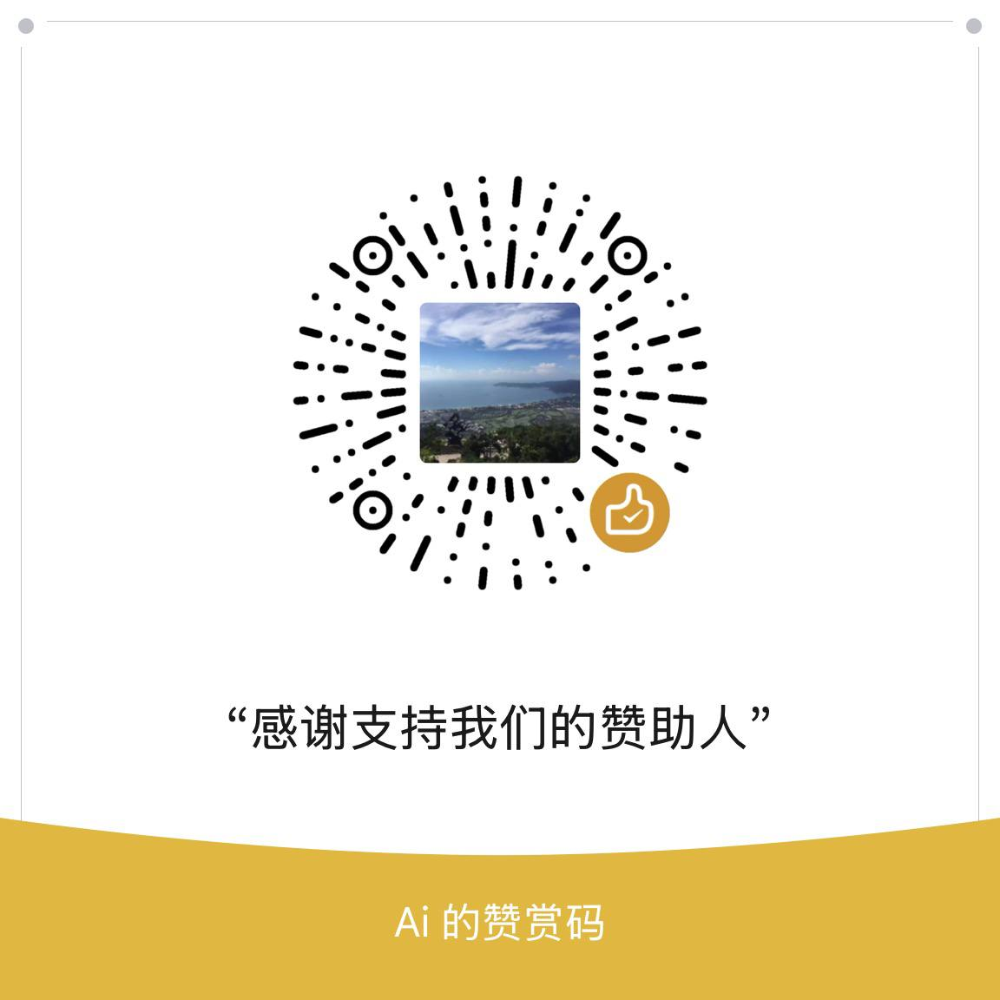

<p align="center">

</p>

# 电子书下载宝库


> **🌐 [在线访问](https://books.runsh.de)** - 体验强大的实时搜索功能和多关键字搜索，快速找到你想要的电子书！

欢迎来到电子书下载宝库，一个汇聚了各类电子书下载链接的地方。无论你是喜欢阅读经典文学、经管励志、终身学习、职场创业、技术手册还是其他类型的书籍，这里都能满足你的需求。
该库涵盖了帆书app(原樊登读书)、微信读书、京东读书、喜马拉雅等读书app的大部分电子书。

## 简介

我们从各个电子书网站上精心收集了各种电子书下载链接，并根据常用的标签对它们进行了简单分类。每本书都包括了三种常见格式文件：epub、mobi 和 azw3，以满足不同阅读设备和喜好的需求。

## 🔍 如何使用

浏览我们的下载宝库非常简单：

### 🌐 实时快速搜索（推荐）

**访问 [实时在线搜索页面](https://books.runsh.de)**，体验强大的实时快速搜索和多关键词搜索功能：

- **🔎 实时搜索**：输入书名、作者或分类关键词，即时显示匹配结果
- **💡 多关键词搜索**：支持同时搜索多个关键词（用空格分隔）


### 💡 搜索技巧
- **在线搜索**：访问 GitHub Pages 页面，使用实时搜索功能（推荐）
- **Ctrl+F**：在 GitHub 页面使用浏览器搜索功能
- **热门分类**：文学、历史、科普、管理、社会、推理等
- **按需查找**：职场、创业、技术、投资、心理学等专业领域

## ☕ 请我们喝咖啡

> **🌟 如果这个项目对你有帮助，欢迎请我们喝杯咖啡！你的支持是我们持续维护和更新这个项目的动力。**

<div align="center">



**感谢所有支持的朋友！**

</div>


# 📚 索引目录

> **💡 使用 Ctrl+F 快速搜索关键词，或点击下方标签直接进入分类页面**

## 🔥 热门分类

## 🔥 热门分类

- [科幻(959)](md/科幻.md)  | - [德国(953)](md/德国.md)  | - [漫画(926)](md/漫画.md)  | - [我想读这本书(921)](md/我想读这本书.md)  | - [海外中国研究(910)](md/海外中国研究.md)  | - [推理小说(908)](md/推理小说.md)  | - [绘本(896)](md/绘本.md)  | - [文化研究(875)](md/文化研究.md)
- [美国文学(874)](md/美国文学.md)  | - [诗歌(848)](md/诗歌.md)  | - [人类学(830)](md/人类学.md)  | - [英国文学(804)](md/英国文学.md)  | - [政治哲学(783)](md/政治哲学.md)  | - [爱情(781)](md/爱情.md)  | - [设计(765)](md/设计.md)  | - [物理(731)](md/物理.md)
- [军事(728)](md/军事.md)  | - [英文原版(720)](md/英文原版.md)  | - [古典文学(702)](md/古典文学.md)  | - [艺术史(696)](md/艺术史.md)  | - [国学(694)](md/国学.md)  | - [社会史(689)](md/社会史.md)  | - [编程(680)](md/编程.md)  | - [西方哲学(678)](md/西方哲学.md)
- [旅行(677)](md/旅行.md)  | - [中国近代史(673)](md/中国近代史.md)  | - [回忆录(652)](md/回忆录.md)  | - [建筑(640)](md/建筑.md)  | - [健康(637)](md/健康.md)  | - [个人管理(629)](md/个人管理.md)  | - [法学(627)](md/法学.md)  | - [经济史(612)](md/经济史.md)
- [思想(602)](md/思想.md)  | - [语言学(595)](md/语言学.md)  | - [自然(591)](md/自然.md)  | - [考古(589)](md/考古.md)  | - [学习(578)](md/学习.md)  | - [日系推理(574)](md/日系推理.md)  | - [短篇小说(573)](md/短篇小说.md)  | - [文化史(570)](md/文化史.md)
- [励志(570)](md/励志.md)  | - [奇幻(550)](md/奇幻.md)  | - [科幻小说(545)](md/科幻小说.md)  | - [英语(533)](md/英语.md)  | - [互联网(530)](md/互联网.md)  | - [台湾(520)](md/台湾.md)  | - [计算机科学(518)](md/计算机科学.md)  | - [文学研究(516)](md/文学研究.md)
- [文学理论(514)](md/文学理论.md)  | - [语言(506)](md/语言.md)  | - [二战(489)](md/二战.md)  | - [长篇小说(487)](md/长篇小说.md)  | - [电影(487)](md/电影.md)  | - [中国史(480)](md/中国史.md)  | - [游记(476)](md/游记.md)  | - [短篇集(472)](md/短篇集.md)
- [自我提升(464)](md/自我提升.md)  | - [法国文学(463)](md/法国文学.md)  | - [微信读书(463)](md/微信读书.md)  | - [欧洲史(461)](md/欧洲史.md)  | - [饮食(458)](md/饮食.md)  | - [人生(456)](md/人生.md)  | - [清史(455)](md/清史.md)  | - [生物(453)](md/生物.md)
- [美食(452)](md/美食.md)  | - [育儿(452)](md/育儿.md)  | - [散文随笔(452)](md/散文随笔.md)  | - [音乐(450)](md/音乐.md)  | - [个人成长(448)](md/个人成长.md)  | - [治愈(445)](md/治愈.md)  | - [儿童文学(445)](md/儿童文学.md)  | - [理财(421)](md/理财.md)
- [学术(417)](md/学术.md)  | - [佛教(411)](md/佛教.md)  | - [绘画(410)](md/绘画.md)  | - [民国(404)](md/民国.md)  | - [营销(403)](md/营销.md)  | - [战争(392)](md/战争.md)  | - [后浪(390)](md/后浪.md)  | - [摄影(388)](md/摄影.md)
- [写作(386)](md/写作.md)  | - [沟通(385)](md/沟通.md)  | - [生物学(384)](md/生物学.md)  | - [人文(378)](md/人文.md)  | - [股票(372)](md/股票.md)  | - [诗词(371)](md/诗词.md)  | - [明清史(366)](md/明清史.md)  | - [俄罗斯(365)](md/俄罗斯.md)
- [青春(358)](md/青春.md)  | - [历史学(355)](md/历史学.md)  | - [言情(348)](md/言情.md)  | - [中医(345)](md/中医.md)  | - [自然科学(345)](md/自然科学.md)  | - [科技(345)](md/科技.md)  | - [想读，一定很精彩！(345)](md/想读，一定很精彩！.md)  | - [意大利(344)](md/意大利.md)
- [物理学(344)](md/物理学.md)  | - [诗(342)](md/诗.md)  | - [社会科学(336)](md/社会科学.md)  | - [宋史(335)](md/宋史.md)  | - [马克思主义(335)](md/马克思主义.md)  | - [美学(332)](md/美学.md)  | - [城市(330)](md/城市.md)  | - [投资理财(329)](md/投资理财.md)
- [女性主义(329)](md/女性主义.md)  | - [创业(321)](md/创业.md)  | - [英文(317)](md/英文.md)  | - [古希腊(312)](md/古希腊.md)  | - [国际关系(312)](md/国际关系.md)  | - [明史(309)](md/明史.md)  | - [世界历史(303)](md/世界历史.md)  | - [日本推理(302)](md/日本推理.md)
- [台版(297)](md/台版.md)  | - [欧洲(297)](md/欧洲.md)  | - [精神分析(294)](md/精神分析.md)  | - [理想国(291)](md/理想国.md)  | - [新增(288)](md/新增.md)  | - [佛学(285)](md/佛学.md)  | - [人工智能(281)](md/人工智能.md)  | - [考古学(278)](md/考古学.md)
- [基督教(278)](md/基督教.md)  | - [自传(273)](md/自传.md)  | - [当代文学(270)](md/当代文学.md)  | - [人物(269)](md/人物.md)  | - [灵修(268)](md/灵修.md)  | - [短篇(267)](md/短篇.md)  | - [犯罪(266)](md/犯罪.md)  | - [文学评论(264)](md/文学评论.md)
- [政治史(261)](md/政治史.md)  | - [戏剧(260)](md/戏剧.md)  | - [科学史(260)](md/科学史.md)  | - [古籍(257)](md/古籍.md)  | - [逻辑(257)](md/逻辑.md)  | - [神话(257)](md/神话.md)  | - [认知(255)](md/认知.md)  | - [技术(253)](md/技术.md)
- [心灵(252)](md/心灵.md)  | - [管理学(251)](md/管理学.md)  | - [中国古代史(248)](md/中国古代史.md)  | - [入门(246)](md/入门.md)  | - [中国古典文学(246)](md/中国古典文学.md)  | - [苏联(245)](md/苏联.md)  | - [军事史(245)](md/军事史.md)  | - [史料(244)](md/史料.md)
- [艺术理论(242)](md/艺术理论.md)  | - [童书(242)](md/童书.md)  | - [读书(240)](md/读书.md)  | - [人性(237)](md/人性.md)  | - [魏晋南北朝(237)](md/魏晋南北朝.md)  | - [理论(235)](md/理论.md)  | - [杂文(229)](md/杂文.md)  | - [历史文化(227)](md/历史文化.md)
- [工业技术(227)](md/工业技术.md)  | - [美术(226)](md/美术.md)  | - [文献学(223)](md/文献学.md)  | - [童话(223)](md/童话.md)  | - [学术史(221)](md/学术史.md)  | - [纪实文学(220)](md/纪实文学.md)  | - [传播学(219)](md/传播学.md)  | - [心理咨询(219)](md/心理咨询.md)
- [经管(219)](md/经管.md)  | - [晚清(217)](md/晚清.md)  | - [考研(216)](md/考研.md)  | - [阅读(216)](md/阅读.md)  | - [学习方法(214)](md/学习方法.md)  | - [中国哲学(213)](md/中国哲学.md)  | - [专业(213)](md/专业.md)  | - [中国研究(212)](md/中国研究.md)
- [英语学习(211)](md/英语学习.md)  | - [天文(211)](md/天文.md)  | - [思考(210)](md/思考.md)  | - [民俗(208)](md/民俗.md)  | - [动物(208)](md/动物.md)  | - [韩国(207)](md/韩国.md)  | - [kindle(207)](md/kindle.md)  | - [日本史(206)](md/日本史.md)
- [情感(206)](md/情感.md)  | - [数据分析(203)](md/数据分析.md)  | - [政治经济学(203)](md/政治经济学.md)  | - [秦汉史(203)](md/秦汉史.md)  | - [知识分子(202)](md/知识分子.md)  | - [先秦史(201)](md/先秦史.md)  | - [@译本(200)](md/@译本.md)  | - [香港(199)](md/香港.md)
- [博物(198)](md/博物.md)  | - [宇宙(197)](md/宇宙.md)  | - [科学哲学(195)](md/科学哲学.md)  | - [隋唐史(193)](md/隋唐史.md)  | - [中世纪(192)](md/中世纪.md)  | - [历史地理(190)](md/历史地理.md)  | - [养生(190)](md/养生.md)  | - [印度(190)](md/印度.md)
- [脑科学(186)](md/脑科学.md)  | - [短篇小说集(186)](md/短篇小说集.md)  | - [伦理学(183)](md/伦理学.md)  | - [体育(181)](md/体育.md)  | - [温暖(181)](md/温暖.md)  | - [每天听本书(181)](md/每天听本书.md)  | - [当当(181)](md/当当.md)  | - [文学史(179)](md/文学史.md)
- [文艺理论(179)](md/文艺理论.md)  | - [统计学(179)](md/统计学.md)  | - [午夜文库(178)](md/午夜文库.md)  | - [交易(178)](md/交易.md)  | - [历史小说(177)](md/历史小说.md)  | - [神学(176)](md/神学.md)  | - [武侠(176)](md/武侠.md)  | - [新经济(174)](md/新经济.md)
- [未知(173)](md/未知.md)  | - [研究方法(173)](md/研究方法.md)  | - [社会理论(173)](md/社会理论.md)  | - [统计(172)](md/统计.md)  | - [甲骨文丛书(171)](md/甲骨文丛书.md)  | - [甲骨文(171)](md/甲骨文.md)  | - [认知科学(170)](md/认知科学.md)  | - [儿童(167)](md/儿童.md)
- [修行(165)](md/修行.md)  | - [软件开发(165)](md/软件开发.md)  | - [新书记(165)](md/新书记.md)  | - [翻译(162)](md/翻译.md)  | - [文学批评(162)](md/文学批评.md)  | - [名著(162)](md/名著.md)  | - [现象学(161)](md/现象学.md)  | - [进化(161)](md/进化.md)
- [中国当代文学(159)](md/中国当代文学.md)  | - [工作(159)](md/工作.md)  | - [Programming(158)](md/Programming.md)  | - [魏晋南北朝史(157)](md/魏晋南北朝史.md)  | - [心理治疗(157)](md/心理治疗.md)  | - [民国史(157)](md/民国史.md)  | - [古罗马(157)](md/古罗马.md)  | - [德国文学(156)](md/德国文学.md)
- [经学(156)](md/经学.md)  | - [诗集(156)](md/诗集.md)  | - [思维方式(156)](md/思维方式.md)  | - [神秘学(156)](md/神秘学.md)  | - [Python(155)](md/Python.md)  | - [运动(154)](md/运动.md)  | - [化学(154)](md/化学.md)  | - [古典学(153)](md/古典学.md)
- [画册(152)](md/画册.md)  | - [古典(152)](md/古典.md)  | - [植物(151)](md/植物.md)  | - [国际政治(151)](md/国际政治.md)  | - [游戏(150)](md/游戏.md)  | - [近现代史(150)](md/近现代史.md)  | - [现当代文学(149)](md/现当代文学.md)  | - [马克思(148)](md/马克思.md)
- [美国史(148)](md/美国史.md)  | - [制度史(148)](md/制度史.md)  | - [日语(147)](md/日语.md)  | - [时间管理(147)](md/时间管理.md)  | - [逻辑学(147)](md/逻辑学.md)  | - [方法(147)](md/方法.md)  | - [哲学史(147)](md/哲学史.md)  | - [日本文化(146)](md/日本文化.md)
- [汉学(146)](md/汉学.md)  | - [中国现当代文学(146)](md/中国现当代文学.md)  | - [藏书(146)](md/藏书.md)  | - [中华书局(145)](md/中华书局.md)  | - [健身(145)](md/健身.md)  | - [加拿大(145)](md/加拿大.md)  | - [战争史(144)](md/战争史.md)  | - [教科书(144)](md/教科书.md)
- [建筑理论(143)](md/建筑理论.md)  | - [网络小说(143)](md/网络小说.md)  | - [城市史(142)](md/城市史.md)  | - [AI(142)](md/AI.md)  | - [性别研究(141)](md/性别研究.md)  | - [神经科学(141)](md/神经科学.md)  | - [机器学习(140)](md/机器学习.md)  | - [欧美推理(140)](md/欧美推理.md)
- [马克思主义及其研究(140)](md/马克思主义及其研究.md)  | - [生命(139)](md/生命.md)  | - [电影理论(139)](md/电影理论.md)  | - [访谈(139)](md/访谈.md)  | - [程序设计(139)](md/程序设计.md)  | - [儿童教育(139)](md/儿童教育.md)  | - [_上海译文出版社_(138)](md/_上海译文出版社_.md)  | - [性(137)](md/性.md)
- [现代文学(136)](md/现代文学.md)  | - [拉美(136)](md/拉美.md)  | - [西藏(136)](md/西藏.md)  | - [战略(136)](md/战略.md)  | - [史学理论(135)](md/史学理论.md)  | - [明清(135)](md/明清.md)  | - [英国史(135)](md/英国史.md)  | - [教育学(134)](md/教育学.md)
- [价值投资(134)](md/价值投资.md)  | - [俄罗斯文学(133)](md/俄罗斯文学.md)  | - [创新(133)](md/创新.md)  | - [算法(133)](md/算法.md)  | - [想读(133)](md/想读.md)  | - [未来(131)](md/未来.md)  | - [轻小说(131)](md/轻小说.md)  | - [有趣(131)](md/有趣.md)
- [诺贝尔文学奖(131)](md/诺贝尔文学奖.md)  | - [企业管理(131)](md/企业管理.md)  | - [社交(130)](md/社交.md)  | - [文论(130)](md/文论.md)  | - [社会心理学(129)](md/社会心理学.md)  | - [商务印书馆(129)](md/商务印书馆.md)  | - [自由主义(128)](md/自由主义.md)  | - [软件工程(128)](md/软件工程.md)
- [日本研究(126)](md/日本研究.md)  | - [中东(126)](md/中东.md)  | - [民俗学(126)](md/民俗学.md)  | - [网络生活(126)](md/网络生活.md)  | - [家庭(125)](md/家庭.md)  | - [港台版(124)](md/港台版.md)  | - [罗马(124)](md/罗马.md)  | - [天文学(122)](md/天文学.md)
- [金融学(122)](md/金融学.md)  | - [文革(122)](md/文革.md)  | - [希腊(121)](md/希腊.md)  | - [建筑设计(121)](md/建筑设计.md)  | - [东野圭吾(121)](md/东野圭吾.md)  | - [通识(121)](md/通识.md)  | - [画集(121)](md/画集.md)  | - [IT(121)](md/IT.md)
- [道家(120)](md/道家.md)  | - [现代性(120)](md/现代性.md)  | - [道教(120)](md/道教.md)  | - [进化论(120)](md/进化论.md)  | - [明朝(120)](md/明朝.md)  | - [家庭教育(119)](md/家庭教育.md)  | - [领导力(118)](md/领导力.md)  | - [医药(118)](md/医药.md)
- [建筑史(118)](md/建筑史.md)  | - [日记(118)](md/日记.md)  | - [_北京·中信出版社_(118)](md/_北京·中信出版社_.md)  | - [民族史(118)](md/民族史.md)  | - [日本汉学(117)](md/日本汉学.md)  | - [侦探(117)](md/侦探.md)  | - [新星出版社(117)](md/新星出版社.md)  | - [akb(117)](md/akb.md)
- [古代史(116)](md/古代史.md)  | - [三国(116)](md/三国.md)  | - [文集(116)](md/文集.md)  | - [科技史(115)](md/科技史.md)  | - [实用(115)](md/实用.md)  | - [微信(115)](md/微信.md)  | - [企业(115)](md/企业.md)  | - [pdf(115)](md/pdf.md)
- [Java(114)](md/Java.md)  | - [译文纪实(114)](md/译文纪实.md)  | - [宋(114)](md/宋.md)  | - [销售(113)](md/销售.md)  | - [货币(113)](md/货币.md)  | - [两性(112)](md/两性.md)  | - [西域(112)](md/西域.md)  | - [电子书站(112)](md/电子书站.md)
- [治愈系(111)](md/治愈系.md)  | - [外国小说(111)](md/外国小说.md)  | - [史学(111)](md/史学.md)  | - [图鉴(110)](md/图鉴.md)  | - [运营(110)](md/运营.md)  | - [信仰(109)](md/信仰.md)  | - [笔记(109)](md/笔记.md)  | - [故事(109)](md/故事.md)
- [魔幻(107)](md/魔幻.md)  | - [杂书(106)](md/杂书.md)  | - [全球史(106)](md/全球史.md)  | - [党史(106)](md/党史.md)  | - [财务(106)](md/财务.md)  | - [法理学(106)](md/法理学.md)  | - [情绪(106)](md/情绪.md)  | - [奥地利(105)](md/奥地利.md)
- [心灵成长(105)](md/心灵成长.md)  | - [自我完善(105)](md/自我完善.md)  | - [math(105)](md/math.md)  | - [中古史(105)](md/中古史.md)  | - [epub(104)](md/epub.md)  | - [俄国(104)](md/俄国.md)  | - [投资交易(104)](md/投资交易.md)  | - [上海(104)](md/上海.md)
- [环境史(104)](md/环境史.md)  | - [海外汉学(103)](md/海外汉学.md)  | - [博物学(103)](md/博物学.md)  | - [正能量(103)](md/正能量.md)  | - [幽默(103)](md/幽默.md)  | - [产品(103)](md/产品.md)  | - [俄国文学(103)](md/俄国文学.md)  | - [中信出版社(102)](md/中信出版社.md)
- [文物(102)](md/文物.md)  | - [儒学(102)](md/儒学.md)  | - [中国文化(101)](md/中国文化.md)  | - [博物馆(101)](md/博物馆.md)  | - [意大利文学(101)](md/意大利文学.md)  | - [科学人文(101)](md/科学人文.md)  | - [得到(100)](md/得到.md)  | - [以色列(100)](md/以色列.md)
- [语法(100)](md/语法.md)  | - [蒙古(100)](md/蒙古.md)  | - [大数据(100)](md/大数据.md)  | - [恐怖(100)](md/恐怖.md)  | - [法律史(100)](md/法律史.md)  | - [经济金融(99)](md/经济金融.md)  | - [悬疑推理(98)](md/悬疑推理.md)  | - [台湾文学(98)](md/台湾文学.md)
- [繁体(98)](md/繁体.md)  | - [中国近现代史(97)](md/中国近现代史.md)  | - [唐史(97)](md/唐史.md)  | - [书信(97)](md/书信.md)  | - [_北京·商务印书馆_(97)](md/_北京·商务印书馆_.md)  | - [投机(96)](md/投机.md)  | - [心理咨询与治疗(96)](md/心理咨询与治疗.md)  | - [死亡(96)](md/死亡.md)
- [存在主义(96)](md/存在主义.md)  | - [杂志(96)](md/杂志.md)  | - [财经(95)](md/财经.md)  | - [惊悚(95)](md/惊悚.md)  | - [资本主义(95)](md/资本主义.md)  | - [城市研究(95)](md/城市研究.md)  | - [民族(95)](md/民族.md)  | - [澳大利亚(94)](md/澳大利亚.md)
- [卫生(94)](md/卫生.md)  | - [日语学习(94)](md/日语学习.md)  | - [课本(94)](md/课本.md)  | - [婚姻(93)](md/婚姻.md)  | - [传统文化(93)](md/传统文化.md)  | - [红楼梦(93)](md/红楼梦.md)  | - [当代(93)](md/当代.md)  | - [CS(93)](md/CS.md)
- [Linux(93)](md/Linux.md)  | - [德国古典哲学(93)](md/德国古典哲学.md)  | - [神话学(93)](md/神话学.md)  | - [文艺(93)](md/文艺.md)  | - [爱尔兰(93)](md/爱尔兰.md)  | - [黑格尔(92)](md/黑格尔.md)  | - [比较政治(92)](md/比较政治.md)  | - [人际关系(92)](md/人际关系.md)
- [地理学(92)](md/地理学.md)  | - [美漫(91)](md/美漫.md)  | - [易学(91)](md/易学.md)  | - [汉语(91)](md/汉语.md)  | - [剧本(91)](md/剧本.md)  | - [清朝(91)](md/清朝.md)  | - [苏俄文学(91)](md/苏俄文学.md)  | - [旅游(91)](md/旅游.md)
- [蒙元史(90)](md/蒙元史.md)  | - [苏俄(90)](md/苏俄.md)  | - [音韵学(89)](md/音韵学.md)  | - [论文(89)](md/论文.md)  | - [Mathematics(89)](md/Mathematics.md)  | - [食物(89)](md/食物.md)  | - [韩国文学(89)](md/韩国文学.md)  | - [中国政治(89)](md/中国政治.md)
- [教程(89)](md/教程.md)  | - [美术史(89)](md/美术史.md)  | - [先秦(88)](md/先秦.md)  | - [德语文学(88)](md/德语文学.md)  | - [产品经理(88)](md/产品经理.md)  | - [海德格尔(87)](md/海德格尔.md)  | - [饮食文化(87)](md/饮食文化.md)  | - [非洲(86)](md/非洲.md)
- [古代文学(86)](md/古代文学.md)  | - [人文社科(86)](md/人文社科.md)  | - [词汇(86)](md/词汇.md)  | - [美国研究(86)](md/美国研究.md)  | - [悬疑小说(86)](md/悬疑小说.md)  | - [伊斯兰(85)](md/伊斯兰.md)  | - [清代(85)](md/清代.md)  | - [证券(85)](md/证券.md)
- [宋代(85)](md/宋代.md)  | - [荷兰(84)](md/荷兰.md)  | - [三联(84)](md/三联.md)  | - [分析哲学(84)](md/分析哲学.md)  | - [身体(84)](md/身体.md)  | - [时尚(84)](md/时尚.md)  | - [分析(84)](md/分析.md)  | - [鸡汤(84)](md/鸡汤.md)
- [瑞典(83)](md/瑞典.md)  | - [毛姆(83)](md/毛姆.md)  | - [北京(83)](md/北京.md)  | - [童年(83)](md/童年.md)  | - [未藏(83)](md/未藏.md)  | - [网络(83)](md/网络.md)  | - [经典与解释(82)](md/经典与解释.md)  | - [青春文学(82)](md/青春文学.md)
- [通史(82)](md/通史.md)  | - [（港台版）(82)](md/（港台版）.md)  | - [宗教学(82)](md/宗教学.md)  | - [大学教材(82)](md/大学教材.md)  | - [亲密关系(82)](md/亲密关系.md)  | - [记忆(82)](md/记忆.md)  | - [法国史(82)](md/法国史.md)  | - [值得一读(82)](md/值得一读.md)
- [歐美(81)](md/歐美.md)  | - [民主(81)](md/民主.md)  | - [好书(81)](md/好书.md)  | - [知识(81)](md/知识.md)  | - [design(81)](md/design.md)  | - [建筑学(81)](md/建筑学.md)  | - [尼采(80)](md/尼采.md)  | - [湛庐文化(80)](md/湛庐文化.md)
- [创意(80)](md/创意.md)  | - [医疗(80)](md/医疗.md)  | - [鲁迅(80)](md/鲁迅.md)  | - [玄幻(80)](md/玄幻.md)  | - [广告(80)](md/广告.md)  | - [psychology(80)](md/psychology.md)  | - [數學(80)](md/數學.md)  | - [新闻传播(79)](md/新闻传播.md)
- [隋唐(79)](md/隋唐.md)  | - [樊登读书会(79)](md/樊登读书会.md)  | - [数学分析(79)](md/数学分析.md)  | - [现代(79)](md/现代.md)  | - [环境(78)](md/环境.md)  | - [电子(78)](md/电子.md)  | - [效率(78)](md/效率.md)  | - [德国史(78)](md/德国史.md)
- [后现代(78)](md/后现代.md)  | - [国产推理(78)](md/国产推理.md)  | - [性学(78)](md/性学.md)  | - [革命(78)](md/革命.md)  | - [philosophy(77)](md/philosophy.md)  | - [民法(77)](md/民法.md)  | - [插画(77)](md/插画.md)  | - [当当读书(77)](md/当当读书.md)
- [百科(77)](md/百科.md)  | - [食谱(77)](md/食谱.md)  | - [文字(77)](md/文字.md)  | - [原版(77)](md/原版.md)  | - [古代(77)](md/古代.md)  | - [医疗史(76)](md/医疗史.md)  | - [读客(76)](md/读客.md)  | - [灵性(76)](md/灵性.md)
- [间谍(76)](md/间谍.md)  | - [财富(76)](md/财富.md)  | - [冷战(76)](md/冷战.md)  | - [评论(76)](md/评论.md)  | - [书法(75)](md/书法.md)  | - [新闻(75)](md/新闻.md)  | - [近现代(75)](md/近现代.md)  | - [周易(75)](md/周易.md)
- [量子力学(75)](md/量子力学.md)  | - [村上春树(75)](md/村上春树.md)  | - [未读(75)](md/未读.md)  | - [基因(75)](md/基因.md)  | - [近代(74)](md/近代.md)  | - [英文版(74)](md/英文版.md)  | - [符号学(74)](md/符号学.md)  | - [决策(74)](md/决策.md)
- [文明(74)](md/文明.md)  | - [大陆(74)](md/大陆.md)  | - [工具(74)](md/工具.md)  | - [明代(74)](md/明代.md)  | - [柏拉图(74)](md/柏拉图.md)  | - [日本語(74)](md/日本語.md)  | - [上海译文出版社(73)](md/上海译文出版社.md)  | - [大学(73)](md/大学.md)
- [猫(73)](md/猫.md)  | - [哲學(73)](md/哲學.md)  | - [中亚(72)](md/中亚.md)  | - [考试(72)](md/考试.md)  | - [@台版(72)](md/@台版.md)  | - [语言学习(72)](md/语言学习.md)  | - [阿银荐读(72)](md/阿银荐读.md)  | - [数据挖掘(72)](md/数据挖掘.md)
- [金融投资(71)](md/金融投资.md)  | - [古典音乐(71)](md/古典音乐.md)  | - [Architecture(71)](md/Architecture.md)  | - [奇怪的东西(71)](md/奇怪的东西.md)  | - [电子版(71)](md/电子版.md)  | - [论文集(70)](md/论文集.md)  | - [广西师范大学出版社(70)](md/广西师范大学出版社.md)  | - [法哲学(70)](md/法哲学.md)
- [图书馆(70)](md/图书馆.md)  | - [二战史(70)](md/二战史.md)  | - [时间(70)](md/时间.md)  | - [手绘(70)](md/手绘.md)  | - [传媒(70)](md/传媒.md)  | - [禅(69)](md/禅.md)  | - [唐朝(69)](md/唐朝.md)  | - [城市规划(69)](md/城市规划.md)
- [法国哲学(69)](md/法国哲学.md)  | - [生命科学(69)](md/生命科学.md)  | - [Economics(69)](md/Economics.md)  | - [宋朝(69)](md/宋朝.md)  | - [马克思主义哲学(69)](md/马克思主义哲学.md)  | - [古言(69)](md/古言.md)  | - [波兰(69)](md/波兰.md)  | - [玄学(69)](md/玄学.md)
- [历史思考(69)](md/历史思考.md)  | - [词典(68)](md/词典.md)  | - [侦探小说(68)](md/侦探小说.md)  | - [必读(68)](md/必读.md)  | - [书(68)](md/书.md)  | - [西方马克思主义(68)](md/西方马克思主义.md)  | - [中国经济(68)](md/中国经济.md)  | - [挪威(68)](md/挪威.md)
- [文艺复兴(68)](md/文艺复兴.md)  | - [技术分析(68)](md/技术分析.md)  | - [积极心理学(68)](md/积极心理学.md)  | - [术数(68)](md/术数.md)  | - [秦汉(67)](md/秦汉.md)  | - [道德哲学(67)](md/道德哲学.md)  | - [阿根廷(67)](md/阿根廷.md)  | - [架构(67)](md/架构.md)
- [游戏开发(67)](md/游戏开发.md)  | - [传播(67)](md/传播.md)  | - [牛津通识读本(67)](md/牛津通识读本.md)  | - [français(67)](md/français.md)  | - [爱(67)](md/爱.md)  | - [海军(67)](md/海军.md)  | - [职业规划(67)](md/职业规划.md)  | - [理学(66)](md/理学.md)
- [烹饪(66)](md/烹饪.md)  | - [专业书(66)](md/专业书.md)  | - [WEB(66)](md/WEB.md)  | - [通俗(66)](md/通俗.md)  | - [海洋史(66)](md/海洋史.md)  | - [边疆史(66)](md/边疆史.md)  | - [史学史(66)](md/史学史.md)  | - [日本漫画(65)](md/日本漫画.md)
- [C++(65)](md/C++.md)  | - [古文字(65)](md/古文字.md)  | - [当代中国(65)](md/当代中国.md)  | - [空间(65)](md/空间.md)  | - [探险(65)](md/探险.md)  | - [民族志(65)](md/民族志.md)  | - [操作系统(65)](md/操作系统.md)  | - [虚构(65)](md/虚构.md)
- [东南亚(65)](md/东南亚.md)  | - [欧美漫画(64)](md/欧美漫画.md)  | - [女权(64)](md/女权.md)  | - [辞典(64)](md/辞典.md)  | - [藏传佛教(64)](md/藏传佛教.md)  | - [生活方式(64)](md/生活方式.md)  | - [戏曲(64)](md/戏曲.md)  | - [博弈论(64)](md/博弈论.md)
- [数据(64)](md/数据.md)  | - [产品设计(64)](md/产品设计.md)  | - [汗青堂(64)](md/汗青堂.md)  | - [反乌托邦(63)](md/反乌托邦.md)  | - [语文(63)](md/语文.md)  | - [政治社会学(63)](md/政治社会学.md)  | - [物理學(63)](md/物理學.md)  | - [奇幻小说(63)](md/奇幻小说.md)
- [社會學(63)](md/社會學.md)  | - [研究(63)](md/研究.md)  | - [全球化(63)](md/全球化.md)  | - [演讲(63)](md/演讲.md)  | - [莎士比亚(63)](md/莎士比亚.md)  | - [文字学(63)](md/文字学.md)  | - [唐诗(63)](md/唐诗.md)  | - [深度学习(63)](md/深度学习.md)
- [外交(62)](md/外交.md)  | - [亲子(62)](md/亲子.md)  | - [新疆(62)](md/新疆.md)  | - [武侠小说(62)](md/武侠小说.md)  | - [行为经济学(62)](md/行为经济学.md)  | - [福柯(62)](md/福柯.md)  | - [温情(62)](md/温情.md)  | - [犹太(62)](md/犹太.md)
- [营养学(62)](md/营养学.md)  | - [官场(62)](md/官场.md)  | - [诸子(62)](md/诸子.md)  | - [港台(61)](md/港台.md)  | - [心理學(61)](md/心理學.md)  | - [小說(61)](md/小說.md)  | - [抑郁症(61)](md/抑郁症.md)  | - [用户体验(61)](md/用户体验.md)
- [一战(61)](md/一战.md)  | - [身心灵(61)](md/身心灵.md)  | - [交互设计(61)](md/交互设计.md)  | - [纸质书(61)](md/纸质书.md)  | - [理想国译丛(61)](md/理想国译丛.md)  | - [电气(60)](md/电气.md)  | - [爱尔兰文学(60)](md/爱尔兰文学.md)  | - [社会科学文献出版社(60)](md/社会科学文献出版社.md)
- [其他(60)](md/其他.md)  | - [西学(60)](md/西学.md)  | - [中国古代文学(60)](md/中国古代文学.md)  | - [地图(60)](md/地图.md)  | - [比较文学(60)](md/比较文学.md)  | - [量化(60)](md/量化.md)  | - [金融史(60)](md/金融史.md)  | - [论文写作(60)](md/论文写作.md)
- [科研(60)](md/科研.md)  | - [德国哲学(60)](md/德国哲学.md)  | - [古建筑(59)](md/古建筑.md)  | - [罗马史(59)](md/罗马史.md)  | - [艺术史书单(59)](md/艺术史书单.md)  | - [抗战(59)](md/抗战.md)  | - [搞笑(59)](md/搞笑.md)  | - [技能(59)](md/技能.md)
- [自由(59)](md/自由.md)  | - [科学技术(59)](md/科学技术.md)  | - [农村(59)](md/农村.md)  | - [当代艺术(59)](md/当代艺术.md)  | - [人民文学出版社(59)](md/人民文学出版社.md)  | - [服饰(59)](md/服饰.md)  | - [多看阅读(58)](md/多看阅读.md)  | - [目录学(58)](md/目录学.md)
- [性别(58)](md/性别.md)  | - [市场营销(58)](md/市场营销.md)  | - [疗愈(58)](md/疗愈.md)  | - [编剧(58)](md/编剧.md)  | - [王阳明(58)](md/王阳明.md)  | - [宪政(58)](md/宪政.md)  | - [诗学(58)](md/诗学.md)  | - [海洋(58)](md/海洋.md)
- [出土文献(58)](md/出土文献.md)  | - [人力资源(58)](md/人力资源.md)  | - [新文化史(58)](md/新文化史.md)  | - [語言學(57)](md/語言學.md)  | - [金庸(57)](md/金庸.md)  | - [闲书(57)](md/闲书.md)  | - [通信(57)](md/通信.md)  | - [无用(57)](md/无用.md)
- [文献(57)](md/文献.md)  | - [数据库(57)](md/数据库.md)  | - [康德(57)](md/康德.md)  | - [认知心理学(57)](md/认知心理学.md)  | - [译林出版社(57)](md/译林出版社.md)  | - [西班牙文学(57)](md/西班牙文学.md)  | - [欧洲研究(57)](md/欧洲研究.md)  | - [访谈录(57)](md/访谈录.md)
- [日本小说(57)](md/日本小说.md)  | - [平面设计(56)](md/平面设计.md)  | - [墓葬(56)](md/墓葬.md)  | - [医学史(56)](md/医学史.md)  | - [非小说(56)](md/非小说.md)  | - [生态(56)](md/生态.md)  | - [代数(56)](md/代数.md)  | - [中共党史(55)](md/中共党史.md)
- [女权主义(55)](md/女权主义.md)  | - [DC(55)](md/DC.md)  | - [历史与记忆(55)](md/历史与记忆.md)  | - [mobi(55)](md/mobi.md)  | - [易经(55)](md/易经.md)  | - [敦煌(55)](md/敦煌.md)  | - [艺术设计(55)](md/艺术设计.md)  | - [资料(54)](md/资料.md)
- [文獻學(54)](md/文獻學.md)  | - [哲学入门(54)](md/哲学入门.md)  | - [社会经济史(54)](md/社会经济史.md)  | - [JavaScript(54)](md/JavaScript.md)  | - [History(54)](md/History.md)  | - [音频解读版(54)](md/音频解读版.md)  | - [校园(54)](md/校园.md)  | - [收藏(54)](md/收藏.md)
- [新经典文库(54)](md/新经典文库.md)  | - [埃及(54)](md/埃及.md)  | - [法医(54)](md/法医.md)  | - [唐代(53)](md/唐代.md)  | - [计算科学(53)](md/计算科学.md)  | - [大脑(53)](md/大脑.md)  | - [法语(53)](md/法语.md)  | - [加缪(53)](md/加缪.md)
- [微积分(53)](md/微积分.md)  | - [组织(53)](md/组织.md)  | - [方言(53)](md/方言.md)  | - [法理(53)](md/法理.md)  | - [会计(53)](md/会计.md)  | - [北欧(53)](md/北欧.md)  | - [亲情(53)](md/亲情.md)  | - [志怪(53)](md/志怪.md)
- [移民(52)](md/移民.md)  | - [影视(52)](md/影视.md)  | - [读库(52)](md/读库.md)  | - [职业(52)](md/职业.md)  | - [土耳其(52)](md/土耳其.md)  | - [很值得推荐的一本书(52)](md/很值得推荐的一本书.md)  | - [台灣(52)](md/台灣.md)  | - [茅盾文学奖(52)](md/茅盾文学奖.md)
- [安全(52)](md/安全.md)  | - [中国推理(52)](md/中国推理.md)  | - [项目管理(52)](md/项目管理.md)  | - [电影研究(52)](md/电影研究.md)  | - [导读(52)](md/导读.md)  | - [荣格(52)](md/荣格.md)  | - [情绪管理(52)](md/情绪管理.md)  | - [法兰克福学派(52)](md/法兰克福学派.md)
- [隋唐五代(52)](md/隋唐五代.md)  | - [几何(51)](md/几何.md)  | - [中信(51)](md/中信.md)  | - [口述史(51)](md/口述史.md)  | - [情商(51)](md/情商.md)  | - [长知识了(51)](md/长知识了.md)  | - [法国大革命(51)](md/法国大革命.md)  | - [漫画绘本(51)](md/漫画绘本.md)
- [外语(51)](md/外语.md)  | - [批判性思维(51)](md/批判性思维.md)  | - [历史哲学(51)](md/历史哲学.md)  | - [数学文化(50)](md/数学文化.md)  | - [谍战(50)](md/谍战.md)  | - [德语(50)](md/德语.md)  | - [巴菲特(50)](md/巴菲特.md)  | - [教学(50)](md/教学.md)
- [简帛(50)](md/简帛.md)  | - [结构(49)](md/结构.md)  | - [晚清史(49)](md/晚清史.md)  | - [旅行文学(49)](md/旅行文学.md)  | - [庄子(49)](md/庄子.md)  | - [魔幻现实主义(49)](md/魔幻现实主义.md)  | - [佛法(49)](md/佛法.md)  | - [营养(49)](md/营养.md)
- [图像小说(48)](md/图像小说.md)  | - [儒家(48)](md/儒家.md)  | - [yy(48)](md/yy.md)  | - [阿拉伯(48)](md/阿拉伯.md)  | - [經學(48)](md/經學.md)  | - [全集(48)](md/全集.md)  | - [已下(48)](md/已下.md)  | - [Sociology(48)](md/Sociology.md)
- [写真(48)](md/写真.md)  | - [外交史(48)](md/外交史.md)  | - [认知精进(48)](md/认知精进.md)  | - [Finance(48)](md/Finance.md)  | - [现代哲学(48)](md/现代哲学.md)  | - [改革(48)](md/改革.md)  | - [待购(48)](md/待购.md)  | - [灵异(48)](md/灵异.md)
- [_北京大学出版社_(48)](md/_北京大学出版社_.md)  | - [西方(48)](md/西方.md)  | - [华为(47)](md/华为.md)  | - [机械(47)](md/机械.md)  | - [東野圭吾(47)](md/東野圭吾.md)  | - [陀思妥耶夫斯基(47)](md/陀思妥耶夫斯基.md)  | - [都市文学(47)](md/都市文学.md)  | - [科普读物(47)](md/科普读物.md)
- [演化(47)](md/演化.md)  | - [穿越(47)](md/穿越.md)  | - [中國史(47)](md/中國史.md)  | - [中国现代文学(47)](md/中国现代文学.md)  | - [编程语言(47)](md/编程语言.md)  | - [西方哲學(47)](md/西方哲學.md)  | - [书籍(47)](md/书籍.md)  | - [世界(47)](md/世界.md)
- [分布式(47)](md/分布式.md)  | - [数学史(46)](md/数学史.md)  | - [好(46)](md/好.md)  | - [刑法(46)](md/刑法.md)  | - [天津(46)](md/天津.md)  | - [佛教史(46)](md/佛教史.md)  | - [自媒体(46)](md/自媒体.md)  | - [咖啡(46)](md/咖啡.md)
- [朝鲜(46)](md/朝鲜.md)  | - [eLibrary(46)](md/eLibrary.md)  | - [fiction(46)](md/fiction.md)  | - [纸质(46)](md/纸质.md)  | - [计划(46)](md/计划.md)  | - [线性代数(46)](md/线性代数.md)  | - [曾国藩(46)](md/曾国藩.md)  | - [mook(46)](md/mook.md)
- [黑色幽默(46)](md/黑色幽默.md)  | - [意识流(46)](md/意识流.md)  | - [文學藝術(45)](md/文學藝術.md)  | - [思维方法(45)](md/思维方法.md)  | - [刑侦(45)](md/刑侦.md)  | - [ebook(45)](md/ebook.md)  | - [经营(45)](md/经营.md)  | - [幸福(45)](md/幸福.md)
- [_三联@北京_(45)](md/_三联@北京_.md)  | - [科技科技(45)](md/科技科技.md)  | - [民族学(45)](md/民族学.md)  | - [民族主义(45)](md/民族主义.md)  | - [园林(45)](md/园林.md)  | - [古希腊哲学(45)](md/古希腊哲学.md)  | - [书籍史(45)](md/书籍史.md)  | - [通俗读物(45)](md/通俗读物.md)
- [减肥(45)](md/减肥.md)  | - [新闻学(45)](md/新闻学.md)  | - [集(45)](md/集.md)  | - [图解(45)](md/图解.md)  | - [前端(45)](md/前端.md)  | - [红学(45)](md/红学.md)  | - [自然文学(45)](md/自然文学.md)  | - [料理(44)](md/料理.md)
- [繪本(44)](md/繪本.md)  | - [心智(44)](md/心智.md)  | - [Anthropology(44)](md/Anthropology.md)  | - [心理自助(44)](md/心理自助.md)  | - [藏学(44)](md/藏学.md)  | - [考据(44)](md/考据.md)  | - [趋势(44)](md/趋势.md)  | - [冷战史(44)](md/冷战史.md)
- [智慧(44)](md/智慧.md)  | - [摇滚(44)](md/摇滚.md)  | - [人体(44)](md/人体.md)  | - [文學(44)](md/文學.md)  | - [中国科幻(44)](md/中国科幻.md)  | - [出版(44)](md/出版.md)  | - [足球(44)](md/足球.md)  | - [家居(44)](md/家居.md)
- [财商(43)](md/财商.md)  | - [茶(43)](md/茶.md)  | - [航空(43)](md/航空.md)  | - [知日(43)](md/知日.md)  | - [工程(43)](md/工程.md)  | - [自我(43)](md/自我.md)  | - [（集）(43)](md/（集）.md)  | - [诗经(43)](md/诗经.md)
- [胡适(43)](md/胡适.md)  | - [新媒体(43)](md/新媒体.md)  | - [自然科学相关(43)](md/自然科学相关.md)  | - [音乐史(43)](md/音乐史.md)  | - [东亚(42)](md/东亚.md)  | - [动画(42)](md/动画.md)  | - [唐(42)](md/唐.md)  | - [DK(42)](md/DK.md)
- [认知神经科学(42)](md/认知神经科学.md)  | - [焦虑(42)](md/焦虑.md)  | - [材料(42)](md/材料.md)  | - [伟大的博物馆(42)](md/伟大的博物馆.md)  | - [孤独(42)](md/孤独.md)  | - [春秋(42)](md/春秋.md)  | - [莫言(42)](md/莫言.md)  | - [概率论(42)](md/概率论.md)
- [新译本(42)](md/新译本.md)  | - [画画(42)](md/画画.md)  | - [东亚史(42)](md/东亚史.md)  | - [新知文库(42)](md/新知文库.md)  | - [谈判(42)](md/谈判.md)  | - [文案(42)](md/文案.md)  | - [史诗(42)](md/史诗.md)  | - [后浪漫(42)](md/后浪漫.md)
- [黑客(41)](md/黑客.md)  | - [汽车(41)](md/汽车.md)  | - [波兰文学(41)](md/波兰文学.md)  | - [通俗易懂(41)](md/通俗易懂.md)  | - [瑞士(41)](md/瑞士.md)  | - [晋江(41)](md/晋江.md)  | - [禅宗(41)](md/禅宗.md)  | - [中国现代史(41)](md/中国现代史.md)
- [个人提升(41)](md/个人提升.md)  | - [社会主义(41)](md/社会主义.md)  | - [丝绸之路(41)](md/丝绸之路.md)  | - [长篇(41)](md/长篇.md)  | - [美國(41)](md/美國.md)  | - [环保(41)](md/环保.md)  | - [区块链(41)](md/区块链.md)  | - [蒙古史(41)](md/蒙古史.md)
- [心学(41)](md/心学.md)  | - [软件(40)](md/软件.md)  | - [法律史与法律文化(40)](md/法律史与法律文化.md)  | - [心灵哲学(40)](md/心灵哲学.md)  | - [梦想(40)](md/梦想.md)  | - [民间信仰(40)](md/民间信仰.md)  | - [视觉文化(40)](md/视觉文化.md)  | - [外国(40)](md/外国.md)
- [古文(40)](md/古文.md)  | - [感兴趣(40)](md/感兴趣.md)  | - [Psych(40)](md/Psych.md)  | - [史(40)](md/史.md)  | - [期货(40)](md/期货.md)  | - [设计理论(40)](md/设计理论.md)  | - [w(40)](md/w.md)  | - [网络安全(40)](md/网络安全.md)
- [词(40)](md/词.md)  | - [弗洛伊德(40)](md/弗洛伊德.md)  | - [老子(40)](md/老子.md)  | - [statistics(40)](md/statistics.md)  | - [福尔摩斯(40)](md/福尔摩斯.md)  | - [历史地理学(40)](md/历史地理学.md)  | - [边疆(40)](md/边疆.md)  | - [回忆(39)](md/回忆.md)
- [认识论(39)](md/认识论.md)  | - [黑塞(39)](md/黑塞.md)  | - [牛津通识(39)](md/牛津通识.md)  | - [色彩(39)](md/色彩.md)  | - [松本清张(39)](md/松本清张.md)  | - [神秘(39)](md/神秘.md)  | - [C(39)](md/C.md)  | - [智利(39)](md/智利.md)
- [电影史(39)](md/电影史.md)  | - [_南京·译林出版社_(39)](md/_南京·译林出版社_.md)  | - [历史种种(39)](md/历史种种.md)  | - [案例(39)](md/案例.md)  | - [视觉(39)](md/视觉.md)  | - [法制史(39)](md/法制史.md)  | - [力学(39)](md/力学.md)  | - [没有归类(39)](md/没有归类.md)
- [信息安全(39)](md/信息安全.md)  | - [恋爱(39)](md/恋爱.md)  | - [罗辑思维(39)](md/罗辑思维.md)  | - [材料学(39)](md/材料学.md)  | - [概率(39)](md/概率.md)  | - [社会工作(39)](md/社会工作.md)  | - [藝術(39)](md/藝術.md)  | - [暖心(38)](md/暖心.md)
- [吃(38)](md/吃.md)  | - [银行(38)](md/银行.md)  | - [诗人(38)](md/诗人.md)  | - [physics(38)](md/physics.md)  | - [数学科普(38)](md/数学科普.md)  | - [跑步(38)](md/跑步.md)  | - [商业模式(38)](md/商业模式.md)  | - [小学(38)](md/小学.md)
- [欧美(38)](md/欧美.md)  | - [黑格尔研究(38)](md/黑格尔研究.md)  | - [书画(38)](md/书画.md)  | - [汉代(38)](md/汉代.md)  | - [中国小说(38)](md/中国小说.md)  | - [道德(38)](md/道德.md)  | - [官场小说(38)](md/官场小说.md)  | - [黑格尔及其研究(38)](md/黑格尔及其研究.md)
- [行为学(38)](md/行为学.md)  | - [户外(38)](md/户外.md)  | - [冒险(38)](md/冒险.md)  | - [电车(38)](md/电车.md)  | - [计算机技术(38)](md/计算机技术.md)  | - [数理科学与化学(37)](md/数理科学与化学.md)  | - [版本学(37)](md/版本学.md)  | - [巴西(37)](md/巴西.md)
- [技术史(37)](md/技术史.md)  | - [动漫(37)](md/动漫.md)  | - [普法要从文盲抓起？(37)](md/普法要从文盲抓起？.md)  | - [俄国史(37)](md/俄国史.md)  | - [新思文化(37)](md/新思文化.md)  | - [斗不过的老家雀~！(37)](md/斗不过的老家雀~！.md)  | - [游戏设计(37)](md/游戏设计.md)  | - [隋唐五代史(37)](md/隋唐五代史.md)
- [命理(37)](md/命理.md)  | - [常识(37)](md/常识.md)  | - [现代史(37)](md/现代史.md)  | - [地缘政治(37)](md/地缘政治.md)  | - [匈牙利(37)](md/匈牙利.md)  | - [语言哲学(37)](md/语言哲学.md)  | - [品牌(37)](md/品牌.md)  | - [幻想(37)](md/幻想.md)
- [武术(37)](md/武术.md)  | - [关于书的书(37)](md/关于书的书.md)  | - [物质文化(37)](md/物质文化.md)  | - [语言文字(37)](md/语言文字.md)  | - [趣味(37)](md/趣味.md)  | - [美国政治(37)](md/美国政治.md)  | - [中文(36)](md/中文.md)  | - [拜德雅(36)](md/拜德雅.md)
- [manju(36)](md/manju.md)  | - [素描(36)](md/素描.md)  | - [青少年(36)](md/青少年.md)  | - [刘慈欣(36)](md/刘慈欣.md)  | - [HR(36)](md/HR.md)  | - [墨西哥(36)](md/墨西哥.md)  | - [传记·年谱·回忆录(36)](md/传记·年谱·回忆录.md)  | - [规划(36)](md/规划.md)
- [随笔集(36)](md/随笔集.md)  | - [香港文学(36)](md/香港文学.md)  | - [王小波(36)](md/王小波.md)  | - [等赠书(36)](md/等赠书.md)  | - [植物学(36)](md/植物学.md)  | - [现代都市(36)](md/现代都市.md)  | - [酒(36)](md/酒.md)  | - [江湖(36)](md/江湖.md)
- [卢梭(36)](md/卢梭.md)  | - [人生哲学(36)](md/人生哲学.md)  | - [景观(35)](md/景观.md)  | - [已有(35)](md/已有.md)  | - [冥想(35)](md/冥想.md)  | - [斯蒂芬·金(35)](md/斯蒂芬·金.md)  | - [胡塞尔(35)](md/胡塞尔.md)  | - [电路(35)](md/电路.md)
- [转赠(35)](md/转赠.md)  | - [社会分层(35)](md/社会分层.md)  | - [畅销书(35)](md/畅销书.md)  | - [科学文化(35)](md/科学文化.md)  | - [没有什么可以重来~(35)](md/没有什么可以重来~.md)  | - [史记(35)](md/史记.md)  | - [短经典(35)](md/短经典.md)  | - [东欧(35)](md/东欧.md)
- [针灸(35)](md/针灸.md)  | - [高等数学(35)](md/高等数学.md)  | - [基金(35)](md/基金.md)  | - [汉字(35)](md/汉字.md)  | - [三毛(35)](md/三毛.md)  | - [宋词(35)](md/宋词.md)  | - [禅修(35)](md/禅修.md)  | - [伊朗(35)](md/伊朗.md)
- [道(35)](md/道.md)  | - [计算机网络(35)](md/计算机网络.md)  | - [太平天国(35)](md/太平天国.md)  | - [成功(35)](md/成功.md)  | - [金石(34)](md/金石.md)  | - [张鸣(34)](md/张鸣.md)  | - [睡眠(34)](md/睡眠.md)  | - [脑洞(34)](md/脑洞.md)
- [产业(34)](md/产业.md)  | - [表达(34)](md/表达.md)  | - [硬件(34)](md/硬件.md)  | - [拉康(34)](md/拉康.md)  | - [叙事学(34)](md/叙事学.md)  | - [音乐学(34)](md/音乐学.md)  | - [外语学习(34)](md/外语学习.md)  | - [形而上学(34)](md/形而上学.md)
- [历史人类学(34)](md/历史人类学.md)  | - [学术写作(34)](md/学术写作.md)  | - [都市(34)](md/都市.md)  | - [疾病(34)](md/疾病.md)  | - [奥地利文学(34)](md/奥地利文学.md)  | - [图册(34)](md/图册.md)  | - [情报(34)](md/情报.md)  | - [基础(34)](md/基础.md)
- [前端开发(34)](md/前端开发.md)  | - [华尔街(34)](md/华尔街.md)  | - [财务自由(34)](md/财务自由.md)  | - [波斯(34)](md/波斯.md)  | - [布克奖(34)](md/布克奖.md)  | - [西方哲学史(34)](md/西方哲学史.md)  | - [经济管理(34)](md/经济管理.md)  | - [张立宪(34)](md/张立宪.md)
- [西哲(34)](md/西哲.md)  | - [宪法(33)](md/宪法.md)  | - [苏东研究(33)](md/苏东研究.md)  | - [西方文论(33)](md/西方文论.md)  | - [烘焙(33)](md/烘焙.md)  | - [手工(33)](md/手工.md)  | - [意识(33)](md/意识.md)  | - [机器人(33)](md/机器人.md)
- [台版书(33)](md/台版书.md)  | - [房地产(33)](md/房地产.md)  | - [葡萄牙(33)](md/葡萄牙.md)  | - [网络文学(33)](md/网络文学.md)  | - [浪漫主义(33)](md/浪漫主义.md)  | - [自我提高(33)](md/自我提高.md)  | - [茨威格(33)](md/茨威格.md)  | - [越南(33)](md/越南.md)
- [宏观经济学(33)](md/宏观经济学.md)  | - [美洲(33)](md/美洲.md)  | - [诺贝尔(33)](md/诺贝尔.md)  | - [昆虫(33)](md/昆虫.md)  | - [WEB开发(33)](md/WEB开发.md)  | - [【pdf已存】(33)](md/【pdf已存】.md)  | - [金融危机(33)](md/金融危机.md)  | - [农业(33)](md/农业.md)
- [計算機(33)](md/計算機.md)  | - [服装(33)](md/服装.md)  | - [第一推动丛书(33)](md/第一推动丛书.md)  | - [公共管理(33)](md/公共管理.md)  | - [加西亚·马尔克斯(33)](md/加西亚·马尔克斯.md)  | - [德勒兹(33)](md/德勒兹.md)  | - [译文经典(33)](md/译文经典.md)  | - [人类(33)](md/人类.md)
- [苏联史(33)](md/苏联史.md)  | - [魏晋(33)](md/魏晋.md)  | - [犹太人(33)](md/犹太人.md)  | - [菜谱(33)](md/菜谱.md)  | - [海军史(33)](md/海军史.md)  | - [耽美(32)](md/耽美.md)  | - [零售(32)](md/零售.md)  | - [极简(32)](md/极简.md)
- [讽刺(32)](md/讽刺.md)  | - [科学家(32)](md/科学家.md)  | - [神秘主义(32)](md/神秘主义.md)  | - [三岛由纪夫(32)](md/三岛由纪夫.md)  | - [亚里士多德(32)](md/亚里士多德.md)  | - [风险(32)](md/风险.md)  | - [感动(32)](md/感动.md)  | - [电影学院(32)](md/电影学院.md)
- [媒体(32)](md/媒体.md)  | - [自我认知(32)](md/自我认知.md)  | - [a(32)](md/a.md)  | - [指文图书(32)](md/指文图书.md)  | - [赫尔曼·黑塞(32)](md/赫尔曼·黑塞.md)  | - [中国大陆(32)](md/中国大陆.md)  | - [欧洲历史(32)](md/欧洲历史.md)  | - [高中(32)](md/高中.md)
- [青铜器(32)](md/青铜器.md)  | - [雅思(32)](md/雅思.md)  | - [权谋(32)](md/权谋.md)  | - [大师(32)](md/大师.md)  | - [口才(32)](md/口才.md)  | - [技术哲学(32)](md/技术哲学.md)  | - [希腊神话(32)](md/希腊神话.md)  | - [伊斯兰教(32)](md/伊斯兰教.md)
- [运维(32)](md/运维.md)  | - [加拿大文学(31)](md/加拿大文学.md)  | - [知乎(31)](md/知乎.md)  | - [拜占庭(31)](md/拜占庭.md)  | - [欧洲文学(31)](md/欧洲文学.md)  | - [老照片(31)](md/老照片.md)  | - [启蒙(31)](md/启蒙.md)  | - [宏观经济(31)](md/宏观经济.md)
- [当代史(31)](md/当代史.md)  | - [我的想读书单(31)](md/我的想读书单.md)  | - [女性文学(31)](md/女性文学.md)  | - [抗日战争(31)](md/抗日战争.md)  | - [电影书(31)](md/电影书.md)  | - [生活美学(31)](md/生活美学.md)  | - [正念(31)](md/正念.md)  | - [谈话录(31)](md/谈话录.md)
- [保健(31)](md/保健.md)  | - [西方奇幻(31)](md/西方奇幻.md)  | - [阿尔贝·加缪(31)](md/阿尔贝·加缪.md)  | - [财政(31)](md/财政.md)  | - [阿加莎·克里斯蒂(31)](md/阿加莎·克里斯蒂.md)  | - [阿德勒(31)](md/阿德勒.md)  | - [工业设计(31)](md/工业设计.md)  | - [工具書(31)](md/工具書.md)
- [齐泽克(31)](md/齐泽克.md)  | - [通俗历史(31)](md/通俗历史.md)  | - [权力(31)](md/权力.md)  | - [护肤(31)](md/护肤.md)  | - [微电子(31)](md/微电子.md)  | - [博弈(31)](md/博弈.md)  | - [太空(31)](md/太空.md)  | - [法律实务(30)](md/法律实务.md)
- [技巧(30)](md/技巧.md)  | - [文化批评(30)](md/文化批评.md)  | - [韦伯(30)](md/韦伯.md)  | - [余华(30)](md/余华.md)  | - [樊登(30)](md/樊登.md)  | - [海外中国研究丛书(30)](md/海外中国研究丛书.md)  | - [闲情逸致(30)](md/闲情逸致.md)  | - [政治思想史(30)](md/政治思想史.md)
- [复杂系统(30)](md/复杂系统.md)  | - [LGBT(30)](md/LGBT.md)  | - [奥地利学派(30)](md/奥地利学派.md)  | - [宇宙学(30)](md/宇宙学.md)  | - [故宫(30)](md/故宫.md)  | - [实体书(30)](md/实体书.md)  | - [云计算(30)](md/云计算.md)  | - [老舍(30)](md/老舍.md)
- [南非(30)](md/南非.md)  | - [食帖(30)](md/食帖.md)  | - [捷克(30)](md/捷克.md)  | - [同性(30)](md/同性.md)  | - [计量经济学(30)](md/计量经济学.md)  | - [说话(30)](md/说话.md)  | - [进化心理学(30)](md/进化心理学.md)  | - [内亚(30)](md/内亚.md)
- [汪曾祺(30)](md/汪曾祺.md)  | - [瑜伽(30)](md/瑜伽.md)  | - [罗素(30)](md/罗素.md)  | - [逻辑思维(30)](md/逻辑思维.md)  | - [计划中(30)](md/计划中.md)  | - [室内设计(30)](md/室内设计.md)  | - [伍尔夫(30)](md/伍尔夫.md)  | - [新民说(30)](md/新民说.md)
- [知识社会学(30)](md/知识社会学.md)  | - [微分几何(29)](md/微分几何.md)  | - [詩(29)](md/詩.md)  | - [书评(29)](md/书评.md)  | - [宗教史(29)](md/宗教史.md)  | - [阿根廷文学(29)](md/阿根廷文学.md)  | - [海明威(29)](md/海明威.md)  | - [礼学(29)](md/礼学.md)
- [女人(29)](md/女人.md)  | - [鸟(29)](md/鸟.md)  | - [怪谈(29)](md/怪谈.md)  | - [北大(29)](md/北大.md)  | - [钢琴(29)](md/钢琴.md)  | - [邓晓芒(29)](md/邓晓芒.md)  | - [种族(29)](md/种族.md)  | - [道学(29)](md/道学.md)
- [经济思想史(29)](md/经济思想史.md)  | - [Art(29)](md/Art.md)  | - [圣经(29)](md/圣经.md)  | - [挪威文学(29)](md/挪威文学.md)  | - [制度经济学(29)](md/制度经济学.md)  | - [丹麦(29)](md/丹麦.md)  | - [朝鲜半岛(29)](md/朝鲜半岛.md)  | - [梁启超(29)](md/梁启超.md)
- [p(29)](md/p.md)  | - [单读(29)](md/单读.md)  | - [本雅明(29)](md/本雅明.md)  | - [年鉴学派(29)](md/年鉴学派.md)  | - [设定集(29)](md/设定集.md)  | - [城市小说(29)](md/城市小说.md)  | - [（旧版）(29)](md/（旧版）.md)  | - [陈舜臣(29)](md/陈舜臣.md)
- [Y(29)](md/Y.md)  | - [西方文学(29)](md/西方文学.md)  | - [VX搜【电子书站】(29)](md/VX搜【电子书站】.md)  | - [江南(29)](md/江南.md)  | - [商业管理(29)](md/商业管理.md)  | - [硬盘(29)](md/硬盘.md)  | - [伊坂幸太郎(29)](md/伊坂幸太郎.md)  | - [制度(29)](md/制度.md)
- [佛(28)](md/佛.md)  | - [朝鲜战争(28)](md/朝鲜战争.md)  | - [占星(28)](md/占星.md)  | - [人民卫生出版社(28)](md/人民卫生出版社.md)  | - [罗马帝国(28)](md/罗马帝国.md)  | - [山海经(28)](md/山海经.md)  | - [Textbook(28)](md/Textbook.md)  | - [非洲文学(28)](md/非洲文学.md)
- [有电子版(28)](md/有电子版.md)  | - [理性(28)](md/理性.md)  | - [媒介(28)](md/媒介.md)  | - [渡边淳一(28)](md/渡边淳一.md)  | - [文史(28)](md/文史.md)  | - [西方历史(28)](md/西方历史.md)  | - [丹道(28)](md/丹道.md)  | - [自动化(28)](md/自动化.md)
- [日本文學(28)](md/日本文學.md)  | - [文化人类学(28)](md/文化人类学.md)  | - [季羡林(28)](md/季羡林.md)  | - [西南联大(28)](md/西南联大.md)  | - [古典诗词(28)](md/古典诗词.md)  | - [无(28)](md/无.md)  | - [百科全书(28)](md/百科全书.md)  | - [#FDP#(28)](md/#FDP#.md)
- [音樂(28)](md/音樂.md)  | - [知识管理(28)](md/知识管理.md)  | - [航天(28)](md/航天.md)  | - [社会派(28)](md/社会派.md)  | - [量子(28)](md/量子.md)  | - [京极夏彦(28)](md/京极夏彦.md)  | - [风水(28)](md/风水.md)  | - [史学理论&史学史(28)](md/史学理论&史学史.md)
- [股市(28)](md/股市.md)  | - [现代化(28)](md/现代化.md)  | - [马尔克斯(28)](md/马尔克斯.md)  | - [感悟(28)](md/感悟.md)  | - [专业书籍(28)](md/专业书籍.md)  | - [老龄化(28)](md/老龄化.md)  | - [暴力(28)](md/暴力.md)  | - [苏轼(28)](md/苏轼.md)
- [留学(28)](md/留学.md)  | - [导演(28)](md/导演.md)  | - [国漫(28)](md/国漫.md)  | - [哥伦比亚(28)](md/哥伦比亚.md)  | - [太宰治(27)](md/太宰治.md)  | - [匈牙利文学(27)](md/匈牙利文学.md)  | - [解剖(27)](md/解剖.md)  | - [泛函分析(27)](md/泛函分析.md)
- [汉朝(27)](md/汉朝.md)  | - [伦理(27)](md/伦理.md)  | - [策略(27)](md/策略.md)  | - [成功学(27)](md/成功学.md)  | - [天主教(27)](md/天主教.md)  | - [非虚构写作(27)](md/非虚构写作.md)  | - [C语言(27)](md/C语言.md)  | - [数论(27)](md/数论.md)
- [英语语法(27)](md/英语语法.md)  | - [communication(27)](md/communication.md)  | - [电商(27)](md/电商.md)  | - [阿甘本(27)](md/阿甘本.md)  | - [言情小说(27)](md/言情小说.md)  | - [作家(27)](md/作家.md)  | - [现当代(27)](md/现当代.md)  | - [社会运动(27)](md/社会运动.md)
- [政治科学(27)](md/政治科学.md)  | - [高等代数(27)](md/高等代数.md)  | - [沈从文(27)](md/沈从文.md)  | - [基督信仰(27)](md/基督信仰.md)  | - [佛经(27)](md/佛经.md)  | - [国民党(27)](md/国民党.md)  | - [整理(27)](md/整理.md)  | - [能源(27)](md/能源.md)
- [新书(27)](md/新书.md)  | - [癌症(27)](md/癌症.md)  | - [相对论(27)](md/相对论.md)  | - [精神病学(27)](md/精神病学.md)  | - [论语(27)](md/论语.md)  | - [企业史(27)](md/企业史.md)  | - [金瓶梅(27)](md/金瓶梅.md)  | - [战国(27)](md/战国.md)
- [生态学(27)](md/生态学.md)  | - [硬科幻(27)](md/硬科幻.md)  | - [雕塑(26)](md/雕塑.md)  | - [社会学理论(26)](md/社会学理论.md)  | - [Excel(26)](md/Excel.md)  | - [程序员(26)](md/程序员.md)  | - [余英时(26)](md/余英时.md)  | - [ee(26)](md/ee.md)
- [妇女史(26)](md/妇女史.md)  | - [美国历史(26)](md/美国历史.md)  | - [名人(26)](md/名人.md)  | - [周国平(26)](md/周国平.md)  | - [豆瓣(26)](md/豆瓣.md)  | - [书话(26)](md/书话.md)  | - [爱因斯坦(26)](md/爱因斯坦.md)  | - [钱穆(26)](md/钱穆.md)
- [施特劳斯(26)](md/施特劳斯.md)  | - [C_C++(26)](md/C_C++.md)  | - [电影原著(26)](md/电影原著.md)  | - [麦肯锡(26)](md/麦肯锡.md)  | - [南怀瑾(26)](md/南怀瑾.md)  | - [计算机图形学(26)](md/计算机图形学.md)  | - [实务(26)](md/实务.md)  | - [历史社会学(26)](md/历史社会学.md)
- [敦煌学(26)](md/敦煌学.md)  | - [原生家庭(26)](md/原生家庭.md)  | - [photography(26)](md/photography.md)  | - [電影(26)](md/電影.md)  | - [天闻角川(26)](md/天闻角川.md)  | - [喜欢(26)](md/喜欢.md)  | - [金融工程(25)](md/金融工程.md)  | - [摄影集(25)](md/摄影集.md)
- [文明史(25)](md/文明史.md)  | - [占星学(25)](md/占星学.md)  | - [世界科幻大师丛书(25)](md/世界科幻大师丛书.md)  | - [孩子(25)](md/孩子.md)  | - [科普博物(25)](md/科普博物.md)  | - [港版(25)](md/港版.md)  | - [习惯(25)](md/习惯.md)  | - [社科历史(25)](md/社科历史.md)
- [没有完美~(25)](md/没有完美~.md)  | - [嵌入式(25)](md/嵌入式.md)  | - [美容(25)](md/美容.md)  | - [辛亥革命(25)](md/辛亥革命.md)  | - [生活史(25)](md/生活史.md)  | - [经营管理(25)](md/经营管理.md)  | - [人格(25)](md/人格.md)  | - [analysis(25)](md/analysis.md)
- [精神(25)](md/精神.md)  | - [数据可视化(25)](md/数据可视化.md)  | - [卡夫卡(25)](md/卡夫卡.md)  | - [量子物理(25)](md/量子物理.md)  | - [IC(25)](md/IC.md)  | - [阿富汗(25)](md/阿富汗.md)  | - [德国研究(25)](md/德国研究.md)  | - [冷知识(25)](md/冷知识.md)
- [人力资源管理(25)](md/人力资源管理.md)  | - [科举(25)](md/科举.md)  | - [比利时(25)](md/比利时.md)  | - [民法学(25)](md/民法学.md)  | - [中西交通(25)](md/中西交通.md)  | - [古风(25)](md/古风.md)  | - [中国通史(25)](md/中国通史.md)  | - [软件架构(25)](md/软件架构.md)
- [中國大陸(25)](md/中國大陸.md)  | - [叔本华(25)](md/叔本华.md)  | - [图画书(25)](md/图画书.md)  | - [职业发展(25)](md/职业发展.md)  | - [春秋战国(25)](md/春秋战国.md)  | - [Heidegger(25)](md/Heidegger.md)  | - [川端康成(25)](md/川端康成.md)  | - [日本历史(25)](md/日本历史.md)
- [飞行(25)](md/飞行.md)  | - [赠书(25)](md/赠书.md)  | - [情色(25)](md/情色.md)  | - [货币史(25)](md/货币史.md)  | - [契诃夫(25)](md/契诃夫.md)  | - [元史(25)](md/元史.md)  | - [德国观念论(25)](md/德国观念论.md)  | - [猎奇(25)](md/猎奇.md)
- [中国古典(25)](md/中国古典.md)  | - [马来西亚(25)](md/马来西亚.md)  | - [瑞典文学(25)](md/瑞典文学.md)  | - [上野千鹤子(25)](md/上野千鹤子.md)  | - [翻译理论(25)](md/翻译理论.md)  | - [法(25)](md/法.md)  | - [艺术学(24)](md/艺术学.md)  | - [新经典文化(24)](md/新经典文化.md)
- [鸟类(24)](md/鸟类.md)  | - [认识自己(24)](md/认识自己.md)  | - [陶瓷(24)](md/陶瓷.md)  | - [性格(24)](md/性格.md)  | - [数理逻辑(24)](md/数理逻辑.md)  | - [梦(24)](md/梦.md)  | - [美好(24)](md/美好.md)  | - [鲁迅研究(24)](md/鲁迅研究.md)
- [拉丁美洲(24)](md/拉丁美洲.md)  | - [正义(24)](md/正义.md)  | - [高等教育(24)](md/高等教育.md)  | - [女性成长(24)](md/女性成长.md)  | - [数字化(24)](md/数字化.md)  | - [苏格拉底(24)](md/苏格拉底.md)  | - [企鹅经典(24)](md/企鹅经典.md)  | - [密码学(24)](md/密码学.md)
- [马克斯·韦伯(24)](md/马克斯·韦伯.md)  | - [毛泽东(24)](md/毛泽东.md)  | - [数据科学(24)](md/数据科学.md)  | - [艺术评论(24)](md/艺术评论.md)  | - [幼儿教育(24)](md/幼儿教育.md)  | - [宠物(24)](md/宠物.md)  | - [交通运输(24)](md/交通运输.md)  | - [培训(24)](md/培训.md)
- [咨询(24)](md/咨询.md)  | - [量化投资(24)](md/量化投资.md)  | - [经典教材(24)](md/经典教材.md)  | - [罪案(24)](md/罪案.md)  | - [工学(24)](md/工学.md)  | - [通识教育(24)](md/通识教育.md)  | - [傳記(24)](md/傳記.md)  | - [荒诞(24)](md/荒诞.md)
- [乔治·奥威尔(24)](md/乔治·奥威尔.md)  | - [地球科学(24)](md/地球科学.md)  | - [老北京(24)](md/老北京.md)  | - [稻盛和夫(24)](md/稻盛和夫.md)  | - [巫术(24)](md/巫术.md)  | - [希特勒(24)](md/希特勒.md)  | - [张宏杰(24)](md/张宏杰.md)  | - [西班牙语(24)](md/西班牙语.md)
- [教育史(24)](md/教育史.md)  | - [欧美文学(24)](md/欧美文学.md)  | - [教育社会学(24)](md/教育社会学.md)  | - [商战(24)](md/商战.md)  | - [dangdang(24)](md/dangdang.md)  | - [天体物理(24)](md/天体物理.md)  | - [乡村(24)](md/乡村.md)  | - [消费(24)](md/消费.md)
- [数据结构(24)](md/数据结构.md)  | - [蒋介石(24)](md/蒋介石.md)  | - [风俗(23)](md/风俗.md)  | - [绘画基础(23)](md/绘画基础.md)  | - [阿多诺(23)](md/阿多诺.md)  | - [经方(23)](md/经方.md)  | - [积极(23)](md/积极.md)  | - [Spring(23)](md/Spring.md)
- [病毒(23)](md/病毒.md)  | - [民谣(23)](md/民谣.md)  | - [云南(23)](md/云南.md)  | - [巴黎(23)](md/巴黎.md)  | - [电子图书(23)](md/电子图书.md)  | - [丰子恺(23)](md/丰子恺.md)  | - [linguistics(23)](md/linguistics.md)  | - [其他历史(23)](md/其他历史.md)
- [得到听书(23)](md/得到听书.md)  | - [巫鸿(23)](md/巫鸿.md)  | - [财务分析(23)](md/财务分析.md)  | - [结构主义(23)](md/结构主义.md)  | - [温馨(23)](md/温馨.md)  | - [推荐(23)](md/推荐.md)  | - [methodology(23)](md/methodology.md)  | - [东南亚研究(23)](md/东南亚研究.md)
- [涨知识(23)](md/涨知识.md)  | - [文艺学(23)](md/文艺学.md)  | - [干货(23)](md/干货.md)  | - [三联书店(23)](md/三联书店.md)  | - [★(23)](md/★.md)  | - [芯片(23)](md/芯片.md)  | - [张爱玲(23)](md/张爱玲.md)  | - [武器(23)](md/武器.md)
- [余秋雨(23)](md/余秋雨.md)  | - [刑法学(23)](md/刑法学.md)  | - [北宋(23)](md/北宋.md)  | - [非虚构类(23)](md/非虚构类.md)  | - [中信·大方(23)](md/中信·大方.md)  | - [三农(23)](md/三农.md)  | - [世界文学(23)](md/世界文学.md)  | - [资治通鉴(23)](md/资治通鉴.md)
- [蝙蝠侠(23)](md/蝙蝠侠.md)  | - [马伯庸(23)](md/马伯庸.md)  | - [经管经管(23)](md/经管经管.md)  | - [公共政策(23)](md/公共政策.md)  | - [dd(23)](md/dd.md)  | - [玛格丽特·阿特伍德(23)](md/玛格丽特·阿特伍德.md)  | - [年谱(23)](md/年谱.md)  | - [Writing(23)](md/Writing.md)
- [人际(23)](md/人际.md)  | - [狄更斯(23)](md/狄更斯.md)  | - [占卜(23)](md/占卜.md)  | - [再版(23)](md/再版.md)  | - [图形学(23)](md/图形学.md)  | - [宗教哲学(23)](md/宗教哲学.md)  | - [经(23)](md/经.md)  | - [第三帝国(23)](md/第三帝国.md)
- [经济社会学(23)](md/经济社会学.md)  | - [fashion(23)](md/fashion.md)  | - [医学人文(23)](md/医学人文.md)  | - [私法(23)](md/私法.md)  | - [魔法(23)](md/魔法.md)  | - [Kindle-1(23)](md/Kindle-1.md)  | - [叶嘉莹(23)](md/叶嘉莹.md)  | - [教辅(23)](md/教辅.md)
- [同性恋(23)](md/同性恋.md)  | - [乐理(23)](md/乐理.md)  | - [目錄學(23)](md/目錄學.md)  | - [影评(23)](md/影评.md)  | - [攝影(23)](md/攝影.md)  | - [半导体(22)](md/半导体.md)  | - [奈保尔(22)](md/奈保尔.md)  | - [设计模式(22)](md/设计模式.md)
- [随便翻翻(22)](md/随便翻翻.md)  | - [托尔斯泰(22)](md/托尔斯泰.md)  | - [腐败(22)](md/腐败.md)  | - [感人(22)](md/感人.md)  | - [西方现代哲学(22)](md/西方现代哲学.md)  | - [知识论(22)](md/知识论.md)  | - [犯罪小说(22)](md/犯罪小说.md)  | - [O'Reilly(22)](md/O'Reilly.md)
- [达尔文(22)](md/达尔文.md)  | - [艺术批评(22)](md/艺术批评.md)  | - [对外汉语(22)](md/对外汉语.md)  | - [梁思成(22)](md/梁思成.md)  | - [战略管理(22)](md/战略管理.md)  | - [music(22)](md/music.md)  | - [朱光潜(22)](md/朱光潜.md)  | - [易中天(22)](md/易中天.md)
- [中国思想史(22)](md/中国思想史.md)  | - [园艺(22)](md/园艺.md)  | - [商业运营(22)](md/商业运营.md)  | - [安全研究(22)](md/安全研究.md)  | - [太平洋战争(22)](md/太平洋战争.md)  | - [抽象代数(22)](md/抽象代数.md)  | - [修身(22)](md/修身.md)  | - [纪录片(22)](md/纪录片.md)
- [西游记(22)](md/西游记.md)  | - [近代中国(22)](md/近代中国.md)  | - [计算机系统(22)](md/计算机系统.md)  | - [兴趣(22)](md/兴趣.md)  | - [français→汉语(22)](md/français→汉语.md)  | - [读书方法(22)](md/读书方法.md)  | - [南宋(22)](md/南宋.md)  | - [犯罪心理学(22)](md/犯罪心理学.md)
- [阿里巴巴(22)](md/阿里巴巴.md)  | - [组织管理(22)](md/组织管理.md)  | - [Business(22)](md/Business.md)  | - [推理悬疑(22)](md/推理悬疑.md)  | - [复杂(22)](md/复杂.md)  | - [广州(22)](md/广州.md)  | - [购买(22)](md/购买.md)  | - [GIS(22)](md/GIS.md)
- [C#(22)](md/C#.md)  | - [傅雷(22)](md/傅雷.md)  | - [樊登读书(22)](md/樊登读书.md)  | - [孔子(22)](md/孔子.md)  | - [小说集(22)](md/小说集.md)  | - [阿伦特(22)](md/阿伦特.md)  | - [处世(22)](md/处世.md)  | - [贸易(22)](md/贸易.md)
- [古代汉语(22)](md/古代汉语.md)  | - [影响力(22)](md/影响力.md)  | - [企鹅(22)](md/企鹅.md)  | - [E(22)](md/E.md)  | - [android(22)](md/android.md)  | - [壁画(22)](md/壁画.md)  | - [表演(22)](md/表演.md)  | - [行为(22)](md/行为.md)
- [建筑师(22)](md/建筑师.md)  | - [现代汉语(22)](md/现代汉语.md)  | - [克尔凯郭尔(22)](md/克尔凯郭尔.md)  | - [硅谷(22)](md/硅谷.md)  | - [改革开放(22)](md/改革开放.md)  | - [生活哲学(22)](md/生活哲学.md)  | - [网文(22)](md/网文.md)  | - [尤·奈斯博(22)](md/尤·奈斯博.md)
- [量化交易(22)](md/量化交易.md)  | - [谋略(22)](md/谋略.md)  | - [单词(22)](md/单词.md)  | - [生活态度(22)](md/生活态度.md)  | - [司法(22)](md/司法.md)  | - [讲故事(22)](md/讲故事.md)  | - [美(21)](md/美.md)  | - [焦虑症(21)](md/焦虑症.md)
- [NonFiction(21)](md/NonFiction.md)  | - [催眠(21)](md/催眠.md)  | - [八卦(21)](md/八卦.md)  | - [古诗词(21)](md/古诗词.md)  | - [养老(21)](md/养老.md)  | - [待读(21)](md/待读.md)  | - [山西(21)](md/山西.md)  | - [可视化(21)](md/可视化.md)
- [档案(21)](md/档案.md)  | - [德意志(21)](md/德意志.md)  | - [社会学与人类学(21)](md/社会学与人类学.md)  | - [杂(21)](md/杂.md)  | - [阅读方法(21)](md/阅读方法.md)  | - [极权主义(21)](md/极权主义.md)  | - [人际交往(21)](md/人际交往.md)  | - [遗传学(21)](md/遗传学.md)
- [J.K.罗琳(21)](md/J.K.罗琳.md)  | - [鸦片战争(21)](md/鸦片战争.md)  | - [鬼怪(21)](md/鬼怪.md)  | - [菲茨杰拉德(21)](md/菲茨杰拉德.md)  | - [美国漫画(21)](md/美国漫画.md)  | - [英文原著(21)](md/英文原著.md)  | - [父母(21)](md/父母.md)  | - [简史(21)](md/简史.md)
- [literature(21)](md/literature.md)  | - [编译原理(21)](md/编译原理.md)  | - [博物馆学(21)](md/博物馆学.md)  | - [Algebra(21)](md/Algebra.md)  | - [理论物理(21)](md/理论物理.md)  | - [诸子百家(21)](md/诸子百家.md)  | - [真实(21)](md/真实.md)  | - [好玩(21)](md/好玩.md)
- [创伤(21)](md/创伤.md)  | - [词学(21)](md/词学.md)  | - [莫迪亚诺(21)](md/莫迪亚诺.md)  | - [研究生(21)](md/研究生.md)  | - [比较政治经济学(21)](md/比较政治经济学.md)  | - [quant(21)](md/quant.md)  | - [心(21)](md/心.md)  | - [城市设计(21)](md/城市设计.md)
- [语音学(21)](md/语音学.md)  | - [古典文學(21)](md/古典文學.md)  | - [漫畫(21)](md/漫畫.md)  | - [政治文化(21)](md/政治文化.md)  | - [托尔金(21)](md/托尔金.md)  | - [未来学(21)](md/未来学.md)  | - [知识产权(21)](md/知识产权.md)  | - [古文明(21)](md/古文明.md)
- [Foucault(21)](md/Foucault.md)  | - [传教士(21)](md/传教士.md)  | - [东北(21)](md/东北.md)  | - [宋辽夏金(21)](md/宋辽夏金.md)  | - [芬兰(21)](md/芬兰.md)  | - [性文化(21)](md/性文化.md)  | - [药学(21)](md/药学.md)  | - [阴谋论(21)](md/阴谋论.md)
- [水彩(21)](md/水彩.md)  | - [资本(21)](md/资本.md)  | - [有机化学(21)](md/有机化学.md)  | - [村上春樹(21)](md/村上春樹.md)  | - [侦探悬疑(21)](md/侦探悬疑.md)  | - [拿破仑(21)](md/拿破仑.md)  | - [經濟學(21)](md/經濟學.md)  | - [测试(21)](md/测试.md)
- [训诂(20)](md/训诂.md)  | - [上古史(20)](md/上古史.md)  | - [弗吉尼亚·伍尔夫(20)](md/弗吉尼亚·伍尔夫.md)  | - [系统科学(20)](md/系统科学.md)  | - [雨果奖(20)](md/雨果奖.md)  | - [信息(20)](md/信息.md)  | - [两性关系(20)](md/两性关系.md)  | - [陈嘉映(20)](md/陈嘉映.md)
- [恐怖小说(20)](md/恐怖小说.md)  | - [风险管理(20)](md/风险管理.md)  | - [台湾史(20)](md/台湾史.md)  | - [葛兆光(20)](md/葛兆光.md)  | - [有e(20)](md/有e.md)  | - [瘦身(20)](md/瘦身.md)  | - [医案(20)](md/医案.md)  | - [王安忆(20)](md/王安忆.md)
- [航海(20)](md/航海.md)  | - [流体力学(20)](md/流体力学.md)  | - [认知行为疗法(20)](md/认知行为疗法.md)  | - [诠释学(20)](md/诠释学.md)  | - [新闻传播学(20)](md/新闻传播学.md)  | - [维特根斯坦(20)](md/维特根斯坦.md)  | - [殖民(20)](md/殖民.md)  | - [西方文化(20)](md/西方文化.md)
- [商业史(20)](md/商业史.md)  | - [UI(20)](md/UI.md)  | - [英語(20)](md/英語.md)  | - [田野调查(20)](md/田野调查.md)  | - [孙中山(20)](md/孙中山.md)  | - [名物(20)](md/名物.md)  | - [纽约(20)](md/纽约.md)  | - [以色列文学(20)](md/以色列文学.md)
- [现实主义(20)](md/现实主义.md)  | - [图像(20)](md/图像.md)  | - [现实(20)](md/现实.md)  | - [笔记小说(20)](md/笔记小说.md)  | - [人际沟通(20)](md/人际沟通.md)  | - [索·恩(20)](md/索·恩.md)  | - [超级英雄(20)](md/超级英雄.md)  | - [王尔德(20)](md/王尔德.md)
- [古生物(20)](md/古生物.md)  | - [系统(20)](md/系统.md)  | - [世界历史文库(20)](md/世界历史文库.md)  | - [奇书(20)](md/奇书.md)  | - [内亚史(20)](md/内亚史.md)  | - [投行(20)](md/投行.md)  | - [赛博朋克(20)](md/赛博朋克.md)  | - [中国漫画(20)](md/中国漫画.md)
- [港台文学(20)](md/港台文学.md)  | - [行走(20)](md/行走.md)  | - [艺术评论&理论&艺术史(20)](md/艺术评论&理论&艺术史.md)  | - [工业(20)](md/工业.md)  | - [德国观念论研究(20)](md/德国观念论研究.md)  | - [发展经济学(20)](md/发展经济学.md)  | - [宪法学(20)](md/宪法学.md)  | - [盗墓(20)](md/盗墓.md)
- [图谱(20)](md/图谱.md)  | - [大陆文学(20)](md/大陆文学.md)  | - [职场小说(20)](md/职场小说.md)  | - [架空(20)](md/架空.md)  | - [V.S.奈保尔(20)](md/V.S.奈保尔.md)  | - [锻炼(20)](md/锻炼.md)  | - [吴晓波(20)](md/吴晓波.md)  | - [思维导图(20)](md/思维导图.md)
- [数理统计(20)](md/数理统计.md)  | - [日本战国(20)](md/日本战国.md)  | - [___理想国___(20)](md/___理想国___.md)  | - [计算机视觉(20)](md/计算机视觉.md)  | - [国家(20)](md/国家.md)  | - [_上海文艺出版社_(20)](md/_上海文艺出版社_.md)  | - [报告文学(20)](md/报告文学.md)  | - [繁體(20)](md/繁體.md)
- [希腊史(20)](md/希腊史.md)  | - [小说研究(20)](md/小说研究.md)  | - [律师(20)](md/律师.md)  | - [二混子(20)](md/二混子.md)  | - [帕特里克·莫迪亚诺(20)](md/帕特里克·莫迪亚诺.md)  | - [悬疑-推理(20)](md/悬疑-推理.md)  | - [临床医学(20)](md/临床医学.md)  | - [北京大学出版社(20)](md/北京大学出版社.md)
- [抑郁(20)](md/抑郁.md)  | - [自闭症(20)](md/自闭症.md)  | - [习题集(20)](md/习题集.md)  | - [编辑(20)](md/编辑.md)  | - [共和国史(20)](md/共和国史.md)  | - [宋明理学(20)](md/宋明理学.md)  | - [乙一(20)](md/乙一.md)  | - [保险(20)](md/保险.md)
- [DevOps(20)](md/DevOps.md)  | - [财政史(19)](md/财政史.md)  | - [教练(19)](md/教练.md)  | - [进阶(19)](md/进阶.md)  | - [theory(19)](md/theory.md)  | - [哲理(19)](md/哲理.md)  | - [石黑一雄(19)](md/石黑一雄.md)  | - [电气工程(19)](md/电气工程.md)
- [语音(19)](md/语音.md)  | - [女性史(19)](md/女性史.md)  | - [雷蒙德·钱德勒(19)](md/雷蒙德·钱德勒.md)  | - [雷·布拉德伯里(19)](md/雷·布拉德伯里.md)  | - [国际关系史(19)](md/国际关系史.md)  | - [思维模式(19)](md/思维模式.md)  | - [鲍德里亚(19)](md/鲍德里亚.md)  | - [提升(19)](md/提升.md)
- [自律(19)](md/自律.md)  | - [埃勒里·奎因(19)](md/埃勒里·奎因.md)  | - [文言文(19)](md/文言文.md)  | - [这书来的太是时候(19)](md/这书来的太是时候.md)  | - [汇编(19)](md/汇编.md)  | - [灾难(19)](md/灾难.md)  | - [沟通技巧(19)](md/沟通技巧.md)  | - [电子版·Readmoo(19)](md/电子版·Readmoo.md)
- [导论(19)](md/导论.md)  | - [茶文化(19)](md/茶文化.md)  | - [计量(19)](md/计量.md)  | - [gender(19)](md/gender.md)  | - [尼尔·盖曼(19)](md/尼尔·盖曼.md)  | - [音韻學(19)](md/音韻學.md)  | - [真心想读(19)](md/真心想读.md)  | - [翻译研究(19)](md/翻译研究.md)
- [歌德(19)](md/歌德.md)  | - [传统(19)](md/传统.md)  | - [Windows(19)](md/Windows.md)  | - [吴蔚(19)](md/吴蔚.md)  | - [杜甫(19)](md/杜甫.md)  | - [汉娜·阿伦特(19)](md/汉娜·阿伦特.md)  | - [白先勇(19)](md/白先勇.md)  | - [葡萄牙文学(19)](md/葡萄牙文学.md)
- [知中(19)](md/知中.md)  | - [亚述学(19)](md/亚述学.md)  | - [的(19)](md/的.md)  | - [生物科学(19)](md/生物科学.md)  | - [吉他(19)](md/吉他.md)  | - [直木奖(19)](md/直木奖.md)  | - [传奇(19)](md/传奇.md)  | - [_北京·中华书局_(19)](md/_北京·中华书局_.md)
- [鱼(19)](md/鱼.md)  | - [明治维新(19)](md/明治维新.md)  | - [哈利波特(19)](md/哈利波特.md)  | - [气候(19)](md/气候.md)  | - [书店(19)](md/书店.md)  | - [传记回忆录(19)](md/传记回忆录.md)  | - [散文集(19)](md/散文集.md)  | - [艺术哲学(19)](md/艺术哲学.md)
- [身份认同(19)](md/身份认同.md)  | - [金融经济(19)](md/金融经济.md)  | - [分子生物学(19)](md/分子生物学.md)  | - [霍金(19)](md/霍金.md)  | - [京極夏彥(19)](md/京極夏彥.md)  | - [Audiobook(19)](md/Audiobook.md)  | - [古建(19)](md/古建.md)  | - [音韵(19)](md/音韵.md)
- [京东(19)](md/京东.md)  | - [家庭治疗(19)](md/家庭治疗.md)  | - [指南(19)](md/指南.md)  | - [上海古籍出版社(19)](md/上海古籍出版社.md)  | - [解决问题(19)](md/解决问题.md)  | - [道德经(19)](md/道德经.md)  | - [纳粹德国(19)](md/纳粹德国.md)  | - [甲午战争(19)](md/甲午战争.md)
- [杂文随笔(19)](md/杂文随笔.md)  | - [李泽厚(19)](md/李泽厚.md)  | - [萨特(19)](md/萨特.md)  | - [编辑出版(19)](md/编辑出版.md)  | - [亲子教育(19)](md/亲子教育.md)  | - [法國(19)](md/法國.md)  | - [共产主义(18)](md/共产主义.md)  | - [二十四史(18)](md/二十四史.md)
- [社会纪实(18)](md/社会纪实.md)  | - [政治社会(18)](md/政治社会.md)  | - [LonelyPlanet(18)](md/LonelyPlanet.md)  | - [重要(18)](md/重要.md)  | - [韩国史(18)](md/韩国史.md)  | - [当代中国史(18)](md/当代中国史.md)  | - [微生物(18)](md/微生物.md)  | - [乌托邦(18)](md/乌托邦.md)
- [石刻(18)](md/石刻.md)  | - [策展(18)](md/策展.md)  | - [古巴(18)](md/古巴.md)  | - [盐野七生(18)](md/盐野七生.md)  | - [略读(18)](md/略读.md)  | - [文化理论(18)](md/文化理论.md)  | - [无电子(18)](md/无电子.md)  | - [影像(18)](md/影像.md)
- [苏东坡(18)](md/苏东坡.md)  | - [随笔散文(18)](md/随笔散文.md)  | - [Fantasy(18)](md/Fantasy.md)  | - [沈志华(18)](md/沈志华.md)  | - [保守主义(18)](md/保守主义.md)  | - [德里达(18)](md/德里达.md)  | - [NET(18)](md/NET.md)  | - [丘吉尔(18)](md/丘吉尔.md)
- [生存(18)](md/生存.md)  | - [译林(18)](md/译林.md)  | - [劳伦斯·布洛克(18)](md/劳伦斯·布洛克.md)  | - [社会科学总论(18)](md/社会科学总论.md)  | - [菲利普·罗斯(18)](md/菲利普·罗斯.md)  | - [科学出版社(18)](md/科学出版社.md)  | - [陈磊(18)](md/陈磊.md)  | - [普利策(18)](md/普利策.md)
- [香港文學(18)](md/香港文學.md)  | - [人文与社会译丛(18)](md/人文与社会译丛.md)  | - [贾平凹(18)](md/贾平凹.md)  | - [日常生活(18)](md/日常生活.md)  | - [思考方法(18)](md/思考方法.md)  | - [评传(18)](md/评传.md)  | - [概率统计(18)](md/概率统计.md)  | - [餐饮(18)](md/餐饮.md)
- [运动健身(18)](md/运动健身.md)  | - [金钱(18)](md/金钱.md)  | - [古埃及(18)](md/古埃及.md)  | - [版本學(18)](md/版本學.md)  | - [工艺(18)](md/工艺.md)  | - [秦(18)](md/秦.md)  | - [友情(18)](md/友情.md)  | - [体系结构(18)](md/体系结构.md)
- [北欧文学(18)](md/北欧文学.md)  | - [京剧(18)](md/京剧.md)  | - [梁漱溟(18)](md/梁漱溟.md)  | - [实分析(18)](md/实分析.md)  | - [突厥(18)](md/突厥.md)  | - [哲学导论(18)](md/哲学导论.md)  | - [写真集(18)](md/写真集.md)  | - [掌阅精选(18)](md/掌阅精选.md)
- [人文地理(18)](md/人文地理.md)  | - [法医秦明(18)](md/法医秦明.md)  | - [转增(18)](md/转增.md)  | - [中世纪史(18)](md/中世纪史.md)  | - [心理动力学(18)](md/心理动力学.md)  | - [梁晓声(18)](md/梁晓声.md)  | - [休闲(18)](md/休闲.md)  | - [在路上(18)](md/在路上.md)
- [客体关系(18)](md/客体关系.md)  | - [Hegel(18)](md/Hegel.md)  | - [茶道(18)](md/茶道.md)  | - [必读经典(18)](md/必读经典.md)  | - [米歇尔·福柯(18)](md/米歇尔·福柯.md)  | - [Politics(18)](md/Politics.md)  | - [人類學(18)](md/人類學.md)  | - [豆瓣阅读(18)](md/豆瓣阅读.md)
- [Novel(18)](md/Novel.md)  | - [中国中医药出版社(18)](md/中国中医药出版社.md)  | - [犹太教(18)](md/犹太教.md)  | - [成都(18)](md/成都.md)  | - [西马(18)](md/西马.md)  | - [翻译学(18)](md/翻译学.md)  | - [比尔·布莱森(18)](md/比尔·布莱森.md)  | - [岛田庄司(18)](md/岛田庄司.md)
- [面试(18)](md/面试.md)  | - [漫画&绘本(18)](md/漫画&绘本.md)  | - [司法制度(18)](md/司法制度.md)  | - [神经网络(18)](md/神经网络.md)  | - [爬虫(18)](md/爬虫.md)  | - [实用主义(18)](md/实用主义.md)  | - [历史语言学(18)](md/历史语言学.md)  | - [曹操(18)](md/曹操.md)
- [声音(18)](md/声音.md)  | - [金融数学(18)](md/金融数学.md)  | - [戏剧理论(18)](md/戏剧理论.md)  | - [京都(18)](md/京都.md)  | - [泰国(18)](md/泰国.md)  | - [听书(18)](md/听书.md)  | - [中国文学史(18)](md/中国文学史.md)  | - [计算(18)](md/计算.md)
- [秘鲁(18)](md/秘鲁.md)  | - [果壳阅读(18)](md/果壳阅读.md)  | - [张居正(17)](md/张居正.md)  | - [谷崎润一郎(17)](md/谷崎润一郎.md)  | - [阿兰·德波顿(17)](md/阿兰·德波顿.md)  | - [实(17)](md/实.md)  | - [地方史(17)](md/地方史.md)  | - [STS(17)](md/STS.md)
- [书单(17)](md/书单.md)  | - [历史研究(17)](md/历史研究.md)  | - [欧陆哲学(17)](md/欧陆哲学.md)  | - [畅销(17)](md/畅销.md)  | - [民主化(17)](md/民主化.md)  | - [Language(17)](md/Language.md)  | - [礼(17)](md/礼.md)  | - [兵法(17)](md/兵法.md)
- [法学理论(17)](md/法学理论.md)  | - [增长(17)](md/增长.md)  | - [控制(17)](md/控制.md)  | - [资本论(17)](md/资本论.md)  | - [空军(17)](md/空军.md)  | - [心灵鸡汤(17)](md/心灵鸡汤.md)  | - [儿童绘本(17)](md/儿童绘本.md)  | - [侦探推理(17)](md/侦探推理.md)
- [市场(17)](md/市场.md)  | - [中国当代史(17)](md/中国当代史.md)  | - [清(17)](md/清.md)  | - [生物化学(17)](md/生物化学.md)  | - [法治(17)](md/法治.md)  | - [财务管理(17)](md/财务管理.md)  | - [民俗文化(17)](md/民俗文化.md)  | - [有声书(17)](md/有声书.md)
- [民间文学(17)](md/民间文学.md)  | - [game(17)](md/game.md)  | - [社會(17)](md/社會.md)  | - [精力管理(17)](md/精力管理.md)  | - [果麦(17)](md/果麦.md)  | - [谢林(17)](md/谢林.md)  | - [network(17)](md/network.md)  | - [人类史(17)](md/人类史.md)
- [幻象文库(17)](md/幻象文库.md)  | - [澳大利亚文学(17)](md/澳大利亚文学.md)  | - [人生必读(17)](md/人生必读.md)  | - [輕小說(17)](md/輕小說.md)  | - [厨艺(17)](md/厨艺.md)  | - [儿童读物(17)](md/儿童读物.md)  | - [音乐理论(17)](md/音乐理论.md)  | - [游戏编程(17)](md/游戏编程.md)
- [通识类(17)](md/通识类.md)  | - [外文(17)](md/外文.md)  | - [字体(17)](md/字体.md)  | - [吕思勉(17)](md/吕思勉.md)  | - [法语学习(17)](md/法语学习.md)  | - [普利策奖(17)](md/普利策奖.md)  | - [并购(17)](md/并购.md)  | - [周恩来(17)](md/周恩来.md)
- [数学分析5(17)](md/数学分析5.md)  | - [电力电子(17)](md/电力电子.md)  | - [书信集(17)](md/书信集.md)  | - [民族问题(17)](md/民族问题.md)  | - [鹦鹉螺(17)](md/鹦鹉螺.md)  | - [纳博科夫(17)](md/纳博科夫.md)  | - [QS(17)](md/QS.md)  | - [博尔赫斯(17)](md/博尔赫斯.md)
- [西域史(17)](md/西域史.md)  | - [古典小说(17)](md/古典小说.md)  | - [心智成长(17)](md/心智成长.md)  | - [网络治理(17)](md/网络治理.md)  | - [伤寒论(17)](md/伤寒论.md)  | - [杨绛(17)](md/杨绛.md)  | - [亲子关系(17)](md/亲子关系.md)  | - [李白(17)](md/李白.md)
- [米兰·昆德拉(17)](md/米兰·昆德拉.md)  | - [中醫(17)](md/中醫.md)  | - [水浒(17)](md/水浒.md)  | - [顾颉刚(17)](md/顾颉刚.md)  | - [马哲(17)](md/马哲.md)  | - [梁实秋(17)](md/梁实秋.md)  | - [心理分析(17)](md/心理分析.md)  | - [许倬云(17)](md/许倬云.md)
- [劳工研究(17)](md/劳工研究.md)  | - [新儒家(17)](md/新儒家.md)  | - [人口(17)](md/人口.md)  | - [赚钱(17)](md/赚钱.md)  | - [库切(17)](md/库切.md)  | - [松浦弥太郎(17)](md/松浦弥太郎.md)  | - [好多书下载(17)](md/好多书下载.md)  | - [策划(17)](md/策划.md)
- [大历史(17)](md/大历史.md)  | - [函数式编程(17)](md/函数式编程.md)  | - [图录(17)](md/图录.md)  | - [舞蹈(16)](md/舞蹈.md)  | - [预测(16)](md/预测.md)  | - [定位(16)](md/定位.md)  | - [金文(16)](md/金文.md)  | - [手册(16)](md/手册.md)
- [社会文化(16)](md/社会文化.md)  | - [新闻出版传播(16)](md/新闻出版传播.md)  | - [离散数学(16)](md/离散数学.md)  | - [见识城邦(16)](md/见识城邦.md)  | - [抽奖(16)](md/抽奖.md)  | - [现代出版社(16)](md/现代出版社.md)  | - [训练(16)](md/训练.md)  | - [学英语(16)](md/学英语.md)
- [经济学入门(16)](md/经济学入门.md)  | - [约翰·狄克森·卡尔(16)](md/约翰·狄克森·卡尔.md)  | - [译本(16)](md/译本.md)  | - [叙事(16)](md/叙事.md)  | - [媒介研究(16)](md/媒介研究.md)  | - [团队(16)](md/团队.md)  | - [寓言(16)](md/寓言.md)  | - [新小说(16)](md/新小说.md)
- [工作方法(16)](md/工作方法.md)  | - [陈平原(16)](md/陈平原.md)  | - [电路设计(16)](md/电路设计.md)  | - [缅甸(16)](md/缅甸.md)  | - [Science(16)](md/Science.md)  | - [少儿(16)](md/少儿.md)  | - [社会研究方法(16)](md/社会研究方法.md)  | - [精彩(16)](md/精彩.md)
- [计算机体系结构(16)](md/计算机体系结构.md)  | - [五代十国(16)](md/五代十国.md)  | - [食品(16)](md/食品.md)  | - [年选(16)](md/年选.md)  | - [港台书(16)](md/港台书.md)  | - [IELTS(16)](md/IELTS.md)  | - [当代哲学(16)](md/当代哲学.md)  | - [偏微分方程(16)](md/偏微分方程.md)
- [_上海人民出版社_(16)](md/_上海人民出版社_.md)  | - [超人(16)](md/超人.md)  | - [摄影理论(16)](md/摄影理论.md)  | - [喜剧(16)](md/喜剧.md)  | - [熊逸(16)](md/熊逸.md)  | - [灵修灵性(16)](md/灵修灵性.md)  | - [夏目漱石(16)](md/夏目漱石.md)  | - [非文學類(16)](md/非文學類.md)
- [幾米(16)](md/幾米.md)  | - [密宗(16)](md/密宗.md)  | - [亚马逊(16)](md/亚马逊.md)  | - [启蒙运动(16)](md/启蒙运动.md)  | - [几米(16)](md/几米.md)  | - [SF(16)](md/SF.md)  | - [the(16)](md/the.md)  | - [文化产业(16)](md/文化产业.md)
- [凝聚态物理(16)](md/凝聚态物理.md)  | - [SCI(16)](md/SCI.md)  | - [詩學(16)](md/詩學.md)  | - [罗兰·巴特(16)](md/罗兰·巴特.md)  | - [南北朝(16)](md/南北朝.md)  | - [反思(16)](md/反思.md)  | - [密室(16)](md/密室.md)  | - [跨文化(16)](md/跨文化.md)
- [文字學(16)](md/文字學.md)  | - [景观设计(16)](md/景观设计.md)  | - [康复(16)](md/康复.md)  | - [文化文化(16)](md/文化文化.md)  | - [___Penguin企鹅___(16)](md/___Penguin企鹅___.md)  | - [语文教学(16)](md/语文教学.md)  | - [布迪厄(16)](md/布迪厄.md)  | - [债券(16)](md/债券.md)
- [妖怪推理(16)](md/妖怪推理.md)  | - [黑洞(16)](md/黑洞.md)  | - [鉴赏(16)](md/鉴赏.md)  | - [Go(16)](md/Go.md)  | - [贫穷(16)](md/贫穷.md)  | - [奥古斯丁(16)](md/奥古斯丁.md)  | - [动物学(16)](md/动物学.md)  | - [画(16)](md/画.md)
- [电影评论(16)](md/电影评论.md)  | - [笛卡尔(16)](md/笛卡尔.md)  | - [塔勒布(16)](md/塔勒布.md)  | - [创作(16)](md/创作.md)  | - [抗战史(16)](md/抗战史.md)  | - [故乡(16)](md/故乡.md)  | - [天下霸唱(16)](md/天下霸唱.md)  | - [Histroy(16)](md/Histroy.md)
- [犯罪学(16)](md/犯罪学.md)  | - [梅洛-庞蒂(16)](md/梅洛-庞蒂.md)  | - [收录目标(16)](md/收录目标.md)  | - [期权(16)](md/期权.md)  | - [肯·福莱特(16)](md/肯·福莱特.md)  | - [系统论(16)](md/系统论.md)  | - [拓扑(16)](md/拓扑.md)  | - [悲剧(16)](md/悲剧.md)
- [光学(16)](md/光学.md)  | - [石油(16)](md/石油.md)  | - [说服(16)](md/说服.md)  | - [记忆力(16)](md/记忆力.md)  | - [数学教育(16)](md/数学教育.md)  | - [百家讲坛(16)](md/百家讲坛.md)  | - [漫画技法(16)](md/漫画技法.md)  | - [九州(16)](md/九州.md)
- [千本樱文库(16)](md/千本樱文库.md)  | - [借阅(16)](md/借阅.md)  | - [CSS(16)](md/CSS.md)  | - [魏晉南北朝(16)](md/魏晉南北朝.md)  | - [观念史(16)](md/观念史.md)  | - [俞敏洪(16)](md/俞敏洪.md)  | - [雨果(16)](md/雨果.md)  | - [冯骥才(16)](md/冯骥才.md)
- [三島由紀夫(16)](md/三島由紀夫.md)  | - [毕业论文(16)](md/毕业论文.md)  | - [新加坡(16)](md/新加坡.md)  | - [科技哲学(16)](md/科技哲学.md)  | - [首都之窗(16)](md/首都之窗.md)  | - [随机过程(16)](md/随机过程.md)  | - [符号(16)](md/符号.md)  | - [詩歌(16)](md/詩歌.md)
- [课程(16)](md/课程.md)  | - [由此我成了他的粉！(16)](md/由此我成了他的粉！.md)  | - [英文书(16)](md/英文书.md)  | - [强迫症(16)](md/强迫症.md)  | - [一行禅师(16)](md/一行禅师.md)  | - [求职(16)](md/求职.md)  | - [呼延云(15)](md/呼延云.md)  | - [袁世凯(15)](md/袁世凯.md)
- [哈贝马斯(15)](md/哈贝马斯.md)  | - [软件设计(15)](md/软件设计.md)  | - [多看(15)](md/多看.md)  | - [围棋(15)](md/围棋.md)  | - [美联储(15)](md/美联储.md)  | - [Expertise(15)](md/Expertise.md)  | - [设计史(15)](md/设计史.md)  | - [已存(15)](md/已存.md)
- [老六(15)](md/老六.md)  | - [张仲景(15)](md/张仲景.md)  | - [理财投资(15)](md/理财投资.md)  | - [蔡骏(15)](md/蔡骏.md)  | - [城市社会学(15)](md/城市社会学.md)  | - [吃货(15)](md/吃货.md)  | - [蜗牛阅读(15)](md/蜗牛阅读.md)  | - [身体管理(15)](md/身体管理.md)
- [破案(15)](md/破案.md)  | - [eboox(15)](md/eboox.md)  | - [神话民俗(15)](md/神话民俗.md)  | - [叙利亚(15)](md/叙利亚.md)  | - [交易系统(15)](md/交易系统.md)  | - [专业课(15)](md/专业课.md)  | - [福楼拜(15)](md/福楼拜.md)  | - [集部(15)](md/集部.md)
- [资源(15)](md/资源.md)  | - [VSI(15)](md/VSI.md)  | - [提问(15)](md/提问.md)  | - [克苏鲁(15)](md/克苏鲁.md)  | - [南京(15)](md/南京.md)  | - [日系(15)](md/日系.md)  | - [华语文学(15)](md/华语文学.md)  | - [思維(15)](md/思維.md)
- [CG(15)](md/CG.md)  | - [现言(15)](md/现言.md)  | - [物流(15)](md/物流.md)  | - [地质学(15)](md/地质学.md)  | - [张卜天(15)](md/张卜天.md)  | - [妖怪(15)](md/妖怪.md)  | - [蒋勋(15)](md/蒋勋.md)  | - [辽金元西夏(15)](md/辽金元西夏.md)
- [西南(15)](md/西南.md)  | - [阳明学(15)](md/阳明学.md)  | - [社交网络(15)](md/社交网络.md)  | - [詩詞(15)](md/詩詞.md)  | - [中山七里(15)](md/中山七里.md)  | - [纪德(15)](md/纪德.md)  | - [HarryPotter(15)](md/HarryPotter.md)  | - [林语堂(15)](md/林语堂.md)
- [用户研究(15)](md/用户研究.md)  | - [传记与回忆录(15)](md/传记与回忆录.md)  | - [固定收益(15)](md/固定收益.md)  | - [中国现当代(15)](md/中国现当代.md)  | - [BBC(15)](md/BBC.md)  | - [好莱坞(15)](md/好莱坞.md)  | - [极简主义(15)](md/极简主义.md)  | - [朱熹(15)](md/朱熹.md)
- [当代学术棱镜译丛(15)](md/当代学术棱镜译丛.md)  | - [领导学(15)](md/领导学.md)  | - [杨照(15)](md/杨照.md)  | - [玛雅(15)](md/玛雅.md)  | - [大家小书(15)](md/大家小书.md)  | - [数学物理方法(15)](md/数学物理方法.md)  | - [marketing(15)](md/marketing.md)  | - [略萨(15)](md/略萨.md)
- [物质文化史(15)](md/物质文化史.md)  | - [参考(15)](md/参考.md)  | - [数理化(15)](md/数理化.md)  | - [资产配置(15)](md/资产配置.md)  | - [治疗(15)](md/治疗.md)  | - [移民史(15)](md/移民史.md)  | - [社会心理(15)](md/社会心理.md)  | - [国际政治经济学(15)](md/国际政治经济学.md)
- [阿特伍德(15)](md/阿特伍德.md)  | - [谷歌(15)](md/谷歌.md)  | - [经济理论(15)](md/经济理论.md)  | - [何帆(15)](md/何帆.md)  | - [vocabulary(15)](md/vocabulary.md)  | - [交通(15)](md/交通.md)  | - [李娟(15)](md/李娟.md)  | - [MBA(15)](md/MBA.md)
- [地中海(15)](md/地中海.md)  | - [西方艺术史(15)](md/西方艺术史.md)  | - [武则天(15)](md/武则天.md)  | - [数学建模(15)](md/数学建模.md)  | - [软件测试(15)](md/软件测试.md)  | - [沃阅读(15)](md/沃阅读.md)  | - [Geometry(15)](md/Geometry.md)  | - [地质(15)](md/地质.md)
- [law(15)](md/law.md)  | - [Biography(15)](md/Biography.md)  | - [企业家(15)](md/企业家.md)  | - [预(15)](md/预.md)  | - [通俗史(15)](md/通俗史.md)  | - [三体(15)](md/三体.md)  | - [关系(15)](md/关系.md)  | - [乔伊斯(15)](md/乔伊斯.md)
- [普鲁斯特(15)](md/普鲁斯特.md)  | - [西班牙内战(15)](md/西班牙内战.md)  | - [政治制度(15)](md/政治制度.md)  | - [原版书(15)](md/原版书.md)  | - [行政法(15)](md/行政法.md)  | - [自我修炼(15)](md/自我修炼.md)  | - [计算机科学与技术(15)](md/计算机科学与技术.md)  | - [现象学运动(15)](md/现象学运动.md)
- [以赛亚·伯林(15)](md/以赛亚·伯林.md)  | - [半小时漫画(15)](md/半小时漫画.md)  | - [NLP(15)](md/NLP.md)  | - [土地(15)](md/土地.md)  | - [训诂学(15)](md/训诂学.md)  | - [共和国(15)](md/共和国.md)  | - [德鲁克(15)](md/德鲁克.md)  | - [微服务(15)](md/微服务.md)
- [哲学研究(15)](md/哲学研究.md)  | - [网络编程(15)](md/网络编程.md)  | - [实践(15)](md/实践.md)  | - [得到电子书(15)](md/得到电子书.md)  | - [中国艺术史(15)](md/中国艺术史.md)  | - [狗狗(15)](md/狗狗.md)  | - [国史(15)](md/国史.md)  | - [国画(15)](md/国画.md)
- [复杂性(15)](md/复杂性.md)  | - [浦睿文化(15)](md/浦睿文化.md)  | - [理想(15)](md/理想.md)  | - [葛剑雄(15)](md/葛剑雄.md)  | - [李鸿章(15)](md/李鸿章.md)  | - [仙侠(15)](md/仙侠.md)  | - [DIY(15)](md/DIY.md)  | - [思辨(15)](md/思辨.md)
- [自信(15)](md/自信.md)  | - [狗(15)](md/狗.md)  | - [英语文学(15)](md/英语文学.md)  | - [王安石(15)](md/王安石.md)  | - [信号处理(15)](md/信号处理.md)  | - [藏(15)](md/藏.md)  | - [社群(15)](md/社群.md)  | - [Linux_Unix(15)](md/Linux_Unix.md)
- [J.R.R.托尔金(15)](md/J.R.R.托尔金.md)  | - [图书(15)](md/图书.md)  | - [中美关系(15)](md/中美关系.md)  | - [中篇小说(15)](md/中篇小说.md)  | - [康德研究(14)](md/康德研究.md)  | - [职官(14)](md/职官.md)  | - [萧红(14)](md/萧红.md)  | - [建築(14)](md/建築.md)
- [问题解决(14)](md/问题解决.md)  | - [心理悬疑(14)](md/心理悬疑.md)  | - [电视剧(14)](md/电视剧.md)  | - [华语(14)](md/华语.md)  | - [比较政治学(14)](md/比较政治学.md)  | - [王力(14)](md/王力.md)  | - [计算机组成原理(14)](md/计算机组成原理.md)  | - [政治理论(14)](md/政治理论.md)
- [迟子建(14)](md/迟子建.md)  | - [怀旧(14)](md/怀旧.md)  | - [图灵新知(14)](md/图灵新知.md)  | - [Graphics(14)](md/Graphics.md)  | - [剧作(14)](md/剧作.md)  | - [语录(14)](md/语录.md)  | - [wx(14)](md/wx.md)  | - [名家(14)](md/名家.md)
- [斯蒂芬金(14)](md/斯蒂芬金.md)  | - [_上海三联书店_(14)](md/_上海三联书店_.md)  | - [经典文学(14)](md/经典文学.md)  | - [服饰史(14)](md/服饰史.md)  | - [耶路撒冷(14)](md/耶路撒冷.md)  | - [苏联研究(14)](md/苏联研究.md)  | - [世界观(14)](md/世界观.md)  | - [结构设计(14)](md/结构设计.md)
- [团队管理(14)](md/团队管理.md)  | - [经济类(14)](md/经济类.md)  | - [冯内古特(14)](md/冯内古特.md)  | - [都市言情(14)](md/都市言情.md)  | - [性别史(14)](md/性别史.md)  | - [京东读书(14)](md/京东读书.md)  | - [Education(14)](md/Education.md)  | - [经管文(14)](md/经管文.md)
- [霍布斯鲍姆(14)](md/霍布斯鲍姆.md)  | - [毕淑敏(14)](md/毕淑敏.md)  | - [黄仁宇(14)](md/黄仁宇.md)  | - [特里·普拉切特(14)](md/特里·普拉切特.md)  | - [词源(14)](md/词源.md)  | - [高效(14)](md/高效.md)  | - [中国美术史(14)](md/中国美术史.md)  | - [英國(14)](md/英國.md)
- [读过(14)](md/读过.md)  | - [艾柯(14)](md/艾柯.md)  | - [图像学(14)](md/图像学.md)  | - [郭建龙(14)](md/郭建龙.md)  | - [文艺评论(14)](md/文艺评论.md)  | - [乔布斯(14)](md/乔布斯.md)  | - [钱钟书(14)](md/钱钟书.md)  | - [外汇(14)](md/外汇.md)
- [小王子(14)](md/小王子.md)  | - [瘟疫(14)](md/瘟疫.md)  | - [OS(14)](md/OS.md)  | - [穆斯林(14)](md/穆斯林.md)  | - [社会网络(14)](md/社会网络.md)  | - [斯坦贝克(14)](md/斯坦贝克.md)  | - [意识形态(14)](md/意识形态.md)  | - [十字军(14)](md/十字军.md)
- [实验(14)](md/实验.md)  | - [金融市场(14)](md/金融市场.md)  | - [金石学(14)](md/金石学.md)  | - [优化(14)](md/优化.md)  | - [科幻经典(14)](md/科幻经典.md)  | - [雍正(14)](md/雍正.md)  | - [注意力(14)](md/注意力.md)  | - [罗马尼亚(14)](md/罗马尼亚.md)
- [悖论(14)](md/悖论.md)  | - [思想家(14)](md/思想家.md)  | - [斯大林(14)](md/斯大林.md)  | - [Web前端开发(14)](md/Web前端开发.md)  | - [朱自清(14)](md/朱自清.md)  | - [数理(14)](md/数理.md)  | - [精进(14)](md/精进.md)  | - [精神分析及其研究(14)](md/精神分析及其研究.md)
- [作曲(14)](md/作曲.md)  | - [汉语语法(14)](md/汉语语法.md)  | - [元宇宙(14)](md/元宇宙.md)  | - [方术(14)](md/方术.md)  | - [宗教社会学(14)](md/宗教社会学.md)  | - [四川(14)](md/四川.md)  | - [跨学科(14)](md/跨学科.md)  | - [经典著作(14)](md/经典著作.md)
- [报告(14)](md/报告.md)  | - [老年(14)](md/老年.md)  | - [断舍离(14)](md/断舍离.md)  | - [消费主义(14)](md/消费主义.md)  | - [怀孕(14)](md/怀孕.md)  | - [巴塔耶(14)](md/巴塔耶.md)  | - [biology(14)](md/biology.md)  | - [戊戌变法(14)](md/戊戌变法.md)
- [读书笔记(14)](md/读书笔记.md)  | - [中亚史(14)](md/中亚史.md)  | - [财政学(14)](md/财政学.md)  | - [林徽因(14)](md/林徽因.md)  | - [海盗(14)](md/海盗.md)  | - [民主转型(14)](md/民主转型.md)  | - [心理健康(14)](md/心理健康.md)  | - [流行文化研究(14)](md/流行文化研究.md)
- [_北京·新星出版社_(14)](md/_北京·新星出版社_.md)  | - [科哲(14)](md/科哲.md)  | - [智识者存(14)](md/智识者存.md)  | - [神作(14)](md/神作.md)  | - [依恋(14)](md/依恋.md)  | - [曹雪芹(14)](md/曹雪芹.md)  | - [B(14)](md/B.md)  | - [科学社会学(14)](md/科学社会学.md)
- [数值分析(14)](md/数值分析.md)  | - [中国建筑史(14)](md/中国建筑史.md)  | - [铁路(14)](md/铁路.md)  | - [近需(14)](md/近需.md)  | - [深圳(14)](md/深圳.md)  | - [古汉语(14)](md/古汉语.md)  | - [钱理群(14)](md/钱理群.md)  | - [控制论(14)](md/控制论.md)
- [警察(14)](md/警察.md)  | - [荷马(14)](md/荷马.md)  | - [素材(14)](md/素材.md)  | - [劳工(14)](md/劳工.md)  | - [最优化(14)](md/最优化.md)  | - [非常不错的一本书(14)](md/非常不错的一本书.md)  | - [中國文學(14)](md/中國文學.md)  | - [大屠杀(14)](md/大屠杀.md)
- [巴迪欧(14)](md/巴迪欧.md)  | - [新经典(14)](md/新经典.md)  | - [竞赛(14)](md/竞赛.md)  | - [成吉思汗(14)](md/成吉思汗.md)  | - [李零(14)](md/李零.md)  | - [人口学(14)](md/人口学.md)  | - [后现代主义(14)](md/后现代主义.md)  | - [里尔克(14)](md/里尔克.md)
- [萨默塞特·毛姆(14)](md/萨默塞特·毛姆.md)  | - [建模(14)](md/建模.md)  | - [手机(14)](md/手机.md)  | - [政治经济(14)](md/政治经济.md)  | - [SAS(14)](md/SAS.md)  | - [thriller(14)](md/thriller.md)  | - [苏联文学(14)](md/苏联文学.md)  | - [话语分析(14)](md/话语分析.md)
- [怪力乱神(14)](md/怪力乱神.md)  | - [连环画(14)](md/连环画.md)  | - [自我实现(14)](md/自我实现.md)  | - [哥特(14)](md/哥特.md)  | - [马华文学(14)](md/马华文学.md)  | - [越战(14)](md/越战.md)  | - [左传(14)](md/左传.md)  | - [国关理论(14)](md/国关理论.md)
- [史论(14)](md/史论.md)  | - [微分方程(14)](md/微分方程.md)  | - [芥川奖(14)](md/芥川奖.md)  | - [儿童心理学(14)](md/儿童心理学.md)  | - [八十年代(14)](md/八十年代.md)  | - [金融小说(14)](md/金融小说.md)  | - [文物与考古(14)](md/文物与考古.md)  | - [辛德勇(14)](md/辛德勇.md)
- [对话(14)](md/对话.md)  | - [科幻奇幻(14)](md/科幻奇幻.md)  | - [字体设计(13)](md/字体设计.md)  | - [国际法(13)](md/国际法.md)  | - [弗洛姆(13)](md/弗洛姆.md)  | - [dz(13)](md/dz.md)  | - [许纪霖(13)](md/许纪霖.md)  | - [新闻史(13)](md/新闻史.md)
- [温暖的书(13)](md/温暖的书.md)  | - [财报(13)](md/财报.md)  | - [费曼(13)](md/费曼.md)  | - [刘震云(13)](md/刘震云.md)  | - [速写(13)](md/速写.md)  | - [犯罪心理(13)](md/犯罪心理.md)  | - [经验(13)](md/经验.md)  | - [人物研究(13)](md/人物研究.md)
- [_南京大学出版社_(13)](md/_南京大学出版社_.md)  | - [易(13)](md/易.md)  | - [记忆研究(13)](md/记忆研究.md)  | - [系统思维(13)](md/系统思维.md)  | - [装修(13)](md/装修.md)  | - [面包(13)](md/面包.md)  | - [高木直子(13)](md/高木直子.md)  | - [礼仪(13)](md/礼仪.md)
- [都市主义(13)](md/都市主义.md)  | - [制造业(13)](md/制造业.md)  | - [简体中文(13)](md/简体中文.md)  | - [罗尔斯(13)](md/罗尔斯.md)  | - [＋(13)](md/＋.md)  | - [曾仕强(13)](md/曾仕强.md)  | - [欧漫(13)](md/欧漫.md)  | - [amazon(13)](md/amazon.md)
- [福建(13)](md/福建.md)  | - [绫辻行人(13)](md/绫辻行人.md)  | - [随便看看(13)](md/随便看看.md)  | - [精益(13)](md/精益.md)  | - [模式识别(13)](md/模式识别.md)  | - [汉语史(13)](md/汉语史.md)  | - [設計(13)](md/設計.md)  | - [固体物理(13)](md/固体物理.md)
- [虚拟化(13)](md/虚拟化.md)  | - [自我修养(13)](md/自我修养.md)  | - [文学理论与文学批评(13)](md/文学理论与文学批评.md)  | - [阿西莫夫(13)](md/阿西莫夫.md)  | - [当代小说(13)](md/当代小说.md)  | - [生死(13)](md/生死.md)  | - [数字经济(13)](md/数字经济.md)  | - [西方史(13)](md/西方史.md)
- [中西交通史(13)](md/中西交通史.md)  | - [史学研究(13)](md/史学研究.md)  | - [文博(13)](md/文博.md)  | - [哲学思想(13)](md/哲学思想.md)  | - [找到你自己(13)](md/找到你自己.md)  | - [真相(13)](md/真相.md)  | - [严歌苓(13)](md/严歌苓.md)  | - [星球大战(13)](md/星球大战.md)
- [炒股(13)](md/炒股.md)  | - [马克(13)](md/马克.md)  | - [五四(13)](md/五四.md)  | - [拓扑学(13)](md/拓扑学.md)  | - [批判理论(13)](md/批判理论.md)  | - [潜意识(13)](md/潜意识.md)  | - [自购(13)](md/自购.md)  | - [Kant(13)](md/Kant.md)
- [约翰·斯卡尔齐(13)](md/约翰·斯卡尔齐.md)  | - [杨定一(13)](md/杨定一.md)  | - [考古學(13)](md/考古學.md)  | - [现代中国(13)](md/现代中国.md)  | - [资本市场(13)](md/资本市场.md)  | - [古琴(13)](md/古琴.md)  | - [斗破苍穹(13)](md/斗破苍穹.md)  | - [图像处理(13)](md/图像处理.md)
- [苦难(13)](md/苦难.md)  | - [SQL(13)](md/SQL.md)  | - [讲义(13)](md/讲义.md)  | - [汉简(13)](md/汉简.md)  | - [讲谈社(13)](md/讲谈社.md)  | - [法律社会学(13)](md/法律社会学.md)  | - [游戏策划(13)](md/游戏策划.md)  | - [名人传记(13)](md/名人传记.md)
- [记录(13)](md/记录.md)  | - [捷克文学(13)](md/捷克文学.md)  | - [詹姆斯·乔伊斯(13)](md/詹姆斯·乔伊斯.md)  | - [物联网(13)](md/物联网.md)  | - [iReader(13)](md/iReader.md)  | - [学习技能(13)](md/学习技能.md)  | - [萨拉马戈(13)](md/萨拉马戈.md)  | - [美文(13)](md/美文.md)
- [YA(13)](md/YA.md)  | - [改变(13)](md/改变.md)  | - [医学人类学(13)](md/医学人类学.md)  | - [#FK#(13)](md/#FK#.md)  | - [阿摩司·奥兹(13)](md/阿摩司·奥兹.md)  | - [超现实主义(13)](md/超现实主义.md)  | - [Investment(13)](md/Investment.md)  | - [汪民安(13)](md/汪民安.md)
- [手工艺(13)](md/手工艺.md)  | - [苹果(13)](md/苹果.md)  | - [现代艺术(13)](md/现代艺术.md)  | - [马列主义(13)](md/马列主义.md)  | - [奇幻文学(13)](md/奇幻文学.md)  | - [JVM(13)](md/JVM.md)  | - [外星人(13)](md/外星人.md)  | - [Deutsch(13)](md/Deutsch.md)
- [设计思维(13)](md/设计思维.md)  | - [元代(13)](md/元代.md)  | - [周作人(13)](md/周作人.md)  | - [昆曲(13)](md/昆曲.md)  | - [黑人(13)](md/黑人.md)  | - [华人(13)](md/华人.md)  | - [刘小枫(13)](md/刘小枫.md)  | - [目录(13)](md/目录.md)
- [独立思考(13)](md/独立思考.md)  | - [数据处理(13)](md/数据处理.md)  | - [选集(13)](md/选集.md)  | - [语言学习·日语(13)](md/语言学习·日语.md)  | - [华章经典·金融投资(13)](md/华章经典·金融投资.md)  | - [组织社会学(13)](md/组织社会学.md)  | - [成长小说(13)](md/成长小说.md)  | - [学术生涯(13)](md/学术生涯.md)
- [食(13)](md/食.md)  | - [波拉尼奥(13)](md/波拉尼奥.md)  | - [福克纳(13)](md/福克纳.md)  | - [爱德华·威尔逊(13)](md/爱德华·威尔逊.md)  | - [脱口秀(13)](md/脱口秀.md)  | - [不可能犯罪(13)](md/不可能犯罪.md)  | - [设定(13)](md/设定.md)  | - [英国研究(13)](md/英国研究.md)
- [非洲史(13)](md/非洲史.md)  | - [UX(13)](md/UX.md)  | - [罗翔(13)](md/罗翔.md)  | - [雾满拦江(13)](md/雾满拦江.md)  | - [敏捷开发(13)](md/敏捷开发.md)  | - [国际关系理论(13)](md/国际关系理论.md)  | - [古典推理文库(13)](md/古典推理文库.md)  | - [我的藏書(13)](md/我的藏書.md)
- [商法(13)](md/商法.md)  | - [小川糸(13)](md/小川糸.md)  | - [重口味(13)](md/重口味.md)  | - [收纳(13)](md/收纳.md)  | - [中苏关系(13)](md/中苏关系.md)  | - [星云奖(13)](md/星云奖.md)  | - [土耳其文学(13)](md/土耳其文学.md)  | - [王笛(13)](md/王笛.md)
- [近世代数(13)](md/近世代数.md)  | - [入库(13)](md/入库.md)  | - [CHESS(13)](md/CHESS.md)  | - [见识丛书(13)](md/见识丛书.md)  | - [N1(13)](md/N1.md)  | - [电磁学(13)](md/电磁学.md)  | - [英语写作(13)](md/英语写作.md)  | - [西方美术史(13)](md/西方美术史.md)
- [艺术管理(13)](md/艺术管理.md)  | - [指数基金(13)](md/指数基金.md)  | - [现代主义(13)](md/现代主义.md)  | - [學術(13)](md/學術.md)  | - [上海史(13)](md/上海史.md)  | - [约翰·厄普代克(13)](md/约翰·厄普代克.md)  | - [工艺美术(13)](md/工艺美术.md)  | - [知青(13)](md/知青.md)
- [韩炳哲(13)](md/韩炳哲.md)  | - [冷战国际史(13)](md/冷战国际史.md)  | - [要看(13)](md/要看.md)  | - [交流(13)](md/交流.md)  | - [电视(13)](md/电视.md)  | - [兵器(13)](md/兵器.md)  | - [数值计算(13)](md/数值计算.md)  | - [奥威尔(13)](md/奥威尔.md)
- [登山(13)](md/登山.md)  | - [专业相关(13)](md/专业相关.md)  | - [广东(13)](md/广东.md)  | - [中国农村(13)](md/中国农村.md)  | - [布尔迪厄(13)](md/布尔迪厄.md)  | - [法医学(13)](md/法医学.md)  | - [芒格(13)](md/芒格.md)  | - [参考书(13)](md/参考书.md)
- [电子商务(13)](md/电子商务.md)  | - [艺术家(13)](md/艺术家.md)  | - [李小龙(13)](md/李小龙.md)  | - [电子版·Kindle(13)](md/电子版·Kindle.md)  | - [现代诗(13)](md/现代诗.md)  | - [日漫(13)](md/日漫.md)  | - [塔罗(13)](md/塔罗.md)  | - [GTD(13)](md/GTD.md)
- [费希特(13)](md/费希特.md)  | - [本科(13)](md/本科.md)  | - [亚洲(13)](md/亚洲.md)  | - [公法(13)](md/公法.md)  | - [中东史(13)](md/中东史.md)  | - [君特·格拉斯(13)](md/君特·格拉斯.md)  | - [诗歌研究(13)](md/诗歌研究.md)  | - [热血(13)](md/热血.md)
- [化工(13)](md/化工.md)  | - [理查德·耶茨(13)](md/理查德·耶茨.md)  | - [开发(13)](md/开发.md)  | - [冯唐(13)](md/冯唐.md)  | - [国际贸易(13)](md/国际贸易.md)  | - [历史人物(13)](md/历史人物.md)  | - [天文历法(13)](md/天文历法.md)  | - [圆明园(13)](md/圆明园.md)
- [吉登斯(13)](md/吉登斯.md)  | - [漫画_绘本(13)](md/漫画_绘本.md)  | - [Web前端(13)](md/Web前端.md)  | - [赵林(13)](md/赵林.md)  | - [企业文化(13)](md/企业文化.md)  | - [贺麟(13)](md/贺麟.md)  | - [萨义德(13)](md/萨义德.md)  | - [魔术(12)](md/魔术.md)
- [读客经典文库(12)](md/读客经典文库.md)  | - [绩效(12)](md/绩效.md)  | - [宫崎市定(12)](md/宫崎市定.md)  | - [柯布西耶(12)](md/柯布西耶.md)  | - [向田邦子(12)](md/向田邦子.md)  | - [索罗斯(12)](md/索罗斯.md)  | - [时政(12)](md/时政.md)  | - [地产(12)](md/地产.md)
- [横沟正史(12)](md/横沟正史.md)  | - [西西(12)](md/西西.md)  | - [艺术史论(12)](md/艺术史论.md)  | - [碟形世界(12)](md/碟形世界.md)  | - [唯美(12)](md/唯美.md)  | - [書法(12)](md/書法.md)  | - [日本政治(12)](md/日本政治.md)  | - [新时代(12)](md/新时代.md)
- [___果麦___(12)](md/___果麦___.md)  | - [BL(12)](md/BL.md)  | - [新东方(12)](md/新东方.md)  | - [厄普代克(12)](md/厄普代克.md)  | - [希腊哲学(12)](md/希腊哲学.md)  | - [冰与火之歌(12)](md/冰与火之歌.md)  | - [現代文學(12)](md/現代文學.md)  | - [朝鲜史(12)](md/朝鲜史.md)
- [福山(12)](md/福山.md)  | - [行为金融学(12)](md/行为金融学.md)  | - [儒勒·凡尔纳(12)](md/儒勒·凡尔纳.md)  | - [帝国(12)](md/帝国.md)  | - [话剧(12)](md/话剧.md)  | - [CPU(12)](md/CPU.md)  | - [辩论(12)](md/辩论.md)  | - [诺贝尔奖(12)](md/诺贝尔奖.md)
- [日本经济(12)](md/日本经济.md)  | - [科学哲学与科学史(12)](md/科学哲学与科学史.md)  | - [feminism(12)](md/feminism.md)  | - [浪花朵朵(12)](md/浪花朵朵.md)  | - [三津田信三(12)](md/三津田信三.md)  | - [虚构类(12)](md/虚构类.md)  | - [微观经济学(12)](md/微观经济学.md)  | - [王德威(12)](md/王德威.md)
- [费孝通(12)](md/费孝通.md)  | - [西周(12)](md/西周.md)  | - [解释学(12)](md/解释学.md)  | - [东京(12)](md/东京.md)  | - [实变函数(12)](md/实变函数.md)  | - [秦明(12)](md/秦明.md)  | - [trading(12)](md/trading.md)  | - [希腊罗马(12)](md/希腊罗马.md)
- [艾萨克·阿西莫夫(12)](md/艾萨克·阿西莫夫.md)  | - [武志红(12)](md/武志红.md)  | - [我的大学(12)](md/我的大学.md)  | - [李银河(12)](md/李银河.md)  | - [乌克兰(12)](md/乌克兰.md)  | - [瓷器(12)](md/瓷器.md)  | - [杨奎松(12)](md/杨奎松.md)  | - [苏德战争(12)](md/苏德战争.md)
- [郁达夫(12)](md/郁达夫.md)  | - [自我疗愈(12)](md/自我疗愈.md)  | - [poetry(12)](md/poetry.md)  | - [語言(12)](md/語言.md)  | - [苏力(12)](md/苏力.md)  | - [质性研究(12)](md/质性研究.md)  | - [趣味数学(12)](md/趣味数学.md)  | - [都铎王朝(12)](md/都铎王朝.md)
- [少年(12)](md/少年.md)  | - [南京大学出版社(12)](md/南京大学出版社.md)  | - [民商法(12)](md/民商法.md)  | - [五代史(12)](md/五代史.md)  | - [野史(12)](md/野史.md)  | - [#LibZ#(12)](md/#LibZ#.md)  | - [Docker(12)](md/Docker.md)  | - [残雪(12)](md/残雪.md)
- [运筹学(12)](md/运筹学.md)  | - [抗美援朝(12)](md/抗美援朝.md)  | - [名家通识讲座书系(12)](md/名家通识讲座书系.md)  | - [保罗·奥斯特(12)](md/保罗·奥斯特.md)  | - [记忆法(12)](md/记忆法.md)  | - [宗族(12)](md/宗族.md)  | - [流行财经读物(12)](md/流行财经读物.md)  | - [原理(12)](md/原理.md)
- [中药(12)](md/中药.md)  | - [經濟(12)](md/經濟.md)  | - [看看(12)](md/看看.md)  | - [陈丹燕(12)](md/陈丹燕.md)  | - [宫廷(12)](md/宫廷.md)  | - [机器视觉(12)](md/机器视觉.md)  | - [军事理论(12)](md/军事理论.md)  | - [性能优化(12)](md/性能优化.md)
- [工程数学(12)](md/工程数学.md)  | - [徐贲(12)](md/徐贲.md)  | - [3D(12)](md/3D.md)  | - [新清史(12)](md/新清史.md)  | - [人生规划(12)](md/人生规划.md)  | - [秦始皇(12)](md/秦始皇.md)  | - [西夏(12)](md/西夏.md)  | - [集成电路(12)](md/集成电路.md)
- [国际象棋(12)](md/国际象棋.md)  | - [自学(12)](md/自学.md)  | - [米兰昆德拉(12)](md/米兰昆德拉.md)  | - [孙子兵法(12)](md/孙子兵法.md)  | - [ESPAÑOL(12)](md/ESPAÑOL.md)  | - [家具(12)](md/家具.md)  | - [印度文学(12)](md/印度文学.md)  | - [医生(12)](md/医生.md)
- [孟子(12)](md/孟子.md)  | - [视频(12)](md/视频.md)  | - [想读的书(12)](md/想读的书.md)  | - [科学和心理学(12)](md/科学和心理学.md)  | - [普鲁士(12)](md/普鲁士.md)  | - [軍事史(12)](md/軍事史.md)  | - [原著(12)](md/原著.md)  | - [解构主义(12)](md/解构主义.md)
- [自体心理学(12)](md/自体心理学.md)  | - [金石學(12)](md/金石學.md)  | - [许先哲(12)](md/许先哲.md)  | - [牛顿(12)](md/牛顿.md)  | - [大仲马(12)](md/大仲马.md)  | - [阶级(12)](md/阶级.md)  | - [人体艺术(12)](md/人体艺术.md)  | - [宏观(12)](md/宏观.md)
- [短视频(12)](md/短视频.md)  | - [黄帝内经(12)](md/黄帝内经.md)  | - [知行合一(12)](md/知行合一.md)  | - [转型(12)](md/转型.md)  | - [自助(12)](md/自助.md)  | - [秦晖(12)](md/秦晖.md)  | - [赫胥黎(12)](md/赫胥黎.md)  | - [Media(12)](md/Media.md)
- [有意思的书(12)](md/有意思的书.md)  | - [5G(12)](md/5G.md)  | - [英国小说(12)](md/英国小说.md)  | - [天才(12)](md/天才.md)  | - [0.历史(12)](md/0.历史.md)  | - [杂集类(12)](md/杂集类.md)  | - [解读(12)](md/解读.md)  | - [精神病(12)](md/精神病.md)
- [魔戒(12)](md/魔戒.md)  | - [sci-fi(12)](md/sci-fi.md)  | - [虚拟机(12)](md/虚拟机.md)  | - [手帐(12)](md/手帐.md)  | - [韩江(12)](md/韩江.md)  | - [家族(12)](md/家族.md)  | - [陶立夏(12)](md/陶立夏.md)  | - [文化社会学(12)](md/文化社会学.md)
- [行政管理(12)](md/行政管理.md)  | - [托马斯·曼(12)](md/托马斯·曼.md)  | - [物理化学(12)](md/物理化学.md)  | - [药物(12)](md/药物.md)  | - [新制度经济学(12)](md/新制度经济学.md)  | - [KindleUnlimited(12)](md/KindleUnlimited.md)  | - [腾讯(12)](md/腾讯.md)  | - [吴军(12)](md/吴军.md)
- [保罗·霍尔特(12)](md/保罗·霍尔特.md)  | - [阎连科(12)](md/阎连科.md)  | - [欲望(12)](md/欲望.md)  | - [签名本(12)](md/签名本.md)  | - [类型小说(12)](md/类型小说.md)  | - [陈丹青(12)](md/陈丹青.md)  | - [career(12)](md/career.md)  | - [硬汉派(12)](md/硬汉派.md)
- [森博嗣(12)](md/森博嗣.md)  | - [石田衣良(12)](md/石田衣良.md)  | - [衍生品(12)](md/衍生品.md)  | - [版本目录(12)](md/版本目录.md)  | - [工业革命(12)](md/工业革命.md)  | - [周期(12)](md/周期.md)  | - [电影学(12)](md/电影学.md)  | - [能力(12)](md/能力.md)
- [金刚经(12)](md/金刚经.md)  | - [组织行为学(12)](md/组织行为学.md)  | - [高敏感(12)](md/高敏感.md)  | - [宫部美雪(12)](md/宫部美雪.md)  | - [回族(12)](md/回族.md)  | - [聂鲁达(12)](md/聂鲁达.md)  | - [英美文学(12)](md/英美文学.md)  | - [南派三叔(12)](md/南派三叔.md)
- [列宁(12)](md/列宁.md)  | - [英文绘本(12)](md/英文绘本.md)  | - [巴勒斯坦(12)](md/巴勒斯坦.md)  | - [芥川龙之介(12)](md/芥川龙之介.md)  | - [井上靖(12)](md/井上靖.md)  | - [北岛(12)](md/北岛.md)  | - [恩格斯(12)](md/恩格斯.md)  | - [新编诸子集成(12)](md/新编诸子集成.md)
- [许知远(12)](md/许知远.md)  | - [张大春(12)](md/张大春.md)  | - [牛津(12)](md/牛津.md)  | - [社会网络分析(11)](md/社会网络分析.md)  | - [translation(11)](md/translation.md)  | - [节气(11)](md/节气.md)  | - [观察(11)](md/观察.md)  | - [唐宋(11)](md/唐宋.md)
- [社会保障(11)](md/社会保障.md)  | - [life(11)](md/life.md)  | - [电子工业(11)](md/电子工业.md)  | - [德國(11)](md/德國.md)  | - [美学史(11)](md/美学史.md)  | - [幻想小说(11)](md/幻想小说.md)  | - [代数学(11)](md/代数学.md)  | - [农民(11)](md/农民.md)
- [环境科学(11)](md/环境科学.md)  | - [20世纪(11)](md/20世纪.md)  | - [刘墉(11)](md/刘墉.md)  | - [中国革命(11)](md/中国革命.md)  | - [万维钢(11)](md/万维钢.md)  | - [墓志(11)](md/墓志.md)  | - [瑞士文学(11)](md/瑞士文学.md)  | - [中国古建筑(11)](md/中国古建筑.md)
- [理论研究(11)](md/理论研究.md)  | - [掌阅(11)](md/掌阅.md)  | - [博士论文(11)](md/博士论文.md)  | - [名家经典(11)](md/名家经典.md)  | - [大卫·哈维(11)](md/大卫·哈维.md)  | - [朗西埃(11)](md/朗西埃.md)  | - [清华大学出版社(11)](md/清华大学出版社.md)  | - [投资哲学(11)](md/投资哲学.md)
- [保罗·索鲁(11)](md/保罗·索鲁.md)  | - [楚简(11)](md/楚简.md)  | - [法国漫画(11)](md/法国漫画.md)  | - [Jazz(11)](md/Jazz.md)  | - [知识分子研究(11)](md/知识分子研究.md)  | - [Mystery(11)](md/Mystery.md)  | - [开卷八分钟(11)](md/开卷八分钟.md)  | - [management(11)](md/management.md)
- [篮球(11)](md/篮球.md)  | - [有声读物(11)](md/有声读物.md)  | - [毛泽东思想(11)](md/毛泽东思想.md)  | - [［英］(11)](md/［英］.md)  | - [重读(11)](md/重读.md)  | - [时代小说(11)](md/时代小说.md)  | - [小桥老树(11)](md/小桥老树.md)  | - [PHP(11)](md/PHP.md)
- [间谍小说(11)](md/间谍小说.md)  | - [垮掉的一代(11)](md/垮掉的一代.md)  | - [口译(11)](md/口译.md)  | - [阶层(11)](md/阶层.md)  | - [古诗(11)](md/古诗.md)  | - [房中术(11)](md/房中术.md)  | - [威权主义(11)](md/威权主义.md)  | - [房龙(11)](md/房龙.md)
- [出版史(11)](md/出版史.md)  | - [梁文道(11)](md/梁文道.md)  | - [香料(11)](md/香料.md)  | - [米塞斯(11)](md/米塞斯.md)  | - [西方艺术(11)](md/西方艺术.md)  | - [素食(11)](md/素食.md)  | - [绩效管理(11)](md/绩效管理.md)  | - [逆向工程(11)](md/逆向工程.md)
- [鱼鹰社(11)](md/鱼鹰社.md)  | - [冯友兰(11)](md/冯友兰.md)  | - [长安(11)](md/长安.md)  | - [修养(11)](md/修养.md)  | - [黄宗智(11)](md/黄宗智.md)  | - [阿瑟·克拉克(11)](md/阿瑟·克拉克.md)  | - [四大名著(11)](md/四大名著.md)  | - [横山秀夫(11)](md/横山秀夫.md)
- [数学物理(11)](md/数学物理.md)  | - [轻读物(11)](md/轻读物.md)  | - [杭州(11)](md/杭州.md)  | - [坂口安吾(11)](md/坂口安吾.md)  | - [Deleuze(11)](md/Deleuze.md)  | - [发展心理学(11)](md/发展心理学.md)  | - [荷马史诗(11)](md/荷马史诗.md)  | - [经典名著(11)](md/经典名著.md)
- [拉丁语(11)](md/拉丁语.md)  | - [现当代文学研究(11)](md/现当代文学研究.md)  | - [高考(11)](md/高考.md)  | - [Unix(11)](md/Unix.md)  | - [阿耐(11)](md/阿耐.md)  | - [是枝裕和(11)](md/是枝裕和.md)  | - [财会(11)](md/财会.md)  | - [清末(11)](md/清末.md)
- [领导(11)](md/领导.md)  | - [水浒传(11)](md/水浒传.md)  | - [赛雷(11)](md/赛雷.md)  | - [王夫之(11)](md/王夫之.md)  | - [蒙古内亚史(11)](md/蒙古内亚史.md)  | - [个人发展(11)](md/个人发展.md)  | - [自然语言处理(11)](md/自然语言处理.md)  | - [中国史.近现代(11)](md/中国史.近现代.md)
- [ASTROLOGY(11)](md/ASTROLOGY.md)  | - [Database(11)](md/Database.md)  | - [史蒂夫·卡瓦纳(11)](md/史蒂夫·卡瓦纳.md)  | - [外国诗歌(11)](md/外国诗歌.md)  | - [陈寅恪(11)](md/陈寅恪.md)  | - [社會史(11)](md/社會史.md)  | - [心流(11)](md/心流.md)  | - [但丁(11)](md/但丁.md)
- [定投(11)](md/定投.md)  | - [中短篇小说集(11)](md/中短篇小说集.md)  | - [人本主义(11)](md/人本主义.md)  | - [雷马克(11)](md/雷马克.md)  | - [法布尔(11)](md/法布尔.md)  | - [杨红樱(11)](md/杨红樱.md)  | - [中国语言文学(11)](md/中国语言文学.md)  | - [性別(11)](md/性別.md)
- [农村研究(11)](md/农村研究.md)  | - [初中(11)](md/初中.md)  | - [蜘蛛(11)](md/蜘蛛.md)  | - [风景(11)](md/风景.md)  | - [自我发现(11)](md/自我发现.md)  | - [成功励志心灵(11)](md/成功励志心灵.md)  | - [约翰·斯坦贝克(11)](md/约翰·斯坦贝克.md)  | - [美国宪法(11)](md/美国宪法.md)
- [美军(11)](md/美军.md)  | - [奥斯曼帝国(11)](md/奥斯曼帝国.md)  | - [张一兵(11)](md/张一兵.md)  | - [声学(11)](md/声学.md)  | - [梵高(11)](md/梵高.md)  | - [___世纪文景___(11)](md/___世纪文景___.md)  | - [乌拉圭(11)](md/乌拉圭.md)  | - [雪球(11)](md/雪球.md)
- [城市化(11)](md/城市化.md)  | - [珍妮特·温特森(11)](md/珍妮特·温特森.md)  | - [中观(11)](md/中观.md)  | - [轻松(11)](md/轻松.md)  | - [世纪文景(11)](md/世纪文景.md)  | - [unity(11)](md/unity.md)  | - [能量(11)](md/能量.md)  | - [心理疗愈(11)](md/心理疗愈.md)
- [religion(11)](md/religion.md)  | - [电影馆(11)](md/电影馆.md)  | - [马基雅维利(11)](md/马基雅维利.md)  | - [闲趣(11)](md/闲趣.md)  | - [心理学教材(11)](md/心理学教材.md)  | - [掌故(11)](md/掌故.md)  | - [新零售(11)](md/新零售.md)  | - [库尔特·冯内古特(11)](md/库尔特·冯内古特.md)
- [阿拉伯文学(11)](md/阿拉伯文学.md)  | - [伏尔泰(11)](md/伏尔泰.md)  | - [中国奇幻(11)](md/中国奇幻.md)  | - [罗贝托·波拉尼奥(11)](md/罗贝托·波拉尼奥.md)  | - [供应链(11)](md/供应链.md)  | - [明(11)](md/明.md)  | - [哈耶克(11)](md/哈耶克.md)  | - [德州扑克(11)](md/德州扑克.md)
- [满洲(11)](md/满洲.md)  | - [吸血鬼(11)](md/吸血鬼.md)  | - [上海文艺出版社(11)](md/上海文艺出版社.md)  | - [股权(11)](md/股权.md)  | - [休谟(11)](md/休谟.md)  | - [英汉对照(11)](md/英汉对照.md)  | - [家族史(11)](md/家族史.md)  | - [醫(11)](md/醫.md)
- [法律逻辑学(11)](md/法律逻辑学.md)  | - [军事学(11)](md/军事学.md)  | - [文(11)](md/文.md)  | - [法社会学(11)](md/法社会学.md)  | - [实验语音学(11)](md/实验语音学.md)  | - [蒲松龄(11)](md/蒲松龄.md)  | - [有限元(11)](md/有限元.md)  | - [欧美奇幻(11)](md/欧美奇幻.md)
- [解构(11)](md/解构.md)  | - [（戏剧影视）(11)](md/（戏剧影视）.md)  | - [塞尔维亚(11)](md/塞尔维亚.md)  | - [象棋(11)](md/象棋.md)  | - [音乐美学(11)](md/音乐美学.md)  | - [知识产权法(11)](md/知识产权法.md)  | - [科幻理论(11)](md/科幻理论.md)  | - [comic(11)](md/comic.md)
- [苏州(11)](md/苏州.md)  | - [LP(11)](md/LP.md)  | - [地球(11)](md/地球.md)  | - [张五常(11)](md/张五常.md)  | - [无机化学(11)](md/无机化学.md)  | - [自然哲学(11)](md/自然哲学.md)  | - [近代文学(11)](md/近代文学.md)  | - [中国人民大学出版社(11)](md/中国人民大学出版社.md)
- [香水(11)](md/香水.md)  | - [普及读物(11)](md/普及读物.md)  | - [傅佩荣(11)](md/傅佩荣.md)  | - [algorithm(11)](md/algorithm.md)  | - [book(11)](md/book.md)  | - [逆向(11)](md/逆向.md)  | - [数学教材(11)](md/数学教材.md)  | - [青少年成长(11)](md/青少年成长.md)
- [果壳(11)](md/果壳.md)  | - [葡萄酒(11)](md/葡萄酒.md)  | - [法家(11)](md/法家.md)  | - [大自然(11)](md/大自然.md)  | - [伊格尔顿(11)](md/伊格尔顿.md)  | - [框架(11)](md/框架.md)  | - [克里希那穆提(11)](md/克里希那穆提.md)  | - [历法(11)](md/历法.md)
- [入门书(11)](md/入门书.md)  | - [奢侈品(11)](md/奢侈品.md)  | - [上海译文(11)](md/上海译文.md)  | - [激励(11)](md/激励.md)  | - [郑永年(11)](md/郑永年.md)  | - [WeChat(11)](md/WeChat.md)  | - [人文社科类(11)](md/人文社科类.md)  | - [莫泊桑(11)](md/莫泊桑.md)
- [词汇学(11)](md/词汇学.md)  | - [T(11)](md/T.md)  | - [社会文化史(11)](md/社会文化史.md)  | - [PPT(11)](md/PPT.md)  | - [已藏(11)](md/已藏.md)  | - [投资学(11)](md/投资学.md)  | - [彼得·汉德克(11)](md/彼得·汉德克.md)  | - [后殖民(11)](md/后殖民.md)
- [南极(11)](md/南极.md)  | - [伊恩·麦克尤恩(11)](md/伊恩·麦克尤恩.md)  | - [文学文学(11)](md/文学文学.md)  | - [烧脑(11)](md/烧脑.md)  | - [王铭铭(11)](md/王铭铭.md)  | - [说文解字(11)](md/说文解字.md)  | - [波德里亚(11)](md/波德里亚.md)  | - [明星(11)](md/明星.md)
- [卡尔维诺(11)](md/卡尔维诺.md)  | - [德国观念论及其研究(11)](md/德国观念论及其研究.md)  | - [佛學(11)](md/佛學.md)  | - [奋斗(11)](md/奋斗.md)  | - [纸书(11)](md/纸书.md)  | - [斯宾诺莎(11)](md/斯宾诺莎.md)  | - [李欣频荐(11)](md/李欣频荐.md)  | - [宫崎骏(11)](md/宫崎骏.md)
- [趣味科普(11)](md/趣味科普.md)  | - [布尔加科夫(11)](md/布尔加科夫.md)  | - [性爱(11)](md/性爱.md)  | - [医书(11)](md/医书.md)  | - [Kindle版(11)](md/Kindle版.md)  | - [数字化转型(11)](md/数字化转型.md)  | - [v(11)](md/v.md)  | - [永井荷风(11)](md/永井荷风.md)
- [剑桥学派(11)](md/剑桥学派.md)  | - [记者(11)](md/记者.md)  | - [厨房(11)](md/厨房.md)  | - [南亚(11)](md/南亚.md)  | - [思想种种(11)](md/思想种种.md)  | - [格局(11)](md/格局.md)  | - [认知语言学(11)](md/认知语言学.md)  | - [器物(11)](md/器物.md)
- [#IBOM#(11)](md/#IBOM#.md)  | - [拖延症(11)](md/拖延症.md)  | - [亚洲史(11)](md/亚洲史.md)  | - [夏商周(11)](md/夏商周.md)  | - [简牍(11)](md/简牍.md)  | - [黑帮(11)](md/黑帮.md)  | - [女真(11)](md/女真.md)  | - [减脂(11)](md/减脂.md)
- [倪匡(11)](md/倪匡.md)  | - [法语文学(11)](md/法语文学.md)  | - [学科(10)](md/学科.md)  | - [救赎(10)](md/救赎.md)  | - [日常(10)](md/日常.md)  | - [大前研一(10)](md/大前研一.md)  | - [漫威(10)](md/漫威.md)  | - [外国名著(10)](md/外国名著.md)
- [旧书(10)](md/旧书.md)  | - [科学科技(10)](md/科学科技.md)  | - [法学方法论(10)](md/法学方法论.md)  | - [创意写作(10)](md/创意写作.md)  | - [岸见一郎(10)](md/岸见一郎.md)  | - [迈克尔·康奈利(10)](md/迈克尔·康奈利.md)  | - [社会性别(10)](md/社会性别.md)  | - [电子信息(10)](md/电子信息.md)
- [神秘學(10)](md/神秘學.md)  | - [电力(10)](md/电力.md)  | - [EcM(10)](md/EcM.md)  | - [辽史(10)](md/辽史.md)  | - [社会政策(10)](md/社会政策.md)  | - [十五讲丛书(10)](md/十五讲丛书.md)  | - [政治哲學(10)](md/政治哲學.md)  | - [钱德勒(10)](md/钱德勒.md)
- [馬克思主義(10)](md/馬克思主義.md)  | - [阿兰·巴迪欧(10)](md/阿兰·巴迪欧.md)  | - [考古报告(10)](md/考古报告.md)  | - [方言学(10)](md/方言学.md)  | - [荒木经惟(10)](md/荒木经惟.md)  | - [巴西文学(10)](md/巴西文学.md)  | - [版画(10)](md/版画.md)  | - [澳门(10)](md/澳门.md)
- [phenomenology(10)](md/phenomenology.md)  | - [写作技巧(10)](md/写作技巧.md)  | - [清华(10)](md/清华.md)  | - [语文教育(10)](md/语文教育.md)  | - [慈善(10)](md/慈善.md)  | - [索尔·贝娄(10)](md/索尔·贝娄.md)  | - [装饰(10)](md/装饰.md)  | - [台灣文學(10)](md/台灣文學.md)
- [社恐(10)](md/社恐.md)  | - [简·奥斯丁(10)](md/简·奥斯丁.md)  | - [交互(10)](md/交互.md)  | - [康有为(10)](md/康有为.md)  | - [浮世绘(10)](md/浮世绘.md)  | - [新自由主义(10)](md/新自由主义.md)  | - [原创推理(10)](md/原创推理.md)  | - [互联网思维(10)](md/互联网思维.md)
- [GRE(10)](md/GRE.md)  | - [外研社(10)](md/外研社.md)  | - [zl(10)](md/zl.md)  | - [待抽(10)](md/待抽.md)  | - [史蒂芬·平克(10)](md/史蒂芬·平克.md)  | - [亨利·詹姆斯(10)](md/亨利·詹姆斯.md)  | - [雅斯贝尔斯(10)](md/雅斯贝尔斯.md)  | - [奥尔罕·帕慕克(10)](md/奥尔罕·帕慕克.md)
- [政府(10)](md/政府.md)  | - [余英時(10)](md/余英時.md)  | - [生理(10)](md/生理.md)  | - [英文小说(10)](md/英文小说.md)  | - [武器军事史(10)](md/武器军事史.md)  | - [宫泽贤治(10)](md/宫泽贤治.md)  | - [电子书未找到(10)](md/电子书未找到.md)  | - [系统思考(10)](md/系统思考.md)
- [法国研究(10)](md/法国研究.md)  | - [教会史(10)](md/教会史.md)  | - [段子(10)](md/段子.md)  | - [提升类-心理学(10)](md/提升类-心理学.md)  | - [格非(10)](md/格非.md)  | - [后浪文学(10)](md/后浪文学.md)  | - [杜威(10)](md/杜威.md)  | - [外贸(10)](md/外贸.md)
- [朱利安·巴恩斯(10)](md/朱利安·巴恩斯.md)  | - [列维纳斯(10)](md/列维纳斯.md)  | - [广义相对论(10)](md/广义相对论.md)  | - [股票操作(10)](md/股票操作.md)  | - [批判(10)](md/批判.md)  | - [交通史(10)](md/交通史.md)  | - [高伯雨(10)](md/高伯雨.md)  | - [皮肤(10)](md/皮肤.md)
- [R语言(10)](md/R语言.md)  | - [中经典(10)](md/中经典.md)  | - [约翰·欧文(10)](md/约翰·欧文.md)  | - [宫斗(10)](md/宫斗.md)  | - [列奥·施特劳斯(10)](md/列奥·施特劳斯.md)  | - [教育研究(10)](md/教育研究.md)  | - [鲍曼(10)](md/鲍曼.md)  | - [政党政治(10)](md/政党政治.md)
- [Libgen已有(10)](md/Libgen已有.md)  | - [托克维尔(10)](md/托克维尔.md)  | - [集中营(10)](md/集中营.md)  | - [王蒙(10)](md/王蒙.md)  | - [无政府主义(10)](md/无政府主义.md)  | - [巴尔干(10)](md/巴尔干.md)  | - [司马辽太郎(10)](md/司马辽太郎.md)  | - [数学物理方程(10)](md/数学物理方程.md)
- [分析心理学(10)](md/分析心理学.md)  | - [Medicine(10)](md/Medicine.md)  | - [新西兰(10)](md/新西兰.md)  | - [乔治·巴塔耶(10)](md/乔治·巴塔耶.md)  | - [天蚕土豆(10)](md/天蚕土豆.md)  | - [认知疗法(10)](md/认知疗法.md)  | - [华为阅读(10)](md/华为阅读.md)  | - [复仇(10)](md/复仇.md)
- [故事集(10)](md/故事集.md)  | - [性教育(10)](md/性教育.md)  | - [超星(10)](md/超星.md)  | - [阿里(10)](md/阿里.md)  | - [社会人文(10)](md/社会人文.md)  | - [美国小说(10)](md/美国小说.md)  | - [2.散文随笔(10)](md/2.散文随笔.md)  | - [HK(10)](md/HK.md)
- [莱姆(10)](md/莱姆.md)  | - [灵魂(10)](md/灵魂.md)  | - [艺术社会学(10)](md/艺术社会学.md)  | - [估值(10)](md/估值.md)  | - [转变(10)](md/转变.md)  | - [比特币(10)](md/比特币.md)  | - [王朔(10)](md/王朔.md)  | - [矩阵论(10)](md/矩阵论.md)
- [史料笔记(10)](md/史料笔记.md)  | - [有栖川有栖(10)](md/有栖川有栖.md)  | - [梭罗(10)](md/梭罗.md)  | - [大江健三郎(10)](md/大江健三郎.md)  | - [笛安(10)](md/笛安.md)  | - [印度史(10)](md/印度史.md)  | - [加贺恭一郎(10)](md/加贺恭一郎.md)  | - [细胞(10)](md/细胞.md)
- [民事诉讼法(10)](md/民事诉讼法.md)  | - [佛教美术(10)](md/佛教美术.md)  | - [sex(10)](md/sex.md)  | - [生育(10)](md/生育.md)  | - [钱锺书(10)](md/钱锺书.md)  | - [段义孚(10)](md/段义孚.md)  | - [中国古建(10)](md/中国古建.md)  | - [华东师范大学出版社(10)](md/华东师范大学出版社.md)
- [速读(10)](md/速读.md)  | - [生理学(10)](md/生理学.md)  | - [容器(10)](md/容器.md)  | - [史书(10)](md/史书.md)  | - [思维训练(10)](md/思维训练.md)  | - [0.中国文学(10)](md/0.中国文学.md)  | - [法国革命史(10)](md/法国革命史.md)  | - [刘擎(10)](md/刘擎.md)
- [信息收集(10)](md/信息收集.md)  | - [外国人看中国(10)](md/外国人看中国.md)  | - [情爱(10)](md/情爱.md)  | - [浙江(10)](md/浙江.md)  | - [哲学-伦理学(10)](md/哲学-伦理学.md)  | - [殖民主义(10)](md/殖民主义.md)  | - [李欣频(10)](md/李欣频.md)  | - [官制(10)](md/官制.md)
- [秦朝(10)](md/秦朝.md)  | - [经济与管理(10)](md/经济与管理.md)  | - [SPSS(10)](md/SPSS.md)  | - [哈罗德·布鲁姆(10)](md/哈罗德·布鲁姆.md)  | - [圣埃克苏佩里(10)](md/圣埃克苏佩里.md)  | - [已入库(10)](md/已入库.md)  | - [巴尔扎克(10)](md/巴尔扎克.md)  | - [观鸟(10)](md/观鸟.md)
- [服装设计(10)](md/服装设计.md)  | - [同志(10)](md/同志.md)  | - [计算机组成(10)](md/计算机组成.md)  | - [健康管理(10)](md/健康管理.md)  | - [卫斯理(10)](md/卫斯理.md)  | - [机械设计(10)](md/机械设计.md)  | - [古代文论(10)](md/古代文论.md)  | - [精英(10)](md/精英.md)
- [技法(10)](md/技法.md)  | - [按摩(10)](md/按摩.md)  | - [中國(10)](md/中國.md)  | - [路遥(10)](md/路遥.md)  | - [民间(10)](md/民间.md)  | - [法律英语(10)](md/法律英语.md)  | - [内核(10)](md/内核.md)  | - [有(10)](md/有.md)
- [财务报表(10)](md/财务报表.md)  | - [反恐(10)](md/反恐.md)  | - [凯恩斯(10)](md/凯恩斯.md)  | - [CBT(10)](md/CBT.md)  | - [中外交通(10)](md/中外交通.md)  | - [公司(10)](md/公司.md)  | - [虐恋(10)](md/虐恋.md)  | - [zh(10)](md/zh.md)
- [茅海建(10)](md/茅海建.md)  | - [布朗肖(10)](md/布朗肖.md)  | - [母亲(10)](md/母亲.md)  | - [罗大伦(10)](md/罗大伦.md)  | - [经济与金融(10)](md/经济与金融.md)  | - [埃莱娜·费兰特(10)](md/埃莱娜·费兰特.md)  | - [现代西方哲学(10)](md/现代西方哲学.md)  | - [骗局(10)](md/骗局.md)
- [海外华人(10)](md/海外华人.md)  | - [个人主义(10)](md/个人主义.md)  | - [北魏(10)](md/北魏.md)  | - [视觉艺术(10)](md/视觉艺术.md)  | - [武功秘籍(10)](md/武功秘籍.md)  | - [通论(10)](md/通论.md)  | - [艺术_漫画绘本(10)](md/艺术_漫画绘本.md)  | - [贡布里希(10)](md/贡布里希.md)
- [韩松(10)](md/韩松.md)  | - [纹样(10)](md/纹样.md)  | - [历史传记(10)](md/历史传记.md)  | - [公益(10)](md/公益.md)  | - [记忆术(10)](md/记忆术.md)  | - [0.科学(10)](md/0.科学.md)  | - [类型学(10)](md/类型学.md)  | - [秘密社会(10)](md/秘密社会.md)
- [混沌(10)](md/混沌.md)  | - [人文主义(10)](md/人文主义.md)  | - [刘亮程(10)](md/刘亮程.md)  | - [菲利普·迪克(10)](md/菲利普·迪克.md)  | - [西汉(10)](md/西汉.md)  | - [成瘾(10)](md/成瘾.md)  | - [香港研究(10)](md/香港研究.md)  | - [个人品牌(10)](md/个人品牌.md)
- [岭南(10)](md/岭南.md)  | - [中国艺术(10)](md/中国艺术.md)  | - [樊树志(10)](md/樊树志.md)  | - [尼日利亚(10)](md/尼日利亚.md)  | - [气象(10)](md/气象.md)  | - [西伯利亚(10)](md/西伯利亚.md)  | - [敏捷(10)](md/敏捷.md)  | - [王立铭(10)](md/王立铭.md)
- [女性小说(10)](md/女性小说.md)  | - [参考资料(10)](md/参考资料.md)  | - [耶稣会(10)](md/耶稣会.md)  | - [道教史(10)](md/道教史.md)  | - [史料学(10)](md/史料学.md)  | - [ted(10)](md/ted.md)  | - [Non-Fiction(10)](md/Non-Fiction.md)  | - [数学思维(10)](md/数学思维.md)
- [哈佛(10)](md/哈佛.md)  | - [明清小说(10)](md/明清小说.md)  | - [计算机与信息(10)](md/计算机与信息.md)  | - [价值观(10)](md/价值观.md)  | - [Tech(10)](md/Tech.md)  | - [电竞(10)](md/电竞.md)  | - [中国问题(10)](md/中国问题.md)  | - [正义联盟(10)](md/正义联盟.md)
- [许渊冲(10)](md/许渊冲.md)  | - [柬埔寨(10)](md/柬埔寨.md)  | - [英语词汇(10)](md/英语词汇.md)  | - [度阴山(10)](md/度阴山.md)  | - [东南亚史(10)](md/东南亚史.md)  | - [理学丛书(10)](md/理学丛书.md)  | - [修辞(10)](md/修辞.md)  | - [认知神经(10)](md/认知神经.md)
- [topology(10)](md/topology.md)  | - [MTI(10)](md/MTI.md)  | - [吸引力法则(10)](md/吸引力法则.md)  | - [末日(10)](md/末日.md)  | - [健康生活(10)](md/健康生活.md)  | - [納粹(10)](md/納粹.md)  | - [urban(10)](md/urban.md)  | - [生活生活(10)](md/生活生活.md)
- [子(10)](md/子.md)  | - [职业生涯(10)](md/职业生涯.md)  | - [朱元璋(10)](md/朱元璋.md)  | - [yoga(10)](md/yoga.md)  | - [关河五十州(10)](md/关河五十州.md)  | - [蔡澜(10)](md/蔡澜.md)  | - [当代激进思想(10)](md/当代激进思想.md)  | - [石窟(10)](md/石窟.md)
- [kernel(10)](md/kernel.md)  | - [南美(10)](md/南美.md)  | - [国共内战(10)](md/国共内战.md)  | - [弗雷德里克·巴克曼(10)](md/弗雷德里克·巴克曼.md)  | - [德语学习(10)](md/德语学习.md)  | - [章太炎(10)](md/章太炎.md)  | - [八字(10)](md/八字.md)  | - [藝術史(10)](md/藝術史.md)
- [通俗经济学(10)](md/通俗经济学.md)  | - [学前教育(10)](md/学前教育.md)  | - [纸版(10)](md/纸版.md)  | - [教育心理学(10)](md/教育心理学.md)  | - [北洋军阀(10)](md/北洋军阀.md)  | - [理工(10)](md/理工.md)  | - [还行(10)](md/还行.md)  | - [宋史研究(10)](md/宋史研究.md)
- [ethnomusicology(10)](md/ethnomusicology.md)  | - [本科教材(10)](md/本科教材.md)  | - [金融与投资(10)](md/金融与投资.md)  | - [对冲基金(10)](md/对冲基金.md)  | - [紫微斗数(9)](md/紫微斗数.md)  | - [工业化(9)](md/工业化.md)  | - [传说(9)](md/传说.md)  | - [法律经济学(9)](md/法律经济学.md)
- [of(9)](md/of.md)  | - [西北(9)](md/西北.md)  | - [机械工业(9)](md/机械工业.md)  | - [隐喻(9)](md/隐喻.md)  | - [印尼(9)](md/印尼.md)  | - [西亚(9)](md/西亚.md)  | - [非洲研究(9)](md/非洲研究.md)  | - [经济学史(9)](md/经济学史.md)
- [新知(9)](md/新知.md)  | - [人像摄影(9)](md/人像摄影.md)  | - [池井户润(9)](md/池井户润.md)  | - [基辛格(9)](md/基辛格.md)  | - [可爱(9)](md/可爱.md)  | - [Optimization(9)](md/Optimization.md)  | - [满洲国(9)](md/满洲国.md)  | - [啤酒(9)](md/啤酒.md)
- [伊斯坦布尔(9)](md/伊斯坦布尔.md)  | - [宗教改革(9)](md/宗教改革.md)  | - [比较法(9)](md/比较法.md)  | - [俄语(9)](md/俄语.md)  | - [心理精神(9)](md/心理精神.md)  | - [冰岛(9)](md/冰岛.md)  | - [微波(9)](md/微波.md)  | - [复变函数(9)](md/复变函数.md)
- [杨红樱系列(9)](md/杨红樱系列.md)  | - [公共卫生(9)](md/公共卫生.md)  | - [金融理财(9)](md/金融理财.md)  | - [上瘾(9)](md/上瘾.md)  | - [合集(9)](md/合集.md)  | - [马斯克(9)](md/马斯克.md)  | - [教育理论(9)](md/教育理论.md)  | - [黄永年(9)](md/黄永年.md)
- [百合(9)](md/百合.md)  | - [经济社会史(9)](md/经济社会史.md)  | - [演化论(9)](md/演化论.md)  | - [文学经典(9)](md/文学经典.md)  | - [地方志(9)](md/地方志.md)  | - [外国史(9)](md/外国史.md)  | - [高中数学(9)](md/高中数学.md)  | - [日記(9)](md/日記.md)
- [自然科普(9)](md/自然科普.md)  | - [机械工程(9)](md/机械工程.md)  | - [人类学_社会学_民俗学(9)](md/人类学_社会学_民俗学.md)  | - [理论力学(9)](md/理论力学.md)  | - [扬之水(9)](md/扬之水.md)  | - [司马迁(9)](md/司马迁.md)  | - [证据法(9)](md/证据法.md)  | - [塞萨尔·艾拉(9)](md/塞萨尔·艾拉.md)
- [啊(9)](md/啊.md)  | - [康熙(9)](md/康熙.md)  | - [反腐(9)](md/反腐.md)  | - [历史人文(9)](md/历史人文.md)  | - [浪漫(9)](md/浪漫.md)  | - [王汎森(9)](md/王汎森.md)  | - [碑刻(9)](md/碑刻.md)  | - [理財(9)](md/理財.md)
- [d(9)](md/d.md)  | - [黑格爾(9)](md/黑格爾.md)  | - [中共(9)](md/中共.md)  | - [金观涛(9)](md/金观涛.md)  | - [财富管理(9)](md/财富管理.md)  | - [诗话(9)](md/诗话.md)  | - [概率论5(9)](md/概率论5.md)  | - [社会语言学(9)](md/社会语言学.md)
- [施特劳斯学派(9)](md/施特劳斯学派.md)  | - [泰戈尔(9)](md/泰戈尔.md)  | - [草原(9)](md/草原.md)  | - [甜文(9)](md/甜文.md)  | - [红楼(9)](md/红楼.md)  | - [墨西哥文学(9)](md/墨西哥文学.md)  | - [荀子(9)](md/荀子.md)  | - [奥斯维辛(9)](md/奥斯维辛.md)
- [口语(9)](md/口语.md)  | - [玄奘(9)](md/玄奘.md)  | - [CV(9)](md/CV.md)  | - [欧洲漫画(9)](md/欧洲漫画.md)  | - [中华人民共和国史(9)](md/中华人民共和国史.md)  | - [时评(9)](md/时评.md)  | - [性与性别(9)](md/性与性别.md)  | - [政治小说(9)](md/政治小说.md)
- [谈话(9)](md/谈话.md)  | - [物理教材(9)](md/物理教材.md)  | - [普通法(9)](md/普通法.md)  | - [东正教(9)](md/东正教.md)  | - [重庆出版社(9)](md/重庆出版社.md)  | - [iOS(9)](md/iOS.md)  | - [老上海(9)](md/老上海.md)  | - [满族(9)](md/满族.md)
- [传播理论(9)](md/传播理论.md)  | - [奥斯曼(9)](md/奥斯曼.md)  | - [身体史(9)](md/身体史.md)  | - [普里莫·莱维(9)](md/普里莫·莱维.md)  | - [类书(9)](md/类书.md)  | - [数学哲学(9)](md/数学哲学.md)  | - [生涯规划(9)](md/生涯规划.md)  | - [近世历史(9)](md/近世历史.md)
- [供应链管理(9)](md/供应链管理.md)  | - [物权法(9)](md/物权法.md)  | - [口述(9)](md/口述.md)  | - [埃及学(9)](md/埃及学.md)  | - [专注(9)](md/专注.md)  | - [花草(9)](md/花草.md)  | - [青春小说(9)](md/青春小说.md)  | - [族群(9)](md/族群.md)
- [司汤达(9)](md/司汤达.md)  | - [双雪涛(9)](md/双雪涛.md)  | - [人民邮电(9)](md/人民邮电.md)  | - [辛弃疾(9)](md/辛弃疾.md)  | - [温铁军(9)](md/温铁军.md)  | - [布莱希特(9)](md/布莱希特.md)  | - [威廉·萨默塞特·毛姆(9)](md/威廉·萨默塞特·毛姆.md)  | - [科尔姆·托宾(9)](md/科尔姆·托宾.md)
- [公民社会(9)](md/公民社会.md)  | - [杂谈(9)](md/杂谈.md)  | - [亚当斯密(9)](md/亚当斯密.md)  | - [荣新江(9)](md/荣新江.md)  | - [论文参考书(9)](md/论文参考书.md)  | - [贵志祐介(9)](md/贵志祐介.md)  | - [谋杀(9)](md/谋杀.md)  | - [ethnography(9)](md/ethnography.md)
- [林达(9)](md/林达.md)  | - [运动康复(9)](md/运动康复.md)  | - [民國(9)](md/民國.md)  | - [萌宠(9)](md/萌宠.md)  | - [碳中和(9)](md/碳中和.md)  | - [波普尔(9)](md/波普尔.md)  | - [角田光代(9)](md/角田光代.md)  | - [财经读物(9)](md/财经读物.md)
- [殷海光(9)](md/殷海光.md)  | - [中华文化(9)](md/中华文化.md)  | - [现代数学基础(9)](md/现代数学基础.md)  | - [美學(9)](md/美學.md)  | - [小川洋子(9)](md/小川洋子.md)  | - [中文版(9)](md/中文版.md)  | - [吉田修一(9)](md/吉田修一.md)  | - [朝鮮(9)](md/朝鮮.md)
- [甜点(9)](md/甜点.md)  | - [罗伯特·达恩顿(9)](md/罗伯特·达恩顿.md)  | - [心理专业书籍(9)](md/心理专业书籍.md)  | - [潮汕(9)](md/潮汕.md)  | - [手账(9)](md/手账.md)  | - [碑帖(9)](md/碑帖.md)  | - [轮回(9)](md/轮回.md)  | - [徒步(9)](md/徒步.md)
- [醫學(9)](md/醫學.md)  | - [汤因比(9)](md/汤因比.md)  | - [自然地理(9)](md/自然地理.md)  | - [虐心(9)](md/虐心.md)  | - [醫療史(9)](md/醫療史.md)  | - [朱天心(9)](md/朱天心.md)  | - [Japanese(9)](md/Japanese.md)  | - [布兰登·桑德森(9)](md/布兰登·桑德森.md)
- [理查德·道金斯(9)](md/理查德·道金斯.md)  | - [证券投资(9)](md/证券投资.md)  | - [语法研究(9)](md/语法研究.md)  | - [旅行指南(9)](md/旅行指南.md)  | - [随笔_散文_杂文(9)](md/随笔_散文_杂文.md)  | - [中国台湾(9)](md/中国台湾.md)  | - [农业科学(9)](md/农业科学.md)  | - [音乐社会学(9)](md/音乐社会学.md)
- [印度教(9)](md/印度教.md)  | - [架空历史(9)](md/架空历史.md)  | - [流浪(9)](md/流浪.md)  | - [杂七杂八(9)](md/杂七杂八.md)  | - [设计基础(9)](md/设计基础.md)  | - [王泽鉴(9)](md/王泽鉴.md)  | - [80后(9)](md/80后.md)  | - [西方近代哲学(9)](md/西方近代哲学.md)
- [吉本芭娜娜(9)](md/吉本芭娜娜.md)  | - [冯梦龙(9)](md/冯梦龙.md)  | - [淘宝待购(9)](md/淘宝待购.md)  | - [高阳(9)](md/高阳.md)  | - [代数几何(9)](md/代数几何.md)  | - [大清(9)](md/大清.md)  | - [网页设计(9)](md/网页设计.md)  | - [网易蜗牛读书(9)](md/网易蜗牛读书.md)
- [金融技术(9)](md/金融技术.md)  | - [徐皓峰(9)](md/徐皓峰.md)  | - [文体学(9)](md/文体学.md)  | - [独立(9)](md/独立.md)  | - [威尼斯(9)](md/威尼斯.md)  | - [母婴(9)](md/母婴.md)  | - [昆德拉(9)](md/昆德拉.md)  | - [印度哲学(9)](md/印度哲学.md)
- [森见登美彦(9)](md/森见登美彦.md)  | - [西德尼·谢尔顿(9)](md/西德尼·谢尔顿.md)  | - [并行(9)](md/并行.md)  | - [牟宗三(9)](md/牟宗三.md)  | - [英语专业(9)](md/英语专业.md)  | - [Marvel(9)](md/Marvel.md)  | - [中国古代(9)](md/中国古代.md)  | - [国家理论(9)](md/国家理论.md)
- [语音研究(9)](md/语音研究.md)  | - [查理·芒格(9)](md/查理·芒格.md)  | - [玉器(9)](md/玉器.md)  | - [家教(9)](md/家教.md)  | - [陈忠实(9)](md/陈忠实.md)  | - [中国电影史(9)](md/中国电影史.md)  | - [英式幽默(9)](md/英式幽默.md)  | - [近世(9)](md/近世.md)
- [公司法(9)](md/公司法.md)  | - [说话技巧(9)](md/说话技巧.md)  | - [bdp(9)](md/bdp.md)  | - [土改(9)](md/土改.md)  | - [戴锦华(9)](md/戴锦华.md)  | - [温尼科特(9)](md/温尼科特.md)  | - [阿来(9)](md/阿来.md)  | - [冯仑(9)](md/冯仑.md)
- [PKD(9)](md/PKD.md)  | - [工程技术(9)](md/工程技术.md)  | - [zy(9)](md/zy.md)  | - [紫金陈(9)](md/紫金陈.md)  | - [国产漫画(9)](md/国产漫画.md)  | - [六朝(9)](md/六朝.md)  | - [字典(9)](md/字典.md)  | - [欧阳江河(9)](md/欧阳江河.md)
- [Marx(9)](md/Marx.md)  | - [女性研究(9)](md/女性研究.md)  | - [列夫·托尔斯泰(9)](md/列夫·托尔斯泰.md)  | - [辽金史(9)](md/辽金史.md)  | - [生命哲学(9)](md/生命哲学.md)  | - [政党(9)](md/政党.md)  | - [税务(9)](md/税务.md)  | - [簡帛學(9)](md/簡帛學.md)
- [杰克·凯鲁亚克(9)](md/杰克·凯鲁亚克.md)  | - [法文(9)](md/法文.md)  | - [找不到(9)](md/找不到.md)  | - [孙皓晖(9)](md/孙皓晖.md)  | - [哲(9)](md/哲.md)  | - [百年中国(9)](md/百年中国.md)  | - [图灵(9)](md/图灵.md)  | - [（历史学）(9)](md/（历史学）.md)
- [云原生(9)](md/云原生.md)  | - [艺术、设计&画册(9)](md/艺术、设计&画册.md)  | - [诗文集(9)](md/诗文集.md)  | - [20世纪世界诗歌译丛(9)](md/20世纪世界诗歌译丛.md)  | - [乐谱(9)](md/乐谱.md)  | - [塞林格(9)](md/塞林格.md)  | - [快乐(9)](md/快乐.md)  | - [认识自我(9)](md/认识自我.md)
- [万千心理(9)](md/万千心理.md)  | - [气功(9)](md/气功.md)  | - [构图(9)](md/构图.md)  | - [动物行为学(9)](md/动物行为学.md)  | - [辛亥(9)](md/辛亥.md)  | - [双11(9)](md/双11.md)  | - [李清照(9)](md/李清照.md)  | - [西安(9)](md/西安.md)
- [西语文学(9)](md/西语文学.md)  | - [木心(9)](md/木心.md)  | - [营销管理(9)](md/营销管理.md)  | - [刘瑜(9)](md/刘瑜.md)  | - [霓虹国(9)](md/霓虹国.md)  | - [社工(9)](md/社工.md)  | - [刘宇昆(9)](md/刘宇昆.md)  | - [连城三纪彦(9)](md/连城三纪彦.md)
- [虚无主义(9)](md/虚无主义.md)  | - [苏童(9)](md/苏童.md)  | - [摇滚乐(9)](md/摇滚乐.md)  | - [志怪小说(9)](md/志怪小说.md)  | - [精装(9)](md/精装.md)  | - [大山诚一郎(9)](md/大山诚一郎.md)  | - [藏语(9)](md/藏语.md)  | - [消遣(9)](md/消遣.md)
- [疫情(9)](md/疫情.md)  | - [东北史地(9)](md/东北史地.md)  | - [约翰·伯格(9)](md/约翰·伯格.md)  | - [Kindle-1-已购(9)](md/Kindle-1-已购.md)  | - [赵汀阳(9)](md/赵汀阳.md)  | - [凡尔纳(9)](md/凡尔纳.md)  | - [本土推理(9)](md/本土推理.md)  | - [提高学习能力(9)](md/提高学习能力.md)
- [流沙河(9)](md/流沙河.md)  | - [北京联合出版公司(9)](md/北京联合出版公司.md)  | - [王国维(9)](md/王国维.md)  | - [星座(9)](md/星座.md)  | - [常微分方程(9)](md/常微分方程.md)  | - [恐龙(9)](md/恐龙.md)  | - [古典名著(9)](md/古典名著.md)  | - [孙频(9)](md/孙频.md)
- [plato(9)](md/plato.md)  | - [gay(9)](md/gay.md)  | - [txt(9)](md/txt.md)  | - [罗新(9)](md/罗新.md)  | - [林文月(9)](md/林文月.md)  | - [富兰克林(9)](md/富兰克林.md)  | - [莫里斯·布朗肖(9)](md/莫里斯·布朗肖.md)  | - [凑佳苗(9)](md/凑佳苗.md)
- [渤海小吏(9)](md/渤海小吏.md)  | - [伽利略系列(9)](md/伽利略系列.md)  | - [想读这本书(9)](md/想读这本书.md)  | - [中国经济史(9)](md/中国经济史.md)  | - [矩阵(9)](md/矩阵.md)  | - [___新经典___(9)](md/___新经典___.md)  | - [公关(9)](md/公关.md)  | - [索尔仁尼琴(9)](md/索尔仁尼琴.md)
- [入门读物(9)](md/入门读物.md)  | - [金爱烂(9)](md/金爱烂.md)  | - [黑马(9)](md/黑马.md)  | - [漢語言文字(9)](md/漢語言文字.md)  | - [Poker(9)](md/Poker.md)  | - [英美法(9)](md/英美法.md)  | - [安妮宝贝(9)](md/安妮宝贝.md)  | - [道金斯(9)](md/道金斯.md)
- [实验心理学(9)](md/实验心理学.md)  | - [被遗忘的国度(9)](md/被遗忘的国度.md)  | - [共运(9)](md/共运.md)  | - [柯南·道尔(9)](md/柯南·道尔.md)  | - [苏珊·桑塔格(9)](md/苏珊·桑塔格.md)  | - [青春言情(9)](md/青春言情.md)  | - [政策(9)](md/政策.md)  | - [Django(9)](md/Django.md)
- [。(9)](md/。.md)  | - [蒸汽朋克(9)](md/蒸汽朋克.md)  | - [FPGA(9)](md/FPGA.md)  | - [周振鹤(9)](md/周振鹤.md)  | - [习题(9)](md/习题.md)  | - [无赖派(9)](md/无赖派.md)  | - [专栏(9)](md/专栏.md)  | - [青春期(9)](md/青春期.md)
- [袁腾飞(9)](md/袁腾飞.md)  | - [道格拉斯·亚当斯(9)](md/道格拉斯·亚当斯.md)  | - [若泽·萨拉马戈(9)](md/若泽·萨拉马戈.md)  | - [热力学(9)](md/热力学.md)  | - [时代(9)](md/时代.md)  | - [庆山(9)](md/庆山.md)  | - [手作(9)](md/手作.md)  | - [文化随笔(9)](md/文化随笔.md)
- [D&D(9)](md/D&D.md)  | - [家人(9)](md/家人.md)  | - [扩展阅读(9)](md/扩展阅读.md)  | - [心理学入门(9)](md/心理学入门.md)  | - [航空航天(9)](md/航空航天.md)  | - [纪录(9)](md/纪录.md)  | - [经典必读(9)](md/经典必读.md)  | - [世界名著(9)](md/世界名著.md)
- [国民性(9)](md/国民性.md)  | - [奥数(9)](md/奥数.md)  | - [臺灣(9)](md/臺灣.md)  | - [探索(9)](md/探索.md)  | - [集合论(9)](md/集合论.md)  | - [政治學(9)](md/政治學.md)  | - [抗日(9)](md/抗日.md)  | - [陶渊明(9)](md/陶渊明.md)
- [控制理论(9)](md/控制理论.md)  | - [北京大学(9)](md/北京大学.md)  | - [邓小平理论(9)](md/邓小平理论.md)  | - [人脉(9)](md/人脉.md)  | - [【语】(9)](md/【语】.md)  | - [卡西尔(9)](md/卡西尔.md)  | - [后宫(9)](md/后宫.md)  | - [陕西(9)](md/陕西.md)
- [威廉·福克纳(9)](md/威廉·福克纳.md)  | - [非线性(9)](md/非线性.md)  | - [乡土中国(9)](md/乡土中国.md)  | - [卜正民(9)](md/卜正民.md)  | - [宁航一(9)](md/宁航一.md)  | - [游戏引擎(8)](md/游戏引擎.md)  | - [几何学(8)](md/几何学.md)  | - [欧丽娟(8)](md/欧丽娟.md)
- [青年(8)](md/青年.md)  | - [伯林(8)](md/伯林.md)  | - [自考(8)](md/自考.md)  | - [中信书院(8)](md/中信书院.md)  | - [管理咨询(8)](md/管理咨询.md)  | - [运动科学(8)](md/运动科学.md)  | - [Salu(8)](md/Salu.md)  | - [重生(8)](md/重生.md)
- [莊子(8)](md/莊子.md)  | - [造像(8)](md/造像.md)  | - [哥德尔(8)](md/哥德尔.md)  | - [密码(8)](md/密码.md)  | - [童话绘本(8)](md/童话绘本.md)  | - [求生(8)](md/求生.md)  | - [企鹅欧洲史(8)](md/企鹅欧洲史.md)  | - [贵志佑介(8)](md/贵志佑介.md)
- [艾丽丝·门罗(8)](md/艾丽丝·门罗.md)  | - [文化比较(8)](md/文化比较.md)  | - [海权(8)](md/海权.md)  | - [Momo(8)](md/Momo.md)  | - [心灵修行(8)](md/心灵修行.md)  | - [并发(8)](md/并发.md)  | - [展览(8)](md/展览.md)  | - [布罗代尔(8)](md/布罗代尔.md)
- [数学家(8)](md/数学家.md)  | - [模拟电路(8)](md/模拟电路.md)  | - [电子学(8)](md/电子学.md)  | - [論文集(8)](md/論文集.md)  | - [莱布尼茨(8)](md/莱布尼茨.md)  | - [巴赫金(8)](md/巴赫金.md)  | - [简帛学(8)](md/简帛学.md)  | - [天文学史(8)](md/天文学史.md)
- [民间故事(8)](md/民间故事.md)  | - [安徒生(8)](md/安徒生.md)  | - [人文历史(8)](md/人文历史.md)  | - [tensorflow(8)](md/tensorflow.md)  | - [比较哲学(8)](md/比较哲学.md)  | - [NoSQL(8)](md/NoSQL.md)  | - [MYSQL(8)](md/MYSQL.md)  | - [骑士(8)](md/骑士.md)
- [群体心理学(8)](md/群体心理学.md)  | - [梅洛庞蒂(8)](md/梅洛庞蒂.md)  | - [大冰(8)](md/大冰.md)  | - [行政管理学(8)](md/行政管理学.md)  | - [巴基斯坦(8)](md/巴基斯坦.md)  | - [模型(8)](md/模型.md)  | - [格斗(8)](md/格斗.md)  | - [想象力(8)](md/想象力.md)
- [工商管理(8)](md/工商管理.md)  | - [#BUPE#(8)](md/#BUPE#.md)  | - [遗传(8)](md/遗传.md)  | - [实分析5(8)](md/实分析5.md)  | - [童寯(8)](md/童寯.md)  | - [簡帛(8)](md/簡帛.md)  | - [研究生教材(8)](md/研究生教材.md)  | - [爱伦·坡(8)](md/爱伦·坡.md)
- [统计学习(8)](md/统计学习.md)  | - [呼吸(8)](md/呼吸.md)  | - [新选组(8)](md/新选组.md)  | - [李开元(8)](md/李开元.md)  | - [火车(8)](md/火车.md)  | - [乔治·R·R·马丁(8)](md/乔治·R·R·马丁.md)  | - [自控力(8)](md/自控力.md)  | - [心理学、思维、决策(8)](md/心理学、思维、决策.md)
- [美国经济(8)](md/美国经济.md)  | - [特劳特(8)](md/特劳特.md)  | - [谢林及其研究(8)](md/谢林及其研究.md)  | - [史部(8)](md/史部.md)  | - [自动控制(8)](md/自动控制.md)  | - [文化探讨(8)](md/文化探讨.md)  | - [柄谷行人(8)](md/柄谷行人.md)  | - [身心靈(8)](md/身心靈.md)
- [父亲(8)](md/父亲.md)  | - [建筑历史(8)](md/建筑历史.md)  | - [私募(8)](md/私募.md)  | - [雷颐(8)](md/雷颐.md)  | - [民粹主义(8)](md/民粹主义.md)  | - [医学健康(8)](md/医学健康.md)  | - [江苏凤凰文艺出版社(8)](md/江苏凤凰文艺出版社.md)  | - [亲子阅读(8)](md/亲子阅读.md)
- [汇编语言(8)](md/汇编语言.md)  | - [阿奎那(8)](md/阿奎那.md)  | - [麦克尤恩(8)](md/麦克尤恩.md)  | - [先锋派(8)](md/先锋派.md)  | - [网球(8)](md/网球.md)  | - [普及(8)](md/普及.md)  | - [动物史(8)](md/动物史.md)  | - [Oxford(8)](md/Oxford.md)
- [S&M系列(8)](md/S&M系列.md)  | - [成功励志(8)](md/成功励志.md)  | - [珠宝(8)](md/珠宝.md)  | - [八旗(8)](md/八旗.md)  | - [通俗数学名著译丛(8)](md/通俗数学名著译丛.md)  | - [Queer(8)](md/Queer.md)  | - [并行计算(8)](md/并行计算.md)  | - [美术学(8)](md/美术学.md)
- [黄灿然(8)](md/黄灿然.md)  | - [山本文绪(8)](md/山本文绪.md)  | - [通俗小说(8)](md/通俗小说.md)  | - [夏志清(8)](md/夏志清.md)  | - [生意(8)](md/生意.md)  | - [油画(8)](md/油画.md)  | - [个人(8)](md/个人.md)  | - [律师实务(8)](md/律师实务.md)
- [韩语(8)](md/韩语.md)  | - [日本研究相关(8)](md/日本研究相关.md)  | - [天体物理学(8)](md/天体物理学.md)  | - [西塞罗(8)](md/西塞罗.md)  | - [自然主义(8)](md/自然主义.md)  | - [流行(8)](md/流行.md)  | - [学苑出版社(8)](md/学苑出版社.md)  | - [鲤(8)](md/鲤.md)
- [浙江文艺出版社(8)](md/浙江文艺出版社.md)  | - [芳疗(8)](md/芳疗.md)  | - [中亚_蒙古(8)](md/中亚_蒙古.md)  | - [思维认知(8)](md/思维认知.md)  | - [功夫(8)](md/功夫.md)  | - [弗朗西斯·福山(8)](md/弗朗西斯·福山.md)  | - [白石一文(8)](md/白石一文.md)  | - [梁方仲(8)](md/梁方仲.md)
- [希望(8)](md/希望.md)  | - [UK(8)](md/UK.md)  | - [配色(8)](md/配色.md)  | - [vip(8)](md/vip.md)  | - [讀書2023(8)](md/讀書2023.md)  | - [中国思想(8)](md/中国思想.md)  | - [哈哈(8)](md/哈哈.md)  | - [概念设计(8)](md/概念设计.md)
- [欧·亨利(8)](md/欧·亨利.md)  | - [下一单(8)](md/下一单.md)  | - [孤独症(8)](md/孤独症.md)  | - [文物出版社(8)](md/文物出版社.md)  | - [中日关系(8)](md/中日关系.md)  | - [龙(8)](md/龙.md)  | - [急救(8)](md/急救.md)  | - [计算数学(8)](md/计算数学.md)
- [复杂网络(8)](md/复杂网络.md)  | - [家书(8)](md/家书.md)  | - [罗曼罗兰(8)](md/罗曼罗兰.md)  | - [游戏化(8)](md/游戏化.md)  | - [吴晗(8)](md/吴晗.md)  | - [藤萍(8)](md/藤萍.md)  | - [蒙元(8)](md/蒙元.md)  | - [古典文献(8)](md/古典文献.md)
- [亞洲(8)](md/亞洲.md)  | - [苏格兰(8)](md/苏格兰.md)  | - [K2中国史(8)](md/K2中国史.md)  | - [田晓菲(8)](md/田晓菲.md)  | - [清单(8)](md/清单.md)  | - [马林诺夫斯基(8)](md/马林诺夫斯基.md)  | - [西方音乐史(8)](md/西方音乐史.md)  | - [语言学习·英语(8)](md/语言学习·英语.md)
- [内地(8)](md/内地.md)  | - [Photoshop(8)](md/Photoshop.md)  | - [方志(8)](md/方志.md)  | - [C.S.路易斯(8)](md/C.S.路易斯.md)  | - [读书-2023(8)](md/读书-2023.md)  | - [海豹突击队(8)](md/海豹突击队.md)  | - [方言學(8)](md/方言學.md)  | - [五四运动(8)](md/五四运动.md)
- [维克多·雨果(8)](md/维克多·雨果.md)  | - [概念史(8)](md/概念史.md)  | - [狄仁杰(8)](md/狄仁杰.md)  | - [z(8)](md/z.md)  | - [好奇心(8)](md/好奇心.md)  | - [剑桥(8)](md/剑桥.md)  | - [青梅竹马(8)](md/青梅竹马.md)  | - [马家辉(8)](md/马家辉.md)
- [乡土(8)](md/乡土.md)  | - [neuroscience(8)](md/neuroscience.md)  | - [白井智之(8)](md/白井智之.md)  | - [自救(8)](md/自救.md)  | - [哲思(8)](md/哲思.md)  | - [性能(8)](md/性能.md)  | - [汪晖(8)](md/汪晖.md)  | - [大秦帝国(8)](md/大秦帝国.md)
- [拉伸(8)](md/拉伸.md)  | - [脑洞大开(8)](md/脑洞大开.md)  | - [特里·伊格尔顿(8)](md/特里·伊格尔顿.md)  | - [教师(8)](md/教师.md)  | - [感情(8)](md/感情.md)  | - [初等数学(8)](md/初等数学.md)  | - [古尔纳(8)](md/古尔纳.md)  | - [软考(8)](md/软考.md)
- [汉史(8)](md/汉史.md)  | - [现代言情(8)](md/现代言情.md)  | - [社会科学哲学(8)](md/社会科学哲学.md)  | - [___99___(8)](md/___99___.md)  | - [黄永玉(8)](md/黄永玉.md)  | - [创意写作书系(8)](md/创意写作书系.md)  | - [货币银行学(8)](md/货币银行学.md)  | - [大航海时代(8)](md/大航海时代.md)
- [文化大革命(8)](md/文化大革命.md)  | - [十宗罪(8)](md/十宗罪.md)  | - [我想读(8)](md/我想读.md)  | - [合同法(8)](md/合同法.md)  | - [公共行政(8)](md/公共行政.md)  | - [阮义忠(8)](md/阮义忠.md)  | - [bought(8)](md/bought.md)  | - [龙与地下城(8)](md/龙与地下城.md)
- [控制情绪(8)](md/控制情绪.md)  | - [谦谦(8)](md/谦谦.md)  | - [成人童话(8)](md/成人童话.md)  | - [文史哲(8)](md/文史哲.md)  | - [教堂(8)](md/教堂.md)  | - [上海学(8)](md/上海学.md)  | - [自尊(8)](md/自尊.md)  | - [信息技术(8)](md/信息技术.md)
- [欧文·亚隆(8)](md/欧文·亚隆.md)  | - [内丹(8)](md/内丹.md)  | - [概率论与数理统计(8)](md/概率论与数理统计.md)  | - [芭蕾(8)](md/芭蕾.md)  | - [丰田(8)](md/丰田.md)  | - [爵士(8)](md/爵士.md)  | - [Cultural-studies(8)](md/Cultural-studies.md)  | - [尚书(8)](md/尚书.md)
- [Food(8)](md/Food.md)  | - [戴维·洛奇(8)](md/戴维·洛奇.md)  | - [行业(8)](md/行业.md)  | - [马克·李维(8)](md/马克·李维.md)  | - [视觉设计(8)](md/视觉设计.md)  | - [席勒(8)](md/席勒.md)  | - [书架(8)](md/书架.md)  | - [印象派(8)](md/印象派.md)
- [数字货币(8)](md/数字货币.md)  | - [经典之作(8)](md/经典之作.md)  | - [ADHD(8)](md/ADHD.md)  | - [动物小说(8)](md/动物小说.md)  | - [相声(8)](md/相声.md)  | - [个人管理&提升(8)](md/个人管理&提升.md)  | - [帕慕克(8)](md/帕慕克.md)  | - [性别.身体(8)](md/性别.身体.md)
- [昆虫记(8)](md/昆虫记.md)  | - [费正清(8)](md/费正清.md)  | - [王世襄(8)](md/王世襄.md)  | - [非中文(8)](md/非中文.md)  | - [林清玄(8)](md/林清玄.md)  | - [米泽穗信(8)](md/米泽穗信.md)  | - [Chemistry(8)](md/Chemistry.md)  | - [—日语学习—(8)](md/—日语学习—.md)
- [PM(8)](md/PM.md)  | - [文学小说(8)](md/文学小说.md)  | - [雷蒙德·卡佛(8)](md/雷蒙德·卡佛.md)  | - [马洛伊·山多尔(8)](md/马洛伊·山多尔.md)  | - [社会科学人文(8)](md/社会科学人文.md)  | - [托尼·朱特(8)](md/托尼·朱特.md)  | - [情报学(8)](md/情报学.md)  | - [初等数论(8)](md/初等数论.md)
- [Shell(8)](md/Shell.md)  | - [反右(8)](md/反右.md)  | - [性別研究(8)](md/性別研究.md)  | - [亚瑟王(8)](md/亚瑟王.md)  | - [上海人民出版社(8)](md/上海人民出版社.md)  | - [成长励志(8)](md/成长励志.md)  | - [社会学和人类学(8)](md/社会学和人类学.md)  | - [首图(8)](md/首图.md)
- [知中ZHICHINA(8)](md/知中ZHICHINA.md)  | - [童书理论(8)](md/童书理论.md)  | - [智利文学(8)](md/智利文学.md)  | - [神圣罗马帝国(8)](md/神圣罗马帝国.md)  | - [传记与回忆(8)](md/传记与回忆.md)  | - [观念(8)](md/观念.md)  | - [BPD(8)](md/BPD.md)  | - [编译(8)](md/编译.md)
- [恶魔高校(8)](md/恶魔高校.md)  | - [火星(8)](md/火星.md)  | - [王子今(8)](md/王子今.md)  | - [原创(8)](md/原创.md)  | - [小津安二郎(8)](md/小津安二郎.md)  | - [心理学史(8)](md/心理学史.md)  | - [命运(8)](md/命运.md)  | - [基础理论(8)](md/基础理论.md)
- [超现实(8)](md/超现实.md)  | - [通俗历史读物(8)](md/通俗历史读物.md)  | - [计算机安全(8)](md/计算机安全.md)  | - [安德烈·纪德(8)](md/安德烈·纪德.md)  | - [Scala(8)](md/Scala.md)  | - [中国社会(8)](md/中国社会.md)  | - [财务会计(8)](md/财务会计.md)  | - [美国文化(8)](md/美国文化.md)
- [分析化学(8)](md/分析化学.md)  | - [｜明清史｜(8)](md/｜明清史｜.md)  | - [全集&文集(8)](md/全集&文集.md)  | - [Islam(8)](md/Islam.md)  | - [李开复(8)](md/李开复.md)  | - [信号与系统(8)](md/信号与系统.md)  | - [___单读___(8)](md/___单读___.md)  | - [那多(8)](md/那多.md)
- [保罗·策兰(8)](md/保罗·策兰.md)  | - [audible(8)](md/audible.md)  | - [高中教材(8)](md/高中教材.md)  | - [复分析(8)](md/复分析.md)  | - [音乐人类学(8)](md/音乐人类学.md)  | - [乐评(8)](md/乐评.md)  | - [贝叶斯(8)](md/贝叶斯.md)  | - [日本推理作家协会奖(8)](md/日本推理作家协会奖.md)
- [鬼吹灯(8)](md/鬼吹灯.md)  | - [文學批評(8)](md/文學批評.md)  | - [龚古尔文学奖(8)](md/龚古尔文学奖.md)  | - [张悦然(8)](md/张悦然.md)  | - [弗朗索瓦丝·萨冈(8)](md/弗朗索瓦丝·萨冈.md)  | - [大航海(8)](md/大航海.md)  | - [Visualization(8)](md/Visualization.md)  | - [意义(8)](md/意义.md)
- [社会调查(8)](md/社会调查.md)  | - [直觉(8)](md/直觉.md)  | - [民居(8)](md/民居.md)  | - [奥尔加·托卡尔丘克(8)](md/奥尔加·托卡尔丘克.md)  | - [PDE(8)](md/PDE.md)  | - [有機化學(8)](md/有機化學.md)  | - [涩泽龙彦(8)](md/涩泽龙彦.md)  | - [医(8)](md/医.md)
- [金融科技(8)](md/金融科技.md)  | - [CATTI(8)](md/CATTI.md)  | - [洛克(8)](md/洛克.md)  | - [德沃金(8)](md/德沃金.md)  | - [泉州(8)](md/泉州.md)  | - [闲书馆书店(8)](md/闲书馆书店.md)  | - [粤语(8)](md/粤语.md)  | - [单身(8)](md/单身.md)
- [娄绍昆(8)](md/娄绍昆.md)  | - [我(8)](md/我.md)  | - [基督教史(8)](md/基督教史.md)  | - [妙天(8)](md/妙天.md)  | - [英雄(8)](md/英雄.md)  | - [边缘型人格障碍(8)](md/边缘型人格障碍.md)  | - [Node.js(8)](md/Node.js.md)  | - [晚明(8)](md/晚明.md)
- [民间宗教(8)](md/民间宗教.md)  | - [自由职业(8)](md/自由职业.md)  | - [萨冈(8)](md/萨冈.md)  | - [电子与半导体技术(8)](md/电子与半导体技术.md)  | - [中国现当代文学研究(8)](md/中国现当代文学研究.md)  | - [戈尔巴乔夫(8)](md/戈尔巴乔夫.md)  | - [初恋(8)](md/初恋.md)  | - [绘本漫画(8)](md/绘本漫画.md)
- [金满楼(8)](md/金满楼.md)  | - [交际(8)](md/交际.md)  | - [花卉(8)](md/花卉.md)  | - [香港史(8)](md/香港史.md)  | - [社会问题(8)](md/社会问题.md)  | - [西尾维新(8)](md/西尾维新.md)  | - [自述(8)](md/自述.md)  | - [片山恭一(8)](md/片山恭一.md)
- [流程(8)](md/流程.md)  | - [暗布烧(8)](md/暗布烧.md)  | - [丛书(8)](md/丛书.md)  | - [画像石(8)](md/画像石.md)  | - [湊佳苗(8)](md/湊佳苗.md)  | - [伊拉克(8)](md/伊拉克.md)  | - [书趣文丛(8)](md/书趣文丛.md)  | - [国学经典(8)](md/国学经典.md)
- [很期待(8)](md/很期待.md)  | - [金田一耕助(8)](md/金田一耕助.md)  | - [NGO(8)](md/NGO.md)  | - [精油(8)](md/精油.md)  | - [人民邮电出版社(8)](md/人民邮电出版社.md)  | - [融资(8)](md/融资.md)  | - [张佳玮(8)](md/张佳玮.md)  | - [黑格尔著作集(8)](md/黑格尔著作集.md)
- [趣味历史(8)](md/趣味历史.md)  | - [游牧(8)](md/游牧.md)  | - [三农问题(8)](md/三农问题.md)  | - [国别史(8)](md/国别史.md)  | - [郭沫若(8)](md/郭沫若.md)  | - [心态(8)](md/心态.md)  | - [摄影史(8)](md/摄影史.md)  | - [威廉·吉布森(8)](md/威廉·吉布森.md)
- [看世界(8)](md/看世界.md)  | - [经济学家(8)](md/经济学家.md)  | - [金史(8)](md/金史.md)  | - [当今世界(8)](md/当今世界.md)  | - [政治种种(8)](md/政治种种.md)  | - [英文写作(8)](md/英文写作.md)  | - [穿搭(8)](md/穿搭.md)  | - [聊斋(8)](md/聊斋.md)
- [编译器(8)](md/编译器.md)  | - [辩证法(8)](md/辩证法.md)  | - [科学思维(8)](md/科学思维.md)  | - [巴金(8)](md/巴金.md)  | - [微分几何5(8)](md/微分几何5.md)  | - [避讳(8)](md/避讳.md)  | - [规范(8)](md/规范.md)  | - [阿城(8)](md/阿城.md)
- [幕末(8)](md/幕末.md)  | - [中东研究(8)](md/中东研究.md)  | - [漓江出版社(8)](md/漓江出版社.md)  | - [修心(8)](md/修心.md)  | - [安·兰德(8)](md/安·兰德.md)  | - [恐怖主义(8)](md/恐怖主义.md)  | - [中国神话(8)](md/中国神话.md)  | - [Film(8)](md/Film.md)
- [美国梦(8)](md/美国梦.md)  | - [预购(8)](md/预购.md)  | - [精神译丛(8)](md/精神译丛.md)  | - [大众文化(8)](md/大众文化.md)  | - [脑(8)](md/脑.md)  | - [微生物学(8)](md/微生物学.md)  | - [西方古典学(8)](md/西方古典学.md)  | - [京东阅读(8)](md/京东阅读.md)
- [萨满(8)](md/萨满.md)  | - [行为金融(8)](md/行为金融.md)  | - [少数民族(8)](md/少数民族.md)  | - [﹛锂﹜(8)](md/﹛锂﹜.md)  | - [组织发展(8)](md/组织发展.md)  | - [书的书(8)](md/书的书.md)  | - [刻意练习(8)](md/刻意练习.md)  | - [江户川乱步(8)](md/江户川乱步.md)
- [费希特研究(8)](md/费希特研究.md)  | - [专利(8)](md/专利.md)  | - [hadoop(8)](md/hadoop.md)  | - [战史(8)](md/战史.md)  | - [曹文轩(8)](md/曹文轩.md)  | - [钢琴谱(8)](md/钢琴谱.md)  | - [还可以(8)](md/还可以.md)  | - [武功(8)](md/武功.md)
- [数字信号处理(8)](md/数字信号处理.md)  | - [太空歌剧(8)](md/太空歌剧.md)  | - [教父(8)](md/教父.md)  | - [周汝昌(8)](md/周汝昌.md)  | - [信托(8)](md/信托.md)  | - [大模型(8)](md/大模型.md)  | - [了不起的盖茨比(8)](md/了不起的盖茨比.md)  | - [网络营销(8)](md/网络营销.md)
- [住宅(8)](md/住宅.md)  | - [反战(8)](md/反战.md)  | - [社会学_人类学_心理学(8)](md/社会学_人类学_心理学.md)  | - [罗尔德·达尔(8)](md/罗尔德·达尔.md)  | - [王曾瑜(8)](md/王曾瑜.md)  | - [战争事典(8)](md/战争事典.md)  | - [UmbertoEco(8)](md/UmbertoEco.md)  | - [建筑系(8)](md/建筑系.md)
- [施米特(8)](md/施米特.md)  | - [有趣的书(8)](md/有趣的书.md)  | - [往事(8)](md/往事.md)  | - [英格兰(8)](md/英格兰.md)  | - [特工(8)](md/特工.md)  | - [南斯拉夫(8)](md/南斯拉夫.md)  | - [史铁生(8)](md/史铁生.md)  | - [自控(8)](md/自控.md)
- [Oracle(7)](md/Oracle.md)  | - [贝克特(7)](md/贝克特.md)  | - [波伏娃(7)](md/波伏娃.md)  | - [校勘学(7)](md/校勘学.md)  | - [安全机构(7)](md/安全机构.md)  | - [糖(7)](md/糖.md)  | - [古文献学(7)](md/古文献学.md)  | - [民主理论(7)](md/民主理论.md)
- [Culture(7)](md/Culture.md)  | - [张新颖(7)](md/张新颖.md)  | - [美食文化(7)](md/美食文化.md)  | - [艺术美学(7)](md/艺术美学.md)  | - [拜占庭史(7)](md/拜占庭史.md)  | - [托洛茨基(7)](md/托洛茨基.md)  | - [预言(7)](md/预言.md)  | - [法律人类学(7)](md/法律人类学.md)
- [彼得·德鲁克(7)](md/彼得·德鲁克.md)  | - [文言(7)](md/文言.md)  | - [自由意志(7)](md/自由意志.md)  | - [温瑞安(7)](md/温瑞安.md)  | - [马可波罗(7)](md/马可波罗.md)  | - [斯蒂芬·茨威格(7)](md/斯蒂芬·茨威格.md)  | - [魏斐德(7)](md/魏斐德.md)  | - [情书(7)](md/情书.md)
- [贵族(7)](md/贵族.md)  | - [BENJAMIN(7)](md/BENJAMIN.md)  | - [海德格尔及其研究(7)](md/海德格尔及其研究.md)  | - [齐泽克研究(7)](md/齐泽克研究.md)  | - [世图(7)](md/世图.md)  | - [中医学(7)](md/中医学.md)  | - [TDD(7)](md/TDD.md)  | - [武汉大学(7)](md/武汉大学.md)
- [伽达默尔(7)](md/伽达默尔.md)  | - [爱情小说(7)](md/爱情小说.md)  | - [摄影书(7)](md/摄影书.md)  | - [译文名著典藏(7)](md/译文名著典藏.md)  | - [商务印书(7)](md/商务印书.md)  | - [酷儿理论(7)](md/酷儿理论.md)  | - [南非文学(7)](md/南非文学.md)  | - [新史学(7)](md/新史学.md)
- [难民(7)](md/难民.md)  | - [发掘报告(7)](md/发掘报告.md)  | - [压力(7)](md/压力.md)  | - [健康饮食(7)](md/健康饮食.md)  | - [东欧文学(7)](md/东欧文学.md)  | - [引力波(7)](md/引力波.md)  | - [中医_养生(7)](md/中医_养生.md)  | - [韓國(7)](md/韓國.md)
- [酷儿(7)](md/酷儿.md)  | - [卡耐基(7)](md/卡耐基.md)  | - [绘画技法(7)](md/绘画技法.md)  | - [神永学(7)](md/神永学.md)  | - [变革(7)](md/变革.md)  | - [霍布斯(7)](md/霍布斯.md)  | - [日语教材(7)](md/日语教材.md)  | - [袁行霈(7)](md/袁行霈.md)
- [中国名人传记(7)](md/中国名人传记.md)  | - [内在修炼(7)](md/内在修炼.md)  | - [断代史(7)](md/断代史.md)  | - [美术考古(7)](md/美术考古.md)  | - [日本科幻(7)](md/日本科幻.md)  | - [热学(7)](md/热学.md)  | - [文革史(7)](md/文革史.md)  | - [刘润(7)](md/刘润.md)
- [眠霜(7)](md/眠霜.md)  | - [儿童心理(7)](md/儿童心理.md)  | - [可转债(7)](md/可转债.md)  | - [超五星(7)](md/超五星.md)  | - [SpringBoot(7)](md/SpringBoot.md)  | - [孙子(7)](md/孙子.md)  | - [歐洲(7)](md/歐洲.md)  | - [英语翻译(7)](md/英语翻译.md)
- [新左派(7)](md/新左派.md)  | - [美索不达米亚(7)](md/美索不达米亚.md)  | - [甲骨(7)](md/甲骨.md)  | - [绘画理论(7)](md/绘画理论.md)  | - [江晓原(7)](md/江晓原.md)  | - [译事(7)](md/译事.md)  | - [都市传说(7)](md/都市传说.md)  | - [三国志(7)](md/三国志.md)
- [复旦(7)](md/复旦.md)  | - [单片机(7)](md/单片机.md)  | - [阿尔都塞(7)](md/阿尔都塞.md)  | - [解析几何(7)](md/解析几何.md)  | - [经济法(7)](md/经济法.md)  | - [伍尔芙(7)](md/伍尔芙.md)  | - [xz(7)](md/xz.md)  | - [资金管理(7)](md/资金管理.md)
- [薛定谔(7)](md/薛定谔.md)  | - [精神医学(7)](md/精神医学.md)  | - [毒品(7)](md/毒品.md)  | - [野岛刚(7)](md/野岛刚.md)  | - [文学作品(7)](md/文学作品.md)  | - [面向对象(7)](md/面向对象.md)  | - [专著(7)](md/专著.md)  | - [选本(7)](md/选本.md)
- [2024年阅读(7)](md/2024年阅读.md)  | - [新能源(7)](md/新能源.md)  | - [杨念群(7)](md/杨念群.md)  | - [镖人(7)](md/镖人.md)  | - [史蒂芬·霍金(7)](md/史蒂芬·霍金.md)  | - [纸质版(7)](md/纸质版.md)  | - [绘本漫画一类(7)](md/绘本漫画一类.md)  | - [十六国(7)](md/十六国.md)
- [马拉松(7)](md/马拉松.md)  | - [Golang(7)](md/Golang.md)  | - [仪式(7)](md/仪式.md)  | - [和声(7)](md/和声.md)  | - [鲍勃·迪伦(7)](md/鲍勃·迪伦.md)  | - [身体研究(7)](md/身体研究.md)  | - [中西医(7)](md/中西医.md)  | - [一带一路(7)](md/一带一路.md)
- [ecology(7)](md/ecology.md)  | - [婚恋(7)](md/婚恋.md)  | - [陈德文(7)](md/陈德文.md)  | - [生活百科(7)](md/生活百科.md)  | - [英语读物(7)](md/英语读物.md)  | - [脂砚斋(7)](md/脂砚斋.md)  | - [廣州(7)](md/廣州.md)  | - [經濟史(7)](md/經濟史.md)
- [徐则臣(7)](md/徐则臣.md)  | - [三浦紫苑(7)](md/三浦紫苑.md)  | - [数学与应用数学(7)](md/数学与应用数学.md)  | - [社会阶层(7)](md/社会阶层.md)  | - [免疫学(7)](md/免疫学.md)  | - [胡因梦(7)](md/胡因梦.md)  | - [韩国小说(7)](md/韩国小说.md)  | - [解放战争(7)](md/解放战争.md)
- [比较文学与世界文学(7)](md/比较文学与世界文学.md)  | - [史學(7)](md/史學.md)  | - [蔣介石(7)](md/蔣介石.md)  | - [远行译丛(7)](md/远行译丛.md)  | - [六神磊磊(7)](md/六神磊磊.md)  | - [心理励志(7)](md/心理励志.md)  | - [数学和计算机(7)](md/数学和计算机.md)  | - [国际金融(7)](md/国际金融.md)
- [江户时代(7)](md/江户时代.md)  | - [陆游(7)](md/陆游.md)  | - [彩铅(7)](md/彩铅.md)  | - [对外汉语教学(7)](md/对外汉语教学.md)  | - [handbook(7)](md/handbook.md)  | - [斯金纳(7)](md/斯金纳.md)  | - [股票投资(7)](md/股票投资.md)  | - [汉语研究(7)](md/汉语研究.md)
- [老师推荐(7)](md/老师推荐.md)  | - [明清史研究(7)](md/明清史研究.md)  | - [内藤湖南(7)](md/内藤湖南.md)  | - [NBA(7)](md/NBA.md)  | - [日本语(7)](md/日本语.md)  | - [米沃什(7)](md/米沃什.md)  | - [Cinema(7)](md/Cinema.md)  | - [女作家(7)](md/女作家.md)
- [译文(7)](md/译文.md)  | - [游戏研究(7)](md/游戏研究.md)  | - [侯杨方(7)](md/侯杨方.md)  | - [法学入门(7)](md/法学入门.md)  | - [深度(7)](md/深度.md)  | - [比较研究(7)](md/比较研究.md)  | - [【理财投资】(7)](md/【理财投资】.md)  | - [荷尔德林(7)](md/荷尔德林.md)
- [，(7)](md/，.md)  | - [图集(7)](md/图集.md)  | - [礼学与礼制(7)](md/礼学与礼制.md)  | - [因果推断(7)](md/因果推断.md)  | - [产品管理(7)](md/产品管理.md)  | - [认知升级(7)](md/认知升级.md)  | - [调试(7)](md/调试.md)  | - [楚辞(7)](md/楚辞.md)
- [社会学人类学(7)](md/社会学人类学.md)  | - [词根(7)](md/词根.md)  | - [手机摄影(7)](md/手机摄影.md)  | - [罗曼·罗兰(7)](md/罗曼·罗兰.md)  | - [徐然(7)](md/徐然.md)  | - [ASD(7)](md/ASD.md)  | - [卢曼(7)](md/卢曼.md)  | - [萨提亚(7)](md/萨提亚.md)
- [香港电影(7)](md/香港电影.md)  | - [失落的文明(7)](md/失落的文明.md)  | - [育儿·好喜欢看育儿书(7)](md/育儿·好喜欢看育儿书.md)  | - [真菌(7)](md/真菌.md)  | - [口腔(7)](md/口腔.md)  | - [骑行(7)](md/骑行.md)  | - [鱼类(7)](md/鱼类.md)  | - [铁道(7)](md/铁道.md)
- [J.M.库切(7)](md/J.M.库切.md)  | - [元伦理学(7)](md/元伦理学.md)  | - [心理学导论(7)](md/心理学导论.md)  | - [数学基础(7)](md/数学基础.md)  | - [肯.福莱特(7)](md/肯.福莱特.md)  | - [叶芝(7)](md/叶芝.md)  | - [商业、管理(7)](md/商业、管理.md)  | - [何炳棣(7)](md/何炳棣.md)
- [原研哉(7)](md/原研哉.md)  | - [-(7)](md/-.md)  | - [硕士(7)](md/硕士.md)  | - [科（科普，理科）(7)](md/科（科普，理科）.md)  | - [Verilog(7)](md/Verilog.md)  | - [正午(7)](md/正午.md)  | - [王宁(7)](md/王宁.md)  | - [柏林(7)](md/柏林.md)
- [语义学(7)](md/语义学.md)  | - [诈骗(7)](md/诈骗.md)  | - [麻耶雄嵩(7)](md/麻耶雄嵩.md)  | - [基因编辑(7)](md/基因编辑.md)  | - [食品安全(7)](md/食品安全.md)  | - [教育心理(7)](md/教育心理.md)  | - [清儒(7)](md/清儒.md)  | - [北洋(7)](md/北洋.md)
- [英语教学(7)](md/英语教学.md)  | - [克莱因(7)](md/克莱因.md)  | - [细腻(7)](md/细腻.md)  | - [干货满满(7)](md/干货满满.md)  | - [机构(7)](md/机构.md)  | - [林少华(7)](md/林少华.md)  | - [暗恋(7)](md/暗恋.md)  | - [法律出版社(7)](md/法律出版社.md)
- [隈研吾(7)](md/隈研吾.md)  | - [要买(7)](md/要买.md)  | - [贾樟柯(7)](md/贾樟柯.md)  | - [古文观止(7)](md/古文观止.md)  | - [吉卜力(7)](md/吉卜力.md)  | - [｜近代史｜(7)](md/｜近代史｜.md)  | - [巴勃罗·聂鲁达(7)](md/巴勃罗·聂鲁达.md)  | - [社会生物学(7)](md/社会生物学.md)
- [K(7)](md/K.md)  | - [高数(7)](md/高数.md)  | - [探案(7)](md/探案.md)  | - [涨姿势(7)](md/涨姿势.md)  | - [植物之书(7)](md/植物之书.md)  | - [短线(7)](md/短线.md)  | - [神经(7)](md/神经.md)  | - [沈石溪(7)](md/沈石溪.md)
- [ing(7)](md/ing.md)  | - [考古学史(7)](md/考古学史.md)  | - [飲食(7)](md/飲食.md)  | - [东川笃哉(7)](md/东川笃哉.md)  | - [Marxism(7)](md/Marxism.md)  | - [paper(7)](md/paper.md)  | - [青春校园(7)](md/青春校园.md)  | - [环境保护(7)](md/环境保护.md)
- [萨德(7)](md/萨德.md)  | - [蔡康永(7)](md/蔡康永.md)  | - [健美(7)](md/健美.md)  | - [文史随笔(7)](md/文史随笔.md)  | - [森村诚一(7)](md/森村诚一.md)  | - [功利主义(7)](md/功利主义.md)  | - [和声学(7)](md/和声学.md)  | - [史杰鹏(7)](md/史杰鹏.md)
- [农民工(7)](md/农民工.md)  | - [国际共运史(7)](md/国际共运史.md)  | - [人生思考(7)](md/人生思考.md)  | - [自行车(7)](md/自行车.md)  | - [CUDA(7)](md/CUDA.md)  | - [罗蒂(7)](md/罗蒂.md)  | - [朱维铮(7)](md/朱维铮.md)  | - [话语(7)](md/话语.md)
- [貫星滄海(7)](md/貫星滄海.md)  | - [HTML5(7)](md/HTML5.md)  | - [新概念(7)](md/新概念.md)  | - [建构(7)](md/建构.md)  | - [艾米莉·勃朗特(7)](md/艾米莉·勃朗特.md)  | - [延安(7)](md/延安.md)  | - [法律司法(7)](md/法律司法.md)  | - [费希特及其研究(7)](md/费希特及其研究.md)
- [古希腊文学(7)](md/古希腊文学.md)  | - [梁永安(7)](md/梁永安.md)  | - [社会科学与人文学科(7)](md/社会科学与人文学科.md)  | - [中世纪哲学(7)](md/中世纪哲学.md)  | - [论文材料(7)](md/论文材料.md)  | - [王晓磊(7)](md/王晓磊.md)  | - [河南(7)](md/河南.md)  | - [涂尔干(7)](md/涂尔干.md)
- [斯蒂格勒(7)](md/斯蒂格勒.md)  | - [馒头大师(7)](md/馒头大师.md)  | - [尾鱼(7)](md/尾鱼.md)  | - [意大利语(7)](md/意大利语.md)  | - [特朗普(7)](md/特朗普.md)  | - [台湾言情(7)](md/台湾言情.md)  | - [张炜(7)](md/张炜.md)  | - [司马光(7)](md/司马光.md)
- [卡尔·萨根(7)](md/卡尔·萨根.md)  | - [修辞学(7)](md/修辞学.md)  | - [郑也夫(7)](md/郑也夫.md)  | - [北山猛邦(7)](md/北山猛邦.md)  | - [广告学(7)](md/广告学.md)  | - [时空(7)](md/时空.md)  | - [影集(7)](md/影集.md)  | - [大分流(7)](md/大分流.md)
- [张祥龙(7)](md/张祥龙.md)  | - [汉唐(7)](md/汉唐.md)  | - [唐宋史(7)](md/唐宋史.md)  | - [查理·芒格推荐(7)](md/查理·芒格推荐.md)  | - [何兆武(7)](md/何兆武.md)  | - [海战(7)](md/海战.md)  | - [张经纬(7)](md/张经纬.md)  | - [人像(7)](md/人像.md)
- [普通心理学(7)](md/普通心理学.md)  | - [进化生物学(7)](md/进化生物学.md)  | - [政治心理学(7)](md/政治心理学.md)  | - [比尔盖茨推荐(7)](md/比尔盖茨推荐.md)  | - [治愈物语(7)](md/治愈物语.md)  | - [想看看(7)](md/想看看.md)  | - [地狱小子(7)](md/地狱小子.md)  | - [版本(7)](md/版本.md)
- [NASA(7)](md/NASA.md)  | - [思维工具(7)](md/思维工具.md)  | - [戏剧史(7)](md/戏剧史.md)  | - [仿真(7)](md/仿真.md)  | - [马云(7)](md/马云.md)  | - [乡村建设(7)](md/乡村建设.md)  | - [剑桥史(7)](md/剑桥史.md)  | - [推理作品(7)](md/推理作品.md)
- [强化学习(7)](md/强化学习.md)  | - [PostgreSQL(7)](md/PostgreSQL.md)  | - [普京(7)](md/普京.md)  | - [乾隆(7)](md/乾隆.md)  | - [土木工程(7)](md/土木工程.md)  | - [（3）古代文学文献学(7)](md/（3）古代文学文献学.md)  | - [self-help(7)](md/self-help.md)  | - [哈布斯堡(7)](md/哈布斯堡.md)
- [誠品打書釘(7)](md/誠品打書釘.md)  | - [林肯(7)](md/林肯.md)  | - [网络科学(7)](md/网络科学.md)  | - [李尚龙(7)](md/李尚龙.md)  | - [国内(7)](md/国内.md)  | - [波斯纳(7)](md/波斯纳.md)  | - [双语(7)](md/双语.md)  | - [运营管理(7)](md/运营管理.md)
- [思考方式(7)](md/思考方式.md)  | - [经济趋势(7)](md/经济趋势.md)  | - [索恩(7)](md/索恩.md)  | - [让·波德里亚(7)](md/让·波德里亚.md)  | - [非常好(7)](md/非常好.md)  | - [古希腊史(7)](md/古希腊史.md)  | - [索引(7)](md/索引.md)  | - [基层治理(7)](md/基层治理.md)
- [方程(7)](md/方程.md)  | - [选择(7)](md/选择.md)  | - [采访(7)](md/采访.md)  | - [心理干预技术(7)](md/心理干预技术.md)  | - [社会历史(7)](md/社会历史.md)  | - [齐泽克及其研究(7)](md/齐泽克及其研究.md)  | - [德勒兹研究(7)](md/德勒兹研究.md)  | - [经学史(7)](md/经学史.md)
- [组合数学(7)](md/组合数学.md)  | - [塞万提斯(7)](md/塞万提斯.md)  | - [王树增(7)](md/王树增.md)  | - [马尔库塞(7)](md/马尔库塞.md)  | - [网络协议(7)](md/网络协议.md)  | - [米兰・昆德拉(7)](md/米兰・昆德拉.md)  | - [非常想看(7)](md/非常想看.md)  | - [亚当·斯密(7)](md/亚当·斯密.md)
- [叶广芩(7)](md/叶广芩.md)  | - [高居翰(7)](md/高居翰.md)  | - [【思想学术史】(7)](md/【思想学术史】.md)  | - [杨伯峻(7)](md/杨伯峻.md)  | - [富爸爸(7)](md/富爸爸.md)  | - [D.H.劳伦斯(7)](md/D.H.劳伦斯.md)  | - [雷军(7)](md/雷军.md)  | - [统计物理(7)](md/统计物理.md)
- [计算机软件与理论(7)](md/计算机软件与理论.md)  | - [社会学_人类学(7)](md/社会学_人类学.md)  | - [藏密(7)](md/藏密.md)  | - [图表(7)](md/图表.md)  | - [高野和明(7)](md/高野和明.md)  | - [乔治·马丁(7)](md/乔治·马丁.md)  | - [Data(7)](md/Data.md)  | - [审计(7)](md/审计.md)
- [培根(7)](md/培根.md)  | - [美国外交政策(7)](md/美国外交政策.md)  | - [疫苗(7)](md/疫苗.md)  | - [蔡东藩(7)](md/蔡东藩.md)  | - [非暴力沟通(7)](md/非暴力沟通.md)  | - [摄影画册(7)](md/摄影画册.md)  | - [价值(7)](md/价值.md)  | - [思维提升(7)](md/思维提升.md)
- [金克木(7)](md/金克木.md)  | - [日本思想史(7)](md/日本思想史.md)  | - [法学教材(7)](md/法学教材.md)  | - [家(7)](md/家.md)  | - [印第安(7)](md/印第安.md)  | - [操盘(7)](md/操盘.md)  | - [英文原版书(7)](md/英文原版书.md)  | - [C.S.Lewis(7)](md/C.S.Lewis.md)
- [协和(7)](md/协和.md)  | - [友谊(7)](md/友谊.md)  | - [殷商(7)](md/殷商.md)  | - [张嘉佳(7)](md/张嘉佳.md)  | - [钟叔河(7)](md/钟叔河.md)  | - [kubernetes(7)](md/kubernetes.md)  | - [看(7)](md/看.md)  | - [达芬奇(7)](md/达芬奇.md)
- [Classics(7)](md/Classics.md)  | - [何怀宏(7)](md/何怀宏.md)  | - [个体心理学(7)](md/个体心理学.md)  | - [大众传播(7)](md/大众传播.md)  | - [辻村深月(7)](md/辻村深月.md)  | - [简单(7)](md/简单.md)  | - [蔡义江(7)](md/蔡义江.md)  | - [中国革命史(7)](md/中国革命史.md)
- [陈浩基(7)](md/陈浩基.md)  | - [创造(7)](md/创造.md)  | - [勇气(7)](md/勇气.md)  | - [MBTI(7)](md/MBTI.md)  | - [猫咪(7)](md/猫咪.md)  | - [斯多葛(7)](md/斯多葛.md)  | - [安妮·埃尔诺(7)](md/安妮·埃尔诺.md)  | - [项目(7)](md/项目.md)
- [原文(7)](md/原文.md)  | - [搜索引擎(7)](md/搜索引擎.md)  | - [人(7)](md/人.md)  | - [教育与心理(7)](md/教育与心理.md)  | - [卡森·麦卡勒斯(7)](md/卡森·麦卡勒斯.md)  | - [辅导书(7)](md/辅导书.md)  | - [伟大的思想(7)](md/伟大的思想.md)  | - [思想文化史(7)](md/思想文化史.md)
- [服务(7)](md/服务.md)  | - [底层(7)](md/底层.md)  | - [七曜文库(7)](md/七曜文库.md)  | - [实战(7)](md/实战.md)  | - [文学纪念碑(7)](md/文学纪念碑.md)  | - [经济周期(7)](md/经济周期.md)  | - [聊斋志异(7)](md/聊斋志异.md)  | - [马勇(7)](md/马勇.md)
- [无线(7)](md/无线.md)  | - [政治制度史(7)](md/政治制度史.md)  | - [袁珂(7)](md/袁珂.md)  | - [欧姆社学习漫画(7)](md/欧姆社学习漫画.md)  | - [办公(7)](md/办公.md)  | - [白茶(7)](md/白茶.md)  | - [货币政策(7)](md/货币政策.md)  | - [金雁(7)](md/金雁.md)
- [美国外交(7)](md/美国外交.md)  | - [统计分析(7)](md/统计分析.md)  | - [营销策划(7)](md/营销策划.md)  | - [J.K.Rowling(7)](md/J.K.Rowling.md)  | - [艺术类(7)](md/艺术类.md)  | - [看评分(7)](md/看评分.md)  | - [石踏一荣(7)](md/石踏一荣.md)  | - [对话录(7)](md/对话录.md)
- [vampire(7)](md/vampire.md)  | - [弗吉尼亚·伍尔芙(7)](md/弗吉尼亚·伍尔芙.md)  | - [赵松(7)](md/赵松.md)  | - [扬·马特尔(7)](md/扬·马特尔.md)  | - [弗里德曼(7)](md/弗里德曼.md)  | - [绘(7)](md/绘.md)  | - [车(7)](md/车.md)  | - [蔡天新(7)](md/蔡天新.md)
- [观星(7)](md/观星.md)  | - [非虚电子版系列(7)](md/非虚电子版系列.md)  | - [悦读纪(7)](md/悦读纪.md)  | - [小泉八云(7)](md/小泉八云.md)  | - [中古(7)](md/中古.md)  | - [psychoanalysis(7)](md/psychoanalysis.md)  | - [马原(7)](md/马原.md)  | - [中国社会科学出版社(7)](md/中国社会科学出版社.md)
- [沃格林(7)](md/沃格林.md)  | - [中国当代(7)](md/中国当代.md)  | - [dictionary(7)](md/dictionary.md)  | - [汉方(7)](md/汉方.md)  | - [岩井俊二(7)](md/岩井俊二.md)  | - [合同(7)](md/合同.md)  | - [已入(7)](md/已入.md)  | - [阎学通(7)](md/阎学通.md)
- [觉醒(7)](md/觉醒.md)  | - [玛格丽特·尤瑟纳尔(7)](md/玛格丽特·尤瑟纳尔.md)  | - [内向(7)](md/内向.md)  | - [闲时翻阅(7)](md/闲时翻阅.md)  | - [超个人心理学(7)](md/超个人心理学.md)  | - [最世(7)](md/最世.md)  | - [埃莱娜•费兰特(7)](md/埃莱娜•费兰特.md)  | - [时装(7)](md/时装.md)
- [___磨铁___(7)](md/___磨铁___.md)  | - [资中筠(7)](md/资中筠.md)  | - [西方军事(7)](md/西方军事.md)  | - [汤川学(7)](md/汤川学.md)  | - [先秦诸子(7)](md/先秦诸子.md)  | - [文化研究&文化史(7)](md/文化研究&文化史.md)  | - [编年史(7)](md/编年史.md)  | - [黑天鹅(7)](md/黑天鹅.md)
- [史地(7)](md/史地.md)  | - [动力学(7)](md/动力学.md)  | - [鬼马星(7)](md/鬼马星.md)  | - [要读(7)](md/要读.md)  | - [丁丁(7)](md/丁丁.md)  | - [文化哲学(7)](md/文化哲学.md)  | - [开源(7)](md/开源.md)  | - [林彪(7)](md/林彪.md)
- [东北亚(7)](md/东北亚.md)  | - [发展(7)](md/发展.md)  | - [大理(7)](md/大理.md)  | - [吴国盛(7)](md/吴国盛.md)  | - [茅盾(7)](md/茅盾.md)  | - [少女(7)](md/少女.md)  | - [粒子物理(7)](md/粒子物理.md)  | - [法国小说(7)](md/法国小说.md)
- [民俗學(7)](md/民俗學.md)  | - [政经(7)](md/政经.md)  | - [弥尔顿(7)](md/弥尔顿.md)  | - [人生观(7)](md/人生观.md)  | - [_收藏(7)](md/_收藏.md)  | - [古代小说(7)](md/古代小说.md)  | - [法学·刑事法(7)](md/法学·刑事法.md)  | - [得到vip(7)](md/得到vip.md)
- [地图集(7)](md/地图集.md)  | - [新中国(7)](md/新中国.md)  | - [直播(7)](md/直播.md)  | - [魔宙(7)](md/魔宙.md)  | - [武学(7)](md/武学.md)  | - [罗杰斯(7)](md/罗杰斯.md)  | - [訓詁學(7)](md/訓詁學.md)  | - [EN(7)](md/EN.md)
- [傅斯年(7)](md/傅斯年.md)  | - [哈佛中国史(7)](md/哈佛中国史.md)  | - [中产阶级(7)](md/中产阶级.md)  | - [隋(7)](md/隋.md)  | - [体验(7)](md/体验.md)  | - [采购(7)](md/采购.md)  | - [古代言情(7)](md/古代言情.md)  | - [应用(7)](md/应用.md)
- [选题(7)](md/选题.md)  | - [王觉仁(7)](md/王觉仁.md)  | - [笑话(7)](md/笑话.md)  | - [Q(7)](md/Q.md)  | - [工作法(7)](md/工作法.md)  | - [灵感(7)](md/灵感.md)  | - [黄金(7)](md/黄金.md)  | - [丁丁历险记(7)](md/丁丁历险记.md)
- [金文青铜器(7)](md/金文青铜器.md)  | - [林夕(7)](md/林夕.md)  | - [专业相关书籍(7)](md/专业相关书籍.md)  | - [杨天石(7)](md/杨天石.md)  | - [长寿(7)](md/长寿.md)  | - [小林泰三(7)](md/小林泰三.md)  | - [Batman(7)](md/Batman.md)  | - [选举(7)](md/选举.md)
- [邓广铭(7)](md/邓广铭.md)  | - [象征主义(7)](md/象征主义.md)  | - [草原民族(7)](md/草原民族.md)  | - [单反(7)](md/单反.md)  | - [簡體(7)](md/簡體.md)  | - [愛情(7)](md/愛情.md)  | - [跨文化交流史(7)](md/跨文化交流史.md)  | - [考证(7)](md/考证.md)
- [暗黑(6)](md/暗黑.md)  | - [东山魁夷(6)](md/东山魁夷.md)  | - [AgathaChristie(6)](md/AgathaChristie.md)  | - [陈鼓应(6)](md/陈鼓应.md)  | - [艺用解剖结构(6)](md/艺用解剖结构.md)  | - [艺术治疗(6)](md/艺术治疗.md)  | - [马修·斯卡德(6)](md/马修·斯卡德.md)  | - [长见识(6)](md/长见识.md)
- [户外运动(6)](md/户外运动.md)  | - [=i565=(6)](md/=i565=.md)  | - [青山七惠(6)](md/青山七惠.md)  | - [韩松落(6)](md/韩松落.md)  | - [stata(6)](md/stata.md)  | - [￥0.00(6)](md/￥0.00.md)  | - [帝国史(6)](md/帝国史.md)  | - [外國文學(6)](md/外國文學.md)
- [本体论(6)](md/本体论.md)  | - [共同体(6)](md/共同体.md)  | - [梵语(6)](md/梵语.md)  | - [张玮(6)](md/张玮.md)  | - [群星(6)](md/群星.md)  | - [史学方法(6)](md/史学方法.md)  | - [杰夫里·迪弗(6)](md/杰夫里·迪弗.md)  | - [神學(6)](md/神學.md)
- [男女(6)](md/男女.md)  | - [伊夫林·沃(6)](md/伊夫林·沃.md)  | - [加来道雄(6)](md/加来道雄.md)  | - [情怀(6)](md/情怀.md)  | - [上海古籍(6)](md/上海古籍.md)  | - [原田舞叶(6)](md/原田舞叶.md)  | - [中國建築史(6)](md/中國建築史.md)  | - [变态心理学(6)](md/变态心理学.md)
- [理學(6)](md/理學.md)  | - [经济与社会(6)](md/经济与社会.md)  | - [恐怖悬疑(6)](md/恐怖悬疑.md)  | - [需求(6)](md/需求.md)  | - [徽州(6)](md/徽州.md)  | - [门罗(6)](md/门罗.md)  | - [亦舒(6)](md/亦舒.md)  | - [政治思想史论(6)](md/政治思想史论.md)
- [内科(6)](md/内科.md)  | - [库尔德(6)](md/库尔德.md)  | - [都市情感(6)](md/都市情感.md)  | - [张明扬(6)](md/张明扬.md)  | - [亚述(6)](md/亚述.md)  | - [歷史地理(6)](md/歷史地理.md)  | - [SSM(6)](md/SSM.md)  | - [2023年阅读(6)](md/2023年阅读.md)
- [知识图谱(6)](md/知识图谱.md)  | - [躁郁症(6)](md/躁郁症.md)  | - [借(6)](md/借.md)  | - [阿赫玛托娃(6)](md/阿赫玛托娃.md)  | - [十八世纪(6)](md/十八世纪.md)  | - [李笑来(6)](md/李笑来.md)  | - [开关电源(6)](md/开关电源.md)  | - [性_别(6)](md/性_别.md)
- [工人(6)](md/工人.md)  | - [室内(6)](md/室内.md)  | - [华裔(6)](md/华裔.md)  | - [职场进阶(6)](md/职场进阶.md)  | - [2010s(6)](md/2010s.md)  | - [唯美主义(6)](md/唯美主义.md)  | - [广西(6)](md/广西.md)  | - [都市小说(6)](md/都市小说.md)
- [新世纪万有文库(6)](md/新世纪万有文库.md)  | - [史前史(6)](md/史前史.md)  | - [云(6)](md/云.md)  | - [亚文化(6)](md/亚文化.md)  | - [可读(6)](md/可读.md)  | - [朋友圈自取(6)](md/朋友圈自取.md)  | - [黑社会(6)](md/黑社会.md)  | - [止庵(6)](md/止庵.md)
- [环境_生态(6)](md/环境_生态.md)  | - [认知行为(6)](md/认知行为.md)  | - [权力的游戏(6)](md/权力的游戏.md)  | - [叙述性诡计(6)](md/叙述性诡计.md)  | - [风光(6)](md/风光.md)  | - [待借(6)](md/待借.md)  | - [萨缪尔·贝克特(6)](md/萨缪尔·贝克特.md)  | - [听力(6)](md/听力.md)
- [思维与学习(6)](md/思维与学习.md)  | - [李健吾(6)](md/李健吾.md)  | - [新概念英语(6)](md/新概念英语.md)  | - [行为心理学(6)](md/行为心理学.md)  | - [海国图志(6)](md/海国图志.md)  | - [SAP(6)](md/SAP.md)  | - [王尔敏(6)](md/王尔敏.md)  | - [現象學(6)](md/現象學.md)
- [神话传说(6)](md/神话传说.md)  | - [书架检索(6)](md/书架检索.md)  | - [溥仪(6)](md/溥仪.md)  | - [临床(6)](md/临床.md)  | - [预购名人传记(6)](md/预购名人传记.md)  | - [实习律师(6)](md/实习律师.md)  | - [形象(6)](md/形象.md)  | - [流行音乐(6)](md/流行音乐.md)
- [帕斯捷尔纳克(6)](md/帕斯捷尔纳克.md)  | - [全面(6)](md/全面.md)  | - [电机控制(6)](md/电机控制.md)  | - [任正非(6)](md/任正非.md)  | - [滨下武志(6)](md/滨下武志.md)  | - [学习法(6)](md/学习法.md)  | - [女性作家(6)](md/女性作家.md)  | - [托福(6)](md/托福.md)
- [乐嘉(6)](md/乐嘉.md)  | - [社交媒体(6)](md/社交媒体.md)  | - [信件(6)](md/信件.md)  | - [额(6)](md/额.md)  | - [新感觉派(6)](md/新感觉派.md)  | - [PE(6)](md/PE.md)  | - [随机(6)](md/随机.md)  | - [文学鉴赏(6)](md/文学鉴赏.md)
- [重庆(6)](md/重庆.md)  | - [人类图(6)](md/人类图.md)  | - [理查德·罗蒂(6)](md/理查德·罗蒂.md)  | - [一战史(6)](md/一战史.md)  | - [第二次世界大战(6)](md/第二次世界大战.md)  | - [西部(6)](md/西部.md)  | - [画家(6)](md/画家.md)  | - [清前史(6)](md/清前史.md)
- [定价(6)](md/定价.md)  | - [高分子(6)](md/高分子.md)  | - [保罗·约翰逊(6)](md/保罗·约翰逊.md)  | - [收获(6)](md/收获.md)  | - [产品运营(6)](md/产品运营.md)  | - [芝加哥学派(6)](md/芝加哥学派.md)  | - [历史随笔(6)](md/历史随笔.md)  | - [卡伦·霍妮(6)](md/卡伦·霍妮.md)
- [顾诚(6)](md/顾诚.md)  | - [虚渊玄(6)](md/虚渊玄.md)  | - [阳志平(6)](md/阳志平.md)  | - [清末新政(6)](md/清末新政.md)  | - [Nietzsche(6)](md/Nietzsche.md)  | - [免疫(6)](md/免疫.md)  | - [major(6)](md/major.md)  | - [当当云阅读(6)](md/当当云阅读.md)
- [制片(6)](md/制片.md)  | - [战术(6)](md/战术.md)  | - [康德及其研究(6)](md/康德及其研究.md)  | - [王路(6)](md/王路.md)  | - [春秋史(6)](md/春秋史.md)  | - [通灵(6)](md/通灵.md)  | - [海灵格(6)](md/海灵格.md)  | - [组织理论(6)](md/组织理论.md)
- [葛亮(6)](md/葛亮.md)  | - [褚时健(6)](md/褚时健.md)  | - [会考(6)](md/会考.md)  | - [芒格推荐(6)](md/芒格推荐.md)  | - [科普博物自然(6)](md/科普博物自然.md)  | - [泰语(6)](md/泰语.md)  | - [蒋寅(6)](md/蒋寅.md)  | - [考古与文物(6)](md/考古与文物.md)
- [格雷格·伊根(6)](md/格雷格·伊根.md)  | - [建构主义(6)](md/建构主义.md)  | - [P天文学地球科学(6)](md/P天文学地球科学.md)  | - [杨振宁(6)](md/杨振宁.md)  | - [英耽(6)](md/英耽.md)  | - [诉讼法(6)](md/诉讼法.md)  | - [玖月晞(6)](md/玖月晞.md)  | - [电化学(6)](md/电化学.md)
- [｜国史｜(6)](md/｜国史｜.md)  | - [曹昇(6)](md/曹昇.md)  | - [大学堂(6)](md/大学堂.md)  | - [古典文献学(6)](md/古典文献学.md)  | - [facebook(6)](md/facebook.md)  | - [柏格森(6)](md/柏格森.md)  | - [社会变迁(6)](md/社会变迁.md)  | - [王明珂(6)](md/王明珂.md)
- [外(6)](md/外.md)  | - [秘密(6)](md/秘密.md)  | - [数字资本主义(6)](md/数字资本主义.md)  | - [中國宗教史(6)](md/中國宗教史.md)  | - [脑神经科学(6)](md/脑神经科学.md)  | - [香道(6)](md/香道.md)  | - [敏感(6)](md/敏感.md)  | - [分布式系统(6)](md/分布式系统.md)
- [透视(6)](md/透视.md)  | - [视野(6)](md/视野.md)  | - [Architecture+Theory(6)](md/Architecture+Theory.md)  | - [山东(6)](md/山东.md)  | - [社科文献甲骨文(6)](md/社科文献甲骨文.md)  | - [科学技术哲学(6)](md/科学技术哲学.md)  | - [巫童(6)](md/巫童.md)  | - [黄奇帆(6)](md/黄奇帆.md)
- [陈垣(6)](md/陈垣.md)  | - [小米(6)](md/小米.md)  | - [西方美学(6)](md/西方美学.md)  | - [第02次(6)](md/第02次.md)  | - [Romance(6)](md/Romance.md)  | - [百度(6)](md/百度.md)  | - [musicology(6)](md/musicology.md)  | - [歷史學(6)](md/歷史學.md)
- [现当代小说(6)](md/现当代小说.md)  | - [电机(6)](md/电机.md)  | - [人生哲理(6)](md/人生哲理.md)  | - [贾雷德·戴蒙德(6)](md/贾雷德·戴蒙德.md)  | - [护理(6)](md/护理.md)  | - [张恨水(6)](md/张恨水.md)  | - [中国改革(6)](md/中国改革.md)  | - [伟大的博物馆系列(6)](md/伟大的博物馆系列.md)
- [林欣浩(6)](md/林欣浩.md)  | - [微分流形(6)](md/微分流形.md)  | - [净土宗(6)](md/净土宗.md)  | - [爱德华·圣奥宾(6)](md/爱德华·圣奥宾.md)  | - [科學(6)](md/科學.md)  | - [护教(6)](md/护教.md)  | - [人才管理(6)](md/人才管理.md)  | - [怀特海(6)](md/怀特海.md)
- [鲍鹏山(6)](md/鲍鹏山.md)  | - [L(6)](md/L.md)  | - [刘心武(6)](md/刘心武.md)  | - [电影摄影(6)](md/电影摄影.md)  | - [柯南道尔(6)](md/柯南道尔.md)  | - [余光中(6)](md/余光中.md)  | - [赖瑞和(6)](md/赖瑞和.md)  | - [投资高分(6)](md/投资高分.md)
- [债务(6)](md/债务.md)  | - [很棒的一本书(6)](md/很棒的一本书.md)  | - [监控(6)](md/监控.md)  | - [饮食人类学(6)](md/饮食人类学.md)  | - [华杉(6)](md/华杉.md)  | - [白银时代(6)](md/白银时代.md)  | - [A2-Cognition(6)](md/A2-Cognition.md)  | - [张远山(6)](md/张远山.md)
- [琴谱(6)](md/琴谱.md)  | - [易中天中华史(6)](md/易中天中华史.md)  | - [礼制史(6)](md/礼制史.md)  | - [犀川&萌绘系列(6)](md/犀川&萌绘系列.md)  | - [李世民(6)](md/李世民.md)  | - [风险投资(6)](md/风险投资.md)  | - [tools(6)](md/tools.md)  | - [人物传记【美国】(6)](md/人物传记【美国】.md)
- [疼痛(6)](md/疼痛.md)  | - [辩才(6)](md/辩才.md)  | - [李欧梵(6)](md/李欧梵.md)  | - [J.D.塞林格(6)](md/J.D.塞林格.md)  | - [恐惧(6)](md/恐惧.md)  | - [民法典(6)](md/民法典.md)  | - [摩尼教(6)](md/摩尼教.md)  | - [舍勒(6)](md/舍勒.md)
- [汪荣祖(6)](md/汪荣祖.md)  | - [神怪(6)](md/神怪.md)  | - [宫本辉(6)](md/宫本辉.md)  | - [后期(6)](md/后期.md)  | - [数学竞赛(6)](md/数学竞赛.md)  | - [朱生豪(6)](md/朱生豪.md)  | - [叶舒宪(6)](md/叶舒宪.md)  | - [星空(6)](md/星空.md)
- [雪莉·杰克逊(6)](md/雪莉·杰克逊.md)  | - [论文相关(6)](md/论文相关.md)  | - [处事(6)](md/处事.md)  | - [风笑天(6)](md/风笑天.md)  | - [读客经典(6)](md/读客经典.md)  | - [資本主義(6)](md/資本主義.md)  | - [约翰·迪克森·卡尔(6)](md/约翰·迪克森·卡尔.md)  | - [英语教材(6)](md/英语教材.md)
- [信息论(6)](md/信息论.md)  | - [◆推理◆(6)](md/◆推理◆.md)  | - [信任(6)](md/信任.md)  | - [克苏鲁神话(6)](md/克苏鲁神话.md)  | - [Zizek(6)](md/Zizek.md)  | - [经济金融史(6)](md/经济金融史.md)  | - [霍耐特(6)](md/霍耐特.md)  | - [丽莎·兰道尔(6)](md/丽莎·兰道尔.md)
- [感官(6)](md/感官.md)  | - [洪子诚(6)](md/洪子诚.md)  | - [Office(6)](md/Office.md)  | - [比尔·波特(6)](md/比尔·波特.md)  | - [陈志勇(6)](md/陈志勇.md)  | - [左宗棠(6)](md/左宗棠.md)  | - [歌剧(6)](md/歌剧.md)  | - [桐野夏生(6)](md/桐野夏生.md)
- [问题(6)](md/问题.md)  | - [逻辑与语言(6)](md/逻辑与语言.md)  | - [诗歌评论(6)](md/诗歌评论.md)  | - [赌博(6)](md/赌博.md)  | - [南京大学(6)](md/南京大学.md)  | - [弗拉基米尔·纳博科夫(6)](md/弗拉基米尔·纳博科夫.md)  | - [奥巴马(6)](md/奥巴马.md)  | - [紅樓夢(6)](md/紅樓夢.md)
- [伦勃朗(6)](md/伦勃朗.md)  | - [日俄战争(6)](md/日俄战争.md)  | - [宇文所安(6)](md/宇文所安.md)  | - [测绘(6)](md/测绘.md)  | - [跨文化研究(6)](md/跨文化研究.md)  | - [学校(6)](md/学校.md)  | - [奥森·斯科特·卡德(6)](md/奥森·斯科特·卡德.md)  | - [aesthetics(6)](md/aesthetics.md)
- [!!(6)](md/!!.md)  | - [考试·雅思(6)](md/考试·雅思.md)  | - [古文字学(6)](md/古文字学.md)  | - [刺绣(6)](md/刺绣.md)  | - [肖秀荣(6)](md/肖秀荣.md)  | - [算命(6)](md/算命.md)  | - [乔姆斯基(6)](md/乔姆斯基.md)  | - [移民研究(6)](md/移民研究.md)
- [综述(6)](md/综述.md)  | - [诊断(6)](md/诊断.md)  | - [靈性(6)](md/靈性.md)  | - [语言学史(6)](md/语言学史.md)  | - [彭德怀(6)](md/彭德怀.md)  | - [整理术(6)](md/整理术.md)  | - [精益创业(6)](md/精益创业.md)  | - [日本电影(6)](md/日本电影.md)
- [民调局异闻录(6)](md/民调局异闻录.md)  | - [敦煌學(6)](md/敦煌學.md)  | - [人格心理学(6)](md/人格心理学.md)  | - [皇帝(6)](md/皇帝.md)  | - [西夏学(6)](md/西夏学.md)  | - [有爱好看又温暖(6)](md/有爱好看又温暖.md)  | - [aaa(6)](md/aaa.md)  | - [南明(6)](md/南明.md)
- [考古文博(6)](md/考古文博.md)  | - [第一次世界大战(6)](md/第一次世界大战.md)  | - [吐蕃(6)](md/吐蕃.md)  | - [英语学术类书籍(6)](md/英语学术类书籍.md)  | - [N2(6)](md/N2.md)  | - [英语口语(6)](md/英语口语.md)  | - [赤川次郎(6)](md/赤川次郎.md)  | - [@港台引进(6)](md/@港台引进.md)
- [经科(6)](md/经科.md)  | - [中医药(6)](md/中医药.md)  | - [王维(6)](md/王维.md)  | - [努力(6)](md/努力.md)  | - [口述历史(6)](md/口述历史.md)  | - [法经济学(6)](md/法经济学.md)  | - [万玛才旦(6)](md/万玛才旦.md)  | - [贺麟全集(6)](md/贺麟全集.md)
- [保罗·利科(6)](md/保罗·利科.md)  | - [契丹(6)](md/契丹.md)  | - [自考教材(6)](md/自考教材.md)  | - [黄昱宁(6)](md/黄昱宁.md)  | - [dsp(6)](md/dsp.md)  | - [世界经济(6)](md/世界经济.md)  | - [武汉(6)](md/武汉.md)  | - [恰克·帕拉尼克(6)](md/恰克·帕拉尼克.md)
- [theory_criticism(6)](md/theory_criticism.md)  | - [高等教育出版社(6)](md/高等教育出版社.md)  | - [曼德尔施塔姆(6)](md/曼德尔施塔姆.md)  | - [卡通(6)](md/卡通.md)  | - [凯鲁亚克(6)](md/凯鲁亚克.md)  | - [复旦大学(6)](md/复旦大学.md)  | - [摄影师(6)](md/摄影师.md)  | - [原住民(6)](md/原住民.md)
- [!Kindle(6)](md/!Kindle.md)  | - [演员(6)](md/演员.md)  | - [临床心理学(6)](md/临床心理学.md)  | - [学术著作(6)](md/学术著作.md)  | - [进化生态学(6)](md/进化生态学.md)  | - [王佐良(6)](md/王佐良.md)  | - [范志红(6)](md/范志红.md)  | - [客家(6)](md/客家.md)
- [Shader(6)](md/Shader.md)  | - [赵一凡(6)](md/赵一凡.md)  | - [人格障碍(6)](md/人格障碍.md)  | - [梦枕貘(6)](md/梦枕貘.md)  | - [吴越(6)](md/吴越.md)  | - [BD(6)](md/BD.md)  | - [弃(6)](md/弃.md)  | - [流行文化(6)](md/流行文化.md)
- [临终关怀(6)](md/临终关怀.md)  | - [社会生活史(6)](md/社会生活史.md)  | - [紫式部(6)](md/紫式部.md)  | - [绝世神功(6)](md/绝世神功.md)  | - [申赋渔(6)](md/申赋渔.md)  | - [回憶錄(6)](md/回憶錄.md)  | - [教养(6)](md/教养.md)  | - [文艺批评(6)](md/文艺批评.md)
- [修昔底德(6)](md/修昔底德.md)  | - [调研(6)](md/调研.md)  | - [母女(6)](md/母女.md)  | - [塑形(6)](md/塑形.md)  | - [ku(6)](md/ku.md)  | - [可靠性(6)](md/可靠性.md)  | - [约翰·道格拉斯(6)](md/约翰·道格拉斯.md)  | - [民诉(6)](md/民诉.md)
- [公共选择(6)](md/公共选择.md)  | - [情绪控制(6)](md/情绪控制.md)  | - [学习系列(6)](md/学习系列.md)  | - [架构设计(6)](md/架构设计.md)  | - [秋叶(6)](md/秋叶.md)  | - [别集(6)](md/别集.md)  | - [阎步克(6)](md/阎步克.md)  | - [太极(6)](md/太极.md)
- [京极夏彥(6)](md/京极夏彥.md)  | - [叶曙明(6)](md/叶曙明.md)  | - [卫斯理系列(6)](md/卫斯理系列.md)  | - [深刻(6)](md/深刻.md)  | - [必读书目(6)](md/必读书目.md)  | - [马克思主义经济学(6)](md/马克思主义经济学.md)  | - [政策研究(6)](md/政策研究.md)  | - [02-人际沟通(6)](md/02-人际沟通.md)
- [激光(6)](md/激光.md)  | - [VBA(6)](md/VBA.md)  | - [学术研究(6)](md/学术研究.md)  | - [CPA(6)](md/CPA.md)  | - [流形(6)](md/流形.md)  | - [威廉·戈尔丁(6)](md/威廉·戈尔丁.md)  | - [文泽尔书友会(6)](md/文泽尔书友会.md)  | - [霸凌(6)](md/霸凌.md)
- [查尔斯·狄更斯(6)](md/查尔斯·狄更斯.md)  | - [♢教本(6)](md/♢教本.md)  | - [二十四节气(6)](md/二十四节气.md)  | - [辛夷坞(6)](md/辛夷坞.md)  | - [北野武(6)](md/北野武.md)  | - [research(6)](md/research.md)  | - [家庭关系(6)](md/家庭关系.md)  | - [津南讀書2020(6)](md/津南讀書2020.md)
- [东罗马(6)](md/东罗马.md)  | - [世说新语(6)](md/世说新语.md)  | - [认知思维(6)](md/认知思维.md)  | - [经济危机(6)](md/经济危机.md)  | - [神曲(6)](md/神曲.md)  | - [解剖学(6)](md/解剖学.md)  | - [顾准(6)](md/顾准.md)  | - [古文字學(6)](md/古文字學.md)
- [OKR(6)](md/OKR.md)  | - [模电(6)](md/模电.md)  | - [存储(6)](md/存储.md)  | - [祝勇(6)](md/祝勇.md)  | - [索福克勒斯(6)](md/索福克勒斯.md)  | - [PHD(6)](md/PHD.md)  | - [文书(6)](md/文书.md)  | - [莫桑比克(6)](md/莫桑比克.md)
- [抽象代数5(6)](md/抽象代数5.md)  | - [经济独立的小香奈儿(6)](md/经济独立的小香奈儿.md)  | - [系统架构(6)](md/系统架构.md)  | - [计算机科学丛书(6)](md/计算机科学丛书.md)  | - [育儿育己(6)](md/育儿育己.md)  | - [一千零一夜(6)](md/一千零一夜.md)  | - [and(6)](md/and.md)  | - [管理经典(6)](md/管理经典.md)
- [VirginiaWoolf(6)](md/VirginiaWoolf.md)  | - [_北京联合出版公司_(6)](md/_北京联合出版公司_.md)  | - [于赓哲(6)](md/于赓哲.md)  | - [自杀(6)](md/自杀.md)  | - [前苏联(6)](md/前苏联.md)  | - [子部(6)](md/子部.md)  | - [生活智慧(6)](md/生活智慧.md)  | - [健康养生(6)](md/健康养生.md)
- [笑猫日记(6)](md/笑猫日记.md)  | - [E-book(6)](md/E-book.md)  | - [李自成(6)](md/李自成.md)  | - [六壬(6)](md/六壬.md)  | - [读本(6)](md/读本.md)  | - [陈志武(6)](md/陈志武.md)  | - [财税(6)](md/财税.md)  | - [米亚·科托(6)](md/米亚·科托.md)
- [社会研究(6)](md/社会研究.md)  | - [阿斯伯格综合征(6)](md/阿斯伯格综合征.md)  | - [運動(6)](md/運動.md)  | - [冯象(6)](md/冯象.md)  | - [Fate_Zero(6)](md/Fate_Zero.md)  | - [证据(6)](md/证据.md)  | - [电影书籍(6)](md/电影书籍.md)  | - [绘图(6)](md/绘图.md)
- [历史理论(6)](md/历史理论.md)  | - [阿多尼斯(6)](md/阿多尼斯.md)  | - [高罗佩(6)](md/高罗佩.md)  | - [work(6)](md/work.md)  | - [匠人(6)](md/匠人.md)  | - [思考力(6)](md/思考力.md)  | - [民族国家(6)](md/民族国家.md)  | - [BI(6)](md/BI.md)
- [Les(6)](md/Les.md)  | - [轶事(6)](md/轶事.md)  | - [潜规则(6)](md/潜规则.md)  | - [食疗(6)](md/食疗.md)  | - [#新书驾到#(6)](md/#新书驾到#.md)  | - [AA(6)](md/AA.md)  | - [中外关系(6)](md/中外关系.md)  | - [民法总论(6)](md/民法总论.md)
- [自动驾驶(6)](md/自动驾驶.md)  | - [托马斯·沃尔夫(6)](md/托马斯·沃尔夫.md)  | - [蒙古帝国(6)](md/蒙古帝国.md)  | - [心理统计(6)](md/心理统计.md)  | - [美术馆(6)](md/美术馆.md)  | - [非文学(6)](md/非文学.md)  | - [四柱(6)](md/四柱.md)  | - [阿斯伯格(6)](md/阿斯伯格.md)
- [李学勤(6)](md/李学勤.md)  | - [托马斯·品钦(6)](md/托马斯·品钦.md)  | - [人民出版社(6)](md/人民出版社.md)  | - [海外漢學(6)](md/海外漢學.md)  | - [青稞(6)](md/青稞.md)  | - [地理信息系统(6)](md/地理信息系统.md)  | - [马未都(6)](md/马未都.md)  | - [楚文化(6)](md/楚文化.md)
- [痛苦(6)](md/痛苦.md)  | - [普通物理(6)](md/普通物理.md)  | - [格雷厄姆(6)](md/格雷厄姆.md)  | - [蒋经国(6)](md/蒋经国.md)  | - [Merleau-Ponty(6)](md/Merleau-Ponty.md)  | - [娱乐(6)](md/娱乐.md)  | - [妹尾河童(6)](md/妹尾河童.md)  | - [柯艾(6)](md/柯艾.md)
- [徐复观(6)](md/徐复观.md)  | - [历史记忆(6)](md/历史记忆.md)  | - [爱德华多·加莱亚诺(6)](md/爱德华多·加莱亚诺.md)  | - [保养(6)](md/保养.md)  | - [龙应台(6)](md/龙应台.md)  | - [自然科学总论(6)](md/自然科学总论.md)  | - [刘勃(6)](md/刘勃.md)  | - [in(6)](md/in.md)
- [弗兰克·蒂利耶(6)](md/弗兰克·蒂利耶.md)  | - [是(6)](md/是.md)  | - [计算机基础(6)](md/计算机基础.md)  | - [行政区划(6)](md/行政区划.md)  | - [爱好(6)](md/爱好.md)  | - [港台出版(6)](md/港台出版.md)  | - [兽医(6)](md/兽医.md)  | - [埃尔热(6)](md/埃尔热.md)
- [袁凌(6)](md/袁凌.md)  | - [巴什拉(6)](md/巴什拉.md)  | - [考古文物(6)](md/考古文物.md)  | - [财经小说(6)](md/财经小说.md)  | - [大众心理(6)](md/大众心理.md)  | - [东亚研究(6)](md/东亚研究.md)  | - [MIT(6)](md/MIT.md)  | - [孙周兴(6)](md/孙周兴.md)
- [記憶-歷史書寫(6)](md/記憶-歷史書寫.md)  | - [akka(6)](md/akka.md)  | - [目标管理(6)](md/目标管理.md)  | - [电动力学(6)](md/电动力学.md)  | - [FP(6)](md/FP.md)  | - [讲稿(6)](md/讲稿.md)  | - [话语研究(6)](md/话语研究.md)  | - [心理·灵修·自我管理(6)](md/心理·灵修·自我管理.md)
- [剑桥插图史(6)](md/剑桥插图史.md)  | - [清代历史(6)](md/清代历史.md)  | - [移动互联网(6)](md/移动互联网.md)  | - [汉服(6)](md/汉服.md)  | - [雪漠(6)](md/雪漠.md)  | - [黑暗(6)](md/黑暗.md)  | - [开智(6)](md/开智.md)  | - [学术规范与学术训练(6)](md/学术规范与学术训练.md)
- [中短篇小说(6)](md/中短篇小说.md)  | - [US(6)](md/US.md)  | - [实践者解答(6)](md/实践者解答.md)  | - [必讀書目(6)](md/必讀書目.md)  | - [生命的意义(6)](md/生命的意义.md)  | - [诸葛亮(6)](md/诸葛亮.md)  | - [Winnicott(6)](md/Winnicott.md)  | - [萨缪尔森(6)](md/萨缪尔森.md)
- [经济学原理(6)](md/经济学原理.md)  | - [左翼(6)](md/左翼.md)  | - [coffee(6)](md/coffee.md)  | - [终身学习(6)](md/终身学习.md)  | - [吉奥乔·阿甘本(6)](md/吉奥乔·阿甘本.md)  | - [军旅(6)](md/军旅.md)  | - [创造力(6)](md/创造力.md)  | - [买买买(6)](md/买买买.md)
- [邓巴(6)](md/邓巴.md)  | - [科马克·麦卡锡(6)](md/科马克·麦卡锡.md)  | - [丹尼尔·丹尼特(6)](md/丹尼尔·丹尼特.md)  | - [SLA(6)](md/SLA.md)  | - [罗伯特·海因莱因(6)](md/罗伯特·海因莱因.md)  | - [编年(6)](md/编年.md)  | - [建筑结构(6)](md/建筑结构.md)  | - [Probability(6)](md/Probability.md)
- [唯识(6)](md/唯识.md)  | - [西泽保彦(6)](md/西泽保彦.md)  | - [黑白(6)](md/黑白.md)  | - [社区(6)](md/社区.md)  | - [手稿(6)](md/手稿.md)  | - [年表(6)](md/年表.md)  | - [HEALTH(6)](md/HEALTH.md)  | - [炼金术(6)](md/炼金术.md)
- [公文写作(6)](md/公文写作.md)  | - [男人(6)](md/男人.md)  | - [中篇(6)](md/中篇.md)  | - [冯至(6)](md/冯至.md)  | - [已售(6)](md/已售.md)  | - [排版(6)](md/排版.md)  | - [中医养生(6)](md/中医养生.md)  | - [枪械(6)](md/枪械.md)
- [麦家(6)](md/麦家.md)  | - [魏晋玄学(6)](md/魏晋玄学.md)  | - [那不勒斯四部曲(6)](md/那不勒斯四部曲.md)  | - [越南史(6)](md/越南史.md)  | - [宝石(6)](md/宝石.md)  | - [梅菲斯特奖(6)](md/梅菲斯特奖.md)  | - [重庆大学出版社(6)](md/重庆大学出版社.md)  | - [microwave(6)](md/microwave.md)
- [ebooks(6)](md/ebooks.md)  | - [自我探索(6)](md/自我探索.md)  | - [【AB】(6)](md/【AB】.md)  | - [无人驾驶(6)](md/无人驾驶.md)  | - [学术随笔(6)](md/学术随笔.md)  | - [钱乘旦(6)](md/钱乘旦.md)  | - [青铜(6)](md/青铜.md)  | - [上图(6)](md/上图.md)
- [苏联历史(6)](md/苏联历史.md)  | - [典章制度(6)](md/典章制度.md)  | - [伦敦(6)](md/伦敦.md)  | - [荷兰文学(6)](md/荷兰文学.md)  | - [谭伯牛(6)](md/谭伯牛.md)  | - [辛亥鼎革(6)](md/辛亥鼎革.md)  | - [早教(6)](md/早教.md)  | - [青岛(6)](md/青岛.md)
- [卡巴拉(6)](md/卡巴拉.md)  | - [堪舆(6)](md/堪舆.md)  | - [精益生产(6)](md/精益生产.md)  | - [克拉考尔(6)](md/克拉考尔.md)  | - [互联网金融(6)](md/互联网金融.md)  | - [Travel(6)](md/Travel.md)  | - [平行宇宙(6)](md/平行宇宙.md)  | - [睡前故事(6)](md/睡前故事.md)
- [Type-Moon(6)](md/Type-Moon.md)  | - [朱良志(6)](md/朱良志.md)  | - [阿拉伯语(6)](md/阿拉伯语.md)  | - [田野(6)](md/田野.md)  | - [童年研究(6)](md/童年研究.md)  | - [哈代(6)](md/哈代.md)  | - [西方音乐(6)](md/西方音乐.md)  | - [神秘文化(6)](md/神秘文化.md)
- [毛尖(6)](md/毛尖.md)  | - [系列(6)](md/系列.md)  | - [吉竹伸介(6)](md/吉竹伸介.md)  | - [政治和历史(6)](md/政治和历史.md)  | - [扑克(6)](md/扑克.md)  | - [湛庐(6)](md/湛庐.md)  | - [经典力学(6)](md/经典力学.md)  | - [精美(6)](md/精美.md)
- [StephenKing(6)](md/StephenKing.md)  | - [Derrida(6)](md/Derrida.md)  | - [插图(6)](md/插图.md)  | - [先锋文学(6)](md/先锋文学.md)  | - [书目(6)](md/书目.md)  | - [新(6)](md/新.md)  | - [理财入门书(6)](md/理财入门书.md)  | - [西班牙史(6)](md/西班牙史.md)
- [完美主义(6)](md/完美主义.md)  | - [西域_中亚(6)](md/西域_中亚.md)  | - [纳兰容若(6)](md/纳兰容若.md)  | - [星云大师(6)](md/星云大师.md)  | - [巴巴拉·W·塔奇曼(6)](md/巴巴拉·W·塔奇曼.md)  | - [五代(6)](md/五代.md)  | - [哈尔滨(6)](md/哈尔滨.md)  | - [内战(6)](md/内战.md)
- [丹·西蒙斯(6)](md/丹·西蒙斯.md)  | - [常书欣(6)](md/常书欣.md)  | - [少年漫画(6)](md/少年漫画.md)  | - [厄休拉·勒古恩(6)](md/厄休拉·勒古恩.md)  | - [克鲁格曼(6)](md/克鲁格曼.md)  | - [科幻文学(6)](md/科幻文学.md)  | - [萨尔瓦多(6)](md/萨尔瓦多.md)  | - [吴钩(6)](md/吴钩.md)
- [C2_C3_C4_C5(6)](md/C2_C3_C4_C5.md)  | - [数学模型(6)](md/数学模型.md)  | - [行政法学(6)](md/行政法学.md)  | - [芳香疗法(6)](md/芳香疗法.md)  | - [多丽丝·莱辛(6)](md/多丽丝·莱辛.md)  | - [土木(6)](md/土木.md)  | - [走向未来丛书(6)](md/走向未来丛书.md)  | - [关键词(6)](md/关键词.md)
- [白居易(6)](md/白居易.md)  | - [王沪宁(6)](md/王沪宁.md)  | - [匈奴(6)](md/匈奴.md)  | - [美术理论(6)](md/美术理论.md)  | - [色诺芬(6)](md/色诺芬.md)  | - [张学良(6)](md/张学良.md)  | - [自傳(6)](md/自傳.md)  | - [历代史料笔记丛刊(6)](md/历代史料笔记丛刊.md)
- [星云(6)](md/星云.md)  | - [妇科(6)](md/妇科.md)  | - [抖音(6)](md/抖音.md)  | - [新儒学(6)](md/新儒学.md)  | - [R.A.Salvatore(6)](md/R.A.Salvatore.md)  | - [斯坦因(6)](md/斯坦因.md)  | - [高频交易(6)](md/高频交易.md)  | - [威尔·杜兰特(6)](md/威尔·杜兰特.md)
- [余世存(6)](md/余世存.md)  | - [毕飞宇(6)](md/毕飞宇.md)  | - [正面管教(6)](md/正面管教.md)  | - [故宫经典(6)](md/故宫经典.md)  | - [台湾法学(6)](md/台湾法学.md)  | - [文字编(6)](md/文字编.md)  | - [图论(6)](md/图论.md)  | - [世界杯(6)](md/世界杯.md)
- [有关人体(6)](md/有关人体.md)  | - [斯台芬·茨威格(6)](md/斯台芬·茨威格.md)  | - [剑桥艺术史(6)](md/剑桥艺术史.md)  | - [肖复兴(6)](md/肖复兴.md)  | - [遥感(6)](md/遥感.md)  | - [实体(6)](md/实体.md)  | - [读物(6)](md/读物.md)  | - [priest(6)](md/priest.md)
- [毕加索(6)](md/毕加索.md)  | - [李诞(6)](md/李诞.md)  | - [物权(6)](md/物权.md)  | - [简单生活(6)](md/简单生活.md)  | - [#français#(6)](md/#français#.md)  | - [一个人(6)](md/一个人.md)  | - [遗传学、分子生物学(6)](md/遗传学、分子生物学.md)  | - [外国历史(6)](md/外国历史.md)
- [越南战争(6)](md/越南战争.md)  | - [graphic_novel(6)](md/graphic_novel.md)  | - [France(6)](md/France.md)  | - [中國近代史(6)](md/中國近代史.md)  | - [柏杨(6)](md/柏杨.md)  | - [银河帝国(6)](md/银河帝国.md)  | - [Bourdieu(6)](md/Bourdieu.md)  | - [植物图鉴(6)](md/植物图鉴.md)
- [发明(6)](md/发明.md)  | - [塞尚(6)](md/塞尚.md)  | - [林真理子(6)](md/林真理子.md)  | - [中医入门(6)](md/中医入门.md)  | - [行业研究(5)](md/行业研究.md)  | - [风控(5)](md/风控.md)  | - [黑尔德(5)](md/黑尔德.md)  | - [2023自己读(5)](md/2023自己读.md)
- [共产党(5)](md/共产党.md)  | - [non(5)](md/non.md)  | - [购书单(5)](md/购书单.md)  | - [非虚构文学(5)](md/非虚构文学.md)  | - [泛史(5)](md/泛史.md)  | - [王跃文(5)](md/王跃文.md)  | - [沙门空海(5)](md/沙门空海.md)  | - [明清之际(5)](md/明清之际.md)
- [Biochemistry(5)](md/Biochemistry.md)  | - [古今之变(5)](md/古今之变.md)  | - [日語(5)](md/日語.md)  | - [认同(5)](md/认同.md)  | - [审美(5)](md/审美.md)  | - [伊恩·斯图尔特(5)](md/伊恩·斯图尔特.md)  | - [近代历史(5)](md/近代历史.md)  | - [society(5)](md/society.md)
- [纪实中国(5)](md/纪实中国.md)  | - [奇门遁甲(5)](md/奇门遁甲.md)  | - [克洛德·西蒙(5)](md/克洛德·西蒙.md)  | - [机器人学(5)](md/机器人学.md)  | - [马国川(5)](md/马国川.md)  | - [创新创业(5)](md/创新创业.md)  | - [专业类-家庭教育(5)](md/专业类-家庭教育.md)  | - [=j=(5)](md/=j=.md)
- [柚木麻子(5)](md/柚木麻子.md)  | - [枕边书(5)](md/枕边书.md)  | - [相机(5)](md/相机.md)  | - [已下载(5)](md/已下载.md)  | - [『藝』(5)](md/『藝』.md)  | - [文学地理学(5)](md/文学地理学.md)  | - [Learning(5)](md/Learning.md)  | - [搜索(5)](md/搜索.md)
- [唐长孺(5)](md/唐长孺.md)  | - [王学泰(5)](md/王学泰.md)  | - [筆記(5)](md/筆記.md)  | - [泡沫经济(5)](md/泡沫经济.md)  | - [中信大方(5)](md/中信大方.md)  | - [江青(5)](md/江青.md)  | - [温病(5)](md/温病.md)  | - [芝加哥(5)](md/芝加哥.md)
- [通学(5)](md/通学.md)  | - [算法与数据结构(5)](md/算法与数据结构.md)  | - [参考文献(5)](md/参考文献.md)  | - [经济数学(5)](md/经济数学.md)  | - [伊恩·布鲁玛(5)](md/伊恩·布鲁玛.md)  | - [中外交流史(5)](md/中外交流史.md)  | - [新周刊(5)](md/新周刊.md)  | - [水利(5)](md/水利.md)
- [___后浪___(5)](md/___后浪___.md)  | - [构造(5)](md/构造.md)  | - [经络(5)](md/经络.md)  | - [日记书信(5)](md/日记书信.md)  | - [0.传记(5)](md/0.传记.md)  | - [DEV(5)](md/DEV.md)  | - [选书(5)](md/选书.md)  | - [存(5)](md/存.md)
- [科普著作(5)](md/科普著作.md)  | - [依恋理论(5)](md/依恋理论.md)  | - [Roman(5)](md/Roman.md)  | - [搭讪(5)](md/搭讪.md)  | - [刘立千(5)](md/刘立千.md)  | - [尤瑟纳尔(5)](md/尤瑟纳尔.md)  | - [拉丁文(5)](md/拉丁文.md)  | - [采铜斋(5)](md/采铜斋.md)
- [大三(5)](md/大三.md)  | - [音乐教材(5)](md/音乐教材.md)  | - [李嘉诚(5)](md/李嘉诚.md)  | - [Twentine(5)](md/Twentine.md)  | - [金钱观(5)](md/金钱观.md)  | - [物理竞赛(5)](md/物理竞赛.md)  | - [生活理财(5)](md/生活理财.md)  | - [随感(5)](md/随感.md)
- [2.绘本(5)](md/2.绘本.md)  | - [西语(5)](md/西语.md)  | - [岳南(5)](md/岳南.md)  | - [工作相关(5)](md/工作相关.md)  | - [新石器时代(5)](md/新石器时代.md)  | - [英语史(5)](md/英语史.md)  | - [杨联陞(5)](md/杨联陞.md)  | - [紫微(5)](md/紫微.md)
- [产业经济学(5)](md/产业经济学.md)  | - [小人物(5)](md/小人物.md)  | - [弘一法师(5)](md/弘一法师.md)  | - [韩愈(5)](md/韩愈.md)  | - [人生智慧(5)](md/人生智慧.md)  | - [老六的读库(5)](md/老六的读库.md)  | - [紀實文學(5)](md/紀實文學.md)  | - [洛阳(5)](md/洛阳.md)
- [方言与民族语(5)](md/方言与民族语.md)  | - [_______Folio_______(5)](md/_______Folio_______.md)  | - [太平洋(5)](md/太平洋.md)  | - [国富论(5)](md/国富论.md)  | - [_上海古籍出版社_(5)](md/_上海古籍出版社_.md)  | - [南门太守(5)](md/南门太守.md)  | - [李光耀(5)](md/李光耀.md)  | - [需求分析(5)](md/需求分析.md)
- [阅读指南(5)](md/阅读指南.md)  | - [格雷厄姆·格林(5)](md/格雷厄姆·格林.md)  | - [育儿书籍(5)](md/育儿书籍.md)  | - [武道(5)](md/武道.md)  | - [耽美小说(5)](md/耽美小说.md)  | - [Penguin(5)](md/Penguin.md)  | - [克格勃(5)](md/克格勃.md)  | - [考古·文物(5)](md/考古·文物.md)
- [安哥拉(5)](md/安哥拉.md)  | - [资料书(5)](md/资料书.md)  | - [唐卡(5)](md/唐卡.md)  | - [旅行游记(5)](md/旅行游记.md)  | - [电影相关(5)](md/电影相关.md)  | - [转基因(5)](md/转基因.md)  | - [@心理学(5)](md/@心理学.md)  | - [乔治·斯坦纳(5)](md/乔治·斯坦纳.md)
- [苏联俄罗斯(5)](md/苏联俄罗斯.md)  | - [钱币(5)](md/钱币.md)  | - [粟特(5)](md/粟特.md)  | - [日常推理(5)](md/日常推理.md)  | - [函数式(5)](md/函数式.md)  | - [【感兴趣】(5)](md/【感兴趣】.md)  | - [科耶夫(5)](md/科耶夫.md)  | - [中国建筑(5)](md/中国建筑.md)
- [西蒙娜·薇依(5)](md/西蒙娜·薇依.md)  | - [纯文学(5)](md/纯文学.md)  | - [浅田次郎(5)](md/浅田次郎.md)  | - [张中行(5)](md/张中行.md)  | - [福州(5)](md/福州.md)  | - [波兰尼(5)](md/波兰尼.md)  | - [剑桥中国史(5)](md/剑桥中国史.md)  | - [值得一读，文笔很好(5)](md/值得一读，文笔很好.md)
- [综合(5)](md/综合.md)  | - [商业经济(5)](md/商业经济.md)  | - [莉兹·克里莫(5)](md/莉兹·克里莫.md)  | - [opengl(5)](md/opengl.md)  | - [参考书目(5)](md/参考书目.md)  | - [中国音乐史(5)](md/中国音乐史.md)  | - [数术(5)](md/数术.md)  | - [密尔(5)](md/密尔.md)
- [空间研究(5)](md/空间研究.md)  | - [中国古代北方民族史(5)](md/中国古代北方民族史.md)  | - [隆美尔(5)](md/隆美尔.md)  | - [量子场论(5)](md/量子场论.md)  | - [副业(5)](md/副业.md)  | - [悬疑经典(5)](md/悬疑经典.md)  | - [Landscape(5)](md/Landscape.md)  | - [电影剧本(5)](md/电影剧本.md)
- [情感史(5)](md/情感史.md)  | - [经商(5)](md/经商.md)  | - [摄影知识(5)](md/摄影知识.md)  | - [认知学(5)](md/认知学.md)  | - [思维模型(5)](md/思维模型.md)  | - [空战(5)](md/空战.md)  | - [李济(5)](md/李济.md)  | - [奇点(5)](md/奇点.md)
- [美国革命(5)](md/美国革命.md)  | - [已入手(5)](md/已入手.md)  | - [文科书(5)](md/文科书.md)  | - [古希腊罗马(5)](md/古希腊罗马.md)  | - [郎咸平(5)](md/郎咸平.md)  | - [运河(5)](md/运河.md)  | - [Git(5)](md/Git.md)  | - [新基建(5)](md/新基建.md)
- [養生(5)](md/養生.md)  | - [信号(5)](md/信号.md)  | - [阳明后学(5)](md/阳明后学.md)  | - [斯多葛学派(5)](md/斯多葛学派.md)  | - [unity3D(5)](md/unity3D.md)  | - [Baudrillard(5)](md/Baudrillard.md)  | - [樱雪丸(5)](md/樱雪丸.md)  | - [经典投资书籍(5)](md/经典投资书籍.md)
- [音乐随笔(5)](md/音乐随笔.md)  | - [Taschen(5)](md/Taschen.md)  | - [我的(5)](md/我的.md)  | - [Chinese(5)](md/Chinese.md)  | - [哲学启蒙(5)](md/哲学启蒙.md)  | - [Cult(5)](md/Cult.md)  | - [西方文明(5)](md/西方文明.md)  | - [冰河(5)](md/冰河.md)
- [美元(5)](md/美元.md)  | - [类别：连环画(5)](md/类别：连环画.md)  | - [韩森(5)](md/韩森.md)  | - [保罗·柯艾略(5)](md/保罗·柯艾略.md)  | - [后人类(5)](md/后人类.md)  | - [普希金(5)](md/普希金.md)  | - [高尔基(5)](md/高尔基.md)  | - [御手洗洁(5)](md/御手洗洁.md)
- [奥赛(5)](md/奥赛.md)  | - [德扑(5)](md/德扑.md)  | - [大二(5)](md/大二.md)  | - [写作能力(5)](md/写作能力.md)  | - [西方美学史(5)](md/西方美学史.md)  | - [近代日本人中国游记(5)](md/近代日本人中国游记.md)  | - [阅读书目(5)](md/阅读书目.md)  | - [好奇(5)](md/好奇.md)
- [高數(5)](md/高數.md)  | - [盗墓笔记(5)](md/盗墓笔记.md)  | - [佐野洋子(5)](md/佐野洋子.md)  | - [长知识(5)](md/长知识.md)  | - [小熊英二(5)](md/小熊英二.md)  | - [糕点(5)](md/糕点.md)  | - [词集(5)](md/词集.md)  | - [社科类(5)](md/社科类.md)
- [身体健康(5)](md/身体健康.md)  | - [花火(5)](md/花火.md)  | - [袁哲生(5)](md/袁哲生.md)  | - [美国最高法院(5)](md/美国最高法院.md)  | - [齐格蒙特·鲍曼(5)](md/齐格蒙特·鲍曼.md)  | - [策兰(5)](md/策兰.md)  | - [哀伤(5)](md/哀伤.md)  | - [罗马法(5)](md/罗马法.md)
- [海兔(5)](md/海兔.md)  | - [发动机(5)](md/发动机.md)  | - [文人(5)](md/文人.md)  | - [javaee(5)](md/javaee.md)  | - [软技能(5)](md/软技能.md)  | - [CFD(5)](md/CFD.md)  | - [近东(5)](md/近东.md)  | - [考试用书(5)](md/考试用书.md)
- [ElCroquis(5)](md/ElCroquis.md)  | - [PMP(5)](md/PMP.md)  | - [電影研究(5)](md/電影研究.md)  | - [台北(5)](md/台北.md)  | - [爱情故事(5)](md/爱情故事.md)  | - [穴位(5)](md/穴位.md)  | - [α(5)](md/α.md)  | - [共享经济(5)](md/共享经济.md)
- [林贤治(5)](md/林贤治.md)  | - [自然史(5)](md/自然史.md)  | - [古典哲学(5)](md/古典哲学.md)  | - [水利史(5)](md/水利史.md)  | - [公务员(5)](md/公务员.md)  | - [暗示(5)](md/暗示.md)  | - [京极堂系列(5)](md/京极堂系列.md)  | - [明末清初(5)](md/明末清初.md)
- [池波正太郎(5)](md/池波正太郎.md)  | - [阿尔巴尼亚(5)](md/阿尔巴尼亚.md)  | - [日本推理小说(5)](md/日本推理小说.md)  | - [马克吐温(5)](md/马克吐温.md)  | - [动力系统(5)](md/动力系统.md)  | - [【运动_健康】(5)](md/【运动_健康】.md)  | - [清华大学(5)](md/清华大学.md)  | - [指纹(5)](md/指纹.md)
- [工科(5)](md/工科.md)  | - [余太山(5)](md/余太山.md)  | - [虚无(5)](md/虚无.md)  | - [读(5)](md/读.md)  | - [何马(5)](md/何马.md)  | - [图鉴绘本(5)](md/图鉴绘本.md)  | - [生命政治(5)](md/生命政治.md)  | - [案例研究(5)](md/案例研究.md)
- [材料科学(5)](md/材料科学.md)  | - [赫塔·米勒(5)](md/赫塔·米勒.md)  | - [福柯及其研究(5)](md/福柯及其研究.md)  | - [铁葫芦(5)](md/铁葫芦.md)  | - [威士忌(5)](md/威士忌.md)  | - [政商(5)](md/政商.md)  | - [增长黑客(5)](md/增长黑客.md)  | - [崔永元(5)](md/崔永元.md)
- [PS(5)](md/PS.md)  | - [万维钢推荐(5)](md/万维钢推荐.md)  | - [古籍（文学类）(5)](md/古籍（文学类）.md)  | - [漫画理论(5)](md/漫画理论.md)  | - [html(5)](md/html.md)  | - [爱伦坡(5)](md/爱伦坡.md)  | - [可持续发展(5)](md/可持续发展.md)  | - [西方政治思想史(5)](md/西方政治思想史.md)
- [黄裳(5)](md/黄裳.md)  | - [岑仲勉(5)](md/岑仲勉.md)  | - [互联网营销(5)](md/互联网营销.md)  | - [性侵(5)](md/性侵.md)  | - [燕垒生(5)](md/燕垒生.md)  | - [危地马拉(5)](md/危地马拉.md)  | - [（中国）当代文学(5)](md/（中国）当代文学.md)  | - [宣传(5)](md/宣传.md)
- [周浩晖(5)](md/周浩晖.md)  | - [雪珥(5)](md/雪珥.md)  | - [as(5)](md/as.md)  | - [帕特里克·怀特(5)](md/帕特里克·怀特.md)  | - [郑成功(5)](md/郑成功.md)  | - [生涯(5)](md/生涯.md)  | - [习题指导(5)](md/习题指导.md)  | - [格拉斯(5)](md/格拉斯.md)
- [媒介学(5)](md/媒介学.md)  | - [詹明信(5)](md/詹明信.md)  | - [李淼(5)](md/李淼.md)  | - [童年记忆(5)](md/童年记忆.md)  | - [崔斯特(5)](md/崔斯特.md)  | - [科技考古(5)](md/科技考古.md)  | - [钟鸣旦(5)](md/钟鸣旦.md)  | - [测度论(5)](md/测度论.md)
- [分析学(5)](md/分析学.md)  | - [古代生活(5)](md/古代生活.md)  | - [高宣扬(5)](md/高宣扬.md)  | - [synthesis(5)](md/synthesis.md)  | - [尺牍(5)](md/尺牍.md)  | - [张载(5)](md/张载.md)  | - [陆大鹏(5)](md/陆大鹏.md)  | - [中国法律史(5)](md/中国法律史.md)
- [西方政治思想(5)](md/西方政治思想.md)  | - [图(5)](md/图.md)  | - [世界文明史(5)](md/世界文明史.md)  | - [安东尼·霍洛维茨(5)](md/安东尼·霍洛维茨.md)  | - [魏风华(5)](md/魏风华.md)  | - [韩国研究(5)](md/韩国研究.md)  | - [甜宠(5)](md/甜宠.md)  | - [卜宪群(5)](md/卜宪群.md)
- [约翰·布罗克曼(5)](md/约翰·布罗克曼.md)  | - [女神(5)](md/女神.md)  | - [品牌设计(5)](md/品牌设计.md)  | - [左翼文学(5)](md/左翼文学.md)  | - [科学研究(5)](md/科学研究.md)  | - [兔子四部曲(5)](md/兔子四部曲.md)  | - [人类起源(5)](md/人类起源.md)  | - [日本料理(5)](md/日本料理.md)
- [读城系列(5)](md/读城系列.md)  | - [行动(5)](md/行动.md)  | - [包豪斯(5)](md/包豪斯.md)  | - [路德(5)](md/路德.md)  | - [许子东(5)](md/许子东.md)  | - [医学伦理(5)](md/医学伦理.md)  | - [spark(5)](md/spark.md)  | - [学(5)](md/学.md)
- [国内文学(5)](md/国内文学.md)  | - [著作权(5)](md/著作权.md)  | - [Eco(5)](md/Eco.md)  | - [福尔摩莎(5)](md/福尔摩莎.md)  | - [學術史(5)](md/學術史.md)  | - [浙江人民出版社(5)](md/浙江人民出版社.md)  | - [阿瑟·柯南·道尔(5)](md/阿瑟·柯南·道尔.md)  | - [新本格(5)](md/新本格.md)
- [tt(5)](md/tt.md)  | - [河合隼雄(5)](md/河合隼雄.md)  | - [内科学(5)](md/内科学.md)  | - [Piano(5)](md/Piano.md)  | - [超想要!!!!!!!!!(5)](md/超想要!!!!!!!!!.md)  | - [个人修炼(5)](md/个人修炼.md)  | - [读库出品(5)](md/读库出品.md)  | - [江国香织(5)](md/江国香织.md)
- [欧内斯特·海明威(5)](md/欧内斯特·海明威.md)  | - [世界体系(5)](md/世界体系.md)  | - [勇敢(5)](md/勇敢.md)  | - [LISP(5)](md/LISP.md)  | - [邓小南(5)](md/邓小南.md)  | - [思辨实在论(5)](md/思辨实在论.md)  | - [非会员(5)](md/非会员.md)  | - [产品开发(5)](md/产品开发.md)
- [气候变化(5)](md/气候变化.md)  | - [Ψ(5)](md/Ψ.md)  | - [李硕(5)](md/李硕.md)  | - [唐缺(5)](md/唐缺.md)  | - [知识技能(5)](md/知识技能.md)  | - [真理(5)](md/真理.md)  | - [周宪(5)](md/周宪.md)  | - [Japan(5)](md/Japan.md)
- [紫图(5)](md/紫图.md)  | - [闲情(5)](md/闲情.md)  | - [画论(5)](md/画论.md)  | - [葡语文学(5)](md/葡语文学.md)  | - [数学工具书5(5)](md/数学工具书5.md)  | - [桑塔格(5)](md/桑塔格.md)  | - [言论自由(5)](md/言论自由.md)  | - [陈波(5)](md/陈波.md)
- [J2(5)](md/J2.md)  | - [流体(5)](md/流体.md)  | - [不平等(5)](md/不平等.md)  | - [茨维塔耶娃(5)](md/茨维塔耶娃.md)  | - [市场经济(5)](md/市场经济.md)  | - [夏洛蒂·勃朗特(5)](md/夏洛蒂·勃朗特.md)  | - [系统设计(5)](md/系统设计.md)  | - [吴飞(5)](md/吴飞.md)
- [科胡特(5)](md/科胡特.md)  | - [基督(5)](md/基督.md)  | - [弦论(5)](md/弦论.md)  | - [平权(5)](md/平权.md)  | - [leadership(5)](md/leadership.md)  | - [梁鸿(5)](md/梁鸿.md)  | - [Functional(5)](md/Functional.md)  | - [未分类(5)](md/未分类.md)
- [埃科(5)](md/埃科.md)  | - [语文学(5)](md/语文学.md)  | - [黑道(5)](md/黑道.md)  | - [阿勒泰(5)](md/阿勒泰.md)  | - [组织与管理心理学(5)](md/组织与管理心理学.md)  | - [智能(5)](md/智能.md)  | - [鸡汤治愈(5)](md/鸡汤治愈.md)  | - [_中国现代文学研究(5)](md/_中国现代文学研究.md)
- [贸易战(5)](md/贸易战.md)  | - [南大(5)](md/南大.md)  | - [管理哲学(5)](md/管理哲学.md)  | - [日本近代史(5)](md/日本近代史.md)  | - [西洋古代(5)](md/西洋古代.md)  | - [mmromance(5)](md/mmromance.md)  | - [易研(5)](md/易研.md)  | - [宫西达也(5)](md/宫西达也.md)
- [无印良品(5)](md/无印良品.md)  | - [路内(5)](md/路内.md)  | - [幼儿园(5)](md/幼儿园.md)  | - [山田宗树(5)](md/山田宗树.md)  | - [诗歌诗论(5)](md/诗歌诗论.md)  | - [茂吕美耶(5)](md/茂吕美耶.md)  | - [清新(5)](md/清新.md)  | - [Econometrics(5)](md/Econometrics.md)
- [王船山(5)](md/王船山.md)  | - [陈志华(5)](md/陈志华.md)  | - [方剂(5)](md/方剂.md)  | - [竞争(5)](md/竞争.md)  | - [计算机科普(5)](md/计算机科普.md)  | - [阿列克谢耶维奇(5)](md/阿列克谢耶维奇.md)  | - [谭其骧(5)](md/谭其骧.md)  | - [語音學(5)](md/語音學.md)
- [墨宝非宝(5)](md/墨宝非宝.md)  | - [卢浮宫(5)](md/卢浮宫.md)  | - [奈格里(5)](md/奈格里.md)  | - [大卫·米切尔(5)](md/大卫·米切尔.md)  | - [国家构建(5)](md/国家构建.md)  | - [爆笑(5)](md/爆笑.md)  | - [歌词(5)](md/歌词.md)  | - [古代服饰(5)](md/古代服饰.md)
- [论文参考(5)](md/论文参考.md)  | - [高晓松(5)](md/高晓松.md)  | - [统计力学(5)](md/统计力学.md)  | - [鹭江(5)](md/鹭江.md)  | - [西点(5)](md/西点.md)  | - [推拿(5)](md/推拿.md)  | - [公共行政学(5)](md/公共行政学.md)  | - [加·泽文(5)](md/加·泽文.md)
- [希拉里·曼特尔(5)](md/希拉里·曼特尔.md)  | - [文學理論(5)](md/文學理論.md)  | - [通读(5)](md/通读.md)  | - [_北京·人民出版社_(5)](md/_北京·人民出版社_.md)  | - [基础心理学(5)](md/基础心理学.md)  | - [耶利内克(5)](md/耶利内克.md)  | - [guide(5)](md/guide.md)  | - [无限流(5)](md/无限流.md)
- [中国历史文化(5)](md/中国历史文化.md)  | - [StarWars(5)](md/StarWars.md)  | - [设计学(5)](md/设计学.md)  | - [程千帆(5)](md/程千帆.md)  | - [工作技巧(5)](md/工作技巧.md)  | - [高盛(5)](md/高盛.md)  | - [翻过(5)](md/翻过.md)  | - [莱蒙托夫(5)](md/莱蒙托夫.md)
- [刑事诉讼法(5)](md/刑事诉讼法.md)  | - [自愈(5)](md/自愈.md)  | - [吉林文史出版社(5)](md/吉林文史出版社.md)  | - [爽文(5)](md/爽文.md)  | - [石踏一榮(5)](md/石踏一榮.md)  | - [电气工程及其自动化(5)](md/电气工程及其自动化.md)  | - [老师(5)](md/老师.md)  | - [阅读史(5)](md/阅读史.md)
- [有机(5)](md/有机.md)  | - [巴黎评论(5)](md/巴黎评论.md)  | - [CPP(5)](md/CPP.md)  | - [迈克尔·桑德尔(5)](md/迈克尔·桑德尔.md)  | - [弹过的钢琴书(5)](md/弹过的钢琴书.md)  | - [凝聚态(5)](md/凝聚态.md)  | - [JLPT(5)](md/JLPT.md)  | - [经济思想(5)](md/经济思想.md)
- [本格推理(5)](md/本格推理.md)  | - [虚实之间(5)](md/虚实之间.md)  | - [必买(5)](md/必买.md)  | - [翁贝托·埃科(5)](md/翁贝托·埃科.md)  | - [童心(5)](md/童心.md)  | - [国内小说(5)](md/国内小说.md)  | - [暗物质(5)](md/暗物质.md)  | - [风景园林(5)](md/风景园林.md)
- [演义(5)](md/演义.md)  | - [公文(5)](md/公文.md)  | - [本哈德·施林克(5)](md/本哈德·施林克.md)  | - [达芙妮·杜穆里埃(5)](md/达芙妮·杜穆里埃.md)  | - [销售管理(5)](md/销售管理.md)  | - [行政学(5)](md/行政学.md)  | - [公法学(5)](md/公法学.md)  | - [顾维钧(5)](md/顾维钧.md)
- [read(5)](md/read.md)  | - [金融入门(5)](md/金融入门.md)  | - [班主任(5)](md/班主任.md)  | - [笔译(5)](md/笔译.md)  | - [语用学(5)](md/语用学.md)  | - [姓氏(5)](md/姓氏.md)  | - [社会学＆人类学(5)](md/社会学＆人类学.md)  | - [Technology(5)](md/Technology.md)
- [琴(5)](md/琴.md)  | - [史念海(5)](md/史念海.md)  | - [茶叶(5)](md/茶叶.md)  | - [龙榆生(5)](md/龙榆生.md)  | - [哲学宗教(5)](md/哲学宗教.md)  | - [赤军(5)](md/赤军.md)  | - [華語文學(5)](md/華語文學.md)  | - [义和团(5)](md/义和团.md)
- [MongoDB(5)](md/MongoDB.md)  | - [NHK(5)](md/NHK.md)  | - [Shakespeare(5)](md/Shakespeare.md)  | - [商务英语(5)](md/商务英语.md)  | - [tao(5)](md/tao.md)  | - [吴琦(5)](md/吴琦.md)  | - [徐霞客(5)](md/徐霞客.md)  | - [荒野(5)](md/荒野.md)
- [商业经管(5)](md/商业经管.md)  | - [区域经济(5)](md/区域经济.md)  | - [重点(5)](md/重点.md)  | - [薇依(5)](md/薇依.md)  | - [中年(5)](md/中年.md)  | - [有电子书(5)](md/有电子书.md)  | - [小松左京(5)](md/小松左京.md)  | - [Husserl(5)](md/Husserl.md)
- [0.经济(5)](md/0.经济.md)  | - [阅读2023(5)](md/阅读2023.md)  | - [案例分析(5)](md/案例分析.md)  | - [德勒兹及其研究(5)](md/德勒兹及其研究.md)  | - [科普类(5)](md/科普类.md)  | - [李敖(5)](md/李敖.md)  | - [别尔嘉耶夫(5)](md/别尔嘉耶夫.md)  | - [Habermas(5)](md/Habermas.md)
- [王家范(5)](md/王家范.md)  | - [2.漫画(5)](md/2.漫画.md)  | - [张维迎(5)](md/张维迎.md)  | - [建筑艺术(5)](md/建筑艺术.md)  | - [ElleryQueen(5)](md/ElleryQueen.md)  | - [霍夫曼(5)](md/霍夫曼.md)  | - [南京大屠杀(5)](md/南京大屠杀.md)  | - [詹姆斯·鲍德温(5)](md/詹姆斯·鲍德温.md)
- [作曲理论(5)](md/作曲理论.md)  | - [O4物理学(5)](md/O4物理学.md)  | - [港台版书(5)](md/港台版书.md)  | - [鞑靼(5)](md/鞑靼.md)  | - [专业学习(5)](md/专业学习.md)  | - [经济&商业&管理(5)](md/经济&商业&管理.md)  | - [备孕(5)](md/备孕.md)  | - [尼尔·弗格森(5)](md/尼尔·弗格森.md)
- [巴拉巴西(5)](md/巴拉巴西.md)  | - [天下(5)](md/天下.md)  | - [地理地质(5)](md/地理地质.md)  | - [Qt(5)](md/Qt.md)  | - [韩非子(5)](md/韩非子.md)  | - [诺曼·马内阿(5)](md/诺曼·马内阿.md)  | - [美剧(5)](md/美剧.md)  | - [独木舟(5)](md/独木舟.md)
- [工人阶级(5)](md/工人阶级.md)  | - [非常好的一本书(5)](md/非常好的一本书.md)  | - [活法(5)](md/活法.md)  | - [长尾(5)](md/长尾.md)  | - [舆图(5)](md/舆图.md)  | - [恶搞(5)](md/恶搞.md)  | - [Typography(5)](md/Typography.md)  | - [安乐死(5)](md/安乐死.md)
- [淘宝(5)](md/淘宝.md)  | - [铃木大拙(5)](md/铃木大拙.md)  | - [白岩松(5)](md/白岩松.md)  | - [俄罗斯数学教材选译(5)](md/俄罗斯数学教材选译.md)  | - [创意产业(5)](md/创意产业.md)  | - [阿米巴(5)](md/阿米巴.md)  | - [美洲史(5)](md/美洲史.md)  | - [约翰·勒卡雷(5)](md/约翰·勒卡雷.md)
- [sound(5)](md/sound.md)  | - [生活管理(5)](md/生活管理.md)  | - [潘绥铭(5)](md/潘绥铭.md)  | - [骑桶人(5)](md/骑桶人.md)  | - [政论(5)](md/政论.md)  | - [大学生(5)](md/大学生.md)  | - [周云蓬(5)](md/周云蓬.md)  | - [理查德·A·波斯纳(5)](md/理查德·A·波斯纳.md)
- [叶渭渠(5)](md/叶渭渠.md)  | - [音乐教育(5)](md/音乐教育.md)  | - [中医文献(5)](md/中医文献.md)  | - [暗杀(5)](md/暗杀.md)  | - [张隆溪(5)](md/张隆溪.md)  | - [潮学(5)](md/潮学.md)  | - [武将(5)](md/武将.md)  | - [民商法学(5)](md/民商法学.md)
- [徐瑾(5)](md/徐瑾.md)  | - [仙学(5)](md/仙学.md)  | - [经济学-金融(5)](md/经济学-金融.md)  | - [冰岛文学(5)](md/冰岛文学.md)  | - [识_历史(5)](md/识_历史.md)  | - [公共空间(5)](md/公共空间.md)  | - [散文_随笔(5)](md/散文_随笔.md)  | - [吴京平(5)](md/吴京平.md)
- [書(5)](md/書.md)  | - [诺贝尔文学奖得主(5)](md/诺贝尔文学奖得主.md)  | - [陈存仁(5)](md/陈存仁.md)  | - [文學史(5)](md/文學史.md)  | - [心理勵志(5)](md/心理勵志.md)  | - [Lacan(5)](md/Lacan.md)  | - [智力(5)](md/智力.md)  | - [西游(5)](md/西游.md)
- [ANSYS(5)](md/ANSYS.md)  | - [传记文学(5)](md/传记文学.md)  | - [哈萨克(5)](md/哈萨克.md)  | - [高情商(5)](md/高情商.md)  | - [陈希孺(5)](md/陈希孺.md)  | - [凯撒(5)](md/凯撒.md)  | - [my(5)](md/my.md)  | - [坦克(5)](md/坦克.md)
- [陈独秀(5)](md/陈独秀.md)  | - [中国人(5)](md/中国人.md)  | - [科学松鼠会(5)](md/科学松鼠会.md)  | - [远流(5)](md/远流.md)  | - [french(5)](md/french.md)  | - [東南亞史(5)](md/東南亞史.md)  | - [安史之乱(5)](md/安史之乱.md)  | - [布热津斯基(5)](md/布热津斯基.md)
- [J.M.Coetzee(5)](md/J.M.Coetzee.md)  | - [托马斯·布热齐纳(5)](md/托马斯·布热齐纳.md)  | - [应用数学(5)](md/应用数学.md)  | - [力量(5)](md/力量.md)  | - [催眠术(5)](md/催眠术.md)  | - [現代性(5)](md/現代性.md)  | - [social(5)](md/social.md)  | - [色彩学(5)](md/色彩学.md)
- [用户增长(5)](md/用户增长.md)  | - [外国语言文学(5)](md/外国语言文学.md)  | - [oo(5)](md/oo.md)  | - [邓安庆(5)](md/邓安庆.md)  | - [攀岩(5)](md/攀岩.md)  | - [精神分析与心理咨询(5)](md/精神分析与心理咨询.md)  | - [钱学森(5)](md/钱学森.md)  | - [休闲读物(5)](md/休闲读物.md)
- [胡利奥·科塔萨尔(5)](md/胡利奥·科塔萨尔.md)  | - [库哈斯(5)](md/库哈斯.md)  | - [正史(5)](md/正史.md)  | - [吕叔湘(5)](md/吕叔湘.md)  | - [虹影(5)](md/虹影.md)  | - [古建筑保护与研究(5)](md/古建筑保护与研究.md)  | - [DDD(5)](md/DDD.md)  | - [熊彼特(5)](md/熊彼特.md)
- [弗·福赛斯(5)](md/弗·福赛斯.md)  | - [虞云国(5)](md/虞云国.md)  | - [希区柯克(5)](md/希区柯克.md)  | - [王晋康(5)](md/王晋康.md)  | - [如何阅读一本书(5)](md/如何阅读一本书.md)  | - [皮埃尔·阿多(5)](md/皮埃尔·阿多.md)  | - [诗意(5)](md/诗意.md)  | - [识人(5)](md/识人.md)
- [韩梅梅(5)](md/韩梅梅.md)  | - [朱子(5)](md/朱子.md)  | - [工业史(5)](md/工业史.md)  | - [高中语文(5)](md/高中语文.md)  | - [天文物理(5)](md/天文物理.md)  | - [维吾尔(5)](md/维吾尔.md)  | - [wpf(5)](md/wpf.md)  | - [相泽沙呼(5)](md/相泽沙呼.md)
- [德国现代哲学(5)](md/德国现代哲学.md)  | - [近代哲学(5)](md/近代哲学.md)  | - [转发(5)](md/转发.md)  | - [因果(5)](md/因果.md)  | - [九色鹿(5)](md/九色鹿.md)  | - [经管类(5)](md/经管类.md)  | - [考古_文物(5)](md/考古_文物.md)  | - [钢笔画(5)](md/钢笔画.md)
- [精神之旅(5)](md/精神之旅.md)  | - [葛晓音(5)](md/葛晓音.md)  | - [英音(5)](md/英音.md)  | - [王德峰(5)](md/王德峰.md)  | - [绘本&漫画(5)](md/绘本&漫画.md)  | - [危机管理(5)](md/危机管理.md)  | - [哈利·波特(5)](md/哈利·波特.md)  | - [严复(5)](md/严复.md)
- [成長(5)](md/成長.md)  | - [阿兰·摩尔(5)](md/阿兰·摩尔.md)  | - [劳伦斯(5)](md/劳伦斯.md)  | - [幼教(5)](md/幼教.md)  | - [翻译史(5)](md/翻译史.md)  | - [中国象棋(5)](md/中国象棋.md)  | - [郑振铎(5)](md/郑振铎.md)  | - [利奥塔(5)](md/利奥塔.md)
- [杰克·伦敦(5)](md/杰克·伦敦.md)  | - [领袖(5)](md/领袖.md)  | - [development(5)](md/development.md)  | - [八月长安(5)](md/八月长安.md)  | - [神話(5)](md/神話.md)  | - [母爱(5)](md/母爱.md)  | - [音乐剧(5)](md/音乐剧.md)  | - [Med(5)](md/Med.md)
- [thinking(5)](md/thinking.md)  | - [特斯拉(5)](md/特斯拉.md)  | - [国贸(5)](md/国贸.md)  | - [校园暴力(5)](md/校园暴力.md)  | - [物理科普(5)](md/物理科普.md)  | - [quantitative(5)](md/quantitative.md)  | - [公共管理类(5)](md/公共管理类.md)  | - [自由行(5)](md/自由行.md)
- [散文随笔杂文(5)](md/散文随笔杂文.md)  | - [步非烟(5)](md/步非烟.md)  | - [公共管理学(5)](md/公共管理学.md)  | - [中信出版集团(5)](md/中信出版集团.md)  | - [列斐伏尔(5)](md/列斐伏尔.md)  | - [日本漢學(5)](md/日本漢學.md)  | - [北美(5)](md/北美.md)  | - [诗文(5)](md/诗文.md)
- [人文艺术(5)](md/人文艺术.md)  | - [服装史(5)](md/服装史.md)  | - [H(5)](md/H.md)  | - [肌肉(5)](md/肌肉.md)  | - [英美(5)](md/英美.md)  | - [纪实小说(5)](md/纪实小说.md)  | - [compiler(5)](md/compiler.md)  | - [减压(5)](md/减压.md)
- [曹聚仁(5)](md/曹聚仁.md)  | - [中国诗歌(5)](md/中国诗歌.md)  | - [性社会学(5)](md/性社会学.md)  | - [皮耶尔·勒迈特(5)](md/皮耶尔·勒迈特.md)  | - [Drama(5)](md/Drama.md)  | - [紫禁城(5)](md/紫禁城.md)  | - [川菜(5)](md/川菜.md)  | - [岳飞(5)](md/岳飞.md)
- [陆铭(5)](md/陆铭.md)  | - [新武侠(5)](md/新武侠.md)  | - [文珍(5)](md/文珍.md)  | - [Networking(5)](md/Networking.md)  | - [郝景芳(5)](md/郝景芳.md)  | - [提升类-语言(5)](md/提升类-语言.md)  | - [为人处事(5)](md/为人处事.md)  | - [TOEFL(5)](md/TOEFL.md)
- [设计哲学(5)](md/设计哲学.md)  | - [清教徒(5)](md/清教徒.md)  | - [米歇尔·普西(5)](md/米歇尔·普西.md)  | - [弗诺·文奇(5)](md/弗诺·文奇.md)  | - [狄德罗(5)](md/狄德罗.md)  | - [森茉莉(5)](md/森茉莉.md)  | - [cloud(5)](md/cloud.md)  | - [國學(5)](md/國學.md)
- [奥匈帝国(5)](md/奥匈帝国.md)  | - [女权与性别(5)](md/女权与性别.md)  | - [赵毅衡(5)](md/赵毅衡.md)  | - [高铭(5)](md/高铭.md)  | - [桑兵(5)](md/桑兵.md)  | - [吴敬琏(5)](md/吴敬琏.md)  | - [张之洞(5)](md/张之洞.md)  | - [随笔杂文(5)](md/随笔杂文.md)
- [塞涅卡(5)](md/塞涅卡.md)  | - [列宁主义(5)](md/列宁主义.md)  | - [書話(5)](md/書話.md)  | - [钱(5)](md/钱.md)  | - [满语(5)](md/满语.md)  | - [生物化学与分子生物学(5)](md/生物化学与分子生物学.md)  | - [市井(5)](md/市井.md)  | - [新井一二三(5)](md/新井一二三.md)
- [读书会(5)](md/读书会.md)  | - [家装(5)](md/家装.md)  | - [lua(5)](md/lua.md)  | - [安东尼·伯吉斯(5)](md/安东尼·伯吉斯.md)  | - [汤显祖(5)](md/汤显祖.md)  | - [贾志刚(5)](md/贾志刚.md)  | - [恶(5)](md/恶.md)  | - [李欣频推荐(5)](md/李欣频推荐.md)
- [Christianity(5)](md/Christianity.md)  | - [闲闲看看(5)](md/闲闲看看.md)  | - [优势(5)](md/优势.md)  | - [Google(5)](md/Google.md)  | - [台言(5)](md/台言.md)  | - [静坐(5)](md/静坐.md)  | - [篆刻(5)](md/篆刻.md)  | - [Erlang(5)](md/Erlang.md)
- [0.科幻(5)](md/0.科幻.md)  | - [汉语文学(5)](md/汉语文学.md)  | - [早坂吝(5)](md/早坂吝.md)  | - [startup(5)](md/startup.md)  | - [启功(5)](md/启功.md)  | - [酒文化(5)](md/酒文化.md)  | - [法庭(5)](md/法庭.md)  | - [工程师(5)](md/工程师.md)
- [读书-2025(5)](md/读书-2025.md)  | - [巴赫(5)](md/巴赫.md)  | - [GameTheory(5)](md/GameTheory.md)  | - [有机合成(5)](md/有机合成.md)  | - [茅台(5)](md/茅台.md)  | - [洛维特(5)](md/洛维特.md)  | - [凯尔特(5)](md/凯尔特.md)  | - [佩索阿(5)](md/佩索阿.md)
- [太阳系(5)](md/太阳系.md)  | - [廖信忠(5)](md/廖信忠.md)  | - [动物保护(5)](md/动物保护.md)  | - [赫连勃勃大王(5)](md/赫连勃勃大王.md)  | - [计算机基本课程(5)](md/计算机基本课程.md)  | - [文学名著(5)](md/文学名著.md)  | - [图案(5)](md/图案.md)  | - [Cyber(5)](md/Cyber.md)
- [译著(5)](md/译著.md)  | - [南北战争(5)](md/南北战争.md)  | - [基础医学(5)](md/基础医学.md)  | - [曼德拉(5)](md/曼德拉.md)  | - [观点(5)](md/观点.md)  | - [傅高义(5)](md/傅高义.md)  | - [明代经济史(5)](md/明代经济史.md)  | - [星野道夫(5)](md/星野道夫.md)
- [商周(5)](md/商周.md)  | - [詹姆逊(5)](md/詹姆逊.md)  | - [裘锡圭(5)](md/裘锡圭.md)  | - [方寸(5)](md/方寸.md)  | - [張愛玲(5)](md/張愛玲.md)  | - [洛尔迦(5)](md/洛尔迦.md)  | - [rock(5)](md/rock.md)  | - [天皇(5)](md/天皇.md)
- [西方经济学(5)](md/西方经济学.md)  | - [神經科學(5)](md/神經科學.md)  | - [冒险小虎队(5)](md/冒险小虎队.md)  | - [网易读书(5)](md/网易读书.md)  | - [人物传记【中国】(5)](md/人物传记【中国】.md)  | - [兵制(5)](md/兵制.md)  | - [图形(5)](md/图形.md)  | - [战国策(5)](md/战国策.md)
- [西餐(5)](md/西餐.md)  | - [IDEO(5)](md/IDEO.md)  | - [套装(5)](md/套装.md)  | - [包慧怡(5)](md/包慧怡.md)  | - [赵世瑜(5)](md/赵世瑜.md)  | - [RoaldDahl(5)](md/RoaldDahl.md)  | - [GPU(5)](md/GPU.md)  | - [哲人石丛书(5)](md/哲人石丛书.md)
- [精神疾病(5)](md/精神疾病.md)  | - [自我启发(5)](md/自我启发.md)  | - [文学人类学(5)](md/文学人类学.md)  | - [麦克·米格诺拉(5)](md/麦克·米格诺拉.md)  | - [罗永浩(5)](md/罗永浩.md)  | - [凤凰(5)](md/凤凰.md)  | - [玛格丽特·杜拉斯(5)](md/玛格丽特·杜拉斯.md)  | - [陈旭麓(5)](md/陈旭麓.md)
- [德国历史(5)](md/德国历史.md)  | - [营销学(5)](md/营销学.md)  | - [丘维声(5)](md/丘维声.md)  | - [待分类(5)](md/待分类.md)  | - [理想主义(5)](md/理想主义.md)  | - [平野启一郎(5)](md/平野启一郎.md)  | - [智商(5)](md/智商.md)  | - [阅读日本书系(5)](md/阅读日本书系.md)
- [大数据时代(5)](md/大数据时代.md)  | - [80年代(5)](md/80年代.md)  | - [李佩甫(5)](md/李佩甫.md)  | - [衛斯理(5)](md/衛斯理.md)  | - [苏联解体(5)](md/苏联解体.md)  | - [甘阳(5)](md/甘阳.md)  | - [入手书(5)](md/入手书.md)  | - [花艺(5)](md/花艺.md)
- [纯爱(5)](md/纯爱.md)  | - [苏俄史(5)](md/苏俄史.md)  | - [哲学导读(5)](md/哲学导读.md)  | - [德国古典(5)](md/德国古典.md)  | - [深图(5)](md/深图.md)  | - [基础绘画(5)](md/基础绘画.md)  | - [伊利亚德(5)](md/伊利亚德.md)  | - [舍斯托夫(5)](md/舍斯托夫.md)
- [二次元(5)](md/二次元.md)  | - [控制科学与技术(5)](md/控制科学与技术.md)  | - [生活感悟(5)](md/生活感悟.md)  | - [已存电子书(5)](md/已存电子书.md)  | - [黑白摄影(5)](md/黑白摄影.md)  | - [衰老(5)](md/衰老.md)  | - [苗炜(5)](md/苗炜.md)  | - [古代历史(5)](md/古代历史.md)
- [新海诚(5)](md/新海诚.md)  | - [有趣的(5)](md/有趣的.md)  | - [海关史(5)](md/海关史.md)  | - [哲学家(5)](md/哲学家.md)  | - [Security(5)](md/Security.md)  | - [药(5)](md/药.md)  | - [Study(5)](md/Study.md)  | - [观念论(5)](md/观念论.md)
- [韵文(5)](md/韵文.md)  | - [凤歌(5)](md/凤歌.md)  | - [纽约时报(5)](md/纽约时报.md)  | - [解析数论(5)](md/解析数论.md)  | - [电子电气(5)](md/电子电气.md)  | - [人类简史(5)](md/人类简史.md)  | - [自我成长指南(5)](md/自我成长指南.md)  | - [nature(5)](md/nature.md)
- [王叔岷(5)](md/王叔岷.md)  | - [自我认识(5)](md/自我认识.md)  | - [蒙哥汗的藏书(5)](md/蒙哥汗的藏书.md)  | - [藏族(5)](md/藏族.md)  | - [Buddhism(5)](md/Buddhism.md)  | - [祥瑞御免(5)](md/祥瑞御免.md)  | - [万维刚(5)](md/万维刚.md)  | - [达芙妮•杜穆里埃(5)](md/达芙妮•杜穆里埃.md)
- [柏瑞尔·马卡姆(5)](md/柏瑞尔·马卡姆.md)  | - [新媒体运营(5)](md/新媒体运营.md)  | - [电子设计(5)](md/电子设计.md)  | - [汪精卫(5)](md/汪精卫.md)  | - [电子游戏(5)](md/电子游戏.md)  | - [政史(5)](md/政史.md)  | - [流程管理(5)](md/流程管理.md)  | - [波洛(5)](md/波洛.md)
- [李松蔚(5)](md/李松蔚.md)  | - [辽宋金元史(5)](md/辽宋金元史.md)  | - [泛函(5)](md/泛函.md)  | - [波伏瓦(5)](md/波伏瓦.md)  | - [O4(5)](md/O4.md)  | - [蔬菜(5)](md/蔬菜.md)  | - [Latin(5)](md/Latin.md)  | - [欧几里得(5)](md/欧几里得.md)
- [大气(5)](md/大气.md)  | - [经济学科普书(5)](md/经济学科普书.md)  | - [文案写作(5)](md/文案写作.md)  | - [ERP(5)](md/ERP.md)  | - [漢字(5)](md/漢字.md)  | - [太极拳(5)](md/太极拳.md)  | - [搭配(5)](md/搭配.md)  | - [源氏物语(5)](md/源氏物语.md)
- [俄罗斯政治(5)](md/俄罗斯政治.md)  | - [法国理论(5)](md/法国理论.md)  | - [经典解读(5)](md/经典解读.md)  | - [VIM(5)](md/VIM.md)  | - [龙族(5)](md/龙族.md)  | - [刘邦(5)](md/刘邦.md)  | - [儒教(5)](md/儒教.md)  | - [大学物理(5)](md/大学物理.md)
- [经济学&金融&投资(5)](md/经济学&金融&投资.md)  | - [阿乙(5)](md/阿乙.md)  | - [分形(5)](md/分形.md)  | - [维也纳学派(5)](md/维也纳学派.md)  | - [电磁波(5)](md/电磁波.md)  | - [中华民国史(5)](md/中华民国史.md)  | - [格言(5)](md/格言.md)  | - [玄幻小说(5)](md/玄幻小说.md)
- [秦风(5)](md/秦风.md)  | - [大跃进(5)](md/大跃进.md)  | - [精神醫學(5)](md/精神醫學.md)  | - [电子版·PDF(5)](md/电子版·PDF.md)  | - [散文_杂文_随笔_言论(5)](md/散文_杂文_随笔_言论.md)  | - [会计学(5)](md/会计学.md)  | - [质量管理(5)](md/质量管理.md)  | - [小學(5)](md/小學.md)
- [回鹘(5)](md/回鹘.md)  | - [菲利普·津巴多(5)](md/菲利普·津巴多.md)  | - [顾宏义(5)](md/顾宏义.md)  | - [古典文学研究(5)](md/古典文学研究.md)  | - [后殖民主义(5)](md/后殖民主义.md)  | - [财务报表分析(5)](md/财务报表分析.md)  | - [语言文字学(5)](md/语言文字学.md)  | - [模式(5)](md/模式.md)
- [中国断代史系列(5)](md/中国断代史系列.md)  | - [信息检索(5)](md/信息检索.md)  | - [缪丽尔·斯帕克(5)](md/缪丽尔·斯帕克.md)  | - [解密(5)](md/解密.md)  | - [理念(5)](md/理念.md)  | - [通俗演义(5)](md/通俗演义.md)  | - [阿澜·卢(5)](md/阿澜·卢.md)  | - [奥本海默(5)](md/奥本海默.md)
- [中国美学(5)](md/中国美学.md)  | - [波德莱尔(5)](md/波德莱尔.md)  | - [李善友(5)](md/李善友.md)  | - [叶剑英(5)](md/叶剑英.md)  | - [果戈理(5)](md/果戈理.md)  | - [伊塔洛·卡尔维诺(5)](md/伊塔洛·卡尔维诺.md)  | - [诗词格律(5)](md/诗词格律.md)  | - [【投资】(5)](md/【投资】.md)
- [社会认知(5)](md/社会认知.md)  | - [儿童文学理论(5)](md/儿童文学理论.md)  | - [礼记(5)](md/礼记.md)  | - [版本控制(5)](md/版本控制.md)  | - [初等数学精读书目(5)](md/初等数学精读书目.md)  | - [通靈(5)](md/通靈.md)  | - [民间艺术(5)](md/民间艺术.md)  | - [恋爱心理学(5)](md/恋爱心理学.md)
- [莫斯(5)](md/莫斯.md)  | - [剪辑(5)](md/剪辑.md)  | - [未购(5)](md/未购.md)  | - [ACM(5)](md/ACM.md)  | - [商(5)](md/商.md)  | - [本馆有此书(5)](md/本馆有此书.md)  | - [中世纪文学(5)](md/中世纪文学.md)  | - [插花(5)](md/插花.md)
- [党忆录(5)](md/党忆录.md)  | - [医学养生(5)](md/医学养生.md)  | - [十月革命(5)](md/十月革命.md)  | - [工程学(5)](md/工程学.md)  | - [比较(5)](md/比较.md)  | - [Springer(5)](md/Springer.md)  | - [赛斯(5)](md/赛斯.md)  | - [学习力(5)](md/学习力.md)
- [nincb(5)](md/nincb.md)  | - [伤寒(5)](md/伤寒.md)  | - [abaqus(5)](md/abaqus.md)  | - [袁越(5)](md/袁越.md)  | - [彩塑(5)](md/彩塑.md)  | - [刘原(5)](md/刘原.md)  | - [PowerBI(5)](md/PowerBI.md)  | - [郑执(5)](md/郑执.md)
- [雅克·拉康(5)](md/雅克·拉康.md)  | - [朱迪·皮考特(5)](md/朱迪·皮考特.md)  | - [马斯洛(5)](md/马斯洛.md)  | - [随笔_散文(5)](md/随笔_散文.md)  | - [黄河(5)](md/黄河.md)  | - [赞(5)](md/赞.md)  | - [精神分析学(5)](md/精神分析学.md)  | - [vue(5)](md/vue.md)
- [垄断(5)](md/垄断.md)  | - [地震(5)](md/地震.md)  | - [张明楷(5)](md/张明楷.md)  | - [IC设计(5)](md/IC设计.md)  | - [尤利西斯(5)](md/尤利西斯.md)  | - [材料与建构(5)](md/材料与建构.md)  | - [信念(5)](md/信念.md)  | - [深木章子(5)](md/深木章子.md)
- [公共关系(5)](md/公共关系.md)  | - [诗文评(5)](md/诗文评.md)  | - [历史散文(5)](md/历史散文.md)  | - [曼昆(5)](md/曼昆.md)  | - [政治军事(5)](md/政治军事.md)  | - [ML(5)](md/ML.md)  | - [勵志(5)](md/勵志.md)  | - [汉传佛教(5)](md/汉传佛教.md)
- [待下载(5)](md/待下载.md)  | - [纺织(5)](md/纺织.md)  | - [电影制作(5)](md/电影制作.md)  | - [资管(5)](md/资管.md)  | - [力量训练(5)](md/力量训练.md)  | - [棋牌(5)](md/棋牌.md)  | - [东汉(5)](md/东汉.md)  | - [三星堆(5)](md/三星堆.md)
- [德国唯心论(5)](md/德国唯心论.md)  | - [魏思孝(5)](md/魏思孝.md)  | - [中间件(5)](md/中间件.md)  | - [迪士尼(5)](md/迪士尼.md)  | - [爱的教育(5)](md/爱的教育.md)  | - [互联网趋势(5)](md/互联网趋势.md)  | - [奥斯卡·王尔德(5)](md/奥斯卡·王尔德.md)  | - [维多利亚(5)](md/维多利亚.md)
- [原版小说(5)](md/原版小说.md)  | - [金融法(5)](md/金融法.md)  | - [吉敷竹史(5)](md/吉敷竹史.md)  | - [切尔诺贝利(5)](md/切尔诺贝利.md)  | - [以太坊(5)](md/以太坊.md)  | - [纳兰性德(5)](md/纳兰性德.md)  | - [迈克尔·罗伯森(5)](md/迈克尔·罗伯森.md)  | - [轻文学(5)](md/轻文学.md)
- [制药(5)](md/制药.md)  | - [尔东水寿(5)](md/尔东水寿.md)  | - [Gilles_Deleuze(5)](md/Gilles_Deleuze.md)  | - [媒介环境学(5)](md/媒介环境学.md)  | - [文心雕龙(5)](md/文心雕龙.md)  | - [梅毅(5)](md/梅毅.md)  | - [首饰(5)](md/首饰.md)  | - [笔记术(5)](md/笔记术.md)
- [通信原理(5)](md/通信原理.md)  | - [宝石学(5)](md/宝石学.md)  | - [香港歷史(5)](md/香港歷史.md)  | - [妈妈(5)](md/妈妈.md)  | - [海外中国(5)](md/海外中国.md)  | - [金匕首奖(5)](md/金匕首奖.md)  | - [慈禧(5)](md/慈禧.md)  | - [汤姆・克兰西(5)](md/汤姆・克兰西.md)
- [吴晓东(5)](md/吴晓东.md)  | - [长沙(5)](md/长沙.md)  | - [数据结构与算法(5)](md/数据结构与算法.md)  | - [自然辩证法(5)](md/自然辩证法.md)  | - [哈哈哈(5)](md/哈哈哈.md)  | - [群论(5)](md/群论.md)  | - [冯天瑜(5)](md/冯天瑜.md)  | - [桑德尔(5)](md/桑德尔.md)
- [藏文(5)](md/藏文.md)  | - [投資(5)](md/投資.md)  | - [运气(5)](md/运气.md)  | - [红军(5)](md/红军.md)  | - [韩寒(5)](md/韩寒.md)  | - [终身成长(5)](md/终身成长.md)  | - [罗辑思维推荐(5)](md/罗辑思维推荐.md)  | - [Jacques(5)](md/Jacques.md)
- [弗兰克·米勒(5)](md/弗兰克·米勒.md)  | - [servlet(5)](md/servlet.md)  | - [精神现象学(5)](md/精神现象学.md)  | - [维京(5)](md/维京.md)  | - [句法学(5)](md/句法学.md)  | - [原画(5)](md/原画.md)  | - [神经学(5)](md/神经学.md)  | - [切·格瓦拉(5)](md/切·格瓦拉.md)
- [汤一介(5)](md/汤一介.md)  | - [黄克武(5)](md/黄克武.md)  | - [伯特兰·罗素(5)](md/伯特兰·罗素.md)  | - [to(5)](md/to.md)  | - [书信体(5)](md/书信体.md)  | - [漫画回忆(5)](md/漫画回忆.md)  | - [堂吉诃德(5)](md/堂吉诃德.md)  | - [乐黛云(5)](md/乐黛云.md)
- [英国文化(5)](md/英国文化.md)  | - [李长声(5)](md/李长声.md)  | - [可爱的动植物(5)](md/可爱的动植物.md)  | - [图说天下(5)](md/图说天下.md)  | - [白话(5)](md/白话.md)  | - [唐颖(5)](md/唐颖.md)  | - [航空母舰(4)](md/航空母舰.md)  | - [麦克卢汉(4)](md/麦克卢汉.md)
- [雅典(4)](md/雅典.md)  | - [分镜(4)](md/分镜.md)  | - [斯科特(4)](md/斯科特.md)  | - [时间研究(4)](md/时间研究.md)  | - [李碧華(4)](md/李碧華.md)  | - [电影艺术(4)](md/电影艺术.md)  | - [经管题材(4)](md/经管题材.md)  | - [泡坂妻夫(4)](md/泡坂妻夫.md)
- [迁徙(4)](md/迁徙.md)  | - [马修·托马斯(4)](md/马修·托马斯.md)  | - [PK(4)](md/PK.md)  | - [耶路撒冷三千年(4)](md/耶路撒冷三千年.md)  | - [巴比伦(4)](md/巴比伦.md)  | - [搬砖(4)](md/搬砖.md)  | - [企鹅小黑书(4)](md/企鹅小黑书.md)  | - [海因莱因(4)](md/海因莱因.md)
- [身体语言(4)](md/身体语言.md)  | - [谷川俊太郎(4)](md/谷川俊太郎.md)  | - [森林(4)](md/森林.md)  | - [同调代数(4)](md/同调代数.md)  | - [出版人(4)](md/出版人.md)  | - [量子力學(4)](md/量子力學.md)  | - [马史(4)](md/马史.md)  | - [达尔(4)](md/达尔.md)
- [摄影后期(4)](md/摄影后期.md)  | - [中日战争(4)](md/中日战争.md)  | - [日剧(4)](md/日剧.md)  | - [艾特玛托夫(4)](md/艾特玛托夫.md)  | - [中华经典名著三全本(4)](md/中华经典名著三全本.md)  | - [托多洛夫(4)](md/托多洛夫.md)  | - [-1(4)](md/-1.md)  | - [鼠疫(4)](md/鼠疫.md)
- [雕刻(4)](md/雕刻.md)  | - [伽莫夫(4)](md/伽莫夫.md)  | - [类型文学(4)](md/类型文学.md)  | - [巴黎和会(4)](md/巴黎和会.md)  | - [为人处世(4)](md/为人处世.md)  | - [研究相关(4)](md/研究相关.md)  | - [数据平台(4)](md/数据平台.md)  | - [约翰·威廉斯(4)](md/约翰·威廉斯.md)
- [卫国战争(4)](md/卫国战争.md)  | - [珠宝等(4)](md/珠宝等.md)  | - [HRM(4)](md/HRM.md)  | - [_中国现代文学卒论(4)](md/_中国现代文学卒论.md)  | - [编曲(4)](md/编曲.md)  | - [数字(4)](md/数字.md)  | - [日语语法(4)](md/日语语法.md)  | - [新浪潮(4)](md/新浪潮.md)
- [近期(4)](md/近期.md)  | - [边缘性人格障碍(4)](md/边缘性人格障碍.md)  | - [爱德华·萨义德(4)](md/爱德华·萨义德.md)  | - [普罗旺斯(4)](md/普罗旺斯.md)  | - [胡兰成(4)](md/胡兰成.md)  | - [互联网+(4)](md/互联网+.md)  | - [我的书(4)](md/我的书.md)  | - [图文(4)](md/图文.md)
- [逻辑-哲学(4)](md/逻辑-哲学.md)  | - [史景迁(4)](md/史景迁.md)  | - [淮南子(4)](md/淮南子.md)  | - [微型小说(4)](md/微型小说.md)  | - [干春松(4)](md/干春松.md)  | - [国产(4)](md/国产.md)  | - [物理治疗(4)](md/物理治疗.md)  | - [传染病(4)](md/传染病.md)
- [电力系统(4)](md/电力系统.md)  | - [撒迦利亚·西琴(4)](md/撒迦利亚·西琴.md)  | - [P&M(4)](md/P&M.md)  | - [动物医学(4)](md/动物医学.md)  | - [暖(4)](md/暖.md)  | - [民间美术(4)](md/民间美术.md)  | - [见地方法论(4)](md/见地方法论.md)  | - [通俗历史经典(4)](md/通俗历史经典.md)
- [新闻传播及相关(4)](md/新闻传播及相关.md)  | - [古典微分几何(4)](md/古典微分几何.md)  | - [社会福利(4)](md/社会福利.md)  | - [阿图·葛文德(4)](md/阿图·葛文德.md)  | - [海外中国学(4)](md/海外中国学.md)  | - [量子力学6(4)](md/量子力学6.md)  | - [马瑞芳(4)](md/马瑞芳.md)  | - [政治哲学_政治科学(4)](md/政治哲学_政治科学.md)
- [国际大奖小说(4)](md/国际大奖小说.md)  | - [中国哲学史(4)](md/中国哲学史.md)  | - [漫画研究(4)](md/漫画研究.md)  | - [power(4)](md/power.md)  | - [文学著述(4)](md/文学著述.md)  | - [地缘政治学(4)](md/地缘政治学.md)  | - [Tolkien(4)](md/Tolkien.md)  | - [新闻传播（媒介）(4)](md/新闻传播（媒介）.md)
- [张荫麟(4)](md/张荫麟.md)  | - [曹丕(4)](md/曹丕.md)  | - [郭敬明(4)](md/郭敬明.md)  | - [三礼(4)](md/三礼.md)  | - [不等式(4)](md/不等式.md)  | - [资料集(4)](md/资料集.md)  | - [气味(4)](md/气味.md)  | - [app(4)](md/app.md)
- [方刚(4)](md/方刚.md)  | - [谜斗篷(4)](md/谜斗篷.md)  | - [通俗文学(4)](md/通俗文学.md)  | - [GUI(4)](md/GUI.md)  | - [两河流域(4)](md/两河流域.md)  | - [广西师大(4)](md/广西师大.md)  | - [performance(4)](md/performance.md)  | - [心经(4)](md/心经.md)
- [爱比克泰德(4)](md/爱比克泰德.md)  | - [艺术与音乐(4)](md/艺术与音乐.md)  | - [建筑构造(4)](md/建筑构造.md)  | - [胡孚琛(4)](md/胡孚琛.md)  | - [磨铁图书(4)](md/磨铁图书.md)  | - [王福重(4)](md/王福重.md)  | - [生物科普(4)](md/生物科普.md)  | - [刘子超(4)](md/刘子超.md)
- [伪科学(4)](md/伪科学.md)  | - [国文(4)](md/国文.md)  | - [狄金森(4)](md/狄金森.md)  | - [React(4)](md/React.md)  | - [比较文化(4)](md/比较文化.md)  | - [中国企业(4)](md/中国企业.md)  | - [洋务运动(4)](md/洋务运动.md)  | - [顾爷(4)](md/顾爷.md)
- [AlbertCamus(4)](md/AlbertCamus.md)  | - [简体书(4)](md/简体书.md)  | - [视觉研究(4)](md/视觉研究.md)  | - [parenting(4)](md/parenting.md)  | - [纸(4)](md/纸.md)  | - [宁静(4)](md/宁静.md)  | - [枕绿(4)](md/枕绿.md)  | - [芦边拓(4)](md/芦边拓.md)
- [翡翠(4)](md/翡翠.md)  | - [韩东(4)](md/韩东.md)  | - [拉图尔(4)](md/拉图尔.md)  | - [比较文学_文学理论(4)](md/比较文学_文学理论.md)  | - [周振甫(4)](md/周振甫.md)  | - [爱伦坡奖(4)](md/爱伦坡奖.md)  | - [杂学(4)](md/杂学.md)  | - [家庭暴力(4)](md/家庭暴力.md)
- [pcb(4)](md/pcb.md)  | - [漫画教程(4)](md/漫画教程.md)  | - [财经管理(4)](md/财经管理.md)  | - [张北海(4)](md/张北海.md)  | - [00-思维(4)](md/00-思维.md)  | - [中法战争(4)](md/中法战争.md)  | - [杰夫·戴尔(4)](md/杰夫·戴尔.md)  | - [☆(4)](md/☆.md)
- [大乘(4)](md/大乘.md)  | - [茶艺(4)](md/茶艺.md)  | - [非自购(4)](md/非自购.md)  | - [中国电影(4)](md/中国电影.md)  | - [鬼文化(4)](md/鬼文化.md)  | - [推背图(4)](md/推背图.md)  | - [魔幻现实(4)](md/魔幻现实.md)  | - [安东尼·吉登斯(4)](md/安东尼·吉登斯.md)
- [偶像(4)](md/偶像.md)  | - [卡勒德·胡赛尼(4)](md/卡勒德·胡赛尼.md)  | - [Objective-C(4)](md/Objective-C.md)  | - [阿多诺研究(4)](md/阿多诺研究.md)  | - [藏地密码(4)](md/藏地密码.md)  | - [趣话(4)](md/趣话.md)  | - [古希腊语(4)](md/古希腊语.md)  | - [美国独立战争(4)](md/美国独立战争.md)
- [翻譯(4)](md/翻譯.md)  | - [自然疗法(4)](md/自然疗法.md)  | - [闲(4)](md/闲.md)  | - [玄(4)](md/玄.md)  | - [倫理學(4)](md/倫理學.md)  | - [古典几何(4)](md/古典几何.md)  | - [商道(4)](md/商道.md)  | - [催化(4)](md/催化.md)
- [那不勒斯(4)](md/那不勒斯.md)  | - [长篇小说家族(4)](md/长篇小说家族.md)  | - [刺激(4)](md/刺激.md)  | - [江户(4)](md/江户.md)  | - [英雄史诗(4)](md/英雄史诗.md)  | - [沉默的大多数(4)](md/沉默的大多数.md)  | - [忧伤(4)](md/忧伤.md)  | - [推荐系统(4)](md/推荐系统.md)
- [陈晓卿(4)](md/陈晓卿.md)  | - [三生三世(4)](md/三生三世.md)  | - [英(4)](md/英.md)  | - [担保法(4)](md/担保法.md)  | - [权利(4)](md/权利.md)  | - [brain(4)](md/brain.md)  | - [社会分析(4)](md/社会分析.md)  | - [认知突围(4)](md/认知突围.md)
- [法律文化(4)](md/法律文化.md)  | - [中西交流(4)](md/中西交流.md)  | - [tableau(4)](md/tableau.md)  | - [no(4)](md/no.md)  | - [九鹭非香(4)](md/九鹭非香.md)  | - [经历(4)](md/经历.md)  | - [化妆(4)](md/化妆.md)  | - [LIT(4)](md/LIT.md)
- [Assembly(4)](md/Assembly.md)  | - [西尔万·泰松(4)](md/西尔万·泰松.md)  | - [实用类(4)](md/实用类.md)  | - [艾丽丝·默多克(4)](md/艾丽丝·默多克.md)  | - [启发(4)](md/启发.md)  | - [生存手册(4)](md/生存手册.md)  | - [费希特研究丛书(4)](md/费希特研究丛书.md)  | - [办公技能(4)](md/办公技能.md)
- [东晋(4)](md/东晋.md)  | - [脑与认知科学(4)](md/脑与认知科学.md)  | - [贺卫方(4)](md/贺卫方.md)  | - [温州(4)](md/温州.md)  | - [历史神学(4)](md/历史神学.md)  | - [生物心理学(4)](md/生物心理学.md)  | - [日本建筑(4)](md/日本建筑.md)  | - [加尔文(4)](md/加尔文.md)
- [韩国历史(4)](md/韩国历史.md)  | - [莱辛(4)](md/莱辛.md)  | - [伊藤润二(4)](md/伊藤润二.md)  | - [经济读物(4)](md/经济读物.md)  | - [张翠容(4)](md/张翠容.md)  | - [营销策略(4)](md/营销策略.md)  | - [男孩(4)](md/男孩.md)  | - [遗产保护(4)](md/遗产保护.md)
- [叶圣陶(4)](md/叶圣陶.md)  | - [常微分方程5(4)](md/常微分方程5.md)  | - [文化评论(4)](md/文化评论.md)  | - [Eurasia(4)](md/Eurasia.md)  | - [社科作品(4)](md/社科作品.md)  | - [盗版(4)](md/盗版.md)  | - [国际经济学(4)](md/国际经济学.md)  | - [团体咨询(4)](md/团体咨询.md)
- [人间失格(4)](md/人间失格.md)  | - [GameDesign(4)](md/GameDesign.md)  | - [行为科学(4)](md/行为科学.md)  | - [❦Kindle已购(4)](md/❦Kindle已购.md)  | - [计算机互联网(4)](md/计算机互联网.md)  | - [镜头(4)](md/镜头.md)  | - [法西斯(4)](md/法西斯.md)  | - [伯南克(4)](md/伯南克.md)
- [留学史(4)](md/留学史.md)  | - [商业分析(4)](md/商业分析.md)  | - [斯多葛主义(4)](md/斯多葛主义.md)  | - [异步社区(4)](md/异步社区.md)  | - [斯堪的纳维亚(4)](md/斯堪的纳维亚.md)  | - [古拉格(4)](md/古拉格.md)  | - [山冈庄八(4)](md/山冈庄八.md)  | - [刘同(4)](md/刘同.md)
- [凯文·凯利(4)](md/凯文·凯利.md)  | - [商鞅(4)](md/商鞅.md)  | - [老人(4)](md/老人.md)  | - [重返Read(4)](md/重返Read.md)  | - [我的大学教材(4)](md/我的大学教材.md)  | - [audio(4)](md/audio.md)  | - [设计师(4)](md/设计师.md)  | - [张景中(4)](md/张景中.md)
- [骆玉明(4)](md/骆玉明.md)  | - [专业英语(4)](md/专业英语.md)  | - [working(4)](md/working.md)  | - [亨廷顿(4)](md/亨廷顿.md)  | - [文學研究(4)](md/文學研究.md)  | - [余欣(4)](md/余欣.md)  | - [J(4)](md/J.md)  | - [柳宗悦(4)](md/柳宗悦.md)
- [竹内好(4)](md/竹内好.md)  | - [心灵养分(4)](md/心灵养分.md)  | - [职场发展(4)](md/职场发展.md)  | - [影视艺术(4)](md/影视艺术.md)  | - [英语在用(4)](md/英语在用.md)  | - [上海滩(4)](md/上海滩.md)  | - [千禧三部曲(4)](md/千禧三部曲.md)  | - [爱默生(4)](md/爱默生.md)
- [黄老(4)](md/黄老.md)  | - [刘禾(4)](md/刘禾.md)  | - [江户川乱步奖(4)](md/江户川乱步奖.md)  | - [IanMcewan(4)](md/IanMcewan.md)  | - [浙江大学(4)](md/浙江大学.md)  | - [麦金太尔(4)](md/麦金太尔.md)  | - [恒河(4)](md/恒河.md)  | - [育儿高分(4)](md/育儿高分.md)
- [快速阅读(4)](md/快速阅读.md)  | - [五运六气(4)](md/五运六气.md)  | - [单元测试(4)](md/单元测试.md)  | - [心靈(4)](md/心靈.md)  | - [禅学(4)](md/禅学.md)  | - [自然散文(4)](md/自然散文.md)  | - [工作需要(4)](md/工作需要.md)  | - [叶真中显(4)](md/叶真中显.md)
- [王鼎钧(4)](md/王鼎钧.md)  | - [微习惯(4)](md/微习惯.md)  | - [田余庆(4)](md/田余庆.md)  | - [民主政治(4)](md/民主政治.md)  | - [汉(4)](md/汉.md)  | - [J.R.R.Tolkien(4)](md/J.R.R.Tolkien.md)  | - [哥伦布(4)](md/哥伦布.md)  | - [钱满素(4)](md/钱满素.md)
- [陈乐民(4)](md/陈乐民.md)  | - [——摄影&写真——(4)](md/——摄影&写真——.md)  | - [约翰·哈特(4)](md/约翰·哈特.md)  | - [中西比较(4)](md/中西比较.md)  | - [活出自己(4)](md/活出自己.md)  | - [温伯格(4)](md/温伯格.md)  | - [波利亚(4)](md/波利亚.md)  | - [拉美研究(4)](md/拉美研究.md)
- [非凡(4)](md/非凡.md)  | - [挺有意思(4)](md/挺有意思.md)  | - [200-学习(4)](md/200-学习.md)  | - [賽斯(4)](md/賽斯.md)  | - [刘敦桢(4)](md/刘敦桢.md)  | - [夏茗悠(4)](md/夏茗悠.md)  | - [譯本(4)](md/譯本.md)  | - [吾皇和巴扎黑的故事(4)](md/吾皇和巴扎黑的故事.md)
- [石刻壁画(4)](md/石刻壁画.md)  | - [Nginx(4)](md/Nginx.md)  | - [高等教育学阅读(4)](md/高等教育学阅读.md)  | - [逻辑哲学(4)](md/逻辑哲学.md)  | - [古龙(4)](md/古龙.md)  | - [0.法律(4)](md/0.法律.md)  | - [国产悬疑惊悚小说(4)](md/国产悬疑惊悚小说.md)  | - [土耳其史(4)](md/土耳其史.md)
- [让·科克托(4)](md/让·科克托.md)  | - [李弘(4)](md/李弘.md)  | - [欧亚(4)](md/欧亚.md)  | - [怀疑主义(4)](md/怀疑主义.md)  | - [知识体系(4)](md/知识体系.md)  | - [坂本龙一(4)](md/坂本龙一.md)  | - [壁画墓(4)](md/壁画墓.md)  | - [經部(4)](md/經部.md)
- [颠覆(4)](md/颠覆.md)  | - [汉武帝(4)](md/汉武帝.md)  | - [韧性(4)](md/韧性.md)  | - [戏剧戏曲(4)](md/戏剧戏曲.md)  | - [网络传播(4)](md/网络传播.md)  | - [广图(4)](md/广图.md)  | - [中国历史研究(4)](md/中国历史研究.md)  | - [菠萝(4)](md/菠萝.md)
- [置身事内(4)](md/置身事内.md)  | - [外国经典文学(4)](md/外国经典文学.md)  | - [Reading(4)](md/Reading.md)  | - [公司治理(4)](md/公司治理.md)  | - [春秋三传(4)](md/春秋三传.md)  | - [遗传算法(4)](md/遗传算法.md)  | - [肃反(4)](md/肃反.md)  | - [独角兽书系(4)](md/独角兽书系.md)
- [白话历史(4)](md/白话历史.md)  | - [冯契(4)](md/冯契.md)  | - [论证(4)](md/论证.md)  | - [待定(4)](md/待定.md)  | - [卡尔·奥韦·克瑙斯高(4)](md/卡尔·奥韦·克瑙斯高.md)  | - [精神分裂(4)](md/精神分裂.md)  | - [阴谋(4)](md/阴谋.md)  | - [风土(4)](md/风土.md)
- [法律职业(4)](md/法律职业.md)  | - [环境工程(4)](md/环境工程.md)  | - [谌旭彬(4)](md/谌旭彬.md)  | - [须一瓜(4)](md/须一瓜.md)  | - [野中郁次郎(4)](md/野中郁次郎.md)  | - [纯音乐(4)](md/纯音乐.md)  | - [通胀(4)](md/通胀.md)  | - [广西师大出版社(4)](md/广西师大出版社.md)
- [董启章(4)](md/董启章.md)  | - [IPE(4)](md/IPE.md)  | - [协议(4)](md/协议.md)  | - [苗德岁(4)](md/苗德岁.md)  | - [共济会(4)](md/共济会.md)  | - [胡风(4)](md/胡风.md)  | - [毒舌(4)](md/毒舌.md)  | - [中国文学研究(4)](md/中国文学研究.md)
- [卧底(4)](md/卧底.md)  | - [绿植(4)](md/绿植.md)  | - [于连(4)](md/于连.md)  | - [王晓明(4)](md/王晓明.md)  | - [文学批评读物(4)](md/文学批评读物.md)  | - [PercyJackson(4)](md/PercyJackson.md)  | - [脑电(4)](md/脑电.md)  | - [约翰·穆勒(4)](md/约翰·穆勒.md)
- [Astrophysics(4)](md/Astrophysics.md)  | - [张承志(4)](md/张承志.md)  | - [金性尧(4)](md/金性尧.md)  | - [赖明珠(4)](md/赖明珠.md)  | - [奴隶制(4)](md/奴隶制.md)  | - [经济&金融&理财&商业(4)](md/经济&金融&理财&商业.md)  | - [陈杰(4)](md/陈杰.md)  | - [年代四部曲(4)](md/年代四部曲.md)
- [[日本](4)](md/[日本].md)  | - [思维逻辑(4)](md/思维逻辑.md)  | - [H.P.洛夫克拉夫特(4)](md/H.P.洛夫克拉夫特.md)  | - [棋(4)](md/棋.md)  | - [藏书家(4)](md/藏书家.md)  | - [!E(4)](md/!E.md)  | - [红卫兵(4)](md/红卫兵.md)  | - [新马克思主义(4)](md/新马克思主义.md)
- [怀疑论(4)](md/怀疑论.md)  | - [改编(4)](md/改编.md)  | - [外国哲学(4)](md/外国哲学.md)  | - [歇洛克·福尔摩斯(4)](md/歇洛克·福尔摩斯.md)  | - [湖南教育出版社(4)](md/湖南教育出版社.md)  | - [身份(4)](md/身份.md)  | - [朗道(4)](md/朗道.md)  | - [瓦尔登湖(4)](md/瓦尔登湖.md)
- [安提戈涅(4)](md/安提戈涅.md)  | - [公羊学(4)](md/公羊学.md)  | - [JS(4)](md/JS.md)  | - [四级(4)](md/四级.md)  | - [Melanie(4)](md/Melanie.md)  | - [晶体学(4)](md/晶体学.md)  | - [经济传记(4)](md/经济传记.md)  | - [社(4)](md/社.md)
- [谢林研究(4)](md/谢林研究.md)  | - [硬派(4)](md/硬派.md)  | - [Training(4)](md/Training.md)  | - [Flink(4)](md/Flink.md)  | - [樊落(4)](md/樊落.md)  | - [法律_法律史(4)](md/法律_法律史.md)  | - [入江昭(4)](md/入江昭.md)  | - [汉宝德(4)](md/汉宝德.md)
- [唐·德里罗(4)](md/唐·德里罗.md)  | - [郑州仁和心理咨询中心(4)](md/郑州仁和心理咨询中心.md)  | - [埃斯库罗斯(4)](md/埃斯库罗斯.md)  | - [复调(4)](md/复调.md)  | - [抽象(4)](md/抽象.md)  | - [chanel(4)](md/chanel.md)  | - [截拳道(4)](md/截拳道.md)  | - [身心灵整合(4)](md/身心灵整合.md)
- [诉讼与执行(4)](md/诉讼与执行.md)  | - [唐七公子(4)](md/唐七公子.md)  | - [电影馆丛书(4)](md/电影馆丛书.md)  | - [汉语言文学(4)](md/汉语言文学.md)  | - [侧侧轻寒(4)](md/侧侧轻寒.md)  | - [亚历山大大帝(4)](md/亚历山大大帝.md)  | - [阿拉伯的劳伦斯(4)](md/阿拉伯的劳伦斯.md)  | - [精品咖啡(4)](md/精品咖啡.md)
- [表达能力(4)](md/表达能力.md)  | - [黎巴嫩(4)](md/黎巴嫩.md)  | - [电商运营(4)](md/电商运营.md)  | - [安部公房(4)](md/安部公房.md)  | - [重构(4)](md/重构.md)  | - [野外生存(4)](md/野外生存.md)  | - [荒木飞吕彦(4)](md/荒木飞吕彦.md)  | - [育儿教育(4)](md/育儿教育.md)
- [君特格拉斯(4)](md/君特格拉斯.md)  | - [枡野俊明(4)](md/枡野俊明.md)  | - [想(4)](md/想.md)  | - [霍桑(4)](md/霍桑.md)  | - [案件(4)](md/案件.md)  | - [化學(4)](md/化學.md)  | - [soundscape(4)](md/soundscape.md)  | - [程乃珊(4)](md/程乃珊.md)
- [胡希恕(4)](md/胡希恕.md)  | - [考察(4)](md/考察.md)  | - [第二次鸦片战争(4)](md/第二次鸦片战争.md)  | - [制造(4)](md/制造.md)  | - [buy(4)](md/buy.md)  | - [薛兆丰(4)](md/薛兆丰.md)  | - [hacker(4)](md/hacker.md)  | - [【教材】(4)](md/【教材】.md)
- [基层社会(4)](md/基层社会.md)  | - [独立电影(4)](md/独立电影.md)  | - [爸爸(4)](md/爸爸.md)  | - [都市研究(4)](md/都市研究.md)  | - [经济&金融(4)](md/经济&金融.md)  | - [新媒体专业类书籍(4)](md/新媒体专业类书籍.md)  | - [离散(4)](md/离散.md)  | - [应用语言学(4)](md/应用语言学.md)
- [音乐哲学(4)](md/音乐哲学.md)  | - [北洋水师(4)](md/北洋水师.md)  | - [社会学研究方法(4)](md/社会学研究方法.md)  | - [王伟(4)](md/王伟.md)  | - [2020年阅读(4)](md/2020年阅读.md)  | - [经济学思维(4)](md/经济学思维.md)  | - [中国古代文论(4)](md/中国古代文论.md)  | - [蘑菇(4)](md/蘑菇.md)
- [专制(4)](md/专制.md)  | - [旅行随笔(4)](md/旅行随笔.md)  | - [logo(4)](md/logo.md)  | - [汇率(4)](md/汇率.md)  | - [绘画教学(4)](md/绘画教学.md)  | - [课外知识(4)](md/课外知识.md)  | - [朱赢椿(4)](md/朱赢椿.md)  | - [西学源流(4)](md/西学源流.md)
- [Asperger(4)](md/Asperger.md)  | - [经济地理(4)](md/经济地理.md)  | - [费雪(4)](md/费雪.md)  | - [东印度公司(4)](md/东印度公司.md)  | - [cc(4)](md/cc.md)  | - [宿白(4)](md/宿白.md)  | - [暴雪(4)](md/暴雪.md)  | - [倪梁康(4)](md/倪梁康.md)
- [电吉他(4)](md/电吉他.md)  | - [Fichte(4)](md/Fichte.md)  | - [安德烈·塔可夫斯基(4)](md/安德烈·塔可夫斯基.md)  | - [樋口一叶(4)](md/樋口一叶.md)  | - [平面(4)](md/平面.md)  | - [不推荐(4)](md/不推荐.md)  | - [无电子版(4)](md/无电子版.md)  | - [CLAMP(4)](md/CLAMP.md)
- [重松清(4)](md/重松清.md)  | - [列国志(4)](md/列国志.md)  | - [教育戏剧(4)](md/教育戏剧.md)  | - [罗伯特·所罗门(4)](md/罗伯特·所罗门.md)  | - [阿瑟·黑利(4)](md/阿瑟·黑利.md)  | - [罗贝托-波拉尼奥(4)](md/罗贝托-波拉尼奥.md)  | - [人体结构(4)](md/人体结构.md)  | - [约翰·缪尔(4)](md/约翰·缪尔.md)
- [汤姆·克兰西(4)](md/汤姆·克兰西.md)  | - [跨方向(4)](md/跨方向.md)  | - [沈大成(4)](md/沈大成.md)  | - [HermannHesse(4)](md/HermannHesse.md)  | - [辛普森案(4)](md/辛普森案.md)  | - [太平天国史(4)](md/太平天国史.md)  | - [乔纳森·弗兰岑(4)](md/乔纳森·弗兰岑.md)  | - [晚清_近代(4)](md/晚清_近代.md)
- [读到让人心醉(4)](md/读到让人心醉.md)  | - [熊培云(4)](md/熊培云.md)  | - [材料力学(4)](md/材料力学.md)  | - [comics(4)](md/comics.md)  | - [责任(4)](md/责任.md)  | - [沙特阿拉伯(4)](md/沙特阿拉伯.md)  | - [chez_moi(4)](md/chez_moi.md)  | - [鬼神(4)](md/鬼神.md)
- [许宏(4)](md/许宏.md)  | - [作家榜经典文库(4)](md/作家榜经典文库.md)  | - [西洋镜(4)](md/西洋镜.md)  | - [圣徒传记(4)](md/圣徒传记.md)  | - [变形金刚(4)](md/变形金刚.md)  | - [社會主義(4)](md/社會主義.md)  | - [计算语言学(4)](md/计算语言学.md)  | - [薛冰(4)](md/薛冰.md)
- [无书签(4)](md/无书签.md)  | - [移民文学(4)](md/移民文学.md)  | - [前世今生(4)](md/前世今生.md)  | - [蔡康永推荐(4)](md/蔡康永推荐.md)  | - [美国法律(4)](md/美国法律.md)  | - [小确幸(4)](md/小确幸.md)  | - [陆建德(4)](md/陆建德.md)  | - [诺贝尔经济学奖(4)](md/诺贝尔经济学奖.md)
- [日本经济史(4)](md/日本经济史.md)  | - [新传(4)](md/新传.md)  | - [公共艺术(4)](md/公共艺术.md)  | - [略略翻过(4)](md/略略翻过.md)  | - [刘强东(4)](md/刘强东.md)  | - [科学难题(4)](md/科学难题.md)  | - [丧(4)](md/丧.md)  | - [九龙城寨(4)](md/九龙城寨.md)
- [唐人街(4)](md/唐人街.md)  | - [清代名家集丛刊(4)](md/清代名家集丛刊.md)  | - [池袋西口公园(4)](md/池袋西口公园.md)  | - [赵凯华(4)](md/赵凯华.md)  | - [马工程(4)](md/马工程.md)  | - [汉方医(4)](md/汉方医.md)  | - [德文(4)](md/德文.md)  | - [心灵疗愈(4)](md/心灵疗愈.md)
- [张怡微(4)](md/张怡微.md)  | - [道教_道家_丹道(4)](md/道教_道家_丹道.md)  | - [A中国(4)](md/A中国.md)  | - [英國文學(4)](md/英國文學.md)  | - [还没资源(4)](md/还没资源.md)  | - [匪我思存(4)](md/匪我思存.md)  | - [韩昇(4)](md/韩昇.md)  | - [加繆(4)](md/加繆.md)
- [中国民居建筑丛书(4)](md/中国民居建筑丛书.md)  | - [中国古代科技(4)](md/中国古代科技.md)  | - [缺(4)](md/缺.md)  | - [高中竞赛(4)](md/高中竞赛.md)  | - [传播史(4)](md/传播史.md)  | - [偏见(4)](md/偏见.md)  | - [安妮·赖斯(4)](md/安妮·赖斯.md)  | - [金融机构(4)](md/金融机构.md)
- [养颜(4)](md/养颜.md)  | - [尤瓦尔·赫拉利(4)](md/尤瓦尔·赫拉利.md)  | - [今村昌弘(4)](md/今村昌弘.md)  | - [伯纳德·马拉默德(4)](md/伯纳德·马拉默德.md)  | - [玉石(4)](md/玉石.md)  | - [教会(4)](md/教会.md)  | - [皮尔斯·布朗(4)](md/皮尔斯·布朗.md)  | - [印刷(4)](md/印刷.md)
- [社会-经济史(4)](md/社会-经济史.md)  | - [思维能力(4)](md/思维能力.md)  | - [牛津大学(4)](md/牛津大学.md)  | - [心理学研究方法(4)](md/心理学研究方法.md)  | - [图书馆借阅(4)](md/图书馆借阅.md)  | - [象征(4)](md/象征.md)  | - [津巴多(4)](md/津巴多.md)  | - [构成(4)](md/构成.md)
- [程序开发(4)](md/程序开发.md)  | - [东线(4)](md/东线.md)  | - [刘呐鸥(4)](md/刘呐鸥.md)  | - [本尼迪克特·安德森(4)](md/本尼迪克特·安德森.md)  | - [李叔同(4)](md/李叔同.md)  | - [弹性力学(4)](md/弹性力学.md)  | - [尤静波(4)](md/尤静波.md)  | - [马特·海格(4)](md/马特·海格.md)
- [算法交易(4)](md/算法交易.md)  | - [人才发展(4)](md/人才发展.md)  | - [艺术教育(4)](md/艺术教育.md)  | - [弋舟(4)](md/弋舟.md)  | - [mathematical_culture(4)](md/mathematical_culture.md)  | - [jsp(4)](md/jsp.md)  | - [Wittgenstein(4)](md/Wittgenstein.md)  | - [荒木經惟(4)](md/荒木經惟.md)
- [陈省身(4)](md/陈省身.md)  | - [晋朝(4)](md/晋朝.md)  | - [十字军东征(4)](md/十字军东征.md)  | - [唐传奇(4)](md/唐传奇.md)  | - [比较诗学(4)](md/比较诗学.md)  | - [危机(4)](md/危机.md)  | - [兰花(4)](md/兰花.md)  | - [文学随笔(4)](md/文学随笔.md)
- [失眠(4)](md/失眠.md)  | - [亲子共读(4)](md/亲子共读.md)  | - [游民(4)](md/游民.md)  | - [图解系列(4)](md/图解系列.md)  | - [沟口雄三(4)](md/沟口雄三.md)  | - [感人至深(4)](md/感人至深.md)  | - [切斯特顿(4)](md/切斯特顿.md)  | - [一些想读(4)](md/一些想读.md)
- [计算理论(4)](md/计算理论.md)  | - [内幕(4)](md/内幕.md)  | - [希腊语(4)](md/希腊语.md)  | - [服从(4)](md/服从.md)  | - [社会关系(4)](md/社会关系.md)  | - [袖珍经典(4)](md/袖珍经典.md)  | - [社会人类学(4)](md/社会人类学.md)  | - [合作(4)](md/合作.md)
- [金银器(4)](md/金银器.md)  | - [老书(4)](md/老书.md)  | - [呼啸山庄(4)](md/呼啸山庄.md)  | - [O数学(4)](md/O数学.md)  | - [魏玛(4)](md/魏玛.md)  | - [俄国&苏联文学(4)](md/俄国&苏联文学.md)  | - [霍乱时期的爱情(4)](md/霍乱时期的爱情.md)  | - [汉画像石(4)](md/汉画像石.md)
- [威廉·曼彻斯特(4)](md/威廉·曼彻斯特.md)  | - [邱妙津(4)](md/邱妙津.md)  | - [錢穆(4)](md/錢穆.md)  | - [卵山玉子(4)](md/卵山玉子.md)  | - [房产(4)](md/房产.md)  | - [品牌营销(4)](md/品牌营销.md)  | - [竹林七贤(4)](md/竹林七贤.md)  | - [厉以宁(4)](md/厉以宁.md)
- [数理经济学(4)](md/数理经济学.md)  | - [弗雷泽(4)](md/弗雷泽.md)  | - [李山(4)](md/李山.md)  | - [agile(4)](md/agile.md)  | - [莱昂纳德·科恩(4)](md/莱昂纳德·科恩.md)  | - [债法(4)](md/债法.md)  | - [赵匡胤(4)](md/赵匡胤.md)  | - [沙漠(4)](md/沙漠.md)
- [阿马蒂亚·森(4)](md/阿马蒂亚·森.md)  | - [塞尔维亚文学(4)](md/塞尔维亚文学.md)  | - [唱歌(4)](md/唱歌.md)  | - [大英帝国(4)](md/大英帝国.md)  | - [迷茫(4)](md/迷茫.md)  | - [物理学史(4)](md/物理学史.md)  | - [DorisLessing(4)](md/DorisLessing.md)  | - [世俗(4)](md/世俗.md)
- [伤感(4)](md/伤感.md)  | - [港台原版(4)](md/港台原版.md)  | - [睡前读物(4)](md/睡前读物.md)  | - [法语教材(4)](md/法语教材.md)  | - [趣闻(4)](md/趣闻.md)  | - [韩怀宗(4)](md/韩怀宗.md)  | - [惊险(4)](md/惊险.md)  | - [德古(4)](md/德古.md)
- [Ansible(4)](md/Ansible.md)  | - [故事书(4)](md/故事书.md)  | - [侵权法(4)](md/侵权法.md)  | - [蓝以中(4)](md/蓝以中.md)  | - [新闻写作(4)](md/新闻写作.md)  | - [袁灿兴(4)](md/袁灿兴.md)  | - [马克思哲学(4)](md/马克思哲学.md)  | - [犹太史(4)](md/犹太史.md)
- [童年回忆(4)](md/童年回忆.md)  | - [黄锦树(4)](md/黄锦树.md)  | - [经济学与理财(4)](md/经济学与理财.md)  | - [汪洁(4)](md/汪洁.md)  | - [汉译名著(4)](md/汉译名著.md)  | - [书法史(4)](md/书法史.md)  | - [微信阅读(4)](md/微信阅读.md)  | - [莫扎特(4)](md/莫扎特.md)
- [谈判学(4)](md/谈判学.md)  | - [特吕弗(4)](md/特吕弗.md)  | - [拉美文學(4)](md/拉美文學.md)  | - [原创文学(4)](md/原创文学.md)  | - [尼尔盖曼(4)](md/尼尔盖曼.md)  | - [莫奈(4)](md/莫奈.md)  | - [家务(4)](md/家务.md)  | - [数字图像处理(4)](md/数字图像处理.md)
- [市川忧人(4)](md/市川忧人.md)  | - [章开沅(4)](md/章开沅.md)  | - [暂未标签(4)](md/暂未标签.md)  | - [普利策文学奖(4)](md/普利策文学奖.md)  | - [物理学家(4)](md/物理学家.md)  | - [文学评论与研究(4)](md/文学评论与研究.md)  | - [和辻哲郎(4)](md/和辻哲郎.md)  | - [马尔罗(4)](md/马尔罗.md)
- [政治学入门(4)](md/政治学入门.md)  | - [自我管理_成长(4)](md/自我管理_成长.md)  | - [输出(4)](md/输出.md)  | - [开放人文(4)](md/开放人文.md)  | - [Phonetics(4)](md/Phonetics.md)  | - [笑话书(4)](md/笑话书.md)  | - [蛋糕(4)](md/蛋糕.md)  | - [福利(4)](md/福利.md)
- [科技发展(4)](md/科技发展.md)  | - [白崇禧(4)](md/白崇禧.md)  | - [国共(4)](md/国共.md)  | - [缉毒(4)](md/缉毒.md)  | - [艾伟(4)](md/艾伟.md)  | - [侯孝贤(4)](md/侯孝贤.md)  | - [仇鹿鸣(4)](md/仇鹿鸣.md)  | - [自卑(4)](md/自卑.md)
- [学佛·佛学(4)](md/学佛·佛学.md)  | - [已入_LEO(4)](md/已入_LEO.md)  | - [傅衣凌(4)](md/傅衣凌.md)  | - [一个人的朝圣(4)](md/一个人的朝圣.md)  | - [文明冲突(4)](md/文明冲突.md)  | - [校园霸凌(4)](md/校园霸凌.md)  | - [中外思想史(4)](md/中外思想史.md)  | - [富坚义博(4)](md/富坚义博.md)
- [哲学08(4)](md/哲学08.md)  | - [哈维尔·马里亚斯(4)](md/哈维尔·马里亚斯.md)  | - [情感小说(4)](md/情感小说.md)  | - [丹尼尔·卡尼曼(4)](md/丹尼尔·卡尼曼.md)  | - [论说类(4)](md/论说类.md)  | - [清人十三經註疏(4)](md/清人十三經註疏.md)  | - [经济增长(4)](md/经济增长.md)  | - [理论批评(4)](md/理论批评.md)
- [社会统计学(4)](md/社会统计学.md)  | - [西方通史(4)](md/西方通史.md)  | - [数学相关(4)](md/数学相关.md)  | - [李翊云(4)](md/李翊云.md)  | - [叶永烈(4)](md/叶永烈.md)  | - [历史地理传记(4)](md/历史地理传记.md)  | - [张国刚(4)](md/张国刚.md)  | - [黄磊(4)](md/黄磊.md)
- [诸子学(4)](md/诸子学.md)  | - [贫困(4)](md/贫困.md)  | - [MachineLearning(4)](md/MachineLearning.md)  | - [西夏史(4)](md/西夏史.md)  | - [MUJI(4)](md/MUJI.md)  | - [顾衡(4)](md/顾衡.md)  | - [文选(4)](md/文选.md)  | - [金草叶(4)](md/金草叶.md)
- [莫砺锋(4)](md/莫砺锋.md)  | - [进步(4)](md/进步.md)  | - [課本(4)](md/課本.md)  | - [字帖(4)](md/字帖.md)  | - [科幻世界译文版(4)](md/科幻世界译文版.md)  | - [流行病(4)](md/流行病.md)  | - [李碧华(4)](md/李碧华.md)  | - [共情(4)](md/共情.md)
- [生活艺术(4)](md/生活艺术.md)  | - [温暖治愈(4)](md/温暖治愈.md)  | - [斋藤茂男(4)](md/斋藤茂男.md)  | - [洛夫克拉夫特(4)](md/洛夫克拉夫特.md)  | - [山口雅也(4)](md/山口雅也.md)  | - [理論(4)](md/理論.md)  | - [辩证唯物主义(4)](md/辩证唯物主义.md)  | - [长江文艺出版社(4)](md/长江文艺出版社.md)
- [张纯如(4)](md/张纯如.md)  | - [译文经典（精装本）(4)](md/译文经典（精装本）.md)  | - [欧姆社(4)](md/欧姆社.md)  | - [罗斯金(4)](md/罗斯金.md)  | - [存在与虚无(4)](md/存在与虚无.md)  | - [高天流云(4)](md/高天流云.md)  | - [考古学理论(4)](md/考古学理论.md)  | - [张汝伦(4)](md/张汝伦.md)
- [艺术心理学(4)](md/艺术心理学.md)  | - [陈以侃(4)](md/陈以侃.md)  | - [父与子(4)](md/父与子.md)  | - [田浩(4)](md/田浩.md)  | - [并发编程(4)](md/并发编程.md)  | - [身（生龙活虎）(4)](md/身（生龙活虎）.md)  | - [邢义田(4)](md/邢义田.md)  | - [科学总论(4)](md/科学总论.md)
- [小时候(4)](md/小时候.md)  | - [孤独星球(4)](md/孤独星球.md)  | - [K81K82K83传记(4)](md/K81K82K83传记.md)  | - [李安(4)](md/李安.md)  | - [法学专业书(4)](md/法学专业书.md)  | - [物语系列(4)](md/物语系列.md)  | - [war(4)](md/war.md)  | - [cyberpunk(4)](md/cyberpunk.md)
- [人类学·社会学(4)](md/人类学·社会学.md)  | - [周鸿祎(4)](md/周鸿祎.md)  | - [参考外借(4)](md/参考外借.md)  | - [EDUCATIONAL(4)](md/EDUCATIONAL.md)  | - [张夏准(4)](md/张夏准.md)  | - [语言类型学(4)](md/语言类型学.md)  | - [托多罗夫(4)](md/托多罗夫.md)  | - [英伦(4)](md/英伦.md)
- [吉尔吉斯斯坦(4)](md/吉尔吉斯斯坦.md)  | - [UML(4)](md/UML.md)  | - [欲购(4)](md/欲购.md)  | - [運動訓練學(4)](md/運動訓練學.md)  | - [萨弗兰斯基(4)](md/萨弗兰斯基.md)  | - [academic(4)](md/academic.md)  | - [中国当代文学史(4)](md/中国当代文学史.md)  | - [谢林著作集(4)](md/谢林著作集.md)
- [现代小说(4)](md/现代小说.md)  | - [马丁·瓦尔泽(4)](md/马丁·瓦尔泽.md)  | - [看起来很有趣，想读(4)](md/看起来很有趣，想读.md)  | - [物种起源(4)](md/物种起源.md)  | - [孙歌(4)](md/孙歌.md)  | - [弗格森(4)](md/弗格森.md)  | - [作品集(4)](md/作品集.md)  | - [文学理论_批评_研究(4)](md/文学理论_批评_研究.md)
- [马慧元(4)](md/马慧元.md)  | - [何夕(4)](md/何夕.md)  | - [新书驾到(4)](md/新书驾到.md)  | - [约恩·福瑟(4)](md/约恩·福瑟.md)  | - [逻辑学导论(4)](md/逻辑学导论.md)  | - [江西(4)](md/江西.md)  | - [贝尔纳·斯蒂格勒(4)](md/贝尔纳·斯蒂格勒.md)  | - [魏小河(4)](md/魏小河.md)
- [Hemingway(4)](md/Hemingway.md)  | - [美容护肤(4)](md/美容护肤.md)  | - [通俗心理学(4)](md/通俗心理学.md)  | - [齐锡生(4)](md/齐锡生.md)  | - [中国共产党(4)](md/中国共产党.md)  | - [文艺史(4)](md/文艺史.md)  | - [大学课本(4)](md/大学课本.md)  | - [computer(4)](md/computer.md)
- [旅途(4)](md/旅途.md)  | - [半小时系列(4)](md/半小时系列.md)  | - [精酿啤酒(4)](md/精酿啤酒.md)  | - [柳美里(4)](md/柳美里.md)  | - [风险控制(4)](md/风险控制.md)  | - [macroeconomics(4)](md/macroeconomics.md)  | - [关于电影(4)](md/关于电影.md)  | - [能力提升(4)](md/能力提升.md)
- [Functional_Analysis(4)](md/Functional_Analysis.md)  | - [中国古代史&研究(4)](md/中国古代史&研究.md)  | - [元朝(4)](md/元朝.md)  | - [基础知识(4)](md/基础知识.md)  | - [乐器(4)](md/乐器.md)  | - [兰波(4)](md/兰波.md)  | - [taca(4)](md/taca.md)  | - [话本(4)](md/话本.md)
- [西葡文学(4)](md/西葡文学.md)  | - [经典重现(4)](md/经典重现.md)  | - [word(4)](md/word.md)  | - [褚盟(4)](md/褚盟.md)  | - [聚落(4)](md/聚落.md)  | - [纳兰词(4)](md/纳兰词.md)  | - [学习类(4)](md/学习类.md)  | - [有意思的(4)](md/有意思的.md)
- [简单易懂(4)](md/简单易懂.md)  | - [智能经济(4)](md/智能经济.md)  | - [Redis(4)](md/Redis.md)  | - [练习(4)](md/练习.md)  | - [阿Sam(4)](md/阿Sam.md)  | - [书法&书法研究(4)](md/书法&书法研究.md)  | - [階級(4)](md/階級.md)  | - [諸子(4)](md/諸子.md)
- [全球(4)](md/全球.md)  | - [梦枕獏(4)](md/梦枕獏.md)  | - [姚尧(4)](md/姚尧.md)  | - [蒋载荣(4)](md/蒋载荣.md)  | - [清华简(4)](md/清华简.md)  | - [格雷厄姆格林(4)](md/格雷厄姆格林.md)  | - [aruni读过(4)](md/aruni读过.md)  | - [书路(4)](md/书路.md)
- [行为分析(4)](md/行为分析.md)  | - [西方史学(4)](md/西方史学.md)  | - [托妮·莫里森(4)](md/托妮·莫里森.md)  | - [哈萨克斯坦(4)](md/哈萨克斯坦.md)  | - [逆商(4)](md/逆商.md)  | - [情报史(4)](md/情报史.md)  | - [城市经济学(4)](md/城市经济学.md)  | - [文具(4)](md/文具.md)
- [盛明丛书(4)](md/盛明丛书.md)  | - [中国国家地理(4)](md/中国国家地理.md)  | - [文化研究、哲學理論(4)](md/文化研究、哲學理論.md)  | - [侦探推理悬疑(4)](md/侦探推理悬疑.md)  | - [阅读教学(4)](md/阅读教学.md)  | - [清华教材(4)](md/清华教材.md)  | - [color(4)](md/color.md)  | - [古兰经(4)](md/古兰经.md)
- [父母修养(4)](md/父母修养.md)  | - [机械工业出版社(4)](md/机械工业出版社.md)  | - [_______Gallimard_______(4)](md/_______Gallimard_______.md)  | - [我有的书(4)](md/我有的书.md)  | - [犍陀罗(4)](md/犍陀罗.md)  | - [陈梦家(4)](md/陈梦家.md)  | - [张晓风(4)](md/张晓风.md)  | - [女性主義(4)](md/女性主義.md)
- [EL(4)](md/EL.md)  | - [穆勒(4)](md/穆勒.md)  | - [求D(4)](md/求D.md)  | - [桐华(4)](md/桐华.md)  | - [医学_养生(4)](md/医学_养生.md)  | - [火村英生(4)](md/火村英生.md)  | - [地铁(4)](md/地铁.md)  | - [大卫·阿尔蒙德(4)](md/大卫·阿尔蒙德.md)
- [几何与拓扑(4)](md/几何与拓扑.md)  | - [王壮弘(4)](md/王壮弘.md)  | - [唯物史观(4)](md/唯物史观.md)  | - [古生物学(4)](md/古生物学.md)  | - [科学阅读(4)](md/科学阅读.md)  | - [刀尔登(4)](md/刀尔登.md)  | - [灯光(4)](md/灯光.md)  | - [赫西俄德(4)](md/赫西俄德.md)
- [量子光学(4)](md/量子光学.md)  | - [唐浩明(4)](md/唐浩明.md)  | - [请求权基础(4)](md/请求权基础.md)  | - [麦卡勒斯(4)](md/麦卡勒斯.md)  | - [近代中国思想与文化(4)](md/近代中国思想与文化.md)  | - [卡普兰(4)](md/卡普兰.md)  | - [社会结构(4)](md/社会结构.md)  | - [大二上(4)](md/大二上.md)
- [PR(4)](md/PR.md)  | - [燕行录(4)](md/燕行录.md)  | - [绘画学习相关(4)](md/绘画学习相关.md)  | - [身心(4)](md/身心.md)  | - [彼得·伯克(4)](md/彼得·伯克.md)  | - [哲学系(4)](md/哲学系.md)  | - [布洛赫(4)](md/布洛赫.md)  | - [蕾秋·乔伊斯(4)](md/蕾秋·乔伊斯.md)
- [康拉德(4)](md/康拉德.md)  | - [韵律(4)](md/韵律.md)  | - [索达吉堪布(4)](md/索达吉堪布.md)  | - [禅定(4)](md/禅定.md)  | - [犹太文化(4)](md/犹太文化.md)  | - [韩明辉(4)](md/韩明辉.md)  | - [陆源(4)](md/陆源.md)  | - [凝聚态5(4)](md/凝聚态5.md)
- [荐书(4)](md/荐书.md)  | - [body(4)](md/body.md)  | - [梁衡(4)](md/梁衡.md)  | - [丹·布朗(4)](md/丹·布朗.md)  | - [x(4)](md/x.md)  | - [秦观(4)](md/秦观.md)  | - [屠格涅夫(4)](md/屠格涅夫.md)  | - [Littérature(4)](md/Littérature.md)
- [西北大学出版社(4)](md/西北大学出版社.md)  | - [狩猎(4)](md/狩猎.md)  | - [雨穴(4)](md/雨穴.md)  | - [马列(4)](md/马列.md)  | - [维多利亚时代(4)](md/维多利亚时代.md)  | - [社会哲学(4)](md/社会哲学.md)  | - [典籍(4)](md/典籍.md)  | - [opencv(4)](md/opencv.md)
- [中国传统文化(4)](md/中国传统文化.md)  | - [啊啊(4)](md/啊啊.md)  | - [基督教经典译丛(4)](md/基督教经典译丛.md)  | - [瞿同祖(4)](md/瞿同祖.md)  | - [pytorch(4)](md/pytorch.md)  | - [未收录(4)](md/未收录.md)  | - [JP(4)](md/JP.md)  | - [宋元(4)](md/宋元.md)
- [=南天(4)](md/=南天.md)  | - [罗志田(4)](md/罗志田.md)  | - [SCM(4)](md/SCM.md)  | - [电影批评(4)](md/电影批评.md)  | - [颜色(4)](md/颜色.md)  | - [虐(4)](md/虐.md)  | - [戏剧教育(4)](md/戏剧教育.md)  | - [杨天宏(4)](md/杨天宏.md)
- [组织架构(4)](md/组织架构.md)  | - [印度学(4)](md/印度学.md)  | - [海德格尔研究(4)](md/海德格尔研究.md)  | - [皆川博子(4)](md/皆川博子.md)  | - [定量(4)](md/定量.md)  | - [教育教学(4)](md/教育教学.md)  | - [法律思想史(4)](md/法律思想史.md)  | - [北齐(4)](md/北齐.md)
- [杜拉斯(4)](md/杜拉斯.md)  | - [英语原版(4)](md/英语原版.md)  | - [原耽(4)](md/原耽.md)  | - [商业_纪实.传记(4)](md/商业_纪实.传记.md)  | - [阿伦森(4)](md/阿伦森.md)  | - [沈卫荣(4)](md/沈卫荣.md)  | - [寒川子(4)](md/寒川子.md)  | - [新诗(4)](md/新诗.md)
- [质量(4)](md/质量.md)  | - [罗马尼亚文学(4)](md/罗马尼亚文学.md)  | - [BG(4)](md/BG.md)  | - [柯云路(4)](md/柯云路.md)  | - [清代文学(4)](md/清代文学.md)  | - [食物史(4)](md/食物史.md)  | - [英字翻訳(4)](md/英字翻訳.md)  | - [工(4)](md/工.md)
- [生产(4)](md/生产.md)  | - [books(4)](md/books.md)  | - [数学周边(4)](md/数学周边.md)  | - [苏美尔(4)](md/苏美尔.md)  | - [蚂蚁金服(4)](md/蚂蚁金服.md)  | - [量子理论(4)](md/量子理论.md)  | - [白富美(4)](md/白富美.md)  | - [哈布斯堡王朝(4)](md/哈布斯堡王朝.md)
- [历史推理(4)](md/历史推理.md)  | - [journalism(4)](md/journalism.md)  | - [秘方(4)](md/秘方.md)  | - [社科管理(4)](md/社科管理.md)  | - [我的专业(4)](md/我的专业.md)  | - [提升类-人际关系_沟通(4)](md/提升类-人际关系_沟通.md)  | - [世界军事(4)](md/世界军事.md)  | - [金田一探案集(4)](md/金田一探案集.md)
- [曲艺(4)](md/曲艺.md)  | - [放松(4)](md/放松.md)  | - [论自由(4)](md/论自由.md)  | - [讲座(4)](md/讲座.md)  | - [心灵治愈(4)](md/心灵治愈.md)  | - [汤用彤(4)](md/汤用彤.md)  | - [兰晓龙(4)](md/兰晓龙.md)  | - [厄休拉·勒奎恩(4)](md/厄休拉·勒奎恩.md)
- [弗兰克尔(4)](md/弗兰克尔.md)  | - [重启人生8分以下(4)](md/重启人生8分以下.md)  | - [塔罗牌(4)](md/塔罗牌.md)  | - [瓦尔特·本雅明(4)](md/瓦尔特·本雅明.md)  | - [SciFi(4)](md/SciFi.md)  | - [匹兹堡学派(4)](md/匹兹堡学派.md)  | - [集体智慧(4)](md/集体智慧.md)  | - [史集传纪文献(4)](md/史集传纪文献.md)
- [经管科普(4)](md/经管科普.md)  | - [大萧条(4)](md/大萧条.md)  | - [职进高分(4)](md/职进高分.md)  | - [大众(4)](md/大众.md)  | - [高木彬光(4)](md/高木彬光.md)  | - [列维-斯特劳斯(4)](md/列维-斯特劳斯.md)  | - [2.杂文(4)](md/2.杂文.md)  | - [中学(4)](md/中学.md)
- [亚历山大(4)](md/亚历山大.md)  | - [沉思录(4)](md/沉思录.md)  | - [中国法制出版社(4)](md/中国法制出版社.md)  | - [美国绘本(4)](md/美国绘本.md)  | - [#中外文学关系研究(4)](md/#中外文学关系研究.md)  | - [农史(4)](md/农史.md)  | - [军事&战史(4)](md/军事&战史.md)  | - [厚黑学(4)](md/厚黑学.md)
- [鬼故事(4)](md/鬼故事.md)  | - [GraphicNovel(4)](md/GraphicNovel.md)  | - [_广州·花城出版社_(4)](md/_广州·花城出版社_.md)  | - [陈来(4)](md/陈来.md)  | - [无厘头(4)](md/无厘头.md)  | - [批评(4)](md/批评.md)  | - [武术技击(4)](md/武术技击.md)  | - [赵南柱(4)](md/赵南柱.md)
- [安东尼奥·塔布齐(4)](md/安东尼奥·塔布齐.md)  | - [文本细读(4)](md/文本细读.md)  | - [人类社会(4)](md/人类社会.md)  | - [飘灯(4)](md/飘灯.md)  | - [ARM(4)](md/ARM.md)  | - [野村美月(4)](md/野村美月.md)  | - [英语工具书(4)](md/英语工具书.md)  | - [秘书(4)](md/秘书.md)
- [我的书架(4)](md/我的书架.md)  | - [诺斯替(4)](md/诺斯替.md)  | - [品位(4)](md/品位.md)  | - [斯洛文尼亚(4)](md/斯洛文尼亚.md)  | - [政治思想(4)](md/政治思想.md)  | - [control(4)](md/control.md)  | - [陈平(4)](md/陈平.md)  | - [装甲(4)](md/装甲.md)
- [二月河(4)](md/二月河.md)  | - [浮士德(4)](md/浮士德.md)  | - [电影技术(4)](md/电影技术.md)  | - [园林史(4)](md/园林史.md)  | - [古代中国(4)](md/古代中国.md)  | - [月球(4)](md/月球.md)  | - [刘军宁(4)](md/刘军宁.md)  | - [隐居(4)](md/隐居.md)
- [阿拉伯语学习(4)](md/阿拉伯语学习.md)  | - [深入浅出(4)](md/深入浅出.md)  | - [许煜(4)](md/许煜.md)  | - [励志成功学(4)](md/励志成功学.md)  | - [便签录入(4)](md/便签录入.md)  | - [书虫(4)](md/书虫.md)  | - [罗贯中(4)](md/罗贯中.md)  | - [道教-内丹修炼(4)](md/道教-内丹修炼.md)
- [歷史地理學(4)](md/歷史地理學.md)  | - [斜杠(4)](md/斜杠.md)  | - [亨利·米勒(4)](md/亨利·米勒.md)  | - [民族音乐学(4)](md/民族音乐学.md)  | - [德語(4)](md/德語.md)  | - [阳明心学(4)](md/阳明心学.md)  | - [经济发展(4)](md/经济发展.md)  | - [李斯(4)](md/李斯.md)
- [编程艺术(4)](md/编程艺术.md)  | - [等离子体物理(4)](md/等离子体物理.md)  | - [靈修(4)](md/靈修.md)  | - [解决方案(4)](md/解决方案.md)  | - [API(4)](md/API.md)  | - [心理学与心理咨询(4)](md/心理学与心理咨询.md)  | - [马小跳(4)](md/马小跳.md)  | - [乔叟(4)](md/乔叟.md)
- [埃及文学(4)](md/埃及文学.md)  | - [西尾維新(4)](md/西尾維新.md)  | - [胡泳(4)](md/胡泳.md)  | - [鹤见俊辅(4)](md/鹤见俊辅.md)  | - [彝族(4)](md/彝族.md)  | - [斯蒂格利茨(4)](md/斯蒂格利茨.md)  | - [海外华人研究(4)](md/海外华人研究.md)  | - [陈悦(4)](md/陈悦.md)
- [梅兰妮·克莱因(4)](md/梅兰妮·克莱因.md)  | - [baby(4)](md/baby.md)  | - [会计入门(4)](md/会计入门.md)  | - [满族文学(4)](md/满族文学.md)  | - [書信(4)](md/書信.md)  | - [响应式编程(4)](md/响应式编程.md)  | - [卤猫(4)](md/卤猫.md)  | - [[报告](4)](md/[报告].md)
- [IP(4)](md/IP.md)  | - [GTM(4)](md/GTM.md)  | - [咪咕阅读(4)](md/咪咕阅读.md)  | - [张程(4)](md/张程.md)  | - [怪诞(4)](md/怪诞.md)  | - [拉康及其研究(4)](md/拉康及其研究.md)  | - [许烺光(4)](md/许烺光.md)  | - [营养师(4)](md/营养师.md)
- [齐美尔(4)](md/齐美尔.md)  | - [阿尔茨海默病(4)](md/阿尔茨海默病.md)  | - [2019年阅读(4)](md/2019年阅读.md)  | - [【已购】(4)](md/【已购】.md)  | - [贝克知识丛书(4)](md/贝克知识丛书.md)  | - [投资银行(4)](md/投资银行.md)  | - [正则表达式(4)](md/正则表达式.md)  | - [评论少于1000(4)](md/评论少于1000.md)
- [计算机理论(4)](md/计算机理论.md)  | - [李渔(4)](md/李渔.md)  | - [希罗研究(4)](md/希罗研究.md)  | - [传记·回忆录(4)](md/传记·回忆录.md)  | - [文本分析(4)](md/文本分析.md)  | - [榮格(4)](md/榮格.md)  | - [效率管理(4)](md/效率管理.md)  | - [日文(4)](md/日文.md)
- [动机(4)](md/动机.md)  | - [没读完(4)](md/没读完.md)  | - [爱生活(4)](md/爱生活.md)  | - [刘禹锡(4)](md/刘禹锡.md)  | - [职业生涯规划(4)](md/职业生涯规划.md)  | - [川村元气(4)](md/川村元气.md)  | - [舆论(4)](md/舆论.md)  | - [国外翻译研究丛书(4)](md/国外翻译研究丛书.md)
- [初级(4)](md/初级.md)  | - [马来西亚文学(4)](md/马来西亚文学.md)  | - [开店(4)](md/开店.md)  | - [DNA(4)](md/DNA.md)  | - [石守谦(4)](md/石守谦.md)  | - [陈楸帆(4)](md/陈楸帆.md)  | - [虚拟现实(4)](md/虚拟现实.md)  | - [testing(4)](md/testing.md)
- [驾驶(4)](md/驾驶.md)  | - [影视原著(4)](md/影视原著.md)  | - [一代学人的精神存照(4)](md/一代学人的精神存照.md)  | - [生物學(4)](md/生物學.md)  | - [平凡的世界(4)](md/平凡的世界.md)  | - [糖尿病(4)](md/糖尿病.md)  | - [马拉默德(4)](md/马拉默德.md)  | - [楚尘文化(4)](md/楚尘文化.md)
- [中篇小说集(4)](md/中篇小说集.md)  | - [Windows编程(4)](md/Windows编程.md)  | - [郭德纲(4)](md/郭德纲.md)  | - [西方思想(4)](md/西方思想.md)  | - [芥川龙之介奖(4)](md/芥川龙之介奖.md)  | - [戴维·迈尔斯(4)](md/戴维·迈尔斯.md)  | - [论著文库(4)](md/论著文库.md)  | - [紀實(4)](md/紀實.md)
- [红色经典(4)](md/红色经典.md)  | - [罗伯-格里耶(4)](md/罗伯-格里耶.md)  | - [灵知主义(4)](md/灵知主义.md)  | - [查克·温迪格(4)](md/查克·温迪格.md)  | - [陈雪(4)](md/陈雪.md)  | - [事业(4)](md/事业.md)  | - [殷墟(4)](md/殷墟.md)  | - [多和田叶子(4)](md/多和田叶子.md)
- [時間管理(4)](md/時間管理.md)  | - [宗白华(4)](md/宗白华.md)  | - [ipad(4)](md/ipad.md)  | - [乔乔·莫伊斯(4)](md/乔乔·莫伊斯.md)  | - [历史地图(4)](md/历史地图.md)  | - [神奇女侠(4)](md/神奇女侠.md)  | - [汉语音韵学(4)](md/汉语音韵学.md)  | - [森田疗法(4)](md/森田疗法.md)
- [！！！(4)](md/！！！.md)  | - [西蒙·蒙蒂菲奥里(4)](md/西蒙·蒙蒂菲奥里.md)  | - [中国模式(4)](md/中国模式.md)  | - [末世(4)](md/末世.md)  | - [ChuckPalahniuk(4)](md/ChuckPalahniuk.md)  | - [叙述学(4)](md/叙述学.md)  | - [社交焦虑(4)](md/社交焦虑.md)  | - [心理学与心智(4)](md/心理学与心智.md)
- [约瑟夫·弗兰克(4)](md/约瑟夫·弗兰克.md)  | - [湘西(4)](md/湘西.md)  | - [Kierkegaard(4)](md/Kierkegaard.md)  | - [http(4)](md/http.md)  | - [发明创造(4)](md/发明创造.md)  | - [科学松鼠会／果壳(4)](md/科学松鼠会／果壳.md)  | - [0.推理(4)](md/0.推理.md)  | - [天台宗(4)](md/天台宗.md)
- [赛博格(4)](md/赛博格.md)  | - [选读(4)](md/选读.md)  | - [日语N1(4)](md/日语N1.md)  | - [黄碧云(4)](md/黄碧云.md)  | - [二战人物(4)](md/二战人物.md)  | - [涨经验值(4)](md/涨经验值.md)  | - [DBA(4)](md/DBA.md)  | - [架构师(4)](md/架构师.md)
- [西曼(4)](md/西曼.md)  | - [Lean(4)](md/Lean.md)  | - [有人推荐(4)](md/有人推荐.md)  | - [互联网运营(4)](md/互联网运营.md)  | - [福利经济学(4)](md/福利经济学.md)  | - [克里斯蒂娃(4)](md/克里斯蒂娃.md)  | - [约翰·基根(4)](md/约翰·基根.md)  | - [人物志(4)](md/人物志.md)
- [原子弹(4)](md/原子弹.md)  | - [米克·赫伦(4)](md/米克·赫伦.md)  | - [约翰·契弗(4)](md/约翰·契弗.md)  | - [旅行的意义(4)](md/旅行的意义.md)  | - [电影人(4)](md/电影人.md)  | - [cooking(4)](md/cooking.md)  | - [故宫出版社(4)](md/故宫出版社.md)  | - [塔可夫斯基(4)](md/塔可夫斯基.md)
- [凯文凯利(4)](md/凯文凯利.md)  | - [声乐(4)](md/声乐.md)  | - [区块链技术(4)](md/区块链技术.md)  | - [罗平汉(4)](md/罗平汉.md)  | - [政治寓言(4)](md/政治寓言.md)  | - [希腊化(4)](md/希腊化.md)  | - [大六壬(4)](md/大六壬.md)  | - [Computation(4)](md/Computation.md)
- [美食·厨艺(4)](md/美食·厨艺.md)  | - [无比可爱的姑娘。(4)](md/无比可爱的姑娘。.md)  | - [赖希(4)](md/赖希.md)  | - [Kafka(4)](md/Kafka.md)  | - [中国画(4)](md/中国画.md)  | - [摄影教程(4)](md/摄影教程.md)  | - [约翰·格林(4)](md/约翰·格林.md)  | - [数字电路(4)](md/数字电路.md)
- [东方学(4)](md/东方学.md)  | - [郝明义(4)](md/郝明义.md)  | - [在读(4)](md/在读.md)  | - [中草药(4)](md/中草药.md)  | - [Memory(4)](md/Memory.md)  | - [鸟类学(4)](md/鸟类学.md)  | - [【精研】经典(4)](md/【精研】经典.md)  | - [宋诗(4)](md/宋诗.md)
- [悲剧系列(4)](md/悲剧系列.md)  | - [隨筆(4)](md/隨筆.md)  | - [韦伯研究(4)](md/韦伯研究.md)  | - [陆天明(4)](md/陆天明.md)  | - [日@太宰治(4)](md/日@太宰治.md)  | - [阿兰·罗伯-格里耶(4)](md/阿兰·罗伯-格里耶.md)  | - [科(4)](md/科.md)  | - [梵文(4)](md/梵文.md)
- [栾保群(4)](md/栾保群.md)  | - [政治法律理论(4)](md/政治法律理论.md)  | - [土摩托(4)](md/土摩托.md)  | - [袁枚(4)](md/袁枚.md)  | - [湘军(4)](md/湘军.md)  | - [W(4)](md/W.md)  | - [金融理论(4)](md/金融理论.md)  | - [艺术普及(4)](md/艺术普及.md)
- [大学问(4)](md/大学问.md)  | - [反转(4)](md/反转.md)  | - [设计方法(4)](md/设计方法.md)  | - [追忆(4)](md/追忆.md)  | - [民国人物(4)](md/民国人物.md)  | - [阅(4)](md/阅.md)  | - [阿尔兹海默症(4)](md/阿尔兹海默症.md)  | - [人才(4)](md/人才.md)
- [H-pdf(4)](md/H-pdf.md)  | - [押井守(4)](md/押井守.md)  | - [希罗多德(4)](md/希罗多德.md)  | - [货币金融学(4)](md/货币金融学.md)  | - [利玛窦(4)](md/利玛窦.md)  | - [宋史史料(4)](md/宋史史料.md)  | - [古典中国(4)](md/古典中国.md)  | - [散文_随笔_杂文_时评(4)](md/散文_随笔_杂文_时评.md)
- [吉川英治(4)](md/吉川英治.md)  | - [史哲(4)](md/史哲.md)  | - [理数(4)](md/理数.md)  | - [_上海交通大学出版社_(4)](md/_上海交通大学出版社_.md)  | - [生命中的美好(4)](md/生命中的美好.md)  | - [森绘都(4)](md/森绘都.md)  | - [非常有用的书(4)](md/非常有用的书.md)  | - [投融资(4)](md/投融资.md)
- [博论(4)](md/博论.md)  | - [世界奇幻大师丛书(4)](md/世界奇幻大师丛书.md)  | - [董啟章(4)](md/董啟章.md)  | - [运动与健康(4)](md/运动与健康.md)  | - [Test(4)](md/Test.md)  | - [博赞(4)](md/博赞.md)  | - [晋(4)](md/晋.md)  | - [格致(4)](md/格致.md)
- [太阳能(4)](md/太阳能.md)  | - [系统管理(4)](md/系统管理.md)  | - [王仲荦(4)](md/王仲荦.md)  | - [早餐(4)](md/早餐.md)  | - [美国非虚构(4)](md/美国非虚构.md)  | - [Essay(4)](md/Essay.md)  | - [张光直(4)](md/张光直.md)  | - [电池(4)](md/电池.md)
- [李继宏(4)](md/李继宏.md)  | - [联邦制(4)](md/联邦制.md)  | - [张寒寺(4)](md/张寒寺.md)  | - [见识(4)](md/见识.md)  | - [P.D.詹姆斯(4)](md/P.D.詹姆斯.md)  | - [關於藝術(4)](md/關於藝術.md)  | - [阿尔瓦罗·穆蒂斯(4)](md/阿尔瓦罗·穆蒂斯.md)  | - [印刷史(4)](md/印刷史.md)
- [易卜生(4)](md/易卜生.md)  | - [沟通分析(4)](md/沟通分析.md)  | - [运气学(4)](md/运气学.md)  | - [影人(4)](md/影人.md)  | - [青年漫画(4)](md/青年漫画.md)  | - [引导(4)](md/引导.md)  | - [专业教材(4)](md/专业教材.md)  | - [兹旦内克·斯维拉克(4)](md/兹旦内克·斯维拉克.md)
- [夢枕貘(4)](md/夢枕貘.md)  | - [统计方法(4)](md/统计方法.md)  | - [2019书单(4)](md/2019书单.md)  | - [张楚(4)](md/张楚.md)  | - [宋徽宗(4)](md/宋徽宗.md)  | - [中国近现代文学(4)](md/中国近现代文学.md)  | - [waiting(4)](md/waiting.md)  | - [保罗·巴奇加卢皮(4)](md/保罗·巴奇加卢皮.md)
- [满蒙藏梵(4)](md/满蒙藏梵.md)  | - [西班牙语文学(4)](md/西班牙语文学.md)  | - [迪伦马特(4)](md/迪伦马特.md)  | - [静心(4)](md/静心.md)  | - [古典文化(4)](md/古典文化.md)  | - [文本解读(4)](md/文本解读.md)  | - [BEC(4)](md/BEC.md)  | - [科学教育(4)](md/科学教育.md)
- [亚里士多德理论哲学(4)](md/亚里士多德理论哲学.md)  | - [吕澂(4)](md/吕澂.md)  | - [第二语言习得(4)](md/第二语言习得.md)  | - [人性的弱点(4)](md/人性的弱点.md)  | - [美白(4)](md/美白.md)  | - [奥尔森(4)](md/奥尔森.md)  | - [收(4)](md/收.md)  | - [商代(4)](md/商代.md)
- [透彻(4)](md/透彻.md)  | - [伊东丰雄(4)](md/伊东丰雄.md)  | - [@toread(4)](md/@toread.md)  | - [手艺(4)](md/手艺.md)  | - [历史_地理相关(4)](md/历史_地理相关.md)  | - [语言学_习(4)](md/语言学_习.md)  | - [节日(4)](md/节日.md)  | - [迈克尔·翁达杰(4)](md/迈克尔·翁达杰.md)
- [自传体小说(4)](md/自传体小说.md)  | - [经部(4)](md/经部.md)  | - [跨境电商(4)](md/跨境电商.md)  | - [尼采研究(4)](md/尼采研究.md)  | - [香港历史(4)](md/香港历史.md)  | - [告别(4)](md/告别.md)  | - [李筱懿(4)](md/李筱懿.md)  | - [西西弗书店(4)](md/西西弗书店.md)
- [宗教·哲学·思想史(4)](md/宗教·哲学·思想史.md)  | - [乔治·凯南(4)](md/乔治·凯南.md)  | - [蓝宝书(4)](md/蓝宝书.md)  | - [国名系列(4)](md/国名系列.md)  | - [图片(4)](md/图片.md)  | - [唐德刚(4)](md/唐德刚.md)  | - [锡伯(4)](md/锡伯.md)  | - [神(4)](md/神.md)
- [宅斗(4)](md/宅斗.md)  | - [姜鸣(4)](md/姜鸣.md)  | - [尼克松(4)](md/尼克松.md)  | - [李氏朝鲜(4)](md/李氏朝鲜.md)  | - [多重人格(4)](md/多重人格.md)  | - [周晓枫(4)](md/周晓枫.md)  | - [廖伟棠(4)](md/廖伟棠.md)  | - [田耳(4)](md/田耳.md)
- [陈彦(4)](md/陈彦.md)  | - [半藤一利(4)](md/半藤一利.md)  | - [=i2+b2=(4)](md/=i2+b2=.md)  | - [远藤周作(4)](md/远藤周作.md)  | - [阮清越(4)](md/阮清越.md)  | - [叶兆言(4)](md/叶兆言.md)  | - [机甲(4)](md/机甲.md)  | - [ElonMusk(4)](md/ElonMusk.md)
- [设计与文化(4)](md/设计与文化.md)  | - [赫伯特·乔治·威尔斯(4)](md/赫伯特·乔治·威尔斯.md)  | - [布哈林(4)](md/布哈林.md)  | - [台湾研究(4)](md/台湾研究.md)  | - [湘方言(4)](md/湘方言.md)  | - [绘画教程(4)](md/绘画教程.md)  | - [奥地利经济学派(4)](md/奥地利经济学派.md)  | - [女巫(4)](md/女巫.md)
- [造型(4)](md/造型.md)  | - [科举史(4)](md/科举史.md)  | - [安乐哲(4)](md/安乐哲.md)  | - [传播政治经济学(4)](md/传播政治经济学.md)  | - [蜗牛(4)](md/蜗牛.md)  | - [坚持(4)](md/坚持.md)  | - [社会批判理论纪事(4)](md/社会批判理论纪事.md)  | - [商业传记(4)](md/商业传记.md)
- [斜杠青年(4)](md/斜杠青年.md)  | - [发音(4)](md/发音.md)  | - [本格(4)](md/本格.md)  | - [analog(4)](md/analog.md)  | - [议会研究(4)](md/议会研究.md)  | - [文学日文(4)](md/文学日文.md)  | - [走向数学丛书(4)](md/走向数学丛书.md)  | - [帝王(4)](md/帝王.md)
- [历史读物(4)](md/历史读物.md)  | - [行为经济(4)](md/行为经济.md)  | - [刘秀(4)](md/刘秀.md)  | - [今何在(4)](md/今何在.md)  | - [乡村政治(4)](md/乡村政治.md)  | - [超导(4)](md/超导.md)  | - [于坚(4)](md/于坚.md)  | - [萨克雷(4)](md/萨克雷.md)
- [万物(4)](md/万物.md)  | - [辛波斯卡(4)](md/辛波斯卡.md)  | - [歐洲史(4)](md/歐洲史.md)  | - [猎人(4)](md/猎人.md)  | - [单词书(4)](md/单词书.md)  | - [曾瑞龙(4)](md/曾瑞龙.md)  | - [商业题材(4)](md/商业题材.md)  | - [选举制度(4)](md/选举制度.md)
- [有趣话题(4)](md/有趣话题.md)  | - [本科时期(4)](md/本科时期.md)  | - [萨孟武(4)](md/萨孟武.md)  | - [古代哲学(4)](md/古代哲学.md)  | - [物化(4)](md/物化.md)  | - [量化-方法论(4)](md/量化-方法论.md)  | - [克莱·舍基(4)](md/克莱·舍基.md)  | - [黑猫侦探(4)](md/黑猫侦探.md)
- [李商隐(4)](md/李商隐.md)  | - [占星术(4)](md/占星术.md)  | - [女生(4)](md/女生.md)  | - [经典小说(4)](md/经典小说.md)  | - [历史人文社科(4)](md/历史人文社科.md)  | - [龚古尔奖(4)](md/龚古尔奖.md)  | - [古典政治经济学(4)](md/古典政治经济学.md)  | - [丘成桐(4)](md/丘成桐.md)
- [破解(4)](md/破解.md)  | - [五星(4)](md/五星.md)  | - [南洋(4)](md/南洋.md)  | - [温柔(4)](md/温柔.md)  | - [四书(4)](md/四书.md)  | - [啊啊啊(4)](md/啊啊啊.md)  | - [知更鸟女孩(4)](md/知更鸟女孩.md)  | - [魏(4)](md/魏.md)
- [医学社会学(4)](md/医学社会学.md)  | - [周尔晋(4)](md/周尔晋.md)  | - [政治学教材(4)](md/政治学教材.md)  | - [黎紫书(4)](md/黎紫书.md)  | - [金融交易(4)](md/金融交易.md)  | - [周有光(4)](md/周有光.md)  | - [皮克斯(4)](md/皮克斯.md)  | - [惠特曼(4)](md/惠特曼.md)
- [徐志摩(4)](md/徐志摩.md)  | - [英语表达(4)](md/英语表达.md)  | - [荒诞派(4)](md/荒诞派.md)  | - [阐释学(4)](md/阐释学.md)  | - [红楼梦研究(4)](md/红楼梦研究.md)  | - [左拉(4)](md/左拉.md)  | - [WebRTC(4)](md/WebRTC.md)  | - [拉丁美洲文学(4)](md/拉丁美洲文学.md)
- [革命文学(4)](md/革命文学.md)  | - [阿斯图里亚斯(4)](md/阿斯图里亚斯.md)  | - [李晓鹏(4)](md/李晓鹏.md)  | - [语言艺术(4)](md/语言艺术.md)  | - [凯特琳·道蒂(4)](md/凯特琳·道蒂.md)  | - [商务(4)](md/商务.md)  | - [美女(4)](md/美女.md)  | - [贝克尔(4)](md/贝克尔.md)
- [赛车(4)](md/赛车.md)  | - [#JX#(4)](md/#JX#.md)  | - [起源(4)](md/起源.md)  | - [学者文集(4)](md/学者文集.md)  | - [甘地(4)](md/甘地.md)  | - [变分(4)](md/变分.md)  | - [形象学(4)](md/形象学.md)  | - [女性励志(4)](md/女性励志.md)
- [出售(4)](md/出售.md)  | - [杂志书(4)](md/杂志书.md)  | - [肖洛霍夫(4)](md/肖洛霍夫.md)  | - [活着(4)](md/活着.md)  | - [住宅设计(4)](md/住宅设计.md)  | - [脚本(4)](md/脚本.md)  | - [建筑大师(4)](md/建筑大师.md)  | - [台湾电影(4)](md/台湾电影.md)
- [引导技术(4)](md/引导技术.md)  | - [励志鸡汤(4)](md/励志鸡汤.md)  | - [尼日利亚文学(4)](md/尼日利亚文学.md)  | - [数码摄影(4)](md/数码摄影.md)  | - [信用(4)](md/信用.md)  | - [陈春花(4)](md/陈春花.md)  | - [消费文化(4)](md/消费文化.md)  | - [蒋永敬(4)](md/蒋永敬.md)
- [冷硬(4)](md/冷硬.md)  | - [生死学(4)](md/生死学.md)  | - [袁伟时(4)](md/袁伟时.md)  | - [全球通史(4)](md/全球通史.md)  | - [石一枫(4)](md/石一枫.md)  | - [无线电(4)](md/无线电.md)  | - [小说史(4)](md/小说史.md)  | - [学习指导(4)](md/学习指导.md)
- [宝树(4)](md/宝树.md)  | - [最果夕日(4)](md/最果夕日.md)  | - [灼眼的夏娜(4)](md/灼眼的夏娜.md)  | - [暴风雪山庄(4)](md/暴风雪山庄.md)  | - [清代学术(4)](md/清代学术.md)  | - [实用性(4)](md/实用性.md)  | - [原子(4)](md/原子.md)  | - [消费社会学(4)](md/消费社会学.md)
- [定量分析(4)](md/定量分析.md)  | - [凯特·莫顿(4)](md/凯特·莫顿.md)  | - [中文小说(4)](md/中文小说.md)  | - [美国法(4)](md/美国法.md)  | - [信息图(4)](md/信息图.md)  | - [余秀华(4)](md/余秀华.md)  | - [露西·福利(4)](md/露西·福利.md)  | - [女性友谊(4)](md/女性友谊.md)
- [黄宽重(4)](md/黄宽重.md)  | - [英语单词(4)](md/英语单词.md)  | - [米洛拉德·帕维奇(4)](md/米洛拉德·帕维奇.md)  | - [科比(4)](md/科比.md)  | - [电子通信(4)](md/电子通信.md)  | - [钱歌川(4)](md/钱歌川.md)  | - [卢卡奇(4)](md/卢卡奇.md)  | - [音樂史論(4)](md/音樂史論.md)
- [编码(4)](md/编码.md)  | - [自然与生物(4)](md/自然与生物.md)  | - [杰克·特劳特(4)](md/杰克·特劳特.md)  | - [内耗(4)](md/内耗.md)  | - [爵士乐(4)](md/爵士乐.md)  | - [路米斯(4)](md/路米斯.md)  | - [微分几何7(4)](md/微分几何7.md)  | - [乡愁(4)](md/乡愁.md)
- [财富学(4)](md/财富学.md)  | - [钟晓阳(4)](md/钟晓阳.md)  | - [经学研究(4)](md/经学研究.md)  | - [TESOL(4)](md/TESOL.md)  | - [很想读(4)](md/很想读.md)  | - [@eBook(4)](md/@eBook.md)  | - [保罗柯艾略(4)](md/保罗柯艾略.md)  | - [徐霞客游记(4)](md/徐霞客游记.md)
- [私域流量(4)](md/私域流量.md)  | - [阿津川辰海(4)](md/阿津川辰海.md)  | - [Reactive(4)](md/Reactive.md)  | - [主体性(4)](md/主体性.md)  | - [国家地理(4)](md/国家地理.md)  | - [成长历程(4)](md/成长历程.md)  | - [胡安霍·瓜尔尼多(4)](md/胡安霍·瓜尔尼多.md)  | - [哈利·霍勒(4)](md/哈利·霍勒.md)
- [五子棋(4)](md/五子棋.md)  | - [电子技术(4)](md/电子技术.md)  | - [华侨史(4)](md/华侨史.md)  | - [李煜(4)](md/李煜.md)  | - [复盘(4)](md/复盘.md)  | - [戲曲(4)](md/戲曲.md)  | - [轻型纸(4)](md/轻型纸.md)  | - [音响(4)](md/音响.md)
- [巴黎圣母院(4)](md/巴黎圣母院.md)  | - [罗斯巴德(4)](md/罗斯巴德.md)  | - [楚国(4)](md/楚国.md)  | - [思维与方法(4)](md/思维与方法.md)  | - [霍克海默(4)](md/霍克海默.md)  | - [汉语言文学教材(4)](md/汉语言文学教材.md)  | - [时间序列(4)](md/时间序列.md)  | - [上海图书馆(4)](md/上海图书馆.md)
- [理财，投资，经济学(4)](md/理财，投资，经济学.md)  | - [小学数学(4)](md/小学数学.md)  | - [生物学思维(4)](md/生物学思维.md)  | - [雅克·勒高夫(4)](md/雅克·勒高夫.md)  | - [人口学_统计学(4)](md/人口学_统计学.md)  | - [箴言(4)](md/箴言.md)  | - [刘浦江(4)](md/刘浦江.md)  | - [0.文化(4)](md/0.文化.md)
- [菲律宾(4)](md/菲律宾.md)  | - [社会观察(4)](md/社会观察.md)  | - [Daoism(4)](md/Daoism.md)  | - [艾略特(4)](md/艾略特.md)  | - [思想政治教育(4)](md/思想政治教育.md)  | - [求书(4)](md/求书.md)  | - [设计心理学(4)](md/设计心理学.md)  | - [经史子集(4)](md/经史子集.md)
- [王守仁(4)](md/王守仁.md)  | - [crime(4)](md/crime.md)  | - [GC(4)](md/GC.md)  | - [战国史(4)](md/战国史.md)  | - [李卫东(4)](md/李卫东.md)  | - [modernity(4)](md/modernity.md)  | - [性工作(4)](md/性工作.md)  | - [金城出版社(4)](md/金城出版社.md)
- [甲胄(4)](md/甲胄.md)  | - [三十年战争(4)](md/三十年战争.md)  | - [铃木敏夫(4)](md/铃木敏夫.md)  | - [TA(4)](md/TA.md)  | - [教育哲学(4)](md/教育哲学.md)  | - [礼制(4)](md/礼制.md)  | - [陪伴(4)](md/陪伴.md)  | - [译文40(4)](md/译文40.md)
- [思想家评传(4)](md/思想家评传.md)  | - [马里奥·普佐(4)](md/马里奥·普佐.md)  | - [美食·食材(4)](md/美食·食材.md)  | - [书籍史_阅读史_出版史(4)](md/书籍史_阅读史_出版史.md)  | - [荒木飛呂彥(4)](md/荒木飛呂彥.md)  | - [雷米(4)](md/雷米.md)  | - [刘易斯·芒福德(4)](md/刘易斯·芒福德.md)  | - [张旭东(4)](md/张旭东.md)
- [李跃儿(4)](md/李跃儿.md)  | - [三秋缒(4)](md/三秋缒.md)  | - [调查(4)](md/调查.md)  | - [ss(4)](md/ss.md)  | - [气象学(4)](md/气象学.md)  | - [设计类(4)](md/设计类.md)  | - [买房(4)](md/买房.md)  | - [良渚(4)](md/良渚.md)
- [人与自然(4)](md/人与自然.md)  | - [深度思考(4)](md/深度思考.md)  | - [金冲及(4)](md/金冲及.md)  | - [社会学入门(4)](md/社会学入门.md)  | - [肠道(4)](md/肠道.md)  | - [卢思浩(4)](md/卢思浩.md)  | - [居家(4)](md/居家.md)  | - [精分(4)](md/精分.md)
- [性学研究(4)](md/性学研究.md)  | - [信息分析(4)](md/信息分析.md)  | - [k8s(4)](md/k8s.md)  | - [厄尔·斯坦利·加德纳(4)](md/厄尔·斯坦利·加德纳.md)  | - [戈尔丁(4)](md/戈尔丁.md)  | - [电子电路(4)](md/电子电路.md)  | - [不错的书(4)](md/不错的书.md)  | - [婚外情(4)](md/婚外情.md)
- [值得看(4)](md/值得看.md)  | - [于谦(4)](md/于谦.md)  | - [美國文學(4)](md/美國文學.md)  | - [胡適(4)](md/胡適.md)  | - [青岛出版社(4)](md/青岛出版社.md)  | - [成长型思维(4)](md/成长型思维.md)  | - [安德鲁·泰勒(4)](md/安德鲁·泰勒.md)  | - [风物(4)](md/风物.md)
- [日本设计(4)](md/日本设计.md)  | - [我喜欢(4)](md/我喜欢.md)  | - [国企(4)](md/国企.md)  | - [伍迪·艾伦(4)](md/伍迪·艾伦.md)  | - [名著名译丛书(4)](md/名著名译丛书.md)  | - [好书！值得一读！(4)](md/好书！值得一读！.md)  | - [悬系、推理、(4)](md/悬系、推理、.md)  | - [初等数论5(4)](md/初等数论5.md)
- [哲学社会科学(4)](md/哲学社会科学.md)  | - [_北京师范大学出版社_(4)](md/_北京师范大学出版社_.md)  | - [人民教育出版社(4)](md/人民教育出版社.md)  | - [语源学(4)](md/语源学.md)  | - [小黑书(4)](md/小黑书.md)  | - [约会(4)](md/约会.md)  | - [谱牒(4)](md/谱牒.md)  | - [foreign_languages(4)](md/foreign_languages.md)
- [时间旅行(4)](md/时间旅行.md)  | - [钢铁是怎样炼成的(4)](md/钢铁是怎样炼成的.md)  | - [科学科普(4)](md/科学科普.md)  | - [蚂蚁(4)](md/蚂蚁.md)  | - [实验设计(4)](md/实验设计.md)  | - [奥美(4)](md/奥美.md)  | - [信息化(4)](md/信息化.md)  | - [Rousseau(4)](md/Rousseau.md)
- [巴巴拉·塔奇曼(4)](md/巴巴拉·塔奇曼.md)  | - [萨莉·鲁尼(4)](md/萨莉·鲁尼.md)  | - [南朝(4)](md/南朝.md)  | - [孙瑞雪(4)](md/孙瑞雪.md)  | - [电(4)](md/电.md)  | - [通货膨胀(4)](md/通货膨胀.md)  | - [李杨(4)](md/李杨.md)  | - [Regex(4)](md/Regex.md)
- [罗洛·梅(4)](md/罗洛·梅.md)  | - [现代傻逼学研究材料(4)](md/现代傻逼学研究材料.md)  | - [帕斯卡尔(4)](md/帕斯卡尔.md)  | - [相学(4)](md/相学.md)  | - [spirituality(4)](md/spirituality.md)  | - [不确定性(4)](md/不确定性.md)  | - [筱山纪信(4)](md/筱山纪信.md)  | - [Horror(4)](md/Horror.md)
- [普利策小说奖(4)](md/普利策小说奖.md)  | - [网络社会学(4)](md/网络社会学.md)  | - [日常生活史(4)](md/日常生活史.md)  | - [推荐阅读(4)](md/推荐阅读.md)  | - [马歇尔(4)](md/马歇尔.md)  | - [传记年谱回忆录(4)](md/传记年谱回忆录.md)  | - [艺术与设计(4)](md/艺术与设计.md)  | - [徐贵祥(4)](md/徐贵祥.md)
- [出土文献研究(4)](md/出土文献研究.md)  | - [小说写作(4)](md/小说写作.md)  | - [烟草(4)](md/烟草.md)  | - [照片(4)](md/照片.md)  | - [儒林外史(4)](md/儒林外史.md)  | - [地域文化(4)](md/地域文化.md)  | - [离线(4)](md/离线.md)  | - [王华(3)](md/王华.md)
- [黄子平(3)](md/黄子平.md)  | - [形象管理(3)](md/形象管理.md)  | - [查理·芒格（推荐）(3)](md/查理·芒格（推荐）.md)  | - [拖延(3)](md/拖延.md)  | - [通古斯(3)](md/通古斯.md)  | - [唐兰(3)](md/唐兰.md)  | - [武林秘籍(3)](md/武林秘籍.md)  | - [DataScience(3)](md/DataScience.md)
- [狙击手(3)](md/狙击手.md)  | - [马(3)](md/马.md)  | - [JDC(3)](md/JDC.md)  | - [日本海军(3)](md/日本海军.md)  | - [上了个学(3)](md/上了个学.md)  | - [图灵程序设计丛书(3)](md/图灵程序设计丛书.md)  | - [挪威语(3)](md/挪威语.md)  | - [萬國(3)](md/萬國.md)
- [极权(3)](md/极权.md)  | - [树木希林(3)](md/树木希林.md)  | - [创新研究(3)](md/创新研究.md)  | - [语料库(3)](md/语料库.md)  | - [特德姜(3)](md/特德姜.md)  | - [鸟哥(3)](md/鸟哥.md)  | - [N3(3)](md/N3.md)  | - [寂地(3)](md/寂地.md)
- [卫拉特(3)](md/卫拉特.md)  | - [李跃儿（育儿）(3)](md/李跃儿（育儿）.md)  | - [胡迁(3)](md/胡迁.md)  | - [何忠禮(3)](md/何忠禮.md)  | - [排毒(3)](md/排毒.md)  | - [清日战争(3)](md/清日战争.md)  | - [刘恒(3)](md/刘恒.md)  | - [课堂(3)](md/课堂.md)
- [周保松(3)](md/周保松.md)  | - [建筑技术(3)](md/建筑技术.md)  | - [面相(3)](md/面相.md)  | - [阿巴斯(3)](md/阿巴斯.md)  | - [job(3)](md/job.md)  | - [香奈儿(3)](md/香奈儿.md)  | - [石头记(3)](md/石头记.md)  | - [宗教信仰(3)](md/宗教信仰.md)
- [房价(3)](md/房价.md)  | - [朱子学(3)](md/朱子学.md)  | - [人心(3)](md/人心.md)  | - [蒙古历史(3)](md/蒙古历史.md)  | - [StarTrek(3)](md/StarTrek.md)  | - [微表情(3)](md/微表情.md)  | - [社科人文自然科学(3)](md/社科人文自然科学.md)  | - [超级漫画(3)](md/超级漫画.md)
- [周嘉宁(3)](md/周嘉宁.md)  | - [程序法(3)](md/程序法.md)  | - [飞虎队(3)](md/飞虎队.md)  | - [粉丝(3)](md/粉丝.md)  | - [加斯东·巴什拉(3)](md/加斯东·巴什拉.md)  | - [光伏(3)](md/光伏.md)  | - [TOD(3)](md/TOD.md)  | - [思维等级2(3)](md/思维等级2.md)
- [｜秦汉史｜(3)](md/｜秦汉史｜.md)  | - [生活~行走(3)](md/生活~行走.md)  | - [课堂管理(3)](md/课堂管理.md)  | - [高本汉(3)](md/高本汉.md)  | - [凝聚态理论(3)](md/凝聚态理论.md)  | - [石田裕辅(3)](md/石田裕辅.md)  | - [技(3)](md/技.md)  | - [梁宗岱(3)](md/梁宗岱.md)
- [回归分析(3)](md/回归分析.md)  | - [生态人类学(3)](md/生态人类学.md)  | - [马里翁(3)](md/马里翁.md)  | - [kindle自购(3)](md/kindle自购.md)  | - [减脂健身(3)](md/减脂健身.md)  | - [信息科学(3)](md/信息科学.md)  | - [拿来垫桌脚都嫌脏。(3)](md/拿来垫桌脚都嫌脏。.md)  | - [周梅森(3)](md/周梅森.md)
- [储备(3)](md/储备.md)  | - [任剑涛(3)](md/任剑涛.md)  | - [杨祖陶(3)](md/杨祖陶.md)  | - [田中贡太郎(3)](md/田中贡太郎.md)  | - [谷平系列(3)](md/谷平系列.md)  | - [纳什(3)](md/纳什.md)  | - [独特视角(3)](md/独特视角.md)  | - [礼俗(3)](md/礼俗.md)
- [统计与测量(3)](md/统计与测量.md)  | - [Cookbook(3)](md/Cookbook.md)  | - [郭小寒(3)](md/郭小寒.md)  | - [新编剑桥世界近代史(3)](md/新编剑桥世界近代史.md)  | - [女子(3)](md/女子.md)  | - [最近(3)](md/最近.md)  | - [hao(3)](md/hao.md)  | - [沃勒斯坦(3)](md/沃勒斯坦.md)
- [行业小说(3)](md/行业小说.md)  | - [李舒(3)](md/李舒.md)  | - [颜值高(3)](md/颜值高.md)  | - [白谦慎(3)](md/白谦慎.md)  | - [好好学习(3)](md/好好学习.md)  | - [国家治理(3)](md/国家治理.md)  | - [斯诺登(3)](md/斯诺登.md)  | - [道藏(3)](md/道藏.md)
- [福赛斯(3)](md/福赛斯.md)  | - [间谍先生(3)](md/间谍先生.md)  | - [写实(3)](md/写实.md)  | - [量子纠缠(3)](md/量子纠缠.md)  | - [斯宾诺莎研究(3)](md/斯宾诺莎研究.md)  | - [慧能(3)](md/慧能.md)  | - [独立思想(3)](md/独立思想.md)  | - [表情(3)](md/表情.md)
- [夏(3)](md/夏.md)  | - [加密货币(3)](md/加密货币.md)  | - [热爱生活(3)](md/热爱生活.md)  | - [金融-信托(3)](md/金融-信托.md)  | - [成交量(3)](md/成交量.md)  | - [玻尔(3)](md/玻尔.md)  | - [王安石变法(3)](md/王安石变法.md)  | - [晶体(3)](md/晶体.md)
- [格律(3)](md/格律.md)  | - [纯真年代(3)](md/纯真年代.md)  | - [禾馬(3)](md/禾馬.md)  | - [程序猿(3)](md/程序猿.md)  | - [大部头(3)](md/大部头.md)  | - [LGBTQ(3)](md/LGBTQ.md)  | - [莱昂纳多(3)](md/莱昂纳多.md)  | - [邹逸麟(3)](md/邹逸麟.md)
- [艺术_文化_考古_建筑(3)](md/艺术_文化_考古_建筑.md)  | - [京味(3)](md/京味.md)  | - [组织变革(3)](md/组织变革.md)  | - [李大钊(3)](md/李大钊.md)  | - [网站分析(3)](md/网站分析.md)  | - [i厨房(3)](md/i厨房.md)  | - [李小江(3)](md/李小江.md)  | - [王伟忠(3)](md/王伟忠.md)
- [预测学(3)](md/预测学.md)  | - [郭静云(3)](md/郭静云.md)  | - [比较历史(3)](md/比较历史.md)  | - [何冠環(3)](md/何冠環.md)  | - [土司(3)](md/土司.md)  | - [美国总统(3)](md/美国总统.md)  | - [词汇书(3)](md/词汇书.md)  | - [史学理论及史学史(3)](md/史学理论及史学史.md)
- [文化理論(3)](md/文化理論.md)  | - [穿衣(3)](md/穿衣.md)  | - [基因组(3)](md/基因组.md)  | - [华章经典•金融投资(3)](md/华章经典•金融投资.md)  | - [军服(3)](md/军服.md)  | - [耶鲁(3)](md/耶鲁.md)  | - [GR(3)](md/GR.md)  | - [詩經(3)](md/詩經.md)
- [封建迷信(3)](md/封建迷信.md)  | - [流氓原(3)](md/流氓原.md)  | - [高科技(3)](md/高科技.md)  | - [性感(3)](md/性感.md)  | - [高桥弥七郎(3)](md/高桥弥七郎.md)  | - [老挝(3)](md/老挝.md)  | - [朱西甯(3)](md/朱西甯.md)  | - [DSL(3)](md/DSL.md)
- [战争文学(3)](md/战争文学.md)  | - [北极(3)](md/北极.md)  | - [TAROT(3)](md/TAROT.md)  | - [北京时代华文书局(3)](md/北京时代华文书局.md)  | - [葡语(3)](md/葡语.md)  | - [军事历史(3)](md/军事历史.md)  | - [特立独行的猫(3)](md/特立独行的猫.md)  | - [CST(3)](md/CST.md)
- [寫真(3)](md/寫真.md)  | - [田原(3)](md/田原.md)  | - [判断与决策(3)](md/判断与决策.md)  | - [中亚-w(3)](md/中亚-w.md)  | - [诗词曲语辞汇释(3)](md/诗词曲语辞汇释.md)  | - [中国思想研究(3)](md/中国思想研究.md)  | - [英语词典(3)](md/英语词典.md)  | - [和风译丛(3)](md/和风译丛.md)
- [近现代文学(3)](md/近现代文学.md)  | - [Algorithms(3)](md/Algorithms.md)  | - [海外中国艺术研究(3)](md/海外中国艺术研究.md)  | - [对外汉语教材(3)](md/对外汉语教材.md)  | - [国会(3)](md/国会.md)  | - [轻科普(3)](md/轻科普.md)  | - [庞贝(3)](md/庞贝.md)  | - [阿波利奈尔(3)](md/阿波利奈尔.md)
- [深水黎一郎(3)](md/深水黎一郎.md)  | - [让-米歇尔·付东(3)](md/让-米歇尔·付东.md)  | - [李笑来推荐(3)](md/李笑来推荐.md)  | - [业务(3)](md/业务.md)  | - [蚩尤(3)](md/蚩尤.md)  | - [陆烨华(3)](md/陆烨华.md)  | - [提升类-英语(3)](md/提升类-英语.md)  | - [經方家(3)](md/經方家.md)
- [社会民主主义(3)](md/社会民主主义.md)  | - [朱迪斯·巴特勒(3)](md/朱迪斯·巴特勒.md)  | - [法教义学(3)](md/法教义学.md)  | - [sweden(3)](md/sweden.md)  | - [郑天挺(3)](md/郑天挺.md)  | - [伯罗奔尼撒战争(3)](md/伯罗奔尼撒战争.md)  | - [薛爱华(3)](md/薛爱华.md)  | - [建筑学专业(3)](md/建筑学专业.md)
- [翻译学习(3)](md/翻译学习.md)  | - [工术(3)](md/工术.md)  | - [跑赢大盘的王者(3)](md/跑赢大盘的王者.md)  | - [边界(3)](md/边界.md)  | - [莫卧儿(3)](md/莫卧儿.md)  | - [未有(3)](md/未有.md)  | - [鸭崎暖炉(3)](md/鸭崎暖炉.md)  | - [汉画(3)](md/汉画.md)
- [晚明史(3)](md/晚明史.md)  | - [历史唯物主义(3)](md/历史唯物主义.md)  | - [StockEnterprise(3)](md/StockEnterprise.md)  | - [英文书法(3)](md/英文书法.md)  | - [切面(3)](md/切面.md)  | - [老年生活(3)](md/老年生活.md)  | - [长江(3)](md/长江.md)  | - [畅销小说(3)](md/畅销小说.md)
- [比尔盖茨(3)](md/比尔盖茨.md)  | - [蒋绍愚(3)](md/蒋绍愚.md)  | - [金圣荣(3)](md/金圣荣.md)  | - [书论(3)](md/书论.md)  | - [黑手党(3)](md/黑手党.md)  | - [有限元分析(3)](md/有限元分析.md)  | - [龚鹏程(3)](md/龚鹏程.md)  | - [大脑思维(3)](md/大脑思维.md)
- [沟通的艺术(3)](md/沟通的艺术.md)  | - [资产管理(3)](md/资产管理.md)  | - [时装设计元素(3)](md/时装设计元素.md)  | - [TCP_IP(3)](md/TCP_IP.md)  | - [最近想读2(3)](md/最近想读2.md)  | - [陈渐(3)](md/陈渐.md)  | - [模拟集成电路(3)](md/模拟集成电路.md)  | - [GillesDeleuze(3)](md/GillesDeleuze.md)
- [网格(3)](md/网格.md)  | - [Poésie(3)](md/Poésie.md)  | - [F8财政金融(3)](md/F8财政金融.md)  | - [村上龙(3)](md/村上龙.md)  | - [科幻电影(3)](md/科幻电影.md)  | - [雷立柏(3)](md/雷立柏.md)  | - [实用心理学(3)](md/实用心理学.md)  | - [运筹(3)](md/运筹.md)
- [理学_工学(3)](md/理学_工学.md)  | - [伯纳德特(3)](md/伯纳德特.md)  | - [终南山(3)](md/终南山.md)  | - [邓野(3)](md/邓野.md)  | - [宋学(3)](md/宋学.md)  | - [晚清·民国(3)](md/晚清·民国.md)  | - [金宇澄(3)](md/金宇澄.md)  | - [读客文化(3)](md/读客文化.md)
- [現代史(3)](md/現代史.md)  | - [Animation(3)](md/Animation.md)  | - [真诚(3)](md/真诚.md)  | - [cocos2d-x(3)](md/cocos2d-x.md)  | - [辉哥(3)](md/辉哥.md)  | - [历史小说【日本】(3)](md/历史小说【日本】.md)  | - [人类进化史(3)](md/人类进化史.md)  | - [诺伯托·博比奥(3)](md/诺伯托·博比奥.md)
- [赠书想读(3)](md/赠书想读.md)  | - [脑电图(3)](md/脑电图.md)  | - [長沙(3)](md/長沙.md)  | - [翻译艺术(3)](md/翻译艺术.md)  | - [辣笔小球(3)](md/辣笔小球.md)  | - [股权投资(3)](md/股权投资.md)  | - [热点(3)](md/热点.md)  | - [自然博物(3)](md/自然博物.md)
- [刚雪印(3)](md/刚雪印.md)  | - [量子信息(3)](md/量子信息.md)  | - [薛仁明(3)](md/薛仁明.md)  | - [政治领袖(3)](md/政治领袖.md)  | - [明清小品(3)](md/明清小品.md)  | - [权威(3)](md/权威.md)  | - [毕淑敏散文(3)](md/毕淑敏散文.md)  | - [生活的哲学(3)](md/生活的哲学.md)
- [真不错(3)](md/真不错.md)  | - [治理(3)](md/治理.md)  | - [仇子明(3)](md/仇子明.md)  | - [狼(3)](md/狼.md)  | - [詞學(3)](md/詞學.md)  | - [大战略(3)](md/大战略.md)  | - [补充(3)](md/补充.md)  | - [布光(3)](md/布光.md)
- [小白文(3)](md/小白文.md)  | - [旗袍(3)](md/旗袍.md)  | - [作家出版社(3)](md/作家出版社.md)  | - [畫集(3)](md/畫集.md)  | - [民航(3)](md/民航.md)  | - [自己(3)](md/自己.md)  | - [湖南(3)](md/湖南.md)  | - [210.07-初中教育(3)](md/210.07-初中教育.md)
- [插画集(3)](md/插画集.md)  | - [孙甘露(3)](md/孙甘露.md)  | - [零食(3)](md/零食.md)  | - [陈宝良(3)](md/陈宝良.md)  | - [王家新(3)](md/王家新.md)  | - [藏传佛教艺术(3)](md/藏传佛教艺术.md)  | - [精神哲学(3)](md/精神哲学.md)  | - [法庭推理(3)](md/法庭推理.md)
- [西域史地(3)](md/西域史地.md)  | - [镜头设计(3)](md/镜头设计.md)  | - [面(3)](md/面.md)  | - [陈苏镇(3)](md/陈苏镇.md)  | - [戰爭(3)](md/戰爭.md)  | - [新书待查(3)](md/新书待查.md)  | - [分歧者(3)](md/分歧者.md)  | - [学佛(3)](md/学佛.md)
- [帝国主义(3)](md/帝国主义.md)  | - [互联网创业(3)](md/互联网创业.md)  | - [龚昇(3)](md/龚昇.md)  | - [杨立华(3)](md/杨立华.md)  | - [古巴革命(3)](md/古巴革命.md)  | - [学诚法师(3)](md/学诚法师.md)  | - [詹姆斯·希尔顿(3)](md/詹姆斯·希尔顿.md)  | - [布鲁诺·舒尔茨(3)](md/布鲁诺·舒尔茨.md)
- [监管(3)](md/监管.md)  | - [纪实摄影(3)](md/纪实摄影.md)  | - [历史学家(3)](md/历史学家.md)  | - [阿尔托(3)](md/阿尔托.md)  | - [歐美文學(3)](md/歐美文學.md)  | - [把妹达人(3)](md/把妹达人.md)  | - [经典好书(3)](md/经典好书.md)  | - [freebsd(3)](md/freebsd.md)
- [曼联(3)](md/曼联.md)  | - [预防医学(3)](md/预防医学.md)  | - [伯希和(3)](md/伯希和.md)  | - [肿瘤学(3)](md/肿瘤学.md)  | - [阿甘本研究(3)](md/阿甘本研究.md)  | - [昆仑(3)](md/昆仑.md)  | - [原则(3)](md/原则.md)  | - [奥田英朗(3)](md/奥田英朗.md)
- [安哥拉文学(3)](md/安哥拉文学.md)  | - [待查(3)](md/待查.md)  | - [农学(3)](md/农学.md)  | - [灵修_心理_两性(3)](md/灵修_心理_两性.md)  | - [微读(3)](md/微读.md)  | - [徐晋如(3)](md/徐晋如.md)  | - [jQuery(3)](md/jQuery.md)  | - [邏輯學(3)](md/邏輯學.md)
- [中国科技史(3)](md/中国科技史.md)  | - [Short_Stories(3)](md/Short_Stories.md)  | - [斯坦福(3)](md/斯坦福.md)  | - [2019读(3)](md/2019读.md)  | - [家风(3)](md/家风.md)  | - [狄百瑞(3)](md/狄百瑞.md)  | - [闲书与故事(3)](md/闲书与故事.md)  | - [Win32(3)](md/Win32.md)
- [卡尔·洛维特(3)](md/卡尔·洛维特.md)  | - [C曹卫东(3)](md/C曹卫东.md)  | - [国际政治学(3)](md/国际政治学.md)  | - [辽(3)](md/辽.md)  | - [乔纳斯·嘉德尔(3)](md/乔纳斯·嘉德尔.md)  | - [吃饭(3)](md/吃饭.md)  | - [雫井脩介(3)](md/雫井脩介.md)  | - [严耕望(3)](md/严耕望.md)
- [格尔茨(3)](md/格尔茨.md)  | - [青春成长(3)](md/青春成长.md)  | - [贯井德郎(3)](md/贯井德郎.md)  | - [货币理论(3)](md/货币理论.md)  | - [美国教育(3)](md/美国教育.md)  | - [文化遗产(3)](md/文化遗产.md)  | - [班宇(3)](md/班宇.md)  | - [已经买(3)](md/已经买.md)
- [媒介经营管理(3)](md/媒介经营管理.md)  | - [Go语言(3)](md/Go语言.md)  | - [操纵(3)](md/操纵.md)  | - [黄宇和(3)](md/黄宇和.md)  | - [Badiou(3)](md/Badiou.md)  | - [种村季弘(3)](md/种村季弘.md)  | - [戏谑(3)](md/戏谑.md)  | - [极好的书，值得一读(3)](md/极好的书，值得一读.md)
- [金枝(3)](md/金枝.md)  | - [托马斯·福斯特(3)](md/托马斯·福斯特.md)  | - [黑水城(3)](md/黑水城.md)  | - [推荐书单(3)](md/推荐书单.md)  | - [塔木德(3)](md/塔木德.md)  | - [人民的名义(3)](md/人民的名义.md)  | - [独处(3)](md/独处.md)  | - [少女漫画(3)](md/少女漫画.md)
- [王振忠(3)](md/王振忠.md)  | - [改造(3)](md/改造.md)  | - [新康德主义(3)](md/新康德主义.md)  | - [组合学(3)](md/组合学.md)  | - [亚洲研究(3)](md/亚洲研究.md)  | - [年譜類(3)](md/年譜類.md)  | - [奢侈(3)](md/奢侈.md)  | - [个人IP(3)](md/个人IP.md)
- [曹锦清(3)](md/曹锦清.md)  | - [american(3)](md/american.md)  | - [Logic(3)](md/Logic.md)  | - [古羅馬(3)](md/古羅馬.md)  | - [过敏(3)](md/过敏.md)  | - [朱川湊人(3)](md/朱川湊人.md)  | - [二语习得(3)](md/二语习得.md)  | - [地名(3)](md/地名.md)
- [37signals(3)](md/37signals.md)  | - [法学·法理学·教材(3)](md/法学·法理学·教材.md)  | - [功能性(3)](md/功能性.md)  | - [自然生物(3)](md/自然生物.md)  | - [南宋史(3)](md/南宋史.md)  | - [研一(3)](md/研一.md)  | - [孙机(3)](md/孙机.md)  | - [歴史(3)](md/歴史.md)
- [绅士(3)](md/绅士.md)  | - [风土人情(3)](md/风土人情.md)  | - [二战武器(3)](md/二战武器.md)  | - [人性论(3)](md/人性论.md)  | - [image(3)](md/image.md)  | - [勒庞(3)](md/勒庞.md)  | - [社会科学方法论(3)](md/社会科学方法论.md)  | - [斯塔夫里阿诺斯(3)](md/斯塔夫里阿诺斯.md)
- [tomcat(3)](md/tomcat.md)  | - [日本中国学(3)](md/日本中国学.md)  | - [西夏文(3)](md/西夏文.md)  | - [规制(3)](md/规制.md)  | - [其他文学(3)](md/其他文学.md)  | - [网易蜗牛(3)](md/网易蜗牛.md)  | - [序跋(3)](md/序跋.md)  | - [肠道微生物(3)](md/肠道微生物.md)
- [中野京子(3)](md/中野京子.md)  | - [行为遗传学(3)](md/行为遗传学.md)  | - [音乐分析(3)](md/音乐分析.md)  | - [現代(3)](md/現代.md)  | - [有价值(3)](md/有价值.md)  | - [王羲之(3)](md/王羲之.md)  | - [民间文化(3)](md/民间文化.md)  | - [参考读物(3)](md/参考读物.md)
- [粟裕(3)](md/粟裕.md)  | - [故事精彩(3)](md/故事精彩.md)  | - [阿梅丽·诺冬(3)](md/阿梅丽·诺冬.md)  | - [安娜贝尔·皮彻(3)](md/安娜贝尔·皮彻.md)  | - [古希臘(3)](md/古希臘.md)  | - [自然写作(3)](md/自然写作.md)  | - [情感勒索(3)](md/情感勒索.md)  | - [世界近代史(3)](md/世界近代史.md)
- [贝壳(3)](md/贝壳.md)  | - [快题(3)](md/快题.md)  | - [黃碧雲(3)](md/黃碧雲.md)  | - [美体(3)](md/美体.md)  | - [邱志杰(3)](md/邱志杰.md)  | - [绘本_画集(3)](md/绘本_画集.md)  | - [bootstrap(3)](md/bootstrap.md)  | - [个人能力(3)](md/个人能力.md)
- [火器(3)](md/火器.md)  | - [商朝(3)](md/商朝.md)  | - [育儿书(3)](md/育儿书.md)  | - [宋代文学(3)](md/宋代文学.md)  | - [自然法(3)](md/自然法.md)  | - [鸡尾酒(3)](md/鸡尾酒.md)  | - [让自己更完美(3)](md/让自己更完美.md)  | - [杜家骥(3)](md/杜家骥.md)
- [金石碑帖書畫(3)](md/金石碑帖書畫.md)  | - [考博(3)](md/考博.md)  | - [晏阳初(3)](md/晏阳初.md)  | - [道士(3)](md/道士.md)  | - [大学计算机(3)](md/大学计算机.md)  | - [师哲(3)](md/师哲.md)  | - [小白(3)](md/小白.md)  | - [张勇(3)](md/张勇.md)
- [矛盾文学奖(3)](md/矛盾文学奖.md)  | - [赋(3)](md/赋.md)  | - [語言學習(3)](md/語言學習.md)  | - [雜(3)](md/雜.md)  | - [百年孤独(3)](md/百年孤独.md)  | - [马克李维(3)](md/马克李维.md)  | - [陶短房(3)](md/陶短房.md)  | - [情感书籍(3)](md/情感书籍.md)
- [围城(3)](md/围城.md)  | - [笛卡儿(3)](md/笛卡儿.md)  | - [华章心理(3)](md/华章心理.md)  | - [鲁西奇(3)](md/鲁西奇.md)  | - [音樂人類學(3)](md/音樂人類學.md)  | - [阿尔蒙德(3)](md/阿尔蒙德.md)  | - [乔秀岩(3)](md/乔秀岩.md)  | - [报告图录(3)](md/报告图录.md)
- [没找到(3)](md/没找到.md)  | - [心理罪(3)](md/心理罪.md)  | - [哈瑞·马丁松(3)](md/哈瑞·马丁松.md)  | - [FMP(3)](md/FMP.md)  | - [国民党党史(3)](md/国民党党史.md)  | - [Langue(3)](md/Langue.md)  | - [没用(3)](md/没用.md)  | - [两性情感(3)](md/两性情感.md)
- [日本民法(3)](md/日本民法.md)  | - [江业华(3)](md/江业华.md)  | - [萌芽(3)](md/萌芽.md)  | - [大智慧(3)](md/大智慧.md)  | - [巴斯夏(3)](md/巴斯夏.md)  | - [相术(3)](md/相术.md)  | - [现代文学史料(3)](md/现代文学史料.md)  | - [张枣(3)](md/张枣.md)
- [Русский(3)](md/Русский.md)  | - [吴明益(3)](md/吴明益.md)  | - [七堇年(3)](md/七堇年.md)  | - [Hip-Hop(3)](md/Hip-Hop.md)  | - [世界格局(3)](md/世界格局.md)  | - [大秦(3)](md/大秦.md)  | - [年代(3)](md/年代.md)  | - [买(3)](md/买.md)
- [穆斯林的葬礼(3)](md/穆斯林的葬礼.md)  | - [富恩特斯(3)](md/富恩特斯.md)  | - [阿尔弗雷德·阿德勒(3)](md/阿尔弗雷德·阿德勒.md)  | - [医学科普(3)](md/医学科普.md)  | - [讀書筆記(3)](md/讀書筆記.md)  | - [音乐参考书(3)](md/音乐参考书.md)  | - [kk(3)](md/kk.md)  | - [政治家(3)](md/政治家.md)
- [朝鲜王朝(3)](md/朝鲜王朝.md)  | - [魏晋南北朝必读典籍(3)](md/魏晋南北朝必读典籍.md)  | - [励志书籍(3)](md/励志书籍.md)  | - [图书馆没有(3)](md/图书馆没有.md)  | - [彭剑斌(3)](md/彭剑斌.md)  | - [馬華文學(3)](md/馬華文學.md)  | - [沈语冰(3)](md/沈语冰.md)  | - [饶宗颐(3)](md/饶宗颐.md)
- [量子引力(3)](md/量子引力.md)  | - [秦帝国(3)](md/秦帝国.md)  | - [黑猫文库(3)](md/黑猫文库.md)  | - [姜鹏(3)](md/姜鹏.md)  | - [自助游(3)](md/自助游.md)  | - [朋党(3)](md/朋党.md)  | - [麦尔维尔(3)](md/麦尔维尔.md)  | - [MQ(3)](md/MQ.md)
- [吉卜林(3)](md/吉卜林.md)  | - [新全球史(3)](md/新全球史.md)  | - [马基雅维里(3)](md/马基雅维里.md)  | - [克罗齐(3)](md/克罗齐.md)  | - [Relationship(3)](md/Relationship.md)  | - [顾城(3)](md/顾城.md)  | - [日本动画(3)](md/日本动画.md)  | - [库斯图里卡(3)](md/库斯图里卡.md)
- [富爸爸，穷爸爸(3)](md/富爸爸，穷爸爸.md)  | - [轶闻(3)](md/轶闻.md)  | - [绘画美学(3)](md/绘画美学.md)  | - [米勒(3)](md/米勒.md)  | - [施展(3)](md/施展.md)  | - [Emmanuel(3)](md/Emmanuel.md)  | - [城市更新(3)](md/城市更新.md)  | - [宫尾登美子(3)](md/宫尾登美子.md)
- [希阿荣博堪布(3)](md/希阿荣博堪布.md)  | - [古兵器(3)](md/古兵器.md)  | - [松尾芭蕉(3)](md/松尾芭蕉.md)  | - [旅游随笔(3)](md/旅游随笔.md)  | - [小言(3)](md/小言.md)  | - [青少年读物(3)](md/青少年读物.md)  | - [天体(3)](md/天体.md)  | - [社会工程学(3)](md/社会工程学.md)
- [｜先秦史｜(3)](md/｜先秦史｜.md)  | - [批评理论(3)](md/批评理论.md)  | - [烟火(3)](md/烟火.md)  | - [曾奇峰(3)](md/曾奇峰.md)  | - [魔法活船(3)](md/魔法活船.md)  | - [杰拉尔德·达雷尔(3)](md/杰拉尔德·达雷尔.md)  | - [难得好书！！！(3)](md/难得好书！！！.md)  | - [f(3)](md/f.md)
- [taiban(3)](md/taiban.md)  | - [突厥语(3)](md/突厥语.md)  | - [章骞(3)](md/章骞.md)  | - [数值计算方法(3)](md/数值计算方法.md)  | - [杨牧(3)](md/杨牧.md)  | - [英文译本(3)](md/英文译本.md)  | - [电路原理(3)](md/电路原理.md)  | - [父爱(3)](md/父爱.md)
- [Women(3)](md/Women.md)  | - [想读，必读(3)](md/想读，必读.md)  | - [光(3)](md/光.md)  | - [唐世平(3)](md/唐世平.md)  | - [川岛芳子(3)](md/川岛芳子.md)  | - [Facilitation(3)](md/Facilitation.md)  | - [二郎神犬马(3)](md/二郎神犬马.md)  | - [蒋彝(3)](md/蒋彝.md)
- [陈映真(3)](md/陈映真.md)  | - [自重健身(3)](md/自重健身.md)  | - [core(3)](md/core.md)  | - [赤羽雄二(3)](md/赤羽雄二.md)  | - [电子工程(3)](md/电子工程.md)  | - [水文(3)](md/水文.md)  | - [制片人(3)](md/制片人.md)  | - [语言变化(3)](md/语言变化.md)
- [怦然心动(3)](md/怦然心动.md)  | - [徐浩峰(3)](md/徐浩峰.md)  | - [画图(3)](md/画图.md)  | - [0.艺术(3)](md/0.艺术.md)  | - [持续集成(3)](md/持续集成.md)  | - [少儿英语(3)](md/少儿英语.md)  | - [思想文化(3)](md/思想文化.md)  | - [#Minuit(3)](md/#Minuit.md)
- [埃特加·凯雷特(3)](md/埃特加·凯雷特.md)  | - [劳动法(3)](md/劳动法.md)  | - [勒·柯布西埃(3)](md/勒·柯布西埃.md)  | - [刘达临(3)](md/刘达临.md)  | - [巴蜀(3)](md/巴蜀.md)  | - [马长寿(3)](md/马长寿.md)  | - [懸疑(3)](md/懸疑.md)  | - [世图心理(3)](md/世图心理.md)
- [东方编译所译丛(3)](md/东方编译所译丛.md)  | - [欧阳泰(3)](md/欧阳泰.md)  | - [迅雷(3)](md/迅雷.md)  | - [技术创新(3)](md/技术创新.md)  | - [名画(3)](md/名画.md)  | - [Actor(3)](md/Actor.md)  | - [合成(3)](md/合成.md)  | - [讲演(3)](md/讲演.md)
- [epic(3)](md/epic.md)  | - [刘君祖(3)](md/刘君祖.md)  | - [华夏出版社(3)](md/华夏出版社.md)  | - [～尽快(3)](md/～尽快.md)  | - [李秋零(3)](md/李秋零.md)  | - [维京人(3)](md/维京人.md)  | - [漫画与绘本(3)](md/漫画与绘本.md)  | - [害羞(3)](md/害羞.md)
- [西尔斯(3)](md/西尔斯.md)  | - [韦政通(3)](md/韦政通.md)  | - [江南史(3)](md/江南史.md)  | - [数学家思想文库(3)](md/数学家思想文库.md)  | - [赵广超(3)](md/赵广超.md)  | - [李沧东(3)](md/李沧东.md)  | - [自传体(3)](md/自传体.md)  | - [电纸书+VX【ebookqt】(3)](md/电纸书+VX【ebookqt】.md)
- [孙英刚(3)](md/孙英刚.md)  | - [黑龙江(3)](md/黑龙江.md)  | - [鬼脚七(3)](md/鬼脚七.md)  | - [利维坦(3)](md/利维坦.md)  | - [动画教程(3)](md/动画教程.md)  | - [19世纪(3)](md/19世纪.md)  | - [宋元史(3)](md/宋元史.md)  | - [Z1(3)](md/Z1.md)
- [建筑人类学(3)](md/建筑人类学.md)  | - [古诗十九首(3)](md/古诗十九首.md)  | - [托派(3)](md/托派.md)  | - [Sciascia(3)](md/Sciascia.md)  | - [教(3)](md/教.md)  | - [魏玛共和国(3)](md/魏玛共和国.md)  | - [黃永年(3)](md/黃永年.md)  | - [西南大学(3)](md/西南大学.md)
- [情商_思维_逻辑_记忆(3)](md/情商_思维_逻辑_记忆.md)  | - [麦奎尔(3)](md/麦奎尔.md)  | - [马龙·詹姆斯(3)](md/马龙·詹姆斯.md)  | - [彼得·伯恩斯坦(3)](md/彼得·伯恩斯坦.md)  | - [电机学(3)](md/电机学.md)  | - [拉里·尼文(3)](md/拉里·尼文.md)  | - [赫连勃勃(3)](md/赫连勃勃.md)  | - [北村薰(3)](md/北村薰.md)
- [字体相关(3)](md/字体相关.md)  | - [郝柏林(3)](md/郝柏林.md)  | - [心理学通俗读物(3)](md/心理学通俗读物.md)  | - [青崎有吾(3)](md/青崎有吾.md)  | - [知识史(3)](md/知识史.md)  | - [音乐_乐评(3)](md/音乐_乐评.md)  | - [北朝(3)](md/北朝.md)  | - [胡鞍钢(3)](md/胡鞍钢.md)
- [联合国(3)](md/联合国.md)  | - [概论(3)](md/概论.md)  | - [四方田犬彦(3)](md/四方田犬彦.md)  | - [杨泓(3)](md/杨泓.md)  | - [男科(3)](md/男科.md)  | - [文库本(3)](md/文库本.md)  | - [卡内蒂(3)](md/卡内蒂.md)  | - [反乌托邦三部曲(3)](md/反乌托邦三部曲.md)
- [固收(3)](md/固收.md)  | - [哲学思考(3)](md/哲学思考.md)  | - [children(3)](md/children.md)  | - [Guitar(3)](md/Guitar.md)  | - [遊記(3)](md/遊記.md)  | - [骗术(3)](md/骗术.md)  | - [中国文化史(3)](md/中国文化史.md)  | - [西方原版(3)](md/西方原版.md)
- [计算机图形(3)](md/计算机图形.md)  | - [IWGP(3)](md/IWGP.md)  | - [栉木理宇(3)](md/栉木理宇.md)  | - [艺术文化(3)](md/艺术文化.md)  | - [演化与生态(3)](md/演化与生态.md)  | - [肯·威尔伯(3)](md/肯·威尔伯.md)  | - [讲谈类(3)](md/讲谈类.md)  | - [正见(3)](md/正见.md)
- [robot(3)](md/robot.md)  | - [赏析(3)](md/赏析.md)  | - [心理创伤(3)](md/心理创伤.md)  | - [佟彤(3)](md/佟彤.md)  | - [針灸(3)](md/針灸.md)  | - [北邮(3)](md/北邮.md)  | - [国术(3)](md/国术.md)  | - [幕府制度(3)](md/幕府制度.md)
- [张冠生(3)](md/张冠生.md)  | - [荆棘鸟(3)](md/荆棘鸟.md)  | - [王赓武(3)](md/王赓武.md)  | - [有趣的故事(3)](md/有趣的故事.md)  | - [晏殊(3)](md/晏殊.md)  | - [神话与传说(3)](md/神话与传说.md)  | - [黄国信(3)](md/黄国信.md)  | - [乌合之众(3)](md/乌合之众.md)
- [科斯(3)](md/科斯.md)  | - [vue.js(3)](md/vue.js.md)  | - [斗篷(3)](md/斗篷.md)  | - [希腊文学(3)](md/希腊文学.md)  | - [系统动力学(3)](md/系统动力学.md)  | - [社交关系(3)](md/社交关系.md)  | - [物候(3)](md/物候.md)  | - [空(3)](md/空.md)
- [《高卢英雄历险记》(3)](md/《高卢英雄历险记》.md)  | - [引力(3)](md/引力.md)  | - [休息(3)](md/休息.md)  | - [提升自我(3)](md/提升自我.md)  | - [科学素养(3)](md/科学素养.md)  | - [奇门(3)](md/奇门.md)  | - [郭瑞祥(3)](md/郭瑞祥.md)  | - [法制(3)](md/法制.md)
- [斋藤孝(3)](md/斋藤孝.md)  | - [建筑设计基础(3)](md/建筑设计基础.md)  | - [金雀花王朝(3)](md/金雀花王朝.md)  | - [叙事治疗(3)](md/叙事治疗.md)  | - [战略与战争(3)](md/战略与战争.md)  | - [中国原创(3)](md/中国原创.md)  | - [身心料理(3)](md/身心料理.md)  | - [通识文库(3)](md/通识文库.md)
- [小布的哲学(3)](md/小布的哲学.md)  | - [奥派经济学(3)](md/奥派经济学.md)  | - [侯世达(3)](md/侯世达.md)  | - [絵本(3)](md/絵本.md)  | - [未下载(3)](md/未下载.md)  | - [中日交流(3)](md/中日交流.md)  | - [安藤忠雄(3)](md/安藤忠雄.md)  | - [生存哲学(3)](md/生存哲学.md)
- [吸引力(3)](md/吸引力.md)  | - [言论(3)](md/言论.md)  | - [华文(3)](md/华文.md)  | - [超弦理论(3)](md/超弦理论.md)  | - [林海音(3)](md/林海音.md)  | - [莱奥帕尔迪(3)](md/莱奥帕尔迪.md)  | - [安邦之道·国家安全(3)](md/安邦之道·国家安全.md)  | - [社会_历史(3)](md/社会_历史.md)
- [神经生物学(3)](md/神经生物学.md)  | - [经济&管理(3)](md/经济&管理.md)  | - [中国官场(3)](md/中国官场.md)  | - [职业技能(3)](md/职业技能.md)  | - [冲突(3)](md/冲突.md)  | - [诗词歌赋(3)](md/诗词歌赋.md)  | - [JaneAusten(3)](md/JaneAusten.md)  | - [日本作者(3)](md/日本作者.md)
- [MPA(3)](md/MPA.md)  | - [自我·我也有兴趣爱好(3)](md/自我·我也有兴趣爱好.md)  | - [心视界(3)](md/心视界.md)  | - [编剧理论(3)](md/编剧理论.md)  | - [美国哲学(3)](md/美国哲学.md)  | - [Tool(3)](md/Tool.md)  | - [cultural(3)](md/cultural.md)  | - [安·莱基(3)](md/安·莱基.md)
- [父子(3)](md/父子.md)  | - [吉井忍(3)](md/吉井忍.md)  | - [时间序列分析(3)](md/时间序列分析.md)  | - [虚拟世界(3)](md/虚拟世界.md)  | - [十三经(3)](md/十三经.md)  | - [甲骨学(3)](md/甲骨学.md)  | - [简约(3)](md/简约.md)  | - [教育育儿(3)](md/教育育儿.md)
- [伊壁鸠鲁(3)](md/伊壁鸠鲁.md)  | - [桑贝(3)](md/桑贝.md)  | - [燃料电池(3)](md/燃料电池.md)  | - [温情故事(3)](md/温情故事.md)  | - [海峡书局(3)](md/海峡书局.md)  | - [Apple(3)](md/Apple.md)  | - [JulesMichelet(3)](md/JulesMichelet.md)  | - [邪典(3)](md/邪典.md)
- [基督徒(3)](md/基督徒.md)  | - [电子信息工程(3)](md/电子信息工程.md)  | - [右脑(3)](md/右脑.md)  | - [优化理论(3)](md/优化理论.md)  | - [马世芳(3)](md/马世芳.md)  | - [法学读物(3)](md/法学读物.md)  | - [孙隆基(3)](md/孙隆基.md)  | - [D自我管理(3)](md/D自我管理.md)
- [三国演义(3)](md/三国演义.md)  | - [里程碑文库(3)](md/里程碑文库.md)  | - [防晒(3)](md/防晒.md)  | - [塑身(3)](md/塑身.md)  | - [现当代诗歌(3)](md/现当代诗歌.md)  | - [劳伦斯·斯特恩(3)](md/劳伦斯·斯特恩.md)  | - [外国文学课(3)](md/外国文学课.md)  | - [国学国粹(3)](md/国学国粹.md)
- [山水画(3)](md/山水画.md)  | - [唐研究(3)](md/唐研究.md)  | - [高翻(3)](md/高翻.md)  | - [CAE(3)](md/CAE.md)  | - [李锐(3)](md/李锐.md)  | - [我盯你很久了(3)](md/我盯你很久了.md)  | - [英文学习(3)](md/英文学习.md)  | - [好书推荐(3)](md/好书推荐.md)
- [兴趣.杂项(3)](md/兴趣.杂项.md)  | - [香(3)](md/香.md)  | - [悬爱小说(3)](md/悬爱小说.md)  | - [名老中医(3)](md/名老中医.md)  | - [印度尼西亚(3)](md/印度尼西亚.md)  | - [人体知识(3)](md/人体知识.md)  | - [PUA(3)](md/PUA.md)  | - [SqlServer(3)](md/SqlServer.md)
- [卡尔·波普尔(3)](md/卡尔·波普尔.md)  | - [机场(3)](md/机场.md)  | - [四大力学(3)](md/四大力学.md)  | - [吴梅(3)](md/吴梅.md)  | - [白璧德(3)](md/白璧德.md)  | - [武汉大学出版社(3)](md/武汉大学出版社.md)  | - [唐家三少(3)](md/唐家三少.md)  | - [道教研究(3)](md/道教研究.md)
- [儿童研究(3)](md/儿童研究.md)  | - [荷兰史(3)](md/荷兰史.md)  | - [肺癌(3)](md/肺癌.md)  | - [花城出版社(3)](md/花城出版社.md)  | - [军事文学(3)](md/军事文学.md)  | - [电影小说(3)](md/电影小说.md)  | - [胡壮麟(3)](md/胡壮麟.md)  | - [理查德·奥斯曼(3)](md/理查德·奥斯曼.md)
- [真实事件改编(3)](md/真实事件改编.md)  | - [oma(3)](md/oma.md)  | - [学习管理(3)](md/学习管理.md)  | - [苏城育(3)](md/苏城育.md)  | - [黑格尔全集(3)](md/黑格尔全集.md)  | - [饭泽耕太郎(3)](md/饭泽耕太郎.md)  | - [警察小说(3)](md/警察小说.md)  | - [社会主义研究(3)](md/社会主义研究.md)
- [kv(3)](md/kv.md)  | - [译文集(3)](md/译文集.md)  | - [英文童书(3)](md/英文童书.md)  | - [__台·S時報文化_(3)](md/__台·S時報文化_.md)  | - [松本清張(3)](md/松本清張.md)  | - [神棍(3)](md/神棍.md)  | - [舒国治(3)](md/舒国治.md)  | - [法华经(3)](md/法华经.md)
- [历史社科-中国(3)](md/历史社科-中国.md)  | - [本质(3)](md/本质.md)  | - [洛瑞·李(3)](md/洛瑞·李.md)  | - [山田咏美(3)](md/山田咏美.md)  | - [孙向晨(3)](md/孙向晨.md)  | - [中华民国(3)](md/中华民国.md)  | - [俞樾(3)](md/俞樾.md)  | - [中知(3)](md/中知.md)
- [南明史(3)](md/南明史.md)  | - [玫瑰(3)](md/玫瑰.md)  | - [ww(3)](md/ww.md)  | - [美味关系(3)](md/美味关系.md)  | - [圈子圈套(3)](md/圈子圈套.md)  | - [军事小说(3)](md/军事小说.md)  | - [pilates(3)](md/pilates.md)  | - [两粤(3)](md/两粤.md)
- [刘洋(3)](md/刘洋.md)  | - [王旭烽(3)](md/王旭烽.md)  | - [细胞生物学(3)](md/细胞生物学.md)  | - [连载(3)](md/连载.md)  | - [童年读物(3)](md/童年读物.md)  | - [王人博(3)](md/王人博.md)  | - [哲学_政治_经济(3)](md/哲学_政治_经济.md)  | - [Blinkist(3)](md/Blinkist.md)
- [民国史料笔记(3)](md/民国史料笔记.md)  | - [FIRE(3)](md/FIRE.md)  | - [文学种种(3)](md/文学种种.md)  | - [意大利文(3)](md/意大利文.md)  | - [PSY(3)](md/PSY.md)  | - [钩针(3)](md/钩针.md)  | - [西方视野下的中国(3)](md/西方视野下的中国.md)  | - [幼女战记(3)](md/幼女战记.md)
- [留美幼童(3)](md/留美幼童.md)  | - [理查德·拉索(3)](md/理查德·拉索.md)  | - [内在小孩(3)](md/内在小孩.md)  | - [政治＆法律(3)](md/政治＆法律.md)  | - [远古外星人，古文明(3)](md/远古外星人，古文明.md)  | - [马丁·福特(3)](md/马丁·福特.md)  | - [心理学精神分析(3)](md/心理学精神分析.md)  | - [数学-入门(3)](md/数学-入门.md)
- [imo(3)](md/imo.md)  | - [比较文学_文化研究(3)](md/比较文学_文化研究.md)  | - [张世英(3)](md/张世英.md)  | - [studies(3)](md/studies.md)  | - [大卫·林奇(3)](md/大卫·林奇.md)  | - [区域社会史(3)](md/区域社会史.md)  | - [西班牙小说(3)](md/西班牙小说.md)  | - [谷口治郎(3)](md/谷口治郎.md)
- [考研历史必读(3)](md/考研历史必读.md)  | - [想读读(3)](md/想读读.md)  | - [杜君立(3)](md/杜君立.md)  | - [卓里奇(3)](md/卓里奇.md)  | - [金圣叹(3)](md/金圣叹.md)  | - [药职(3)](md/药职.md)  | - [community(3)](md/community.md)  | - [绘本理论(3)](md/绘本理论.md)
- [筋膜(3)](md/筋膜.md)  | - [萨沙·斯坦尼西奇(3)](md/萨沙·斯坦尼西奇.md)  | - [社交策略(3)](md/社交策略.md)  | - [商业经营(3)](md/商业经营.md)  | - [王若虚(3)](md/王若虚.md)  | - [迈克尔·夏邦(3)](md/迈克尔·夏邦.md)  | - [篠山紀信(3)](md/篠山紀信.md)  | - [怪物大师(3)](md/怪物大师.md)
- [IPD(3)](md/IPD.md)  | - [电脑(3)](md/电脑.md)  | - [白落梅(3)](md/白落梅.md)  | - [寫作(3)](md/寫作.md)  | - [口粮（Academic）(3)](md/口粮（Academic）.md)  | - [罗伯特·麦基(3)](md/罗伯特·麦基.md)  | - [Clojure(3)](md/Clojure.md)  | - [生态马克思主义(3)](md/生态马克思主义.md)
- [李长栓(3)](md/李长栓.md)  | - [ba(3)](md/ba.md)  | - [信息管理(3)](md/信息管理.md)  | - [媒介考古学(3)](md/媒介考古学.md)  | - [洛克菲勒(3)](md/洛克菲勒.md)  | - [其余代数5(3)](md/其余代数5.md)  | - [haoshu(3)](md/haoshu.md)  | - [阿拉斯泰尔·雷诺兹(3)](md/阿拉斯泰尔·雷诺兹.md)
- [医话(3)](md/医话.md)  | - [雷蒙·阿隆(3)](md/雷蒙·阿隆.md)  | - [西方的中国形象(3)](md/西方的中国形象.md)  | - [藏有(3)](md/藏有.md)  | - [拉美史(3)](md/拉美史.md)  | - [非常值得一读(3)](md/非常值得一读.md)  | - [山崎丰子(3)](md/山崎丰子.md)  | - [马丁·海德格尔(3)](md/马丁·海德格尔.md)
- [管理营销(3)](md/管理营销.md)  | - [UFO(3)](md/UFO.md)  | - [张作霖(3)](md/张作霖.md)  | - [简奥斯汀(3)](md/简奥斯汀.md)  | - [三命通会(3)](md/三命通会.md)  | - [绘意(3)](md/绘意.md)  | - [简帛考证大系(3)](md/简帛考证大系.md)  | - [0.童书(3)](md/0.童书.md)
- [开始(3)](md/开始.md)  | - [学校书单(3)](md/学校书单.md)  | - [耶茨(3)](md/耶茨.md)  | - [电源(3)](md/电源.md)  | - [happiness(3)](md/happiness.md)  | - [玩(3)](md/玩.md)  | - [张其成(3)](md/张其成.md)  | - [漫画历史(3)](md/漫画历史.md)
- [海南出版社(3)](md/海南出版社.md)  | - [认识你自己(3)](md/认识你自己.md)  | - [艾瑞克·霍布斯鲍姆(3)](md/艾瑞克·霍布斯鲍姆.md)  | - [拍摄(3)](md/拍摄.md)  | - [美国联邦最高法院(3)](md/美国联邦最高法院.md)  | - [布克哈特(3)](md/布克哈特.md)  | - [颜氏家训(3)](md/颜氏家训.md)  | - [女性读物(3)](md/女性读物.md)
- [光州事件(3)](md/光州事件.md)  | - [马王堆(3)](md/马王堆.md)  | - [投资理念(3)](md/投资理念.md)  | - [有声(3)](md/有声.md)  | - [皇室(3)](md/皇室.md)  | - [哥特小说(3)](md/哥特小说.md)  | - [强身医学(3)](md/强身医学.md)  | - [晚清-民国学者(3)](md/晚清-民国学者.md)
- [智库(3)](md/智库.md)  | - [葡萄牙语(3)](md/葡萄牙语.md)  | - [興亡的世界史(3)](md/興亡的世界史.md)  | - [【法学】(3)](md/【法学】.md)  | - [心理学与生活(3)](md/心理学与生活.md)  | - [救护(3)](md/救护.md)  | - [Accounting(3)](md/Accounting.md)  | - [祭祀(3)](md/祭祀.md)
- [别人推荐(3)](md/别人推荐.md)  | - [｜懸疑世界文庫｜(3)](md/｜懸疑世界文庫｜.md)  | - [陆宗达(3)](md/陆宗达.md)  | - [心修(3)](md/心修.md)  | - [龙王(3)](md/龙王.md)  | - [杨贵妃(3)](md/杨贵妃.md)  | - [方舟子(3)](md/方舟子.md)  | - [团体治疗(3)](md/团体治疗.md)
- [村田沙耶香(3)](md/村田沙耶香.md)  | - [原文书(3)](md/原文书.md)  | - [靈魂學_通靈_前世今生(3)](md/靈魂學_通靈_前世今生.md)  | - [向达(3)](md/向达.md)  | - [vm(3)](md/vm.md)  | - [语法理论(3)](md/语法理论.md)  | - [SpringCloud(3)](md/SpringCloud.md)  | - [比尔布莱森(3)](md/比尔布莱森.md)
- [短片(3)](md/短片.md)  | - [萨林斯(3)](md/萨林斯.md)  | - [策略思维(3)](md/策略思维.md)  | - [香港问题(3)](md/香港问题.md)  | - [第五共和国(3)](md/第五共和国.md)  | - [换热器(3)](md/换热器.md)  | - [杜鲁门·卡波特(3)](md/杜鲁门·卡波特.md)  | - [提升类-商业_营销(3)](md/提升类-商业_营销.md)
- [科学绘本(3)](md/科学绘本.md)  | - [人生的智慧(3)](md/人生的智慧.md)  | - [奥维德(3)](md/奥维德.md)  | - [#weread(3)](md/#weread.md)  | - [刘和平(3)](md/刘和平.md)  | - [貴志祐介(3)](md/貴志祐介.md)  | - [魔鬼咨询师(3)](md/魔鬼咨询师.md)  | - [益智(3)](md/益智.md)
- [雷海宗(3)](md/雷海宗.md)  | - [红楼相关(3)](md/红楼相关.md)  | - [婚姻法(3)](md/婚姻法.md)  | - [涌现(3)](md/涌现.md)  | - [朗读者(3)](md/朗读者.md)  | - [花小烙(3)](md/花小烙.md)  | - [智谋(3)](md/智谋.md)  | - [社交恐惧(3)](md/社交恐惧.md)
- [神经系统(3)](md/神经系统.md)  | - [高僧传(3)](md/高僧传.md)  | - [2023读(3)](md/2023读.md)  | - [蓝江(3)](md/蓝江.md)  | - [马赫(3)](md/马赫.md)  | - [我的课本(3)](md/我的课本.md)  | - [紫薇斗数(3)](md/紫薇斗数.md)  | - [飞机(3)](md/飞机.md)
- [金融与理财(3)](md/金融与理财.md)  | - [TRIZ(3)](md/TRIZ.md)  | - [程炼(3)](md/程炼.md)  | - [拿破仑战争(3)](md/拿破仑战争.md)  | - [意大利史(3)](md/意大利史.md)  | - [卞之琳(3)](md/卞之琳.md)  | - [帛书(3)](md/帛书.md)  | - [驱逐舰(3)](md/驱逐舰.md)
- [散文_杂文(3)](md/散文_杂文.md)  | - [读书计划(3)](md/读书计划.md)  | - [诙谐(3)](md/诙谐.md)  | - [T.E.劳伦斯(3)](md/T.E.劳伦斯.md)  | - [建筑历史与理论(3)](md/建筑历史与理论.md)  | - [网易(3)](md/网易.md)  | - [森鸥外(3)](md/森鸥外.md)  | - [动机心理学(3)](md/动机心理学.md)
- [行星(3)](md/行星.md)  | - [经管？(3)](md/经管？.md)  | - [矛盾论(3)](md/矛盾论.md)  | - [营销心理(3)](md/营销心理.md)  | - [性别议题(3)](md/性别议题.md)  | - [IR(3)](md/IR.md)  | - [修炼(3)](md/修炼.md)  | - [白族(3)](md/白族.md)
- [陈年喜(3)](md/陈年喜.md)  | - [第四道(3)](md/第四道.md)  | - [赖特(3)](md/赖特.md)  | - [西周史(3)](md/西周史.md)  | - [三上延(3)](md/三上延.md)  | - [阴阳(3)](md/阴阳.md)  | - [渔业(3)](md/渔业.md)  | - [知识观(3)](md/知识观.md)
- [森田(3)](md/森田.md)  | - [很好看！赞！(3)](md/很好看！赞！.md)  | - [局外人(3)](md/局外人.md)  | - [Data-Mining(3)](md/Data-Mining.md)  | - [黄应贵(3)](md/黄应贵.md)  | - [私小说(3)](md/私小说.md)  | - [心理咨询要看的书(3)](md/心理咨询要看的书.md)  | - [文化研究艺术(3)](md/文化研究艺术.md)
- [徐光启(3)](md/徐光启.md)  | - [私有化(3)](md/私有化.md)  | - [淘气包马小跳系列(3)](md/淘气包马小跳系列.md)  | - [蒙田(3)](md/蒙田.md)  | - [圖書館(3)](md/圖書館.md)  | - [扎根理论(3)](md/扎根理论.md)  | - [小提琴(3)](md/小提琴.md)  | - [琉球(3)](md/琉球.md)
- [DW(3)](md/DW.md)  | - [反犹主义(3)](md/反犹主义.md)  | - [孟德斯鸠(3)](md/孟德斯鸠.md)  | - [亚当·扎加耶夫斯基(3)](md/亚当·扎加耶夫斯基.md)  | - [进食障碍(3)](md/进食障碍.md)  | - [日@谷崎润一郎(3)](md/日@谷崎润一郎.md)  | - [任溶溶(3)](md/任溶溶.md)  | - [杂论(3)](md/杂论.md)
- [写作方法(3)](md/写作方法.md)  | - [玛利亚·森普尔(3)](md/玛利亚·森普尔.md)  | - [希腊化时代(3)](md/希腊化时代.md)  | - [张定浩(3)](md/张定浩.md)  | - [欧盟(3)](md/欧盟.md)  | - [金融实务(3)](md/金融实务.md)  | - [tango(3)](md/tango.md)  | - [默顿(3)](md/默顿.md)
- [行为改变(3)](md/行为改变.md)  | - [左派理论(3)](md/左派理论.md)  | - [标准(3)](md/标准.md)  | - [牙齿(3)](md/牙齿.md)  | - [结城浩(3)](md/结城浩.md)  | - [遗憾(3)](md/遗憾.md)  | - [朱良(3)](md/朱良.md)  | - [Cosmology(3)](md/Cosmology.md)
- [杉山正明(3)](md/杉山正明.md)  | - [池田大作(3)](md/池田大作.md)  | - [冷硬派(3)](md/冷硬派.md)  | - [作品(3)](md/作品.md)  | - [建筑_建筑史(3)](md/建筑_建筑史.md)  | - [REITs(3)](md/REITs.md)  | - [春秋学(3)](md/春秋学.md)  | - [日本漢方醫學(3)](md/日本漢方醫學.md)
- [童真(3)](md/童真.md)  | - [科幻推理(3)](md/科幻推理.md)  | - [名物研究(3)](md/名物研究.md)  | - [黄元御(3)](md/黄元御.md)  | - [鲸(3)](md/鲸.md)  | - [未获得(3)](md/未获得.md)  | - [查拉图斯特拉如是说(3)](md/查拉图斯特拉如是说.md)  | - [虚构文学(3)](md/虚构文学.md)
- [东欧转型(3)](md/东欧转型.md)  | - [香格里拉(3)](md/香格里拉.md)  | - [文学大师(3)](md/文学大师.md)  | - [总统(3)](md/总统.md)  | - [教育改革(3)](md/教育改革.md)  | - [托妮莫里森(3)](md/托妮莫里森.md)  | - [传记-回忆录(3)](md/传记-回忆录.md)  | - [暴力美学(3)](md/暴力美学.md)
- [georges(3)](md/georges.md)  | - [肿瘤(3)](md/肿瘤.md)  | - [柯胜雨(3)](md/柯胜雨.md)  | - [路易十四(3)](md/路易十四.md)  | - [新冠(3)](md/新冠.md)  | - [国际共运(3)](md/国际共运.md)  | - [新实用主义(3)](md/新实用主义.md)  | - [棋谱(3)](md/棋谱.md)
- [Linguistics-SLA-TCFL(3)](md/Linguistics-SLA-TCFL.md)  | - [邓秉元(3)](md/邓秉元.md)  | - [rabbitmq(3)](md/rabbitmq.md)  | - [木建筑(3)](md/木建筑.md)  | - [韩良露(3)](md/韩良露.md)  | - [X徐则臣(3)](md/X徐则臣.md)  | - [诺奖作家(3)](md/诺奖作家.md)  | - [世界语(3)](md/世界语.md)
- [昆廷·斯金纳(3)](md/昆廷·斯金纳.md)  | - [EarlyModernChina(3)](md/EarlyModernChina.md)  | - [历史1(3)](md/历史1.md)  | - [反智(3)](md/反智.md)  | - [漫画相关(3)](md/漫画相关.md)  | - [柳宗元(3)](md/柳宗元.md)  | - [靠谱(3)](md/靠谱.md)  | - [2021年(3)](md/2021年.md)
- [红酒(3)](md/红酒.md)  | - [施尼茨勒(3)](md/施尼茨勒.md)  | - [Democracy(3)](md/Democracy.md)  | - [研究报告(3)](md/研究报告.md)  | - [文化思想(3)](md/文化思想.md)  | - [宇宙论(3)](md/宇宙论.md)  | - [（1）先秦两汉(3)](md/（1）先秦两汉.md)  | - [明朝那些事儿(3)](md/明朝那些事儿.md)
- [水晶(3)](md/水晶.md)  | - [马里奥·贝内德蒂(3)](md/马里奥·贝内德蒂.md)  | - [（传记）(3)](md/（传记）.md)  | - [国族认同(3)](md/国族认同.md)  | - [考古与文博(3)](md/考古与文博.md)  | - [Stoicism(3)](md/Stoicism.md)  | - [Svenska(3)](md/Svenska.md)  | - [师太(3)](md/师太.md)
- [写作指南(3)](md/写作指南.md)  | - [K29地方史志(3)](md/K29地方史志.md)  | - [包伟民(3)](md/包伟民.md)  | - [生活啊(3)](md/生活啊.md)  | - [安东尼·艾福瑞特(3)](md/安东尼·艾福瑞特.md)  | - [鉴赏与品味系列(3)](md/鉴赏与品味系列.md)  | - [GitHub(3)](md/GitHub.md)  | - [七名(3)](md/七名.md)
- [话术(3)](md/话术.md)  | - [思想改造(3)](md/思想改造.md)  | - [技术思想(3)](md/技术思想.md)  | - [科幻世界(3)](md/科幻世界.md)  | - [精神卫生(3)](md/精神卫生.md)  | - [社会资本(3)](md/社会资本.md)  | - [靈療_能量(3)](md/靈療_能量.md)  | - [崔玉涛(3)](md/崔玉涛.md)
- [治学方法(3)](md/治学方法.md)  | - [说明书(3)](md/说明书.md)  | - [第二语言(3)](md/第二语言.md)  | - [李书磊(3)](md/李书磊.md)  | - [税收(3)](md/税收.md)  | - [安杰拉·马森斯(3)](md/安杰拉·马森斯.md)  | - [阿袁(3)](md/阿袁.md)  | - [西方经济史(3)](md/西方经济史.md)
- [电影解读(3)](md/电影解读.md)  | - [童書(3)](md/童書.md)  | - [陈映芳(3)](md/陈映芳.md)  | - [阿瑟.黑利(3)](md/阿瑟.黑利.md)  | - [任泽平(3)](md/任泽平.md)  | - [艺文志(3)](md/艺文志.md)  | - [攻略(3)](md/攻略.md)  | - [豆列(3)](md/豆列.md)
- [答案(3)](md/答案.md)  | - [多湖辉(3)](md/多湖辉.md)  | - [浙江教育出版社(3)](md/浙江教育出版社.md)  | - [玫瑰战争(3)](md/玫瑰战争.md)  | - [张天蓉(3)](md/张天蓉.md)  | - [吉他谱(3)](md/吉他谱.md)  | - [沟通术(3)](md/沟通术.md)  | - [A安乐哲Roger_Ames(3)](md/A安乐哲Roger_Ames.md)
- [阿兹海默症(3)](md/阿兹海默症.md)  | - [宁夏(3)](md/宁夏.md)  | - [销售技巧(3)](md/销售技巧.md)  | - [絲綢之路(3)](md/絲綢之路.md)  | - [安东尼(3)](md/安东尼.md)  | - [WeChatReading(3)](md/WeChatReading.md)  | - [刘梦溪(3)](md/刘梦溪.md)  | - [pl(3)](md/pl.md)
- [Forex(3)](md/Forex.md)  | - [见地与方法论(3)](md/见地与方法论.md)  | - [外销画(3)](md/外销画.md)  | - [西域-中亞(3)](md/西域-中亞.md)  | - [闲趣·动漫游(3)](md/闲趣·动漫游.md)  | - [德军(3)](md/德军.md)  | - [公路(3)](md/公路.md)  | - [伯克(3)](md/伯克.md)
- [安图内斯(3)](md/安图内斯.md)  | - [九井谅子(3)](md/九井谅子.md)  | - [Historical(3)](md/Historical.md)  | - [门格尔(3)](md/门格尔.md)  | - [职场消遣(3)](md/职场消遣.md)  | - [王绍光(3)](md/王绍光.md)  | - [小时候的书(3)](md/小时候的书.md)  | - [教科書(3)](md/教科書.md)
- [孔飞力(3)](md/孔飞力.md)  | - [防身(3)](md/防身.md)  | - [儿童阅读(3)](md/儿童阅读.md)  | - [科学读物(3)](md/科学读物.md)  | - [申丹(3)](md/申丹.md)  | - [认知偏差(3)](md/认知偏差.md)  | - [背包客(3)](md/背包客.md)  | - [情诗(3)](md/情诗.md)
- [高岭之花(3)](md/高岭之花.md)  | - [社会发展(3)](md/社会发展.md)  | - [刘伯承(3)](md/刘伯承.md)  | - [scifi-fantasy(3)](md/scifi-fantasy.md)  | - [推荐用(3)](md/推荐用.md)  | - [传习录(3)](md/传习录.md)  | - [Own(3)](md/Own.md)  | - [解压(3)](md/解压.md)
- [CSS3(3)](md/CSS3.md)  | - [中短篇集(3)](md/中短篇集.md)  | - [海报(3)](md/海报.md)  | - [达米特(3)](md/达米特.md)  | - [工控(3)](md/工控.md)  | - [麦克法兰(3)](md/麦克法兰.md)  | - [说谎(3)](md/说谎.md)  | - [儒學(3)](md/儒學.md)
- [瞿秋白(3)](md/瞿秋白.md)  | - [陆羽(3)](md/陆羽.md)  | - [集子(3)](md/集子.md)  | - [田园(3)](md/田园.md)  | - [预算(3)](md/预算.md)  | - [身体锻炼(3)](md/身体锻炼.md)  | - [批评史(3)](md/批评史.md)  | - [繁體版(3)](md/繁體版.md)
- [谈话技巧(3)](md/谈话技巧.md)  | - [定宜庄(3)](md/定宜庄.md)  | - [埃及三部曲(3)](md/埃及三部曲.md)  | - [土地制度(3)](md/土地制度.md)  | - [包刚升(3)](md/包刚升.md)  | - [考琳·麦卡洛(3)](md/考琳·麦卡洛.md)  | - [好望角(3)](md/好望角.md)  | - [日文原版(3)](md/日文原版.md)
- [天文学·地理学(3)](md/天文学·地理学.md)  | - [尼布尔(3)](md/尼布尔.md)  | - [Arduino(3)](md/Arduino.md)  | - [严飞(3)](md/严飞.md)  | - [找书(3)](md/找书.md)  | - [高明(3)](md/高明.md)  | - [情绪调节(3)](md/情绪调节.md)  | - [内衣(3)](md/内衣.md)
- [好望角书系(3)](md/好望角书系.md)  | - [罗伯特·麦卡蒙(3)](md/罗伯特·麦卡蒙.md)  | - [中国科幻基石丛书(3)](md/中国科幻基石丛书.md)  | - [野外(3)](md/野外.md)  | - [财富自由(3)](md/财富自由.md)  | - [出版学(3)](md/出版学.md)  | - [莉安·莫利亚提(3)](md/莉安·莫利亚提.md)  | - [小狐濡尾(3)](md/小狐濡尾.md)
- [写作课(3)](md/写作课.md)  | - [金石类(3)](md/金石类.md)  | - [赵昌平(3)](md/赵昌平.md)  | - [规划与建筑(3)](md/规划与建筑.md)  | - [非虛構(3)](md/非虛構.md)  | - [舒尔茨(3)](md/舒尔茨.md)  | - [认知神经科学推荐书(3)](md/认知神经科学推荐书.md)  | - [中国现当代艺术(3)](md/中国现当代艺术.md)
- [王瑞来(3)](md/王瑞来.md)  | - [环境学(3)](md/环境学.md)  | - [数据方法(3)](md/数据方法.md)  | - [阿瓜卢萨(3)](md/阿瓜卢萨.md)  | - [熊月之(3)](md/熊月之.md)  | - [马克思主义研究译丛(3)](md/马克思主义研究译丛.md)  | - [创造性思维(3)](md/创造性思维.md)  | - [國內(3)](md/國內.md)
- [__YG___(3)](md/__YG___.md)  | - [产业组织(3)](md/产业组织.md)  | - [数学奥林匹克(3)](md/数学奥林匹克.md)  | - [元哲学(3)](md/元哲学.md)  | - [霍华德马克斯(3)](md/霍华德马克斯.md)  | - [运算放大器(3)](md/运算放大器.md)  | - [法文化(3)](md/法文化.md)  | - [criticism(3)](md/criticism.md)
- [夏尔·佩潘(3)](md/夏尔·佩潘.md)  | - [近期就想读(3)](md/近期就想读.md)  | - [精神科医生(3)](md/精神科医生.md)  | - [葛吉夫(3)](md/葛吉夫.md)  | - [社科文化(3)](md/社科文化.md)  | - [满文(3)](md/满文.md)  | - [向松祚(3)](md/向松祚.md)  | - [加塔利(3)](md/加塔利.md)
- [克尔凯戈尔(3)](md/克尔凯戈尔.md)  | - [著作权法(3)](md/著作权法.md)  | - [社群营销(3)](md/社群营销.md)  | - [专业参考书(3)](md/专业参考书.md)  | - [金融_经济(3)](md/金融_经济.md)  | - [装帧(3)](md/装帧.md)  | - [老罗(3)](md/老罗.md)  | - [朝贡体系(3)](md/朝贡体系.md)
- [世界政治(3)](md/世界政治.md)  | - [阿玛蒂亚·森(3)](md/阿玛蒂亚·森.md)  | - [表演理论(3)](md/表演理论.md)  | - [平民教育(3)](md/平民教育.md)  | - [朱正(3)](md/朱正.md)  | - [EvelynWaugh(3)](md/EvelynWaugh.md)  | - [无人机(3)](md/无人机.md)  | - [园林与建筑(3)](md/园林与建筑.md)
- [川上弘美(3)](md/川上弘美.md)  | - [脚本语言(3)](md/脚本语言.md)  | - [闲来无事(3)](md/闲来无事.md)  | - [梁志学(3)](md/梁志学.md)  | - [对位与赋格(3)](md/对位与赋格.md)  | - [两宋烽烟录(3)](md/两宋烽烟录.md)  | - [时光(3)](md/时光.md)  | - [西方政治(3)](md/西方政治.md)
- [三毛echo(3)](md/三毛echo.md)  | - [经院哲学(3)](md/经院哲学.md)  | - [消息队列(3)](md/消息队列.md)  | - [印光大师(3)](md/印光大师.md)  | - [斯坦纳(3)](md/斯坦纳.md)  | - [马识途(3)](md/马识途.md)  | - [王亭之(3)](md/王亭之.md)  | - [现代世界史(3)](md/现代世界史.md)
- [伊丽莎白·斯特劳特(3)](md/伊丽莎白·斯特劳特.md)  | - [兰陵笑笑生(3)](md/兰陵笑笑生.md)  | - [苏格兰启蒙运动(3)](md/苏格兰启蒙运动.md)  | - [高中数学竞赛(3)](md/高中数学竞赛.md)  | - [西加奈子(3)](md/西加奈子.md)  | - [IDW(3)](md/IDW.md)  | - [美国金融史(3)](md/美国金融史.md)  | - [随便读读(3)](md/随便读读.md)
- [威廉姆森(3)](md/威廉姆森.md)  | - [三星半(3)](md/三星半.md)  | - [陆威仪(3)](md/陆威仪.md)  | - [webdev(3)](md/webdev.md)  | - [半小时(3)](md/半小时.md)  | - [凤凰壹力(3)](md/凤凰壹力.md)  | - [Professional(3)](md/Professional.md)  | - [译文版(3)](md/译文版.md)
- [百花洲文艺出版社(3)](md/百花洲文艺出版社.md)  | - [沈复(3)](md/沈复.md)  | - [汉藏语(3)](md/汉藏语.md)  | - [数学理论(3)](md/数学理论.md)  | - [中哲(3)](md/中哲.md)  | - [夏坚勇(3)](md/夏坚勇.md)  | - [广松涉(3)](md/广松涉.md)  | - [工具类书(3)](md/工具类书.md)
- [新编日语(3)](md/新编日语.md)  | - [网络社会(3)](md/网络社会.md)  | - [王子藏书(3)](md/王子藏书.md)  | - [张正隆(3)](md/张正隆.md)  | - [冈本太郎(3)](md/冈本太郎.md)  | - [好吃的(3)](md/好吃的.md)  | - [太监(3)](md/太监.md)  | - [法律方法(3)](md/法律方法.md)
- [计算广告(3)](md/计算广告.md)  | - [广师大出版社(3)](md/广师大出版社.md)  | - [菲利普·瑞弗(3)](md/菲利普·瑞弗.md)  | - [FBI(3)](md/FBI.md)  | - [勒高夫(3)](md/勒高夫.md)  | - [哈全安(3)](md/哈全安.md)  | - [李唐(3)](md/李唐.md)  | - [叶秀山(3)](md/叶秀山.md)
- [分级阅读(3)](md/分级阅读.md)  | - [舍勒（Max·Scheler）(3)](md/舍勒（Max·Scheler）.md)  | - [汉魏六朝(3)](md/汉魏六朝.md)  | - [情绪治疗(3)](md/情绪治疗.md)  | - [王亚南(3)](md/王亚南.md)  | - [泉镜花(3)](md/泉镜花.md)  | - [文物考古(3)](md/文物考古.md)  | - [彼得·林奇(3)](md/彼得·林奇.md)
- [大局(3)](md/大局.md)  | - [宗族史(3)](md/宗族史.md)  | - [youtube(3)](md/youtube.md)  | - [文景(3)](md/文景.md)  | - [身体哲学(3)](md/身体哲学.md)  | - [杜月笙(3)](md/杜月笙.md)  | - [十三行(3)](md/十三行.md)  | - [packt(3)](md/packt.md)
- [时间效率(3)](md/时间效率.md)  | - [人生管理(3)](md/人生管理.md)  | - [2020新书(3)](md/2020新书.md)  | - [oices(3)](md/oices.md)  | - [技艺(3)](md/技艺.md)  | - [天津人民出版社(3)](md/天津人民出版社.md)  | - [席绢(3)](md/席绢.md)  | - [辛格(3)](md/辛格.md)
- [三色猫(3)](md/三色猫.md)  | - [文学_小说(3)](md/文学_小说.md)  | - [物理天文(3)](md/物理天文.md)  | - [肖邦(3)](md/肖邦.md)  | - [陵寝(3)](md/陵寝.md)  | - [情感和家庭(3)](md/情感和家庭.md)  | - [佛教研究(3)](md/佛教研究.md)  | - [演员自我修养(3)](md/演员自我修养.md)
- [古书(3)](md/古书.md)  | - [海关(3)](md/海关.md)  | - [孙正聿(3)](md/孙正聿.md)  | - [LA(3)](md/LA.md)  | - [L梁漱溟(3)](md/L梁漱溟.md)  | - [阿刀田高(3)](md/阿刀田高.md)  | - [重复(3)](md/重复.md)  | - [美国宪政(3)](md/美国宪政.md)
- [中文绘本(3)](md/中文绘本.md)  | - [共产国际(3)](md/共产国际.md)  | - [江弱水(3)](md/江弱水.md)  | - [近代史料笔记丛刊(3)](md/近代史料笔记丛刊.md)  | - [腹黑(3)](md/腹黑.md)  | - [GPT(3)](md/GPT.md)  | - [安吉拉·卡特(3)](md/安吉拉·卡特.md)  | - [法式风情(3)](md/法式风情.md)
- [右派(3)](md/右派.md)  | - [斯皮尔伯格(3)](md/斯皮尔伯格.md)  | - [唐望(3)](md/唐望.md)  | - [小生活(3)](md/小生活.md)  | - [轻科幻(3)](md/轻科幻.md)  | - [Presentation(3)](md/Presentation.md)  | - [元曲(3)](md/元曲.md)  | - [棋局(3)](md/棋局.md)
- [长难句(3)](md/长难句.md)  | - [电影产业(3)](md/电影产业.md)  | - [河西走廊(3)](md/河西走廊.md)  | - [齐格弗里德·克拉考尔(3)](md/齐格弗里德·克拉考尔.md)  | - [project(3)](md/project.md)  | - [克拉克(3)](md/克拉克.md)  | - [地缘(3)](md/地缘.md)  | - [农场(3)](md/农场.md)
- [明清及近代研究(3)](md/明清及近代研究.md)  | - [弃漫(3)](md/弃漫.md)  | - [已购(3)](md/已购.md)  | - [纪念(3)](md/纪念.md)  | - [韦启昌(3)](md/韦启昌.md)  | - [冯其庸(3)](md/冯其庸.md)  | - [学习科学(3)](md/学习科学.md)  | - [一般(3)](md/一般.md)
- [美轮和音(3)](md/美轮和音.md)  | - [古代天文历法(3)](md/古代天文历法.md)  | - [queer-theory(3)](md/queer-theory.md)  | - [BSD(3)](md/BSD.md)  | - [生活健康(3)](md/生活健康.md)  | - [MedicalHistory(3)](md/MedicalHistory.md)  | - [心智化(3)](md/心智化.md)  | - [卡洛斯·富恩特斯(3)](md/卡洛斯·富恩特斯.md)
- [第一推动(3)](md/第一推动.md)  | - [散文杂文(3)](md/散文杂文.md)  | - [香帅(3)](md/香帅.md)  | - [女法医系列(3)](md/女法医系列.md)  | - [航母(3)](md/航母.md)  | - [心理测量(3)](md/心理测量.md)  | - [档案学(3)](md/档案学.md)  | - [育儿百科(3)](md/育儿百科.md)
- [PPP(3)](md/PPP.md)  | - [曹卫东(3)](md/曹卫东.md)  | - [2018年(3)](md/2018年.md)  | - [计量经济(3)](md/计量经济.md)  | - [大汉(3)](md/大汉.md)  | - [论衡(3)](md/论衡.md)  | - [迪诺·布扎蒂(3)](md/迪诺·布扎蒂.md)  | - [罗苹·荷布(3)](md/罗苹·荷布.md)
- [先秦秦汉(3)](md/先秦秦汉.md)  | - [运动生理学(3)](md/运动生理学.md)  | - [罪恶之城(3)](md/罪恶之城.md)  | - [王潇(3)](md/王潇.md)  | - [高卢英雄历险记绘本(3)](md/高卢英雄历险记绘本.md)  | - [建筑空间(3)](md/建筑空间.md)  | - [子女教育(3)](md/子女教育.md)  | - [拉美历史(3)](md/拉美历史.md)
- [中世紀(3)](md/中世紀.md)  | - [柯律格(3)](md/柯律格.md)  | - [亚里士多德研究(3)](md/亚里士多德研究.md)  | - [计算机类(3)](md/计算机类.md)  | - [OpenStack(3)](md/OpenStack.md)  | - [电子科学与技术(3)](md/电子科学与技术.md)  | - [该死的专业(3)](md/该死的专业.md)  | - [方北辰(3)](md/方北辰.md)
- [奇趣(3)](md/奇趣.md)  | - [考試用書(3)](md/考試用書.md)  | - [人生选择(3)](md/人生选择.md)  | - [医学专业(3)](md/医学专业.md)  | - [帕乌斯托夫斯基(3)](md/帕乌斯托夫斯基.md)  | - [蒯因(3)](md/蒯因.md)  | - [古都(3)](md/古都.md)  | - [青衣(3)](md/青衣.md)
- [美国宪政历程(3)](md/美国宪政历程.md)  | - [长篇历史小说(3)](md/长篇历史小说.md)  | - [社会工程(3)](md/社会工程.md)  | - [小说理论(3)](md/小说理论.md)  | - [等有钱了再买的书(3)](md/等有钱了再买的书.md)  | - [法拉奇(3)](md/法拉奇.md)  | - [Bill(3)](md/Bill.md)  | - [神话故事(3)](md/神话故事.md)
- [ai.math(3)](md/ai.math.md)  | - [道德责任(3)](md/道德责任.md)  | - [高效学习(3)](md/高效学习.md)  | - [ethics(3)](md/ethics.md)  | - [埃利亚斯(3)](md/埃利亚斯.md)  | - [湖北(3)](md/湖北.md)  | - [倪瓒(3)](md/倪瓒.md)  | - [ME(3)](md/ME.md)
- [平等(3)](md/平等.md)  | - [中日文化(3)](md/中日文化.md)  | - [文政哲(3)](md/文政哲.md)  | - [宫本武藏(3)](md/宫本武藏.md)  | - [王德培(3)](md/王德培.md)  | - [简氏(3)](md/简氏.md)  | - [万卷方法(3)](md/万卷方法.md)  | - [投资与投机(3)](md/投资与投机.md)
- [秋吉理香子(3)](md/秋吉理香子.md)  | - [林剑鸣(3)](md/林剑鸣.md)  | - [说文(3)](md/说文.md)  | - [快题设计(3)](md/快题设计.md)  | - [程序正义(3)](md/程序正义.md)  | - [顾衡好书(3)](md/顾衡好书.md)  | - [錢謙益(3)](md/錢謙益.md)  | - [JoJo奇妙冒险(3)](md/JoJo奇妙冒险.md)
- [程大锦(3)](md/程大锦.md)  | - [赋能(3)](md/赋能.md)  | - [伊坂幸太郎❤(3)](md/伊坂幸太郎❤.md)  | - [人类进化(3)](md/人类进化.md)  | - [美学研究(3)](md/美学研究.md)  | - [绘本·漫画(3)](md/绘本·漫画.md)  | - [get2019(3)](md/get2019.md)  | - [社会_行为_心理(3)](md/社会_行为_心理.md)
- [献给青春。(3)](md/献给青春。.md)  | - [方法学(3)](md/方法学.md)  | - [210-教育(3)](md/210-教育.md)  | - [黄渤(3)](md/黄渤.md)  | - [佩里·安德森(3)](md/佩里·安德森.md)  | - [家乡(3)](md/家乡.md)  | - [儿子读(3)](md/儿子读.md)  | - [批判教育学(3)](md/批判教育学.md)
- [自我意识(3)](md/自我意识.md)  | - [豆瓣高分(3)](md/豆瓣高分.md)  | - [旭岽(3)](md/旭岽.md)  | - [欧美小说(3)](md/欧美小说.md)  | - [野崎惑(3)](md/野崎惑.md)  | - [大师作品(3)](md/大师作品.md)  | - [王小甫(3)](md/王小甫.md)  | - [阿恩海姆(3)](md/阿恩海姆.md)
- [白话史记(3)](md/白话史记.md)  | - [图书馆学(3)](md/图书馆学.md)  | - [蒂莫西·斯奈德(3)](md/蒂莫西·斯奈德.md)  | - [世界经典(3)](md/世界经典.md)  | - [蒂利希(3)](md/蒂利希.md)  | - [陕西师范大学出版社(3)](md/陕西师范大学出版社.md)  | - [中国绘本(3)](md/中国绘本.md)  | - [马鸣谦(3)](md/马鸣谦.md)
- [厨艺美食类(3)](md/厨艺美食类.md)  | - [神学教义(3)](md/神学教义.md)  | - [读书札记(3)](md/读书札记.md)  | - [天人之际(3)](md/天人之际.md)  | - [基督徒生活(3)](md/基督徒生活.md)  | - [黎紫書(3)](md/黎紫書.md)  | - [水墨(3)](md/水墨.md)  | - [0.管理(3)](md/0.管理.md)
- [若热·亚马多(3)](md/若热·亚马多.md)  | - [欧美科幻(3)](md/欧美科幻.md)  | - [欧洲中世纪史(3)](md/欧洲中世纪史.md)  | - [楚(3)](md/楚.md)  | - [威尔杜兰特(3)](md/威尔杜兰特.md)  | - [特种部队(3)](md/特种部队.md)  | - [改革宗(3)](md/改革宗.md)  | - [飓光志(3)](md/飓光志.md)
- [rails(3)](md/rails.md)  | - [学日语(3)](md/学日语.md)  | - [review(3)](md/review.md)  | - [约翰·弥尔顿(3)](md/约翰·弥尔顿.md)  | - [北猫(3)](md/北猫.md)  | - [小池真理子(3)](md/小池真理子.md)  | - [莫里亚克(3)](md/莫里亚克.md)  | - [网页(3)](md/网页.md)
- [技术管理(3)](md/技术管理.md)  | - [解放军(3)](md/解放军.md)  | - [美国合同法(3)](md/美国合同法.md)  | - [国情(3)](md/国情.md)  | - [职业题材(3)](md/职业题材.md)  | - [理查德·埃文斯(3)](md/理查德·埃文斯.md)  | - [（哲学）(3)](md/（哲学）.md)  | - [诗词鉴赏(3)](md/诗词鉴赏.md)
- [公共政策分析I(3)](md/公共政策分析I.md)  | - [管理能力(3)](md/管理能力.md)  | - [清词(3)](md/清词.md)  | - [方志远(3)](md/方志远.md)  | - [目录版本(3)](md/目录版本.md)  | - [检索(3)](md/检索.md)  | - [Michel(3)](md/Michel.md)  | - [感知(3)](md/感知.md)
- [GlobalHistory(3)](md/GlobalHistory.md)  | - [雷蒙德·威廉斯(3)](md/雷蒙德·威廉斯.md)  | - [像艺术家一样思考(3)](md/像艺术家一样思考.md)  | - [在线教育(3)](md/在线教育.md)  | - [奥克塔维奥·帕斯(3)](md/奥克塔维奥·帕斯.md)  | - [心路历程(3)](md/心路历程.md)  | - [欣赏(3)](md/欣赏.md)  | - [王占黑(3)](md/王占黑.md)
- [影响与谈判(3)](md/影响与谈判.md)  | - [十年砍柴(3)](md/十年砍柴.md)  | - [中国史学研究(3)](md/中国史学研究.md)  | - [还不错(3)](md/还不错.md)  | - [西北與地(3)](md/西北與地.md)  | - [女性健康(3)](md/女性健康.md)  | - [俾斯麦(3)](md/俾斯麦.md)  | - [励志经典(3)](md/励志经典.md)
- [Jimmy(3)](md/Jimmy.md)  | - [美食与营养(3)](md/美食与营养.md)  | - [浪漫派(3)](md/浪漫派.md)  | - [很实用的一本书(3)](md/很实用的一本书.md)  | - [考研专业课(3)](md/考研专业课.md)  | - [周裕锴(3)](md/周裕锴.md)  | - [德加(3)](md/德加.md)  | - [射频(3)](md/射频.md)
- [民主德国(3)](md/民主德国.md)  | - [约瑟夫·奈(3)](md/约瑟夫·奈.md)  | - [陈建华(3)](md/陈建华.md)  | - [雅众(3)](md/雅众.md)  | - [折纸(3)](md/折纸.md)  | - [社科与哲学(3)](md/社科与哲学.md)  | - [赫希曼(3)](md/赫希曼.md)  | - [隐私(3)](md/隐私.md)
- [管理高分(3)](md/管理高分.md)  | - [回民(3)](md/回民.md)  | - [象形文字(3)](md/象形文字.md)  | - [皮革(3)](md/皮革.md)  | - [地区：英国(3)](md/地区：英国.md)  | - [阿兰德波顿(3)](md/阿兰德波顿.md)  | - [性格_习惯(3)](md/性格_习惯.md)  | - [通讯(3)](md/通讯.md)
- [echo(3)](md/echo.md)  | - [中國文化(3)](md/中國文化.md)  | - [科伦·麦凯恩(3)](md/科伦·麦凯恩.md)  | - [查理(3)](md/查理.md)  | - [心理学与社会(3)](md/心理学与社会.md)  | - [奥林匹克(3)](md/奥林匹克.md)  | - [轻与重文丛(3)](md/轻与重文丛.md)  | - [西美尔(3)](md/西美尔.md)
- [朝韩(3)](md/朝韩.md)  | - [晏几道(3)](md/晏几道.md)  | - [乔治·迪迪-于贝尔曼(3)](md/乔治·迪迪-于贝尔曼.md)  | - [戏剧研究(3)](md/戏剧研究.md)  | - [雅克·朗西埃(3)](md/雅克·朗西埃.md)  | - [调酒(3)](md/调酒.md)  | - [我可以咬一口吗(3)](md/我可以咬一口吗.md)  | - [P.D.James(3)](md/P.D.James.md)
- [新媒体写作(3)](md/新媒体写作.md)  | - [NewHongKongCinema_Series(3)](md/NewHongKongCinema_Series.md)  | - [游戏学(3)](md/游戏学.md)  | - [香草(3)](md/香草.md)  | - [小畑健(3)](md/小畑健.md)  | - [汉碑(3)](md/汉碑.md)  | - [罗尔纲(3)](md/罗尔纲.md)  | - [术(3)](md/术.md)
- [❤(3)](md/❤.md)  | - [L刘以鬯(3)](md/L刘以鬯.md)  | - [DSGE(3)](md/DSGE.md)  | - [公开课(3)](md/公开课.md)  | - [推广(3)](md/推广.md)  | - [大众书局(3)](md/大众书局.md)  | - [电磁场(3)](md/电磁场.md)  | - [提升类-逻辑思维_能力(3)](md/提升类-逻辑思维_能力.md)
- [公共经济学(3)](md/公共经济学.md)  | - [快餐(3)](md/快餐.md)  | - [草书(3)](md/草书.md)  | - [尼采及其研究(3)](md/尼采及其研究.md)  | - [游戏书(3)](md/游戏书.md)  | - [科学普及(3)](md/科学普及.md)  | - [仲裁(3)](md/仲裁.md)  | - [儿童戏剧(3)](md/儿童戏剧.md)
- [照明(3)](md/照明.md)  | - [饮食健康(3)](md/饮食健康.md)  | - [本草(3)](md/本草.md)  | - [申请(3)](md/申请.md)  | - [乾胡桃(3)](md/乾胡桃.md)  | - [文学研究·评论(3)](md/文学研究·评论.md)  | - [英译本(3)](md/英译本.md)  | - [民间宗教与信仰(3)](md/民间宗教与信仰.md)
- [张春(3)](md/张春.md)  | - [比較文學(3)](md/比較文學.md)  | - [新石器(3)](md/新石器.md)  | - [传播学史(3)](md/传播学史.md)  | - [棒！(3)](md/棒！.md)  | - [晚晴(3)](md/晚晴.md)  | - [早期中国文明(3)](md/早期中国文明.md)  | - [上古音(3)](md/上古音.md)
- [马经(3)](md/马经.md)  | - [华盛顿(3)](md/华盛顿.md)  | - [同人于野(3)](md/同人于野.md)  | - [ih(3)](md/ih.md)  | - [逃离(3)](md/逃离.md)  | - [研发(3)](md/研发.md)  | - [摆渡人(3)](md/摆渡人.md)  | - [旋元佑(3)](md/旋元佑.md)
- [石钟山(3)](md/石钟山.md)  | - [待整理(3)](md/待整理.md)  | - [方维规(3)](md/方维规.md)  | - [罗伯特·瓦尔泽(3)](md/罗伯特·瓦尔泽.md)  | - [权术(3)](md/权术.md)  | - [脑神经(3)](md/脑神经.md)  | - [彼得-汉德克(3)](md/彼得-汉德克.md)  | - [四星(3)](md/四星.md)
- [Plasma(3)](md/Plasma.md)  | - [想了解的书(3)](md/想了解的书.md)  | - [ASIC(3)](md/ASIC.md)  | - [弗里德里希·迪伦马特(3)](md/弗里德里希·迪伦马特.md)  | - [考古和文字学(3)](md/考古和文字学.md)  | - [汉语言文学专业教程(3)](md/汉语言文学专业教程.md)  | - [离别(3)](md/离别.md)  | - [游戏小说(3)](md/游戏小说.md)
- [网络分析(3)](md/网络分析.md)  | - [中信咪咕(3)](md/中信咪咕.md)  | - [很有料的一本书(3)](md/很有料的一本书.md)  | - [行业内幕(3)](md/行业内幕.md)  | - [音乐欣赏(3)](md/音乐欣赏.md)  | - [语言测试(3)](md/语言测试.md)  | - [生酮(3)](md/生酮.md)  | - [有意思(3)](md/有意思.md)
- [叙诡(3)](md/叙诡.md)  | - [计算机&科技&未来(3)](md/计算机&科技&未来.md)  | - [音视频(3)](md/音视频.md)  | - [张广天(3)](md/张广天.md)  | - [全金属狂潮(3)](md/全金属狂潮.md)  | - [时事政治(3)](md/时事政治.md)  | - [转让(3)](md/转让.md)  | - [未找到电子版(3)](md/未找到电子版.md)
- [张培基(3)](md/张培基.md)  | - [鸡汤文(3)](md/鸡汤文.md)  | - [法医谷平(3)](md/法医谷平.md)  | - [录音(3)](md/录音.md)  | - [奥黛丽·赫本(3)](md/奥黛丽·赫本.md)  | - [苏州园林(3)](md/苏州园林.md)  | - [好东西(3)](md/好东西.md)  | - [数学分析6(3)](md/数学分析6.md)
- [文学：长篇小说(3)](md/文学：长篇小说.md)  | - [爱国(3)](md/爱国.md)  | - [课本教材(3)](md/课本教材.md)  | - [徐渭(3)](md/徐渭.md)  | - [孙犁(3)](md/孙犁.md)  | - [大气科学(3)](md/大气科学.md)  | - [简媜(3)](md/简媜.md)  | - [陈从周(3)](md/陈从周.md)
- [孙正义(3)](md/孙正义.md)  | - [英文待购(3)](md/英文待购.md)  | - [散文诗(3)](md/散文诗.md)  | - [航天科普(3)](md/航天科普.md)  | - [考研英语(3)](md/考研英语.md)  | - [T.S.艾略特(3)](md/T.S.艾略特.md)  | - [积极心理(3)](md/积极心理.md)  | - [抗生素(3)](md/抗生素.md)
- [态度(3)](md/态度.md)  | - [JK罗琳(3)](md/JK罗琳.md)  | - [甜品(3)](md/甜品.md)  | - [@翻译诗(3)](md/@翻译诗.md)  | - [韩茂莉(3)](md/韩茂莉.md)  | - [陆沉史(3)](md/陆沉史.md)  | - [变分法(3)](md/变分法.md)  | - [梦的解析(3)](md/梦的解析.md)
- [西史(3)](md/西史.md)  | - [生物物理(3)](md/生物物理.md)  | - [针灸学(3)](md/针灸学.md)  | - [基督教：新约解经(3)](md/基督教：新约解经.md)  | - [民国言情(3)](md/民国言情.md)  | - [服务器(3)](md/服务器.md)  | - [暖通(3)](md/暖通.md)  | - [谣言(3)](md/谣言.md)
- [攝影集(3)](md/攝影集.md)  | - [期待这本书！！(3)](md/期待这本书！！.md)  | - [杨树达(3)](md/杨树达.md)  | - [赫尔曼·沃克(3)](md/赫尔曼·沃克.md)  | - [工作效率(3)](md/工作效率.md)  | - [人物和传记(3)](md/人物和传记.md)  | - [肖全(3)](md/肖全.md)  | - [竹冈美穗(3)](md/竹冈美穗.md)
- [科学革命(3)](md/科学革命.md)  | - [近现代政治(3)](md/近现代政治.md)  | - [詹姆斯·伍德(3)](md/詹姆斯·伍德.md)  | - [世界是平的(3)](md/世界是平的.md)  | - [阿Sam的午夜场(3)](md/阿Sam的午夜场.md)  | - [艾瑞克•霍布斯鲍姆(3)](md/艾瑞克•霍布斯鲍姆.md)  | - [2021已读(3)](md/2021已读.md)  | - [美术基础(3)](md/美术基础.md)
- [大师佳作(3)](md/大师佳作.md)  | - [語法(3)](md/語法.md)  | - [大明(3)](md/大明.md)  | - [陈恭禄(3)](md/陈恭禄.md)  | - [报纸(3)](md/报纸.md)  | - [易学、占卜、命理(3)](md/易学、占卜、命理.md)  | - [简·莫里斯(3)](md/简·莫里斯.md)  | - [唯识学(3)](md/唯识学.md)
- [企业经营管理(3)](md/企业经营管理.md)  | - [哲学类(3)](md/哲学类.md)  | - [忽必烈(3)](md/忽必烈.md)  | - [科学技术史(3)](md/科学技术史.md)  | - [放下(3)](md/放下.md)  | - [职场与管理(3)](md/职场与管理.md)  | - [伊迪丝·华顿(3)](md/伊迪丝·华顿.md)  | - [苏缨(3)](md/苏缨.md)
- [乔治·佩雷克(3)](md/乔治·佩雷克.md)  | - [荻原浩(3)](md/荻原浩.md)  | - [饥饿的女儿(3)](md/饥饿的女儿.md)  | - [生命塑造(3)](md/生命塑造.md)  | - [变态(3)](md/变态.md)  | - [变迁(3)](md/变迁.md)  | - [磨铁(3)](md/磨铁.md)  | - [帕特里夏·海史密斯(3)](md/帕特里夏·海史密斯.md)
- [20世纪俄罗斯档案文件(3)](md/20世纪俄罗斯档案文件.md)  | - [仪器(3)](md/仪器.md)  | - [石器时代(3)](md/石器时代.md)  | - [九型人格(3)](md/九型人格.md)  | - [育人(3)](md/育人.md)  | - [仙剑奇侠传(3)](md/仙剑奇侠传.md)  | - [咖啡烘焙(3)](md/咖啡烘焙.md)  | - [丝路(3)](md/丝路.md)
- [辜鸿铭(3)](md/辜鸿铭.md)  | - [乔治·R.R.马丁(3)](md/乔治·R.R.马丁.md)  | - [中国美术(3)](md/中国美术.md)  | - [视觉转向(3)](md/视觉转向.md)  | - [杰克·希金斯(3)](md/杰克·希金斯.md)  | - [辛丰年(3)](md/辛丰年.md)  | - [演讲集(3)](md/演讲集.md)  | - [開卷(3)](md/開卷.md)
- [金融&投资(3)](md/金融&投资.md)  | - [中国法制史(3)](md/中国法制史.md)  | - [地方(3)](md/地方.md)  | - [富人思维(3)](md/富人思维.md)  | - [韩战(3)](md/韩战.md)  | - [珍·哈珀(3)](md/珍·哈珀.md)  | - [行政-组织-政策-治理(3)](md/行政-组织-政策-治理.md)  | - [严明(3)](md/严明.md)
- [嵇康(3)](md/嵇康.md)  | - [认证考试(3)](md/认证考试.md)  | - [阿桑奇(3)](md/阿桑奇.md)  | - [考研用书(3)](md/考研用书.md)  | - [艺术疗愈(3)](md/艺术疗愈.md)  | - [竞争法(3)](md/竞争法.md)  | - [自我修练(3)](md/自我修练.md)  | - [军统(3)](md/军统.md)
- [赛珍珠(3)](md/赛珍珠.md)  | - [变形记(3)](md/变形记.md)  | - [羽戈(3)](md/羽戈.md)  | - [汉密尔顿(3)](md/汉密尔顿.md)  | - [菲利普.科特勒(3)](md/菲利普.科特勒.md)  | - [种田文(3)](md/种田文.md)  | - [新闻学&传播学(3)](md/新闻学&传播学.md)  | - [三国史(3)](md/三国史.md)
- [文学艺术(3)](md/文学艺术.md)  | - [哲学文化(3)](md/哲学文化.md)  | - [现代音乐(3)](md/现代音乐.md)  | - [历代笔记小说大观(3)](md/历代笔记小说大观.md)  | - [光绪(3)](md/光绪.md)  | - [马拉多纳(3)](md/马拉多纳.md)  | - [庄祖宜(3)](md/庄祖宜.md)  | - [于晓丹(3)](md/于晓丹.md)
- [大家之作(3)](md/大家之作.md)  | - [动植物(3)](md/动植物.md)  | - [Jean(3)](md/Jean.md)  | - [想买(3)](md/想买.md)  | - [烘焙·技法(3)](md/烘焙·技法.md)  | - [萨福(3)](md/萨福.md)  | - [董乐山(3)](md/董乐山.md)  | - [民国文学(3)](md/民国文学.md)
- [teaching(3)](md/teaching.md)  | - [蔡智恒(3)](md/蔡智恒.md)  | - [时局(3)](md/时局.md)  | - [有电(3)](md/有电.md)  | - [生物竞赛(3)](md/生物竞赛.md)  | - [hb14(3)](md/hb14.md)  | - [组成原理(3)](md/组成原理.md)  | - [高尔斯华绥(3)](md/高尔斯华绥.md)
- [动漫理论(3)](md/动漫理论.md)  | - [戈蒂耶(3)](md/戈蒂耶.md)  | - [azw3(3)](md/azw3.md)  | - [政治学-比较政治(3)](md/政治学-比较政治.md)  | - [周濂(3)](md/周濂.md)  | - [木工(3)](md/木工.md)  | - [游戏制作(3)](md/游戏制作.md)  | - [大唐悬疑录(3)](md/大唐悬疑录.md)
- [维舟(3)](md/维舟.md)  | - [manara(3)](md/manara.md)  | - [外交学(3)](md/外交学.md)  | - [政治哲学-思想史(3)](md/政治哲学-思想史.md)  | - [幼儿(3)](md/幼儿.md)  | - [两岸关系(3)](md/两岸关系.md)  | - [拜伦(3)](md/拜伦.md)  | - [记实(3)](md/记实.md)
- [绘本画集(3)](md/绘本画集.md)  | - [朱刚(3)](md/朱刚.md)  | - [练习册(3)](md/练习册.md)  | - [搞钱(3)](md/搞钱.md)  | - [E-version(3)](md/E-version.md)  | - [@x(3)](md/@x.md)  | - [孙继民(3)](md/孙继民.md)  | - [陆军(3)](md/陆军.md)
- [森見登美彥(3)](md/森見登美彥.md)  | - [工程管理(3)](md/工程管理.md)  | - [法医人类学(3)](md/法医人类学.md)  | - [厦门(3)](md/厦门.md)  | - [张满胜(3)](md/张满胜.md)  | - [漕运(3)](md/漕运.md)  | - [液压(3)](md/液压.md)  | - [已有2020(3)](md/已有2020.md)
- [当代文学-余华(3)](md/当代文学-余华.md)  | - [知念实希人(3)](md/知念实希人.md)  | - [俞天任(3)](md/俞天任.md)  | - [鸡(3)](md/鸡.md)  | - [飞氘(3)](md/飞氘.md)  | - [馬可孛羅文化(3)](md/馬可孛羅文化.md)  | - [斯特林堡(3)](md/斯特林堡.md)  | - [让-吕克·南希(3)](md/让-吕克·南希.md)
- [幸福学(3)](md/幸福学.md)  | - [满铁(3)](md/满铁.md)  | - [书中缘图书(3)](md/书中缘图书.md)  | - [药学史(3)](md/药学史.md)  | - [p2p(3)](md/p2p.md)  | - [屠龙(3)](md/屠龙.md)  | - [农民学(3)](md/农民学.md)  | - [数学软件(3)](md/数学软件.md)
- [军队(3)](md/军队.md)  | - [志异(3)](md/志异.md)  | - [施蛰存(3)](md/施蛰存.md)  | - [索绪尔(3)](md/索绪尔.md)  | - [涂鸦(3)](md/涂鸦.md)  | - [媒体人(3)](md/媒体人.md)  | - [才子(3)](md/才子.md)  | - [杜正胜(3)](md/杜正胜.md)
- [车臣(3)](md/车臣.md)  | - [音乐笔记(3)](md/音乐笔记.md)  | - [凯尔泰斯·伊姆莱(3)](md/凯尔泰斯·伊姆莱.md)  | - [北非(3)](md/北非.md)  | - [机器(3)](md/机器.md)  | - [白色恐怖(3)](md/白色恐怖.md)  | - [海德格爾(3)](md/海德格爾.md)  | - [Karl(3)](md/Karl.md)
- [中国古代建筑(3)](md/中国古代建筑.md)  | - [梓壹读书(3)](md/梓壹读书.md)  | - [基础设施(3)](md/基础设施.md)  | - [知识-数学(3)](md/知识-数学.md)  | - [动作(3)](md/动作.md)  | - [西方文艺批评(3)](md/西方文艺批评.md)  | - [基因科学(3)](md/基因科学.md)  | - [陈兵(3)](md/陈兵.md)
- [生与死(3)](md/生与死.md)  | - [广图借阅(3)](md/广图借阅.md)  | - [Netty(3)](md/Netty.md)  | - [通信工程(3)](md/通信工程.md)  | - [林璎(3)](md/林璎.md)  | - [唐诺(3)](md/唐诺.md)  | - [张灏(3)](md/张灏.md)  | - [王迁(3)](md/王迁.md)
- [国际制度(3)](md/国际制度.md)  | - [美食·中式(3)](md/美食·中式.md)  | - [区域研究(3)](md/区域研究.md)  | - [英国历史(3)](md/英国历史.md)  | - [南海(3)](md/南海.md)  | - [一部非常带劲的书(3)](md/一部非常带劲的书.md)  | - [小说改编(3)](md/小说改编.md)  | - [布罗茨基(3)](md/布罗茨基.md)
- [网游(3)](md/网游.md)  | - [大卫·伊格曼(3)](md/大卫·伊格曼.md)  | - [修身养性(3)](md/修身养性.md)  | - [世界经典绘画教程(3)](md/世界经典绘画教程.md)  | - [QM(3)](md/QM.md)  | - [商周史(3)](md/商周史.md)  | - [晚古典(3)](md/晚古典.md)  | - [科学探索(3)](md/科学探索.md)
- [解经释经(3)](md/解经释经.md)  | - [检测(3)](md/检测.md)  | - [当代激进思想研究(3)](md/当代激进思想研究.md)  | - [英译(3)](md/英译.md)  | - [哲学、心理学(3)](md/哲学、心理学.md)  | - [医学与生理(3)](md/医学与生理.md)  | - [｜千本櫻文庫｜(3)](md/｜千本櫻文庫｜.md)  | - [乒乓球(3)](md/乒乓球.md)
- [兵家(3)](md/兵家.md)  | - [ACT(3)](md/ACT.md)  | - [张广达(3)](md/张广达.md)  | - [商业智慧(3)](md/商业智慧.md)  | - [七秒电子书(3)](md/七秒电子书.md)  | - [程序(3)](md/程序.md)  | - [科幻大师系列(3)](md/科幻大师系列.md)  | - [白鹿原(3)](md/白鹿原.md)
- [柯文(3)](md/柯文.md)  | - [冈岛二人(3)](md/冈岛二人.md)  | - [非生存书籍(3)](md/非生存书籍.md)  | - [烘培(3)](md/烘培.md)  | - [龙芯(3)](md/龙芯.md)  | - [growth(3)](md/growth.md)  | - [纸质已购(3)](md/纸质已购.md)  | - [内观(3)](md/内观.md)
- [思政(3)](md/思政.md)  | - [猫猫(3)](md/猫猫.md)  | - [会议(3)](md/会议.md)  | - [感恩(3)](md/感恩.md)  | - [Love(3)](md/Love.md)  | - [短篇推理(3)](md/短篇推理.md)  | - [佛教十三经(3)](md/佛教十三经.md)  | - [李提摩太(3)](md/李提摩太.md)
- [#(3)](md/#.md)  | - [德文版(3)](md/德文版.md)  | - [喜欢的书(3)](md/喜欢的书.md)  | - [哲学随笔(3)](md/哲学随笔.md)  | - [神经外科(3)](md/神经外科.md)  | - [代数拓扑(3)](md/代数拓扑.md)  | - [说服力(3)](md/说服力.md)  | - [张千帆(3)](md/张千帆.md)
- [卡尔·罗杰斯(3)](md/卡尔·罗杰斯.md)  | - [鲁引弓(3)](md/鲁引弓.md)  | - [葵田谷(3)](md/葵田谷.md)  | - [辽代(3)](md/辽代.md)  | - [夏晓虹(3)](md/夏晓虹.md)  | - [北京家藏(3)](md/北京家藏.md)  | - [万达(3)](md/万达.md)  | - [集体记忆(3)](md/集体记忆.md)
- [严肃文学(3)](md/严肃文学.md)  | - [内山完造(3)](md/内山完造.md)  | - [饮食烹饪(3)](md/饮食烹饪.md)  | - [断食(3)](md/断食.md)  | - [其它(3)](md/其它.md)  | - [巴洛克(3)](md/巴洛克.md)  | - [唐晓峰(3)](md/唐晓峰.md)  | - [悬疑恐怖推理小说(3)](md/悬疑恐怖推理小说.md)
- [楞严经(3)](md/楞严经.md)  | - [脸(3)](md/脸.md)  | - [未来趋势(3)](md/未来趋势.md)  | - [悬疑-灵异(3)](md/悬疑-灵异.md)  | - [桑巴特(3)](md/桑巴特.md)  | - [现代分析(3)](md/现代分析.md)  | - [费顿(3)](md/费顿.md)  | - [图灵社区(3)](md/图灵社区.md)
- [汉语言(3)](md/汉语言.md)  | - [科学计算(3)](md/科学计算.md)  | - [谎言(3)](md/谎言.md)  | - [永山裕子(3)](md/永山裕子.md)  | - [胡雪岩(3)](md/胡雪岩.md)  | - [艺术研究(3)](md/艺术研究.md)  | - [原作语言：中文(3)](md/原作语言：中文.md)  | - [更好的自己(3)](md/更好的自己.md)
- [#汉语→français(3)](md/#汉语→français.md)  | - [百科·生活(3)](md/百科·生活.md)  | - [comm-pol(3)](md/comm-pol.md)  | - [_北京·海豚出版社_(3)](md/_北京·海豚出版社_.md)  | - [赵树理(3)](md/赵树理.md)  | - [王充(3)](md/王充.md)  | - [政治与社会(3)](md/政治与社会.md)  | - [我是个年轻人(3)](md/我是个年轻人.md)
- [音乐教育理论(3)](md/音乐教育理论.md)  | - [红色高棉(3)](md/红色高棉.md)  | - [0.幻想(3)](md/0.幻想.md)  | - [军阀(3)](md/军阀.md)  | - [主体(3)](md/主体.md)  | - [囧叔(3)](md/囧叔.md)  | - [水上勉(3)](md/水上勉.md)  | - [净土(3)](md/净土.md)
- [港版书(3)](md/港版书.md)  | - [秦伦诗(3)](md/秦伦诗.md)  | - [纯净(3)](md/纯净.md)  | - [杂文散文(3)](md/杂文散文.md)  | - [Tibet(3)](md/Tibet.md)  | - [传播&创意&营销(3)](md/传播&创意&营销.md)  | - [俄罗斯教材(3)](md/俄罗斯教材.md)  | - [约翰·杜威(3)](md/约翰·杜威.md)
- [调香(3)](md/调香.md)  | - [丸山真男(3)](md/丸山真男.md)  | - [职场指南(3)](md/职场指南.md)  | - [杰弗里·布莱内(3)](md/杰弗里·布莱内.md)  | - [刺客(3)](md/刺客.md)  | - [马茂元(3)](md/马茂元.md)  | - [武器工程(3)](md/武器工程.md)  | - [行政(3)](md/行政.md)
- [張其凡(3)](md/張其凡.md)  | - [欧阳修(3)](md/欧阳修.md)  | - [晋商(3)](md/晋商.md)  | - [白酒(3)](md/白酒.md)  | - [男性(3)](md/男性.md)  | - [心脏(3)](md/心脏.md)  | - [陈晓卿，历史(3)](md/陈晓卿，历史.md)  | - [古谱(3)](md/古谱.md)
- [阅读导师的工作读书(3)](md/阅读导师的工作读书.md)  | - [郑民钦(3)](md/郑民钦.md)  | - [英语阅读(3)](md/英语阅读.md)  | - [星占(3)](md/星占.md)  | - [哲学-哲学(3)](md/哲学-哲学.md)  | - [蛋白質組學(3)](md/蛋白質組學.md)  | - [莲蓬鬼话(3)](md/莲蓬鬼话.md)  | - [朱立元(3)](md/朱立元.md)
- [识_传记(3)](md/识_传记.md)  | - [华音流韶(3)](md/华音流韶.md)  | - [Asterix(3)](md/Asterix.md)  | - [理科(3)](md/理科.md)  | - [张贵兴(3)](md/张贵兴.md)  | - [极美的书(3)](md/极美的书.md)  | - [共和主义(3)](md/共和主义.md)  | - [变现(3)](md/变现.md)
- [凯尔泰斯(3)](md/凯尔泰斯.md)  | - [教材与工具书(3)](md/教材与工具书.md)  | - [分布式数据库(3)](md/分布式数据库.md)  | - [中国宗教(3)](md/中国宗教.md)  | - [迈克尔•刘易斯(3)](md/迈克尔•刘易斯.md)  | - [马克-安托万·马修(3)](md/马克-安托万·马修.md)  | - [儿子(3)](md/儿子.md)  | - [筱敏(3)](md/筱敏.md)
- [形意拳(3)](md/形意拳.md)  | - [司马懿(3)](md/司马懿.md)  | - [图像理论(3)](md/图像理论.md)  | - [翁贝托·艾柯(3)](md/翁贝托·艾柯.md)  | - [开阔思维(3)](md/开阔思维.md)  | - [给女儿的书(3)](md/给女儿的书.md)  | - [贵州人民出版社(3)](md/贵州人民出版社.md)  | - [赎罪(3)](md/赎罪.md)
- [贺雪峰(3)](md/贺雪峰.md)  | - [俄语文学(3)](md/俄语文学.md)  | - [心理学（应用）(3)](md/心理学（应用）.md)  | - [AliceMunro(3)](md/AliceMunro.md)  | - [瓦莱里娅·路易塞利(3)](md/瓦莱里娅·路易塞利.md)  | - [赵翼(3)](md/赵翼.md)  | - [波士顿(3)](md/波士顿.md)  | - [短经典精选(3)](md/短经典精选.md)
- [詩論(3)](md/詩論.md)  | - [冨樫義博(3)](md/冨樫義博.md)  | - [Art&Museum(3)](md/Art&Museum.md)  | - [张朋园(3)](md/张朋园.md)  | - [常新港(3)](md/常新港.md)  | - [hiphop(3)](md/hiphop.md)  | - [比利时文学(3)](md/比利时文学.md)  | - [美食文字(3)](md/美食文字.md)
- [Haskell(3)](md/Haskell.md)  | - [安德鲁·路米斯(3)](md/安德鲁·路米斯.md)  | - [古代相关(3)](md/古代相关.md)  | - [药学教材(3)](md/药学教材.md)  | - [自我精进(3)](md/自我精进.md)  | - [克里普克(3)](md/克里普克.md)  | - [机械制造(3)](md/机械制造.md)  | - [洞见(3)](md/洞见.md)
- [殖民史(3)](md/殖民史.md)  | - [佛道(3)](md/佛道.md)  | - [中国古典文学丛书(3)](md/中国古典文学丛书.md)  | - [斯蒂芬·弗莱(3)](md/斯蒂芬·弗莱.md)  | - [死亡学(3)](md/死亡学.md)  | - [史华慈(3)](md/史华慈.md)  | - [政治学理论(3)](md/政治学理论.md)  | - [2010年宗教类新书(3)](md/2010年宗教类新书.md)
- [吉米·哈利(3)](md/吉米·哈利.md)  | - [生态伦理(3)](md/生态伦理.md)  | - [英国文学史(3)](md/英国文学史.md)  | - [流亡三部曲(3)](md/流亡三部曲.md)  | - [哥白尼(3)](md/哥白尼.md)  | - [生物信息学(3)](md/生物信息学.md)  | - [扬州(3)](md/扬州.md)  | - [简明(3)](md/简明.md)
- [种族主义(3)](md/种族主义.md)  | - [安萨里(3)](md/安萨里.md)  | - [灵(3)](md/灵.md)  | - [千年一叹(3)](md/千年一叹.md)  | - [行动组织学-增长(3)](md/行动组织学-增长.md)  | - [感官史(3)](md/感官史.md)  | - [解读历史(3)](md/解读历史.md)  | - [拙火(3)](md/拙火.md)
- [七田真(3)](md/七田真.md)  | - [马经济学(3)](md/马经济学.md)  | - [优雅(3)](md/优雅.md)  | - [HP(3)](md/HP.md)  | - [BlockChain(3)](md/BlockChain.md)  | - [分层线性模型(3)](md/分层线性模型.md)  | - [实例(3)](md/实例.md)  | - [天涯(3)](md/天涯.md)
- [专业书籍类(3)](md/专业书籍类.md)  | - [励志暖心(3)](md/励志暖心.md)  | - [数字人类学(3)](md/数字人类学.md)  | - [王浩(3)](md/王浩.md)  | - [中年危机(3)](md/中年危机.md)  | - [周克希(3)](md/周克希.md)  | - [斯拉沃热·齐泽克(3)](md/斯拉沃热·齐泽克.md)  | - [趣味史(3)](md/趣味史.md)
- [no_ebook(3)](md/no_ebook.md)  | - [适合初学者(3)](md/适合初学者.md)  | - [历史-中国历史(3)](md/历史-中国历史.md)  | - [静雅思听(3)](md/静雅思听.md)  | - [书法艺术(3)](md/书法艺术.md)  | - [经纬度丛书(3)](md/经纬度丛书.md)  | - [文学中文(3)](md/文学中文.md)  | - [熊召正(3)](md/熊召正.md)
- [吴语(3)](md/吴语.md)  | - [選讀書目(3)](md/選讀書目.md)  | - [丁邦新(3)](md/丁邦新.md)  | - [SSK(3)](md/SSK.md)  | - [历史地理地图(3)](md/历史地理地图.md)  | - [别集类(3)](md/别集类.md)  | - [性知识(3)](md/性知识.md)  | - [巫士(3)](md/巫士.md)
- [货币金融(3)](md/货币金融.md)  | - [Maugham(3)](md/Maugham.md)  | - [远宁(3)](md/远宁.md)  | - [漢譯佛典語言研究(3)](md/漢譯佛典語言研究.md)  | - [戴笠(3)](md/戴笠.md)  | - [英文教材(3)](md/英文教材.md)  | - [社会转型(3)](md/社会转型.md)  | - [Mining(3)](md/Mining.md)
- [行业经济(3)](md/行业经济.md)  | - [蕾拉·斯利玛尼(3)](md/蕾拉·斯利玛尼.md)  | - [山居(3)](md/山居.md)  | - [把妹(3)](md/把妹.md)  | - [邵雍(3)](md/邵雍.md)  | - [治学(3)](md/治学.md)  | - [导航(3)](md/导航.md)  | - [徐静波(3)](md/徐静波.md)
- [工具类(3)](md/工具类.md)  | - [法学（含理论&实务）(3)](md/法学（含理论&实务）.md)  | - [民族政策(3)](md/民族政策.md)  | - [罗伯特·哈里斯(3)](md/罗伯特·哈里斯.md)  | - [认知与方法(3)](md/认知与方法.md)  | - [佛像(3)](md/佛像.md)  | - [中国技术(3)](md/中国技术.md)  | - [云也退(3)](md/云也退.md)
- [计科专业教材(3)](md/计科专业教材.md)  | - [成功题材(3)](md/成功题材.md)  | - [威廉·卡洛斯·威廉斯(3)](md/威廉·卡洛斯·威廉斯.md)  | - [罪与罚(3)](md/罪与罚.md)  | - [大法官(3)](md/大法官.md)  | - [VR(3)](md/VR.md)  | - [经济解释(3)](md/经济解释.md)  | - [中国教育(3)](md/中国教育.md)
- [白俄罗斯(3)](md/白俄罗斯.md)  | - [史评(3)](md/史评.md)  | - [股权激励(3)](md/股权激励.md)  | - [方丈贵惠(3)](md/方丈贵惠.md)  | - [（政治学）(3)](md/（政治学）.md)  | - [西南研究(3)](md/西南研究.md)  | - [细菌(3)](md/细菌.md)  | - [Oran猪(3)](md/Oran猪.md)
- [李霖灿(3)](md/李霖灿.md)  | - [社科院(3)](md/社科院.md)  | - [水彩画(3)](md/水彩画.md)  | - [愿望清单(3)](md/愿望清单.md)  | - [刘星(3)](md/刘星.md)  | - [吴哥(3)](md/吴哥.md)  | - [177.2(3)](md/177.2.md)  | - [郑玉巧(3)](md/郑玉巧.md)
- [航运史(3)](md/航运史.md)  | - [VDR(3)](md/VDR.md)  | - [米小圈系列(3)](md/米小圈系列.md)  | - [社會科學(3)](md/社會科學.md)  | - [哲學史(3)](md/哲學史.md)  | - [AIGC(3)](md/AIGC.md)  | - [约翰·福尔斯(3)](md/约翰·福尔斯.md)  | - [歷史小說(3)](md/歷史小說.md)
- [颠覆传统(3)](md/颠覆传统.md)  | - [文明起源(3)](md/文明起源.md)  | - [郑和(3)](md/郑和.md)  | - [中東(3)](md/中東.md)  | - [哥伦比亚文学(3)](md/哥伦比亚文学.md)  | - [福泽彻三(3)](md/福泽彻三.md)  | - [弗雷德里克·勒诺瓦(3)](md/弗雷德里克·勒诺瓦.md)  | - [修道(3)](md/修道.md)
- [科学家传记(3)](md/科学家传记.md)  | - [军事战争(3)](md/军事战争.md)  | - [e-(3)](md/e-.md)  | - [沙希利·浦洛基(3)](md/沙希利·浦洛基.md)  | - [齐·阳明后学文献丛书(3)](md/齐·阳明后学文献丛书.md)  | - [语音信号处理(3)](md/语音信号处理.md)  | - [日@小川洋子(3)](md/日@小川洋子.md)  | - [第一本(3)](md/第一本.md)
- [民粹(3)](md/民粹.md)  | - [模式学(3)](md/模式学.md)  | - [系统治疗(3)](md/系统治疗.md)  | - [中國歷史(3)](md/中國歷史.md)  | - [李娜(3)](md/李娜.md)  | - [Lolita(3)](md/Lolita.md)  | - [极简生活(3)](md/极简生活.md)  | - [尤四姐(3)](md/尤四姐.md)
- [崔恩荣(3)](md/崔恩荣.md)  | - [五胡十六国(3)](md/五胡十六国.md)  | - [苗族(3)](md/苗族.md)  | - [经济学-宏观(3)](md/经济学-宏观.md)  | - [朱文(3)](md/朱文.md)  | - [读写(3)](md/读写.md)  | - [恺撒(3)](md/恺撒.md)  | - [讀書2021(3)](md/讀書2021.md)
- [中国近代(3)](md/中国近代.md)  | - [生而为人(3)](md/生而为人.md)  | - [维珍(3)](md/维珍.md)  | - [行业分析(3)](md/行业分析.md)  | - [国家阴谋系列(3)](md/国家阴谋系列.md)  | - [戴西(3)](md/戴西.md)  | - [格鲁吉亚(3)](md/格鲁吉亚.md)  | - [彭一刚(3)](md/彭一刚.md)
- [中学数学(3)](md/中学数学.md)  | - [济慈(3)](md/济慈.md)  | - [（3）诗学(3)](md/（3）诗学.md)  | - [灾害史(3)](md/灾害史.md)  | - [纪伯伦(3)](md/纪伯伦.md)  | - [读蜜出品(3)](md/读蜜出品.md)  | - [法农(3)](md/法农.md)  | - [小丑(3)](md/小丑.md)
- [星战(3)](md/星战.md)  | - [国家建构(3)](md/国家建构.md)  | - [赛伯朋克(3)](md/赛伯朋克.md)  | - [心理_灵修(3)](md/心理_灵修.md)  | - [法国汉学(3)](md/法国汉学.md)  | - [周一良(3)](md/周一良.md)  | - [基特勒(3)](md/基特勒.md)  | - [小波分析(3)](md/小波分析.md)
- [历史·中国·建国大业(3)](md/历史·中国·建国大业.md)  | - [纯数学(3)](md/纯数学.md)  | - [水母(3)](md/水母.md)  | - [卢旺达(3)](md/卢旺达.md)  | - [楼下(3)](md/楼下.md)  | - [洞穴奇案(3)](md/洞穴奇案.md)  | - [星空观测(3)](md/星空观测.md)  | - [特装本(3)](md/特装本.md)
- [Umberto_Eco(3)](md/Umberto_Eco.md)  | - [文化宗教(3)](md/文化宗教.md)  | - [政法典章(3)](md/政法典章.md)  | - [宠物先生(3)](md/宠物先生.md)  | - [生物技术(3)](md/生物技术.md)  | - [安房直子(3)](md/安房直子.md)  | - [已读(3)](md/已读.md)  | - [商务写作(3)](md/商务写作.md)
- [上古卷轴(3)](md/上古卷轴.md)  | - [空間(3)](md/空間.md)  | - [Urbanism(3)](md/Urbanism.md)  | - [西方马克思主义研究(3)](md/西方马克思主义研究.md)  | - [5-6年级(3)](md/5-6年级.md)  | - [古代近东(3)](md/古代近东.md)  | - [品牌管理(3)](md/品牌管理.md)  | - [分析马克思主义(3)](md/分析马克思主义.md)
- [个人提升管理(3)](md/个人提升管理.md)  | - [比昂(3)](md/比昂.md)  | - [胡续冬(3)](md/胡续冬.md)  | - [范畴论(3)](md/范畴论.md)  | - [衣俊卿(3)](md/衣俊卿.md)  | - [变革管理(3)](md/变革管理.md)  | - [XRD(3)](md/XRD.md)  | - [詩集(3)](md/詩集.md)
- [岩石学(3)](md/岩石学.md)  | - [费弗尔(3)](md/费弗尔.md)  | - [视力(3)](md/视力.md)  | - [作文(3)](md/作文.md)  | - [Calculus(3)](md/Calculus.md)  | - [非暴力溝通(3)](md/非暴力溝通.md)  | - [陈引驰(3)](md/陈引驰.md)  | - [致富(3)](md/致富.md)
- [自传与他传(3)](md/自传与他传.md)  | - [现代诗歌(3)](md/现代诗歌.md)  | - [森田正马(3)](md/森田正马.md)  | - [古典吉他(3)](md/古典吉他.md)  | - [很不错(3)](md/很不错.md)  | - [尚雯婕(3)](md/尚雯婕.md)  | - [视听语言(3)](md/视听语言.md)  | - [今村夏子(3)](md/今村夏子.md)
- [法义(3)](md/法义.md)  | - [下厨房(3)](md/下厨房.md)  | - [_三联·新知文库_(3)](md/_三联·新知文库_.md)  | - [乡村治理(3)](md/乡村治理.md)  | - [逻辑与决策(3)](md/逻辑与决策.md)  | - [计算机系统结构(3)](md/计算机系统结构.md)  | - [钤印本(3)](md/钤印本.md)  | - [文书学(3)](md/文书学.md)
- [克拉丽丝·李斯佩克朵(3)](md/克拉丽丝·李斯佩克朵.md)  | - [语音处理(3)](md/语音处理.md)  | - [松浦章(3)](md/松浦章.md)  | - [浅显(3)](md/浅显.md)  | - [手工皂(3)](md/手工皂.md)  | - [ed.多海鹏(3)](md/ed.多海鹏.md)  | - [北京师范大学出版社(3)](md/北京师范大学出版社.md)  | - [分心(3)](md/分心.md)
- [张维为(3)](md/张维为.md)  | - [西晋(3)](md/西晋.md)  | - [B4_B5_B6(3)](md/B4_B5_B6.md)  | - [自由大地(3)](md/自由大地.md)  | - [唐诗选本(3)](md/唐诗选本.md)  | - [商业投资(3)](md/商业投资.md)  | - [孔雀东南飞(3)](md/孔雀东南飞.md)  | - [科幻及类型小说(3)](md/科幻及类型小说.md)
- [托马斯·哈里斯(3)](md/托马斯·哈里斯.md)  | - [李约瑟(3)](md/李约瑟.md)  | - [欧美史(3)](md/欧美史.md)  | - [课程设计(3)](md/课程设计.md)  | - [腓特烈大帝(3)](md/腓特烈大帝.md)  | - [塔羅(3)](md/塔羅.md)  | - [梦境(3)](md/梦境.md)  | - [致良知(3)](md/致良知.md)
- [赵元任(3)](md/赵元任.md)  | - [尤金·奥尼尔(3)](md/尤金·奥尼尔.md)  | - [精神分析研究(3)](md/精神分析研究.md)  | - [警察故事(3)](md/警察故事.md)  | - [家庭医学(3)](md/家庭医学.md)  | - [自然教育(3)](md/自然教育.md)  | - [苏永钦(3)](md/苏永钦.md)  | - [01心理学(3)](md/01心理学.md)
- [北方民族史(3)](md/北方民族史.md)  | - [马克·吐温(3)](md/马克·吐温.md)  | - [德龄(3)](md/德龄.md)  | - [有帮助(3)](md/有帮助.md)  | - [DoctorWho(3)](md/DoctorWho.md)  | - [回忆录与传记(3)](md/回忆录与传记.md)  | - [松居直(3)](md/松居直.md)  | - [springmvc(3)](md/springmvc.md)
- [章诒和(3)](md/章诒和.md)  | - [西欧(3)](md/西欧.md)  | - [纳兰(3)](md/纳兰.md)  | - [楚史(3)](md/楚史.md)  | - [数学类(3)](md/数学类.md)  | - [AE(3)](md/AE.md)  | - [下村敦史(3)](md/下村敦史.md)  | - [舰船(3)](md/舰船.md)
- [图神经网络(3)](md/图神经网络.md)  | - [食品业(3)](md/食品业.md)  | - [吃吃吃(3)](md/吃吃吃.md)  | - [学者随笔(3)](md/学者随笔.md)  | - [宋慈洗冤录(3)](md/宋慈洗冤录.md)  | - [鬼谷子(3)](md/鬼谷子.md)  | - [美国文库(3)](md/美国文库.md)  | - [法学·社科法学(3)](md/法学·社科法学.md)
- [帕特里克•莫迪亚诺(3)](md/帕特里克•莫迪亚诺.md)  | - [何新(3)](md/何新.md)  | - [吴座勇一(3)](md/吴座勇一.md)  | - [读库2018(3)](md/读库2018.md)  | - [杰弗里·亚历山大(3)](md/杰弗里·亚历山大.md)  | - [Englishbook(3)](md/Englishbook.md)  | - [丁耘(3)](md/丁耘.md)  | - [Comedy(3)](md/Comedy.md)
- [有资源(3)](md/有资源.md)  | - [阿多(3)](md/阿多.md)  | - [哲人石(3)](md/哲人石.md)  | - [柳广司(3)](md/柳广司.md)  | - [商学院(3)](md/商学院.md)  | - [读书2022(3)](md/读书2022.md)  | - [李天纲(3)](md/李天纲.md)  | - [高王凌(3)](md/高王凌.md)
- [杨本芬(3)](md/杨本芬.md)  | - [2018书单(3)](md/2018书单.md)  | - [诗论(3)](md/诗论.md)  | - [苏旷(3)](md/苏旷.md)  | - [cisco(3)](md/cisco.md)  | - [计划生育(3)](md/计划生育.md)  | - [明代历史(3)](md/明代历史.md)  | - [红与黑(3)](md/红与黑.md)
- [伯尔曼(3)](md/伯尔曼.md)  | - [储(3)](md/储.md)  | - [克莱顿·克里斯坦森(3)](md/克莱顿·克里斯坦森.md)  | - [运动健康(3)](md/运动健康.md)  | - [徐国琦(3)](md/徐国琦.md)  | - [孙康宜(3)](md/孙康宜.md)  | - [明式家具(3)](md/明式家具.md)  | - [释梦(3)](md/释梦.md)
- [欧洲文化(3)](md/欧洲文化.md)  | - [绘本图鉴(3)](md/绘本图鉴.md)  | - [身體(3)](md/身體.md)  | - [ctgu(3)](md/ctgu.md)  | - [经济_金融_财税(3)](md/经济_金融_财税.md)  | - [集装箱(3)](md/集装箱.md)  | - [肯福莱特(3)](md/肯福莱特.md)  | - [职场技能(3)](md/职场技能.md)
- [魅丽优品(3)](md/魅丽优品.md)  | - [蓝色东欧(3)](md/蓝色东欧.md)  | - [赫尔曼·麦尔维尔(3)](md/赫尔曼·麦尔维尔.md)  | - [道德心理学(3)](md/道德心理学.md)  | - [艾青(3)](md/艾青.md)  | - [程序语言(3)](md/程序语言.md)  | - [光明大手印(3)](md/光明大手印.md)  | - [Home(3)](md/Home.md)
- [柏拉图及其研究(3)](md/柏拉图及其研究.md)  | - [文史社科(3)](md/文史社科.md)  | - [人文科普(3)](md/人文科普.md)  | - [宗教研究(3)](md/宗教研究.md)  | - [用研(3)](md/用研.md)  | - [通信大系(3)](md/通信大系.md)  | - [荡气回肠，不止言情(3)](md/荡气回肠，不止言情.md)  | - [西西弗(3)](md/西西弗.md)
- [法兰西思想文化丛书(3)](md/法兰西思想文化丛书.md)  | - [中勘助(3)](md/中勘助.md)  | - [保阪正康(3)](md/保阪正康.md)  | - [群家(3)](md/群家.md)  | - [爱心树童书(3)](md/爱心树童书.md)  | - [王珮瑜(3)](md/王珮瑜.md)  | - [传记_回忆录(3)](md/传记_回忆录.md)  | - [费尔南多·佩索阿(3)](md/费尔南多·佩索阿.md)
- [嘻哈(3)](md/嘻哈.md)  | - [外国名人传记(3)](md/外国名人传记.md)  | - [聂震宁(3)](md/聂震宁.md)  | - [都市爱情(3)](md/都市爱情.md)  | - [少有人走的路(3)](md/少有人走的路.md)  | - [航空发动机(3)](md/航空发动机.md)  | - [爱丁堡(3)](md/爱丁堡.md)  | - [Sexuality(3)](md/Sexuality.md)
- [STL(3)](md/STL.md)  | - [演化经济学(3)](md/演化经济学.md)  | - [G高伯雨(3)](md/G高伯雨.md)  | - [纪念文集(3)](md/纪念文集.md)  | - [量子计算(3)](md/量子计算.md)  | - [肖仁福(3)](md/肖仁福.md)  | - [法务(3)](md/法务.md)  | - [2020年(3)](md/2020年.md)
- [责编(3)](md/责编.md)  | - [徐远(3)](md/徐远.md)  | - [高等代数5(3)](md/高等代数5.md)  | - [东亚安全(3)](md/东亚安全.md)  | - [咖啡馆(3)](md/咖啡馆.md)  | - [国兔(3)](md/国兔.md)  | - [北韩(3)](md/北韩.md)  | - [play(3)](md/play.md)
- [纳撒尼尔·韦斯特(3)](md/纳撒尼尔·韦斯特.md)  | - [唐师曾(3)](md/唐师曾.md)  | - [后浪电影学院(3)](md/后浪电影学院.md)  | - [周振鶴(3)](md/周振鶴.md)  | - [朱天文(3)](md/朱天文.md)  | - [杰里·本特利(3)](md/杰里·本特利.md)  | - [戴维·凯斯勒(3)](md/戴维·凯斯勒.md)  | - [0.日本文学(3)](md/0.日本文学.md)
- [parallel(3)](md/parallel.md)  | - [蒋廷黻(3)](md/蒋廷黻.md)  | - [移动开发(3)](md/移动开发.md)  | - [锂电池(3)](md/锂电池.md)  | - [重庆图书馆(3)](md/重庆图书馆.md)  | - [沈阳(3)](md/沈阳.md)  | - [提升类-小语种(3)](md/提升类-小语种.md)  | - [老冰(3)](md/老冰.md)
- [数学思想(3)](md/数学思想.md)  | - [任继愈(3)](md/任继愈.md)  | - [姜乙(3)](md/姜乙.md)  | - [发展人类学(3)](md/发展人类学.md)  | - [交易心理(3)](md/交易心理.md)  | - [彼得·渥雷本(3)](md/彼得·渥雷本.md)  | - [小说鉴赏(3)](md/小说鉴赏.md)  | - [辑佚(3)](md/辑佚.md)
- [0.0(3)](md/0.0.md)  | - [感性(3)](md/感性.md)  | - [音标(3)](md/音标.md)  | - [陈思和(3)](md/陈思和.md)  | - [独角兽(3)](md/独角兽.md)  | - [俄苏文学(3)](md/俄苏文学.md)  | - [利率(3)](md/利率.md)  | - [纪昀(3)](md/纪昀.md)
- [伯恩·霍加思(3)](md/伯恩·霍加思.md)  | - [书店故事(3)](md/书店故事.md)  | - [瞿宛文(3)](md/瞿宛文.md)  | - [编导(3)](md/编导.md)  | - [逆向思维(3)](md/逆向思维.md)  | - [学者(3)](md/学者.md)  | - [作曲技法(3)](md/作曲技法.md)  | - [未读探索家(3)](md/未读探索家.md)
- [#KSIDV#(3)](md/#KSIDV#.md)  | - [红色(3)](md/红色.md)  | - [罗兰·巴尔特(3)](md/罗兰·巴尔特.md)  | - [课程教学(3)](md/课程教学.md)  | - [道尾秀介(3)](md/道尾秀介.md)  | - [日本中世(3)](md/日本中世.md)  | - [理财规划(3)](md/理财规划.md)  | - [职场女性(3)](md/职场女性.md)
- [黑泽明(3)](md/黑泽明.md)  | - [出版人必备书(3)](md/出版人必备书.md)  | - [藤原伊织(3)](md/藤原伊织.md)  | - [德意志、普鲁士相关(3)](md/德意志、普鲁士相关.md)  | - [特务(3)](md/特务.md)  | - [贰021看的(3)](md/贰021看的.md)  | - [清明上河图(3)](md/清明上河图.md)  | - [克劳塞维茨(3)](md/克劳塞维茨.md)
- [张伯伟(3)](md/张伯伟.md)  | - [如来藏(3)](md/如来藏.md)  | - [世纪三部曲(3)](md/世纪三部曲.md)  | - [毕业(3)](md/毕业.md)  | - [O6化学(3)](md/O6化学.md)  | - [空间理论(3)](md/空间理论.md)  | - [国外(3)](md/国外.md)  | - [设计研究(3)](md/设计研究.md)
- [奥克肖特(3)](md/奥克肖特.md)  | - [小学生(3)](md/小学生.md)  | - [ACG(3)](md/ACG.md)  | - [医患关系(3)](md/医患关系.md)  | - [蝴蝶(3)](md/蝴蝶.md)  | - [甘耀明(3)](md/甘耀明.md)  | - [项羽(3)](md/项羽.md)  | - [行动学习(3)](md/行动学习.md)
- [自我成長(3)](md/自我成長.md)  | - [心智哲学(3)](md/心智哲学.md)  | - [维吾尔语(3)](md/维吾尔语.md)  | - [教宗(3)](md/教宗.md)  | - [1.东野圭吾(3)](md/1.东野圭吾.md)  | - [通识历史(3)](md/通识历史.md)  | - [拓展阅读(3)](md/拓展阅读.md)  | - [内向性格(3)](md/内向性格.md)
- [针灸临床(3)](md/针灸临床.md)  | - [花园(3)](md/花园.md)  | - [马勒(3)](md/马勒.md)  | - [电影营销(3)](md/电影营销.md)  | - [儿童文学作品(3)](md/儿童文学作品.md)  | - [mybatis(3)](md/mybatis.md)  | - [生物钟(3)](md/生物钟.md)  | - [战略研究(3)](md/战略研究.md)
- [徐英瑾(3)](md/徐英瑾.md)  | - [幻想文学(3)](md/幻想文学.md)  | - [【NF】(3)](md/【NF】.md)  | - [士大夫(3)](md/士大夫.md)  | - [已购未读(3)](md/已购未读.md)  | - [贺东招二(3)](md/贺东招二.md)  | - [已败(3)](md/已败.md)  | - [团体(3)](md/团体.md)
- [算法竞赛(3)](md/算法竞赛.md)  | - [丰饶之海(3)](md/丰饶之海.md)  | - [王烁(3)](md/王烁.md)  | - [traditional(3)](md/traditional.md)  | - [图书史(3)](md/图书史.md)  | - [监狱(3)](md/监狱.md)  | - [【投资理财】(3)](md/【投资理财】.md)  | - [方诗铭(3)](md/方诗铭.md)
- [查尔斯·欧曼(3)](md/查尔斯·欧曼.md)  | - [科幻基石系列(3)](md/科幻基石系列.md)  | - [Renaissance(3)](md/Renaissance.md)  | - [中国新文学大系(3)](md/中国新文学大系.md)  | - [精酿(3)](md/精酿.md)  | - [张忌(3)](md/张忌.md)  | - [维吾尔族(3)](md/维吾尔族.md)  | - [语法学(3)](md/语法学.md)
- [表达方法(3)](md/表达方法.md)  | - [Gombrich(3)](md/Gombrich.md)  | - [Sky(3)](md/Sky.md)  | - [Model(3)](md/Model.md)  | - [貧窮(3)](md/貧窮.md)  | - [文學評論及介紹(3)](md/文學評論及介紹.md)  | - [东德(3)](md/东德.md)  | - [冒险小说(3)](md/冒险小说.md)
- [消费者(3)](md/消费者.md)  | - [文化学(3)](md/文化学.md)  | - [海禁(3)](md/海禁.md)  | - [Node(3)](md/Node.md)  | - [中国近代史资料(3)](md/中国近代史资料.md)  | - [央行(3)](md/央行.md)  | - [家族企业(3)](md/家族企业.md)  | - [我的前半生(3)](md/我的前半生.md)
- [漫畫及图像小说(3)](md/漫畫及图像小说.md)  | - [广告文案(3)](md/广告文案.md)  | - [Patrick(3)](md/Patrick.md)  | - [赫尔曼·布洛赫(3)](md/赫尔曼·布洛赫.md)  | - [黑暗森林(3)](md/黑暗森林.md)  | - [日本語の勉強(3)](md/日本語の勉強.md)  | - [汤加丽(3)](md/汤加丽.md)  | - [Lv3(3)](md/Lv3.md)
- [系统式治疗(3)](md/系统式治疗.md)  | - [Egyptology(3)](md/Egyptology.md)  | - [未买(3)](md/未买.md)  | - [《资本论》及其研究(3)](md/《资本论》及其研究.md)  | - [凸优化(3)](md/凸优化.md)  | - [卡洛·罗韦利(3)](md/卡洛·罗韦利.md)  | - [风光摄影(3)](md/风光摄影.md)  | - [杂文_散文_随笔(3)](md/杂文_散文_随笔.md)
- [阿甘本及其研究(3)](md/阿甘本及其研究.md)  | - [P·D·詹姆斯(3)](md/P·D·詹姆斯.md)  | - [Entrepreneurship(3)](md/Entrepreneurship.md)  | - [顾衡私家好书榜(3)](md/顾衡私家好书榜.md)  | - [陈胜前(3)](md/陈胜前.md)  | - [唐代文学(3)](md/唐代文学.md)  | - [潘诺夫斯基(3)](md/潘诺夫斯基.md)  | - [考研数学(3)](md/考研数学.md)
- [Ruby(3)](md/Ruby.md)  | - [流潋紫(3)](md/流潋紫.md)  | - [何伟(3)](md/何伟.md)  | - [好奇心推荐(3)](md/好奇心推荐.md)  | - [需要(3)](md/需要.md)  | - [计算机_互联网(3)](md/计算机_互联网.md)  | - [有川浩(3)](md/有川浩.md)  | - [李长之(3)](md/李长之.md)
- [有趣易懂(3)](md/有趣易懂.md)  | - [睡魔(3)](md/睡魔.md)  | - [历史与地理(3)](md/历史与地理.md)  | - [施定柔(3)](md/施定柔.md)  | - [萨尔曼·拉什迪(3)](md/萨尔曼·拉什迪.md)  | - [琴學(3)](md/琴學.md)  | - [国关(3)](md/国关.md)  | - [数电(3)](md/数电.md)
- [潘海天(3)](md/潘海天.md)  | - [思维训练、自我成长(3)](md/思维训练、自我成长.md)  | - [沧月(3)](md/沧月.md)  | - [无机(3)](md/无机.md)  | - [安德烈·巴赞(3)](md/安德烈·巴赞.md)  | - [印顺(3)](md/印顺.md)  | - [定性(3)](md/定性.md)  | - [金耀基(3)](md/金耀基.md)
- [战国纵横(3)](md/战国纵横.md)  | - [侯旭东(3)](md/侯旭东.md)  | - [科幻研究(3)](md/科幻研究.md)  | - [实习(3)](md/实习.md)  | - [中华(3)](md/中华.md)  | - [模型思维(3)](md/模型思维.md)  | - [拉丁美洲文学丛书(3)](md/拉丁美洲文学丛书.md)  | - [黎曼面(3)](md/黎曼面.md)
- [敦煌吐鲁番学(3)](md/敦煌吐鲁番学.md)  | - [（5）语言文字学(3)](md/（5）语言文字学.md)  | - [腊鷄书(3)](md/腊鷄书.md)  | - [FR(3)](md/FR.md)  | - [存在(3)](md/存在.md)  | - [创客(3)](md/创客.md)  | - [莫高窟(3)](md/莫高窟.md)  | - [胎教(3)](md/胎教.md)
- [殊能将之(3)](md/殊能将之.md)  | - [凯博文(3)](md/凯博文.md)  | - [美国作家(3)](md/美国作家.md)  | - [黎曼猜想(3)](md/黎曼猜想.md)  | - [信贷(3)](md/信贷.md)  | - [标的(3)](md/标的.md)  | - [IE(3)](md/IE.md)  | - [西学东渐(3)](md/西学东渐.md)
- [雷钧(3)](md/雷钧.md)  | - [明清基本史籍(3)](md/明清基本史籍.md)  | - [上山下乡(3)](md/上山下乡.md)  | - [代数数论(3)](md/代数数论.md)  | - [扎迪·史密斯(3)](md/扎迪·史密斯.md)  | - [所南心史(3)](md/所南心史.md)  | - [营销_管理(3)](md/营销_管理.md)  | - [刘永华(3)](md/刘永华.md)
- [蒙曼(3)](md/蒙曼.md)  | - [古籍整理(3)](md/古籍整理.md)  | - [建筑教育(3)](md/建筑教育.md)  | - [微信视频号(3)](md/微信视频号.md)  | - [生命起源(3)](md/生命起源.md)  | - [姓名(3)](md/姓名.md)  | - [開卷八分鐘(3)](md/開卷八分鐘.md)  | - [次要(3)](md/次要.md)
- [封装(3)](md/封装.md)  | - [公路小说(3)](md/公路小说.md)  | - [大乘佛教(3)](md/大乘佛教.md)  | - [李开周(3)](md/李开周.md)  | - [认知科学哲学(3)](md/认知科学哲学.md)  | - [外国儿童文学(3)](md/外国儿童文学.md)  | - [Aristotle(3)](md/Aristotle.md)  | - [秩序(3)](md/秩序.md)
- [刘文飞(3)](md/刘文飞.md)  | - [社会和人(3)](md/社会和人.md)  | - [林毅夫(3)](md/林毅夫.md)  | - [郑岩(3)](md/郑岩.md)  | - [平面几何(3)](md/平面几何.md)  | - [高教教科书(3)](md/高教教科书.md)  | - [编程思想(3)](md/编程思想.md)  | - [animal(3)](md/animal.md)
- [分类(3)](md/分类.md)  | - [漫画&图像小说(3)](md/漫画&图像小说.md)  | - [白马时光(3)](md/白马时光.md)  | - [陈果(3)](md/陈果.md)  | - [前端技术(3)](md/前端技术.md)  | - [张闻天(3)](md/张闻天.md)  | - [李天飞(3)](md/李天飞.md)  | - [写论文(3)](md/写论文.md)
- [on(3)](md/on.md)  | - [科学方法(3)](md/科学方法.md)  | - [君主论(3)](md/君主论.md)  | - [文化生活译丛(3)](md/文化生活译丛.md)  | - [唐朝历史(3)](md/唐朝历史.md)  | - [identity(3)](md/identity.md)  | - [彣彣(3)](md/彣彣.md)  | - [JOJO(3)](md/JOJO.md)
- [中华古籍(3)](md/中华古籍.md)  | - [钢琴教材(3)](md/钢琴教材.md)  | - [鲇川哲也奖(3)](md/鲇川哲也奖.md)  | - [！(3)](md/！.md)  | - [测量(3)](md/测量.md)  | - [优先(3)](md/优先.md)  | - [中文系(3)](md/中文系.md)  | - [石门坎(3)](md/石门坎.md)
- [蒙古学(3)](md/蒙古学.md)  | - [曾侯乙墓(3)](md/曾侯乙墓.md)  | - [范晔(3)](md/范晔.md)  | - [边缘型人格(3)](md/边缘型人格.md)  | - [计算机科学技术(3)](md/计算机科学技术.md)  | - [德布雷(3)](md/德布雷.md)  | - [诺齐克(3)](md/诺齐克.md)  | - [万水千山走遍(3)](md/万水千山走遍.md)
- [英超(3)](md/英超.md)  | - [宗教学·宗教学理论(3)](md/宗教学·宗教学理论.md)  | - [地域文化研究(3)](md/地域文化研究.md)  | - [行动组织学-货币(3)](md/行动组织学-货币.md)  | - [养生医学(3)](md/养生医学.md)  | - [出版业(3)](md/出版业.md)  | - [脑机(3)](md/脑机.md)  | - [开普勒(3)](md/开普勒.md)
- [神秘博士(3)](md/神秘博士.md)  | - [邊疆(3)](md/邊疆.md)  | - [包装(3)](md/包装.md)  | - [Virginia_Woolf(3)](md/Virginia_Woolf.md)  | - [棋类(3)](md/棋类.md)  | - [王永兴(3)](md/王永兴.md)  | - [卢昌海(3)](md/卢昌海.md)  | - [亲子沟通(3)](md/亲子沟通.md)
- [spanish(3)](md/spanish.md)  | - [裴坚(3)](md/裴坚.md)  | - [奇技淫巧(3)](md/奇技淫巧.md)  | - [Colonialism(3)](md/Colonialism.md)  | - [伯恩哈德(3)](md/伯恩哈德.md)  | - [李猛(3)](md/李猛.md)  | - [群体(3)](md/群体.md)  | - [西方法律思想史(3)](md/西方法律思想史.md)
- [edu(3)](md/edu.md)  | - [爱德华多•加莱亚诺(3)](md/爱德华多•加莱亚诺.md)  | - [综艺(3)](md/综艺.md)  | - [柴纳·米耶维(3)](md/柴纳·米耶维.md)  | - [东莞(3)](md/东莞.md)  | - [南亚研究(3)](md/南亚研究.md)  | - [台大(3)](md/台大.md)  | - [钱谦益(3)](md/钱谦益.md)
- [土地改革(3)](md/土地改革.md)  | - [九州出版社(3)](md/九州出版社.md)  | - [我的奋斗(3)](md/我的奋斗.md)  | - [强力推介的一本好书(3)](md/强力推介的一本好书.md)  | - [英美哲学(3)](md/英美哲学.md)  | - [学校图书馆(3)](md/学校图书馆.md)  | - [教育孩子(3)](md/教育孩子.md)  | - [民法总则(3)](md/民法总则.md)
- [数学书(3)](md/数学书.md)  | - [名老中医经验(3)](md/名老中医经验.md)  | - [心情(3)](md/心情.md)  | - [社会理论_社会学(3)](md/社会理论_社会学.md)  | - [小清新(3)](md/小清新.md)  | - [医药卫生(3)](md/医药卫生.md)  | - [墨熊(3)](md/墨熊.md)  | - [江勇振(3)](md/江勇振.md)
- [人道主义(3)](md/人道主义.md)  | - [早期教育(3)](md/早期教育.md)  | - [Illustration(3)](md/Illustration.md)  | - [文字狱(3)](md/文字狱.md)  | - [文学：欧洲(3)](md/文学：欧洲.md)  | - [王立群(3)](md/王立群.md)  | - [O1O2数学(3)](md/O1O2数学.md)  | - [社会组织(3)](md/社会组织.md)
- [Spinoza(3)](md/Spinoza.md)  | - [TODO(3)](md/TODO.md)  | - [逯耀东(3)](md/逯耀东.md)  | - [广告营销(3)](md/广告营销.md)  | - [北京十月文艺出版社(3)](md/北京十月文艺出版社.md)  | - [文笔好(3)](md/文笔好.md)  | - [雷达(3)](md/雷达.md)  | - [物理_宇宙相关(3)](md/物理_宇宙相关.md)
- [欧亨利(3)](md/欧亨利.md)  | - [腹肌(3)](md/腹肌.md)  | - [本能(3)](md/本能.md)  | - [ilh(3)](md/ilh.md)  | - [时令(3)](md/时令.md)  | - [法学院推荐(3)](md/法学院推荐.md)  | - [多动症(3)](md/多动症.md)  | - [语义和词汇(3)](md/语义和词汇.md)
- [艺术工具(3)](md/艺术工具.md)  | - [other(3)](md/other.md)  | - [中原(3)](md/中原.md)  | - [投资分析(3)](md/投资分析.md)  | - [刘子健(3)](md/刘子健.md)  | - [Dewey(3)](md/Dewey.md)  | - [神秘大陆系列(3)](md/神秘大陆系列.md)  | - [生态批评(3)](md/生态批评.md)
- [武士(3)](md/武士.md)  | - [李嗣涔(3)](md/李嗣涔.md)  | - [尤凤伟(3)](md/尤凤伟.md)  | - [西方戏剧(3)](md/西方戏剧.md)  | - [叶朗(3)](md/叶朗.md)  | - [少年向(3)](md/少年向.md)  | - [俞可平(3)](md/俞可平.md)  | - [马哈福兹(3)](md/马哈福兹.md)
- [企业战略(3)](md/企业战略.md)  | - [恩斯特·卡西尔(3)](md/恩斯特·卡西尔.md)  | - [马克思主义史学(3)](md/马克思主义史学.md)  | - [老庄(3)](md/老庄.md)  | - [唐太宗(3)](md/唐太宗.md)  | - [PLC(3)](md/PLC.md)  | - [华德福(3)](md/华德福.md)  | - [米歇尔·维勒贝克(3)](md/米歇尔·维勒贝克.md)
- [释放(3)](md/释放.md)  | - [董卿(3)](md/董卿.md)  | - [音乐书(3)](md/音乐书.md)  | - [弗雷德里克·詹姆逊(3)](md/弗雷德里克·詹姆逊.md)  | - [市民社会(3)](md/市民社会.md)  | - [豆豆(3)](md/豆豆.md)  | - [內藤湖南(3)](md/內藤湖南.md)  | - [超验主义(3)](md/超验主义.md)
- [讨好型人格(3)](md/讨好型人格.md)  | - [坂本龙马(3)](md/坂本龙马.md)  | - [规律(3)](md/规律.md)  | - [德肖维茨(3)](md/德肖维茨.md)  | - [金(3)](md/金.md)  | - [朱伟(3)](md/朱伟.md)  | - [徐冰(3)](md/徐冰.md)  | - [三个火枪手(3)](md/三个火枪手.md)
- [浦安迪(3)](md/浦安迪.md)  | - [大卫林奇(3)](md/大卫林奇.md)  | - [完善自我(3)](md/完善自我.md)  | - [文革研究(3)](md/文革研究.md)  | - [丁玲(3)](md/丁玲.md)  | - [张国荣(3)](md/张国荣.md)  | - [医话&医案(3)](md/医话&医案.md)  | - [焦点解决治疗(3)](md/焦点解决治疗.md)
- [表达自由(3)](md/表达自由.md)  | - [趁早(3)](md/趁早.md)  | - [港台学者(3)](md/港台学者.md)  | - [TypeScript(3)](md/TypeScript.md)  | - [同志文学(3)](md/同志文学.md)  | - [惊悚悬疑(3)](md/惊悚悬疑.md)  | - [立原正秋(3)](md/立原正秋.md)  | - [伍绮诗(3)](md/伍绮诗.md)
- [语言与社会(3)](md/语言与社会.md)  | - [大爱(3)](md/大爱.md)  | - [真题(3)](md/真题.md)  | - [春风文艺出版社(3)](md/春风文艺出版社.md)  | - [逆袭(3)](md/逆袭.md)  | - [王向远(3)](md/王向远.md)  | - [超自然(3)](md/超自然.md)  | - [邹小强(3)](md/邹小强.md)
- [Lonely_Planet(3)](md/Lonely_Planet.md)  | - [艺术收藏(3)](md/艺术收藏.md)  | - [少儿读物(3)](md/少儿读物.md)  | - [日本推理名作选(3)](md/日本推理名作选.md)  | - [元(3)](md/元.md)  | - [实用书(3)](md/实用书.md)  | - [陈伟(3)](md/陈伟.md)  | - [吵架(3)](md/吵架.md)
- [医师手册(3)](md/医师手册.md)  | - [柳田国男(3)](md/柳田国男.md)  | - [成熟(3)](md/成熟.md)  | - [吴冠军(3)](md/吴冠军.md)  | - [夏商(3)](md/夏商.md)  | - [杰作(3)](md/杰作.md)  | - [秦漢史(3)](md/秦漢史.md)  | - [马塞尔·普鲁斯特(3)](md/马塞尔·普鲁斯特.md)
- [斯里兰卡(3)](md/斯里兰卡.md)  | - [历史文化类(3)](md/历史文化类.md)  | - [讽刺小说(3)](md/讽刺小说.md)  | - [历史相关(3)](md/历史相关.md)  | - [民国名人(3)](md/民国名人.md)  | - [丧尸(3)](md/丧尸.md)  | - [营养健康(3)](md/营养健康.md)  | - [机关(3)](md/机关.md)
- [hdl(3)](md/hdl.md)  | - [nobutdunbuy(3)](md/nobutdunbuy.md)  | - [陈传兴(3)](md/陈传兴.md)  | - [海豚书馆(3)](md/海豚书馆.md)  | - [场论(3)](md/场论.md)  | - [资产证券化(3)](md/资产证券化.md)  | - [【摄影】(3)](md/【摄影】.md)  | - [军史(3)](md/军史.md)
- [伪满(3)](md/伪满.md)  | - [ADD(3)](md/ADD.md)  | - [逻辑论辩(3)](md/逻辑论辩.md)  | - [瑞泽尔(3)](md/瑞泽尔.md)  | - [大连(3)](md/大连.md)  | - [主体间(3)](md/主体间.md)  | - [物理数学(3)](md/物理数学.md)  | - [朱川凑人(3)](md/朱川凑人.md)
- [柯林·德克斯特(3)](md/柯林·德克斯特.md)  | - [诗剧(3)](md/诗剧.md)  | - [袁筱一(3)](md/袁筱一.md)  | - [电影+引进(3)](md/电影+引进.md)  | - [评书(3)](md/评书.md)  | - [贵宋(3)](md/贵宋.md)  | - [持续行动(3)](md/持续行动.md)  | - [边沁(3)](md/边沁.md)
- [科学与技术(3)](md/科学与技术.md)  | - [青铜时代(3)](md/青铜时代.md)  | - [SaaS(3)](md/SaaS.md)  | - [心理治療(3)](md/心理治療.md)  | - [菩萨(3)](md/菩萨.md)  | - [概览(3)](md/概览.md)  | - [lib(3)](md/lib.md)  | - [汉书(3)](md/汉书.md)
- [奴隶贸易(3)](md/奴隶贸易.md)  | - [李阳波(3)](md/李阳波.md)  | - [生物人类学(3)](md/生物人类学.md)  | - [版式设计(3)](md/版式设计.md)  | - [知趣丛书(3)](md/知趣丛书.md)  | - [汪子嵩(3)](md/汪子嵩.md)  | - [量化研究(3)](md/量化研究.md)  | - [历史2-经济(3)](md/历史2-经济.md)
- [隐蔽行动(3)](md/隐蔽行动.md)  | - [私域(3)](md/私域.md)  | - [心理学，心理治疗(3)](md/心理学，心理治疗.md)  | - [撒哈拉的故事(3)](md/撒哈拉的故事.md)  | - [花道(3)](md/花道.md)  | - [藝術理論(3)](md/藝術理論.md)  | - [熵减(3)](md/熵减.md)  | - [平台(3)](md/平台.md)
- [专业烘焙(3)](md/专业烘焙.md)  | - [瓦西里·格罗斯曼(3)](md/瓦西里·格罗斯曼.md)  | - [个人传记(3)](md/个人传记.md)  | - [法史(3)](md/法史.md)  | - [朱岳(3)](md/朱岳.md)  | - [德川家康(3)](md/德川家康.md)  | - [赫尔岑(3)](md/赫尔岑.md)  | - [文學小說(3)](md/文學小說.md)
- [思想哲学(3)](md/思想哲学.md)  | - [马歇尔·萨林斯(3)](md/马歇尔·萨林斯.md)  | - [生活与兴趣(3)](md/生活与兴趣.md)  | - [营销引流(3)](md/营销引流.md)  | - [Cocoa(3)](md/Cocoa.md)  | - [记忆碎片(3)](md/记忆碎片.md)  | - [德语教材(3)](md/德语教材.md)  | - [性心理(3)](md/性心理.md)
- [侦探推理悬疑类(3)](md/侦探推理悬疑类.md)  | - [贸易史(3)](md/贸易史.md)  | - [恩田陆(3)](md/恩田陆.md)  | - [筒井康隆(3)](md/筒井康隆.md)  | - [悲观主义(3)](md/悲观主义.md)  | - [经典书籍(3)](md/经典书籍.md)  | - [骆以军(3)](md/骆以军.md)  | - [法學(3)](md/法學.md)
- [市场与营销(3)](md/市场与营销.md)  | - [mathematica(3)](md/mathematica.md)  | - [朝圣之路(3)](md/朝圣之路.md)  | - [独裁(3)](md/独裁.md)  | - [麦克阿瑟(3)](md/麦克阿瑟.md)  | - [素数(3)](md/素数.md)  | - [阅读2021(3)](md/阅读2021.md)  | - [奴隶(3)](md/奴隶.md)
- [林屋公子(3)](md/林屋公子.md)  | - [途径(3)](md/途径.md)  | - [领域驱动设计(3)](md/领域驱动设计.md)  | - [纳吉布·马哈福兹(3)](md/纳吉布·马哈福兹.md)  | - [密茨凯维奇(3)](md/密茨凯维奇.md)  | - [挫折(3)](md/挫折.md)  | - [克劳斯·费舍尔(3)](md/克劳斯·费舍尔.md)  | - [china(3)](md/china.md)
- [nutrition(3)](md/nutrition.md)  | - [林晃(3)](md/林晃.md)  | - [现代文学史(3)](md/现代文学史.md)  | - [读史(3)](md/读史.md)  | - [经济历史(3)](md/经济历史.md)  | - [齐如山(3)](md/齐如山.md)  | - [何春蕤(3)](md/何春蕤.md)  | - [朱学勤(3)](md/朱学勤.md)
- [格林童话(3)](md/格林童话.md)  | - [姚念慈(3)](md/姚念慈.md)  | - [=i226+227=(3)](md/=i226+227=.md)  | - [賀東招二(3)](md/賀東招二.md)  | - [税务财经(3)](md/税务财经.md)  | - [估计以后用得着(3)](md/估计以后用得着.md)  | - [labview(3)](md/labview.md)  | - [伯罗奔尼撒战争史(3)](md/伯罗奔尼撒战争史.md)
- [阴阳五行(3)](md/阴阳五行.md)  | - [极权与威权政权(3)](md/极权与威权政权.md)  | - [地理学史(3)](md/地理学史.md)  | - [1人文科学(3)](md/1人文科学.md)  | - [丰富人生(3)](md/丰富人生.md)  | - [蜗牛读书(3)](md/蜗牛读书.md)  | - [职场沟通(3)](md/职场沟通.md)  | - [潘雨廷(3)](md/潘雨廷.md)
- [怀念(3)](md/怀念.md)  | - [物哀(3)](md/物哀.md)  | - [精读(3)](md/精读.md)  | - [文学类(3)](md/文学类.md)  | - [歌赋(3)](md/歌赋.md)  | - [经济_金融_投资_管理(3)](md/经济_金融_投资_管理.md)  | - [阿道司·赫胥黎(3)](md/阿道司·赫胥黎.md)  | - [精神分析入门(3)](md/精神分析入门.md)
- [产品思维(3)](md/产品思维.md)  | - [嵌入式系统(3)](md/嵌入式系统.md)  | - [清代史料笔记(3)](md/清代史料笔记.md)  | - [EDA(3)](md/EDA.md)  | - [外国文学史(3)](md/外国文学史.md)  | - [东台山人(3)](md/东台山人.md)  | - [★Anthropology(3)](md/★Anthropology.md)  | - [读库小册子(3)](md/读库小册子.md)
- [Organic(3)](md/Organic.md)  | - [值得一读的好书(3)](md/值得一读的好书.md)  | - [美育(3)](md/美育.md)  | - [清末民初(3)](md/清末民初.md)  | - [關於電影(3)](md/關於電影.md)  | - [财(3)](md/财.md)  | - [nonfic(3)](md/nonfic.md)  | - [正面战场(3)](md/正面战场.md)
- [韩国语(3)](md/韩国语.md)  | - [老年学(3)](md/老年学.md)  | - [金斯伯格(3)](md/金斯伯格.md)  | - [苏珊・桑塔格(3)](md/苏珊・桑塔格.md)  | - [考研教材(3)](md/考研教材.md)  | - [动物园(3)](md/动物园.md)  | - [称谓(3)](md/称谓.md)  | - [裘帕·拉希莉(3)](md/裘帕·拉希莉.md)
- [后端(3)](md/后端.md)  | - [考研参考书(3)](md/考研参考书.md)  | - [吸血鬼编年史(3)](md/吸血鬼编年史.md)  | - [欧美近现代文学(3)](md/欧美近现代文学.md)  | - [川上文代(3)](md/川上文代.md)  | - [DeepLearning(3)](md/DeepLearning.md)  | - [温暖的正能量~(3)](md/温暖的正能量~.md)  | - [尽早读(3)](md/尽早读.md)
- [spy(3)](md/spy.md)  | - [谢谢(3)](md/谢谢.md)  | - [徐向东(3)](md/徐向东.md)  | - [美术史论(3)](md/美术史论.md)  | - [对话最伟大的头脑(3)](md/对话最伟大的头脑.md)  | - [远东(3)](md/远东.md)  | - [恒星(3)](md/恒星.md)  | - [再读(3)](md/再读.md)
- [？(3)](md/？.md)  | - [异形(3)](md/异形.md)  | - [民国知识分子(3)](md/民国知识分子.md)  | - [学术专著(3)](md/学术专著.md)  | - [高昌(3)](md/高昌.md)  | - [福冈伸一(3)](md/福冈伸一.md)  | - [媒体融合(3)](md/媒体融合.md)  | - [奧地利(3)](md/奧地利.md)
- [短篇连作(3)](md/短篇连作.md)  | - [客户体验(3)](md/客户体验.md)  | - [鄂温克(3)](md/鄂温克.md)  | - [已入书单(3)](md/已入书单.md)  | - [精神健康(3)](md/精神健康.md)  | - [沃尔夫林(3)](md/沃尔夫林.md)  | - [剪纸(2)](md/剪纸.md)  | - [帕斯卡(2)](md/帕斯卡.md)
- [有趣科学(2)](md/有趣科学.md)  | - [Harrison(2)](md/Harrison.md)  | - [【系列】(2)](md/【系列】.md)  | - [黄俊杰(2)](md/黄俊杰.md)  | - [评论集(2)](md/评论集.md)  | - [patti_smith(2)](md/patti_smith.md)  | - [古清生(2)](md/古清生.md)  | - [赖惠敏(2)](md/赖惠敏.md)
- [对现实世界的态度(2)](md/对现实世界的态度.md)  | - [傅谨(2)](md/傅谨.md)  | - [独居(2)](md/独居.md)  | - [与神对话(2)](md/与神对话.md)  | - [科尼利厄斯·瑞恩(2)](md/科尼利厄斯·瑞恩.md)  | - [三国历史的优秀读物(2)](md/三国历史的优秀读物.md)  | - [犹太神秘主义(2)](md/犹太神秘主义.md)  | - [英译汉(2)](md/英译汉.md)
- [惊悚小说(2)](md/惊悚小说.md)  | - [海德堡(2)](md/海德堡.md)  | - [体育，主持人，传记(2)](md/体育，主持人，传记.md)  | - [现象学&感官(2)](md/现象学&感官.md)  | - [朗西埃及其研究(2)](md/朗西埃及其研究.md)  | - [乔治·艾略特(2)](md/乔治·艾略特.md)  | - [非理性(2)](md/非理性.md)  | - [莫拉维亚(2)](md/莫拉维亚.md)
- [生存技能(2)](md/生存技能.md)  | - [雜著(2)](md/雜著.md)  | - [需PDF试读(2)](md/需PDF试读.md)  | - [毛晓雯(2)](md/毛晓雯.md)  | - [[哲学](2)](md/[哲学].md)  | - [D.F.Wallace(2)](md/D.F.Wallace.md)  | - [年號(2)](md/年號.md)  | - [阿育王(2)](md/阿育王.md)
- [社群运营(2)](md/社群运营.md)  | - [交换代数(2)](md/交换代数.md)  | - [叶维廉(2)](md/叶维廉.md)  | - [精英日课(2)](md/精英日课.md)  | - [@当当-京东-已购(2)](md/@当当-京东-已购.md)  | - [更敦群培(2)](md/更敦群培.md)  | - [题库(2)](md/题库.md)  | - [桥梁书(2)](md/桥梁书.md)
- [赫塔•米勒(2)](md/赫塔•米勒.md)  | - [笔记本(2)](md/笔记本.md)  | - [FEM(2)](md/FEM.md)  | - [未完(2)](md/未完.md)  | - [文化悬疑小说(2)](md/文化悬疑小说.md)  | - [吕世浩(2)](md/吕世浩.md)  | - [经典书(2)](md/经典书.md)  | - [宋慈(2)](md/宋慈.md)
- [突厥史(2)](md/突厥史.md)  | - [草木(2)](md/草木.md)  | - [拉曼·塞尔登(2)](md/拉曼·塞尔登.md)  | - [DavidFosterWallace(2)](md/DavidFosterWallace.md)  | - [腐女(2)](md/腐女.md)  | - [梅子黄时雨(2)](md/梅子黄时雨.md)  | - [近代日本人游记(2)](md/近代日本人游记.md)  | - [陈喜辉(2)](md/陈喜辉.md)
- [专业_画集(2)](md/专业_画集.md)  | - [迪耶·萨迪奇(2)](md/迪耶·萨迪奇.md)  | - [施坚雅(2)](md/施坚雅.md)  | - [道家科学(2)](md/道家科学.md)  | - [干一行爱一行(2)](md/干一行爱一行.md)  | - [老友记(2)](md/老友记.md)  | - [有想法(2)](md/有想法.md)  | - [金匮要略(2)](md/金匮要略.md)
- [童书业(2)](md/童书业.md)  | - [徐文兵(2)](md/徐文兵.md)  | - [qemu(2)](md/qemu.md)  | - [燕园(2)](md/燕园.md)  | - [西蒙·赖克(2)](md/西蒙·赖克.md)  | - [黑體文化(2)](md/黑體文化.md)  | - [奇亚拉·马尔莱托(2)](md/奇亚拉·马尔莱托.md)  | - [孩子教育(2)](md/孩子教育.md)
- [查尔斯·汉迪(2)](md/查尔斯·汉迪.md)  | - [艺术理论、文学理论(2)](md/艺术理论、文学理论.md)  | - [艾灸(2)](md/艾灸.md)  | - [唐宋帝国与运河(2)](md/唐宋帝国与运河.md)  | - [韵(2)](md/韵.md)  | - [beautiful(2)](md/beautiful.md)  | - [心情不太好的人(2)](md/心情不太好的人.md)  | - [很好的书(2)](md/很好的书.md)
- [运动&生活(2)](md/运动&生活.md)  | - [解经学(2)](md/解经学.md)  | - [法拉利(2)](md/法拉利.md)  | - [热门小说(2)](md/热门小说.md)  | - [命理学(2)](md/命理学.md)  | - [霍弗特·席林(2)](md/霍弗特·席林.md)  | - [棋王(2)](md/棋王.md)  | - [法庭科学(2)](md/法庭科学.md)
- [李希贵(2)](md/李希贵.md)  | - [池上(2)](md/池上.md)  | - [程元敏(2)](md/程元敏.md)  | - [UFO爱好者(2)](md/UFO爱好者.md)  | - [量子计算与量子信息(2)](md/量子计算与量子信息.md)  | - [大象(2)](md/大象.md)  | - [胡翌霖(2)](md/胡翌霖.md)  | - [林富士(2)](md/林富士.md)
- [勒·柯布西耶全集(2)](md/勒·柯布西耶全集.md)  | - [逻辑推理(2)](md/逻辑推理.md)  | - [安邦之道·先锋队政党(2)](md/安邦之道·先锋队政党.md)  | - [中国历史地图集(2)](md/中国历史地图集.md)  | - [职称考试(2)](md/职称考试.md)  | - [NeilGaiman(2)](md/NeilGaiman.md)  | - [梯利(2)](md/梯利.md)  | - [列夫托尔斯泰(2)](md/列夫托尔斯泰.md)
- [明朝史(2)](md/明朝史.md)  | - [王允闾(2)](md/王允闾.md)  | - [SICP(2)](md/SICP.md)  | - [诺奖(2)](md/诺奖.md)  | - [戴安娜·阿克曼(2)](md/戴安娜·阿克曼.md)  | - [mathematical_physics(2)](md/mathematical_physics.md)  | - [、、、(2)](md/、、、.md)  | - [genre(2)](md/genre.md)
- [潜水(2)](md/潜水.md)  | - [迈克尔·麦尔(2)](md/迈克尔·麦尔.md)  | - [吴良镛(2)](md/吴良镛.md)  | - [平台战略(2)](md/平台战略.md)  | - [畅销小说杂文int'l(2)](md/畅销小说杂文int'l.md)  | - [哲学-中国学者(2)](md/哲学-中国学者.md)  | - [数量级(2)](md/数量级.md)  | - [真实性(2)](md/真实性.md)
- [約翰．伯格(2)](md/約翰．伯格.md)  | - [edinburgh(2)](md/edinburgh.md)  | - [路德侦探社(2)](md/路德侦探社.md)  | - [平等主义(2)](md/平等主义.md)  | - [前沿(2)](md/前沿.md)  | - [装饰艺术(2)](md/装饰艺术.md)  | - [纳尼亚传奇(2)](md/纳尼亚传奇.md)  | - [彼得林奇(2)](md/彼得林奇.md)
- [景教(2)](md/景教.md)  | - [黑色小说(2)](md/黑色小说.md)  | - [[技术.工具框架](2)](md/[技术.工具框架].md)  | - [书籍设计(2)](md/书籍设计.md)  | - [代议制(2)](md/代议制.md)  | - [傅道彬(2)](md/傅道彬.md)  | - [kara(2)](md/kara.md)  | - [陆贽(2)](md/陆贽.md)
- [配音(2)](md/配音.md)  | - [祆教(2)](md/祆教.md)  | - [自洽(2)](md/自洽.md)  | - [马化腾(2)](md/马化腾.md)  | - [精英主义(2)](md/精英主义.md)  | - [欧文亚隆(2)](md/欧文亚隆.md)  | - [青年文化(2)](md/青年文化.md)  | - [哈罗德·勋伯格(2)](md/哈罗德·勋伯格.md)
- [明代服饰(2)](md/明代服饰.md)  | - [唯美古风(2)](md/唯美古风.md)  | - [迷宫饭(2)](md/迷宫饭.md)  | - [进化人类学(2)](md/进化人类学.md)  | - [文物鉴定(2)](md/文物鉴定.md)  | - [为什么佛学是真的(2)](md/为什么佛学是真的.md)  | - [心理书(2)](md/心理书.md)  | - [理工科(2)](md/理工科.md)
- [阿普尔(2)](md/阿普尔.md)  | - [realism(2)](md/realism.md)  | - [古代经典(2)](md/古代经典.md)  | - [我的历史观(2)](md/我的历史观.md)  | - [考古文博-博物馆(2)](md/考古文博-博物馆.md)  | - [略(2)](md/略.md)  | - [力荐(2)](md/力荐.md)  | - [小时候的记忆(2)](md/小时候的记忆.md)
- [每周一本书(2)](md/每周一本书.md)  | - [苏区(2)](md/苏区.md)  | - [流量池(2)](md/流量池.md)  | - [原著小说(2)](md/原著小说.md)  | - [出土文献与古文字(2)](md/出土文献与古文字.md)  | - [文化与人生(2)](md/文化与人生.md)  | - [辐射(2)](md/辐射.md)  | - [大藏经(2)](md/大藏经.md)
- [盖伊·特立斯(2)](md/盖伊·特立斯.md)  | - [Toynbee(2)](md/Toynbee.md)  | - [狭义相对论(2)](md/狭义相对论.md)  | - [英语专业教材(2)](md/英语专业教材.md)  | - [瓦尔堡(2)](md/瓦尔堡.md)  | - [陈光兴(2)](md/陈光兴.md)  | - [董豫赣(2)](md/董豫赣.md)  | - [素食主义(2)](md/素食主义.md)
- [陈文捷(2)](md/陈文捷.md)  | - [王岳川(2)](md/王岳川.md)  | - [肖恩·卡内尔(2)](md/肖恩·卡内尔.md)  | - [复试(2)](md/复试.md)  | - [有趣的讲述方式(2)](md/有趣的讲述方式.md)  | - [勃朗特姐妹(2)](md/勃朗特姐妹.md)  | - [中国文学理论(2)](md/中国文学理论.md)  | - [文献综述(2)](md/文献综述.md)
- [系统控制(2)](md/系统控制.md)  | - [未夕(2)](md/未夕.md)  | - [孙沁文(2)](md/孙沁文.md)  | - [西尔维娅·普拉斯(2)](md/西尔维娅·普拉斯.md)  | - [自恋型人格障碍(2)](md/自恋型人格障碍.md)  | - [梁治平(2)](md/梁治平.md)  | - [琥珀(2)](md/琥珀.md)  | - [清代史(2)](md/清代史.md)
- [学习资料(2)](md/学习资料.md)  | - [回忆传记(2)](md/回忆传记.md)  | - [特异功能(2)](md/特异功能.md)  | - [历史系参考书(2)](md/历史系参考书.md)  | - [JeffreyArcher(2)](md/JeffreyArcher.md)  | - [塑身瘦身美容(2)](md/塑身瘦身美容.md)  | - [查尔斯·金(2)](md/查尔斯·金.md)  | - [書評(2)](md/書評.md)
- [做饭(2)](md/做饭.md)  | - [李申(2)](md/李申.md)  | - [毛永丰(2)](md/毛永丰.md)  | - [实话实说(2)](md/实话实说.md)  | - [朱利安•巴吉尼(2)](md/朱利安•巴吉尼.md)  | - [中国社科院(2)](md/中国社科院.md)  | - [社会思想(2)](md/社会思想.md)  | - [思维魔方(2)](md/思维魔方.md)
- [必须读(2)](md/必须读.md)  | - [王士元(2)](md/王士元.md)  | - [宣教士(2)](md/宣教士.md)  | - [甜(2)](md/甜.md)  | - [落落(2)](md/落落.md)  | - [otaku(2)](md/otaku.md)  | - [穆尔·拉弗蒂(2)](md/穆尔·拉弗蒂.md)  | - [演奏指导(2)](md/演奏指导.md)
- [派伊(2)](md/派伊.md)  | - [人物集(2)](md/人物集.md)  | - [2023年(2)](md/2023年.md)  | - [固定修复(2)](md/固定修复.md)  | - [巴特勒(2)](md/巴特勒.md)  | - [任之堂(2)](md/任之堂.md)  | - [杨柳松(2)](md/杨柳松.md)  | - [隐蔽战线(2)](md/隐蔽战线.md)
- [哈拉维(2)](md/哈拉维.md)  | - [poem(2)](md/poem.md)  | - [zzD(2)](md/zzD.md)  | - [羽笙烟(2)](md/羽笙烟.md)  | - [芈月传(2)](md/芈月传.md)  | - [通信工程基本课程(2)](md/通信工程基本课程.md)  | - [杨永青(2)](md/杨永青.md)  | - [安德烈斯·巴尔瓦(2)](md/安德烈斯·巴尔瓦.md)
- [马相伯(2)](md/马相伯.md)  | - [蜥蜴人(2)](md/蜥蜴人.md)  | - [让-保罗·萨特(2)](md/让-保罗·萨特.md)  | - [肯尼迪·欧戴德(2)](md/肯尼迪·欧戴德.md)  | - [看不下去的书(2)](md/看不下去的书.md)  | - [儒学经典(2)](md/儒学经典.md)  | - [豪族(2)](md/豪族.md)  | - [彩色铅笔(2)](md/彩色铅笔.md)
- [石窟寺(2)](md/石窟寺.md)  | - [劳拉·麦克维(2)](md/劳拉·麦克维.md)  | - [近代汉语(2)](md/近代汉语.md)  | - [环球科学推荐(2)](md/环球科学推荐.md)  | - [学会思考(2)](md/学会思考.md)  | - [历史的观念(2)](md/历史的观念.md)  | - [钟书河(2)](md/钟书河.md)  | - [蜀学(2)](md/蜀学.md)
- [日语工具书(2)](md/日语工具书.md)  | - [日语笔译(2)](md/日语笔译.md)  | - [经济思想1(2)](md/经济思想1.md)  | - [历史的观念译丛(2)](md/历史的观念译丛.md)  | - [LawrenceBlock(2)](md/LawrenceBlock.md)  | - [回歸民間(2)](md/回歸民間.md)  | - [负能量(2)](md/负能量.md)  | - [Italian_Studies(2)](md/Italian_Studies.md)
- [常建华(2)](md/常建华.md)  | - [中医_围棋_算命(2)](md/中医_围棋_算命.md)  | - [戴雪(2)](md/戴雪.md)  | - [流体力学和数值模拟(2)](md/流体力学和数值模拟.md)  | - [穷爸爸富爸爸(2)](md/穷爸爸富爸爸.md)  | - [中國古代歷史(2)](md/中國古代歷史.md)  | - [组合(2)](md/组合.md)  | - [歷史。(2)](md/歷史。.md)
- [弃读(2)](md/弃读.md)  | - [蒂迈欧(2)](md/蒂迈欧.md)  | - [白乙一(2)](md/白乙一.md)  | - [岛崎藤村(2)](md/岛崎藤村.md)  | - [小小说(2)](md/小小说.md)  | - [讖緯(2)](md/讖緯.md)  | - [粵語(2)](md/粵語.md)  | - [饮料(2)](md/饮料.md)
- [StefanZweig(2)](md/StefanZweig.md)  | - [途径_手机(2)](md/途径_手机.md)  | - [AynRand(2)](md/AynRand.md)  | - [合同起草审查指南(2)](md/合同起草审查指南.md)  | - [建筑•设计(2)](md/建筑•设计.md)  | - [列强霸术(2)](md/列强霸术.md)  | - [轻读2023(2)](md/轻读2023.md)  | - [喜龙仁(2)](md/喜龙仁.md)
- [盛宣怀(2)](md/盛宣怀.md)  | - [塔布齐(2)](md/塔布齐.md)  | - [口(2)](md/口.md)  | - [荒野文学(2)](md/荒野文学.md)  | - [【藏】(2)](md/【藏】.md)  | - [中國近現當代筆記(2)](md/中國近現當代筆記.md)  | - [科研方法(2)](md/科研方法.md)  | - [阿巴斯·基阿鲁斯达米(2)](md/阿巴斯·基阿鲁斯达米.md)
- [阿伦特研究(2)](md/阿伦特研究.md)  | - [知识面(2)](md/知识面.md)  | - [托马斯·达文波特(2)](md/托马斯·达文波特.md)  | - [康托尔(2)](md/康托尔.md)  | - [体能(2)](md/体能.md)  | - [思维创新(2)](md/思维创新.md)  | - [YiyunLi(2)](md/YiyunLi.md)  | - [【股票】(2)](md/【股票】.md)
- [魏晋南北朝典籍(2)](md/魏晋南北朝典籍.md)  | - [《生活月刊》(2)](md/《生活月刊》.md)  | - [详细(2)](md/详细.md)  | - [毛利(2)](md/毛利.md)  | - [2020书单(2)](md/2020书单.md)  | - [喵星人(2)](md/喵星人.md)  | - [时装史(2)](md/时装史.md)  | - [控制科学与工程(2)](md/控制科学与工程.md)
- [InUseSeries(2)](md/InUseSeries.md)  | - [沃林格(2)](md/沃林格.md)  | - [ChineseHerbs(2)](md/ChineseHerbs.md)  | - [飲食史(2)](md/飲食史.md)  | - [交叉学科(2)](md/交叉学科.md)  | - [政治文化史(2)](md/政治文化史.md)  | - [间谍特工(2)](md/间谍特工.md)  | - [心灵小品(2)](md/心灵小品.md)
- [錢大昕(2)](md/錢大昕.md)  | - [批判思维(2)](md/批判思维.md)  | - [龙枪(2)](md/龙枪.md)  | - [機器學習(2)](md/機器學習.md)  | - [PQ(2)](md/PQ.md)  | - [共运史(2)](md/共运史.md)  | - [【待考察】(2)](md/【待考察】.md)  | - [斑斓阅读(2)](md/斑斓阅读.md)
- [威廉·特雷弗(2)](md/威廉·特雷弗.md)  | - [戴震(2)](md/戴震.md)  | - [辽宁科学技术出版社(2)](md/辽宁科学技术出版社.md)  | - [黄锐(2)](md/黄锐.md)  | - [申荷永(2)](md/申荷永.md)  | - [刘大椿(2)](md/刘大椿.md)  | - [木构(2)](md/木构.md)  | - [罗萨(2)](md/罗萨.md)
- [有趣有料(2)](md/有趣有料.md)  | - [操控(2)](md/操控.md)  | - [罗伯特•乔丹(2)](md/罗伯特•乔丹.md)  | - [张涌泉(2)](md/张涌泉.md)  | - [发声(2)](md/发声.md)  | - [达里奥·福(2)](md/达里奥·福.md)  | - [微机原理(2)](md/微机原理.md)  | - [方立天(2)](md/方立天.md)
- [中岛敦(2)](md/中岛敦.md)  | - [安妮日记(2)](md/安妮日记.md)  | - [袁剑(2)](md/袁剑.md)  | - [斯蒂芬妮·梅尔(2)](md/斯蒂芬妮·梅尔.md)  | - [内心(2)](md/内心.md)  | - [王育琨(2)](md/王育琨.md)  | - [耶日·科辛斯基(2)](md/耶日·科辛斯基.md)  | - [韩秀(2)](md/韩秀.md)
- [短歌微吟不能长(2)](md/短歌微吟不能长.md)  | - [风俗论(2)](md/风俗论.md)  | - [约翰·高尔斯华绥(2)](md/约翰·高尔斯华绥.md)  | - [【美】富兰克林(2)](md/【美】富兰克林.md)  | - [正義(2)](md/正義.md)  | - [漏洞(2)](md/漏洞.md)  | - [gnu(2)](md/gnu.md)  | - [庞思奋(2)](md/庞思奋.md)
- [木浮生(2)](md/木浮生.md)  | - [十宗罪系列(2)](md/十宗罪系列.md)  | - [机械原理(2)](md/机械原理.md)  | - [崑曲(2)](md/崑曲.md)  | - [江苏人民出版社(2)](md/江苏人民出版社.md)  | - [长城(2)](md/长城.md)  | - [计组(2)](md/计组.md)  | - [魔鬼经济学(2)](md/魔鬼经济学.md)
- [瓦萨里(2)](md/瓦萨里.md)  | - [新媒体营销(2)](md/新媒体营销.md)  | - [响应式(2)](md/响应式.md)  | - [鱼空共读(2)](md/鱼空共读.md)  | - [Vision(2)](md/Vision.md)  | - [儒学、数术与政治(2)](md/儒学、数术与政治.md)  | - [郑开(2)](md/郑开.md)  | - [朱越利(2)](md/朱越利.md)
- [约翰·W·道尔(2)](md/约翰·W·道尔.md)  | - [RayHuang(2)](md/RayHuang.md)  | - [乔莫·卡夫雷(2)](md/乔莫·卡夫雷.md)  | - [连岳(2)](md/连岳.md)  | - [帮派(2)](md/帮派.md)  | - [音乐研究(2)](md/音乐研究.md)  | - [料理　烹饪(2)](md/料理　烹饪.md)  | - [教育公平(2)](md/教育公平.md)
- [中国经济系列(2)](md/中国经济系列.md)  | - [致郁(2)](md/致郁.md)  | - [题材新颖，不错(2)](md/题材新颖，不错.md)  | - [中古文学(2)](md/中古文学.md)  | - [F冯契(2)](md/F冯契.md)  | - [0.音乐(2)](md/0.音乐.md)  | - [心理统计学(2)](md/心理统计学.md)  | - [国际比较(2)](md/国际比较.md)
- [银河奖(2)](md/银河奖.md)  | - [闫红(2)](md/闫红.md)  | - [张爱玲全集(2)](md/张爱玲全集.md)  | - [德奥文化(2)](md/德奥文化.md)  | - [诚品(2)](md/诚品.md)  | - [舞美(2)](md/舞美.md)  | - [大卫·斯特拉德林(2)](md/大卫·斯特拉德林.md)  | - [星盘(2)](md/星盘.md)
- [数学科学(2)](md/数学科学.md)  | - [希金斯(2)](md/希金斯.md)  | - [科普勒斯顿(2)](md/科普勒斯顿.md)  | - [Fluid(2)](md/Fluid.md)  | - [寓教于乐(2)](md/寓教于乐.md)  | - [Newbery(2)](md/Newbery.md)  | - [民翻(2)](md/民翻.md)  | - [沉思(2)](md/沉思.md)
- [sss(2)](md/sss.md)  | - [丹纳(2)](md/丹纳.md)  | - [中国商业(2)](md/中国商业.md)  | - [大学生活(2)](md/大学生活.md)  | - [安克斯密特(2)](md/安克斯密特.md)  | - [钱玄同(2)](md/钱玄同.md)  | - [艺术_设计_科技(2)](md/艺术_设计_科技.md)  | - [施托姆(2)](md/施托姆.md)
- [德语@Friedrich_Nietzsche(2)](md/德语@Friedrich_Nietzsche.md)  | - [秦涛(2)](md/秦涛.md)  | - [防御机制(2)](md/防御机制.md)  | - [流量(2)](md/流量.md)  | - [穷人思维本质(2)](md/穷人思维本质.md)  | - [媒介理论(2)](md/媒介理论.md)  | - [北宋，历史，汴京(2)](md/北宋，历史，汴京.md)  | - [古典语言(2)](md/古典语言.md)
- [早期中国(2)](md/早期中国.md)  | - [米歇尔·希翁(2)](md/米歇尔·希翁.md)  | - [音乐相关(2)](md/音乐相关.md)  | - [震撼(2)](md/震撼.md)  | - [运河史(2)](md/运河史.md)  | - [吴忠全(2)](md/吴忠全.md)  | - [分子人类学(2)](md/分子人类学.md)  | - [兵(2)](md/兵.md)
- [九标志(2)](md/九标志.md)  | - [梁庚尧(2)](md/梁庚尧.md)  | - [心理描写(2)](md/心理描写.md)  | - [Piazzolla(2)](md/Piazzolla.md)  | - [LLM(2)](md/LLM.md)  | - [社会修炼(2)](md/社会修炼.md)  | - [线性变换(2)](md/线性变换.md)  | - [蒋韵(2)](md/蒋韵.md)
- [陈炯明(2)](md/陈炯明.md)  | - [威廉·詹姆斯(2)](md/威廉·詹姆斯.md)  | - [樊尚·考夫曼(2)](md/樊尚·考夫曼.md)  | - [待收(2)](md/待收.md)  | - [夏威夷(2)](md/夏威夷.md)  | - [琴譜(2)](md/琴譜.md)  | - [首相(2)](md/首相.md)  | - [计文君(2)](md/计文君.md)
- [哥伦布大交换(2)](md/哥伦布大交换.md)  | - [公共领域(2)](md/公共领域.md)  | - [博物学家(2)](md/博物学家.md)  | - [边缘计算(2)](md/边缘计算.md)  | - [美国华人(2)](md/美国华人.md)  | - [殡葬师(2)](md/殡葬师.md)  | - [伊斯兰　宗教(2)](md/伊斯兰　宗教.md)  | - [绘本_漫画(2)](md/绘本_漫画.md)
- [下雨天一个人在家(2)](md/下雨天一个人在家.md)  | - [艾雪·库林(2)](md/艾雪·库林.md)  | - [自我治疗(2)](md/自我治疗.md)  | - [bullshit(2)](md/bullshit.md)  | - [Josh_Lanyon(2)](md/Josh_Lanyon.md)  | - [JohnIrving(2)](md/JohnIrving.md)  | - [盖洛普(2)](md/盖洛普.md)  | - [虚拟货币(2)](md/虚拟货币.md)
- [采珠勿惊龙(2)](md/采珠勿惊龙.md)  | - [私藏(2)](md/私藏.md)  | - [谚文(2)](md/谚文.md)  | - [简单读物(2)](md/简单读物.md)  | - [許榮哲(2)](md/許榮哲.md)  | - [❤温暖❤(2)](md/❤温暖❤.md)  | - [游戏式教养(2)](md/游戏式教养.md)  | - [团体心理咨询(2)](md/团体心理咨询.md)
- [太后与我(2)](md/太后与我.md)  | - [Medical(2)](md/Medical.md)  | - [宦官(2)](md/宦官.md)  | - [全真教(2)](md/全真教.md)  | - [赫尔辛基(2)](md/赫尔辛基.md)  | - [大卫·波德维尔(2)](md/大卫·波德维尔.md)  | - [村田忠嗣(2)](md/村田忠嗣.md)  | - [文官(2)](md/文官.md)
- [艳情(2)](md/艳情.md)  | - [九州单行本(2)](md/九州单行本.md)  | - [Brown(2)](md/Brown.md)  | - [电子已买(2)](md/电子已买.md)  | - [河北(2)](md/河北.md)  | - [我就要你好好的(2)](md/我就要你好好的.md)  | - [文化资本(2)](md/文化资本.md)  | - [旅游美食(2)](md/旅游美食.md)
- [燕然山銘(2)](md/燕然山銘.md)  | - [古长安(2)](md/古长安.md)  | - [梅厄·沙莱夫(2)](md/梅厄·沙莱夫.md)  | - [证券分析(2)](md/证券分析.md)  | - [同济(2)](md/同济.md)  | - [青年人(2)](md/青年人.md)  | - [英语学习方法(2)](md/英语学习方法.md)  | - [白求恩(2)](md/白求恩.md)
- [就业(2)](md/就业.md)  | - [自学中医(2)](md/自学中医.md)  | - [亚历山大·克鲁格(2)](md/亚历山大·克鲁格.md)  | - [教育题材(2)](md/教育题材.md)  | - [王道乾(2)](md/王道乾.md)  | - [历史6-经济(2)](md/历史6-经济.md)  | - [傅里叶分析(2)](md/傅里叶分析.md)  | - [洁尘(2)](md/洁尘.md)
- [上海三部曲(2)](md/上海三部曲.md)  | - [扎克伯格(2)](md/扎克伯格.md)  | - [发现之旅(2)](md/发现之旅.md)  | - [谢天振(2)](md/谢天振.md)  | - [时晨(2)](md/时晨.md)  | - [傅真(2)](md/傅真.md)  | - [格调(2)](md/格调.md)  | - [美国内战(2)](md/美国内战.md)
- [H近东-中东(2)](md/H近东-中东.md)  | - [媒介批评(2)](md/媒介批评.md)  | - [东方文化集成(2)](md/东方文化集成.md)  | - [西方建筑(2)](md/西方建筑.md)  | - [神話學(2)](md/神話學.md)  | - [西班牙帝国(2)](md/西班牙帝国.md)  | - [深蓝(2)](md/深蓝.md)  | - [科普_百科_常识_通识(2)](md/科普_百科_常识_通识.md)
- [漂在加拿大(2)](md/漂在加拿大.md)  | - [上帝(2)](md/上帝.md)  | - [五月天阿信(2)](md/五月天阿信.md)  | - [idioms(2)](md/idioms.md)  | - [德国民法(2)](md/德国民法.md)  | - [单位制(2)](md/单位制.md)  | - [怪談(2)](md/怪談.md)  | - [中国文物地图集(2)](md/中国文物地图集.md)
- [宋宜昌(2)](md/宋宜昌.md)  | - [观众(2)](md/观众.md)  | - [SF_F(2)](md/SF_F.md)  | - [徐凌(2)](md/徐凌.md)  | - [美国西部(2)](md/美国西部.md)  | - [时空社会学(2)](md/时空社会学.md)  | - [岛田洋七(2)](md/岛田洋七.md)  | - [现代思想(2)](md/现代思想.md)
- [侯虹斌(2)](md/侯虹斌.md)  | - [潘德荣(2)](md/潘德荣.md)  | - [蓬皮杜(2)](md/蓬皮杜.md)  | - [近藤麻理惠(2)](md/近藤麻理惠.md)  | - [儒家哲学(2)](md/儒家哲学.md)  | - [雅斯贝尔斯研究(2)](md/雅斯贝尔斯研究.md)  | - [侦探&推理&犯罪(2)](md/侦探&推理&犯罪.md)  | - [当代激进思想家译丛(2)](md/当代激进思想家译丛.md)
- [加里·斯奈德(2)](md/加里·斯奈德.md)  | - [占星．业力与转化(2)](md/占星．业力与转化.md)  | - [吴文俊(2)](md/吴文俊.md)  | - [数据运营(2)](md/数据运营.md)  | - [中根千枝(2)](md/中根千枝.md)  | - [数据结构和算法(2)](md/数据结构和算法.md)  | - [达·芬奇(2)](md/达·芬奇.md)  | - [元小说(2)](md/元小说.md)
- [红色账簿(2)](md/红色账簿.md)  | - [李浩(2)](md/李浩.md)  | - [菲尔·施图茨(2)](md/菲尔·施图茨.md)  | - [电动汽车(2)](md/电动汽车.md)  | - [美国中情局(2)](md/美国中情局.md)  | - [静同学读书成长(2)](md/静同学读书成长.md)  | - [Dharma(2)](md/Dharma.md)  | - [戒烟(2)](md/戒烟.md)
- [自选集(2)](md/自选集.md)  | - [谁的青春不迷茫(2)](md/谁的青春不迷茫.md)  | - [Data_Science.ML(2)](md/Data_Science.ML.md)  | - [尺牘(2)](md/尺牘.md)  | - [工业工程(2)](md/工业工程.md)  | - [西太后(2)](md/西太后.md)  | - [世界图书(2)](md/世界图书.md)  | - [卡佛(2)](md/卡佛.md)
- [漫画名家(2)](md/漫画名家.md)  | - [简明易懂(2)](md/简明易懂.md)  | - [焦点解决(2)](md/焦点解决.md)  | - [怎样卖龙虾(2)](md/怎样卖龙虾.md)  | - [金匱要略(2)](md/金匱要略.md)  | - [在细雨中呼喊(2)](md/在细雨中呼喊.md)  | - [twitter(2)](md/twitter.md)  | - [周质平(2)](md/周质平.md)
- [人鱼(2)](md/人鱼.md)  | - [威廉·麦克尼尔(2)](md/威廉·麦克尼尔.md)  | - [全球经济(2)](md/全球经济.md)  | - [特种兵(2)](md/特种兵.md)  | - [托宾(2)](md/托宾.md)  | - [僵尸(2)](md/僵尸.md)  | - [舰艇史(2)](md/舰艇史.md)  | - [社会记忆(2)](md/社会记忆.md)
- [四长篇(2)](md/四长篇.md)  | - [英国戏剧(2)](md/英国戏剧.md)  | - [公安(2)](md/公安.md)  | - [影棚(2)](md/影棚.md)  | - [像素画(2)](md/像素画.md)  | - [洛丽塔(2)](md/洛丽塔.md)  | - [新能源汽车(2)](md/新能源汽车.md)  | - [地外文明(2)](md/地外文明.md)
- [里克·杜菲尔(2)](md/里克·杜菲尔.md)  | - [美国社会(2)](md/美国社会.md)  | - [泽木耕太郎(2)](md/泽木耕太郎.md)  | - [葛景春(2)](md/葛景春.md)  | - [人文关怀(2)](md/人文关怀.md)  | - [昆虫学(2)](md/昆虫学.md)  | - [白云典藏(2)](md/白云典藏.md)  | - [周金涛(2)](md/周金涛.md)
- [豆e(2)](md/豆e.md)  | - [圣经历史(2)](md/圣经历史.md)  | - [商务谈判(2)](md/商务谈判.md)  | - [唐老鸭(2)](md/唐老鸭.md)  | - [科幻悬疑(2)](md/科幻悬疑.md)  | - [行为设计(2)](md/行为设计.md)  | - [模式分类(2)](md/模式分类.md)  | - [錢永祥(2)](md/錢永祥.md)
- [棋艺(2)](md/棋艺.md)  | - [播客(2)](md/播客.md)  | - [美国国家地理全球史(2)](md/美国国家地理全球史.md)  | - [简单生活_习惯(2)](md/简单生活_习惯.md)  | - [残酷(2)](md/残酷.md)  | - [（(2)](md/（.md)  | - [文学传记(2)](md/文学传记.md)  | - [心理学荣格(2)](md/心理学荣格.md)
- [菲茨杰拉德奖(2)](md/菲茨杰拉德奖.md)  | - [H欧洲(2)](md/H欧洲.md)  | - [计算社会科学(2)](md/计算社会科学.md)  | - [（四）(2)](md/（四）.md)  | - [台湾推理(2)](md/台湾推理.md)  | - [NOW(2)](md/NOW.md)  | - [陈志炜(2)](md/陈志炜.md)  | - [韩世远(2)](md/韩世远.md)
- [皮埃尔·路易(2)](md/皮埃尔·路易.md)  | - [细节(2)](md/细节.md)  | - [2008年阅读书籍(2)](md/2008年阅读书籍.md)  | - [脆弱的力量(2)](md/脆弱的力量.md)  | - [吐火罗(2)](md/吐火罗.md)  | - [书札(2)](md/书札.md)  | - [另一版本(2)](md/另一版本.md)  | - [思考术(2)](md/思考术.md)
- [网络文化(2)](md/网络文化.md)  | - [建筑教材(2)](md/建筑教材.md)  | - [蔡颖卿(2)](md/蔡颖卿.md)  | - [轻松说史(2)](md/轻松说史.md)  | - [胡桑(2)](md/胡桑.md)  | - [贝利亚(2)](md/贝利亚.md)  | - [Romanticism(2)](md/Romanticism.md)  | - [林笛儿(2)](md/林笛儿.md)
- [Python，(2)](md/Python，.md)  | - [加西亚-马尔克斯(2)](md/加西亚-马尔克斯.md)  | - [模糊数学(2)](md/模糊数学.md)  | - [icon(2)](md/icon.md)  | - [心理学实验(2)](md/心理学实验.md)  | - [身心障碍(2)](md/身心障碍.md)  | - [dos(2)](md/dos.md)  | - [cecil_balmond(2)](md/cecil_balmond.md)
- [经典，做人做事(2)](md/经典，做人做事.md)  | - [微缩(2)](md/微缩.md)  | - [有电子(2)](md/有电子.md)  | - [文物&收藏(2)](md/文物&收藏.md)  | - [媒介文化(2)](md/媒介文化.md)  | - [星际迷航(2)](md/星际迷航.md)  | - [约瑟夫·布罗茨基(2)](md/约瑟夫·布罗茨基.md)  | - [flask(2)](md/flask.md)
- [西方思想史(2)](md/西方思想史.md)  | - [戴维·E·凯卫格(2)](md/戴维·E·凯卫格.md)  | - [生物科技(2)](md/生物科技.md)  | - [TS(2)](md/TS.md)  | - [英文漫画(2)](md/英文漫画.md)  | - [艺术哲学课程(2)](md/艺术哲学课程.md)  | - [财经书单(2)](md/财经书单.md)  | - [基斯·约翰斯顿(2)](md/基斯·约翰斯顿.md)
- [李里峰(2)](md/李里峰.md)  | - [文学-外国(2)](md/文学-外国.md)  | - [AH(2)](md/AH.md)  | - [兰德(2)](md/兰德.md)  | - [张清华(2)](md/张清华.md)  | - [我是本书的编辑(2)](md/我是本书的编辑.md)  | - [❀日语(2)](md/❀日语.md)  | - [姜夔(2)](md/姜夔.md)
- [教育管理(2)](md/教育管理.md)  | - [行政伦理(2)](md/行政伦理.md)  | - [Artbook(2)](md/Artbook.md)  | - [锺叔河(2)](md/锺叔河.md)  | - [芬利(2)](md/芬利.md)  | - [@AV之欧美文学论丛(2)](md/@AV之欧美文学论丛.md)  | - [丧丧的(2)](md/丧丧的.md)  | - [崇祯(2)](md/崇祯.md)
- [scrapy(2)](md/scrapy.md)  | - [岳美中(2)](md/岳美中.md)  | - [北大出版社(2)](md/北大出版社.md)  | - [爱德华·霍克(2)](md/爱德华·霍克.md)  | - [约瑟夫•卡农(2)](md/约瑟夫•卡农.md)  | - [赵大胖(2)](md/赵大胖.md)  | - [图灵系列(2)](md/图灵系列.md)  | - [提升自己(2)](md/提升自己.md)
- [创业管理(2)](md/创业管理.md)  | - [萨米尔·阿明(2)](md/萨米尔·阿明.md)  | - [公平之怒(2)](md/公平之怒.md)  | - [地中海史(2)](md/地中海史.md)  | - [全能侦探社(2)](md/全能侦探社.md)  | - [普法(2)](md/普法.md)  | - [佐佐木典士(2)](md/佐佐木典士.md)  | - [雅·哈谢克(2)](md/雅·哈谢克.md)
- [汤姆克兰西(2)](md/汤姆克兰西.md)  | - [现实主义文学(2)](md/现实主义文学.md)  | - [软件需求(2)](md/软件需求.md)  | - [杨光斌(2)](md/杨光斌.md)  | - [行业题材(2)](md/行业题材.md)  | - [陈立胜(2)](md/陈立胜.md)  | - [考研书目(2)](md/考研书目.md)  | - [突变论(2)](md/突变论.md)
- [寺观壁画(2)](md/寺观壁画.md)  | - [生物医学(2)](md/生物医学.md)  | - [嘉绒语(2)](md/嘉绒语.md)  | - [投资-C行业-C消费(2)](md/投资-C行业-C消费.md)  | - [暗黑系(2)](md/暗黑系.md)  | - [金融经济财经(2)](md/金融经济财经.md)  | - [初中自读课本(2)](md/初中自读课本.md)  | - [闲趣·造物(2)](md/闲趣·造物.md)
- [赵思家(2)](md/赵思家.md)  | - [史学导论(2)](md/史学导论.md)  | - [下乡(2)](md/下乡.md)  | - [wimpykid(2)](md/wimpykid.md)  | - [李昊轩(2)](md/李昊轩.md)  | - [基督教入华(2)](md/基督教入华.md)  | - [姚卫群(2)](md/姚卫群.md)  | - [8生活--手工(2)](md/8生活--手工.md)
- [黑丝幽默(2)](md/黑丝幽默.md)  | - [年画(2)](md/年画.md)  | - [诗体小说(2)](md/诗体小说.md)  | - [待选(2)](md/待选.md)  | - [熊顿(2)](md/熊顿.md)  | - [设计管理(2)](md/设计管理.md)  | - [艺术时尚审美(2)](md/艺术时尚审美.md)  | - [政治人类学(2)](md/政治人类学.md)
- [纽摄(2)](md/纽摄.md)  | - [胡歌(2)](md/胡歌.md)  | - [商法学(2)](md/商法学.md)  | - [200-250(2)](md/200-250.md)  | - [古希腊罗马哲学(2)](md/古希腊罗马哲学.md)  | - [Ernaux(2)](md/Ernaux.md)  | - [故事会(2)](md/故事会.md)  | - [纪事本末(2)](md/纪事本末.md)
- [安那其(2)](md/安那其.md)  | - [基础理性(2)](md/基础理性.md)  | - [变量(2)](md/变量.md)  | - [历史文集(2)](md/历史文集.md)  | - [最好的我们(2)](md/最好的我们.md)  | - [李子勋(2)](md/李子勋.md)  | - [anglais(2)](md/anglais.md)  | - [玛格丽特・杜拉斯(2)](md/玛格丽特・杜拉斯.md)
- [朱嘉明(2)](md/朱嘉明.md)  | - [对妖怪很有爱(2)](md/对妖怪很有爱.md)  | - [赤木明登(2)](md/赤木明登.md)  | - [张鸿福(2)](md/张鸿福.md)  | - [野田高梧(2)](md/野田高梧.md)  | - [学术入门(2)](md/学术入门.md)  | - [雾都孤儿(2)](md/雾都孤儿.md)  | - [共形几何(2)](md/共形几何.md)
- [專業書(2)](md/專業書.md)  | - [伪装者(2)](md/伪装者.md)  | - [调侃(2)](md/调侃.md)  | - [汉字解说(2)](md/汉字解说.md)  | - [散文·随笔(2)](md/散文·随笔.md)  | - [语言和翻译(2)](md/语言和翻译.md)  | - [罗宾斯(2)](md/罗宾斯.md)  | - [中国佛教问题(2)](md/中国佛教问题.md)
- [赫尔克里·波洛(2)](md/赫尔克里·波洛.md)  | - [克尔凯廓尔(2)](md/克尔凯廓尔.md)  | - [~云原生(2)](md/~云原生.md)  | - [美妆(2)](md/美妆.md)  | - [labor(2)](md/labor.md)  | - [圣经注释(2)](md/圣经注释.md)  | - [数字设计(2)](md/数字设计.md)  | - [自购书(2)](md/自购书.md)
- [巴尔加斯·略萨(2)](md/巴尔加斯·略萨.md)  | - [诺奖得主作品(2)](md/诺奖得主作品.md)  | - [精气神(2)](md/精气神.md)  | - [历史书写(2)](md/历史书写.md)  | - [抄本(2)](md/抄本.md)  | - [调查报告(2)](md/调查报告.md)  | - [破镜重圆(2)](md/破镜重圆.md)  | - [Parise(2)](md/Parise.md)
- [基督山伯爵(2)](md/基督山伯爵.md)  | - [Camus(2)](md/Camus.md)  | - [唐圭璋(2)](md/唐圭璋.md)  | - [globalization(2)](md/globalization.md)  | - [少年篇(2)](md/少年篇.md)  | - [朱凤瀚(2)](md/朱凤瀚.md)  | - [宋帝列传(2)](md/宋帝列传.md)  | - [丁建弘(2)](md/丁建弘.md)
- [八小时之外(2)](md/八小时之外.md)  | - [青马文化(2)](md/青马文化.md)  | - [IT野史(2)](md/IT野史.md)  | - [黄冈(2)](md/黄冈.md)  | - [海納百川(2)](md/海納百川.md)  | - [温暖疗愈(2)](md/温暖疗愈.md)  | - [戴逸(2)](md/戴逸.md)  | - [现在(2)](md/现在.md)
- [西语_葡语美洲文学(2)](md/西语_葡语美洲文学.md)  | - [买不起(2)](md/买不起.md)  | - [摩洛哥(2)](md/摩洛哥.md)  | - [社科文(2)](md/社科文.md)  | - [道格拉斯·沃勒(2)](md/道格拉斯·沃勒.md)  | - [蜜蜂文库·当代艺术(2)](md/蜜蜂文库·当代艺术.md)  | - [生活住宅类(2)](md/生活住宅类.md)  | - [自助旅行(2)](md/自助旅行.md)
- [马克思恩格斯选集(2)](md/马克思恩格斯选集.md)  | - [族群冲突(2)](md/族群冲突.md)  | - [蒲宁(2)](md/蒲宁.md)  | - [盆栽(2)](md/盆栽.md)  | - [紫禁城的黄昏(2)](md/紫禁城的黄昏.md)  | - [袁绍(2)](md/袁绍.md)  | - [马可•奥勒留(2)](md/马可•奥勒留.md)  | - [泰晤士河(2)](md/泰晤士河.md)
- [F·S·菲茨杰拉德(2)](md/F·S·菲茨杰拉德.md)  | - [尼古拉斯·卡尔(2)](md/尼古拉斯·卡尔.md)  | - [_上海音乐出版社_(2)](md/_上海音乐出版社_.md)  | - [帝京景物略(2)](md/帝京景物略.md)  | - [茅于轼(2)](md/茅于轼.md)  | - [甯應斌(2)](md/甯應斌.md)  | - [许地山(2)](md/许地山.md)  | - [GMAT(2)](md/GMAT.md)
- [马修·派瑞(2)](md/马修·派瑞.md)  | - [拉拉(2)](md/拉拉.md)  | - [断舍离_生活(2)](md/断舍离_生活.md)  | - [哈佛大学(2)](md/哈佛大学.md)  | - [一间自己的屋子(2)](md/一间自己的屋子.md)  | - [白左(2)](md/白左.md)  | - [废土(2)](md/废土.md)  | - [桥梁(2)](md/桥梁.md)
- [Socialism(2)](md/Socialism.md)  | - [社会中的国家(2)](md/社会中的国家.md)  | - [编剧和写作(2)](md/编剧和写作.md)  | - [宗教入门(2)](md/宗教入门.md)  | - [水木然(2)](md/水木然.md)  | - [DELF(2)](md/DELF.md)  | - [印第安土著文化(2)](md/印第安土著文化.md)  | - [书画金石(2)](md/书画金石.md)
- [violin(2)](md/violin.md)  | - [马丁路德(2)](md/马丁路德.md)  | - [金属(2)](md/金属.md)  | - [艺术丛书(2)](md/艺术丛书.md)  | - [列传(2)](md/列传.md)  | - [金布克奖(2)](md/金布克奖.md)  | - [疏离感(2)](md/疏离感.md)  | - [期货人的心理历程(2)](md/期货人的心理历程.md)
- [古(2)](md/古.md)  | - [卡拉马佐夫兄弟(2)](md/卡拉马佐夫兄弟.md)  | - [居伊·德波(2)](md/居伊·德波.md)  | - [情话(2)](md/情话.md)  | - [英国宪法(2)](md/英国宪法.md)  | - [人生百态(2)](md/人生百态.md)  | - [诗词笺注(2)](md/诗词笺注.md)  | - [英帝国(2)](md/英帝国.md)
- [文化與社會(2)](md/文化與社會.md)  | - [___未读___(2)](md/___未读___.md)  | - [套利(2)](md/套利.md)  | - [张老师(2)](md/张老师.md)  | - [上古汉语(2)](md/上古汉语.md)  | - [Italy(2)](md/Italy.md)  | - [文艺美食(2)](md/文艺美食.md)  | - [外星求生(2)](md/外星求生.md)
- [木艺(2)](md/木艺.md)  | - [大私塾(2)](md/大私塾.md)  | - [何处寻江南(2)](md/何处寻江南.md)  | - [欧美悬疑科幻(2)](md/欧美悬疑科幻.md)  | - [曹可凡(2)](md/曹可凡.md)  | - [flow(2)](md/flow.md)  | - [社会_人类_心理(2)](md/社会_人类_心理.md)  | - [乌鸦(2)](md/乌鸦.md)
- [思维练习(2)](md/思维练习.md)  | - [玛丽·比尔德(2)](md/玛丽·比尔德.md)  | - [可持续(2)](md/可持续.md)  | - [司法解释(2)](md/司法解释.md)  | - [数学精英(2)](md/数学精英.md)  | - [叶灵凤(2)](md/叶灵凤.md)  | - [银河系漫游系列(2)](md/银河系漫游系列.md)  | - [@汉(2)](md/@汉.md)
- [黄勇(2)](md/黄勇.md)  | - [蹉跎坡旧事(2)](md/蹉跎坡旧事.md)  | - [海昏侯(2)](md/海昏侯.md)  | - [Course_Queer-Theory(2)](md/Course_Queer-Theory.md)  | - [帝王历史(2)](md/帝王历史.md)  | - [印尼文学(2)](md/印尼文学.md)  | - [月经(2)](md/月经.md)  | - [绘本&分级读物(2)](md/绘本&分级读物.md)
- [黄易(2)](md/黄易.md)  | - [胡学文(2)](md/胡学文.md)  | - [经验研究(2)](md/经验研究.md)  | - [李昂(2)](md/李昂.md)  | - [真心不错(2)](md/真心不错.md)  | - [生活情趣(2)](md/生活情趣.md)  | - [o法律(2)](md/o法律.md)  | - [老城市(2)](md/老城市.md)
- [科普-宽泛(2)](md/科普-宽泛.md)  | - [法律语言学(2)](md/法律语言学.md)  | - [金瓶梅研究(2)](md/金瓶梅研究.md)  | - [职场、PPT、策划案(2)](md/职场、PPT、策划案.md)  | - [桑斯坦(2)](md/桑斯坦.md)  | - [错误百出(2)](md/错误百出.md)  | - [文学批评史(2)](md/文学批评史.md)  | - [想学习(2)](md/想学习.md)
- [汤姆·斯丹迪奇(2)](md/汤姆·斯丹迪奇.md)  | - [天马行空(2)](md/天马行空.md)  | - [希腊哲学史(2)](md/希腊哲学史.md)  | - [逗趣(2)](md/逗趣.md)  | - [食品生科(2)](md/食品生科.md)  | - [英国革命(2)](md/英国革命.md)  | - [排队论(2)](md/排队论.md)  | - [南唐(2)](md/南唐.md)
- [百科知识(2)](md/百科知识.md)  | - [治愈小说(2)](md/治愈小说.md)  | - [格尔兹(2)](md/格尔兹.md)  | - [常立(2)](md/常立.md)  | - [第三次世界大战(2)](md/第三次世界大战.md)  | - [中共文献(2)](md/中共文献.md)  | - [本真性(2)](md/本真性.md)  | - [巴罗(2)](md/巴罗.md)
- [手相(2)](md/手相.md)  | - [逻辑入门(2)](md/逻辑入门.md)  | - [声优(2)](md/声优.md)  | - [事实上(2)](md/事实上.md)  | - [神探狗狗(2)](md/神探狗狗.md)  | - [。。(2)](md/。。.md)  | - [研究生专业课(2)](md/研究生专业课.md)  | - [✪(2)](md/✪.md)
- [趋势交易(2)](md/趋势交易.md)  | - [社工社保社会政策(2)](md/社工社保社会政策.md)  | - [晋津(2)](md/晋津.md)  | - [机关工作(2)](md/机关工作.md)  | - [地貌学(2)](md/地貌学.md)  | - [条理(2)](md/条理.md)  | - [淮扬(2)](md/淮扬.md)  | - [两岸(2)](md/两岸.md)
- [双翅目(2)](md/双翅目.md)  | - [动机与人格(2)](md/动机与人格.md)  | - [装在口袋里的爸爸(2)](md/装在口袋里的爸爸.md)  | - [荒谬(2)](md/荒谬.md)  | - [高性能计算(2)](md/高性能计算.md)  | - [三秋縋(2)](md/三秋縋.md)  | - [岳雯(2)](md/岳雯.md)  | - [活在当下(2)](md/活在当下.md)
- [外文原版(2)](md/外文原版.md)  | - [刑事诉讼(2)](md/刑事诉讼.md)  | - [佃农理论(2)](md/佃农理论.md)  | - [服务设计(2)](md/服务设计.md)  | - [入间人间(2)](md/入间人间.md)  | - [洛克研究(2)](md/洛克研究.md)  | - [帕维尔塔索林(2)](md/帕维尔塔索林.md)  | - [罗素自选文集(2)](md/罗素自选文集.md)
- [=I512(2)](md/=I512.md)  | - [普物电磁学(2)](md/普物电磁学.md)  | - [研究方法-数据(2)](md/研究方法-数据.md)  | - [学习指南(2)](md/学习指南.md)  | - [乔治•西默农(2)](md/乔治•西默农.md)  | - [脉学(2)](md/脉学.md)  | - [看病(2)](md/看病.md)  | - [商业-市场营销(2)](md/商业-市场营销.md)
- [致幻(2)](md/致幻.md)  | - [政治学·国际政治(2)](md/政治学·国际政治.md)  | - [First(2)](md/First.md)  | - [刑法总论(2)](md/刑法总论.md)  | - [多纳托·卡瑞西(2)](md/多纳托·卡瑞西.md)  | - [爱与成长(2)](md/爱与成长.md)  | - [生活&美食&旅游(2)](md/生活&美食&旅游.md)  | - [数控编程(2)](md/数控编程.md)
- [一定很精彩！(2)](md/一定很精彩！.md)  | - [慈继伟(2)](md/慈继伟.md)  | - [加贺美雅之(2)](md/加贺美雅之.md)  | - [巴迪欧及其研究(2)](md/巴迪欧及其研究.md)  | - [_教材_辅导(2)](md/_教材_辅导.md)  | - [儿童故事(2)](md/儿童故事.md)  | - [korea(2)](md/korea.md)  | - [LeonardCohen(2)](md/LeonardCohen.md)
- [杨渡(2)](md/杨渡.md)  | - [古平原(2)](md/古平原.md)  | - [阿托·帕西林纳(2)](md/阿托·帕西林纳.md)  | - [研发管理(2)](md/研发管理.md)  | - [现代都市文学(2)](md/现代都市文学.md)  | - [航拍(2)](md/航拍.md)  | - [总集(2)](md/总集.md)  | - [孙思邈(2)](md/孙思邈.md)
- [马克思恩格斯(2)](md/马克思恩格斯.md)  | - [aging(2)](md/aging.md)  | - [陆秋槎(2)](md/陆秋槎.md)  | - [爱迪生(2)](md/爱迪生.md)  | - [我的爱书(2)](md/我的爱书.md)  | - [老人与海(2)](md/老人与海.md)  | - [能量管理(2)](md/能量管理.md)  | - [治国理政(2)](md/治国理政.md)
- [砺波护(2)](md/砺波护.md)  | - [两晋(2)](md/两晋.md)  | - [中央银行(2)](md/中央银行.md)  | - [李贽(2)](md/李贽.md)  | - [linux编程(2)](md/linux编程.md)  | - [异常心理学(2)](md/异常心理学.md)  | - [教育学心理学(2)](md/教育学心理学.md)  | - [整体性学习方法(2)](md/整体性学习方法.md)
- [科学-科学史(2)](md/科学-科学史.md)  | - [唐宝林(2)](md/唐宝林.md)  | - [cognitive_science(2)](md/cognitive_science.md)  | - [斗罗大陆(2)](md/斗罗大陆.md)  | - [雅众文化(2)](md/雅众文化.md)  | - [Histoire(2)](md/Histoire.md)  | - [戴维洛奇(2)](md/戴维洛奇.md)  | - [谭恩美(2)](md/谭恩美.md)
- [清宫(2)](md/清宫.md)  | - [人民公社(2)](md/人民公社.md)  | - [妇产科(2)](md/妇产科.md)  | - [致用类(2)](md/致用类.md)  | - [must(2)](md/must.md)  | - [学语言(2)](md/学语言.md)  | - [伍迪艾伦(2)](md/伍迪艾伦.md)  | - [提摩太·凯勒(2)](md/提摩太·凯勒.md)
- [西方历史文化(2)](md/西方历史文化.md)  | - [1-1(2)](md/1-1.md)  | - [矫健(2)](md/矫健.md)  | - [【图书馆借阅】(2)](md/【图书馆借阅】.md)  | - [海洋人类学(2)](md/海洋人类学.md)  | - [人体摄影(2)](md/人体摄影.md)  | - [Transpacific(2)](md/Transpacific.md)  | - [真(2)](md/真.md)
- [R医药卫生(2)](md/R医药卫生.md)  | - [办公软件(2)](md/办公软件.md)  | - [唐作藩(2)](md/唐作藩.md)  | - [二年级(2)](md/二年级.md)  | - [法100(2)](md/法100.md)  | - [柏拉图主义(2)](md/柏拉图主义.md)  | - [科普散文(2)](md/科普散文.md)  | - [软价值(2)](md/软价值.md)
- [陈晓明(2)](md/陈晓明.md)  | - [（外国文学）(2)](md/（外国文学）.md)  | - [東南亞(2)](md/東南亞.md)  | - [流式计算(2)](md/流式计算.md)  | - [中国现代小说(2)](md/中国现代小说.md)  | - [湖南文艺出版社(2)](md/湖南文艺出版社.md)  | - [Pasolini(2)](md/Pasolini.md)  | - [汗青(2)](md/汗青.md)
- [家永三郎(2)](md/家永三郎.md)  | - [林奇(2)](md/林奇.md)  | - [化学竞赛(2)](md/化学竞赛.md)  | - [Cassirer(2)](md/Cassirer.md)  | - [明末(2)](md/明末.md)  | - [近期补课(2)](md/近期补课.md)  | - [曹三公子(2)](md/曹三公子.md)  | - [中国兔子德国草(2)](md/中国兔子德国草.md)
- [统计模型(2)](md/统计模型.md)  | - [小栗虫太郎(2)](md/小栗虫太郎.md)  | - [浙江摄影出版社(2)](md/浙江摄影出版社.md)  | - [Vintage(2)](md/Vintage.md)  | - [小布的数理学(2)](md/小布的数理学.md)  | - [民宿(2)](md/民宿.md)  | - [布拉格(2)](md/布拉格.md)  | - [肯·奥莱塔(2)](md/肯·奥莱塔.md)
- [R.L.斯坦(2)](md/R.L.斯坦.md)  | - [插画设计(2)](md/插画设计.md)  | - [卡伦·霍尼(2)](md/卡伦·霍尼.md)  | - [被偷走的十年(2)](md/被偷走的十年.md)  | - [谢和耐(2)](md/谢和耐.md)  | - [Sony(2)](md/Sony.md)  | - [生物演化(2)](md/生物演化.md)  | - [胡塞尔研究(2)](md/胡塞尔研究.md)
- [无障碍(2)](md/无障碍.md)  | - [纪尧姆·阿波利奈尔(2)](md/纪尧姆·阿波利奈尔.md)  | - [李承鹏(2)](md/李承鹏.md)  | - [李宏杰(2)](md/李宏杰.md)  | - [MO(2)](md/MO.md)  | - [翻一翻(2)](md/翻一翻.md)  | - [中国信仰传统(2)](md/中国信仰传统.md)  | - [他者(2)](md/他者.md)
- [纽约摄影学院(2)](md/纽约摄影学院.md)  | - [地圖(2)](md/地圖.md)  | - [自然节律(2)](md/自然节律.md)  | - [冠状病毒(2)](md/冠状病毒.md)  | - [安德鲁路米斯(2)](md/安德鲁路米斯.md)  | - [汉字溯源(2)](md/汉字溯源.md)  | - [徐新(2)](md/徐新.md)  | - [辟谣(2)](md/辟谣.md)
- [佳作(2)](md/佳作.md)  | - [心理·修修补补当大人(2)](md/心理·修修补补当大人.md)  | - [简·雅各布斯(2)](md/简·雅各布斯.md)  | - [王小鲁(2)](md/王小鲁.md)  | - [鸡皮疙瘩(2)](md/鸡皮疙瘩.md)  | - [经典数学科普(2)](md/经典数学科普.md)  | - [荐读(2)](md/荐读.md)  | - [职场精进(2)](md/职场精进.md)
- [自由宪章(2)](md/自由宪章.md)  | - [梶尾真治(2)](md/梶尾真治.md)  | - [史籍(2)](md/史籍.md)  | - [柳永(2)](md/柳永.md)  | - [心电图(2)](md/心电图.md)  | - [李宁(2)](md/李宁.md)  | - [水声(2)](md/水声.md)  | - [童谣(2)](md/童谣.md)
- [戴蒙德(2)](md/戴蒙德.md)  | - [射影几何(2)](md/射影几何.md)  | - [philo(2)](md/philo.md)  | - [津南讀書2019(2)](md/津南讀書2019.md)  | - [_上海人民美术出版社_(2)](md/_上海人民美术出版社_.md)  | - [L刘小枫(2)](md/L刘小枫.md)  | - [珀西杰克逊(2)](md/珀西杰克逊.md)  | - [西线(2)](md/西线.md)
- [李政道(2)](md/李政道.md)  | - [值得一看(2)](md/值得一看.md)  | - [学科入门(2)](md/学科入门.md)  | - [威尔·贡培兹(2)](md/威尔·贡培兹.md)  | - [无神论(2)](md/无神论.md)  | - [经济投资(2)](md/经济投资.md)  | - [新课标(2)](md/新课标.md)  | - [长青藤国际大奖小说(2)](md/长青藤国际大奖小说.md)
- [康拉德•洛伦茨(2)](md/康拉德•洛伦茨.md)  | - [天文观测(2)](md/天文观测.md)  | - [浙江少年儿童出版社(2)](md/浙江少年儿童出版社.md)  | - [内涵(2)](md/内涵.md)  | - [明代文学(2)](md/明代文学.md)  | - [养育宝宝进修课(2)](md/养育宝宝进修课.md)  | - [Nida(2)](md/Nida.md)  | - [焦波(2)](md/焦波.md)
- [machine_learning(2)](md/machine_learning.md)  | - [子尤(2)](md/子尤.md)  | - [养生保健(2)](md/养生保健.md)  | - [JD(2)](md/JD.md)  | - [音樂分析學(2)](md/音樂分析學.md)  | - [控糖(2)](md/控糖.md)  | - [贝托尔特·布莱希特(2)](md/贝托尔特·布莱希特.md)  | - [新凤霞(2)](md/新凤霞.md)
- [都柏林(2)](md/都柏林.md)  | - [心理与行为(2)](md/心理与行为.md)  | - [猫头鹰(2)](md/猫头鹰.md)  | - [股海无涯多读书(2)](md/股海无涯多读书.md)  | - [远方(2)](md/远方.md)  | - [存在主义分析(2)](md/存在主义分析.md)  | - [巴以冲突(2)](md/巴以冲突.md)  | - [李宗吾(2)](md/李宗吾.md)
- [金华(2)](md/金华.md)  | - [社科文献(2)](md/社科文献.md)  | - [灾荒(2)](md/灾荒.md)  | - [话(2)](md/话.md)  | - [罗达伦(2)](md/罗达伦.md)  | - [计算物理学(2)](md/计算物理学.md)  | - [职场励志学习成长(2)](md/职场励志学习成长.md)  | - [陪女儿读(2)](md/陪女儿读.md)
- [尤瑟夫·阿提冈(2)](md/尤瑟夫·阿提冈.md)  | - [编辑学(2)](md/编辑学.md)  | - [逻辑学入门(2)](md/逻辑学入门.md)  | - [给排水(2)](md/给排水.md)  | - [老版三联新知文库(2)](md/老版三联新知文库.md)  | - [戚其章(2)](md/戚其章.md)  | - [MichaelLewis(2)](md/MichaelLewis.md)  | - [任志强(2)](md/任志强.md)
- [引力法则(2)](md/引力法则.md)  | - [针灸理论(2)](md/针灸理论.md)  | - [鱼山饭宽(2)](md/鱼山饭宽.md)  | - [哲学_思想(2)](md/哲学_思想.md)  | - [小杜(2)](md/小杜.md)  | - [高洪雷(2)](md/高洪雷.md)  | - [校注(2)](md/校注.md)  | - [非线性优化(2)](md/非线性优化.md)
- [安妮·迪拉德(2)](md/安妮·迪拉德.md)  | - [正教(2)](md/正教.md)  | - [第六日译丛(2)](md/第六日译丛.md)  | - [世纪史(2)](md/世纪史.md)  | - [乌阑(2)](md/乌阑.md)  | - [辟谷(2)](md/辟谷.md)  | - [薄一波(2)](md/薄一波.md)  | - [超好看(2)](md/超好看.md)
- [育儿家庭(2)](md/育儿家庭.md)  | - [清人别集(2)](md/清人别集.md)  | - [华人文学(2)](md/华人文学.md)  | - [张小军(2)](md/张小军.md)  | - [威廉二世(2)](md/威廉二世.md)  | - [惊险刺激(2)](md/惊险刺激.md)  | - [运放(2)](md/运放.md)  | - [Lawrence(2)](md/Lawrence.md)
- [藏语学习(2)](md/藏语学习.md)  | - [佩内洛普·菲茨杰拉德(2)](md/佩内洛普·菲茨杰拉德.md)  | - [信息经济学(2)](md/信息经济学.md)  | - [欢乐(2)](md/欢乐.md)  | - [现代病(2)](md/现代病.md)  | - [技术伦理(2)](md/技术伦理.md)  | - [三线建设(2)](md/三线建设.md)  | - [现代资产阶级经济学(2)](md/现代资产阶级经济学.md)
- [印度神话(2)](md/印度神话.md)  | - [CAD(2)](md/CAD.md)  | - [數學史(2)](md/數學史.md)  | - [儿童史(2)](md/儿童史.md)  | - [Keats(2)](md/Keats.md)  | - [随笔批评(2)](md/随笔批评.md)  | - [库尔齐奥·马拉巴特(2)](md/库尔齐奥·马拉巴特.md)  | - [一个(2)](md/一个.md)
- [CMOS(2)](md/CMOS.md)  | - [生命_心理相关(2)](md/生命_心理相关.md)  | - [工具方法(2)](md/工具方法.md)  | - [李海鹏(2)](md/李海鹏.md)  | - [艾力(2)](md/艾力.md)  | - [盧建榮(2)](md/盧建榮.md)  | - [第2版(2)](md/第2版.md)  | - [文论_评论(2)](md/文论_评论.md)
- [邓之诚(2)](md/邓之诚.md)  | - [写作提升(2)](md/写作提升.md)  | - [徐国栋(2)](md/徐国栋.md)  | - [河流(2)](md/河流.md)  | - [HCI(2)](md/HCI.md)  | - [固体物理学(2)](md/固体物理学.md)  | - [文人结社(2)](md/文人结社.md)  | - [孙崎享(2)](md/孙崎享.md)
- [天童荒太(2)](md/天童荒太.md)  | - [反思文学(2)](md/反思文学.md)  | - [Interpretation(2)](md/Interpretation.md)  | - [房琪(2)](md/房琪.md)  | - [赫拉克利特(2)](md/赫拉克利特.md)  | - [克里斯提昂．賈克(2)](md/克里斯提昂．賈克.md)  | - [校(2)](md/校.md)  | - [晶体管(2)](md/晶体管.md)
- [演化生物学(2)](md/演化生物学.md)  | - [黑格尔后的思想史(2)](md/黑格尔后的思想史.md)  | - [新政治经济学(2)](md/新政治经济学.md)  | - [起风了(2)](md/起风了.md)  | - [蔷薇岛屿(2)](md/蔷薇岛屿.md)  | - [新闻传媒(2)](md/新闻传媒.md)  | - [#JJX#(2)](md/#JJX#.md)  | - [社会_人类_民族_风俗(2)](md/社会_人类_民族_风俗.md)
- [东东枪(2)](md/东东枪.md)  | - [斯蒂芬•弗里斯特(2)](md/斯蒂芬•弗里斯特.md)  | - [ChatGPT(2)](md/ChatGPT.md)  | - [小趋势(2)](md/小趋势.md)  | - [D6中国政治(2)](md/D6中国政治.md)  | - [后结构主义(2)](md/后结构主义.md)  | - [大脸撑在小胸上(2)](md/大脸撑在小胸上.md)  | - [回忆录-传记-轶事(2)](md/回忆录-传记-轶事.md)
- [钱钢(2)](md/钱钢.md)  | - [山药蛋派(2)](md/山药蛋派.md)  | - [系统分析师(2)](md/系统分析师.md)  | - [主体间性(2)](md/主体间性.md)  | - [托马斯·索维尔(2)](md/托马斯·索维尔.md)  | - [彼得·盖伊(2)](md/彼得·盖伊.md)  | - [入门书籍(2)](md/入门书籍.md)  | - [高加索(2)](md/高加索.md)
- [文化评述(2)](md/文化评述.md)  | - [发展中国家(2)](md/发展中国家.md)  | - [聚星天華(2)](md/聚星天華.md)  | - [启蒙读物(2)](md/启蒙读物.md)  | - [域外汉籍(2)](md/域外汉籍.md)  | - [QQ(2)](md/QQ.md)  | - [多体理论(2)](md/多体理论.md)  | - [粟特人(2)](md/粟特人.md)
- [心理战(2)](md/心理战.md)  | - [思想和学术(2)](md/思想和学术.md)  | - [鸡血(2)](md/鸡血.md)  | - [行游(2)](md/行游.md)  | - [杨鹏(2)](md/杨鹏.md)  | - [目錄類(2)](md/目錄類.md)  | - [又吉直树(2)](md/又吉直树.md)  | - [王庆成(2)](md/王庆成.md)
- [廖彩杏(2)](md/廖彩杏.md)  | - [社会思考(2)](md/社会思考.md)  | - [塔奇曼(2)](md/塔奇曼.md)  | - [因明与唯识(2)](md/因明与唯识.md)  | - [本格派(2)](md/本格派.md)  | - [wireshark(2)](md/wireshark.md)  | - [政治传记(2)](md/政治传记.md)  | - [《红楼梦》(2)](md/《红楼梦》.md)
- [邓云乡(2)](md/邓云乡.md)  | - [2018计划(2)](md/2018计划.md)  | - [西嶋定生(2)](md/西嶋定生.md)  | - [危机干预(2)](md/危机干预.md)  | - [伪读过(2)](md/伪读过.md)  | - [趣味生活(2)](md/趣味生活.md)  | - [程序设计语言(2)](md/程序设计语言.md)  | - [契约(2)](md/契约.md)
- [建筑与审美(2)](md/建筑与审美.md)  | - [西哲0·英文版(2)](md/西哲0·英文版.md)  | - [高富帅(2)](md/高富帅.md)  | - [｜宋元史｜(2)](md/｜宋元史｜.md)  | - [密室推理(2)](md/密室推理.md)  | - [贵州(2)](md/贵州.md)  | - [Entomology(2)](md/Entomology.md)  | - [Wolfram(2)](md/Wolfram.md)
- [革命史(2)](md/革命史.md)  | - [中东政治(2)](md/中东政治.md)  | - [马华(2)](md/马华.md)  | - [结构化(2)](md/结构化.md)  | - [沈括(2)](md/沈括.md)  | - [理查德·泰勒(2)](md/理查德·泰勒.md)  | - [R.J.帕拉西奥(2)](md/R.J.帕拉西奥.md)  | - [瑜伽师地论(2)](md/瑜伽师地论.md)
- [形意(2)](md/形意.md)  | - [爱猫人(2)](md/爱猫人.md)  | - [身体使用指南(2)](md/身体使用指南.md)  | - [牧羊少年奇幻之旅(2)](md/牧羊少年奇幻之旅.md)  | - [罗伯特•舒尔曼(2)](md/罗伯特•舒尔曼.md)  | - [达德利·安德鲁(2)](md/达德利·安德鲁.md)  | - [自我调节(2)](md/自我调节.md)  | - [史玉柱(2)](md/史玉柱.md)
- [文献导读(2)](md/文献导读.md)  | - [绿妖(2)](md/绿妖.md)  | - [真真解读(2)](md/真真解读.md)  | - [经济·商业(2)](md/经济·商业.md)  | - [李璟(2)](md/李璟.md)  | - [云盘(2)](md/云盘.md)  | - [性格分析(2)](md/性格分析.md)  | - [马克思主义读物(2)](md/马克思主义读物.md)
- [小森阳一(2)](md/小森阳一.md)  | - [考究(2)](md/考究.md)  | - [我的生活(2)](md/我的生活.md)  | - [应试方法学(2)](md/应试方法学.md)  | - [大学英语(2)](md/大学英语.md)  | - [余丁(2)](md/余丁.md)  | - [2020已读(2)](md/2020已读.md)  | - [户外生存(2)](md/户外生存.md)
- [企鹅经典口袋书(2)](md/企鹅经典口袋书.md)  | - [消费者行为学(2)](md/消费者行为学.md)  | - [血源(2)](md/血源.md)  | - [明末农民战争(2)](md/明末农民战争.md)  | - [欧文·戈夫曼(2)](md/欧文·戈夫曼.md)  | - [中国话本大系(2)](md/中国话本大系.md)  | - [光学设计(2)](md/光学设计.md)  | - [访书录(2)](md/访书录.md)
- [托马斯·伯恩哈德(2)](md/托马斯·伯恩哈德.md)  | - [玛格丽特·魏丝(2)](md/玛格丽特·魏丝.md)  | - [提高效率(2)](md/提高效率.md)  | - [伊斯兰艺术(2)](md/伊斯兰艺术.md)  | - [逢坂刚(2)](md/逢坂刚.md)  | - [读心术(2)](md/读心术.md)  | - [菌物(2)](md/菌物.md)  | - [迈克尔·波兰尼(2)](md/迈克尔·波兰尼.md)
- [天黑的很慢(2)](md/天黑的很慢.md)  | - [图文馆(2)](md/图文馆.md)  | - [朝贡制度(2)](md/朝贡制度.md)  | - [校园小说(2)](md/校园小说.md)  | - [万献初(2)](md/万献初.md)  | - [Cantonese(2)](md/Cantonese.md)  | - [陳綺貞(2)](md/陳綺貞.md)  | - [陳來(2)](md/陳來.md)
- [用户画像(2)](md/用户画像.md)  | - [中国甲胄(2)](md/中国甲胄.md)  | - [武侠玄幻(2)](md/武侠玄幻.md)  | - [论小丑(2)](md/论小丑.md)  | - [金粉世家(2)](md/金粉世家.md)  | - [生態(2)](md/生態.md)  | - [席慕蓉(2)](md/席慕蓉.md)  | - [满洲史(2)](md/满洲史.md)
- [神魔(2)](md/神魔.md)  | - [人间烟火(2)](md/人间烟火.md)  | - [蓝带(2)](md/蓝带.md)  | - [逢坂冬马(2)](md/逢坂冬马.md)  | - [黄明信(2)](md/黄明信.md)  | - [黑死病(2)](md/黑死病.md)  | - [爱德华多·门多萨(2)](md/爱德华多·门多萨.md)  | - [整理收纳(2)](md/整理收纳.md)
- [艺术通史(2)](md/艺术通史.md)  | - [塞氏(2)](md/塞氏.md)  | - [Harvey(2)](md/Harvey.md)  | - [米德(2)](md/米德.md)  | - [沦陷(2)](md/沦陷.md)  | - [阿狸(2)](md/阿狸.md)  | - [货币体系(2)](md/货币体系.md)  | - [北大考研参考书(2)](md/北大考研参考书.md)
- [黑人文学(2)](md/黑人文学.md)  | - [陀斯妥耶夫斯基(2)](md/陀斯妥耶夫斯基.md)  | - [戏剧影视理论(2)](md/戏剧影视理论.md)  | - [humour(2)](md/humour.md)  | - [医电(2)](md/医电.md)  | - [罗(2)](md/罗.md)  | - [2.小说(2)](md/2.小说.md)  | - [梅花占(2)](md/梅花占.md)
- [UE4(2)](md/UE4.md)  | - [安迪·威尔(2)](md/安迪·威尔.md)  | - [安东尼·比弗(2)](md/安东尼·比弗.md)  | - [要(2)](md/要.md)  | - [于丹(2)](md/于丹.md)  | - [送你一颗子弹(2)](md/送你一颗子弹.md)  | - [大塚敬节(2)](md/大塚敬节.md)  | - [应许之地(2)](md/应许之地.md)
- [当代中文(2)](md/当代中文.md)  | - [!$(2)](md/!$.md)  | - [场景设计(2)](md/场景设计.md)  | - [女儿(2)](md/女儿.md)  | - [李太白全集(2)](md/李太白全集.md)  | - [盖伊·斯坦丁(2)](md/盖伊·斯坦丁.md)  | - [即兴(2)](md/即兴.md)  | - [国政(2)](md/国政.md)
- [dreamcore(2)](md/dreamcore.md)  | - [沈刚(2)](md/沈刚.md)  | - [单车(2)](md/单车.md)  | - [梅菲斯特(2)](md/梅菲斯特.md)  | - [建筑审美(2)](md/建筑审美.md)  | - [朱可夫(2)](md/朱可夫.md)  | - [男科健康(2)](md/男科健康.md)  | - [好书，强烈推荐(2)](md/好书，强烈推荐.md)
- [地球编年史(2)](md/地球编年史.md)  | - [日式散文(2)](md/日式散文.md)  | - [专业基础(2)](md/专业基础.md)  | - [加藤阳子(2)](md/加藤阳子.md)  | - [今敏(2)](md/今敏.md)  | - [刘建宏(2)](md/刘建宏.md)  | - [钱志熙(2)](md/钱志熙.md)  | - [观望(2)](md/观望.md)
- [中国青年出版社(2)](md/中国青年出版社.md)  | - [随记(2)](md/随记.md)  | - [沟通题材(2)](md/沟通题材.md)  | - [邓正来(2)](md/邓正来.md)  | - [散文&诗词&随笔&杂记(2)](md/散文&诗词&随笔&杂记.md)  | - [中華人民共和國史(2)](md/中華人民共和國史.md)  | - [小川系(2)](md/小川系.md)  | - [初一(2)](md/初一.md)
- [郑渊洁(2)](md/郑渊洁.md)  | - [风投(2)](md/风投.md)  | - [Grothendieck(2)](md/Grothendieck.md)  | - [皮肤病学(2)](md/皮肤病学.md)  | - [辛几何(2)](md/辛几何.md)  | - [汤(2)](md/汤.md)  | - [品牌营销_创意广告(2)](md/品牌营销_创意广告.md)  | - [药剂学(2)](md/药剂学.md)
- [李康(2)](md/李康.md)  | - [2020年聪聪书单(2)](md/2020年聪聪书单.md)  | - [马克思主义法学(2)](md/马克思主义法学.md)  | - [文艺研究(2)](md/文艺研究.md)  | - [一本很有趣的书(2)](md/一本很有趣的书.md)  | - [摩诃婆罗多(2)](md/摩诃婆罗多.md)  | - [成一农(2)](md/成一农.md)  | - [脑机接口(2)](md/脑机接口.md)
- [史通(2)](md/史通.md)  | - [2022Books(2)](md/2022Books.md)  | - [卢恩(2)](md/卢恩.md)  | - [critical_theory(2)](md/critical_theory.md)  | - [毒理学(2)](md/毒理学.md)  | - [独特(2)](md/独特.md)  | - [护肤的普及书刊(2)](md/护肤的普及书刊.md)  | - [杨志军(2)](md/杨志军.md)
- [丹·格里顿(2)](md/丹·格里顿.md)  | - [优先近读(2)](md/优先近读.md)  | - [林哲佑(2)](md/林哲佑.md)  | - [工人研究(2)](md/工人研究.md)  | - [青春的成长(2)](md/青春的成长.md)  | - [Scarlett_Lan(2)](md/Scarlett_Lan.md)  | - [【pdf待购】(2)](md/【pdf待购】.md)  | - [中国少年儿童出版社(2)](md/中国少年儿童出版社.md)
- [波斯文学(2)](md/波斯文学.md)  | - [老鼠记者(2)](md/老鼠记者.md)  | - [李咏自传(2)](md/李咏自传.md)  | - [HR总监(2)](md/HR总监.md)  | - [Web标准(2)](md/Web标准.md)  | - [心脏外科(2)](md/心脏外科.md)  | - [蒋瞰(2)](md/蒋瞰.md)  | - [（中国）(2)](md/（中国）.md)
- [Netflix(2)](md/Netflix.md)  | - [谢默斯·希尼(2)](md/谢默斯·希尼.md)  | - [黄平(2)](md/黄平.md)  | - [黑话(2)](md/黑话.md)  | - [浪漫的灵魂(2)](md/浪漫的灵魂.md)  | - [东南亚文学(2)](md/东南亚文学.md)  | - [很好看(2)](md/很好看.md)  | - [个体化(2)](md/个体化.md)
- [幸福的建筑(2)](md/幸福的建筑.md)  | - [时事(2)](md/时事.md)  | - [后设小说(2)](md/后设小说.md)  | - [日本美术(2)](md/日本美术.md)  | - [Portuguese(2)](md/Portuguese.md)  | - [给人幸福的勇气(2)](md/给人幸福的勇气.md)  | - [亚特兰蒂斯三部曲(2)](md/亚特兰蒂斯三部曲.md)  | - [群友专享(2)](md/群友专享.md)
- [瓦尔特•本雅明(2)](md/瓦尔特•本雅明.md)  | - [守望者(2)](md/守望者.md)  | - [自然保护区(2)](md/自然保护区.md)  | - [省钱(2)](md/省钱.md)  | - [雷平阳(2)](md/雷平阳.md)  | - [路易斯·塞普尔维达(2)](md/路易斯·塞普尔维达.md)  | - [文化地理(2)](md/文化地理.md)  | - [生命记录(2)](md/生命记录.md)
- [上海人民美术出版社(2)](md/上海人民美术出版社.md)  | - [残障(2)](md/残障.md)  | - [蓝胡子(2)](md/蓝胡子.md)  | - [公共史学(2)](md/公共史学.md)  | - [女性修炼(2)](md/女性修炼.md)  | - [摄影写真(2)](md/摄影写真.md)  | - [un(2)](md/un.md)  | - [知识人(2)](md/知识人.md)
- [刘勇强(2)](md/刘勇强.md)  | - [精装彩色(2)](md/精装彩色.md)  | - [朱大可(2)](md/朱大可.md)  | - [燕妮·埃彭贝克(2)](md/燕妮·埃彭贝克.md)  | - [中东文学(2)](md/中东文学.md)  | - [天气(2)](md/天气.md)  | - [爱是一切答案(2)](md/爱是一切答案.md)  | - [空洞(2)](md/空洞.md)
- [深海(2)](md/深海.md)  | - [抗争政治(2)](md/抗争政治.md)  | - [Folklore(2)](md/Folklore.md)  | - [王利器(2)](md/王利器.md)  | - [量子力学5(2)](md/量子力学5.md)  | - [张朝阳(2)](md/张朝阳.md)  | - [秋兴八首(2)](md/秋兴八首.md)  | - [三辉(2)](md/三辉.md)
- [AHA!(2)](md/AHA!.md)  | - [◇デザイン・素材(2)](md/◇デザイン・素材.md)  | - [罗伯特·罗素(2)](md/罗伯特·罗素.md)  | - [平台革命(2)](md/平台革命.md)  | - [音频(2)](md/音频.md)  | - [待购买(2)](md/待购买.md)  | - [李广信(2)](md/李广信.md)  | - [消费升级(2)](md/消费升级.md)
- [伽古屋圭市(2)](md/伽古屋圭市.md)  | - [混合研究方法(2)](md/混合研究方法.md)  | - [游戏攻略(2)](md/游戏攻略.md)  | - [待購2(2)](md/待購2.md)  | - [翁文波(2)](md/翁文波.md)  | - [隐语(2)](md/隐语.md)  | - [CAA(2)](md/CAA.md)  | - [繁體中文(2)](md/繁體中文.md)
- [巴塔耶及其研究(2)](md/巴塔耶及其研究.md)  | - [Space(2)](md/Space.md)  | - [近代建筑史(2)](md/近代建筑史.md)  | - [张克群(2)](md/张克群.md)  | - [z世代(2)](md/z世代.md)  | - [罗马俱乐部(2)](md/罗马俱乐部.md)  | - [威廉·斯泰隆(2)](md/威廉·斯泰隆.md)  | - [斯塔尼斯瓦夫·莱姆(2)](md/斯塔尼斯瓦夫·莱姆.md)
- [曹政(2)](md/曹政.md)  | - [海盗思维(2)](md/海盗思维.md)  | - [愤怒(2)](md/愤怒.md)  | - [阿联酋(2)](md/阿联酋.md)  | - [海外民族志(2)](md/海外民族志.md)  | - [装裱(2)](md/装裱.md)  | - [学术史研究(2)](md/学术史研究.md)  | - [学习思维(2)](md/学习思维.md)
- [NYRB(2)](md/NYRB.md)  | - [法兰克福(2)](md/法兰克福.md)  | - [两性相处(2)](md/两性相处.md)  | - [罗伯特·麦克法伦(2)](md/罗伯特·麦克法伦.md)  | - [李凡纳利(2)](md/李凡纳利.md)  | - [离经叛道(2)](md/离经叛道.md)  | - [艺术与观念(2)](md/艺术与观念.md)  | - [微博问答(2)](md/微博问答.md)
- [金代(2)](md/金代.md)  | - [大卫·福斯特·华莱士(2)](md/大卫·福斯特·华莱士.md)  | - [孙陶然(2)](md/孙陶然.md)  | - [爱读书(2)](md/爱读书.md)  | - [更年期(2)](md/更年期.md)  | - [虚构：长篇小说(2)](md/虚构：长篇小说.md)  | - [李镜池(2)](md/李镜池.md)  | - [瑟尔伯·昂托(2)](md/瑟尔伯·昂托.md)
- [李建民(2)](md/李建民.md)  | - [馆系列(2)](md/馆系列.md)  | - [性学情色(2)](md/性学情色.md)  | - [电影导演(2)](md/电影导演.md)  | - [晶体结构(2)](md/晶体结构.md)  | - [轻阅读(2)](md/轻阅读.md)  | - [詹姆斯·M·凯恩(2)](md/詹姆斯·M·凯恩.md)  | - [社会科学_心理与行为(2)](md/社会科学_心理与行为.md)
- [摄影与写真集(2)](md/摄影与写真集.md)  | - [正午故事(2)](md/正午故事.md)  | - [與神對話(2)](md/與神對話.md)  | - [部分阅读(2)](md/部分阅读.md)  | - [戴夫·皮尔奇(2)](md/戴夫·皮尔奇.md)  | - [特罗洛普(2)](md/特罗洛普.md)  | - [选股(2)](md/选股.md)  | - [葛婉仪(2)](md/葛婉仪.md)
- [邬达克(2)](md/邬达克.md)  | - [李洁非(2)](md/李洁非.md)  | - [飞行员(2)](md/飞行员.md)  | - [Visual(2)](md/Visual.md)  | - [部分技巧(2)](md/部分技巧.md)  | - [维特(2)](md/维特.md)  | - [数据驱动(2)](md/数据驱动.md)  | - [旅游攻略(2)](md/旅游攻略.md)
- [不懂(2)](md/不懂.md)  | - [民国经济(2)](md/民国经济.md)  | - [范毅舜(2)](md/范毅舜.md)  | - [Chomsky(2)](md/Chomsky.md)  | - [科淆(2)](md/科淆.md)  | - [张岱(2)](md/张岱.md)  | - [孙国栋(2)](md/孙国栋.md)  | - [古巴导弹危机(2)](md/古巴导弹危机.md)
- [杰弗里·尤金尼德斯(2)](md/杰弗里·尤金尼德斯.md)  | - [郭店简(2)](md/郭店简.md)  | - [来新夏(2)](md/来新夏.md)  | - [吴惠子(2)](md/吴惠子.md)  | - [刺客信条(2)](md/刺客信条.md)  | - [王素(2)](md/王素.md)  | - [这书能让你戒烟(2)](md/这书能让你戒烟.md)  | - [有關電影(2)](md/有關電影.md)
- [师太，武侠(2)](md/师太，武侠.md)  | - [眷村(2)](md/眷村.md)  | - [中国天文地理(2)](md/中国天文地理.md)  | - [丁帆(2)](md/丁帆.md)  | - [断裂力学(2)](md/断裂力学.md)  | - [阿语课本啊(2)](md/阿语课本啊.md)  | - [诺曼·莱布雷希特(2)](md/诺曼·莱布雷希特.md)  | - [口内(2)](md/口内.md)
- [奥义书(2)](md/奥义书.md)  | - [辞书(2)](md/辞书.md)  | - [当代风云录(2)](md/当代风云录.md)  | - [熊召政(2)](md/熊召政.md)  | - [门阀(2)](md/门阀.md)  | - [阿Q正传(2)](md/阿Q正传.md)  | - [李明辉(2)](md/李明辉.md)  | - [湖南卫视(2)](md/湖南卫视.md)
- [libertarianism(2)](md/libertarianism.md)  | - [边缘(2)](md/边缘.md)  | - [加尔布雷斯(2)](md/加尔布雷斯.md)  | - [中特(2)](md/中特.md)  | - [简历(2)](md/简历.md)  | - [齐世荣(2)](md/齐世荣.md)  | - [顾随(2)](md/顾随.md)  | - [B插画设计(2)](md/B插画设计.md)
- [公民文化(2)](md/公民文化.md)  | - [语言工具书(2)](md/语言工具书.md)  | - [关于吃(2)](md/关于吃.md)  | - [音乐教程(2)](md/音乐教程.md)  | - [逻辑清晰(2)](md/逻辑清晰.md)  | - [《南方周末》(2)](md/《南方周末》.md)  | - [食物文明(2)](md/食物文明.md)  | - [志怪志异(2)](md/志怪志异.md)
- [反洗脑(2)](md/反洗脑.md)  | - [斯密(2)](md/斯密.md)  | - [0.童书理论(2)](md/0.童书理论.md)  | - [评注(2)](md/评注.md)  | - [Mies(2)](md/Mies.md)  | - [康德哲学(2)](md/康德哲学.md)  | - [村庄(2)](md/村庄.md)  | - [赵旭东(2)](md/赵旭东.md)
- [流感(2)](md/流感.md)  | - [最优控制(2)](md/最优控制.md)  | - [四棵杨(2)](md/四棵杨.md)  | - [武则天正传(2)](md/武则天正传.md)  | - [六爻(2)](md/六爻.md)  | - [边缘科学(2)](md/边缘科学.md)  | - [PT(2)](md/PT.md)  | - [crm(2)](md/crm.md)
- [_美_(2)](md/_美_.md)  | - [道德哲学_伦理学(2)](md/道德哲学_伦理学.md)  | - [日德兰海战(2)](md/日德兰海战.md)  | - [异国生活(2)](md/异国生活.md)  | - [IEC(2)](md/IEC.md)  | - [娜塔莉·泽蒙·戴维斯(2)](md/娜塔莉·泽蒙·戴维斯.md)  | - [Scott(2)](md/Scott.md)  | - [坂元裕二(2)](md/坂元裕二.md)
- [21世纪(2)](md/21世纪.md)  | - [迷茫读物(2)](md/迷茫读物.md)  | - [Metal(2)](md/Metal.md)  | - [黄元吉(2)](md/黄元吉.md)  | - [汉英学习(2)](md/汉英学习.md)  | - [No.426(2)](md/No.426.md)  | - [秀逗魔导士(2)](md/秀逗魔导士.md)  | - [陈绮贞(2)](md/陈绮贞.md)
- [Hermeneutics(2)](md/Hermeneutics.md)  | - [成功定律(2)](md/成功定律.md)  | - [性解放(2)](md/性解放.md)  | - [女孩们(2)](md/女孩们.md)  | - [当代诗歌(2)](md/当代诗歌.md)  | - [service(2)](md/service.md)  | - [日語學習(2)](md/日語學習.md)  | - [道臧(2)](md/道臧.md)
- [单田芳(2)](md/单田芳.md)  | - [绘本_童书(2)](md/绘本_童书.md)  | - [范金民(2)](md/范金民.md)  | - [中小企业(2)](md/中小企业.md)  | - [人间(2)](md/人间.md)  | - [期刊(2)](md/期刊.md)  | - [量子物理学(2)](md/量子物理学.md)  | - [迈耶·夏皮罗(2)](md/迈耶·夏皮罗.md)
- [劳拉·穆尔维(2)](md/劳拉·穆尔维.md)  | - [博士(2)](md/博士.md)  | - [自我定位(2)](md/自我定位.md)  | - [系年(2)](md/系年.md)  | - [孙钦善(2)](md/孙钦善.md)  | - [齐民友(2)](md/齐民友.md)  | - [药理学(2)](md/药理学.md)  | - [米特尼克(2)](md/米特尼克.md)
- [剧情(2)](md/剧情.md)  | - [当代文学史(2)](md/当代文学史.md)  | - [战地记者(2)](md/战地记者.md)  | - [林奕含(2)](md/林奕含.md)  | - [魏德曼(2)](md/魏德曼.md)  | - [职场必读(2)](md/职场必读.md)  | - [百度阅读(2)](md/百度阅读.md)  | - [辽朝(2)](md/辽朝.md)
- [心理学书籍(2)](md/心理学书籍.md)  | - [Geophysics(2)](md/Geophysics.md)  | - [MFA(2)](md/MFA.md)  | - [书之书(2)](md/书之书.md)  | - [军阀混战(2)](md/军阀混战.md)  | - [书房(2)](md/书房.md)  | - [Anthony(2)](md/Anthony.md)  | - [或许重读(2)](md/或许重读.md)
- [长脑子(2)](md/长脑子.md)  | - [非常好看(2)](md/非常好看.md)  | - [装置艺术(2)](md/装置艺术.md)  | - [穿越-架空(2)](md/穿越-架空.md)  | - [明晓溪(2)](md/明晓溪.md)  | - [时装摄影(2)](md/时装摄影.md)  | - [陕北政治(2)](md/陕北政治.md)  | - [王苏辛(2)](md/王苏辛.md)
- [流动(2)](md/流动.md)  | - [茅侃侃(2)](md/茅侃侃.md)  | - [列维-施特劳斯(2)](md/列维-施特劳斯.md)  | - [艾尔德(2)](md/艾尔德.md)  | - [korean(2)](md/korean.md)  | - [几乎每一起都会买！(2)](md/几乎每一起都会买！.md)  | - [抖音运营(2)](md/抖音运营.md)  | - [加肥猫(2)](md/加肥猫.md)
- [托马斯·内格尔(2)](md/托马斯·内格尔.md)  | - [陈方正(2)](md/陈方正.md)  | - [弗罗姆(2)](md/弗罗姆.md)  | - [维吉尔(2)](md/维吉尔.md)  | - [茶马古道(2)](md/茶马古道.md)  | - [粤商(2)](md/粤商.md)  | - [手札(2)](md/手札.md)  | - [肯德拉·艾略特(2)](md/肯德拉·艾略特.md)
- [李群(2)](md/李群.md)  | - [古国(2)](md/古国.md)  | - [胡吃乱想的作者(2)](md/胡吃乱想的作者.md)  | - [郭象(2)](md/郭象.md)  | - [伦勃朗1642(2)](md/伦勃朗1642.md)  | - [神秘学类书籍(2)](md/神秘学类书籍.md)  | - [大头马(2)](md/大头马.md)  | - [曾志(2)](md/曾志.md)
- [金融-证券(2)](md/金融-证券.md)  | - [地理学思想史(2)](md/地理学思想史.md)  | - [彩色图鉴(2)](md/彩色图鉴.md)  | - [林志玲(2)](md/林志玲.md)  | - [@BD(2)](md/@BD.md)  | - [研究方法论(2)](md/研究方法论.md)  | - [染色(2)](md/染色.md)  | - [王佩瑜(2)](md/王佩瑜.md)
- [乌韦·提姆(2)](md/乌韦·提姆.md)  | - [杨婕(2)](md/杨婕.md)  | - [Cryptography(2)](md/Cryptography.md)  | - [国际私法(2)](md/国际私法.md)  | - [西奥多·罗斯福(2)](md/西奥多·罗斯福.md)  | - [河上肇著作集(2)](md/河上肇著作集.md)  | - [丹尼尔·平克(2)](md/丹尼尔·平克.md)  | - [日耳曼(2)](md/日耳曼.md)
- [绩效改进(2)](md/绩效改进.md)  | - [汪圣铎(2)](md/汪圣铎.md)  | - [青銅器(2)](md/青銅器.md)  | - [克努特·汉姆生(2)](md/克努特·汉姆生.md)  | - [张文宏(2)](md/张文宏.md)  | - [世界地理(2)](md/世界地理.md)  | - [赵益(2)](md/赵益.md)  | - [童年的回忆(2)](md/童年的回忆.md)
- [SarahKane(2)](md/SarahKane.md)  | - [向京(2)](md/向京.md)  | - [鲍勃迪伦(2)](md/鲍勃迪伦.md)  | - [高能物理(2)](md/高能物理.md)  | - [齐泽克著作集(2)](md/齐泽克著作集.md)  | - [蔡依林(2)](md/蔡依林.md)  | - [锵锵三人行(2)](md/锵锵三人行.md)  | - [中国乡村(2)](md/中国乡村.md)
- [寻找意义(2)](md/寻找意义.md)  | - [理性主义(2)](md/理性主义.md)  | - [新裤子(2)](md/新裤子.md)  | - [I34亚洲小说(2)](md/I34亚洲小说.md)  | - [妖怪文化(2)](md/妖怪文化.md)  | - [青木昌彦(2)](md/青木昌彦.md)  | - [米开朗琪罗(2)](md/米开朗琪罗.md)  | - [金醉(2)](md/金醉.md)
- [摄影构图(2)](md/摄影构图.md)  | - [星宿(2)](md/星宿.md)  | - [神学与宗教(2)](md/神学与宗教.md)  | - [智慧；实用；启发(2)](md/智慧；实用；启发.md)  | - [唐宋八大家(2)](md/唐宋八大家.md)  | - [护教学(2)](md/护教学.md)  | - [习惯养成(2)](md/习惯养成.md)  | - [彭磊(2)](md/彭磊.md)
- [服饰文化(2)](md/服饰文化.md)  | - [家庭理财(2)](md/家庭理财.md)  | - [蒋蓝(2)](md/蒋蓝.md)  | - [生活哲理(2)](md/生活哲理.md)  | - [马良(2)](md/马良.md)  | - [经济学-行为经济(2)](md/经济学-行为经济.md)  | - [行尸走肉(2)](md/行尸走肉.md)  | - [朋友圈(2)](md/朋友圈.md)
- [de(2)](md/de.md)  | - [名著阅读(2)](md/名著阅读.md)  | - [消化(2)](md/消化.md)  | - [信息可视(2)](md/信息可视.md)  | - [埃利·威塞尔(2)](md/埃利·威塞尔.md)  | - [茅家琦(2)](md/茅家琦.md)  | - [抽看(2)](md/抽看.md)  | - [新思维(2)](md/新思维.md)
- [＠古漢語(2)](md/＠古漢語.md)  | - [陆春吾(2)](md/陆春吾.md)  | - [非小说类(2)](md/非小说类.md)  | - [游戏-棋类-国际象棋(2)](md/游戏-棋类-国际象棋.md)  | - [梅花易数(2)](md/梅花易数.md)  | - [stories(2)](md/stories.md)  | - [社会题材(2)](md/社会题材.md)  | - [柏油娃娃(2)](md/柏油娃娃.md)
- [新悦(2)](md/新悦.md)  | - [complexity(2)](md/complexity.md)  | - [诗歌散文(2)](md/诗歌散文.md)  | - [科学人文写作参考(2)](md/科学人文写作参考.md)  | - [历史档案(2)](md/历史档案.md)  | - [Vogue(2)](md/Vogue.md)  | - [闽南(2)](md/闽南.md)  | - [一行禪師(2)](md/一行禪師.md)
- [雅柯布森著作集(2)](md/雅柯布森著作集.md)  | - [语言&文学(2)](md/语言&文学.md)  | - [艺术馆(2)](md/艺术馆.md)  | - [碎片(2)](md/碎片.md)  | - [太傻(2)](md/太傻.md)  | - [让·摩尔(2)](md/让·摩尔.md)  | - [玩物(2)](md/玩物.md)  | - [法律之门(2)](md/法律之门.md)
- [先锋小说(2)](md/先锋小说.md)  | - [COMSOL(2)](md/COMSOL.md)  | - [生物学&医学&心理学(2)](md/生物学&医学&心理学.md)  | - [米尔斯(2)](md/米尔斯.md)  | - [概率教材(2)](md/概率教材.md)  | - [繁中(2)](md/繁中.md)  | - [赞斯(2)](md/赞斯.md)  | - [高亨(2)](md/高亨.md)
- [不同译本(2)](md/不同译本.md)  | - [托马斯·弗里德曼(2)](md/托马斯·弗里德曼.md)  | - [厦门大学(2)](md/厦门大学.md)  | - [插图本(2)](md/插图本.md)  | - [旅行之道(2)](md/旅行之道.md)  | - [日本奇幻(2)](md/日本奇幻.md)  | - [救命之方(2)](md/救命之方.md)  | - [查尔斯·蒂利(2)](md/查尔斯·蒂利.md)
- [朱利安(2)](md/朱利安.md)  | - [法学与法律(2)](md/法学与法律.md)  | - [本吉·特拉维斯(2)](md/本吉·特拉维斯.md)  | - [_北京·中译出版社_(2)](md/_北京·中译出版社_.md)  | - [地缘政治经济(2)](md/地缘政治经济.md)  | - [欧洲小说(2)](md/欧洲小说.md)  | - [Jean-Claude(2)](md/Jean-Claude.md)  | - [泛读(2)](md/泛读.md)
- [高效沟通(2)](md/高效沟通.md)  | - [约翰·刘易斯·加迪斯(2)](md/约翰·刘易斯·加迪斯.md)  | - [特效(2)](md/特效.md)  | - [宗教人类学(2)](md/宗教人类学.md)  | - [_北京·华夏出版社_(2)](md/_北京·华夏出版社_.md)  | - [陈文茜(2)](md/陈文茜.md)  | - [恐惧症(2)](md/恐惧症.md)  | - [和制汉语(2)](md/和制汉语.md)
- [冯诺依曼(2)](md/冯诺依曼.md)  | - [北洋舰队(2)](md/北洋舰队.md)  | - [AISC(2)](md/AISC.md)  | - [威廉·巴勒斯(2)](md/威廉·巴勒斯.md)  | - [云葭(2)](md/云葭.md)  | - [最寒冷的冬天(2)](md/最寒冷的冬天.md)  | - [音乐考古(2)](md/音乐考古.md)  | - [灵修书籍(2)](md/灵修书籍.md)
- [武(2)](md/武.md)  | - [金鱼酱(2)](md/金鱼酱.md)  | - [金融研究(2)](md/金融研究.md)  | - [历史资料(2)](md/历史资料.md)  | - [应聘(2)](md/应聘.md)  | - [阅览(2)](md/阅览.md)  | - [冥婚(2)](md/冥婚.md)  | - [外语教学(2)](md/外语教学.md)
- [爱情主题(2)](md/爱情主题.md)  | - [精神世界(2)](md/精神世界.md)  | - [必读书(2)](md/必读书.md)  | - [水处理(2)](md/水处理.md)  | - [轻松读物(2)](md/轻松读物.md)  | - [琢磨先生(2)](md/琢磨先生.md)  | - [明茨伯格(2)](md/明茨伯格.md)  | - [保护动物(2)](md/保护动物.md)
- [壶井荣(2)](md/壶井荣.md)  | - [弗里茨·斯特恩(2)](md/弗里茨·斯特恩.md)  | - [华文推理(2)](md/华文推理.md)  | - [汉斯·贝尔廷(2)](md/汉斯·贝尔廷.md)  | - [性心理学(2)](md/性心理学.md)  | - [成功不是偶然(2)](md/成功不是偶然.md)  | - [已出(2)](md/已出.md)  | - [周南(2)](md/周南.md)
- [2019阅读(2)](md/2019阅读.md)  | - [60s(2)](md/60s.md)  | - [学习之道(2)](md/学习之道.md)  | - [火星救援(2)](md/火星救援.md)  | - [久生十兰(2)](md/久生十兰.md)  | - [Booker(2)](md/Booker.md)  | - [杨紫陌(2)](md/杨紫陌.md)  | - [电影、游戏与音乐(2)](md/电影、游戏与音乐.md)
- [学习用书(2)](md/学习用书.md)  | - [自我教育(2)](md/自我教育.md)  | - [Bible(2)](md/Bible.md)  | - [古迹遗址_文物(2)](md/古迹遗址_文物.md)  | - [马恩列斯毛(2)](md/马恩列斯毛.md)  | - [I2中国文学(2)](md/I2中国文学.md)  | - [自言自语(2)](md/自言自语.md)  | - [押沙龙(2)](md/押沙龙.md)
- [企业传记(2)](md/企业传记.md)  | - [巾帼英雄(2)](md/巾帼英雄.md)  | - [slave(2)](md/slave.md)  | - [行星学(2)](md/行星学.md)  | - [诸子解读(2)](md/诸子解读.md)  | - [小逻辑(2)](md/小逻辑.md)  | - [子宫(2)](md/子宫.md)  | - [漂亮(2)](md/漂亮.md)
- [istio(2)](md/istio.md)  | - [KWP(2)](md/KWP.md)  | - [舒伯特(2)](md/舒伯特.md)  | - [骨科(2)](md/骨科.md)  | - [乡土建筑(2)](md/乡土建筑.md)  | - [日美关系(2)](md/日美关系.md)  | - [政治发展与民主译丛(2)](md/政治发展与民主译丛.md)  | - [速记(2)](md/速记.md)
- [www(2)](md/www.md)  | - [Axure(2)](md/Axure.md)  | - [尹敏志(2)](md/尹敏志.md)  | - [Naipaul(2)](md/Naipaul.md)  | - [自我认同(2)](md/自我认同.md)  | - [外国文学经典(2)](md/外国文学经典.md)  | - [田雷(2)](md/田雷.md)  | - [挪威的森林(2)](md/挪威的森林.md)
- [中亚研究(2)](md/中亚研究.md)  | - [肯·罗宾逊(2)](md/肯·罗宾逊.md)  | - [加菲猫(2)](md/加菲猫.md)  | - [语音书(2)](md/语音书.md)  | - [郑振满(2)](md/郑振满.md)  | - [免疫系统(2)](md/免疫系统.md)  | - [阎崇年(2)](md/阎崇年.md)  | - [艾晓明(2)](md/艾晓明.md)
- [Web2.0(2)](md/Web2.0.md)  | - [亚历克斯·弗格森(2)](md/亚历克斯·弗格森.md)  | - [Thermal(2)](md/Thermal.md)  | - [管风琴(2)](md/管风琴.md)  | - [志贺直哉(2)](md/志贺直哉.md)  | - [汪政权(2)](md/汪政权.md)  | - [可读性(2)](md/可读性.md)  | - [TP312C++(2)](md/TP312C++.md)
- [屁(2)](md/屁.md)  | - [可借(2)](md/可借.md)  | - [运营之光(2)](md/运营之光.md)  | - [六级(2)](md/六级.md)  | - [食贴(2)](md/食贴.md)  | - [罗大佑(2)](md/罗大佑.md)  | - [邀请的系列(2)](md/邀请的系列.md)  | - [心理咨询类入门图书(2)](md/心理咨询类入门图书.md)
- [族谱(2)](md/族谱.md)  | - [加藤周一(2)](md/加藤周一.md)  | - [非虛構寫作(2)](md/非虛構寫作.md)  | - [弗里德里希·尼采(2)](md/弗里德里希·尼采.md)  | - [11种提问实战指南(2)](md/11种提问实战指南.md)  | - [郑嘉励(2)](md/郑嘉励.md)  | - [朝花夕拾(2)](md/朝花夕拾.md)  | - [财务金融(2)](md/财务金融.md)
- [关羽(2)](md/关羽.md)  | - [维基解密(2)](md/维基解密.md)  | - [Counseling(2)](md/Counseling.md)  | - [神学史(2)](md/神学史.md)  | - [渗透测试(2)](md/渗透测试.md)  | - [宇宙奥秘(2)](md/宇宙奥秘.md)  | - [杜利特医生(2)](md/杜利特医生.md)  | - [get(2)](md/get.md)
- [数学方法(2)](md/数学方法.md)  | - [王小峰(2)](md/王小峰.md)  | - [TranslationTheory(2)](md/TranslationTheory.md)  | - [巴蜀书社(2)](md/巴蜀书社.md)  | - [约翰·墨菲(2)](md/约翰·墨菲.md)  | - [徐来(2)](md/徐来.md)  | - [庄士敦(2)](md/庄士敦.md)  | - [经营哲学(2)](md/经营哲学.md)
- [graphic(2)](md/graphic.md)  | - [威廉·莫里斯(2)](md/威廉·莫里斯.md)  | - [习惯的力量(2)](md/习惯的力量.md)  | - [绘本&画集&漫画(2)](md/绘本&画集&漫画.md)  | - [成长、心理学(2)](md/成长、心理学.md)  | - [刘宗周(2)](md/刘宗周.md)  | - [taoism(2)](md/taoism.md)  | - [文明社会研究(2)](md/文明社会研究.md)
- [闽南语(2)](md/闽南语.md)  | - [欧文·亚龙(2)](md/欧文·亚龙.md)  | - [David_Harvey(2)](md/David_Harvey.md)  | - [心理书籍(2)](md/心理书籍.md)  | - [特纳(2)](md/特纳.md)  | - [阿含经(2)](md/阿含经.md)  | - [电学(2)](md/电学.md)  | - [心理学科普(2)](md/心理学科普.md)
- [写实小说(2)](md/写实小说.md)  | - [共运及社运(2)](md/共运及社运.md)  | - [国学入门读物(2)](md/国学入门读物.md)  | - [张一南(2)](md/张一南.md)  | - [品鉴(2)](md/品鉴.md)  | - [西门子(2)](md/西门子.md)  | - [人际交往能力(2)](md/人际交往能力.md)  | - [里德·霍夫曼(2)](md/里德·霍夫曼.md)
- [多萝西·L·塞耶斯(2)](md/多萝西·L·塞耶斯.md)  | - [约翰·罗斯金(2)](md/约翰·罗斯金.md)  | - [心得(2)](md/心得.md)  | - [日料(2)](md/日料.md)  | - [李彬(2)](md/李彬.md)  | - [高卢英雄历险记(2)](md/高卢英雄历险记.md)  | - [德博拉·利维(2)](md/德博拉·利维.md)  | - [Editor(2)](md/Editor.md)
- [蒋孔阳(2)](md/蒋孔阳.md)  | - [迈蒙尼德(2)](md/迈蒙尼德.md)  | - [静静的顿河(2)](md/静静的顿河.md)  | - [火村英生系列(2)](md/火村英生系列.md)  | - [哥白尼问题(2)](md/哥白尼问题.md)  | - [翻译版(2)](md/翻译版.md)  | - [吉姆·罗杰斯(2)](md/吉姆·罗杰斯.md)  | - [量子生命(2)](md/量子生命.md)
- [1980s(2)](md/1980s.md)  | - [社會評論(2)](md/社會評論.md)  | - [中国哲学与思想史(2)](md/中国哲学与思想史.md)  | - [1ce(2)](md/1ce.md)  | - [霍妮(2)](md/霍妮.md)  | - [古伯察(2)](md/古伯察.md)  | - [沈博爱(2)](md/沈博爱.md)  | - [俄侨(2)](md/俄侨.md)
- [罗伯特·C·所罗门(2)](md/罗伯特·C·所罗门.md)  | - [环保主义(2)](md/环保主义.md)  | - [冥王星(2)](md/冥王星.md)  | - [脱单(2)](md/脱单.md)  | - [真实故事改编(2)](md/真实故事改编.md)  | - [诗经研究(2)](md/诗经研究.md)  | - [刘香成(2)](md/刘香成.md)  | - [0.哲学(2)](md/0.哲学.md)
- [Hive(2)](md/Hive.md)  | - [magazine(2)](md/magazine.md)  | - [驱动(2)](md/驱动.md)  | - [经典中的经典(2)](md/经典中的经典.md)  | - [资料和工具书(2)](md/资料和工具书.md)  | - [青春，梦想，努力(2)](md/青春，梦想，努力.md)  | - [肖斯塔科维奇(2)](md/肖斯塔科维奇.md)  | - [统一(2)](md/统一.md)
- [訓練(2)](md/訓練.md)  | - [SE(2)](md/SE.md)  | - [牡丹亭(2)](md/牡丹亭.md)  | - [凌志军(2)](md/凌志军.md)  | - [大家(2)](md/大家.md)  | - [世界环境(2)](md/世界环境.md)  | - [家国天下，男儿风范(2)](md/家国天下，男儿风范.md)  | - [启蒙书(2)](md/启蒙书.md)
- [镜(2)](md/镜.md)  | - [心理学著作(2)](md/心理学著作.md)  | - [重复囚徒困境(2)](md/重复囚徒困境.md)  | - [炸药(2)](md/炸药.md)  | - [马丁·爱德华兹(2)](md/马丁·爱德华兹.md)  | - [计算物理(2)](md/计算物理.md)  | - [林青霞(2)](md/林青霞.md)  | - [骑士文学(2)](md/骑士文学.md)
- [matrix(2)](md/matrix.md)  | - [阿兰・德波顿(2)](md/阿兰・德波顿.md)  | - [陈希儒(2)](md/陈希儒.md)  | - [复杂网络科学(2)](md/复杂网络科学.md)  | - [伊拉斯谟(2)](md/伊拉斯谟.md)  | - [Architecture+History(2)](md/Architecture+History.md)  | - [大鱼文学(2)](md/大鱼文学.md)  | - [超人类主义(2)](md/超人类主义.md)
- [东方文明价值所在(2)](md/东方文明价值所在.md)  | - [总书记(2)](md/总书记.md)  | - [慢跑(2)](md/慢跑.md)  | - [行政史(2)](md/行政史.md)  | - [学术规范(2)](md/学术规范.md)  | - [王安忆读书笔记(2)](md/王安忆读书笔记.md)  | - [自传性作品(2)](md/自传性作品.md)  | - [中华国学文库(2)](md/中华国学文库.md)
- [近代史史料(2)](md/近代史史料.md)  | - [高频(2)](md/高频.md)  | - [詩文評類(2)](md/詩文評類.md)  | - [寒山(2)](md/寒山.md)  | - [后端技术(2)](md/后端技术.md)  | - [约翰.勒卡雷(2)](md/约翰.勒卡雷.md)  | - [得到张潇雨资产配置(2)](md/得到张潇雨资产配置.md)  | - [沈长云(2)](md/沈长云.md)
- [闻.思.修(2)](md/闻.思.修.md)  | - [丹尼尔·凯斯(2)](md/丹尼尔·凯斯.md)  | - [卫茂平(2)](md/卫茂平.md)  | - [K85K86K87文物考古(2)](md/K85K86K87文物考古.md)  | - [微观经济(2)](md/微观经济.md)  | - [怪志传奇(2)](md/怪志传奇.md)  | - [连横(2)](md/连横.md)  | - [阿拉伯哲学(2)](md/阿拉伯哲学.md)
- [哲学-政治哲学(2)](md/哲学-政治哲学.md)  | - [罗伯特·伯顿(2)](md/罗伯特·伯顿.md)  | - [自己动手系列(2)](md/自己动手系列.md)  | - [待入(2)](md/待入.md)  | - [。。。(2)](md/。。。.md)  | - [Martin(2)](md/Martin.md)  | - [短线交易(2)](md/短线交易.md)  | - [半导体器件物理(2)](md/半导体器件物理.md)
- [韩素音(2)](md/韩素音.md)  | - [社会现实(2)](md/社会现实.md)  | - [罗胖子(2)](md/罗胖子.md)  | - [雅法(2)](md/雅法.md)  | - [济群法师(2)](md/济群法师.md)  | - [库切文集(2)](md/库切文集.md)  | - [配器与指挥(2)](md/配器与指挥.md)  | - [音乐人(2)](md/音乐人.md)
- [杨大春(2)](md/杨大春.md)  | - [管清友(2)](md/管清友.md)  | - [王实甫(2)](md/王实甫.md)  | - [伊藤比吕美(2)](md/伊藤比吕美.md)  | - [高原(2)](md/高原.md)  | - [先秦思想(2)](md/先秦思想.md)  | - [Latinité(2)](md/Latinité.md)  | - [实用性强分析到位(2)](md/实用性强分析到位.md)
- [那多三国事件簿(2)](md/那多三国事件簿.md)  | - [训练方法(2)](md/训练方法.md)  | - [readmoo(2)](md/readmoo.md)  | - [莎拉·平博拉夫(2)](md/莎拉·平博拉夫.md)  | - [民族认同(2)](md/民族认同.md)  | - [萧冬连(2)](md/萧冬连.md)  | - [儒释道(2)](md/儒释道.md)  | - [甘肃(2)](md/甘肃.md)
- [赵兰振(2)](md/赵兰振.md)  | - [原型批评(2)](md/原型批评.md)  | - [匡扶摇(2)](md/匡扶摇.md)  | - [张建伟(2)](md/张建伟.md)  | - [研(2)](md/研.md)  | - [世界上最神奇的24堂课(2)](md/世界上最神奇的24堂课.md)  | - [监禁(2)](md/监禁.md)  | - [王弼(2)](md/王弼.md)
- [白蛇文學(2)](md/白蛇文學.md)  | - [索甲仁波切(2)](md/索甲仁波切.md)  | - [老歌(2)](md/老歌.md)  | - [个案概念化(2)](md/个案概念化.md)  | - [应劭(2)](md/应劭.md)  | - [Greece(2)](md/Greece.md)  | - [网络言情(2)](md/网络言情.md)  | - [汉斯·蒙森(2)](md/汉斯·蒙森.md)
- [轶事汇编(2)](md/轶事汇编.md)  | - [求购(2)](md/求购.md)  | - [中短篇(2)](md/中短篇.md)  | - [知青史(2)](md/知青史.md)  | - [择日(2)](md/择日.md)  | - [文學評論(2)](md/文學評論.md)  | - [财经类(2)](md/财经类.md)  | - [商业诈骗(2)](md/商业诈骗.md)
- [马克·格兰诺维特(2)](md/马克·格兰诺维特.md)  | - [有用的书(2)](md/有用的书.md)  | - [「绘本」(2)](md/「绘本」.md)  | - [斯诺(2)](md/斯诺.md)  | - [心理学专业教材(2)](md/心理学专业教材.md)  | - [羅素(2)](md/羅素.md)  | - [恐怖可怕好看(2)](md/恐怖可怕好看.md)  | - [光在地球之时(2)](md/光在地球之时.md)
- [周祖谟(2)](md/周祖谟.md)  | - [美图(2)](md/美图.md)  | - [李武石(2)](md/李武石.md)  | - [母子(2)](md/母子.md)  | - [建国方略(2)](md/建国方略.md)  | - [奥斯卡王尔德(2)](md/奥斯卡王尔德.md)  | - [金莱克(2)](md/金莱克.md)  | - [穆时英(2)](md/穆时英.md)
- [里爾克(2)](md/里爾克.md)  | - [冷读术(2)](md/冷读术.md)  | - [迷幻(2)](md/迷幻.md)  | - [中产(2)](md/中产.md)  | - [quantum(2)](md/quantum.md)  | - [产品_设计_互联网(2)](md/产品_设计_互联网.md)  | - [脑力训练(2)](md/脑力训练.md)  | - [cover(2)](md/cover.md)
- [读书修心灵魂上路(2)](md/读书修心灵魂上路.md)  | - [04政部(2)](md/04政部.md)  | - [弗雷德里克·福赛斯(2)](md/弗雷德里克·福赛斯.md)  | - [法与经济学(2)](md/法与经济学.md)  | - [David(2)](md/David.md)  | - [中医故事(2)](md/中医故事.md)  | - [精益思想(2)](md/精益思想.md)  | - [维修(2)](md/维修.md)
- [奥斯维辛集中营(2)](md/奥斯维辛集中营.md)  | - [企业架构(2)](md/企业架构.md)  | - [松弛感(2)](md/松弛感.md)  | - [艺术&设计(2)](md/艺术&设计.md)  | - [Albert_Camus(2)](md/Albert_Camus.md)  | - [内心重建(2)](md/内心重建.md)  | - [民变(2)](md/民变.md)  | - [清代学术史(2)](md/清代学术史.md)
- [多情客游记(2)](md/多情客游记.md)  | - [Bug(2)](md/Bug.md)  | - [苏联_俄国(2)](md/苏联_俄国.md)  | - [抗压(2)](md/抗压.md)  | - [艺术-艺术史(2)](md/艺术-艺术史.md)  | - [台湾版(2)](md/台湾版.md)  | - [画本(2)](md/画本.md)  | - [德语文学研究(2)](md/德语文学研究.md)
- [张洁(2)](md/张洁.md)  | - [叛逆的思想家(2)](md/叛逆的思想家.md)  | - [当代文学史料(2)](md/当代文学史料.md)  | - [王符(2)](md/王符.md)  | - [诺兰(2)](md/诺兰.md)  | - [曹意强(2)](md/曹意强.md)  | - [网格本(2)](md/网格本.md)  | - [System(2)](md/System.md)
- [___雅众___(2)](md/___雅众___.md)  | - [英文原版--romance°(2)](md/英文原版--romance°.md)  | - [俄罗斯史(2)](md/俄罗斯史.md)  | - [克莱尔·弗尼斯(2)](md/克莱尔·弗尼斯.md)  | - [分析方法(2)](md/分析方法.md)  | - [Others(2)](md/Others.md)  | - [法学·法理学·解释(2)](md/法学·法理学·解释.md)  | - [杨国荣(2)](md/杨国荣.md)
- [安德列·别雷(2)](md/安德列·别雷.md)  | - [藏地(2)](md/藏地.md)  | - [多体(2)](md/多体.md)  | - [象数(2)](md/象数.md)  | - [香奈兒(2)](md/香奈兒.md)  | - [文明的进程(2)](md/文明的进程.md)  | - [学习技巧(2)](md/学习技巧.md)  | - [居家生活(2)](md/居家生活.md)
- [打架(2)](md/打架.md)  | - [精致的生活(2)](md/精致的生活.md)  | - [樊文礼(2)](md/樊文礼.md)  | - [Scrum(2)](md/Scrum.md)  | - [流派(2)](md/流派.md)  | - [传媒学(2)](md/传媒学.md)  | - [电信(2)](md/电信.md)  | - [李冬君(2)](md/李冬君.md)
- [董仲舒(2)](md/董仲舒.md)  | - [邓晓芒著作集(2)](md/邓晓芒著作集.md)  | - [日本語學習(2)](md/日本語學習.md)  | - [银行家(2)](md/银行家.md)  | - [法学·权利(2)](md/法学·权利.md)  | - [新教(2)](md/新教.md)  | - [Introduction(2)](md/Introduction.md)  | - [待寻(2)](md/待寻.md)
- [BDSM(2)](md/BDSM.md)  | - [儿童哲学(2)](md/儿童哲学.md)  | - [邱泽奇(2)](md/邱泽奇.md)  | - [鱼羊野史(2)](md/鱼羊野史.md)  | - [史前文明(2)](md/史前文明.md)  | - [章节(2)](md/章节.md)  | - [Swift(2)](md/Swift.md)  | - [旅游研究(2)](md/旅游研究.md)
- [另版(2)](md/另版.md)  | - [后凯恩斯主义(2)](md/后凯恩斯主义.md)  | - [迪斯尼(2)](md/迪斯尼.md)  | - [特警(2)](md/特警.md)  | - [Relativity(2)](md/Relativity.md)  | - [洪堡(2)](md/洪堡.md)  | - [猶太(2)](md/猶太.md)  | - [简・奥斯丁(2)](md/简・奥斯丁.md)
- [Creo(2)](md/Creo.md)  | - [毛主席(2)](md/毛主席.md)  | - [湖湘文库(2)](md/湖湘文库.md)  | - [背加用(2)](md/背加用.md)  | - [家庭育儿(2)](md/家庭育儿.md)  | - [民国校园(2)](md/民国校园.md)  | - [乔伊斯·卡罗尔·欧茨(2)](md/乔伊斯·卡罗尔·欧茨.md)  | - [装帧与设计(2)](md/装帧与设计.md)
- [吉列尔莫·马丁内斯(2)](md/吉列尔莫·马丁内斯.md)  | - [经济学视角(2)](md/经济学视角.md)  | - [心智模式(2)](md/心智模式.md)  | - [信息架构(2)](md/信息架构.md)  | - [科幻作家(2)](md/科幻作家.md)  | - [焦典(2)](md/焦典.md)  | - [科技_互联网_商业(2)](md/科技_互联网_商业.md)  | - [道學(2)](md/道學.md)
- [抗日战争史(2)](md/抗日战争史.md)  | - [科技创新(2)](md/科技创新.md)  | - [华南研究(2)](md/华南研究.md)  | - [波瓦(2)](md/波瓦.md)  | - [漢語(2)](md/漢語.md)  | - [思想·社會·人文(2)](md/思想·社會·人文.md)  | - [布兰登(2)](md/布兰登.md)  | - [艾伦·麦克法兰(2)](md/艾伦·麦克法兰.md)
- [武侠史(2)](md/武侠史.md)  | - [世界古代史(2)](md/世界古代史.md)  | - [章振邦(2)](md/章振邦.md)  | - [苏联专题(2)](md/苏联专题.md)  | - [ForgottenRealms(2)](md/ForgottenRealms.md)  | - [法国历史(2)](md/法国历史.md)  | - [约翰·托兰(2)](md/约翰·托兰.md)  | - [计算主义(2)](md/计算主义.md)
- [自学日语(2)](md/自学日语.md)  | - [烧菜(2)](md/烧菜.md)  | - [动物科普(2)](md/动物科普.md)  | - [艺术与考古(2)](md/艺术与考古.md)  | - [辽金元西夏史(2)](md/辽金元西夏史.md)  | - [灵魂有香气的女子(2)](md/灵魂有香气的女子.md)  | - [张岱年(2)](md/张岱年.md)  | - [蒂姆·帕克斯(2)](md/蒂姆·帕克斯.md)
- [文学读本(2)](md/文学读本.md)  | - [小书馆系列(2)](md/小书馆系列.md)  | - [彼得·沃森(2)](md/彼得·沃森.md)  | - [合唱(2)](md/合唱.md)  | - [海洋科学(2)](md/海洋科学.md)  | - [固体(2)](md/固体.md)  | - [文学-小说(2)](md/文学-小说.md)  | - [李强(2)](md/李强.md)
- [雷晓宇(2)](md/雷晓宇.md)  | - [图像视觉(2)](md/图像视觉.md)  | - [真知灼见(2)](md/真知灼见.md)  | - [商史(2)](md/商史.md)  | - [米歇尔·法柏(2)](md/米歇尔·法柏.md)  | - [绿色建筑(2)](md/绿色建筑.md)  | - [经济法学(2)](md/经济法学.md)  | - [莫里康内(2)](md/莫里康内.md)
- [德富芦花(2)](md/德富芦花.md)  | - [圣像(2)](md/圣像.md)  | - [奸的好人系列(2)](md/奸的好人系列.md)  | - [馬克思(2)](md/馬克思.md)  | - [酒精(2)](md/酒精.md)  | - [类别工具书(2)](md/类别工具书.md)  | - [海岩(2)](md/海岩.md)  | - [飞乐鸟(2)](md/飞乐鸟.md)
- [電子書(2)](md/電子書.md)  | - [潘毅(2)](md/潘毅.md)  | - [pdf~(2)](md/pdf~.md)  | - [舒茨(2)](md/舒茨.md)  | - [演说(2)](md/演说.md)  | - [佐藤学(2)](md/佐藤学.md)  | - [social.network(2)](md/social.network.md)  | - [时光绘本(2)](md/时光绘本.md)
- [阶级斗争(2)](md/阶级斗争.md)  | - [罗姆巴赫(2)](md/罗姆巴赫.md)  | - [徐陵(2)](md/徐陵.md)  | - [科技伦理(2)](md/科技伦理.md)  | - [遗产(2)](md/遗产.md)  | - [慕容思炫(2)](md/慕容思炫.md)  | - [幸福之路(2)](md/幸福之路.md)  | - [弗朗茨·卡夫卡(2)](md/弗朗茨·卡夫卡.md)
- [（古籍国学）(2)](md/（古籍国学）.md)  | - [旧五代史(2)](md/旧五代史.md)  | - [witch(2)](md/witch.md)  | - [公共图书馆(2)](md/公共图书馆.md)  | - [跨文化艺术史(2)](md/跨文化艺术史.md)  | - [孙了红(2)](md/孙了红.md)  | - [梁灿彬(2)](md/梁灿彬.md)  | - [人设(2)](md/人设.md)
- [刘刚(2)](md/刘刚.md)  | - [布列松(2)](md/布列松.md)  | - [文化创意产业(2)](md/文化创意产业.md)  | - [讣告(2)](md/讣告.md)  | - [NPO(2)](md/NPO.md)  | - [_______Poésie_______(2)](md/_______Poésie_______.md)  | - [犹太历史(2)](md/犹太历史.md)  | - [采访记录(2)](md/采访记录.md)
- [资本主义研究丛书(2)](md/资本主义研究丛书.md)  | - [王庚武(2)](md/王庚武.md)  | - [顺势疗法(2)](md/顺势疗法.md)  | - [复杂科学(2)](md/复杂科学.md)  | - [Christian(2)](md/Christian.md)  | - [民科(2)](md/民科.md)  | - [赵珩(2)](md/赵珩.md)  | - [Just(2)](md/Just.md)
- [引人入胜(2)](md/引人入胜.md)  | - [公考(2)](md/公考.md)  | - [数字革命(2)](md/数字革命.md)  | - [陀(2)](md/陀.md)  | - [竺可桢(2)](md/竺可桢.md)  | - [RolfDobelli(2)](md/RolfDobelli.md)  | - [冯学荣(2)](md/冯学荣.md)  | - [理论与医案(2)](md/理论与医案.md)
- [星新一(2)](md/星新一.md)  | - [优质小说(2)](md/优质小说.md)  | - [霍达(2)](md/霍达.md)  | - [罗飞系列(2)](md/罗飞系列.md)  | - [大国崛起(2)](md/大国崛起.md)  | - [陈功(2)](md/陈功.md)  | - [安东尼吉登斯(2)](md/安东尼吉登斯.md)  | - [冯智博士(2)](md/冯智博士.md)
- [电磁学与电动力学(2)](md/电磁学与电动力学.md)  | - [摩根(2)](md/摩根.md)  | - [조선(2)](md/조선.md)  | - [通用电气(2)](md/通用电气.md)  | - [龍應台(2)](md/龍應台.md)  | - [Delphi(2)](md/Delphi.md)  | - [翻译家译文集(2)](md/翻译家译文集.md)  | - [HSP(2)](md/HSP.md)
- [士兵突击(2)](md/士兵突击.md)  | - [刘醒龙(2)](md/刘醒龙.md)  | - [科研写作(2)](md/科研写作.md)  | - [李方桂(2)](md/李方桂.md)  | - [古诗文(2)](md/古诗文.md)  | - [谢云宁(2)](md/谢云宁.md)  | - [俄(2)](md/俄.md)  | - [漠南(2)](md/漠南.md)
- [暂无(2)](md/暂无.md)  | - [胜天半子(2)](md/胜天半子.md)  | - [诗歌与戏剧(2)](md/诗歌与戏剧.md)  | - [复仇者联盟(2)](md/复仇者联盟.md)  | - [S社会和经济(2)](md/S社会和经济.md)  | - [法律杂谈(2)](md/法律杂谈.md)  | - [帕尔默(2)](md/帕尔默.md)  | - [马克思经济学(2)](md/马克思经济学.md)
- [社会。历史。人文(2)](md/社会。历史。人文.md)  | - [缺陷(2)](md/缺陷.md)  | - [自然图鉴(2)](md/自然图鉴.md)  | - [metaphor(2)](md/metaphor.md)  | - [高宗武(2)](md/高宗武.md)  | - [华罗庚(2)](md/华罗庚.md)  | - [德博诺(2)](md/德博诺.md)  | - [使命(2)](md/使命.md)
- [清季名家集丛刊(2)](md/清季名家集丛刊.md)  | - [防癌(2)](md/防癌.md)  | - [借书(2)](md/借书.md)  | - [乔治·西默农(2)](md/乔治·西默农.md)  | - [朱东润(2)](md/朱东润.md)  | - [Oates(2)](md/Oates.md)  | - [胶片(2)](md/胶片.md)  | - [紫色(2)](md/紫色.md)
- [西南史地(2)](md/西南史地.md)  | - [社科人文(2)](md/社科人文.md)  | - [科學史(2)](md/科學史.md)  | - [民族国家与后殖民(2)](md/民族国家与后殖民.md)  | - [光影人生(2)](md/光影人生.md)  | - [基本史料(2)](md/基本史料.md)  | - [川大(2)](md/川大.md)  | - [鸠摩罗什(2)](md/鸠摩罗什.md)
- [读客小说(2)](md/读客小说.md)  | - [徐文堪(2)](md/徐文堪.md)  | - [盛田昭夫(2)](md/盛田昭夫.md)  | - [陈道明(2)](md/陈道明.md)  | - [Weinberg(2)](md/Weinberg.md)  | - [无愁河的浪荡汉子(2)](md/无愁河的浪荡汉子.md)  | - [历史·地理(2)](md/历史·地理.md)  | - [iBT(2)](md/iBT.md)
- [薛之谦(2)](md/薛之谦.md)  | - [HeadFirst(2)](md/HeadFirst.md)  | - [电磁场理论(2)](md/电磁场理论.md)  | - [财阀(2)](md/财阀.md)  | - [历史故事(2)](md/历史故事.md)  | - [RebeccaDautremer(2)](md/RebeccaDautremer.md)  | - [惊悚恐怖(2)](md/惊悚恐怖.md)  | - [英语写作手册(2)](md/英语写作手册.md)
- [汽车电子专业参考(2)](md/汽车电子专业参考.md)  | - [先锋(2)](md/先锋.md)  | - [古玉(2)](md/古玉.md)  | - [中外交通史(2)](md/中外交通史.md)  | - [中亚·西域(2)](md/中亚·西域.md)  | - [刘易斯(2)](md/刘易斯.md)  | - [理查德布兰森(2)](md/理查德布兰森.md)  | - [小泽征尔(2)](md/小泽征尔.md)
- [友爱(2)](md/友爱.md)  | - [香港文化(2)](md/香港文化.md)  | - [鉴定(2)](md/鉴定.md)  | - [苑举正(2)](md/苑举正.md)  | - [方德万(2)](md/方德万.md)  | - [钱牧斋(2)](md/钱牧斋.md)  | - [汉德克(2)](md/汉德克.md)  | - [未(2)](md/未.md)
- [皮卡在选书(2)](md/皮卡在选书.md)  | - [宣宗(2)](md/宣宗.md)  | - [江湖说书人(2)](md/江湖说书人.md)  | - [宣化上人(2)](md/宣化上人.md)  | - [夏含夷(2)](md/夏含夷.md)  | - [明清经济史(2)](md/明清经济史.md)  | - [CraigThompson(2)](md/CraigThompson.md)  | - [CFA(2)](md/CFA.md)
- [江离(2)](md/江离.md)  | - [马克思列宁主义(2)](md/马克思列宁主义.md)  | - [枪花(2)](md/枪花.md)  | - [powerquery(2)](md/powerquery.md)  | - [唐伯虎(2)](md/唐伯虎.md)  | - [备忘(2)](md/备忘.md)  | - [公共选择学派(2)](md/公共选择学派.md)  | - [東京(2)](md/東京.md)
- [女性题材(2)](md/女性题材.md)  | - [苏德(2)](md/苏德.md)  | - [平如美棠(2)](md/平如美棠.md)  | - [推理评论(2)](md/推理评论.md)  | - [纳尔逊·曼德拉(2)](md/纳尔逊·曼德拉.md)  | - [（2）西方古典学(2)](md/（2）西方古典学.md)  | - [90后(2)](md/90后.md)  | - [W巫鸿(2)](md/W巫鸿.md)
- [优先购买(2)](md/优先购买.md)  | - [奥斯特罗姆(2)](md/奥斯特罗姆.md)  | - [理查德·弗兰纳根(2)](md/理查德·弗兰纳根.md)  | - [lesbian(2)](md/lesbian.md)  | - [河森堡(2)](md/河森堡.md)  | - [wqxuetang(2)](md/wqxuetang.md)  | - [精彩纷呈(2)](md/精彩纷呈.md)  | - [诗歌史(2)](md/诗歌史.md)
- [教皇(2)](md/教皇.md)  | - [电子显微镜(2)](md/电子显微镜.md)  | - [weak(2)](md/weak.md)  | - [安哲罗普洛斯(2)](md/安哲罗普洛斯.md)  | - [安邦之道·政治人生(2)](md/安邦之道·政治人生.md)  | - [人教版(2)](md/人教版.md)  | - [崔诚祚(2)](md/崔诚祚.md)  | - [NetLogo(2)](md/NetLogo.md)
- [和菜头(2)](md/和菜头.md)  | - [摩西·迈蒙尼德(2)](md/摩西·迈蒙尼德.md)  | - [温春来(2)](md/温春来.md)  | - [南方人物周刊(2)](md/南方人物周刊.md)  | - [微软(2)](md/微软.md)  | - [郑学檬(2)](md/郑学檬.md)  | - [迷雾围城(2)](md/迷雾围城.md)  | - [瑞幸(2)](md/瑞幸.md)
- [多喜北欧(2)](md/多喜北欧.md)  | - [徐昕(2)](md/徐昕.md)  | - [辅导(2)](md/辅导.md)  | - [西辽(2)](md/西辽.md)  | - [水经注(2)](md/水经注.md)  | - [希尼(2)](md/希尼.md)  | - [外科学(2)](md/外科学.md)  | - [朗西埃著作集(2)](md/朗西埃著作集.md)
- [奥布莱恩(2)](md/奥布莱恩.md)  | - [二战历史(2)](md/二战历史.md)  | - [外文书(2)](md/外文书.md)  | - [现代图书馆100部(2)](md/现代图书馆100部.md)  | - [书海沧生(2)](md/书海沧生.md)  | - [楼兰(2)](md/楼兰.md)  | - [想试试(2)](md/想试试.md)  | - [清新暖萌的漫画集(2)](md/清新暖萌的漫画集.md)
- [Euripides(2)](md/Euripides.md)  | - [台版2023(2)](md/台版2023.md)  | - [社会推理(2)](md/社会推理.md)  | - [經典(2)](md/經典.md)  | - [浙江人民(2)](md/浙江人民.md)  | - [死刑(2)](md/死刑.md)  | - [弗洛依德(2)](md/弗洛依德.md)  | - [统计学读本(2)](md/统计学读本.md)
- [经济理财(2)](md/经济理财.md)  | - [湖南科学技术出版社(2)](md/湖南科学技术出版社.md)  | - [不一样的视角(2)](md/不一样的视角.md)  | - [溝通(2)](md/溝通.md)  | - [经济学读物(2)](md/经济学读物.md)  | - [专业好书(2)](md/专业好书.md)  | - [地理大发现(2)](md/地理大发现.md)  | - [法理学及法哲学(2)](md/法理学及法哲学.md)
- [红色中国(2)](md/红色中国.md)  | - [区域与国别·古罗马(2)](md/区域与国别·古罗马.md)  | - [甲午(2)](md/甲午.md)  | - [神巫人(2)](md/神巫人.md)  | - [物理闲书(2)](md/物理闲书.md)  | - [诊脉(2)](md/诊脉.md)  | - [爱森斯坦(2)](md/爱森斯坦.md)  | - [怀斯曼(2)](md/怀斯曼.md)
- [杜兰特(2)](md/杜兰特.md)  | - [澳门史(2)](md/澳门史.md)  | - [天猫(2)](md/天猫.md)  | - [儒家经典(2)](md/儒家经典.md)  | - [温儒敏(2)](md/温儒敏.md)  | - [知产(2)](md/知产.md)  | - [李玫瑾(2)](md/李玫瑾.md)  | - [亚里士多德实践哲学(2)](md/亚里士多德实践哲学.md)
- [李柏青(2)](md/李柏青.md)  | - [落地性强(2)](md/落地性强.md)  | - [一看(2)](md/一看.md)  | - [佛系(2)](md/佛系.md)  | - [马丁•贝克(2)](md/马丁•贝克.md)  | - [拉克劳(2)](md/拉克劳.md)  | - [港台版-欧美奇幻(2)](md/港台版-欧美奇幻.md)  | - [翻翻(2)](md/翻翻.md)
- [雪山(2)](md/雪山.md)  | - [沈家煊(2)](md/沈家煊.md)  | - [品达(2)](md/品达.md)  | - [语文书(2)](md/语文书.md)  | - [TCF(2)](md/TCF.md)  | - [王叔岷著作集(2)](md/王叔岷著作集.md)  | - [嘉倩(2)](md/嘉倩.md)  | - [专业学术_工具(2)](md/专业学术_工具.md)
- [帕斯(2)](md/帕斯.md)  | - [婴儿(2)](md/婴儿.md)  | - [光影(2)](md/光影.md)  | - [CarsonMcCullers(2)](md/CarsonMcCullers.md)  | - [批判性思維(2)](md/批判性思維.md)  | - [标志(2)](md/标志.md)  | - [文化地理学(2)](md/文化地理学.md)  | - [___欧美奇幻(2)](md/___欧美奇幻.md)
- [京华烟云(2)](md/京华烟云.md)  | - [戲劇(2)](md/戲劇.md)  | - [_中国现代文学(2)](md/_中国现代文学.md)  | - [魏晋风度(2)](md/魏晋风度.md)  | - [墨香铜臭(2)](md/墨香铜臭.md)  | - [规划·建筑·景观(2)](md/规划·建筑·景观.md)  | - [毒药(2)](md/毒药.md)  | - [周予同(2)](md/周予同.md)
- [杨维真(2)](md/杨维真.md)  | - [九夜茴(2)](md/九夜茴.md)  | - [谭浩强(2)](md/谭浩强.md)  | - [施晓菁(2)](md/施晓菁.md)  | - [大鱼(2)](md/大鱼.md)  | - [鬼(2)](md/鬼.md)  | - [写作储备(2)](md/写作储备.md)  | - [插畫．繪本．圖文書(2)](md/插畫．繪本．圖文書.md)
- [丹宁勋爵(2)](md/丹宁勋爵.md)  | - [卡特琳娜·班科尔(2)](md/卡特琳娜·班科尔.md)  | - [有Kindle(2)](md/有Kindle.md)  | - [羊道(2)](md/羊道.md)  | - [学术思想(2)](md/学术思想.md)  | - [社会影响(2)](md/社会影响.md)  | - [草图(2)](md/草图.md)  | - [经济学-行为(2)](md/经济学-行为.md)
- [施蒂格利茨(2)](md/施蒂格利茨.md)  | - [刘伟(2)](md/刘伟.md)  | - [生物化學(2)](md/生物化學.md)  | - [不止读书(2)](md/不止读书.md)  | - [王思斌(2)](md/王思斌.md)  | - [理光(2)](md/理光.md)  | - [一粒红尘(2)](md/一粒红尘.md)  | - [视角(2)](md/视角.md)
- [近世变迁(2)](md/近世变迁.md)  | - [照护(2)](md/照护.md)  | - [金光耀(2)](md/金光耀.md)  | - [旅游指南(2)](md/旅游指南.md)  | - [褚明宇(2)](md/褚明宇.md)  | - [朱英(2)](md/朱英.md)  | - [爱丽丝(2)](md/爱丽丝.md)  | - [历史-欧洲史(2)](md/历史-欧洲史.md)
- [于晴(2)](md/于晴.md)  | - [武器军事(2)](md/武器军事.md)  | - [系統神學(2)](md/系統神學.md)  | - [生活与美食(2)](md/生活与美食.md)  | - [于涵(2)](md/于涵.md)  | - [克莱尔·吉根(2)](md/克莱尔·吉根.md)  | - [营造法式(2)](md/营造法式.md)  | - [复旦大学出版社(2)](md/复旦大学出版社.md)
- [黄中业(2)](md/黄中业.md)  | - [蛮族(2)](md/蛮族.md)  | - [理论著作(2)](md/理论著作.md)  | - [南北厨神江湖恩怨(2)](md/南北厨神江湖恩怨.md)  | - [Le_Corbusier(2)](md/Le_Corbusier.md)  | - [简帛研究(2)](md/简帛研究.md)  | - [JoyceCarolOates(2)](md/JoyceCarolOates.md)  | - [LED(2)](md/LED.md)
- [轻音乐(2)](md/轻音乐.md)  | - [证监会(2)](md/证监会.md)  | - [殷商史(2)](md/殷商史.md)  | - [唐宋变革(2)](md/唐宋变革.md)  | - [MedievalEurope(2)](md/MedievalEurope.md)  | - [古美术(2)](md/古美术.md)  | - [李约瑟问题(2)](md/李约瑟问题.md)  | - [周瘦鹃(2)](md/周瘦鹃.md)
- [情绪管控(2)](md/情绪管控.md)  | - [秘鲁文学(2)](md/秘鲁文学.md)  | - [观鸟手册(2)](md/观鸟手册.md)  | - [租房(2)](md/租房.md)  | - [岛田庄司推理小说奖(2)](md/岛田庄司推理小说奖.md)  | - [审美提高(2)](md/审美提高.md)  | - [文学与文学研究(2)](md/文学与文学研究.md)  | - [Z4文集(2)](md/Z4文集.md)
- [动物城邦(2)](md/动物城邦.md)  | - [托马斯·谢林(2)](md/托马斯·谢林.md)  | - [行动力(2)](md/行动力.md)  | - [生命数字(2)](md/生命数字.md)  | - [城市记忆(2)](md/城市记忆.md)  | - [玛丽苏(2)](md/玛丽苏.md)  | - [浙江摄影(2)](md/浙江摄影.md)  | - [法学·私法·债权(2)](md/法学·私法·债权.md)
- [B-哲学(2)](md/B-哲学.md)  | - [法律推理(2)](md/法律推理.md)  | - [产权(2)](md/产权.md)  | - [迈克尔·罗森(2)](md/迈克尔·罗森.md)  | - [建筑表现(2)](md/建筑表现.md)  | - [阿缺(2)](md/阿缺.md)  | - [古埃及_古希腊_古罗马(2)](md/古埃及_古希腊_古罗马.md)  | - [郭齐勇(2)](md/郭齐勇.md)
- [涂睿明(2)](md/涂睿明.md)  | - [高岛吞象(2)](md/高岛吞象.md)  | - [王一涓(2)](md/王一涓.md)  | - [机械臂(2)](md/机械臂.md)  | - [当代文学研究(2)](md/当代文学研究.md)  | - [黑暗夜(2)](md/黑暗夜.md)  | - [自然神论(2)](md/自然神论.md)  | - [新生活运动(2)](md/新生活运动.md)
- [企业案例(2)](md/企业案例.md)  | - [怒海救援(2)](md/怒海救援.md)  | - [Ian_Mcewan(2)](md/Ian_Mcewan.md)  | - [程序設計(2)](md/程序設計.md)  | - [卢梭研究(2)](md/卢梭研究.md)  | - [电工学(2)](md/电工学.md)  | - [狼人(2)](md/狼人.md)  | - [程琳(2)](md/程琳.md)
- [心理治疗小说(2)](md/心理治疗小说.md)  | - [Kkk(2)](md/Kkk.md)  | - [俄法战争(2)](md/俄法战争.md)  | - [中医儿童心身健康(2)](md/中医儿童心身健康.md)  | - [报刊(2)](md/报刊.md)  | - [技（科技，工科）(2)](md/技（科技，工科）.md)  | - [真实故事(2)](md/真实故事.md)  | - [社会学，人类进化(2)](md/社会学，人类进化.md)
- [傅献彩(2)](md/傅献彩.md)  | - [西方古典(2)](md/西方古典.md)  | - [人口史(2)](md/人口史.md)  | - [仇恨(2)](md/仇恨.md)  | - [吴声(2)](md/吴声.md)  | - [last(2)](md/last.md)  | - [與園(2)](md/與園.md)  | - [entrepreneur(2)](md/entrepreneur.md)
- [自身体重训练(2)](md/自身体重训练.md)  | - [柔输所(2)](md/柔输所.md)  | - [金重远(2)](md/金重远.md)  | - [刘家和(2)](md/刘家和.md)  | - [唐纳德·卡根(2)](md/唐纳德·卡根.md)  | - [菜根谭(2)](md/菜根谭.md)  | - [电工(2)](md/电工.md)  | - [唯心主义(2)](md/唯心主义.md)
- [艺术的故事(2)](md/艺术的故事.md)  | - [育儿绘本(2)](md/育儿绘本.md)  | - [跨界(2)](md/跨界.md)  | - [格雷格·金(2)](md/格雷格·金.md)  | - [多元文化(2)](md/多元文化.md)  | - [拉斐尔(2)](md/拉斐尔.md)  | - [文明之光(2)](md/文明之光.md)  | - [周轶君(2)](md/周轶君.md)
- [北京科学技术出版社(2)](md/北京科学技术出版社.md)  | - [数学基础课程(2)](md/数学基础课程.md)  | - [粵方言(2)](md/粵方言.md)  | - [闵智炯(2)](md/闵智炯.md)  | - [工匠(2)](md/工匠.md)  | - [梧桐私语(2)](md/梧桐私语.md)  | - [那些美好的散文(2)](md/那些美好的散文.md)  | - [时下(2)](md/时下.md)
- [定量方法(2)](md/定量方法.md)  | - [有趣绘本(2)](md/有趣绘本.md)  | - [我俩的故事(2)](md/我俩的故事.md)  | - [雅君(2)](md/雅君.md)  | - [神仙(2)](md/神仙.md)  | - [课题研究+基础提高(2)](md/课题研究+基础提高.md)  | - [安德烈.纪德(2)](md/安德烈.纪德.md)  | - [音律(2)](md/音律.md)
- [G僧东(2)](md/G僧东.md)  | - [官僚制度(2)](md/官僚制度.md)  | - [原子物理(2)](md/原子物理.md)  | - [毛汉光(2)](md/毛汉光.md)  | - [刘东(2)](md/刘东.md)  | - [反腐零容忍(2)](md/反腐零容忍.md)  | - [个人理财(2)](md/个人理财.md)  | - [人本心理学(2)](md/人本心理学.md)
- [尼罗(2)](md/尼罗.md)  | - [人智学(2)](md/人智学.md)  | - [百年战争(2)](md/百年战争.md)  | - [迈克尔·斯洛特(2)](md/迈克尔·斯洛特.md)  | - [图画书与漫画(2)](md/图画书与漫画.md)  | - [赵敦华(2)](md/赵敦华.md)  | - [现代性研究译丛(2)](md/现代性研究译丛.md)  | - [问(2)](md/问.md)
- [Lemony_Snicket(2)](md/Lemony_Snicket.md)  | - [东方出版社(2)](md/东方出版社.md)  | - [实验经济学(2)](md/实验经济学.md)  | - [fdtd(2)](md/fdtd.md)  | - [缠足(2)](md/缠足.md)  | - [自然辩证法概论(2)](md/自然辩证法概论.md)  | - [李可(2)](md/李可.md)  | - [ETA霍夫曼(2)](md/ETA霍夫曼.md)
- [政治学-政治思想(2)](md/政治学-政治思想.md)  | - [速成(2)](md/速成.md)  | - [數學分析(2)](md/數學分析.md)  | - [经学·礼学(2)](md/经学·礼学.md)  | - [萨曼莎·哈维(2)](md/萨曼莎·哈维.md)  | - [资产配置入门(2)](md/资产配置入门.md)  | - [生物工程(2)](md/生物工程.md)  | - [南塘(2)](md/南塘.md)
- [未来已来(2)](md/未来已来.md)  | - [英音语音(2)](md/英音语音.md)  | - [梁小民(2)](md/梁小民.md)  | - [Top-Shelf-Productions(2)](md/Top-Shelf-Productions.md)  | - [村厦(2)](md/村厦.md)  | - [经典悬疑小说(2)](md/经典悬疑小说.md)  | - [文学电影(2)](md/文学电影.md)  | - [工艺美术史(2)](md/工艺美术史.md)
- [金政基(2)](md/金政基.md)  | - [HAM(2)](md/HAM.md)  | - [JPA(2)](md/JPA.md)  | - [对称(2)](md/对称.md)  | - [久住昌之(2)](md/久住昌之.md)  | - [重温历史(2)](md/重温历史.md)  | - [乔纳森·费恩伯格(2)](md/乔纳森·费恩伯格.md)  | - [悬疑惊悚(2)](md/悬疑惊悚.md)
- [禁忌研究(2)](md/禁忌研究.md)  | - [三聯書店(2)](md/三聯書店.md)  | - [建筑美学(2)](md/建筑美学.md)  | - [论说(2)](md/论说.md)  | - [精益管理(2)](md/精益管理.md)  | - [表现主义(2)](md/表现主义.md)  | - [伊萨克·巴别尔(2)](md/伊萨克·巴别尔.md)  | - [迈克尔·康纳利(2)](md/迈克尔·康纳利.md)
- [ZYY(2)](md/ZYY.md)  | - [菲利普·K.迪克(2)](md/菲利普·K.迪克.md)  | - [金错刀(2)](md/金错刀.md)  | - [周邦彦(2)](md/周邦彦.md)  | - [FICO(2)](md/FICO.md)  | - [知青　人生(2)](md/知青　人生.md)  | - [同名电视剧(2)](md/同名电视剧.md)  | - [花间集(2)](md/花间集.md)
- [J6(2)](md/J6.md)  | - [小红书(2)](md/小红书.md)  | - [王南(2)](md/王南.md)  | - [社会与人·人类学(2)](md/社会与人·人类学.md)  | - [哦(2)](md/哦.md)  | - [美语(2)](md/美语.md)  | - [Penguin企鹅(2)](md/Penguin企鹅.md)  | - [伊藤诗织(2)](md/伊藤诗织.md)
- [陈梦因(2)](md/陈梦因.md)  | - [孔德(2)](md/孔德.md)  | - [赖马(2)](md/赖马.md)  | - [赫尔曼黑塞(2)](md/赫尔曼黑塞.md)  | - [影视理论(2)](md/影视理论.md)  | - [威科夫(2)](md/威科夫.md)  | - [卢建荣(2)](md/卢建荣.md)  | - [史济怀(2)](md/史济怀.md)
- [姆明(2)](md/姆明.md)  | - [青海(2)](md/青海.md)  | - [布克文学奖(2)](md/布克文学奖.md)  | - [蒋介石日记(2)](md/蒋介石日记.md)  | - [日@青山七惠(2)](md/日@青山七惠.md)  | - [神经病学(2)](md/神经病学.md)  | - [潘谷西(2)](md/潘谷西.md)  | - [宽恕(2)](md/宽恕.md)
- [购物(2)](md/购物.md)  | - [傳媒(2)](md/傳媒.md)  | - [电力基础阅读(2)](md/电力基础阅读.md)  | - [确定性(2)](md/确定性.md)  | - [张平(2)](md/张平.md)  | - [黃中憲(2)](md/黃中憲.md)  | - [数学_统计_数据(2)](md/数学_统计_数据.md)  | - [学术文献(2)](md/学术文献.md)
- [TomHiddleston(2)](md/TomHiddleston.md)  | - [配乐(2)](md/配乐.md)  | - [心理学书(2)](md/心理学书.md)  | - [搞笑诺贝尔(2)](md/搞笑诺贝尔.md)  | - [贝佐斯(2)](md/贝佐斯.md)  | - [裴成环(2)](md/裴成环.md)  | - [托比·威尔金森(2)](md/托比·威尔金森.md)  | - [堀田江理(2)](md/堀田江理.md)
- [科技前沿(2)](md/科技前沿.md)  | - [强世功(2)](md/强世功.md)  | - [电视研究(2)](md/电视研究.md)  | - [阿语课本(2)](md/阿语课本.md)  | - [对联(2)](md/对联.md)  | - [困境中的力量(2)](md/困境中的力量.md)  | - [科学元典丛书(2)](md/科学元典丛书.md)  | - [日志(2)](md/日志.md)
- [法律行为(2)](md/法律行为.md)  | - [灵异恐怖(2)](md/灵异恐怖.md)  | - [陶艺(2)](md/陶艺.md)  | - [已购医书(2)](md/已购医书.md)  | - [浪潮之巅(2)](md/浪潮之巅.md)  | - [双语版(2)](md/双语版.md)  | - [包亚明(2)](md/包亚明.md)  | - [多米尼克澳布莱恩(2)](md/多米尼克澳布莱恩.md)
- [老金推荐(2)](md/老金推荐.md)  | - [教你绘画(2)](md/教你绘画.md)  | - [叙事学研究(2)](md/叙事学研究.md)  | - [李戡(2)](md/李戡.md)  | - [西方古典学术史(2)](md/西方古典学术史.md)  | - [吗(2)](md/吗.md)  | - [琼·贝兹(2)](md/琼·贝兹.md)  | - [王永钦(2)](md/王永钦.md)
- [品味(2)](md/品味.md)  | - [古罗马-拜占庭(2)](md/古罗马-拜占庭.md)  | - [动画理论(2)](md/动画理论.md)  | - [黄万里(2)](md/黄万里.md)  | - [富爸爸穷爸爸(2)](md/富爸爸穷爸爸.md)  | - [回忆录_传记(2)](md/回忆录_传记.md)  | - [絮叨(2)](md/絮叨.md)  | - [食物與廚藝(2)](md/食物與廚藝.md)
- [74军(2)](md/74军.md)  | - [哲学原著(2)](md/哲学原著.md)  | - [讀書2022(2)](md/讀書2022.md)  | - [进化史(2)](md/进化史.md)  | - [明代蒙古(2)](md/明代蒙古.md)  | - [惊悚悬疑小说(2)](md/惊悚悬疑小说.md)  | - [呼葱觅蒜(2)](md/呼葱觅蒜.md)  | - [inequality(2)](md/inequality.md)
- [逃离都市(2)](md/逃离都市.md)  | - [米晶子(2)](md/米晶子.md)  | - [術數(2)](md/術數.md)  | - [原版外文图书(2)](md/原版外文图书.md)  | - [大象出版社(2)](md/大象出版社.md)  | - [大S(2)](md/大S.md)  | - [马修·理查德(2)](md/马修·理查德.md)  | - [孔祥吉(2)](md/孔祥吉.md)
- [低风险(2)](md/低风险.md)  | - [非常实用(2)](md/非常实用.md)  | - [中国科学技术大学(2)](md/中国科学技术大学.md)  | - [莱蒂西娅·科隆巴尼(2)](md/莱蒂西娅·科隆巴尼.md)  | - [乡村研究(2)](md/乡村研究.md)  | - [外交官(2)](md/外交官.md)  | - [Faith(2)](md/Faith.md)  | - [张捷(2)](md/张捷.md)
- [修真(2)](md/修真.md)  | - [马克·米奥多尼克(2)](md/马克·米奥多尼克.md)  | - [0.写作(2)](md/0.写作.md)  | - [于右任(2)](md/于右任.md)  | - [独自上场(2)](md/独自上场.md)  | - [Server(2)](md/Server.md)  | - [星战传说(2)](md/星战传说.md)  | - [社会经济(2)](md/社会经济.md)
- [F7贸易经济(2)](md/F7贸易经济.md)  | - [何塞·卡洛斯·索莫萨(2)](md/何塞·卡洛斯·索莫萨.md)  | - [方以智(2)](md/方以智.md)  | - [各国各家，math.。(2)](md/各国各家，math.。.md)  | - [世界宗教(2)](md/世界宗教.md)  | - [理想国文学馆(2)](md/理想国文学馆.md)  | - [电子书籍(2)](md/电子书籍.md)  | - [科技改变生活(2)](md/科技改变生活.md)
- [施密特(2)](md/施密特.md)  | - [算法、数据结构(2)](md/算法、数据结构.md)  | - [法式(2)](md/法式.md)  | - [學習(2)](md/學習.md)  | - [隋文帝(2)](md/隋文帝.md)  | - [#CKK(2)](md/#CKK.md)  | - [近欧史(2)](md/近欧史.md)  | - [同济建筑(2)](md/同济建筑.md)
- [邵夷贝(2)](md/邵夷贝.md)  | - [具身认知(2)](md/具身认知.md)  | - [travail(2)](md/travail.md)  | - [成公亮(2)](md/成公亮.md)  | - [原典(2)](md/原典.md)  | - [决策行为(2)](md/决策行为.md)  | - [比亚兹莱(2)](md/比亚兹莱.md)  | - [（二）(2)](md/（二）.md)
- [装配式(2)](md/装配式.md)  | - [古代军事(2)](md/古代军事.md)  | - [北京出版社(2)](md/北京出版社.md)  | - [生产力(2)](md/生产力.md)  | - [曼德施塔姆(2)](md/曼德施塔姆.md)  | - [信息史(2)](md/信息史.md)  | - [教学设计(2)](md/教学设计.md)  | - [贾克·阿达利(2)](md/贾克·阿达利.md)
- [最烧脑的短篇小说(2)](md/最烧脑的短篇小说.md)  | - [法学方法(2)](md/法学方法.md)  | - [心态史(2)](md/心态史.md)  | - [翻译教材(2)](md/翻译教材.md)  | - [应用经济学(2)](md/应用经济学.md)  | - [陵陵7(2)](md/陵陵7.md)  | - [节令(2)](md/节令.md)  | - [圖書館學(2)](md/圖書館學.md)
- [改变自己(2)](md/改变自己.md)  | - [ShaderX(2)](md/ShaderX.md)  | - [点集拓扑(2)](md/点集拓扑.md)  | - [我的藏书(2)](md/我的藏书.md)  | - [X许渊冲(2)](md/X许渊冲.md)  | - [了解张爱玲(2)](md/了解张爱玲.md)  | - [历史气候(2)](md/历史气候.md)  | - [美学理论(2)](md/美学理论.md)
- [社会人类(2)](md/社会人类.md)  | - [萧红全集(2)](md/萧红全集.md)  | - [马拉美(2)](md/马拉美.md)  | - [民國史(2)](md/民國史.md)  | - [张永和(2)](md/张永和.md)  | - [洪谦(2)](md/洪谦.md)  | - [鸡肋(2)](md/鸡肋.md)  | - [和儿子一起看的书(2)](md/和儿子一起看的书.md)
- [物语(2)](md/物语.md)  | - [2021新书(2)](md/2021新书.md)  | - [吞噬星空(2)](md/吞噬星空.md)  | - [生活趣味(2)](md/生活趣味.md)  | - [祁同伟(2)](md/祁同伟.md)  | - [振动(2)](md/振动.md)  | - [徐公子胜治(2)](md/徐公子胜治.md)  | - [埃克哈特(2)](md/埃克哈特.md)
- [陈先发(2)](md/陈先发.md)  | - [索尔·贝娄作品集(2)](md/索尔·贝娄作品集.md)  | - [社会心理经济(2)](md/社会心理经济.md)  | - [PBC(2)](md/PBC.md)  | - [丹尼尔·席尔瓦(2)](md/丹尼尔·席尔瓦.md)  | - [印加(2)](md/印加.md)  | - [美国法律制度(2)](md/美国法律制度.md)  | - [中年人的孤独(2)](md/中年人的孤独.md)
- [編程(2)](md/編程.md)  | - [标你妹签(2)](md/标你妹签.md)  | - [Time(2)](md/Time.md)  | - [胜间和代(2)](md/胜间和代.md)  | - [笔冢随录(2)](md/笔冢随录.md)  | - [梅纽因(2)](md/梅纽因.md)  | - [政治惊险小说(2)](md/政治惊险小说.md)  | - [陆锦川(2)](md/陆锦川.md)
- [GLSL(2)](md/GLSL.md)  | - [esperanto(2)](md/esperanto.md)  | - [让-保尔•迪迪耶洛朗(2)](md/让-保尔•迪迪耶洛朗.md)  | - [武大保存(2)](md/武大保存.md)  | - [西方经典(2)](md/西方经典.md)  | - [黑色(2)](md/黑色.md)  | - [Android内核(2)](md/Android内核.md)  | - [地图学(2)](md/地图学.md)
- [近现代思想史(2)](md/近现代思想史.md)  | - [古罗马文学(2)](md/古罗马文学.md)  | - [要买的(2)](md/要买的.md)  | - [B图书馆(2)](md/B图书馆.md)  | - [曾爷爷(2)](md/曾爷爷.md)  | - [Arnold(2)](md/Arnold.md)  | - [ocean(2)](md/ocean.md)  | - [阴阳术数(2)](md/阴阳术数.md)
- [三浦友和(2)](md/三浦友和.md)  | - [蜀汉(2)](md/蜀汉.md)  | - [书籍2(2)](md/书籍2.md)  | - [叛逆(2)](md/叛逆.md)  | - [Man(2)](md/Man.md)  | - [情感学习(2)](md/情感学习.md)  | - [情商学(2)](md/情商学.md)  | - [街道江湖(2)](md/街道江湖.md)
- [非技术(2)](md/非技术.md)  | - [20世纪后(2)](md/20世纪后.md)  | - [法律制度(2)](md/法律制度.md)  | - [下(2)](md/下.md)  | - [____(2)](md/____.md)  | - [乔丹·贝尔福特(2)](md/乔丹·贝尔福特.md)  | - [真实记录(2)](md/真实记录.md)  | - [宝洁(2)](md/宝洁.md)
- [通识读物(2)](md/通识读物.md)  | - [胡川安(2)](md/胡川安.md)  | - [优秀教材(2)](md/优秀教材.md)  | - [年鉴(2)](md/年鉴.md)  | - [贺学友(2)](md/贺学友.md)  | - [法律论证(2)](md/法律论证.md)  | - [郭宝昌(2)](md/郭宝昌.md)  | - [西蒙·温切斯特(2)](md/西蒙·温切斯特.md)
- [陈研一(2)](md/陈研一.md)  | - [生活与命运(2)](md/生活与命运.md)  | - [像疯子一样思考(2)](md/像疯子一样思考.md)  | - [封面(2)](md/封面.md)  | - [阿加莎(2)](md/阿加莎.md)  | - [经学入门(2)](md/经学入门.md)  | - [梅列日科夫斯基(2)](md/梅列日科夫斯基.md)  | - [nodejs(2)](md/nodejs.md)
- [兰迪诗(2)](md/兰迪诗.md)  | - [室内建筑设计(2)](md/室内建筑设计.md)  | - [桃花扇(2)](md/桃花扇.md)  | - [整合(2)](md/整合.md)  | - [儿童书(2)](md/儿童书.md)  | - [很值得推荐(2)](md/很值得推荐.md)  | - [本科生(2)](md/本科生.md)  | - [姜建强(2)](md/姜建强.md)
- [民机(2)](md/民机.md)  | - [任宗权(2)](md/任宗权.md)  | - [后现代性(2)](md/后现代性.md)  | - [巴别尔(2)](md/巴别尔.md)  | - [独立日(2)](md/独立日.md)  | - [隋唐五代十国(2)](md/隋唐五代十国.md)  | - [中国文物常识(2)](md/中国文物常识.md)  | - [三浦しをん(2)](md/三浦しをん.md)
- [民国三奇书(2)](md/民国三奇书.md)  | - [蒋方舟(2)](md/蒋方舟.md)  | - [推理文学_侦探文学(2)](md/推理文学_侦探文学.md)  | - [生物地理学(2)](md/生物地理学.md)  | - [图像史(2)](md/图像史.md)  | - [Numerical(2)](md/Numerical.md)  | - [John_Updike(2)](md/John_Updike.md)  | - [讀港(2)](md/讀港.md)
- [高铁(2)](md/高铁.md)  | - [创新者的窘境(2)](md/创新者的窘境.md)  | - [S学习泰语(2)](md/S学习泰语.md)  | - [徐兵(2)](md/徐兵.md)  | - [唐七(2)](md/唐七.md)  | - [Schopenhauer(2)](md/Schopenhauer.md)  | - [刑事(2)](md/刑事.md)  | - [蒙古秘史(2)](md/蒙古秘史.md)
- [霓虹(2)](md/霓虹.md)  | - [经典好译本(2)](md/经典好译本.md)  | - [吴思(2)](md/吴思.md)  | - [奇怪的知识(2)](md/奇怪的知识.md)  | - [彼得·汉密尔顿(2)](md/彼得·汉密尔顿.md)  | - [犯罪心理分析(2)](md/犯罪心理分析.md)  | - [弗莱(2)](md/弗莱.md)  | - [CP(2)](md/CP.md)
- [陈晓维(2)](md/陈晓维.md)  | - [听雨楼随笔(2)](md/听雨楼随笔.md)  | - [吐蕃王朝(2)](md/吐蕃王朝.md)  | - [自我探索与成长(2)](md/自我探索与成长.md)  | - [时事评论(2)](md/时事评论.md)  | - [伊斯兰国(2)](md/伊斯兰国.md)  | - [苗力田(2)](md/苗力田.md)  | - [理查德·内德·勒博(2)](md/理查德·内德·勒博.md)
- [购书2022(2)](md/购书2022.md)  | - [Ontology(2)](md/Ontology.md)  | - [爱经(2)](md/爱经.md)  | - [拉美爆炸后文学(2)](md/拉美爆炸后文学.md)  | - [劇本(2)](md/劇本.md)  | - [中国近现代(2)](md/中国近现代.md)  | - [古巴比伦(2)](md/古巴比伦.md)  | - [@编程_项目管理(2)](md/@编程_项目管理.md)
- [賽門·葛林(2)](md/賽門·葛林.md)  | - [皮革工艺(2)](md/皮革工艺.md)  | - [高血压(2)](md/高血压.md)  | - [科学与哲学(2)](md/科学与哲学.md)  | - [QCA(2)](md/QCA.md)  | - [茶经(2)](md/茶经.md)  | - [#GDP#(2)](md/#GDP#.md)  | - [欧美原版(2)](md/欧美原版.md)
- [拿破仑三世(2)](md/拿破仑三世.md)  | - [人体运动科学(2)](md/人体运动科学.md)  | - [propaganda(2)](md/propaganda.md)  | - [lonely(2)](md/lonely.md)  | - [中国古典诗词(2)](md/中国古典诗词.md)  | - [埃博拉(2)](md/埃博拉.md)  | - [H36(2)](md/H36.md)  | - [日本动漫(2)](md/日本动漫.md)
- [大寨(2)](md/大寨.md)  | - [杰西卡·米特福德(2)](md/杰西卡·米特福德.md)  | - [区域经济学(2)](md/区域经济学.md)  | - [文学评述(2)](md/文学评述.md)  | - [赵晓力(2)](md/赵晓力.md)  | - [知识产权专业书(2)](md/知识产权专业书.md)  | - [SJC(2)](md/SJC.md)  | - [谜案(2)](md/谜案.md)
- [caffe(2)](md/caffe.md)  | - [香文化(2)](md/香文化.md)  | - [有空再读(2)](md/有空再读.md)  | - [100天生命倒计时(2)](md/100天生命倒计时.md)  | - [经济1(2)](md/经济1.md)  | - [大张伟(2)](md/大张伟.md)  | - [结构方程模型(2)](md/结构方程模型.md)  | - [校对(2)](md/校对.md)
- [锂电(2)](md/锂电.md)  | - [方纳(2)](md/方纳.md)  | - [智慧人生和哲学宗教(2)](md/智慧人生和哲学宗教.md)  | - [老中医(2)](md/老中医.md)  | - [越剧(2)](md/越剧.md)  | - [经世致用(2)](md/经世致用.md)  | - [虚假宣传(2)](md/虚假宣传.md)  | - [Android进阶(2)](md/Android进阶.md)
- [王晓渔(2)](md/王晓渔.md)  | - [文化心理学(2)](md/文化心理学.md)  | - [陀氏(2)](md/陀氏.md)  | - [贫富差距(2)](md/贫富差距.md)  | - [王小鹰(2)](md/王小鹰.md)  | - [奥斯汀(2)](md/奥斯汀.md)  | - [免费(2)](md/免费.md)  | - [蔡元培(2)](md/蔡元培.md)
- [死亡哲学(2)](md/死亡哲学.md)  | - [旅游行走系列(2)](md/旅游行走系列.md)  | - [国学入门(2)](md/国学入门.md)  | - [许小年(2)](md/许小年.md)  | - [法律思维(2)](md/法律思维.md)  | - [我们的书(2)](md/我们的书.md)  | - [中德(2)](md/中德.md)  | - [管理研究方法(2)](md/管理研究方法.md)
- [日版(2)](md/日版.md)  | - [恶魔学(2)](md/恶魔学.md)  | - [ceph(2)](md/ceph.md)  | - [Chile(2)](md/Chile.md)  | - [徐伟刚(2)](md/徐伟刚.md)  | - [视觉文化丛书(2)](md/视觉文化丛书.md)  | - [奈杰尔·考索恩(2)](md/奈杰尔·考索恩.md)  | - [五线谱(2)](md/五线谱.md)
- [域外汉学(2)](md/域外汉学.md)  | - [星象(2)](md/星象.md)  | - [02-社交(2)](md/02-社交.md)  | - [boost(2)](md/boost.md)  | - [郝雨老师推荐(2)](md/郝雨老师推荐.md)  | - [英语学习工具书(2)](md/英语学习工具书.md)  | - [代数拓扑5(2)](md/代数拓扑5.md)  | - [石泉(2)](md/石泉.md)
- [工程哲学(2)](md/工程哲学.md)  | - [宇宙科普(2)](md/宇宙科普.md)  | - [墨子(2)](md/墨子.md)  | - [哥萨克(2)](md/哥萨克.md)  | - [奥斯曼土耳其(2)](md/奥斯曼土耳其.md)  | - [读客图书(2)](md/读客图书.md)  | - [半导体制造(2)](md/半导体制造.md)  | - [心灵修炼(2)](md/心灵修炼.md)
- [瓦雷里(2)](md/瓦雷里.md)  | - [非马哲学原著及研究(2)](md/非马哲学原著及研究.md)  | - [bio-autobio(2)](md/bio-autobio.md)  | - [李敬泽(2)](md/李敬泽.md)  | - [壶铃(2)](md/壶铃.md)  | - [跨媒介(2)](md/跨媒介.md)  | - [王步高(2)](md/王步高.md)  | - [張五常(2)](md/張五常.md)
- [后妃(2)](md/后妃.md)  | - [以技能心态学外语(2)](md/以技能心态学外语.md)  | - [叙事疗法(2)](md/叙事疗法.md)  | - [诗词曲赋(2)](md/诗词曲赋.md)  | - [ClassicalStudies(2)](md/ClassicalStudies.md)  | - [莱曼.弗兰克.鲍姆(2)](md/莱曼.弗兰克.鲍姆.md)  | - [李歐梵(2)](md/李歐梵.md)  | - [義大利(2)](md/義大利.md)
- [美食烹饪(2)](md/美食烹饪.md)  | - [李敦白(2)](md/李敦白.md)  | - [日本文化史(2)](md/日本文化史.md)  | - [已购中文图书(2)](md/已购中文图书.md)  | - [相同(2)](md/相同.md)  | - [宗泽亚(2)](md/宗泽亚.md)  | - [阿姆斯特丹(2)](md/阿姆斯特丹.md)  | - [艾瑞克(2)](md/艾瑞克.md)
- [小岛毅(2)](md/小岛毅.md)  | - [安逸(2)](md/安逸.md)  | - [中国现代(2)](md/中国现代.md)  | - [康妮·威利斯(2)](md/康妮·威利斯.md)  | - [奈良美智(2)](md/奈良美智.md)  | - [玩具(2)](md/玩具.md)  | - [长征(2)](md/长征.md)  | - [自恋(2)](md/自恋.md)
- [讲演录(2)](md/讲演录.md)  | - [遇见未知的自己(2)](md/遇见未知的自己.md)  | - [美国儿童文学(2)](md/美国儿童文学.md)  | - [野外求生(2)](md/野外求生.md)  | - [像素(2)](md/像素.md)  | - [结构力学(2)](md/结构力学.md)  | - [奶茶(2)](md/奶茶.md)  | - [指针(2)](md/指针.md)
- [生命教育(2)](md/生命教育.md)  | - [网络经济(2)](md/网络经济.md)  | - [野菜(2)](md/野菜.md)  | - [新手父母(2)](md/新手父母.md)  | - [叶檀(2)](md/叶檀.md)  | - [读书随笔(2)](md/读书随笔.md)  | - [法兰西文艺访谈录Agora(2)](md/法兰西文艺访谈录Agora.md)  | - [民权(2)](md/民权.md)
- [杨泽(2)](md/杨泽.md)  | - [次贷危机(2)](md/次贷危机.md)  | - [心理_教育心理(2)](md/心理_教育心理.md)  | - [飞(2)](md/飞.md)  | - [西北大学(2)](md/西北大学.md)  | - [运动训练(2)](md/运动训练.md)  | - [张志雄(2)](md/张志雄.md)  | - [菲洛梅娜(2)](md/菲洛梅娜.md)
- [Invest(2)](md/Invest.md)  | - [杨武能(2)](md/杨武能.md)  | - [威廉·布莱克(2)](md/威廉·布莱克.md)  | - [阿尔伯特·哈伯德(2)](md/阿尔伯特·哈伯德.md)  | - [学习书(2)](md/学习书.md)  | - [达芬奇密码(2)](md/达芬奇密码.md)  | - [丁墨(2)](md/丁墨.md)  | - [安静的美好的(2)](md/安静的美好的.md)
- [刘未鹏(2)](md/刘未鹏.md)  | - [没钱买(2)](md/没钱买.md)  | - [跳槽(2)](md/跳槽.md)  | - [法学基础(2)](md/法学基础.md)  | - [贝页(2)](md/贝页.md)  | - [默克尔(2)](md/默克尔.md)  | - [经济解析(2)](md/经济解析.md)  | - [基础数学(2)](md/基础数学.md)
- [后藤均(2)](md/后藤均.md)  | - [得到听书x1(2)](md/得到听书x1.md)  | - [劳伦·奥利弗(2)](md/劳伦·奥利弗.md)  | - [计算机-硬件(2)](md/计算机-硬件.md)  | - [安全驾驶(2)](md/安全驾驶.md)  | - [Cultural_Studies(2)](md/Cultural_Studies.md)  | - [沙特(2)](md/沙特.md)  | - [非常值得阅读(2)](md/非常值得阅读.md)
- [失业(2)](md/失业.md)  | - [汉景帝(2)](md/汉景帝.md)  | - [材料.过程.结构(2)](md/材料.过程.结构.md)  | - [陶瓷史(2)](md/陶瓷史.md)  | - [平松洋艺术史(2)](md/平松洋艺术史.md)  | - [任东来(2)](md/任东来.md)  | - [新民说·余英时文集(2)](md/新民说·余英时文集.md)  | - [词话(2)](md/词话.md)
- [周大新(2)](md/周大新.md)  | - [空间分析(2)](md/空间分析.md)  | - [等离子体(2)](md/等离子体.md)  | - [修性高分(2)](md/修性高分.md)  | - [服(2)](md/服.md)  | - [豆瓣禁闭期条目(2)](md/豆瓣禁闭期条目.md)  | - [月亮与六便士(2)](md/月亮与六便士.md)  | - [元素：经典(2)](md/元素：经典.md)
- [哪吒(2)](md/哪吒.md)  | - [安全教育(2)](md/安全教育.md)  | - [保罗·艾克曼(2)](md/保罗·艾克曼.md)  | - [耶林(2)](md/耶林.md)  | - [理性与非理性(2)](md/理性与非理性.md)  | - [化学相关(2)](md/化学相关.md)  | - [阿里云(2)](md/阿里云.md)  | - [尤奈斯博(2)](md/尤奈斯博.md)
- [中国风景、园林(2)](md/中国风景、园林.md)  | - [岩木一麻(2)](md/岩木一麻.md)  | - [网络技术(2)](md/网络技术.md)  | - [关系力，(2)](md/关系力，.md)  | - [material(2)](md/material.md)  | - [为人(2)](md/为人.md)  | - [邙山野人(2)](md/邙山野人.md)  | - [美国监狱(2)](md/美国监狱.md)
- [◆小説(2)](md/◆小説.md)  | - [领域驱动(2)](md/领域驱动.md)  | - [王荣生(2)](md/王荣生.md)  | - [悬念(2)](md/悬念.md)  | - [题(2)](md/题.md)  | - [关注(2)](md/关注.md)  | - [年譜(2)](md/年譜.md)  | - [西游八十一案(2)](md/西游八十一案.md)
- [物理_基础(2)](md/物理_基础.md)  | - [木卫二(2)](md/木卫二.md)  | - [老虎(2)](md/老虎.md)  | - [J.G·弗雷泽(2)](md/J.G·弗雷泽.md)  | - [行走与追求(2)](md/行走与追求.md)  | - [法学随笔(2)](md/法学随笔.md)  | - [书目提要(2)](md/书目提要.md)  | - [饥饿游戏(2)](md/饥饿游戏.md)
- [阿尔贝托·莫拉维亚(2)](md/阿尔贝托·莫拉维亚.md)  | - [arabic(2)](md/arabic.md)  | - [矩阵分析(2)](md/矩阵分析.md)  | - [星系(2)](md/星系.md)  | - [美术教育(2)](md/美术教育.md)  | - [团队书架（实体书）(2)](md/团队书架（实体书）.md)  | - [职场工作(2)](md/职场工作.md)  | - [网课(2)](md/网课.md)
- [邱永汉(2)](md/邱永汉.md)  | - [Said(2)](md/Said.md)  | - [工作职场(2)](md/工作职场.md)  | - [通话(2)](md/通话.md)  | - [走向共和(2)](md/走向共和.md)  | - [DND(2)](md/DND.md)  | - [养育(2)](md/养育.md)  | - [郑小悠(2)](md/郑小悠.md)
- [珍贵的老照片(2)](md/珍贵的老照片.md)  | - [员工管理(2)](md/员工管理.md)  | - [女孩(2)](md/女孩.md)  | - [游牧民族(2)](md/游牧民族.md)  | - [黎锦熙(2)](md/黎锦熙.md)  | - [阿拉斯加(2)](md/阿拉斯加.md)  | - [北平(2)](md/北平.md)  | - [柯娇燕(2)](md/柯娇燕.md)
- [缓存(2)](md/缓存.md)  | - [恋爱喜剧(2)](md/恋爱喜剧.md)  | - [经济学基础(2)](md/经济学基础.md)  | - [聯經(2)](md/聯經.md)  | - [模拟电子(2)](md/模拟电子.md)  | - [独角兽公司(2)](md/独角兽公司.md)  | - [批評(2)](md/批評.md)  | - [阿拉斯(2)](md/阿拉斯.md)
- [程中原(2)](md/程中原.md)  | - [Z3辞书(2)](md/Z3辞书.md)  | - [旅行散文(2)](md/旅行散文.md)  | - [姚雪垠(2)](md/姚雪垠.md)  | - [长春(2)](md/长春.md)  | - [陈志强(2)](md/陈志强.md)  | - [阿里推荐(2)](md/阿里推荐.md)  | - [物理学_Physics_Physique(2)](md/物理学_Physics_Physique.md)
- [调理(2)](md/调理.md)  | - [母女关系(2)](md/母女关系.md)  | - [主题书(2)](md/主题书.md)  | - [代表作(2)](md/代表作.md)  | - [苏丹(2)](md/苏丹.md)  | - [特种作战(2)](md/特种作战.md)  | - [颜值担当(2)](md/颜值担当.md)  | - [诗歌文集(2)](md/诗歌文集.md)
- [你(2)](md/你.md)  | - [病毒学(2)](md/病毒学.md)  | - [思想教育(2)](md/思想教育.md)  | - [同人(2)](md/同人.md)  | - [i247.5(2)](md/i247.5.md)  | - [身心灵和心理学(2)](md/身心灵和心理学.md)  | - [★自学编程(2)](md/★自学编程.md)  | - [J.D.Salinger(2)](md/J.D.Salinger.md)
- [弃书(2)](md/弃书.md)  | - [帕特里克·聚斯金德(2)](md/帕特里克·聚斯金德.md)  | - [儿童成长书单(2)](md/儿童成长书单.md)  | - [南方(2)](md/南方.md)  | - [控制工程(2)](md/控制工程.md)  | - [张謇(2)](md/张謇.md)  | - [~(2)](md/~.md)  | - [高敏(2)](md/高敏.md)
- [上午咖啡下午茶(2)](md/上午咖啡下午茶.md)  | - [课本&教材(2)](md/课本&教材.md)  | - [历史_传记_艺术(2)](md/历史_传记_艺术.md)  | - [马塞尔·埃梅(2)](md/马塞尔·埃梅.md)  | - [别小看这点破英语(2)](md/别小看这点破英语.md)  | - [中國哲學(2)](md/中國哲學.md)  | - [美国陆军(2)](md/美国陆军.md)  | - [法律专业(2)](md/法律专业.md)
- [我看过的五颗星好书(2)](md/我看过的五颗星好书.md)  | - [北洋历史(2)](md/北洋历史.md)  | - [佛洛依德(2)](md/佛洛依德.md)  | - [架子鼓(2)](md/架子鼓.md)  | - [黑幕(2)](md/黑幕.md)  | - [信息设计(2)](md/信息设计.md)  | - [教案(2)](md/教案.md)  | - [祭仪(2)](md/祭仪.md)
- [旅行的艺术(2)](md/旅行的艺术.md)  | - [中国古典文献学(2)](md/中国古典文献学.md)  | - [民权运动(2)](md/民权运动.md)  | - [宁波(2)](md/宁波.md)  | - [近世中国(2)](md/近世中国.md)  | - [张政烺(2)](md/张政烺.md)  | - [爱智典藏(2)](md/爱智典藏.md)  | - [當代(2)](md/當代.md)
- [汉口(2)](md/汉口.md)  | - [Pierre(2)](md/Pierre.md)  | - [保罗·福塞尔(2)](md/保罗·福塞尔.md)  | - [拾乐(2)](md/拾乐.md)  | - [两宋风云(2)](md/两宋风云.md)  | - [电台(2)](md/电台.md)  | - [世界地图(2)](md/世界地图.md)  | - [学术派(2)](md/学术派.md)
- [拐卖(2)](md/拐卖.md)  | - [乔冠华(2)](md/乔冠华.md)  | - [天局(2)](md/天局.md)  | - [计算机史(2)](md/计算机史.md)  | - [哈利·马丁松(2)](md/哈利·马丁松.md)  | - [格鲁塞(2)](md/格鲁塞.md)  | - [叙利亚文学(2)](md/叙利亚文学.md)  | - [中国作品(2)](md/中国作品.md)
- [种族问题(2)](md/种族问题.md)  | - [已有2019(2)](md/已有2019.md)  | - [愿你慢慢长大(2)](md/愿你慢慢长大.md)  | - [索尔•贝娄(2)](md/索尔•贝娄.md)  | - [wine(2)](md/wine.md)  | - [风骨(2)](md/风骨.md)  | - [可口可乐(2)](md/可口可乐.md)  | - [罗胖推荐(2)](md/罗胖推荐.md)
- [刘志琴(2)](md/刘志琴.md)  | - [理想国·史景迁作品(2)](md/理想国·史景迁作品.md)  | - [江苏(2)](md/江苏.md)  | - [连接组(2)](md/连接组.md)  | - [徒手(2)](md/徒手.md)  | - [艾扬格(2)](md/艾扬格.md)  | - [宋辽金史(2)](md/宋辽金史.md)  | - [ionic(2)](md/ionic.md)
- [经验学-历史学-货币(2)](md/经验学-历史学-货币.md)  | - [对谈录(2)](md/对谈录.md)  | - [符文之地(2)](md/符文之地.md)  | - [林十之(2)](md/林十之.md)  | - [工人运动(2)](md/工人运动.md)  | - [科莱特(2)](md/科莱特.md)  | - [哲学的慰藉(2)](md/哲学的慰藉.md)  | - [【八部】民商(2)](md/【八部】民商.md)
- [丁丁张(2)](md/丁丁张.md)  | - [彼得·辛格(2)](md/彼得·辛格.md)  | - [马克思主义理论(2)](md/马克思主义理论.md)  | - [河北地方史(2)](md/河北地方史.md)  | - [隐士(2)](md/隐士.md)  | - [莱布尼兹(2)](md/莱布尼兹.md)  | - [check(2)](md/check.md)  | - [重组(2)](md/重组.md)
- [RickRiordan(2)](md/RickRiordan.md)  | - [音樂理論(2)](md/音樂理論.md)  | - [MFC(2)](md/MFC.md)  | - [Ecocriticism(2)](md/Ecocriticism.md)  | - [近东学(2)](md/近东学.md)  | - [运动学(2)](md/运动学.md)  | - [分析法学(2)](md/分析法学.md)  | - [美國政治(2)](md/美國政治.md)
- [读书爱乐看画写字(2)](md/读书爱乐看画写字.md)  | - [东西交流(2)](md/东西交流.md)  | - [版权(2)](md/版权.md)  | - [身心复原(2)](md/身心复原.md)  | - [法律的经济分析(2)](md/法律的经济分析.md)  | - [美食·酒·威士忌(2)](md/美食·酒·威士忌.md)  | - [希伯来(2)](md/希伯来.md)  | - [养生学(2)](md/养生学.md)
- [梦里花落知多少(2)](md/梦里花落知多少.md)  | - [CAE分析大系(2)](md/CAE分析大系.md)  | - [珍妮弗·伊根(2)](md/珍妮弗·伊根.md)  | - [读书文丛(2)](md/读书文丛.md)  | - [古董(2)](md/古董.md)  | - [花样滑冰(2)](md/花样滑冰.md)  | - [沙海无澜(2)](md/沙海无澜.md)  | - [柯亨(2)](md/柯亨.md)
- [五条人(2)](md/五条人.md)  | - [英文寫作(2)](md/英文寫作.md)  | - [GPS(2)](md/GPS.md)  | - [格瓦拉(2)](md/格瓦拉.md)  | - [郑玉波(2)](md/郑玉波.md)  | - [气候史(2)](md/气候史.md)  | - [行动指南(2)](md/行动指南.md)  | - [桂宝(2)](md/桂宝.md)
- [底层人民生活录(2)](md/底层人民生活录.md)  | - [邵燕祥(2)](md/邵燕祥.md)  | - [知识科普(2)](md/知识科普.md)  | - [相蓝欣(2)](md/相蓝欣.md)  | - [森时彦(2)](md/森时彦.md)  | - [思忆文丛(2)](md/思忆文丛.md)  | - [音樂美學(2)](md/音樂美學.md)  | - [布莱克(2)](md/布莱克.md)
- [社会契约论(2)](md/社会契约论.md)  | - [张海帆(2)](md/张海帆.md)  | - [吉伦·达西·伍德(2)](md/吉伦·达西·伍德.md)  | - [未读完(2)](md/未读完.md)  | - [马克·布洛赫(2)](md/马克·布洛赫.md)  | - [景旭枫(2)](md/景旭枫.md)  | - [艾斯特哈兹·彼得(2)](md/艾斯特哈兹·彼得.md)  | - [工作学习(2)](md/工作学习.md)
- [语文教育学(2)](md/语文教育学.md)  | - [社会学经典(2)](md/社会学经典.md)  | - [熊猫(2)](md/熊猫.md)  | - [StevenErikson(2)](md/StevenErikson.md)  | - [张文江(2)](md/张文江.md)  | - [部分(2)](md/部分.md)  | - [目黑真实(2)](md/目黑真实.md)  | - [海昏侯刘贺(2)](md/海昏侯刘贺.md)
- [罗宾·阿特菲尔德(2)](md/罗宾·阿特菲尔德.md)  | - [行书(2)](md/行书.md)  | - [【多看】(2)](md/【多看】.md)  | - [多元民主(2)](md/多元民主.md)  | - [爱看(2)](md/爱看.md)  | - [黎曼假设(2)](md/黎曼假设.md)  | - [文法(2)](md/文法.md)  | - [高新民(2)](md/高新民.md)
- [购入(2)](md/购入.md)  | - [第四纪(2)](md/第四纪.md)  | - [青衫落拓(2)](md/青衫落拓.md)  | - [模板(2)](md/模板.md)  | - [西藏文化(2)](md/西藏文化.md)  | - [和平(2)](md/和平.md)  | - [木材(2)](md/木材.md)  | - [时间的玫瑰(2)](md/时间的玫瑰.md)
- [文汇出版社(2)](md/文汇出版社.md)  | - [陶弘景(2)](md/陶弘景.md)  | - [星战正史(2)](md/星战正史.md)  | - [专业成长(2)](md/专业成长.md)  | - [东方快车谋杀案(2)](md/东方快车谋杀案.md)  | - [随机数学(2)](md/随机数学.md)  | - [自由技艺(2)](md/自由技艺.md)  | - [自动化运维(2)](md/自动化运维.md)
- [海运(2)](md/海运.md)  | - [树(2)](md/树.md)  | - [雪城(2)](md/雪城.md)  | - [营销经管和创业(2)](md/营销经管和创业.md)  | - [作者(2)](md/作者.md)  | - [西岭雪(2)](md/西岭雪.md)  | - [伊塔洛·斯韦沃(2)](md/伊塔洛·斯韦沃.md)  | - [文学苏东坡(2)](md/文学苏东坡.md)
- [好爸爸(2)](md/好爸爸.md)  | - [鹦鹉(2)](md/鹦鹉.md)  | - [刘仁文(2)](md/刘仁文.md)  | - [001非常想读(2)](md/001非常想读.md)  | - [临川四梦(2)](md/临川四梦.md)  | - [智能时代(2)](md/智能时代.md)  | - [明清家具(2)](md/明清家具.md)  | - [名老中医之路(2)](md/名老中医之路.md)
- [ESG(2)](md/ESG.md)  | - [经管励志(2)](md/经管励志.md)  | - [水果(2)](md/水果.md)  | - [游侠(2)](md/游侠.md)  | - [随意(2)](md/随意.md)  | - [数据管理(2)](md/数据管理.md)  | - [阿兹海默(2)](md/阿兹海默.md)  | - [照片集(2)](md/照片集.md)
- [金融&财经&经济&商业(2)](md/金融&财经&经济&商业.md)  | - [拉什迪(2)](md/拉什迪.md)  | - [中国外交政策(2)](md/中国外交政策.md)  | - [阿斯塔菲耶夫(2)](md/阿斯塔菲耶夫.md)  | - [奥尔加·格鲁辛(2)](md/奥尔加·格鲁辛.md)  | - [桃花源(2)](md/桃花源.md)  | - [莎士比亚诗体(2)](md/莎士比亚诗体.md)  | - [震后被盗(2)](md/震后被盗.md)
- [文艺青年(2)](md/文艺青年.md)  | - [宗族研究(2)](md/宗族研究.md)  | - [张家瑜(2)](md/张家瑜.md)  | - [海人社(2)](md/海人社.md)  | - [单位(2)](md/单位.md)  | - [中華民國專題史(2)](md/中華民國專題史.md)  | - [路志正(2)](md/路志正.md)  | - [历史读物【中国】(2)](md/历史读物【中国】.md)
- [冶文彪(2)](md/冶文彪.md)  | - [计算机-网络(2)](md/计算机-网络.md)  | - [食虫植物(2)](md/食虫植物.md)  | - [弹丸论破(2)](md/弹丸论破.md)  | - [读书人(2)](md/读书人.md)  | - [思维实验(2)](md/思维实验.md)  | - [萌，可爱(2)](md/萌，可爱.md)  | - [居里夫人(2)](md/居里夫人.md)
- [没看完(2)](md/没看完.md)  | - [超级好读(2)](md/超级好读.md)  | - [俄罗斯人文(2)](md/俄罗斯人文.md)  | - [家居设计(2)](md/家居设计.md)  | - [民族文学(2)](md/民族文学.md)  | - [对谈(2)](md/对谈.md)  | - [百田尚树(2)](md/百田尚树.md)  | - [邝士元(2)](md/邝士元.md)
- [金融衍生品(2)](md/金融衍生品.md)  | - [职业进阶(2)](md/职业进阶.md)  | - [MiloManara(2)](md/MiloManara.md)  | - [清末秦商(2)](md/清末秦商.md)  | - [大学管理学(2)](md/大学管理学.md)  | - [家庭羁绊(2)](md/家庭羁绊.md)  | - [电子版·当当(2)](md/电子版·当当.md)  | - [library(2)](md/library.md)
- [意义疗法(2)](md/意义疗法.md)  | - [皮尔斯(2)](md/皮尔斯.md)  | - [-walk(2)](md/-walk.md)  | - [预收账款(2)](md/预收账款.md)  | - [宫部美幸(2)](md/宫部美幸.md)  | - [金融律法(2)](md/金融律法.md)  | - [湘语(2)](md/湘语.md)  | - [经验主义(2)](md/经验主义.md)
- [读库2015(2)](md/读库2015.md)  | - [中共学史(2)](md/中共学史.md)  | - [西蒙·佩雷斯(2)](md/西蒙·佩雷斯.md)  | - [陈美洁(2)](md/陈美洁.md)  | - [穷游(2)](md/穷游.md)  | - [阿兹特克(2)](md/阿兹特克.md)  | - [安伯托·艾柯(2)](md/安伯托·艾柯.md)  | - [大陸(2)](md/大陸.md)
- [蒋中正(2)](md/蒋中正.md)  | - [阿波罗计划(2)](md/阿波罗计划.md)  | - [1-2岁(2)](md/1-2岁.md)  | - [$0(2)](md/$0.md)  | - [星云丛书(2)](md/星云丛书.md)  | - [单向街(2)](md/单向街.md)  | - [日本轻小说(2)](md/日本轻小说.md)  | - [相关专业(2)](md/相关专业.md)
- [反战文学(2)](md/反战文学.md)  | - [撒切尔(2)](md/撒切尔.md)  | - [俳句(2)](md/俳句.md)  | - [图像思维(2)](md/图像思维.md)  | - [闲、杂书(2)](md/闲、杂书.md)  | - [石头(2)](md/石头.md)  | - [效率手册(2)](md/效率手册.md)  | - [索莱尔斯(2)](md/索莱尔斯.md)
- [吴晓乐(2)](md/吴晓乐.md)  | - [东方文化(2)](md/东方文化.md)  | - [孙致礼(2)](md/孙致礼.md)  | - [埃罗·塔拉斯蒂(2)](md/埃罗·塔拉斯蒂.md)  | - [全球治理(2)](md/全球治理.md)  | - [combinatorics(2)](md/combinatorics.md)  | - [萧克(2)](md/萧克.md)  | - [庞加莱(2)](md/庞加莱.md)
- [DC漫画(2)](md/DC漫画.md)  | - [嘉靖(2)](md/嘉靖.md)  | - [自动控制理论(2)](md/自动控制理论.md)  | - [魔鬼约会学(2)](md/魔鬼约会学.md)  | - [敖德萨(2)](md/敖德萨.md)  | - [经验学-统计学(2)](md/经验学-统计学.md)  | - [杨良宜(2)](md/杨良宜.md)  | - [外文書(2)](md/外文書.md)
- [益生菌(2)](md/益生菌.md)  | - [习得(2)](md/习得.md)  | - [阅读经典(2)](md/阅读经典.md)  | - [刘以鬯(2)](md/刘以鬯.md)  | - [在职研课程班(2)](md/在职研课程班.md)  | - [兰色姆(2)](md/兰色姆.md)  | - [矿物(2)](md/矿物.md)  | - [年俗(2)](md/年俗.md)
- [知識論(2)](md/知識論.md)  | - [珠子(2)](md/珠子.md)  | - [人类世(2)](md/人类世.md)  | - [創業(2)](md/創業.md)  | - [觉知(2)](md/觉知.md)  | - [值得买(2)](md/值得买.md)  | - [吃肉喝酒飞奔(2)](md/吃肉喝酒飞奔.md)  | - [刘索拉(2)](md/刘索拉.md)
- [聲音(2)](md/聲音.md)  | - [投资，股票(2)](md/投资，股票.md)  | - [设计执行(2)](md/设计执行.md)  | - [物理史(2)](md/物理史.md)  | - [福利国家(2)](md/福利国家.md)  | - [短篇故事集(2)](md/短篇故事集.md)  | - [加里·贝克尔(2)](md/加里·贝克尔.md)  | - [乌纳穆诺(2)](md/乌纳穆诺.md)
- [开启哲学的大门。(2)](md/开启哲学的大门。.md)  | - [丽兹·格林(2)](md/丽兹·格林.md)  | - [李辉(2)](md/李辉.md)  | - [库存(2)](md/库存.md)  | - [夜城系列(2)](md/夜城系列.md)  | - [汉语言文学专业教材(2)](md/汉语言文学专业教材.md)  | - [方志学(2)](md/方志学.md)  | - [坚强(2)](md/坚强.md)
- [自然珍藏图鉴丛书(2)](md/自然珍藏图鉴丛书.md)  | - [摄影审美(2)](md/摄影审美.md)  | - [侦探_推理_悬疑小说(2)](md/侦探_推理_悬疑小说.md)  | - [歐美文學_拉美文學(2)](md/歐美文學_拉美文學.md)  | - [神探狄仁杰(2)](md/神探狄仁杰.md)  | - [钓鱼(2)](md/钓鱼.md)  | - [阿豚(2)](md/阿豚.md)  | - [萧公权(2)](md/萧公权.md)
- [龟兹(2)](md/龟兹.md)  | - [陈尚君(2)](md/陈尚君.md)  | - [艺术科学(2)](md/艺术科学.md)  | - [郑世朗(2)](md/郑世朗.md)  | - [工美(2)](md/工美.md)  | - [安卓(2)](md/安卓.md)  | - [埃内斯托·萨瓦托(2)](md/埃内斯托·萨瓦托.md)  | - [劳工社会学(2)](md/劳工社会学.md)
- [心理咨询读物(2)](md/心理咨询读物.md)  | - [营销销售(2)](md/营销销售.md)  | - [LateAntiquity(2)](md/LateAntiquity.md)  | - [王竹溪(2)](md/王竹溪.md)  | - [aHeidegger(2)](md/aHeidegger.md)  | - [杰克伦敦(2)](md/杰克伦敦.md)  | - [人文-艺术史(2)](md/人文-艺术史.md)  | - [年轻人(2)](md/年轻人.md)
- [rstats-ss(2)](md/rstats-ss.md)  | - [诗歌理论(2)](md/诗歌理论.md)  | - [北宋历史(2)](md/北宋历史.md)  | - [艾伦·伍德(2)](md/艾伦·伍德.md)  | - [戴从容(2)](md/戴从容.md)  | - [拉斐尔前派(2)](md/拉斐尔前派.md)  | - [理论基础(2)](md/理论基础.md)  | - [阶级分化(2)](md/阶级分化.md)
- [必读-中文原著(2)](md/必读-中文原著.md)  | - [ACM-ICPC(2)](md/ACM-ICPC.md)  | - [牛津艺术史(2)](md/牛津艺术史.md)  | - [stochastic(2)](md/stochastic.md)  | - [软实力(2)](md/软实力.md)  | - [海湾战争(2)](md/海湾战争.md)  | - [大革命(2)](md/大革命.md)  | - [人物传记【苏俄】(2)](md/人物传记【苏俄】.md)
- [健康_营养(2)](md/健康_营养.md)  | - [物(2)](md/物.md)  | - [有经验后看的书(2)](md/有经验后看的书.md)  | - [成长与追求(2)](md/成长与追求.md)  | - [道术(2)](md/道术.md)  | - [野夫(2)](md/野夫.md)  | - [中国远征军(2)](md/中国远征军.md)  | - [接地气(2)](md/接地气.md)
- [应急响应(2)](md/应急响应.md)  | - [赫德(2)](md/赫德.md)  | - [滋贺秀三(2)](md/滋贺秀三.md)  | - [大四(2)](md/大四.md)  | - [职业培训(2)](md/职业培训.md)  | - [访谈案例分析(2)](md/访谈案例分析.md)  | - [答辩(2)](md/答辩.md)  | - [澳洲(2)](md/澳洲.md)
- [恶俗(2)](md/恶俗.md)  | - [教辅书_(2)](md/教辅书_.md)  | - [专门佛教研究(2)](md/专门佛教研究.md)  | - [张翎(2)](md/张翎.md)  | - [海洋学(2)](md/海洋学.md)  | - [专业类(2)](md/专业类.md)  | - [色铅笔(2)](md/色铅笔.md)  | - [回归(2)](md/回归.md)
- [金劲旭(2)](md/金劲旭.md)  | - [迦太基(2)](md/迦太基.md)  | - [让·科克多(2)](md/让·科克多.md)  | - [科学美国人(2)](md/科学美国人.md)  | - [潜艇(2)](md/潜艇.md)  | - [官话(2)](md/官话.md)  | - [玛格丽特·米切尔(2)](md/玛格丽特·米切尔.md)  | - [情景喜剧(2)](md/情景喜剧.md)
- [张存武(2)](md/张存武.md)  | - [学习提高(2)](md/学习提高.md)  | - [E.M.Forster(2)](md/E.M.Forster.md)  | - [地理學(2)](md/地理學.md)  | - [浙江科学技术出版社(2)](md/浙江科学技术出版社.md)  | - [社会化(2)](md/社会化.md)  | - [♢水彩(2)](md/♢水彩.md)  | - [Fintech(2)](md/Fintech.md)
- [乔纳森·史特劳(2)](md/乔纳森·史特劳.md)  | - [格拉汉姆·哈曼(2)](md/格拉汉姆·哈曼.md)  | - [亚当斯(2)](md/亚当斯.md)  | - [刘海龙(2)](md/刘海龙.md)  | - [哲学-知识论(2)](md/哲学-知识论.md)  | - [耿世民(2)](md/耿世民.md)  | - [非小說(2)](md/非小說.md)  | - [affect(2)](md/affect.md)
- [亚当·凯(2)](md/亚当·凯.md)  | - [陈明达(2)](md/陈明达.md)  | - [投资_金融_经济学(2)](md/投资_金融_经济学.md)  | - [大唐(2)](md/大唐.md)  | - [时光之轮(2)](md/时光之轮.md)  | - [曼努埃尔·普伊格(2)](md/曼努埃尔·普伊格.md)  | - [【主食】(2)](md/【主食】.md)  | - [村田喜代子(2)](md/村田喜代子.md)
- [近代早期(2)](md/近代早期.md)  | - [人文社(2)](md/人文社.md)  | - [青州(2)](md/青州.md)  | - [做人难做女人更难(2)](md/做人难做女人更难.md)  | - [移工(2)](md/移工.md)  | - [webdesign(2)](md/webdesign.md)  | - [电影丛书(2)](md/电影丛书.md)  | - [开发技术(2)](md/开发技术.md)
- [江与城(2)](md/江与城.md)  | - [结构化学(2)](md/结构化学.md)  | - [马克·哈登(2)](md/马克·哈登.md)  | - [中村好文(2)](md/中村好文.md)  | - [【读客】(2)](md/【读客】.md)  | - [现代数学引论(2)](md/现代数学引论.md)  | - [卡斯特罗(2)](md/卡斯特罗.md)  | - [烧脑悬疑(2)](md/烧脑悬疑.md)
- [微信营销(2)](md/微信营销.md)  | - [边缘性人格(2)](md/边缘性人格.md)  | - [绿山墙的安妮(2)](md/绿山墙的安妮.md)  | - [赤柱(2)](md/赤柱.md)  | - [哲理小說(2)](md/哲理小說.md)  | - [身心健康(2)](md/身心健康.md)  | - [比尔波特(2)](md/比尔波特.md)  | - [伊藤计划(2)](md/伊藤计划.md)
- [查尔斯·(2)](md/查尔斯·.md)  | - [末世论(2)](md/末世论.md)  | - [电影笔记(2)](md/电影笔记.md)  | - [马列毛(2)](md/马列毛.md)  | - [广东人民出版社(2)](md/广东人民出版社.md)  | - [湛卢(2)](md/湛卢.md)  | - [修仙(2)](md/修仙.md)  | - [马克思学(2)](md/马克思学.md)
- [哲学人莫提默·J(2)](md/哲学人莫提默·J.md)  | - [h历史文化(2)](md/h历史文化.md)  | - [布伦塔诺(2)](md/布伦塔诺.md)  | - [泰瑞·海耶斯(2)](md/泰瑞·海耶斯.md)  | - [黑川博行(2)](md/黑川博行.md)  | - [是我喜欢的风格(2)](md/是我喜欢的风格.md)  | - [林桶法(2)](md/林桶法.md)  | - [文津图书奖(2)](md/文津图书奖.md)
- [互联网下半场(2)](md/互联网下半场.md)  | - [康定斯基(2)](md/康定斯基.md)  | - [历史制度主义(2)](md/历史制度主义.md)  | - [谍战小说(2)](md/谍战小说.md)  | - [电影传播(2)](md/电影传播.md)  | - [名称(2)](md/名称.md)  | - [塗鴉(2)](md/塗鴉.md)  | - [疾病社会史(2)](md/疾病社会史.md)
- [戏曲史(2)](md/戏曲史.md)  | - [中外文学(2)](md/中外文学.md)  | - [雕刻时光(2)](md/雕刻时光.md)  | - [无锡(2)](md/无锡.md)  | - [K线(2)](md/K线.md)  | - [晚来寂静(2)](md/晚来寂静.md)  | - [张皓宸(2)](md/张皓宸.md)  | - [暖心、治愈、(2)](md/暖心、治愈、.md)
- [跳讀(2)](md/跳讀.md)  | - [文獻(2)](md/文獻.md)  | - [洞察(2)](md/洞察.md)  | - [英美法系(2)](md/英美法系.md)  | - [钦努阿·阿契贝(2)](md/钦努阿·阿契贝.md)  | - [文化记忆(2)](md/文化记忆.md)  | - [高效能(2)](md/高效能.md)  | - [历史-哲学(2)](md/历史-哲学.md)
- [卡尔·波兰尼(2)](md/卡尔·波兰尼.md)  | - [扫盲(2)](md/扫盲.md)  | - [默沙东(2)](md/默沙东.md)  | - [焦虑障碍(2)](md/焦虑障碍.md)  | - [计算机科学与总类(2)](md/计算机科学与总类.md)  | - [达摩流浪者(2)](md/达摩流浪者.md)  | - [食品营养(2)](md/食品营养.md)  | - [Superman(2)](md/Superman.md)
- [世界文明(2)](md/世界文明.md)  | - [小川叔(2)](md/小川叔.md)  | - [孕婴(2)](md/孕婴.md)  | - [葛兰西(2)](md/葛兰西.md)  | - [N宁肯(2)](md/N宁肯.md)  | - [偏微分方程5(2)](md/偏微分方程5.md)  | - [中国哲学研究(2)](md/中国哲学研究.md)  | - [艺术疗法(2)](md/艺术疗法.md)
- [老晃(2)](md/老晃.md)  | - [ArcGIS(2)](md/ArcGIS.md)  | - [亚当·密茨凯维奇(2)](md/亚当·密茨凯维奇.md)  | - [必讀(2)](md/必讀.md)  | - [张哲俊(2)](md/张哲俊.md)  | - [埃塞俄比亚(2)](md/埃塞俄比亚.md)  | - [口译研究(2)](md/口译研究.md)  | - [古典戏曲(2)](md/古典戏曲.md)
- [预习(2)](md/预习.md)  | - [E.L.多克托罗(2)](md/E.L.多克托罗.md)  | - [阎云翔(2)](md/阎云翔.md)  | - [浪漫悬疑(2)](md/浪漫悬疑.md)  | - [日本之中医(2)](md/日本之中医.md)  | - [海外文学(2)](md/海外文学.md)  | - [语言教学(2)](md/语言教学.md)  | - [资产(2)](md/资产.md)
- [黑奴(2)](md/黑奴.md)  | - [教师教育(2)](md/教师教育.md)  | - [基础课(2)](md/基础课.md)  | - [缺货(2)](md/缺货.md)  | - [午晔(2)](md/午晔.md)  | - [杨启樵(2)](md/杨启樵.md)  | - [阿瓦隆迷雾系列(2)](md/阿瓦隆迷雾系列.md)  | - [形式语义(2)](md/形式语义.md)
- [Networks(2)](md/Networks.md)  | - [深夜读书(2)](md/深夜读书.md)  | - [漂流(2)](md/漂流.md)  | - [分析美学(2)](md/分析美学.md)  | - [王先谦(2)](md/王先谦.md)  | - [无字书(2)](md/无字书.md)  | - [弗兰克(2)](md/弗兰克.md)  | - [医学方法学(2)](md/医学方法学.md)
- [巫仁恕(2)](md/巫仁恕.md)  | - [皮肤科(2)](md/皮肤科.md)  | - [读解(2)](md/读解.md)  | - [尽职调查(2)](md/尽职调查.md)  | - [张大富(2)](md/张大富.md)  | - [燕子(2)](md/燕子.md)  | - [舌尖上的中国(2)](md/舌尖上的中国.md)  | - [nokobo(2)](md/nokobo.md)
- [C3(2)](md/C3.md)  | - [landscape-theory(2)](md/landscape-theory.md)  | - [股权架构(2)](md/股权架构.md)  | - [soros(2)](md/soros.md)  | - [注释(2)](md/注释.md)  | - [CLR(2)](md/CLR.md)  | - [社會心理學(2)](md/社會心理學.md)  | - [TW(2)](md/TW.md)
- [数据中台(2)](md/数据中台.md)  | - [战争论(2)](md/战争论.md)  | - [cmake(2)](md/cmake.md)  | - [文德勒(2)](md/文德勒.md)  | - [职场智慧(2)](md/职场智慧.md)  | - [战争军事(2)](md/战争军事.md)  | - [冈察洛夫(2)](md/冈察洛夫.md)  | - [丁山(2)](md/丁山.md)
- [低温(2)](md/低温.md)  | - [书名很吸引人(2)](md/书名很吸引人.md)  | - [谈迁(2)](md/谈迁.md)  | - [达娜·斯皮奥塔(2)](md/达娜·斯皮奥塔.md)  | - [工具技能(2)](md/工具技能.md)  | - [不行(2)](md/不行.md)  | - [英国首相(2)](md/英国首相.md)  | - [深夜书房(2)](md/深夜书房.md)
- [王升远(2)](md/王升远.md)  | - [燕京大学(2)](md/燕京大学.md)  | - [茶事(2)](md/茶事.md)  | - [表演者(2)](md/表演者.md)  | - [潘光哲(2)](md/潘光哲.md)  | - [孙维刚(2)](md/孙维刚.md)  | - [雷蒙德钱德勒(2)](md/雷蒙德钱德勒.md)  | - [初学者(2)](md/初学者.md)
- [李不白(2)](md/李不白.md)  | - [约翰·托兰德(2)](md/约翰·托兰德.md)  | - [国共关系(2)](md/国共关系.md)  | - [阿兹特克人(2)](md/阿兹特克人.md)  | - [籽月(2)](md/籽月.md)  | - [经济学等(2)](md/经济学等.md)  | - [似鸟鸡(2)](md/似鸟鸡.md)  | - [漫画分镜(2)](md/漫画分镜.md)
- [沈书枝(2)](md/沈书枝.md)  | - [虚构-小说(2)](md/虚构-小说.md)  | - [powershell(2)](md/powershell.md)  | - [张勉治(2)](md/张勉治.md)  | - [子部—宗教(2)](md/子部—宗教.md)  | - [媒介记忆(2)](md/媒介记忆.md)  | - [21世纪资本论(2)](md/21世纪资本论.md)  | - [id(2)](md/id.md)
- [近义词(2)](md/近义词.md)  | - [纳西(2)](md/纳西.md)  | - [大国通史(2)](md/大国通史.md)  | - [史學史(2)](md/史學史.md)  | - [法律法学(2)](md/法律法学.md)  | - [现象学入门(2)](md/现象学入门.md)  | - [怪口味(2)](md/怪口味.md)  | - [wishlist(2)](md/wishlist.md)
- [刘军洛(2)](md/刘军洛.md)  | - [风行水上(2)](md/风行水上.md)  | - [社群主义(2)](md/社群主义.md)  | - [知识经济(2)](md/知识经济.md)  | - [好玩的数学(2)](md/好玩的数学.md)  | - [collected(2)](md/collected.md)  | - [分类学(2)](md/分类学.md)  | - [儿童剧(2)](md/儿童剧.md)
- [内容营销(2)](md/内容营销.md)  | - [威廉·夏伊勒(2)](md/威廉·夏伊勒.md)  | - [刘若英(2)](md/刘若英.md)  | - [波黑(2)](md/波黑.md)  | - [刑警(2)](md/刑警.md)  | - [晚清民国史(2)](md/晚清民国史.md)  | - [西方哲学-道德哲学(2)](md/西方哲学-道德哲学.md)  | - [史高治(2)](md/史高治.md)
- [好书！(2)](md/好书！.md)  | - [电影分析(2)](md/电影分析.md)  | - [吸引，恋爱，择偶(2)](md/吸引，恋爱，择偶.md)  | - [韩少功(2)](md/韩少功.md)  | - [Cambridge(2)](md/Cambridge.md)  | - [阿萨德(2)](md/阿萨德.md)  | - [易传(2)](md/易传.md)  | - [组合计数(2)](md/组合计数.md)
- [潘恩(2)](md/潘恩.md)  | - [行政伦理学(2)](md/行政伦理学.md)  | - [昨天(2)](md/昨天.md)  | - [葛洪(2)](md/葛洪.md)  | - [行为与制度(2)](md/行为与制度.md)  | - [埃里克森(2)](md/埃里克森.md)  | - [稻垣惠美子(2)](md/稻垣惠美子.md)  | - [罗马书(2)](md/罗马书.md)
- [周法高(2)](md/周法高.md)  | - [文学诗词名著(2)](md/文学诗词名著.md)  | - [哲学著作(2)](md/哲学著作.md)  | - [通俗说史(2)](md/通俗说史.md)  | - [广告创意(2)](md/广告创意.md)  | - [超物理学(2)](md/超物理学.md)  | - [李维(2)](md/李维.md)  | - [抗炎(2)](md/抗炎.md)
- [犬儒主义(2)](md/犬儒主义.md)  | - [财富智慧(2)](md/财富智慧.md)  | - [猛犸象(2)](md/猛犸象.md)  | - [梅贻琦(2)](md/梅贻琦.md)  | - [并行程序设计(2)](md/并行程序设计.md)  | - [买了(2)](md/买了.md)  | - [数学&统计学(2)](md/数学&统计学.md)  | - [安德的游戏(2)](md/安德的游戏.md)
- [艾德勒(2)](md/艾德勒.md)  | - [强大的书名(2)](md/强大的书名.md)  | - [血腥(2)](md/血腥.md)  | - [计算机、互联网及AI(2)](md/计算机、互联网及AI.md)  | - [英文小說(2)](md/英文小說.md)  | - [目标(2)](md/目标.md)  | - [神经症(2)](md/神经症.md)  | - [城市交通(2)](md/城市交通.md)
- [法兰西学院课程系列(2)](md/法兰西学院课程系列.md)  | - [K-历史地理(2)](md/K-历史地理.md)  | - [金匮(2)](md/金匮.md)  | - [清明梦(2)](md/清明梦.md)  | - [诸葛就是不亮(2)](md/诸葛就是不亮.md)  | - [医学生(2)](md/医学生.md)  | - [历史是一把桃花扇(2)](md/历史是一把桃花扇.md)  | - [催收还款(2)](md/催收还款.md)
- [AntonioMuñozMolina(2)](md/AntonioMuñozMolina.md)  | - [CHANGE(2)](md/CHANGE.md)  | - [竹久梦二(2)](md/竹久梦二.md)  | - [wavelet(2)](md/wavelet.md)  | - [技术思维到商业思维(2)](md/技术思维到商业思维.md)  | - [杰茜卡·波斯纳(2)](md/杰茜卡·波斯纳.md)  | - [くがね(2)](md/くがね.md)  | - [乔治·路易斯(2)](md/乔治·路易斯.md)
- [谈判沟通(2)](md/谈判沟通.md)  | - [伊东杂音(2)](md/伊东杂音.md)  | - [戴尔·卡耐基(2)](md/戴尔·卡耐基.md)  | - [余虹(2)](md/余虹.md)  | - [UrbanSketching(2)](md/UrbanSketching.md)  | - [心理测量学(2)](md/心理测量学.md)  | - [女性主义文论(2)](md/女性主义文论.md)  | - [古典乐(2)](md/古典乐.md)
- [媒体_传播(2)](md/媒体_传播.md)  | - [烂(2)](md/烂.md)  | - [郑宸(2)](md/郑宸.md)  | - [过程控制(2)](md/过程控制.md)  | - [文化大革命研究(2)](md/文化大革命研究.md)  | - [科学&科普(2)](md/科学&科普.md)  | - [彭慕兰(2)](md/彭慕兰.md)  | - [仁科(2)](md/仁科.md)
- [以色列@Amos_Oz(2)](md/以色列@Amos_Oz.md)  | - [范仲淹(2)](md/范仲淹.md)  | - [xuexi(2)](md/xuexi.md)  | - [希姆博尔斯卡(2)](md/希姆博尔斯卡.md)  | - [魔幻_奇幻_玄幻(2)](md/魔幻_奇幻_玄幻.md)  | - [ES(2)](md/ES.md)  | - [应试(2)](md/应试.md)  | - [职业人生选择(2)](md/职业人生选择.md)
- [化学工程(2)](md/化学工程.md)  | - [米歇尔(2)](md/米歇尔.md)  | - [作家补齐(2)](md/作家补齐.md)  | - [风和日丽(2)](md/风和日丽.md)  | - [朱进忠(2)](md/朱进忠.md)  | - [管理工具书(2)](md/管理工具书.md)  | - [【英】(2)](md/【英】.md)  | - [新文学(2)](md/新文学.md)
- [交友(2)](md/交友.md)  | - [佐贺的超级阿嬷(2)](md/佐贺的超级阿嬷.md)  | - [山田正纪(2)](md/山田正纪.md)  | - [斯蒂芬妮·丹勒(2)](md/斯蒂芬妮·丹勒.md)  | - [carl(2)](md/carl.md)  | - [压抑(2)](md/压抑.md)  | - [彩页(2)](md/彩页.md)  | - [成长心态(2)](md/成长心态.md)
- [国仇家恨(2)](md/国仇家恨.md)  | - [莫洛托夫(2)](md/莫洛托夫.md)  | - [巴塞尔姆(2)](md/巴塞尔姆.md)  | - [古建筑文化图说(2)](md/古建筑文化图说.md)  | - [米哈里·契克森米哈赖(2)](md/米哈里·契克森米哈赖.md)  | - [很好的一本书(2)](md/很好的一本书.md)  | - [彭德格斯特系列(2)](md/彭德格斯特系列.md)  | - [中科大(2)](md/中科大.md)
- [俞步凡(2)](md/俞步凡.md)  | - [计算机程序设计(2)](md/计算机程序设计.md)  | - [晚期(2)](md/晚期.md)  | - [房产投资(2)](md/房产投资.md)  | - [美洲奴隶贸易(2)](md/美洲奴隶贸易.md)  | - [卡尔·巴特(2)](md/卡尔·巴特.md)  | - [文丘里(2)](md/文丘里.md)  | - [正面能量(2)](md/正面能量.md)
- [传记类(2)](md/传记类.md)  | - [钱大昕(2)](md/钱大昕.md)  | - [走心(2)](md/走心.md)  | - [香港@刘以鬯(2)](md/香港@刘以鬯.md)  | - [bourne(2)](md/bourne.md)  | - [圣彼得堡(2)](md/圣彼得堡.md)  | - [別集類(2)](md/別集類.md)  | - [铜鼓(2)](md/铜鼓.md)
- [近代外交(2)](md/近代外交.md)  | - [辛钦(2)](md/辛钦.md)  | - [英国政治(2)](md/英国政治.md)  | - [很想看(2)](md/很想看.md)  | - [苏珊·福沃德(2)](md/苏珊·福沃德.md)  | - [Wireless(2)](md/Wireless.md)  | - [戴望舒(2)](md/戴望舒.md)  | - [邯郸记(2)](md/邯郸记.md)
- [医疗伦理(2)](md/医疗伦理.md)  | - [艺术概论(2)](md/艺术概论.md)  | - [塞普尔维达(2)](md/塞普尔维达.md)  | - [Consulting(2)](md/Consulting.md)  | - [媒介史(2)](md/媒介史.md)  | - [20s(2)](md/20s.md)  | - [文化苦旅(2)](md/文化苦旅.md)  | - [橡树文字工作室(2)](md/橡树文字工作室.md)
- [时评杂文(2)](md/时评杂文.md)  | - [养猫(2)](md/养猫.md)  | - [反常识(2)](md/反常识.md)  | - [项楚(2)](md/项楚.md)  | - [外科(2)](md/外科.md)  | - [购于京东(2)](md/购于京东.md)  | - [L中国文学(2)](md/L中国文学.md)  | - [城邦(2)](md/城邦.md)
- [学霸(2)](md/学霸.md)  | - [救命书(2)](md/救命书.md)  | - [奥斯卡(2)](md/奥斯卡.md)  | - [咚漫(2)](md/咚漫.md)  | - [民法基础理论(2)](md/民法基础理论.md)  | - [国企改革(2)](md/国企改革.md)  | - [保险法(2)](md/保险法.md)  | - [個人成長(2)](md/個人成長.md)
- [共创(2)](md/共创.md)  | - [盔甲(2)](md/盔甲.md)  | - [番茄工作法(2)](md/番茄工作法.md)  | - [外国思想(2)](md/外国思想.md)  | - [摇滚圣经(2)](md/摇滚圣经.md)  | - [林孝庭(2)](md/林孝庭.md)  | - [俞吾金(2)](md/俞吾金.md)  | - [谈资(2)](md/谈资.md)
- [法律人文(2)](md/法律人文.md)  | - [市川拓司(2)](md/市川拓司.md)  | - [罗森(2)](md/罗森.md)  | - [晉(2)](md/晉.md)  | - [具身(2)](md/具身.md)  | - [揭秘(2)](md/揭秘.md)  | - [清華簡(2)](md/清華簡.md)  | - [弹词(2)](md/弹词.md)
- [成为心理咨询师(2)](md/成为心理咨询师.md)  | - [英国史前沿译丛(2)](md/英国史前沿译丛.md)  | - [空间计量(2)](md/空间计量.md)  | - [武士道(2)](md/武士道.md)  | - [区块链开发(2)](md/区块链开发.md)  | - [武器装备(2)](md/武器装备.md)  | - [结构工程(2)](md/结构工程.md)  | - [石嫣(2)](md/石嫣.md)
- [核武器(2)](md/核武器.md)  | - [赣南(2)](md/赣南.md)  | - [industry(2)](md/industry.md)  | - [黑客帝国(2)](md/黑客帝国.md)  | - [圣诞(2)](md/圣诞.md)  | - [传统生活美学(2)](md/传统生活美学.md)  | - [繁体字(2)](md/繁体字.md)  | - [禪宗(2)](md/禪宗.md)
- [T-SQL(2)](md/T-SQL.md)  | - [文学散文(2)](md/文学散文.md)  | - [慕明(2)](md/慕明.md)  | - [享受性爱(2)](md/享受性爱.md)  | - [辽金元史(2)](md/辽金元史.md)  | - [艺术人类学(2)](md/艺术人类学.md)  | - [朋歌(2)](md/朋歌.md)  | - [歌野晶午(2)](md/歌野晶午.md)
- [尹烨(2)](md/尹烨.md)  | - [张辰亮(2)](md/张辰亮.md)  | - [HistoricalSociology(2)](md/HistoricalSociology.md)  | - [材料、构造与结构(2)](md/材料、构造与结构.md)  | - [历史學(2)](md/历史學.md)  | - [唐長孺(2)](md/唐長孺.md)  | - [哲学易经3命徐伟刚(2)](md/哲学易经3命徐伟刚.md)  | - [戈达尔(2)](md/戈达尔.md)
- [好书，读完(2)](md/好书，读完.md)  | - [薄伽丘(2)](md/薄伽丘.md)  | - [帕蒂·史密斯(2)](md/帕蒂·史密斯.md)  | - [伊恩·M.班克斯(2)](md/伊恩·M.班克斯.md)  | - [阴阳道(2)](md/阴阳道.md)  | - [Ubuntu(2)](md/Ubuntu.md)  | - [强迫(2)](md/强迫.md)  | - [辽宋西夏金代通史(2)](md/辽宋西夏金代通史.md)
- [执行(2)](md/执行.md)  | - [解题(2)](md/解题.md)  | - [时间规划(2)](md/时间规划.md)  | - [果戈里(2)](md/果戈里.md)  | - [打鸡血(2)](md/打鸡血.md)  | - [ε(2)](md/ε.md)  | - [膳食(2)](md/膳食.md)  | - [光电子(2)](md/光电子.md)
- [second(2)](md/second.md)  | - [蒙古语(2)](md/蒙古语.md)  | - [聊天(2)](md/聊天.md)  | - [肉(2)](md/肉.md)  | - [亨利八世(2)](md/亨利八世.md)  | - [Race(2)](md/Race.md)  | - [德国法(2)](md/德国法.md)  | - [度量衡(2)](md/度量衡.md)
- [法律翻译(2)](md/法律翻译.md)  | - [罗杰·克劳利(2)](md/罗杰·克劳利.md)  | - [Marcel(2)](md/Marcel.md)  | - [阿兰·布鲁姆(2)](md/阿兰·布鲁姆.md)  | - [团队协作(2)](md/团队协作.md)  | - [价值哲学(2)](md/价值哲学.md)  | - [爱与人生(2)](md/爱与人生.md)  | - [编剧_写作(2)](md/编剧_写作.md)
- [柳文扬(2)](md/柳文扬.md)  | - [藏文学习(2)](md/藏文学习.md)  | - [技击(2)](md/技击.md)  | - [中美洲(2)](md/中美洲.md)  | - [Verso(2)](md/Verso.md)  | - [吉莉安·弗琳(2)](md/吉莉安·弗琳.md)  | - [造谣(2)](md/造谣.md)  | - [绍兴(2)](md/绍兴.md)
- [伊恩·班克斯(2)](md/伊恩·班克斯.md)  | - [三哥和央央(2)](md/三哥和央央.md)  | - [查理九世(2)](md/查理九世.md)  | - [俄国形式主义(2)](md/俄国形式主义.md)  | - [天赋(2)](md/天赋.md)  | - [诡异(2)](md/诡异.md)  | - [李洱(2)](md/李洱.md)  | - [美术—佛罗伦萨(2)](md/美术—佛罗伦萨.md)
- [hh(2)](md/hh.md)  | - [爱德华兹(2)](md/爱德华兹.md)  | - [历史写作(2)](md/历史写作.md)  | - [魔兽(2)](md/魔兽.md)  | - [Annie(2)](md/Annie.md)  | - [基础教程(2)](md/基础教程.md)  | - [丸山くがね(2)](md/丸山くがね.md)  | - [权力市场经济(2)](md/权力市场经济.md)
- [那个年代(2)](md/那个年代.md)  | - [卡洛斯·鲁依斯·萨丰(2)](md/卡洛斯·鲁依斯·萨丰.md)  | - [神魔小说(2)](md/神魔小说.md)  | - [毕业季(2)](md/毕业季.md)  | - [吉普赛(2)](md/吉普赛.md)  | - [线描(2)](md/线描.md)  | - [食盐(2)](md/食盐.md)  | - [开放关系(2)](md/开放关系.md)
- [卡尔曼滤波(2)](md/卡尔曼滤波.md)  | - [蔣胜男(2)](md/蔣胜男.md)  | - [实分析7(2)](md/实分析7.md)  | - [林来梵(2)](md/林来梵.md)  | - [草木染(2)](md/草木染.md)  | - [Original(2)](md/Original.md)  | - [洪迈(2)](md/洪迈.md)  | - [吕廷杰(2)](md/吕廷杰.md)
- [法学·公法·中国(2)](md/法学·公法·中国.md)  | - [骆老师推荐(2)](md/骆老师推荐.md)  | - [特朗斯特罗姆(2)](md/特朗斯特罗姆.md)  | - [暖心　生活(2)](md/暖心　生活.md)  | - [约翰·马尔科夫(2)](md/约翰·马尔科夫.md)  | - [藩镇(2)](md/藩镇.md)  | - [沙俄(2)](md/沙俄.md)  | - [恩典(2)](md/恩典.md)
- [就喜欢这个书名哈哈(2)](md/就喜欢这个书名哈哈.md)  | - [家事法(2)](md/家事法.md)  | - [十万个为什么(2)](md/十万个为什么.md)  | - [德国通史(2)](md/德国通史.md)  | - [Clinical(2)](md/Clinical.md)  | - [猫猫读过(2)](md/猫猫读过.md)  | - [罗伊·索伦森(2)](md/罗伊·索伦森.md)  | - [纹样学(2)](md/纹样学.md)
- [汉英翻译(2)](md/汉英翻译.md)  | - [中国战争史(2)](md/中国战争史.md)  | - [边疆民族(2)](md/边疆民族.md)  | - [详谈(2)](md/详谈.md)  | - [彭凯平(2)](md/彭凯平.md)  | - [易懂(2)](md/易懂.md)  | - [新星(2)](md/新星.md)  | - [学人(2)](md/学人.md)
- [移民分析(2)](md/移民分析.md)  | - [民初(2)](md/民初.md)  | - [男风(2)](md/男风.md)  | - [辅食(2)](md/辅食.md)  | - [饭饭(2)](md/饭饭.md)  | - [钱币学(2)](md/钱币学.md)  | - [给准妈妈们买的书籍(2)](md/给准妈妈们买的书籍.md)  | - [脂批(2)](md/脂批.md)
- [吕正惠(2)](md/吕正惠.md)  | - [B微信读书(2)](md/B微信读书.md)  | - [无意识(2)](md/无意识.md)  | - [品牌战略(2)](md/品牌战略.md)  | - [消遣书之散文(2)](md/消遣书之散文.md)  | - [超文本(2)](md/超文本.md)  | - [中国大历史(2)](md/中国大历史.md)  | - [眼睛(2)](md/眼睛.md)
- [USA(2)](md/USA.md)  | - [汤姆·霍兰(2)](md/汤姆·霍兰.md)  | - [禅定荒野(2)](md/禅定荒野.md)  | - [和村上有关(2)](md/和村上有关.md)  | - [果麦文化(2)](md/果麦文化.md)  | - [陳寅恪(2)](md/陳寅恪.md)  | - [底层探索(2)](md/底层探索.md)  | - [宝箱书(2)](md/宝箱书.md)
- [刘星辰(2)](md/刘星辰.md)  | - [沙飞(2)](md/沙飞.md)  | - [林业(2)](md/林业.md)  | - [石原慎太郎(2)](md/石原慎太郎.md)  | - [巫医(2)](md/巫医.md)  | - [法术(2)](md/法术.md)  | - [超导体(2)](md/超导体.md)  | - [GilmoreGirlsList(2)](md/GilmoreGirlsList.md)
- [奥斯卡金像奖(2)](md/奥斯卡金像奖.md)  | - [服事(2)](md/服事.md)  | - [杰西·利弗莫尔(2)](md/杰西·利弗莫尔.md)  | - [太完美不是好事呀(2)](md/太完美不是好事呀.md)  | - [北京话(2)](md/北京话.md)  | - [自给自足(2)](md/自给自足.md)  | - [青柳碧人(2)](md/青柳碧人.md)  | - [同性恋文学(2)](md/同性恋文学.md)
- [短评(2)](md/短评.md)  | - [故事新编(2)](md/故事新编.md)  | - [夏天读物(2)](md/夏天读物.md)  | - [热力学与统计物理(2)](md/热力学与统计物理.md)  | - [社会效用(2)](md/社会效用.md)  | - [奥斯特洛夫斯基(2)](md/奥斯特洛夫斯基.md)  | - [科斯托拉尼·德若(2)](md/科斯托拉尼·德若.md)  | - [青山美智子(2)](md/青山美智子.md)
- [森見登美彦(2)](md/森見登美彦.md)  | - [留取胆心泡酒精(2)](md/留取胆心泡酒精.md)  | - [多萝西•L•塞耶斯(2)](md/多萝西•L•塞耶斯.md)  | - [哥特式小说(2)](md/哥特式小说.md)  | - [高图(2)](md/高图.md)  | - [道教美术(2)](md/道教美术.md)  | - [指数型组织(2)](md/指数型组织.md)  | - [最喜欢的女生作家(2)](md/最喜欢的女生作家.md)
- [幸福进化俱乐部(2)](md/幸福进化俱乐部.md)  | - [A.S.拜厄特(2)](md/A.S.拜厄特.md)  | - [数分(2)](md/数分.md)  | - [我怎么没想到(2)](md/我怎么没想到.md)  | - [安东·谷迪姆(2)](md/安东·谷迪姆.md)  | - [行政制度史(2)](md/行政制度史.md)  | - [perfumery(2)](md/perfumery.md)  | - [艺术-摄影(2)](md/艺术-摄影.md)
- [口袋书(2)](md/口袋书.md)  | - [染井吉野(2)](md/染井吉野.md)  | - [夏小暖(2)](md/夏小暖.md)  | - [说书体(2)](md/说书体.md)  | - [配器(2)](md/配器.md)  | - [SusanSontag(2)](md/SusanSontag.md)  | - [减糖(2)](md/减糖.md)  | - [菌类、好吃(2)](md/菌类、好吃.md)
- [李一洋(2)](md/李一洋.md)  | - [唐诗宋词(2)](md/唐诗宋词.md)  | - [民艺(2)](md/民艺.md)  | - [Berlin(2)](md/Berlin.md)  | - [贾谊（等）(2)](md/贾谊（等）.md)  | - [社会学史(2)](md/社会学史.md)  | - [暮光之城(2)](md/暮光之城.md)  | - [吉尔莫·德尔·托罗(2)](md/吉尔莫·德尔·托罗.md)
- [Paolo_Sorrentino(2)](md/Paolo_Sorrentino.md)  | - [散文杂文随笔(2)](md/散文杂文随笔.md)  | - [音乐制作(2)](md/音乐制作.md)  | - [梅特林克(2)](md/梅特林克.md)  | - [梅维恒(2)](md/梅维恒.md)  | - [个人管理书库(2)](md/个人管理书库.md)  | - [考古纪实(2)](md/考古纪实.md)  | - [董经胜(2)](md/董经胜.md)
- [法学·国际法(2)](md/法学·国际法.md)  | - [大学城图书馆(2)](md/大学城图书馆.md)  | - [阿利斯泰尔·麦克劳德(2)](md/阿利斯泰尔·麦克劳德.md)  | - [陈宗懋(2)](md/陈宗懋.md)  | - [childrensbook(2)](md/childrensbook.md)  | - [xiangdu(2)](md/xiangdu.md)  | - [穿过骨头抚摸你(2)](md/穿过骨头抚摸你.md)  | - [UK_history(2)](md/UK_history.md)
- [生化(2)](md/生化.md)  | - [赫尔曼・黑塞(2)](md/赫尔曼・黑塞.md)  | - [正畸(2)](md/正畸.md)  | - [柯朗(2)](md/柯朗.md)  | - [认知体系(2)](md/认知体系.md)  | - [classic(2)](md/classic.md)  | - [太田治子(2)](md/太田治子.md)  | - [金雀花(2)](md/金雀花.md)
- [钱莉芳(2)](md/钱莉芳.md)  | - [高全喜(2)](md/高全喜.md)  | - [真他妈的中国人(2)](md/真他妈的中国人.md)  | - [短歌(2)](md/短歌.md)  | - [思想实验(2)](md/思想实验.md)  | - [智力谋略(2)](md/智力谋略.md)  | - [诺曼·麦克林恩(2)](md/诺曼·麦克林恩.md)  | - [自由与民主(2)](md/自由与民主.md)
- [曼·雷(2)](md/曼·雷.md)  | - [百科·植物_花卉(2)](md/百科·植物_花卉.md)  | - [学院派(2)](md/学院派.md)  | - [廖一梅(2)](md/廖一梅.md)  | - [史迪芬·平克(2)](md/史迪芬·平克.md)  | - [江苏人民(2)](md/江苏人民.md)  | - [北京生活(2)](md/北京生活.md)  | - [讀書2025(2)](md/讀書2025.md)
- [WHEN(2)](md/WHEN.md)  | - [墨盒子绘本书馆(2)](md/墨盒子绘本书馆.md)  | - [勒克莱齐奥(2)](md/勒克莱齐奥.md)  | - [苏枕书(2)](md/苏枕书.md)  | - [减法生活(2)](md/减法生活.md)  | - [心理学大师(2)](md/心理学大师.md)  | - [自我重建(2)](md/自我重建.md)  | - [蔡康永的说话之道(2)](md/蔡康永的说话之道.md)
- [透特(2)](md/透特.md)  | - [职场效率(2)](md/职场效率.md)  | - [NonCR(2)](md/NonCR.md)  | - [邱昭良(2)](md/邱昭良.md)  | - [外军参考资料(2)](md/外军参考资料.md)  | - [政治人物(2)](md/政治人物.md)  | - [生活工具(2)](md/生活工具.md)  | - [数据恢复(2)](md/数据恢复.md)
- [伦理与政治(2)](md/伦理与政治.md)  | - [可用性(2)](md/可用性.md)  | - [罗伯特∙麦基(2)](md/罗伯特∙麦基.md)  | - [humanity(2)](md/humanity.md)  | - [艺妓(2)](md/艺妓.md)  | - [土家族(2)](md/土家族.md)  | - [历史-中国史(2)](md/历史-中国史.md)  | - [职官年表(2)](md/职官年表.md)
- [蕾切尔·卡森(2)](md/蕾切尔·卡森.md)  | - [游离常识之外(2)](md/游离常识之外.md)  | - [我的抗战(2)](md/我的抗战.md)  | - [典故(2)](md/典故.md)  | - [深度思维(2)](md/深度思维.md)  | - [家政(2)](md/家政.md)  | - [Dissertation(2)](md/Dissertation.md)  | - [张曼菱(2)](md/张曼菱.md)
- [集英社(2)](md/集英社.md)  | - [杨谨伦(2)](md/杨谨伦.md)  | - [雅斯贝尔斯及其研究(2)](md/雅斯贝尔斯及其研究.md)  | - [内典(2)](md/内典.md)  | - [扎加耶夫斯基(2)](md/扎加耶夫斯基.md)  | - [商科(2)](md/商科.md)  | - [新闻纪实(2)](md/新闻纪实.md)  | - [心理测验(2)](md/心理测验.md)
- [演技(2)](md/演技.md)  | - [浏览过(2)](md/浏览过.md)  | - [柯林斯(2)](md/柯林斯.md)  | - [韦伯及其研究(2)](md/韦伯及其研究.md)  | - [卡雷尔·恰佩克(2)](md/卡雷尔·恰佩克.md)  | - [法学家(2)](md/法学家.md)  | - [sns(2)](md/sns.md)  | - [中传(2)](md/中传.md)
- [唯物主义(2)](md/唯物主义.md)  | - [恩道尔(2)](md/恩道尔.md)  | - [剧场(2)](md/剧场.md)  | - [动画教材(2)](md/动画教材.md)  | - [费迪南·冯·席拉赫(2)](md/费迪南·冯·席拉赫.md)  | - [非线性分析(2)](md/非线性分析.md)  | - [衣若兰(2)](md/衣若兰.md)  | - [伊切·泰玛尔库兰(2)](md/伊切·泰玛尔库兰.md)
- [孕期(2)](md/孕期.md)  | - [叙事研究(2)](md/叙事研究.md)  | - [高鸿业(2)](md/高鸿业.md)  | - [青年党(2)](md/青年党.md)  | - [职业相关(2)](md/职业相关.md)  | - [小森林(2)](md/小森林.md)  | - [新黑格尔主义(2)](md/新黑格尔主义.md)  | - [罗尔斯研究(2)](md/罗尔斯研究.md)
- [计算机学习(2)](md/计算机学习.md)  | - [艺人(2)](md/艺人.md)  | - [西格蒙德·弗洛伊德(2)](md/西格蒙德·弗洛伊德.md)  | - [沟通表达(2)](md/沟通表达.md)  | - [沈奕斐(2)](md/沈奕斐.md)  | - [初等分析学(2)](md/初等分析学.md)  | - [巴克曼(2)](md/巴克曼.md)  | - [詹姆斯(2)](md/詹姆斯.md)
- [佛陀(2)](md/佛陀.md)  | - [托马斯·爱尔森(2)](md/托马斯·爱尔森.md)  | - [Immigration(2)](md/Immigration.md)  | - [社会小说(2)](md/社会小说.md)  | - [中文_小说(2)](md/中文_小说.md)  | - [失败(2)](md/失败.md)  | - [初中学习(2)](md/初中学习.md)  | - [自我·钢琴练练练(2)](md/自我·钢琴练练练.md)
- [解析(2)](md/解析.md)  | - [张志伟(2)](md/张志伟.md)  | - [宁南左侯(2)](md/宁南左侯.md)  | - [数据产品经理(2)](md/数据产品经理.md)  | - [阮一峰(2)](md/阮一峰.md)  | - [analysis_and_PDE(2)](md/analysis_and_PDE.md)  | - [比利林恩(2)](md/比利林恩.md)  | - [潘汉年(2)](md/潘汉年.md)
- [R任溶溶(2)](md/R任溶溶.md)  | - [史学方法论(2)](md/史学方法论.md)  | - [悬疑，情感，心理(2)](md/悬疑，情感，心理.md)  | - [皎皎(2)](md/皎皎.md)  | - [人力(2)](md/人力.md)  | - [蔡鴻生(2)](md/蔡鴻生.md)  | - [石涛(2)](md/石涛.md)  | - [陈中梅(2)](md/陈中梅.md)
- [涂布技术(2)](md/涂布技术.md)  | - [瓦尔泽(2)](md/瓦尔泽.md)  | - [宝马(2)](md/宝马.md)  | - [赫尔曼·舍费尔(2)](md/赫尔曼·舍费尔.md)  | - [inspiration(2)](md/inspiration.md)  | - [刘润直播间(2)](md/刘润直播间.md)  | - [猫奴必备(2)](md/猫奴必备.md)  | - [心理，励志，感恩(2)](md/心理，励志，感恩.md)
- [薄冰(2)](md/薄冰.md)  | - [钱新祖(2)](md/钱新祖.md)  | - [歌舞伎(2)](md/歌舞伎.md)  | - [阿迪契(2)](md/阿迪契.md)  | - [黎贝卡(2)](md/黎贝卡.md)  | - [黄兴涛(2)](md/黄兴涛.md)  | - [财商力(2)](md/财商力.md)  | - [贵宾厅(2)](md/贵宾厅.md)
- [胡林翼(2)](md/胡林翼.md)  | - [天文学革命(2)](md/天文学革命.md)  | - [加莱亚诺(2)](md/加莱亚诺.md)  | - [女扮男装(2)](md/女扮男装.md)  | - [非线性规划(2)](md/非线性规划.md)  | - [站桩(2)](md/站桩.md)  | - [近代学人(2)](md/近代学人.md)  | - [玛丽·道格拉斯(2)](md/玛丽·道格拉斯.md)
- [蔡鸿生(2)](md/蔡鸿生.md)  | - [SNA(2)](md/SNA.md)  | - [社交技能(2)](md/社交技能.md)  | - [京味小说(2)](md/京味小说.md)  | - [奈杰尔·克利夫(2)](md/奈杰尔·克利夫.md)  | - [水木茂(2)](md/水木茂.md)  | - [学术界(2)](md/学术界.md)  | - [中村佑介(2)](md/中村佑介.md)
- [犯罪侦查(2)](md/犯罪侦查.md)  | - [小野不由美(2)](md/小野不由美.md)  | - [鲍尔比(2)](md/鲍尔比.md)  | - [中国教育史(2)](md/中国教育史.md)  | - [慕课(2)](md/慕课.md)  | - [傅秉常(2)](md/傅秉常.md)  | - [八光分(2)](md/八光分.md)  | - [CUDA&GPGPU(2)](md/CUDA&GPGPU.md)
- [社会治理(2)](md/社会治理.md)  | - [混沌学(2)](md/混沌学.md)  | - [Z历史-中国(2)](md/Z历史-中国.md)  | - [风景画(2)](md/风景画.md)  | - [检测技术与自动化装置(2)](md/检测技术与自动化装置.md)  | - [金一南(2)](md/金一南.md)  | - [小原雅博(2)](md/小原雅博.md)  | - [动物行为(2)](md/动物行为.md)
- [精神生活(2)](md/精神生活.md)  | - [I克己I外汇(2)](md/I克己I外汇.md)  | - [时间管理_个人管理(2)](md/时间管理_个人管理.md)  | - [real(2)](md/real.md)  | - [海防江防(2)](md/海防江防.md)  | - [关于人生(2)](md/关于人生.md)  | - [数字社会学(2)](md/数字社会学.md)  | - [巴托尔德(2)](md/巴托尔德.md)
- [结构生物学(2)](md/结构生物学.md)  | - [Astronomy(2)](md/Astronomy.md)  | - [武幻(2)](md/武幻.md)  | - [新常识(2)](md/新常识.md)  | - [樱花(2)](md/樱花.md)  | - [电力系统及其自动化(2)](md/电力系统及其自动化.md)  | - [名著提要(2)](md/名著提要.md)  | - [英语原版书(2)](md/英语原版书.md)
- [马克笔(2)](md/马克笔.md)  | - [航空工业出版社(2)](md/航空工业出版社.md)  | - [聯經思想系列(2)](md/聯經思想系列.md)  | - [学习型组织(2)](md/学习型组织.md)  | - [libgen(2)](md/libgen.md)  | - [拉斯韦尔(2)](md/拉斯韦尔.md)  | - [绮艺(2)](md/绮艺.md)  | - [文化历史(2)](md/文化历史.md)
- [特殊教育(2)](md/特殊教育.md)  | - [课本&研研研(2)](md/课本&研研研.md)  | - [古典小说研究(2)](md/古典小说研究.md)  | - [无纸质版(2)](md/无纸质版.md)  | - [依井贵裕(2)](md/依井贵裕.md)  | - [经度(2)](md/经度.md)  | - [被误诊的艺术史(2)](md/被误诊的艺术史.md)  | - [日语教学(2)](md/日语教学.md)
- [Theology(2)](md/Theology.md)  | - [性研究(2)](md/性研究.md)  | - [罗家德(2)](md/罗家德.md)  | - [马里亚斯(2)](md/马里亚斯.md)  | - [get2017(2)](md/get2017.md)  | - [阿马蒂亚-森(2)](md/阿马蒂亚-森.md)  | - [电子工业出版社(2)](md/电子工业出版社.md)  | - [郭绍虞(2)](md/郭绍虞.md)
- [借閱(2)](md/借閱.md)  | - [经眼(2)](md/经眼.md)  | - [脑科学与神经科学(2)](md/脑科学与神经科学.md)  | - [安托南·阿尔托(2)](md/安托南·阿尔托.md)  | - [梅西(2)](md/梅西.md)  | - [老佛爷(2)](md/老佛爷.md)  | - [草婴(2)](md/草婴.md)  | - [托马斯·拉姆齐(2)](md/托马斯·拉姆齐.md)
- [郑在欢(2)](md/郑在欢.md)  | - [林国华(2)](md/林国华.md)  | - [盗火者译丛(2)](md/盗火者译丛.md)  | - [设定画集(2)](md/设定画集.md)  | - [王彦辉(2)](md/王彦辉.md)  | - [JapaneseLit(2)](md/JapaneseLit.md)  | - [拼凑(2)](md/拼凑.md)  | - [hack(2)](md/hack.md)
- [广东历史(2)](md/广东历史.md)  | - [2022读完(2)](md/2022读完.md)  | - [少儿科普(2)](md/少儿科普.md)  | - [高分子物理(2)](md/高分子物理.md)  | - [郑军(2)](md/郑军.md)  | - [巴赞(2)](md/巴赞.md)  | - [知识社会史(2)](md/知识社会史.md)  | - [心理灵魂(2)](md/心理灵魂.md)
- [尚書(2)](md/尚書.md)  | - [军事or战略(2)](md/军事or战略.md)  | - [未找到(2)](md/未找到.md)  | - [远征军(2)](md/远征军.md)  | - [PoliticalEconomy(2)](md/PoliticalEconomy.md)  | - [PostHumanism(2)](md/PostHumanism.md)  | - [金属材料(2)](md/金属材料.md)  | - [城市规划理论(2)](md/城市规划理论.md)
- [裴宜理(2)](md/裴宜理.md)  | - [吴闲云(2)](md/吴闲云.md)  | - [哲学与宗教(2)](md/哲学与宗教.md)  | - [东方政治(2)](md/东方政治.md)  | - [德国文学史(2)](md/德国文学史.md)  | - [漫画，成长，(2)](md/漫画，成长，.md)  | - [elixir(2)](md/elixir.md)  | - [短篇童话(2)](md/短篇童话.md)
- [编织(2)](md/编织.md)  | - [dom(2)](md/dom.md)  | - [成人绘本(2)](md/成人绘本.md)  | - [名词解释(2)](md/名词解释.md)  | - [流行病学(2)](md/流行病学.md)  | - [坂本利佳(2)](md/坂本利佳.md)  | - [笑林广记(2)](md/笑林广记.md)  | - [元杂剧(2)](md/元杂剧.md)
- [陈老师(2)](md/陈老师.md)  | - [乐观(2)](md/乐观.md)  | - [教育学习(2)](md/教育学习.md)  | - [随笔甜点(2)](md/随笔甜点.md)  | - [街头摄影(2)](md/街头摄影.md)  | - [张瑞敏(2)](md/张瑞敏.md)  | - [多元一体(2)](md/多元一体.md)  | - [史蒂夫•沃兹尼亚克(2)](md/史蒂夫•沃兹尼亚克.md)
- [整本书阅读(2)](md/整本书阅读.md)  | - [比电视剧好太多(2)](md/比电视剧好太多.md)  | - [中原大战(2)](md/中原大战.md)  | - [指法(2)](md/指法.md)  | - [凌波(2)](md/凌波.md)  | - [米切尔·恩德(2)](md/米切尔·恩德.md)  | - [沃兹(2)](md/沃兹.md)  | - [日史(2)](md/日史.md)
- [雅克·阿塔利(2)](md/雅克·阿塔利.md)  | - [穹顶之下(2)](md/穹顶之下.md)  | - [灯光设计(2)](md/灯光设计.md)  | - [评点本(2)](md/评点本.md)  | - [陳丹青(2)](md/陳丹青.md)  | - [欧洲近代史(2)](md/欧洲近代史.md)  | - [民国文人(2)](md/民国文人.md)  | - [01-心理学(2)](md/01-心理学.md)
- [LOST7(2)](md/LOST7.md)  | - [周星驰(2)](md/周星驰.md)  | - [秦汉帝国(2)](md/秦汉帝国.md)  | - [纯粹哲学(2)](md/纯粹哲学.md)  | - [SEO(2)](md/SEO.md)  | - [新现实主义(2)](md/新现实主义.md)  | - [冯尔康(2)](md/冯尔康.md)  | - [留守儿童(2)](md/留守儿童.md)
- [软件调试(2)](md/软件调试.md)  | - [华师大(2)](md/华师大.md)  | - [信息社会(2)](md/信息社会.md)  | - [LinkedIn(2)](md/LinkedIn.md)  | - [经济研究(2)](md/经济研究.md)  | - [城市文化(2)](md/城市文化.md)  | - [必看(2)](md/必看.md)  | - [自由极光(2)](md/自由极光.md)
- [游戏史(2)](md/游戏史.md)  | - [社会学_心理学_人类学(2)](md/社会学_心理学_人类学.md)  | - [身体政治(2)](md/身体政治.md)  | - [本土漫画(2)](md/本土漫画.md)  | - [舰船史(2)](md/舰船史.md)  | - [options(2)](md/options.md)  | - [中国思想家评传丛书(2)](md/中国思想家评传丛书.md)  | - [艺术版通史(2)](md/艺术版通史.md)
- [行话(2)](md/行话.md)  | - [拉斯普京(2)](md/拉斯普京.md)  | - [玉台新咏(2)](md/玉台新咏.md)  | - [芳香(2)](md/芳香.md)  | - [kuso(2)](md/kuso.md)  | - [田野工作(2)](md/田野工作.md)  | - [人伦(2)](md/人伦.md)  | - [阿白藏书(2)](md/阿白藏书.md)
- [日@河合隼雄(2)](md/日@河合隼雄.md)  | - [DV(2)](md/DV.md)  | - [王怡(2)](md/王怡.md)  | - [笠井洁(2)](md/笠井洁.md)  | - [心理向(2)](md/心理向.md)  | - [文学评论·创作理论(2)](md/文学评论·创作理论.md)  | - [大(2)](md/大.md)  | - [数学-专(2)](md/数学-专.md)
- [潘光旦(2)](md/潘光旦.md)  | - [童书高分(2)](md/童书高分.md)  | - [Rome(2)](md/Rome.md)  | - [入门级(2)](md/入门级.md)  | - [奥斯卡·刘易斯(2)](md/奥斯卡·刘易斯.md)  | - [考研书(2)](md/考研书.md)  | - [听说写尽人性(2)](md/听说写尽人性.md)  | - [罗朗·古内尔(2)](md/罗朗·古内尔.md)
- [高密度(2)](md/高密度.md)  | - [【KINDLE】(2)](md/【KINDLE】.md)  | - [函数(2)](md/函数.md)  | - [人类学_社会学(2)](md/人类学_社会学.md)  | - [asm(2)](md/asm.md)  | - [私法学(2)](md/私法学.md)  | - [魏微(2)](md/魏微.md)  | - [考订史实(2)](md/考订史实.md)
- [李刚(2)](md/李刚.md)  | - [印象中国(2)](md/印象中国.md)  | - [特德·姜(2)](md/特德·姜.md)  | - [看完(2)](md/看完.md)  | - [笔记学习法(2)](md/笔记学习法.md)  | - [中村明日美子(2)](md/中村明日美子.md)  | - [政商关系(2)](md/政商关系.md)  | - [李陀(2)](md/李陀.md)
- [叶启政(2)](md/叶启政.md)  | - [纳瓦尔推荐(2)](md/纳瓦尔推荐.md)  | - [社会_文化(2)](md/社会_文化.md)  | - [TB(2)](md/TB.md)  | - [谢泳(2)](md/谢泳.md)  | - [你看起来好像很好吃(2)](md/你看起来好像很好吃.md)  | - [邵亦杨(2)](md/邵亦杨.md)  | - [男性成长(2)](md/男性成长.md)
- [汉墓(2)](md/汉墓.md)  | - [稍后阅读(2)](md/稍后阅读.md)  | - [混口饭吃(2)](md/混口饭吃.md)  | - [次贷(2)](md/次贷.md)  | - [验案(2)](md/验案.md)  | - [十一学校(2)](md/十一学校.md)  | - [珠宝玉石(2)](md/珠宝玉石.md)  | - [雅克·德里达(2)](md/雅克·德里达.md)
- [张沛(2)](md/张沛.md)  | - [何慕(2)](md/何慕.md)  | - [姿势(2)](md/姿势.md)  | - [长安学(2)](md/长安学.md)  | - [KenLiu(2)](md/KenLiu.md)  | - [郭锡良(2)](md/郭锡良.md)  | - [OK(2)](md/OK.md)  | - [孟森(2)](md/孟森.md)
- [理科书(2)](md/理科书.md)  | - [儿童小说(2)](md/儿童小说.md)  | - [杰弗里·阿切尔(2)](md/杰弗里·阿切尔.md)  | - [邵栋(2)](md/邵栋.md)  | - [MCU(2)](md/MCU.md)  | - [商务实务(2)](md/商务实务.md)  | - [CaseZ(2)](md/CaseZ.md)  | - [卡尔萨根(2)](md/卡尔萨根.md)
- [地铁读物(2)](md/地铁读物.md)  | - [解梦(2)](md/解梦.md)  | - [丛书集成(2)](md/丛书集成.md)  | - [伤痕文学(2)](md/伤痕文学.md)  | - [中西文化交流(2)](md/中西文化交流.md)  | - [最重要(2)](md/最重要.md)  | - [周花卷推荐(2)](md/周花卷推荐.md)  | - [Descombes(2)](md/Descombes.md)
- [心理基础(2)](md/心理基础.md)  | - [unix_linux(2)](md/unix_linux.md)  | - [速算(2)](md/速算.md)  | - [书单狗(2)](md/书单狗.md)  | - [好书想读(2)](md/好书想读.md)  | - [叙事圈套(2)](md/叙事圈套.md)  | - [奇幻经典(2)](md/奇幻经典.md)  | - [陈耀昌(2)](md/陈耀昌.md)
- [清宫历史(2)](md/清宫历史.md)  | - [台词(2)](md/台词.md)  | - [[歐美](2)](md/[歐美].md)  | - [短(2)](md/短.md)  | - [大場鶫(2)](md/大場鶫.md)  | - [证明责任(2)](md/证明责任.md)  | - [喜马拉雅(2)](md/喜马拉雅.md)  | - [自然与地理(2)](md/自然与地理.md)
- [研究僧(2)](md/研究僧.md)  | - [缪钺(2)](md/缪钺.md)  | - [咒语(2)](md/咒语.md)  | - [气体动力学(2)](md/气体动力学.md)  | - [不知道好不好(2)](md/不知道好不好.md)  | - [像自由一样美丽(2)](md/像自由一样美丽.md)  | - [法兰西(2)](md/法兰西.md)  | - [city(2)](md/city.md)
- [正义论(2)](md/正义论.md)  | - [心理·灵修·觉醒系(2)](md/心理·灵修·觉醒系.md)  | - [芬克(2)](md/芬克.md)  | - [反汇编(2)](md/反汇编.md)  | - [过去(2)](md/过去.md)  | - [简史三部曲(2)](md/简史三部曲.md)  | - [治国(2)](md/治国.md)  | - [绘、画(2)](md/绘、画.md)
- [宫崎正胜(2)](md/宫崎正胜.md)  | - [2021年阅读(2)](md/2021年阅读.md)  | - [郭继承(2)](md/郭继承.md)  | - [情绪脑机制(2)](md/情绪脑机制.md)  | - [谷川道雄(2)](md/谷川道雄.md)  | - [科隆布·施内克(2)](md/科隆布·施内克.md)  | - [搏击俱乐部(2)](md/搏击俱乐部.md)  | - [天文学和天体物理(2)](md/天文学和天体物理.md)
- [BrandonSanderson(2)](md/BrandonSanderson.md)  | - [管理研究(2)](md/管理研究.md)  | - [中信出版社鹦鹉螺(2)](md/中信出版社鹦鹉螺.md)  | - [文革文学(2)](md/文革文学.md)  | - [2022年(2)](md/2022年.md)  | - [治癒(2)](md/治癒.md)  | - [中国国情(2)](md/中国国情.md)  | - [韦庄(2)](md/韦庄.md)
- [刘少雄(2)](md/刘少雄.md)  | - [胡安高美(2)](md/胡安高美.md)  | - [起点(2)](md/起点.md)  | - [外交政策(2)](md/外交政策.md)  | - [明清戏曲(2)](md/明清戏曲.md)  | - [pharmaceutics(2)](md/pharmaceutics.md)  | - [➪➪➪金融投资(2)](md/➪➪➪金融投资.md)  | - [Hmong(2)](md/Hmong.md)
- [汪朝光(2)](md/汪朝光.md)  | - [孙庆伟(2)](md/孙庆伟.md)  | - [军工(2)](md/军工.md)  | - [汉译世界名著(2)](md/汉译世界名著.md)  | - [大卫·霍克尼(2)](md/大卫·霍克尼.md)  | - [戏剧学(2)](md/戏剧学.md)  | - [中國上古史(2)](md/中國上古史.md)  | - [人民文学(2)](md/人民文学.md)
- [察哈尔(2)](md/察哈尔.md)  | - [人际社交(2)](md/人际社交.md)  | - [反智主义(2)](md/反智主义.md)  | - [形势(2)](md/形势.md)  | - [法•律(2)](md/法•律.md)  | - [柯平(2)](md/柯平.md)  | - [傅乐成(2)](md/傅乐成.md)  | - [機械(2)](md/機械.md)
- [駱克道(2)](md/駱克道.md)  | - [李军(2)](md/李军.md)  | - [思果(2)](md/思果.md)  | - [Radiology(2)](md/Radiology.md)  | - [岩土(2)](md/岩土.md)  | - [大三精读课材料(2)](md/大三精读课材料.md)  | - [华语小说(2)](md/华语小说.md)  | - [流行文学(2)](md/流行文学.md)
- [汕头大学出版社(2)](md/汕头大学出版社.md)  | - [王亚蓉(2)](md/王亚蓉.md)  | - [回回(2)](md/回回.md)  | - [世情(2)](md/世情.md)  | - [挚爱(2)](md/挚爱.md)  | - [专业阅读(2)](md/专业阅读.md)  | - [李中清(2)](md/李中清.md)  | - [钟伟民(2)](md/钟伟民.md)
- [国际私法与涉外实务(2)](md/国际私法与涉外实务.md)  | - [历史回眸(2)](md/历史回眸.md)  | - [编辑实务(2)](md/编辑实务.md)  | - [fluent(2)](md/fluent.md)  | - [格哈德·里希特(2)](md/格哈德·里希特.md)  | - [华语推理(2)](md/华语推理.md)  | - [道教文献学(2)](md/道教文献学.md)  | - [拆书帮(2)](md/拆书帮.md)
- [郑日昌(2)](md/郑日昌.md)  | - [佛教典籍(2)](md/佛教典籍.md)  | - [关学(2)](md/关学.md)  | - [托马斯·阿奎那(2)](md/托马斯·阿奎那.md)  | - [东方出版中心(2)](md/东方出版中心.md)  | - [地图册(2)](md/地图册.md)  | - [阿敏·马卢夫(2)](md/阿敏·马卢夫.md)  | - [独立女性(2)](md/独立女性.md)
- [熊景明(2)](md/熊景明.md)  | - [戏剧作品(2)](md/戏剧作品.md)  | - [辉格(2)](md/辉格.md)  | - [商场(2)](md/商场.md)  | - [这是一本好书(2)](md/这是一本好书.md)  | - [傅国涌(2)](md/傅国涌.md)  | - [古代漢語(2)](md/古代漢語.md)  | - [杨毅(2)](md/杨毅.md)
- [计算机语言(2)](md/计算机语言.md)  | - [梅金尼尔.恩赖特(2)](md/梅金尼尔.恩赖特.md)  | - [王稼骏(2)](md/王稼骏.md)  | - [政治与历史(2)](md/政治与历史.md)  | - [相沢沙呼(2)](md/相沢沙呼.md)  | - [拳术(2)](md/拳术.md)  | - [文化反思(2)](md/文化反思.md)  | - [严谨(2)](md/严谨.md)
- [mzd(2)](md/mzd.md)  | - [J1(2)](md/J1.md)  | - [世界简史(2)](md/世界简史.md)  | - [西班牙旅行笔记(2)](md/西班牙旅行笔记.md)  | - [远古外星人(2)](md/远古外星人.md)  | - [科学与人文学科(2)](md/科学与人文学科.md)  | - [radiation(2)](md/radiation.md)  | - [威廉·莎士比亚(2)](md/威廉·莎士比亚.md)
- [精神内耗(2)](md/精神内耗.md)  | - [最近书荒想看书~~~~~(2)](md/最近书荒想看书~~~~~.md)  | - [CS刘易斯(2)](md/CS刘易斯.md)  | - [昭和(2)](md/昭和.md)  | - [驻防八旗(2)](md/驻防八旗.md)  | - [俱舍论(2)](md/俱舍论.md)  | - [mechanics(2)](md/mechanics.md)  | - [生活英语(2)](md/生活英语.md)
- [译作(2)](md/译作.md)  | - [智慧与魔咒(2)](md/智慧与魔咒.md)  | - [卡尔·施勒格尔(2)](md/卡尔·施勒格尔.md)  | - [全球科学史(2)](md/全球科学史.md)  | - [摄影技巧(2)](md/摄影技巧.md)  | - [建筑教学(2)](md/建筑教学.md)  | - [Picture(2)](md/Picture.md)  | - [银河系搭车客指南(2)](md/银河系搭车客指南.md)
- [乡土文学(2)](md/乡土文学.md)  | - [论辩(2)](md/论辩.md)  | - [马爱农(2)](md/马爱农.md)  | - [对未来的谨慎乐观(2)](md/对未来的谨慎乐观.md)  | - [感染力强(2)](md/感染力强.md)  | - [李浩源(2)](md/李浩源.md)  | - [无标签(2)](md/无标签.md)  | - [B.威廉斯(2)](md/B.威廉斯.md)
- [傅渥成(2)](md/傅渥成.md)  | - [社交电商(2)](md/社交电商.md)  | - [英格玛·伯格曼(2)](md/英格玛·伯格曼.md)  | - [罗兰巴特(2)](md/罗兰巴特.md)  | - [机密(2)](md/机密.md)  | - [拉塞尔·柯克(2)](md/拉塞尔·柯克.md)  | - [大刘(2)](md/大刘.md)  | - [法语教学(2)](md/法语教学.md)
- [系统编程(2)](md/系统编程.md)  | - [趣萌(2)](md/趣萌.md)  | - [珍·坎贝尔(2)](md/珍·坎贝尔.md)  | - [艾丽丝.门罗(2)](md/艾丽丝.门罗.md)  | - [安妮海瑟薇(2)](md/安妮海瑟薇.md)  | - [专门史(2)](md/专门史.md)  | - [陶东风(2)](md/陶东风.md)  | - [故人鴛鴦八萬裡(2)](md/故人鴛鴦八萬裡.md)
- [我的自留地(2)](md/我的自留地.md)  | - [教会历史(2)](md/教会历史.md)  | - [经济学与管理学(2)](md/经济学与管理学.md)  | - [周勋初(2)](md/周勋初.md)  | - [评价(2)](md/评价.md)  | - [不错的一本书(2)](md/不错的一本书.md)  | - [21n(2)](md/21n.md)  | - [SISU(2)](md/SISU.md)
- [解惑人生(2)](md/解惑人生.md)  | - [qqq(2)](md/qqq.md)  | - [Linguistic(2)](md/Linguistic.md)  | - [苏菲(2)](md/苏菲.md)  | - [日本财团(2)](md/日本财团.md)  | - [郑玉巧育儿经(2)](md/郑玉巧育儿经.md)  | - [马宏杰(2)](md/马宏杰.md)  | - [马丁·汤姆·迪克(2)](md/马丁·汤姆·迪克.md)
- [自标(2)](md/自标.md)  | - [Drucker(2)](md/Drucker.md)  | - [品钦(2)](md/品钦.md)  | - [自我与本我(2)](md/自我与本我.md)  | - [莱曼·佩奇(2)](md/莱曼·佩奇.md)  | - [CISG(2)](md/CISG.md)  | - [当代激进思想译丛(2)](md/当代激进思想译丛.md)  | - [和果子(2)](md/和果子.md)
- [旅行记(2)](md/旅行记.md)  | - [民间演绎(2)](md/民间演绎.md)  | - [经济入门(2)](md/经济入门.md)  | - [宇宙，新物理学(2)](md/宇宙，新物理学.md)  | - [波浪理论(2)](md/波浪理论.md)  | - [旅居(2)](md/旅居.md)  | - [无线通信(2)](md/无线通信.md)  | - [（文化研究）(2)](md/（文化研究）.md)
- [加思·尼克斯(2)](md/加思·尼克斯.md)  | - [格林兄弟(2)](md/格林兄弟.md)  | - [读库2017(2)](md/读库2017.md)  | - [同理心(2)](md/同理心.md)  | - [社会企业(2)](md/社会企业.md)  | - [文献目录学(2)](md/文献目录学.md)  | - [元素(2)](md/元素.md)  | - [分子生物学技术(2)](md/分子生物学技术.md)
- [倪玉平(2)](md/倪玉平.md)  | - [茶器(2)](md/茶器.md)  | - [童(2)](md/童.md)  | - [底层逻辑(2)](md/底层逻辑.md)  | - [周尧(2)](md/周尧.md)  | - [方塔园(2)](md/方塔园.md)  | - [夜行记(2)](md/夜行记.md)  | - [SarahWaters(2)](md/SarahWaters.md)
- [曲黎敏(2)](md/曲黎敏.md)  | - [心理，自助(2)](md/心理，自助.md)  | - [思考人生(2)](md/思考人生.md)  | - [风俗演义(2)](md/风俗演义.md)  | - [唐骏(2)](md/唐骏.md)  | - [应星(2)](md/应星.md)  | - [逆境(2)](md/逆境.md)  | - [彼得·伯格(2)](md/彼得·伯格.md)
- [教育管理学(2)](md/教育管理学.md)  | - [KazuoIshiguro(2)](md/KazuoIshiguro.md)  | - [生命的旅程(2)](md/生命的旅程.md)  | - [战略史(2)](md/战略史.md)  | - [笛福(2)](md/笛福.md)  | - [母婴关系(2)](md/母婴关系.md)  | - [让·热内(2)](md/让·热内.md)  | - [诗词大会(2)](md/诗词大会.md)
- [古希腊罗马史(2)](md/古希腊罗马史.md)  | - [鄂伦春(2)](md/鄂伦春.md)  | - [综合性图书(2)](md/综合性图书.md)  | - [Distributed(2)](md/Distributed.md)  | - [M_M(2)](md/M_M.md)  | - [数码(2)](md/数码.md)  | - [阿诺德·J.汤因比(2)](md/阿诺德·J.汤因比.md)  | - [葛饰北斋(2)](md/葛饰北斋.md)
- [埃隆·马斯克(2)](md/埃隆·马斯克.md)  | - [SEA(2)](md/SEA.md)  | - [偷窥(2)](md/偷窥.md)  | - [理查德•道金斯(2)](md/理查德•道金斯.md)  | - [日本艺术(2)](md/日本艺术.md)  | - [自修课本(2)](md/自修课本.md)  | - [金仁顺(2)](md/金仁顺.md)  | - [航海史(2)](md/航海史.md)
- [效率提升(2)](md/效率提升.md)  | - [安德烈亚斯·维尔申(2)](md/安德烈亚斯·维尔申.md)  | - [into(2)](md/into.md)  | - [超深场(2)](md/超深场.md)  | - [藩鎮(2)](md/藩鎮.md)  | - [盗墓小说(2)](md/盗墓小说.md)  | - [指文烽火工作室(2)](md/指文烽火工作室.md)  | - [诗学_诗话(2)](md/诗学_诗话.md)
- [科工(2)](md/科工.md)  | - [模块化(2)](md/模块化.md)  | - [Linear_Algebra(2)](md/Linear_Algebra.md)  | - [瓦剌(2)](md/瓦剌.md)  | - [术业有专攻(2)](md/术业有专攻.md)  | - [FEA(2)](md/FEA.md)  | - [Construction(2)](md/Construction.md)  | - [王小盾(2)](md/王小盾.md)
- [精神动力学(2)](md/精神动力学.md)  | - [入门经典(2)](md/入门经典.md)  | - [文学及其他(2)](md/文学及其他.md)  | - [网络法(2)](md/网络法.md)  | - [唐宋传奇(2)](md/唐宋传奇.md)  | - [臧运祜(2)](md/臧运祜.md)  | - [驯子记(2)](md/驯子记.md)  | - [郗文倩(2)](md/郗文倩.md)
- [Tibetology(2)](md/Tibetology.md)  | - [解忧(2)](md/解忧.md)  | - [罗伯特-达尔(2)](md/罗伯特-达尔.md)  | - [周边书(2)](md/周边书.md)  | - [缅甸史(2)](md/缅甸史.md)  | - [夏承焘(2)](md/夏承焘.md)  | - [赵鑫珊(2)](md/赵鑫珊.md)  | - [给力(2)](md/给力.md)
- [是今(2)](md/是今.md)  | - [川普(2)](md/川普.md)  | - [达恩顿(2)](md/达恩顿.md)  | - [东北军(2)](md/东北军.md)  | - [RTS(2)](md/RTS.md)  | - [SLAM(2)](md/SLAM.md)  | - [建立思维方式(2)](md/建立思维方式.md)  | - [语言学习·德语(2)](md/语言学习·德语.md)
- [孙大雨(2)](md/孙大雨.md)  | - [生存分析(2)](md/生存分析.md)  | - [古印度(2)](md/古印度.md)  | - [相处的智慧(2)](md/相处的智慧.md)  | - [Stieg_Larsson(2)](md/Stieg_Larsson.md)  | - [制服(2)](md/制服.md)  | - [No.467(2)](md/No.467.md)  | - [秋色连波(2)](md/秋色连波.md)
- [无脸古风(2)](md/无脸古风.md)  | - [SophieKinsella(2)](md/SophieKinsella.md)  | - [邱兴隆(2)](md/邱兴隆.md)  | - [国经(2)](md/国经.md)  | - [哈利・波特(2)](md/哈利・波特.md)  | - [杨恒均(2)](md/杨恒均.md)  | - [杉本博司(2)](md/杉本博司.md)  | - [跟我去战斗！！！(2)](md/跟我去战斗！！！.md)
- [Framework(2)](md/Framework.md)  | - [赫鲁晓夫(2)](md/赫鲁晓夫.md)  | - [梦华录(2)](md/梦华录.md)  | - [余耕(2)](md/余耕.md)  | - [从容生活(2)](md/从容生活.md)  | - [轩弦(2)](md/轩弦.md)  | - [天文曆法(2)](md/天文曆法.md)  | - [scripting(2)](md/scripting.md)
- [计算机动画(2)](md/计算机动画.md)  | - [IS(2)](md/IS.md)  | - [瞿蜕园(2)](md/瞿蜕园.md)  | - [教学法(2)](md/教学法.md)  | - [DK百科(2)](md/DK百科.md)  | - [古方言(2)](md/古方言.md)  | - [发人深省(2)](md/发人深省.md)  | - [实修(2)](md/实修.md)
- [安妮·(2)](md/安妮·.md)  | - [许开帧(2)](md/许开帧.md)  | - [安妮·普鲁(2)](md/安妮·普鲁.md)  | - [Trauma(2)](md/Trauma.md)  | - [金波(2)](md/金波.md)  | - [波莱特·吉尔斯(2)](md/波莱特·吉尔斯.md)  | - [费陀斯·德浩谢尔(2)](md/费陀斯·德浩谢尔.md)  | - [顾家北(2)](md/顾家北.md)
- [西琴(2)](md/西琴.md)  | - [蒋丰(2)](md/蒋丰.md)  | - [不义联盟(2)](md/不义联盟.md)  | - [小说创作(2)](md/小说创作.md)  | - [张秋子(2)](md/张秋子.md)  | - [陵墓(2)](md/陵墓.md)  | - [有内涵(2)](md/有内涵.md)  | - [科研书籍(2)](md/科研书籍.md)
- [牛津短语动词词典(2)](md/牛津短语动词词典.md)  | - [田汉(2)](md/田汉.md)  | - [今野敏(2)](md/今野敏.md)  | - [神话小说(2)](md/神话小说.md)  | - [卓别林(2)](md/卓别林.md)  | - [好心情(2)](md/好心情.md)  | - [亨利·克劳德(2)](md/亨利·克劳德.md)  | - [马尔科姆(2)](md/马尔科姆.md)
- [弗朗索瓦·莫里亚克(2)](md/弗朗索瓦·莫里亚克.md)  | - [人物评论与传计(2)](md/人物评论与传计.md)  | - [医学推理(2)](md/医学推理.md)  | - [纳索著作集(2)](md/纳索著作集.md)  | - [厨艺计划(2)](md/厨艺计划.md)  | - [文学，历史学习(2)](md/文学，历史学习.md)  | - [妖怪学(2)](md/妖怪学.md)  | - [高校(2)](md/高校.md)
- [老杨的猫头鹰(2)](md/老杨的猫头鹰.md)  | - [地理文化(2)](md/地理文化.md)  | - [康德著作(2)](md/康德著作.md)  | - [Beauty(2)](md/Beauty.md)  | - [兔子富了(2)](md/兔子富了.md)  | - [技术帖(2)](md/技术帖.md)  | - [边缘人格障碍(2)](md/边缘人格障碍.md)  | - [随机分析(2)](md/随机分析.md)
- [游击战(2)](md/游击战.md)  | - [李汝珍(2)](md/李汝珍.md)  | - [年号(2)](md/年号.md)  | - [度量(2)](md/度量.md)  | - [旧体诗词(2)](md/旧体诗词.md)  | - [佛教逻辑(2)](md/佛教逻辑.md)  | - [网络通信(2)](md/网络通信.md)  | - [张文木(2)](md/张文木.md)
- [HumanDesign(2)](md/HumanDesign.md)  | - [程门弟子媳妇(2)](md/程门弟子媳妇.md)  | - [睿文馆(2)](md/睿文馆.md)  | - [精神分裂症(2)](md/精神分裂症.md)  | - [影像阅读(2)](md/影像阅读.md)  | - [恋物癖(2)](md/恋物癖.md)  | - [岛田虔次(2)](md/岛田虔次.md)  | - [文史资料(2)](md/文史资料.md)
- [考试书(2)](md/考试书.md)  | - [豆瓣200页(2)](md/豆瓣200页.md)  | - [biogeography(2)](md/biogeography.md)  | - [人物传记【德国】(2)](md/人物传记【德国】.md)  | - [比较优势(2)](md/比较优势.md)  | - [=i565.2=(2)](md/=i565.2=.md)  | - [产业研究(2)](md/产业研究.md)  | - [民乐(2)](md/民乐.md)
- [哲批(2)](md/哲批.md)  | - [大众心理学(2)](md/大众心理学.md)  | - [纳粹研究(2)](md/纳粹研究.md)  | - [罗念生(2)](md/罗念生.md)  | - [资料类(2)](md/资料类.md)  | - [卡多佐(2)](md/卡多佐.md)  | - [暗杀大师(2)](md/暗杀大师.md)  | - [古民族史(2)](md/古民族史.md)
- [教师成长(2)](md/教师成长.md)  | - [马克思主义中国化(2)](md/马克思主义中国化.md)  | - [非典(2)](md/非典.md)  | - [吾皇(2)](md/吾皇.md)  | - [设计·技巧(2)](md/设计·技巧.md)  | - [影像镜头(2)](md/影像镜头.md)  | - [献给青春(2)](md/献给青春.md)  | - [星际穿越(2)](md/星际穿越.md)
- [浙江文艺(2)](md/浙江文艺.md)  | - [安多藏语(2)](md/安多藏语.md)  | - [马克·里拉(2)](md/马克·里拉.md)  | - [诺基亚(2)](md/诺基亚.md)  | - [组织结构(2)](md/组织结构.md)  | - [TCP(2)](md/TCP.md)  | - [痕迹(2)](md/痕迹.md)  | - [，全套电子书(2)](md/，全套电子书.md)
- [彩绘(2)](md/彩绘.md)  | - [濒死体验(2)](md/濒死体验.md)  | - [Bruce(2)](md/Bruce.md)  | - [沉筱之(2)](md/沉筱之.md)  | - [一个人的好天气(2)](md/一个人的好天气.md)  | - [chinese-culture(2)](md/chinese-culture.md)  | - [原百代(2)](md/原百代.md)  | - [广州研究(2)](md/广州研究.md)
- [现代性理论(2)](md/现代性理论.md)  | - [库索(2)](md/库索.md)  | - [植物染(2)](md/植物染.md)  | - [私募股权(2)](md/私募股权.md)  | - [小动物(2)](md/小动物.md)  | - [北欧犯罪小说(2)](md/北欧犯罪小说.md)  | - [directX(2)](md/directX.md)  | - [尚小明(2)](md/尚小明.md)
- [吴翎君(2)](md/吴翎君.md)  | - [健康養生(2)](md/健康養生.md)  | - [方言詞典(2)](md/方言詞典.md)  | - [瑞安·诺思(2)](md/瑞安·诺思.md)  | - [思维与格局(2)](md/思维与格局.md)  | - [Esposito(2)](md/Esposito.md)  | - [思维、生存、管理(2)](md/思维、生存、管理.md)  | - [穆旦(2)](md/穆旦.md)
- [2020读(2)](md/2020读.md)  | - [北洋海军(2)](md/北洋海军.md)  | - [特雷西·基德尔(2)](md/特雷西·基德尔.md)  | - [经典散文(2)](md/经典散文.md)  | - [I(2)](md/I.md)  | - [Rx(2)](md/Rx.md)  | - [吴景平(2)](md/吴景平.md)  | - [主持人(2)](md/主持人.md)
- [高敏感人群(2)](md/高敏感人群.md)  | - [图书馆无(2)](md/图书馆无.md)  | - [自我心理成长(2)](md/自我心理成长.md)  | - [sciences(2)](md/sciences.md)  | - [计算机数学(2)](md/计算机数学.md)  | - [JohnSteinbeck(2)](md/JohnSteinbeck.md)  | - [赵园(2)](md/赵园.md)  | - [陈寿(2)](md/陈寿.md)
- [政治经济社会(2)](md/政治经济社会.md)  | - [Malazan(2)](md/Malazan.md)  | - [图形设计(2)](md/图形设计.md)  | - [MitchAlbom(2)](md/MitchAlbom.md)  | - [兰小欢(2)](md/兰小欢.md)  | - [曲式与音乐分析(2)](md/曲式与音乐分析.md)  | - [自然灾害(2)](md/自然灾害.md)  | - [Girard(2)](md/Girard.md)
- [传记系(2)](md/传记系.md)  | - [呼吸系統(2)](md/呼吸系統.md)  | - [休闲研究(2)](md/休闲研究.md)  | - [郭爽(2)](md/郭爽.md)  | - [美少女(2)](md/美少女.md)  | - [源码分析(2)](md/源码分析.md)  | - [郑子宁(2)](md/郑子宁.md)  | - [吃喝(2)](md/吃喝.md)
- [路由器(2)](md/路由器.md)  | - [张欣(2)](md/张欣.md)  | - [铲史官(2)](md/铲史官.md)  | - [也门(2)](md/也门.md)  | - [曲学(2)](md/曲学.md)  | - [这是(2)](md/这是.md)  | - [中国人的历史(2)](md/中国人的历史.md)  | - [朱永嘉(2)](md/朱永嘉.md)
- [美语发音(2)](md/美语发音.md)  | - [手冲(2)](md/手冲.md)  | - [索罗金(2)](md/索罗金.md)  | - [五胡(2)](md/五胡.md)  | - [职场思维(2)](md/职场思维.md)  | - [徐悲鸿(2)](md/徐悲鸿.md)  | - [辑刊(2)](md/辑刊.md)  | - [滿語(2)](md/滿語.md)
- [文章学(2)](md/文章学.md)  | - [达马斯卡(2)](md/达马斯卡.md)  | - [当代艺术大师(2)](md/当代艺术大师.md)  | - [中国近代以降史(2)](md/中国近代以降史.md)  | - [视觉传达(2)](md/视觉传达.md)  | - [好书，值得收藏(2)](md/好书，值得收藏.md)  | - [短程(2)](md/短程.md)  | - [刘宝红(2)](md/刘宝红.md)
- [叶舟(2)](md/叶舟.md)  | - [害羞心理学(2)](md/害羞心理学.md)  | - [三浦展(2)](md/三浦展.md)  | - [cognitive(2)](md/cognitive.md)  | - [阅读写作(2)](md/阅读写作.md)  | - [2023读书(2)](md/2023读书.md)  | - [朱利安·巴吉尼(2)](md/朱利安·巴吉尼.md)  | - [陈师曾(2)](md/陈师曾.md)
- [Deutsche→CN(2)](md/Deutsche→CN.md)  | - [唐朝绝对很邪乎(2)](md/唐朝绝对很邪乎.md)  | - [集智俱乐部(2)](md/集智俱乐部.md)  | - [药方(2)](md/药方.md)  | - [kvm(2)](md/kvm.md)  | - [大宪章(2)](md/大宪章.md)  | - [K1_K2(2)](md/K1_K2.md)  | - [同名电影(2)](md/同名电影.md)
- [教育-教学方法(2)](md/教育-教学方法.md)  | - [_科普(2)](md/_科普.md)  | - [Startup_Leadership(2)](md/Startup_Leadership.md)  | - [控制型人格(2)](md/控制型人格.md)  | - [施耐庵(2)](md/施耐庵.md)  | - [北回归线(2)](md/北回归线.md)  | - [BCG(2)](md/BCG.md)  | - [文物与博物馆学(2)](md/文物与博物馆学.md)
- [女性主义_性别研究(2)](md/女性主义_性别研究.md)  | - [坂井洋史(2)](md/坂井洋史.md)  | - [笛卡尔研究(2)](md/笛卡尔研究.md)  | - [__J经典与解释__(2)](md/__J经典与解释__.md)  | - [企业理论(2)](md/企业理论.md)  | - [和歌(2)](md/和歌.md)  | - [山口百惠(2)](md/山口百惠.md)  | - [亲子养育(2)](md/亲子养育.md)
- [马克·斯坦恩(2)](md/马克·斯坦恩.md)  | - [be(2)](md/be.md)  | - [创新管理(2)](md/创新管理.md)  | - [碰碰书屋(2)](md/碰碰书屋.md)  | - [黄盈盈(2)](md/黄盈盈.md)  | - [杰西·鲍尔(2)](md/杰西·鲍尔.md)  | - [马内阿(2)](md/马内阿.md)  | - [白(2)](md/白.md)
- [看书(2)](md/看书.md)  | - [民生(2)](md/民生.md)  | - [萌(2)](md/萌.md)  | - [商业银行(2)](md/商业银行.md)  | - [文化心理(2)](md/文化心理.md)  | - [周思成(2)](md/周思成.md)  | - [古德里安(2)](md/古德里安.md)  | - [怀特(2)](md/怀特.md)
- [租界(2)](md/租界.md)  | - [纪录片理论及创作(2)](md/纪录片理论及创作.md)  | - [语言学_小学(2)](md/语言学_小学.md)  | - [从一到无穷大(2)](md/从一到无穷大.md)  | - [癌症真相(2)](md/癌症真相.md)  | - [文具史(2)](md/文具史.md)  | - [莫斯科(2)](md/莫斯科.md)  | - [电子藏书(2)](md/电子藏书.md)
- [中国青年(2)](md/中国青年.md)  | - [课程标准(2)](md/课程标准.md)  | - [辛丑(2)](md/辛丑.md)  | - [书籍装帧(2)](md/书籍装帧.md)  | - [素问(2)](md/素问.md)  | - [齐佩利乌斯(2)](md/齐佩利乌斯.md)  | - [日本近代史好望角(2)](md/日本近代史好望角.md)  | - [rstats-spss(2)](md/rstats-spss.md)
- [土壤(2)](md/土壤.md)  | - [人类起源三部曲(2)](md/人类起源三部曲.md)  | - [瓦尔特・本雅明(2)](md/瓦尔特・本雅明.md)  | - [Vladimir_Nabokov(2)](md/Vladimir_Nabokov.md)  | - [礼仪之争(2)](md/礼仪之争.md)  | - [海尔(2)](md/海尔.md)  | - [科学哲学和科学史(2)](md/科学哲学和科学史.md)  | - [侵权(2)](md/侵权.md)
- [李英武(2)](md/李英武.md)  | - [声学与数字音频(2)](md/声学与数字音频.md)  | - [中韩(2)](md/中韩.md)  | - [棒棒哒！超赞的(2)](md/棒棒哒！超赞的.md)  | - [罗伯特·弗兰克(2)](md/罗伯特·弗兰克.md)  | - [刘小萌(2)](md/刘小萌.md)  | - [麦格劳希尔(2)](md/麦格劳希尔.md)  | - [好书，强力推荐(2)](md/好书，强力推荐.md)
- [食譜(2)](md/食譜.md)  | - [古代地理交通(2)](md/古代地理交通.md)  | - [真梨幸子(2)](md/真梨幸子.md)  | - [家训(2)](md/家训.md)  | - [东西(2)](md/东西.md)  | - [操盘手(2)](md/操盘手.md)  | - [think(2)](md/think.md)  | - [方法論(2)](md/方法論.md)
- [柳如是(2)](md/柳如是.md)  | - [特征提取(2)](md/特征提取.md)  | - [莫里哀(2)](md/莫里哀.md)  | - [智识(2)](md/智识.md)  | - [江南园林(2)](md/江南园林.md)  | - [代谢(2)](md/代谢.md)  | - [韩兆琦(2)](md/韩兆琦.md)  | - [史料汇编(2)](md/史料汇编.md)
- [华艺有(2)](md/华艺有.md)  | - [西方社会史(2)](md/西方社会史.md)  | - [伊恩·克肖(2)](md/伊恩·克肖.md)  | - [自信力(2)](md/自信力.md)  | - [荣格心理学(2)](md/荣格心理学.md)  | - [好书，长知识(2)](md/好书，长知识.md)  | - [Richter(2)](md/Richter.md)  | - [界面设计(2)](md/界面设计.md)
- [Bayes(2)](md/Bayes.md)  | - [地铁阅读(2)](md/地铁阅读.md)  | - [一禅小和尚(2)](md/一禅小和尚.md)  | - [村山早纪(2)](md/村山早纪.md)  | - [航海日记(2)](md/航海日记.md)  | - [巴菲特推荐(2)](md/巴菲特推荐.md)  | - [失(2)](md/失.md)  | - [星际快车(2)](md/星际快车.md)
- [迈尔斯系列(2)](md/迈尔斯系列.md)  | - [正义理论(2)](md/正义理论.md)  | - [Etymology(2)](md/Etymology.md)  | - [舒国滢(2)](md/舒国滢.md)  | - [心愿单(2)](md/心愿单.md)  | - [福斯特(2)](md/福斯特.md)  | - [魔卡少女樱(2)](md/魔卡少女樱.md)  | - [格式塔(2)](md/格式塔.md)
- [历史教学(2)](md/历史教学.md)  | - [古希腊文明(2)](md/古希腊文明.md)  | - [达马西奥(2)](md/达马西奥.md)  | - [彭剑锋(2)](md/彭剑锋.md)  | - [学人随笔(2)](md/学人随笔.md)  | - [游戏运营(2)](md/游戏运营.md)  | - [历史评论(2)](md/历史评论.md)  | - [自由主義(2)](md/自由主義.md)
- [Germany(2)](md/Germany.md)  | - [政法(2)](md/政法.md)  | - [历史与文物(2)](md/历史与文物.md)  | - [张云(2)](md/张云.md)  | - [衰小孩(2)](md/衰小孩.md)  | - [李咏(2)](md/李咏.md)  | - [技术类(2)](md/技术类.md)  | - [佛教文献(2)](md/佛教文献.md)
- [鸡丁(2)](md/鸡丁.md)  | - [杂史(2)](md/杂史.md)  | - [杰奎琳·罗斯(2)](md/杰奎琳·罗斯.md)  | - [杨时旸(2)](md/杨时旸.md)  | - [堀辰雄(2)](md/堀辰雄.md)  | - [陶文(2)](md/陶文.md)  | - [比较教育(2)](md/比较教育.md)  | - [风凝雪舞(2)](md/风凝雪舞.md)
- [杨慧林(2)](md/杨慧林.md)  | - [玛丽·雪莱(2)](md/玛丽·雪莱.md)  | - [二术业(2)](md/二术业.md)  | - [大众哲学(2)](md/大众哲学.md)  | - [海贼王(2)](md/海贼王.md)  | - [（文献学）(2)](md/（文献学）.md)  | - [阿兰(2)](md/阿兰.md)  | - [貫井德郎(2)](md/貫井德郎.md)
- [易学_周易_术数(2)](md/易学_周易_术数.md)  | - [待看(2)](md/待看.md)  | - [海洋生命(2)](md/海洋生命.md)  | - [餐饮业(2)](md/餐饮业.md)  | - [乔良(2)](md/乔良.md)  | - [心平气和(2)](md/心平气和.md)  | - [皮亚杰(2)](md/皮亚杰.md)  | - [贾杜纳斯·萨卡尔(2)](md/贾杜纳斯·萨卡尔.md)
- [人文与历史(2)](md/人文与历史.md)  | - [身体社会学(2)](md/身体社会学.md)  | - [辽夏金元(2)](md/辽夏金元.md)  | - [情感故事(2)](md/情感故事.md)  | - [小學_训诂(2)](md/小學_训诂.md)  | - [法語(2)](md/法語.md)  | - [褚橙(2)](md/褚橙.md)  | - [写歌(2)](md/写歌.md)
- [洪汉鼎(2)](md/洪汉鼎.md)  | - [LIS(2)](md/LIS.md)  | - [高灵讯息(2)](md/高灵讯息.md)  | - [袁宏道(2)](md/袁宏道.md)  | - [饮食大脑(2)](md/饮食大脑.md)  | - [中国科普名家名作(2)](md/中国科普名家名作.md)  | - [Languages(2)](md/Languages.md)  | - [刘勰(2)](md/刘勰.md)
- [寺山修司(2)](md/寺山修司.md)  | - [（kindle）(2)](md/（kindle）.md)  | - [哈维尔(2)](md/哈维尔.md)  | - [中国史.古代(2)](md/中国史.古代.md)  | - [高血糖(2)](md/高血糖.md)  | - [摄影、人生感悟(2)](md/摄影、人生感悟.md)  | - [日本丛书(2)](md/日本丛书.md)  | - [西蒙·温德尔(2)](md/西蒙·温德尔.md)
- [林(2)](md/林.md)  | - [多元统计(2)](md/多元统计.md)  | - [Kristeva(2)](md/Kristeva.md)  | - [菲尔博士(2)](md/菲尔博士.md)  | - [東亞(2)](md/東亞.md)  | - [外国文化(2)](md/外国文化.md)  | - [迈尔斯(2)](md/迈尔斯.md)  | - [武俠(2)](md/武俠.md)
- [游戏理论(2)](md/游戏理论.md)  | - [寄生虫(2)](md/寄生虫.md)  | - [标准化(2)](md/标准化.md)  | - [自藏(2)](md/自藏.md)  | - [水(2)](md/水.md)  | - [敘述當代中國(2)](md/敘述當代中國.md)  | - [时装画(2)](md/时装画.md)  | - [叶纯芳(2)](md/叶纯芳.md)
- [希特勒与第三帝国(2)](md/希特勒与第三帝国.md)  | - [Manchu(2)](md/Manchu.md)  | - [太空漫游(2)](md/太空漫游.md)  | - [科学指导(2)](md/科学指导.md)  | - [数理金融(2)](md/数理金融.md)  | - [费马大定理(2)](md/费马大定理.md)  | - [教研岗培推荐书目(2)](md/教研岗培推荐书目.md)  | - [跨世纪文丛(2)](md/跨世纪文丛.md)
- [新闻与传播(2)](md/新闻与传播.md)  | - [王木木探案全集(2)](md/王木木探案全集.md)  | - [教材-工具书(2)](md/教材-工具书.md)  | - [历史_传记(2)](md/历史_传记.md)  | - [职进(2)](md/职进.md)  | - [拉蒙·安德烈斯(2)](md/拉蒙·安德烈斯.md)  | - [永井荷風(2)](md/永井荷風.md)  | - [骈文(2)](md/骈文.md)
- [bl小说(2)](md/bl小说.md)  | - [Digital(2)](md/Digital.md)  | - [长江俊和(2)](md/长江俊和.md)  | - [基本乐理(2)](md/基本乐理.md)  | - [家族故事(2)](md/家族故事.md)  | - [皮平(2)](md/皮平.md)  | - [义乌图书馆(2)](md/义乌图书馆.md)  | - [加措活佛(2)](md/加措活佛.md)
- [书写(2)](md/书写.md)  | - [委内瑞拉(2)](md/委内瑞拉.md)  | - [丹•西蒙斯(2)](md/丹•西蒙斯.md)  | - [化学元素(2)](md/化学元素.md)  | - [王宇信(2)](md/王宇信.md)  | - [追求(2)](md/追求.md)  | - [边疆问题(2)](md/边疆问题.md)  | - [用光(2)](md/用光.md)
- [中国园林、风景(2)](md/中国园林、风景.md)  | - [札记(2)](md/札记.md)  | - [国外绘本(2)](md/国外绘本.md)  | - [知识点(2)](md/知识点.md)  | - [燕国(2)](md/燕国.md)  | - [婚姻家庭法(2)](md/婚姻家庭法.md)  | - [第十二夜(2)](md/第十二夜.md)  | - [考研参考(2)](md/考研参考.md)
- [饶平如(2)](md/饶平如.md)  | - [皮埃尔·罗桑瓦龙(2)](md/皮埃尔·罗桑瓦龙.md)  | - [表征(2)](md/表征.md)  | - [___历史(2)](md/___历史.md)  | - [写小说(2)](md/写小说.md)  | - [设计心理(2)](md/设计心理.md)  | - [团队合作(2)](md/团队合作.md)  | - [游戏改(2)](md/游戏改.md)
- [叠码仔(2)](md/叠码仔.md)  | - [2020读书(2)](md/2020读书.md)  | - [桓谭(2)](md/桓谭.md)  | - [统计学-核心(2)](md/统计学-核心.md)  | - [鸟类的崛起(2)](md/鸟类的崛起.md)  | - [精力(2)](md/精力.md)  | - [焦娟(2)](md/焦娟.md)  | - [鸟哥的Linux私房菜(2)](md/鸟哥的Linux私房菜.md)
- [architecture+case(2)](md/architecture+case.md)  | - [拉罗什福科(2)](md/拉罗什福科.md)  | - [力量举(2)](md/力量举.md)  | - [开脑洞(2)](md/开脑洞.md)  | - [中唐(2)](md/中唐.md)  | - [中国题材(2)](md/中国题材.md)  | - [迷失(2)](md/迷失.md)  | - [榎宮祐(2)](md/榎宮祐.md)
- [人推(2)](md/人推.md)  | - [孙禄堂(2)](md/孙禄堂.md)  | - [都梁(2)](md/都梁.md)  | - [V++(2)](md/V++.md)  | - [飞行器(2)](md/飞行器.md)  | - [赵鼎新(2)](md/赵鼎新.md)  | - [新约(2)](md/新约.md)  | - [D.H.Lawrence(2)](md/D.H.Lawrence.md)
- [简中(2)](md/简中.md)  | - [英雄联盟(2)](md/英雄联盟.md)  | - [Zen(2)](md/Zen.md)  | - [反社会(2)](md/反社会.md)  | - [龚升(2)](md/龚升.md)  | - [乔乔莫伊斯(2)](md/乔乔莫伊斯.md)  | - [程光炜(2)](md/程光炜.md)  | - [无法分类的书(2)](md/无法分类的书.md)
- [学科史(2)](md/学科史.md)  | - [浏览(2)](md/浏览.md)  | - [观赏鱼(2)](md/观赏鱼.md)  | - [程民生(2)](md/程民生.md)  | - [洞(2)](md/洞.md)  | - [陶希圣(2)](md/陶希圣.md)  | - [#Science(2)](md/#Science.md)  | - [心理小说(2)](md/心理小说.md)
- [约瑟夫·海勒(2)](md/约瑟夫·海勒.md)  | - [专业知识(2)](md/专业知识.md)  | - [bob(2)](md/bob.md)  | - [先秦·两汉(2)](md/先秦·两汉.md)  | - [美国南部(2)](md/美国南部.md)  | - [氣功(2)](md/氣功.md)  | - [改革史(2)](md/改革史.md)  | - [活动(2)](md/活动.md)
- [土木教材(2)](md/土木教材.md)  | - [情境主义(2)](md/情境主义.md)  | - [王國維(2)](md/王國維.md)  | - [精神病人的哲学(2)](md/精神病人的哲学.md)  | - [发展史(2)](md/发展史.md)  | - [香港政治(2)](md/香港政治.md)  | - [新陆诗丛(2)](md/新陆诗丛.md)  | - [希腊化哲学(2)](md/希腊化哲学.md)
- [mindfulness(2)](md/mindfulness.md)  | - [跨境(2)](md/跨境.md)  | - [斯宾塞·韦尔斯(2)](md/斯宾塞·韦尔斯.md)  | - [局部战争(2)](md/局部战争.md)  | - [专家(2)](md/专家.md)  | - [购物车(2)](md/购物车.md)  | - [历史、日本(2)](md/历史、日本.md)  | - [名家集(2)](md/名家集.md)
- [柏拉图注疏集(2)](md/柏拉图注疏集.md)  | - [胡乔木(2)](md/胡乔木.md)  | - [赵刚(2)](md/赵刚.md)  | - [行为疗法(2)](md/行为疗法.md)  | - [观望评分(2)](md/观望评分.md)  | - [北猫小学生(2)](md/北猫小学生.md)  | - [药典(2)](md/药典.md)  | - [johngrisham(2)](md/johngrisham.md)
- [国内马克思主义研究(2)](md/国内马克思主义研究.md)  | - [0107_(2)](md/0107_.md)  | - [陈渠珍(2)](md/陈渠珍.md)  | - [中华史(2)](md/中华史.md)  | - [人性的，太人性的(2)](md/人性的，太人性的.md)  | - [人类终极命运(2)](md/人类终极命运.md)  | - [蕨类(2)](md/蕨类.md)  | - [趣读历史(2)](md/趣读历史.md)
- [经济学理论(2)](md/经济学理论.md)  | - [方东美(2)](md/方东美.md)  | - [哲学思辨(2)](md/哲学思辨.md)  | - [英语学习达人(2)](md/英语学习达人.md)  | - [柊彩夏花(2)](md/柊彩夏花.md)  | - [Marriage(2)](md/Marriage.md)  | - [精神动力(2)](md/精神动力.md)  | - [王炜(2)](md/王炜.md)
- [柴科夫斯基(2)](md/柴科夫斯基.md)  | - [特别(2)](md/特别.md)  | - [张充和(2)](md/张充和.md)  | - [手冢治虫(2)](md/手冢治虫.md)  | - [名侦探柯南(2)](md/名侦探柯南.md)  | - [宏观经济鼻祖(2)](md/宏观经济鼻祖.md)  | - [谢丽尔·桑德伯格(2)](md/谢丽尔·桑德伯格.md)  | - [命(2)](md/命.md)
- [释经(2)](md/释经.md)  | - [阿尔泰语(2)](md/阿尔泰语.md)  | - [皮尔士(2)](md/皮尔士.md)  | - [綾辻行人(2)](md/綾辻行人.md)  | - [叶三(2)](md/叶三.md)  | - [中国服饰(2)](md/中国服饰.md)  | - [〖西方思想史〗(2)](md/〖西方思想史〗.md)  | - [巴拉德(2)](md/巴拉德.md)
- [平江不肖生(2)](md/平江不肖生.md)  | - [欧克肖特(2)](md/欧克肖特.md)  | - [艾布拉姆斯(2)](md/艾布拉姆斯.md)  | - [豆瓣新书(2)](md/豆瓣新书.md)  | - [预判(2)](md/预判.md)  | - [理查德·威尔金森(2)](md/理查德·威尔金森.md)  | - [亚当格兰特(2)](md/亚当格兰特.md)  | - [阿隆(2)](md/阿隆.md)
- [拯救(2)](md/拯救.md)  | - [辉哥奇谭(2)](md/辉哥奇谭.md)  | - [陈鲁豫(2)](md/陈鲁豫.md)  | - [热情(2)](md/热情.md)  | - [皮肤病(2)](md/皮肤病.md)  | - [边缘人偶记(2)](md/边缘人偶记.md)  | - [Oxford_VSI_译林(2)](md/Oxford_VSI_译林.md)  | - [古德曼(2)](md/古德曼.md)
- [知识普及(2)](md/知识普及.md)  | - [萧红最好的传记(2)](md/萧红最好的传记.md)  | - [官制史(2)](md/官制史.md)  | - [社会动物(2)](md/社会动物.md)  | - [土地研究(2)](md/土地研究.md)  | - [高智商(2)](md/高智商.md)  | - [欧洲文学史(2)](md/欧洲文学史.md)  | - [巴列维(2)](md/巴列维.md)
- [塞尔努达(2)](md/塞尔努达.md)  | - [Philippe(2)](md/Philippe.md)  | - [鬼话(2)](md/鬼话.md)  | - [鱼玄机(2)](md/鱼玄机.md)  | - [呼召(2)](md/呼召.md)  | - [马昌仪(2)](md/马昌仪.md)  | - [féminisme(2)](md/féminisme.md)  | - [冯静静(2)](md/冯静静.md)
- [海上牧云记(2)](md/海上牧云记.md)  | - [奇葩说(2)](md/奇葩说.md)  | - [西方教育学(2)](md/西方教育学.md)  | - [暮光(2)](md/暮光.md)  | - [大二下(2)](md/大二下.md)  | - [井上由美子(2)](md/井上由美子.md)  | - [尼泊尔(2)](md/尼泊尔.md)  | - [翻阅(2)](md/翻阅.md)
- [经济史_科学史_技术史(2)](md/经济史_科学史_技术史.md)  | - [认知自我(2)](md/认知自我.md)  | - [苏菲·布莱科尔(2)](md/苏菲·布莱科尔.md)  | - [民族文化(2)](md/民族文化.md)  | - [管理经济学(2)](md/管理经济学.md)  | - [成为作家(2)](md/成为作家.md)  | - [黎戈(2)](md/黎戈.md)  | - [praat(2)](md/praat.md)
- [基因剪刀(2)](md/基因剪刀.md)  | - [比较史学(2)](md/比较史学.md)  | - [爱伦•坡(2)](md/爱伦•坡.md)  | - [哲学02(2)](md/哲学02.md)  | - [linear-algebra(2)](md/linear-algebra.md)  | - [华中村治学派(2)](md/华中村治学派.md)  | - [普朗克(2)](md/普朗克.md)  | - [我读(2)](md/我读.md)
- [TP312(2)](md/TP312.md)  | - [备考应试(2)](md/备考应试.md)  | - [商机(2)](md/商机.md)  | - [蔡崇达(2)](md/蔡崇达.md)  | - [中国美学史(2)](md/中国美学史.md)  | - [新迷影系列(2)](md/新迷影系列.md)  | - [经济地理学(2)](md/经济地理学.md)  | - [约翰·麦克菲(2)](md/约翰·麦克菲.md)
- [女性随笔(2)](md/女性随笔.md)  | - [【精研】观火(2)](md/【精研】观火.md)  | - [画集资料集(2)](md/画集资料集.md)  | - [参阅(2)](md/参阅.md)  | - [电子牛(2)](md/电子牛.md)  | - [新华(2)](md/新华.md)  | - [大运河(2)](md/大运河.md)  | - [茅奖作家作品(2)](md/茅奖作家作品.md)
- [科学管理(2)](md/科学管理.md)  | - [闽方言(2)](md/闽方言.md)  | - [马克思与资本主义(2)](md/马克思与资本主义.md)  | - [植物研究(2)](md/植物研究.md)  | - [社会保障史(2)](md/社会保障史.md)  | - [唐小兵(2)](md/唐小兵.md)  | - [胡里奥·科塔萨尔(2)](md/胡里奥·科塔萨尔.md)  | - [从零开始学漫画(2)](md/从零开始学漫画.md)
- [黄蓓佳(2)](md/黄蓓佳.md)  | - [港口(2)](md/港口.md)  | - [贵霜(2)](md/贵霜.md)  | - [斯皮瓦克(2)](md/斯皮瓦克.md)  | - [隐僧(2)](md/隐僧.md)  | - [古典文艺(2)](md/古典文艺.md)  | - [白寿彝(2)](md/白寿彝.md)  | - [HE(2)](md/HE.md)
- [后宫系列(2)](md/后宫系列.md)  | - [货币学(2)](md/货币学.md)  | - [三谷宏治(2)](md/三谷宏治.md)  | - [2018年读书(2)](md/2018年读书.md)  | - [公共政策分析(2)](md/公共政策分析.md)  | - [预算管理(2)](md/预算管理.md)  | - [米斯特拉尔(2)](md/米斯特拉尔.md)  | - [露西•福利(2)](md/露西•福利.md)
- [杨帆(2)](md/杨帆.md)  | - [春宫(2)](md/春宫.md)  | - [LeCorbusier(2)](md/LeCorbusier.md)  | - [冷门知识(2)](md/冷门知识.md)  | - [_____(2)](md/_____.md)  | - [教育与女性(2)](md/教育与女性.md)  | - [文学（中经典）(2)](md/文学（中经典）.md)  | - [小确丧(2)](md/小确丧.md)
- [VisualCulture(2)](md/VisualCulture.md)  | - [李嘉诚全传(2)](md/李嘉诚全传.md)  | - [杨天南(2)](md/杨天南.md)  | - [蕾切尔·卡斯克(2)](md/蕾切尔·卡斯克.md)  | - [修复(2)](md/修复.md)  | - [岭南文化(2)](md/岭南文化.md)  | - [里卡多·皮格利亚(2)](md/里卡多·皮格利亚.md)  | - [快速记忆(2)](md/快速记忆.md)
- [条漫(2)](md/条漫.md)  | - [蓝海战略(2)](md/蓝海战略.md)  | - [关于中国(2)](md/关于中国.md)  | - [提高谈话聊天水平(2)](md/提高谈话聊天水平.md)  | - [广播剧(2)](md/广播剧.md)  | - [环境伦理学(2)](md/环境伦理学.md)  | - [鲁米(2)](md/鲁米.md)  | - [萨维尼(2)](md/萨维尼.md)
- [Server2008(2)](md/Server2008.md)  | - [类别-文学(2)](md/类别-文学.md)  | - [学习效率(2)](md/学习效率.md)  | - [记实文学(2)](md/记实文学.md)  | - [胡耀邦(2)](md/胡耀邦.md)  | - [原电子版(2)](md/原电子版.md)  | - [罗伯特·阿尔特(2)](md/罗伯特·阿尔特.md)  | - [麦格拉思(2)](md/麦格拉思.md)
- [现代中国思想(2)](md/现代中国思想.md)  | - [宋仁宗(2)](md/宋仁宗.md)  | - [李秋香(2)](md/李秋香.md)  | - [陈辉(2)](md/陈辉.md)  | - [陳垣(2)](md/陳垣.md)  | - [李国文(2)](md/李国文.md)  | - [神坂一(2)](md/神坂一.md)  | - [闽语(2)](md/闽语.md)
- [写作提高(2)](md/写作提高.md)  | - [效能(2)](md/效能.md)  | - [耿宝昌(2)](md/耿宝昌.md)  | - [documentary(2)](md/documentary.md)  | - [多元统计分析(2)](md/多元统计分析.md)  | - [人间词话(2)](md/人间词话.md)  | - [我的学科读物(2)](md/我的学科读物.md)  | - [善恶(2)](md/善恶.md)
- [商业决策(2)](md/商业决策.md)  | - [珍惜(2)](md/珍惜.md)  | - [维多利亚·舒瓦(2)](md/维多利亚·舒瓦.md)  | - [多抓鱼(2)](md/多抓鱼.md)  | - [泰晤士(2)](md/泰晤士.md)  | - [温弗里德·塞巴尔德(2)](md/温弗里德·塞巴尔德.md)  | - [纪实传记(2)](md/纪实传记.md)  | - [未来哲学(2)](md/未来哲学.md)
- [TimeSeries(2)](md/TimeSeries.md)  | - [诺伯托·博比奥著作集(2)](md/诺伯托·博比奥著作集.md)  | - [过时(2)](md/过时.md)  | - [CE_DS(2)](md/CE_DS.md)  | - [生活指南(2)](md/生活指南.md)  | - [卡勒德·胡塞尼(2)](md/卡勒德·胡塞尼.md)  | - [民国历史(2)](md/民国历史.md)  | - [西格弗里德·伦茨(2)](md/西格弗里德·伦茨.md)
- [穆夏(2)](md/穆夏.md)  | - [应用心理学(2)](md/应用心理学.md)  | - [野外生存指南(2)](md/野外生存指南.md)  | - [意志力(2)](md/意志力.md)  | - [说一切有部(2)](md/说一切有部.md)  | - [叙事学导论(2)](md/叙事学导论.md)  | - [周其仁(2)](md/周其仁.md)  | - [毕设(2)](md/毕设.md)
- [科技青年(2)](md/科技青年.md)  | - [结城真一郎(2)](md/结城真一郎.md)  | - [孔网(2)](md/孔网.md)  | - [计算机和算法(2)](md/计算机和算法.md)  | - [高晓声(2)](md/高晓声.md)  | - [建筑与生活(2)](md/建筑与生活.md)  | - [还好(2)](md/还好.md)  | - [斯大林格勒战役(2)](md/斯大林格勒战役.md)
- [无为(2)](md/无为.md)  | - [土尔扈特(2)](md/土尔扈特.md)  | - [经典民族志(2)](md/经典民族志.md)  | - [芝加哥大学(2)](md/芝加哥大学.md)  | - [宫下奈都(2)](md/宫下奈都.md)  | - [2经济独立的小香奈儿(2)](md/2经济独立的小香奈儿.md)  | - [玛法达(2)](md/玛法达.md)  | - [宫廷文化(2)](md/宫廷文化.md)
- [缅共史(2)](md/缅共史.md)  | - [大陆新武侠(2)](md/大陆新武侠.md)  | - [胡塞尔及其研究(2)](md/胡塞尔及其研究.md)  | - [世越号(2)](md/世越号.md)  | - [政策文化(2)](md/政策文化.md)  | - [非常想读(2)](md/非常想读.md)  | - [萧伯纳(2)](md/萧伯纳.md)  | - [清华大学藏战国竹简(2)](md/清华大学藏战国竹简.md)
- [曹桂林(2)](md/曹桂林.md)  | - [三分钟(2)](md/三分钟.md)  | - [布莱克·克劳奇(2)](md/布莱克·克劳奇.md)  | - [蔡昉(2)](md/蔡昉.md)  | - [艺术启蒙(2)](md/艺术启蒙.md)  | - [赵冬梅(2)](md/赵冬梅.md)  | - [哈勃望远镜(2)](md/哈勃望远镜.md)  | - [索尔仁尼琴与高尔基(2)](md/索尔仁尼琴与高尔基.md)
- [新制度主义(2)](md/新制度主义.md)  | - [原本(2)](md/原本.md)  | - [楊牧(2)](md/楊牧.md)  | - [东南大学(2)](md/东南大学.md)  | - [二战西线(2)](md/二战西线.md)  | - [PTSD(2)](md/PTSD.md)  | - [方国瑜(2)](md/方国瑜.md)  | - [乔志高(2)](md/乔志高.md)
- [概念小说(2)](md/概念小说.md)  | - [乔纳森·沃尔夫(2)](md/乔纳森·沃尔夫.md)  | - [焦雄屏(2)](md/焦雄屏.md)  | - [【音乐】(2)](md/【音乐】.md)  | - [记者手记(2)](md/记者手记.md)  | - [兰萨姆·里格斯(2)](md/兰萨姆·里格斯.md)  | - [自我进化(2)](md/自我进化.md)  | - [唐鲁孙(2)](md/唐鲁孙.md)
- [语言学的7788(2)](md/语言学的7788.md)  | - [VC(2)](md/VC.md)  | - [疗伤(2)](md/疗伤.md)  | - [背包十年(2)](md/背包十年.md)  | - [潜夫论(2)](md/潜夫论.md)  | - [保存(2)](md/保存.md)  | - [日(2)](md/日.md)  | - [法学·私法(2)](md/法学·私法.md)
- [钻石(2)](md/钻石.md)  | - [经济商务(2)](md/经济商务.md)  | - [小米内部营销手册(2)](md/小米内部营销手册.md)  | - [陈祖德(2)](md/陈祖德.md)  | - [基督教与教养(2)](md/基督教与教养.md)  | - [行在宽处(2)](md/行在宽处.md)  | - [阿曼(2)](md/阿曼.md)  | - [one(2)](md/one.md)
- [物理學_實驗-符號文本(2)](md/物理學_實驗-符號文本.md)  | - [信用经济(2)](md/信用经济.md)  | - [希尔伯特(2)](md/希尔伯特.md)  | - [494.35(2)](md/494.35.md)  | - [外国经典(2)](md/外国经典.md)  | - [烂书？(2)](md/烂书？.md)  | - [CIA(2)](md/CIA.md)  | - [胤禛(2)](md/胤禛.md)
- [余凌云(2)](md/余凌云.md)  | - [罗斯福(2)](md/罗斯福.md)  | - [心理师徐凌(2)](md/心理师徐凌.md)  | - [张天翼(2)](md/张天翼.md)  | - [研究文献(2)](md/研究文献.md)  | - [黄老之学(2)](md/黄老之学.md)  | - [复旦人文(2)](md/复旦人文.md)  | - [森女(2)](md/森女.md)
- [罗伯特·A·海因莱因(2)](md/罗伯特·A·海因莱因.md)  | - [GNSS(2)](md/GNSS.md)  | - [无电子书(2)](md/无电子书.md)  | - [拍案惊奇(2)](md/拍案惊奇.md)  | - [孙述宇(2)](md/孙述宇.md)  | - [IT-devops(2)](md/IT-devops.md)  | - [阿信(2)](md/阿信.md)  | - [班杜拉(2)](md/班杜拉.md)
- [antenna(2)](md/antenna.md)  | - [基因组编辑技术(2)](md/基因组编辑技术.md)  | - [形形色色的科学(2)](md/形形色色的科学.md)  | - [中医方技史(2)](md/中医方技史.md)  | - [哲学方法论(2)](md/哲学方法论.md)  | - [怪作家(2)](md/怪作家.md)  | - [姚洋(2)](md/姚洋.md)  | - [古玩(2)](md/古玩.md)
- [皮国立(2)](md/皮国立.md)  | - [凯伦·史密斯(2)](md/凯伦·史密斯.md)  | - [军事地理(2)](md/军事地理.md)  | - [宋佳南(2)](md/宋佳南.md)  | - [沃尔特·艾萨克森(2)](md/沃尔特·艾萨克森.md)  | - [法学学习(2)](md/法学学习.md)  | - [storia_del_costume(2)](md/storia_del_costume.md)  | - [沟通交流(2)](md/沟通交流.md)
- [漫画绘本图册(2)](md/漫画绘本图册.md)  | - [非常棒(2)](md/非常棒.md)  | - [鸦片战争的种子(2)](md/鸦片战争的种子.md)  | - [激情燃烧的岁月(2)](md/激情燃烧的岁月.md)  | - [昝涛(2)](md/昝涛.md)  | - [理解(2)](md/理解.md)  | - [拉萨(2)](md/拉萨.md)  | - [梅瑞狄斯·布鲁萨德(2)](md/梅瑞狄斯·布鲁萨德.md)
- [维克多·佩列文(2)](md/维克多·佩列文.md)  | - [历史传记类(2)](md/历史传记类.md)  | - [张贤科(2)](md/张贤科.md)  | - [合理的怀疑(2)](md/合理的怀疑.md)  | - [向上管理(2)](md/向上管理.md)  | - [法兰西第二帝国史(2)](md/法兰西第二帝国史.md)  | - [编辑器(2)](md/编辑器.md)  | - [兰克(2)](md/兰克.md)
- [韩礼德(2)](md/韩礼德.md)  | - [漫画、绘本(2)](md/漫画、绘本.md)  | - [贝多芬(2)](md/贝多芬.md)  | - [木作(2)](md/木作.md)  | - [格林布拉特(2)](md/格林布拉特.md)  | - [孙立人(2)](md/孙立人.md)  | - [心理咨询案例(2)](md/心理咨询案例.md)  | - [专利法(2)](md/专利法.md)
- [新批评(2)](md/新批评.md)  | - [爱与被爱(2)](md/爱与被爱.md)  | - [爱的艺术(2)](md/爱的艺术.md)  | - [屠杀(2)](md/屠杀.md)  | - [小尤金·约瑟夫·迪昂(2)](md/小尤金·约瑟夫·迪昂.md)  | - [章立凡(2)](md/章立凡.md)  | - [小平邦彦(2)](md/小平邦彦.md)  | - [托马斯·布拉斯(2)](md/托马斯·布拉斯.md)
- [音系学(2)](md/音系学.md)  | - [威廉姆·韦斯利·库克(2)](md/威廉姆·韦斯利·库克.md)  | - [爱自己(2)](md/爱自己.md)  | - [历史·中国·新中国(2)](md/历史·中国·新中国.md)  | - [模拟(2)](md/模拟.md)  | - [战争与和平(2)](md/战争与和平.md)  | - [魏书生(2)](md/魏书生.md)  | - [文化散文(2)](md/文化散文.md)
- [迈克斯·泰格马克(2)](md/迈克斯·泰格马克.md)  | - [奥斯丁(2)](md/奥斯丁.md)  | - [马塞拉·塞拉诺(2)](md/马塞拉·塞拉诺.md)  | - [国际安徒生奖(2)](md/国际安徒生奖.md)  | - [创富(2)](md/创富.md)  | - [PattiSmith(2)](md/PattiSmith.md)  | - [老鼠什么都知道(2)](md/老鼠什么都知道.md)  | - [王以铸(2)](md/王以铸.md)
- [走路(2)](md/走路.md)  | - [猎杀黑马(2)](md/猎杀黑马.md)  | - [外国记者(2)](md/外国记者.md)  | - [埃利亚斯·卡内蒂(2)](md/埃利亚斯·卡内蒂.md)  | - [非洲探险(2)](md/非洲探险.md)  | - [活动策划(2)](md/活动策划.md)  | - [X05(2)](md/X05.md)  | - [文学纪念碑系列(2)](md/文学纪念碑系列.md)
- [莱顿(2)](md/莱顿.md)  | - [给小朋友(2)](md/给小朋友.md)  | - [贾行家(2)](md/贾行家.md)  | - [无界(2)](md/无界.md)  | - [周远廉(2)](md/周远廉.md)  | - [Semiotics(2)](md/Semiotics.md)  | - [货币战争(2)](md/货币战争.md)  | - [国外画册(2)](md/国外画册.md)
- [大脑科学(2)](md/大脑科学.md)  | - [坛经(2)](md/坛经.md)  | - [郑杭生(2)](md/郑杭生.md)  | - [英语教育(2)](md/英语教育.md)  | - [北欧神话(2)](md/北欧神话.md)  | - [以赛亚伯林(2)](md/以赛亚伯林.md)  | - [两汉纪(2)](md/两汉纪.md)  | - [蜗牛电子(2)](md/蜗牛电子.md)
- [现代社会(2)](md/现代社会.md)  | - [达希尔·哈米特(2)](md/达希尔·哈米特.md)  | - [爵士时代(2)](md/爵士时代.md)  | - [政经批判(2)](md/政经批判.md)  | - [张化桥(2)](md/张化桥.md)  | - [茶知识(2)](md/茶知识.md)  | - [小农经济(2)](md/小农经济.md)  | - [是什么丛书(2)](md/是什么丛书.md)
- [限制(2)](md/限制.md)  | - [孙颙(2)](md/孙颙.md)  | - [海上丝绸之路(2)](md/海上丝绸之路.md)  | - [高满堂(2)](md/高满堂.md)  | - [读大学究竟读什么(2)](md/读大学究竟读什么.md)  | - [冯达·N.麦金泰尔(2)](md/冯达·N.麦金泰尔.md)  | - [辜朝明(2)](md/辜朝明.md)  | - [压力管理(2)](md/压力管理.md)
- [生有時，死有時(2)](md/生有時，死有時.md)  | - [微信读书已购(2)](md/微信读书已购.md)  | - [中国科学技术出版社(2)](md/中国科学技术出版社.md)  | - [[工具](2)](md/[工具].md)  | - [周天(2)](md/周天.md)  | - [魏格纳(2)](md/魏格纳.md)  | - [政治学通识(2)](md/政治学通识.md)  | - [公共传播(2)](md/公共传播.md)
- [了了(2)](md/了了.md)  | - [达利(2)](md/达利.md)  | - [银行理财(2)](md/银行理财.md)  | - [后勤(2)](md/后勤.md)  | - [文学-传记(2)](md/文学-传记.md)  | - [商务印(2)](md/商务印.md)  | - [路易斯(2)](md/路易斯.md)  | - [普拉提(2)](md/普拉提.md)
- [松井忠三(2)](md/松井忠三.md)  | - [書籍史(2)](md/書籍史.md)  | - [释经学(2)](md/释经学.md)  | - [2018阅读(2)](md/2018阅读.md)  | - [法兰西第一帝国史(2)](md/法兰西第一帝国史.md)  | - [视觉语言(2)](md/视觉语言.md)  | - [楔形文字(2)](md/楔形文字.md)  | - [舆情(2)](md/舆情.md)
- [军事技术(2)](md/军事技术.md)  | - [时尚生活(2)](md/时尚生活.md)  | - [脸谱(2)](md/脸谱.md)  | - [东北史(2)](md/东北史.md)  | - [社科心理类(2)](md/社科心理类.md)  | - [信号分析(2)](md/信号分析.md)  | - [◇(2)](md/◇.md)  | - [红宝书(2)](md/红宝书.md)
- [内容分析(2)](md/内容分析.md)  | - [星云雨果奖(2)](md/星云雨果奖.md)  | - [鲁敏(2)](md/鲁敏.md)  | - [芭芭拉·金索沃(2)](md/芭芭拉·金索沃.md)  | - [印顺法师(2)](md/印顺法师.md)  | - [［中］(2)](md/［中］.md)  | - [北大中文文库(2)](md/北大中文文库.md)  | - [文治(2)](md/文治.md)
- [童话经典(2)](md/童话经典.md)  | - [欧洲文明(2)](md/欧洲文明.md)  | - [大纲(2)](md/大纲.md)  | - [李杰(2)](md/李杰.md)  | - [西藏历史(2)](md/西藏历史.md)  | - [汉尼拔(2)](md/汉尼拔.md)  | - [水天一色(2)](md/水天一色.md)  | - [金融与经济(2)](md/金融与经济.md)
- [十年(2)](md/十年.md)  | - [冯自由(2)](md/冯自由.md)  | - [我的世界(2)](md/我的世界.md)  | - [徐兆玮(2)](md/徐兆玮.md)  | - [宋庆龄(2)](md/宋庆龄.md)  | - [后汉书(2)](md/后汉书.md)  | - [分散体(2)](md/分散体.md)  | - [漆侠(2)](md/漆侠.md)
- [心理学家(2)](md/心理学家.md)  | - [环境法(2)](md/环境法.md)  | - [管理创新(2)](md/管理创新.md)  | - [G·K·切斯特顿(2)](md/G·K·切斯特顿.md)  | - [少年特种兵(2)](md/少年特种兵.md)  | - [传记（回忆录）(2)](md/传记（回忆录）.md)  | - [徐小跃(2)](md/徐小跃.md)  | - [学霸养成(2)](md/学霸养成.md)
- [科学历史(2)](md/科学历史.md)  | - [互联网经济(2)](md/互联网经济.md)  | - [彼得潘(2)](md/彼得潘.md)  | - [=H(2)](md/=H.md)  | - [刘猛(2)](md/刘猛.md)  | - [社会生活(2)](md/社会生活.md)  | - [文-成长(2)](md/文-成长.md)  | - [中英关系(2)](md/中英关系.md)
- [毛毛(2)](md/毛毛.md)  | - [Ryukyu(2)](md/Ryukyu.md)  | - [书院(2)](md/书院.md)  | - [锋云(2)](md/锋云.md)  | - [美术_日本_东山魁夷(2)](md/美术_日本_东山魁夷.md)  | - [怀孕育儿(2)](md/怀孕育儿.md)  | - [苏秉琦(2)](md/苏秉琦.md)  | - [社会责任(2)](md/社会责任.md)
- [郭在贻(2)](md/郭在贻.md)  | - [fingersmith(2)](md/fingersmith.md)  | - [NOI(2)](md/NOI.md)  | - [利奥波德(2)](md/利奥波德.md)  | - [孕育(2)](md/孕育.md)  | - [爱格(2)](md/爱格.md)  | - [AR(2)](md/AR.md)  | - [沈南乔(2)](md/沈南乔.md)
- [郁金香热(2)](md/郁金香热.md)  | - [随笔评论(2)](md/随笔评论.md)  | - [_refresh(2)](md/_refresh.md)  | - [找(2)](md/找.md)  | - [S.A.阿列克谢耶维奇(2)](md/S.A.阿列克谢耶维奇.md)  | - [哲学浅水区(2)](md/哲学浅水区.md)  | - [余党绪(2)](md/余党绪.md)  | - [Peter(2)](md/Peter.md)
- [转型社会(2)](md/转型社会.md)  | - [EEG(2)](md/EEG.md)  | - [史话(2)](md/史话.md)  | - [评点(2)](md/评点.md)  | - [痛史(2)](md/痛史.md)  | - [博登(2)](md/博登.md)  | - [闲读(2)](md/闲读.md)  | - [六层楼(2)](md/六层楼.md)
- [角色设计(2)](md/角色设计.md)  | - [达利欧(2)](md/达利欧.md)  | - [童趣(2)](md/童趣.md)  | - [畅读(2)](md/畅读.md)  | - [许开祯(2)](md/许开祯.md)  | - [从帝制走向共和(2)](md/从帝制走向共和.md)  | - [共读(2)](md/共读.md)  | - [芒果街(2)](md/芒果街.md)
- [服务器架设篇(2)](md/服务器架设篇.md)  | - [痛点直击(2)](md/痛点直击.md)  | - [中国古典园林(2)](md/中国古典园林.md)  | - [莫里斯·桑达克(2)](md/莫里斯·桑达克.md)  | - [麦克莱伦(2)](md/麦克莱伦.md)  | - [喵喵植物控(2)](md/喵喵植物控.md)  | - [劳动关系(2)](md/劳动关系.md)  | - [城市形态(2)](md/城市形态.md)
- [同性恋研究(2)](md/同性恋研究.md)  | - [中台(2)](md/中台.md)  | - [天体力学(2)](md/天体力学.md)  | - [代数几何7(2)](md/代数几何7.md)  | - [本土(2)](md/本土.md)  | - [社交红利(2)](md/社交红利.md)  | - [表格(2)](md/表格.md)  | - [三联讲坛(2)](md/三联讲坛.md)
- [忽然七日(2)](md/忽然七日.md)  | - [关于书的人(2)](md/关于书的人.md)  | - [珍妮弗·克莱门特(2)](md/珍妮弗·克莱门特.md)  | - [芭芭拉·塔奇曼(2)](md/芭芭拉·塔奇曼.md)  | - [斗气(2)](md/斗气.md)  | - [读客精神成长文库(2)](md/读客精神成长文库.md)  | - [LinearAlgebra(2)](md/LinearAlgebra.md)  | - [弗兰·奥布莱恩(2)](md/弗兰·奥布莱恩.md)
- [文学高分(2)](md/文学高分.md)  | - [当下的力量(2)](md/当下的力量.md)  | - [卜辞(2)](md/卜辞.md)  | - [醫學史(2)](md/醫學史.md)  | - [语义(2)](md/语义.md)  | - [神经脑科学(2)](md/神经脑科学.md)  | - [纯粹理性批判(2)](md/纯粹理性批判.md)  | - [上瘾症(2)](md/上瘾症.md)
- [西建史（古典）(2)](md/西建史（古典）.md)  | - [Halliday(2)](md/Halliday.md)  | - [黄钢(2)](md/黄钢.md)  | - [彼得大帝(2)](md/彼得大帝.md)  | - [脑力(2)](md/脑力.md)  | - [黄征宇(2)](md/黄征宇.md)  | - [近藤大介(2)](md/近藤大介.md)  | - [IBM(2)](md/IBM.md)
- [潇水(2)](md/潇水.md)  | - [婚外恋(2)](md/婚外恋.md)  | - [法尼娅·费内隆(2)](md/法尼娅·费内隆.md)  | - [for(2)](md/for.md)  | - [因果关系(2)](md/因果关系.md)  | - [by(2)](md/by.md)  | - [中国外交(2)](md/中国外交.md)  | - [老北京纪实(2)](md/老北京纪实.md)
- [unlimited(2)](md/unlimited.md)  | - [cartoon(2)](md/cartoon.md)  | - [右脑开发(2)](md/右脑开发.md)  | - [文青(2)](md/文青.md)  | - [虚拟化技术(2)](md/虚拟化技术.md)  | - [逗比(2)](md/逗比.md)  | - [权利的游戏(2)](md/权利的游戏.md)  | - [外企(2)](md/外企.md)
- [HRBP(2)](md/HRBP.md)  | - [符咒(2)](md/符咒.md)  | - [潮州(2)](md/潮州.md)  | - [真实的力量(2)](md/真实的力量.md)  | - [秋若耶(2)](md/秋若耶.md)  | - [性格色彩学(2)](md/性格色彩学.md)  | - [军事武家法律风险(2)](md/军事武家法律风险.md)  | - [可以(2)](md/可以.md)
- [ZygmuntBauman(2)](md/ZygmuntBauman.md)  | - [谈锡永(2)](md/谈锡永.md)  | - [战争小说(2)](md/战争小说.md)  | - [AnneRice(2)](md/AnneRice.md)  | - [好好说话(2)](md/好好说话.md)  | - [政治运动(2)](md/政治运动.md)  | - [baking&cooking(2)](md/baking&cooking.md)  | - [自我發展(2)](md/自我發展.md)
- [文洁若(2)](md/文洁若.md)  | - [子弹笔记(2)](md/子弹笔记.md)  | - [布鲁姆(2)](md/布鲁姆.md)  | - [建筑风景园林城规(2)](md/建筑风景园林城规.md)  | - [地方文献(2)](md/地方文献.md)  | - [詹姆斯·伊文思(2)](md/詹姆斯·伊文思.md)  | - [文学评论与思考(2)](md/文学评论与思考.md)  | - [张晖(2)](md/张晖.md)
- [哲普(2)](md/哲普.md)  | - [陈正宏(2)](md/陈正宏.md)  | - [三三(2)](md/三三.md)  | - [适应(2)](md/适应.md)  | - [塞利格曼(2)](md/塞利格曼.md)  | - [金缮(2)](md/金缮.md)  | - [翻译理论与实践(2)](md/翻译理论与实践.md)  | - [职场管理(2)](md/职场管理.md)
- [耶稣(2)](md/耶稣.md)  | - [药师经(2)](md/药师经.md)  | - [汽车原理(2)](md/汽车原理.md)  | - [彼得·霍林斯(2)](md/彼得·霍林斯.md)  | - [Twilight(2)](md/Twilight.md)  | - [紧张刺激(2)](md/紧张刺激.md)  | - [商帮(2)](md/商帮.md)  | - [卒姆托(2)](md/卒姆托.md)
- [章回体小说(2)](md/章回体小说.md)  | - [自主阅读(2)](md/自主阅读.md)  | - [皮囊(2)](md/皮囊.md)  | - [中学物理竞赛(2)](md/中学物理竞赛.md)  | - [章回体(2)](md/章回体.md)  | - [内调(2)](md/内调.md)  | - [保罗·克鲁格曼(2)](md/保罗·克鲁格曼.md)  | - [让思考更有效(2)](md/让思考更有效.md)
- [育儿类(2)](md/育儿类.md)  | - [MichaelSandel(2)](md/MichaelSandel.md)  | - [PKU(2)](md/PKU.md)  | - [Autobiography(2)](md/Autobiography.md)  | - [@@(2)](md/@@.md)  | - [武田绫乃(2)](md/武田绫乃.md)  | - [艺术建筑(2)](md/艺术建筑.md)  | - [送书(2)](md/送书.md)
- [食物与烹饪(2)](md/食物与烹饪.md)  | - [卡帕(2)](md/卡帕.md)  | - [钱永祥(2)](md/钱永祥.md)  | - [电机设计(2)](md/电机设计.md)  | - [陈潮祖(2)](md/陈潮祖.md)  | - [类型印鉴(2)](md/类型印鉴.md)  | - [MONEY(2)](md/MONEY.md)  | - [行為經濟學(2)](md/行為經濟學.md)
- [青蒿素(2)](md/青蒿素.md)  | - [白领(2)](md/白领.md)  | - [那年花开月正圆(2)](md/那年花开月正圆.md)  | - [做书(2)](md/做书.md)  | - [Ezra_Pound(2)](md/Ezra_Pound.md)  | - [画报(2)](md/画报.md)  | - [论文资料(2)](md/论文资料.md)  | - [vi(2)](md/vi.md)
- [幸田露伴(2)](md/幸田露伴.md)  | - [李柘远(2)](md/李柘远.md)  | - [包装设计(2)](md/包装设计.md)  | - [小小辛巴(2)](md/小小辛巴.md)  | - [马雨默(2)](md/马雨默.md)  | - [伊莎贝尔·阿连德(2)](md/伊莎贝尔·阿连德.md)  | - [底层文学(2)](md/底层文学.md)  | - [马克思主义及研究(2)](md/马克思主义及研究.md)
- [英语思维(2)](md/英语思维.md)  | - [math-calc(2)](md/math-calc.md)  | - [王家卫(2)](md/王家卫.md)  | - [黑暗时代(2)](md/黑暗时代.md)  | - [林采宜(2)](md/林采宜.md)  | - [土豆(2)](md/土豆.md)  | - [冷兵器(2)](md/冷兵器.md)  | - [傲慢与偏见(2)](md/傲慢与偏见.md)
- [孔尚任(2)](md/孔尚任.md)  | - [悠闲时光(2)](md/悠闲时光.md)  | - [新版标准日本语(2)](md/新版标准日本语.md)  | - [（戏剧学）(2)](md/（戏剧学）.md)  | - [罗曼诺夫(2)](md/罗曼诺夫.md)  | - [杨·T.格罗斯(2)](md/杨·T.格罗斯.md)  | - [远古(2)](md/远古.md)  | - [张小泱(2)](md/张小泱.md)
- [历史研究入门读物(2)](md/历史研究入门读物.md)  | - [纽伯瑞奖(2)](md/纽伯瑞奖.md)  | - [喜欢的一本书(2)](md/喜欢的一本书.md)  | - [中长篇小说(2)](md/中长篇小说.md)  | - [臺灣歷史(2)](md/臺灣歷史.md)  | - [大贯惠美子(2)](md/大贯惠美子.md)  | - [价格理论(2)](md/价格理论.md)  | - [教育政策(2)](md/教育政策.md)
- [Algebraic_Geometry(2)](md/Algebraic_Geometry.md)  | - [沙畹(2)](md/沙畹.md)  | - [向勇(2)](md/向勇.md)  | - [商业模式新生代(2)](md/商业模式新生代.md)  | - [Egypt(2)](md/Egypt.md)  | - [童明(2)](md/童明.md)  | - [部分读完(2)](md/部分读完.md)  | - [中国皇帝的五种命运(2)](md/中国皇帝的五种命运.md)
- [王焕生(2)](md/王焕生.md)  | - [萨瓦托(2)](md/萨瓦托.md)  | - [百家争鸣(2)](md/百家争鸣.md)  | - [教参(2)](md/教参.md)  | - [李筠(2)](md/李筠.md)  | - [诉讼(2)](md/诉讼.md)  | - [证据法与诉讼法(2)](md/证据法与诉讼法.md)  | - [美食·咖啡(2)](md/美食·咖啡.md)
- [河南大学出版社(2)](md/河南大学出版社.md)  | - [0.心理(2)](md/0.心理.md)  | - [便当(2)](md/便当.md)  | - [罗马政治(2)](md/罗马政治.md)  | - [斯多葛哲学(2)](md/斯多葛哲学.md)  | - [薪酬(2)](md/薪酬.md)  | - [彼得·佛伦斯基(2)](md/彼得·佛伦斯基.md)  | - [中英对照(2)](md/中英对照.md)
- [北平无战事(2)](md/北平无战事.md)  | - [贵(2)](md/贵.md)  | - [市场研究(2)](md/市场研究.md)  | - [跃迁(2)](md/跃迁.md)  | - [电类课程(2)](md/电类课程.md)  | - [公民参与(2)](md/公民参与.md)  | - [潇湘神(2)](md/潇湘神.md)  | - [王建革(2)](md/王建革.md)
- [SOF(2)](md/SOF.md)  | - [南环瑾(2)](md/南环瑾.md)  | - [高智商犯罪(2)](md/高智商犯罪.md)  | - [莫里斯(2)](md/莫里斯.md)  | - [中国现当代史(2)](md/中国现当代史.md)  | - [饮食史(2)](md/饮食史.md)  | - [国际经济法(2)](md/国际经济法.md)  | - [曹寇(2)](md/曹寇.md)
- [加百列(2)](md/加百列.md)  | - [一个人旅行(2)](md/一个人旅行.md)  | - [W王路(2)](md/W王路.md)  | - [李新峰(2)](md/李新峰.md)  | - [井上真伪(2)](md/井上真伪.md)  | - [二胎(2)](md/二胎.md)  | - [帕斯卡·基尼亚尔(2)](md/帕斯卡·基尼亚尔.md)  | - [财政税收(2)](md/财政税收.md)
- [网络犯罪(2)](md/网络犯罪.md)  | - [逻辑经验主义(2)](md/逻辑经验主义.md)  | - [齐·八闽文献丛刊(2)](md/齐·八闽文献丛刊.md)  | - [黑暗塔(2)](md/黑暗塔.md)  | - [張大春(2)](md/張大春.md)  | - [鲁迅文学奖(2)](md/鲁迅文学奖.md)  | - [董燕生(2)](md/董燕生.md)  | - [史学著述(2)](md/史学著述.md)
- [小學類(2)](md/小學類.md)  | - [顾孟劼(2)](md/顾孟劼.md)  | - [宇宙尺度(2)](md/宇宙尺度.md)  | - [我的2021(2)](md/我的2021.md)  | - [大师手笔(2)](md/大师手笔.md)  | - [梅因(2)](md/梅因.md)  | - [生态经济学(2)](md/生态经济学.md)  | - [社会冲突(2)](md/社会冲突.md)
- [【文学艺术史】(2)](md/【文学艺术史】.md)  | - [Hadith(2)](md/Hadith.md)  | - [金融-货币理论(2)](md/金融-货币理论.md)  | - [嗯嗯(2)](md/嗯嗯.md)  | - [出版理论(2)](md/出版理论.md)  | - [川剧(2)](md/川剧.md)  | - [法学法律职业实务(2)](md/法学法律职业实务.md)  | - [聚会(2)](md/聚会.md)
- [杨继绳(2)](md/杨继绳.md)  | - [咖啡知识(2)](md/咖啡知识.md)  | - [宋高宗(2)](md/宋高宗.md)  | - [经济_金融(2)](md/经济_金融.md)  | - [西村京太郎(2)](md/西村京太郎.md)  | - [韦森(2)](md/韦森.md)  | - [毕业季开始的爱情(2)](md/毕业季开始的爱情.md)  | - [训犬(2)](md/训犬.md)
- [反经济学(2)](md/反经济学.md)  | - [宇航员(2)](md/宇航员.md)  | - [少年视角(2)](md/少年视角.md)  | - [人类与自然(2)](md/人类与自然.md)  | - [软科幻(2)](md/软科幻.md)  | - [这样一个神奇女子(2)](md/这样一个神奇女子.md)  | - [谈波(2)](md/谈波.md)  | - [家庭小说(2)](md/家庭小说.md)
- [D教育(2)](md/D教育.md)  | - [晚清民国(2)](md/晚清民国.md)  | - [辽京(2)](md/辽京.md)  | - [法山叔(2)](md/法山叔.md)  | - [简洁(2)](md/简洁.md)  | - [孤独感(2)](md/孤独感.md)  | - [ERP&SAP(2)](md/ERP&SAP.md)  | - [雨(2)](md/雨.md)
- [世界环境史(2)](md/世界环境史.md)  | - [詹青云(2)](md/詹青云.md)  | - [韦勒克(2)](md/韦勒克.md)  | - [白团(2)](md/白团.md)  | - [苏联丛书(2)](md/苏联丛书.md)  | - [莫伟民(2)](md/莫伟民.md)  | - [投資必讀(2)](md/投資必讀.md)  | - [文军(2)](md/文军.md)
- [施莱格尔(2)](md/施莱格尔.md)  | - [中华文明史(2)](md/中华文明史.md)  | - [考研政治(2)](md/考研政治.md)  | - [谢遐龄(2)](md/谢遐龄.md)  | - [蒂姆库克传(2)](md/蒂姆库克传.md)  | - [生物知识(2)](md/生物知识.md)  | - [赵俪生(2)](md/赵俪生.md)  | - [合法性(2)](md/合法性.md)
- [饮食养生(2)](md/饮食养生.md)  | - [道医(2)](md/道医.md)  | - [ISIS(2)](md/ISIS.md)  | - [贾康(2)](md/贾康.md)  | - [mongolian(2)](md/mongolian.md)  | - [中國藝術(2)](md/中國藝術.md)  | - [川北稔(2)](md/川北稔.md)  | - [DISC(2)](md/DISC.md)
- [艾滋病(2)](md/艾滋病.md)  | - [王小强(2)](md/王小强.md)  | - [诺贝尔文学(2)](md/诺贝尔文学.md)  | - [刘迎胜(2)](md/刘迎胜.md)  | - [世界史纲(2)](md/世界史纲.md)  | - [大卫·格罗斯曼(2)](md/大卫·格罗斯曼.md)  | - [我的教材(2)](md/我的教材.md)  | - [热奈特(2)](md/热奈特.md)
- [佐藤忠男(2)](md/佐藤忠男.md)  | - [西决(2)](md/西决.md)  | - [军事，军事史(2)](md/军事，军事史.md)  | - [大众的反叛(2)](md/大众的反叛.md)  | - [阿加西(2)](md/阿加西.md)  | - [福柯研究(2)](md/福柯研究.md)  | - [自动化测试(2)](md/自动化测试.md)  | - [环境哲学(2)](md/环境哲学.md)
- [地球化学(2)](md/地球化学.md)  | - [陶(2)](md/陶.md)  | - [多角度(2)](md/多角度.md)  | - [Archaeology(2)](md/Archaeology.md)  | - [2016.12(2)](md/2016.12.md)  | - [流言(2)](md/流言.md)  | - [已赠(2)](md/已赠.md)  | - [宋炳建(2)](md/宋炳建.md)
- [自我保护(2)](md/自我保护.md)  | - [权力意志(2)](md/权力意志.md)  | - [小马哥推荐~(2)](md/小马哥推荐~.md)  | - [逃生(2)](md/逃生.md)  | - [大卫·克里斯蒂安(2)](md/大卫·克里斯蒂安.md)  | - [当代政治(2)](md/当代政治.md)  | - [阿兰.德波顿(2)](md/阿兰.德波顿.md)  | - [彼得•梅尔(2)](md/彼得•梅尔.md)
- [社会化营销(2)](md/社会化营销.md)  | - [马斯洛三部曲(2)](md/马斯洛三部曲.md)  | - [知识要转化成生产力啊(2)](md/知识要转化成生产力啊.md)  | - [许崧(2)](md/许崧.md)  | - [国内教材(2)](md/国内教材.md)  | - [馬家輝(2)](md/馬家輝.md)  | - [婚姻家庭(2)](md/婚姻家庭.md)  | - [aesthetic(2)](md/aesthetic.md)
- [中国式管理(2)](md/中国式管理.md)  | - [阿图尔·施尼茨勒(2)](md/阿图尔·施尼茨勒.md)  | - [基佐(2)](md/基佐.md)  | - [约翰·康诺利(2)](md/约翰·康诺利.md)  | - [合作的进化(2)](md/合作的进化.md)  | - [社科励志(2)](md/社科励志.md)  | - [绘画学习(2)](md/绘画学习.md)  | - [面向未来(2)](md/面向未来.md)
- [♂Shakespeare(2)](md/♂Shakespeare.md)  | - [饮食理念(2)](md/饮食理念.md)  | - [西班牙语原版图书(2)](md/西班牙语原版图书.md)  | - [早起(2)](md/早起.md)  | - [海商法(2)](md/海商法.md)  | - [听(2)](md/听.md)  | - [尔虞我诈(2)](md/尔虞我诈.md)  | - [温病学(2)](md/温病学.md)
- [日本文學-英譯(2)](md/日本文學-英譯.md)  | - [历史的角落(2)](md/历史的角落.md)  | - [性别转换(2)](md/性别转换.md)  | - [工作DNA(2)](md/工作DNA.md)  | - [四大名捕(2)](md/四大名捕.md)  | - [鹿鼎记(2)](md/鹿鼎记.md)  | - [赫伊津哈(2)](md/赫伊津哈.md)  | - [RF(2)](md/RF.md)
- [诺贝尔奖得主(2)](md/诺贝尔奖得主.md)  | - [苏立(2)](md/苏立.md)  | - [六祖坛经(2)](md/六祖坛经.md)  | - [谣言粉碎机(2)](md/谣言粉碎机.md)  | - [技术领导(2)](md/技术领导.md)  | - [家族传记(2)](md/家族传记.md)  | - [耿济之(2)](md/耿济之.md)  | - [帕菲特(2)](md/帕菲特.md)
- [犯罪悬疑(2)](md/犯罪悬疑.md)  | - [墨菲定律(2)](md/墨菲定律.md)  | - [人间快递(2)](md/人间快递.md)  | - [新闻调查(2)](md/新闻调查.md)  | - [西顿(2)](md/西顿.md)  | - [罗伯特·伊巴图林(2)](md/罗伯特·伊巴图林.md)  | - [〖道教研究〗(2)](md/〖道教研究〗.md)  | - [创业与创新(2)](md/创业与创新.md)
- [网购书单(2)](md/网购书单.md)  | - [七微(2)](md/七微.md)  | - [荣赫鹏(2)](md/荣赫鹏.md)  | - [彼得·梅尔(2)](md/彼得·梅尔.md)  | - [李达(2)](md/李达.md)  | - [__港·Oxford-高伯雨_(2)](md/__港·Oxford-高伯雨_.md)  | - [Botany(2)](md/Botany.md)  | - [章太炎全集(2)](md/章太炎全集.md)
- [克莱顿•克里斯坦森(2)](md/克莱顿•克里斯坦森.md)  | - [情欲(2)](md/情欲.md)  | - [朝仓直巳(2)](md/朝仓直巳.md)  | - [中共党史人物(2)](md/中共党史人物.md)  | - [蛇年(2)](md/蛇年.md)  | - [_墓葬(2)](md/_墓葬.md)  | - [格林伯格(2)](md/格林伯格.md)  | - [霍华德·雅各布森(2)](md/霍华德·雅各布森.md)
- [央地关系(2)](md/央地关系.md)  | - [文泽尔(2)](md/文泽尔.md)  | - [游戏哲学(2)](md/游戏哲学.md)  | - [谭霈生(2)](md/谭霈生.md)  | - [旗人(2)](md/旗人.md)  | - [哲别(2)](md/哲别.md)  | - [安部龙太郎(2)](md/安部龙太郎.md)  | - [阿尔弗雷德•阿德勒(2)](md/阿尔弗雷德•阿德勒.md)
- [智商税(2)](md/智商税.md)  | - [中关村(2)](md/中关村.md)  | - [书贩笑忘录(2)](md/书贩笑忘录.md)  | - [蓝色生死恋(2)](md/蓝色生死恋.md)  | - [新颖(2)](md/新颖.md)  | - [SF_奇幻_推理(2)](md/SF_奇幻_推理.md)  | - [销售就是要搞定人(2)](md/销售就是要搞定人.md)  | - [宗教经典(2)](md/宗教经典.md)
- [慕容素衣(2)](md/慕容素衣.md)  | - [朗佩特(2)](md/朗佩特.md)  | - [胡适耕(2)](md/胡适耕.md)  | - [奥古斯都(2)](md/奥古斯都.md)  | - [冯胜利(2)](md/冯胜利.md)  | - [组合设计(2)](md/组合设计.md)  | - [漫画批评(2)](md/漫画批评.md)  | - [五行(2)](md/五行.md)
- [中国科幻年选(2)](md/中国科幻年选.md)  | - [療癒(2)](md/療癒.md)  | - [绿皮火车(2)](md/绿皮火车.md)  | - [量表(2)](md/量表.md)  | - [佛学_佛教_佛家(2)](md/佛学_佛教_佛家.md)  | - [奥拉西奥·基罗加(2)](md/奥拉西奥·基罗加.md)  | - [胡安·鲁尔福(2)](md/胡安·鲁尔福.md)  | - [耶律楚材(2)](md/耶律楚材.md)
- [动物伦理(2)](md/动物伦理.md)  | - [电力理论(2)](md/电力理论.md)  | - [汉代考古(2)](md/汉代考古.md)  | - [矩阵理论(2)](md/矩阵理论.md)  | - [微观史学(2)](md/微观史学.md)  | - [周锡瑞(2)](md/周锡瑞.md)  | - [殉道(2)](md/殉道.md)  | - [心理学入门书籍(2)](md/心理学入门书籍.md)
- [威廉·马歇尔(2)](md/威廉·马歇尔.md)  | - [历史工具书(2)](md/历史工具书.md)  | - [王奶奶(2)](md/王奶奶.md)  | - [形体(2)](md/形体.md)  | - [中土(2)](md/中土.md)  | - [黄宗羲(2)](md/黄宗羲.md)  | - [阿诺德·汤因比(2)](md/阿诺德·汤因比.md)  | - [政治神学(2)](md/政治神学.md)
- [生活技能(2)](md/生活技能.md)  | - [ll(2)](md/ll.md)  | - [晚清思想史研究(2)](md/晚清思想史研究.md)  | - [钢琴演奏(2)](md/钢琴演奏.md)  | - [麻将(2)](md/麻将.md)  | - [弗朗哥·莫莱蒂(2)](md/弗朗哥·莫莱蒂.md)  | - [铃木祐(2)](md/铃木祐.md)  | - [法律科普(2)](md/法律科普.md)
- [夫马进(2)](md/夫马进.md)  | - [摄影影视(2)](md/摄影影视.md)  | - [Rem.Koolhaas(2)](md/Rem.Koolhaas.md)  | - [程序员的思维修炼(2)](md/程序员的思维修炼.md)  | - [理查德·福特(2)](md/理查德·福特.md)  | - [梅里美(2)](md/梅里美.md)  | - [饶恕(2)](md/饶恕.md)  | - [蒙学(2)](md/蒙学.md)
- [简七(2)](md/简七.md)  | - [拉德布鲁赫(2)](md/拉德布鲁赫.md)  | - [移动迷宫(2)](md/移动迷宫.md)  | - [朱山坡(2)](md/朱山坡.md)  | - [雪满梁园(2)](md/雪满梁园.md)  | - [王鸥行(2)](md/王鸥行.md)  | - [八目迷(2)](md/八目迷.md)  | - [猎魔人系列(2)](md/猎魔人系列.md)
- [社会学心理学(2)](md/社会学心理学.md)  | - [实践理性(2)](md/实践理性.md)  | - [黑魔法(2)](md/黑魔法.md)  | - [勃朗特(2)](md/勃朗特.md)  | - [新柏拉图主义(2)](md/新柏拉图主义.md)  | - [结构功能主义(2)](md/结构功能主义.md)  | - [动画及电影(2)](md/动画及电影.md)  | - [EFT(2)](md/EFT.md)
- [库恩(2)](md/库恩.md)  | - [竹篮打水水(2)](md/竹篮打水水.md)  | - [米娅(2)](md/米娅.md)  | - [译林现当代系列(2)](md/译林现当代系列.md)  | - [散文翻译(2)](md/散文翻译.md)  | - [存目A(2)](md/存目A.md)  | - [新传考研(2)](md/新传考研.md)  | - [小甲鱼(2)](md/小甲鱼.md)
- [巴扎黑(2)](md/巴扎黑.md)  | - [经学研究·朱维铮(2)](md/经学研究·朱维铮.md)  | - [社区营造(2)](md/社区营造.md)  | - [150cm生活(2)](md/150cm生活.md)  | - [blues(2)](md/blues.md)  | - [巴伦博依姆(2)](md/巴伦博依姆.md)  | - [斯文赫定(2)](md/斯文赫定.md)  | - [绘本_漫画_画册(2)](md/绘本_漫画_画册.md)
- [诗词曲(2)](md/诗词曲.md)  | - [饥荒(2)](md/饥荒.md)  | - [士兵(2)](md/士兵.md)  | - [水神信仰(2)](md/水神信仰.md)  | - [男性气质(2)](md/男性气质.md)  | - [M大(2)](md/M大.md)  | - [花(2)](md/花.md)  | - [虫虫2017(2)](md/虫虫2017.md)
- [非遗(2)](md/非遗.md)  | - [Italiano(2)](md/Italiano.md)  | - [整体性学习(2)](md/整体性学习.md)  | - [管理，文化，领导力(2)](md/管理，文化，领导力.md)  | - [latex(2)](md/latex.md)  | - [贺淑芳(2)](md/贺淑芳.md)  | - [混沌理论(2)](md/混沌理论.md)  | - [刘长乐(2)](md/刘长乐.md)
- [金图可借(2)](md/金图可借.md)  | - [文化、历史(2)](md/文化、历史.md)  | - [文化悬疑(2)](md/文化悬疑.md)  | - [散文小品(2)](md/散文小品.md)  | - [心理测试(2)](md/心理测试.md)  | - [王宏志(2)](md/王宏志.md)  | - [好实用好全面(2)](md/好实用好全面.md)  | - [ICU(2)](md/ICU.md)
- [居斯塔夫·福楼拜(2)](md/居斯塔夫·福楼拜.md)  | - [张二棍(2)](md/张二棍.md)  | - [设计艺术绘画(2)](md/设计艺术绘画.md)  | - [蜡烛图(2)](md/蜡烛图.md)  | - [历史考古(2)](md/历史考古.md)  | - [功能语言学(2)](md/功能语言学.md)  | - [章回小说(2)](md/章回小说.md)  | - [藏区(2)](md/藏区.md)
- [盛可以(2)](md/盛可以.md)  | - [洞察力(2)](md/洞察力.md)  | - [幸运儿(2)](md/幸运儿.md)  | - [姚明(2)](md/姚明.md)  | - [表示论(2)](md/表示论.md)  | - [端木赐香(2)](md/端木赐香.md)  | - [会饮(2)](md/会饮.md)  | - [吉羽(2)](md/吉羽.md)
- [雷磊(2)](md/雷磊.md)  | - [社会学教程(2)](md/社会学教程.md)  | - [物理量(2)](md/物理量.md)  | - [小时候读的(2)](md/小时候读的.md)  | - [钢结构(2)](md/钢结构.md)  | - [量子生物学(2)](md/量子生物学.md)  | - [山水(2)](md/山水.md)  | - [中国学术(2)](md/中国学术.md)
- [H美索美洲(2)](md/H美索美洲.md)  | - [老夜(2)](md/老夜.md)  | - [英国讽刺文学(2)](md/英国讽刺文学.md)  | - [斯特恩(2)](md/斯特恩.md)  | - [堕落派(2)](md/堕落派.md)  | - [西欧史(2)](md/西欧史.md)  | - [法治之光(2)](md/法治之光.md)  | - [艺术学理论(2)](md/艺术学理论.md)
- [读书小站(2)](md/读书小站.md)  | - [@实体书(2)](md/@实体书.md)  | - [历史读本(2)](md/历史读本.md)  | - [天道(2)](md/天道.md)  | - [J.P.唐利维(2)](md/J.P.唐利维.md)  | - [经济学人(2)](md/经济学人.md)  | - [朱利安·阿桑奇(2)](md/朱利安·阿桑奇.md)  | - [古代纪事(2)](md/古代纪事.md)
- [伤痕(2)](md/伤痕.md)  | - [生命科学专业书籍(2)](md/生命科学专业书籍.md)  | - [親密關係(2)](md/親密關係.md)  | - [五维时空(2)](md/五维时空.md)  | - [_Gallimard_(2)](md/_Gallimard_.md)  | - [阅读技巧(2)](md/阅读技巧.md)  | - [中国特色社会主义(2)](md/中国特色社会主义.md)  | - [哲史法社地知(2)](md/哲史法社地知.md)
- [Lifestyle(2)](md/Lifestyle.md)  | - [第五项修炼(2)](md/第五项修炼.md)  | - [精华(2)](md/精华.md)  | - [默温(2)](md/默温.md)  | - [MaterialCulture(2)](md/MaterialCulture.md)  | - [红楼梦金瓶梅(2)](md/红楼梦金瓶梅.md)  | - [筋野茜(2)](md/筋野茜.md)  | - [梁中和(2)](md/梁中和.md)
- [阅读在馆(2)](md/阅读在馆.md)  | - [磁性(2)](md/磁性.md)  | - [第二曲线(2)](md/第二曲线.md)  | - [巴特(2)](md/巴特.md)  | - [精神科学(2)](md/精神科学.md)  | - [玛丽罗琦(2)](md/玛丽罗琦.md)  | - [海外生活(2)](md/海外生活.md)  | - [心灵治愈之旅(2)](md/心灵治愈之旅.md)
- [波西杰克逊系列(2)](md/波西杰克逊系列.md)  | - [新角度看中国经济(2)](md/新角度看中国经济.md)  | - [特价书店(2)](md/特价书店.md)  | - [小区故事(2)](md/小区故事.md)  | - [story(2)](md/story.md)  | - [黑暗精灵(2)](md/黑暗精灵.md)  | - [魏晋南北朝文学(2)](md/魏晋南北朝文学.md)  | - [America(2)](md/America.md)
- [Emotion(2)](md/Emotion.md)  | - [背叛(2)](md/背叛.md)  | - [原点阅读(2)](md/原点阅读.md)  | - [乔叶(2)](md/乔叶.md)  | - [乡土诗(2)](md/乡土诗.md)  | - [非对称风险(2)](md/非对称风险.md)  | - [兩岸(2)](md/兩岸.md)  | - [布赫迪厄(2)](md/布赫迪厄.md)
- [军制(2)](md/军制.md)  | - [自制力(2)](md/自制力.md)  | - [Proust(2)](md/Proust.md)  | - [简笔画(2)](md/简笔画.md)  | - [西医(2)](md/西医.md)  | - [訪談(2)](md/訪談.md)  | - [工作用书·法兰西译丛(2)](md/工作用书·法兰西译丛.md)  | - [日语原版(2)](md/日语原版.md)
- [猫武士(2)](md/猫武士.md)  | - [___NYRB___(2)](md/___NYRB___.md)  | - [德国民法典(2)](md/德国民法典.md)  | - [海华(2)](md/海华.md)  | - [秋叶原(2)](md/秋叶原.md)  | - [十九世纪(2)](md/十九世纪.md)  | - [垃圾债券(2)](md/垃圾债券.md)  | - [邱国鹭(2)](md/邱国鹭.md)
- [场景(2)](md/场景.md)  | - [蒂莫西·加顿艾什(2)](md/蒂莫西·加顿艾什.md)  | - [欧元(2)](md/欧元.md)  | - [男神(2)](md/男神.md)  | - [法语小说(2)](md/法语小说.md)  | - [修身养性，完善自我(2)](md/修身养性，完善自我.md)  | - [Angular(2)](md/Angular.md)  | - [神奇植物(2)](md/神奇植物.md)
- [织田信长(2)](md/织田信长.md)  | - [犬(2)](md/犬.md)  | - [动力(2)](md/动力.md)  | - [朱彝尊(2)](md/朱彝尊.md)  | - [隋唐五代典籍(2)](md/隋唐五代典籍.md)  | - [推理研究(2)](md/推理研究.md)  | - [郝(2)](md/郝.md)  | - [光伏逆变(2)](md/光伏逆变.md)
- [外国当代文学(2)](md/外国当代文学.md)  | - [艺伎(2)](md/艺伎.md)  | - [章鸿钊(2)](md/章鸿钊.md)  | - [业务分析(2)](md/业务分析.md)  | - [财报分析(2)](md/财报分析.md)  | - [兔子，跑吧(2)](md/兔子，跑吧.md)  | - [Hom(2)](md/Hom.md)  | - [電影學(2)](md/電影學.md)
- [TAIWAN(2)](md/TAIWAN.md)  | - [纽伯瑞(2)](md/纽伯瑞.md)  | - [金字塔原理(2)](md/金字塔原理.md)  | - [中国社会学(2)](md/中国社会学.md)  | - [顺康雍乾(2)](md/顺康雍乾.md)  | - [編輯(2)](md/編輯.md)  | - [géniechimique(2)](md/géniechimique.md)  | - [景观生态学(2)](md/景观生态学.md)
- [电影创作(2)](md/电影创作.md)  | - [莉莎·费德曼·巴瑞特(2)](md/莉莎·费德曼·巴瑞特.md)  | - [尼尔·德格拉斯·泰森(2)](md/尼尔·德格拉斯·泰森.md)  | - [mountaineer(2)](md/mountaineer.md)  | - [散文及文集(2)](md/散文及文集.md)  | - [反垄断(2)](md/反垄断.md)  | - [查尔斯·波蒂斯(2)](md/查尔斯·波蒂斯.md)  | - [遠藤達哉(2)](md/遠藤達哉.md)
- [温克尔曼(2)](md/温克尔曼.md)  | - [小川一水(2)](md/小川一水.md)  | - [社会批判(2)](md/社会批判.md)  | - [人类学家(2)](md/人类学家.md)  | - [熊亮(2)](md/熊亮.md)  | - [副业赚钱(2)](md/副业赚钱.md)  | - [尼加拉瓜(2)](md/尼加拉瓜.md)  | - [电线(2)](md/电线.md)
- [颜之推(2)](md/颜之推.md)  | - [民歌(2)](md/民歌.md)  | - [DJ(2)](md/DJ.md)  | - [拉赫玛尼诺夫(2)](md/拉赫玛尼诺夫.md)  | - [中国佛教(2)](md/中国佛教.md)  | - [弗兰克·迈考特(2)](md/弗兰克·迈考特.md)  | - [郭璞(2)](md/郭璞.md)  | - [幽默搞笑(2)](md/幽默搞笑.md)
- [周期理论(2)](md/周期理论.md)  | - [戊戟(2)](md/戊戟.md)  | - [沈西城(2)](md/沈西城.md)  | - [布什(2)](md/布什.md)  | - [談判(2)](md/談判.md)  | - [滑铁卢战役(2)](md/滑铁卢战役.md)  | - [金融学译丛(2)](md/金融学译丛.md)  | - [计划经济(2)](md/计划经济.md)
- [奏折(2)](md/奏折.md)  | - [夏宇(2)](md/夏宇.md)  | - [蒋维乔(2)](md/蒋维乔.md)  | - [屈原(2)](md/屈原.md)  | - [九边(2)](md/九边.md)  | - [Klein(2)](md/Klein.md)  | - [控制与拒绝(2)](md/控制与拒绝.md)  | - [躺平(2)](md/躺平.md)
- [智_古籍(2)](md/智_古籍.md)  | - [马雅可夫斯基(2)](md/马雅可夫斯基.md)  | - [梅尔维尔(2)](md/梅尔维尔.md)  | - [政治评论(2)](md/政治评论.md)  | - [汪涌豪(2)](md/汪涌豪.md)  | - [营造(2)](md/营造.md)  | - [诗歌翻译(2)](md/诗歌翻译.md)  | - [经济学经典(2)](md/经济学经典.md)
- [李伯重(2)](md/李伯重.md)  | - [近代物理(2)](md/近代物理.md)  | - [玺印(2)](md/玺印.md)  | - [1Q84(2)](md/1Q84.md)  | - [印度文明史(2)](md/印度文明史.md)  | - [驾照(2)](md/驾照.md)  | - [天文史(2)](md/天文史.md)  | - [周公子(2)](md/周公子.md)
- [技能-生活方式(2)](md/技能-生活方式.md)  | - [药丸岳(2)](md/药丸岳.md)  | - [哲学&美学(2)](md/哲学&美学.md)  | - [郁贤皓(2)](md/郁贤皓.md)  | - [宇宙史(2)](md/宇宙史.md)  | - [沈宏非(2)](md/沈宏非.md)  | - [梨木香步(2)](md/梨木香步.md)  | - [故事感人(2)](md/故事感人.md)
- [曾纪鑫(2)](md/曾纪鑫.md)  | - [萧功秦(2)](md/萧功秦.md)  | - [胡安·何塞·阿雷奥拉(2)](md/胡安·何塞·阿雷奥拉.md)  | - [诗歌集(2)](md/诗歌集.md)  | - [诺姆·乔姆斯基(2)](md/诺姆·乔姆斯基.md)  | - [牛津图书馆(2)](md/牛津图书馆.md)  | - [精神病学与心理学(2)](md/精神病学与心理学.md)  | - [迷信(2)](md/迷信.md)
- [泰森(2)](md/泰森.md)  | - [历史与历史学(2)](md/历史与历史学.md)  | - [TH(2)](md/TH.md)  | - [小学生童话寓言(2)](md/小学生童话寓言.md)  | - [京都学派(2)](md/京都学派.md)  | - [竞争与合作(2)](md/竞争与合作.md)  | - [日系推理小说(2)](md/日系推理小说.md)  | - [老大哥(2)](md/老大哥.md)
- [新闻理论(2)](md/新闻理论.md)  | - [神探夏洛克(2)](md/神探夏洛克.md)  | - [印鉴(2)](md/印鉴.md)  | - [摄影读物(2)](md/摄影读物.md)  | - [台灣史(2)](md/台灣史.md)  | - [废墟(2)](md/废墟.md)  | - [亲王(2)](md/亲王.md)  | - [何伟亚(2)](md/何伟亚.md)
- [中外交流(2)](md/中外交流.md)  | - [铁凝(2)](md/铁凝.md)  | - [陈卫平(2)](md/陈卫平.md)  | - [C++编程(2)](md/C++编程.md)  | - [朱明川(2)](md/朱明川.md)  | - [斯图尔特·西姆(2)](md/斯图尔特·西姆.md)  | - [托马斯·阿斯布里奇(2)](md/托马斯·阿斯布里奇.md)  | - [家庭心理(2)](md/家庭心理.md)
- [萧开愚(2)](md/萧开愚.md)  | - [研究史(2)](md/研究史.md)  | - [卷福(2)](md/卷福.md)  | - [正版电子书(2)](md/正版电子书.md)  | - [CDA(2)](md/CDA.md)  | - [萌神(2)](md/萌神.md)  | - [日@岩井俊二(2)](md/日@岩井俊二.md)  | - [徐上瀛(2)](md/徐上瀛.md)
- [4无(2)](md/4无.md)  | - [业余无线电(2)](md/业余无线电.md)  | - [设计装帧(2)](md/设计装帧.md)  | - [学术方法(2)](md/学术方法.md)  | - [Nanyang(2)](md/Nanyang.md)  | - [杨宽(2)](md/杨宽.md)  | - [李宏新(2)](md/李宏新.md)  | - [相面(2)](md/相面.md)
- [米哈伊尔·布尔加科夫(2)](md/米哈伊尔·布尔加科夫.md)  | - [史迈(2)](md/史迈.md)  | - [征服(2)](md/征服.md)  | - [无资源(2)](md/无资源.md)  | - [埃米尔·库斯图里卡(2)](md/埃米尔·库斯图里卡.md)  | - [防护(2)](md/防护.md)  | - [口碑经典(2)](md/口碑经典.md)  | - [方柏林(2)](md/方柏林.md)
- [MedievalChina(2)](md/MedievalChina.md)  | - [历史学专业英语(2)](md/历史学专业英语.md)  | - [如果这是宋史(2)](md/如果这是宋史.md)  | - [惦记的(2)](md/惦记的.md)  | - [任晓雯(2)](md/任晓雯.md)  | - [明末清初文化(2)](md/明末清初文化.md)  | - [越狱(2)](md/越狱.md)  | - [財富(2)](md/財富.md)
- [单墫(2)](md/单墫.md)  | - [泛泛读(2)](md/泛泛读.md)  | - [精神治疗(2)](md/精神治疗.md)  | - [黄文弼(2)](md/黄文弼.md)  | - [中国制造(2)](md/中国制造.md)  | - [工作用书(2)](md/工作用书.md)  | - [with(2)](md/with.md)  | - [银河系漫游指南(2)](md/银河系漫游指南.md)
- [周蕾(2)](md/周蕾.md)  | - [异乡(2)](md/异乡.md)  | - [马普尔小姐(2)](md/马普尔小姐.md)  | - [张献忠(2)](md/张献忠.md)  | - [女性美(2)](md/女性美.md)  | - [生活养生(2)](md/生活养生.md)  | - [革命历史(2)](md/革命历史.md)  | - [贝贝科学(2)](md/贝贝科学.md)
- [2强电(2)](md/2强电.md)  | - [曼荼罗(2)](md/曼荼罗.md)  | - [纬书(2)](md/纬书.md)  | - [企鹅出版社(2)](md/企鹅出版社.md)  | - [State(2)](md/State.md)  | - [李维榕(2)](md/李维榕.md)  | - [百鬼夜行(2)](md/百鬼夜行.md)  | - [我的实体书(2)](md/我的实体书.md)
- [Javaweb(2)](md/Javaweb.md)  | - [余嘉锡(2)](md/余嘉锡.md)  | - [政治-中国(2)](md/政治-中国.md)  | - [回忆录、传记(2)](md/回忆录、传记.md)  | - [暂存架(2)](md/暂存架.md)  | - [朝鮮史(2)](md/朝鮮史.md)  | - [上班后(2)](md/上班后.md)  | - [双峰(2)](md/双峰.md)
- [画书(2)](md/画书.md)  | - [断代考古(2)](md/断代考古.md)  | - [结构化思考(2)](md/结构化思考.md)  | - [滤波(2)](md/滤波.md)  | - [半导体物理(2)](md/半导体物理.md)  | - [语音识别(2)](md/语音识别.md)  | - [52周记忆魔法实战手册(2)](md/52周记忆魔法实战手册.md)  | - [宗教符号(2)](md/宗教符号.md)
- [BS(2)](md/BS.md)  | - [maya(2)](md/maya.md)  | - [炎亚纶(2)](md/炎亚纶.md)  | - [無毒(2)](md/無毒.md)  | - [老板(2)](md/老板.md)  | - [建筑入门(2)](md/建筑入门.md)  | - [司法考试(2)](md/司法考试.md)  | - [中德关系(2)](md/中德关系.md)
- [王鼎杰(2)](md/王鼎杰.md)  | - [伊莱娜·内米洛夫斯基(2)](md/伊莱娜·内米洛夫斯基.md)  | - [后凯恩斯(2)](md/后凯恩斯.md)  | - [社交网络分析(2)](md/社交网络分析.md)  | - [detective(2)](md/detective.md)  | - [艺术与审美(2)](md/艺术与审美.md)  | - [杂记(2)](md/杂记.md)  | - [电影游戏(2)](md/电影游戏.md)
- [数学系(2)](md/数学系.md)  | - [Michael_Polanyi(2)](md/Michael_Polanyi.md)  | - [時間-空間-影像(2)](md/時間-空間-影像.md)  | - [私生活(2)](md/私生活.md)  | - [木工技术(2)](md/木工技术.md)  | - [圆太极(2)](md/圆太极.md)  | - [日式生活(2)](md/日式生活.md)  | - [GROUP(2)](md/GROUP.md)
- [董悠悠(2)](md/董悠悠.md)  | - [political(2)](md/political.md)  | - [肖建军(2)](md/肖建军.md)  | - [水湄物语(2)](md/水湄物语.md)  | - [李书崇(2)](md/李书崇.md)  | - [EB(2)](md/EB.md)  | - [美德伦理(2)](md/美德伦理.md)  | - [理查德·费曼(2)](md/理查德·费曼.md)
- [卡罗尔·希尔兹(2)](md/卡罗尔·希尔兹.md)  | - [复分析与复几何(2)](md/复分析与复几何.md)  | - [万历十五年(2)](md/万历十五年.md)  | - [manchuria(2)](md/manchuria.md)  | - [北方民族(2)](md/北方民族.md)  | - [不再重读(2)](md/不再重读.md)  | - [团队组织(2)](md/团队组织.md)  | - [颅相学(2)](md/颅相学.md)
- [提升理性(2)](md/提升理性.md)  | - [小说的艺术(2)](md/小说的艺术.md)  | - [Religion(2)](md/Religion.md)  | - [文化认同(2)](md/文化认同.md)  | - [內心(2)](md/內心.md)  | - [推理短篇集(2)](md/推理短篇集.md)  | - [林白(2)](md/林白.md)  | - [MJ(2)](md/MJ.md)
- [社会学经典理论(2)](md/社会学经典理论.md)  | - [中国植物志(2)](md/中国植物志.md)  | - [更新图书信息或封面(2)](md/更新图书信息或封面.md)  | - [宋慈——大宋提刑官(2)](md/宋慈——大宋提刑官.md)  | - [巡抚(2)](md/巡抚.md)  | - [照明设计(2)](md/照明设计.md)  | - [哲学一直很喜欢(2)](md/哲学一直很喜欢.md)  | - [图情(2)](md/图情.md)
- [信仰--医治(2)](md/信仰--医治.md)  | - [满族考古(2)](md/满族考古.md)  | - [志怪笔记(2)](md/志怪笔记.md)  | - [400应用科学(2)](md/400应用科学.md)  | - [社会与政治(2)](md/社会与政治.md)  | - [褚时健；管理；褚澄(2)](md/褚时健；管理；褚澄.md)  | - [卫礼贤(2)](md/卫礼贤.md)  | - [19世纪美国文学(2)](md/19世纪美国文学.md)
- [DM(2)](md/DM.md)  | - [吉川幸次郎(2)](md/吉川幸次郎.md)  | - [阿德勒心理学(2)](md/阿德勒心理学.md)  | - [中外关系史(2)](md/中外关系史.md)  | - [印光法师(2)](md/印光法师.md)  | - [心理定律(2)](md/心理定律.md)  | - [用户运营(2)](md/用户运营.md)  | - [⊙1ceart(2)](md/⊙1ceart.md)
- [印刷精美(2)](md/印刷精美.md)  | - [embedded(2)](md/embedded.md)  | - [纳粹(2)](md/纳粹.md)  | - [車輛动力学(2)](md/車輛动力学.md)  | - [吕西安·费弗尔(2)](md/吕西安·费弗尔.md)  | - [张旭(2)](md/张旭.md)  | - [小时(2)](md/小时.md)  | - [马来群岛(2)](md/马来群岛.md)
- [金英夏(2)](md/金英夏.md)  | - [西蒙·沙玛(2)](md/西蒙·沙玛.md)  | - [_上海书店出版社_(2)](md/_上海书店出版社_.md)  | - [Yourcenar(2)](md/Yourcenar.md)  | - [刘绍华(2)](md/刘绍华.md)  | - [秋元康(2)](md/秋元康.md)  | - [水镜萍经典阅读系列(2)](md/水镜萍经典阅读系列.md)  | - [C创业(2)](md/C创业.md)
- [诚意之作(2)](md/诚意之作.md)  | - [酒店(2)](md/酒店.md)  | - [援助(2)](md/援助.md)  | - [劳伦兹(2)](md/劳伦兹.md)  | - [KindleVoyage(2)](md/KindleVoyage.md)  | - [铁木真(2)](md/铁木真.md)  | - [道德动物(2)](md/道德动物.md)  | - [作家参考丛书(2)](md/作家参考丛书.md)
- [流媒体(2)](md/流媒体.md)  | - [Lessing(2)](md/Lessing.md)  | - [向大师学绘画(2)](md/向大师学绘画.md)  | - [Tragedy(2)](md/Tragedy.md)  | - [杨生茂(2)](md/杨生茂.md)  | - [xxx(2)](md/xxx.md)  | - [陈高华(2)](md/陈高华.md)  | - [古典晚期(2)](md/古典晚期.md)
- [写作与翻译(2)](md/写作与翻译.md)  | - [翻读(2)](md/翻读.md)  | - [曹植(2)](md/曹植.md)  | - [Python爬虫(2)](md/Python爬虫.md)  | - [爱书(2)](md/爱书.md)  | - [杂类(2)](md/杂类.md)  | - [冈仓天心(2)](md/冈仓天心.md)  | - [selenium(2)](md/selenium.md)
- [drawing(2)](md/drawing.md)  | - [韦尔南(2)](md/韦尔南.md)  | - [钓鱼岛(2)](md/钓鱼岛.md)  | - [底层思维(2)](md/底层思维.md)  | - [过有审美的生活(2)](md/过有审美的生活.md)  | - [古書店(2)](md/古書店.md)  | - [蜜蜂文库(2)](md/蜜蜂文库.md)  | - [马礼逊(2)](md/马礼逊.md)
- [整合营销传播(2)](md/整合营销传播.md)  | - [杨红樱小说(2)](md/杨红樱小说.md)  | - [民主制(2)](md/民主制.md)  | - [脉轮(2)](md/脉轮.md)  | - [罗杰·泽拉兹尼(2)](md/罗杰·泽拉兹尼.md)  | - [加泰罗尼亚(2)](md/加泰罗尼亚.md)  | - [旅遊(2)](md/旅遊.md)  | - [教练技术(2)](md/教练技术.md)
- [笑傲江湖(2)](md/笑傲江湖.md)  | - [新知文库（三联）(2)](md/新知文库（三联）.md)  | - [经济与经济学(2)](md/经济与经济学.md)  | - [成长股(2)](md/成长股.md)  | - [太阳黑子(2)](md/太阳黑子.md)  | - [A股(2)](md/A股.md)  | - [莫欣·哈米德(2)](md/莫欣·哈米德.md)  | - [引导师(2)](md/引导师.md)
- [欧亚皇家狩猎史(2)](md/欧亚皇家狩猎史.md)  | - [占星、業力與轉化(2)](md/占星、業力與轉化.md)  | - [建盏(2)](md/建盏.md)  | - [古剑奇谭(2)](md/古剑奇谭.md)  | - [统治(2)](md/统治.md)  | - [CS-蓝-客户端(2)](md/CS-蓝-客户端.md)  | - [经济社会(2)](md/经济社会.md)  | - [五七干校(2)](md/五七干校.md)
- [自我关怀(2)](md/自我关怀.md)  | - [段永平(2)](md/段永平.md)  | - [李孝聪(2)](md/李孝聪.md)  | - [国外教材(2)](md/国外教材.md)  | - [科学方法论(2)](md/科学方法论.md)  | - [生命伦理学(2)](md/生命伦理学.md)  | - [我什么都想学一点(2)](md/我什么都想学一点.md)  | - [托马斯·索威尔(2)](md/托马斯·索威尔.md)
- [日@荒木经惟(2)](md/日@荒木经惟.md)  | - [托马斯·潘恩(2)](md/托马斯·潘恩.md)  | - [电气技术(2)](md/电气技术.md)  | - [冯志伟(2)](md/冯志伟.md)  | - [岭南史(2)](md/岭南史.md)  | - [秘密结社(2)](md/秘密结社.md)  | - [腓特烈二世(2)](md/腓特烈二世.md)  | - [SAT(2)](md/SAT.md)
- [科普类杂书(2)](md/科普类杂书.md)  | - [马克·弗罗斯特(2)](md/马克·弗罗斯特.md)  | - [左大培(2)](md/左大培.md)  | - [马克思主义研究论库(2)](md/马克思主义研究论库.md)  | - [很吸引人的书(2)](md/很吸引人的书.md)  | - [投资心理行为(2)](md/投资心理行为.md)  | - [物理学教程(2)](md/物理学教程.md)  | - [弗朗索瓦・于连(2)](md/弗朗索瓦・于连.md)
- [理雅各(2)](md/理雅各.md)  | - [傅璇琮(2)](md/傅璇琮.md)  | - [田园牧歌(2)](md/田园牧歌.md)  | - [双男主(2)](md/双男主.md)  | - [字节跳动(2)](md/字节跳动.md)  | - [赵婧怡(2)](md/赵婧怡.md)  | - [班固(2)](md/班固.md)  | - [焦虑问题(2)](md/焦虑问题.md)
- [血族(2)](md/血族.md)  | - [吴天墀(2)](md/吴天墀.md)  | - [克劳迪欧·玛格里斯(2)](md/克劳迪欧·玛格里斯.md)  | - [CG绘画(2)](md/CG绘画.md)  | - [马克思研究(2)](md/马克思研究.md)  | - [蛋白质(2)](md/蛋白质.md)  | - [别相信任何人(2)](md/别相信任何人.md)  | - [稳定性(2)](md/稳定性.md)
- [自爱力(2)](md/自爱力.md)  | - [物理&数学(2)](md/物理&数学.md)  | - [金斯堡(2)](md/金斯堡.md)  | - [慾望(2)](md/慾望.md)  | - [文献著述(2)](md/文献著述.md)  | - [思维改变(2)](md/思维改变.md)  | - [津轻(2)](md/津轻.md)  | - [孕产(2)](md/孕产.md)
- [中田永一(2)](md/中田永一.md)  | - [鲇川哲也(2)](md/鲇川哲也.md)  | - [分布式计算(2)](md/分布式计算.md)  | - [袁岳(2)](md/袁岳.md)  | - [德斯蒙德·莫利斯(2)](md/德斯蒙德·莫利斯.md)  | - [嗅觉(2)](md/嗅觉.md)  | - [量化分析(2)](md/量化分析.md)  | - [美第奇(2)](md/美第奇.md)
- [重逢(2)](md/重逢.md)  | - [植物图谱(2)](md/植物图谱.md)  | - [趣事(2)](md/趣事.md)  | - [认知行为干预(2)](md/认知行为干预.md)  | - [反演(2)](md/反演.md)  | - [日本摄影(2)](md/日本摄影.md)  | - [丹尼尔·笛福(2)](md/丹尼尔·笛福.md)  | - [装备(2)](md/装备.md)
- [南中国海(2)](md/南中国海.md)  | - [overlord(2)](md/overlord.md)  | - [个人提升之沟通(2)](md/个人提升之沟通.md)  | - [你不知道的自己(2)](md/你不知道的自己.md)  | - [创业创新(2)](md/创业创新.md)  | - [罗伯特·贝拉(2)](md/罗伯特·贝拉.md)  | - [广雅(2)](md/广雅.md)  | - [车前子(2)](md/车前子.md)
- [艾琳·亨特(2)](md/艾琳·亨特.md)  | - [词曲(2)](md/词曲.md)  | - [经济随笔(2)](md/经济随笔.md)  | - [高田时雄(2)](md/高田时雄.md)  | - [陈可抒(2)](md/陈可抒.md)  | - [PaulAuster(2)](md/PaulAuster.md)  | - [癌症新知(2)](md/癌症新知.md)  | - [生命不息(2)](md/生命不息.md)
- [大卫·拉格朗兹(2)](md/大卫·拉格朗兹.md)  | - [艺(2)](md/艺.md)  | - [靖康之难(2)](md/靖康之难.md)  | - [教育方法(2)](md/教育方法.md)  | - [Genetics(2)](md/Genetics.md)  | - [镇墓兽(2)](md/镇墓兽.md)  | - [汉匈战争(2)](md/汉匈战争.md)  | - [周民强(2)](md/周民强.md)
- [中国科学(2)](md/中国科学.md)  | - [曲昌春(2)](md/曲昌春.md)  | - [慢慢看(2)](md/慢慢看.md)  | - [美国自然文学(2)](md/美国自然文学.md)  | - [黄治军(2)](md/黄治军.md)  | - [土匪(2)](md/土匪.md)  | - [AnneCarson(2)](md/AnneCarson.md)  | - [诗词选本(2)](md/诗词选本.md)
- [妇科学(2)](md/妇科学.md)  | - [商业思维(2)](md/商业思维.md)  | - [Science-Fiction(2)](md/Science-Fiction.md)  | - [AutomaticControl(2)](md/AutomaticControl.md)  | - [可以读一读的书(2)](md/可以读一读的书.md)  | - [诡计(2)](md/诡计.md)  | - [游修龄(2)](md/游修龄.md)  | - [需读纸质书(2)](md/需读纸质书.md)
- [精神墓地与收藏(2)](md/精神墓地与收藏.md)  | - [华侨社会文化(2)](md/华侨社会文化.md)  | - [年度(2)](md/年度.md)  | - [rem_koolhaas(2)](md/rem_koolhaas.md)  | - [中国地质大学(2)](md/中国地质大学.md)  | - [物理，等离子体物理(2)](md/物理，等离子体物理.md)  | - [J.H.帕特森(2)](md/J.H.帕特森.md)  | - [方法工具(2)](md/方法工具.md)
- [微分几何6(2)](md/微分几何6.md)  | - [电影市场(2)](md/电影市场.md)  | - [金融_投资(2)](md/金融_投资.md)  | - [绘画》寺观壁画(2)](md/绘画》寺观壁画.md)  | - [超有料(2)](md/超有料.md)  | - [图示(2)](md/图示.md)  | - [許烺光(2)](md/許烺光.md)  | - [三十年河东(2)](md/三十年河东.md)
- [大宗商品(2)](md/大宗商品.md)  | - [民国大师(2)](md/民国大师.md)  | - [校园欺凌(2)](md/校园欺凌.md)  | - [朱绍侯(2)](md/朱绍侯.md)  | - [经济人类学(2)](md/经济人类学.md)  | - [视觉文化研究(2)](md/视觉文化研究.md)  | - [Kotlin(2)](md/Kotlin.md)  | - [菲赫金哥尔茨(2)](md/菲赫金哥尔茨.md)
- [心理学应用(2)](md/心理学应用.md)  | - [陈鬼之书(2)](md/陈鬼之书.md)  | - [日语相关书单(2)](md/日语相关书单.md)  | - [边城(2)](md/边城.md)  | - [珠峰(2)](md/珠峰.md)  | - [石川啄木(2)](md/石川啄木.md)  | - [贝蒂·史密斯(2)](md/贝蒂·史密斯.md)  | - [区域史(2)](md/区域史.md)
- [小顾聊神话(2)](md/小顾聊神话.md)  | - [林耀华(2)](md/林耀华.md)  | - [IPO(2)](md/IPO.md)  | - [社会科学研究方法(2)](md/社会科学研究方法.md)  | - [韩毓海(2)](md/韩毓海.md)  | - [又双叒叕(2)](md/又双叒叕.md)  | - [猜火车(2)](md/猜火车.md)  | - [北大数学(2)](md/北大数学.md)
- [圆城塔(2)](md/圆城塔.md)  | - [人生经营(2)](md/人生经营.md)  | - [雕版印刷(2)](md/雕版印刷.md)  | - [小妇人(2)](md/小妇人.md)  | - [凯伦·布里克森(2)](md/凯伦·布里克森.md)  | - [人情世故(2)](md/人情世故.md)  | - [英语启蒙(2)](md/英语启蒙.md)  | - [英特尔(2)](md/英特尔.md)
- [卡门(2)](md/卡门.md)  | - [汉字图解字典(2)](md/汉字图解字典.md)  | - [爱情心理学(2)](md/爱情心理学.md)  | - [恋物(2)](md/恋物.md)  | - [周德东(2)](md/周德东.md)  | - [路德维希·冯·米塞斯(2)](md/路德维希·冯·米塞斯.md)  | - [大众经济学(2)](md/大众经济学.md)  | - [阿拉伯史(2)](md/阿拉伯史.md)
- [Soil(2)](md/Soil.md)  | - [理财入门(2)](md/理财入门.md)  | - [音樂史學(2)](md/音樂史學.md)  | - [新文化运动(2)](md/新文化运动.md)  | - [私人教练(2)](md/私人教练.md)  | - [基地系列(2)](md/基地系列.md)  | - [商業(2)](md/商業.md)  | - [揭露外资跨国公司(2)](md/揭露外资跨国公司.md)
- [ἱστορία(2)](md/ἱστορία.md)  | - [艾米莉·狄金森(2)](md/艾米莉·狄金森.md)  | - [飞行力学(2)](md/飞行力学.md)  | - [邻居(2)](md/邻居.md)  | - [非线性泛函分析(2)](md/非线性泛函分析.md)  | - [西域学(2)](md/西域学.md)  | - [汉藏语系(2)](md/汉藏语系.md)  | - [商业趋势(2)](md/商业趋势.md)
- [伊凡·克里玛(2)](md/伊凡·克里玛.md)  | - [指数基金定投、投资(2)](md/指数基金定投、投资.md)  | - [发条橙(2)](md/发条橙.md)  | - [可囤(2)](md/可囤.md)  | - [时间之书(2)](md/时间之书.md)  | - [LeeChild(2)](md/LeeChild.md)  | - [谢阁兰(2)](md/谢阁兰.md)  | - [Woolf(2)](md/Woolf.md)
- [个人提高(2)](md/个人提高.md)  | - [疯狂宇宙(2)](md/疯狂宇宙.md)  | - [果壳guokr.com(2)](md/果壳guokr.com.md)  | - [工业遗产(2)](md/工业遗产.md)  | - [韦正(2)](md/韦正.md)  | - [共讀(2)](md/共讀.md)  | - [格格不入(2)](md/格格不入.md)  | - [最强大脑(2)](md/最强大脑.md)
- [刘道玉(2)](md/刘道玉.md)  | - [生意经(2)](md/生意经.md)  | - [生科(2)](md/生科.md)  | - [刘剑梅(2)](md/刘剑梅.md)  | - [美术技法(2)](md/美术技法.md)  | - [essays(2)](md/essays.md)  | - [社白期读书计划(2)](md/社白期读书计划.md)  | - [量子力学7(2)](md/量子力学7.md)
- [饕餮(2)](md/饕餮.md)  | - [娥蘇拉．勒瑰恩(2)](md/娥蘇拉．勒瑰恩.md)  | - [文存(2)](md/文存.md)  | - [蕾切尔•阿博特(2)](md/蕾切尔•阿博特.md)  | - [艾尔曼(2)](md/艾尔曼.md)  | - [电话销售(2)](md/电话销售.md)  | - [线性规划(2)](md/线性规划.md)  | - [已下电子版(2)](md/已下电子版.md)
- [史料1-档案-经济(2)](md/史料1-档案-经济.md)  | - [殖民时代(2)](md/殖民时代.md)  | - [二阶堂黎人(2)](md/二阶堂黎人.md)  | - [藏历(2)](md/藏历.md)  | - [程美宝(2)](md/程美宝.md)  | - [紫禁城魔咒(2)](md/紫禁城魔咒.md)  | - [哲學-宗教(2)](md/哲學-宗教.md)  | - [墓志铭(2)](md/墓志铭.md)
- [梦三生(2)](md/梦三生.md)  | - [败家(2)](md/败家.md)  | - [猫腻(2)](md/猫腻.md)  | - [陳光興(2)](md/陳光興.md)  | - [辨识(2)](md/辨识.md)  | - [海德格尔著作集(2)](md/海德格尔著作集.md)  | - [做人(2)](md/做人.md)  | - [认知研究(2)](md/认知研究.md)
- [蓝色花诗丛(2)](md/蓝色花诗丛.md)  | - [西安交大(2)](md/西安交大.md)  | - [营销能力(2)](md/营销能力.md)  | - [維特根斯坦(2)](md/維特根斯坦.md)  | - [软软(2)](md/软软.md)  | - [自传三部曲(2)](md/自传三部曲.md)  | - [造园(2)](md/造园.md)  | - [迷宫蛛(2)](md/迷宫蛛.md)
- [写作理论(2)](md/写作理论.md)  | - [泡沫(2)](md/泡沫.md)  | - [罗振宇(2)](md/罗振宇.md)  | - [高质量发展(2)](md/高质量发展.md)  | - [列文森(2)](md/列文森.md)  | - [踏着月光的行板(2)](md/踏着月光的行板.md)  | - [狼与香辛料(2)](md/狼与香辛料.md)  | - [邓恩(2)](md/邓恩.md)
- [没有(2)](md/没有.md)  | - [亚美尼亚(2)](md/亚美尼亚.md)  | - [罗马人的故事(2)](md/罗马人的故事.md)  | - [社群研究(2)](md/社群研究.md)  | - [微创新(2)](md/微创新.md)  | - [仪态管理(2)](md/仪态管理.md)  | - [I文学(2)](md/I文学.md)  | - [人格发展(2)](md/人格发展.md)
- [吕铮(2)](md/吕铮.md)  | - [刘真(2)](md/刘真.md)  | - [土耳其小说(2)](md/土耳其小说.md)  | - [林纾(2)](md/林纾.md)  | - [西奥多·斯特金(2)](md/西奥多·斯特金.md)  | - [歷史學論文集(2)](md/歷史學論文集.md)  | - [努尔哈赤(2)](md/努尔哈赤.md)  | - [MPI(2)](md/MPI.md)
- [华北(2)](md/华北.md)  | - [欺凌(2)](md/欺凌.md)  | - [医疗社会史(2)](md/医疗社会史.md)  | - [摄影批评与历史(2)](md/摄影批评与历史.md)  | - [宏观经济思考(2)](md/宏观经济思考.md)  | - [战斗机(2)](md/战斗机.md)  | - [經濟觀點(2)](md/經濟觀點.md)  | - [StevenPinker(2)](md/StevenPinker.md)
- [人类学书评(2)](md/人类学书评.md)  | - [耶路撒冷告白(2)](md/耶路撒冷告白.md)  | - [白睿文(2)](md/白睿文.md)  | - [写作思维(2)](md/写作思维.md)  | - [人间值得(2)](md/人间值得.md)  | - [冯承钧(2)](md/冯承钧.md)  | - [花花草草(2)](md/花花草草.md)  | - [西式中学(2)](md/西式中学.md)
- [历史老照片(2)](md/历史老照片.md)  | - [吴承恩(2)](md/吴承恩.md)  | - [阎真(2)](md/阎真.md)  | - [管理领导(2)](md/管理领导.md)  | - [设计中的设计(2)](md/设计中的设计.md)  | - [觉悟(2)](md/觉悟.md)  | - [历史的空白处(2)](md/历史的空白处.md)  | - [资本-金融(2)](md/资本-金融.md)
- [国民统合(2)](md/国民统合.md)  | - [滕肖澜(2)](md/滕肖澜.md)  | - [sa(2)](md/sa.md)  | - [哀伤咨询(2)](md/哀伤咨询.md)  | - [中央美术学院教材(2)](md/中央美术学院教材.md)  | - [華文創作(2)](md/華文創作.md)  | - [阮籍(2)](md/阮籍.md)  | - [查莉·简·安德斯(2)](md/查莉·简·安德斯.md)
- [晚清&民国(2)](md/晚清&民国.md)  | - [足球史(2)](md/足球史.md)  | - [吴庚(2)](md/吴庚.md)  | - [线形代数及其应用(2)](md/线形代数及其应用.md)  | - [冯雪峰(2)](md/冯雪峰.md)  | - [阿莉·史密斯(2)](md/阿莉·史密斯.md)  | - [劳伦斯·克劳斯(2)](md/劳伦斯·克劳斯.md)  | - [川口俊和(2)](md/川口俊和.md)
- [小可爱(2)](md/小可爱.md)  | - [课程论(2)](md/课程论.md)  | - [吴信如(2)](md/吴信如.md)  | - [安利(2)](md/安利.md)  | - [财之道(2)](md/财之道.md)  | - [卡尔纳普(2)](md/卡尔纳普.md)  | - [韦尔斯(2)](md/韦尔斯.md)  | - [菲舍(2)](md/菲舍.md)
- [思想前沿(2)](md/思想前沿.md)  | - [纳粹历史(2)](md/纳粹历史.md)  | - [四清运动(2)](md/四清运动.md)  | - [彼得·加尔多什(2)](md/彼得·加尔多什.md)  | - [瓜迪奥拉(2)](md/瓜迪奥拉.md)  | - [历史学与历史哲学(2)](md/历史学与历史哲学.md)  | - [蒋理(2)](md/蒋理.md)  | - [军服专题(2)](md/军服专题.md)
- [龙树(2)](md/龙树.md)  | - [陈晨(2)](md/陈晨.md)  | - [企管(2)](md/企管.md)  | - [材料_research(2)](md/材料_research.md)  | - [黄皙暎(2)](md/黄皙暎.md)  | - [马嘎尔尼(2)](md/马嘎尔尼.md)  | - [代表制(2)](md/代表制.md)  | - [秦颖(2)](md/秦颖.md)
- [起名(2)](md/起名.md)  | - [存在主义哲学(2)](md/存在主义哲学.md)  | - [赞斯系列(2)](md/赞斯系列.md)  | - [近代人物研究(2)](md/近代人物研究.md)  | - [估计(2)](md/估计.md)  | - [参同契(2)](md/参同契.md)  | - [7truth系列(2)](md/7truth系列.md)  | - [金融的逻辑(2)](md/金融的逻辑.md)
- [Morante(2)](md/Morante.md)  | - [海涅(2)](md/海涅.md)  | - [中国精致建筑100(2)](md/中国精致建筑100.md)  | - [德日进(2)](md/德日进.md)  | - [生成语言学(2)](md/生成语言学.md)  | - [中国散文(2)](md/中国散文.md)  | - [政策科学(2)](md/政策科学.md)  | - [文学批评_理论(2)](md/文学批评_理论.md)
- [中央帝国(2)](md/中央帝国.md)  | - [心理学-认知疗法(2)](md/心理学-认知疗法.md)  | - [纸质版已购买(2)](md/纸质版已购买.md)  | - [多媒体(2)](md/多媒体.md)  | - [形式句法_形式语义(2)](md/形式句法_形式语义.md)  | - [概率论或统计学(2)](md/概率论或统计学.md)  | - [朱家溍(2)](md/朱家溍.md)  | - [斌卡(2)](md/斌卡.md)
- [读小库(2)](md/读小库.md)  | - [旧民主主义革命史(2)](md/旧民主主义革命史.md)  | - [古语言文化(2)](md/古语言文化.md)  | - [迈克尔·曼(2)](md/迈克尔·曼.md)  | - [豆友(2)](md/豆友.md)  | - [馬世芳(2)](md/馬世芳.md)  | - [绝版(2)](md/绝版.md)  | - [艺术经纪(2)](md/艺术经纪.md)
- [精英理论(2)](md/精英理论.md)  | - [AD.马列与政治(2)](md/AD.马列与政治.md)  | - [历险(2)](md/历险.md)  | - [大三上(2)](md/大三上.md)  | - [河南史(2)](md/河南史.md)  | - [专注力(2)](md/专注力.md)  | - [吉尔平(2)](md/吉尔平.md)  | - [丸山(2)](md/丸山.md)
- [杜赞奇(2)](md/杜赞奇.md)  | - [酒小七(2)](md/酒小七.md)  | - [追风筝的人(2)](md/追风筝的人.md)  | - [现代控制系统(2)](md/现代控制系统.md)  | - [英国推理(2)](md/英国推理.md)  | - [Molecular(2)](md/Molecular.md)  | - [淼哥(2)](md/淼哥.md)  | - [報導文學(2)](md/報導文學.md)
- [女法医(2)](md/女法医.md)  | - [春秋戰國(2)](md/春秋戰國.md)  | - [伪史(2)](md/伪史.md)  | - [深绿野分(2)](md/深绿野分.md)  | - [许章润(2)](md/许章润.md)  | - [文献检索(2)](md/文献检索.md)  | - [工业互联网(2)](md/工业互联网.md)  | - [战斗(2)](md/战斗.md)
- [走出焦虑(2)](md/走出焦虑.md)  | - [沙盘游戏(2)](md/沙盘游戏.md)  | - [数字出版(2)](md/数字出版.md)  | - [魏晉南北朝語音(2)](md/魏晉南北朝語音.md)  | - [简单，易懂(2)](md/简单，易懂.md)  | - [阿伏伽德六(2)](md/阿伏伽德六.md)  | - [抗癌(2)](md/抗癌.md)  | - [布劳提根(2)](md/布劳提根.md)
- [Positivepsychology(2)](md/Positivepsychology.md)  | - [拉封丹(2)](md/拉封丹.md)  | - [小鹏(2)](md/小鹏.md)  | - [一九八四(2)](md/一九八四.md)  | - [职业指导(2)](md/职业指导.md)  | - [近代人物(2)](md/近代人物.md)  | - [丹尼斯·勒翰(2)](md/丹尼斯·勒翰.md)  | - [make(2)](md/make.md)
- [姐弟恋(2)](md/姐弟恋.md)  | - [靈學(2)](md/靈學.md)  | - [行为学，心理学，(2)](md/行为学，心理学，.md)  | - [史学理论与史学史(2)](md/史学理论与史学史.md)  | - [横关大(2)](md/横关大.md)  | - [黄达(2)](md/黄达.md)  | - [简爱(2)](md/简爱.md)  | - [上海科学技术出版社(2)](md/上海科学技术出版社.md)
- [理学医学中医基础(2)](md/理学医学中医基础.md)  | - [中韩关系史(2)](md/中韩关系史.md)  | - [影响的物理科学(2)](md/影响的物理科学.md)  | - [情色文学(2)](md/情色文学.md)  | - [身体美学(2)](md/身体美学.md)  | - [童话心理学(2)](md/童话心理学.md)  | - [王其钧(2)](md/王其钧.md)  | - [红楼梦相关(2)](md/红楼梦相关.md)
- [学习研究(2)](md/学习研究.md)  | - [想看，应该有电子版(2)](md/想看，应该有电子版.md)  | - [妇女(2)](md/妇女.md)  | - [华盛顿邮报(2)](md/华盛顿邮报.md)  | - [，，，，(2)](md/，，，，.md)  | - [科学思考(2)](md/科学思考.md)  | - [华章数学译丛(2)](md/华章数学译丛.md)  | - [马穆鲁克(2)](md/马穆鲁克.md)
- [罗马神话(2)](md/罗马神话.md)  | - [量子通信(2)](md/量子通信.md)  | - [Japanese_studies(2)](md/Japanese_studies.md)  | - [给清清(2)](md/给清清.md)  | - [算术(2)](md/算术.md)  | - [朱德(2)](md/朱德.md)  | - [视觉化(2)](md/视觉化.md)  | - [编剧写作(2)](md/编剧写作.md)
- [中国民主法制出版社(2)](md/中国民主法制出版社.md)  | - [诺拉·艾芙隆(2)](md/诺拉·艾芙隆.md)  | - [荒木飛呂彦(2)](md/荒木飛呂彦.md)  | - [software(2)](md/software.md)  | - [mathematizing(2)](md/mathematizing.md)  | - [媒介素养(2)](md/媒介素养.md)  | - [护士(2)](md/护士.md)  | - [课标(2)](md/课标.md)
- [文学、历史(2)](md/文学、历史.md)  | - [Slayers(2)](md/Slayers.md)  | - [考虑(2)](md/考虑.md)  | - [菲利普·罗斯全集(2)](md/菲利普·罗斯全集.md)  | - [美国生活(2)](md/美国生活.md)  | - [隐喻学(2)](md/隐喻学.md)  | - [陈雨露(2)](md/陈雨露.md)  | - [今何在　海上牧云记(2)](md/今何在　海上牧云记.md)
- [钛媒体(2)](md/钛媒体.md)  | - [文学大家(2)](md/文学大家.md)  | - [西北大学教材(2)](md/西北大学教材.md)  | - [存在与时间(2)](md/存在与时间.md)  | - [英语诗歌(2)](md/英语诗歌.md)  | - [区域规划(2)](md/区域规划.md)  | - [细部(2)](md/细部.md)  | - [纵横(2)](md/纵横.md)
- [玄妙(2)](md/玄妙.md)  | - [爆笑人文科普(2)](md/爆笑人文科普.md)  | - [卡洛斯·吉尔(2)](md/卡洛斯·吉尔.md)  | - [朝圣(2)](md/朝圣.md)  | - [赵焰(2)](md/赵焰.md)  | - [D邓晓芒(2)](md/D邓晓芒.md)  | - [Ballet(2)](md/Ballet.md)  | - [石里克(2)](md/石里克.md)
- [吉米多维奇(2)](md/吉米多维奇.md)  | - [柳传志(2)](md/柳传志.md)  | - [坂田荣男(2)](md/坂田荣男.md)  | - [旧小说(2)](md/旧小说.md)  | - [凑数(2)](md/凑数.md)  | - [张量(2)](md/张量.md)  | - [家国天下(2)](md/家国天下.md)  | - [决策与判断(2)](md/决策与判断.md)
- [我孙子武丸(2)](md/我孙子武丸.md)  | - [邵建(2)](md/邵建.md)  | - [费里尼(2)](md/费里尼.md)  | - [希腊罗马神话(2)](md/希腊罗马神话.md)  | - [网络爬虫(2)](md/网络爬虫.md)  | - [系统性(2)](md/系统性.md)  | - [金融历史(2)](md/金融历史.md)  | - [西方美术(2)](md/西方美术.md)
- [南太平洋(2)](md/南太平洋.md)  | - [艺术鉴赏(2)](md/艺术鉴赏.md)  | - [奈特医学(2)](md/奈特医学.md)  | - [奥朗则布(2)](md/奥朗则布.md)  | - [ISBN_(2)](md/ISBN_.md)  | - [这本书值得阅读(2)](md/这本书值得阅读.md)  | - [谢尔顿(2)](md/谢尔顿.md)  | - [_重庆大学出版社_(2)](md/_重庆大学出版社_.md)
- [文化与历史(2)](md/文化与历史.md)  | - [自由之路(2)](md/自由之路.md)  | - [初中数学(2)](md/初中数学.md)  | - [黄金时代(2)](md/黄金时代.md)  | - [丧葬(2)](md/丧葬.md)  | - [魏晉南北朝史(2)](md/魏晉南北朝史.md)  | - [筑境(2)](md/筑境.md)  | - [艾米丽勃朗特(2)](md/艾米丽勃朗特.md)
- [理查德·罗杰斯(2)](md/理查德·罗杰斯.md)  | - [一路去死(2)](md/一路去死.md)  | - [剑客生涯(2)](md/剑客生涯.md)  | - [矢量分析(2)](md/矢量分析.md)  | - [靳之林(2)](md/靳之林.md)  | - [3D打印(2)](md/3D打印.md)  | - [巴曙松(2)](md/巴曙松.md)  | - [绘画技巧(2)](md/绘画技巧.md)
- [大衰退(2)](md/大衰退.md)  | - [學術筆記(2)](md/學術筆記.md)  | - [人名反应(2)](md/人名反应.md)  | - [周边(2)](md/周边.md)  | - [B网易蜗牛(2)](md/B网易蜗牛.md)  | - [第三世界(2)](md/第三世界.md)  | - [人心与人性(2)](md/人心与人性.md)  | - [刘放桐(2)](md/刘放桐.md)
- [cyborg(2)](md/cyborg.md)  | - [组织行为(2)](md/组织行为.md)  | - [鲍里斯·西吕尔尼克(2)](md/鲍里斯·西吕尔尼克.md)  | - [Jean-Luc_Godard(2)](md/Jean-Luc_Godard.md)  | - [种菜(2)](md/种菜.md)  | - [银行螺丝钉(2)](md/银行螺丝钉.md)  | - [并购重组(2)](md/并购重组.md)  | - [法律哲学(2)](md/法律哲学.md)
- [凯尔森(2)](md/凯尔森.md)  | - [上海教育出版社(2)](md/上海教育出版社.md)  | - [东西文库(2)](md/东西文库.md)  | - [hi(2)](md/hi.md)  | - [鲍里斯·格罗伊斯(2)](md/鲍里斯·格罗伊斯.md)  | - [北杜夫(2)](md/北杜夫.md)  | - [德国法学著作(2)](md/德国法学著作.md)  | - [业务知识(2)](md/业务知识.md)
- [阿多诺及其研究(2)](md/阿多诺及其研究.md)  | - [王雨辰(2)](md/王雨辰.md)  | - [半自传(2)](md/半自传.md)  | - [系列火村英生(2)](md/系列火村英生.md)  | - [艺术社会史(2)](md/艺术社会史.md)  | - [future(2)](md/future.md)  | - [道金斯经典(2)](md/道金斯经典.md)  | - [文学方面书籍(2)](md/文学方面书籍.md)
- [走出哀伤的生活(2)](md/走出哀伤的生活.md)  | - [孟晖(2)](md/孟晖.md)  | - [认知迭代(2)](md/认知迭代.md)  | - [近四百年八卦集成(2)](md/近四百年八卦集成.md)  | - [3经济独立的小香奈儿(2)](md/3经济独立的小香奈儿.md)  | - [独特见解(2)](md/独特见解.md)  | - [瓦尔特·莫尔斯(2)](md/瓦尔特·莫尔斯.md)  | - [咖啡店读物(2)](md/咖啡店读物.md)
- [大脑科普(2)](md/大脑科普.md)  | - [Megastructure(2)](md/Megastructure.md)  | - [超能力(2)](md/超能力.md)  | - [SARS(2)](md/SARS.md)  | - [Noddings(2)](md/Noddings.md)  | - [米克尔·圣地亚哥(2)](md/米克尔·圣地亚哥.md)  | - [高代(2)](md/高代.md)  | - [法学·法教义学(2)](md/法学·法教义学.md)
- [grammar(2)](md/grammar.md)  | - [封面好漂亮(2)](md/封面好漂亮.md)  | - [思想录(2)](md/思想录.md)  | - [谶纬(2)](md/谶纬.md)  | - [智能风控(2)](md/智能风控.md)  | - [土力学(2)](md/土力学.md)  | - [Scheme(2)](md/Scheme.md)  | - [基层(2)](md/基层.md)
- [dynamics(2)](md/dynamics.md)  | - [sqlAlchemy(2)](md/sqlAlchemy.md)  | - [设计史论(2)](md/设计史论.md)  | - [天津科技(2)](md/天津科技.md)  | - [行为主义(2)](md/行为主义.md)  | - [凡同时同(2)](md/凡同时同.md)  | - [奥黛丽赫本(2)](md/奥黛丽赫本.md)  | - [Contemporary(2)](md/Contemporary.md)
- [汪篯(2)](md/汪篯.md)  | - [自我决定论(2)](md/自我决定论.md)  | - [维姬·皮尔斯(2)](md/维姬·皮尔斯.md)  | - [补课(2)](md/补课.md)  | - [东北文学(2)](md/东北文学.md)  | - [阿尔诺·盖格尔(2)](md/阿尔诺·盖格尔.md)  | - [四书五经(2)](md/四书五经.md)  | - [柳原汉雅(2)](md/柳原汉雅.md)
- [张德芬(2)](md/张德芬.md)  | - [多孔材料(2)](md/多孔材料.md)  | - [华为电子阅读(2)](md/华为电子阅读.md)  | - [牛津手册(2)](md/牛津手册.md)  | - [斯蒂格·拉森(2)](md/斯蒂格·拉森.md)  | - [大国博弈(2)](md/大国博弈.md)  | - [蔡锷(2)](md/蔡锷.md)  | - [播音(2)](md/播音.md)
- [提拉·马奇奥(2)](md/提拉·马奇奥.md)  | - [林园(2)](md/林园.md)  | - [系统工程学(2)](md/系统工程学.md)  | - [未来发展(2)](md/未来发展.md)  | - [L2(2)](md/L2.md)  | - [英语词汇的奥秘(2)](md/英语词汇的奥秘.md)  | - [泰国史(2)](md/泰国史.md)  | - [永不再读书籍(2)](md/永不再读书籍.md)
- [天象(2)](md/天象.md)  | - [无奈的教科书呀(2)](md/无奈的教科书呀.md)  | - [未名讲坛(2)](md/未名讲坛.md)  | - [本多孝好(2)](md/本多孝好.md)  | - [心脑神经(2)](md/心脑神经.md)  | - [法学通识(2)](md/法学通识.md)  | - [白夜追凶(2)](md/白夜追凶.md)  | - [豆瓣阅读会员(2)](md/豆瓣阅读会员.md)
- [有点意思(2)](md/有点意思.md)  | - [西厢记(2)](md/西厢记.md)  | - [佩尔·帕特森(2)](md/佩尔·帕特森.md)  | - [挺好的(2)](md/挺好的.md)  | - [知识类-婚姻两性(2)](md/知识类-婚姻两性.md)  | - [教会法(2)](md/教会法.md)  | - [我的收藏(2)](md/我的收藏.md)  | - [李宏伟(2)](md/李宏伟.md)
- [秦岭(2)](md/秦岭.md)  | - [英国作家(2)](md/英国作家.md)  | - [记者写作(2)](md/记者写作.md)  | - [读书-2019(2)](md/读书-2019.md)  | - [政治斗争(2)](md/政治斗争.md)  | - [江波(2)](md/江波.md)  | - [自然-医学(2)](md/自然-医学.md)  | - [科幻三巨头(2)](md/科幻三巨头.md)
- [将要复习的代数书(2)](md/将要复习的代数书.md)  | - [特拉克尔(2)](md/特拉克尔.md)  | - [乐舞(2)](md/乐舞.md)  | - [凌小灵(2)](md/凌小灵.md)  | - [赖世雄(2)](md/赖世雄.md)  | - [险惊恐悬军幻(2)](md/险惊恐悬军幻.md)  | - [阴法鲁(2)](md/阴法鲁.md)  | - [北洋政府(2)](md/北洋政府.md)
- [最终幻想联盟(2)](md/最终幻想联盟.md)  | - [Schelling(2)](md/Schelling.md)  | - [自己想看(2)](md/自己想看.md)  | - [arch(2)](md/arch.md)  | - [迈克尔·刘易斯(2)](md/迈克尔·刘易斯.md)  | - [行为设计学(2)](md/行为设计学.md)  | - [新大最新书目(2)](md/新大最新书目.md)  | - [唐君毅(2)](md/唐君毅.md)
- [罗恩·拉什(2)](md/罗恩·拉什.md)  | - [闻檀(2)](md/闻檀.md)  | - [henhao(2)](md/henhao.md)  | - [工作拓展(2)](md/工作拓展.md)  | - [诗词赏析(2)](md/诗词赏析.md)  | - [◆作品集・設定集(2)](md/◆作品集・設定集.md)  | - [旧闻(2)](md/旧闻.md)  | - [哈扎尔辞典(2)](md/哈扎尔辞典.md)
- [作家榜经典(2)](md/作家榜经典.md)  | - [曾鸣(2)](md/曾鸣.md)  | - [HA(2)](md/HA.md)  | - [科技趋势(2)](md/科技趋势.md)  | - [过程哲学(2)](md/过程哲学.md)  | - [斯文·赫定(2)](md/斯文·赫定.md)  | - [琼瑶(2)](md/琼瑶.md)  | - [姓名学(2)](md/姓名学.md)
- [同步成长(2)](md/同步成长.md)  | - [理性选择(2)](md/理性选择.md)  | - [燕行使(2)](md/燕行使.md)  | - [现代数学(2)](md/现代数学.md)  | - [徐涛(2)](md/徐涛.md)  | - [D9法律(2)](md/D9法律.md)  | - [投资心理学(2)](md/投资心理学.md)  | - [时间的历史(2)](md/时间的历史.md)
- [游戏改编(2)](md/游戏改编.md)  | - [漫画史(2)](md/漫画史.md)  | - [李季(2)](md/李季.md)  | - [哲学普及(2)](md/哲学普及.md)  | - [教育成长(2)](md/教育成长.md)  | - [颜值(2)](md/颜值.md)  | - [消息中间件(2)](md/消息中间件.md)  | - [孟浩然(2)](md/孟浩然.md)
- [學術文集(2)](md/學術文集.md)  | - [法国戏剧(2)](md/法国戏剧.md)  | - [茹志鹃(2)](md/茹志鹃.md)  | - [情绪心理学(2)](md/情绪心理学.md)  | - [電撃文庫(2)](md/電撃文庫.md)  | - [孔二狗(2)](md/孔二狗.md)  | - [好概念(2)](md/好概念.md)  | - [詹石窗(2)](md/詹石窗.md)
- [富勒(2)](md/富勒.md)  | - [大局观(2)](md/大局观.md)  | - [西班牙语教材(2)](md/西班牙语教材.md)  | - [Alain_Badiou(2)](md/Alain_Badiou.md)  | - [公共知识分子(2)](md/公共知识分子.md)  | - [亚历山德罗·巴里科(2)](md/亚历山德罗·巴里科.md)  | - [冰叔(2)](md/冰叔.md)  | - [calligraphy(2)](md/calligraphy.md)
- [我的团长我的团(2)](md/我的团长我的团.md)  | - [全球法律史(2)](md/全球法律史.md)  | - [胡同(2)](md/胡同.md)  | - [简单烹饪(2)](md/简单烹饪.md)  | - [晚清历史(2)](md/晚清历史.md)  | - [手抄本(2)](md/手抄本.md)  | - [脱贫(2)](md/脱贫.md)  | - [kindle-已购(2)](md/kindle-已购.md)
- [维也纳(2)](md/维也纳.md)  | - [塞壬(2)](md/塞壬.md)  | - [外国戏剧(2)](md/外国戏剧.md)  | - [波吉亚家族(2)](md/波吉亚家族.md)  | - [自然地理学(2)](md/自然地理学.md)  | - [王泓人(2)](md/王泓人.md)  | - [埃及史(2)](md/埃及史.md)  | - [独到见解(2)](md/独到见解.md)
- [诺伯格-舒尔茨(2)](md/诺伯格-舒尔茨.md)  | - [opensource(2)](md/opensource.md)  | - [真实英语(2)](md/真实英语.md)  | - [建築理论(2)](md/建築理论.md)  | - [濑户正人(2)](md/濑户正人.md)  | - [埃莉诺·卡顿(2)](md/埃莉诺·卡顿.md)  | - [托马斯·哈代(2)](md/托马斯·哈代.md)  | - [九州幻想(2)](md/九州幻想.md)
- [新怪谭(2)](md/新怪谭.md)  | - [黄钟(2)](md/黄钟.md)  | - [左派(2)](md/左派.md)  | - [数学手册(2)](md/数学手册.md)  | - [黃奇帆(2)](md/黃奇帆.md)  | - [闲趣·吃主儿(2)](md/闲趣·吃主儿.md)  | - [短文(2)](md/短文.md)  | - [岭南文化知识书系(2)](md/岭南文化知识书系.md)
- [中国古代版福尔摩斯(2)](md/中国古代版福尔摩斯.md)  | - [写作学(2)](md/写作学.md)  | - [远藤达哉(2)](md/远藤达哉.md)  | - [家国(2)](md/家国.md)  | - [上田信(2)](md/上田信.md)  | - [Shanghai(2)](md/Shanghai.md)  | - [蔡英文(2)](md/蔡英文.md)  | - [別集(2)](md/別集.md)
- [辽宋夏金元(2)](md/辽宋夏金元.md)  | - [科塞(2)](md/科塞.md)  | - [線性代數(2)](md/線性代數.md)  | - [哲学文选(2)](md/哲学文选.md)  | - [中國近現代(2)](md/中國近現代.md)  | - [卢作孚(2)](md/卢作孚.md)  | - [李广田(2)](md/李广田.md)  | - [沟通管理(2)](md/沟通管理.md)
- [父女(2)](md/父女.md)  | - [政策分析(2)](md/政策分析.md)  | - [赖永海(2)](md/赖永海.md)  | - [反右运动(2)](md/反右运动.md)  | - [思维类(2)](md/思维类.md)  | - [资料汇编(2)](md/资料汇编.md)  | - [警匪(2)](md/警匪.md)  | - [陶哲轩(2)](md/陶哲轩.md)
- [营销&管理(2)](md/营销&管理.md)  | - [Python3(2)](md/Python3.md)  | - [hotel(2)](md/hotel.md)  | - [ODE(2)](md/ODE.md)  | - [四季(2)](md/四季.md)  | - [白郎(2)](md/白郎.md)  | - [职场书(2)](md/职场书.md)  | - [郭冰茹(2)](md/郭冰茹.md)
- [Slavoj_Zizek(2)](md/Slavoj_Zizek.md)  | - [笺注(2)](md/笺注.md)  | - [TedChiang(2)](md/TedChiang.md)  | - [普通物理学(2)](md/普通物理学.md)  | - [疑案辦(2)](md/疑案辦.md)  | - [安阳(2)](md/安阳.md)  | - [le_francais(2)](md/le_francais.md)  | - [道歉(2)](md/道歉.md)
- [名字(2)](md/名字.md)  | - [世界最佳拍档(2)](md/世界最佳拍档.md)  | - [渡边纯一(2)](md/渡边纯一.md)  | - [高句丽(2)](md/高句丽.md)  | - [“哲学系”丛书(2)](md/“哲学系”丛书.md)  | - [遇到想读的书(2)](md/遇到想读的书.md)  | - [2-3社会学(2)](md/2-3社会学.md)  | - [姜宇辉(2)](md/姜宇辉.md)
- [行动组织学-通论(2)](md/行动组织学-通论.md)  | - [民国探案(2)](md/民国探案.md)  | - [莱纳·施塔赫(2)](md/莱纳·施塔赫.md)  | - [中国图书网(2)](md/中国图书网.md)  | - [旅游规划(2)](md/旅游规划.md)  | - [哀牢山(2)](md/哀牢山.md)  | - [月下桑(2)](md/月下桑.md)  | - [manning(2)](md/manning.md)
- [John(2)](md/John.md)  | - [电影制片(2)](md/电影制片.md)  | - [跨文化交流(2)](md/跨文化交流.md)  | - [徽墨，历史的记忆(2)](md/徽墨，历史的记忆.md)  | - [执子之手与子偕老(2)](md/执子之手与子偕老.md)  | - [HaroldBloom(2)](md/HaroldBloom.md)  | - [社会性动物(2)](md/社会性动物.md)  | - [怪异(2)](md/怪异.md)
- [科林·巴雷特(2)](md/科林·巴雷特.md)  | - [中国足球(2)](md/中国足球.md)  | - [长崎(2)](md/长崎.md)  | - [Robert(2)](md/Robert.md)  | - [弗兰克·施茨廷(2)](md/弗兰克·施茨廷.md)  | - [金浩然(2)](md/金浩然.md)  | - [渲染(2)](md/渲染.md)  | - [地外智慧(2)](md/地外智慧.md)
- [汉语诗歌(2)](md/汉语诗歌.md)  | - [有些甜蜜，有些忧伤(2)](md/有些甜蜜，有些忧伤.md)  | - [Soul(2)](md/Soul.md)  | - [发展研究(2)](md/发展研究.md)  | - [泰奥菲尔·戈蒂耶(2)](md/泰奥菲尔·戈蒂耶.md)  | - [卡巴金(2)](md/卡巴金.md)  | - [梨园(2)](md/梨园.md)  | - [人类行为(2)](md/人类行为.md)
- [银行业(2)](md/银行业.md)  | - [忏悔录(2)](md/忏悔录.md)  | - [易纲(2)](md/易纲.md)  | - [行动派(1)](md/行动派.md)  | - [urbandeisgn(1)](md/urbandeisgn.md)  | - [有机分析(1)](md/有机分析.md)  | - [扬·波托茨基(1)](md/扬·波托茨基.md)  | - [novela(1)](md/novela.md)
- [川上未映子(1)](md/川上未映子.md)  | - [新传媒(1)](md/新传媒.md)  | - [中国近代经济史(1)](md/中国近代经济史.md)  | - [项飚(1)](md/项飚.md)  | - [哈布瓦赫(1)](md/哈布瓦赫.md)  | - [周策纵(1)](md/周策纵.md)  | - [计算机-编程(1)](md/计算机-编程.md)  | - [东亚学(1)](md/东亚学.md)
- [渡边努(1)](md/渡边努.md)  | - [GrahamSwift(1)](md/GrahamSwift.md)  | - [很好。。。。(1)](md/很好。。。。.md)  | - [Jullien(1)](md/Jullien.md)  | - [伪学术(1)](md/伪学术.md)  | - [写实小说，贵在真实(1)](md/写实小说，贵在真实.md)  | - [南昌(1)](md/南昌.md)  | - [邓航(1)](md/邓航.md)
- [《纯粹理性批判》(1)](md/《纯粹理性批判》.md)  | - [日军(1)](md/日军.md)  | - [威廉.雅各布斯(1)](md/威廉.雅各布斯.md)  | - [家庭社会学(1)](md/家庭社会学.md)  | - [清洁(1)](md/清洁.md)  | - [good(1)](md/good.md)  | - [钢琴乐谱(1)](md/钢琴乐谱.md)  | - [三杯茶(1)](md/三杯茶.md)
- [视读(1)](md/视读.md)  | - [朝日新闻(1)](md/朝日新闻.md)  | - [伊与原新(1)](md/伊与原新.md)  | - [石泽良昭(1)](md/石泽良昭.md)  | - [慈悲智慧(1)](md/慈悲智慧.md)  | - [没什么(1)](md/没什么.md)  | - [晚清名臣(1)](md/晚清名臣.md)  | - [王震中(1)](md/王震中.md)
- [待办(1)](md/待办.md)  | - [汤恩比的历史研究(1)](md/汤恩比的历史研究.md)  | - [詩·詞·曲(1)](md/詩·詞·曲.md)  | - [爱情；音乐(1)](md/爱情；音乐.md)  | - [web框架(1)](md/web框架.md)  | - [药物研发(1)](md/药物研发.md)  | - [管理.供应链(1)](md/管理.供应链.md)  | - [思想书(1)](md/思想书.md)
- [高中物理(1)](md/高中物理.md)  | - [林树森(1)](md/林树森.md)  | - [妇好传(1)](md/妇好传.md)  | - [豆瓣阅读专栏(1)](md/豆瓣阅读专栏.md)  | - [我爱故我在(1)](md/我爱故我在.md)  | - [现代和后现代(1)](md/现代和后现代.md)  | - [科马克·卡利南(1)](md/科马克·卡利南.md)  | - [公路自行车(1)](md/公路自行车.md)
- [病态心理案例全记录(1)](md/病态心理案例全记录.md)  | - [正子公也(1)](md/正子公也.md)  | - [解脱(1)](md/解脱.md)  | - [五号屠场(1)](md/五号屠场.md)  | - [苏宜(1)](md/苏宜.md)  | - [NPD(1)](md/NPD.md)  | - [藏书·纸本(1)](md/藏书·纸本.md)  | - [☆过去(1)](md/☆过去.md)
- [热爱大自然(1)](md/热爱大自然.md)  | - [设计书(1)](md/设计书.md)  | - [楊松林(1)](md/楊松林.md)  | - [马西莫·维涅里(1)](md/马西莫·维涅里.md)  | - [研三(1)](md/研三.md)  | - [夏佑至(1)](md/夏佑至.md)  | - [儿童心理咨询(1)](md/儿童心理咨询.md)  | - [如何让人喜欢你(1)](md/如何让人喜欢你.md)
- [鲍尔斯(1)](md/鲍尔斯.md)  | - [作文本(1)](md/作文本.md)  | - [，教育(1)](md/，教育.md)  | - [onlyanose(1)](md/onlyanose.md)  | - [承久之乱(1)](md/承久之乱.md)  | - [小猪虾米夫妻日记(1)](md/小猪虾米夫妻日记.md)  | - [低代码(1)](md/低代码.md)  | - [cocos2d(1)](md/cocos2d.md)
- [[意]普里莫·莱维(1)](md/[意]普里莫·莱维.md)  | - [英文原版--fiction°(1)](md/英文原版--fiction°.md)  | - [读行者(1)](md/读行者.md)  | - [安东尼·多尔(1)](md/安东尼·多尔.md)  | - [NORD(1)](md/NORD.md)  | - [AdolfoBioyCasares(1)](md/AdolfoBioyCasares.md)  | - [弗洛伊德研究(1)](md/弗洛伊德研究.md)  | - [司夜寒(1)](md/司夜寒.md)
- [铃木小提琴教材(1)](md/铃木小提琴教材.md)  | - [时尚健康(1)](md/时尚健康.md)  | - [推理作家协会奖(1)](md/推理作家协会奖.md)  | - [育婴(1)](md/育婴.md)  | - [消费心理学(1)](md/消费心理学.md)  | - [东北师大(1)](md/东北师大.md)  | - [RobertBurton(1)](md/RobertBurton.md)  | - [梅尔维尔·波斯特(1)](md/梅尔维尔·波斯特.md)
- [鬍鬚推薦(1)](md/鬍鬚推薦.md)  | - [开局(1)](md/开局.md)  | - [李忠(1)](md/李忠.md)  | - [潮汕的事(1)](md/潮汕的事.md)  | - [抽象表現主義(1)](md/抽象表現主義.md)  | - [投资经验(1)](md/投资经验.md)  | - [高畑勋(1)](md/高畑勋.md)  | - [面试必备(1)](md/面试必备.md)
- [新的意识科学(1)](md/新的意识科学.md)  | - [奇异恩典(1)](md/奇异恩典.md)  | - [西方哲学-逻辑学(1)](md/西方哲学-逻辑学.md)  | - [沃尔特·皮特金(1)](md/沃尔特·皮特金.md)  | - [经典研读(1)](md/经典研读.md)  | - [肿瘤君(1)](md/肿瘤君.md)  | - [主观能动(1)](md/主观能动.md)  | - [JoanCornellà(1)](md/JoanCornellà.md)
- [留学，思考(1)](md/留学，思考.md)  | - [自卑与超越(1)](md/自卑与超越.md)  | - [王晶晶(1)](md/王晶晶.md)  | - [朋友的书(1)](md/朋友的书.md)  | - [肌肉疼痛(1)](md/肌肉疼痛.md)  | - [消除偏见(1)](md/消除偏见.md)  | - [堀田善卫(1)](md/堀田善卫.md)  | - [塔罗学习(1)](md/塔罗学习.md)
- [贾斯明·巴雷亚(1)](md/贾斯明·巴雷亚.md)  | - [死后的世界(1)](md/死后的世界.md)  | - [密碼(1)](md/密碼.md)  | - [巴里·坎利夫(1)](md/巴里·坎利夫.md)  | - [汤志钧(1)](md/汤志钧.md)  | - [红缨(1)](md/红缨.md)  | - [自然史沉思录(1)](md/自然史沉思录.md)  | - [数字电路设计(1)](md/数字电路设计.md)
- [王丹(1)](md/王丹.md)  | - [原文学术(1)](md/原文学术.md)  | - [Sebastião_Salgado(1)](md/Sebastião_Salgado.md)  | - [生物无机化学(1)](md/生物无机化学.md)  | - [黄金分割交易法(1)](md/黄金分割交易法.md)  | - [我是不白吃(1)](md/我是不白吃.md)  | - [呂澂(1)](md/呂澂.md)  | - [美国漫画文化(1)](md/美国漫画文化.md)
- [王蕙玲(1)](md/王蕙玲.md)  | - [玲子·斯科特(1)](md/玲子·斯科特.md)  | - [陈坤(1)](md/陈坤.md)  | - [林政毅(1)](md/林政毅.md)  | - [鲍斯(1)](md/鲍斯.md)  | - [生活乐趣(1)](md/生活乐趣.md)  | - [辣鸡中内老师(1)](md/辣鸡中内老师.md)  | - [sadfasf(1)](md/sadfasf.md)
- [旅游指导(1)](md/旅游指导.md)  | - [近体诗(1)](md/近体诗.md)  | - [ccc(1)](md/ccc.md)  | - [国文教育(1)](md/国文教育.md)  | - [18世纪(1)](md/18世纪.md)  | - [药品政策史(1)](md/药品政策史.md)  | - [三观(1)](md/三观.md)  | - [对人生的思考(1)](md/对人生的思考.md)
- [自由，转型(1)](md/自由，转型.md)  | - [约翰·牛顿自传(1)](md/约翰·牛顿自传.md)  | - [胡百精(1)](md/胡百精.md)  | - [时间的女儿(1)](md/时间的女儿.md)  | - [借钱(1)](md/借钱.md)  | - [超好看的历史小说(1)](md/超好看的历史小说.md)  | - [古文常识(1)](md/古文常识.md)  | - [邱兵(1)](md/邱兵.md)
- [罪名(1)](md/罪名.md)  | - [基督教与西方思想(1)](md/基督教与西方思想.md)  | - [非常精致的一本书(1)](md/非常精致的一本书.md)  | - [自力更生(1)](md/自力更生.md)  | - [励志随笔(1)](md/励志随笔.md)  | - [法語語言(1)](md/法語語言.md)  | - [东奔西顾(1)](md/东奔西顾.md)  | - [董秘(1)](md/董秘.md)
- [东方学术思想(1)](md/东方学术思想.md)  | - [必读之书(1)](md/必读之书.md)  | - [王昆仑(1)](md/王昆仑.md)  | - [查尔斯·哈奈尔(1)](md/查尔斯·哈奈尔.md)  | - [宋代台谏制度(1)](md/宋代台谏制度.md)  | - [I5(1)](md/I5.md)  | - [宝宝绘本(1)](md/宝宝绘本.md)  | - [论语新解(1)](md/论语新解.md)
- [钟宁桦(1)](md/钟宁桦.md)  | - [神话·故事·寓言(1)](md/神话·故事·寓言.md)  | - [云南学派(1)](md/云南学派.md)  | - [20世纪作曲技法(1)](md/20世纪作曲技法.md)  | - [意图的模式(1)](md/意图的模式.md)  | - [高血脂(1)](md/高血脂.md)  | - [读书-2020(1)](md/读书-2020.md)  | - [经济学方法论(1)](md/经济学方法论.md)
- [内陆深处(1)](md/内陆深处.md)  | - [好想藝術(1)](md/好想藝術.md)  | - [筑城(1)](md/筑城.md)  | - [孙海彦(1)](md/孙海彦.md)  | - [人格特质(1)](md/人格特质.md)  | - [栗本薰(1)](md/栗本薰.md)  | - [农民起义(1)](md/农民起义.md)  | - [辞书编纂(1)](md/辞书编纂.md)
- [微(1)](md/微.md)  | - [启蒙辩证法(1)](md/启蒙辩证法.md)  | - [圖書館瞌睡日(1)](md/圖書館瞌睡日.md)  | - [闪光灯(1)](md/闪光灯.md)  | - [色彩设计(1)](md/色彩设计.md)  | - [研究生英语(1)](md/研究生英语.md)  | - [婉约(1)](md/婉约.md)  | - [QRM(1)](md/QRM.md)
- [MichaelArditti(1)](md/MichaelArditti.md)  | - [莫比乌斯(1)](md/莫比乌斯.md)  | - [加·泽文作品(1)](md/加·泽文作品.md)  | - [North(1)](md/North.md)  | - [RabindranathTagore(1)](md/RabindranathTagore.md)  | - [皮兰德娄(1)](md/皮兰德娄.md)  | - [夏铸久(1)](md/夏铸久.md)  | - [论语配套(1)](md/论语配套.md)
- [校借(1)](md/校借.md)  | - [装饰设计(1)](md/装饰设计.md)  | - [Economic_Finance(1)](md/Economic_Finance.md)  | - [陈藏器(1)](md/陈藏器.md)  | - [应用文(1)](md/应用文.md)  | - [法律顾问(1)](md/法律顾问.md)  | - [社会学著作(1)](md/社会学著作.md)  | - [圖像史(1)](md/圖像史.md)
- [轻薄(1)](md/轻薄.md)  | - [公共生活(1)](md/公共生活.md)  | - [教研(1)](md/教研.md)  | - [Major艺术(1)](md/Major艺术.md)  | - [blog(1)](md/blog.md)  | - [工科必读(1)](md/工科必读.md)  | - [吴晓明(1)](md/吴晓明.md)  | - [护发(1)](md/护发.md)
- [病毒营销(1)](md/病毒营销.md)  | - [核桃(1)](md/核桃.md)  | - [高文焕(1)](md/高文焕.md)  | - [约翰·托什(1)](md/约翰·托什.md)  | - [AndreaBranzi(1)](md/AndreaBranzi.md)  | - [国际(1)](md/国际.md)  | - [喵~(1)](md/喵~.md)  | - [王曙光(1)](md/王曙光.md)
- [霍伦斯泰因(1)](md/霍伦斯泰因.md)  | - [HotSpot(1)](md/HotSpot.md)  | - [儒家思想与现代社会(1)](md/儒家思想与现代社会.md)  | - [学前儿童数学教育(1)](md/学前儿童数学教育.md)  | - [随园食单(1)](md/随园食单.md)  | - [线上运营(1)](md/线上运营.md)  | - [汪琬全集笺校(1)](md/汪琬全集笺校.md)  | - [明报月刊(1)](md/明报月刊.md)
- [依恋治疗(1)](md/依恋治疗.md)  | - [新文学史料(1)](md/新文学史料.md)  | - [全球发展历史(1)](md/全球发展历史.md)  | - [复眼人(1)](md/复眼人.md)  | - [[美]约翰·麦克唐纳(1)](md/[美]约翰·麦克唐纳.md)  | - [不安的樱花(1)](md/不安的樱花.md)  | - [沟通能力提升(1)](md/沟通能力提升.md)  | - [莎草纸(1)](md/莎草纸.md)
- [孤岛引擎(1)](md/孤岛引擎.md)  | - [赵荣光(1)](md/赵荣光.md)  | - [身体使用手册(1)](md/身体使用手册.md)  | - [（专）未标记(1)](md/（专）未标记.md)  | - [诗类(1)](md/诗类.md)  | - [与梦平行(1)](md/与梦平行.md)  | - [万木春(1)](md/万木春.md)  | - [RNN(1)](md/RNN.md)
- [漫长的旅途(1)](md/漫长的旅途.md)  | - [治理机制(1)](md/治理机制.md)  | - [建筑师专辑(1)](md/建筑师专辑.md)  | - [0.博物(1)](md/0.博物.md)  | - [看见(1)](md/看见.md)  | - [秦东魁(1)](md/秦东魁.md)  | - [动漫手绘(1)](md/动漫手绘.md)  | - [巢志雄(1)](md/巢志雄.md)
- [俄语_俄汉对比(1)](md/俄语_俄汉对比.md)  | - [单反新手(1)](md/单反新手.md)  | - [辞海版(1)](md/辞海版.md)  | - [政治学(1)](md/政治学.md)  | - [仕女(1)](md/仕女.md)  | - [日本可以说不(1)](md/日本可以说不.md)  | - [盛夏的樱花树(1)](md/盛夏的樱花树.md)  | - [基督与反基督三部曲(1)](md/基督与反基督三部曲.md)
- [万青力(1)](md/万青力.md)  | - [左倾(1)](md/左倾.md)  | - [曹础基(1)](md/曹础基.md)  | - [刘学锴(1)](md/刘学锴.md)  | - [莱特镇五部曲(1)](md/莱特镇五部曲.md)  | - [SMT工艺(1)](md/SMT工艺.md)  | - [纲领(1)](md/纲领.md)  | - [初学欧洲历史(1)](md/初学欧洲历史.md)
- [朝朝暮暮(1)](md/朝朝暮暮.md)  | - [法庭语言(1)](md/法庭语言.md)  | - [洞察力修炼(1)](md/洞察力修炼.md)  | - [陈岱孙(1)](md/陈岱孙.md)  | - [饮水思源(1)](md/饮水思源.md)  | - [索隐派(1)](md/索隐派.md)  | - [版图(1)](md/版图.md)  | - [三腳仔(1)](md/三腳仔.md)
- [悲戚(1)](md/悲戚.md)  | - [_北京·台海出版社_(1)](md/_北京·台海出版社_.md)  | - [五月花号(1)](md/五月花号.md)  | - [吴九君(1)](md/吴九君.md)  | - [梁越(1)](md/梁越.md)  | - [理解媒介(1)](md/理解媒介.md)  | - [Bernini(1)](md/Bernini.md)  | - [富有创造力的心灵(1)](md/富有创造力的心灵.md)
- [民众剧场(1)](md/民众剧场.md)  | - [毕设资料(1)](md/毕设资料.md)  | - [互联网运营_营销(1)](md/互联网运营_营销.md)  | - [（6-7）可读也否(1)](md/（6-7）可读也否.md)  | - [浅尝一下(1)](md/浅尝一下.md)  | - [_中_(1)](md/_中_.md)  | - [西方绘画五百年(1)](md/西方绘画五百年.md)  | - [英語寫作(1)](md/英語寫作.md)
- [山口康男(1)](md/山口康男.md)  | - [Elva(1)](md/Elva.md)  | - [白话楞严经荆三隆(1)](md/白话楞严经荆三隆.md)  | - [江明(1)](md/江明.md)  | - [Baking(1)](md/Baking.md)  | - [软院教材(1)](md/软院教材.md)  | - [实时系统(1)](md/实时系统.md)  | - [Nathalie(1)](md/Nathalie.md)
- [逻辑思维能力(1)](md/逻辑思维能力.md)  | - [穆斯林史料(1)](md/穆斯林史料.md)  | - [媒介哲学(1)](md/媒介哲学.md)  | - [赵海峰(1)](md/赵海峰.md)  | - [教材分析(1)](md/教材分析.md)  | - [食尾蛇(1)](md/食尾蛇.md)  | - [oliverjeffers(1)](md/oliverjeffers.md)  | - [3年计划(1)](md/3年计划.md)
- [文君(1)](md/文君.md)  | - [程氏易传(1)](md/程氏易传.md)  | - [临床生殖医学(1)](md/临床生殖医学.md)  | - [科技政策研究(1)](md/科技政策研究.md)  | - [郝万山(1)](md/郝万山.md)  | - [亲子互动(1)](md/亲子互动.md)  | - [小南一郎(1)](md/小南一郎.md)  | - [敦煌壁画(1)](md/敦煌壁画.md)
- [比较政党制度(1)](md/比较政党制度.md)  | - [匠白光(1)](md/匠白光.md)  | - [感恩的心(1)](md/感恩的心.md)  | - [纽约时代畅销书(1)](md/纽约时代畅销书.md)  | - [European-Studies(1)](md/European-Studies.md)  | - [摩擦学(1)](md/摩擦学.md)  | - [爱新觉罗·溥仪(1)](md/爱新觉罗·溥仪.md)  | - [朝三暮四女子(1)](md/朝三暮四女子.md)
- [参透生死(1)](md/参透生死.md)  | - [随身书(1)](md/随身书.md)  | - [梁宗岱译集(1)](md/梁宗岱译集.md)  | - [统计力学5(1)](md/统计力学5.md)  | - [nuclear(1)](md/nuclear.md)  | - [郑实(1)](md/郑实.md)  | - [古典服饰(1)](md/古典服饰.md)  | - [政经投资类(1)](md/政经投资类.md)
- [移动互联营销(1)](md/移动互联营销.md)  | - [张晓梅(1)](md/张晓梅.md)  | - [声音制作(1)](md/声音制作.md)  | - [柏邦妮(1)](md/柏邦妮.md)  | - [中国平安(1)](md/中国平安.md)  | - [有人喜欢冷冰冰(1)](md/有人喜欢冷冰冰.md)  | - [灵修&心灵成长(1)](md/灵修&心灵成长.md)  | - [甘博(1)](md/甘博.md)
- [有钱必买(1)](md/有钱必买.md)  | - [好奇系列(1)](md/好奇系列.md)  | - [契訶夫(1)](md/契訶夫.md)  | - [陆文夫(1)](md/陆文夫.md)  | - [重金属(1)](md/重金属.md)  | - [死亡之旅(1)](md/死亡之旅.md)  | - [古希腊常识(1)](md/古希腊常识.md)  | - [北方方言(1)](md/北方方言.md)
- [Nicolas(1)](md/Nicolas.md)  | - [徐风暴(1)](md/徐风暴.md)  | - [社会兴趣(1)](md/社会兴趣.md)  | - [徐熙媛(1)](md/徐熙媛.md)  | - [数字媒介(1)](md/数字媒介.md)  | - [句读(1)](md/句读.md)  | - [DIP(1)](md/DIP.md)  | - [对公授信(1)](md/对公授信.md)
- [Ventilation(1)](md/Ventilation.md)  | - [高臻臻的脑细胞(1)](md/高臻臻的脑细胞.md)  | - [定性理论(1)](md/定性理论.md)  | - [花腰傣(1)](md/花腰傣.md)  | - [地方史志(1)](md/地方史志.md)  | - [董安生(1)](md/董安生.md)  | - [中国文论(1)](md/中国文论.md)  | - [公私(1)](md/公私.md)
- [乔治·阿门多拉(1)](md/乔治·阿门多拉.md)  | - [一个你(1)](md/一个你.md)  | - [想读却读不到的们(1)](md/想读却读不到的们.md)  | - [底楼(1)](md/底楼.md)  | - [沃尔科特(1)](md/沃尔科特.md)  | - [一般書籍(1)](md/一般書籍.md)  | - [鬼吹灯系列(1)](md/鬼吹灯系列.md)  | - [南美文明(1)](md/南美文明.md)
- [永明延寿(1)](md/永明延寿.md)  | - [长篇巨制(1)](md/长篇巨制.md)  | - [帕索里尼(1)](md/帕索里尼.md)  | - [现在可以说了(1)](md/现在可以说了.md)  | - [文学改编(1)](md/文学改编.md)  | - [技术与宗教(1)](md/技术与宗教.md)  | - [本行(1)](md/本行.md)  | - [了解更多未知(1)](md/了解更多未知.md)
- [革命学(1)](md/革命学.md)  | - [微观经济学纵横谈(1)](md/微观经济学纵横谈.md)  | - [A.J.P.泰勒(1)](md/A.J.P.泰勒.md)  | - [探索发现(1)](md/探索发现.md)  | - [瑞清大男孩(1)](md/瑞清大男孩.md)  | - [历史&政治(1)](md/历史&政治.md)  | - [黄浩(1)](md/黄浩.md)  | - [剑桥商务英语(1)](md/剑桥商务英语.md)
- [埃默里斯·韦斯特科特(1)](md/埃默里斯·韦斯特科特.md)  | - [明诗(1)](md/明诗.md)  | - [足球战术(1)](md/足球战术.md)  | - [恽代英(1)](md/恽代英.md)  | - [行業歷史(1)](md/行業歷史.md)  | - [名著系列(1)](md/名著系列.md)  | - [建国大业：1949-2049(1)](md/建国大业：1949-2049.md)  | - [黄于纲(1)](md/黄于纲.md)
- [准讲义(1)](md/准讲义.md)  | - [软装(1)](md/软装.md)  | - [舟阿花。(1)](md/舟阿花。.md)  | - [经济，金融，荣家(1)](md/经济，金融，荣家.md)  | - [外资(1)](md/外资.md)  | - [毀滅，他說(1)](md/毀滅，他說.md)  | - [欧洲思想(1)](md/欧洲思想.md)  | - [Viking(1)](md/Viking.md)
- [comm-nm(1)](md/comm-nm.md)  | - [Cheng(1)](md/Cheng.md)  | - [法律类(1)](md/法律类.md)  | - [设计手册(1)](md/设计手册.md)  | - [船舶(1)](md/船舶.md)  | - [精彩！(1)](md/精彩！.md)  | - [菲利普·博比特(1)](md/菲利普·博比特.md)  | - [EarlyModernEurope(1)](md/EarlyModernEurope.md)
- [肌肉锻炼(1)](md/肌肉锻炼.md)  | - [短篇探案集(1)](md/短篇探案集.md)  | - [王秦雁(1)](md/王秦雁.md)  | - [希腊罗马史(1)](md/希腊罗马史.md)  | - [神之病历(1)](md/神之病历.md)  | - [社会性的时间(1)](md/社会性的时间.md)  | - [田园生活(1)](md/田园生活.md)  | - [Westwood(1)](md/Westwood.md)
- [沈周(1)](md/沈周.md)  | - [资源整合(1)](md/资源整合.md)  | - [矿物学(1)](md/矿物学.md)  | - [应用统计学(1)](md/应用统计学.md)  | - [托斯滕·丹宁(1)](md/托斯滕·丹宁.md)  | - [語言哲學(1)](md/語言哲學.md)  | - [弗洛朗斯·努瓦维尔(1)](md/弗洛朗斯·努瓦维尔.md)  | - [艺术欣赏(1)](md/艺术欣赏.md)
- [吴稚晖(1)](md/吴稚晖.md)  | - [鞑靼西藏旅行记(1)](md/鞑靼西藏旅行记.md)  | - [受益良多(1)](md/受益良多.md)  | - [芬兰文学(1)](md/芬兰文学.md)  | - [CISA(1)](md/CISA.md)  | - [妇女解放(1)](md/妇女解放.md)  | - [Eisenstein(1)](md/Eisenstein.md)  | - [马克·吕布(1)](md/马克·吕布.md)
- [社会；文化；历史(1)](md/社会；文化；历史.md)  | - [Gestalt(1)](md/Gestalt.md)  | - [in-collection(1)](md/in-collection.md)  | - [经典力学5(1)](md/经典力学5.md)  | - [S论文(1)](md/S论文.md)  | - [苦逼啊(1)](md/苦逼啊.md)  | - [个体(1)](md/个体.md)  | - [我是真的热爱你(1)](md/我是真的热爱你.md)
- [吉田弥寿夫(1)](md/吉田弥寿夫.md)  | - [明星写真(1)](md/明星写真.md)  | - [映画术(1)](md/映画术.md)  | - [土地，利用，规划(1)](md/土地，利用，规划.md)  | - [发现社会之旅(1)](md/发现社会之旅.md)  | - [谁愿永生(1)](md/谁愿永生.md)  | - [划重点(1)](md/划重点.md)  | - [E·W·赫尔南(1)](md/E·W·赫尔南.md)
- [法学学术规范(1)](md/法学学术规范.md)  | - [法律逻辑(1)](md/法律逻辑.md)  | - [意大利料理(1)](md/意大利料理.md)  | - [Tolstoy(1)](md/Tolstoy.md)  | - [缅甸语学习(1)](md/缅甸语学习.md)  | - [迈克尔·沃尔泽(1)](md/迈克尔·沃尔泽.md)  | - [内伊(1)](md/内伊.md)  | - [神经心理学(1)](md/神经心理学.md)
- [有一类战犯叫参谋(1)](md/有一类战犯叫参谋.md)  | - [赛斯修行手册(1)](md/赛斯修行手册.md)  | - [信得过(1)](md/信得过.md)  | - [啦咯啦咯啦咯了(1)](md/啦咯啦咯啦咯了.md)  | - [黑暗人格(1)](md/黑暗人格.md)  | - [大山誠一郎(1)](md/大山誠一郎.md)  | - [Friends(1)](md/Friends.md)  | - [杰弗里·马丁(1)](md/杰弗里·马丁.md)
- [驾驶技术(1)](md/驾驶技术.md)  | - [基本分析(1)](md/基本分析.md)  | - [当代中国政府与政治(1)](md/当代中国政府与政治.md)  | - [展馆(1)](md/展馆.md)  | - [国宝(1)](md/国宝.md)  | - [通俗欧洲历史(1)](md/通俗欧洲历史.md)  | - [老猫藏书(1)](md/老猫藏书.md)  | - [佛语(1)](md/佛语.md)
- [邓伟志(1)](md/邓伟志.md)  | - [梁欢(1)](md/梁欢.md)  | - [兰氏化学(1)](md/兰氏化学.md)  | - [大明宫(1)](md/大明宫.md)  | - [罗伯特·布兰顿著作集(1)](md/罗伯特·布兰顿著作集.md)  | - [想象地理(1)](md/想象地理.md)  | - [伟人(1)](md/伟人.md)  | - [冷静自信的交易策略(1)](md/冷静自信的交易策略.md)
- [烘焙圣经(1)](md/烘焙圣经.md)  | - [吉村昭(1)](md/吉村昭.md)  | - [工作_教科书(1)](md/工作_教科书.md)  | - [赖若瀚(1)](md/赖若瀚.md)  | - [迟到的间隔年(1)](md/迟到的间隔年.md)  | - [旅行上的人(1)](md/旅行上的人.md)  | - [天安门(1)](md/天安门.md)  | - [离婚(1)](md/离婚.md)
- [ICT(1)](md/ICT.md)  | - [廖阅鹏(1)](md/廖阅鹏.md)  | - [溜池五郎(1)](md/溜池五郎.md)  | - [政治学原理(1)](md/政治学原理.md)  | - [延命术(1)](md/延命术.md)  | - [数据模型(1)](md/数据模型.md)  | - [颜浩(1)](md/颜浩.md)  | - [胡宁(1)](md/胡宁.md)
- [基因对人的影响(1)](md/基因对人的影响.md)  | - [小島正樹(1)](md/小島正樹.md)  | - [认识人性(1)](md/认识人性.md)  | - [考古悬疑(1)](md/考古悬疑.md)  | - [安格斯·迪顿(1)](md/安格斯·迪顿.md)  | - [提升自我认知(1)](md/提升自我认知.md)  | - [邵培仁(1)](md/邵培仁.md)  | - [儿童性侵害(1)](md/儿童性侵害.md)
- [怒江(1)](md/怒江.md)  | - [AI标注(1)](md/AI标注.md)  | - [秦廷敬(1)](md/秦廷敬.md)  | - [普通话与方言(1)](md/普通话与方言.md)  | - [俞正镐(1)](md/俞正镐.md)  | - [威廉·H.麦克尼尔(1)](md/威廉·H.麦克尼尔.md)  | - [Cibi(1)](md/Cibi.md)  | - [种族大屠杀(1)](md/种族大屠杀.md)
- [心理动力疗法(1)](md/心理动力疗法.md)  | - [【德】康德(1)](md/【德】康德.md)  | - [姚鄂梅(1)](md/姚鄂梅.md)  | - [奥义书　黄宝生(1)](md/奥义书　黄宝生.md)  | - [管理类(1)](md/管理类.md)  | - [好笑的爱(1)](md/好笑的爱.md)  | - [象棋攻略(1)](md/象棋攻略.md)  | - [人权宣言(1)](md/人权宣言.md)
- [雅思写作(1)](md/雅思写作.md)  | - [文学评论_研究(1)](md/文学评论_研究.md)  | - [特殊历史时期(1)](md/特殊历史时期.md)  | - [运输经济(1)](md/运输经济.md)  | - [AgeY03+(1)](md/AgeY03+.md)  | - [伊布拉希莫维奇(1)](md/伊布拉希莫维奇.md)  | - [戏剧_影视文学(1)](md/戏剧_影视文学.md)  | - [成品效果不详(1)](md/成品效果不详.md)
- [埃尔克·海登莱希(1)](md/埃尔克·海登莱希.md)  | - [电子乐(1)](md/电子乐.md)  | - [设计流程(1)](md/设计流程.md)  | - [PAT(1)](md/PAT.md)  | - [京房(1)](md/京房.md)  | - [我爹(1)](md/我爹.md)  | - [朝鲜王朝实录(1)](md/朝鲜王朝实录.md)  | - [纸艺(1)](md/纸艺.md)
- [延禧攻略(1)](md/延禧攻略.md)  | - [韩十洲(1)](md/韩十洲.md)  | - [崔文印(1)](md/崔文印.md)  | - [绘本_儿童文学(1)](md/绘本_儿童文学.md)  | - [#2024(1)](md/#2024.md)  | - [等再版(1)](md/等再版.md)  | - [朱迪丝·施克莱(1)](md/朱迪丝·施克莱.md)  | - [金莹(1)](md/金莹.md)
- [立信会计出版社(1)](md/立信会计出版社.md)  | - [非常非常好！(1)](md/非常非常好！.md)  | - [赢牌技术(1)](md/赢牌技术.md)  | - [盗版书(1)](md/盗版书.md)  | - [震耳欲聋之经典(1)](md/震耳欲聋之经典.md)  | - [盖特纳(1)](md/盖特纳.md)  | - [公司法人格否认(1)](md/公司法人格否认.md)  | - [物史(1)](md/物史.md)
- [唐・德里罗(1)](md/唐・德里罗.md)  | - [哲学与现代性(1)](md/哲学与现代性.md)  | - [遇到挫折不气馁(1)](md/遇到挫折不气馁.md)  | - [醍醐灌顶(1)](md/醍醐灌顶.md)  | - [卡尔·雅思贝尔斯(1)](md/卡尔·雅思贝尔斯.md)  | - [PoliticalPhilosophy(1)](md/PoliticalPhilosophy.md)  | - [日@角田光代(1)](md/日@角田光代.md)  | - [其余方程6(1)](md/其余方程6.md)
- [过敏性鼻炎(1)](md/过敏性鼻炎.md)  | - [耳聋(1)](md/耳聋.md)  | - [视觉设计思维(1)](md/视觉设计思维.md)  | - [我太想读了！！！(1)](md/我太想读了！！！.md)  | - [微观经济学批判(1)](md/微观经济学批判.md)  | - [心理学知识(1)](md/心理学知识.md)  | - [古苍梧(1)](md/古苍梧.md)  | - [孤魂(1)](md/孤魂.md)
- [迪士尼漫画(1)](md/迪士尼漫画.md)  | - [三重门(1)](md/三重门.md)  | - [WilliamGaddis(1)](md/WilliamGaddis.md)  | - [戏剧_剧本(1)](md/戏剧_剧本.md)  | - [相地(1)](md/相地.md)  | - [画说金融史(1)](md/画说金融史.md)  | - [钱小华(1)](md/钱小华.md)  | - [LUCAS(1)](md/LUCAS.md)
- [Ridiculous(1)](md/Ridiculous.md)  | - [美国电影研究(1)](md/美国电影研究.md)  | - [H黄雯(1)](md/H黄雯.md)  | - [泛心论(1)](md/泛心论.md)  | - [埃达(1)](md/埃达.md)  | - [类型电影研究(1)](md/类型电影研究.md)  | - [熊剑平(1)](md/熊剑平.md)  | - [莫菲勒(1)](md/莫菲勒.md)
- [Sarraute(1)](md/Sarraute.md)  | - [中国文史(1)](md/中国文史.md)  | - [打死我也要看(1)](md/打死我也要看.md)  | - [找不到那本啊(1)](md/找不到那本啊.md)  | - [去过(1)](md/去过.md)  | - [策勒尔(1)](md/策勒尔.md)  | - [李剑鸣(1)](md/李剑鸣.md)  | - [企业创新(1)](md/企业创新.md)
- [Cynthia_Ozick(1)](md/Cynthia_Ozick.md)  | - [楊廷筠(1)](md/楊廷筠.md)  | - [环管(1)](md/环管.md)  | - [Yahaya(1)](md/Yahaya.md)  | - [考古统计学(1)](md/考古统计学.md)  | - [宗哲系列(1)](md/宗哲系列.md)  | - [动画理论类(1)](md/动画理论类.md)  | - [_上海·中西书局_(1)](md/_上海·中西书局_.md)
- [金田一少年(1)](md/金田一少年.md)  | - [parabolic(1)](md/parabolic.md)  | - [西方语言学史(1)](md/西方语言学史.md)  | - [土库曼斯坦(1)](md/土库曼斯坦.md)  | - [Israel(1)](md/Israel.md)  | - [生态主义(1)](md/生态主义.md)  | - [赵辰(1)](md/赵辰.md)  | - [部署(1)](md/部署.md)
- [Roger(1)](md/Roger.md)  | - [查询处理(1)](md/查询处理.md)  | - [在华女传教士(1)](md/在华女传教士.md)  | - [流放的老国王(1)](md/流放的老国王.md)  | - [疑古派(1)](md/疑古派.md)  | - [股权结构(1)](md/股权结构.md)  | - [在疾病中修行(1)](md/在疾病中修行.md)  | - [朱慶和(1)](md/朱慶和.md)
- [輕小說™(1)](md/輕小說™.md)  | - [Schrödinger(1)](md/Schrödinger.md)  | - [玉体横陈(1)](md/玉体横陈.md)  | - [乔治(1)](md/乔治.md)  | - [王奇生(1)](md/王奇生.md)  | - [汉日(1)](md/汉日.md)  | - [Updike，John(1)](md/Updike，John.md)  | - [金原瞳(1)](md/金原瞳.md)
- [duokan(1)](md/duokan.md)  | - [珠宝首饰设计(1)](md/珠宝首饰设计.md)  | - [朱子資料(1)](md/朱子資料.md)  | - [采风(1)](md/采风.md)  | - [罗哲海(1)](md/罗哲海.md)  | - [PenguinClassics(1)](md/PenguinClassics.md)  | - [社會觀察(1)](md/社會觀察.md)  | - [spn相关(1)](md/spn相关.md)
- [读书活动~(1)](md/读书活动~.md)  | - [；女性；中东(1)](md/；女性；中东.md)  | - [哲学与思辨(1)](md/哲学与思辨.md)  | - [性高潮(1)](md/性高潮.md)  | - [题字(1)](md/题字.md)  | - [netfilter(1)](md/netfilter.md)  | - [验方(1)](md/验方.md)  | - [哲学佛教史(1)](md/哲学佛教史.md)
- [心理_教育_自我成长(1)](md/心理_教育_自我成长.md)  | - [六小龄童(1)](md/六小龄童.md)  | - [张治中(1)](md/张治中.md)  | - [aircraft(1)](md/aircraft.md)  | - [邹衡(1)](md/邹衡.md)  | - [师陀(1)](md/师陀.md)  | - [高达w(1)](md/高达w.md)  | - [难得一见的古典彩绘(1)](md/难得一见的古典彩绘.md)
- [陈卫佐(1)](md/陈卫佐.md)  | - [真德秀(1)](md/真德秀.md)  | - [化学、物理、数学(1)](md/化学、物理、数学.md)  | - [architect(1)](md/architect.md)  | - [尹新天(1)](md/尹新天.md)  | - [没电子书的(1)](md/没电子书的.md)  | - [关于写作(1)](md/关于写作.md)  | - [想起来的时候看一下(1)](md/想起来的时候看一下.md)
- [英美风俗(1)](md/英美风俗.md)  | - [艾西恩(1)](md/艾西恩.md)  | - [neutral(1)](md/neutral.md)  | - [拇姬(1)](md/拇姬.md)  | - [大义觉迷录(1)](md/大义觉迷录.md)  | - [青少(1)](md/青少.md)  | - [实用的心理学课本(1)](md/实用的心理学课本.md)  | - [芬尼莫尔(1)](md/芬尼莫尔.md)
- [汉译大众精品文库(1)](md/汉译大众精品文库.md)  | - [帕斯卡尔·卡萨诺瓦(1)](md/帕斯卡尔·卡萨诺瓦.md)  | - [拜读(1)](md/拜读.md)  | - [扣人心悬(1)](md/扣人心悬.md)  | - [库普兰(1)](md/库普兰.md)  | - [海伦·麦克洛伊(1)](md/海伦·麦克洛伊.md)  | - [埃里克•埃里克森(1)](md/埃里克•埃里克森.md)  | - [年政论选(1)](md/年政论选.md)
- [轻(1)](md/轻.md)  | - [艺术_鉴赏(1)](md/艺术_鉴赏.md)  | - [piezoelectric(1)](md/piezoelectric.md)  | - [预期消退的年代(1)](md/预期消退的年代.md)  | - [童兵(1)](md/童兵.md)  | - [学习理论(1)](md/学习理论.md)  | - [Quinn(1)](md/Quinn.md)  | - [AfterEffect(1)](md/AfterEffect.md)
- [聚焦取向(1)](md/聚焦取向.md)  | - [薇薇安·威斯特伍德(1)](md/薇薇安·威斯特伍德.md)  | - [历史的先声(1)](md/历史的先声.md)  | - [carmina(1)](md/carmina.md)  | - [总路线(1)](md/总路线.md)  | - [生活在别处(1)](md/生活在别处.md)  | - [多维思考-独立判断(1)](md/多维思考-独立判断.md)  | - [神道教(1)](md/神道教.md)
- [迈斯纳(1)](md/迈斯纳.md)  | - [Aramaic(1)](md/Aramaic.md)  | - [刺客王朝(1)](md/刺客王朝.md)  | - [怀疑三部曲(1)](md/怀疑三部曲.md)  | - [chinese-medicine(1)](md/chinese-medicine.md)  | - [海外华文文学(1)](md/海外华文文学.md)  | - [王玄策(1)](md/王玄策.md)  | - [第二媒介时代(1)](md/第二媒介时代.md)
- [李少白(1)](md/李少白.md)  | - [备选原文书(1)](md/备选原文书.md)  | - [何敬尧(1)](md/何敬尧.md)  | - [西方漫画史(1)](md/西方漫画史.md)  | - [王云超(1)](md/王云超.md)  | - [怪人(1)](md/怪人.md)  | - [卡普钦斯基(1)](md/卡普钦斯基.md)  | - [辽金西夏史(1)](md/辽金西夏史.md)
- [章法(1)](md/章法.md)  | - [法哲學(1)](md/法哲學.md)  | - [科学常识(1)](md/科学常识.md)  | - [逆时侦查组(1)](md/逆时侦查组.md)  | - [句法(1)](md/句法.md)  | - [教育与成长(1)](md/教育与成长.md)  | - [蔡仲德(1)](md/蔡仲德.md)  | - [西方思想批判(1)](md/西方思想批判.md)
- [史料1-经济-企业(1)](md/史料1-经济-企业.md)  | - [哈哈哈哈(1)](md/哈哈哈哈.md)  | - [侦探_推理(1)](md/侦探_推理.md)  | - [两(1)](md/两.md)  | - [谢建华(1)](md/谢建华.md)  | - [owesome(1)](md/owesome.md)  | - [赵心波(1)](md/赵心波.md)  | - [科学源流译丛(1)](md/科学源流译丛.md)
- [杰西丝罗宾逊(1)](md/杰西丝罗宾逊.md)  | - [弗莱堡学派(1)](md/弗莱堡学派.md)  | - [杨惠南(1)](md/杨惠南.md)  | - [宪法学和行政法学(1)](md/宪法学和行政法学.md)  | - [Lautréamont(1)](md/Lautréamont.md)  | - [Royden(1)](md/Royden.md)  | - [三井京子(1)](md/三井京子.md)  | - [微分方程数值解法(1)](md/微分方程数值解法.md)
- [共同成长(1)](md/共同成长.md)  | - [造纸(1)](md/造纸.md)  | - [方晓风(1)](md/方晓风.md)  | - [俄国史新论(1)](md/俄国史新论.md)  | - [奥格威(1)](md/奥格威.md)  | - [要珍惜当下(1)](md/要珍惜当下.md)  | - [日语多义词学习词典(1)](md/日语多义词学习词典.md)  | - [30年(1)](md/30年.md)
- [长期打算(1)](md/长期打算.md)  | - [灾害(1)](md/灾害.md)  | - [民俗信仰宗教相关(1)](md/民俗信仰宗教相关.md)  | - [Artisans(1)](md/Artisans.md)  | - [印加宝藏(1)](md/印加宝藏.md)  | - [动漫史(1)](md/动漫史.md)  | - [body&performance(1)](md/body&performance.md)  | - [网络和流(1)](md/网络和流.md)
- [常青(1)](md/常青.md)  | - [通俗历史解读(1)](md/通俗历史解读.md)  | - [集部－现代散文(1)](md/集部－现代散文.md)  | - [四个春天(1)](md/四个春天.md)  | - [ComicAmerica(1)](md/ComicAmerica.md)  | - [共鸣(1)](md/共鸣.md)  | - [王溢嘉(1)](md/王溢嘉.md)  | - [西格丽德·温塞特(1)](md/西格丽德·温塞特.md)
- [双林寺(1)](md/双林寺.md)  | - [宝宝的书(1)](md/宝宝的书.md)  | - [饭碗(1)](md/饭碗.md)  | - [史料1-口述(1)](md/史料1-口述.md)  | - [prpr(1)](md/prpr.md)  | - [民主的模式(1)](md/民主的模式.md)  | - [讲真话(1)](md/讲真话.md)  | - [陌生人(1)](md/陌生人.md)
- [爵迹(1)](md/爵迹.md)  | - [逃离北上广(1)](md/逃离北上广.md)  | - [媒介艺术(1)](md/媒介艺术.md)  | - [戴笠与中国特工(1)](md/戴笠与中国特工.md)  | - [尼乌尔克(1)](md/尼乌尔克.md)  | - [英国法(1)](md/英国法.md)  | - [实体书持(1)](md/实体书持.md)  | - [欲望　城市　思考(1)](md/欲望　城市　思考.md)
- [先锋诗歌(1)](md/先锋诗歌.md)  | - [gender-relax(1)](md/gender-relax.md)  | - [散文选(1)](md/散文选.md)  | - [Stumpwork(1)](md/Stumpwork.md)  | - [轨道力学(1)](md/轨道力学.md)  | - [公法权利(1)](md/公法权利.md)  | - [东方专制主义(1)](md/东方专制主义.md)  | - [Giddens(1)](md/Giddens.md)
- [石器(1)](md/石器.md)  | - [得到2017(1)](md/得到2017.md)  | - [日常管理(1)](md/日常管理.md)  | - [罗纳德·杰斯特(1)](md/罗纳德·杰斯特.md)  | - [tmux(1)](md/tmux.md)  | - [通志(1)](md/通志.md)  | - [长距离(1)](md/长距离.md)  | - [自我管理培养(1)](md/自我管理培养.md)
- [马俊亚(1)](md/马俊亚.md)  | - [关于数学(1)](md/关于数学.md)  | - [方慧容(1)](md/方慧容.md)  | - [好和弦(1)](md/好和弦.md)  | - [华东政法大学(1)](md/华东政法大学.md)  | - [群氓的时代(1)](md/群氓的时代.md)  | - [英绘(1)](md/英绘.md)  | - [每周工作四小时(1)](md/每周工作四小时.md)
- [皮相骨相(1)](md/皮相骨相.md)  | - [F.ScottFitzgerald(1)](md/F.ScottFitzgerald.md)  | - [爱与守护(1)](md/爱与守护.md)  | - [当代文学（内地）(1)](md/当代文学（内地）.md)  | - [fanso营销管理(1)](md/fanso营销管理.md)  | - [黄宝生(1)](md/黄宝生.md)  | - [统计学基于R(1)](md/统计学基于R.md)  | - [梶井基次郎(1)](md/梶井基次郎.md)
- [想买的是书(1)](md/想买的是书.md)  | - [宋云彬日记(1)](md/宋云彬日记.md)  | - [mks(1)](md/mks.md)  | - [第一本哲学漫画书(1)](md/第一本哲学漫画书.md)  | - [民族疆界(1)](md/民族疆界.md)  | - [改编影视×(1)](md/改编影视×.md)  | - [公羊传(1)](md/公羊传.md)  | - [江林(1)](md/江林.md)
- [武侠电影(1)](md/武侠电影.md)  | - [矛盾奖(1)](md/矛盾奖.md)  | - [青花燃(1)](md/青花燃.md)  | - [大头Q狗(1)](md/大头Q狗.md)  | - [momentum(1)](md/momentum.md)  | - [全新黑白摄影教程(1)](md/全新黑白摄影教程.md)  | - [u(1)](md/u.md)  | - [碑铭(1)](md/碑铭.md)
- [宋会要(1)](md/宋会要.md)  | - [战略安全(1)](md/战略安全.md)  | - [实说太平天国(1)](md/实说太平天国.md)  | - [旅行写作(1)](md/旅行写作.md)  | - [河图洛书解析(1)](md/河图洛书解析.md)  | - [認同(1)](md/認同.md)  | - [李咏吟(1)](md/李咏吟.md)  | - [中国当代建筑(1)](md/中国当代建筑.md)
- [廉吏(1)](md/廉吏.md)  | - [鱼香肉丝(1)](md/鱼香肉丝.md)  | - [蔡必贵(1)](md/蔡必贵.md)  | - [graffiti(1)](md/graffiti.md)  | - [诡案组第二季(1)](md/诡案组第二季.md)  | - [蒙古族－民族历史(1)](md/蒙古族－民族历史.md)  | - [平面设计史(1)](md/平面设计史.md)  | - [赛尔号精灵传说(1)](md/赛尔号精灵传说.md)
- [英美著作权发展史(1)](md/英美著作权发展史.md)  | - [刘家安(1)](md/刘家安.md)  | - [小语种文学(1)](md/小语种文学.md)  | - [张京媛(1)](md/张京媛.md)  | - [@A1L(1)](md/@A1L.md)  | - [治理理论(1)](md/治理理论.md)  | - [张华(1)](md/张华.md)  | - [杨昊成(1)](md/杨昊成.md)
- [大众传媒(1)](md/大众传媒.md)  | - [高乃依(1)](md/高乃依.md)  | - [周游(1)](md/周游.md)  | - [任世江(1)](md/任世江.md)  | - [巴利文(1)](md/巴利文.md)  | - [叶维丽(1)](md/叶维丽.md)  | - [马克斯·黑斯廷斯(1)](md/马克斯·黑斯廷斯.md)  | - [记忆方法(1)](md/记忆方法.md)
- [博朗(1)](md/博朗.md)  | - [ECUPLady(1)](md/ECUPLady.md)  | - [人类学传记(1)](md/人类学传记.md)  | - [陶勇(1)](md/陶勇.md)  | - [华东范大学出版社(1)](md/华东范大学出版社.md)  | - [苏州图书馆(1)](md/苏州图书馆.md)  | - [LS-DYNA(1)](md/LS-DYNA.md)  | - [你的名字(1)](md/你的名字.md)
- [问题意识(1)](md/问题意识.md)  | - [孙昌建(1)](md/孙昌建.md)  | - [今世的五百次回眸(1)](md/今世的五百次回眸.md)  | - [沈曾植(1)](md/沈曾植.md)  | - [我们什么也没看见(1)](md/我们什么也没看见.md)  | - [程万军(1)](md/程万军.md)  | - [中国历史(1)](md/中国历史.md)  | - [美术治疗(1)](md/美术治疗.md)
- [宋希於(1)](md/宋希於.md)  | - [F冯友兰(1)](md/F冯友兰.md)  | - [反欺诈(1)](md/反欺诈.md)  | - [真故图书(1)](md/真故图书.md)  | - [宫殿(1)](md/宫殿.md)  | - [明代辽东都司(1)](md/明代辽东都司.md)  | - [小布的神秘学(1)](md/小布的神秘学.md)  | - [设计图案(1)](md/设计图案.md)
- [OpenVINO(1)](md/OpenVINO.md)  | - [卧龙生(1)](md/卧龙生.md)  | - [此书发人深省(1)](md/此书发人深省.md)  | - [那高尚的梦想(1)](md/那高尚的梦想.md)  | - [苏东坡传(1)](md/苏东坡传.md)  | - [通讯网络(1)](md/通讯网络.md)  | - [港澳研究(1)](md/港澳研究.md)  | - [生死學(1)](md/生死學.md)
- [盐业经济(1)](md/盐业经济.md)  | - [多大教材(1)](md/多大教材.md)  | - [金融计量(1)](md/金融计量.md)  | - [五月花(1)](md/五月花.md)  | - [治学心得(1)](md/治学心得.md)  | - [照片的本质(1)](md/照片的本质.md)  | - [大本营陆军部(1)](md/大本营陆军部.md)  | - [人防地下室设计规范(1)](md/人防地下室设计规范.md)
- [丁声树(1)](md/丁声树.md)  | - [Wphi(1)](md/Wphi.md)  | - [软物质(1)](md/软物质.md)  | - [数字媒体艺术(1)](md/数字媒体艺术.md)  | - [_复旦·三十年集_(1)](md/_复旦·三十年集_.md)  | - [鄧小平(1)](md/鄧小平.md)  | - [内心感染(1)](md/内心感染.md)  | - [虚构-小说-奇幻(1)](md/虚构-小说-奇幻.md)
- [速读方法(1)](md/速读方法.md)  | - [法学经典(1)](md/法学经典.md)  | - [xcode(1)](md/xcode.md)  | - [开启心智(1)](md/开启心智.md)  | - [红岩(1)](md/红岩.md)  | - [心灵释放(1)](md/心灵释放.md)  | - [嬴政(1)](md/嬴政.md)  | - [恩恩(1)](md/恩恩.md)
- [衣冠南渡(1)](md/衣冠南渡.md)  | - [讯飞输入法(1)](md/讯飞输入法.md)  | - [陈磊漫画团队(1)](md/陈磊漫画团队.md)  | - [王千马(1)](md/王千马.md)  | - [位势理论(1)](md/位势理论.md)  | - [商业秘密(1)](md/商业秘密.md)  | - [入门_教材(1)](md/入门_教材.md)  | - [姚秉彦(1)](md/姚秉彦.md)
- [CS相关(1)](md/CS相关.md)  | - [池田晓子(1)](md/池田晓子.md)  | - [神经意识（BrainMind）(1)](md/神经意识（BrainMind）.md)  | - [教育学名著(1)](md/教育学名著.md)  | - [想要(1)](md/想要.md)  | - [Oxford_VSI(1)](md/Oxford_VSI.md)  | - [肾脏好重要(1)](md/肾脏好重要.md)  | - [日本饮食文化(1)](md/日本饮食文化.md)
- [王憐花(1)](md/王憐花.md)  | - [软件安全(1)](md/软件安全.md)  | - [研二(1)](md/研二.md)  | - [数学-数学分析(1)](md/数学-数学分析.md)  | - [和式生活(1)](md/和式生活.md)  | - [古地圖(1)](md/古地圖.md)  | - [查文献的好途径(1)](md/查文献的好途径.md)  | - [经典电影细读(1)](md/经典电影细读.md)
- [轻读2024(1)](md/轻读2024.md)  | - [空间计量经济学(1)](md/空间计量经济学.md)  | - [化学专业书(1)](md/化学专业书.md)  | - [孤独的灵魂(1)](md/孤独的灵魂.md)  | - [平衡计分卡(1)](md/平衡计分卡.md)  | - [大陆著作(1)](md/大陆著作.md)  | - [彼得·卡尔索普(1)](md/彼得·卡尔索普.md)  | - [Z0-研究方法_工具书(1)](md/Z0-研究方法_工具书.md)
- [王仲闻(1)](md/王仲闻.md)  | - [养孩子(1)](md/养孩子.md)  | - [暗器(1)](md/暗器.md)  | - [Evolution(1)](md/Evolution.md)  | - [剑桥科学史(1)](md/剑桥科学史.md)  | - [pigments(1)](md/pigments.md)  | - [记忆宫殿(1)](md/记忆宫殿.md)  | - [马小平(1)](md/马小平.md)
- [KEY可以文化(1)](md/KEY可以文化.md)  | - [金融学-公司金融(1)](md/金融学-公司金融.md)  | - [量化营销助企业腾飞(1)](md/量化营销助企业腾飞.md)  | - [反科学(1)](md/反科学.md)  | - [东帝汶(1)](md/东帝汶.md)  | - [宣蜇人(1)](md/宣蜇人.md)  | - [谷神冥(1)](md/谷神冥.md)  | - [;;;;(1)](md/;;;;.md)
- [迈克尔·克里根(1)](md/迈克尔·克里根.md)  | - [纪尧姆·米索(1)](md/纪尧姆·米索.md)  | - [技能交换(1)](md/技能交换.md)  | - [集體揚升潮(1)](md/集體揚升潮.md)  | - [白夹竹桃(1)](md/白夹竹桃.md)  | - [会计史(1)](md/会计史.md)  | - [防疫(1)](md/防疫.md)  | - [理查德·弗里曼(1)](md/理查德·弗里曼.md)
- [东北文化(1)](md/东北文化.md)  | - [李健中(1)](md/李健中.md)  | - [我的2019(1)](md/我的2019.md)  | - [技术理论(1)](md/技术理论.md)  | - [财经商场传记商业史(1)](md/财经商场传记商业史.md)  | - [入门必看(1)](md/入门必看.md)  | - [Canguilhem(1)](md/Canguilhem.md)  | - [不愉快的果实(1)](md/不愉快的果实.md)
- [房间(1)](md/房间.md)  | - [创新导图(1)](md/创新导图.md)  | - [汤普森(1)](md/汤普森.md)  | - [韩浩月(1)](md/韩浩月.md)  | - [jx(1)](md/jx.md)  | - [苏更生(1)](md/苏更生.md)  | - [[中文小说](1)](md/[中文小说].md)  | - [徐丹妮(1)](md/徐丹妮.md)
- [励志类(1)](md/励志类.md)  | - [微信公众号(1)](md/微信公众号.md)  | - [当代青年(1)](md/当代青年.md)  | - [恒大(1)](md/恒大.md)  | - [明史笔记(1)](md/明史笔记.md)  | - [两汉(1)](md/两汉.md)  | - [jboss(1)](md/jboss.md)  | - [政法理论(1)](md/政法理论.md)
- [amc(1)](md/amc.md)  | - [沈兼士(1)](md/沈兼士.md)  | - [无端欢喜(1)](md/无端欢喜.md)  | - [台湾角川(1)](md/台湾角川.md)  | - [福尔克尔·赖因哈特(1)](md/福尔克尔·赖因哈特.md)  | - [为了m(1)](md/为了m.md)  | - [礼萨(1)](md/礼萨.md)  | - [流动儿童(1)](md/流动儿童.md)
- [剑桥欧洲经济史(1)](md/剑桥欧洲经济史.md)  | - [针灸穴名解(1)](md/针灸穴名解.md)  | - [英语教学法教程(1)](md/英语教学法教程.md)  | - [黑水城文献(1)](md/黑水城文献.md)  | - [postsocialism(1)](md/postsocialism.md)  | - [彼得·潘(1)](md/彼得·潘.md)  | - [技术哲学未收入(1)](md/技术哲学未收入.md)  | - [文化常识(1)](md/文化常识.md)
- [·利玛窦(1)](md/·利玛窦.md)  | - [艺术方面书籍(1)](md/艺术方面书籍.md)  | - [近藤史惠(1)](md/近藤史惠.md)  | - [Applied(1)](md/Applied.md)  | - [民工必读丛书(1)](md/民工必读丛书.md)  | - [深思(1)](md/深思.md)  | - [孙乃树(1)](md/孙乃树.md)  | - [比奥伊·卡萨雷斯(1)](md/比奥伊·卡萨雷斯.md)
- [黄洋(1)](md/黄洋.md)  | - [露易丝·海（Louise(1)](md/露易丝·海（Louise.md)  | - [阿基米德(1)](md/阿基米德.md)  | - [；短篇小说；搜神记(1)](md/；短篇小说；搜神记.md)  | - [免疫性疾病(1)](md/免疫性疾病.md)  | - [核磁(1)](md/核磁.md)  | - [建筑设计指导丛书(1)](md/建筑设计指导丛书.md)  | - [新民主主义革命(1)](md/新民主主义革命.md)
- [秦瑞生(1)](md/秦瑞生.md)  | - [佛教的手印(1)](md/佛教的手印.md)  | - [零号谜团(1)](md/零号谜团.md)  | - [于卓(1)](md/于卓.md)  | - [柯召(1)](md/柯召.md)  | - [苏美(1)](md/苏美.md)  | - [小学生第一本书(1)](md/小学生第一本书.md)  | - [当代严肃音乐(1)](md/当代严肃音乐.md)
- [神话文学(1)](md/神话文学.md)  | - [Valory(1)](md/Valory.md)  | - [九十年代(1)](md/九十年代.md)  | - [现实社会(1)](md/现实社会.md)  | - [泰坦尼克号(1)](md/泰坦尼克号.md)  | - [的话(1)](md/的话.md)  | - [閃電鞭(1)](md/閃電鞭.md)  | - [思想启蒙(1)](md/思想启蒙.md)
- [胡瑋珊(1)](md/胡瑋珊.md)  | - [回忆是眼睛里的海(1)](md/回忆是眼睛里的海.md)  | - [土地所有制(1)](md/土地所有制.md)  | - [Huizinga(1)](md/Huizinga.md)  | - [心的出路(1)](md/心的出路.md)  | - [合同法学(1)](md/合同法学.md)  | - [石经学(1)](md/石经学.md)  | - [翻译奇差(1)](md/翻译奇差.md)
- [欧占明(1)](md/欧占明.md)  | - [布莱姆·斯托克(1)](md/布莱姆·斯托克.md)  | - [庸人(1)](md/庸人.md)  | - [武將家族(1)](md/武將家族.md)  | - [人生在世吃喝二字(1)](md/人生在世吃喝二字.md)  | - [英文学术(1)](md/英文学术.md)  | - [中国近现代建筑史(1)](md/中国近现代建筑史.md)  | - [住宅精细化设计(1)](md/住宅精细化设计.md)
- [月令(1)](md/月令.md)  | - [编剧方法(1)](md/编剧方法.md)  | - [机械工程控制基础(1)](md/机械工程控制基础.md)  | - [邵晉涵(1)](md/邵晉涵.md)  | - [王鸿刚(1)](md/王鸿刚.md)  | - [domestic(1)](md/domestic.md)  | - [通俗心理(1)](md/通俗心理.md)  | - [零售银行(1)](md/零售银行.md)
- [美好的故事(1)](md/美好的故事.md)  | - [国际红十字会法(1)](md/国际红十字会法.md)  | - [庐隐(1)](md/庐隐.md)  | - [哲学·美学·西方(1)](md/哲学·美学·西方.md)  | - [自说自话的总裁(1)](md/自说自话的总裁.md)  | - [入门进阶(1)](md/入门进阶.md)  | - [遇见你之前(1)](md/遇见你之前.md)  | - [讲书(1)](md/讲书.md)
- [孫承澤(1)](md/孫承澤.md)  | - [上海浦江教育出版社(1)](md/上海浦江教育出版社.md)  | - [清代四大家(1)](md/清代四大家.md)  | - [当年明月(1)](md/当年明月.md)  | - [日本藝術(1)](md/日本藝術.md)  | - [trans(1)](md/trans.md)  | - [田山花袋(1)](md/田山花袋.md)  | - [社会学主要思潮(1)](md/社会学主要思潮.md)
- [券商(1)](md/券商.md)  | - [潮汕文化(1)](md/潮汕文化.md)  | - [李向平(1)](md/李向平.md)  | - [FantasticBeasts(1)](md/FantasticBeasts.md)  | - [解厄鉴(1)](md/解厄鉴.md)  | - [丽贝卡·韦斯特(1)](md/丽贝卡·韦斯特.md)  | - [翻译的甘苦(1)](md/翻译的甘苦.md)  | - [重返书目(1)](md/重返书目.md)
- [杨俊(1)](md/杨俊.md)  | - [数学那玩意(1)](md/数学那玩意.md)  | - [古今名称(1)](md/古今名称.md)  | - [友藏的心事(1)](md/友藏的心事.md)  | - [礼拜六的晚上(1)](md/礼拜六的晚上.md)  | - [莱昂内(1)](md/莱昂内.md)  | - [帝纳波利点位交易法(1)](md/帝纳波利点位交易法.md)  | - [片冈宽光(1)](md/片冈宽光.md)
- [大学时代（1996-2001）(1)](md/大学时代（1996-2001）.md)  | - [下一代架构(1)](md/下一代架构.md)  | - [压焊(1)](md/压焊.md)  | - [胡文彬(1)](md/胡文彬.md)  | - [eink(1)](md/eink.md)  | - [读书生活知新三联(1)](md/读书生活知新三联.md)  | - [龙哥推荐(1)](md/龙哥推荐.md)  | - [语言演化(1)](md/语言演化.md)
- [-人物(1)](md/-人物.md)  | - [时空穿梭(1)](md/时空穿梭.md)  | - [文化·生活·新知(1)](md/文化·生活·新知.md)  | - [生活志趣(1)](md/生活志趣.md)  | - [整形美容(1)](md/整形美容.md)  | - [中医近现代(1)](md/中医近现代.md)  | - [华盛顿欧文(1)](md/华盛顿欧文.md)  | - [常识通识认知(1)](md/常识通识认知.md)
- [日本推理_悬疑相关(1)](md/日本推理_悬疑相关.md)  | - [当罗萨(1)](md/当罗萨.md)  | - [有趣的读本(1)](md/有趣的读本.md)  | - [Rothschild(1)](md/Rothschild.md)  | - [萨哈林岛(1)](md/萨哈林岛.md)  | - [张十庆(1)](md/张十庆.md)  | - [[Cinquecento](1)](md/[Cinquecento].md)  | - [正念&禅修(1)](md/正念&禅修.md)
- [Hinton(1)](md/Hinton.md)  | - [钱洁(1)](md/钱洁.md)  | - [松下憲一(1)](md/松下憲一.md)  | - [Macau(1)](md/Macau.md)  | - [宋词排行榜(1)](md/宋词排行榜.md)  | - [Peter_Hessler(1)](md/Peter_Hessler.md)  | - [性能分析与优化(1)](md/性能分析与优化.md)  | - [可视化方法(1)](md/可视化方法.md)
- [生命科学导论(1)](md/生命科学导论.md)  | - [Sophocles(1)](md/Sophocles.md)  | - [早教的秘密(1)](md/早教的秘密.md)  | - [同声传译(1)](md/同声传译.md)  | - [Ultramarines(1)](md/Ultramarines.md)  | - [菲利普·K·迪克(1)](md/菲利普·K·迪克.md)  | - [欧洲大教堂(1)](md/欧洲大教堂.md)  | - [徐蓝(1)](md/徐蓝.md)
- [数字阅读(1)](md/数字阅读.md)  | - [人物&传记(1)](md/人物&传记.md)  | - [袁家骅(1)](md/袁家骅.md)  | - [艺术赏析(1)](md/艺术赏析.md)  | - [巫鴻(1)](md/巫鴻.md)  | - [racism(1)](md/racism.md)  | - [霍尔(1)](md/霍尔.md)  | - [政治伦理(1)](md/政治伦理.md)
- [劳拉·英格斯·怀德(1)](md/劳拉·英格斯·怀德.md)  | - [欧洲游记(1)](md/欧洲游记.md)  | - [刘敦桢全集(1)](md/刘敦桢全集.md)  | - [混子哥(1)](md/混子哥.md)  | - [中信·鹦鹉螺(1)](md/中信·鹦鹉螺.md)  | - [王建民(1)](md/王建民.md)  | - [CS-蓝-人工智能(1)](md/CS-蓝-人工智能.md)  | - [超融合(1)](md/超融合.md)
- [趣味地球化学(1)](md/趣味地球化学.md)  | - [李祥霆(1)](md/李祥霆.md)  | - [f1(1)](md/f1.md)  | - [中苏论战(1)](md/中苏论战.md)  | - [鲜为人知(1)](md/鲜为人知.md)  | - [涨知识啊，好书(1)](md/涨知识啊，好书.md)  | - [谣谚(1)](md/谣谚.md)  | - [已囤电子书(1)](md/已囤电子书.md)
- [长江中游(1)](md/长江中游.md)  | - [叶敦敏(1)](md/叶敦敏.md)  | - [useful(1)](md/useful.md)  | - [健康，中医(1)](md/健康，中医.md)  | - [与电影有关(1)](md/与电影有关.md)  | - [米奇·阿尔博姆(1)](md/米奇·阿尔博姆.md)  | - [艾米(1)](md/艾米.md)  | - [Pandas(1)](md/Pandas.md)
- [夏川草介(1)](md/夏川草介.md)  | - [中国当代史研究(1)](md/中国当代史研究.md)  | - [迷惘的一代(1)](md/迷惘的一代.md)  | - [冬吴相对论(1)](md/冬吴相对论.md)  | - [昆西(1)](md/昆西.md)  | - [周笔畅(1)](md/周笔畅.md)  | - [个人学习(1)](md/个人学习.md)  | - [我的5年(1)](md/我的5年.md)
- [只看了一点(1)](md/只看了一点.md)  | - [道氏理论(1)](md/道氏理论.md)  | - [罗斯·金(1)](md/罗斯·金.md)  | - [美·生活(1)](md/美·生活.md)  | - [顾日凡(1)](md/顾日凡.md)  | - [船只(1)](md/船只.md)  | - [福乐智慧(1)](md/福乐智慧.md)  | - [一定要读的。(1)](md/一定要读的。.md)
- [支倉凍砂(1)](md/支倉凍砂.md)  | - [金融学与理财(1)](md/金融学与理财.md)  | - [埃莱娜费兰特(1)](md/埃莱娜费兰特.md)  | - [埃夫里尔·卡梅伦(1)](md/埃夫里尔·卡梅伦.md)  | - [法务相关(1)](md/法务相关.md)  | - [天地会(1)](md/天地会.md)  | - [Bebop(1)](md/Bebop.md)  | - [在时间中修行(1)](md/在时间中修行.md)
- [社会科学综合(1)](md/社会科学综合.md)  | - [百读文库(1)](md/百读文库.md)  | - [李洋(1)](md/李洋.md)  | - [开膛史(1)](md/开膛史.md)  | - [Internalmode(1)](md/Internalmode.md)  | - [沈万三(1)](md/沈万三.md)  | - [包尔生(1)](md/包尔生.md)  | - [个人信息保护法(1)](md/个人信息保护法.md)
- [sovle(1)](md/sovle.md)  | - [自我潜力挖掘(1)](md/自我潜力挖掘.md)  | - [科技情报(1)](md/科技情报.md)  | - [lua游戏开发(1)](md/lua游戏开发.md)  | - [项立刚(1)](md/项立刚.md)  | - [拾光(1)](md/拾光.md)  | - [阿丑(1)](md/阿丑.md)  | - [素质教育(1)](md/素质教育.md)
- [R7(1)](md/R7.md)  | - [丛非从(1)](md/丛非从.md)  | - [大三下(1)](md/大三下.md)  | - [英国议会(1)](md/英国议会.md)  | - [高甜宠文(1)](md/高甜宠文.md)  | - [面对自己(1)](md/面对自己.md)  | - [倪海厦推荐书籍(1)](md/倪海厦推荐书籍.md)  | - [耍猴人(1)](md/耍猴人.md)
- [Full_House(1)](md/Full_House.md)  | - [人的七张面孔(1)](md/人的七张面孔.md)  | - [Concurrency(1)](md/Concurrency.md)  | - [指数随机图模型(1)](md/指数随机图模型.md)  | - [JonasGardell(1)](md/JonasGardell.md)  | - [布克奖小说(1)](md/布克奖小说.md)  | - [方方(1)](md/方方.md)  | - [热血悲壮(1)](md/热血悲壮.md)
- [帝王传记(1)](md/帝王传记.md)  | - [思维决策(1)](md/思维决策.md)  | - [拉美文学(1)](md/拉美文学.md)  | - [梅加强(1)](md/梅加强.md)  | - [外交家(1)](md/外交家.md)  | - [Darcy(1)](md/Darcy.md)  | - [wo(1)](md/wo.md)  | - [Osterhammel(1)](md/Osterhammel.md)
- [運動解剖學(1)](md/運動解剖學.md)  | - [赛德利(1)](md/赛德利.md)  | - [宋真宗(1)](md/宋真宗.md)  | - [精致(1)](md/精致.md)  | - [視野(1)](md/視野.md)  | - [胡维勤(1)](md/胡维勤.md)  | - [阿拉伯文學(1)](md/阿拉伯文學.md)  | - [Marquez(1)](md/Marquez.md)
- [chick-lit(1)](md/chick-lit.md)  | - [转机(1)](md/转机.md)  | - [光与色(1)](md/光与色.md)  | - [建筑类型学(1)](md/建筑类型学.md)  | - [中国投资(1)](md/中国投资.md)  | - [中国统计年鉴(1)](md/中国统计年鉴.md)  | - [《资本论》研究(1)](md/《资本论》研究.md)  | - [[技术.编程语言](1)](md/[技术.编程语言].md)
- [哪里才有啊(1)](md/哪里才有啊.md)  | - [B2B(1)](md/B2B.md)  | - [独具匠心，值得品味(1)](md/独具匠心，值得品味.md)  | - [视觉思维(1)](md/视觉思维.md)  | - [群像(1)](md/群像.md)  | - [绿房子(1)](md/绿房子.md)  | - [陈先红(1)](md/陈先红.md)  | - [想象力宣言(1)](md/想象力宣言.md)
- [再生产(1)](md/再生产.md)  | - [CSA(1)](md/CSA.md)  | - [友彬(1)](md/友彬.md)  | - [太累了看看吧(1)](md/太累了看看吧.md)  | - [MRI(1)](md/MRI.md)  | - [zhang(1)](md/zhang.md)  | - [Straight-A(1)](md/Straight-A.md)  | - [大宇宙(1)](md/大宇宙.md)
- [园林庭院(1)](md/园林庭院.md)  | - [职慧(1)](md/职慧.md)  | - [裸K(1)](md/裸K.md)  | - [Death-Metal(1)](md/Death-Metal.md)  | - [国际组织(1)](md/国际组织.md)  | - [黑石(1)](md/黑石.md)  | - [手艺人(1)](md/手艺人.md)  | - [设置奇特(1)](md/设置奇特.md)
- [优先级(1)](md/优先级.md)  | - [职场成人礼(1)](md/职场成人礼.md)  | - [墨水心.inkheart(1)](md/墨水心.inkheart.md)  | - [掩盖(1)](md/掩盖.md)  | - [历史君(1)](md/历史君.md)  | - [叶珂刑警手记系列(1)](md/叶珂刑警手记系列.md)  | - [安娜·戈华达(1)](md/安娜·戈华达.md)  | - [隐性人格(1)](md/隐性人格.md)
- [树木学(1)](md/树木学.md)  | - [诗词文学(1)](md/诗词文学.md)  | - [杭州出版社(1)](md/杭州出版社.md)  | - [迷影丛书(1)](md/迷影丛书.md)  | - [萌文(1)](md/萌文.md)  | - [苏艳萍(1)](md/苏艳萍.md)  | - [赵峥(1)](md/赵峥.md)  | - [王孟英(1)](md/王孟英.md)
- [管理，组织发展，(1)](md/管理，组织发展，.md)  | - [拾香紀(1)](md/拾香紀.md)  | - [圖畫散文(1)](md/圖畫散文.md)  | - [元分析(1)](md/元分析.md)  | - [Heracles!(1)](md/Heracles!.md)  | - [神经多样性(1)](md/神经多样性.md)  | - [TP自动化计算机(1)](md/TP自动化计算机.md)  | - [湛芦文化(1)](md/湛芦文化.md)
- [熊秉元(1)](md/熊秉元.md)  | - [官方档案揭秘(1)](md/官方档案揭秘.md)  | - [打架热血放狠话漫画(1)](md/打架热血放狠话漫画.md)  | - [亚当·施特尔茨(1)](md/亚当·施特尔茨.md)  | - [少女杜拉的故事(1)](md/少女杜拉的故事.md)  | - [王蓉蓉(1)](md/王蓉蓉.md)  | - [爱欲(1)](md/爱欲.md)  | - [张聿温(1)](md/张聿温.md)
- [MEM(1)](md/MEM.md)  | - [高等屋里(1)](md/高等屋里.md)  | - [城市战略(1)](md/城市战略.md)  | - [阿摩司•奥兹(1)](md/阿摩司•奥兹.md)  | - [了解日本现状(1)](md/了解日本现状.md)  | - [古典史(1)](md/古典史.md)  | - [朱眉华(1)](md/朱眉华.md)  | - [外贸专业(1)](md/外贸专业.md)
- [Stiegler(1)](md/Stiegler.md)  | - [专业化生存(1)](md/专业化生存.md)  | - [桂正和(1)](md/桂正和.md)  | - [岁时(1)](md/岁时.md)  | - [中國古典文學(1)](md/中國古典文學.md)  | - [错误好多(1)](md/错误好多.md)  | - [卡伦霍尼(1)](md/卡伦霍尼.md)  | - [elasticsearch(1)](md/elasticsearch.md)
- [平淡生活(1)](md/平淡生活.md)  | - [Asia-American(1)](md/Asia-American.md)  | - [聪明的投资者(1)](md/聪明的投资者.md)  | - [饮食•医疗•营养(1)](md/饮食•医疗•营养.md)  | - [ice(1)](md/ice.md)  | - [土语(1)](md/土语.md)  | - [猎魔人(1)](md/猎魔人.md)  | - [宫本百合子(1)](md/宫本百合子.md)
- [____世纪文景____(1)](md/____世纪文景____.md)  | - [侠客行(1)](md/侠客行.md)  | - [当代文献史料(1)](md/当代文献史料.md)  | - [Carlos_Barat(1)](md/Carlos_Barat.md)  | - [祈祷(1)](md/祈祷.md)  | - [两晋南北朝(1)](md/两晋南北朝.md)  | - [hardisk(1)](md/hardisk.md)  | - [James.Patterson(1)](md/James.Patterson.md)
- [泷口悠生(1)](md/泷口悠生.md)  | - [九品官人法(1)](md/九品官人法.md)  | - [美食·传记·经营(1)](md/美食·传记·经营.md)  | - [英伦风格(1)](md/英伦风格.md)  | - [兩性關係(1)](md/兩性關係.md)  | - [错误信息(1)](md/错误信息.md)  | - [七声(1)](md/七声.md)  | - [心灵愈疗(1)](md/心灵愈疗.md)
- [国家建设(1)](md/国家建设.md)  | - [【公关】(1)](md/【公关】.md)  | - [护身符(1)](md/护身符.md)  | - [新星好书(1)](md/新星好书.md)  | - [电子馆(1)](md/电子馆.md)  | - [斯蒂文.朗西曼(1)](md/斯蒂文.朗西曼.md)  | - [高斯(1)](md/高斯.md)  | - [封建(1)](md/封建.md)
- [如何穿着(1)](md/如何穿着.md)  | - [另类阅读(1)](md/另类阅读.md)  | - [波希米亚人(1)](md/波希米亚人.md)  | - [备读(1)](md/备读.md)  | - [逼近(1)](md/逼近.md)  | - [翁方纲(1)](md/翁方纲.md)  | - [沙与沫(1)](md/沙与沫.md)  | - [红七军(1)](md/红七军.md)
- [奥里亚娜·法拉奇(1)](md/奥里亚娜·法拉奇.md)  | - [肉宝读书记(1)](md/肉宝读书记.md)  | - [读书2025(1)](md/读书2025.md)  | - [女同性恋(1)](md/女同性恋.md)  | - [作品历程(1)](md/作品历程.md)  | - [玛丽安托瓦内特(1)](md/玛丽安托瓦内特.md)  | - [慎小嶷(1)](md/慎小嶷.md)  | - [马克·拉沃(1)](md/马克·拉沃.md)
- [沃尔克(1)](md/沃尔克.md)  | - [插画美(1)](md/插画美.md)  | - [建筑电讯派(1)](md/建筑电讯派.md)  | - [idiots(1)](md/idiots.md)  | - [日本哲学(1)](md/日本哲学.md)  | - [必备(1)](md/必备.md)  | - [性革命(1)](md/性革命.md)  | - [oneliner(1)](md/oneliner.md)
- [级(1)](md/级.md)  | - [未电(1)](md/未电.md)  | - [再不出发就老了(1)](md/再不出发就老了.md)  | - [建筑评论(1)](md/建筑评论.md)  | - [罗伯特·杰伊·利夫顿(1)](md/罗伯特·杰伊·利夫顿.md)  | - [合同指南(1)](md/合同指南.md)  | - [神奇秘谱(1)](md/神奇秘谱.md)  | - [G语言-法语(1)](md/G语言-法语.md)
- [政府福利(1)](md/政府福利.md)  | - [专业辅助(1)](md/专业辅助.md)  | - [Presto(1)](md/Presto.md)  | - [蓝色翠鸟倒计时(1)](md/蓝色翠鸟倒计时.md)  | - [朱莉亚-克里斯蒂瓦(1)](md/朱莉亚-克里斯蒂瓦.md)  | - [亚当·强森(1)](md/亚当·强森.md)  | - [于雷(1)](md/于雷.md)  | - [弛豫(1)](md/弛豫.md)
- [列宁研究(1)](md/列宁研究.md)  | - [妙境长老(1)](md/妙境长老.md)  | - [王小帅推荐(1)](md/王小帅推荐.md)  | - [成功方程式(1)](md/成功方程式.md)  | - [蝙蝠侠元年(1)](md/蝙蝠侠元年.md)  | - [凌淑芬(1)](md/凌淑芬.md)  | - [方志敏(1)](md/方志敏.md)  | - [江西诗派(1)](md/江西诗派.md)
- [文库(1)](md/文库.md)  | - [海陆起源(1)](md/海陆起源.md)  | - [牛棚杂忆(1)](md/牛棚杂忆.md)  | - [中文作品(1)](md/中文作品.md)  | - [地形学(1)](md/地形学.md)  | - [知秋(1)](md/知秋.md)  | - [译林出版(1)](md/译林出版.md)  | - [用户界面(1)](md/用户界面.md)
- [施瓦辛格(1)](md/施瓦辛格.md)  | - [中國當代藝術(1)](md/中國當代藝術.md)  | - [拉丁語(1)](md/拉丁語.md)  | - [摄影专业教材(1)](md/摄影专业教材.md)  | - [帕特里克·贝尔特(1)](md/帕特里克·贝尔特.md)  | - [孤岛效应(1)](md/孤岛效应.md)  | - [物理疗法(1)](md/物理疗法.md)  | - [穿过地平线(1)](md/穿过地平线.md)
- [情感社会学(1)](md/情感社会学.md)  | - [大夏书系(1)](md/大夏书系.md)  | - [纸本(1)](md/纸本.md)  | - [注意力失调(1)](md/注意力失调.md)  | - [大学物理教材(1)](md/大学物理教材.md)  | - [罗纳德·托比(1)](md/罗纳德·托比.md)  | - [历史背景(1)](md/历史背景.md)  | - [金针度人(1)](md/金针度人.md)
- [拉尔夫瓦尔多艾默生(1)](md/拉尔夫瓦尔多艾默生.md)  | - [社科，逻辑学(1)](md/社科，逻辑学.md)  | - [闻一(1)](md/闻一.md)  | - [译文全集(1)](md/译文全集.md)  | - [思维哲理逻辑(1)](md/思维哲理逻辑.md)  | - [玄理中国(1)](md/玄理中国.md)  | - [行为主义心理学(1)](md/行为主义心理学.md)  | - [专业_学术_工具(1)](md/专业_学术_工具.md)
- [小说选(1)](md/小说选.md)  | - [清代诗文集汇编(1)](md/清代诗文集汇编.md)  | - [杨森(1)](md/杨森.md)  | - [手绘插画(1)](md/手绘插画.md)  | - [推荐书单_毛爸(1)](md/推荐书单_毛爸.md)  | - [@作者_东尼·博赞(1)](md/@作者_东尼·博赞.md)  | - [无尽之剑(1)](md/无尽之剑.md)  | - [爱伦·坡奖(1)](md/爱伦·坡奖.md)
- [西方人眼中的中国(1)](md/西方人眼中的中国.md)  | - [cratylism(1)](md/cratylism.md)  | - [英语语法修辞十二讲(1)](md/英语语法修辞十二讲.md)  | - [高利贷(1)](md/高利贷.md)  | - [猫书(1)](md/猫书.md)  | - [文学理论与批评(1)](md/文学理论与批评.md)  | - [很有吸引力的书(1)](md/很有吸引力的书.md)  | - [海岱考古_东夷文化(1)](md/海岱考古_东夷文化.md)
- [罗密欧与朱丽叶(1)](md/罗密欧与朱丽叶.md)  | - [还烦恼吗(1)](md/还烦恼吗.md)  | - [罗尔德.达尔(1)](md/罗尔德.达尔.md)  | - [X平衡法(1)](md/X平衡法.md)  | - [思想散论(1)](md/思想散论.md)  | - [炼养(1)](md/炼养.md)  | - [生统路(1)](md/生统路.md)  | - [约纳斯·约纳松(1)](md/约纳斯·约纳松.md)
- [博学(1)](md/博学.md)  | - [HFSS(1)](md/HFSS.md)  | - [鱼顺顺(1)](md/鱼顺顺.md)  | - [拙火定(1)](md/拙火定.md)  | - [导数(1)](md/导数.md)  | - [考研历史参考(1)](md/考研历史参考.md)  | - [投资理财思维(1)](md/投资理财思维.md)  | - [职场成长(1)](md/职场成长.md)
- [乐颜(1)](md/乐颜.md)  | - [饥饿百年(1)](md/饥饿百年.md)  | - [危机感(1)](md/危机感.md)  | - [万有引力之虹(1)](md/万有引力之虹.md)  | - [wep(1)](md/wep.md)  | - [粒子物理学(1)](md/粒子物理学.md)  | - [李鸿谷(1)](md/李鸿谷.md)  | - [奧罕．帕慕克(1)](md/奧罕．帕慕克.md)
- [胡兰成，心经随喜(1)](md/胡兰成，心经随喜.md)  | - [异托邦(1)](md/异托邦.md)  | - [日语自学的好帮手(1)](md/日语自学的好帮手.md)  | - [Anylogic(1)](md/Anylogic.md)  | - [尼尔·利维(1)](md/尼尔·利维.md)  | - [正面管教AZ(1)](md/正面管教AZ.md)  | - [露易丝海(1)](md/露易丝海.md)  | - [肯·阿尔巴拉(1)](md/肯·阿尔巴拉.md)
- [故道白云(1)](md/故道白云.md)  | - [袍哥(1)](md/袍哥.md)  | - [都市灾难三部曲(1)](md/都市灾难三部曲.md)  | - [勘误(1)](md/勘误.md)  | - [C方法(1)](md/C方法.md)  | - [剪接(1)](md/剪接.md)  | - [审视自己(1)](md/审视自己.md)  | - [TLA(1)](md/TLA.md)
- [就(1)](md/就.md)  | - [MartinRees(1)](md/MartinRees.md)  | - [陈献章(1)](md/陈献章.md)  | - [图书馆史(1)](md/图书馆史.md)  | - [张湛《天书》系列(1)](md/张湛《天书》系列.md)  | - [世界思想家译丛(1)](md/世界思想家译丛.md)  | - [酒井驹子(1)](md/酒井驹子.md)  | - [拓片(1)](md/拓片.md)
- [伦纳德·迈尔(1)](md/伦纳德·迈尔.md)  | - [韩晗(1)](md/韩晗.md)  | - [靈界的科學(1)](md/靈界的科學.md)  | - [【日】成寻(1)](md/【日】成寻.md)  | - [源娥(1)](md/源娥.md)  | - [利奥波德·冯·兰克(1)](md/利奥波德·冯·兰克.md)  | - [教育改革亲历者(1)](md/教育改革亲历者.md)  | - [夏之花(1)](md/夏之花.md)
- [耿宁(1)](md/耿宁.md)  | - [王天有(1)](md/王天有.md)  | - [女主角(1)](md/女主角.md)  | - [理解马克思(1)](md/理解马克思.md)  | - [蔡康永推荐2013(1)](md/蔡康永推荐2013.md)  | - [教育目标分类学(1)](md/教育目标分类学.md)  | - [卢克(1)](md/卢克.md)  | - [和凤鸣(1)](md/和凤鸣.md)
- [Mircea_Eliade(1)](md/Mircea_Eliade.md)  | - [赢家通吃的社会(1)](md/赢家通吃的社会.md)  | - [西式奇幻(1)](md/西式奇幻.md)  | - [对我来说很重要(1)](md/对我来说很重要.md)  | - [魏宁格(1)](md/魏宁格.md)  | - [希姆莱(1)](md/希姆莱.md)  | - [陆庆屹(1)](md/陆庆屹.md)  | - [维基(1)](md/维基.md)
- [天佑(1)](md/天佑.md)  | - [吴志良(1)](md/吴志良.md)  | - [存在主義(1)](md/存在主義.md)  | - [FunctionalAnalysis(1)](md/FunctionalAnalysis.md)  | - [赵英杰(1)](md/赵英杰.md)  | - [中国特色(1)](md/中国特色.md)  | - [EugeneO'Neill(1)](md/EugeneO'Neill.md)  | - [宇尘(1)](md/宇尘.md)
- [Physiology(1)](md/Physiology.md)  | - [梅雷迪斯·梅(1)](md/梅雷迪斯·梅.md)  | - [廖美珍(1)](md/廖美珍.md)  | - [法国文人(1)](md/法国文人.md)  | - [阿兰三部曲(1)](md/阿兰三部曲.md)  | - [约翰·萨莫森(1)](md/约翰·萨莫森.md)  | - [哲学思维逻辑(1)](md/哲学思维逻辑.md)  | - [許悔之(1)](md/許悔之.md)
- [L.Hearn(1)](md/L.Hearn.md)  | - [中国古典诗学(1)](md/中国古典诗学.md)  | - [媒介社会与世界(1)](md/媒介社会与世界.md)  | - [历史绘本(1)](md/历史绘本.md)  | - [模式识别导论(1)](md/模式识别导论.md)  | - [道德绑架(1)](md/道德绑架.md)  | - [论语本解(1)](md/论语本解.md)  | - [历史的细节(1)](md/历史的细节.md)
- [张德胜(1)](md/张德胜.md)  | - [皮尔斯·安东尼(1)](md/皮尔斯·安东尼.md)  | - [塔拉·史密斯(1)](md/塔拉·史密斯.md)  | - [研磨孤独(1)](md/研磨孤独.md)  | - [Biography_CN(1)](md/Biography_CN.md)  | - [晚期古典(1)](md/晚期古典.md)  | - [李振兴(1)](md/李振兴.md)  | - [经济(1)](md/经济.md)
- [paulocoelho(1)](md/paulocoelho.md)  | - [IPT(1)](md/IPT.md)  | - [濒危物种(1)](md/濒危物种.md)  | - [悬铃(1)](md/悬铃.md)  | - [低端民科(1)](md/低端民科.md)  | - [生活常识(1)](md/生活常识.md)  | - [当代诗歌理论(1)](md/当代诗歌理论.md)  | - [金瓶梅饮食谱(1)](md/金瓶梅饮食谱.md)
- [結城真一郎(1)](md/結城真一郎.md)  | - [梵蒂冈(1)](md/梵蒂冈.md)  | - [经典有用(1)](md/经典有用.md)  | - [女性小说奖(1)](md/女性小说奖.md)  | - [八爪夜叉(1)](md/八爪夜叉.md)  | - [节奏跑(1)](md/节奏跑.md)  | - [interdisciplinarity(1)](md/interdisciplinarity.md)  | - [食物公社(1)](md/食物公社.md)
- [自我体态识别(1)](md/自我体态识别.md)  | - [领悟力(1)](md/领悟力.md)  | - [太萌了(1)](md/太萌了.md)  | - [人际连接(1)](md/人际连接.md)  | - [知觉现象学(1)](md/知觉现象学.md)  | - [根本裕幸(1)](md/根本裕幸.md)  | - [陈亚军(1)](md/陈亚军.md)  | - [咨询实践(1)](md/咨询实践.md)
- [苏东冷战史(1)](md/苏东冷战史.md)  | - [为了工作(1)](md/为了工作.md)  | - [破阵子·龙吟(1)](md/破阵子·龙吟.md)  | - [吴主任(1)](md/吴主任.md)  | - [H5(1)](md/H5.md)  | - [伽利略(1)](md/伽利略.md)  | - [原版图书(1)](md/原版图书.md)  | - [历史幻想(1)](md/历史幻想.md)
- [厌食症(1)](md/厌食症.md)  | - [想看(1)](md/想看.md)  | - [柬共史(1)](md/柬共史.md)  | - [这都有啊(1)](md/这都有啊.md)  | - [三生三世十里桃花(1)](md/三生三世十里桃花.md)  | - [魔力witch(1)](md/魔力witch.md)  | - [零售业(1)](md/零售业.md)  | - [炮台(1)](md/炮台.md)
- [明栎(1)](md/明栎.md)  | - [影印版(1)](md/影印版.md)  | - [小品文(1)](md/小品文.md)  | - [「古典文学」(1)](md/「古典文学」.md)  | - [女丹(1)](md/女丹.md)  | - [安东尼·特罗洛普(1)](md/安东尼·特罗洛普.md)  | - [唐宋诗歌论集(1)](md/唐宋诗歌论集.md)  | - [代数数论6(1)](md/代数数论6.md)
- [路易吉津加莱斯(1)](md/路易吉津加莱斯.md)  | - [中文+日文(1)](md/中文+日文.md)  | - [魏晋南北史(1)](md/魏晋南北史.md)  | - [黑色电影(1)](md/黑色电影.md)  | - [欧美社会问题(1)](md/欧美社会问题.md)  | - [J2绘画书法篆刻(1)](md/J2绘画书法篆刻.md)  | - [OlafurEliasson(1)](md/OlafurEliasson.md)  | - [中国历史自然地理(1)](md/中国历史自然地理.md)
- [孟川(1)](md/孟川.md)  | - [Peter_Pan(1)](md/Peter_Pan.md)  | - [菲利普·格雷夫斯(1)](md/菲利普·格雷夫斯.md)  | - [FrédéricLenoir(1)](md/FrédéricLenoir.md)  | - [叙述(1)](md/叙述.md)  | - [【Relevant-Acc】(1)](md/【Relevant-Acc】.md)  | - [克罗农(1)](md/克罗农.md)  | - [Thermodynamics(1)](md/Thermodynamics.md)
- [平仄(1)](md/平仄.md)  | - [陈学霖(1)](md/陈学霖.md)  | - [汉阳(1)](md/汉阳.md)  | - [当代中国思想家(1)](md/当代中国思想家.md)  | - [冶金工艺(1)](md/冶金工艺.md)  | - [刘雨珍(1)](md/刘雨珍.md)  | - [中国·历史(1)](md/中国·历史.md)  | - [二二八事件(1)](md/二二八事件.md)
- [音樂史(1)](md/音樂史.md)  | - [京不特(1)](md/京不特.md)  | - [穆宏燕(1)](md/穆宏燕.md)  | - [未分配(1)](md/未分配.md)  | - [投资题材(1)](md/投资题材.md)  | - [反科技(1)](md/反科技.md)  | - [bachelor(1)](md/bachelor.md)  | - [罗伯特·斯塔姆(1)](md/罗伯特·斯塔姆.md)
- [EMD(1)](md/EMD.md)  | - [罗得西亚南非问题(1)](md/罗得西亚南非问题.md)  | - [陳美霞(1)](md/陳美霞.md)  | - [南部县(1)](md/南部县.md)  | - [石鳳芝　著(1)](md/石鳳芝　著.md)  | - [揭露人性(1)](md/揭露人性.md)  | - [十字架上的校长(1)](md/十字架上的校长.md)  | - [未完成(1)](md/未完成.md)
- [NirEyal(1)](md/NirEyal.md)  | - [徐復觀(1)](md/徐復觀.md)  | - [科幻作品(1)](md/科幻作品.md)  | - [小说改编为电视剧(1)](md/小说改编为电视剧.md)  | - [皇宫这档事儿(1)](md/皇宫这档事儿.md)  | - [2017比尔盖茨推荐(1)](md/2017比尔盖茨推荐.md)  | - [佐竹靖彦(1)](md/佐竹靖彦.md)  | - [推理_悬疑(1)](md/推理_悬疑.md)
- [近代经世小儒(1)](md/近代经世小儒.md)  | - [西尾元(1)](md/西尾元.md)  | - [EMO(1)](md/EMO.md)  | - [专业题材(1)](md/专业题材.md)  | - [想读，求中！(1)](md/想读，求中！.md)  | - [合作博弈(1)](md/合作博弈.md)  | - [云湛(1)](md/云湛.md)  | - [巨婴国(1)](md/巨婴国.md)
- [学术对话(1)](md/学术对话.md)  | - [張國榮(1)](md/張國榮.md)  | - [于建嵘(1)](md/于建嵘.md)  | - [控制理论基础(1)](md/控制理论基础.md)  | - [分析模式(1)](md/分析模式.md)  | - [我想你永远天真。(1)](md/我想你永远天真。.md)  | - [趣味漫画科普(1)](md/趣味漫画科普.md)  | - [格兰塔(1)](md/格兰塔.md)
- [，悦己，(1)](md/，悦己，.md)  | - [张均(1)](md/张均.md)  | - [国际冷战史(1)](md/国际冷战史.md)  | - [清俗纪闻(1)](md/清俗纪闻.md)  | - [我吃西红柿(1)](md/我吃西红柿.md)  | - [克里斯托旺·泰扎(1)](md/克里斯托旺·泰扎.md)  | - [李隆基(1)](md/李隆基.md)  | - [喜欢它(1)](md/喜欢它.md)
- [回声书店(1)](md/回声书店.md)  | - [电影概论(1)](md/电影概论.md)  | - [痛经(1)](md/痛经.md)  | - [范缜(1)](md/范缜.md)  | - [乔纳森·斯威夫特(1)](md/乔纳森·斯威夫特.md)  | - [Template(1)](md/Template.md)  | - [波斯尼亚三部曲(1)](md/波斯尼亚三部曲.md)  | - [软件框架(1)](md/软件框架.md)
- [项目管理之美(1)](md/项目管理之美.md)  | - [摩登女(1)](md/摩登女.md)  | - [漫改小说(1)](md/漫改小说.md)  | - [便利店(1)](md/便利店.md)  | - [RobertHunter(1)](md/RobertHunter.md)  | - [研究设计(1)](md/研究设计.md)  | - [理论工具分析方法(1)](md/理论工具分析方法.md)  | - [No.382(1)](md/No.382.md)
- [心理咨询师基础课程(1)](md/心理咨询师基础课程.md)  | - [借了(1)](md/借了.md)  | - [女巫的猫(1)](md/女巫的猫.md)  | - [卡特琳·瓦朗蒂(1)](md/卡特琳·瓦朗蒂.md)  | - [qq还没上(1)](md/qq还没上.md)  | - [沃斯通克拉夫特(1)](md/沃斯通克拉夫特.md)  | - [Maurice.Cowling(1)](md/Maurice.Cowling.md)  | - [编程珠玑(1)](md/编程珠玑.md)
- [美国中学(1)](md/美国中学.md)  | - [规划整理(1)](md/规划整理.md)  | - [Catherine_Malabou(1)](md/Catherine_Malabou.md)  | - [毒蛇(1)](md/毒蛇.md)  | - [frontend(1)](md/frontend.md)  | - [论帝国(1)](md/论帝国.md)  | - [审计实务(1)](md/审计实务.md)  | - [日@水上勉(1)](md/日@水上勉.md)
- [極權(1)](md/極權.md)  | - [商学百科(1)](md/商学百科.md)  | - [答辩技巧(1)](md/答辩技巧.md)  | - [行政问题(1)](md/行政问题.md)  | - [cognitive+science(1)](md/cognitive+science.md)  | - [阿比瓦尔堡(1)](md/阿比瓦尔堡.md)  | - [新保守主义(1)](md/新保守主义.md)  | - [新闻与传播学译丛(1)](md/新闻与传播学译丛.md)
- [时间空间(1)](md/时间空间.md)  | - [科多·马第斯(1)](md/科多·马第斯.md)  | - [雅丝米娜·雷札(1)](md/雅丝米娜·雷札.md)  | - [夏有乔木，雅望天堂(1)](md/夏有乔木，雅望天堂.md)  | - [2.6.2视觉｜平面(1)](md/2.6.2视觉｜平面.md)  | - [回到当下的旅程(1)](md/回到当下的旅程.md)  | - [象棋弈理十八诀(1)](md/象棋弈理十八诀.md)  | - [民国秘事系列(1)](md/民国秘事系列.md)
- [闪米特语(1)](md/闪米特语.md)  | - [人大社会学考研用书(1)](md/人大社会学考研用书.md)  | - [处世哲学(1)](md/处世哲学.md)  | - [安安(1)](md/安安.md)  | - [简介(1)](md/简介.md)  | - [忧郁(1)](md/忧郁.md)  | - [书籍名称(1)](md/书籍名称.md)  | - [方勇(1)](md/方勇.md)
- [杨敏毅(1)](md/杨敏毅.md)  | - [园林设计理论(1)](md/园林设计理论.md)  | - [缄口日记(1)](md/缄口日记.md)  | - [科学知识初探(1)](md/科学知识初探.md)  | - [刘晓东(1)](md/刘晓东.md)  | - [郑南雁(1)](md/郑南雁.md)  | - [文革记忆(1)](md/文革记忆.md)  | - [精辟(1)](md/精辟.md)
- [飯島愛(1)](md/飯島愛.md)  | - [天工开物(1)](md/天工开物.md)  | - [农业生态学(1)](md/农业生态学.md)  | - [值得细细品读(1)](md/值得细细品读.md)  | - [线下(1)](md/线下.md)  | - [苗疆(1)](md/苗疆.md)  | - [裔昭印(1)](md/裔昭印.md)  | - [萧西之水(1)](md/萧西之水.md)
- [诗人歌德(1)](md/诗人歌德.md)  | - [身体自然(1)](md/身体自然.md)  | - [顾颉刚日记(1)](md/顾颉刚日记.md)  | - [夜、微凉___(1)](md/夜、微凉___.md)  | - [AlanTuring(1)](md/AlanTuring.md)  | - [迈克尔•桑德尔(1)](md/迈克尔•桑德尔.md)  | - [文獻學。(1)](md/文獻學。.md)  | - [亞斯柏格症(1)](md/亞斯柏格症.md)
- [yoyo(1)](md/yoyo.md)  | - [Stillwell(1)](md/Stillwell.md)  | - [蓝，另一种蓝(1)](md/蓝，另一种蓝.md)  | - [基础架构(1)](md/基础架构.md)  | - [心理学催眠(1)](md/心理学催眠.md)  | - [胡繩(1)](md/胡繩.md)  | - [赫塔·穆勒(1)](md/赫塔·穆勒.md)  | - [拿什么拯救中国经济(1)](md/拿什么拯救中国经济.md)
- [成长会(1)](md/成长会.md)  | - [我的育兒書單(1)](md/我的育兒書單.md)  | - [大宗师(1)](md/大宗师.md)  | - [新手炒股快速入门(1)](md/新手炒股快速入门.md)  | - [乔治·吉尔德(1)](md/乔治·吉尔德.md)  | - [历史人口学(1)](md/历史人口学.md)  | - [格劳秀斯(1)](md/格劳秀斯.md)  | - [布宜诺斯艾利斯(1)](md/布宜诺斯艾利斯.md)
- [里灰(1)](md/里灰.md)  | - [杰克凯鲁亚克(1)](md/杰克凯鲁亚克.md)  | - [中国问题研究(1)](md/中国问题研究.md)  | - [弗雷德·乌尔曼(1)](md/弗雷德·乌尔曼.md)  | - [希伯来文(1)](md/希伯来文.md)  | - [JohnLennon(1)](md/JohnLennon.md)  | - [主控战略移动平均线(1)](md/主控战略移动平均线.md)  | - [StephenHawking(1)](md/StephenHawking.md)
- [演奏(1)](md/演奏.md)  | - [利益链(1)](md/利益链.md)  | - [rhetoric(1)](md/rhetoric.md)  | - [古格王朝(1)](md/古格王朝.md)  | - [运动运动(1)](md/运动运动.md)  | - [正确的方式引导孩子(1)](md/正确的方式引导孩子.md)  | - [文化_(1)](md/文化_.md)  | - [巩师书单(1)](md/巩师书单.md)
- [贾俊平(1)](md/贾俊平.md)  | - [废话(1)](md/废话.md)  | - [成为插画师(1)](md/成为插画师.md)  | - [藤崎翔(1)](md/藤崎翔.md)  | - [大北方戰爭(1)](md/大北方戰爭.md)  | - [陈光中(1)](md/陈光中.md)  | - [避諱學(1)](md/避諱學.md)  | - [_上海音乐学院出版社_(1)](md/_上海音乐学院出版社_.md)
- [中世纪历史(1)](md/中世纪历史.md)  | - [军政关系(1)](md/军政关系.md)  | - [数学索引大部头(1)](md/数学索引大部头.md)  | - [命运石之门(1)](md/命运石之门.md)  | - [李壮鹰(1)](md/李壮鹰.md)  | - [夏商西周(1)](md/夏商西周.md)  | - [李剑(1)](md/李剑.md)  | - [收入分配(1)](md/收入分配.md)
- [营造史料(1)](md/营造史料.md)  | - [章玉贵(1)](md/章玉贵.md)  | - [BeckyAlbertalli(1)](md/BeckyAlbertalli.md)  | - [D军事(1)](md/D军事.md)  | - [詹森(1)](md/詹森.md)  | - [真言宗(1)](md/真言宗.md)  | - [当好人遇难时(1)](md/当好人遇难时.md)  | - [新会(1)](md/新会.md)
- [[華語](1)](md/[華語].md)  | - [抵岸(1)](md/抵岸.md)  | - [海德格尔存在哲学(1)](md/海德格尔存在哲学.md)  | - [美国政史(1)](md/美国政史.md)  | - [Bulgari(1)](md/Bulgari.md)  | - [邵玉铭(1)](md/邵玉铭.md)  | - [信托法(1)](md/信托法.md)  | - [短信(1)](md/短信.md)
- [赵向群(1)](md/赵向群.md)  | - [行为糟糕的哲学家(1)](md/行为糟糕的哲学家.md)  | - [诗词歌赋曲文(1)](md/诗词歌赋曲文.md)  | - [化学与化工(1)](md/化学与化工.md)  | - [有部(1)](md/有部.md)  | - [HermanMelville(1)](md/HermanMelville.md)  | - [织造(1)](md/织造.md)  | - [叶罗费耶夫(1)](md/叶罗费耶夫.md)
- [物色(1)](md/物色.md)  | - [高鸿宾(1)](md/高鸿宾.md)  | - [常春藤(1)](md/常春藤.md)  | - [葫芦(1)](md/葫芦.md)  | - [跑步训练(1)](md/跑步训练.md)  | - [神。。膜拜。。。(1)](md/神。。膜拜。。。.md)  | - [清末民国初(1)](md/清末民国初.md)  | - [白门柳(1)](md/白门柳.md)
- [伯恩(1)](md/伯恩.md)  | - [美国民歌(1)](md/美国民歌.md)  | - [文革史料(1)](md/文革史料.md)  | - [全职妈妈(1)](md/全职妈妈.md)  | - [易2(1)](md/易2.md)  | - [读本书(1)](md/读本书.md)  | - [形态发生(1)](md/形态发生.md)  | - [释迦牟尼(1)](md/释迦牟尼.md)
- [论有学识的无知(1)](md/论有学识的无知.md)  | - [Shulgin(1)](md/Shulgin.md)  | - [托马斯·斯坎伦(1)](md/托马斯·斯坎伦.md)  | - [新疆马政(1)](md/新疆马政.md)  | - [西方日本研究丛书(1)](md/西方日本研究丛书.md)  | - [简单哲学(1)](md/简单哲学.md)  | - [採訪(1)](md/採訪.md)  | - [战略定位(1)](md/战略定位.md)
- [杨联升(1)](md/杨联升.md)  | - [名人大V(1)](md/名人大V.md)  | - [感觉还可以的书(1)](md/感觉还可以的书.md)  | - [倪海廈(1)](md/倪海廈.md)  | - [辨识茶叶(1)](md/辨识茶叶.md)  | - [倉橋由美子(1)](md/倉橋由美子.md)  | - [金匣书(1)](md/金匣书.md)  | - [图书馆待借(1)](md/图书馆待借.md)
- [gamification(1)](md/gamification.md)  | - [juio(1)](md/juio.md)  | - [史源学(1)](md/史源学.md)  | - [幽冥怪谈(1)](md/幽冥怪谈.md)  | - [名帅(1)](md/名帅.md)  | - [instagram(1)](md/instagram.md)  | - [区位理论(1)](md/区位理论.md)  | - [历代纪事本末(1)](md/历代纪事本末.md)
- [治疗创伤(1)](md/治疗创伤.md)  | - [关键人物(1)](md/关键人物.md)  | - [87红楼编剧(1)](md/87红楼编剧.md)  | - [欧美推理_悬疑_犯罪(1)](md/欧美推理_悬疑_犯罪.md)  | - [教育学原理(1)](md/教育学原理.md)  | - [CSL(1)](md/CSL.md)  | - [21-(1)](md/21-.md)  | - [刘毅(1)](md/刘毅.md)
- [poli-sci(1)](md/poli-sci.md)  | - [瑞秋·肯恩(1)](md/瑞秋·肯恩.md)  | - [環レン(1)](md/環レン.md)  | - [词评(1)](md/词评.md)  | - [芝士蛋糕(1)](md/芝士蛋糕.md)  | - [电影艺术词典(1)](md/电影艺术词典.md)  | - [法文书(1)](md/法文书.md)  | - [非物质文明遗产(1)](md/非物质文明遗产.md)
- [颠覆性观点(1)](md/颠覆性观点.md)  | - [明代四大奇书(1)](md/明代四大奇书.md)  | - [约翰·奥尼尔(1)](md/约翰·奥尼尔.md)  | - [信谊(1)](md/信谊.md)  | - [东莞不相信眼泪(1)](md/东莞不相信眼泪.md)  | - [拜德雅·人文丛书(1)](md/拜德雅·人文丛书.md)  | - [家庭理财手册(1)](md/家庭理财手册.md)  | - [自动化专业英语教程(1)](md/自动化专业英语教程.md)
- [属性数据分析引论(1)](md/属性数据分析引论.md)  | - [徐浪(1)](md/徐浪.md)  | - [媒介研究的进路(1)](md/媒介研究的进路.md)  | - [矢吹晋(1)](md/矢吹晋.md)  | - [详实(1)](md/详实.md)  | - [40岁(1)](md/40岁.md)  | - [钢笔书法(1)](md/钢笔书法.md)  | - [范希衡(1)](md/范希衡.md)
- [洪放(1)](md/洪放.md)  | - [我有实体书(1)](md/我有实体书.md)  | - [间谍过家家(1)](md/间谍过家家.md)  | - [范式(1)](md/范式.md)  | - [对世界善意拥抱(1)](md/对世界善意拥抱.md)  | - [#P.O.L(1)](md/#P.O.L.md)  | - [赫布兰德_巴克(1)](md/赫布兰德_巴克.md)  | - [日本推理作家協会賞(1)](md/日本推理作家協会賞.md)
- [刀耕火种(1)](md/刀耕火种.md)  | - [心理学习(1)](md/心理学习.md)  | - [共和肇始(1)](md/共和肇始.md)  | - [半自传体小说(1)](md/半自传体小说.md)  | - [費雷思(1)](md/費雷思.md)  | - [法国左翼(1)](md/法国左翼.md)  | - [虐待(1)](md/虐待.md)  | - [林彪秘书回忆录(1)](md/林彪秘书回忆录.md)
- [Timurid(1)](md/Timurid.md)  | - [我不愿让你一个人(1)](md/我不愿让你一个人.md)  | - [奧巴馬(1)](md/奧巴馬.md)  | - [水户冈锐志(1)](md/水户冈锐志.md)  | - [分享一下(1)](md/分享一下.md)  | - [庄晞简(1)](md/庄晞简.md)  | - [方法类(1)](md/方法类.md)  | - [格雷姆·哈珀(1)](md/格雷姆·哈珀.md)
- [古诗论(1)](md/古诗论.md)  | - [基督教思想史(1)](md/基督教思想史.md)  | - [lc(1)](md/lc.md)  | - [秘档(1)](md/秘档.md)  | - [专业类-成人_终身教育(1)](md/专业类-成人_终身教育.md)  | - [心有所属(1)](md/心有所属.md)  | - [燕卜荪(1)](md/燕卜荪.md)  | - [骆军(1)](md/骆军.md)
- [穆罕默德·奥默(1)](md/穆罕默德·奥默.md)  | - [人性管理(1)](md/人性管理.md)  | - [张璎(1)](md/张璎.md)  | - [投机哲学(1)](md/投机哲学.md)  | - [国族建构(1)](md/国族建构.md)  | - [百城写作计划(1)](md/百城写作计划.md)  | - [黄正林(1)](md/黄正林.md)  | - [资格考试指定书目(1)](md/资格考试指定书目.md)
- [小林多喜二(1)](md/小林多喜二.md)  | - [伶人(1)](md/伶人.md)  | - [饮食保健(1)](md/饮食保健.md)  | - [Abbott(1)](md/Abbott.md)  | - [改编曲(1)](md/改编曲.md)  | - [孕期宝典(1)](md/孕期宝典.md)  | - [飞机的坏品位(1)](md/飞机的坏品位.md)  | - [古代医学(1)](md/古代医学.md)
- [从大到伟大(1)](md/从大到伟大.md)  | - [janneke(1)](md/janneke.md)  | - [绘本创作工作室(1)](md/绘本创作工作室.md)  | - [北齊史(1)](md/北齊史.md)  | - [反思五四(1)](md/反思五四.md)  | - [模度(1)](md/模度.md)  | - [流程引擎(1)](md/流程引擎.md)  | - [计算机JAVA(1)](md/计算机JAVA.md)
- [御谜士(1)](md/御谜士.md)  | - [大三教材(1)](md/大三教材.md)  | - [核心心理学(1)](md/核心心理学.md)  | - [台版2022(1)](md/台版2022.md)  | - [微博(1)](md/微博.md)  | - [封面好看！(1)](md/封面好看！.md)  | - [牛尔的爱美书(1)](md/牛尔的爱美书.md)  | - [隐私保护(1)](md/隐私保护.md)
- [带人(1)](md/带人.md)  | - [朗道解读(1)](md/朗道解读.md)  | - [Leonard_Cohen(1)](md/Leonard_Cohen.md)  | - [文学作品选(1)](md/文学作品选.md)  | - [林·亨特(1)](md/林·亨特.md)  | - [圣勃夫(1)](md/圣勃夫.md)  | - [丹尼尔·韦格纳(1)](md/丹尼尔·韦格纳.md)  | - [苹果公司(1)](md/苹果公司.md)
- [经济学读本(1)](md/经济学读本.md)  | - [词典&地图(1)](md/词典&地图.md)  | - [府兵(1)](md/府兵.md)  | - [西蒙(1)](md/西蒙.md)  | - [西京杂记(1)](md/西京杂记.md)  | - [魑魅(1)](md/魑魅.md)  | - [围棋宝典(1)](md/围棋宝典.md)  | - [佛光(1)](md/佛光.md)
- [伊本・白图泰游记(1)](md/伊本・白图泰游记.md)  | - [挣扎(1)](md/挣扎.md)  | - [奇幻卡通(1)](md/奇幻卡通.md)  | - [汙名(1)](md/汙名.md)  | - [谈判的法则(1)](md/谈判的法则.md)  | - [太平洋的风。(1)](md/太平洋的风。.md)  | - [沉默的螺旋(1)](md/沉默的螺旋.md)  | - [黑色上帝(1)](md/黑色上帝.md)
- [徐时仪(1)](md/徐时仪.md)  | - [觉醒的女性(1)](md/觉醒的女性.md)  | - [可重读(1)](md/可重读.md)  | - [圣经的历史(1)](md/圣经的历史.md)  | - [学衡派(1)](md/学衡派.md)  | - [孔網待購(1)](md/孔網待購.md)  | - [艾伯特·杰伊·诺克(1)](md/艾伯特·杰伊·诺克.md)  | - [理气论(1)](md/理气论.md)
- [蝎子的甜蜜毒药(1)](md/蝎子的甜蜜毒药.md)  | - [顶顶顶顶顶顶(1)](md/顶顶顶顶顶顶.md)  | - [共赢(1)](md/共赢.md)  | - [译文窗帘布系列(1)](md/译文窗帘布系列.md)  | - [海参崴(1)](md/海参崴.md)  | - [Pavel_Tsatsouline(1)](md/Pavel_Tsatsouline.md)  | - [比斯金(1)](md/比斯金.md)  | - [鲍大可(1)](md/鲍大可.md)
- [说话是一门艺术(1)](md/说话是一门艺术.md)  | - [宋爱莉(1)](md/宋爱莉.md)  | - [广西桂林(1)](md/广西桂林.md)  | - [视频行业(1)](md/视频行业.md)  | - [黄佐临(1)](md/黄佐临.md)  | - [艾尔玛•霍伦施泰因(1)](md/艾尔玛•霍伦施泰因.md)  | - [#-FK#(1)](md/#-FK#.md)  | - [电影文化研究(1)](md/电影文化研究.md)
- [近代文化思想史(1)](md/近代文化思想史.md)  | - [世情小说(1)](md/世情小说.md)  | - [桑德堡(1)](md/桑德堡.md)  | - [貨幣(1)](md/貨幣.md)  | - [贝克(1)](md/贝克.md)  | - [Hitchcock(1)](md/Hitchcock.md)  | - [王俊凯，我爱你(1)](md/王俊凯，我爱你.md)  | - [近代掌故(1)](md/近代掌故.md)
- [OLAP(1)](md/OLAP.md)  | - [我把青春献给你(1)](md/我把青春献给你.md)  | - [小说技巧(1)](md/小说技巧.md)  | - [摇滚谱系(1)](md/摇滚谱系.md)  | - [小说家(1)](md/小说家.md)  | - [modern(1)](md/modern.md)  | - [空间与社会(1)](md/空间与社会.md)  | - [Theories(1)](md/Theories.md)
- [烧烤(1)](md/烧烤.md)  | - [情(1)](md/情.md)  | - [恩斯特·布洛赫研究(1)](md/恩斯特·布洛赫研究.md)  | - [中亚-内亚史(1)](md/中亚-内亚史.md)  | - [詹姆斯·皮科克(1)](md/詹姆斯·皮科克.md)  | - [有害植物(1)](md/有害植物.md)  | - [杰弗里·巴瓦(1)](md/杰弗里·巴瓦.md)  | - [国共谈判(1)](md/国共谈判.md)
- [SupramolecularChemistry(1)](md/SupramolecularChemistry.md)  | - [电子技术基础(1)](md/电子技术基础.md)  | - [中亚费尔干纳(1)](md/中亚费尔干纳.md)  | - [苏源熙(1)](md/苏源熙.md)  | - [特别好看(1)](md/特别好看.md)  | - [Erica_Jong(1)](md/Erica_Jong.md)  | - [海野弘(1)](md/海野弘.md)  | - [夏皮罗(1)](md/夏皮罗.md)
- [迷茫的中年人(1)](md/迷茫的中年人.md)  | - [中国近代文学(1)](md/中国近代文学.md)  | - [吴雅凌(1)](md/吴雅凌.md)  | - [意大利研究(1)](md/意大利研究.md)  | - [憂鬱症(1)](md/憂鬱症.md)  | - [7王圣钥系列(1)](md/7王圣钥系列.md)  | - [人在职场(1)](md/人在职场.md)  | - [lua解释器(1)](md/lua解释器.md)
- [文心(1)](md/文心.md)  | - [赫费著作集(1)](md/赫费著作集.md)  | - [吕澎(1)](md/吕澎.md)  | - [后马克思主义(1)](md/后马克思主义.md)  | - [艾古理论(1)](md/艾古理论.md)  | - [林泉高致(1)](md/林泉高致.md)  | - [专业硬技能(1)](md/专业硬技能.md)  | - [802.11(1)](md/802.11.md)
- [艺术与摄影(1)](md/艺术与摄影.md)  | - [有限元理论(1)](md/有限元理论.md)  | - [中国(1)](md/中国.md)  | - [倉知淳(1)](md/倉知淳.md)  | - [穆儒丐(1)](md/穆儒丐.md)  | - [卡鲁索的发声方(1)](md/卡鲁索的发声方.md)  | - [法条遥(1)](md/法条遥.md)  | - [阮越清(1)](md/阮越清.md)
- [婆罗门教(1)](md/婆罗门教.md)  | - [T3(1)](md/T3.md)  | - [瓦莱里(1)](md/瓦莱里.md)  | - [光子晶体(1)](md/光子晶体.md)  | - [钟道隆(1)](md/钟道隆.md)  | - [中國托派史(1)](md/中國托派史.md)  | - [塞缪尔•巴特勒(1)](md/塞缪尔•巴特勒.md)  | - [0.童诗(1)](md/0.童诗.md)
- [关于香港(1)](md/关于香港.md)  | - [罗友枝(1)](md/罗友枝.md)  | - [泡沫危机(1)](md/泡沫危机.md)  | - [任乃强(1)](md/任乃强.md)  | - [硬式壶铃、极简极致(1)](md/硬式壶铃、极简极致.md)  | - [Eslite(1)](md/Eslite.md)  | - [北京燕山出版社(1)](md/北京燕山出版社.md)  | - [春雪(1)](md/春雪.md)
- [我们看海去(1)](md/我们看海去.md)  | - [单身经济学(1)](md/单身经济学.md)  | - [青年品格教育(1)](md/青年品格教育.md)  | - [豆瓣前(1)](md/豆瓣前.md)  | - [dalvik(1)](md/dalvik.md)  | - [Hubbell(1)](md/Hubbell.md)  | - [陈世昌(1)](md/陈世昌.md)  | - [何频(1)](md/何频.md)
- [徐小虎(1)](md/徐小虎.md)  | - [辛元欧(1)](md/辛元欧.md)  | - [约翰·包威尔(1)](md/约翰·包威尔.md)  | - [屋里宝宝(1)](md/屋里宝宝.md)  | - [中国学派(1)](md/中国学派.md)  | - [林悟殊(1)](md/林悟殊.md)  | - [精神虐待(1)](md/精神虐待.md)  | - [无聊时的消遣(1)](md/无聊时的消遣.md)
- [MPM(1)](md/MPM.md)  | - [颜凉雨(1)](md/颜凉雨.md)  | - [历史考研(1)](md/历史考研.md)  | - [邊緣的孩子們(1)](md/邊緣的孩子們.md)  | - [河北彩花(1)](md/河北彩花.md)  | - [托尔金研究(1)](md/托尔金研究.md)  | - [映雪丸(1)](md/映雪丸.md)  | - [四川和重庆(1)](md/四川和重庆.md)
- [六里庄(1)](md/六里庄.md)  | - [未来城市(1)](md/未来城市.md)  | - [現代化(1)](md/現代化.md)  | - [高峰枫(1)](md/高峰枫.md)  | - [格林函数(1)](md/格林函数.md)  | - [群体意识(1)](md/群体意识.md)  | - [黄汉城(1)](md/黄汉城.md)  | - [教育现象学(1)](md/教育现象学.md)
- [收入(1)](md/收入.md)  | - [写作禅(1)](md/写作禅.md)  | - [发光体(1)](md/发光体.md)  | - [王鍊利(1)](md/王鍊利.md)  | - [卡罗尔·希尔德(1)](md/卡罗尔·希尔德.md)  | - [ethnic(1)](md/ethnic.md)  | - [Methods(1)](md/Methods.md)  | - [微信读书未上架(1)](md/微信读书未上架.md)
- [巫术史(1)](md/巫术史.md)  | - [totti(1)](md/totti.md)  | - [西亚北非伊斯兰文明(1)](md/西亚北非伊斯兰文明.md)  | - [自组织临界(1)](md/自组织临界.md)  | - [学习面点(1)](md/学习面点.md)  | - [我站在蚂蚁这一边(1)](md/我站在蚂蚁这一边.md)  | - [韦文贵名老中医三404(1)](md/韦文贵名老中医三404.md)  | - [数值线性代数(1)](md/数值线性代数.md)
- [社会性别史(1)](md/社会性别史.md)  | - [孝文帝(1)](md/孝文帝.md)  | - [庄孔韶(1)](md/庄孔韶.md)  | - [vctghu(1)](md/vctghu.md)  | - [念念不忘(1)](md/念念不忘.md)  | - [金融心理学(1)](md/金融心理学.md)  | - [花生(1)](md/花生.md)  | - [文明痕迹(1)](md/文明痕迹.md)
- [P美食(1)](md/P美食.md)  | - [西方建筑史(1)](md/西方建筑史.md)  | - [祝福selina(1)](md/祝福selina.md)  | - [Jolin(1)](md/Jolin.md)  | - [郑玄(1)](md/郑玄.md)  | - [家庭疗愈(1)](md/家庭疗愈.md)  | - [文明发展(1)](md/文明发展.md)  | - [维特伯爵(1)](md/维特伯爵.md)
- [罗银胜(1)](md/罗银胜.md)  | - [现在的我无聊到发霉(1)](md/现在的我无聊到发霉.md)  | - [iec61850(1)](md/iec61850.md)  | - [历史2-经济3(1)](md/历史2-经济3.md)  | - [zx(1)](md/zx.md)  | - [Donna_Haraway(1)](md/Donna_Haraway.md)  | - [语言练习(1)](md/语言练习.md)  | - [P记录(1)](md/P记录.md)
- [法則(1)](md/法則.md)  | - [overdrive(1)](md/overdrive.md)  | - [技能提升(1)](md/技能提升.md)  | - [G2G4(1)](md/G2G4.md)  | - [转化率(1)](md/转化率.md)  | - [沟通营销(1)](md/沟通营销.md)  | - [葉啟政(1)](md/葉啟政.md)  | - [曹幸穗(1)](md/曹幸穗.md)
- [纯数(1)](md/纯数.md)  | - [史料学-档案学(1)](md/史料学-档案学.md)  | - [2016年(1)](md/2016年.md)  | - [魔符(1)](md/魔符.md)  | - [网文实体书(1)](md/网文实体书.md)  | - [傅崇碧(1)](md/傅崇碧.md)  | - [凝视(1)](md/凝视.md)  | - [小册子(1)](md/小册子.md)
- [现实故事(1)](md/现实故事.md)  | - [近现代历史(1)](md/近现代历史.md)  | - [故障诊断(1)](md/故障诊断.md)  | - [申辩(1)](md/申辩.md)  | - [她从海上来(1)](md/她从海上来.md)  | - [金融學(1)](md/金融學.md)  | - [犬养健(1)](md/犬养健.md)  | - [王晓春(1)](md/王晓春.md)
- [本多静六(1)](md/本多静六.md)  | - [中医健康(1)](md/中医健康.md)  | - [克罗地亚(1)](md/克罗地亚.md)  | - [香港粤语词典(1)](md/香港粤语词典.md)  | - [徐保禄(1)](md/徐保禄.md)  | - [数学竞赛研究教程(1)](md/数学竞赛研究教程.md)  | - [电机系统(1)](md/电机系统.md)  | - [孙斌(1)](md/孙斌.md)
- [主题比较实际(1)](md/主题比较实际.md)  | - [我败的英文书(1)](md/我败的英文书.md)  | - [阿尔珀斯(1)](md/阿尔珀斯.md)  | - [重(1)](md/重.md)  | - [詹姆斯·内斯特(1)](md/詹姆斯·内斯特.md)  | - [wines(1)](md/wines.md)  | - [伍维曦(1)](md/伍维曦.md)  | - [饮宴人类学与考古学(1)](md/饮宴人类学与考古学.md)
- [消费者体验(1)](md/消费者体验.md)  | - [我想和这个世界谈谈(1)](md/我想和这个世界谈谈.md)  | - [狡诈的上层世界(1)](md/狡诈的上层世界.md)  | - [客观(1)](md/客观.md)  | - [潮菜(1)](md/潮菜.md)  | - [信仰危机(1)](md/信仰危机.md)  | - [克里斯托弗·马洛(1)](md/克里斯托弗·马洛.md)  | - [能谱ct(1)](md/能谱ct.md)
- [约翰伯格(1)](md/约翰伯格.md)  | - [寧波(1)](md/寧波.md)  | - [奥古斯丁研究(1)](md/奥古斯丁研究.md)  | - [安妮·弗朗索瓦(1)](md/安妮·弗朗索瓦.md)  | - [比尔•盖茨(1)](md/比尔•盖茨.md)  | - [奥纳夫・古尔布兰生(1)](md/奥纳夫・古尔布兰生.md)  | - [我的图画书论(1)](md/我的图画书论.md)  | - [基因科普读物(1)](md/基因科普读物.md)
- [大明衣冠(1)](md/大明衣冠.md)  | - [工笔(1)](md/工笔.md)  | - [晉書(1)](md/晉書.md)  | - [謝世維(1)](md/謝世維.md)  | - [O43(1)](md/O43.md)  | - [狼的恩赐(1)](md/狼的恩赐.md)  | - [李静睿(1)](md/李静睿.md)  | - [我的论题(1)](md/我的论题.md)
- [POWs推荐(1)](md/POWs推荐.md)  | - [直播电商(1)](md/直播电商.md)  | - [大宋(1)](md/大宋.md)  | - [林梅村(1)](md/林梅村.md)  | - [两栖爬行(1)](md/两栖爬行.md)  | - [政治学·社会学(1)](md/政治学·社会学.md)  | - [宋辽金夏元史(1)](md/宋辽金夏元史.md)  | - [湛若水(1)](md/湛若水.md)
- [达尔文的阴谋(1)](md/达尔文的阴谋.md)  | - [紀實摄影(1)](md/紀實摄影.md)  | - [工作手册(1)](md/工作手册.md)  | - [达扬(1)](md/达扬.md)  | - [小说鉴赏课(1)](md/小说鉴赏课.md)  | - [csp(1)](md/csp.md)  | - [3分(1)](md/3分.md)  | - [理性爱情(1)](md/理性爱情.md)
- [Bancquart(1)](md/Bancquart.md)  | - [文化唯物主义(1)](md/文化唯物主义.md)  | - [世界中世纪史(1)](md/世界中世纪史.md)  | - [普通化学(1)](md/普通化学.md)  | - [袁克成(1)](md/袁克成.md)  | - [戚本禹(1)](md/戚本禹.md)  | - [涅槃(1)](md/涅槃.md)  | - [四五运动(1)](md/四五运动.md)
- [可公度性(1)](md/可公度性.md)  | - [古代特工(1)](md/古代特工.md)  | - [非欧几何(1)](md/非欧几何.md)  | - [明清之際(1)](md/明清之際.md)  | - [鲁明军(1)](md/鲁明军.md)  | - [勃兰兑斯(1)](md/勃兰兑斯.md)  | - [荻生徂徕(1)](md/荻生徂徕.md)  | - [代北集团(1)](md/代北集团.md)
- [香港中央圖書館(1)](md/香港中央圖書館.md)  | - [建筑设计与理论(1)](md/建筑设计与理论.md)  | - [景跃进(1)](md/景跃进.md)  | - [艺术博物馆(1)](md/艺术博物馆.md)  | - [刘咸炘(1)](md/刘咸炘.md)  | - [高翔(1)](md/高翔.md)  | - [约翰·聂夫的成功投资(1)](md/约翰·聂夫的成功投资.md)  | - [战争的经济层面(1)](md/战争的经济层面.md)
- [小游戏(1)](md/小游戏.md)  | - [毒殺(1)](md/毒殺.md)  | - [戰後歐洲史(1)](md/戰後歐洲史.md)  | - [朱龙华(1)](md/朱龙华.md)  | - [王家葵(1)](md/王家葵.md)  | - [PPT与设计(1)](md/PPT与设计.md)  | - [随便一读(1)](md/随便一读.md)  | - [性与爱(1)](md/性与爱.md)
- [瑞典语(1)](md/瑞典语.md)  | - [巨浪下的小学(1)](md/巨浪下的小学.md)  | - [Bucketlist(1)](md/Bucketlist.md)  | - [11软院(1)](md/11软院.md)  | - [大众威武(1)](md/大众威武.md)  | - [扈永进(1)](md/扈永进.md)  | - [教育行业(1)](md/教育行业.md)  | - [特里丰诺夫(1)](md/特里丰诺夫.md)
- [cherrypy(1)](md/cherrypy.md)  | - [张俊义(1)](md/张俊义.md)  | - [文学小说与诗歌(1)](md/文学小说与诗歌.md)  | - [极客(1)](md/极客.md)  | - [保罗·托迪(1)](md/保罗·托迪.md)  | - [子平术(1)](md/子平术.md)  | - [徐梵澄(1)](md/徐梵澄.md)  | - [关联理论(1)](md/关联理论.md)
- [大学精神(1)](md/大学精神.md)  | - [GameEngine(1)](md/GameEngine.md)  | - [餐桌礼仪(1)](md/餐桌礼仪.md)  | - [作文教学(1)](md/作文教学.md)  | - [罗纳德·德沃金(1)](md/罗纳德·德沃金.md)  | - [思维乐趣(1)](md/思维乐趣.md)  | - [中国好人(1)](md/中国好人.md)  | - [胡淑雯(1)](md/胡淑雯.md)
- [Grit(1)](md/Grit.md)  | - [民族心理学(1)](md/民族心理学.md)  | - [鲍尔吉原野(1)](md/鲍尔吉原野.md)  | - [80后父母必读(1)](md/80后父母必读.md)  | - [不良习惯(1)](md/不良习惯.md)  | - [巴西柔术(1)](md/巴西柔术.md)  | - [Beauvoir(1)](md/Beauvoir.md)  | - [丹·西蒙(1)](md/丹·西蒙.md)
- [_石一枫(1)](md/_石一枫.md)  | - [Spider(1)](md/Spider.md)  | - [港台海外(1)](md/港台海外.md)  | - [聚氨酯类推荐书目(1)](md/聚氨酯类推荐书目.md)  | - [青岛社(1)](md/青岛社.md)  | - [苏豫(1)](md/苏豫.md)  | - [行為學(1)](md/行為學.md)  | - [阴阳家(1)](md/阴阳家.md)
- [Michel_Houellebecq(1)](md/Michel_Houellebecq.md)  | - [Lyotard(1)](md/Lyotard.md)  | - [艺术科普(1)](md/艺术科普.md)  | - [PhotonMapping(1)](md/PhotonMapping.md)  | - [锁林推荐(1)](md/锁林推荐.md)  | - [唐墨(1)](md/唐墨.md)  | - [传统中国(1)](md/传统中国.md)  | - [＠ꆈꉙ(1)](md/＠ꆈꉙ.md)
- [服饰美学(1)](md/服饰美学.md)  | - [内地作家(1)](md/内地作家.md)  | - [股票池(1)](md/股票池.md)  | - [李范文(1)](md/李范文.md)  | - [托马斯-伯恩哈德(1)](md/托马斯-伯恩哈德.md)  | - [我喜欢的页面(1)](md/我喜欢的页面.md)  | - [lee-child(1)](md/lee-child.md)  | - [麦基(1)](md/麦基.md)
- [装帧设计(1)](md/装帧设计.md)  | - [Topics(1)](md/Topics.md)  | - [RodEllis(1)](md/RodEllis.md)  | - [IT-前端(1)](md/IT-前端.md)  | - [marmonica(1)](md/marmonica.md)  | - [教牧(1)](md/教牧.md)  | - [bard(1)](md/bard.md)  | - [考古文博-动物(1)](md/考古文博-动物.md)
- [石經(1)](md/石經.md)  | - [文学圈(1)](md/文学圈.md)  | - [军事工具书(1)](md/军事工具书.md)  | - [商业文案(1)](md/商业文案.md)  | - [fasf(1)](md/fasf.md)  | - [调整思维(1)](md/调整思维.md)  | - [詹姆斯·罗素(1)](md/詹姆斯·罗素.md)  | - [酱缸(1)](md/酱缸.md)
- [法语专业教材(1)](md/法语专业教材.md)  | - [悬疑_推理_犯罪(1)](md/悬疑_推理_犯罪.md)  | - [故事好(1)](md/故事好.md)  | - [加文·普雷托尔-平尼(1)](md/加文·普雷托尔-平尼.md)  | - [☭(1)](md/☭.md)  | - [历史、地理(1)](md/历史、地理.md)  | - [镜，苏摩，玄幻(1)](md/镜，苏摩，玄幻.md)  | - [南亚史(1)](md/南亚史.md)
- [中国科幻基石(1)](md/中国科幻基石.md)  | - [陈碧(1)](md/陈碧.md)  | - [卢旺达大屠杀(1)](md/卢旺达大屠杀.md)  | - [转化(1)](md/转化.md)  | - [港台外(1)](md/港台外.md)  | - [rifters(1)](md/rifters.md)  | - [顽主(1)](md/顽主.md)  | - [罗森茨维格(1)](md/罗森茨维格.md)
- [庞羽(1)](md/庞羽.md)  | - [翟黑山-爵士基础四书(1)](md/翟黑山-爵士基础四书.md)  | - [艾弗里·吉尔伯特(1)](md/艾弗里·吉尔伯特.md)  | - [申花(1)](md/申花.md)  | - [德州(1)](md/德州.md)  | - [理查德·A·纳克(1)](md/理查德·A·纳克.md)  | - [被动攻击性人格障碍(1)](md/被动攻击性人格障碍.md)  | - [宁玛派(1)](md/宁玛派.md)
- [象征符号(1)](md/象征符号.md)  | - [沉痛(1)](md/沉痛.md)  | - [黄琛(1)](md/黄琛.md)  | - [2012spring(1)](md/2012spring.md)  | - [Hydrology(1)](md/Hydrology.md)  | - [黄柳霜(1)](md/黄柳霜.md)  | - [耳目一新的震撼。(1)](md/耳目一新的震撼。.md)  | - [逐爱的女人(1)](md/逐爱的女人.md)
- [古中国的X档案(1)](md/古中国的X档案.md)  | - [彼得·斯洛特戴克(1)](md/彼得·斯洛特戴克.md)  | - [北尾杜吕(1)](md/北尾杜吕.md)  | - [奥尼尔(1)](md/奥尼尔.md)  | - [古筝入门(1)](md/古筝入门.md)  | - [白修德(1)](md/白修德.md)  | - [虚拟社会(1)](md/虚拟社会.md)  | - [本田靖春(1)](md/本田靖春.md)
- [诗人小说家(1)](md/诗人小说家.md)  | - [碳排放普(1)](md/碳排放普.md)  | - [张敦福(1)](md/张敦福.md)  | - [崔君(1)](md/崔君.md)  | - [我为你洒下月光(1)](md/我为你洒下月光.md)  | - [赫伯特.西蒙(1)](md/赫伯特.西蒙.md)  | - [黄淮海平原(1)](md/黄淮海平原.md)  | - [沪剧(1)](md/沪剧.md)
- [遗言学(1)](md/遗言学.md)  | - [叶小文答问实录(1)](md/叶小文答问实录.md)  | - [图苏(1)](md/图苏.md)  | - [说话的艺术(1)](md/说话的艺术.md)  | - [Z80(1)](md/Z80.md)  | - [社会网(1)](md/社会网.md)  | - [謝聲縣(1)](md/謝聲縣.md)  | - [中國古代天文(1)](md/中國古代天文.md)
- [大象之殇(1)](md/大象之殇.md)  | - [铁甲舰(1)](md/铁甲舰.md)  | - [放射化学(1)](md/放射化学.md)  | - [阿信的书架(1)](md/阿信的书架.md)  | - [怎样解题(1)](md/怎样解题.md)  | - [好漂亮的书(1)](md/好漂亮的书.md)  | - [G.W.考克斯(1)](md/G.W.考克斯.md)  | - [埃文·弗雷泽(1)](md/埃文·弗雷泽.md)
- [相亲(1)](md/相亲.md)  | - [ChimamandaNgoziAdichie(1)](md/ChimamandaNgoziAdichie.md)  | - [萨提尔(1)](md/萨提尔.md)  | - [岩波書店(1)](md/岩波書店.md)  | - [历史-经济(1)](md/历史-经济.md)  | - [整体网(1)](md/整体网.md)  | - [黑人研究(1)](md/黑人研究.md)  | - [天文分野(1)](md/天文分野.md)
- [商业摄影(1)](md/商业摄影.md)  | - [吴承学(1)](md/吴承学.md)  | - [沙盘(1)](md/沙盘.md)  | - [实拍技法(1)](md/实拍技法.md)  | - [空间管理(1)](md/空间管理.md)  | - [古阿拉伯(1)](md/古阿拉伯.md)  | - [想要被感动(1)](md/想要被感动.md)  | - [seer(1)](md/seer.md)
- [vlog(1)](md/vlog.md)  | - [明清十大家诗选(1)](md/明清十大家诗选.md)  | - [梅德韦杰夫(1)](md/梅德韦杰夫.md)  | - [Conflict(1)](md/Conflict.md)  | - [东东(1)](md/东东.md)  | - [彼埃蕾特·弗勒蒂奥(1)](md/彼埃蕾特·弗勒蒂奥.md)  | - [哲学心理(1)](md/哲学心理.md)  | - [金星人火星人(1)](md/金星人火星人.md)
- [赵佶(1)](md/赵佶.md)  | - [黄墨奇(1)](md/黄墨奇.md)  | - [恐怖灵异(1)](md/恐怖灵异.md)  | - [0.数学(1)](md/0.数学.md)  | - [萨拉·凯恩(1)](md/萨拉·凯恩.md)  | - [励志题材(1)](md/励志题材.md)  | - [民国影坛(1)](md/民国影坛.md)  | - [模具(1)](md/模具.md)
- [邹静之(1)](md/邹静之.md)  | - [彤彤的书(1)](md/彤彤的书.md)  | - [FDA(1)](md/FDA.md)  | - [和空姐同居的日子(1)](md/和空姐同居的日子.md)  | - [老版8.7(1)](md/老版8.7.md)  | - [hypermesh入门级(1)](md/hypermesh入门级.md)  | - [卡斯特(1)](md/卡斯特.md)  | - [白雾(1)](md/白雾.md)
- [在华尔街崛起(1)](md/在华尔街崛起.md)  | - [摆谱(1)](md/摆谱.md)  | - [调息之光(1)](md/调息之光.md)  | - [声息(1)](md/声息.md)  | - [吴哥窟(1)](md/吴哥窟.md)  | - [袁萍(1)](md/袁萍.md)  | - [三藏清書目(1)](md/三藏清書目.md)  | - [美国犹太史(1)](md/美国犹太史.md)
- [追新(1)](md/追新.md)  | - [解构主义及其研究(1)](md/解构主义及其研究.md)  | - [樊登速读(1)](md/樊登速读.md)  | - [谭旦囧(1)](md/谭旦囧.md)  | - [职场_理财(1)](md/职场_理财.md)  | - [Contemplate(1)](md/Contemplate.md)  | - [SoftSkills(1)](md/SoftSkills.md)  | - [蘭格漢斯島的午後(1)](md/蘭格漢斯島的午後.md)
- [F5交通运输经济(1)](md/F5交通运输经济.md)  | - [维梅尔(1)](md/维梅尔.md)  | - [蝴蝶效应(1)](md/蝴蝶效应.md)  | - [杰克·威廉森(1)](md/杰克·威廉森.md)  | - [成功励志经典(1)](md/成功励志经典.md)  | - [W居伊·德·莫泊桑(1)](md/W居伊·德·莫泊桑.md)  | - [参考文献导出(1)](md/参考文献导出.md)  | - [回忆童年(1)](md/回忆童年.md)
- [A英语学习(1)](md/A英语学习.md)  | - [美剧资料(1)](md/美剧资料.md)  | - [蔣紹愚(1)](md/蔣紹愚.md)  | - [胡冠章(1)](md/胡冠章.md)  | - [消除焦虑(1)](md/消除焦虑.md)  | - [密碼術(1)](md/密碼術.md)  | - [肖勒姆(1)](md/肖勒姆.md)  | - [恐惧感与恐惧心理(1)](md/恐惧感与恐惧心理.md)
- [狄宇宙(1)](md/狄宇宙.md)  | - [匆匆那年(1)](md/匆匆那年.md)  | - [哈莱姆(1)](md/哈莱姆.md)  | - [不忍细看的大汉史(1)](md/不忍细看的大汉史.md)  | - [马相伯集(1)](md/马相伯集.md)  | - [视觉营销(1)](md/视觉营销.md)  | - [守候瞬间的永恒(1)](md/守候瞬间的永恒.md)  | - [死海古卷(1)](md/死海古卷.md)
- [电视节目(1)](md/电视节目.md)  | - [诺曼底登陆(1)](md/诺曼底登陆.md)  | - [教材(1)](md/教材.md)  | - [练字(1)](md/练字.md)  | - [BetterRead(1)](md/BetterRead.md)  | - [欢欢喜喜学习(1)](md/欢欢喜喜学习.md)  | - [感悟良多(1)](md/感悟良多.md)  | - [知识的最低层(1)](md/知识的最低层.md)
- [悬疑鬼故事(1)](md/悬疑鬼故事.md)  | - [马耳他(1)](md/马耳他.md)  | - [0.童话(1)](md/0.童话.md)  | - [陈与义(1)](md/陈与义.md)  | - [Guerra(1)](md/Guerra.md)  | - [market-maker(1)](md/market-maker.md)  | - [专代(1)](md/专代.md)  | - [飘雪楼主(1)](md/飘雪楼主.md)
- [好妈妈胜过好老师(1)](md/好妈妈胜过好老师.md)  | - [魏晋南北朝考古(1)](md/魏晋南北朝考古.md)  | - [玩味生活(1)](md/玩味生活.md)  | - [科幻奇幻年选(1)](md/科幻奇幻年选.md)  | - [witcher(1)](md/witcher.md)  | - [期待已久的书(1)](md/期待已久的书.md)  | - [很精致的一本图书(1)](md/很精致的一本图书.md)  | - [美@王德威(1)](md/美@王德威.md)
- [威廉·斯特伦克(1)](md/威廉·斯特伦克.md)  | - [爱丽丝漫游奇境周边(1)](md/爱丽丝漫游奇境周边.md)  | - [郭大为著作集(1)](md/郭大为著作集.md)  | - [饶原生(1)](md/饶原生.md)  | - [中国式投行(1)](md/中国式投行.md)  | - [中医运气学(1)](md/中医运气学.md)  | - [类别-哲学、思想(1)](md/类别-哲学、思想.md)  | - [贺清泰(1)](md/贺清泰.md)
- [构建主义(1)](md/构建主义.md)  | - [世界侦探小说史略(1)](md/世界侦探小说史略.md)  | - [林文仁(1)](md/林文仁.md)  | - [丁立梅(1)](md/丁立梅.md)  | - [保罗(1)](md/保罗.md)  | - [AngularJS(1)](md/AngularJS.md)  | - [法律思维导论(1)](md/法律思维导论.md)  | - [施爱东(1)](md/施爱东.md)
- [戈德曼(1)](md/戈德曼.md)  | - [人生的84000种可能(1)](md/人生的84000种可能.md)  | - [3ds_max(1)](md/3ds_max.md)  | - [勘测(1)](md/勘测.md)  | - [理论梳理(1)](md/理论梳理.md)  | - [儿童发展心理学(1)](md/儿童发展心理学.md)  | - [女捕头(1)](md/女捕头.md)  | - [不复最初的感动(1)](md/不复最初的感动.md)
- [O'Hara(1)](md/O'Hara.md)  | - [IEDO(1)](md/IEDO.md)  | - [姜波克(1)](md/姜波克.md)  | - [侗台语(1)](md/侗台语.md)  | - [实验针灸表面解剖学(1)](md/实验针灸表面解剖学.md)  | - [傻逼读物(1)](md/傻逼读物.md)  | - [非常期待(1)](md/非常期待.md)  | - [里弄(1)](md/里弄.md)
- [类别-社会学(1)](md/类别-社会学.md)  | - [自动化部署(1)](md/自动化部署.md)  | - [迈克·威尔斯(1)](md/迈克·威尔斯.md)  | - [舍尔巴茨基(1)](md/舍尔巴茨基.md)  | - [沃勒斯坦著作集(1)](md/沃勒斯坦著作集.md)  | - [姚永概(1)](md/姚永概.md)  | - [哲学及社科思想综论(1)](md/哲学及社科思想综论.md)  | - [桌下功夫(1)](md/桌下功夫.md)
- [国际米兰(1)](md/国际米兰.md)  | - [极客物理学(1)](md/极客物理学.md)  | - [老罗家族(1)](md/老罗家族.md)  | - [钟书峰译本(1)](md/钟书峰译本.md)  | - [唐帝列传(1)](md/唐帝列传.md)  | - [工具介绍(1)](md/工具介绍.md)  | - [西方-东方(1)](md/西方-东方.md)  | - [悲剧爱情(1)](md/悲剧爱情.md)
- [D.I.E(1)](md/D.I.E.md)  | - [曹灶(1)](md/曹灶.md)  | - [部门法(1)](md/部门法.md)  | - [能找到这本书(1)](md/能找到这本书.md)  | - [经济学相关(1)](md/经济学相关.md)  | - [黎原(1)](md/黎原.md)  | - [等待入手(1)](md/等待入手.md)  | - [看书涨脑(1)](md/看书涨脑.md)
- [夜谭十记(1)](md/夜谭十记.md)  | - [生死感悟(1)](md/生死感悟.md)  | - [杉原德行(1)](md/杉原德行.md)  | - [業(1)](md/業.md)  | - [艾米·利尔沃(1)](md/艾米·利尔沃.md)  | - [绝学中国(1)](md/绝学中国.md)  | - [查尔默思(1)](md/查尔默思.md)  | - [GRD(1)](md/GRD.md)
- [本雅明·布洛赫(1)](md/本雅明·布洛赫.md)  | - [电气二次部分(1)](md/电气二次部分.md)  | - [邮票(1)](md/邮票.md)  | - [河上肇(1)](md/河上肇.md)  | - [计算机_编程(1)](md/计算机_编程.md)  | - [金融体系(1)](md/金融体系.md)  | - [农村社会学(1)](md/农村社会学.md)  | - [港台著作(1)](md/港台著作.md)
- [经济学301(1)](md/经济学301.md)  | - [北韓(1)](md/北韓.md)  | - [生活必备(1)](md/生活必备.md)  | - [批判式思维(1)](md/批判式思维.md)  | - [五代十国风云录(1)](md/五代十国风云录.md)  | - [西蒙·辛格(1)](md/西蒙·辛格.md)  | - [食鲜(1)](md/食鲜.md)  | - [匡匡(1)](md/匡匡.md)
- [墨子都(1)](md/墨子都.md)  | - [明代的漕运(1)](md/明代的漕运.md)  | - [药物杂质(1)](md/药物杂质.md)  | - [钟大丰(1)](md/钟大丰.md)  | - [清代学术圈(1)](md/清代学术圈.md)  | - [天干地支(1)](md/天干地支.md)  | - [组织设计(1)](md/组织设计.md)  | - [小窍门儿(1)](md/小窍门儿.md)
- [水野学(1)](md/水野学.md)  | - [采编相关(1)](md/采编相关.md)  | - [花图(1)](md/花图.md)  | - [ONtheShelf(1)](md/ONtheShelf.md)  | - [一音(1)](md/一音.md)  | - [瓶谱(1)](md/瓶谱.md)  | - [城市规划原理(1)](md/城市规划原理.md)  | - [心靈生命(1)](md/心靈生命.md)
- [美国观(1)](md/美国观.md)  | - [唐高祖(1)](md/唐高祖.md)  | - [韩志明(1)](md/韩志明.md)  | - [视觉与知觉(1)](md/视觉与知觉.md)  | - [日韩漫画(1)](md/日韩漫画.md)  | - [TS97(1)](md/TS97.md)  | - [占星_神秘(1)](md/占星_神秘.md)  | - [comparative(1)](md/comparative.md)
- [变局创意学(1)](md/变局创意学.md)  | - [王莽(1)](md/王莽.md)  | - [罗伯特·林达(1)](md/罗伯特·林达.md)  | - [世界科幻小说选粹(1)](md/世界科幻小说选粹.md)  | - [jiaov(1)](md/jiaov.md)  | - [那多手记(1)](md/那多手记.md)  | - [刘维开(1)](md/刘维开.md)  | - [科普_自然科学类(1)](md/科普_自然科学类.md)
- [性的科学(1)](md/性的科学.md)  | - [余延满(1)](md/余延满.md)  | - [Castoriadis(1)](md/Castoriadis.md)  | - [2019新書(1)](md/2019新書.md)  | - [痞子文学(1)](md/痞子文学.md)  | - [财经商战(1)](md/财经商战.md)  | - [技術(1)](md/技術.md)  | - [李小龙技击法(1)](md/李小龙技击法.md)
- [近代美术史(1)](md/近代美术史.md)  | - [史坦利·亚伯克隆比(1)](md/史坦利·亚伯克隆比.md)  | - [提摩西·費里斯(1)](md/提摩西·費里斯.md)  | - [S7(1)](md/S7.md)  | - [严肃向(1)](md/严肃向.md)  | - [comp-neuro(1)](md/comp-neuro.md)  | - [Web设计(1)](md/Web设计.md)  | - [罗伯特·潘热(1)](md/罗伯特·潘热.md)
- [马克斯·普朗克(1)](md/马克斯·普朗克.md)  | - [冬牧场(1)](md/冬牧场.md)  | - [旧石器(1)](md/旧石器.md)  | - [魏文享(1)](md/魏文享.md)  | - [经济理论的回顾(1)](md/经济理论的回顾.md)  | - [隋書(1)](md/隋書.md)  | - [谈谈列宁主义(1)](md/谈谈列宁主义.md)  | - [王文兴(1)](md/王文兴.md)
- [谢晓敏(1)](md/谢晓敏.md)  | - [成为我自己(1)](md/成为我自己.md)  | - [__台·W五南圖書_(1)](md/__台·W五南圖書_.md)  | - [徐鑫(1)](md/徐鑫.md)  | - [灿烂千阳(1)](md/灿烂千阳.md)  | - [朱秀海(1)](md/朱秀海.md)  | - [电光幻影100年(1)](md/电光幻影100年.md)  | - [商传(1)](md/商传.md)
- [张文瑞(1)](md/张文瑞.md)  | - [eengineering(1)](md/eengineering.md)  | - [轨道交通(1)](md/轨道交通.md)  | - [奇怪但有趣(1)](md/奇怪但有趣.md)  | - [雍录(1)](md/雍录.md)  | - [圣血与圣杯(1)](md/圣血与圣杯.md)  | - [家教育儿(1)](md/家教育儿.md)  | - [陈致(1)](md/陈致.md)
- [中国财政(1)](md/中国财政.md)  | - [奥克塔维娅·E.巴特勒(1)](md/奥克塔维娅·E.巴特勒.md)  | - [护理管理学(1)](md/护理管理学.md)  | - [潘建国(1)](md/潘建国.md)  | - [财金管(1)](md/财金管.md)  | - [postgres(1)](md/postgres.md)  | - [L.E.Spence(1)](md/L.E.Spence.md)  | - [苏南(1)](md/苏南.md)
- [德国法学(1)](md/德国法学.md)  | - [Primary(1)](md/Primary.md)  | - [菲力普·克洛岱尔(1)](md/菲力普·克洛岱尔.md)  | - [安大简(1)](md/安大简.md)  | - [老婆使用说明书(1)](md/老婆使用说明书.md)  | - [道德理由(1)](md/道德理由.md)  | - [寂寞剑客(1)](md/寂寞剑客.md)  | - [钱德乐(1)](md/钱德乐.md)
- [推理&逻辑&侦探(1)](md/推理&逻辑&侦探.md)  | - [散帖(1)](md/散帖.md)  | - [近视(1)](md/近视.md)  | - [极花(1)](md/极花.md)  | - [台灣言小(1)](md/台灣言小.md)  | - [民族自治(1)](md/民族自治.md)  | - [民族寓言(1)](md/民族寓言.md)  | - [逃生背包(1)](md/逃生背包.md)
- [塔罗占星(1)](md/塔罗占星.md)  | - [青春的旅行。(1)](md/青春的旅行。.md)  | - [民间金融史(1)](md/民间金融史.md)  | - [庄秋水(1)](md/庄秋水.md)  | - [量化营销(1)](md/量化营销.md)  | - [藥物史(1)](md/藥物史.md)  | - [色彩的性格(1)](md/色彩的性格.md)  | - [婉达·盖格(1)](md/婉达·盖格.md)
- [未下载或未购(1)](md/未下载或未购.md)  | - [HBase(1)](md/HBase.md)  | - [王洪亮(1)](md/王洪亮.md)  | - [企业家哲学(1)](md/企业家哲学.md)  | - [权力寻租(1)](md/权力寻租.md)  | - [語義學(1)](md/語義學.md)  | - [耶路撒冷之鸽(1)](md/耶路撒冷之鸽.md)  | - [叶永昌(1)](md/叶永昌.md)
- [日文小說(1)](md/日文小說.md)  | - [Google氧气计划(1)](md/Google氧气计划.md)  | - [片儿。(1)](md/片儿。.md)  | - [舒梦兰(1)](md/舒梦兰.md)  | - [双重悬案(1)](md/双重悬案.md)  | - [西亚史(1)](md/西亚史.md)  | - [万物起源(1)](md/万物起源.md)  | - [Simulation(1)](md/Simulation.md)
- [孙绍振(1)](md/孙绍振.md)  | - [莱斯利·M.M.布鲁姆(1)](md/莱斯利·M.M.布鲁姆.md)  | - [CTC(1)](md/CTC.md)  | - [翻译引述(1)](md/翻译引述.md)  | - [头脑风暴(1)](md/头脑风暴.md)  | - [香帅推荐(1)](md/香帅推荐.md)  | - [布莱恩魏斯(1)](md/布莱恩魏斯.md)  | - [抽象代数7(1)](md/抽象代数7.md)
- [游戏动画(1)](md/游戏动画.md)  | - [NYC(1)](md/NYC.md)  | - [社会工作　理论(1)](md/社会工作　理论.md)  | - [吐火罗语(1)](md/吐火罗语.md)  | - [Hiroki_Azuma(1)](md/Hiroki_Azuma.md)  | - [米歇尔·莱斯博(1)](md/米歇尔·莱斯博.md)  | - [cas(1)](md/cas.md)  | - [现代新儒家·方东美(1)](md/现代新儒家·方东美.md)
- [中國文學史(1)](md/中國文學史.md)  | - [乌克兰语字典(1)](md/乌克兰语字典.md)  | - [基督城(1)](md/基督城.md)  | - [中國古建築(1)](md/中國古建築.md)  | - [唐扶摇(1)](md/唐扶摇.md)  | - [热那亚(1)](md/热那亚.md)  | - [被两条评论劝退(1)](md/被两条评论劝退.md)  | - [近代中國(1)](md/近代中國.md)
- [引力与时空(1)](md/引力与时空.md)  | - [女性特质(1)](md/女性特质.md)  | - [成交(1)](md/成交.md)  | - [威海卫(1)](md/威海卫.md)  | - [草药(1)](md/草药.md)  | - [生存与繁殖(1)](md/生存与繁殖.md)  | - [（3）典籍(1)](md/（3）典籍.md)  | - [宗义(1)](md/宗义.md)
- [鉴定式案例分析(1)](md/鉴定式案例分析.md)  | - [明信片(1)](md/明信片.md)  | - [银元时代生活史(1)](md/银元时代生活史.md)  | - [西格丽德·努涅斯(1)](md/西格丽德·努涅斯.md)  | - [完整版翻译(1)](md/完整版翻译.md)  | - [李宗仁(1)](md/李宗仁.md)  | - [美国数学会经典影印(1)](md/美国数学会经典影印.md)  | - [嚎叫(1)](md/嚎叫.md)
- [豆腐(1)](md/豆腐.md)  | - [浙江人民美术出版社(1)](md/浙江人民美术出版社.md)  | - [教法(1)](md/教法.md)  | - [心理_疗愈(1)](md/心理_疗愈.md)  | - [恋爱婚姻(1)](md/恋爱婚姻.md)  | - [科学通识(1)](md/科学通识.md)  | - [无形(1)](md/无形.md)  | - [段嘉许是人间理想(1)](md/段嘉许是人间理想.md)
- [坚毅(1)](md/坚毅.md)  | - [吉林人民出版社(1)](md/吉林人民出版社.md)  | - [门阀制度(1)](md/门阀制度.md)  | - [智永(1)](md/智永.md)  | - [India(1)](md/India.md)  | - [诉讼实务(1)](md/诉讼实务.md)  | - [马奈(1)](md/马奈.md)  | - [语根(1)](md/语根.md)
- [文艺范(1)](md/文艺范.md)  | - [无资格评价(1)](md/无资格评价.md)  | - [黄烈(1)](md/黄烈.md)  | - [早期希腊哲学(1)](md/早期希腊哲学.md)  | - [社会学(1)](md/社会学.md)  | - [3专业类图书(1)](md/3专业类图书.md)  | - [再造风流(1)](md/再造风流.md)  | - [书名(1)](md/书名.md)
- [朱权(1)](md/朱权.md)  | - [未入库(1)](md/未入库.md)  | - [莱诺拉·袁(1)](md/莱诺拉·袁.md)  | - [自修参考(1)](md/自修参考.md)  | - [Héritier(1)](md/Héritier.md)  | - [维雅(1)](md/维雅.md)  | - [地域社會(1)](md/地域社會.md)  | - [蔡惠强(1)](md/蔡惠强.md)
- [英式科幻(1)](md/英式科幻.md)  | - [实用落地(1)](md/实用落地.md)  | - [王矜奉(1)](md/王矜奉.md)  | - [血祭(1)](md/血祭.md)  | - [苏炜(1)](md/苏炜.md)  | - [蒋梦麟(1)](md/蒋梦麟.md)  | - [语音学习(1)](md/语音学习.md)  | - [金以林(1)](md/金以林.md)
- [周代的采邑制度(1)](md/周代的采邑制度.md)  | - [阅读发展(1)](md/阅读发展.md)  | - [日本纪实(1)](md/日本纪实.md)  | - [许乾慰(1)](md/许乾慰.md)  | - [火箭学习法(1)](md/火箭学习法.md)  | - [中央情报局(1)](md/中央情报局.md)  | - [哈毕比(1)](md/哈毕比.md)  | - [批评意识(1)](md/批评意识.md)
- [书信体小说(1)](md/书信体小说.md)  | - [_______h059_______(1)](md/_______h059_______.md)  | - [曹布拉(1)](md/曹布拉.md)  | - [达伦·布里杰(1)](md/达伦·布里杰.md)  | - [嗨，村上春树(1)](md/嗨，村上春树.md)  | - [数学-概率统计(1)](md/数学-概率统计.md)  | - [金融通识课(1)](md/金融通识课.md)  | - [闵采儿(1)](md/闵采儿.md)
- [麦秀华(1)](md/麦秀华.md)  | - [英语翻译基础(1)](md/英语翻译基础.md)  | - [有部分图文资料(1)](md/有部分图文资料.md)  | - [李冬田(1)](md/李冬田.md)  | - [24小时书房(1)](md/24小时书房.md)  | - [汉尼拔三部曲(1)](md/汉尼拔三部曲.md)  | - [藏族文化发展史(1)](md/藏族文化发展史.md)  | - [Internals(1)](md/Internals.md)
- [竜樹諒(1)](md/竜樹諒.md)  | - [管平湖(1)](md/管平湖.md)  | - [战略学(1)](md/战略学.md)  | - [大友克洋(1)](md/大友克洋.md)  | - [知识分享(1)](md/知识分享.md)  | - [口头文学(1)](md/口头文学.md)  | - [B1春秋学(1)](md/B1春秋学.md)  | - [古市雅子(1)](md/古市雅子.md)
- [盛开的樱花林下(1)](md/盛开的樱花林下.md)  | - [奉俊昊(1)](md/奉俊昊.md)  | - [中国专门史文库(1)](md/中国专门史文库.md)  | - [书店风景(1)](md/书店风景.md)  | - [学园派(1)](md/学园派.md)  | - [黑木華小姐(1)](md/黑木華小姐.md)  | - [小学语文(1)](md/小学语文.md)  | - [经济名词科普(1)](md/经济名词科普.md)
- [苏慧廉(1)](md/苏慧廉.md)  | - [王强(1)](md/王强.md)  | - [俞平伯(1)](md/俞平伯.md)  | - [分析政治哲学(1)](md/分析政治哲学.md)  | - [抄本研究(1)](md/抄本研究.md)  | - [现代美术(1)](md/现代美术.md)  | - [Hermann(1)](md/Hermann.md)  | - [复仇者(1)](md/复仇者.md)
- [歐崇敬(1)](md/歐崇敬.md)  | - [团队书架实体书(1)](md/团队书架实体书.md)  | - [创世纪的第八天(1)](md/创世纪的第八天.md)  | - [商业必读(1)](md/商业必读.md)  | - [走走(1)](md/走走.md)  | - [第101篇百物语(1)](md/第101篇百物语.md)  | - [Java入门(1)](md/Java入门.md)  | - [纯美(1)](md/纯美.md)
- [Hans(1)](md/Hans.md)  | - [西藏建筑艺术丛书(1)](md/西藏建筑艺术丛书.md)  | - [二十幾歲(1)](md/二十幾歲.md)  | - [元明史料笔记(1)](md/元明史料笔记.md)  | - [邓子滨(1)](md/邓子滨.md)  | - [钱的第四维(1)](md/钱的第四维.md)  | - [陈侃理(1)](md/陈侃理.md)  | - [俞敏洪管理日志(1)](md/俞敏洪管理日志.md)
- [论语评注(1)](md/论语评注.md)  | - [150cm(1)](md/150cm.md)  | - [欣欣(1)](md/欣欣.md)  | - [已购买·未阅读(1)](md/已购买·未阅读.md)  | - [美国华文文学(1)](md/美国华文文学.md)  | - [regency_romance(1)](md/regency_romance.md)  | - [电机原理及驱动(1)](md/电机原理及驱动.md)  | - [亚洲-中亚(1)](md/亚洲-中亚.md)
- [绝对值得收藏(1)](md/绝对值得收藏.md)  | - [高中时看的(1)](md/高中时看的.md)  | - [学位论文写作(1)](md/学位论文写作.md)  | - [南勇(1)](md/南勇.md)  | - [洪维扬(1)](md/洪维扬.md)  | - [水书常用字典(1)](md/水书常用字典.md)  | - [加泰罗尼亚语(1)](md/加泰罗尼亚语.md)  | - [lernen(1)](md/lernen.md)
- [阅读术(1)](md/阅读术.md)  | - [华为，企管(1)](md/华为，企管.md)  | - [审慎阅读(1)](md/审慎阅读.md)  | - [刽子手(1)](md/刽子手.md)  | - [安伯托・艾柯(1)](md/安伯托・艾柯.md)  | - [林白　高考　广播(1)](md/林白　高考　广播.md)  | - [梅新育(1)](md/梅新育.md)  | - [选矿(1)](md/选矿.md)
- [长生不死(1)](md/长生不死.md)  | - [读库2016(1)](md/读库2016.md)  | - [地域史研究(1)](md/地域史研究.md)  | - [明清散文研究(1)](md/明清散文研究.md)  | - [自我、他人与道德(1)](md/自我、他人与道德.md)  | - [粉嶺(1)](md/粉嶺.md)  | - [约翰·马克斯维尔(1)](md/约翰·马克斯维尔.md)  | - [传媒文化(1)](md/传媒文化.md)
- [X86_Architecture(1)](md/X86_Architecture.md)  | - [雞(1)](md/雞.md)  | - [闻人悦阅(1)](md/闻人悦阅.md)  | - [Rhino(1)](md/Rhino.md)  | - [纽约犹太人(1)](md/纽约犹太人.md)  | - [外国法学名著(1)](md/外国法学名著.md)  | - [萨迪奇(1)](md/萨迪奇.md)  | - [历史与考古(1)](md/历史与考古.md)
- [马克思主义研究(1)](md/马克思主义研究.md)  | - [中国茶经(1)](md/中国茶经.md)  | - [统计力学7(1)](md/统计力学7.md)  | - [量化宽松(1)](md/量化宽松.md)  | - [一定要看(1)](md/一定要看.md)  | - [艾·里斯(1)](md/艾·里斯.md)  | - [三盅(1)](md/三盅.md)  | - [斯文在兹(1)](md/斯文在兹.md)
- [领导力开发(1)](md/领导力开发.md)  | - [行为社会科学(1)](md/行为社会科学.md)  | - [佛教世界观(1)](md/佛教世界观.md)  | - [谢尔盖·多甫拉多夫(1)](md/谢尔盖·多甫拉多夫.md)  | - [备婚(1)](md/备婚.md)  | - [鉴宝(1)](md/鉴宝.md)  | - [行(1)](md/行.md)  | - [中国行政区划(1)](md/中国行政区划.md)
- [孤儿寡母(1)](md/孤儿寡母.md)  | - [萨宾·达兰特(1)](md/萨宾·达兰特.md)  | - [获得感(1)](md/获得感.md)  | - [冈嶋二人(1)](md/冈嶋二人.md)  | - [哈瓦那(1)](md/哈瓦那.md)  | - [张祥斌(1)](md/张祥斌.md)  | - [国民心理(1)](md/国民心理.md)  | - [成长路径(1)](md/成长路径.md)
- [顶层认知(1)](md/顶层认知.md)  | - [bujo(1)](md/bujo.md)  | - [马哈茂德·达尔维什(1)](md/马哈茂德·达尔维什.md)  | - [张五常老先生推荐的(1)](md/张五常老先生推荐的.md)  | - [脚下的土地(1)](md/脚下的土地.md)  | - [教科书式(1)](md/教科书式.md)  | - [埃及神话(1)](md/埃及神话.md)  | - [近代史资料丛刊(1)](md/近代史资料丛刊.md)
- [WSomersetMaugham(1)](md/WSomersetMaugham.md)  | - [都市开发(1)](md/都市开发.md)  | - [Rupert_Dagas(1)](md/Rupert_Dagas.md)  | - [工程最优化设计(1)](md/工程最优化设计.md)  | - [刘渡舟(1)](md/刘渡舟.md)  | - [日影(1)](md/日影.md)  | - [都城(1)](md/都城.md)  | - [萨米尔·阿明著作集(1)](md/萨米尔·阿明著作集.md)
- [秋籁居(1)](md/秋籁居.md)  | - [肌肉力量(1)](md/肌肉力量.md)  | - [沙利文(1)](md/沙利文.md)  | - [GDI(1)](md/GDI.md)  | - [研经(1)](md/研经.md)  | - [全译(1)](md/全译.md)  | - [足球no.1(1)](md/足球no.1.md)  | - [魏忠贤(1)](md/魏忠贤.md)
- [物理，分析力学(1)](md/物理，分析力学.md)  | - [建投书局(1)](md/建投书局.md)  | - [Bolick(1)](md/Bolick.md)  | - [美推(1)](md/美推.md)  | - [付出就是收获(1)](md/付出就是收获.md)  | - [经济与商业(1)](md/经济与商业.md)  | - [犹太人问题(1)](md/犹太人问题.md)  | - [音乐评论_memoir(1)](md/音乐评论_memoir.md)
- [漫畫繪本(1)](md/漫畫繪本.md)  | - [人像摄影摆姿(1)](md/人像摄影摆姿.md)  | - [塞弗里斯(1)](md/塞弗里斯.md)  | - [花园神话(1)](md/花园神话.md)  | - [片冈翔(1)](md/片冈翔.md)  | - [英语基础(1)](md/英语基础.md)  | - [观人(1)](md/观人.md)  | - [科勒(1)](md/科勒.md)
- [概念(1)](md/概念.md)  | - [朱增祥(1)](md/朱增祥.md)  | - [减肥侠(1)](md/减肥侠.md)  | - [吱吱(1)](md/吱吱.md)  | - [Law&Economics(1)](md/Law&Economics.md)  | - [青乐(1)](md/青乐.md)  | - [卡门·拉福雷特(1)](md/卡门·拉福雷特.md)  | - [女声(1)](md/女声.md)
- [林端(1)](md/林端.md)  | - [文治图书(1)](md/文治图书.md)  | - [伍秉鉴(1)](md/伍秉鉴.md)  | - [菩萨蛮(1)](md/菩萨蛮.md)  | - [谭亚·鲁尔曼(1)](md/谭亚·鲁尔曼.md)  | - [Death(1)](md/Death.md)  | - [穷二代的财富翻身仗(1)](md/穷二代的财富翻身仗.md)  | - [建筑语汇(1)](md/建筑语汇.md)
- [难民危机(1)](md/难民危机.md)  | - [乐意(1)](md/乐意.md)  | - [单片机入门(1)](md/单片机入门.md)  | - [美国情报(1)](md/美国情报.md)  | - [_图书馆(1)](md/_图书馆.md)  | - [张清江(1)](md/张清江.md)  | - [斯蒂文金(1)](md/斯蒂文金.md)  | - [克里斯多福·孟(1)](md/克里斯多福·孟.md)
- [托管(1)](md/托管.md)  | - [强思维(1)](md/强思维.md)  | - [翻译的比较(1)](md/翻译的比较.md)  | - [埃克哈特大师(1)](md/埃克哈特大师.md)  | - [R914药物化学(1)](md/R914药物化学.md)  | - [瀛洲客(1)](md/瀛洲客.md)  | - [心理教育(1)](md/心理教育.md)  | - [神經外科(1)](md/神經外科.md)
- [教育问题(1)](md/教育问题.md)  | - [小精装(1)](md/小精装.md)  | - [美食自给自足(1)](md/美食自给自足.md)  | - [范洪义(1)](md/范洪义.md)  | - [四川石窟(1)](md/四川石窟.md)  | - [linchuang(1)](md/linchuang.md)  | - [_中国现当代文学研究(1)](md/_中国现当代文学研究.md)  | - [养育理念(1)](md/养育理念.md)
- [求无欲(1)](md/求无欲.md)  | - [F.S.菲茨杰拉德(1)](md/F.S.菲茨杰拉德.md)  | - [反现代化(1)](md/反现代化.md)  | - [淡绿色的月亮(1)](md/淡绿色的月亮.md)  | - [退伍军人(1)](md/退伍军人.md)  | - [样板戏的的风风雨雨(1)](md/样板戏的的风风雨雨.md)  | - [美的存在与发现(1)](md/美的存在与发现.md)  | - [murder(1)](md/murder.md)
- [类型-文学-诗歌(1)](md/类型-文学-诗歌.md)  | - [jh(1)](md/jh.md)  | - [式典(1)](md/式典.md)  | - [事业单位(1)](md/事业单位.md)  | - [乱来(1)](md/乱来.md)  | - [沼正三(1)](md/沼正三.md)  | - [电子阅读(1)](md/电子阅读.md)  | - [投射心理(1)](md/投射心理.md)
- [小川绅介(1)](md/小川绅介.md)  | - [趁父母还健在(1)](md/趁父母还健在.md)  | - [河尻圭吾(1)](md/河尻圭吾.md)  | - [特丽·威廉斯(1)](md/特丽·威廉斯.md)  | - [博士系列(1)](md/博士系列.md)  | - [伍连德(1)](md/伍连德.md)  | - [干货多(1)](md/干货多.md)  | - [读书2015(1)](md/读书2015.md)
- [陳宜中(1)](md/陳宜中.md)  | - [秦汉三国(1)](md/秦汉三国.md)  | - [三观正(1)](md/三观正.md)  | - [邦雅曼·贡斯当(1)](md/邦雅曼·贡斯当.md)  | - [Augustine(1)](md/Augustine.md)  | - [艺术史论与批评(1)](md/艺术史论与批评.md)  | - [对外(1)](md/对外.md)  | - [长期(1)](md/长期.md)
- [我想学(1)](md/我想学.md)  | - [回归自然运动(1)](md/回归自然运动.md)  | - [给人好印象(1)](md/给人好印象.md)  | - [大夏教育文存(1)](md/大夏教育文存.md)  | - [陈钊(1)](md/陈钊.md)  | - [汉语言文学考试教材(1)](md/汉语言文学考试教材.md)  | - [孙郁(1)](md/孙郁.md)  | - [数学零基础(1)](md/数学零基础.md)
- [猫头鹰文库(1)](md/猫头鹰文库.md)  | - [雷欧幻象(1)](md/雷欧幻象.md)  | - [思维_心理_人格(1)](md/思维_心理_人格.md)  | - [奥尔波特(1)](md/奥尔波特.md)  | - [Roland(1)](md/Roland.md)  | - [闲趣·爱乐(1)](md/闲趣·爱乐.md)  | - [颠沛流离时代的阅读(1)](md/颠沛流离时代的阅读.md)  | - [历史3-南亚(1)](md/历史3-南亚.md)
- [维克多雨果(1)](md/维克多雨果.md)  | - [孙老大(1)](md/孙老大.md)  | - [小红书运营(1)](md/小红书运营.md)  | - [走出非洲(1)](md/走出非洲.md)  | - [章士釗(1)](md/章士釗.md)  | - [塔楼之诗(1)](md/塔楼之诗.md)  | - [爱思唯尔科哲(1)](md/爱思唯尔科哲.md)  | - [我喜欢的书(1)](md/我喜欢的书.md)
- [长线投资(1)](md/长线投资.md)  | - [厚度(1)](md/厚度.md)  | - [东西方文化(1)](md/东西方文化.md)  | - [道家哲学(1)](md/道家哲学.md)  | - [e散文随笔杂文(1)](md/e散文随笔杂文.md)  | - [冷调(1)](md/冷调.md)  | - [大理历史(1)](md/大理历史.md)  | - [许庆坤(1)](md/许庆坤.md)
- [鞠国兴(1)](md/鞠国兴.md)  | - [蒙子(1)](md/蒙子.md)  | - [让我去那花花世界(1)](md/让我去那花花世界.md)  | - [文明互鉴(1)](md/文明互鉴.md)  | - [科罗索夫斯基(1)](md/科罗索夫斯基.md)  | - [哪怕只有一线希望(1)](md/哪怕只有一线希望.md)  | - [法国菜(1)](md/法国菜.md)  | - [理財投資(1)](md/理財投資.md)
- [印度佛学(1)](md/印度佛学.md)  | - [比较史(1)](md/比较史.md)  | - [architecture-theory(1)](md/architecture-theory.md)  | - [魏坤琳(1)](md/魏坤琳.md)  | - [实施(1)](md/实施.md)  | - [群穿(1)](md/群穿.md)  | - [西方社会学(1)](md/西方社会学.md)  | - [陳慧(1)](md/陳慧.md)
- [青少年足球(1)](md/青少年足球.md)  | - [Transformer(1)](md/Transformer.md)  | - [广东民居(1)](md/广东民居.md)  | - [代表(1)](md/代表.md)  | - [文化模式(1)](md/文化模式.md)  | - [构式语法(1)](md/构式语法.md)  | - [高僧大德(1)](md/高僧大德.md)  | - [電影史(1)](md/電影史.md)
- [友邻赠书(1)](md/友邻赠书.md)  | - [吠檀多(1)](md/吠檀多.md)  | - [保罗书信(1)](md/保罗书信.md)  | - [苏霍伊(1)](md/苏霍伊.md)  | - [胡嘉明(1)](md/胡嘉明.md)  | - [廚藝(1)](md/廚藝.md)  | - [采邑(1)](md/采邑.md)  | - [精神障碍(1)](md/精神障碍.md)
- [MeToo(1)](md/MeToo.md)  | - [道德箴言录(1)](md/道德箴言录.md)  | - [杨义(1)](md/杨义.md)  | - [李文威(1)](md/李文威.md)  | - [cory_doctorow(1)](md/cory_doctorow.md)  | - [科技未来(1)](md/科技未来.md)  | - [歌唱技术(1)](md/歌唱技术.md)  | - [国民党史(1)](md/国民党史.md)
- [帕维尔·塔索林(1)](md/帕维尔·塔索林.md)  | - [课程用书(1)](md/课程用书.md)  | - [方登大叔的新作(1)](md/方登大叔的新作.md)  | - [罗曼·波兰斯基(1)](md/罗曼·波兰斯基.md)  | - [默克家庭诊疗手册(1)](md/默克家庭诊疗手册.md)  | - [出品方：99读书人(1)](md/出品方：99读书人.md)  | - [公民建筑(1)](md/公民建筑.md)  | - [哪有？(1)](md/哪有？.md)
- [齐格蒙·鲍曼(1)](md/齐格蒙·鲍曼.md)  | - [李御宁(1)](md/李御宁.md)  | - [奈特绘图板医学全集(1)](md/奈特绘图板医学全集.md)  | - [TraumaTheory(1)](md/TraumaTheory.md)  | - [NileGreen(1)](md/NileGreen.md)  | - [学习新东西(1)](md/学习新东西.md)  | - [DavidMorrell(1)](md/DavidMorrell.md)  | - [Shell编程(1)](md/Shell编程.md)
- [有意思的一本书(1)](md/有意思的一本书.md)  | - [彼得·哈特(1)](md/彼得·哈特.md)  | - [年前购买(1)](md/年前购买.md)  | - [月亮的光是借来的~(1)](md/月亮的光是借来的~.md)  | - [红丸觉醒(1)](md/红丸觉醒.md)  | - [ψ-关系(1)](md/ψ-关系.md)  | - [Vulnerability(1)](md/Vulnerability.md)  | - [历史法学派(1)](md/历史法学派.md)
- [真言(1)](md/真言.md)  | - [权谋斗争(1)](md/权谋斗争.md)  | - [宮澤賢治(1)](md/宮澤賢治.md)  | - [产科(1)](md/产科.md)  | - [超声(1)](md/超声.md)  | - [鲜卑史(1)](md/鲜卑史.md)  | - [行业-DataScience(1)](md/行业-DataScience.md)  | - [紅玉いづき(1)](md/紅玉いづき.md)
- [值得去深思(1)](md/值得去深思.md)  | - [阿明·马洛夫(1)](md/阿明·马洛夫.md)  | - [内容创业(1)](md/内容创业.md)  | - [胡安•高美(1)](md/胡安•高美.md)  | - [五年级(1)](md/五年级.md)  | - [数据建模(1)](md/数据建模.md)  | - [彭兰(1)](md/彭兰.md)  | - [汉朝那些事儿(1)](md/汉朝那些事儿.md)
- [配色基础原理(1)](md/配色基础原理.md)  | - [反正都买不起(1)](md/反正都买不起.md)  | - [虫洞(1)](md/虫洞.md)  | - [设计理论教材(1)](md/设计理论教材.md)  | - [信用评级(1)](md/信用评级.md)  | - [伟忠哥(1)](md/伟忠哥.md)  | - [体质说(1)](md/体质说.md)  | - [寺院(1)](md/寺院.md)
- [宋永昌(1)](md/宋永昌.md)  | - [黄金圈(1)](md/黄金圈.md)  | - [fermentation(1)](md/fermentation.md)  | - [脂本(1)](md/脂本.md)  | - [English(1)](md/English.md)  | - [编辑&装帧&印刷&书籍(1)](md/编辑&装帧&印刷&书籍.md)  | - [普雷斯科特(1)](md/普雷斯科特.md)  | - [化学武器(1)](md/化学武器.md)
- [文德斯(1)](md/文德斯.md)  | - [牵强附会(1)](md/牵强附会.md)  | - [旷新年(1)](md/旷新年.md)  | - [小羽(1)](md/小羽.md)  | - [私藏书(1)](md/私藏书.md)  | - [儿童心理研究(1)](md/儿童心理研究.md)  | - [解域的具体化(1)](md/解域的具体化.md)  | - [胡戈·弗里德里希(1)](md/胡戈·弗里德里希.md)
- [Mechanika(1)](md/Mechanika.md)  | - [野趣(1)](md/野趣.md)  | - [荷曼·柯赫(1)](md/荷曼·柯赫.md)  | - [创意图集(1)](md/创意图集.md)  | - [金属热处理(1)](md/金属热处理.md)  | - [数据仓库(1)](md/数据仓库.md)  | - [GERM(1)](md/GERM.md)  | - [佐藤友哉(1)](md/佐藤友哉.md)
- [厉鬼(1)](md/厉鬼.md)  | - [精神世界我们不懂(1)](md/精神世界我们不懂.md)  | - [儿童相关(1)](md/儿童相关.md)  | - [新诗研究(1)](md/新诗研究.md)  | - [弗雷德里克·波尔(1)](md/弗雷德里克·波尔.md)  | - [中国动物志(1)](md/中国动物志.md)  | - [鲜花的废墟(1)](md/鲜花的废墟.md)  | - [美国股市(1)](md/美国股市.md)
- [英国国家图书奖(1)](md/英国国家图书奖.md)  | - [BettinaRockenbach(1)](md/BettinaRockenbach.md)  | - [西药(1)](md/西药.md)  | - [网站性能(1)](md/网站性能.md)  | - [黑海(1)](md/黑海.md)  | - [刘洪波(1)](md/刘洪波.md)  | - [文明之光（第四册）(1)](md/文明之光（第四册）.md)  | - [吴兴沈氏(1)](md/吴兴沈氏.md)
- [提升自我介绍一下吧(1)](md/提升自我介绍一下吧.md)  | - [占星相位研究(1)](md/占星相位研究.md)  | - [妮可·基德曼(1)](md/妮可·基德曼.md)  | - [靈界的譯者(1)](md/靈界的譯者.md)  | - [科学与幻想(1)](md/科学与幻想.md)  | - [岡本隆司(1)](md/岡本隆司.md)  | - [端木蕻良(1)](md/端木蕻良.md)  | - [让-弗朗索瓦·马特(1)](md/让-弗朗索瓦·马特.md)
- [那件疯狂的小事(1)](md/那件疯狂的小事.md)  | - [民主化、经济危机(1)](md/民主化、经济危机.md)  | - [Early_American_Republic(1)](md/Early_American_Republic.md)  | - [电商产品(1)](md/电商产品.md)  | - [民族志写作(1)](md/民族志写作.md)  | - [PPT逻辑(1)](md/PPT逻辑.md)  | - [DANIELMILLER(1)](md/DANIELMILLER.md)  | - [温馨催泪(1)](md/温馨催泪.md)
- [吕思勉　中国文化史(1)](md/吕思勉　中国文化史.md)  | - [金岳霖(1)](md/金岳霖.md)  | - [系统分析(1)](md/系统分析.md)  | - [高中作文(1)](md/高中作文.md)  | - [BillGates推荐(1)](md/BillGates推荐.md)  | - [陕西商人(1)](md/陕西商人.md)  | - [岸本齊史(1)](md/岸本齊史.md)  | - [戏剧与戏剧学(1)](md/戏剧与戏剧学.md)
- [Michel_Desmarquet(1)](md/Michel_Desmarquet.md)  | - [思潮(1)](md/思潮.md)  | - [果敢(1)](md/果敢.md)  | - [对国军了解的太少了(1)](md/对国军了解的太少了.md)  | - [Computing_&_Internet(1)](md/Computing_&_Internet.md)  | - [黄裳书信集(1)](md/黄裳书信集.md)  | - [刘志英(1)](md/刘志英.md)  | - [艺术-室内设计(1)](md/艺术-室内设计.md)
- [奥蒙(1)](md/奥蒙.md)  | - [法学文库(1)](md/法学文库.md)  | - [IIS(1)](md/IIS.md)  | - [私人生活史(1)](md/私人生活史.md)  | - [legal(1)](md/legal.md)  | - [民主与政治(1)](md/民主与政治.md)  | - [一直都喜欢罗曼·罗兰(1)](md/一直都喜欢罗曼·罗兰.md)  | - [豆瓣阅读1(1)](md/豆瓣阅读1.md)
- [实践理性二元论(1)](md/实践理性二元论.md)  | - [布隆夫曼脱单历险记(1)](md/布隆夫曼脱单历险记.md)  | - [财产权(1)](md/财产权.md)  | - [鬼神文化(1)](md/鬼神文化.md)  | - [粮食、油脂及植物蛋白工程(1)](md/粮食、油脂及植物蛋白工程.md)  | - [阿蒂尔•兰波(1)](md/阿蒂尔•兰波.md)  | - [展览图录(1)](md/展览图录.md)  | - [信仰但不认同(1)](md/信仰但不认同.md)
- [改革开放三十年(1)](md/改革开放三十年.md)  | - [梁凡(1)](md/梁凡.md)  | - [历史及其相关(1)](md/历史及其相关.md)  | - [Cavaillès_Jean(1)](md/Cavaillès_Jean.md)  | - [香港新浪潮(1)](md/香港新浪潮.md)  | - [共同体的焚毁(1)](md/共同体的焚毁.md)  | - [文艺作品(1)](md/文艺作品.md)  | - [论私力救济(1)](md/论私力救济.md)
- [世界文明起源(1)](md/世界文明起源.md)  | - [遗民(1)](md/遗民.md)  | - [大师之作(1)](md/大师之作.md)  | - [吴阶平(1)](md/吴阶平.md)  | - [催化化学(1)](md/催化化学.md)  | - [布道(1)](md/布道.md)  | - [塞巴斯提安·哈夫纳(1)](md/塞巴斯提安·哈夫纳.md)  | - [人文大类(1)](md/人文大类.md)
- [唐诗排行榜(1)](md/唐诗排行榜.md)  | - [张一清(1)](md/张一清.md)  | - [东亚佛教语言之一(1)](md/东亚佛教语言之一.md)  | - [阿拉文德·阿迪加(1)](md/阿拉文德·阿迪加.md)  | - [徐中约(1)](md/徐中约.md)  | - [陆明泽(1)](md/陆明泽.md)  | - [J.G.Ballard(1)](md/J.G.Ballard.md)  | - [España(1)](md/España.md)
- [田野考古学(1)](md/田野考古学.md)  | - [湾(1)](md/湾.md)  | - [冰心散文奖(1)](md/冰心散文奖.md)  | - [道德形而上学奠基(1)](md/道德形而上学奠基.md)  | - [智立方(1)](md/智立方.md)  | - [法学概论(1)](md/法学概论.md)  | - [官僚历史(1)](md/官僚历史.md)  | - [禁忌档案(1)](md/禁忌档案.md)
- [真的(1)](md/真的.md)  | - [杨竺松(1)](md/杨竺松.md)  | - [江城舵爷(1)](md/江城舵爷.md)  | - [原版教材(1)](md/原版教材.md)  | - [男人其实很忧郁(1)](md/男人其实很忧郁.md)  | - [孤独要趁好时光(1)](md/孤独要趁好时光.md)  | - [乔尔·科特金(1)](md/乔尔·科特金.md)  | - [考G(1)](md/考G.md)
- [陈应明(1)](md/陈应明.md)  | - [人生-女性(1)](md/人生-女性.md)  | - [自我的修炼(1)](md/自我的修炼.md)  | - [弗兰纳里·奥康纳(1)](md/弗兰纳里·奥康纳.md)  | - [中国宏观经济(1)](md/中国宏观经济.md)  | - [多处理器编程(1)](md/多处理器编程.md)  | - [晴川(1)](md/晴川.md)  | - [Must-read(1)](md/Must-read.md)
- [孙权(1)](md/孙权.md)  | - [吉尔·康耐斯(1)](md/吉尔·康耐斯.md)  | - [全球政治经济学(1)](md/全球政治经济学.md)  | - [法学专著(1)](md/法学专著.md)  | - [行政卷(1)](md/行政卷.md)  | - [2023.01(1)](md/2023.01.md)  | - [Nicolas_de_Crécy(1)](md/Nicolas_de_Crécy.md)  | - [意志疗法(1)](md/意志疗法.md)
- [开卷8分钟(1)](md/开卷8分钟.md)  | - [世界现代史(1)](md/世界现代史.md)  | - [顾彼得(1)](md/顾彼得.md)  | - [产品、互联网、策划(1)](md/产品、互联网、策划.md)  | - [french-lit(1)](md/french-lit.md)  | - [日语专业基础教材(1)](md/日语专业基础教材.md)  | - [商业模式，创新(1)](md/商业模式，创新.md)  | - [索女士推书(1)](md/索女士推书.md)
- [道教知识对联(1)](md/道教知识对联.md)  | - [秦制研究(1)](md/秦制研究.md)  | - [世俗民情(1)](md/世俗民情.md)  | - [和菜头推荐(1)](md/和菜头推荐.md)  | - [煮饭(1)](md/煮饭.md)  | - [班纳姆(1)](md/班纳姆.md)  | - [丁秉鐩(1)](md/丁秉鐩.md)  | - [麦克洛斯基(1)](md/麦克洛斯基.md)
- [突击(1)](md/突击.md)  | - [Religion_Spirituality(1)](md/Religion_Spirituality.md)  | - [吴淼(1)](md/吴淼.md)  | - [挣扎着(1)](md/挣扎着.md)  | - [玉山版(1)](md/玉山版.md)  | - [LBS(1)](md/LBS.md)  | - [井上圆了(1)](md/井上圆了.md)  | - [链接和加载(1)](md/链接和加载.md)
- [MTLAB(1)](md/MTLAB.md)  | - [受益(1)](md/受益.md)  | - [叶露盈(1)](md/叶露盈.md)  | - [戰國竹簡(1)](md/戰國竹簡.md)  | - [江浩(1)](md/江浩.md)  | - [警世(1)](md/警世.md)  | - [情商故事(1)](md/情商故事.md)  | - [火村系列(1)](md/火村系列.md)
- [卢·德罗菲尼科(1)](md/卢·德罗菲尼科.md)  | - [MichelFoucault(1)](md/MichelFoucault.md)  | - [刘心武续红楼梦(1)](md/刘心武续红楼梦.md)  | - [勇敢　温情　爱(1)](md/勇敢　温情　爱.md)  | - [宗教与修炼(1)](md/宗教与修炼.md)  | - [哲学易经3命陆致极(1)](md/哲学易经3命陆致极.md)  | - [野本憲一(1)](md/野本憲一.md)  | - [脾气(1)](md/脾气.md)
- [实战参考(1)](md/实战参考.md)  | - [韩复榘(1)](md/韩复榘.md)  | - [kohut(1)](md/kohut.md)  | - [一直关注(1)](md/一直关注.md)  | - [#610.儒(1)](md/#610.儒.md)  | - [传记&回忆录(1)](md/传记&回忆录.md)  | - [nim-lang(1)](md/nim-lang.md)  | - [国内画册(1)](md/国内画册.md)
- [W王志弘(1)](md/W王志弘.md)  | - [楊樹達(1)](md/楊樹達.md)  | - [涂白奎(1)](md/涂白奎.md)  | - [李平武(1)](md/李平武.md)  | - [陳澧(1)](md/陳澧.md)  | - [後殖民理論(1)](md/後殖民理論.md)  | - [色子(1)](md/色子.md)  | - [先验演绎(1)](md/先验演绎.md)
- [哈洛德·柯依瑟尔(1)](md/哈洛德·柯依瑟尔.md)  | - [中国经典(1)](md/中国经典.md)  | - [人文研(1)](md/人文研.md)  | - [日本间谍(1)](md/日本间谍.md)  | - [文革的日记(1)](md/文革的日记.md)  | - [阿希斯•南迪(1)](md/阿希斯•南迪.md)  | - [乔治华盛顿(1)](md/乔治华盛顿.md)  | - [制度经济(1)](md/制度经济.md)
- [百合向(1)](md/百合向.md)  | - [波黑文学(1)](md/波黑文学.md)  | - [技术指标(1)](md/技术指标.md)  | - [索尔贝娄(1)](md/索尔贝娄.md)  | - [麦格劳-希尔(1)](md/麦格劳-希尔.md)  | - [MEMS(1)](md/MEMS.md)  | - [数据集成(1)](md/数据集成.md)  | - [米洛万·吉拉斯(1)](md/米洛万·吉拉斯.md)
- [夢(1)](md/夢.md)  | - [徐公子(1)](md/徐公子.md)  | - [科氏(1)](md/科氏.md)  | - [野性(1)](md/野性.md)  | - [家庭收纳1000例(1)](md/家庭收纳1000例.md)  | - [域外聊斋(1)](md/域外聊斋.md)  | - [巴以问题(1)](md/巴以问题.md)  | - [季暖(1)](md/季暖.md)
- [苏联外交(1)](md/苏联外交.md)  | - [史前考古(1)](md/史前考古.md)  | - [Encoding(1)](md/Encoding.md)  | - [卡达莱(1)](md/卡达莱.md)  | - [利哈乔夫(1)](md/利哈乔夫.md)  | - [lady(1)](md/lady.md)  | - [衣冠(1)](md/衣冠.md)  | - [盾构隧道(1)](md/盾构隧道.md)
- [过往不恋(1)](md/过往不恋.md)  | - [苏联解体丛书(1)](md/苏联解体丛书.md)  | - [科普&旅行&生活(1)](md/科普&旅行&生活.md)  | - [积极性激励性(1)](md/积极性激励性.md)  | - [茨维格(1)](md/茨维格.md)  | - [诺曼·赫伯特(1)](md/诺曼·赫伯特.md)  | - [一个我佩服的女人(1)](md/一个我佩服的女人.md)  | - [衡言盛世十年长(1)](md/衡言盛世十年长.md)
- [民国作家(1)](md/民国作家.md)  | - [尼德兰(1)](md/尼德兰.md)  | - [增强技术(1)](md/增强技术.md)  | - [一般法理学(1)](md/一般法理学.md)  | - [Oscar_Wilde(1)](md/Oscar_Wilde.md)  | - [jeremyclarkson(1)](md/jeremyclarkson.md)  | - [近现代中东(1)](md/近现代中东.md)  | - [卢建彰(1)](md/卢建彰.md)
- [面试文化(1)](md/面试文化.md)  | - [如何参观美术馆(1)](md/如何参观美术馆.md)  | - [吹牛大王历险记(1)](md/吹牛大王历险记.md)  | - [料理书(1)](md/料理书.md)  | - [心理咨询_心理治疗(1)](md/心理咨询_心理治疗.md)  | - [airflow(1)](md/airflow.md)  | - [人生旅途(1)](md/人生旅途.md)  | - [胖东来(1)](md/胖东来.md)
- [珠宝鉴定设计(1)](md/珠宝鉴定设计.md)  | - [eeeee(1)](md/eeeee.md)  | - [横山光辉(1)](md/横山光辉.md)  | - [行业历史(1)](md/行业历史.md)  | - [@.养生(1)](md/@.养生.md)  | - [哲学分析哲学王路(1)](md/哲学分析哲学王路.md)  | - [孔枝泳(1)](md/孔枝泳.md)  | - [黑奴，种族，历史(1)](md/黑奴，种族，历史.md)
- [石康(1)](md/石康.md)  | - [未購(1)](md/未購.md)  | - [美人劫(1)](md/美人劫.md)  | - [修灵(1)](md/修灵.md)  | - [博物史(1)](md/博物史.md)  | - [西方占卜(1)](md/西方占卜.md)  | - [蚊子(1)](md/蚊子.md)  | - [权利法案(1)](md/权利法案.md)
- [读不下去(1)](md/读不下去.md)  | - [史学理论_史学史(1)](md/史学理论_史学史.md)  | - [约翰·C·科菲(1)](md/约翰·C·科菲.md)  | - [陆海空争霸(1)](md/陆海空争霸.md)  | - [效率工具(1)](md/效率工具.md)  | - [王缉思(1)](md/王缉思.md)  | - [2019fiction(1)](md/2019fiction.md)  | - [未读书目(1)](md/未读书目.md)
- [读书题材(1)](md/读书题材.md)  | - [JohnMaynardKeynes(1)](md/JohnMaynardKeynes.md)  | - [虚构作品(1)](md/虚构作品.md)  | - [汽车小白(1)](md/汽车小白.md)  | - [营造天地古建论坛(1)](md/营造天地古建论坛.md)  | - [N5(1)](md/N5.md)  | - [学硕修读(1)](md/学硕修读.md)  | - [维京史(1)](md/维京史.md)
- [海野十三(1)](md/海野十三.md)  | - [顺手牵猴(1)](md/顺手牵猴.md)  | - [注册电气工程师资料(1)](md/注册电气工程师资料.md)  | - [西域历史(1)](md/西域历史.md)  | - [凯迪克金奖(1)](md/凯迪克金奖.md)  | - [新马克思(1)](md/新马克思.md)  | - [麦彭仁波切(1)](md/麦彭仁波切.md)  | - [未来图景(1)](md/未来图景.md)
- [化学家(1)](md/化学家.md)  | - [小津(1)](md/小津.md)  | - [中医外治(1)](md/中医外治.md)  | - [乡村史(1)](md/乡村史.md)  | - [陈立金(1)](md/陈立金.md)  | - [华北版《白鹿原》(1)](md/华北版《白鹿原》.md)  | - [随机矩阵(1)](md/随机矩阵.md)  | - [岁月是朵两生花(1)](md/岁月是朵两生花.md)
- [Pierre_De(1)](md/Pierre_De.md)  | - [天平之甍(1)](md/天平之甍.md)  | - [Nikki(1)](md/Nikki.md)  | - [群众与权力(1)](md/群众与权力.md)  | - [成复旺(1)](md/成复旺.md)  | - [凯蒂·洛芙(1)](md/凯蒂·洛芙.md)  | - [质谱(1)](md/质谱.md)  | - [期(1)](md/期.md)
- [吕克·博尔坦斯基(1)](md/吕克·博尔坦斯基.md)  | - [熏香(1)](md/熏香.md)  | - [haokan(1)](md/haokan.md)  | - [休闲娱乐(1)](md/休闲娱乐.md)  | - [中国基层(1)](md/中国基层.md)  | - [Bruce_Lee(1)](md/Bruce_Lee.md)  | - [约翰·班扬(1)](md/约翰·班扬.md)  | - [真的有点那个了！(1)](md/真的有点那个了！.md)
- [大字本(1)](md/大字本.md)  | - [三言(1)](md/三言.md)  | - [俄罗斯研究(1)](md/俄罗斯研究.md)  | - [四合院(1)](md/四合院.md)  | - [数字电视原理(1)](md/数字电视原理.md)  | - [jiaocai(1)](md/jiaocai.md)  | - [營銷(1)](md/營銷.md)  | - [要爽肏自己(1)](md/要爽肏自己.md)
- [刘传凯(1)](md/刘传凯.md)  | - [电影功课(1)](md/电影功课.md)  | - [胡波(1)](md/胡波.md)  | - [青木正儿(1)](md/青木正儿.md)  | - [发现自我，改变自我(1)](md/发现自我，改变自我.md)  | - [美国总统黑暗史(1)](md/美国总统黑暗史.md)  | - [王洪义(1)](md/王洪义.md)  | - [政治学书籍(1)](md/政治学书籍.md)
- [摘抄(1)](md/摘抄.md)  | - [安全保障(1)](md/安全保障.md)  | - [伊玛目安萨里(1)](md/伊玛目安萨里.md)  | - [泰语入门(1)](md/泰语入门.md)  | - [宋志平(1)](md/宋志平.md)  | - [病例(1)](md/病例.md)  | - [尼古拉斯·迦科波恩(1)](md/尼古拉斯·迦科波恩.md)  | - [西方外交思想(1)](md/西方外交思想.md)
- [已购√(1)](md/已购√.md)  | - [黃金圈理論(1)](md/黃金圈理論.md)  | - [量子理论，(1)](md/量子理论，.md)  | - [老太监的回忆(1)](md/老太监的回忆.md)  | - [吴奇隆(1)](md/吴奇隆.md)  | - [C昌耀(1)](md/C昌耀.md)  | - [童祥苓(1)](md/童祥苓.md)  | - [style(1)](md/style.md)
- [贺彪(1)](md/贺彪.md)  | - [建筑遗产(1)](md/建筑遗产.md)  | - [购于书城(1)](md/购于书城.md)  | - [科-心理(1)](md/科-心理.md)  | - [Math_杂(1)](md/Math_杂.md)  | - [汉密尔顿的古典世界(1)](md/汉密尔顿的古典世界.md)  | - [谍战悬疑推理刘轼聿(1)](md/谍战悬疑推理刘轼聿.md)  | - [苏联笑话(1)](md/苏联笑话.md)
- [货币崛起(1)](md/货币崛起.md)  | - [神探李昌钰(1)](md/神探李昌钰.md)  | - [安全焦点(1)](md/安全焦点.md)  | - [文化政治学(1)](md/文化政治学.md)  | - [巴拿马铁路(1)](md/巴拿马铁路.md)  | - [理论书(1)](md/理论书.md)  | - [维克多·弗兰克尔(1)](md/维克多·弗兰克尔.md)  | - [宋代地域文化(1)](md/宋代地域文化.md)
- [Ecnonomics(1)](md/Ecnonomics.md)  | - [古典侠义(1)](md/古典侠义.md)  | - [计量地理(1)](md/计量地理.md)  | - [日语，(1)](md/日语，.md)  | - [practical(1)](md/practical.md)  | - [DALF(1)](md/DALF.md)  | - [阅读时间：2023(1)](md/阅读时间：2023.md)  | - [外院(1)](md/外院.md)
- [朱娜·巴恩斯(1)](md/朱娜·巴恩斯.md)  | - [J.M.Cotzee(1)](md/J.M.Cotzee.md)  | - [超爱的(1)](md/超爱的.md)  | - [古圣先贤(1)](md/古圣先贤.md)  | - [B哲学、宗教(1)](md/B哲学、宗教.md)  | - [伊拉克现代史(1)](md/伊拉克现代史.md)  | - [鳥類(1)](md/鳥類.md)  | - [科学新知(1)](md/科学新知.md)
- [地理课程教学(1)](md/地理课程教学.md)  | - [朱雀记(1)](md/朱雀记.md)  | - [王耀辉(1)](md/王耀辉.md)  | - [openbsd(1)](md/openbsd.md)  | - [不能不看(1)](md/不能不看.md)  | - [朋辈咨询(1)](md/朋辈咨询.md)  | - [日本经管(1)](md/日本经管.md)  | - [考尼玛研。(1)](md/考尼玛研。.md)
- [匹兹堡大学(1)](md/匹兹堡大学.md)  | - [道教·内丹(1)](md/道教·内丹.md)  | - [传记&纪实(1)](md/传记&纪实.md)  | - [那些作家(1)](md/那些作家.md)  | - [赵于萱(1)](md/赵于萱.md)  | - [年度最佳商业书籍(1)](md/年度最佳商业书籍.md)  | - [多吉桑布(1)](md/多吉桑布.md)  | - [IDA(1)](md/IDA.md)
- [全彩绘本(1)](md/全彩绘本.md)  | - [斯坦尼斯拉夫·莱姆(1)](md/斯坦尼斯拉夫·莱姆.md)  | - [自然科学_科学技术(1)](md/自然科学_科学技术.md)  | - [圣奥古斯丁(1)](md/圣奥古斯丁.md)  | - [Rainbow.Rowell(1)](md/Rainbow.Rowell.md)  | - [杰克施瓦格(1)](md/杰克施瓦格.md)  | - [漫画、插画知识(1)](md/漫画、插画知识.md)  | - [隐秩序(1)](md/隐秩序.md)
- [装配式建筑(1)](md/装配式建筑.md)  | - [Erythraean(1)](md/Erythraean.md)  | - [急需要啊(1)](md/急需要啊.md)  | - [economics&finance(1)](md/economics&finance.md)  | - [吴雷川(1)](md/吴雷川.md)  | - [销售行为(1)](md/销售行为.md)  | - [罗伯特·蒂格诺(1)](md/罗伯特·蒂格诺.md)  | - [非常好看的奇幻小说(1)](md/非常好看的奇幻小说.md)
- [伊丽莎白·吉尔伯特(1)](md/伊丽莎白·吉尔伯特.md)  | - [回忆专用小马甲(1)](md/回忆专用小马甲.md)  | - [罗伯特・基欧汉(1)](md/罗伯特・基欧汉.md)  | - [春秋大义(1)](md/春秋大义.md)  | - [罗马教皇列传(1)](md/罗马教皇列传.md)  | - [视角主义(1)](md/视角主义.md)  | - [名家随笔(1)](md/名家随笔.md)  | - [经典重译计划(1)](md/经典重译计划.md)
- [我的的(1)](md/我的的.md)  | - [气血(1)](md/气血.md)  | - [大陆非虚构(1)](md/大陆非虚构.md)  | - [三京画本(1)](md/三京画本.md)  | - [白桦(1)](md/白桦.md)  | - [理查德·伯顿(1)](md/理查德·伯顿.md)  | - [珍·古道尔(1)](md/珍·古道尔.md)  | - [张赞波(1)](md/张赞波.md)
- [阿道夫(1)](md/阿道夫.md)  | - [世界觀(1)](md/世界觀.md)  | - [阿里·沙维特(1)](md/阿里·沙维特.md)  | - [风趣幽默(1)](md/风趣幽默.md)  | - [形式构成(1)](md/形式构成.md)  | - [管理职业(1)](md/管理职业.md)  | - [兵乓球(1)](md/兵乓球.md)  | - [自深深处(1)](md/自深深处.md)
- [科普（生物）(1)](md/科普（生物）.md)  | - [化学一本涂书(1)](md/化学一本涂书.md)  | - [信号采集(1)](md/信号采集.md)  | - [坎贝尔(1)](md/坎贝尔.md)  | - [霍巍(1)](md/霍巍.md)  | - [孙文华(1)](md/孙文华.md)  | - [王宇琨(1)](md/王宇琨.md)  | - [麦克斯(1)](md/麦克斯.md)
- [民国侦探小说(1)](md/民国侦探小说.md)  | - [林嘉文(1)](md/林嘉文.md)  | - [酒店信息化(1)](md/酒店信息化.md)  | - [叶利钦(1)](md/叶利钦.md)  | - [赫伯特·马尔库塞(1)](md/赫伯特·马尔库塞.md)  | - [禅道(1)](md/禅道.md)  | - [EA(1)](md/EA.md)  | - [陈光(1)](md/陈光.md)
- [拉扎雷斯库(1)](md/拉扎雷斯库.md)  | - [黄留珠(1)](md/黄留珠.md)  | - [Xamarin(1)](md/Xamarin.md)  | - [中国税网(1)](md/中国税网.md)  | - [小家(1)](md/小家.md)  | - [怪论(1)](md/怪论.md)  | - [李连江(1)](md/李连江.md)  | - [岛屿写作(1)](md/岛屿写作.md)
- [苦逼PHD党(1)](md/苦逼PHD党.md)  | - [法齐娅•库菲的自传(1)](md/法齐娅•库菲的自传.md)  | - [镜子里的陌生人(1)](md/镜子里的陌生人.md)  | - [多偶制(1)](md/多偶制.md)  | - [初心者(1)](md/初心者.md)  | - [成长与教育(1)](md/成长与教育.md)  | - [流量变现(1)](md/流量变现.md)  | - [亚·索尔仁尼琴(1)](md/亚·索尔仁尼琴.md)
- [陈永正(1)](md/陈永正.md)  | - [性_女_家(1)](md/性_女_家.md)  | - [Monasticism(1)](md/Monasticism.md)  | - [马克-安德烈·瑟罗斯(1)](md/马克-安德烈·瑟罗斯.md)  | - [宋永毅(1)](md/宋永毅.md)  | - [ARCore(1)](md/ARCore.md)  | - [同传(1)](md/同传.md)  | - [电子工程师必备(1)](md/电子工程师必备.md)
- [托尼·博赞(1)](md/托尼·博赞.md)  | - [工具教程(1)](md/工具教程.md)  | - [乔迪·蓬蒂(1)](md/乔迪·蓬蒂.md)  | - [考研书单(1)](md/考研书单.md)  | - [无立场分析(1)](md/无立场分析.md)  | - [军事政治学(1)](md/军事政治学.md)  | - [多处理器(1)](md/多处理器.md)  | - [去中心化账户(1)](md/去中心化账户.md)
- [Maupassant(1)](md/Maupassant.md)  | - [该再版了(1)](md/该再版了.md)  | - [众筹(1)](md/众筹.md)  | - [我撒上(1)](md/我撒上.md)  | - [李克用(1)](md/李克用.md)  | - [玩具堂(1)](md/玩具堂.md)  | - [科普杂知识(1)](md/科普杂知识.md)  | - [约翰·鲍尔比(1)](md/约翰·鲍尔比.md)
- [日常语言学派(1)](md/日常语言学派.md)  | - [自爱(1)](md/自爱.md)  | - [克莱因伯格(1)](md/克莱因伯格.md)  | - [康复大牛(1)](md/康复大牛.md)  | - [维姆·文德斯(1)](md/维姆·文德斯.md)  | - [退休生活(1)](md/退休生活.md)  | - [自我的解放(1)](md/自我的解放.md)  | - [4-Manifolds(1)](md/4-Manifolds.md)
- [意语(1)](md/意语.md)  | - [马丁·里斯(1)](md/马丁·里斯.md)  | - [wwoof(1)](md/wwoof.md)  | - [汉译英(1)](md/汉译英.md)  | - [古典研究(1)](md/古典研究.md)  | - [陶菲格·哈基姆(1)](md/陶菲格·哈基姆.md)  | - [范军(1)](md/范军.md)  | - [泰晤士世界歷史(1)](md/泰晤士世界歷史.md)
- [金钱复仇记(1)](md/金钱复仇记.md)  | - [虫(1)](md/虫.md)  | - [港澳台文学(1)](md/港澳台文学.md)  | - [西方哲学-原著(1)](md/西方哲学-原著.md)  | - [重塑自我(1)](md/重塑自我.md)  | - [改革开放史(1)](md/改革开放史.md)  | - [华夏源流(1)](md/华夏源流.md)  | - [cancer；biology(1)](md/cancer；biology.md)
- [家事(1)](md/家事.md)  | - [婦科(1)](md/婦科.md)  | - [有血性的悲剧英雄(1)](md/有血性的悲剧英雄.md)  | - [十六国史(1)](md/十六国史.md)  | - [樊语馨(1)](md/樊语馨.md)  | - [最高法院(1)](md/最高法院.md)  | - [班固评传(1)](md/班固评传.md)  | - [画集&插画(1)](md/画集&插画.md)
- [浅尝辄止书(1)](md/浅尝辄止书.md)  | - [ψ-精神病(1)](md/ψ-精神病.md)  | - [马翀炜(1)](md/马翀炜.md)  | - [产品研发(1)](md/产品研发.md)  | - [特殊函数(1)](md/特殊函数.md)  | - [UG8.0(1)](md/UG8.0.md)  | - [公民身份(1)](md/公民身份.md)  | - [彼得·海勒斯(1)](md/彼得·海勒斯.md)
- [周尚意(1)](md/周尚意.md)  | - [黑历史(1)](md/黑历史.md)  | - [法律也疯狂(1)](md/法律也疯狂.md)  | - [熊秉真(1)](md/熊秉真.md)  | - [influence(1)](md/influence.md)  | - [弗诺・文奇(1)](md/弗诺・文奇.md)  | - [中日关系史(1)](md/中日关系史.md)  | - [金句(1)](md/金句.md)
- [最后生还者(1)](md/最后生还者.md)  | - [賞析(1)](md/賞析.md)  | - [中国民主政治的困境(1)](md/中国民主政治的困境.md)  | - [都市丛林(1)](md/都市丛林.md)  | - [麻辣近代史(1)](md/麻辣近代史.md)  | - [张发财(1)](md/张发财.md)  | - [思想史研究(1)](md/思想史研究.md)  | - [未来工作(1)](md/未来工作.md)
- [量子物理新书(1)](md/量子物理新书.md)  | - [刘文龙(1)](md/刘文龙.md)  | - [音乐鉴赏(1)](md/音乐鉴赏.md)  | - [设计指导(1)](md/设计指导.md)  | - [国际关系教材(1)](md/国际关系教材.md)  | - [绅士的准则(1)](md/绅士的准则.md)  | - [迪米崔．舒塔奇斯(1)](md/迪米崔．舒塔奇斯.md)  | - [红尘(1)](md/红尘.md)
- [apac(1)](md/apac.md)  | - [三年级(1)](md/三年级.md)  | - [陳秀宏(1)](md/陳秀宏.md)  | - [学位论文研究(1)](md/学位论文研究.md)  | - [耶鲁大学出版社(1)](md/耶鲁大学出版社.md)  | - [早晚功课经(1)](md/早晚功课经.md)  | - [二次开发(1)](md/二次开发.md)  | - [钱春绮(1)](md/钱春绮.md)
- [武侠_奇幻(1)](md/武侠_奇幻.md)  | - [少年天子(1)](md/少年天子.md)  | - [中外戏剧相关(1)](md/中外戏剧相关.md)  | - [王兆春(1)](md/王兆春.md)  | - [哇哈哈(1)](md/哇哈哈.md)  | - [科林·M.特恩布尔(1)](md/科林·M.特恩布尔.md)  | - [华东理工(1)](md/华东理工.md)  | - [Nathalie_Sarraute(1)](md/Nathalie_Sarraute.md)
- [非常棒的财经小说(1)](md/非常棒的财经小说.md)  | - [王磊(1)](md/王磊.md)  | - [机器智能(1)](md/机器智能.md)  | - [皮格利亚(1)](md/皮格利亚.md)  | - [山田风太郎(1)](md/山田风太郎.md)  | - [室外场景用光(1)](md/室外场景用光.md)  | - [Venturi(1)](md/Venturi.md)  | - [张磊(1)](md/张磊.md)
- [启蒙编译所(1)](md/启蒙编译所.md)  | - [山西语料(1)](md/山西语料.md)  | - [課程參考(1)](md/課程參考.md)  | - [BuildingServices(1)](md/BuildingServices.md)  | - [反文化运动(1)](md/反文化运动.md)  | - [恶水(1)](md/恶水.md)  | - [心理病症(1)](md/心理病症.md)  | - [为了理想(1)](md/为了理想.md)
- [学霸猫老师分享(1)](md/学霸猫老师分享.md)  | - [蒯乐昊(1)](md/蒯乐昊.md)  | - [斯特鲁伽茨基兄弟(1)](md/斯特鲁伽茨基兄弟.md)  | - [贴图(1)](md/贴图.md)  | - [美国宪法评注(1)](md/美国宪法评注.md)  | - [巴黎丛书(1)](md/巴黎丛书.md)  | - [香帅金融课荐书(1)](md/香帅金融课荐书.md)  | - [思想家传记(1)](md/思想家传记.md)
- [【美食】(1)](md/【美食】.md)  | - [盛松成(1)](md/盛松成.md)  | - [救生(1)](md/救生.md)  | - [《哥德尔证明》(1)](md/《哥德尔证明》.md)  | - [RTL(1)](md/RTL.md)  | - [唯爱暮光(1)](md/唯爱暮光.md)  | - [梅芙·宾奇(1)](md/梅芙·宾奇.md)  | - [贝蒂的色彩(1)](md/贝蒂的色彩.md)
- [FrancoisTruffaut(1)](md/FrancoisTruffaut.md)  | - [殴打余亮(1)](md/殴打余亮.md)  | - [朱羽(1)](md/朱羽.md)  | - [林培源(1)](md/林培源.md)  | - [印度文化(1)](md/印度文化.md)  | - [梁冬(1)](md/梁冬.md)  | - [（德语国家）(1)](md/（德语国家）.md)  | - [原始佛學(1)](md/原始佛學.md)
- [罗尔斯（John·B·Rawls）(1)](md/罗尔斯（John·B·Rawls）.md)  | - [约翰·D·巴罗(1)](md/约翰·D·巴罗.md)  | - [哲学与艺术(1)](md/哲学与艺术.md)  | - [布莱恩·巴利(1)](md/布莱恩·巴利.md)  | - [藝術評論(1)](md/藝術評論.md)  | - [吧(1)](md/吧.md)  | - [翻译学书目(1)](md/翻译学书目.md)  | - [经济&投机(1)](md/经济&投机.md)
- [何式凝(1)](md/何式凝.md)  | - [系统-个人(1)](md/系统-个人.md)  | - [Ethonography(1)](md/Ethonography.md)  | - [脂麻通鉴(1)](md/脂麻通鉴.md)  | - [崔建远(1)](md/崔建远.md)  | - [美丽与死亡(1)](md/美丽与死亡.md)  | - [Robert_McCammon(1)](md/Robert_McCammon.md)  | - [电视小说(1)](md/电视小说.md)
- [_Galilée_(1)](md/_Galilée_.md)  | - [刘孟辉(1)](md/刘孟辉.md)  | - [文人别集(1)](md/文人别集.md)  | - [空调(1)](md/空调.md)  | - [中越战争(1)](md/中越战争.md)  | - [胡奇光(1)](md/胡奇光.md)  | - [课本，入门型(1)](md/课本，入门型.md)  | - [月亮忘记了(1)](md/月亮忘记了.md)
- [行业规范(1)](md/行业规范.md)  | - [LBs三元材料(1)](md/LBs三元材料.md)  | - [天道十三绝(1)](md/天道十三绝.md)  | - [巴赫金研究(1)](md/巴赫金研究.md)  | - [心理健康教育(1)](md/心理健康教育.md)  | - [江不洋一郎(1)](md/江不洋一郎.md)  | - [村上春树翻译(1)](md/村上春树翻译.md)  | - [电影手札(1)](md/电影手札.md)
- [教义史(1)](md/教义史.md)  | - [小說／故事(1)](md/小說／故事.md)  | - [龙腾万里(1)](md/龙腾万里.md)  | - [浑元(1)](md/浑元.md)  | - [陳秋霞(1)](md/陳秋霞.md)  | - [百喻经(1)](md/百喻经.md)  | - [彭子益(1)](md/彭子益.md)  | - [名伶(1)](md/名伶.md)
- [公民通识-社会(1)](md/公民通识-社会.md)  | - [母爱绘本(1)](md/母爱绘本.md)  | - [微博摘录(1)](md/微博摘录.md)  | - [地方政府(1)](md/地方政府.md)  | - [安德烈·库尔科夫(1)](md/安德烈·库尔科夫.md)  | - [诺贝尔经济学奖得主(1)](md/诺贝尔经济学奖得主.md)  | - [满宫残照记(1)](md/满宫残照记.md)  | - [脸书(1)](md/脸书.md)
- [法国绘画(1)](md/法国绘画.md)  | - [#孤光谍战小说#(1)](md/#孤光谍战小说#.md)  | - [英国虚构(1)](md/英国虚构.md)  | - [韦帅望(1)](md/韦帅望.md)  | - [上班(1)](md/上班.md)  | - [温暖和煦的小说(1)](md/温暖和煦的小说.md)  | - [走在人生边上(1)](md/走在人生边上.md)  | - [♣产品设计(1)](md/♣产品设计.md)
- [马克思政治哲学(1)](md/马克思政治哲学.md)  | - [鲍里斯·瓦西里耶夫(1)](md/鲍里斯·瓦西里耶夫.md)  | - [中国民族史专题史(1)](md/中国民族史专题史.md)  | - [entityframework(1)](md/entityframework.md)  | - [基辅战役(1)](md/基辅战役.md)  | - [少女小说(1)](md/少女小说.md)  | - [养儿(1)](md/养儿.md)  | - [中国现代文学史上(1)](md/中国现代文学史上.md)
- [优衣库(1)](md/优衣库.md)  | - [湍流(1)](md/湍流.md)  | - [突厥语支(1)](md/突厥语支.md)  | - [经济-商业-管理(1)](md/经济-商业-管理.md)  | - [日本历史小说(1)](md/日本历史小说.md)  | - [西藏研究(1)](md/西藏研究.md)  | - [莫名其妙产生好奇(1)](md/莫名其妙产生好奇.md)  | - [产品管理·开发(1)](md/产品管理·开发.md)
- [花茶(1)](md/花茶.md)  | - [中国传统工艺全集(1)](md/中国传统工艺全集.md)  | - [乔家大院(1)](md/乔家大院.md)  | - [电影类(1)](md/电影类.md)  | - [大卫·赫斯蒙德夫(1)](md/大卫·赫斯蒙德夫.md)  | - [svm(1)](md/svm.md)  | - [想读书(1)](md/想读书.md)  | - [自由意志主义者(1)](md/自由意志主义者.md)
- [TB8摄影技术(1)](md/TB8摄影技术.md)  | - [民族历史(1)](md/民族历史.md)  | - [μCOS-Ⅱ(1)](md/μCOS-Ⅱ.md)  | - [界面力学(1)](md/界面力学.md)  | - [诠释(1)](md/诠释.md)  | - [养生类(1)](md/养生类.md)  | - [正版在线(1)](md/正版在线.md)  | - [房、树、人测验(1)](md/房、树、人测验.md)
- [实用资料(1)](md/实用资料.md)  | - [概率论基础第三版(1)](md/概率论基础第三版.md)  | - [Platon+Socrate(1)](md/Platon+Socrate.md)  | - [美国人三部曲(1)](md/美国人三部曲.md)  | - [反战争(1)](md/反战争.md)  | - [数字信号(1)](md/数字信号.md)  | - [竹节虫目(1)](md/竹节虫目.md)  | - [宫廷侯爵(1)](md/宫廷侯爵.md)
- [经济形势(1)](md/经济形势.md)  | - [阅读行为(1)](md/阅读行为.md)  | - [哲学与哲学史(1)](md/哲学与哲学史.md)  | - [深爱(1)](md/深爱.md)  | - [物理学科普丛书(1)](md/物理学科普丛书.md)  | - [东瀛忍者忍术图鉴(1)](md/东瀛忍者忍术图鉴.md)  | - [中国读本(1)](md/中国读本.md)  | - [repetitive(1)](md/repetitive.md)
- [藏书阁(1)](md/藏书阁.md)  | - [蒋竹山(1)](md/蒋竹山.md)  | - [中国绘画(1)](md/中国绘画.md)  | - [法哲学与法社会学(1)](md/法哲学与法社会学.md)  | - [虞氏(1)](md/虞氏.md)  | - [回访(1)](md/回访.md)  | - [中国-思想(1)](md/中国-思想.md)  | - [千只鹤(1)](md/千只鹤.md)
- [读书-2016(1)](md/读书-2016.md)  | - [大产品(1)](md/大产品.md)  | - [面纱(1)](md/面纱.md)  | - [艺术（建筑）(1)](md/艺术（建筑）.md)  | - [娜塔莉·萨洛特(1)](md/娜塔莉·萨洛特.md)  | - [王钦若(1)](md/王钦若.md)  | - [朗道理论物理学教程(1)](md/朗道理论物理学教程.md)  | - [哈默(1)](md/哈默.md)
- [游子吟(1)](md/游子吟.md)  | - [加斯通•勒鲁(1)](md/加斯通•勒鲁.md)  | - [挺无语的书(1)](md/挺无语的书.md)  | - [星星(1)](md/星星.md)  | - [通典(1)](md/通典.md)  | - [張建鵬(1)](md/張建鵬.md)  | - [陶晶莹(1)](md/陶晶莹.md)  | - [突厥研究(1)](md/突厥研究.md)
- [卡尔德隆(1)](md/卡尔德隆.md)  | - [中华文史(1)](md/中华文史.md)  | - [拍照(1)](md/拍照.md)  | - [中国文化要义(1)](md/中国文化要义.md)  | - [侯卫东官场笔记7(1)](md/侯卫东官场笔记7.md)  | - [妙境老和尚(1)](md/妙境老和尚.md)  | - [禅老(1)](md/禅老.md)  | - [etruscan(1)](md/etruscan.md)
- [病(1)](md/病.md)  | - [劳动社会学(1)](md/劳动社会学.md)  | - [太永浩(1)](md/太永浩.md)  | - [文件加密(1)](md/文件加密.md)  | - [希腊神话和传说(1)](md/希腊神话和传说.md)  | - [%(1)](md/%.md)  | - [艾华(1)](md/艾华.md)  | - [旧版书系(1)](md/旧版书系.md)
- [品类管理(1)](md/品类管理.md)  | - [设计研究方法(1)](md/设计研究方法.md)  | - [宋辽金夏(1)](md/宋辽金夏.md)  | - [捻军(1)](md/捻军.md)  | - [高维空间(1)](md/高维空间.md)  | - [杂剧(1)](md/杂剧.md)  | - [八大山人(1)](md/八大山人.md)  | - [小米与石石(1)](md/小米与石石.md)
- [园艺农业类(1)](md/园艺农业类.md)  | - [杨石头。(1)](md/杨石头。.md)  | - [黄老兵(1)](md/黄老兵.md)  | - [安东尼·麦高恩(1)](md/安东尼·麦高恩.md)  | - [专利法详解(1)](md/专利法详解.md)  | - [看脸(1)](md/看脸.md)  | - [Freemind(1)](md/Freemind.md)  | - [格老秀斯(1)](md/格老秀斯.md)
- [春(1)](md/春.md)  | - [伊斯梅尔·卡达莱(1)](md/伊斯梅尔·卡达莱.md)  | - [女权主义理论读本(1)](md/女权主义理论读本.md)  | - [忆旧(1)](md/忆旧.md)  | - [中国民族史(1)](md/中国民族史.md)  | - [德波(1)](md/德波.md)  | - [心碎的呐喊(1)](md/心碎的呐喊.md)  | - [日式推理(1)](md/日式推理.md)
- [叶适(1)](md/叶适.md)  | - [约瑟夫·J.埃利斯(1)](md/约瑟夫·J.埃利斯.md)  | - [Font(1)](md/Font.md)  | - [水晶头骨之谜(1)](md/水晶头骨之谜.md)  | - [沈清松(1)](md/沈清松.md)  | - [奇幻武侠(1)](md/奇幻武侠.md)  | - [反_鸡汤(1)](md/反_鸡汤.md)  | - [希利斯·米勒(1)](md/希利斯·米勒.md)
- [凯末尔(1)](md/凯末尔.md)  | - [才子佳人小说(1)](md/才子佳人小说.md)  | - [中层必读(1)](md/中层必读.md)  | - [漫画家的必修课(1)](md/漫画家的必修课.md)  | - [做有意义的事(1)](md/做有意义的事.md)  | - [指挥家(1)](md/指挥家.md)  | - [林中飘过白衣女人(1)](md/林中飘过白衣女人.md)  | - [法上(1)](md/法上.md)
- [发展议题-全球化(1)](md/发展议题-全球化.md)  | - [尤克里里(1)](md/尤克里里.md)  | - [鲍德里亚及其研究(1)](md/鲍德里亚及其研究.md)  | - [美女销售(1)](md/美女销售.md)  | - [刘铮云(1)](md/刘铮云.md)  | - [比较文学理论(1)](md/比较文学理论.md)  | - [GuiruNecipoglu(1)](md/GuiruNecipoglu.md)  | - [O242.2(1)](md/O242.2.md)
- [社会变革(1)](md/社会变革.md)  | - [图威斯特博士(1)](md/图威斯特博士.md)  | - [汤加丽人体艺术摄影(1)](md/汤加丽人体艺术摄影.md)  | - [朱炳祥(1)](md/朱炳祥.md)  | - [译文版201108(1)](md/译文版201108.md)  | - [云南史(1)](md/云南史.md)  | - [新闻_传播(1)](md/新闻_传播.md)  | - [《传习录》与王阳明(1)](md/《传习录》与王阳明.md)
- [医学小书包(1)](md/医学小书包.md)  | - [轻武器(1)](md/轻武器.md)  | - [礼文化(1)](md/礼文化.md)  | - [simmel(1)](md/simmel.md)  | - [Maximilien(1)](md/Maximilien.md)  | - [基础书籍(1)](md/基础书籍.md)  | - [“人文与社会”译丛(1)](md/“人文与社会”译丛.md)  | - [牛刀(1)](md/牛刀.md)
- [跟菲利大叔学手绘(1)](md/跟菲利大叔学手绘.md)  | - [细雪(1)](md/细雪.md)  | - [淑芬(1)](md/淑芬.md)  | - [archi(1)](md/archi.md)  | - [科幻史(1)](md/科幻史.md)  | - [家春秋(1)](md/家春秋.md)  | - [刑事诉讼文书(1)](md/刑事诉讼文书.md)  | - [交易艺术(1)](md/交易艺术.md)
- [津村记久子(1)](md/津村记久子.md)  | - [alexrider(1)](md/alexrider.md)  | - [余迺永(1)](md/余迺永.md)  | - [少数民族语言(1)](md/少数民族语言.md)  | - [产业集群(1)](md/产业集群.md)  | - [perfumes(1)](md/perfumes.md)  | - [尼古拉-布里奥维(1)](md/尼古拉-布里奥维.md)  | - [中国的崛起(1)](md/中国的崛起.md)
- [闲情偶寄(1)](md/闲情偶寄.md)  | - [胡佛(1)](md/胡佛.md)  | - [heart(1)](md/heart.md)  | - [梁美芬(1)](md/梁美芬.md)  | - [语言研究(1)](md/语言研究.md)  | - [记忆文化(1)](md/记忆文化.md)  | - [宋太祖(1)](md/宋太祖.md)  | - [肠脑学(1)](md/肠脑学.md)
- [人類行為學(1)](md/人類行為學.md)  | - [DianeKeaton(1)](md/DianeKeaton.md)  | - [重述神话(1)](md/重述神话.md)  | - [欧阳应霁(1)](md/欧阳应霁.md)  | - [Barthes(1)](md/Barthes.md)  | - [卡尔霍恩(1)](md/卡尔霍恩.md)  | - [克里斯·希林(1)](md/克里斯·希林.md)  | - [2010B(1)](md/2010B.md)
- [G8-体育(1)](md/G8-体育.md)  | - [作品299(1)](md/作品299.md)  | - [迷人的对称(1)](md/迷人的对称.md)  | - [营销模型(1)](md/营销模型.md)  | - [冷记忆(1)](md/冷记忆.md)  | - [谢林著作(1)](md/谢林著作.md)  | - [特拉维夫(1)](md/特拉维夫.md)  | - [提高写作能力(1)](md/提高写作能力.md)
- [賴瑞和(1)](md/賴瑞和.md)  | - [熊彼得(1)](md/熊彼得.md)  | - [魏宏运(1)](md/魏宏运.md)  | - [励志，医学生(1)](md/励志，医学生.md)  | - [古籍校勘(1)](md/古籍校勘.md)  | - [海飞(1)](md/海飞.md)  | - [大卫·利维森(1)](md/大卫·利维森.md)  | - [柳存仁(1)](md/柳存仁.md)
- [育儿1-2岁(1)](md/育儿1-2岁.md)  | - [博客(1)](md/博客.md)  | - [保险的未来(1)](md/保险的未来.md)  | - [四库总目(1)](md/四库总目.md)  | - [胡灵太后(1)](md/胡灵太后.md)  | - [中西哲学(1)](md/中西哲学.md)  | - [FemmeFatale(1)](md/FemmeFatale.md)  | - [诗歌英译(1)](md/诗歌英译.md)
- [脑的争论(1)](md/脑的争论.md)  | - [坚持星球(1)](md/坚持星球.md)  | - [龙在宇(1)](md/龙在宇.md)  | - [说起“三农”(1)](md/说起“三农”.md)  | - [艺术史学史(1)](md/艺术史学史.md)  | - [阅读记录(1)](md/阅读记录.md)  | - [人类生物学十五讲(1)](md/人类生物学十五讲.md)  | - [菲利帕·格里高利(1)](md/菲利帕·格里高利.md)
- [器乐(1)](md/器乐.md)  | - [政治　历史(1)](md/政治　历史.md)  | - [个体的社会(1)](md/个体的社会.md)  | - [珠宝玉石识别辞典(1)](md/珠宝玉石识别辞典.md)  | - [汉阙(1)](md/汉阙.md)  | - [石见清裕(1)](md/石见清裕.md)  | - [清朝小说(1)](md/清朝小说.md)  | - [欲入手(1)](md/欲入手.md)
- [中町信(1)](md/中町信.md)  | - [咏春(1)](md/咏春.md)  | - [爸比(1)](md/爸比.md)  | - [声控(1)](md/声控.md)  | - [不食(1)](md/不食.md)  | - [解经(1)](md/解经.md)  | - [专业书籍B(1)](md/专业书籍B.md)  | - [此后再无余生(1)](md/此后再无余生.md)
- [情绪诗(1)](md/情绪诗.md)  | - [英国海军(1)](md/英国海军.md)  | - [余凯思(1)](md/余凯思.md)  | - [历史纪实(1)](md/历史纪实.md)  | - [译者·陆正芳(1)](md/译者·陆正芳.md)  | - [中国诗词(1)](md/中国诗词.md)  | - [语言类(1)](md/语言类.md)  | - [异常行为(1)](md/异常行为.md)
- [罗马教廷(1)](md/罗马教廷.md)  | - [路易斯·塞尔努达(1)](md/路易斯·塞尔努达.md)  | - [漕运史(1)](md/漕运史.md)  | - [灵性科学(1)](md/灵性科学.md)  | - [课管(1)](md/课管.md)  | - [陈柏峰(1)](md/陈柏峰.md)  | - [VIVI(1)](md/VIVI.md)  | - [价格行为(1)](md/价格行为.md)
- [淮河(1)](md/淮河.md)  | - [医事法(1)](md/医事法.md)  | - [苏格兰启蒙学派研究(1)](md/苏格兰启蒙学派研究.md)  | - [学而时习之(1)](md/学而时习之.md)  | - [汤姆·拉伯(1)](md/汤姆·拉伯.md)  | - [金色眼睛的映像(1)](md/金色眼睛的映像.md)  | - [清枫语(1)](md/清枫语.md)  | - [Chinese--Psychology(1)](md/Chinese--Psychology.md)
- [死亡清扫(1)](md/死亡清扫.md)  | - [欺骗的艺术(1)](md/欺骗的艺术.md)  | - [博弈论基础(1)](md/博弈论基础.md)  | - [___蜜蜂文库___(1)](md/___蜜蜂文库___.md)  | - [唯物辩证法(1)](md/唯物辩证法.md)  | - [中国气候(1)](md/中国气候.md)  | - [Genki(1)](md/Genki.md)  | - [商业分析推荐书单(1)](md/商业分析推荐书单.md)
- [Kenneth-Frampton(1)](md/Kenneth-Frampton.md)  | - [经济学类(1)](md/经济学类.md)  | - [江户日本(1)](md/江户日本.md)  | - [Forest(1)](md/Forest.md)  | - [C香港(1)](md/C香港.md)  | - [邱雪松(1)](md/邱雪松.md)  | - [意识形态研究(1)](md/意识形态研究.md)  | - [酒徒(1)](md/酒徒.md)
- [聞天祥(1)](md/聞天祥.md)  | - [文化研究_现代_后现代(1)](md/文化研究_现代_后现代.md)  | - [霍华德·贝克尔(1)](md/霍华德·贝克尔.md)  | - [德国经济(1)](md/德国经济.md)  | - [心理与行为科学统计(1)](md/心理与行为科学统计.md)  | - [巴菲特投资(1)](md/巴菲特投资.md)  | - [Social_Networks(1)](md/Social_Networks.md)  | - [羅志祥(1)](md/羅志祥.md)
- [苏菲主义(1)](md/苏菲主义.md)  | - [夏丏尊(1)](md/夏丏尊.md)  | - [日记，提要(1)](md/日记，提要.md)  | - [指弹吉他(1)](md/指弹吉他.md)  | - [安妮·卡森(1)](md/安妮·卡森.md)  | - [拼拼凑凑(1)](md/拼拼凑凑.md)  | - [AugustWilson(1)](md/AugustWilson.md)  | - [文学·爱尔兰(1)](md/文学·爱尔兰.md)
- [结构性改革(1)](md/结构性改革.md)  | - [necropolitics(1)](md/necropolitics.md)  | - [陳惇(1)](md/陳惇.md)  | - [领先处男半目(1)](md/领先处男半目.md)  | - [陈星弼·(1)](md/陈星弼·.md)  | - [小野贤二(1)](md/小野贤二.md)  | - [川濑敏郎(1)](md/川濑敏郎.md)  | - [乔斯特·米尔卢(1)](md/乔斯特·米尔卢.md)
- [吕美颐(1)](md/吕美颐.md)  | - [沉积学(1)](md/沉积学.md)  | - [佛教建筑(1)](md/佛教建筑.md)  | - [三谷太一郎(1)](md/三谷太一郎.md)  | - [Thèse(1)](md/Thèse.md)  | - [中国颜色(1)](md/中国颜色.md)  | - [葉利尼克-ElfriedeJelinek(1)](md/葉利尼克-ElfriedeJelinek.md)  | - [玛纳斯（第一部(1)](md/玛纳斯（第一部.md)
- [爱荷华(1)](md/爱荷华.md)  | - [数学或统计学(1)](md/数学或统计学.md)  | - [可能有用(1)](md/可能有用.md)  | - [时间之墟(1)](md/时间之墟.md)  | - [丁远峙(1)](md/丁远峙.md)  | - [欧美悬疑恐怖冷硬(1)](md/欧美悬疑恐怖冷硬.md)  | - [J·D·塞林格(1)](md/J·D·塞林格.md)  | - [红蜻蜓(1)](md/红蜻蜓.md)
- [灯光教程(1)](md/灯光教程.md)  | - [yueyu(1)](md/yueyu.md)  | - [研究所(1)](md/研究所.md)  | - [斯蒂尔(1)](md/斯蒂尔.md)  | - [过去那些事儿(1)](md/过去那些事儿.md)  | - [陈康(1)](md/陈康.md)  | - [畫(1)](md/畫.md)  | - [认识论与科学哲学(1)](md/认识论与科学哲学.md)
- [欧洲游(1)](md/欧洲游.md)  | - [有意加扣扣：493490162(1)](md/有意加扣扣：493490162.md)  | - [犹太文化丛书(1)](md/犹太文化丛书.md)  | - [耶鲁科学(1)](md/耶鲁科学.md)  | - [哲与思(1)](md/哲与思.md)  | - [德鲁里(1)](md/德鲁里.md)  | - [黄梅戏(1)](md/黄梅戏.md)  | - [牙病(1)](md/牙病.md)
- [叶喆民(1)](md/叶喆民.md)  | - [绘本_画册_摄影(1)](md/绘本_画册_摄影.md)  | - [全球经典天文学巨著(1)](md/全球经典天文学巨著.md)  | - [英译笔译(1)](md/英译笔译.md)  | - [创新与创业(1)](md/创新与创业.md)  | - [自我灭绝(1)](md/自我灭绝.md)  | - [启发式(1)](md/启发式.md)  | - [赵晔(1)](md/赵晔.md)
- [动画电影(1)](md/动画电影.md)  | - [木雕(1)](md/木雕.md)  | - [金翼续集(1)](md/金翼续集.md)  | - [网络空间安全(1)](md/网络空间安全.md)  | - [整数规划(1)](md/整数规划.md)  | - [特稿(1)](md/特稿.md)  | - [晚了8个月才看见(1)](md/晚了8个月才看见.md)  | - [厨川白村(1)](md/厨川白村.md)
- [白鲁恂(1)](md/白鲁恂.md)  | - [黛西米勒(1)](md/黛西米勒.md)  | - [SupplyChain(1)](md/SupplyChain.md)  | - [士与中国文化(1)](md/士与中国文化.md)  | - [商业传奇(1)](md/商业传奇.md)  | - [达浦生(1)](md/达浦生.md)  | - [治世(1)](md/治世.md)  | - [自考语言学概论(1)](md/自考语言学概论.md)
- [为力(1)](md/为力.md)  | - [thomaspynx(1)](md/thomaspynx.md)  | - [玩物丧志(1)](md/玩物丧志.md)  | - [牛潤珍(1)](md/牛潤珍.md)  | - [胡寅(1)](md/胡寅.md)  | - [牧羊犬(1)](md/牧羊犬.md)  | - [好书一大摞(1)](md/好书一大摞.md)  | - [会议记录(1)](md/会议记录.md)
- [conceptual(1)](md/conceptual.md)  | - [细菌学(1)](md/细菌学.md)  | - [子书(1)](md/子书.md)  | - [雷蒙·威廉斯(1)](md/雷蒙·威廉斯.md)  | - [黑狗(1)](md/黑狗.md)  | - [塔羅葵花寶典(1)](md/塔羅葵花寶典.md)  | - [持续部署(1)](md/持续部署.md)  | - [大数据系统宝典(1)](md/大数据系统宝典.md)
- [批评研究(1)](md/批评研究.md)  | - [苏东剧变(1)](md/苏东剧变.md)  | - [C小说_小说集(1)](md/C小说_小说集.md)  | - [博赞脑力训练手册(1)](md/博赞脑力训练手册.md)  | - [读书推荐(1)](md/读书推荐.md)  | - [自我批评(1)](md/自我批评.md)  | - [HR管理(1)](md/HR管理.md)  | - [科研作图(1)](md/科研作图.md)
- [女僕(1)](md/女僕.md)  | - [AlanRickman(1)](md/AlanRickman.md)  | - [“满映”电影研究(1)](md/“满映”电影研究.md)  | - [Ricoeur(1)](md/Ricoeur.md)  | - [银行信息安全(1)](md/银行信息安全.md)  | - [龙与魔法(1)](md/龙与魔法.md)  | - [现实感不错(1)](md/现实感不错.md)  | - [林杨周周呀(1)](md/林杨周周呀.md)
- [爱读的书(1)](md/爱读的书.md)  | - [張充和(1)](md/張充和.md)  | - [破产法(1)](md/破产法.md)  | - [ForMyBaby(1)](md/ForMyBaby.md)  | - [劉淑芬(1)](md/劉淑芬.md)  | - [贺照田(1)](md/贺照田.md)  | - [可视化图形(1)](md/可视化图形.md)  | - [迈克尔康纳利(1)](md/迈克尔康纳利.md)
- [爱川晶(1)](md/爱川晶.md)  | - [注册环保考试(1)](md/注册环保考试.md)  | - [语言学习·俄语(1)](md/语言学习·俄语.md)  | - [IHP(1)](md/IHP.md)  | - [就是皇后(1)](md/就是皇后.md)  | - [民国时期(1)](md/民国时期.md)  | - [Ackerman(1)](md/Ackerman.md)  | - [实学(1)](md/实学.md)
- [财政政治学(1)](md/财政政治学.md)  | - [贾科莫·莱奥帕尔迪(1)](md/贾科莫·莱奥帕尔迪.md)  | - [近代史学(1)](md/近代史学.md)  | - [大巧若拙：建窑研究(1)](md/大巧若拙：建窑研究.md)  | - [佛教艺术(1)](md/佛教艺术.md)  | - [浪费时间(1)](md/浪费时间.md)  | - [maigret(1)](md/maigret.md)  | - [维谢洛夫斯基(1)](md/维谢洛夫斯基.md)
- [陸心源(1)](md/陸心源.md)  | - [张文山老师(1)](md/张文山老师.md)  | - [今天怎样做教师(1)](md/今天怎样做教师.md)  | - [通俗易懂的小读物(1)](md/通俗易懂的小读物.md)  | - [视唱练耳(1)](md/视唱练耳.md)  | - [社会心理人脉(1)](md/社会心理人脉.md)  | - [人类基因的历史地图(1)](md/人类基因的历史地图.md)  | - [资本战争(1)](md/资本战争.md)
- [塞缪尔·约翰生(1)](md/塞缪尔·约翰生.md)  | - [想读啊(1)](md/想读啊.md)  | - [@金陵13front布面红(1)](md/@金陵13front布面红.md)  | - [ChinesePhilosophy(1)](md/ChinesePhilosophy.md)  | - [磁(1)](md/磁.md)  | - [西田典之(1)](md/西田典之.md)  | - [皮特·汤森(1)](md/皮特·汤森.md)  | - [moter(1)](md/moter.md)
- [非形式逻辑(1)](md/非形式逻辑.md)  | - [莫兰系列(1)](md/莫兰系列.md)  | - [加布里埃尔·阿尔蒙德(1)](md/加布里埃尔·阿尔蒙德.md)  | - [浮点计算(1)](md/浮点计算.md)  | - [瓦·拉斯普京(1)](md/瓦·拉斯普京.md)  | - [潘吉星(1)](md/潘吉星.md)  | - [三谷幸喜(1)](md/三谷幸喜.md)  | - [（B班）(1)](md/（B班）.md)
- [吴义雄(1)](md/吴义雄.md)  | - [软件编程(1)](md/软件编程.md)  | - [不要脸(1)](md/不要脸.md)  | - [穷富(1)](md/穷富.md)  | - [語法學(1)](md/語法學.md)  | - [罗斯威尔事件揭秘(1)](md/罗斯威尔事件揭秘.md)  | - [SouthAsia(1)](md/SouthAsia.md)  | - [人口拐卖(1)](md/人口拐卖.md)
- [减肥理念(1)](md/减肥理念.md)  | - [体育学(1)](md/体育学.md)  | - [邊緣(1)](md/邊緣.md)  | - [自我审查(1)](md/自我审查.md)  | - [美国西点(1)](md/美国西点.md)  | - [安德烈莫瑞兹(1)](md/安德烈莫瑞兹.md)  | - [标点符号(1)](md/标点符号.md)  | - [我们的课本…(1)](md/我们的课本….md)
- [习惯力(1)](md/习惯力.md)  | - [自说自话(1)](md/自说自话.md)  | - [家庭教育.卡尔.威特(1)](md/家庭教育.卡尔.威特.md)  | - [四季系列(1)](md/四季系列.md)  | - [，数字绘图，photoshop(1)](md/，数字绘图，photoshop.md)  | - [董秀芳(1)](md/董秀芳.md)  | - [学习功放(1)](md/学习功放.md)  | - [何家英(1)](md/何家英.md)
- [艺术作品·文学(1)](md/艺术作品·文学.md)  | - [丧文化(1)](md/丧文化.md)  | - [没营养儿(1)](md/没营养儿.md)  | - [香港城市大学出版社(1)](md/香港城市大学出版社.md)  | - [段子手(1)](md/段子手.md)  | - [清帝国(1)](md/清帝国.md)  | - [#经典教材(1)](md/#经典教材.md)  | - [碎片知识(1)](md/碎片知识.md)
- [杨黎(1)](md/杨黎.md)  | - [犯人李铜钟的故事(1)](md/犯人李铜钟的故事.md)  | - [东方传奇(1)](md/东方传奇.md)  | - [人月神话(1)](md/人月神话.md)  | - [成人小说(1)](md/成人小说.md)  | - [慰藉(1)](md/慰藉.md)  | - [毕希纳(1)](md/毕希纳.md)  | - [育儿心经(1)](md/育儿心经.md)
- [北大中文课程(1)](md/北大中文课程.md)  | - [寫眞集(1)](md/寫眞集.md)  | - [告别天堂(1)](md/告别天堂.md)  | - [Kazuo_Ishiguro(1)](md/Kazuo_Ishiguro.md)  | - [李双燕(1)](md/李双燕.md)  | - [靖康之耻(1)](md/靖康之耻.md)  | - [放大电路(1)](md/放大电路.md)  | - [Landy(1)](md/Landy.md)
- [灵魂的自由(1)](md/灵魂的自由.md)  | - [信息生物类(1)](md/信息生物类.md)  | - [srpski(1)](md/srpski.md)  | - [CCMD-3(1)](md/CCMD-3.md)  | - [参数化设计(1)](md/参数化设计.md)  | - [深入浅出WPF(1)](md/深入浅出WPF.md)  | - [日@久石让(1)](md/日@久石让.md)  | - [漫步的艺术(1)](md/漫步的艺术.md)
- [精神统治(1)](md/精神统治.md)  | - [ArthurKoestler(1)](md/ArthurKoestler.md)  | - [法律书单(1)](md/法律书单.md)  | - [招聘(1)](md/招聘.md)  | - [译林·方尖碑(1)](md/译林·方尖碑.md)  | - [不成熟的父母(1)](md/不成熟的父母.md)  | - [茶与茶器(1)](md/茶与茶器.md)  | - [塚本由晴(1)](md/塚本由晴.md)
- [模糊式爱情(1)](md/模糊式爱情.md)  | - [王雨(1)](md/王雨.md)  | - [笔记人老师推荐(1)](md/笔记人老师推荐.md)  | - [手迹(1)](md/手迹.md)  | - [管理书籍(1)](md/管理书籍.md)  | - [近代学术(1)](md/近代学术.md)  | - [陈丽菲(1)](md/陈丽菲.md)  | - [周华山(1)](md/周华山.md)
- [中国在历史的转折点(1)](md/中国在历史的转折点.md)  | - [[pdf](1)](md/[pdf].md)  | - [纳米材料(1)](md/纳米材料.md)  | - [后哲学文化(1)](md/后哲学文化.md)  | - [图形绘制(1)](md/图形绘制.md)  | - [索绪尔研究(1)](md/索绪尔研究.md)  | - [吴岩(1)](md/吴岩.md)  | - [国内著作(1)](md/国内著作.md)
- [剑客(1)](md/剑客.md)  | - [网络心理学(1)](md/网络心理学.md)  | - [客户导向(1)](md/客户导向.md)  | - [中国史：总论(1)](md/中国史：总论.md)  | - [学术专著与论文(1)](md/学术专著与论文.md)  | - [同事推荐(1)](md/同事推荐.md)  | - [小林由香(1)](md/小林由香.md)  | - [角度(1)](md/角度.md)
- [李剑农(1)](md/李剑农.md)  | - [0~3岁(1)](md/0~3岁.md)  | - [理查·狄维士(1)](md/理查·狄维士.md)  | - [阿卡人(1)](md/阿卡人.md)  | - [亚历山大·汉密尔顿(1)](md/亚历山大·汉密尔顿.md)  | - [普利兹(1)](md/普利兹.md)  | - [国剧(1)](md/国剧.md)  | - [粑粑(1)](md/粑粑.md)
- [近三百年名家词选(1)](md/近三百年名家词选.md)  | - [喂养(1)](md/喂养.md)  | - [艺术硕士(1)](md/艺术硕士.md)  | - [當代材料(1)](md/當代材料.md)  | - [德国历史哲学(1)](md/德国历史哲学.md)  | - [律(1)](md/律.md)  | - [Faeries(1)](md/Faeries.md)  | - [广西，(1)](md/广西，.md)
- [Buddism(1)](md/Buddism.md)  | - [海外秘档(1)](md/海外秘档.md)  | - [黑镜头(1)](md/黑镜头.md)  | - [女阿斯(1)](md/女阿斯.md)  | - [Livermore(1)](md/Livermore.md)  | - [西德尼谢尔顿(1)](md/西德尼谢尔顿.md)  | - [冒险日记(1)](md/冒险日记.md)  | - [领导力大牛(1)](md/领导力大牛.md)
- [汪介之(1)](md/汪介之.md)  | - [中国空军(1)](md/中国空军.md)  | - [北京大学古代史网课(1)](md/北京大学古代史网课.md)  | - [漢斯昆(1)](md/漢斯昆.md)  | - [国摇(1)](md/国摇.md)  | - [轻松自学吉他(1)](md/轻松自学吉他.md)  | - [钟睒睒(1)](md/钟睒睒.md)  | - [德国浪漫主义(1)](md/德国浪漫主义.md)
- [杨奕(1)](md/杨奕.md)  | - [廣東文化(1)](md/廣東文化.md)  | - [诗意语文(1)](md/诗意语文.md)  | - [鬼叔(1)](md/鬼叔.md)  | - [2022年读书(1)](md/2022年读书.md)  | - [宫崎滔天(1)](md/宫崎滔天.md)  | - [大数据时代的概率统(1)](md/大数据时代的概率统.md)  | - [政治学_政治哲学(1)](md/政治学_政治哲学.md)
- [科学·定量生物学(1)](md/科学·定量生物学.md)  | - [生存考验(1)](md/生存考验.md)  | - [三大战役(1)](md/三大战役.md)  | - [文书写作(1)](md/文书写作.md)  | - [满座衣冠胜雪(1)](md/满座衣冠胜雪.md)  | - [建筑-历史(1)](md/建筑-历史.md)  | - [罗兰・巴特(1)](md/罗兰・巴特.md)  | - [中华族谱集成李氏卷(1)](md/中华族谱集成李氏卷.md)
- [视觉史(1)](md/视觉史.md)  | - [答疑(1)](md/答疑.md)  | - [儲蕾(1)](md/儲蕾.md)  | - [菲利普•拉金(1)](md/菲利普•拉金.md)  | - [我爸爸那辈的事情(1)](md/我爸爸那辈的事情.md)  | - [驰星周(1)](md/驰星周.md)  | - [老式汽车(1)](md/老式汽车.md)  | - [官僚体制(1)](md/官僚体制.md)
- [roguelike(1)](md/roguelike.md)  | - [drei(1)](md/drei.md)  | - [Republic(1)](md/Republic.md)  | - [梁士诒(1)](md/梁士诒.md)  | - [历史_文化(1)](md/历史_文化.md)  | - [人类·社会·心理(1)](md/人类·社会·心理.md)  | - [伦理学批评(1)](md/伦理学批评.md)  | - [贾尔斯·斯帕罗(1)](md/贾尔斯·斯帕罗.md)
- [视频创作(1)](md/视频创作.md)  | - [鉴别诊断(1)](md/鉴别诊断.md)  | - [喜欢中国文化常识(1)](md/喜欢中国文化常识.md)  | - [中国传统(1)](md/中国传统.md)  | - [儿童文学·绘本(1)](md/儿童文学·绘本.md)  | - [阿输吠陀(1)](md/阿输吠陀.md)  | - [陈廷敬(1)](md/陈廷敬.md)  | - [Textbooks(1)](md/Textbooks.md)
- [Artaud_Antoine(1)](md/Artaud_Antoine.md)  | - [即兴演讲(1)](md/即兴演讲.md)  | - [爱德华·索亚(1)](md/爱德华·索亚.md)  | - [口红集(1)](md/口红集.md)  | - [理论法学(1)](md/理论法学.md)  | - [第斯多惠(1)](md/第斯多惠.md)  | - [平出隆(1)](md/平出隆.md)  | - [野兽绅士(1)](md/野兽绅士.md)
- [格桑泽仁(1)](md/格桑泽仁.md)  | - [大卫·范恩(1)](md/大卫·范恩.md)  | - [高等数学竞赛(1)](md/高等数学竞赛.md)  | - [思想者(1)](md/思想者.md)  | - [易类(1)](md/易类.md)  | - [师大教材(1)](md/师大教材.md)  | - [纯陀(1)](md/纯陀.md)  | - [XP(1)](md/XP.md)
- [陳偉(1)](md/陳偉.md)  | - [章鸿钊《石雅》(1)](md/章鸿钊《石雅》.md)  | - [非常好的伦理学入门(1)](md/非常好的伦理学入门.md)  | - [寄生前夜(1)](md/寄生前夜.md)  | - [加布列拉·米斯特拉尔(1)](md/加布列拉·米斯特拉尔.md)  | - [牛汉(1)](md/牛汉.md)  | - [严伯钧(1)](md/严伯钧.md)  | - [自学画画(1)](md/自学画画.md)
- [妇女运动史(1)](md/妇女运动史.md)  | - [哈里·霍勒(1)](md/哈里·霍勒.md)  | - [图解艺术流派(1)](md/图解艺术流派.md)  | - [西贝莜面村(1)](md/西贝莜面村.md)  | - [罗多利(1)](md/罗多利.md)  | - [邵循正(1)](md/邵循正.md)  | - [雷曼兄弟(1)](md/雷曼兄弟.md)  | - [诗经研究史(1)](md/诗经研究史.md)
- [勉強(1)](md/勉強.md)  | - [Hermetismus(1)](md/Hermetismus.md)  | - [从未知中解脱(1)](md/从未知中解脱.md)  | - [2.身(1)](md/2.身.md)  | - [警卫(1)](md/警卫.md)  | - [HUNTERxHUNTER(1)](md/HUNTERxHUNTER.md)  | - [鲜活生命(1)](md/鲜活生命.md)  | - [吴兴明(1)](md/吴兴明.md)
- [地理考古(1)](md/地理考古.md)  | - [80后作家(1)](md/80后作家.md)  | - [闻天祥(1)](md/闻天祥.md)  | - [十字军东征史(1)](md/十字军东征史.md)  | - [夏尔克(1)](md/夏尔克.md)  | - [印第安文化(1)](md/印第安文化.md)  | - [法理男神推荐(1)](md/法理男神推荐.md)  | - [洪永淼(1)](md/洪永淼.md)
- [圭多·马里尼蒙席(1)](md/圭多·马里尼蒙席.md)  | - [杜伊诺哀歌中的天使(1)](md/杜伊诺哀歌中的天使.md)  | - [职业心理学(1)](md/职业心理学.md)  | - [李保田_绘画_自传(1)](md/李保田_绘画_自传.md)  | - [4星（推荐）(1)](md/4星（推荐）.md)  | - [现在社会，想法(1)](md/现在社会，想法.md)  | - [实变函数与泛函分析(1)](md/实变函数与泛函分析.md)  | - [经济学辞典(1)](md/经济学辞典.md)
- [格雷戈里·马奎尔(1)](md/格雷戈里·马奎尔.md)  | - [不过如此(1)](md/不过如此.md)  | - [LudwigHilberseimer(1)](md/LudwigHilberseimer.md)  | - [陈志坚(1)](md/陈志坚.md)  | - [知识分子与大众(1)](md/知识分子与大众.md)  | - [罗西·布拉伊多蒂(1)](md/罗西·布拉伊多蒂.md)  | - [馊鸡汤(1)](md/馊鸡汤.md)  | - [_CN(1)](md/_CN.md)
- [空姐(1)](md/空姐.md)  | - [脑白金(1)](md/脑白金.md)  | - [英文书呀(1)](md/英文书呀.md)  | - [英国个人主义的起源(1)](md/英国个人主义的起源.md)  | - [说真话的人(1)](md/说真话的人.md)  | - [春醪集(1)](md/春醪集.md)  | - [质的研究(1)](md/质的研究.md)  | - [江一燕(1)](md/江一燕.md)
- [等待戈多(1)](md/等待戈多.md)  | - [superconductivity(1)](md/superconductivity.md)  | - [孟钟捷(1)](md/孟钟捷.md)  | - [购于当当(1)](md/购于当当.md)  | - [盖普眼中的世界(1)](md/盖普眼中的世界.md)  | - [准噶尔汗国(1)](md/准噶尔汗国.md)  | - [byzantium(1)](md/byzantium.md)  | - [Compiler.Design(1)](md/Compiler.Design.md)
- [施耐德(1)](md/施耐德.md)  | - [但汉松(1)](md/但汉松.md)  | - [莫桑比克文学(1)](md/莫桑比克文学.md)  | - [笔试(1)](md/笔试.md)  | - [周作人译(1)](md/周作人译.md)  | - [康多莉扎•赖斯(1)](md/康多莉扎•赖斯.md)  | - [苏伊士运河(1)](md/苏伊士运河.md)  | - [社會理論(1)](md/社會理論.md)
- [财务思维(1)](md/财务思维.md)  | - [尹绍亭(1)](md/尹绍亭.md)  | - [精神病态者的科学(1)](md/精神病态者的科学.md)  | - [战略学教程(1)](md/战略学教程.md)  | - [书香气(1)](md/书香气.md)  | - [战略定力(1)](md/战略定力.md)  | - [易富贤(1)](md/易富贤.md)  | - [互联网银行(1)](md/互联网银行.md)
- [养生术与中医(1)](md/养生术与中医.md)  | - [风声(1)](md/风声.md)  | - [群学(1)](md/群学.md)  | - [国际化(1)](md/国际化.md)  | - [纶语(1)](md/纶语.md)  | - [李美芮(1)](md/李美芮.md)  | - [动力网络(1)](md/动力网络.md)  | - [我要考！(1)](md/我要考！.md)
- [杰弗里·帕克(1)](md/杰弗里·帕克.md)  | - [Motor_Control(1)](md/Motor_Control.md)  | - [馬爾庫塞(1)](md/馬爾庫塞.md)  | - [应用伦理学(1)](md/应用伦理学.md)  | - [科举制度(1)](md/科举制度.md)  | - [wxPython(1)](md/wxPython.md)  | - [丹•席勒(1)](md/丹•席勒.md)  | - [王宛平(1)](md/王宛平.md)
- [建筑学设计(1)](md/建筑学设计.md)  | - [瞿林东(1)](md/瞿林东.md)  | - [建筑-理论-符号(1)](md/建筑-理论-符号.md)  | - [手指疗法的秘密(1)](md/手指疗法的秘密.md)  | - [Handel(1)](md/Handel.md)  | - [智者(1)](md/智者.md)  | - [风水学(1)](md/风水学.md)  | - [段勇(1)](md/段勇.md)
- [广义函数(1)](md/广义函数.md)  | - [乔治·吉辛(1)](md/乔治·吉辛.md)  | - [Native(1)](md/Native.md)  | - [词语(1)](md/词语.md)  | - [德礼体系(1)](md/德礼体系.md)  | - [あさぎ桜(1)](md/あさぎ桜.md)  | - [人那点破事儿(1)](md/人那点破事儿.md)  | - [写作秘籍(1)](md/写作秘籍.md)
- [陳東東(1)](md/陳東東.md)  | - [生物物理学(1)](md/生物物理学.md)  | - [物理学教材(1)](md/物理学教材.md)  | - [父母成长(1)](md/父母成长.md)  | - [白俄(1)](md/白俄.md)  | - [白川静(1)](md/白川静.md)  | - [量子计算机(1)](md/量子计算机.md)  | - [MathCAD(1)](md/MathCAD.md)
- [单片机编程(1)](md/单片机编程.md)  | - [樺澤紫苑(1)](md/樺澤紫苑.md)  | - [祁克果(1)](md/祁克果.md)  | - [美国资本主义(1)](md/美国资本主义.md)  | - [金雯(1)](md/金雯.md)  | - [爱丽丝·米勒(1)](md/爱丽丝·米勒.md)  | - [国建建设(1)](md/国建建设.md)  | - [女人体素描(1)](md/女人体素描.md)
- [绘画方面书籍(1)](md/绘画方面书籍.md)  | - [英文课读的书(1)](md/英文课读的书.md)  | - [下厨(1)](md/下厨.md)  | - [演变轨迹(1)](md/演变轨迹.md)  | - [开卷书坊二辑(1)](md/开卷书坊二辑.md)  | - [增值税(1)](md/增值税.md)  | - [让·弗朗索瓦·埃贝尔(1)](md/让·弗朗索瓦·埃贝尔.md)  | - [维吾尔文学研究(1)](md/维吾尔文学研究.md)
- [可汗(1)](md/可汗.md)  | - [迴文(1)](md/迴文.md)  | - [MassimoSalvadori(1)](md/MassimoSalvadori.md)  | - [社会学类(1)](md/社会学类.md)  | - [乐活(1)](md/乐活.md)  | - [Chrétien(1)](md/Chrétien.md)  | - [整理之道(1)](md/整理之道.md)  | - [吞噬(1)](md/吞噬.md)
- [普林斯顿系列(1)](md/普林斯顿系列.md)  | - [BrunoMunari(1)](md/BrunoMunari.md)  | - [原版英语(1)](md/原版英语.md)  | - [QFT(1)](md/QFT.md)  | - [对冲(1)](md/对冲.md)  | - [电影史学研究方法(1)](md/电影史学研究方法.md)  | - [Nonlinear.Programming(1)](md/Nonlinear.Programming.md)  | - [热那亚共和国(1)](md/热那亚共和国.md)
- [近代报刊(1)](md/近代报刊.md)  | - [通信与信息系统(1)](md/通信与信息系统.md)  | - [伊恩·欧佛顿(1)](md/伊恩·欧佛顿.md)  | - [大卫·达姆罗什(1)](md/大卫·达姆罗什.md)  | - [丰富(1)](md/丰富.md)  | - [真我(1)](md/真我.md)  | - [Vitruvius(1)](md/Vitruvius.md)  | - [佩尔•帕特森(1)](md/佩尔•帕特森.md)
- [儿童理论(1)](md/儿童理论.md)  | - [漫谈(1)](md/漫谈.md)  | - [Salman_Rushdie(1)](md/Salman_Rushdie.md)  | - [王以欣(1)](md/王以欣.md)  | - [不在场证明(1)](md/不在场证明.md)  | - [梁萧(1)](md/梁萧.md)  | - [夜蕊(1)](md/夜蕊.md)  | - [大崎梢(1)](md/大崎梢.md)
- [吴大澂(1)](md/吴大澂.md)  | - [股票交易(1)](md/股票交易.md)  | - [三星可能(1)](md/三星可能.md)  | - [净化灵魂的著作(1)](md/净化灵魂的著作.md)  | - [淋漓的鲜血(1)](md/淋漓的鲜血.md)  | - [炎亞綸(1)](md/炎亞綸.md)  | - [传记(1)](md/传记.md)  | - [约翰·沃顿(1)](md/约翰·沃顿.md)
- [森薰(1)](md/森薰.md)  | - [@2003(1)](md/@2003.md)  | - [SaulBellow(1)](md/SaulBellow.md)  | - [马克思·西马(1)](md/马克思·西马.md)  | - [零基础学画漫画(1)](md/零基础学画漫画.md)  | - [魏晋南北朝-通俗(1)](md/魏晋南北朝-通俗.md)  | - [牛津大學出版社(1)](md/牛津大學出版社.md)  | - [曾根将树(1)](md/曾根将树.md)
- [罗斯托(1)](md/罗斯托.md)  | - [知识分子图书馆(1)](md/知识分子图书馆.md)  | - [亚历山大温斯坦(1)](md/亚历山大温斯坦.md)  | - [点校本二十四史修订(1)](md/点校本二十四史修订.md)  | - [林巳奈夫(1)](md/林巳奈夫.md)  | - [被压迫者剧场(1)](md/被压迫者剧场.md)  | - [合作社(1)](md/合作社.md)  | - [忠诚者(1)](md/忠诚者.md)
- [顧長永(1)](md/顧長永.md)  | - [软件研发(1)](md/软件研发.md)  | - [大陆没有引进：（(1)](md/大陆没有引进：（.md)  | - [国足(1)](md/国足.md)  | - [Nussbaum(1)](md/Nussbaum.md)  | - [Keri(1)](md/Keri.md)  | - [西貢(1)](md/西貢.md)  | - [福克斯(1)](md/福克斯.md)
- [静逸投资(1)](md/静逸投资.md)  | - [减振器示功(1)](md/减振器示功.md)  | - [scientific-humanism(1)](md/scientific-humanism.md)  | - [认知_情绪管理(1)](md/认知_情绪管理.md)  | - [soliton(1)](md/soliton.md)  | - [J.M.Barrie(1)](md/J.M.Barrie.md)  | - [文学节选(1)](md/文学节选.md)  | - [需求分析与系统设计(1)](md/需求分析与系统设计.md)
- [《读书》(1)](md/《读书》.md)  | - [慢船去中国(1)](md/慢船去中国.md)  | - [Harry(1)](md/Harry.md)  | - [三自(1)](md/三自.md)  | - [唐纳德·里奇(1)](md/唐纳德·里奇.md)  | - [翡翠城(1)](md/翡翠城.md)  | - [我们仨(1)](md/我们仨.md)  | - [骑鲸(1)](md/骑鲸.md)
- [音韻(1)](md/音韻.md)  | - [马晓年(1)](md/马晓年.md)  | - [马凯(1)](md/马凯.md)  | - [鸭志田一(1)](md/鸭志田一.md)  | - [藤家礼之助(1)](md/藤家礼之助.md)  | - [西北民族史(1)](md/西北民族史.md)  | - [中级会计(1)](md/中级会计.md)  | - [问题-深圳(1)](md/问题-深圳.md)
- [social_media(1)](md/social_media.md)  | - [俱舍论颂疏讲记(1)](md/俱舍论颂疏讲记.md)  | - [内经(1)](md/内经.md)  | - [成功激励(1)](md/成功激励.md)  | - [古经方(1)](md/古经方.md)  | - [钱稻孙(1)](md/钱稻孙.md)  | - [ImmanuelKant(1)](md/ImmanuelKant.md)  | - [晋唐(1)](md/晋唐.md)
- [写作规范(1)](md/写作规范.md)  | - [2020书库(1)](md/2020书库.md)  | - [塞巴斯蒂安·哈夫纳(1)](md/塞巴斯蒂安·哈夫纳.md)  | - [紫诏天音(1)](md/紫诏天音.md)  | - [龚育之(1)](md/龚育之.md)  | - [马娅·亚桑诺夫(1)](md/马娅·亚桑诺夫.md)  | - [游戏机(1)](md/游戏机.md)  | - [感觉不错(1)](md/感觉不错.md)
- [巴尔巴(1)](md/巴尔巴.md)  | - [私域流量池(1)](md/私域流量池.md)  | - [美国@厄休拉·勒奎恩(1)](md/美国@厄休拉·勒奎恩.md)  | - [加西亚·洛尔迦(1)](md/加西亚·洛尔迦.md)  | - [自我管理(1)](md/自我管理.md)  | - [语法分析(1)](md/语法分析.md)  | - [王乃徵(1)](md/王乃徵.md)  | - [陶宗仪(1)](md/陶宗仪.md)
- [AI领导力(1)](md/AI领导力.md)  | - [系统仿真(1)](md/系统仿真.md)  | - [群众(1)](md/群众.md)  | - [Gabryl(1)](md/Gabryl.md)  | - [克里斯·威珀(1)](md/克里斯·威珀.md)  | - [中医，养生，保健(1)](md/中医，养生，保健.md)  | - [彭树华(1)](md/彭树华.md)  | - [禅意中的人生智慧(1)](md/禅意中的人生智慧.md)
- [luxury(1)](md/luxury.md)  | - [认知能力(1)](md/认知能力.md)  | - [DK-En(1)](md/DK-En.md)  | - [英国马克思主义(1)](md/英国马克思主义.md)  | - [郎咸平推荐(1)](md/郎咸平推荐.md)  | - [马士(1)](md/马士.md)  | - [皮(1)](md/皮.md)  | - [三分法(1)](md/三分法.md)
- [女性作者(1)](md/女性作者.md)  | - [商业、管理、互联网(1)](md/商业、管理、互联网.md)  | - [RaisingGirls(1)](md/RaisingGirls.md)  | - [刺血(1)](md/刺血.md)  | - [云淡心远(1)](md/云淡心远.md)  | - [亚洲小说(1)](md/亚洲小说.md)  | - [法式优雅(1)](md/法式优雅.md)  | - [生活时尚(1)](md/生活时尚.md)
- [Buddhaghosa(1)](md/Buddhaghosa.md)  | - [柯尔施(1)](md/柯尔施.md)  | - [彭树智(1)](md/彭树智.md)  | - [希拉里(1)](md/希拉里.md)  | - [变人偏屈列传(1)](md/变人偏屈列传.md)  | - [数字电视(1)](md/数字电视.md)  | - [大学教科书(1)](md/大学教科书.md)  | - [甘伟(1)](md/甘伟.md)
- [组织与管理(1)](md/组织与管理.md)  | - [花褪残红青杏小(1)](md/花褪残红青杏小.md)  | - [生活真谛(1)](md/生活真谛.md)  | - [石头路(1)](md/石头路.md)  | - [期货学习(1)](md/期货学习.md)  | - [罗纳德·塞姆(1)](md/罗纳德·塞姆.md)  | - [蚯蚓(1)](md/蚯蚓.md)  | - [旅游体验师(1)](md/旅游体验师.md)
- [赛博(1)](md/赛博.md)  | - [托马斯·埃特曼(1)](md/托马斯·埃特曼.md)  | - [绘本·作品集·设定集(1)](md/绘本·作品集·设定集.md)  | - [Fredric_Jameson(1)](md/Fredric_Jameson.md)  | - [数列(1)](md/数列.md)  | - [许明龙(1)](md/许明龙.md)  | - [吴浊流(1)](md/吴浊流.md)  | - [港台电影(1)](md/港台电影.md)
- [堀敏一(1)](md/堀敏一.md)  | - [林尚立(1)](md/林尚立.md)  | - [Joker(1)](md/Joker.md)  | - [向祚松(1)](md/向祚松.md)  | - [孟昭兰(1)](md/孟昭兰.md)  | - [斗罗大陆Ⅳ(1)](md/斗罗大陆Ⅳ.md)  | - [古希腊铭文(1)](md/古希腊铭文.md)  | - [酷(1)](md/酷.md)
- [宇宙文化(1)](md/宇宙文化.md)  | - [C.S.刘易斯(1)](md/C.S.刘易斯.md)  | - [电竞文(1)](md/电竞文.md)  | - [精神控制(1)](md/精神控制.md)  | - [王凡西(1)](md/王凡西.md)  | - [玛戈王后(1)](md/玛戈王后.md)  | - [可读性很强(1)](md/可读性很强.md)  | - [纸上电影(1)](md/纸上电影.md)
- [系统与设备(1)](md/系统与设备.md)  | - [郑升和(1)](md/郑升和.md)  | - [6.0(1)](md/6.0.md)  | - [人间真情(1)](md/人间真情.md)  | - [读诗使人充满想象(1)](md/读诗使人充满想象.md)  | - [学术-数据科学(1)](md/学术-数据科学.md)  | - [艺术学论文(1)](md/艺术学论文.md)  | - [数学力学热学(1)](md/数学力学热学.md)
- [图形变量(1)](md/图形变量.md)  | - [卢汉超(1)](md/卢汉超.md)  | - [罗伯特·洛威尔(1)](md/罗伯特·洛威尔.md)  | - [焦虑兴奋(1)](md/焦虑兴奋.md)  | - [悬疑·推理·科幻(1)](md/悬疑·推理·科幻.md)  | - [有聲書(1)](md/有聲書.md)  | - [私法自治(1)](md/私法自治.md)  | - [Victorian(1)](md/Victorian.md)
- [思维洞见(1)](md/思维洞见.md)  | - [雪线上的女兵(1)](md/雪线上的女兵.md)  | - [模糊控制(1)](md/模糊控制.md)  | - [GameDev(1)](md/GameDev.md)  | - [Richard_Avedon(1)](md/Richard_Avedon.md)  | - [京杭大运河(1)](md/京杭大运河.md)  | - [胡耀飞(1)](md/胡耀飞.md)  | - [日语词汇(1)](md/日语词汇.md)
- [王尧(1)](md/王尧.md)  | - [国色天香(1)](md/国色天香.md)  | - [目的(1)](md/目的.md)  | - [我们的性(1)](md/我们的性.md)  | - [考试辅导(1)](md/考试辅导.md)  | - [阿波里奈尔(1)](md/阿波里奈尔.md)  | - [湯餘惠(1)](md/湯餘惠.md)  | - [圣训(1)](md/圣训.md)
- [春申女君(1)](md/春申女君.md)  | - [哲学_心理学(1)](md/哲学_心理学.md)  | - [烟雾和骨头的女儿(1)](md/烟雾和骨头的女儿.md)  | - [装配建筑设计(1)](md/装配建筑设计.md)  | - [蝴蝶蓝(1)](md/蝴蝶蓝.md)  | - [鬼神杂谈(1)](md/鬼神杂谈.md)  | - [市民视角(1)](md/市民视角.md)  | - [身体感(1)](md/身体感.md)
- [三融合(1)](md/三融合.md)  | - [图宾根学派(1)](md/图宾根学派.md)  | - [滤波器(1)](md/滤波器.md)  | - [三联新知文库(1)](md/三联新知文库.md)  | - [邱林川(1)](md/邱林川.md)  | - [移动端开发(1)](md/移动端开发.md)  | - [siRNA(1)](md/siRNA.md)  | - [OD(1)](md/OD.md)
- [書展(1)](md/書展.md)  | - [beer(1)](md/beer.md)  | - [老北京的人与事(1)](md/老北京的人与事.md)  | - [亨利(1)](md/亨利.md)  | - [马可·罗多利(1)](md/马可·罗多利.md)  | - [【精神分析】(1)](md/【精神分析】.md)  | - [龙泉寺(1)](md/龙泉寺.md)  | - [迟迟(1)](md/迟迟.md)
- [波斯特(1)](md/波斯特.md)  | - [创新扩散(1)](md/创新扩散.md)  | - [思想记(1)](md/思想记.md)  | - [孫繼民(1)](md/孫繼民.md)  | - [___外国文学(1)](md/___外国文学.md)  | - [15w(1)](md/15w.md)  | - [_中国现当代文学(1)](md/_中国现当代文学.md)  | - [管理财务(1)](md/管理财务.md)
- [四念住(1)](md/四念住.md)  | - [时间性(1)](md/时间性.md)  | - [罗伯特·索耶(1)](md/罗伯特·索耶.md)  | - [待售(1)](md/待售.md)  | - [奥斯曼-土耳其史(1)](md/奥斯曼-土耳其史.md)  | - [统计语言学(1)](md/统计语言学.md)  | - [明清中医临证小丛书(1)](md/明清中医临证小丛书.md)  | - [瑞典小说(1)](md/瑞典小说.md)
- [幽默讽刺(1)](md/幽默讽刺.md)  | - [Tess_Gerritsen(1)](md/Tess_Gerritsen.md)  | - [经方医学（第1卷）(1)](md/经方医学（第1卷）.md)  | - [许子东文集(1)](md/许子东文集.md)  | - [爱你就像爱生命(1)](md/爱你就像爱生命.md)  | - [ChrisArgyris(1)](md/ChrisArgyris.md)  | - [p-昆仑出版社(1)](md/p-昆仑出版社.md)  | - [翻译文学(1)](md/翻译文学.md)
- [城规(1)](md/城规.md)  | - [机理(1)](md/机理.md)  | - [80_20(1)](md/80_20.md)  | - [Java第11版(1)](md/Java第11版.md)  | - [少年小说(1)](md/少年小说.md)  | - [工業革命(1)](md/工業革命.md)  | - [排队枪毙(1)](md/排队枪毙.md)  | - [大众力学丛书(1)](md/大众力学丛书.md)
- [男人的力量(1)](md/男人的力量.md)  | - [清太祖传(1)](md/清太祖传.md)  | - [LCC(1)](md/LCC.md)  | - [四神斗三妖(1)](md/四神斗三妖.md)  | - [我在伊朗长大(1)](md/我在伊朗长大.md)  | - [翻译的技巧(1)](md/翻译的技巧.md)  | - [佳能60D(1)](md/佳能60D.md)  | - [；爱；(1)](md/；爱；.md)
- [贫富分化(1)](md/贫富分化.md)  | - [余健(1)](md/余健.md)  | - [通往慕尼黑的六座坟墓(1)](md/通往慕尼黑的六座坟墓.md)  | - [当代理论(1)](md/当代理论.md)  | - [生食秘笈(1)](md/生食秘笈.md)  | - [地方势力(1)](md/地方势力.md)  | - [蒙氏教育(1)](md/蒙氏教育.md)  | - [知识与制度转型(1)](md/知识与制度转型.md)
- [咨询公司(1)](md/咨询公司.md)  | - [原来是这样(1)](md/原来是这样.md)  | - [房宁(1)](md/房宁.md)  | - [学习学习(1)](md/学习学习.md)  | - [决策树(1)](md/决策树.md)  | - [刘昊然(1)](md/刘昊然.md)  | - [英文原著阅读(1)](md/英文原著阅读.md)  | - [就怕读不懂(1)](md/就怕读不懂.md)
- [读完再评(1)](md/读完再评.md)  | - [杨儒宾(1)](md/杨儒宾.md)  | - [基础书(1)](md/基础书.md)  | - [天才女作家(1)](md/天才女作家.md)  | - [梦的真相(1)](md/梦的真相.md)  | - [中国知识分子与思想(1)](md/中国知识分子与思想.md)  | - [PRC(1)](md/PRC.md)  | - [【德】尼采(1)](md/【德】尼采.md)
- [天下文化(1)](md/天下文化.md)  | - [范芳(1)](md/范芳.md)  | - [1x.com(1)](md/1x.com.md)  | - [研究生时期(1)](md/研究生时期.md)  | - [人的研究(1)](md/人的研究.md)  | - [松下PLC编程与应用(1)](md/松下PLC编程与应用.md)  | - [中国友谊出版公司(1)](md/中国友谊出版公司.md)  | - [看見真相的男孩(1)](md/看見真相的男孩.md)
- [肯尼斯·约瑟夫·阿罗(1)](md/肯尼斯·约瑟夫·阿罗.md)  | - [娘惹录(1)](md/娘惹录.md)  | - [柒书坊(1)](md/柒书坊.md)  | - [Tokio(1)](md/Tokio.md)  | - [Kieslowski(1)](md/Kieslowski.md)  | - [考德怀纳.史密斯(1)](md/考德怀纳.史密斯.md)  | - [金庸／古龙(1)](md/金庸／古龙.md)  | - [摄影灯光(1)](md/摄影灯光.md)
- [汉日翻译(1)](md/汉日翻译.md)  | - [刘蕺山(1)](md/刘蕺山.md)  | - [邓观杰(1)](md/邓观杰.md)  | - [刘琨(1)](md/刘琨.md)  | - [双色印刷(1)](md/双色印刷.md)  | - [韩旭(1)](md/韩旭.md)  | - [看日本(1)](md/看日本.md)  | - [Freelancer(1)](md/Freelancer.md)
- [难得买的些画册。(1)](md/难得买的些画册。.md)  | - [小林纪晴(1)](md/小林纪晴.md)  | - [奥尔嘉·朵卡萩(1)](md/奥尔嘉·朵卡萩.md)  | - [不可思议的年代(1)](md/不可思议的年代.md)  | - [计算动力学(1)](md/计算动力学.md)  | - [戴维•希普勒(1)](md/戴维•希普勒.md)  | - [IT产业(1)](md/IT产业.md)  | - [图像识别(1)](md/图像识别.md)
- [重要度._.__(1)](md/重要度._.__.md)  | - [古代中国文化讲义(1)](md/古代中国文化讲义.md)  | - [VBA，Excel(1)](md/VBA，Excel.md)  | - [宇航(1)](md/宇航.md)  | - [框架理论(1)](md/框架理论.md)  | - [肥料史(1)](md/肥料史.md)  | - [阿尔泰学(1)](md/阿尔泰学.md)  | - [服饰与图像(1)](md/服饰与图像.md)
- [共同富裕(1)](md/共同富裕.md)  | - [贝乐斯推荐(1)](md/贝乐斯推荐.md)  | - [伊桑·祖克曼(1)](md/伊桑·祖克曼.md)  | - [澳大利亚史(1)](md/澳大利亚史.md)  | - [被嫌弃的松子的一生(1)](md/被嫌弃的松子的一生.md)  | - [莉莉·金(1)](md/莉莉·金.md)  | - [趙瑤丹(1)](md/趙瑤丹.md)  | - [杨晓能(1)](md/杨晓能.md)
- [欧拉(1)](md/欧拉.md)  | - [分类词典(1)](md/分类词典.md)  | - [摩尔根(1)](md/摩尔根.md)  | - [奇趣故事(1)](md/奇趣故事.md)  | - [历史的底稿(1)](md/历史的底稿.md)  | - [L吕思勉(1)](md/L吕思勉.md)  | - [灿烂涅槃(1)](md/灿烂涅槃.md)  | - [MTV(1)](md/MTV.md)
- [户外旅行(1)](md/户外旅行.md)  | - [英格褒•巴赫曼(1)](md/英格褒•巴赫曼.md)  | - [微信号(1)](md/微信号.md)  | - [价格游戏(1)](md/价格游戏.md)  | - [战火中的外交官(1)](md/战火中的外交官.md)  | - [印度研究(1)](md/印度研究.md)  | - [模空间(1)](md/模空间.md)  | - [高情商沟通力(1)](md/高情商沟通力.md)
- [不一样的思维导图(1)](md/不一样的思维导图.md)  | - [清人學術(1)](md/清人學術.md)  | - [没看完的书(1)](md/没看完的书.md)  | - [【法文版】(1)](md/【法文版】.md)  | - [沃尔夫冈·霍尔拜因(1)](md/沃尔夫冈·霍尔拜因.md)  | - [燎原(1)](md/燎原.md)  | - [邵洵美(1)](md/邵洵美.md)  | - [哲-政治哲学(1)](md/哲-政治哲学.md)
- [领域模型(1)](md/领域模型.md)  | - [漫画、cg、插画(1)](md/漫画、cg、插画.md)  | - [威廉·拜伦姆(1)](md/威廉·拜伦姆.md)  | - [亚当·阿维森(1)](md/亚当·阿维森.md)  | - [郜积意(1)](md/郜积意.md)  | - [汽车产业历史(1)](md/汽车产业历史.md)  | - [淡马锡(1)](md/淡马锡.md)  | - [王陆(1)](md/王陆.md)
- [海因里希·伯尔(1)](md/海因里希·伯尔.md)  | - [W文学和历史(1)](md/W文学和历史.md)  | - [营销科普书(1)](md/营销科普书.md)  | - [加藤嘉一(1)](md/加藤嘉一.md)  | - [谭霈生老师(1)](md/谭霈生老师.md)  | - [查尔斯(1)](md/查尔斯.md)  | - [威廉•沃林格(1)](md/威廉•沃林格.md)  | - [应帝王(1)](md/应帝王.md)
- [西西弗斯神话(1)](md/西西弗斯神话.md)  | - [纺织品(1)](md/纺织品.md)  | - [规则(1)](md/规则.md)  | - [宁玛的红辉(1)](md/宁玛的红辉.md)  | - [财务投资(1)](md/财务投资.md)  | - [癌症简史(1)](md/癌症简史.md)  | - [近代历史随笔(1)](md/近代历史随笔.md)  | - [心理沟通(1)](md/心理沟通.md)
- [丰子恺鲁迅(1)](md/丰子恺鲁迅.md)  | - [埃里希·雷马克(1)](md/埃里希·雷马克.md)  | - [歷史(1)](md/歷史.md)  | - [天皇制(1)](md/天皇制.md)  | - [编程总览(1)](md/编程总览.md)  | - [慈悲(1)](md/慈悲.md)  | - [陳序經(1)](md/陳序經.md)  | - [约翰.托兰(1)](md/约翰.托兰.md)
- [E-BOOK_n(1)](md/E-BOOK_n.md)  | - [Purposeful(1)](md/Purposeful.md)  | - [人体形态(1)](md/人体形态.md)  | - [生物-生物数学(1)](md/生物-生物数学.md)  | - [2018教材(1)](md/2018教材.md)  | - [散漫时光(1)](md/散漫时光.md)  | - [心理学参考教材(1)](md/心理学参考教材.md)  | - [装甲列车(1)](md/装甲列车.md)
- [消失的爱人(1)](md/消失的爱人.md)  | - [失控的努力文化(1)](md/失控的努力文化.md)  | - [詞(1)](md/詞.md)  | - [列传-(1)](md/列传-.md)  | - [宴青(1)](md/宴青.md)  | - [佐哈尔(1)](md/佐哈尔.md)  | - [2020雨果奖(1)](md/2020雨果奖.md)  | - [民主人士(1)](md/民主人士.md)
- [现代世界语(1)](md/现代世界语.md)  | - [你配得上更好的人生(1)](md/你配得上更好的人生.md)  | - [自我学习(1)](md/自我学习.md)  | - [元教育学(1)](md/元教育学.md)  | - [DISS图像佐证(1)](md/DISS图像佐证.md)  | - [SMT(1)](md/SMT.md)  | - [民族建构(1)](md/民族建构.md)  | - [实践论(1)](md/实践论.md)
- [西域经典(1)](md/西域经典.md)  | - [系统功能语言学(1)](md/系统功能语言学.md)  | - [黄龙祥(1)](md/黄龙祥.md)  | - [撬动幸福(1)](md/撬动幸福.md)  | - [陈云(1)](md/陈云.md)  | - [元人文集(1)](md/元人文集.md)  | - [政治历史国关(1)](md/政治历史国关.md)  | - [地方判例(1)](md/地方判例.md)
- [艺术_创造_生活(1)](md/艺术_创造_生活.md)  | - [不一样的卡梅拉(1)](md/不一样的卡梅拉.md)  | - [制药用水(1)](md/制药用水.md)  | - [文化艺术旅游(1)](md/文化艺术旅游.md)  | - [王玺(1)](md/王玺.md)  | - [西方文明发源地(1)](md/西方文明发源地.md)  | - [奥古斯丁·梯叶里(1)](md/奥古斯丁·梯叶里.md)  | - [罗伯特·勃朗宁(1)](md/罗伯特·勃朗宁.md)
- [格林·丹尼尔(1)](md/格林·丹尼尔.md)  | - [爪哇(1)](md/爪哇.md)  | - [左翼公知(1)](md/左翼公知.md)  | - [鱼丽之宴(1)](md/鱼丽之宴.md)  | - [传递现象(1)](md/传递现象.md)  | - [低压成套设备(1)](md/低压成套设备.md)  | - [白描(1)](md/白描.md)  | - [西方哲学术语(1)](md/西方哲学术语.md)
- [林屋辰三郎(1)](md/林屋辰三郎.md)  | - [如果没有明天(1)](md/如果没有明天.md)  | - [数据库里的(1)](md/数据库里的.md)  | - [指导灵(1)](md/指导灵.md)  | - [实验物理(1)](md/实验物理.md)  | - [理科教材(1)](md/理科教材.md)  | - [佛_法_僧(1)](md/佛_法_僧.md)  | - [外版(1)](md/外版.md)
- [收藏图鉴(1)](md/收藏图鉴.md)  | - [翻译太烂(1)](md/翻译太烂.md)  | - [瓦朗坦·让德罗(1)](md/瓦朗坦·让德罗.md)  | - [模因(1)](md/模因.md)  | - [Stephen.Hawing(1)](md/Stephen.Hawing.md)  | - [汉译巴利三藏(1)](md/汉译巴利三藏.md)  | - [汪水云(1)](md/汪水云.md)  | - [生死·梦(1)](md/生死·梦.md)
- [阿·康·托尔斯泰(1)](md/阿·康·托尔斯泰.md)  | - [婴幼儿观察(1)](md/婴幼儿观察.md)  | - [王陽明(1)](md/王陽明.md)  | - [医者仁心(1)](md/医者仁心.md)  | - [中国内地(1)](md/中国内地.md)  | - [千门八将(1)](md/千门八将.md)  | - [伯格森(1)](md/伯格森.md)  | - [互联网生态(1)](md/互联网生态.md)
- [村上隆(1)](md/村上隆.md)  | - [销售运营(1)](md/销售运营.md)  | - [盖茨(1)](md/盖茨.md)  | - [官僚(1)](md/官僚.md)  | - [呕心之作(1)](md/呕心之作.md)  | - [空母研究(1)](md/空母研究.md)  | - [web3.0(1)](md/web3.0.md)  | - [你需要思索(1)](md/你需要思索.md)
- [好玩有趣(1)](md/好玩有趣.md)  | - [Dostoyevsky(1)](md/Dostoyevsky.md)  | - [葉明桂(1)](md/葉明桂.md)  | - [陈意涵(1)](md/陈意涵.md)  | - [数析(1)](md/数析.md)  | - [编程_数据分析(1)](md/编程_数据分析.md)  | - [电影作为艺术(1)](md/电影作为艺术.md)  | - [资本交易(1)](md/资本交易.md)
- [闲趣·宅与遛(1)](md/闲趣·宅与遛.md)  | - [網路(1)](md/網路.md)  | - [专业摄影(1)](md/专业摄影.md)  | - [学派分支(1)](md/学派分支.md)  | - [松本润(1)](md/松本润.md)  | - [OrpheusShoppingChina(1)](md/OrpheusShoppingChina.md)  | - [ERGM(1)](md/ERGM.md)  | - [海泉(1)](md/海泉.md)
- [奔跑的月光(1)](md/奔跑的月光.md)  | - [情感關係(1)](md/情感關係.md)  | - [communicative(1)](md/communicative.md)  | - [足球文化(1)](md/足球文化.md)  | - [赵妍杰(1)](md/赵妍杰.md)  | - [统治阶级(1)](md/统治阶级.md)  | - [英漢對照(1)](md/英漢對照.md)  | - [宝宝日记(1)](md/宝宝日记.md)
- [中国近现代音乐史(1)](md/中国近现代音乐史.md)  | - [儿童历史(1)](md/儿童历史.md)  | - [大明王朝(1)](md/大明王朝.md)  | - [流放制度(1)](md/流放制度.md)  | - [徐友渔(1)](md/徐友渔.md)  | - [Young在读(1)](md/Young在读.md)  | - [CVA(1)](md/CVA.md)  | - [艺用解剖(1)](md/艺用解剖.md)
- [张翼(1)](md/张翼.md)  | - [彭博财经(1)](md/彭博财经.md)  | - [桨声灯影里的秦淮河(1)](md/桨声灯影里的秦淮河.md)  | - [赫伯特·巴特菲尔德(1)](md/赫伯特·巴特菲尔德.md)  | - [变身小说(1)](md/变身小说.md)  | - [人与狗(1)](md/人与狗.md)  | - [巴尔图(1)](md/巴尔图.md)  | - [郝大维(1)](md/郝大维.md)
- [女性故事(1)](md/女性故事.md)  | - [稗史·杂说(1)](md/稗史·杂说.md)  | - [美国招募纳粹科学家(1)](md/美国招募纳粹科学家.md)  | - [华兹华斯(1)](md/华兹华斯.md)  | - [零售，实用，高版本(1)](md/零售，实用，高版本.md)  | - [机械专业书籍(1)](md/机械专业书籍.md)  | - [省图(1)](md/省图.md)  | - [宋子文(1)](md/宋子文.md)
- [Empathy(1)](md/Empathy.md)  | - [李峋(1)](md/李峋.md)  | - [董氏奇穴(1)](md/董氏奇穴.md)  | - [方洲(1)](md/方洲.md)  | - [美食·日料(1)](md/美食·日料.md)  | - [张怡筠(1)](md/张怡筠.md)  | - [夏桐(1)](md/夏桐.md)  | - [☆外文原版(1)](md/☆外文原版.md)
- [视频文化(1)](md/视频文化.md)  | - [atonement(1)](md/atonement.md)  | - [秦时明月(1)](md/秦时明月.md)  | - [车辐(1)](md/车辐.md)  | - [弗罗斯特(1)](md/弗罗斯特.md)  | - [香港随笔(1)](md/香港随笔.md)  | - [中国女作家(1)](md/中国女作家.md)  | - [调(1)](md/调.md)
- [高校教师(1)](md/高校教师.md)  | - [pro(1)](md/pro.md)  | - [内经素问(1)](md/内经素问.md)  | - [汉语语音合成(1)](md/汉语语音合成.md)  | - [電影原著﹐或者劇本(1)](md/電影原著﹐或者劇本.md)  | - [工业设计考研(1)](md/工业设计考研.md)  | - [尤尔根·哈贝马斯(1)](md/尤尔根·哈贝马斯.md)  | - [名人访谈(1)](md/名人访谈.md)
- [落合阳一(1)](md/落合阳一.md)  | - [混合方法(1)](md/混合方法.md)  | - [电子专业(1)](md/电子专业.md)  | - [renwu(1)](md/renwu.md)  | - [2023.12(1)](md/2023.12.md)  | - [Fukuyama(1)](md/Fukuyama.md)  | - [柏林墙(1)](md/柏林墙.md)  | - [心理学自救书单(1)](md/心理学自救书单.md)
- [西方史学史(1)](md/西方史学史.md)  | - [AugustoPinochet(1)](md/AugustoPinochet.md)  | - [本科专业课(1)](md/本科专业课.md)  | - [李斯特(1)](md/李斯特.md)  | - [上师，系统佛学(1)](md/上师，系统佛学.md)  | - [园论(1)](md/园论.md)  | - [爱是一种选择(1)](md/爱是一种选择.md)  | - [latinamerica(1)](md/latinamerica.md)
- [杂学-文艺学-文学(1)](md/杂学-文艺学-文学.md)  | - [Italia(1)](md/Italia.md)  | - [圣西门(1)](md/圣西门.md)  | - [孕期指导(1)](md/孕期指导.md)  | - [中国古代画论(1)](md/中国古代画论.md)  | - [夕鹭叶(1)](md/夕鹭叶.md)  | - [边疆理论(1)](md/边疆理论.md)  | - [成败之鉴(1)](md/成败之鉴.md)
- [老梁(1)](md/老梁.md)  | - [妄想(1)](md/妄想.md)  | - [思修(1)](md/思修.md)  | - [牯岭街少年杀人事件(1)](md/牯岭街少年杀人事件.md)  | - [麦克米伦(1)](md/麦克米伦.md)  | - [倒是有颇多新奇之处(1)](md/倒是有颇多新奇之处.md)  | - [打开停不下来系列(1)](md/打开停不下来系列.md)  | - [心智的构建(1)](md/心智的构建.md)
- [影像档案(1)](md/影像档案.md)  | - [康特(1)](md/康特.md)  | - [巴(1)](md/巴.md)  | - [葛兰西及其研究(1)](md/葛兰西及其研究.md)  | - [变态杀人(1)](md/变态杀人.md)  | - [Dragonlance(1)](md/Dragonlance.md)  | - [疯子(1)](md/疯子.md)  | - [武士刀(1)](md/武士刀.md)
- [医学常识(1)](md/医学常识.md)  | - [语言障碍(1)](md/语言障碍.md)  | - [我需要解决(1)](md/我需要解决.md)  | - [satire(1)](md/satire.md)  | - [历史漫画(1)](md/历史漫画.md)  | - [语言、语音与技术(1)](md/语言、语音与技术.md)  | - [高橋一生書單(1)](md/高橋一生書單.md)  | - [纯净温暖的故事(1)](md/纯净温暖的故事.md)
- [大卫·柏尔斯(1)](md/大卫·柏尔斯.md)  | - [怪医伊良部(1)](md/怪医伊良部.md)  | - [姚汉源(1)](md/姚汉源.md)  | - [AmosOz(1)](md/AmosOz.md)  | - [荷兰文学非虚构(1)](md/荷兰文学非虚构.md)  | - [P2(1)](md/P2.md)  | - [低自尊(1)](md/低自尊.md)  | - [入门阅读(1)](md/入门阅读.md)
- [京剧知识词典(1)](md/京剧知识词典.md)  | - [Lisa_Firestone(1)](md/Lisa_Firestone.md)  | - [情绪修复(1)](md/情绪修复.md)  | - [LLVM(1)](md/LLVM.md)  | - [ABB(1)](md/ABB.md)  | - [李斯佩克朵(1)](md/李斯佩克朵.md)  | - [一个经济杀手的自白(1)](md/一个经济杀手的自白.md)  | - [简单法则(1)](md/简单法则.md)
- [清代学术与文学专题(1)](md/清代学术与文学专题.md)  | - [Warhammer40k(1)](md/Warhammer40k.md)  | - [读图(1)](md/读图.md)  | - [生物样本库(1)](md/生物样本库.md)  | - [温德尔(1)](md/温德尔.md)  | - [紧张(1)](md/紧张.md)  | - [思想情感(1)](md/思想情感.md)  | - [『社』(1)](md/『社』.md)
- [黄金宫殿(1)](md/黄金宫殿.md)  | - [夏锦季(1)](md/夏锦季.md)  | - [Bernard(1)](md/Bernard.md)  | - [玛格丽特.尤瑟纳尔(1)](md/玛格丽特.尤瑟纳尔.md)  | - [文書學(1)](md/文書學.md)  | - [伊萨贝拉·博德(1)](md/伊萨贝拉·博德.md)  | - [人类　科技(1)](md/人类　科技.md)  | - [布伦戴尔(1)](md/布伦戴尔.md)
- [狐周周(1)](md/狐周周.md)  | - [正在学习(1)](md/正在学习.md)  | - [夏商周考古学(1)](md/夏商周考古学.md)  | - [郭秀艳(1)](md/郭秀艳.md)  | - [读书生活新知(1)](md/读书生活新知.md)  | - [脱不花(1)](md/脱不花.md)  | - [厚黑(1)](md/厚黑.md)  | - [邢立达(1)](md/邢立达.md)
- [﹛镭﹜(1)](md/﹛镭﹜.md)  | - [陈忠实散文(1)](md/陈忠实散文.md)  | - [杨煜达(1)](md/杨煜达.md)  | - [美国语文教育(1)](md/美国语文教育.md)  | - [婚姻心理学(1)](md/婚姻心理学.md)  | - [蒙古族(1)](md/蒙古族.md)  | - [说郛(1)](md/说郛.md)  | - [黄節(1)](md/黄節.md)
- [徐磊(1)](md/徐磊.md)  | - [战略论(1)](md/战略论.md)  | - [中国毒蛇及(1)](md/中国毒蛇及.md)  | - [借鉴他人(1)](md/借鉴他人.md)  | - [情感问答(1)](md/情感问答.md)  | - [马里沃(1)](md/马里沃.md)  | - [德兰修女传(1)](md/德兰修女传.md)  | - [不老的少年(1)](md/不老的少年.md)
- [爱与陪伴(1)](md/爱与陪伴.md)  | - [哥达纲领批判(1)](md/哥达纲领批判.md)  | - [有品味(1)](md/有品味.md)  | - [荒原狼(1)](md/荒原狼.md)  | - [郑成思(1)](md/郑成思.md)  | - [糊糊(1)](md/糊糊.md)  | - [李弘祺(1)](md/李弘祺.md)  | - [商业经管+创新创业(1)](md/商业经管+创新创业.md)
- [考试认证(1)](md/考试认证.md)  | - [质量控制(1)](md/质量控制.md)  | - [高等有机化学(1)](md/高等有机化学.md)  | - [组织学(1)](md/组织学.md)  | - [信竞(1)](md/信竞.md)  | - [子桓(1)](md/子桓.md)  | - [索尔·汉森(1)](md/索尔·汉森.md)  | - [社会学理论前沿(1)](md/社会学理论前沿.md)
- [假装在武林(1)](md/假装在武林.md)  | - [鬼才少女(1)](md/鬼才少女.md)  | - [医学美容(1)](md/医学美容.md)  | - [Temasek(1)](md/Temasek.md)  | - [四格漫畫(1)](md/四格漫畫.md)  | - [英汉双语(1)](md/英汉双语.md)  | - [自然法则(1)](md/自然法则.md)  | - [极简海洋文明史(1)](md/极简海洋文明史.md)
- [考古相关(1)](md/考古相关.md)  | - [Strengthsfinder(1)](md/Strengthsfinder.md)  | - [Jack_Goody(1)](md/Jack_Goody.md)  | - [莫世祥(1)](md/莫世祥.md)  | - [抑郁康复者(1)](md/抑郁康复者.md)  | - [PeterWeiss(1)](md/PeterWeiss.md)  | - [感觉会很有趣(1)](md/感觉会很有趣.md)  | - [职场生涯(1)](md/职场生涯.md)
- [童恩正(1)](md/童恩正.md)  | - [婆罗多(1)](md/婆罗多.md)  | - [郭于华(1)](md/郭于华.md)  | - [颜志刚(1)](md/颜志刚.md)  | - [释印顺(1)](md/释印顺.md)  | - [经济民主与经济自由(1)](md/经济民主与经济自由.md)  | - [马歇尔·卢森堡(1)](md/马歇尔·卢森堡.md)  | - [佛学与科学(1)](md/佛学与科学.md)
- [阮永斌(1)](md/阮永斌.md)  | - [工作类(1)](md/工作类.md)  | - [纽伯瑞金奖(1)](md/纽伯瑞金奖.md)  | - [思想方法(1)](md/思想方法.md)  | - [比萨(1)](md/比萨.md)  | - [女性视角(1)](md/女性视角.md)  | - [我的孤独是一座花园(1)](md/我的孤独是一座花园.md)  | - [温暖自己(1)](md/温暖自己.md)
- [政治学手册(1)](md/政治学手册.md)  | - [毕老师(1)](md/毕老师.md)  | - [译文原创图书(1)](md/译文原创图书.md)  | - [2022年01月读书(1)](md/2022年01月读书.md)  | - [制度变迁(1)](md/制度变迁.md)  | - [肾脏健康(1)](md/肾脏健康.md)  | - [權德輿(1)](md/權德輿.md)  | - [最好的陪伴(1)](md/最好的陪伴.md)
- [养狗，(1)](md/养狗，.md)  | - [物理人物(1)](md/物理人物.md)  | - [许理和(1)](md/许理和.md)  | - [约翰·巴肯(1)](md/约翰·巴肯.md)  | - [林中飘过的白衣女人(1)](md/林中飘过的白衣女人.md)  | - [中国江湖隐语辞典(1)](md/中国江湖隐语辞典.md)  | - [政治不正确系列(1)](md/政治不正确系列.md)  | - [草根创业(1)](md/草根创业.md)
- [古典文学新读(1)](md/古典文学新读.md)  | - [华与华(1)](md/华与华.md)  | - [杰西卡·罗森(1)](md/杰西卡·罗森.md)  | - [温家宝总理案头书(1)](md/温家宝总理案头书.md)  | - [金匮函书(1)](md/金匮函书.md)  | - [跑步爱好者必备(1)](md/跑步爱好者必备.md)  | - [周翼虎(1)](md/周翼虎.md)  | - [维生素(1)](md/维生素.md)
- [西部片(1)](md/西部片.md)  | - [最爱童书(1)](md/最爱童书.md)  | - [季卫东(1)](md/季卫东.md)  | - [课本引(1)](md/课本引.md)  | - [周梵(1)](md/周梵.md)  | - [哈罗德·品特(1)](md/哈罗德·品特.md)  | - [钢铁大王(1)](md/钢铁大王.md)  | - [西方古建筑(1)](md/西方古建筑.md)
- [英国科幻(1)](md/英国科幻.md)  | - [刘嘉(1)](md/刘嘉.md)  | - [学术。(1)](md/学术。.md)  | - [莱比锡(1)](md/莱比锡.md)  | - [EI源(1)](md/EI源.md)  | - [不动产(1)](md/不动产.md)  | - [馬榮成(1)](md/馬榮成.md)  | - [杨绛传：简朴的生活(1)](md/杨绛传：简朴的生活.md)
- [陈季同(1)](md/陈季同.md)  | - [足球人传记(1)](md/足球人传记.md)  | - [路易斯·波伊曼(1)](md/路易斯·波伊曼.md)  | - [大冰新书(1)](md/大冰新书.md)  | - [中国社会基本问题(1)](md/中国社会基本问题.md)  | - [卢国沾(1)](md/卢国沾.md)  | - [生活体验研究(1)](md/生活体验研究.md)  | - [一色小百合(1)](md/一色小百合.md)
- [户川纯(1)](md/户川纯.md)  | - [不要跨省啊(1)](md/不要跨省啊.md)  | - [凤凰卫视(1)](md/凤凰卫视.md)  | - [祖堂集(1)](md/祖堂集.md)  | - [張政烺(1)](md/張政烺.md)  | - [中国传统审美(1)](md/中国传统审美.md)  | - [書中書(1)](md/書中書.md)  | - [白居易研究(1)](md/白居易研究.md)
- [针灸大成(1)](md/针灸大成.md)  | - [木村心一(1)](md/木村心一.md)  | - [山寨(1)](md/山寨.md)  | - [知识非常丰富(1)](md/知识非常丰富.md)  | - [转型中国(1)](md/转型中国.md)  | - [修道院(1)](md/修道院.md)  | - [张闳(1)](md/张闳.md)  | - [survival(1)](md/survival.md)
- [军工复合体(1)](md/军工复合体.md)  | - [克劳德·梅尼瓦尔(1)](md/克劳德·梅尼瓦尔.md)  | - [星星说(1)](md/星星说.md)  | - [Shogun(1)](md/Shogun.md)  | - [玛丽·卡尔多(1)](md/玛丽·卡尔多.md)  | - [利弗莫尔(1)](md/利弗莫尔.md)  | - [李细珠(1)](md/李细珠.md)  | - [生猛(1)](md/生猛.md)
- [田餘慶(1)](md/田餘慶.md)  | - [分子筛(1)](md/分子筛.md)  | - [閩方言(1)](md/閩方言.md)  | - [分子生物(1)](md/分子生物.md)  | - [范畴(1)](md/范畴.md)  | - [分手信(1)](md/分手信.md)  | - [Pete_Townshend(1)](md/Pete_Townshend.md)  | - [StuartHall(1)](md/StuartHall.md)
- [值得看看(1)](md/值得看看.md)  | - [Ayurveda(1)](md/Ayurveda.md)  | - [PhilippeForest(1)](md/PhilippeForest.md)  | - [张丽钧(1)](md/张丽钧.md)  | - [四书，儒学，翻译(1)](md/四书，儒学，翻译.md)  | - [英语绘本(1)](md/英语绘本.md)  | - [慈善_NGO_NPO(1)](md/慈善_NGO_NPO.md)  | - [哲学练习册(1)](md/哲学练习册.md)
- [同哥新书(1)](md/同哥新书.md)  | - [悬案(1)](md/悬案.md)  | - [性格色彩(1)](md/性格色彩.md)  | - [常识·数理化(1)](md/常识·数理化.md)  | - [丹尼尔·弗莱明(1)](md/丹尼尔·弗莱明.md)  | - [姿态(1)](md/姿态.md)  | - [法学论文(1)](md/法学论文.md)  | - [排华(1)](md/排华.md)
- [輔仁大學出版社(1)](md/輔仁大學出版社.md)  | - [财务和资本(1)](md/财务和资本.md)  | - [陈春声(1)](md/陈春声.md)  | - [生活结构(1)](md/生活结构.md)  | - [灭绝动物(1)](md/灭绝动物.md)  | - [察言观色(1)](md/察言观色.md)  | - [假装的艺术(1)](md/假装的艺术.md)  | - [朴正熙(1)](md/朴正熙.md)
- [周绍明(1)](md/周绍明.md)  | - [性格心理学(1)](md/性格心理学.md)  | - [预测未来(1)](md/预测未来.md)  | - [不确定信息(1)](md/不确定信息.md)  | - [数字文学(1)](md/数字文学.md)  | - [蓝棣之(1)](md/蓝棣之.md)  | - [街道(1)](md/街道.md)  | - [多多(1)](md/多多.md)
- [证券市场三十年(1)](md/证券市场三十年.md)  | - [晶推荐的书(1)](md/晶推荐的书.md)  | - [梁珊(1)](md/梁珊.md)  | - [建筑室内(1)](md/建筑室内.md)  | - [·植物学-图鉴(1)](md/·植物学-图鉴.md)  | - [艾青诗选(1)](md/艾青诗选.md)  | - [艾伦·李(1)](md/艾伦·李.md)  | - [李盆(1)](md/李盆.md)
- [只是孩子(1)](md/只是孩子.md)  | - [天声人语(1)](md/天声人语.md)  | - [人物：周作人(1)](md/人物：周作人.md)  | - [冯唐是个有意思的人(1)](md/冯唐是个有意思的人.md)  | - [闽(1)](md/闽.md)  | - [社科-行为&心理(1)](md/社科-行为&心理.md)  | - [水是最好的药(1)](md/水是最好的药.md)  | - [核工业(1)](md/核工业.md)
- [self-competence(1)](md/self-competence.md)  | - [sex&gender(1)](md/sex&gender.md)  | - [刑事犯罪(1)](md/刑事犯罪.md)  | - [世界艺术史(1)](md/世界艺术史.md)  | - [安德烈·艾西蒙(1)](md/安德烈·艾西蒙.md)  | - [偶然性(1)](md/偶然性.md)  | - [♦ラノベ(1)](md/♦ラノベ.md)  | - [小说_散文_诗(1)](md/小说_散文_诗.md)
- [文笔细腻(1)](md/文笔细腻.md)  | - [控制系统(1)](md/控制系统.md)  | - [铲屎大将军(1)](md/铲屎大将军.md)  | - [财务&金融(1)](md/财务&金融.md)  | - [波多黎各(1)](md/波多黎各.md)  | - [皇家建筑(1)](md/皇家建筑.md)  | - [harmony(1)](md/harmony.md)  | - [中国古代文学史(1)](md/中国古代文学史.md)
- [本尼迪克特·康巴伯奇(1)](md/本尼迪克特·康巴伯奇.md)  | - [图文兼备(1)](md/图文兼备.md)  | - [缓(1)](md/缓.md)  | - [教学与人脑(1)](md/教学与人脑.md)  | - [政治文献(1)](md/政治文献.md)  | - [翁贝托·艾科(1)](md/翁贝托·艾科.md)  | - [职场·不再社恐(1)](md/职场·不再社恐.md)  | - [大观园(1)](md/大观园.md)
- [Nike(1)](md/Nike.md)  | - [A380(1)](md/A380.md)  | - [陆致极(1)](md/陆致极.md)  | - [在加(1)](md/在加.md)  | - [汪中(1)](md/汪中.md)  | - [永远和三秒半(1)](md/永远和三秒半.md)  | - [朝核问题(1)](md/朝核问题.md)  | - [帕特里克·格里(1)](md/帕特里克·格里.md)
- [写给大家看的C语言书(1)](md/写给大家看的C语言书.md)  | - [真实世界的脉络(1)](md/真实世界的脉络.md)  | - [廖世承(1)](md/廖世承.md)  | - [Herpetology(1)](md/Herpetology.md)  | - [Urban_Studies(1)](md/Urban_Studies.md)  | - [IELTS听力(1)](md/IELTS听力.md)  | - [牛顿传记(1)](md/牛顿传记.md)  | - [《东京梦华录》(1)](md/《东京梦华录》.md)
- [詹憲慈(1)](md/詹憲慈.md)  | - [2022Read(1)](md/2022Read.md)  | - [复活节岛(1)](md/复活节岛.md)  | - [罗兰.拉赞比(1)](md/罗兰.拉赞比.md)  | - [中信财经(1)](md/中信财经.md)  | - [忠诚(1)](md/忠诚.md)  | - [通俗易懂、风趣幽默、信息量大(1)](md/通俗易懂、风趣幽默、信息量大.md)  | - [科幻悬疑小说(1)](md/科幻悬疑小说.md)
- [中華典籍(1)](md/中華典籍.md)  | - [杰瓦德·卡拉哈桑(1)](md/杰瓦德·卡拉哈桑.md)  | - [未下载电子书(1)](md/未下载电子书.md)  | - [尊重(1)](md/尊重.md)  | - [CCP(1)](md/CCP.md)  | - [钮先钟(1)](md/钮先钟.md)  | - [影视调色(1)](md/影视调色.md)  | - [推理经典(1)](md/推理经典.md)
- [米格尔·德·乌纳穆诺(1)](md/米格尔·德·乌纳穆诺.md)  | - [【近期要买】(1)](md/【近期要买】.md)  | - [这样算是僵尸吗(1)](md/这样算是僵尸吗.md)  | - [哲学史论(1)](md/哲学史论.md)  | - [暗知识(1)](md/暗知识.md)  | - [plasmonics(1)](md/plasmonics.md)  | - [集释(1)](md/集释.md)  | - [大学生情爱问题研究(1)](md/大学生情爱问题研究.md)
- [欧洲各国史(1)](md/欧洲各国史.md)  | - [王溪(1)](md/王溪.md)  | - [江南春(1)](md/江南春.md)  | - [架构与管理(1)](md/架构与管理.md)  | - [Kanzi(1)](md/Kanzi.md)  | - [陈衍(1)](md/陈衍.md)  | - [蔚蓝诡计(1)](md/蔚蓝诡计.md)  | - [情景剧(1)](md/情景剧.md)
- [高岗(1)](md/高岗.md)  | - [多图(1)](md/多图.md)  | - [新概念几何(1)](md/新概念几何.md)  | - [生活小技巧(1)](md/生活小技巧.md)  | - [环境专业(1)](md/环境专业.md)  | - [我的江湖(1)](md/我的江湖.md)  | - [科学经典品读丛书(1)](md/科学经典品读丛书.md)  | - [凯利(1)](md/凯利.md)
- [‹2019›(1)](md/‹2019›.md)  | - [岩石(1)](md/岩石.md)  | - [磨练(1)](md/磨练.md)  | - [意大利战争(1)](md/意大利战争.md)  | - [钧窑(1)](md/钧窑.md)  | - [易经解读(1)](md/易经解读.md)  | - [茱莉亚·克里斯蒂娃(1)](md/茱莉亚·克里斯蒂娃.md)  | - [心理诊所(1)](md/心理诊所.md)
- [男权(1)](md/男权.md)  | - [清华大学艺术博物馆(1)](md/清华大学艺术博物馆.md)  | - [社会学概论(1)](md/社会学概论.md)  | - [檐角梁柱，土木华章(1)](md/檐角梁柱，土木华章.md)  | - [爱德华·索普(1)](md/爱德华·索普.md)  | - [今天运气怎么这么好(1)](md/今天运气怎么这么好.md)  | - [亚斯伯格症(1)](md/亚斯伯格症.md)  | - [路易斯·德·卡蒙斯(1)](md/路易斯·德·卡蒙斯.md)
- [鉴赏辞典系列(1)](md/鉴赏辞典系列.md)  | - [CryENGINE(1)](md/CryENGINE.md)  | - [国际商务(1)](md/国际商务.md)  | - [社會‧政治‧歷史(1)](md/社會‧政治‧歷史.md)  | - [小楷(1)](md/小楷.md)  | - [塞巴斯蒂安·巴里(1)](md/塞巴斯蒂安·巴里.md)  | - [以身饲龙(1)](md/以身饲龙.md)  | - [英国革命史(1)](md/英国革命史.md)
- [官伟勋(1)](md/官伟勋.md)  | - [生命成长-表达(1)](md/生命成长-表达.md)  | - [尕藏加(1)](md/尕藏加.md)  | - [周锐(1)](md/周锐.md)  | - [我的城市(1)](md/我的城市.md)  | - [诗选(1)](md/诗选.md)  | - [绣花(1)](md/绣花.md)  | - [古都文化(1)](md/古都文化.md)
- [EdmundBackhouse(1)](md/EdmundBackhouse.md)  | - [主日(1)](md/主日.md)  | - [陕西关中(1)](md/陕西关中.md)  | - [卷西(1)](md/卷西.md)  | - [前汉史(1)](md/前汉史.md)  | - [埃里克·韦纳(1)](md/埃里克·韦纳.md)  | - [涡虫(1)](md/涡虫.md)  | - [罗玉东(1)](md/罗玉东.md)
- [經濟金融(1)](md/經濟金融.md)  | - [未读艺术家(1)](md/未读艺术家.md)  | - [生蚝译(1)](md/生蚝译.md)  | - [伟嘎耶(1)](md/伟嘎耶.md)  | - [juniper(1)](md/juniper.md)  | - [Grandma(1)](md/Grandma.md)  | - [科技、人文(1)](md/科技、人文.md)  | - [写作编剧(1)](md/写作编剧.md)
- [善用人(1)](md/善用人.md)  | - [小小黑客(1)](md/小小黑客.md)  | - [西藏通史(1)](md/西藏通史.md)  | - [Palme(1)](md/Palme.md)  | - [风景素描(1)](md/风景素描.md)  | - [李福清(1)](md/李福清.md)  | - [汉娜·皮特金(1)](md/汉娜·皮特金.md)  | - [治愈暖心(1)](md/治愈暖心.md)
- [蔡登山(1)](md/蔡登山.md)  | - [现代密码学(1)](md/现代密码学.md)  | - [版本图录(1)](md/版本图录.md)  | - [六级词汇(1)](md/六级词汇.md)  | - [读毕2019(1)](md/读毕2019.md)  | - [柏拉图对话录(1)](md/柏拉图对话录.md)  | - [有效(1)](md/有效.md)  | - [羊行屮(1)](md/羊行屮.md)
- [唯识宗(1)](md/唯识宗.md)  | - [莎拉玛札(1)](md/莎拉玛札.md)  | - [仿生(1)](md/仿生.md)  | - [长津湖之战(1)](md/长津湖之战.md)  | - [photograph(1)](md/photograph.md)  | - [中国法律(1)](md/中国法律.md)  | - [都市女性(1)](md/都市女性.md)  | - [赋学(1)](md/赋学.md)
- [贞观(1)](md/贞观.md)  | - [视觉艺术理论(1)](md/视觉艺术理论.md)  | - [·(1)](md/·.md)  | - [司法独立(1)](md/司法独立.md)  | - [楹联(1)](md/楹联.md)  | - [沃斯特(1)](md/沃斯特.md)  | - [文章皆岁月(1)](md/文章皆岁月.md)  | - [凸轮机构(1)](md/凸轮机构.md)
- [HenryKissinger(1)](md/HenryKissinger.md)  | - [进入未知的蓝海(1)](md/进入未知的蓝海.md)  | - [蒙古内亚(1)](md/蒙古内亚.md)  | - [国际战略(1)](md/国际战略.md)  | - [埃舍尔大师图典(1)](md/埃舍尔大师图典.md)  | - [权威主义(1)](md/权威主义.md)  | - [学习发展(1)](md/学习发展.md)  | - [杀人不偿命(1)](md/杀人不偿命.md)
- [超实用(1)](md/超实用.md)  | - [管东贵(1)](md/管东贵.md)  | - [前纽约市长(1)](md/前纽约市长.md)  | - [人类学与文化史(1)](md/人类学与文化史.md)  | - [攻壳相关(1)](md/攻壳相关.md)  | - [天津图书馆(1)](md/天津图书馆.md)  | - [HarmonyOS(1)](md/HarmonyOS.md)  | - [财务知识(1)](md/财务知识.md)
- [两河史(1)](md/两河史.md)  | - [趣味心理学(1)](md/趣味心理学.md)  | - [hyperview(1)](md/hyperview.md)  | - [奥莉亚娜·法拉奇(1)](md/奥莉亚娜·法拉奇.md)  | - [港督(1)](md/港督.md)  | - [8.19.2019(1)](md/8.19.2019.md)  | - [0.恐怖(1)](md/0.恐怖.md)  | - [慈禧回銮(1)](md/慈禧回銮.md)
- [AliWong(1)](md/AliWong.md)  | - [Alice_Munro(1)](md/Alice_Munro.md)  | - [RPG(1)](md/RPG.md)  | - [金无怠(1)](md/金无怠.md)  | - [Myth_Epic(1)](md/Myth_Epic.md)  | - [婺源(1)](md/婺源.md)  | - [孙惠芬(1)](md/孙惠芬.md)  | - [C生活(1)](md/C生活.md)
- [管理之父(1)](md/管理之父.md)  | - [日本海军兴衰史(1)](md/日本海军兴衰史.md)  | - [西方现代思想丛书(1)](md/西方现代思想丛书.md)  | - [印度历史(1)](md/印度历史.md)  | - [段晴(1)](md/段晴.md)  | - [萧秋水(1)](md/萧秋水.md)  | - [詹姆斯·索特(1)](md/詹姆斯·索特.md)  | - [詹姆斯·艾洛伊(1)](md/詹姆斯·艾洛伊.md)
- [DesignPattern(1)](md/DesignPattern.md)  | - [蜘蛛侠(1)](md/蜘蛛侠.md)  | - [葉德榮(1)](md/葉德榮.md)  | - [奴隶社会(1)](md/奴隶社会.md)  | - [大汉公主(1)](md/大汉公主.md)  | - [加密解密(1)](md/加密解密.md)  | - [國際主義(1)](md/國際主義.md)  | - [彼得·加恩西(1)](md/彼得·加恩西.md)
- [张红(1)](md/张红.md)  | - [识别(1)](md/识别.md)  | - [清式营造则例(1)](md/清式营造则例.md)  | - [一辈子做S型女人(1)](md/一辈子做S型女人.md)  | - [艾柯Umberto_Eco(1)](md/艾柯Umberto_Eco.md)  | - [巴麦尊(1)](md/巴麦尊.md)  | - [CAN(1)](md/CAN.md)  | - [中国历史年表(1)](md/中国历史年表.md)
- [进城！进城！！(1)](md/进城！进城！！.md)  | - [阿斯伯格综合症(1)](md/阿斯伯格综合症.md)  | - [M.I.芬利(1)](md/M.I.芬利.md)  | - [（5）哲学(1)](md/（5）哲学.md)  | - [布哈里圣训实录全集(1)](md/布哈里圣训实录全集.md)  | - [浮生六记(1)](md/浮生六记.md)  | - [彼得·德·哈恩(1)](md/彼得·德·哈恩.md)  | - [滥用(1)](md/滥用.md)
- [植物油(1)](md/植物油.md)  | - [鸡汤·毒(1)](md/鸡汤·毒.md)  | - [露易丝·戈纳尔(1)](md/露易丝·戈纳尔.md)  | - [民国才子(1)](md/民国才子.md)  | - [0C(1)](md/0C.md)  | - [人文与文化(1)](md/人文与文化.md)  | - [书香。时(1)](md/书香。时.md)  | - [广告的艺术(1)](md/广告的艺术.md)
- [唐代文学论著(1)](md/唐代文学论著.md)  | - [生活·朱莉和茱莉亚(1)](md/生活·朱莉和茱莉亚.md)  | - [每天有50到200量。(1)](md/每天有50到200量。.md)  | - [平面、设计(1)](md/平面、设计.md)  | - [孤独是你的必修课(1)](md/孤独是你的必修课.md)  | - [美术教育系列(1)](md/美术教育系列.md)  | - [教育思考类(1)](md/教育思考类.md)  | - [凶杀案(1)](md/凶杀案.md)
- [奥野宣之(1)](md/奥野宣之.md)  | - [transaction(1)](md/transaction.md)  | - [谥法(1)](md/谥法.md)  | - [地。副。律(1)](md/地。副。律.md)  | - [阿什拉夫·莱迪(1)](md/阿什拉夫·莱迪.md)  | - [體育運動(1)](md/體育運動.md)  | - [歌集(1)](md/歌集.md)  | - [布老虎(1)](md/布老虎.md)
- [文正仁(1)](md/文正仁.md)  | - [历史农业地理(1)](md/历史农业地理.md)  | - [电焊机维修技术(1)](md/电焊机维修技术.md)  | - [仁井田陞(1)](md/仁井田陞.md)  | - [美国财政部长(1)](md/美国财政部长.md)  | - [传统礼仪(1)](md/传统礼仪.md)  | - [传媒圈(1)](md/传媒圈.md)  | - [F-16(1)](md/F-16.md)
- [损害赔偿法(1)](md/损害赔偿法.md)  | - [荒野求生(1)](md/荒野求生.md)  | - [台湾监狱(1)](md/台湾监狱.md)  | - [苏联解体亲历记(1)](md/苏联解体亲历记.md)  | - [于刚(1)](md/于刚.md)  | - [建筑师的20岁(1)](md/建筑师的20岁.md)  | - [城市生态学(1)](md/城市生态学.md)  | - [临界值(1)](md/临界值.md)
- [皮埃尔·科罗索夫斯基(1)](md/皮埃尔·科罗索夫斯基.md)  | - [文特尔(1)](md/文特尔.md)  | - [国歌(1)](md/国歌.md)  | - [kurt(1)](md/kurt.md)  | - [林添貴(1)](md/林添貴.md)  | - [刘冰(1)](md/刘冰.md)  | - [去(1)](md/去.md)  | - [思想·亚洲·当代中国(1)](md/思想·亚洲·当代中国.md)
- [类-中国教材(1)](md/类-中国教材.md)  | - [墨水笔(1)](md/墨水笔.md)  | - [现场(1)](md/现场.md)  | - [华文出版社(1)](md/华文出版社.md)  | - [科学奇幻(1)](md/科学奇幻.md)  | - [Shinran(1)](md/Shinran.md)  | - [roughset(1)](md/roughset.md)  | - [激活增长(1)](md/激活增长.md)
- [奥巴马2019书单(1)](md/奥巴马2019书单.md)  | - [养生题材(1)](md/养生题材.md)  | - [小规模荡气回肠(1)](md/小规模荡气回肠.md)  | - [登哈特(1)](md/登哈特.md)  | - [birdsong(1)](md/birdsong.md)  | - [斜线堂有纪(1)](md/斜线堂有纪.md)  | - [不抱怨(1)](md/不抱怨.md)  | - [S7-1200(1)](md/S7-1200.md)
- [福音(1)](md/福音.md)  | - [知行会(1)](md/知行会.md)  | - [民国志怪(1)](md/民国志怪.md)  | - [Foret(1)](md/Foret.md)  | - [Luhmann(1)](md/Luhmann.md)  | - [消逝童年(1)](md/消逝童年.md)  | - [我的2020之书(1)](md/我的2020之书.md)  | - [南怀谨(1)](md/南怀谨.md)
- [金融缺陷(1)](md/金融缺陷.md)  | - [早川孝太郎(1)](md/早川孝太郎.md)  | - [查繼佐(1)](md/查繼佐.md)  | - [去中心化(1)](md/去中心化.md)  | - [业务学习(1)](md/业务学习.md)  | - [【帕特里克·贝尔特】(1)](md/【帕特里克·贝尔特】.md)  | - [现实战略研究(1)](md/现实战略研究.md)  | - [百度机翻(1)](md/百度机翻.md)
- [古代法(1)](md/古代法.md)  | - [投射测验(1)](md/投射测验.md)  | - [观点犀利(1)](md/观点犀利.md)  | - [读着玩(1)](md/读着玩.md)  | - [商经管(1)](md/商经管.md)  | - [信肛肛，不脱肛(1)](md/信肛肛，不脱肛.md)  | - [鲁宾斯坦(1)](md/鲁宾斯坦.md)  | - [下楼谈恋爱(1)](md/下楼谈恋爱.md)
- [Warhammer(1)](md/Warhammer.md)  | - [高收益债券(1)](md/高收益债券.md)  | - [我有电子版(1)](md/我有电子版.md)  | - [像一块滚石(1)](md/像一块滚石.md)  | - [2019年阅读书籍(1)](md/2019年阅读书籍.md)  | - [保罗-利科(1)](md/保罗-利科.md)  | - [如果爱情可以转弯(1)](md/如果爱情可以转弯.md)  | - [二战日本(1)](md/二战日本.md)
- [倘若我在彼岸(1)](md/倘若我在彼岸.md)  | - [分布式计算理论(1)](md/分布式计算理论.md)  | - [Microcirculation(1)](md/Microcirculation.md)  | - [名家讲谈(1)](md/名家讲谈.md)  | - [诗（港台版）(1)](md/诗（港台版）.md)  | - [宗法(1)](md/宗法.md)  | - [王志(1)](md/王志.md)  | - [单万里(1)](md/单万里.md)
- [教育评价(1)](md/教育评价.md)  | - [网络模拟器(1)](md/网络模拟器.md)  | - [工具书系(1)](md/工具书系.md)  | - [豎排繁體(1)](md/豎排繁體.md)  | - [近代中国文学(1)](md/近代中国文学.md)  | - [进化动力学(1)](md/进化动力学.md)  | - [PQX天地万物(1)](md/PQX天地万物.md)  | - [夕木春央(1)](md/夕木春央.md)
- [graphpad(1)](md/graphpad.md)  | - [裸体午餐(1)](md/裸体午餐.md)  | - [反抗的未来(1)](md/反抗的未来.md)  | - [季宇(1)](md/季宇.md)  | - [货币制度(1)](md/货币制度.md)  | - [文字编排设计(1)](md/文字编排设计.md)  | - [古人类学(1)](md/古人类学.md)  | - [近代漢語(1)](md/近代漢語.md)
- [北大社(1)](md/北大社.md)  | - [萨列里(1)](md/萨列里.md)  | - [恩厚之(1)](md/恩厚之.md)  | - [古埃及语(1)](md/古埃及语.md)  | - [山西科学技术出版社(1)](md/山西科学技术出版社.md)  | - [宋代传奇(1)](md/宋代传奇.md)  | - [幽暗意识与民主传统(1)](md/幽暗意识与民主传统.md)  | - [赵京华(1)](md/赵京华.md)
- [战棋推演(1)](md/战棋推演.md)  | - [瓦尔特·欧肯(1)](md/瓦尔特·欧肯.md)  | - [西部冒险(1)](md/西部冒险.md)  | - [法治中国(1)](md/法治中国.md)  | - [徐循初(1)](md/徐循初.md)  | - [美国精神(1)](md/美国精神.md)  | - [读针灸甲乙经白话(1)](md/读针灸甲乙经白话.md)  | - [现象级自媒体人(1)](md/现象级自媒体人.md)
- [青年研究(1)](md/青年研究.md)  | - [新人生(1)](md/新人生.md)  | - [關於書的書(1)](md/關於書的書.md)  | - [羌(1)](md/羌.md)  | - [小幸福哲学(1)](md/小幸福哲学.md)  | - [陈其泰(1)](md/陈其泰.md)  | - [金融巨骗(1)](md/金融巨骗.md)  | - [牛津精选(1)](md/牛津精选.md)
- [跨文化视野(1)](md/跨文化视野.md)  | - [变换群(1)](md/变换群.md)  | - [节奏(1)](md/节奏.md)  | - [轻艺术(1)](md/轻艺术.md)  | - [秦汉魏晋南北朝(1)](md/秦汉魏晋南北朝.md)  | - [方言地志(1)](md/方言地志.md)  | - [广告学研究生(1)](md/广告学研究生.md)  | - [比彻姆(1)](md/比彻姆.md)
- [高虎(1)](md/高虎.md)  | - [吾家有女初长成(1)](md/吾家有女初长成.md)  | - [IELTS考试技能训练教程(1)](md/IELTS考试技能训练教程.md)  | - [地方问题(1)](md/地方问题.md)  | - [适之先生(1)](md/适之先生.md)  | - [艺术的乐趣(1)](md/艺术的乐趣.md)  | - [哲学之树(1)](md/哲学之树.md)  | - [程序设计竞赛(1)](md/程序设计竞赛.md)
- [青年黑格尔派研究(1)](md/青年黑格尔派研究.md)  | - [玛丽·恩迪亚耶(1)](md/玛丽·恩迪亚耶.md)  | - [汉以前东北考古(1)](md/汉以前东北考古.md)  | - [杰姆·考尔德(1)](md/杰姆·考尔德.md)  | - [尹德翔(1)](md/尹德翔.md)  | - [乐高(1)](md/乐高.md)  | - [碳排放(1)](md/碳排放.md)  | - [爷(1)](md/爷.md)
- [裸猿三部曲(1)](md/裸猿三部曲.md)  | - [論理(1)](md/論理.md)  | - [身体-健身(1)](md/身体-健身.md)  | - [午夜文丛(1)](md/午夜文丛.md)  | - [凯恩斯的爹(1)](md/凯恩斯的爹.md)  | - [赵皓阳(1)](md/赵皓阳.md)  | - [Graphical(1)](md/Graphical.md)  | - [说文解字研究(1)](md/说文解字研究.md)
- [情侣(1)](md/情侣.md)  | - [刑侦推理(1)](md/刑侦推理.md)  | - [艺术_科普_兴趣(1)](md/艺术_科普_兴趣.md)  | - [海洋文学(1)](md/海洋文学.md)  | - [万国公法(1)](md/万国公法.md)  | - [塞萨尔·巴列霍(1)](md/塞萨尔·巴列霍.md)  | - [字体编码(1)](md/字体编码.md)  | - [奶酪(1)](md/奶酪.md)
- [尼克·霍恩比(1)](md/尼克·霍恩比.md)  | - [世系(1)](md/世系.md)  | - [cook(1)](md/cook.md)  | - [2022阅(1)](md/2022阅.md)  | - [丹尼洛·契斯(1)](md/丹尼洛·契斯.md)  | - [陸贄(1)](md/陸贄.md)  | - [连接器(1)](md/连接器.md)  | - [阴沉(1)](md/阴沉.md)
- [Education_Pedagogy(1)](md/Education_Pedagogy.md)  | - [丹宁(1)](md/丹宁.md)  | - [DSP2(1)](md/DSP2.md)  | - [Polyglot(1)](md/Polyglot.md)  | - [雅各比(1)](md/雅各比.md)  | - [枕上书·终篇(1)](md/枕上书·终篇.md)  | - [聖少女(1)](md/聖少女.md)  | - [卡洛杜威克(1)](md/卡洛杜威克.md)
- [進位制與數學游戲(1)](md/進位制與數學游戲.md)  | - [独到的见解(1)](md/独到的见解.md)  | - [驾驭交易(1)](md/驾驭交易.md)  | - [诊疗椅上的谎言(1)](md/诊疗椅上的谎言.md)  | - [太乙金华宗旨(1)](md/太乙金华宗旨.md)  | - [青铜饕餮(1)](md/青铜饕餮.md)  | - [信札(1)](md/信札.md)  | - [美國非法移民(1)](md/美國非法移民.md)
- [花荣(1)](md/花荣.md)  | - [R.W.Emerson(1)](md/R.W.Emerson.md)  | - [晁岳佩(1)](md/晁岳佩.md)  | - [我可以去做(1)](md/我可以去做.md)  | - [整蛊(1)](md/整蛊.md)  | - [朋克(1)](md/朋克.md)  | - [吴淇(1)](md/吴淇.md)  | - [日用类书(1)](md/日用类书.md)
- [内米洛夫斯基(1)](md/内米洛夫斯基.md)  | - [影视制片管理基础(1)](md/影视制片管理基础.md)  | - [口袋阅1(1)](md/口袋阅1.md)  | - [陈兼(1)](md/陈兼.md)  | - [金九(1)](md/金九.md)  | - [君天(1)](md/君天.md)  | - [纯批(1)](md/纯批.md)  | - [银行金融(1)](md/银行金融.md)
- [消遣-其他(1)](md/消遣-其他.md)  | - [钟来因(1)](md/钟来因.md)  | - [学记(1)](md/学记.md)  | - [管理的常识(1)](md/管理的常识.md)  | - [UG-GPA(1)](md/UG-GPA.md)  | - [新奇(1)](md/新奇.md)  | - [2021阅读清单(1)](md/2021阅读清单.md)  | - [fiction-writing(1)](md/fiction-writing.md)
- [BJ.职业技能-学习方法(1)](md/BJ.职业技能-学习方法.md)  | - [朱之瑜(1)](md/朱之瑜.md)  | - [康有为·(1)](md/康有为·.md)  | - [摄影用光(1)](md/摄影用光.md)  | - [乔治·莱考夫(1)](md/乔治·莱考夫.md)  | - [吴文君(1)](md/吴文君.md)  | - [禅机(1)](md/禅机.md)  | - [我的专业课(1)](md/我的专业课.md)
- [动画专业书(1)](md/动画专业书.md)  | - [中华早期文明研究(1)](md/中华早期文明研究.md)  | - [请语料(1)](md/请语料.md)  | - [机器翻译(1)](md/机器翻译.md)  | - [家禽志(1)](md/家禽志.md)  | - [贺萧(1)](md/贺萧.md)  | - [安娜•阿赫玛托娃(1)](md/安娜•阿赫玛托娃.md)  | - [马克斯·范梅南(1)](md/马克斯·范梅南.md)
- [仕事用书(1)](md/仕事用书.md)  | - [#Nonfiction(1)](md/#Nonfiction.md)  | - [英语泛读(1)](md/英语泛读.md)  | - [平易(1)](md/平易.md)  | - [符号经济(1)](md/符号经济.md)  | - [藤森照信(1)](md/藤森照信.md)  | - [观念与制度(1)](md/观念与制度.md)  | - [吴理财(1)](md/吴理财.md)
- [D.效率(1)](md/D.效率.md)  | - [♪(1)](md/♪.md)  | - [数学(1)](md/数学.md)  | - [零度(1)](md/零度.md)  | - [畜牧(1)](md/畜牧.md)  | - [瓦莱里·拉博(1)](md/瓦莱里·拉博.md)  | - [罗元凯妇科(1)](md/罗元凯妇科.md)  | - [經學-小學-西夏文(1)](md/經學-小學-西夏文.md)
- [约瑟夫·坎贝尔(1)](md/约瑟夫·坎贝尔.md)  | - [莉迪亚·戴维斯(1)](md/莉迪亚·戴维斯.md)  | - [经典与书写(1)](md/经典与书写.md)  | - [营销管理创业(1)](md/营销管理创业.md)  | - [魯迅(1)](md/魯迅.md)  | - [路上书(1)](md/路上书.md)  | - [窈窕文丛(1)](md/窈窕文丛.md)  | - [萨米尔森(1)](md/萨米尔森.md)
- [语法调查研究手册(1)](md/语法调查研究手册.md)  | - [孙楷第(1)](md/孙楷第.md)  | - [人文教育(1)](md/人文教育.md)  | - [猪猪猪猪猪猪!!!(1)](md/猪猪猪猪猪猪!!!.md)  | - [董事买入(1)](md/董事买入.md)  | - [溫病(1)](md/溫病.md)  | - [人文丛书(1)](md/人文丛书.md)  | - [李`斯莫林(1)](md/李`斯莫林.md)
- [哲学&宗教(1)](md/哲学&宗教.md)  | - [史丰收(1)](md/史丰收.md)  | - [伊朗研究(1)](md/伊朗研究.md)  | - [沈琦(1)](md/沈琦.md)  | - [儿童文学_青少年小说(1)](md/儿童文学_青少年小说.md)  | - [灵性旅程(1)](md/灵性旅程.md)  | - [汪天艾(1)](md/汪天艾.md)  | - [集值分析(1)](md/集值分析.md)
- [新锐科幻作家(1)](md/新锐科幻作家.md)  | - [朱肖影(1)](md/朱肖影.md)  | - [民間文學(1)](md/民間文學.md)  | - [罗宾·霍布(1)](md/罗宾·霍布.md)  | - [人单合一(1)](md/人单合一.md)  | - [民国教育(1)](md/民国教育.md)  | - [焦点解决短期治疗(1)](md/焦点解决短期治疗.md)  | - [清廉(1)](md/清廉.md)
- [艺术从业(1)](md/艺术从业.md)  | - [乔治.艾略特(1)](md/乔治.艾略特.md)  | - [刘安(1)](md/刘安.md)  | - [马雁(1)](md/马雁.md)  | - [列宾(1)](md/列宾.md)  | - [金蔷薇(1)](md/金蔷薇.md)  | - [集-现代-小说(1)](md/集-现代-小说.md)  | - [林特特(1)](md/林特特.md)
- [三联精选(1)](md/三联精选.md)  | - [白桦熊(1)](md/白桦熊.md)  | - [民事(1)](md/民事.md)  | - [拉里·麦克默特里(1)](md/拉里·麦克默特里.md)  | - [古文献(1)](md/古文献.md)  | - [李怀印(1)](md/李怀印.md)  | - [机械英语(1)](md/机械英语.md)  | - [鄉村(1)](md/鄉村.md)
- [看完好想重新看水浒(1)](md/看完好想重新看水浒.md)  | - [黑帮文化(1)](md/黑帮文化.md)  | - [王莫之(1)](md/王莫之.md)  | - [差异与重复(1)](md/差异与重复.md)  | - [法律条文(1)](md/法律条文.md)  | - [阿北推荐(1)](md/阿北推荐.md)  | - [用户研究入门必备(1)](md/用户研究入门必备.md)  | - [社区医生(1)](md/社区医生.md)
- [老胡书单(1)](md/老胡书单.md)  | - [法语诗歌(1)](md/法语诗歌.md)  | - [收纳行动(1)](md/收纳行动.md)  | - [【日】吉田茂(1)](md/【日】吉田茂.md)  | - [青枚(1)](md/青枚.md)  | - [坑货(1)](md/坑货.md)  | - [艺术入门(1)](md/艺术入门.md)  | - [【程序员】(1)](md/【程序员】.md)
- [MOTIF(1)](md/MOTIF.md)  | - [沈玉成(1)](md/沈玉成.md)  | - [萨特和波伏娃(1)](md/萨特和波伏娃.md)  | - [自然环境(1)](md/自然环境.md)  | - [文字艺术(1)](md/文字艺术.md)  | - [贝塔犹太(1)](md/贝塔犹太.md)  | - [Baumgarten(1)](md/Baumgarten.md)  | - [商人(1)](md/商人.md)
- [人类学方法论(1)](md/人类学方法论.md)  | - [（编辑学）(1)](md/（编辑学）.md)  | - [tangrui9105的中国文学(1)](md/tangrui9105的中国文学.md)  | - [宋代文献(1)](md/宋代文献.md)  | - [绿教(1)](md/绿教.md)  | - [诸子集成(1)](md/诸子集成.md)  | - [GrowingIO(1)](md/GrowingIO.md)  | - [裝幀(1)](md/裝幀.md)
- [性别研究&女性主义(1)](md/性别研究&女性主义.md)  | - [球鞋(1)](md/球鞋.md)  | - [丹尼尔-辛格(1)](md/丹尼尔-辛格.md)  | - [輕小說／漫畫(1)](md/輕小說／漫畫.md)  | - [思想学(1)](md/思想学.md)  | - [后全球化(1)](md/后全球化.md)  | - [民商法学书目(1)](md/民商法学书目.md)  | - [庄子浅注(1)](md/庄子浅注.md)
- [英美诗歌(1)](md/英美诗歌.md)  | - [人文科學(1)](md/人文科學.md)  | - [卡尔文·霍尔(1)](md/卡尔文·霍尔.md)  | - [岳本野蔷薇(1)](md/岳本野蔷薇.md)  | - [科特(1)](md/科特.md)  | - [见闻随笔(1)](md/见闻随笔.md)  | - [我想要呀(1)](md/我想要呀.md)  | - [四民月令校注(1)](md/四民月令校注.md)
- [开发工具(1)](md/开发工具.md)  | - [【八部】宪政(1)](md/【八部】宪政.md)  | - [Beatles(1)](md/Beatles.md)  | - [沈醉天(1)](md/沈醉天.md)  | - [圖書館史(1)](md/圖書館史.md)  | - [ERP原理、设计、实施(1)](md/ERP原理、设计、实施.md)  | - [kimim(1)](md/kimim.md)  | - [李希光(1)](md/李希光.md)
- [訓詁(1)](md/訓詁.md)  | - [A.K.托爾斯泰(1)](md/A.K.托爾斯泰.md)  | - [于是之(1)](md/于是之.md)  | - [锡伯族(1)](md/锡伯族.md)  | - [蔣勛(1)](md/蔣勛.md)  | - [爸妈(1)](md/爸妈.md)  | - [聂绀弩(1)](md/聂绀弩.md)  | - [自伤(1)](md/自伤.md)
- [川渝(1)](md/川渝.md)  | - [化學工程(1)](md/化學工程.md)  | - [东心爰(1)](md/东心爰.md)  | - [外蒙(1)](md/外蒙.md)  | - [长征记(1)](md/长征记.md)  | - [当下的启蒙(1)](md/当下的启蒙.md)  | - [有诡？(1)](md/有诡？.md)  | - [中国佛学源流略讲(1)](md/中国佛学源流略讲.md)
- [硕士博士(1)](md/硕士博士.md)  | - [大田(1)](md/大田.md)  | - [好绘本如何好(1)](md/好绘本如何好.md)  | - [女性书写(1)](md/女性书写.md)  | - [战术史(1)](md/战术史.md)  | - [财经，战略(1)](md/财经，战略.md)  | - [人文社会科学是什么(1)](md/人文社会科学是什么.md)  | - [都挺好(1)](md/都挺好.md)
- [立德夫人(1)](md/立德夫人.md)  | - [物理世界奇遇记(1)](md/物理世界奇遇记.md)  | - [杰拉德·普林斯(1)](md/杰拉德·普林斯.md)  | - [Orchidaceae(1)](md/Orchidaceae.md)  | - [希腊城邦(1)](md/希腊城邦.md)  | - [钟泰(1)](md/钟泰.md)  | - [桥本忍(1)](md/桥本忍.md)  | - [華人(1)](md/華人.md)
- [微扰理论(1)](md/微扰理论.md)  | - [理查德(1)](md/理查德.md)  | - [安全感(1)](md/安全感.md)  | - [创业+管理(1)](md/创业+管理.md)  | - [利普斯(1)](md/利普斯.md)  | - [董晓丹(1)](md/董晓丹.md)  | - [依附理论(1)](md/依附理论.md)  | - [盖伊·范德海格(1)](md/盖伊·范德海格.md)
- [因纽特(1)](md/因纽特.md)  | - [The-Wonders-of-Life(1)](md/The-Wonders-of-Life.md)  | - [知识类(1)](md/知识类.md)  | - [营养圣经(1)](md/营养圣经.md)  | - [瞿冕良(1)](md/瞿冕良.md)  | - [法国巴比松画派(1)](md/法国巴比松画派.md)  | - [威廉·庞德斯通(1)](md/威廉·庞德斯通.md)  | - [Int_金融经济(1)](md/Int_金融经济.md)
- [玛格丽特・尤瑟纳尔(1)](md/玛格丽特・尤瑟纳尔.md)  | - [图书馆自动化(1)](md/图书馆自动化.md)  | - [可读性差(1)](md/可读性差.md)  | - [西域的珍宝(1)](md/西域的珍宝.md)  | - [科学可以这样看(1)](md/科学可以这样看.md)  | - [背着蛋壳(1)](md/背着蛋壳.md)  | - [Mahout(1)](md/Mahout.md)  | - [安东尼·朗(1)](md/安东尼·朗.md)
- [眼动(1)](md/眼动.md)  | - [宋怡明（Michael(1)](md/宋怡明（Michael.md)  | - [专业图书(1)](md/专业图书.md)  | - [龚万莹(1)](md/龚万莹.md)  | - [罗龙治(1)](md/罗龙治.md)  | - [kaija(1)](md/kaija.md)  | - [Nabokov(1)](md/Nabokov.md)  | - [梁漱溟全集(1)](md/梁漱溟全集.md)
- [这本书没有注解(1)](md/这本书没有注解.md)  | - [生活vs智慧(1)](md/生活vs智慧.md)  | - [外网(1)](md/外网.md)  | - [特效摄影(1)](md/特效摄影.md)  | - [圣經(1)](md/圣經.md)  | - [脂肪(1)](md/脂肪.md)  | - [张柠(1)](md/张柠.md)  | - [Andriod源码分析(1)](md/Andriod源码分析.md)
- [一样的海(1)](md/一样的海.md)  | - [管理、企业发展(1)](md/管理、企业发展.md)  | - [张志刚(1)](md/张志刚.md)  | - [DB2(1)](md/DB2.md)  | - [亲吻(1)](md/亲吻.md)  | - [台北女孩看大陆(1)](md/台北女孩看大陆.md)  | - [温柔段嘉许(1)](md/温柔段嘉许.md)  | - [日本刑法(1)](md/日本刑法.md)
- [宗室制度(1)](md/宗室制度.md)  | - [uncheck(1)](md/uncheck.md)  | - [图书馆：16年下(1)](md/图书馆：16年下.md)  | - [閩南語(1)](md/閩南語.md)  | - [阿基师(1)](md/阿基师.md)  | - [跨性别(1)](md/跨性别.md)  | - [王灼(1)](md/王灼.md)  | - [环球旅行(1)](md/环球旅行.md)
- [山东分公司(1)](md/山东分公司.md)  | - [艾老师(1)](md/艾老师.md)  | - [高等教育学(1)](md/高等教育学.md)  | - [柯南・道尔(1)](md/柯南・道尔.md)  | - [甲午战争史(1)](md/甲午战争史.md)  | - [终身学习，思维升级(1)](md/终身学习，思维升级.md)  | - [中华经典(1)](md/中华经典.md)  | - [李贵连(1)](md/李贵连.md)
- [（已）(1)](md/（已）.md)  | - [高职(1)](md/高职.md)  | - [民国资料(1)](md/民国资料.md)  | - [梵語(1)](md/梵語.md)  | - [神经外科医生(1)](md/神经外科医生.md)  | - [alex(1)](md/alex.md)  | - [川军(1)](md/川军.md)  | - [术语字典(1)](md/术语字典.md)
- [行业经典(1)](md/行业经典.md)  | - [特雷弗·诺亚(1)](md/特雷弗·诺亚.md)  | - [科尔森·怀特黑德(1)](md/科尔森·怀特黑德.md)  | - [依莲诺・卡顿(1)](md/依莲诺・卡顿.md)  | - [Theta(1)](md/Theta.md)  | - [大三上学期读书书目(1)](md/大三上学期读书书目.md)  | - [上海往事(1)](md/上海往事.md)  | - [族群认同理论贡献(1)](md/族群认同理论贡献.md)
- [野叟曝言(1)](md/野叟曝言.md)  | - [商业经典(1)](md/商业经典.md)  | - [小学教育(1)](md/小学教育.md)  | - [科学传记(1)](md/科学传记.md)  | - [要籍解题(1)](md/要籍解题.md)  | - [vanlier(1)](md/vanlier.md)  | - [文学史与文学理论(1)](md/文学史与文学理论.md)  | - [美容排毒(1)](md/美容排毒.md)
- [徐葆耕(1)](md/徐葆耕.md)  | - [社会时间(1)](md/社会时间.md)  | - [羚羊战略(1)](md/羚羊战略.md)  | - [金牌广告人(1)](md/金牌广告人.md)  | - [RaymondWilliams(1)](md/RaymondWilliams.md)  | - [AbbasKiarostami(1)](md/AbbasKiarostami.md)  | - [杰弗里·乔叟(1)](md/杰弗里·乔叟.md)  | - [法学考研(1)](md/法学考研.md)
- [千岛湖(1)](md/千岛湖.md)  | - [汉学系(1)](md/汉学系.md)  | - [文学(1)](md/文学.md)  | - [history&theory(1)](md/history&theory.md)  | - [Friedrich(1)](md/Friedrich.md)  | - [戴高乐(1)](md/戴高乐.md)  | - [法学好书(1)](md/法学好书.md)  | - [（哲学）西方哲学(1)](md/（哲学）西方哲学.md)
- [Quickie(1)](md/Quickie.md)  | - [矿难(1)](md/矿难.md)  | - [P-1.大家文学(1)](md/P-1.大家文学.md)  | - [还晕乎乎(1)](md/还晕乎乎.md)  | - [佳能单反(1)](md/佳能单反.md)  | - [羽生结弦(1)](md/羽生结弦.md)  | - [好莱坞八卦外传(1)](md/好莱坞八卦外传.md)  | - [幻想系(1)](md/幻想系.md)
- [杨向奎(1)](md/杨向奎.md)  | - [王小帅(1)](md/王小帅.md)  | - [比較詩學(1)](md/比較詩學.md)  | - [祈斌(1)](md/祈斌.md)  | - [宗教基础知识(1)](md/宗教基础知识.md)  | - [注税教材(1)](md/注税教材.md)  | - [安德烈·亚历克西斯(1)](md/安德烈·亚历克西斯.md)  | - [个人_三观(1)](md/个人_三观.md)
- [西方政治哲学(1)](md/西方政治哲学.md)  | - [文艺色彩浓厚(1)](md/文艺色彩浓厚.md)  | - [CATIA(1)](md/CATIA.md)  | - [社会现象、文化评论(1)](md/社会现象、文化评论.md)  | - [适用(1)](md/适用.md)  | - [何婉琪(1)](md/何婉琪.md)  | - [A2(1)](md/A2.md)  | - [外在趋势(1)](md/外在趋势.md)
- [阿希斯-南迪(1)](md/阿希斯-南迪.md)  | - [王兆安(1)](md/王兆安.md)  | - [马培之老(1)](md/马培之老.md)  | - [尼克胡哲(1)](md/尼克胡哲.md)  | - [禅里禅外悟人生(1)](md/禅里禅外悟人生.md)  | - [陳雪(1)](md/陳雪.md)  | - [SoilChemistry(1)](md/SoilChemistry.md)  | - [心理辅导(1)](md/心理辅导.md)
- [卡洛罗韦利(1)](md/卡洛罗韦利.md)  | - [自动控制原理(1)](md/自动控制原理.md)  | - [麦迪森(1)](md/麦迪森.md)  | - [漫画／绘本(1)](md/漫画／绘本.md)  | - [社会文化史理论(1)](md/社会文化史理论.md)  | - [伊尹(1)](md/伊尹.md)  | - [社会纪实文学(1)](md/社会纪实文学.md)  | - [英语学习-法律英语(1)](md/英语学习-法律英语.md)
- [自然-电力·机械·化工(1)](md/自然-电力·机械·化工.md)  | - [Trial(1)](md/Trial.md)  | - [理查德·J·克里斯普(1)](md/理查德·J·克里斯普.md)  | - [昆明(1)](md/昆明.md)  | - [提莫太凯勒(1)](md/提莫太凯勒.md)  | - [宋词鉴赏辞典(1)](md/宋词鉴赏辞典.md)  | - [Jean_Echenoz(1)](md/Jean_Echenoz.md)  | - [新媒体艺术(1)](md/新媒体艺术.md)
- [印度哲學史(1)](md/印度哲學史.md)  | - [dasd(1)](md/dasd.md)  | - [选题准备(1)](md/选题准备.md)  | - [燕行錄(1)](md/燕行錄.md)  | - [我生有涯愿无尽(1)](md/我生有涯愿无尽.md)  | - [圣人(1)](md/圣人.md)  | - [电视剧甩小说一条街(1)](md/电视剧甩小说一条街.md)  | - [热爱(1)](md/热爱.md)
- [西方艺术启蒙(1)](md/西方艺术启蒙.md)  | - [红顶商人(1)](md/红顶商人.md)  | - [2018读书(1)](md/2018读书.md)  | - [迈克尔·德克(1)](md/迈克尔·德克.md)  | - [浦江清(1)](md/浦江清.md)  | - [一个红卫兵的自白(1)](md/一个红卫兵的自白.md)  | - [古生物科普(1)](md/古生物科普.md)  | - [方法；传播学；实证(1)](md/方法；传播学；实证.md)
- [一眼看懂小孩子(1)](md/一眼看懂小孩子.md)  | - [生命网咖(1)](md/生命网咖.md)  | - [赵缺(1)](md/赵缺.md)  | - [科幻儿童文学(1)](md/科幻儿童文学.md)  | - [博物君~(1)](md/博物君~.md)  | - [中国城市研究(1)](md/中国城市研究.md)  | - [LeBon(1)](md/LeBon.md)  | - [波兰斯基(1)](md/波兰斯基.md)
- [内在财富(1)](md/内在财富.md)  | - [社会学·黑帮史(1)](md/社会学·黑帮史.md)  | - [港澳(1)](md/港澳.md)  | - [冯其庸口述自传(1)](md/冯其庸口述自传.md)  | - [ray-tracing(1)](md/ray-tracing.md)  | - [惩罚的社会(1)](md/惩罚的社会.md)  | - [奇思(1)](md/奇思.md)  | - [张正明(1)](md/张正明.md)
- [后殖民理论经典译丛(1)](md/后殖民理论经典译丛.md)  | - [金融-私募资本(1)](md/金融-私募资本.md)  | - [周克芹(1)](md/周克芹.md)  | - [吴荣曾(1)](md/吴荣曾.md)  | - [赵兴胜(1)](md/赵兴胜.md)  | - [数据资源(1)](md/数据资源.md)  | - [香港艺术(1)](md/香港艺术.md)  | - [翻譯書(1)](md/翻譯書.md)
- [推理-待购(1)](md/推理-待购.md)  | - [莫迪默(1)](md/莫迪默.md)  | - [伯里曼(1)](md/伯里曼.md)  | - [中平卓马(1)](md/中平卓马.md)  | - [魏科(1)](md/魏科.md)  | - [二次创业(1)](md/二次创业.md)  | - [宓汝成(1)](md/宓汝成.md)  | - [cold(1)](md/cold.md)
- [#二战(1)](md/#二战.md)  | - [加勒比海盗(1)](md/加勒比海盗.md)  | - [Jean-Luc(1)](md/Jean-Luc.md)  | - [语言地图(1)](md/语言地图.md)  | - [小arch。(1)](md/小arch。.md)  | - [勇敢长大(1)](md/勇敢长大.md)  | - [欧美社会(1)](md/欧美社会.md)  | - [音尘集(1)](md/音尘集.md)
- [电车男(1)](md/电车男.md)  | - [_Climats_(1)](md/_Climats_.md)  | - [非初等(1)](md/非初等.md)  | - [的灰(1)](md/的灰.md)  | - [泰迪贵宾(1)](md/泰迪贵宾.md)  | - [格兰诺维特(1)](md/格兰诺维特.md)  | - [阿尔弗雷德·德布林(1)](md/阿尔弗雷德·德布林.md)  | - [客户关系处理(1)](md/客户关系处理.md)
- [王道远(1)](md/王道远.md)  | - [足球传记(1)](md/足球传记.md)  | - [ashtanga(1)](md/ashtanga.md)  | - [朱荫贵(1)](md/朱荫贵.md)  | - [truth(1)](md/truth.md)  | - [英语学习书(1)](md/英语学习书.md)  | - [中国经济学(1)](md/中国经济学.md)  | - [第二外语(1)](md/第二外语.md)
- [徐森林(1)](md/徐森林.md)  | - [杉井光(1)](md/杉井光.md)  | - [枫书坊(1)](md/枫书坊.md)  | - [少年铁手(1)](md/少年铁手.md)  | - [0.神话(1)](md/0.神话.md)  | - [电视史(1)](md/电视史.md)  | - [冲突管理(1)](md/冲突管理.md)  | - [画集_设定集(1)](md/画集_设定集.md)
- [中世纪女性文学(1)](md/中世纪女性文学.md)  | - [杨小凯(1)](md/杨小凯.md)  | - [nmb(1)](md/nmb.md)  | - [水口春喜(1)](md/水口春喜.md)  | - [情态(1)](md/情态.md)  | - [陪孩子走过高中三年(1)](md/陪孩子走过高中三年.md)  | - [曼施坦因(1)](md/曼施坦因.md)  | - [毛家湾纪实(1)](md/毛家湾纪实.md)
- [中西对比(1)](md/中西对比.md)  | - [徐樹錚(1)](md/徐樹錚.md)  | - [视觉感知(1)](md/视觉感知.md)  | - [生活艺术哲学(1)](md/生活艺术哲学.md)  | - [农业出版社(1)](md/农业出版社.md)  | - [仰望来年炙烈的阳光(1)](md/仰望来年炙烈的阳光.md)  | - [东方情节(1)](md/东方情节.md)  | - [【波蘭】(1)](md/【波蘭】.md)
- [美国华人史(1)](md/美国华人史.md)  | - [莫莫(1)](md/莫莫.md)  | - [图算法的C++实现(1)](md/图算法的C++实现.md)  | - [知识传播(1)](md/知识传播.md)  | - [梁玉绳(1)](md/梁玉绳.md)  | - [九纵(1)](md/九纵.md)  | - [阿君-阿帕杜莱(1)](md/阿君-阿帕杜莱.md)  | - [伊萨克·多伊彻(1)](md/伊萨克·多伊彻.md)
- [闽南语歌曲(1)](md/闽南语歌曲.md)  | - [朱昌廉(1)](md/朱昌廉.md)  | - [低俗电影(1)](md/低俗电影.md)  | - [planet(1)](md/planet.md)  | - [【北魏】杨衒之(1)](md/【北魏】杨衒之.md)  | - [国外建筑理论译丛(1)](md/国外建筑理论译丛.md)  | - [美食·酒·日本酒(1)](md/美食·酒·日本酒.md)  | - [陈纳德(1)](md/陈纳德.md)
- [纸质书-书房(1)](md/纸质书-书房.md)  | - [Lévi-Strauss(1)](md/Lévi-Strauss.md)  | - [男士(1)](md/男士.md)  | - [对外援助(1)](md/对外援助.md)  | - [建筑史诗(1)](md/建筑史诗.md)  | - [算子代数(1)](md/算子代数.md)  | - [民俗溯源(1)](md/民俗溯源.md)  | - [视觉表述(1)](md/视觉表述.md)
- [美容大王(1)](md/美容大王.md)  | - [卡米诺·西特(1)](md/卡米诺·西特.md)  | - [王义和(1)](md/王义和.md)  | - [电视剧理论(1)](md/电视剧理论.md)  | - [华师大心理学书目(1)](md/华师大心理学书目.md)  | - [S设计理论(1)](md/S设计理论.md)  | - [邓子恢传(1)](md/邓子恢传.md)  | - [龚延明(1)](md/龚延明.md)
- [色彩搭配(1)](md/色彩搭配.md)  | - [（俄）别尔嘉耶夫(1)](md/（俄）别尔嘉耶夫.md)  | - [曾许诺(1)](md/曾许诺.md)  | - [未来货币(1)](md/未来货币.md)  | - [周易参同契注译・(1)](md/周易参同契注译・.md)  | - [东方科学(1)](md/东方科学.md)  | - [直播系统开发(1)](md/直播系统开发.md)  | - [现实的社会(1)](md/现实的社会.md)
- [安东尼·赫洛维兹(1)](md/安东尼·赫洛维兹.md)  | - [创伤后应激障碍(1)](md/创伤后应激障碍.md)  | - [保利娜·凯尔(1)](md/保利娜·凯尔.md)  | - [中国@周天籁(1)](md/中国@周天籁.md)  | - [中国现当代诗歌(1)](md/中国现当代诗歌.md)  | - [教育理念(1)](md/教育理念.md)  | - [论证理论(1)](md/论证理论.md)  | - [诸世纪(1)](md/诸世纪.md)
- [海上霸权(1)](md/海上霸权.md)  | - [第三帝国的兴亡(1)](md/第三帝国的兴亡.md)  | - [预见(1)](md/预见.md)  | - [善終(1)](md/善終.md)  | - [csslp(1)](md/csslp.md)  | - [审判者传奇(1)](md/审判者传奇.md)  | - [汉译人类学名著丛书(1)](md/汉译人类学名著丛书.md)  | - [傣族(1)](md/傣族.md)
- [好吃编辑部(1)](md/好吃编辑部.md)  | - [文化精髓(1)](md/文化精髓.md)  | - [图瓦(1)](md/图瓦.md)  | - [英剧(1)](md/英剧.md)  | - [Nash(1)](md/Nash.md)  | - [花冠病毒(1)](md/花冠病毒.md)  | - [杨兆龙(1)](md/杨兆龙.md)  | - [安邦之道·Matrix·法治(1)](md/安邦之道·Matrix·法治.md)
- [Section2(1)](md/Section2.md)  | - [密码学入门教材(1)](md/密码学入门教材.md)  | - [这才是战争(1)](md/这才是战争.md)  | - [小日子(1)](md/小日子.md)  | - [罗伯特·欧文(1)](md/罗伯特·欧文.md)  | - [旧约(1)](md/旧约.md)  | - [莫水田(1)](md/莫水田.md)  | - [网络基础(1)](md/网络基础.md)
- [日@高村薰(1)](md/日@高村薰.md)  | - [陆小曼(1)](md/陆小曼.md)  | - [兰登书屋(1)](md/兰登书屋.md)  | - [彼德·科利尔(1)](md/彼德·科利尔.md)  | - [神像(1)](md/神像.md)  | - [通心(1)](md/通心.md)  | - [医理(1)](md/医理.md)  | - [唐诗鉴赏(1)](md/唐诗鉴赏.md)
- [顾玉兰(1)](md/顾玉兰.md)  | - [女性科普(1)](md/女性科普.md)  | - [C1(1)](md/C1.md)  | - [黄克诚(1)](md/黄克诚.md)  | - [Crumb(1)](md/Crumb.md)  | - [阅读类(1)](md/阅读类.md)  | - [文之研究(1)](md/文之研究.md)  | - [温言(1)](md/温言.md)
- [王明德(1)](md/王明德.md)  | - [民居建筑(1)](md/民居建筑.md)  | - [公用书籍(1)](md/公用书籍.md)  | - [张田田(1)](md/张田田.md)  | - [让-弗朗索瓦·利奥塔(1)](md/让-弗朗索瓦·利奥塔.md)  | - [芭莎(1)](md/芭莎.md)  | - [为全文(1)](md/为全文.md)  | - [埃里克·霍布斯鲍姆(1)](md/埃里克·霍布斯鲍姆.md)
- [韩涧明(1)](md/韩涧明.md)  | - [俄罗斯军事(1)](md/俄罗斯军事.md)  | - [信号检测与估值(1)](md/信号检测与估值.md)  | - [超易上手(1)](md/超易上手.md)  | - [随便一看(1)](md/随便一看.md)  | - [为了认证(1)](md/为了认证.md)  | - [绿亦歌(1)](md/绿亦歌.md)  | - [打工(1)](md/打工.md)
- [高等教育哲学(1)](md/高等教育哲学.md)  | - [行政诉讼法(1)](md/行政诉讼法.md)  | - [曾根圭介(1)](md/曾根圭介.md)  | - [改革与经济转轨(1)](md/改革与经济转轨.md)  | - [少年阅读(1)](md/少年阅读.md)  | - [机械考研(1)](md/机械考研.md)  | - [甲申史(1)](md/甲申史.md)  | - [华裔文学(1)](md/华裔文学.md)
- [让-雅克·费尔斯坦(1)](md/让-雅克·费尔斯坦.md)  | - [古代战争(1)](md/古代战争.md)  | - [亚芳之八(1)](md/亚芳之八.md)  | - [彭德怀全传(1)](md/彭德怀全传.md)  | - [翁鬧(1)](md/翁鬧.md)  | - [散文小说及绘图本(1)](md/散文小说及绘图本.md)  | - [卡雷尔•恰佩克(1)](md/卡雷尔•恰佩克.md)  | - [萨松(1)](md/萨松.md)
- [FinancialEconomics(1)](md/FinancialEconomics.md)  | - [信用分析(1)](md/信用分析.md)  | - [无穷(1)](md/无穷.md)  | - [Vincent(1)](md/Vincent.md)  | - [叶遁(1)](md/叶遁.md)  | - [形意拳术讲义(1)](md/形意拳术讲义.md)  | - [丧家犬也有乡愁(1)](md/丧家犬也有乡愁.md)  | - [TEMP(1)](md/TEMP.md)
- [让心灵安静(1)](md/让心灵安静.md)  | - [诗经丛书(1)](md/诗经丛书.md)  | - [何顿(1)](md/何顿.md)  | - [民国史料笔记丛刊(1)](md/民国史料笔记丛刊.md)  | - [_國別史叢書_(1)](md/_國別史叢書_.md)  | - [老年學-長壽(1)](md/老年學-長壽.md)  | - [01-1中国历史(1)](md/01-1中国历史.md)  | - [Broadway(1)](md/Broadway.md)
- [蒂莫西·布伦南(1)](md/蒂莫西·布伦南.md)  | - [全球史观(1)](md/全球史观.md)  | - [大卫·戈德布拉特(1)](md/大卫·戈德布拉特.md)  | - [社工模式(1)](md/社工模式.md)  | - [十七帖(1)](md/十七帖.md)  | - [大工具(1)](md/大工具.md)  | - [激进左翼(1)](md/激进左翼.md)  | - [通俗经济学读物(1)](md/通俗经济学读物.md)
- [佛法人生(1)](md/佛法人生.md)  | - [韦力(1)](md/韦力.md)  | - [G辜正坤(1)](md/G辜正坤.md)  | - [【专业】文件系统(1)](md/【专业】文件系统.md)  | - [雾切(1)](md/雾切.md)  | - [嗜血的皇冠·大结局(1)](md/嗜血的皇冠·大结局.md)  | - [咖啡苦不苦(1)](md/咖啡苦不苦.md)  | - [人因工程(1)](md/人因工程.md)
- [文学·小说【中国】(1)](md/文学·小说【中国】.md)  | - [英国精神分析(1)](md/英国精神分析.md)  | - [南音(1)](md/南音.md)  | - [革新开放(1)](md/革新开放.md)  | - [Innovation(1)](md/Innovation.md)  | - [成人后的世界(1)](md/成人后的世界.md)  | - [南社(1)](md/南社.md)  | - [北村(1)](md/北村.md)
- [袁校推荐(1)](md/袁校推荐.md)  | - [中国哲学史补(1)](md/中国哲学史补.md)  | - [女权主义史学(1)](md/女权主义史学.md)  | - [乡村笔记(1)](md/乡村笔记.md)  | - [草房子(1)](md/草房子.md)  | - [京官(1)](md/京官.md)  | - [秘戏图考(1)](md/秘戏图考.md)  | - [想读太后与我这本书(1)](md/想读太后与我这本书.md)
- [，为咨询使用(1)](md/，为咨询使用.md)  | - [西班牙语学习(1)](md/西班牙语学习.md)  | - [娱乐至死(1)](md/娱乐至死.md)  | - [探讨学习(1)](md/探讨学习.md)  | - [都柏林文学奖(1)](md/都柏林文学奖.md)  | - [中国古典文学理论(1)](md/中国古典文学理论.md)  | - [2019我读(1)](md/2019我读.md)  | - [小小巴黎书店(1)](md/小小巴黎书店.md)
- [贝斯手都是傻逼(1)](md/贝斯手都是傻逼.md)  | - [clayman(1)](md/clayman.md)  | - [BIND(1)](md/BIND.md)  | - [好读(1)](md/好读.md)  | - [麦克里兰(1)](md/麦克里兰.md)  | - [约翰·伯宁罕(1)](md/约翰·伯宁罕.md)  | - [张元幹(1)](md/张元幹.md)  | - [古代中外文化交流史(1)](md/古代中外文化交流史.md)
- [任骋(1)](md/任骋.md)  | - [福泽谕吉(1)](md/福泽谕吉.md)  | - [基本概念(1)](md/基本概念.md)  | - [简繁对照(1)](md/简繁对照.md)  | - [动物庄园(1)](md/动物庄园.md)  | - [我为什么要写作(1)](md/我为什么要写作.md)  | - [明治(1)](md/明治.md)  | - [_世纪文景_(1)](md/_世纪文景_.md)
- [历史的另类解读(1)](md/历史的另类解读.md)  | - [明代粮长制度(1)](md/明代粮长制度.md)  | - [林伦伦(1)](md/林伦伦.md)  | - [黄达远(1)](md/黄达远.md)  | - [礼乐(1)](md/礼乐.md)  | - [出版史料(1)](md/出版史料.md)  | - [投资心理(1)](md/投资心理.md)  | - [服装搭配(1)](md/服装搭配.md)
- [阿维·戈德法布(1)](md/阿维·戈德法布.md)  | - [第三道门(1)](md/第三道门.md)  | - [经济学通俗读物(1)](md/经济学通俗读物.md)  | - [冯特(1)](md/冯特.md)  | - [英美政治思想传统(1)](md/英美政治思想传统.md)  | - [导弹(1)](md/导弹.md)  | - [Blumer(1)](md/Blumer.md)  | - [２０１１读书记录(1)](md/２０１１读书记录.md)
- [宫本一夫(1)](md/宫本一夫.md)  | - [经济理论与经济分析(1)](md/经济理论与经济分析.md)  | - [调教成神(1)](md/调教成神.md)  | - [F15(1)](md/F15.md)  | - [德国哲学人类学思潮(1)](md/德国哲学人类学思潮.md)  | - [戏仿(1)](md/戏仿.md)  | - [粉丝作品(1)](md/粉丝作品.md)  | - [日本外交政策(1)](md/日本外交政策.md)
- [谭徐锋(1)](md/谭徐锋.md)  | - [散文&随笔&游记(1)](md/散文&随笔&游记.md)  | - [每日一书(1)](md/每日一书.md)  | - [语义网(1)](md/语义网.md)  | - [百科工具书(1)](md/百科工具书.md)  | - [化野燐(1)](md/化野燐.md)  | - [丁香园(1)](md/丁香园.md)  | - [毒杀(1)](md/毒杀.md)
- [鉴赏辞典(1)](md/鉴赏辞典.md)  | - [魏书(1)](md/魏书.md)  | - [建筑园林(1)](md/建筑园林.md)  | - [叶名琛(1)](md/叶名琛.md)  | - [Margaret(1)](md/Margaret.md)  | - [商业(1)](md/商业.md)  | - [英语科普(1)](md/英语科普.md)  | - [伊夫·博萨尔特(1)](md/伊夫·博萨尔特.md)
- [心理科学(1)](md/心理科学.md)  | - [海洋中国(1)](md/海洋中国.md)  | - [700-750(1)](md/700-750.md)  | - [psychedelicjourney(1)](md/psychedelicjourney.md)  | - [文学-文学史_文学理论(1)](md/文学-文学史_文学理论.md)  | - [pcie(1)](md/pcie.md)  | - [毕业后(1)](md/毕业后.md)  | - [Simon_Sebag_Montefiore(1)](md/Simon_Sebag_Montefiore.md)
- [李虚中(1)](md/李虚中.md)  | - [海伯利安四部曲(1)](md/海伯利安四部曲.md)  | - [麦金德(1)](md/麦金德.md)  | - [手机开发(1)](md/手机开发.md)  | - [疾病防預(1)](md/疾病防預.md)  | - [企鹅图书(1)](md/企鹅图书.md)  | - [清经解(1)](md/清经解.md)  | - [平常心(1)](md/平常心.md)
- [成长式思维(1)](md/成长式思维.md)  | - [运动拉伸实用手册(1)](md/运动拉伸实用手册.md)  | - [超级实用(1)](md/超级实用.md)  | - [_商务印书馆_(1)](md/_商务印书馆_.md)  | - [收音机(1)](md/收音机.md)  | - [slackware(1)](md/slackware.md)  | - [懒女孩的性指南(1)](md/懒女孩的性指南.md)  | - [视觉理论(1)](md/视觉理论.md)
- [普贤(1)](md/普贤.md)  | - [诗人的小说(1)](md/诗人的小说.md)  | - [室内设计建筑相关(1)](md/室内设计建筑相关.md)  | - [技术分析及交易(1)](md/技术分析及交易.md)  | - [元胞自动机(1)](md/元胞自动机.md)  | - [安多藏语会话读本(1)](md/安多藏语会话读本.md)  | - [弗兰克·特纳(1)](md/弗兰克·特纳.md)  | - [敦煌学和民族史研究(1)](md/敦煌学和民族史研究.md)
- [海派小说(1)](md/海派小说.md)  | - [爱读书的宝妈(1)](md/爱读书的宝妈.md)  | - [小尾郊一(1)](md/小尾郊一.md)  | - [jasperReports(1)](md/jasperReports.md)  | - [精神大于物质(1)](md/精神大于物质.md)  | - [冀连梅(1)](md/冀连梅.md)  | - [专业书籍，知识前沿(1)](md/专业书籍，知识前沿.md)  | - [医学书(1)](md/医学书.md)
- [藝(1)](md/藝.md)  | - [教师专业成长(1)](md/教师专业成长.md)  | - [施拉姆(1)](md/施拉姆.md)  | - [悬疑(1)](md/悬疑.md)  | - [道德情操论(1)](md/道德情操论.md)  | - [幸福的能力(1)](md/幸福的能力.md)  | - [9岁(1)](md/9岁.md)  | - [初恋爱(1)](md/初恋爱.md)
- [滚动轴承应用手册(1)](md/滚动轴承应用手册.md)  | - [林郁沁(1)](md/林郁沁.md)  | - [物理兴趣(1)](md/物理兴趣.md)  | - [经济计量学(1)](md/经济计量学.md)  | - [核(1)](md/核.md)  | - [医药相关(1)](md/医药相关.md)  | - [苏妖(1)](md/苏妖.md)  | - [毕苏斯基(1)](md/毕苏斯基.md)
- [克洛德-西蒙(1)](md/克洛德-西蒙.md)  | - [延世大学韩国语学堂(1)](md/延世大学韩国语学堂.md)  | - [visa(1)](md/visa.md)  | - [自然医学(1)](md/自然医学.md)  | - [把(1)](md/把.md)  | - [运动医学(1)](md/运动医学.md)  | - [财商观念(1)](md/财商观念.md)  | - [第一梯队(1)](md/第一梯队.md)
- [詹宏志(1)](md/詹宏志.md)  | - [图形思考(1)](md/图形思考.md)  | - [有节制的生活(1)](md/有节制的生活.md)  | - [邹志方(1)](md/邹志方.md)  | - [玛拉和丹恩历险记(1)](md/玛拉和丹恩历险记.md)  | - [科学松鼠会推荐(1)](md/科学松鼠会推荐.md)  | - [布列逊(1)](md/布列逊.md)  | - [耶胡达•阿米亥(1)](md/耶胡达•阿米亥.md)
- [绘心绘意(1)](md/绘心绘意.md)  | - [灭顶与生还(1)](md/灭顶与生还.md)  | - [卡尔荣格(1)](md/卡尔荣格.md)  | - [H311语音口语(1)](md/H311语音口语.md)  | - [唐山大地震(1)](md/唐山大地震.md)  | - [书云(1)](md/书云.md)  | - [图画书理论(1)](md/图画书理论.md)  | - [压电效应(1)](md/压电效应.md)
- [入门教科书(1)](md/入门教科书.md)  | - [烧结(1)](md/烧结.md)  | - [园林学(1)](md/园林学.md)  | - [极左(1)](md/极左.md)  | - [园艺木工养殖农业(1)](md/园艺木工养殖农业.md)  | - [庞德(1)](md/庞德.md)  | - [布道之道(1)](md/布道之道.md)  | - [直销(1)](md/直销.md)
- [餐饮行业(1)](md/餐饮行业.md)  | - [广州图书馆(1)](md/广州图书馆.md)  | - [黄集伟(1)](md/黄集伟.md)  | - [食相报告(1)](md/食相报告.md)  | - [经典摇滚(1)](md/经典摇滚.md)  | - [PopularScience(1)](md/PopularScience.md)  | - [陈聪富(1)](md/陈聪富.md)  | - [环境美学(1)](md/环境美学.md)
- [葡萄牙史(1)](md/葡萄牙史.md)  | - [行业干货(1)](md/行业干货.md)  | - [雷纳·沃尔法斯(1)](md/雷纳·沃尔法斯.md)  | - [歐洲題材(1)](md/歐洲題材.md)  | - [鹿鸣心理(1)](md/鹿鸣心理.md)  | - [星巴克(1)](md/星巴克.md)  | - [碳专题(1)](md/碳专题.md)  | - [美国民族文学(1)](md/美国民族文学.md)
- [中古哲学(1)](md/中古哲学.md)  | - [Thomas_Aquinas(1)](md/Thomas_Aquinas.md)  | - [卡尔•罗杰斯(1)](md/卡尔•罗杰斯.md)  | - [读读读(1)](md/读读读.md)  | - [温迪·韦尔奇(1)](md/温迪·韦尔奇.md)  | - [新传推荐书(1)](md/新传推荐书.md)  | - [教育法学(1)](md/教育法学.md)  | - [许洁明(1)](md/许洁明.md)
- [社会文化政治历史(1)](md/社会文化政治历史.md)  | - [国际政治教材(1)](md/国际政治教材.md)  | - [碎金文丛(1)](md/碎金文丛.md)  | - [掌握一种笔记方法(1)](md/掌握一种笔记方法.md)  | - [Anais_Nin(1)](md/Anais_Nin.md)  | - [弦理论(1)](md/弦理论.md)  | - [热风(1)](md/热风.md)  | - [gay-studies(1)](md/gay-studies.md)
- [美丽心灵_纳什传(1)](md/美丽心灵_纳什传.md)  | - [银行危机(1)](md/银行危机.md)  | - [日常摄影(1)](md/日常摄影.md)  | - [城市经济(1)](md/城市经济.md)  | - [讲演集(1)](md/讲演集.md)  | - [电影电视(1)](md/电影电视.md)  | - [吴敬梓(1)](md/吴敬梓.md)  | - [馬俊亞(1)](md/馬俊亞.md)
- [奥布里希特(1)](md/奥布里希特.md)  | - [悲惨世界(1)](md/悲惨世界.md)  | - [西藏欲经(1)](md/西藏欲经.md)  | - [历史，唐代史(1)](md/历史，唐代史.md)  | - [男性自我提升(1)](md/男性自我提升.md)  | - [墓誌銘(1)](md/墓誌銘.md)  | - [PBA(1)](md/PBA.md)  | - [草食系男(1)](md/草食系男.md)
- [设备吊装(1)](md/设备吊装.md)  | - [知日o向日本人学礼仪(1)](md/知日o向日本人学礼仪.md)  | - [痛仰乐队(1)](md/痛仰乐队.md)  | - [鲍比·菲舍尔(1)](md/鲍比·菲舍尔.md)  | - [大众行为(1)](md/大众行为.md)  | - [东写西读(1)](md/东写西读.md)  | - [cg教程(1)](md/cg教程.md)  | - [0-3(1)](md/0-3.md)
- [狼性精神(1)](md/狼性精神.md)  | - [Jim_Williams(1)](md/Jim_Williams.md)  | - [小约翰・威尔斯(1)](md/小约翰・威尔斯.md)  | - [苇岸(1)](md/苇岸.md)  | - [霍夫曼斯塔尔(1)](md/霍夫曼斯塔尔.md)  | - [约翰-布罗(1)](md/约翰-布罗.md)  | - [健康、营养与健身(1)](md/健康、营养与健身.md)  | - [海外汉学研究(1)](md/海外汉学研究.md)
- [黑锅(1)](md/黑锅.md)  | - [字书保护区(1)](md/字书保护区.md)  | - [飞钓(1)](md/飞钓.md)  | - [人类不平等的起源(1)](md/人类不平等的起源.md)  | - [20世纪人类思想家文库(1)](md/20世纪人类思想家文库.md)  | - [高晓攀(1)](md/高晓攀.md)  | - [《易经》(1)](md/《易经》.md)  | - [默(1)](md/默.md)
- [3G资本(1)](md/3G资本.md)  | - [Accessory(1)](md/Accessory.md)  | - [冯·诺依曼(1)](md/冯·诺依曼.md)  | - [所罗门(1)](md/所罗门.md)  | - [生财有道(1)](md/生财有道.md)  | - [闲话历史(1)](md/闲话历史.md)  | - [重版出来(1)](md/重版出来.md)  | - [本·霍洛维茨(1)](md/本·霍洛维茨.md)
- [嵩哥嵩哥(1)](md/嵩哥嵩哥.md)  | - [IT-商业&法律(1)](md/IT-商业&法律.md)  | - [蟋蟀(1)](md/蟋蟀.md)  | - [高放(1)](md/高放.md)  | - [鲍里斯·约翰逊(1)](md/鲍里斯·约翰逊.md)  | - [有宋一朝(1)](md/有宋一朝.md)  | - [黎英海(1)](md/黎英海.md)  | - [卡尔·雅斯贝尔斯(1)](md/卡尔·雅斯贝尔斯.md)
- [地产江湖(1)](md/地产江湖.md)  | - [芝加哥规划(1)](md/芝加哥规划.md)  | - [乌克兰文学(1)](md/乌克兰文学.md)  | - [金刚(1)](md/金刚.md)  | - [认知是生命的本能(1)](md/认知是生命的本能.md)  | - [中国现代化(1)](md/中国现代化.md)  | - [AppliedLinguistics(1)](md/AppliedLinguistics.md)  | - [梅森探案(1)](md/梅森探案.md)
- [瑜伽体位(1)](md/瑜伽体位.md)  | - [王风(1)](md/王风.md)  | - [明春阁(1)](md/明春阁.md)  | - [大散文(1)](md/大散文.md)  | - [因果作用力(1)](md/因果作用力.md)  | - [一个人住的幸福生活(1)](md/一个人住的幸福生活.md)  | - [三张牌(1)](md/三张牌.md)  | - [社会遗产(1)](md/社会遗产.md)
- [犬儒学派(1)](md/犬儒学派.md)  | - [么书仪(1)](md/么书仪.md)  | - [俄罗斯国民性分析(1)](md/俄罗斯国民性分析.md)  | - [石黑圭(1)](md/石黑圭.md)  | - [圣玛利亚(1)](md/圣玛利亚.md)  | - [算法经济(1)](md/算法经济.md)  | - [gvdef(1)](md/gvdef.md)  | - [服装艺术(1)](md/服装艺术.md)
- [霸唱出品(1)](md/霸唱出品.md)  | - [备考(1)](md/备考.md)  | - [艺文类聚(1)](md/艺文类聚.md)  | - [大卫·妮尔(1)](md/大卫·妮尔.md)  | - [辽金部分(1)](md/辽金部分.md)  | - [政经战略(1)](md/政经战略.md)  | - [周恩来年谱(1)](md/周恩来年谱.md)  | - [影响(1)](md/影响.md)
- [茨维坦·托多罗夫(1)](md/茨维坦·托多罗夫.md)  | - [悬疑文学新高度(1)](md/悬疑文学新高度.md)  | - [锡安主义(1)](md/锡安主义.md)  | - [哈罗德·伯尔曼(1)](md/哈罗德·伯尔曼.md)  | - [音乐入门(1)](md/音乐入门.md)  | - [谢旺霖(1)](md/谢旺霖.md)  | - [图洛克(1)](md/图洛克.md)  | - [杨国安(1)](md/杨国安.md)
- [亚洲军事(1)](md/亚洲军事.md)  | - [奥拉夫·阿斯海姆(1)](md/奥拉夫·阿斯海姆.md)  | - [哲学-认识论(1)](md/哲学-认识论.md)  | - [莱布尼茨著作集(1)](md/莱布尼茨著作集.md)  | - [运放应用(1)](md/运放应用.md)  | - [精读深入(1)](md/精读深入.md)  | - [傳記類(1)](md/傳記類.md)  | - [间歇性禁食(1)](md/间歇性禁食.md)
- [约翰·内森(1)](md/约翰·内森.md)  | - [托伦斯(1)](md/托伦斯.md)  | - [集体住宅(1)](md/集体住宅.md)  | - [加泽文(1)](md/加泽文.md)  | - [哲学2(1)](md/哲学2.md)  | - [马其顿(1)](md/马其顿.md)  | - [哪啊哪啊神去村(1)](md/哪啊哪啊神去村.md)  | - [1.投资.（国内）(1)](md/1.投资.（国内）.md)
- [测试经验(1)](md/测试经验.md)  | - [做二休五(1)](md/做二休五.md)  | - [温馨美好(1)](md/温馨美好.md)  | - [bfal(1)](md/bfal.md)  | - [herbes(1)](md/herbes.md)  | - [折火一夏(1)](md/折火一夏.md)  | - [小小的幸福~~(1)](md/小小的幸福~~.md)  | - [声音艺术(1)](md/声音艺术.md)
- [巴厘岛(1)](md/巴厘岛.md)  | - [金·麦夸里(1)](md/金·麦夸里.md)  | - [珍妮·梅拉米德(1)](md/珍妮·梅拉米德.md)  | - [泰国菜(1)](md/泰国菜.md)  | - [胡阿祥(1)](md/胡阿祥.md)  | - [光明会(1)](md/光明会.md)  | - [EspenAarseth(1)](md/EspenAarseth.md)  | - [断代史_通史(1)](md/断代史_通史.md)
- [统计学精品译丛(1)](md/统计学精品译丛.md)  | - [社会改造运动(1)](md/社会改造运动.md)  | - [彭明辉(1)](md/彭明辉.md)  | - [绩效工具(1)](md/绩效工具.md)  | - [RBC(1)](md/RBC.md)  | - [分类法(1)](md/分类法.md)  | - [扩展(1)](md/扩展.md)  | - [童年必读(1)](md/童年必读.md)
- [不值一看(1)](md/不值一看.md)  | - [哲学普及读物(1)](md/哲学普及读物.md)  | - [邊連寶(1)](md/邊連寶.md)  | - [悬念迭起(1)](md/悬念迭起.md)  | - [梁梅(1)](md/梁梅.md)  | - [潮州歌册(1)](md/潮州歌册.md)  | - [儿童期的书(1)](md/儿童期的书.md)  | - [北京大學(1)](md/北京大學.md)
- [编程模式语言(1)](md/编程模式语言.md)  | - [女性心理学(1)](md/女性心理学.md)  | - [国际金融学(1)](md/国际金融学.md)  | - [马歇尔计划(1)](md/马歇尔计划.md)  | - [毕可思(1)](md/毕可思.md)  | - [口译笔译(1)](md/口译笔译.md)  | - [教育學(1)](md/教育學.md)  | - [苗族文化(1)](md/苗族文化.md)
- [女帝(1)](md/女帝.md)  | - [shibori(1)](md/shibori.md)  | - [墨绿青苔(1)](md/墨绿青苔.md)  | - [EEE(1)](md/EEE.md)  | - [简史1(1)](md/简史1.md)  | - [规则与繁荣(1)](md/规则与繁荣.md)  | - [Light(1)](md/Light.md)  | - [哲学·伦理学·西方(1)](md/哲学·伦理学·西方.md)
- [POI(1)](md/POI.md)  | - [深度分销(1)](md/深度分销.md)  | - [ONEmin(1)](md/ONEmin.md)  | - [环境史与历史地理(1)](md/环境史与历史地理.md)  | - [歷史地圖(1)](md/歷史地圖.md)  | - [知识获取(1)](md/知识获取.md)  | - [一年级上册(1)](md/一年级上册.md)  | - [叶浅予(1)](md/叶浅予.md)
- [分散指挥(1)](md/分散指挥.md)  | - [杰夫•戴尔(1)](md/杰夫•戴尔.md)  | - [格拉斯医生(1)](md/格拉斯医生.md)  | - [数据安全(1)](md/数据安全.md)  | - [杂货(1)](md/杂货.md)  | - [科学_技术(1)](md/科学_技术.md)  | - [刘伯英(1)](md/刘伯英.md)  | - [生活方法论(1)](md/生活方法论.md)
- [诗人张二棍(1)](md/诗人张二棍.md)  | - [正面抗日战场(1)](md/正面抗日战场.md)  | - [文学理论批评(1)](md/文学理论批评.md)  | - [2009我爱(1)](md/2009我爱.md)  | - [LanaDelRey(1)](md/LanaDelRey.md)  | - [磨盤山(1)](md/磨盤山.md)  | - [中江兆民(1)](md/中江兆民.md)  | - [常熟(1)](md/常熟.md)
- [测序(1)](md/测序.md)  | - [装扮(1)](md/装扮.md)  | - [罗伯特·西奥迪尼(1)](md/罗伯特·西奥迪尼.md)  | - [南海子(1)](md/南海子.md)  | - [格雷·库克(1)](md/格雷·库克.md)  | - [盖茨是这样培养的(1)](md/盖茨是这样培养的.md)  | - [范青(1)](md/范青.md)  | - [2017菲利普k迪克(1)](md/2017菲利普k迪克.md)
- [罗伯特.亨利(1)](md/罗伯特.亨利.md)  | - [生化反应工程(1)](md/生化反应工程.md)  | - [哈佛百年经典(1)](md/哈佛百年经典.md)  | - [统计年鉴(1)](md/统计年鉴.md)  | - [守望先锋官方漫画(1)](md/守望先锋官方漫画.md)  | - [心咨_精分(1)](md/心咨_精分.md)  | - [管理者的必备(1)](md/管理者的必备.md)  | - [经济学-计量经济(1)](md/经济学-计量经济.md)
- [H1汉语(1)](md/H1汉语.md)  | - [汇评(1)](md/汇评.md)  | - [影视评论(1)](md/影视评论.md)  | - [Grondin_Jean(1)](md/Grondin_Jean.md)  | - [魏宗舒(1)](md/魏宗舒.md)  | - [神一样的内容(1)](md/神一样的内容.md)  | - [言传身教(1)](md/言传身教.md)  | - [幸福哲学(1)](md/幸福哲学.md)
- [石器分析(1)](md/石器分析.md)  | - [城市政治(1)](md/城市政治.md)  | - [心理技术(1)](md/心理技术.md)  | - [韩(1)](md/韩.md)  | - [言意之辨(1)](md/言意之辨.md)  | - [上帝的指纹(1)](md/上帝的指纹.md)  | - [章含之(1)](md/章含之.md)  | - [教你如何经营婚姻(1)](md/教你如何经营婚姻.md)
- [洋(1)](md/洋.md)  | - [服装细节设计(1)](md/服装细节设计.md)  | - [算法&数学(1)](md/算法&数学.md)  | - [康熙皇帝一家(1)](md/康熙皇帝一家.md)  | - [军官手册(1)](md/军官手册.md)  | - [trevor(1)](md/trevor.md)  | - [道家思想(1)](md/道家思想.md)  | - [何丹(1)](md/何丹.md)
- [JWG推荐(1)](md/JWG推荐.md)  | - [穷人(1)](md/穷人.md)  | - [专业－网络工程(1)](md/专业－网络工程.md)  | - [学习能力(1)](md/学习能力.md)  | - [细胞营养学(1)](md/细胞营养学.md)  | - [鲍莫尔(1)](md/鲍莫尔.md)  | - [偏执(1)](md/偏执.md)  | - [张艺谋(1)](md/张艺谋.md)
- [张金奎(1)](md/张金奎.md)  | - [洗完(1)](md/洗完.md)  | - [多识仁波切(1)](md/多识仁波切.md)  | - [福音DNA(1)](md/福音DNA.md)  | - [通识类书籍(1)](md/通识类书籍.md)  | - [流形上的分析(1)](md/流形上的分析.md)  | - [见闻录(1)](md/见闻录.md)  | - [ling(1)](md/ling.md)
- [费米问题(1)](md/费米问题.md)  | - [阅读推广(1)](md/阅读推广.md)  | - [王川十大(1)](md/王川十大.md)  | - [保持客观授课(1)](md/保持客观授课.md)  | - [海外华人经典(1)](md/海外华人经典.md)  | - [colin_rowe(1)](md/colin_rowe.md)  | - [觉知生命(1)](md/觉知生命.md)  | - [顺治帝(1)](md/顺治帝.md)
- [Xnemlophics(1)](md/Xnemlophics.md)  | - [杜牧(1)](md/杜牧.md)  | - [研究生数学(1)](md/研究生数学.md)  | - [左季云证治实录(1)](md/左季云证治实录.md)  | - [充实自己(1)](md/充实自己.md)  | - [迈克-弗雷恩(1)](md/迈克-弗雷恩.md)  | - [物理科普就读这一本(1)](md/物理科普就读这一本.md)  | - [生活经济学(1)](md/生活经济学.md)
- [顾客为什么购买(1)](md/顾客为什么购买.md)  | - [纸袋公主(1)](md/纸袋公主.md)  | - [与心沟通(1)](md/与心沟通.md)  | - [聋子的耳朵(1)](md/聋子的耳朵.md)  | - [测字(1)](md/测字.md)  | - [推理•日本(1)](md/推理•日本.md)  | - [pongba推荐(1)](md/pongba推荐.md)  | - [范迁(1)](md/范迁.md)
- [陆德明(1)](md/陆德明.md)  | - [Machiavelli(1)](md/Machiavelli.md)  | - [商业模式的创新(1)](md/商业模式的创新.md)  | - [净宗(1)](md/净宗.md)  | - [传统文化之美(1)](md/传统文化之美.md)  | - [西域中亚(1)](md/西域中亚.md)  | - [foreignLanguages(1)](md/foreignLanguages.md)  | - [300-350(1)](md/300-350.md)
- [麦卡勒斯文集(1)](md/麦卡勒斯文集.md)  | - [榛生(1)](md/榛生.md)  | - [MIDI(1)](md/MIDI.md)  | - [陈建军(1)](md/陈建军.md)  | - [自动化营销(1)](md/自动化营销.md)  | - [尹文(1)](md/尹文.md)  | - [【英】斯当东(1)](md/【英】斯当东.md)  | - [诈骗罪(1)](md/诈骗罪.md)
- [罗塞尔.罗伯茨(1)](md/罗塞尔.罗伯茨.md)  | - [石刻研究(1)](md/石刻研究.md)  | - [训诂与汉语语源(1)](md/训诂与汉语语源.md)  | - [flex(1)](md/flex.md)  | - [广韵(1)](md/广韵.md)  | - [学习场景(1)](md/学习场景.md)  | - [xl-xlzx(1)](md/xl-xlzx.md)  | - [齐邦媛(1)](md/齐邦媛.md)
- [缓解焦虑的实用方法(1)](md/缓解焦虑的实用方法.md)  | - [中国历史故事(1)](md/中国历史故事.md)  | - [宣武軍(1)](md/宣武軍.md)  | - [太好了竟然有这个(1)](md/太好了竟然有这个.md)  | - [林乾(1)](md/林乾.md)  | - [鸿蒙(1)](md/鸿蒙.md)  | - [民国南京1927-1949(1)](md/民国南京1927-1949.md)  | - [印裔美国人(1)](md/印裔美国人.md)
- [16_8进食法(1)](md/16_8进食法.md)  | - [莫莉蓟野(1)](md/莫莉蓟野.md)  | - [发展议题-健康(1)](md/发展议题-健康.md)  | - [乃木坂46(1)](md/乃木坂46.md)  | - [刘成纪(1)](md/刘成纪.md)  | - [泰國(1)](md/泰國.md)  | - [想读之艺术类(1)](md/想读之艺术类.md)  | - [贰018.9-2020看的(1)](md/贰018.9-2020看的.md)
- [写作教学(1)](md/写作教学.md)  | - [湾湾的书买不到(1)](md/湾湾的书买不到.md)  | - [滚石杂志(1)](md/滚石杂志.md)  | - [实用技巧(1)](md/实用技巧.md)  | - [PLT(1)](md/PLT.md)  | - [姚小鸥(1)](md/姚小鸥.md)  | - [唐蕃關係史(1)](md/唐蕃關係史.md)  | - [James_Clavell(1)](md/James_Clavell.md)
- [萧鼎(1)](md/萧鼎.md)  | - [刘八百(1)](md/刘八百.md)  | - [商伟(1)](md/商伟.md)  | - [军事心理学(1)](md/军事心理学.md)  | - [莱维(1)](md/莱维.md)  | - [浦嘉珉(1)](md/浦嘉珉.md)  | - [美术文字书(1)](md/美术文字书.md)  | - [李大巍(1)](md/李大巍.md)
- [Vygotsky(1)](md/Vygotsky.md)  | - [樵歌校注(1)](md/樵歌校注.md)  | - [舒瓦(1)](md/舒瓦.md)  | - [王大力(1)](md/王大力.md)  | - [英语研究(1)](md/英语研究.md)  | - [伊娃·霍夫曼(1)](md/伊娃·霍夫曼.md)  | - [言慧珠(1)](md/言慧珠.md)  | - [奇异性探索(1)](md/奇异性探索.md)
- [设计相关(1)](md/设计相关.md)  | - [偏微分方程7(1)](md/偏微分方程7.md)  | - [多层统计(1)](md/多层统计.md)  | - [traditional.opera(1)](md/traditional.opera.md)  | - [生与死的禅法(1)](md/生与死的禅法.md)  | - [英文读过(1)](md/英文读过.md)  | - [林西莉(1)](md/林西莉.md)  | - [李实(1)](md/李实.md)
- [学术思想史(1)](md/学术思想史.md)  | - [纪连海(1)](md/纪连海.md)  | - [明代言官群体研究(1)](md/明代言官群体研究.md)  | - [换了个马甲(1)](md/换了个马甲.md)  | - [Fourcade(1)](md/Fourcade.md)  | - [八大巨头(1)](md/八大巨头.md)  | - [科学实验(1)](md/科学实验.md)  | - [勘探(1)](md/勘探.md)
- [Daniel's(1)](md/Daniel's.md)  | - [雄辩(1)](md/雄辩.md)  | - [日常生活译丛(1)](md/日常生活译丛.md)  | - [人偶王子无眠夜(1)](md/人偶王子无眠夜.md)  | - [水边的摇篮(1)](md/水边的摇篮.md)  | - [戴夫·艾格斯(1)](md/戴夫·艾格斯.md)  | - [心理学-创伤与疗愈(1)](md/心理学-创伤与疗愈.md)  | - [Bergson(1)](md/Bergson.md)
- [延缓衰老(1)](md/延缓衰老.md)  | - [电视文化(1)](md/电视文化.md)  | - [星星离我们有多远(1)](md/星星离我们有多远.md)  | - [流水帐(1)](md/流水帐.md)  | - [风俗通史(1)](md/风俗通史.md)  | - [心理大类(1)](md/心理大类.md)  | - [古言经典(1)](md/古言经典.md)  | - [武王伐纣(1)](md/武王伐纣.md)
- [埃德蒙·福西特(1)](md/埃德蒙·福西特.md)  | - [芬伯格(1)](md/芬伯格.md)  | - [渐进分析(1)](md/渐进分析.md)  | - [文艺腔(1)](md/文艺腔.md)  | - [法制改革(1)](md/法制改革.md)  | - [海猫(1)](md/海猫.md)  | - [王于渐(1)](md/王于渐.md)  | - [蔡玉辉(1)](md/蔡玉辉.md)
- [法律随笔(1)](md/法律随笔.md)  | - [繁殖(1)](md/繁殖.md)  | - [忆往(1)](md/忆往.md)  | - [认识建筑(1)](md/认识建筑.md)  | - [爱你(1)](md/爱你.md)  | - [kobo(1)](md/kobo.md)  | - [从早“茫”到晚(1)](md/从早“茫”到晚.md)  | - [蓟县独乐寺(1)](md/蓟县独乐寺.md)
- [工艺_纹样(1)](md/工艺_纹样.md)  | - [HannahArendt(1)](md/HannahArendt.md)  | - [孙家洲(1)](md/孙家洲.md)  | - [图解科普(1)](md/图解科普.md)  | - [读懂周期宏观到微观(1)](md/读懂周期宏观到微观.md)  | - [社科_历史_政治(1)](md/社科_历史_政治.md)  | - [oral_history(1)](md/oral_history.md)  | - [精神毒品(1)](md/精神毒品.md)
- [暖男(1)](md/暖男.md)  | - [佩雷菲特(1)](md/佩雷菲特.md)  | - [衣露申(1)](md/衣露申.md)  | - [洛阳话(1)](md/洛阳话.md)  | - [金融经济学(1)](md/金融经济学.md)  | - [食物革命(1)](md/食物革命.md)  | - [山水诗(1)](md/山水诗.md)  | - [甘中流(1)](md/甘中流.md)
- [名作细读(1)](md/名作细读.md)  | - [阅读2018(1)](md/阅读2018.md)  | - [湘鄂西(1)](md/湘鄂西.md)  | - [小林丰(1)](md/小林丰.md)  | - [米涅渥特丝(1)](md/米涅渥特丝.md)  | - [伊丽莎白·毕肖普(1)](md/伊丽莎白·毕肖普.md)  | - [锡克教(1)](md/锡克教.md)  | - [强者的温柔(1)](md/强者的温柔.md)
- [周术情(1)](md/周术情.md)  | - [搞笑欢脱(1)](md/搞笑欢脱.md)  | - [市场的性(1)](md/市场的性.md)  | - [肯尼思·华尔兹(1)](md/肯尼思·华尔兹.md)  | - [NYTimes(1)](md/NYTimes.md)  | - [科胡特著作集(1)](md/科胡特著作集.md)  | - [陈忠懋(1)](md/陈忠懋.md)  | - [主播(1)](md/主播.md)
- [Compass(1)](md/Compass.md)  | - [工程水文学(1)](md/工程水文学.md)  | - [失踪的上清寺(1)](md/失踪的上清寺.md)  | - [张茵(1)](md/张茵.md)  | - [侦查阶段(1)](md/侦查阶段.md)  | - [西蒙尼(1)](md/西蒙尼.md)  | - [阿尔贝托·门德斯(1)](md/阿尔贝托·门德斯.md)  | - [AI安全(1)](md/AI安全.md)
- [教你怎么写论文(1)](md/教你怎么写论文.md)  | - [军史_战略_战术及其他(1)](md/军史_战略_战术及其他.md)  | - [故宫六百年(1)](md/故宫六百年.md)  | - [玛格丽特•阿特伍德(1)](md/玛格丽特•阿特伍德.md)  | - [黃宇軒(1)](md/黃宇軒.md)  | - [大宋帝国三百年1(1)](md/大宋帝国三百年1.md)  | - [Rembrandt's(1)](md/Rembrandt's.md)  | - [地下抵抗运动(1)](md/地下抵抗运动.md)
- [HistorieDeL'Art(1)](md/HistorieDeL'Art.md)  | - [方三文(1)](md/方三文.md)  | - [江宜桦(1)](md/江宜桦.md)  | - [美国环境法(1)](md/美国环境法.md)  | - [脑细胞杀手(1)](md/脑细胞杀手.md)  | - [Dominican(1)](md/Dominican.md)  | - [诗意栖居(1)](md/诗意栖居.md)  | - [物流供应链(1)](md/物流供应链.md)
- [5分自说自话(1)](md/5分自说自话.md)  | - [黄金麟(1)](md/黄金麟.md)  | - [标准日语语法(1)](md/标准日语语法.md)  | - [网络黑白(1)](md/网络黑白.md)  | - [张震(1)](md/张震.md)  | - [直到花豆煮好(1)](md/直到花豆煮好.md)  | - [测量学（第五版）(1)](md/测量学（第五版）.md)  | - [社交宝典(1)](md/社交宝典.md)
- [IT文化(1)](md/IT文化.md)  | - [Translating(1)](md/Translating.md)  | - [Jean_Baudrillard(1)](md/Jean_Baudrillard.md)  | - [聶永真(1)](md/聶永真.md)  | - [A-L-李斯(1)](md/A-L-李斯.md)  | - [雪山书架(1)](md/雪山书架.md)  | - [科恩伯格(1)](md/科恩伯格.md)  | - [Pop.Culture(1)](md/Pop.Culture.md)
- [翩翩的书(1)](md/翩翩的书.md)  | - [结构主义马克思主义(1)](md/结构主义马克思主义.md)  | - [诚(1)](md/诚.md)  | - [隋末唐初研究(1)](md/隋末唐初研究.md)  | - [蒙古地方史(1)](md/蒙古地方史.md)  | - [计算机科学：办公(1)](md/计算机科学：办公.md)  | - [李德林(1)](md/李德林.md)  | - [斯特拉文斯基(1)](md/斯特拉文斯基.md)
- [上图-嘉定(1)](md/上图-嘉定.md)  | - [个人形成论(1)](md/个人形成论.md)  | - [埃米·莫林(1)](md/埃米·莫林.md)  | - [佩小姐的奇幻城堡(1)](md/佩小姐的奇幻城堡.md)  | - [超算(1)](md/超算.md)  | - [blur(1)](md/blur.md)  | - [研究生思政(1)](md/研究生思政.md)  | - [路由(1)](md/路由.md)
- [连雅堂(1)](md/连雅堂.md)  | - [王承志(1)](md/王承志.md)  | - [谢立山(1)](md/谢立山.md)  | - [非常感兴趣(1)](md/非常感兴趣.md)  | - [病理学(1)](md/病理学.md)  | - [很好的一本恐龙书(1)](md/很好的一本恐龙书.md)  | - [侯麦(1)](md/侯麦.md)  | - [经典与解释之紫皮书(1)](md/经典与解释之紫皮书.md)
- [批评官员的尺度(1)](md/批评官员的尺度.md)  | - [托本·库曼(1)](md/托本·库曼.md)  | - [动物小科普(1)](md/动物小科普.md)  | - [迈克尔·瓦伦丁(1)](md/迈克尔·瓦伦丁.md)  | - [春田一郎(1)](md/春田一郎.md)  | - [曼宁(1)](md/曼宁.md)  | - [汉水流域(1)](md/汉水流域.md)  | - [麥克·盧漢(1)](md/麥克·盧漢.md)
- [扎染(1)](md/扎染.md)  | - [王梦奎(1)](md/王梦奎.md)  | - [华斯比(1)](md/华斯比.md)  | - [元代壁画(1)](md/元代壁画.md)  | - [科谱，自然(1)](md/科谱，自然.md)  | - [陆瘦燕(1)](md/陆瘦燕.md)  | - [青春，笑中有泪(1)](md/青春，笑中有泪.md)  | - [unauthorized(1)](md/unauthorized.md)
- [学问(1)](md/学问.md)  | - [陈剑(1)](md/陈剑.md)  | - [外科推拿(1)](md/外科推拿.md)  | - [IT·本硕教材(1)](md/IT·本硕教材.md)  | - [造价类(1)](md/造价类.md)  | - [玛莎·努斯鲍姆(1)](md/玛莎·努斯鲍姆.md)  | - [动态攀登(1)](md/动态攀登.md)  | - [良知(1)](md/良知.md)
- [天火的历史茶馆(1)](md/天火的历史茶馆.md)  | - [美剧原型_改编小说(1)](md/美剧原型_改编小说.md)  | - [LivesOfTheMayfairWitches(1)](md/LivesOfTheMayfairWitches.md)  | - [写作书(1)](md/写作书.md)  | - [微信读书有(1)](md/微信读书有.md)  | - [白寿彝～。(1)](md/白寿彝～。.md)  | - [摸鱼读物(1)](md/摸鱼读物.md)  | - [Rosa(1)](md/Rosa.md)
- [听书系列(1)](md/听书系列.md)  | - [法律-民法(1)](md/法律-民法.md)  | - [人类学入门(1)](md/人类学入门.md)  | - [海外(1)](md/海外.md)  | - [七海游侠(1)](md/七海游侠.md)  | - [聚落　文化(1)](md/聚落　文化.md)  | - [Cooper(1)](md/Cooper.md)  | - [知識變遷(1)](md/知識變遷.md)
- [陈西(1)](md/陈西.md)  | - [维一(1)](md/维一.md)  | - [porn(1)](md/porn.md)  | - [读书2023(1)](md/读书2023.md)  | - [悲壮(1)](md/悲壮.md)  | - [选(1)](md/选.md)  | - [性生活(1)](md/性生活.md)  | - [哲学儿童入门(1)](md/哲学儿童入门.md)
- [模型制作(1)](md/模型制作.md)  | - [胡琴(1)](md/胡琴.md)  | - [动物信仰(1)](md/动物信仰.md)  | - [骑军兵(1)](md/骑军兵.md)  | - [立体构成(1)](md/立体构成.md)  | - [烹饪教材(1)](md/烹饪教材.md)  | - [形式语法(1)](md/形式语法.md)  | - [他的国(1)](md/他的国.md)
- [超级学习力训练(1)](md/超级学习力训练.md)  | - [新媒介艺术丛书(1)](md/新媒介艺术丛书.md)  | - [金融纪事(1)](md/金融纪事.md)  | - [现代艺术启示录(1)](md/现代艺术启示录.md)  | - [新马理论(1)](md/新马理论.md)  | - [男权的神话(1)](md/男权的神话.md)  | - [开发性金融(1)](md/开发性金融.md)  | - [电子_微信阅读(1)](md/电子_微信阅读.md)
- [罗克珊·盖伊(1)](md/罗克珊·盖伊.md)  | - [亲历中国丛书(1)](md/亲历中国丛书.md)  | - [沟通说服(1)](md/沟通说服.md)  | - [2012年(1)](md/2012年.md)  | - [9·11(1)](md/9·11.md)  | - [Hesse(1)](md/Hesse.md)  | - [读通鉴论(1)](md/读通鉴论.md)  | - [玄学、宗教和哲学(1)](md/玄学、宗教和哲学.md)
- [·巴克敏斯特·富勒(1)](md/·巴克敏斯特·富勒.md)  | - [R2019(1)](md/R2019.md)  | - [有烟火气的宋代中国(1)](md/有烟火气的宋代中国.md)  | - [过渡礼仪(1)](md/过渡礼仪.md)  | - [一种灵魂的救赎(1)](md/一种灵魂的救赎.md)  | - [顾问(1)](md/顾问.md)  | - [财经优品(1)](md/财经优品.md)  | - [艺术经济学(1)](md/艺术经济学.md)
- [Bogoliubov(1)](md/Bogoliubov.md)  | - [侵华人物(1)](md/侵华人物.md)  | - [课内(1)](md/课内.md)  | - [中学数学读物(1)](md/中学数学读物.md)  | - [条约(1)](md/条约.md)  | - [缔约过失(1)](md/缔约过失.md)  | - [李奭学(1)](md/李奭学.md)  | - [威廉·冯·洪堡(1)](md/威廉·冯·洪堡.md)
- [上古神话(1)](md/上古神话.md)  | - [杨琪(1)](md/杨琪.md)  | - [参与式(1)](md/参与式.md)  | - [董瑷珲(1)](md/董瑷珲.md)  | - [方法与参数(1)](md/方法与参数.md)  | - [10分钟(1)](md/10分钟.md)  | - [摇滚藏獒(1)](md/摇滚藏獒.md)  | - [关系成瘾(1)](md/关系成瘾.md)
- [Stats(1)](md/Stats.md)  | - [近代著名人物(1)](md/近代著名人物.md)  | - [能力-冥想(1)](md/能力-冥想.md)  | - [雪球网(1)](md/雪球网.md)  | - [伤离别(1)](md/伤离别.md)  | - [工作观(1)](md/工作观.md)  | - [异氰酸酯-(1)](md/异氰酸酯-.md)  | - [族群政治(1)](md/族群政治.md)
- [完全看不懂(1)](md/完全看不懂.md)  | - [马帮(1)](md/马帮.md)  | - [阅读2020(1)](md/阅读2020.md)  | - [刚果(1)](md/刚果.md)  | - [jju(1)](md/jju.md)  | - [百合小说(1)](md/百合小说.md)  | - [MF入学前补修教材(1)](md/MF入学前补修教材.md)  | - [蓝宝N2(1)](md/蓝宝N2.md)
- [靈療(1)](md/靈療.md)  | - [好玩杂学百科(1)](md/好玩杂学百科.md)  | - [统计系统培训(1)](md/统计系统培训.md)  | - [韩版书(1)](md/韩版书.md)  | - [Robert_A_Dahl(1)](md/Robert_A_Dahl.md)  | - [Ozzy(1)](md/Ozzy.md)  | - [哎。(1)](md/哎。.md)  | - [西王母(1)](md/西王母.md)
- [口味有点重(1)](md/口味有点重.md)  | - [成长读物(1)](md/成长读物.md)  | - [Millar.Fergus(1)](md/Millar.Fergus.md)  | - [生活生活方式(1)](md/生活生活方式.md)  | - [有意思哈哈哈哈哈(1)](md/有意思哈哈哈哈哈.md)  | - [老师好(1)](md/老师好.md)  | - [T科普(1)](md/T科普.md)  | - [法哲学入门(1)](md/法哲学入门.md)
- [姚大力(1)](md/姚大力.md)  | - [纳川(1)](md/纳川.md)  | - [城市题材(1)](md/城市题材.md)  | - [比尔·盖茨(1)](md/比尔·盖茨.md)  | - [一本关于老济南过去(1)](md/一本关于老济南过去.md)  | - [佛教·中国佛教·禅宗(1)](md/佛教·中国佛教·禅宗.md)  | - [采访准备(1)](md/采访准备.md)  | - [中国房地产之厄(1)](md/中国房地产之厄.md)
- [善(1)](md/善.md)  | - [科研伦理(1)](md/科研伦理.md)  | - [斯科特·特罗(1)](md/斯科特·特罗.md)  | - [野史轶事(1)](md/野史轶事.md)  | - [喜剧表演(1)](md/喜剧表演.md)  | - [莫那能(1)](md/莫那能.md)  | - [金融学-金融工程(1)](md/金融学-金融工程.md)  | - [文化百科(1)](md/文化百科.md)
- [艾柯卡自白(1)](md/艾柯卡自白.md)  | - [世界社会主义史论(1)](md/世界社会主义史论.md)  | - [古耽(1)](md/古耽.md)  | - [萨拉·佩里(1)](md/萨拉·佩里.md)  | - [美国战略(1)](md/美国战略.md)  | - [有趣的八卦史(1)](md/有趣的八卦史.md)  | - [证券风云(1)](md/证券风云.md)  | - [懷念傅斯年(1)](md/懷念傅斯年.md)
- [非对称关系(1)](md/非对称关系.md)  | - [装饰的基本原理(1)](md/装饰的基本原理.md)  | - [2015想读清单(1)](md/2015想读清单.md)  | - [霍尔格·莱纳斯(1)](md/霍尔格·莱纳斯.md)  | - [岳麓书社(1)](md/岳麓书社.md)  | - [S地理学(1)](md/S地理学.md)  | - [David_Mitchell(1)](md/David_Mitchell.md)  | - [（2019）(1)](md/（2019）.md)
- [ZED(1)](md/ZED.md)  | - [财务与会计(1)](md/财务与会计.md)  | - [分形几何(1)](md/分形几何.md)  | - [杰克.希金斯(1)](md/杰克.希金斯.md)  | - [江湖丛谈(1)](md/江湖丛谈.md)  | - [崔东壁遗书(1)](md/崔东壁遗书.md)  | - [图书馆委托(1)](md/图书馆委托.md)  | - [宗教研究指要(1)](md/宗教研究指要.md)
- [津岛佑子(1)](md/津岛佑子.md)  | - [刘文勇(1)](md/刘文勇.md)  | - [销售力(1)](md/销售力.md)  | - [發現之旅叢書(1)](md/發現之旅叢書.md)  | - [R(1)](md/R.md)  | - [火神派(1)](md/火神派.md)  | - [中东欧文学(1)](md/中东欧文学.md)  | - [费尔南多·阿兰布鲁(1)](md/费尔南多·阿兰布鲁.md)
- [看见成长的自己(1)](md/看见成长的自己.md)  | - [羅炳良(1)](md/羅炳良.md)  | - [日@竹久梦二(1)](md/日@竹久梦二.md)  | - [高仙芝(1)](md/高仙芝.md)  | - [鹫田清一(1)](md/鹫田清一.md)  | - [相处(1)](md/相处.md)  | - [''法语(1)](md/''法语.md)  | - [觀音菩薩緣起考(1)](md/觀音菩薩緣起考.md)
- [哲学社科(1)](md/哲学社科.md)  | - [金钱管理(1)](md/金钱管理.md)  | - [管理会计(1)](md/管理会计.md)  | - [物理学基础(1)](md/物理学基础.md)  | - [2015年读(1)](md/2015年读.md)  | - [脂砚斋研究(1)](md/脂砚斋研究.md)  | - [想增进知识(1)](md/想增进知识.md)  | - [西语学习(1)](md/西语学习.md)
- [汪先生(1)](md/汪先生.md)  | - [文史哲星空(1)](md/文史哲星空.md)  | - [人際(1)](md/人際.md)  | - [2021.03(1)](md/2021.03.md)  | - [Garbo(1)](md/Garbo.md)  | - [方法技能(1)](md/方法技能.md)  | - [雪域(1)](md/雪域.md)  | - [台湾游(1)](md/台湾游.md)
- [语言-英语(1)](md/语言-英语.md)  | - [宛如昨日(1)](md/宛如昨日.md)  | - [ESB(1)](md/ESB.md)  | - [肥肉(1)](md/肥肉.md)  | - [buzzati(1)](md/buzzati.md)  | - [motionview(1)](md/motionview.md)  | - [秦始皇帝陵(1)](md/秦始皇帝陵.md)  | - [百济(1)](md/百济.md)
- [金融行业(1)](md/金融行业.md)  | - [光之家族(1)](md/光之家族.md)  | - [徒手表现(1)](md/徒手表现.md)  | - [康定斯基论点线面(1)](md/康定斯基论点线面.md)  | - [老树画画(1)](md/老树画画.md)  | - [雅科夫列夫(1)](md/雅科夫列夫.md)  | - [wwx(1)](md/wwx.md)  | - [山西古建(1)](md/山西古建.md)
- [天朝現狀(1)](md/天朝現狀.md)  | - [财务自由之路系列(1)](md/财务自由之路系列.md)  | - [ghfgh(1)](md/ghfgh.md)  | - [中国灾情报告(1)](md/中国灾情报告.md)  | - [ds(1)](md/ds.md)  | - [CCRU(1)](md/CCRU.md)  | - [惠能(1)](md/惠能.md)  | - [罗振玉(1)](md/罗振玉.md)
- [韩国文(1)](md/韩国文.md)  | - [侠(1)](md/侠.md)  | - [Infrastructure(1)](md/Infrastructure.md)  | - [沈安娜(1)](md/沈安娜.md)  | - [世界与你无关(1)](md/世界与你无关.md)  | - [肖恩帕里什(1)](md/肖恩帕里什.md)  | - [辻真先(1)](md/辻真先.md)  | - [没有但不购(1)](md/没有但不购.md)
- [W.SomersetMaugham(1)](md/W.SomersetMaugham.md)  | - [语法详细(1)](md/语法详细.md)  | - [微信小程序(1)](md/微信小程序.md)  | - [天天出版社(1)](md/天天出版社.md)  | - [天文学入门(1)](md/天文学入门.md)  | - [历史-经济史(1)](md/历史-经济史.md)  | - [补充一些认知(1)](md/补充一些认知.md)  | - [小儿麻痹症(1)](md/小儿麻痹症.md)
- [苍井优(1)](md/苍井优.md)  | - [编程手册(1)](md/编程手册.md)  | - [【进化】思维(1)](md/【进化】思维.md)  | - [第一个英国访华使团(1)](md/第一个英国访华使团.md)  | - [J-艺术(1)](md/J-艺术.md)  | - [爱恋纪(1)](md/爱恋纪.md)  | - [小池浩(1)](md/小池浩.md)  | - [洪秀全(1)](md/洪秀全.md)
- [教-思维(1)](md/教-思维.md)  | - [徐景贤(1)](md/徐景贤.md)  | - [サイトウケンジ(1)](md/サイトウケンジ.md)  | - [purple(1)](md/purple.md)  | - [南斯拉夫文学(1)](md/南斯拉夫文学.md)  | - [头部结构(1)](md/头部结构.md)  | - [第一次接触(1)](md/第一次接触.md)  | - [Geoffrey_Chaucer(1)](md/Geoffrey_Chaucer.md)
- [期待已久(1)](md/期待已久.md)  | - [徐老师(1)](md/徐老师.md)  | - [百岁人生(1)](md/百岁人生.md)  | - [高效思考(1)](md/高效思考.md)  | - [樊樹志(1)](md/樊樹志.md)  | - [8.5岁(1)](md/8.5岁.md)  | - [法律关系可视化(1)](md/法律关系可视化.md)  | - [女新(1)](md/女新.md)
- [罗伯特·谢克里(1)](md/罗伯特·谢克里.md)  | - [莫雨平(1)](md/莫雨平.md)  | - [萨拜因(1)](md/萨拜因.md)  | - [语言学十六课(1)](md/语言学十六课.md)  | - [清学史(1)](md/清学史.md)  | - [社科与人文(1)](md/社科与人文.md)  | - [台积电(1)](md/台积电.md)  | - [希特勒的十字架(1)](md/希特勒的十字架.md)
- [母神(1)](md/母神.md)  | - [曹雪芹传记(1)](md/曹雪芹传记.md)  | - [罗斯年(1)](md/罗斯年.md)  | - [Stump(1)](md/Stump.md)  | - [视觉_设计(1)](md/视觉_设计.md)  | - [刑诉法教材(1)](md/刑诉法教材.md)  | - [Rembrandt(1)](md/Rembrandt.md)  | - [法律实务书单(1)](md/法律实务书单.md)
- [纪传(1)](md/纪传.md)  | - [诺查丹玛斯(1)](md/诺查丹玛斯.md)  | - [杜文忠(1)](md/杜文忠.md)  | - [基础操作(1)](md/基础操作.md)  | - [好作品(1)](md/好作品.md)  | - [中哲3·魏晋3·郭象(1)](md/中哲3·魏晋3·郭象.md)  | - [科学哲学史(1)](md/科学哲学史.md)  | - [艺术_故事写作(1)](md/艺术_故事写作.md)
- [薇薇安(1)](md/薇薇安.md)  | - [小马宋(1)](md/小马宋.md)  | - [學園(1)](md/學園.md)  | - [初久渡一(1)](md/初久渡一.md)  | - [柴春芽(1)](md/柴春芽.md)  | - [S农业科学(1)](md/S农业科学.md)  | - [土地利用规划(1)](md/土地利用规划.md)  | - [现耽(1)](md/现耽.md)
- [职场入门(1)](md/职场入门.md)  | - [高丽(1)](md/高丽.md)  | - [孟泽思(1)](md/孟泽思.md)  | - [生命中不能承受之轻(1)](md/生命中不能承受之轻.md)  | - [美丽的C书(1)](md/美丽的C书.md)  | - [陈毅(1)](md/陈毅.md)  | - [问题解决通用方法(1)](md/问题解决通用方法.md)  | - [LSTM(1)](md/LSTM.md)
- [教育案例(1)](md/教育案例.md)  | - [算符(1)](md/算符.md)  | - [激发吧！爆发吧！(1)](md/激发吧！爆发吧！.md)  | - [;(1)](md/;.md)  | - [郎朗(1)](md/郎朗.md)  | - [2019日历(1)](md/2019日历.md)  | - [安妮赖斯(1)](md/安妮赖斯.md)  | - [刘承幹(1)](md/刘承幹.md)
- [小趣味(1)](md/小趣味.md)  | - [nirvana(1)](md/nirvana.md)  | - [S~~(1)](md/S~~.md)  | - [魏源(1)](md/魏源.md)  | - [去现金化(1)](md/去现金化.md)  | - [珍妮·格林(1)](md/珍妮·格林.md)  | - [穿透人心(1)](md/穿透人心.md)  | - [JohnJenkins(1)](md/JohnJenkins.md)
- [重农学派(1)](md/重农学派.md)  | - [Bresson(1)](md/Bresson.md)  | - [手绘插漫(1)](md/手绘插漫.md)  | - [拓扑绝缘体(1)](md/拓扑绝缘体.md)  | - [马哈希大师(1)](md/马哈希大师.md)  | - [英特网语言(1)](md/英特网语言.md)  | - [InstitutionalTheory(1)](md/InstitutionalTheory.md)  | - [安德烈·斯帕克沃斯基(1)](md/安德烈·斯帕克沃斯基.md)
- [2010讀(1)](md/2010讀.md)  | - [三颗星(1)](md/三颗星.md)  | - [算数几何(1)](md/算数几何.md)  | - [特奥多尔·蒙森(1)](md/特奥多尔·蒙森.md)  | - [徐訏(1)](md/徐訏.md)  | - [王外马甲(1)](md/王外马甲.md)  | - [Croatia(1)](md/Croatia.md)  | - [徐勇(1)](md/徐勇.md)
- [异端(1)](md/异端.md)  | - [燕山刀客(1)](md/燕山刀客.md)  | - [吕春盛(1)](md/吕春盛.md)  | - [词学入门(1)](md/词学入门.md)  | - [修士(1)](md/修士.md)  | - [我的学习进度(1)](md/我的学习进度.md)  | - [英国社会保障(1)](md/英国社会保障.md)  | - [辩证破解历史(1)](md/辩证破解历史.md)
- [撒野(1)](md/撒野.md)  | - [黑客精神(1)](md/黑客精神.md)  | - [高步瀛(1)](md/高步瀛.md)  | - [圆锥曲线(1)](md/圆锥曲线.md)  | - [援助政治(1)](md/援助政治.md)  | - [尤迪特·沙朗斯基(1)](md/尤迪特·沙朗斯基.md)  | - [蝙蝠文库(1)](md/蝙蝠文库.md)  | - [衣着的历史(1)](md/衣着的历史.md)
- [绣谱(1)](md/绣谱.md)  | - [退步集续篇(1)](md/退步集续篇.md)  | - [Spring2016(1)](md/Spring2016.md)  | - [哲学_心理(1)](md/哲学_心理.md)  | - [时报(1)](md/时报.md)  | - [宗教文学(1)](md/宗教文学.md)  | - [金瓶梅相关(1)](md/金瓶梅相关.md)  | - [你只是看起来很努力(1)](md/你只是看起来很努力.md)
- [新闻专业(1)](md/新闻专业.md)  | - [旧社会(1)](md/旧社会.md)  | - [组合优化(1)](md/组合优化.md)  | - [不要太强迫自己(1)](md/不要太强迫自己.md)  | - [哲学_思想_宗教(1)](md/哲学_思想_宗教.md)  | - [全球贸易(1)](md/全球贸易.md)  | - [短语动词(1)](md/短语动词.md)  | - [【社会学】(1)](md/【社会学】.md)
- [朱载棛(1)](md/朱载棛.md)  | - [彭怡平(1)](md/彭怡平.md)  | - [奇经八脉(1)](md/奇经八脉.md)  | - [曹魏(1)](md/曹魏.md)  | - [高级微观经济学(1)](md/高级微观经济学.md)  | - [设计科学(1)](md/设计科学.md)  | - [迈克·弗雷恩(1)](md/迈克·弗雷恩.md)  | - [投资金融(1)](md/投资金融.md)
- [代数几何6(1)](md/代数几何6.md)  | - [形而上学导论(1)](md/形而上学导论.md)  | - [雷斯林(1)](md/雷斯林.md)  | - [狄尔泰(1)](md/狄尔泰.md)  | - [值得一读，简单易懂(1)](md/值得一读，简单易懂.md)  | - [物理学专业英语(1)](md/物理学专业英语.md)  | - [欧式立体绣(1)](md/欧式立体绣.md)  | - [医学历史(1)](md/医学历史.md)
- [初等几何(1)](md/初等几何.md)  | - [洪应明(1)](md/洪应明.md)  | - [见解新颖(1)](md/见解新颖.md)  | - [曼瑟·奥尔森(1)](md/曼瑟·奥尔森.md)  | - [qp(1)](md/qp.md)  | - [LauraMulvey(1)](md/LauraMulvey.md)  | - [金融博物馆王巍(1)](md/金融博物馆王巍.md)  | - [GayTalese(1)](md/GayTalese.md)
- [柏拉图式的爱(1)](md/柏拉图式的爱.md)  | - [科普；生物(1)](md/科普；生物.md)  | - [蛙泳(1)](md/蛙泳.md)  | - [生活口语(1)](md/生活口语.md)  | - [吕新(1)](md/吕新.md)  | - [诗文_儿童向(1)](md/诗文_儿童向.md)  | - [叶昌炽(1)](md/叶昌炽.md)  | - [艾米丽·卢斯科维奇(1)](md/艾米丽·卢斯科维奇.md)
- [说教(1)](md/说教.md)  | - [数学那些事儿(1)](md/数学那些事儿.md)  | - [好看。感动(1)](md/好看。感动.md)  | - [现代主义东亚研究(1)](md/现代主义东亚研究.md)  | - [俞伟超(1)](md/俞伟超.md)  | - [埃里克·法伊(1)](md/埃里克·法伊.md)  | - [能力实践(1)](md/能力实践.md)  | - [脚注(1)](md/脚注.md)
- [建筑技术史(1)](md/建筑技术史.md)  | - [经济学家圈(1)](md/经济学家圈.md)  | - [狗日的粮食(1)](md/狗日的粮食.md)  | - [袁庚(1)](md/袁庚.md)  | - [索达吉(1)](md/索达吉.md)  | - [美是一种追求(1)](md/美是一种追求.md)  | - [周永新(1)](md/周永新.md)  | - [标签？用空格分隔？(1)](md/标签？用空格分隔？.md)
- [麻扎(1)](md/麻扎.md)  | - [瓶裝水(1)](md/瓶裝水.md)  | - [全增嘏(1)](md/全增嘏.md)  | - [华严(1)](md/华严.md)  | - [［N.］(1)](md/［N.］.md)  | - [保宁(1)](md/保宁.md)  | - [麦克·哈维(1)](md/麦克·哈维.md)  | - [记忆训练(1)](md/记忆训练.md)
- [关于自然(1)](md/关于自然.md)  | - [freestyle(1)](md/freestyle.md)  | - [印尼语(1)](md/印尼语.md)  | - [锻炼健身类(1)](md/锻炼健身类.md)  | - [双节棍(1)](md/双节棍.md)  | - [奥丽亚娜·法拉奇(1)](md/奥丽亚娜·法拉奇.md)  | - [恽代英邓中夏赵一曼(1)](md/恽代英邓中夏赵一曼.md)  | - [陋规(1)](md/陋规.md)
- [王鹏(1)](md/王鹏.md)  | - [自我拯救(1)](md/自我拯救.md)  | - [政治抗议和社会运动(1)](md/政治抗议和社会运动.md)  | - [3岁决定孩子的一生(1)](md/3岁决定孩子的一生.md)  | - [很不错的词典(1)](md/很不错的词典.md)  | - [法证(1)](md/法证.md)  | - [职人(1)](md/职人.md)  | - [慈善公益(1)](md/慈善公益.md)
- [[Life·Science](1)](md/[Life·Science].md)  | - [东亚视域(1)](md/东亚视域.md)  | - [胖彭(1)](md/胖彭.md)  | - [5.原版(1)](md/5.原版.md)  | - [大家子(1)](md/大家子.md)  | - [Q启功(1)](md/Q启功.md)  | - [梦野久作(1)](md/梦野久作.md)  | - [讲谈社·中国的历史(1)](md/讲谈社·中国的历史.md)
- [外汇和利率(1)](md/外汇和利率.md)  | - [阴阳五要奇书(1)](md/阴阳五要奇书.md)  | - [马库斯·苏萨克(1)](md/马库斯·苏萨克.md)  | - [何伟杰(1)](md/何伟杰.md)  | - [剿匪(1)](md/剿匪.md)  | - [哈达瑜伽之光(1)](md/哈达瑜伽之光.md)  | - [磨炼意志(1)](md/磨炼意志.md)  | - [資料彙編(1)](md/資料彙編.md)
- [重型机车(1)](md/重型机车.md)  | - [首次出版(1)](md/首次出版.md)  | - [肤肉筋骨(1)](md/肤肉筋骨.md)  | - [蔡九迪(1)](md/蔡九迪.md)  | - [新周刊精品(1)](md/新周刊精品.md)  | - [蛋白质折叠(1)](md/蛋白质折叠.md)  | - [张敬信(1)](md/张敬信.md)  | - [丧并乐观着(1)](md/丧并乐观着.md)
- [道格拉斯·斯图尔特(1)](md/道格拉斯·斯图尔特.md)  | - [OlgaTokarczuk(1)](md/OlgaTokarczuk.md)  | - [沟通参考(1)](md/沟通参考.md)  | - [图书馆联盟(1)](md/图书馆联盟.md)  | - [攀登者(1)](md/攀登者.md)  | - [何必费心记得我(1)](md/何必费心记得我.md)  | - [徐庆全(1)](md/徐庆全.md)  | - [学生(1)](md/学生.md)
- [卡通漫画(1)](md/卡通漫画.md)  | - [【优先】(1)](md/【优先】.md)  | - [许达然(1)](md/许达然.md)  | - [西原春夫(1)](md/西原春夫.md)  | - [刑罚(1)](md/刑罚.md)  | - [塞德里克·格里穆(1)](md/塞德里克·格里穆.md)  | - [常见矿石介绍(1)](md/常见矿石介绍.md)  | - [道格拉斯・亚当斯(1)](md/道格拉斯・亚当斯.md)
- [喻嘉言医学全书(1)](md/喻嘉言医学全书.md)  | - [陈用仪(1)](md/陈用仪.md)  | - [$待购(1)](md/$待购.md)  | - [黑暗地母的礼物(1)](md/黑暗地母的礼物.md)  | - [人生的另一种过法(1)](md/人生的另一种过法.md)  | - [楚乡悲歌-项羽传(1)](md/楚乡悲歌-项羽传.md)  | - [亚历山德里安(1)](md/亚历山德里安.md)  | - [拉奥孔(1)](md/拉奥孔.md)
- [肯亞(1)](md/肯亞.md)  | - [胜利的法则(1)](md/胜利的法则.md)  | - [文化研究相关(1)](md/文化研究相关.md)  | - [影(1)](md/影.md)  | - [英文耽美(1)](md/英文耽美.md)  | - [秘密战线(1)](md/秘密战线.md)  | - [西汉政区地理(1)](md/西汉政区地理.md)  | - [秦代(1)](md/秦代.md)
- [副本制作(1)](md/副本制作.md)  | - [刘长久(1)](md/刘长久.md)  | - [压电电子学(1)](md/压电电子学.md)  | - [VSNaipaul(1)](md/VSNaipaul.md)  | - [阅读教育(1)](md/阅读教育.md)  | - [媒介形态理论(1)](md/媒介形态理论.md)  | - [辛普森(1)](md/辛普森.md)  | - [启微(1)](md/启微.md)
- [艺史(1)](md/艺史.md)  | - [嗯查东西还好(1)](md/嗯查东西还好.md)  | - [东方哲学-易学(1)](md/东方哲学-易学.md)  | - [治愈系漫画(1)](md/治愈系漫画.md)  | - [马振骋(1)](md/马振骋.md)  | - [成功之道(1)](md/成功之道.md)  | - [德语词汇(1)](md/德语词汇.md)  | - [国际税法(1)](md/国际税法.md)
- [西图(1)](md/西图.md)  | - [精神分析新发展(1)](md/精神分析新发展.md)  | - [薪乌托邦(1)](md/薪乌托邦.md)  | - [数学-FunctionalAnalysis(1)](md/数学-FunctionalAnalysis.md)  | - [模型预测控制(1)](md/模型预测控制.md)  | - [四格(1)](md/四格.md)  | - [李清照词传(1)](md/李清照词传.md)  | - [语言学_翻译(1)](md/语言学_翻译.md)
- [猫武士外传(1)](md/猫武士外传.md)  | - [岩波新書(1)](md/岩波新書.md)  | - [斯考切波(1)](md/斯考切波.md)  | - [我是德扑圈币商(1)](md/我是德扑圈币商.md)  | - [张灵甫(1)](md/张灵甫.md)  | - [对芬兰史感兴趣(1)](md/对芬兰史感兴趣.md)  | - [菊与刀(1)](md/菊与刀.md)  | - [皮埃尔·马南著作集(1)](md/皮埃尔·马南著作集.md)
- [⊙1cedoctor(1)](md/⊙1cedoctor.md)  | - [信息经济(1)](md/信息经济.md)  | - [已讀(1)](md/已讀.md)  | - [刘伯温(1)](md/刘伯温.md)  | - [黄民兴(1)](md/黄民兴.md)  | - [keras(1)](md/keras.md)  | - [简·奥斯汀(1)](md/简·奥斯汀.md)  | - [门祭与门神崇拜(1)](md/门祭与门神崇拜.md)
- [中日文化比较(1)](md/中日文化比较.md)  | - [古曲(1)](md/古曲.md)  | - [遠流(1)](md/遠流.md)  | - [Allende(1)](md/Allende.md)  | - [吴慧(1)](md/吴慧.md)  | - [金在权(1)](md/金在权.md)  | - [茶文化相关(1)](md/茶文化相关.md)  | - [霍尔特(1)](md/霍尔特.md)
- [白皮书(1)](md/白皮书.md)  | - [1(1)](md/1.md)  | - [尹伯成(1)](md/尹伯成.md)  | - [Consultant(1)](md/Consultant.md)  | - [成长(1)](md/成长.md)  | - [邓峰GG的书(1)](md/邓峰GG的书.md)  | - [法著作(1)](md/法著作.md)  | - [梅勒妮·本杰明(1)](md/梅勒妮·本杰明.md)
- [胡安·马尔赛(1)](md/胡安·马尔赛.md)  | - [博物馆学基础(1)](md/博物馆学基础.md)  | - [玛吉特·冯·米塞斯(1)](md/玛吉特·冯·米塞斯.md)  | - [卢隐(1)](md/卢隐.md)  | - [平底锅(1)](md/平底锅.md)  | - [哲学。(1)](md/哲学。.md)  | - [校勘(1)](md/校勘.md)  | - [武田雅哉(1)](md/武田雅哉.md)
- [经典的汇编入门(1)](md/经典的汇编入门.md)  | - [美国犯罪故事(1)](md/美国犯罪故事.md)  | - [外国教育史教程(1)](md/外国教育史教程.md)  | - [易筋经与洗髓经(1)](md/易筋经与洗髓经.md)  | - [何美欢(1)](md/何美欢.md)  | - [安南(1)](md/安南.md)  | - [马林科夫(1)](md/马林科夫.md)  | - [紧急度._.未归类(1)](md/紧急度._.未归类.md)
- [2018Q3(1)](md/2018Q3.md)  | - [布兰登·山德森(1)](md/布兰登·山德森.md)  | - [商业人物(1)](md/商业人物.md)  | - [文论文批(1)](md/文论文批.md)  | - [悬疑侦探(1)](md/悬疑侦探.md)  | - [社会心态(1)](md/社会心态.md)  | - [安知晓(1)](md/安知晓.md)  | - [Nonfiction（非虚构）(1)](md/Nonfiction（非虚构）.md)
- [朱琦(1)](md/朱琦.md)  | - [Social_Culture(1)](md/Social_Culture.md)  | - [金庸金庸？(1)](md/金庸金庸？.md)  | - [时尚女性(1)](md/时尚女性.md)  | - [D7000(1)](md/D7000.md)  | - [功能类(1)](md/功能类.md)  | - [中国纪录片发展史(1)](md/中国纪录片发展史.md)  | - [微勃症(1)](md/微勃症.md)
- [学人与学事(1)](md/学人与学事.md)  | - [唐纳德·特朗普(1)](md/唐纳德·特朗普.md)  | - [非常棒的翻译(1)](md/非常棒的翻译.md)  | - [醒着(1)](md/醒着.md)  | - [社会史_文化史_思想史(1)](md/社会史_文化史_思想史.md)  | - [基因学(1)](md/基因学.md)  | - [学术论文写作(1)](md/学术论文写作.md)  | - [论文答辩(1)](md/论文答辩.md)
- [杰瑞·L.马肖(1)](md/杰瑞·L.马肖.md)  | - [闫妮(1)](md/闫妮.md)  | - [伦敦国家美术馆(1)](md/伦敦国家美术馆.md)  | - [巫言(1)](md/巫言.md)  | - [医学(1)](md/医学.md)  | - [歐洲文學(1)](md/歐洲文學.md)  | - [绘本_画册_剧本(1)](md/绘本_画册_剧本.md)  | - [西哲史(1)](md/西哲史.md)
- [學術派(1)](md/學術派.md)  | - [房地产金融(1)](md/房地产金融.md)  | - [性·爱·恋·职场·销售(1)](md/性·爱·恋·职场·销售.md)  | - [#豆瓣阅读(1)](md/#豆瓣阅读.md)  | - [闪电侠(1)](md/闪电侠.md)  | - [交叉科学(1)](md/交叉科学.md)  | - [海因里希·海涅(1)](md/海因里希·海涅.md)  | - [白蛇传(1)](md/白蛇传.md)
- [团体心理辅导用书(1)](md/团体心理辅导用书.md)  | - [赵永春(1)](md/赵永春.md)  | - [王太庆(1)](md/王太庆.md)  | - [约翰·伯恩(1)](md/约翰·伯恩.md)  | - [找死专卖店(1)](md/找死专卖店.md)  | - [【美】厄普代克(1)](md/【美】厄普代克.md)  | - [文艺读物(1)](md/文艺读物.md)  | - [朱棣(1)](md/朱棣.md)
- [考公(1)](md/考公.md)  | - [教科书性质(1)](md/教科书性质.md)  | - [宴会史(1)](md/宴会史.md)  | - [四库子部(1)](md/四库子部.md)  | - [笕桥(1)](md/笕桥.md)  | - [block(1)](md/block.md)  | - [hhh(1)](md/hhh.md)  | - [蘇軾(1)](md/蘇軾.md)
- [我的愤青岁月(1)](md/我的愤青岁月.md)  | - [乡间生活(1)](md/乡间生活.md)  | - [K0史学理论(1)](md/K0史学理论.md)  | - [战地报道(1)](md/战地报道.md)  | - [收录广(1)](md/收录广.md)  | - [诗歌批评(1)](md/诗歌批评.md)  | - [民国初(1)](md/民国初.md)  | - [重庆历史(1)](md/重庆历史.md)
- [【埃】马哈福兹(1)](md/【埃】马哈福兹.md)  | - [蕾吉娜·德福日(1)](md/蕾吉娜·德福日.md)  | - [属灵书籍(1)](md/属灵书籍.md)  | - [大卫·爱登堡(1)](md/大卫·爱登堡.md)  | - [鲁文·达里奥诗选(1)](md/鲁文·达里奥诗选.md)  | - [哈特(1)](md/哈特.md)  | - [心理(1)](md/心理.md)  | - [明清历史(1)](md/明清历史.md)
- [魏晋南北朝兵制研究(1)](md/魏晋南北朝兵制研究.md)  | - [自主(1)](md/自主.md)  | - [得到app(1)](md/得到app.md)  | - [死前必读的1000本书(1)](md/死前必读的1000本书.md)  | - [西方近代史(1)](md/西方近代史.md)  | - [行为指导(1)](md/行为指导.md)  | - [文学·畅销(1)](md/文学·畅销.md)  | - [其他心理学(1)](md/其他心理学.md)
- [王壽南(1)](md/王壽南.md)  | - [越谷オサム(1)](md/越谷オサム.md)  | - [西方哲学读本(1)](md/西方哲学读本.md)  | - [核电(1)](md/核电.md)  | - [速览(1)](md/速览.md)  | - [祖先们的去处(1)](md/祖先们的去处.md)  | - [左耳进右耳出(1)](md/左耳进右耳出.md)  | - [美的认识(1)](md/美的认识.md)
- [表象史(1)](md/表象史.md)  | - [丹道仙枢(1)](md/丹道仙枢.md)  | - [爱学者(1)](md/爱学者.md)  | - [青銅器入门(1)](md/青銅器入门.md)  | - [已购-中国(1)](md/已购-中国.md)  | - [科普_个人管理(1)](md/科普_个人管理.md)  | - [黄房子(1)](md/黄房子.md)  | - [忧欢(1)](md/忧欢.md)
- [番茄小说(1)](md/番茄小说.md)  | - [向日葵(1)](md/向日葵.md)  | - [净慧法师(1)](md/净慧法师.md)  | - [稿件修改(1)](md/稿件修改.md)  | - [摩萨德(1)](md/摩萨德.md)  | - [很好(1)](md/很好.md)  | - [历史神作(1)](md/历史神作.md)  | - [爱的自然史(1)](md/爱的自然史.md)
- [Degas(1)](md/Degas.md)  | - [曹征路(1)](md/曹征路.md)  | - [1.任溶溶(1)](md/1.任溶溶.md)  | - [敌人(1)](md/敌人.md)  | - [白鹤三绝(1)](md/白鹤三绝.md)  | - [理论类书籍推荐(1)](md/理论类书籍推荐.md)  | - [樱桃之书(1)](md/樱桃之书.md)  | - [萨芭厨房(1)](md/萨芭厨房.md)
- [鹈鹕系列(1)](md/鹈鹕系列.md)  | - [消费社会(1)](md/消费社会.md)  | - [提升认知(1)](md/提升认知.md)  | - [老柳的书(1)](md/老柳的书.md)  | - [顾真(1)](md/顾真.md)  | - [普通历史(1)](md/普通历史.md)  | - [Z历史-欧洲(1)](md/Z历史-欧洲.md)  | - [中国发展历程(1)](md/中国发展历程.md)
- [经济，博学(1)](md/经济，博学.md)  | - [心理效应(1)](md/心理效应.md)  | - [行者(1)](md/行者.md)  | - [战爭(1)](md/战爭.md)  | - [畅销教材(1)](md/畅销教材.md)  | - [态势感知(1)](md/态势感知.md)  | - [艺术_绘画(1)](md/艺术_绘画.md)  | - [亚瑟·本杰明(1)](md/亚瑟·本杰明.md)
- [省特(1)](md/省特.md)  | - [植物鱼鸟(1)](md/植物鱼鸟.md)  | - [陆思贤(1)](md/陆思贤.md)  | - [发现(1)](md/发现.md)  | - [忆锦(1)](md/忆锦.md)  | - [青年书局(1)](md/青年书局.md)  | - [谢尔盖·卢基扬年科(1)](md/谢尔盖·卢基扬年科.md)  | - [绝对神作(1)](md/绝对神作.md)
- [haimeiyoukan(1)](md/haimeiyoukan.md)  | - [托马斯爱迪生(1)](md/托马斯爱迪生.md)  | - [AKB48(1)](md/AKB48.md)  | - [市场分析(1)](md/市场分析.md)  | - [2021閱讀(1)](md/2021閱讀.md)  | - [德国童话(1)](md/德国童话.md)  | - [数学_确定性的丧失(1)](md/数学_确定性的丧失.md)  | - [诺顿(1)](md/诺顿.md)
- [学术小白入门(1)](md/学术小白入门.md)  | - [Proulx(1)](md/Proulx.md)  | - [Martha_Argerich(1)](md/Martha_Argerich.md)  | - [边疆学(1)](md/边疆学.md)  | - [slash(1)](md/slash.md)  | - [段成式(1)](md/段成式.md)  | - [Gnuplot(1)](md/Gnuplot.md)  | - [财经金融(1)](md/财经金融.md)
- [顾仲安钢笔行书字帖(1)](md/顾仲安钢笔行书字帖.md)  | - [民主与市场的关系(1)](md/民主与市场的关系.md)  | - [知历史涨见识(1)](md/知历史涨见识.md)  | - [独立女性的意识形态(1)](md/独立女性的意识形态.md)  | - [薄荷荼靡梨花白(1)](md/薄荷荼靡梨花白.md)  | - [后上天堂(1)](md/后上天堂.md)  | - [外向型性格(1)](md/外向型性格.md)  | - [设计调研(1)](md/设计调研.md)
- [comm(1)](md/comm.md)  | - [瘦金体(1)](md/瘦金体.md)  | - [退稿信(1)](md/退稿信.md)  | - [2018-laravel(1)](md/2018-laravel.md)  | - [外國古典文學(1)](md/外國古典文學.md)  | - [西夏通史(1)](md/西夏通史.md)  | - [面容(1)](md/面容.md)  | - [统计_数学_运筹(1)](md/统计_数学_运筹.md)
- [用故事包装的艺术(1)](md/用故事包装的艺术.md)  | - [超暖(1)](md/超暖.md)  | - [智能手机(1)](md/智能手机.md)  | - [心理策略(1)](md/心理策略.md)  | - [伊利·威廉姆斯(1)](md/伊利·威廉姆斯.md)  | - [蒂法尼·杜芙(1)](md/蒂法尼·杜芙.md)  | - [jjjjjjj(1)](md/jjjjjjj.md)  | - [60D(1)](md/60D.md)
- [情困(1)](md/情困.md)  | - [柿沼阳平(1)](md/柿沼阳平.md)  | - [视频号运营攻略(1)](md/视频号运营攻略.md)  | - [赫贝尔(1)](md/赫贝尔.md)  | - [動物史(1)](md/動物史.md)  | - [高中语文选修(1)](md/高中语文选修.md)  | - [卖空(1)](md/卖空.md)  | - [田恬(1)](md/田恬.md)
- [新锐作家(1)](md/新锐作家.md)  | - [经典案例(1)](md/经典案例.md)  | - [祷告灵修(1)](md/祷告灵修.md)  | - [波义耳(1)](md/波义耳.md)  | - [thiel(1)](md/thiel.md)  | - [库车行(1)](md/库车行.md)  | - [作物(1)](md/作物.md)  | - [菲利普·索莱尔斯(1)](md/菲利普·索莱尔斯.md)
- [佛教_佛学(1)](md/佛教_佛学.md)  | - [资治通鉴新著(1)](md/资治通鉴新著.md)  | - [罗伯特·穆齐尔(1)](md/罗伯特·穆齐尔.md)  | - [阁楼里的女孩(1)](md/阁楼里的女孩.md)  | - [本特利(1)](md/本特利.md)  | - [看了第一册(1)](md/看了第一册.md)  | - [皮埃尔·德里亚奇(1)](md/皮埃尔·德里亚奇.md)  | - [华夏证券(1)](md/华夏证券.md)
- [孙中山评传(1)](md/孙中山评传.md)  | - [绘本、漫画(1)](md/绘本、漫画.md)  | - [维克多·克莱普勒(1)](md/维克多·克莱普勒.md)  | - [郭彧(1)](md/郭彧.md)  | - [刘海涛(1)](md/刘海涛.md)  | - [歷史‧文化(1)](md/歷史‧文化.md)  | - [作者：威廉·莎士比亚(1)](md/作者：威廉·莎士比亚.md)  | - [建筑表现技法(1)](md/建筑表现技法.md)
- [地图的历史(1)](md/地图的历史.md)  | - [自考科目(1)](md/自考科目.md)  | - [司马南(1)](md/司马南.md)  | - [公野樱子(1)](md/公野樱子.md)  | - [印巴关系(1)](md/印巴关系.md)  | - [康健(1)](md/康健.md)  | - [市场花园行动(1)](md/市场花园行动.md)  | - [奇情(1)](md/奇情.md)
- [书名所吸引(1)](md/书名所吸引.md)  | - [微电网(1)](md/微电网.md)  | - [李镇(1)](md/李镇.md)  | - [density(1)](md/density.md)  | - [你的形象价值百万(1)](md/你的形象价值百万.md)  | - [投资，量化(1)](md/投资，量化.md)  | - [逻辑时空丛书(1)](md/逻辑时空丛书.md)  | - [竹内实(1)](md/竹内实.md)
- [享受(1)](md/享受.md)  | - [居余马(1)](md/居余马.md)  | - [EECS(1)](md/EECS.md)  | - [蒂姆·墨菲(1)](md/蒂姆·墨菲.md)  | - [学术大众化(1)](md/学术大众化.md)  | - [网关(1)](md/网关.md)  | - [臣服(1)](md/臣服.md)  | - [克劳迪娅·皮涅伊罗(1)](md/克劳迪娅·皮涅伊罗.md)
- [[paper](1)](md/[paper].md)  | - [現代詩歌(1)](md/現代詩歌.md)  | - [锅炉(1)](md/锅炉.md)  | - [王邦维(1)](md/王邦维.md)  | - [立体书(1)](md/立体书.md)  | - [瓦当文字(1)](md/瓦当文字.md)  | - [石黑一雄推荐(1)](md/石黑一雄推荐.md)  | - [通俗动物史(1)](md/通俗动物史.md)
- [广告设计(1)](md/广告设计.md)  | - [美国圣公会(1)](md/美国圣公会.md)  | - [黎东方(1)](md/黎东方.md)  | - [图像满洲(1)](md/图像满洲.md)  | - [数据质量工程实践(1)](md/数据质量工程实践.md)  | - [供应链业务架构(1)](md/供应链业务架构.md)  | - [军户(1)](md/军户.md)  | - [疲惫(1)](md/疲惫.md)
- [日本中國學(1)](md/日本中國學.md)  | - [制冷(1)](md/制冷.md)  | - [很健康(1)](md/很健康.md)  | - [移动机器人(1)](md/移动机器人.md)  | - [绝代经济学(1)](md/绝代经济学.md)  | - [剧目(1)](md/剧目.md)  | - [国家与社会(1)](md/国家与社会.md)  | - [滑膜变结构控制(1)](md/滑膜变结构控制.md)
- [马奇(1)](md/马奇.md)  | - [沙丘系列(1)](md/沙丘系列.md)  | - [好方法(1)](md/好方法.md)  | - [英文原版阅读(1)](md/英文原版阅读.md)  | - [中国集体领导体制(1)](md/中国集体领导体制.md)  | - [知识涉猎(1)](md/知识涉猎.md)  | - [移动新华(1)](md/移动新华.md)  | - [7王圣钥(1)](md/7王圣钥.md)
- [阳宅十书(1)](md/阳宅十书.md)  | - [鲁滨孙漂流记(1)](md/鲁滨孙漂流记.md)  | - [日@是枝裕和(1)](md/日@是枝裕和.md)  | - [李法军(1)](md/李法军.md)  | - [溶剂手册(1)](md/溶剂手册.md)  | - [汉斯·摩根索(1)](md/汉斯·摩根索.md)  | - [川本芳昭(1)](md/川本芳昭.md)  | - [心理咨询治疗(1)](md/心理咨询治疗.md)
- [空间叙述学(1)](md/空间叙述学.md)  | - [名师(1)](md/名师.md)  | - [功底很深的著作(1)](md/功底很深的著作.md)  | - [萨尔瓦多·达利(1)](md/萨尔瓦多·达利.md)  | - [简单共读(1)](md/简单共读.md)  | - [人造太阳(1)](md/人造太阳.md)  | - [数值(1)](md/数值.md)  | - [Raistlin(1)](md/Raistlin.md)
- [食记(1)](md/食记.md)  | - [杜比(1)](md/杜比.md)  | - [民国爱情(1)](md/民国爱情.md)  | - [published(1)](md/published.md)  | - [大别山(1)](md/大别山.md)  | - [工业创新经济学(1)](md/工业创新经济学.md)  | - [音控(1)](md/音控.md)  | - [风湿免疫(1)](md/风湿免疫.md)
- [背啊背单词~~(1)](md/背啊背单词~~.md)  | - [Carlos.Barat(1)](md/Carlos.Barat.md)  | - [芬尼根守灵夜(1)](md/芬尼根守灵夜.md)  | - [顾超(1)](md/顾超.md)  | - [罗素谈人的理性(1)](md/罗素谈人的理性.md)  | - [摇滚人@John_Lennon(1)](md/摇滚人@John_Lennon.md)  | - [幸福的真意(1)](md/幸福的真意.md)  | - [生活保健(1)](md/生活保健.md)
- [文乃千(1)](md/文乃千.md)  | - [刑其毅(1)](md/刑其毅.md)  | - [大卫·布林(1)](md/大卫·布林.md)  | - [IT职场(1)](md/IT职场.md)  | - [问答类(1)](md/问答类.md)  | - [吴文智(1)](md/吴文智.md)  | - [流程管理专业书籍(1)](md/流程管理专业书籍.md)  | - [平氏物语(1)](md/平氏物语.md)
- [李敏金(1)](md/李敏金.md)  | - [陈奂生(1)](md/陈奂生.md)  | - [读了就停不下来的书(1)](md/读了就停不下来的书.md)  | - [ZadieSmith(1)](md/ZadieSmith.md)  | - [史蒂芬·科特勒(1)](md/史蒂芬·科特勒.md)  | - [高盛阴谋(1)](md/高盛阴谋.md)  | - [养生脾胃(1)](md/养生脾胃.md)  | - [华南理工材料类(1)](md/华南理工材料类.md)
- [各行_生活_饮食(1)](md/各行_生活_饮食.md)  | - [瓦尔拉姆·沙拉莫夫(1)](md/瓦尔拉姆·沙拉莫夫.md)  | - [美且诡异的危险(1)](md/美且诡异的危险.md)  | - [经济伦理(1)](md/经济伦理.md)  | - [藏学研究(1)](md/藏学研究.md)  | - [邓云天(1)](md/邓云天.md)  | - [2019读的(1)](md/2019读的.md)  | - [很喜欢这本书(1)](md/很喜欢这本书.md)
- [Simon_Winchester(1)](md/Simon_Winchester.md)  | - [Histoiredulivre(1)](md/Histoiredulivre.md)  | - [自媒体文案(1)](md/自媒体文案.md)  | - [多余的人(1)](md/多余的人.md)  | - [君君(1)](md/君君.md)  | - [自娛(1)](md/自娛.md)  | - [资源依赖理论(1)](md/资源依赖理论.md)  | - [蒂姆哈福德(1)](md/蒂姆哈福德.md)
- [医疗档案(1)](md/医疗档案.md)  | - [暂缺(1)](md/暂缺.md)  | - [Paul_Klee(1)](md/Paul_Klee.md)  | - [先知(1)](md/先知.md)  | - [红妆器物(1)](md/红妆器物.md)  | - [C&P(1)](md/C&P.md)  | - [田氏弟子著作(1)](md/田氏弟子著作.md)  | - [朱佳(1)](md/朱佳.md)
- [重商主义研究(1)](md/重商主义研究.md)  | - [富歇(1)](md/富歇.md)  | - [學人筆記(1)](md/學人筆記.md)  | - [统计与计量(1)](md/统计与计量.md)  | - [16单片机(1)](md/16单片机.md)  | - [软考书(1)](md/软考书.md)  | - [伽罗瓦理论(1)](md/伽罗瓦理论.md)  | - [王韬(1)](md/王韬.md)
- [政论家(1)](md/政论家.md)  | - [huke(1)](md/huke.md)  | - [染(1)](md/染.md)  | - [如何游手好闲(1)](md/如何游手好闲.md)  | - [律师书单(1)](md/律师书单.md)  | - [深入(1)](md/深入.md)  | - [尼古劳斯·桑巴特(1)](md/尼古劳斯·桑巴特.md)  | - [李德·哈特(1)](md/李德·哈特.md)
- [谢选骏(1)](md/谢选骏.md)  | - [风雪夜归正逢时(1)](md/风雪夜归正逢时.md)  | - [百年袁家(1)](md/百年袁家.md)  | - [袁梅宇(1)](md/袁梅宇.md)  | - [pdf√(1)](md/pdf√.md)  | - [四大力学基础(1)](md/四大力学基础.md)  | - [丹尼尔•科尔(1)](md/丹尼尔•科尔.md)  | - [职业科普(1)](md/职业科普.md)
- [FriedrichNietzsche(1)](md/FriedrichNietzsche.md)  | - [股灾回顾与分析(1)](md/股灾回顾与分析.md)  | - [董丛林(1)](md/董丛林.md)  | - [体系(1)](md/体系.md)  | - [过程，(1)](md/过程，.md)  | - [战争研究(1)](md/战争研究.md)  | - [Roubaud(1)](md/Roubaud.md)  | - [math-py(1)](md/math-py.md)
- [一个人的书房(1)](md/一个人的书房.md)  | - [摄影技艺教程(1)](md/摄影技艺教程.md)  | - [杂文、随笔、散文(1)](md/杂文、随笔、散文.md)  | - [交际花盛衰记(1)](md/交际花盛衰记.md)  | - [闵一得(1)](md/闵一得.md)  | - [读书动机不纯(1)](md/读书动机不纯.md)  | - [空间的语言(1)](md/空间的语言.md)  | - [纪事诗(1)](md/纪事诗.md)
- [唐朝诡事录(1)](md/唐朝诡事录.md)  | - [新思想(1)](md/新思想.md)  | - [实例开发(1)](md/实例开发.md)  | - [不当老好人(1)](md/不当老好人.md)  | - [拟南芥(1)](md/拟南芥.md)  | - [美国南方(1)](md/美国南方.md)  | - [艺术文艺研究(1)](md/艺术文艺研究.md)  | - [社会心智(1)](md/社会心智.md)
- [刘永生(1)](md/刘永生.md)  | - [Sade(1)](md/Sade.md)  | - [自然世界(1)](md/自然世界.md)  | - [波兹曼(1)](md/波兹曼.md)  | - [范坡坡(1)](md/范坡坡.md)  | - [BookOfHistory(1)](md/BookOfHistory.md)  | - [VIKI_LEE(1)](md/VIKI_LEE.md)  | - [多诺索(1)](md/多诺索.md)
- [斯科特·索姆斯(1)](md/斯科特·索姆斯.md)  | - [底层人民(1)](md/底层人民.md)  | - [飲品史(1)](md/飲品史.md)  | - [徐规(1)](md/徐规.md)  | - [伊朗语支(1)](md/伊朗语支.md)  | - [Developers(1)](md/Developers.md)  | - [英语学习和原版书(1)](md/英语学习和原版书.md)  | - [朝鲜半岛史(1)](md/朝鲜半岛史.md)
- [金文考证大系(1)](md/金文考证大系.md)  | - [材料计算(1)](md/材料计算.md)  | - [社民(1)](md/社民.md)  | - [世纪文库(1)](md/世纪文库.md)  | - [尼科洛·马基雅维里(1)](md/尼科洛·马基雅维里.md)  | - [如闻似我(1)](md/如闻似我.md)  | - [推荐书单_NYPL(1)](md/推荐书单_NYPL.md)  | - [文学与艺术(1)](md/文学与艺术.md)
- [环境心理学(1)](md/环境心理学.md)  | - [古代西亚(1)](md/古代西亚.md)  | - [泛型编程(1)](md/泛型编程.md)  | - [行为博弈(1)](md/行为博弈.md)  | - [maven(1)](md/maven.md)  | - [虞萬里(1)](md/虞萬里.md)  | - [莫迪(1)](md/莫迪.md)  | - [都敏俊(1)](md/都敏俊.md)
- [莫嫡(1)](md/莫嫡.md)  | - [重在天下太平。(1)](md/重在天下太平。.md)  | - [西方名著(1)](md/西方名著.md)  | - [物理化学讲义(1)](md/物理化学讲义.md)  | - [计算机应用技术(1)](md/计算机应用技术.md)  | - [学杂啦(1)](md/学杂啦.md)  | - [-6(1)](md/-6.md)  | - [王书亚(1)](md/王书亚.md)
- [黄桂元(1)](md/黄桂元.md)  | - [上海外语教育出版社(1)](md/上海外语教育出版社.md)  | - [当代社会学前五(1)](md/当代社会学前五.md)  | - [西蒙娜·德·波伏娃(1)](md/西蒙娜·德·波伏娃.md)  | - [志大才疏的李自成(1)](md/志大才疏的李自成.md)  | - [玄鵺(1)](md/玄鵺.md)  | - [萌爱季(1)](md/萌爱季.md)  | - [武术学习(1)](md/武术学习.md)
- [进修(1)](md/进修.md)  | - [基督徒的激情(1)](md/基督徒的激情.md)  | - [白发魔女传(1)](md/白发魔女传.md)  | - [评分实在太低了！(1)](md/评分实在太低了！.md)  | - [LitTheory(1)](md/LitTheory.md)  | - [cocos(1)](md/cocos.md)  | - [经济_金融_管理(1)](md/经济_金融_管理.md)  | - [学到不少东西(1)](md/学到不少东西.md)
- [实时渲染(1)](md/实时渲染.md)  | - [【美】索尔·贝娄(1)](md/【美】索尔·贝娄.md)  | - [公平正義(1)](md/公平正義.md)  | - [鹅湖学派(1)](md/鹅湖学派.md)  | - [F9(1)](md/F9.md)  | - [切断法(1)](md/切断法.md)  | - [自然神学(1)](md/自然神学.md)  | - [胶片摄影(1)](md/胶片摄影.md)
- [美第奇家族(1)](md/美第奇家族.md)  | - [旅居生活(1)](md/旅居生活.md)  | - [周穆王(1)](md/周穆王.md)  | - [读懂男人看清女人(1)](md/读懂男人看清女人.md)  | - [雷州方言词典(1)](md/雷州方言词典.md)  | - [曼陀罗(1)](md/曼陀罗.md)  | - [AMO(1)](md/AMO.md)  | - [孙东纯(1)](md/孙东纯.md)
- [王冬妮(1)](md/王冬妮.md)  | - [翻译经验(1)](md/翻译经验.md)  | - [【一般コミック】(1)](md/【一般コミック】.md)  | - [爱沙尼亚(1)](md/爱沙尼亚.md)  | - [医学写作(1)](md/医学写作.md)  | - [现代建筑(1)](md/现代建筑.md)  | - [御定子平(1)](md/御定子平.md)  | - [乳腺癌(1)](md/乳腺癌.md)
- [先锋话剧(1)](md/先锋话剧.md)  | - [幼儿食谱(1)](md/幼儿食谱.md)  | - [禁忌(1)](md/禁忌.md)  | - [已有纸书(1)](md/已有纸书.md)  | - [錢鍾書(1)](md/錢鍾書.md)  | - [苏美尔学(1)](md/苏美尔学.md)  | - [科幻魔幻(1)](md/科幻魔幻.md)  | - [爵士年代(1)](md/爵士年代.md)
- [政治学：理论(1)](md/政治学：理论.md)  | - [[JP](1)](md/[JP].md)  | - [【清】戴震(1)](md/【清】戴震.md)  | - [心理咨询_辅导治疗(1)](md/心理咨询_辅导治疗.md)  | - [赵嘉(1)](md/赵嘉.md)  | - [诗道(1)](md/诗道.md)  | - [涂布复合技术(1)](md/涂布复合技术.md)  | - [杰弗里·福特(1)](md/杰弗里·福特.md)
- [午后薰衣茶(1)](md/午后薰衣茶.md)  | - [远方的鼓声(1)](md/远方的鼓声.md)  | - [AmeliaBedelia(1)](md/AmeliaBedelia.md)  | - [蒙洛迪诺(1)](md/蒙洛迪诺.md)  | - [陳儀(1)](md/陳儀.md)  | - [凌濛初(1)](md/凌濛初.md)  | - [铁头(1)](md/铁头.md)  | - [古希腊中译本(1)](md/古希腊中译本.md)
- [讀書2024(1)](md/讀書2024.md)  | - [孔颖达(1)](md/孔颖达.md)  | - [政治经济学批判(1)](md/政治经济学批判.md)  | - [崔西·希克曼(1)](md/崔西·希克曼.md)  | - [曼德维尔(1)](md/曼德维尔.md)  | - [岚山光三郎(1)](md/岚山光三郎.md)  | - [另类美国史(1)](md/另类美国史.md)  | - [感同身受(1)](md/感同身受.md)
- [猜心游戏(1)](md/猜心游戏.md)  | - [感人故事(1)](md/感人故事.md)  | - [全面预算(1)](md/全面预算.md)  | - [Artwork(1)](md/Artwork.md)  | - [俄罗斯相关(1)](md/俄罗斯相关.md)  | - [律师辩护(1)](md/律师辩护.md)  | - [共和三十年至今(1)](md/共和三十年至今.md)  | - [书店&图书馆(1)](md/书店&图书馆.md)
- [陶器(1)](md/陶器.md)  | - [曼弗雷德(1)](md/曼弗雷德.md)  | - [路易十五时代简史(1)](md/路易十五时代简史.md)  | - [日本绘画(1)](md/日本绘画.md)  | - [行走的力量(1)](md/行走的力量.md)  | - [新经济学(1)](md/新经济学.md)  | - [悦览树(1)](md/悦览树.md)  | - [国际空间站(1)](md/国际空间站.md)
- [中国近世(1)](md/中国近世.md)  | - [玛丽莲·梦露(1)](md/玛丽莲·梦露.md)  | - [林戈声(1)](md/林戈声.md)  | - [turbulence(1)](md/turbulence.md)  | - [技巧类(1)](md/技巧类.md)  | - [露西·苏特(1)](md/露西·苏特.md)  | - [政治.经济.社会(1)](md/政治.经济.社会.md)  | - [Z赵汀阳(1)](md/Z赵汀阳.md)
- [TXT可满足(1)](md/TXT可满足.md)  | - [京东畅读(1)](md/京东畅读.md)  | - [日本蜡烛图技术新解(1)](md/日本蜡烛图技术新解.md)  | - [#叔本华(1)](md/#叔本华.md)  | - [戈巴契夫改革(1)](md/戈巴契夫改革.md)  | - [动物考古(1)](md/动物考古.md)  | - [海伯利安(1)](md/海伯利安.md)  | - [专栏文集(1)](md/专栏文集.md)
- [中国文学!(1)](md/中国文学!.md)  | - [编年&纪传(1)](md/编年&纪传.md)  | - [AK推荐(1)](md/AK推荐.md)  | - [高和(1)](md/高和.md)  | - [海外星云(1)](md/海外星云.md)  | - [自然科学---数理科学和化学(1)](md/自然科学---数理科学和化学.md)  | - [好看(1)](md/好看.md)  | - [物理学渐近(1)](md/物理学渐近.md)
- [伊文思(1)](md/伊文思.md)  | - [張公子(1)](md/張公子.md)  | - [100-工作(1)](md/100-工作.md)  | - [社科&纪实(1)](md/社科&纪实.md)  | - [浦新成(1)](md/浦新成.md)  | - [jbk(1)](md/jbk.md)  | - [刘渊(1)](md/刘渊.md)  | - [张培基翻译作品(1)](md/张培基翻译作品.md)
- [解读梁氏家书(1)](md/解读梁氏家书.md)  | - [麻生周一(1)](md/麻生周一.md)  | - [民国清流(1)](md/民国清流.md)  | - [DI(1)](md/DI.md)  | - [UI设计(1)](md/UI设计.md)  | - [-新西兰(1)](md/-新西兰.md)  | - [小盘股(1)](md/小盘股.md)  | - [软精装(1)](md/软精装.md)
- [营养学专业书(1)](md/营养学专业书.md)  | - [迈克尔·巴尼特(1)](md/迈克尔·巴尼特.md)  | - [Paul(1)](md/Paul.md)  | - [突破自我(1)](md/突破自我.md)  | - [无目的美好生活(1)](md/无目的美好生活.md)  | - [中共文宣(1)](md/中共文宣.md)  | - [吉尔·德勒兹(1)](md/吉尔·德勒兹.md)  | - [策略产品经理(1)](md/策略产品经理.md)
- [纹章学(1)](md/纹章学.md)  | - [社区心理学(1)](md/社区心理学.md)  | - [大卫·亚当(1)](md/大卫·亚当.md)  | - [放羊学(1)](md/放羊学.md)  | - [物质文化读本(1)](md/物质文化读本.md)  | - [中英英国史会议(1)](md/中英英国史会议.md)  | - [心理养成(1)](md/心理养成.md)  | - [德国制造(1)](md/德国制造.md)
- [扎哈维(1)](md/扎哈维.md)  | - [山尾悠子(1)](md/山尾悠子.md)  | - [一点(1)](md/一点.md)  | - [文化冲突(1)](md/文化冲突.md)  | - [世界级(1)](md/世界级.md)  | - [挖鼻史(1)](md/挖鼻史.md)  | - [注目礼(1)](md/注目礼.md)  | - [后人类主义(1)](md/后人类主义.md)
- [薛观澜(1)](md/薛观澜.md)  | - [社科(1)](md/社科.md)  | - [一头猪在普罗旺斯(1)](md/一头猪在普罗旺斯.md)  | - [南开生化专用(1)](md/南开生化专用.md)  | - [飞轮海(1)](md/飞轮海.md)  | - [艺术(1)](md/艺术.md)  | - [农业革命(1)](md/农业革命.md)  | - [物竞(1)](md/物竞.md)
- [卓有成效的管理者(1)](md/卓有成效的管理者.md)  | - [聂敏里(1)](md/聂敏里.md)  | - [生命的幻象(1)](md/生命的幻象.md)  | - [豆(1)](md/豆.md)  | - [雅贼系列(1)](md/雅贼系列.md)  | - [外语是怎样学会的(1)](md/外语是怎样学会的.md)  | - [宋论(1)](md/宋论.md)  | - [基因的分子生物学(1)](md/基因的分子生物学.md)
- [杨尚昆(1)](md/杨尚昆.md)  | - [薛涛(1)](md/薛涛.md)  | - [党的系统(1)](md/党的系统.md)  | - [daredevil(1)](md/daredevil.md)  | - [心理&身心灵(1)](md/心理&身心灵.md)  | - [山东汉代碑刻研究(1)](md/山东汉代碑刻研究.md)  | - [军人政治(1)](md/军人政治.md)  | - [Liberty(1)](md/Liberty.md)
- [当代日本(1)](md/当代日本.md)  | - [CowboyBebop(1)](md/CowboyBebop.md)  | - [西班牙历史(1)](md/西班牙历史.md)  | - [图解大圆满(1)](md/图解大圆满.md)  | - [孕夫来也(1)](md/孕夫来也.md)  | - [雅各布逊(1)](md/雅各布逊.md)  | - [很多小时候都玩过(1)](md/很多小时候都玩过.md)  | - [KNIME(1)](md/KNIME.md)
- [Jakobson(1)](md/Jakobson.md)  | - [张子阳(1)](md/张子阳.md)  | - [人生　大家　经典(1)](md/人生　大家　经典.md)  | - [日本酒(1)](md/日本酒.md)  | - [历史建筑认知(1)](md/历史建筑认知.md)  | - [自身修养(1)](md/自身修养.md)  | - [肌筋膜(1)](md/肌筋膜.md)  | - [生命医学(1)](md/生命医学.md)
- [论著(1)](md/论著.md)  | - [AnaisNin(1)](md/AnaisNin.md)  | - [Cobuild英语语法系列(1)](md/Cobuild英语语法系列.md)  | - [影視(1)](md/影視.md)  | - [《张祜诗集校注》(1)](md/《张祜诗集校注》.md)  | - [『科』(1)](md/『科』.md)  | - [现代数学基础丛书(1)](md/现代数学基础丛书.md)  | - [高颜值作者(1)](md/高颜值作者.md)
- [柏拉图著作集(1)](md/柏拉图著作集.md)  | - [英伦文学(1)](md/英伦文学.md)  | - [几何数论(1)](md/几何数论.md)  | - [现代人小丛书(1)](md/现代人小丛书.md)  | - [苦逼(1)](md/苦逼.md)  | - [购于淘宝(1)](md/购于淘宝.md)  | - [元代行省制度(1)](md/元代行省制度.md)  | - [叶炜(1)](md/叶炜.md)
- [独立电影人的剖白(1)](md/独立电影人的剖白.md)  | - [图模型(1)](md/图模型.md)  | - [帆书(1)](md/帆书.md)  | - [梁元帝(1)](md/梁元帝.md)  | - [通识列表(1)](md/通识列表.md)  | - [AlexisHall(1)](md/AlexisHall.md)  | - [狼医生(1)](md/狼医生.md)  | - [数据表现(1)](md/数据表现.md)
- [表象(1)](md/表象.md)  | - [暗网(1)](md/暗网.md)  | - [身高管理(1)](md/身高管理.md)  | - [BloomHarold(1)](md/BloomHarold.md)  | - [投资工具(1)](md/投资工具.md)  | - [夏明方(1)](md/夏明方.md)  | - [mood(1)](md/mood.md)  | - [随笔，文集(1)](md/随笔，文集.md)
- [欧阳健(1)](md/欧阳健.md)  | - [刘天壮(1)](md/刘天壮.md)  | - [李可染论艺术(1)](md/李可染论艺术.md)  | - [好心眼儿巨人(1)](md/好心眼儿巨人.md)  | - [编程思考(1)](md/编程思考.md)  | - [詹姆斯·巴尔(1)](md/詹姆斯·巴尔.md)  | - [李松蔚推荐(1)](md/李松蔚推荐.md)  | - [纪实与社科(1)](md/纪实与社科.md)
- [蔡志忠(1)](md/蔡志忠.md)  | - [侯仁之(1)](md/侯仁之.md)  | - [建筑初步(1)](md/建筑初步.md)  | - [Erotic(1)](md/Erotic.md)  | - [简暗(1)](md/简暗.md)  | - [励志吧(1)](md/励志吧.md)  | - [科技传播(1)](md/科技传播.md)  | - [砂糖(1)](md/砂糖.md)
- [产品&运营(1)](md/产品&运营.md)  | - [寄给未来(1)](md/寄给未来.md)  | - [t4re(1)](md/t4re.md)  | - [黑莓惊悚系列(1)](md/黑莓惊悚系列.md)  | - [疯子在右(1)](md/疯子在右.md)  | - [ToniMorrison(1)](md/ToniMorrison.md)  | - [陈新宇(1)](md/陈新宇.md)  | - [细节剖析(1)](md/细节剖析.md)
- [芭芭拉(1)](md/芭芭拉.md)  | - [義大利文學(1)](md/義大利文學.md)  | - [范花花(1)](md/范花花.md)  | - [农村发展(1)](md/农村发展.md)  | - [袁克文(1)](md/袁克文.md)  | - [歌手(1)](md/歌手.md)  | - [[教材](1)](md/[教材].md)  | - [达西综合症(1)](md/达西综合症.md)
- [野上隼夫(1)](md/野上隼夫.md)  | - [来了(1)](md/来了.md)  | - [日@村上春树(1)](md/日@村上春树.md)  | - [约翰博格(1)](md/约翰博格.md)  | - [读闲书(1)](md/读闲书.md)  | - [基础理论物理(1)](md/基础理论物理.md)  | - [WorkingMemory(1)](md/WorkingMemory.md)  | - [狗的智慧(1)](md/狗的智慧.md)
- [海伦文德勒(1)](md/海伦文德勒.md)  | - [锦绣(1)](md/锦绣.md)  | - [打斗(1)](md/打斗.md)  | - [爱情的模样(1)](md/爱情的模样.md)  | - [技术社会学(1)](md/技术社会学.md)  | - [怪医杜立德(1)](md/怪医杜立德.md)  | - [海外中國研究(1)](md/海外中國研究.md)  | - [温暖的爱情(1)](md/温暖的爱情.md)
- [叔本華_ArthurSchopenhauer(1)](md/叔本華_ArthurSchopenhauer.md)  | - [万德勒(1)](md/万德勒.md)  | - [视频运营(1)](md/视频运营.md)  | - [戈夫曼(1)](md/戈夫曼.md)  | - [淘气包马小跳(1)](md/淘气包马小跳.md)  | - [宴请哲学(1)](md/宴请哲学.md)  | - [disco(1)](md/disco.md)  | - [加西亞·馬爾克斯(1)](md/加西亞·馬爾克斯.md)
- [平凡之路(1)](md/平凡之路.md)  | - [谁送它我把自己送谁(1)](md/谁送它我把自己送谁.md)  | - [家中藏书(1)](md/家中藏书.md)  | - [411.94(1)](md/411.94.md)  | - [保罗.卢.苏里策尔(1)](md/保罗.卢.苏里策尔.md)  | - [兵马俑(1)](md/兵马俑.md)  | - [笔记本电脑(1)](md/笔记本电脑.md)  | - [细胞技术(1)](md/细胞技术.md)
- [教师的职业发展(1)](md/教师的职业发展.md)  | - [上官午夜(1)](md/上官午夜.md)  | - [数字化永生(1)](md/数字化永生.md)  | - [痔疮揭秘(1)](md/痔疮揭秘.md)  | - [Loti(1)](md/Loti.md)  | - [耗散结构(1)](md/耗散结构.md)  | - [美容.美体(1)](md/美容.美体.md)  | - [职场初筛(1)](md/职场初筛.md)
- [拉宾(1)](md/拉宾.md)  | - [帕米尔(1)](md/帕米尔.md)  | - [黄河鬼棺(1)](md/黄河鬼棺.md)  | - [文人食客(1)](md/文人食客.md)  | - [9+(1)](md/9+.md)  | - [日@吉本芭娜娜(1)](md/日@吉本芭娜娜.md)  | - [看着很不错(1)](md/看着很不错.md)  | - [诗文声律(1)](md/诗文声律.md)
- [多萝西·塞耶斯(1)](md/多萝西·塞耶斯.md)  | - [茹若(1)](md/茹若.md)  | - [银行改革(1)](md/银行改革.md)  | - [移民唐人街(1)](md/移民唐人街.md)  | - [殖民地研究(1)](md/殖民地研究.md)  | - [霭理士(1)](md/霭理士.md)  | - [生活之趣(1)](md/生活之趣.md)  | - [满族艺术(1)](md/满族艺术.md)
- [日本自然主义(1)](md/日本自然主义.md)  | - [图解词典(1)](md/图解词典.md)  | - [翻译很烂(1)](md/翻译很烂.md)  | - [华工(1)](md/华工.md)  | - [历史趣谈(1)](md/历史趣谈.md)  | - [张丽俊(1)](md/张丽俊.md)  | - [两栖爬行类(1)](md/两栖爬行类.md)  | - [E·M·福斯特(1)](md/E·M·福斯特.md)
- [文史类(1)](md/文史类.md)  | - [器官买卖(1)](md/器官买卖.md)  | - [拉格泰姆时代(1)](md/拉格泰姆时代.md)  | - [欲望都市(1)](md/欲望都市.md)  | - [決策科學(1)](md/決策科學.md)  | - [中草药彩色图谱(1)](md/中草药彩色图谱.md)  | - [卡尔·古斯塔夫·荣格(1)](md/卡尔·古斯塔夫·荣格.md)  | - [未来预测(1)](md/未来预测.md)
- [我从新疆来(1)](md/我从新疆来.md)  | - [炒饭(1)](md/炒饭.md)  | - [看看此书(1)](md/看看此书.md)  | - [成都时代出版社(1)](md/成都时代出版社.md)  | - [译者·曾琦云(1)](md/译者·曾琦云.md)  | - [西经。尹伯成(1)](md/西经。尹伯成.md)  | - [自媒体写作(1)](md/自媒体写作.md)  | - [ICAC(1)](md/ICAC.md)
- [trekking(1)](md/trekking.md)  | - [寻找弗洛伊德(1)](md/寻找弗洛伊德.md)  | - [95后就业观(1)](md/95后就业观.md)  | - [这本书每个家庭都要读(1)](md/这本书每个家庭都要读.md)  | - [小行星(1)](md/小行星.md)  | - [落合惠美子(1)](md/落合惠美子.md)  | - [方法工具书(1)](md/方法工具书.md)  | - [叭嘎诡计集大成者(1)](md/叭嘎诡计集大成者.md)
- [坦纳(1)](md/坦纳.md)  | - [法国新浪潮电影(1)](md/法国新浪潮电影.md)  | - [塔列朗(1)](md/塔列朗.md)  | - [社科，管理(1)](md/社科，管理.md)  | - [概念！灵感！(1)](md/概念！灵感！.md)  | - [人物：孙致礼(1)](md/人物：孙致礼.md)  | - [Fink(1)](md/Fink.md)  | - [雷纳尔・斯塔尔伯格(1)](md/雷纳尔・斯塔尔伯格.md)
- [红色皇后(1)](md/红色皇后.md)  | - [朱炳寅(1)](md/朱炳寅.md)  | - [黄晓春(1)](md/黄晓春.md)  | - [埃里亚斯·卡内蒂(1)](md/埃里亚斯·卡内蒂.md)  | - [侯捷(1)](md/侯捷.md)  | - [约翰·彭特兰·马哈菲(1)](md/约翰·彭特兰·马哈菲.md)  | - [生物哲学(1)](md/生物哲学.md)  | - [树上村树作品集(1)](md/树上村树作品集.md)
- [吕鹏飞(1)](md/吕鹏飞.md)  | - [激励能力(1)](md/激励能力.md)  | - [特级教师(1)](md/特级教师.md)  | - [彼得·伽里森(1)](md/彼得·伽里森.md)  | - [我太想读了(1)](md/我太想读了.md)  | - [APUE(1)](md/APUE.md)  | - [中华秩序(1)](md/中华秩序.md)  | - [梁秉钧(1)](md/梁秉钧.md)
- [养植物(1)](md/养植物.md)  | - [英语类(1)](md/英语类.md)  | - [吴中文脉(1)](md/吴中文脉.md)  | - [正义的诉求(1)](md/正义的诉求.md)  | - [塞拉斯(1)](md/塞拉斯.md)  | - [视觉笔记(1)](md/视觉笔记.md)  | - [服装.设计相关(1)](md/服装.设计相关.md)  | - [奇点临近(1)](md/奇点临近.md)
- [良言写意(1)](md/良言写意.md)  | - [鄒逸麟(1)](md/鄒逸麟.md)  | - [正信的佛教(1)](md/正信的佛教.md)  | - [梁元生(1)](md/梁元生.md)  | - [杨总的推荐(1)](md/杨总的推荐.md)  | - [通识科学类(1)](md/通识科学类.md)  | - [小海豹(1)](md/小海豹.md)  | - [师爷(1)](md/师爷.md)
- [历史人文地理(1)](md/历史人文地理.md)  | - [美国交通(1)](md/美国交通.md)  | - [【访谈】(1)](md/【访谈】.md)  | - [子安宣邦(1)](md/子安宣邦.md)  | - [_大陆书_(1)](md/_大陆书_.md)  | - [罗斯柴尔德(1)](md/罗斯柴尔德.md)  | - [江户史(1)](md/江户史.md)  | - [天演论(1)](md/天演论.md)
- [红旗图书馆(1)](md/红旗图书馆.md)  | - [送你一程(1)](md/送你一程.md)  | - [Bicycle(1)](md/Bicycle.md)  | - [弗朗西斯·培根(1)](md/弗朗西斯·培根.md)  | - [Tornado(1)](md/Tornado.md)  | - [编程教育(1)](md/编程教育.md)  | - [最优化方法(1)](md/最优化方法.md)  | - [西人记者(1)](md/西人记者.md)
- [文玩(1)](md/文玩.md)  | - [足球哲学(1)](md/足球哲学.md)  | - [梁慧星(1)](md/梁慧星.md)  | - [北大荒(1)](md/北大荒.md)  | - [New_Babylon(1)](md/New_Babylon.md)  | - [疍家(1)](md/疍家.md)  | - [细节处理分析(1)](md/细节处理分析.md)  | - [软萌(1)](md/软萌.md)
- [读研(1)](md/读研.md)  | - [非单行本(1)](md/非单行本.md)  | - [工业4.0(1)](md/工业4.0.md)  | - [陕西史(1)](md/陕西史.md)  | - [大唐气象(1)](md/大唐气象.md)  | - [磨铁诗歌译丛(1)](md/磨铁诗歌译丛.md)  | - [戴德生(1)](md/戴德生.md)  | - [○工具书(1)](md/○工具书.md)
- [身心灵疗愈(1)](md/身心灵疗愈.md)  | - [相声百年(1)](md/相声百年.md)  | - [宏瞻(1)](md/宏瞻.md)  | - [NCE(1)](md/NCE.md)  | - [和月伸宏(1)](md/和月伸宏.md)  | - [法政文丛(1)](md/法政文丛.md)  | - [hfyv(1)](md/hfyv.md)  | - [地下铁(1)](md/地下铁.md)
- [人像摆姿要诀(1)](md/人像摆姿要诀.md)  | - [中亞(1)](md/中亞.md)  | - [★Psychology(1)](md/★Psychology.md)  | - [VV的手笔那还用说！(1)](md/VV的手笔那还用说！.md)  | - [朱建军(1)](md/朱建军.md)  | - [女性與家族小說(1)](md/女性與家族小說.md)  | - [孙洁(1)](md/孙洁.md)  | - [悬疑惊险(1)](md/悬疑惊险.md)
- [編劇指導(1)](md/編劇指導.md)  | - [zz微信读书(1)](md/zz微信读书.md)  | - [Lectures(1)](md/Lectures.md)  | - [雪儿·海蒂(1)](md/雪儿·海蒂.md)  | - [社会契约(1)](md/社会契约.md)  | - [陈彤(1)](md/陈彤.md)  | - [微积分入门(1)](md/微积分入门.md)  | - [格雷厄姆·斯威夫特(1)](md/格雷厄姆·斯威夫特.md)
- [日本文学思潮史(1)](md/日本文学思潮史.md)  | - [工程指南(1)](md/工程指南.md)  | - [行為治療(1)](md/行為治療.md)  | - [McLuhan(1)](md/McLuhan.md)  | - [金融法律(1)](md/金融法律.md)  | - [费尔南多·佩所阿(1)](md/费尔南多·佩所阿.md)  | - [救援(1)](md/救援.md)  | - [自传传记(1)](md/自传传记.md)
- [社会主义文艺(1)](md/社会主义文艺.md)  | - [紫微流年(1)](md/紫微流年.md)  | - [斯蒂芬·格林布拉特(1)](md/斯蒂芬·格林布拉特.md)  | - [世界经济学(1)](md/世界经济学.md)  | - [中国古典建筑(1)](md/中国古典建筑.md)  | - [商业竞争(1)](md/商业竞争.md)  | - [fwfwqfw(1)](md/fwfwqfw.md)  | - [另一种可能(1)](md/另一种可能.md)
- [陈应松(1)](md/陈应松.md)  | - [EconMacroChapter(1)](md/EconMacroChapter.md)  | - [文學理論。(1)](md/文學理論。.md)  | - [#医(1)](md/#医.md)  | - [园丁(1)](md/园丁.md)  | - [童年与故乡(1)](md/童年与故乡.md)  | - [经济分析(1)](md/经济分析.md)  | - [0.幽默(1)](md/0.幽默.md)
- [板垣惠介(1)](md/板垣惠介.md)  | - [房树人(1)](md/房树人.md)  | - [消息(1)](md/消息.md)  | - [某人在读，哈哈(1)](md/某人在读，哈哈.md)  | - [生活认知(1)](md/生活认知.md)  | - [Webform(1)](md/Webform.md)  | - [非常共鸣(1)](md/非常共鸣.md)  | - [人文经典(1)](md/人文经典.md)
- [E-b(1)](md/E-b.md)  | - [L骆以军(1)](md/L骆以军.md)  | - [辰見拓郎(1)](md/辰見拓郎.md)  | - [尼尔·杨(1)](md/尼尔·杨.md)  | - [林斤澜(1)](md/林斤澜.md)  | - [刘邓麾下十三年(1)](md/刘邓麾下十三年.md)  | - [开书店的历程(1)](md/开书店的历程.md)  | - [刘笑敢(1)](md/刘笑敢.md)
- [伤感悲剧(1)](md/伤感悲剧.md)  | - [格雷汉姆·克拉克(1)](md/格雷汉姆·克拉克.md)  | - [书虫系列(1)](md/书虫系列.md)  | - [【2012】(1)](md/【2012】.md)  | - [朱文涛(1)](md/朱文涛.md)  | - [巴枯宁(1)](md/巴枯宁.md)  | - [诗词漫话(1)](md/诗词漫话.md)  | - [我和罪犯玩命的日子(1)](md/我和罪犯玩命的日子.md)
- [罗惠丹(1)](md/罗惠丹.md)  | - [■英文提升(1)](md/■英文提升.md)  | - [行动组织学-货币-央行(1)](md/行动组织学-货币-央行.md)  | - [安邦之道·党国体制(1)](md/安邦之道·党国体制.md)  | - [原始佛教聖典之集成(1)](md/原始佛教聖典之集成.md)  | - [处事之道(1)](md/处事之道.md)  | - [洒脱的生活态度(1)](md/洒脱的生活态度.md)  | - [科学传播(1)](md/科学传播.md)
- [功放(1)](md/功放.md)  | - [波谱解析(1)](md/波谱解析.md)  | - [请在哔声后留言(1)](md/请在哔声后留言.md)  | - [細音啓(1)](md/細音啓.md)  | - [电影剧作(1)](md/电影剧作.md)  | - [燃烧吧，舞皇子(1)](md/燃烧吧，舞皇子.md)  | - [萨伊(1)](md/萨伊.md)  | - [致青春(1)](md/致青春.md)
- [教材啊教材(1)](md/教材啊教材.md)  | - [施今墨(1)](md/施今墨.md)  | - [ASK，喜欢这个封面(1)](md/ASK，喜欢这个封面.md)  | - [罗伯特﹒达尔(1)](md/罗伯特﹒达尔.md)  | - [商品拜物教(1)](md/商品拜物教.md)  | - [黃禮孩(1)](md/黃禮孩.md)  | - [很浅显的网络小品文(1)](md/很浅显的网络小品文.md)  | - [中國現代文學(1)](md/中國現代文學.md)
- [新冠记录(1)](md/新冠记录.md)  | - [Necrology(1)](md/Necrology.md)  | - [持续交付(1)](md/持续交付.md)  | - [顽主精神(1)](md/顽主精神.md)  | - [法语语言文学(1)](md/法语语言文学.md)  | - [场景营销(1)](md/场景营销.md)  | - [奥派(1)](md/奥派.md)  | - [装帧美(1)](md/装帧美.md)
- [政治参与(1)](md/政治参与.md)  | - [Russia(1)](md/Russia.md)  | - [肩关节(1)](md/肩关节.md)  | - [药物治疗(1)](md/药物治疗.md)  | - [OpenGL_WebGL(1)](md/OpenGL_WebGL.md)  | - [日本&韩国&中國推理(1)](md/日本&韩国&中國推理.md)  | - [伽森狄(1)](md/伽森狄.md)  | - [心灵生活(1)](md/心灵生活.md)
- [北京联合(1)](md/北京联合.md)  | - [幻想言情(1)](md/幻想言情.md)  | - [字符串匹配(1)](md/字符串匹配.md)  | - [齐克果(1)](md/齐克果.md)  | - [HansChristianAndersen(1)](md/HansChristianAndersen.md)  | - [闪族语(1)](md/闪族语.md)  | - [怪诞故事集(1)](md/怪诞故事集.md)  | - [尉光吉(1)](md/尉光吉.md)
- [学习&教材(1)](md/学习&教材.md)  | - [托马斯·威廉斯(1)](md/托马斯·威廉斯.md)  | - [CHN(1)](md/CHN.md)  | - [热传导理论(1)](md/热传导理论.md)  | - [田況(1)](md/田況.md)  | - [bioinfomatics(1)](md/bioinfomatics.md)  | - [战略，名将，权威(1)](md/战略，名将，权威.md)  | - [为何偏偏喜欢你(1)](md/为何偏偏喜欢你.md)
- [西建史(1)](md/西建史.md)  | - [郑志昊(1)](md/郑志昊.md)  | - [史论—必读(1)](md/史论—必读.md)  | - [学术1(1)](md/学术1.md)  | - [范凤书(1)](md/范凤书.md)  | - [齊澤克(1)](md/齊澤克.md)  | - [徐风(1)](md/徐风.md)  | - [冷皂(1)](md/冷皂.md)
- [香草香料(1)](md/香草香料.md)  | - [砖雕(1)](md/砖雕.md)  | - [【纳粹德国】(1)](md/【纳粹德国】.md)  | - [西海(1)](md/西海.md)  | - [藤木禀(1)](md/藤木禀.md)  | - [situationism(1)](md/situationism.md)  | - [路飞(1)](md/路飞.md)  | - [荞麦(1)](md/荞麦.md)
- [钱图(1)](md/钱图.md)  | - [分型(1)](md/分型.md)  | - [說文(1)](md/說文.md)  | - [非期货(1)](md/非期货.md)  | - [国际纵队(1)](md/国际纵队.md)  | - [睦大均(1)](md/睦大均.md)  | - [nihao(1)](md/nihao.md)  | - [山本祐司(1)](md/山本祐司.md)
- [人生处世观(1)](md/人生处世观.md)  | - [克瑙斯高(1)](md/克瑙斯高.md)  | - [社会选择(1)](md/社会选择.md)  | - [社会理论与空间实践(1)](md/社会理论与空间实践.md)  | - [湖南中医(1)](md/湖南中医.md)  | - [火箭(1)](md/火箭.md)  | - [程实(1)](md/程实.md)  | - [课外读物(1)](md/课外读物.md)
- [伟大的超越(1)](md/伟大的超越.md)  | - [国际秩序(1)](md/国际秩序.md)  | - [艾玛·思盖(1)](md/艾玛·思盖.md)  | - [七月派(1)](md/七月派.md)  | - [千劫眉(1)](md/千劫眉.md)  | - [精神分裂症-拉康论(1)](md/精神分裂症-拉康论.md)  | - [Psychology心理学(1)](md/Psychology心理学.md)  | - [ImageProcessing(1)](md/ImageProcessing.md)
- [大学自我成长(1)](md/大学自我成长.md)  | - [Mies.van.der.Rohe(1)](md/Mies.van.der.Rohe.md)  | - [美，英留学日记(1)](md/美，英留学日记.md)  | - [制程(1)](md/制程.md)  | - [据说很好(1)](md/据说很好.md)  | - [问学(1)](md/问学.md)  | - [芭芭拉·库尼(1)](md/芭芭拉·库尼.md)  | - [乔小主(1)](md/乔小主.md)
- [范小辉(1)](md/范小辉.md)  | - [西田几多郎(1)](md/西田几多郎.md)  | - [出版文化(1)](md/出版文化.md)  | - [痞子蔡(1)](md/痞子蔡.md)  | - [明清名医(1)](md/明清名医.md)  | - [中国考古学(1)](md/中国考古学.md)  | - [给青年建筑师的信(1)](md/给青年建筑师的信.md)  | - [史蒂文·范·贝莱格姆(1)](md/史蒂文·范·贝莱格姆.md)
- [LISREL(1)](md/LISREL.md)  | - [米小圈(1)](md/米小圈.md)  | - [孙子兵法解读(1)](md/孙子兵法解读.md)  | - [营销！(1)](md/营销！.md)  | - [灰暗(1)](md/灰暗.md)  | - [澄衷蒙学堂字课图说(1)](md/澄衷蒙学堂字课图说.md)  | - [当代杂志(1)](md/当代杂志.md)  | - [英语脏话(1)](md/英语脏话.md)
- [罗伯茨(1)](md/罗伯茨.md)  | - [中华族谱集成李氏(1)](md/中华族谱集成李氏.md)  | - [切•格瓦拉(1)](md/切•格瓦拉.md)  | - [雅克·巴尔赞(1)](md/雅克·巴尔赞.md)  | - [罗丹(1)](md/罗丹.md)  | - [战场上的蒲公英(1)](md/战场上的蒲公英.md)  | - [国关，国政，外交(1)](md/国关，国政，外交.md)  | - [吉姆·兰德尔(1)](md/吉姆·兰德尔.md)
- [理论思想等(1)](md/理论思想等.md)  | - [随想录(1)](md/随想录.md)  | - [邦妮·嘉姆斯(1)](md/邦妮·嘉姆斯.md)  | - [阿元(1)](md/阿元.md)  | - [托马斯·卡莱尔(1)](md/托马斯·卡莱尔.md)  | - [名著读感(1)](md/名著读感.md)  | - [西楚霸王(1)](md/西楚霸王.md)  | - [自悟(1)](md/自悟.md)
- [真保裕一(1)](md/真保裕一.md)  | - [通俗历史演义(1)](md/通俗历史演义.md)  | - [RL(1)](md/RL.md)  | - [渠道(1)](md/渠道.md)  | - [媒体人必读(1)](md/媒体人必读.md)  | - [克莱茵(1)](md/克莱茵.md)  | - [轻松学中文1(1)](md/轻松学中文1.md)  | - [姚百慧(1)](md/姚百慧.md)
- [兔子史诗(1)](md/兔子史诗.md)  | - [情色电影(1)](md/情色电影.md)  | - [Contact(1)](md/Contact.md)  | - [维权(1)](md/维权.md)  | - [胡翼青(1)](md/胡翼青.md)  | - [孙路弘(1)](md/孙路弘.md)  | - [长安三万里(1)](md/长安三万里.md)  | - [国民大革命(1)](md/国民大革命.md)
- [蠍子的甜蜜毒藥(1)](md/蠍子的甜蜜毒藥.md)  | - [格林(1)](md/格林.md)  | - [公路车(1)](md/公路车.md)  | - [宋代研究(1)](md/宋代研究.md)  | - [工作术(1)](md/工作术.md)  | - [黄苇町(1)](md/黄苇町.md)  | - [花想容(1)](md/花想容.md)  | - [保护模式(1)](md/保护模式.md)
- [现代主义文学(1)](md/现代主义文学.md)  | - [吴凤斌(1)](md/吴凤斌.md)  | - [转型时代(1)](md/转型时代.md)  | - [Ozzy_Osbourne(1)](md/Ozzy_Osbourne.md)  | - [孙江(1)](md/孙江.md)  | - [石建华(1)](md/石建华.md)  | - [条件反射(1)](md/条件反射.md)  | - [夜先生(1)](md/夜先生.md)
- [央珍(1)](md/央珍.md)  | - [拉丰(1)](md/拉丰.md)  | - [群表示论(1)](md/群表示论.md)  | - [算子(1)](md/算子.md)  | - [西隐(1)](md/西隐.md)  | - [突现(1)](md/突现.md)  | - [冈田尊司(1)](md/冈田尊司.md)  | - [胜朝松江邦彦图(1)](md/胜朝松江邦彦图.md)
- [张說(1)](md/张說.md)  | - [琐琐碎碎(1)](md/琐琐碎碎.md)  | - [杨度(1)](md/杨度.md)  | - [咏慷(1)](md/咏慷.md)  | - [玛格丽特.阿特伍德(1)](md/玛格丽特.阿特伍德.md)  | - [曹禺(1)](md/曹禺.md)  | - [裸体主义者(1)](md/裸体主义者.md)  | - [罗伯特·格瓦特(1)](md/罗伯特·格瓦特.md)
- [十全大补(1)](md/十全大补.md)  | - [骨骼(1)](md/骨骼.md)  | - [，女生成长必备(1)](md/，女生成长必备.md)  | - [资本主义和社会主义(1)](md/资本主义和社会主义.md)  | - [慈济(1)](md/慈济.md)  | - [郭芹纳(1)](md/郭芹纳.md)  | - [禁毁书(1)](md/禁毁书.md)  | - [谷岳(1)](md/谷岳.md)
- [安东尼奥尼(1)](md/安东尼奥尼.md)  | - [林宥嘉(1)](md/林宥嘉.md)  | - [Yiyun-Li(1)](md/Yiyun-Li.md)  | - [李鸿章研究(1)](md/李鸿章研究.md)  | - [Nick-Lane(1)](md/Nick-Lane.md)  | - [永恒复归(1)](md/永恒复归.md)  | - [廖平(1)](md/廖平.md)  | - [罗森贝克(1)](md/罗森贝克.md)
- [乔松都(1)](md/乔松都.md)  | - [『三國演義』(1)](md/『三國演義』.md)  | - [NARC(1)](md/NARC.md)  | - [空想社会主义(1)](md/空想社会主义.md)  | - [political_philosophy(1)](md/political_philosophy.md)  | - [还挺好(1)](md/还挺好.md)  | - [马恩(1)](md/马恩.md)  | - [艺术与鉴藏(1)](md/艺术与鉴藏.md)
- [法官如何裁判(1)](md/法官如何裁判.md)  | - [直斋书录解题(1)](md/直斋书录解题.md)  | - [俺答汗(1)](md/俺答汗.md)  | - [李元霸(1)](md/李元霸.md)  | - [思维(1)](md/思维.md)  | - [魏尔伦(1)](md/魏尔伦.md)  | - [此書數學系學生必讀(1)](md/此書數學系學生必讀.md)  | - [硕士教材(1)](md/硕士教材.md)
- [宗教情感(1)](md/宗教情感.md)  | - [这辈子就想呆家吸毒(1)](md/这辈子就想呆家吸毒.md)  | - [大学中庸(1)](md/大学中庸.md)  | - [正德(1)](md/正德.md)  | - [visio(1)](md/visio.md)  | - [PsychologicalNovels(1)](md/PsychologicalNovels.md)  | - [雅各布·维葛柳斯(1)](md/雅各布·维葛柳斯.md)  | - [西洋(1)](md/西洋.md)
- [心理_精神(1)](md/心理_精神.md)  | - [軍事學(1)](md/軍事學.md)  | - [MBA书单(1)](md/MBA书单.md)  | - [英文翻译(1)](md/英文翻译.md)  | - [福尔摩斯探案全集(1)](md/福尔摩斯探案全集.md)  | - [喜爱(1)](md/喜爱.md)  | - [基本法(1)](md/基本法.md)  | - [偶像学(1)](md/偶像学.md)
- [电车学(1)](md/电车学.md)  | - [阿诺德·伯林特(1)](md/阿诺德·伯林特.md)  | - [大仙(1)](md/大仙.md)  | - [孙仲旭(1)](md/孙仲旭.md)  | - [教育心理學(1)](md/教育心理學.md)  | - [历史-史学(1)](md/历史-史学.md)  | - [技术和科学哲学(1)](md/技术和科学哲学.md)  | - [中国园林(1)](md/中国园林.md)
- [苔丝·格里森(1)](md/苔丝·格里森.md)  | - [伊波利特(1)](md/伊波利特.md)  | - [经济金融类(1)](md/经济金融类.md)  | - [李伯钦李肇翔(1)](md/李伯钦李肇翔.md)  | - [当代中国文学(1)](md/当代中国文学.md)  | - [自然体验(1)](md/自然体验.md)  | - [博弈论与经济模型(1)](md/博弈论与经济模型.md)  | - [描写辞典(1)](md/描写辞典.md)
- [雅克-皮埃尔·阿梅特(1)](md/雅克-皮埃尔·阿梅特.md)  | - [Richard(1)](md/Richard.md)  | - [濒死的地球(1)](md/濒死的地球.md)  | - [托福写作(1)](md/托福写作.md)  | - [美国政策(1)](md/美国政策.md)  | - [辉县琉璃阁甲乙二墓(1)](md/辉县琉璃阁甲乙二墓.md)  | - [技术贴的书(1)](md/技术贴的书.md)  | - [Film_Noir(1)](md/Film_Noir.md)
- [中国民族学史(1)](md/中国民族学史.md)  | - [西方人文(1)](md/西方人文.md)  | - [言语治疗(1)](md/言语治疗.md)  | - [虚拟偶像(1)](md/虚拟偶像.md)  | - [源(1)](md/源.md)  | - [泉鏡花。(1)](md/泉鏡花。.md)  | - [法律普及读物(1)](md/法律普及读物.md)  | - [西方思想家评论丛书(1)](md/西方思想家评论丛书.md)
- [大江东去(1)](md/大江东去.md)  | - [颓丧(1)](md/颓丧.md)  | - [学术-数学(1)](md/学术-数学.md)  | - [图解linux内核(1)](md/图解linux内核.md)  | - [智能财务(1)](md/智能财务.md)  | - [产品创意设计(1)](md/产品创意设计.md)  | - [芭比(1)](md/芭比.md)  | - [狗血励志(1)](md/狗血励志.md)
- [中国商业出版社(1)](md/中国商业出版社.md)  | - [儿童的阅读清单(1)](md/儿童的阅读清单.md)  | - [AFV(1)](md/AFV.md)  | - [Cratylus(1)](md/Cratylus.md)  | - [补录(1)](md/补录.md)  | - [近代知识分子(1)](md/近代知识分子.md)  | - [光谱(1)](md/光谱.md)  | - [西方大观念(1)](md/西方大观念.md)
- [工作分解结构(1)](md/工作分解结构.md)  | - [ustclib(1)](md/ustclib.md)  | - [越南语(1)](md/越南语.md)  | - [许嵩(1)](md/许嵩.md)  | - [杨万里(1)](md/杨万里.md)  | - [奥古斯丁忏悔录(1)](md/奥古斯丁忏悔录.md)  | - [uighur(1)](md/uighur.md)  | - [首次独家出版(1)](md/首次独家出版.md)
- [二十世紀英美哲學(1)](md/二十世紀英美哲學.md)  | - [菲利普·约翰斯顿(1)](md/菲利普·约翰斯顿.md)  | - [文学文化(1)](md/文学文化.md)  | - [麦肯锡思考工具(1)](md/麦肯锡思考工具.md)  | - [诚品书店(1)](md/诚品书店.md)  | - [孔建华(1)](md/孔建华.md)  | - [模式匹配(1)](md/模式匹配.md)  | - [趣解科学(1)](md/趣解科学.md)
- [老周设坛(1)](md/老周设坛.md)  | - [跨越鸿沟(1)](md/跨越鸿沟.md)  | - [税费改革(1)](md/税费改革.md)  | - [图文并茂(1)](md/图文并茂.md)  | - [黄晓阳(1)](md/黄晓阳.md)  | - [张金光(1)](md/张金光.md)  | - [马蒂厄·艾金斯(1)](md/马蒂厄·艾金斯.md)  | - [集运(1)](md/集运.md)
- [翻(1)](md/翻.md)  | - [学术手册(1)](md/学术手册.md)  | - [#201.linear_algebra(1)](md/#201.linear_algebra.md)  | - [北极探险(1)](md/北极探险.md)  | - [詹森·莫特(1)](md/詹森·莫特.md)  | - [中国旅行指南系列(1)](md/中国旅行指南系列.md)  | - [seasteading(1)](md/seasteading.md)  | - [三十年代(1)](md/三十年代.md)
- [儿童心理健康(1)](md/儿童心理健康.md)  | - [方华文(1)](md/方华文.md)  | - [曾孝濂(1)](md/曾孝濂.md)  | - [刷屏(1)](md/刷屏.md)  | - [四柱八字(1)](md/四柱八字.md)  | - [信道编码(1)](md/信道编码.md)  | - [如何有效沟通(1)](md/如何有效沟通.md)  | - [海上指挥(1)](md/海上指挥.md)
- [瓶花(1)](md/瓶花.md)  | - [计量经济学圣经(1)](md/计量经济学圣经.md)  | - [ArthurC.Clarke(1)](md/ArthurC.Clarke.md)  | - [古文选本(1)](md/古文选本.md)  | - [萩原朔太郎(1)](md/萩原朔太郎.md)  | - [声音设计(1)](md/声音设计.md)  | - [新版(1)](md/新版.md)  | - [航空工程(1)](md/航空工程.md)
- [芬芳花园(1)](md/芬芳花园.md)  | - [王自堃(1)](md/王自堃.md)  | - [水形物语(1)](md/水形物语.md)  | - [中国哲学与文化(1)](md/中国哲学与文化.md)  | - [软件测试的艺术(1)](md/软件测试的艺术.md)  | - [察举科举制度(1)](md/察举科举制度.md)  | - [3.31.2020(1)](md/3.31.2020.md)  | - [建窑(1)](md/建窑.md)
- [欧游杂记(1)](md/欧游杂记.md)  | - [阿贝尔加缪(1)](md/阿贝尔加缪.md)  | - [安妮(1)](md/安妮.md)  | - [镜中瑕疵(1)](md/镜中瑕疵.md)  | - [世界末日(1)](md/世界末日.md)  | - [青春&成长&言情(1)](md/青春&成长&言情.md)  | - [孟悦(1)](md/孟悦.md)  | - [extensive_reading(1)](md/extensive_reading.md)
- [吉他　工具书(1)](md/吉他　工具书.md)  | - [行动瑜伽(1)](md/行动瑜伽.md)  | - [苔丝•格里森Tess(1)](md/苔丝•格里森Tess.md)  | - [Jip(1)](md/Jip.md)  | - [約翰柏金斯(1)](md/約翰柏金斯.md)  | - [鄭珍(1)](md/鄭珍.md)  | - [徐杭(1)](md/徐杭.md)  | - [ood(1)](md/ood.md)
- [游记.笔记.书信集(1)](md/游记.笔记.书信集.md)  | - [爱抚(1)](md/爱抚.md)  | - [Toni-Morrison(1)](md/Toni-Morrison.md)  | - [词史概论(1)](md/词史概论.md)  | - [金融科技管理(1)](md/金融科技管理.md)  | - [护理学(1)](md/护理学.md)  | - [詹谷丰(1)](md/詹谷丰.md)  | - [西方草药学(1)](md/西方草药学.md)
- [NL(1)](md/NL.md)  | - [约瑟夫·施瓦茨(1)](md/约瑟夫·施瓦茨.md)  | - [班凯乐(1)](md/班凯乐.md)  | - [虛構(1)](md/虛構.md)  | - [src自购(1)](md/src自购.md)  | - [吴光磊(1)](md/吴光磊.md)  | - [阿登战役(1)](md/阿登战役.md)  | - [adsf(1)](md/adsf.md)
- [适度(1)](md/适度.md)  | - [米澤穗信(1)](md/米澤穗信.md)  | - [专题研究(1)](md/专题研究.md)  | - [第一中间期(1)](md/第一中间期.md)  | - [高(1)](md/高.md)  | - [不值得(1)](md/不值得.md)  | - [m(1)](md/m.md)  | - [中国史纲(1)](md/中国史纲.md)
- [雷布拉德伯里(1)](md/雷布拉德伯里.md)  | - [政治学思想史(1)](md/政治学思想史.md)  | - [ROBO(1)](md/ROBO.md)  | - [热内(1)](md/热内.md)  | - [贺阳(1)](md/贺阳.md)  | - [庄绎传(1)](md/庄绎传.md)  | - [张思莱(1)](md/张思莱.md)  | - [盖饭(1)](md/盖饭.md)
- [浦贺和宏(1)](md/浦贺和宏.md)  | - [03-CS(1)](md/03-CS.md)  | - [烏克蘭(1)](md/烏克蘭.md)  | - [唐五代語音(1)](md/唐五代語音.md)  | - [五十嵐雄策(1)](md/五十嵐雄策.md)  | - [宁浩(1)](md/宁浩.md)  | - [段志強(1)](md/段志強.md)  | - [Kalee's_Pro(1)](md/Kalee's_Pro.md)
- [连瑞枝(1)](md/连瑞枝.md)  | - [大脑的秘密档案(1)](md/大脑的秘密档案.md)  | - [musical(1)](md/musical.md)  | - [寻找自我(1)](md/寻找自我.md)  | - [Datamining(1)](md/Datamining.md)  | - [刘云杉(1)](md/刘云杉.md)  | - [穆卿衣(1)](md/穆卿衣.md)  | - [周开利(1)](md/周开利.md)
- [红轮(1)](md/红轮.md)  | - [摩西五经(1)](md/摩西五经.md)  | - [模糊逻辑(1)](md/模糊逻辑.md)  | - [Profession_Career(1)](md/Profession_Career.md)  | - [女士优先(1)](md/女士优先.md)  | - [文学品鉴(1)](md/文学品鉴.md)  | - [日本人的神奇小玩意(1)](md/日本人的神奇小玩意.md)  | - [幕僚(1)](md/幕僚.md)
- [通史巨著(1)](md/通史巨著.md)  | - [韦尔奇(1)](md/韦尔奇.md)  | - [养生丶疗愈丶思维(1)](md/养生丶疗愈丶思维.md)  | - [户外摄影(1)](md/户外摄影.md)  | - [修心修身(1)](md/修心修身.md)  | - [解决冲突(1)](md/解决冲突.md)  | - [吉尔丁(1)](md/吉尔丁.md)  | - [淫巧(1)](md/淫巧.md)
- [伤寒&金匮(1)](md/伤寒&金匮.md)  | - [日本对华宣传(1)](md/日本对华宣传.md)  | - [平叛(1)](md/平叛.md)  | - [少年的夏天(1)](md/少年的夏天.md)  | - [于志嘉(1)](md/于志嘉.md)  | - [孙文(1)](md/孙文.md)  | - [白话国史(1)](md/白话国史.md)  | - [丹尼尔·米勒(1)](md/丹尼尔·米勒.md)
- [高达(1)](md/高达.md)  | - [周实(1)](md/周实.md)  | - [欧美耽美(1)](md/欧美耽美.md)  | - [考察报考(1)](md/考察报考.md)  | - [普特南(1)](md/普特南.md)  | - [佛教文獻學(1)](md/佛教文獻學.md)  | - [另类史(1)](md/另类史.md)  | - [圣经及其研究(1)](md/圣经及其研究.md)
- [埃德温·李费佛(1)](md/埃德温·李费佛.md)  | - [辛亥革命研究(1)](md/辛亥革命研究.md)  | - [Estep(1)](md/Estep.md)  | - [新闻报道(1)](md/新闻报道.md)  | - [沃克·埃文斯(1)](md/沃克·埃文斯.md)  | - [Cavaillès(1)](md/Cavaillès.md)  | - [岭南建筑(1)](md/岭南建筑.md)  | - [张作耀(1)](md/张作耀.md)
- [女雕刻家(1)](md/女雕刻家.md)  | - [MusicEducation(1)](md/MusicEducation.md)  | - [英译散文(1)](md/英译散文.md)  | - [经验总结(1)](md/经验总结.md)  | - [飞碟(1)](md/飞碟.md)  | - [生命是什么(1)](md/生命是什么.md)  | - [KevinLynch(1)](md/KevinLynch.md)  | - [关系-社交关系(1)](md/关系-社交关系.md)
- [塞巴斯蒂安·加德纳(1)](md/塞巴斯蒂安·加德纳.md)  | - [有鹿(1)](md/有鹿.md)  | - [王鼎三(1)](md/王鼎三.md)  | - [髙畑勋(1)](md/髙畑勋.md)  | - [纪录片研究(1)](md/纪录片研究.md)  | - [考研复习(1)](md/考研复习.md)  | - [史蒂文·普尔(1)](md/史蒂文·普尔.md)  | - [小鼠(1)](md/小鼠.md)
- [KAREN(1)](md/KAREN.md)  | - [八个习惯(1)](md/八个习惯.md)  | - [蔡榮芳(1)](md/蔡榮芳.md)  | - [毁灭(1)](md/毁灭.md)  | - [中英佛教词典(1)](md/中英佛教词典.md)  | - [苏芩(1)](md/苏芩.md)  | - [体内药物分析(1)](md/体内药物分析.md)  | - [节操值几个钱？(1)](md/节操值几个钱？.md)
- [N日本(1)](md/N日本.md)  | - [爆品开发(1)](md/爆品开发.md)  | - [鸽子(1)](md/鸽子.md)  | - [第四次工业革命(1)](md/第四次工业革命.md)  | - [生命的历程(1)](md/生命的历程.md)  | - [蒂菲娜·里维埃尔(1)](md/蒂菲娜·里维埃尔.md)  | - [实证研究(1)](md/实证研究.md)  | - [安徽小说中青年力量(1)](md/安徽小说中青年力量.md)
- [姚监复(1)](md/姚监复.md)  | - [普塞尔(1)](md/普塞尔.md)  | - [doom(1)](md/doom.md)  | - [灯不鲁姑(1)](md/灯不鲁姑.md)  | - [隐忍与坚守(1)](md/隐忍与坚守.md)  | - [弗里曼(1)](md/弗里曼.md)  | - [快乐汉语(1)](md/快乐汉语.md)  | - [天热时提供热水(1)](md/天热时提供热水.md)
- [複調(1)](md/複調.md)  | - [千与千寻(1)](md/千与千寻.md)  | - [北歐文学(1)](md/北歐文学.md)  | - [读书月心愿单(1)](md/读书月心愿单.md)  | - [Anais(1)](md/Anais.md)  | - [韋慶遠(1)](md/韋慶遠.md)  | - [冯克利(1)](md/冯克利.md)  | - [体态矫正指南(1)](md/体态矫正指南.md)
- [当代政治哲学(1)](md/当代政治哲学.md)  | - [詹明逊(1)](md/詹明逊.md)  | - [芒福德(1)](md/芒福德.md)  | - [21天掌握当众讲话诀窍(1)](md/21天掌握当众讲话诀窍.md)  | - [三点定位法介绍自己(1)](md/三点定位法介绍自己.md)  | - [aca-writing(1)](md/aca-writing.md)  | - [德国唯心主义(1)](md/德国唯心主义.md)  | - [经济学罗曼史(1)](md/经济学罗曼史.md)
- [文化读物(1)](md/文化读物.md)  | - [酒店管理(1)](md/酒店管理.md)  | - [樹木希林(1)](md/樹木希林.md)  | - [张至顺(1)](md/张至顺.md)  | - [普通(1)](md/普通.md)  | - [aHölderlin(1)](md/aHölderlin.md)  | - [奥格登(1)](md/奥格登.md)  | - [其他投资类(1)](md/其他投资类.md)
- [7-管理(1)](md/7-管理.md)  | - [_LePromeneur_(1)](md/_LePromeneur_.md)  | - [学霸男神(1)](md/学霸男神.md)  | - [質性研究(1)](md/質性研究.md)  | - [国防大学出版社(1)](md/国防大学出版社.md)  | - [神话学文库(1)](md/神话学文库.md)  | - [河西汉塞调查与研究(1)](md/河西汉塞调查与研究.md)  | - [RomanPolanski(1)](md/RomanPolanski.md)
- [No.398(1)](md/No.398.md)  | - [治疗失眠(1)](md/治疗失眠.md)  | - [难找(1)](md/难找.md)  | - [GeorgeSoros(1)](md/GeorgeSoros.md)  | - [陈翰笙(1)](md/陈翰笙.md)  | - [燕行录研究(1)](md/燕行录研究.md)  | - [regression(1)](md/regression.md)  | - [苏东坡传记(1)](md/苏东坡传记.md)
- [兰道尔·门罗(1)](md/兰道尔·门罗.md)  | - [萧萧运河(1)](md/萧萧运河.md)  | - [采铜(1)](md/采铜.md)  | - [法相宗(1)](md/法相宗.md)  | - [George.R.R.Martin(1)](md/George.R.R.Martin.md)  | - [晋冀鲁豫乡村(1)](md/晋冀鲁豫乡村.md)  | - [路遥传(1)](md/路遥传.md)  | - [动画鉴赏(1)](md/动画鉴赏.md)
- [文化底蕴(1)](md/文化底蕴.md)  | - [存重要参考书目(1)](md/存重要参考书目.md)  | - [酒卷久(1)](md/酒卷久.md)  | - [楚帛書(1)](md/楚帛書.md)  | - [【Upcoming】(1)](md/【Upcoming】.md)  | - [军事技术史(1)](md/军事技术史.md)  | - [哲学-实验哲学(1)](md/哲学-实验哲学.md)  | - [客服服务提升(1)](md/客服服务提升.md)
- [英汉百科(1)](md/英汉百科.md)  | - [精神阅读(1)](md/精神阅读.md)  | - [适合自学(1)](md/适合自学.md)  | - [英国诗人(1)](md/英国诗人.md)  | - [郭镇之(1)](md/郭镇之.md)  | - [经济-社会史(1)](md/经济-社会史.md)  | - [輸送現象(1)](md/輸送現象.md)  | - [差劲(1)](md/差劲.md)
- [雨宫处凛(1)](md/雨宫处凛.md)  | - [齐格蒙特-鲍漫(1)](md/齐格蒙特-鲍漫.md)  | - [农村社会经济学(1)](md/农村社会经济学.md)  | - [H黄昱宁(1)](md/H黄昱宁.md)  | - [方镇(1)](md/方镇.md)  | - [筆記史料古诸子(1)](md/筆記史料古诸子.md)  | - [遗产继承(1)](md/遗产继承.md)  | - [中国农村研究(1)](md/中国农村研究.md)
- [马可·奥勒留(1)](md/马可·奥勒留.md)  | - [神物(1)](md/神物.md)  | - [非常好的书！(1)](md/非常好的书！.md)  | - [刑诉(1)](md/刑诉.md)  | - [Ethnomethodology(1)](md/Ethnomethodology.md)  | - [格尔尼卡(1)](md/格尔尼卡.md)  | - [热爱自然生活的人(1)](md/热爱自然生活的人.md)  | - [Max_Born(1)](md/Max_Born.md)
- [大漠苍狼(1)](md/大漠苍狼.md)  | - [【美】尼克松(1)](md/【美】尼克松.md)  | - [刘纪蕙(1)](md/刘纪蕙.md)  | - [GROM(1)](md/GROM.md)  | - [外国文艺(1)](md/外国文艺.md)  | - [Tutorial(1)](md/Tutorial.md)  | - [薛至诚(1)](md/薛至诚.md)  | - [沈志華(1)](md/沈志華.md)
- [王國傑(1)](md/王國傑.md)  | - [C陈忠实(1)](md/C陈忠实.md)  | - [水运史(1)](md/水运史.md)  | - [讲得很细致耐心(1)](md/讲得很细致耐心.md)  | - [李家同(1)](md/李家同.md)  | - [100个最具前景的职业(1)](md/100个最具前景的职业.md)  | - [王竞(1)](md/王竞.md)  | - [吴三桂(1)](md/吴三桂.md)
- [现象学史(1)](md/现象学史.md)  | - [阿毗达磨(1)](md/阿毗达磨.md)  | - [传习录注(1)](md/传习录注.md)  | - [ThomasMerton(1)](md/ThomasMerton.md)  | - [九型人格的中国化(1)](md/九型人格的中国化.md)  | - [保罗·基尔迪亚(1)](md/保罗·基尔迪亚.md)  | - [反叛者(1)](md/反叛者.md)  | - [_北京出版社_(1)](md/_北京出版社_.md)
- [洒脱人生(1)](md/洒脱人生.md)  | - [207-财务(1)](md/207-财务.md)  | - [论文学习(1)](md/论文学习.md)  | - [公民社会与启蒙精神(1)](md/公民社会与启蒙精神.md)  | - [篮球vs足球(1)](md/篮球vs足球.md)  | - [[投资理财](1)](md/[投资理财].md)  | - [阅读是最好的独处(1)](md/阅读是最好的独处.md)  | - [唐人年谱(1)](md/唐人年谱.md)
- [通史与通史教材(1)](md/通史与通史教材.md)  | - [戎新宇(1)](md/戎新宇.md)  | - [人工智能时代(1)](md/人工智能时代.md)  | - [大卫·威尔科克(1)](md/大卫·威尔科克.md)  | - [出国(1)](md/出国.md)  | - [中国饭局里的潜规则(1)](md/中国饭局里的潜规则.md)  | - [上海博物馆(1)](md/上海博物馆.md)  | - [Erik_Olin_Wright(1)](md/Erik_Olin_Wright.md)
- [历史三峡论(1)](md/历史三峡论.md)  | - [陪顺顺看的书2015(1)](md/陪顺顺看的书2015.md)  | - [协同(1)](md/协同.md)  | - [识对体形穿对衣(1)](md/识对体形穿对衣.md)  | - [弗雷德里克_米什金(1)](md/弗雷德里克_米什金.md)  | - [担保制度(1)](md/担保制度.md)  | - [毕加索的成败(1)](md/毕加索的成败.md)  | - [女性传奇(1)](md/女性传奇.md)
- [莫瓦西尔·斯克利亚(1)](md/莫瓦西尔·斯克利亚.md)  | - [电影历史(1)](md/电影历史.md)  | - [阿巴斯·基亚罗斯塔米(1)](md/阿巴斯·基亚罗斯塔米.md)  | - [世界之美(1)](md/世界之美.md)  | - [ELISA(1)](md/ELISA.md)  | - [大卫.钱德勒(1)](md/大卫.钱德勒.md)  | - [大卫·麦克雷尼(1)](md/大卫·麦克雷尼.md)  | - [2018年读(1)](md/2018年读.md)
- [日本美学(1)](md/日本美学.md)  | - [STEAM(1)](md/STEAM.md)  | - [穆里尼奥(1)](md/穆里尼奥.md)  | - [王朝女性日记(1)](md/王朝女性日记.md)  | - [黑客伦理(1)](md/黑客伦理.md)  | - [轻历史(1)](md/轻历史.md)  | - [马克思、恩格思著作(1)](md/马克思、恩格思著作.md)  | - [_原文原版(1)](md/_原文原版.md)
- [神经教育学(1)](md/神经教育学.md)  | - [反脆弱(1)](md/反脆弱.md)  | - [_港台书_(1)](md/_港台书_.md)  | - [第二十二条军规(1)](md/第二十二条军规.md)  | - [钤印(1)](md/钤印.md)  | - [合伙人制度(1)](md/合伙人制度.md)  | - [阿尔贝-加谬(1)](md/阿尔贝-加谬.md)  | - [梦之城堡(1)](md/梦之城堡.md)
- [合欢(1)](md/合欢.md)  | - [爱德华•弗伦克尔(1)](md/爱德华•弗伦克尔.md)  | - [INFP(1)](md/INFP.md)  | - [领土(1)](md/领土.md)  | - [文学社会学(1)](md/文学社会学.md)  | - [周一平(1)](md/周一平.md)  | - [清文选(1)](md/清文选.md)  | - [Y严歌苓(1)](md/Y严歌苓.md)
- [历史的教训(1)](md/历史的教训.md)  | - [红玫瑰与白玫瑰(1)](md/红玫瑰与白玫瑰.md)  | - [天津科学技术出版社(1)](md/天津科学技术出版社.md)  | - [绘画与艺术(1)](md/绘画与艺术.md)  | - [西西弗书店畅销书(1)](md/西西弗书店畅销书.md)  | - [知识漫画(1)](md/知识漫画.md)  | - [his(1)](md/his.md)  | - [土地政策(1)](md/土地政策.md)
- [哈特温·布兰特(1)](md/哈特温·布兰特.md)  | - [Stack(1)](md/Stack.md)  | - [井上梦人(1)](md/井上梦人.md)  | - [趣题(1)](md/趣题.md)  | - [RR(1)](md/RR.md)  | - [通俗财经(1)](md/通俗财经.md)  | - [上学(1)](md/上学.md)  | - [Petzold(1)](md/Petzold.md)
- [从此以后(1)](md/从此以后.md)  | - [孤獨的美食家(1)](md/孤獨的美食家.md)  | - [曹恺(1)](md/曹恺.md)  | - [考古与人类学(1)](md/考古与人类学.md)  | - [英语少儿读物(1)](md/英语少儿读物.md)  | - [三角学(1)](md/三角学.md)  | - [单板滑雪(1)](md/单板滑雪.md)  | - [巴哈伊(1)](md/巴哈伊.md)
- [陈天权(1)](md/陈天权.md)  | - [胡剑峰(1)](md/胡剑峰.md)  | - [社会科学方法(1)](md/社会科学方法.md)  | - [迈克尔·奥利弗(1)](md/迈克尔·奥利弗.md)  | - [东北作家(1)](md/东北作家.md)  | - [灵数(1)](md/灵数.md)  | - [量价分析(1)](md/量价分析.md)  | - [赵锡武(1)](md/赵锡武.md)
- [提升类-教育学(1)](md/提升类-教育学.md)  | - [#原版(1)](md/#原版.md)  | - [非常罪，非常美(1)](md/非常罪，非常美.md)  | - [每天一颗(1)](md/每天一颗.md)  | - [摄影_色彩(1)](md/摄影_色彩.md)  | - [St.John's(1)](md/St.John's.md)  | - [计算神经科学（Sci）(1)](md/计算神经科学（Sci）.md)  | - [辞书学(1)](md/辞书学.md)
- [俊书单(1)](md/俊书单.md)  | - [GeoffreyBatchen(1)](md/GeoffreyBatchen.md)  | - [和君(1)](md/和君.md)  | - [字体设计法则(1)](md/字体设计法则.md)  | - [无产阶级(1)](md/无产阶级.md)  | - [上海城市研究(1)](md/上海城市研究.md)  | - [花龙戏凤(1)](md/花龙戏凤.md)  | - [唐山(1)](md/唐山.md)
- [断食，减肥(1)](md/断食，减肥.md)  | - [感受自然(1)](md/感受自然.md)  | - [钢琴家(1)](md/钢琴家.md)  | - [联络医学(1)](md/联络医学.md)  | - [萨满教(1)](md/萨满教.md)  | - [武侠典范(1)](md/武侠典范.md)  | - [古建筑测绘(1)](md/古建筑测绘.md)  | - [MAX(1)](md/MAX.md)
- [盖伊·加夫里尔·凯(1)](md/盖伊·加夫里尔·凯.md)  | - [人类生物学(1)](md/人类生物学.md)  | - [数学札记(1)](md/数学札记.md)  | - [最后的贞节牌坊(1)](md/最后的贞节牌坊.md)  | - [博雅大学堂(1)](md/博雅大学堂.md)  | - [电影_摄影(1)](md/电影_摄影.md)  | - [沉淀(1)](md/沉淀.md)  | - [数据工程(1)](md/数据工程.md)
- [说英雄谁是英雄系列(1)](md/说英雄谁是英雄系列.md)  | - [春秋故事(1)](md/春秋故事.md)  | - [东野圭吾：加贺系列(1)](md/东野圭吾：加贺系列.md)  | - [健康瘦身(1)](md/健康瘦身.md)  | - [软件测试经验与教训(1)](md/软件测试经验与教训.md)  | - [花姐推荐(1)](md/花姐推荐.md)  | - [音乐之声(1)](md/音乐之声.md)  | - [东方主义(1)](md/东方主义.md)
- [М.Ильи́н(1)](md/М.Ильи́н.md)  | - [装逼利器(1)](md/装逼利器.md)  | - [裕固族(1)](md/裕固族.md)  | - [古镇书(1)](md/古镇书.md)  | - [西域艺术(1)](md/西域艺术.md)  | - [美洲歷史(1)](md/美洲歷史.md)  | - [给人以勇气(1)](md/给人以勇气.md)  | - [梶島正樹(1)](md/梶島正樹.md)
- [公共藝術(1)](md/公共藝術.md)  | - [Microbiology(1)](md/Microbiology.md)  | - [教学方法(1)](md/教学方法.md)  | - [程绍刚(1)](md/程绍刚.md)  | - [喻海松(1)](md/喻海松.md)  | - [运动&健康(1)](md/运动&健康.md)  | - [姚荷生(1)](md/姚荷生.md)  | - [职场及管理(1)](md/职场及管理.md)
- [萨米尔·阿明及其研究(1)](md/萨米尔·阿明及其研究.md)  | - [phy(1)](md/phy.md)  | - [迈克尔·波伦(1)](md/迈克尔·波伦.md)  | - [newmark(1)](md/newmark.md)  | - [生活·爱情·幽默(1)](md/生活·爱情·幽默.md)  | - [异规(1)](md/异规.md)  | - [dns(1)](md/dns.md)  | - [5s端(1)](md/5s端.md)
- [sunness(1)](md/sunness.md)  | - [自然百科(1)](md/自然百科.md)  | - [莫迪洛(1)](md/莫迪洛.md)  | - [那一瞬的地老天荒(1)](md/那一瞬的地老天荒.md)  | - [克鲁伊夫(1)](md/克鲁伊夫.md)  | - [厄运(1)](md/厄运.md)  | - [无缘社会(1)](md/无缘社会.md)  | - [章可(1)](md/章可.md)
- [脱贫攻坚(1)](md/脱贫攻坚.md)  | - [读书感想(1)](md/读书感想.md)  | - [我想读_Playboy(1)](md/我想读_Playboy.md)  | - [福音派(1)](md/福音派.md)  | - [精神传染(1)](md/精神传染.md)  | - [芒果街上的小屋(1)](md/芒果街上的小屋.md)  | - [现代史中国(1)](md/现代史中国.md)  | - [艾薇(1)](md/艾薇.md)
- [保罗‧索鲁(1)](md/保罗‧索鲁.md)  | - [曹操集(1)](md/曹操集.md)  | - [准备拿下(1)](md/准备拿下.md)  | - [「Radwimps」(1)](md/「Radwimps」.md)  | - [皮特金(1)](md/皮特金.md)  | - [EarlyImperialChina(1)](md/EarlyImperialChina.md)  | - [WimWenders(1)](md/WimWenders.md)  | - [心理学心理学史(1)](md/心理学心理学史.md)
- [木心_关于木心(1)](md/木心_关于木心.md)  | - [学科交叉(1)](md/学科交叉.md)  | - [想知道结局(1)](md/想知道结局.md)  | - [李海东(1)](md/李海东.md)  | - [潜力开发(1)](md/潜力开发.md)  | - [说理型(1)](md/说理型.md)  | - [再不远行，就老了(1)](md/再不远行，就老了.md)  | - [扎卡里·卡拉贝尔(1)](md/扎卡里·卡拉贝尔.md)
- [next(1)](md/next.md)  | - [徐峥(1)](md/徐峥.md)  | - [中华人民共和国演义(1)](md/中华人民共和国演义.md)  | - [华侨研究(1)](md/华侨研究.md)  | - [冯绍雷(1)](md/冯绍雷.md)  | - [○(1)](md/○.md)  | - [倾听(1)](md/倾听.md)  | - [反间谍史(1)](md/反间谍史.md)
- [政学(1)](md/政学.md)  | - [繁复小说(1)](md/繁复小说.md)  | - [潜水钟与蝴蝶(1)](md/潜水钟与蝴蝶.md)  | - [4a❤学习&成长(1)](md/4a❤学习&成长.md)  | - [Scientific(1)](md/Scientific.md)  | - [杨金磊(1)](md/杨金磊.md)  | - [【外文版】齐泽克(1)](md/【外文版】齐泽克.md)  | - [无趣、生硬(1)](md/无趣、生硬.md)
- [战略发展(1)](md/战略发展.md)  | - [马来西亚史(1)](md/马来西亚史.md)  | - [黄培强，人名反应(1)](md/黄培强，人名反应.md)  | - [佛理(1)](md/佛理.md)  | - [合同起草审查(1)](md/合同起草审查.md)  | - [历史2-1(1)](md/历史2-1.md)  | - [自译(1)](md/自译.md)  | - [一万小时天才理论(1)](md/一万小时天才理论.md)
- [上海科技教育出版社(1)](md/上海科技教育出版社.md)  | - [二战部队(1)](md/二战部队.md)  | - [憨山大师(1)](md/憨山大师.md)  | - [氢能(1)](md/氢能.md)  | - [盖钧镒(1)](md/盖钧镒.md)  | - [微分拓撲(1)](md/微分拓撲.md)  | - [查理一世(1)](md/查理一世.md)  | - [这个医生不干了(1)](md/这个医生不干了.md)
- [小强填字(1)](md/小强填字.md)  | - [莫伟民讲福柯(1)](md/莫伟民讲福柯.md)  | - [较新出版(1)](md/较新出版.md)  | - [侦探、恐怖、悬疑(1)](md/侦探、恐怖、悬疑.md)  | - [股市投资(1)](md/股市投资.md)  | - [香港金融业(1)](md/香港金融业.md)  | - [家庭教育指导(1)](md/家庭教育指导.md)  | - [俄罗斯思想(1)](md/俄罗斯思想.md)
- [农业经济学(1)](md/农业经济学.md)  | - [闲适生活(1)](md/闲适生活.md)  | - [诺美·普林斯(1)](md/诺美·普林斯.md)  | - [A.A.Fair(1)](md/A.A.Fair.md)  | - [塞克斯都·恩披里可(1)](md/塞克斯都·恩披里可.md)  | - [园林绘画研究(1)](md/园林绘画研究.md)  | - [CNBC推荐(1)](md/CNBC推荐.md)  | - [戒严(1)](md/戒严.md)
- [李玉民(1)](md/李玉民.md)  | - [高分必读(1)](md/高分必读.md)  | - [解释器(1)](md/解释器.md)  | - [中国餐饮(1)](md/中国餐饮.md)  | - [皮翠拉•瑞沃莉(1)](md/皮翠拉•瑞沃莉.md)  | - [乔·R.兰斯代尔(1)](md/乔·R.兰斯代尔.md)  | - [截图(1)](md/截图.md)  | - [武昌(1)](md/武昌.md)
- [林庚(1)](md/林庚.md)  | - [社會人文／心理學(1)](md/社會人文／心理學.md)  | - [经验之谈(1)](md/经验之谈.md)  | - [蘭郁二郎(1)](md/蘭郁二郎.md)  | - [企业管理，(1)](md/企业管理，.md)  | - [书法文化(1)](md/书法文化.md)  | - [瘾(1)](md/瘾.md)  | - [Kirby(1)](md/Kirby.md)
- [中国游仙文化(1)](md/中国游仙文化.md)  | - [冯梦祯(1)](md/冯梦祯.md)  | - [鲁荣渔(1)](md/鲁荣渔.md)  | - [A.J.Insel(1)](md/A.J.Insel.md)  | - [辜正坤(1)](md/辜正坤.md)  | - [帕维尔·莫托(1)](md/帕维尔·莫托.md)  | - [唐代文學(1)](md/唐代文學.md)  | - [翻译的太tmd烂了(1)](md/翻译的太tmd烂了.md)
- [赖建诚(1)](md/赖建诚.md)  | - [无聊与兴趣(1)](md/无聊与兴趣.md)  | - [斐奇诺(1)](md/斐奇诺.md)  | - [葛腾飞(1)](md/葛腾飞.md)  | - [名人告诉我们(1)](md/名人告诉我们.md)  | - [马通(1)](md/马通.md)  | - [建造(1)](md/建造.md)  | - [舒中民(1)](md/舒中民.md)
- [是添加剂(1)](md/是添加剂.md)  | - [管锥编(1)](md/管锥编.md)  | - [朱莉娅·克里斯蒂娃(1)](md/朱莉娅·克里斯蒂娃.md)  | - [突厥语大辞典(1)](md/突厥语大辞典.md)  | - [我依然在你身边(1)](md/我依然在你身边.md)  | - [石城安顺(1)](md/石城安顺.md)  | - [时尚穿搭书(1)](md/时尚穿搭书.md)  | - [又丧又治愈(1)](md/又丧又治愈.md)
- [台湾的眼光!(1)](md/台湾的眼光!.md)  | - [游戏人必看书籍(1)](md/游戏人必看书籍.md)  | - [我生命中的电影(1)](md/我生命中的电影.md)  | - [哲学易经台湾朱高正(1)](md/哲学易经台湾朱高正.md)  | - [紅樓夢研究(1)](md/紅樓夢研究.md)  | - [测试驱动开发(1)](md/测试驱动开发.md)  | - [MIPS(1)](md/MIPS.md)  | - [语音音系学(1)](md/语音音系学.md)
- [爱的左边(1)](md/爱的左边.md)  | - [陈熙谋(1)](md/陈熙谋.md)  | - [刚果民主共和国(1)](md/刚果民主共和国.md)  | - [尚卡尔·韦丹塔姆(1)](md/尚卡尔·韦丹塔姆.md)  | - [系统式心理治疗(1)](md/系统式心理治疗.md)  | - [2023年8月(1)](md/2023年8月.md)  | - [谭凯(1)](md/谭凯.md)  | - [妈妈改变孩子的一生(1)](md/妈妈改变孩子的一生.md)
- [马关条约(1)](md/马关条约.md)  | - [民族学史(1)](md/民族学史.md)  | - [旧大陆(1)](md/旧大陆.md)  | - [棋史(1)](md/棋史.md)  | - [卡尔卡西(1)](md/卡尔卡西.md)  | - [几何原本(1)](md/几何原本.md)  | - [金陵公主(1)](md/金陵公主.md)  | - [帕韦塞(1)](md/帕韦塞.md)
- [古典占星(1)](md/古典占星.md)  | - [非线性动力学(1)](md/非线性动力学.md)  | - [南美洲(1)](md/南美洲.md)  | - [邓九刚(1)](md/邓九刚.md)  | - [流处理(1)](md/流处理.md)  | - [魏晉南北朝;(1)](md/魏晉南北朝;.md)  | - [最新西方文论选(1)](md/最新西方文论选.md)  | - [性别平权(1)](md/性别平权.md)
- [卫星(1)](md/卫星.md)  | - [汪精衛(1)](md/汪精衛.md)  | - [巴黎野玫瑰(1)](md/巴黎野玫瑰.md)  | - [Don_DeLillo(1)](md/Don_DeLillo.md)  | - [寻租(1)](md/寻租.md)  | - [VisualRepresentation(1)](md/VisualRepresentation.md)  | - [中国绅士研究(1)](md/中国绅士研究.md)  | - [党(1)](md/党.md)
- [高级宏观(1)](md/高级宏观.md)  | - [音乐学教材(1)](md/音乐学教材.md)  | - [真理的追逐(1)](md/真理的追逐.md)  | - [中俄(1)](md/中俄.md)  | - [奥斯陆三部曲(1)](md/奥斯陆三部曲.md)  | - [沒有書(1)](md/沒有書.md)  | - [尼姑(1)](md/尼姑.md)  | - [04方法论.数学(1)](md/04方法论.数学.md)
- [李秀清(1)](md/李秀清.md)  | - [VivianMaier(1)](md/VivianMaier.md)  | - [简明教科书(1)](md/简明教科书.md)  | - [非常喜欢(1)](md/非常喜欢.md)  | - [哲学冥想(1)](md/哲学冥想.md)  | - [烹饪基础(1)](md/烹饪基础.md)  | - [孝经(1)](md/孝经.md)  | - [NPDP(1)](md/NPDP.md)
- [汤成难(1)](md/汤成难.md)  | - [秘传神功(1)](md/秘传神功.md)  | - [看破红尘(1)](md/看破红尘.md)  | - [时尚博主(1)](md/时尚博主.md)  | - [执法(1)](md/执法.md)  | - [人际根源索取存在感(1)](md/人际根源索取存在感.md)  | - [地摊货(1)](md/地摊货.md)  | - [13岁前(1)](md/13岁前.md)
- [徐世澄(1)](md/徐世澄.md)  | - [電腦(1)](md/電腦.md)  | - [手稿集(1)](md/手稿集.md)  | - [翻译工具(1)](md/翻译工具.md)  | - [莲纹(1)](md/莲纹.md)  | - [区域学派(1)](md/区域学派.md)  | - [陳登武(1)](md/陳登武.md)  | - [SOP(1)](md/SOP.md)
- [江青全传(1)](md/江青全传.md)  | - [入门经济读物(1)](md/入门经济读物.md)  | - [简单统计学(1)](md/简单统计学.md)  | - [vivibear(1)](md/vivibear.md)  | - [文学伦理学批评(1)](md/文学伦理学批评.md)  | - [卡萨维茨(1)](md/卡萨维茨.md)  | - [李崇富(1)](md/李崇富.md)  | - [精神领袖(1)](md/精神领袖.md)
- [东北爱情故事(1)](md/东北爱情故事.md)  | - [马丁-路德(1)](md/马丁-路德.md)  | - [建立自己的交易模型(1)](md/建立自己的交易模型.md)  | - [春秋左传注(1)](md/春秋左传注.md)  | - [遗失在秋天的心(1)](md/遗失在秋天的心.md)  | - [杨荫浏(1)](md/杨荫浏.md)  | - [广西历史(1)](md/广西历史.md)  | - [c2认知科学(1)](md/c2认知科学.md)
- [葡萄酒专业知识(1)](md/葡萄酒专业知识.md)  | - [查尔斯·达尔文(1)](md/查尔斯·达尔文.md)  | - [「Picturebook」(1)](md/「Picturebook」.md)  | - [随笔_散文_诗(1)](md/随笔_散文_诗.md)  | - [odoo(1)](md/odoo.md)  | - [新聞史(1)](md/新聞史.md)  | - [Friedrich_Kittler(1)](md/Friedrich_Kittler.md)  | - [CognitiveNeuroscience(1)](md/CognitiveNeuroscience.md)
- [过度医疗(1)](md/过度医疗.md)  | - [阿伦特及其研究(1)](md/阿伦特及其研究.md)  | - [工运史(1)](md/工运史.md)  | - [萧敬腾(1)](md/萧敬腾.md)  | - [笑(1)](md/笑.md)  | - [艾兰·佩普(1)](md/艾兰·佩普.md)  | - [Казахстан(1)](md/Казахстан.md)  | - [密码技术(1)](md/密码技术.md)
- [马立诚(1)](md/马立诚.md)  | - [潘金莲之前世今生(1)](md/潘金莲之前世今生.md)  | - [卢恩符文(1)](md/卢恩符文.md)  | - [少年儿童百科全书(1)](md/少年儿童百科全书.md)  | - [往期(1)](md/往期.md)  | - [专业技术_行业_职场(1)](md/专业技术_行业_职场.md)  | - [蒋雯丽(1)](md/蒋雯丽.md)  | - [史料1-人物日记1(1)](md/史料1-人物日记1.md)
- [物理有机化学(1)](md/物理有机化学.md)  | - [形体矫正(1)](md/形体矫正.md)  | - [论可能生活(1)](md/论可能生活.md)  | - [路加(1)](md/路加.md)  | - [如果哥白尼错了(1)](md/如果哥白尼错了.md)  | - [随机微分方程(1)](md/随机微分方程.md)  | - [1963年的格林尼治村(1)](md/1963年的格林尼治村.md)  | - [配色技巧(1)](md/配色技巧.md)
- [法经济学；社科法学(1)](md/法经济学；社科法学.md)  | - [张召忠(1)](md/张召忠.md)  | - [赵燕菁(1)](md/赵燕菁.md)  | - [（美）韦勒克(1)](md/（美）韦勒克.md)  | - [明了(1)](md/明了.md)  | - [松弛(1)](md/松弛.md)  | - [培训师(1)](md/培训师.md)  | - [邓尼茨元帅(1)](md/邓尼茨元帅.md)
- [Agent(1)](md/Agent.md)  | - [邓丽君(1)](md/邓丽君.md)  | - [陈应时(1)](md/陈应时.md)  | - [懒惰文化(1)](md/懒惰文化.md)  | - [JudithMiller(1)](md/JudithMiller.md)  | - [阿道斯·赫胥黎(1)](md/阿道斯·赫胥黎.md)  | - [认知症(1)](md/认知症.md)  | - [310名家经典(1)](md/310名家经典.md)
- [荷兰@Spinoza(1)](md/荷兰@Spinoza.md)  | - [伦理学、道德哲学(1)](md/伦理学、道德哲学.md)  | - [约翰·狄克逊·卡尔(1)](md/约翰·狄克逊·卡尔.md)  | - [大正风情(1)](md/大正风情.md)  | - [蔬果(1)](md/蔬果.md)  | - [农民政治学(1)](md/农民政治学.md)  | - [里芬施塔尔(1)](md/里芬施塔尔.md)  | - [INK(1)](md/INK.md)
- [恐惧心理(1)](md/恐惧心理.md)  | - [吉大法学(1)](md/吉大法学.md)  | - [新民主主义革命史(1)](md/新民主主义革命史.md)  | - [文物图册(1)](md/文物图册.md)  | - [马贼(1)](md/马贼.md)  | - [致广大而尽精微(1)](md/致广大而尽精微.md)  | - [当代电影分析(1)](md/当代电影分析.md)  | - [刘兰芳(1)](md/刘兰芳.md)
- [Pussy(1)](md/Pussy.md)  | - [和聲(1)](md/和聲.md)  | - [刀口上的家族(1)](md/刀口上的家族.md)  | - [Jean_Clair(1)](md/Jean_Clair.md)  | - [印光(1)](md/印光.md)  | - [转换思维(1)](md/转换思维.md)  | - [十年深情共白头(1)](md/十年深情共白头.md)  | - [梁肅戎(1)](md/梁肅戎.md)
- [营救犹太人(1)](md/营救犹太人.md)  | - [边缘哲学(1)](md/边缘哲学.md)  | - [奏议大典(1)](md/奏议大典.md)  | - [思考与思维(1)](md/思考与思维.md)  | - [大卫·西蒙(1)](md/大卫·西蒙.md)  | - [王飞仙(1)](md/王飞仙.md)  | - [变量2(1)](md/变量2.md)  | - [FM(1)](md/FM.md)
- [kindle_电子书(1)](md/kindle_电子书.md)  | - [中华文化史(1)](md/中华文化史.md)  | - [风筝(1)](md/风筝.md)  | - [杜恂诚(1)](md/杜恂诚.md)  | - [西方史学理论(1)](md/西方史学理论.md)  | - [银行信贷(1)](md/银行信贷.md)  | - [三线开花(1)](md/三线开花.md)  | - [产品大牛(1)](md/产品大牛.md)
- [G.D(1)](md/G.D.md)  | - [中国传统文化经典(1)](md/中国传统文化经典.md)  | - [我想看看(1)](md/我想看看.md)  | - [css-ml-cs(1)](md/css-ml-cs.md)  | - [观光(1)](md/观光.md)  | - [模拟谈判案例(1)](md/模拟谈判案例.md)  | - [动物图志(1)](md/动物图志.md)  | - [顧汝德(1)](md/顧汝德.md)
- [恶女三部曲(1)](md/恶女三部曲.md)  | - [中国文化的深层结构(1)](md/中国文化的深层结构.md)  | - [小偷家族(1)](md/小偷家族.md)  | - [HC(1)](md/HC.md)  | - [❤少女漫乙女心❤(1)](md/❤少女漫乙女心❤.md)  | - [Vector(1)](md/Vector.md)  | - [VertovDziga(1)](md/VertovDziga.md)  | - [Numerical.Analysis(1)](md/Numerical.Analysis.md)
- [中国建筑师(1)](md/中国建筑师.md)  | - [萧启庆(1)](md/萧启庆.md)  | - [计算机组成与设计(1)](md/计算机组成与设计.md)  | - [规划设计(1)](md/规划设计.md)  | - [亚洲四小龙(1)](md/亚洲四小龙.md)  | - [汽车电工(1)](md/汽车电工.md)  | - [90年代(1)](md/90年代.md)  | - [输入法(1)](md/输入法.md)
- [司法所地方(1)](md/司法所地方.md)  | - [工业工程与管理(1)](md/工业工程与管理.md)  | - [草稿(1)](md/草稿.md)  | - [软文(1)](md/软文.md)  | - [宗教文化(1)](md/宗教文化.md)  | - [＠Français(1)](md/＠Français.md)  | - [领域(1)](md/领域.md)  | - [涅高兹(1)](md/涅高兹.md)
- [1980s-anthropology-crises(1)](md/1980s-anthropology-crises.md)  | - [盖茨推荐(1)](md/盖茨推荐.md)  | - [谷应泰(1)](md/谷应泰.md)  | - [布尔斯廷(1)](md/布尔斯廷.md)  | - [经济学家传记(1)](md/经济学家传记.md)  | - [藏學(1)](md/藏學.md)  | - [Dominique(1)](md/Dominique.md)  | - [海图借阅(1)](md/海图借阅.md)
- [入门佳作(1)](md/入门佳作.md)  | - [DFSDF(1)](md/DFSDF.md)  | - [精神修炼(1)](md/精神修炼.md)  | - [腦科学(1)](md/腦科学.md)  | - [坦培拉(1)](md/坦培拉.md)  | - [徐忠明(1)](md/徐忠明.md)  | - [永不后退(1)](md/永不后退.md)  | - [上清(1)](md/上清.md)
- [社科文史(1)](md/社科文史.md)  | - [赫列勃尼科夫(1)](md/赫列勃尼科夫.md)  | - [男猪军人(1)](md/男猪军人.md)  | - [户外活动(1)](md/户外活动.md)  | - [纐纈厚(1)](md/纐纈厚.md)  | - [事工(1)](md/事工.md)  | - [山居杂忆(1)](md/山居杂忆.md)  | - [内容分析法(1)](md/内容分析法.md)
- [中国地图(1)](md/中国地图.md)  | - [颜文字(1)](md/颜文字.md)  | - [轻舟读书(1)](md/轻舟读书.md)  | - [入门好教材(1)](md/入门好教材.md)  | - [Engineering(1)](md/Engineering.md)  | - [帮人带(1)](md/帮人带.md)  | - [夸克(1)](md/夸克.md)  | - [海外宗教研究(1)](md/海外宗教研究.md)
- [抗战将领(1)](md/抗战将领.md)  | - [管理经营(1)](md/管理经营.md)  | - [逻辑学入门读物(1)](md/逻辑学入门读物.md)  | - [文艺IT虎(1)](md/文艺IT虎.md)  | - [当代文学研究的力作(1)](md/当代文学研究的力作.md)  | - [集部经典丛刊(1)](md/集部经典丛刊.md)  | - [美国·文学(1)](md/美国·文学.md)  | - [白狼(1)](md/白狼.md)
- [训练营书目(1)](md/训练营书目.md)  | - [无赖派作家(1)](md/无赖派作家.md)  | - [接纳承诺疗法(1)](md/接纳承诺疗法.md)  | - [成瘾药物(1)](md/成瘾药物.md)  | - [沙波瓦洛夫(1)](md/沙波瓦洛夫.md)  | - [馮金忠(1)](md/馮金忠.md)  | - [汉藏语言学(1)](md/汉藏语言学.md)  | - [张国清(1)](md/张国清.md)
- [苦逼啊苦逼(1)](md/苦逼啊苦逼.md)  | - [頋頡剛(1)](md/頋頡剛.md)  | - [渣熊(1)](md/渣熊.md)  | - [徽學(1)](md/徽學.md)  | - [Die-Weltkriege(1)](md/Die-Weltkriege.md)  | - [原爆文学(1)](md/原爆文学.md)  | - [艾嘉(1)](md/艾嘉.md)  | - [萨福安(1)](md/萨福安.md)
- [荷塔·穆勒(1)](md/荷塔·穆勒.md)  | - [维纳(1)](md/维纳.md)  | - [♦广州图书馆(1)](md/♦广州图书馆.md)  | - [冈本隆司(1)](md/冈本隆司.md)  | - [谁动了我的奶酪(1)](md/谁动了我的奶酪.md)  | - [自动线(1)](md/自动线.md)  | - [长投LIP(1)](md/长投LIP.md)  | - [有营养的快餐书(1)](md/有营养的快餐书.md)
- [周五(1)](md/周五.md)  | - [日本人(1)](md/日本人.md)  | - [前段(1)](md/前段.md)  | - [王尔德研究(1)](md/王尔德研究.md)  | - [孙幼军(1)](md/孙幼军.md)  | - [农村金融(1)](md/农村金融.md)  | - [复杂经济学(1)](md/复杂经济学.md)  | - [鲍得里亚(1)](md/鲍得里亚.md)
- [詹姆斯·麦克布莱德(1)](md/詹姆斯·麦克布莱德.md)  | - [简单活着，真好(1)](md/简单活着，真好.md)  | - [铲屎官(1)](md/铲屎官.md)  | - [2022读过(1)](md/2022读过.md)  | - [她曾是我的嘉宾(1)](md/她曾是我的嘉宾.md)  | - [科舉制度(1)](md/科舉制度.md)  | - [守护(1)](md/守护.md)  | - [John.Burr.Williams(1)](md/John.Burr.Williams.md)
- [陈洁如(1)](md/陈洁如.md)  | - [sensory(1)](md/sensory.md)  | - [汉字小学堂(1)](md/汉字小学堂.md)  | - [当代小说，池上(1)](md/当代小说，池上.md)  | - [十字军史(1)](md/十字军史.md)  | - [数学-密码学(1)](md/数学-密码学.md)  | - [史学典籍(1)](md/史学典籍.md)  | - [手语(1)](md/手语.md)
- [张家四姐妹(1)](md/张家四姐妹.md)  | - [Encyclopedia(1)](md/Encyclopedia.md)  | - [风化史(1)](md/风化史.md)  | - [微分拓扑7(1)](md/微分拓扑7.md)  | - [香帅无花(1)](md/香帅无花.md)  | - [政策读本(1)](md/政策读本.md)  | - [里卡尔多·多托利(1)](md/里卡尔多·多托利.md)  | - [趣味读物(1)](md/趣味读物.md)
- [制造业手册(1)](md/制造业手册.md)  | - [资本扩张(1)](md/资本扩张.md)  | - [让我们相逢在更高处(1)](md/让我们相逢在更高处.md)  | - [西南夷(1)](md/西南夷.md)  | - [方法论(1)](md/方法论.md)  | - [高等教育研究(1)](md/高等教育研究.md)  | - [财报和估值(1)](md/财报和估值.md)  | - [Loeb(1)](md/Loeb.md)
- [锦衣卫(1)](md/锦衣卫.md)  | - [赤冢不二夫(1)](md/赤冢不二夫.md)  | - [译注(1)](md/译注.md)  | - [马荣成(1)](md/马荣成.md)  | - [库柏(1)](md/库柏.md)  | - [矛盾(1)](md/矛盾.md)  | - [无限江山(1)](md/无限江山.md)  | - [犯罪學(1)](md/犯罪學.md)
- [彼得·德鲁克之约(1)](md/彼得·德鲁克之约.md)  | - [泰勒•本-沙哈尔(1)](md/泰勒•本-沙哈尔.md)  | - [袁氏当国(1)](md/袁氏当国.md)  | - [Sheldon.M.Ross(1)](md/Sheldon.M.Ross.md)  | - [移动图书馆(1)](md/移动图书馆.md)  | - [爸爸的力量(1)](md/爸爸的力量.md)  | - [商业智能(1)](md/商业智能.md)  | - [微分几何基础(1)](md/微分几何基础.md)
- [果麦·外国文学经典(1)](md/果麦·外国文学经典.md)  | - [朱子哲学思想研究(1)](md/朱子哲学思想研究.md)  | - [朱利安·西蒙斯(1)](md/朱利安·西蒙斯.md)  | - [教育生活史(1)](md/教育生活史.md)  | - [谤佛(1)](md/谤佛.md)  | - [法兰西第三共和国(1)](md/法兰西第三共和国.md)  | - [杂学-自然学-物理学(1)](md/杂学-自然学-物理学.md)  | - [绝美图画(1)](md/绝美图画.md)
- [打工生活(1)](md/打工生活.md)  | - [Ansel_Adams(1)](md/Ansel_Adams.md)  | - [发展社会学(1)](md/发展社会学.md)  | - [论出版自由(1)](md/论出版自由.md)  | - [养成(1)](md/养成.md)  | - [氏家卜全(1)](md/氏家卜全.md)  | - [Ankersmit(1)](md/Ankersmit.md)  | - [后结构&后现代理论(1)](md/后结构&后现代理论.md)
- [韦斯特(1)](md/韦斯特.md)  | - [QueerTheory(1)](md/QueerTheory.md)  | - [传记&人物&回忆&年谱(1)](md/传记&人物&回忆&年谱.md)  | - [灵魂进化(1)](md/灵魂进化.md)  | - [圣诞忆旧集(1)](md/圣诞忆旧集.md)  | - [转动时光的伞(1)](md/转动时光的伞.md)  | - [合格(1)](md/合格.md)  | - [诺曼·梅勒(1)](md/诺曼·梅勒.md)
- [电视文化研究(1)](md/电视文化研究.md)  | - [诗情画意(1)](md/诗情画意.md)  | - [jobdemand(1)](md/jobdemand.md)  | - [中外贸易(1)](md/中外贸易.md)  | - [我妹妹与我(1)](md/我妹妹与我.md)  | - [亨利詹姆斯(1)](md/亨利詹姆斯.md)  | - [迪尔德丽·N(1)](md/迪尔德丽·N.md)  | - [真实生活(1)](md/真实生活.md)
- [闲话中国人(1)](md/闲话中国人.md)  | - [捡来的书(1)](md/捡来的书.md)  | - [voyeur(1)](md/voyeur.md)  | - [【文学类】(1)](md/【文学类】.md)  | - [好书，值得一读;(1)](md/好书，值得一读;.md)  | - [几何变换(1)](md/几何变换.md)  | - [秃头老板(1)](md/秃头老板.md)  | - [图鉴_百科(1)](md/图鉴_百科.md)
- [心理·童年逆境(1)](md/心理·童年逆境.md)  | - [传统企业(1)](md/传统企业.md)  | - [经济科学出版社(1)](md/经济科学出版社.md)  | - [历史　学术(1)](md/历史　学术.md)  | - [我的本科教材(1)](md/我的本科教材.md)  | - [沃勒斯坦精粹(1)](md/沃勒斯坦精粹.md)  | - [iOS开发(1)](md/iOS开发.md)  | - [知识类-游戏力(1)](md/知识类-游戏力.md)
- [第一次一个人旅行(1)](md/第一次一个人旅行.md)  | - [伯恩施坦(1)](md/伯恩施坦.md)  | - [弘一大师(1)](md/弘一大师.md)  | - [清单人生(1)](md/清单人生.md)  | - [稣典(1)](md/稣典.md)  | - [ArthurRimbaud(1)](md/ArthurRimbaud.md)  | - [中国专题史(1)](md/中国专题史.md)  | - [河南大学(1)](md/河南大学.md)
- [恐怖文学(1)](md/恐怖文学.md)  | - [尼金斯基(1)](md/尼金斯基.md)  | - [肌肤(1)](md/肌肤.md)  | - [什么是哲学？(1)](md/什么是哲学？.md)  | - [可观测(1)](md/可观测.md)  | - [闇栄(1)](md/闇栄.md)  | - [Debate(1)](md/Debate.md)  | - [姬建东(1)](md/姬建东.md)
- [Gulda(1)](md/Gulda.md)  | - [李国山(1)](md/李国山.md)  | - [日語學習。(1)](md/日語學習。.md)  | - [现当代文学理论(1)](md/现当代文学理论.md)  | - [2023书单(1)](md/2023书单.md)  | - [维克托-弗兰克尔(1)](md/维克托-弗兰克尔.md)  | - [商业营销(1)](md/商业营销.md)  | - [帅加缪(1)](md/帅加缪.md)
- [于金富(1)](md/于金富.md)  | - [佩德罗·巴拉莫(1)](md/佩德罗·巴拉莫.md)  | - [新理论(1)](md/新理论.md)  | - [科学的旅程(1)](md/科学的旅程.md)  | - [待(1)](md/待.md)  | - [案头必备(1)](md/案头必备.md)  | - [正向管教(1)](md/正向管教.md)  | - [芦川居士(1)](md/芦川居士.md)
- [爱丽丝.门罗(1)](md/爱丽丝.门罗.md)  | - [宋丹丹(1)](md/宋丹丹.md)  | - [好好学习一下(1)](md/好好学习一下.md)  | - [免疫学技术及其应用(1)](md/免疫学技术及其应用.md)  | - [讲解到位(1)](md/讲解到位.md)  | - [自我塑造(1)](md/自我塑造.md)  | - [胡大一(1)](md/胡大一.md)  | - [问问(1)](md/问问.md)
- [自媒体终极秘诀(1)](md/自媒体终极秘诀.md)  | - [唐映枫(1)](md/唐映枫.md)  | - [IPA(1)](md/IPA.md)  | - [黄霑(1)](md/黄霑.md)  | - [军旅还是刑侦(1)](md/军旅还是刑侦.md)  | - [惠尼中学(1)](md/惠尼中学.md)  | - [家庭史(1)](md/家庭史.md)  | - [文化研究、科学哲学(1)](md/文化研究、科学哲学.md)
- [匪夷所思(1)](md/匪夷所思.md)  | - [绝句(1)](md/绝句.md)  | - [布鲁克斯(1)](md/布鲁克斯.md)  | - [论死亡和濒临死亡(1)](md/论死亡和濒临死亡.md)  | - [wdl(1)](md/wdl.md)  | - [作家论(1)](md/作家论.md)  | - [学习材料(1)](md/学习材料.md)  | - [行為經濟(1)](md/行為經濟.md)
- [老厉害了(1)](md/老厉害了.md)  | - [商业方法论(1)](md/商业方法论.md)  | - [孤独读书术(1)](md/孤独读书术.md)  | - [明星自传(1)](md/明星自传.md)  | - [家风家训(1)](md/家风家训.md)  | - [摄影学(1)](md/摄影学.md)  | - [张静(1)](md/张静.md)  | - [小屋生活(1)](md/小屋生活.md)
- [空间的诗学(1)](md/空间的诗学.md)  | - [日本語小説(1)](md/日本語小説.md)  | - [庄吉发(1)](md/庄吉发.md)  | - [Arsenal(1)](md/Arsenal.md)  | - [两宋(1)](md/两宋.md)  | - [论文文献(1)](md/论文文献.md)  | - [道教典籍选刊(1)](md/道教典籍选刊.md)  | - [赵无极(1)](md/赵无极.md)
- [风力发电(1)](md/风力发电.md)  | - [丰子恺&鲁迅(1)](md/丰子恺&鲁迅.md)  | - [自我效能(1)](md/自我效能.md)  | - [颜海平(1)](md/颜海平.md)  | - [首辅养成手册(1)](md/首辅养成手册.md)  | - [主角必须死(1)](md/主角必须死.md)  | - [祕傳(1)](md/祕傳.md)  | - [DavidBalzer(1)](md/DavidBalzer.md)
- [Europe(1)](md/Europe.md)  | - [中基会对科学的赞助(1)](md/中基会对科学的赞助.md)  | - [07-财务和资本(1)](md/07-财务和资本.md)  | - [梵高传(1)](md/梵高传.md)  | - [美国语文(1)](md/美国语文.md)  | - [女性智慧(1)](md/女性智慧.md)  | - [互相吹捧(1)](md/互相吹捧.md)  | - [费欣(1)](md/费欣.md)
- [姚建明(1)](md/姚建明.md)  | - [牛尔(1)](md/牛尔.md)  | - [量价(1)](md/量价.md)  | - [MathematicalBiology(1)](md/MathematicalBiology.md)  | - [黄慕松(1)](md/黄慕松.md)  | - [秦汉史学(1)](md/秦汉史学.md)  | - [何大草(1)](md/何大草.md)  | - [热物理(1)](md/热物理.md)
- [视觉人类学(1)](md/视觉人类学.md)  | - [地学(1)](md/地学.md)  | - [吴宗国(1)](md/吴宗国.md)  | - [写得很不错！(1)](md/写得很不错！.md)  | - [tobuy(1)](md/tobuy.md)  | - [聪明人(1)](md/聪明人.md)  | - [_@(1)](md/_@.md)  | - [有风文化(1)](md/有风文化.md)
- [#5.philosophy(1)](md/#5.philosophy.md)  | - [台湾作家(1)](md/台湾作家.md)  | - [翻譯小說(1)](md/翻譯小說.md)  | - [商会研究(1)](md/商会研究.md)  | - [奋斗者(1)](md/奋斗者.md)  | - [马燕日记(1)](md/马燕日记.md)  | - [其余方程5(1)](md/其余方程5.md)  | - [科研课题(1)](md/科研课题.md)
- [公羊學(1)](md/公羊學.md)  | - [纸牌屋(1)](md/纸牌屋.md)  | - [编程思维(1)](md/编程思维.md)  | - [朱利安·桑德勒尔(1)](md/朱利安·桑德勒尔.md)  | - [西方设计(1)](md/西方设计.md)  | - [珍妮特・菲奇(1)](md/珍妮特・菲奇.md)  | - [程序的正义与诉讼(1)](md/程序的正义与诉讼.md)  | - [2007中国最佳奇幻小说(1)](md/2007中国最佳奇幻小说.md)
- [道教与唐代文学(1)](md/道教与唐代文学.md)  | - [？？(1)](md/？？.md)  | - [达尔文主义(1)](md/达尔文主义.md)  | - [潜能(1)](md/潜能.md)  | - [心理哲学(1)](md/心理哲学.md)  | - [田园诗人陶渊明(1)](md/田园诗人陶渊明.md)  | - [充满温情(1)](md/充满温情.md)  | - [回本(1)](md/回本.md)
- [沃伦(1)](md/沃伦.md)  | - [王伯祥宋云彬(1)](md/王伯祥宋云彬.md)  | - [EDEM(1)](md/EDEM.md)  | - [李道新(1)](md/李道新.md)  | - [高分畅销(1)](md/高分畅销.md)  | - [harukimurakami(1)](md/harukimurakami.md)  | - [历史的温度(1)](md/历史的温度.md)  | - [鋼琴(1)](md/鋼琴.md)
- [彼德·汉德克(1)](md/彼德·汉德克.md)  | - [程苏东(1)](md/程苏东.md)  | - [证明方法(1)](md/证明方法.md)  | - [雅克•巴尔赞(1)](md/雅克•巴尔赞.md)  | - [古人日常生活(1)](md/古人日常生活.md)  | - [动物性(1)](md/动物性.md)  | - [经济学(1)](md/经济学.md)  | - [探索性分析(1)](md/探索性分析.md)
- [包裝(1)](md/包裝.md)  | - [死刑犯(1)](md/死刑犯.md)  | - [___一頁folio___(1)](md/___一頁folio___.md)  | - [西方法律史(1)](md/西方法律史.md)  | - [土地资源管理(1)](md/土地资源管理.md)  | - [小乘论典(1)](md/小乘论典.md)  | - [营销方法论(1)](md/营销方法论.md)  | - [医案医话(1)](md/医案医话.md)
- [介词(1)](md/介词.md)  | - [伊恩.P.瓦特(1)](md/伊恩.P.瓦特.md)  | - [菲力普·K·迪克(1)](md/菲力普·K·迪克.md)  | - [；；；(1)](md/；；；.md)  | - [美輪和音(1)](md/美輪和音.md)  | - [风口(1)](md/风口.md)  | - [JulesVerne(1)](md/JulesVerne.md)  | - [月球车玉兔(1)](md/月球车玉兔.md)
- [表达自己(1)](md/表达自己.md)  | - [XV(1)](md/XV.md)  | - [抄袭融梗(1)](md/抄袭融梗.md)  | - [静物(1)](md/静物.md)  | - [哥德尔不完全性定理(1)](md/哥德尔不完全性定理.md)  | - [哈利波特魔法书(1)](md/哈利波特魔法书.md)  | - [Wavelets(1)](md/Wavelets.md)  | - [杜培武案(1)](md/杜培武案.md)
- [教材与辅助(1)](md/教材与辅助.md)  | - [楞伽经(1)](md/楞伽经.md)  | - [夏朝埃及論(1)](md/夏朝埃及論.md)  | - [十步释经法(1)](md/十步释经法.md)  | - [图书馆借(1)](md/图书馆借.md)  | - [统计学史(1)](md/统计学史.md)  | - [Materials(1)](md/Materials.md)  | - [文案包装(1)](md/文案包装.md)
- [IELTS阅读(1)](md/IELTS阅读.md)  | - [朱群燕(1)](md/朱群燕.md)  | - [凤凰网博报(1)](md/凤凰网博报.md)  | - [国际政治理论其他(1)](md/国际政治理论其他.md)  | - [ETH(1)](md/ETH.md)  | - [佐佐木圭一(1)](md/佐佐木圭一.md)  | - [eng(1)](md/eng.md)  | - [苏美尔文明(1)](md/苏美尔文明.md)
- [教员(1)](md/教员.md)  | - [Riemann几何(1)](md/Riemann几何.md)  | - [18岁以后懂点经济学(1)](md/18岁以后懂点经济学.md)  | - [地球物理基础(1)](md/地球物理基础.md)  | - [马福祥(1)](md/马福祥.md)  | - [进步史观(1)](md/进步史观.md)  | - [黑白摄影精技(1)](md/黑白摄影精技.md)  | - [情报机构(1)](md/情报机构.md)
- [贝叶斯定理(1)](md/贝叶斯定理.md)  | - [人生的意义(1)](md/人生的意义.md)  | - [白话统计(1)](md/白话统计.md)  | - [文藝理論(1)](md/文藝理論.md)  | - [E.T.A.霍夫曼(1)](md/E.T.A.霍夫曼.md)  | - [股票贵金属投资(1)](md/股票贵金属投资.md)  | - [汇编程序设计(1)](md/汇编程序设计.md)  | - [Treasury(1)](md/Treasury.md)
- [20几岁要懂点说话之道(1)](md/20几岁要懂点说话之道.md)  | - [苯教(1)](md/苯教.md)  | - [窩心(1)](md/窩心.md)  | - [郑钧(1)](md/郑钧.md)  | - [真希望我20岁就懂的事(1)](md/真希望我20岁就懂的事.md)  | - [人-机(1)](md/人-机.md)  | - [艾西(1)](md/艾西.md)  | - [傅元峰(1)](md/傅元峰.md)
- [十分想读，没资源(1)](md/十分想读，没资源.md)  | - [intern(1)](md/intern.md)  | - [系统-城市(1)](md/系统-城市.md)  | - [日系历史学(1)](md/日系历史学.md)  | - [基础泰语3(1)](md/基础泰语3.md)  | - [王健林(1)](md/王健林.md)  | - [电子管(1)](md/电子管.md)  | - [普里查德(1)](md/普里查德.md)
- [人文-社科(1)](md/人文-社科.md)  | - [实用性的书籍(1)](md/实用性的书籍.md)  | - [穆雷·N.罗斯巴德(1)](md/穆雷·N.罗斯巴德.md)  | - [Amway(1)](md/Amway.md)  | - [文艺复兴艺术(1)](md/文艺复兴艺术.md)  | - [传记纪实(1)](md/传记纪实.md)  | - [意义治疗(1)](md/意义治疗.md)  | - [有趣的时令菜谱(1)](md/有趣的时令菜谱.md)
- [新启蒙(1)](md/新启蒙.md)  | - [物理海洋学(1)](md/物理海洋学.md)  | - [体育史(1)](md/体育史.md)  | - [摩罗(1)](md/摩罗.md)  | - [美国莎士比亚(1)](md/美国莎士比亚.md)  | - [中国绘画史(1)](md/中国绘画史.md)  | - [智慧经验(1)](md/智慧经验.md)  | - [语音用户界面(1)](md/语音用户界面.md)
- [隋炀帝(1)](md/隋炀帝.md)  | - [沃尔德隆(1)](md/沃尔德隆.md)  | - [金琸桓(1)](md/金琸桓.md)  | - [文艺复兴大师(1)](md/文艺复兴大师.md)  | - [塔雷伯(1)](md/塔雷伯.md)  | - [历史系专业书籍(1)](md/历史系专业书籍.md)  | - [法学教育(1)](md/法学教育.md)  | - [智能计算(1)](md/智能计算.md)
- [Kurt-Vonnegut(1)](md/Kurt-Vonnegut.md)  | - [打发时间顺手读(1)](md/打发时间顺手读.md)  | - [永远的林青霞(1)](md/永远的林青霞.md)  | - [王寞(1)](md/王寞.md)  | - [逻辑、(1)](md/逻辑、.md)  | - [王应麟(1)](md/王应麟.md)  | - [手語(1)](md/手語.md)  | - [没劲(1)](md/没劲.md)
- [三笑(1)](md/三笑.md)  | - [褶子(1)](md/褶子.md)  | - [数理逻辑7(1)](md/数理逻辑7.md)  | - [Iconoclasm(1)](md/Iconoclasm.md)  | - [苏格兰启蒙运动研究(1)](md/苏格兰启蒙运动研究.md)  | - [traductologie(1)](md/traductologie.md)  | - [里程碑(1)](md/里程碑.md)  | - [耶胡达·阿米亥(1)](md/耶胡达·阿米亥.md)
- [意难平(1)](md/意难平.md)  | - [拆书(1)](md/拆书.md)  | - [西方文學(1)](md/西方文學.md)  | - [本尼迪克特(1)](md/本尼迪克特.md)  | - [宋辽金(1)](md/宋辽金.md)  | - [公司经营发展类(1)](md/公司经营发展类.md)  | - [并购估值(1)](md/并购估值.md)  | - [长洱(1)](md/长洱.md)
- [亚马逊银行(1)](md/亚马逊银行.md)  | - [建筑意识(1)](md/建筑意识.md)  | - [古天文(1)](md/古天文.md)  | - [binary(1)](md/binary.md)  | - [101个有趣的哲学问题(1)](md/101个有趣的哲学问题.md)  | - [金原ひとみ(1)](md/金原ひとみ.md)  | - [黄启泰(1)](md/黄启泰.md)  | - [世界是(1)](md/世界是.md)
- [八幡和郎(1)](md/八幡和郎.md)  | - [N4(1)](md/N4.md)  | - [生命的七大精神法则(1)](md/生命的七大精神法则.md)  | - [西南交通大学(1)](md/西南交通大学.md)  | - [黄济人(1)](md/黄济人.md)  | - [谢尔巴特赫(1)](md/谢尔巴特赫.md)  | - [中国-汉朝(1)](md/中国-汉朝.md)  | - [道教文学(1)](md/道教文学.md)
- [百老汇(1)](md/百老汇.md)  | - [fd(1)](md/fd.md)  | - [吴增定(1)](md/吴增定.md)  | - [TX(1)](md/TX.md)  | - [讀書法(1)](md/讀書法.md)  | - [韓江(1)](md/韓江.md)  | - [权力与相互依赖(1)](md/权力与相互依赖.md)  | - [我最爱(1)](md/我最爱.md)
- [2020.01~06(1)](md/2020.01~06.md)  | - [大卫·阿米蒂奇(1)](md/大卫·阿米蒂奇.md)  | - [红字(1)](md/红字.md)  | - [简单父母经(1)](md/简单父母经.md)  | - [药物滥用(1)](md/药物滥用.md)  | - [GraphTheory(1)](md/GraphTheory.md)  | - [支仓冻砂(1)](md/支仓冻砂.md)  | - [这本书必读啊！(1)](md/这本书必读啊！.md)
- [拉筋(1)](md/拉筋.md)  | - [#身体改造(1)](md/#身体改造.md)  | - [恶魔奶爸推荐(1)](md/恶魔奶爸推荐.md)  | - [日瓦戈医生(1)](md/日瓦戈医生.md)  | - [王造时(1)](md/王造时.md)  | - [播音创作(1)](md/播音创作.md)  | - [個體心理學(1)](md/個體心理學.md)  | - [文史通义(1)](md/文史通义.md)
- [上海外国语大学(1)](md/上海外国语大学.md)  | - [托洛茨基主义(1)](md/托洛茨基主义.md)  | - [看不见的大猩猩(1)](md/看不见的大猩猩.md)  | - [阅读策略(1)](md/阅读策略.md)  | - [新浪漫主义(1)](md/新浪漫主义.md)  | - [鄂尔多斯青铜器(1)](md/鄂尔多斯青铜器.md)  | - [安全技术管理(1)](md/安全技术管理.md)  | - [奇葩有料(1)](md/奇葩有料.md)
- [周筠推荐(1)](md/周筠推荐.md)  | - [经典思想(1)](md/经典思想.md)  | - [铸刻文化(1)](md/铸刻文化.md)  | - [学习成长(1)](md/学习成长.md)  | - [品牌传播学(1)](md/品牌传播学.md)  | - [2021自己读(1)](md/2021自己读.md)  | - [当代归隐(1)](md/当代归隐.md)  | - [债券圣经(1)](md/债券圣经.md)
- [胡小锐(1)](md/胡小锐.md)  | - [节目(1)](md/节目.md)  | - [阿甘(1)](md/阿甘.md)  | - [藏学出版社(1)](md/藏学出版社.md)  | - [思维方法子类(1)](md/思维方法子类.md)  | - [普通读物(1)](md/普通读物.md)  | - [修炼自己(1)](md/修炼自己.md)  | - [先锋作家(1)](md/先锋作家.md)
- [道貌岸然(1)](md/道貌岸然.md)  | - [视读系列(1)](md/视读系列.md)  | - [四库禁毁(1)](md/四库禁毁.md)  | - [日日日日日语言(1)](md/日日日日日语言.md)  | - [比综艺好看一万倍的历史书!(1)](md/比综艺好看一万倍的历史书!.md)  | - [托马斯微积分(1)](md/托马斯微积分.md)  | - [这翻译糟蹋原版书啊(1)](md/这翻译糟蹋原版书啊.md)  | - [数学聊斋(1)](md/数学聊斋.md)
- [蜗牛文艺(1)](md/蜗牛文艺.md)  | - [程继红(1)](md/程继红.md)  | - [Duff(1)](md/Duff.md)  | - [营销-国内(1)](md/营销-国内.md)  | - [浮石(1)](md/浮石.md)  | - [吴清缘(1)](md/吴清缘.md)  | - [p哲學宗教(1)](md/p哲學宗教.md)  | - [重塑历史感(1)](md/重塑历史感.md)
- [罗得西亚(1)](md/罗得西亚.md)  | - [宮廷(1)](md/宮廷.md)  | - [吉野家(1)](md/吉野家.md)  | - [Dahl(1)](md/Dahl.md)  | - [物哀系(1)](md/物哀系.md)  | - [阿根廷驻华使馆(1)](md/阿根廷驻华使馆.md)  | - [卢慧心(1)](md/卢慧心.md)  | - [多米妮克•洛罗(1)](md/多米妮克•洛罗.md)
- [薛超伟(1)](md/薛超伟.md)  | - [机村史诗(1)](md/机村史诗.md)  | - [小角X射线散射(1)](md/小角X射线散射.md)  | - [新媒体时代(1)](md/新媒体时代.md)  | - [8.0(1)](md/8.0.md)  | - [oulipo(1)](md/oulipo.md)  | - [递归函数(1)](md/递归函数.md)  | - [仐三(1)](md/仐三.md)
- [科技，产业创新(1)](md/科技，产业创新.md)  | - [人体自有大药(1)](md/人体自有大药.md)  | - [方法学习(1)](md/方法学习.md)  | - [AIDS(1)](md/AIDS.md)  | - [（宋元学案）(1)](md/（宋元学案）.md)  | - [产品入门(1)](md/产品入门.md)  | - [未读完，还需继续读(1)](md/未读完，还需继续读.md)  | - [埃尔斯特(1)](md/埃尔斯特.md)
- [早期作品(1)](md/早期作品.md)  | - [老雷(1)](md/老雷.md)  | - [弱智群体(1)](md/弱智群体.md)  | - [黎巴嫩史(1)](md/黎巴嫩史.md)  | - [全球时代的史学写作(1)](md/全球时代的史学写作.md)  | - [建筑&城市&规划&园林(1)](md/建筑&城市&规划&园林.md)  | - [明清社会文化(1)](md/明清社会文化.md)  | - [艾里希尔·纳瓦依(1)](md/艾里希尔·纳瓦依.md)
- [金匕首奖获奖作家(1)](md/金匕首奖获奖作家.md)  | - [马苏米(1)](md/马苏米.md)  | - [莫比斯(1)](md/莫比斯.md)  | - [数据主权(1)](md/数据主权.md)  | - [Skolos_Duo(1)](md/Skolos_Duo.md)  | - [理财经典(1)](md/理财经典.md)  | - [悬念。希区柯克(1)](md/悬念。希区柯克.md)  | - [父母的话是有温度的(1)](md/父母的话是有温度的.md)
- [找寻梦想高分书单(1)](md/找寻梦想高分书单.md)  | - [中国商业史(1)](md/中国商业史.md)  | - [古小松(1)](md/古小松.md)  | - [汉文化(1)](md/汉文化.md)  | - [书以载道(1)](md/书以载道.md)  | - [微明之茗(1)](md/微明之茗.md)  | - [元形而上学(1)](md/元形而上学.md)  | - [译者·蒋永强(1)](md/译者·蒋永强.md)
- [数学思维带来大乐趣(1)](md/数学思维带来大乐趣.md)  | - [%在美国读(1)](md/%在美国读.md)  | - [想读，一定很棒(1)](md/想读，一定很棒.md)  | - [世故(1)](md/世故.md)  | - [孙侃(1)](md/孙侃.md)  | - [中本聪(1)](md/中本聪.md)  | - [马修拓展(1)](md/马修拓展.md)  | - [重症关怀(1)](md/重症关怀.md)
- [彭林(1)](md/彭林.md)  | - [清亡(1)](md/清亡.md)  | - [红学_红楼梦(1)](md/红学_红楼梦.md)  | - [sna-py(1)](md/sna-py.md)  | - [黄菲(1)](md/黄菲.md)  | - [时间穿行(1)](md/时间穿行.md)  | - [Mel_Keegan(1)](md/Mel_Keegan.md)  | - [分子(1)](md/分子.md)
- [Burawoy(1)](md/Burawoy.md)  | - [求是叢書(1)](md/求是叢書.md)  | - [刘晓燕(1)](md/刘晓燕.md)  | - [CyrilConnolly(1)](md/CyrilConnolly.md)  | - [闲趣·百年孤独(1)](md/闲趣·百年孤独.md)  | - [连续介质力学(1)](md/连续介质力学.md)  | - [纠纷解决机制(1)](md/纠纷解决机制.md)  | - [性格测试(1)](md/性格测试.md)
- [卫拉特史(1)](md/卫拉特史.md)  | - [二次曲线(1)](md/二次曲线.md)  | - [负建筑(1)](md/负建筑.md)  | - [夏多布里昂(1)](md/夏多布里昂.md)  | - [陶铸(1)](md/陶铸.md)  | - [吉常宏(1)](md/吉常宏.md)  | - [王崇武(1)](md/王崇武.md)  | - [对(1)](md/对.md)
- [佩德罗·阿莫多瓦(1)](md/佩德罗·阿莫多瓦.md)  | - [洞悉(1)](md/洞悉.md)  | - [markdown(1)](md/markdown.md)  | - [国内推理(1)](md/国内推理.md)  | - [亚历山大·托多罗夫(1)](md/亚历山大·托多罗夫.md)  | - [杰克•凯鲁亚克(1)](md/杰克•凯鲁亚克.md)  | - [享瘦(1)](md/享瘦.md)  | - [数学专业教材(1)](md/数学专业教材.md)
- [宋妈推荐(1)](md/宋妈推荐.md)  | - [斯拉夫语(1)](md/斯拉夫语.md)  | - [，成吉思汗，忽必烈(1)](md/，成吉思汗，忽必烈.md)  | - [天文考古(1)](md/天文考古.md)  | - [生活-住居(1)](md/生活-住居.md)  | - [专家系统(1)](md/专家系统.md)  | - [舆地学(1)](md/舆地学.md)  | - [治安(1)](md/治安.md)
- [韩语学习(1)](md/韩语学习.md)  | - [小林一茶(1)](md/小林一茶.md)  | - [李大发(1)](md/李大发.md)  | - [霍华德·加德纳(1)](md/霍华德·加德纳.md)  | - [硬汉(1)](md/硬汉.md)  | - [汉斯·蒂斯·雷曼(1)](md/汉斯·蒂斯·雷曼.md)  | - [bbui(1)](md/bbui.md)  | - [张五常的博士论文(1)](md/张五常的博士论文.md)
- [非(1)](md/非.md)  | - [道藏著作(1)](md/道藏著作.md)  | - [挣钱(1)](md/挣钱.md)  | - [非法证据排除规则(1)](md/非法证据排除规则.md)  | - [有生之年必读(1)](md/有生之年必读.md)  | - [泡脚(1)](md/泡脚.md)  | - [品人录(1)](md/品人录.md)  | - [MyWeirdSchool(1)](md/MyWeirdSchool.md)
- [shushu而已(1)](md/shushu而已.md)  | - [王泽(1)](md/王泽.md)  | - [服飾(1)](md/服飾.md)  | - [蒂姆·哈福德(1)](md/蒂姆·哈福德.md)  | - [忆云词(1)](md/忆云词.md)  | - [雪莉(1)](md/雪莉.md)  | - [俗文学(1)](md/俗文学.md)  | - [犯罪现场(1)](md/犯罪现场.md)
- [詹森·西赖特(1)](md/詹森·西赖特.md)  | - [艺评(1)](md/艺评.md)  | - [胡绩伟(1)](md/胡绩伟.md)  | - [掩埋的历史(1)](md/掩埋的历史.md)  | - [英汉翻译(1)](md/英汉翻译.md)  | - [西西弗的神话(1)](md/西西弗的神话.md)  | - [韩香(1)](md/韩香.md)  | - [gh(1)](md/gh.md)
- [权力争夺(1)](md/权力争夺.md)  | - [这都能出书(1)](md/这都能出书.md)  | - [专题史(1)](md/专题史.md)  | - [犬儒主义与后现代性(1)](md/犬儒主义与后现代性.md)  | - [眼(1)](md/眼.md)  | - [荔枝角(1)](md/荔枝角.md)  | - [期待~(1)](md/期待~.md)  | - [戴明管理思想(1)](md/戴明管理思想.md)
- [没看完过(1)](md/没看完过.md)  | - [王国培(1)](md/王国培.md)  | - [故事形态学(1)](md/故事形态学.md)  | - [Optimal(1)](md/Optimal.md)  | - [因为痛，所以叫婚姻(1)](md/因为痛，所以叫婚姻.md)  | - [材料.结构.建造(1)](md/材料.结构.建造.md)  | - [大学课程(1)](md/大学课程.md)  | - [赠阅(1)](md/赠阅.md)
- [IreneSola(1)](md/IreneSola.md)  | - [萨瓦兰(1)](md/萨瓦兰.md)  | - [看中国(1)](md/看中国.md)  | - [水书(1)](md/水书.md)  | - [月称(1)](md/月称.md)  | - [国别-美国(1)](md/国别-美国.md)  | - [英语打怪进阶之路(1)](md/英语打怪进阶之路.md)  | - [金色传奇(1)](md/金色传奇.md)
- [还好吧(1)](md/还好吧.md)  | - [钱多多(1)](md/钱多多.md)  | - [C不佳(1)](md/C不佳.md)  | - [建筑设计的材料语言(1)](md/建筑设计的材料语言.md)  | - [设计书单(1)](md/设计书单.md)  | - [汉赋(1)](md/汉赋.md)  | - [MorrisGleitzman(1)](md/MorrisGleitzman.md)  | - [遊戲帶領(1)](md/遊戲帶領.md)
- [水鸟(1)](md/水鸟.md)  | - [东浩纪(1)](md/东浩纪.md)  | - [现代西方哲学史(1)](md/现代西方哲学史.md)  | - [恋爱写真(1)](md/恋爱写真.md)  | - [肠道菌群(1)](md/肠道菌群.md)  | - [文学世界(1)](md/文学世界.md)  | - [熊十力(1)](md/熊十力.md)  | - [大产品思维(1)](md/大产品思维.md)
- [RaymondChandler(1)](md/RaymondChandler.md)  | - [索拉利斯星·K星异客(1)](md/索拉利斯星·K星异客.md)  | - [沈善书(1)](md/沈善书.md)  | - [殇璃(1)](md/殇璃.md)  | - [悬疑、推理小说(1)](md/悬疑、推理小说.md)  | - [外国史&世界史(1)](md/外国史&世界史.md)  | - [大卫·杜巴尔(1)](md/大卫·杜巴尔.md)  | - [人工智能入门书籍(1)](md/人工智能入门书籍.md)
- [熊向晖(1)](md/熊向晖.md)  | - [Charbuque(1)](md/Charbuque.md)  | - [艺术史方法论(1)](md/艺术史方法论.md)  | - [散.文(1)](md/散.文.md)  | - [点评清晰(1)](md/点评清晰.md)  | - [好读书而求甚解(1)](md/好读书而求甚解.md)  | - [大致翻完了(1)](md/大致翻完了.md)  | - [亲子育儿(1)](md/亲子育儿.md)
- [走路健身(1)](md/走路健身.md)  | - [现代性研究(1)](md/现代性研究.md)  | - [卧底经济学(1)](md/卧底经济学.md)  | - [翻跟头的小木偶(1)](md/翻跟头的小木偶.md)  | - [海角樂園(1)](md/海角樂園.md)  | - [民国故事(1)](md/民国故事.md)  | - [Nederland(1)](md/Nederland.md)  | - [创意写作大师课(1)](md/创意写作大师课.md)
- [麦道夫(1)](md/麦道夫.md)  | - [一日一善(1)](md/一日一善.md)  | - [大学生必读(1)](md/大学生必读.md)  | - [独眼(1)](md/独眼.md)  | - [阴面(1)](md/阴面.md)  | - [搞玄(1)](md/搞玄.md)  | - [樋口惠子(1)](md/樋口惠子.md)  | - [身份互换(1)](md/身份互换.md)
- [法学史(1)](md/法学史.md)  | - [Lo-fi(1)](md/Lo-fi.md)  | - [Aalto(1)](md/Aalto.md)  | - [辽东镇(1)](md/辽东镇.md)  | - [拉美学术(1)](md/拉美学术.md)  | - [偏读书营销(1)](md/偏读书营销.md)  | - [信息焦虑(1)](md/信息焦虑.md)  | - [高铁崛起之路(1)](md/高铁崛起之路.md)
- [巴丢(1)](md/巴丢.md)  | - [男人必读(1)](md/男人必读.md)  | - [工业与配电手册(1)](md/工业与配电手册.md)  | - [陳冠中(1)](md/陳冠中.md)  | - [精细化工(1)](md/精细化工.md)  | - [师大馆藏(1)](md/师大馆藏.md)  | - [闡釋學(1)](md/闡釋學.md)  | - [80年代电影(1)](md/80年代电影.md)
- [小松(1)](md/小松.md)  | - [想读！(1)](md/想读！.md)  | - [贾倍思(1)](md/贾倍思.md)  | - [扇贝阅读(1)](md/扇贝阅读.md)  | - [刑义田(1)](md/刑义田.md)  | - [产地(1)](md/产地.md)  | - [密码破译(1)](md/密码破译.md)  | - [N.K.杰米辛(1)](md/N.K.杰米辛.md)
- [地理·考古(1)](md/地理·考古.md)  | - [Ian-McEwan(1)](md/Ian-McEwan.md)  | - [北鸢(1)](md/北鸢.md)  | - [张念(1)](md/张念.md)  | - [发展议题-社区(1)](md/发展议题-社区.md)  | - [华清若水(1)](md/华清若水.md)  | - [情报分析(1)](md/情报分析.md)  | - [utopia(1)](md/utopia.md)
- [非常道(1)](md/非常道.md)  | - [摄影论(1)](md/摄影论.md)  | - [平面设计视觉词典(1)](md/平面设计视觉词典.md)  | - [世界通史(1)](md/世界通史.md)  | - [DFMA(1)](md/DFMA.md)  | - [杨天真(1)](md/杨天真.md)  | - [蔣寅(1)](md/蔣寅.md)  | - [oaegfaeg(1)](md/oaegfaeg.md)
- [商业航拍(1)](md/商业航拍.md)  | - [杨宪益(1)](md/杨宪益.md)  | - [段祺瑞(1)](md/段祺瑞.md)  | - [王政(1)](md/王政.md)  | - [制作(1)](md/制作.md)  | - [翻译概论(1)](md/翻译概论.md)  | - [认识金融(1)](md/认识金融.md)  | - [伙伴(1)](md/伙伴.md)
- [建筑工程(1)](md/建筑工程.md)  | - [安生(1)](md/安生.md)  | - [职场学(1)](md/职场学.md)  | - [文化浪漫主义(1)](md/文化浪漫主义.md)  | - [心理剧(1)](md/心理剧.md)  | - [維也納學派(1)](md/維也納學派.md)  | - [谈判&沟通(1)](md/谈判&沟通.md)  | - [菲利普•福雷斯特(1)](md/菲利普•福雷斯特.md)
- [袁枢(1)](md/袁枢.md)  | - [自然类(1)](md/自然类.md)  | - [贵哥(1)](md/贵哥.md)  | - [企業管理(1)](md/企業管理.md)  | - [章璞(1)](md/章璞.md)  | - [不是艺术史论(1)](md/不是艺术史论.md)  | - [萤火虫(1)](md/萤火虫.md)  | - [初入股市炒股大全(1)](md/初入股市炒股大全.md)
- [绝对零基础可学(1)](md/绝对零基础可学.md)  | - [ABAP(1)](md/ABAP.md)  | - [个人传记VS成长类(1)](md/个人传记VS成长类.md)  | - [妄人(1)](md/妄人.md)  | - [阿卡德語(1)](md/阿卡德語.md)  | - [文化批判(1)](md/文化批判.md)  | - [Tom_Gauld(1)](md/Tom_Gauld.md)  | - [阅读-法律(1)](md/阅读-法律.md)
- [陆益龙(1)](md/陆益龙.md)  | - [群众运动(1)](md/群众运动.md)  | - [十大类经方(1)](md/十大类经方.md)  | - [2011.02.14(1)](md/2011.02.14.md)  | - [速食(1)](md/速食.md)  | - [裴多菲(1)](md/裴多菲.md)  | - [流派案例(1)](md/流派案例.md)  | - [张锡纯(1)](md/张锡纯.md)
- [浪漫主义文学(1)](md/浪漫主义文学.md)  | - [吴亮(1)](md/吴亮.md)  | - [政治学·思想史·西方(1)](md/政治学·思想史·西方.md)  | - [约书亚·斯洛克姆(1)](md/约书亚·斯洛克姆.md)  | - [绿箭(1)](md/绿箭.md)  | - [姚谦(1)](md/姚谦.md)  | - [多变(1)](md/多变.md)  | - [挂羊头卖狗肉(1)](md/挂羊头卖狗肉.md)
- [联动(1)](md/联动.md)  | - [才女(1)](md/才女.md)  | - [尤里·特里丰诺夫(1)](md/尤里·特里丰诺夫.md)  | - [李霁野(1)](md/李霁野.md)  | - [MATLAB(1)](md/MATLAB.md)  | - [digital-media(1)](md/digital-media.md)  | - [北伐战争(1)](md/北伐战争.md)  | - [殖民地台湾(1)](md/殖民地台湾.md)
- [裴春芳(1)](md/裴春芳.md)  | - [舰艇(1)](md/舰艇.md)  | - [时光难描募。(1)](md/时光难描募。.md)  | - [EzraPound(1)](md/EzraPound.md)  | - [方言语法(1)](md/方言语法.md)  | - [梅洛·庞蒂(1)](md/梅洛·庞蒂.md)  | - [化妆史(1)](md/化妆史.md)  | - [中國科學(1)](md/中國科學.md)
- [国家地理系列(1)](md/国家地理系列.md)  | - [童超(1)](md/童超.md)  | - [谢赫六法(1)](md/谢赫六法.md)  | - [导演@宁浩(1)](md/导演@宁浩.md)  | - [第二次死亡(1)](md/第二次死亡.md)  | - [黄汉(1)](md/黄汉.md)  | - [被偷走的人生(1)](md/被偷走的人生.md)  | - [篠田真由美(1)](md/篠田真由美.md)
- [马克思主义文论(1)](md/马克思主义文论.md)  | - [呻吟语(1)](md/呻吟语.md)  | - [账务(1)](md/账务.md)  | - [子金山(1)](md/子金山.md)  | - [女本位(1)](md/女本位.md)  | - [Chitty(1)](md/Chitty.md)  | - [一本摄影书(1)](md/一本摄影书.md)  | - [问话(1)](md/问话.md)
- [广告与文化传播(1)](md/广告与文化传播.md)  | - [活下去，并且要记住(1)](md/活下去，并且要记住.md)  | - [多目标优化(1)](md/多目标优化.md)  | - [走出心灵的地狱(1)](md/走出心灵的地狱.md)  | - [朱鸿林(1)](md/朱鸿林.md)  | - [工具实用(1)](md/工具实用.md)  | - [王先生的少年旅程(1)](md/王先生的少年旅程.md)  | - [意大利作家(1)](md/意大利作家.md)
- [电子原理图(1)](md/电子原理图.md)  | - [汉译世界学术名著(1)](md/汉译世界学术名著.md)  | - [钢琴教师(1)](md/钢琴教师.md)  | - [非主流(1)](md/非主流.md)  | - [浙江大学出版社(1)](md/浙江大学出版社.md)  | - [学生运动(1)](md/学生运动.md)  | - [非常实在的一本书(1)](md/非常实在的一本书.md)  | - [嗯(1)](md/嗯.md)
- [阿尔都塞弟子(1)](md/阿尔都塞弟子.md)  | - [饮食文学(1)](md/饮食文学.md)  | - [彼特拉克(1)](md/彼特拉克.md)  | - [莫斯卡(1)](md/莫斯卡.md)  | - [三支柱(1)](md/三支柱.md)  | - [说门(1)](md/说门.md)  | - [法国(1)](md/法国.md)  | - [L.P.哈特利(1)](md/L.P.哈特利.md)
- [数学辅导书(1)](md/数学辅导书.md)  | - [梁啟超(1)](md/梁啟超.md)  | - [皇冠(1)](md/皇冠.md)  | - [史学巨著(1)](md/史学巨著.md)  | - [唐士其(1)](md/唐士其.md)  | - [影视制片专业(1)](md/影视制片专业.md)  | - [马希文(1)](md/马希文.md)  | - [妹(1)](md/妹.md)
- [地图里的兴亡(1)](md/地图里的兴亡.md)  | - [三礼图(1)](md/三礼图.md)  | - [非常建筑(1)](md/非常建筑.md)  | - [丁莉(1)](md/丁莉.md)  | - [电纸书(1)](md/电纸书.md)  | - [伊藤虎丸(1)](md/伊藤虎丸.md)  | - [戴衛紅(1)](md/戴衛紅.md)  | - [风格(1)](md/风格.md)
- [勒费弗尔(1)](md/勒费弗尔.md)  | - [自抗扰(1)](md/自抗扰.md)  | - [西政(1)](md/西政.md)  | - [辽宋金元史研究(1)](md/辽宋金元史研究.md)  | - [大串联(1)](md/大串联.md)  | - [@SM(1)](md/@SM.md)  | - [当代认识论(1)](md/当代认识论.md)  | - [托芙·扬松(1)](md/托芙·扬松.md)
- [爱新觉罗显琦(1)](md/爱新觉罗显琦.md)  | - [车床(1)](md/车床.md)  | - [莉丝·默里(1)](md/莉丝·默里.md)  | - [德汉双语(1)](md/德汉双语.md)  | - [马蔚华(1)](md/马蔚华.md)  | - [粘土(1)](md/粘土.md)  | - [历史大号(1)](md/历史大号.md)  | - [挤出机(1)](md/挤出机.md)
- [超级英语阅读训练(1)](md/超级英语阅读训练.md)  | - [杀亲罪相关·宗族(1)](md/杀亲罪相关·宗族.md)  | - [艺术与生活(1)](md/艺术与生活.md)  | - [【晨读书目】(1)](md/【晨读书目】.md)  | - [毓老师(1)](md/毓老师.md)  | - [阿比琳的夏天(1)](md/阿比琳的夏天.md)  | - [指标定理(1)](md/指标定理.md)  | - [特想读(1)](md/特想读.md)
- [做作业(1)](md/做作业.md)  | - [丹尼爾•狄福(1)](md/丹尼爾•狄福.md)  | - [弹性能力修炼(1)](md/弹性能力修炼.md)  | - [弗洛依德研究(1)](md/弗洛依德研究.md)  | - [列维纳斯及其研究(1)](md/列维纳斯及其研究.md)  | - [During(1)](md/During.md)  | - [阅读的至乐(1)](md/阅读的至乐.md)  | - [废约(1)](md/废约.md)
- [加深101图集的理解(1)](md/加深101图集的理解.md)  | - [文人之舌系列(1)](md/文人之舌系列.md)  | - [服务管理(1)](md/服务管理.md)  | - [SOFC(1)](md/SOFC.md)  | - [受益匪浅(1)](md/受益匪浅.md)  | - [统计遗传学(1)](md/统计遗传学.md)  | - [個人管理(1)](md/個人管理.md)  | - [可惜评分没有零星(1)](md/可惜评分没有零星.md)
- [编剧的艺术(1)](md/编剧的艺术.md)  | - [鬥爭(1)](md/鬥爭.md)  | - [储蓄(1)](md/储蓄.md)  | - [马靖昊(1)](md/马靖昊.md)  | - [太后與我(1)](md/太后與我.md)  | - [弗兰克•迈考特(1)](md/弗兰克•迈考特.md)  | - [释迦牟尼传(1)](md/释迦牟尼传.md)  | - [治愈插画(1)](md/治愈插画.md)
- [追星亚文化(1)](md/追星亚文化.md)  | - [storage(1)](md/storage.md)  | - [教育，亲子教育(1)](md/教育，亲子教育.md)  | - [建(1)](md/建.md)  | - [微观银行学(1)](md/微观银行学.md)  | - [黑黑黑到底(1)](md/黑黑黑到底.md)  | - [南希麦克威廉斯推荐(1)](md/南希麦克威廉斯推荐.md)  | - [吴永(1)](md/吴永.md)
- [结合案例(1)](md/结合案例.md)  | - [访古记(1)](md/访古记.md)  | - [列维·斯特劳斯(1)](md/列维·斯特劳斯.md)  | - [国际布克奖(1)](md/国际布克奖.md)  | - [日@林真理子(1)](md/日@林真理子.md)  | - [远读重洋精品解读(1)](md/远读重洋精品解读.md)  | - [佛教小说(1)](md/佛教小说.md)  | - [科普常识(1)](md/科普常识.md)
- [丰田正义(1)](md/丰田正义.md)  | - [钱茂伟(1)](md/钱茂伟.md)  | - [职场工具(1)](md/职场工具.md)  | - [初中时代的回忆(1)](md/初中时代的回忆.md)  | - [基因X(1)](md/基因X.md)  | - [選舉(1)](md/選舉.md)  | - [黑格尔法哲学(1)](md/黑格尔法哲学.md)  | - [焦虑症治疗(1)](md/焦虑症治疗.md)
- [凯洛琳·米勒(1)](md/凯洛琳·米勒.md)  | - [xhtml(1)](md/xhtml.md)  | - [马兹利什(1)](md/马兹利什.md)  | - [类别-历史(1)](md/类别-历史.md)  | - [成尚荣(1)](md/成尚荣.md)  | - [hypermesh高级(1)](md/hypermesh高级.md)  | - [#610111.孔子(1)](md/#610111.孔子.md)  | - [查布克夫人的画像(1)](md/查布克夫人的画像.md)
- [我书架上的神明(1)](md/我书架上的神明.md)  | - [考研神器(1)](md/考研神器.md)  | - [黑川纪章(1)](md/黑川纪章.md)  | - [EBS(1)](md/EBS.md)  | - [莎拉·哈里斯(1)](md/莎拉·哈里斯.md)  | - [北京音乐台(1)](md/北京音乐台.md)  | - [理查德·鲍尔斯(1)](md/理查德·鲍尔斯.md)  | - [沉默基因(1)](md/沉默基因.md)
- [亚洲之鹰(1)](md/亚洲之鹰.md)  | - [洗涤灵魂(1)](md/洗涤灵魂.md)  | - [世界文化出版社(1)](md/世界文化出版社.md)  | - [诺曼·E.罗森塔尔(1)](md/诺曼·E.罗森塔尔.md)  | - [莎日娜(1)](md/莎日娜.md)  | - [欧美流行音乐指南(1)](md/欧美流行音乐指南.md)  | - [骆平(1)](md/骆平.md)  | - [布莱恩·R.格林(1)](md/布莱恩·R.格林.md)
- [中日交涉(1)](md/中日交涉.md)  | - [湾仔(1)](md/湾仔.md)  | - [专辑(1)](md/专辑.md)  | - [中国五万年发展历程(1)](md/中国五万年发展历程.md)  | - [没意思(1)](md/没意思.md)  | - [杨苡(1)](md/杨苡.md)  | - [HLSL(1)](md/HLSL.md)  | - [杰克·福翠尔(1)](md/杰克·福翠尔.md)
- [计量模型(1)](md/计量模型.md)  | - [哲学易经初级4解传(1)](md/哲学易经初级4解传.md)  | - [实践应用(1)](md/实践应用.md)  | - [建筑分析(1)](md/建筑分析.md)  | - [汤留泉(1)](md/汤留泉.md)  | - [考据学(1)](md/考据学.md)  | - [日文小説(1)](md/日文小説.md)  | - [唐糖(1)](md/唐糖.md)
- [Laravel(1)](md/Laravel.md)  | - [乱(1)](md/乱.md)  | - [金赛(1)](md/金赛.md)  | - [马叛(1)](md/马叛.md)  | - [Reclusion(1)](md/Reclusion.md)  | - [大食(1)](md/大食.md)  | - [伊丽莎白·斯瓦多(1)](md/伊丽莎白·斯瓦多.md)  | - [Krzysztof.Kieslowski(1)](md/Krzysztof.Kieslowski.md)
- [易经入门(1)](md/易经入门.md)  | - [让·雷诺(1)](md/让·雷诺.md)  | - [谈画录(1)](md/谈画录.md)  | - [洒脱(1)](md/洒脱.md)  | - [王红生(1)](md/王红生.md)  | - [外国言情小说(1)](md/外国言情小说.md)  | - [情报回忆录(1)](md/情报回忆录.md)  | - [康志傑(1)](md/康志傑.md)
- [仇鹿鳴(1)](md/仇鹿鳴.md)  | - [浪迹天涯(1)](md/浪迹天涯.md)  | - [观察记录(1)](md/观察记录.md)  | - [开智百典(1)](md/开智百典.md)  | - [Flutter(1)](md/Flutter.md)  | - [奥杜邦(1)](md/奥杜邦.md)  | - [陈庆英(1)](md/陈庆英.md)  | - [饼干(1)](md/饼干.md)
- [Susan_Choi(1)](md/Susan_Choi.md)  | - [肌肉训练(1)](md/肌肉训练.md)  | - [经济分析基础(1)](md/经济分析基础.md)  | - [诗人哲学家(1)](md/诗人哲学家.md)  | - [John_Dewey(1)](md/John_Dewey.md)  | - [静物摄影(1)](md/静物摄影.md)  | - [Quine(1)](md/Quine.md)  | - [托思妥耶夫斯基(1)](md/托思妥耶夫斯基.md)
- [清歌漫(1)](md/清歌漫.md)  | - [马库斯苏萨克(1)](md/马库斯苏萨克.md)  | - [唐耐心(1)](md/唐耐心.md)  | - [塔尔(1)](md/塔尔.md)  | - [阿米殿下(1)](md/阿米殿下.md)  | - [翻译（集）(1)](md/翻译（集）.md)  | - [ni(1)](md/ni.md)  | - [吳方言(1)](md/吳方言.md)
- [中国历代后妃轶事(1)](md/中国历代后妃轶事.md)  | - [芥川文学奖(1)](md/芥川文学奖.md)  | - [世界科学(1)](md/世界科学.md)  | - [追剧(1)](md/追剧.md)  | - [使用技巧(1)](md/使用技巧.md)  | - [会计未来(1)](md/会计未来.md)  | - [应奇(1)](md/应奇.md)  | - [~数据库(1)](md/~数据库.md)
- [高倉正三(1)](md/高倉正三.md)  | - [言論自由(1)](md/言論自由.md)  | - [地理学理论(1)](md/地理学理论.md)  | - [葛烈腾(1)](md/葛烈腾.md)  | - [打工生涯(1)](md/打工生涯.md)  | - [诺曼·福斯特(1)](md/诺曼·福斯特.md)  | - [萧乾(1)](md/萧乾.md)  | - [陈淮(1)](md/陈淮.md)
- [郭子鹰(1)](md/郭子鹰.md)  | - [discourse(1)](md/discourse.md)  | - [关于电影专业(1)](md/关于电影专业.md)  | - [买手须知的零售知识(1)](md/买手须知的零售知识.md)  | - [仇富(1)](md/仇富.md)  | - [手冲咖啡(1)](md/手冲咖啡.md)  | - [打死我也不说(1)](md/打死我也不说.md)  | - [郎景和(1)](md/郎景和.md)
- [韩清净(1)](md/韩清净.md)  | - [toRead(1)](md/toRead.md)  | - [体验设计(1)](md/体验设计.md)  | - [苏西妖精(1)](md/苏西妖精.md)  | - [列侬(1)](md/列侬.md)  | - [联合国事务(1)](md/联合国事务.md)  | - [安纳托利亚(1)](md/安纳托利亚.md)  | - [歌舞伎入门(1)](md/歌舞伎入门.md)
- [亲子鉴定(1)](md/亲子鉴定.md)  | - [现实主义小说(1)](md/现实主义小说.md)  | - [湖南大学(1)](md/湖南大学.md)  | - [仪式研究(1)](md/仪式研究.md)  | - [埃舍尔(1)](md/埃舍尔.md)  | - [朱利安-巴恩斯(1)](md/朱利安-巴恩斯.md)  | - [后摄影(1)](md/后摄影.md)  | - [蒂梵尼的早餐(1)](md/蒂梵尼的早餐.md)
- [经管社科(1)](md/经管社科.md)  | - [麦洛洛(1)](md/麦洛洛.md)  | - [苏·蒙克·基德(1)](md/苏·蒙克·基德.md)  | - [乱伦(1)](md/乱伦.md)  | - [颜色搭配(1)](md/颜色搭配.md)  | - [阿蒂拉·尤若夫(1)](md/阿蒂拉·尤若夫.md)  | - [盛宋(1)](md/盛宋.md)  | - [政治营销(1)](md/政治营销.md)
- [看着不累(1)](md/看着不累.md)  | - [彭文峰(1)](md/彭文峰.md)  | - [潮汕话(1)](md/潮汕话.md)  | - [新编大学德语(1)](md/新编大学德语.md)  | - [Albert(1)](md/Albert.md)  | - [想看~(1)](md/想看~.md)  | - [略读作品(1)](md/略读作品.md)  | - [瓦格纳(1)](md/瓦格纳.md)
- [猫志(1)](md/猫志.md)  | - [罗尔斯及其研究(1)](md/罗尔斯及其研究.md)  | - [西周墓地(1)](md/西周墓地.md)  | - [视频直播(1)](md/视频直播.md)  | - [老版本文化生活译丛(1)](md/老版本文化生活译丛.md)  | - [理想国系列(1)](md/理想国系列.md)  | - [矩阵理论与应用(1)](md/矩阵理论与应用.md)  | - [王新刚(1)](md/王新刚.md)
- [naked(1)](md/naked.md)  | - [心路(1)](md/心路.md)  | - [先秦史荐读(1)](md/先秦史荐读.md)  | - [长牛(1)](md/长牛.md)  | - [生活文化史(1)](md/生活文化史.md)  | - [游骑兵(1)](md/游骑兵.md)  | - [A.G.利德尔(1)](md/A.G.利德尔.md)  | - [设计规范(1)](md/设计规范.md)
- [万法归宗(1)](md/万法归宗.md)  | - [传感器(1)](md/传感器.md)  | - [需再读(1)](md/需再读.md)  | - [实用专病专方大全(1)](md/实用专病专方大全.md)  | - [………(1)](md/……….md)  | - [丹尼尔席尔瓦(1)](md/丹尼尔席尔瓦.md)  | - [郎兰兹(1)](md/郎兰兹.md)  | - [张老师推荐(1)](md/张老师推荐.md)
- [正念冥想(1)](md/正念冥想.md)  | - [画工差(1)](md/画工差.md)  | - [地方叛乱(1)](md/地方叛乱.md)  | - [Dying(1)](md/Dying.md)  | - [刘欣如(1)](md/刘欣如.md)  | - [Quadratic(1)](md/Quadratic.md)  | - [钟鸣(1)](md/钟鸣.md)  | - [不错的图书(1)](md/不错的图书.md)
- [曼德爾施塔姆(1)](md/曼德爾施塔姆.md)  | - [越读越气(1)](md/越读越气.md)  | - [Jane(1)](md/Jane.md)  | - [一觉睡到小时候(1)](md/一觉睡到小时候.md)  | - [非专即业(1)](md/非专即业.md)  | - [物种迁移(1)](md/物种迁移.md)  | - [杨倞(1)](md/杨倞.md)  | - [真情实感(1)](md/真情实感.md)
- [暖暖风轻(1)](md/暖暖风轻.md)  | - [罗杰•克劳利(1)](md/罗杰•克劳利.md)  | - [法農(1)](md/法農.md)  | - [老饕(1)](md/老饕.md)  | - [莎拉·贝克韦尔(1)](md/莎拉·贝克韦尔.md)  | - [维克多·帕帕奈克(1)](md/维克多·帕帕奈克.md)  | - [东巴文(1)](md/东巴文.md)  | - [爱你想你恨你(1)](md/爱你想你恨你.md)
- [上海人家(1)](md/上海人家.md)  | - [空间政治经济学(1)](md/空间政治经济学.md)  | - [通讯工程(1)](md/通讯工程.md)  | - [兹纳涅茨基(1)](md/兹纳涅茨基.md)  | - [双相情感障碍(1)](md/双相情感障碍.md)  | - [肖劲光(1)](md/肖劲光.md)  | - [邮件(1)](md/邮件.md)  | - [教材内容分析(1)](md/教材内容分析.md)
- [我与戏剧和电影(1)](md/我与戏剧和电影.md)  | - [清水鞠子(1)](md/清水鞠子.md)  | - [王尔冈(1)](md/王尔冈.md)  | - [历史周期律(1)](md/历史周期律.md)  | - [罗贝托·萨维亚诺(1)](md/罗贝托·萨维亚诺.md)  | - [东吴(1)](md/东吴.md)  | - [宋哲宗(1)](md/宋哲宗.md)  | - [雷蒙德·菲德曼(1)](md/雷蒙德·菲德曼.md)
- [新潮(1)](md/新潮.md)  | - [百年庄园(1)](md/百年庄园.md)  | - [马克梦(1)](md/马克梦.md)  | - [vocal(1)](md/vocal.md)  | - [重学数学(1)](md/重学数学.md)  | - [抗争(1)](md/抗争.md)  | - [调羹食饮(1)](md/调羹食饮.md)  | - [收获2023长篇榜(1)](md/收获2023长篇榜.md)
- [徐如人(1)](md/徐如人.md)  | - [朝鲜役(1)](md/朝鲜役.md)  | - [不朽(1)](md/不朽.md)  | - [架空小说(1)](md/架空小说.md)  | - [郑小驴(1)](md/郑小驴.md)  | - [蘇曼殊(1)](md/蘇曼殊.md)  | - [社会主义_共产_社民(1)](md/社会主义_共产_社民.md)  | - [未来技术(1)](md/未来技术.md)
- [经济制度(1)](md/经济制度.md)  | - [城市风物(1)](md/城市风物.md)  | - [金融随机分析(1)](md/金融随机分析.md)  | - [锯齿啮痕录(1)](md/锯齿啮痕录.md)  | - [@Sinologie(1)](md/@Sinologie.md)  | - [玛格丽特小镇(1)](md/玛格丽特小镇.md)  | - [莫迪洛漫画(1)](md/莫迪洛漫画.md)  | - [林毓生(1)](md/林毓生.md)
- [Rao(1)](md/Rao.md)  | - [吐谷浑(1)](md/吐谷浑.md)  | - [我的的1(1)](md/我的的1.md)  | - [学习教育(1)](md/学习教育.md)  | - [《跑官》(1)](md/《跑官》.md)  | - [现代西哲(1)](md/现代西哲.md)  | - [购买书单(1)](md/购买书单.md)  | - [中医理论方药(1)](md/中医理论方药.md)
- [青山妩媚(1)](md/青山妩媚.md)  | - [闵采尔(1)](md/闵采尔.md)  | - [右翼(1)](md/右翼.md)  | - [American_Literature(1)](md/American_Literature.md)  | - [教材与参考书(1)](md/教材与参考书.md)  | - [玛哈丝维塔·黛维(1)](md/玛哈丝维塔·黛维.md)  | - [德育(1)](md/德育.md)  | - [总结(1)](md/总结.md)
- [贵州文化(1)](md/贵州文化.md)  | - [旧事；闲情；故人(1)](md/旧事；闲情；故人.md)  | - [得到文库(1)](md/得到文库.md)  | - [豆阅(1)](md/豆阅.md)  | - [克莱默(1)](md/克莱默.md)  | - [李德新(1)](md/李德新.md)  | - [罗光(1)](md/罗光.md)  | - [最危险的书！~(1)](md/最危险的书！~.md)
- [姚君喜(1)](md/姚君喜.md)  | - [中局(1)](md/中局.md)  | - [惜春纪(1)](md/惜春纪.md)  | - [雅歌塔-克里斯多夫(1)](md/雅歌塔-克里斯多夫.md)  | - [【元】王冕(1)](md/【元】王冕.md)  | - [张新科(1)](md/张新科.md)  | - [多线交织(1)](md/多线交织.md)  | - [王大进(1)](md/王大进.md)
- [德勒兹著作集(1)](md/德勒兹著作集.md)  | - [文化基因(1)](md/文化基因.md)  | - [城市-南京(1)](md/城市-南京.md)  | - [待后(1)](md/待后.md)  | - [赫伯特·里德(1)](md/赫伯特·里德.md)  | - [金隄(1)](md/金隄.md)  | - [粮价(1)](md/粮价.md)  | - [英语泛读教程(1)](md/英语泛读教程.md)
- [读心(1)](md/读心.md)  | - [沃尔夫·勒佩尼斯(1)](md/沃尔夫·勒佩尼斯.md)  | - [现代建筑理论SEU2019(1)](md/现代建筑理论SEU2019.md)  | - [lua编译器(1)](md/lua编译器.md)  | - [防洪研究(1)](md/防洪研究.md)  | - [愈疗(1)](md/愈疗.md)  | - [待下(1)](md/待下.md)  | - [未找(1)](md/未找.md)
- [马尔库斯(1)](md/马尔库斯.md)  | - [钟叔和(1)](md/钟叔和.md)  | - [格拉德威尔(1)](md/格拉德威尔.md)  | - [科塔尔症候群(1)](md/科塔尔症候群.md)  | - [世纪末的城市(1)](md/世纪末的城市.md)  | - [内幕交易(1)](md/内幕交易.md)  | - [fs(1)](md/fs.md)  | - [f2教育-教育学(1)](md/f2教育-教育学.md)
- [禅与大脑(1)](md/禅与大脑.md)  | - [汉学史(1)](md/汉学史.md)  | - [Technique(1)](md/Technique.md)  | - [管理理论(1)](md/管理理论.md)  | - [谢希仁(1)](md/谢希仁.md)  | - [飞机结构与系统(1)](md/飞机结构与系统.md)  | - [经典战史回眸(1)](md/经典战史回眸.md)  | - [DISORDER(1)](md/DISORDER.md)
- [战时经济学(1)](md/战时经济学.md)  | - [行动的力量(1)](md/行动的力量.md)  | - [包山楚简(1)](md/包山楚简.md)  | - [Moonwalk(1)](md/Moonwalk.md)  | - [敬一丹(1)](md/敬一丹.md)  | - [【明】王錡于慎行(1)](md/【明】王錡于慎行.md)  | - [社会文明(1)](md/社会文明.md)  | - [陈超(1)](md/陈超.md)
- [法务律师(1)](md/法务律师.md)  | - [思想政治(1)](md/思想政治.md)  | - [塔哈尔·本·杰伦(1)](md/塔哈尔·本·杰伦.md)  | - [陶伯曼(1)](md/陶伯曼.md)  | - [乔迅(1)](md/乔迅.md)  | - [蒋百里(1)](md/蒋百里.md)  | - [马克-斯考森(1)](md/马克-斯考森.md)  | - [天才女畫家(1)](md/天才女畫家.md)
- [想读读看(1)](md/想读读看.md)  | - [native-americans(1)](md/native-americans.md)  | - [彭凯翔(1)](md/彭凯翔.md)  | - [贺桂梅(1)](md/贺桂梅.md)  | - [Yee(1)](md/Yee.md)  | - [virgin(1)](md/virgin.md)  | - [欧洲文化入门(1)](md/欧洲文化入门.md)  | - [卡撒•英格玛森(1)](md/卡撒•英格玛森.md)
- [Matthew_Corbett(1)](md/Matthew_Corbett.md)  | - [墨盒子绘本馆(1)](md/墨盒子绘本馆.md)  | - [茄子~安达卢西亚之夏(1)](md/茄子~安达卢西亚之夏.md)  | - [测谎(1)](md/测谎.md)  | - [铃木俊隆(1)](md/铃木俊隆.md)  | - [Sigg(1)](md/Sigg.md)  | - [草木花鸟(1)](md/草木花鸟.md)  | - [育儿必备(1)](md/育儿必备.md)
- [政治权利(1)](md/政治权利.md)  | - [现实生活(1)](md/现实生活.md)  | - [火星崛起系列(1)](md/火星崛起系列.md)  | - [初入股市(1)](md/初入股市.md)  | - [心灵之窗(1)](md/心灵之窗.md)  | - [伊本-白图泰(1)](md/伊本-白图泰.md)  | - [吴晓平(1)](md/吴晓平.md)  | - [电话约访(1)](md/电话约访.md)
- [诉讼法理论(1)](md/诉讼法理论.md)  | - [日@高木彬光(1)](md/日@高木彬光.md)  | - [记忆，学习，图片(1)](md/记忆，学习，图片.md)  | - [經部-小學-德語(1)](md/經部-小學-德語.md)  | - [笔记史料(1)](md/笔记史料.md)  | - [领英(1)](md/领英.md)  | - [拉斯姆森(1)](md/拉斯姆森.md)  | - [本科基础课(1)](md/本科基础课.md)
- [国图待借(1)](md/国图待借.md)  | - [美国企业史(1)](md/美国企业史.md)  | - [李辛(1)](md/李辛.md)  | - [科学伦理(1)](md/科学伦理.md)  | - [莫罗·卡波内(1)](md/莫罗·卡波内.md)  | - [伊沃·安德里奇(1)](md/伊沃·安德里奇.md)  | - [政治心理(1)](md/政治心理.md)  | - [宗教思想史(1)](md/宗教思想史.md)
- [彩色人文历史(1)](md/彩色人文历史.md)  | - [泡妞(1)](md/泡妞.md)  | - [杰里米·克拉克森(1)](md/杰里米·克拉克森.md)  | - [后现代主义艺术系谱(1)](md/后现代主义艺术系谱.md)  | - [随便你(1)](md/随便你.md)  | - [应用戏剧(1)](md/应用戏剧.md)  | - [蛇蝎母亲(1)](md/蛇蝎母亲.md)  | - [高低频电路(1)](md/高低频电路.md)
- [药师少女的独语(1)](md/药师少女的独语.md)  | - [卫报100(1)](md/卫报100.md)  | - [葛瑞格·摩顿森(1)](md/葛瑞格·摩顿森.md)  | - [亚当·奥尔特(1)](md/亚当·奥尔特.md)  | - [历史文学军事(1)](md/历史文学军事.md)  | - [已购唯一(1)](md/已购唯一.md)  | - [奥地利经济学(1)](md/奥地利经济学.md)  | - [海绵(1)](md/海绵.md)
- [束星北(1)](md/束星北.md)  | - [当代数学(1)](md/当代数学.md)  | - [商分(1)](md/商分.md)  | - [慈禧研究(1)](md/慈禧研究.md)  | - [积极的人生观念(1)](md/积极的人生观念.md)  | - [陌·两茫然·社会科学(1)](md/陌·两茫然·社会科学.md)  | - [fn(1)](md/fn.md)  | - [钦察汗国(1)](md/钦察汗国.md)
- [保罗-戈斯汀(1)](md/保罗-戈斯汀.md)  | - [W.J.T.米歇尔(1)](md/W.J.T.米歇尔.md)  | - [投资决策(1)](md/投资决策.md)  | - [起初(1)](md/起初.md)  | - [Emacs(1)](md/Emacs.md)  | - [张遇升(1)](md/张遇升.md)  | - [权威教材(1)](md/权威教材.md)  | - [西方考古学理论文集(1)](md/西方考古学理论文集.md)
- [第二辑(1)](md/第二辑.md)  | - [张玉书(1)](md/张玉书.md)  | - [虞吉(1)](md/虞吉.md)  | - [吕洞宾(1)](md/吕洞宾.md)  | - [我想(1)](md/我想.md)  | - [葛路(1)](md/葛路.md)  | - [0.美国文学(1)](md/0.美国文学.md)  | - [财务BP(1)](md/财务BP.md)
- [身(1)](md/身.md)  | - [branding(1)](md/branding.md)  | - [海洋出版社(1)](md/海洋出版社.md)  | - [Rhodesia(1)](md/Rhodesia.md)  | - [罗纳尔多(1)](md/罗纳尔多.md)  | - [体育人文社会学(1)](md/体育人文社会学.md)  | - [可改编(1)](md/可改编.md)  | - [贝尔实验室(1)](md/贝尔实验室.md)
- [机械设计书籍(1)](md/机械设计书籍.md)  | - [清代燕都梨园史料(1)](md/清代燕都梨园史料.md)  | - [南湖社科经济阅览室(1)](md/南湖社科经济阅览室.md)  | - [朱光磊(1)](md/朱光磊.md)  | - [社科类畅销书(1)](md/社科类畅销书.md)  | - [高植(1)](md/高植.md)  | - [虚数(1)](md/虚数.md)  | - [大咖力作(1)](md/大咖力作.md)
- [服裝(1)](md/服裝.md)  | - [，好书，值得一读(1)](md/，好书，值得一读.md)  | - [软权力(1)](md/软权力.md)  | - [网红(1)](md/网红.md)  | - [比格尔(1)](md/比格尔.md)  | - [房产税(1)](md/房产税.md)  | - [2013年5月13日看完(1)](md/2013年5月13日看完.md)  | - [都是(1)](md/都是.md)
- [弗兰妮与祖伊(1)](md/弗兰妮与祖伊.md)  | - [科学家自传(1)](md/科学家自传.md)  | - [物候学(1)](md/物候学.md)  | - [铃木信行(1)](md/铃木信行.md)  | - [简·罗伯森(1)](md/简·罗伯森.md)  | - [Cheers(1)](md/Cheers.md)  | - [俄@托尔斯泰(1)](md/俄@托尔斯泰.md)  | - [大爱嵩哥(1)](md/大爱嵩哥.md)
- [删减版(1)](md/删减版.md)  | - [中国故事(1)](md/中国故事.md)  | - [航空文学(1)](md/航空文学.md)  | - [生态人类向(1)](md/生态人类向.md)  | - [灵魂学(1)](md/灵魂学.md)  | - [孟加拉国(1)](md/孟加拉国.md)  | - [发财(1)](md/发财.md)  | - [小故事大智慧(1)](md/小故事大智慧.md)
- [历史2-亚洲-南亚(1)](md/历史2-亚洲-南亚.md)  | - [四月天(1)](md/四月天.md)  | - [米克尔·阿尔贝蒂(1)](md/米克尔·阿尔贝蒂.md)  | - [农业经济(1)](md/农业经济.md)  | - [澹台镜(1)](md/澹台镜.md)  | - [中華書局(1)](md/中華書局.md)  | - [iptables(1)](md/iptables.md)  | - [韩国漫画(1)](md/韩国漫画.md)
- [克里斯蒂安·鲁德尔(1)](md/克里斯蒂安·鲁德尔.md)  | - [超个人(1)](md/超个人.md)  | - [乌兹别克斯坦(1)](md/乌兹别克斯坦.md)  | - [武林客栈：日曜卷(1)](md/武林客栈：日曜卷.md)  | - [三月初(1)](md/三月初.md)  | - [茶学(1)](md/茶学.md)  | - [奥利弗·威廉姆森(1)](md/奥利弗·威廉姆森.md)  | - [短线必读(1)](md/短线必读.md)
- [桔子树(1)](md/桔子树.md)  | - [狼性(1)](md/狼性.md)  | - [entertainment(1)](md/entertainment.md)  | - [暖暖的都是爱(1)](md/暖暖的都是爱.md)  | - [生活&思考(1)](md/生活&思考.md)  | - [秦放(1)](md/秦放.md)  | - [马索克代表作(1)](md/马索克代表作.md)  | - [Camille_Claudel(1)](md/Camille_Claudel.md)
- [Xilinx(1)](md/Xilinx.md)  | - [冯峰(1)](md/冯峰.md)  | - [医疗社会学(1)](md/医疗社会学.md)  | - [Croce(1)](md/Croce.md)  | - [胡洪侠(1)](md/胡洪侠.md)  | - [法国现代哲学(1)](md/法国现代哲学.md)  | - [战争从未如此热血(1)](md/战争从未如此热血.md)  | - [散文&杂文&随笔(1)](md/散文&杂文&随笔.md)
- [写剧本(1)](md/写剧本.md)  | - [细密画(1)](md/细密画.md)  | - [芒格查理(1)](md/芒格查理.md)  | - [简体译本名为(1)](md/简体译本名为.md)  | - [阿尼尔·梅农(1)](md/阿尼尔·梅农.md)  | - [Non-ACG(1)](md/Non-ACG.md)  | - [relationships(1)](md/relationships.md)  | - [项羽与刘邦(1)](md/项羽与刘邦.md)
- [短篇小說(1)](md/短篇小說.md)  | - [总集·别集(1)](md/总集·别集.md)  | - [polya(1)](md/polya.md)  | - [ERP原理与应用(1)](md/ERP原理与应用.md)  | - [airbnb(1)](md/airbnb.md)  | - [政治经济-中国(1)](md/政治经济-中国.md)  | - [大卫·米恩斯(1)](md/大卫·米恩斯.md)  | - [词汇化(1)](md/词汇化.md)
- [逸史(1)](md/逸史.md)  | - [梁绍鸿(1)](md/梁绍鸿.md)  | - [戴煌(1)](md/戴煌.md)  | - [徐根宝(1)](md/徐根宝.md)  | - [心理与认知科学(1)](md/心理与认知科学.md)  | - [SILS(1)](md/SILS.md)  | - [语法与长句(1)](md/语法与长句.md)  | - [幽暗意识(1)](md/幽暗意识.md)
- [庄雅婷(1)](md/庄雅婷.md)  | - [二等分(1)](md/二等分.md)  | - [如果历史是一群喵(1)](md/如果历史是一群喵.md)  | - [结果无价值(1)](md/结果无价值.md)  | - [中岛玳子(1)](md/中岛玳子.md)  | - [PythonWeb(1)](md/PythonWeb.md)  | - [新闻传播实务(1)](md/新闻传播实务.md)  | - [汉语言文字学(1)](md/汉语言文字学.md)
- [孙中山选集(1)](md/孙中山选集.md)  | - [Musil(1)](md/Musil.md)  | - [清俄关系(1)](md/清俄关系.md)  | - [袁可嘉(1)](md/袁可嘉.md)  | - [城市建筑(1)](md/城市建筑.md)  | - [Fokker-Planck(1)](md/Fokker-Planck.md)  | - [清宫戏(1)](md/清宫戏.md)  | - [李敖自传(1)](md/李敖自传.md)
- [社会调查方法(1)](md/社会调查方法.md)  | - [财税审计(1)](md/财税审计.md)  | - [绿箭侠(1)](md/绿箭侠.md)  | - [R阮义忠(1)](md/R阮义忠.md)  | - [推荐小说(1)](md/推荐小说.md)  | - [高东(1)](md/高东.md)  | - [入门级阅读(1)](md/入门级阅读.md)  | - [从历史看管理(1)](md/从历史看管理.md)
- [Surveying(1)](md/Surveying.md)  | - [重商主义及其研究(1)](md/重商主义及其研究.md)  | - [傅佩荣译解老子(1)](md/傅佩荣译解老子.md)  | - [长孙博(1)](md/长孙博.md)  | - [蓬莱阁丛书(1)](md/蓬莱阁丛书.md)  | - [美国名人传记(1)](md/美国名人传记.md)  | - [我爱廣州(1)](md/我爱廣州.md)  | - [贫民窟(1)](md/贫民窟.md)
- [向拉斯维加斯学习(1)](md/向拉斯维加斯学习.md)  | - [操作性强(1)](md/操作性强.md)  | - [戏言(1)](md/戏言.md)  | - [指数随机图(1)](md/指数随机图.md)  | - [英文信件(1)](md/英文信件.md)  | - [走马楼(1)](md/走马楼.md)  | - [S2012(1)](md/S2012.md)  | - [京东1(1)](md/京东1.md)
- [最后的村庄(1)](md/最后的村庄.md)  | - [地魂(1)](md/地魂.md)  | - [胡菊彬(1)](md/胡菊彬.md)  | - [民国素材(1)](md/民国素材.md)  | - [皮埃尔·贝茹(1)](md/皮埃尔·贝茹.md)  | - [帛书老子(1)](md/帛书老子.md)  | - [学术笔记丛刊(1)](md/学术笔记丛刊.md)  | - [CiteSpace(1)](md/CiteSpace.md)
- [毛主席书单(1)](md/毛主席书单.md)  | - [阿尔贝托•莫拉维亚(1)](md/阿尔贝托•莫拉维亚.md)  | - [思想·西学·莎士比亚(1)](md/思想·西学·莎士比亚.md)  | - [对象模型(1)](md/对象模型.md)  | - [俄国文学与中国文学(1)](md/俄国文学与中国文学.md)  | - [运行时(1)](md/运行时.md)  | - [NarrativeTheory(1)](md/NarrativeTheory.md)  | - [菲利普·桑兹(1)](md/菲利普·桑兹.md)
- [理性VS非理性(1)](md/理性VS非理性.md)  | - [齐泽克宝典(1)](md/齐泽克宝典.md)  | - [女性(1)](md/女性.md)  | - [童话故事(1)](md/童话故事.md)  | - [米奇·库林(1)](md/米奇·库林.md)  | - [Tim.Keller(1)](md/Tim.Keller.md)  | - [歌川广重(1)](md/歌川广重.md)  | - [寺庙(1)](md/寺庙.md)
- [恰如其分的孤独(1)](md/恰如其分的孤独.md)  | - [感统(1)](md/感统.md)  | - [design_history(1)](md/design_history.md)  | - [画画学习书本(1)](md/画画学习书本.md)  | - [建筑工程制图与识图(1)](md/建筑工程制图与识图.md)  | - [通三统(1)](md/通三统.md)  | - [航空學(1)](md/航空學.md)  | - [神秘的(1)](md/神秘的.md)
- [塔羅全書(1)](md/塔羅全書.md)  | - [李非(1)](md/李非.md)  | - [新技术(1)](md/新技术.md)  | - [三级翻译(1)](md/三级翻译.md)  | - [已购纸质(1)](md/已购纸质.md)  | - [雷诺曼(1)](md/雷诺曼.md)  | - [“我知道什么”丛书(1)](md/“我知道什么”丛书.md)  | - [生活_习惯_理财(1)](md/生活_习惯_理财.md)
- [魏国史(1)](md/魏国史.md)  | - [红色年代(1)](md/红色年代.md)  | - [精彩文字(1)](md/精彩文字.md)  | - [废话太多(1)](md/废话太多.md)  | - [法里德·扎卡里亚(1)](md/法里德·扎卡里亚.md)  | - [门训(1)](md/门训.md)  | - [豪门(1)](md/豪门.md)  | - [红旗下的果儿(1)](md/红旗下的果儿.md)
- [德里达国内研究(1)](md/德里达国内研究.md)  | - [咖啡豆(1)](md/咖啡豆.md)  | - [基督耶稣(1)](md/基督耶稣.md)  | - [议事规则(1)](md/议事规则.md)  | - [张亚勤(1)](md/张亚勤.md)  | - [本·威尔逊(1)](md/本·威尔逊.md)  | - [費希特(1)](md/費希特.md)  | - [大泽真幸(1)](md/大泽真幸.md)
- [西方古典学研究(1)](md/西方古典学研究.md)  | - [弗朗哥(1)](md/弗朗哥.md)  | - [沟通与交流(1)](md/沟通与交流.md)  | - [建筑·城市(1)](md/建筑·城市.md)  | - [解放前(1)](md/解放前.md)  | - [施小炜(1)](md/施小炜.md)  | - [流程体系(1)](md/流程体系.md)  | - [陈子龙(1)](md/陈子龙.md)
- [高见广春(1)](md/高见广春.md)  | - [理论物理学教程(1)](md/理论物理学教程.md)  | - [十字路口的中国史学(1)](md/十字路口的中国史学.md)  | - [我的图书(1)](md/我的图书.md)  | - [医学发展(1)](md/医学发展.md)  | - [舆情应对(1)](md/舆情应对.md)  | - [蔡石山(1)](md/蔡石山.md)  | - [重力使命(1)](md/重力使命.md)
- [新概念物理(1)](md/新概念物理.md)  | - [真是很不错的教材(1)](md/真是很不错的教材.md)  | - [生命因此灿烂(1)](md/生命因此灿烂.md)  | - [鲁丝·伦德尔(1)](md/鲁丝·伦德尔.md)  | - [固体理论(1)](md/固体理论.md)  | - [马克斯•韦伯(1)](md/马克斯•韦伯.md)  | - [Mathematical(1)](md/Mathematical.md)  | - [魏碑(1)](md/魏碑.md)
- [三夷教(1)](md/三夷教.md)  | - [历史普及(1)](md/历史普及.md)  | - [杨富学(1)](md/杨富学.md)  | - [束定芳(1)](md/束定芳.md)  | - [索恩系列(1)](md/索恩系列.md)  | - [气候地理(1)](md/气候地理.md)  | - [渐渐你(1)](md/渐渐你.md)  | - [墨脱(1)](md/墨脱.md)
- [关宝树(1)](md/关宝树.md)  | - [胡昭曦(1)](md/胡昭曦.md)  | - [聂鲁达诗选(1)](md/聂鲁达诗选.md)  | - [缉毒警匪小说(1)](md/缉毒警匪小说.md)  | - [闽厝(1)](md/闽厝.md)  | - [智效民(1)](md/智效民.md)  | - [盖斯凯尔夫人(1)](md/盖斯凯尔夫人.md)  | - [林洛(1)](md/林洛.md)
- [西方服装图鉴(1)](md/西方服装图鉴.md)  | - [日本文学研究(1)](md/日本文学研究.md)  | - [藤原定家(1)](md/藤原定家.md)  | - [新人圈(1)](md/新人圈.md)  | - [日本的反省(1)](md/日本的反省.md)  | - [Eric_Clapton(1)](md/Eric_Clapton.md)  | - [铜镜(1)](md/铜镜.md)  | - [陈宗兴(1)](md/陈宗兴.md)
- [哲学印度宗教(1)](md/哲学印度宗教.md)  | - [多克托罗(1)](md/多克托罗.md)  | - [马未都说收藏(1)](md/马未都说收藏.md)  | - [IO(1)](md/IO.md)  | - [八月炮火(1)](md/八月炮火.md)  | - [technosis(1)](md/technosis.md)  | - [IT运维(1)](md/IT运维.md)  | - [《撤单》写得很漂亮(1)](md/《撤单》写得很漂亮.md)
- [传感器算法(1)](md/传感器算法.md)  | - [认知与语言(1)](md/认知与语言.md)  | - [林南(1)](md/林南.md)  | - [闫静(1)](md/闫静.md)  | - [1亿人的摄影讲座(1)](md/1亿人的摄影讲座.md)  | - [殊方未远(1)](md/殊方未远.md)  | - [组织纪律(1)](md/组织纪律.md)  | - [WC(1)](md/WC.md)
- [约书亚灵讯系列(1)](md/约书亚灵讯系列.md)  | - [orhan(1)](md/orhan.md)  | - [贝尔编程(1)](md/贝尔编程.md)  | - [学位论文(1)](md/学位论文.md)  | - [翻译基础(1)](md/翻译基础.md)  | - [lgh(1)](md/lgh.md)  | - [最高人民法院(1)](md/最高人民法院.md)  | - [中华道教大辞典(1)](md/中华道教大辞典.md)
- [上海交通大学(1)](md/上海交通大学.md)  | - [人类曾经被毁灭(1)](md/人类曾经被毁灭.md)  | - [哥儿(1)](md/哥儿.md)  | - [远古神话(1)](md/远古神话.md)  | - [安娜戈华达(1)](md/安娜戈华达.md)  | - [文化想象(1)](md/文化想象.md)  | - [想看地图(1)](md/想看地图.md)  | - [徐旭生(1)](md/徐旭生.md)
- [工具箱(1)](md/工具箱.md)  | - [近代文學(1)](md/近代文學.md)  | - [旅游管理(1)](md/旅游管理.md)  | - [初音未来(1)](md/初音未来.md)  | - [心理行为发展(1)](md/心理行为发展.md)  | - [克劳德·霍普金斯(1)](md/克劳德·霍普金斯.md)  | - [业余读物(1)](md/业余读物.md)  | - [东北史料地(1)](md/东北史料地.md)
- [被水军忽悠的书(1)](md/被水军忽悠的书.md)  | - [self－management(1)](md/self－management.md)  | - [生产管理(1)](md/生产管理.md)  | - [微型计算机(1)](md/微型计算机.md)  | - [项目学习(1)](md/项目学习.md)  | - [比较司法制度(1)](md/比较司法制度.md)  | - [論叢(1)](md/論叢.md)  | - [管理(1)](md/管理.md)
- [重读北宋历史(1)](md/重读北宋历史.md)  | - [運動營養學(1)](md/運動營養學.md)  | - [工作学术(1)](md/工作学术.md)  | - [已想读(1)](md/已想读.md)  | - [不奋斗就等死(1)](md/不奋斗就等死.md)  | - [精神分析艺术(1)](md/精神分析艺术.md)  | - [淄博读者(1)](md/淄博读者.md)  | - [杂笔(1)](md/杂笔.md)
- [机械战争(1)](md/机械战争.md)  | - [童趣满满的(1)](md/童趣满满的.md)  | - [徒步，旅行，梦想(1)](md/徒步，旅行，梦想.md)  | - [論文(1)](md/論文.md)  | - [文学翻译(1)](md/文学翻译.md)  | - [金融银行(1)](md/金融银行.md)  | - [从业资格(1)](md/从业资格.md)  | - [设计思考、实用(1)](md/设计思考、实用.md)
- [红线传(1)](md/红线传.md)  | - [被阉割的文明(1)](md/被阉割的文明.md)  | - [防火墙(1)](md/防火墙.md)  | - [自我突破(1)](md/自我突破.md)  | - [扔在八月的路上(1)](md/扔在八月的路上.md)  | - [昆廷·布莱克(1)](md/昆廷·布莱克.md)  | - [李友耕(1)](md/李友耕.md)  | - [苏辙(1)](md/苏辙.md)
- [海外遗集(1)](md/海外遗集.md)  | - [微革命(1)](md/微革命.md)  | - [艺术笔记(1)](md/艺术笔记.md)  | - [叶书宗(1)](md/叶书宗.md)  | - [李岚清(1)](md/李岚清.md)  | - [米山舞(1)](md/米山舞.md)  | - [影响说服(1)](md/影响说服.md)  | - [别人画笔下的三毛(1)](md/别人画笔下的三毛.md)
- [民国瓷器(1)](md/民国瓷器.md)  | - [心理学，情感(1)](md/心理学，情感.md)  | - [隨筆_雜文(1)](md/隨筆_雜文.md)  | - [刘操南(1)](md/刘操南.md)  | - [重走古航道(1)](md/重走古航道.md)  | - [徐老师一分钟瘦身操(1)](md/徐老师一分钟瘦身操.md)  | - [计算机编程(1)](md/计算机编程.md)  | - [恋爱下午茶(1)](md/恋爱下午茶.md)
- [侵权赔偿(1)](md/侵权赔偿.md)  | - [国家民委(1)](md/国家民委.md)  | - [成君忆(1)](md/成君忆.md)  | - [地区：澳大利亚(1)](md/地区：澳大利亚.md)  | - [罗伟章(1)](md/罗伟章.md)  | - [近代经济史(1)](md/近代经济史.md)  | - [沉思录Ⅱ(1)](md/沉思录Ⅱ.md)  | - [中国史08·明史(1)](md/中国史08·明史.md)
- [港中大(1)](md/港中大.md)  | - [列斐伏尔及其研究(1)](md/列斐伏尔及其研究.md)  | - [!B5.1管理(1)](md/!B5.1管理.md)  | - [书评集(1)](md/书评集.md)  | - [简·斯杜普(1)](md/简·斯杜普.md)  | - [史学家(1)](md/史学家.md)  | - [品牌运营，定位原则(1)](md/品牌运营，定位原则.md)  | - [施蒂纳(1)](md/施蒂纳.md)
- [歷史自然地理(1)](md/歷史自然地理.md)  | - [经侦(1)](md/经侦.md)  | - [本土社会学(1)](md/本土社会学.md)  | - [KJJKJK(1)](md/KJJKJK.md)  | - [疯狂的程序员(1)](md/疯狂的程序员.md)  | - [词史(1)](md/词史.md)  | - [tibetan(1)](md/tibetan.md)  | - [大学图书馆藏书(1)](md/大学图书馆藏书.md)
- [视频时代(1)](md/视频时代.md)  | - [雷殿生(1)](md/雷殿生.md)  | - [T.H.White(1)](md/T.H.White.md)  | - [高尔夫(1)](md/高尔夫.md)  | - [阅读速度(1)](md/阅读速度.md)  | - [游戏安全(1)](md/游戏安全.md)  | - [山崎洋子(1)](md/山崎洋子.md)  | - [蒙古佛教史(1)](md/蒙古佛教史.md)
- [iPhone开发(1)](md/iPhone开发.md)  | - [问题儿童养育指南(1)](md/问题儿童养育指南.md)  | - [MTO(1)](md/MTO.md)  | - [指弹(1)](md/指弹.md)  | - [S学习英语(1)](md/S学习英语.md)  | - [金星脱口秀吐槽大会(1)](md/金星脱口秀吐槽大会.md)  | - [彭淮栋(1)](md/彭淮栋.md)  | - [布鲁斯芬克(1)](md/布鲁斯芬克.md)
- [米罗·马那哈(1)](md/米罗·马那哈.md)  | - [地震勘探(1)](md/地震勘探.md)  | - [艾．巴．辛格(1)](md/艾．巴．辛格.md)  | - [李克强(1)](md/李克强.md)  | - [克里斯·凯尔(1)](md/克里斯·凯尔.md)  | - [李卓(1)](md/李卓.md)  | - [小径分岔的花园·乡土(1)](md/小径分岔的花园·乡土.md)  | - [博托·施特劳斯(1)](md/博托·施特劳斯.md)
- [投资·外汇(1)](md/投资·外汇.md)  | - [研究著作(1)](md/研究著作.md)  | - [詹姆斯·巴里(1)](md/詹姆斯·巴里.md)  | - [苏青(1)](md/苏青.md)  | - [杯雪(1)](md/杯雪.md)  | - [光武帝(1)](md/光武帝.md)  | - [硬派戰記(1)](md/硬派戰記.md)  | - [SJC.JR(1)](md/SJC.JR.md)
- [戴维·伯明翰(1)](md/戴维·伯明翰.md)  | - [张清敏(1)](md/张清敏.md)  | - [菲利普•佩迪特(1)](md/菲利普•佩迪特.md)  | - [千寻千寻(1)](md/千寻千寻.md)  | - [凤九(1)](md/凤九.md)  | - [郝广才(1)](md/郝广才.md)  | - [K2(1)](md/K2.md)  | - [计算机大师(1)](md/计算机大师.md)
- [，经营哲学(1)](md/，经营哲学.md)  | - [在那西天取经的路上(1)](md/在那西天取经的路上.md)  | - [齐说三体(1)](md/齐说三体.md)  | - [散文史(1)](md/散文史.md)  | - [中国政治思想史(1)](md/中国政治思想史.md)  | - [建筑&设计(1)](md/建筑&设计.md)  | - [管理学经典(1)](md/管理学经典.md)  | - [磨(1)](md/磨.md)
- [attention(1)](md/attention.md)  | - [波湾战争不曾发生(1)](md/波湾战争不曾发生.md)  | - [亚拉巴马之歌(1)](md/亚拉巴马之歌.md)  | - [生命的壮阔(1)](md/生命的壮阔.md)  | - [东方(1)](md/东方.md)  | - [蒋公(1)](md/蒋公.md)  | - [RayDalio(1)](md/RayDalio.md)  | - [爱德蒙·伯克(1)](md/爱德蒙·伯克.md)
- [我我我(1)](md/我我我.md)  | - [黑背(1)](md/黑背.md)  | - [冲突正面性(1)](md/冲突正面性.md)  | - [美术批评(1)](md/美术批评.md)  | - [抗联(1)](md/抗联.md)  | - [-历史-(1)](md/-历史-.md)  | - [人际心理(1)](md/人际心理.md)  | - [夜叉王(1)](md/夜叉王.md)
- [毒枭(1)](md/毒枭.md)  | - [安东尼·伯克莱(1)](md/安东尼·伯克莱.md)  | - [古兰经故事(1)](md/古兰经故事.md)  | - [老爸评测(1)](md/老爸评测.md)  | - [古老(1)](md/古老.md)  | - [阿伯特(1)](md/阿伯特.md)  | - [fall09(1)](md/fall09.md)  | - [App_Inventor(1)](md/App_Inventor.md)
- [亚历克斯·罗斯(1)](md/亚历克斯·罗斯.md)  | - [认知流派(1)](md/认知流派.md)  | - [流亡文学(1)](md/流亡文学.md)  | - [看呗(1)](md/看呗.md)  | - [飲茶(1)](md/飲茶.md)  | - [矩阵分析理论基础(1)](md/矩阵分析理论基础.md)  | - [硬笔(1)](md/硬笔.md)  | - [经济学专业教材(1)](md/经济学专业教材.md)
- [改革开放初代(1)](md/改革开放初代.md)  | - [好女人性感第一(1)](md/好女人性感第一.md)  | - [叶丹(1)](md/叶丹.md)  | - [杜新豪(1)](md/杜新豪.md)  | - [翟老师(1)](md/翟老师.md)  | - [城坊(1)](md/城坊.md)  | - [楊鐮(1)](md/楊鐮.md)  | - [施季里茨(1)](md/施季里茨.md)
- [晚清民国资料(1)](md/晚清民国资料.md)  | - [莲小兔(1)](md/莲小兔.md)  | - [陳志勇(1)](md/陳志勇.md)  | - [文化间性(1)](md/文化间性.md)  | - [書院(1)](md/書院.md)  | - [金介甫(1)](md/金介甫.md)  | - [阳台(1)](md/阳台.md)  | - [石中英(1)](md/石中英.md)
- [喷泉(1)](md/喷泉.md)  | - [小三下(1)](md/小三下.md)  | - [价格史(1)](md/价格史.md)  | - [山姆·威姆斯特(1)](md/山姆·威姆斯特.md)  | - [郭老师(1)](md/郭老师.md)  | - [想再版(1)](md/想再版.md)  | - [我去2000年(1)](md/我去2000年.md)  | - [三色猫系列(1)](md/三色猫系列.md)
- [陈谦(1)](md/陈谦.md)  | - [gnr(1)](md/gnr.md)  | - [廖仲恺(1)](md/廖仲恺.md)  | - [姜正成(1)](md/姜正成.md)  | - [有趣、智慧，(1)](md/有趣、智慧，.md)  | - [诗词话(1)](md/诗词话.md)  | - [dele(1)](md/dele.md)  | - [金股博弈(1)](md/金股博弈.md)
- [约翰内斯·伊顿(1)](md/约翰内斯·伊顿.md)  | - [故事营销(1)](md/故事营销.md)  | - [脑洞大(1)](md/脑洞大.md)  | - [~冰心~(1)](md/~冰心~.md)  | - [服裝史(1)](md/服裝史.md)  | - [全志钢(1)](md/全志钢.md)  | - [戴仁柱(1)](md/戴仁柱.md)  | - [查尔斯·科克尔(1)](md/查尔斯·科克尔.md)
- [Sanskrit(1)](md/Sanskrit.md)  | - [罗杰·斯克鲁顿(1)](md/罗杰·斯克鲁顿.md)  | - [御定六壬直指(1)](md/御定六壬直指.md)  | - [马凯硕(1)](md/马凯硕.md)  | - [Koolhaas(1)](md/Koolhaas.md)  | - [丹尼尔·克莱恩(1)](md/丹尼尔·克莱恩.md)  | - [工厂(1)](md/工厂.md)  | - [1212——__(1)](md/1212——__.md)
- [小二黑结婚(1)](md/小二黑结婚.md)  | - [治疗者中心疗法(1)](md/治疗者中心疗法.md)  | - [杜甫研究(1)](md/杜甫研究.md)  | - [西哲经典文本(1)](md/西哲经典文本.md)  | - [新疆简史(1)](md/新疆简史.md)  | - [德式幽默(1)](md/德式幽默.md)  | - [施鹏鹏(1)](md/施鹏鹏.md)  | - [F经济数学(1)](md/F经济数学.md)
- [语言文字图书传媒(1)](md/语言文字图书传媒.md)  | - [马拉松训练(1)](md/马拉松训练.md)  | - [刘桂腾(1)](md/刘桂腾.md)  | - [药物化学(1)](md/药物化学.md)  | - [信息学(1)](md/信息学.md)  | - [签证(1)](md/签证.md)  | - [古风插画(1)](md/古风插画.md)  | - [皇民化(1)](md/皇民化.md)
- [20世纪音乐记录(1)](md/20世纪音乐记录.md)  | - [Accelerator.Physics(1)](md/Accelerator.Physics.md)  | - [爱情心灵(1)](md/爱情心灵.md)  | - [自疗(1)](md/自疗.md)  | - [繁花(1)](md/繁花.md)  | - [Agatha_Christie(1)](md/Agatha_Christie.md)  | - [_Français_(1)](md/_Français_.md)  | - [职业经理人(1)](md/职业经理人.md)
- [patricia-williams(1)](md/patricia-williams.md)  | - [中国史学(1)](md/中国史学.md)  | - [勒萨日(1)](md/勒萨日.md)  | - [克劳斯.曼(1)](md/克劳斯.曼.md)  | - [ABA(1)](md/ABA.md)  | - [北京法盟图书馆(1)](md/北京法盟图书馆.md)  | - [Paul_Virilio(1)](md/Paul_Virilio.md)  | - [玛丽莲·亚隆(1)](md/玛丽莲·亚隆.md)
- [西游故事(1)](md/西游故事.md)  | - [荒诞主义(1)](md/荒诞主义.md)  | - [琐罗亚斯德教(1)](md/琐罗亚斯德教.md)  | - [周展宏(1)](md/周展宏.md)  | - [马克思主义发展史(1)](md/马克思主义发展史.md)  | - [X00(1)](md/X00.md)  | - [漫画教材(1)](md/漫画教材.md)  | - [德国当代文学(1)](md/德国当代文学.md)
- [现状(1)](md/现状.md)  | - [绘本和童话(1)](md/绘本和童话.md)  | - [正理滴论注(1)](md/正理滴论注.md)  | - [经济&金融&理财&创业(1)](md/经济&金融&理财&创业.md)  | - [牙买加(1)](md/牙买加.md)  | - [全局光照(1)](md/全局光照.md)  | - [哲学读物(1)](md/哲学读物.md)  | - [外译(1)](md/外译.md)
- [黄国峻(1)](md/黄国峻.md)  | - [王浩威(1)](md/王浩威.md)  | - [重生文(1)](md/重生文.md)  | - [三论宗(1)](md/三论宗.md)  | - [贤二机器僧(1)](md/贤二机器僧.md)  | - [普京自述(1)](md/普京自述.md)  | - [地方美食(1)](md/地方美食.md)  | - [科幻冒险(1)](md/科幻冒险.md)
- [司空图(1)](md/司空图.md)  | - [历史同人(1)](md/历史同人.md)  | - [yazi(1)](md/yazi.md)  | - [画作赏析(1)](md/画作赏析.md)  | - [NDK(1)](md/NDK.md)  | - [阴阳师(1)](md/阴阳师.md)  | - [现代化理论(1)](md/现代化理论.md)  | - [殷人昆(1)](md/殷人昆.md)
- [雅信工作室(1)](md/雅信工作室.md)  | - [斯基泰(1)](md/斯基泰.md)  | - [手到病自除(1)](md/手到病自除.md)  | - [政書類(1)](md/政書類.md)  | - [转世(1)](md/转世.md)  | - [新闻伦理学(1)](md/新闻伦理学.md)  | - [史学杂陈(1)](md/史学杂陈.md)  | - [康赫(1)](md/康赫.md)
- [祖先崇拜(1)](md/祖先崇拜.md)  | - [沈寿(1)](md/沈寿.md)  | - [吕振羽全集(1)](md/吕振羽全集.md)  | - [卢梭著作集(1)](md/卢梭著作集.md)  | - [行业史(1)](md/行业史.md)  | - [心灵鱼汤(1)](md/心灵鱼汤.md)  | - [史蒂文·谢平(1)](md/史蒂文·谢平.md)  | - [冯毅之(1)](md/冯毅之.md)
- [海豚(1)](md/海豚.md)  | - [自知心理学(1)](md/自知心理学.md)  | - [与命运的抗争(1)](md/与命运的抗争.md)  | - [科斯提卡·布拉达坦(1)](md/科斯提卡·布拉达坦.md)  | - [毒鸡汤(1)](md/毒鸡汤.md)  | - [清人日记研究(1)](md/清人日记研究.md)  | - [造假(1)](md/造假.md)  | - [初等数学及通论(1)](md/初等数学及通论.md)
- [非理性的人(1)](md/非理性的人.md)  | - [约阿希姆·费斯特(1)](md/约阿希姆·费斯特.md)  | - [原乡(1)](md/原乡.md)  | - [急需读(1)](md/急需读.md)  | - [铃木敏文(1)](md/铃木敏文.md)  | - [教育与普及(1)](md/教育与普及.md)  | - [生理學(1)](md/生理學.md)  | - [李运昌回忆录(1)](md/李运昌回忆录.md)
- [量子学(1)](md/量子学.md)  | - [法律相关(1)](md/法律相关.md)  | - [Attali(1)](md/Attali.md)  | - [医学经典(1)](md/医学经典.md)  | - [岩泽理论(1)](md/岩泽理论.md)  | - [乡村地理(1)](md/乡村地理.md)  | - [战略战术(1)](md/战略战术.md)  | - [配餐(1)](md/配餐.md)
- [小林健二(1)](md/小林健二.md)  | - [，心理学(1)](md/，心理学.md)  | - [经济循环(1)](md/经济循环.md)  | - [憂鬱(1)](md/憂鬱.md)  | - [见他书(1)](md/见他书.md)  | - [汉英对照(1)](md/汉英对照.md)  | - [硬笔行书(1)](md/硬笔行书.md)  | - [川岛真(1)](md/川岛真.md)
- [图配文(1)](md/图配文.md)  | - [架構(1)](md/架構.md)  | - [NVIDIA(1)](md/NVIDIA.md)  | - [建筑书籍(1)](md/建筑书籍.md)  | - [藍勇(1)](md/藍勇.md)  | - [汪兆铭(1)](md/汪兆铭.md)  | - [西周的灭亡(1)](md/西周的灭亡.md)  | - [江逐浪(1)](md/江逐浪.md)
- [劝学篇(1)](md/劝学篇.md)  | - [斗智武侠(1)](md/斗智武侠.md)  | - [迷因(1)](md/迷因.md)  | - [_考试_司法考试(1)](md/_考试_司法考试.md)  | - [林在勇(1)](md/林在勇.md)  | - [自由意志与决定论(1)](md/自由意志与决定论.md)  | - [鲸鱼客(1)](md/鲸鱼客.md)  | - [彩寶療癒(1)](md/彩寶療癒.md)
- [德国殖民地(1)](md/德国殖民地.md)  | - [秋籁居琴话(1)](md/秋籁居琴话.md)  | - [惊艳的版本(1)](md/惊艳的版本.md)  | - [链家(1)](md/链家.md)  | - [｛2015｝(1)](md/｛2015｝.md)  | - [可爱肖(1)](md/可爱肖.md)  | - [七七(1)](md/七七.md)  | - [励志读本(1)](md/励志读本.md)
- [1060L(1)](md/1060L.md)  | - [教材。(1)](md/教材。.md)  | - [社会封锁(1)](md/社会封锁.md)  | - [乐队传记(1)](md/乐队传记.md)  | - [大师画册(1)](md/大师画册.md)  | - [爱尔兰人(1)](md/爱尔兰人.md)  | - [struction(1)](md/struction.md)  | - [科学发现者(1)](md/科学发现者.md)
- [谢青桐(1)](md/谢青桐.md)  | - [科幻大师(1)](md/科幻大师.md)  | - [Vulkan(1)](md/Vulkan.md)  | - [本愿寺(1)](md/本愿寺.md)  | - [基因与进化论(1)](md/基因与进化论.md)  | - [鱼贩(1)](md/鱼贩.md)  | - [民国版(1)](md/民国版.md)  | - [现代性与后现代性(1)](md/现代性与后现代性.md)
- [蕩夜嬌聲(1)](md/蕩夜嬌聲.md)  | - [同济·德意志文化丛书(1)](md/同济·德意志文化丛书.md)  | - [文档(1)](md/文档.md)  | - [新桂系(1)](md/新桂系.md)  | - [走向数学(1)](md/走向数学.md)  | - [日久贱人心(1)](md/日久贱人心.md)  | - [盐巴(1)](md/盐巴.md)  | - [国际汉语教学(1)](md/国际汉语教学.md)
- [日@辻仁成(1)](md/日@辻仁成.md)  | - [孙德谦(1)](md/孙德谦.md)  | - [financial-markets(1)](md/financial-markets.md)  | - [历史，纪实，传记(1)](md/历史，纪实，传记.md)  | - [点线面(1)](md/点线面.md)  | - [舟舟(1)](md/舟舟.md)  | - [曾子航(1)](md/曾子航.md)  | - [数理方程辅助(1)](md/数理方程辅助.md)
- [行为举止(1)](md/行为举止.md)  | - [马扎尔人(1)](md/马扎尔人.md)  | - [核化学(1)](md/核化学.md)  | - [哈姆雷特(1)](md/哈姆雷特.md)  | - [社交心理学(1)](md/社交心理学.md)  | - [崔岱远(1)](md/崔岱远.md)  | - [购于季风书园(1)](md/购于季风书园.md)  | - [凯特·拉沃斯(1)](md/凯特·拉沃斯.md)
- [心理占星(1)](md/心理占星.md)  | - [王賡武(1)](md/王賡武.md)  | - [数字化生存(1)](md/数字化生存.md)  | - [英语语言文学学术(1)](md/英语语言文学学术.md)  | - [陈峻菁(1)](md/陈峻菁.md)  | - [作物栽培学(1)](md/作物栽培学.md)  | - [辉格学派(1)](md/辉格学派.md)  | - [伊藤博文(1)](md/伊藤博文.md)
- [季羡林传(1)](md/季羡林传.md)  | - [政治秩序的起源(1)](md/政治秩序的起源.md)  | - [认识经济(1)](md/认识经济.md)  | - [中国的货币化进程(1)](md/中国的货币化进程.md)  | - [斯图亚特霍尔(1)](md/斯图亚特霍尔.md)  | - [统编教材(1)](md/统编教材.md)  | - [程瞻庐(1)](md/程瞻庐.md)  | - [雜Politics政(1)](md/雜Politics政.md)
- [金朝(1)](md/金朝.md)  | - [骗术江湖(1)](md/骗术江湖.md)  | - [怪兽(1)](md/怪兽.md)  | - [大肉肉~~(1)](md/大肉肉~~.md)  | - [儿童社会学(1)](md/儿童社会学.md)  | - [NicolasdeCrécy(1)](md/NicolasdeCrécy.md)  | - [戚政烨(1)](md/戚政烨.md)  | - [歐陽江河(1)](md/歐陽江河.md)
- [王煜全(1)](md/王煜全.md)  | - [电力电子　建模(1)](md/电力电子　建模.md)  | - [韩综(1)](md/韩综.md)  | - [黑客文化(1)](md/黑客文化.md)  | - [哲学与生活(1)](md/哲学与生活.md)  | - [露西·伊利格瑞(1)](md/露西·伊利格瑞.md)  | - [非洲现代文学丛考(1)](md/非洲现代文学丛考.md)  | - [罗援(1)](md/罗援.md)
- [大卫G.乌尔曼(1)](md/大卫G.乌尔曼.md)  | - [数据化(1)](md/数据化.md)  | - [林孟平(1)](md/林孟平.md)  | - [熱力學和統計物理(1)](md/熱力學和統計物理.md)  | - [数字电子技术(1)](md/数字电子技术.md)  | - [心愛(1)](md/心愛.md)  | - [su(1)](md/su.md)  | - [瓦列里·波波夫(1)](md/瓦列里·波波夫.md)
- [贝客邦(1)](md/贝客邦.md)  | - [待泛读(1)](md/待泛读.md)  | - [书香门第(1)](md/书香门第.md)  | - [哈菲兹(1)](md/哈菲兹.md)  | - [杂项篇(1)](md/杂项篇.md)  | - [迈克·戴维斯(1)](md/迈克·戴维斯.md)  | - [sharing(1)](md/sharing.md)  | - [我也有过小时候(1)](md/我也有过小时候.md)
- [成长文学(1)](md/成长文学.md)  | - [想象欧洲丛书(1)](md/想象欧洲丛书.md)  | - [剩女的全盛时代(1)](md/剩女的全盛时代.md)  | - [商业闭环(1)](md/商业闭环.md)  | - [杜宣莹(1)](md/杜宣莹.md)  | - [梅花易数白话解(1)](md/梅花易数白话解.md)  | - [cr成果(1)](md/cr成果.md)  | - [教廷(1)](md/教廷.md)
- [画风王道(1)](md/画风王道.md)  | - [多纳尔·瑞安(1)](md/多纳尔·瑞安.md)  | - [投资入门(1)](md/投资入门.md)  | - [苏杰(1)](md/苏杰.md)  | - [邱靖嘉(1)](md/邱靖嘉.md)  | - [易道(1)](md/易道.md)  | - [星灿(1)](md/星灿.md)  | - [比较刑法(1)](md/比较刑法.md)
- [你是人间四月天(1)](md/你是人间四月天.md)  | - [周天勇(1)](md/周天勇.md)  | - [想看的(1)](md/想看的.md)  | - [人不彪悍枉少年(1)](md/人不彪悍枉少年.md)  | - [计网(1)](md/计网.md)  | - [说谎学(1)](md/说谎学.md)  | - [时间和爱(1)](md/时间和爱.md)  | - [ORK(1)](md/ORK.md)
- [我想购此书(1)](md/我想购此书.md)  | - [boox(1)](md/boox.md)  | - [致趣百川(1)](md/致趣百川.md)  | - [品咖啡(1)](md/品咖啡.md)  | - [执事(1)](md/执事.md)  | - [泰语学习(1)](md/泰语学习.md)  | - [冯时(1)](md/冯时.md)  | - [小川哲(1)](md/小川哲.md)
- [救命病爱(1)](md/救命病爱.md)  | - [龍樹(1)](md/龍樹.md)  | - [五子棋图书(1)](md/五子棋图书.md)  | - [建筑设计思想(1)](md/建筑设计思想.md)  | - [卡梅·托拉斯(1)](md/卡梅·托拉斯.md)  | - [Nele_Neuhaus(1)](md/Nele_Neuhaus.md)  | - [导师让读滴(1)](md/导师让读滴.md)  | - [梁鹤年(1)](md/梁鹤年.md)
- [维多利亚时代小说(1)](md/维多利亚时代小说.md)  | - [Gurdjieff(1)](md/Gurdjieff.md)  | - [Ibrahim(1)](md/Ibrahim.md)  | - [天线(1)](md/天线.md)  | - [陈山(1)](md/陈山.md)  | - [詹姆斯·沃森(1)](md/詹姆斯·沃森.md)  | - [哥特文明(1)](md/哥特文明.md)  | - [釣魚臺(1)](md/釣魚臺.md)
- [北韩史(1)](md/北韩史.md)  | - [賈晉華(1)](md/賈晉華.md)  | - [泉屋透赏(1)](md/泉屋透赏.md)  | - [橙县三部曲(1)](md/橙县三部曲.md)  | - [伊犁(1)](md/伊犁.md)  | - [生成语法(1)](md/生成语法.md)  | - [交错时光的爱恋(1)](md/交错时光的爱恋.md)  | - [先秦经典(1)](md/先秦经典.md)
- [时间的皱折(1)](md/时间的皱折.md)  | - [色彩构成(1)](md/色彩构成.md)  | - [一指禅(1)](md/一指禅.md)  | - [范学辉(1)](md/范学辉.md)  | - [相关理化参数(1)](md/相关理化参数.md)  | - [萧登福(1)](md/萧登福.md)  | - [日常讨论(1)](md/日常讨论.md)  | - [LSD(1)](md/LSD.md)
- [Linux内核(1)](md/Linux内核.md)  | - [鸳鸯蝴蝶(1)](md/鸳鸯蝴蝶.md)  | - [古典文学及评论(1)](md/古典文学及评论.md)  | - [教材·工具书(1)](md/教材·工具书.md)  | - [预备立宪(1)](md/预备立宪.md)  | - [帆船(1)](md/帆船.md)  | - [金惠珍(1)](md/金惠珍.md)  | - [岩土工程(1)](md/岩土工程.md)
- [大学课程教材(1)](md/大学课程教材.md)  | - [蒋介石的王牌悍将(1)](md/蒋介石的王牌悍将.md)  | - [惜春(1)](md/惜春.md)  | - [简•奥斯丁(1)](md/简•奥斯丁.md)  | - [问答集(1)](md/问答集.md)  | - [大乘起信(1)](md/大乘起信.md)  | - [波普艺术(1)](md/波普艺术.md)  | - [吴颐人(1)](md/吴颐人.md)
- [西藏人民出版社(1)](md/西藏人民出版社.md)  | - [Supernatural(1)](md/Supernatural.md)  | - [情报，结构化(1)](md/情报，结构化.md)  | - [衣橱里的女孩(1)](md/衣橱里的女孩.md)  | - [水擺夷(1)](md/水擺夷.md)  | - [30文学(1)](md/30文学.md)  | - [航拍摄影(1)](md/航拍摄影.md)  | - [天线原理与设计(1)](md/天线原理与设计.md)
- [小白学SAS(1)](md/小白学SAS.md)  | - [圣严法师(1)](md/圣严法师.md)  | - [概率思维(1)](md/概率思维.md)  | - [尾崎文昭(1)](md/尾崎文昭.md)  | - [牙周病(1)](md/牙周病.md)  | - [红墙大事(1)](md/红墙大事.md)  | - [王晴(1)](md/王晴.md)  | - [质性研究方法(1)](md/质性研究方法.md)
- [列子(1)](md/列子.md)  | - [橘子不是唯一的水果(1)](md/橘子不是唯一的水果.md)  | - [巴林银行(1)](md/巴林银行.md)  | - [射影(1)](md/射影.md)  | - [南朝解的自我修养(1)](md/南朝解的自我修养.md)  | - [日语能力考试(1)](md/日语能力考试.md)  | - [当代世界与人类学(1)](md/当代世界与人类学.md)  | - [萧天石(1)](md/萧天石.md)
- [詹姆斯·库克(1)](md/詹姆斯·库克.md)  | - [Independence(1)](md/Independence.md)  | - [freemium(1)](md/freemium.md)  | - [水之乡(1)](md/水之乡.md)  | - [张舜徽(1)](md/张舜徽.md)  | - [股票经典(1)](md/股票经典.md)  | - [julieandjulia(1)](md/julieandjulia.md)  | - [颜剑飞(1)](md/颜剑飞.md)
- [@烹饪_运动_个人管理(1)](md/@烹饪_运动_个人管理.md)  | - [阿尔巴尼亚文学(1)](md/阿尔巴尼亚文学.md)  | - [技能培训(1)](md/技能培训.md)  | - [越写越玄乎~~~~(1)](md/越写越玄乎~~~~.md)  | - [弗朗索瓦·舍瓦利耶(1)](md/弗朗索瓦·舍瓦利耶.md)  | - [欧文(1)](md/欧文.md)  | - [中国华侨出版社(1)](md/中国华侨出版社.md)  | - [雷·布拉西耶(1)](md/雷·布拉西耶.md)
- [荆州重要考古发现(1)](md/荆州重要考古发现.md)  | - [alex_rider(1)](md/alex_rider.md)  | - [金石文献(1)](md/金石文献.md)  | - [媒体美学(1)](md/媒体美学.md)  | - [光芒纪(1)](md/光芒纪.md)  | - [吃定庄家(1)](md/吃定庄家.md)  | - [on_hand(1)](md/on_hand.md)  | - [史部·传记类(1)](md/史部·传记类.md)
- [财报就像一本故事书(1)](md/财报就像一本故事书.md)  | - [绘法(1)](md/绘法.md)  | - [国际冲突(1)](md/国际冲突.md)  | - [纵横家(1)](md/纵横家.md)  | - [James.Holding(1)](md/James.Holding.md)  | - [享受孤独(1)](md/享受孤独.md)  | - [刑法分论(1)](md/刑法分论.md)  | - [动物精神(1)](md/动物精神.md)
- [城市肌理(1)](md/城市肌理.md)  | - [boss(1)](md/boss.md)  | - [转型正义(1)](md/转型正义.md)  | - [果栽(1)](md/果栽.md)  | - [先上讣告(1)](md/先上讣告.md)  | - [收集癖(1)](md/收集癖.md)  | - [自然笔记(1)](md/自然笔记.md)  | - [门宦(1)](md/门宦.md)
- [壹心理(1)](md/壹心理.md)  | - [写作参考(1)](md/写作参考.md)  | - [辨舌指南(1)](md/辨舌指南.md)  | - [人物职业很fashion(1)](md/人物职业很fashion.md)  | - [尼康D7000(1)](md/尼康D7000.md)  | - [钢琴演奏技巧(1)](md/钢琴演奏技巧.md)  | - [攀岩技术教本(1)](md/攀岩技术教本.md)  | - [职场·把说话练好(1)](md/职场·把说话练好.md)
- [喜欢读历史书(1)](md/喜欢读历史书.md)  | - [约翰·邓普顿(1)](md/约翰·邓普顿.md)  | - [古代中国文学(1)](md/古代中国文学.md)  | - [药检(1)](md/药检.md)  | - [_qualitative(1)](md/_qualitative.md)  | - [刘立杆(1)](md/刘立杆.md)  | - [界面化学(1)](md/界面化学.md)  | - [史料扎实(1)](md/史料扎实.md)
- [（美）斯蒂芬・雷文(1)](md/（美）斯蒂芬・雷文.md)  | - [AAOS(1)](md/AAOS.md)  | - [马克斯-韦伯(1)](md/马克斯-韦伯.md)  | - [日本版(1)](md/日本版.md)  | - [鸡肋小说(1)](md/鸡肋小说.md)  | - [法迪曼(1)](md/法迪曼.md)  | - [英国法律史(1)](md/英国法律史.md)  | - [讀書方法(1)](md/讀書方法.md)
- [藿香结(1)](md/藿香结.md)  | - [@2020(1)](md/@2020.md)  | - [RS(1)](md/RS.md)  | - [珍珠港事件(1)](md/珍珠港事件.md)  | - [阿道夫·泽布兰斯基(1)](md/阿道夫·泽布兰斯基.md)  | - [金融、商战(1)](md/金融、商战.md)  | - [地质学术史(1)](md/地质学术史.md)  | - [波士顿咨询(1)](md/波士顿咨询.md)
- [受众(1)](md/受众.md)  | - [cr(1)](md/cr.md)  | - [敦煌馬圈湾漢簡集釋(1)](md/敦煌馬圈湾漢簡集釋.md)  | - [家庭会伤人(1)](md/家庭会伤人.md)  | - [慢下来，留下痕迹(1)](md/慢下来，留下痕迹.md)  | - [中法史(1)](md/中法史.md)  | - [许燕吉(1)](md/许燕吉.md)  | - [要读书(1)](md/要读书.md)
- [文工团(1)](md/文工团.md)  | - [分析力学(1)](md/分析力学.md)  | - [支付宝(1)](md/支付宝.md)  | - [王肯堂(1)](md/王肯堂.md)  | - [罗马晚期的工艺美术(1)](md/罗马晚期的工艺美术.md)  | - [阿吉里斯(1)](md/阿吉里斯.md)  | - [鄂温克版百年孤独(1)](md/鄂温克版百年孤独.md)  | - [超越(1)](md/超越.md)
- [斯蒂芬·埃里克森(1)](md/斯蒂芬·埃里克森.md)  | - [高中华(1)](md/高中华.md)  | - [国开行(1)](md/国开行.md)  | - [我的错都是大人的错(1)](md/我的错都是大人的错.md)  | - [儒(1)](md/儒.md)  | - [生島治郎(1)](md/生島治郎.md)  | - [城墙(1)](md/城墙.md)  | - [顾祖禹(1)](md/顾祖禹.md)
- [批评性艺术(1)](md/批评性艺术.md)  | - [交往(1)](md/交往.md)  | - [政启若(1)](md/政启若.md)  | - [鉴真东渡(1)](md/鉴真东渡.md)  | - [端木三(1)](md/端木三.md)  | - [趣味故事(1)](md/趣味故事.md)  | - [Tim_O'Reilly(1)](md/Tim_O'Reilly.md)  | - [白话本国史(1)](md/白话本国史.md)
- [卖出(1)](md/卖出.md)  | - [音响师(1)](md/音响师.md)  | - [数学课本(1)](md/数学课本.md)  | - [现代文学复刻版(1)](md/现代文学复刻版.md)  | - [【英】勃朗宁(1)](md/【英】勃朗宁.md)  | - [灵学(1)](md/灵学.md)  | - [利利•弗兰克(1)](md/利利•弗兰克.md)  | - [yuo(1)](md/yuo.md)
- [铱星计划(1)](md/铱星计划.md)  | - [音乐学系用书(1)](md/音乐学系用书.md)  | - [纳米技术(1)](md/纳米技术.md)  | - [没有建筑师的建筑(1)](md/没有建筑师的建筑.md)  | - [黛安·科伊尔(1)](md/黛安·科伊尔.md)  | - [灰色系统(1)](md/灰色系统.md)  | - [Gillian_Flynn(1)](md/Gillian_Flynn.md)  | - [恐怖漫画(1)](md/恐怖漫画.md)
- [马克·摩西德(1)](md/马克·摩西德.md)  | - [公孙龙子(1)](md/公孙龙子.md)  | - [人生与社会(1)](md/人生与社会.md)  | - [概述(1)](md/概述.md)  | - [【大陆】(1)](md/【大陆】.md)  | - [制度主义(1)](md/制度主义.md)  | - [台湾电视(1)](md/台湾电视.md)  | - [机器觉醒(1)](md/机器觉醒.md)
- [本多利范(1)](md/本多利范.md)  | - [斯沃瓦米尔·姆罗热克(1)](md/斯沃瓦米尔·姆罗热克.md)  | - [深度影响(1)](md/深度影响.md)  | - [约翰·埃里克森(1)](md/约翰·埃里克森.md)  | - [孫文(1)](md/孫文.md)  | - [医学-中医养生(1)](md/医学-中医养生.md)  | - [Liurendong(1)](md/Liurendong.md)  | - [耶胡迪·梅纽因(1)](md/耶胡迪·梅纽因.md)
- [法国料理(1)](md/法国料理.md)  | - [演讲写作与阅读(1)](md/演讲写作与阅读.md)  | - [生活世界现象学(1)](md/生活世界现象学.md)  | - [黄河流域(1)](md/黄河流域.md)  | - [宋辽金夏史(1)](md/宋辽金夏史.md)  | - [新论语(1)](md/新论语.md)  | - [魏庆之(1)](md/魏庆之.md)  | - [漫漫何其多(1)](md/漫漫何其多.md)
- [现代物理基础(1)](md/现代物理基础.md)  | - [文化_社會(1)](md/文化_社會.md)  | - [文学欣赏(1)](md/文学欣赏.md)  | - [重现经典(1)](md/重现经典.md)  | - [对立统一学说(1)](md/对立统一学说.md)  | - [行动管理(1)](md/行动管理.md)  | - [音乐天堂(1)](md/音乐天堂.md)  | - [叶开(1)](md/叶开.md)
- [贾磊磊(1)](md/贾磊磊.md)  | - [量表设计(1)](md/量表设计.md)  | - [音乐传记(1)](md/音乐传记.md)  | - [electrochemistry(1)](md/electrochemistry.md)  | - [波利尼西亚(1)](md/波利尼西亚.md)  | - [最好金龟换酒(1)](md/最好金龟换酒.md)  | - [曾攀(1)](md/曾攀.md)  | - [戴明(1)](md/戴明.md)
- [EleanorCatton(1)](md/EleanorCatton.md)  | - [Sinek(1)](md/Sinek.md)  | - [黒浪(1)](md/黒浪.md)  | - [疫病(1)](md/疫病.md)  | - [布鲁克林有棵树(1)](md/布鲁克林有棵树.md)  | - [0106_广告设计(1)](md/0106_广告设计.md)  | - [ThePrincessDiaries(1)](md/ThePrincessDiaries.md)  | - [毛姆的殖民地小说(1)](md/毛姆的殖民地小说.md)
- [格尔德·吉仁泽(1)](md/格尔德·吉仁泽.md)  | - [牟杨(1)](md/牟杨.md)  | - [设计与建筑(1)](md/设计与建筑.md)  | - [汪立峽(1)](md/汪立峽.md)  | - [Richard_Yates(1)](md/Richard_Yates.md)  | - [农业地理(1)](md/农业地理.md)  | - [Saussure(1)](md/Saussure.md)  | - [阿梅丽•诺冬(1)](md/阿梅丽•诺冬.md)
- [西亞(1)](md/西亞.md)  | - [音视频技术(1)](md/音视频技术.md)  | - [水浒研究(1)](md/水浒研究.md)  | - [弗朗索瓦·拉伯雷(1)](md/弗朗索瓦·拉伯雷.md)  | - [中国建筑工业出版社(1)](md/中国建筑工业出版社.md)  | - [許承堯(1)](md/許承堯.md)  | - [花朵的秘密生命(1)](md/花朵的秘密生命.md)  | - [日本马克思学(1)](md/日本马克思学.md)
- [粤大记(1)](md/粤大记.md)  | - [#数据分析(1)](md/#数据分析.md)  | - [菲斯克(1)](md/菲斯克.md)  | - [素食环保(1)](md/素食环保.md)  | - [花甲背包客(1)](md/花甲背包客.md)  | - [菊地正典(1)](md/菊地正典.md)  | - [数据新闻(1)](md/数据新闻.md)  | - [待处理(1)](md/待处理.md)
- [9集(1)](md/9集.md)  | - [aaaa(1)](md/aaaa.md)  | - [陆麻麻(1)](md/陆麻麻.md)  | - [中日朝关系(1)](md/中日朝关系.md)  | - [身体戏剧研究(1)](md/身体戏剧研究.md)  | - [空个调(1)](md/空个调.md)  | - [批判性思考(1)](md/批判性思考.md)  | - [游善钧(1)](md/游善钧.md)
- [2017读(1)](md/2017读.md)  | - [萧耳(1)](md/萧耳.md)  | - [精心打磨之译作(1)](md/精心打磨之译作.md)  | - [曲式(1)](md/曲式.md)  | - [沈逸(1)](md/沈逸.md)  | - [尤金尼德斯(1)](md/尤金尼德斯.md)  | - [翻译适应选择论(1)](md/翻译适应选择论.md)  | - [確率統計(1)](md/確率統計.md)
- [社会_生活(1)](md/社会_生活.md)  | - [诺曼﹒梅勒(1)](md/诺曼﹒梅勒.md)  | - [伤心人类学(1)](md/伤心人类学.md)  | - [职场·提高(1)](md/职场·提高.md)  | - [精益制造(1)](md/精益制造.md)  | - [菲尔多西(1)](md/菲尔多西.md)  | - [考级(1)](md/考级.md)  | - [译家之言(1)](md/译家之言.md)
- [爱德华·哈洛韦尔(1)](md/爱德华·哈洛韦尔.md)  | - [雪碧绘本(1)](md/雪碧绘本.md)  | - [時間(1)](md/時間.md)  | - [○解放后(1)](md/○解放后.md)  | - [35岁前要做的33件事(1)](md/35岁前要做的33件事.md)  | - [Goethe(1)](md/Goethe.md)  | - [让人心疼的结局(1)](md/让人心疼的结局.md)  | - [丁聪(1)](md/丁聪.md)
- [郑伟宏(1)](md/郑伟宏.md)  | - [Go-Philosophy(1)](md/Go-Philosophy.md)  | - [杨式太极拳(1)](md/杨式太极拳.md)  | - [历史演义(1)](md/历史演义.md)  | - [W.H.奥登(1)](md/W.H.奥登.md)  | - [朱锡庆(1)](md/朱锡庆.md)  | - [特里格(1)](md/特里格.md)  | - [【清】范寅(1)](md/【清】范寅.md)
- [MaquisDeSade(1)](md/MaquisDeSade.md)  | - [识_历史_中古(1)](md/识_历史_中古.md)  | - [消防员(1)](md/消防员.md)  | - [米莉亚姆·泰维兹(1)](md/米莉亚姆·泰维兹.md)  | - [不值得精读(1)](md/不值得精读.md)  | - [章晓中(1)](md/章晓中.md)  | - [埃尔维·芒斯龙(1)](md/埃尔维·芒斯龙.md)  | - [策略中信出版社(1)](md/策略中信出版社.md)
- [李斯托威尔(1)](md/李斯托威尔.md)  | - [豆瓣读书(1)](md/豆瓣读书.md)  | - [大卫·查默斯(1)](md/大卫·查默斯.md)  | - [杨苗丽(1)](md/杨苗丽.md)  | - [艾倫伍德(1)](md/艾倫伍德.md)  | - [以奋斗者为本(1)](md/以奋斗者为本.md)  | - [神谷哲史(1)](md/神谷哲史.md)  | - [学者小说(1)](md/学者小说.md)
- [沈璎璎(1)](md/沈璎璎.md)  | - [Moebius(1)](md/Moebius.md)  | - [弗朗西丝·叶芝(1)](md/弗朗西丝·叶芝.md)  | - [难民革命(1)](md/难民革命.md)  | - [柏叶幸子(1)](md/柏叶幸子.md)  | - [深入浅出的易学(1)](md/深入浅出的易学.md)  | - [公子凉夜(1)](md/公子凉夜.md)  | - [历史与八卦(1)](md/历史与八卦.md)
- [7-11(1)](md/7-11.md)  | - [马克思心理学(1)](md/马克思心理学.md)  | - [黄燎宇(1)](md/黄燎宇.md)  | - [恋爱的犀牛(1)](md/恋爱的犀牛.md)  | - [=亚欧(1)](md/=亚欧.md)  | - [沃尔特·米歇尔(1)](md/沃尔特·米歇尔.md)  | - [B.项目管理(1)](md/B.项目管理.md)  | - [萨义德·A.阿德朱莫比(1)](md/萨义德·A.阿德朱莫比.md)
- [农(1)](md/农.md)  | - [Reckwitz(1)](md/Reckwitz.md)  | - [暑期待读(1)](md/暑期待读.md)  | - [钢琴曲(1)](md/钢琴曲.md)  | - [中国鸟类志(1)](md/中国鸟类志.md)  | - [HONGKONG(1)](md/HONGKONG.md)  | - [陈蕴茜(1)](md/陈蕴茜.md)  | - [四大家族(1)](md/四大家族.md)
- [BCI(1)](md/BCI.md)  | - [韓語(1)](md/韓語.md)  | - [效应(1)](md/效应.md)  | - [法律英语写作(1)](md/法律英语写作.md)  | - [W-Done(1)](md/W-Done.md)  | - [中观论(1)](md/中观论.md)  | - [汤祯兆(1)](md/汤祯兆.md)  | - [系统医学原理(1)](md/系统医学原理.md)
- [帝王心术(1)](md/帝王心术.md)  | - [水和水蒸气(1)](md/水和水蒸气.md)  | - [Archizoom(1)](md/Archizoom.md)  | - [漫游(1)](md/漫游.md)  | - [马正平(1)](md/马正平.md)  | - [诺贝尔经济学(1)](md/诺贝尔经济学.md)  | - [施敏(1)](md/施敏.md)  | - [UMD(1)](md/UMD.md)
- [白话文更迭(1)](md/白话文更迭.md)  | - [布伦塔诺著作集(1)](md/布伦塔诺著作集.md)  | - [死亡之书(1)](md/死亡之书.md)  | - [估值与风险模型(1)](md/估值与风险模型.md)  | - [ScienceFiction(1)](md/ScienceFiction.md)  | - [Gekauft(1)](md/Gekauft.md)  | - [王毅(1)](md/王毅.md)  | - [自然科普冷门知识(1)](md/自然科普冷门知识.md)
- [服务营销(1)](md/服务营销.md)  | - [西域考古图记(1)](md/西域考古图记.md)  | - [解读分析(1)](md/解读分析.md)  | - [徐志晶(1)](md/徐志晶.md)  | - [阿尔贝•加缪(1)](md/阿尔贝•加缪.md)  | - [旧石器考古(1)](md/旧石器考古.md)  | - [卧斧(1)](md/卧斧.md)  | - [旅游史(1)](md/旅游史.md)
- [监管货币政策(1)](md/监管货币政策.md)  | - [竹村公太郎(1)](md/竹村公太郎.md)  | - [地貌(1)](md/地貌.md)  | - [萧凤霞(1)](md/萧凤霞.md)  | - [小波(1)](md/小波.md)  | - [社会适应力(1)](md/社会适应力.md)  | - [眠空(1)](md/眠空.md)  | - [本杰明·卡多佐(1)](md/本杰明·卡多佐.md)
- [投资·债券(1)](md/投资·债券.md)  | - [阿布拉莫维奇(1)](md/阿布拉莫维奇.md)  | - [taisha(1)](md/taisha.md)  | - [东线战场(1)](md/东线战场.md)  | - [漫画_绘本_画册_摄影(1)](md/漫画_绘本_画册_摄影.md)  | - [Jensen(1)](md/Jensen.md)  | - [青年作家(1)](md/青年作家.md)  | - [灵兰秘典(1)](md/灵兰秘典.md)
- [编辑出版学(1)](md/编辑出版学.md)  | - [shiyan(1)](md/shiyan.md)  | - [良晋(1)](md/良晋.md)  | - [俄-罗斯(1)](md/俄-罗斯.md)  | - [13格格(1)](md/13格格.md)  | - [校色(1)](md/校色.md)  | - [候补局长(1)](md/候补局长.md)  | - [五星期待(1)](md/五星期待.md)
- [社科书(1)](md/社科书.md)  | - [通(1)](md/通.md)  | - [readinglist(1)](md/readinglist.md)  | - [南北韩，朝鲜(1)](md/南北韩，朝鲜.md)  | - [daxiang(1)](md/daxiang.md)  | - [英国DK出版社(1)](md/英国DK出版社.md)  | - [宋词之美(1)](md/宋词之美.md)  | - [泛科学(1)](md/泛科学.md)
- [有无之间0到1(1)](md/有无之间0到1.md)  | - [社政经(1)](md/社政经.md)  | - [江藩(1)](md/江藩.md)  | - [德约科维奇(1)](md/德约科维奇.md)  | - [紫金山(1)](md/紫金山.md)  | - [巧克力(1)](md/巧克力.md)  | - [拉德克利夫.布朗(1)](md/拉德克利夫.布朗.md)  | - [罗萨里奥·费雷(1)](md/罗萨里奥·费雷.md)
- [AlainBadiou(1)](md/AlainBadiou.md)  | - [Sappho(1)](md/Sappho.md)  | - [迷人的粒子(1)](md/迷人的粒子.md)  | - [犯罪侦查学(1)](md/犯罪侦查学.md)  | - [罗伯特·W·钱伯斯(1)](md/罗伯特·W·钱伯斯.md)  | - [心理学意识心灵哲学(1)](md/心理学意识心灵哲学.md)  | - [空气动力学基础(1)](md/空气动力学基础.md)  | - [神州奇侠(1)](md/神州奇侠.md)
- [Developer(1)](md/Developer.md)  | - [２神秘(1)](md/２神秘.md)  | - [ModernArt(1)](md/ModernArt.md)  | - [民族考古学(1)](md/民族考古学.md)  | - [联想(1)](md/联想.md)  | - [政治黑幕(1)](md/政治黑幕.md)  | - [人人学英语(1)](md/人人学英语.md)  | - [二战回忆录(1)](md/二战回忆录.md)
- [杂质(1)](md/杂质.md)  | - [幕末史(1)](md/幕末史.md)  | - [佛家手印(1)](md/佛家手印.md)  | - [Veneto(1)](md/Veneto.md)  | - [像天才一样行动(1)](md/像天才一样行动.md)  | - [中美(1)](md/中美.md)  | - [王彬彬(1)](md/王彬彬.md)  | - [Martin_Fowler(1)](md/Martin_Fowler.md)
- [滕固(1)](md/滕固.md)  | - [运营新人(1)](md/运营新人.md)  | - [无人(1)](md/无人.md)  | - [青少年心理学(1)](md/青少年心理学.md)  | - [合资(1)](md/合资.md)  | - [葉公超(1)](md/葉公超.md)  | - [心雯(1)](md/心雯.md)  | - [区块链开发指南(1)](md/区块链开发指南.md)
- [我國教育事業(1)](md/我國教育事業.md)  | - [传播研究(1)](md/传播研究.md)  | - [張富祥(1)](md/張富祥.md)  | - [目标达成(1)](md/目标达成.md)  | - [贝尔·格里尔斯(1)](md/贝尔·格里尔斯.md)  | - [张建林(1)](md/张建林.md)  | - [佐藤正午(1)](md/佐藤正午.md)  | - [新艺术史(1)](md/新艺术史.md)
- [革命与天道(1)](md/革命与天道.md)  | - [德国陆军(1)](md/德国陆军.md)  | - [出版审查(1)](md/出版审查.md)  | - [影视声音(1)](md/影视声音.md)  | - [科幻小说集(1)](md/科幻小说集.md)  | - [现代史（1919-1949）(1)](md/现代史（1919-1949）.md)  | - [遲子健(1)](md/遲子健.md)  | - [人才培养(1)](md/人才培养.md)
- [看看学习(1)](md/看看学习.md)  | - [诗意的畅想(1)](md/诗意的畅想.md)  | - [亨利-卢斯(1)](md/亨利-卢斯.md)  | - [洛朗·多伊奇(1)](md/洛朗·多伊奇.md)  | - [浪漫小说(1)](md/浪漫小说.md)  | - [虫洞书简(1)](md/虫洞书简.md)  | - [投资思维(1)](md/投资思维.md)  | - [曾大兴(1)](md/曾大兴.md)
- [郭锐(1)](md/郭锐.md)  | - [外交部(1)](md/外交部.md)  | - [余定宇(1)](md/余定宇.md)  | - [丁午(1)](md/丁午.md)  | - [生物中心主义(1)](md/生物中心主义.md)  | - [Nim(1)](md/Nim.md)  | - [索里多尔(1)](md/索里多尔.md)  | - [精准瑜伽(1)](md/精准瑜伽.md)
- [鸿鸿学习(1)](md/鸿鸿学习.md)  | - [中国文化读本(1)](md/中国文化读本.md)  | - [未在Z图书馆(1)](md/未在Z图书馆.md)  | - [心理学；统计学(1)](md/心理学；统计学.md)  | - [季羨林(1)](md/季羨林.md)  | - [隐修门和灵界(1)](md/隐修门和灵界.md)  | - [索马里(1)](md/索马里.md)  | - [信息论与编码理论(1)](md/信息论与编码理论.md)
- [引爆(1)](md/引爆.md)  | - [摄影_建筑_国画(1)](md/摄影_建筑_国画.md)  | - [《匈奴的干粮》的后记(1)](md/《匈奴的干粮》的后记.md)  | - [王俊(1)](md/王俊.md)  | - [家谱(1)](md/家谱.md)  | - [南风，傅先森(1)](md/南风，傅先森.md)  | - [洪适(1)](md/洪适.md)  | - [朱溢(1)](md/朱溢.md)
- [实现(1)](md/实现.md)  | - [医肚(1)](md/医肚.md)  | - [司法与犯罪心理学(1)](md/司法与犯罪心理学.md)  | - [许军(1)](md/许军.md)  | - [德国民事诉讼法(1)](md/德国民事诉讼法.md)  | - [创伤治疗(1)](md/创伤治疗.md)  | - [理查德·沃林(1)](md/理查德·沃林.md)  | - [异档案·异度禁区(1)](md/异档案·异度禁区.md)
- [威廉·莫姆耶尔(1)](md/威廉·莫姆耶尔.md)  | - [德国物权法(1)](md/德国物权法.md)  | - [Artaud(1)](md/Artaud.md)  | - [鹰眼(1)](md/鹰眼.md)  | - [概念合成理论(1)](md/概念合成理论.md)  | - [库(1)](md/库.md)  | - [拿破仑法典(1)](md/拿破仑法典.md)  | - [咖啡馆，梦想(1)](md/咖啡馆，梦想.md)
- [复旦哲学(1)](md/复旦哲学.md)  | - [藤木稟(1)](md/藤木稟.md)  | - [90后小说家(1)](md/90后小说家.md)  | - [文学解读(1)](md/文学解读.md)  | - [斯泰西·霍恩(1)](md/斯泰西·霍恩.md)  | - [蘇聯(1)](md/蘇聯.md)  | - [社会现状(1)](md/社会现状.md)  | - [希腊手绘旅行(1)](md/希腊手绘旅行.md)
- [古典吉他教程(1)](md/古典吉他教程.md)  | - [地方政府学概论(1)](md/地方政府学概论.md)  | - [Homosexuality(1)](md/Homosexuality.md)  | - [磁性材料(1)](md/磁性材料.md)  | - [艺术资料(1)](md/艺术资料.md)  | - [食育(1)](md/食育.md)  | - [Schoenberg(1)](md/Schoenberg.md)  | - [剑桥插图医学史(1)](md/剑桥插图医学史.md)
- [霍查(1)](md/霍查.md)  | - [傅刚(1)](md/傅刚.md)  | - [看过的求转让(1)](md/看过的求转让.md)  | - [论扯淡(1)](md/论扯淡.md)  | - [董洪利(1)](md/董洪利.md)  | - [挺不错的！(1)](md/挺不错的！.md)  | - [南海出版公司(1)](md/南海出版公司.md)  | - [ImpactInvesting(1)](md/ImpactInvesting.md)
- [糖霜谱(1)](md/糖霜谱.md)  | - [黄节(1)](md/黄节.md)  | - [中国政治哲学(1)](md/中国政治哲学.md)  | - [CMP(1)](md/CMP.md)  | - [石黑浩(1)](md/石黑浩.md)  | - [奥尔科特(1)](md/奥尔科特.md)  | - [重要度._.___(1)](md/重要度._.___.md)  | - [整合营销(1)](md/整合营销.md)
- [赌球(1)](md/赌球.md)  | - [数学应用(1)](md/数学应用.md)  | - [深圳图书馆(1)](md/深圳图书馆.md)  | - [珍稀(1)](md/珍稀.md)  | - [王尚義(1)](md/王尚義.md)  | - [难得的悬疑(1)](md/难得的悬疑.md)  | - [勿吉(1)](md/勿吉.md)  | - [爆品(1)](md/爆品.md)
- [上清寺(1)](md/上清寺.md)  | - [李敖大全集(1)](md/李敖大全集.md)  | - [希臘羅馬(1)](md/希臘羅馬.md)  | - [温馨美食(1)](md/温馨美食.md)  | - [双向拉伸薄膜(1)](md/双向拉伸薄膜.md)  | - [还是看不懂(1)](md/还是看不懂.md)  | - [药理专业(1)](md/药理专业.md)  | - [悠季瑜伽(1)](md/悠季瑜伽.md)
- [群体心理(1)](md/群体心理.md)  | - [饶勒斯(1)](md/饶勒斯.md)  | - [計算機體系結構(1)](md/計算機體系結構.md)  | - [题集(1)](md/题集.md)  | - [信心(1)](md/信心.md)  | - [The_Libertines(1)](md/The_Libertines.md)  | - [完美的对称(1)](md/完美的对称.md)  | - [很实用的书籍(1)](md/很实用的书籍.md)
- [心理，逻辑思路(1)](md/心理，逻辑思路.md)  | - [闲散的哲学(1)](md/闲散的哲学.md)  | - [奇妙物语(1)](md/奇妙物语.md)  | - [白运增(1)](md/白运增.md)  | - [张驭寰文集(1)](md/张驭寰文集.md)  | - [陈方灿(1)](md/陈方灿.md)  | - [图像_图像史_视觉研究(1)](md/图像_图像史_视觉研究.md)  | - [陈占敏(1)](md/陈占敏.md)
- [mouth(1)](md/mouth.md)  | - [政治，历史，法(1)](md/政治，历史，法.md)  | - [学以致富(1)](md/学以致富.md)  | - [林子雨(1)](md/林子雨.md)  | - [很好啊(1)](md/很好啊.md)  | - [王子兮(1)](md/王子兮.md)  | - [嬉皮士(1)](md/嬉皮士.md)  | - [青藏高原(1)](md/青藏高原.md)
- [朱国华(1)](md/朱国华.md)  | - [涛涛(1)](md/涛涛.md)  | - [魔鬼诗篇(1)](md/魔鬼诗篇.md)  | - [马克•拉伯伊(1)](md/马克•拉伯伊.md)  | - [汪伪(1)](md/汪伪.md)  | - [力量訓練(1)](md/力量訓練.md)  | - [美食·文化(1)](md/美食·文化.md)  | - [心理建设(1)](md/心理建设.md)
- [【法】(1)](md/【法】.md)  | - [专业而不乏味(1)](md/专业而不乏味.md)  | - [最高法(1)](md/最高法.md)  | - [丹尼尔笛福(1)](md/丹尼尔笛福.md)  | - [沈颢(1)](md/沈颢.md)  | - [类别_绘画摄影(1)](md/类别_绘画摄影.md)  | - [CISSP(1)](md/CISSP.md)  | - [浊世翩翩佳公子(1)](md/浊世翩翩佳公子.md)
- [梦醒子(1)](md/梦醒子.md)  | - [生命思考(1)](md/生命思考.md)  | - [张邦梅(1)](md/张邦梅.md)  | - [图书馆k(1)](md/图书馆k.md)  | - [船东(1)](md/船东.md)  | - [牛史(1)](md/牛史.md)  | - [待读专业书(1)](md/待读专业书.md)  | - [经贸(1)](md/经贸.md)
- [生活在音乐中(1)](md/生活在音乐中.md)  | - [谢维扬(1)](md/谢维扬.md)  | - [吴书仙(1)](md/吴书仙.md)  | - [读而思考，思考而读(1)](md/读而思考，思考而读.md)  | - [朱鹮(1)](md/朱鹮.md)  | - [黎安友(1)](md/黎安友.md)  | - [电气工控(1)](md/电气工控.md)  | - [日常史(1)](md/日常史.md)
- [完美商店(1)](md/完美商店.md)  | - [新人文主义(1)](md/新人文主义.md)  | - [沙海(1)](md/沙海.md)  | - [大学读过的书(1)](md/大学读过的书.md)  | - [美人靠(1)](md/美人靠.md)  | - [推理与悬疑小说(1)](md/推理与悬疑小说.md)  | - [这是啥呀(1)](md/这是啥呀.md)  | - [黄茜芳(1)](md/黄茜芳.md)
- [材料类(1)](md/材料类.md)  | - [斯坎伦(1)](md/斯坎伦.md)  | - [经济学_泛经济学(1)](md/经济学_泛经济学.md)  | - [溝口雄三(1)](md/溝口雄三.md)  | - [SteveJobs(1)](md/SteveJobs.md)  | - [地理科学(1)](md/地理科学.md)  | - [明天(1)](md/明天.md)  | - [实用、深入、全面(1)](md/实用、深入、全面.md)
- [真空(1)](md/真空.md)  | - [原始汉语与藏语(1)](md/原始汉语与藏语.md)  | - [乌克兰语(1)](md/乌克兰语.md)  | - [Didi-Huberman(1)](md/Didi-Huberman.md)  | - [Gibson(1)](md/Gibson.md)  | - [王甲红(1)](md/王甲红.md)  | - [克里斯汀的一生(1)](md/克里斯汀的一生.md)  | - [竞赛类(1)](md/竞赛类.md)
- [诺曼·戴维斯(1)](md/诺曼·戴维斯.md)  | - [人生最美是清欢(1)](md/人生最美是清欢.md)  | - [cream(1)](md/cream.md)  | - [生活工具书(1)](md/生活工具书.md)  | - [知识类-产品经理_运营(1)](md/知识类-产品经理_运营.md)  | - [徐良(1)](md/徐良.md)  | - [中国哲学常识(1)](md/中国哲学常识.md)  | - [国共争占大东北(1)](md/国共争占大东北.md)
- [伪医学科普(1)](md/伪医学科普.md)  | - [手印(1)](md/手印.md)  | - [802.79(1)](md/802.79.md)  | - [中国材料工程大典(1)](md/中国材料工程大典.md)  | - [说话之道(1)](md/说话之道.md)  | - [驳难(1)](md/驳难.md)  | - [轻风(1)](md/轻风.md)  | - [孩子阅读(1)](md/孩子阅读.md)
- [AsianAmerican(1)](md/AsianAmerican.md)  | - [深图历史借阅登记(1)](md/深图历史借阅登记.md)  | - [Derek(1)](md/Derek.md)  | - [中国当代思想(1)](md/中国当代思想.md)  | - [工程机械(1)](md/工程机械.md)  | - [安德烈•伯纳德(1)](md/安德烈•伯纳德.md)  | - [二战后的欧洲(1)](md/二战后的欧洲.md)  | - [枯燥(1)](md/枯燥.md)
- [爱与正义(1)](md/爱与正义.md)  | - [等待与你的相逢(1)](md/等待与你的相逢.md)  | - [b运动与营养(1)](md/b运动与营养.md)  | - [海伦・凯勒(1)](md/海伦・凯勒.md)  | - [明人(1)](md/明人.md)  | - [幼年回忆(1)](md/幼年回忆.md)  | - [钱穆著作集(1)](md/钱穆著作集.md)  | - [Java并发实战(1)](md/Java并发实战.md)
- [腐(1)](md/腐.md)  | - [改变我的旅行观(1)](md/改变我的旅行观.md)  | - [十点读书(1)](md/十点读书.md)  | - [Calcio(1)](md/Calcio.md)  | - [自读(1)](md/自读.md)  | - [无极(1)](md/无极.md)  | - [申维(1)](md/申维.md)  | - [仲正昌树(1)](md/仲正昌树.md)
- [散文和随笔(1)](md/散文和随笔.md)  | - [German_Idealism(1)](md/German_Idealism.md)  | - [日@坂口安吾(1)](md/日@坂口安吾.md)  | - [让-玛丽·卡德拜(1)](md/让-玛丽·卡德拜.md)  | - [亨德尔(1)](md/亨德尔.md)  | - [德鲁·韦斯滕(1)](md/德鲁·韦斯滕.md)  | - [画集_绘本(1)](md/画集_绘本.md)  | - [建筑的非线性设计(1)](md/建筑的非线性设计.md)
- [奥斯卡·内格特(1)](md/奥斯卡·内格特.md)  | - [科学减脂(1)](md/科学减脂.md)  | - [被时光掩埋的秘密(1)](md/被时光掩埋的秘密.md)  | - [奧維德(1)](md/奧維德.md)  | - [从社会科学推到哲学(1)](md/从社会科学推到哲学.md)  | - [心理咨询技术(1)](md/心理咨询技术.md)  | - [清代思想与学术(1)](md/清代思想与学术.md)  | - [百年人生(1)](md/百年人生.md)
- [叙事与体裁(1)](md/叙事与体裁.md)  | - [三反(1)](md/三反.md)  | - [日本戏剧(1)](md/日本戏剧.md)  | - [Rubel(1)](md/Rubel.md)  | - [中药学(1)](md/中药学.md)  | - [视频技术(1)](md/视频技术.md)  | - [杨自伍(1)](md/杨自伍.md)  | - [教科工具參考(1)](md/教科工具參考.md)
- [线装(1)](md/线装.md)  | - [明清战争史略(1)](md/明清战争史略.md)  | - [唐诗及诗学(1)](md/唐诗及诗学.md)  | - [前七子(1)](md/前七子.md)  | - [短篇小说全集(1)](md/短篇小说全集.md)  | - [经验方法(1)](md/经验方法.md)  | - [梁嘉彬(1)](md/梁嘉彬.md)  | - [言简意赅(1)](md/言简意赅.md)
- [生命实践教育学(1)](md/生命实践教育学.md)  | - [食蚜蝇科(1)](md/食蚜蝇科.md)  | - [计算技术学(1)](md/计算技术学.md)  | - [新摄会摄影(1)](md/新摄会摄影.md)  | - [切・格瓦拉(1)](md/切・格瓦拉.md)  | - [日韩奇幻(1)](md/日韩奇幻.md)  | - [冯桂芬(1)](md/冯桂芬.md)  | - [初中教材(1)](md/初中教材.md)
- [陈光梦(1)](md/陈光梦.md)  | - [伊索(1)](md/伊索.md)  | - [绿皮书(1)](md/绿皮书.md)  | - [灵魂圣经(1)](md/灵魂圣经.md)  | - [高村光太郎(1)](md/高村光太郎.md)  | - [女性名著100部(1)](md/女性名著100部.md)  | - [野史杂记(1)](md/野史杂记.md)  | - [费耶阿本德(1)](md/费耶阿本德.md)
- [Kinderlitratur(1)](md/Kinderlitratur.md)  | - [商业&投资(1)](md/商业&投资.md)  | - [G1_G2(1)](md/G1_G2.md)  | - [广义函数论(1)](md/广义函数论.md)  | - [钱权政治(1)](md/钱权政治.md)  | - [良渚原始文字(1)](md/良渚原始文字.md)  | - [市图(1)](md/市图.md)  | - [李工真(1)](md/李工真.md)
- [康雍乾帝王系列(1)](md/康雍乾帝王系列.md)  | - [法律通识(1)](md/法律通识.md)  | - [多体系统动力学(1)](md/多体系统动力学.md)  | - [珍本医籍(1)](md/珍本医籍.md)  | - [海洋生物(1)](md/海洋生物.md)  | - [恍如隔世(1)](md/恍如隔世.md)  | - [十三經(1)](md/十三經.md)  | - [日本随笔经典(1)](md/日本随笔经典.md)
- [安邦(1)](md/安邦.md)  | - [吉他教程(1)](md/吉他教程.md)  | - [凯莉·哈丁(1)](md/凯莉·哈丁.md)  | - [后浪·华语文学(1)](md/后浪·华语文学.md)  | - [布尔迪尔(1)](md/布尔迪尔.md)  | - [通往奴役之路(1)](md/通往奴役之路.md)  | - [绘漫(1)](md/绘漫.md)  | - [公司管理：海尔(1)](md/公司管理：海尔.md)
- [生命书组(1)](md/生命书组.md)  | - [陶菊隐(1)](md/陶菊隐.md)  | - [AgeY04+(1)](md/AgeY04+.md)  | - [#未确定(1)](md/#未确定.md)  | - [燕京书评(1)](md/燕京书评.md)  | - [尼克·卡鲁索(1)](md/尼克·卡鲁索.md)  | - [约翰·肯尼迪·图尔(1)](md/约翰·肯尼迪·图尔.md)  | - [清朝史(1)](md/清朝史.md)
- [财新周刊(1)](md/财新周刊.md)  | - [一级(1)](md/一级.md)  | - [露骨(1)](md/露骨.md)  | - [叶甫盖尼·奥涅金(1)](md/叶甫盖尼·奥涅金.md)  | - [禮記正義(1)](md/禮記正義.md)  | - [时间生物学(1)](md/时间生物学.md)  | - [教育专业书(1)](md/教育专业书.md)  | - [悬疑精品(1)](md/悬疑精品.md)
- [育儿指南(1)](md/育儿指南.md)  | - [俄文哲学_宗教_法律(1)](md/俄文哲学_宗教_法律.md)  | - [梵高的耳朵(1)](md/梵高的耳朵.md)  | - [安·霍纳迪(1)](md/安·霍纳迪.md)  | - [王计兵(1)](md/王计兵.md)  | - [《动画》(1)](md/《动画》.md)  | - [想学习真书，有兴趣(1)](md/想学习真书，有兴趣.md)  | - [蜜雪兒歐巴馬(1)](md/蜜雪兒歐巴馬.md)
- [萨德研究(1)](md/萨德研究.md)  | - [罗杰·伊伯特(1)](md/罗杰·伊伯特.md)  | - [阿杰伊·阿格拉沃尔(1)](md/阿杰伊·阿格拉沃尔.md)  | - [IsaiahBerlin(1)](md/IsaiahBerlin.md)  | - [kelby(1)](md/kelby.md)  | - [海洋战略(1)](md/海洋战略.md)  | - [宋以朗(1)](md/宋以朗.md)  | - [Grafton(1)](md/Grafton.md)
- [新渡户稻造(1)](md/新渡户稻造.md)  | - [马恒君(1)](md/马恒君.md)  | - [人性的复杂与深刻(1)](md/人性的复杂与深刻.md)  | - [迈克尔·科达(1)](md/迈克尔·科达.md)  | - [弗朗索瓦·特吕弗(1)](md/弗朗索瓦·特吕弗.md)  | - [※伊迪丝·汉密尔顿(1)](md/※伊迪丝·汉密尔顿.md)  | - [布莱克本(1)](md/布莱克本.md)  | - [马塞尔(1)](md/马塞尔.md)
- [靡宝(1)](md/靡宝.md)  | - [孟久丽(1)](md/孟久丽.md)  | - [朱谦之(1)](md/朱谦之.md)  | - [巴里·吉福德(1)](md/巴里·吉福德.md)  | - [克里斯托弗·伊舍伍德(1)](md/克里斯托弗·伊舍伍德.md)  | - [魏志江(1)](md/魏志江.md)  | - [运营工具书(1)](md/运营工具书.md)  | - [现代主义设计(1)](md/现代主义设计.md)
- [奥利弗·萨克斯(1)](md/奥利弗·萨克斯.md)  | - [W-徐复观(1)](md/W-徐复观.md)  | - [箭术(1)](md/箭术.md)  | - [？？？(1)](md/？？？.md)  | - [Dean_Koontz(1)](md/Dean_Koontz.md)  | - [鰂魚涌(1)](md/鰂魚涌.md)  | - [杰弗里·迪弗(1)](md/杰弗里·迪弗.md)  | - [周孝正推荐(1)](md/周孝正推荐.md)
- [K.Lomb(1)](md/K.Lomb.md)  | - [柳肃(1)](md/柳肃.md)  | - [urbanisation(1)](md/urbanisation.md)  | - [中国茶道(1)](md/中国茶道.md)  | - [，有点偏激(1)](md/，有点偏激.md)  | - [冲幸子(1)](md/冲幸子.md)  | - [马克_博登(1)](md/马克_博登.md)  | - [触及遥远记忆(1)](md/触及遥远记忆.md)
- [亞拉．阿斯萬尼(1)](md/亞拉．阿斯萬尼.md)  | - [倾向值分析(1)](md/倾向值分析.md)  | - [史良昭(1)](md/史良昭.md)  | - [mockito(1)](md/mockito.md)  | - [嘩眾取寵(1)](md/嘩眾取寵.md)  | - [理学与心学(1)](md/理学与心学.md)  | - [计量_数学_统计(1)](md/计量_数学_统计.md)  | - [中国纺织(1)](md/中国纺织.md)
- [弗兰肯斯坦(1)](md/弗兰肯斯坦.md)  | - [成功_励志(1)](md/成功_励志.md)  | - [O欧阳江河(1)](md/O欧阳江河.md)  | - [心裡(1)](md/心裡.md)  | - [权力关系(1)](md/权力关系.md)  | - [梦溪笔谈(1)](md/梦溪笔谈.md)  | - [李玮(1)](md/李玮.md)  | - [认识(1)](md/认识.md)
- [Kurdistan(1)](md/Kurdistan.md)  | - [哈欠丸(1)](md/哈欠丸.md)  | - [软件安全漏洞发掘(1)](md/软件安全漏洞发掘.md)  | - [杜光庭评传(1)](md/杜光庭评传.md)  | - [林火旺(1)](md/林火旺.md)  | - [狼与辛香料(1)](md/狼与辛香料.md)  | - [高帆(1)](md/高帆.md)  | - [隨筆散文(1)](md/隨筆散文.md)
- [机械专业(1)](md/机械专业.md)  | - [stereotype(1)](md/stereotype.md)  | - [史学系(1)](md/史学系.md)  | - [长大后的世界(1)](md/长大后的世界.md)  | - [bison(1)](md/bison.md)  | - [东方文学丛书(1)](md/东方文学丛书.md)  | - [少年维特的烦恼(1)](md/少年维特的烦恼.md)  | - [不幸福人生指南(1)](md/不幸福人生指南.md)
- [云格尔(1)](md/云格尔.md)  | - [历史剧(1)](md/历史剧.md)  | - [大陆首翻(1)](md/大陆首翻.md)  | - [求此书(1)](md/求此书.md)  | - [很好的中医科普书(1)](md/很好的中医科普书.md)  | - [@(1)](md/@.md)  | - [安斯康姆(1)](md/安斯康姆.md)  | - [李铸晋(1)](md/李铸晋.md)
- [Atwood(1)](md/Atwood.md)  | - [紐西蘭史(1)](md/紐西蘭史.md)  | - [字源(1)](md/字源.md)  | - [开来(1)](md/开来.md)  | - [科学性(1)](md/科学性.md)  | - [王小波文集(1)](md/王小波文集.md)  | - [亦邻真(1)](md/亦邻真.md)  | - [宪政主义(1)](md/宪政主义.md)
- [片挑(1)](md/片挑.md)  | - [性格独立(1)](md/性格独立.md)  | - [性教(1)](md/性教.md)  | - [地中海史诗三部曲(1)](md/地中海史诗三部曲.md)  | - [-科普-(1)](md/-科普-.md)  | - [诗集借鉴(1)](md/诗集借鉴.md)  | - [中国中古贵族制(1)](md/中国中古贵族制.md)  | - [音响技术(1)](md/音响技术.md)
- [真正的人(1)](md/真正的人.md)  | - [糜烂(1)](md/糜烂.md)  | - [明安(1)](md/明安.md)  | - [民族语语法(1)](md/民族语语法.md)  | - [尺规作图(1)](md/尺规作图.md)  | - [Carlo_Scarpa(1)](md/Carlo_Scarpa.md)  | - [大运河研究(1)](md/大运河研究.md)  | - [藤井省三(1)](md/藤井省三.md)
- [安全漏洞、攻击(1)](md/安全漏洞、攻击.md)  | - [马克思·韦伯(1)](md/马克思·韦伯.md)  | - [实证论文写作(1)](md/实证论文写作.md)  | - [编辑用书(1)](md/编辑用书.md)  | - [金融诈骗罪(1)](md/金融诈骗罪.md)  | - [林小波(1)](md/林小波.md)  | - [刑法格言(1)](md/刑法格言.md)  | - [墓誌(1)](md/墓誌.md)
- [篮球战术论文用书(1)](md/篮球战术论文用书.md)  | - [Antonio_Lobo_Antunes(1)](md/Antonio_Lobo_Antunes.md)  | - [马迎辉(1)](md/马迎辉.md)  | - [霍金遗作(1)](md/霍金遗作.md)  | - [梦学(1)](md/梦学.md)  | - [中国工艺美术史(1)](md/中国工艺美术史.md)  | - [没有资源(1)](md/没有资源.md)  | - [黄英(1)](md/黄英.md)
- [第三人称存在论(1)](md/第三人称存在论.md)  | - [行动组织学-国家(1)](md/行动组织学-国家.md)  | - [韩语词汇词根(1)](md/韩语词汇词根.md)  | - [流水线产品(1)](md/流水线产品.md)  | - [WLOP(1)](md/WLOP.md)  | - [分子克隆(1)](md/分子克隆.md)  | - [GlennVilppu(1)](md/GlennVilppu.md)  | - [何乐士(1)](md/何乐士.md)
- [超导物理(1)](md/超导物理.md)  | - [修行的学历(1)](md/修行的学历.md)  | - [AI写作(1)](md/AI写作.md)  | - [中国史05·隋唐五代(1)](md/中国史05·隋唐五代.md)  | - [［十位_(1)](md/［十位_.md)  | - [报告文学观察(1)](md/报告文学观察.md)  | - [泰国文学(1)](md/泰国文学.md)  | - [现代西方学术文库(1)](md/现代西方学术文库.md)
- [黄庭(1)](md/黄庭.md)  | - [类unix(1)](md/类unix.md)  | - [缥缈录(1)](md/缥缈录.md)  | - [零基础学画漫画1(1)](md/零基础学画漫画1.md)  | - [如何写影评(1)](md/如何写影评.md)  | - [不成问题的问题(1)](md/不成问题的问题.md)  | - [过敏！(1)](md/过敏！.md)  | - [释道世(1)](md/释道世.md)
- [略略翻过，有待细看(1)](md/略略翻过，有待细看.md)  | - [南飞雁(1)](md/南飞雁.md)  | - [马西莫·卡奇亚里(1)](md/马西莫·卡奇亚里.md)  | - [瓶与花(1)](md/瓶与花.md)  | - [GUI设计学习手记(1)](md/GUI设计学习手记.md)  | - [火星编年史(1)](md/火星编年史.md)  | - [MINECRAFT(1)](md/MINECRAFT.md)  | - [阿拉斯泰尔·福瑟吉尔(1)](md/阿拉斯泰尔·福瑟吉尔.md)
- [达摩(1)](md/达摩.md)  | - [微分形式(1)](md/微分形式.md)  | - [马丁·塞利格曼(1)](md/马丁·塞利格曼.md)  | - [短小說(1)](md/短小說.md)  | - [教育行业变迁史(1)](md/教育行业变迁史.md)  | - [千万千瓦(1)](md/千万千瓦.md)  | - [湖北省图书馆(1)](md/湖北省图书馆.md)  | - [鞑靼人沙漠(1)](md/鞑靼人沙漠.md)
- [【其他】(1)](md/【其他】.md)  | - [反出生(1)](md/反出生.md)  | - [耳鼻咽喉科学(1)](md/耳鼻咽喉科学.md)  | - [梁惠王(1)](md/梁惠王.md)  | - [Linguistica(1)](md/Linguistica.md)  | - [柳如是别传(1)](md/柳如是别传.md)  | - [夏七夕(1)](md/夏七夕.md)  | - [中医；针灸(1)](md/中医；针灸.md)
- [琼安·G.罗宾森(1)](md/琼安·G.罗宾森.md)  | - [泡妞利器(1)](md/泡妞利器.md)  | - [林同炎(1)](md/林同炎.md)  | - [白宫(1)](md/白宫.md)  | - [闽台(1)](md/闽台.md)  | - [余明锋(1)](md/余明锋.md)  | - [食荤者(1)](md/食荤者.md)  | - [我喜欢的(1)](md/我喜欢的.md)
- [耘耘众生(1)](md/耘耘众生.md)  | - [GW(1)](md/GW.md)  | - [宋祖(1)](md/宋祖.md)  | - [蒙塔古·萨默斯(1)](md/蒙塔古·萨默斯.md)  | - [菜头(1)](md/菜头.md)  | - [改的书名？原来不叫这个吧。(1)](md/改的书名？原来不叫这个吧。.md)  | - [艾伦伍德(1)](md/艾伦伍德.md)  | - [基本文献(1)](md/基本文献.md)
- [飞行文学(1)](md/飞行文学.md)  | - [逝者如渡渡(1)](md/逝者如渡渡.md)  | - [阿兰-德波顿(1)](md/阿兰-德波顿.md)  | - [里斯本(1)](md/里斯本.md)  | - [2011年凤凰年度好书(1)](md/2011年凤凰年度好书.md)  | - [越野跑(1)](md/越野跑.md)  | - [时间的故事(1)](md/时间的故事.md)  | - [每个人都需要心理疗愈(1)](md/每个人都需要心理疗愈.md)
- [hippop(1)](md/hippop.md)  | - [茶茶(1)](md/茶茶.md)  | - [Amos-Oz(1)](md/Amos-Oz.md)  | - [1.布莱姆·斯托克(1)](md/1.布莱姆·斯托克.md)  | - [emmm(1)](md/emmm.md)  | - [奴隶买卖(1)](md/奴隶买卖.md)  | - [；写作能力(1)](md/；写作能力.md)  | - [鄒守益(1)](md/鄒守益.md)
- [顺其自然(1)](md/顺其自然.md)  | - [particle(1)](md/particle.md)  | - [知识类-历史(1)](md/知识类-历史.md)  | - [社会营销(1)](md/社会营销.md)  | - [时代的悲剧(1)](md/时代的悲剧.md)  | - [回疆(1)](md/回疆.md)  | - [{科普}(1)](md/{科普}.md)  | - [欧债危机(1)](md/欧债危机.md)
- [法律职业伦理(1)](md/法律职业伦理.md)  | - [艾布•卧法•伍奈米(1)](md/艾布•卧法•伍奈米.md)  | - [阿微木依萝(1)](md/阿微木依萝.md)  | - [费德勒(1)](md/费德勒.md)  | - [专业实习指导(1)](md/专业实习指导.md)  | - [欧洲一体化(1)](md/欧洲一体化.md)  | - [亨利-皮埃尔·罗什(1)](md/亨利-皮埃尔·罗什.md)  | - [富豪(1)](md/富豪.md)
- [武际可(1)](md/武际可.md)  | - [重返文革(1)](md/重返文革.md)  | - [中国人的病(1)](md/中国人的病.md)  | - [童书研究(1)](md/童书研究.md)  | - [语文素养高级读本(1)](md/语文素养高级读本.md)  | - [白莲教(1)](md/白莲教.md)  | - [潮州文化(1)](md/潮州文化.md)  | - [NS3(1)](md/NS3.md)
- [中外家具发展史(1)](md/中外家具发展史.md)  | - [格迪木(1)](md/格迪木.md)  | - [马平安(1)](md/马平安.md)  | - [尼克拉斯·盧曼(1)](md/尼克拉斯·盧曼.md)  | - [卡扎菲(1)](md/卡扎菲.md)  | - [洛朗丝•柯赛(1)](md/洛朗丝•柯赛.md)  | - [空间统计(1)](md/空间统计.md)  | - [刘畅(1)](md/刘畅.md)
- [志(1)](md/志.md)  | - [简帛与学术史(1)](md/简帛与学术史.md)  | - [笔祸史谈丛(1)](md/笔祸史谈丛.md)  | - [俄苏时期(1)](md/俄苏时期.md)  | - [形上(1)](md/形上.md)  | - [高军(1)](md/高军.md)  | - [随笔／散文(1)](md/随笔／散文.md)  | - [深度连接(1)](md/深度连接.md)
- [英语语音(1)](md/英语语音.md)  | - [台湾译者(1)](md/台湾译者.md)  | - [切口(1)](md/切口.md)  | - [中国历史_纪实(1)](md/中国历史_纪实.md)  | - [姜文(1)](md/姜文.md)  | - [被书名吸引来的(1)](md/被书名吸引来的.md)  | - [品类管理实战(1)](md/品类管理实战.md)  | - [博尔赫斯谈艺录(1)](md/博尔赫斯谈艺录.md)
- [新纲常(1)](md/新纲常.md)  | - [凯尔泰斯·伊姆雷(1)](md/凯尔泰斯·伊姆雷.md)  | - [留学中介(1)](md/留学中介.md)  | - [黄世鸣(1)](md/黄世鸣.md)  | - [asadawda(1)](md/asadawda.md)  | - [加尔布雷思(1)](md/加尔布雷思.md)  | - [大学读(1)](md/大学读.md)  | - [數學_科學_科普(1)](md/數學_科學_科普.md)
- [Fruit(1)](md/Fruit.md)  | - [亚裔(1)](md/亚裔.md)  | - [哥特文学(1)](md/哥特文学.md)  | - [2019教材(1)](md/2019教材.md)  | - [还没读完(1)](md/还没读完.md)  | - [现代新儒家(1)](md/现代新儒家.md)  | - [社交谋略(1)](md/社交谋略.md)  | - [姚艮(1)](md/姚艮.md)
- [自然图谱(1)](md/自然图谱.md)  | - [草食系男子(1)](md/草食系男子.md)  | - [叶德辉(1)](md/叶德辉.md)  | - [修行管理(1)](md/修行管理.md)  | - [自由的进化(1)](md/自由的进化.md)  | - [陶立夏推荐(1)](md/陶立夏推荐.md)  | - [干活专用(1)](md/干活专用.md)  | - [养生健身(1)](md/养生健身.md)
- [吳慷仁(1)](md/吳慷仁.md)  | - [自我管理-心理(1)](md/自我管理-心理.md)  | - [深图藏书(1)](md/深图藏书.md)  | - [孙德生(1)](md/孙德生.md)  | - [文学历史学(1)](md/文学历史学.md)  | - [法条(1)](md/法条.md)  | - [1.3.8自我管理成长(1)](md/1.3.8自我管理成长.md)  | - [丽诺尔·纽曼(1)](md/丽诺尔·纽曼.md)
- [Ian_Bogost(1)](md/Ian_Bogost.md)  | - [外星人就在月球背面2(1)](md/外星人就在月球背面2.md)  | - [道教概论(1)](md/道教概论.md)  | - [梅特里(1)](md/梅特里.md)  | - [老北京景点(1)](md/老北京景点.md)  | - [吕新雨(1)](md/吕新雨.md)  | - [从容(1)](md/从容.md)  | - [基因检测(1)](md/基因检测.md)
- [HDR摄影(1)](md/HDR摄影.md)  | - [地图的力量(1)](md/地图的力量.md)  | - [Italo.Calvino(1)](md/Italo.Calvino.md)  | - [科塔萨尔(1)](md/科塔萨尔.md)  | - [社会主义中国文化(1)](md/社会主义中国文化.md)  | - [阿尔泰(1)](md/阿尔泰.md)  | - [Buxtehude(1)](md/Buxtehude.md)  | - [回忆_反思(1)](md/回忆_反思.md)
- [Alexander_Hamilton(1)](md/Alexander_Hamilton.md)  | - [中信出版·灰犀牛(1)](md/中信出版·灰犀牛.md)  | - [自然考察(1)](md/自然考察.md)  | - [IUAES(1)](md/IUAES.md)  | - [电影明星(1)](md/电影明星.md)  | - [经脉(1)](md/经脉.md)  | - [軍事(1)](md/軍事.md)  | - [古文化(1)](md/古文化.md)
- [保罗·克利(1)](md/保罗·克利.md)  | - [独木舟葛婉仪(1)](md/独木舟葛婉仪.md)  | - [Italiana(1)](md/Italiana.md)  | - [中国近代史研究(1)](md/中国近代史研究.md)  | - [中国新一代侦探小说(1)](md/中国新一代侦探小说.md)  | - [求生技能(1)](md/求生技能.md)  | - [生活建议(1)](md/生活建议.md)  | - [先生(1)](md/先生.md)
- [普鲁塔克(1)](md/普鲁塔克.md)  | - [兴趣百科(1)](md/兴趣百科.md)  | - [尚永琪(1)](md/尚永琪.md)  | - [心灵的揭示(1)](md/心灵的揭示.md)  | - [瞿骏(1)](md/瞿骏.md)  | - [民间宗教研究(1)](md/民间宗教研究.md)  | - [迷人的逻辑题(1)](md/迷人的逻辑题.md)  | - [香港漫畫(1)](md/香港漫畫.md)
- [工作方式(1)](md/工作方式.md)  | - [阿曼达·罗伯茨(1)](md/阿曼达·罗伯茨.md)  | - [马克·吉梅内斯(1)](md/马克·吉梅内斯.md)  | - [学漫画(1)](md/学漫画.md)  | - [语言-专业(1)](md/语言-专业.md)  | - [阿拉伯历史(1)](md/阿拉伯历史.md)  | - [格申克龙(1)](md/格申克龙.md)  | - [玛丽安·摩尔(1)](md/玛丽安·摩尔.md)
- [statatics(1)](md/statatics.md)  | - [(1)](md/.md)  | - [宾福德(1)](md/宾福德.md)  | - [高中教学(1)](md/高中教学.md)  | - [杂文集(1)](md/杂文集.md)  | - [多媒体编程(1)](md/多媒体编程.md)  | - [读研需要(1)](md/读研需要.md)  | - [咖啡因(1)](md/咖啡因.md)
- [大疆传媒(1)](md/大疆传媒.md)  | - [请求权思维(1)](md/请求权思维.md)  | - [龙头凤尾(1)](md/龙头凤尾.md)  | - [运营实战(1)](md/运营实战.md)  | - [民法案例(1)](md/民法案例.md)  | - [图-摄影-摄影设计(1)](md/图-摄影-摄影设计.md)  | - [suny(1)](md/suny.md)  | - [赫尔曼·达利(1)](md/赫尔曼·达利.md)
- [图集案例(1)](md/图集案例.md)  | - [序言(1)](md/序言.md)  | - [化学电源(1)](md/化学电源.md)  | - [迈斯特(1)](md/迈斯特.md)  | - [高橋弥七郎(1)](md/高橋弥七郎.md)  | - [类-艺术(1)](md/类-艺术.md)  | - [爱之颂(1)](md/爱之颂.md)  | - [安卓新技术(1)](md/安卓新技术.md)
- [BobbyFischer(1)](md/BobbyFischer.md)  | - [短程心理治疗(1)](md/短程心理治疗.md)  | - [心灵吸引力(1)](md/心灵吸引力.md)  | - [电影实践理论(1)](md/电影实践理论.md)  | - [欧茨(1)](md/欧茨.md)  | - [秘密与谎言(1)](md/秘密与谎言.md)  | - [独自旅行(1)](md/独自旅行.md)  | - [许耀华(1)](md/许耀华.md)
- [宁波方言(1)](md/宁波方言.md)  | - [王烁推荐(1)](md/王烁推荐.md)  | - [全球气候变暖(1)](md/全球气候变暖.md)  | - [藏語(1)](md/藏語.md)  | - [布哈林研究(1)](md/布哈林研究.md)  | - [明朝历史(1)](md/明朝历史.md)  | - [经济常识(1)](md/经济常识.md)  | - [汉唐考古(1)](md/汉唐考古.md)
- [﹛铅﹜(1)](md/﹛铅﹜.md)  | - [Z钟叔河(1)](md/Z钟叔河.md)  | - [自然美学(1)](md/自然美学.md)  | - [社会史史料(1)](md/社会史史料.md)  | - [德福(1)](md/德福.md)  | - [森福都(1)](md/森福都.md)  | - [旅游业(1)](md/旅游业.md)  | - [斯莱史(1)](md/斯莱史.md)
- [豆瓣写手(1)](md/豆瓣写手.md)  | - [还(1)](md/还.md)  | - [伊佩霞(1)](md/伊佩霞.md)  | - [成年(1)](md/成年.md)  | - [说书(1)](md/说书.md)  | - [教育就业产业(1)](md/教育就业产业.md)  | - [让-波德里亚(1)](md/让-波德里亚.md)  | - [刘轩(1)](md/刘轩.md)
- [Herme(1)](md/Herme.md)  | - [晚安(1)](md/晚安.md)  | - [英语面试(1)](md/英语面试.md)  | - [__台·Z中央研究院_(1)](md/__台·Z中央研究院_.md)  | - [微弱信号(1)](md/微弱信号.md)  | - [家族小说(1)](md/家族小说.md)  | - [语言、认知神经(1)](md/语言、认知神经.md)  | - [不做咸鱼(1)](md/不做咸鱼.md)
- [英语必修二(1)](md/英语必修二.md)  | - [短小精悍，内容不错(1)](md/短小精悍，内容不错.md)  | - [t(1)](md/t.md)  | - [制度分析(1)](md/制度分析.md)  | - [程玮(1)](md/程玮.md)  | - [玛雅卓金历(1)](md/玛雅卓金历.md)  | - [ILasm(1)](md/ILasm.md)  | - [ComputerVision(1)](md/ComputerVision.md)
- [约翰·赖特(1)](md/约翰·赖特.md)  | - [谭培文(1)](md/谭培文.md)  | - [周瞳探案2(1)](md/周瞳探案2.md)  | - [高效写作的秘密(1)](md/高效写作的秘密.md)  | - [伊恩·麦克唐纳(1)](md/伊恩·麦克唐纳.md)  | - [西村真志叶(1)](md/西村真志叶.md)  | - [帕帕安(1)](md/帕帕安.md)  | - [姜进(1)](md/姜进.md)
- [布布路(1)](md/布布路.md)  | - [Pauline_Kael(1)](md/Pauline_Kael.md)  | - [郑板桥(1)](md/郑板桥.md)  | - [弱小民族(1)](md/弱小民族.md)  | - [TB115(1)](md/TB115.md)  | - [遇到百分之百的女孩(1)](md/遇到百分之百的女孩.md)  | - [王虎应(1)](md/王虎应.md)  | - [Nationalism(1)](md/Nationalism.md)
- [唐代剑(1)](md/唐代剑.md)  | - [佐藤可士和(1)](md/佐藤可士和.md)  | - [企业知识管理(1)](md/企业知识管理.md)  | - [赢得输家的游戏(1)](md/赢得输家的游戏.md)  | - [梅洛-庞蒂及其研究(1)](md/梅洛-庞蒂及其研究.md)  | - [阿兰·贝克(1)](md/阿兰·贝克.md)  | - [表达方式(1)](md/表达方式.md)  | - [生命最后的绝唱(1)](md/生命最后的绝唱.md)
- [育儿手记(1)](md/育儿手记.md)  | - [非物质文化遗产(1)](md/非物质文化遗产.md)  | - [交融(1)](md/交融.md)  | - [课程与教师(1)](md/课程与教师.md)  | - [洪亮吉(1)](md/洪亮吉.md)  | - [卡崔娜水晶三部曲(1)](md/卡崔娜水晶三部曲.md)  | - [爨(1)](md/爨.md)  | - [把青春唱完(1)](md/把青春唱完.md)
- [[ShortStory](1)](md/[ShortStory].md)  | - [中国近现当代史研究(1)](md/中国近现当代史研究.md)  | - [李彦宏(1)](md/李彦宏.md)  | - [德怀特·沃尔多(1)](md/德怀特·沃尔多.md)  | - [武侠文化(1)](md/武侠文化.md)  | - [云图(1)](md/云图.md)  | - [山海经【系列】(1)](md/山海经【系列】.md)  | - [弗兰克林(1)](md/弗兰克林.md)
- [美国秩序大家族(1)](md/美国秩序大家族.md)  | - [茶馆(1)](md/茶馆.md)  | - [王XX(1)](md/王XX.md)  | - [会计数字游戏(1)](md/会计数字游戏.md)  | - [量学_机率学&统计学(1)](md/量学_机率学&统计学.md)  | - [杜润生(1)](md/杜润生.md)  | - [细江英公(1)](md/细江英公.md)  | - [西域研究(1)](md/西域研究.md)
- [俄藏汉籍(1)](md/俄藏汉籍.md)  | - [甲骨學(1)](md/甲骨學.md)  | - [徐飞(1)](md/徐飞.md)  | - [【南宋】韩元吉(1)](md/【南宋】韩元吉.md)  | - [读不尽的江南柔情(1)](md/读不尽的江南柔情.md)  | - [开发模式(1)](md/开发模式.md)  | - [雷纳·韦勒克(1)](md/雷纳·韦勒克.md)  | - [不存在的女儿(1)](md/不存在的女儿.md)
- [风君子(1)](md/风君子.md)  | - [达朗贝尔(1)](md/达朗贝尔.md)  | - [约翰·巴罗(1)](md/约翰·巴罗.md)  | - [网络设备(1)](md/网络设备.md)  | - [有点难(1)](md/有点难.md)  | - [在风浪中前进(1)](md/在风浪中前进.md)  | - [名家文集集(1)](md/名家文集集.md)  | - [虐文(1)](md/虐文.md)
- [有生之年(1)](md/有生之年.md)  | - [大阪圭吉(1)](md/大阪圭吉.md)  | - [极度效率(1)](md/极度效率.md)  | - [两弹一星(1)](md/两弹一星.md)  | - [小狗钱钱(1)](md/小狗钱钱.md)  | - [过日子要有技术含量(1)](md/过日子要有技术含量.md)  | - [中国法律史：明清(1)](md/中国法律史：明清.md)  | - [人民币国际化(1)](md/人民币国际化.md)
- [部门学习(1)](md/部门学习.md)  | - [舍弃(1)](md/舍弃.md)  | - [定弘法师(1)](md/定弘法师.md)  | - [人生有何意义(1)](md/人生有何意义.md)  | - [哲学的指引(1)](md/哲学的指引.md)  | - [RO史(1)](md/RO史.md)  | - [ACCA(1)](md/ACCA.md)  | - [常沙娜(1)](md/常沙娜.md)
- [金融.经济学(1)](md/金融.经济学.md)  | - [建安文学全书(1)](md/建安文学全书.md)  | - [等了解(1)](md/等了解.md)  | - [说中国(1)](md/说中国.md)  | - [神经语言学(1)](md/神经语言学.md)  | - [储安平(1)](md/储安平.md)  | - [旅游背景(1)](md/旅游背景.md)  | - [昊天纪·符阵师(1)](md/昊天纪·符阵师.md)
- [读懂中国(1)](md/读懂中国.md)  | - [JR(1)](md/JR.md)  | - [践行(1)](md/践行.md)  | - [韩文书(1)](md/韩文书.md)  | - [Archer(1)](md/Archer.md)  | - [苏珊娜·克拉克(1)](md/苏珊娜·克拉克.md)  | - [Electronics(1)](md/Electronics.md)  | - [摩纳哥王妃(1)](md/摩纳哥王妃.md)
- [金川图书馆有(1)](md/金川图书馆有.md)  | - [侵权哲学思考(1)](md/侵权哲学思考.md)  | - [罗宾威格斯沃思(1)](md/罗宾威格斯沃思.md)  | - [代数几何入门(1)](md/代数几何入门.md)  | - [陈楚生(1)](md/陈楚生.md)  | - [真正的写作方法(1)](md/真正的写作方法.md)  | - [Diagnostics(1)](md/Diagnostics.md)  | - [陈荆鸿(1)](md/陈荆鸿.md)
- [戴史翠(1)](md/戴史翠.md)  | - [PaulineKael(1)](md/PaulineKael.md)  | - [难得的一本好书(1)](md/难得的一本好书.md)  | - [B84　心理学(1)](md/B84　心理学.md)  | - [莱布尼茨研究(1)](md/莱布尼茨研究.md)  | - [2-(1)](md/2-.md)  | - [安藤忠雄论建筑(1)](md/安藤忠雄论建筑.md)  | - [_三联·读书文丛_(1)](md/_三联·读书文丛_.md)
- [齐桓公(1)](md/齐桓公.md)  | - [满城(1)](md/满城.md)  | - [过于喧嚣的孤独(1)](md/过于喧嚣的孤独.md)  | - [PanelData(1)](md/PanelData.md)  | - [当代社会学前五精(1)](md/当代社会学前五精.md)  | - [基督宗教(1)](md/基督宗教.md)  | - [两性脱单情感(1)](md/两性脱单情感.md)  | - [棉纺(1)](md/棉纺.md)
- [运动理论(1)](md/运动理论.md)  | - [罗扎诺夫(1)](md/罗扎诺夫.md)  | - [美狄亚(1)](md/美狄亚.md)  | - [哲学理论(1)](md/哲学理论.md)  | - [教义革新(1)](md/教义革新.md)  | - [汉唐阳光(1)](md/汉唐阳光.md)  | - [Kyoto(1)](md/Kyoto.md)  | - [女性美容(1)](md/女性美容.md)
- [古典世界的战争(1)](md/古典世界的战争.md)  | - [适应性潜意识(1)](md/适应性潜意识.md)  | - [莎拉·韦曼(1)](md/莎拉·韦曼.md)  | - [汉斯·法拉达(1)](md/汉斯·法拉达.md)  | - [想象(1)](md/想象.md)  | - [JBL(1)](md/JBL.md)  | - [台@X許悔之(1)](md/台@X許悔之.md)  | - [王碧蓉(1)](md/王碧蓉.md)
- [seed(1)](md/seed.md)  | - [绘画理论基础(1)](md/绘画理论基础.md)  | - [禅达(1)](md/禅达.md)  | - [往往(1)](md/往往.md)  | - [课程教材(1)](md/课程教材.md)  | - [沃伦·巴菲特(1)](md/沃伦·巴菲特.md)  | - [华夏五千年(1)](md/华夏五千年.md)  | - [美术设定(1)](md/美术设定.md)
- [雜記類(1)](md/雜記類.md)  | - [口琴(1)](md/口琴.md)  | - [游戏引擎能力(1)](md/游戏引擎能力.md)  | - [王繼春(1)](md/王繼春.md)  | - [沃格林及其研究(1)](md/沃格林及其研究.md)  | - [WWII(1)](md/WWII.md)  | - [俄国人(1)](md/俄国人.md)  | - [叫魂(1)](md/叫魂.md)
- [102-学习(1)](md/102-学习.md)  | - [FZX722(1)](md/FZX722.md)  | - [迪卡米洛(1)](md/迪卡米洛.md)  | - [老龄化　人口亏损(1)](md/老龄化　人口亏损.md)  | - [好看，推荐，细读。(1)](md/好看，推荐，细读。.md)  | - [帕特里夏·麦奇利普(1)](md/帕特里夏·麦奇利普.md)  | - [黎曼曲面(1)](md/黎曼曲面.md)  | - [文杨(1)](md/文杨.md)
- [重新养一遍自己(1)](md/重新养一遍自己.md)  | - [Arthur_Rimbaud(1)](md/Arthur_Rimbaud.md)  | - [穷理查开悟书(1)](md/穷理查开悟书.md)  | - [最美年华邂逅你(1)](md/最美年华邂逅你.md)  | - [即兴伴奏(1)](md/即兴伴奏.md)  | - [CEM(1)](md/CEM.md)  | - [智力题(1)](md/智力题.md)  | - [孟河(1)](md/孟河.md)
- [CortexM4(1)](md/CortexM4.md)  | - [爱与梦想的冒险故事(1)](md/爱与梦想的冒险故事.md)  | - [金圣钟(1)](md/金圣钟.md)  | - [青青(1)](md/青青.md)  | - [应对焦虑(1)](md/应对焦虑.md)  | - [陈超美(1)](md/陈超美.md)  | - [你真好(1)](md/你真好.md)  | - [☆备选原文书(1)](md/☆备选原文书.md)
- [一般读物(1)](md/一般读物.md)  | - [DuffMcKagan(1)](md/DuffMcKagan.md)  | - [中文教材(1)](md/中文教材.md)  | - [创新思维(1)](md/创新思维.md)  | - [古人的日常生活(1)](md/古人的日常生活.md)  | - [威廉•多伊尔(1)](md/威廉•多伊尔.md)  | - [千亿个太阳(1)](md/千亿个太阳.md)  | - [设备管理(1)](md/设备管理.md)
- [师生(1)](md/师生.md)  | - [天浴(1)](md/天浴.md)  | - [托马斯·基尼利(1)](md/托马斯·基尼利.md)  | - [三星还行(1)](md/三星还行.md)  | - [器件(1)](md/器件.md)  | - [梅林(1)](md/梅林.md)  | - [美国外交史(1)](md/美国外交史.md)  | - [投射(1)](md/投射.md)
- [踩踩踩(1)](md/踩踩踩.md)  | - [VLSI(1)](md/VLSI.md)  | - [查令十字街84号(1)](md/查令十字街84号.md)  | - [色彩搭配学(1)](md/色彩搭配学.md)  | - [理查德·霍夫施塔特(1)](md/理查德·霍夫施塔特.md)  | - [应用文写作(1)](md/应用文写作.md)  | - [史学史与历史哲学(1)](md/史学史与历史哲学.md)  | - [真历史在民间(1)](md/真历史在民间.md)
- [Miisooon(1)](md/Miisooon.md)  | - [朱慈蕴(1)](md/朱慈蕴.md)  | - [teens(1)](md/teens.md)  | - [虚妄唯识(1)](md/虚妄唯识.md)  | - [池田温(1)](md/池田温.md)  | - [王治来(1)](md/王治来.md)  | - [范雨素(1)](md/范雨素.md)  | - [泛产品经理(1)](md/泛产品经理.md)
- [清冈卓行(1)](md/清冈卓行.md)  | - [心灵-感悟篇(1)](md/心灵-感悟篇.md)  | - [wa(1)](md/wa.md)  | - [杰克·万斯(1)](md/杰克·万斯.md)  | - [资产组合(1)](md/资产组合.md)  | - [2021想读100本好书(1)](md/2021想读100本好书.md)  | - [朱承平(1)](md/朱承平.md)  | - [美国教材(1)](md/美国教材.md)
- [埃德加·莫兰(1)](md/埃德加·莫兰.md)  | - [automata(1)](md/automata.md)  | - [句式(1)](md/句式.md)  | - [林克昌(1)](md/林克昌.md)  | - [经济学熊秉元(1)](md/经济学熊秉元.md)  | - [寺地春奈(1)](md/寺地春奈.md)  | - [宝拉·霍金斯(1)](md/宝拉·霍金斯.md)  | - [天下无侯(1)](md/天下无侯.md)
- [强迫症，心理学(1)](md/强迫症，心理学.md)  | - [厄休拉勒古恩(1)](md/厄休拉勒古恩.md)  | - [马步芳在青海(1)](md/马步芳在青海.md)  | - [妖刀记(1)](md/妖刀记.md)  | - [简明逻辑学二十讲(1)](md/简明逻辑学二十讲.md)  | - [故土的乡愁(1)](md/故土的乡愁.md)  | - [自我暗示(1)](md/自我暗示.md)  | - [若是爱已成伤(1)](md/若是爱已成伤.md)
- [作者_安妮宝贝(1)](md/作者_安妮宝贝.md)  | - [胖子的家中必备书(1)](md/胖子的家中必备书.md)  | - [緬共(1)](md/緬共.md)  | - [学派(1)](md/学派.md)  | - [原研哉的设计世界(1)](md/原研哉的设计世界.md)  | - [瑜伽之心(1)](md/瑜伽之心.md)  | - [经营分析(1)](md/经营分析.md)  | - [黑社会百科全书(1)](md/黑社会百科全书.md)
- [魔鬼(1)](md/魔鬼.md)  | - [阴影中的人(1)](md/阴影中的人.md)  | - [山田庆儿(1)](md/山田庆儿.md)  | - [Green_Nile(1)](md/Green_Nile.md)  | - [塑胶(1)](md/塑胶.md)  | - [UG(1)](md/UG.md)  | - [简谱(1)](md/简谱.md)  | - [王小妮(1)](md/王小妮.md)
- [自动武器(1)](md/自动武器.md)  | - [C社会工作(1)](md/C社会工作.md)  | - [威尔士(1)](md/威尔士.md)  | - [阮章竞(1)](md/阮章竞.md)  | - [身体由我(1)](md/身体由我.md)  | - [购买清单(1)](md/购买清单.md)  | - [万年历(1)](md/万年历.md)  | - [理论阐释文学史(1)](md/理论阐释文学史.md)
- [投资_金融_商业(1)](md/投资_金融_商业.md)  | - [脾胃(1)](md/脾胃.md)  | - [专业课程(1)](md/专业课程.md)  | - [今注本(1)](md/今注本.md)  | - [E．W．赫尔南(1)](md/E．W．赫尔南.md)  | - [尼姆佐维奇(1)](md/尼姆佐维奇.md)  | - [文献管理(1)](md/文献管理.md)  | - [何亮亮(1)](md/何亮亮.md)
- [陆内(1)](md/陆内.md)  | - [Nervous(1)](md/Nervous.md)  | - [程序人生(1)](md/程序人生.md)  | - [宗教-基(1)](md/宗教-基.md)  | - [电影官方小说(1)](md/电影官方小说.md)  | - [书_无字书(1)](md/书_无字书.md)  | - [梁方仲著作集(1)](md/梁方仲著作集.md)  | - [蜻蜓目(1)](md/蜻蜓目.md)
- [文艺美学(1)](md/文艺美学.md)  | - [顶级好书(1)](md/顶级好书.md)  | - [玛格丽特·米德(1)](md/玛格丽特·米德.md)  | - [philosophy中哲专著(1)](md/philosophy中哲专著.md)  | - [耳鼻喉(1)](md/耳鼻喉.md)  | - [哲学理科类(1)](md/哲学理科类.md)  | - [系统建模(1)](md/系统建模.md)  | - [春畫(1)](md/春畫.md)
- [中国戏法(1)](md/中国戏法.md)  | - [负面情绪是个信号(1)](md/负面情绪是个信号.md)  | - [中国精神读本(1)](md/中国精神读本.md)  | - [篆刻五十讲(1)](md/篆刻五十讲.md)  | - [罗钢(1)](md/罗钢.md)  | - [赵小琪(1)](md/赵小琪.md)  | - [氣候(1)](md/氣候.md)  | - [motor(1)](md/motor.md)
- [番茄钟(1)](md/番茄钟.md)  | - [小书馆(1)](md/小书馆.md)  | - [John_Szarkowski(1)](md/John_Szarkowski.md)  | - [AchilleMbembe(1)](md/AchilleMbembe.md)  | - [有关哲学(1)](md/有关哲学.md)  | - [核潜艇之旅(1)](md/核潜艇之旅.md)  | - [通用技能类(1)](md/通用技能类.md)  | - [阿来诗文皆上品(1)](md/阿来诗文皆上品.md)
- [秋竹サラダ(1)](md/秋竹サラダ.md)  | - [诗词研究(1)](md/诗词研究.md)  | - [狂者精神(1)](md/狂者精神.md)  | - [阿兰·鲍曼(1)](md/阿兰·鲍曼.md)  | - [艺术史百科通识(1)](md/艺术史百科通识.md)  | - [李章斌(1)](md/李章斌.md)  | - [诸子百家及国学(1)](md/诸子百家及国学.md)  | - [vczh(1)](md/vczh.md)
- [Claude_Monet(1)](md/Claude_Monet.md)  | - [都兴智(1)](md/都兴智.md)  | - [笑中带泪(1)](md/笑中带泪.md)  | - [拍出好照片(1)](md/拍出好照片.md)  | - [Slipknot(1)](md/Slipknot.md)  | - [克拉瓦尔(1)](md/克拉瓦尔.md)  | - [宋代金银器(1)](md/宋代金银器.md)  | - [全方位批判(1)](md/全方位批判.md)
- [费杰(1)](md/费杰.md)  | - [劇場(1)](md/劇場.md)  | - [张念锋(1)](md/张念锋.md)  | - [有限元理论方法格式(1)](md/有限元理论方法格式.md)  | - [东京日和(1)](md/东京日和.md)  | - [懸泉置(1)](md/懸泉置.md)  | - [陈三立(1)](md/陈三立.md)  | - [先秦礼乐文化(1)](md/先秦礼乐文化.md)
- [中国戏剧史(1)](md/中国戏剧史.md)  | - [CG艺术(1)](md/CG艺术.md)  | - [催眠术治疗手记(1)](md/催眠术治疗手记.md)  | - [苗绿(1)](md/苗绿.md)  | - [妓女(1)](md/妓女.md)  | - [枯山水(1)](md/枯山水.md)  | - [譯文書(1)](md/譯文書.md)  | - [食品科学与工程类(1)](md/食品科学与工程类.md)
- [钟二毛(1)](md/钟二毛.md)  | - [AB测试(1)](md/AB测试.md)  | - [joe(1)](md/joe.md)  | - [同修(1)](md/同修.md)  | - [管理战略(1)](md/管理战略.md)  | - [三云岳斗(1)](md/三云岳斗.md)  | - [（音乐）(1)](md/（音乐）.md)  | - [薄荷实验(1)](md/薄荷实验.md)
- [麦克利兰(1)](md/麦克利兰.md)  | - [碧血剑(1)](md/碧血剑.md)  | - [精神病心理(1)](md/精神病心理.md)  | - [究极布勒控(1)](md/究极布勒控.md)  | - [照片背后的秘密(1)](md/照片背后的秘密.md)  | - [卢曼（Niklas·Luhmann）(1)](md/卢曼（Niklas·Luhmann）.md)  | - [小腻腻推荐(1)](md/小腻腻推荐.md)  | - [trivium(1)](md/trivium.md)
- [带领(1)](md/带领.md)  | - [OOO(1)](md/OOO.md)  | - [平壤(1)](md/平壤.md)  | - [初晨(1)](md/初晨.md)  | - [【英】毛姆(1)](md/【英】毛姆.md)  | - [分析伦理学(1)](md/分析伦理学.md)  | - [眼科(1)](md/眼科.md)  | - [e_高山仰止(1)](md/e_高山仰止.md)
- [高三(1)](md/高三.md)  | - [哈尔·福斯特(1)](md/哈尔·福斯特.md)  | - [晚清官场(1)](md/晚清官场.md)  | - [西区故事(1)](md/西区故事.md)  | - [newsletter(1)](md/newsletter.md)  | - [住宅建筑设计原理(1)](md/住宅建筑设计原理.md)  | - [用数据理解世界(1)](md/用数据理解世界.md)  | - [爱和自由(1)](md/爱和自由.md)
- [树上的男爵(1)](md/树上的男爵.md)  | - [腾讯研究院(1)](md/腾讯研究院.md)  | - [杀手凯勒系列(1)](md/杀手凯勒系列.md)  | - [elvin(1)](md/elvin.md)  | - [哲学经典(1)](md/哲学经典.md)  | - [林昭史料(1)](md/林昭史料.md)  | - [夜不见月光蓝(1)](md/夜不见月光蓝.md)  | - [@VT(1)](md/@VT.md)
- [IT必读书(1)](md/IT必读书.md)  | - [李光地(1)](md/李光地.md)  | - [CultureStudy(1)](md/CultureStudy.md)  | - [资源配置(1)](md/资源配置.md)  | - [Garfinkel(1)](md/Garfinkel.md)  | - [医药传记(1)](md/医药传记.md)  | - [纯正中医思维的好书(1)](md/纯正中医思维的好书.md)  | - [装潢志(1)](md/装潢志.md)
- [文聘元(1)](md/文聘元.md)  | - [心理咨询历史(1)](md/心理咨询历史.md)  | - [转山(1)](md/转山.md)  | - [英文写作指导(1)](md/英文写作指导.md)  | - [黄文胜(1)](md/黄文胜.md)  | - [留守(1)](md/留守.md)  | - [黑暗奇幻(1)](md/黑暗奇幻.md)  | - [纠结，挣扎(1)](md/纠结，挣扎.md)
- [罗伯特·佐利克(1)](md/罗伯特·佐利克.md)  | - [感知机器(1)](md/感知机器.md)  | - [康熙朝政治史(1)](md/康熙朝政治史.md)  | - [西方性別(1)](md/西方性別.md)  | - [蔡德贵(1)](md/蔡德贵.md)  | - [戀愛(1)](md/戀愛.md)  | - [聪明(1)](md/聪明.md)  | - [人是机器(1)](md/人是机器.md)
- [北京四中(1)](md/北京四中.md)  | - [藏语语音史研究(1)](md/藏语语音史研究.md)  | - [经济学数学(1)](md/经济学数学.md)  | - [清理(1)](md/清理.md)  | - [简·赫斯菲尔德(1)](md/简·赫斯菲尔德.md)  | - [焦虑是怎么产生的呢(1)](md/焦虑是怎么产生的呢.md)  | - [张艺曦(1)](md/张艺曦.md)  | - [昭华往事(1)](md/昭华往事.md)
- [大国大民(1)](md/大国大民.md)  | - [低欲望(1)](md/低欲望.md)  | - [临仿(1)](md/临仿.md)  | - [李浩白(1)](md/李浩白.md)  | - [东方文学(1)](md/东方文学.md)  | - [书非借不能读(1)](md/书非借不能读.md)  | - [哥伦比亚大学出版社(1)](md/哥伦比亚大学出版社.md)  | - [推导详细(1)](md/推导详细.md)
- [通信课程~(1)](md/通信课程~.md)  | - [马天宇(1)](md/马天宇.md)  | - [相逢恨晚的好书！(1)](md/相逢恨晚的好书！.md)  | - [我的红军生涯(1)](md/我的红军生涯.md)  | - [脑洞无限大(1)](md/脑洞无限大.md)  | - [剽窃(1)](md/剽窃.md)  | - [Lefebvre(1)](md/Lefebvre.md)  | - [山本禾太郎(1)](md/山本禾太郎.md)
- [语音合成(1)](md/语音合成.md)  | - [信息论与编码(1)](md/信息论与编码.md)  | - [松山刚(1)](md/松山刚.md)  | - [红楼感想(1)](md/红楼感想.md)  | - [自修(1)](md/自修.md)  | - [日清战争(1)](md/日清战争.md)  | - [肯•派雷尼(1)](md/肯•派雷尼.md)  | - [qw(1)](md/qw.md)
- [电影特效(1)](md/电影特效.md)  | - [读经(1)](md/读经.md)  | - [孔网高价(1)](md/孔网高价.md)  | - [伊蘭伯格(1)](md/伊蘭伯格.md)  | - [diagram(1)](md/diagram.md)  | - [研究感悟(1)](md/研究感悟.md)  | - [儿童教学(1)](md/儿童教学.md)  | - [心身健康(1)](md/心身健康.md)
- [计算共形几何(1)](md/计算共形几何.md)  | - [number_theory(1)](md/number_theory.md)  | - [宋代职官(1)](md/宋代职官.md)  | - [杨芹(1)](md/杨芹.md)  | - [董墨(1)](md/董墨.md)  | - [美得无与伦比(1)](md/美得无与伦比.md)  | - [colonial(1)](md/colonial.md)  | - [舍瓦尔(1)](md/舍瓦尔.md)
- [数据结构与算法分析(1)](md/数据结构与算法分析.md)  | - [财务系统(1)](md/财务系统.md)  | - [王昀(1)](md/王昀.md)  | - [我的好书(1)](md/我的好书.md)  | - [三浦哲郎(1)](md/三浦哲郎.md)  | - [武侠，情感，生活(1)](md/武侠，情感，生活.md)  | - [积分变换(1)](md/积分变换.md)  | - [估算(1)](md/估算.md)
- [苏联-俄罗斯(1)](md/苏联-俄罗斯.md)  | - [梅新林(1)](md/梅新林.md)  | - [八耐舜子(1)](md/八耐舜子.md)  | - [英語教學(1)](md/英語教學.md)  | - [希望一阅(1)](md/希望一阅.md)  | - [执着(1)](md/执着.md)  | - [腐败分子鄱长水(1)](md/腐败分子鄱长水.md)  | - [吴光荣(1)](md/吴光荣.md)
- [身心关系(1)](md/身心关系.md)  | - [尤金·扎米亚金(1)](md/尤金·扎米亚金.md)  | - [EdwardGorey(1)](md/EdwardGorey.md)  | - [爱德华·修姆斯(1)](md/爱德华·修姆斯.md)  | - [李杜(1)](md/李杜.md)  | - [巨流河(1)](md/巨流河.md)  | - [特殊儿童(1)](md/特殊儿童.md)  | - [继业者战争(1)](md/继业者战争.md)
- [avr(1)](md/avr.md)  | - [第一印象(1)](md/第一印象.md)  | - [国际知名(1)](md/国际知名.md)  | - [苍黄(1)](md/苍黄.md)  | - [DavidHarvey(1)](md/DavidHarvey.md)  | - [沃尔泽(1)](md/沃尔泽.md)  | - [民主投票(1)](md/民主投票.md)  | - [中法越南(1)](md/中法越南.md)
- [技术宅之路(1)](md/技术宅之路.md)  | - [财商启蒙(1)](md/财商启蒙.md)  | - [Self_Improvement(1)](md/Self_Improvement.md)  | - [Beiser(1)](md/Beiser.md)  | - [鷲田清一(1)](md/鷲田清一.md)  | - [笔记资料(1)](md/笔记资料.md)  | - [後現代主義(1)](md/後現代主義.md)  | - [对自己要有点要求(1)](md/对自己要有点要求.md)
- [认知图谱(1)](md/认知图谱.md)  | - [我的米海尔(1)](md/我的米海尔.md)  | - [2021书单(1)](md/2021书单.md)  | - [地下文学(1)](md/地下文学.md)  | - [Y叶灵凤(1)](md/Y叶灵凤.md)  | - [李四龙(1)](md/李四龙.md)  | - [政治学和法律(1)](md/政治学和法律.md)  | - [Esterhazy_Peter(1)](md/Esterhazy_Peter.md)
- [马克思主义哲学史(1)](md/马克思主义哲学史.md)  | - [关于摄影(1)](md/关于摄影.md)  | - [干细胞培养(1)](md/干细胞培养.md)  | - [建环(1)](md/建环.md)  | - [能看到吗(1)](md/能看到吗.md)  | - [埃勒里奎因(1)](md/埃勒里奎因.md)  | - [立人(1)](md/立人.md)  | - [国际经济_地緣政治(1)](md/国际经济_地緣政治.md)
- [部落(1)](md/部落.md)  | - [习题书(1)](md/习题书.md)  | - [NorthKorea(1)](md/NorthKorea.md)  | - [我的医学(1)](md/我的医学.md)  | - [马少华(1)](md/马少华.md)  | - [韦庆远(1)](md/韦庆远.md)  | - [外国文学_小说(1)](md/外国文学_小说.md)  | - [哈代数论(1)](md/哈代数论.md)
- [易学哲学史(1)](md/易学哲学史.md)  | - [温静(1)](md/温静.md)  | - [其他语言(1)](md/其他语言.md)  | - [柴德赓(1)](md/柴德赓.md)  | - [约翰•巴勒斯(1)](md/约翰•巴勒斯.md)  | - [老师强烈推荐的。(1)](md/老师强烈推荐的。.md)  | - [中国同性恋研究(1)](md/中国同性恋研究.md)  | - [十月文学奖(1)](md/十月文学奖.md)
- [数学`(1)](md/数学`.md)  | - [灵芝(1)](md/灵芝.md)  | - [连阔如(1)](md/连阔如.md)  | - [永岡怜子(1)](md/永岡怜子.md)  | - [托马斯·米萨(1)](md/托马斯·米萨.md)  | - [爱情圣地(1)](md/爱情圣地.md)  | - [茶人三部曲(1)](md/茶人三部曲.md)  | - [史料1-人物文集(1)](md/史料1-人物文集.md)
- [非暴力(1)](md/非暴力.md)  | - [人物相关(1)](md/人物相关.md)  | - [ExtensiveReading(1)](md/ExtensiveReading.md)  | - [考古人类学随笔(1)](md/考古人类学随笔.md)  | - [Portrait(1)](md/Portrait.md)  | - [意公子(1)](md/意公子.md)  | - [哲学philosophy(1)](md/哲学philosophy.md)  | - [田野考古(1)](md/田野考古.md)
- [宋美龄(1)](md/宋美龄.md)  | - [波隆那插画年鉴(1)](md/波隆那插画年鉴.md)  | - [游戏说明书(1)](md/游戏说明书.md)  | - [慈善史(1)](md/慈善史.md)  | - [周飞舟(1)](md/周飞舟.md)  | - [保罗·亨利·朗(1)](md/保罗·亨利·朗.md)  | - [生命的答案(1)](md/生命的答案.md)  | - [06文部(1)](md/06文部.md)
- [好用，有干货(1)](md/好用，有干货.md)  | - [自传小说(1)](md/自传小说.md)  | - [诗意人生(1)](md/诗意人生.md)  | - [摄影入门书(1)](md/摄影入门书.md)  | - [粤菜(1)](md/粤菜.md)  | - [白吉尔(1)](md/白吉尔.md)  | - [左季云(1)](md/左季云.md)  | - [球类(1)](md/球类.md)
- [J.D.Anderson.jr(1)](md/J.D.Anderson.jr.md)  | - [笑笑(1)](md/笑笑.md)  | - [仲裁法(1)](md/仲裁法.md)  | - [英文版10分(1)](md/英文版10分.md)  | - [体制内工作(1)](md/体制内工作.md)  | - [新史学开山之作(1)](md/新史学开山之作.md)  | - [耶稣基督(1)](md/耶稣基督.md)  | - [决断力(1)](md/决断力.md)
- [法院判例(1)](md/法院判例.md)  | - [杨卫(1)](md/杨卫.md)  | - [好书值得拥有(1)](md/好书值得拥有.md)  | - [江河(1)](md/江河.md)  | - [1.陈志勇(1)](md/1.陈志勇.md)  | - [一带一路，马来西亚(1)](md/一带一路，马来西亚.md)  | - [大卫·林登(1)](md/大卫·林登.md)  | - [胡成(1)](md/胡成.md)
- [台灣漫畫(1)](md/台灣漫畫.md)  | - [战列巡洋舰(1)](md/战列巡洋舰.md)  | - [电影调研(1)](md/电影调研.md)  | - [希腊诸神传(1)](md/希腊诸神传.md)  | - [Dutch(1)](md/Dutch.md)  | - [滴答-滴答(1)](md/滴答-滴答.md)  | - [艾伦·布林克利(1)](md/艾伦·布林克利.md)  | - [ibook(1)](md/ibook.md)
- [金融监管改革(1)](md/金融监管改革.md)  | - [仲伟民(1)](md/仲伟民.md)  | - [资本理论(1)](md/资本理论.md)  | - [管理心理学(1)](md/管理心理学.md)  | - [阿肯纳顿(1)](md/阿肯纳顿.md)  | - [依恋障碍(1)](md/依恋障碍.md)  | - [一块(1)](md/一块.md)  | - [驭民(1)](md/驭民.md)
- [宏观历史与未来学(1)](md/宏观历史与未来学.md)  | - [安全科学与技术(1)](md/安全科学与技术.md)  | - [阶级概念(1)](md/阶级概念.md)  | - [壳牌(1)](md/壳牌.md)  | - [Impulsive(1)](md/Impulsive.md)  | - [真实案件改编(1)](md/真实案件改编.md)  | - [重症(1)](md/重症.md)  | - [司各特·霍金斯(1)](md/司各特·霍金斯.md)
- [不掉书袋的植物随笔(1)](md/不掉书袋的植物随笔.md)  | - [唐蘭(1)](md/唐蘭.md)  | - [一流展馆(1)](md/一流展馆.md)  | - [实用技术(1)](md/实用技术.md)  | - [尹建莉书单(1)](md/尹建莉书单.md)  | - [纸业(1)](md/纸业.md)  | - [韩小磊(1)](md/韩小磊.md)  | - [葛明(1)](md/葛明.md)
- [相约星期二(1)](md/相约星期二.md)  | - [（清）王士雄(1)](md/（清）王士雄.md)  | - [形态句法(1)](md/形态句法.md)  | - [拥有普通PDF(1)](md/拥有普通PDF.md)  | - [DSGE模型的贝叶斯估计(1)](md/DSGE模型的贝叶斯估计.md)  | - [艾瑞卡·容(1)](md/艾瑞卡·容.md)  | - [现代分析学经典著作(1)](md/现代分析学经典著作.md)  | - [王正来(1)](md/王正来.md)
- [美食·百科(1)](md/美食·百科.md)  | - [热风书系(1)](md/热风书系.md)  | - [社会学、文化研究(1)](md/社会学、文化研究.md)  | - [黄河青山(1)](md/黄河青山.md)  | - [父与子全集(1)](md/父与子全集.md)  | - [掌故笔记(1)](md/掌故笔记.md)  | - [肉料理(1)](md/肉料理.md)  | - [彭祖(1)](md/彭祖.md)
- [泛览(1)](md/泛览.md)  | - [代码质量(1)](md/代码质量.md)  | - [村镇(1)](md/村镇.md)  | - [negotiate(1)](md/negotiate.md)  | - [人文哲思(1)](md/人文哲思.md)  | - [芳菲(1)](md/芳菲.md)  | - [曲卫国(1)](md/曲卫国.md)  | - [充实(1)](md/充实.md)
- [文书起草(1)](md/文书起草.md)  | - [文言短篇小说(1)](md/文言短篇小说.md)  | - [有远见(1)](md/有远见.md)  | - [流体力学科普读物(1)](md/流体力学科普读物.md)  | - [WS默温(1)](md/WS默温.md)  | - [性别空间(1)](md/性别空间.md)  | - [阿马蒂亚(1)](md/阿马蒂亚.md)  | - [知识运营(1)](md/知识运营.md)
- [独自(1)](md/独自.md)  | - [OperatingSystem(1)](md/OperatingSystem.md)  | - [自我成长(1)](md/自我成长.md)  | - [四月(1)](md/四月.md)  | - [历史-通史(1)](md/历史-通史.md)  | - [小栗栖香顶(1)](md/小栗栖香顶.md)  | - [多萝西•L.塞耶斯(1)](md/多萝西•L.塞耶斯.md)  | - [Kip(1)](md/Kip.md)
- [寇克让(1)](md/寇克让.md)  | - [HBO(1)](md/HBO.md)  | - [《世界文学》(1)](md/《世界文学》.md)  | - [杨澜(1)](md/杨澜.md)  | - [10岁(1)](md/10岁.md)  | - [穴位学习入门(1)](md/穴位学习入门.md)  | - [新华书店(1)](md/新华书店.md)  | - [rstats-py(1)](md/rstats-py.md)
- [浦泽直树(1)](md/浦泽直树.md)  | - [爱情_亲密(1)](md/爱情_亲密.md)  | - [创业_企业_商业(1)](md/创业_企业_商业.md)  | - [迈锡尼(1)](md/迈锡尼.md)  | - [DeanBurnett(1)](md/DeanBurnett.md)  | - [财务与价值估值计算(1)](md/财务与价值估值计算.md)  | - [万能的大熊(1)](md/万能的大熊.md)  | - [戴维·尤里奇(1)](md/戴维·尤里奇.md)
- [社会派推理(1)](md/社会派推理.md)  | - [我的鼓(1)](md/我的鼓.md)  | - [街健(1)](md/街健.md)  | - [句型(1)](md/句型.md)  | - [马德斌(1)](md/马德斌.md)  | - [木料(1)](md/木料.md)  | - [Mplus(1)](md/Mplus.md)  | - [绿度母宝藏(1)](md/绿度母宝藏.md)
- [托特塔罗(1)](md/托特塔罗.md)  | - [周(1)](md/周.md)  | - [棱镜(1)](md/棱镜.md)  | - [金融基础(1)](md/金融基础.md)  | - [新金融(1)](md/新金融.md)  | - [iphone(1)](md/iphone.md)  | - [_E(1)](md/_E.md)  | - [張灝(1)](md/張灝.md)
- [NeilYoung(1)](md/NeilYoung.md)  | - [全集系列(1)](md/全集系列.md)  | - [GretchenWardWarren(1)](md/GretchenWardWarren.md)  | - [浙东(1)](md/浙东.md)  | - [父(1)](md/父.md)  | - [西印度毁灭述略(1)](md/西印度毁灭述略.md)  | - [于明(1)](md/于明.md)  | - [情绪哲学(1)](md/情绪哲学.md)
- [植物植物(1)](md/植物植物.md)  | - [摄影批判(1)](md/摄影批判.md)  | - [奢侈品应该这样卖(1)](md/奢侈品应该这样卖.md)  | - [制宪权(1)](md/制宪权.md)  | - [上古(1)](md/上古.md)  | - [鐵頭(1)](md/鐵頭.md)  | - [太湖大学堂系列图书(1)](md/太湖大学堂系列图书.md)  | - [写作心理(1)](md/写作心理.md)
- [了解历史(1)](md/了解历史.md)  | - [皮日休(1)](md/皮日休.md)  | - [艺术-基础(1)](md/艺术-基础.md)  | - [军舰(1)](md/军舰.md)  | - [岩井志麻子(1)](md/岩井志麻子.md)  | - [晚清人物研究(1)](md/晚清人物研究.md)  | - [盐道(1)](md/盐道.md)  | - [A股赚钱必修课(1)](md/A股赚钱必修课.md)
- [蔡明伦(1)](md/蔡明伦.md)  | - [米歇尔·克罗齐耶(1)](md/米歇尔·克罗齐耶.md)  | - [禅·佛(1)](md/禅·佛.md)  | - [青春正能量(1)](md/青春正能量.md)  | - [流散文物(1)](md/流散文物.md)  | - [苗润博(1)](md/苗润博.md)  | - [斯蒂芬(1)](md/斯蒂芬.md)  | - [植物艺术(1)](md/植物艺术.md)
- [Steven(1)](md/Steven.md)  | - [域外汉籍研究(1)](md/域外汉籍研究.md)  | - [中国古建筑技术(1)](md/中国古建筑技术.md)  | - [体验汉语-商务篇(1)](md/体验汉语-商务篇.md)  | - [后戏剧(1)](md/后戏剧.md)  | - [孙悦(1)](md/孙悦.md)  | - [烤箱(1)](md/烤箱.md)  | - [真实的故事(1)](md/真实的故事.md)
- [判断力(1)](md/判断力.md)  | - [乱翻书(1)](md/乱翻书.md)  | - [周翠(1)](md/周翠.md)  | - [斗争(1)](md/斗争.md)  | - [吴其濬(1)](md/吴其濬.md)  | - [物种(1)](md/物种.md)  | - [用眼睛去听~~~(1)](md/用眼睛去听~~~.md)  | - [家庭收纳(1)](md/家庭收纳.md)
- [暖养(1)](md/暖养.md)  | - [Carmack(1)](md/Carmack.md)  | - [不想看(1)](md/不想看.md)  | - [林恩·亨特(1)](md/林恩·亨特.md)  | - [雷克斯(1)](md/雷克斯.md)  | - [罗伯特·布伦纳著作集(1)](md/罗伯特·布伦纳著作集.md)  | - [肠菌(1)](md/肠菌.md)  | - [汉朝那些事(1)](md/汉朝那些事.md)
- [【趋势】(1)](md/【趋势】.md)  | - [【俄】扎米亚金(1)](md/【俄】扎米亚金.md)  | - [历史启示未来(1)](md/历史启示未来.md)  | - [理性的毁灭(1)](md/理性的毁灭.md)  | - [成长史(1)](md/成长史.md)  | - [读大学(1)](md/读大学.md)  | - [工作第七年(1)](md/工作第七年.md)  | - [数据结构_算法(1)](md/数据结构_算法.md)
- [Tengelyi(1)](md/Tengelyi.md)  | - [njjk(1)](md/njjk.md)  | - [宋淇(1)](md/宋淇.md)  | - [法学·私法·所有权(1)](md/法学·私法·所有权.md)  | - [云计算与大数据(1)](md/云计算与大数据.md)  | - [共情力(1)](md/共情力.md)  | - [_English(1)](md/_English.md)  | - [杨玉生(1)](md/杨玉生.md)
- [城市竞争力(1)](md/城市竞争力.md)  | - [唐史并不如烟(1)](md/唐史并不如烟.md)  | - [推理(1)](md/推理.md)  | - [外贸知识(1)](md/外贸知识.md)  | - [佐佐木聪(1)](md/佐佐木聪.md)  | - [张胜华(1)](md/张胜华.md)  | - [空灵华美(1)](md/空灵华美.md)  | - [REST(1)](md/REST.md)
- [向忠發(1)](md/向忠發.md)  | - [鲁文·达里奥(1)](md/鲁文·达里奥.md)  | - [张大明(1)](md/张大明.md)  | - [荒政(1)](md/荒政.md)  | - [风云老师(1)](md/风云老师.md)  | - [萨内蒂(1)](md/萨内蒂.md)  | - [笛卡尔及其研究(1)](md/笛卡尔及其研究.md)  | - [赫勒(1)](md/赫勒.md)
- [李天铎(1)](md/李天铎.md)  | - [适合我现在的问题(1)](md/适合我现在的问题.md)  | - [文化属性(1)](md/文化属性.md)  | - [健康指南(1)](md/健康指南.md)  | - [近代化(1)](md/近代化.md)  | - [视觉传达_概论(1)](md/视觉传达_概论.md)  | - [莫晨欢(1)](md/莫晨欢.md)  | - [transhumanism(1)](md/transhumanism.md)
- [薄复礼(1)](md/薄复礼.md)  | - [王咸(1)](md/王咸.md)  | - [第四纪地质(1)](md/第四纪地质.md)  | - [妇幼医疗(1)](md/妇幼医疗.md)  | - [生命，请签收(1)](md/生命，请签收.md)  | - [人物：RichardFlanagen(1)](md/人物：RichardFlanagen.md)  | - [微电影(1)](md/微电影.md)  | - [conscious(1)](md/conscious.md)
- [米歇尔·布托尔(1)](md/米歇尔·布托尔.md)  | - [人物传记子类(1)](md/人物传记子类.md)  | - [西方学(1)](md/西方学.md)  | - [陈老大(1)](md/陈老大.md)  | - [英语辩论(1)](md/英语辩论.md)  | - [共生思想(1)](md/共生思想.md)  | - [阿尔弗雷德·齐默恩(1)](md/阿尔弗雷德·齐默恩.md)  | - [全民基本收入(1)](md/全民基本收入.md)
- [平台资本主义(1)](md/平台资本主义.md)  | - [量化&投资(1)](md/量化&投资.md)  | - [T.Gowers(1)](md/T.Gowers.md)  | - [chinoise@liste(1)](md/chinoise@liste.md)  | - [赖内·马利亚·里尔克(1)](md/赖内·马利亚·里尔克.md)  | - [選集(1)](md/選集.md)  | - [独裁者(1)](md/独裁者.md)  | - [北京古建筑(1)](md/北京古建筑.md)
- [董春方(1)](md/董春方.md)  | - [谢兴尧(1)](md/谢兴尧.md)  | - [感觉奇妙(1)](md/感觉奇妙.md)  | - [学维吾尔语(1)](md/学维吾尔语.md)  | - [小说写作技巧二十讲(1)](md/小说写作技巧二十讲.md)  | - [第二任期(1)](md/第二任期.md)  | - [不值一读(1)](md/不值一读.md)  | - [胡安国(1)](md/胡安国.md)
- [白雪公主(1)](md/白雪公主.md)  | - [KenFollett(1)](md/KenFollett.md)  | - [三画圈反复速记法(1)](md/三画圈反复速记法.md)  | - [Muselogy(1)](md/Muselogy.md)  | - [法律人的奋斗(1)](md/法律人的奋斗.md)  | - [60-80年代(1)](md/60-80年代.md)  | - [君特·费格尔(1)](md/君特·费格尔.md)  | - [修订版(1)](md/修订版.md)
- [Activiti(1)](md/Activiti.md)  | - [杜昶旭(1)](md/杜昶旭.md)  | - [胡慎之(1)](md/胡慎之.md)  | - [档案目录(1)](md/档案目录.md)  | - [找了你许多年(1)](md/找了你许多年.md)  | - [o非虚拟(1)](md/o非虚拟.md)  | - [类别_史籍学术(1)](md/类别_史籍学术.md)  | - [信号与噪声(1)](md/信号与噪声.md)
- [地理经济学(1)](md/地理经济学.md)  | - [Auerbach(1)](md/Auerbach.md)  | - [深层(1)](md/深层.md)  | - [张思莱育儿手记(1)](md/张思莱育儿手记.md)  | - [温故(1)](md/温故.md)  | - [心理美学(1)](md/心理美学.md)  | - [容止(1)](md/容止.md)  | - [古代社会生活(1)](md/古代社会生活.md)
- [汪劲武(1)](md/汪劲武.md)  | - [加拿大研究(1)](md/加拿大研究.md)  | - [财务书籍之SAP(1)](md/财务书籍之SAP.md)  | - [西班牙研究(1)](md/西班牙研究.md)  | - [驿传(1)](md/驿传.md)  | - [陆炎(1)](md/陆炎.md)  | - [航运(1)](md/航运.md)  | - [陈梧桐(1)](md/陈梧桐.md)
- [德弗勒(1)](md/德弗勒.md)  | - [魔法仪式(1)](md/魔法仪式.md)  | - [西方理论(1)](md/西方理论.md)  | - [古典诗词漫话(1)](md/古典诗词漫话.md)  | - [黑鹰坠落(1)](md/黑鹰坠落.md)  | - [Oracle_PerformaceTuning(1)](md/Oracle_PerformaceTuning.md)  | - [近东史(1)](md/近东史.md)  | - [炎症(1)](md/炎症.md)
- [成功学sociology(1)](md/成功学sociology.md)  | - [中国企业的编年史(1)](md/中国企业的编年史.md)  | - [顶尖视觉创意(1)](md/顶尖视觉创意.md)  | - [！★★☆！(1)](md/！★★☆！.md)  | - [给孩子正能量(1)](md/给孩子正能量.md)  | - [杨志峰(1)](md/杨志峰.md)  | - [奥巴马推荐(1)](md/奥巴马推荐.md)  | - [合约(1)](md/合约.md)
- [刘墨闻(1)](md/刘墨闻.md)  | - [笔迹学(1)](md/笔迹学.md)  | - [南汉(1)](md/南汉.md)  | - [民族工作(1)](md/民族工作.md)  | - [罗竹风(1)](md/罗竹风.md)  | - [现代电分(1)](md/现代电分.md)  | - [大视野(1)](md/大视野.md)  | - [吉野源三郎(1)](md/吉野源三郎.md)
- [通天人物(1)](md/通天人物.md)  | - [言情青春(1)](md/言情青春.md)  | - [SocialClass(1)](md/SocialClass.md)  | - [记录片研究(1)](md/记录片研究.md)  | - [罗伯特海因莱因(1)](md/罗伯特海因莱因.md)  | - [药老传奇(1)](md/药老传奇.md)  | - [欧洲语言文学(1)](md/欧洲语言文学.md)  | - [科学通史(1)](md/科学通史.md)
- [好故事(1)](md/好故事.md)  | - [替罪羊(1)](md/替罪羊.md)  | - [理解科学丛书(1)](md/理解科学丛书.md)  | - [Transcendentalism(1)](md/Transcendentalism.md)  | - [近代史(1)](md/近代史.md)  | - [历史哲学政治(1)](md/历史哲学政治.md)  | - [面孔(1)](md/面孔.md)  | - [MegCabot(1)](md/MegCabot.md)
- [经文(1)](md/经文.md)  | - [斯坦利·威斯坦因(1)](md/斯坦利·威斯坦因.md)  | - [Java7(1)](md/Java7.md)  | - [东亚小说(1)](md/东亚小说.md)  | - [励志、缓解压力(1)](md/励志、缓解压力.md)  | - [意识研究(1)](md/意识研究.md)  | - [难懂(1)](md/难懂.md)  | - [从部落到帝国(1)](md/从部落到帝国.md)
- [经济，金融与投资(1)](md/经济，金融与投资.md)  | - [胡贝图斯·布廷(1)](md/胡贝图斯·布廷.md)  | - [戏剧曲艺(1)](md/戏剧曲艺.md)  | - [帮会(1)](md/帮会.md)  | - [电力系统稳定与控制(1)](md/电力系统稳定与控制.md)  | - [感兴趣的周边(1)](md/感兴趣的周边.md)  | - [Not(1)](md/Not.md)  | - [生涯辅导(1)](md/生涯辅导.md)
- [印章(1)](md/印章.md)  | - [反恐逃生(1)](md/反恐逃生.md)  | - [管理学11版(1)](md/管理学11版.md)  | - [金融战(1)](md/金融战.md)  | - [保罗·斯特拉森(1)](md/保罗·斯特拉森.md)  | - [三十(1)](md/三十.md)  | - [张量分析(1)](md/张量分析.md)  | - [收词全(1)](md/收词全.md)
- [健康类图书(1)](md/健康类图书.md)  | - [计算机仿真(1)](md/计算机仿真.md)  | - [犀牛书(1)](md/犀牛书.md)  | - [橡子(1)](md/橡子.md)  | - [盛巽昌(1)](md/盛巽昌.md)  | - [文化意识(1)](md/文化意识.md)  | - [非洲哲学(1)](md/非洲哲学.md)  | - [岛上书店作者新作(1)](md/岛上书店作者新作.md)
- [小岛正树(1)](md/小岛正树.md)  | - [爷爷变成了幽灵(1)](md/爷爷变成了幽灵.md)  | - [讨论班(1)](md/讨论班.md)  | - [漫画创作(1)](md/漫画创作.md)  | - [亚历山大·索尔仁尼琴(1)](md/亚历山大·索尔仁尼琴.md)  | - [复变函数积分变换(1)](md/复变函数积分变换.md)  | - [首藤瓜於(1)](md/首藤瓜於.md)  | - [雷达入门(1)](md/雷达入门.md)
- [穿布鞋的马云(1)](md/穿布鞋的马云.md)  | - [本专业(1)](md/本专业.md)  | - [郑春荣(1)](md/郑春荣.md)  | - [神棍？(1)](md/神棍？.md)  | - [與地與圖(1)](md/與地與圖.md)  | - [是是是(1)](md/是是是.md)  | - [挪威现当代文学译丛(1)](md/挪威现当代文学译丛.md)  | - [资本洗脑(1)](md/资本洗脑.md)
- [愚蠢(1)](md/愚蠢.md)  | - [雷震(1)](md/雷震.md)  | - [读客轻学术(1)](md/读客轻学术.md)  | - [罗伯特·C·艾伦(1)](md/罗伯特·C·艾伦.md)  | - [年轻时，应该去远方(1)](md/年轻时，应该去远方.md)  | - [施襄夏(1)](md/施襄夏.md)  | - [古画(1)](md/古画.md)  | - [21世纪的管理挑战(1)](md/21世纪的管理挑战.md)
- [图像-媒介研究(1)](md/图像-媒介研究.md)  | - [乔·哈特(1)](md/乔·哈特.md)  | - [久违的温暖(1)](md/久违的温暖.md)  | - [游佐浩二(1)](md/游佐浩二.md)  | - [程文超(1)](md/程文超.md)  | - [姜启源(1)](md/姜启源.md)  | - [婚俗(1)](md/婚俗.md)  | - [佛教研究·周贵华(1)](md/佛教研究·周贵华.md)
- [MyCat(1)](md/MyCat.md)  | - [我敬畏的生命过程(1)](md/我敬畏的生命过程.md)  | - [自由能源(1)](md/自由能源.md)  | - [实用种菜小贴士(1)](md/实用种菜小贴士.md)  | - [UCLA(1)](md/UCLA.md)  | - [佛教造像(1)](md/佛教造像.md)  | - [身上(1)](md/身上.md)  | - [废柴(1)](md/废柴.md)
- [翻译太差(1)](md/翻译太差.md)  | - [横向思维(1)](md/横向思维.md)  | - [葛四友(1)](md/葛四友.md)  | - [鲍勃(1)](md/鲍勃.md)  | - [一个人消失在世上(1)](md/一个人消失在世上.md)  | - [ダンガンロンパ(1)](md/ダンガンロンパ.md)  | - [非虚构·哲学(1)](md/非虚构·哲学.md)  | - [郁郁症(1)](md/郁郁症.md)
- [詹姆斯·斯瓦罗(1)](md/詹姆斯·斯瓦罗.md)  | - [记事本(1)](md/记事本.md)  | - [现代整流器技术(1)](md/现代整流器技术.md)  | - [中国古典思想(1)](md/中国古典思想.md)  | - [硬件电路(1)](md/硬件电路.md)  | - [李丽(1)](md/李丽.md)  | - [蕾切尔·艾布拉姆斯(1)](md/蕾切尔·艾布拉姆斯.md)  | - [佛系青年(1)](md/佛系青年.md)
- [宋端宗(1)](md/宋端宗.md)  | - [杨振中(1)](md/杨振中.md)  | - [語言變遷(1)](md/語言變遷.md)  | - [金·斯坦利·罗宾逊(1)](md/金·斯坦利·罗宾逊.md)  | - [多重身份(1)](md/多重身份.md)  | - [（小说）(1)](md/（小说）.md)  | - [织绣(1)](md/织绣.md)  | - [Timeshifting(1)](md/Timeshifting.md)
- [%艺术史相关(1)](md/%艺术史相关.md)  | - [上海堡垒(1)](md/上海堡垒.md)  | - [NT(1)](md/NT.md)  | - [云拿月(1)](md/云拿月.md)  | - [王祥夫(1)](md/王祥夫.md)  | - [苏珊娜·卡哈兰(1)](md/苏珊娜·卡哈兰.md)  | - [关于吃的科学与哲学(1)](md/关于吃的科学与哲学.md)  | - [地震书(1)](md/地震书.md)
- [【日】儿岛襄(1)](md/【日】儿岛襄.md)  | - [陶懋炳(1)](md/陶懋炳.md)  | - [活动策划者(1)](md/活动策划者.md)  | - [1.奈良美智(1)](md/1.奈良美智.md)  | - [现需单品文案兼职(1)](md/现需单品文案兼职.md)  | - [约兰达·格瓦拉(1)](md/约兰达·格瓦拉.md)  | - [古代西亚历史(1)](md/古代西亚历史.md)  | - [贝贝尔·瓦德茨基(1)](md/贝贝尔·瓦德茨基.md)
- [清欢(1)](md/清欢.md)  | - [大学写作(1)](md/大学写作.md)  | - [有限元法(1)](md/有限元法.md)  | - [孫立人(1)](md/孫立人.md)  | - [英葡原版(1)](md/英葡原版.md)  | - [你之深情，我之确幸(1)](md/你之深情，我之确幸.md)  | - [访谈集(1)](md/访谈集.md)  | - [发人深思(1)](md/发人深思.md)
- [IC规划(1)](md/IC规划.md)  | - [女权辩护(1)](md/女权辩护.md)  | - [廣韻(1)](md/廣韻.md)  | - [吉田穗波(1)](md/吉田穗波.md)  | - [枕上书(1)](md/枕上书.md)  | - [老课本(1)](md/老课本.md)  | - [行政国家(1)](md/行政国家.md)  | - [收了(1)](md/收了.md)
- [武侠理论(1)](md/武侠理论.md)  | - [朱幼棣(1)](md/朱幼棣.md)  | - [保羅·利科(1)](md/保羅·利科.md)  | - [罗念庵(1)](md/罗念庵.md)  | - [京东，京东运营(1)](md/京东，京东运营.md)  | - [源码(1)](md/源码.md)  | - [硬件虚拟机(1)](md/硬件虚拟机.md)  | - [发掘敏感孩子的力量(1)](md/发掘敏感孩子的力量.md)
- [Susan_Sontag(1)](md/Susan_Sontag.md)  | - [伏見つかさ(1)](md/伏見つかさ.md)  | - [复印书(1)](md/复印书.md)  | - [库普林(1)](md/库普林.md)  | - [探寻之旅(1)](md/探寻之旅.md)  | - [佩利(1)](md/佩利.md)  | - [酋邦(1)](md/酋邦.md)  | - [Baudelaire(1)](md/Baudelaire.md)
- [中医经典医术(1)](md/中医经典医术.md)  | - [（英）詹姆斯·希尔顿(1)](md/（英）詹姆斯·希尔顿.md)  | - [硕士论文参考书(1)](md/硕士论文参考书.md)  | - [达尼埃尔·德马尔凯(1)](md/达尼埃尔·德马尔凯.md)  | - [我所渡過的時光(1)](md/我所渡過的時光.md)  | - [金凤书目(1)](md/金凤书目.md)  | - [DanielKahneman(1)](md/DanielKahneman.md)  | - [李崇智(1)](md/李崇智.md)
- [罗汝芳(1)](md/罗汝芳.md)  | - [国家安全(1)](md/国家安全.md)  | - [优势累积教育法(1)](md/优势累积教育法.md)  | - [藝人(1)](md/藝人.md)  | - [学术｜政治学(1)](md/学术｜政治学.md)  | - [纽崔莱(1)](md/纽崔莱.md)  | - [宝藏读物(1)](md/宝藏读物.md)  | - [舒畅(1)](md/舒畅.md)
- [西单图书大厦(1)](md/西单图书大厦.md)  | - [萌萌(1)](md/萌萌.md)  | - [词家有道(1)](md/词家有道.md)  | - [盛慧(1)](md/盛慧.md)  | - [人类学概论(1)](md/人类学概论.md)  | - [操作系统编程(1)](md/操作系统编程.md)  | - [吉益东洞(1)](md/吉益东洞.md)  | - [曾经少年时(1)](md/曾经少年时.md)
- [东篱菊隐(1)](md/东篱菊隐.md)  | - [吉辰(1)](md/吉辰.md)  | - [宗教·政治(1)](md/宗教·政治.md)  | - [数字媒体(1)](md/数字媒体.md)  | - [调查报道(1)](md/调查报道.md)  | - [文藝復興(1)](md/文藝復興.md)  | - [文学理论与研究(1)](md/文学理论与研究.md)  | - [地球物理反演(1)](md/地球物理反演.md)
- [传古奇术(1)](md/传古奇术.md)  | - [刘鹤推荐(1)](md/刘鹤推荐.md)  | - [达内兄弟(1)](md/达内兄弟.md)  | - [官商(1)](md/官商.md)  | - [运动_养生(1)](md/运动_养生.md)  | - [交易方法(1)](md/交易方法.md)  | - [陰謀論(1)](md/陰謀論.md)  | - [小斯当东(1)](md/小斯当东.md)
- [中国风俗(1)](md/中国风俗.md)  | - [有诚意的好书(1)](md/有诚意的好书.md)  | - [梁子(1)](md/梁子.md)  | - [林长治(1)](md/林长治.md)  | - [丹·戈帕尔·慕克吉(1)](md/丹·戈帕尔·慕克吉.md)  | - [爱德华·苏贾(1)](md/爱德华·苏贾.md)  | - [标定(1)](md/标定.md)  | - [李贤平(1)](md/李贤平.md)
- [文学文艺理论(1)](md/文学文艺理论.md)  | - [米歇尔.普西(1)](md/米歇尔.普西.md)  | - [后现代主义艺术批评(1)](md/后现代主义艺术批评.md)  | - [自身意识(1)](md/自身意识.md)  | - [冯国璋(1)](md/冯国璋.md)  | - [顧頡剛(1)](md/顧頡剛.md)  | - [凯莱布沙夫(1)](md/凯莱布沙夫.md)  | - [闻一多(1)](md/闻一多.md)
- [漫画·绘本(1)](md/漫画·绘本.md)  | - [艾玛纽埃尔·勒巴热(1)](md/艾玛纽埃尔·勒巴热.md)  | - [繁华落尽是孤独(1)](md/繁华落尽是孤独.md)  | - [心理学&营销学(1)](md/心理学&营销学.md)  | - [人力资源开发(1)](md/人力资源开发.md)  | - [爱默生家的恶客(1)](md/爱默生家的恶客.md)  | - [劳动号子(1)](md/劳动号子.md)  | - [馮唐(1)](md/馮唐.md)
- [卡茨(1)](md/卡茨.md)  | - [草包阿姨(1)](md/草包阿姨.md)  | - [奥尔德斯·赫胥黎(1)](md/奥尔德斯·赫胥黎.md)  | - [[中国文化](1)](md/[中国文化].md)  | - [设计学养(1)](md/设计学养.md)  | - [encore(1)](md/encore.md)  | - [阿语(1)](md/阿语.md)  | - [余敦康(1)](md/余敦康.md)
- [成长心理学(1)](md/成长心理学.md)  | - [惩罚性赔偿金(1)](md/惩罚性赔偿金.md)  | - [设计配色基础(1)](md/设计配色基础.md)  | - [章奇(1)](md/章奇.md)  | - [chern(1)](md/chern.md)  | - [于尔根·科卡(1)](md/于尔根·科卡.md)  | - [Daniel_J_Boorstin(1)](md/Daniel_J_Boorstin.md)  | - [粉墨人生妆泪尽(1)](md/粉墨人生妆泪尽.md)
- [玛雅文明(1)](md/玛雅文明.md)  | - [（德）施密德(1)](md/（德）施密德.md)  | - [传记_访谈_回忆录(1)](md/传记_访谈_回忆录.md)  | - [师永刚(1)](md/师永刚.md)  | - [约翰霍金斯(1)](md/约翰霍金斯.md)  | - [日内瓦学派(1)](md/日内瓦学派.md)  | - [我买了(1)](md/我买了.md)  | - [法学-宪法学(1)](md/法学-宪法学.md)
- [孟非(1)](md/孟非.md)  | - [Pratolini(1)](md/Pratolini.md)  | - [被重置的人生(1)](md/被重置的人生.md)  | - [思考题材(1)](md/思考题材.md)  | - [程颐(1)](md/程颐.md)  | - [马克斯主义(1)](md/马克斯主义.md)  | - [用户(1)](md/用户.md)  | - [本·拉登传(1)](md/本·拉登传.md)
- [借于西安工商学院(1)](md/借于西安工商学院.md)  | - [青年读物(1)](md/青年读物.md)  | - [复分析5(1)](md/复分析5.md)  | - [物业(1)](md/物业.md)  | - [马晓宏(1)](md/马晓宏.md)  | - [貧富(1)](md/貧富.md)  | - [我的大学课本(1)](md/我的大学课本.md)  | - [百年紀念(1)](md/百年紀念.md)
- [原口秀昭(1)](md/原口秀昭.md)  | - [雲南(1)](md/雲南.md)  | - [广州城坊志(1)](md/广州城坊志.md)  | - [身材管理(1)](md/身材管理.md)  | - [basketball(1)](md/basketball.md)  | - [HLM(1)](md/HLM.md)  | - [传教(1)](md/传教.md)  | - [OpenSSL(1)](md/OpenSSL.md)
- [通信基础(1)](md/通信基础.md)  | - [東漢(1)](md/東漢.md)  | - [玩乐(1)](md/玩乐.md)  | - [点校上乘之作(1)](md/点校上乘之作.md)  | - [C残雪(1)](md/C残雪.md)  | - [魔兽世界(1)](md/魔兽世界.md)  | - [土豆你个马铃薯(1)](md/土豆你个马铃薯.md)  | - [最经典版本之一(1)](md/最经典版本之一.md)
- [克莉丝汀·卡修(1)](md/克莉丝汀·卡修.md)  | - [本纪(1)](md/本纪.md)  | - [人机交互(1)](md/人机交互.md)  | - [恭王府(1)](md/恭王府.md)  | - [宋帝昺(1)](md/宋帝昺.md)  | - [基翁(1)](md/基翁.md)  | - [RecommandationSystem(1)](md/RecommandationSystem.md)  | - [我的通信(1)](md/我的通信.md)
- [【期货】(1)](md/【期货】.md)  | - [都市职场现实(1)](md/都市职场现实.md)  | - [让娜·海尔施(1)](md/让娜·海尔施.md)  | - [奋斗的奥义(1)](md/奋斗的奥义.md)  | - [雁北堂(1)](md/雁北堂.md)  | - [【已购书】(1)](md/【已购书】.md)  | - [信仰实践(1)](md/信仰实践.md)  | - [迟卉(1)](md/迟卉.md)
- [狄(1)](md/狄.md)  | - [现代文学专著(1)](md/现代文学专著.md)  | - [梁启超讲阳明心学(1)](md/梁启超讲阳明心学.md)  | - [英格丽·罗西里尼(1)](md/英格丽·罗西里尼.md)  | - [小說_幻武(1)](md/小說_幻武.md)  | - [五月天(1)](md/五月天.md)  | - [美食、细腻的情感(1)](md/美食、细腻的情感.md)  | - [日@多和田叶子(1)](md/日@多和田叶子.md)
- [学人书影(1)](md/学人书影.md)  | - [难得的好书(1)](md/难得的好书.md)  | - [Colbert.Report(1)](md/Colbert.Report.md)  | - [格言集(1)](md/格言集.md)  | - [黄药眠(1)](md/黄药眠.md)  | - [诗.语言.思(1)](md/诗.语言.思.md)  | - [紫贝(1)](md/紫贝.md)  | - [编剧的自我修养(1)](md/编剧的自我修养.md)
- [李海峰(1)](md/李海峰.md)  | - [中国风俗；英文(1)](md/中国风俗；英文.md)  | - [科技政策(1)](md/科技政策.md)  | - [晚清外交(1)](md/晚清外交.md)  | - [西方城市史(1)](md/西方城市史.md)  | - [混沌工程(1)](md/混沌工程.md)  | - [御宅学(1)](md/御宅学.md)  | - [左壮(1)](md/左壮.md)
- [A5(1)](md/A5.md)  | - [婴儿研究(1)](md/婴儿研究.md)  | - [多少童话都不够(1)](md/多少童话都不够.md)  | - [徐凌霄徐一士(1)](md/徐凌霄徐一士.md)  | - [马尔霍兰著作集(1)](md/马尔霍兰著作集.md)  | - [Mukharji(1)](md/Mukharji.md)  | - [莫拉·奥康纳(1)](md/莫拉·奥康纳.md)  | - [读史存稿(1)](md/读史存稿.md)
- [嵌入式Linux(1)](md/嵌入式Linux.md)  | - [油气勘探开发(1)](md/油气勘探开发.md)  | - [治愈，绘本，漫画(1)](md/治愈，绘本，漫画.md)  | - [黃旨彥(1)](md/黃旨彥.md)  | - [殷红色宝藏(1)](md/殷红色宝藏.md)  | - [曾谨言(1)](md/曾谨言.md)  | - [推荐小渔(1)](md/推荐小渔.md)  | - [查询优化(1)](md/查询优化.md)
- [阿罕默德(1)](md/阿罕默德.md)  | - [华尔街追梦实录(1)](md/华尔街追梦实录.md)  | - [浅草小子(1)](md/浅草小子.md)  | - [蛾摩拉(1)](md/蛾摩拉.md)  | - [赵景深(1)](md/赵景深.md)  | - [金融博物馆书院(1)](md/金融博物馆书院.md)  | - [核裂变(1)](md/核裂变.md)  | - [定量社会学(1)](md/定量社会学.md)
- [名句(1)](md/名句.md)  | - [JohnCassavetes(1)](md/JohnCassavetes.md)  | - [奖惩(1)](md/奖惩.md)  | - [象棋布局陷阱108招(1)](md/象棋布局陷阱108招.md)  | - [AnselAdams(1)](md/AnselAdams.md)  | - [传统典籍(1)](md/传统典籍.md)  | - [传说中的神书啊(1)](md/传说中的神书啊.md)  | - [奇麻曼达·阿迪契(1)](md/奇麻曼达·阿迪契.md)
- [耀扬(1)](md/耀扬.md)  | - [复杂不确定(1)](md/复杂不确定.md)  | - [冤案(1)](md/冤案.md)  | - [阅读&赏析(1)](md/阅读&赏析.md)  | - [密码学理论(1)](md/密码学理论.md)  | - [重新开始(1)](md/重新开始.md)  | - [天回医简(1)](md/天回医简.md)  | - [sarcg(1)](md/sarcg.md)
- [短经典中经典(1)](md/短经典中经典.md)  | - [红楼梦情结(1)](md/红楼梦情结.md)  | - [足疗(1)](md/足疗.md)  | - [中西方文化之差(1)](md/中西方文化之差.md)  | - [江汉区图书馆(1)](md/江汉区图书馆.md)  | - [建国后史料(1)](md/建国后史料.md)  | - [我们都是食人族(1)](md/我们都是食人族.md)  | - [走进一座大教堂(1)](md/走进一座大教堂.md)
- [旅行-游记(1)](md/旅行-游记.md)  | - [海外古籍(1)](md/海外古籍.md)  | - [海洋政治(1)](md/海洋政治.md)  | - [商业好书(1)](md/商业好书.md)  | - [时方(1)](md/时方.md)  | - [供给侧(1)](md/供给侧.md)  | - [梁捷(1)](md/梁捷.md)  | - [我的专业书(1)](md/我的专业书.md)
- [秦汉法制史研究(1)](md/秦汉法制史研究.md)  | - [日治台湾文学(1)](md/日治台湾文学.md)  | - [architecture_planning(1)](md/architecture_planning.md)  | - [神州传奇(1)](md/神州传奇.md)  | - [美国汉学三杰(1)](md/美国汉学三杰.md)  | - [杨琥(1)](md/杨琥.md)  | - [戈迪默(1)](md/戈迪默.md)  | - [紧张感(1)](md/紧张感.md)
- [暂时还买不到的书(1)](md/暂时还买不到的书.md)  | - [法大法学教材(1)](md/法大法学教材.md)  | - [nuro-science(1)](md/nuro-science.md)  | - [文化(1)](md/文化.md)  | - [余怀(1)](md/余怀.md)  | - [查韦斯(1)](md/查韦斯.md)  | - [琼·莫莎德(1)](md/琼·莫莎德.md)  | - [东西交流史(1)](md/东西交流史.md)
- [西方伦理学(1)](md/西方伦理学.md)  | - [犹太文学(1)](md/犹太文学.md)  | - [陳夢家(1)](md/陳夢家.md)  | - [可以一读(1)](md/可以一读.md)  | - [小角衍射(1)](md/小角衍射.md)  | - [高兴宇(1)](md/高兴宇.md)  | - [小肯学长推荐(1)](md/小肯学长推荐.md)  | - [智商是硬伤(1)](md/智商是硬伤.md)
- [旅游文化(1)](md/旅游文化.md)  | - [诵读(1)](md/诵读.md)  | - [精神病理学(1)](md/精神病理学.md)  | - [考工記(1)](md/考工記.md)  | - [小波变换(1)](md/小波变换.md)  | - [绿野千鹤(1)](md/绿野千鹤.md)  | - [K健身(1)](md/K健身.md)  | - [日治時代(1)](md/日治時代.md)
- [罂粟花红(1)](md/罂粟花红.md)  | - [2019年(1)](md/2019年.md)  | - [建筑空间组合论(1)](md/建筑空间组合论.md)  | - [爆款10万+文案(1)](md/爆款10万+文案.md)  | - [孙智熙(1)](md/孙智熙.md)  | - [保罗·莫朗(1)](md/保罗·莫朗.md)  | - [平衡(1)](md/平衡.md)  | - [卡尔·荣格(1)](md/卡尔·荣格.md)
- [单车圣经(1)](md/单车圣经.md)  | - [寶寶(1)](md/寶寶.md)  | - [Christmas11(1)](md/Christmas11.md)  | - [全球问题(1)](md/全球问题.md)  | - [艾森豪威尔(1)](md/艾森豪威尔.md)  | - [用户行为(1)](md/用户行为.md)  | - [公司金融(1)](md/公司金融.md)  | - [情报与反情报(1)](md/情报与反情报.md)
- [笑死(1)](md/笑死.md)  | - [中国哲学本喻(1)](md/中国哲学本喻.md)  | - [基因战争(1)](md/基因战争.md)  | - [Hu(1)](md/Hu.md)  | - [职场艺术(1)](md/职场艺术.md)  | - [DL＋NLP(1)](md/DL＋NLP.md)  | - [控制理論(1)](md/控制理論.md)  | - [图书馆翻翻得了(1)](md/图书馆翻翻得了.md)
- [文青必备(1)](md/文青必备.md)  | - [睡前必读(1)](md/睡前必读.md)  | - [近代中国商业史(1)](md/近代中国商业史.md)  | - [接地气的传播理论(1)](md/接地气的传播理论.md)  | - [有历史有演绎(1)](md/有历史有演绎.md)  | - [传记-纪实(1)](md/传记-纪实.md)  | - [鲁道夫(1)](md/鲁道夫.md)  | - [布宁(1)](md/布宁.md)
- [超边际(1)](md/超边际.md)  | - [董江阳(1)](md/董江阳.md)  | - [尤陈俊(1)](md/尤陈俊.md)  | - [航空科普(1)](md/航空科普.md)  | - [元数学(1)](md/元数学.md)  | - [邵雪城(1)](md/邵雪城.md)  | - [河内和下龙湾(1)](md/河内和下龙湾.md)  | - [生活形态(1)](md/生活形态.md)
- [蒲蒲兰(1)](md/蒲蒲兰.md)  | - [设计实践(1)](md/设计实践.md)  | - [约翰·奥尔森(1)](md/约翰·奥尔森.md)  | - [中国互联网史(1)](md/中国互联网史.md)  | - [注册税务师(1)](md/注册税务师.md)  | - [磁性器件(1)](md/磁性器件.md)  | - [程啸(1)](md/程啸.md)  | - [宝安(1)](md/宝安.md)
- [镜文学(1)](md/镜文学.md)  | - [千门(1)](md/千门.md)  | - [条约体系(1)](md/条约体系.md)  | - [赵晓生(1)](md/赵晓生.md)  | - [对操盘帮助不大(1)](md/对操盘帮助不大.md)  | - [学校食堂管理丛书(1)](md/学校食堂管理丛书.md)  | - [失落的一角(1)](md/失落的一角.md)  | - [秦嗣林(1)](md/秦嗣林.md)
- [证券分析之父(1)](md/证券分析之父.md)  | - [法律文本(1)](md/法律文本.md)  | - [李松(1)](md/李松.md)  | - [王树英(1)](md/王树英.md)  | - [声音中的另一种语言(1)](md/声音中的另一种语言.md)  | - [厦门大学出版社(1)](md/厦门大学出版社.md)  | - [趣（美丽大自然）(1)](md/趣（美丽大自然）.md)  | - [质感(1)](md/质感.md)
- [职场(1)](md/职场.md)  | - [生命醫學(1)](md/生命醫學.md)  | - [e;film(1)](md/e;film.md)  | - [竹書紀年(1)](md/竹書紀年.md)  | - [麦克尼尔世界史(1)](md/麦克尼尔世界史.md)  | - [悬爱(1)](md/悬爱.md)  | - [原著很棒，翻译很差(1)](md/原著很棒，翻译很差.md)  | - [走进墨脱，认识西藏(1)](md/走进墨脱，认识西藏.md)
- [求求(1)](md/求求.md)  | - [尼克·波斯特洛姆(1)](md/尼克·波斯特洛姆.md)  | - [保罗·利科研究(1)](md/保罗·利科研究.md)  | - [罗伯特·吉尔平(1)](md/罗伯特·吉尔平.md)  | - [蒋伯潜(1)](md/蒋伯潜.md)  | - [书信过往录(1)](md/书信过往录.md)  | - [辉格党史学(1)](md/辉格党史学.md)  | - [赫耳墨斯(1)](md/赫耳墨斯.md)
- [立法者的法理学(1)](md/立法者的法理学.md)  | - [自然语言理解(1)](md/自然语言理解.md)  | - [李允经(1)](md/李允经.md)  | - [时光。(1)](md/时光。.md)  | - [记忆传授人四部曲(1)](md/记忆传授人四部曲.md)  | - [缺乏系统框架(1)](md/缺乏系统框架.md)  | - [講談社(1)](md/講談社.md)  | - [文化人类学研究(1)](md/文化人类学研究.md)
- [徐晨达(1)](md/徐晨达.md)  | - [AlanBaddeley(1)](md/AlanBaddeley.md)  | - [自我肯定(1)](md/自我肯定.md)  | - [我即我脑(1)](md/我即我脑.md)  | - [奈吉尔·巴利(1)](md/奈吉尔·巴利.md)  | - [周光倬(1)](md/周光倬.md)  | - [GCT(1)](md/GCT.md)  | - [氢能源(1)](md/氢能源.md)
- [需要用心读的好书(1)](md/需要用心读的好书.md)  | - [历史事件(1)](md/历史事件.md)  | - [侦破(1)](md/侦破.md)  | - [基尼亚尔(1)](md/基尼亚尔.md)  | - [的行风建设(1)](md/的行风建设.md)  | - [丸山宗利(1)](md/丸山宗利.md)  | - [奇书！！！！！(1)](md/奇书！！！！！.md)  | - [中医经典(1)](md/中医经典.md)
- [欧美语言学(1)](md/欧美语言学.md)  | - [亨德里克·威廉·房龙(1)](md/亨德里克·威廉·房龙.md)  | - [导引术(1)](md/导引术.md)  | - [未来日记(1)](md/未来日记.md)  | - [马萧(1)](md/马萧.md)  | - [抖森(1)](md/抖森.md)  | - [范俊娟(1)](md/范俊娟.md)  | - [组织效率(1)](md/组织效率.md)
- [大象公会(1)](md/大象公会.md)  | - [雅(1)](md/雅.md)  | - [祁媛(1)](md/祁媛.md)  | - [百书计划(1)](md/百书计划.md)  | - [风趣(1)](md/风趣.md)  | - [纪实(1)](md/纪实.md)  | - [MI音乐学院(1)](md/MI音乐学院.md)  | - [语言学_语言(1)](md/语言学_语言.md)
- [李仕权(1)](md/李仕权.md)  | - [仿佛在君父的城邦(1)](md/仿佛在君父的城邦.md)  | - [现当代历史(1)](md/现当代历史.md)  | - [车马器(1)](md/车马器.md)  | - [范文澜(1)](md/范文澜.md)  | - [王壯弘(1)](md/王壯弘.md)  | - [DataStructure(1)](md/DataStructure.md)  | - [李莲英(1)](md/李莲英.md)
- [Kaufmann(1)](md/Kaufmann.md)  | - [报复(1)](md/报复.md)  | - [曾国藩家书(1)](md/曾国藩家书.md)  | - [伪科幻(1)](md/伪科幻.md)  | - [立法权(1)](md/立法权.md)  | - [江部洋一郎(1)](md/江部洋一郎.md)  | - [儿童课本(1)](md/儿童课本.md)  | - [自然科学、自然文学(1)](md/自然科学、自然文学.md)
- [弗朗索瓦·鲁斯唐(1)](md/弗朗索瓦·鲁斯唐.md)  | - [管理信息系统(1)](md/管理信息系统.md)  | - [BJ单身日记(1)](md/BJ单身日记.md)  | - [透明性(1)](md/透明性.md)  | - [2013年5月(1)](md/2013年5月.md)  | - [文艺青年的有病爱情(1)](md/文艺青年的有病爱情.md)  | - [Christ&Gantenbein(1)](md/Christ&Gantenbein.md)  | - [认知天性(1)](md/认知天性.md)
- [时间景象(1)](md/时间景象.md)  | - [生活的智慧(1)](md/生活的智慧.md)  | - [杨早(1)](md/杨早.md)  | - [蒂姆・阿姆斯特朗(1)](md/蒂姆・阿姆斯特朗.md)  | - [周志华(1)](md/周志华.md)  | - [周济等(1)](md/周济等.md)  | - [彩虹六号(1)](md/彩虹六号.md)  | - [苏珊娜·塔玛罗(1)](md/苏珊娜·塔玛罗.md)
- [行动方式(1)](md/行动方式.md)  | - [西蒙·沙马(1)](md/西蒙·沙马.md)  | - [写作宝典(1)](md/写作宝典.md)  | - [餐桌(1)](md/餐桌.md)  | - [洪兴祖(1)](md/洪兴祖.md)  | - [0.设计(1)](md/0.设计.md)  | - [大老师(1)](md/大老师.md)  | - [Rebecca(1)](md/Rebecca.md)
- [露丝·雷克尔(1)](md/露丝·雷克尔.md)  | - [高质量(1)](md/高质量.md)  | - [中晚唐(1)](md/中晚唐.md)  | - [适合新手(1)](md/适合新手.md)  | - [对越自卫反击战(1)](md/对越自卫反击战.md)  | - [巫哲(1)](md/巫哲.md)  | - [習慣(1)](md/習慣.md)  | - [三星堆祭祀坑(1)](md/三星堆祭祀坑.md)
- [契约法(1)](md/契约法.md)  | - [伊戈尔远征记(1)](md/伊戈尔远征记.md)  | - [标准六(1)](md/标准六.md)  | - [万灵节(1)](md/万灵节.md)  | - [啦啦啦啦(1)](md/啦啦啦啦.md)  | - [时代浪潮(1)](md/时代浪潮.md)  | - [清皇陵地宫新探记(1)](md/清皇陵地宫新探记.md)  | - [No.495(1)](md/No.495.md)
- [语文素养(1)](md/语文素养.md)  | - [黑夜(1)](md/黑夜.md)  | - [科比布莱恩特(1)](md/科比布莱恩特.md)  | - [李向东、王增如(1)](md/李向东、王增如.md)  | - [张立杰(1)](md/张立杰.md)  | - [@網(1)](md/@網.md)  | - [艺术　手工艺制作(1)](md/艺术　手工艺制作.md)  | - [珍稀资料(1)](md/珍稀资料.md)
- [廉政公署(1)](md/廉政公署.md)  | - [建筑设计　思维(1)](md/建筑设计　思维.md)  | - [perry(1)](md/perry.md)  | - [重要的(1)](md/重要的.md)  | - [敦煌石窟(1)](md/敦煌石窟.md)  | - [自由软件运动(1)](md/自由软件运动.md)  | - [-=[想买]=-(1)](md/-=[想买]=-.md)  | - [哲学原版书(1)](md/哲学原版书.md)
- [刘天昭(1)](md/刘天昭.md)  | - [分布式集群管理(1)](md/分布式集群管理.md)  | - [超棒的原创(1)](md/超棒的原创.md)  | - [非常作品(1)](md/非常作品.md)  | - [弗兰克·韦伯斯特(1)](md/弗兰克·韦伯斯特.md)  | - [军旅作家(1)](md/军旅作家.md)  | - [阿拉斯泰尔·伦弗鲁(1)](md/阿拉斯泰尔·伦弗鲁.md)  | - [java基础入门(1)](md/java基础入门.md)
- [班级(1)](md/班级.md)  | - [世行(1)](md/世行.md)  | - [莫斯科维奇(1)](md/莫斯科维奇.md)  | - [袁园(1)](md/袁园.md)  | - [金融专(1)](md/金融专.md)  | - [语文学习(1)](md/语文学习.md)  | - [心理和身体(1)](md/心理和身体.md)  | - [SusannaClarke(1)](md/SusannaClarke.md)
- [人物传记。(1)](md/人物传记。.md)  | - [日本戰國(1)](md/日本戰國.md)  | - [编选(1)](md/编选.md)  | - [学术造假(1)](md/学术造假.md)  | - [赫弗里德·明克勒(1)](md/赫弗里德·明克勒.md)  | - [萤火虫小巷(1)](md/萤火虫小巷.md)  | - [天龙八部(1)](md/天龙八部.md)  | - [西蒙斯(1)](md/西蒙斯.md)
- [法律文学(1)](md/法律文学.md)  | - [Annie_Ernaux(1)](md/Annie_Ernaux.md)  | - [谍战悬疑推理哈尔滨(1)](md/谍战悬疑推理哈尔滨.md)  | - [硬派历史(1)](md/硬派历史.md)  | - [佩内洛普•莱夫利(1)](md/佩内洛普•莱夫利.md)  | - [无穷分析引论(1)](md/无穷分析引论.md)  | - [明式家具珍赏(1)](md/明式家具珍赏.md)  | - [漫画绘本写真(1)](md/漫画绘本写真.md)
- [银发(1)](md/银发.md)  | - [抽象与移情(1)](md/抽象与移情.md)  | - [民(1)](md/民.md)  | - [明代文人的命运(1)](md/明代文人的命运.md)  | - [多因子(1)](md/多因子.md)  | - [世界最强情报机关(1)](md/世界最强情报机关.md)  | - [计算几何(1)](md/计算几何.md)  | - [陈氏三代(1)](md/陈氏三代.md)
- [大格局(1)](md/大格局.md)  | - [王朝国家之路(1)](md/王朝国家之路.md)  | - [大裂(1)](md/大裂.md)  | - [真心喜欢(1)](md/真心喜欢.md)  | - [天主教礼仪(1)](md/天主教礼仪.md)  | - [影照(1)](md/影照.md)  | - [智商测试(1)](md/智商测试.md)  | - [jenkins(1)](md/jenkins.md)
- [波普藝術(1)](md/波普藝術.md)  | - [科普作品(1)](md/科普作品.md)  | - [法学·公法·行政(1)](md/法学·公法·行政.md)  | - [更替(1)](md/更替.md)  | - [19年8月书单(1)](md/19年8月书单.md)  | - [疼痛专业(1)](md/疼痛专业.md)  | - [高东进(1)](md/高东进.md)  | - [177.3(1)](md/177.3.md)
- [点对点(1)](md/点对点.md)  | - [自我独处(1)](md/自我独处.md)  | - [近代海军(1)](md/近代海军.md)  | - [精选集(1)](md/精选集.md)  | - [克虏伯(1)](md/克虏伯.md)  | - [漢方診療三十年(1)](md/漢方診療三十年.md)  | - [大場鶇(1)](md/大場鶇.md)  | - [灵修神学(1)](md/灵修神学.md)
- [李定廣(1)](md/李定廣.md)  | - [megaform(1)](md/megaform.md)  | - [河南文艺(1)](md/河南文艺.md)  | - [荃灣(1)](md/荃灣.md)  | - [清代蒙古(1)](md/清代蒙古.md)  | - [火箭发动机(1)](md/火箭发动机.md)  | - [歐文．威爾(1)](md/歐文．威爾.md)  | - [养生豆浆(1)](md/养生豆浆.md)
- [企鹅世界史(1)](md/企鹅世界史.md)  | - [马克·马斯林(1)](md/马克·马斯林.md)  | - [迷茫时候的明灯(1)](md/迷茫时候的明灯.md)  | - [美国经典小说(1)](md/美国经典小说.md)  | - [欲经(1)](md/欲经.md)  | - [萧萧树(1)](md/萧萧树.md)  | - [逻辑分析(1)](md/逻辑分析.md)  | - [BASS(1)](md/BASS.md)
- [摄影类(1)](md/摄影类.md)  | - [黄婕(1)](md/黄婕.md)  | - [菅原洋(1)](md/菅原洋.md)  | - [cohort(1)](md/cohort.md)  | - [邏輯(1)](md/邏輯.md)  | - [阿瑟·史密斯(1)](md/阿瑟·史密斯.md)  | - [认知决策(1)](md/认知决策.md)  | - [童话小说(1)](md/童话小说.md)
- [计算算法的硬件实现(1)](md/计算算法的硬件实现.md)  | - [白莲花(1)](md/白莲花.md)  | - [陈汉生(1)](md/陈汉生.md)  | - [人民文学出版社社(1)](md/人民文学出版社社.md)  | - [领导变革(1)](md/领导变革.md)  | - [音乐书籍(1)](md/音乐书籍.md)  | - [向上晋升的方法(1)](md/向上晋升的方法.md)  | - [萨米尔·阿明研究(1)](md/萨米尔·阿明研究.md)
- [经济哲学(1)](md/经济哲学.md)  | - [张学军(1)](md/张学军.md)  | - [德穆·莫伦(1)](md/德穆·莫伦.md)  | - [中国狐文化(1)](md/中国狐文化.md)  | - [改变思想(1)](md/改变思想.md)  | - [周励(1)](md/周励.md)  | - [陷阱(1)](md/陷阱.md)  | - [许江(1)](md/许江.md)
- [现代城市规划理论(1)](md/现代城市规划理论.md)  | - [邏輯經驗主義(1)](md/邏輯經驗主義.md)  | - [1830s(1)](md/1830s.md)  | - [环境科学与工程(1)](md/环境科学与工程.md)  | - [刑法原理(1)](md/刑法原理.md)  | - [算法笔记(1)](md/算法笔记.md)  | - [精神文明(1)](md/精神文明.md)  | - [所罗门的小钥匙(1)](md/所罗门的小钥匙.md)
- [图画通识丛书(1)](md/图画通识丛书.md)  | - [中国的未来(1)](md/中国的未来.md)  | - [狄德罗效应(1)](md/狄德罗效应.md)  | - [自我修复(1)](md/自我修复.md)  | - [哈里发史十五讲(1)](md/哈里发史十五讲.md)  | - [Toxicology(1)](md/Toxicology.md)  | - [物理有机(1)](md/物理有机.md)  | - [能力提高所需(1)](md/能力提高所需.md)
- [马里奥·佩尼奥拉(1)](md/马里奥·佩尼奥拉.md)  | - [阎蜀黍的高精尖项目(1)](md/阎蜀黍的高精尖项目.md)  | - [反左(1)](md/反左.md)  | - [toshi(1)](md/toshi.md)  | - [空间信息(1)](md/空间信息.md)  | - [堀江敏幸(1)](md/堀江敏幸.md)  | - [数学故事(1)](md/数学故事.md)  | - [军阀政治(1)](md/军阀政治.md)
- [味水轩里的闲居者(1)](md/味水轩里的闲居者.md)  | - [读小朋友的书(1)](md/读小朋友的书.md)  | - [歷史小説(1)](md/歷史小説.md)  | - [陆游集(1)](md/陆游集.md)  | - [語言學_翻譯(1)](md/語言學_翻譯.md)  | - [小提琴家(1)](md/小提琴家.md)  | - [韦千里(1)](md/韦千里.md)  | - [国防科技大学(1)](md/国防科技大学.md)
- [期待很久了(1)](md/期待很久了.md)  | - [皇后乐队(1)](md/皇后乐队.md)  | - [我读过这本书(1)](md/我读过这本书.md)  | - [儿童插画教程(1)](md/儿童插画教程.md)  | - [我爱的书(1)](md/我爱的书.md)  | - [SethGodin(1)](md/SethGodin.md)  | - [散文随笔评论(1)](md/散文随笔评论.md)  | - [物久保(1)](md/物久保.md)
- [灵飞经(1)](md/灵飞经.md)  | - [sfsf(1)](md/sfsf.md)  | - [乔纳森•海特(1)](md/乔纳森•海特.md)  | - [世界文学简史(1)](md/世界文学简史.md)  | - [现当代艺术(1)](md/现当代艺术.md)  | - [戏精(1)](md/戏精.md)  | - [水利工程(1)](md/水利工程.md)  | - [E科普读物(1)](md/E科普读物.md)
- [治学与通识(1)](md/治学与通识.md)  | - [风景速写(1)](md/风景速写.md)  | - [化工设备(1)](md/化工设备.md)  | - [牟润孙(1)](md/牟润孙.md)  | - [至少不似想您般奧妙(1)](md/至少不似想您般奧妙.md)  | - [老炮儿(1)](md/老炮儿.md)  | - [_上海辞书出版社_(1)](md/_上海辞书出版社_.md)  | - [语法书(1)](md/语法书.md)
- [画册图鉴(1)](md/画册图鉴.md)  | - [手工_日本_入門學習(1)](md/手工_日本_入門學習.md)  | - [红颜错(1)](md/红颜错.md)  | - [社会调查研究方法(1)](md/社会调查研究方法.md)  | - [布克金(1)](md/布克金.md)  | - [平均标准主义(1)](md/平均标准主义.md)  | - [校服(1)](md/校服.md)  | - [深入浅出的叙述(1)](md/深入浅出的叙述.md)
- [诗歌与绘画(1)](md/诗歌与绘画.md)  | - [恋父情结(1)](md/恋父情结.md)  | - [圭亚那(1)](md/圭亚那.md)  | - [马一等丛(1)](md/马一等丛.md)  | - [处女作(1)](md/处女作.md)  | - [思想史的脉络(1)](md/思想史的脉络.md)  | - [结构力学，漫画(1)](md/结构力学，漫画.md)  | - [亨利•詹金斯(1)](md/亨利•詹金斯.md)
- [天禄琳琅(1)](md/天禄琳琅.md)  | - [太平洋的风(1)](md/太平洋的风.md)  | - [米酒(1)](md/米酒.md)  | - [致幻剂(1)](md/致幻剂.md)  | - [悟空传(1)](md/悟空传.md)  | - [科学有故事(1)](md/科学有故事.md)  | - [赖香吟(1)](md/赖香吟.md)  | - [福尔摩斯学(1)](md/福尔摩斯学.md)
- [趙克生(1)](md/趙克生.md)  | - [永远讲不完的故事(1)](md/永远讲不完的故事.md)  | - [S·J·沃森(1)](md/S·J·沃森.md)  | - [问卷调查(1)](md/问卷调查.md)  | - [XUE(1)](md/XUE.md)  | - [梁昌洪(1)](md/梁昌洪.md)  | - [哈佛幸福课推荐书(1)](md/哈佛幸福课推荐书.md)  | - [瀨川雅樹(1)](md/瀨川雅樹.md)
- [苏西·霍奇(1)](md/苏西·霍奇.md)  | - [Harley(1)](md/Harley.md)  | - [政治社会转型(1)](md/政治社会转型.md)  | - [亲子数学(1)](md/亲子数学.md)  | - [高分书(1)](md/高分书.md)  | - [楠小点(1)](md/楠小点.md)  | - [Grief(1)](md/Grief.md)  | - [日本首相(1)](md/日本首相.md)
- [策略与体育(1)](md/策略与体育.md)  | - [~印度教(1)](md/~印度教.md)  | - [新左派与后现代(1)](md/新左派与后现代.md)  | - [牧业(1)](md/牧业.md)  | - [西瓜的香气(1)](md/西瓜的香气.md)  | - [赛韦特(1)](md/赛韦特.md)  | - [互联网；运营(1)](md/互联网；运营.md)  | - [中世纪三部曲(1)](md/中世纪三部曲.md)
- [政治、哲学、思想(1)](md/政治、哲学、思想.md)  | - [图鉴图录(1)](md/图鉴图录.md)  | - [淘米(1)](md/淘米.md)  | - [深奥(1)](md/深奥.md)  | - [美国·思想学术(1)](md/美国·思想学术.md)  | - [【已购】培训师(1)](md/【已购】培训师.md)  | - [选举政治(1)](md/选举政治.md)  | - [正體字(1)](md/正體字.md)
- [神秘学-概论(1)](md/神秘学-概论.md)  | - [猫君(1)](md/猫君.md)  | - [尹岩(1)](md/尹岩.md)  | - [插花地册子(1)](md/插花地册子.md)  | - [不捞衣衫只捞人(1)](md/不捞衣衫只捞人.md)  | - [陈利(1)](md/陈利.md)  | - [化学原理(1)](md/化学原理.md)  | - [霍香结(1)](md/霍香结.md)
- [优化方法(1)](md/优化方法.md)  | - [立身(1)](md/立身.md)  | - [attrition(1)](md/attrition.md)  | - [方药(1)](md/方药.md)  | - [《蔡康永的情商课》(1)](md/《蔡康永的情商课》.md)  | - [Maple(1)](md/Maple.md)  | - [冷暴力(1)](md/冷暴力.md)  | - [中国古代籍帐研究(1)](md/中国古代籍帐研究.md)
- [英语用法(1)](md/英语用法.md)  | - [秋风(1)](md/秋风.md)  | - [杰西·波顿(1)](md/杰西·波顿.md)  | - [Stock_Enterprise(1)](md/Stock_Enterprise.md)  | - [矛盾文学奖提名(1)](md/矛盾文学奖提名.md)  | - [阻力最小之路(1)](md/阻力最小之路.md)  | - [闽南文化(1)](md/闽南文化.md)  | - [殉葬(1)](md/殉葬.md)
- [霍布豪斯(1)](md/霍布豪斯.md)  | - [动物农场(1)](md/动物农场.md)  | - [生活可以如此美好(1)](md/生活可以如此美好.md)  | - [毛润之先生(1)](md/毛润之先生.md)  | - [意义深刻(1)](md/意义深刻.md)  | - [赵平安(1)](md/赵平安.md)  | - [石牟礼道子(1)](md/石牟礼道子.md)  | - [诡异心理学(1)](md/诡异心理学.md)
- [Advertising(1)](md/Advertising.md)  | - [朱莉安·科普克(1)](md/朱莉安·科普克.md)  | - [战争哀歌(1)](md/战争哀歌.md)  | - [我的经济学(1)](md/我的经济学.md)  | - [心理成长(1)](md/心理成长.md)  | - [经济变迁(1)](md/经济变迁.md)  | - [★Literature(1)](md/★Literature.md)  | - [心智_认知_智能(1)](md/心智_认知_智能.md)
- [阿琐(1)](md/阿琐.md)  | - [重现经典系列(1)](md/重现经典系列.md)  | - [万章(1)](md/万章.md)  | - [名人名家演讲(1)](md/名人名家演讲.md)  | - [越简单越幸福(1)](md/越简单越幸福.md)  | - [心上孤独的猎手(1)](md/心上孤独的猎手.md)  | - [侯宜杰(1)](md/侯宜杰.md)  | - [内核剖析(1)](md/内核剖析.md)
- [考古文博-科技考古(1)](md/考古文博-科技考古.md)  | - [巫溪(1)](md/巫溪.md)  | - [玛卓的爱情(1)](md/玛卓的爱情.md)  | - [系统_策略治疗(1)](md/系统_策略治疗.md)  | - [图书馆、情报与档案管理(1)](md/图书馆、情报与档案管理.md)  | - [春桃(1)](md/春桃.md)  | - [理性思维(1)](md/理性思维.md)  | - [托马斯曼(1)](md/托马斯曼.md)
- [什么是女人味？(1)](md/什么是女人味？.md)  | - [soprano(1)](md/soprano.md)  | - [北方中国(1)](md/北方中国.md)  | - [用户需求驱动(1)](md/用户需求驱动.md)  | - [欧洲经济研究(1)](md/欧洲经济研究.md)  | - [飞.日志(1)](md/飞.日志.md)  | - [心理资本(1)](md/心理资本.md)  | - [李新宇(1)](md/李新宇.md)
- [伯格里(1)](md/伯格里.md)  | - [刻骨明鑫(1)](md/刻骨明鑫.md)  | - [佛教建築(1)](md/佛教建築.md)  | - [小说课(1)](md/小说课.md)  | - [K9(1)](md/K9.md)  | - [婴儿心理学(1)](md/婴儿心理学.md)  | - [2016简单，又不简单(1)](md/2016简单，又不简单.md)  | - [欧文·威尔士(1)](md/欧文·威尔士.md)
- [1.藤原伊织(1)](md/1.藤原伊织.md)  | - [陈之骅(1)](md/陈之骅.md)  | - [闽南方言(1)](md/闽南方言.md)  | - [约翰·坎贝尔(1)](md/约翰·坎贝尔.md)  | - [自然建筑(1)](md/自然建筑.md)  | - [人人都不了了之3(1)](md/人人都不了了之3.md)  | - [想买的旧书(1)](md/想买的旧书.md)  | - [法比欧•史塔西(1)](md/法比欧•史塔西.md)
- [科技文化(1)](md/科技文化.md)  | - [约翰·达尔文(1)](md/约翰·达尔文.md)  | - [马克·李维，治愈系(1)](md/马克·李维，治愈系.md)  | - [川西民俗调查(1)](md/川西民俗调查.md)  | - [语汇(1)](md/语汇.md)  | - [徐利治(1)](md/徐利治.md)  | - [心灵自由(1)](md/心灵自由.md)  | - [俱舍(1)](md/俱舍.md)
- [普维庭(1)](md/普维庭.md)  | - [幻想设计(1)](md/幻想设计.md)  | - [所得税(1)](md/所得税.md)  | - [风水罗盘应用经验学(1)](md/风水罗盘应用经验学.md)  | - [鲁迅背后的女人(1)](md/鲁迅背后的女人.md)  | - [=中信出版社=(1)](md/=中信出版社=.md)  | - [法语散文(1)](md/法语散文.md)  | - [2020s(1)](md/2020s.md)
- [美剧24小时(1)](md/美剧24小时.md)  | - [历史；集体记忆(1)](md/历史；集体记忆.md)  | - [为家庭祷告众书(1)](md/为家庭祷告众书.md)  | - [无心法师(1)](md/无心法师.md)  | - [破幻入真(1)](md/破幻入真.md)  | - [逻辑思维与表达(1)](md/逻辑思维与表达.md)  | - [可持续建筑(1)](md/可持续建筑.md)  | - [趋势投机(1)](md/趋势投机.md)
- [课程与教学(1)](md/课程与教学.md)  | - [读图时代(1)](md/读图时代.md)  | - [一股力量在驱动自己(1)](md/一股力量在驱动自己.md)  | - [翻译技术(1)](md/翻译技术.md)  | - [Kimura(1)](md/Kimura.md)  | - [火箭军(1)](md/火箭军.md)  | - [朋友圈的人际高手(1)](md/朋友圈的人际高手.md)  | - [程虹(1)](md/程虹.md)
- [通信网络(1)](md/通信网络.md)  | - [被偏爱的鲁迅先生(1)](md/被偏爱的鲁迅先生.md)  | - [复旦神课(1)](md/复旦神课.md)  | - [日本走向(1)](md/日本走向.md)  | - [管理梯队建设(1)](md/管理梯队建设.md)  | - [建国初期(1)](md/建国初期.md)  | - [适合成人看的童话(1)](md/适合成人看的童话.md)  | - [外版书(1)](md/外版书.md)
- [心理传记(1)](md/心理传记.md)  | - [肯威尔伯(1)](md/肯威尔伯.md)  | - [耽(1)](md/耽.md)  | - [缺德倒闭系列(1)](md/缺德倒闭系列.md)  | - [徐桂祥(1)](md/徐桂祥.md)  | - [华为物联网(1)](md/华为物联网.md)  | - [好女人(1)](md/好女人.md)  | - [疆域(1)](md/疆域.md)
- [漢藏語系(1)](md/漢藏語系.md)  | - [卢恩学(1)](md/卢恩学.md)  | - [张献(1)](md/张献.md)  | - [2017年(1)](md/2017年.md)  | - [苏莫(1)](md/苏莫.md)  | - [美轮美奂(1)](md/美轮美奂.md)  | - [战神振魂歌(1)](md/战神振魂歌.md)  | - [洛楓(1)](md/洛楓.md)
- [徐戬(1)](md/徐戬.md)  | - [袁浩(1)](md/袁浩.md)  | - [在书上，在路上(1)](md/在书上，在路上.md)  | - [SFL(1)](md/SFL.md)  | - [国内生产总值(1)](md/国内生产总值.md)  | - [日本武士(1)](md/日本武士.md)  | - [西方法学思潮(1)](md/西方法学思潮.md)  | - [霍去病(1)](md/霍去病.md)
- [漫步华尔街(1)](md/漫步华尔街.md)  | - [尚宫(1)](md/尚宫.md)  | - [ELJames(1)](md/ELJames.md)  | - [宗教现象学(1)](md/宗教现象学.md)  | - [苏伟贞(1)](md/苏伟贞.md)  | - [大米(1)](md/大米.md)  | - [Harvard(1)](md/Harvard.md)  | - [ArthurMiller(1)](md/ArthurMiller.md)
- [JIXIE(1)](md/JIXIE.md)  | - [精神变态(1)](md/精神变态.md)  | - [建筑理论与历史(1)](md/建筑理论与历史.md)  | - [顾前(1)](md/顾前.md)  | - [精油，芳香疗法，(1)](md/精油，芳香疗法，.md)  | - [北外(1)](md/北外.md)  | - [非技术介绍(1)](md/非技术介绍.md)  | - [Bertrand-Russell(1)](md/Bertrand-Russell.md)
- [AnnCoulter(1)](md/AnnCoulter.md)  | - [风的预谋(1)](md/风的预谋.md)  | - [养瘦(1)](md/养瘦.md)  | - [近一百年口語大系(1)](md/近一百年口語大系.md)  | - [鲍林(1)](md/鲍林.md)  | - [林锐(1)](md/林锐.md)  | - [理想国-人文精选(1)](md/理想国-人文精选.md)  | - [线性回归分析导论(1)](md/线性回归分析导论.md)
- [宋教仁(1)](md/宋教仁.md)  | - [笹泽左保(1)](md/笹泽左保.md)  | - [印度札记(1)](md/印度札记.md)  | - [查尔斯-摩尔(1)](md/查尔斯-摩尔.md)  | - [格鲁吉亚语(1)](md/格鲁吉亚语.md)  | - [育儿需要(1)](md/育儿需要.md)  | - [交通发展(1)](md/交通发展.md)  | - [足球训练(1)](md/足球训练.md)
- [思想研究(1)](md/思想研究.md)  | - [性情(1)](md/性情.md)  | - [锈蚀(1)](md/锈蚀.md)  | - [诺曼·斯通(1)](md/诺曼·斯通.md)  | - [多雷(1)](md/多雷.md)  | - [非手术治疗(1)](md/非手术治疗.md)  | - [四六(1)](md/四六.md)  | - [山本周五郎奖(1)](md/山本周五郎奖.md)
- [大辞典(1)](md/大辞典.md)  | - [汉简语汇考证(1)](md/汉简语汇考证.md)  | - [辛更儒(1)](md/辛更儒.md)  | - [IanBuruma(1)](md/IanBuruma.md)  | - [日本古典俳句选(1)](md/日本古典俳句选.md)  | - [IDE(1)](md/IDE.md)  | - [纪实，对话(1)](md/纪实，对话.md)  | - [迟瑛楠(1)](md/迟瑛楠.md)
- [独处是一场修行(1)](md/独处是一场修行.md)  | - [急急急(1)](md/急急急.md)  | - [推薦之作(1)](md/推薦之作.md)  | - [褪去伪装的小四(1)](md/褪去伪装的小四.md)  | - [正骨(1)](md/正骨.md)  | - [组织诊断(1)](md/组织诊断.md)  | - [瑜珈(1)](md/瑜珈.md)  | - [Seidman(1)](md/Seidman.md)
- [进化经济学(1)](md/进化经济学.md)  | - [县乡教育(1)](md/县乡教育.md)  | - [豆阅限免(1)](md/豆阅限免.md)  | - [家纹(1)](md/家纹.md)  | - [绍兴师爷(1)](md/绍兴师爷.md)  | - [试镜(1)](md/试镜.md)  | - [汤芸畦(1)](md/汤芸畦.md)  | - [mm(1)](md/mm.md)
- [博古(1)](md/博古.md)  | - [传记回忆(1)](md/传记回忆.md)  | - [lens(1)](md/lens.md)  | - [虚拟经济(1)](md/虚拟经济.md)  | - [great(1)](md/great.md)  | - [王少磊(1)](md/王少磊.md)  | - [香港四大才子(1)](md/香港四大才子.md)  | - [语块(1)](md/语块.md)
- [2023榜单推荐(1)](md/2023榜单推荐.md)  | - [broad(1)](md/broad.md)  | - [艾琳·法尔科纳(1)](md/艾琳·法尔科纳.md)  | - [William_Gibson(1)](md/William_Gibson.md)  | - [俄耳甫斯(1)](md/俄耳甫斯.md)  | - [转轨经济(1)](md/转轨经济.md)  | - [大清棋局(1)](md/大清棋局.md)  | - [刘永好(1)](md/刘永好.md)
- [近现代中国信仰(1)](md/近现代中国信仰.md)  | - [金融及财务(1)](md/金融及财务.md)  | - [格雷尔·马库斯(1)](md/格雷尔·马库斯.md)  | - [阅历(1)](md/阅历.md)  | - [金融资本(1)](md/金融资本.md)  | - [原宿(1)](md/原宿.md)  | - [新新闻主义(1)](md/新新闻主义.md)  | - [正义和好的社会(1)](md/正义和好的社会.md)
- [创作论(1)](md/创作论.md)  | - [bms(1)](md/bms.md)  | - [夏蒂埃(1)](md/夏蒂埃.md)  | - [Cuisine(1)](md/Cuisine.md)  | - [Subculture(1)](md/Subculture.md)  | - [宋辽金元史(1)](md/宋辽金元史.md)  | - [城市笔记人(1)](md/城市笔记人.md)  | - [RogerFederer(1)](md/RogerFederer.md)
- [真菌图鉴(1)](md/真菌图鉴.md)  | - [社会化生产(1)](md/社会化生产.md)  | - [涂子沛(1)](md/涂子沛.md)  | - [上古奇书啊(1)](md/上古奇书啊.md)  | - [闫燎原(1)](md/闫燎原.md)  | - [鸽之舞(1)](md/鸽之舞.md)  | - [茶学研究(1)](md/茶学研究.md)  | - [斯蒂芬·温克尔(1)](md/斯蒂芬·温克尔.md)
- [George(1)](md/George.md)  | - [年轻人的励心榜样(1)](md/年轻人的励心榜样.md)  | - [语言学科普(1)](md/语言学科普.md)  | - [鲁斯·伦德尔(1)](md/鲁斯·伦德尔.md)  | - [《精神现象学》研究(1)](md/《精神现象学》研究.md)  | - [民工荒(1)](md/民工荒.md)  | - [黄色柠檬树(1)](md/黄色柠檬树.md)  | - [杨锦麟(1)](md/杨锦麟.md)
- [洪镰德著作集(1)](md/洪镰德著作集.md)  | - [还是姐弟恋(1)](md/还是姐弟恋.md)  | - [访日日记汇编(1)](md/访日日记汇编.md)  | - [比原链(1)](md/比原链.md)  | - [M型社会(1)](md/M型社会.md)  | - [斯科特·麦夸尔(1)](md/斯科特·麦夸尔.md)  | - [Ad(1)](md/Ad.md)  | - [Sith(1)](md/Sith.md)
- [经典的真影评(1)](md/经典的真影评.md)  | - [日@重松清(1)](md/日@重松清.md)  | - [我们的国家公园(1)](md/我们的国家公园.md)  | - [公众号书籍(1)](md/公众号书籍.md)  | - [归档(1)](md/归档.md)  | - [自考专科(1)](md/自考专科.md)  | - [凌越(1)](md/凌越.md)  | - [中枢神经系统疾病(1)](md/中枢神经系统疾病.md)
- [军舰史(1)](md/军舰史.md)  | - [城南旧事(1)](md/城南旧事.md)  | - [建筑史》外国建筑史(1)](md/建筑史》外国建筑史.md)  | - [室井佑月(1)](md/室井佑月.md)  | - [疑难病(1)](md/疑难病.md)  | - [赖特·米尔斯(1)](md/赖特·米尔斯.md)  | - [艾逗笔(1)](md/艾逗笔.md)  | - [拉维·提德哈(1)](md/拉维·提德哈.md)
- [川上和人(1)](md/川上和人.md)  | - [清光绪帝死因鉴证(1)](md/清光绪帝死因鉴证.md)  | - [陈明远(1)](md/陈明远.md)  | - [瑞德维拉扎(1)](md/瑞德维拉扎.md)  | - [乔布斯推荐(1)](md/乔布斯推荐.md)  | - [科琳·胡佛(1)](md/科琳·胡佛.md)  | - [服装剪裁(1)](md/服装剪裁.md)  | - [案例记录(1)](md/案例记录.md)
- [猫咪家庭医学大百科(1)](md/猫咪家庭医学大百科.md)  | - [老吴(1)](md/老吴.md)  | - [罗思义(1)](md/罗思义.md)  | - [刘少奇(1)](md/刘少奇.md)  | - [机械设定(1)](md/机械设定.md)  | - [军事研究(1)](md/军事研究.md)  | - [百科·动物(1)](md/百科·动物.md)  | - [农民工子女(1)](md/农民工子女.md)
- [AcDM(1)](md/AcDM.md)  | - [宗教(1)](md/宗教.md)  | - [类型-文学-写作(1)](md/类型-文学-写作.md)  | - [秩序与历史·美·政制(1)](md/秩序与历史·美·政制.md)  | - [改编系列(1)](md/改编系列.md)  | - [词义学(1)](md/词义学.md)  | - [国民党1937(1)](md/国民党1937.md)  | - [_北京美术摄影出版社_(1)](md/_北京美术摄影出版社_.md)
- [USTC(1)](md/USTC.md)  | - [包罗万象(1)](md/包罗万象.md)  | - [minx(1)](md/minx.md)  | - [GatesList(1)](md/GatesList.md)  | - [内功(1)](md/内功.md)  | - [一门3院士，致敬(1)](md/一门3院士，致敬.md)  | - [水歌(1)](md/水歌.md)  | - [标注电影用(1)](md/标注电影用.md)
- [女法医手记(1)](md/女法医手记.md)  | - [苦痛(1)](md/苦痛.md)  | - [维茨巴赫(1)](md/维茨巴赫.md)  | - [霍华德自传(1)](md/霍华德自传.md)  | - [朝永振一郎(1)](md/朝永振一郎.md)  | - [孔庆东(1)](md/孔庆东.md)  | - [新学校行动研究(1)](md/新学校行动研究.md)  | - [二孩(1)](md/二孩.md)
- [碰撞检测(1)](md/碰撞检测.md)  | - [柳红(1)](md/柳红.md)  | - [兰京(1)](md/兰京.md)  | - [positive(1)](md/positive.md)  | - [CarlosBarat(1)](md/CarlosBarat.md)  | - [铝(1)](md/铝.md)  | - [美国真相(1)](md/美国真相.md)  | - [中哲必读(1)](md/中哲必读.md)
- [母乳(1)](md/母乳.md)  | - [科普书(1)](md/科普书.md)  | - [，历史(1)](md/，历史.md)  | - [黑色佣兵团(1)](md/黑色佣兵团.md)  | - [語音研究(1)](md/語音研究.md)  | - [水域研究(1)](md/水域研究.md)  | - [我把景仰忘记了(1)](md/我把景仰忘记了.md)  | - [上海书店(1)](md/上海书店.md)
- [钻研新概念英语-3(1)](md/钻研新概念英语-3.md)  | - [年少(1)](md/年少.md)  | - [现代日本史(1)](md/现代日本史.md)  | - [伍倩(1)](md/伍倩.md)  | - [罗伯特席勒(1)](md/罗伯特席勒.md)  | - [精彩案例(1)](md/精彩案例.md)  | - [国语(1)](md/国语.md)  | - [还玩(1)](md/还玩.md)
- [万斯白(1)](md/万斯白.md)  | - [史蒂芬·G.吉尔伯特(1)](md/史蒂芬·G.吉尔伯特.md)  | - [禅七(1)](md/禅七.md)  | - [文学杂文(1)](md/文学杂文.md)  | - [爱上浪漫(1)](md/爱上浪漫.md)  | - [投资-B宏观-B人口(1)](md/投资-B宏观-B人口.md)  | - [祝愿(1)](md/祝愿.md)  | - [THR(1)](md/THR.md)
- [古代女性(1)](md/古代女性.md)  | - [律动的欣赏(1)](md/律动的欣赏.md)  | - [太空旅行(1)](md/太空旅行.md)  | - [游戏设计的黄金法则(1)](md/游戏设计的黄金法则.md)  | - [社交能力(1)](md/社交能力.md)  | - [全栈开发(1)](md/全栈开发.md)  | - [美国社会科学的起源(1)](md/美国社会科学的起源.md)  | - [现场管理(1)](md/现场管理.md)
- [界壳论(1)](md/界壳论.md)  | - [史湘云(1)](md/史湘云.md)  | - [体育训练(1)](md/体育训练.md)  | - [牛津阅读树(1)](md/牛津阅读树.md)  | - [究竟出版社(1)](md/究竟出版社.md)  | - [王坚(1)](md/王坚.md)  | - [曾子墨(1)](md/曾子墨.md)  | - [Funny(1)](md/Funny.md)
- [贫穷的本质(1)](md/贫穷的本质.md)  | - [通鉴(1)](md/通鉴.md)  | - [日式百合(1)](md/日式百合.md)  | - [果壳网(1)](md/果壳网.md)  | - [人本主义哲学(1)](md/人本主义哲学.md)  | - [张希清(1)](md/张希清.md)  | - [文贵良(1)](md/文贵良.md)  | - [蜂鸟网(1)](md/蜂鸟网.md)
- [中国出版集团(1)](md/中国出版集团.md)  | - [理想主义者(1)](md/理想主义者.md)  | - [普贤菩萨行愿品(1)](md/普贤菩萨行愿品.md)  | - [野心优雅(1)](md/野心优雅.md)  | - [商禽(1)](md/商禽.md)  | - [医械(1)](md/医械.md)  | - [斯蒂芬·戴维斯(1)](md/斯蒂芬·戴维斯.md)  | - [美少女主义漫画流派(1)](md/美少女主义漫画流派.md)
- [富有哲学的书(1)](md/富有哲学的书.md)  | - [自然科學總論(1)](md/自然科學總論.md)  | - [教育冗余的本质(1)](md/教育冗余的本质.md)  | - [黄煜文(1)](md/黄煜文.md)  | - [散打连击(1)](md/散打连击.md)  | - [帝国杀戮(1)](md/帝国杀戮.md)  | - [深入批判文明冲突论(1)](md/深入批判文明冲突论.md)  | - [生活方式与设计(1)](md/生活方式与设计.md)
- [德国诗歌(1)](md/德国诗歌.md)  | - [清代政治史(1)](md/清代政治史.md)  | - [一般拓扑(1)](md/一般拓扑.md)  | - [自然生态(1)](md/自然生态.md)  | - [杂项(1)](md/杂项.md)  | - [普通人不普通的故事(1)](md/普通人不普通的故事.md)  | - [不日远游(1)](md/不日远游.md)  | - [十二生肖的故事(1)](md/十二生肖的故事.md)
- [想当初(1)](md/想当初.md)  | - [这个故事怎么收场呢(1)](md/这个故事怎么收场呢.md)  | - [一生的呼召(1)](md/一生的呼召.md)  | - [民法要义(1)](md/民法要义.md)  | - [思想评论(1)](md/思想评论.md)  | - [雷达入门经典(1)](md/雷达入门经典.md)  | - [米歇尔·莫拉(1)](md/米歇尔·莫拉.md)  | - [迪帕克·乔普拉(1)](md/迪帕克·乔普拉.md)
- [法学笔记系列(1)](md/法学笔记系列.md)  | - [字研(1)](md/字研.md)  | - [九品中正制(1)](md/九品中正制.md)  | - [狼战(1)](md/狼战.md)  | - [日语语言文学(1)](md/日语语言文学.md)  | - [热拉尔•热奈特(1)](md/热拉尔•热奈特.md)  | - [运作(1)](md/运作.md)  | - [夏静(1)](md/夏静.md)
- [超短篇(1)](md/超短篇.md)  | - [政治权力人心(1)](md/政治权力人心.md)  | - [教育科学出版社(1)](md/教育科学出版社.md)  | - [土地制度史(1)](md/土地制度史.md)  | - [石可(1)](md/石可.md)  | - [这个强盗不太冷(1)](md/这个强盗不太冷.md)  | - [神崎广(1)](md/神崎广.md)  | - [韩西(1)](md/韩西.md)
- [洪深(1)](md/洪深.md)  | - [narratology(1)](md/narratology.md)  | - [辻仁成(1)](md/辻仁成.md)  | - [醫療人類學(1)](md/醫療人類學.md)  | - [谷大白话(1)](md/谷大白话.md)  | - [陳傳興(1)](md/陳傳興.md)  | - [布鲁斯·费勒(1)](md/布鲁斯·费勒.md)  | - [社会工作考研(1)](md/社会工作考研.md)
- [接纳(1)](md/接纳.md)  | - [电影与同名名著共读(1)](md/电影与同名名著共读.md)  | - [推理世界(1)](md/推理世界.md)  | - [IsabelleHuppert(1)](md/IsabelleHuppert.md)  | - [_空间_的观念(1)](md/_空间_的观念.md)  | - [selenium3(1)](md/selenium3.md)  | - [都是干货，实用(1)](md/都是干货，实用.md)  | - [兰兹伯格(1)](md/兰兹伯格.md)
- [陈胜利(1)](md/陈胜利.md)  | - [知识大融通(1)](md/知识大融通.md)  | - [甘丹·梅亚苏(1)](md/甘丹·梅亚苏.md)  | - [乡村与城市(1)](md/乡村与城市.md)  | - [三松堂全集(1)](md/三松堂全集.md)  | - [西方妇女史(1)](md/西方妇女史.md)  | - [污人耳目(1)](md/污人耳目.md)  | - [回路(1)](md/回路.md)
- [雨楼清歌(1)](md/雨楼清歌.md)  | - [污水处理(1)](md/污水处理.md)  | - [英国情人(1)](md/英国情人.md)  | - [真与假的过招(1)](md/真与假的过招.md)  | - [财政国家(1)](md/财政国家.md)  | - [刑事实务(1)](md/刑事实务.md)  | - [政府管理(1)](md/政府管理.md)  | - [信访(1)](md/信访.md)
- [Heroku(1)](md/Heroku.md)  | - [认知哲学(1)](md/认知哲学.md)  | - [%电影(1)](md/%电影.md)  | - [商业&管理思维(1)](md/商业&管理思维.md)  | - [羽毛(1)](md/羽毛.md)  | - [卡内基大奖作品(1)](md/卡内基大奖作品.md)  | - [其实还挺有意思的(1)](md/其实还挺有意思的.md)  | - [中国财政经济(1)](md/中国财政经济.md)
- [购买档次2(1)](md/购买档次2.md)  | - [明代诗文(1)](md/明代诗文.md)  | - [理查德.布兰森(1)](md/理查德.布兰森.md)  | - [缺少异步(1)](md/缺少异步.md)  | - [家庭沟通(1)](md/家庭沟通.md)  | - [笑对人生！(1)](md/笑对人生！.md)  | - [股换个地方(1)](md/股换个地方.md)  | - [格哈德.里希特(1)](md/格哈德.里希特.md)
- [开发大脑(1)](md/开发大脑.md)  | - [五经(1)](md/五经.md)  | - [电路分析(1)](md/电路分析.md)  | - [西扎(1)](md/西扎.md)  | - [贤德的妻子(1)](md/贤德的妻子.md)  | - [瓜妹自己读(1)](md/瓜妹自己读.md)  | - [郭茵(1)](md/郭茵.md)  | - [西尔薇亚比奇(1)](md/西尔薇亚比奇.md)
- [Causality(1)](md/Causality.md)  | - [5G通信(1)](md/5G通信.md)  | - [z时代(1)](md/z时代.md)  | - [利维斯(1)](md/利维斯.md)  | - [徐冲(1)](md/徐冲.md)  | - [黄树民(1)](md/黄树民.md)  | - [曾枣庄(1)](md/曾枣庄.md)  | - [连铸(1)](md/连铸.md)
- [国学中医民俗(1)](md/国学中医民俗.md)  | - [思想杂志(1)](md/思想杂志.md)  | - [仿佛(1)](md/仿佛.md)  | - [查拉图斯特拉(1)](md/查拉图斯特拉.md)  | - [人际关系类(1)](md/人际关系类.md)  | - [英国文坛三巨头(1)](md/英国文坛三巨头.md)  | - [灰犀牛(1)](md/灰犀牛.md)  | - [bololo(1)](md/bololo.md)
- [Todd_Rose(1)](md/Todd_Rose.md)  | - [JohnHowe(1)](md/JohnHowe.md)  | - [道格拉斯·伯纳姆(1)](md/道格拉斯·伯纳姆.md)  | - [Medioevo(1)](md/Medioevo.md)  | - [马文·托克耶(1)](md/马文·托克耶.md)  | - [档案中的虚构(1)](md/档案中的虚构.md)  | - [混乱(1)](md/混乱.md)  | - [标普(1)](md/标普.md)
- [旅行_散文(1)](md/旅行_散文.md)  | - [小宝(1)](md/小宝.md)  | - [李星沅(1)](md/李星沅.md)  | - [古脊椎动物(1)](md/古脊椎动物.md)  | - [ＲＶＧＫ所属(1)](md/ＲＶＧＫ所属.md)  | - [形而上學(1)](md/形而上學.md)  | - [二战后(1)](md/二战后.md)  | - [鲜卑(1)](md/鲜卑.md)
- [#艺术史#(1)](md/#艺术史#.md)  | - [人与文(1)](md/人与文.md)  | - [國民黨(1)](md/國民黨.md)  | - [工具箱好用(1)](md/工具箱好用.md)  | - [命运三部曲(1)](md/命运三部曲.md)  | - [借壳(1)](md/借壳.md)  | - [音(1)](md/音.md)  | - [虫子(1)](md/虫子.md)
- [Herge(1)](md/Herge.md)  | - [模曲线导引(1)](md/模曲线导引.md)  | - [美食爱情(1)](md/美食爱情.md)  | - [MolecularEvolution(1)](md/MolecularEvolution.md)  | - [地藏(1)](md/地藏.md)  | - [国学必读(1)](md/国学必读.md)  | - [豪尔赫·科门萨尔(1)](md/豪尔赫·科门萨尔.md)  | - [經學史(1)](md/經學史.md)
- [[操作系统](1)](md/[操作系统].md)  | - [图灵推荐(1)](md/图灵推荐.md)  | - [MASA(1)](md/MASA.md)  | - [F83金融、银行(1)](md/F83金融、银行.md)  | - [历史奇幻(1)](md/历史奇幻.md)  | - [雷切尔斯(1)](md/雷切尔斯.md)  | - [因式分解(1)](md/因式分解.md)  | - [房昊(1)](md/房昊.md)
- [情绪调控(1)](md/情绪调控.md)  | - [投资眼界(1)](md/投资眼界.md)  | - [谬误(1)](md/谬误.md)  | - [男女关系(1)](md/男女关系.md)  | - [刘东明(1)](md/刘东明.md)  | - [掌阅电子版(1)](md/掌阅电子版.md)  | - [马尔代夫(1)](md/马尔代夫.md)  | - [教育男孩(1)](md/教育男孩.md)
- [06.01-Astronomy(1)](md/06.01-Astronomy.md)  | - [穿条纹衣服的男孩(1)](md/穿条纹衣服的男孩.md)  | - [因书名而喜(1)](md/因书名而喜.md)  | - [人格权(1)](md/人格权.md)  | - [文编(1)](md/文编.md)  | - [棕地(1)](md/棕地.md)  | - [凯瑟琳·瓦伦特(1)](md/凯瑟琳·瓦伦特.md)  | - [电气自动化(1)](md/电气自动化.md)
- [阿方斯慕夏(1)](md/阿方斯慕夏.md)  | - [祛痘(1)](md/祛痘.md)  | - [普通物理学教程(1)](md/普通物理学教程.md)  | - [秦朝历史(1)](md/秦朝历史.md)  | - [伊隆·马斯克(1)](md/伊隆·马斯克.md)  | - [华侨(1)](md/华侨.md)  | - [美食与情感(1)](md/美食与情感.md)  | - [约翰·P.科特(1)](md/约翰·P.科特.md)
- [比较神话学(1)](md/比较神话学.md)  | - [法人格否认(1)](md/法人格否认.md)  | - [美学_艺术哲学(1)](md/美学_艺术哲学.md)  | - [西安事變(1)](md/西安事變.md)  | - [特务政治(1)](md/特务政治.md)  | - [职场利器(1)](md/职场利器.md)  | - [苏联专家(1)](md/苏联专家.md)  | - [融冰之旅(1)](md/融冰之旅.md)
- [性化学(1)](md/性化学.md)  | - [钱雁秋(1)](md/钱雁秋.md)  | - [塔娜·法兰奇(1)](md/塔娜·法兰奇.md)  | - [葛瑞汉(1)](md/葛瑞汉.md)  | - [年轻果决的小说家(1)](md/年轻果决的小说家.md)  | - [大胆(1)](md/大胆.md)  | - [早餐指南(1)](md/早餐指南.md)  | - [汉斯·C.欧翰年(1)](md/汉斯·C.欧翰年.md)
- [穴性(1)](md/穴性.md)  | - [古典意象(1)](md/古典意象.md)  | - [人文精神(1)](md/人文精神.md)  | - [女性題材(1)](md/女性題材.md)  | - [小么哥(1)](md/小么哥.md)  | - [界面(1)](md/界面.md)  | - [Unclassified(1)](md/Unclassified.md)  | - [离散元(1)](md/离散元.md)
- [朝鲜文学(1)](md/朝鲜文学.md)  | - [艾伦·里克曼(1)](md/艾伦·里克曼.md)  | - [历史积累(1)](md/历史积累.md)  | - [另类学校(1)](md/另类学校.md)  | - [证明三部曲(1)](md/证明三部曲.md)  | - [ZZU你能靠谱点不？(1)](md/ZZU你能靠谱点不？.md)  | - [健康是走出来的(1)](md/健康是走出来的.md)  | - [中国抗疫(1)](md/中国抗疫.md)
- [祝总斌(1)](md/祝总斌.md)  | - [劳伦斯赖特(1)](md/劳伦斯赖特.md)  | - [简书有翻译(1)](md/简书有翻译.md)  | - [iraq(1)](md/iraq.md)  | - [08.人物传记(1)](md/08.人物传记.md)  | - [符咒文化(1)](md/符咒文化.md)  | - [三聯(1)](md/三聯.md)  | - [宮崎駿(1)](md/宮崎駿.md)
- [摄影艺术(1)](md/摄影艺术.md)  | - [经典书目(1)](md/经典书目.md)  | - [穷查理宝典(1)](md/穷查理宝典.md)  | - [女性与性别(1)](md/女性与性别.md)  | - [铁路火车(1)](md/铁路火车.md)  | - [调查体(1)](md/调查体.md)  | - [Ernest_Fenollosa(1)](md/Ernest_Fenollosa.md)  | - [山田洋次(1)](md/山田洋次.md)
- [DK新视觉(1)](md/DK新视觉.md)  | - [highschool(1)](md/highschool.md)  | - [玄色(1)](md/玄色.md)  | - [B·E·埃利斯(1)](md/B·E·埃利斯.md)  | - [Grossman(1)](md/Grossman.md)  | - [外贸最值得读的好书(1)](md/外贸最值得读的好书.md)  | - [Personality(1)](md/Personality.md)  | - [Maurice_Merleau-Ponty(1)](md/Maurice_Merleau-Ponty.md)
- [馬新文學(1)](md/馬新文學.md)  | - [刘榕榕(1)](md/刘榕榕.md)  | - [乳酸菌之父(1)](md/乳酸菌之父.md)  | - [股市极客(1)](md/股市极客.md)  | - [萨特研究(1)](md/萨特研究.md)  | - [艺术思维(1)](md/艺术思维.md)  | - [马尔科姆格拉德维尔(1)](md/马尔科姆格拉德维尔.md)  | - [[英]玛丽•道格拉斯(1)](md/[英]玛丽•道格拉斯.md)
- [天涯推荐(1)](md/天涯推荐.md)  | - [亨利·明茨伯格(1)](md/亨利·明茨伯格.md)  | - [玛姬·欧法洛(1)](md/玛姬·欧法洛.md)  | - [shopaholic(1)](md/shopaholic.md)  | - [季琦(1)](md/季琦.md)  | - [英美文学文丛·外研社(1)](md/英美文学文丛·外研社.md)  | - [张咪我的性感女友(1)](md/张咪我的性感女友.md)  | - [新闻教程(1)](md/新闻教程.md)
- [妖魔化中国的背后(1)](md/妖魔化中国的背后.md)  | - [积极心理，身心健康(1)](md/积极心理，身心健康.md)  | - [教育学_家庭教育(1)](md/教育学_家庭教育.md)  | - [布鲁斯.查特文(1)](md/布鲁斯.查特文.md)  | - [科幻作品集(1)](md/科幻作品集.md)  | - [张航(1)](md/张航.md)  | - [中国现当代文学史(1)](md/中国现当代文学史.md)  | - [暗池(1)](md/暗池.md)
- [吳祖光(1)](md/吳祖光.md)  | - [草原丝绸之路(1)](md/草原丝绸之路.md)  | - [这本书非常实用(1)](md/这本书非常实用.md)  | - [2019.07~12(1)](md/2019.07~12.md)  | - [高等教育教科书(1)](md/高等教育教科书.md)  | - [東干族(1)](md/東干族.md)  | - [札奇斯钦(1)](md/札奇斯钦.md)  | - [民主政治印度(1)](md/民主政治印度.md)
- [王顺君(1)](md/王顺君.md)  | - [盖娅(1)](md/盖娅.md)  | - [较差(1)](md/较差.md)  | - [陈孝彬(1)](md/陈孝彬.md)  | - [社科乱评(1)](md/社科乱评.md)  | - [约翰·迪利(1)](md/约翰·迪利.md)  | - [Prodi.Paolo(1)](md/Prodi.Paolo.md)  | - [安德(1)](md/安德.md)
- [十七世纪(1)](md/十七世纪.md)  | - [豆瓣广告(1)](md/豆瓣广告.md)  | - [法式料理(1)](md/法式料理.md)  | - [章黄吴刘(1)](md/章黄吴刘.md)  | - [期待阅读。(1)](md/期待阅读。.md)  | - [范冰冰(1)](md/范冰冰.md)  | - [稻和盛夫(1)](md/稻和盛夫.md)  | - [兰科植物学(1)](md/兰科植物学.md)
- [togaf(1)](md/togaf.md)  | - [Roberto_Esposito(1)](md/Roberto_Esposito.md)  | - [JohnR(1)](md/JohnR.md)  | - [中国葫芦(1)](md/中国葫芦.md)  | - [教材8(1)](md/教材8.md)  | - [卢云(1)](md/卢云.md)  | - [木部智之(1)](md/木部智之.md)  | - [茶叶批发(1)](md/茶叶批发.md)
- [每日读书07年5月(1)](md/每日读书07年5月.md)  | - [人生必读书(1)](md/人生必读书.md)  | - [425.2(1)](md/425.2.md)  | - [J.M.Cain(1)](md/J.M.Cain.md)  | - [内衣史(1)](md/内衣史.md)  | - [苏哈托(1)](md/苏哈托.md)  | - [词汇扩散(1)](md/词汇扩散.md)  | - [宋代传奇集(1)](md/宋代传奇集.md)
- [文学语言(1)](md/文学语言.md)  | - [大岛清昭(1)](md/大岛清昭.md)  | - [孔书玉(1)](md/孔书玉.md)  | - [野生(1)](md/野生.md)  | - [赫塔米勒(1)](md/赫塔米勒.md)  | - [【用】数(1)](md/【用】数.md)  | - [塞维尼夫人(1)](md/塞维尼夫人.md)  | - [SOS！救助父母(1)](md/SOS！救助父母.md)
- [小日子♪(1)](md/小日子♪.md)  | - [提升之路(1)](md/提升之路.md)  | - [新领域(1)](md/新领域.md)  | - [2023~2026年(1)](md/2023~2026年.md)  | - [英语与法律英语(1)](md/英语与法律英语.md)  | - [Zsh(1)](md/Zsh.md)  | - [青岛历史(1)](md/青岛历史.md)  | - [美国法律文库(1)](md/美国法律文库.md)
- [女性成长史(1)](md/女性成长史.md)  | - [前川誉(1)](md/前川誉.md)  | - [蒂姆·英戈尔德(1)](md/蒂姆·英戈尔德.md)  | - [阿列克谢耶夫(1)](md/阿列克谢耶夫.md)  | - [仰韶文化(1)](md/仰韶文化.md)  | - [台湾意识(1)](md/台湾意识.md)  | - [孤独鸽(1)](md/孤独鸽.md)  | - [democratic(1)](md/democratic.md)
- [香草栽培(1)](md/香草栽培.md)  | - [山东大学(1)](md/山东大学.md)  | - [不是我的菜(1)](md/不是我的菜.md)  | - [短视频运营(1)](md/短视频运营.md)  | - [栾加芹(1)](md/栾加芹.md)  | - [中华书画史(1)](md/中华书画史.md)  | - [读库1105(1)](md/读库1105.md)  | - [立功立德立言(1)](md/立功立德立言.md)
- [单行道(1)](md/单行道.md)  | - [酷虫学校系列丛书(1)](md/酷虫学校系列丛书.md)  | - [中国，古代，造船(1)](md/中国，古代，造船.md)  | - [grammer(1)](md/grammer.md)  | - [诗歌解读(1)](md/诗歌解读.md)  | - [林彪的这一生(1)](md/林彪的这一生.md)  | - [鈴木彦次郎(1)](md/鈴木彦次郎.md)  | - [应俊豪(1)](md/应俊豪.md)
- [节食(1)](md/节食.md)  | - [丢番图(1)](md/丢番图.md)  | - [消防(1)](md/消防.md)  | - [名人荐书(1)](md/名人荐书.md)  | - [玛丽安娜·恩里克斯(1)](md/玛丽安娜·恩里克斯.md)  | - [明清史著述(1)](md/明清史著述.md)  | - [浙江经济(1)](md/浙江经济.md)  | - [正邪之战(1)](md/正邪之战.md)
- [日本映画书系(1)](md/日本映画书系.md)  | - [亨利·戴维·梭罗(1)](md/亨利·戴维·梭罗.md)  | - [帕特里夏·麦克吉尔(1)](md/帕特里夏·麦克吉尔.md)  | - [白善烨(1)](md/白善烨.md)  | - [孔亚雷(1)](md/孔亚雷.md)  | - [樱木紫乃(1)](md/樱木紫乃.md)  | - [需要挪威地理知识(1)](md/需要挪威地理知识.md)  | - [费雪，成长股(1)](md/费雪，成长股.md)
- [弹唱(1)](md/弹唱.md)  | - [【清】王鹏运(1)](md/【清】王鹏运.md)  | - [Colours(1)](md/Colours.md)  | - [NOIP(1)](md/NOIP.md)  | - [市井百态(1)](md/市井百态.md)  | - [马列毛邓(1)](md/马列毛邓.md)  | - [生活經濟學(1)](md/生活經濟學.md)  | - [大隈重信(1)](md/大隈重信.md)
- [蛋白质分离与纯化(1)](md/蛋白质分离与纯化.md)  | - [图甘-巴拉诺夫斯基(1)](md/图甘-巴拉诺夫斯基.md)  | - [邓一光(1)](md/邓一光.md)  | - [亿万老婆买一送一(1)](md/亿万老婆买一送一.md)  | - [钟宜霖(1)](md/钟宜霖.md)  | - [焦虑自助(1)](md/焦虑自助.md)  | - [幸德秋水(1)](md/幸德秋水.md)  | - [行政国的正当程序(1)](md/行政国的正当程序.md)
- [平面设计基本规则(1)](md/平面设计基本规则.md)  | - [Therapy(1)](md/Therapy.md)  | - [诗随散(1)](md/诗随散.md)  | - [中国历史文集丛刊(1)](md/中国历史文集丛刊.md)  | - [格奥尔格·耶利内克(1)](md/格奥尔格·耶利内克.md)  | - [中国传媒大学(1)](md/中国传媒大学.md)  | - [读书2021(1)](md/读书2021.md)  | - [思想的天空(1)](md/思想的天空.md)
- [内地绘本(1)](md/内地绘本.md)  | - [心理-成长系列(1)](md/心理-成长系列.md)  | - [精神病院(1)](md/精神病院.md)  | - [恐怖俱乐部(1)](md/恐怖俱乐部.md)  | - [09-10年度书单(1)](md/09-10年度书单.md)  | - [认知失调(1)](md/认知失调.md)  | - [2.诗歌(1)](md/2.诗歌.md)  | - [新解读(1)](md/新解读.md)
- [张幼仪(1)](md/张幼仪.md)  | - [水利学(1)](md/水利学.md)  | - [2016年：阅读清单(1)](md/2016年：阅读清单.md)  | - [字表(1)](md/字表.md)  | - [玄巷(1)](md/玄巷.md)  | - [张小虹(1)](md/张小虹.md)  | - [狼と香辛料(1)](md/狼と香辛料.md)  | - [日本经营四圣(1)](md/日本经营四圣.md)
- [书肆巡阅使(1)](md/书肆巡阅使.md)  | - [洪昭光(1)](md/洪昭光.md)  | - [Politique(1)](md/Politique.md)  | - [等待(1)](md/等待.md)  | - [苔藓(1)](md/苔藓.md)  | - [语言规划(1)](md/语言规划.md)  | - [国际政治考研(1)](md/国际政治考研.md)  | - [翁同龢(1)](md/翁同龢.md)
- [外国历史文化(1)](md/外国历史文化.md)  | - [胡同四合院(1)](md/胡同四合院.md)  | - [即答力(1)](md/即答力.md)  | - [北欧海盗(1)](md/北欧海盗.md)  | - [CormacMcCarthy(1)](md/CormacMcCarthy.md)  | - [Russian(1)](md/Russian.md)  | - [盐贩子(1)](md/盐贩子.md)  | - [吴修铭(1)](md/吴修铭.md)
- [地图史(1)](md/地图史.md)  | - [工序(1)](md/工序.md)  | - [保罗－卢·苏里策尔(1)](md/保罗－卢·苏里策尔.md)  | - [简明数论(1)](md/简明数论.md)  | - [他国的本国文化(1)](md/他国的本国文化.md)  | - [拉姆查兰(1)](md/拉姆查兰.md)  | - [posthuman(1)](md/posthuman.md)  | - [关陇集团(1)](md/关陇集团.md)
- [踩着拖鞋的马甲(1)](md/踩着拖鞋的马甲.md)  | - [怕飞(1)](md/怕飞.md)  | - [萄汉词典(1)](md/萄汉词典.md)  | - [留學史(1)](md/留學史.md)  | - [科学大概念教学(1)](md/科学大概念教学.md)  | - [法政(1)](md/法政.md)  | - [计算机视觉教程(1)](md/计算机视觉教程.md)  | - [陀思妥耶夫斯基研究(1)](md/陀思妥耶夫斯基研究.md)
- [公共事务(1)](md/公共事务.md)  | - [藤田孝典(1)](md/藤田孝典.md)  | - [自然权利(1)](md/自然权利.md)  | - [永山(1)](md/永山.md)  | - [李璜(1)](md/李璜.md)  | - [科普&科学史&科学哲学(1)](md/科普&科学史&科学哲学.md)  | - [妙法莲华经(1)](md/妙法莲华经.md)  | - [回忆录_口述史(1)](md/回忆录_口述史.md)
- [木头(1)](md/木头.md)  | - [不错的一本书哦(1)](md/不错的一本书哦.md)  | - [软件测评师(1)](md/软件测评师.md)  | - [人生经历(1)](md/人生经历.md)  | - [你的第一本哲学书(1)](md/你的第一本哲学书.md)  | - [Martin_Heidegger(1)](md/Martin_Heidegger.md)  | - [单场景(1)](md/单场景.md)  | - [视觉发现(1)](md/视觉发现.md)
- [脚趾上的星光(1)](md/脚趾上的星光.md)  | - [垃圾车法则(1)](md/垃圾车法则.md)  | - [技术革命(1)](md/技术革命.md)  | - [世界大战(1)](md/世界大战.md)  | - [科幻机械主义(1)](md/科幻机械主义.md)  | - [自体取向(1)](md/自体取向.md)  | - [朱維錚(1)](md/朱維錚.md)  | - [谢彬(1)](md/谢彬.md)
- [高夫曼(1)](md/高夫曼.md)  | - [思考錯誤(1)](md/思考錯誤.md)  | - [ACT疗法(1)](md/ACT疗法.md)  | - [基礎醫學(1)](md/基礎醫學.md)  | - [牙齿健康(1)](md/牙齿健康.md)  | - [数艺设(1)](md/数艺设.md)  | - [逆境中变强大的方法(1)](md/逆境中变强大的方法.md)  | - [未来主义(1)](md/未来主义.md)
- [黄汴(1)](md/黄汴.md)  | - [马工程教材(1)](md/马工程教材.md)  | - [数字金融(1)](md/数字金融.md)  | - [MapReduce(1)](md/MapReduce.md)  | - [建筑艺术评论(1)](md/建筑艺术评论.md)  | - [模拟IC(1)](md/模拟IC.md)  | - [灵界(1)](md/灵界.md)  | - [悬疑志书系(1)](md/悬疑志书系.md)
- [非物质遗产(1)](md/非物质遗产.md)  | - [周成林(1)](md/周成林.md)  | - [设计方法论(1)](md/设计方法论.md)  | - [水下考古(1)](md/水下考古.md)  | - [电影，对白，情爱(1)](md/电影，对白，情爱.md)  | - [李丹玲编著(1)](md/李丹玲编著.md)  | - [傅惟慈(1)](md/傅惟慈.md)  | - [邛窑(1)](md/邛窑.md)
- [信息烟尘(1)](md/信息烟尘.md)  | - [西班牙语原文(1)](md/西班牙语原文.md)  | - [火候(1)](md/火候.md)  | - [新中国史(1)](md/新中国史.md)  | - [WB(1)](md/WB.md)  | - [Wilde(1)](md/Wilde.md)  | - [郭红(1)](md/郭红.md)  | - [德布林(1)](md/德布林.md)
- [帕德玛那潘·克里希纳(1)](md/帕德玛那潘·克里希纳.md)  | - [阿诺尔德·范热内普(1)](md/阿诺尔德·范热内普.md)  | - [交易系统与方法(1)](md/交易系统与方法.md)  | - [作文参考书(1)](md/作文参考书.md)  | - [年度热点(1)](md/年度热点.md)  | - [Akhmatova(1)](md/Akhmatova.md)  | - [旅游规划与开发(1)](md/旅游规划与开发.md)  | - [倪亚达很不屑(1)](md/倪亚达很不屑.md)
- [通俗史论(1)](md/通俗史论.md)  | - [京派(1)](md/京派.md)  | - [修证(1)](md/修证.md)  | - [陈淳(1)](md/陈淳.md)  | - [【舞台艺术】(1)](md/【舞台艺术】.md)  | - [问泉(1)](md/问泉.md)  | - [賽車(1)](md/賽車.md)  | - [_日本_(1)](md/_日本_.md)
- [中國傳播政治經濟學(1)](md/中國傳播政治經濟學.md)  | - [海勒·海勒(1)](md/海勒·海勒.md)  | - [瞬间影响永远(1)](md/瞬间影响永远.md)  | - [多丽丝﹒莱辛(1)](md/多丽丝﹒莱辛.md)  | - [大话移动通信(1)](md/大话移动通信.md)  | - [外圈(1)](md/外圈.md)  | - [命案现场分析概论(1)](md/命案现场分析概论.md)  | - [古装控(1)](md/古装控.md)
- [讲谈社·兴亡的世界史(1)](md/讲谈社·兴亡的世界史.md)  | - [拉美西斯(1)](md/拉美西斯.md)  | - [变革者(1)](md/变革者.md)  | - [程乐松(1)](md/程乐松.md)  | - [数字化制造仿真(1)](md/数字化制造仿真.md)  | - [默克兽医手册(1)](md/默克兽医手册.md)  | - [李小璐(1)](md/李小璐.md)  | - [零售学(1)](md/零售学.md)
- [咿呀咿呀呦(1)](md/咿呀咿呀呦.md)  | - [RiverSong(1)](md/RiverSong.md)  | - [物理专业教材(1)](md/物理专业教材.md)  | - [历史与古典文化(1)](md/历史与古典文化.md)  | - [非小说-其他(1)](md/非小说-其他.md)  | - [看不懂(1)](md/看不懂.md)  | - [黃文弼(1)](md/黃文弼.md)  | - [王充思想研究(1)](md/王充思想研究.md)
- [民国时期的试卷(1)](md/民国时期的试卷.md)  | - [沈旭晖(1)](md/沈旭晖.md)  | - [jamesfranco(1)](md/jamesfranco.md)  | - [仰望半月的星空(1)](md/仰望半月的星空.md)  | - [V清零(1)](md/V清零.md)  | - [银行法(1)](md/银行法.md)  | - [字符(1)](md/字符.md)  | - [费米娜文学奖(1)](md/费米娜文学奖.md)
- [细读。(1)](md/细读。.md)  | - [约翰托兰(1)](md/约翰托兰.md)  | - [中国简史(1)](md/中国简史.md)  | - [有趣的科普书(1)](md/有趣的科普书.md)  | - [百花仙子(1)](md/百花仙子.md)  | - [音乐生活从书(1)](md/音乐生活从书.md)  | - [冰壶(1)](md/冰壶.md)  | - [高桥善丸(1)](md/高桥善丸.md)
- [风雨岁月(1)](md/风雨岁月.md)  | - [贡巴尼翁(1)](md/贡巴尼翁.md)  | - [结论故事列举(1)](md/结论故事列举.md)  | - [美国@菲利普·迪克(1)](md/美国@菲利普·迪克.md)  | - [italic(1)](md/italic.md)  | - [孩子自律(1)](md/孩子自律.md)  | - [宋词解读(1)](md/宋词解读.md)  | - [德国统一史(1)](md/德国统一史.md)
- [对策论(1)](md/对策论.md)  | - [楚汉史(1)](md/楚汉史.md)  | - [纪录片储备参考(1)](md/纪录片储备参考.md)  | - [precariousness(1)](md/precariousness.md)  | - [命令(1)](md/命令.md)  | - [政治制度源流(1)](md/政治制度源流.md)  | - [先秦哲学与先秦史(1)](md/先秦哲学与先秦史.md)  | - [archigram(1)](md/archigram.md)
- [SOA(1)](md/SOA.md)  | - [金代艺术史(1)](md/金代艺术史.md)  | - [朱宜(1)](md/朱宜.md)  | - [杨晓山(1)](md/杨晓山.md)  | - [金融故事(1)](md/金融故事.md)  | - [IP中文书籍(1)](md/IP中文书籍.md)  | - [JuanjoGuarnido(1)](md/JuanjoGuarnido.md)  | - [呃呃呃(1)](md/呃呃呃.md)
- [励志女王(1)](md/励志女王.md)  | - [丑的历史(1)](md/丑的历史.md)  | - [性知识指导(1)](md/性知识指导.md)  | - [梅特涅(1)](md/梅特涅.md)  | - [51单片机(1)](md/51单片机.md)  | - [蒋玉秋(1)](md/蒋玉秋.md)  | - [DouglasAdams(1)](md/DouglasAdams.md)  | - [有趣的讲述风格(1)](md/有趣的讲述风格.md)
- [岛国(1)](md/岛国.md)  | - [鸟类圣经(1)](md/鸟类圣经.md)  | - [François(1)](md/François.md)  | - [電光幻影(1)](md/電光幻影.md)  | - [EM(1)](md/EM.md)  | - [奋斗_励志(1)](md/奋斗_励志.md)  | - [學人回憶錄(1)](md/學人回憶錄.md)  | - [Eastern-Europe(1)](md/Eastern-Europe.md)
- [女孩成长(1)](md/女孩成长.md)  | - [查明建(1)](md/查明建.md)  | - [丽莎·布伦南·乔布斯(1)](md/丽莎·布伦南·乔布斯.md)  | - [论文汇编(1)](md/论文汇编.md)  | - [拜火教(1)](md/拜火教.md)  | - [刘峰(1)](md/刘峰.md)  | - [经典与解释辑刊(1)](md/经典与解释辑刊.md)  | - [安德鲁·林托特(1)](md/安德鲁·林托特.md)
- [父母必读(1)](md/父母必读.md)  | - [认知红利(1)](md/认知红利.md)  | - [李家莲(1)](md/李家莲.md)  | - [管理传记(1)](md/管理传记.md)  | - [美术研究(1)](md/美术研究.md)  | - [李海文(1)](md/李海文.md)  | - [机械制造工艺学(1)](md/机械制造工艺学.md)  | - [现代政治译丛(1)](md/现代政治译丛.md)
- [罗志祥(1)](md/罗志祥.md)  | - [威尔逊(1)](md/威尔逊.md)  | - [新公共服务(1)](md/新公共服务.md)  | - [不愧是古今第一奇书(1)](md/不愧是古今第一奇书.md)  | - [灵魂转世(1)](md/灵魂转世.md)  | - [科技评论(1)](md/科技评论.md)  | - [Tchaikovsky(1)](md/Tchaikovsky.md)  | - [因果性(1)](md/因果性.md)
- [臧仲伦(1)](md/臧仲伦.md)  | - [传承(1)](md/传承.md)  | - [名字由来(1)](md/名字由来.md)  | - [鲁本·丰塞卡(1)](md/鲁本·丰塞卡.md)  | - [X环境安全(1)](md/X环境安全.md)  | - [人生中不可不想的事(1)](md/人生中不可不想的事.md)  | - [杨子(1)](md/杨子.md)  | - [明代文学思潮史(1)](md/明代文学思潮史.md)
- [数学计算(1)](md/数学计算.md)  | - [穆罕默德言行录(1)](md/穆罕默德言行录.md)  | - [教会女校(1)](md/教会女校.md)  | - [霍普(1)](md/霍普.md)  | - [萨米尔-阿明(1)](md/萨米尔-阿明.md)  | - [移动APP(1)](md/移动APP.md)  | - [余嘉錫(1)](md/余嘉錫.md)  | - [迈克尔·卡塔基斯(1)](md/迈克尔·卡塔基斯.md)
- [马库斯•乌尔森(1)](md/马库斯•乌尔森.md)  | - [姜明安(1)](md/姜明安.md)  | - [青少年研究(1)](md/青少年研究.md)  | - [社会生态学(1)](md/社会生态学.md)  | - [大马华人(1)](md/大马华人.md)  | - [艺心(1)](md/艺心.md)  | - [新科学家杂志(1)](md/新科学家杂志.md)  | - [元思维(1)](md/元思维.md)
- [平山久雄(1)](md/平山久雄.md)  | - [《哲学研究》(1)](md/《哲学研究》.md)  | - [朱伯崑(1)](md/朱伯崑.md)  | - [FQW(1)](md/FQW.md)  | - [世补斋医书(1)](md/世补斋医书.md)  | - [提摩太·贝维斯(1)](md/提摩太·贝维斯.md)  | - [马幼垣(1)](md/马幼垣.md)  | - [笑望江湖(1)](md/笑望江湖.md)
- [规范性论证(1)](md/规范性论证.md)  | - [具身心智(1)](md/具身心智.md)  | - [安第斯山脉(1)](md/安第斯山脉.md)  | - [国防(1)](md/国防.md)  | - [HeadFrist(1)](md/HeadFrist.md)  | - [智能电网(1)](md/智能电网.md)  | - [人力资源数据化转型(1)](md/人力资源数据化转型.md)  | - [喜悦无处不在(1)](md/喜悦无处不在.md)
- [于春(1)](md/于春.md)  | - [银行会计学(1)](md/银行会计学.md)  | - [移動的窗景(1)](md/移動的窗景.md)  | - [藝術管理(1)](md/藝術管理.md)  | - [漫画的世界(1)](md/漫画的世界.md)  | - [简单爱情(1)](md/简单爱情.md)  | - [西医学(1)](md/西医学.md)  | - [罗伯特·L.沃尔克(1)](md/罗伯特·L.沃尔克.md)
- [量子场论7(1)](md/量子场论7.md)  | - [说服，共情力(1)](md/说服，共情力.md)  | - [可伸缩(1)](md/可伸缩.md)  | - [二十世纪文学(1)](md/二十世纪文学.md)  | - [成功励志个人提升(1)](md/成功励志个人提升.md)  | - [崛川波(1)](md/崛川波.md)  | - [2018读(1)](md/2018读.md)  | - [Superstudio(1)](md/Superstudio.md)
- [艾尔维·巴赞(1)](md/艾尔维·巴赞.md)  | - [北林系(1)](md/北林系.md)  | - [研究入门(1)](md/研究入门.md)  | - [闺秀诗话(1)](md/闺秀诗话.md)  | - [美食游记(1)](md/美食游记.md)  | - [非常实用的一套书(1)](md/非常实用的一套书.md)  | - [古脊椎动物学(1)](md/古脊椎动物学.md)  | - [RANSOMKIDNAP(1)](md/RANSOMKIDNAP.md)
- [理学的历史视角(1)](md/理学的历史视角.md)  | - [一个人的电影(1)](md/一个人的电影.md)  | - [区域(1)](md/区域.md)  | - [条款(1)](md/条款.md)  | - [组织经济学(1)](md/组织经济学.md)  | - [梅兰芳(1)](md/梅兰芳.md)  | - [说服心理学(1)](md/说服心理学.md)  | - [自我体验(1)](md/自我体验.md)
- [辛西娅·巴内特(1)](md/辛西娅·巴内特.md)  | - [圣地亚哥(1)](md/圣地亚哥.md)  | - [林兆恩(1)](md/林兆恩.md)  | - [明清小品丛刊(1)](md/明清小品丛刊.md)  | - [化疗(1)](md/化疗.md)  | - [文学·谍战(1)](md/文学·谍战.md)  | - [安德里亚(1)](md/安德里亚.md)  | - [随笔类(1)](md/随笔类.md)
- [远山淡影(1)](md/远山淡影.md)  | - [环球旅行记(1)](md/环球旅行记.md)  | - [微信读书V(1)](md/微信读书V.md)  | - [共和史(1)](md/共和史.md)  | - [犹记惊鸿照影(1)](md/犹记惊鸿照影.md)  | - [创新经济学(1)](md/创新经济学.md)  | - [向警予(1)](md/向警予.md)  | - [附注(1)](md/附注.md)
- [怪病(1)](md/怪病.md)  | - [biophysics(1)](md/biophysics.md)  | - [第一遍(1)](md/第一遍.md)  | - [翟黑山(1)](md/翟黑山.md)  | - [晋文化(1)](md/晋文化.md)  | - [背诵笔记(1)](md/背诵笔记.md)  | - [刺桐城(1)](md/刺桐城.md)  | - [个体发展心理学(1)](md/个体发展心理学.md)
- [雷吉纳德·希尔(1)](md/雷吉纳德·希尔.md)  | - [戰國文字(1)](md/戰國文字.md)  | - [爱问(1)](md/爱问.md)  | - [数据网络(1)](md/数据网络.md)  | - [投资思想史(1)](md/投资思想史.md)  | - [藩國(1)](md/藩國.md)  | - [时间价值(1)](md/时间价值.md)  | - [一个人的朝圣2(1)](md/一个人的朝圣2.md)
- [心理犯罪(1)](md/心理犯罪.md)  | - [弗里丹(1)](md/弗里丹.md)  | - [不能停止洗手的男孩(1)](md/不能停止洗手的男孩.md)  | - [WWI(1)](md/WWI.md)  | - [Jan_Saudek(1)](md/Jan_Saudek.md)  | - [图灵社区出版(1)](md/图灵社区出版.md)  | - [风水与环境(1)](md/风水与环境.md)  | - [帝国研究(1)](md/帝国研究.md)
- [外星移民(1)](md/外星移民.md)  | - [专业知识-投资理财(1)](md/专业知识-投资理财.md)  | - [#阉鸡溺鹅(1)](md/#阉鸡溺鹅.md)  | - [萨德大传(1)](md/萨德大传.md)  | - [曼瑟.奥尔森(1)](md/曼瑟.奥尔森.md)  | - [韩萌(1)](md/韩萌.md)  | - [家风文化(1)](md/家风文化.md)  | - [彭丽君(1)](md/彭丽君.md)
- [瓦尔特·米尼奥罗(1)](md/瓦尔特·米尼奥罗.md)  | - [音乐演奏(1)](md/音乐演奏.md)  | - [幸福感(1)](md/幸福感.md)  | - [不能承受的生命之轻(1)](md/不能承受的生命之轻.md)  | - [瀛台泣血记(1)](md/瀛台泣血记.md)  | - [科普题材(1)](md/科普题材.md)  | - [自考近代史(1)](md/自考近代史.md)  | - [颜革政变(1)](md/颜革政变.md)
- [MargheritaDessanay(1)](md/MargheritaDessanay.md)  | - [杂文与幽默(1)](md/杂文与幽默.md)  | - [北川悦吏子(1)](md/北川悦吏子.md)  | - [四手联弹(1)](md/四手联弹.md)  | - [英专生的经典教材(1)](md/英专生的经典教材.md)  | - [嚈噠史研究(1)](md/嚈噠史研究.md)  | - [柯特·(1)](md/柯特·.md)  | - [诗歌及其研究(1)](md/诗歌及其研究.md)
- [反穿越(1)](md/反穿越.md)  | - [出版专著(1)](md/出版专著.md)  | - [吃瓜时代的儿女们(1)](md/吃瓜时代的儿女们.md)  | - [埃德蒙·伯克(1)](md/埃德蒙·伯克.md)  | - [策论与时局(1)](md/策论与时局.md)  | - [1995-2005夏至未至(1)](md/1995-2005夏至未至.md)  | - [沈乔生(1)](md/沈乔生.md)  | - [团队培养(1)](md/团队培养.md)
- [洪业(1)](md/洪业.md)  | - [汽车工程(1)](md/汽车工程.md)  | - [施勒格尔(1)](md/施勒格尔.md)  | - [营销自动化(1)](md/营销自动化.md)  | - [多核(1)](md/多核.md)  | - [谢尔盖(1)](md/谢尔盖.md)  | - [美日关系(1)](md/美日关系.md)  | - [HR电子书鸡汤(1)](md/HR电子书鸡汤.md)
- [格拉西安(1)](md/格拉西安.md)  | - [巴勃罗聂鲁达(1)](md/巴勃罗聂鲁达.md)  | - [小米多看Pro(1)](md/小米多看Pro.md)  | - [阿云案(1)](md/阿云案.md)  | - [金融必读(1)](md/金融必读.md)  | - [权力与话语(1)](md/权力与话语.md)  | - [給女儿看(1)](md/給女儿看.md)  | - [赵普评传(1)](md/赵普评传.md)
- [与田祐希(1)](md/与田祐希.md)  | - [郑骁(1)](md/郑骁.md)  | - [德文圣经(1)](md/德文圣经.md)  | - [motivation(1)](md/motivation.md)  | - [欢娱(1)](md/欢娱.md)  | - [日本文学(1)](md/日本文学.md)  | - [Francis_Bacon(1)](md/Francis_Bacon.md)  | - [Olen.Steinhauer(1)](md/Olen.Steinhauer.md)
- [词缀(1)](md/词缀.md)  | - [通俗化的学术著著(1)](md/通俗化的学术著著.md)  | - [实用管理(1)](md/实用管理.md)  | - [士人(1)](md/士人.md)  | - [记述文学(1)](md/记述文学.md)  | - [卡尔·杰拉西(1)](md/卡尔·杰拉西.md)  | - [慢性病的心理疗法(1)](md/慢性病的心理疗法.md)  | - [靖康之变(1)](md/靖康之变.md)
- [trekker(1)](md/trekker.md)  | - [治理术(1)](md/治理术.md)  | - [空军史(1)](md/空军史.md)  | - [工笔画(1)](md/工笔画.md)  | - [个人创业(1)](md/个人创业.md)  | - [速成读本(1)](md/速成读本.md)  | - [实变函数论(1)](md/实变函数论.md)  | - [Odds_and_Ends(1)](md/Odds_and_Ends.md)
- [微课(1)](md/微课.md)  | - [电影实践(1)](md/电影实践.md)  | - [迈内克(1)](md/迈内克.md)  | - [激烈(1)](md/激烈.md)  | - [明清思想史与学术史(1)](md/明清思想史与学术史.md)  | - [重压之下(1)](md/重压之下.md)  | - [魔幻不现实主义(1)](md/魔幻不现实主义.md)  | - [随笔&散文&杂文(1)](md/随笔&散文&杂文.md)
- [法学-政治学(1)](md/法学-政治学.md)  | - [字节码(1)](md/字节码.md)  | - [羊羊(1)](md/羊羊.md)  | - [移动(1)](md/移动.md)  | - [购于中亚(1)](md/购于中亚.md)  | - [创业学习(1)](md/创业学习.md)  | - [血色南郊(1)](md/血色南郊.md)  | - [非常差劲(1)](md/非常差劲.md)
- [人格裂变的姑娘(1)](md/人格裂变的姑娘.md)  | - [中国天文学(1)](md/中国天文学.md)  | - [外媒(1)](md/外媒.md)  | - [PowerPivot(1)](md/PowerPivot.md)  | - [formal_semantics(1)](md/formal_semantics.md)  | - [Body_Arts(1)](md/Body_Arts.md)  | - [另类历史(1)](md/另类历史.md)  | - [金铭(1)](md/金铭.md)
- [纐缬厚(1)](md/纐缬厚.md)  | - [伊格尔斯(1)](md/伊格尔斯.md)  | - [政治生活的系统分析(1)](md/政治生活的系统分析.md)  | - [实时(1)](md/实时.md)  | - [书馆(1)](md/书馆.md)  | - [插图版(1)](md/插图版.md)  | - [schedule(1)](md/schedule.md)  | - [OscarWilde(1)](md/OscarWilde.md)
- [国际音标(1)](md/国际音标.md)  | - [小约瑟夫·奈(1)](md/小约瑟夫·奈.md)  | - [贝尔纳·塞布埃(1)](md/贝尔纳·塞布埃.md)  | - [杜尚(1)](md/杜尚.md)  | - [栽培(1)](md/栽培.md)  | - [Kittler(1)](md/Kittler.md)  | - [王国平(1)](md/王国平.md)  | - [马小鹤(1)](md/马小鹤.md)
- [巴甫洛夫(1)](md/巴甫洛夫.md)  | - [物流教材(1)](md/物流教材.md)  | - [孩子的诗(1)](md/孩子的诗.md)  | - [沈熹微(1)](md/沈熹微.md)  | - [等不到(1)](md/等不到.md)  | - [当下中国(1)](md/当下中国.md)  | - [Civil(1)](md/Civil.md)  | - [美国经济史(1)](md/美国经济史.md)
- [钟逸明(1)](md/钟逸明.md)  | - [Jowish(1)](md/Jowish.md)  | - [科技之巅(1)](md/科技之巅.md)  | - [傅晓田(1)](md/傅晓田.md)  | - [曹顺庆(1)](md/曹顺庆.md)  | - [摄影教材(1)](md/摄影教材.md)  | - [慕容氏(1)](md/慕容氏.md)  | - [二语教育，教师发展(1)](md/二语教育，教师发展.md)
- [崔健(1)](md/崔健.md)  | - [云姑(1)](md/云姑.md)  | - [李泽厚的书(1)](md/李泽厚的书.md)  | - [基层政治与社会(1)](md/基层政治与社会.md)  | - [计算语言学概论(1)](md/计算语言学概论.md)  | - [海(1)](md/海.md)  | - [代孕(1)](md/代孕.md)  | - [中国美学史大纲(1)](md/中国美学史大纲.md)
- [Lord(1)](md/Lord.md)  | - [马炜梁(1)](md/马炜梁.md)  | - [秦始皇石刻引用书目(1)](md/秦始皇石刻引用书目.md)  | - [中居文库(1)](md/中居文库.md)  | - [蓝玉推荐(1)](md/蓝玉推荐.md)  | - [棋与人生(1)](md/棋与人生.md)  | - [中国基督教领袖(1)](md/中国基督教领袖.md)  | - [ahterry(1)](md/ahterry.md)
- [前伊斯兰(1)](md/前伊斯兰.md)  | - [新世紀散文家(1)](md/新世紀散文家.md)  | - [骨(1)](md/骨.md)  | - [海因里希(1)](md/海因里希.md)  | - [后凯恩斯经济学(1)](md/后凯恩斯经济学.md)  | - [王小云(1)](md/王小云.md)  | - [定盦(1)](md/定盦.md)  | - [赫梯(1)](md/赫梯.md)
- [文革道歉(1)](md/文革道歉.md)  | - [历史学宣言(1)](md/历史学宣言.md)  | - [文学理论_文学批评(1)](md/文学理论_文学批评.md)  | - [古画品录(1)](md/古画品录.md)  | - [逻辑学数学哲学历史(1)](md/逻辑学数学哲学历史.md)  | - [法兰(1)](md/法兰.md)  | - [克罗契科(1)](md/克罗契科.md)  | - [中国战役(1)](md/中国战役.md)
- [成本会计(1)](md/成本会计.md)  | - [冯晓春(1)](md/冯晓春.md)  | - [小岛晋治(1)](md/小岛晋治.md)  | - [普鲁士-德国(1)](md/普鲁士-德国.md)  | - [海地(1)](md/海地.md)  | - [Heavy-metal(1)](md/Heavy-metal.md)  | - [原节子(1)](md/原节子.md)  | - [Knuth(1)](md/Knuth.md)
- [魔幻小说(1)](md/魔幻小说.md)  | - [说啥(1)](md/说啥.md)  | - [许常德(1)](md/许常德.md)  | - [新科技(1)](md/新科技.md)  | - [整理魔法(1)](md/整理魔法.md)  | - [玄机科技(1)](md/玄机科技.md)  | - [年谱长编(1)](md/年谱长编.md)  | - [美的心灵(1)](md/美的心灵.md)
- [总体(1)](md/总体.md)  | - [当代欧美文学(1)](md/当代欧美文学.md)  | - [流血的仕途(1)](md/流血的仕途.md)  | - [银发群体生存图景(1)](md/银发群体生存图景.md)  | - [愛(1)](md/愛.md)  | - [古代文明(1)](md/古代文明.md)  | - [名著译林(1)](md/名著译林.md)  | - [近代史学史(1)](md/近代史学史.md)
- [数控机床常识(1)](md/数控机床常识.md)  | - [斯蒂芬·赫克(1)](md/斯蒂芬·赫克.md)  | - [gatsby(1)](md/gatsby.md)  | - [适合拍照发朋友圈(1)](md/适合拍照发朋友圈.md)  | - [中国道路丛书(1)](md/中国道路丛书.md)  | - [李政贤(1)](md/李政贤.md)  | - [拉尔夫·艾里森(1)](md/拉尔夫·艾里森.md)  | - [久别重逢(1)](md/久别重逢.md)
- [绘本画集图鉴(1)](md/绘本画集图鉴.md)  | - [源场调查(1)](md/源场调查.md)  | - [恭亲王(1)](md/恭亲王.md)  | - [医学叙事(1)](md/医学叙事.md)  | - [扎西持林(1)](md/扎西持林.md)  | - [奥修(1)](md/奥修.md)  | - [马西尼(1)](md/马西尼.md)  | - [尘世浮生(1)](md/尘世浮生.md)
- [磨时间(1)](md/磨时间.md)  | - [巨人(1)](md/巨人.md)  | - [Simon(1)](md/Simon.md)  | - [水浒注解(1)](md/水浒注解.md)  | - [布克加BOOK+(1)](md/布克加BOOK+.md)  | - [婚姻·育儿(1)](md/婚姻·育儿.md)  | - [P.F.斯特劳森(1)](md/P.F.斯特劳森.md)  | - [李尚龙推荐(1)](md/李尚龙推荐.md)
- [思路优先(1)](md/思路优先.md)  | - [岭光电(1)](md/岭光电.md)  | - [2014tr(1)](md/2014tr.md)  | - [陈乔见(1)](md/陈乔见.md)  | - [街道文化(1)](md/街道文化.md)  | - [人防建筑设计(1)](md/人防建筑设计.md)  | - [metamathematics(1)](md/metamathematics.md)  | - [视频课程(1)](md/视频课程.md)
- [【清】项鸿祚(1)](md/【清】项鸿祚.md)  | - [榫卯(1)](md/榫卯.md)  | - [失焦(1)](md/失焦.md)  | - [克萊因藍心理文化(1)](md/克萊因藍心理文化.md)  | - [何晓(1)](md/何晓.md)  | - [西方思想史研究(1)](md/西方思想史研究.md)  | - [斯洛特(1)](md/斯洛特.md)  | - [进化及其推演(1)](md/进化及其推演.md)
- [@深图(1)](md/@深图.md)  | - [时间与他者(1)](md/时间与他者.md)  | - [Astronautics(1)](md/Astronautics.md)  | - [采样布点(1)](md/采样布点.md)  | - [拉伦茨(1)](md/拉伦茨.md)  | - [旦旦借书录(1)](md/旦旦借书录.md)  | - [波罕·林奇(1)](md/波罕·林奇.md)  | - [毛相麟(1)](md/毛相麟.md)
- [狭间直树(1)](md/狭间直树.md)  | - [美国设计管理(1)](md/美国设计管理.md)  | - [陈佑慎(1)](md/陈佑慎.md)  | - [梁二平(1)](md/梁二平.md)  | - [杨莛薇(1)](md/杨莛薇.md)  | - [JeffGreen(1)](md/JeffGreen.md)  | - [杨保筠(1)](md/杨保筠.md)  | - [蛊术(1)](md/蛊术.md)
- [艺术与介入(1)](md/艺术与介入.md)  | - [轻松自在享受生活(1)](md/轻松自在享受生活.md)  | - [人体断层(1)](md/人体断层.md)  | - [世图北京(1)](md/世图北京.md)  | - [画法(1)](md/画法.md)  | - [每个人心中的少年Pai(1)](md/每个人心中的少年Pai.md)  | - [Greenhill(1)](md/Greenhill.md)  | - [王永彬(1)](md/王永彬.md)
- [传热学(1)](md/传热学.md)  | - [假小子戴安(1)](md/假小子戴安.md)  | - [皮埃尔·布尔迪厄(1)](md/皮埃尔·布尔迪厄.md)  | - [赵越胜(1)](md/赵越胜.md)  | - [没有任何借口(1)](md/没有任何借口.md)  | - [瞿三儿(1)](md/瞿三儿.md)  | - [虚构-小说-科幻(1)](md/虚构-小说-科幻.md)  | - [uni(1)](md/uni.md)
- [阿秋秋(1)](md/阿秋秋.md)  | - [寻秦记(1)](md/寻秦记.md)  | - [近代史研究(1)](md/近代史研究.md)  | - [复习用书(1)](md/复习用书.md)  | - [辅导教材(1)](md/辅导教材.md)  | - [塞尔希奥·拉米雷斯(1)](md/塞尔希奥·拉米雷斯.md)  | - [李定一(1)](md/李定一.md)  | - [2015年未看(1)](md/2015年未看.md)
- [纪实与评论(1)](md/纪实与评论.md)  | - [观念得到更新(1)](md/观念得到更新.md)  | - [博物馆系列(1)](md/博物馆系列.md)  | - [幻(1)](md/幻.md)  | - [kid(1)](md/kid.md)  | - [准噶尔汗国史(1)](md/准噶尔汗国史.md)  | - [覃里雯(1)](md/覃里雯.md)  | - [企业转型(1)](md/企业转型.md)
- [李昆武(1)](md/李昆武.md)  | - [陈歆耕(1)](md/陈歆耕.md)  | - [穿衣搭配(1)](md/穿衣搭配.md)  | - [宁永成(1)](md/宁永成.md)  | - [狐狸的窗户(1)](md/狐狸的窗户.md)  | - [通俗写史(1)](md/通俗写史.md)  | - [丁尼生(1)](md/丁尼生.md)  | - [沃尔玛创始人(1)](md/沃尔玛创始人.md)
- [时间简史(1)](md/时间简史.md)  | - [邬国平(1)](md/邬国平.md)  | - [William(1)](md/William.md)  | - [克里斯坦森(1)](md/克里斯坦森.md)  | - [系列-Expanse(1)](md/系列-Expanse.md)  | - [柴田炼三郎(1)](md/柴田炼三郎.md)  | - [念念不忘，必有回响(1)](md/念念不忘，必有回响.md)  | - [石章鱼(1)](md/石章鱼.md)
- [埃德加·斯诺(1)](md/埃德加·斯诺.md)  | - [阿米尔汗(1)](md/阿米尔汗.md)  | - [信息整理(1)](md/信息整理.md)  | - [教诲传道授业(1)](md/教诲传道授业.md)  | - [D—思辨(1)](md/D—思辨.md)  | - [Memoir_Autobiography(1)](md/Memoir_Autobiography.md)  | - [_北京·文物出版社_(1)](md/_北京·文物出版社_.md)  | - [安宁(1)](md/安宁.md)
- [摩尔根及其研究(1)](md/摩尔根及其研究.md)  | - [第三者角度(1)](md/第三者角度.md)  | - [秘史小说(1)](md/秘史小说.md)  | - [科技媒介(1)](md/科技媒介.md)  | - [阿占(1)](md/阿占.md)  | - [剑桥英语(1)](md/剑桥英语.md)  | - [马植杰著作集(1)](md/马植杰著作集.md)  | - [xafs(1)](md/xafs.md)
- [类专业书(1)](md/类专业书.md)  | - [SallyRooney(1)](md/SallyRooney.md)  | - [珍妮特·V·登哈特(1)](md/珍妮特·V·登哈特.md)  | - [都不正经(1)](md/都不正经.md)  | - [乐律(1)](md/乐律.md)  | - [R224经络、孔穴(1)](md/R224经络、孔穴.md)  | - [南京考古資料彙編(1)](md/南京考古資料彙編.md)  | - [图画(1)](md/图画.md)
- [鸡汤合集(1)](md/鸡汤合集.md)  | - [战斗技能书籍(1)](md/战斗技能书籍.md)  | - [中产焦虑(1)](md/中产焦虑.md)  | - [心机(1)](md/心机.md)  | - [林曦推荐(1)](md/林曦推荐.md)  | - [Stuart(1)](md/Stuart.md)  | - [销售圣经(1)](md/销售圣经.md)  | - [表皮(1)](md/表皮.md)
- [RCR(1)](md/RCR.md)  | - [相当想读(1)](md/相当想读.md)  | - [AWS(1)](md/AWS.md)  | - [B842.1认知心理学(1)](md/B842.1认知心理学.md)  | - [谷歌地图(1)](md/谷歌地图.md)  | - [生活图史(1)](md/生活图史.md)  | - [行棋无悔(1)](md/行棋无悔.md)  | - [访谈节目(1)](md/访谈节目.md)
- [经济网络(1)](md/经济网络.md)  | - [心理学考研(1)](md/心理学考研.md)  | - [金融管理or创业or营销(1)](md/金融管理or创业or营销.md)  | - [实用，必须学习一下(1)](md/实用，必须学习一下.md)  | - [孩子互动(1)](md/孩子互动.md)  | - [信息与通信工程(1)](md/信息与通信工程.md)  | - [后现代地理学(1)](md/后现代地理学.md)  | - [顺顺读书2022(1)](md/顺顺读书2022.md)
- [paranormal(1)](md/paranormal.md)  | - [王鸿谟(1)](md/王鸿谟.md)  | - [数字时代(1)](md/数字时代.md)  | - [文章合集(1)](md/文章合集.md)  | - [German(1)](md/German.md)  | - [勿忘人道灾难(1)](md/勿忘人道灾难.md)  | - [偏狭(1)](md/偏狭.md)  | - [工作能力(1)](md/工作能力.md)
- [弗朗西斯培根(1)](md/弗朗西斯培根.md)  | - [练明乔(1)](md/练明乔.md)  | - [绘本，儿童文学(1)](md/绘本，儿童文学.md)  | - [意大利共产党历史(1)](md/意大利共产党历史.md)  | - [麦金(1)](md/麦金.md)  | - [理查德·维沃(1)](md/理查德·维沃.md)  | - [合理饮食(1)](md/合理饮食.md)  | - [恢复力(1)](md/恢复力.md)
- [起初竹书(1)](md/起初竹书.md)  | - [锁具史(1)](md/锁具史.md)  | - [惊天铁案(1)](md/惊天铁案.md)  | - [乳液(1)](md/乳液.md)  | - [建築歷史(1)](md/建築歷史.md)  | - [审辩性思维(1)](md/审辩性思维.md)  | - [農民(1)](md/農民.md)  | - [信任论(1)](md/信任论.md)
- [架构师必读(1)](md/架构师必读.md)  | - [王澍(1)](md/王澍.md)  | - [根除惯性(1)](md/根除惯性.md)  | - [雨季不再来(1)](md/雨季不再来.md)  | - [周佛海(1)](md/周佛海.md)  | - [普拉斯(1)](md/普拉斯.md)  | - [历史杂文(1)](md/历史杂文.md)  | - [使徒(1)](md/使徒.md)
- [崔可夫(1)](md/崔可夫.md)  | - [动物研究(1)](md/动物研究.md)  | - [经济金融管理学(1)](md/经济金融管理学.md)  | - [复习参考书(1)](md/复习参考书.md)  | - [郭紹虞(1)](md/郭紹虞.md)  | - [古言权谋(1)](md/古言权谋.md)  | - [埃德蒙德·菲尔普斯(1)](md/埃德蒙德·菲尔普斯.md)  | - [胡也频(1)](md/胡也频.md)
- [已购啊别再买重了(1)](md/已购啊别再买重了.md)  | - [齐奥塞斯库(1)](md/齐奥塞斯库.md)  | - [读书-2014(1)](md/读书-2014.md)  | - [法律解释(1)](md/法律解释.md)  | - [丁俊杰(1)](md/丁俊杰.md)  | - [罗隆基(1)](md/罗隆基.md)  | - [故宫600年(1)](md/故宫600年.md)  | - [戈达尔及其研究(1)](md/戈达尔及其研究.md)
- [生物行为(1)](md/生物行为.md)  | - [老教材(1)](md/老教材.md)  | - [LinneaSterte(1)](md/LinneaSterte.md)  | - [白客(1)](md/白客.md)  | - [稳增长(1)](md/稳增长.md)  | - [个人口述(1)](md/个人口述.md)  | - [网络管理员(1)](md/网络管理员.md)  | - [★Sociology(1)](md/★Sociology.md)
- [张寅德(1)](md/张寅德.md)  | - [自然观察(1)](md/自然观察.md)  | - [汽车线束(1)](md/汽车线束.md)  | - [东北老工业(1)](md/东北老工业.md)  | - [探索我们文化的本源(1)](md/探索我们文化的本源.md)  | - [古丽丽(1)](md/古丽丽.md)  | - [大盛魁(1)](md/大盛魁.md)  | - [作家随笔(1)](md/作家随笔.md)
- [Yuval_Harari(1)](md/Yuval_Harari.md)  | - [还行吧(1)](md/还行吧.md)  | - [畫冊(1)](md/畫冊.md)  | - [龚自珍(1)](md/龚自珍.md)  | - [西方语言学名家译丛(1)](md/西方语言学名家译丛.md)  | - [日本妖怪(1)](md/日本妖怪.md)  | - [弯曲时空量子场论(1)](md/弯曲时空量子场论.md)  | - [盗死人不赔命(1)](md/盗死人不赔命.md)
- [依井貴裕(1)](md/依井貴裕.md)  | - [Lysistrata(1)](md/Lysistrata.md)  | - [西方动物史(1)](md/西方动物史.md)  | - [台港文学(1)](md/台港文学.md)  | - [邓小平(1)](md/邓小平.md)  | - [永不褪色的优雅(1)](md/永不褪色的优雅.md)  | - [试了(1)](md/试了.md)  | - [禅语(1)](md/禅语.md)
- [丘镇英(1)](md/丘镇英.md)  | - [沙陀(1)](md/沙陀.md)  | - [美国货币(1)](md/美国货币.md)  | - [儿科(1)](md/儿科.md)  | - [翻译的不太好(1)](md/翻译的不太好.md)  | - [威尼斯画派(1)](md/威尼斯画派.md)  | - [爱智慧(1)](md/爱智慧.md)  | - [政治美学(1)](md/政治美学.md)
- [费恩曼物理学讲义(1)](md/费恩曼物理学讲义.md)  | - [帝国的迷津(1)](md/帝国的迷津.md)  | - [硅谷王川(1)](md/硅谷王川.md)  | - [PrimoLevi(1)](md/PrimoLevi.md)  | - [商业变现(1)](md/商业变现.md)  | - [黄爷爷(1)](md/黄爷爷.md)  | - [杜晓勤(1)](md/杜晓勤.md)  | - [同济大学(1)](md/同济大学.md)
- [几何拓扑(1)](md/几何拓扑.md)  | - [Fundamental(1)](md/Fundamental.md)  | - [小约翰·柯布(1)](md/小约翰·柯布.md)  | - [网站(1)](md/网站.md)  | - [卡尔·拉格斐(1)](md/卡尔·拉格斐.md)  | - [直击内心(1)](md/直击内心.md)  | - [沟通方式(1)](md/沟通方式.md)  | - [BJJ(1)](md/BJJ.md)
- [单士元(1)](md/单士元.md)  | - [财务分析与决策(1)](md/财务分析与决策.md)  | - [传统的断裂(1)](md/传统的断裂.md)  | - [栾蒲包和丰泽园(1)](md/栾蒲包和丰泽园.md)  | - [RobertADahl(1)](md/RobertADahl.md)  | - [美国宪法第二修正案(1)](md/美国宪法第二修正案.md)  | - [推演(1)](md/推演.md)  | - [近代法(1)](md/近代法.md)
- [Category_Theory(1)](md/Category_Theory.md)  | - [嵇文甫(1)](md/嵇文甫.md)  | - [服务网格(1)](md/服务网格.md)  | - [菅野洋子(1)](md/菅野洋子.md)  | - [王冰(1)](md/王冰.md)  | - [春节(1)](md/春节.md)  | - [备急千金要方(1)](md/备急千金要方.md)  | - [关于莉莉周的一切(1)](md/关于莉莉周的一切.md)
- [查克温迪格(1)](md/查克温迪格.md)  | - [方连庆(1)](md/方连庆.md)  | - [中國的前途(1)](md/中國的前途.md)  | - [理论及专业(1)](md/理论及专业.md)  | - [心理咨询师(1)](md/心理咨询师.md)  | - [数字人(1)](md/数字人.md)  | - [大画幅摄影(1)](md/大画幅摄影.md)  | - [变分学(1)](md/变分学.md)
- [多层线性(1)](md/多层线性.md)  | - [大佬推荐(1)](md/大佬推荐.md)  | - [起码教育(1)](md/起码教育.md)  | - [阅读2022(1)](md/阅读2022.md)  | - [品类(1)](md/品类.md)  | - [技术篇(1)](md/技术篇.md)  | - [明斯基(1)](md/明斯基.md)  | - [尼耳斯玻尔(1)](md/尼耳斯玻尔.md)
- [上海交大(1)](md/上海交大.md)  | - [吴靖(1)](md/吴靖.md)  | - [物性手册(1)](md/物性手册.md)  | - [历史的转换期(1)](md/历史的转换期.md)  | - [都美食(1)](md/都美食.md)  | - [自我精進(1)](md/自我精進.md)  | - [迈克尔·F.苏亚雷斯(1)](md/迈克尔·F.苏亚雷斯.md)  | - [锋利的jQuery(1)](md/锋利的jQuery.md)
- [大人物(1)](md/大人物.md)  | - [行业霸主(1)](md/行业霸主.md)  | - [姜贵(1)](md/姜贵.md)  | - [永垂不朽(1)](md/永垂不朽.md)  | - [中國現當代文學(1)](md/中國現當代文學.md)  | - [Rudolf.Steiner(1)](md/Rudolf.Steiner.md)  | - [青楼(1)](md/青楼.md)  | - [资料整理(1)](md/资料整理.md)
- [中越(1)](md/中越.md)  | - [理财好(1)](md/理财好.md)  | - [自我管理-脑力(1)](md/自我管理-脑力.md)  | - [活动策划完全手册(1)](md/活动策划完全手册.md)  | - [站长(1)](md/站长.md)  | - [张宪文(1)](md/张宪文.md)  | - [财经·投资(1)](md/财经·投资.md)  | - [北影(1)](md/北影.md)
- [王敦煌(1)](md/王敦煌.md)  | - [英语语言(1)](md/英语语言.md)  | - [阳刚与阴柔的变奏(1)](md/阳刚与阴柔的变奏.md)  | - [运动品牌(1)](md/运动品牌.md)  | - [慰安妇(1)](md/慰安妇.md)  | - [猶太學(1)](md/猶太學.md)  | - [白鲸(1)](md/白鲸.md)  | - [堡垒(1)](md/堡垒.md)
- [女性职场(1)](md/女性职场.md)  | - [社交艺术(1)](md/社交艺术.md)  | - [梁由之(1)](md/梁由之.md)  | - [曼弗雷德•马伊(1)](md/曼弗雷德•马伊.md)  | - [蒋胜男(1)](md/蒋胜男.md)  | - [闲时面包(1)](md/闲时面包.md)  | - [飞鸟部胜则(1)](md/飞鸟部胜则.md)  | - [最底层的10亿人(1)](md/最底层的10亿人.md)
- [保罗·德曼(1)](md/保罗·德曼.md)  | - [XHTML&CSS(1)](md/XHTML&CSS.md)  | - [陈锡文(1)](md/陈锡文.md)  | - [你妈贵姓(1)](md/你妈贵姓.md)  | - [罗荣渠(1)](md/罗荣渠.md)  | - [德性伦理(1)](md/德性伦理.md)  | - [想考(1)](md/想考.md)  | - [台湾原住民(1)](md/台湾原住民.md)
- [调息(1)](md/调息.md)  | - [布莉·贝内特(1)](md/布莉·贝内特.md)  | - [胡适谈读书(1)](md/胡适谈读书.md)  | - [权力与建筑(1)](md/权力与建筑.md)  | - [张法(1)](md/张法.md)  | - [西山居(1)](md/西山居.md)  | - [智化寺(1)](md/智化寺.md)  | - [百年人生系列(1)](md/百年人生系列.md)
- [于娟(1)](md/于娟.md)  | - [魏格豪斯(1)](md/魏格豪斯.md)  | - [阿尔弗雷德·雅里(1)](md/阿尔弗雷德·雅里.md)  | - [菲利大叔(1)](md/菲利大叔.md)  | - [野鸟(1)](md/野鸟.md)  | - [经典解释(1)](md/经典解释.md)  | - [日本开国史(1)](md/日本开国史.md)  | - [Obama(1)](md/Obama.md)
- [荷兰版(1)](md/荷兰版.md)  | - [吴大伟(1)](md/吴大伟.md)  | - [孙瑞禾(1)](md/孙瑞禾.md)  | - [经学·春秋(1)](md/经学·春秋.md)  | - [素描技法(1)](md/素描技法.md)  | - [章亞若(1)](md/章亞若.md)  | - [爆品战略(1)](md/爆品战略.md)  | - [unicorn(1)](md/unicorn.md)
- [珍爱网(1)](md/珍爱网.md)  | - [蒋晓云(1)](md/蒋晓云.md)  | - [方志总要(1)](md/方志总要.md)  | - [望月青司(1)](md/望月青司.md)  | - [保罗·格拉泽(1)](md/保罗·格拉泽.md)  | - [个人_饮食(1)](md/个人_饮食.md)  | - [帮助孩子成长(1)](md/帮助孩子成长.md)  | - [大连理工(1)](md/大连理工.md)
- [_北大·未名讲坛_(1)](md/_北大·未名讲坛_.md)  | - [善书(1)](md/善书.md)  | - [中图(1)](md/中图.md)  | - [张集馨(1)](md/张集馨.md)  | - [官场文学(1)](md/官场文学.md)  | - [关键思维(1)](md/关键思维.md)  | - [榮新江(1)](md/榮新江.md)  | - [艺术访谈录(1)](md/艺术访谈录.md)
- [春秋類(1)](md/春秋類.md)  | - [视觉蒙太奇(1)](md/视觉蒙太奇.md)  | - [实存主义(1)](md/实存主义.md)  | - [张方平(1)](md/张方平.md)  | - [上海人(1)](md/上海人.md)  | - [脚本编程(1)](md/脚本编程.md)  | - [哈利的十五次人生(1)](md/哈利的十五次人生.md)  | - [章节书经典(1)](md/章节书经典.md)
- [想读想读(1)](md/想读想读.md)  | - [国家大剧院(1)](md/国家大剧院.md)  | - [卖书的记事本(1)](md/卖书的记事本.md)  | - [心之所向(1)](md/心之所向.md)  | - [五灯会元(1)](md/五灯会元.md)  | - [鲜艳碎语(1)](md/鲜艳碎语.md)  | - [空间生产理论(1)](md/空间生产理论.md)  | - [识别内心(1)](md/识别内心.md)
- [Kornai(1)](md/Kornai.md)  | - [[技术]硬件(1)](md/[技术]硬件.md)  | - [破茧成蝶(1)](md/破茧成蝶.md)  | - [2016读书(1)](md/2016读书.md)  | - [药化(1)](md/药化.md)  | - [UNLPP(1)](md/UNLPP.md)  | - [日本外交(1)](md/日本外交.md)  | - [米与盐的年代(1)](md/米与盐的年代.md)
- [数学名著译丛(1)](md/数学名著译丛.md)  | - [秘色瓷(1)](md/秘色瓷.md)  | - [沈克宁(1)](md/沈克宁.md)  | - [诀窍(1)](md/诀窍.md)  | - [圣礼神学(1)](md/圣礼神学.md)  | - [弱者的武器(1)](md/弱者的武器.md)  | - [DRINKS(1)](md/DRINKS.md)  | - [潘桂明(1)](md/潘桂明.md)
- [儿童文学／童话(1)](md/儿童文学／童话.md)  | - [汪受寬(1)](md/汪受寬.md)  | - [维克多(1)](md/维克多.md)  | - [葆拉·霍金斯(1)](md/葆拉·霍金斯.md)  | - [职人的态度(1)](md/职人的态度.md)  | - [崔奇(1)](md/崔奇.md)  | - [Clifton(1)](md/Clifton.md)  | - [西夏文字典(1)](md/西夏文字典.md)
- [费马(1)](md/费马.md)  | - [倭仁(1)](md/倭仁.md)  | - [自开商埠(1)](md/自开商埠.md)  | - [D图绘谱鉴(1)](md/D图绘谱鉴.md)  | - [演讲口才(1)](md/演讲口才.md)  | - [自我同情(1)](md/自我同情.md)  | - [Socket.IO(1)](md/Socket.IO.md)  | - [NickHornby(1)](md/NickHornby.md)
- [资本论相关(1)](md/资本论相关.md)  | - [生活·卫生·家务(1)](md/生活·卫生·家务.md)  | - [程婧波(1)](md/程婧波.md)  | - [Architecture+Technology(1)](md/Architecture+Technology.md)  | - [江柏安(1)](md/江柏安.md)  | - [吴庆洲(1)](md/吴庆洲.md)  | - [草本(1)](md/草本.md)  | - [扔掉50样东西(1)](md/扔掉50样东西.md)
- [JLU图书馆(1)](md/JLU图书馆.md)  | - [敢想读书(1)](md/敢想读书.md)  | - [玛琳娜·柳薇卡(1)](md/玛琳娜·柳薇卡.md)  | - [金韵蓉(1)](md/金韵蓉.md)  | - [法律体系(1)](md/法律体系.md)  | - [待理(1)](md/待理.md)  | - [青年怎样适应社会(1)](md/青年怎样适应社会.md)  | - [波普尔入门(1)](md/波普尔入门.md)
- [穷人缺什么(1)](md/穷人缺什么.md)  | - [Roald(1)](md/Roald.md)  | - [央企(1)](md/央企.md)  | - [精神现象学研究(1)](md/精神现象学研究.md)  | - [談吃(1)](md/談吃.md)  | - [笑出眼泪了(1)](md/笑出眼泪了.md)  | - [迈克尔·林奇(1)](md/迈克尔·林奇.md)  | - [岛屿历史(1)](md/岛屿历史.md)
- [其实没认真读(1)](md/其实没认真读.md)  | - [章启群(1)](md/章启群.md)  | - [徐光耀(1)](md/徐光耀.md)  | - [J-P.Serre(1)](md/J-P.Serre.md)  | - [AmandaGrange(1)](md/AmandaGrange.md)  | - [L雷竞璇(1)](md/L雷竞璇.md)  | - [nice(1)](md/nice.md)  | - [写作_自然(1)](md/写作_自然.md)
- [洛谷(1)](md/洛谷.md)  | - [废墟之花(1)](md/废墟之花.md)  | - [BCPL(1)](md/BCPL.md)  | - [食物摄影(1)](md/食物摄影.md)  | - [章念驰(1)](md/章念驰.md)  | - [我们(1)](md/我们.md)  | - [哈尔科夫战役(1)](md/哈尔科夫战役.md)  | - [杨庆堃(1)](md/杨庆堃.md)
- [自然、科普(1)](md/自然、科普.md)  | - [欧阳晓莉(1)](md/欧阳晓莉.md)  | - [律师执业(1)](md/律师执业.md)  | - [南方医科大学(1)](md/南方医科大学.md)  | - [陈慧玲(1)](md/陈慧玲.md)  | - [赋权型性教育(1)](md/赋权型性教育.md)  | - [台大社会学(1)](md/台大社会学.md)  | - [殷周金文族徽研究(1)](md/殷周金文族徽研究.md)
- [邹云翔(1)](md/邹云翔.md)  | - [吕本中(1)](md/吕本中.md)  | - [史记新本校勘(1)](md/史记新本校勘.md)  | - [逍遥游(1)](md/逍遥游.md)  | - [国学国粹经典传承(1)](md/国学国粹经典传承.md)  | - [有些地方实在读不懂(1)](md/有些地方实在读不懂.md)  | - [enneagram(1)](md/enneagram.md)  | - [邹霆(1)](md/邹霆.md)
- [艾跃进(1)](md/艾跃进.md)  | - [体质人类学(1)](md/体质人类学.md)  | - [中阮(1)](md/中阮.md)  | - [冬天里的春天(1)](md/冬天里的春天.md)  | - [中国文化史导论(1)](md/中国文化史导论.md)  | - [朱利安·斯托拉布拉斯(1)](md/朱利安·斯托拉布拉斯.md)  | - [国际合作(1)](md/国际合作.md)  | - [穷人经济学(1)](md/穷人经济学.md)
- [斯蒂芬•金(1)](md/斯蒂芬•金.md)  | - [社会科学基础(1)](md/社会科学基础.md)  | - [works(1)](md/works.md)  | - [安妮泰勒(1)](md/安妮泰勒.md)  | - [美術。(1)](md/美術。.md)  | - [马丁·雅克(1)](md/马丁·雅克.md)  | - [积极暗示(1)](md/积极暗示.md)  | - [我喜欢的风格(1)](md/我喜欢的风格.md)
- [伊斯蘭教(1)](md/伊斯蘭教.md)  | - [色斑(1)](md/色斑.md)  | - [无痛一身轻(1)](md/无痛一身轻.md)  | - [Paul_Rand(1)](md/Paul_Rand.md)  | - [★亲密关系(1)](md/★亲密关系.md)  | - [经典再版(1)](md/经典再版.md)  | - [张康之(1)](md/张康之.md)  | - [谢岳(1)](md/谢岳.md)
- [千年魔偶(1)](md/千年魔偶.md)  | - [性别与劳动(1)](md/性别与劳动.md)  | - [电磁炮(1)](md/电磁炮.md)  | - [G78家庭教育(1)](md/G78家庭教育.md)  | - [海景(1)](md/海景.md)  | - [路径积分(1)](md/路径积分.md)  | - [Ἀριστοτέλης(1)](md/Ἀριστοτέλης.md)  | - [的方法(1)](md/的方法.md)
- [职场修养(1)](md/职场修养.md)  | - [关洪(1)](md/关洪.md)  | - [退钱(1)](md/退钱.md)  | - [尼尔·斯蒂芬森(1)](md/尼尔·斯蒂芬森.md)  | - [生成(1)](md/生成.md)  | - [达夫妮·杜穆里埃(1)](md/达夫妮·杜穆里埃.md)  | - [文学（小说）(1)](md/文学（小说）.md)  | - [法医纪实(1)](md/法医纪实.md)
- [藝術教育(1)](md/藝術教育.md)  | - [hairstyle(1)](md/hairstyle.md)  | - [港中大出版社(1)](md/港中大出版社.md)  | - [现代另类童话(1)](md/现代另类童话.md)  | - [地形渲染(1)](md/地形渲染.md)  | - [西季威克(1)](md/西季威克.md)  | - [高占祥(1)](md/高占祥.md)  | - [企业家精神(1)](md/企业家精神.md)
- [约翰·埃克洛夫(1)](md/约翰·埃克洛夫.md)  | - [豁达(1)](md/豁达.md)  | - [有书(1)](md/有书.md)  | - [爱格系列(1)](md/爱格系列.md)  | - [随笔&杂文(1)](md/随笔&杂文.md)  | - [西托夫斯基(1)](md/西托夫斯基.md)  | - [生活习惯(1)](md/生活习惯.md)  | - [复合材料结构力学(1)](md/复合材料结构力学.md)
- [降低成本的案例(1)](md/降低成本的案例.md)  | - [想读这本书，非常想(1)](md/想读这本书，非常想.md)  | - [普鲁斯特与符号(1)](md/普鲁斯特与符号.md)  | - [hcx(1)](md/hcx.md)  | - [解放军文艺(1)](md/解放军文艺.md)  | - [欢乐教学(1)](md/欢乐教学.md)  | - [孔恰(1)](md/孔恰.md)  | - [李四光(1)](md/李四光.md)
- [经典古文(1)](md/经典古文.md)  | - [青木直己(1)](md/青木直己.md)  | - [高等教育史(1)](md/高等教育史.md)  | - [卡哇伊(1)](md/卡哇伊.md)  | - [中国男娼秘史(1)](md/中国男娼秘史.md)  | - [；学术写作(1)](md/；学术写作.md)  | - [指导案例(1)](md/指导案例.md)  | - [草率(1)](md/草率.md)
- [普罗提诺(1)](md/普罗提诺.md)  | - [自由石匠(1)](md/自由石匠.md)  | - [社会传媒(1)](md/社会传媒.md)  | - [拉克劳及其研究(1)](md/拉克劳及其研究.md)  | - [中国色彩学(1)](md/中国色彩学.md)  | - [毛里齐奥·维罗里(1)](md/毛里齐奥·维罗里.md)  | - [斯卡尔齐(1)](md/斯卡尔齐.md)  | - [集体行为(1)](md/集体行为.md)
- [写的富有现代气息(1)](md/写的富有现代气息.md)  | - [细菌学历史(1)](md/细菌学历史.md)  | - [经典英语自学图书(1)](md/经典英语自学图书.md)  | - [attraction(1)](md/attraction.md)  | - [systemverilog(1)](md/systemverilog.md)  | - [交易员(1)](md/交易员.md)  | - [国画入门指南(1)](md/国画入门指南.md)  | - [文書(1)](md/文書.md)
- [蒙古变迁史(1)](md/蒙古变迁史.md)  | - [威权体制(1)](md/威权体制.md)  | - [文化侵略(1)](md/文化侵略.md)  | - [书架mj(1)](md/书架mj.md)  | - [#2018(1)](md/#2018.md)  | - [谢宇(1)](md/谢宇.md)  | - [西里尔·E·布莱克(1)](md/西里尔·E·布莱克.md)  | - [课程与教材(1)](md/课程与教材.md)
- [周鸿承(1)](md/周鸿承.md)  | - [沈家本传(1)](md/沈家本传.md)  | - [peter_zumthor(1)](md/peter_zumthor.md)  | - [上海女儿(1)](md/上海女儿.md)  | - [胡克(1)](md/胡克.md)  | - [桥本纺(1)](md/桥本纺.md)  | - [文艺音乐(1)](md/文艺音乐.md)  | - [尾崎康(1)](md/尾崎康.md)
- [海森伯(1)](md/海森伯.md)  | - [KellyLink！(1)](md/KellyLink！.md)  | - [耀一(1)](md/耀一.md)  | - [极地(1)](md/极地.md)  | - [天使投资(1)](md/天使投资.md)  | - [驾车(1)](md/驾车.md)  | - [内藤广(1)](md/内藤广.md)  | - [匯編語言(1)](md/匯編語言.md)
- [可爱淘(1)](md/可爱淘.md)  | - [对外关系(1)](md/对外关系.md)  | - [王中忱(1)](md/王中忱.md)  | - [汪毓和(1)](md/汪毓和.md)  | - [古希腊城邦(1)](md/古希腊城邦.md)  | - [赖纳·温特(1)](md/赖纳·温特.md)  | - [一人之下(1)](md/一人之下.md)  | - [宅男(1)](md/宅男.md)
- [萨特及其研究(1)](md/萨特及其研究.md)  | - [陈礼军(1)](md/陈礼军.md)  | - [销售方法论(1)](md/销售方法论.md)  | - [欧文.威尔(1)](md/欧文.威尔.md)  | - [JL(1)](md/JL.md)  | - [牛津英语词源词典(1)](md/牛津英语词源词典.md)  | - [重逢虐恋(1)](md/重逢虐恋.md)  | - [系统式家庭治疗(1)](md/系统式家庭治疗.md)
- [案例汇编(1)](md/案例汇编.md)  | - [段嘉许(1)](md/段嘉许.md)  | - [顶层设计(1)](md/顶层设计.md)  | - [菲尔·克莱(1)](md/菲尔·克莱.md)  | - [韦伊(1)](md/韦伊.md)  | - [葛传椝(1)](md/葛传椝.md)  | - [韩邦庆(1)](md/韩邦庆.md)  | - [霍加斯·莎士比亚(1)](md/霍加斯·莎士比亚.md)
- [电气工程：电力电子(1)](md/电气工程：电力电子.md)  | - [戴维森(1)](md/戴维森.md)  | - [搭车去柏林(1)](md/搭车去柏林.md)  | - [科学决策(1)](md/科学决策.md)  | - [宗教，神秘主义(1)](md/宗教，神秘主义.md)  | - [绘画心理学(1)](md/绘画心理学.md)  | - [半虚构(1)](md/半虚构.md)  | - [精神医疗(1)](md/精神医疗.md)
- [花蚀(1)](md/花蚀.md)  | - [史料2-人物口述(1)](md/史料2-人物口述.md)  | - [urban_design(1)](md/urban_design.md)  | - [暗黑破坏神(1)](md/暗黑破坏神.md)  | - [石黑直美(1)](md/石黑直美.md)  | - [清代治河(1)](md/清代治河.md)  | - [nightcity(1)](md/nightcity.md)  | - [火灾(1)](md/火灾.md)
- [困学纪闻注(1)](md/困学纪闻注.md)  | - [暗房技术(1)](md/暗房技术.md)  | - [理解与适用(1)](md/理解与适用.md)  | - [米尔格罗姆(1)](md/米尔格罗姆.md)  | - [张志强(1)](md/张志强.md)  | - [curl(1)](md/curl.md)  | - [流计算(1)](md/流计算.md)  | - [吴芬(1)](md/吴芬.md)
- [财报就是一本故事书(1)](md/财报就是一本故事书.md)  | - [结爱之犀燃烛照(1)](md/结爱之犀燃烛照.md)  | - [红楼梦诗词曲赋全解(1)](md/红楼梦诗词曲赋全解.md)  | - [【kindle版】(1)](md/【kindle版】.md)  | - [革命老将(1)](md/革命老将.md)  | - [心理动力学派(1)](md/心理动力学派.md)  | - [想法(1)](md/想法.md)  | - [神经-脑(1)](md/神经-脑.md)
- [心理相关(1)](md/心理相关.md)  | - [唐宋文学(1)](md/唐宋文学.md)  | - [瓦剌史(1)](md/瓦剌史.md)  | - [。。。。。。(1)](md/。。。。。。.md)  | - [再续明朝热(1)](md/再续明朝热.md)  | - [股份被发现(1)](md/股份被发现.md)  | - [藍田(1)](md/藍田.md)  | - [魏良弢(1)](md/魏良弢.md)
- [纹章(1)](md/纹章.md)  | - [过有准备的人生(1)](md/过有准备的人生.md)  | - [Earth(1)](md/Earth.md)  | - [葛利果(1)](md/葛利果.md)  | - [中东战争(1)](md/中东战争.md)  | - [日系器物美学(1)](md/日系器物美学.md)  | - [医学情感(1)](md/医学情感.md)  | - [风土人俗(1)](md/风土人俗.md)
- [中国式沟通(1)](md/中国式沟通.md)  | - [数仓(1)](md/数仓.md)  | - [柯雷(1)](md/柯雷.md)  | - [#密码学#(1)](md/#密码学#.md)  | - [天台(1)](md/天台.md)  | - [笔记的书写方式(1)](md/笔记的书写方式.md)  | - [超右脑开发训练(1)](md/超右脑开发训练.md)  | - [我不是潘金莲(1)](md/我不是潘金莲.md)
- [鲍勃·莫蒂默(1)](md/鲍勃·莫蒂默.md)  | - [AlvaroSiza(1)](md/AlvaroSiza.md)  | - [SVG(1)](md/SVG.md)  | - [常看常新(1)](md/常看常新.md)  | - [世界文学名著普及本(1)](md/世界文学名著普及本.md)  | - [贪污腐败(1)](md/贪污腐败.md)  | - [治疗不开心(1)](md/治疗不开心.md)  | - [御宅族(1)](md/御宅族.md)
- [行銷(1)](md/行銷.md)  | - [较高端人类(1)](md/较高端人类.md)  | - [Jordan(1)](md/Jordan.md)  | - [马丁·艾米斯(1)](md/马丁·艾米斯.md)  | - [高中必考(1)](md/高中必考.md)  | - [美国在华医生(1)](md/美国在华医生.md)  | - [阅读学习方法论(1)](md/阅读学习方法论.md)  | - [黄海海战(1)](md/黄海海战.md)
- [booklist(1)](md/booklist.md)  | - [心理科普(1)](md/心理科普.md)  | - [启示(1)](md/启示.md)  | - [G841篮球(1)](md/G841篮球.md)  | - [杨凯麟(1)](md/杨凯麟.md)  | - [日苏诺门罕之战(1)](md/日苏诺门罕之战.md)  | - [吉金乐石(1)](md/吉金乐石.md)  | - [权力经济(1)](md/权力经济.md)
- [心学凶猛(1)](md/心学凶猛.md)  | - [伤心小箭(1)](md/伤心小箭.md)  | - [俞剑华(1)](md/俞剑华.md)  | - [看不见的人(1)](md/看不见的人.md)  | - [｜时间政治｜(1)](md/｜时间政治｜.md)  | - [变分分析(1)](md/变分分析.md)  | - [紫+心理(1)](md/紫+心理.md)  | - [客居(1)](md/客居.md)
- [呐喊(1)](md/呐喊.md)  | - [国人骄傲(1)](md/国人骄傲.md)  | - [基督徒与工作(1)](md/基督徒与工作.md)  | - [社会福利思想研究(1)](md/社会福利思想研究.md)  | - [Gabriel-García-Márquez(1)](md/Gabriel-García-Márquez.md)  | - [囚徒困境(1)](md/囚徒困境.md)  | - [有机波谱学(1)](md/有机波谱学.md)  | - [中国疆域沿革史(1)](md/中国疆域沿革史.md)
- [55个思想实验(1)](md/55个思想实验.md)  | - [英语词汇学(1)](md/英语词汇学.md)  | - [Jean-Yves(1)](md/Jean-Yves.md)  | - [平台服务(1)](md/平台服务.md)  | - [在追问中逼近真实(1)](md/在追问中逼近真实.md)  | - [哲学_哲学史(1)](md/哲学_哲学史.md)  | - [12、还不够v(1)](md/12、还不够v.md)  | - [文学-古典文学(1)](md/文学-古典文学.md)
- [舊城(1)](md/舊城.md)  | - [译文高品质(1)](md/译文高品质.md)  | - [差评(1)](md/差评.md)  | - [Bibliography(1)](md/Bibliography.md)  | - [边和(1)](md/边和.md)  | - [_理想国-许知远_(1)](md/_理想国-许知远_.md)  | - [香港城市大学(1)](md/香港城市大学.md)  | - [电影音乐(1)](md/电影音乐.md)
- [经济周期理论(1)](md/经济周期理论.md)  | - [我们的家园(1)](md/我们的家园.md)  | - [无人生还(1)](md/无人生还.md)  | - [中国蝉科志(1)](md/中国蝉科志.md)  | - [评价一般暂缓(1)](md/评价一般暂缓.md)  | - [尼赫鲁(1)](md/尼赫鲁.md)  | - [【pdf做不了】(1)](md/【pdf做不了】.md)  | - [杨华文(1)](md/杨华文.md)
- [麦当劳化(1)](md/麦当劳化.md)  | - [近代中国政治与军事(1)](md/近代中国政治与军事.md)  | - [结构化思维(1)](md/结构化思维.md)  | - [_厦门大学出版社(1)](md/_厦门大学出版社.md)  | - [诺亚·弗雷明(1)](md/诺亚·弗雷明.md)  | - [收纳整理(1)](md/收纳整理.md)  | - [日历(1)](md/日历.md)  | - [大場つぐみ(1)](md/大場つぐみ.md)
- [C·S·Lewis(1)](md/C·S·Lewis.md)  | - [跑步穿过中关村(1)](md/跑步穿过中关村.md)  | - [管教在右(1)](md/管教在右.md)  | - [自留(1)](md/自留.md)  | - [income(1)](md/income.md)  | - [张东辉(1)](md/张东辉.md)  | - [温暖感(1)](md/温暖感.md)  | - [牛津通识系列(1)](md/牛津通识系列.md)
- [哲学-哲学入门(1)](md/哲学-哲学入门.md)  | - [4-创业理财(1)](md/4-创业理财.md)  | - [neurosicence(1)](md/neurosicence.md)  | - [P0最近读(1)](md/P0最近读.md)  | - [鬼在江湖(1)](md/鬼在江湖.md)  | - [大洋洲(1)](md/大洋洲.md)  | - [80、20(1)](md/80、20.md)  | - [XAML(1)](md/XAML.md)
- [仏(1)](md/仏.md)  | - [传统音乐(1)](md/传统音乐.md)  | - [斯图尔特·克雷纳(1)](md/斯图尔特·克雷纳.md)  | - [煎蛋(1)](md/煎蛋.md)  | - [心理操纵术(1)](md/心理操纵术.md)  | - [大唐帝国(1)](md/大唐帝国.md)  | - [电力行业(1)](md/电力行业.md)  | - [大洋文学(1)](md/大洋文学.md)
- [音律研究(1)](md/音律研究.md)  | - [墨梅(1)](md/墨梅.md)  | - [古代中国的思想世界(1)](md/古代中国的思想世界.md)  | - [德文书(1)](md/德文书.md)  | - [phony(1)](md/phony.md)  | - [全真(1)](md/全真.md)  | - [风险思维(1)](md/风险思维.md)  | - [九州·白雀神龟(1)](md/九州·白雀神龟.md)
- [妇产科学(1)](md/妇产科学.md)  | - [悖论研究(1)](md/悖论研究.md)  | - [英语原著(1)](md/英语原著.md)  | - [别对我说谎(1)](md/别对我说谎.md)  | - [面砖(1)](md/面砖.md)  | - [ererer(1)](md/ererer.md)  | - [游.行.走(1)](md/游.行.走.md)  | - [pediatric(1)](md/pediatric.md)
- [井上厦(1)](md/井上厦.md)  | - [系辞(1)](md/系辞.md)  | - [中国官僚政治研究(1)](md/中国官僚政治研究.md)  | - [野村胡堂(1)](md/野村胡堂.md)  | - [近代中日关系(1)](md/近代中日关系.md)  | - [肯尼迪家族(1)](md/肯尼迪家族.md)  | - [发现你的天赋(1)](md/发现你的天赋.md)  | - [日本現代歷史(1)](md/日本現代歷史.md)
- [国家图书馆(1)](md/国家图书馆.md)  | - [Elena-Ferrante(1)](md/Elena-Ferrante.md)  | - [会员(1)](md/会员.md)  | - [影视·戏剧(1)](md/影视·戏剧.md)  | - [剧院管理(1)](md/剧院管理.md)  | - [奥拉夫·维尔苏斯(1)](md/奥拉夫·维尔苏斯.md)  | - [不忍细看的大唐史(1)](md/不忍细看的大唐史.md)  | - [日@远藤周作(1)](md/日@远藤周作.md)
- [人与他人—两性(1)](md/人与他人—两性.md)  | - [段玉裁(1)](md/段玉裁.md)  | - [自信的觉醒(1)](md/自信的觉醒.md)  | - [外八庙(1)](md/外八庙.md)  | - [孤立(1)](md/孤立.md)  | - [佳能70D(1)](md/佳能70D.md)  | - [科学的社会用途(1)](md/科学的社会用途.md)  | - [文震亨(1)](md/文震亨.md)
- [野史与臆想的混合(1)](md/野史与臆想的混合.md)  | - [阿米巴经营(1)](md/阿米巴经营.md)  | - [达蒙·扎哈里亚德斯(1)](md/达蒙·扎哈里亚德斯.md)  | - [詹姆士(1)](md/詹姆士.md)  | - [经典文本解读(1)](md/经典文本解读.md)  | - [推理小说。(1)](md/推理小说。.md)  | - [cipher(1)](md/cipher.md)  | - [高昭一(1)](md/高昭一.md)
- [ijoij(1)](md/ijoij.md)  | - [冯亦代(1)](md/冯亦代.md)  | - [可靠性数学引论(1)](md/可靠性数学引论.md)  | - [加油！(1)](md/加油！.md)  | - [玉鏡新譚(1)](md/玉鏡新譚.md)  | - [emotion_studies(1)](md/emotion_studies.md)  | - [傅秉常日记(1)](md/傅秉常日记.md)  | - [弗雷德里克·罗森(1)](md/弗雷德里克·罗森.md)
- [劳伦斯.科尔伯格(1)](md/劳伦斯.科尔伯格.md)  | - [1908年帝国往事(1)](md/1908年帝国往事.md)  | - [维柯(1)](md/维柯.md)  | - [高等量子力学(1)](md/高等量子力学.md)  | - [结构式家庭治疗(1)](md/结构式家庭治疗.md)  | - [亚历山大·科耶夫(1)](md/亚历山大·科耶夫.md)  | - [人民卫生(1)](md/人民卫生.md)  | - [工作革命(1)](md/工作革命.md)
- [中西文化(1)](md/中西文化.md)  | - [Kerez(1)](md/Kerez.md)  | - [让人耳目一新的感受(1)](md/让人耳目一新的感受.md)  | - [数字营销(1)](md/数字营销.md)  | - [从文本到超文本(1)](md/从文本到超文本.md)  | - [非虚构力作(1)](md/非虚构力作.md)  | - [密西西比河(1)](md/密西西比河.md)  | - [纳塔莉·海因里希(1)](md/纳塔莉·海因里希.md)
- [造像碑(1)](md/造像碑.md)  | - [高潮与缺席(1)](md/高潮与缺席.md)  | - [英语学习-过气教材(1)](md/英语学习-过气教材.md)  | - [六(1)](md/六.md)  | - [权贵资本主义(1)](md/权贵资本主义.md)  | - [种族隔离(1)](md/种族隔离.md)  | - [伪文青_文史哲等(1)](md/伪文青_文史哲等.md)  | - [历史·思想(1)](md/历史·思想.md)
- [大岛渚(1)](md/大岛渚.md)  | - [拉尔夫·汉考克(1)](md/拉尔夫·汉考克.md)  | - [贱萌(1)](md/贱萌.md)  | - [于省吾(1)](md/于省吾.md)  | - [刘建良(1)](md/刘建良.md)  | - [排版之道(1)](md/排版之道.md)  | - [舞台艺术相关(1)](md/舞台艺术相关.md)  | - [作者-瞿同祖(1)](md/作者-瞿同祖.md)
- [简易近人的专著。(1)](md/简易近人的专著。.md)  | - [SuzieMiller(1)](md/SuzieMiller.md)  | - [python初学(1)](md/python初学.md)  | - [受虐(1)](md/受虐.md)  | - [体能训练(1)](md/体能训练.md)  | - [张松辉(1)](md/张松辉.md)  | - [美术集(1)](md/美术集.md)  | - [布局流(1)](md/布局流.md)
- [高宇(1)](md/高宇.md)  | - [Coelho(1)](md/Coelho.md)  | - [i心理心灵(1)](md/i心理心灵.md)  | - [仅自己可见(1)](md/仅自己可见.md)  | - [政治博弈论(1)](md/政治博弈论.md)  | - [中国古代史（上册）(1)](md/中国古代史（上册）.md)  | - [金盾出版(1)](md/金盾出版.md)  | - [林嘉绥(1)](md/林嘉绥.md)
- [妙清(1)](md/妙清.md)  | - [old(1)](md/old.md)  | - [周宁(1)](md/周宁.md)  | - [金融系统(1)](md/金融系统.md)  | - [陈潢(1)](md/陈潢.md)  | - [新川帆立(1)](md/新川帆立.md)  | - [齐良骥(1)](md/齐良骥.md)  | - [梅雪风(1)](md/梅雪风.md)
- [回到你的内存权威(1)](md/回到你的内存权威.md)  | - [知识付费(1)](md/知识付费.md)  | - [马丁·路德(1)](md/马丁·路德.md)  | - [现代医学(1)](md/现代医学.md)  | - [何清涟(1)](md/何清涟.md)  | - [超级好看(1)](md/超级好看.md)  | - [Mass_Effect(1)](md/Mass_Effect.md)  | - [浅见光彦(1)](md/浅见光彦.md)
- [官场哲学(1)](md/官场哲学.md)  | - [__台·S三民書局_(1)](md/__台·S三民書局_.md)  | - [道德反思(1)](md/道德反思.md)  | - [R1(1)](md/R1.md)  | - [反腐文学(1)](md/反腐文学.md)  | - [史料1-人物文集-经济(1)](md/史料1-人物文集-经济.md)  | - [清醒(1)](md/清醒.md)  | - [刑事司法(1)](md/刑事司法.md)
- [可积系统(1)](md/可积系统.md)  | - [胡济民(1)](md/胡济民.md)  | - [混合研究(1)](md/混合研究.md)  | - [乔治布莱(1)](md/乔治布莱.md)  | - [历史理性(1)](md/历史理性.md)  | - [《大家》(1)](md/《大家》.md)  | - [哺乳动物(1)](md/哺乳动物.md)  | - [你是我最美的相遇(1)](md/你是我最美的相遇.md)
- [暂实用(1)](md/暂实用.md)  | - [食盐战争(1)](md/食盐战争.md)  | - [杨廷宝(1)](md/杨廷宝.md)  | - [结构－斯帕斯(1)](md/结构－斯帕斯.md)  | - [飲膳札記(1)](md/飲膳札記.md)  | - [女性心理(1)](md/女性心理.md)  | - [非原创(1)](md/非原创.md)  | - [文具圣经(1)](md/文具圣经.md)
- [希特勒的第二本書(1)](md/希特勒的第二本書.md)  | - [玻利瓦尔(1)](md/玻利瓦尔.md)  | - [京版北美(1)](md/京版北美.md)  | - [深睡眠(1)](md/深睡眠.md)  | - [南适(1)](md/南适.md)  | - [政治(1)](md/政治.md)  | - [selfimprovement(1)](md/selfimprovement.md)  | - [杨红缨(1)](md/杨红缨.md)
- [教学笔记(1)](md/教学笔记.md)  | - [电影和制片(1)](md/电影和制片.md)  | - [生活-思维(1)](md/生活-思维.md)  | - [大盘(1)](md/大盘.md)  | - [维克多·特纳(1)](md/维克多·特纳.md)  | - [约瑟夫·康拉德(1)](md/约瑟夫·康拉德.md)  | - [Hansen(1)](md/Hansen.md)  | - [青铜器与金文(1)](md/青铜器与金文.md)
- [顶顶顶顶顶顶顶顶(1)](md/顶顶顶顶顶顶顶顶.md)  | - [食物历史(1)](md/食物历史.md)  | - [安·拉德克利夫(1)](md/安·拉德克利夫.md)  | - [洛阳方言(1)](md/洛阳方言.md)  | - [存储技术基础(1)](md/存储技术基础.md)  | - [UrbanStudies(1)](md/UrbanStudies.md)  | - [中医史(1)](md/中医史.md)  | - [志愿军(1)](md/志愿军.md)
- [李岩质疑(1)](md/李岩质疑.md)  | - [通用(1)](md/通用.md)  | - [罗宗强(1)](md/罗宗强.md)  | - [H3(1)](md/H3.md)  | - [战略思维(1)](md/战略思维.md)  | - [现代傻逼学研究教材(1)](md/现代傻逼学研究教材.md)  | - [顾春芳(1)](md/顾春芳.md)  | - [企业管理管理(1)](md/企业管理管理.md)
- [康复治疗(1)](md/康复治疗.md)  | - [法考(1)](md/法考.md)  | - [规制法学(1)](md/规制法学.md)  | - [越南，(1)](md/越南，.md)  | - [性试探(1)](md/性试探.md)  | - [邮传部(1)](md/邮传部.md)  | - [经济学的哲学阐释(1)](md/经济学的哲学阐释.md)  | - [林燿德(1)](md/林燿德.md)
- [应许之日(1)](md/应许之日.md)  | - [雷人版(1)](md/雷人版.md)  | - [诺曼人(1)](md/诺曼人.md)  | - [国运1909(1)](md/国运1909.md)  | - [CliffordGeertz(1)](md/CliffordGeertz.md)  | - [人类文明史(1)](md/人类文明史.md)  | - [rave(1)](md/rave.md)  | - [通信技术(1)](md/通信技术.md)
- [知識分子(1)](md/知識分子.md)  | - [刘旦宅(1)](md/刘旦宅.md)  | - [陈国钦(1)](md/陈国钦.md)  | - [空间设计(1)](md/空间设计.md)  | - [维生素c(1)](md/维生素c.md)  | - [FrancisJammes(1)](md/FrancisJammes.md)  | - [上野正彦(1)](md/上野正彦.md)  | - [阿兰·柯尔本(1)](md/阿兰·柯尔本.md)
- [美食狂失恋记事本(1)](md/美食狂失恋记事本.md)  | - [陈建守(1)](md/陈建守.md)  | - [傅海棠(1)](md/傅海棠.md)  | - [PENGUINREADERS(1)](md/PENGUINREADERS.md)  | - [东方哲学(1)](md/东方哲学.md)  | - [分权(1)](md/分权.md)  | - [医学通识(1)](md/医学通识.md)  | - [有用处(1)](md/有用处.md)
- [励志故事(1)](md/励志故事.md)  | - [詹姆斯莫里森(1)](md/詹姆斯莫里森.md)  | - [3.1管理学(1)](md/3.1管理学.md)  | - [陈布雷(1)](md/陈布雷.md)  | - [问题回答(1)](md/问题回答.md)  | - [耳目一新(1)](md/耳目一新.md)  | - [投资投机(1)](md/投资投机.md)  | - [鱼博浪(1)](md/鱼博浪.md)
- [心理学综合(1)](md/心理学综合.md)  | - [丰臣秀吉(1)](md/丰臣秀吉.md)  | - [王宏建(1)](md/王宏建.md)  | - [标准模型(1)](md/标准模型.md)  | - [多波束(1)](md/多波束.md)  | - [北梦琐言(1)](md/北梦琐言.md)  | - [韩国古典音乐(1)](md/韩国古典音乐.md)  | - [神兽(1)](md/神兽.md)
- [婚姻史(1)](md/婚姻史.md)  | - [孔凡礼(1)](md/孔凡礼.md)  | - [里约热内卢(1)](md/里约热内卢.md)  | - [大宗(1)](md/大宗.md)  | - [阿明·格伦瓦尔德(1)](md/阿明·格伦瓦尔德.md)  | - [字母(1)](md/字母.md)  | - [个案社会工作(1)](md/个案社会工作.md)  | - [Rodari(1)](md/Rodari.md)
- [壁画临摹(1)](md/壁画临摹.md)  | - [棉(1)](md/棉.md)  | - [大英博物馆(1)](md/大英博物馆.md)  | - [法郎士(1)](md/法郎士.md)  | - [英语论文写作(1)](md/英语论文写作.md)  | - [控制性详细规划(1)](md/控制性详细规划.md)  | - [intercultural(1)](md/intercultural.md)  | - [史林挥麈(1)](md/史林挥麈.md)
- [李学平(1)](md/李学平.md)  | - [HDR(1)](md/HDR.md)  | - [祖鲁战争(1)](md/祖鲁战争.md)  | - [欢迎大家收看(1)](md/欢迎大家收看.md)  | - [retrospective(1)](md/retrospective.md)  | - [工程伦理(1)](md/工程伦理.md)  | - [OrianaFallaci(1)](md/OrianaFallaci.md)  | - [montessori(1)](md/montessori.md)
- [怪盗(1)](md/怪盗.md)  | - [FLOOR(1)](md/FLOOR.md)  | - [建筑话语(1)](md/建筑话语.md)  | - [不当得利(1)](md/不当得利.md)  | - [自勉斋随笔(1)](md/自勉斋随笔.md)  | - [行为动机(1)](md/行为动机.md)  | - [技术宅(1)](md/技术宅.md)  | - [如何存活(1)](md/如何存活.md)
- [邓稼先(1)](md/邓稼先.md)  | - [米庞仁波切(1)](md/米庞仁波切.md)  | - [CCTV(1)](md/CCTV.md)  | - [ePUBw(1)](md/ePUBw.md)  | - [宋英宗(1)](md/宋英宗.md)  | - [认知的局限(1)](md/认知的局限.md)  | - [民间纠纷(1)](md/民间纠纷.md)  | - [实验技术(1)](md/实验技术.md)
- [让-保罗·宽泰(1)](md/让-保罗·宽泰.md)  | - [出土(1)](md/出土.md)  | - [周生辰时宜(1)](md/周生辰时宜.md)  | - [米歇尔·翁弗雷(1)](md/米歇尔·翁弗雷.md)  | - [经验史(1)](md/经验史.md)  | - [滴血的刺刀(1)](md/滴血的刺刀.md)  | - [02传记(1)](md/02传记.md)  | - [魔法元素(1)](md/魔法元素.md)
- [史学流派(1)](md/史学流派.md)  | - [承淡安(1)](md/承淡安.md)  | - [保钓(1)](md/保钓.md)  | - [E.P.汤普森(1)](md/E.P.汤普森.md)  | - [_(1)](md/_.md)  | - [风控管理(1)](md/风控管理.md)  | - [玉光剑气集(1)](md/玉光剑气集.md)  | - [奥西普·曼德尔施塔姆(1)](md/奥西普·曼德尔施塔姆.md)
- [九人提及參考读物(1)](md/九人提及參考读物.md)  | - [明代风俗(1)](md/明代风俗.md)  | - [执教(1)](md/执教.md)  | - [废奴运动(1)](md/废奴运动.md)  | - [10万字(1)](md/10万字.md)  | - [几何晶体学(1)](md/几何晶体学.md)  | - [约翰·戴维斯(1)](md/约翰·戴维斯.md)  | - [汉娜·奥斯塔维克(1)](md/汉娜·奥斯塔维克.md)
- [杜维运(1)](md/杜维运.md)  | - [交通交流商贸(1)](md/交通交流商贸.md)  | - [精华书摘(1)](md/精华书摘.md)  | - [鄧子衿(1)](md/鄧子衿.md)  | - [VirgilAbloh(1)](md/VirgilAbloh.md)  | - [「Nature」(1)](md/「Nature」.md)  | - [测度(1)](md/测度.md)  | - [美学是什么(1)](md/美学是什么.md)
- [车臣战争(1)](md/车臣战争.md)  | - [德斯蒙德·莫里斯(1)](md/德斯蒙德·莫里斯.md)  | - [我的文学书(1)](md/我的文学书.md)  | - [一个人上东京(1)](md/一个人上东京.md)  | - [生活家(1)](md/生活家.md)  | - [银行史(1)](md/银行史.md)  | - [金融类教材(1)](md/金融类教材.md)  | - [少儿教育(1)](md/少儿教育.md)
- [思辨性强(1)](md/思辨性强.md)  | - [!CD(1)](md/!CD.md)  | - [革命文化(1)](md/革命文化.md)  | - [姚向奎(1)](md/姚向奎.md)  | - [职场，沟通，交办(1)](md/职场，沟通，交办.md)  | - [03-写作(1)](md/03-写作.md)  | - [舞台灯光(1)](md/舞台灯光.md)  | - [陆胤(1)](md/陆胤.md)
- [美学散步丛书(1)](md/美学散步丛书.md)  | - [是碟啊(1)](md/是碟啊.md)  | - [文明与早期国家探源(1)](md/文明与早期国家探源.md)  | - [托爾金J.R.R.Tolkien(1)](md/托爾金J.R.R.Tolkien.md)  | - [史料档案(1)](md/史料档案.md)  | - [物理，流体力学(1)](md/物理，流体力学.md)  | - [禅与摩托车维修艺术(1)](md/禅与摩托车维修艺术.md)  | - [秩序与历史(1)](md/秩序与历史.md)
- [奧登(1)](md/奧登.md)  | - [MarguriteYourcenar(1)](md/MarguriteYourcenar.md)  | - [怪書(1)](md/怪書.md)  | - [迪梅尼尔(1)](md/迪梅尼尔.md)  | - [史语所(1)](md/史语所.md)  | - [纺织品回用(1)](md/纺织品回用.md)  | - [遗址(1)](md/遗址.md)  | - [大维统计分析(1)](md/大维统计分析.md)
- [陈明光(1)](md/陈明光.md)  | - [中国科幻小说(1)](md/中国科幻小说.md)  | - [泡沫经济破灭处理(1)](md/泡沫经济破灭处理.md)  | - [逗你玩儿(1)](md/逗你玩儿.md)  | - [傅伯星(1)](md/傅伯星.md)  | - [英美法基础(1)](md/英美法基础.md)  | - [gd(1)](md/gd.md)  | - [十返舍一九(1)](md/十返舍一九.md)
- [西哲原典(1)](md/西哲原典.md)  | - [邵家臻(1)](md/邵家臻.md)  | - [哈特费尔德(1)](md/哈特费尔德.md)  | - [MODBUS(1)](md/MODBUS.md)  | - [基思·罗威(1)](md/基思·罗威.md)  | - [流浪猫鲍勃(1)](md/流浪猫鲍勃.md)  | - [美国童话(1)](md/美国童话.md)  | - [哲学·思想(1)](md/哲学·思想.md)
- [浦熙修(1)](md/浦熙修.md)  | - [鼐康(1)](md/鼐康.md)  | - [洛伊斯·比约德(1)](md/洛伊斯·比约德.md)  | - [滚雪球(1)](md/滚雪球.md)  | - [日本事情(1)](md/日本事情.md)  | - [有机建筑(1)](md/有机建筑.md)  | - [月主题(1)](md/月主题.md)  | - [绘画素描基础(1)](md/绘画素描基础.md)
- [无量寿经(1)](md/无量寿经.md)  | - [cognitive_psychology(1)](md/cognitive_psychology.md)  | - [無(1)](md/無.md)  | - [次仁罗布(1)](md/次仁罗布.md)  | - [土方岁三(1)](md/土方岁三.md)  | - [科普[宇宙](1)](md/科普[宇宙].md)  | - [梵佛研(1)](md/梵佛研.md)  | - [教学模式(1)](md/教学模式.md)
- [高村薰(1)](md/高村薰.md)  | - [2020自己读(1)](md/2020自己读.md)  | - [时间循环(1)](md/时间循环.md)  | - [西班牙(1)](md/西班牙.md)  | - [工匠思维(1)](md/工匠思维.md)  | - [收获很大(1)](md/收获很大.md)  | - [未解之迷(1)](md/未解之迷.md)  | - [原生动物(1)](md/原生动物.md)
- [剑桥历史系列(1)](md/剑桥历史系列.md)  | - [郁達夫(1)](md/郁達夫.md)  | - [朴素哲学观(1)](md/朴素哲学观.md)  | - [冷原子(1)](md/冷原子.md)  | - [陈虎平(1)](md/陈虎平.md)  | - [Joyce(1)](md/Joyce.md)  | - [学习吧(1)](md/学习吧.md)  | - [许飞(1)](md/许飞.md)
- [历史串讲(1)](md/历史串讲.md)  | - [杜欣欣(1)](md/杜欣欣.md)  | - [段志强(1)](md/段志强.md)  | - [灵修占星心理(1)](md/灵修占星心理.md)  | - [KPI(1)](md/KPI.md)  | - [李群李代数(1)](md/李群李代数.md)  | - [流式细胞(1)](md/流式细胞.md)  | - [宗教學(1)](md/宗教學.md)
- [考研指定参考书(1)](md/考研指定参考书.md)  | - [直到那一天(1)](md/直到那一天.md)  | - [薪火相传(1)](md/薪火相传.md)  | - [中医杂书(1)](md/中医杂书.md)  | - [言希(1)](md/言希.md)  | - [日本园林(1)](md/日本园林.md)  | - [当代中国史学家文库(1)](md/当代中国史学家文库.md)  | - [罗伯特-布列松(1)](md/罗伯特-布列松.md)
- [文言尺牍(1)](md/文言尺牍.md)  | - [苏统华(1)](md/苏统华.md)  | - [svensk(1)](md/svensk.md)  | - [点心(1)](md/点心.md)  | - [程璧(1)](md/程璧.md)  | - [语言-英语-听说(1)](md/语言-英语-听说.md)  | - [爱乐(1)](md/爱乐.md)  | - [王冕(1)](md/王冕.md)
- [文艺‘(1)](md/文艺‘.md)  | - [鉴赏词典(1)](md/鉴赏词典.md)  | - [逻辑混乱(1)](md/逻辑混乱.md)  | - [以案说法(1)](md/以案说法.md)  | - [娼妓史料(1)](md/娼妓史料.md)  | - [剑桥日本史(1)](md/剑桥日本史.md)  | - [三个圈(1)](md/三个圈.md)  | - [西方现代临床(1)](md/西方现代临床.md)
- [味觉(1)](md/味觉.md)  | - [陈乐素(1)](md/陈乐素.md)  | - [原住民的生存困境。(1)](md/原住民的生存困境。.md)  | - [瑞贝卡(1)](md/瑞贝卡.md)  | - [Christian_Kerez(1)](md/Christian_Kerez.md)  | - [高效演讲(1)](md/高效演讲.md)  | - [老邮差(1)](md/老邮差.md)  | - [命案(1)](md/命案.md)
- [Disability(1)](md/Disability.md)  | - [PETS3(1)](md/PETS3.md)  | - [社会习俗(1)](md/社会习俗.md)  | - [鲁多·门德斯(1)](md/鲁多·门德斯.md)  | - [渡航(1)](md/渡航.md)  | - [中层理论(1)](md/中层理论.md)  | - [都市文学·新感觉派(1)](md/都市文学·新感觉派.md)  | - [岛上书店作者(1)](md/岛上书店作者.md)
- [路遥的时间(1)](md/路遥的时间.md)  | - [No.422(1)](md/No.422.md)  | - [（微）电子(1)](md/（微）电子.md)  | - [CQF(1)](md/CQF.md)  | - [浙江省图书馆(1)](md/浙江省图书馆.md)  | - [张耀灿(1)](md/张耀灿.md)  | - [顾抒(1)](md/顾抒.md)  | - [索普(1)](md/索普.md)
- [动画创作(1)](md/动画创作.md)  | - [豆掰高分(1)](md/豆掰高分.md)  | - [星新一等(1)](md/星新一等.md)  | - [塔克(1)](md/塔克.md)  | - [现代世界体系(1)](md/现代世界体系.md)  | - [非盈利组织管理(1)](md/非盈利组织管理.md)  | - [中华历史(1)](md/中华历史.md)  | - [TheMissingDad(1)](md/TheMissingDad.md)
- [田代琳(1)](md/田代琳.md)  | - [真实的历史(1)](md/真实的历史.md)  | - [阴阳眼(1)](md/阴阳眼.md)  | - [英文语言绘本(1)](md/英文语言绘本.md)  | - [出洋考察(1)](md/出洋考察.md)  | - [Cardiology(1)](md/Cardiology.md)  | - [集安(1)](md/集安.md)  | - [杰弗雷·乔叟(1)](md/杰弗雷·乔叟.md)
- [第一次(1)](md/第一次.md)  | - [耶霍舒亚(1)](md/耶霍舒亚.md)  | - [Chairs(1)](md/Chairs.md)  | - [何敬堯(1)](md/何敬堯.md)  | - [未定(1)](md/未定.md)  | - [因為好評如潮(1)](md/因為好評如潮.md)  | - [入门者可读(1)](md/入门者可读.md)  | - [文史哲艺(1)](md/文史哲艺.md)
- [安里アサト(1)](md/安里アサト.md)  | - [阿兰·佩雷菲特(1)](md/阿兰·佩雷菲特.md)  | - [權力(1)](md/權力.md)  | - [pelican(1)](md/pelican.md)  | - [散文(1)](md/散文.md)  | - [维托尔德·贡布罗维奇(1)](md/维托尔德·贡布罗维奇.md)  | - [洗腦(1)](md/洗腦.md)  | - [Reacher(1)](md/Reacher.md)
- [五子连珠必胜法(1)](md/五子连珠必胜法.md)  | - [书肆(1)](md/书肆.md)  | - [马丁·范克里韦尔德(1)](md/马丁·范克里韦尔德.md)  | - [棱镜系列(1)](md/棱镜系列.md)  | - [（文论）(1)](md/（文论）.md)  | - [约翰•弥尔顿(1)](md/约翰•弥尔顿.md)  | - [角谷美智子(1)](md/角谷美智子.md)  | - [考研用(1)](md/考研用.md)
- [歌曲写作(1)](md/歌曲写作.md)  | - [西汉中兴(1)](md/西汉中兴.md)  | - [艺术犯罪(1)](md/艺术犯罪.md)  | - [高城幸司(1)](md/高城幸司.md)  | - [见识与情感(1)](md/见识与情感.md)  | - [忍冬花诗丛(1)](md/忍冬花诗丛.md)  | - [桂文燦(1)](md/桂文燦.md)  | - [爱冒如(1)](md/爱冒如.md)
- [船讯(1)](md/船讯.md)  | - [2.2绘画｜插画(1)](md/2.2绘画｜插画.md)  | - [故事人生(1)](md/故事人生.md)  | - [中国古代大案探奇录(1)](md/中国古代大案探奇录.md)  | - [见识美国(1)](md/见识美国.md)  | - [契斯(1)](md/契斯.md)  | - [工作参考(1)](md/工作参考.md)  | - [没有评论(1)](md/没有评论.md)
- [大气污染控制工程(1)](md/大气污染控制工程.md)  | - [曾国藩的启示(1)](md/曾国藩的启示.md)  | - [菜根谭智慧(1)](md/菜根谭智慧.md)  | - [康·西蒙诺夫(1)](md/康·西蒙诺夫.md)  | - [证明论(1)](md/证明论.md)  | - [试卷(1)](md/试卷.md)  | - [etcd(1)](md/etcd.md)  | - [詈词(1)](md/詈词.md)
- [解读中国(1)](md/解读中国.md)  | - [乐府诗(1)](md/乐府诗.md)  | - [王大为(1)](md/王大为.md)  | - [虚构-小说-主流文学(1)](md/虚构-小说-主流文学.md)  | - [阿尔文德·纳拉亚南(1)](md/阿尔文德·纳拉亚南.md)  | - [矩阵计算(1)](md/矩阵计算.md)  | - [郭建斌(1)](md/郭建斌.md)  | - [B小木屋(1)](md/B小木屋.md)
- [希腊&罗马&神话(1)](md/希腊&罗马&神话.md)  | - [工作技能(1)](md/工作技能.md)  | - [查理·考夫曼(1)](md/查理·考夫曼.md)  | - [2011年寒假(1)](md/2011年寒假.md)  | - [王巍(1)](md/王巍.md)  | - [什么是什么(1)](md/什么是什么.md)  | - [人生的三路向(1)](md/人生的三路向.md)  | - [非功能性(1)](md/非功能性.md)
- [史迪格·拉森(1)](md/史迪格·拉森.md)  | - [人体动态图(1)](md/人体动态图.md)  | - [钱江(1)](md/钱江.md)  | - [空间实践(1)](md/空间实践.md)  | - [已收(1)](md/已收.md)  | - [语言文学(1)](md/语言文学.md)  | - [Laozi(1)](md/Laozi.md)  | - [ManagerialAccounting(1)](md/ManagerialAccounting.md)
- [唐立华(1)](md/唐立华.md)  | - [法学民法(1)](md/法学民法.md)  | - [哈金斯(1)](md/哈金斯.md)  | - [圣传(1)](md/圣传.md)  | - [神恩(1)](md/神恩.md)  | - [殷商时期(1)](md/殷商时期.md)  | - [Thorne(1)](md/Thorne.md)  | - [中法(1)](md/中法.md)
- [重读名著计划(1)](md/重读名著计划.md)  | - [孤独与无助(1)](md/孤独与无助.md)  | - [布鲁诺·罗奇(1)](md/布鲁诺·罗奇.md)  | - [新闻记者(1)](md/新闻记者.md)  | - [William_Golding(1)](md/William_Golding.md)  | - [accent(1)](md/accent.md)  | - [Ramtha(1)](md/Ramtha.md)  | - [锡伯语(1)](md/锡伯语.md)
- [拾穗人(1)](md/拾穗人.md)  | - [莱昂纳科恩(1)](md/莱昂纳科恩.md)  | - [幕后玩家(1)](md/幕后玩家.md)  | - [患者阿离(1)](md/患者阿离.md)  | - [細胞生物學(1)](md/細胞生物學.md)  | - [王廷相(1)](md/王廷相.md)  | - [章士钊(1)](md/章士钊.md)  | - [试读(1)](md/试读.md)
- [文创(1)](md/文创.md)  | - [gates(1)](md/gates.md)  | - [隔壁的女人(1)](md/隔壁的女人.md)  | - [抖音运营技巧(1)](md/抖音运营技巧.md)  | - [AAA苕木匠(1)](md/AAA苕木匠.md)  | - [心理与力学(1)](md/心理与力学.md)  | - [经济；现像：分析；(1)](md/经济；现像：分析；.md)  | - [礼法(1)](md/礼法.md)
- [秦萤亮(1)](md/秦萤亮.md)  | - [译者水平捉急(1)](md/译者水平捉急.md)  | - [戴帽子的鱼(1)](md/戴帽子的鱼.md)  | - [程曾厚(1)](md/程曾厚.md)  | - [苏智良(1)](md/苏智良.md)  | - [打印(1)](md/打印.md)  | - [声学，大气声学(1)](md/声学，大气声学.md)  | - [南大书单(1)](md/南大书单.md)
- [梅志(1)](md/梅志.md)  | - [执行建筑师(1)](md/执行建筑师.md)  | - [迪特里希·瑞彻迈耶(1)](md/迪特里希·瑞彻迈耶.md)  | - [毒生物(1)](md/毒生物.md)  | - [迷途指津(1)](md/迷途指津.md)  | - [测绘学(1)](md/测绘学.md)  | - [爱如禅你如佛(1)](md/爱如禅你如佛.md)  | - [周日读书沙龙(1)](md/周日读书沙龙.md)
- [徐川(1)](md/徐川.md)  | - [【2021讀的書】(1)](md/【2021讀的書】.md)  | - [契弗(1)](md/契弗.md)  | - [中国城市史(1)](md/中国城市史.md)  | - [生活质量(1)](md/生活质量.md)  | - [土地历史(1)](md/土地历史.md)  | - [SSH权威指南(1)](md/SSH权威指南.md)  | - [研究方法-GIS(1)](md/研究方法-GIS.md)
- [羽田亨(1)](md/羽田亨.md)  | - [克洛德西蒙(1)](md/克洛德西蒙.md)  | - [成本管理(1)](md/成本管理.md)  | - [女性觉醒(1)](md/女性觉醒.md)  | - [日本屠杀(1)](md/日本屠杀.md)  | - [李大钊研究(1)](md/李大钊研究.md)  | - [汶川大地震(1)](md/汶川大地震.md)  | - [美美的插图(1)](md/美美的插图.md)
- [劳动过程(1)](md/劳动过程.md)  | - [计算传热学，陶文铨(1)](md/计算传热学，陶文铨.md)  | - [杨勇(1)](md/杨勇.md)  | - [火影忍者(1)](md/火影忍者.md)  | - [80后的“迷茫”(1)](md/80后的“迷茫”.md)  | - [机械制图(1)](md/机械制图.md)  | - [定理详细(1)](md/定理详细.md)  | - [科赫(1)](md/科赫.md)
- [戊戌政变(1)](md/戊戌政变.md)  | - [俗字(1)](md/俗字.md)  | - [苏美尔文学(1)](md/苏美尔文学.md)  | - [武俠小說(1)](md/武俠小說.md)  | - [探究(1)](md/探究.md)  | - [博丹(1)](md/博丹.md)  | - [香港出没(1)](md/香港出没.md)  | - [宗庆后(1)](md/宗庆后.md)
- [蓝色翠鸟倒计时1(1)](md/蓝色翠鸟倒计时1.md)  | - [[日]太宰治(1)](md/[日]太宰治.md)  | - [一行禅师释佛(1)](md/一行禅师释佛.md)  | - [伟大的时代(1)](md/伟大的时代.md)  | - [马国贤(1)](md/马国贤.md)  | - [钢结构手册(1)](md/钢结构手册.md)  | - [G文科教体(1)](md/G文科教体.md)  | - [历史文献(1)](md/历史文献.md)
- [陈世骧(1)](md/陈世骧.md)  | - [受众研究(1)](md/受众研究.md)  | - [家族占星(1)](md/家族占星.md)  | - [脉诊(1)](md/脉诊.md)  | - [质朴，活得踏实(1)](md/质朴，活得踏实.md)  | - [Colin(1)](md/Colin.md)  | - [生于一九九叉(1)](md/生于一九九叉.md)  | - [智能硬件(1)](md/智能硬件.md)
- [艾萨克森(1)](md/艾萨克森.md)  | - [简体版(1)](md/简体版.md)  | - [历史人物研究(1)](md/历史人物研究.md)  | - [日常生活实践(1)](md/日常生活实践.md)  | - [社会学&人类学(1)](md/社会学&人类学.md)  | - [黄蜀芹(1)](md/黄蜀芹.md)  | - [碎片故事(1)](md/碎片故事.md)  | - [译者@陈雨(1)](md/译者@陈雨.md)
- [韩先生想读(1)](md/韩先生想读.md)  | - [变焦距(1)](md/变焦距.md)  | - [育邦(1)](md/育邦.md)  | - [时空关系(1)](md/时空关系.md)  | - [暂时不清(1)](md/暂时不清.md)  | - [心理学，辟谣，教材(1)](md/心理学，辟谣，教材.md)  | - [南方海洋(1)](md/南方海洋.md)  | - [彭妮·威尔逊(1)](md/彭妮·威尔逊.md)
- [蔷薇之夏(1)](md/蔷薇之夏.md)  | - [PeterWatts(1)](md/PeterWatts.md)  | - [隐蔽的上帝(1)](md/隐蔽的上帝.md)  | - [法国文化(1)](md/法国文化.md)  | - [本土心理学(1)](md/本土心理学.md)  | - [张岱评传(1)](md/张岱评传.md)  | - [入睡困难(1)](md/入睡困难.md)  | - [粉丝经济(1)](md/粉丝经济.md)
- [史记选(1)](md/史记选.md)  | - [經濟思想史(1)](md/經濟思想史.md)  | - [三江学院(1)](md/三江学院.md)  | - [九丹(1)](md/九丹.md)  | - [近代史料(1)](md/近代史料.md)  | - [克雷格·马尔金(1)](md/克雷格·马尔金.md)  | - [最温暖人心的男主(1)](md/最温暖人心的男主.md)  | - [入门首选(1)](md/入门首选.md)
- [钱锁桥(1)](md/钱锁桥.md)  | - [尤.奈斯博(1)](md/尤.奈斯博.md)  | - [NealStephenson(1)](md/NealStephenson.md)  | - [让-克利斯托夫·吕芬(1)](md/让-克利斯托夫·吕芬.md)  | - [philoponus(1)](md/philoponus.md)  | - [老龄(1)](md/老龄.md)  | - [关于村上的一切(1)](md/关于村上的一切.md)  | - [原典译注(1)](md/原典译注.md)
- [厦门远华大案(1)](md/厦门远华大案.md)  | - [康雍(1)](md/康雍.md)  | - [园林理论(1)](md/园林理论.md)  | - [神话人类民俗学(1)](md/神话人类民俗学.md)  | - [写真。(1)](md/写真。.md)  | - [玉篇(1)](md/玉篇.md)  | - [钱存训(1)](md/钱存训.md)  | - [解析数论5(1)](md/解析数论5.md)
- [饴村行(1)](md/饴村行.md)  | - [FX(1)](md/FX.md)  | - [circuits(1)](md/circuits.md)  | - [西方汉学(1)](md/西方汉学.md)  | - [古剑奇谭二(1)](md/古剑奇谭二.md)  | - [上市会计(1)](md/上市会计.md)  | - [个体优势(1)](md/个体优势.md)  | - [国民革命军(1)](md/国民革命军.md)
- [群体动力学(1)](md/群体动力学.md)  | - [晚清学务(1)](md/晚清学务.md)  | - [贴近生活(1)](md/贴近生活.md)  | - [白银(1)](md/白银.md)  | - [迷雾中的小径(1)](md/迷雾中的小径.md)  | - [日本語勉强(1)](md/日本語勉强.md)  | - [2026-2(1)](md/2026-2.md)  | - [写作感言(1)](md/写作感言.md)
- [产业组织理论(1)](md/产业组织理论.md)  | - [Investment_Finance(1)](md/Investment_Finance.md)  | - [文学伦理学研究(1)](md/文学伦理学研究.md)  | - [塞西尔•巴尔蒙德(1)](md/塞西尔•巴尔蒙德.md)  | - [我就喜欢这类型的书(1)](md/我就喜欢这类型的书.md)  | - [paperwhite(1)](md/paperwhite.md)  | - [让-克里斯托夫·吕芬(1)](md/让-克里斯托夫·吕芬.md)  | - [看封面就想买的感觉(1)](md/看封面就想买的感觉.md)
- [儿童心理治疗技术(1)](md/儿童心理治疗技术.md)  | - [范稳(1)](md/范稳.md)  | - [计算机网络实验(1)](md/计算机网络实验.md)  | - [现当代世界文学丛书(1)](md/现当代世界文学丛书.md)  | - [如何阅读(1)](md/如何阅读.md)  | - [周志文(1)](md/周志文.md)  | - [飘零的红枫叶(1)](md/飘零的红枫叶.md)  | - [文人墨客(1)](md/文人墨客.md)
- [白惠元(1)](md/白惠元.md)  | - [样板戏(1)](md/样板戏.md)  | - [自学教材(1)](md/自学教材.md)  | - [研究法(1)](md/研究法.md)  | - [340科学-神经意识认知(1)](md/340科学-神经意识认知.md)  | - [传媒人(1)](md/传媒人.md)  | - [Uli(1)](md/Uli.md)  | - [丢番图几何(1)](md/丢番图几何.md)
- [看不见的罪恶(1)](md/看不见的罪恶.md)  | - [理性；爱情；思维(1)](md/理性；爱情；思维.md)  | - [2010阅(1)](md/2010阅.md)  | - [父亲的角色(1)](md/父亲的角色.md)  | - [刘亚楼(1)](md/刘亚楼.md)  | - [【物理】(1)](md/【物理】.md)  | - [马格拉姆·伊巴图林(1)](md/马格拉姆·伊巴图林.md)  | - [温迪·简·汉森(1)](md/温迪·简·汉森.md)
- [!暂无(1)](md/!暂无.md)  | - [晚唐诗歌(1)](md/晚唐诗歌.md)  | - [醉态(1)](md/醉态.md)  | - [洪承疇(1)](md/洪承疇.md)  | - [这本书很有意思。(1)](md/这本书很有意思。.md)  | - [大器晚成(1)](md/大器晚成.md)  | - [film_history(1)](md/film_history.md)  | - [俞人豪(1)](md/俞人豪.md)
- [GeorgeCarlin(1)](md/GeorgeCarlin.md)  | - [现场艺术(1)](md/现场艺术.md)  | - [实用写作(1)](md/实用写作.md)  | - [心性(1)](md/心性.md)  | - [最残酷的夏天(1)](md/最残酷的夏天.md)  | - [幸福课(1)](md/幸福课.md)  | - [政治及社会运作(1)](md/政治及社会运作.md)  | - [良渚文化(1)](md/良渚文化.md)
- [新女性(1)](md/新女性.md)  | - [RC(1)](md/RC.md)  | - [收复新疆(1)](md/收复新疆.md)  | - [克里米亚(1)](md/克里米亚.md)  | - [西奥多·斯诺(1)](md/西奥多·斯诺.md)  | - [芭贝·柯尔(1)](md/芭贝·柯尔.md)  | - [宪政原理(1)](md/宪政原理.md)  | - [尸检(1)](md/尸检.md)
- [形式化(1)](md/形式化.md)  | - [画像石砖(1)](md/画像石砖.md)  | - [矿石收音机(1)](md/矿石收音机.md)  | - [达赖(1)](md/达赖.md)  | - [人类行为及思维(1)](md/人类行为及思维.md)  | - [三角恋(1)](md/三角恋.md)  | - [城市群(1)](md/城市群.md)  | - [中国古典哲学与文化(1)](md/中国古典哲学与文化.md)
- [亲爱的，见字如面(1)](md/亲爱的，见字如面.md)  | - [终身百宝箱(1)](md/终身百宝箱.md)  | - [Spiritual(1)](md/Spiritual.md)  | - [啊哈原来如此(1)](md/啊哈原来如此.md)  | - [行动组织学-国家-中国(1)](md/行动组织学-国家-中国.md)  | - [爱情心理小说(1)](md/爱情心理小说.md)  | - [童年创伤(1)](md/童年创伤.md)  | - [美国宗教(1)](md/美国宗教.md)
- [μC_OS-Ⅱ(1)](md/μC_OS-Ⅱ.md)  | - [记叙(1)](md/记叙.md)  | - [滿漢關係(1)](md/滿漢關係.md)  | - [水皮(1)](md/水皮.md)  | - [流浪地球(1)](md/流浪地球.md)  | - [梁栋材(1)](md/梁栋材.md)  | - [写给大家看的(1)](md/写给大家看的.md)  | - [凤凰出版社(1)](md/凤凰出版社.md)
- [捏造(1)](md/捏造.md)  | - [各方面学术著作(1)](md/各方面学术著作.md)  | - [陈爽(1)](md/陈爽.md)  | - [昊天纪·御兽师(1)](md/昊天纪·御兽师.md)  | - [实用专病专方(1)](md/实用专病专方.md)  | - [繁体待定(1)](md/繁体待定.md)  | - [古代通俗读本(1)](md/古代通俗读本.md)  | - [北美洲(1)](md/北美洲.md)
- [年轻时候(1)](md/年轻时候.md)  | - [解决(1)](md/解决.md)  | - [酸(1)](md/酸.md)  | - [藏书馆(1)](md/藏书馆.md)  | - [热设计(1)](md/热设计.md)  | - [人物回忆(1)](md/人物回忆.md)  | - [课程内容(1)](md/课程内容.md)  | - [菲利普科特勒(1)](md/菲利普科特勒.md)
- [Bonnin(1)](md/Bonnin.md)  | - [科学政论普及(1)](md/科学政论普及.md)  | - [无PDF(1)](md/无PDF.md)  | - [Jin(1)](md/Jin.md)  | - [嵩哥的~(1)](md/嵩哥的~.md)  | - [军情六处(1)](md/军情六处.md)  | - [萧萐父(1)](md/萧萐父.md)  | - [抒情传统(1)](md/抒情传统.md)
- [西耶斯(1)](md/西耶斯.md)  | - [Rilke(1)](md/Rilke.md)  | - [牛津大学出版社(1)](md/牛津大学出版社.md)  | - [SwiftUI(1)](md/SwiftUI.md)  | - [法藏(1)](md/法藏.md)  | - [罗辑思维•得到(1)](md/罗辑思维•得到.md)  | - [加速的科技(1)](md/加速的科技.md)  | - [His507(1)](md/His507.md)
- [赵绍琴(1)](md/赵绍琴.md)  | - [多线程(1)](md/多线程.md)  | - [2017月读计划(1)](md/2017月读计划.md)  | - [杰弗里-罗伯逊(1)](md/杰弗里-罗伯逊.md)  | - [以后备用(1)](md/以后备用.md)  | - [罗马历史(1)](md/罗马历史.md)  | - [西北史(1)](md/西北史.md)  | - [杰西·布拉凯德(1)](md/杰西·布拉凯德.md)
- [折原一(1)](md/折原一.md)  | - [科学，宗教(1)](md/科学，宗教.md)  | - [设计技巧(1)](md/设计技巧.md)  | - [营销顾问(1)](md/营销顾问.md)  | - [方物志(1)](md/方物志.md)  | - [服务架构(1)](md/服务架构.md)  | - [编码风格(1)](md/编码风格.md)  | - [海德堡学派(1)](md/海德堡学派.md)
- [卡尔·亨利(1)](md/卡尔·亨利.md)  | - [黑镜头-她们(1)](md/黑镜头-她们.md)  | - [主题学(1)](md/主题学.md)  | - [E.T.霍夫曼(1)](md/E.T.霍夫曼.md)  | - [80后女公务员(1)](md/80后女公务员.md)  | - [经济学中的理性(1)](md/经济学中的理性.md)  | - [六号(1)](md/六号.md)  | - [边疆与民族(1)](md/边疆与民族.md)
- [X0奥古斯丁(1)](md/X0奥古斯丁.md)  | - [自由选择(1)](md/自由选择.md)  | - [知日·明治维新(1)](md/知日·明治维新.md)  | - [俄语翻译(1)](md/俄语翻译.md)  | - [國學入門(1)](md/國學入門.md)  | - [数组(1)](md/数组.md)  | - [穆斯堡尔谱效应(1)](md/穆斯堡尔谱效应.md)  | - [飲食文化(1)](md/飲食文化.md)
- [sebastianfaulks(1)](md/sebastianfaulks.md)  | - [AG(1)](md/AG.md)  | - [规范伦理(1)](md/规范伦理.md)  | - [Transgender(1)](md/Transgender.md)  | - [生病(1)](md/生病.md)  | - [巴里·多恩(1)](md/巴里·多恩.md)  | - [明清章回小说(1)](md/明清章回小说.md)  | - [Yalom(1)](md/Yalom.md)
- [秘密人生(1)](md/秘密人生.md)  | - [程志强(1)](md/程志强.md)  | - [杂门(1)](md/杂门.md)  | - [社民主義(1)](md/社民主義.md)  | - [金融常识(1)](md/金融常识.md)  | - [南师大考研专业课(1)](md/南师大考研专业课.md)  | - [吳明益(1)](md/吳明益.md)  | - [techology(1)](md/techology.md)
- [爱的沙漠(1)](md/爱的沙漠.md)  | - [露丝·艾利特(1)](md/露丝·艾利特.md)  | - [温茨(1)](md/温茨.md)  | - [白俄罗斯史(1)](md/白俄罗斯史.md)  | - [家族法(1)](md/家族法.md)  | - [CGartwork(1)](md/CGartwork.md)  | - [谢宝成(1)](md/谢宝成.md)  | - [十八史略(1)](md/十八史略.md)
- [二次元学术工业(1)](md/二次元学术工业.md)  | - [鲁道夫·施泰纳(1)](md/鲁道夫·施泰纳.md)  | - [有意思的历史书(1)](md/有意思的历史书.md)  | - [超烂译本(1)](md/超烂译本.md)  | - [宋总集(1)](md/宋总集.md)  | - [全然接受(1)](md/全然接受.md)  | - [对话教学(1)](md/对话教学.md)  | - [蒙文通(1)](md/蒙文通.md)
- [雅鲁藏布江大峡谷(1)](md/雅鲁藏布江大峡谷.md)  | - [想有钱就有钱(1)](md/想有钱就有钱.md)  | - [乐观心理学(1)](md/乐观心理学.md)  | - [黄中宪(1)](md/黄中宪.md)  | - [构式(1)](md/构式.md)  | - [相伴到黎明(1)](md/相伴到黎明.md)  | - [武兵(1)](md/武兵.md)  | - [好想看(1)](md/好想看.md)
- [麦克·罗奇(1)](md/麦克·罗奇.md)  | - [_Amsterdam_(1)](md/_Amsterdam_.md)  | - [顾森(1)](md/顾森.md)  | - [fuzzing(1)](md/fuzzing.md)  | - [访谈_传记(1)](md/访谈_传记.md)  | - [超滤膜(1)](md/超滤膜.md)  | - [女人养生(1)](md/女人养生.md)  | - [吕坤(1)](md/吕坤.md)
- [工业炉设计(1)](md/工业炉设计.md)  | - [写回忆写得入骨(1)](md/写回忆写得入骨.md)  | - [ilsesand(1)](md/ilsesand.md)  | - [池昌斌(1)](md/池昌斌.md)  | - [戴维·米尔曼·斯科特(1)](md/戴维·米尔曼·斯科特.md)  | - [许崇德(1)](md/许崇德.md)  | - [经济学_商业_传播(1)](md/经济学_商业_传播.md)  | - [赫伯特·诺曼(1)](md/赫伯特·诺曼.md)
- [技术创业(1)](md/技术创业.md)  | - [燕继荣(1)](md/燕继荣.md)  | - [鲛人(1)](md/鲛人.md)  | - [列维纳斯研究(1)](md/列维纳斯研究.md)  | - [红杉资本推荐(1)](md/红杉资本推荐.md)  | - [CS-Theory(1)](md/CS-Theory.md)  | - [起名大全(1)](md/起名大全.md)  | - [动物画(1)](md/动物画.md)
- [联邦主义(1)](md/联邦主义.md)  | - [有趣的科学(1)](md/有趣的科学.md)  | - [故事史(1)](md/故事史.md)  | - [聂崇瑞(1)](md/聂崇瑞.md)  | - [勇岭薰(1)](md/勇岭薰.md)  | - [沙漠之狐(1)](md/沙漠之狐.md)  | - [服部真弓(1)](md/服部真弓.md)  | - [明朝顶级文臣(1)](md/明朝顶级文臣.md)
- [都市生活(1)](md/都市生活.md)  | - [一本好书(1)](md/一本好书.md)  | - [商业理念(1)](md/商业理念.md)  | - [Optic(1)](md/Optic.md)  | - [RolandBarthes(1)](md/RolandBarthes.md)  | - [婴幼儿(1)](md/婴幼儿.md)  | - [蚀心者(1)](md/蚀心者.md)  | - [布局陷阱(1)](md/布局陷阱.md)
- [Turin's(1)](md/Turin's.md)  | - [资料素材(1)](md/资料素材.md)  | - [知识分子的使命(1)](md/知识分子的使命.md)  | - [少年追命(1)](md/少年追命.md)  | - [Zend(1)](md/Zend.md)  | - [老师著、译(1)](md/老师著、译.md)  | - [钱泳(1)](md/钱泳.md)  | - [邓日昌(1)](md/邓日昌.md)
- [心理咨詢(1)](md/心理咨詢.md)  | - [Microsoft(1)](md/Microsoft.md)  | - [狗年月(1)](md/狗年月.md)  | - [替身(1)](md/替身.md)  | - [完美的自然(1)](md/完美的自然.md)  | - [国语诗(1)](md/国语诗.md)  | - [阿育吠陀(1)](md/阿育吠陀.md)  | - [流动人口(1)](md/流动人口.md)
- [产品开发项目管理(1)](md/产品开发项目管理.md)  | - [I长篇小说(1)](md/I长篇小说.md)  | - [北燕冯素弗墓(1)](md/北燕冯素弗墓.md)  | - [F冯象(1)](md/F冯象.md)  | - [中古音(1)](md/中古音.md)  | - [廣東(1)](md/廣東.md)  | - [陈撄宁(1)](md/陈撄宁.md)  | - [数学-数学物理(1)](md/数学-数学物理.md)
- [丹尼尔.席尔瓦(1)](md/丹尼尔.席尔瓦.md)  | - [少数民族文学研究(1)](md/少数民族文学研究.md)  | - [句法學(1)](md/句法學.md)  | - [尼古拉斯·斯皮克曼(1)](md/尼古拉斯·斯皮克曼.md)  | - [茅盾文学奖获奖作家(1)](md/茅盾文学奖获奖作家.md)  | - [洛夫克莱夫特(1)](md/洛夫克莱夫特.md)  | - [激励理论(1)](md/激励理论.md)  | - [1理财&金融类(1)](md/1理财&金融类.md)
- [墨小芭(1)](md/墨小芭.md)  | - [新公共行政学派(1)](md/新公共行政学派.md)  | - [安德烈巴赞(1)](md/安德烈巴赞.md)  | - [法律智慧警句集(1)](md/法律智慧警句集.md)  | - [吉他教学(1)](md/吉他教学.md)  | - [课外(1)](md/课外.md)  | - [bloomberg(1)](md/bloomberg.md)  | - [罗伯特·威廉姆斯(1)](md/罗伯特·威廉姆斯.md)
- [RISC-V(1)](md/RISC-V.md)  | - [西亚北非(1)](md/西亚北非.md)  | - [视觉-身体(1)](md/视觉-身体.md)  | - [oncology(1)](md/oncology.md)  | - [、程志强(1)](md/、程志强.md)  | - [科幻小說(1)](md/科幻小說.md)  | - [经典里的中国(1)](md/经典里的中国.md)  | - [唐宗海(1)](md/唐宗海.md)
- [荣誉(1)](md/荣誉.md)  | - [经济学金融(1)](md/经济学金融.md)  | - [假装生活(1)](md/假装生活.md)  | - [凤凰联动(1)](md/凤凰联动.md)  | - [走出困境(1)](md/走出困境.md)  | - [专业主义(1)](md/专业主义.md)  | - [No.309(1)](md/No.309.md)  | - [山室信一(1)](md/山室信一.md)
- [禅与脑(1)](md/禅与脑.md)  | - [森见(1)](md/森见.md)  | - [随筆(1)](md/随筆.md)  | - [美术史学史(1)](md/美术史学史.md)  | - [中国现代文学史(1)](md/中国现代文学史.md)  | - [艾米莉·詹金斯(1)](md/艾米莉·詹金斯.md)  | - [English_study(1)](md/English_study.md)  | - [好奇中(1)](md/好奇中.md)
- [贝贝熊童书馆(1)](md/贝贝熊童书馆.md)  | - [刚开始读(1)](md/刚开始读.md)  | - [无法从容的人生(1)](md/无法从容的人生.md)  | - [张建民(1)](md/张建民.md)  | - [左瞳(1)](md/左瞳.md)  | - [约翰·契弗作品(1)](md/约翰·契弗作品.md)  | - [邂逅的美妙(1)](md/邂逅的美妙.md)  | - [爱在仙境的日子(1)](md/爱在仙境的日子.md)
- [精神分析政治学(1)](md/精神分析政治学.md)  | - [博恩·崔西(1)](md/博恩·崔西.md)  | - [专业教学大纲书(1)](md/专业教学大纲书.md)  | - [英國史(1)](md/英國史.md)  | - [环境政治(1)](md/环境政治.md)  | - [哈罗德·布鲁姆　王敖(1)](md/哈罗德·布鲁姆　王敖.md)  | - [拳击(1)](md/拳击.md)  | - [经济商业(1)](md/经济商业.md)
- [社群经济(1)](md/社群经济.md)  | - [丹妮尔·奥弗里(1)](md/丹妮尔·奥弗里.md)  | - [nio(1)](md/nio.md)  | - [宗教裁判所(1)](md/宗教裁判所.md)  | - [练好写作技巧的妙书(1)](md/练好写作技巧的妙书.md)  | - [陈海贤(1)](md/陈海贤.md)  | - [插图经典(1)](md/插图经典.md)  | - [搜神记(1)](md/搜神记.md)
- [少年检阅官(1)](md/少年检阅官.md)  | - [20世纪短篇童话精选(1)](md/20世纪短篇童话精选.md)  | - [科尔贝尔(1)](md/科尔贝尔.md)  | - [国际安全研究(1)](md/国际安全研究.md)  | - [苗服(1)](md/苗服.md)  | - [中国帝王(1)](md/中国帝王.md)  | - [Goldsmith(1)](md/Goldsmith.md)  | - [422.5(1)](md/422.5.md)
- [魏晋史(1)](md/魏晋史.md)  | - [archive(1)](md/archive.md)  | - [广告品牌案例(1)](md/广告品牌案例.md)  | - [公意的边界(1)](md/公意的边界.md)  | - [中东路事件(1)](md/中东路事件.md)  | - [仿生学(1)](md/仿生学.md)  | - [艾约堡秘史(1)](md/艾约堡秘史.md)  | - [No.304(1)](md/No.304.md)
- [菲尔杰克逊(1)](md/菲尔杰克逊.md)  | - [J.R.R(1)](md/J.R.R.md)  | - [西塞罗“善恶”(1)](md/西塞罗“善恶”.md)  | - [樊登读书会推荐(1)](md/樊登读书会推荐.md)  | - [文学书籍(1)](md/文学书籍.md)  | - [航空业(1)](md/航空业.md)  | - [诸葛青云(1)](md/诸葛青云.md)  | - [黃清龍(1)](md/黃清龍.md)
- [数据与图表(1)](md/数据与图表.md)  | - [多样性之旅(1)](md/多样性之旅.md)  | - [渠成(1)](md/渠成.md)  | - [C3武侠小说(1)](md/C3武侠小说.md)  | - [英语小说(1)](md/英语小说.md)  | - [领读文化(1)](md/领读文化.md)  | - [马立博(1)](md/马立博.md)  | - [Western.Literary.Theory(1)](md/Western.Literary.Theory.md)
- [历史杂谈(1)](md/历史杂谈.md)  | - [情节紧凑、代入感强(1)](md/情节紧凑、代入感强.md)  | - [认知语法(1)](md/认知语法.md)  | - [辛几何讲义(1)](md/辛几何讲义.md)  | - [仪表(1)](md/仪表.md)  | - [song(1)](md/song.md)  | - [俄罗斯历史(1)](md/俄罗斯历史.md)  | - [馬克思主義解釋學(1)](md/馬克思主義解釋學.md)
- [登山圣经(1)](md/登山圣经.md)  | - [井上清(1)](md/井上清.md)  | - [老好人(1)](md/老好人.md)  | - [史明智(1)](md/史明智.md)  | - [北大国文课(1)](md/北大国文课.md)  | - [王朝的终结丛书(1)](md/王朝的终结丛书.md)  | - [地理(1)](md/地理.md)  | - [马场公彦(1)](md/马场公彦.md)
- [金布克奖得主(1)](md/金布克奖得主.md)  | - [丁俊(1)](md/丁俊.md)  | - [航海图(1)](md/航海图.md)  | - [針灸史(1)](md/針灸史.md)  | - [咨询方法论(1)](md/咨询方法论.md)  | - [NormanBethune(1)](md/NormanBethune.md)  | - [小学館(1)](md/小学館.md)  | - [节点(1)](md/节点.md)
- [2025年阅读(1)](md/2025年阅读.md)  | - [170创作制作(1)](md/170创作制作.md)  | - [表达性治疗(1)](md/表达性治疗.md)  | - [阿克塞尔・霍耐特(1)](md/阿克塞尔・霍耐特.md)  | - [钢琴.人物(1)](md/钢琴.人物.md)  | - [波波(1)](md/波波.md)  | - [卫所(1)](md/卫所.md)  | - [___豆瓣阅读___(1)](md/___豆瓣阅读___.md)
- [0.饮食(1)](md/0.饮食.md)  | - [辽沈战役亲历记(1)](md/辽沈战役亲历记.md)  | - [经典教科书(1)](md/经典教科书.md)  | - [李明輝(1)](md/李明輝.md)  | - [里德尔·哈特(1)](md/里德尔·哈特.md)  | - [刘泽华(1)](md/刘泽华.md)  | - [奥本海姆(1)](md/奥本海姆.md)  | - [花儿(1)](md/花儿.md)
- [善良(1)](md/善良.md)  | - [史蒂文·赖斯(1)](md/史蒂文·赖斯.md)  | - [数字劳工(1)](md/数字劳工.md)  | - [北京@老舍(1)](md/北京@老舍.md)  | - [汉语史研究(1)](md/汉语史研究.md)  | - [门店经营(1)](md/门店经营.md)  | - [东北育才(1)](md/东北育才.md)  | - [有氧运动(1)](md/有氧运动.md)
- [好玩的书(1)](md/好玩的书.md)  | - [建设兵团(1)](md/建设兵团.md)  | - [IC验证(1)](md/IC验证.md)  | - [约翰·梅纳德·凯恩斯(1)](md/约翰·梅纳德·凯恩斯.md)  | - [教育与人(1)](md/教育与人.md)  | - [闽籍作家(1)](md/闽籍作家.md)  | - [衣食住行皆有涉及(1)](md/衣食住行皆有涉及.md)  | - [砼规(1)](md/砼规.md)
- [半音阶口琴(1)](md/半音阶口琴.md)  | - [石家庄(1)](md/石家庄.md)  | - [吴江(1)](md/吴江.md)  | - [语言史(1)](md/语言史.md)  | - [两河(1)](md/两河.md)  | - [经济学自传(1)](md/经济学自传.md)  | - [奋斗史(1)](md/奋斗史.md)  | - [显示器(1)](md/显示器.md)
- [爵士音乐(1)](md/爵士音乐.md)  | - [规矩(1)](md/规矩.md)  | - [实务经验(1)](md/实务经验.md)  | - [MsMavens(1)](md/MsMavens.md)  | - [modphi(1)](md/modphi.md)  | - [孙耀庭(1)](md/孙耀庭.md)  | - [宣教(1)](md/宣教.md)  | - [马可尼(1)](md/马可尼.md)
- [地区：美国(1)](md/地区：美国.md)  | - [年度最佳(1)](md/年度最佳.md)  | - [惊艳一枪(1)](md/惊艳一枪.md)  | - [大学理念(1)](md/大学理念.md)  | - [宗教禁忌(1)](md/宗教禁忌.md)  | - [英语；词源；语言学(1)](md/英语；词源；语言学.md)  | - [西蒙娜・德・波伏娃(1)](md/西蒙娜・德・波伏娃.md)  | - [企业推荐(1)](md/企业推荐.md)
- [Diving(1)](md/Diving.md)  | - [完全图解(1)](md/完全图解.md)  | - [社區發展(1)](md/社區發展.md)  | - [明室(1)](md/明室.md)  | - [干细胞(1)](md/干细胞.md)  | - [IT_Tools(1)](md/IT_Tools.md)  | - [死灵书(1)](md/死灵书.md)  | - [拍卖(1)](md/拍卖.md)
- [我们这一代(1)](md/我们这一代.md)  | - [方块小鱼(1)](md/方块小鱼.md)  | - [毛大庆(1)](md/毛大庆.md)  | - [观点新看法(1)](md/观点新看法.md)  | - [陈奕涵藏书(1)](md/陈奕涵藏书.md)  | - [索多瑪120天(1)](md/索多瑪120天.md)  | - [W.B.Yeats(1)](md/W.B.Yeats.md)  | - [历史苏联(1)](md/历史苏联.md)
- [战后日本(1)](md/战后日本.md)  | - [社会学方法(1)](md/社会学方法.md)  | - [_浙江人民美术出版社(1)](md/_浙江人民美术出版社.md)  | - [美国高等教育史(1)](md/美国高等教育史.md)  | - [冰风谷(1)](md/冰风谷.md)  | - [丁石孙(1)](md/丁石孙.md)  | - [欧洲传播思想史(1)](md/欧洲传播思想史.md)  | - [人机(1)](md/人机.md)
- [咨询个案策划(1)](md/咨询个案策划.md)  | - [统计建模(1)](md/统计建模.md)  | - [心理諮詢(1)](md/心理諮詢.md)  | - [国军抗日(1)](md/国军抗日.md)  | - [题解(1)](md/题解.md)  | - [科学狂人(1)](md/科学狂人.md)  | - [戴维·莫利(1)](md/戴维·莫利.md)  | - [Azzurri(1)](md/Azzurri.md)
- [羚羊与秧鸡(1)](md/羚羊与秧鸡.md)  | - [闻人可轻(1)](md/闻人可轻.md)  | - [Carlo.Scarpa(1)](md/Carlo.Scarpa.md)  | - [张朝山(1)](md/张朝山.md)  | - [英文书籍(1)](md/英文书籍.md)  | - [宋战利(1)](md/宋战利.md)  | - [阿森纳(1)](md/阿森纳.md)  | - [楚图南(1)](md/楚图南.md)
- [历史类(1)](md/历史类.md)  | - [iDev(1)](md/iDev.md)  | - [各论(1)](md/各论.md)  | - [军事_Military(1)](md/军事_Military.md)  | - [中文图书(1)](md/中文图书.md)  | - [曾驿翔(1)](md/曾驿翔.md)  | - [拓扑动力系统(1)](md/拓扑动力系统.md)  | - [职涯(1)](md/职涯.md)
- [政治传播学(1)](md/政治传播学.md)  | - [叶礼庭(1)](md/叶礼庭.md)  | - [苏索(1)](md/苏索.md)  | - [關於愛(1)](md/關於愛.md)  | - [@@先锋@南京(1)](md/@@先锋@南京.md)  | - [联省自治(1)](md/联省自治.md)  | - [袁了凡(1)](md/袁了凡.md)  | - [惊人的想象力(1)](md/惊人的想象力.md)
- [超标量(1)](md/超标量.md)  | - [当朝史(1)](md/当朝史.md)  | - [井柏然(1)](md/井柏然.md)  | - [城市接管(1)](md/城市接管.md)  | - [展示(1)](md/展示.md)  | - [变态，贵死了(1)](md/变态，贵死了.md)  | - [维多利亚·查尔斯(1)](md/维多利亚·查尔斯.md)  | - [台湾当代诗(1)](md/台湾当代诗.md)
- [烏托邦騎士(1)](md/烏托邦騎士.md)  | - [TomPerrotta(1)](md/TomPerrotta.md)  | - [俞洪敏(1)](md/俞洪敏.md)  | - [大卫·兰德尔(1)](md/大卫·兰德尔.md)  | - [梁上上(1)](md/梁上上.md)  | - [心理、启发、思考(1)](md/心理、启发、思考.md)  | - [神话宗教(1)](md/神话宗教.md)  | - [线(1)](md/线.md)
- [植物能量与疗愈(1)](md/植物能量与疗愈.md)  | - [心乃大葯(1)](md/心乃大葯.md)  | - [王子接(1)](md/王子接.md)  | - [闫达(1)](md/闫达.md)  | - [园林绘画(1)](md/园林绘画.md)  | - [翁子光(1)](md/翁子光.md)  | - [延迟满足(1)](md/延迟满足.md)  | - [王克明　任均　宗璞(1)](md/王克明　任均　宗璞.md)
- [参数化(1)](md/参数化.md)  | - [顺治(1)](md/顺治.md)  | - [闵安琪(1)](md/闵安琪.md)  | - [去你妈的数学(1)](md/去你妈的数学.md)  | - [萨道义(1)](md/萨道义.md)  | - [烘焙技术(1)](md/烘焙技术.md)  | - [美苏冷战(1)](md/美苏冷战.md)  | - [Kokugo(1)](md/Kokugo.md)
- [极简主义，生活(1)](md/极简主义，生活.md)  | - [披着科幻的爱情故事(1)](md/披着科幻的爱情故事.md)  | - [拉康研究(1)](md/拉康研究.md)  | - [公共事件(1)](md/公共事件.md)  | - [玩出好品格(1)](md/玩出好品格.md)  | - [一等(1)](md/一等.md)  | - [文学写作(1)](md/文学写作.md)  | - [强烈推荐(1)](md/强烈推荐.md)
- [面部(1)](md/面部.md)  | - [王一方(1)](md/王一方.md)  | - [后人类学(1)](md/后人类学.md)  | - [台湾电影书籍(1)](md/台湾电影书籍.md)  | - [宗教的自然史(1)](md/宗教的自然史.md)  | - [O(1)](md/O.md)  | - [有座香粉宅(1)](md/有座香粉宅.md)  | - [匈牙利语(1)](md/匈牙利语.md)
- [创业与商业(1)](md/创业与商业.md)  | - [绝秦书(1)](md/绝秦书.md)  | - [2019逛.上海书展(1)](md/2019逛.上海书展.md)  | - [vault(1)](md/vault.md)  | - [TomStoppard(1)](md/TomStoppard.md)  | - [Carol(1)](md/Carol.md)  | - [传记，鲁迅(1)](md/传记，鲁迅.md)  | - [讲话(1)](md/讲话.md)
- [ミステリ(1)](md/ミステリ.md)  | - [焦元溥(1)](md/焦元溥.md)  | - [中国文祸史(1)](md/中国文祸史.md)  | - [设计与原则(1)](md/设计与原则.md)  | - [孙立平(1)](md/孙立平.md)  | - [碰巧的杰作(1)](md/碰巧的杰作.md)  | - [威廉·达尔林普尔(1)](md/威廉·达尔林普尔.md)  | - [中央编译出版社(1)](md/中央编译出版社.md)
- [延异(1)](md/延异.md)  | - [2016书单(1)](md/2016书单.md)  | - [2021中国书籍(1)](md/2021中国书籍.md)  | - [顾长永著作集(1)](md/顾长永著作集.md)  | - [人生态度(1)](md/人生态度.md)  | - [琴学(1)](md/琴学.md)  | - [高邮王氏(1)](md/高邮王氏.md)  | - [认知_FOCUS(1)](md/认知_FOCUS.md)
- [国际传播(1)](md/国际传播.md)  | - [二〇一八(1)](md/二〇一八.md)  | - [彼得兔(1)](md/彼得兔.md)  | - [普魯士(1)](md/普魯士.md)  | - [毛姆：月亮和六便士(1)](md/毛姆：月亮和六便士.md)  | - [认知资本(1)](md/认知资本.md)  | - [红杉(1)](md/红杉.md)  | - [地方性知识(1)](md/地方性知识.md)
- [公案(1)](md/公案.md)  | - [维克多·阿斯塔菲耶夫(1)](md/维克多·阿斯塔菲耶夫.md)  | - [翻译选读(1)](md/翻译选读.md)  | - [柏夏(1)](md/柏夏.md)  | - [中西文化年(1)](md/中西文化年.md)  | - [道的理化(1)](md/道的理化.md)  | - [上海商业(1)](md/上海商业.md)  | - [无聊时候看过的(1)](md/无聊时候看过的.md)
- [音樂文獻學(1)](md/音樂文獻學.md)  | - [戴帽子的雨(1)](md/戴帽子的雨.md)  | - [历史·政治(1)](md/历史·政治.md)  | - [数学几何原理(1)](md/数学几何原理.md)  | - [外语习得方法(1)](md/外语习得方法.md)  | - [应该还行吧(1)](md/应该还行吧.md)  | - [阿卡狄亚童书馆(1)](md/阿卡狄亚童书馆.md)  | - [开放社会(1)](md/开放社会.md)
- [陶丽·莫依(1)](md/陶丽·莫依.md)  | - [作图(1)](md/作图.md)  | - [保罗·E.斯佩克特(1)](md/保罗·E.斯佩克特.md)  | - [环形世界(1)](md/环形世界.md)  | - [侦探推理小说(1)](md/侦探推理小说.md)  | - [行政诉讼(1)](md/行政诉讼.md)  | - [Eragon(1)](md/Eragon.md)  | - [彭妮·斯帕克(1)](md/彭妮·斯帕克.md)
- [维多利亚时期(1)](md/维多利亚时期.md)  | - [逝去的世界(1)](md/逝去的世界.md)  | - [想读未买的书(1)](md/想读未买的书.md)  | - [韩可思(1)](md/韩可思.md)  | - [柳向阳(1)](md/柳向阳.md)  | - [滕泰(1)](md/滕泰.md)  | - [给工作划分等级(1)](md/给工作划分等级.md)  | - [生活.爱情.幽默(1)](md/生活.爱情.幽默.md)
- [（其他）(1)](md/（其他）.md)  | - [中共中央党校出版社(1)](md/中共中央党校出版社.md)  | - [Sience(1)](md/Sience.md)  | - [Althusser(1)](md/Althusser.md)  | - [孙元良(1)](md/孙元良.md)  | - [想读未取得(1)](md/想读未取得.md)  | - [水生植物(1)](md/水生植物.md)  | - [金三角國軍血淚史(1)](md/金三角國軍血淚史.md)
- [海外漫画(1)](md/海外漫画.md)  | - [美國人(1)](md/美國人.md)  | - [建筑材料(1)](md/建筑材料.md)  | - [梦之队(1)](md/梦之队.md)  | - [泰勒尔(1)](md/泰勒尔.md)  | - [路新生(1)](md/路新生.md)  | - [波西杰克逊(1)](md/波西杰克逊.md)  | - [书名太骚负分好吗(1)](md/书名太骚负分好吗.md)
- [同济双璧(1)](md/同济双璧.md)  | - [当代文学制度(1)](md/当代文学制度.md)  | - [药物临床试验(1)](md/药物临床试验.md)  | - [演化算法(1)](md/演化算法.md)  | - [庞氏骗局(1)](md/庞氏骗局.md)  | - [久石让(1)](md/久石让.md)  | - [乐府(1)](md/乐府.md)  | - [天娛傳媒(1)](md/天娛傳媒.md)
- [KY(1)](md/KY.md)  | - [叶扬(1)](md/叶扬.md)  | - [高级科普(1)](md/高级科普.md)  | - [金融家族(1)](md/金融家族.md)  | - [ICA(1)](md/ICA.md)  | - [Tom_Stoppard(1)](md/Tom_Stoppard.md)  | - [通灵少女(1)](md/通灵少女.md)  | - [绑架案(1)](md/绑架案.md)
- [中国古代史史料学(1)](md/中国古代史史料学.md)  | - [硕论学术史梳理(1)](md/硕论学术史梳理.md)  | - [满洲国文学(1)](md/满洲国文学.md)  | - [读过一遍(1)](md/读过一遍.md)  | - [柏唯良(1)](md/柏唯良.md)  | - [采珠勿惊龙系列(1)](md/采珠勿惊龙系列.md)  | - [威廉·博伊德(1)](md/威廉·博伊德.md)  | - [减重(1)](md/减重.md)
- [句法形态书(1)](md/句法形态书.md)  | - [戏剧理论_史(1)](md/戏剧理论_史.md)  | - [泰居莫拉·奥拉尼央(1)](md/泰居莫拉·奥拉尼央.md)  | - [Civil.Law(1)](md/Civil.Law.md)  | - [小老虎历险记(1)](md/小老虎历险记.md)  | - [解放神学(1)](md/解放神学.md)  | - [洛特雷阿蒙(1)](md/洛特雷阿蒙.md)  | - [成人钢琴(1)](md/成人钢琴.md)
- [Wendy_McKenna(1)](md/Wendy_McKenna.md)  | - [律师辩护权(1)](md/律师辩护权.md)  | - [Perry实验小鼠实用解剖(1)](md/Perry实验小鼠实用解剖.md)  | - [教育批判(1)](md/教育批判.md)  | - [固定收益证券(1)](md/固定收益证券.md)  | - [安东尼·塔斯加尔(1)](md/安东尼·塔斯加尔.md)  | - [自我学习管理(1)](md/自我学习管理.md)  | - [迈克尔·刘易斯-伯克(1)](md/迈克尔·刘易斯-伯克.md)
- [营销，(1)](md/营销，.md)  | - [管理史(1)](md/管理史.md)  | - [雅思听力(1)](md/雅思听力.md)  | - [铃木(1)](md/铃木.md)  | - [尤特罗庇乌斯(1)](md/尤特罗庇乌斯.md)  | - [恋曲(1)](md/恋曲.md)  | - [M.D.拉克兰(1)](md/M.D.拉克兰.md)  | - [提问力(1)](md/提问力.md)
- [超导电性(1)](md/超导电性.md)  | - [方孝孺(1)](md/方孝孺.md)  | - [类型论(1)](md/类型论.md)  | - [李阳波中医望诊讲记(1)](md/李阳波中医望诊讲记.md)  | - [看好书可以提升个人修养(1)](md/看好书可以提升个人修养.md)  | - [城市规划思想(1)](md/城市规划思想.md)  | - [陈稽常(1)](md/陈稽常.md)  | - [门阀士族(1)](md/门阀士族.md)
- [神保町(1)](md/神保町.md)  | - [曾慶瑛(1)](md/曾慶瑛.md)  | - [高二(1)](md/高二.md)  | - [地图学史(1)](md/地图学史.md)  | - [猴子(1)](md/猴子.md)  | - [故事疗愈(1)](md/故事疗愈.md)  | - [王玖兴(1)](md/王玖兴.md)  | - [疍民(1)](md/疍民.md)
- [中漫(1)](md/中漫.md)  | - [美容养生(1)](md/美容养生.md)  | - [梅花(1)](md/梅花.md)  | - [儿童摄影(1)](md/儿童摄影.md)  | - [西汉史(1)](md/西汉史.md)  | - [计算机-C_C++(1)](md/计算机-C_C++.md)  | - [孝(1)](md/孝.md)  | - [不购买(1)](md/不购买.md)
- [溪川(1)](md/溪川.md)  | - [食堂(1)](md/食堂.md)  | - [梁山(1)](md/梁山.md)  | - [Tintin(1)](md/Tintin.md)  | - [生活.文化.主题书(1)](md/生活.文化.主题书.md)  | - [vietnam(1)](md/vietnam.md)  | - [她们(1)](md/她们.md)  | - [汤姆索亚历险记译本(1)](md/汤姆索亚历险记译本.md)
- [Amann(1)](md/Amann.md)  | - [浙江鄞人(1)](md/浙江鄞人.md)  | - [村上春树的偶像(1)](md/村上春树的偶像.md)  | - [进藏(1)](md/进藏.md)  | - [无穷小(1)](md/无穷小.md)  | - [父母的羁绊(1)](md/父母的羁绊.md)  | - [食人俗(1)](md/食人俗.md)  | - [OpenMP(1)](md/OpenMP.md)
- [钱铭怡(1)](md/钱铭怡.md)  | - [Partial(1)](md/Partial.md)  | - [吴佩孚(1)](md/吴佩孚.md)  | - [安妮迪拉德(1)](md/安妮迪拉德.md)  | - [五论(1)](md/五论.md)  | - [SASS(1)](md/SASS.md)  | - [生活规律(1)](md/生活规律.md)  | - [二十年心血(1)](md/二十年心血.md)
- [奉天录(1)](md/奉天录.md)  | - [道教文化学习(1)](md/道教文化学习.md)  | - [工作计划(1)](md/工作计划.md)  | - [指文军鉴工作室(1)](md/指文军鉴工作室.md)  | - [象棋大战(1)](md/象棋大战.md)  | - [官僚主义(1)](md/官僚主义.md)  | - [酸臭之屋(1)](md/酸臭之屋.md)  | - [Ombre【医学】(1)](md/Ombre【医学】.md)
- [不伦恋(1)](md/不伦恋.md)  | - [koa(1)](md/koa.md)  | - [书画鉴定(1)](md/书画鉴定.md)  | - [文艺理论批评(1)](md/文艺理论批评.md)  | - [陆永棣(1)](md/陆永棣.md)  | - [外部控制(1)](md/外部控制.md)  | - [医学认知(1)](md/医学认知.md)  | - [S.Banach(1)](md/S.Banach.md)
- [问题&思考&思维(1)](md/问题&思考&思维.md)  | - [杰弗里·埃利斯(1)](md/杰弗里·埃利斯.md)  | - [摘录(1)](md/摘录.md)  | - [部派佛教(1)](md/部派佛教.md)  | - [幼小衔接(1)](md/幼小衔接.md)  | - [Sophie_Marceau(1)](md/Sophie_Marceau.md)  | - [宪法法院(1)](md/宪法法院.md)  | - [昆曲文化(1)](md/昆曲文化.md)
- [设计-理论(1)](md/设计-理论.md)  | - [文明消亡(1)](md/文明消亡.md)  | - [_西安·三秦出版社_(1)](md/_西安·三秦出版社_.md)  | - [经济增长黄金律(1)](md/经济增长黄金律.md)  | - [唐纳德•特朗普(1)](md/唐纳德•特朗普.md)  | - [硬汉派小说(1)](md/硬汉派小说.md)  | - [美女图(1)](md/美女图.md)  | - [物质(1)](md/物质.md)
- [帕克(1)](md/帕克.md)  | - [傅首尔(1)](md/傅首尔.md)  | - [伦理与正义的博弈(1)](md/伦理与正义的博弈.md)  | - [英语报刊(1)](md/英语报刊.md)  | - [吉本隆明(1)](md/吉本隆明.md)  | - [汪！汪！汪！(1)](md/汪！汪！汪！.md)  | - [卡尔库鲁斯案件(1)](md/卡尔库鲁斯案件.md)  | - [李冯(1)](md/李冯.md)
- [神经浪游者(1)](md/神经浪游者.md)  | - [Honen(1)](md/Honen.md)  | - [合作化(1)](md/合作化.md)  | - [非著名相声演员(1)](md/非著名相声演员.md)  | - [不错的量子力学教程(1)](md/不错的量子力学教程.md)  | - [道学批判(1)](md/道学批判.md)  | - [自由人主義(1)](md/自由人主義.md)  | - [坚强乐观的公主Selina(1)](md/坚强乐观的公主Selina.md)
- [波多野澄雄(1)](md/波多野澄雄.md)  | - [中国诗词大会栏目组(1)](md/中国诗词大会栏目组.md)  | - [小县大城(1)](md/小县大城.md)  | - [0.动物(1)](md/0.动物.md)  | - [before.1999(1)](md/before.1999.md)  | - [数学_统计学(1)](md/数学_统计学.md)  | - [德国模式(1)](md/德国模式.md)  | - [想象学(1)](md/想象学.md)
- [帕利坎(1)](md/帕利坎.md)  | - [cinema-studies(1)](md/cinema-studies.md)  | - [郭瑜(1)](md/郭瑜.md)  | - [国别研究(1)](md/国别研究.md)  | - [数学分析习题集(1)](md/数学分析习题集.md)  | - [倪慧如(1)](md/倪慧如.md)  | - [中日(1)](md/中日.md)  | - [理论旅行(1)](md/理论旅行.md)
- [书信写作(1)](md/书信写作.md)  | - [很牛逼的书(1)](md/很牛逼的书.md)  | - [realist(1)](md/realist.md)  | - [温酒(1)](md/温酒.md)  | - [有如候鸟(1)](md/有如候鸟.md)  | - [丁建定(1)](md/丁建定.md)  | - [才女之著(1)](md/才女之著.md)  | - [量化金融(1)](md/量化金融.md)
- [安瑟伦(1)](md/安瑟伦.md)  | - [CognitiveLinguistics(1)](md/CognitiveLinguistics.md)  | - [昨日遗书(1)](md/昨日遗书.md)  | - [佐藤大(1)](md/佐藤大.md)  | - [基地(1)](md/基地.md)  | - [艺术_随笔(1)](md/艺术_随笔.md)  | - [identity_ethnicity(1)](md/identity_ethnicity.md)  | - [psy-metrics(1)](md/psy-metrics.md)
- [男性成长史(1)](md/男性成长史.md)  | - [史念海全集(1)](md/史念海全集.md)  | - [偽君子(1)](md/偽君子.md)  | - [提要(1)](md/提要.md)  | - [渡边满子(1)](md/渡边满子.md)  | - [那些让我疼痛的爱情(1)](md/那些让我疼痛的爱情.md)  | - [待出(1)](md/待出.md)  | - [1.保罗·奥斯特(1)](md/1.保罗·奥斯特.md)
- [Energy&Environment(1)](md/Energy&Environment.md)  | - [童世骏(1)](md/童世骏.md)  | - [远古史(1)](md/远古史.md)  | - [读书之人(1)](md/读书之人.md)  | - [美式幽默(1)](md/美式幽默.md)  | - [现象透明性(1)](md/现象透明性.md)  | - [印南敦史(1)](md/印南敦史.md)  | - [管乐鉴(1)](md/管乐鉴.md)
- [springboot实战(1)](md/springboot实战.md)  | - [C2-心理-健康-育儿(1)](md/C2-心理-健康-育儿.md)  | - [新闻传播史(1)](md/新闻传播史.md)  | - [安娜玛丽伊劳(1)](md/安娜玛丽伊劳.md)  | - [脑残剧情(1)](md/脑残剧情.md)  | - [申申菌(1)](md/申申菌.md)  | - [夫妻(1)](md/夫妻.md)  | - [纳粹文化(1)](md/纳粹文化.md)
- [E.B.怀特(1)](md/E.B.怀特.md)  | - [数学发展史(1)](md/数学发展史.md)  | - [院(1)](md/院.md)  | - [推理理论(1)](md/推理理论.md)  | - [法语词汇(1)](md/法语词汇.md)  | - [狂人日记(1)](md/狂人日记.md)  | - [ERP原理·设计·实施(1)](md/ERP原理·设计·实施.md)  | - [嗜血菌株(1)](md/嗜血菌株.md)
- [立人三部曲(1)](md/立人三部曲.md)  | - [颠覆式(1)](md/颠覆式.md)  | - [康托尔及其研究(1)](md/康托尔及其研究.md)  | - [中国算命(1)](md/中国算命.md)  | - [漫.法英(1)](md/漫.法英.md)  | - [创投私募(1)](md/创投私募.md)  | - [刘玉海(1)](md/刘玉海.md)  | - [高林(1)](md/高林.md)
- [沃纳·赫尔佐格(1)](md/沃纳·赫尔佐格.md)  | - [知性(1)](md/知性.md)  | - [御人术(1)](md/御人术.md)  | - [经典命题(1)](md/经典命题.md)  | - [石材(1)](md/石材.md)  | - [Aldrin(1)](md/Aldrin.md)  | - [认识生命(1)](md/认识生命.md)  | - [潘戈(1)](md/潘戈.md)
- [呂氏春秋(1)](md/呂氏春秋.md)  | - [朱晓兰(1)](md/朱晓兰.md)  | - [雷竞璇(1)](md/雷竞璇.md)  | - [赵世龙(1)](md/赵世龙.md)  | - [体育与权利(1)](md/体育与权利.md)  | - [秋尾秋(1)](md/秋尾秋.md)  | - [先秦两汉文学论著(1)](md/先秦两汉文学论著.md)  | - [科幻长篇(1)](md/科幻长篇.md)
- [传统艺术(1)](md/传统艺术.md)  | - [趣兒(1)](md/趣兒.md)  | - [思文(1)](md/思文.md)  | - [区域与国别·美·外交(1)](md/区域与国别·美·外交.md)  | - [天文历算(1)](md/天文历算.md)  | - [青少年文學(1)](md/青少年文學.md)  | - [量能(1)](md/量能.md)  | - [北大政治学评论(1)](md/北大政治学评论.md)
- [文如其人(1)](md/文如其人.md)  | - [Paul.Delaroche(1)](md/Paul.Delaroche.md)  | - [元旦(1)](md/元旦.md)  | - [黄庭坚(1)](md/黄庭坚.md)  | - [浪漫爱(1)](md/浪漫爱.md)  | - [（古典文学）(1)](md/（古典文学）.md)  | - [进出口贸易实务教程(1)](md/进出口贸易实务教程.md)  | - [2009年布克奖(1)](md/2009年布克奖.md)
- [克罗齐耶(1)](md/克罗齐耶.md)  | - [mm-with-writing-i-enjoyed(1)](md/mm-with-writing-i-enjoyed.md)  | - [艺术哲学指南(1)](md/艺术哲学指南.md)  | - [守夜人(1)](md/守夜人.md)  | - [Postmodernism(1)](md/Postmodernism.md)  | - [访古行记(1)](md/访古行记.md)  | - [钓鱼城(1)](md/钓鱼城.md)  | - [骗钱之作(1)](md/骗钱之作.md)
- [辽宋西夏金史(1)](md/辽宋西夏金史.md)  | - [蛇(1)](md/蛇.md)  | - [Wallace(1)](md/Wallace.md)  | - [李锦绣(1)](md/李锦绣.md)  | - [吴晓林(1)](md/吴晓林.md)  | - [租借(1)](md/租借.md)  | - [最新(1)](md/最新.md)  | - [约瑟夫·格鲁(1)](md/约瑟夫·格鲁.md)
- [海史密斯(1)](md/海史密斯.md)  | - [大竹昭子(1)](md/大竹昭子.md)  | - [Atomic(1)](md/Atomic.md)  | - [职场经验(1)](md/职场经验.md)  | - [舵舟(1)](md/舵舟.md)  | - [小偷，反思(1)](md/小偷，反思.md)  | - [考課(1)](md/考課.md)  | - [美国诗人(1)](md/美国诗人.md)
- [谢国忠(1)](md/谢国忠.md)  | - [db(1)](md/db.md)  | - [Salinity(1)](md/Salinity.md)  | - [谈话_讲演录(1)](md/谈话_讲演录.md)  | - [java-web(1)](md/java-web.md)  | - [提姆·鲍尔斯(1)](md/提姆·鲍尔斯.md)  | - [经院神学(1)](md/经院神学.md)  | - [#2019(1)](md/#2019.md)
- [叶辛(1)](md/叶辛.md)  | - [生活大爆炸(1)](md/生活大爆炸.md)  | - [公共政策学(1)](md/公共政策学.md)  | - [西游小说(1)](md/西游小说.md)  | - [沈万三很传奇啊(1)](md/沈万三很传奇啊.md)  | - [海伦·尼科尔森(1)](md/海伦·尼科尔森.md)  | - [TerryPratchett(1)](md/TerryPratchett.md)  | - [越谷治(1)](md/越谷治.md)
- [十年回顾(1)](md/十年回顾.md)  | - [败因(1)](md/败因.md)  | - [人權(1)](md/人權.md)  | - [建筑·历史(1)](md/建筑·历史.md)  | - [江苏凤凰科技(1)](md/江苏凤凰科技.md)  | - [文学理论_批评(1)](md/文学理论_批评.md)  | - [不透彻(1)](md/不透彻.md)  | - [迈克尔·巴克森德尔(1)](md/迈克尔·巴克森德尔.md)
- [产品经理的成长道路(1)](md/产品经理的成长道路.md)  | - [正统道藏(1)](md/正统道藏.md)  | - [科技环境(1)](md/科技环境.md)  | - [闲书-实用(1)](md/闲书-实用.md)  | - [R人体医药(1)](md/R人体医药.md)  | - [米克洛斯·尼斯利(1)](md/米克洛斯·尼斯利.md)  | - [地名学(1)](md/地名学.md)  | - [Ottoman(1)](md/Ottoman.md)
- [宋路霞(1)](md/宋路霞.md)  | - [现代文学经典读本(1)](md/现代文学经典读本.md)  | - [武侠杂谈(1)](md/武侠杂谈.md)  | - [史料1-党史(1)](md/史料1-党史.md)  | - [论文进行时(1)](md/论文进行时.md)  | - [国号(1)](md/国号.md)  | - [思想史(1)](md/思想史.md)  | - [漢代(1)](md/漢代.md)
- [！！！！(1)](md/！！！！.md)  | - [Hay）(1)](md/Hay）.md)  | - [普通语言学(1)](md/普通语言学.md)  | - [逆变器(1)](md/逆变器.md)  | - [影人与电影理论(1)](md/影人与电影理论.md)  | - [民主宪政(1)](md/民主宪政.md)  | - [中国电视史(1)](md/中国电视史.md)  | - [Androgyny(1)](md/Androgyny.md)
- [刘义庆(1)](md/刘义庆.md)  | - [杂文随笔散文(1)](md/杂文随笔散文.md)  | - [科学护肤(1)](md/科学护肤.md)  | - [塔杜施·博罗夫斯基(1)](md/塔杜施·博罗夫斯基.md)  | - [中国轻工业出版社(1)](md/中国轻工业出版社.md)  | - [塞巴斯蒂安·勃兰特(1)](md/塞巴斯蒂安·勃兰特.md)  | - [国文出版社(1)](md/国文出版社.md)  | - [多元论(1)](md/多元论.md)
- [特拉维斯·黑尼斯三世(1)](md/特拉维斯·黑尼斯三世.md)  | - [实用理性(1)](md/实用理性.md)  | - [Smarty(1)](md/Smarty.md)  | - [浅野裕一(1)](md/浅野裕一.md)  | - [2015年(1)](md/2015年.md)  | - [海外华人散文(1)](md/海外华人散文.md)  | - [谐与趣(1)](md/谐与趣.md)  | - [敏兹(1)](md/敏兹.md)
- [胡继华(1)](md/胡继华.md)  | - [李皖(1)](md/李皖.md)  | - [雅歌塔·克里斯多夫(1)](md/雅歌塔·克里斯多夫.md)  | - [卓伯棠(1)](md/卓伯棠.md)  | - [Kempff(1)](md/Kempff.md)  | - [北大国发院(1)](md/北大国发院.md)  | - [萨拉·沃特斯(1)](md/萨拉·沃特斯.md)  | - [茶商(1)](md/茶商.md)
- [归纳推理(1)](md/归纳推理.md)  | - [网络社会的崛起(1)](md/网络社会的崛起.md)  | - [TSP(1)](md/TSP.md)  | - [无尺度网络(1)](md/无尺度网络.md)  | - [推荐我最爱的书(1)](md/推荐我最爱的书.md)  | - [公共资源(1)](md/公共资源.md)  | - [普林斯顿高等研究院(1)](md/普林斯顿高等研究院.md)  | - [皮特森(1)](md/皮特森.md)
- [课程改革(1)](md/课程改革.md)  | - [王文卿(1)](md/王文卿.md)  | - [现代语言学词典(1)](md/现代语言学词典.md)  | - [创世纪(1)](md/创世纪.md)  | - [缠绕(1)](md/缠绕.md)  | - [酉阳杂俎(1)](md/酉阳杂俎.md)  | - [亚历山大技巧(1)](md/亚历山大技巧.md)  | - [MMM(1)](md/MMM.md)
- [安田朴(1)](md/安田朴.md)  | - [古典文学大字本(1)](md/古典文学大字本.md)  | - [官德(1)](md/官德.md)  | - [释(1)](md/释.md)  | - [C产品价值观(1)](md/C产品价值观.md)  | - [史君墓(1)](md/史君墓.md)  | - [后现代史学(1)](md/后现代史学.md)  | - [自救书(1)](md/自救书.md)
- [金易杰(1)](md/金易杰.md)  | - [酿造(1)](md/酿造.md)  | - [私人词典系列(1)](md/私人词典系列.md)  | - [奥纳夫·古尔布兰生(1)](md/奥纳夫·古尔布兰生.md)  | - [金砖之国(1)](md/金砖之国.md)  | - [病毒与传染(1)](md/病毒与传染.md)  | - [儿童保护(1)](md/儿童保护.md)  | - [查理芒格推荐(1)](md/查理芒格推荐.md)
- [一碗粥(1)](md/一碗粥.md)  | - [自然资源(1)](md/自然资源.md)  | - [瑟吉尔·托皮(1)](md/瑟吉尔·托皮.md)  | - [有趣人类体质(1)](md/有趣人类体质.md)  | - [商业与管理思想(1)](md/商业与管理思想.md)  | - [斯文-赫定(1)](md/斯文-赫定.md)  | - [浙派(1)](md/浙派.md)  | - [侧影芳华(1)](md/侧影芳华.md)
- [技术传播，(1)](md/技术传播，.md)  | - [米涅·渥特丝(1)](md/米涅·渥特丝.md)  | - [爱彼迎(1)](md/爱彼迎.md)  | - [生物学史(1)](md/生物学史.md)  | - [金完(1)](md/金完.md)  | - [德莫特·图灵(1)](md/德莫特·图灵.md)  | - [工尺谱(1)](md/工尺谱.md)  | - [人生意义(1)](md/人生意义.md)
- [雪(1)](md/雪.md)  | - [Septuagint(1)](md/Septuagint.md)  | - [普洱茶(1)](md/普洱茶.md)  | - [宇宙时空(1)](md/宇宙时空.md)  | - [艾登·钱伯斯(1)](md/艾登·钱伯斯.md)  | - [小哲学(1)](md/小哲学.md)  | - [心理学&心理(1)](md/心理学&心理.md)  | - [谦君一发(1)](md/谦君一发.md)
- [萨拉玛季娜(1)](md/萨拉玛季娜.md)  | - [電動力學(1)](md/電動力學.md)  | - [陈晓平(1)](md/陈晓平.md)  | - [视唱(1)](md/视唱.md)  | - [Roald-Dahl(1)](md/Roald-Dahl.md)  | - [裴谕新(1)](md/裴谕新.md)  | - [warhammer.40k(1)](md/warhammer.40k.md)  | - [AcademicWriting(1)](md/AcademicWriting.md)
- [未来生活(1)](md/未来生活.md)  | - [黄霖(1)](md/黄霖.md)  | - [能力修炼(1)](md/能力修炼.md)  | - [程小青(1)](md/程小青.md)  | - [达希尔・哈米特(1)](md/达希尔・哈米特.md)  | - [大卫休谟(1)](md/大卫休谟.md)  | - [Singapore(1)](md/Singapore.md)  | - [莫名其妙(1)](md/莫名其妙.md)
- [汤恩比(1)](md/汤恩比.md)  | - [约翰·朱迪斯(1)](md/约翰·朱迪斯.md)  | - [逻辑清晰，理论丰富(1)](md/逻辑清晰，理论丰富.md)  | - [纳西象形文字谱(1)](md/纳西象形文字谱.md)  | - [尿奴(1)](md/尿奴.md)  | - [-艺术_设计(1)](md/-艺术_设计.md)  | - [天干地支纪历与预测(1)](md/天干地支纪历与预测.md)  | - [不得不```(1)](md/不得不```.md)
- [杨幂(1)](md/杨幂.md)  | - [中国逻辑(1)](md/中国逻辑.md)  | - [投资(1)](md/投资.md)  | - [赫伯特里德(1)](md/赫伯特里德.md)  | - [天马行空的幻想(1)](md/天马行空的幻想.md)  | - [企业级(1)](md/企业级.md)  | - [杨仁恺(1)](md/杨仁恺.md)  | - [宇宙启蒙(1)](md/宇宙启蒙.md)
- [比·威尔逊(1)](md/比·威尔逊.md)  | - [伍柳(1)](md/伍柳.md)  | - [外语文学(1)](md/外语文学.md)  | - [医疗健康(1)](md/医疗健康.md)  | - [禅宗入门(1)](md/禅宗入门.md)  | - [鸿篇巨制(1)](md/鸿篇巨制.md)  | - [对法(1)](md/对法.md)  | - [张筑生(1)](md/张筑生.md)
- [起心动念(1)](md/起心动念.md)  | - [PhilippaGregory(1)](md/PhilippaGregory.md)  | - [multilingualism(1)](md/multilingualism.md)  | - [尹高恩(1)](md/尹高恩.md)  | - [重构与设计模式(1)](md/重构与设计模式.md)  | - [羌塘(1)](md/羌塘.md)  | - [中国文化发展史(1)](md/中国文化发展史.md)  | - [沈石溪校园小说精选(1)](md/沈石溪校园小说精选.md)
- [木元哉多(1)](md/木元哉多.md)  | - [高建忠(1)](md/高建忠.md)  | - [张大可(1)](md/张大可.md)  | - [社恐患者(1)](md/社恐患者.md)  | - [刘衍钢(1)](md/刘衍钢.md)  | - [兽医外科(1)](md/兽医外科.md)  | - [界面模式(1)](md/界面模式.md)  | - [大成拳(1)](md/大成拳.md)
- [名著导读(1)](md/名著导读.md)  | - [美洲印第安人(1)](md/美洲印第安人.md)  | - [姻合(1)](md/姻合.md)  | - [中国民族志(1)](md/中国民族志.md)  | - [LESLIE(1)](md/LESLIE.md)  | - [安娜·勒特尔(1)](md/安娜·勒特尔.md)  | - [为什么没有中文版！(1)](md/为什么没有中文版！.md)  | - [社会文学(1)](md/社会文学.md)
- [詹蒂利及其研究(1)](md/詹蒂利及其研究.md)  | - [自驾游(1)](md/自驾游.md)  | - [07营销(1)](md/07营销.md)  | - [我爱我家(1)](md/我爱我家.md)  | - [無意識(1)](md/無意識.md)  | - [价值投资者(1)](md/价值投资者.md)  | - [11句(1)](md/11句.md)  | - [；来看电视(1)](md/；来看电视.md)
- [货币思想(1)](md/货币思想.md)  | - [細江英公(1)](md/細江英公.md)  | - [荣氏(1)](md/荣氏.md)  | - [兔本幸子(1)](md/兔本幸子.md)  | - [逻辑题(1)](md/逻辑题.md)  | - [郭腾坚(1)](md/郭腾坚.md)  | - [fairytale(1)](md/fairytale.md)  | - [曼陀罗心理学(1)](md/曼陀罗心理学.md)
- [哲学-科学哲学(1)](md/哲学-科学哲学.md)  | - [化学工业(1)](md/化学工业.md)  | - [胡经之(1)](md/胡经之.md)  | - [星相学(1)](md/星相学.md)  | - [竖着排版(1)](md/竖着排版.md)  | - [技术成长之路(1)](md/技术成长之路.md)  | - [电影行业技术(1)](md/电影行业技术.md)  | - [方兴东(1)](md/方兴东.md)
- [非均匀有理B样条(1)](md/非均匀有理B样条.md)  | - [柴尔德(1)](md/柴尔德.md)  | - [日语阅读(1)](md/日语阅读.md)  | - [计算机&互联网(1)](md/计算机&互联网.md)  | - [Norman(1)](md/Norman.md)  | - [智能制造(1)](md/智能制造.md)  | - [真实历史背景古言(1)](md/真实历史背景古言.md)  | - [皮埃尔·比恩鲍姆(1)](md/皮埃尔·比恩鲍姆.md)
- [穴位学习(1)](md/穴位学习.md)  | - [凝固(1)](md/凝固.md)  | - [南京图书馆(1)](md/南京图书馆.md)  | - [你好，无聊！！(1)](md/你好，无聊！！.md)  | - [嘉定(1)](md/嘉定.md)  | - [瑞典语学习(1)](md/瑞典语学习.md)  | - [香港漫画(1)](md/香港漫画.md)  | - [張夏準(1)](md/張夏準.md)
- [楊圻(1)](md/楊圻.md)  | - [50年挽救万千生命(1)](md/50年挽救万千生命.md)  | - [数字成瘾(1)](md/数字成瘾.md)  | - [孙科(1)](md/孙科.md)  | - [根纳季·亚纳耶夫(1)](md/根纳季·亚纳耶夫.md)  | - [上财ACCA(1)](md/上财ACCA.md)  | - [栗良平(1)](md/栗良平.md)  | - [埃涅阿斯(1)](md/埃涅阿斯.md)
- [汤姆罗伯史密斯(1)](md/汤姆罗伯史密斯.md)  | - [内容生产&商业变现(1)](md/内容生产&商业变现.md)  | - [常森(1)](md/常森.md)  | - [苏联红军(1)](md/苏联红军.md)  | - [傅雷译(1)](md/傅雷译.md)  | - [写作节奏(1)](md/写作节奏.md)  | - [mapping_api(1)](md/mapping_api.md)  | - [Parallel.Computation(1)](md/Parallel.Computation.md)
- [LouisaMayAlcott(1)](md/LouisaMayAlcott.md)  | - [cookson(1)](md/cookson.md)  | - [美国政治的反省(1)](md/美国政治的反省.md)  | - [米歇尔·布艾希(1)](md/米歇尔·布艾希.md)  | - [治疗抑郁(1)](md/治疗抑郁.md)  | - [高级经济学(1)](md/高级经济学.md)  | - [展江(1)](md/展江.md)  | - [中南美(1)](md/中南美.md)
- [kerrycohen(1)](md/kerrycohen.md)  | - [O441(1)](md/O441.md)  | - [韩洪洪(1)](md/韩洪洪.md)  | - [时间管理，效能(1)](md/时间管理，效能.md)  | - [晋商文化(1)](md/晋商文化.md)  | - [胖是因为你吃饭太快(1)](md/胖是因为你吃饭太快.md)  | - [脱发(1)](md/脱发.md)  | - [P民的呐喊(1)](md/P民的呐喊.md)
- [胡直(1)](md/胡直.md)  | - [人类课题研究用书(1)](md/人类课题研究用书.md)  | - [女人心机(1)](md/女人心机.md)  | - [冷幽默(1)](md/冷幽默.md)  | - [史论研究(1)](md/史论研究.md)  | - [代表_再现(1)](md/代表_再现.md)  | - [袁寒雲(1)](md/袁寒雲.md)  | - [吴香香(1)](md/吴香香.md)
- [陈赓(1)](md/陈赓.md)  | - [紫薇流年(1)](md/紫薇流年.md)  | - [马克垚(1)](md/马克垚.md)  | - [MarvaCollins(1)](md/MarvaCollins.md)  | - [社会如何可能(1)](md/社会如何可能.md)  | - [情感博主(1)](md/情感博主.md)  | - [理论与实践(1)](md/理论与实践.md)  | - [一个会哭的笑话(1)](md/一个会哭的笑话.md)
- [朱韵(1)](md/朱韵.md)  | - [不良资产(1)](md/不良资产.md)  | - [伊拉克寻宝记(1)](md/伊拉克寻宝记.md)  | - [翻译极差(1)](md/翻译极差.md)  | - [西南地区(1)](md/西南地区.md)  | - [马斯洛需求理论(1)](md/马斯洛需求理论.md)  | - [乐剑峰(1)](md/乐剑峰.md)  | - [米哈乌·鲁西内克(1)](md/米哈乌·鲁西内克.md)
- [明代财政史(1)](md/明代财政史.md)  | - [英文电子版(1)](md/英文电子版.md)  | - [邢海洋(1)](md/邢海洋.md)  | - [爬虫逆向(1)](md/爬虫逆向.md)  | - [makefile(1)](md/makefile.md)  | - [数理统计学导论(1)](md/数理统计学导论.md)  | - [陆烨(1)](md/陆烨.md)  | - [超级有用(1)](md/超级有用.md)
- [多肌肉少脂肪(1)](md/多肌肉少脂肪.md)  | - [泰北阿卡民族志(1)](md/泰北阿卡民族志.md)  | - [乌拉圭文学(1)](md/乌拉圭文学.md)  | - [堆焊(1)](md/堆焊.md)  | - [新月派(1)](md/新月派.md)  | - [夏侠(1)](md/夏侠.md)  | - [课程与教学论(1)](md/课程与教学论.md)  | - [人类的疾病抗争史(1)](md/人类的疾病抗争史.md)
- [左岸纯情，右岸媚色(1)](md/左岸纯情，右岸媚色.md)  | - [［德］(1)](md/［德］.md)  | - [社会经济管理(1)](md/社会经济管理.md)  | - [北朝史(1)](md/北朝史.md)  | - [赤縣(1)](md/赤縣.md)  | - [九一三(1)](md/九一三.md)  | - [拉普拉斯(1)](md/拉普拉斯.md)  | - [先生话语(1)](md/先生话语.md)
- [拉罗福什科(1)](md/拉罗福什科.md)  | - [颜师古(1)](md/颜师古.md)  | - [各种斜杠人生(1)](md/各种斜杠人生.md)  | - [大J(1)](md/大J.md)  | - [亲属关系(1)](md/亲属关系.md)  | - [军事变革(1)](md/军事变革.md)  | - [学术生涯指南(1)](md/学术生涯指南.md)  | - [生命注解(1)](md/生命注解.md)
- [内科大查房(1)](md/内科大查房.md)  | - [涨停板(1)](md/涨停板.md)  | - [永康文化书店(1)](md/永康文化书店.md)  | - [待借文学(1)](md/待借文学.md)  | - [hitman(1)](md/hitman.md)  | - [性學(1)](md/性學.md)  | - [异世界(1)](md/异世界.md)  | - [法律与宗教(1)](md/法律与宗教.md)
- [余友辉(1)](md/余友辉.md)  | - [John_Gribbin(1)](md/John_Gribbin.md)  | - [孟捷著作集(1)](md/孟捷著作集.md)  | - [欧洲思想史(1)](md/欧洲思想史.md)  | - [安西水丸(1)](md/安西水丸.md)  | - [独家记忆(1)](md/独家记忆.md)  | - [抠门(1)](md/抠门.md)  | - [政治学-国际政治(1)](md/政治学-国际政治.md)
- [JulioCortázar(1)](md/JulioCortázar.md)  | - [太阳(1)](md/太阳.md)  | - [凯特格林纳威奖(1)](md/凯特格林纳威奖.md)  | - [包拟古(1)](md/包拟古.md)  | - [隋书(1)](md/隋书.md)  | - [求给力(1)](md/求给力.md)  | - [有关二战的德国，(1)](md/有关二战的德国，.md)  | - [央视(1)](md/央视.md)
- [神仙肉(1)](md/神仙肉.md)  | - [猶太教(1)](md/猶太教.md)  | - [马修·洛克伍德(1)](md/马修·洛克伍德.md)  | - [常江(1)](md/常江.md)  | - [小说诗歌散文国学(1)](md/小说诗歌散文国学.md)  | - [黑贝街的亡灵(1)](md/黑贝街的亡灵.md)  | - [大智度論(1)](md/大智度論.md)  | - [表面处理(1)](md/表面处理.md)
- [职场混蛋(1)](md/职场混蛋.md)  | - [太好了(1)](md/太好了.md)  | - [@做书(1)](md/@做书.md)  | - [法律书评(1)](md/法律书评.md)  | - [新出版言情(1)](md/新出版言情.md)  | - [很喜欢(1)](md/很喜欢.md)  | - [内心强大(1)](md/内心强大.md)  | - [沙乡年鉴(1)](md/沙乡年鉴.md)
- [以小见大。(1)](md/以小见大。.md)  | - [李小进(1)](md/李小进.md)  | - [因幸福而哭泣(1)](md/因幸福而哭泣.md)  | - [Z8目录文摘索引合集(1)](md/Z8目录文摘索引合集.md)  | - [专业工具书(1)](md/专业工具书.md)  | - [摇滚圣经啊(1)](md/摇滚圣经啊.md)  | - [資料書(1)](md/資料書.md)  | - [植物学通信(1)](md/植物学通信.md)
- [黄天文(1)](md/黄天文.md)  | - [境界(1)](md/境界.md)  | - [杨泽波(1)](md/杨泽波.md)  | - [历史年代学(1)](md/历史年代学.md)  | - [李傲(1)](md/李傲.md)  | - [♦传记(1)](md/♦传记.md)  | - [茫茫转经路(1)](md/茫茫转经路.md)  | - [兴亡的世界史(1)](md/兴亡的世界史.md)
- [王敦(1)](md/王敦.md)  | - [英法百年战争(1)](md/英法百年战争.md)  | - [视野丛书(1)](md/视野丛书.md)  | - [陳潔如(1)](md/陳潔如.md)  | - [全脑(1)](md/全脑.md)  | - [史公尚宽(1)](md/史公尚宽.md)  | - [逆向思维方式(1)](md/逆向思维方式.md)  | - [猜拳(1)](md/猜拳.md)
- [受众分析(1)](md/受众分析.md)  | - [乔纳·莱勒(1)](md/乔纳·莱勒.md)  | - [羊毛三部曲(1)](md/羊毛三部曲.md)  | - [旅行笔记(1)](md/旅行笔记.md)  | - [★轻小说★(1)](md/★轻小说★.md)  | - [精神科(1)](md/精神科.md)  | - [马腾腾(1)](md/马腾腾.md)  | - [袁庭栋(1)](md/袁庭栋.md)
- [高等线性代数(1)](md/高等线性代数.md)  | - [保罗.利科(1)](md/保罗.利科.md)  | - [（美）曼纽尔·卡斯特(1)](md/（美）曼纽尔·卡斯特.md)  | - [沉沦(1)](md/沉沦.md)  | - [EVA(1)](md/EVA.md)  | - [人在纽约(1)](md/人在纽约.md)  | - [青榆(1)](md/青榆.md)  | - [青铜图录(1)](md/青铜图录.md)
- [拉美非洲文学(1)](md/拉美非洲文学.md)  | - [Fergus_Millar(1)](md/Fergus_Millar.md)  | - [大有文章(1)](md/大有文章.md)  | - [男人战争(1)](md/男人战争.md)  | - [使女的故事(1)](md/使女的故事.md)  | - [李凇(1)](md/李凇.md)  | - [保罗·法兰奇(1)](md/保罗·法兰奇.md)  | - [爆笑日常(1)](md/爆笑日常.md)
- [机械史(1)](md/机械史.md)  | - [玉米(1)](md/玉米.md)  | - [时尚圈(1)](md/时尚圈.md)  | - [非常受启发(1)](md/非常受启发.md)  | - [自然教学法(1)](md/自然教学法.md)  | - [江戶(1)](md/江戶.md)  | - [荷蘭黃金時代(1)](md/荷蘭黃金時代.md)  | - [夏芒(1)](md/夏芒.md)
- [赛尔登(1)](md/赛尔登.md)  | - [六壬1(1)](md/六壬1.md)  | - [L.英语与日语(1)](md/L.英语与日语.md)  | - [十月(1)](md/十月.md)  | - [_中国现代作家全集(1)](md/_中国现代作家全集.md)  | - [北语(1)](md/北语.md)  | - [鹅(1)](md/鹅.md)  | - [王日根(1)](md/王日根.md)
- [我是工具控(1)](md/我是工具控.md)  | - [黎巴嫩戰爭(1)](md/黎巴嫩戰爭.md)  | - [墓志考释(1)](md/墓志考释.md)  | - [姚薇元(1)](md/姚薇元.md)  | - [青(1)](md/青.md)  | - [寻觅(1)](md/寻觅.md)  | - [学前儿童(1)](md/学前儿童.md)  | - [自我归类(1)](md/自我归类.md)
- [心的声音(1)](md/心的声音.md)  | - [杂兴(1)](md/杂兴.md)  | - [完美伴侣(1)](md/完美伴侣.md)  | - [效率管理类(1)](md/效率管理类.md)  | - [李录(1)](md/李录.md)  | - [安东尼·沙汀(1)](md/安东尼·沙汀.md)  | - [magictreehouse(1)](md/magictreehouse.md)  | - [危机应对(1)](md/危机应对.md)
- [被遗忘的时光(1)](md/被遗忘的时光.md)  | - [Raymond(1)](md/Raymond.md)  | - [许维素(1)](md/许维素.md)  | - [悬疑类(1)](md/悬疑类.md)  | - [忘不了(1)](md/忘不了.md)  | - [吉姆·斯莱特(1)](md/吉姆·斯莱特.md)  | - [读什么(1)](md/读什么.md)  | - [考德维纳·史密斯(1)](md/考德维纳·史密斯.md)
- [情感革命(1)](md/情感革命.md)  | - [科技英语(1)](md/科技英语.md)  | - [我们过得还行(1)](md/我们过得还行.md)  | - [理论物理学(1)](md/理论物理学.md)  | - [贝卢斯科尼(1)](md/贝卢斯科尼.md)  | - [大卫·波莱(1)](md/大卫·波莱.md)  | - [品格的销蚀(1)](md/品格的销蚀.md)  | - [陈罡(1)](md/陈罡.md)
- [一度君华(1)](md/一度君华.md)  | - [项目申请(1)](md/项目申请.md)  | - [理化生医(1)](md/理化生医.md)  | - [心探索(1)](md/心探索.md)  | - [华夏经典(1)](md/华夏经典.md)  | - [Edward_Gorey(1)](md/Edward_Gorey.md)  | - [top50(1)](md/top50.md)  | - [顶级大学课程(1)](md/顶级大学课程.md)
- [引注(1)](md/引注.md)  | - [漆永祥(1)](md/漆永祥.md)  | - [租界史(1)](md/租界史.md)  | - [连接的底部(1)](md/连接的底部.md)  | - [希伯来圣经(1)](md/希伯来圣经.md)  | - [孔夫子(1)](md/孔夫子.md)  | - [ISSC(1)](md/ISSC.md)  | - [战争反思(1)](md/战争反思.md)
- [石黑谦吾(1)](md/石黑谦吾.md)  | - [电影书写札记(1)](md/电影书写札记.md)  | - [witchcraft(1)](md/witchcraft.md)  | - [逸安(1)](md/逸安.md)  | - [辩证的思想(1)](md/辩证的思想.md)  | - [想和爱的人在一起(1)](md/想和爱的人在一起.md)  | - [人类未来(1)](md/人类未来.md)  | - [濑名秀明(1)](md/濑名秀明.md)
- [中华传统文化(1)](md/中华传统文化.md)  | - [父亲挑书(1)](md/父亲挑书.md)  | - [命名反应(1)](md/命名反应.md)  | - [脱口秀创作书籍(1)](md/脱口秀创作书籍.md)  | - [AgnesHeller(1)](md/AgnesHeller.md)  | - [VUI(1)](md/VUI.md)  | - [摩崖刻经(1)](md/摩崖刻经.md)  | - [caves(1)](md/caves.md)
- [哲学历史(1)](md/哲学历史.md)  | - [史蒂芬妮.丹勒(1)](md/史蒂芬妮.丹勒.md)  | - [欧罗巴(1)](md/欧罗巴.md)  | - [台灣小說(1)](md/台灣小說.md)  | - [宗派(1)](md/宗派.md)  | - [传播思想史(1)](md/传播思想史.md)  | - [稀见笔记丛刊(1)](md/稀见笔记丛刊.md)  | - [为评职称凑合写的吧(1)](md/为评职称凑合写的吧.md)
- [HVAC，暖通，建筑(1)](md/HVAC，暖通，建筑.md)  | - [摄影学院(1)](md/摄影学院.md)  | - [考古与伪考古(1)](md/考古与伪考古.md)  | - [水军太多(1)](md/水军太多.md)  | - [莎夫茨伯里(1)](md/莎夫茨伯里.md)  | - [演变论(1)](md/演变论.md)  | - [朋友(1)](md/朋友.md)  | - [现代医学之父(1)](md/现代医学之父.md)
- [辽宋金元西夏(1)](md/辽宋金元西夏.md)  | - [卐(1)](md/卐.md)  | - [语言、文字(1)](md/语言、文字.md)  | - [政治发展(1)](md/政治发展.md)  | - [人类学史(1)](md/人类学史.md)  | - [马克思主义原著(1)](md/马克思主义原著.md)  | - [心靈成長(1)](md/心靈成長.md)  | - [守心(1)](md/守心.md)
- [Infotopia(1)](md/Infotopia.md)  | - [比尔坎贝尔(1)](md/比尔坎贝尔.md)  | - [美国种族简史(1)](md/美国种族简史.md)  | - [3M(1)](md/3M.md)  | - [中国抗日战争史(1)](md/中国抗日战争史.md)  | - [中科院(1)](md/中科院.md)  | - [致未来的你(1)](md/致未来的你.md)  | - [俄狄浦斯王(1)](md/俄狄浦斯王.md)
- [罗兰·英格斯·怀德(1)](md/罗兰·英格斯·怀德.md)  | - [鲍斯研究(1)](md/鲍斯研究.md)  | - [Smith_Norman(1)](md/Smith_Norman.md)  | - [人工生命(1)](md/人工生命.md)  | - [2d图形(1)](md/2d图形.md)  | - [缪娟(1)](md/缪娟.md)  | - [Gladwell(1)](md/Gladwell.md)  | - [网络著作权(1)](md/网络著作权.md)
- [İstatistikleri(1)](md/İstatistikleri.md)  | - [马丘比丘(1)](md/马丘比丘.md)  | - [恋爱日记(1)](md/恋爱日记.md)  | - [田园梦(1)](md/田园梦.md)  | - [临床试验(1)](md/临床试验.md)  | - [温故知新(1)](md/温故知新.md)  | - [西藏神话(1)](md/西藏神话.md)  | - [战略分析(1)](md/战略分析.md)
- [到巴黎去看秀(1)](md/到巴黎去看秀.md)  | - [ReneGirard(1)](md/ReneGirard.md)  | - [黄梅县(1)](md/黄梅县.md)  | - [赖世雄英语(1)](md/赖世雄英语.md)  | - [技匠(1)](md/技匠.md)  | - [学人文集(1)](md/学人文集.md)  | - [派特·巴克(1)](md/派特·巴克.md)  | - [近代早期史(1)](md/近代早期史.md)
- [嵌入式OS(1)](md/嵌入式OS.md)  | - [透明的红萝卜(1)](md/透明的红萝卜.md)  | - [王元地(1)](md/王元地.md)  | - [设计_字(1)](md/设计_字.md)  | - [郎平(1)](md/郎平.md)  | - [约翰·罗伯逊(1)](md/约翰·罗伯逊.md)  | - [劉師培(1)](md/劉師培.md)  | - [野口武彦(1)](md/野口武彦.md)
- [乔一(1)](md/乔一.md)  | - [医工结合(1)](md/医工结合.md)  | - [外国文学史·德国(1)](md/外国文学史·德国.md)  | - [2016省图书馆(1)](md/2016省图书馆.md)  | - [外汉(1)](md/外汉.md)  | - [谷裕(1)](md/谷裕.md)  | - [艾因哈德(1)](md/艾因哈德.md)  | - [招行(1)](md/招行.md)
- [DeRoberto(1)](md/DeRoberto.md)  | - [疯狂幽默的太空大战(1)](md/疯狂幽默的太空大战.md)  | - [NSA(1)](md/NSA.md)  | - [品格与习惯(1)](md/品格与习惯.md)  | - [好书名(1)](md/好书名.md)  | - [严锋(1)](md/严锋.md)  | - [黄进德(1)](md/黄进德.md)  | - [松本大洋(1)](md/松本大洋.md)
- [延伸读物(1)](md/延伸读物.md)  | - [【英】奥尔古德(1)](md/【英】奥尔古德.md)  | - [radioss(1)](md/radioss.md)  | - [百科类(1)](md/百科类.md)  | - [严佐之(1)](md/严佐之.md)  | - [贝尔纳尔·斯蒂格勒(1)](md/贝尔纳尔·斯蒂格勒.md)  | - [任军锋(1)](md/任军锋.md)  | - [中國現代歷史(1)](md/中國現代歷史.md)
- [唐宋史料笔记丛刊(1)](md/唐宋史料笔记丛刊.md)  | - [超越爱情的永恒之死(1)](md/超越爱情的永恒之死.md)  | - [托马斯·特朗斯特罗姆(1)](md/托马斯·特朗斯特罗姆.md)  | - [杰弗里•吉特默(1)](md/杰弗里•吉特默.md)  | - [姜定维(1)](md/姜定维.md)  | - [保罗·布卢姆(1)](md/保罗·布卢姆.md)  | - [全祖望(1)](md/全祖望.md)  | - [大唐杯(1)](md/大唐杯.md)
- [超级食物(1)](md/超级食物.md)  | - [反苏修(1)](md/反苏修.md)  | - [官方小说(1)](md/官方小说.md)  | - [BL漫画(1)](md/BL漫画.md)  | - [十方一念(1)](md/十方一念.md)  | - [奴隸(1)](md/奴隸.md)  | - [近代商业与法律(1)](md/近代商业与法律.md)  | - [宇尘庸兰(1)](md/宇尘庸兰.md)
- [金融-教材(1)](md/金融-教材.md)  | - [自助手册(1)](md/自助手册.md)  | - [柯林伍德著作集(1)](md/柯林伍德著作集.md)  | - [金理新(1)](md/金理新.md)  | - [中医治法学(1)](md/中医治法学.md)  | - [胡适日記(1)](md/胡适日記.md)  | - [左舜生(1)](md/左舜生.md)  | - [S孙周兴(1)](md/S孙周兴.md)
- [三中全会(1)](md/三中全会.md)  | - [T谭君强(1)](md/T谭君强.md)  | - [海交与航海(1)](md/海交与航海.md)  | - [SOC(1)](md/SOC.md)  | - [汪黄任(1)](md/汪黄任.md)  | - [话语与权力(1)](md/话语与权力.md)  | - [赵大咪(1)](md/赵大咪.md)  | - [长夜将至(1)](md/长夜将至.md)
- [NURBS(1)](md/NURBS.md)  | - [包法利夫人(1)](md/包法利夫人.md)  | - [星标(1)](md/星标.md)  | - [W·G·塞巴尔德(1)](md/W·G·塞巴尔德.md)  | - [深化设计(1)](md/深化设计.md)  | - [精品推荐(1)](md/精品推荐.md)  | - [RTOS(1)](md/RTOS.md)  | - [英吉利專題(1)](md/英吉利專題.md)
- [尾形勇(1)](md/尾形勇.md)  | - [亚历克斯·塞古拉(1)](md/亚历克斯·塞古拉.md)  | - [侗族(1)](md/侗族.md)  | - [毛宗岗(1)](md/毛宗岗.md)  | - [语用(1)](md/语用.md)  | - [張蔭桓(1)](md/張蔭桓.md)  | - [欧洲小说史(1)](md/欧洲小说史.md)  | - [桥梁书；儿童文学(1)](md/桥梁书；儿童文学.md)
- [薛声钦(1)](md/薛声钦.md)  | - [实用，有收获(1)](md/实用，有收获.md)  | - [Willems(1)](md/Willems.md)  | - [杀人鬼系列(1)](md/杀人鬼系列.md)  | - [自毁艺术＆虐恋文化(1)](md/自毁艺术＆虐恋文化.md)  | - [异化(1)](md/异化.md)  | - [新黑格尔主义研究(1)](md/新黑格尔主义研究.md)  | - [上海三联(1)](md/上海三联.md)
- [学生活(1)](md/学生活.md)  | - [燕尾蝶(1)](md/燕尾蝶.md)  | - [洛夫(1)](md/洛夫.md)  | - [玛丽·斯沃茨(1)](md/玛丽·斯沃茨.md)  | - [哎(1)](md/哎.md)  | - [剑齿虎(1)](md/剑齿虎.md)  | - [-英国(1)](md/-英国.md)  | - [应收账款(1)](md/应收账款.md)
- [公主之死(1)](md/公主之死.md)  | - [新殖民主义(1)](md/新殖民主义.md)  | - [镜·沧流(1)](md/镜·沧流.md)  | - [格雷格·赫尔维茨(1)](md/格雷格·赫尔维茨.md)  | - [oh卡(1)](md/oh卡.md)  | - [岛上书店(1)](md/岛上书店.md)  | - [张永健(1)](md/张永健.md)  | - [苏云峰(1)](md/苏云峰.md)
- [首尔(1)](md/首尔.md)  | - [【第二学年】(1)](md/【第二学年】.md)  | - [文化杂谈(1)](md/文化杂谈.md)  | - [高友工(1)](md/高友工.md)  | - [伯驾(1)](md/伯驾.md)  | - [难啃(1)](md/难啃.md)  | - [歷史研究(1)](md/歷史研究.md)  | - [Li-ion-battery(1)](md/Li-ion-battery.md)
- [宫廷小说(1)](md/宫廷小说.md)  | - [隆美尓(1)](md/隆美尓.md)  | - [山田畅彦(1)](md/山田畅彦.md)  | - [心性之学(1)](md/心性之学.md)  | - [奥森・斯科特・卡德(1)](md/奥森・斯科特・卡德.md)  | - [孙克刚(1)](md/孙克刚.md)  | - [钳制言论(1)](md/钳制言论.md)  | - [俗语(1)](md/俗语.md)
- [古罗马@Cicero(1)](md/古罗马@Cicero.md)  | - [史为鉴，明心智(1)](md/史为鉴，明心智.md)  | - [医场(1)](md/医场.md)  | - [普及本(1)](md/普及本.md)  | - [铅酸电池(1)](md/铅酸电池.md)  | - [核聚变(1)](md/核聚变.md)  | - [基础了(1)](md/基础了.md)  | - [zxc(1)](md/zxc.md)
- [民族主义研究(1)](md/民族主义研究.md)  | - [美好生活(1)](md/美好生活.md)  | - [艺术分析(1)](md/艺术分析.md)  | - [wkw(1)](md/wkw.md)  | - [摩尔根《古代社会》(1)](md/摩尔根《古代社会》.md)  | - [战地写实(1)](md/战地写实.md)  | - [叶蓝(1)](md/叶蓝.md)  | - [一十四洲(1)](md/一十四洲.md)
- [眭澔平(1)](md/眭澔平.md)  | - [让-伊夫·塔迪耶(1)](md/让-伊夫·塔迪耶.md)  | - [翻译水(1)](md/翻译水.md)  | - [斐波那契(1)](md/斐波那契.md)  | - [妞的(1)](md/妞的.md)  | - [书堆(1)](md/书堆.md)  | - [狗二(1)](md/狗二.md)  | - [波斯史(1)](md/波斯史.md)
- [思维-横向思维(1)](md/思维-横向思维.md)  | - [anatomy(1)](md/anatomy.md)  | - [Bin_Laden(1)](md/Bin_Laden.md)  | - [autotools(1)](md/autotools.md)  | - [读读诗歌(1)](md/读读诗歌.md)  | - [逻辑人(1)](md/逻辑人.md)  | - [皮埃尔・罗桑瓦龙(1)](md/皮埃尔・罗桑瓦龙.md)  | - [大春物(1)](md/大春物.md)
- [马格里布(1)](md/马格里布.md)  | - [尹建莉(1)](md/尹建莉.md)  | - [姚小平(1)](md/姚小平.md)  | - [英子(1)](md/英子.md)  | - [印刻(1)](md/印刻.md)  | - [野蛮进化(1)](md/野蛮进化.md)  | - [极简历史(1)](md/极简历史.md)  | - [奇怪的技能提升(1)](md/奇怪的技能提升.md)
- [rfsy(1)](md/rfsy.md)  | - [约翰•斯卡尔齐(1)](md/约翰•斯卡尔齐.md)  | - [现代控制理论(1)](md/现代控制理论.md)  | - [姜宗福(1)](md/姜宗福.md)  | - [数学微积分(1)](md/数学微积分.md)  | - [轻食(1)](md/轻食.md)  | - [谭晓春(1)](md/谭晓春.md)  | - [日中战争(1)](md/日中战争.md)
- [达利奥推荐(1)](md/达利奥推荐.md)  | - [内容传播(1)](md/内容传播.md)  | - [现代神话(1)](md/现代神话.md)  | - [_思维(1)](md/_思维.md)  | - [格罗莫夫(1)](md/格罗莫夫.md)  | - [知识社会学入门(1)](md/知识社会学入门.md)  | - [asdf1234(1)](md/asdf1234.md)  | - [康吉莱姆(1)](md/康吉莱姆.md)
- [石俊志(1)](md/石俊志.md)  | - [宋希濂(1)](md/宋希濂.md)  | - [社会·情感·自我成长(1)](md/社会·情感·自我成长.md)  | - [故宫博物院(1)](md/故宫博物院.md)  | - [威廉·芬尼根(1)](md/威廉·芬尼根.md)  | - [谐声(1)](md/谐声.md)  | - [Swedish(1)](md/Swedish.md)  | - [张廷玉(1)](md/张廷玉.md)
- [仪式感(1)](md/仪式感.md)  | - [读书圈(1)](md/读书圈.md)  | - [Stiglitz(1)](md/Stiglitz.md)  | - [伊恩·莫蒂默(1)](md/伊恩·莫蒂默.md)  | - [詹姆斯·加德纳(1)](md/詹姆斯·加德纳.md)  | - [Geotechnic(1)](md/Geotechnic.md)  | - [政治生态学(1)](md/政治生态学.md)  | - [浅见光彦系列(1)](md/浅见光彦系列.md)
- [new(1)](md/new.md)  | - [H胡适(1)](md/H胡适.md)  | - [失眠、治愈、精神(1)](md/失眠、治愈、精神.md)  | - [首卷(1)](md/首卷.md)  | - [食品科学(1)](md/食品科学.md)  | - [健康保健(1)](md/健康保健.md)  | - [【机械工业】(1)](md/【机械工业】.md)  | - [导师推荐(1)](md/导师推荐.md)
- [布克(1)](md/布克.md)  | - [散杂文(1)](md/散杂文.md)  | - [中国蝴蝶(1)](md/中国蝴蝶.md)  | - [史蒂芬・柯维(1)](md/史蒂芬・柯维.md)  | - [快乐就这么简单(1)](md/快乐就这么简单.md)  | - [法醫(1)](md/法醫.md)  | - [画册_绘本(1)](md/画册_绘本.md)  | - [肖邦练习曲集(1)](md/肖邦练习曲集.md)
- [数字电视调制与解调(1)](md/数字电视调制与解调.md)  | - [一個人上東京(1)](md/一個人上東京.md)  | - [我的狐姬主人(1)](md/我的狐姬主人.md)  | - [赫克托·托巴尔(1)](md/赫克托·托巴尔.md)  | - [邻人之爱(1)](md/邻人之爱.md)  | - [lecithin(1)](md/lecithin.md)  | - [物理-相对论(1)](md/物理-相对论.md)  | - [经济·管理·统计(1)](md/经济·管理·统计.md)
- [张周志(1)](md/张周志.md)  | - [中小企业突破之道(1)](md/中小企业突破之道.md)  | - [比较宗教(1)](md/比较宗教.md)  | - [处女自杀(1)](md/处女自杀.md)  | - [文献节选(1)](md/文献节选.md)  | - [梅丽莎(1)](md/梅丽莎.md)  | - [阿德勒_AlfredAdler(1)](md/阿德勒_AlfredAdler.md)  | - [尼古拉斯·库克(1)](md/尼古拉斯·库克.md)
- [古代名篇(1)](md/古代名篇.md)  | - [Weimar(1)](md/Weimar.md)  | - [关乎生命(1)](md/关乎生命.md)  | - [大木(1)](md/大木.md)  | - [阅读与阅读教育(1)](md/阅读与阅读教育.md)  | - [远藤洋(1)](md/远藤洋.md)  | - [双螺旋(1)](md/双螺旋.md)  | - [科学伟人(1)](md/科学伟人.md)
- [足迹(1)](md/足迹.md)  | - [城鎮化(1)](md/城鎮化.md)  | - [默写(1)](md/默写.md)  | - [步行(1)](md/步行.md)  | - [遺民(1)](md/遺民.md)  | - [叶怡兰(1)](md/叶怡兰.md)  | - [jewellery(1)](md/jewellery.md)  | - [王安(1)](md/王安.md)
- [地信(1)](md/地信.md)  | - [Taylor_John(1)](md/Taylor_John.md)  | - [第一人(1)](md/第一人.md)  | - [刘海粟(1)](md/刘海粟.md)  | - [情商管理(1)](md/情商管理.md)  | - [白起(1)](md/白起.md)  | - [社团(1)](md/社团.md)  | - [张延生(1)](md/张延生.md)
- [蒙特梭利(1)](md/蒙特梭利.md)  | - [民众信仰(1)](md/民众信仰.md)  | - [CartherynneMValente(1)](md/CartherynneMValente.md)  | - [蒂姆·高特罗(1)](md/蒂姆·高特罗.md)  | - [阿萨(1)](md/阿萨.md)  | - [毒鸡汤；人生感悟；(1)](md/毒鸡汤；人生感悟；.md)  | - [杨与戴(1)](md/杨与戴.md)  | - [共和(1)](md/共和.md)
- [许进雄(1)](md/许进雄.md)  | - [疑难病证思辨录(1)](md/疑难病证思辨录.md)  | - [布尔巴基(1)](md/布尔巴基.md)  | - [かんざきひろ(1)](md/かんざきひろ.md)  | - [投资理财必读书(1)](md/投资理财必读书.md)  | - [贝爷(1)](md/贝爷.md)  | - [FAIR(1)](md/FAIR.md)  | - [装逼(1)](md/装逼.md)
- [发散性思维(1)](md/发散性思维.md)  | - [马来西亚红蜻蜓(1)](md/马来西亚红蜻蜓.md)  | - [蒋碧薇(1)](md/蒋碧薇.md)  | - [对冲基金到底是什么(1)](md/对冲基金到底是什么.md)  | - [经济心理学(1)](md/经济心理学.md)  | - [汉语相关(1)](md/汉语相关.md)  | - [Zeppelin(1)](md/Zeppelin.md)  | - [苏珊·斯科特(1)](md/苏珊·斯科特.md)
- [雪域高原(1)](md/雪域高原.md)  | - [有关外交(1)](md/有关外交.md)  | - [GPS接收机设计(1)](md/GPS接收机设计.md)  | - [丹尼尔·约翰逊(1)](md/丹尼尔·约翰逊.md)  | - [平面設計(1)](md/平面設計.md)  | - [集合公差(1)](md/集合公差.md)  | - [贝尔宾(1)](md/贝尔宾.md)  | - [吉姆•罗杰斯(1)](md/吉姆•罗杰斯.md)
- [朱锦清(1)](md/朱锦清.md)  | - [2016年度书单(1)](md/2016年度书单.md)  | - [清醒思考的艺术(1)](md/清醒思考的艺术.md)  | - [Sophie_Volpp(1)](md/Sophie_Volpp.md)  | - [中期柏拉图主义者(1)](md/中期柏拉图主义者.md)  | - [P1肯定读(1)](md/P1肯定读.md)  | - [约翰·梅里曼(1)](md/约翰·梅里曼.md)  | - [露书(1)](md/露书.md)
- [郭军(1)](md/郭军.md)  | - [激进神学(1)](md/激进神学.md)  | - [走出自卑(1)](md/走出自卑.md)  | - [刘文彩真相(1)](md/刘文彩真相.md)  | - [让·夏尔·罗歇(1)](md/让·夏尔·罗歇.md)  | - [周易译注(1)](md/周易译注.md)  | - [收入差距(1)](md/收入差距.md)  | - [我在新郑当守陵人(1)](md/我在新郑当守陵人.md)
- [笑倾三国(1)](md/笑倾三国.md)  | - [我得数(1)](md/我得数.md)  | - [时间观(1)](md/时间观.md)  | - [夜莺(1)](md/夜莺.md)  | - [P0(1)](md/P0.md)  | - [赫伯特-里德(1)](md/赫伯特-里德.md)  | - [想读下(1)](md/想读下.md)  | - [产业关系(1)](md/产业关系.md)
- [03-文案(1)](md/03-文案.md)  | - [数位人文(1)](md/数位人文.md)  | - [体育社会学(1)](md/体育社会学.md)  | - [自私的基因(1)](md/自私的基因.md)  | - [双碳(1)](md/双碳.md)  | - [1语言(1)](md/1语言.md)  | - [颜色革命(1)](md/颜色革命.md)  | - [回忆录、自传(1)](md/回忆录、自传.md)
- [Ross(1)](md/Ross.md)  | - [林晓海(1)](md/林晓海.md)  | - [女性，跑步(1)](md/女性，跑步.md)  | - [瓦莱丽·赫德森(1)](md/瓦莱丽·赫德森.md)  | - [现代江湖(1)](md/现代江湖.md)  | - [杀人城系列(1)](md/杀人城系列.md)  | - [科研趋势(1)](md/科研趋势.md)  | - [内控(1)](md/内控.md)
- [李光濤(1)](md/李光濤.md)  | - [人的潜能和价值(1)](md/人的潜能和价值.md)  | - [道家玄学(1)](md/道家玄学.md)  | - [大稻埕(1)](md/大稻埕.md)  | - [SoftwareEngineering(1)](md/SoftwareEngineering.md)  | - [李林甫(1)](md/李林甫.md)  | - [生态伦理学(1)](md/生态伦理学.md)  | - [施工(1)](md/施工.md)
- [颓废(1)](md/颓废.md)  | - [彭勇(1)](md/彭勇.md)  | - [专业补完计划(1)](md/专业补完计划.md)  | - [大道(1)](md/大道.md)  | - [生态农业(1)](md/生态农业.md)  | - [W王安忆(1)](md/W王安忆.md)  | - [易鹏(1)](md/易鹏.md)  | - [通识课(1)](md/通识课.md)
- [太田康介(1)](md/太田康介.md)  | - [漫画与绘本及画册(1)](md/漫画与绘本及画册.md)  | - [Z张枣(1)](md/Z张枣.md)  | - [托马斯(1)](md/托马斯.md)  | - [技術哲學(1)](md/技術哲學.md)  | - [外国文学名著丛书(1)](md/外国文学名著丛书.md)  | - [女首富(1)](md/女首富.md)  | - [《正义论》及其研究(1)](md/《正义论》及其研究.md)
- [嘻哈圣经(1)](md/嘻哈圣经.md)  | - [阿瑪蒂亞-森(1)](md/阿瑪蒂亞-森.md)  | - [清代诗学(1)](md/清代诗学.md)  | - [净心(1)](md/净心.md)  | - [情感心理学(1)](md/情感心理学.md)  | - [初学者适用(1)](md/初学者适用.md)  | - [李成(1)](md/李成.md)  | - [黄晳暎(1)](md/黄晳暎.md)
- [稼轩(1)](md/稼轩.md)  | - [德军视角(1)](md/德军视角.md)  | - [基督教哲学·阿奎那(1)](md/基督教哲学·阿奎那.md)  | - [安慰(1)](md/安慰.md)  | - [〖萨满研究〗(1)](md/〖萨满研究〗.md)  | - [列奥·施坦伯格(1)](md/列奥·施坦伯格.md)  | - [微服务，算法，好书(1)](md/微服务，算法，好书.md)  | - [张其凡(1)](md/张其凡.md)
- [胡厚宣(1)](md/胡厚宣.md)  | - [盐田明彦(1)](md/盐田明彦.md)  | - [刘基(1)](md/刘基.md)  | - [好好笑(1)](md/好好笑.md)  | - [西方中心论(1)](md/西方中心论.md)  | - [合成器(1)](md/合成器.md)  | - [大藏經集成(1)](md/大藏經集成.md)  | - [泡利(1)](md/泡利.md)
- [33推荐(1)](md/33推荐.md)  | - [安娜·德·蒙塔尔洛(1)](md/安娜·德·蒙塔尔洛.md)  | - [数学统计学(1)](md/数学统计学.md)  | - [数学人物(1)](md/数学人物.md)  | - [点格局(1)](md/点格局.md)  | - [刘象愚(1)](md/刘象愚.md)  | - [警事(1)](md/警事.md)  | - [传记-鲜活的生命(1)](md/传记-鲜活的生命.md)
- [心灵旅程(1)](md/心灵旅程.md)  | - [离线渲染(1)](md/离线渲染.md)  | - [健康常识(1)](md/健康常识.md)  | - [那个不为人知的故事(1)](md/那个不为人知的故事.md)  | - [拉美作家(1)](md/拉美作家.md)  | - [催眠书单(1)](md/催眠书单.md)  | - [武侠-温瑞安(1)](md/武侠-温瑞安.md)  | - [堆砌文字(1)](md/堆砌文字.md)
- [三联王鼎钧作品系列(1)](md/三联王鼎钧作品系列.md)  | - [粒子系统(1)](md/粒子系统.md)  | - [懒人(1)](md/懒人.md)  | - [理性情绪行为疗法(1)](md/理性情绪行为疗法.md)  | - [李明华(1)](md/李明华.md)  | - [禮制(1)](md/禮制.md)  | - [猫力(1)](md/猫力.md)  | - [物理学方法论(1)](md/物理学方法论.md)
- [小说中国(1)](md/小说中国.md)  | - [藏传(1)](md/藏传.md)  | - [彈詞(1)](md/彈詞.md)  | - [史学史隋唐史(1)](md/史学史隋唐史.md)  | - [革命与乡村丛书(1)](md/革命与乡村丛书.md)  | - [索瓦尔德·斯蒂恩(1)](md/索瓦尔德·斯蒂恩.md)  | - [在大漠那边(1)](md/在大漠那边.md)  | - [analytic_philosophy(1)](md/analytic_philosophy.md)
- [英语学习方法论(1)](md/英语学习方法论.md)  | - [Marjane(1)](md/Marjane.md)  | - [喀尔喀(1)](md/喀尔喀.md)  | - [经管销售(1)](md/经管销售.md)  | - [华章投资(1)](md/华章投资.md)  | - [高等代数6(1)](md/高等代数6.md)  | - [回头客战略(1)](md/回头客战略.md)  | - [婚姻，渡边淳一(1)](md/婚姻，渡边淳一.md)
- [蒂利(1)](md/蒂利.md)  | - [乡土派(1)](md/乡土派.md)  | - [伊斯兰思想文化(1)](md/伊斯兰思想文化.md)  | - [姜声鹤(1)](md/姜声鹤.md)  | - [Φ(1)](md/Φ.md)  | - [刘易斯·托马斯(1)](md/刘易斯·托马斯.md)  | - [珍稀老照片(1)](md/珍稀老照片.md)  | - [骨伤(1)](md/骨伤.md)
- [第20辑（上、下）(1)](md/第20辑（上、下）.md)  | - [实证主义(1)](md/实证主义.md)  | - [赵怀普(1)](md/赵怀普.md)  | - [课件(1)](md/课件.md)  | - [司法公正(1)](md/司法公正.md)  | - [网络民族志(1)](md/网络民族志.md)  | - [七彩数学(1)](md/七彩数学.md)  | - [十大元帅传(1)](md/十大元帅传.md)
- [科学研究的艺术(1)](md/科学研究的艺术.md)  | - [宣纸(1)](md/宣纸.md)  | - [马基雅维利式主角(1)](md/马基雅维利式主角.md)  | - [4.21.2020(1)](md/4.21.2020.md)  | - [君特-格拉斯(1)](md/君特-格拉斯.md)  | - [evaluation(1)](md/evaluation.md)  | - [五代十國(1)](md/五代十國.md)  | - [I24中国小说(1)](md/I24中国小说.md)
- [杰克·伯恩斯坦(1)](md/杰克·伯恩斯坦.md)  | - [中国茶叶大辞典(1)](md/中国茶叶大辞典.md)  | - [2026阅读书籍(1)](md/2026阅读书籍.md)  | - [学霸经验谈(1)](md/学霸经验谈.md)  | - [艺术-设计(1)](md/艺术-设计.md)  | - [学习工具(1)](md/学习工具.md)  | - [天文探索(1)](md/天文探索.md)  | - [费德里科·加西亚·洛尔迦(1)](md/费德里科·加西亚·洛尔迦.md)
- [论犯罪与刑罚(1)](md/论犯罪与刑罚.md)  | - [恐怖电影(1)](md/恐怖电影.md)  | - [Zohar(1)](md/Zohar.md)  | - [原住民艺术(1)](md/原住民艺术.md)  | - [HalFoster(1)](md/HalFoster.md)  | - [AbrahamFlexner(1)](md/AbrahamFlexner.md)  | - [南校区(1)](md/南校区.md)  | - [屠猫记(1)](md/屠猫记.md)
- [赫本(1)](md/赫本.md)  | - [乔丹(1)](md/乔丹.md)  | - [AMEsim(1)](md/AMEsim.md)  | - [草原和群山的故事(1)](md/草原和群山的故事.md)  | - [Royal(1)](md/Royal.md)  | - [就爱那个(1)](md/就爱那个.md)  | - [關於攝影(1)](md/關於攝影.md)  | - [Volponi(1)](md/Volponi.md)
- [爱德华-吉利克(1)](md/爱德华-吉利克.md)  | - [小孩教育(1)](md/小孩教育.md)  | - [RuowenHuang(1)](md/RuowenHuang.md)  | - [哲学03(1)](md/哲学03.md)  | - [辨喜(1)](md/辨喜.md)  | - [西方教育史(1)](md/西方教育史.md)  | - [魅丽文化(1)](md/魅丽文化.md)  | - [诺顿讲座(1)](md/诺顿讲座.md)
- [高观点下的初等数学(1)](md/高观点下的初等数学.md)  | - [雨林中的欧几里德(1)](md/雨林中的欧几里德.md)  | - [薪酬激励；提升人效(1)](md/薪酬激励；提升人效.md)  | - [利息(1)](md/利息.md)  | - [想想(1)](md/想想.md)  | - [Scottish(1)](md/Scottish.md)  | - [官話(1)](md/官話.md)  | - [多囊(1)](md/多囊.md)
- [哲学-中国哲学(1)](md/哲学-中国哲学.md)  | - [武林高手在校园(1)](md/武林高手在校园.md)  | - [认知觉醒(1)](md/认知觉醒.md)  | - [vd(1)](md/vd.md)  | - [南方有嘉木(1)](md/南方有嘉木.md)  | - [医学&生物学(1)](md/医学&生物学.md)  | - [数学-FractionalCalculus(1)](md/数学-FractionalCalculus.md)  | - [弗雷德里克.詹姆逊(1)](md/弗雷德里克.詹姆逊.md)
- [IM(1)](md/IM.md)  | - [薛定谔家的猫(1)](md/薛定谔家的猫.md)  | - [地球史(1)](md/地球史.md)  | - [伊恩·麦奎尔(1)](md/伊恩·麦奎尔.md)  | - [剧本创作(1)](md/剧本创作.md)  | - [王元化(1)](md/王元化.md)  | - [香烟(1)](md/香烟.md)  | - [苏联卫国战争(1)](md/苏联卫国战争.md)
- [核心表达法(1)](md/核心表达法.md)  | - [贾拉德·普林斯(1)](md/贾拉德·普林斯.md)  | - [Enfield(1)](md/Enfield.md)  | - [杉森久英(1)](md/杉森久英.md)  | - [生活的追求(1)](md/生活的追求.md)  | - [IDEA(1)](md/IDEA.md)  | - [梁志明(1)](md/梁志明.md)  | - [EmmaWatson(1)](md/EmmaWatson.md)
- [脑认知(1)](md/脑认知.md)  | - [追梦在路上(1)](md/追梦在路上.md)  | - [安·泰勒(1)](md/安·泰勒.md)  | - [Gide(1)](md/Gide.md)  | - [李从军(1)](md/李从军.md)  | - [第四國際(1)](md/第四國際.md)  | - [大卫·吉尔莫(1)](md/大卫·吉尔莫.md)  | - [成分党(1)](md/成分党.md)
- [哦v(1)](md/哦v.md)  | - [朱莉娅·克里斯蒂瓦(1)](md/朱莉娅·克里斯蒂瓦.md)  | - [梅亚苏(1)](md/梅亚苏.md)  | - [Roald·Dahl(1)](md/Roald·Dahl.md)  | - [千草检察官(1)](md/千草检察官.md)  | - [Mashaw(1)](md/Mashaw.md)  | - [百本经典(1)](md/百本经典.md)  | - [明文选(1)](md/明文选.md)
- [荒岛文学(1)](md/荒岛文学.md)  | - [邓秀茵(1)](md/邓秀茵.md)  | - [于尔根·奥斯特哈默(1)](md/于尔根·奥斯特哈默.md)  | - [人体解剖学(1)](md/人体解剖学.md)  | - [林光常(1)](md/林光常.md)  | - [石竹青(1)](md/石竹青.md)  | - [佩特拉·哈特利布(1)](md/佩特拉·哈特利布.md)  | - [百合愛的奴隸(1)](md/百合愛的奴隸.md)
- [战争；妓女；牺牲(1)](md/战争；妓女；牺牲.md)  | - [灵魂之作(1)](md/灵魂之作.md)  | - [酒类(1)](md/酒类.md)  | - [The_Image(1)](md/The_Image.md)  | - [药物史(1)](md/药物史.md)  | - [全唐诗(1)](md/全唐诗.md)  | - [神秘的易拉缺罐(1)](md/神秘的易拉缺罐.md)  | - [成功的销售实践(1)](md/成功的销售实践.md)
- [Isaac.Bashevis.Singer(1)](md/Isaac.Bashevis.Singer.md)  | - [山下彻(1)](md/山下彻.md)  | - [古窑址(1)](md/古窑址.md)  | - [红楼梦古抄本丛刊(1)](md/红楼梦古抄本丛刊.md)  | - [第三代(1)](md/第三代.md)  | - [Stoic(1)](md/Stoic.md)  | - [法语语法点点通(1)](md/法语语法点点通.md)  | - [食物学(1)](md/食物学.md)
- [手绘插图(1)](md/手绘插图.md)  | - [九号梦(1)](md/九号梦.md)  | - [森林和草原的味道(1)](md/森林和草原的味道.md)  | - [海蒂(1)](md/海蒂.md)  | - [之迹(1)](md/之迹.md)  | - [索馬利亞(1)](md/索馬利亞.md)  | - [布里顿(1)](md/布里顿.md)  | - [朝核(1)](md/朝核.md)
- [漢(1)](md/漢.md)  | - [男人就愛吃這套(1)](md/男人就愛吃這套.md)  | - [雷克特(1)](md/雷克特.md)  | - [休伯特·德雷福斯(1)](md/休伯特·德雷福斯.md)  | - [民法总论（第二版）(1)](md/民法总论（第二版）.md)  | - [加工(1)](md/加工.md)  | - [医学免疫学(1)](md/医学免疫学.md)  | - [林宏星(1)](md/林宏星.md)
- [当下(1)](md/当下.md)  | - [Surrealism(1)](md/Surrealism.md)  | - [890L(1)](md/890L.md)  | - [明史史料(1)](md/明史史料.md)  | - [克里米亚战争(1)](md/克里米亚战争.md)  | - [工程技术史(1)](md/工程技术史.md)  | - [民主崩溃(1)](md/民主崩溃.md)  | - [爪哇岛(1)](md/爪哇岛.md)
- [中国妇女生活_地位(1)](md/中国妇女生活_地位.md)  | - [职方外纪校释(1)](md/职方外纪校释.md)  | - [傳統服飾(1)](md/傳統服飾.md)  | - [舌尖上的美味(1)](md/舌尖上的美味.md)  | - [色，戒(1)](md/色，戒.md)  | - [面包里的幸福人生(1)](md/面包里的幸福人生.md)  | - [时代的稻草人(1)](md/时代的稻草人.md)  | - [梁代(1)](md/梁代.md)
- [哲学辞典(1)](md/哲学辞典.md)  | - [追溯(1)](md/追溯.md)  | - [诺曼・梅勒(1)](md/诺曼・梅勒.md)  | - [干校札记(1)](md/干校札记.md)  | - [大便书(1)](md/大便书.md)  | - [基本知识(1)](md/基本知识.md)  | - [610L(1)](md/610L.md)  | - [民族语言(1)](md/民族语言.md)
- [電版(1)](md/電版.md)  | - [许涤新(1)](md/许涤新.md)  | - [莫峻(1)](md/莫峻.md)  | - [组织形态管理(1)](md/组织形态管理.md)  | - [净化设计(1)](md/净化设计.md)  | - [小说前沿文库(1)](md/小说前沿文库.md)  | - [文化-演进(1)](md/文化-演进.md)  | - [间隔禁食(1)](md/间隔禁食.md)
- [方若(1)](md/方若.md)  | - [胖乐胖乐(1)](md/胖乐胖乐.md)  | - [建筑的七盏明灯(1)](md/建筑的七盏明灯.md)  | - [陈怀宇(1)](md/陈怀宇.md)  | - [最漫长的那一夜(1)](md/最漫长的那一夜.md)  | - [时机管理(1)](md/时机管理.md)  | - [马瑞辰(1)](md/马瑞辰.md)  | - [模糊(1)](md/模糊.md)
- [卡尔与腓特烈(1)](md/卡尔与腓特烈.md)  | - [雷吉斯·德布雷(1)](md/雷吉斯·德布雷.md)  | - [低层人民(1)](md/低层人民.md)  | - [时间社会学(1)](md/时间社会学.md)  | - [斯大林时代(1)](md/斯大林时代.md)  | - [阎锡山(1)](md/阎锡山.md)  | - [中国资本市场历史(1)](md/中国资本市场历史.md)  | - [陈慎吾(1)](md/陈慎吾.md)
- [阅读计划(1)](md/阅读计划.md)  | - [唯識學(1)](md/唯識學.md)  | - [拉马努金(1)](md/拉马努金.md)  | - [Y殷海光(1)](md/Y殷海光.md)  | - [知识分子的“内战”(1)](md/知识分子的“内战”.md)  | - [巴蜀文化(1)](md/巴蜀文化.md)  | - [经济学、博弈论(1)](md/经济学、博弈论.md)  | - [数物(1)](md/数物.md)
- [家庭藏书(1)](md/家庭藏书.md)  | - [塞维利亚(1)](md/塞维利亚.md)  | - [麦哲维(1)](md/麦哲维.md)  | - [蜀山剑侠传(1)](md/蜀山剑侠传.md)  | - [2024年(1)](md/2024年.md)  | - [我爱小云~很爱很爱~(1)](md/我爱小云~很爱很爱~.md)  | - [袁方(1)](md/袁方.md)  | - [现代化研究(1)](md/现代化研究.md)
- [程门雪(1)](md/程门雪.md)  | - [发电厂电气设计(1)](md/发电厂电气设计.md)  | - [零度生存境界(1)](md/零度生存境界.md)  | - [国民作家(1)](md/国民作家.md)  | - [凯迪克(1)](md/凯迪克.md)  | - [东交民巷(1)](md/东交民巷.md)  | - [包拯(1)](md/包拯.md)  | - [克丽丝·坎德(1)](md/克丽丝·坎德.md)
- [有趣的书名(1)](md/有趣的书名.md)  | - [叶茂中(1)](md/叶茂中.md)  | - [离开北京去大理(1)](md/离开北京去大理.md)  | - [除了好贵想不到别的(1)](md/除了好贵想不到别的.md)  | - [然后给和(1)](md/然后给和.md)  | - [柏拉图研究(1)](md/柏拉图研究.md)  | - [王室的另类历史(1)](md/王室的另类历史.md)  | - [中国人的性格历程(1)](md/中国人的性格历程.md)
- [研发绩效管理(1)](md/研发绩效管理.md)  | - [邢福义(1)](md/邢福义.md)  | - [达斯·维达(1)](md/达斯·维达.md)  | - [barney~(1)](md/barney~.md)  | - [获客(1)](md/获客.md)  | - [只屬於我的班長(1)](md/只屬於我的班長.md)  | - [大五人格(1)](md/大五人格.md)  | - [艺术史——西方(1)](md/艺术史——西方.md)
- [斯蒂芬·本尼迪克特·戴森(1)](md/斯蒂芬·本尼迪克特·戴森.md)  | - [矢量控制(1)](md/矢量控制.md)  | - [采访录(1)](md/采访录.md)  | - [专业相关书(1)](md/专业相关书.md)  | - [通信行业(1)](md/通信行业.md)  | - [原始的性爱(1)](md/原始的性爱.md)  | - [被遗忘的王国：丽江(1)](md/被遗忘的王国：丽江.md)  | - [国际物流(1)](md/国际物流.md)
- [经管人士(1)](md/经管人士.md)  | - [Greta(1)](md/Greta.md)  | - [裴礼文(1)](md/裴礼文.md)  | - [出发(1)](md/出发.md)  | - [敏捷转型(1)](md/敏捷转型.md)  | - [白眉儿(1)](md/白眉儿.md)  | - [伊斯特利(1)](md/伊斯特利.md)  | - [夏桀(1)](md/夏桀.md)
- [音律学(1)](md/音律学.md)  | - [天平天国(1)](md/天平天国.md)  | - [自反性现代化(1)](md/自反性现代化.md)  | - [新华社记者(1)](md/新华社记者.md)  | - [话剧史(1)](md/话剧史.md)  | - [基督与生活(1)](md/基督与生活.md)  | - [无pdf版(1)](md/无pdf版.md)  | - [拉姆塞理论(1)](md/拉姆塞理论.md)
- [行为、博弈(1)](md/行为、博弈.md)  | - [当代西方社会学理论(1)](md/当代西方社会学理论.md)  | - [喜马拉雅山(1)](md/喜马拉雅山.md)  | - [玛莎·纳斯鲍姆(1)](md/玛莎·纳斯鲍姆.md)  | - [力克胡哲(1)](md/力克胡哲.md)  | - [统战部(1)](md/统战部.md)  | - [通过知识获得解放(1)](md/通过知识获得解放.md)  | - [埃尔米奥娜·李(1)](md/埃尔米奥娜·李.md)
- [藩属(1)](md/藩属.md)  | - [雅各布·博克·阿克塞尔森(1)](md/雅各布·博克·阿克塞尔森.md)  | - [微电子学概论(1)](md/微电子学概论.md)  | - [小自然(1)](md/小自然.md)  | - [前苏联海军(1)](md/前苏联海军.md)  | - [oreilly(1)](md/oreilly.md)  | - [数据分析_挖掘(1)](md/数据分析_挖掘.md)  | - [中国传统绘画(1)](md/中国传统绘画.md)
- [美国亚马逊年度图书(1)](md/美国亚马逊年度图书.md)  | - [第一美人(1)](md/第一美人.md)  | - [卡尼曼(1)](md/卡尼曼.md)  | - [马菁菁(1)](md/马菁菁.md)  | - [新石器时代考古(1)](md/新石器时代考古.md)  | - [余中先(1)](md/余中先.md)  | - [正典(1)](md/正典.md)  | - [sara(1)](md/sara.md)
- [哈珀·李(1)](md/哈珀·李.md)  | - [占领时期(1)](md/占领时期.md)  | - [工程实践(1)](md/工程实践.md)  | - [秀英奶奶(1)](md/秀英奶奶.md)  | - [320万年前的宇宙战争(1)](md/320万年前的宇宙战争.md)  | - [石经(1)](md/石经.md)  | - [水煮三国(1)](md/水煮三国.md)  | - [芙蓉如面柳如眉(1)](md/芙蓉如面柳如眉.md)
- [绝对领域(1)](md/绝对领域.md)  | - [舆论学(1)](md/舆论学.md)  | - [特罗洛普自传(1)](md/特罗洛普自传.md)  | - [AV@范冰冰(1)](md/AV@范冰冰.md)  | - [快手(1)](md/快手.md)  | - [电影理论-国外(1)](md/电影理论-国外.md)  | - [医疗与帝国(1)](md/医疗与帝国.md)  | - [黑书(1)](md/黑书.md)
- [胶体化学(1)](md/胶体化学.md)  | - [塞种(1)](md/塞种.md)  | - [阮斐娜(1)](md/阮斐娜.md)  | - [日本电影研究(1)](md/日本电影研究.md)  | - [黑市拳(1)](md/黑市拳.md)  | - [纯粹投毒。(1)](md/纯粹投毒。.md)  | - [超小说(1)](md/超小说.md)  | - [世界童话名著连环画(1)](md/世界童话名著连环画.md)
- [日本推理小说文库(1)](md/日本推理小说文库.md)  | - [諮商心理(1)](md/諮商心理.md)  | - [韭菜的自我修养(1)](md/韭菜的自我修养.md)  | - [纸胶带(1)](md/纸胶带.md)  | - [影评写作(1)](md/影评写作.md)  | - [思辨圆桌会(1)](md/思辨圆桌会.md)  | - [毒药大全(1)](md/毒药大全.md)  | - [阿瑟·米勒(1)](md/阿瑟·米勒.md)
- [旅行创业(1)](md/旅行创业.md)  | - [在读计划(1)](md/在读计划.md)  | - [袁立(1)](md/袁立.md)  | - [大陆法系(1)](md/大陆法系.md)  | - [禅意人生(1)](md/禅意人生.md)  | - [讲不清道不白(1)](md/讲不清道不白.md)  | - [优化分析(1)](md/优化分析.md)  | - [泰勒·本-沙哈尔(1)](md/泰勒·本-沙哈尔.md)
- [大型强子对撞机(1)](md/大型强子对撞机.md)  | - [天朝的崩溃(1)](md/天朝的崩溃.md)  | - [克里斯滕森(1)](md/克里斯滕森.md)  | - [Avicenna(1)](md/Avicenna.md)  | - [精准用脑(1)](md/精准用脑.md)  | - [jacobson(1)](md/jacobson.md)  | - [自动机与自动线(1)](md/自动机与自动线.md)  | - [秘籍(1)](md/秘籍.md)
- [元气小王子~！(1)](md/元气小王子~！.md)  | - [赫哲族(1)](md/赫哲族.md)  | - [破惑(1)](md/破惑.md)  | - [南航(1)](md/南航.md)  | - [钱谦益（等）(1)](md/钱谦益（等）.md)  | - [必读小说(1)](md/必读小说.md)  | - [蘋果背後的生與死(1)](md/蘋果背後的生與死.md)  | - [民主与再分配(1)](md/民主与再分配.md)
- [赵月枝(1)](md/赵月枝.md)  | - [卡耐基经典口才(1)](md/卡耐基经典口才.md)  | - [当初怎么看下去的(1)](md/当初怎么看下去的.md)  | - [王冕森(1)](md/王冕森.md)  | - [李大爷的书。。。。(1)](md/李大爷的书。。。。.md)  | - [黄山书社(1)](md/黄山书社.md)  | - [种痘(1)](md/种痘.md)  | - [高丽大学(1)](md/高丽大学.md)
- [棱镜门(1)](md/棱镜门.md)  | - [Diease(1)](md/Diease.md)  | - [六壬金口诀(1)](md/六壬金口诀.md)  | - [中国社科院学者文选(1)](md/中国社科院学者文选.md)  | - [工程热力学(1)](md/工程热力学.md)  | - [全面预算管理2.0(1)](md/全面预算管理2.0.md)  | - [他其实没那么喜欢妳(1)](md/他其实没那么喜欢妳.md)  | - [笔记待做(1)](md/笔记待做.md)
- [石原结实(1)](md/石原结实.md)  | - [小故事(1)](md/小故事.md)  | - [黄西老师(1)](md/黄西老师.md)  | - [王国杰(1)](md/王国杰.md)  | - [钟训正(1)](md/钟训正.md)  | - [奇門遁甲三式(1)](md/奇門遁甲三式.md)  | - [Kaiju(1)](md/Kaiju.md)  | - [利益衡量论(1)](md/利益衡量论.md)
- [地图上的日本史(1)](md/地图上的日本史.md)  | - [税务筹划(1)](md/税务筹划.md)  | - [金钱野史(1)](md/金钱野史.md)  | - [PCOS(1)](md/PCOS.md)  | - [欢愉(1)](md/欢愉.md)  | - [2020年10月(1)](md/2020年10月.md)  | - [Cowling(1)](md/Cowling.md)  | - [陈序(1)](md/陈序.md)
- [2018啃一啃(1)](md/2018啃一啃.md)  | - [JuanDiazCanales(1)](md/JuanDiazCanales.md)  | - [温相(1)](md/温相.md)  | - [擬仿物與擬像(1)](md/擬仿物與擬像.md)  | - [绘画解读赏析(1)](md/绘画解读赏析.md)  | - [机器人学习(1)](md/机器人学习.md)  | - [香港地理历史(1)](md/香港地理历史.md)  | - [司徒琳(1)](md/司徒琳.md)
- [安邦之道·国富论(1)](md/安邦之道·国富论.md)  | - [贿赂(1)](md/贿赂.md)  | - [中国学术史(1)](md/中国学术史.md)  | - [心理百科(1)](md/心理百科.md)  | - [黑玉琴(1)](md/黑玉琴.md)  | - [索尼娅·柳博米尔斯基(1)](md/索尼娅·柳博米尔斯基.md)  | - [angular_2(1)](md/angular_2.md)  | - [阿斯廷(1)](md/阿斯廷.md)
- [苏同炳(1)](md/苏同炳.md)  | - [2023新看(1)](md/2023新看.md)  | - [白峻也(1)](md/白峻也.md)  | - [裘宗燕(1)](md/裘宗燕.md)  | - [我是流氓我拍谁(1)](md/我是流氓我拍谁.md)  | - [读书人站起来(1)](md/读书人站起来.md)  | - [比安西奥蒂(1)](md/比安西奥蒂.md)  | - [PaulVanLange(1)](md/PaulVanLange.md)
- [猫君大白(1)](md/猫君大白.md)  | - [lunwen(1)](md/lunwen.md)  | - [世界遗产(1)](md/世界遗产.md)  | - [陈星弼(1)](md/陈星弼.md)  | - [小角(1)](md/小角.md)  | - [张曼娟(1)](md/张曼娟.md)  | - [国风(1)](md/国风.md)  | - [初心(1)](md/初心.md)
- [喵了个咪的(1)](md/喵了个咪的.md)  | - [人物传记(1)](md/人物传记.md)  | - [艺瑶书单(1)](md/艺瑶书单.md)  | - [暖心之作(1)](md/暖心之作.md)  | - [芝加哥经济学(1)](md/芝加哥经济学.md)  | - [八字应用经验学(1)](md/八字应用经验学.md)  | - [这本书不是盖的~~~~(1)](md/这本书不是盖的~~~~.md)  | - [古典典籍(1)](md/古典典籍.md)
- [没事(1)](md/没事.md)  | - [过劳死(1)](md/过劳死.md)  | - [java并发(1)](md/java并发.md)  | - [人生旅途中的伴侣(1)](md/人生旅途中的伴侣.md)  | - [在看(1)](md/在看.md)  | - [电子封装(1)](md/电子封装.md)  | - [物质基础(1)](md/物质基础.md)  | - [陈赟(1)](md/陈赟.md)
- [胶版纸(1)](md/胶版纸.md)  | - [术业(1)](md/术业.md)  | - [韩南(1)](md/韩南.md)  | - [基地组织(1)](md/基地组织.md)  | - [安德鲁斯(1)](md/安德鲁斯.md)  | - [连载小说(1)](md/连载小说.md)  | - [紫微术数全书(1)](md/紫微术数全书.md)  | - [海德格尔-俞宣孟(1)](md/海德格尔-俞宣孟.md)
- [罗丰(1)](md/罗丰.md)  | - [剧情新颖(1)](md/剧情新颖.md)  | - [河北地理(1)](md/河北地理.md)  | - [好书。(1)](md/好书。.md)  | - [韩立新著作集(1)](md/韩立新著作集.md)  | - [侯赛因(1)](md/侯赛因.md)  | - [历史学313(1)](md/历史学313.md)  | - [解读中国经济指标(1)](md/解读中国经济指标.md)
- [恩克(1)](md/恩克.md)  | - [F06经济学分支科学(1)](md/F06经济学分支科学.md)  | - [[日]平井正修(1)](md/[日]平井正修.md)  | - [Vimscript(1)](md/Vimscript.md)  | - [母鸡(1)](md/母鸡.md)  | - [Golo(1)](md/Golo.md)  | - [交换(1)](md/交换.md)  | - [鲍德里亚研究(1)](md/鲍德里亚研究.md)
- [狡黠的张献忠(1)](md/狡黠的张献忠.md)  | - [六十種曲(1)](md/六十種曲.md)  | - [归纳法(1)](md/归纳法.md)  | - [团队安全感(1)](md/团队安全感.md)  | - [丘汉林(1)](md/丘汉林.md)  | - [无我的智慧(1)](md/无我的智慧.md)  | - [安倍晴明(1)](md/安倍晴明.md)  | - [过程理论(1)](md/过程理论.md)
- [数字化办公(1)](md/数字化办公.md)  | - [空间的爱(1)](md/空间的爱.md)  | - [早期现代史(1)](md/早期现代史.md)  | - [费尔南多·佩阿索(1)](md/费尔南多·佩阿索.md)  | - [苏世民(1)](md/苏世民.md)  | - [工具书_视觉设计(1)](md/工具书_视觉设计.md)  | - [易學(1)](md/易學.md)  | - [保罗•哈丁(1)](md/保罗•哈丁.md)
- [古典文学及其评论(1)](md/古典文学及其评论.md)  | - [哲学_美学_文学理论(1)](md/哲学_美学_文学理论.md)  | - [L教育(1)](md/L教育.md)  | - [collective.memory(1)](md/collective.memory.md)  | - [hegemony(1)](md/hegemony.md)  | - [lightroom(1)](md/lightroom.md)  | - [国家战略(1)](md/国家战略.md)  | - [能干的法贝尔(1)](md/能干的法贝尔.md)
- [文学_香港_西西(1)](md/文学_香港_西西.md)  | - [allegory(1)](md/allegory.md)  | - [心理；方法(1)](md/心理；方法.md)  | - [自抗扰控制(1)](md/自抗扰控制.md)  | - [非虚拟写作(1)](md/非虚拟写作.md)  | - [爱默丁(1)](md/爱默丁.md)  | - [Scott_McCloud(1)](md/Scott_McCloud.md)  | - [斯维拉克(1)](md/斯维拉克.md)
- [从前读(1)](md/从前读.md)  | - [童雋(1)](md/童雋.md)  | - [t德意志观念论(1)](md/t德意志观念论.md)  | - [AmélieNothomb(1)](md/AmélieNothomb.md)  | - [上海大众(1)](md/上海大众.md)  | - [FLTRP(1)](md/FLTRP.md)  | - [滿洲(1)](md/滿洲.md)  | - [经济社会情况(1)](md/经济社会情况.md)
- [L蓝江(1)](md/L蓝江.md)  | - [杰克·斯奈德(1)](md/杰克·斯奈德.md)  | - [养生，营养学或医学(1)](md/养生，营养学或医学.md)  | - [干祖望(1)](md/干祖望.md)  | - [想度(1)](md/想度.md)  | - [国家开放大学出版社(1)](md/国家开放大学出版社.md)  | - [值得推荐！(1)](md/值得推荐！.md)  | - [启蒙的进化(1)](md/启蒙的进化.md)
- [细腻、情感丰富(1)](md/细腻、情感丰富.md)  | - [悼文(1)](md/悼文.md)  | - [土司政治(1)](md/土司政治.md)  | - [色目人(1)](md/色目人.md)  | - [得到读书会员(1)](md/得到读书会员.md)  | - [物理海洋(1)](md/物理海洋.md)  | - [法律工具主义(1)](md/法律工具主义.md)  | - [KM(1)](md/KM.md)
- [fluent6.3流场分析(1)](md/fluent6.3流场分析.md)  | - [代数不等式(1)](md/代数不等式.md)  | - [经济学好书(1)](md/经济学好书.md)  | - [公正(1)](md/公正.md)  | - [三农研究(1)](md/三农研究.md)  | - [韩方(1)](md/韩方.md)  | - [佐藤究(1)](md/佐藤究.md)  | - [@kaust(1)](md/@kaust.md)
- [戊戌(1)](md/戊戌.md)  | - [集中精力做重要的事(1)](md/集中精力做重要的事.md)  | - [享乐主义(1)](md/享乐主义.md)  | - [电影教材(1)](md/电影教材.md)  | - [领导力、管理(1)](md/领导力、管理.md)  | - [月月(1)](md/月月.md)  | - [哥特形式论(1)](md/哥特形式论.md)  | - [约翰-费斯克(1)](md/约翰-费斯克.md)
- [守夜者(1)](md/守夜者.md)  | - [工具化学习(1)](md/工具化学习.md)  | - [阿伦·瓦兹(1)](md/阿伦·瓦兹.md)  | - [供双方各(1)](md/供双方各.md)  | - [李若帆(1)](md/李若帆.md)  | - [基情(1)](md/基情.md)  | - [武者小路实笃(1)](md/武者小路实笃.md)  | - [基金管理(1)](md/基金管理.md)
- [离凰(1)](md/离凰.md)  | - [莫波格(1)](md/莫波格.md)  | - [多萝西·利·塞耶斯(1)](md/多萝西·利·塞耶斯.md)  | - [Playboy(1)](md/Playboy.md)  | - [代沟(1)](md/代沟.md)  | - [设计工艺(1)](md/设计工艺.md)  | - [方骏(1)](md/方骏.md)  | - [古籍教義經典(1)](md/古籍教義經典.md)
- [司空(1)](md/司空.md)  | - [血糖(1)](md/血糖.md)  | - [心理辅导_学习治疗(1)](md/心理辅导_学习治疗.md)  | - [mu(1)](md/mu.md)  | - [法国廿世纪文学丛书(1)](md/法国廿世纪文学丛书.md)  | - [[港]馬家輝(1)](md/[港]馬家輝.md)  | - [快乐王子(1)](md/快乐王子.md)  | - [理论力学教程(1)](md/理论力学教程.md)
- [人类及其象征(1)](md/人类及其象征.md)  | - [七朵玫瑰(1)](md/七朵玫瑰.md)  | - [桑垣爱夕(1)](md/桑垣爱夕.md)  | - [谁误解了孩子的行为(1)](md/谁误解了孩子的行为.md)  | - [Steampunk(1)](md/Steampunk.md)  | - [声乐教程(1)](md/声乐教程.md)  | - [清皇陵(1)](md/清皇陵.md)  | - [青春光线(1)](md/青春光线.md)
- [周冠南(1)](md/周冠南.md)  | - [认知之哲思(1)](md/认知之哲思.md)  | - [王健文(1)](md/王健文.md)  | - [Peter.Newmark(1)](md/Peter.Newmark.md)  | - [曾昭璇(1)](md/曾昭璇.md)  | - [西酒(1)](md/西酒.md)  | - [钱吉林(1)](md/钱吉林.md)  | - [艺术-书画(1)](md/艺术-书画.md)
- [统计学入门(1)](md/统计学入门.md)  | - [共濟會(1)](md/共濟會.md)  | - [肥胖(1)](md/肥胖.md)  | - [銀雀山(1)](md/銀雀山.md)  | - [易学-医易汇通(1)](md/易学-医易汇通.md)  | - [Reflets(1)](md/Reflets.md)  | - [短小精悍(1)](md/短小精悍.md)  | - [manuscript(1)](md/manuscript.md)
- [李安宅(1)](md/李安宅.md)  | - [乐句和音阶大辞典(1)](md/乐句和音阶大辞典.md)  | - [外交学院(1)](md/外交学院.md)  | - [归纳(1)](md/归纳.md)  | - [大学人文(1)](md/大学人文.md)  | - [胡适先生。(1)](md/胡适先生。.md)  | - [读不完的(1)](md/读不完的.md)  | - [十三(1)](md/十三.md)
- [利玛窦中国札记(1)](md/利玛窦中国札记.md)  | - [需要购买书籍(1)](md/需要购买书籍.md)  | - [程序员修炼(1)](md/程序员修炼.md)  | - [OtherAncientChHistory(1)](md/OtherAncientChHistory.md)  | - [书读完了(1)](md/书读完了.md)  | - [都市理论(1)](md/都市理论.md)  | - [【管理咨询】(1)](md/【管理咨询】.md)  | - [成功法则(1)](md/成功法则.md)
- [登天之梯(1)](md/登天之梯.md)  | - [Horrid(1)](md/Horrid.md)  | - [待上架(1)](md/待上架.md)  | - [解决问题的策略(1)](md/解决问题的策略.md)  | - [末那大叔(1)](md/末那大叔.md)  | - [庆子·凯萨兹(1)](md/庆子·凯萨兹.md)  | - [范中义(1)](md/范中义.md)  | - [弗兰兹·卡夫卡(1)](md/弗兰兹·卡夫卡.md)
- [江南恨(1)](md/江南恨.md)  | - [梅里亚姆(1)](md/梅里亚姆.md)  | - [欧洲视野(1)](md/欧洲视野.md)  | - [迪特·亨利希(1)](md/迪特·亨利希.md)  | - [怪诞行为学(1)](md/怪诞行为学.md)  | - [神學工具書(1)](md/神學工具書.md)  | - [黃興(1)](md/黃興.md)  | - [空间解析几何(1)](md/空间解析几何.md)
- [可可西里(1)](md/可可西里.md)  | - [艺术与孩童(1)](md/艺术与孩童.md)  | - [文明致死(1)](md/文明致死.md)  | - [威尔·威廉斯(1)](md/威尔·威廉斯.md)  | - [医学导论(1)](md/医学导论.md)  | - [沈有鼎(1)](md/沈有鼎.md)  | - [古典教育(1)](md/古典教育.md)  | - [Marieke_Lucas_Rijneveld(1)](md/Marieke_Lucas_Rijneveld.md)
- [日@石原慎太郎(1)](md/日@石原慎太郎.md)  | - [军人必读(1)](md/军人必读.md)  | - [语言表达能力(1)](md/语言表达能力.md)  | - [详读(1)](md/详读.md)  | - [_Folio-Classique_(1)](md/_Folio-Classique_.md)  | - [经济相关(1)](md/经济相关.md)  | - [艳扇类(1)](md/艳扇类.md)  | - [生命成长(1)](md/生命成长.md)
- [辭書(1)](md/辭書.md)  | - [泰语语音(1)](md/泰语语音.md)  | - [十(1)](md/十.md)  | - [图&照片(1)](md/图&照片.md)  | - [当代美国(1)](md/当代美国.md)  | - [说史叙事(1)](md/说史叙事.md)  | - [直播类(1)](md/直播类.md)  | - [列斐伏尔研究(1)](md/列斐伏尔研究.md)
- [蒙森(1)](md/蒙森.md)  | - [童书作家必备(1)](md/童书作家必备.md)  | - [自阅(1)](md/自阅.md)  | - [回岸(1)](md/回岸.md)  | - [考研初试(1)](md/考研初试.md)  | - [中古中国(1)](md/中古中国.md)  | - [情绪的觉察(1)](md/情绪的觉察.md)  | - [卫青(1)](md/卫青.md)
- [人间悲喜(1)](md/人间悲喜.md)  | - [博絮埃(1)](md/博絮埃.md)  | - [投资-A总体-A方法(1)](md/投资-A总体-A方法.md)  | - [叶燮(1)](md/叶燮.md)  | - [设计，不安于室(1)](md/设计，不安于室.md)  | - [编程自我提升(1)](md/编程自我提升.md)  | - [芭芭拉·弗雷德里克森(1)](md/芭芭拉·弗雷德里克森.md)  | - [关山(1)](md/关山.md)
- [健康心理学(1)](md/健康心理学.md)  | - [星海社FICTIONS(1)](md/星海社FICTIONS.md)  | - [布鲁纳教育论著选(1)](md/布鲁纳教育论著选.md)  | - [天主教神学(1)](md/天主教神学.md)  | - [张新民(1)](md/张新民.md)  | - [章嘉国师(1)](md/章嘉国师.md)  | - [英国散文流变(1)](md/英国散文流变.md)  | - [马耳他之鹰奖(1)](md/马耳他之鹰奖.md)
- [Metals(1)](md/Metals.md)  | - [Descartes(1)](md/Descartes.md)  | - [TIK-TOK(1)](md/TIK-TOK.md)  | - [金融通识(1)](md/金融通识.md)  | - [航天史(1)](md/航天史.md)  | - [抗疫(1)](md/抗疫.md)  | - [班卓(1)](md/班卓.md)  | - [哲学体系(1)](md/哲学体系.md)
- [陆俊文(1)](md/陆俊文.md)  | - [心理学-综合(1)](md/心理学-综合.md)  | - [张一指(1)](md/张一指.md)  | - [王建勋(1)](md/王建勋.md)  | - [媒体即信息(1)](md/媒体即信息.md)  | - [约瑟芬·铁伊(1)](md/约瑟芬·铁伊.md)  | - [待看书籍(1)](md/待看书籍.md)  | - [白月系(1)](md/白月系.md)
- [连达(1)](md/连达.md)  | - [模型论(1)](md/模型论.md)  | - [孟买(1)](md/孟买.md)  | - [江苏凤凰文艺(1)](md/江苏凤凰文艺.md)  | - [每夜一个骇故事(1)](md/每夜一个骇故事.md)  | - [巴黎文学地图(1)](md/巴黎文学地图.md)  | - [语言文化史(1)](md/语言文化史.md)  | - [罗默著作集(1)](md/罗默著作集.md)
- [农耕(1)](md/农耕.md)  | - [Gulbenkian(1)](md/Gulbenkian.md)  | - [反右派(1)](md/反右派.md)  | - [马上要看1(1)](md/马上要看1.md)  | - [指导手册(1)](md/指导手册.md)  | - [蒋桂战争(1)](md/蒋桂战争.md)  | - [翻译不行(1)](md/翻译不行.md)  | - [退步集(1)](md/退步集.md)
- [唐纳德·诺曼(1)](md/唐纳德·诺曼.md)  | - [翻译报告写作思路(1)](md/翻译报告写作思路.md)  | - [2021年读(1)](md/2021年读.md)  | - [精神分析必读书目(1)](md/精神分析必读书目.md)  | - [喜欢偏执的男人(1)](md/喜欢偏执的男人.md)  | - [William_James(1)](md/William_James.md)  | - [博布科夫(1)](md/博布科夫.md)  | - [脂质组学(1)](md/脂质组学.md)
- [钟文典(1)](md/钟文典.md)  | - [财务公司(1)](md/财务公司.md)  | - [杰姆逊　后现代(1)](md/杰姆逊　后现代.md)  | - [利比亚撤侨(1)](md/利比亚撤侨.md)  | - [最优化理论与方法(1)](md/最优化理论与方法.md)  | - [金融資本(1)](md/金融資本.md)  | - [罗根泽(1)](md/罗根泽.md)  | - [封面好看(1)](md/封面好看.md)
- [意大利语文学(1)](md/意大利语文学.md)  | - [熊文彬(1)](md/熊文彬.md)  | - [翁普拉卡什·瓦尔密齐(1)](md/翁普拉卡什·瓦尔密齐.md)  | - [台湾版本(1)](md/台湾版本.md)  | - [吾主耶稣基督(1)](md/吾主耶稣基督.md)  | - [勒.柯布西耶(1)](md/勒.柯布西耶.md)  | - [马蒂·弗里德曼(1)](md/马蒂·弗里德曼.md)  | - [阿摩司奥兹(1)](md/阿摩司奥兹.md)
- [顧炎武(1)](md/顧炎武.md)  | - [罗斯基(1)](md/罗斯基.md)  | - [西藏佛教史(1)](md/西藏佛教史.md)  | - [古镇(1)](md/古镇.md)  | - [残酷现实美学(1)](md/残酷现实美学.md)  | - [2020加油(1)](md/2020加油.md)  | - [卓克(1)](md/卓克.md)  | - [罗纳多-罗萨尔多(1)](md/罗纳多-罗萨尔多.md)
- [傻逼读物系列(1)](md/傻逼读物系列.md)  | - [我想和他好好滴说话(1)](md/我想和他好好滴说话.md)  | - [政(1)](md/政.md)  | - [米歇爾·奈伊(1)](md/米歇爾·奈伊.md)  | - [萌学(1)](md/萌学.md)  | - [平面设计配色全攻略(1)](md/平面设计配色全攻略.md)  | - [梦的躯壳(1)](md/梦的躯壳.md)  | - [山海经英文版(1)](md/山海经英文版.md)
- [偶尔鸡汤(1)](md/偶尔鸡汤.md)  | - [非正式制度(1)](md/非正式制度.md)  | - [挚情卷(1)](md/挚情卷.md)  | - [方法训练(1)](md/方法训练.md)  | - [阿尔及利亚(1)](md/阿尔及利亚.md)  | - [鸡排妹(1)](md/鸡排妹.md)  | - [文化碰撞(1)](md/文化碰撞.md)  | - [古钱币(1)](md/古钱币.md)
- [上海研究(1)](md/上海研究.md)  | - [元素：诺贝尔文学奖(1)](md/元素：诺贝尔文学奖.md)  | - [清闲丫头(1)](md/清闲丫头.md)  | - [李柳杨(1)](md/李柳杨.md)  | - [冬赛馆事件(1)](md/冬赛馆事件.md)  | - [阳台花园(1)](md/阳台花园.md)  | - [Playbook(1)](md/Playbook.md)  | - [只因林徽因(1)](md/只因林徽因.md)
- [时间精力管理(1)](md/时间精力管理.md)  | - [苏珊・斯特兰奇(1)](md/苏珊・斯特兰奇.md)  | - [外研社语言学文库(1)](md/外研社语言学文库.md)  | - [佛经故事(1)](md/佛经故事.md)  | - [我最喜欢阿狸了(1)](md/我最喜欢阿狸了.md)  | - [有心论(1)](md/有心论.md)  | - [资政(1)](md/资政.md)  | - [装逼指南(1)](md/装逼指南.md)
- [奥登(1)](md/奥登.md)  | - [娄霄鹏(1)](md/娄霄鹏.md)  | - [Lear(1)](md/Lear.md)  | - [许寿棠(1)](md/许寿棠.md)  | - [说什么激进(1)](md/说什么激进.md)  | - [jsp&servlet(1)](md/jsp&servlet.md)  | - [丛虫(1)](md/丛虫.md)  | - [家庭&亲子关系(1)](md/家庭&亲子关系.md)
- [以葬礼开始(1)](md/以葬礼开始.md)  | - [这是推理(1)](md/这是推理.md)  | - [纯净的文字(1)](md/纯净的文字.md)  | - [SandraCisneros(1)](md/SandraCisneros.md)  | - [那个黄同学(1)](md/那个黄同学.md)  | - [思辩(1)](md/思辩.md)  | - [埃米尔(1)](md/埃米尔.md)  | - [文学-法国(1)](md/文学-法国.md)
- [职场权力(1)](md/职场权力.md)  | - [周扬波(1)](md/周扬波.md)  | - [Mencius(1)](md/Mencius.md)  | - [华语语系文学(1)](md/华语语系文学.md)  | - [干部管理(1)](md/干部管理.md)  | - [杰克·吉尔伯特(1)](md/杰克·吉尔伯特.md)  | - [五星力荐(1)](md/五星力荐.md)  | - [AndyWarhol(1)](md/AndyWarhol.md)
- [满月之夜白鲸现(1)](md/满月之夜白鲸现.md)  | - [凯·迈尔(1)](md/凯·迈尔.md)  | - [挺好(1)](md/挺好.md)  | - [四十岁读黑格尔(1)](md/四十岁读黑格尔.md)  | - [董劼(1)](md/董劼.md)  | - [十宗罪2(1)](md/十宗罪2.md)  | - [首席高參(1)](md/首席高參.md)  | - [老后(1)](md/老后.md)
- [突厥斯坦(1)](md/突厥斯坦.md)  | - [台湾历史(1)](md/台湾历史.md)  | - [殳俏(1)](md/殳俏.md)  | - [张岂之(1)](md/张岂之.md)  | - [储备看-雍正(1)](md/储备看-雍正.md)  | - [神话学入门(1)](md/神话学入门.md)  | - [宏微观断裂力学(1)](md/宏微观断裂力学.md)  | - [沦陷区(1)](md/沦陷区.md)
- [克里斯托夫·尼曼(1)](md/克里斯托夫·尼曼.md)  | - [非线性叙事(1)](md/非线性叙事.md)  | - [美国视觉设计学院(1)](md/美国视觉设计学院.md)  | - [电影（戴锦华）(1)](md/电影（戴锦华）.md)  | - [弗雷德里克·巴特(1)](md/弗雷德里克·巴特.md)  | - [增井经夫(1)](md/增井经夫.md)  | - [已购收藏(1)](md/已购收藏.md)  | - [查理和大玻璃升降机(1)](md/查理和大玻璃升降机.md)
- [文字史(1)](md/文字史.md)  | - [彭刚(1)](md/彭刚.md)  | - [7111049640］(1)](md/7111049640］.md)  | - [Forgotten_Realms(1)](md/Forgotten_Realms.md)  | - [考底利耶(1)](md/考底利耶.md)  | - [陆西星(1)](md/陆西星.md)  | - [雷吉斯·迪布瓦(1)](md/雷吉斯·迪布瓦.md)  | - [万吧(1)](md/万吧.md)
- [latex2e(1)](md/latex2e.md)  | - [社会主义现实主义(1)](md/社会主义现实主义.md)  | - [SPSS入门(1)](md/SPSS入门.md)  | - [知识卡片(1)](md/知识卡片.md)  | - [丢番图逼近(1)](md/丢番图逼近.md)  | - [英美戏剧(1)](md/英美戏剧.md)  | - [环境经济学(1)](md/环境经济学.md)  | - [闲趣坊(1)](md/闲趣坊.md)
- [池坚(1)](md/池坚.md)  | - [香港书单(1)](md/香港书单.md)  | - [波士顿矩阵(1)](md/波士顿矩阵.md)  | - [爪与牙(1)](md/爪与牙.md)  | - [神话与历史(1)](md/神话与历史.md)  | - [曾艳兵(1)](md/曾艳兵.md)  | - [清末立宪(1)](md/清末立宪.md)  | - [黄海洲(1)](md/黄海洲.md)
- [食品专业(1)](md/食品专业.md)  | - [吴简(1)](md/吴简.md)  | - [荷蘭(1)](md/荷蘭.md)  | - [Ashin(1)](md/Ashin.md)  | - [中国现代小说史(1)](md/中国现代小说史.md)  | - [財團(1)](md/財團.md)  | - [B4-社科专题(1)](md/B4-社科专题.md)  | - [特立独行的王者(1)](md/特立独行的王者.md)
- [月童度河(1)](md/月童度河.md)  | - [原老未(1)](md/原老未.md)  | - [灵魂永生(1)](md/灵魂永生.md)  | - [让·克洛德·安梅森(1)](md/让·克洛德·安梅森.md)  | - [职场晋升指南(1)](md/职场晋升指南.md)  | - [慢慢变富(1)](md/慢慢变富.md)  | - [瑞海藏书(1)](md/瑞海藏书.md)  | - [心理学书单(1)](md/心理学书单.md)
- [非暴力沟通实践篇(1)](md/非暴力沟通实践篇.md)  | - [历史钩沉(1)](md/历史钩沉.md)  | - [大狗(1)](md/大狗.md)  | - [纳尔逊•曼德拉(1)](md/纳尔逊•曼德拉.md)  | - [音乐类(1)](md/音乐类.md)  | - [射雕英雄传(1)](md/射雕英雄传.md)  | - [6+(1)](md/6+.md)  | - [阿诗玛(1)](md/阿诗玛.md)
- [奥斯卡·尼迈耶(1)](md/奥斯卡·尼迈耶.md)  | - [网络舆情(1)](md/网络舆情.md)  | - [智术师(1)](md/智术师.md)  | - [不存在的战区(1)](md/不存在的战区.md)  | - [DrunkPiano(1)](md/DrunkPiano.md)  | - [DETAIL(1)](md/DETAIL.md)  | - [摄影作品(1)](md/摄影作品.md)  | - [心理学导读系列(1)](md/心理学导读系列.md)
- [方济各(1)](md/方济各.md)  | - [实践哲学(1)](md/实践哲学.md)  | - [管理學(1)](md/管理學.md)  | - [户口本(1)](md/户口本.md)  | - [艺术课程标准(1)](md/艺术课程标准.md)  | - [谢舒(1)](md/谢舒.md)  | - [赖声川(1)](md/赖声川.md)  | - [孙宇晨(1)](md/孙宇晨.md)
- [大菠萝(1)](md/大菠萝.md)  | - [药物分析(1)](md/药物分析.md)  | - [唐诗素描(1)](md/唐诗素描.md)  | - [饭岛爱(1)](md/饭岛爱.md)  | - [在芝加哥(1)](md/在芝加哥.md)  | - [休闲文化(1)](md/休闲文化.md)  | - [最近要买(1)](md/最近要买.md)  | - [尾田栄一郎(1)](md/尾田栄一郎.md)
- [Craig-Thompson(1)](md/Craig-Thompson.md)  | - [萨菲尔(1)](md/萨菲尔.md)  | - [国际联盟(1)](md/国际联盟.md)  | - [王子屯list(1)](md/王子屯list.md)  | - [精密机械(1)](md/精密机械.md)  | - [民国美食(1)](md/民国美食.md)  | - [威廉·布里坦(1)](md/威廉·布里坦.md)  | - [古典文獻(1)](md/古典文獻.md)
- [分镜头(1)](md/分镜头.md)  | - [JudithMcNaught(1)](md/JudithMcNaught.md)  | - [00市场营销(1)](md/00市场营销.md)  | - [韓翔中(1)](md/韓翔中.md)  | - [少数的权利(1)](md/少数的权利.md)  | - [美国律(1)](md/美国律.md)  | - [英文翻譯(1)](md/英文翻譯.md)  | - [肯尼迪(1)](md/肯尼迪.md)
- [俯瞰(1)](md/俯瞰.md)  | - [庞德斯通(1)](md/庞德斯通.md)  | - [高王凌著作集(1)](md/高王凌著作集.md)  | - [宋恭帝(1)](md/宋恭帝.md)  | - [月亮和六便士(1)](md/月亮和六便士.md)  | - [novus(1)](md/novus.md)  | - [葡萄酒鉴赏(1)](md/葡萄酒鉴赏.md)  | - [超现实主义思想(1)](md/超现实主义思想.md)
- [化学生物学(1)](md/化学生物学.md)  | - [布鲁斯·卡明斯(1)](md/布鲁斯·卡明斯.md)  | - [司空曙(1)](md/司空曙.md)  | - [工具书收集(1)](md/工具书收集.md)  | - [紫檀(1)](md/紫檀.md)  | - [我是医生不是人(1)](md/我是医生不是人.md)  | - [彭淮棟(1)](md/彭淮棟.md)  | - [食物与记忆(1)](md/食物与记忆.md)
- [鸡汤挂面(1)](md/鸡汤挂面.md)  | - [五朝门第(1)](md/五朝门第.md)  | - [古希腊哲学研究(1)](md/古希腊哲学研究.md)  | - [李旭(1)](md/李旭.md)  | - [圣母在上(1)](md/圣母在上.md)  | - [马里奥·利维奥(1)](md/马里奥·利维奥.md)  | - [路魆(1)](md/路魆.md)  | - [周祖謨(1)](md/周祖謨.md)
- [海外华文相关(1)](md/海外华文相关.md)  | - [革命年代参考文献(1)](md/革命年代参考文献.md)  | - [悬疑科幻(1)](md/悬疑科幻.md)  | - [乐小天(1)](md/乐小天.md)  | - [甲冑図鑑(1)](md/甲冑図鑑.md)  | - [实用篇(1)](md/实用篇.md)  | - [蛋壳里出来的奶奶(1)](md/蛋壳里出来的奶奶.md)  | - [李永乐(1)](md/李永乐.md)
- [今年想看的书(1)](md/今年想看的书.md)  | - [黄宾虹教授水彩画(1)](md/黄宾虹教授水彩画.md)  | - [国学启蒙-历史(1)](md/国学启蒙-历史.md)  | - [瓦格拉事件(1)](md/瓦格拉事件.md)  | - [旅游规划原理(1)](md/旅游规划原理.md)  | - [情感引导(1)](md/情感引导.md)  | - [手不释卷(1)](md/手不释卷.md)  | - [心算(1)](md/心算.md)
- [03宝石(1)](md/03宝石.md)  | - [刘鹗(1)](md/刘鹗.md)  | - [法律用语(1)](md/法律用语.md)  | - [列奥施特劳斯(1)](md/列奥施特劳斯.md)  | - [被遗忘的真迹(1)](md/被遗忘的真迹.md)  | - [吴涵碧(1)](md/吴涵碧.md)  | - [制片管理(1)](md/制片管理.md)  | - [薛涌(1)](md/薛涌.md)
- [美国　布什　政治(1)](md/美国　布什　政治.md)  | - [宋史入门(1)](md/宋史入门.md)  | - [石上纯也(1)](md/石上纯也.md)  | - [中统(1)](md/中统.md)  | - [潮汕史(1)](md/潮汕史.md)  | - [纳博科夫与薇拉(1)](md/纳博科夫与薇拉.md)  | - [poerty(1)](md/poerty.md)  | - [PriceAction(1)](md/PriceAction.md)
- [嘉戎語(1)](md/嘉戎語.md)  | - [立宪派与辛亥革命(1)](md/立宪派与辛亥革命.md)  | - [中越关系(1)](md/中越关系.md)  | - [利茨·马森(1)](md/利茨·马森.md)  | - [sexaulity(1)](md/sexaulity.md)  | - [因为痛(1)](md/因为痛.md)  | - [创意思维(1)](md/创意思维.md)  | - [锦鲤书(1)](md/锦鲤书.md)
- [智慧说(1)](md/智慧说.md)  | - [罗常培(1)](md/罗常培.md)  | - [唐纳德·A·诺曼(1)](md/唐纳德·A·诺曼.md)  | - [Mourning(1)](md/Mourning.md)  | - [堀江贵文(1)](md/堀江贵文.md)  | - [法国启蒙主义哲学(1)](md/法国启蒙主义哲学.md)  | - [John.E.Wills(1)](md/John.E.Wills.md)  | - [凉宫春日(1)](md/凉宫春日.md)
- [地球科学导论(1)](md/地球科学导论.md)  | - [陈荣捷(1)](md/陈荣捷.md)  | - [石勒(1)](md/石勒.md)  | - [中国青铜器全集(1)](md/中国青铜器全集.md)  | - [紧急状态(1)](md/紧急状态.md)  | - [俄陀思妥耶夫斯基(1)](md/俄陀思妥耶夫斯基.md)  | - [多宝书单(1)](md/多宝书单.md)  | - [暗(1)](md/暗.md)
- [很感动人(1)](md/很感动人.md)  | - [第四产业(1)](md/第四产业.md)  | - [行为指南(1)](md/行为指南.md)  | - [常州(1)](md/常州.md)  | - [化学工业出版社(1)](md/化学工业出版社.md)  | - [油炸(1)](md/油炸.md)  | - [系统-商业(1)](md/系统-商业.md)  | - [#★★★★☆(1)](md/#★★★★☆.md)
- [实用书籍(1)](md/实用书籍.md)  | - [03Mar(1)](md/03Mar.md)  | - [系解(1)](md/系解.md)  | - [古籍修复(1)](md/古籍修复.md)  | - [烟花渡口(1)](md/烟花渡口.md)  | - [刘有生(1)](md/刘有生.md)  | - [建筑类(1)](md/建筑类.md)  | - [桑塔亚那(1)](md/桑塔亚那.md)
- [羊的门(1)](md/羊的门.md)  | - [扎奇斯欽(1)](md/扎奇斯欽.md)  | - [辛酸(1)](md/辛酸.md)  | - [清廷十三年(1)](md/清廷十三年.md)  | - [玛丽莲·罗宾逊(1)](md/玛丽莲·罗宾逊.md)  | - [印度电影(1)](md/印度电影.md)  | - [灵性成长(1)](md/灵性成长.md)  | - [解放军出版社(1)](md/解放军出版社.md)
- [希尔贝克(1)](md/希尔贝克.md)  | - [春日遲遲(1)](md/春日遲遲.md)  | - [蒂姆•皮克(1)](md/蒂姆•皮克.md)  | - [府天(1)](md/府天.md)  | - [桐生操(1)](md/桐生操.md)  | - [豆瓣发现的神书(1)](md/豆瓣发现的神书.md)  | - [迪特·亨利希著作集(1)](md/迪特·亨利希著作集.md)  | - [Cucina(1)](md/Cucina.md)
- [断舍离_生活_习惯(1)](md/断舍离_生活_习惯.md)  | - [irigaray(1)](md/irigaray.md)  | - [内陆欧亚(1)](md/内陆欧亚.md)  | - [胡汉民(1)](md/胡汉民.md)  | - [鄧麗君(1)](md/鄧麗君.md)  | - [中学生(1)](md/中学生.md)  | - [科普史(1)](md/科普史.md)  | - [沸石(1)](md/沸石.md)
- [包政(1)](md/包政.md)  | - [FoodSystems(1)](md/FoodSystems.md)  | - [地域社会(1)](md/地域社会.md)  | - [伊格言(1)](md/伊格言.md)  | - [约翰·斯道雷(1)](md/约翰·斯道雷.md)  | - [悬疑烧脑(1)](md/悬疑烧脑.md)  | - [潜能开发(1)](md/潜能开发.md)  | - [远曦(1)](md/远曦.md)
- [联邦学习(1)](md/联邦学习.md)  | - [诺拉·克雷弗特(1)](md/诺拉·克雷弗特.md)  | - [领导管理职场(1)](md/领导管理职场.md)  | - [心理-儿童(1)](md/心理-儿童.md)  | - [讲故事者(1)](md/讲故事者.md)  | - [；创新；改革；转型(1)](md/；创新；改革；转型.md)  | - [轻量级框架(1)](md/轻量级框架.md)  | - [国民政府(1)](md/国民政府.md)
- [王贞平(1)](md/王贞平.md)  | - [布琳·布朗(1)](md/布琳·布朗.md)  | - [提高专注力和想象力(1)](md/提高专注力和想象力.md)  | - [项狄传(1)](md/项狄传.md)  | - [避讳学(1)](md/避讳学.md)  | - [毛德操(1)](md/毛德操.md)  | - [A1-Perception(1)](md/A1-Perception.md)  | - [胡如雷(1)](md/胡如雷.md)
- [经济人生(1)](md/经济人生.md)  | - [苏德矿(1)](md/苏德矿.md)  | - [沉淀心境(1)](md/沉淀心境.md)  | - [はねこと(1)](md/はねこと.md)  | - [新好莱坞(1)](md/新好莱坞.md)  | - [GeorgeBernardShaw(1)](md/GeorgeBernardShaw.md)  | - [Persian(1)](md/Persian.md)  | - [思维的乐趣(1)](md/思维的乐趣.md)
- [ps3(1)](md/ps3.md)  | - [胡也佛(1)](md/胡也佛.md)  | - [荒谬主义(1)](md/荒谬主义.md)  | - [章毓晋(1)](md/章毓晋.md)  | - [Navoi(1)](md/Navoi.md)  | - [第一部不错，期待2哦(1)](md/第一部不错，期待2哦.md)  | - [技工(1)](md/技工.md)  | - [天才捕手(1)](md/天才捕手.md)
- [法理学教材(1)](md/法理学教材.md)  | - [非常好的一本算法书(1)](md/非常好的一本算法书.md)  | - [张大庆(1)](md/张大庆.md)  | - [创业思维(1)](md/创业思维.md)  | - [cvsdv(1)](md/cvsdv.md)  | - [哲学社会学(1)](md/哲学社会学.md)  | - [你还在学英语吗(1)](md/你还在学英语吗.md)  | - [幽默的代价(1)](md/幽默的代价.md)
- [冶金史(1)](md/冶金史.md)  | - [社会学概论新修(1)](md/社会学概论新修.md)  | - [舞弊审计；反腐技巧(1)](md/舞弊审计；反腐技巧.md)  | - [广州时期(1)](md/广州时期.md)  | - [雷兴山(1)](md/雷兴山.md)  | - [兴化府志(1)](md/兴化府志.md)  | - [课题相关(1)](md/课题相关.md)  | - [纽约，我来了(1)](md/纽约，我来了.md)
- [生物科学类(1)](md/生物科学类.md)  | - [湘绣(1)](md/湘绣.md)  | - [杰拉德·戴蒙德(1)](md/杰拉德·戴蒙德.md)  | - [学术与风趣相结合(1)](md/学术与风趣相结合.md)  | - [高额保单(1)](md/高额保单.md)  | - [义疏学衰亡史论(1)](md/义疏学衰亡史论.md)  | - [官场_商场_职场小说(1)](md/官场_商场_职场小说.md)  | - [入手待读(1)](md/入手待读.md)
- [陆瘦燕名老中医三472(1)](md/陆瘦燕名老中医三472.md)  | - [会计的终结(1)](md/会计的终结.md)  | - [阿克曼(1)](md/阿克曼.md)  | - [田沁鑫(1)](md/田沁鑫.md)  | - [贫困分析(1)](md/贫困分析.md)  | - [王弘力(1)](md/王弘力.md)  | - [文森特·凡高(1)](md/文森特·凡高.md)  | - [vdvd(1)](md/vdvd.md)
- [阅读101(1)](md/阅读101.md)  | - [现当代文学史(1)](md/现当代文学史.md)  | - [太科学(1)](md/太科学.md)  | - [疑义(1)](md/疑义.md)  | - [未来科技(1)](md/未来科技.md)  | - [阿瑞基(1)](md/阿瑞基.md)  | - [白鲁诺(1)](md/白鲁诺.md)  | - [温情疗愈(1)](md/温情疗愈.md)
- [绿色金融(1)](md/绿色金融.md)  | - [思想的盛宴(1)](md/思想的盛宴.md)  | - [微生物鉴定(1)](md/微生物鉴定.md)  | - [马鸿宾(1)](md/马鸿宾.md)  | - [意料之外(1)](md/意料之外.md)  | - [Transcendentalists(1)](md/Transcendentalists.md)  | - [郝兆宽(1)](md/郝兆宽.md)  | - [嘻嘻(1)](md/嘻嘻.md)
- [鹤仙书单(1)](md/鹤仙书单.md)  | - [简•E•芳汀(1)](md/简•E•芳汀.md)  | - [儒勒•凡尔纳(1)](md/儒勒•凡尔纳.md)  | - [新批判主义(1)](md/新批判主义.md)  | - [很赞(1)](md/很赞.md)  | - [微幻(1)](md/微幻.md)  | - [曾经(1)](md/曾经.md)  | - [城市保护(1)](md/城市保护.md)
- [太太(1)](md/太太.md)  | - [管弦乐(1)](md/管弦乐.md)  | - [诗人玉屑(1)](md/诗人玉屑.md)  | - [罗开(1)](md/罗开.md)  | - [戴秉国(1)](md/戴秉国.md)  | - [塔罗入门(1)](md/塔罗入门.md)  | - [张兴军(1)](md/张兴军.md)  | - [K89风俗(1)](md/K89风俗.md)
- [活字文化(1)](md/活字文化.md)  | - [丹尼尔·J·布尔斯廷(1)](md/丹尼尔·J·布尔斯廷.md)  | - [el_croquis(1)](md/el_croquis.md)  | - [伪历史(1)](md/伪历史.md)  | - [怀念，学习，致敬(1)](md/怀念，学习，致敬.md)  | - [黎曼(1)](md/黎曼.md)  | - [烹飪美食(1)](md/烹飪美食.md)  | - [瑜珈经典(1)](md/瑜珈经典.md)
- [印度古典文学(1)](md/印度古典文学.md)  | - [知中系列(1)](md/知中系列.md)  | - [巴恩斯(1)](md/巴恩斯.md)  | - [线性回归分析(1)](md/线性回归分析.md)  | - [教材尼玛的好贵(1)](md/教材尼玛的好贵.md)  | - [LilyCollins(1)](md/LilyCollins.md)  | - [老人言(1)](md/老人言.md)  | - [山田昌弘(1)](md/山田昌弘.md)
- [职场必备(1)](md/职场必备.md)  | - [缅甸语(1)](md/缅甸语.md)  | - [徐灵胎(1)](md/徐灵胎.md)  | - [社会企业家(1)](md/社会企业家.md)  | - [对照字典(1)](md/对照字典.md)  | - [吐槽大会(1)](md/吐槽大会.md)  | - [民法物权论2011版(1)](md/民法物权论2011版.md)  | - [Raymond_Chandler(1)](md/Raymond_Chandler.md)
- [电子版备购(1)](md/电子版备购.md)  | - [贺耀敏(1)](md/贺耀敏.md)  | - [秘书工作(1)](md/秘书工作.md)  | - [防灾自救(1)](md/防灾自救.md)  | - [明初军事史(1)](md/明初军事史.md)  | - [André_Malraux(1)](md/André_Malraux.md)  | - [GilbertSorrentino(1)](md/GilbertSorrentino.md)  | - [狐魅天下(1)](md/狐魅天下.md)
- [万县(1)](md/万县.md)  | - [JohnDicksonCarr(1)](md/JohnDicksonCarr.md)  | - [蒋在(1)](md/蒋在.md)  | - [自然科普知识(1)](md/自然科普知识.md)  | - [建筑考古(1)](md/建筑考古.md)  | - [旅行的分享(1)](md/旅行的分享.md)  | - [英语基础技能(1)](md/英语基础技能.md)  | - [离婚前规则(1)](md/离婚前规则.md)
- [罗伯斯庇尔(1)](md/罗伯斯庇尔.md)  | - [年度幸福之书(1)](md/年度幸福之书.md)  | - [技术简史(1)](md/技术简史.md)  | - [五月花号公约(1)](md/五月花号公约.md)  | - [O：力学(1)](md/O：力学.md)  | - [大众读物(1)](md/大众读物.md)  | - [沈约(1)](md/沈约.md)  | - [马特·里德利(1)](md/马特·里德利.md)
- [有温度(1)](md/有温度.md)  | - [连俞涵(1)](md/连俞涵.md)  | - [Victor_Segalen(1)](md/Victor_Segalen.md)  | - [通俗哲学(1)](md/通俗哲学.md)  | - [【机械】(1)](md/【机械】.md)  | - [平克(1)](md/平克.md)  | - [B_中文(1)](md/B_中文.md)  | - [Fortress(1)](md/Fortress.md)
- [概念化(1)](md/概念化.md)  | - [隐忍(1)](md/隐忍.md)  | - [鄂温克族(1)](md/鄂温克族.md)  | - [世补斋医书全集(1)](md/世补斋医书全集.md)  | - [刷题(1)](md/刷题.md)  | - [邻家天使(1)](md/邻家天使.md)  | - [交易圣经(1)](md/交易圣经.md)  | - [JohnWelwood(1)](md/JohnWelwood.md)
- [kumon(1)](md/kumon.md)  | - [辻政信(1)](md/辻政信.md)  | - [占星学入门读物(1)](md/占星学入门读物.md)  | - [蹲坑大书(1)](md/蹲坑大书.md)  | - [姚人杰(1)](md/姚人杰.md)  | - [4灵性与玄学(1)](md/4灵性与玄学.md)  | - [海蒂性学报告(1)](md/海蒂性学报告.md)  | - [朱炫(1)](md/朱炫.md)
- [创伤后成长(1)](md/创伤后成长.md)  | - [信息学奥赛(1)](md/信息学奥赛.md)  | - [子部o理学(1)](md/子部o理学.md)  | - [创作法(1)](md/创作法.md)  | - [探险盗墓(1)](md/探险盗墓.md)  | - [柳冠中(1)](md/柳冠中.md)  | - [资料性图册(1)](md/资料性图册.md)  | - [五台山(1)](md/五台山.md)
- [哪里可以在线阅读？(1)](md/哪里可以在线阅读？.md)  | - [理查德·雷德(1)](md/理查德·雷德.md)  | - [信息竞赛(1)](md/信息竞赛.md)  | - [读者202207(1)](md/读者202207.md)  | - [虛無主義(1)](md/虛無主義.md)  | - [释义学(1)](md/释义学.md)  | - [中原官话(1)](md/中原官话.md)  | - [布烈松(1)](md/布烈松.md)
- [道格拉斯·瑟克(1)](md/道格拉斯·瑟克.md)  | - [资料选辑(1)](md/资料选辑.md)  | - [Karl_Popper(1)](md/Karl_Popper.md)  | - [历史秦国(1)](md/历史秦国.md)  | - [三联cut(1)](md/三联cut.md)  | - [骑士团(1)](md/骑士团.md)  | - [做衣服(1)](md/做衣服.md)  | - [日治時期台灣文學(1)](md/日治時期台灣文學.md)
- [FI(1)](md/FI.md)  | - [须川邦彦(1)](md/须川邦彦.md)  | - [所罗门·诺瑟普(1)](md/所罗门·诺瑟普.md)  | - [济南(1)](md/济南.md)  | - [跨国企业(1)](md/跨国企业.md)  | - [民事诉讼法原理(1)](md/民事诉讼法原理.md)  | - [职场腐败(1)](md/职场腐败.md)  | - [RefugeeNarrative(1)](md/RefugeeNarrative.md)
- [古惑仔(1)](md/古惑仔.md)  | - [垣根涼介(1)](md/垣根涼介.md)  | - [胡子(1)](md/胡子.md)  | - [计算材料学(1)](md/计算材料学.md)  | - [黑胶唱片(1)](md/黑胶唱片.md)  | - [王福春(1)](md/王福春.md)  | - [電影原著(1)](md/電影原著.md)  | - [药学，临床前研究，(1)](md/药学，临床前研究，.md)
- [民谣吉他经典教程(1)](md/民谣吉他经典教程.md)  | - [工艺学(1)](md/工艺学.md)  | - [弗吉尼亚·吴尔夫(1)](md/弗吉尼亚·吴尔夫.md)  | - [乔治杜比(1)](md/乔治杜比.md)  | - [兰西奥尼(1)](md/兰西奥尼.md)  | - [西区223(1)](md/西区223.md)  | - [陶杰(1)](md/陶杰.md)  | - [有资料(1)](md/有资料.md)
- [书画艺术(1)](md/书画艺术.md)  | - [电子政务(1)](md/电子政务.md)  | - [齐·唐研究基金会丛书(1)](md/齐·唐研究基金会丛书.md)  | - [宋杰(1)](md/宋杰.md)  | - [许仲琳(1)](md/许仲琳.md)  | - [蔣勳(1)](md/蔣勳.md)  | - [肌肤改变命运(1)](md/肌肤改变命运.md)  | - [怀念青春(1)](md/怀念青春.md)
- [2025Y(1)](md/2025Y.md)  | - [上圖外借(1)](md/上圖外借.md)  | - [宋元明市语汇释(1)](md/宋元明市语汇释.md)  | - [王帆(1)](md/王帆.md)  | - [美利坚(1)](md/美利坚.md)  | - [奋斗不息(1)](md/奋斗不息.md)  | - [粤军(1)](md/粤军.md)  | - [余浩(1)](md/余浩.md)
- [冰山在融化(1)](md/冰山在融化.md)  | - [日本马克思主义(1)](md/日本马克思主义.md)  | - [表演教学(1)](md/表演教学.md)  | - [乔治奥威尔(1)](md/乔治奥威尔.md)  | - [体态矫正(1)](md/体态矫正.md)  | - [现代希腊语(1)](md/现代希腊语.md)  | - [PhilippeDelerm(1)](md/PhilippeDelerm.md)  | - [素描入门(1)](md/素描入门.md)
- [道格拉斯·G．格林(1)](md/道格拉斯·G．格林.md)  | - [Mountaineering(1)](md/Mountaineering.md)  | - [漫画☺(1)](md/漫画☺.md)  | - [陵墓相关(1)](md/陵墓相关.md)  | - [神性即人性(1)](md/神性即人性.md)  | - [gfggg(1)](md/gfggg.md)  | - [丁力(1)](md/丁力.md)  | - [选天录(1)](md/选天录.md)
- [道教文化100问王卡(1)](md/道教文化100问王卡.md)  | - [五部大论(1)](md/五部大论.md)  | - [成长型思维模式(1)](md/成长型思维模式.md)  | - [民族精神(1)](md/民族精神.md)  | - [旅居散记(1)](md/旅居散记.md)  | - [落花人(1)](md/落花人.md)  | - [屏住呼吸看的书(1)](md/屏住呼吸看的书.md)  | - [白素珊(1)](md/白素珊.md)
- [pajek(1)](md/pajek.md)  | - [英国史新探(1)](md/英国史新探.md)  | - [器材赵嘉(1)](md/器材赵嘉.md)  | - [i技术应用(1)](md/i技术应用.md)  | - [护牙(1)](md/护牙.md)  | - [课程理论(1)](md/课程理论.md)  | - [千禧年(1)](md/千禧年.md)  | - [购书2018(1)](md/购书2018.md)
- [保尔·艾吕雅(1)](md/保尔·艾吕雅.md)  | - [理查德·贝拉米(1)](md/理查德·贝拉米.md)  | - [分析师(1)](md/分析师.md)  | - [数字集成电路(1)](md/数字集成电路.md)  | - [长安出版社(1)](md/长安出版社.md)  | - [互联网大脑(1)](md/互联网大脑.md)  | - [UNESCO(1)](md/UNESCO.md)  | - [TB一般工业技术(1)](md/TB一般工业技术.md)
- [英语口译(1)](md/英语口译.md)  | - [东欧改革(1)](md/东欧改革.md)  | - [知识分子专题(1)](md/知识分子专题.md)  | - [交际沟通(1)](md/交际沟通.md)  | - [一豆七蔻(1)](md/一豆七蔻.md)  | - [朱淑真(1)](md/朱淑真.md)  | - [唐代佛教(1)](md/唐代佛教.md)  | - [理论史(1)](md/理论史.md)
- [手指疗法(1)](md/手指疗法.md)  | - [中学历史(1)](md/中学历史.md)  | - [Schism(1)](md/Schism.md)  | - [诺瓦·戈尔茨坦(1)](md/诺瓦·戈尔茨坦.md)  | - [学有所用，学以致用(1)](md/学有所用，学以致用.md)  | - [儿时读物(1)](md/儿时读物.md)  | - [考琳.麦卡洛(1)](md/考琳.麦卡洛.md)  | - [爱因汉姆(1)](md/爱因汉姆.md)
- [法国思想(1)](md/法国思想.md)  | - [我不过低配的人生(1)](md/我不过低配的人生.md)  | - [复旦Bill(1)](md/复旦Bill.md)  | - [旧大陆中古史(1)](md/旧大陆中古史.md)  | - [ansoft(1)](md/ansoft.md)  | - [孙未(1)](md/孙未.md)  | - [excelhome(1)](md/excelhome.md)  | - [木山英雄(1)](md/木山英雄.md)
- [玛丽•比尔德(1)](md/玛丽•比尔德.md)  | - [《世界历史》撰稿组(1)](md/《世界历史》撰稿组.md)  | - [金光明经(1)](md/金光明经.md)  | - [宋代法制史(1)](md/宋代法制史.md)  | - [枪炮、病菌与钢铁(1)](md/枪炮、病菌与钢铁.md)  | - [王世民(1)](md/王世民.md)  | - [chengxin(1)](md/chengxin.md)  | - [工程科学(1)](md/工程科学.md)
- [自动化与控制(1)](md/自动化与控制.md)  | - [顾长永(1)](md/顾长永.md)  | - [James_Scott(1)](md/James_Scott.md)  | - [生活爱情幽默(1)](md/生活爱情幽默.md)  | - [裘法祖(1)](md/裘法祖.md)  | - [国际红十字会(1)](md/国际红十字会.md)  | - [剪花娘子(1)](md/剪花娘子.md)  | - [徐中舒(1)](md/徐中舒.md)
- [少年中国(1)](md/少年中国.md)  | - [中华医药(1)](md/中华医药.md)  | - [商品陈列(1)](md/商品陈列.md)  | - [合同法总论(1)](md/合同法总论.md)  | - [那些书和那些人(1)](md/那些书和那些人.md)  | - [黑产(1)](md/黑产.md)  | - [战后(1)](md/战后.md)  | - [建筑景观(1)](md/建筑景观.md)
- [ireport(1)](md/ireport.md)  | - [鄧小南(1)](md/鄧小南.md)  | - [中国人的脸谱(1)](md/中国人的脸谱.md)  | - [珍品(1)](md/珍品.md)  | - [法律哲學(1)](md/法律哲學.md)  | - [，，，(1)](md/，，，.md)  | - [侯麦研究(1)](md/侯麦研究.md)  | - [郭声波(1)](md/郭声波.md)
- [豪放派(1)](md/豪放派.md)  | - [上市必读(1)](md/上市必读.md)  | - [古老的敌意(1)](md/古老的敌意.md)  | - [涂尔干死了！(1)](md/涂尔干死了！.md)  | - [第13个小时(1)](md/第13个小时.md)  | - [觀念藝術(1)](md/觀念藝術.md)  | - [硅基光电子学(1)](md/硅基光电子学.md)  | - [历史的天空(1)](md/历史的天空.md)
- [查克•帕拉纽克(1)](md/查克•帕拉纽克.md)  | - [文化治理(1)](md/文化治理.md)  | - [日美同盟(1)](md/日美同盟.md)  | - [有关蒙古(1)](md/有关蒙古.md)  | - [必买书单(1)](md/必买书单.md)  | - [言情轻松欢快(1)](md/言情轻松欢快.md)  | - [00-行动_习惯(1)](md/00-行动_习惯.md)  | - [读行者图书(1)](md/读行者图书.md)
- [开封(1)](md/开封.md)  | - [戴炜栋(1)](md/戴炜栋.md)  | - [胡麻的天空(1)](md/胡麻的天空.md)  | - [巴斯提昂·维卫斯(1)](md/巴斯提昂·维卫斯.md)  | - [行业深度曝光(1)](md/行业深度曝光.md)  | - [兹德拉夫科·伊蒂莫娃(1)](md/兹德拉夫科·伊蒂莫娃.md)  | - [高耀洁(1)](md/高耀洁.md)  | - [柯林伍德研究(1)](md/柯林伍德研究.md)
- [学生管理(1)](md/学生管理.md)  | - [王怜花(1)](md/王怜花.md)  | - [把专业英语捡起来好(1)](md/把专业英语捡起来好.md)  | - [阿兰·巴丢(1)](md/阿兰·巴丢.md)  | - [prezi(1)](md/prezi.md)  | - [骗财(1)](md/骗财.md)  | - [田雪原(1)](md/田雪原.md)  | - [concept(1)](md/concept.md)
- [成语(1)](md/成语.md)  | - [吐血系列(1)](md/吐血系列.md)  | - [性別史(1)](md/性別史.md)  | - [与禁忌（插图本）(1)](md/与禁忌（插图本）.md)  | - [到此(1)](md/到此.md)  | - [心理学报告(1)](md/心理学报告.md)  | - [厕所(1)](md/厕所.md)  | - [荷尔蒙(1)](md/荷尔蒙.md)
- [焦虑自救(1)](md/焦虑自救.md)  | - [苏小和(1)](md/苏小和.md)  | - [精华，毛批(1)](md/精华，毛批.md)  | - [MW(1)](md/MW.md)  | - [当代中国小说(1)](md/当代中国小说.md)  | - [戴燕(1)](md/戴燕.md)  | - [伯格曼(1)](md/伯格曼.md)  | - [中国当代小说(1)](md/中国当代小说.md)
- [名人经典(1)](md/名人经典.md)  | - [自省(1)](md/自省.md)  | - [董希淼(1)](md/董希淼.md)  | - [醫書(1)](md/醫書.md)  | - [JohnStott(1)](md/JohnStott.md)  | - [世界历史文化丛书(1)](md/世界历史文化丛书.md)  | - [randall_munroe(1)](md/randall_munroe.md)  | - [PriceTheory(1)](md/PriceTheory.md)
- [皮耶·冯麦斯(1)](md/皮耶·冯麦斯.md)  | - [杂入(1)](md/杂入.md)  | - [緬甸(1)](md/緬甸.md)  | - [米沃什词典(1)](md/米沃什词典.md)  | - [伍子豪(1)](md/伍子豪.md)  | - [iui(1)](md/iui.md)  | - [何小竹(1)](md/何小竹.md)  | - [离开之后的文学(1)](md/离开之后的文学.md)
- [伤疤(1)](md/伤疤.md)  | - [厨师(1)](md/厨师.md)  | - [KAO(1)](md/KAO.md)  | - [让-伊夫·勒纳乌尔(1)](md/让-伊夫·勒纳乌尔.md)  | - [罗英石(1)](md/罗英石.md)  | - [专业类-学前教育(1)](md/专业类-学前教育.md)  | - [想焚烧书籍(1)](md/想焚烧书籍.md)  | - [黄凡(1)](md/黄凡.md)
- [经典社会学理论(1)](md/经典社会学理论.md)  | - [奶牛(1)](md/奶牛.md)  | - [张晋芬(1)](md/张晋芬.md)  | - [股权融资(1)](md/股权融资.md)  | - [实践现象学(1)](md/实践现象学.md)  | - [词汇语义(1)](md/词汇语义.md)  | - [社会实事(1)](md/社会实事.md)  | - [新疆青少年出版社(1)](md/新疆青少年出版社.md)
- [左手韩(1)](md/左手韩.md)  | - [猎衣扬(1)](md/猎衣扬.md)  | - [中小学生必读(1)](md/中小学生必读.md)  | - [汉声(1)](md/汉声.md)  | - [刘若愚(1)](md/刘若愚.md)  | - [冈田秀文(1)](md/冈田秀文.md)  | - [定量考古(1)](md/定量考古.md)  | - [内在工作(1)](md/内在工作.md)
- [罗飞(1)](md/罗飞.md)  | - [经济建模(1)](md/经济建模.md)  | - [硕士教科书(1)](md/硕士教科书.md)  | - [長征(1)](md/長征.md)  | - [卡梅隆·赫莉(1)](md/卡梅隆·赫莉.md)  | - [奶爸－words3(1)](md/奶爸－words3.md)  | - [于殿利(1)](md/于殿利.md)  | - [Mars(1)](md/Mars.md)
- [心理学基础(1)](md/心理学基础.md)  | - [语法史(1)](md/语法史.md)  | - [研究生培养(1)](md/研究生培养.md)  | - [宋孝宗(1)](md/宋孝宗.md)  | - [历史地理人文(1)](md/历史地理人文.md)  | - [家族印象(1)](md/家族印象.md)  | - [回民起义(1)](md/回民起义.md)  | - [很不错的导弹书记(1)](md/很不错的导弹书记.md)
- [数理科学和化学(1)](md/数理科学和化学.md)  | - [巴夏礼(1)](md/巴夏礼.md)  | - [民国牛人(1)](md/民国牛人.md)  | - [新编诸子集成精装(1)](md/新编诸子集成精装.md)  | - [DitaVonTeese(1)](md/DitaVonTeese.md)  | - [高管薪酬(1)](md/高管薪酬.md)  | - [克拉克森的农场(1)](md/克拉克森的农场.md)  | - [知识类-社会学(1)](md/知识类-社会学.md)
- [EdithHolden(1)](md/EdithHolden.md)  | - [图书馆借阅书单(1)](md/图书馆借阅书单.md)  | - [variantional(1)](md/variantional.md)  | - [Novel_Fiction(1)](md/Novel_Fiction.md)  | - [革命少女青春历程(1)](md/革命少女青春历程.md)  | - [nm(1)](md/nm.md)  | - [联经出版社(1)](md/联经出版社.md)  | - [最会讲故事的画家(1)](md/最会讲故事的画家.md)
- [营养学_医学_健康管理(1)](md/营养学_医学_健康管理.md)  | - [生命体验(1)](md/生命体验.md)  | - [健身养生(1)](md/健身养生.md)  | - [布达拉宫(1)](md/布达拉宫.md)  | - [暖萌~(1)](md/暖萌~.md)  | - [入门书目(1)](md/入门书目.md)  | - [OrganicChemistry(1)](md/OrganicChemistry.md)  | - [学校推荐二年级书目(1)](md/学校推荐二年级书目.md)
- [基因缺陷(1)](md/基因缺陷.md)  | - [黄克诚回忆录(1)](md/黄克诚回忆录.md)  | - [股权协议(1)](md/股权协议.md)  | - [冰枫(1)](md/冰枫.md)  | - [非常差(1)](md/非常差.md)  | - [于贝尔·达弥施(1)](md/于贝尔·达弥施.md)  | - [TimO'Brien(1)](md/TimO'Brien.md)  | - [城市理论(1)](md/城市理论.md)
- [36cd(1)](md/36cd.md)  | - [郝玉青(1)](md/郝玉青.md)  | - [行为心理(1)](md/行为心理.md)  | - [那些让我胃疼的书(1)](md/那些让我胃疼的书.md)  | - [阿尔瓦·阿尔托(1)](md/阿尔瓦·阿尔托.md)  | - [PublicHealth(1)](md/PublicHealth.md)  | - [S.E(1)](md/S.E.md)  | - [脑构造(1)](md/脑构造.md)
- [多核计算(1)](md/多核计算.md)  | - [第一(1)](md/第一.md)  | - [近代革命(1)](md/近代革命.md)  | - [新能源　电池(1)](md/新能源　电池.md)  | - [恶童日记(1)](md/恶童日记.md)  | - [风水与建筑(1)](md/风水与建筑.md)  | - [李日華(1)](md/李日華.md)  | - [商汤王朝(1)](md/商汤王朝.md)
- [曹颖甫(1)](md/曹颖甫.md)  | - [王开岭(1)](md/王开岭.md)  | - [唐朝衰落(1)](md/唐朝衰落.md)  | - [格雷厄姆-格林(1)](md/格雷厄姆-格林.md)  | - [哲学要义(1)](md/哲学要义.md)  | - [蒋介石日记揭秘(1)](md/蒋介石日记揭秘.md)  | - [锋刃(1)](md/锋刃.md)  | - [arthur(1)](md/arthur.md)
- [应用密码学(1)](md/应用密码学.md)  | - [罗丹的情人(1)](md/罗丹的情人.md)  | - [马礼逊回忆录(1)](md/马礼逊回忆录.md)  | - [限时(1)](md/限时.md)  | - [陈东东(1)](md/陈东东.md)  | - [希神(1)](md/希神.md)  | - [方成(1)](md/方成.md)  | - [诺曼征服(1)](md/诺曼征服.md)
- [greek_philosophy(1)](md/greek_philosophy.md)  | - [Friedman(1)](md/Friedman.md)  | - [2011年阅(1)](md/2011年阅.md)  | - [理查德·亚当斯(1)](md/理查德·亚当斯.md)  | - [量纲(1)](md/量纲.md)  | - [完形心理学(1)](md/完形心理学.md)  | - [2019-4-7看完(1)](md/2019-4-7看完.md)  | - [中国当代思想史(1)](md/中国当代思想史.md)
- [女少年(1)](md/女少年.md)  | - [Couchbase(1)](md/Couchbase.md)  | - [马克亚伯拉罕斯(1)](md/马克亚伯拉罕斯.md)  | - [Alcibiades(1)](md/Alcibiades.md)  | - [石硕(1)](md/石硕.md)  | - [罗伯特·布列松(1)](md/罗伯特·布列松.md)  | - [实验文学(1)](md/实验文学.md)  | - [0.建筑(1)](md/0.建筑.md)
- [罗伯特·基欧汉(1)](md/罗伯特·基欧汉.md)  | - [教育_育儿(1)](md/教育_育儿.md)  | - [文化娱乐(1)](md/文化娱乐.md)  | - [留恋(1)](md/留恋.md)  | - [北师大(1)](md/北师大.md)  | - [董珊(1)](md/董珊.md)  | - [晚年谈话录(1)](md/晚年谈话录.md)  | - [皮皮鲁传(1)](md/皮皮鲁传.md)
- [米澤穂信(1)](md/米澤穂信.md)  | - [苏茜·格林(1)](md/苏茜·格林.md)  | - [恩格斯研究(1)](md/恩格斯研究.md)  | - [明治天皇(1)](md/明治天皇.md)  | - [Magnum(1)](md/Magnum.md)  | - [法治十年观察(1)](md/法治十年观察.md)  | - [辩论与论辩(1)](md/辩论与论辩.md)  | - [四季随笔(1)](md/四季随笔.md)
- [民国旧影(1)](md/民国旧影.md)  | - [2013r(1)](md/2013r.md)  | - [记忆史(1)](md/记忆史.md)  | - [MOMA(1)](md/MOMA.md)  | - [曹则贤(1)](md/曹则贤.md)  | - [职场沟通技巧(1)](md/职场沟通技巧.md)  | - [文化艺术(1)](md/文化艺术.md)  | - [存在与意识(1)](md/存在与意识.md)
- [orm(1)](md/orm.md)  | - [陶云逵(1)](md/陶云逵.md)  | - [陈希我(1)](md/陈希我.md)  | - [斯图尔特·霍尔(1)](md/斯图尔特·霍尔.md)  | - [姚伟(1)](md/姚伟.md)  | - [法布延·哈夫纳(1)](md/法布延·哈夫纳.md)  | - [言情：青春校园(1)](md/言情：青春校园.md)  | - [迷雾之子(1)](md/迷雾之子.md)
- [Dog(1)](md/Dog.md)  | - [审判(1)](md/审判.md)  | - [空谷幽兰(1)](md/空谷幽兰.md)  | - [彭吉象(1)](md/彭吉象.md)  | - [经济学的罗曼史(1)](md/经济学的罗曼史.md)  | - [新画家与古典(1)](md/新画家与古典.md)  | - [另类传记(1)](md/另类传记.md)  | - [威廉·恩道尔(1)](md/威廉·恩道尔.md)
- [艺术发展史(1)](md/艺术发展史.md)  | - [肖阳(1)](md/肖阳.md)  | - [惡趣味(1)](md/惡趣味.md)  | - [meta-analysis(1)](md/meta-analysis.md)  | - [马屁(1)](md/马屁.md)  | - [民初三大内战(1)](md/民初三大内战.md)  | - [维亚尔(1)](md/维亚尔.md)  | - [科普_科幻(1)](md/科普_科幻.md)
- [入门教材(1)](md/入门教材.md)  | - [童年漫画(1)](md/童年漫画.md)  | - [大提琴(1)](md/大提琴.md)  | - [英文原版小说(1)](md/英文原版小说.md)  | - [建筑符号学(1)](md/建筑符号学.md)  | - [政治经济社会科技(1)](md/政治经济社会科技.md)  | - [集中营（监禁制度）(1)](md/集中营（监禁制度）.md)  | - [梅顿(1)](md/梅顿.md)
- [tbd(1)](md/tbd.md)  | - [民间社会(1)](md/民间社会.md)  | - [北漂(1)](md/北漂.md)  | - [漫画算法(1)](md/漫画算法.md)  | - [程燕(1)](md/程燕.md)  | - [要读的书之不罗嗦(1)](md/要读的书之不罗嗦.md)  | - [修行故事集(1)](md/修行故事集.md)  | - [■英文up(1)](md/■英文up.md)
- [包扎(1)](md/包扎.md)  | - [概率哲学(1)](md/概率哲学.md)  | - [选择自己的人生(1)](md/选择自己的人生.md)  | - [譯作(1)](md/譯作.md)  | - [Hammer_(1)](md/Hammer_.md)  | - [历史人口地理(1)](md/历史人口地理.md)  | - [大佬级别(1)](md/大佬级别.md)  | - [O55(1)](md/O55.md)
- [纳粹的故事(1)](md/纳粹的故事.md)  | - [基本功(1)](md/基本功.md)  | - [吴宓(1)](md/吴宓.md)  | - [奥利维埃·罗兰(1)](md/奥利维埃·罗兰.md)  | - [韩先楚(1)](md/韩先楚.md)  | - [njk(1)](md/njk.md)  | - [一只狗和他的城市(1)](md/一只狗和他的城市.md)  | - [女性生活史(1)](md/女性生活史.md)
- [武士之心(1)](md/武士之心.md)  | - [染发膏染发(1)](md/染发膏染发.md)  | - [权谋高手李鸿章(1)](md/权谋高手李鸿章.md)  | - [小人物的挣扎(1)](md/小人物的挣扎.md)  | - [顾德曼(1)](md/顾德曼.md)  | - [任光宣(1)](md/任光宣.md)  | - [亨利希(1)](md/亨利希.md)  | - [王轶(1)](md/王轶.md)
- [气功医术知识揭密(1)](md/气功医术知识揭密.md)  | - [简世勋(1)](md/简世勋.md)  | - [追随(1)](md/追随.md)  | - [心率训练(1)](md/心率训练.md)  | - [Benacquista(1)](md/Benacquista.md)  | - [媒介地理学(1)](md/媒介地理学.md)  | - [托马斯布热齐纳(1)](md/托马斯布热齐纳.md)  | - [概率模型(1)](md/概率模型.md)
- [欧洲中世纪文学史(1)](md/欧洲中世纪文学史.md)  | - [枪弹药筒(1)](md/枪弹药筒.md)  | - [戴维·卡特赖特(1)](md/戴维·卡特赖特.md)  | - [出土文献读本(1)](md/出土文献读本.md)  | - [林韬(1)](md/林韬.md)  | - [青木祐子(1)](md/青木祐子.md)  | - [元西域人华化考(1)](md/元西域人华化考.md)  | - [我怎样毁了我的一生(1)](md/我怎样毁了我的一生.md)
- [宝珠鬼话(1)](md/宝珠鬼话.md)  | - [故事_文学_传记(1)](md/故事_文学_传记.md)  | - [趋势分析(1)](md/趋势分析.md)  | - [法律经济学2014(1)](md/法律经济学2014.md)  | - [司法案例(1)](md/司法案例.md)  | - [励志战略战术(1)](md/励志战略战术.md)  | - [国际工程计划管理(1)](md/国际工程计划管理.md)  | - [蔡世英(1)](md/蔡世英.md)
- [0.苏俄文学(1)](md/0.苏俄文学.md)  | - [编程语言理论(1)](md/编程语言理论.md)  | - [Kalidasa(1)](md/Kalidasa.md)  | - [郑清茂(1)](md/郑清茂.md)  | - [钱德拉塞卡(1)](md/钱德拉塞卡.md)  | - [万邦咸宁(1)](md/万邦咸宁.md)  | - [席慕容(1)](md/席慕容.md)  | - [李安電影(1)](md/李安電影.md)
- [知识转型(1)](md/知识转型.md)  | - [金正日(1)](md/金正日.md)  | - [TMT(1)](md/TMT.md)  | - [jij(1)](md/jij.md)  | - [玛尔戈王后(1)](md/玛尔戈王后.md)  | - [什么是数学(1)](md/什么是数学.md)  | - [百年孤寂(1)](md/百年孤寂.md)  | - [残酷戏剧(1)](md/残酷戏剧.md)
- [快手餐(1)](md/快手餐.md)  | - [美国作者(1)](md/美国作者.md)  | - [自修课(1)](md/自修课.md)  | - [近期必读书(1)](md/近期必读书.md)  | - [动中禅(1)](md/动中禅.md)  | - [姑苏阿焦(1)](md/姑苏阿焦.md)  | - [待业一(1)](md/待业一.md)  | - [高凌云(1)](md/高凌云.md)
- [稗海蠡存(1)](md/稗海蠡存.md)  | - [临证备要(1)](md/临证备要.md)  | - [刘春杰(1)](md/刘春杰.md)  | - [给儿子的(1)](md/给儿子的.md)  | - [社会史_中国(1)](md/社会史_中国.md)  | - [科研学术(1)](md/科研学术.md)  | - [支付行业(1)](md/支付行业.md)  | - [帝国与国际法译丛(1)](md/帝国与国际法译丛.md)
- [G郭沫若(1)](md/G郭沫若.md)  | - [夏布特(1)](md/夏布特.md)  | - [本科之前(1)](md/本科之前.md)  | - [蒯因著作集(1)](md/蒯因著作集.md)  | - [学校心理健康教育(1)](md/学校心理健康教育.md)  | - [现代人类学简介(1)](md/现代人类学简介.md)  | - [速度(1)](md/速度.md)  | - [游戏文化(1)](md/游戏文化.md)
- [城市规划史(1)](md/城市规划史.md)  | - [释义(1)](md/释义.md)  | - [银行风险监管体系(1)](md/银行风险监管体系.md)  | - [Saint-Exupery(1)](md/Saint-Exupery.md)  | - [屠呦呦(1)](md/屠呦呦.md)  | - [滇缅公路(1)](md/滇缅公路.md)  | - [Burningham(1)](md/Burningham.md)  | - [日本~(1)](md/日本~.md)
- [Late.Antiquity(1)](md/Late.Antiquity.md)  | - [社会学及文化(1)](md/社会学及文化.md)  | - [待购书单(1)](md/待购书单.md)  | - [拉德克利夫·布朗(1)](md/拉德克利夫·布朗.md)  | - [20世纪法国文学(1)](md/20世纪法国文学.md)  | - [抽象表现主义(1)](md/抽象表现主义.md)  | - [群体大众心理与行为(1)](md/群体大众心理与行为.md)  | - [水滸(1)](md/水滸.md)
- [官方剧本(1)](md/官方剧本.md)  | - [MTJJ(1)](md/MTJJ.md)  | - [quality(1)](md/quality.md)  | - [陶渊明集(1)](md/陶渊明集.md)  | - [溯源(1)](md/溯源.md)  | - [现当代散文(1)](md/现当代散文.md)  | - [萧条中的生存智慧(1)](md/萧条中的生存智慧.md)  | - [紫色工作室荣誉出品(1)](md/紫色工作室荣誉出品.md)
- [奈斯比特(1)](md/奈斯比特.md)  | - [ficino(1)](md/ficino.md)  | - [s科普(1)](md/s科普.md)  | - [十六夜膳房(1)](md/十六夜膳房.md)  | - [维京海盗(1)](md/维京海盗.md)  | - [视知觉(1)](md/视知觉.md)  | - [家教养育(1)](md/家教养育.md)  | - [DrPei(1)](md/DrPei.md)
- [武大館藏(1)](md/武大館藏.md)  | - [昭溪旧草(1)](md/昭溪旧草.md)  | - [职场修炼(1)](md/职场修炼.md)  | - [神奇之道(1)](md/神奇之道.md)  | - [小说(1)](md/小说.md)  | - [曾希圣(1)](md/曾希圣.md)  | - [注册表(1)](md/注册表.md)  | - [餐馆(1)](md/餐馆.md)
- [金属有机化学(1)](md/金属有机化学.md)  | - [理查德·布雷特尔(1)](md/理查德·布雷特尔.md)  | - [将夜(1)](md/将夜.md)  | - [谜诡(1)](md/谜诡.md)  | - [馳星周(1)](md/馳星周.md)  | - [古典自由主义(1)](md/古典自由主义.md)  | - [狄骥(1)](md/狄骥.md)  | - [詹尼·瓦蒂莫(1)](md/詹尼·瓦蒂莫.md)
- [流媒体开发(1)](md/流媒体开发.md)  | - [郝舫(1)](md/郝舫.md)  | - [诚意(1)](md/诚意.md)  | - [李建东(1)](md/李建东.md)  | - [李洁明(1)](md/李洁明.md)  | - [社会学_泛社会学类(1)](md/社会学_泛社会学类.md)  | - [马修·弗莱德里克(1)](md/马修·弗莱德里克.md)  | - [短篇悬疑小说(1)](md/短篇悬疑小说.md)
- [艾芙烈·叶利尼克(1)](md/艾芙烈·叶利尼克.md)  | - [古今地名(1)](md/古今地名.md)  | - [技能技巧(1)](md/技能技巧.md)  | - [杰出的中国女性(1)](md/杰出的中国女性.md)  | - [领导司机(1)](md/领导司机.md)  | - [坑王(1)](md/坑王.md)  | - [中医原旨(1)](md/中医原旨.md)  | - [缘分0(1)](md/缘分0.md)
- [商业书籍(1)](md/商业书籍.md)  | - [财富公式(1)](md/财富公式.md)  | - [正念疗法(1)](md/正念疗法.md)  | - [Redmine(1)](md/Redmine.md)  | - [宋德熹(1)](md/宋德熹.md)  | - [双百社工(1)](md/双百社工.md)  | - [加西亚马尔克斯(1)](md/加西亚马尔克斯.md)  | - [医学学习(1)](md/医学学习.md)
- [罗宾斯《管理学》(1)](md/罗宾斯《管理学》.md)  | - [关野吉晴(1)](md/关野吉晴.md)  | - [太平经(1)](md/太平经.md)  | - [三分钟看清一个人(1)](md/三分钟看清一个人.md)  | - [社会物理学(1)](md/社会物理学.md)  | - [资本主义的真相(1)](md/资本主义的真相.md)  | - [纸女孩(1)](md/纸女孩.md)  | - [驚悚(1)](md/驚悚.md)
- [韩奈德(1)](md/韩奈德.md)  | - [高等数学导论(1)](md/高等数学导论.md)  | - [SusanS.Blum(1)](md/SusanS.Blum.md)  | - [雕塑理论(1)](md/雕塑理论.md)  | - [white(1)](md/white.md)  | - [军(1)](md/军.md)  | - [泡泡玛特(1)](md/泡泡玛特.md)  | - [统计指标(1)](md/统计指标.md)
- [李雪(1)](md/李雪.md)  | - [西部文学(1)](md/西部文学.md)  | - [伊斯兰历史(1)](md/伊斯兰历史.md)  | - [沈君山(1)](md/沈君山.md)  | - [对比学习法(1)](md/对比学习法.md)  | - [只看书名就喜欢(1)](md/只看书名就喜欢.md)  | - [芦部信喜(1)](md/芦部信喜.md)  | - [女心理师(1)](md/女心理师.md)
- [基础化学(1)](md/基础化学.md)  | - [寻找前世之旅(1)](md/寻找前世之旅.md)  | - [性别学(1)](md/性别学.md)  | - [TN电子通信技术(1)](md/TN电子通信技术.md)  | - [编排体系(1)](md/编排体系.md)  | - [概率论7(1)](md/概率论7.md)  | - [那个夏季(1)](md/那个夏季.md)  | - [少数民族传统工艺(1)](md/少数民族传统工艺.md)
- [写作这回事(1)](md/写作这回事.md)  | - [原始佛法(1)](md/原始佛法.md)  | - [卡尔•洛维特(1)](md/卡尔•洛维特.md)  | - [Boheme(1)](md/Boheme.md)  | - [降低成本的方法(1)](md/降低成本的方法.md)  | - [anarchism(1)](md/anarchism.md)  | - [科斯托蘭尼(1)](md/科斯托蘭尼.md)  | - [鬼魂(1)](md/鬼魂.md)
- [马尔科姆·迈尔斯(1)](md/马尔科姆·迈尔斯.md)  | - [人文学科(1)](md/人文学科.md)  | - [邓军海(1)](md/邓军海.md)  | - [精熟(1)](md/精熟.md)  | - [欧美日本学(1)](md/欧美日本学.md)  | - [陈墨(1)](md/陈墨.md)  | - [世纪人文(1)](md/世纪人文.md)  | - [棍术(1)](md/棍术.md)
- [法律犯罪(1)](md/法律犯罪.md)  | - [Adele.E.Goldberg(1)](md/Adele.E.Goldberg.md)  | - [外哲(1)](md/外哲.md)  | - [william.s.burroughs(1)](md/william.s.burroughs.md)  | - [符法(1)](md/符法.md)  | - [神學思想史(1)](md/神學思想史.md)  | - [高校生存指南(1)](md/高校生存指南.md)  | - [格拉齐娅·黛莱达(1)](md/格拉齐娅·黛莱达.md)
- [第十斤个(1)](md/第十斤个.md)  | - [邓沛勇(1)](md/邓沛勇.md)  | - [迈克尔·道布斯(1)](md/迈克尔·道布斯.md)  | - [娄胜华(1)](md/娄胜华.md)  | - [金融幻象(1)](md/金融幻象.md)  | - [电工电子(1)](md/电工电子.md)  | - [亲亲相隐(1)](md/亲亲相隐.md)  | - [宜昌鬼事(1)](md/宜昌鬼事.md)
- [雨果·克劳斯(1)](md/雨果·克劳斯.md)  | - [巴普洛夫(1)](md/巴普洛夫.md)  | - [谈判技巧(1)](md/谈判技巧.md)  | - [茵梦湖(1)](md/茵梦湖.md)  | - [人生枷锁(1)](md/人生枷锁.md)  | - [解析数论入门(1)](md/解析数论入门.md)  | - [2013阅读书籍(1)](md/2013阅读书籍.md)  | - [JimDavis(1)](md/JimDavis.md)
- [远离压力(1)](md/远离压力.md)  | - [唐詩(1)](md/唐詩.md)  | - [游戏原画(1)](md/游戏原画.md)  | - [川島芳子(1)](md/川島芳子.md)  | - [儿童数学教育(1)](md/儿童数学教育.md)  | - [明朝开国(1)](md/明朝开国.md)  | - [举重(1)](md/举重.md)  | - [万物简史(1)](md/万物简史.md)
- [Allemagne(1)](md/Allemagne.md)  | - [餐饮文化(1)](md/餐饮文化.md)  | - [苏·汤普金(1)](md/苏·汤普金.md)  | - [李贺(1)](md/李贺.md)  | - [逸闻(1)](md/逸闻.md)  | - [詹姆斯·冈恩(1)](md/詹姆斯·冈恩.md)  | - [西方流行音乐简史(1)](md/西方流行音乐简史.md)  | - [戏剧诗歌(1)](md/戏剧诗歌.md)
- [经典生物分类著作(1)](md/经典生物分类著作.md)  | - [经世(1)](md/经世.md)  | - [若爱只是擦肩而过(1)](md/若爱只是擦肩而过.md)  | - [美国馆藏(1)](md/美国馆藏.md)  | - [李希霍芬(1)](md/李希霍芬.md)  | - [实录(1)](md/实录.md)  | - [声场分析(1)](md/声场分析.md)  | - [旅馆(1)](md/旅馆.md)
- [Chandler(1)](md/Chandler.md)  | - [MicheldeCerteau(1)](md/MicheldeCerteau.md)  | - [佛教文学(1)](md/佛教文学.md)  | - [吉皮乌斯(1)](md/吉皮乌斯.md)  | - [去去去(1)](md/去去去.md)  | - [读读(1)](md/读读.md)  | - [逻辑有问题(1)](md/逻辑有问题.md)  | - [太平天國(1)](md/太平天國.md)
- [William_Dietrich(1)](md/William_Dietrich.md)  | - [项目经济评价(1)](md/项目经济评价.md)  | - [文字游戏(1)](md/文字游戏.md)  | - [一直特立独行的猫(1)](md/一直特立独行的猫.md)  | - [金韬(1)](md/金韬.md)  | - [我嚼着还行(1)](md/我嚼着还行.md)  | - [薛兆丰经济学讲义(1)](md/薛兆丰经济学讲义.md)  | - [郝寿臣(1)](md/郝寿臣.md)
- [科研入门(1)](md/科研入门.md)  | - [桑多·马芮(1)](md/桑多·马芮.md)  | - [美国田径训练指南(1)](md/美国田径训练指南.md)  | - [新兴古典(1)](md/新兴古典.md)  | - [關內(1)](md/關內.md)  | - [万智(1)](md/万智.md)  | - [范西屏(1)](md/范西屏.md)  | - [火星小说(1)](md/火星小说.md)
- [俄@果戈理(1)](md/俄@果戈理.md)  | - [教育-创新(1)](md/教育-创新.md)  | - [内容吸引(1)](md/内容吸引.md)  | - [中医古籍出版社(1)](md/中医古籍出版社.md)  | - [双向暗恋(1)](md/双向暗恋.md)  | - [安野光雅(1)](md/安野光雅.md)  | - [泉(1)](md/泉.md)  | - [景观生态(1)](md/景观生态.md)
- [社会性动物（第12版）(1)](md/社会性动物（第12版）.md)  | - [栽培学(1)](md/栽培学.md)  | - [地海传说(1)](md/地海传说.md)  | - [后启示录(1)](md/后启示录.md)  | - [我的2024年十佳(1)](md/我的2024年十佳.md)  | - [传染(1)](md/传染.md)  | - [从考古发现中国(1)](md/从考古发现中国.md)  | - [☆原文书(1)](md/☆原文书.md)
- [芭芭拉·德·内格罗尼(1)](md/芭芭拉·德·内格罗尼.md)  | - [買了還沒讀(1)](md/買了還沒讀.md)  | - [作战(1)](md/作战.md)  | - [森正夫(1)](md/森正夫.md)  | - [南方有乔木(1)](md/南方有乔木.md)  | - [列侯(1)](md/列侯.md)  | - [无量之网(1)](md/无量之网.md)  | - [康拉德·阿登纳(1)](md/康拉德·阿登纳.md)
- [爵制(1)](md/爵制.md)  | - [蒂莫西•扎恩(1)](md/蒂莫西•扎恩.md)  | - [kindle暂无(1)](md/kindle暂无.md)  | - [css-nlp(1)](md/css-nlp.md)  | - [卡瓦菲斯(1)](md/卡瓦菲斯.md)  | - [想看！喜欢实体书(1)](md/想看！喜欢实体书.md)  | - [斜阳(1)](md/斜阳.md)  | - [育种(1)](md/育种.md)
- [师哲回忆录(1)](md/师哲回忆录.md)  | - [理想与现实(1)](md/理想与现实.md)  | - [王祥之(1)](md/王祥之.md)  | - [好书大家点赞(1)](md/好书大家点赞.md)  | - [府兵制(1)](md/府兵制.md)  | - [家政工(1)](md/家政工.md)  | - [醒脑(1)](md/醒脑.md)  | - [鄴城(1)](md/鄴城.md)
- [布瓜的世界(1)](md/布瓜的世界.md)  | - [思想火把(1)](md/思想火把.md)  | - [形式语言(1)](md/形式语言.md)  | - [商业技能(1)](md/商业技能.md)  | - [金秋营(1)](md/金秋营.md)  | - [Collocations(1)](md/Collocations.md)  | - [西域游历丛书(1)](md/西域游历丛书.md)  | - [盛名在外(1)](md/盛名在外.md)
- [楊德昌(1)](md/楊德昌.md)  | - [科学之类的~(1)](md/科学之类的~.md)  | - [IT技术(1)](md/IT技术.md)  | - [劳马(1)](md/劳马.md)  | - [安德鲁·斯科特(1)](md/安德鲁·斯科特.md)  | - [科學哲學(1)](md/科學哲學.md)  | - [时尚品味(1)](md/时尚品味.md)  | - [日耳曼语系文学_哲学(1)](md/日耳曼语系文学_哲学.md)
- [CATIA-v5r20(1)](md/CATIA-v5r20.md)  | - [道格拉斯·埃姆伦(1)](md/道格拉斯·埃姆伦.md)  | - [压力放松(1)](md/压力放松.md)  | - [查尔斯·兰姆(1)](md/查尔斯·兰姆.md)  | - [飞蝇钓(1)](md/飞蝇钓.md)  | - [赔钱(1)](md/赔钱.md)  | - [做人做事(1)](md/做人做事.md)  | - [现代武侠(1)](md/现代武侠.md)
- [保罗·卡特利奇(1)](md/保罗·卡特利奇.md)  | - [谢鹏推荐(1)](md/谢鹏推荐.md)  | - [心经解读(1)](md/心经解读.md)  | - [查良铮(1)](md/查良铮.md)  | - [零散篇章(1)](md/零散篇章.md)  | - [异形系列(1)](md/异形系列.md)  | - [米小圈上学记二年级(1)](md/米小圈上学记二年级.md)  | - [刘岳兵(1)](md/刘岳兵.md)
- [易学史(1)](md/易学史.md)  | - [female(1)](md/female.md)  | - [千年维新(1)](md/千年维新.md)  | - [知人论世(1)](md/知人论世.md)  | - [阅读法(1)](md/阅读法.md)  | - [翡冷翠(1)](md/翡冷翠.md)  | - [基础设计(1)](md/基础设计.md)  | - [牙科(1)](md/牙科.md)
- [乐律学(1)](md/乐律学.md)  | - [乾隆皇帝(1)](md/乾隆皇帝.md)  | - [+顾工+顾乡+顾城(1)](md/+顾工+顾乡+顾城.md)  | - [Rxjs(1)](md/Rxjs.md)  | - [苏菲派(1)](md/苏菲派.md)  | - [1848年革命(1)](md/1848年革命.md)  | - [吴敬平(1)](md/吴敬平.md)  | - [经营~管理(1)](md/经营~管理.md)
- [啃不死就往死里啃(1)](md/啃不死就往死里啃.md)  | - [House(1)](md/House.md)  | - [圣经译注(1)](md/圣经译注.md)  | - [晒(1)](md/晒.md)  | - [越狱（第一季(1)](md/越狱（第一季.md)  | - [爱情心理(1)](md/爱情心理.md)  | - [尘埃落定(1)](md/尘埃落定.md)  | - [祝總斌(1)](md/祝總斌.md)
- [近代中国与世界贸易(1)](md/近代中国与世界贸易.md)  | - [名画解析(1)](md/名画解析.md)  | - [黄金定律(1)](md/黄金定律.md)  | - [ElizabethRoyt(1)](md/ElizabethRoyt.md)  | - [电影B(1)](md/电影B.md)  | - [H1(1)](md/H1.md)  | - [亞歷山大技巧(1)](md/亞歷山大技巧.md)  | - [颈椎(1)](md/颈椎.md)
- [范中林(1)](md/范中林.md)  | - [英国作者(1)](md/英国作者.md)  | - [迈克尔·巴蒂(1)](md/迈克尔·巴蒂.md)  | - [微文案(1)](md/微文案.md)  | - [谢国芳(1)](md/谢国芳.md)  | - [百花(1)](md/百花.md)  | - [芯片陷阱(1)](md/芯片陷阱.md)  | - [儒雅(1)](md/儒雅.md)
- [海杰(1)](md/海杰.md)  | - [日本设计师(1)](md/日本设计师.md)  | - [必须好看！(1)](md/必须好看！.md)  | - [诗歌选(1)](md/诗歌选.md)  | - [布考斯基(1)](md/布考斯基.md)  | - [幕府政权(1)](md/幕府政权.md)  | - [西蒙娜·德·波伏瓦(1)](md/西蒙娜·德·波伏瓦.md)  | - [仇兆鳌(1)](md/仇兆鳌.md)
- [戒“拖”(1)](md/戒“拖”.md)  | - [文化旅行(1)](md/文化旅行.md)  | - [，视力恢复(1)](md/，视力恢复.md)  | - [近代中国娼妓史料(1)](md/近代中国娼妓史料.md)  | - [朋克教母(1)](md/朋克教母.md)  | - [人间有味是清欢(1)](md/人间有味是清欢.md)  | - [陈绳正(1)](md/陈绳正.md)  | - [跨文化传播(1)](md/跨文化传播.md)
- [sh2(1)](md/sh2.md)  | - [阿弥和S推荐(1)](md/阿弥和S推荐.md)  | - [段洁(1)](md/段洁.md)  | - [demography(1)](md/demography.md)  | - [佩蒂特(1)](md/佩蒂特.md)  | - [nature-science(1)](md/nature-science.md)  | - [罗杰·弗莱(1)](md/罗杰·弗莱.md)  | - [哲学易经初级4解经(1)](md/哲学易经初级4解经.md)
- [徐高阮(1)](md/徐高阮.md)  | - [游戏机制(1)](md/游戏机制.md)  | - [@AV之思想(1)](md/@AV之思想.md)  | - [维尔纳·桑巴特(1)](md/维尔纳·桑巴特.md)  | - [梁敬錞(1)](md/梁敬錞.md)  | - [明星个人日记(1)](md/明星个人日记.md)  | - [俄罗斯哲学(1)](md/俄罗斯哲学.md)  | - [高远东(1)](md/高远东.md)
- [吴门医家(1)](md/吴门医家.md)  | - [城市_空间(1)](md/城市_空间.md)  | - [杨民望(1)](md/杨民望.md)  | - [犹太屠杀(1)](md/犹太屠杀.md)  | - [注意缺陷多动障碍(1)](md/注意缺陷多动障碍.md)  | - [TCS(1)](md/TCS.md)  | - [茅盾奖(1)](md/茅盾奖.md)  | - [欧洲风化史(1)](md/欧洲风化史.md)
- [发明问题解决理论TRIZ(1)](md/发明问题解决理论TRIZ.md)  | - [古罗斯(1)](md/古罗斯.md)  | - [贝亚德·泰勒(1)](md/贝亚德·泰勒.md)  | - [文学诗歌(1)](md/文学诗歌.md)  | - [intellect(1)](md/intellect.md)  | - [布局巧妙(1)](md/布局巧妙.md)  | - [武林客栈(1)](md/武林客栈.md)  | - [帕森斯(1)](md/帕森斯.md)
- [张丽娟(1)](md/张丽娟.md)  | - [意大利黑手党(1)](md/意大利黑手党.md)  | - [罗马文学(1)](md/罗马文学.md)  | - [胡宏(1)](md/胡宏.md)  | - [逸飛視覺(1)](md/逸飛視覺.md)  | - [宪政史(1)](md/宪政史.md)  | - [psy-s(1)](md/psy-s.md)  | - [大陆哲学(1)](md/大陆哲学.md)
- [申遗(1)](md/申遗.md)  | - [中文译本(1)](md/中文译本.md)  | - [关怀伦理(1)](md/关怀伦理.md)  | - [数据通信与网络(1)](md/数据通信与网络.md)  | - [嵌入式操作系统(1)](md/嵌入式操作系统.md)  | - [手纹(1)](md/手纹.md)  | - [女性力量(1)](md/女性力量.md)  | - [异闻录(1)](md/异闻录.md)
- [约瑟夫·克奈尔(1)](md/约瑟夫·克奈尔.md)  | - [MindMap(1)](md/MindMap.md)  | - [笔迹心理学(1)](md/笔迹心理学.md)  | - [平阳公主(1)](md/平阳公主.md)  | - [Aerodynamics(1)](md/Aerodynamics.md)  | - [中药药对大全(1)](md/中药药对大全.md)  | - [穿行荒原(1)](md/穿行荒原.md)  | - [性自傳(1)](md/性自傳.md)
- [河童(1)](md/河童.md)  | - [王永先(1)](md/王永先.md)  | - [程浩(1)](md/程浩.md)  | - [uzbek(1)](md/uzbek.md)  | - [墨武(1)](md/墨武.md)  | - [六十年代(1)](md/六十年代.md)  | - [苏格兰史(1)](md/苏格兰史.md)  | - [笠井潔(1)](md/笠井潔.md)
- [s124(1)](md/s124.md)  | - [老师推荐书目(1)](md/老师推荐书目.md)  | - [有纸质版(1)](md/有纸质版.md)  | - [合同法实务(1)](md/合同法实务.md)  | - [雷戈(1)](md/雷戈.md)  | - [Protevi(1)](md/Protevi.md)  | - [僭政(1)](md/僭政.md)  | - [法令铭文(1)](md/法令铭文.md)
- [蚂蚁的眼泪(1)](md/蚂蚁的眼泪.md)  | - [会计基础实训(1)](md/会计基础实训.md)  | - [扬·盖尔(1)](md/扬·盖尔.md)  | - [【！！！！】(1)](md/【！！！！】.md)  | - [光线(1)](md/光线.md)  | - [Walter_Isaacson(1)](md/Walter_Isaacson.md)  | - [如何说好一个故事(1)](md/如何说好一个故事.md)  | - [有趣想读(1)](md/有趣想读.md)
- [佐藤慎一(1)](md/佐藤慎一.md)  | - [提姆·凯勒(1)](md/提姆·凯勒.md)  | - [民族社会学(1)](md/民族社会学.md)  | - [雪洞(1)](md/雪洞.md)  | - [齐虹(1)](md/齐虹.md)  | - [skim(1)](md/skim.md)  | - [核辐射(1)](md/核辐射.md)  | - [詹姆斯·乔治·弗雷泽(1)](md/詹姆斯·乔治·弗雷泽.md)
- [李奇峰(1)](md/李奇峰.md)  | - [netcore(1)](md/netcore.md)  | - [路线(1)](md/路线.md)  | - [Krugman(1)](md/Krugman.md)  | - [七缀集(1)](md/七缀集.md)  | - [selina(1)](md/selina.md)  | - [古代雕塑史(1)](md/古代雕塑史.md)  | - [我在职场二十年(1)](md/我在职场二十年.md)
- [語言文字學(1)](md/語言文字學.md)  | - [胡思(1)](md/胡思.md)  | - [[加]马克•刘易斯(1)](md/[加]马克•刘易斯.md)  | - [brainwash(1)](md/brainwash.md)  | - [欺骗读者(1)](md/欺骗读者.md)  | - [跨性别者(1)](md/跨性别者.md)  | - [肖恩·卡罗尔(1)](md/肖恩·卡罗尔.md)  | - [功能医学(1)](md/功能医学.md)
- [声学基础(1)](md/声学基础.md)  | - [净土祖师(1)](md/净土祖师.md)  | - [禅修练习(1)](md/禅修练习.md)  | - [巴菲特致股东的信(1)](md/巴菲特致股东的信.md)  | - [丧钟为谁而鸣(1)](md/丧钟为谁而鸣.md)  | - [张卫平(1)](md/张卫平.md)  | - [潘公凯(1)](md/潘公凯.md)  | - [拉普拉斯的魔女(1)](md/拉普拉斯的魔女.md)
- [Ottieri(1)](md/Ottieri.md)  | - [克莉丝汀·西卡尔利(1)](md/克莉丝汀·西卡尔利.md)  | - [室内设计哲学(1)](md/室内设计哲学.md)  | - [情绪化饮食(1)](md/情绪化饮食.md)  | - [循环流化床(1)](md/循环流化床.md)  | - [美在意象(1)](md/美在意象.md)  | - [史料1-人物档案1(1)](md/史料1-人物档案1.md)  | - [西行漫记(1)](md/西行漫记.md)
- [利益集团(1)](md/利益集团.md)  | - [=I313(1)](md/=I313.md)  | - [大塚英志(1)](md/大塚英志.md)  | - [文津(1)](md/文津.md)  | - [世界著名数学家传记(1)](md/世界著名数学家传记.md)  | - [童话学(1)](md/童话学.md)  | - [陳獨秀(1)](md/陳獨秀.md)  | - [王锳(1)](md/王锳.md)
- [L刘慈欣(1)](md/L刘慈欣.md)  | - [Anscombe(1)](md/Anscombe.md)  | - [openlayers(1)](md/openlayers.md)  | - [（美）休·豪伊(1)](md/（美）休·豪伊.md)  | - [领养(1)](md/领养.md)  | - [王春晓(1)](md/王春晓.md)  | - [姚大志(1)](md/姚大志.md)  | - [明日战争(1)](md/明日战争.md)
- [民国往事(1)](md/民国往事.md)  | - [皮艺(1)](md/皮艺.md)  | - [易南轩(1)](md/易南轩.md)  | - [周星(1)](md/周星.md)  | - [商务礼仪(1)](md/商务礼仪.md)  | - [optistruct(1)](md/optistruct.md)  | - [青图纪实文学书架(1)](md/青图纪实文学书架.md)  | - [五服(1)](md/五服.md)
- [马克昌(1)](md/马克昌.md)  | - [sys(1)](md/sys.md)  | - [陕西师大(1)](md/陕西师大.md)  | - [文艺对谈(1)](md/文艺对谈.md)  | - [色情史(1)](md/色情史.md)  | - [格式不好(1)](md/格式不好.md)  | - [P-3.life_trip(1)](md/P-3.life_trip.md)  | - [熊猫君(1)](md/熊猫君.md)
- [填字(1)](md/填字.md)  | - [马甲很多(1)](md/马甲很多.md)  | - [也谈钱(1)](md/也谈钱.md)  | - [喻守真(1)](md/喻守真.md)  | - [石油战争(1)](md/石油战争.md)  | - [太平洋战场(1)](md/太平洋战场.md)  | - [好好好(1)](md/好好好.md)  | - [Vol.1_手縫皮革包(1)](md/Vol.1_手縫皮革包.md)
- [跨国主义(1)](md/跨国主义.md)  | - [书信与日记(1)](md/书信与日记.md)  | - [王淼(1)](md/王淼.md)  | - [潜变量建模(1)](md/潜变量建模.md)  | - [土尔扈特部(1)](md/土尔扈特部.md)  | - [文献计量(1)](md/文献计量.md)  | - [浮出历史地表(1)](md/浮出历史地表.md)  | - [钟立风(1)](md/钟立风.md)
- [櫛木理宇(1)](md/櫛木理宇.md)  | - [花姐(1)](md/花姐.md)  | - [教育心理学简编(1)](md/教育心理学简编.md)  | - [哲學入門(1)](md/哲學入門.md)  | - [看不下去(1)](md/看不下去.md)  | - [箭术与禅心(1)](md/箭术与禅心.md)  | - [血色青春(1)](md/血色青春.md)  | - [帮助穷人理清思路(1)](md/帮助穷人理清思路.md)
- [水笑莹(1)](md/水笑莹.md)  | - [长日留痕(1)](md/长日留痕.md)  | - [MickJagger(1)](md/MickJagger.md)  | - [湯用彤(1)](md/湯用彤.md)  | - [大山(1)](md/大山.md)  | - [PeterZumthor(1)](md/PeterZumthor.md)  | - [思(1)](md/思.md)  | - [读书史(1)](md/读书史.md)
- [李丹慧(1)](md/李丹慧.md)  | - [不知道不明白(1)](md/不知道不明白.md)  | - [Thongchakul_Winichakul(1)](md/Thongchakul_Winichakul.md)  | - [安德鲁·戈登(1)](md/安德鲁·戈登.md)  | - [九把刀(1)](md/九把刀.md)  | - [零度写作(1)](md/零度写作.md)  | - [科雷马故事集(1)](md/科雷马故事集.md)  | - [经济管理类(1)](md/经济管理类.md)
- [红旗谱(1)](md/红旗谱.md)  | - [文化交流(1)](md/文化交流.md)  | - [黑手党女王(1)](md/黑手党女王.md)  | - [资产阶级(1)](md/资产阶级.md)  | - [朝鲜礼学(1)](md/朝鲜礼学.md)  | - [理论性(1)](md/理论性.md)  | - [梦想家彼得(1)](md/梦想家彼得.md)  | - [三毛作品集(1)](md/三毛作品集.md)
- [胶体与絮凝(1)](md/胶体与絮凝.md)  | - [张文忠(1)](md/张文忠.md)  | - [备用(1)](md/备用.md)  | - [郝柏村(1)](md/郝柏村.md)  | - [摄影基础(1)](md/摄影基础.md)  | - [电视圈(1)](md/电视圈.md)  | - [教化(1)](md/教化.md)  | - [硬件安全(1)](md/硬件安全.md)
- [推荐好书(1)](md/推荐好书.md)  | - [别告诉我你会记笔记(1)](md/别告诉我你会记笔记.md)  | - [法律社会史(1)](md/法律社会史.md)  | - [怎么读啊？(1)](md/怎么读啊？.md)  | - [尾文字鱼(1)](md/尾文字鱼.md)  | - [On_My_Shelf(1)](md/On_My_Shelf.md)  | - [清华金融评论荐(1)](md/清华金融评论荐.md)  | - [何忠礼(1)](md/何忠礼.md)
- [Kalee's_心理學研究雜記(1)](md/Kalee's_心理學研究雜記.md)  | - [晁福林(1)](md/晁福林.md)  | - [瓦科拉夫·斯米尔(1)](md/瓦科拉夫·斯米尔.md)  | - [阿尔布莱希特·维尔默(1)](md/阿尔布莱希特·维尔默.md)  | - [性认知(1)](md/性认知.md)  | - [闻名不如见面(1)](md/闻名不如见面.md)  | - [经济学家刘炜推荐(1)](md/经济学家刘炜推荐.md)  | - [邢来顺(1)](md/邢来顺.md)
- [学事(1)](md/学事.md)  | - [ghgh(1)](md/ghgh.md)  | - [马世年(1)](md/马世年.md)  | - [张思莱育儿(1)](md/张思莱育儿.md)  | - [行为评估(1)](md/行为评估.md)  | - [刘思谦(1)](md/刘思谦.md)  | - [天空之城(1)](md/天空之城.md)  | - [【古典诗词】(1)](md/【古典诗词】.md)
- [安旗(1)](md/安旗.md)  | - [外国人(1)](md/外国人.md)  | - [桂冠译丛·精装(1)](md/桂冠译丛·精装.md)  | - [Ellul(1)](md/Ellul.md)  | - [纹样史(1)](md/纹样史.md)  | - [游戏开发入门必备(1)](md/游戏开发入门必备.md)  | - [后汉书校勘(1)](md/后汉书校勘.md)  | - [鲁思·本尼迪克特(1)](md/鲁思·本尼迪克特.md)
- [子部—医药(1)](md/子部—医药.md)  | - [老外学中文(1)](md/老外学中文.md)  | - [伍德罗·威尔逊(1)](md/伍德罗·威尔逊.md)  | - [世界艺术(1)](md/世界艺术.md)  | - [育学园(1)](md/育学园.md)  | - [导演研究(1)](md/导演研究.md)  | - [分析工具(1)](md/分析工具.md)  | - [莲师(1)](md/莲师.md)
- [道德困境(1)](md/道德困境.md)  | - [传统武术(1)](md/传统武术.md)  | - [飞得更高(1)](md/飞得更高.md)  | - [视译(1)](md/视译.md)  | - [黄淑娉(1)](md/黄淑娉.md)  | - [范敬宜(1)](md/范敬宜.md)  | - [诺门罕战役(1)](md/诺门罕战役.md)  | - [逃离内卷(1)](md/逃离内卷.md)
- [城市規劃-建築-空間(1)](md/城市規劃-建築-空間.md)  | - [煤炭(1)](md/煤炭.md)  | - [爱心树(1)](md/爱心树.md)  | - [劳伦斯·斯科特(1)](md/劳伦斯·斯科特.md)  | - [思考中医(1)](md/思考中医.md)  | - [经济指标(1)](md/经济指标.md)  | - [近现代中国(1)](md/近现代中国.md)  | - [赫尔弗里德·明克勒(1)](md/赫尔弗里德·明克勒.md)
- [人生社会经验之谈(1)](md/人生社会经验之谈.md)  | - [何兆熊(1)](md/何兆熊.md)  | - [圣塔菲研究所(1)](md/圣塔菲研究所.md)  | - [西班牙_奥地利(1)](md/西班牙_奥地利.md)  | - [LCHF(1)](md/LCHF.md)  | - [微生物图谱(1)](md/微生物图谱.md)  | - [行业.技能.知识(1)](md/行业.技能.知识.md)  | - [大女主(1)](md/大女主.md)
- [道教对联大全(1)](md/道教对联大全.md)  | - [台湾学生运动(1)](md/台湾学生运动.md)  | - [古风动漫(1)](md/古风动漫.md)  | - [翟满桂(1)](md/翟满桂.md)  | - [六项精进(1)](md/六项精进.md)  | - [丽江(1)](md/丽江.md)  | - [纵向数据(1)](md/纵向数据.md)  | - [购物狂日记(1)](md/购物狂日记.md)
- [神遺棄的裸體(1)](md/神遺棄的裸體.md)  | - [数学民科(1)](md/数学民科.md)  | - [张锦(1)](md/张锦.md)  | - [反应式编程(1)](md/反应式编程.md)  | - [朴泰均(1)](md/朴泰均.md)  | - [Level(1)](md/Level.md)  | - [地理加权回归(1)](md/地理加权回归.md)  | - [秘鲁征服史(1)](md/秘鲁征服史.md)
- [维罗妮卡·亨利(1)](md/维罗妮卡·亨利.md)  | - [这个译本好(1)](md/这个译本好.md)  | - [新文言(1)](md/新文言.md)  | - [web服务(1)](md/web服务.md)  | - [康纳·奥克莱利(1)](md/康纳·奥克莱利.md)  | - [达格利什(1)](md/达格利什.md)  | - [学术八卦(1)](md/学术八卦.md)  | - [“群星闪耀时”系列(1)](md/“群星闪耀时”系列.md)
- [夏和顺(1)](md/夏和顺.md)  | - [创伤性心理学(1)](md/创伤性心理学.md)  | - [谢胜子(1)](md/谢胜子.md)  | - [伪太监(1)](md/伪太监.md)  | - [性技巧(1)](md/性技巧.md)  | - [眉山剑客(1)](md/眉山剑客.md)  | - [讲故事高手(1)](md/讲故事高手.md)  | - [大话西游(1)](md/大话西游.md)
- [事业_项目管理(1)](md/事业_项目管理.md)  | - [阿左林(1)](md/阿左林.md)  | - [png(1)](md/png.md)  | - [遗迹(1)](md/遗迹.md)  | - [古汉语字典(1)](md/古汉语字典.md)  | - [朱良春(1)](md/朱良春.md)  | - [谢晓昀(1)](md/谢晓昀.md)  | - [左翼文学研究(1)](md/左翼文学研究.md)
- [革命暴力(1)](md/革命暴力.md)  | - [罗素-哈丁(1)](md/罗素-哈丁.md)  | - [80℃(1)](md/80℃.md)  | - [drugs(1)](md/drugs.md)  | - [毛泽东及其研究(1)](md/毛泽东及其研究.md)  | - [省图书馆(1)](md/省图书馆.md)  | - [人物：金莉(1)](md/人物：金莉.md)  | - [科学(1)](md/科学.md)
- [北石油(1)](md/北石油.md)  | - [考研教育学(1)](md/考研教育学.md)  | - [郭兴福(1)](md/郭兴福.md)  | - [差异化(1)](md/差异化.md)  | - [科研技能(1)](md/科研技能.md)  | - [古典接受史(1)](md/古典接受史.md)  | - [李卓吾(1)](md/李卓吾.md)  | - [政治传播(1)](md/政治传播.md)
- [巴别塔诗典(1)](md/巴别塔诗典.md)  | - [肯特·弗兰纳利(1)](md/肯特·弗兰纳利.md)  | - [jy(1)](md/jy.md)  | - [先进(1)](md/先进.md)  | - [李尚志(1)](md/李尚志.md)  | - [不靠谱科学(1)](md/不靠谱科学.md)  | - [爱丽丝·戈夫曼(1)](md/爱丽丝·戈夫曼.md)  | - [戴海斌(1)](md/戴海斌.md)
- [书生傻气(1)](md/书生傻气.md)  | - [~科学社会(1)](md/~科学社会.md)  | - [生存智慧(1)](md/生存智慧.md)  | - [老年经济(1)](md/老年经济.md)  | - [瘦腰(1)](md/瘦腰.md)  | - [◇カタログ・図鑑(1)](md/◇カタログ・図鑑.md)  | - [心脏健康(1)](md/心脏健康.md)  | - [初中的青春小说(1)](md/初中的青春小说.md)
- [中国音乐文物大系(1)](md/中国音乐文物大系.md)  | - [木马(1)](md/木马.md)  | - [文雪(1)](md/文雪.md)  | - [影原著(1)](md/影原著.md)  | - [macaron(1)](md/macaron.md)  | - [100个城市生活的人(1)](md/100个城市生活的人.md)  | - [讲课(1)](md/讲课.md)  | - [中国文物精华大辞典(1)](md/中国文物精华大辞典.md)
- [砌体结构(1)](md/砌体结构.md)  | - [本田宗一郎(1)](md/本田宗一郎.md)  | - [胡颂平(1)](md/胡颂平.md)  | - [web安全(1)](md/web安全.md)  | - [克莱蒙特·韦布(1)](md/克莱蒙特·韦布.md)  | - [factory(1)](md/factory.md)  | - [布勒东(1)](md/布勒东.md)  | - [朱婧(1)](md/朱婧.md)
- [思维导图设计(1)](md/思维导图设计.md)  | - [贝蒂娜·施汤内特(1)](md/贝蒂娜·施汤内特.md)  | - [儿童推理(1)](md/儿童推理.md)  | - [新兴古典经济学(1)](md/新兴古典经济学.md)  | - [二手车鉴定(1)](md/二手车鉴定.md)  | - [朱个(1)](md/朱个.md)  | - [怀旧船长(1)](md/怀旧船长.md)  | - [道德经说什么(1)](md/道德经说什么.md)
- [理查德·沃尔夫(1)](md/理查德·沃尔夫.md)  | - [革命红色家书(1)](md/革命红色家书.md)  | - [吴有音(1)](md/吴有音.md)  | - [Evo(1)](md/Evo.md)  | - [听解读(1)](md/听解读.md)  | - [俄國(1)](md/俄國.md)  | - [人论(1)](md/人论.md)  | - [曲折(1)](md/曲折.md)
- [诺瓦利斯(1)](md/诺瓦利斯.md)  | - [亚马孙1(1)](md/亚马孙1.md)  | - [托马斯·E.斯瓦尼(1)](md/托马斯·E.斯瓦尼.md)  | - [尚·德雷(1)](md/尚·德雷.md)  | - [反恐24小时(1)](md/反恐24小时.md)  | - [数竞(1)](md/数竞.md)  | - [TD必读(1)](md/TD必读.md)  | - [称代词(1)](md/称代词.md)
- [三少的书，很经典(1)](md/三少的书，很经典.md)  | - [唐骏日记(1)](md/唐骏日记.md)  | - [营销思想(1)](md/营销思想.md)  | - [易丙兰(1)](md/易丙兰.md)  | - [有机半导体材料(1)](md/有机半导体材料.md)  | - [高效工作(1)](md/高效工作.md)  | - [哲社(1)](md/哲社.md)  | - [格林豪泰(1)](md/格林豪泰.md)
- [匈奴史(1)](md/匈奴史.md)  | - [药学专业(1)](md/药学专业.md)  | - [变分法5(1)](md/变分法5.md)  | - [马德琳·英格(1)](md/马德琳·英格.md)  | - [刑侦文(1)](md/刑侦文.md)  | - [算法_数据结构(1)](md/算法_数据结构.md)  | - [道德经济(1)](md/道德经济.md)  | - [民間宗教(1)](md/民間宗教.md)
- [查尔斯·斯特罗斯(1)](md/查尔斯·斯特罗斯.md)  | - [生物特征识别(1)](md/生物特征识别.md)  | - [古典艺术(1)](md/古典艺术.md)  | - [大师系列(1)](md/大师系列.md)  | - [静观(1)](md/静观.md)  | - [漫画达人技法圣经(1)](md/漫画达人技法圣经.md)  | - [徐永昌(1)](md/徐永昌.md)  | - [代标(1)](md/代标.md)
- [EU教育(1)](md/EU教育.md)  | - [康复训练(1)](md/康复训练.md)  | - [豆瓣读物(1)](md/豆瓣读物.md)  | - [_कू_心理学(1)](md/_कू_心理学.md)  | - [俄罗斯文学史(1)](md/俄罗斯文学史.md)  | - [顾东辉(1)](md/顾东辉.md)  | - [趋势跟踪(1)](md/趋势跟踪.md)  | - [丹·刘易斯(1)](md/丹·刘易斯.md)
- [，雷达，系统(1)](md/，雷达，系统.md)  | - [后周(1)](md/后周.md)  | - [关于死亡(1)](md/关于死亡.md)  | - [台湾武侠第一把交椅(1)](md/台湾武侠第一把交椅.md)  | - [大宝小寒(1)](md/大宝小寒.md)  | - [陈铭生(1)](md/陈铭生.md)  | - [梁其姿(1)](md/梁其姿.md)  | - [夜雨秋灯录(1)](md/夜雨秋灯录.md)
- [马拉松，跑步(1)](md/马拉松，跑步.md)  | - [创业指南(1)](md/创业指南.md)  | - [爱丽丝米勒(1)](md/爱丽丝米勒.md)  | - [明清易代(1)](md/明清易代.md)  | - [firebug(1)](md/firebug.md)  | - [生涯規劃(1)](md/生涯規劃.md)  | - [娱乐文化(1)](md/娱乐文化.md)  | - [从东方到西方(1)](md/从东方到西方.md)
- [新制度主义经济学(1)](md/新制度主义经济学.md)  | - [活学活用博弈论(1)](md/活学活用博弈论.md)  | - [方震华(1)](md/方震华.md)  | - [鲍里斯•格洛伊斯(1)](md/鲍里斯•格洛伊斯.md)  | - [袁树珊(1)](md/袁树珊.md)  | - [谢夫曼(1)](md/谢夫曼.md)  | - [GreenStudies(1)](md/GreenStudies.md)  | - [原动画基础教程(1)](md/原动画基础教程.md)
- [金农(1)](md/金农.md)  | - [克莉·梅杰斯(1)](md/克莉·梅杰斯.md)  | - [预测论(1)](md/预测论.md)  | - [凡尔赛宫(1)](md/凡尔赛宫.md)  | - [宗教-佛(1)](md/宗教-佛.md)  | - [外国文学名著(1)](md/外国文学名著.md)  | - [天衣有风(1)](md/天衣有风.md)  | - [高觉(1)](md/高觉.md)
- [吉尾寛(1)](md/吉尾寛.md)  | - [陈肖生(1)](md/陈肖生.md)  | - [计算机原理(1)](md/计算机原理.md)  | - [科大(1)](md/科大.md)  | - [教育社会学与人类学(1)](md/教育社会学与人类学.md)  | - [反思生活状态(1)](md/反思生活状态.md)  | - [kdl_lib(1)](md/kdl_lib.md)  | - [現代塗佈乾燥技術(1)](md/現代塗佈乾燥技術.md)
- [Nepal(1)](md/Nepal.md)  | - [马克·莱维纳(1)](md/马克·莱维纳.md)  | - [列维·施特劳斯(1)](md/列维·施特劳斯.md)  | - [温故一九四二(1)](md/温故一九四二.md)  | - [srtp(1)](md/srtp.md)  | - [职业生涯指南(1)](md/职业生涯指南.md)  | - [阿娜伊斯.宁(1)](md/阿娜伊斯.宁.md)  | - [电力网络(1)](md/电力网络.md)
- [精算(1)](md/精算.md)  | - [拼凑之作(1)](md/拼凑之作.md)  | - [脑力开发(1)](md/脑力开发.md)  | - [口头传统(1)](md/口头传统.md)  | - [西部计划(1)](md/西部计划.md)  | - [牛角包一样的会计(1)](md/牛角包一样的会计.md)  | - [mattmight(1)](md/mattmight.md)  | - [阿尔谢尼耶夫(1)](md/阿尔谢尼耶夫.md)
- [刘尚希(1)](md/刘尚希.md)  | - [小林克弘(1)](md/小林克弘.md)  | - [生命的重建(1)](md/生命的重建.md)  | - [冲浪(1)](md/冲浪.md)  | - [Erkenntnistheorie(1)](md/Erkenntnistheorie.md)  | - [中山图书馆(1)](md/中山图书馆.md)  | - [临床——PK—PD(1)](md/临床——PK—PD.md)  | - [实用好上手(1)](md/实用好上手.md)
- [北魏史(1)](md/北魏史.md)  | - [才华(1)](md/才华.md)  | - [贝纳尔·韦尔贝(1)](md/贝纳尔·韦尔贝.md)  | - [影事(1)](md/影事.md)  | - [悉达罗摩湿瓦(1)](md/悉达罗摩湿瓦.md)  | - [艺术考古(1)](md/艺术考古.md)  | - [zl没有(1)](md/zl没有.md)  | - [华梅(1)](md/华梅.md)
- [收购(1)](md/收购.md)  | - [音乐史学(1)](md/音乐史学.md)  | - [图像破坏(1)](md/图像破坏.md)  | - [人生导师(1)](md/人生导师.md)  | - [活着就很伟大(1)](md/活着就很伟大.md)  | - [存在主义心理学(1)](md/存在主义心理学.md)  | - [松尾裕美(1)](md/松尾裕美.md)  | - [阿里亚娜·沙维希(1)](md/阿里亚娜·沙维希.md)
- [希腊精神(1)](md/希腊精神.md)  | - [认同与记忆(1)](md/认同与记忆.md)  | - [生命靈數(1)](md/生命靈數.md)  | - [刘伯承军事文选(1)](md/刘伯承军事文选.md)  | - [健康美丽(1)](md/健康美丽.md)  | - [东南亚经济史(1)](md/东南亚经济史.md)  | - [老兵(1)](md/老兵.md)  | - [科社共运(1)](md/科社共运.md)
- [美国式谋杀(1)](md/美国式谋杀.md)  | - [古蹟(1)](md/古蹟.md)  | - [科斯汀·吉尔(1)](md/科斯汀·吉尔.md)  | - [回忆录【中国】(1)](md/回忆录【中国】.md)  | - [莎士比亚研究资料(1)](md/莎士比亚研究资料.md)  | - [仲昭川(1)](md/仲昭川.md)  | - [打坐(1)](md/打坐.md)  | - [硬知识(1)](md/硬知识.md)
- [绘画研究(1)](md/绘画研究.md)  | - [金融大崩盘(1)](md/金融大崩盘.md)  | - [态度决定一切(1)](md/态度决定一切.md)  | - [马丁·加德纳(1)](md/马丁·加德纳.md)  | - [文仓十(1)](md/文仓十.md)  | - [马克思的政治哲学(1)](md/马克思的政治哲学.md)  | - [识图(1)](md/识图.md)  | - [海伦·赫伦·塔夫脱(1)](md/海伦·赫伦·塔夫脱.md)
- [修炼强大的内心(1)](md/修炼强大的内心.md)  | - [情报组织(1)](md/情报组织.md)  | - [哲学_宗教_思想_文论(1)](md/哲学_宗教_思想_文论.md)  | - [東洋史(1)](md/東洋史.md)  | - [刘新宪(1)](md/刘新宪.md)  | - [深阅读(1)](md/深阅读.md)  | - [大学教学(1)](md/大学教学.md)  | - [龙泉明(1)](md/龙泉明.md)
- [雍·福瑟(1)](md/雍·福瑟.md)  | - [积极恋爱吧(1)](md/积极恋爱吧.md)  | - [2023年10月阅读(1)](md/2023年10月阅读.md)  | - [这系列不错看(1)](md/这系列不错看.md)  | - [科学之美(1)](md/科学之美.md)  | - [亚历山大·沃森(1)](md/亚历山大·沃森.md)  | - [填字游戏(1)](md/填字游戏.md)  | - [史前(1)](md/史前.md)
- [加里·古廷(1)](md/加里·古廷.md)  | - [Architecture-Dramatic(1)](md/Architecture-Dramatic.md)  | - [波普(1)](md/波普.md)  | - [Berkowitz(1)](md/Berkowitz.md)  | - [EmilyBronte(1)](md/EmilyBronte.md)  | - [杨力(1)](md/杨力.md)  | - [白雪公主后传(1)](md/白雪公主后传.md)  | - [让·埃蒂安(1)](md/让·埃蒂安.md)
- [不可多得的好书！(1)](md/不可多得的好书！.md)  | - [基金从业资格证考试(1)](md/基金从业资格证考试.md)  | - [Nancy(1)](md/Nancy.md)  | - [可视化工具书(1)](md/可视化工具书.md)  | - [Henri(1)](md/Henri.md)  | - [方法与理论(1)](md/方法与理论.md)  | - [exposito(1)](md/exposito.md)  | - [礼仪书单(1)](md/礼仪书单.md)
- [案件审查(1)](md/案件审查.md)  | - [Saul_Bellow(1)](md/Saul_Bellow.md)  | - [秦代官制(1)](md/秦代官制.md)  | - [奥托·夏莫(1)](md/奥托·夏莫.md)  | - [一级市场(1)](md/一级市场.md)  | - [Sybex(1)](md/Sybex.md)  | - [老师说要读的(1)](md/老师说要读的.md)  | - [海伦·文德勒(1)](md/海伦·文德勒.md)
- [王毓铨(1)](md/王毓铨.md)  | - [RCP(1)](md/RCP.md)  | - [时间的本质(1)](md/时间的本质.md)  | - [能量治疗(1)](md/能量治疗.md)  | - [抗压力(1)](md/抗压力.md)  | - [集装箱建筑(1)](md/集装箱建筑.md)  | - [性与性格(1)](md/性与性格.md)  | - [市场调研(1)](md/市场调研.md)
- [黄建秋(1)](md/黄建秋.md)  | - [数学物理学(1)](md/数学物理学.md)  | - [知君用心如日月(1)](md/知君用心如日月.md)  | - [然而(1)](md/然而.md)  | - [设计-美术理论(1)](md/设计-美术理论.md)  | - [好公司(1)](md/好公司.md)  | - [皮卡德(1)](md/皮卡德.md)  | - [《寻找法律的印迹》(1)](md/《寻找法律的印迹》.md)
- [幽默辛辣(1)](md/幽默辛辣.md)  | - [spintronics(1)](md/spintronics.md)  | - [设计理念(1)](md/设计理念.md)  | - [博物馆管理(1)](md/博物馆管理.md)  | - [推荐读物(1)](md/推荐读物.md)  | - [读懂中国白酒(1)](md/读懂中国白酒.md)  | - [韬略-纵横(1)](md/韬略-纵横.md)  | - [曼纽尔·卡斯特(1)](md/曼纽尔·卡斯特.md)
- [四维旅行(1)](md/四维旅行.md)  | - [文学：布克奖短名单(1)](md/文学：布克奖短名单.md)  | - [CognitivePsychology(1)](md/CognitivePsychology.md)  | - [#数学基础(1)](md/#数学基础.md)  | - [性命(1)](md/性命.md)  | - [draw(1)](md/draw.md)  | - [食货(1)](md/食货.md)  | - [达西·贝尔(1)](md/达西·贝尔.md)
- [回忆类文章(1)](md/回忆类文章.md)  | - [驾驭语法(1)](md/驾驭语法.md)  | - [经学·礼学1·礼记(1)](md/经学·礼学1·礼记.md)  | - [王玉华(1)](md/王玉华.md)  | - [温暖心灵，予人力量(1)](md/温暖心灵，予人力量.md)  | - [蝗虫灾害史(1)](md/蝗虫灾害史.md)  | - [60天(1)](md/60天.md)  | - [篠原一男(1)](md/篠原一男.md)
- [「实体书」(1)](md/「实体书」.md)  | - [【法】福楼拜(1)](md/【法】福楼拜.md)  | - [蛋蛋(1)](md/蛋蛋.md)  | - [文武(1)](md/文武.md)  | - [他是如此的了解(1)](md/他是如此的了解.md)  | - [文化对比(1)](md/文化对比.md)  | - [凶杀(1)](md/凶杀.md)  | - [S沈弘(1)](md/S沈弘.md)
- [北南(1)](md/北南.md)  | - [民俗風物(1)](md/民俗風物.md)  | - [班扬(1)](md/班扬.md)  | - [托马斯·肯尼利(1)](md/托马斯·肯尼利.md)  | - [意象画(1)](md/意象画.md)  | - [系统安全(1)](md/系统安全.md)  | - [生命意义(1)](md/生命意义.md)  | - [汪東城(1)](md/汪東城.md)
- [书名太优秀系列(1)](md/书名太优秀系列.md)  | - [中国现代艺术史(1)](md/中国现代艺术史.md)  | - [东北亚历史(1)](md/东北亚历史.md)  | - [高等土力学(1)](md/高等土力学.md)  | - [Tata(1)](md/Tata.md)  | - [倪建伟(1)](md/倪建伟.md)  | - [Margiela(1)](md/Margiela.md)  | - [Biography_Memoir(1)](md/Biography_Memoir.md)
- [菲尔·奈特(1)](md/菲尔·奈特.md)  | - [林竹(1)](md/林竹.md)  | - [voltage(1)](md/voltage.md)  | - [文学史、文学批评及理论(1)](md/文学史、文学批评及理论.md)  | - [爆发吧，少年！(1)](md/爆发吧，少年！.md)  | - [云冈石窟(1)](md/云冈石窟.md)  | - [调查资料（1901-1920年(1)](md/调查资料（1901-1920年.md)  | - [乔斯坦·贾德(1)](md/乔斯坦·贾德.md)
- [毛文波(1)](md/毛文波.md)  | - [灵力(1)](md/灵力.md)  | - [大學教材(1)](md/大學教材.md)  | - [Signs(1)](md/Signs.md)  | - [北外版法语(1)](md/北外版法语.md)  | - [高分子化学(1)](md/高分子化学.md)  | - [苑基荣(1)](md/苑基荣.md)  | - [··1(1)](md/··1.md)
- [樱桃小丸子(1)](md/樱桃小丸子.md)  | - [沉重的历史(1)](md/沉重的历史.md)  | - [柯勒律治(1)](md/柯勒律治.md)  | - [算法与权力(1)](md/算法与权力.md)  | - [药物学(1)](md/药物学.md)  | - [葵花王朝(1)](md/葵花王朝.md)  | - [民主自由(1)](md/民主自由.md)  | - [翻译训练(1)](md/翻译训练.md)
- [体育新闻(1)](md/体育新闻.md)  | - [小心，无良是一种病(1)](md/小心，无良是一种病.md)  | - [黄一农(1)](md/黄一农.md)  | - [GraficProgranmming(1)](md/GraficProgranmming.md)  | - [伊恩·麦克尼尔(1)](md/伊恩·麦克尼尔.md)  | - [张成功(1)](md/张成功.md)  | - [田松(1)](md/田松.md)  | - [詹姆斯及其研究(1)](md/詹姆斯及其研究.md)
- [Museum(1)](md/Museum.md)  | - [很好，我很喜欢(1)](md/很好，我很喜欢.md)  | - [蒋宋孔陈(1)](md/蒋宋孔陈.md)  | - [前诸子(1)](md/前诸子.md)  | - [邪恶(1)](md/邪恶.md)  | - [Psycho(1)](md/Psycho.md)  | - [陈江(1)](md/陈江.md)  | - [达芬奇诅咒(1)](md/达芬奇诅咒.md)
- [同义词辨析(1)](md/同义词辨析.md)  | - [飛鳥部勝則(1)](md/飛鳥部勝則.md)  | - [水坝(1)](md/水坝.md)  | - [high(1)](md/high.md)  | - [丁捷(1)](md/丁捷.md)  | - [gym(1)](md/gym.md)  | - [王业键(1)](md/王业键.md)  | - [水资源(1)](md/水资源.md)
- [新译(1)](md/新译.md)  | - [敬拜(1)](md/敬拜.md)  | - [普法战争(1)](md/普法战争.md)  | - [UCD(1)](md/UCD.md)  | - [说绘画(1)](md/说绘画.md)  | - [霍菲尔德(1)](md/霍菲尔德.md)  | - [民间文学研究(1)](md/民间文学研究.md)  | - [勋伯格(1)](md/勋伯格.md)
- [翻译批评(1)](md/翻译批评.md)  | - [水线船(1)](md/水线船.md)  | - [editing(1)](md/editing.md)  | - [基督隐修(1)](md/基督隐修.md)  | - [余泽民(1)](md/余泽民.md)  | - [英格尔斯(1)](md/英格尔斯.md)  | - [智华寺(1)](md/智华寺.md)  | - [田野作业(1)](md/田野作业.md)
- [崛田由美(1)](md/崛田由美.md)  | - [随水(1)](md/随水.md)  | - [私募基金书单(1)](md/私募基金书单.md)  | - [法学·公法·行政法(1)](md/法学·公法·行政法.md)  | - [从业(1)](md/从业.md)  | - [企业国际化(1)](md/企业国际化.md)  | - [鼠年(1)](md/鼠年.md)  | - [摩尔定律(1)](md/摩尔定律.md)
- [2023年5月阅读(1)](md/2023年5月阅读.md)  | - [流氓姑娘看流文(1)](md/流氓姑娘看流文.md)  | - [小鼠解剖(1)](md/小鼠解剖.md)  | - [Professionalism(1)](md/Professionalism.md)  | - [台静农(1)](md/台静农.md)  | - [易慧(1)](md/易慧.md)  | - [林遥(1)](md/林遥.md)  | - [马戎(1)](md/马戎.md)
- [大卫.唐尼(1)](md/大卫.唐尼.md)  | - [轻松跑(1)](md/轻松跑.md)  | - [毕尔格(1)](md/毕尔格.md)  | - [第四次战役(1)](md/第四次战役.md)  | - [尤瓦尔赫拉利(1)](md/尤瓦尔赫拉利.md)  | - [天杀的读书工程(1)](md/天杀的读书工程.md)  | - [竞争优势(1)](md/竞争优势.md)  | - [蒙塔莱(1)](md/蒙塔莱.md)
- [野棕榈(1)](md/野棕榈.md)  | - [失败者(1)](md/失败者.md)  | - [维伯(1)](md/维伯.md)  | - [崩坏(1)](md/崩坏.md)  | - [荒村公寓(1)](md/荒村公寓.md)  | - [NiceChord(1)](md/NiceChord.md)  | - [塔吉克语(1)](md/塔吉克语.md)  | - [富勒烯(1)](md/富勒烯.md)
- [心里(1)](md/心里.md)  | - [王国维全集(1)](md/王国维全集.md)  | - [编程HB(1)](md/编程HB.md)  | - [学习指引(1)](md/学习指引.md)  | - [费边社会主义(1)](md/费边社会主义.md)  | - [FranzKafka(1)](md/FranzKafka.md)  | - [叶夫根尼•莫罗佐夫(1)](md/叶夫根尼•莫罗佐夫.md)  | - [萧一山(1)](md/萧一山.md)
- [乾嘉史学三老(1)](md/乾嘉史学三老.md)  | - [无聊而读(1)](md/无聊而读.md)  | - [Turing-Machine(1)](md/Turing-Machine.md)  | - [写的乱鸡吧糟(1)](md/写的乱鸡吧糟.md)  | - [结构师和建筑师的书(1)](md/结构师和建筑师的书.md)  | - [王怀义(1)](md/王怀义.md)  | - [书信体长篇(1)](md/书信体长篇.md)  | - [英俊少男在向你招手(1)](md/英俊少男在向你招手.md)
- [费里斯(1)](md/费里斯.md)  | - [漫画、萌宠(1)](md/漫画、萌宠.md)  | - [needed(1)](md/needed.md)  | - [鉴真(1)](md/鉴真.md)  | - [马国亮(1)](md/马国亮.md)  | - [《营造法式》解读(1)](md/《营造法式》解读.md)  | - [手把手教你写一类文(1)](md/手把手教你写一类文.md)  | - [自我关爱(1)](md/自我关爱.md)
- [拉美马克思主义研究(1)](md/拉美马克思主义研究.md)  | - [画画素材(1)](md/画画素材.md)  | - [単語(1)](md/単語.md)  | - [cover_letter(1)](md/cover_letter.md)  | - [西村贤太(1)](md/西村贤太.md)  | - [阿瑶(1)](md/阿瑶.md)  | - [流变学(1)](md/流变学.md)  | - [建築_設計_藝術(1)](md/建築_設計_藝術.md)
- [西安历史地图集(1)](md/西安历史地图集.md)  | - [佩里安德森(1)](md/佩里安德森.md)  | - [威权政治(1)](md/威权政治.md)  | - [整合模式(1)](md/整合模式.md)  | - [西方社会学理论(1)](md/西方社会学理论.md)  | - [Lance(1)](md/Lance.md)  | - [illustrator(1)](md/illustrator.md)  | - [学习用(1)](md/学习用.md)
- [阿利的红斗篷(1)](md/阿利的红斗篷.md)  | - [20周年(1)](md/20周年.md)  | - [不迷途的羔羊(1)](md/不迷途的羔羊.md)  | - [五四知识型(1)](md/五四知识型.md)  | - [福清(1)](md/福清.md)  | - [柯林伍德(1)](md/柯林伍德.md)  | - [唐宏峰(1)](md/唐宏峰.md)  | - [秦陵(1)](md/秦陵.md)
- [绘画史(1)](md/绘画史.md)  | - [经济学新思想(1)](md/经济学新思想.md)  | - [戴维·坎特(1)](md/戴维·坎特.md)  | - [新艺术运动(1)](md/新艺术运动.md)  | - [梵汉对勘入楞伽经(1)](md/梵汉对勘入楞伽经.md)  | - [中国移民史(1)](md/中国移民史.md)  | - [乡土非虚构力作(1)](md/乡土非虚构力作.md)  | - [翻译的不好(1)](md/翻译的不好.md)
- [02-亲密关系(1)](md/02-亲密关系.md)  | - [胡道静(1)](md/胡道静.md)  | - [崔老道(1)](md/崔老道.md)  | - [跨语际(1)](md/跨语际.md)  | - [爱德华的奇妙之旅(1)](md/爱德华的奇妙之旅.md)  | - [善会善堂(1)](md/善会善堂.md)  | - [常耀信(1)](md/常耀信.md)  | - [电子工程与计算机(1)](md/电子工程与计算机.md)
- [杨忠衡(1)](md/杨忠衡.md)  | - [玉村丰男(1)](md/玉村丰男.md)  | - [西亚考古(1)](md/西亚考古.md)  | - [基础人类学著作(1)](md/基础人类学著作.md)  | - [赵海珍(1)](md/赵海珍.md)  | - [心理学_神经科学(1)](md/心理学_神经科学.md)  | - [马克·莫里斯(1)](md/马克·莫里斯.md)  | - [实验电影(1)](md/实验电影.md)
- [涉嫌抄袭(1)](md/涉嫌抄袭.md)  | - [黄灯(1)](md/黄灯.md)  | - [两德统一(1)](md/两德统一.md)  | - [病毒学概览(1)](md/病毒学概览.md)  | - [PaulB(1)](md/PaulB.md)  | - [国军(1)](md/国军.md)  | - [要事第一(1)](md/要事第一.md)  | - [援越抗美实录(1)](md/援越抗美实录.md)
- [审判业务(1)](md/审判业务.md)  | - [意味深长(1)](md/意味深长.md)  | - [Knowledge(1)](md/Knowledge.md)  | - [刘祖熙(1)](md/刘祖熙.md)  | - [甜虐(1)](md/甜虐.md)  | - [竹林七贤诗文(1)](md/竹林七贤诗文.md)  | - [未雨稠缪(1)](md/未雨稠缪.md)  | - [量化研究与统计分析(1)](md/量化研究与统计分析.md)
- [弊端(1)](md/弊端.md)  | - [机制研究(1)](md/机制研究.md)  | - [Edward.O.Wilson(1)](md/Edward.O.Wilson.md)  | - [中西(1)](md/中西.md)  | - [小思(1)](md/小思.md)  | - [哲学辩证(1)](md/哲学辩证.md)  | - [iRead2018(1)](md/iRead2018.md)  | - [体外诊断(1)](md/体外诊断.md)
- [花蓮107(1)](md/花蓮107.md)  | - [景凯旋(1)](md/景凯旋.md)  | - [字幕组(1)](md/字幕组.md)  | - [薇儿•麦克德米德(1)](md/薇儿•麦克德米德.md)  | - [钩沉(1)](md/钩沉.md)  | - [自觉和领悟之路(1)](md/自觉和领悟之路.md)  | - [Laser(1)](md/Laser.md)  | - [关于女人(1)](md/关于女人.md)
- [西尔万·福尔热(1)](md/西尔万·福尔热.md)  | - [李德哈特(1)](md/李德哈特.md)  | - [人体之美(1)](md/人体之美.md)  | - [Peter_Weiss(1)](md/Peter_Weiss.md)  | - [Principles(1)](md/Principles.md)  | - [馬來西亞(1)](md/馬來西亞.md)  | - [温雅(1)](md/温雅.md)  | - [汉印(1)](md/汉印.md)
- [JesseEisenberg(1)](md/JesseEisenberg.md)  | - [写作素材(1)](md/写作素材.md)  | - [海登·怀特(1)](md/海登·怀特.md)  | - [；女性；(1)](md/；女性；.md)  | - [丰泽园(1)](md/丰泽园.md)  | - [艰辛探索(1)](md/艰辛探索.md)  | - [家里(1)](md/家里.md)  | - [老萧(1)](md/老萧.md)
- [Altium(1)](md/Altium.md)  | - [？本体化(1)](md/？本体化.md)  | - [学习算法(1)](md/学习算法.md)  | - [被写体(1)](md/被写体.md)  | - [文化遗产保护(1)](md/文化遗产保护.md)  | - [救荒本草(1)](md/救荒本草.md)  | - [适应性创新(1)](md/适应性创新.md)  | - [陳尚君(1)](md/陳尚君.md)
- [基因组学(1)](md/基因组学.md)  | - [约翰•斯坦贝克(1)](md/约翰•斯坦贝克.md)  | - [彭南生(1)](md/彭南生.md)  | - [觉醒日4(1)](md/觉醒日4.md)  | - [polyamory(1)](md/polyamory.md)  | - [中文语言绘本(1)](md/中文语言绘本.md)  | - [排版艺术(1)](md/排版艺术.md)  | - [汉语语法史(1)](md/汉语语法史.md)
- [岩崎峰子(1)](md/岩崎峰子.md)  | - [McDonald's(1)](md/McDonald's.md)  | - [阿诗丹顿撒(1)](md/阿诗丹顿撒.md)  | - [科学划界(1)](md/科学划界.md)  | - [抱歉你只是妓女(1)](md/抱歉你只是妓女.md)  | - [欧美惊悚悬疑(1)](md/欧美惊悚悬疑.md)  | - [日本帝国的兴亡(1)](md/日本帝国的兴亡.md)  | - [管理学_企业培训(1)](md/管理学_企业培训.md)
- [妻子(1)](md/妻子.md)  | - [时间科普读物(1)](md/时间科普读物.md)  | - [爱莲心(1)](md/爱莲心.md)  | - [evermore(1)](md/evermore.md)  | - [社科人文历史(1)](md/社科人文历史.md)  | - [理念　市场　改变(1)](md/理念　市场　改变.md)  | - [在场主义散文(1)](md/在场主义散文.md)  | - [立宪(1)](md/立宪.md)
- [法学思维小学堂(1)](md/法学思维小学堂.md)  | - [微生(1)](md/微生.md)  | - [论述(1)](md/论述.md)  | - [心理咨询和治疗(1)](md/心理咨询和治疗.md)  | - [張修桂(1)](md/張修桂.md)  | - [科幻_幻想(1)](md/科幻_幻想.md)  | - [Salman-Rushdie(1)](md/Salman-Rushdie.md)  | - [双标(1)](md/双标.md)
- [600+_pages(1)](md/600+_pages.md)  | - [写作文案(1)](md/写作文案.md)  | - [ToAgain(1)](md/ToAgain.md)  | - [加贺乙彦(1)](md/加贺乙彦.md)  | - [古典美学丛书(1)](md/古典美学丛书.md)  | - [诗体长篇小说(1)](md/诗体长篇小说.md)  | - [买手(1)](md/买手.md)  | - [TerryGoodkind(1)](md/TerryGoodkind.md)
- [快速入门德国历史(1)](md/快速入门德国历史.md)  | - [幻夜(1)](md/幻夜.md)  | - [日本制造业(1)](md/日本制造业.md)  | - [杨奇清(1)](md/杨奇清.md)  | - [胸心外科(1)](md/胸心外科.md)  | - [孟华(1)](md/孟华.md)  | - [威廉吉布森(1)](md/威廉吉布森.md)  | - [法國史(1)](md/法國史.md)
- [alita(1)](md/alita.md)  | - [西方生活史(1)](md/西方生活史.md)  | - [城市规划与设计(1)](md/城市规划与设计.md)  | - [204-政治(1)](md/204-政治.md)  | - [RenéDaumal(1)](md/RenéDaumal.md)  | - [大卫哈维(1)](md/大卫哈维.md)  | - [社会工作理论(1)](md/社会工作理论.md)  | - [超越性路径(1)](md/超越性路径.md)
- [约翰•伯格(1)](md/约翰•伯格.md)  | - [宋神宗(1)](md/宋神宗.md)  | - [重口味的书(1)](md/重口味的书.md)  | - [屠友祥(1)](md/屠友祥.md)  | - [信息&计算机(1)](md/信息&计算机.md)  | - [编目(1)](md/编目.md)  | - [物理学哲学(1)](md/物理学哲学.md)  | - [作业(1)](md/作业.md)
- [东亚同文书院(1)](md/东亚同文书院.md)  | - [朱海滨(1)](md/朱海滨.md)  | - [朱首末(1)](md/朱首末.md)  | - [木卡姆(1)](md/木卡姆.md)  | - [名气(1)](md/名气.md)  | - [IE推荐(1)](md/IE推荐.md)  | - [杉浦康平(1)](md/杉浦康平.md)  | - [道格拉斯·戈梅里(1)](md/道格拉斯·戈梅里.md)
- [史前动物(1)](md/史前动物.md)  | - [一阶理论(1)](md/一阶理论.md)  | - [新历史学家(1)](md/新历史学家.md)  | - [&民科(1)](md/&民科.md)  | - [造未来(1)](md/造未来.md)  | - [五十岚雄策(1)](md/五十岚雄策.md)  | - [格栅思维(1)](md/格栅思维.md)  | - [阿瑟·赫尔曼(1)](md/阿瑟·赫尔曼.md)
- [碳管理(1)](md/碳管理.md)  | - [马库斯·杜·索托伊(1)](md/马库斯·杜·索托伊.md)  | - [巫师神探(1)](md/巫师神探.md)  | - [裟椤双树(1)](md/裟椤双树.md)  | - [广府文化(1)](md/广府文化.md)  | - [效果研究(1)](md/效果研究.md)  | - [周禮(1)](md/周禮.md)  | - [马督工(1)](md/马督工.md)
- [三权分立(1)](md/三权分立.md)  | - [左丘明(1)](md/左丘明.md)  | - [健康心理学教材(1)](md/健康心理学教材.md)  | - [松柏生(1)](md/松柏生.md)  | - [方大曾(1)](md/方大曾.md)  | - [纽曼(1)](md/纽曼.md)  | - [美国队长(1)](md/美国队长.md)  | - [虽然嘎嘎(1)](md/虽然嘎嘎.md)
- [阿斯伯格症(1)](md/阿斯伯格症.md)  | - [我想去旅行(1)](md/我想去旅行.md)  | - [模组(1)](md/模组.md)  | - [精品力作(1)](md/精品力作.md)  | - [彭锋(1)](md/彭锋.md)  | - [得宜本草(1)](md/得宜本草.md)  | - [虫爹(1)](md/虫爹.md)  | - [钢琴必备参考书(1)](md/钢琴必备参考书.md)
- [岛村恭则(1)](md/岛村恭则.md)  | - [安妮宝贝新书(1)](md/安妮宝贝新书.md)  | - [互动性强(1)](md/互动性强.md)  | - [关键概念(1)](md/关键概念.md)  | - [沧浪诗话(1)](md/沧浪诗话.md)  | - [智能化(1)](md/智能化.md)  | - [公共政策入门(1)](md/公共政策入门.md)  | - [斋供(1)](md/斋供.md)
- [女性_女同(1)](md/女性_女同.md)  | - [亚瑟王传奇(1)](md/亚瑟王传奇.md)  | - [世界银行(1)](md/世界银行.md)  | - [清言(1)](md/清言.md)  | - [绾青丝(1)](md/绾青丝.md)  | - [看不见的心(1)](md/看不见的心.md)  | - [张学锋(1)](md/张学锋.md)  | - [东京审判(1)](md/东京审判.md)
- [编辑校对(1)](md/编辑校对.md)  | - [翁闹(1)](md/翁闹.md)  | - [柏拉图的神学(1)](md/柏拉图的神学.md)  | - [泮伟江(1)](md/泮伟江.md)  | - [Outdoor(1)](md/Outdoor.md)  | - [福流(1)](md/福流.md)  | - [安德鲁·纳戈尔斯基(1)](md/安德鲁·纳戈尔斯基.md)  | - [negotiation(1)](md/negotiation.md)
- [于渌(1)](md/于渌.md)  | - [金属加工(1)](md/金属加工.md)  | - [任曙林(1)](md/任曙林.md)  | - [微观(1)](md/微观.md)  | - [数学-初等数学(1)](md/数学-初等数学.md)  | - [辛格经典作品系列(1)](md/辛格经典作品系列.md)  | - [生物进化学(1)](md/生物进化学.md)  | - [yidaliyu(1)](md/yidaliyu.md)
- [纵向社会的人际关系(1)](md/纵向社会的人际关系.md)  | - [安德烈·纪德Gide(1)](md/安德烈·纪德Gide.md)  | - [较难理解(1)](md/较难理解.md)  | - [赛巴斯蒂安·菲茨克(1)](md/赛巴斯蒂安·菲茨克.md)  | - [光感的表现(1)](md/光感的表现.md)  | - [笔杆子代写的(1)](md/笔杆子代写的.md)  | - [贴合最新的Ansys(1)](md/贴合最新的Ansys.md)  | - [文化产业基础理论(1)](md/文化产业基础理论.md)
- [罗伯特·摩根(1)](md/罗伯特·摩根.md)  | - [星相(1)](md/星相.md)  | - [Alvar_Aalto(1)](md/Alvar_Aalto.md)  | - [兵无常形，管用就行(1)](md/兵无常形，管用就行.md)  | - [financial(1)](md/financial.md)  | - [爱恋(1)](md/爱恋.md)  | - [身份分离性障碍(1)](md/身份分离性障碍.md)  | - [帖木尔王朝(1)](md/帖木尔王朝.md)
- [韩东育(1)](md/韩东育.md)  | - [明清戲曲(1)](md/明清戲曲.md)  | - [神秘学-塔罗(1)](md/神秘学-塔罗.md)  | - [呀呀(1)](md/呀呀.md)  | - [温乎(1)](md/温乎.md)  | - [kllj(1)](md/kllj.md)  | - [印加帝国(1)](md/印加帝国.md)  | - [@youfeng(1)](md/@youfeng.md)
- [Web安全测试(1)](md/Web安全测试.md)  | - [刘夙(1)](md/刘夙.md)  | - [曹虹(1)](md/曹虹.md)  | - [yahoo(1)](md/yahoo.md)  | - [mobile(1)](md/mobile.md)  | - [黑盒测试(1)](md/黑盒测试.md)  | - [引发思考(1)](md/引发思考.md)  | - [开始学老鼠打洞。(1)](md/开始学老鼠打洞。.md)
- [PU(1)](md/PU.md)  | - [纪实_传记(1)](md/纪实_传记.md)  | - [古代宗教(1)](md/古代宗教.md)  | - [搜索引擎营销(1)](md/搜索引擎营销.md)  | - [疲劳(1)](md/疲劳.md)  | - [丹尼尔·威尔森(1)](md/丹尼尔·威尔森.md)  | - [zombie(1)](md/zombie.md)  | - [白猫黑猫(1)](md/白猫黑猫.md)
- [Disney(1)](md/Disney.md)  | - [眼科医生(1)](md/眼科医生.md)  | - [畢業論文(1)](md/畢業論文.md)  | - [英国戏剧史(1)](md/英国戏剧史.md)  | - [查士丁尼(1)](md/查士丁尼.md)  | - [苏小懒(1)](md/苏小懒.md)  | - [金融和经济(1)](md/金融和经济.md)  | - [路德宗(1)](md/路德宗.md)
- [李宏图(1)](md/李宏图.md)  | - [担保物权(1)](md/担保物权.md)  | - [运动控制(1)](md/运动控制.md)  | - [浓情可爱多(1)](md/浓情可爱多.md)  | - [用洗脸盆吃羊肉饭(1)](md/用洗脸盆吃羊肉饭.md)  | - [教育(1)](md/教育.md)  | - [剥洋葱(1)](md/剥洋葱.md)  | - [风帆时代的海上战争(1)](md/风帆时代的海上战争.md)
- [职发(1)](md/职发.md)  | - [修炼自身(1)](md/修炼自身.md)  | - [情状理论(1)](md/情状理论.md)  | - [东京人(1)](md/东京人.md)  | - [十一届三中全会(1)](md/十一届三中全会.md)  | - [爱与性(1)](md/爱与性.md)  | - [盲点(1)](md/盲点.md)  | - [电商品牌(1)](md/电商品牌.md)
- [InDesign(1)](md/InDesign.md)  | - [译介(1)](md/译介.md)  | - [性的消费化(1)](md/性的消费化.md)  | - [西德尼•尚伯格(1)](md/西德尼•尚伯格.md)  | - [黄灵庚(1)](md/黄灵庚.md)  | - [岩井圭也(1)](md/岩井圭也.md)  | - [古代中国的战争之道(1)](md/古代中国的战争之道.md)  | - [科学入门(1)](md/科学入门.md)
- [论吐槽(1)](md/论吐槽.md)  | - [没有价值(1)](md/没有价值.md)  | - [Boltanski(1)](md/Boltanski.md)  | - [贝克莱(1)](md/贝克莱.md)  | - [掌舵2(1)](md/掌舵2.md)  | - [韵律学(1)](md/韵律学.md)  | - [BookEN(1)](md/BookEN.md)  | - [博物画(1)](md/博物画.md)
- [ozick(1)](md/ozick.md)  | - [杰克鲍尔(1)](md/杰克鲍尔.md)  | - [西班牙语书(1)](md/西班牙语书.md)  | - [政治与人生(1)](md/政治与人生.md)  | - [礼教(1)](md/礼教.md)  | - [骗子律师(1)](md/骗子律师.md)  | - [G读书方法(1)](md/G读书方法.md)  | - [非主流经济学(1)](md/非主流经济学.md)
- [PMSM(1)](md/PMSM.md)  | - [阎明复(1)](md/阎明复.md)  | - [殷璠(1)](md/殷璠.md)  | - [丛书：牛津通识读本(1)](md/丛书：牛津通识读本.md)  | - [构图与用光(1)](md/构图与用光.md)  | - [意念力(1)](md/意念力.md)  | - [钢笔淡彩(1)](md/钢笔淡彩.md)  | - [法律实务书(1)](md/法律实务书.md)
- [黑道学(1)](md/黑道学.md)  | - [鱼儿繁衍(1)](md/鱼儿繁衍.md)  | - [禁毁(1)](md/禁毁.md)  | - [精准营养(1)](md/精准营养.md)  | - [應用哲學(1)](md/應用哲學.md)  | - [输入和输出(1)](md/输入和输出.md)  | - [视频教程(1)](md/视频教程.md)  | - [东林党(1)](md/东林党.md)
- [传统法式(1)](md/传统法式.md)  | - [追寻记忆的痕迹(1)](md/追寻记忆的痕迹.md)  | - [马尔克斯的偶像(1)](md/马尔克斯的偶像.md)  | - [重生与成长必读书(1)](md/重生与成长必读书.md)  | - [王朝闻(1)](md/王朝闻.md)  | - [书写疗愈(1)](md/书写疗愈.md)  | - [译丛(1)](md/译丛.md)  | - [结构洞(1)](md/结构洞.md)
- [容饰(1)](md/容饰.md)  | - [工作管理(1)](md/工作管理.md)  | - [黎之(1)](md/黎之.md)  | - [减压方法(1)](md/减压方法.md)  | - [@@@Amitiéthèque(1)](md/@@@Amitiéthèque.md)  | - [藏密神明圖鑑(1)](md/藏密神明圖鑑.md)  | - [俞振飞(1)](md/俞振飞.md)  | - [艾丽斯·罗布(1)](md/艾丽斯·罗布.md)
- [华应龙(1)](md/华应龙.md)  | - [陈建洪(1)](md/陈建洪.md)  | - [我把爱情煲成汤(1)](md/我把爱情煲成汤.md)  | - [手工·钩针(1)](md/手工·钩针.md)  | - [Philip_Selznick(1)](md/Philip_Selznick.md)  | - [TIHKAL(1)](md/TIHKAL.md)  | - [季诺维也夫(1)](md/季诺维也夫.md)  | - [傀儡偶师(1)](md/傀儡偶师.md)
- [吉田秋生(1)](md/吉田秋生.md)  | - [HM(1)](md/HM.md)  | - [英译中国现代散文选1(1)](md/英译中国现代散文选1.md)  | - [复婚(1)](md/复婚.md)  | - [Truama_Studies(1)](md/Truama_Studies.md)  | - [日常生活批判(1)](md/日常生活批判.md)  | - [医院(1)](md/医院.md)  | - [项目，管理，(1)](md/项目，管理，.md)
- [邓散木(1)](md/邓散木.md)  | - [鲁菜精翠(1)](md/鲁菜精翠.md)  | - [香港书籍(1)](md/香港书籍.md)  | - [智商运动(1)](md/智商运动.md)  | - [优西比乌(1)](md/优西比乌.md)  | - [最高院(1)](md/最高院.md)  | - [哥谭市(1)](md/哥谭市.md)  | - [滿蒙(1)](md/滿蒙.md)
- [读懂夏王朝历史必备的书(1)](md/读懂夏王朝历史必备的书.md)  | - [胡坦(1)](md/胡坦.md)  | - [方洁(1)](md/方洁.md)  | - [开心果(1)](md/开心果.md)  | - [男孩与马(1)](md/男孩与马.md)  | - [百家_国学_古籍(1)](md/百家_国学_古籍.md)  | - [葡萄牙帝国(1)](md/葡萄牙帝国.md)  | - [思维_战略_逻辑_心理_社交(1)](md/思维_战略_逻辑_心理_社交.md)
- [阿根廷婆婆(1)](md/阿根廷婆婆.md)  | - [走出-7°摄氏度的零下(1)](md/走出-7°摄氏度的零下.md)  | - [郑家馨(1)](md/郑家馨.md)  | - [ynshl1956(1)](md/ynshl1956.md)  | - [潘玮琳(1)](md/潘玮琳.md)  | - [本谷有希子(1)](md/本谷有希子.md)  | - [占星相关(1)](md/占星相关.md)  | - [海学(1)](md/海学.md)
- [商业地产(1)](md/商业地产.md)  | - [国家阴谋(1)](md/国家阴谋.md)  | - [澳門(1)](md/澳門.md)  | - [白话小说(1)](md/白话小说.md)  | - [员工关系(1)](md/员工关系.md)  | - [McCarthy(1)](md/McCarthy.md)  | - [计量金融学(1)](md/计量金融学.md)  | - [【学】心理学(1)](md/【学】心理学.md)
- [美国大选(1)](md/美国大选.md)  | - [马华@張貴興(1)](md/马华@張貴興.md)  | - [孵化(1)](md/孵化.md)  | - [杨冬梅(1)](md/杨冬梅.md)  | - [李鸿章传(1)](md/李鸿章传.md)  | - [真相推理师：嬗变(1)](md/真相推理师：嬗变.md)  | - [沃格林研究(1)](md/沃格林研究.md)  | - [Sarah.Waters(1)](md/Sarah.Waters.md)
- [汪琬(1)](md/汪琬.md)  | - [32开(1)](md/32开.md)  | - [明鑫组合(1)](md/明鑫组合.md)  | - [广图-OS(1)](md/广图-OS.md)  | - [Sixx(1)](md/Sixx.md)  | - [设计，艺术(1)](md/设计，艺术.md)  | - [比尔盖茨2020书单(1)](md/比尔盖茨2020书单.md)  | - [想读中。。。(1)](md/想读中。。。.md)
- [历史学·中国近现代史(1)](md/历史学·中国近现代史.md)  | - [唐甜甜(1)](md/唐甜甜.md)  | - [缅甸华人(1)](md/缅甸华人.md)  | - [法律方法、逻辑及请求权基础(1)](md/法律方法、逻辑及请求权基础.md)  | - [技能-思维方式(1)](md/技能-思维方式.md)  | - [启发、思考(1)](md/启发、思考.md)  | - [婚姻书籍(1)](md/婚姻书籍.md)  | - [安东尼.吉东斯(1)](md/安东尼.吉东斯.md)
- [冈田英弘(1)](md/冈田英弘.md)  | - [神经系统疾病(1)](md/神经系统疾病.md)  | - [中西美学历程(1)](md/中西美学历程.md)  | - [数据文明(1)](md/数据文明.md)  | - [Jewish(1)](md/Jewish.md)  | - [曲谱(1)](md/曲谱.md)  | - [爱的流放地(1)](md/爱的流放地.md)  | - [臺灣文學。(1)](md/臺灣文學。.md)
- [RegencyRomance(1)](md/RegencyRomance.md)  | - [Mathematica®(1)](md/Mathematica®.md)  | - [PH(1)](md/PH.md)  | - [双面猎犬(1)](md/双面猎犬.md)  | - [赵玉皎(1)](md/赵玉皎.md)  | - [d'achat(1)](md/d'achat.md)  | - [劳动经济学(1)](md/劳动经济学.md)  | - [軍事歷史地理(1)](md/軍事歷史地理.md)
- [罗兰·斯特龙伯格(1)](md/罗兰·斯特龙伯格.md)  | - [历史，大理(1)](md/历史，大理.md)  | - [邓肯·斯尼达尔(1)](md/邓肯·斯尼达尔.md)  | - [斯蒂娜·杰克逊(1)](md/斯蒂娜·杰克逊.md)  | - [contrct(1)](md/contrct.md)  | - [语言平实，内容丰富(1)](md/语言平实，内容丰富.md)  | - [经典儿童文学(1)](md/经典儿童文学.md)  | - [NewYork(1)](md/NewYork.md)
- [高潮(1)](md/高潮.md)  | - [苦菜花(1)](md/苦菜花.md)  | - [机械设计及自动化(1)](md/机械设计及自动化.md)  | - [李维渤(1)](md/李维渤.md)  | - [阿伦·斯提比(1)](md/阿伦·斯提比.md)  | - [国语便览(1)](md/国语便览.md)  | - [扫盲用书(1)](md/扫盲用书.md)  | - [郑君里(1)](md/郑君里.md)
- [日本右翼(1)](md/日本右翼.md)  | - [健康经济学(1)](md/健康经济学.md)  | - [艺伎的故事(1)](md/艺伎的故事.md)  | - [Ian(1)](md/Ian.md)  | - [鸟山石燕(1)](md/鸟山石燕.md)  | - [Class(1)](md/Class.md)  | - [科学技术哲学导论(1)](md/科学技术哲学导论.md)  | - [周華山(1)](md/周華山.md)
- [Modiano(1)](md/Modiano.md)  | - [疑古(1)](md/疑古.md)  | - [闪灵(1)](md/闪灵.md)  | - [技术贴(1)](md/技术贴.md)  | - [安意如(1)](md/安意如.md)  | - [Biomineralization(1)](md/Biomineralization.md)  | - [BY大叔(1)](md/BY大叔.md)  | - [植田正志(1)](md/植田正志.md)
- [护城河(1)](md/护城河.md)  | - [DataViz(1)](md/DataViz.md)  | - [杜骏飞(1)](md/杜骏飞.md)  | - [或然历史(1)](md/或然历史.md)  | - [入门茶经(1)](md/入门茶经.md)  | - [沈星妤(1)](md/沈星妤.md)  | - [航天學(1)](md/航天學.md)  | - [西游研究(1)](md/西游研究.md)
- [马文·卡尔森(1)](md/马文·卡尔森.md)  | - [古代都城(1)](md/古代都城.md)  | - [细说系列(1)](md/细说系列.md)  | - [实用工具书(1)](md/实用工具书.md)  | - [中医爱好者(1)](md/中医爱好者.md)  | - [那时年少(1)](md/那时年少.md)  | - [摩诃婆罗多的故事(1)](md/摩诃婆罗多的故事.md)  | - [范埃弗拉(1)](md/范埃弗拉.md)
- [美術／藝術／設計(1)](md/美術／藝術／設計.md)  | - [日本-美学(1)](md/日本-美学.md)  | - [霍普金斯(1)](md/霍普金斯.md)  | - [双向情感障碍(1)](md/双向情感障碍.md)  | - [能量疗愈(1)](md/能量疗愈.md)  | - [模板元编程(1)](md/模板元编程.md)  | - [拥有(1)](md/拥有.md)  | - [植物＆医药＆心理等(1)](md/植物＆医药＆心理等.md)
- [JamesFreeman(1)](md/JamesFreeman.md)  | - [小偷(1)](md/小偷.md)  | - [索文(1)](md/索文.md)  | - [朱莉·金(1)](md/朱莉·金.md)  | - [曹天元(1)](md/曹天元.md)  | - [c-文学(1)](md/c-文学.md)  | - [科普漫画(1)](md/科普漫画.md)  | - [健康科普(1)](md/健康科普.md)
- [真实世界(1)](md/真实世界.md)  | - [冰心(1)](md/冰心.md)  | - [乡村社会(1)](md/乡村社会.md)  | - [山水散文(1)](md/山水散文.md)  | - [悬疑恐怖(1)](md/悬疑恐怖.md)  | - [犬儒主義(1)](md/犬儒主義.md)  | - [诺思罗普·弗莱(1)](md/诺思罗普·弗莱.md)  | - [JeanPaulTörök(1)](md/JeanPaulTörök.md)
- [野上隼夫军舰画选作(1)](md/野上隼夫军舰画选作.md)  | - [F1各国经济概况(1)](md/F1各国经济概况.md)  | - [处理(1)](md/处理.md)  | - [毕业旅行(1)](md/毕业旅行.md)  | - [察合台文(1)](md/察合台文.md)  | - [伊恩·兰金(1)](md/伊恩·兰金.md)  | - [谬误百出(1)](md/谬误百出.md)  | - [赤濑川原平(1)](md/赤濑川原平.md)
- [中国摄影史(1)](md/中国摄影史.md)  | - [伊万·布宁(1)](md/伊万·布宁.md)  | - [上官婉儿(1)](md/上官婉儿.md)  | - [魔法杖(1)](md/魔法杖.md)  | - [陳耀昌(1)](md/陳耀昌.md)  | - [西部招妻(1)](md/西部招妻.md)  | - [歌唱(1)](md/歌唱.md)  | - [推理、悬疑类(1)](md/推理、悬疑类.md)
- [公部門(1)](md/公部門.md)  | - [美術(1)](md/美術.md)  | - [入门和科普(1)](md/入门和科普.md)  | - [ColinThubron(1)](md/ColinThubron.md)  | - [马曳(1)](md/马曳.md)  | - [专攻(1)](md/专攻.md)  | - [意外(1)](md/意外.md)  | - [马东(1)](md/马东.md)
- [Sasha(1)](md/Sasha.md)  | - [东方美学(1)](md/东方美学.md)  | - [闲品断肠集(1)](md/闲品断肠集.md)  | - [Wall-Street(1)](md/Wall-Street.md)  | - [公案小说(1)](md/公案小说.md)  | - [黑熊舞蹈家(1)](md/黑熊舞蹈家.md)  | - [史集(1)](md/史集.md)  | - [拉布拉多(1)](md/拉布拉多.md)
- [互联网史(1)](md/互联网史.md)  | - [福建古典建筑(1)](md/福建古典建筑.md)  | - [肠胃(1)](md/肠胃.md)  | - [大银行家(1)](md/大银行家.md)  | - [寂静之道(1)](md/寂静之道.md)  | - [Herzog(1)](md/Herzog.md)  | - [李沐泽(1)](md/李沐泽.md)  | - [青春疼痛文学(1)](md/青春疼痛文学.md)
- [餐饮地图(1)](md/餐饮地图.md)  | - [保罗·米尔格罗姆(1)](md/保罗·米尔格罗姆.md)  | - [{MUL}Group(1)](md/{MUL}Group.md)  | - [openwrt(1)](md/openwrt.md)  | - [美元债投资实践(1)](md/美元债投资实践.md)  | - [印度游记(1)](md/印度游记.md)  | - [巫蛊(1)](md/巫蛊.md)  | - [宇宙，人类(1)](md/宇宙，人类.md)
- [阿瑟·威尔莫特(1)](md/阿瑟·威尔莫特.md)  | - [梅琳达盖茨(1)](md/梅琳达盖茨.md)  | - [现代思想译丛(1)](md/现代思想译丛.md)  | - [地方行政(1)](md/地方行政.md)  | - [考察学习(1)](md/考察学习.md)  | - [四世同堂(1)](md/四世同堂.md)  | - [世界建筑(1)](md/世界建筑.md)  | - [抗老(1)](md/抗老.md)
- [隱居(1)](md/隱居.md)  | - [反串(1)](md/反串.md)  | - [灰雁(1)](md/灰雁.md)  | - [MarcWalli(1)](md/MarcWalli.md)  | - [乔治·弗朗鸠斯(1)](md/乔治·弗朗鸠斯.md)  | - [上古神基(1)](md/上古神基.md)  | - [人世间(1)](md/人世间.md)  | - [陈兴良(1)](md/陈兴良.md)
- [Server优化(1)](md/Server优化.md)  | - [民族誌(1)](md/民族誌.md)  | - [海堂尊(1)](md/海堂尊.md)  | - [Windows驱动(1)](md/Windows驱动.md)  | - [王景彬(1)](md/王景彬.md)  | - [教材_科普_工具书(1)](md/教材_科普_工具书.md)  | - [费穆(1)](md/费穆.md)  | - [篡改的命(1)](md/篡改的命.md)
- [Reiss(1)](md/Reiss.md)  | - [游汝傑(1)](md/游汝傑.md)  | - [鹿男(1)](md/鹿男.md)  | - [历史、记忆与书写(1)](md/历史、记忆与书写.md)  | - [SublimeText(1)](md/SublimeText.md)  | - [胡仰曦(1)](md/胡仰曦.md)  | - [建筑教程(1)](md/建筑教程.md)  | - [局域网聊天工具(1)](md/局域网聊天工具.md)
- [毛佩琦(1)](md/毛佩琦.md)  | - [Science&Philosophy(1)](md/Science&Philosophy.md)  | - [独立人格(1)](md/独立人格.md)  | - [概统(1)](md/概统.md)  | - [刘北成(1)](md/刘北成.md)  | - [新命教会(1)](md/新命教会.md)  | - [尼克拉斯·泽特林(1)](md/尼克拉斯·泽特林.md)  | - [萨苏(1)](md/萨苏.md)
- [影像誌(1)](md/影像誌.md)  | - [异域风情(1)](md/异域风情.md)  | - [晶界(1)](md/晶界.md)  | - [唯川惠(1)](md/唯川惠.md)  | - [锻炼逻辑思维(1)](md/锻炼逻辑思维.md)  | - [原生态(1)](md/原生态.md)  | - [食色(1)](md/食色.md)  | - [身心科学(1)](md/身心科学.md)
- [波谱分析(1)](md/波谱分析.md)  | - [硬件设计(1)](md/硬件设计.md)  | - [透纳(1)](md/透纳.md)  | - [律师执业经验(1)](md/律师执业经验.md)  | - [创业经典(1)](md/创业经典.md)  | - [少女心(1)](md/少女心.md)  | - [法律理论(1)](md/法律理论.md)  | - [古文献学史(1)](md/古文献学史.md)
- [保护自己(1)](md/保护自己.md)  | - [中资美元债(1)](md/中资美元债.md)  | - [第三方(1)](md/第三方.md)  | - [话题——计算机(1)](md/话题——计算机.md)  | - [语言心理学(1)](md/语言心理学.md)  | - [ming(1)](md/ming.md)  | - [视觉化管理(1)](md/视觉化管理.md)  | - [复杂性思维(1)](md/复杂性思维.md)
- [职场-交互(1)](md/职场-交互.md)  | - [波隆那插画(1)](md/波隆那插画.md)  | - [方志學(1)](md/方志學.md)  | - [刘旦宅画集(1)](md/刘旦宅画集.md)  | - [亚芳读书(1)](md/亚芳读书.md)  | - [潘石屹的博客(1)](md/潘石屹的博客.md)  | - [赵铁林(1)](md/赵铁林.md)  | - [胡安·马尔塞(1)](md/胡安·马尔塞.md)
- [白水煮一切(1)](md/白水煮一切.md)  | - [亚洲历史(1)](md/亚洲历史.md)  | - [外汇政策(1)](md/外汇政策.md)  | - [杂阿含经校释(1)](md/杂阿含经校释.md)  | - [墓畔回忆录(1)](md/墓畔回忆录.md)  | - [罗光总主教(1)](md/罗光总主教.md)  | - [冈波巴大师(1)](md/冈波巴大师.md)  | - [九爻(1)](md/九爻.md)
- [日耳曼法(1)](md/日耳曼法.md)  | - [雕塑史(1)](md/雕塑史.md)  | - [实用英语口译词典(1)](md/实用英语口译词典.md)  | - [髋关节(1)](md/髋关节.md)  | - [萧亚轩(1)](md/萧亚轩.md)  | - [威权韧性(1)](md/威权韧性.md)  | - [非西方哲学(1)](md/非西方哲学.md)  | - [年代学(1)](md/年代学.md)
- [消费观(1)](md/消费观.md)  | - [J·K·罗琳(1)](md/J·K·罗琳.md)  | - [乔治·爱略特(1)](md/乔治·爱略特.md)  | - [媒介化(1)](md/媒介化.md)  | - [貓咪家庭醫學大百科(1)](md/貓咪家庭醫學大百科.md)  | - [短袜(1)](md/短袜.md)  | - [efsf(1)](md/efsf.md)  | - [Sleep(1)](md/Sleep.md)
- [老俞(1)](md/老俞.md)  | - [王勤伯(1)](md/王勤伯.md)  | - [亚历山大·内哈马斯(1)](md/亚历山大·内哈马斯.md)  | - [写作方法论(1)](md/写作方法论.md)  | - [中國歷代年號考(1)](md/中國歷代年號考.md)  | - [谢灵运(1)](md/谢灵运.md)  | - [能量分析攻击(1)](md/能量分析攻击.md)  | - [巴克森德尔(1)](md/巴克森德尔.md)
- [民间组织(1)](md/民间组织.md)  | - [新志怪小说(1)](md/新志怪小说.md)  | - [哔哩哔哩(1)](md/哔哩哔哩.md)  | - [cosmopolitan(1)](md/cosmopolitan.md)  | - [历史美学(1)](md/历史美学.md)  | - [日本故事(1)](md/日本故事.md)  | - [成长疗愈(1)](md/成长疗愈.md)  | - [世界建筑史·古埃及卷(1)](md/世界建筑史·古埃及卷.md)
- [eggjs(1)](md/eggjs.md)  | - [做论文的(1)](md/做论文的.md)  | - [Katherine(1)](md/Katherine.md)  | - [悲情(1)](md/悲情.md)  | - [魏徵(1)](md/魏徵.md)  | - [诺贝尔医学奖(1)](md/诺贝尔医学奖.md)  | - [韦伯的一切(1)](md/韦伯的一切.md)  | - [了解台湾(1)](md/了解台湾.md)
- [实用技能(1)](md/实用技能.md)  | - [机制(1)](md/机制.md)  | - [34人哇若个爱上热太热(1)](md/34人哇若个爱上热太热.md)  | - [研究与论文(1)](md/研究与论文.md)  | - [国家形象(1)](md/国家形象.md)  | - [新城(1)](md/新城.md)  | - [冯逸明(1)](md/冯逸明.md)  | - [王国维及其研究(1)](md/王国维及其研究.md)
- [民间非营利组织会计(1)](md/民间非营利组织会计.md)  | - [后宮(1)](md/后宮.md)  | - [恋童癖(1)](md/恋童癖.md)  | - [军事内幕(1)](md/军事内幕.md)  | - [正理滴论(1)](md/正理滴论.md)  | - [宫女谈往录(1)](md/宫女谈往录.md)  | - [兽医学(1)](md/兽医学.md)  | - [话题终结者的福音(1)](md/话题终结者的福音.md)
- [爱怜纪(1)](md/爱怜纪.md)  | - [艺术视角(1)](md/艺术视角.md)  | - [企业社会责任(1)](md/企业社会责任.md)  | - [初级入门(1)](md/初级入门.md)  | - [资料特详细(1)](md/资料特详细.md)  | - [P彭淮栋(1)](md/P彭淮栋.md)  | - [阿斯顿撒(1)](md/阿斯顿撒.md)  | - [东霓(1)](md/东霓.md)
- [職官(1)](md/職官.md)  | - [人生攻略(1)](md/人生攻略.md)  | - [人民体育出版社(1)](md/人民体育出版社.md)  | - [新闻报道与写作(1)](md/新闻报道与写作.md)  | - [成见(1)](md/成见.md)  | - [品味养成学(1)](md/品味养成学.md)  | - [凸分析(1)](md/凸分析.md)  | - [蔡京(1)](md/蔡京.md)
- [频率(1)](md/频率.md)  | - [老科技(1)](md/老科技.md)  | - [高盛奎(1)](md/高盛奎.md)  | - [人生成长(1)](md/人生成长.md)  | - [安陽叢書(1)](md/安陽叢書.md)  | - [行业监管(1)](md/行业监管.md)  | - [英华文学(1)](md/英华文学.md)  | - [旅行_美食(1)](md/旅行_美食.md)
- [Hong_Kong(1)](md/Hong_Kong.md)  | - [十三五(1)](md/十三五.md)  | - [国际关系学名著系列(1)](md/国际关系学名著系列.md)  | - [陳吉清(1)](md/陳吉清.md)  | - [概率专著(1)](md/概率专著.md)  | - [雅柯布森及其研究(1)](md/雅柯布森及其研究.md)  | - [加德纳(1)](md/加德纳.md)  | - [羅蘭．巴特(1)](md/羅蘭．巴特.md)
- [技艺与文明(1)](md/技艺与文明.md)  | - [行政环境(1)](md/行政环境.md)  | - [马修·斯卡德系列(1)](md/马修·斯卡德系列.md)  | - [干货十足(1)](md/干货十足.md)  | - [阿男推荐(1)](md/阿男推荐.md)  | - [McCammon(1)](md/McCammon.md)  | - [修复，贴面(1)](md/修复，贴面.md)  | - [；沟通；高情商(1)](md/；沟通；高情商.md)
- [陈思安(1)](md/陈思安.md)  | - [本科论文(1)](md/本科论文.md)  | - [尼诺·哈拉蒂什维利(1)](md/尼诺·哈拉蒂什维利.md)  | - [眼界(1)](md/眼界.md)  | - [黑蜘蛛(1)](md/黑蜘蛛.md)  | - [苏醒(1)](md/苏醒.md)  | - [國姓爺(1)](md/國姓爺.md)  | - [养生论(1)](md/养生论.md)
- [找补(1)](md/找补.md)  | - [精听练习册(1)](md/精听练习册.md)  | - [祝福(1)](md/祝福.md)  | - [淡彩(1)](md/淡彩.md)  | - [王硕(1)](md/王硕.md)  | - [美国国防(1)](md/美国国防.md)  | - [黃節(1)](md/黃節.md)  | - [陳省身(1)](md/陳省身.md)
- [中国古代生活丛书(1)](md/中国古代生活丛书.md)  | - [微信读书APP(1)](md/微信读书APP.md)  | - [Hikawa⊕学科(1)](md/Hikawa⊕学科.md)  | - [理想政治秩序(1)](md/理想政治秩序.md)  | - [一个人的时光。(1)](md/一个人的时光。.md)  | - [商品期货(1)](md/商品期货.md)  | - [熊秉明(1)](md/熊秉明.md)  | - [近代日本(1)](md/近代日本.md)
- [日@铃木忠志(1)](md/日@铃木忠志.md)  | - [喻嘉言(1)](md/喻嘉言.md)  | - [多模式(1)](md/多模式.md)  | - [下一页(1)](md/下一页.md)  | - [改變(1)](md/改變.md)  | - [-語言學(1)](md/-語言學.md)  | - [计算传播学(1)](md/计算传播学.md)  | - [西方政治历史(1)](md/西方政治历史.md)
- [绿灯侠(1)](md/绿灯侠.md)  | - [崔卫平(1)](md/崔卫平.md)  | - [隐秘组织(1)](md/隐秘组织.md)  | - [无期(1)](md/无期.md)  | - [買不到的書(1)](md/買不到的書.md)  | - [程凯(1)](md/程凯.md)  | - [S孙犁(1)](md/S孙犁.md)  | - [车站(1)](md/车站.md)
- [政治丛书(1)](md/政治丛书.md)  | - [量价精髓(1)](md/量价精髓.md)  | - [谢鹏(1)](md/谢鹏.md)  | - [米歇尔•莱斯博(1)](md/米歇尔•莱斯博.md)  | - [奥兰多·费吉斯(1)](md/奥兰多·费吉斯.md)  | - [亚马逊购入电子版(1)](md/亚马逊购入电子版.md)  | - [Britpop(1)](md/Britpop.md)  | - [a艺术(1)](md/a艺术.md)
- [iReader电子书(1)](md/iReader电子书.md)  | - [儿童犯罪(1)](md/儿童犯罪.md)  | - [马天(1)](md/马天.md)  | - [2019.8.25(1)](md/2019.8.25.md)  | - [谁还没有少女心了(1)](md/谁还没有少女心了.md)  | - [Tinkham(1)](md/Tinkham.md)  | - [内田康夫(1)](md/内田康夫.md)  | - [教育家(1)](md/教育家.md)
- [轻之国度(1)](md/轻之国度.md)  | - [講述歷史(1)](md/講述歷史.md)  | - [guyer(1)](md/guyer.md)  | - [non-eng(1)](md/non-eng.md)  | - [原始宗教(1)](md/原始宗教.md)  | - [站城一体开发(1)](md/站城一体开发.md)  | - [刚果（金）(1)](md/刚果（金）.md)  | - [RP(1)](md/RP.md)
- [订阅经济(1)](md/订阅经济.md)  | - [丁日昌(1)](md/丁日昌.md)  | - [中国性史图鉴(1)](md/中国性史图鉴.md)  | - [美国国家公园(1)](md/美国国家公园.md)  | - [网游小说(1)](md/网游小说.md)  | - [外国非虚构(1)](md/外国非虚构.md)  | - [红色家族档案(1)](md/红色家族档案.md)  | - [咬文嚼字(1)](md/咬文嚼字.md)
- [柳比歇夫(1)](md/柳比歇夫.md)  | - [张公子(1)](md/张公子.md)  | - [历史过去(1)](md/历史过去.md)  | - [中华帝国全志(1)](md/中华帝国全志.md)  | - [害怕(1)](md/害怕.md)  | - [逻辑学（稍不数理）(1)](md/逻辑学（稍不数理）.md)  | - [陕北(1)](md/陕北.md)  | - [马礼荣(1)](md/马礼荣.md)
- [玛蒂娜·罗斯布拉特(1)](md/玛蒂娜·罗斯布拉特.md)  | - [通信入门(1)](md/通信入门.md)  | - [ElenaFerrante(1)](md/ElenaFerrante.md)  | - [化学镀镍(1)](md/化学镀镍.md)  | - [海图(1)](md/海图.md)  | - [HYPERWORKS(1)](md/HYPERWORKS.md)  | - [覃彪喜(1)](md/覃彪喜.md)  | - [情绪管理经典之作(1)](md/情绪管理经典之作.md)
- [永恒(1)](md/永恒.md)  | - [实施指南(1)](md/实施指南.md)  | - [知识分子史(1)](md/知识分子史.md)  | - [奥尔布赖特(1)](md/奥尔布赖特.md)  | - [孙津(1)](md/孙津.md)  | - [教孩子(1)](md/教孩子.md)  | - [爆品营销(1)](md/爆品营销.md)  | - [张奠宙(1)](md/张奠宙.md)
- [理财入门书籍(1)](md/理财入门书籍.md)  | - [Childrenfiction(1)](md/Childrenfiction.md)  | - [柯林·罗(1)](md/柯林·罗.md)  | - [哈曼(1)](md/哈曼.md)  | - [杨伯涛回忆录(1)](md/杨伯涛回忆录.md)  | - [西德尼·维巴(1)](md/西德尼·维巴.md)  | - [职业进修(1)](md/职业进修.md)  | - [竹刻(1)](md/竹刻.md)
- [Rasterization(1)](md/Rasterization.md)  | - [邏輯思維(1)](md/邏輯思維.md)  | - [莫里斯.勒韦尔(1)](md/莫里斯.勒韦尔.md)  | - [李孝迁(1)](md/李孝迁.md)  | - [为诗一辩(1)](md/为诗一辩.md)  | - [厘金(1)](md/厘金.md)  | - [婚礼服(1)](md/婚礼服.md)  | - [梅維恆(1)](md/梅維恆.md)
- [百家(1)](md/百家.md)  | - [贡布罗维奇(1)](md/贡布罗维奇.md)  | - [随机信号(1)](md/随机信号.md)  | - [李鹏飞(1)](md/李鹏飞.md)  | - [科-物理(1)](md/科-物理.md)  | - [西藏农奴社会形态(1)](md/西藏农奴社会形态.md)  | - [拆掉思维里的墙(1)](md/拆掉思维里的墙.md)  | - [汉译版(1)](md/汉译版.md)
- [大学的精神(1)](md/大学的精神.md)  | - [舒比格(1)](md/舒比格.md)  | - [安格斯·罗克斯伯勒(1)](md/安格斯·罗克斯伯勒.md)  | - [林凡瑜(1)](md/林凡瑜.md)  | - [潜行者，塔可夫斯基(1)](md/潜行者，塔可夫斯基.md)  | - [sherlock(1)](md/sherlock.md)  | - [起重机设计(1)](md/起重机设计.md)  | - [刘岠渭(1)](md/刘岠渭.md)
- [吴越题铭研究(1)](md/吴越题铭研究.md)  | - [醉鹅娘(1)](md/醉鹅娘.md)  | - [鄭碼(1)](md/鄭碼.md)  | - [姜汝祥(1)](md/姜汝祥.md)  | - [YAF(1)](md/YAF.md)  | - [姚中秋(1)](md/姚中秋.md)  | - [OED(1)](md/OED.md)  | - [王尔德童话(1)](md/王尔德童话.md)
- [牛书，慢慢读。。。(1)](md/牛书，慢慢读。。。.md)  | - [是的(1)](md/是的.md)  | - [RNA(1)](md/RNA.md)  | - [中村元(1)](md/中村元.md)  | - [帕特里克·罗斯福斯(1)](md/帕特里克·罗斯福斯.md)  | - [求职技巧(1)](md/求职技巧.md)  | - [情色武侠(1)](md/情色武侠.md)  | - [水浒猎人(1)](md/水浒猎人.md)
- [梣树(1)](md/梣树.md)  | - [韭菜(1)](md/韭菜.md)  | - [拉莱·科林斯(1)](md/拉莱·科林斯.md)  | - [数学原理(1)](md/数学原理.md)  | - [工作写作(1)](md/工作写作.md)  | - [余欢(1)](md/余欢.md)  | - [心水(1)](md/心水.md)  | - [繁体字很美(1)](md/繁体字很美.md)
- [血河车(1)](md/血河车.md)  | - [迪迪-于贝尔曼(1)](md/迪迪-于贝尔曼.md)  | - [优化设计(1)](md/优化设计.md)  | - [克丽丝·克劳斯(1)](md/克丽丝·克劳斯.md)  | - [隋唐佛教史稿(1)](md/隋唐佛教史稿.md)  | - [Sign_Language(1)](md/Sign_Language.md)  | - [语言与文字(1)](md/语言与文字.md)  | - [建筑制图(1)](md/建筑制图.md)
- [基因之河(1)](md/基因之河.md)  | - [绘画教材(1)](md/绘画教材.md)  | - [Blender(1)](md/Blender.md)  | - [翻转课堂的可汗学院(1)](md/翻转课堂的可汗学院.md)  | - [学霸猫(1)](md/学霸猫.md)  | - [张人权(1)](md/张人权.md)  | - [孩子们的孩子书(1)](md/孩子们的孩子书.md)  | - [意大利体书法(1)](md/意大利体书法.md)
- [理解中国(1)](md/理解中国.md)  | - [经济学-行为经济学(1)](md/经济学-行为经济学.md)  | - [马克思经济(1)](md/马克思经济.md)  | - [南开史学家论丛(1)](md/南开史学家论丛.md)  | - [Creative(1)](md/Creative.md)  | - [意大利小说(1)](md/意大利小说.md)  | - [哈特向(1)](md/哈特向.md)  | - [奈飞(1)](md/奈飞.md)
- [号(1)](md/号.md)  | - [人格（权）(1)](md/人格（权）.md)  | - [剧场管理(1)](md/剧场管理.md)  | - [薄一波回忆录(1)](md/薄一波回忆录.md)  | - [爱德华·钱普林(1)](md/爱德华·钱普林.md)  | - [学习系统(1)](md/学习系统.md)  | - [威尔·金里卡(1)](md/威尔·金里卡.md)  | - [阿一_____(1)](md/阿一_____.md)
- [专业论文撰写必携(1)](md/专业论文撰写必携.md)  | - [阿鲁斯达米(1)](md/阿鲁斯达米.md)  | - [杰夫戴尔(1)](md/杰夫戴尔.md)  | - [倦怠(1)](md/倦怠.md)  | - [阿赫马托娃(1)](md/阿赫马托娃.md)  | - [经管，思维(1)](md/经管，思维.md)  | - [歇家(1)](md/歇家.md)  | - [中国后现代话语(1)](md/中国后现代话语.md)
- [反思互联网(1)](md/反思互联网.md)  | - [乳奴(1)](md/乳奴.md)  | - [儿媳(1)](md/儿媳.md)  | - [饶毅(1)](md/饶毅.md)  | - [兔子歇了(1)](md/兔子歇了.md)  | - [梁漱溟往来书信集(1)](md/梁漱溟往来书信集.md)  | - [詹姆斯·鲍斯威尔(1)](md/詹姆斯·鲍斯威尔.md)  | - [专制制度(1)](md/专制制度.md)
- [11，(1)](md/11，.md)  | - [女人这一生(1)](md/女人这一生.md)  | - [新中国外交史(1)](md/新中国外交史.md)  | - [史地研究(1)](md/史地研究.md)  | - [唐浩(1)](md/唐浩.md)  | - [心我论(1)](md/心我论.md)  | - [海外中国学研究(1)](md/海外中国学研究.md)  | - [鸣沙丛书(1)](md/鸣沙丛书.md)
- [赵灿(1)](md/赵灿.md)  | - [寻路中国(1)](md/寻路中国.md)  | - [企鹅布纹经典(1)](md/企鹅布纹经典.md)  | - [捧读文化(1)](md/捧读文化.md)  | - [杰夫·洛布(1)](md/杰夫·洛布.md)  | - [圆桌骑士(1)](md/圆桌骑士.md)  | - [摄影文化(1)](md/摄影文化.md)  | - [多模型思维(1)](md/多模型思维.md)
- [电化学阻抗谱导论(1)](md/电化学阻抗谱导论.md)  | - [我们都发狂了(1)](md/我们都发狂了.md)  | - [圣彼得堡悖论(1)](md/圣彼得堡悖论.md)  | - [少年儿童出版社(1)](md/少年儿童出版社.md)  | - [冯内古特经典(1)](md/冯内古特经典.md)  | - [秦丽(1)](md/秦丽.md)  | - [cheese(1)](md/cheese.md)  | - [考研5(1)](md/考研5.md)
- [何光岳(1)](md/何光岳.md)  | - [四川大学(1)](md/四川大学.md)  | - [恩里克·比拉-马塔斯(1)](md/恩里克·比拉-马塔斯.md)  | - [人际精神分析(1)](md/人际精神分析.md)  | - [财团体制(1)](md/财团体制.md)  | - [掌阅读书(1)](md/掌阅读书.md)  | - [拉伯雷(1)](md/拉伯雷.md)  | - [AihwaOng(1)](md/AihwaOng.md)
- [余成普(1)](md/余成普.md)  | - [郭士魁(1)](md/郭士魁.md)  | - [任天堂(1)](md/任天堂.md)  | - [川渝故事(1)](md/川渝故事.md)  | - [入们(1)](md/入们.md)  | - [科学教(1)](md/科学教.md)  | - [論語(1)](md/論語.md)  | - [修性(1)](md/修性.md)
- [素描轻松学(1)](md/素描轻松学.md)  | - [李鸿章也是个能人(1)](md/李鸿章也是个能人.md)  | - [喜仁龙(1)](md/喜仁龙.md)  | - [杂记随笔(1)](md/杂记随笔.md)  | - [宫殿记忆(1)](md/宫殿记忆.md)  | - [八一九事件(1)](md/八一九事件.md)  | - [齐·海王邨古籍丛刊(1)](md/齐·海王邨古籍丛刊.md)  | - [湘鄂西肃反(1)](md/湘鄂西肃反.md)
- [生活与成长(1)](md/生活与成长.md)  | - [陈继明(1)](md/陈继明.md)  | - [餐廳(1)](md/餐廳.md)  | - [Tasha(1)](md/Tasha.md)  | - [弗拉狄米爾．米格烈(1)](md/弗拉狄米爾．米格烈.md)  | - [猫国物语(1)](md/猫国物语.md)  | - [DNA测序(1)](md/DNA测序.md)  | - [朱清时(1)](md/朱清时.md)
- [许家金(1)](md/许家金.md)  | - [改编电影(1)](md/改编电影.md)  | - [错误多(1)](md/错误多.md)  | - [魅力学(1)](md/魅力学.md)  | - [股癌(1)](md/股癌.md)  | - [作息(1)](md/作息.md)  | - [浮生物语(1)](md/浮生物语.md)  | - [圈层(1)](md/圈层.md)
- [法哲学和法理学(1)](md/法哲学和法理学.md)  | - [死活(1)](md/死活.md)  | - [传统园林(1)](md/传统园林.md)  | - [乌古斯(1)](md/乌古斯.md)  | - [Marie-Claire(1)](md/Marie-Claire.md)  | - [麦克卢汉继承者(1)](md/麦克卢汉继承者.md)  | - [运动健身书籍(1)](md/运动健身书籍.md)  | - [艺术_设计(1)](md/艺术_设计.md)
- [文化创意(1)](md/文化创意.md)  | - [洪兵(1)](md/洪兵.md)  | - [卡彭塔利亚湾(1)](md/卡彭塔利亚湾.md)  | - [实用主义哲学(1)](md/实用主义哲学.md)  | - [遗言学材料(1)](md/遗言学材料.md)  | - [灵魂占星学(1)](md/灵魂占星学.md)  | - [皇位继承制度(1)](md/皇位继承制度.md)  | - [Podcast文本(1)](md/Podcast文本.md)
- [Wollstonecraft(1)](md/Wollstonecraft.md)  | - [高功能孤独症(1)](md/高功能孤独症.md)  | - [好书，居然没人看(1)](md/好书，居然没人看.md)  | - [science&nature(1)](md/science&nature.md)  | - [美国基础教育(1)](md/美国基础教育.md)  | - [医学家(1)](md/医学家.md)  | - [文学的哲学(1)](md/文学的哲学.md)  | - [感动，深受影响(1)](md/感动，深受影响.md)
- [升职加薪(1)](md/升职加薪.md)  | - [折狱(1)](md/折狱.md)  | - [老古董书(1)](md/老古董书.md)  | - [Automaton(1)](md/Automaton.md)  | - [中传考研(1)](md/中传考研.md)  | - [GlennWallis(1)](md/GlennWallis.md)  | - [奚恺元(1)](md/奚恺元.md)  | - [圣·埃克苏佩里(1)](md/圣·埃克苏佩里.md)
- [对玛雅人的研究(1)](md/对玛雅人的研究.md)  | - [高贵人格(1)](md/高贵人格.md)  | - [我的房东叫别扭(1)](md/我的房东叫别扭.md)  | - [fiction-lgbt(1)](md/fiction-lgbt.md)  | - [其余代数7(1)](md/其余代数7.md)  | - [黎鸣(1)](md/黎鸣.md)  | - [中国书法史图录(1)](md/中国书法史图录.md)  | - [卖官鬻爵(1)](md/卖官鬻爵.md)
- [structuralism(1)](md/structuralism.md)  | - [清朝历史(1)](md/清朝历史.md)  | - [行爲經濟學(1)](md/行爲經濟學.md)  | - [40本书零基础到N1(1)](md/40本书零基础到N1.md)  | - [白帝(1)](md/白帝.md)  | - [老套(1)](md/老套.md)  | - [严羽(1)](md/严羽.md)  | - [省图外借(1)](md/省图外借.md)
- [城市网络(1)](md/城市网络.md)  | - [饮食障碍(1)](md/饮食障碍.md)  | - [心理理论(1)](md/心理理论.md)  | - [国别区域(1)](md/国别区域.md)  | - [林语堂英文作品集(1)](md/林语堂英文作品集.md)  | - [Python图形(1)](md/Python图形.md)  | - [陈晓云(1)](md/陈晓云.md)  | - [宏大(1)](md/宏大.md)
- [张鹤瑶(1)](md/张鹤瑶.md)  | - [Francis(1)](md/Francis.md)  | - [留美学生史(1)](md/留美学生史.md)  | - [高树中推荐(1)](md/高树中推荐.md)  | - [盖亚(1)](md/盖亚.md)  | - [营销经管(1)](md/营销经管.md)  | - [回儒(1)](md/回儒.md)  | - [长崎尚志(1)](md/长崎尚志.md)
- [赚钱秘诀(1)](md/赚钱秘诀.md)  | - [Ref(1)](md/Ref.md)  | - [握住你的右手(1)](md/握住你的右手.md)  | - [烹调(1)](md/烹调.md)  | - [奇幻小说选(1)](md/奇幻小说选.md)  | - [法学与法哲学(1)](md/法学与法哲学.md)  | - [风鉴(1)](md/风鉴.md)  | - [佩里·安德森及其研究(1)](md/佩里·安德森及其研究.md)
- [释然(1)](md/释然.md)  | - [素书(1)](md/素书.md)  | - [读书也能挣钱(1)](md/读书也能挣钱.md)  | - [经济大衰退(1)](md/经济大衰退.md)  | - [道路叙事(1)](md/道路叙事.md)  | - [医患(1)](md/医患.md)  | - [戈登堡(1)](md/戈登堡.md)  | - [你好，旧时光(1)](md/你好，旧时光.md)
- [中国古典小说藏本(1)](md/中国古典小说藏本.md)  | - [FreeRADIUS(1)](md/FreeRADIUS.md)  | - [BobDylan(1)](md/BobDylan.md)  | - [young(1)](md/young.md)  | - [百花文艺出版社(1)](md/百花文艺出版社.md)  | - [方玉润(1)](md/方玉润.md)  | - [匠心独运(1)](md/匠心独运.md)  | - [草根(1)](md/草根.md)
- [四川话(1)](md/四川话.md)  | - [学校体育学(1)](md/学校体育学.md)  | - [强推(1)](md/强推.md)  | - [周默(1)](md/周默.md)  | - [cptsd(1)](md/cptsd.md)  | - [业务架构(1)](md/业务架构.md)  | - [我不得不杀人(1)](md/我不得不杀人.md)  | - [明郑(1)](md/明郑.md)
- [贝斯(1)](md/贝斯.md)  | - [散步(1)](md/散步.md)  | - [气质内涵(1)](md/气质内涵.md)  | - [金启孮(1)](md/金启孮.md)  | - [历史的拐点(1)](md/历史的拐点.md)  | - [鲍坚(1)](md/鲍坚.md)  | - [社会趋势(1)](md/社会趋势.md)  | - [蛮屌的(1)](md/蛮屌的.md)
- [Zanetti(1)](md/Zanetti.md)  | - [逻辑严谨(1)](md/逻辑严谨.md)  | - [王安祈(1)](md/王安祈.md)  | - [东方出版(1)](md/东方出版.md)  | - [人文-哲学(1)](md/人文-哲学.md)  | - [碧台空歌(1)](md/碧台空歌.md)  | - [心理人格(1)](md/心理人格.md)  | - [语言相关(1)](md/语言相关.md)
- [a4心理学&哲学(1)](md/a4心理学&哲学.md)  | - [设计人类学(1)](md/设计人类学.md)  | - [天然(1)](md/天然.md)  | - [绘声(1)](md/绘声.md)  | - [环境传播(1)](md/环境传播.md)  | - [朱剑飞(1)](md/朱剑飞.md)  | - [夜行独侠(1)](md/夜行独侠.md)  | - [梅津泰臣(1)](md/梅津泰臣.md)
- [中医膏丹丸散大典(1)](md/中医膏丹丸散大典.md)  | - [#2011.advanced_linear_algebra(1)](md/#2011.advanced_linear_algebra.md)  | - [三毛流浪记(1)](md/三毛流浪记.md)  | - [小说文学(1)](md/小说文学.md)  | - [不画凡人(1)](md/不画凡人.md)  | - [环境规划(1)](md/环境规划.md)  | - [中国历代政治得失(1)](md/中国历代政治得失.md)  | - [7+(1)](md/7+.md)
- [周硚(1)](md/周硚.md)  | - [南加州从来不下雨(1)](md/南加州从来不下雨.md)  | - [NET探秘(1)](md/NET探秘.md)  | - [蒋经国论(1)](md/蒋经国论.md)  | - [软件-编程-工程(1)](md/软件-编程-工程.md)  | - [蒿根(1)](md/蒿根.md)  | - [GDP(1)](md/GDP.md)  | - [丹·奥班农(1)](md/丹·奥班农.md)
- [諾亞．弗洛格(1)](md/諾亞．弗洛格.md)  | - [蓝博洲(1)](md/蓝博洲.md)  | - [海边的卡夫卡(1)](md/海边的卡夫卡.md)  | - [丹尼尔·舍恩普夫卢格(1)](md/丹尼尔·舍恩普夫卢格.md)  | - [组织形式(1)](md/组织形式.md)  | - [威廉-巴斯勒(1)](md/威廉-巴斯勒.md)  | - [瑞典小说法文版(1)](md/瑞典小说法文版.md)  | - [苏联与俄罗斯(1)](md/苏联与俄罗斯.md)
- [[Kindle](1)](md/[Kindle].md)  | - [加油！！！(1)](md/加油！！！.md)  | - [薛颠(1)](md/薛颠.md)  | - [必读书单(1)](md/必读书单.md)  | - [《自由中国》(1)](md/《自由中国》.md)  | - [文娱活动(1)](md/文娱活动.md)  | - [寻找新民法(1)](md/寻找新民法.md)  | - [技术书籍(1)](md/技术书籍.md)
- [物质性(1)](md/物质性.md)  | - [德国汽车(1)](md/德国汽车.md)  | - [储蕾(1)](md/储蕾.md)  | - [惯用法(1)](md/惯用法.md)  | - [孙策(1)](md/孙策.md)  | - [zabbix(1)](md/zabbix.md)  | - [海地史(1)](md/海地史.md)  | - [拉盖迪(1)](md/拉盖迪.md)
- [威廉•恩道尔(1)](md/威廉•恩道尔.md)  | - [揚州(1)](md/揚州.md)  | - [日常参考(1)](md/日常参考.md)  | - [马可·波罗(1)](md/马可·波罗.md)  | - [Computer.Science(1)](md/Computer.Science.md)  | - [紫微斗数精成(1)](md/紫微斗数精成.md)  | - [韵谱(1)](md/韵谱.md)  | - [中国_传统与变迁(1)](md/中国_传统与变迁.md)
- [晚期风格(1)](md/晚期风格.md)  | - [政经法(1)](md/政经法.md)  | - [回族作家(1)](md/回族作家.md)  | - [黑色童话(1)](md/黑色童话.md)  | - [2023年7月阅读(1)](md/2023年7月阅读.md)  | - [理想生活(1)](md/理想生活.md)  | - [孔丛子(1)](md/孔丛子.md)  | - [慈怀(1)](md/慈怀.md)
- [切比雪夫(1)](md/切比雪夫.md)  | - [斯坦利·艾林(1)](md/斯坦利·艾林.md)  | - [匠技(1)](md/匠技.md)  | - [啦啦(1)](md/啦啦.md)  | - [210.08-高中教育(1)](md/210.08-高中教育.md)  | - [恶魔奶爸(1)](md/恶魔奶爸.md)  | - [医学惊悚(1)](md/医学惊悚.md)  | - [王瑞芸(1)](md/王瑞芸.md)
- [社会固化(1)](md/社会固化.md)  | - [满族音乐(1)](md/满族音乐.md)  | - [售前咨询(1)](md/售前咨询.md)  | - [平图(1)](md/平图.md)  | - [中国文联出版社(1)](md/中国文联出版社.md)  | - [丹妮尔蒂埃里(1)](md/丹妮尔蒂埃里.md)  | - [#Galilée(1)](md/#Galilée.md)  | - [美术史十议(1)](md/美术史十议.md)
- [haode(1)](md/haode.md)  | - [orat(1)](md/orat.md)  | - [冈田武彦(1)](md/冈田武彦.md)  | - [＃纸质书(1)](md/＃纸质书.md)  | - [诺门罕冲突(1)](md/诺门罕冲突.md)  | - [杜文玉(1)](md/杜文玉.md)  | - [用户角色(1)](md/用户角色.md)  | - [♢推理悬疑·斗智(1)](md/♢推理悬疑·斗智.md)
- [源代码分析(1)](md/源代码分析.md)  | - [杜穆里埃(1)](md/杜穆里埃.md)  | - [中国戏曲(1)](md/中国戏曲.md)  | - [李尔纳·杰克伯森(1)](md/李尔纳·杰克伯森.md)  | - [陈致平(1)](md/陈致平.md)  | - [春秋大梦(1)](md/春秋大梦.md)  | - [Penn(1)](md/Penn.md)  | - [陈桂生(1)](md/陈桂生.md)
- [美学小说(1)](md/美学小说.md)  | - [人大(1)](md/人大.md)  | - [詹姆斯·霍恩费舍尔(1)](md/詹姆斯·霍恩费舍尔.md)  | - [诛仙(1)](md/诛仙.md)  | - [Thoreau(1)](md/Thoreau.md)  | - [好玩儿(1)](md/好玩儿.md)  | - [福建泉州(1)](md/福建泉州.md)  | - [模型爱好(1)](md/模型爱好.md)
- [梁文道推荐(1)](md/梁文道推荐.md)  | - [投资方法论(1)](md/投资方法论.md)  | - [沈从文全集(1)](md/沈从文全集.md)  | - [商业财务(1)](md/商业财务.md)  | - [她的国(1)](md/她的国.md)  | - [武学国术(1)](md/武学国术.md)  | - [中国建筑艺术史(1)](md/中国建筑艺术史.md)  | - [简短(1)](md/简短.md)
- [_十第分万微时(1)](md/_十第分万微时.md)  | - [德尔默·莫兰(1)](md/德尔默·莫兰.md)  | - [希腊文化与生活(1)](md/希腊文化与生活.md)  | - [宝珀理想国文学奖(1)](md/宝珀理想国文学奖.md)  | - [我们为什么生病(1)](md/我们为什么生病.md)  | - [中国法院(1)](md/中国法院.md)  | - [纠齿平衡矫正(1)](md/纠齿平衡矫正.md)  | - [纸模(1)](md/纸模.md)
- [罗伯特·陆德伦(1)](md/罗伯特·陆德伦.md)  | - [悬疑志(1)](md/悬疑志.md)  | - [地摊(1)](md/地摊.md)  | - [新史学丛书(1)](md/新史学丛书.md)  | - [吕留良(1)](md/吕留良.md)  | - [周肇祥(1)](md/周肇祥.md)  | - [家庭生活(1)](md/家庭生活.md)  | - [慈善研究(1)](md/慈善研究.md)
- [商汤(1)](md/商汤.md)  | - [法律案例(1)](md/法律案例.md)  | - [脏话(1)](md/脏话.md)  | - [真假周恩来(1)](md/真假周恩来.md)  | - [视频编码(1)](md/视频编码.md)  | - [美国国会(1)](md/美国国会.md)  | - [翡翠学(1)](md/翡翠学.md)  | - [井中伟(1)](md/井中伟.md)
- [博纳尔(1)](md/博纳尔.md)  | - [路亚(1)](md/路亚.md)  | - [Franz_Kafka(1)](md/Franz_Kafka.md)  | - [體育&運動&戶外(1)](md/體育&運動&戶外.md)  | - [实数理论(1)](md/实数理论.md)  | - [设计系统(1)](md/设计系统.md)  | - [漫.DarkHorse(1)](md/漫.DarkHorse.md)  | - [路易斯·萨奇尔(1)](md/路易斯·萨奇尔.md)
- [关于书(1)](md/关于书.md)  | - [2019年10月(1)](md/2019年10月.md)  | - [工业炉设计手册(1)](md/工业炉设计手册.md)  | - [『短篇集』(1)](md/『短篇集』.md)  | - [无穷数(1)](md/无穷数.md)  | - [magic(1)](md/magic.md)  | - [KateChopin(1)](md/KateChopin.md)  | - [詹姆斯·菲泽(1)](md/詹姆斯·菲泽.md)
- [玛丽亚·斯捷潘诺娃(1)](md/玛丽亚·斯捷潘诺娃.md)  | - [恐怖片(1)](md/恐怖片.md)  | - [文史杂类(1)](md/文史杂类.md)  | - [国际象棋学习(1)](md/国际象棋学习.md)  | - [阎老爷子的书(1)](md/阎老爷子的书.md)  | - [周国文(1)](md/周国文.md)  | - [PaulinaFlores(1)](md/PaulinaFlores.md)  | - [进阶书系(1)](md/进阶书系.md)
- [张秀峰(1)](md/张秀峰.md)  | - [城镇化(1)](md/城镇化.md)  | - [未来研究(1)](md/未来研究.md)  | - [专业读本(1)](md/专业读本.md)  | - [tjj(1)](md/tjj.md)  | - [—画集の写真—(1)](md/—画集の写真—.md)  | - [接纳自我(1)](md/接纳自我.md)  | - [损害赔偿(1)](md/损害赔偿.md)
- [古希腊科学(1)](md/古希腊科学.md)  | - [HVAC&R(1)](md/HVAC&R.md)  | - [不二论(1)](md/不二论.md)  | - [古言小说(1)](md/古言小说.md)  | - [印度佛教史(1)](md/印度佛教史.md)  | - [经验推荐(1)](md/经验推荐.md)  | - [餐桌美学(1)](md/餐桌美学.md)  | - [高分(1)](md/高分.md)
- [商业化(1)](md/商业化.md)  | - [觉察(1)](md/觉察.md)  | - [styleguide(1)](md/styleguide.md)  | - [汉译系列(1)](md/汉译系列.md)  | - [苏菲玛索(1)](md/苏菲玛索.md)  | - [基因技术(1)](md/基因技术.md)  | - [张先生(1)](md/张先生.md)  | - [国家公司(1)](md/国家公司.md)
- [好想哭(1)](md/好想哭.md)  | - [Cell(1)](md/Cell.md)  | - [硅谷禁书(1)](md/硅谷禁书.md)  | - [不可忽视的历史(1)](md/不可忽视的历史.md)  | - [政治少年之死(1)](md/政治少年之死.md)  | - [组织心理学(1)](md/组织心理学.md)  | - [二年律令(1)](md/二年律令.md)  | - [宗教与西方(1)](md/宗教与西方.md)
- [社会建构(1)](md/社会建构.md)  | - [秋(1)](md/秋.md)  | - [难看(1)](md/难看.md)  | - [永恆輪迴(1)](md/永恆輪迴.md)  | - [计算模拟(1)](md/计算模拟.md)  | - [阿道夫·希尔德勃兰特(1)](md/阿道夫·希尔德勃兰特.md)  | - [消失的地平线(1)](md/消失的地平线.md)  | - [达人迷系列(1)](md/达人迷系列.md)
- [股市操练大全(1)](md/股市操练大全.md)  | - [电视剧改编(1)](md/电视剧改编.md)  | - [思维力(1)](md/思维力.md)  | - [Joseph.Heller(1)](md/Joseph.Heller.md)  | - [文徵明(1)](md/文徵明.md)  | - [沟通心理学(1)](md/沟通心理学.md)  | - [比利提斯之歌(1)](md/比利提斯之歌.md)  | - [竹宴小生(1)](md/竹宴小生.md)
- [風間鈴(1)](md/風間鈴.md)  | - [宁不远(1)](md/宁不远.md)  | - [强势(1)](md/强势.md)  | - [约瑟夫·亨里奇(1)](md/约瑟夫·亨里奇.md)  | - [Matrix67(1)](md/Matrix67.md)  | - [马德新(1)](md/马德新.md)  | - [自媒体，内容生产(1)](md/自媒体，内容生产.md)  | - [夏鑄九(1)](md/夏鑄九.md)
- [先疯的先锋(1)](md/先疯的先锋.md)  | - [韓昇(1)](md/韓昇.md)  | - [zhanghaoyang(1)](md/zhanghaoyang.md)  | - [西班牙语文学译丛(1)](md/西班牙语文学译丛.md)  | - [秦律(1)](md/秦律.md)  | - [个人形象(1)](md/个人形象.md)  | - [经学·诗经(1)](md/经学·诗经.md)  | - [系列-星球大战(1)](md/系列-星球大战.md)
- [UEFI(1)](md/UEFI.md)  | - [唯理大法好(1)](md/唯理大法好.md)  | - [我在回忆里等你(1)](md/我在回忆里等你.md)  | - [扯淡(1)](md/扯淡.md)  | - [泛亚主义(1)](md/泛亚主义.md)  | - [道教诸神(1)](md/道教诸神.md)  | - [木版年画(1)](md/木版年画.md)  | - [徐婷婷(1)](md/徐婷婷.md)
- [格十三(1)](md/格十三.md)  | - [数学符号史(1)](md/数学符号史.md)  | - [平台型组织(1)](md/平台型组织.md)  | - [顾仲安(1)](md/顾仲安.md)  | - [影评集(1)](md/影评集.md)  | - [石玉昆(1)](md/石玉昆.md)  | - [无畏的希望(1)](md/无畏的希望.md)  | - [奇妙(1)](md/奇妙.md)
- [95后(1)](md/95后.md)  | - [道连·葛雷的画像(1)](md/道连·葛雷的画像.md)  | - [本·拉登(1)](md/本·拉登.md)  | - [边疆史地研究(1)](md/边疆史地研究.md)  | - [王伟光(1)](md/王伟光.md)  | - [藏獒(1)](md/藏獒.md)  | - [西方势力(1)](md/西方势力.md)  | - [Integrated(1)](md/Integrated.md)
- [历史知识(1)](md/历史知识.md)  | - [唯識(1)](md/唯識.md)  | - [数据可(1)](md/数据可.md)  | - [拜拉莫尔(1)](md/拜拉莫尔.md)  | - [本纯(1)](md/本纯.md)  | - [病毒传播(1)](md/病毒传播.md)  | - [上下五千年(1)](md/上下五千年.md)  | - [简明逻辑学导论(1)](md/简明逻辑学导论.md)
- [黄金游戏4(1)](md/黄金游戏4.md)  | - [腹部训练(1)](md/腹部训练.md)  | - [建筑参考(1)](md/建筑参考.md)  | - [儿童编程(1)](md/儿童编程.md)  | - [信(1)](md/信.md)  | - [耐克(1)](md/耐克.md)  | - [奇迹课程(1)](md/奇迹课程.md)  | - [桂涛(1)](md/桂涛.md)
- [洛丽·安·拉罗科(1)](md/洛丽·安·拉罗科.md)  | - [heartsee(1)](md/heartsee.md)  | - [想读，能吗(1)](md/想读，能吗.md)  | - [神话民俗人类学(1)](md/神话民俗人类学.md)  | - [玛雅•安吉洛(1)](md/玛雅•安吉洛.md)  | - [英语听力(1)](md/英语听力.md)  | - [李清俊(1)](md/李清俊.md)  | - [康托尔著作集(1)](md/康托尔著作集.md)
- [信息爆炸(1)](md/信息爆炸.md)  | - [终身失忆人(1)](md/终身失忆人.md)  | - [geopolitics(1)](md/geopolitics.md)  | - [皮皮鲁(1)](md/皮皮鲁.md)  | - [中哲史(1)](md/中哲史.md)  | - [阿詹(1)](md/阿詹.md)  | - [政治学-行政学(1)](md/政治学-行政学.md)  | - [史学理論(1)](md/史学理論.md)
- [彼得-布瑞克(1)](md/彼得-布瑞克.md)  | - [直觉主义(1)](md/直觉主义.md)  | - [正义体系(1)](md/正义体系.md)  | - [熊太行推荐(1)](md/熊太行推荐.md)  | - [社科心理(1)](md/社科心理.md)  | - [撤单(1)](md/撤单.md)  | - [大兴安岭(1)](md/大兴安岭.md)  | - [#610114.孟子(1)](md/#610114.孟子.md)
- [协议分析(1)](md/协议分析.md)  | - [李虹辰(1)](md/李虹辰.md)  | - [沃特尔斯(1)](md/沃特尔斯.md)  | - [世界银行报告(1)](md/世界银行报告.md)  | - [现象学社会学(1)](md/现象学社会学.md)  | - [political-science(1)](md/political-science.md)  | - [图书格子(1)](md/图书格子.md)  | - [政务运行(1)](md/政务运行.md)
- [观察自我(1)](md/观察自我.md)  | - [雷人死法(1)](md/雷人死法.md)  | - [意念(1)](md/意念.md)  | - [李萌昀(1)](md/李萌昀.md)  | - [许添盛(1)](md/许添盛.md)  | - [漫.Dargaud(1)](md/漫.Dargaud.md)  | - [岛中雄二(1)](md/岛中雄二.md)  | - [效能提升(1)](md/效能提升.md)
- [袁荐(1)](md/袁荐.md)  | - [弗朗索瓦·阿赫托戈(1)](md/弗朗索瓦·阿赫托戈.md)  | - [冷月夜(1)](md/冷月夜.md)  | - [莽(1)](md/莽.md)  | - [集团(1)](md/集团.md)  | - [梁清散(1)](md/梁清散.md)  | - [人类历史(1)](md/人类历史.md)  | - [／陳柔縉(1)](md/／陳柔縉.md)
- [字幕(1)](md/字幕.md)  | - [刘采采(1)](md/刘采采.md)  | - [塞尔(1)](md/塞尔.md)  | - [影响力2(1)](md/影响力2.md)  | - [玛雅学(1)](md/玛雅学.md)  | - [斑疹伤寒(1)](md/斑疹伤寒.md)  | - [四颗星(1)](md/四颗星.md)  | - [杨益(1)](md/杨益.md)
- [交际学(1)](md/交际学.md)  | - [特雷西·里斯(1)](md/特雷西·里斯.md)  | - [新视角(1)](md/新视角.md)  | - [今昔物语(1)](md/今昔物语.md)  | - [大中国史(1)](md/大中国史.md)  | - [李有义(1)](md/李有义.md)  | - [静修(1)](md/静修.md)  | - [经典法学书籍(1)](md/经典法学书籍.md)
- [Lydia_H.Liu(1)](md/Lydia_H.Liu.md)  | - [阳台酒仙2(1)](md/阳台酒仙2.md)  | - [刘燕舞(1)](md/刘燕舞.md)  | - [健身教练(1)](md/健身教练.md)  | - [计算电磁学(1)](md/计算电磁学.md)  | - [热管(1)](md/热管.md)  | - [松下幸之助(1)](md/松下幸之助.md)  | - [雅尔塔体系(1)](md/雅尔塔体系.md)
- [萨维奇(1)](md/萨维奇.md)  | - [瑞·达利欧(1)](md/瑞·达利欧.md)  | - [日本细菌战(1)](md/日本细菌战.md)  | - [杨志刚(1)](md/杨志刚.md)  | - [泰瑞·布鲁克斯(1)](md/泰瑞·布鲁克斯.md)  | - [孟憲實(1)](md/孟憲實.md)  | - [经济学常识1000问(1)](md/经济学常识1000问.md)  | - [中越战争史(1)](md/中越战争史.md)
- [Malaria(1)](md/Malaria.md)  | - [华南理工大学图书馆(1)](md/华南理工大学图书馆.md)  | - [文摘(1)](md/文摘.md)  | - [_Folio_(1)](md/_Folio_.md)  | - [宗教_宗教學_神學(1)](md/宗教_宗教學_神學.md)  | - [智巧(1)](md/智巧.md)  | - [讨好(1)](md/讨好.md)  | - [愉悦(1)](md/愉悦.md)
- [Signal.Processing(1)](md/Signal.Processing.md)  | - [情热四国(1)](md/情热四国.md)  | - [社科_历史_哲学(1)](md/社科_历史_哲学.md)  | - [[绘本](1)](md/[绘本].md)  | - [华人形象(1)](md/华人形象.md)  | - [玛格丽特·A.罗斯(1)](md/玛格丽特·A.罗斯.md)  | - [一把青(1)](md/一把青.md)  | - [英伦风情(1)](md/英伦风情.md)
- [精通(1)](md/精通.md)  | - [贝尔(1)](md/贝尔.md)  | - [哲科(1)](md/哲科.md)  | - [数学_拓扑(1)](md/数学_拓扑.md)  | - [列宁学(1)](md/列宁学.md)  | - [译者是(1)](md/译者是.md)  | - [张一弓(1)](md/张一弓.md)  | - [孔多塞(1)](md/孔多塞.md)
- [人生启发(1)](md/人生启发.md)  | - [张光宇(1)](md/张光宇.md)  | - [秦喜清(1)](md/秦喜清.md)  | - [岳永逸(1)](md/岳永逸.md)  | - [CaseW(1)](md/CaseW.md)  | - [巴特勒研究(1)](md/巴特勒研究.md)  | - [贾大山(1)](md/贾大山.md)  | - [历史~(1)](md/历史~.md)
- [陈庆港(1)](md/陈庆港.md)  | - [WayneBooth(1)](md/WayneBooth.md)  | - [（英）蕾秋·乔伊斯(1)](md/（英）蕾秋·乔伊斯.md)  | - [读了三分之一(1)](md/读了三分之一.md)  | - [霍兰(1)](md/霍兰.md)  | - [校园三剑客(1)](md/校园三剑客.md)  | - [小学高阶(1)](md/小学高阶.md)  | - [贝思飞(1)](md/贝思飞.md)
- [高木贞治(1)](md/高木贞治.md)  | - [应付(1)](md/应付.md)  | - [王国华(1)](md/王国华.md)  | - [翘臀(1)](md/翘臀.md)  | - [肃顺(1)](md/肃顺.md)  | - [粉末冶金(1)](md/粉末冶金.md)  | - [瑞典文學(1)](md/瑞典文學.md)  | - [雜書(1)](md/雜書.md)
- [德莱塞(1)](md/德莱塞.md)  | - [ABS(1)](md/ABS.md)  | - [气球上的五星期(1)](md/气球上的五星期.md)  | - [罗瑞卿(1)](md/罗瑞卿.md)  | - [埃内斯托•萨瓦托(1)](md/埃内斯托•萨瓦托.md)  | - [茶花女(1)](md/茶花女.md)  | - [環境史(1)](md/環境史.md)  | - [数据库经典(1)](md/数据库经典.md)
- [Ellis(1)](md/Ellis.md)  | - [语言要素篇(1)](md/语言要素篇.md)  | - [很棒的一本书！~(1)](md/很棒的一本书！~.md)  | - [人物传记类(1)](md/人物传记类.md)  | - [护肤全书(1)](md/护肤全书.md)  | - [4为爱发光的小依霖(1)](md/4为爱发光的小依霖.md)  | - [格列佛游记(1)](md/格列佛游记.md)  | - [读客彩条(1)](md/读客彩条.md)
- [汪锋(1)](md/汪锋.md)  | - [扔鞋记者(1)](md/扔鞋记者.md)  | - [游戏编程精粹(1)](md/游戏编程精粹.md)  | - [时间管理入门(1)](md/时间管理入门.md)  | - [乔治·萨顿(1)](md/乔治·萨顿.md)  | - [物联网安全(1)](md/物联网安全.md)  | - [宝宝出生(1)](md/宝宝出生.md)  | - [快速入门(1)](md/快速入门.md)
- [自然崇拜(1)](md/自然崇拜.md)  | - [葬礼(1)](md/葬礼.md)  | - [死亡史(1)](md/死亡史.md)  | - [筝(1)](md/筝.md)  | - [《资本论》研究译丛(1)](md/《资本论》研究译丛.md)  | - [OWASP(1)](md/OWASP.md)  | - [萧绎(1)](md/萧绎.md)  | - [TG(1)](md/TG.md)
- [历史上的中国与世界(1)](md/历史上的中国与世界.md)  | - [W.S.默温(1)](md/W.S.默温.md)  | - [埃里克·范豪特(1)](md/埃里克·范豪特.md)  | - [往事未付红尘(1)](md/往事未付红尘.md)  | - [#Flammarion(1)](md/#Flammarion.md)  | - [清偿(1)](md/清偿.md)  | - [R·特里尔(1)](md/R·特里尔.md)  | - [缪斯之眼：艺术(1)](md/缪斯之眼：艺术.md)
- [魔幻手机(1)](md/魔幻手机.md)  | - [王桐齡(1)](md/王桐齡.md)  | - [街拍(1)](md/街拍.md)  | - [大而不倒(1)](md/大而不倒.md)  | - [comm-his(1)](md/comm-his.md)  | - [马太·亨利(1)](md/马太·亨利.md)  | - [懒人餐(1)](md/懒人餐.md)  | - [科学书(1)](md/科学书.md)
- [影子银行(1)](md/影子银行.md)  | - [自由工作者(1)](md/自由工作者.md)  | - [关爱身心(1)](md/关爱身心.md)  | - [生活指導(1)](md/生活指導.md)  | - [原民喜(1)](md/原民喜.md)  | - [礼乐文化(1)](md/礼乐文化.md)  | - [乔瓦尼·席瓦尔第(1)](md/乔瓦尼·席瓦尔第.md)  | - [猫咪建筑家(1)](md/猫咪建筑家.md)
- [威廉布莱克(1)](md/威廉布莱克.md)  | - [日本近现代史(1)](md/日本近现代史.md)  | - [中国历代经典宝库(1)](md/中国历代经典宝库.md)  | - [法律改革(1)](md/法律改革.md)  | - [王室八卦(1)](md/王室八卦.md)  | - [CNC(1)](md/CNC.md)  | - [施康强(1)](md/施康强.md)  | - [战玉冰(1)](md/战玉冰.md)
- [咬文嚼字　逻辑(1)](md/咬文嚼字　逻辑.md)  | - [中美建交(1)](md/中美建交.md)  | - [孙福海(1)](md/孙福海.md)  | - [撰写(1)](md/撰写.md)  | - [高维时空(1)](md/高维时空.md)  | - [淡淡的凄惶(1)](md/淡淡的凄惶.md)  | - [史蒂夫·乔布斯(1)](md/史蒂夫·乔布斯.md)  | - [西尔斯母乳喂养全书(1)](md/西尔斯母乳喂养全书.md)
- [考博必备(1)](md/考博必备.md)  | - [外丹(1)](md/外丹.md)  | - [专业——数值模拟(1)](md/专业——数值模拟.md)  | - [創新(1)](md/創新.md)  | - [万物原理(1)](md/万物原理.md)  | - [拉斯卡萨斯(1)](md/拉斯卡萨斯.md)  | - [精神战线(1)](md/精神战线.md)  | - [尤里·洛特曼(1)](md/尤里·洛特曼.md)
- [毒(1)](md/毒.md)  | - [底层文学研究(1)](md/底层文学研究.md)  | - [古希腊罗马神话(1)](md/古希腊罗马神话.md)  | - [扶乩(1)](md/扶乩.md)  | - [钟锡华(1)](md/钟锡华.md)  | - [INDUSTRIAL(1)](md/INDUSTRIAL.md)  | - [器用(1)](md/器用.md)  | - [安托万·孔帕尼翁(1)](md/安托万·孔帕尼翁.md)
- [陈冠中(1)](md/陈冠中.md)  | - [海外散文(1)](md/海外散文.md)  | - [中建史（近现代）(1)](md/中建史（近现代）.md)  | - [童谣杀人(1)](md/童谣杀人.md)  | - [第三阶段(1)](md/第三阶段.md)  | - [李嘉图(1)](md/李嘉图.md)  | - [金融博物馆(1)](md/金融博物馆.md)  | - [大卫·D·弗里德曼(1)](md/大卫·D·弗里德曼.md)
- [暗黑狂想曲(1)](md/暗黑狂想曲.md)  | - [依赖性(1)](md/依赖性.md)  | - [经典物理(1)](md/经典物理.md)  | - [卢跃刚(1)](md/卢跃刚.md)  | - [女性主义与酷儿研究(1)](md/女性主义与酷儿研究.md)  | - [谢其章(1)](md/谢其章.md)  | - [西派(1)](md/西派.md)  | - [行动组织学-国家-欧洲(1)](md/行动组织学-国家-欧洲.md)
- [书法入门(1)](md/书法入门.md)  | - [【科普】(1)](md/【科普】.md)  | - [中国京剧(1)](md/中国京剧.md)  | - [中国机械(1)](md/中国机械.md)  | - [模曲线(1)](md/模曲线.md)  | - [俄耳甫斯诞生(1)](md/俄耳甫斯诞生.md)  | - [微积分溯源(1)](md/微积分溯源.md)  | - [明晰的路径(1)](md/明晰的路径.md)
- [当时我就震惊了(1)](md/当时我就震惊了.md)  | - [非虚构城市写作(1)](md/非虚构城市写作.md)  | - [不负如来不负卿(1)](md/不负如来不负卿.md)  | - [程序员的修炼之道(1)](md/程序员的修炼之道.md)  | - [中国第一历史档案馆(1)](md/中国第一历史档案馆.md)  | - [殷周秦汉(1)](md/殷周秦汉.md)  | - [苏辛(1)](md/苏辛.md)  | - [陈文嘉(1)](md/陈文嘉.md)
- [大变局(1)](md/大变局.md)  | - [撒旦诗篇(1)](md/撒旦诗篇.md)  | - [博冰(1)](md/博冰.md)  | - [加塞尔(1)](md/加塞尔.md)  | - [土木类(1)](md/土木类.md)  | - [赛林提亚(1)](md/赛林提亚.md)  | - [现代主义批判(1)](md/现代主义批判.md)  | - [乔一与f君(1)](md/乔一与f君.md)
- [白话四书五经(1)](md/白话四书五经.md)  | - [詹丹(1)](md/詹丹.md)  | - [你是我不及的梦(1)](md/你是我不及的梦.md)  | - [白马股(1)](md/白马股.md)  | - [给对方(1)](md/给对方.md)  | - [議題相關(1)](md/議題相關.md)  | - [郭英德(1)](md/郭英德.md)  | - [无器械健身(1)](md/无器械健身.md)
- [乔治·曼加内利(1)](md/乔治·曼加内利.md)  | - [容安馆(1)](md/容安馆.md)  | - [黑暗之神(1)](md/黑暗之神.md)  | - [★★★(1)](md/★★★.md)  | - [曾文正公(1)](md/曾文正公.md)  | - [栗山茂久(1)](md/栗山茂久.md)  | - [_青岛出版社_(1)](md/_青岛出版社_.md)  | - [「Artist」(1)](md/「Artist」.md)
- [法规(1)](md/法规.md)  | - [通俗化心理学(1)](md/通俗化心理学.md)  | - [显微(1)](md/显微.md)  | - [质量效应(1)](md/质量效应.md)  | - [自管理(1)](md/自管理.md)  | - [维拉莫维茨(1)](md/维拉莫维茨.md)  | - [心靈改造(1)](md/心靈改造.md)  | - [科普文(1)](md/科普文.md)
- [Mary_Roach(1)](md/Mary_Roach.md)  | - [维果茨基(1)](md/维果茨基.md)  | - [系统理论(1)](md/系统理论.md)  | - [Intellectual.Property(1)](md/Intellectual.Property.md)  | - [作曲家(1)](md/作曲家.md)  | - [奥美金牌广告人(1)](md/奥美金牌广告人.md)  | - [电信史(1)](md/电信史.md)  | - [浅绛彩(1)](md/浅绛彩.md)
- [沉默(1)](md/沉默.md)  | - [大爱恶魔高校(1)](md/大爱恶魔高校.md)  | - [少年时代(1)](md/少年时代.md)  | - [黄桐(1)](md/黄桐.md)  | - [社会主义文学(1)](md/社会主义文学.md)  | - [邓颖超(1)](md/邓颖超.md)  | - [板球(1)](md/板球.md)  | - [解构主义研究(1)](md/解构主义研究.md)
- [为了考试！(1)](md/为了考试！.md)  | - [太空漫游系列(1)](md/太空漫游系列.md)  | - [新世界史纲要(1)](md/新世界史纲要.md)  | - [读代数几何(1)](md/读代数几何.md)  | - [西藏　人文历史(1)](md/西藏　人文历史.md)  | - [伊心(1)](md/伊心.md)  | - [贺桂金(1)](md/贺桂金.md)  | - [没空成功(1)](md/没空成功.md)
- [锅中(1)](md/锅中.md)  | - [百年大变局(1)](md/百年大变局.md)  | - [法律文化研究文丛(1)](md/法律文化研究文丛.md)  | - [左方(1)](md/左方.md)  | - [补遗(1)](md/补遗.md)  | - [离骚(1)](md/离骚.md)  | - [法师炼成记(1)](md/法师炼成记.md)  | - [乔治·哈格曼(1)](md/乔治·哈格曼.md)
- [文在寅(1)](md/文在寅.md)  | - [法学·法理学(1)](md/法学·法理学.md)  | - [姚瑞光(1)](md/姚瑞光.md)  | - [Dwellings(1)](md/Dwellings.md)  | - [许金晶(1)](md/许金晶.md)  | - [长期投资书单(1)](md/长期投资书单.md)  | - [旅行书写(1)](md/旅行书写.md)  | - [玛丽亚·杜埃尼亚斯(1)](md/玛丽亚·杜埃尼亚斯.md)
- [钟海明(1)](md/钟海明.md)  | - [传销(1)](md/传销.md)  | - [鱼雷艇(1)](md/鱼雷艇.md)  | - [贺铸(1)](md/贺铸.md)  | - [8小时饮食(1)](md/8小时饮食.md)  | - [项鸿祚(1)](md/项鸿祚.md)  | - [学习理财(1)](md/学习理财.md)  | - [陈守实(1)](md/陈守实.md)
- [缅怀(1)](md/缅怀.md)  | - [第二国际(1)](md/第二国际.md)  | - [安倍夜郎(1)](md/安倍夜郎.md)  | - [读库1103(1)](md/读库1103.md)  | - [Jolin的24堂英文日记课(1)](md/Jolin的24堂英文日记课.md)  | - [首席酷警探(1)](md/首席酷警探.md)  | - [古代妆容(1)](md/古代妆容.md)  | - [伊丹十三(1)](md/伊丹十三.md)
- [公民(1)](md/公民.md)  | - [古滇国(1)](md/古滇国.md)  | - [厉害了我的减肥(1)](md/厉害了我的减肥.md)  | - [#中国工信出版社(1)](md/#中国工信出版社.md)  | - [牛宏宝(1)](md/牛宏宝.md)  | - [票号(1)](md/票号.md)  | - [电影修复(1)](md/电影修复.md)  | - [数理经济(1)](md/数理经济.md)
- [安德鲁·芬伯格(1)](md/安德鲁·芬伯格.md)  | - [藤原彰(1)](md/藤原彰.md)  | - [较色，调色(1)](md/较色，调色.md)  | - [人生结局(1)](md/人生结局.md)  | - [Gulag(1)](md/Gulag.md)  | - [农学史(1)](md/农学史.md)  | - [读墨(1)](md/读墨.md)  | - [DF3(1)](md/DF3.md)
- [骆芬美(1)](md/骆芬美.md)  | - [译介学(1)](md/译介学.md)  | - [随性(1)](md/随性.md)  | - [neoliberalism(1)](md/neoliberalism.md)  | - [罗曼•罗兰(1)](md/罗曼•罗兰.md)  | - [女人欲望(1)](md/女人欲望.md)  | - [广州消费文化(1)](md/广州消费文化.md)  | - [商品(1)](md/商品.md)
- [欧洲古镇游(1)](md/欧洲古镇游.md)  | - [杂文专栏(1)](md/杂文专栏.md)  | - [技能学习(1)](md/技能学习.md)  | - [刘志毅(1)](md/刘志毅.md)  | - [Lighting(1)](md/Lighting.md)  | - [另类书籍(1)](md/另类书籍.md)  | - [Ethereum(1)](md/Ethereum.md)  | - [法哲理论(1)](md/法哲理论.md)
- [中国知识分子(1)](md/中国知识分子.md)  | - [毛文龙+袁崇焕(1)](md/毛文龙+袁崇焕.md)  | - [集体行动(1)](md/集体行动.md)  | - [煲一碗靓汤(1)](md/煲一碗靓汤.md)  | - [维(1)](md/维.md)  | - [C＋＋(1)](md/C＋＋.md)  | - [Ways(1)](md/Ways.md)  | - [MauriceLeblanc(1)](md/MauriceLeblanc.md)
- [欧洲法(1)](md/欧洲法.md)  | - [访谈·自述·传记资料(1)](md/访谈·自述·传记资料.md)  | - [凯恩舰哗变(1)](md/凯恩舰哗变.md)  | - [带货(1)](md/带货.md)  | - [秘辛(1)](md/秘辛.md)  | - [@信+日记(1)](md/@信+日记.md)  | - [犹太人的(1)](md/犹太人的.md)  | - [舊小說(1)](md/舊小說.md)
- [杰西·利弗摩尔(1)](md/杰西·利弗摩尔.md)  | - [汤姆·斯维特里奇(1)](md/汤姆·斯维特里奇.md)  | - [经典动画(1)](md/经典动画.md)  | - [很棒的育儿书(1)](md/很棒的育儿书.md)  | - [狭义相对论5(1)](md/狭义相对论5.md)  | - [清代朴学(1)](md/清代朴学.md)  | - [通俗&励志(1)](md/通俗&励志.md)  | - [引擎(1)](md/引擎.md)
- [传奇实业家(1)](md/传奇实业家.md)  | - [南漢(1)](md/南漢.md)  | - [陪我长大的乐谱(1)](md/陪我长大的乐谱.md)  | - [地下工作(1)](md/地下工作.md)  | - [面对死亡(1)](md/面对死亡.md)  | - [夏鼐(1)](md/夏鼐.md)  | - [实用干货(1)](md/实用干货.md)  | - [好看的儿童文学(1)](md/好看的儿童文学.md)
- [一个丹麦女孩与中国雷部神仙相遇的奇幻故事(1)](md/一个丹麦女孩与中国雷部神仙相遇的奇幻故事.md)  | - [中国哲学十九讲(1)](md/中国哲学十九讲.md)  | - [网络工程(1)](md/网络工程.md)  | - [加文·普雷特-平尼(1)](md/加文·普雷特-平尼.md)  | - [04-STEM(1)](md/04-STEM.md)  | - [杨逵(1)](md/杨逵.md)  | - [南京大学信息管理系(1)](md/南京大学信息管理系.md)  | - [温情治愈(1)](md/温情治愈.md)
- [ep(1)](md/ep.md)  | - [健康学(1)](md/健康学.md)  | - [美容养颜(1)](md/美容养颜.md)  | - [插画艺术(1)](md/插画艺术.md)  | - [杰夫·范德米尔(1)](md/杰夫·范德米尔.md)  | - [新旧社会一重天(1)](md/新旧社会一重天.md)  | - [老年痴呆症(1)](md/老年痴呆症.md)  | - [最.藏(1)](md/最.藏.md)
- [裂变(1)](md/裂变.md)  | - [反科学主义(1)](md/反科学主义.md)  | - [阳光(1)](md/阳光.md)  | - [西门文艺理论(1)](md/西门文艺理论.md)  | - [虚拟人(1)](md/虚拟人.md)  | - [明代政治史(1)](md/明代政治史.md)  | - [吴江水(1)](md/吴江水.md)  | - [破除僵化(1)](md/破除僵化.md)
- [早期基督教(1)](md/早期基督教.md)  | - [蒂帕嬷(1)](md/蒂帕嬷.md)  | - [残酷处境(1)](md/残酷处境.md)  | - [玛丽·罗琦(1)](md/玛丽·罗琦.md)  | - [AB团(1)](md/AB团.md)  | - [好文(1)](md/好文.md)  | - [正向力(1)](md/正向力.md)  | - [罗纳德·诺克斯(1)](md/罗纳德·诺克斯.md)
- [2011购书(1)](md/2011购书.md)  | - [话题选择(1)](md/话题选择.md)  | - [哟哟鹿鸣(1)](md/哟哟鹿鸣.md)  | - [犀牛(1)](md/犀牛.md)  | - [健康保险(1)](md/健康保险.md)  | - [古典文论(1)](md/古典文论.md)  | - [十八岁出门远行(1)](md/十八岁出门远行.md)  | - [计算建模(1)](md/计算建模.md)
- [书写作家童年(1)](md/书写作家童年.md)  | - [克莱德•B•克拉森(1)](md/克莱德•B•克拉森.md)  | - [执行力(1)](md/执行力.md)  | - [永远的南弦(1)](md/永远的南弦.md)  | - [阅读_2020(1)](md/阅读_2020.md)  | - [曹仁超(1)](md/曹仁超.md)  | - [金子修一(1)](md/金子修一.md)  | - [毁灭的种子(1)](md/毁灭的种子.md)
- [新食货志(1)](md/新食货志.md)  | - [经济转轨(1)](md/经济转轨.md)  | - [GNOME(1)](md/GNOME.md)  | - [assertiveness(1)](md/assertiveness.md)  | - [公司人事(1)](md/公司人事.md)  | - [西方政治学名著提要(1)](md/西方政治学名著提要.md)  | - [生活观察(1)](md/生活观察.md)  | - [计算机那些事儿(1)](md/计算机那些事儿.md)
- [时空理论(1)](md/时空理论.md)  | - [知识类-电商_直播(1)](md/知识类-电商_直播.md)  | - [疯狂(1)](md/疯狂.md)  | - [沟通交际(1)](md/沟通交际.md)  | - [心理，成长(1)](md/心理，成长.md)  | - [《一千零一日》(1)](md/《一千零一日》.md)  | - [儿童恐龙百科全书(1)](md/儿童恐龙百科全书.md)  | - [单墫初中数学指津(1)](md/单墫初中数学指津.md)
- [约会志玲(1)](md/约会志玲.md)  | - [Organization(1)](md/Organization.md)  | - [QuantumFieldTheory(1)](md/QuantumFieldTheory.md)  | - [经济学发展(1)](md/经济学发展.md)  | - [Cinny的2023年书单(1)](md/Cinny的2023年书单.md)  | - [阿布!(1)](md/阿布!.md)  | - [心理学精神分析与禅(1)](md/心理学精神分析与禅.md)  | - [麦尔(1)](md/麦尔.md)
- [晏子春秋(1)](md/晏子春秋.md)  | - [食帖番组(1)](md/食帖番组.md)  | - [迷走神经(1)](md/迷走神经.md)  | - [目标实现方法(1)](md/目标实现方法.md)  | - [杂艺(1)](md/杂艺.md)  | - [政治哲学史(1)](md/政治哲学史.md)  | - [工艺美术研究(1)](md/工艺美术研究.md)  | - [墨西哥湾(1)](md/墨西哥湾.md)
- [围炉夜话(1)](md/围炉夜话.md)  | - [阿多諾(1)](md/阿多諾.md)  | - [诺贝尔和平奖获得者(1)](md/诺贝尔和平奖获得者.md)  | - [沙青青(1)](md/沙青青.md)  | - [中信选书(1)](md/中信选书.md)  | - [高中辅导书(1)](md/高中辅导书.md)  | - [籃球(1)](md/籃球.md)  | - [王氏之死(1)](md/王氏之死.md)
- [国外经典文学(1)](md/国外经典文学.md)  | - [金融学专题(1)](md/金融学专题.md)  | - [仙路烟尘(1)](md/仙路烟尘.md)  | - [主权论(1)](md/主权论.md)  | - [寒假书单(1)](md/寒假书单.md)  | - [CFX分析(1)](md/CFX分析.md)  | - [阿加莎·克里斯蒂赏(1)](md/阿加莎·克里斯蒂赏.md)  | - [数码绘(1)](md/数码绘.md)
- [BookCrossing(1)](md/BookCrossing.md)  | - [Acadernic(1)](md/Acadernic.md)  | - [梅尔塞·罗多雷达(1)](md/梅尔塞·罗多雷达.md)  | - [Mies_Van_der_Rohe(1)](md/Mies_Van_der_Rohe.md)  | - [virus(1)](md/virus.md)  | - [亨利－柏格森(1)](md/亨利－柏格森.md)  | - [统计与计量经济(1)](md/统计与计量经济.md)  | - [读书方法论(1)](md/读书方法论.md)
- [企业发展史(1)](md/企业发展史.md)  | - [巴观(1)](md/巴观.md)  | - [正当程序(1)](md/正当程序.md)  | - [土屋隆夫(1)](md/土屋隆夫.md)  | - [迈克尔·斯特雷文斯(1)](md/迈克尔·斯特雷文斯.md)  | - [蒋建国(1)](md/蒋建国.md)  | - [客观主义(1)](md/客观主义.md)  | - [道界(1)](md/道界.md)
- [约翰·迪基(1)](md/约翰·迪基.md)  | - [去冒险(1)](md/去冒险.md)  | - [时节(1)](md/时节.md)  | - [地下室手記(1)](md/地下室手記.md)  | - [王文興(1)](md/王文興.md)  | - [陈得芝(1)](md/陈得芝.md)  | - [敦煌写本文献学(1)](md/敦煌写本文献学.md)  | - [古代文献(1)](md/古代文献.md)
- [程永新(1)](md/程永新.md)  | - [公众号文学(1)](md/公众号文学.md)  | - [林奕华(1)](md/林奕华.md)  | - [词调(1)](md/词调.md)  | - [酿酒(1)](md/酿酒.md)  | - [谈判口才(1)](md/谈判口才.md)  | - [内地原创(1)](md/内地原创.md)  | - [医疗卫生(1)](md/医疗卫生.md)
- [12原型星座(1)](md/12原型星座.md)  | - [李建军(1)](md/李建军.md)  | - [唐静(1)](md/唐静.md)  | - [凯迪克大奖作者(1)](md/凯迪克大奖作者.md)  | - [月族(1)](md/月族.md)  | - [胡宝国(1)](md/胡宝国.md)  | - [交易员访谈&故事(1)](md/交易员访谈&故事.md)  | - [撒啊(1)](md/撒啊.md)
- [晏婴(1)](md/晏婴.md)  | - [政治法律(1)](md/政治法律.md)  | - [詹蒂利著作集(1)](md/詹蒂利著作集.md)  | - [人类生态史(1)](md/人类生态史.md)  | - [新生代(1)](md/新生代.md)  | - [群体遗传学(1)](md/群体遗传学.md)  | - [地方政府与政治(1)](md/地方政府与政治.md)  | - [挺能侃(1)](md/挺能侃.md)
- [早期文明研究(1)](md/早期文明研究.md)  | - [网络运行原理(1)](md/网络运行原理.md)  | - [制动文本(1)](md/制动文本.md)  | - [焦距。(1)](md/焦距。.md)  | - [Salinger(1)](md/Salinger.md)  | - [robarts(1)](md/robarts.md)  | - [麦道卫(1)](md/麦道卫.md)  | - [赵维明(1)](md/赵维明.md)
- [林家翘(1)](md/林家翘.md)  | - [餞理群(1)](md/餞理群.md)  | - [人生理想(1)](md/人生理想.md)  | - [葛金芳(1)](md/葛金芳.md)  | - [中国非虚构(1)](md/中国非虚构.md)  | - [张三慧(1)](md/张三慧.md)  | - [冲破人生的冰河(1)](md/冲破人生的冰河.md)  | - [汉光武帝(1)](md/汉光武帝.md)
- [西蒙·格里森(1)](md/西蒙·格里森.md)  | - [豆瓣第200本(1)](md/豆瓣第200本.md)  | - [逆向投资(1)](md/逆向投资.md)  | - [清秋子(1)](md/清秋子.md)  | - [心灵的洗涤(1)](md/心灵的洗涤.md)  | - [跨平台(1)](md/跨平台.md)  | - [李涵(1)](md/李涵.md)  | - [ChrisColfer(1)](md/ChrisColfer.md)
- [DIASPORA(1)](md/DIASPORA.md)  | - [夏天的味道(1)](md/夏天的味道.md)  | - [神秘的易拉罐(1)](md/神秘的易拉罐.md)  | - [优秀的绵羊(1)](md/优秀的绵羊.md)  | - [案例小故事(1)](md/案例小故事.md)  | - [陳天璽(1)](md/陳天璽.md)  | - [食物人类学(1)](md/食物人类学.md)  | - [肤护品(1)](md/肤护品.md)
- [小岩井(1)](md/小岩井.md)  | - [未来数字化转型(1)](md/未来数字化转型.md)  | - [宝宝(1)](md/宝宝.md)  | - [历史_历史小说(1)](md/历史_历史小说.md)  | - [弗朗索瓦·阿尔托格(1)](md/弗朗索瓦·阿尔托格.md)  | - [80_20法则(1)](md/80_20法则.md)  | - [约翰·雅科多·巴霍芬(1)](md/约翰·雅科多·巴霍芬.md)  | - [柯林武德(1)](md/柯林武德.md)
- [EDA事件驱动(1)](md/EDA事件驱动.md)  | - [数学专外(1)](md/数学专外.md)  | - [斯科特·菲茨杰拉德(1)](md/斯科特·菲茨杰拉德.md)  | - [文森特·莫斯可(1)](md/文森特·莫斯可.md)  | - [篮球战术(1)](md/篮球战术.md)  | - [徐楚舒(1)](md/徐楚舒.md)  | - [我会养金鱼了(1)](md/我会养金鱼了.md)  | - [艾米·迈耶森(1)](md/艾米·迈耶森.md)
- [IT·科学(1)](md/IT·科学.md)  | - [PatrickModiano(1)](md/PatrickModiano.md)  | - [西方马克思学(1)](md/西方马克思学.md)  | - [普贤上师言教(1)](md/普贤上师言教.md)  | - [曲奇饼(1)](md/曲奇饼.md)  | - [主奏吉他速度技巧(1)](md/主奏吉他速度技巧.md)  | - [图书收藏(1)](md/图书收藏.md)  | - [超实用的疗愈手册(1)](md/超实用的疗愈手册.md)
- [O242.21(1)](md/O242.21.md)  | - [脚注趣史(1)](md/脚注趣史.md)  | - [沉默是金(1)](md/沉默是金.md)  | - [戴建业(1)](md/戴建业.md)  | - [心理学-性心理学(1)](md/心理学-性心理学.md)  | - [错乱(1)](md/错乱.md)  | - [很好读(1)](md/很好读.md)  | - [历史·中国·秦(1)](md/历史·中国·秦.md)
- [小波与小波变换导论(1)](md/小波与小波变换导论.md)  | - [深度旅行(1)](md/深度旅行.md)  | - [辽夏宋金元(1)](md/辽夏宋金元.md)  | - [吉米(1)](md/吉米.md)  | - [艾儒略(1)](md/艾儒略.md)  | - [gl(1)](md/gl.md)  | - [日本妇道记+(1)](md/日本妇道记+.md)  | - [脉轮能量书(1)](md/脉轮能量书.md)
- [江雪落(1)](md/江雪落.md)  | - [被遗忘的语言(1)](md/被遗忘的语言.md)  | - [自有(1)](md/自有.md)  | - [日本碎片(1)](md/日本碎片.md)  | - [早期丝绸之路(1)](md/早期丝绸之路.md)  | - [查尔斯·勃兰特(1)](md/查尔斯·勃兰特.md)  | - [西尔维娅·费拉拉(1)](md/西尔维娅·费拉拉.md)  | - [思想和方法(1)](md/思想和方法.md)
- [中国天文(1)](md/中国天文.md)  | - [当代雕塑(1)](md/当代雕塑.md)  | - [退化论(1)](md/退化论.md)  | - [我的灵魂骑在纸背上(1)](md/我的灵魂骑在纸背上.md)  | - [金缨(1)](md/金缨.md)  | - [威廉·帕特里克(1)](md/威廉·帕特里克.md)  | - [（美）明恩溥(1)](md/（美）明恩溥.md)  | - [陈永贵(1)](md/陈永贵.md)
- [#sinologie#h32#i2+b2#(1)](md/#sinologie#h32#i2+b2#.md)  | - [韩鹏杰(1)](md/韩鹏杰.md)  | - [春夏秋冬系列(1)](md/春夏秋冬系列.md)  | - [HPC(1)](md/HPC.md)  | - [北京吃喝地图(1)](md/北京吃喝地图.md)  | - [微型计算机原理(1)](md/微型计算机原理.md)  | - [计算方法(1)](md/计算方法.md)  | - [藏书楼(1)](md/藏书楼.md)
- [王志看丝路(1)](md/王志看丝路.md)  | - [荷兰漫画小说(1)](md/荷兰漫画小说.md)  | - [[Reference](1)](md/[Reference].md)  | - [考古与文化遗产(1)](md/考古与文化遗产.md)  | - [经济学-方法-数理(1)](md/经济学-方法-数理.md)  | - [工藝(1)](md/工藝.md)  | - [时频分析(1)](md/时频分析.md)  | - [苏方(1)](md/苏方.md)
- [先刚(1)](md/先刚.md)  | - [广告学马工程(1)](md/广告学马工程.md)  | - [沃伊切克·马斯特尼(1)](md/沃伊切克·马斯特尼.md)  | - [访谈播客(1)](md/访谈播客.md)  | - [Solidity(1)](md/Solidity.md)  | - [LiDAR(1)](md/LiDAR.md)  | - [Keegan(1)](md/Keegan.md)  | - [美国的“宽恕文化”(1)](md/美国的“宽恕文化”.md)
- [王晓毅(1)](md/王晓毅.md)  | - [一种相思两处愁(1)](md/一种相思两处愁.md)  | - [希腊语文学(1)](md/希腊语文学.md)  | - [低碳水化合物(1)](md/低碳水化合物.md)  | - [张戎(1)](md/张戎.md)  | - [性工作者(1)](md/性工作者.md)  | - [张仲礼(1)](md/张仲礼.md)  | - [人生励志(1)](md/人生励志.md)
- [鸡鸡(1)](md/鸡鸡.md)  | - [卢敏(1)](md/卢敏.md)  | - [投资者(1)](md/投资者.md)  | - [张之恒(1)](md/张之恒.md)  | - [辽海印信图录(1)](md/辽海印信图录.md)  | - [张芝联(1)](md/张芝联.md)  | - [孟良崮战役(1)](md/孟良崮战役.md)  | - [Peter_Sloterdijk(1)](md/Peter_Sloterdijk.md)
- [结构史(1)](md/结构史.md)  | - [艺术论文(1)](md/艺术论文.md)  | - [电视剧大江大河原著(1)](md/电视剧大江大河原著.md)  | - [明日的便当(1)](md/明日的便当.md)  | - [市场的天生不稳定性(1)](md/市场的天生不稳定性.md)  | - [国医学(1)](md/国医学.md)  | - [看清你的思维图谱(1)](md/看清你的思维图谱.md)  | - [Hall(1)](md/Hall.md)
- [示波器(1)](md/示波器.md)  | - [高鸿钧(1)](md/高鸿钧.md)  | - [布隆代尔(1)](md/布隆代尔.md)  | - [藤原道纲母(1)](md/藤原道纲母.md)  | - [上帝的一生(1)](md/上帝的一生.md)  | - [Random(1)](md/Random.md)  | - [爱情真的会温暖么(1)](md/爱情真的会温暖么.md)  | - [Up+(1)](md/Up+.md)
- [domestic-violence(1)](md/domestic-violence.md)  | - [自我·爱情是什么(1)](md/自我·爱情是什么.md)  | - [周航(1)](md/周航.md)  | - [@@Librairies@Internet(1)](md/@@Librairies@Internet.md)  | - [膳食纤维(1)](md/膳食纤维.md)  | - [[美国](1)](md/[美国].md)  | - [赵庆云(1)](md/赵庆云.md)  | - [正是我所需要的(1)](md/正是我所需要的.md)
- [朴赞郁(1)](md/朴赞郁.md)  | - [毛時代(1)](md/毛時代.md)  | - [污水治理(1)](md/污水治理.md)  | - [技术框架(1)](md/技术框架.md)  | - [法兰克福学派研究(1)](md/法兰克福学派研究.md)  | - [Jeet_kune_do(1)](md/Jeet_kune_do.md)  | - [孙利夫(1)](md/孙利夫.md)  | - [临床护士日记(1)](md/临床护士日记.md)
- [KP(1)](md/KP.md)  | - [具有借鉴意义(1)](md/具有借鉴意义.md)  | - [数(1)](md/数.md)  | - [汉语史稿(1)](md/汉语史稿.md)  | - [有搭配课程(1)](md/有搭配课程.md)  | - [法令不能改变社会(1)](md/法令不能改变社会.md)  | - [旅行汇(1)](md/旅行汇.md)  | - [李凯尔特(1)](md/李凯尔特.md)
- [高华(1)](md/高华.md)  | - [米歇尔·马费索利(1)](md/米歇尔·马费索利.md)  | - [欧•亨利(1)](md/欧•亨利.md)  | - [JohnJames(1)](md/JohnJames.md)  | - [庄欣(1)](md/庄欣.md)  | - [汉唐职官制度(1)](md/汉唐职官制度.md)  | - [独角仙(1)](md/独角仙.md)  | - [石黑达昌(1)](md/石黑达昌.md)
- [谢在全(1)](md/谢在全.md)  | - [Capybara(1)](md/Capybara.md)  | - [生命清单(1)](md/生命清单.md)  | - [大西之三代(1)](md/大西之三代.md)  | - [托马斯-沃尔夫(1)](md/托马斯-沃尔夫.md)  | - [欧包(1)](md/欧包.md)  | - [Muqarnas(1)](md/Muqarnas.md)  | - [环境行为学(1)](md/环境行为学.md)
- [迟慧(1)](md/迟慧.md)  | - [丹尼尔·布尔斯廷(1)](md/丹尼尔·布尔斯廷.md)  | - [春宫图(1)](md/春宫图.md)  | - [数理马克思经济学(1)](md/数理马克思经济学.md)  | - [乌龙院(1)](md/乌龙院.md)  | - [心理學-心理分析(1)](md/心理學-心理分析.md)  | - [詹妮弗·克莱门特(1)](md/詹妮弗·克莱门特.md)  | - [白兰地(1)](md/白兰地.md)
- [年轻这样成长(1)](md/年轻这样成长.md)  | - [02政治(1)](md/02政治.md)  | - [徐熙娣(1)](md/徐熙娣.md)  | - [重看(1)](md/重看.md)  | - [巴伦周刊(1)](md/巴伦周刊.md)  | - [playboy20031101(1)](md/playboy20031101.md)  | - [jjjjjj(1)](md/jjjjjj.md)  | - [雷载兴(1)](md/雷载兴.md)
- [公共阅读(1)](md/公共阅读.md)  | - [光电物理基础(1)](md/光电物理基础.md)  | - [这本书真好(1)](md/这本书真好.md)  | - [宗萨蒋扬钦哲仁波切(1)](md/宗萨蒋扬钦哲仁波切.md)  | - [图腾(1)](md/图腾.md)  | - [Christianity-基督教(1)](md/Christianity-基督教.md)  | - [会友制(1)](md/会友制.md)  | - [自我心理治疗(1)](md/自我心理治疗.md)
- [社会保险(1)](md/社会保险.md)  | - [安东尼奥·奈格里(1)](md/安东尼奥·奈格里.md)  | - [紫藤萝(1)](md/紫藤萝.md)  | - [数据表(1)](md/数据表.md)  | - [流离(1)](md/流离.md)  | - [亲贝利亚(1)](md/亲贝利亚.md)  | - [朱宪辰(1)](md/朱宪辰.md)  | - [平安朝(1)](md/平安朝.md)
- [艺术生活_书法&印刻&绘画(1)](md/艺术生活_书法&印刻&绘画.md)  | - [数据产品(1)](md/数据产品.md)  | - [红摇(1)](md/红摇.md)  | - [亚里士多德心灵哲学(1)](md/亚里士多德心灵哲学.md)  | - [小基文(1)](md/小基文.md)  | - [经济学入门级刊物(1)](md/经济学入门级刊物.md)  | - [ogilvy(1)](md/ogilvy.md)  | - [印度佛教(1)](md/印度佛教.md)
- [尿酸(1)](md/尿酸.md)  | - [古蒼梧(1)](md/古蒼梧.md)  | - [昭奚旧草(1)](md/昭奚旧草.md)  | - [菲尔·G·古尔丁(1)](md/菲尔·G·古尔丁.md)  | - [专业书目(1)](md/专业书目.md)  | - [音效(1)](md/音效.md)  | - [钢铁(1)](md/钢铁.md)  | - [老大(1)](md/老大.md)
- [蔡要要(1)](md/蔡要要.md)  | - [佩玛·丘卓(1)](md/佩玛·丘卓.md)  | - [美国城市的贫穷(1)](md/美国城市的贫穷.md)  | - [尼尔·波兹曼(1)](md/尼尔·波兹曼.md)  | - [马库斯•乔恩(1)](md/马库斯•乔恩.md)  | - [考研高数三(1)](md/考研高数三.md)  | - [牛逼(1)](md/牛逼.md)  | - [知识分子的日记(1)](md/知识分子的日记.md)
- [艾瑞可·帕瑟(1)](md/艾瑞可·帕瑟.md)  | - [陪读(1)](md/陪读.md)  | - [雨啊，请你到非洲(1)](md/雨啊，请你到非洲.md)  | - [阿斯特克斯(1)](md/阿斯特克斯.md)  | - [普世价值(1)](md/普世价值.md)  | - [安守廉(1)](md/安守廉.md)  | - [互联网商规11条(1)](md/互联网商规11条.md)  | - [Wearables(1)](md/Wearables.md)
- [怪老头的故事(1)](md/怪老头的故事.md)  | - [法医科普(1)](md/法医科普.md)  | - [欧阳乾(1)](md/欧阳乾.md)  | - [奋进史(1)](md/奋进史.md)  | - [士林哲学(1)](md/士林哲学.md)  | - [寺田克也(1)](md/寺田克也.md)  | - [艺术-电影(1)](md/艺术-电影.md)  | - [数据抓取(1)](md/数据抓取.md)
- [达廷顿实验(1)](md/达廷顿实验.md)  | - [arm9(1)](md/arm9.md)  | - [土建(1)](md/土建.md)  | - [中国式人情世故(1)](md/中国式人情世故.md)  | - [叶庆炳(1)](md/叶庆炳.md)  | - [清凉院流水(1)](md/清凉院流水.md)  | - [语音增强(1)](md/语音增强.md)  | - [间谍学校(1)](md/间谍学校.md)
- [赵辨(1)](md/赵辨.md)  | - [视听(1)](md/视听.md)  | - [武侠类(1)](md/武侠类.md)  | - [清代通史(1)](md/清代通史.md)  | - [平台组织(1)](md/平台组织.md)  | - [卢梭哲学(1)](md/卢梭哲学.md)  | - [与#哈扎尔辞典#有关(1)](md/与#哈扎尔辞典#有关.md)  | - [科史哲青年著作奖(1)](md/科史哲青年著作奖.md)
- [史料1-Z地方(1)](md/史料1-Z地方.md)  | - [塔希里亚(1)](md/塔希里亚.md)  | - [___汉唐阳光___(1)](md/___汉唐阳光___.md)  | - [初中读物(1)](md/初中读物.md)  | - [虎头蛇尾(1)](md/虎头蛇尾.md)  | - [心理治疗案例(1)](md/心理治疗案例.md)  | - [BG小说(1)](md/BG小说.md)  | - [萨曼·鲁西迪(1)](md/萨曼·鲁西迪.md)
- [描绘上海(1)](md/描绘上海.md)  | - [保釣(1)](md/保釣.md)  | - [苏发祥(1)](md/苏发祥.md)  | - [远东战争(1)](md/远东战争.md)  | - [古代汉语2009(1)](md/古代汉语2009.md)  | - [gun神(1)](md/gun神.md)  | - [尸位素餐(1)](md/尸位素餐.md)  | - [许凤才(1)](md/许凤才.md)
- [刑事法(1)](md/刑事法.md)  | - [Celan(1)](md/Celan.md)  | - [双翅目食蚜蝇科(1)](md/双翅目食蚜蝇科.md)  | - [意大利@Giorgio_Agamben(1)](md/意大利@Giorgio_Agamben.md)  | - [超验同一性(1)](md/超验同一性.md)  | - [吴大猷(1)](md/吴大猷.md)  | - [德国宪法(1)](md/德国宪法.md)  | - [隋唐史研究(1)](md/隋唐史研究.md)
- [留学苦逼你们伤不起(1)](md/留学苦逼你们伤不起.md)  | - [国史编辑社彭洪铸(1)](md/国史编辑社彭洪铸.md)  | - [唐云(1)](md/唐云.md)  | - [马政(1)](md/马政.md)  | - [2020轨迹奖(1)](md/2020轨迹奖.md)  | - [品质(1)](md/品质.md)  | - [早期中外交流史(1)](md/早期中外交流史.md)  | - [呂妙芬(1)](md/呂妙芬.md)
- [科技-科学&科普(1)](md/科技-科学&科普.md)  | - [心育(1)](md/心育.md)  | - [社会科学与哲学(1)](md/社会科学与哲学.md)  | - [ATL(1)](md/ATL.md)  | - [实战经验(1)](md/实战经验.md)  | - [马里维和警卫分队(1)](md/马里维和警卫分队.md)  | - [宫廷制度(1)](md/宫廷制度.md)  | - [赵丰(1)](md/赵丰.md)
- [刘晨光(1)](md/刘晨光.md)  | - [国际间谍(1)](md/国际间谍.md)  | - [早期美国历史(1)](md/早期美国历史.md)  | - [零碳(1)](md/零碳.md)  | - [吉姆柯林斯(1)](md/吉姆柯林斯.md)  | - [文物收藏(1)](md/文物收藏.md)  | - [旅行目的地(1)](md/旅行目的地.md)  | - [乡建运动(1)](md/乡建运动.md)
- [文学之美(1)](md/文学之美.md)  | - [樂理(1)](md/樂理.md)  | - [生命随笔(1)](md/生命随笔.md)  | - [高年级(1)](md/高年级.md)  | - [名老中医赵金铎191(1)](md/名老中医赵金铎191.md)  | - [圖書(1)](md/圖書.md)  | - [pantone(1)](md/pantone.md)  | - [工程硕士(1)](md/工程硕士.md)
- [播音主持表演电影(1)](md/播音主持表演电影.md)  | - [朱德选集(1)](md/朱德选集.md)  | - [落落！！！(1)](md/落落！！！.md)  | - [宁晓萌(1)](md/宁晓萌.md)  | - [收缩的城市(1)](md/收缩的城市.md)  | - [兰波（2022）(1)](md/兰波（2022）.md)  | - [大学与大师(1)](md/大学与大师.md)  | - [地占(1)](md/地占.md)
- [gitops(1)](md/gitops.md)  | - [艺人作品(1)](md/艺人作品.md)  | - [Eur(1)](md/Eur.md)  | - [沸腾十五年(1)](md/沸腾十五年.md)  | - [社科纪实(1)](md/社科纪实.md)  | - [人生下半场(1)](md/人生下半场.md)  | - [文艺理论_批评(1)](md/文艺理论_批评.md)  | - [穿梭未来(1)](md/穿梭未来.md)
- [朝鲜哲学(1)](md/朝鲜哲学.md)  | - [周路明(1)](md/周路明.md)  | - [我的大脑失控了(1)](md/我的大脑失控了.md)  | - [电影灯光(1)](md/电影灯光.md)  | - [化学史(1)](md/化学史.md)  | - [心理学～(1)](md/心理学～.md)  | - [美国当代社会学(1)](md/美国当代社会学.md)  | - [表象三周目(1)](md/表象三周目.md)
- [The.Horus.Heresy(1)](md/The.Horus.Heresy.md)  | - [香德(1)](md/香德.md)  | - [影像中的正义(1)](md/影像中的正义.md)  | - [贾森·卢茨(1)](md/贾森·卢茨.md)  | - [日常生活研究(1)](md/日常生活研究.md)  | - [正能量偶像(1)](md/正能量偶像.md)  | - [翁贺凯(1)](md/翁贺凯.md)  | - [科幻相关(1)](md/科幻相关.md)
- [士族(1)](md/士族.md)  | - [西安事变(1)](md/西安事变.md)  | - [鲁迅全集(1)](md/鲁迅全集.md)  | - [非虚构·艺术(1)](md/非虚构·艺术.md)  | - [阿甘正传(1)](md/阿甘正传.md)  | - [张爱玲经典作品集(1)](md/张爱玲经典作品集.md)  | - [暖通空调(1)](md/暖通空调.md)  | - [王玉哲(1)](md/王玉哲.md)
- [hitler(1)](md/hitler.md)  | - [投資理財(1)](md/投資理財.md)  | - [了解经济(1)](md/了解经济.md)  | - [期待已久的诚意之作(1)](md/期待已久的诚意之作.md)  | - [盖尔曼·萨都拉耶夫(1)](md/盖尔曼·萨都拉耶夫.md)  | - [B·格林(1)](md/B·格林.md)  | - [股权管理(1)](md/股权管理.md)  | - [张爱玲研究(1)](md/张爱玲研究.md)
- [中国近现代美术史(1)](md/中国近现代美术史.md)  | - [学校教育(1)](md/学校教育.md)  | - [=i0+i1=(1)](md/=i0+i1=.md)  | - [相逢巨流河(1)](md/相逢巨流河.md)  | - [哪里买(1)](md/哪里买.md)  | - [明穆宗(1)](md/明穆宗.md)  | - [格奥尔格(1)](md/格奥尔格.md)  | - [法兰西学院(1)](md/法兰西学院.md)
- [亞拉·阿斯萬尼(1)](md/亞拉·阿斯萬尼.md)  | - [建筑-研究(1)](md/建筑-研究.md)  | - [中国人的规矩(1)](md/中国人的规矩.md)  | - [儒学史(1)](md/儒学史.md)  | - [古代生产工艺(1)](md/古代生产工艺.md)  | - [亚于(1)](md/亚于.md)  | - [训练注意力(1)](md/训练注意力.md)  | - [stock(1)](md/stock.md)
- [坂本一成(1)](md/坂本一成.md)  | - [雅各布·卢特(1)](md/雅各布·卢特.md)  | - [人生设计(1)](md/人生设计.md)  | - [UrbanPlanning(1)](md/UrbanPlanning.md)  | - [张庭宾(1)](md/张庭宾.md)  | - [道德经圣解(1)](md/道德经圣解.md)  | - [增阳减阴求长生(1)](md/增阳减阴求长生.md)  | - [先验同一性(1)](md/先验同一性.md)
- [潜研堂(1)](md/潜研堂.md)  | - [汉字故事(1)](md/汉字故事.md)  | - [孙亦平(1)](md/孙亦平.md)  | - [最落地(1)](md/最落地.md)  | - [加图研究所(1)](md/加图研究所.md)  | - [赵穗康(1)](md/赵穗康.md)  | - [草莓(1)](md/草莓.md)  | - [android书籍(1)](md/android书籍.md)
- [电影改编(1)](md/电影改编.md)  | - [加油，菜鸟(1)](md/加油，菜鸟.md)  | - [汉诗(1)](md/汉诗.md)  | - [軍統(1)](md/軍統.md)  | - [中央帝国的哲学密码(1)](md/中央帝国的哲学密码.md)  | - [艳舞(1)](md/艳舞.md)  | - [冀剑制(1)](md/冀剑制.md)  | - [白眉大侠(1)](md/白眉大侠.md)
- [铭文(1)](md/铭文.md)  | - [周达观(1)](md/周达观.md)  | - [校史(1)](md/校史.md)  | - [东亚殖民主义(1)](md/东亚殖民主义.md)  | - [来自矮人国的小兄妹(1)](md/来自矮人国的小兄妹.md)  | - [levine(1)](md/levine.md)  | - [Inorganic(1)](md/Inorganic.md)  | - [实用人类学(1)](md/实用人类学.md)
- [褚伯秀(1)](md/褚伯秀.md)  | - [J3(1)](md/J3.md)  | - [記事本圓夢計畫(1)](md/記事本圓夢計畫.md)  | - [庄家(1)](md/庄家.md)  | - [蔡译心(1)](md/蔡译心.md)  | - [影子鱼(1)](md/影子鱼.md)  | - [Uyghur(1)](md/Uyghur.md)  | - [美食故事(1)](md/美食故事.md)
- [数学及相关(1)](md/数学及相关.md)  | - [Roberto_Bolano(1)](md/Roberto_Bolano.md)  | - [民国军事史系列(1)](md/民国军事史系列.md)  | - [创资(1)](md/创资.md)  | - [地海传奇(1)](md/地海传奇.md)  | - [EArchive(1)](md/EArchive.md)  | - [社会工作实务(1)](md/社会工作实务.md)  | - [典型案例(1)](md/典型案例.md)
- [认知标准(1)](md/认知标准.md)  | - [非动态出(1)](md/非动态出.md)  | - [林少阳(1)](md/林少阳.md)  | - [【邏輯】(1)](md/【邏輯】.md)  | - [Slavoj(1)](md/Slavoj.md)  | - [谜案相关(1)](md/谜案相关.md)  | - [江绍原(1)](md/江绍原.md)  | - [土尔扈特部东归祖国(1)](md/土尔扈特部东归祖国.md)
- [经注(1)](md/经注.md)  | - [印欧语言学(1)](md/印欧语言学.md)  | - [方向比努力更重要(1)](md/方向比努力更重要.md)  | - [诸侯争霸(1)](md/诸侯争霸.md)  | - [植物地理(1)](md/植物地理.md)  | - [Martin_Mayer(1)](md/Martin_Mayer.md)  | - [人文史哲(1)](md/人文史哲.md)  | - [管教(1)](md/管教.md)
- [社会国(1)](md/社会国.md)  | - [pain(1)](md/pain.md)  | - [日本宪兵队(1)](md/日本宪兵队.md)  | - [幸福人生(1)](md/幸福人生.md)  | - [科幻读物(1)](md/科幻读物.md)  | - [04陈丹青推荐(1)](md/04陈丹青推荐.md)  | - [美国女孩(1)](md/美国女孩.md)  | - [平步青云(1)](md/平步青云.md)
- [印度三部曲(1)](md/印度三部曲.md)  | - [索尔费里诺(1)](md/索尔费里诺.md)  | - [青涩(1)](md/青涩.md)  | - [作者-阿来(1)](md/作者-阿来.md)  | - [东来(1)](md/东来.md)  | - [纲要(1)](md/纲要.md)  | - [KurtVonnegut(1)](md/KurtVonnegut.md)  | - [复杂性科学(1)](md/复杂性科学.md)
- [乌力波(1)](md/乌力波.md)  | - [建制民族志(1)](md/建制民族志.md)  | - [苏娅(1)](md/苏娅.md)  | - [琳达·亨曼(1)](md/琳达·亨曼.md)  | - [竹添光鸿(1)](md/竹添光鸿.md)  | - [中国的新革命(1)](md/中国的新革命.md)  | - [加措(1)](md/加措.md)  | - [正面意念(1)](md/正面意念.md)
- [佐佐木克(1)](md/佐佐木克.md)  | - [OE(1)](md/OE.md)  | - [-़微积分(1)](md/-़微积分.md)  | - [通识必备……(1)](md/通识必备…….md)  | - [画传(1)](md/画传.md)  | - [错觉(1)](md/错觉.md)  | - [哲学类·伦理学(1)](md/哲学类·伦理学.md)  | - [工运(1)](md/工运.md)
- [ladyboy(1)](md/ladyboy.md)  | - [战略解读(1)](md/战略解读.md)  | - [丁关良(1)](md/丁关良.md)  | - [张小白(1)](md/张小白.md)  | - [我在时间尽头等你(1)](md/我在时间尽头等你.md)  | - [传播批判理论(1)](md/传播批判理论.md)  | - [！学管理必看！(1)](md/！学管理必看！.md)  | - [口才学(1)](md/口才学.md)
- [普瑞斯特(1)](md/普瑞斯特.md)  | - [海边的西塞罗(1)](md/海边的西塞罗.md)  | - [Daniel_Arasse(1)](md/Daniel_Arasse.md)  | - [好书人人爱(1)](md/好书人人爱.md)  | - [王智量(1)](md/王智量.md)  | - [哈特曼(1)](md/哈特曼.md)  | - [宋兆霖(1)](md/宋兆霖.md)  | - [辞章(1)](md/辞章.md)
- [烟(1)](md/烟.md)  | - [国际恐怖作家协会奖(1)](md/国际恐怖作家协会奖.md)  | - [Porter(1)](md/Porter.md)  | - [神学宗教学(1)](md/神学宗教学.md)  | - [项星耀(1)](md/项星耀.md)  | - [三观的颠覆(1)](md/三观的颠覆.md)  | - [暗历史(1)](md/暗历史.md)  | - [千里之行(1)](md/千里之行.md)
- [世界观构建参考(1)](md/世界观构建参考.md)  | - [西方文化史(1)](md/西方文化史.md)  | - [编户齐民(1)](md/编户齐民.md)  | - [入门技法(1)](md/入门技法.md)  | - [Deep_Learning(1)](md/Deep_Learning.md)  | - [先买(1)](md/先买.md)  | - [人间系列(1)](md/人间系列.md)  | - [特立独行(1)](md/特立独行.md)
- [已摄(1)](md/已摄.md)  | - [学习！！！(1)](md/学习！！！.md)  | - [恶人(1)](md/恶人.md)  | - [迸涌的流泉(1)](md/迸涌的流泉.md)  | - [港版台版(1)](md/港版台版.md)  | - [联绵词(1)](md/联绵词.md)  | - [运行(1)](md/运行.md)  | - [身體調校聖經(1)](md/身體調校聖經.md)
- [淘宝要买的书(1)](md/淘宝要买的书.md)  | - [西人在华游记(1)](md/西人在华游记.md)  | - [更好的生存(1)](md/更好的生存.md)  | - [宋继杰(1)](md/宋继杰.md)  | - [中文经典(1)](md/中文经典.md)  | - [Kwon(1)](md/Kwon.md)  | - [西北民族关系(1)](md/西北民族关系.md)  | - [台湾教授版白话史记(1)](md/台湾教授版白话史记.md)
- [服装制版(1)](md/服装制版.md)  | - [爱与隔膜与孤独(1)](md/爱与隔膜与孤独.md)  | - [把专业英语捡起来(1)](md/把专业英语捡起来.md)  | - [锂离子电池(1)](md/锂离子电池.md)  | - [保罗霍尔特(1)](md/保罗霍尔特.md)  | - [管理思想(1)](md/管理思想.md)  | - [CliftonChronicles05(1)](md/CliftonChronicles05.md)  | - [张栻(1)](md/张栻.md)
- [美术字(1)](md/美术字.md)  | - [美感(1)](md/美感.md)  | - [特别好，非常值(1)](md/特别好，非常值.md)  | - [周公(1)](md/周公.md)  | - [培养创造力(1)](md/培养创造力.md)  | - [未知页数(1)](md/未知页数.md)  | - [西方现代文学(1)](md/西方现代文学.md)  | - [Rimbaud(1)](md/Rimbaud.md)
- [色譜(1)](md/色譜.md)  | - [颠覆旧观念(1)](md/颠覆旧观念.md)  | - [哲学_美学(1)](md/哲学_美学.md)  | - [1000%的男人(1)](md/1000%的男人.md)  | - [敖幼祥(1)](md/敖幼祥.md)  | - [无常店(1)](md/无常店.md)  | - [建筑材料及构造(1)](md/建筑材料及构造.md)  | - [周佛海日记(1)](md/周佛海日记.md)
- [语调(1)](md/语调.md)  | - [fgbfcgf(1)](md/fgbfcgf.md)  | - [国际主义(1)](md/国际主义.md)  | - [心理愈疗(1)](md/心理愈疗.md)  | - [浮游生物(1)](md/浮游生物.md)  | - [；经济学(1)](md/；经济学.md)  | - [香水鉴赏手册(1)](md/香水鉴赏手册.md)  | - [降低人情绪(1)](md/降低人情绪.md)
- [菲利帕·帕克高利(1)](md/菲利帕·帕克高利.md)  | - [小妞的书(1)](md/小妞的书.md)  | - [雷纳图斯(1)](md/雷纳图斯.md)  | - [外国古代史(1)](md/外国古代史.md)  | - [演讲录(1)](md/演讲录.md)  | - [breakup(1)](md/breakup.md)  | - [反攻(1)](md/反攻.md)  | - [视音频编解码(1)](md/视音频编解码.md)
- [日语中级阅读训练(1)](md/日语中级阅读训练.md)  | - [中国进行现代史(1)](md/中国进行现代史.md)  | - [高维几何(1)](md/高维几何.md)  | - [建筑·理论(1)](md/建筑·理论.md)  | - [拒绝隐喻(1)](md/拒绝隐喻.md)  | - [文学-作家研究(1)](md/文学-作家研究.md)  | - [媒介环境学派(1)](md/媒介环境学派.md)  | - [太太太太太(1)](md/太太太太太.md)
- [观事(1)](md/观事.md)  | - [No.442(1)](md/No.442.md)  | - [行业模型(1)](md/行业模型.md)  | - [心理与教育测量(1)](md/心理与教育测量.md)  | - [闲来读读(1)](md/闲来读读.md)  | - [陈克文(1)](md/陈克文.md)  | - [支持作者(1)](md/支持作者.md)  | - [李遠哲的真面目(1)](md/李遠哲的真面目.md)
- [秦淮河(1)](md/秦淮河.md)  | - [很不错哦(1)](md/很不错哦.md)  | - [日本史很麻辣(1)](md/日本史很麻辣.md)  | - [哲学及宗教(1)](md/哲学及宗教.md)  | - [大师！(1)](md/大师！.md)  | - [查理·芒格推荐书单(1)](md/查理·芒格推荐书单.md)  | - [查尔斯·弗雷泽(1)](md/查尔斯·弗雷泽.md)  | - [蒲立本(1)](md/蒲立本.md)
- [忠于内心(1)](md/忠于内心.md)  | - [香港．文化(1)](md/香港．文化.md)  | - [姜狼(1)](md/姜狼.md)  | - [埃吕尔(1)](md/埃吕尔.md)  | - [赛博研究(1)](md/赛博研究.md)  | - [金融、商战、(1)](md/金融、商战、.md)  | - [闲来读书(1)](md/闲来读书.md)  | - [童话，唯美，平静(1)](md/童话，唯美，平静.md)
- [认知人类学(1)](md/认知人类学.md)  | - [詹姆斯·马奥尼(1)](md/詹姆斯·马奥尼.md)  | - [马哈希(1)](md/马哈希.md)  | - [诗歌成语(1)](md/诗歌成语.md)  | - [名士自白-我在文革中(1)](md/名士自白-我在文革中.md)  | - [dot(1)](md/dot.md)  | - [rap(1)](md/rap.md)  | - [学会提问(1)](md/学会提问.md)
- [大卫·比格斯(1)](md/大卫·比格斯.md)  | - [浮生忆语集(1)](md/浮生忆语集.md)  | - [普塔克(1)](md/普塔克.md)  | - [范凌(1)](md/范凌.md)  | - [最优传输(1)](md/最优传输.md)  | - [自由书写(1)](md/自由书写.md)  | - [再见野鼬鼠(1)](md/再见野鼬鼠.md)  | - [C财务12(1)](md/C财务12.md)
- [休·安布罗斯(1)](md/休·安布罗斯.md)  | - [英语六级(1)](md/英语六级.md)  | - [犹太人的故事(1)](md/犹太人的故事.md)  | - [SOReading(1)](md/SOReading.md)  | - [商业品牌(1)](md/商业品牌.md)  | - [全球脑(1)](md/全球脑.md)  | - [政治观念史(1)](md/政治观念史.md)  | - [特里普拉切特(1)](md/特里普拉切特.md)
- [孙昌武(1)](md/孙昌武.md)  | - [李时珍(1)](md/李时珍.md)  | - [拉新(1)](md/拉新.md)  | - [中国蛇类（上下）(1)](md/中国蛇类（上下）.md)  | - [自助技能(1)](md/自助技能.md)  | - [粉末烧结理论(1)](md/粉末烧结理论.md)  | - [大树(1)](md/大树.md)  | - [阿溟(1)](md/阿溟.md)
- [捐官制度(1)](md/捐官制度.md)  | - [师主篇(1)](md/师主篇.md)  | - [史料1-民国-人物-日记(1)](md/史料1-民国-人物-日记.md)  | - [高伟浓(1)](md/高伟浓.md)  | - [思科(1)](md/思科.md)  | - [白涡(1)](md/白涡.md)  | - [变频器(1)](md/变频器.md)  | - [高高的树上(1)](md/高高的树上.md)
- [现代物理有机化学(1)](md/现代物理有机化学.md)  | - [lua虚拟机(1)](md/lua虚拟机.md)  | - [计成(1)](md/计成.md)  | - [bureaucracy(1)](md/bureaucracy.md)  | - [林贞标(1)](md/林贞标.md)  | - [Pharmaceutical(1)](md/Pharmaceutical.md)  | - [人脉就是命脉(1)](md/人脉就是命脉.md)  | - [营养科学(1)](md/营养科学.md)
- [徐坚(1)](md/徐坚.md)  | - [天祢凉(1)](md/天祢凉.md)  | - [墨迹(1)](md/墨迹.md)  | - [机遇(1)](md/机遇.md)  | - [建筑學(1)](md/建筑學.md)  | - [中國．歷史的長河(1)](md/中國．歷史的長河.md)  | - [黃沐恩(1)](md/黃沐恩.md)  | - [中国人物回忆录(1)](md/中国人物回忆录.md)
- [陈蕙贞(1)](md/陈蕙贞.md)  | - [美好初恋(1)](md/美好初恋.md)  | - [李德清(1)](md/李德清.md)  | - [0.宗教(1)](md/0.宗教.md)  | - [春秋战国史(1)](md/春秋战国史.md)  | - [今人史学(1)](md/今人史学.md)  | - [枪文化(1)](md/枪文化.md)  | - [+1(1)](md/+1.md)
- [混口饭吃不容易(1)](md/混口饭吃不容易.md)  | - [观音法门(1)](md/观音法门.md)  | - [平山梦明(1)](md/平山梦明.md)  | - [黄礼孩(1)](md/黄礼孩.md)  | - [基因科学，生命科学(1)](md/基因科学，生命科学.md)  | - [川崎悟司(1)](md/川崎悟司.md)  | - [温暖的人生(1)](md/温暖的人生.md)  | - [winnie(1)](md/winnie.md)
- [软考中级(1)](md/软考中级.md)  | - [刘屹(1)](md/刘屹.md)  | - [法学教科书(1)](md/法学教科书.md)  | - [朦胧城市(1)](md/朦胧城市.md)  | - [经验分享(1)](md/经验分享.md)  | - [乌斯拉尔·彼特里(1)](md/乌斯拉尔·彼特里.md)  | - [稼轩词(1)](md/稼轩词.md)  | - [张羞(1)](md/张羞.md)
- [～(1)](md/～.md)  | - [陈明钧(1)](md/陈明钧.md)  | - [网络时代(1)](md/网络时代.md)  | - [阿斯沃斯·达摩达兰(1)](md/阿斯沃斯·达摩达兰.md)  | - [报人(1)](md/报人.md)  | - [Jung(1)](md/Jung.md)  | - [保加利亚文学(1)](md/保加利亚文学.md)  | - [电影专业(1)](md/电影专业.md)
- [意识觉醒(1)](md/意识觉醒.md)  | - [大科学(1)](md/大科学.md)  | - [访谈实录(1)](md/访谈实录.md)  | - [瑞盖什么的不解释(1)](md/瑞盖什么的不解释.md)  | - [技控(1)](md/技控.md)  | - [朱玉麒(1)](md/朱玉麒.md)  | - [长期压力(1)](md/长期压力.md)  | - [赞助人(1)](md/赞助人.md)
- [Spain(1)](md/Spain.md)  | - [综合日语(1)](md/综合日语.md)  | - [莉比·萨克斯顿(1)](md/莉比·萨克斯顿.md)  | - [卡鲁姆·罗伯茨(1)](md/卡鲁姆·罗伯茨.md)  | - [酷威文化(1)](md/酷威文化.md)  | - [街头(1)](md/街头.md)  | - [售楼小姐(1)](md/售楼小姐.md)  | - [奥兰·扬(1)](md/奥兰·扬.md)
- [cellular(1)](md/cellular.md)  | - [女人读物(1)](md/女人读物.md)  | - [苗棣(1)](md/苗棣.md)  | - [达斯·维德(1)](md/达斯·维德.md)  | - [儿童游戏(1)](md/儿童游戏.md)  | - [笔顺(1)](md/笔顺.md)  | - [每天听书(1)](md/每天听书.md)  | - [法典(1)](md/法典.md)
- [古代长篇小说(1)](md/古代长篇小说.md)  | - [史蒂芬．金(1)](md/史蒂芬．金.md)  | - [FICC(1)](md/FICC.md)  | - [黄蜂(1)](md/黄蜂.md)  | - [3500词(1)](md/3500词.md)  | - [波提切利(1)](md/波提切利.md)  | - [马克思传(1)](md/马克思传.md)  | - [DBMS(1)](md/DBMS.md)
- [Data_Analysis(1)](md/Data_Analysis.md)  | - [萨义德的秘密生活(1)](md/萨义德的秘密生活.md)  | - [盛颜(1)](md/盛颜.md)  | - [F经济(1)](md/F经济.md)  | - [张宁(1)](md/张宁.md)  | - [JohnKeats(1)](md/JohnKeats.md)  | - [杨桢(1)](md/杨桢.md)  | - [网田司尊(1)](md/网田司尊.md)
- [安多(1)](md/安多.md)  | - [傅利曼(1)](md/傅利曼.md)  | - [衰亡史(1)](md/衰亡史.md)  | - [赫布兰德·巴克(1)](md/赫布兰德·巴克.md)  | - [怎么读(1)](md/怎么读.md)  | - [雨天(1)](md/雨天.md)  | - [BYZPR(1)](md/BYZPR.md)  | - [玉文化(1)](md/玉文化.md)
- [现代转型(1)](md/现代转型.md)  | - [古希腊哲学史(1)](md/古希腊哲学史.md)  | - [迈克尔·戴维斯(1)](md/迈克尔·戴维斯.md)  | - [通俗心理学-自助(1)](md/通俗心理学-自助.md)  | - [未完结(1)](md/未完结.md)  | - [王理平(1)](md/王理平.md)  | - [自然物语(1)](md/自然物语.md)  | - [2022想读的书(1)](md/2022想读的书.md)
- [斯坦福大学(1)](md/斯坦福大学.md)  | - [英文论文写作(1)](md/英文论文写作.md)  | - [曹维安(1)](md/曹维安.md)  | - [陈宝箴(1)](md/陈宝箴.md)  | - [sad(1)](md/sad.md)  | - [社会文化人类学(1)](md/社会文化人类学.md)  | - [傅聪(1)](md/傅聪.md)  | - [DifferentialGeometry(1)](md/DifferentialGeometry.md)
- [C3-实用主义哲学(1)](md/C3-实用主义哲学.md)  | - [茅盾文学奖得主力作(1)](md/茅盾文学奖得主力作.md)  | - [比尔.威廉姆(1)](md/比尔.威廉姆.md)  | - [马西莫·韦尔迪基奥(1)](md/马西莫·韦尔迪基奥.md)  | - [Nicole-Krauss(1)](md/Nicole-Krauss.md)  | - [普世规则(1)](md/普世规则.md)  | - [金银岛(1)](md/金银岛.md)  | - [装修参考(1)](md/装修参考.md)
- [金田一少年事件簿(1)](md/金田一少年事件簿.md)  | - [司法过程的性质(1)](md/司法过程的性质.md)  | - [公众(1)](md/公众.md)  | - [朱学东(1)](md/朱学东.md)  | - [巴塔耶著作集(1)](md/巴塔耶著作集.md)  | - [戏曲学(1)](md/戏曲学.md)  | - [ThomasFriedman(1)](md/ThomasFriedman.md)  | - [错误(1)](md/错误.md)
- [网络规划(1)](md/网络规划.md)  | - [+钱锺书+杨绛(1)](md/+钱锺书+杨绛.md)  | - [曼舞修身(1)](md/曼舞修身.md)  | - [迈向另一个国度(1)](md/迈向另一个国度.md)  | - [金冲及等(1)](md/金冲及等.md)  | - [品牌、广告、设计(1)](md/品牌、广告、设计.md)  | - [工具与方法(1)](md/工具与方法.md)  | - [灵异故事(1)](md/灵异故事.md)
- [《雷州方言词典》(1)](md/《雷州方言词典》.md)  | - [美國漢學(1)](md/美國漢學.md)  | - [200页9分入门经典(1)](md/200页9分入门经典.md)  | - [唐诗生死局(1)](md/唐诗生死局.md)  | - [语言政策(1)](md/语言政策.md)  | - [买了放着但没读(1)](md/买了放着但没读.md)  | - [Whoa(1)](md/Whoa.md)  | - [阿瑟·O·洛夫乔伊(1)](md/阿瑟·O·洛夫乔伊.md)
- [金属材料力学性能(1)](md/金属材料力学性能.md)  | - [Enterprise_Integration(1)](md/Enterprise_Integration.md)  | - [中国经济改革之路(1)](md/中国经济改革之路.md)  | - [心悦读(1)](md/心悦读.md)  | - [工具书英语(1)](md/工具书英语.md)  | - [Electra(1)](md/Electra.md)  | - [库淑兰(1)](md/库淑兰.md)  | - [楷书(1)](md/楷书.md)
- [寶瓶同謀(1)](md/寶瓶同謀.md)  | - [自然科学黄钢(1)](md/自然科学黄钢.md)  | - [满志敏(1)](md/满志敏.md)  | - [政治课(1)](md/政治课.md)  | - [红拂夜奔不复还(1)](md/红拂夜奔不复还.md)  | - [社科法学(1)](md/社科法学.md)  | - [mkt(1)](md/mkt.md)  | - [青春记忆(1)](md/青春记忆.md)
- [张忠谋(1)](md/张忠谋.md)  | - [戒酒(1)](md/戒酒.md)  | - [阿尔伯特·O·赫希曼(1)](md/阿尔伯特·O·赫希曼.md)  | - [笑着活下去(1)](md/笑着活下去.md)  | - [埃莱娜·西苏(1)](md/埃莱娜·西苏.md)  | - [管理制度(1)](md/管理制度.md)  | - [图像与视频处理(1)](md/图像与视频处理.md)  | - [清单计划(1)](md/清单计划.md)
- [跨文化阅读(1)](md/跨文化阅读.md)  | - [爱，却无能为力(1)](md/爱，却无能为力.md)  | - [semiglobalization(1)](md/semiglobalization.md)  | - [罗伯特·卡普兰(1)](md/罗伯特·卡普兰.md)  | - [现代汉语修辞(1)](md/现代汉语修辞.md)  | - [社科-社会学(1)](md/社科-社会学.md)  | - [Charlotte(1)](md/Charlotte.md)  | - [BACNet(1)](md/BACNet.md)
- [事实(1)](md/事实.md)  | - [西汉语料(1)](md/西汉语料.md)  | - [波斯之风(1)](md/波斯之风.md)  | - [军事革命(1)](md/军事革命.md)  | - [日本人眼中的中國(1)](md/日本人眼中的中國.md)  | - [Housing(1)](md/Housing.md)  | - [溪流钓(1)](md/溪流钓.md)  | - [穷人世界(1)](md/穷人世界.md)
- [王登峰(1)](md/王登峰.md)  | - [陈河(1)](md/陈河.md)  | - [朱曉農(1)](md/朱曉農.md)  | - [少儿编程(1)](md/少儿编程.md)  | - [P东方出版社(1)](md/P东方出版社.md)  | - [飛輪海(1)](md/飛輪海.md)  | - [儿童财商(1)](md/儿童财商.md)  | - [镰仓幕府(1)](md/镰仓幕府.md)
- [纪录电影(1)](md/纪录电影.md)  | - [教师发展(1)](md/教师发展.md)  | - [埃文斯-普里查德(1)](md/埃文斯-普里查德.md)  | - [埃及象形文字(1)](md/埃及象形文字.md)  | - [威尔·鲍温(1)](md/威尔·鲍温.md)  | - [露西•狄伦(1)](md/露西•狄伦.md)  | - [南美怪谈(1)](md/南美怪谈.md)  | - [O4.物理学(1)](md/O4.物理学.md)
- [健走(1)](md/健走.md)  | - [城堡(1)](md/城堡.md)  | - [拉丁语字典(1)](md/拉丁语字典.md)  | - [青年黑格尔派著作集(1)](md/青年黑格尔派著作集.md)  | - [中式英语(1)](md/中式英语.md)  | - [王小章(1)](md/王小章.md)  | - [物流管理(1)](md/物流管理.md)  | - [薛涛诗笺(1)](md/薛涛诗笺.md)
- [索贝尔(1)](md/索贝尔.md)  | - [Jeffrey_Archer(1)](md/Jeffrey_Archer.md)  | - [固定图形(1)](md/固定图形.md)  | - [符号叙述学(1)](md/符号叙述学.md)  | - [希腊化文明(1)](md/希腊化文明.md)  | - [亨利·米肖(1)](md/亨利·米肖.md)  | - [塞浦路斯(1)](md/塞浦路斯.md)  | - [A-工具书(1)](md/A-工具书.md)
- [追踪调查(1)](md/追踪调查.md)  | - [肯定(1)](md/肯定.md)  | - [海鸣威(1)](md/海鸣威.md)  | - [貴霜史(1)](md/貴霜史.md)  | - [德国电影(1)](md/德国电影.md)  | - [建筑与城市(1)](md/建筑与城市.md)  | - [精益六西格玛(1)](md/精益六西格玛.md)  | - [道路(1)](md/道路.md)
- [配方(1)](md/配方.md)  | - [B.A.苏霍姆林斯基(1)](md/B.A.苏霍姆林斯基.md)  | - [艺术设计生活(1)](md/艺术设计生活.md)  | - [闽都别记(1)](md/闽都别记.md)  | - [超级好看的奇幻故事！(1)](md/超级好看的奇幻故事！.md)  | - [道教4·典籍·陶弘景(1)](md/道教4·典籍·陶弘景.md)  | - [信广来(1)](md/信广来.md)  | - [生活图鉴(1)](md/生活图鉴.md)
- [朱敦儒(1)](md/朱敦儒.md)  | - [2018讀的(1)](md/2018讀的.md)  | - [战列舰(1)](md/战列舰.md)  | - [高考战斗手册(1)](md/高考战斗手册.md)  | - [红楼一梦(1)](md/红楼一梦.md)  | - [遥远的救世主(1)](md/遥远的救世主.md)  | - [俄语学习(1)](md/俄语学习.md)  | - [武和平(1)](md/武和平.md)
- [赵柏田(1)](md/赵柏田.md)  | - [QlikView(1)](md/QlikView.md)  | - [曼巴精神(1)](md/曼巴精神.md)  | - [政治与法律思想论丛(1)](md/政治与法律思想论丛.md)  | - [高等无机(1)](md/高等无机.md)  | - [二战德国人空军(1)](md/二战德国人空军.md)  | - [hydrocephalus(1)](md/hydrocephalus.md)  | - [企业数字化(1)](md/企业数字化.md)
- [管建刚(1)](md/管建刚.md)  | - [social-innovation(1)](md/social-innovation.md)  | - [怨女(1)](md/怨女.md)  | - [语(1)](md/语.md)  | - [设计书籍(1)](md/设计书籍.md)  | - [建筑　社会　南都(1)](md/建筑　社会　南都.md)  | - [江南社会文化(1)](md/江南社会文化.md)  | - [疯特了(1)](md/疯特了.md)
- [貝島桃代(1)](md/貝島桃代.md)  | - [7岁(1)](md/7岁.md)  | - [未明子(1)](md/未明子.md)  | - [现代数学启蒙(1)](md/现代数学启蒙.md)  | - [滇国(1)](md/滇国.md)  | - [微积分超入门(1)](md/微积分超入门.md)  | - [妺喜(1)](md/妺喜.md)  | - [寻宝记(1)](md/寻宝记.md)
- [教义学(1)](md/教义学.md)  | - [家的艺术(1)](md/家的艺术.md)  | - [陈独秀大传(1)](md/陈独秀大传.md)  | - [随笔·散文(1)](md/随笔·散文.md)  | - [萨拉·(1)](md/萨拉·.md)  | - [二云Zcloud(1)](md/二云Zcloud.md)  | - [玛丽亚·森普尔(1)](md/玛丽亚·森普尔.md)  | - [小人物的故事(1)](md/小人物的故事.md)
- [管理入门(1)](md/管理入门.md)  | - [保罗·芮恩施(1)](md/保罗·芮恩施.md)  | - [可复制的领导力(1)](md/可复制的领导力.md)  | - [软件自动化测试开发(1)](md/软件自动化测试开发.md)  | - [膝痛(1)](md/膝痛.md)  | - [Climbing(1)](md/Climbing.md)  | - [很好的一部战争题材(1)](md/很好的一部战争题材.md)  | - [海豚出版社(1)](md/海豚出版社.md)
- [卞江(1)](md/卞江.md)  | - [首部散文(1)](md/首部散文.md)  | - [肉唐僧(1)](md/肉唐僧.md)  | - [#2022(1)](md/#2022.md)  | - [聊天学(1)](md/聊天学.md)  | - [illustraed(1)](md/illustraed.md)  | - [李焯然(1)](md/李焯然.md)  | - [Colette(1)](md/Colette.md)
- [社会机制(1)](md/社会机制.md)  | - [顾铮(1)](md/顾铮.md)  | - [0.小說(1)](md/0.小說.md)  | - [龙兴寺(1)](md/龙兴寺.md)  | - [约翰·纳什(1)](md/约翰·纳什.md)  | - [林语堂研究(1)](md/林语堂研究.md)  | - [陈岳远(1)](md/陈岳远.md)  | - [非常想买(1)](md/非常想买.md)
- [笔迹(1)](md/笔迹.md)  | - [陆南泉(1)](md/陆南泉.md)  | - [消费危机(1)](md/消费危机.md)  | - [学摄影(1)](md/学摄影.md)  | - [讲道(1)](md/讲道.md)  | - [杨士焯(1)](md/杨士焯.md)  | - [沙拉(1)](md/沙拉.md)  | - [作品全集(1)](md/作品全集.md)
- [文学语言学4英语写作(1)](md/文学语言学4英语写作.md)  | - [废墟美学(1)](md/废墟美学.md)  | - [东莞擎天密封固化剂(1)](md/东莞擎天密封固化剂.md)  | - [哲学1(1)](md/哲学1.md)  | - [社群思维(1)](md/社群思维.md)  | - [查尔斯·泰勒(1)](md/查尔斯·泰勒.md)  | - [时尚设计(1)](md/时尚设计.md)  | - [泛函分析学习指南(1)](md/泛函分析学习指南.md)
- [伤痛(1)](md/伤痛.md)  | - [草原文明(1)](md/草原文明.md)  | - [心灵瑜伽(1)](md/心灵瑜伽.md)  | - [保罗德曼(1)](md/保罗德曼.md)  | - [科技与社会(1)](md/科技与社会.md)  | - [外图凌零(1)](md/外图凌零.md)  | - [沉重(1)](md/沉重.md)  | - [梅尔赛·罗多雷达(1)](md/梅尔赛·罗多雷达.md)
- [证劵投资(1)](md/证劵投资.md)  | - [通俗易懂的历史(1)](md/通俗易懂的历史.md)  | - [民国佳人(1)](md/民国佳人.md)  | - [_理想国-钟立风_(1)](md/_理想国-钟立风_.md)  | - [胡伟红(1)](md/胡伟红.md)  | - [拉金(1)](md/拉金.md)  | - [统计方法等相关(1)](md/统计方法等相关.md)  | - [斯多亚学派(1)](md/斯多亚学派.md)
- [余冠英(1)](md/余冠英.md)  | - [黄进兴(1)](md/黄进兴.md)  | - [冯延巳(1)](md/冯延巳.md)  | - [露露·米勒(1)](md/露露·米勒.md)  | - [历史1-经济(1)](md/历史1-经济.md)  | - [色彩　性格(1)](md/色彩　性格.md)  | - [@chicago(1)](md/@chicago.md)  | - [流式细胞术(1)](md/流式细胞术.md)
- [嘟嘟(1)](md/嘟嘟.md)  | - [微信讀書(1)](md/微信讀書.md)  | - [地产公司(1)](md/地产公司.md)  | - [AriannaHuffington(1)](md/AriannaHuffington.md)  | - [知识工厂(1)](md/知识工厂.md)  | - [朱宏梅(1)](md/朱宏梅.md)  | - [水彩&光(1)](md/水彩&光.md)  | - [整垮EX(1)](md/整垮EX.md)
- [伊斯兰问题(1)](md/伊斯兰问题.md)  | - [哥尔多尼(1)](md/哥尔多尼.md)  | - [自我价值(1)](md/自我价值.md)  | - [现代派(1)](md/现代派.md)  | - [亮哥(1)](md/亮哥.md)  | - [thoth(1)](md/thoth.md)  | - [【卡尔·雅斯贝尔斯】(1)](md/【卡尔·雅斯贝尔斯】.md)  | - [童年社会学(1)](md/童年社会学.md)
- [软考高级(1)](md/软考高级.md)  | - [权力政治与公益政治(1)](md/权力政治与公益政治.md)  | - [作文课(1)](md/作文课.md)  | - [丹尼尔·阿拉斯(1)](md/丹尼尔·阿拉斯.md)  | - [财富传承(1)](md/财富传承.md)  | - [罗尔德(1)](md/罗尔德.md)  | - [化石(1)](md/化石.md)  | - [海蓝(1)](md/海蓝.md)
- [所有人都在撒谎(1)](md/所有人都在撒谎.md)  | - [展望二十一世纪(1)](md/展望二十一世纪.md)  | - [攻心式销售(1)](md/攻心式销售.md)  | - [工程类(1)](md/工程类.md)  | - [德语_捷克语文学(1)](md/德语_捷克语文学.md)  | - [黄春高(1)](md/黄春高.md)  | - [雪灵之(1)](md/雪灵之.md)  | - [金色俄罗斯(1)](md/金色俄罗斯.md)
- [侯文咏(1)](md/侯文咏.md)  | - [精神经济(1)](md/精神经济.md)  | - [区域与国别·东南亚(1)](md/区域与国别·东南亚.md)  | - [裴士锋(1)](md/裴士锋.md)  | - [繁荣(1)](md/繁荣.md)  | - [五朝皇帝(1)](md/五朝皇帝.md)  | - [Myles_Burnyeat(1)](md/Myles_Burnyeat.md)  | - [进馆说(1)](md/进馆说.md)
- [焦桐(1)](md/焦桐.md)  | - [TTS(1)](md/TTS.md)  | - [变压器(1)](md/变压器.md)  | - [一只特立独行的猪(1)](md/一只特立独行的猪.md)  | - [弥生小夜子(1)](md/弥生小夜子.md)  | - [温盖特(1)](md/温盖特.md)  | - [心理自助丛书(1)](md/心理自助丛书.md)  | - [公元1000年(1)](md/公元1000年.md)
- [伊斯兰世界(1)](md/伊斯兰世界.md)  | - [简帛文献(1)](md/简帛文献.md)  | - [亮剑(1)](md/亮剑.md)  | - [statistics-textbook(1)](md/statistics-textbook.md)  | - [#哲学#(1)](md/#哲学#.md)  | - [吉本(1)](md/吉本.md)  | - [社會科學文獻出版社(1)](md/社會科學文獻出版社.md)  | - [子丰哥哥(1)](md/子丰哥哥.md)
- [父母的觉醒(1)](md/父母的觉醒.md)  | - [重排版(1)](md/重排版.md)  | - [我们的故事(1)](md/我们的故事.md)  | - [Netty实战(1)](md/Netty实战.md)  | - [萨提斯·库马尔(1)](md/萨提斯·库马尔.md)  | - [藤野可织(1)](md/藤野可织.md)  | - [黄昆(1)](md/黄昆.md)  | - [哲学07(1)](md/哲学07.md)
- [废都(1)](md/废都.md)  | - [提问引发式哲学(1)](md/提问引发式哲学.md)  | - [lxx(1)](md/lxx.md)  | - [基础物理学(1)](md/基础物理学.md)  | - [外国文论精品(1)](md/外国文论精品.md)  | - [日本建筑设计(1)](md/日本建筑设计.md)  | - [public.opinion(1)](md/public.opinion.md)  | - [衫山正明(1)](md/衫山正明.md)
- [高品位(1)](md/高品位.md)  | - [✔翻译(1)](md/✔翻译.md)  | - [汪立三(1)](md/汪立三.md)  | - [语言_德语(1)](md/语言_德语.md)  | - [外国考古(1)](md/外国考古.md)  | - [阿拉伯神学(1)](md/阿拉伯神学.md)  | - [爱德华伯曼(1)](md/爱德华伯曼.md)  | - [中式面点(1)](md/中式面点.md)
- [2023刷(1)](md/2023刷.md)  | - [谥号，董常保(1)](md/谥号，董常保.md)  | - [竺沙雅章(1)](md/竺沙雅章.md)  | - [神棍学(1)](md/神棍学.md)  | - [个人技能(1)](md/个人技能.md)  | - [外婆(1)](md/外婆.md)  | - [~mythology(1)](md/~mythology.md)  | - [当幸福来敲门(1)](md/当幸福来敲门.md)
- [方法论-写作(1)](md/方法论-写作.md)  | - [三民東大(1)](md/三民東大.md)  | - [电磁场有限元法(1)](md/电磁场有限元法.md)  | - [图哈切夫斯基(1)](md/图哈切夫斯基.md)  | - [负伤的知识人(1)](md/负伤的知识人.md)  | - [叶子南(1)](md/叶子南.md)  | - [公共财政(1)](md/公共财政.md)  | - [学卖(1)](md/学卖.md)
- [还用说什么(1)](md/还用说什么.md)  | - [Newbury银奖(1)](md/Newbury银奖.md)  | - [小窗幽记(1)](md/小窗幽记.md)  | - [英译版(1)](md/英译版.md)  | - [官大為(1)](md/官大為.md)  | - [威廉·S.维克里(1)](md/威廉·S.维克里.md)  | - [鲍鲸鲸(1)](md/鲍鲸鲸.md)  | - [瞿佑(1)](md/瞿佑.md)
- [吕正操(1)](md/吕正操.md)  | - [骁(1)](md/骁.md)  | - [【明】张居正(1)](md/【明】张居正.md)  | - [survey(1)](md/survey.md)  | - [待捐(1)](md/待捐.md)  | - [安妮·泰勒(1)](md/安妮·泰勒.md)  | - [野餐(1)](md/野餐.md)  | - [海切特(1)](md/海切特.md)
- [脱脱(1)](md/脱脱.md)  | - [media_study(1)](md/media_study.md)  | - [学习一切(1)](md/学习一切.md)  | - [德里克·帕菲特(1)](md/德里克·帕菲特.md)  | - [纪实体(1)](md/纪实体.md)  | - [米奇.阿尔博姆(1)](md/米奇.阿尔博姆.md)  | - [Clair(1)](md/Clair.md)  | - [香港流行音乐(1)](md/香港流行音乐.md)
- [SOCWK(1)](md/SOCWK.md)  | - [致女儿书(1)](md/致女儿书.md)  | - [朋友圈看到的(1)](md/朋友圈看到的.md)  | - [哈哈哈哈哈(1)](md/哈哈哈哈哈.md)  | - [荣格与炼金术(1)](md/荣格与炼金术.md)  | - [Echenoz(1)](md/Echenoz.md)  | - [督导(1)](md/督导.md)  | - [辅仁大学(1)](md/辅仁大学.md)
- [alpha(1)](md/alpha.md)  | - [互联网安全(1)](md/互联网安全.md)  | - [VernorVinge(1)](md/VernorVinge.md)  | - [模态逻辑(1)](md/模态逻辑.md)  | - [提升类-心理学_哲学(1)](md/提升类-心理学_哲学.md)  | - [米国电视祖母(1)](md/米国电视祖母.md)  | - [多梅尼科·斯塔尔诺内(1)](md/多梅尼科·斯塔尔诺内.md)  | - [阿尔弗雷德·华莱士(1)](md/阿尔弗雷德·华莱士.md)
- [香港電影(1)](md/香港電影.md)  | - [缅甸武装力量研究(1)](md/缅甸武装力量研究.md)  | - [王彦坤(1)](md/王彦坤.md)  | - [部分内容可以删除(1)](md/部分内容可以删除.md)  | - [康昊(1)](md/康昊.md)  | - [越轨(1)](md/越轨.md)  | - [叶剑英军事文选(1)](md/叶剑英军事文选.md)  | - [诗化语言(1)](md/诗化语言.md)
- [ximenzi(1)](md/ximenzi.md)  | - [假使苏西堕落(1)](md/假使苏西堕落.md)  | - [网店教程(1)](md/网店教程.md)  | - [精神病中医(1)](md/精神病中医.md)  | - [uinx_linux(1)](md/uinx_linux.md)  | - [迈克尔•G•罗斯金(1)](md/迈克尔•G•罗斯金.md)  | - [二毛(1)](md/二毛.md)  | - [稚嫩了些(1)](md/稚嫩了些.md)
- [焦点解决模式(1)](md/焦点解决模式.md)  | - [隶变研究(1)](md/隶变研究.md)  | - [科研思维(1)](md/科研思维.md)  | - [经典印象(1)](md/经典印象.md)  | - [职场暴力(1)](md/职场暴力.md)  | - [ab实验(1)](md/ab实验.md)  | - [四川文艺出版社(1)](md/四川文艺出版社.md)  | - [焦氏易林(1)](md/焦氏易林.md)
- [没落的国术(1)](md/没落的国术.md)  | - [应县木塔(1)](md/应县木塔.md)  | - [呼吸方法(1)](md/呼吸方法.md)  | - [近代早期哲学研究(1)](md/近代早期哲学研究.md)  | - [玛丽·贝洛克·朗兹(1)](md/玛丽·贝洛克·朗兹.md)  | - [很清新的一本书(1)](md/很清新的一本书.md)  | - [卡尔·伦纳著作集(1)](md/卡尔·伦纳著作集.md)  | - [王崧舟(1)](md/王崧舟.md)
- [1.04.02-佛教研究(1)](md/1.04.02-佛教研究.md)  | - [喜欢二战史的必读书(1)](md/喜欢二战史的必读书.md)  | - [自我增值(1)](md/自我增值.md)  | - [李明滨(1)](md/李明滨.md)  | - [投资技能(1)](md/投资技能.md)  | - [新技能(1)](md/新技能.md)  | - [高速接口(1)](md/高速接口.md)  | - [摩尔庄园(1)](md/摩尔庄园.md)
- [斯多葛派(1)](md/斯多葛派.md)  | - [机会不平等(1)](md/机会不平等.md)  | - [白露为霜霜华浓(1)](md/白露为霜霜华浓.md)  | - [冯华(1)](md/冯华.md)  | - [历史悠久(1)](md/历史悠久.md)  | - [玛琳娜•柳薇卡(1)](md/玛琳娜•柳薇卡.md)  | - [学术读本(1)](md/学术读本.md)  | - [热爱生活吧(1)](md/热爱生活吧.md)
- [三联北京(1)](md/三联北京.md)  | - [马里维和(1)](md/马里维和.md)  | - [马提亚斯·爱德华森(1)](md/马提亚斯·爱德华森.md)  | - [陈明忠(1)](md/陈明忠.md)  | - [Ⅰ自然科学(1)](md/Ⅰ自然科学.md)  | - [扶霞(1)](md/扶霞.md)  | - [温莎林(1)](md/温莎林.md)  | - [轻读2022(1)](md/轻读2022.md)
- [原始与文明(1)](md/原始与文明.md)  | - [沃尔什(1)](md/沃尔什.md)  | - [科学知识(1)](md/科学知识.md)  | - [专业相关-文化(1)](md/专业相关-文化.md)  | - [开罗三部曲(1)](md/开罗三部曲.md)  | - [La.vie.en.F&M(1)](md/La.vie.en.F&M.md)  | - [千门八将2：永乐大典(1)](md/千门八将2：永乐大典.md)  | - [目前为止最佳注本(1)](md/目前为止最佳注本.md)
- [佩列文(1)](md/佩列文.md)  | - [特務(1)](md/特務.md)  | - [郭建英(1)](md/郭建英.md)  | - [安妮·海瑟薇(1)](md/安妮·海瑟薇.md)  | - [中国古代书画典籍(1)](md/中国古代书画典籍.md)  | - [周大伟(1)](md/周大伟.md)  | - [制作工艺(1)](md/制作工艺.md)  | - [孤子理论(1)](md/孤子理论.md)
- [Katherine.Dunn(1)](md/Katherine.Dunn.md)  | - [斯内普(1)](md/斯内普.md)  | - [中介效应(1)](md/中介效应.md)  | - [电磁(1)](md/电磁.md)  | - [柏格森研究(1)](md/柏格森研究.md)  | - [货币、资本和投资(1)](md/货币、资本和投资.md)  | - [女性自我成长(1)](md/女性自我成长.md)  | - [共情天生就有(1)](md/共情天生就有.md)
- [藏史(1)](md/藏史.md)  | - [学校政治社会学(1)](md/学校政治社会学.md)  | - [Herodotus(1)](md/Herodotus.md)  | - [需求实现(1)](md/需求实现.md)  | - [绯红的书(1)](md/绯红的书.md)  | - [白相相(1)](md/白相相.md)  | - [廖内洛·文杜里(1)](md/廖内洛·文杜里.md)  | - [罗马农业(1)](md/罗马农业.md)
- [简单绘画(1)](md/简单绘画.md)  | - [商业投机史(1)](md/商业投机史.md)  | - [不信青史尽成灰(1)](md/不信青史尽成灰.md)  | - [维多利亚女王(1)](md/维多利亚女王.md)  | - [繪畫(1)](md/繪畫.md)  | - [文艺复兴文学(1)](md/文艺复兴文学.md)  | - [@2021(1)](md/@2021.md)  | - [历世人情(1)](md/历世人情.md)
- [旧日本军(1)](md/旧日本军.md)  | - [----(1)](md/----.md)  | - [mannagement(1)](md/mannagement.md)  | - [语言风格(1)](md/语言风格.md)  | - [埃米莉·利明(1)](md/埃米莉·利明.md)  | - [嘟嘟嘟(1)](md/嘟嘟嘟.md)  | - [地形(1)](md/地形.md)  | - [自身免疫性脑炎(1)](md/自身免疫性脑炎.md)
- [这个世界(1)](md/这个世界.md)  | - [考研看过的书(1)](md/考研看过的书.md)  | - [方剂学习题(1)](md/方剂学习题.md)  | - [紧急度._._(1)](md/紧急度._._.md)  | - [OriginalVersion(1)](md/OriginalVersion.md)  | - [天文星占(1)](md/天文星占.md)  | - [Tarantella(1)](md/Tarantella.md)  | - [陈宇(1)](md/陈宇.md)
- [机械零件常识(1)](md/机械零件常识.md)  | - [喜欢这种类型的书(1)](md/喜欢这种类型的书.md)  | - [屎尿屁(1)](md/屎尿屁.md)  | - [罗伯特·布兰顿(1)](md/罗伯特·布兰顿.md)  | - [汽车旅馆(1)](md/汽车旅馆.md)  | - [知識生產(1)](md/知識生產.md)  | - [多面的历史(1)](md/多面的历史.md)  | - [趣味艺术史(1)](md/趣味艺术史.md)
- [爱很美(1)](md/爱很美.md)  | - [数据力决定竞争力(1)](md/数据力决定竞争力.md)  | - [公共部门经济学(1)](md/公共部门经济学.md)  | - [野崎まど(1)](md/野崎まど.md)  | - [学术女(1)](md/学术女.md)  | - [沈虎禅(1)](md/沈虎禅.md)  | - [37度2(1)](md/37度2.md)  | - [网易人间(1)](md/网易人间.md)
- [破局(1)](md/破局.md)  | - [Rabelais(1)](md/Rabelais.md)  | - [雅各布·克莱因(1)](md/雅各布·克莱因.md)  | - [YHDTRG(1)](md/YHDTRG.md)  | - [张国立(1)](md/张国立.md)  | - [王季思(1)](md/王季思.md)  | - [团体辅导(1)](md/团体辅导.md)  | - [大全(1)](md/大全.md)
- [奥克塔夫·米尔博(1)](md/奥克塔夫·米尔博.md)  | - [Mourlevat(1)](md/Mourlevat.md)  | - [卡尔宏邦(1)](md/卡尔宏邦.md)  | - [powerful(1)](md/powerful.md)  | - [古代两河流域(1)](md/古代两河流域.md)  | - [PPT演绎_故事化设计(1)](md/PPT演绎_故事化设计.md)  | - [基于史实小说(1)](md/基于史实小说.md)  | - [荣禄(1)](md/荣禄.md)
- [傅立叶变换(1)](md/傅立叶变换.md)  | - [魁省文学(1)](md/魁省文学.md)  | - [天賦人權(1)](md/天賦人權.md)  | - [不如怜取小清新(1)](md/不如怜取小清新.md)  | - [杨国宇(1)](md/杨国宇.md)  | - [广雅疏证(1)](md/广雅疏证.md)  | - [有岛武郎(1)](md/有岛武郎.md)  | - [提升类-写作(1)](md/提升类-写作.md)
- [安静(1)](md/安静.md)  | - [官职(1)](md/官职.md)  | - [经济学思维方式(1)](md/经济学思维方式.md)  | - [買了未讀(1)](md/買了未讀.md)  | - [Ingeborg_Bachmann(1)](md/Ingeborg_Bachmann.md)  | - [西方列宁学(1)](md/西方列宁学.md)  | - [自我医疗(1)](md/自我医疗.md)  | - [书虫2(1)](md/书虫2.md)
- [；大师巨作(1)](md/；大师巨作.md)  | - [灵岩寺(1)](md/灵岩寺.md)  | - [西方美学批评(1)](md/西方美学批评.md)  | - [生活琐碎疯狂起来(1)](md/生活琐碎疯狂起来.md)  | - [Laymon(1)](md/Laymon.md)  | - [被逼看了看这(1)](md/被逼看了看这.md)  | - [虚词(1)](md/虚词.md)  | - [米雅(1)](md/米雅.md)
- [澳大利亚研究(1)](md/澳大利亚研究.md)  | - [_20世纪欧美文论丛书_(1)](md/_20世纪欧美文论丛书_.md)  | - [日语单词(1)](md/日语单词.md)  | - [方诚峰(1)](md/方诚峰.md)  | - [世俗生活(1)](md/世俗生活.md)  | - [mochikit(1)](md/mochikit.md)  | - [文科生(1)](md/文科生.md)  | - [汽车和我(1)](md/汽车和我.md)
- [花事(1)](md/花事.md)  | - [物质结构(1)](md/物质结构.md)  | - [Pascal(1)](md/Pascal.md)  | - [建安(1)](md/建安.md)  | - [威权国家转型(1)](md/威权国家转型.md)  | - [speech(1)](md/speech.md)  | - [罗伯特•马吉欧里(1)](md/罗伯特•马吉欧里.md)  | - [另维(1)](md/另维.md)
- [面北眉南(1)](md/面北眉南.md)  | - [２０１３读书记录(1)](md/２０１３读书记录.md)  | - [詮釋學(1)](md/詮釋學.md)  | - [阿弥陀经(1)](md/阿弥陀经.md)  | - [王迪(1)](md/王迪.md)  | - [下次(1)](md/下次.md)  | - [彭小明(1)](md/彭小明.md)  | - [練習冊(1)](md/練習冊.md)
- [朱迪丹奇爵士(1)](md/朱迪丹奇爵士.md)  | - [鄧紹基(1)](md/鄧紹基.md)  | - [女性主义神学景观(1)](md/女性主义神学景观.md)  | - [史华兹(1)](md/史华兹.md)  | - [借楼(1)](md/借楼.md)  | - [删减(1)](md/删减.md)  | - [郑显显(1)](md/郑显显.md)  | - [___Rodopi___(1)](md/___Rodopi___.md)
- [ServiceMesh(1)](md/ServiceMesh.md)  | - [九标志事工(1)](md/九标志事工.md)  | - [战争的33条战略(1)](md/战争的33条战略.md)  | - [笨蛋联盟(1)](md/笨蛋联盟.md)  | - [0.自然(1)](md/0.自然.md)  | - [肖江虹(1)](md/肖江虹.md)  | - [LasseKoskela(1)](md/LasseKoskela.md)  | - [生计(1)](md/生计.md)
- [山大(1)](md/山大.md)  | - [自然科学_食品工业(1)](md/自然科学_食品工业.md)  | - [彼得·罗斯·兰奇(1)](md/彼得·罗斯·兰奇.md)  | - [阿丁(1)](md/阿丁.md)  | - [COM(1)](md/COM.md)  | - [关键洞察力(1)](md/关键洞察力.md)  | - [魔鬼附身(1)](md/魔鬼附身.md)  | - [集体无意识(1)](md/集体无意识.md)
- [小说读物(1)](md/小说读物.md)  | - [充满爱的力量(1)](md/充满爱的力量.md)  | - [核工(1)](md/核工.md)  | - [清代食谱(1)](md/清代食谱.md)  | - [齐国(1)](md/齐国.md)  | - [乔弗里巴钦(1)](md/乔弗里巴钦.md)  | - [价值规律(1)](md/价值规律.md)  | - [秦史(1)](md/秦史.md)
- [潛水(1)](md/潛水.md)  | - [✸小说·虚构✸(1)](md/✸小说·虚构✸.md)  | - [销售书籍(1)](md/销售书籍.md)  | - [想读.[科普](1)](md/想读.[科普].md)  | - [佛教语录(1)](md/佛教语录.md)  | - [trend(1)](md/trend.md)  | - [杜诗详注(1)](md/杜诗详注.md)  | - [项维(1)](md/项维.md)
- [投资-D公司-B管理(1)](md/投资-D公司-B管理.md)  | - [英美文化(1)](md/英美文化.md)  | - [曲安京(1)](md/曲安京.md)  | - [高考数学(1)](md/高考数学.md)  | - [美洲文明(1)](md/美洲文明.md)  | - [遗忘(1)](md/遗忘.md)  | - [迈克尔翁达杰(1)](md/迈克尔翁达杰.md)  | - [要看的(1)](md/要看的.md)
- [文科生自救计划(1)](md/文科生自救计划.md)  | - [读书群(1)](md/读书群.md)  | - [赵格羽(1)](md/赵格羽.md)  | - [3岁(1)](md/3岁.md)  | - [莫妮卡·切尔宁(1)](md/莫妮卡·切尔宁.md)  | - [研讨班(1)](md/研讨班.md)  | - [弦拓扑(1)](md/弦拓扑.md)  | - [多抓鱼独家首发(1)](md/多抓鱼独家首发.md)
- [this(1)](md/this.md)  | - [哈利·霍勒系列(1)](md/哈利·霍勒系列.md)  | - [阿格里奇(1)](md/阿格里奇.md)  | - [皮埃尔·格里帕里(1)](md/皮埃尔·格里帕里.md)  | - [孙宏云(1)](md/孙宏云.md)  | - [加藤谛三(1)](md/加藤谛三.md)  | - [蚂蚁爱好者(1)](md/蚂蚁爱好者.md)  | - [收藏鉴赏(1)](md/收藏鉴赏.md)
- [折纸蚂蚁(1)](md/折纸蚂蚁.md)  | - [碑帖学(1)](md/碑帖学.md)  | - [Thomas(1)](md/Thomas.md)  | - [背景(1)](md/背景.md)  | - [不惧将来(1)](md/不惧将来.md)  | - [古典术数文献研究(1)](md/古典术数文献研究.md)  | - [法式糕点(1)](md/法式糕点.md)  | - [绘本人生(1)](md/绘本人生.md)
- [控制原理(1)](md/控制原理.md)  | - [历史主义(1)](md/历史主义.md)  | - [杰夫·摩根(1)](md/杰夫·摩根.md)  | - [陈宁(1)](md/陈宁.md)  | - [早安早餐(1)](md/早安早餐.md)  | - [斯蒂芬.E.安布罗斯(1)](md/斯蒂芬.E.安布罗斯.md)  | - [发财日记(1)](md/发财日记.md)  | - [生死书(1)](md/生死书.md)
- [待学习(1)](md/待学习.md)  | - [教授推荐(1)](md/教授推荐.md)  | - [RDSTORY(1)](md/RDSTORY.md)  | - [鹏鹏推荐(1)](md/鹏鹏推荐.md)  | - [杰利·尤期曼(1)](md/杰利·尤期曼.md)  | - [格里格·凯斯(1)](md/格里格·凯斯.md)  | - [经济周期论(1)](md/经济周期论.md)  | - [microcelebrity(1)](md/microcelebrity.md)
- [普列汉诺夫(1)](md/普列汉诺夫.md)  | - [阿信书架(1)](md/阿信书架.md)  | - [叶芝诗集(1)](md/叶芝诗集.md)  | - [魏若望(1)](md/魏若望.md)  | - [书籍也开始有水军了(1)](md/书籍也开始有水军了.md)  | - [乐乐(1)](md/乐乐.md)  | - [零基础藏语(1)](md/零基础藏语.md)  | - [LA流浪记(1)](md/LA流浪记.md)
- [历史秘笈(1)](md/历史秘笈.md)  | - [出版社：译林出版社(1)](md/出版社：译林出版社.md)  | - [哈默手稿(1)](md/哈默手稿.md)  | - [玛拉赞英灵录(1)](md/玛拉赞英灵录.md)  | - [你国史(1)](md/你国史.md)  | - [欧亚大陆(1)](md/欧亚大陆.md)  | - [巴斯德(1)](md/巴斯德.md)  | - [条约史(1)](md/条约史.md)
- [程维荣(1)](md/程维荣.md)  | - [商业向善(1)](md/商业向善.md)  | - [建筑批评学(1)](md/建筑批评学.md)  | - [误差分析(1)](md/误差分析.md)  | - [都是讲大道理(1)](md/都是讲大道理.md)  | - [加古里子(1)](md/加古里子.md)  | - [几何不等式(1)](md/几何不等式.md)  | - [安德鲁丝(1)](md/安德鲁丝.md)
- [张笑宇(1)](md/张笑宇.md)  | - [明清小品文(1)](md/明清小品文.md)  | - [青花鱼教练(1)](md/青花鱼教练.md)  | - [资本的秘密(1)](md/资本的秘密.md)  | - [書單(1)](md/書單.md)  | - [数据思维(1)](md/数据思维.md)  | - [乙醇水(1)](md/乙醇水.md)  | - [穴小鸮(1)](md/穴小鸮.md)
- [视觉元素(1)](md/视觉元素.md)  | - [画堂香事(1)](md/画堂香事.md)  | - [想学(1)](md/想学.md)  | - [积分变换。李红(1)](md/积分变换。李红.md)  | - [近代口述史(1)](md/近代口述史.md)  | - [李煦(1)](md/李煦.md)  | - [神奇书(1)](md/神奇书.md)  | - [女性独立(1)](md/女性独立.md)
- [罗伯特·加尔布雷思(1)](md/罗伯特·加尔布雷思.md)  | - [扫描版pdf(1)](md/扫描版pdf.md)  | - [我爱加菲猫(1)](md/我爱加菲猫.md)  | - [佐拉•尼尔•赫斯顿(1)](md/佐拉•尼尔•赫斯顿.md)  | - [池莉(1)](md/池莉.md)  | - [吴霁虹(1)](md/吴霁虹.md)  | - [日文书(1)](md/日文书.md)  | - [尚刚(1)](md/尚刚.md)
- [开发敏捷之道(1)](md/开发敏捷之道.md)  | - [北约(1)](md/北约.md)  | - [考高分必备(1)](md/考高分必备.md)  | - [J蒋彝(1)](md/J蒋彝.md)  | - [科威特(1)](md/科威特.md)  | - [A日本推理(1)](md/A日本推理.md)  | - [系統化學習(1)](md/系統化學習.md)  | - [调味(1)](md/调味.md)
- [聂珍钊(1)](md/聂珍钊.md)  | - [Stat(1)](md/Stat.md)  | - [中國歷史研究(1)](md/中國歷史研究.md)  | - [✔自学编程(1)](md/✔自学编程.md)  | - [碎片阅读(1)](md/碎片阅读.md)  | - [郭忠华(1)](md/郭忠华.md)  | - [神秘学_玄学_宗教(1)](md/神秘学_玄学_宗教.md)  | - [晴空蓝兮(1)](md/晴空蓝兮.md)
- [明人著作集(1)](md/明人著作集.md)  | - [许玉秀(1)](md/许玉秀.md)  | - [黄克剑(1)](md/黄克剑.md)  | - [从已知到未知(1)](md/从已知到未知.md)  | - [法学-中国政治(1)](md/法学-中国政治.md)  | - [司法会计(1)](md/司法会计.md)  | - [聯合文學(1)](md/聯合文學.md)  | - [绿宝书(1)](md/绿宝书.md)
- [达林·夸尔曼(1)](md/达林·夸尔曼.md)  | - [职业企划(1)](md/职业企划.md)  | - [法律与革命(1)](md/法律与革命.md)  | - [René_Etiemble(1)](md/René_Etiemble.md)  | - [回族文学(1)](md/回族文学.md)  | - [中国历史通论(1)](md/中国历史通论.md)  | - [单德启(1)](md/单德启.md)  | - [八字，易学(1)](md/八字，易学.md)
- [存在人本主义(1)](md/存在人本主义.md)  | - [城市结构与城市形态(1)](md/城市结构与城市形态.md)  | - [李保田(1)](md/李保田.md)  | - [西方园林史(1)](md/西方园林史.md)  | - [实体经营哲学(1)](md/实体经营哲学.md)  | - [莫里森(1)](md/莫里森.md)  | - [佛禅(1)](md/佛禅.md)  | - [文学少女(1)](md/文学少女.md)
- [已购写真(1)](md/已购写真.md)  | - [中西思想哲学(1)](md/中西思想哲学.md)  | - [阅读图书心愿单(1)](md/阅读图书心愿单.md)  | - [计算机(1)](md/计算机.md)  | - [玛丽·安托瓦内特(1)](md/玛丽·安托瓦内特.md)  | - [唐纳德·普拉特(1)](md/唐纳德·普拉特.md)  | - [樊富珉(1)](md/樊富珉.md)  | - [高效课堂(1)](md/高效课堂.md)
- [0002_色彩(1)](md/0002_色彩.md)  | - [英语姓名译名手册(1)](md/英语姓名译名手册.md)  | - [陈洪(1)](md/陈洪.md)  | - [柴可夫斯基(1)](md/柴可夫斯基.md)  | - [不完美，才美系列(1)](md/不完美，才美系列.md)  | - [镇坪(1)](md/镇坪.md)  | - [背起行囊我要去遠方(1)](md/背起行囊我要去遠方.md)  | - [Ron_Roy(1)](md/Ron_Roy.md)
- [十一家注孙子(1)](md/十一家注孙子.md)  | - [_______i565_______(1)](md/_______i565_______.md)  | - [要发财，先理财(1)](md/要发财，先理财.md)  | - [兵推(1)](md/兵推.md)  | - [关于他人的痛苦(1)](md/关于他人的痛苦.md)  | - [保罗•克利(1)](md/保罗•克利.md)  | - [商业思考(1)](md/商业思考.md)  | - [参与艺术(1)](md/参与艺术.md)
- [伊藤高见(1)](md/伊藤高见.md)  | - [豆瓣读书Top250(1)](md/豆瓣读书Top250.md)  | - [趙元任(1)](md/趙元任.md)  | - [本格派推理(1)](md/本格派推理.md)  | - [电磁场与波(1)](md/电磁场与波.md)  | - [导演传记(1)](md/导演传记.md)  | - [家居生活(1)](md/家居生活.md)  | - [袁靖(1)](md/袁靖.md)
- [曾许诺·殇(1)](md/曾许诺·殇.md)  | - [陸雲(1)](md/陸雲.md)  | - [毕业论文与答辩(1)](md/毕业论文与答辩.md)  | - [思想指政治教育(1)](md/思想指政治教育.md)  | - [心脑意识(1)](md/心脑意识.md)  | - [中译(1)](md/中译.md)  | - [俱乐部总部(1)](md/俱乐部总部.md)  | - [足下历史(1)](md/足下历史.md)
- [日本文化_日本研究(1)](md/日本文化_日本研究.md)  | - [财经、证券(1)](md/财经、证券.md)  | - [施罗默·桑德(1)](md/施罗默·桑德.md)  | - [经典专业课(1)](md/经典专业课.md)  | - [避税(1)](md/避税.md)  | - [篡位(1)](md/篡位.md)  | - [东北抗联(1)](md/东北抗联.md)  | - [贝恩德·施特弗尔(1)](md/贝恩德·施特弗尔.md)
- [最后(1)](md/最后.md)  | - [Processing(1)](md/Processing.md)  | - [名人自传(1)](md/名人自传.md)  | - [托马斯·巴菲尔德(1)](md/托马斯·巴菲尔德.md)  | - [陈勇(1)](md/陈勇.md)  | - [明嘉靖刻本(1)](md/明嘉靖刻本.md)  | - [文字相关(1)](md/文字相关.md)  | - [比较政府与政治(1)](md/比较政府与政治.md)
- [胡辛束(1)](md/胡辛束.md)  | - [陆王心学(1)](md/陆王心学.md)  | - [韦加宁(1)](md/韦加宁.md)  | - [雷炳炎(1)](md/雷炳炎.md)  | - [中国社会文化史史(1)](md/中国社会文化史史.md)  | - [二维(1)](md/二维.md)  | - [陈桂棣(1)](md/陈桂棣.md)  | - [王栎鑫(1)](md/王栎鑫.md)
- [社科_文化(1)](md/社科_文化.md)  | - [学词(1)](md/学词.md)  | - [茶类书籍(1)](md/茶类书籍.md)  | - [藍博洲(1)](md/藍博洲.md)  | - [墨比斯(1)](md/墨比斯.md)  | - [炼钢(1)](md/炼钢.md)  | - [江天雪意(1)](md/江天雪意.md)  | - [科学家一生(1)](md/科学家一生.md)
- [冰山理论(1)](md/冰山理论.md)  | - [Louis-FerdinandCéline(1)](md/Louis-FerdinandCéline.md)  | - [意大利巡洋舰(1)](md/意大利巡洋舰.md)  | - [諾貝爾(1)](md/諾貝爾.md)  | - [FashionTheory(1)](md/FashionTheory.md)  | - [裴德生(1)](md/裴德生.md)  | - [解读华尔街(1)](md/解读华尔街.md)  | - [常胜思考(1)](md/常胜思考.md)
- [活了100万次的猫(1)](md/活了100万次的猫.md)  | - [J江晓原(1)](md/J江晓原.md)  | - [卖火柴的小女孩(1)](md/卖火柴的小女孩.md)  | - [恍然大悟(1)](md/恍然大悟.md)  | - [沙丘(1)](md/沙丘.md)  | - [移植(1)](md/移植.md)  | - [中国土司制度(1)](md/中国土司制度.md)  | - [周泽雄(1)](md/周泽雄.md)
- [总在思考的人生(1)](md/总在思考的人生.md)  | - [常庚哲(1)](md/常庚哲.md)  | - [马修·雷伊(1)](md/马修·雷伊.md)  | - [唐元鹏(1)](md/唐元鹏.md)  | - [土地法(1)](md/土地法.md)  | - [知人善任(1)](md/知人善任.md)  | - [何乾三(1)](md/何乾三.md)  | - [批评与自恋(1)](md/批评与自恋.md)
- [实用自卫(1)](md/实用自卫.md)  | - [三七(1)](md/三七.md)  | - [马丁·帕尔(1)](md/马丁·帕尔.md)  | - [美国人与中国人(1)](md/美国人与中国人.md)  | - [心理教练(1)](md/心理教练.md)  | - [心理学大类(1)](md/心理学大类.md)  | - [世界武器图典(1)](md/世界武器图典.md)  | - [超物理(1)](md/超物理.md)
- [创业36条军规(1)](md/创业36条军规.md)  | - [厨房里的哲学家(1)](md/厨房里的哲学家.md)  | - [叶良辅(1)](md/叶良辅.md)  | - [母乳喂养(1)](md/母乳喂养.md)  | - [东南亚华人(1)](md/东南亚华人.md)  | - [寺主人(1)](md/寺主人.md)  | - [社会研究方法拓展(1)](md/社会研究方法拓展.md)  | - [志人志怪(1)](md/志人志怪.md)
- [欧文亚龙(1)](md/欧文亚龙.md)  | - [B哲学(1)](md/B哲学.md)  | - [历史决定论(1)](md/历史决定论.md)  | - [疾病史(1)](md/疾病史.md)  | - [留学咨询(1)](md/留学咨询.md)  | - [上海文化(1)](md/上海文化.md)  | - [朱立群(1)](md/朱立群.md)  | - [繁體書(1)](md/繁體書.md)
- [意大利古建筑散记(1)](md/意大利古建筑散记.md)  | - [口袋本(1)](md/口袋本.md)  | - [驯化(1)](md/驯化.md)  | - [木读(1)](md/木读.md)  | - [斯坦因中国探险手记(1)](md/斯坦因中国探险手记.md)  | - [道教基本书目(1)](md/道教基本书目.md)  | - [陆士谔(1)](md/陆士谔.md)  | - [殖民研究(1)](md/殖民研究.md)
- [张志春(1)](md/张志春.md)  | - [callmebyyourname(1)](md/callmebyyourname.md)  | - [L李小龙(1)](md/L李小龙.md)  | - [营养补充剂(1)](md/营养补充剂.md)  | - [马丁(1)](md/马丁.md)  | - [朱航满(1)](md/朱航满.md)  | - [孙欣(1)](md/孙欣.md)  | - [得到·每天听本书(1)](md/得到·每天听本书.md)
- [论史(1)](md/论史.md)  | - [Biohacking(1)](md/Biohacking.md)  | - [对答如流(1)](md/对答如流.md)  | - [九品中正制研究(1)](md/九品中正制研究.md)  | - [弗爵爷(1)](md/弗爵爷.md)  | - [唐四方(1)](md/唐四方.md)  | - [Archives(1)](md/Archives.md)  | - [Joseph(1)](md/Joseph.md)
- [保险、传承(1)](md/保险、传承.md)  | - [2022已读(1)](md/2022已读.md)  | - [过年读的书(1)](md/过年读的书.md)  | - [汉字简化(1)](md/汉字简化.md)  | - [马洛伊山多尔(1)](md/马洛伊山多尔.md)  | - [一个岛的可能性(1)](md/一个岛的可能性.md)  | - [10000个科学难题(1)](md/10000个科学难题.md)  | - [2013读(1)](md/2013读.md)
- [天机：第一季(1)](md/天机：第一季.md)  | - [彼德-汉德克(1)](md/彼德-汉德克.md)  | - [欧立德(1)](md/欧立德.md)  | - [肯尼思·格雷厄姆(1)](md/肯尼思·格雷厄姆.md)  | - [中国官场小说(1)](md/中国官场小说.md)  | - [吴震(1)](md/吴震.md)  | - [学习环境(1)](md/学习环境.md)  | - [舍伍德·安德森(1)](md/舍伍德·安德森.md)
- [广州话(1)](md/广州话.md)  | - [大卫·费希尔(1)](md/大卫·费希尔.md)  | - [山田太一(1)](md/山田太一.md)  | - [科幻文学史(1)](md/科幻文学史.md)  | - [无境之兽(1)](md/无境之兽.md)  | - [夏文化(1)](md/夏文化.md)  | - [毛詩傳箋(1)](md/毛詩傳箋.md)  | - [日韩关系(1)](md/日韩关系.md)
- [丹羽基二(1)](md/丹羽基二.md)  | - [路上读书(1)](md/路上读书.md)  | - [于小千(1)](md/于小千.md)  | - [巴什拉及其研究(1)](md/巴什拉及其研究.md)  | - [虞建华(1)](md/虞建华.md)  | - [德國哲學(1)](md/德國哲學.md)  | - [张友鸾(1)](md/张友鸾.md)  | - [异色(1)](md/异色.md)
- [《今天》(1)](md/《今天》.md)  | - [电泳(1)](md/电泳.md)  | - [C5-东方哲学(1)](md/C5-东方哲学.md)  | - [须尾俱全(1)](md/须尾俱全.md)  | - [德奥(1)](md/德奥.md)  | - [AndyCapp(1)](md/AndyCapp.md)  | - [有效鸡汤(1)](md/有效鸡汤.md)  | - [重建中国学术的努力(1)](md/重建中国学术的努力.md)
- [工作哲学(1)](md/工作哲学.md)  | - [LiteratureGeneral(1)](md/LiteratureGeneral.md)  | - [许家印(1)](md/许家印.md)  | - [黄寿祺(1)](md/黄寿祺.md)  | - [有马赖义(1)](md/有马赖义.md)  | - [虚拟讽刺(1)](md/虚拟讽刺.md)  | - [Alexander(1)](md/Alexander.md)  | - [短程治疗(1)](md/短程治疗.md)
- [Yanagihara(1)](md/Yanagihara.md)  | - [人际交往圣经(1)](md/人际交往圣经.md)  | - [八千卷樓(1)](md/八千卷樓.md)  | - [黑色喜剧(1)](md/黑色喜剧.md)  | - [克拉丽瑟·李丝贝朵(1)](md/克拉丽瑟·李丝贝朵.md)  | - [【唐】韩愈(1)](md/【唐】韩愈.md)  | - [细致(1)](md/细致.md)  | - [曼素恩(1)](md/曼素恩.md)
- [“金布克奖”得主(1)](md/“金布克奖”得主.md)  | - [摄影镜头(1)](md/摄影镜头.md)  | - [隐形虐待(1)](md/隐形虐待.md)  | - [霍金自传(1)](md/霍金自传.md)  | - [J.B.Priestley(1)](md/J.B.Priestley.md)  | - [功能(1)](md/功能.md)  | - [宋濂（等）(1)](md/宋濂（等）.md)  | - [伊迪丝·内斯比特(1)](md/伊迪丝·内斯比特.md)
- [罗伯特沙因费尔德(1)](md/罗伯特沙因费尔德.md)  | - [火柴棒医生手记(1)](md/火柴棒医生手记.md)  | - [罗纳德·英格尔哈特(1)](md/罗纳德·英格尔哈特.md)  | - [倪闻天(1)](md/倪闻天.md)  | - [陈寅恪集(1)](md/陈寅恪集.md)  | - [芒格书单(1)](md/芒格书单.md)  | - [千鹤子(1)](md/千鹤子.md)  | - [社科新知(1)](md/社科新知.md)
- [属于一个人的小生活(1)](md/属于一个人的小生活.md)  | - [八卦史(1)](md/八卦史.md)  | - [郑时龄(1)](md/郑时龄.md)  | - [声音的魅力(1)](md/声音的魅力.md)  | - [【读品】(1)](md/【读品】.md)  | - [TPR(1)](md/TPR.md)  | - [節選(1)](md/節選.md)  | - [Bioinformatics(1)](md/Bioinformatics.md)
- [学术培养篇(1)](md/学术培养篇.md)  | - [殖民史观(1)](md/殖民史观.md)  | - [寿岳章子(1)](md/寿岳章子.md)  | - [沈继光(1)](md/沈继光.md)  | - [高考亲历者回忆(1)](md/高考亲历者回忆.md)  | - [圆明园历史(1)](md/圆明园历史.md)  | - [W何晞贤(1)](md/W何晞贤.md)  | - [丰盛的恩典(1)](md/丰盛的恩典.md)
- [已购E-Book(1)](md/已购E-Book.md)  | - [柳青(1)](md/柳青.md)  | - [香艳派(1)](md/香艳派.md)  | - [贝司(1)](md/贝司.md)  | - [罗马纪(1)](md/罗马纪.md)  | - [C蔡天新(1)](md/C蔡天新.md)  | - [禅城(1)](md/禅城.md)  | - [孔庆东推荐(1)](md/孔庆东推荐.md)
- [待借学术史(1)](md/待借学术史.md)  | - [珍妮特··温森特(1)](md/珍妮特··温森特.md)  | - [VUI语音交互(1)](md/VUI语音交互.md)  | - [换个环境(1)](md/换个环境.md)  | - [料理烘焙(1)](md/料理烘焙.md)  | - [专。(1)](md/专。.md)  | - [日本通史(1)](md/日本通史.md)  | - [王伯祥(1)](md/王伯祥.md)
- [美国军工复合体科普(1)](md/美国军工复合体科普.md)  | - [化工原理(1)](md/化工原理.md)  | - [斯洛特戴克(1)](md/斯洛特戴克.md)  | - [网师哲学课程(1)](md/网师哲学课程.md)  | - [玻恩(1)](md/玻恩.md)  | - [有用的废话(1)](md/有用的废话.md)  | - [物理学工程(1)](md/物理学工程.md)  | - [前提性批判(1)](md/前提性批判.md)
- [斯蒂芬·平克(1)](md/斯蒂芬·平克.md)  | - [硕士论文写作(1)](md/硕士论文写作.md)  | - [中国超级英雄(1)](md/中国超级英雄.md)  | - [一般小说(1)](md/一般小说.md)  | - [sci_fi(1)](md/sci_fi.md)  | - [kindle电子书(1)](md/kindle电子书.md)  | - [AdrianJohnston(1)](md/AdrianJohnston.md)  | - [科幻；名家(1)](md/科幻；名家.md)
- [个人记忆(1)](md/个人记忆.md)  | - [临床哲学思维(1)](md/临床哲学思维.md)  | - [艾希曼(1)](md/艾希曼.md)  | - [赵紫宸(1)](md/赵紫宸.md)  | - [对位法(1)](md/对位法.md)  | - [杨显惠(1)](md/杨显惠.md)  | - [李孟潮(1)](md/李孟潮.md)  | - [複利(1)](md/複利.md)
- [查尔斯▪狄更斯(1)](md/查尔斯▪狄更斯.md)  | - [;母乳喂养(1)](md/;母乳喂养.md)  | - [耳东兔子(1)](md/耳东兔子.md)  | - [写了书评(1)](md/写了书评.md)  | - [PCR(1)](md/PCR.md)  | - [纽结(1)](md/纽结.md)  | - [谋略题材(1)](md/谋略题材.md)  | - [观音菩萨(1)](md/观音菩萨.md)
- [人间百态(1)](md/人间百态.md)  | - [安妮·勃朗特(1)](md/安妮·勃朗特.md)  | - [Bloodborne(1)](md/Bloodborne.md)  | - [殷商舰队玛雅征服史(1)](md/殷商舰队玛雅征服史.md)  | - [性质(1)](md/性质.md)  | - [丰田生产方式(1)](md/丰田生产方式.md)  | - [绕口令(1)](md/绕口令.md)  | - [论文发表(1)](md/论文发表.md)
- [星空天文(1)](md/星空天文.md)  | - [长井鞠子(1)](md/长井鞠子.md)  | - [邢小群(1)](md/邢小群.md)  | - [文学地理(1)](md/文学地理.md)  | - [凯瑟琳·格雷厄姆(1)](md/凯瑟琳·格雷厄姆.md)  | - [凉宫春日系列(1)](md/凉宫春日系列.md)  | - [陈冲(1)](md/陈冲.md)  | - [女力时代的红学(1)](md/女力时代的红学.md)
- [TimothyZahn(1)](md/TimothyZahn.md)  | - [教儿童学哲学(1)](md/教儿童学哲学.md)  | - [UTM(1)](md/UTM.md)  | - [中国社会经济史研究(1)](md/中国社会经济史研究.md)  | - [楊照(1)](md/楊照.md)  | - [安妮塔·伍尔福克(1)](md/安妮塔·伍尔福克.md)  | - [英语教学法(1)](md/英语教学法.md)  | - [词人(1)](md/词人.md)
- [流经存在的邂逅(1)](md/流经存在的邂逅.md)  | - [高度敏感者(1)](md/高度敏感者.md)  | - [ajax(1)](md/ajax.md)  | - [淡萧瑟古(1)](md/淡萧瑟古.md)  | - [马建波(1)](md/马建波.md)  | - [海音寺潮五郎(1)](md/海音寺潮五郎.md)  | - [历史·中国·汉(1)](md/历史·中国·汉.md)  | - [女权历史(1)](md/女权历史.md)
- [现代文学研究(1)](md/现代文学研究.md)  | - [中国政治史(1)](md/中国政治史.md)  | - [译的不咋的(1)](md/译的不咋的.md)  | - [Constant(1)](md/Constant.md)  | - [徐世荣(1)](md/徐世荣.md)  | - [弗兰茨·卡夫卡(1)](md/弗兰茨·卡夫卡.md)  | - [时间统计(1)](md/时间统计.md)  | - [005.19并行计算(1)](md/005.19并行计算.md)
- [李华伟(1)](md/李华伟.md)  | - [哲学与文化(1)](md/哲学与文化.md)  | - [BPF(1)](md/BPF.md)  | - [China·Mainland(1)](md/China·Mainland.md)  | - [安乐椅侦探(1)](md/安乐椅侦探.md)  | - [霞衣蝉带(1)](md/霞衣蝉带.md)  | - [比尔·施玛泽(1)](md/比尔·施玛泽.md)  | - [delphi程序设计(1)](md/delphi程序设计.md)
- [性病(1)](md/性病.md)  | - [文化政治(1)](md/文化政治.md)  | - [麻雀(1)](md/麻雀.md)  | - [ujh(1)](md/ujh.md)  | - [LiteraturaEspañola(1)](md/LiteraturaEspañola.md)  | - [新编高中文言文助读(1)](md/新编高中文言文助读.md)  | - [有趣，涨姿势(1)](md/有趣，涨姿势.md)  | - [风味人间(1)](md/风味人间.md)
- [Verghese(1)](md/Verghese.md)  | - [论对话(1)](md/论对话.md)  | - [后共产主义(1)](md/后共产主义.md)  | - [美国移民史(1)](md/美国移民史.md)  | - [鸡娃(1)](md/鸡娃.md)  | - [笔底明珠无处卖(1)](md/笔底明珠无处卖.md)  | - [秦伯未(1)](md/秦伯未.md)  | - [参考手册(1)](md/参考手册.md)
- [知识服务(1)](md/知识服务.md)  | - [全新插图珍藏版(1)](md/全新插图珍藏版.md)  | - [铃木凉美(1)](md/铃木凉美.md)  | - [改变暴食(1)](md/改变暴食.md)  | - [外国建筑史(1)](md/外国建筑史.md)  | - [政治儒学(1)](md/政治儒学.md)  | - [商业故事(1)](md/商业故事.md)  | - [本尼迪克·安德森(1)](md/本尼迪克·安德森.md)
- [西路军(1)](md/西路军.md)  | - [繪事(1)](md/繪事.md)  | - [Schottenhammer(1)](md/Schottenhammer.md)  | - [禅师(1)](md/禅师.md)  | - [新注(1)](md/新注.md)  | - [罗宏才(1)](md/罗宏才.md)  | - [工具书&教材(1)](md/工具书&教材.md)  | - [理性的声音(1)](md/理性的声音.md)
- [魔法禁书目录(1)](md/魔法禁书目录.md)  | - [温暖的读本(1)](md/温暖的读本.md)  | - [殷美姬(1)](md/殷美姬.md)  | - [这是一本神书(1)](md/这是一本神书.md)  | - [艺术（史）研究(1)](md/艺术（史）研究.md)  | - [纽约客(1)](md/纽约客.md)  | - [中国农民工调查(1)](md/中国农民工调查.md)  | - [西方马克思(1)](md/西方马克思.md)
- [全球华语小说大系(1)](md/全球华语小说大系.md)  | - [张元推荐(1)](md/张元推荐.md)  | - [最佳犯罪小说(1)](md/最佳犯罪小说.md)  | - [自我启发类(1)](md/自我启发类.md)  | - [运筹學(1)](md/运筹學.md)  | - [Robert_Firestone(1)](md/Robert_Firestone.md)  | - [电子设备(1)](md/电子设备.md)  | - [心灵修持(1)](md/心灵修持.md)
- [Cinematic(1)](md/Cinematic.md)  | - [李居明(1)](md/李居明.md)  | - [伊勢英子(1)](md/伊勢英子.md)  | - [國史大綱(1)](md/國史大綱.md)  | - [Antonio_Munoz_Molina(1)](md/Antonio_Munoz_Molina.md)  | - [误会(1)](md/误会.md)  | - [萧何(1)](md/萧何.md)  | - [爱德华滋(1)](md/爱德华滋.md)
- [高崇文(1)](md/高崇文.md)  | - [逢泽大介(1)](md/逢泽大介.md)  | - [待扫描(1)](md/待扫描.md)  | - [赵强(1)](md/赵强.md)  | - [高压继电保护(1)](md/高压继电保护.md)  | - [日航重建(1)](md/日航重建.md)  | - [癌(1)](md/癌.md)  | - [很好的参考书(1)](md/很好的参考书.md)
- [卢向前(1)](md/卢向前.md)  | - [汉字书法(1)](md/汉字书法.md)  | - [抗日空战(1)](md/抗日空战.md)  | - [漢代制度(1)](md/漢代制度.md)  | - [外遇(1)](md/外遇.md)  | - [数学专业英语(1)](md/数学专业英语.md)  | - [科学史译丛(1)](md/科学史译丛.md)  | - [脑与认知神经科学(1)](md/脑与认知神经科学.md)
- [中国近代城市建筑(1)](md/中国近代城市建筑.md)  | - [夏基松(1)](md/夏基松.md)  | - [职业类(1)](md/职业类.md)  | - [李蔚(1)](md/李蔚.md)  | - [aca-tools(1)](md/aca-tools.md)  | - [法兰西院士(1)](md/法兰西院士.md)  | - [无名pdf(1)](md/无名pdf.md)  | - [数字化设计制造仿真(1)](md/数字化设计制造仿真.md)
- [2011年前(1)](md/2011年前.md)  | - [纸上纪录片(1)](md/纸上纪录片.md)  | - [日韩国关系史(1)](md/日韩国关系史.md)  | - [辑评(1)](md/辑评.md)  | - [詹姆斯·塞耶(1)](md/詹姆斯·塞耶.md)  | - [阅读启蒙(1)](md/阅读启蒙.md)  | - [宋应星(1)](md/宋应星.md)  | - [柏庭卫(1)](md/柏庭卫.md)
- [健康医学(1)](md/健康医学.md)  | - [雷德利斯科特(1)](md/雷德利斯科特.md)  | - [古代交通地理丛考(1)](md/古代交通地理丛考.md)  | - [肇论(1)](md/肇论.md)  | - [夏威夷大学(1)](md/夏威夷大学.md)  | - [遠古邪惡指定一星(1)](md/遠古邪惡指定一星.md)  | - [党阀军阀财阀(1)](md/党阀军阀财阀.md)  | - [字幕翻译(1)](md/字幕翻译.md)
- [柏文莉(1)](md/柏文莉.md)  | - [疾病保健(1)](md/疾病保健.md)  | - [西蒙娜·韦伊(1)](md/西蒙娜·韦伊.md)  | - [Neville(1)](md/Neville.md)  | - [輿地(1)](md/輿地.md)  | - [殷荪(1)](md/殷荪.md)  | - [C-儿童戏剧(1)](md/C-儿童戏剧.md)  | - [商务日语(1)](md/商务日语.md)
- [民事法律行为(1)](md/民事法律行为.md)  | - [古风奇幻小说(1)](md/古风奇幻小说.md)  | - [王涌(1)](md/王涌.md)  | - [校招(1)](md/校招.md)  | - [状态._.已有电子版(1)](md/状态._.已有电子版.md)  | - [论文集合(1)](md/论文集合.md)  | - [土客大械斗(1)](md/土客大械斗.md)  | - [真实坦率(1)](md/真实坦率.md)
- [司屠(1)](md/司屠.md)  | - [creativity(1)](md/creativity.md)  | - [Geotechnique(1)](md/Geotechnique.md)  | - [宋金历史(1)](md/宋金历史.md)  | - [奥姆斯特德(1)](md/奥姆斯特德.md)  | - [元代别集丛刊(1)](md/元代别集丛刊.md)  | - [爱新觉罗.显琦(1)](md/爱新觉罗.显琦.md)  | - [杨瑞(1)](md/杨瑞.md)
- [作为女性(1)](md/作为女性.md)  | - [商文明(1)](md/商文明.md)  | - [悬疑故事(1)](md/悬疑故事.md)  | - [期待已久的好书(1)](md/期待已久的好书.md)  | - [先看年(1)](md/先看年.md)  | - [Drupal(1)](md/Drupal.md)  | - [詹姆斯·托宾(1)](md/詹姆斯·托宾.md)  | - [专业：心理学(1)](md/专业：心理学.md)
- [C陈雪(1)](md/C陈雪.md)  | - [刘探宙(1)](md/刘探宙.md)  | - [朱一龙(1)](md/朱一龙.md)  | - [北京旧梦(1)](md/北京旧梦.md)  | - [传统建筑(1)](md/传统建筑.md)  | - [生育小说(1)](md/生育小说.md)  | - [安德罗波夫(1)](md/安德罗波夫.md)  | - [问题小说(1)](md/问题小说.md)
- [私想(1)](md/私想.md)  | - [需要豆我(1)](md/需要豆我.md)  | - [权德舆(1)](md/权德舆.md)  | - [Fernando_Vallejo(1)](md/Fernando_Vallejo.md)  | - [蓝黑魂★(1)](md/蓝黑魂★.md)  | - [陈元(1)](md/陈元.md)  | - [乐(1)](md/乐.md)  | - [化学战(1)](md/化学战.md)
- [黄涛(1)](md/黄涛.md)  | - [英雄无敌(1)](md/英雄无敌.md)  | - [丹·席勒(1)](md/丹·席勒.md)  | - [江宁婆婆(1)](md/江宁婆婆.md)  | - [Gardell(1)](md/Gardell.md)  | - [中国铁道(1)](md/中国铁道.md)  | - [自知(1)](md/自知.md)  | - [张辛欣(1)](md/张辛欣.md)
- [TheGame(1)](md/TheGame.md)  | - [海因里希伯尔(1)](md/海因里希伯尔.md)  | - [历史_传记_回忆录(1)](md/历史_传记_回忆录.md)  | - [sheji(1)](md/sheji.md)  | - [缠论(1)](md/缠论.md)  | - [南诏(1)](md/南诏.md)  | - [菲奥娜·琳赛·舍恩(1)](md/菲奥娜·琳赛·舍恩.md)  | - [田纪云(1)](md/田纪云.md)
- [数学游戏(1)](md/数学游戏.md)  | - [韓國研究(1)](md/韓國研究.md)  | - [北洋时期(1)](md/北洋时期.md)  | - [涪陵(1)](md/涪陵.md)  | - [研究计划书(1)](md/研究计划书.md)  | - [罗福惠(1)](md/罗福惠.md)  | - [马克·考科尔伯格(1)](md/马克·考科尔伯格.md)  | - [当代中国哲学家文库(1)](md/当代中国哲学家文库.md)
- [药老(1)](md/药老.md)  | - [身份的焦虑(1)](md/身份的焦虑.md)  | - [宋云彬(1)](md/宋云彬.md)  | - [科莱特　法国　女性(1)](md/科莱特　法国　女性.md)  | - [星际旅行(1)](md/星际旅行.md)  | - [讲演稿(1)](md/讲演稿.md)  | - [民间故事类型(1)](md/民间故事类型.md)  | - [心愿(1)](md/心愿.md)
- [马克斯韦伯(1)](md/马克斯韦伯.md)  | - [网络语言学(1)](md/网络语言学.md)  | - [专业词汇(1)](md/专业词汇.md)  | - [经络_穴位_按摩(1)](md/经络_穴位_按摩.md)  | - [分类_技能(1)](md/分类_技能.md)  | - [高情商谈判(1)](md/高情商谈判.md)  | - [伊根(1)](md/伊根.md)  | - [大概念(1)](md/大概念.md)
- [奥利加·斯拉夫尼科娃(1)](md/奥利加·斯拉夫尼科娃.md)  | - [创造性破坏(1)](md/创造性破坏.md)  | - [西方儒学研究(1)](md/西方儒学研究.md)  | - [梅子青时(1)](md/梅子青时.md)  | - [古文字历史(1)](md/古文字历史.md)  | - [头发(1)](md/头发.md)  | - [纳尼亚(1)](md/纳尼亚.md)  | - [李锦秀(1)](md/李锦秀.md)
- [帕特南(1)](md/帕特南.md)  | - [英国对华(1)](md/英国对华.md)  | - [荷兰语(1)](md/荷兰语.md)  | - [关注的墙头系列(1)](md/关注的墙头系列.md)  | - [对象(1)](md/对象.md)  | - [李贤文(1)](md/李贤文.md)  | - [同一颗星球(1)](md/同一颗星球.md)  | - [船山遗书(1)](md/船山遗书.md)
- [科普知识(1)](md/科普知识.md)  | - [MichaelEvamy(1)](md/MichaelEvamy.md)  | - [@ipad(1)](md/@ipad.md)  | - [明小品(1)](md/明小品.md)  | - [耳目一新的世界史(1)](md/耳目一新的世界史.md)  | - [特别棒的一本书(1)](md/特别棒的一本书.md)  | - [偏幻想(1)](md/偏幻想.md)  | - [数理分析(1)](md/数理分析.md)
- [博斯(1)](md/博斯.md)  | - [市场情况(1)](md/市场情况.md)  | - [黑客达人迷(1)](md/黑客达人迷.md)  | - [舒明月(1)](md/舒明月.md)  | - [舔菊学教材(1)](md/舔菊学教材.md)  | - [John.Stott(1)](md/John.Stott.md)  | - [炸药化学与制造(1)](md/炸药化学与制造.md)  | - [近世學人(1)](md/近世學人.md)
- [高瓴(1)](md/高瓴.md)  | - [自由派作家(1)](md/自由派作家.md)  | - [作为后端入门挺神的(1)](md/作为后端入门挺神的.md)  | - [INTP(1)](md/INTP.md)  | - [爱尔兰史(1)](md/爱尔兰史.md)  | - [植物手绘(1)](md/植物手绘.md)  | - [集合论入门必读(1)](md/集合论入门必读.md)  | - [约旦(1)](md/约旦.md)
- [memoir(1)](md/memoir.md)  | - [insightful(1)](md/insightful.md)  | - [UNREAD(1)](md/UNREAD.md)  | - [青山湿遍(1)](md/青山湿遍.md)  | - [當代中國(1)](md/當代中國.md)  | - [六宅一生(1)](md/六宅一生.md)  | - [批判性思维工具(1)](md/批判性思维工具.md)  | - [英租二十五年(1)](md/英租二十五年.md)
- [海豚简装(1)](md/海豚简装.md)  | - [明镜(1)](md/明镜.md)  | - [国产剧(1)](md/国产剧.md)  | - [郑钦安(1)](md/郑钦安.md)  | - [杜氏(1)](md/杜氏.md)  | - [打算买(1)](md/打算买.md)  | - [年度最佳科幻集(1)](md/年度最佳科幻集.md)  | - [美国华人文学(1)](md/美国华人文学.md)
- [信立祥(1)](md/信立祥.md)  | - [托马斯弗里德曼(1)](md/托马斯弗里德曼.md)  | - [逻辑十九讲(1)](md/逻辑十九讲.md)  | - [陈靖姑(1)](md/陈靖姑.md)  | - [盆骨美体操(1)](md/盆骨美体操.md)  | - [新书，语言(1)](md/新书，语言.md)  | - [文学（史）研究(1)](md/文学（史）研究.md)  | - [statsminister(1)](md/statsminister.md)
- [做个合格父母(1)](md/做个合格父母.md)  | - [经济学&社会学(1)](md/经济学&社会学.md)  | - [村落史(1)](md/村落史.md)  | - [死亡刻痕(1)](md/死亡刻痕.md)  | - [美联储主席(1)](md/美联储主席.md)  | - [陈寅恪论稿(1)](md/陈寅恪论稿.md)  | - [2009读书(1)](md/2009读书.md)  | - [霍姆斯(1)](md/霍姆斯.md)
- [高等教育汉译名著(1)](md/高等教育汉译名著.md)  | - [法律与法学(1)](md/法律与法学.md)  | - [硕论(1)](md/硕论.md)  | - [cjk(1)](md/cjk.md)  | - [蔡祝生(1)](md/蔡祝生.md)  | - [战争系列(1)](md/战争系列.md)  | - [章雷(1)](md/章雷.md)  | - [鹭泽萌(1)](md/鹭泽萌.md)
- [原理与工程(1)](md/原理与工程.md)  | - [ECUPL(1)](md/ECUPL.md)  | - [黑道悲情(1)](md/黑道悲情.md)  | - [康平本伤寒论(1)](md/康平本伤寒论.md)  | - [當神秘學來敲門(1)](md/當神秘學來敲門.md)  | - [数据质量(1)](md/数据质量.md)  | - [耳鼻喉科(1)](md/耳鼻喉科.md)  | - [美国儿科学会(1)](md/美国儿科学会.md)
- [喜剧作家(1)](md/喜剧作家.md)  | - [大公报(1)](md/大公报.md)  | - [育儿、放下焦虑(1)](md/育儿、放下焦虑.md)  | - [江山沧澜(1)](md/江山沧澜.md)  | - [两性关系中保护自己(1)](md/两性关系中保护自己.md)  | - [S.H.Friedberg(1)](md/S.H.Friedberg.md)  | - [学术研究方法(1)](md/学术研究方法.md)  | - [教过(1)](md/教过.md)
- [车联网安全(1)](md/车联网安全.md)  | - [新上(1)](md/新上.md)  | - [专业所势(1)](md/专业所势.md)  | - [大势(1)](md/大势.md)  | - [道德教育(1)](md/道德教育.md)  | - [爱因斯坦与庞加莱(1)](md/爱因斯坦与庞加莱.md)  | - [E-Business(1)](md/E-Business.md)  | - [中国少数民族经济(1)](md/中国少数民族经济.md)
- [【用途】教材(1)](md/【用途】教材.md)  | - [故事美(1)](md/故事美.md)  | - [男人就爱吃这套(1)](md/男人就爱吃这套.md)  | - [log(1)](md/log.md)  | - [2021RL(1)](md/2021RL.md)  | - [湖沼学(1)](md/湖沼学.md)  | - [O34(1)](md/O34.md)  | - [Cellulose(1)](md/Cellulose.md)
- [值得读(1)](md/值得读.md)  | - [有声小说(1)](md/有声小说.md)  | - [护肤宝典(1)](md/护肤宝典.md)  | - [艺术与图像(1)](md/艺术与图像.md)  | - [歙事闲谭(1)](md/歙事闲谭.md)  | - [城市科学(1)](md/城市科学.md)  | - [郑异凡(1)](md/郑异凡.md)  | - [托勒密王朝(1)](md/托勒密王朝.md)
- [亨利·菲尔丁(1)](md/亨利·菲尔丁.md)  | - [易语言入门(1)](md/易语言入门.md)  | - [Hooper(1)](md/Hooper.md)  | - [马斯格雷夫(1)](md/马斯格雷夫.md)  | - [霍霍小天使推荐(1)](md/霍霍小天使推荐.md)  | - [黛博拉·因斯托(1)](md/黛博拉·因斯托.md)  | - [《易》学相关(1)](md/《易》学相关.md)  | - [资本的逻辑(1)](md/资本的逻辑.md)
- [实在论(1)](md/实在论.md)  | - [精彩的小品文(1)](md/精彩的小品文.md)  | - [三大批判(1)](md/三大批判.md)  | - [被书名坑了(1)](md/被书名坑了.md)  | - [理解力(1)](md/理解力.md)  | - [设计　美学(1)](md/设计　美学.md)  | - [外马（女性主义）(1)](md/外马（女性主义）.md)  | - [陈璇(1)](md/陈璇.md)
- [贝娄(1)](md/贝娄.md)  | - [跃然纸上(1)](md/跃然纸上.md)  | - [奥黑(1)](md/奥黑.md)  | - [培训阅读1A(1)](md/培训阅读1A.md)  | - [SVPWM(1)](md/SVPWM.md)  | - [周辅成(1)](md/周辅成.md)  | - [康帕内拉(1)](md/康帕内拉.md)  | - [国父(1)](md/国父.md)
- [威利·莱顿维塔(1)](md/威利·莱顿维塔.md)  | - [人机共生(1)](md/人机共生.md)  | - [AndreAgassi(1)](md/AndreAgassi.md)  | - [笔记文学(1)](md/笔记文学.md)  | - [埃尔诺(1)](md/埃尔诺.md)  | - [阿列克谢·萨利尼科夫(1)](md/阿列克谢·萨利尼科夫.md)  | - [音速青年(1)](md/音速青年.md)  | - [中論(1)](md/中論.md)
- [信仰与成长(1)](md/信仰与成长.md)  | - [高质量学习(1)](md/高质量学习.md)  | - [编剧，电影，艺术(1)](md/编剧，电影，艺术.md)  | - [埃塞克斯(1)](md/埃塞克斯.md)  | - [产业升级(1)](md/产业升级.md)  | - [古乐(1)](md/古乐.md)  | - [秦腔(1)](md/秦腔.md)  | - [山涛(1)](md/山涛.md)
- [理一分殊(1)](md/理一分殊.md)  | - [中国文化概论(1)](md/中国文化概论.md)  | - [神學研究(1)](md/神學研究.md)  | - [CarmenLaforet(1)](md/CarmenLaforet.md)  | - [考研的孩子哇(1)](md/考研的孩子哇.md)  | - [硬科幻小说(1)](md/硬科幻小说.md)  | - [王运熙(1)](md/王运熙.md)  | - [成长类书籍(1)](md/成长类书籍.md)
- [新华军事文库(1)](md/新华军事文库.md)  | - [S学习古汉语(1)](md/S学习古汉语.md)  | - [文案大脑肌(1)](md/文案大脑肌.md)  | - [angular2(1)](md/angular2.md)  | - [选评(1)](md/选评.md)  | - [党社(1)](md/党社.md)  | - [荧光(1)](md/荧光.md)  | - [老师的提包(1)](md/老师的提包.md)
- [虚假信息(1)](md/虚假信息.md)  | - [犹太文丛(1)](md/犹太文丛.md)  | - [临床诊断(1)](md/临床诊断.md)  | - [顾工(1)](md/顾工.md)  | - [知识分子，自传(1)](md/知识分子，自传.md)  | - [理疗(1)](md/理疗.md)  | - [昌臻法师(1)](md/昌臻法师.md)  | - [豪华典藏版(1)](md/豪华典藏版.md)
- [【教】(1)](md/【教】.md)  | - [埃烈希·舒曼(1)](md/埃烈希·舒曼.md)  | - [傅熹年(1)](md/傅熹年.md)  | - [血迹分析(1)](md/血迹分析.md)  | - [商博良(1)](md/商博良.md)  | - [西蒙兹(1)](md/西蒙兹.md)  | - [文本的观念(1)](md/文本的观念.md)  | - [白人的负担(1)](md/白人的负担.md)
- [刘师培(1)](md/刘师培.md)  | - [艳体诗(1)](md/艳体诗.md)  | - [含胭(1)](md/含胭.md)  | - [伊丽莎白一世(1)](md/伊丽莎白一世.md)  | - [塞巴尔德(1)](md/塞巴尔德.md)  | - [高端奢侈游(1)](md/高端奢侈游.md)  | - [闲逛(1)](md/闲逛.md)  | - [心理学进化心理学(1)](md/心理学进化心理学.md)
- [《3D打印》作者(1)](md/《3D打印》作者.md)  | - [朱自强儿文所引作品(1)](md/朱自强儿文所引作品.md)  | - [辩护政治(1)](md/辩护政治.md)  | - [历史文化随笔(1)](md/历史文化随笔.md)  | - [林楷伦(1)](md/林楷伦.md)  | - [快时尚(1)](md/快时尚.md)  | - [彭德怀自传(1)](md/彭德怀自传.md)  | - [贞节观(1)](md/贞节观.md)
- [安德烈·科斯托拉尼(1)](md/安德烈·科斯托拉尼.md)  | - [美语音标(1)](md/美语音标.md)  | - [有效就是硬道理(1)](md/有效就是硬道理.md)  | - [謚法(1)](md/謚法.md)  | - [j_健康(1)](md/j_健康.md)  | - [浩罕(1)](md/浩罕.md)  | - [领土属性(1)](md/领土属性.md)  | - [周简段(1)](md/周简段.md)
- [火星移民(1)](md/火星移民.md)  | - [舍温·努兰(1)](md/舍温·努兰.md)  | - [種市勝覺(1)](md/種市勝覺.md)  | - [藏缅语(1)](md/藏缅语.md)  | - [猫研究(1)](md/猫研究.md)  | - [看书评(1)](md/看书评.md)  | - [古籍文献(1)](md/古籍文献.md)  | - [樱花书馆(1)](md/樱花书馆.md)
- [雅思真题(1)](md/雅思真题.md)  | - [章永乐(1)](md/章永乐.md)  | - [博物图鉴(1)](md/博物图鉴.md)  | - [奥塞梯人(1)](md/奥塞梯人.md)  | - [此书经小小手校(1)](md/此书经小小手校.md)  | - [本科理论物理(1)](md/本科理论物理.md)  | - [元音老人(1)](md/元音老人.md)  | - [法称(1)](md/法称.md)
- [民谣流域(1)](md/民谣流域.md)  | - [暂态(1)](md/暂态.md)  | - [名片式(1)](md/名片式.md)  | - [用药知识(1)](md/用药知识.md)  | - [5周突破系列(1)](md/5周突破系列.md)  | - [吴语工具书(1)](md/吴语工具书.md)  | - [学霸笔记(1)](md/学霸笔记.md)  | - [Marlowe(1)](md/Marlowe.md)
- [潘祖仁(1)](md/潘祖仁.md)  | - [黃錦樹(1)](md/黃錦樹.md)  | - [日知录校注(1)](md/日知录校注.md)  | - [阅读-心理学(1)](md/阅读-心理学.md)  | - [Campbell(1)](md/Campbell.md)  | - [中央特科(1)](md/中央特科.md)  | - [WWYQ(1)](md/WWYQ.md)  | - [鎌池和馬(1)](md/鎌池和馬.md)
- [动机式访谈(1)](md/动机式访谈.md)  | - [湖泊志(1)](md/湖泊志.md)  | - [莲灯诗梦林徽因(1)](md/莲灯诗梦林徽因.md)  | - [日和手帖(1)](md/日和手帖.md)  | - [67876哈哈女(1)](md/67876哈哈女.md)  | - [陈鑫-陈式太极拳图说(1)](md/陈鑫-陈式太极拳图说.md)  | - [外国作品(1)](md/外国作品.md)  | - [毫无必要的热情(1)](md/毫无必要的热情.md)
- [阅读随笔集(1)](md/阅读随笔集.md)  | - [提升类-翻译(1)](md/提升类-翻译.md)  | - [商家运营(1)](md/商家运营.md)  | - [大陆买不到(1)](md/大陆买不到.md)  | - [标日高级(1)](md/标日高级.md)  | - [清英的互动外交(1)](md/清英的互动外交.md)  | - [陈将军(1)](md/陈将军.md)  | - [_______j+i_______(1)](md/_______j+i_______.md)
- [医治(1)](md/医治.md)  | - [宋辽夏金元(1)](md/宋辽夏金元.md)  | - [考研啦(1)](md/考研啦.md)  | - [本斯·纳内(1)](md/本斯·纳内.md)  | - [史蒂文森(1)](md/史蒂文森.md)  | - [fixed(1)](md/fixed.md)  | - [6分一家之言(1)](md/6分一家之言.md)  | - [红宝书大全集(1)](md/红宝书大全集.md)
- [坂井建雄(1)](md/坂井建雄.md)  | - [代码(1)](md/代码.md)  | - [日本女性作家(1)](md/日本女性作家.md)  | - [创业要解决社会问题(1)](md/创业要解决社会问题.md)  | - [货币的非国家化(1)](md/货币的非国家化.md)  | - [价值投资理论(1)](md/价值投资理论.md)  | - [JohnSStrong(1)](md/JohnSStrong.md)  | - [舒涓(1)](md/舒涓.md)
- [赚钱金点(1)](md/赚钱金点.md)  | - [高毅(1)](md/高毅.md)  | - [鲁汶大学(1)](md/鲁汶大学.md)  | - [类型系统(1)](md/类型系统.md)  | - [人物_传记(1)](md/人物_传记.md)  | - [韩国文化(1)](md/韩国文化.md)  | - [語文教學書單(1)](md/語文教學書單.md)  | - [现代文明反思(1)](md/现代文明反思.md)
- [LTE(1)](md/LTE.md)  | - [铂金斯(1)](md/铂金斯.md)  | - [批判的社会学(1)](md/批判的社会学.md)  | - [digitalanthropology(1)](md/digitalanthropology.md)  | - [全球金融与投资系列(1)](md/全球金融与投资系列.md)  | - [張載(1)](md/張載.md)  | - [尼古拉斯·佩夫斯纳(1)](md/尼古拉斯·佩夫斯纳.md)  | - [非洲代(1)](md/非洲代.md)
- [追星(1)](md/追星.md)  | - [张小娴(1)](md/张小娴.md)  | - [大数据分析(1)](md/大数据分析.md)  | - [2007年读的书(1)](md/2007年读的书.md)  | - [图解辞典(1)](md/图解辞典.md)  | - [重要度._.未归类(1)](md/重要度._.未归类.md)  | - [周啸天(1)](md/周啸天.md)  | - [传教史(1)](md/传教史.md)
- [肽(1)](md/肽.md)  | - [流程再造(1)](md/流程再造.md)  | - [史蒂芬·约瑟夫(1)](md/史蒂芬·约瑟夫.md)  | - [与精英保持距离(1)](md/与精英保持距离.md)  | - [病理生理学(1)](md/病理生理学.md)  | - [宏经(1)](md/宏经.md)  | - [殖民地(1)](md/殖民地.md)  | - [庄子平(1)](md/庄子平.md)
- [儿童早期(1)](md/儿童早期.md)  | - [草原帝国(1)](md/草原帝国.md)  | - [推遲的時間線(1)](md/推遲的時間線.md)  | - [西北风(1)](md/西北风.md)  | - [满分(1)](md/满分.md)  | - [沈氏玄空学(1)](md/沈氏玄空学.md)  | - [SME科技故事(1)](md/SME科技故事.md)  | - [夕鷺叶(1)](md/夕鷺叶.md)
- [約翰·施德(1)](md/約翰·施德.md)  | - [残狼灰满(1)](md/残狼灰满.md)  | - [不错(1)](md/不错.md)  | - [清少纳言(1)](md/清少纳言.md)  | - [内山精也(1)](md/内山精也.md)  | - [有深度(1)](md/有深度.md)  | - [千术(1)](md/千术.md)  | - [悟(1)](md/悟.md)
- [群众心理学(1)](md/群众心理学.md)  | - [i心理心灵教育成长(1)](md/i心理心灵教育成长.md)  | - [李克正(1)](md/李克正.md)  | - [游汝杰(1)](md/游汝杰.md)  | - [袁霞(1)](md/袁霞.md)  | - [黄石公(1)](md/黄石公.md)  | - [让•波德里亚(1)](md/让•波德里亚.md)  | - [学印尼语必读的书(1)](md/学印尼语必读的书.md)
- [以赛亚·柏林(1)](md/以赛亚·柏林.md)  | - [安全常识(1)](md/安全常识.md)  | - [趙紫宸(1)](md/趙紫宸.md)  | - [知识创造(1)](md/知识创造.md)  | - [films(1)](md/films.md)  | - [香港警察(1)](md/香港警察.md)  | - [霍华德的智慧(1)](md/霍华德的智慧.md)  | - [史蒂芬霍金(1)](md/史蒂芬霍金.md)
- [认知隐喻(1)](md/认知隐喻.md)  | - [计算机四大件(1)](md/计算机四大件.md)  | - [熵(1)](md/熵.md)  | - [亲子读物(1)](md/亲子读物.md)  | - [教材教辅(1)](md/教材教辅.md)  | - [邓萨尼勋爵(1)](md/邓萨尼勋爵.md)  | - [媒体研究(1)](md/媒体研究.md)  | - [历史论文(1)](md/历史论文.md)
- [戒瘾书(1)](md/戒瘾书.md)  | - [适合听书(1)](md/适合听书.md)  | - [大爱中国古典文化(1)](md/大爱中国古典文化.md)  | - [建筑　政治(1)](md/建筑　政治.md)  | - [母用(1)](md/母用.md)  | - [佩爾．派特森(1)](md/佩爾．派特森.md)  | - [大众维语(1)](md/大众维语.md)  | - [朱玉贤(1)](md/朱玉贤.md)
- [和领导沟通的艺术(1)](md/和领导沟通的艺术.md)  | - [三民主义(1)](md/三民主义.md)  | - [思想时代文丛(1)](md/思想时代文丛.md)  | - [ms(1)](md/ms.md)  | - [奇迹博物馆经典(1)](md/奇迹博物馆经典.md)  | - [當代文學(1)](md/當代文學.md)  | - [马修·波利(1)](md/马修·波利.md)  | - [Druuna(1)](md/Druuna.md)
- [子平实战指引(1)](md/子平实战指引.md)  | - [香港集装箱建筑(1)](md/香港集装箱建筑.md)  | - [这书非常不错(1)](md/这书非常不错.md)  | - [漫畫／繪本／連環畫(1)](md/漫畫／繪本／連環畫.md)  | - [卢悦(1)](md/卢悦.md)  | - [电网络(1)](md/电网络.md)  | - [思维-哲学(1)](md/思维-哲学.md)  | - [活出自我(1)](md/活出自我.md)
- [不做人了搞學術吧(1)](md/不做人了搞學術吧.md)  | - [NationalCharacteristics(1)](md/NationalCharacteristics.md)  | - [阿什顿发(1)](md/阿什顿发.md)  | - [#610112.曾參(1)](md/#610112.曾參.md)  | - [注塑机，塑料，机械(1)](md/注塑机，塑料，机械.md)  | - [奈奈(1)](md/奈奈.md)  | - [查尔斯·布考斯基(1)](md/查尔斯·布考斯基.md)  | - [阿希克洛夫特(1)](md/阿希克洛夫特.md)
- [李·贝尔梅霍(1)](md/李·贝尔梅霍.md)  | - [西点军校(1)](md/西点军校.md)  | - [指称(1)](md/指称.md)  | - [原子论(1)](md/原子论.md)  | - [paulgraham(1)](md/paulgraham.md)  | - [爱丽斯漫游奇境(1)](md/爱丽斯漫游奇境.md)  | - [目前正在看(1)](md/目前正在看.md)  | - [购-2015(1)](md/购-2015.md)
- [小说_文学(1)](md/小说_文学.md)  | - [干净(1)](md/干净.md)  | - [边疆史学(1)](md/边疆史学.md)  | - [气候变迁(1)](md/气候变迁.md)  | - [有效沟通(1)](md/有效沟通.md)  | - [Lexicography(1)](md/Lexicography.md)  | - [司冰琳(1)](md/司冰琳.md)  | - [创业者(1)](md/创业者.md)
- [工匠精神(1)](md/工匠精神.md)  | - [Mastering(1)](md/Mastering.md)  | - [缘缘堂(1)](md/缘缘堂.md)  | - [张威廉(1)](md/张威廉.md)  | - [王水照(1)](md/王水照.md)  | - [从v(1)](md/从v.md)  | - [赵瑜(1)](md/赵瑜.md)  | - [Your(1)](md/Your.md)
- [苏海涛(1)](md/苏海涛.md)  | - [Arthur.Miller(1)](md/Arthur.Miller.md)  | - [道格拉斯(1)](md/道格拉斯.md)  | - [大草原上的小木屋(1)](md/大草原上的小木屋.md)  | - [图说苏州园林(1)](md/图说苏州园林.md)  | - [capitalism(1)](md/capitalism.md)  | - [斗骗子(1)](md/斗骗子.md)  | - [总裁文(1)](md/总裁文.md)
- [真史诗(1)](md/真史诗.md)  | - [约翰·布鲁纳(1)](md/约翰·布鲁纳.md)  | - [祭祀大人(1)](md/祭祀大人.md)  | - [钱伯初(1)](md/钱伯初.md)  | - [摄影史及摄影理论(1)](md/摄影史及摄影理论.md)  | - [呼兰河传(1)](md/呼兰河传.md)  | - [eeee文言文(1)](md/eeee文言文.md)  | - [太宗(1)](md/太宗.md)
- [净化(1)](md/净化.md)  | - [张祖德(1)](md/张祖德.md)  | - [线粒体(1)](md/线粒体.md)  | - [徐岱(1)](md/徐岱.md)  | - [道教1·历史2·全真教(1)](md/道教1·历史2·全真教.md)  | - [CS.531.Shell(1)](md/CS.531.Shell.md)  | - [书城不卖了怎么办(1)](md/书城不卖了怎么办.md)  | - [台湾综艺(1)](md/台湾综艺.md)
- [意大利电影研究(1)](md/意大利电影研究.md)  | - [西方音乐简史(1)](md/西方音乐简史.md)  | - [维克多·艾里斯(1)](md/维克多·艾里斯.md)  | - [G63中等教育(1)](md/G63中等教育.md)  | - [中国记忆(1)](md/中国记忆.md)  | - [中国宪制(1)](md/中国宪制.md)  | - [安琪拉的灰烬(1)](md/安琪拉的灰烬.md)  | - [科尔沁旗草原(1)](md/科尔沁旗草原.md)
- [☆极简断舍离(1)](md/☆极简断舍离.md)  | - [胡蘭成(1)](md/胡蘭成.md)  | - [中国绅士(1)](md/中国绅士.md)  | - [叔本華(1)](md/叔本華.md)  | - [世界别为我担心(1)](md/世界别为我担心.md)  | - [社会＋政治＋哲思(1)](md/社会＋政治＋哲思.md)  | - [两岸交流(1)](md/两岸交流.md)  | - [法医、尸体、解剖室(1)](md/法医、尸体、解剖室.md)
- [练级秘籍(1)](md/练级秘籍.md)  | - [初中语文(1)](md/初中语文.md)  | - [英美法哲学(1)](md/英美法哲学.md)  | - [艾莉·布罗什(1)](md/艾莉·布罗什.md)  | - [[专业类](1)](md/[专业类].md)  | - [艺术与观念丛书(1)](md/艺术与观念丛书.md)  | - [黄书(1)](md/黄书.md)  | - [规范方法论(1)](md/规范方法论.md)
- [知名作家(1)](md/知名作家.md)  | - [高丽史(1)](md/高丽史.md)  | - [专业教科书(1)](md/专业教科书.md)  | - [及图录(1)](md/及图录.md)  | - [周洛华(1)](md/周洛华.md)  | - [R时代(1)](md/R时代.md)  | - [学会写作(1)](md/学会写作.md)  | - [罗伯特·奥伦·巴特勒(1)](md/罗伯特·奥伦·巴特勒.md)
- [玛西亚·芭楚莎(1)](md/玛西亚·芭楚莎.md)  | - [六卷本精粹(1)](md/六卷本精粹.md)  | - [关卡设计(1)](md/关卡设计.md)  | - [董炳月(1)](md/董炳月.md)  | - [经典改写(1)](md/经典改写.md)  | - [许荣哲(1)](md/许荣哲.md)  | - [税务会计(1)](md/税务会计.md)  | - [菲利普·S.戈尔斯基(1)](md/菲利普·S.戈尔斯基.md)
- [GTK+(1)](md/GTK+.md)  | - [观己(1)](md/观己.md)  | - [宋人的精神写得好(1)](md/宋人的精神写得好.md)  | - [印尼文化(1)](md/印尼文化.md)  | - [别让不好意思害了你(1)](md/别让不好意思害了你.md)  | - [西方书籍史(1)](md/西方书籍史.md)  | - [黄煌(1)](md/黄煌.md)  | - [笨蛋2022(1)](md/笨蛋2022.md)
- [健康&养生&养颜(1)](md/健康&养生&养颜.md)  | - [阅读力(1)](md/阅读力.md)  | - [我也有兴趣爱好(1)](md/我也有兴趣爱好.md)  | - [读者精选(1)](md/读者精选.md)  | - [食物化学(1)](md/食物化学.md)  | - [神社(1)](md/神社.md)  | - [CentOS(1)](md/CentOS.md)  | - [音乐术语(1)](md/音乐术语.md)
- [美容大王2_揭发女明星(1)](md/美容大王2_揭发女明星.md)  | - [西女巫之死(1)](md/西女巫之死.md)  | - [歷史哲學(1)](md/歷史哲學.md)  | - [这么远那么近(1)](md/这么远那么近.md)  | - [毛主义(1)](md/毛主义.md)  | - [玉匣记(1)](md/玉匣记.md)  | - [动物与人(1)](md/动物与人.md)  | - [沃尔夫冈·伊瑟尔(1)](md/沃尔夫冈·伊瑟尔.md)
- [苗元一(1)](md/苗元一.md)  | - [人格分裂(1)](md/人格分裂.md)  | - [杜博奇(1)](md/杜博奇.md)  | - [数据分析与挖掘(1)](md/数据分析与挖掘.md)  | - [贺奕(1)](md/贺奕.md)  | - [巴什拉著作集(1)](md/巴什拉著作集.md)  | - [帕特里克·布林利(1)](md/帕特里克·布林利.md)  | - [道家，修仙(1)](md/道家，修仙.md)
- [谈古论今(1)](md/谈古论今.md)  | - [轻风茗月品女人(1)](md/轻风茗月品女人.md)  | - [领土性(1)](md/领土性.md)  | - [亨利克·显克维奇(1)](md/亨利克·显克维奇.md)  | - [斯瑟蒂克(1)](md/斯瑟蒂克.md)  | - [陈行甲(1)](md/陈行甲.md)  | - [实分析与复分析(1)](md/实分析与复分析.md)  | - [哈工大(1)](md/哈工大.md)
- [开悟(1)](md/开悟.md)  | - [丝绸(1)](md/丝绸.md)  | - [JeanSalem(1)](md/JeanSalem.md)  | - [杰拉尔德·默南(1)](md/杰拉尔德·默南.md)  | - [表观遗传学(1)](md/表观遗传学.md)  | - [在哪儿(1)](md/在哪儿.md)  | - [宏观经济分析(1)](md/宏观经济分析.md)  | - [关于湖南(1)](md/关于湖南.md)
- [标志设计完全手册(1)](md/标志设计完全手册.md)  | - [翁加雷蒂(1)](md/翁加雷蒂.md)  | - [安东(1)](md/安东.md)  | - [王连卫(1)](md/王连卫.md)  | - [生物进化(1)](md/生物进化.md)  | - [友荐(1)](md/友荐.md)  | - [保罗·鲍尔斯(1)](md/保罗·鲍尔斯.md)  | - [U.S.格兰特(1)](md/U.S.格兰特.md)
- [：守护全家人的健康(1)](md/：守护全家人的健康.md)  | - [法律英语翻译(1)](md/法律英语翻译.md)  | - [严昌迪(1)](md/严昌迪.md)  | - [拜占庭帝国史(1)](md/拜占庭帝国史.md)  | - [VisualFashion(1)](md/VisualFashion.md)  | - [布伦塔诺研究(1)](md/布伦塔诺研究.md)  | - [适合送人(1)](md/适合送人.md)  | - [传记OR纪实(1)](md/传记OR纪实.md)
- [现代法哲学(1)](md/现代法哲学.md)  | - [汉斯·约纳斯(1)](md/汉斯·约纳斯.md)  | - [金融债券(1)](md/金融债券.md)  | - [疾病分类ICD10工具书(1)](md/疾病分类ICD10工具书.md)  | - [结术(1)](md/结术.md)  | - [清末史(1)](md/清末史.md)  | - [学习绘画(1)](md/学习绘画.md)  | - [BernhardSchlink(1)](md/BernhardSchlink.md)
- [晨间读物(1)](md/晨间读物.md)  | - [经典故事(1)](md/经典故事.md)  | - [刘宓庆(1)](md/刘宓庆.md)  | - [tangrui9105的计算机科学(1)](md/tangrui9105的计算机科学.md)  | - [怪谈精选(1)](md/怪谈精选.md)  | - [吕贝卡的救赎(1)](md/吕贝卡的救赎.md)  | - [黑田夏子(1)](md/黑田夏子.md)  | - [性少数(1)](md/性少数.md)
- [TSD(1)](md/TSD.md)  | - [和服(1)](md/和服.md)  | - [户籍制度(1)](md/户籍制度.md)  | - [incb(1)](md/incb.md)  | - [面包机(1)](md/面包机.md)  | - [官僚制研究(1)](md/官僚制研究.md)  | - [叶龙(1)](md/叶龙.md)  | - [世道(1)](md/世道.md)
- [富堅義博(1)](md/富堅義博.md)  | - [两性心理学(1)](md/两性心理学.md)  | - [翟学伟(1)](md/翟学伟.md)  | - [1-1哲学(1)](md/1-1哲学.md)  | - [高銘(1)](md/高銘.md)  | - [环河(1)](md/环河.md)  | - [keto(1)](md/keto.md)  | - [知識份子(1)](md/知識份子.md)
- [学习的艺术(1)](md/学习的艺术.md)  | - [应该不错，期待(1)](md/应该不错，期待.md)  | - [铁原(1)](md/铁原.md)  | - [4微听(1)](md/4微听.md)  | - [科研助手(1)](md/科研助手.md)  | - [托马斯·利文森(1)](md/托马斯·利文森.md)  | - [羽毛球(1)](md/羽毛球.md)  | - [海贝卡·朵特梅(1)](md/海贝卡·朵特梅.md)
- [莲花戒(1)](md/莲花戒.md)  | - [之江新语(1)](md/之江新语.md)  | - [消磨时光(1)](md/消磨时光.md)  | - [并购入门(1)](md/并购入门.md)  | - [大卫·W·斯托克斯(1)](md/大卫·W·斯托克斯.md)  | - [勤勉的昏君(1)](md/勤勉的昏君.md)  | - [饲养(1)](md/饲养.md)  | - [微观结构(1)](md/微观结构.md)
- [残局(1)](md/残局.md)  | - [谢惠民(1)](md/谢惠民.md)  | - [习俗(1)](md/习俗.md)  | - [美物(1)](md/美物.md)  | - [好声音(1)](md/好声音.md)  | - [古人的日常(1)](md/古人的日常.md)  | - [太阳老师(1)](md/太阳老师.md)  | - [阿波罗尼奥斯(1)](md/阿波罗尼奥斯.md)
- [Canton(1)](md/Canton.md)  | - [逯薇(1)](md/逯薇.md)  | - [埃里克·维亚尔(1)](md/埃里克·维亚尔.md)  | - [精神患者的色彩世界(1)](md/精神患者的色彩世界.md)  | - [面具(1)](md/面具.md)  | - [海外華人研究(1)](md/海外華人研究.md)  | - [果壳出品(1)](md/果壳出品.md)  | - [消遣读物(1)](md/消遣读物.md)
- [科尔斯戈德(1)](md/科尔斯戈德.md)  | - [阿梅龙(1)](md/阿梅龙.md)  | - [管(1)](md/管.md)  | - [历史那些事儿(1)](md/历史那些事儿.md)  | - [诊断学(1)](md/诊断学.md)  | - [调研环节(1)](md/调研环节.md)  | - [善知识！(1)](md/善知识！.md)  | - [犯罪构成(1)](md/犯罪构成.md)
- [赫尔曼布洛赫(1)](md/赫尔曼布洛赫.md)  | - [文革忏悔(1)](md/文革忏悔.md)  | - [米奇妙妙屋(1)](md/米奇妙妙屋.md)  | - [兄弟(1)](md/兄弟.md)  | - [塔顶上的猫(1)](md/塔顶上的猫.md)  | - [Ancient(1)](md/Ancient.md)  | - [福柯（Michel·Foucault）(1)](md/福柯（Michel·Foucault）.md)  | - [唐文学(1)](md/唐文学.md)
- [集智(1)](md/集智.md)  | - [morphogenetic(1)](md/morphogenetic.md)  | - [睡眠困难者(1)](md/睡眠困难者.md)  | - [王健(1)](md/王健.md)  | - [陶文图录(1)](md/陶文图录.md)  | - [清末西北回民事变(1)](md/清末西北回民事变.md)  | - [陈亮(1)](md/陈亮.md)  | - [madlab(1)](md/madlab.md)
- [写作，论文(1)](md/写作，论文.md)  | - [賈德(1)](md/賈德.md)  | - [园外园(1)](md/园外园.md)  | - [探索本质(1)](md/探索本质.md)  | - [GLMM(1)](md/GLMM.md)  | - [瑞幸咖啡(1)](md/瑞幸咖啡.md)  | - [遗忘国度(1)](md/遗忘国度.md)  | - [L李志銘(1)](md/L李志銘.md)
- [煮酒探西游(1)](md/煮酒探西游.md)  | - [环球国家地理精华(1)](md/环球国家地理精华.md)  | - [音乐_计音(1)](md/音乐_计音.md)  | - [一本思想传记(1)](md/一本思想传记.md)  | - [非鸟恐龙_鸟类_观鸟(1)](md/非鸟恐龙_鸟类_观鸟.md)  | - [罗宾斯管理学(1)](md/罗宾斯管理学.md)  | - [吃的哲学(1)](md/吃的哲学.md)  | - [日本马克思主义译丛(1)](md/日本马克思主义译丛.md)
- [秋眉翡翠(1)](md/秋眉翡翠.md)  | - [英美契约法(1)](md/英美契约法.md)  | - [世界史(1)](md/世界史.md)  | - [数字孪生(1)](md/数字孪生.md)  | - [机械论(1)](md/机械论.md)  | - [definition(1)](md/definition.md)  | - [城乡中国（经济发展）(1)](md/城乡中国（经济发展）.md)  | - [Rebecca-Dautremer(1)](md/Rebecca-Dautremer.md)
- [Y阎连科(1)](md/Y阎连科.md)  | - [龙丘雪(1)](md/龙丘雪.md)  | - [Big(1)](md/Big.md)  | - [社會生態學(1)](md/社會生態學.md)  | - [重来(1)](md/重来.md)  | - [Phasmatodea(1)](md/Phasmatodea.md)  | - [利文斯顿(1)](md/利文斯顿.md)  | - [受累了機器翻譯(1)](md/受累了機器翻譯.md)
- [内部审计(1)](md/内部审计.md)  | - [林志猛(1)](md/林志猛.md)  | - [权术论(1)](md/权术论.md)  | - [薛西斯(1)](md/薛西斯.md)  | - [gift(1)](md/gift.md)  | - [不合格教材(1)](md/不合格教材.md)  | - [有2017年8月版(1)](md/有2017年8月版.md)  | - [調性(1)](md/調性.md)
- [杨焄(1)](md/杨焄.md)  | - [战争魔术师(1)](md/战争魔术师.md)  | - [艾娃·卡昂(1)](md/艾娃·卡昂.md)  | - [唐际根(1)](md/唐际根.md)  | - [兵棋(1)](md/兵棋.md)  | - [社会生活的历史学(1)](md/社会生活的历史学.md)  | - [职场基本法(1)](md/职场基本法.md)  | - [手帳(1)](md/手帳.md)
- [口译笔记法实战指导(1)](md/口译笔记法实战指导.md)  | - [康有為(1)](md/康有為.md)  | - [借贷(1)](md/借贷.md)  | - [莎拉·J.哈里斯(1)](md/莎拉·J.哈里斯.md)  | - [慢三(1)](md/慢三.md)  | - [【考虑】(1)](md/【考虑】.md)  | - [哈佛最后一堂课(1)](md/哈佛最后一堂课.md)  | - [年轻的心在哭泣(1)](md/年轻的心在哭泣.md)
- [茶书(1)](md/茶书.md)  | - [生而为人，(1)](md/生而为人，.md)  | - [黄荣坚(1)](md/黄荣坚.md)  | - [杨岂深(1)](md/杨岂深.md)  | - [美国大学教育(1)](md/美国大学教育.md)  | - [天文学的发展史(1)](md/天文学的发展史.md)  | - [王其蕃(1)](md/王其蕃.md)  | - [杨小滨(1)](md/杨小滨.md)
- [新闻出版(1)](md/新闻出版.md)  | - [轉型正義(1)](md/轉型正義.md)  | - [考研、英语(1)](md/考研、英语.md)  | - [好书，推荐细读。(1)](md/好书，推荐细读。.md)  | - [段清波(1)](md/段清波.md)  | - [宇宙学5(1)](md/宇宙学5.md)  | - [光武中兴(1)](md/光武中兴.md)  | - [全球化关注(1)](md/全球化关注.md)
- [汽车防盗系统(1)](md/汽车防盗系统.md)  | - [历史比较语言学(1)](md/历史比较语言学.md)  | - [唐诗三百首鉴赏辞典(1)](md/唐诗三百首鉴赏辞典.md)  | - [中国古代历史(1)](md/中国古代历史.md)  | - [周昌乐(1)](md/周昌乐.md)  | - [埃莱娜·卡雷尔·唐科斯(1)](md/埃莱娜·卡雷尔·唐科斯.md)  | - [理查德.埃文斯(1)](md/理查德.埃文斯.md)  | - [一个导演的故事(1)](md/一个导演的故事.md)
- [中药化学(1)](md/中药化学.md)  | - [别林斯基(1)](md/别林斯基.md)  | - [红翼行动（RED(1)](md/红翼行动（RED.md)  | - [线性回归(1)](md/线性回归.md)  | - [儿童心理治疗(1)](md/儿童心理治疗.md)  | - [高频电子线路(1)](md/高频电子线路.md)  | - [孙光宪(1)](md/孙光宪.md)  | - [看的最讚的軍服書(1)](md/看的最讚的軍服書.md)
- [#计算机_编程_C++(1)](md/#计算机_编程_C++.md)  | - [爱德华·希尔斯(1)](md/爱德华·希尔斯.md)  | - [亲子_家教(1)](md/亲子_家教.md)  | - [别告诉我你懂PPT(1)](md/别告诉我你懂PPT.md)  | - [古尔达(1)](md/古尔达.md)  | - [错别字(1)](md/错别字.md)  | - [杰姆逊(1)](md/杰姆逊.md)  | - [文化历史哲学(1)](md/文化历史哲学.md)
- [西班牙语当代文学(1)](md/西班牙语当代文学.md)  | - [维伯著作集(1)](md/维伯著作集.md)  | - [演讲与口才(1)](md/演讲与口才.md)  | - [Wrox(1)](md/Wrox.md)  | - [安东·泽德瓦尔德(1)](md/安东·泽德瓦尔德.md)  | - [莱泽克·科拉科夫斯基(1)](md/莱泽克·科拉科夫斯基.md)  | - [楚语料(1)](md/楚语料.md)  | - [读书啊(1)](md/读书啊.md)
- [香港文学研究(1)](md/香港文学研究.md)  | - [西德总理(1)](md/西德总理.md)  | - [教育专业(1)](md/教育专业.md)  | - [xiangkankan(1)](md/xiangkankan.md)  | - [短篇故事(1)](md/短篇故事.md)  | - [徐燕斌(1)](md/徐燕斌.md)  | - [蒸汽发生器(1)](md/蒸汽发生器.md)  | - [亚当理论(1)](md/亚当理论.md)
- [马拉罗夫妇奖(1)](md/马拉罗夫妇奖.md)  | - [理论群体遗传学(1)](md/理论群体遗传学.md)  | - [胡金铨(1)](md/胡金铨.md)  | - [留给孩子(1)](md/留给孩子.md)  | - [航海奇幻(1)](md/航海奇幻.md)  | - [小乙(1)](md/小乙.md)  | - [残酷的童话(1)](md/残酷的童话.md)  | - [史尚宽(1)](md/史尚宽.md)
- [种族研究(1)](md/种族研究.md)  | - [阳谋为上(1)](md/阳谋为上.md)  | - [饮食传承(1)](md/饮食传承.md)  | - [量价秘密(1)](md/量价秘密.md)  | - [阿拉伯语文学(1)](md/阿拉伯语文学.md)  | - [焦虑缓解(1)](md/焦虑缓解.md)  | - [现代文艺(1)](md/现代文艺.md)  | - [兰花博物馆(1)](md/兰花博物馆.md)
- [冶金(1)](md/冶金.md)  | - [莫娜·奥祖夫(1)](md/莫娜·奥祖夫.md)  | - [如果能买得到。。。(1)](md/如果能买得到。。。.md)  | - [兵史(1)](md/兵史.md)  | - [砂轮磨削力(1)](md/砂轮磨削力.md)  | - [杜梅齐尔(1)](md/杜梅齐尔.md)  | - [想读清单(1)](md/想读清单.md)  | - [Quants(1)](md/Quants.md)
- [塞爾曼.鲁西迪(1)](md/塞爾曼.鲁西迪.md)  | - [土豆鱼(1)](md/土豆鱼.md)  | - [穆齐尔(1)](md/穆齐尔.md)  | - [数值传热学(1)](md/数值传热学.md)  | - [哲学-心灵哲学(1)](md/哲学-心灵哲学.md)  | - [2011读过的书(1)](md/2011读过的书.md)  | - [海伍德(1)](md/海伍德.md)  | - [论文资料馆(1)](md/论文资料馆.md)
- [脫女孩子衣服的方法(1)](md/脫女孩子衣服的方法.md)  | - [明清思想史(1)](md/明清思想史.md)  | - [兰台妙选评注(1)](md/兰台妙选评注.md)  | - [借命而生(1)](md/借命而生.md)  | - [文化集(1)](md/文化集.md)  | - [紫砂壶(1)](md/紫砂壶.md)  | - [思维哲学-思维方法(1)](md/思维哲学-思维方法.md)  | - [聂作平(1)](md/聂作平.md)
- [物理学导论及其相关(1)](md/物理学导论及其相关.md)  | - [古堡里的月亮公主(1)](md/古堡里的月亮公主.md)  | - [1·中医(1)](md/1·中医.md)  | - [历史，文化(1)](md/历史，文化.md)  | - [Tumours(1)](md/Tumours.md)  | - [谈判的艺术(1)](md/谈判的艺术.md)  | - [罗广斌(1)](md/罗广斌.md)  | - [扬•马特尔(1)](md/扬•马特尔.md)
- [Medea(1)](md/Medea.md)  | - [常书鸿(1)](md/常书鸿.md)  | - [马甲线(1)](md/马甲线.md)  | - [5.外版(1)](md/5.外版.md)  | - [过劳时代(1)](md/过劳时代.md)  | - [通鉴学(1)](md/通鉴学.md)  | - [女性文化(1)](md/女性文化.md)  | - [贡斯当(1)](md/贡斯当.md)
- [本维尼斯特(1)](md/本维尼斯特.md)  | - [斯坦尼西奇(1)](md/斯坦尼西奇.md)  | - [翻译考试(1)](md/翻译考试.md)  | - [禅医(1)](md/禅医.md)  | - [○诗歌(1)](md/○诗歌.md)  | - [世界经典服装设计(1)](md/世界经典服装设计.md)  | - [娜塔莉戴维斯(1)](md/娜塔莉戴维斯.md)  | - [可创造(1)](md/可创造.md)
- [宇宙之书(1)](md/宇宙之书.md)  | - [要去图书馆找找(1)](md/要去图书馆找找.md)  | - [周易相关(1)](md/周易相关.md)  | - [惯性治疗(1)](md/惯性治疗.md)  | - [金口诀(1)](md/金口诀.md)  | - [行为艺术　乌雷(1)](md/行为艺术　乌雷.md)  | - [通州(1)](md/通州.md)  | - [外國文學。(1)](md/外國文學。.md)
- [SILS-L-J(1)](md/SILS-L-J.md)  | - [招商银行(1)](md/招商银行.md)  | - [歷史人類學(1)](md/歷史人類學.md)  | - [冯江(1)](md/冯江.md)  | - [历史中国(1)](md/历史中国.md)  | - [色情论(1)](md/色情论.md)  | - [Gary_Vaynerchuk(1)](md/Gary_Vaynerchuk.md)  | - [Sales(1)](md/Sales.md)
- [运气学说(1)](md/运气学说.md)  | - [国共战争(1)](md/国共战争.md)  | - [鹈鹕书(1)](md/鹈鹕书.md)  | - [陈白尘(1)](md/陈白尘.md)  | - [陕甘回乱(1)](md/陕甘回乱.md)  | - [弗洛伊德及其研究(1)](md/弗洛伊德及其研究.md)  | - [大陆书(1)](md/大陆书.md)  | - [胡悦晗(1)](md/胡悦晗.md)
- [神经元经济学(1)](md/神经元经济学.md)  | - [辩证(1)](md/辩证.md)  | - [庚子赔款(1)](md/庚子赔款.md)  | - [计算机语言-C语言(1)](md/计算机语言-C语言.md)  | - [唐芸芸(1)](md/唐芸芸.md)  | - [汤米·温格尔(1)](md/汤米·温格尔.md)  | - [历史科幻(1)](md/历史科幻.md)  | - [法国蓝带(1)](md/法国蓝带.md)
- [专业人员管理(1)](md/专业人员管理.md)  | - [积极行为学(1)](md/积极行为学.md)  | - [Haraway(1)](md/Haraway.md)  | - [#en(1)](md/#en.md)  | - [金索沃(1)](md/金索沃.md)  | - [0_java(1)](md/0_java.md)  | - [苏共(1)](md/苏共.md)  | - [红九(1)](md/红九.md)
- [新君主(1)](md/新君主.md)  | - [半小时漫画系列(1)](md/半小时漫画系列.md)  | - [和风(1)](md/和风.md)  | - [明清古典文学(1)](md/明清古典文学.md)  | - [犬瘟热(1)](md/犬瘟热.md)  | - [角色(1)](md/角色.md)  | - [【德】艾哈德(1)](md/【德】艾哈德.md)  | - [授箓制度(1)](md/授箓制度.md)
- [胡海泉(1)](md/胡海泉.md)  | - [东南亚史纲(1)](md/东南亚史纲.md)  | - [西格弗里德·温塞德(1)](md/西格弗里德·温塞德.md)  | - [能力-认知(1)](md/能力-认知.md)  | - [坏种(1)](md/坏种.md)  | - [认识世界和自己(1)](md/认识世界和自己.md)  | - [苏继祖(1)](md/苏继祖.md)  | - [蒂里希(1)](md/蒂里希.md)
- [ellry(1)](md/ellry.md)  | - [增肌(1)](md/增肌.md)  | - [郭方(1)](md/郭方.md)  | - [花神(1)](md/花神.md)  | - [克劳(1)](md/克劳.md)  | - [土客械斗(1)](md/土客械斗.md)  | - [ComputationalGeometry(1)](md/ComputationalGeometry.md)  | - [法兰西数学精品译丛(1)](md/法兰西数学精品译丛.md)
- [华严宗(1)](md/华严宗.md)  | - [日本·思想学术(1)](md/日本·思想学术.md)  | - [涉览(1)](md/涉览.md)  | - [I科幻(1)](md/I科幻.md)  | - [武田綾乃(1)](md/武田綾乃.md)  | - [重燃阅读(1)](md/重燃阅读.md)  | - [外星人入侵生存指南(1)](md/外星人入侵生存指南.md)  | - [唐明浩(1)](md/唐明浩.md)
- [尘几录(1)](md/尘几录.md)  | - [警探雷鸣(1)](md/警探雷鸣.md)  | - [雷虹艳(1)](md/雷虹艳.md)  | - [打动人心(1)](md/打动人心.md)  | - [20世纪中国史学编年(1)](md/20世纪中国史学编年.md)  | - [死于威尼斯(1)](md/死于威尼斯.md)  | - [社会与文化(1)](md/社会与文化.md)  | - [日@陈舜臣(1)](md/日@陈舜臣.md)
- [王弋文(1)](md/王弋文.md)  | - [默会知识(1)](md/默会知识.md)  | - [人情(1)](md/人情.md)  | - [人文思想(1)](md/人文思想.md)  | - [阿诺优(1)](md/阿诺优.md)  | - [语文教材(1)](md/语文教材.md)  | - [日本蜡烛图(1)](md/日本蜡烛图.md)  | - [保罗·韦纳(1)](md/保罗·韦纳.md)
- [墨菲(1)](md/墨菲.md)  | - [中國研究(1)](md/中國研究.md)  | - [经典常读！(1)](md/经典常读！.md)  | - [陆弘石(1)](md/陆弘石.md)  | - [暗穴(1)](md/暗穴.md)  | - [治党理政(1)](md/治党理政.md)  | - [最初和最终的自由(1)](md/最初和最终的自由.md)  | - [电影原声(1)](md/电影原声.md)
- [中华族谱集成(1)](md/中华族谱集成.md)  | - [插画家(1)](md/插画家.md)  | - [外星生命(1)](md/外星生命.md)  | - [超萌(1)](md/超萌.md)  | - [戴维·奥斯本(1)](md/戴维·奥斯本.md)  | - [沈宁(1)](md/沈宁.md)  | - [keigo(1)](md/keigo.md)  | - [诺丁斯(1)](md/诺丁斯.md)
- [优雅女孩文学(1)](md/优雅女孩文学.md)  | - [理查·威廉·丘奇(1)](md/理查·威廉·丘奇.md)  | - [G.K.Chesterton(1)](md/G.K.Chesterton.md)  | - [AphraBehn(1)](md/AphraBehn.md)  | - [中观应成派(1)](md/中观应成派.md)  | - [刑法哲学(1)](md/刑法哲学.md)  | - [酷刑(1)](md/酷刑.md)  | - [成人读物(1)](md/成人读物.md)
- [兰亭集序(1)](md/兰亭集序.md)  | - [有一定启发(1)](md/有一定启发.md)  | - [WEKA(1)](md/WEKA.md)  | - [禁書(1)](md/禁書.md)  | - [多个人(1)](md/多个人.md)  | - [分享经济(1)](md/分享经济.md)  | - [器官(1)](md/器官.md)  | - [资本圈(1)](md/资本圈.md)
- [张冲波(1)](md/张冲波.md)  | - [周传基(1)](md/周传基.md)  | - [牙体牙髓病学(1)](md/牙体牙髓病学.md)  | - [高屋建瓴，字字珠玑(1)](md/高屋建瓴，字字珠玑.md)  | - [钱林森(1)](md/钱林森.md)  | - [杂七杂八一大堆(1)](md/杂七杂八一大堆.md)  | - [工人新村(1)](md/工人新村.md)  | - [妖壳子(1)](md/妖壳子.md)
- [BernardStiegler(1)](md/BernardStiegler.md)  | - [石胁智广(1)](md/石胁智广.md)  | - [食气(1)](md/食气.md)  | - [H5游戏(1)](md/H5游戏.md)  | - [邵伟华(1)](md/邵伟华.md)  | - [艺文(1)](md/艺文.md)  | - [1电影史研究(1)](md/1电影史研究.md)  | - [七十年代(1)](md/七十年代.md)
- [嫉妒(1)](md/嫉妒.md)  | - [阿丫(1)](md/阿丫.md)  | - [妾心如水(1)](md/妾心如水.md)  | - [异闻(1)](md/异闻.md)  | - [慕尼黑惨案(1)](md/慕尼黑惨案.md)  | - [古突厥语(1)](md/古突厥语.md)  | - [古人美食(1)](md/古人美食.md)  | - [狗鞑子(1)](md/狗鞑子.md)
- [里斯(1)](md/里斯.md)  | - [相法(1)](md/相法.md)  | - [技术通识(1)](md/技术通识.md)  | - [隋文帝传(1)](md/隋文帝传.md)  | - [冷峻的笔触(1)](md/冷峻的笔触.md)  | - [倭(1)](md/倭.md)  | - [周光权(1)](md/周光权.md)  | - [西方思想历史研究(1)](md/西方思想历史研究.md)
- [X徐丽松(1)](md/X徐丽松.md)  | - [酒店业(1)](md/酒店业.md)  | - [赢(1)](md/赢.md)  | - [物理中的数学(1)](md/物理中的数学.md)  | - [核能(1)](md/核能.md)  | - [美色(1)](md/美色.md)  | - [玛雅末日预言(1)](md/玛雅末日预言.md)  | - [斯滕伯格(1)](md/斯滕伯格.md)
- [拉斯·古斯塔夫松(1)](md/拉斯·古斯塔夫松.md)  | - [Elliot'Tiber(1)](md/Elliot'Tiber.md)  | - [营盘书房(1)](md/营盘书房.md)  | - [西藏_藏学(1)](md/西藏_藏学.md)  | - [柯林斯绘本(1)](md/柯林斯绘本.md)  | - [符号学&叙述学(1)](md/符号学&叙述学.md)  | - [万俟大人(1)](md/万俟大人.md)  | - [沉船(1)](md/沉船.md)
- [谁可以这样爱我？(1)](md/谁可以这样爱我？.md)  | - [探险，艺术(1)](md/探险，艺术.md)  | - [張久和(1)](md/張久和.md)  | - [二十世纪中国史纲(1)](md/二十世纪中国史纲.md)  | - [B-DPSS(1)](md/B-DPSS.md)  | - [嵌入式培训(1)](md/嵌入式培训.md)  | - [施克莱(1)](md/施克莱.md)  | - [快乐学外语(1)](md/快乐学外语.md)
- [台灣言情(1)](md/台灣言情.md)  | - [Brene_Brown(1)](md/Brene_Brown.md)  | - [窦占龙(1)](md/窦占龙.md)  | - [郭店老子(1)](md/郭店老子.md)  | - [异地恋(1)](md/异地恋.md)  | - [股市稳赚(1)](md/股市稳赚.md)  | - [英语课程标准(1)](md/英语课程标准.md)  | - [找寻逝去的自我(1)](md/找寻逝去的自我.md)
- [中学图书馆文库(1)](md/中学图书馆文库.md)  | - [陈龙(1)](md/陈龙.md)  | - [Cabalalismus(1)](md/Cabalalismus.md)  | - [信息心理战(1)](md/信息心理战.md)  | - [临床药师的好帮手(1)](md/临床药师的好帮手.md)  | - [怎么就能写的这么差(1)](md/怎么就能写的这么差.md)  | - [王尚义(1)](md/王尚义.md)  | - [历史社科-外国(1)](md/历史社科-外国.md)
- [烹饪美食(1)](md/烹饪美食.md)  | - [永磁(1)](md/永磁.md)  | - [心血管(1)](md/心血管.md)  | - [solo(1)](md/solo.md)  | - [未来想象(1)](md/未来想象.md)  | - [短篇漫画(1)](md/短篇漫画.md)  | - [經(1)](md/經.md)  | - [GNN(1)](md/GNN.md)
- [数盲(1)](md/数盲.md)  | - [默默猴(1)](md/默默猴.md)  | - [74医学(1)](md/74医学.md)  | - [有机会(1)](md/有机会.md)  | - [葉高樹(1)](md/葉高樹.md)  | - [请和孤单的我吃饭吧(1)](md/请和孤单的我吃饭吧.md)  | - [陶峻保(1)](md/陶峻保.md)  | - [都铎疑云(1)](md/都铎疑云.md)
- [菲利宾(1)](md/菲利宾.md)  | - [英文書(1)](md/英文書.md)  | - [communication-media-studies(1)](md/communication-media-studies.md)  | - [费利尼(1)](md/费利尼.md)  | - [组织部来了个年轻人(1)](md/组织部来了个年轻人.md)  | - [梳篦(1)](md/梳篦.md)  | - [苗苗读书(1)](md/苗苗读书.md)  | - [东方历史文化(1)](md/东方历史文化.md)
- [太宰治女儿(1)](md/太宰治女儿.md)  | - [卦神(1)](md/卦神.md)  | - [奥兹·奥斯本(1)](md/奥兹·奥斯本.md)  | - [太懒了(1)](md/太懒了.md)  | - [中国政府(1)](md/中国政府.md)  | - [画集_(1)](md/画集_.md)  | - [Z张一兵(1)](md/Z张一兵.md)  | - [罗盘术(1)](md/罗盘术.md)
- [WUH(1)](md/WUH.md)  | - [安作璋(1)](md/安作璋.md)  | - [社会_政治_国际关系(1)](md/社会_政治_国际关系.md)  | - [历史-张鸣(1)](md/历史-张鸣.md)  | - [邓遂夫(1)](md/邓遂夫.md)  | - [缺ZFS和系统启动(1)](md/缺ZFS和系统启动.md)  | - [里奇·科克伦(1)](md/里奇·科克伦.md)  | - [中国古代文化常识(1)](md/中国古代文化常识.md)
- [丹尼尔·苏亚雷斯(1)](md/丹尼尔·苏亚雷斯.md)  | - [另一个波琳家的女孩(1)](md/另一个波琳家的女孩.md)  | - [经济学的思维方式(1)](md/经济学的思维方式.md)  | - [观察美国(1)](md/观察美国.md)  | - [陈嘉明(1)](md/陈嘉明.md)  | - [吉尔伯特·海厄特(1)](md/吉尔伯特·海厄特.md)  | - [组织转型的强音(1)](md/组织转型的强音.md)  | - [谢菲尔德(1)](md/谢菲尔德.md)
- [楼诚(1)](md/楼诚.md)  | - [诸子学之庄子(1)](md/诸子学之庄子.md)  | - [诗集、评说(1)](md/诗集、评说.md)  | - [惊恐障碍(1)](md/惊恐障碍.md)  | - [胡志明(1)](md/胡志明.md)  | - [英语国际人(1)](md/英语国际人.md)  | - [民间史(1)](md/民间史.md)  | - [育人育己(1)](md/育人育己.md)
- [皇家马德里(1)](md/皇家马德里.md)  | - [温暖想象的颜色(1)](md/温暖想象的颜色.md)  | - [DanAriely(1)](md/DanAriely.md)  | - [汉字知识(1)](md/汉字知识.md)  | - [⭐⭐(1)](md/⭐⭐.md)  | - [创业者手记(1)](md/创业者手记.md)  | - [英语时文(1)](md/英语时文.md)  | - [印度哲學(1)](md/印度哲學.md)
- [对外开放(1)](md/对外开放.md)  | - [有钱(1)](md/有钱.md)  | - [备课(1)](md/备课.md)  | - [顾銮斋(1)](md/顾銮斋.md)  | - [现代日语(1)](md/现代日语.md)  | - [陈卫东(1)](md/陈卫东.md)  | - [Ottomans(1)](md/Ottomans.md)  | - [并木美砂子(1)](md/并木美砂子.md)
- [贝币研究(1)](md/贝币研究.md)  | - [莎拉·贝克威尔(1)](md/莎拉·贝克威尔.md)  | - [陈东升(1)](md/陈东升.md)  | - [基兰·德赛(1)](md/基兰·德赛.md)  | - [龚佩华(1)](md/龚佩华.md)  | - [奏議(1)](md/奏議.md)  | - [俄国古典文学丛书(1)](md/俄国古典文学丛书.md)  | - [黑鹤(1)](md/黑鹤.md)
- [被人遗忘的书，推荐(1)](md/被人遗忘的书，推荐.md)  | - [伊·伊·杜奇科夫(1)](md/伊·伊·杜奇科夫.md)  | - [暮雨瑶(1)](md/暮雨瑶.md)  | - [徐珮芬(1)](md/徐珮芬.md)  | - [刑诉法(1)](md/刑诉法.md)  | - [世界经济冰期(1)](md/世界经济冰期.md)  | - [有机反应机理(1)](md/有机反应机理.md)  | - [MSc(1)](md/MSc.md)
- [上架(1)](md/上架.md)  | - [私藏英文书(1)](md/私藏英文书.md)  | - [漂泊(1)](md/漂泊.md)  | - [地方社会(1)](md/地方社会.md)  | - [长篇漫画(1)](md/长篇漫画.md)  | - [生命不能承受之轻(1)](md/生命不能承受之轻.md)  | - [漫步遐想录(1)](md/漫步遐想录.md)  | - [爱国主义(1)](md/爱国主义.md)
- [迭代(1)](md/迭代.md)  | - [世界贸易组织法(1)](md/世界贸易组织法.md)  | - [Goolge(1)](md/Goolge.md)  | - [都德(1)](md/都德.md)  | - [洛苏尔多(1)](md/洛苏尔多.md)  | - [刘青峰(1)](md/刘青峰.md)  | - [美食&健康(1)](md/美食&健康.md)  | - [江平(1)](md/江平.md)
- [英国学派(1)](md/英国学派.md)  | - [legal_thriller(1)](md/legal_thriller.md)  | - [黃虞稷(1)](md/黃虞稷.md)  | - [古董珠宝店(1)](md/古董珠宝店.md)  | - [朱九思(1)](md/朱九思.md)  | - [网络工具(1)](md/网络工具.md)  | - [西方现代思想史(1)](md/西方现代思想史.md)  | - [巴伦博伊姆(1)](md/巴伦博伊姆.md)
- [Equation(1)](md/Equation.md)  | - [政治学理论与方法(1)](md/政治学理论与方法.md)  | - [唐努乌梁海(1)](md/唐努乌梁海.md)  | - [马丁·克里格(1)](md/马丁·克里格.md)  | - [迈克尔J莫布森(1)](md/迈克尔J莫布森.md)  | - [欧里庇得斯(1)](md/欧里庇得斯.md)  | - [逯欽立(1)](md/逯欽立.md)  | - [计量学(1)](md/计量学.md)
- [清华政治学系(1)](md/清华政治学系.md)  | - [九州最早(1)](md/九州最早.md)  | - [让你的心灵亮起来(1)](md/让你的心灵亮起来.md)  | - [0.政治(1)](md/0.政治.md)  | - [把简单的问题复杂化(1)](md/把简单的问题复杂化.md)  | - [电厂锅炉(1)](md/电厂锅炉.md)  | - [大学专业课(1)](md/大学专业课.md)  | - [刘节(1)](md/刘节.md)
- [Pancol(1)](md/Pancol.md)  | - [龙纹(1)](md/龙纹.md)  | - [圖書史(1)](md/圖書史.md)  | - [学习指定用书(1)](md/学习指定用书.md)  | - [罗敏(1)](md/罗敏.md)  | - [感悟哲理(1)](md/感悟哲理.md)  | - [毕德生(1)](md/毕德生.md)  | - [危机公关(1)](md/危机公关.md)
- [弗雷迪·莫库里(1)](md/弗雷迪·莫库里.md)  | - [费登奎斯(1)](md/费登奎斯.md)  | - [无线网络(1)](md/无线网络.md)  | - [儿童科(1)](md/儿童科.md)  | - [童话神话(1)](md/童话神话.md)  | - [好奇心日报推荐(1)](md/好奇心日报推荐.md)  | - [不太实用(1)](md/不太实用.md)  | - [吾之书藏(1)](md/吾之书藏.md)
- [民主制度(1)](md/民主制度.md)  | - [外语课本(1)](md/外语课本.md)  | - [学术爱情小说(1)](md/学术爱情小说.md)  | - [成王败寇，皆无善终(1)](md/成王败寇，皆无善终.md)  | - [本杰明·B·莱希(1)](md/本杰明·B·莱希.md)  | - [心想事成(1)](md/心想事成.md)  | - [生理心理学(1)](md/生理心理学.md)  | - [七格(1)](md/七格.md)
- [脑科普(1)](md/脑科普.md)  | - [QC小组(1)](md/QC小组.md)  | - [新兴技术应用(1)](md/新兴技术应用.md)  | - [300科學類(1)](md/300科學類.md)  | - [很不错的书(1)](md/很不错的书.md)  | - [已有电子版(1)](md/已有电子版.md)  | - [坎特伯雷故事集(1)](md/坎特伯雷故事集.md)  | - [Locustwalk(1)](md/Locustwalk.md)
- [击壤歌(1)](md/击壤歌.md)  | - [艾米莉莫诺森(1)](md/艾米莉莫诺森.md)  | - [讽刺与刺骨并存(1)](md/讽刺与刺骨并存.md)  | - [蒙托邦(1)](md/蒙托邦.md)  | - [Magné(1)](md/Magné.md)  | - [亚马逊技巧(1)](md/亚马逊技巧.md)  | - [图表思维(1)](md/图表思维.md)  | - [检察官(1)](md/检察官.md)
- [民事诉讼法学(1)](md/民事诉讼法学.md)  | - [好一个国舅爷(1)](md/好一个国舅爷.md)  | - [汪受宽(1)](md/汪受宽.md)  | - [谈股论金(1)](md/谈股论金.md)  | - [数学精算(1)](md/数学精算.md)  | - [大平正芳(1)](md/大平正芳.md)  | - [红楼菜(1)](md/红楼菜.md)  | - [伊势英子(1)](md/伊势英子.md)
- [托洛斯基(1)](md/托洛斯基.md)  | - [基督的最后诱惑(1)](md/基督的最后诱惑.md)  | - [社交学(1)](md/社交学.md)  | - [不一样的价值观(1)](md/不一样的价值观.md)  | - [金学(1)](md/金学.md)  | - [感觉(1)](md/感觉.md)  | - [八股(1)](md/八股.md)  | - [弗莱明(1)](md/弗莱明.md)
- [毕啸南(1)](md/毕啸南.md)  | - [程云鹏(1)](md/程云鹏.md)  | - [拉马克(1)](md/拉马克.md)  | - [张冠仁(1)](md/张冠仁.md)  | - [最恶心的一本书！(1)](md/最恶心的一本书！.md)  | - [奈瓦尔(1)](md/奈瓦尔.md)  | - [✿Comic(1)](md/✿Comic.md)  | - [心理测评(1)](md/心理测评.md)
- [judith_butler(1)](md/judith_butler.md)  | - [林被甸(1)](md/林被甸.md)  | - [江忆恩(1)](md/江忆恩.md)  | - [今人(1)](md/今人.md)  | - [小醋(1)](md/小醋.md)  | - [饭青(1)](md/饭青.md)  | - [汉弗莱·卡彭特(1)](md/汉弗莱·卡彭特.md)  | - [爱德华·N.勒特韦克(1)](md/爱德华·N.勒特韦克.md)
- [社会民主(1)](md/社会民主.md)  | - [产业互联网(1)](md/产业互联网.md)  | - [心理教师(1)](md/心理教师.md)  | - [目送(1)](md/目送.md)  | - [JohnWilliams(1)](md/JohnWilliams.md)  | - [法学·职业伦理(1)](md/法学·职业伦理.md)  | - [东南亚历史(1)](md/东南亚历史.md)  | - [学习效率提升(1)](md/学习效率提升.md)
- [塔希里亚世界(1)](md/塔希里亚世界.md)  | - [崔西·西克曼(1)](md/崔西·西克曼.md)  | - [文化_文学_思想(1)](md/文化_文学_思想.md)  | - [你一生的故事(1)](md/你一生的故事.md)  | - [跳舞(1)](md/跳舞.md)  | - [季风(1)](md/季风.md)  | - [重案(1)](md/重案.md)  | - [哥特小説(1)](md/哥特小説.md)
- [最近读(1)](md/最近读.md)  | - [烧伤(1)](md/烧伤.md)  | - [写食主义(1)](md/写食主义.md)  | - [朝鲜实学(1)](md/朝鲜实学.md)  | - [夜伴三庚(1)](md/夜伴三庚.md)  | - [鸡骨卜(1)](md/鸡骨卜.md)  | - [_借阅(1)](md/_借阅.md)  | - [郭爷(1)](md/郭爷.md)
- [水门事件(1)](md/水门事件.md)  | - [艺术理论批评(1)](md/艺术理论批评.md)  | - [苏联政治(1)](md/苏联政治.md)  | - [线代(1)](md/线代.md)  | - [生活小调调(1)](md/生活小调调.md)  | - [Robert_Ludlum(1)](md/Robert_Ludlum.md)  | - [艾里希·弗洛姆(1)](md/艾里希·弗洛姆.md)  | - [99畅销文库(1)](md/99畅销文库.md)
- [罗曼史(1)](md/罗曼史.md)  | - [诗史(1)](md/诗史.md)  | - [李雪涛(1)](md/李雪涛.md)  | - [学漫画教程(1)](md/学漫画教程.md)  | - [纽先钟(1)](md/纽先钟.md)  | - [钱佳楠(1)](md/钱佳楠.md)  | - [法国女性主义文学(1)](md/法国女性主义文学.md)  | - [街头极限健身(1)](md/街头极限健身.md)
- [工业电路板(1)](md/工业电路板.md)  | - [现金管理(1)](md/现金管理.md)  | - [鄭張尚芳(1)](md/鄭張尚芳.md)  | - [压缩(1)](md/压缩.md)  | - [琼尼传记(1)](md/琼尼传记.md)  | - [黑陶(1)](md/黑陶.md)  | - [塞万提斯学院(1)](md/塞万提斯学院.md)  | - [演变(1)](md/演变.md)
- [王新敏(1)](md/王新敏.md)  | - [王军(1)](md/王军.md)  | - [褚縈瑩(1)](md/褚縈瑩.md)  | - [金冲及胡绳武(1)](md/金冲及胡绳武.md)  | - [托德·洛克伍德(1)](md/托德·洛克伍德.md)  | - [古色今香(1)](md/古色今香.md)  | - [性别平等(1)](md/性别平等.md)  | - [圖譜(1)](md/圖譜.md)
- [普米什文(1)](md/普米什文.md)  | - [费维克著作集(1)](md/费维克著作集.md)  | - [脉络(1)](md/脉络.md)  | - [爱、性格与成就(1)](md/爱、性格与成就.md)  | - [德奥史(1)](md/德奥史.md)  | - [重访(1)](md/重访.md)  | - [简体(1)](md/简体.md)  | - [突出部之役(1)](md/突出部之役.md)
- [美丽(1)](md/美丽.md)  | - [美声(1)](md/美声.md)  | - [财经必读书(1)](md/财经必读书.md)  | - [刘以林(1)](md/刘以林.md)  | - [哀伤记(1)](md/哀伤记.md)  | - [赞可夫(1)](md/赞可夫.md)  | - [一生要……(1)](md/一生要…….md)  | - [罗伯特·明顿(1)](md/罗伯特·明顿.md)
- [Bhattacharyya(1)](md/Bhattacharyya.md)  | - [希腊天神(1)](md/希腊天神.md)  | - [有趣书名(1)](md/有趣书名.md)  | - [马克思恩格斯论中国(1)](md/马克思恩格斯论中国.md)  | - [桦泽紫苑(1)](md/桦泽紫苑.md)  | - [王辉(1)](md/王辉.md)  | - [精神病哲学(1)](md/精神病哲学.md)  | - [考據(1)](md/考據.md)
- [j教育公平(1)](md/j教育公平.md)  | - [Differential_Equations(1)](md/Differential_Equations.md)  | - [相性(1)](md/相性.md)  | - [群体性事件(1)](md/群体性事件.md)  | - [语言花园(1)](md/语言花园.md)  | - [长寿企业(1)](md/长寿企业.md)  | - [傅菲(1)](md/傅菲.md)  | - [畸形犯罪(1)](md/畸形犯罪.md)
- [传媒的四种理论(1)](md/传媒的四种理论.md)  | - [核物理(1)](md/核物理.md)  | - [唐宋民间信仰(1)](md/唐宋民间信仰.md)  | - [双向拉伸塑料薄(1)](md/双向拉伸塑料薄.md)  | - [模电数电(1)](md/模电数电.md)  | - [说谎者悖论(1)](md/说谎者悖论.md)  | - [期待读这本书(1)](md/期待读这本书.md)  | - [心理及情感类(1)](md/心理及情感类.md)
- [赫拉巴尔(1)](md/赫拉巴尔.md)  | - [秦语料(1)](md/秦语料.md)  | - [幸福哲學(1)](md/幸福哲學.md)  | - [多甫拉托夫(1)](md/多甫拉托夫.md)  | - [荒唐(1)](md/荒唐.md)  | - [汉代郡县制的展开(1)](md/汉代郡县制的展开.md)  | - [守正(1)](md/守正.md)  | - [练习题(1)](md/练习题.md)
- [麦金托什(1)](md/麦金托什.md)  | - [pid(1)](md/pid.md)  | - [女斗士(1)](md/女斗士.md)  | - [给水(1)](md/给水.md)  | - [李静敏(1)](md/李静敏.md)  | - [想读，感觉很好(1)](md/想读，感觉很好.md)  | - [高国藩(1)](md/高国藩.md)  | - [日本文学和小说(1)](md/日本文学和小说.md)
- [卢禺光(1)](md/卢禺光.md)  | - [昏迷不醒(1)](md/昏迷不醒.md)  | - [女性文博工作者(1)](md/女性文博工作者.md)  | - [法兰西文学(1)](md/法兰西文学.md)  | - [历史的尘埃(1)](md/历史的尘埃.md)  | - [指文烽火编委会(1)](md/指文烽火编委会.md)  | - [新雨名作之旅(1)](md/新雨名作之旅.md)  | - [管理商业（销售）(1)](md/管理商业（销售）.md)
- [性格培养(1)](md/性格培养.md)  | - [神奇的仿生学(1)](md/神奇的仿生学.md)  | - [叁问(1)](md/叁问.md)  | - [辅助(1)](md/辅助.md)  | - [伍鴻熙(1)](md/伍鴻熙.md)  | - [灾害管理(1)](md/灾害管理.md)  | - [我的2020(1)](md/我的2020.md)  | - [林之光(1)](md/林之光.md)
- [关于学习的书(1)](md/关于学习的书.md)  | - [供给侧改革(1)](md/供给侧改革.md)  | - [不在梅边(1)](md/不在梅边.md)  | - [战略和营销(1)](md/战略和营销.md)  | - [雷祥麟(1)](md/雷祥麟.md)  | - [远方出版社(1)](md/远方出版社.md)  | - [英語語法(1)](md/英語語法.md)  | - [中国古代政治制度史(1)](md/中国古代政治制度史.md)
- [恋曲1980(1)](md/恋曲1980.md)  | - [365tian(1)](md/365tian.md)  | - [美洲文學(1)](md/美洲文學.md)  | - [郑也夫推荐(1)](md/郑也夫推荐.md)  | - [阿兰的童年(1)](md/阿兰的童年.md)  | - [麦金泰尔(1)](md/麦金泰尔.md)  | - [引人思考(1)](md/引人思考.md)  | - [甘熙(1)](md/甘熙.md)
- [狂想读(1)](md/狂想读.md)  | - [晚清以來政治史(1)](md/晚清以來政治史.md)  | - [辽西夏金元(1)](md/辽西夏金元.md)  | - [兰郁二郎(1)](md/兰郁二郎.md)  | - [@@旅人蕉@北京(1)](md/@@旅人蕉@北京.md)  | - [汉语词汇(1)](md/汉语词汇.md)  | - [克莱尔·道格拉斯(1)](md/克莱尔·道格拉斯.md)  | - [｜学术史｜(1)](md/｜学术史｜.md)
- [哲学宗教宇宙伦理(1)](md/哲学宗教宇宙伦理.md)  | - [犯罪题材(1)](md/犯罪题材.md)  | - [宋蒙战争(1)](md/宋蒙战争.md)  | - [看不见的影响力(1)](md/看不见的影响力.md)  | - [百年企业(1)](md/百年企业.md)  | - [成熟的爱情(1)](md/成熟的爱情.md)  | - [汉武帝的三张面孔(1)](md/汉武帝的三张面孔.md)  | - [中国社会学经典文库(1)](md/中国社会学经典文库.md)
- [robotics(1)](md/robotics.md)  | - [蒋真(1)](md/蒋真.md)  | - [诺曼·莱文(1)](md/诺曼·莱文.md)  | - [彼得·圣吉(1)](md/彼得·圣吉.md)  | - [Curating(1)](md/Curating.md)  | - [佩迪特(1)](md/佩迪特.md)  | - [还是很详细的(1)](md/还是很详细的.md)  | - [德国现代史(1)](md/德国现代史.md)
- [超级喜欢(1)](md/超级喜欢.md)  | - [rudin(1)](md/rudin.md)  | - [人性解读(1)](md/人性解读.md)  | - [妈祖(1)](md/妈祖.md)  | - [James.M.Cain(1)](md/James.M.Cain.md)  | - [祖先(1)](md/祖先.md)  | - [昆虫纲(1)](md/昆虫纲.md)  | - [造假秘籍(1)](md/造假秘籍.md)
- [古族丛考(1)](md/古族丛考.md)  | - [读客丛书(1)](md/读客丛书.md)  | - [陈力丹荐(1)](md/陈力丹荐.md)  | - [格雷琴·鲁宾(1)](md/格雷琴·鲁宾.md)  | - [银雀山汉墓竹简(1)](md/银雀山汉墓竹简.md)  | - [毅力(1)](md/毅力.md)  | - [中文系@谢泳(1)](md/中文系@谢泳.md)  | - [丁耀亢(1)](md/丁耀亢.md)
- [小孩子(1)](md/小孩子.md)  | - [鼓(1)](md/鼓.md)  | - [自成一家心理学(1)](md/自成一家心理学.md)  | - [谢弗林(1)](md/谢弗林.md)  | - [国史-研究(1)](md/国史-研究.md)  | - [学做父亲(1)](md/学做父亲.md)  | - [陈业伟(1)](md/陈业伟.md)  | - [急需知识(1)](md/急需知识.md)
- [萧条(1)](md/萧条.md)  | - [技术反思(1)](md/技术反思.md)  | - [运筹学导论(1)](md/运筹学导论.md)  | - [Castells(1)](md/Castells.md)  | - [艾伦·弗里德曼(1)](md/艾伦·弗里德曼.md)  | - [劳动仲裁(1)](md/劳动仲裁.md)  | - [禁軍(1)](md/禁軍.md)  | - [纸片(1)](md/纸片.md)
- [修炼内功(1)](md/修炼内功.md)  | - [普物力学(1)](md/普物力学.md)  | - [投机&投资(1)](md/投机&投资.md)  | - [P.E(1)](md/P.E.md)  | - [窺看河童(1)](md/窺看河童.md)  | - [茜茜公主(1)](md/茜茜公主.md)  | - [欧阳静(1)](md/欧阳静.md)  | - [外国教育研究(1)](md/外国教育研究.md)
- [独孤伽罗(1)](md/独孤伽罗.md)  | - [空间经济学(1)](md/空间经济学.md)  | - [乔万尼·薄伽丘(1)](md/乔万尼·薄伽丘.md)  | - [保加利亚(1)](md/保加利亚.md)  | - [安迪•沃霍尔(1)](md/安迪•沃霍尔.md)  | - [反精英(1)](md/反精英.md)  | - [阿克顿(1)](md/阿克顿.md)  | - [彩陶(1)](md/彩陶.md)
- [管理科学(1)](md/管理科学.md)  | - [英国教会史(1)](md/英国教会史.md)  | - [恒川光太郎(1)](md/恒川光太郎.md)  | - [吉登斯著作集(1)](md/吉登斯著作集.md)  | - [在关系中认识自我(1)](md/在关系中认识自我.md)  | - [梅洛斯(1)](md/梅洛斯.md)  | - [方音(1)](md/方音.md)  | - [陆奥宗光(1)](md/陆奥宗光.md)
- [灵与肉(1)](md/灵与肉.md)  | - [原版童书(1)](md/原版童书.md)  | - [宋文选(1)](md/宋文选.md)  | - [沈汉(1)](md/沈汉.md)  | - [普兰丁格(1)](md/普兰丁格.md)  | - [万有文库(1)](md/万有文库.md)  | - [银河铁道之夜(1)](md/银河铁道之夜.md)  | - [一般力学(1)](md/一般力学.md)
- [私人史(1)](md/私人史.md)  | - [幽默是一种技能(1)](md/幽默是一种技能.md)  | - [Marilyn·Monroe(1)](md/Marilyn·Monroe.md)  | - [邓峰(1)](md/邓峰.md)  | - [Preciado(1)](md/Preciado.md)  | - [生活&技能(1)](md/生活&技能.md)  | - [Camino(1)](md/Camino.md)  | - [Searle(1)](md/Searle.md)
- [航空宇航科学与技术(1)](md/航空宇航科学与技术.md)  | - [奥斯特哈默(1)](md/奥斯特哈默.md)  | - [原型(1)](md/原型.md)  | - [8分再看几遍(1)](md/8分再看几遍.md)  | - [种花事业(1)](md/种花事业.md)  | - [文景·恒星系(1)](md/文景·恒星系.md)  | - [经济学；通俗(1)](md/经济学；通俗.md)  | - [大场面(1)](md/大场面.md)
- [一见容止误终身(1)](md/一见容止误终身.md)  | - [夏令营(1)](md/夏令营.md)  | - [马丁•贝尔纳(1)](md/马丁•贝尔纳.md)  | - [女性名人(1)](md/女性名人.md)  | - [冰鉴(1)](md/冰鉴.md)  | - [参与变革(1)](md/参与变革.md)  | - [繁(1)](md/繁.md)  | - [文化艺术历史社会(1)](md/文化艺术历史社会.md)
- [适合安静阅读(1)](md/适合安静阅读.md)  | - [士兵如何修理留声机(1)](md/士兵如何修理留声机.md)  | - [渡边浩(1)](md/渡边浩.md)  | - [文本学(1)](md/文本学.md)  | - [雒启坤(1)](md/雒启坤.md)  | - [肠道健康(1)](md/肠道健康.md)  | - [互联网，超级智能(1)](md/互联网，超级智能.md)  | - [民国小说(1)](md/民国小说.md)
- [贾德诺(1)](md/贾德诺.md)  | - [JME(1)](md/JME.md)  | - [Spenser(1)](md/Spenser.md)  | - [阳台种菜(1)](md/阳台种菜.md)  | - [社会科学数理建模(1)](md/社会科学数理建模.md)  | - [荒诞不经的世界(1)](md/荒诞不经的世界.md)  | - [流式(1)](md/流式.md)  | - [杨慎(1)](md/杨慎.md)
- [人物·传记∙回忆录(1)](md/人物·传记∙回忆录.md)  | - [【美】杜勒斯等(1)](md/【美】杜勒斯等.md)  | - [国学知识(1)](md/国学知识.md)  | - [工作流(1)](md/工作流.md)  | - [韩国音乐史(1)](md/韩国音乐史.md)  | - [神之船(1)](md/神之船.md)  | - [圣雄(1)](md/圣雄.md)  | - [青泥(1)](md/青泥.md)
- [JUnit(1)](md/JUnit.md)  | - [liuyan(1)](md/liuyan.md)  | - [攀比(1)](md/攀比.md)  | - [克莱门特·格林伯格(1)](md/克莱门特·格林伯格.md)  | - [沈诞琦(1)](md/沈诞琦.md)  | - [肯尼斯·华尔兹(1)](md/肯尼斯·华尔兹.md)  | - [完美情人吴奇隆(1)](md/完美情人吴奇隆.md)  | - [地藏菩萨本愿经(1)](md/地藏菩萨本愿经.md)
- [视觉艺术管理(1)](md/视觉艺术管理.md)  | - [小温暖(1)](md/小温暖.md)  | - [乔治·阿耶提(1)](md/乔治·阿耶提.md)  | - [Volodine(1)](md/Volodine.md)  | - [精要主义(1)](md/精要主义.md)  | - [李建盛(1)](md/李建盛.md)  | - [早期(1)](md/早期.md)  | - [结构优化(1)](md/结构优化.md)
- [自然科学（物理学_化学_数学)(1)](md/自然科学（物理学_化学_数学).md)  | - [O7晶体学(1)](md/O7晶体学.md)  | - [文艺解读(1)](md/文艺解读.md)  | - [消失(1)](md/消失.md)  | - [诺斯替主义(1)](md/诺斯替主义.md)  | - [经济史思想史方法论(1)](md/经济史思想史方法论.md)  | - [雅贼(1)](md/雅贼.md)  | - [狄金华(1)](md/狄金华.md)
- [贾诩(1)](md/贾诩.md)  | - [9.5(1)](md/9.5.md)  | - [考吃(1)](md/考吃.md)  | - [陈望衡(1)](md/陈望衡.md)  | - [南城县(1)](md/南城县.md)  | - [规制经济(1)](md/规制经济.md)  | - [熊庆旭(1)](md/熊庆旭.md)  | - [社会网分析(1)](md/社会网分析.md)
- [金石篆刻(1)](md/金石篆刻.md)  | - [国际经济新秩序(1)](md/国际经济新秩序.md)  | - [知识类-理财_财商(1)](md/知识类-理财_财商.md)  | - [步枪(1)](md/步枪.md)  | - [=(1)](md/=.md)  | - [新鲜旧情人(1)](md/新鲜旧情人.md)  | - [亚太地缘政治(1)](md/亚太地缘政治.md)  | - [天马行空、古灵精怪(1)](md/天马行空、古灵精怪.md)
- [整理师(1)](md/整理师.md)  | - [罪刑法定(1)](md/罪刑法定.md)  | - [波洛系列(1)](md/波洛系列.md)  | - [国际匕首奖作品(1)](md/国际匕首奖作品.md)  | - [乌鸦救赎(1)](md/乌鸦救赎.md)  | - [李金海(1)](md/李金海.md)  | - [ODWEDU(1)](md/ODWEDU.md)  | - [南傳(1)](md/南傳.md)
- [【萨义德】(1)](md/【萨义德】.md)  | - [风机(1)](md/风机.md)  | - [MalcolmGladwell(1)](md/MalcolmGladwell.md)  | - [饮宴文化(1)](md/饮宴文化.md)  | - [比较法学(1)](md/比较法学.md)  | - [快乐家园(1)](md/快乐家园.md)  | - [贫富题材(1)](md/贫富题材.md)  | - [钓鱼岛问题(1)](md/钓鱼岛问题.md)
- [进德之事(1)](md/进德之事.md)  | - [质量不错(1)](md/质量不错.md)  | - [操作主义(1)](md/操作主义.md)  | - [李则芬(1)](md/李则芬.md)  | - [法院(1)](md/法院.md)  | - [苏珊.桑塔格(1)](md/苏珊.桑塔格.md)  | - [佐伯さん(1)](md/佐伯さん.md)  | - [翟东升(1)](md/翟东升.md)
- [Interaction(1)](md/Interaction.md)  | - [了解一军(1)](md/了解一军.md)  | - [文学品读(1)](md/文学品读.md)  | - [香奈儿的态度(1)](md/香奈儿的态度.md)  | - [写作资料(1)](md/写作资料.md)  | - [最好的时光在路上(1)](md/最好的时光在路上.md)  | - [连续剧(1)](md/连续剧.md)  | - [爱的能力(1)](md/爱的能力.md)
- [切尼(1)](md/切尼.md)  | - [宇宙密码(1)](md/宇宙密码.md)  | - [威廉·莱斯(1)](md/威廉·莱斯.md)  | - [肠生不老(1)](md/肠生不老.md)  | - [绘本故事(1)](md/绘本故事.md)  | - [蛮喜欢这个(1)](md/蛮喜欢这个.md)  | - [wwwe(1)](md/wwwe.md)  | - [黑柳彻子(1)](md/黑柳彻子.md)
- [Naxi(1)](md/Naxi.md)  | - [提纲(1)](md/提纲.md)  | - [人类学通论(1)](md/人类学通论.md)  | - [洋务运动是其教育(1)](md/洋务运动是其教育.md)  | - [神罗(1)](md/神罗.md)  | - [剧本选(1)](md/剧本选.md)  | - [李师江(1)](md/李师江.md)  | - [him(1)](md/him.md)
- [北方民族史译丛(1)](md/北方民族史译丛.md)  | - [大学人文教程(1)](md/大学人文教程.md)  | - [秋叶原@DEEP(1)](md/秋叶原@DEEP.md)  | - [禹风(1)](md/禹风.md)  | - [日系轻文(1)](md/日系轻文.md)  | - [阿加莎克里斯蒂(1)](md/阿加莎克里斯蒂.md)  | - [cat(1)](md/cat.md)  | - [产业报告(1)](md/产业报告.md)
- [张新宝(1)](md/张新宝.md)  | - [近期待讀科技書(1)](md/近期待讀科技書.md)  | - [艺术学理论与批评(1)](md/艺术学理论与批评.md)  | - [文艺理论或研究(1)](md/文艺理论或研究.md)  | - [辑佚语料(1)](md/辑佚语料.md)  | - [注疏集(1)](md/注疏集.md)  | - [4G(1)](md/4G.md)  | - [胡晓真(1)](md/胡晓真.md)
- [操作指南(1)](md/操作指南.md)  | - [难，但不是特别难(1)](md/难，但不是特别难.md)  | - [西学中渐(1)](md/西学中渐.md)  | - [feldthoughts(1)](md/feldthoughts.md)  | - [赛义德(1)](md/赛义德.md)  | - [琉璃厂(1)](md/琉璃厂.md)  | - [詹姆斯·利文斯顿(1)](md/詹姆斯·利文斯顿.md)  | - [文学家故居(1)](md/文学家故居.md)
- [扩展卡尔曼滤波(1)](md/扩展卡尔曼滤波.md)  | - [午夜文库·大师系列(1)](md/午夜文库·大师系列.md)  | - [布里昂(1)](md/布里昂.md)  | - [汪曾祺散文全编(1)](md/汪曾祺散文全编.md)  | - [布拉德·斯通(1)](md/布拉德·斯通.md)  | - [cb(1)](md/cb.md)  | - [技术类-ipad(1)](md/技术类-ipad.md)  | - [DK家庭医生(1)](md/DK家庭医生.md)
- [陈廷焯(1)](md/陈廷焯.md)  | - [CharlotteBrontë(1)](md/CharlotteBrontë.md)  | - [W王炜(1)](md/W王炜.md)  | - [日本电影史(1)](md/日本电影史.md)  | - [postgis(1)](md/postgis.md)  | - [弗朗茨·法农(1)](md/弗朗茨·法农.md)  | - [迈克尔•希尔齐克(1)](md/迈克尔•希尔齐克.md)  | - [笔画(1)](md/笔画.md)
- [祖国的陌生人(1)](md/祖国的陌生人.md)  | - [狼群(1)](md/狼群.md)  | - [罗伯特·海尔布罗纳(1)](md/罗伯特·海尔布罗纳.md)  | - [先验论证(1)](md/先验论证.md)  | - [赵倚南(1)](md/赵倚南.md)  | - [询证(1)](md/询证.md)  | - [探寻(1)](md/探寻.md)  | - [韩柳文(1)](md/韩柳文.md)
- [法学·私法·脉络(1)](md/法学·私法·脉络.md)  | - [科普；涨知识(1)](md/科普；涨知识.md)  | - [envo(1)](md/envo.md)  | - [自嘲(1)](md/自嘲.md)  | - [sikkim(1)](md/sikkim.md)  | - [最新版(1)](md/最新版.md)  | - [区域与国别·法(1)](md/区域与国别·法.md)  | - [童庆炳(1)](md/童庆炳.md)
- [每个人都很难(1)](md/每个人都很难.md)  | - [2022年阅读(1)](md/2022年阅读.md)  | - [曆法(1)](md/曆法.md)  | - [富兰克林文学奖(1)](md/富兰克林文学奖.md)  | - [CLI(1)](md/CLI.md)  | - [膜技术(1)](md/膜技术.md)  | - [用户目标(1)](md/用户目标.md)  | - [僭主(1)](md/僭主.md)
- [古代文明的起源(1)](md/古代文明的起源.md)  | - [自我与生活(1)](md/自我与生活.md)  | - [电影常识(1)](md/电影常识.md)  | - [终末论(1)](md/终末论.md)  | - [素养气质(1)](md/素养气质.md)  | - [段德智(1)](md/段德智.md)  | - [哥舒意(1)](md/哥舒意.md)  | - [摄影入门(1)](md/摄影入门.md)
- [议会(1)](md/议会.md)  | - [财务入门(1)](md/财务入门.md)  | - [李先念(1)](md/李先念.md)  | - [小情趣(1)](md/小情趣.md)  | - [【工业4.0】(1)](md/【工业4.0】.md)  | - [黄仕忠(1)](md/黄仕忠.md)  | - [陈华彬(1)](md/陈华彬.md)  | - [我们不一样(1)](md/我们不一样.md)
- [潘伟君(1)](md/潘伟君.md)  | - [大卫·豪沃思(1)](md/大卫·豪沃思.md)  | - [ComplexSystem(1)](md/ComplexSystem.md)  | - [只缘身在此山中(1)](md/只缘身在此山中.md)  | - [刘柳(1)](md/刘柳.md)  | - [李佳一(1)](md/李佳一.md)  | - [奥古斯托·蒙特罗索(1)](md/奥古斯托·蒙特罗索.md)  | - [德曼(1)](md/德曼.md)
- [九叶派(1)](md/九叶派.md)  | - [题跋(1)](md/题跋.md)  | - [法兰克福學派(1)](md/法兰克福學派.md)  | - [Dante(1)](md/Dante.md)  | - [解谜(1)](md/解谜.md)  | - [cyberculture(1)](md/cyberculture.md)  | - [邏輯實證主義(1)](md/邏輯實證主義.md)  | - [巴黎访谈(1)](md/巴黎访谈.md)
- [创新者的方法(1)](md/创新者的方法.md)  | - [喻世明言(1)](md/喻世明言.md)  | - [另类(1)](md/另类.md)  | - [迟子键(1)](md/迟子键.md)  | - [设计师书(1)](md/设计师书.md)  | - [医生文(1)](md/医生文.md)  | - [柯林伍德及其研究(1)](md/柯林伍德及其研究.md)  | - [人文科学(1)](md/人文科学.md)
- [右耳(1)](md/右耳.md)  | - [暴食症(1)](md/暴食症.md)  | - [刘少杰(1)](md/刘少杰.md)  | - [中国留学生大辞典(1)](md/中国留学生大辞典.md)  | - [Nov(1)](md/Nov.md)  | - [西方经济学历史(1)](md/西方经济学历史.md)  | - [杨成武回忆录(1)](md/杨成武回忆录.md)  | - [MichaelJackson(1)](md/MichaelJackson.md)
- [bb(1)](md/bb.md)  | - [十二怒汉(1)](md/十二怒汉.md)  | - [手工艺&园艺(1)](md/手工艺&园艺.md)  | - [古代思想文化的世界(1)](md/古代思想文化的世界.md)  | - [心理_性别_哲学(1)](md/心理_性别_哲学.md)  | - [奇葩书(1)](md/奇葩书.md)  | - [张咪(1)](md/张咪.md)  | - [椅子(1)](md/椅子.md)
- [matt小哥(1)](md/matt小哥.md)  | - [当代德国法学名著(1)](md/当代德国法学名著.md)  | - [21天镜子练习(1)](md/21天镜子练习.md)  | - [已有，看过(1)](md/已有，看过.md)  | - [国际经济学经典教材(1)](md/国际经济学经典教材.md)  | - [拉铁摩尔与边疆中国(1)](md/拉铁摩尔与边疆中国.md)  | - [广东，民国史(1)](md/广东，民国史.md)  | - [壮语(1)](md/壮语.md)
- [马基雅维利语录(1)](md/马基雅维利语录.md)  | - [日语教育(1)](md/日语教育.md)  | - [仓野宪比古(1)](md/仓野宪比古.md)  | - [信息化思维(1)](md/信息化思维.md)  | - [中外广播电视史(1)](md/中外广播电视史.md)  | - [黑城出土文书(1)](md/黑城出土文书.md)  | - [东尼·席勒曼(1)](md/东尼·席勒曼.md)  | - [西蒙赫金(1)](md/西蒙赫金.md)
- [政坛风云(1)](md/政坛风云.md)  | - [Zadie_Smith(1)](md/Zadie_Smith.md)  | - [赵正书(1)](md/赵正书.md)  | - [操作系统-UNIX_Linux(1)](md/操作系统-UNIX_Linux.md)  | - [刻工(1)](md/刻工.md)  | - [cvcv(1)](md/cvcv.md)  | - [丰乳肥臀(1)](md/丰乳肥臀.md)  | - [诸病源候论(1)](md/诸病源候论.md)
- [文学典藏(1)](md/文学典藏.md)  | - [筱田节子(1)](md/筱田节子.md)  | - [清涼院流水(1)](md/清涼院流水.md)  | - [时尚_设计(1)](md/时尚_设计.md)  | - [弗里德里希·希尔(1)](md/弗里德里希·希尔.md)  | - [约翰·惠特尼·霍尔(1)](md/约翰·惠特尼·霍尔.md)  | - [李锦(1)](md/李锦.md)  | - [#数学#(1)](md/#数学#.md)
- [超级巨兽(1)](md/超级巨兽.md)  | - [品牌学(1)](md/品牌学.md)  | - [泛型(1)](md/泛型.md)  | - [费尔巴哈(1)](md/费尔巴哈.md)  | - [竹内长武(1)](md/竹内长武.md)  | - [快乐生活(1)](md/快乐生活.md)  | - [韩大元(1)](md/韩大元.md)  | - [kdvf(1)](md/kdvf.md)
- [消遣书之旅游(1)](md/消遣书之旅游.md)  | - [刘致(1)](md/刘致.md)  | - [罗伯特·柯克曼(1)](md/罗伯特·柯克曼.md)  | - [旅行类(1)](md/旅行类.md)  | - [经济行政法(1)](md/经济行政法.md)  | - [价值投资入门(1)](md/价值投资入门.md)  | - [光感(1)](md/光感.md)  | - [国家形象学(1)](md/国家形象学.md)
- [万历(1)](md/万历.md)  | - [ParLagerkvist(1)](md/ParLagerkvist.md)  | - [网购实体书(1)](md/网购实体书.md)  | - [公务员考试(1)](md/公务员考试.md)  | - [7天学摄影(1)](md/7天学摄影.md)  | - [绿色经济(1)](md/绿色经济.md)  | - [经济金融投资(1)](md/经济金融投资.md)  | - [陈伟霆(1)](md/陈伟霆.md)
- [政经-党国体制(1)](md/政经-党国体制.md)  | - [booklet(1)](md/booklet.md)  | - [泰州学派(1)](md/泰州学派.md)  | - [冯纪忠(1)](md/冯纪忠.md)  | - [病毒式营销(1)](md/病毒式营销.md)  | - [中国政治制度史(1)](md/中国政治制度史.md)  | - [李清泉(1)](md/李清泉.md)  | - [天堂太远人间正好(1)](md/天堂太远人间正好.md)
- [普罗米修斯(1)](md/普罗米修斯.md)  | - [戴维·M·格兰茨(1)](md/戴维·M·格兰茨.md)  | - [心理剧的核心(1)](md/心理剧的核心.md)  | - [课题用书(1)](md/课题用书.md)  | - [拉铁摩尔(1)](md/拉铁摩尔.md)  | - [中亚历史(1)](md/中亚历史.md)  | - [国学典藏(1)](md/国学典藏.md)  | - [艺术与艺术史(1)](md/艺术与艺术史.md)
- [Pascal_Guignard(1)](md/Pascal_Guignard.md)  | - [中国传统建筑之美(1)](md/中国传统建筑之美.md)  | - [非线性微分方程(1)](md/非线性微分方程.md)  | - [艾丽丝•默多克(1)](md/艾丽丝•默多克.md)  | - [路上有惊慌(1)](md/路上有惊慌.md)  | - [蒋庆(1)](md/蒋庆.md)  | - [九楼(1)](md/九楼.md)  | - [华莱士人鱼(1)](md/华莱士人鱼.md)
- [张一兵著作集(1)](md/张一兵著作集.md)  | - [新闻专业主义(1)](md/新闻专业主义.md)  | - [秘密法则(1)](md/秘密法则.md)  | - [佩雷克(1)](md/佩雷克.md)  | - [中情局(1)](md/中情局.md)  | - [逝去的生活(1)](md/逝去的生活.md)  | - [齐物论(1)](md/齐物论.md)  | - [山东画报出版社(1)](md/山东画报出版社.md)
- [科技与医疗(1)](md/科技与医疗.md)  | - [尊严(1)](md/尊严.md)  | - [柄刀一(1)](md/柄刀一.md)  | - [羅洪先(1)](md/羅洪先.md)  | - [评论员(1)](md/评论员.md)  | - [罗伯特·泽拉塔斯基(1)](md/罗伯特·泽拉塔斯基.md)  | - [杨石头(1)](md/杨石头.md)  | - [1月(1)](md/1月.md)
- [77_78级(1)](md/77_78级.md)  | - [知识萃取(1)](md/知识萃取.md)  | - [生物与医学(1)](md/生物与医学.md)  | - [组织级项目管理(1)](md/组织级项目管理.md)  | - [Leonardo_Sciascia(1)](md/Leonardo_Sciascia.md)  | - [甲3(1)](md/甲3.md)  | - [额尔古纳河(1)](md/额尔古纳河.md)  | - [成长教育(1)](md/成长教育.md)
- [什叶派(1)](md/什叶派.md)  | - [看着不错，想读(1)](md/看着不错，想读.md)  | - [行走系列(1)](md/行走系列.md)  | - [英文原文(1)](md/英文原文.md)  | - [刘昶(1)](md/刘昶.md)  | - [AnthonyDoerr(1)](md/AnthonyDoerr.md)  | - [村上(1)](md/村上.md)  | - [kpw5(1)](md/kpw5.md)
- [先秦哲学史(1)](md/先秦哲学史.md)  | - [同老(1)](md/同老.md)  | - [给父母的书单(1)](md/给父母的书单.md)  | - [行政理论发展(1)](md/行政理论发展.md)  | - [那仁(1)](md/那仁.md)  | - [日式鸡汤(1)](md/日式鸡汤.md)  | - [CompulsiveHoarding(1)](md/CompulsiveHoarding.md)  | - [宋史相关(1)](md/宋史相关.md)
- [計算機科學與技術(1)](md/計算機科學與技術.md)  | - [中艺(1)](md/中艺.md)  | - [精神的力量(1)](md/精神的力量.md)  | - [在黑暗的河流上(1)](md/在黑暗的河流上.md)  | - [theorist(1)](md/theorist.md)  | - [性本空(1)](md/性本空.md)  | - [穿越历史小说(1)](md/穿越历史小说.md)  | - [葛尼斯(1)](md/葛尼斯.md)
- [摄影批评(1)](md/摄影批评.md)  | - [宋明炜(1)](md/宋明炜.md)  | - [课程论文(1)](md/课程论文.md)  | - [＆英语相关(1)](md/＆英语相关.md)  | - [KEI(1)](md/KEI.md)  | - [逆转(1)](md/逆转.md)  | - [书店偶遇(1)](md/书店偶遇.md)  | - [认知动力学(1)](md/认知动力学.md)
- [本田(1)](md/本田.md)  | - [陈学然(1)](md/陈学然.md)  | - [burana(1)](md/burana.md)  | - [托尼·赖斯(1)](md/托尼·赖斯.md)  | - [近日必读(1)](md/近日必读.md)  | - [乌加里特(1)](md/乌加里特.md)  | - [科学与伪科学(1)](md/科学与伪科学.md)  | - [@运动_烹饪_个人管理(1)](md/@运动_烹饪_个人管理.md)
- [经管、互联网相关(1)](md/经管、互联网相关.md)  | - [指数投资(1)](md/指数投资.md)  | - [流行音乐历史与风格(1)](md/流行音乐历史与风格.md)  | - [生岛治郎(1)](md/生岛治郎.md)  | - [中世纪政治(1)](md/中世纪政治.md)  | - [phonology(1)](md/phonology.md)  | - [工口(1)](md/工口.md)  | - [学习兴趣(1)](md/学习兴趣.md)
- [现实题材刑法学小说(1)](md/现实题材刑法学小说.md)  | - [美食狂(1)](md/美食狂.md)  | - [公民宗教(1)](md/公民宗教.md)  | - [HisChristianity(1)](md/HisChristianity.md)  | - [网络安全法(1)](md/网络安全法.md)  | - [马伟华(1)](md/马伟华.md)  | - [共享价值(1)](md/共享价值.md)  | - [伯特·海灵格(1)](md/伯特·海灵格.md)
- [测试开发(1)](md/测试开发.md)  | - [北碚小猪(1)](md/北碚小猪.md)  | - [Bakery(1)](md/Bakery.md)  | - [麦凯(1)](md/麦凯.md)  | - [郁闷(1)](md/郁闷.md)  | - [武汉大学社会学系(1)](md/武汉大学社会学系.md)  | - [古中国政治哲学(1)](md/古中国政治哲学.md)  | - [地方政治(1)](md/地方政治.md)
- [马克弟(1)](md/马克弟.md)  | - [顾立雅(1)](md/顾立雅.md)  | - [后殖民文学(1)](md/后殖民文学.md)  | - [社会研究的统计应用(1)](md/社会研究的统计应用.md)  | - [Album(1)](md/Album.md)  | - [乔布斯的魔力演讲(1)](md/乔布斯的魔力演讲.md)  | - [LSQ(1)](md/LSQ.md)  | - [位势论(1)](md/位势论.md)
- [克劳斯·里夫比耶(1)](md/克劳斯·里夫比耶.md)  | - [很帅(1)](md/很帅.md)  | - [应届生(1)](md/应届生.md)  | - [网页开发(1)](md/网页开发.md)  | - [文小刚(1)](md/文小刚.md)  | - [卡缪(1)](md/卡缪.md)  | - [女性的家庭与事业(1)](md/女性的家庭与事业.md)  | - [思考思维(1)](md/思考思维.md)
- [制剂(1)](md/制剂.md)  | - [玉森画廊的客人(1)](md/玉森画廊的客人.md)  | - [z资料(1)](md/z资料.md)  | - [语言表达(1)](md/语言表达.md)  | - [绘画笔记(1)](md/绘画笔记.md)  | - [历史不应埋没他(1)](md/历史不应埋没他.md)  | - [野史传记(1)](md/野史传记.md)  | - [中国经典哲学思想(1)](md/中国经典哲学思想.md)
- [拓跋氏(1)](md/拓跋氏.md)  | - [現代文明(1)](md/現代文明.md)  | - [李蒙(1)](md/李蒙.md)  | - [飴村行(1)](md/飴村行.md)  | - [卫生经济学(1)](md/卫生经济学.md)  | - [纯小说(1)](md/纯小说.md)  | - [良民证(1)](md/良民证.md)  | - [若纪若离(1)](md/若纪若离.md)
- [中国医疗史(1)](md/中国医疗史.md)  | - [外国随笔(1)](md/外国随笔.md)  | - [胡兰成研究(1)](md/胡兰成研究.md)  | - [歌词写作(1)](md/歌词写作.md)  | - [【北宋】尹洙(1)](md/【北宋】尹洙.md)  | - [业务数据分析(1)](md/业务数据分析.md)  | - [朱利安•费罗斯(1)](md/朱利安•费罗斯.md)  | - [吴兴镛(1)](md/吴兴镛.md)
- [叶广苓(1)](md/叶广苓.md)  | - [卡尔梅克(1)](md/卡尔梅克.md)  | - [一生的理财计划(1)](md/一生的理财计划.md)  | - [弘扬爱国(1)](md/弘扬爱国.md)  | - [JosephMcbride(1)](md/JosephMcbride.md)  | - [新论(1)](md/新论.md)  | - [科普科学(1)](md/科普科学.md)  | - [编辑人(1)](md/编辑人.md)
- [中国古代性殘害(1)](md/中国古代性殘害.md)  | - [南北朝史(1)](md/南北朝史.md)  | - [张贤亮(1)](md/张贤亮.md)  | - [2012年读的书(1)](md/2012年读的书.md)  | - [给水排水(1)](md/给水排水.md)  | - [一只到处旅行的猫(1)](md/一只到处旅行的猫.md)  | - [资产托管(1)](md/资产托管.md)  | - [翻译实在一言难尽(1)](md/翻译实在一言难尽.md)
- [计算机历史(1)](md/计算机历史.md)  | - [情治(1)](md/情治.md)  | - [请停止无效努力(1)](md/请停止无效努力.md)  | - [可汗学院(1)](md/可汗学院.md)  | - [人生的活法(1)](md/人生的活法.md)  | - [麦田(1)](md/麦田.md)  | - [我的忐忑人生(1)](md/我的忐忑人生.md)  | - [1_14(1)](md/1_14.md)
- [五四班的网虫们(1)](md/五四班的网虫们.md)  | - [東歐(1)](md/東歐.md)  | - [航空史(1)](md/航空史.md)  | - [实用性书籍(1)](md/实用性书籍.md)  | - [史学_政治_地理(1)](md/史学_政治_地理.md)  | - [亲近野花野草(1)](md/亲近野花野草.md)  | - [杰西·艾森伯格(1)](md/杰西·艾森伯格.md)  | - [影像医学与核医学(1)](md/影像医学与核医学.md)
- [批评文集(1)](md/批评文集.md)  | - [精细教程视频讲解(1)](md/精细教程视频讲解.md)  | - [私有化的局限(1)](md/私有化的局限.md)  | - [被推荐(1)](md/被推荐.md)  | - [夜空守望者(1)](md/夜空守望者.md)  | - [重庆大学(1)](md/重庆大学.md)  | - [当代奇幻小说(1)](md/当代奇幻小说.md)  | - [此书还行(1)](md/此书还行.md)
- [人与动物(1)](md/人与动物.md)  | - [文化研究、文化循环(1)](md/文化研究、文化循环.md)  | - [信用债(1)](md/信用债.md)  | - [过犹不及的日子(1)](md/过犹不及的日子.md)  | - [遗失了一只猫(1)](md/遗失了一只猫.md)  | - [不同的角度(1)](md/不同的角度.md)  | - [名不副实，rnm退钱！(1)](md/名不副实，rnm退钱！.md)  | - [结党营私(1)](md/结党营私.md)
- [泌尿(1)](md/泌尿.md)  | - [孙玫(1)](md/孙玫.md)  | - [艾尔·巴比(1)](md/艾尔·巴比.md)  | - [面试招聘(1)](md/面试招聘.md)  | - [创作谈(1)](md/创作谈.md)  | - [日本写真(1)](md/日本写真.md)  | - [周佳(1)](md/周佳.md)  | - [女子类(1)](md/女子类.md)
- [GraphicDesign(1)](md/GraphicDesign.md)  | - [普兰查斯及其研究(1)](md/普兰查斯及其研究.md)  | - [史威登保(1)](md/史威登保.md)  | - [幻想与现实(1)](md/幻想与现实.md)  | - [傅正(1)](md/傅正.md)  | - [袁艺文(1)](md/袁艺文.md)  | - [早期制度史(1)](md/早期制度史.md)  | - [归纳逻辑(1)](md/归纳逻辑.md)
- [当尼采哭泣(1)](md/当尼采哭泣.md)  | - [傲天未公映(1)](md/傲天未公映.md)  | - [汉语学(1)](md/汉语学.md)  | - [译读(1)](md/译读.md)  | - [新人类系列(1)](md/新人类系列.md)  | - [平静生活(1)](md/平静生活.md)  | - [插画书(1)](md/插画书.md)  | - [二战德国(1)](md/二战德国.md)
- [Hayek(1)](md/Hayek.md)  | - [伟大的思想家(1)](md/伟大的思想家.md)  | - [得意忘形(1)](md/得意忘形.md)  | - [天劫报(1)](md/天劫报.md)  | - [经济危机-金融(1)](md/经济危机-金融.md)  | - [零浪费(1)](md/零浪费.md)  | - [L梁启超(1)](md/L梁启超.md)  | - [［俄］(1)](md/［俄］.md)
- [赤蝶飞飞(1)](md/赤蝶飞飞.md)  | - [fluorescence(1)](md/fluorescence.md)  | - [逃脱禁闭(1)](md/逃脱禁闭.md)  | - [原生中国(1)](md/原生中国.md)  | - [研究方法-史学(1)](md/研究方法-史学.md)  | - [刘宗迪(1)](md/刘宗迪.md)  | - [刘慈欣科幻漫画系列(1)](md/刘慈欣科幻漫画系列.md)  | - [海青拿天鹅(1)](md/海青拿天鹅.md)
- [#音乐(1)](md/#音乐.md)  | - [【克己】风格(1)](md/【克己】风格.md)  | - [财富-创业(1)](md/财富-创业.md)  | - [Kanon(1)](md/Kanon.md)  | - [贝尼尼(1)](md/贝尼尼.md)  | - [环环相扣(1)](md/环环相扣.md)  | - [曹大臣(1)](md/曹大臣.md)  | - [财务管理基础(1)](md/财务管理基础.md)
- [石阙(1)](md/石阙.md)  | - [翻译专业书籍(1)](md/翻译专业书籍.md)  | - [自查(1)](md/自查.md)  | - [古代悬疑推理(1)](md/古代悬疑推理.md)  | - [可以文化(1)](md/可以文化.md)  | - [许结(1)](md/许结.md)  | - [虚度人生(1)](md/虚度人生.md)  | - [什么都要懂一点(1)](md/什么都要懂一点.md)
- [温普林(1)](md/温普林.md)  | - [自然杂志(1)](md/自然杂志.md)  | - [Henry(1)](md/Henry.md)  | - [郑猛(1)](md/郑猛.md)  | - [埃利蒂斯(1)](md/埃利蒂斯.md)  | - [夜猫子(1)](md/夜猫子.md)  | - [孟加拉(1)](md/孟加拉.md)  | - [伽德纳(1)](md/伽德纳.md)
- [自主權(1)](md/自主權.md)  | - [希尔斯曼(1)](md/希尔斯曼.md)  | - [弗朗斯·德瓦尔(1)](md/弗朗斯·德瓦尔.md)  | - [真正在做事的人(1)](md/真正在做事的人.md)  | - [哲学入门书(1)](md/哲学入门书.md)  | - [汤米·考德威尔(1)](md/汤米·考德威尔.md)  | - [能乐(1)](md/能乐.md)  | - [王梵志(1)](md/王梵志.md)
- [TheBlingRing(1)](md/TheBlingRing.md)  | - [_OdileJacob_(1)](md/_OdileJacob_.md)  | - [销售小说(1)](md/销售小说.md)  | - [LudvigVonMises(1)](md/LudvigVonMises.md)  | - [道教文学史(1)](md/道教文学史.md)  | - [周锡冰(1)](md/周锡冰.md)  | - [2021.10(1)](md/2021.10.md)  | - [时光三部曲(1)](md/时光三部曲.md)
- [影视作品(1)](md/影视作品.md)  | - [安德列耶夫(1)](md/安德列耶夫.md)  | - [荷兰历史(1)](md/荷兰历史.md)  | - [古城(1)](md/古城.md)  | - [佛与禅(1)](md/佛与禅.md)  | - [生活·文化(1)](md/生活·文化.md)  | - [很有意思的成长书(1)](md/很有意思的成长书.md)  | - [金华方言词典(1)](md/金华方言词典.md)
- [误导读者(1)](md/误导读者.md)  | - [Paul-Ricoeur(1)](md/Paul-Ricoeur.md)  | - [optics(1)](md/optics.md)  | - [剩女(1)](md/剩女.md)  | - [私有云设计(1)](md/私有云设计.md)  | - [与实务》(1)](md/与实务》.md)  | - [frft(1)](md/frft.md)  | - [贸易争端(1)](md/贸易争端.md)
- [纪实_回忆录_传记(1)](md/纪实_回忆录_传记.md)  | - [科学思想史(1)](md/科学思想史.md)  | - [心學(1)](md/心學.md)  | - [大一上(1)](md/大一上.md)  | - [德兰修女(1)](md/德兰修女.md)  | - [迪诺布扎蒂(1)](md/迪诺布扎蒂.md)  | - [泽田动(1)](md/泽田动.md)  | - [文常(1)](md/文常.md)
- [婚俗与中国传统文化(1)](md/婚俗与中国传统文化.md)  | - [硬球——权利游戏(1)](md/硬球——权利游戏.md)  | - [秦简牍(1)](md/秦简牍.md)  | - [BiologicalAnthropology(1)](md/BiologicalAnthropology.md)  | - [建筑历史研究所(1)](md/建筑历史研究所.md)  | - [气场(1)](md/气场.md)  | - [行政书籍(1)](md/行政书籍.md)  | - [职官制度(1)](md/职官制度.md)
- [迈克尔·李(1)](md/迈克尔·李.md)  | - [基斯洛夫斯基(1)](md/基斯洛夫斯基.md)  | - [库萨的尼古拉(1)](md/库萨的尼古拉.md)  | - [杨公仆(1)](md/杨公仆.md)  | - [佛家智慧(1)](md/佛家智慧.md)  | - [新銳文創(1)](md/新銳文創.md)  | - [罗布泊(1)](md/罗布泊.md)  | - [dsf(1)](md/dsf.md)
- [借書(1)](md/借書.md)  | - [随笔，观点(1)](md/随笔，观点.md)  | - [核心(1)](md/核心.md)  | - [古哺乳动物(1)](md/古哺乳动物.md)  | - [H英语(1)](md/H英语.md)  | - [丹法(1)](md/丹法.md)  | - [文艺欣赏--魏晋(1)](md/文艺欣赏--魏晋.md)  | - [黑白漫画(1)](md/黑白漫画.md)
- [罗伯特卡普兰(1)](md/罗伯特卡普兰.md)  | - [刘守刚(1)](md/刘守刚.md)  | - [杨昌溢(1)](md/杨昌溢.md)  | - [马凌(1)](md/马凌.md)  | - [友邻书单(1)](md/友邻书单.md)  | - [非线性最优化(1)](md/非线性最优化.md)  | - [3d引擎(1)](md/3d引擎.md)  | - [肖午(1)](md/肖午.md)
- [近代理性主义(1)](md/近代理性主义.md)  | - [朱正海(1)](md/朱正海.md)  | - [杰克.韦尔奇(1)](md/杰克.韦尔奇.md)  | - [高桥绿(1)](md/高桥绿.md)  | - [有关张爱玲(1)](md/有关张爱玲.md)  | - [冷小张(1)](md/冷小张.md)  | - [封面字体太丑(1)](md/封面字体太丑.md)  | - [读书-2024(1)](md/读书-2024.md)
- [奥列佛风景速写(1)](md/奥列佛风景速写.md)  | - [朱自清散文集(1)](md/朱自清散文集.md)  | - [触觉(1)](md/触觉.md)  | - [专八(1)](md/专八.md)  | - [好译本(1)](md/好译本.md)  | - [克莱夫.卡斯勒(1)](md/克莱夫.卡斯勒.md)  | - [杨朝明(1)](md/杨朝明.md)  | - [African(1)](md/African.md)
- [卡罗尔(1)](md/卡罗尔.md)  | - [玛克斯奥勒留(1)](md/玛克斯奥勒留.md)  | - [黑眼睛(1)](md/黑眼睛.md)  | - [易学入门(1)](md/易学入门.md)  | - [行政工作(1)](md/行政工作.md)  | - [大数据开发(1)](md/大数据开发.md)  | - [建筑设计资料集(1)](md/建筑设计资料集.md)  | - [佐佐木高明(1)](md/佐佐木高明.md)
- [带宋(1)](md/带宋.md)  | - [二星(1)](md/二星.md)  | - [普物习题解答(1)](md/普物习题解答.md)  | - [Hume(1)](md/Hume.md)  | - [硕士学位(1)](md/硕士学位.md)  | - [@漂流(1)](md/@漂流.md)  | - [吉利根(1)](md/吉利根.md)  | - [逗你没商量(1)](md/逗你没商量.md)
- [西方艺术理论(1)](md/西方艺术理论.md)  | - [国祚密码(1)](md/国祚密码.md)  | - [文化生态(1)](md/文化生态.md)  | - [姜饼资推荐(1)](md/姜饼资推荐.md)  | - [清平山堂话本(1)](md/清平山堂话本.md)  | - [小舰队(1)](md/小舰队.md)  | - [张英进(1)](md/张英进.md)  | - [看完过(1)](md/看完过.md)
- [西方古代歷史(1)](md/西方古代歷史.md)  | - [语音史(1)](md/语音史.md)  | - [萨达姆传(1)](md/萨达姆传.md)  | - [Spock(1)](md/Spock.md)  | - [陳韋綸(1)](md/陳韋綸.md)  | - [[趣读](1)](md/[趣读].md)  | - [John_Irving(1)](md/John_Irving.md)  | - [经济学奇书(1)](md/经济学奇书.md)
- [父女情深(1)](md/父女情深.md)  | - [2020年读(1)](md/2020年读.md)  | - [杂览主义(1)](md/杂览主义.md)  | - [伊北(1)](md/伊北.md)  | - [哲尔吉·康拉德(1)](md/哲尔吉·康拉德.md)  | - [史學理論(1)](md/史學理論.md)  | - [人物传(1)](md/人物传.md)  | - [爱死了(1)](md/爱死了.md)
- [有待读完(1)](md/有待读完.md)  | - [学术经典(1)](md/学术经典.md)  | - [原映雪(1)](md/原映雪.md)  | - [国际仲裁(1)](md/国际仲裁.md)  | - [【南宋】褚伯秀(1)](md/【南宋】褚伯秀.md)  | - [苻坚(1)](md/苻坚.md)  | - [写作写作(1)](md/写作写作.md)  | - [现代涂布干燥技术(1)](md/现代涂布干燥技术.md)
- [翁托南•阿铎(1)](md/翁托南•阿铎.md)  | - [异教(1)](md/异教.md)  | - [微观动机与宏观行为(1)](md/微观动机与宏观行为.md)  | - [玉兔月球车(1)](md/玉兔月球车.md)  | - [董正华(1)](md/董正华.md)  | - [J.M.凯恩斯(1)](md/J.M.凯恩斯.md)  | - [中国传统艺术(1)](md/中国传统艺术.md)  | - [赵越(1)](md/赵越.md)
- [胡素珊(1)](md/胡素珊.md)  | - [声乐学习(1)](md/声乐学习.md)  | - [台海关系；(1)](md/台海关系；.md)  | - [历史的印迹(1)](md/历史的印迹.md)  | - [软银(1)](md/软银.md)  | - [老王子(1)](md/老王子.md)  | - [史天健(1)](md/史天健.md)  | - [誠品(1)](md/誠品.md)
- [社长(1)](md/社长.md)  | - [程砚秋(1)](md/程砚秋.md)  | - [静等的一本书(1)](md/静等的一本书.md)  | - [中西文化冲突(1)](md/中西文化冲突.md)  | - [三才图会(1)](md/三才图会.md)  | - [吴必虎(1)](md/吴必虎.md)  | - [文学文学者(1)](md/文学文学者.md)  | - [语言接触(1)](md/语言接触.md)
- [抱朴子(1)](md/抱朴子.md)  | - [世家(1)](md/世家.md)  | - [蒋子龙(1)](md/蒋子龙.md)  | - [神经现象学(1)](md/神经现象学.md)  | - [Neuro-Dynamic(1)](md/Neuro-Dynamic.md)  | - [NJLPT(1)](md/NJLPT.md)  | - [陈震(1)](md/陈震.md)  | - [理由(1)](md/理由.md)
- [欧美流行音乐(1)](md/欧美流行音乐.md)  | - [莲花生大士(1)](md/莲花生大士.md)  | - [方法技巧(1)](md/方法技巧.md)  | - [小说写作相关(1)](md/小说写作相关.md)  | - [记事(1)](md/记事.md)  | - [农民　真(1)](md/农民　真.md)  | - [张佩纶(1)](md/张佩纶.md)  | - [艺管(1)](md/艺管.md)
- [黃晨軒(1)](md/黃晨軒.md)  | - [黑川雅之(1)](md/黑川雅之.md)  | - [现学现用(1)](md/现学现用.md)  | - [蒋光慈(1)](md/蒋光慈.md)  | - [数学解题逻辑(1)](md/数学解题逻辑.md)  | - [古代基建(1)](md/古代基建.md)  | - [文章比错(1)](md/文章比错.md)  | - [额尔金(1)](md/额尔金.md)
- [很好的盗墓小说~~~(1)](md/很好的盗墓小说~~~.md)  | - [论文书单(1)](md/论文书单.md)  | - [便携(1)](md/便携.md)  | - [食梦者(1)](md/食梦者.md)  | - [车浩(1)](md/车浩.md)  | - [近现代中日关系(1)](md/近现代中日关系.md)  | - [朱庆和(1)](md/朱庆和.md)  | - [拉兹洛·莫霍利·纳吉(1)](md/拉兹洛·莫霍利·纳吉.md)
- [科学发展战略(1)](md/科学发展战略.md)  | - [动乱年代(1)](md/动乱年代.md)  | - [中国回回史(1)](md/中国回回史.md)  | - [认识社会(1)](md/认识社会.md)  | - [许诺晨(1)](md/许诺晨.md)  | - [解剖學(1)](md/解剖學.md)  | - [xl(1)](md/xl.md)  | - [国际语学(1)](md/国际语学.md)
- [聂雄前(1)](md/聂雄前.md)  | - [许钧(1)](md/许钧.md)  | - [读脸术(1)](md/读脸术.md)  | - [Roland_Barthes(1)](md/Roland_Barthes.md)  | - [灵气(1)](md/灵气.md)  | - [材料图传(1)](md/材料图传.md)  | - [推理文學(1)](md/推理文學.md)  | - [【明】兰陵笑笑生(1)](md/【明】兰陵笑笑生.md)
- [谢丁(1)](md/谢丁.md)  | - [陈氏太极(1)](md/陈氏太极.md)  | - [ayuan的私房书(1)](md/ayuan的私房书.md)  | - [【辽】耶律曷鲁等(1)](md/【辽】耶律曷鲁等.md)  | - [解剖业(1)](md/解剖业.md)  | - [设计规则(1)](md/设计规则.md)  | - [心理动力(1)](md/心理动力.md)  | - [村落(1)](md/村落.md)
- [inscriptions(1)](md/inscriptions.md)  | - [刚体(1)](md/刚体.md)  | - [日@松浦弥太郎(1)](md/日@松浦弥太郎.md)  | - [東印度公司(1)](md/東印度公司.md)  | - [历史秦(1)](md/历史秦.md)  | - [词谱(1)](md/词谱.md)  | - [罗旋(1)](md/罗旋.md)  | - [趣说历史(1)](md/趣说历史.md)
- [螺丝钉(1)](md/螺丝钉.md)  | - [心中月(1)](md/心中月.md)  | - [核电站(1)](md/核电站.md)  | - [玄怪(1)](md/玄怪.md)  | - [灰度(1)](md/灰度.md)  | - [列宁著作集(1)](md/列宁著作集.md)  | - [千年悖论(1)](md/千年悖论.md)  | - [艺术——故宫(1)](md/艺术——故宫.md)
- [贞观幽明谭(1)](md/贞观幽明谭.md)  | - [金融奇才(1)](md/金融奇才.md)  | - [graph-theory(1)](md/graph-theory.md)  | - [埃里克·拉森(1)](md/埃里克·拉森.md)  | - [数学的基础问题(1)](md/数学的基础问题.md)  | - [量论(1)](md/量论.md)  | - [福原泰平(1)](md/福原泰平.md)  | - [范景中(1)](md/范景中.md)
- [梅洛.庞蒂(1)](md/梅洛.庞蒂.md)  | - [徽学(1)](md/徽学.md)  | - [中国伊斯兰教(1)](md/中国伊斯兰教.md)  | - [德福同一性(1)](md/德福同一性.md)  | - [方滨兴(1)](md/方滨兴.md)  | - [逻辑，思维方式(1)](md/逻辑，思维方式.md)  | - [pedagogy(1)](md/pedagogy.md)  | - [肝移植(1)](md/肝移植.md)
- [Narnia(1)](md/Narnia.md)  | - [理财；漫画(1)](md/理财；漫画.md)  | - [情感研究(1)](md/情感研究.md)  | - [惊悚_悬疑(1)](md/惊悚_悬疑.md)  | - [纤手驭龙(1)](md/纤手驭龙.md)  | - [里夫金(1)](md/里夫金.md)  | - [Embarque(1)](md/Embarque.md)  | - [把话说到心窝里(1)](md/把话说到心窝里.md)
- [Kilimanjaro(1)](md/Kilimanjaro.md)  | - [近源渗透(1)](md/近源渗透.md)  | - [高等物理5(1)](md/高等物理5.md)  | - [海洋文明(1)](md/海洋文明.md)  | - [颜真卿(1)](md/颜真卿.md)  | - [code(1)](md/code.md)  | - [二附中(1)](md/二附中.md)  | - [河北教育出版社(1)](md/河北教育出版社.md)
- [F-法国文学(1)](md/F-法国文学.md)  | - [圖文書(1)](md/圖文書.md)  | - [zf(1)](md/zf.md)  | - [日系设计(1)](md/日系设计.md)  | - [歷史通俗讀物(1)](md/歷史通俗讀物.md)  | - [大鱼大肉(1)](md/大鱼大肉.md)  | - [代购(1)](md/代购.md)  | - [critical(1)](md/critical.md)
- [厚黑操盘学(1)](md/厚黑操盘学.md)  | - [维京时代(1)](md/维京时代.md)  | - [伏见司(1)](md/伏见司.md)  | - [娃娃兵(1)](md/娃娃兵.md)  | - [任可(1)](md/任可.md)  | - [中国语言文化(1)](md/中国语言文化.md)  | - [重口味的知识和段子(1)](md/重口味的知识和段子.md)  | - [圣伊纳爵(1)](md/圣伊纳爵.md)
- [Céline(1)](md/Céline.md)  | - [高原花卉(1)](md/高原花卉.md)  | - [张志顺道长(1)](md/张志顺道长.md)  | - [西藏佛教(1)](md/西藏佛教.md)  | - [豆瓣理想青年(1)](md/豆瓣理想青年.md)  | - [章學誠(1)](md/章學誠.md)  | - [商羯罗(1)](md/商羯罗.md)  | - [刘阳(1)](md/刘阳.md)
- [符號(1)](md/符號.md)  | - [，台湾(1)](md/，台湾.md)  | - [考研以后读过的书(1)](md/考研以后读过的书.md)  | - [田文林(1)](md/田文林.md)  | - [正向(1)](md/正向.md)  | - [佛法求财(1)](md/佛法求财.md)  | - [小德兰(1)](md/小德兰.md)  | - [仪表总线(1)](md/仪表总线.md)
- [王食欲(1)](md/王食欲.md)  | - [协同工作(1)](md/协同工作.md)  | - [医学高数(1)](md/医学高数.md)  | - [没看过(1)](md/没看过.md)  | - [波折(1)](md/波折.md)  | - [[类别]日本语(1)](md/[类别]日本语.md)  | - [佐伯千津(1)](md/佐伯千津.md)  | - [现代版年选(1)](md/现代版年选.md)
- [裴士鋒(1)](md/裴士鋒.md)  | - [唐朝皇帝(1)](md/唐朝皇帝.md)  | - [芳村(1)](md/芳村.md)  | - [车尔尼(1)](md/车尔尼.md)  | - [中图团(1)](md/中图团.md)  | - [个人信息保护(1)](md/个人信息保护.md)  | - [靈修 &amp; 替代療法(1)](md/靈修 &amp; 替代療法.md)  | - [ECE-MS(1)](md/ECE-MS.md)
- [大城市的生存笔记(1)](md/大城市的生存笔记.md)  | - [谣言心理学(1)](md/谣言心理学.md)  | - [高杉晋作(1)](md/高杉晋作.md)  | - [错把太太当帽子的人(1)](md/错把太太当帽子的人.md)  | - [圣地亚哥·扎巴拉(1)](md/圣地亚哥·扎巴拉.md)  | - [morphology(1)](md/morphology.md)  | - [易小荷(1)](md/易小荷.md)  | - [出轨素材(1)](md/出轨素材.md)
- [拳(1)](md/拳.md)  | - [法律学习(1)](md/法律学习.md)  | - [解放(1)](md/解放.md)  | - [凯瑟琳·巴里(1)](md/凯瑟琳·巴里.md)  | - [历史的用途与滥用(1)](md/历史的用途与滥用.md)  | - [人类和社会(1)](md/人类和社会.md)  | - [明遺民(1)](md/明遺民.md)  | - [读书会荐书(1)](md/读书会荐书.md)
- [生态无政府主义(1)](md/生态无政府主义.md)  | - [平静建筑心(1)](md/平静建筑心.md)  | - [日心说(1)](md/日心说.md)  | - [肠胃会说话(1)](md/肠胃会说话.md)  | - [石材-室内设计(1)](md/石材-室内设计.md)  | - [冰毒皇后(1)](md/冰毒皇后.md)  | - [上东区(1)](md/上东区.md)  | - [我们只是为了幸福(1)](md/我们只是为了幸福.md)
- [心理学丛书(1)](md/心理学丛书.md)  | - [钱商(1)](md/钱商.md)  | - [歪歪素材(1)](md/歪歪素材.md)  | - [出版_人民出版社(1)](md/出版_人民出版社.md)  | - [项目销售(1)](md/项目销售.md)  | - [陈铁健(1)](md/陈铁健.md)  | - [文人词(1)](md/文人词.md)  | - [杜可風(1)](md/杜可風.md)
- [朱莉(1)](md/朱莉.md)  | - [Arts_Aesthetics(1)](md/Arts_Aesthetics.md)  | - [北朝鲜(1)](md/北朝鲜.md)  | - [粥左罗(1)](md/粥左罗.md)  | - [參考書(1)](md/參考書.md)  | - [义务教育课程标准(1)](md/义务教育课程标准.md)  | - [2010.7(1)](md/2010.7.md)  | - [人民教育(1)](md/人民教育.md)
- [日记体小说(1)](md/日记体小说.md)  | - [浜口和也(1)](md/浜口和也.md)  | - [克莱尔·普雷斯顿(1)](md/克莱尔·普雷斯顿.md)  | - [著译全集(1)](md/著译全集.md)  | - [古代小说史(1)](md/古代小说史.md)  | - [陳瑞樺(1)](md/陳瑞樺.md)  | - [wynne-jones(1)](md/wynne-jones.md)  | - [觉性科学(1)](md/觉性科学.md)
- [哥伦比亚大学商学院(1)](md/哥伦比亚大学商学院.md)  | - [历史的面目(1)](md/历史的面目.md)  | - [斯拉法及其研究(1)](md/斯拉法及其研究.md)  | - [孤独死(1)](md/孤独死.md)  | - [刘新生(1)](md/刘新生.md)  | - [道德实践哲学(1)](md/道德实践哲学.md)  | - [红学评论(1)](md/红学评论.md)  | - [灵修心理(1)](md/灵修心理.md)
- [Paulo(1)](md/Paulo.md)  | - [杨红缨校园系列(1)](md/杨红缨校园系列.md)  | - [鲁特格尔·布雷格曼(1)](md/鲁特格尔·布雷格曼.md)  | - [管弦乐队乐器法(1)](md/管弦乐队乐器法.md)  | - [奇技(1)](md/奇技.md)  | - [widdowson(1)](md/widdowson.md)  | - [旅行者号(1)](md/旅行者号.md)  | - [博彩(1)](md/博彩.md)
- [日@平野启一郎(1)](md/日@平野启一郎.md)  | - [新编潮州音字典(1)](md/新编潮州音字典.md)  | - [近代早期哲学(1)](md/近代早期哲学.md)  | - [留学生活(1)](md/留学生活.md)  | - [斯多亚(1)](md/斯多亚.md)  | - [张友伦(1)](md/张友伦.md)  | - [菅野昭子(1)](md/菅野昭子.md)  | - [赫曼赫塞_HermannHesse(1)](md/赫曼赫塞_HermannHesse.md)
- [侵权行为法(1)](md/侵权行为法.md)  | - [卢周来(1)](md/卢周来.md)  | - [yiy(1)](md/yiy.md)  | - [老去(1)](md/老去.md)  | - [H语言文字(1)](md/H语言文字.md)  | - [非常好！(1)](md/非常好！.md)  | - [高考作文(1)](md/高考作文.md)  | - [文化心理结构(1)](md/文化心理结构.md)
- [单片机与嵌入式系统(1)](md/单片机与嵌入式系统.md)  | - [发(1)](md/发.md)  | - [维语(1)](md/维语.md)  | - [销售行为（3）(1)](md/销售行为（3）.md)  | - [米歇尔·亨利(1)](md/米歇尔·亨利.md)  | - [武梁祠(1)](md/武梁祠.md)  | - [产品经理养成(1)](md/产品经理养成.md)  | - [阿尔弗雷德·舒茨(1)](md/阿尔弗雷德·舒茨.md)
- [一典通(1)](md/一典通.md)  | - [姚有志(1)](md/姚有志.md)  | - [軍事考古學(1)](md/軍事考古學.md)  | - [魔术师(1)](md/魔术师.md)  | - [拉丁美洲历史(1)](md/拉丁美洲历史.md)  | - [高颜值科普(1)](md/高颜值科普.md)  | - [沃特伯格(1)](md/沃特伯格.md)  | - [陶成章(1)](md/陶成章.md)
- [刘仲宇(1)](md/刘仲宇.md)  | - [日向夏(1)](md/日向夏.md)  | - [克莱芒(1)](md/克莱芒.md)  | - [浙大夜惊魂(1)](md/浙大夜惊魂.md)  | - [冯俊(1)](md/冯俊.md)  | - [Philippines(1)](md/Philippines.md)  | - [伊塔洛·斯维沃(1)](md/伊塔洛·斯维沃.md)  | - [舆地(1)](md/舆地.md)
- [准精算师-5(1)](md/准精算师-5.md)  | - [需要下电子书的(1)](md/需要下电子书的.md)  | - [蘇A(1)](md/蘇A.md)  | - [版权贸易(1)](md/版权贸易.md)  | - [课程读物(1)](md/课程读物.md)  | - [maxwell(1)](md/maxwell.md)  | - [飯田(1)](md/飯田.md)  | - [阿兰·古特曼(1)](md/阿兰·古特曼.md)
- [卫生健康(1)](md/卫生健康.md)  | - [两栖动物(1)](md/两栖动物.md)  | - [艾兰(1)](md/艾兰.md)  | - [日本古代史(1)](md/日本古代史.md)  | - [解惑(1)](md/解惑.md)  | - [雷·库兹韦尔(1)](md/雷·库兹韦尔.md)  | - [红披风(1)](md/红披风.md)  | - [邵毅平(1)](md/邵毅平.md)
- [吴芳思(1)](md/吴芳思.md)  | - [质量经理手册(1)](md/质量经理手册.md)  | - [提升类-想象力_神话学(1)](md/提升类-想象力_神话学.md)  | - [外文原著(1)](md/外文原著.md)  | - [黑克·塔伯特(1)](md/黑克·塔伯特.md)  | - [杜预(1)](md/杜预.md)  | - [克里斯托夫·兰斯迈耶(1)](md/克里斯托夫·兰斯迈耶.md)  | - [湖湘学派(1)](md/湖湘学派.md)
- [没讲透的(1)](md/没讲透的.md)  | - [暖伤(1)](md/暖伤.md)  | - [P-38(1)](md/P-38.md)  | - [F0经济学(1)](md/F0经济学.md)  | - [Artin(1)](md/Artin.md)  | - [烟壶(1)](md/烟壶.md)  | - [城市生活(1)](md/城市生活.md)  | - [肠脑(1)](md/肠脑.md)
- [Java基础入门-传智(1)](md/Java基础入门-传智.md)  | - [戴立宁(1)](md/戴立宁.md)  | - [莲生书简(1)](md/莲生书简.md)  | - [05哲部(1)](md/05哲部.md)  | - [入门不错(1)](md/入门不错.md)  | - [十四行诗(1)](md/十四行诗.md)  | - [社会科学---心理学(1)](md/社会科学---心理学.md)  | - [台灣文學研究(1)](md/台灣文學研究.md)
- [马明哲(1)](md/马明哲.md)  | - [诸葛文(1)](md/诸葛文.md)  | - [地域(1)](md/地域.md)  | - [读文识字(1)](md/读文识字.md)  | - [0102_色彩(1)](md/0102_色彩.md)  | - [汤素兰(1)](md/汤素兰.md)  | - [心理⚡蝉(1)](md/心理⚡蝉.md)  | - [水文学(1)](md/水文学.md)
- [周耀輝(1)](md/周耀輝.md)  | - [流亡(1)](md/流亡.md)  | - [思考_思维(1)](md/思考_思维.md)  | - [馬楚(1)](md/馬楚.md)  | - [雅克爷爷(1)](md/雅克爷爷.md)  | - [数学思想方法(1)](md/数学思想方法.md)  | - [孫子兵法(1)](md/孫子兵法.md)  | - [资料轶辑(1)](md/资料轶辑.md)
- [手斧男孩(1)](md/手斧男孩.md)  | - [余静如(1)](md/余静如.md)  | - [戈特弗里德·凯勒(1)](md/戈特弗里德·凯勒.md)  | - [原来你非不快乐(1)](md/原来你非不快乐.md)  | - [刘丹青(1)](md/刘丹青.md)  | - [四库全书(1)](md/四库全书.md)  | - [3(1)](md/3.md)  | - [中國近代文學叢書。(1)](md/中國近代文學叢書。.md)
- [马克西姆高尔基(1)](md/马克西姆高尔基.md)  | - [大陆推理(1)](md/大陆推理.md)  | - [韩非思想评论(1)](md/韩非思想评论.md)  | - [王玉胡(1)](md/王玉胡.md)  | - [梅原大吾(1)](md/梅原大吾.md)  | - [张琉珍(1)](md/张琉珍.md)  | - [学会计划人生(1)](md/学会计划人生.md)  | - [法律方法及法律逻辑(1)](md/法律方法及法律逻辑.md)
- [欧洲近现代史(1)](md/欧洲近现代史.md)  | - [逯钦立(1)](md/逯钦立.md)  | - [银行理财、影子银行(1)](md/银行理财、影子银行.md)  | - [Harmonica(1)](md/Harmonica.md)  | - [佛经音义(1)](md/佛经音义.md)  | - [策略理性模型(1)](md/策略理性模型.md)  | - [麦克.怀特(1)](md/麦克.怀特.md)  | - [妙法莲华经浅释(1)](md/妙法莲华经浅释.md)
- [汉朝人物(1)](md/汉朝人物.md)  | - [吴煦斌(1)](md/吴煦斌.md)  | - [Designer(1)](md/Designer.md)  | - [学术与精神(1)](md/学术与精神.md)  | - [悲悯(1)](md/悲悯.md)  | - [呆萌(1)](md/呆萌.md)  | - [街头健身(1)](md/街头健身.md)  | - [冒志祥(1)](md/冒志祥.md)
- [一星运动(1)](md/一星运动.md)  | - [Better(1)](md/Better.md)  | - [山羊不吃天堂草(1)](md/山羊不吃天堂草.md)  | - [诺亚•弗雷明(1)](md/诺亚•弗雷明.md)  | - [网络学习(1)](md/网络学习.md)  | - [谁是谁的太阳(1)](md/谁是谁的太阳.md)  | - [EN莎士比亚(1)](md/EN莎士比亚.md)  | - [科研诚信(1)](md/科研诚信.md)
- [正经书(1)](md/正经书.md)  | - [货币资金(1)](md/货币资金.md)  | - [生活之乐(1)](md/生活之乐.md)  | - [艺用解剖学(1)](md/艺用解剖学.md)  | - [Türkçe(1)](md/Türkçe.md)  | - [道咸(1)](md/道咸.md)  | - [维维安娜·泽利泽(1)](md/维维安娜·泽利泽.md)  | - [愿生命从容(1)](md/愿生命从容.md)
- [绘本&漫画&画集(1)](md/绘本&漫画&画集.md)  | - [凯亚(1)](md/凯亚.md)  | - [就是想读，因为名字(1)](md/就是想读，因为名字.md)  | - [爆笑黑历史(1)](md/爆笑黑历史.md)  | - [技术详解(1)](md/技术详解.md)  | - [动物考古学(1)](md/动物考古学.md)  | - [河马(1)](md/河马.md)  | - [刘大任(1)](md/刘大任.md)
- [精百(1)](md/精百.md)  | - [Federer(1)](md/Federer.md)  | - [话糙理不糙(1)](md/话糙理不糙.md)  | - [身体与心智(1)](md/身体与心智.md)  | - [戴维·雷诺兹(1)](md/戴维·雷诺兹.md)  | - [哎呀我兔(1)](md/哎呀我兔.md)  | - [朱批(1)](md/朱批.md)  | - [罗斯(1)](md/罗斯.md)
- [苏联小说(1)](md/苏联小说.md)  | - [日本汉学家(1)](md/日本汉学家.md)  | - [李晓峰(1)](md/李晓峰.md)  | - [信息处理(1)](md/信息处理.md)  | - [姬轩亦(1)](md/姬轩亦.md)  | - [哲学分析哲学弗雷格(1)](md/哲学分析哲学弗雷格.md)  | - [Saskia_Sassen(1)](md/Saskia_Sassen.md)  | - [笠原仲二(1)](md/笠原仲二.md)
- [晚秋(1)](md/晚秋.md)  | - [客家话(1)](md/客家话.md)  | - [法布尔植物记(1)](md/法布尔植物记.md)  | - [当我和世界不一样(1)](md/当我和世界不一样.md)  | - [商战小说(1)](md/商战小说.md)  | - [强烈推荐啊！(1)](md/强烈推荐啊！.md)  | - [独立战争(1)](md/独立战争.md)  | - [閒書(1)](md/閒書.md)
- [尼克·米德尔顿(1)](md/尼克·米德尔顿.md)  | - [艾森斯塔德(1)](md/艾森斯塔德.md)  | - [艾吕雅(1)](md/艾吕雅.md)  | - [余辉(1)](md/余辉.md)  | - [我很喜欢(1)](md/我很喜欢.md)  | - [泓舟(1)](md/泓舟.md)  | - [生活实用(1)](md/生活实用.md)  | - [阿毗达摩(1)](md/阿毗达摩.md)
- [烂尾了(1)](md/烂尾了.md)  | - [易代之際(1)](md/易代之際.md)  | - [风帆战舰(1)](md/风帆战舰.md)  | - [入林记(1)](md/入林记.md)  | - [印度疗法(1)](md/印度疗法.md)  | - [申报(1)](md/申报.md)  | - [泥人(1)](md/泥人.md)  | - [陈永和(1)](md/陈永和.md)
- [飞鸟时代(1)](md/飞鸟时代.md)  | - [只看不买(1)](md/只看不买.md)  | - [系统哲学(1)](md/系统哲学.md)  | - [B84心理学(1)](md/B84心理学.md)  | - [凡尔纳作品精选(1)](md/凡尔纳作品精选.md)  | - [卡米耶克洛岱尔(1)](md/卡米耶克洛岱尔.md)  | - [袁伟民(1)](md/袁伟民.md)  | - [最美的红楼梦(1)](md/最美的红楼梦.md)
- [浪费时间，。。(1)](md/浪费时间，。。.md)  | - [算法设计(1)](md/算法设计.md)  | - [莱纳·福斯特(1)](md/莱纳·福斯特.md)  | - [投资-D公司-A战略(1)](md/投资-D公司-A战略.md)  | - [博马舍(1)](md/博马舍.md)  | - [谢再善(1)](md/谢再善.md)  | - [夏欣(1)](md/夏欣.md)  | - [吴秀良(1)](md/吴秀良.md)
- [jms(1)](md/jms.md)  | - [No.349(1)](md/No.349.md)  | - [罗伯特议事规则(1)](md/罗伯特议事规则.md)  | - [水心沙(1)](md/水心沙.md)  | - [天文社会史(1)](md/天文社会史.md)  | - [艺术与公众(1)](md/艺术与公众.md)  | - [retail(1)](md/retail.md)  | - [古地图(1)](md/古地图.md)
- [哈里发(1)](md/哈里发.md)  | - [爱自己是终身浪漫的开始(1)](md/爱自己是终身浪漫的开始.md)  | - [大脑开发(1)](md/大脑开发.md)  | - [儒勒·米什莱(1)](md/儒勒·米什莱.md)  | - [专业要求(1)](md/专业要求.md)  | - [图书推荐(1)](md/图书推荐.md)  | - [中国照片日记(1)](md/中国照片日记.md)  | - [ERPs(1)](md/ERPs.md)
- [建筑空间组合(1)](md/建筑空间组合.md)  | - [迪厄多内(1)](md/迪厄多内.md)  | - [彩墨(1)](md/彩墨.md)  | - [近十年里出版(1)](md/近十年里出版.md)  | - [李锡錕(1)](md/李锡錕.md)  | - [周爱民(1)](md/周爱民.md)  | - [科耶夫及其研究(1)](md/科耶夫及其研究.md)  | - [黄蕙兰(1)](md/黄蕙兰.md)
- [侧写(1)](md/侧写.md)  | - [保罗·科涅蒂(1)](md/保罗·科涅蒂.md)  | - [美学专业(1)](md/美学专业.md)  | - [HIV(1)](md/HIV.md)  | - [经典电影理论导论(1)](md/经典电影理论导论.md)  | - [米尔恰·伊利亚德(1)](md/米尔恰·伊利亚德.md)  | - [格朗丹(1)](md/格朗丹.md)  | - [TCPL(1)](md/TCPL.md)
- [战争预言(1)](md/战争预言.md)  | - [布托尔(1)](md/布托尔.md)  | - [爱牙(1)](md/爱牙.md)  | - [心理_治愈(1)](md/心理_治愈.md)  | - [民俗民风(1)](md/民俗民风.md)  | - [朱子研究相關(1)](md/朱子研究相關.md)  | - [质性(1)](md/质性.md)  | - [比较简单的一本书(1)](md/比较简单的一本书.md)
- [粗翻(1)](md/粗翻.md)  | - [MTCSOL(1)](md/MTCSOL.md)  | - [迭戈(1)](md/迭戈.md)  | - [九州缥缈录(1)](md/九州缥缈录.md)  | - [必须看的建筑书(1)](md/必须看的建筑书.md)  | - [异想世界(1)](md/异想世界.md)  | - [20初(1)](md/20初.md)  | - [动词(1)](md/动词.md)
- [专业待读(1)](md/专业待读.md)  | - [死于安乐(1)](md/死于安乐.md)  | - [欧央行(1)](md/欧央行.md)  | - [少年科幻(1)](md/少年科幻.md)  | - [本草著作(1)](md/本草著作.md)  | - [癌症传(1)](md/癌症传.md)  | - [纲鉴易知录(1)](md/纲鉴易知录.md)  | - [KBS(1)](md/KBS.md)
- [电吉它自学(1)](md/电吉它自学.md)  | - [FLAC(1)](md/FLAC.md)  | - [时间哲学(1)](md/时间哲学.md)  | - [情趣(1)](md/情趣.md)  | - [欧洲野史(1)](md/欧洲野史.md)  | - [真想读啊(1)](md/真想读啊.md)  | - [五明佛学院(1)](md/五明佛学院.md)  | - [慧观(1)](md/慧观.md)
- [真情解读(1)](md/真情解读.md)  | - [万城目学(1)](md/万城目学.md)  | - [公共利益(1)](md/公共利益.md)  | - [0学习(1)](md/0学习.md)  | - [轻松，生活(1)](md/轻松，生活.md)  | - [H胡继华(1)](md/H胡继华.md)  | - [being(1)](md/being.md)  | - [神秘学_巫覡学(1)](md/神秘学_巫覡学.md)
- [跨学科思维(1)](md/跨学科思维.md)  | - [爱慕之情(1)](md/爱慕之情.md)  | - [购书单2(1)](md/购书单2.md)  | - [加塞特(1)](md/加塞特.md)  | - [足本(1)](md/足本.md)  | - [严介和新论语(1)](md/严介和新论语.md)  | - [辅导员(1)](md/辅导员.md)  | - [吴雄志(1)](md/吴雄志.md)
- [刘湘燕(1)](md/刘湘燕.md)  | - [未解決事件(1)](md/未解決事件.md)  | - [力量的源泉(1)](md/力量的源泉.md)  | - [浙大出版社(1)](md/浙大出版社.md)  | - [MartinMargiela(1)](md/MartinMargiela.md)  | - [西藏考古(1)](md/西藏考古.md)  | - [马科斯(1)](md/马科斯.md)  | - [国家学说(1)](md/国家学说.md)
- [战后东亚(1)](md/战后东亚.md)  | - [REBT(1)](md/REBT.md)  | - [犀利，有味(1)](md/犀利，有味.md)  | - [cosmos(1)](md/cosmos.md)  | - [艾田蒲(1)](md/艾田蒲.md)  | - [陈寅恪的最后二十年(1)](md/陈寅恪的最后二十年.md)  | - [伊娜·德拉费雷桑热(1)](md/伊娜·德拉费雷桑热.md)  | - [陶淵明(1)](md/陶淵明.md)
- [市场调查(1)](md/市场调查.md)  | - [蒂利希著作集(1)](md/蒂利希著作集.md)  | - [胡适全集(1)](md/胡适全集.md)  | - [文学理论类(1)](md/文学理论类.md)  | - [学习，数据查询(1)](md/学习，数据查询.md)  | - [义和团运动(1)](md/义和团运动.md)  | - [契丹语(1)](md/契丹语.md)  | - [迁移学习(1)](md/迁移学习.md)
- [要推理23(1)](md/要推理23.md)  | - [帕斯科里(1)](md/帕斯科里.md)  | - [徐霄鹰(1)](md/徐霄鹰.md)  | - [战术思想(1)](md/战术思想.md)  | - [讲记(1)](md/讲记.md)  | - [中国金融史(1)](md/中国金融史.md)  | - [I.小說(1)](md/I.小說.md)  | - [赵元成(1)](md/赵元成.md)
- [守望先锋(1)](md/守望先锋.md)  | - [Derivatives(1)](md/Derivatives.md)  | - [空间，建筑设计(1)](md/空间，建筑设计.md)  | - [老版(1)](md/老版.md)  | - [品质实用指南(1)](md/品质实用指南.md)  | - [HenryMiller(1)](md/HenryMiller.md)  | - [比尔.波特(1)](md/比尔.波特.md)  | - [文学类nonfiction(1)](md/文学类nonfiction.md)
- [心理病理学(1)](md/心理病理学.md)  | - [心理学@蝉(1)](md/心理学@蝉.md)  | - [工具书、教程(1)](md/工具书、教程.md)  | - [治治你的贱样儿(1)](md/治治你的贱样儿.md)  | - [Xtensa(1)](md/Xtensa.md)  | - [哈农(1)](md/哈农.md)  | - [赵林涛(1)](md/赵林涛.md)  | - [房事(1)](md/房事.md)
- [volman(1)](md/volman.md)  | - [专业课阅读书籍(1)](md/专业课阅读书籍.md)  | - [蒂姆·皮克(1)](md/蒂姆·皮克.md)  | - [Malevich(1)](md/Malevich.md)  | - [服部宇之吉(1)](md/服部宇之吉.md)  | - [陈瑜(1)](md/陈瑜.md)  | - [参差咖啡(1)](md/参差咖啡.md)  | - [中国城市建设史(1)](md/中国城市建设史.md)
- [知乎刘翔phlip(1)](md/知乎刘翔phlip.md)  | - [职称(1)](md/职称.md)  | - [匠人精神(1)](md/匠人精神.md)  | - [司马翎(1)](md/司马翎.md)  | - [郭园园(1)](md/郭园园.md)  | - [商业管理金融经济(1)](md/商业管理金融经济.md)  | - [皮埃尔·马南(1)](md/皮埃尔·马南.md)  | - [哲学&思想(1)](md/哲学&思想.md)
- [AndrewLoomis(1)](md/AndrewLoomis.md)  | - [神秘学的又一本收集(1)](md/神秘学的又一本收集.md)  | - [盐政(1)](md/盐政.md)  | - [粒子(1)](md/粒子.md)  | - [原画设定集(1)](md/原画设定集.md)  | - [Die(1)](md/Die.md)  | - [同情中断录(1)](md/同情中断录.md)  | - [电影眼睛(1)](md/电影眼睛.md)
- [雪国(1)](md/雪国.md)  | - [许茨(1)](md/许茨.md)  | - [建国(1)](md/建国.md)  | - [戴维斯(1)](md/戴维斯.md)  | - [语用和修辞(1)](md/语用和修辞.md)  | - [西北区域史(1)](md/西北区域史.md)  | - [法师修炼(1)](md/法师修炼.md)  | - [Roxin(1)](md/Roxin.md)
- [Guy_De(1)](md/Guy_De.md)  | - [艺术赞助(1)](md/艺术赞助.md)  | - [民族宗教(1)](md/民族宗教.md)  | - [黄荭(1)](md/黄荭.md)  | - [非洲小说(1)](md/非洲小说.md)  | - [圣经与文学(1)](md/圣经与文学.md)  | - [死亡美学(1)](md/死亡美学.md)  | - [中国梦(1)](md/中国梦.md)
- [#河西(1)](md/#河西.md)  | - [引导式提问(1)](md/引导式提问.md)  | - [渡书系(1)](md/渡书系.md)  | - [CPE(1)](md/CPE.md)  | - [法理學(1)](md/法理學.md)  | - [声優(1)](md/声優.md)  | - [暢銷(1)](md/暢銷.md)  | - [知识性强(1)](md/知识性强.md)
- [薪酬管理(1)](md/薪酬管理.md)  | - [盆景(1)](md/盆景.md)  | - [兵书(1)](md/兵书.md)  | - [輕小説(1)](md/輕小説.md)  | - [浅显易懂(1)](md/浅显易懂.md)  | - [类别_05经济(1)](md/类别_05经济.md)  | - [天然产物(1)](md/天然产物.md)  | - [美国现代史(1)](md/美国现代史.md)
- [传记其它类(1)](md/传记其它类.md)  | - [Nmap(1)](md/Nmap.md)  | - [Coetzee(1)](md/Coetzee.md)  | - [史政(1)](md/史政.md)  | - [师北宸(1)](md/师北宸.md)  | - [等效翻译(1)](md/等效翻译.md)  | - [愤怒的葡萄(1)](md/愤怒的葡萄.md)  | - [哲学类书籍(1)](md/哲学类书籍.md)
- [外山军治(1)](md/外山军治.md)  | - [我心光明(1)](md/我心光明.md)  | - [本拉登(1)](md/本拉登.md)  | - [商業經管類(1)](md/商業經管類.md)  | - [中国服饰史(1)](md/中国服饰史.md)  | - [学人与学术(1)](md/学人与学术.md)  | - [关系美学(1)](md/关系美学.md)  | - [雨后江天晓(1)](md/雨后江天晓.md)
- [睡眠障碍(1)](md/睡眠障碍.md)  | - [Ⅱ天文学(1)](md/Ⅱ天文学.md)  | - [管理表格(1)](md/管理表格.md)  | - [数学的统一性(1)](md/数学的统一性.md)  | - [差分方程(1)](md/差分方程.md)  | - [大富时代(1)](md/大富时代.md)  | - [医学伦理学(1)](md/医学伦理学.md)  | - [一派胡言(1)](md/一派胡言.md)
- [纵论意识形态问题(1)](md/纵论意识形态问题.md)  | - [机器人初学者(1)](md/机器人初学者.md)  | - [外國小說(1)](md/外國小說.md)  | - [依恋人格障碍(1)](md/依恋人格障碍.md)  | - [茂木诚(1)](md/茂木诚.md)  | - [索菲·奥克萨宁(1)](md/索菲·奥克萨宁.md)  | - [爱心(1)](md/爱心.md)  | - [盖瑞·弗格森(1)](md/盖瑞·弗格森.md)
- [古代科技史(1)](md/古代科技史.md)  | - [学英语词汇(1)](md/学英语词汇.md)  | - [欧美文学研究(1)](md/欧美文学研究.md)  | - [空间谱估计(1)](md/空间谱估计.md)  | - [葛量洪(1)](md/葛量洪.md)  | - [武术理论(1)](md/武术理论.md)  | - [宋西北边境军政文书(1)](md/宋西北边境军政文书.md)  | - [心体与性体(1)](md/心体与性体.md)
- [评星(1)](md/评星.md)  | - [lua解释器原理(1)](md/lua解释器原理.md)  | - [族群关系(1)](md/族群关系.md)  | - [阿甘本著作集(1)](md/阿甘本著作集.md)  | - [灵枢(1)](md/灵枢.md)  | - [吴伟仁(1)](md/吴伟仁.md)  | - [宇宙天文(1)](md/宇宙天文.md)  | - [艰难一日(1)](md/艰难一日.md)
- [冯军(1)](md/冯军.md)  | - [J218-日本漫画(1)](md/J218-日本漫画.md)  | - [生成对抗网络(1)](md/生成对抗网络.md)  | - [弑君者三部曲(1)](md/弑君者三部曲.md)  | - [语言规范(1)](md/语言规范.md)  | - [入間人間(1)](md/入間人間.md)  | - [时间史(1)](md/时间史.md)  | - [■心理学(1)](md/■心理学.md)
- [鸟书(1)](md/鸟书.md)  | - [宋元考古(1)](md/宋元考古.md)  | - [麦卡托鲇(1)](md/麦卡托鲇.md)  | - [羁縻政区(1)](md/羁縻政区.md)  | - [预备(1)](md/预备.md)  | - [武昌起义(1)](md/武昌起义.md)  | - [本特利利特(1)](md/本特利利特.md)  | - [科技写作(1)](md/科技写作.md)
- [沟通方法(1)](md/沟通方法.md)  | - [理塘(1)](md/理塘.md)  | - [CloudNative(1)](md/CloudNative.md)  | - [老城影像丛书(1)](md/老城影像丛书.md)  | - [YARN(1)](md/YARN.md)  | - [民间金融(1)](md/民间金融.md)  | - [Mark.Dever(1)](md/Mark.Dever.md)  | - [为了将来的饭碗(1)](md/为了将来的饭碗.md)
- [曹乃谦(1)](md/曹乃谦.md)  | - [陆贾(1)](md/陆贾.md)  | - [官位(1)](md/官位.md)  | - [格奥尔格·伊格尔斯(1)](md/格奥尔格·伊格尔斯.md)  | - [董篱(1)](md/董篱.md)  | - [鄭永常(1)](md/鄭永常.md)  | - [美國思想史(1)](md/美國思想史.md)  | - [Platon(1)](md/Platon.md)
- [Graham(1)](md/Graham.md)  | - [澳大利亚小说(1)](md/澳大利亚小说.md)  | - [管理学名著(1)](md/管理学名著.md)  | - [国推长篇(1)](md/国推长篇.md)  | - [科学实在论(1)](md/科学实在论.md)  | - [国产推理小说(1)](md/国产推理小说.md)  | - [社交沟通分析(1)](md/社交沟通分析.md)  | - [precision(1)](md/precision.md)
- [计算机模拟(1)](md/计算机模拟.md)  | - [股市天才作者(1)](md/股市天才作者.md)  | - [唐祈(1)](md/唐祈.md)  | - [Qgis(1)](md/Qgis.md)  | - [夏目镜子(1)](md/夏目镜子.md)  | - [艾思奇(1)](md/艾思奇.md)  | - [论文写作方法(1)](md/论文写作方法.md)  | - [方志学通论(1)](md/方志学通论.md)
- [@myLibrary(1)](md/@myLibrary.md)  | - [乔纳森·巴恩斯(1)](md/乔纳森·巴恩斯.md)  | - [Neuromancer(1)](md/Neuromancer.md)  | - [自我提升_管理(1)](md/自我提升_管理.md)  | - [电影导演著(1)](md/电影导演著.md)  | - [个人知识(1)](md/个人知识.md)  | - [William_Burroughs(1)](md/William_Burroughs.md)  | - [陆学艺(1)](md/陆学艺.md)
- [社会主义万岁(1)](md/社会主义万岁.md)  | - [数字原生(1)](md/数字原生.md)  | - [御子柴礼司(1)](md/御子柴礼司.md)  | - [DJIAN(1)](md/DJIAN.md)  | - [认知破局(1)](md/认知破局.md)  | - [现实主义讽刺小说(1)](md/现实主义讽刺小说.md)  | - [管理与经济学(1)](md/管理与经济学.md)  | - [普列希特(1)](md/普列希特.md)
- [Geography(1)](md/Geography.md)  | - [雷州(1)](md/雷州.md)  | - [花花世界(1)](md/花花世界.md)  | - [农村集市(1)](md/农村集市.md)  | - [动画的时间掌握(1)](md/动画的时间掌握.md)  | - [傳播學(1)](md/傳播學.md)  | - [名家巨著。(1)](md/名家巨著。.md)  | - [式(1)](md/式.md)
- [霍华德·S.贝克尔(1)](md/霍华德·S.贝克尔.md)  | - [马克思韦伯(1)](md/马克思韦伯.md)  | - [潦草(1)](md/潦草.md)  | - [犀利到位(1)](md/犀利到位.md)  | - [阅读经典教材(1)](md/阅读经典教材.md)  | - [鲍勃·伯曼(1)](md/鲍勃·伯曼.md)  | - [红色恐怖(1)](md/红色恐怖.md)  | - [我只是对人生过敏(1)](md/我只是对人生过敏.md)
- [2G(1)](md/2G.md)  | - [马克-乌韦·克林(1)](md/马克-乌韦·克林.md)  | - [苏上豪(1)](md/苏上豪.md)  | - [郭湛(1)](md/郭湛.md)  | - [家庭疗法(1)](md/家庭疗法.md)  | - [ELT(1)](md/ELT.md)  | - [周慧玲(1)](md/周慧玲.md)  | - [南方周末(1)](md/南方周末.md)
- [王其亨(1)](md/王其亨.md)  | - [民法相关(1)](md/民法相关.md)  | - [cruise(1)](md/cruise.md)  | - [奥逊·威尔斯(1)](md/奥逊·威尔斯.md)  | - [汽车设计(1)](md/汽车设计.md)  | - [足立喜六(1)](md/足立喜六.md)  | - [敏捷管理(1)](md/敏捷管理.md)  | - [catalan(1)](md/catalan.md)
- [RichardFlanagan(1)](md/RichardFlanagan.md)  | - [俄罗斯知识分子(1)](md/俄罗斯知识分子.md)  | - [效率研究(1)](md/效率研究.md)  | - [戆普藏书(1)](md/戆普藏书.md)  | - [稍微有点想读(1)](md/稍微有点想读.md)  | - [欧洲王室(1)](md/欧洲王室.md)  | - [尼采，哲学，德国(1)](md/尼采，哲学，德国.md)  | - [稻盛哲学(1)](md/稻盛哲学.md)
- [感觉写崩了(1)](md/感觉写崩了.md)  | - [大东亚(1)](md/大东亚.md)  | - [中国近代研究(1)](md/中国近代研究.md)  | - [乞丐(1)](md/乞丐.md)  | - [灵异小说(1)](md/灵异小说.md)  | - [情感两性(1)](md/情感两性.md)  | - [战上海(1)](md/战上海.md)  | - [七根蜡烛(1)](md/七根蜡烛.md)
- [关于三毛(1)](md/关于三毛.md)  | - [罗马文化(1)](md/罗马文化.md)  | - [Tadié(1)](md/Tadié.md)  | - [BOOK绘画(1)](md/BOOK绘画.md)  | - [决明(1)](md/决明.md)  | - [学科核心(1)](md/学科核心.md)  | - [尼格尔·罗杰斯(1)](md/尼格尔·罗杰斯.md)  | - [長安(1)](md/長安.md)
- [中国资本市场(1)](md/中国资本市场.md)  | - [唐陵(1)](md/唐陵.md)  | - [注册电气工程师(1)](md/注册电气工程师.md)  | - [熊市(1)](md/熊市.md)  | - [中子输运(1)](md/中子输运.md)  | - [文学史研究(1)](md/文学史研究.md)  | - [阴谋与爱情(1)](md/阴谋与爱情.md)  | - [智能消化机器人(1)](md/智能消化机器人.md)
- [舌尖系列(1)](md/舌尖系列.md)  | - [idea_of_China(1)](md/idea_of_China.md)  | - [日本(1)](md/日本.md)  | - [校園(1)](md/校園.md)  | - [冯精志(1)](md/冯精志.md)  | - [谢选骏　2010(1)](md/谢选骏　2010.md)  | - [科迪·卡西迪(1)](md/科迪·卡西迪.md)  | - [新网格本(1)](md/新网格本.md)
- [财富实践(1)](md/财富实践.md)  | - [余长更(1)](md/余长更.md)  | - [写作指导宝书(1)](md/写作指导宝书.md)  | - [郁喆隽(1)](md/郁喆隽.md)  | - [斯坦因·U.拉尔森(1)](md/斯坦因·U.拉尔森.md)  | - [探秘中国民间医(1)](md/探秘中国民间医.md)  | - [LoneSchicksal(1)](md/LoneSchicksal.md)  | - [月望东山(1)](md/月望东山.md)
- [罗素自传(1)](md/罗素自传.md)  | - [西方史学原著(1)](md/西方史学原著.md)  | - [【德】叔本华(1)](md/【德】叔本华.md)  | - [椎名诚(1)](md/椎名诚.md)  | - [五事七计(1)](md/五事七计.md)  | - [国防论(1)](md/国防论.md)  | - [陈汉典(1)](md/陈汉典.md)  | - [纵向分析(1)](md/纵向分析.md)
- [青花瓷的故事(1)](md/青花瓷的故事.md)  | - [超级Y(1)](md/超级Y.md)  | - [爆款是怎样炼成的(1)](md/爆款是怎样炼成的.md)  | - [莫兰蒂(1)](md/莫兰蒂.md)  | - [【学科】社会学(1)](md/【学科】社会学.md)  | - [非天夜翔(1)](md/非天夜翔.md)  | - [塞万提斯·萨维德拉(1)](md/塞万提斯·萨维德拉.md)  | - [巫术-宗教(1)](md/巫术-宗教.md)
- [清华书单(1)](md/清华书单.md)  | - [时尚艺术(1)](md/时尚艺术.md)  | - [乡村社会研究(1)](md/乡村社会研究.md)  | - [王欣(1)](md/王欣.md)  | - [三昧藏书(1)](md/三昧藏书.md)  | - [毛晋(1)](md/毛晋.md)  | - [霓虹狗(1)](md/霓虹狗.md)  | - [玉山社(1)](md/玉山社.md)
- [萃编(1)](md/萃编.md)  | - [wj(1)](md/wj.md)  | - [人体科学(1)](md/人体科学.md)  | - [博物　科普(1)](md/博物　科普.md)  | - [疲劳分析(1)](md/疲劳分析.md)  | - [祈祷君(1)](md/祈祷君.md)  | - [罗赞诺夫(1)](md/罗赞诺夫.md)  | - [张君劢(1)](md/张君劢.md)
- [刘勋(1)](md/刘勋.md)  | - [布雷顿森林会议(1)](md/布雷顿森林会议.md)  | - [方言地圖(1)](md/方言地圖.md)  | - [英版(1)](md/英版.md)  | - [第三共和国(1)](md/第三共和国.md)  | - [马丁·法斯纳赫特(1)](md/马丁·法斯纳赫特.md)  | - [先进制造(1)](md/先进制造.md)  | - [萧默(1)](md/萧默.md)
- [其他国家(1)](md/其他国家.md)  | - [商业冒险(1)](md/商业冒险.md)  | - [周鸿祎推荐(1)](md/周鸿祎推荐.md)  | - [Counseling&Psychotherapy(1)](md/Counseling&Psychotherapy.md)  | - [詹姆斯·瑟伯(1)](md/詹姆斯·瑟伯.md)  | - [现代中国史(1)](md/现代中国史.md)  | - [JeffBezos(1)](md/JeffBezos.md)  | - [索加(1)](md/索加.md)
- [爱泼斯坦(1)](md/爱泼斯坦.md)  | - [台湾文学研究(1)](md/台湾文学研究.md)  | - [分离性身份识别障碍(1)](md/分离性身份识别障碍.md)  | - [辐射机制(1)](md/辐射机制.md)  | - [画画哦(1)](md/画画哦.md)  | - [基金销售(1)](md/基金销售.md)  | - [中东欧(1)](md/中东欧.md)  | - [无尽之剑：觉醒(1)](md/无尽之剑：觉醒.md)
- [马骊(1)](md/马骊.md)  | - [雀巢(1)](md/雀巢.md)  | - [散文評論(1)](md/散文評論.md)  | - [雅诺什·科尔奈(1)](md/雅诺什·科尔奈.md)  | - [Deutschlernen(1)](md/Deutschlernen.md)  | - [宗镜录(1)](md/宗镜录.md)  | - [时空穿越(1)](md/时空穿越.md)  | - [聞思修(1)](md/聞思修.md)
- [图形渲染(1)](md/图形渲染.md)  | - [萨利·贝恩斯(1)](md/萨利·贝恩斯.md)  | - [Bion(1)](md/Bion.md)  | - [张鲁一(1)](md/张鲁一.md)  | - [轻文章(1)](md/轻文章.md)  | - [外国近现代史(1)](md/外国近现代史.md)  | - [非人情(1)](md/非人情.md)  | - [圣女贞德(1)](md/圣女贞德.md)
- [不得不(1)](md/不得不.md)  | - [转换率极高(1)](md/转换率极高.md)  | - [乡村建设实验(1)](md/乡村建设实验.md)  | - [于斯曼(1)](md/于斯曼.md)  | - [硬件编程(1)](md/硬件编程.md)  | - [武经七书(1)](md/武经七书.md)  | - [王喜文(1)](md/王喜文.md)  | - [地理志(1)](md/地理志.md)
- [林中白狼(1)](md/林中白狼.md)  | - [中國通史(1)](md/中國通史.md)  | - [困学纪闻(1)](md/困学纪闻.md)  | - [机会主义(1)](md/机会主义.md)  | - [拉兹(1)](md/拉兹.md)  | - [TCM(1)](md/TCM.md)  | - [感兴趣。(1)](md/感兴趣。.md)  | - [Reaction(1)](md/Reaction.md)
- [周夫生(1)](md/周夫生.md)  | - [金匕首非虛構獎(1)](md/金匕首非虛構獎.md)  | - [科普_启蒙(1)](md/科普_启蒙.md)  | - [纳瓦尔书单(1)](md/纳瓦尔书单.md)  | - [自我觉醒(1)](md/自我觉醒.md)  | - [苏东坡诗词(1)](md/苏东坡诗词.md)  | - [课本儿(1)](md/课本儿.md)  | - [催眠治療(1)](md/催眠治療.md)
- [职场风云(1)](md/职场风云.md)  | - [现代广告通论(1)](md/现代广告通论.md)  | - [怀疑论者(1)](md/怀疑论者.md)  | - [尤金·彼得森(1)](md/尤金·彼得森.md)  | - [宪法史(1)](md/宪法史.md)  | - [白银资本(1)](md/白银资本.md)  | - [O'Reilly_Media(1)](md/O'Reilly_Media.md)  | - [张潮(1)](md/张潮.md)
- [沙砚之(1)](md/沙砚之.md)  | - [張耀杰(1)](md/張耀杰.md)  | - [中世纪环境史(1)](md/中世纪环境史.md)  | - [西田幾多郎(1)](md/西田幾多郎.md)  | - [templates(1)](md/templates.md)  | - [外贸开发(1)](md/外贸开发.md)  | - [吳楓(1)](md/吳楓.md)  | - [木工雕刻全书(1)](md/木工雕刻全书.md)
- [马注(1)](md/马注.md)  | - [成长股投资(1)](md/成长股投资.md)  | - [林晓筱(1)](md/林晓筱.md)  | - [西恩·B.卡罗尔(1)](md/西恩·B.卡罗尔.md)  | - [H2-人机交互(1)](md/H2-人机交互.md)  | - [求医不如求己(1)](md/求医不如求己.md)  | - [需细细品味(1)](md/需细细品味.md)  | - [封面设计感人(1)](md/封面设计感人.md)
- [巴蜀图语(1)](md/巴蜀图语.md)  | - [封神(1)](md/封神.md)  | - [私摄影视角(1)](md/私摄影视角.md)  | - [阿弥陀佛(1)](md/阿弥陀佛.md)  | - [雅舍谈吃(1)](md/雅舍谈吃.md)  | - [Steven_Pinker(1)](md/Steven_Pinker.md)  | - [外国法制史(1)](md/外国法制史.md)  | - [游彪(1)](md/游彪.md)
- [科一(1)](md/科一.md)  | - [自恋人格障碍(1)](md/自恋人格障碍.md)  | - [语料库语言学(1)](md/语料库语言学.md)  | - [黄徽(1)](md/黄徽.md)  | - [这是小说，不是传记(1)](md/这是小说，不是传记.md)  | - [LR(1)](md/LR.md)  | - [马保国(1)](md/马保国.md)  | - [大师书笺(1)](md/大师书笺.md)
- [海北待读(1)](md/海北待读.md)  | - [胡军(1)](md/胡军.md)  | - [世界近现代(1)](md/世界近现代.md)  | - [理财经济学(1)](md/理财经济学.md)  | - [玛丽·皮弗(1)](md/玛丽·皮弗.md)  | - [案例和试验(1)](md/案例和试验.md)  | - [豫剧历史(1)](md/豫剧历史.md)  | - [舒衡哲(1)](md/舒衡哲.md)
- [妖怪小说(1)](md/妖怪小说.md)  | - [问题-国际货币体系(1)](md/问题-国际货币体系.md)  | - [马里奥·佐普(1)](md/马里奥·佐普.md)  | - [科学不端行为(1)](md/科学不端行为.md)  | - [上海史研究(1)](md/上海史研究.md)  | - [TP(1)](md/TP.md)  | - [上海音乐学院考研(1)](md/上海音乐学院考研.md)  | - [副本译丛(1)](md/副本译丛.md)
- [职来职往(1)](md/职来职往.md)  | - [@纸质版(1)](md/@纸质版.md)  | - [间谍的魅力(1)](md/间谍的魅力.md)  | - [我的抑郁症(1)](md/我的抑郁症.md)  | - [沈一贯(1)](md/沈一贯.md)  | - [N岁(1)](md/N岁.md)  | - [似水年华(1)](md/似水年华.md)  | - [金钱有术(1)](md/金钱有术.md)
- [多源异构数据(1)](md/多源异构数据.md)  | - [黄若泽(1)](md/黄若泽.md)  | - [南风(1)](md/南风.md)  | - [安藤忠雄连战连败(1)](md/安藤忠雄连战连败.md)  | - [马建忠(1)](md/马建忠.md)  | - [M.600.概率论(1)](md/M.600.概率论.md)  | - [有趣的图书(1)](md/有趣的图书.md)  | - [效率书(1)](md/效率书.md)
- [象背(1)](md/象背.md)  | - [COWBOY_BEBOP_ILLUSTRATIONS(1)](md/COWBOY_BEBOP_ILLUSTRATIONS.md)  | - [心理与禅(1)](md/心理与禅.md)  | - [梁柱(1)](md/梁柱.md)  | - [唐俪辞(1)](md/唐俪辞.md)  | - [成语新作(1)](md/成语新作.md)  | - [仪礼(1)](md/仪礼.md)  | - [“色”眼识人(1)](md/“色”眼识人.md)
- [葛承雍(1)](md/葛承雍.md)  | - [满语杂识(1)](md/满语杂识.md)  | - [史家陈寅恪传(1)](md/史家陈寅恪传.md)  | - [学校变革(1)](md/学校变革.md)  | - [戴老板(1)](md/戴老板.md)  | - [中国儿童文学(1)](md/中国儿童文学.md)  | - [mechanical(1)](md/mechanical.md)  | - [临床研究(1)](md/临床研究.md)
- [青豆书坊(1)](md/青豆书坊.md)  | - [临床检验诊断学(1)](md/临床检验诊断学.md)  | - [山本周五郎(1)](md/山本周五郎.md)  | - [绿毛水怪(1)](md/绿毛水怪.md)  | - [#传记#(1)](md/#传记#.md)  | - [朱浒(1)](md/朱浒.md)  | - [廉震(1)](md/廉震.md)  | - [设计的开始(1)](md/设计的开始.md)
- [陈冰锐(1)](md/陈冰锐.md)  | - [金红学(1)](md/金红学.md)  | - [psy-intro(1)](md/psy-intro.md)  | - [诺奖得主人生(1)](md/诺奖得主人生.md)  | - [煤老板(1)](md/煤老板.md)  | - [戴维·达林(1)](md/戴维·达林.md)  | - [gutenY(1)](md/gutenY.md)  | - [殷虚卜辞综述(1)](md/殷虚卜辞综述.md)
- [余蔚(1)](md/余蔚.md)  | - [神学大全(1)](md/神学大全.md)  | - [姜生(1)](md/姜生.md)  | - [宋元变革(1)](md/宋元变革.md)  | - [奶茶店(1)](md/奶茶店.md)  | - [海湾(1)](md/海湾.md)  | - [GMP(1)](md/GMP.md)  | - [经济自由(1)](md/经济自由.md)
- [代数结构与拓扑结构(1)](md/代数结构与拓扑结构.md)  | - [饭醉分子(1)](md/饭醉分子.md)  | - [图说动画规律(1)](md/图说动画规律.md)  | - [中国文学与鉴赏-古代(1)](md/中国文学与鉴赏-古代.md)  | - [许久生(1)](md/许久生.md)  | - [白瑞旭(1)](md/白瑞旭.md)  | - [人物评论(1)](md/人物评论.md)  | - [（心理学）(1)](md/（心理学）.md)
- [假如我是海伦(1)](md/假如我是海伦.md)  | - [殷红色(1)](md/殷红色.md)  | - [丽水(1)](md/丽水.md)  | - [大圆满(1)](md/大圆满.md)  | - [自由裁量权(1)](md/自由裁量权.md)  | - [动物分类书目(1)](md/动物分类书目.md)  | - [餐飲(1)](md/餐飲.md)  | - [幸福的鸭子(1)](md/幸福的鸭子.md)
- [全新思维(1)](md/全新思维.md)  | - [休闲学(1)](md/休闲学.md)  | - [看谁在说谎(1)](md/看谁在说谎.md)  | - [丹尼尔·斯蒂尔(1)](md/丹尼尔·斯蒂尔.md)  | - [会员管理(1)](md/会员管理.md)  | - [江户幕府(1)](md/江户幕府.md)  | - [阿里斯蒂德(1)](md/阿里斯蒂德.md)  | - [隐逸传(1)](md/隐逸传.md)
- [除非灵魂拍手作歌(1)](md/除非灵魂拍手作歌.md)  | - [电影理论与批评(1)](md/电影理论与批评.md)  | - [河姆渡(1)](md/河姆渡.md)  | - [流浪体小说(1)](md/流浪体小说.md)  | - [风趣幽默的历史(1)](md/风趣幽默的历史.md)  | - [慕洋现场(1)](md/慕洋现场.md)  | - [isolan(1)](md/isolan.md)  | - [陶源(1)](md/陶源.md)
- [数据资本主义(1)](md/数据资本主义.md)  | - [李李翔(1)](md/李李翔.md)  | - [软件学习(1)](md/软件学习.md)  | - [劳动争议(1)](md/劳动争议.md)  | - [庶民史(1)](md/庶民史.md)  | - [Pirotte(1)](md/Pirotte.md)  | - [段立生(1)](md/段立生.md)  | - [伊莎贝拉女王(1)](md/伊莎贝拉女王.md)
- [中国最美的书(1)](md/中国最美的书.md)  | - [武打(1)](md/武打.md)  | - [美女作家自传体小说(1)](md/美女作家自传体小说.md)  | - [魏定熙(1)](md/魏定熙.md)  | - [园林景观(1)](md/园林景观.md)  | - [朱湛(1)](md/朱湛.md)  | - [世界文学史(1)](md/世界文学史.md)  | - [李赋宁(1)](md/李赋宁.md)
- [奥卢斯·革利乌斯(1)](md/奥卢斯·革利乌斯.md)  | - [刘媛媛(1)](md/刘媛媛.md)  | - [孙温绘(1)](md/孙温绘.md)  | - [民族边疆(1)](md/民族边疆.md)  | - [唐纳德.特朗普(1)](md/唐纳德.特朗普.md)  | - [阮(1)](md/阮.md)  | - [绘本传统(1)](md/绘本传统.md)  | - [繁体版(1)](md/繁体版.md)
- [叔本华论道德与自由(1)](md/叔本华论道德与自由.md)  | - [龙子驾到(1)](md/龙子驾到.md)  | - [三崎亚记(1)](md/三崎亚记.md)  | - [链文本(1)](md/链文本.md)  | - [江南营造(1)](md/江南营造.md)  | - [货币经济学(1)](md/货币经济学.md)  | - [船长(1)](md/船长.md)  | - [駱以軍(1)](md/駱以軍.md)
- [伊琳娜·鲍加特廖娃(1)](md/伊琳娜·鲍加特廖娃.md)  | - [汴州(1)](md/汴州.md)  | - [政区与历史地理(1)](md/政区与历史地理.md)  | - [色彩，心理学(1)](md/色彩，心理学.md)  | - [孔狄亚克(1)](md/孔狄亚克.md)  | - [共形场论7(1)](md/共形场论7.md)  | - [日本征服东亚的野心(1)](md/日本征服东亚的野心.md)  | - [冰川(1)](md/冰川.md)
- [春秋传(1)](md/春秋传.md)  | - [构境论(1)](md/构境论.md)  | - [PHY(1)](md/PHY.md)  | - [西方翻译简史(1)](md/西方翻译简史.md)  | - [爱情观(1)](md/爱情观.md)  | - [Forensics(1)](md/Forensics.md)  | - [人教版小学语文(1)](md/人教版小学语文.md)  | - [媒介融合(1)](md/媒介融合.md)
- [室内设计资料集(1)](md/室内设计资料集.md)  | - [威廉·冯·申德尔(1)](md/威廉·冯·申德尔.md)  | - [纠缠(1)](md/纠缠.md)  | - [很实用(1)](md/很实用.md)  | - [英语原理(1)](md/英语原理.md)  | - [短语和句型(1)](md/短语和句型.md)  | - [蒙汉合壁(1)](md/蒙汉合壁.md)  | - [民谣吉他经典(1)](md/民谣吉他经典.md)
- [阿迪加(1)](md/阿迪加.md)  | - [崔保新(1)](md/崔保新.md)  | - [猪花(1)](md/猪花.md)  | - [民国瓷器鉴定(1)](md/民国瓷器鉴定.md)  | - [群舒(1)](md/群舒.md)  | - [儿歌(1)](md/儿歌.md)  | - [kkr杠杆收购(1)](md/kkr杠杆收购.md)  | - [浮城(1)](md/浮城.md)
- [PS教程(1)](md/PS教程.md)  | - [盛顏(1)](md/盛顏.md)  | - [机器人学熊有伦(1)](md/机器人学熊有伦.md)  | - [鬼恋(1)](md/鬼恋.md)  | - [业力管理(1)](md/业力管理.md)  | - [D董啟章(1)](md/D董啟章.md)  | - [温义飞(1)](md/温义飞.md)  | - [要什么完美(1)](md/要什么完美.md)
- [柜藏(1)](md/柜藏.md)  | - [艾柯卡(1)](md/艾柯卡.md)  | - [历史1-清代-经济(1)](md/历史1-清代-经济.md)  | - [【4】专业书(1)](md/【4】专业书.md)  | - [艾在旅途(1)](md/艾在旅途.md)  | - [姚瑶(1)](md/姚瑶.md)  | - [该死的文革(1)](md/该死的文革.md)  | - [小人物的精神力量(1)](md/小人物的精神力量.md)
- [佐藤卓(1)](md/佐藤卓.md)  | - [共和制(1)](md/共和制.md)  | - [贝卡里亚(1)](md/贝卡里亚.md)  | - [缪哲(1)](md/缪哲.md)  | - [日语自学(1)](md/日语自学.md)  | - [余恕诚(1)](md/余恕诚.md)  | - [希尔(1)](md/希尔.md)  | - [谢子长(1)](md/谢子长.md)
- [全宋文(1)](md/全宋文.md)  | - [大卫莫雷(1)](md/大卫莫雷.md)  | - [曾健民(1)](md/曾健民.md)  | - [约翰·哈特利(1)](md/约翰·哈特利.md)  | - [编辑差评(1)](md/编辑差评.md)  | - [无保护独攀(1)](md/无保护独攀.md)  | - [彭湃(1)](md/彭湃.md)  | - [需(1)](md/需.md)
- [在轮回中找你(1)](md/在轮回中找你.md)  | - [黃河(1)](md/黃河.md)  | - [自学成才(1)](md/自学成才.md)  | - [書法史(1)](md/書法史.md)  | - [R22中医基础理论(1)](md/R22中医基础理论.md)  | - [Behavior(1)](md/Behavior.md)  | - [书院史(1)](md/书院史.md)  | - [时事亮亮点(1)](md/时事亮亮点.md)
- [金伯利·德法齐奥(1)](md/金伯利·德法齐奥.md)  | - [旅行与建筑(1)](md/旅行与建筑.md)  | - [可卡因(1)](md/可卡因.md)  | - [詹姆斯·C·斯科特(1)](md/詹姆斯·C·斯科特.md)  | - [佩蓉(1)](md/佩蓉.md)  | - [自由在高处(1)](md/自由在高处.md)  | - [留学潮(1)](md/留学潮.md)  | - [武大(1)](md/武大.md)
- [王文楚(1)](md/王文楚.md)  | - [我操！！(1)](md/我操！！.md)  | - [莫尔斯探长(1)](md/莫尔斯探长.md)  | - [里德·霍夫曼（Reid(1)](md/里德·霍夫曼（Reid.md)  | - [异能(1)](md/异能.md)  | - [林绿(1)](md/林绿.md)  | - [诗的意象分析(1)](md/诗的意象分析.md)  | - [篇章(1)](md/篇章.md)
- [官方授权(1)](md/官方授权.md)  | - [娱乐法(1)](md/娱乐法.md)  | - [屏山天水圍(1)](md/屏山天水圍.md)  | - [跳过(1)](md/跳过.md)  | - [劉克莊(1)](md/劉克莊.md)  | - [★★★★★(1)](md/★★★★★.md)  | - [暂时不读(1)](md/暂时不读.md)  | - [菲利浦·福雷(1)](md/菲利浦·福雷.md)
- [29张当票(1)](md/29张当票.md)  | - [现代销售之父帕特森(1)](md/现代销售之父帕特森.md)  | - [撩汉大法(1)](md/撩汉大法.md)  | - [法律与社会(1)](md/法律与社会.md)  | - [教育技术(1)](md/教育技术.md)  | - [与昆虫记一样棒的书(1)](md/与昆虫记一样棒的书.md)  | - [書店(1)](md/書店.md)  | - [印象管理(1)](md/印象管理.md)
- [!Economics(1)](md/!Economics.md)  | - [文学青年(1)](md/文学青年.md)  | - [榜单(1)](md/榜单.md)  | - [繪本_高木直子(1)](md/繪本_高木直子.md)  | - [程念祺(1)](md/程念祺.md)  | - [天使走過人間(1)](md/天使走過人間.md)  | - [于凤至(1)](md/于凤至.md)  | - [计算机-机器学习(1)](md/计算机-机器学习.md)
- [入门宝典(1)](md/入门宝典.md)  | - [已读纸质2018(1)](md/已读纸质2018.md)  | - [地下工程(1)](md/地下工程.md)  | - [_英语学习(1)](md/_英语学习.md)  | - [德国神学(1)](md/德国神学.md)  | - [中国@杨周翰(1)](md/中国@杨周翰.md)  | - [犯罪心理画像(1)](md/犯罪心理画像.md)  | - [金文字典(1)](md/金文字典.md)
- [中国古代音乐(1)](md/中国古代音乐.md)  | - [石约翰(1)](md/石约翰.md)  | - [宋俊生(1)](md/宋俊生.md)  | - [猗兰霓裳(1)](md/猗兰霓裳.md)  | - [我是YT(1)](md/我是YT.md)  | - [阿德里安娜·梅厄(1)](md/阿德里安娜·梅厄.md)  | - [理财求书(1)](md/理财求书.md)  | - [shuzi(1)](md/shuzi.md)
- [中上健次(1)](md/中上健次.md)  | - [校园侦探(1)](md/校园侦探.md)  | - [bomiee(1)](md/bomiee.md)  | - [。。。。(1)](md/。。。。.md)  | - [初步构成(1)](md/初步构成.md)  | - [治法(1)](md/治法.md)  | - [关于法语(1)](md/关于法语.md)  | - [C指针(1)](md/C指针.md)
- [管理想读(1)](md/管理想读.md)  | - [热带雨林(1)](md/热带雨林.md)  | - [钱婉约(1)](md/钱婉约.md)  | - [数学_计算机(1)](md/数学_计算机.md)  | - [社保(1)](md/社保.md)  | - [秦暉(1)](md/秦暉.md)  | - [经济学与经济史(1)](md/经济学与经济史.md)  | - [数值代数(1)](md/数值代数.md)
- [四大名捕系列(1)](md/四大名捕系列.md)  | - [刘称莲(1)](md/刘称莲.md)  | - [学术研究。(1)](md/学术研究。.md)  | - [猛犸象复活的故事出版啦(1)](md/猛犸象复活的故事出版啦.md)  | - [陈香梅(1)](md/陈香梅.md)  | - [特雷弗·布赖斯(1)](md/特雷弗·布赖斯.md)  | - [艾玛家当-书(1)](md/艾玛家当-书.md)  | - [记得你是谁(1)](md/记得你是谁.md)
- [神书(1)](md/神书.md)  | - [游戏攻略本(1)](md/游戏攻略本.md)  | - [身心医学(1)](md/身心医学.md)  | - [历史与社会(1)](md/历史与社会.md)  | - [张彤禾(1)](md/张彤禾.md)  | - [Lexi(1)](md/Lexi.md)  | - [反传统(1)](md/反传统.md)  | - [食物相宜相克(1)](md/食物相宜相克.md)
- [庄为玑(1)](md/庄为玑.md)  | - [千余千寻(1)](md/千余千寻.md)  | - [老舍全集(1)](md/老舍全集.md)  | - [「Travel」(1)](md/「Travel」.md)  | - [拓跋宏(1)](md/拓跋宏.md)  | - [张献民(1)](md/张献民.md)  | - [政治学与行政学(1)](md/政治学与行政学.md)  | - [宦官制度史(1)](md/宦官制度史.md)
- [香草茶(1)](md/香草茶.md)  | - [连心达(1)](md/连心达.md)  | - [CRC(1)](md/CRC.md)  | - [现代展开(1)](md/现代展开.md)  | - [古典园林(1)](md/古典园林.md)  | - [哲学小讲座(1)](md/哲学小讲座.md)  | - [烘焙面包(1)](md/烘焙面包.md)  | - [重启人生(1)](md/重启人生.md)
- [藤野可織(1)](md/藤野可織.md)  | - [高加索、俄罗斯(1)](md/高加索、俄罗斯.md)  | - [图书馆情报学(1)](md/图书馆情报学.md)  | - [公考宝典(1)](md/公考宝典.md)  | - [祁彪佳(1)](md/祁彪佳.md)  | - [日@石川啄木(1)](md/日@石川啄木.md)  | - [自医(1)](md/自医.md)  | - [阿克顿及其研究(1)](md/阿克顿及其研究.md)
- [haptic(1)](md/haptic.md)  | - [吉塞布莱希特(1)](md/吉塞布莱希特.md)  | - [类别-医学(1)](md/类别-医学.md)  | - [迈克·雷斯尼克(1)](md/迈克·雷斯尼克.md)  | - [大学时所读(1)](md/大学时所读.md)  | - [天眼(1)](md/天眼.md)  | - [法律与文学(1)](md/法律与文学.md)  | - [张学工(1)](md/张学工.md)
- [张亮(1)](md/张亮.md)  | - [这些忧郁的碎屑(1)](md/这些忧郁的碎屑.md)  | - [战国史料编年辑证(1)](md/战国史料编年辑证.md)  | - [天下无病(1)](md/天下无病.md)  | - [中国现当代文学作品(1)](md/中国现当代文学作品.md)  | - [推理侦探小说史纲(1)](md/推理侦探小说史纲.md)  | - [马振犊(1)](md/马振犊.md)  | - [效率生活(1)](md/效率生活.md)
- [朝族(1)](md/朝族.md)  | - [放纵(1)](md/放纵.md)  | - [神谱(1)](md/神谱.md)  | - [中印学者对话(1)](md/中印学者对话.md)  | - [世界的凛冬(1)](md/世界的凛冬.md)  | - [知识图本(1)](md/知识图本.md)  | - [环境伦理(1)](md/环境伦理.md)  | - [漓江(1)](md/漓江.md)
- [花木(1)](md/花木.md)  | - [儿童教育理论(1)](md/儿童教育理论.md)  | - [沟通艺术(1)](md/沟通艺术.md)  | - [office办公(1)](md/office办公.md)  | - [苏菲的世界(1)](md/苏菲的世界.md)  | - [电子资源(1)](md/电子资源.md)  | - [崔建中(1)](md/崔建中.md)  | - [五星级(1)](md/五星级.md)
- [OMT(1)](md/OMT.md)  | - [王景弘(1)](md/王景弘.md)  | - [好基友之书(1)](md/好基友之书.md)  | - [胡逢祥(1)](md/胡逢祥.md)  | - [用户体验设计(1)](md/用户体验设计.md)  | - [龚小夏(1)](md/龚小夏.md)  | - [威廉·尼克尔斯(1)](md/威廉·尼克尔斯.md)  | - [热门(1)](md/热门.md)
- [日本文学の摄影!(1)](md/日本文学の摄影!.md)  | - [阿洛伊修斯·贝尔特朗(1)](md/阿洛伊修斯·贝尔特朗.md)  | - [音乐考古学(1)](md/音乐考古学.md)  | - [哲学何为(1)](md/哲学何为.md)  | - [清史稿(1)](md/清史稿.md)  | - [采采(1)](md/采采.md)  | - [学术研究-政治(1)](md/学术研究-政治.md)  | - [汉语词典(1)](md/汉语词典.md)
- [privacy(1)](md/privacy.md)  | - [女神光环(1)](md/女神光环.md)  | - [1949前后(1)](md/1949前后.md)  | - [猫猫的白领生活(1)](md/猫猫的白领生活.md)  | - [青番茄(1)](md/青番茄.md)  | - [以书会友(1)](md/以书会友.md)  | - [光环效应(1)](md/光环效应.md)  | - [甘懷真(1)](md/甘懷真.md)
- [理查德·舒斯特曼(1)](md/理查德·舒斯特曼.md)  | - [霍梅尼(1)](md/霍梅尼.md)  | - [问答形式(1)](md/问答形式.md)  | - [番茄(1)](md/番茄.md)  | - [BillCrow(1)](md/BillCrow.md)  | - [英语短篇小说(1)](md/英语短篇小说.md)  | - [汤廷池(1)](md/汤廷池.md)  | - [阎步克著作集(1)](md/阎步克著作集.md)
- [职得值得(1)](md/职得值得.md)  | - [本草学(1)](md/本草学.md)  | - [古堡里的月亮公主和(1)](md/古堡里的月亮公主和.md)  | - [孙慧颖(1)](md/孙慧颖.md)  | - [格奥尔格·G.伊格尔斯(1)](md/格奥尔格·G.伊格尔斯.md)  | - [犹太人与犹太教(1)](md/犹太人与犹太教.md)  | - [舞台灯光设计(1)](md/舞台灯光设计.md)  | - [缅甸内战(1)](md/缅甸内战.md)
- [人本主义心理学(1)](md/人本主义心理学.md)  | - [马达汉(1)](md/马达汉.md)  | - [铁屋彰子(1)](md/铁屋彰子.md)  | - [孙宝瑄(1)](md/孙宝瑄.md)  | - [杨万洁(1)](md/杨万洁.md)  | - [陈红民(1)](md/陈红民.md)  | - [欺骗(1)](md/欺骗.md)  | - [囡囝囚团(1)](md/囡囝囚团.md)
- [隐于世(1)](md/隐于世.md)  | - [人类学历史本体论(1)](md/人类学历史本体论.md)  | - [核桃编程营推荐(1)](md/核桃编程营推荐.md)  | - [现代化PHP开发(1)](md/现代化PHP开发.md)  | - [勞工(1)](md/勞工.md)  | - [党史学(1)](md/党史学.md)  | - [Robin(1)](md/Robin.md)  | - [卢安克(1)](md/卢安克.md)
- [梦溪石(1)](md/梦溪石.md)  | - [古代天文学(1)](md/古代天文学.md)  | - [菲尔茨奖(1)](md/菲尔茨奖.md)  | - [公共营养师(1)](md/公共营养师.md)  | - [考试教材(1)](md/考试教材.md)  | - [商号史(1)](md/商号史.md)  | - [黑奴繁殖场(1)](md/黑奴繁殖场.md)  | - [阿迪亚香提(1)](md/阿迪亚香提.md)
- [托马斯·杰斐逊(1)](md/托马斯·杰斐逊.md)  | - [react_native(1)](md/react_native.md)  | - [家庭修炼(1)](md/家庭修炼.md)  | - [内蒙古(1)](md/内蒙古.md)  | - [陳高華(1)](md/陳高華.md)  | - [圣经考古(1)](md/圣经考古.md)  | - [脂硯齋(1)](md/脂硯齋.md)  | - [部曲(1)](md/部曲.md)
- [Arthur.Schopenhauer(1)](md/Arthur.Schopenhauer.md)  | - [杨鸿勋(1)](md/杨鸿勋.md)  | - [供应(1)](md/供应.md)  | - [量化历史(1)](md/量化历史.md)  | - [马政经(1)](md/马政经.md)  | - [考试学习(1)](md/考试学习.md)  | - [伊势物语(1)](md/伊势物语.md)  | - [唐诗研究(1)](md/唐诗研究.md)
- [，思维(1)](md/，思维.md)  | - [航天学(1)](md/航天学.md)  | - [黎曼几何(1)](md/黎曼几何.md)  | - [蒋梓骅(1)](md/蒋梓骅.md)  | - [小人研究(1)](md/小人研究.md)  | - [小野和子(1)](md/小野和子.md)  | - [碎石(1)](md/碎石.md)  | - [工程心理学(1)](md/工程心理学.md)
- [康利(1)](md/康利.md)  | - [多学科思考(1)](md/多学科思考.md)  | - [自我寻找(1)](md/自我寻找.md)  | - [工业水处理(1)](md/工业水处理.md)  | - [身心指导(1)](md/身心指导.md)  | - [沈诱冰(1)](md/沈诱冰.md)  | - [华德福教育(1)](md/华德福教育.md)  | - [科学数学计算机普及(1)](md/科学数学计算机普及.md)
- [太行(1)](md/太行.md)  | - [徐晓(1)](md/徐晓.md)  | - [中欧(1)](md/中欧.md)  | - [郦苏元(1)](md/郦苏元.md)  | - [人物摄影(1)](md/人物摄影.md)  | - [小西雅晖(1)](md/小西雅晖.md)  | - [動漫(1)](md/動漫.md)  | - [解读史书(1)](md/解读史书.md)
- [贵族民国(1)](md/贵族民国.md)  | - [一九四二(1)](md/一九四二.md)  | - [赫尔穆特·斯特恩(1)](md/赫尔穆特·斯特恩.md)  | - [四世同堂剧本(1)](md/四世同堂剧本.md)  | - [年下(1)](md/年下.md)  | - [谢玉冰(1)](md/谢玉冰.md)  | - [谢国桢(1)](md/谢国桢.md)  | - [任仲然(1)](md/任仲然.md)
- [和谐话语分析(1)](md/和谐话语分析.md)  | - [过敏疗法(1)](md/过敏疗法.md)  | - [租赁(1)](md/租赁.md)  | - [梦水清志郎(1)](md/梦水清志郎.md)  | - [财务案例(1)](md/财务案例.md)  | - [符金宇(1)](md/符金宇.md)  | - [债券圈推荐(1)](md/债券圈推荐.md)  | - [吴甘霖(1)](md/吴甘霖.md)
- [阿布(1)](md/阿布.md)  | - [图灵数学(1)](md/图灵数学.md)  | - [silk(1)](md/silk.md)  | - [艳情诗(1)](md/艳情诗.md)  | - [烈女图(1)](md/烈女图.md)  | - [限量(1)](md/限量.md)  | - [布克奖作品(1)](md/布克奖作品.md)  | - [BGM(1)](md/BGM.md)
- [论文写作与发表(1)](md/论文写作与发表.md)  | - [政党-国家(1)](md/政党-国家.md)  | - [里咏(1)](md/里咏.md)  | - [唯物主义者(1)](md/唯物主义者.md)  | - [池田知久(1)](md/池田知久.md)  | - [闻中(1)](md/闻中.md)  | - [莫尔斯(1)](md/莫尔斯.md)  | - [文学报告(1)](md/文学报告.md)
- [观自在(1)](md/观自在.md)  | - [好像是小人书(1)](md/好像是小人书.md)  | - [癌症自愈(1)](md/癌症自愈.md)  | - [社会选择理论(1)](md/社会选择理论.md)  | - [强推书籍(1)](md/强推书籍.md)  | - [宇宙最初三分钟(1)](md/宇宙最初三分钟.md)  | - [hansey(1)](md/hansey.md)  | - [顾准日记(1)](md/顾准日记.md)
- [名门望族(1)](md/名门望族.md)  | - [生产关系(1)](md/生产关系.md)  | - [日语文学(1)](md/日语文学.md)  | - [生命实相(1)](md/生命实相.md)  | - [文吃雅食(1)](md/文吃雅食.md)  | - [易劳逸(1)](md/易劳逸.md)  | - [线性代数应该这样学(1)](md/线性代数应该这样学.md)  | - [法國文學(1)](md/法國文學.md)
- [Turbulent(1)](md/Turbulent.md)  | - [论(1)](md/论.md)  | - [两个人的三口之家(1)](md/两个人的三口之家.md)  | - [TreyRatcliff(1)](md/TreyRatcliff.md)  | - [寡头(1)](md/寡头.md)  | - [言情励志(1)](md/言情励志.md)  | - [数据图形化(1)](md/数据图形化.md)  | - [中西文化差异可视化(1)](md/中西文化差异可视化.md)
- [syz(1)](md/syz.md)  | - [荒诞小说(1)](md/荒诞小说.md)  | - [日本绘本(1)](md/日本绘本.md)  | - [运动原理(1)](md/运动原理.md)  | - [JosephConrad(1)](md/JosephConrad.md)  | - [点云处理(1)](md/点云处理.md)  | - [陈耀煌(1)](md/陈耀煌.md)  | - [成功的规律(1)](md/成功的规律.md)
- [金融传记(1)](md/金融传记.md)  | - [敦煌马圈湾汉简(1)](md/敦煌马圈湾汉简.md)  | - [_虚构(1)](md/_虚构.md)  | - [经纪(1)](md/经纪.md)  | - [蕨类植物(1)](md/蕨类植物.md)  | - [天树征丸(1)](md/天树征丸.md)  | - [矢野和男(1)](md/矢野和男.md)  | - [郭志坤(1)](md/郭志坤.md)
- [资本论研究(1)](md/资本论研究.md)  | - [沃尔夫冈·克彭(1)](md/沃尔夫冈·克彭.md)  | - [Yii(1)](md/Yii.md)  | - [卜弥格(1)](md/卜弥格.md)  | - [2023读书打卡(1)](md/2023读书打卡.md)  | - [GSGL(1)](md/GSGL.md)  | - [艺术经济(1)](md/艺术经济.md)  | - [东方文学史(1)](md/东方文学史.md)
- [关于书店的书(1)](md/关于书店的书.md)  | - [瑞根(1)](md/瑞根.md)  | - [更新(1)](md/更新.md)  | - [腹部(1)](md/腹部.md)  | - [火炮史(1)](md/火炮史.md)  | - [勒维纳斯(1)](md/勒维纳斯.md)  | - [随机图(1)](md/随机图.md)  | - [古典名画(1)](md/古典名画.md)
- [尼古拉特斯拉(1)](md/尼古拉特斯拉.md)  | - [西哲希腊(1)](md/西哲希腊.md)  | - [广识(1)](md/广识.md)  | - [王昌林(1)](md/王昌林.md)  | - [和纸(1)](md/和纸.md)  | - [萌单(1)](md/萌单.md)  | - [陈之骅著作集(1)](md/陈之骅著作集.md)  | - [热血青春(1)](md/热血青春.md)
- [美的历程(1)](md/美的历程.md)  | - [郝建(1)](md/郝建.md)  | - [金刚狼(1)](md/金刚狼.md)  | - [禁庭(1)](md/禁庭.md)  | - [MDS(1)](md/MDS.md)  | - [逸尘(1)](md/逸尘.md)  | - [采购人必读书籍(1)](md/采购人必读书籍.md)  | - [安全关系(1)](md/安全关系.md)
- [反应扩散方程(1)](md/反应扩散方程.md)  | - [探险小说(1)](md/探险小说.md)  | - [伊藤正幸(1)](md/伊藤正幸.md)  | - [汉宣帝(1)](md/汉宣帝.md)  | - [古代文化(1)](md/古代文化.md)  | - [惯导(1)](md/惯导.md)  | - [囧囧有妖(1)](md/囧囧有妖.md)  | - [张兴成(1)](md/张兴成.md)
- [机械振动(1)](md/机械振动.md)  | - [灵宝经(1)](md/灵宝经.md)  | - [ANSYS工程结构数值分析(1)](md/ANSYS工程结构数值分析.md)  | - [机线(1)](md/机线.md)  | - [组织传播(1)](md/组织传播.md)  | - [庞特里亚金(1)](md/庞特里亚金.md)  | - [社交礼仪(1)](md/社交礼仪.md)  | - [8分以下↓(1)](md/8分以下↓.md)
- [会议集(1)](md/会议集.md)  | - [法国经济(1)](md/法国经济.md)  | - [乔启明(1)](md/乔启明.md)  | - [SAP-ABAP(1)](md/SAP-ABAP.md)  | - [独立自主(1)](md/独立自主.md)  | - [杰克•伦敦(1)](md/杰克•伦敦.md)  | - [00-脑科学(1)](md/00-脑科学.md)  | - [黄亚南(1)](md/黄亚南.md)
- [自我管理成长(1)](md/自我管理成长.md)  | - [吴祖光(1)](md/吴祖光.md)  | - [郑州心理咨询师(1)](md/郑州心理咨询师.md)  | - [混合式学习(1)](md/混合式学习.md)  | - [埃里克·H.克莱因(1)](md/埃里克·H.克莱因.md)  | - [F2经济计划与管理(1)](md/F2经济计划与管理.md)  | - [反欺骗(1)](md/反欺骗.md)  | - [牡丹花会(1)](md/牡丹花会.md)
- [坂口尚(1)](md/坂口尚.md)  | - [云漫(1)](md/云漫.md)  | - [汽车知识(1)](md/汽车知识.md)  | - [教材_原版_考试(1)](md/教材_原版_考试.md)  | - [顾德民(1)](md/顾德民.md)  | - [尼古拉·吉桑(1)](md/尼古拉·吉桑.md)  | - [伊斯兰研究(1)](md/伊斯兰研究.md)  | - [旧俗(1)](md/旧俗.md)
- [外国新闻史(1)](md/外国新闻史.md)  | - [汉字文化圈(1)](md/汉字文化圈.md)  | - [王德權(1)](md/王德權.md)  | - [区域网络与认同(1)](md/区域网络与认同.md)  | - [人口贩卖(1)](md/人口贩卖.md)  | - [精英教育(1)](md/精英教育.md)  | - [高喆(1)](md/高喆.md)  | - [锁(1)](md/锁.md)
- [王海洲(1)](md/王海洲.md)  | - [阿拉伯文明(1)](md/阿拉伯文明.md)  | - [MaryRoach(1)](md/MaryRoach.md)  | - [DirectDraw(1)](md/DirectDraw.md)  | - [敷衍(1)](md/敷衍.md)  | - [王陵(1)](md/王陵.md)  | - [爱白(1)](md/爱白.md)  | - [杨筠如(1)](md/杨筠如.md)
- [场域(1)](md/场域.md)  | - [Christian_Norberg-Schulz(1)](md/Christian_Norberg-Schulz.md)  | - [分化=异质性+不平等(1)](md/分化=异质性+不平等.md)  | - [资治通鉴（白话本）(1)](md/资治通鉴（白话本）.md)  | - [刑法的根基与哲学(1)](md/刑法的根基与哲学.md)  | - [美国民俗(1)](md/美国民俗.md)  | - [简·爱(1)](md/简·爱.md)  | - [易学大家(1)](md/易学大家.md)
- [肯尼思·柯蒂斯(1)](md/肯尼思·柯蒂斯.md)  | - [寻爱绮梦(1)](md/寻爱绮梦.md)  | - [陶慕宁(1)](md/陶慕宁.md)  | - [铂涛酒店集团(1)](md/铂涛酒店集团.md)  | - [红拂夜奔(1)](md/红拂夜奔.md)  | - [俄国哲学(1)](md/俄国哲学.md)  | - [杨德昌(1)](md/杨德昌.md)  | - [东亚外交(1)](md/东亚外交.md)
- [文史辞书(1)](md/文史辞书.md)  | - [直播电商行业(1)](md/直播电商行业.md)  | - [紧黎曼曲面(1)](md/紧黎曼曲面.md)  | - [产品结构(1)](md/产品结构.md)  | - [MathematicalPhysics(1)](md/MathematicalPhysics.md)  | - [会计学知识(1)](md/会计学知识.md)  | - [花木兰(1)](md/花木兰.md)  | - [cgal(1)](md/cgal.md)
- [孔子的故事(1)](md/孔子的故事.md)  | - [重慶(1)](md/重慶.md)  | - [伊曼努尔·列维纳斯(1)](md/伊曼努尔·列维纳斯.md)  | - [瑜伽中观派(1)](md/瑜伽中观派.md)  | - [规范伦理学(1)](md/规范伦理学.md)  | - [水死(1)](md/水死.md)  | - [文学评论&理论&文学史(1)](md/文学评论&理论&文学史.md)  | - [路德维希(1)](md/路德维希.md)
- [周沅帆(1)](md/周沅帆.md)  | - [占领同盟(1)](md/占领同盟.md)  | - [唐代生活史(1)](md/唐代生活史.md)  | - [From(1)](md/From.md)  | - [#博弈论的诡计#(1)](md/#博弈论的诡计#.md)  | - [安德系列(1)](md/安德系列.md)  | - [爱伦堡(1)](md/爱伦堡.md)  | - [Banksy(1)](md/Banksy.md)
- [包子(1)](md/包子.md)  | - [大饿鱼2015(1)](md/大饿鱼2015.md)  | - [public_space(1)](md/public_space.md)  | - [尼克凯夫(1)](md/尼克凯夫.md)  | - [精益和敏捷开发(1)](md/精益和敏捷开发.md)  | - [艾田伯(1)](md/艾田伯.md)  | - [_澳_(1)](md/_澳_.md)  | - [恩德(1)](md/恩德.md)
- [鼻窦镜(1)](md/鼻窦镜.md)  | - [时殷弘(1)](md/时殷弘.md)  | - [同性恋史(1)](md/同性恋史.md)  | - [茶学经典(1)](md/茶学经典.md)  | - [韩庚，十年等你(1)](md/韩庚，十年等你.md)  | - [CulturalPolitics(1)](md/CulturalPolitics.md)  | - [第七感(1)](md/第七感.md)  | - [殖民主義(1)](md/殖民主義.md)
- [美国种族问题(1)](md/美国种族问题.md)  | - [秦汉社会经济史(1)](md/秦汉社会经济史.md)  | - [复旦人类学译丛(1)](md/复旦人类学译丛.md)  | - [藏地文化(1)](md/藏地文化.md)  | - [分布式存储(1)](md/分布式存储.md)  | - [鱼来了(1)](md/鱼来了.md)  | - [1001系列(1)](md/1001系列.md)  | - [Brochure(1)](md/Brochure.md)
- [高红岩(1)](md/高红岩.md)  | - [英国工业革命(1)](md/英国工业革命.md)  | - [卡罗尔·斯蒂弗斯(1)](md/卡罗尔·斯蒂弗斯.md)  | - [思想态度(1)](md/思想态度.md)  | - [薩義德(1)](md/薩義德.md)  | - [王瑜(1)](md/王瑜.md)  | - [酷爱来向我招手(1)](md/酷爱来向我招手.md)  | - [绿野仙踪(1)](md/绿野仙踪.md)
- [马库斯(1)](md/马库斯.md)  | - [政治学基础(1)](md/政治学基础.md)  | - [disidentification(1)](md/disidentification.md)  | - [威卡(1)](md/威卡.md)  | - [Coaching(1)](md/Coaching.md)  | - [【俄】冈察洛夫(1)](md/【俄】冈察洛夫.md)  | - [Church_fathers(1)](md/Church_fathers.md)  | - [丈夫(1)](md/丈夫.md)
- [文官制度(1)](md/文官制度.md)  | - [技能100(1)](md/技能100.md)  | - [爱过就好(1)](md/爱过就好.md)  | - [明清历史与档案研究(1)](md/明清历史与档案研究.md)  | - [谈心(1)](md/谈心.md)  | - [爱德华·吉本(1)](md/爱德华·吉本.md)  | - [CT(1)](md/CT.md)  | - [英语译著(1)](md/英语译著.md)
- [烹饪与营养(1)](md/烹饪与营养.md)  | - [郑志明(1)](md/郑志明.md)  | - [李大钊及其研究(1)](md/李大钊及其研究.md)  | - [憋说话，吻我(1)](md/憋说话，吻我.md)  | - [人性抉择(1)](md/人性抉择.md)  | - [小夫妻天天恶战(1)](md/小夫妻天天恶战.md)  | - [学习·cpp(1)](md/学习·cpp.md)  | - [林军(1)](md/林军.md)
- [减振器(1)](md/减振器.md)  | - [美国国会行动的逻辑(1)](md/美国国会行动的逻辑.md)  | - [Margaret_Atwood(1)](md/Margaret_Atwood.md)  | - [自我實現(1)](md/自我實現.md)  | - [河上肇及其研究(1)](md/河上肇及其研究.md)  | - [古希腊罗马哲学研究(1)](md/古希腊罗马哲学研究.md)  | - [摄影与影像(1)](md/摄影与影像.md)  | - [Biz.Industry(1)](md/Biz.Industry.md)
- [v5r20(1)](md/v5r20.md)  | - [北京妞儿(1)](md/北京妞儿.md)  | - [上课(1)](md/上课.md)  | - [多视图几何(1)](md/多视图几何.md)  | - [崇文书局(1)](md/崇文书局.md)  | - [法国大革命史译丛(1)](md/法国大革命史译丛.md)  | - [西班牙哲学家(1)](md/西班牙哲学家.md)  | - [Strang(1)](md/Strang.md)
- [谷崎潤一郎(1)](md/谷崎潤一郎.md)  | - [琼州文化(1)](md/琼州文化.md)  | - [杨猛(1)](md/杨猛.md)  | - [黄贺(1)](md/黄贺.md)  | - [社科藝史美哲(1)](md/社科藝史美哲.md)  | - [桌面游戏(1)](md/桌面游戏.md)  | - [2013年5月5日开始看(1)](md/2013年5月5日开始看.md)  | - [海外華人(1)](md/海外華人.md)
- [奥斯娜·塞厄斯塔(1)](md/奥斯娜·塞厄斯塔.md)  | - [人生格局(1)](md/人生格局.md)  | - [東山魁夷(1)](md/東山魁夷.md)  | - [WLAN(1)](md/WLAN.md)  | - [数字产品设计(1)](md/数字产品设计.md)  | - [林为攀(1)](md/林为攀.md)  | - [性格缺陷类型(1)](md/性格缺陷类型.md)  | - [内务府(1)](md/内务府.md)
- [维特根斯坦全集(1)](md/维特根斯坦全集.md)  | - [音乐史料(1)](md/音乐史料.md)  | - [摄影相关(1)](md/摄影相关.md)  | - [孙元平(1)](md/孙元平.md)  | - [再见，哥伦布(1)](md/再见，哥伦布.md)  | - [读笔+(1)](md/读笔+.md)  | - [电子烟(1)](md/电子烟.md)  | - [名家集註(1)](md/名家集註.md)
- [历史研习社(1)](md/历史研习社.md)  | - [中共黨史(1)](md/中共黨史.md)  | - [和声答案(1)](md/和声答案.md)  | - [赫尔佐格(1)](md/赫尔佐格.md)  | - [边留久(1)](md/边留久.md)  | - [史记研究(1)](md/史记研究.md)  | - [桥上的孩子(1)](md/桥上的孩子.md)  | - [奈达(1)](md/奈达.md)
- [小欧文学(1)](md/小欧文学.md)  | - [AlaindeButton(1)](md/AlaindeButton.md)  | - [A·J·费恩(1)](md/A·J·费恩.md)  | - [上帝创造整数(1)](md/上帝创造整数.md)  | - [用户分析(1)](md/用户分析.md)  | - [存心欺骗(1)](md/存心欺骗.md)  | - [杨小牛(1)](md/杨小牛.md)  | - [丹尼尔•丹尼特(1)](md/丹尼尔•丹尼特.md)
- [高式国(1)](md/高式国.md)  | - [趙國璋(1)](md/趙國璋.md)  | - [写作指导(1)](md/写作指导.md)  | - [四大名著之一(1)](md/四大名著之一.md)  | - [施利亚耶夫(1)](md/施利亚耶夫.md)  | - [ModernMath(1)](md/ModernMath.md)  | - [方法·方法论(1)](md/方法·方法论.md)  | - [欧阳哲生(1)](md/欧阳哲生.md)
- [斯坦尼斯拉夫斯基(1)](md/斯坦尼斯拉夫斯基.md)  | - [绿茶(1)](md/绿茶.md)  | - [香巴拉(1)](md/香巴拉.md)  | - [feko(1)](md/feko.md)  | - [爱厨房(1)](md/爱厨房.md)  | - [政党学(1)](md/政党学.md)  | - [销售的革命(1)](md/销售的革命.md)  | - [神学院(1)](md/神学院.md)
- [Churchill(1)](md/Churchill.md)  | - [汉娜·肯特(1)](md/汉娜·肯特.md)  | - [MiltonFriedman(1)](md/MiltonFriedman.md)  | - [zj(1)](md/zj.md)  | - [夏东元(1)](md/夏东元.md)  | - [陕甘宁(1)](md/陕甘宁.md)  | - [通信理论(1)](md/通信理论.md)  | - [Shinshu(1)](md/Shinshu.md)
- [涟在(1)](md/涟在.md)  | - [小s(1)](md/小s.md)  | - [陈大康(1)](md/陈大康.md)  | - [古术(1)](md/古术.md)  | - [李录推荐(1)](md/李录推荐.md)  | - [彼得·沃茨(1)](md/彼得·沃茨.md)  | - [水生生物学(1)](md/水生生物学.md)  | - [周民強(1)](md/周民強.md)
- [高初中的回忆(1)](md/高初中的回忆.md)  | - [心灵飞舞(1)](md/心灵飞舞.md)  | - [清朝自由主義代表(1)](md/清朝自由主義代表.md)  | - [Bourbaki(1)](md/Bourbaki.md)  | - [马鹏波(1)](md/马鹏波.md)  | - [我唯一的偶像(1)](md/我唯一的偶像.md)  | - [ψ-格式塔(1)](md/ψ-格式塔.md)  | - [超级绩效(1)](md/超级绩效.md)
- [大内科(1)](md/大内科.md)  | - [东巴(1)](md/东巴.md)  | - [米克·巴尔(1)](md/米克·巴尔.md)  | - [中国传记（辛亥前）(1)](md/中国传记（辛亥前）.md)  | - [陈弱水(1)](md/陈弱水.md)  | - [药妆(1)](md/药妆.md)  | - [科学知识社会学(1)](md/科学知识社会学.md)  | - [Lin_Roberts(1)](md/Lin_Roberts.md)
- [非常受用(1)](md/非常受用.md)  | - [雅柯布森(1)](md/雅柯布森.md)  | - [辛博森(1)](md/辛博森.md)  | - [元编程(1)](md/元编程.md)  | - [让·端木松(1)](md/让·端木松.md)  | - [马克斯舍勒(1)](md/马克斯舍勒.md)  | - [节操(1)](md/节操.md)  | - [达赖喇嘛(1)](md/达赖喇嘛.md)
- [陈时龙(1)](md/陈时龙.md)  | - [汉越语对音(1)](md/汉越语对音.md)  | - [撞车(1)](md/撞车.md)  | - [民族识别(1)](md/民族识别.md)  | - [年度传记(1)](md/年度传记.md)  | - [何塞·多诺索(1)](md/何塞·多诺索.md)  | - [官方指南(1)](md/官方指南.md)  | - [迪力夏提(1)](md/迪力夏提.md)
- [sdasd(1)](md/sdasd.md)  | - [双囍是朵花儿(1)](md/双囍是朵花儿.md)  | - [彼得·凯里(1)](md/彼得·凯里.md)  | - [（三）(1)](md/（三）.md)  | - [史蒂夫·詹金斯(1)](md/史蒂夫·詹金斯.md)  | - [Metropolitan_Museum_of_Art(1)](md/Metropolitan_Museum_of_Art.md)  | - [纪实_非虚构(1)](md/纪实_非虚构.md)  | - [原版書(1)](md/原版書.md)
- [诡异案件(1)](md/诡异案件.md)  | - [斯通(1)](md/斯通.md)  | - [卡洛斯·卡斯塔尼达(1)](md/卡洛斯·卡斯塔尼达.md)  | - [Content(1)](md/Content.md)  | - [那小子真帅(1)](md/那小子真帅.md)  | - [社运(1)](md/社运.md)  | - [穿出风格(1)](md/穿出风格.md)  | - [MikeCarey(1)](md/MikeCarey.md)
- [经济决策(1)](md/经济决策.md)  | - [必背经典(1)](md/必背经典.md)  | - [超蝙(1)](md/超蝙.md)  | - [自然之美(1)](md/自然之美.md)  | - [领导梯队建设(1)](md/领导梯队建设.md)  | - [设计图片(1)](md/设计图片.md)  | - [自然—安全·环境工程(1)](md/自然—安全·环境工程.md)  | - [湘行散记(1)](md/湘行散记.md)
- [百年中国文学大系(1)](md/百年中国文学大系.md)  | - [广东旅游出版社(1)](md/广东旅游出版社.md)  | - [里人何求(1)](md/里人何求.md)  | - [戒备心理(1)](md/戒备心理.md)  | - [X徐复观(1)](md/X徐复观.md)  | - [古代晚期(1)](md/古代晚期.md)  | - [条条大路通书法(1)](md/条条大路通书法.md)  | - [郑文文(1)](md/郑文文.md)
- [話本(1)](md/話本.md)  | - [要塞(1)](md/要塞.md)  | - [象棋史(1)](md/象棋史.md)  | - [料理基础(1)](md/料理基础.md)  | - [灵魂洗涤(1)](md/灵魂洗涤.md)  | - [Cython(1)](md/Cython.md)  | - [基弗(1)](md/基弗.md)  | - [动漫画法(1)](md/动漫画法.md)
- [彩雲國物語(1)](md/彩雲國物語.md)  | - [INFJ(1)](md/INFJ.md)  | - [greek(1)](md/greek.md)  | - [雅礼(1)](md/雅礼.md)  | - [大庭修(1)](md/大庭修.md)  | - [教育的情调(1)](md/教育的情调.md)  | - [C标准(1)](md/C标准.md)  | - [虐心推理(1)](md/虐心推理.md)
- [刘汝明(1)](md/刘汝明.md)  | - [懒兔子(1)](md/懒兔子.md)  | - [郭凤高(1)](md/郭凤高.md)  | - [春日みかげ(1)](md/春日みかげ.md)  | - [稻作文化(1)](md/稻作文化.md)  | - [外公(1)](md/外公.md)  | - [中国新闻传播史(1)](md/中国新闻传播史.md)  | - [商业_传媒(1)](md/商业_传媒.md)
- [童伟格(1)](md/童伟格.md)  | - [观察力(1)](md/观察力.md)  | - [封建社会(1)](md/封建社会.md)  | - [编剧课堂(1)](md/编剧课堂.md)  | - [活泼(1)](md/活泼.md)  | - [夏炎(1)](md/夏炎.md)  | - [昭明书房(1)](md/昭明书房.md)  | - [G·波利亚(1)](md/G·波利亚.md)
- [防人之心不可无(1)](md/防人之心不可无.md)  | - [Barth(1)](md/Barth.md)  | - [No.372(1)](md/No.372.md)  | - [炼丹(1)](md/炼丹.md)  | - [尼玛达娃(1)](md/尼玛达娃.md)  | - [药地炮庄(1)](md/药地炮庄.md)  | - [金融_经济_投资(1)](md/金融_经济_投资.md)  | - [社会问题的思考(1)](md/社会问题的思考.md)
- [京洛四季(1)](md/京洛四季.md)  | - [Bakuman(1)](md/Bakuman.md)  | - [法史书目(1)](md/法史书目.md)  | - [摄影纪实(1)](md/摄影纪实.md)  | - [历史3-中东(1)](md/历史3-中东.md)  | - [下不到(1)](md/下不到.md)  | - [杰弗瑞.迪佛(1)](md/杰弗瑞.迪佛.md)  | - [卢西安·弗洛伊德(1)](md/卢西安·弗洛伊德.md)
- [经典好书，纪念版！(1)](md/经典好书，纪念版！.md)  | - [Classification(1)](md/Classification.md)  | - [做生活的高手(1)](md/做生活的高手.md)  | - [改革，(1)](md/改革，.md)  | - [总督(1)](md/总督.md)  | - [南希•贝曼(1)](md/南希•贝曼.md)  | - [江湖八大门(1)](md/江湖八大门.md)  | - [成功模式(1)](md/成功模式.md)
- [电影_影评(1)](md/电影_影评.md)  | - [逻辑学_方法论(1)](md/逻辑学_方法论.md)  | - [洪熙官三建少林寺(1)](md/洪熙官三建少林寺.md)  | - [神秘史诗巨著(1)](md/神秘史诗巨著.md)  | - [恩斯特·贡布里希(1)](md/恩斯特·贡布里希.md)  | - [长尾效应(1)](md/长尾效应.md)  | - [鼻子(1)](md/鼻子.md)  | - [古老文字(1)](md/古老文字.md)
- [孟加拉湾(1)](md/孟加拉湾.md)  | - [批判现实主义(1)](md/批判现实主义.md)  | - [轻松易懂(1)](md/轻松易懂.md)  | - [昨天的中国(1)](md/昨天的中国.md)  | - [Books-About-Books(1)](md/Books-About-Books.md)  | - [路桥(1)](md/路桥.md)  | - [西方思想史谱系(1)](md/西方思想史谱系.md)  | - [B97(1)](md/B97.md)
- [心理学与精神疾病学(1)](md/心理学与精神疾病学.md)  | - [诗歌戏剧和散文书信(1)](md/诗歌戏剧和散文书信.md)  | - [克利福德·格尔茨(1)](md/克利福德·格尔茨.md)  | - [迦达尔默(1)](md/迦达尔默.md)  | - [马世琦(1)](md/马世琦.md)  | - [米歇尔·迪安(1)](md/米歇尔·迪安.md)  | - [春光乍洩(1)](md/春光乍洩.md)  | - [极简科学史(1)](md/极简科学史.md)
- [数字劳动(1)](md/数字劳动.md)  | - [数学大师著作(1)](md/数学大师著作.md)  | - [中華要籍集釋叢書(1)](md/中華要籍集釋叢書.md)  | - [休·豪伊(1)](md/休·豪伊.md)  | - [江浙(1)](md/江浙.md)  | - [民族文化史(1)](md/民族文化史.md)  | - [汤拥华(1)](md/汤拥华.md)  | - [海外仓(1)](md/海外仓.md)
- [道家文化研究(1)](md/道家文化研究.md)  | - [沉静(1)](md/沉静.md)  | - [于賡哲(1)](md/于賡哲.md)  | - [学者写作(1)](md/学者写作.md)  | - [Windows内核情景分析(1)](md/Windows内核情景分析.md)  | - [元典章(1)](md/元典章.md)  | - [Warhammer40000(1)](md/Warhammer40000.md)  | - [我的课本（高中）(1)](md/我的课本（高中）.md)
- [安德烈亚斯·胡伊森(1)](md/安德烈亚斯·胡伊森.md)  | - [奶爸(1)](md/奶爸.md)  | - [现代与后现代(1)](md/现代与后现代.md)  | - [赞！(1)](md/赞！.md)  | - [科普工具(1)](md/科普工具.md)  | - [睡眠革命(1)](md/睡眠革命.md)  | - [大猩猩(1)](md/大猩猩.md)  | - [hg(1)](md/hg.md)
- [本杰明·格雷厄姆(1)](md/本杰明·格雷厄姆.md)  | - [Walter_Benjamin(1)](md/Walter_Benjamin.md)  | - [哲学教材(1)](md/哲学教材.md)  | - [约翰·霍布森(1)](md/约翰·霍布森.md)  | - [孟瑀(1)](md/孟瑀.md)  | - [obituary(1)](md/obituary.md)  | - [刘作翔(1)](md/刘作翔.md)  | - [250-300(1)](md/250-300.md)
- [肺结核(1)](md/肺结核.md)  | - [汉家制度(1)](md/汉家制度.md)  | - [中国社会政治史(1)](md/中国社会政治史.md)  | - [铁炉发展史(1)](md/铁炉发展史.md)  | - [喵(1)](md/喵.md)  | - [广告与传播(1)](md/广告与传播.md)  | - [蛋炒饭(1)](md/蛋炒饭.md)  | - [花梨家具(1)](md/花梨家具.md)
- [黑暗时代的人们(1)](md/黑暗时代的人们.md)  | - [岑家梧(1)](md/岑家梧.md)  | - [遊戲開發(1)](md/遊戲開發.md)  | - [育儿_5.心理(1)](md/育儿_5.心理.md)  | - [九年(1)](md/九年.md)  | - [精神病人(1)](md/精神病人.md)  | - [游击战争(1)](md/游击战争.md)  | - [随笔(1)](md/随笔.md)
- [亚历山大·赫尔岑(1)](md/亚历山大·赫尔岑.md)  | - [提升自信心(1)](md/提升自信心.md)  | - [SPS(1)](md/SPS.md)  | - [朴实(1)](md/朴实.md)  | - [专题(1)](md/专题.md)  | - [墓葬壁画(1)](md/墓葬壁画.md)  | - [社会学_人类学_政治学(1)](md/社会学_人类学_政治学.md)  | - [Proaudio(1)](md/Proaudio.md)
- [商务英语对话(1)](md/商务英语对话.md)  | - [数量经济学(1)](md/数量经济学.md)  | - [韩剧(1)](md/韩剧.md)  | - [远东文学(1)](md/远东文学.md)  | - [观点与众不同(1)](md/观点与众不同.md)  | - [齐白石(1)](md/齐白石.md)  | - [波里比阿(1)](md/波里比阿.md)  | - [永远站(1)](md/永远站.md)
- [社经济(1)](md/社经济.md)  | - [黑暗系列(1)](md/黑暗系列.md)  | - [武侠文学研究(1)](md/武侠文学研究.md)  | - [北大英美文学(1)](md/北大英美文学.md)  | - [湛然，法华(1)](md/湛然，法华.md)  | - [第二次世界大戰(1)](md/第二次世界大戰.md)  | - [Claire(1)](md/Claire.md)  | - [数学-概率(1)](md/数学-概率.md)
- [魏舒歌(1)](md/魏舒歌.md)  | - [西哲·专题·本体论(1)](md/西哲·专题·本体论.md)  | - [王山(1)](md/王山.md)  | - [明清史论著集刊(1)](md/明清史论著集刊.md)  | - [applied_mathematics(1)](md/applied_mathematics.md)  | - [斗鸡(1)](md/斗鸡.md)  | - [黄宗汉(1)](md/黄宗汉.md)  | - [认知改变(1)](md/认知改变.md)
- [传统观念(1)](md/传统观念.md)  | - [墓掘(1)](md/墓掘.md)  | - [馬克李維(1)](md/馬克李維.md)  | - [来阳(1)](md/来阳.md)  | - [教育类(1)](md/教育类.md)  | - [国民党的历史(1)](md/国民党的历史.md)  | - [节奏紧凑，可读性强(1)](md/节奏紧凑，可读性强.md)  | - [天下第一相书(1)](md/天下第一相书.md)
- [古典推理(1)](md/古典推理.md)  | - [塞南·麦圭尔(1)](md/塞南·麦圭尔.md)  | - [陳學勇(1)](md/陳學勇.md)  | - [女人不可以穷(1)](md/女人不可以穷.md)  | - [买办(1)](md/买办.md)  | - [计算力学5(1)](md/计算力学5.md)  | - [肯定不错(1)](md/肯定不错.md)  | - [包乐史(1)](md/包乐史.md)
- [范云峰(1)](md/范云峰.md)  | - [Jacques_Lacan(1)](md/Jacques_Lacan.md)  | - [欧几里德(1)](md/欧几里德.md)  | - [http2(1)](md/http2.md)  | - [戏剧人类学(1)](md/戏剧人类学.md)  | - [海难(1)](md/海难.md)  | - [林焘(1)](md/林焘.md)  | - [★教科書・参考書(1)](md/★教科書・参考書.md)
- [超级智能(1)](md/超级智能.md)  | - [经济学　生活(1)](md/经济学　生活.md)  | - [冰寒(1)](md/冰寒.md)  | - [赫舒拉发(1)](md/赫舒拉发.md)  | - [计算机哲学(1)](md/计算机哲学.md)  | - [平缝机的使用与维修(1)](md/平缝机的使用与维修.md)  | - [非虚构(1)](md/非虚构.md)  | - [名老中医周凤悟150(1)](md/名老中医周凤悟150.md)
- [盛颖(1)](md/盛颖.md)  | - [小阿瑟·M.施莱辛格(1)](md/小阿瑟·M.施莱辛格.md)  | - [历史文学(1)](md/历史文学.md)  | - [小偷回忆录(1)](md/小偷回忆录.md)  | - [史前神话(1)](md/史前神话.md)  | - [亚历山大·扎伊奇克(1)](md/亚历山大·扎伊奇克.md)  | - [白雀神龟(1)](md/白雀神龟.md)  | - [议会改革(1)](md/议会改革.md)
- [朝井辽(1)](md/朝井辽.md)  | - [人类的未来(1)](md/人类的未来.md)  | - [上市公司(1)](md/上市公司.md)  | - [小晒书香(1)](md/小晒书香.md)  | - [构思(1)](md/构思.md)  | - [城市1(1)](md/城市1.md)  | - [乔治马丁(1)](md/乔治马丁.md)  | - [信贷风控实务(1)](md/信贷风控实务.md)
- [夏加尔(1)](md/夏加尔.md)  | - [传(1)](md/传.md)  | - [传播语言符号信息(1)](md/传播语言符号信息.md)  | - [喜欢大众维语(1)](md/喜欢大众维语.md)  | - [伯恩斯坦(1)](md/伯恩斯坦.md)  | - [林中路(1)](md/林中路.md)  | - [英国新左派及其研究(1)](md/英国新左派及其研究.md)  | - [国粹(1)](md/国粹.md)
- [南懷瑾(1)](md/南懷瑾.md)  | - [民国史迹(1)](md/民国史迹.md)  | - [德里达及其研究(1)](md/德里达及其研究.md)  | - [国学入门丛书(1)](md/国学入门丛书.md)  | - [萨沙·斯佩林(1)](md/萨沙·斯佩林.md)  | - [经典释文(1)](md/经典释文.md)  | - [矫治(1)](md/矫治.md)  | - [美股(1)](md/美股.md)
- [吴世昌(1)](md/吴世昌.md)  | - [麦肯锡工作方式(1)](md/麦肯锡工作方式.md)  | - [思想的光华(1)](md/思想的光华.md)  | - [结思(1)](md/结思.md)  | - [道格拉斯·诺思(1)](md/道格拉斯·诺思.md)  | - [middleeast(1)](md/middleeast.md)  | - [需购买(1)](md/需购买.md)  | - [第五十卷(1)](md/第五十卷.md)
- [产业组织经济学(1)](md/产业组织经济学.md)  | - [自吹自擂(1)](md/自吹自擂.md)  | - [知识工程(1)](md/知识工程.md)  | - [里德·海斯蒂(1)](md/里德·海斯蒂.md)  | - [甲骨文考证大系(1)](md/甲骨文考证大系.md)  | - [瓦良格(1)](md/瓦良格.md)  | - [在线(1)](md/在线.md)  | - [天舞纪(1)](md/天舞纪.md)
- [约翰·海恩斯(1)](md/约翰·海恩斯.md)  | - [冷笑话(1)](md/冷笑话.md)  | - [游轮(1)](md/游轮.md)  | - [吴子藤(1)](md/吴子藤.md)  | - [普通教育(1)](md/普通教育.md)  | - [婚恋家庭(1)](md/婚恋家庭.md)  | - [疑犯追踪s01310(1)](md/疑犯追踪s01310.md)  | - [香港三联(1)](md/香港三联.md)
- [王国维遗书(1)](md/王国维遗书.md)  | - [mark(1)](md/mark.md)  | - [废名(1)](md/废名.md)  | - [实践指导性强(1)](md/实践指导性强.md)  | - [第十一辑(1)](md/第十一辑.md)  | - [工程造价(1)](md/工程造价.md)  | - [er(1)](md/er.md)  | - [bymmer(1)](md/bymmer.md)
- [清初(1)](md/清初.md)  | - [肖战(1)](md/肖战.md)  | - [第四道密(1)](md/第四道密.md)  | - [平差(1)](md/平差.md)  | - [有知类(1)](md/有知类.md)  | - [鞋(1)](md/鞋.md)  | - [益智游戏书(1)](md/益智游戏书.md)  | - [修道与哲学(1)](md/修道与哲学.md)
- [意识光谱(1)](md/意识光谱.md)  | - [拉合尔茶馆的陌生人(1)](md/拉合尔茶馆的陌生人.md)  | - [割裂世纪的战争(1)](md/割裂世纪的战争.md)  | - [尼古拉斯·斯帕克思(1)](md/尼古拉斯·斯帕克思.md)  | - [方素珍(1)](md/方素珍.md)  | - [Brice_Marden(1)](md/Brice_Marden.md)  | - [姜涛(1)](md/姜涛.md)  | - [行文缺少逻辑(1)](md/行文缺少逻辑.md)
- [翻译非常好(1)](md/翻译非常好.md)  | - [空间叙事(1)](md/空间叙事.md)  | - [迈克尔杨(1)](md/迈克尔杨.md)  | - [量子机器学习(1)](md/量子机器学习.md)  | - [IMF(1)](md/IMF.md)  | - [vanDijk(1)](md/vanDijk.md)  | - [汤国安(1)](md/汤国安.md)  | - [东密(1)](md/东密.md)
- [威廉·诺德豪斯(1)](md/威廉·诺德豪斯.md)  | - [器(1)](md/器.md)  | - [肢体语言(1)](md/肢体语言.md)  | - [食物_饮食(1)](md/食物_饮食.md)  | - [彪悍(1)](md/彪悍.md)  | - [耶耶耶(1)](md/耶耶耶.md)  | - [晶体管电路(1)](md/晶体管电路.md)  | - [痛苦对话(1)](md/痛苦对话.md)
- [顾彬(1)](md/顾彬.md)  | - [窑址(1)](md/窑址.md)  | - [陳寶良(1)](md/陳寶良.md)  | - [浦借(1)](md/浦借.md)  | - [梵音(1)](md/梵音.md)  | - [认知遗传学(1)](md/认知遗传学.md)  | - [文学研究&文艺理论(1)](md/文学研究&文艺理论.md)  | - [知识笔记(1)](md/知识笔记.md)
- [牛国栋(1)](md/牛国栋.md)  | - [可读性不强(1)](md/可读性不强.md)  | - [隐写术(1)](md/隐写术.md)  | - [外国书法(1)](md/外国书法.md)  | - [英国(1)](md/英国.md)  | - [维沃尔卡(1)](md/维沃尔卡.md)  | - [李梦阳(1)](md/李梦阳.md)  | - [蒙古宗教(1)](md/蒙古宗教.md)
- [斯蒂芬·雷斯尼克(1)](md/斯蒂芬·雷斯尼克.md)  | - [设(1)](md/设.md)  | - [杨联芬(1)](md/杨联芬.md)  | - [乔尼·休斯(1)](md/乔尼·休斯.md)  | - [繁體在先(1)](md/繁體在先.md)  | - [拓扑超导体(1)](md/拓扑超导体.md)  | - [生活之美(1)](md/生活之美.md)  | - [打工子弟教育(1)](md/打工子弟教育.md)
- [Gilles(1)](md/Gilles.md)  | - [猛禽(1)](md/猛禽.md)  | - [法兰西学院演讲系列(1)](md/法兰西学院演讲系列.md)  | - [成佛之道(1)](md/成佛之道.md)  | - [华阳国志校补图注(1)](md/华阳国志校补图注.md)  | - [设计_字体排印装帧(1)](md/设计_字体排印装帧.md)  | - [缺书(1)](md/缺书.md)  | - [Lewis(1)](md/Lewis.md)
- [BronteSisters(1)](md/BronteSisters.md)  | - [叶少勇(1)](md/叶少勇.md)  | - [driver(1)](md/driver.md)  | - [底层生活(1)](md/底层生活.md)  | - [问道(1)](md/问道.md)  | - [农业经济史(1)](md/农业经济史.md)  | - [粗粗的理论观念书(1)](md/粗粗的理论观念书.md)  | - [mechanisms(1)](md/mechanisms.md)
- [Java基础(1)](md/Java基础.md)  | - [蜜蜂(1)](md/蜜蜂.md)  | - [赵海虹(1)](md/赵海虹.md)  | - [铁三(1)](md/铁三.md)  | - [刘赜(1)](md/刘赜.md)  | - [裸K线交易法(1)](md/裸K线交易法.md)  | - [歧视(1)](md/歧视.md)  | - [肥志(1)](md/肥志.md)
- [低自尊人格救赎之书(1)](md/低自尊人格救赎之书.md)  | - [我的波塔尼(1)](md/我的波塔尼.md)  | - [云技术(1)](md/云技术.md)  | - [科普：数学(1)](md/科普：数学.md)  | - [国共合作(1)](md/国共合作.md)  | - [圣学复苏精义(1)](md/圣学复苏精义.md)  | - [量子化学(1)](md/量子化学.md)  | - [生不同衾，死不同穴(1)](md/生不同衾，死不同穴.md)
- [培训经历(1)](md/培训经历.md)  | - [词条(1)](md/词条.md)  | - [金大陆(1)](md/金大陆.md)  | - [系统工程(1)](md/系统工程.md)  | - [芝加哥经济学派(1)](md/芝加哥经济学派.md)  | - [商业沟通(1)](md/商业沟通.md)  | - [艾伦·帕尔默(1)](md/艾伦·帕尔默.md)  | - [欧盟研究(1)](md/欧盟研究.md)
- [李一冰(1)](md/李一冰.md)  | - [鳟鱼怀念北冰洋(1)](md/鳟鱼怀念北冰洋.md)  | - [陈旭光(1)](md/陈旭光.md)  | - [匈奴史稿(1)](md/匈奴史稿.md)  | - [熊卫民(1)](md/熊卫民.md)  | - [亲族语(1)](md/亲族语.md)  | - [卓越绩效(1)](md/卓越绩效.md)  | - [Walter(1)](md/Walter.md)
- [机构之美(1)](md/机构之美.md)  | - [丁蕾(1)](md/丁蕾.md)  | - [数据_互联网_人工智能(1)](md/数据_互联网_人工智能.md)  | - [FrancisD.K.Ching(1)](md/FrancisD.K.Ching.md)  | - [老鬼(1)](md/老鬼.md)  | - [海伦·斯特拉德威克(1)](md/海伦·斯特拉德威克.md)  | - [蒋牧童(1)](md/蒋牧童.md)  | - [科学显化(1)](md/科学显化.md)
- [John_Osborne(1)](md/John_Osborne.md)  | - [【法】圣埃克苏佩里(1)](md/【法】圣埃克苏佩里.md)  | - [中国工人阶级(1)](md/中国工人阶级.md)  | - [陳衍(1)](md/陳衍.md)  | - [一心走路(1)](md/一心走路.md)  | - [台湾经济(1)](md/台湾经济.md)  | - [审查指南(1)](md/审查指南.md)  | - [造办处(1)](md/造办处.md)
- [自组织(1)](md/自组织.md)  | - [文斯.弗林(1)](md/文斯.弗林.md)  | - [P_高等教育出版社(1)](md/P_高等教育出版社.md)  | - [法国语言与文化(1)](md/法国语言与文化.md)  | - [长跑(1)](md/长跑.md)  | - [罗伯特-纳伯格(1)](md/罗伯特-纳伯格.md)  | - [法务民工成长之路(1)](md/法务民工成长之路.md)  | - [文化素养(1)](md/文化素养.md)
- [马林·卡祖沙(1)](md/马林·卡祖沙.md)  | - [爱德华多·萨切里(1)](md/爱德华多·萨切里.md)  | - [费尔南多·萨瓦特尔(1)](md/费尔南多·萨瓦特尔.md)  | - [经济著作(1)](md/经济著作.md)  | - [画家传记(1)](md/画家传记.md)  | - [写字(1)](md/写字.md)  | - [顾黄初(1)](md/顾黄初.md)  | - [超甜，超暖。(1)](md/超甜，超暖。.md)
- [韩士安(1)](md/韩士安.md)  | - [愿风裁尘(1)](md/愿风裁尘.md)  | - [财经-对冲基金(1)](md/财经-对冲基金.md)  | - [费城(1)](md/费城.md)  | - [a回归日常生活(1)](md/a回归日常生活.md)  | - [新物理学(1)](md/新物理学.md)  | - [list(1)](md/list.md)  | - [礼与法(1)](md/礼与法.md)
- [陳子龍(1)](md/陳子龍.md)  | - [李云飞(1)](md/李云飞.md)  | - [档案文献编纂学(1)](md/档案文献编纂学.md)  | - [戛纳(1)](md/戛纳.md)  | - [W221(1)](md/W221.md)  | - [许小丽(1)](md/许小丽.md)  | - [Cynic(1)](md/Cynic.md)  | - [0115_包装设计(1)](md/0115_包装设计.md)
- [太原(1)](md/太原.md)  | - [愿你的青春不负梦想(1)](md/愿你的青春不负梦想.md)  | - [HFT(1)](md/HFT.md)  | - [3-1物理(1)](md/3-1物理.md)  | - [蒋友柏(1)](md/蒋友柏.md)  | - [组织能力(1)](md/组织能力.md)  | - [达伦.布朗(1)](md/达伦.布朗.md)  | - [Witches(1)](md/Witches.md)
- [蔡东洲(1)](md/蔡东洲.md)  | - [妇儿科(1)](md/妇儿科.md)  | - [battle(1)](md/battle.md)  | - [SEM(1)](md/SEM.md)  | - [中古历史(1)](md/中古历史.md)  | - [文明与野蛮(1)](md/文明与野蛮.md)  | - [张军(1)](md/张军.md)  | - [不太适合初学者(1)](md/不太适合初学者.md)
- [美人名将，相得益彰(1)](md/美人名将，相得益彰.md)  | - [稳定币(1)](md/稳定币.md)  | - [洛阳城的大火(1)](md/洛阳城的大火.md)  | - [KFC精选(1)](md/KFC精选.md)  | - [成长手记(1)](md/成长手记.md)  | - [书迷(1)](md/书迷.md)  | - [大浴女(1)](md/大浴女.md)  | - [Jerry(1)](md/Jerry.md)
- [中川忠英(1)](md/中川忠英.md)  | - [丧偶式育儿(1)](md/丧偶式育儿.md)  | - [上官云珠(1)](md/上官云珠.md)  | - [蒙哥玛利(1)](md/蒙哥玛利.md)  | - [环境化学(1)](md/环境化学.md)  | - [廣東話(1)](md/廣東話.md)  | - [程季华(1)](md/程季华.md)  | - [秘鲁历史(1)](md/秘鲁历史.md)
- [EdwardSaid(1)](md/EdwardSaid.md)  | - [怪物(1)](md/怪物.md)  | - [杂书各种读(1)](md/杂书各种读.md)  | - [王锦民(1)](md/王锦民.md)  | - [马丁·盖福特(1)](md/马丁·盖福特.md)  | - [女性心理完美刻画(1)](md/女性心理完美刻画.md)  | - [大手印(1)](md/大手印.md)  | - [Soper(1)](md/Soper.md)
- [现代女性启示录(1)](md/现代女性启示录.md)  | - [读过的安徒生(1)](md/读过的安徒生.md)  | - [a.成功_励志(1)](md/a.成功_励志.md)  | - [#Points(1)](md/#Points.md)  | - [奇读(1)](md/奇读.md)  | - [剑桥指南(1)](md/剑桥指南.md)  | - [纳撒尼尔·布兰登(1)](md/纳撒尼尔·布兰登.md)  | - [乐队(1)](md/乐队.md)
- [小狗(1)](md/小狗.md)  | - [中国文学（港台）(1)](md/中国文学（港台）.md)  | - [感情真挚(1)](md/感情真挚.md)  | - [推流(1)](md/推流.md)  | - [程巍(1)](md/程巍.md)  | - [有时候真忍不住(1)](md/有时候真忍不住.md)  | - [humor(1)](md/humor.md)  | - [；爱情(1)](md/；爱情.md)
- [二階堂黎人(1)](md/二階堂黎人.md)  | - [技术思维(1)](md/技术思维.md)  | - [翻译家(1)](md/翻译家.md)  | - [我的父亲贝利亚(1)](md/我的父亲贝利亚.md)  | - [马克思主义与中国(1)](md/马克思主义与中国.md)  | - [大法官说了算(1)](md/大法官说了算.md)  | - [世纪文库西学(1)](md/世纪文库西学.md)  | - [包容的智慧(1)](md/包容的智慧.md)
- [火炸药学(1)](md/火炸药学.md)  | - [周史(1)](md/周史.md)  | - [渠道运作(1)](md/渠道运作.md)  | - [島田荘司(1)](md/島田荘司.md)  | - [沈家祯(1)](md/沈家祯.md)  | - [新三十八师(1)](md/新三十八师.md)  | - [父母离异(1)](md/父母离异.md)  | - [Luc_Delahaye(1)](md/Luc_Delahaye.md)
- [好多书下载_法律(1)](md/好多书下载_法律.md)  | - [大正(1)](md/大正.md)  | - [中華文庫(1)](md/中華文庫.md)  | - [残疾(1)](md/残疾.md)  | - [沈沧眉(1)](md/沈沧眉.md)  | - [连环(1)](md/连环.md)  | - [像建筑师那样思考(1)](md/像建筑师那样思考.md)  | - [荒岛(1)](md/荒岛.md)
- [个体崛起(1)](md/个体崛起.md)  | - [齐春风(1)](md/齐春风.md)  | - [斯拉夫(1)](md/斯拉夫.md)  | - [近世代数概论(1)](md/近世代数概论.md)  | - [坑坑(1)](md/坑坑.md)  | - [派崔克·奈斯(1)](md/派崔克·奈斯.md)  | - [灾荒史(1)](md/灾荒史.md)  | - [政权(1)](md/政权.md)
- [出卖(1)](md/出卖.md)  | - [剑桥哲学研究指针(1)](md/剑桥哲学研究指针.md)  | - [林依尔(1)](md/林依尔.md)  | - [改变思维(1)](md/改变思维.md)  | - [JCPL(1)](md/JCPL.md)  | - [英汉对照读物(1)](md/英汉对照读物.md)  | - [通识教育读本(1)](md/通识教育读本.md)  | - [尼克·米尔顿(1)](md/尼克·米尔顿.md)
- [灭绝(1)](md/灭绝.md)  | - [韦廉臣(1)](md/韦廉臣.md)  | - [舒建中(1)](md/舒建中.md)  | - [春天(1)](md/春天.md)  | - [心理训练(1)](md/心理训练.md)  | - [政府绩效管理(1)](md/政府绩效管理.md)  | - [八思巴(1)](md/八思巴.md)  | - [拖延_心理成长(1)](md/拖延_心理成长.md)
- [链接(1)](md/链接.md)  | - [没有不散的筵席(1)](md/没有不散的筵席.md)  | - [苏珊·汉森(1)](md/苏珊·汉森.md)  | - [冲突法(1)](md/冲突法.md)  | - [克尔·雷(1)](md/克尔·雷.md)  | - [大教堂(1)](md/大教堂.md)  | - [吉姆·布契(1)](md/吉姆·布契.md)  | - [罗伯特·肯尼迪(1)](md/罗伯特·肯尼迪.md)
- [赵熙之(1)](md/赵熙之.md)  | - [school_mathematics(1)](md/school_mathematics.md)  | - [稻草人手记(1)](md/稻草人手记.md)  | - [美国革命史(1)](md/美国革命史.md)  | - [欧洲的转折(1)](md/欧洲的转折.md)  | - [日式美学(1)](md/日式美学.md)  | - [环保运动(1)](md/环保运动.md)  | - [11.19.2021(1)](md/11.19.2021.md)
- [牙齿真要命(1)](md/牙齿真要命.md)  | - [西幻(1)](md/西幻.md)  | - [摄影随笔(1)](md/摄影随笔.md)  | - [安哥(1)](md/安哥.md)  | - [企业心灵教练(1)](md/企业心灵教练.md)  | - [雅克利娜·德·罗米伊(1)](md/雅克利娜·德·罗米伊.md)  | - [威尔·杜兰(1)](md/威尔·杜兰.md)  | - [宇宙論(1)](md/宇宙論.md)
- [NRDC(1)](md/NRDC.md)  | - [戴维·怀斯(1)](md/戴维·怀斯.md)  | - [罗小黑(1)](md/罗小黑.md)  | - [认识这世界(1)](md/认识这世界.md)  | - [可爱的骨头(1)](md/可爱的骨头.md)  | - [宋传奇(1)](md/宋传奇.md)  | - [日系推理（1960—1969）(1)](md/日系推理（1960—1969）.md)  | - [张树基(1)](md/张树基.md)
- [新中國(1)](md/新中國.md)  | - [理学数学史(1)](md/理学数学史.md)  | - [新出史料(1)](md/新出史料.md)  | - [彼得伯格(1)](md/彼得伯格.md)  | - [家具收藏(1)](md/家具收藏.md)  | - [白虎通(1)](md/白虎通.md)  | - [知乎推荐(1)](md/知乎推荐.md)  | - [何九盈(1)](md/何九盈.md)
- [挖漏洞(1)](md/挖漏洞.md)  | - [日本四大推理奇书(1)](md/日本四大推理奇书.md)  | - [Hedgefund(1)](md/Hedgefund.md)  | - [布鲁纳(1)](md/布鲁纳.md)  | - [新大陆(1)](md/新大陆.md)  | - [陈智民(1)](md/陈智民.md)  | - [简宁·罗格斯(1)](md/简宁·罗格斯.md)  | - [百舌(1)](md/百舌.md)
- [伊尔明斯特(1)](md/伊尔明斯特.md)  | - [医路同行(1)](md/医路同行.md)  | - [水彩技法(1)](md/水彩技法.md)  | - [少女向(1)](md/少女向.md)  | - [查泰来夫人的情人(1)](md/查泰来夫人的情人.md)  | - [毕业的启蒙书(1)](md/毕业的启蒙书.md)  | - [历史书(1)](md/历史书.md)  | - [杜诗学(1)](md/杜诗学.md)
- [格式塔_完型(1)](md/格式塔_完型.md)  | - [诺贝尔·埃利亚斯(1)](md/诺贝尔·埃利亚斯.md)  | - [雪乃紗衣(1)](md/雪乃紗衣.md)  | - [罗马文明史(1)](md/罗马文明史.md)  | - [侠的精神文化史论(1)](md/侠的精神文化史论.md)  | - [咖啡生豆(1)](md/咖啡生豆.md)  | - [詹姆斯伍德(1)](md/詹姆斯伍德.md)  | - [新加坡之恋(1)](md/新加坡之恋.md)
- [行走在路上。(1)](md/行走在路上。.md)  | - [博物馆_美术馆(1)](md/博物馆_美术馆.md)  | - [石楠(1)](md/石楠.md)  | - [马丁·普克纳(1)](md/马丁·普克纳.md)  | - [窥视欧洲(1)](md/窥视欧洲.md)  | - [亲情，情感，父母(1)](md/亲情，情感，父母.md)  | - [大肥疯(1)](md/大肥疯.md)  | - [近代学制(1)](md/近代学制.md)
- [浦山(1)](md/浦山.md)  | - [纪晓岚(1)](md/纪晓岚.md)  | - [首图库本(1)](md/首图库本.md)  | - [纽约大都会(1)](md/纽约大都会.md)  | - [小木(1)](md/小木.md)  | - [偏门史(1)](md/偏门史.md)  | - [雪中的印记(1)](md/雪中的印记.md)  | - [陈忠实作品(1)](md/陈忠实作品.md)
- [新尤物主义(1)](md/新尤物主义.md)  | - [江沛(1)](md/江沛.md)  | - [啊哦哦哦哦(1)](md/啊哦哦哦哦.md)  | - [列维斯特劳斯(1)](md/列维斯特劳斯.md)  | - [大歷史(1)](md/大歷史.md)  | - [沈增植(1)](md/沈增植.md)  | - [潮州菜(1)](md/潮州菜.md)  | - [（《养夫为患》）(1)](md/（《养夫为患》）.md)
- [马索克(1)](md/马索克.md)  | - [式亭三马(1)](md/式亭三马.md)  | - [散文&杂文(1)](md/散文&杂文.md)  | - [塔夫里(1)](md/塔夫里.md)  | - [操作系统概念(1)](md/操作系统概念.md)  | - [仓央嘉措(1)](md/仓央嘉措.md)  | - [凯奇(1)](md/凯奇.md)  | - [集权主义(1)](md/集权主义.md)
- [田野考察(1)](md/田野考察.md)  | - [功能学派(1)](md/功能学派.md)  | - [拉普朗什(1)](md/拉普朗什.md)  | - [虚构（文学）(1)](md/虚构（文学）.md)  | - [段氏理象学(1)](md/段氏理象学.md)  | - [Rawls(1)](md/Rawls.md)  | - [制作指南(1)](md/制作指南.md)  | - [30中大脑训练方法(1)](md/30中大脑训练方法.md)
- [产业园区(1)](md/产业园区.md)  | - [哲人小路(1)](md/哲人小路.md)  | - [KnowYourself(1)](md/KnowYourself.md)  | - [生物医学工程(1)](md/生物医学工程.md)  | - [#ADE#(1)](md/#ADE#.md)  | - [赫伯特•里德(1)](md/赫伯特•里德.md)  | - [甲兵(1)](md/甲兵.md)  | - [计量语言学(1)](md/计量语言学.md)
- [唐泽明(1)](md/唐泽明.md)  | - [史学·中国史学史(1)](md/史学·中国史学史.md)  | - [《道教对联大观(1)](md/《道教对联大观.md)  | - [万瑜(1)](md/万瑜.md)  | - [正能量，技巧(1)](md/正能量，技巧.md)  | - [若昂·吉马良斯·罗萨(1)](md/若昂·吉马良斯·罗萨.md)  | - [此时此地(1)](md/此时此地.md)  | - [龊牲(1)](md/龊牲.md)
- [认识世界(1)](md/认识世界.md)  | - [中国古代妆容配方(1)](md/中国古代妆容配方.md)  | - [_______i565.2_______(1)](md/_______i565.2_______.md)  | - [荀悦(1)](md/荀悦.md)  | - [终止你内心的暴力(1)](md/终止你内心的暴力.md)  | - [大趋势(1)](md/大趋势.md)  | - [美國---United_States(1)](md/美國---United_States.md)  | - [Lewin(1)](md/Lewin.md)
- [中国广播电视(1)](md/中国广播电视.md)  | - [改变力(1)](md/改变力.md)  | - [刘正刚(1)](md/刘正刚.md)  | - [下学期语法(1)](md/下学期语法.md)  | - [空中花园(1)](md/空中花园.md)  | - [动画规律(1)](md/动画规律.md)  | - [科普·科学(1)](md/科普·科学.md)  | - [中国的男人和女人(1)](md/中国的男人和女人.md)
- [入门必备(1)](md/入门必备.md)  | - [中级职称(1)](md/中级职称.md)  | - [Microeconomics(1)](md/Microeconomics.md)  | - [2020年读的(1)](md/2020年读的.md)  | - [宝生舞(1)](md/宝生舞.md)  | - [混沌巡洋舰(1)](md/混沌巡洋舰.md)  | - [军事作战理论与历史(1)](md/军事作战理论与历史.md)  | - [合辑(1)](md/合辑.md)
- [百合漫画(1)](md/百合漫画.md)  | - [职场谈判(1)](md/职场谈判.md)  | - [瑞典建筑(1)](md/瑞典建筑.md)  | - [周游世界(1)](md/周游世界.md)  | - [情感关系(1)](md/情感关系.md)  | - [菊花(1)](md/菊花.md)  | - [软件工程&设计模式(1)](md/软件工程&设计模式.md)  | - [何涛(1)](md/何涛.md)
- [岳晓东(1)](md/岳晓东.md)  | - [美术设计(1)](md/美术设计.md)  | - [offical(1)](md/offical.md)  | - [乔.卡巴金(1)](md/乔.卡巴金.md)  | - [SPH(1)](md/SPH.md)  | - [孟繁华(1)](md/孟繁华.md)  | - [信息过载(1)](md/信息过载.md)  | - [吴策力(1)](md/吴策力.md)
- [想读1(1)](md/想读1.md)  | - [零基础(1)](md/零基础.md)  | - [艾玛画画(1)](md/艾玛画画.md)  | - [技能书！(1)](md/技能书！.md)  | - [wxmang(1)](md/wxmang.md)  | - [战略决策(1)](md/战略决策.md)  | - […(1)](md/….md)  | - [老先生(1)](md/老先生.md)
- [思维与认知(1)](md/思维与认知.md)  | - [艺术之音乐入门(1)](md/艺术之音乐入门.md)  | - [佐佐木让(1)](md/佐佐木让.md)  | - [艺术x文化(1)](md/艺术x文化.md)  | - [黄小花(1)](md/黄小花.md)  | - [近期比较想读(1)](md/近期比较想读.md)  | - [外国非小说(1)](md/外国非小说.md)  | - [couses(1)](md/couses.md)
- [營養(1)](md/營養.md)  | - [吴福辉(1)](md/吴福辉.md)  | - [心碎(1)](md/心碎.md)  | - [biopsychology(1)](md/biopsychology.md)  | - [食品化学(1)](md/食品化学.md)  | - [彼得·S·毕格(1)](md/彼得·S·毕格.md)  | - [新刻绣像批评金瓶梅(1)](md/新刻绣像批评金瓶梅.md)  | - [上古漢語(1)](md/上古漢語.md)
- [浪客剑心(1)](md/浪客剑心.md)  | - [_花城·蓝色东欧_(1)](md/_花城·蓝色东欧_.md)  | - [历代经济变革得失(1)](md/历代经济变革得失.md)  | - [绘画技法材料(1)](md/绘画技法材料.md)  | - [基金定投(1)](md/基金定投.md)  | - [炒股的智慧(1)](md/炒股的智慧.md)  | - [建筑学基础(1)](md/建筑学基础.md)  | - [秦朝穿越指南(1)](md/秦朝穿越指南.md)
- [续作(1)](md/续作.md)  | - [Expert_System(1)](md/Expert_System.md)  | - [HowardRussel(1)](md/HowardRussel.md)  | - [人物评传(1)](md/人物评传.md)  | - [2009.04.25刚读完(1)](md/2009.04.25刚读完.md)  | - [秋夜雨寒(1)](md/秋夜雨寒.md)  | - [亚马逊畅销书(1)](md/亚马逊畅销书.md)  | - [挪威文學(1)](md/挪威文學.md)
- [成都人(1)](md/成都人.md)  | - [出版质量太差(1)](md/出版质量太差.md)  | - [表现(1)](md/表现.md)  | - [RNAi(1)](md/RNAi.md)  | - [撩妹(1)](md/撩妹.md)  | - [苦难辉煌(1)](md/苦难辉煌.md)  | - [数学启蒙(1)](md/数学启蒙.md)  | - [陳培堃(1)](md/陳培堃.md)
- [图书馆待借阅(1)](md/图书馆待借阅.md)  | - [陈岱孙著作集(1)](md/陈岱孙著作集.md)  | - [基因革命(1)](md/基因革命.md)  | - [抵抗抑郁(1)](md/抵抗抑郁.md)  | - [有种(1)](md/有种.md)  | - [关于文学的文学(1)](md/关于文学的文学.md)  | - [印度洋(1)](md/印度洋.md)  | - [lesbianism(1)](md/lesbianism.md)
- [邓敏(1)](md/邓敏.md)  | - [老家书房(1)](md/老家书房.md)  | - [~大数据(1)](md/~大数据.md)  | - [腰椎(1)](md/腰椎.md)  | - [身份認同(1)](md/身份認同.md)  | - [弗朗索瓦威尔冈(1)](md/弗朗索瓦威尔冈.md)  | - [金融通识必读(1)](md/金融通识必读.md)  | - [财政类学习型(1)](md/财政类学习型.md)
- [JIRA(1)](md/JIRA.md)  | - [Bezos(1)](md/Bezos.md)  | - [亚洲金融危机(1)](md/亚洲金融危机.md)  | - [青春梦想(1)](md/青春梦想.md)  | - [B中国哲学(1)](md/B中国哲学.md)  | - [晋国(1)](md/晋国.md)  | - [传播学理论研究(1)](md/传播学理论研究.md)  | - [轰炸东京(1)](md/轰炸东京.md)
- [张耀杰(1)](md/张耀杰.md)  | - [日本小說(1)](md/日本小說.md)  | - [也斯(1)](md/也斯.md)  | - [海外学者中国研究(1)](md/海外学者中国研究.md)  | - [葛印卡(1)](md/葛印卡.md)  | - [桑德拉·希斯内罗丝(1)](md/桑德拉·希斯内罗丝.md)  | - [法律科技(1)](md/法律科技.md)  | - [梅丽莎·莱恩(1)](md/梅丽莎·莱恩.md)
- [唐宋词(1)](md/唐宋词.md)  | - [童话研究(1)](md/童话研究.md)  | - [frankfurt(1)](md/frankfurt.md)  | - [名人文选(1)](md/名人文选.md)  | - [NationalGeographic(1)](md/NationalGeographic.md)  | - [许铨仁(1)](md/许铨仁.md)  | - [机工(1)](md/机工.md)  | - [穿越历史看看潮人(1)](md/穿越历史看看潮人.md)
- [英文诗(1)](md/英文诗.md)  | - [儿读(1)](md/儿读.md)  | - [英语专四(1)](md/英语专四.md)  | - [普里莫•莱维(1)](md/普里莫•莱维.md)  | - [戏剧比较学(1)](md/戏剧比较学.md)  | - [跨媒介叙事(1)](md/跨媒介叙事.md)  | - [白取春彦(1)](md/白取春彦.md)  | - [基础教育(1)](md/基础教育.md)
- [李乐飞(1)](md/李乐飞.md)  | - [外国文学(1)](md/外国文学.md)  | - [草原上的小木屋(1)](md/草原上的小木屋.md)  | - [汉晋(1)](md/汉晋.md)  | - [Dixit(1)](md/Dixit.md)  | - [翡翠级别标样集(1)](md/翡翠级别标样集.md)  | - [数据隐藏(1)](md/数据隐藏.md)  | - [圣卢西亚(1)](md/圣卢西亚.md)
- [心理·成长(1)](md/心理·成长.md)  | - [要翻转(1)](md/要翻转.md)  | - [陆杰华(1)](md/陆杰华.md)  | - [沉默的世界(1)](md/沉默的世界.md)  | - [外国通俗文学(1)](md/外国通俗文学.md)  | - [现代语言学(1)](md/现代语言学.md)  | - [乔治·索罗斯(1)](md/乔治·索罗斯.md)  | - [平庸之恶(1)](md/平庸之恶.md)
- [文化美术(1)](md/文化美术.md)  | - [齐木楠雄(1)](md/齐木楠雄.md)  | - [K81传记(1)](md/K81传记.md)  | - [罗伯特J希勒(1)](md/罗伯特J希勒.md)  | - [DecisionTheory(1)](md/DecisionTheory.md)  | - [翔宇(1)](md/翔宇.md)  | - [西哲现象(1)](md/西哲现象.md)  | - [朱广思(1)](md/朱广思.md)
- [墨家(1)](md/墨家.md)  | - [DSLR数码单反摄影圣经(1)](md/DSLR数码单反摄影圣经.md)  | - [日本佛教(1)](md/日本佛教.md)  | - [中国政法大学出版社(1)](md/中国政法大学出版社.md)  | - [张嘉璈(1)](md/张嘉璈.md)  | - [钟孟宏(1)](md/钟孟宏.md)  | - [莫道未撩君心醉(1)](md/莫道未撩君心醉.md)  | - [探戈(1)](md/探戈.md)
- [设计科学_设计工程(1)](md/设计科学_设计工程.md)  | - [园林教材系列(1)](md/园林教材系列.md)  | - [我们俩(1)](md/我们俩.md)  | - [彩局　阳剑(1)](md/彩局　阳剑.md)  | - [约翰·康奈利(1)](md/约翰·康奈利.md)  | - [许宝霖(1)](md/许宝霖.md)  | - [宋朝百科(1)](md/宋朝百科.md)  | - [王东(1)](md/王东.md)
- [怀孕，生活，保健(1)](md/怀孕，生活，保健.md)  | - [食物信息图(1)](md/食物信息图.md)  | - [高明的心理助人者(1)](md/高明的心理助人者.md)  | - [电视批评(1)](md/电视批评.md)  | - [便便(1)](md/便便.md)  | - [唐人行第录(1)](md/唐人行第录.md)  | - [汤唯(1)](md/汤唯.md)  | - [科学史，孩子读(1)](md/科学史，孩子读.md)
- [能看就行(1)](md/能看就行.md)  | - [何志龙(1)](md/何志龙.md)  | - [查特吉(1)](md/查特吉.md)  | - [海外名家散文(1)](md/海外名家散文.md)  | - [Iven(1)](md/Iven.md)  | - [运程(1)](md/运程.md)  | - [饮食男女性情中人(1)](md/饮食男女性情中人.md)  | - [比目鱼(1)](md/比目鱼.md)
- [历史-欧洲(1)](md/历史-欧洲.md)  | - [法律文书写作(1)](md/法律文书写作.md)  | - [林则徐(1)](md/林则徐.md)  | - [麦田守望者(1)](md/麦田守望者.md)  | - [词法解析(1)](md/词法解析.md)  | - [★Philosophy(1)](md/★Philosophy.md)  | - [集成电路物理设计(1)](md/集成电路物理设计.md)  | - [瞧那个喝汤的流氓！(1)](md/瞧那个喝汤的流氓！.md)
- [SpaceX(1)](md/SpaceX.md)  | - [大量阅读的重要性(1)](md/大量阅读的重要性.md)  | - [普鲁士精神与文化(1)](md/普鲁士精神与文化.md)  | - [单穴(1)](md/单穴.md)  | - [原岛春雄(1)](md/原岛春雄.md)  | - [高数答案(1)](md/高数答案.md)  | - [中日文化交流史大系(1)](md/中日文化交流史大系.md)  | - [经典塔罗(1)](md/经典塔罗.md)
- [『非虚构』(1)](md/『非虚构』.md)  | - [汪国真(1)](md/汪国真.md)  | - [埃默·托尔斯(1)](md/埃默·托尔斯.md)  | - [黄摩西(1)](md/黄摩西.md)  | - [改变，从心开始(1)](md/改变，从心开始.md)  | - [悟道(1)](md/悟道.md)  | - [吴晓群(1)](md/吴晓群.md)  | - [反直觉(1)](md/反直觉.md)
- [交流练习(1)](md/交流练习.md)  | - [亚历山大帝国(1)](md/亚历山大帝国.md)  | - [文学交流(1)](md/文学交流.md)  | - [McEwan(1)](md/McEwan.md)  | - [爱问百科(1)](md/爱问百科.md)  | - [桑延(1)](md/桑延.md)  | - [貓(1)](md/貓.md)  | - [成本核算(1)](md/成本核算.md)
- [envi(1)](md/envi.md)  | - [气(1)](md/气.md)  | - [樂人(1)](md/樂人.md)  | - [梦筱二(1)](md/梦筱二.md)  | - [名著衍生(1)](md/名著衍生.md)  | - [我看看(1)](md/我看看.md)  | - [垃圾收集(1)](md/垃圾收集.md)  | - [VictorLiu(1)](md/VictorLiu.md)
- [据说文笔很好(1)](md/据说文笔很好.md)  | - [红楼人物论(1)](md/红楼人物论.md)  | - [重读古典(1)](md/重读古典.md)  | - [周瑄璞(1)](md/周瑄璞.md)  | - [安妮·M·G·施密特(1)](md/安妮·M·G·施密特.md)  | - [Judo(1)](md/Judo.md)  | - [赛福鼎·艾则孜(1)](md/赛福鼎·艾则孜.md)  | - [西方的中国视野(1)](md/西方的中国视野.md)
- [赤岸K(1)](md/赤岸K.md)  | - [美国建国(1)](md/美国建国.md)  | - [人居环境(1)](md/人居环境.md)  | - [轻哲学(1)](md/轻哲学.md)  | - [A.E.豪斯曼(1)](md/A.E.豪斯曼.md)  | - [梅·萨藤(1)](md/梅·萨藤.md)  | - [云外天都(1)](md/云外天都.md)  | - [麻辣(1)](md/麻辣.md)
- [大卫·钱德勒(1)](md/大卫·钱德勒.md)  | - [两汉思想史(1)](md/两汉思想史.md)  | - [水浒小说(1)](md/水浒小说.md)  | - [家庭病痛(1)](md/家庭病痛.md)  | - [厨房里的人类学家(1)](md/厨房里的人类学家.md)  | - [浮生闲(1)](md/浮生闲.md)  | - [读书2013(1)](md/读书2013.md)  | - [哲学易经3命0五行(1)](md/哲学易经3命0五行.md)
- [信田小夜子(1)](md/信田小夜子.md)  | - [城市改造(1)](md/城市改造.md)  | - [非营利(1)](md/非营利.md)  | - [海伦·菲尔丁(1)](md/海伦·菲尔丁.md)  | - [空气动力学(1)](md/空气动力学.md)  | - [港股(1)](md/港股.md)  | - [蘑菇鉴别(1)](md/蘑菇鉴别.md)  | - [有钱了就买一本(1)](md/有钱了就买一本.md)
- [共产党军史(1)](md/共产党军史.md)  | - [天上大风(1)](md/天上大风.md)  | - [简单说话的威力(1)](md/简单说话的威力.md)  | - [一个或所有问题(1)](md/一个或所有问题.md)  | - [近现当代史(1)](md/近现当代史.md)  | - [高洋(1)](md/高洋.md)  | - [a+u(1)](md/a+u.md)  | - [李子奈(1)](md/李子奈.md)
- [斯大林研究(1)](md/斯大林研究.md)  | - [Keene(1)](md/Keene.md)  | - [影视技术(1)](md/影视技术.md)  | - [货币&金融(1)](md/货币&金融.md)  | - [詹姆斯·D.米勒(1)](md/詹姆斯·D.米勒.md)  | - [泉鏡花(1)](md/泉鏡花.md)  | - [轻量(1)](md/轻量.md)  | - [免疫疗法(1)](md/免疫疗法.md)
- [内地法律(1)](md/内地法律.md)  | - [你不可不知的人性(1)](md/你不可不知的人性.md)  | - [Rauschenberg(1)](md/Rauschenberg.md)  | - [合规(1)](md/合规.md)  | - [波考克(1)](md/波考克.md)  | - [美国数学(1)](md/美国数学.md)  | - [商道真经(1)](md/商道真经.md)  | - [王兴亚(1)](md/王兴亚.md)
- [胡锡进(1)](md/胡锡进.md)  | - [全套收藏(1)](md/全套收藏.md)  | - [他人的人生(1)](md/他人的人生.md)  | - [曾國荃(1)](md/曾國荃.md)  | - [X许钧(1)](md/X许钧.md)  | - [建筑体验(1)](md/建筑体验.md)  | - [美好身体(1)](md/美好身体.md)  | - [监察法学(1)](md/监察法学.md)
- [现实意象(1)](md/现实意象.md)  | - [@湖北省博(1)](md/@湖北省博.md)  | - [葵花(1)](md/葵花.md)  | - [丹尼尔·夏克特(1)](md/丹尼尔·夏克特.md)  | - [当代世界文学(1)](md/当代世界文学.md)  | - [陈丕显(1)](md/陈丕显.md)  | - [10秒成为沟通高手！(1)](md/10秒成为沟通高手！.md)  | - [清淡(1)](md/清淡.md)
- [红色革命(1)](md/红色革命.md)  | - [宋夏战争(1)](md/宋夏战争.md)  | - [三秦出版社(1)](md/三秦出版社.md)  | - [科学社会主义(1)](md/科学社会主义.md)  | - [★Dictionary(1)](md/★Dictionary.md)  | - [等候閃焰(1)](md/等候閃焰.md)  | - [陈凯歌(1)](md/陈凯歌.md)  | - [sisyphe(1)](md/sisyphe.md)
- [欧洲近代军事史(1)](md/欧洲近代军事史.md)  | - [法解释论(1)](md/法解释论.md)  | - [都是那些事(1)](md/都是那些事.md)  | - [贫困惩罚(1)](md/贫困惩罚.md)  | - [寂寂黑船破海时(1)](md/寂寂黑船破海时.md)  | - [DK出版社(1)](md/DK出版社.md)  | - [研究与写作(1)](md/研究与写作.md)  | - [穿书(1)](md/穿书.md)
- [我思古人(1)](md/我思古人.md)  | - [心理学及心理咨询(1)](md/心理学及心理咨询.md)  | - [シャドーイング(1)](md/シャドーイング.md)  | - [耿德华(1)](md/耿德华.md)  | - [刘瑜推荐(1)](md/刘瑜推荐.md)  | - [類書(1)](md/類書.md)  | - [课程教学论(1)](md/课程教学论.md)  | - [恶魔主义文学(1)](md/恶魔主义文学.md)
- [享受，放松(1)](md/享受，放松.md)  | - [百年爱情(1)](md/百年爱情.md)  | - [california(1)](md/california.md)  | - [杂阿含经(1)](md/杂阿含经.md)  | - [罗小黑战记(1)](md/罗小黑战记.md)  | - [私人财富(1)](md/私人财富.md)  | - [主体性1(1)](md/主体性1.md)  | - [2星(1)](md/2星.md)
- [@必买(1)](md/@必买.md)  | - [程稼夫(1)](md/程稼夫.md)  | - [红妆神捕(1)](md/红妆神捕.md)  | - [说谎者的扑克牌(1)](md/说谎者的扑克牌.md)  | - [生态补偿(1)](md/生态补偿.md)  | - [杨晦(1)](md/杨晦.md)  | - [查理斯·E.布莱斯勒(1)](md/查理斯·E.布莱斯勒.md)  | - [杂选(1)](md/杂选.md)
- [EdredThorsson(1)](md/EdredThorsson.md)  | - [推理犯罪(1)](md/推理犯罪.md)  | - [movement(1)](md/movement.md)  | - [医院骑士团(1)](md/医院骑士团.md)  | - [对穴(1)](md/对穴.md)  | - [Karmapa(1)](md/Karmapa.md)  | - [张千里(1)](md/张千里.md)  | - [星涉(1)](md/星涉.md)
- [南韓(1)](md/南韓.md)  | - [第十个(1)](md/第十个.md)  | - [凸轮机构的设计(1)](md/凸轮机构的设计.md)  | - [香农(1)](md/香农.md)  | - [十大元帅(1)](md/十大元帅.md)  | - [法官(1)](md/法官.md)  | - [劳资关系(1)](md/劳资关系.md)  | - [官僚机构(1)](md/官僚机构.md)
- [人民共和国史(1)](md/人民共和国史.md)  | - [战国大秦(1)](md/战国大秦.md)  | - [伤情篇(1)](md/伤情篇.md)  | - [生态链(1)](md/生态链.md)  | - [历史3-东亚-经济(1)](md/历史3-东亚-经济.md)  | - [蚂蚁帝国(1)](md/蚂蚁帝国.md)  | - [老愚(1)](md/老愚.md)  | - [科尔曼(1)](md/科尔曼.md)
- [小唐郎(1)](md/小唐郎.md)  | - [计算流体力学(1)](md/计算流体力学.md)  | - [江戶時代(1)](md/江戶時代.md)  | - [和眼镜说再见(1)](md/和眼镜说再见.md)  | - [拉姆·查兰(1)](md/拉姆·查兰.md)  | - [科-医疗(1)](md/科-医疗.md)  | - [儿童早期发展(1)](md/儿童早期发展.md)  | - [高雄(1)](md/高雄.md)
- [李榮(1)](md/李榮.md)  | - [旋转木马鏖战记(1)](md/旋转木马鏖战记.md)  | - [Eroticism_Sexuality(1)](md/Eroticism_Sexuality.md)  | - [阴阳路(1)](md/阴阳路.md)  | - [学习，学习，再学习(1)](md/学习，学习，再学习.md)  | - [多余的素材(1)](md/多余的素材.md)  | - [長篇小說(1)](md/長篇小說.md)  | - [心理入门学(1)](md/心理入门学.md)
- [Isabel(1)](md/Isabel.md)  | - [贾公彦(1)](md/贾公彦.md)  | - [撒马尔罕(1)](md/撒马尔罕.md)  | - [阅读学(1)](md/阅读学.md)  | - [公平(1)](md/公平.md)  | - [高频电路(1)](md/高频电路.md)  | - [comm-ict(1)](md/comm-ict.md)  | - [瑾年秀时(1)](md/瑾年秀时.md)
- [田舜年(1)](md/田舜年.md)  | - [民族性格(1)](md/民族性格.md)  | - [敦煌·吐鲁番(1)](md/敦煌·吐鲁番.md)  | - [电池管理系统(1)](md/电池管理系统.md)  | - [清晨(1)](md/清晨.md)  | - [炼金术士(1)](md/炼金术士.md)  | - [情爱电影鉴赏(1)](md/情爱电影鉴赏.md)  | - [苗寨(1)](md/苗寨.md)
- [趙儷生(1)](md/趙儷生.md)  | - [罗兰-巴特(1)](md/罗兰-巴特.md)  | - [木原音濑(1)](md/木原音濑.md)  | - [Dziga(1)](md/Dziga.md)  | - [李慎之(1)](md/李慎之.md)  | - [统计学_数据分析(1)](md/统计学_数据分析.md)  | - [听泉(1)](md/听泉.md)  | - [基因工程(1)](md/基因工程.md)
- [Pound(1)](md/Pound.md)  | - [领导的语言(1)](md/领导的语言.md)  | - [残障学(1)](md/残障学.md)  | - [斯图尔特·杉克尔(1)](md/斯图尔特·杉克尔.md)  | - [政治制度论(1)](md/政治制度论.md)  | - [V.I.阿诺尔德(1)](md/V.I.阿诺尔德.md)  | - [socket(1)](md/socket.md)  | - [搭讪学(1)](md/搭讪学.md)
- [理查德·布劳提根(1)](md/理查德·布劳提根.md)  | - [稻粱(1)](md/稻粱.md)  | - [编程.单片机(1)](md/编程.单片机.md)  | - [允春喜(1)](md/允春喜.md)  | - [铂澜咖啡学院(1)](md/铂澜咖啡学院.md)  | - [大戴礼记(1)](md/大戴礼记.md)  | - [曹祥仁(1)](md/曹祥仁.md)  | - [维塞尔(1)](md/维塞尔.md)
- [谈恋爱的时候必看(1)](md/谈恋爱的时候必看.md)  | - [易学实用入门(1)](md/易学实用入门.md)  | - [侦探马洛(1)](md/侦探马洛.md)  | - [生活的品读(1)](md/生活的品读.md)  | - [小物件有意思(1)](md/小物件有意思.md)  | - [纪录片方向储备参考(1)](md/纪录片方向储备参考.md)  | - [鲁菜(1)](md/鲁菜.md)  | - [刘永彪(1)](md/刘永彪.md)
- [一只猎雕的遭遇(1)](md/一只猎雕的遭遇.md)  | - [Statistic(1)](md/Statistic.md)  | - [烽火戏诸侯(1)](md/烽火戏诸侯.md)  | - [蒋中一(1)](md/蒋中一.md)  | - [年鑑學派(1)](md/年鑑學派.md)  | - [｜隋唐史｜(1)](md/｜隋唐史｜.md)  | - [NNT(1)](md/NNT.md)  | - [40岁登上健康快车(1)](md/40岁登上健康快车.md)
- [增强现实(1)](md/增强现实.md)  | - [RollingStones(1)](md/RollingStones.md)  | - [齐·中国历代经典宝库(1)](md/齐·中国历代经典宝库.md)  | - [纯电(1)](md/纯电.md)  | - [宇宙流浪者(1)](md/宇宙流浪者.md)  | - [威海(1)](md/威海.md)  | - [Photographie(1)](md/Photographie.md)  | - [新闻自由(1)](md/新闻自由.md)
- [赫茨尔(1)](md/赫茨尔.md)  | - [外国语语法(1)](md/外国语语法.md)  | - [经济学-制度(1)](md/经济学-制度.md)  | - [童年梦想(1)](md/童年梦想.md)  | - [琳达·科汗(1)](md/琳达·科汗.md)  | - [国学精粹(1)](md/国学精粹.md)  | - [地海巫师(1)](md/地海巫师.md)  | - [摄影技法(1)](md/摄影技法.md)
- [聚斯金德(1)](md/聚斯金德.md)  | - [牛人(1)](md/牛人.md)  | - [明月珰(1)](md/明月珰.md)  | - [美国海关法典(1)](md/美国海关法典.md)  | - [伊本・白图泰(1)](md/伊本・白图泰.md)  | - [新兴产业(1)](md/新兴产业.md)  | - [黑泽和子(1)](md/黑泽和子.md)  | - [英文论文(1)](md/英文论文.md)
- [马修·斯坦利(1)](md/马修·斯坦利.md)  | - [消费的性化(1)](md/消费的性化.md)  | - [婚、生育、照顾家庭(1)](md/婚、生育、照顾家庭.md)  | - [H32法语(1)](md/H32法语.md)  | - [care(1)](md/care.md)  | - [國史浮海開新錄(1)](md/國史浮海開新錄.md)  | - [代数数论5(1)](md/代数数论5.md)  | - [吴于廑(1)](md/吴于廑.md)
- [评分水分大(1)](md/评分水分大.md)  | - [孙燕姿(1)](md/孙燕姿.md)  | - [音风景(1)](md/音风景.md)  | - [高冲突人格(1)](md/高冲突人格.md)  | - [礼物(1)](md/礼物.md)  | - [轨迹(1)](md/轨迹.md)  | - [心态史学(1)](md/心态史学.md)  | - [芜湖(1)](md/芜湖.md)
- [伯克利(1)](md/伯克利.md)  | - [知识产权法总论(1)](md/知识产权法总论.md)  | - [坂野永理(1)](md/坂野永理.md)  | - [给不旅行的人看吧(1)](md/给不旅行的人看吧.md)  | - [representation(1)](md/representation.md)  | - [桑本谦(1)](md/桑本谦.md)  | - [ライトノベル(1)](md/ライトノベル.md)  | - [在校书籍(1)](md/在校书籍.md)
- [叶必丰(1)](md/叶必丰.md)  | - [并网(1)](md/并网.md)  | - [AnneLamott(1)](md/AnneLamott.md)  | - [離散(1)](md/離散.md)  | - [人生体验(1)](md/人生体验.md)  | - [影视剧同名小说(1)](md/影视剧同名小说.md)  | - [吉列尔莫•马丁内斯(1)](md/吉列尔莫•马丁内斯.md)  | - [中介(1)](md/中介.md)
- [人的心理与社交关系(1)](md/人的心理与社交关系.md)  | - [核心词(1)](md/核心词.md)  | - [徐文(1)](md/徐文.md)  | - [陈振孙(1)](md/陈振孙.md)  | - [国外百科的良心之作(1)](md/国外百科的良心之作.md)  | - [白蓮教(1)](md/白蓮教.md)  | - [我不是完美小孩(1)](md/我不是完美小孩.md)  | - [ADRC(1)](md/ADRC.md)
- [道教征略(1)](md/道教征略.md)  | - [玛琳娜·茨维塔耶娃(1)](md/玛琳娜·茨维塔耶娃.md)  | - [周维权(1)](md/周维权.md)  | - [迪米崔.舒塔奇斯(1)](md/迪米崔.舒塔奇斯.md)  | - [熊名乃(1)](md/熊名乃.md)  | - [詹蒂利(1)](md/詹蒂利.md)  | - [器皿(1)](md/器皿.md)  | - [朱塞培·翁加雷蒂(1)](md/朱塞培·翁加雷蒂.md)
- [神会和尚(1)](md/神会和尚.md)  | - [香港推理(1)](md/香港推理.md)  | - [文艺随笔(1)](md/文艺随笔.md)  | - [人大哲学(1)](md/人大哲学.md)  | - [何大勇(1)](md/何大勇.md)  | - [Crow(1)](md/Crow.md)  | - [西氏内科学(1)](md/西氏内科学.md)  | - [股市经验(1)](md/股市经验.md)
- [中国玉器全集(1)](md/中国玉器全集.md)  | - [让子弹飞(1)](md/让子弹飞.md)  | - [低碳饮食(1)](md/低碳饮食.md)  | - [2人力资源(1)](md/2人力资源.md)  | - [死亡之源(1)](md/死亡之源.md)  | - [100X阅读(1)](md/100X阅读.md)  | - [中国烹饪百科全书(1)](md/中国烹饪百科全书.md)  | - [mycollege'(1)](md/mycollege'.md)
- [数据库理论(1)](md/数据库理论.md)  | - [狱中书信(1)](md/狱中书信.md)  | - [見性(1)](md/見性.md)  | - [罗伯特·杜格尼(1)](md/罗伯特·杜格尼.md)  | - [遥感技术(1)](md/遥感技术.md)  | - [伊斯蘭(1)](md/伊斯蘭.md)  | - [SDL(1)](md/SDL.md)  | - [BGB(1)](md/BGB.md)
- [爱号(1)](md/爱号.md)  | - [经济绘本(1)](md/经济绘本.md)  | - [我的日本(1)](md/我的日本.md)  | - [近三半年日記集成(1)](md/近三半年日記集成.md)  | - [我响度(1)](md/我响度.md)  | - [轻创业(1)](md/轻创业.md)  | - [菠萝科学奖(1)](md/菠萝科学奖.md)  | - [精神心理(1)](md/精神心理.md)
- [Skulduggery_Pleasant_01(1)](md/Skulduggery_Pleasant_01.md)  | - [爱与教育的深刻反思(1)](md/爱与教育的深刻反思.md)  | - [戴嘉枋(1)](md/戴嘉枋.md)  | - [美国国安局(1)](md/美国国安局.md)  | - [英汉双语读物(1)](md/英汉双语读物.md)  | - [Juggling(1)](md/Juggling.md)  | - [次世代商业本质逻辑(1)](md/次世代商业本质逻辑.md)  | - [知识工作者(1)](md/知识工作者.md)
- [知识类-健康_运动(1)](md/知识类-健康_运动.md)  | - [个人收藏(1)](md/个人收藏.md)  | - [病句(1)](md/病句.md)  | - [怪屋女孩(1)](md/怪屋女孩.md)  | - [万友生(1)](md/万友生.md)  | - [大汉帝国(1)](md/大汉帝国.md)  | - [LeRoyLadurie(1)](md/LeRoyLadurie.md)  | - [修业(1)](md/修业.md)
- [旧上海(1)](md/旧上海.md)  | - [严冬冬(1)](md/严冬冬.md)  | - [粮食(1)](md/粮食.md)  | - [唐装旗袍款式与制作(1)](md/唐装旗袍款式与制作.md)  | - [母题(1)](md/母题.md)  | - [白翠琴(1)](md/白翠琴.md)  | - [靜河。(1)](md/靜河。.md)  | - [中亚西域(1)](md/中亚西域.md)
- [其他书(1)](md/其他书.md)  | - [数量金融(1)](md/数量金融.md)  | - [山居岁月(1)](md/山居岁月.md)  | - [杰克米勒(1)](md/杰克米勒.md)  | - [黄爱玲(1)](md/黄爱玲.md)  | - [朝韩史(1)](md/朝韩史.md)  | - [日@北野武(1)](md/日@北野武.md)  | - [林山(1)](md/林山.md)
- [腹诊(1)](md/腹诊.md)  | - [经典-国学(1)](md/经典-国学.md)  | - [肯尼斯L费雪(1)](md/肯尼斯L费雪.md)  | - [奥尔多·利奥波德(1)](md/奥尔多·利奥波德.md)  | - [人的境遇(1)](md/人的境遇.md)  | - [追梦小说(1)](md/追梦小说.md)  | - [三辉策划(1)](md/三辉策划.md)  | - [笨牛(1)](md/笨牛.md)
- [中国史电子书(1)](md/中国史电子书.md)  | - [文字與語言學(1)](md/文字與語言學.md)  | - [分数阶微积分(1)](md/分数阶微积分.md)  | - [技能书(1)](md/技能书.md)  | - [人生的四大秘密(1)](md/人生的四大秘密.md)  | - [聆听当下(1)](md/聆听当下.md)  | - [妮塔·普洛斯(1)](md/妮塔·普洛斯.md)  | - [2021重读(1)](md/2021重读.md)
- [凯瑟琳·雷恩·海德(1)](md/凯瑟琳·雷恩·海德.md)  | - [学习，研究(1)](md/学习，研究.md)  | - [語言統計學(1)](md/語言統計學.md)  | - [接物(1)](md/接物.md)  | - [画师修炼之路(1)](md/画师修炼之路.md)  | - [内核原理(1)](md/内核原理.md)  | - [软件开发方法(1)](md/软件开发方法.md)  | - [吉普(1)](md/吉普.md)
- [杀很大(1)](md/杀很大.md)  | - [人類起源(1)](md/人類起源.md)  | - [左傳(1)](md/左傳.md)  | - [米蘭·梅洛可(1)](md/米蘭·梅洛可.md)  | - [Abebooks(1)](md/Abebooks.md)  | - [鸟人(1)](md/鸟人.md)  | - [历史-世界史(1)](md/历史-世界史.md)  | - [吳汝鈞(1)](md/吳汝鈞.md)
- [小书(1)](md/小书.md)  | - [类别_13计算机(1)](md/类别_13计算机.md)  | - [［N13］(1)](md/［N13］.md)  | - [金融商业(1)](md/金融商业.md)  | - [巴列因克兰(1)](md/巴列因克兰.md)  | - [影视鉴赏(1)](md/影视鉴赏.md)  | - [二二八(1)](md/二二八.md)  | - [Johannes_Itten(1)](md/Johannes_Itten.md)
- [身念住(1)](md/身念住.md)  | - [内森·希尔(1)](md/内森·希尔.md)  | - [中东哲学(1)](md/中东哲学.md)  | - [金城(1)](md/金城.md)  | - [史哲論科(1)](md/史哲論科.md)  | - [小舞一(1)](md/小舞一.md)  | - [易晓燕(1)](md/易晓燕.md)  | - [儒家伦理(1)](md/儒家伦理.md)
- [钢琴练习(1)](md/钢琴练习.md)  | - [古希腊哲学及其研究(1)](md/古希腊哲学及其研究.md)  | - [（日）小川绅介(1)](md/（日）小川绅介.md)  | - [s(1)](md/s.md)  | - [艾明雅(1)](md/艾明雅.md)  | - [艾萨克·沃尔顿(1)](md/艾萨克·沃尔顿.md)  | - [查理和巧克力工厂(1)](md/查理和巧克力工厂.md)  | - [同伦类型论(1)](md/同伦类型论.md)
- [杜诗(1)](md/杜诗.md)  | - [Bilingual(1)](md/Bilingual.md)  | - [讽喻文集(1)](md/讽喻文集.md)  | - [瓦莫什·米克罗什(1)](md/瓦莫什·米克罗什.md)  | - [冰点(1)](md/冰点.md)  | - [真人传记(1)](md/真人传记.md)  | - [而特(1)](md/而特.md)  | - [暖心故事(1)](md/暖心故事.md)
- [策略销售(1)](md/策略销售.md)  | - [指定教材(1)](md/指定教材.md)  | - [儿(1)](md/儿.md)  | - [economist(1)](md/economist.md)  | - [咨询顾问(1)](md/咨询顾问.md)  | - [Mick(1)](md/Mick.md)  | - [裴丽珠(1)](md/裴丽珠.md)  | - [樱花庄的宠物女孩(1)](md/樱花庄的宠物女孩.md)
- [男男女女(1)](md/男男女女.md)  | - [Holmes(1)](md/Holmes.md)  | - [Bachmann(1)](md/Bachmann.md)  | - [求职英语(1)](md/求职英语.md)  | - [二分之一(1)](md/二分之一.md)  | - [郑思齐(1)](md/郑思齐.md)  | - [创伤疗愈(1)](md/创伤疗愈.md)  | - [【约翰·赫伊津哈】(1)](md/【约翰·赫伊津哈】.md)
- [角男(1)](md/角男.md)  | - [自我觉察练习(1)](md/自我觉察练习.md)  | - [V.S.Naipaul(1)](md/V.S.Naipaul.md)  | - [myself(1)](md/myself.md)  | - [政治、国际关系(1)](md/政治、国际关系.md)  | - [经典系列(1)](md/经典系列.md)  | - [人民日报(1)](md/人民日报.md)  | - [写作阅读(1)](md/写作阅读.md)
- [科学养猪(1)](md/科学养猪.md)  | - [稀少(1)](md/稀少.md)  | - [Harold_Bloom(1)](md/Harold_Bloom.md)  | - [徐纪周(1)](md/徐纪周.md)  | - [马戛尔尼使华(1)](md/马戛尔尼使华.md)  | - [专业日语(1)](md/专业日语.md)  | - [实用的应聘手册(1)](md/实用的应聘手册.md)  | - [杨洁(1)](md/杨洁.md)
- [宗教哲学社会学(1)](md/宗教哲学社会学.md)  | - [城市空间结构(1)](md/城市空间结构.md)  | - [上市(1)](md/上市.md)  | - [足部按摩(1)](md/足部按摩.md)  | - [海底捞(1)](md/海底捞.md)  | - [高中英语(1)](md/高中英语.md)  | - [皮肤医学(1)](md/皮肤医学.md)  | - [床前100次梳理乱发(1)](md/床前100次梳理乱发.md)
- [电影发展史(1)](md/电影发展史.md)  | - [明代才子(1)](md/明代才子.md)  | - [佛法的智慧(1)](md/佛法的智慧.md)  | - [自动化书籍(1)](md/自动化书籍.md)  | - [上海书店出版社(1)](md/上海书店出版社.md)  | - [CarloScarpa(1)](md/CarloScarpa.md)  | - [彭懿(1)](md/彭懿.md)  | - [绵延(1)](md/绵延.md)
- [Borges(1)](md/Borges.md)  | - [Mary·Pope·Osborne(1)](md/Mary·Pope·Osborne.md)  | - [狄兰·托马斯(1)](md/狄兰·托马斯.md)  | - [譜牒(1)](md/譜牒.md)  | - [美国(1)](md/美国.md)  | - [sonychenreviews(1)](md/sonychenreviews.md)  | - [叛逆者(1)](md/叛逆者.md)  | - [♣企业管理(1)](md/♣企业管理.md)
- [欢脱古言(1)](md/欢脱古言.md)  | - [AllanBloom(1)](md/AllanBloom.md)  | - [心理学_社会学(1)](md/心理学_社会学.md)  | - [历史与传记(1)](md/历史与传记.md)  | - [言情：現代都市(1)](md/言情：現代都市.md)  | - [长相思(1)](md/长相思.md)  | - [基金理财(1)](md/基金理财.md)  | - [律师小说(1)](md/律师小说.md)
- [大海盗时代(1)](md/大海盗时代.md)  | - [性调教(1)](md/性调教.md)  | - [一个人住(1)](md/一个人住.md)  | - [Sedgwick(1)](md/Sedgwick.md)  | - [思想提升(1)](md/思想提升.md)  | - [男人与女人(1)](md/男人与女人.md)  | - [修辞术(1)](md/修辞术.md)  | - [悬疑推理小说(1)](md/悬疑推理小说.md)
- [中国佛教典籍选刊(1)](md/中国佛教典籍选刊.md)  | - [值得再读(1)](md/值得再读.md)  | - [电气工程：电力系统(1)](md/电气工程：电力系统.md)  | - [健康飲食(1)](md/健康飲食.md)  | - [计算模型(1)](md/计算模型.md)  | - [非常想看看(1)](md/非常想看看.md)  | - [江宁(1)](md/江宁.md)  | - [连接感(1)](md/连接感.md)
- [塔(1)](md/塔.md)  | - [地理数据(1)](md/地理数据.md)  | - [中国学(1)](md/中国学.md)  | - [阿诺尔德(1)](md/阿诺尔德.md)  | - [彼得·F.汉密尔顿(1)](md/彼得·F.汉密尔顿.md)  | - [云南美术出版社(1)](md/云南美术出版社.md)  | - [陈亦人(1)](md/陈亦人.md)  | - [细菌鉴定(1)](md/细菌鉴定.md)
- [古希腊及古罗马(1)](md/古希腊及古罗马.md)  | - [金三角国军血泪史(1)](md/金三角国军血泪史.md)  | - [戴珍珠耳环的少女(1)](md/戴珍珠耳环的少女.md)  | - [MLA(1)](md/MLA.md)  | - [经济书籍(1)](md/经济书籍.md)  | - [深度探索对象模型(1)](md/深度探索对象模型.md)  | - [生物学思想史(1)](md/生物学思想史.md)  | - [响应式设计(1)](md/响应式设计.md)
- [梅耶林(1)](md/梅耶林.md)  | - [外星高靈(1)](md/外星高靈.md)  | - [若林正丈(1)](md/若林正丈.md)  | - [微商(1)](md/微商.md)  | - [建模论文书籍(1)](md/建模论文书籍.md)  | - [Zahavi(1)](md/Zahavi.md)  | - [学习·IT(1)](md/学习·IT.md)  | - [真腊(1)](md/真腊.md)
- [期货英雄(1)](md/期货英雄.md)  | - [大卫·勒布雷东(1)](md/大卫·勒布雷东.md)  | - [中级微观经济学(1)](md/中级微观经济学.md)  | - [鲁达基(1)](md/鲁达基.md)  | - [___楚尘___(1)](md/___楚尘___.md)  | - [职业性格(1)](md/职业性格.md)  | - [Ingarden(1)](md/Ingarden.md)  | - [清水文无误(1)](md/清水文无误.md)
- [活着本来单纯(1)](md/活着本来单纯.md)  | - [随笔文学(1)](md/随笔文学.md)  | - [老田(1)](md/老田.md)  | - [巴克桑德尔(1)](md/巴克桑德尔.md)  | - [法学周边(1)](md/法学周边.md)  | - [乔·马钱特(1)](md/乔·马钱特.md)  | - [全新修订(1)](md/全新修订.md)  | - [农村变革(1)](md/农村变革.md)
- [改革宗神学(1)](md/改革宗神学.md)  | - [衡山秀夫(1)](md/衡山秀夫.md)  | - [语言学研究方法(1)](md/语言学研究方法.md)  | - [飞日志(1)](md/飞日志.md)  | - [生活类(1)](md/生活类.md)  | - [杭州作家(1)](md/杭州作家.md)  | - [阿婆的都读过(1)](md/阿婆的都读过.md)  | - [【现代小说】(1)](md/【现代小说】.md)
- [VCPE(1)](md/VCPE.md)  | - [米切尔·雷斯尼克(1)](md/米切尔·雷斯尼克.md)  | - [“崭新”的资本家(1)](md/“崭新”的资本家.md)  | - [高璐(1)](md/高璐.md)  | - [纺织社(1)](md/纺织社.md)  | - [城市生态(1)](md/城市生态.md)  | - [郑问(1)](md/郑问.md)  | - [A.G.里德尔(1)](md/A.G.里德尔.md)
- [值得阅读(1)](md/值得阅读.md)  | - [Seminar(1)](md/Seminar.md)  | - [运动史(1)](md/运动史.md)  | - [命名(1)](md/命名.md)  | - [intersubjectivity(1)](md/intersubjectivity.md)  | - [美国旅游(1)](md/美国旅游.md)  | - [perec(1)](md/perec.md)  | - [如何欣赏音乐(1)](md/如何欣赏音乐.md)
- [标准日本语(1)](md/标准日本语.md)  | - [卢克文(1)](md/卢克文.md)  | - [规则书(1)](md/规则书.md)  | - [导游(1)](md/导游.md)  | - [美国问题(1)](md/美国问题.md)  | - [统计学，Excel(1)](md/统计学，Excel.md)  | - [无尽武装(1)](md/无尽武装.md)  | - [钱复(1)](md/钱复.md)
- [自然之友(1)](md/自然之友.md)  | - [郭沛文(1)](md/郭沛文.md)  | - [BiologyEcology(1)](md/BiologyEcology.md)  | - [三项训练(1)](md/三项训练.md)  | - [有第二版的(1)](md/有第二版的.md)  | - [夏可君(1)](md/夏可君.md)  | - [鬼股子(1)](md/鬼股子.md)  | - [癌症不是绝症(1)](md/癌症不是绝症.md)
- [马修·麦康纳(1)](md/马修·麦康纳.md)  | - [读过其他版本(1)](md/读过其他版本.md)  | - [民间权威(1)](md/民间权威.md)  | - [城市传记(1)](md/城市传记.md)  | - [应急管理(1)](md/应急管理.md)  | - [王斑(1)](md/王斑.md)  | - [裙带资本主义(1)](md/裙带资本主义.md)  | - [快人快语，诗人毒舌(1)](md/快人快语，诗人毒舌.md)
- [美国商业(1)](md/美国商业.md)  | - [湖湘(1)](md/湖湘.md)  | - [Linguistik(1)](md/Linguistik.md)  | - [自由&民主(1)](md/自由&民主.md)  | - [严新气功(1)](md/严新气功.md)  | - [谁劫持了我们的美感(1)](md/谁劫持了我们的美感.md)  | - [徐景藩(1)](md/徐景藩.md)  | - [Walden(1)](md/Walden.md)
- [送给迷茫的自己(1)](md/送给迷茫的自己.md)  | - [textbook統計(1)](md/textbook統計.md)  | - [佩玛丘卓(1)](md/佩玛丘卓.md)  | - [龙渊七剑(1)](md/龙渊七剑.md)  | - [关野贞(1)](md/关野贞.md)  | - [反思_回忆录_传记(1)](md/反思_回忆录_传记.md)  | - [多传感器融合(1)](md/多传感器融合.md)  | - [很吸引人的书！(1)](md/很吸引人的书！.md)
- [绵矢莉莎(1)](md/绵矢莉莎.md)  | - [沈容(1)](md/沈容.md)  | - [饮料市场(1)](md/饮料市场.md)  | - [秦学(1)](md/秦学.md)  | - [楚苏(1)](md/楚苏.md)  | - [伯纳德·威廉斯(1)](md/伯纳德·威廉斯.md)  | - [石遗室(1)](md/石遗室.md)  | - [第7章(1)](md/第7章.md)
- [自然历史(1)](md/自然历史.md)  | - [心理学类(1)](md/心理学类.md)  | - [岩石与矿物(1)](md/岩石与矿物.md)  | - [男女心理(1)](md/男女心理.md)  | - [[文献](1)](md/[文献].md)  | - [图齐(1)](md/图齐.md)  | - [老唐(1)](md/老唐.md)  | - [工具书啊工具书(1)](md/工具书啊工具书.md)
- [马吐·吐温(1)](md/马吐·吐温.md)  | - [科学类(1)](md/科学类.md)  | - [北美晋江文学(1)](md/北美晋江文学.md)  | - [教师用书(1)](md/教师用书.md)  | - [中国古典文学研究(1)](md/中国古典文学研究.md)  | - [阿懒书单(1)](md/阿懒书单.md)  | - [生物统计学(1)](md/生物统计学.md)  | - [[已存epub](1)](md/[已存epub].md)
- [醫學英語(1)](md/醫學英語.md)  | - [春秋繁露(1)](md/春秋繁露.md)  | - [军事思想(1)](md/军事思想.md)  | - [仙剑问情(1)](md/仙剑问情.md)  | - [菲赫金哥爾(1)](md/菲赫金哥爾.md)  | - [我们需要温暖的爱情(1)](md/我们需要温暖的爱情.md)  | - [西方神学(1)](md/西方神学.md)  | - [二次曲面(1)](md/二次曲面.md)
- [田野·社会丛书(1)](md/田野·社会丛书.md)  | - [陌生的近邻(1)](md/陌生的近邻.md)  | - [轻松自然(1)](md/轻松自然.md)  | - [萧梁(1)](md/萧梁.md)  | - [蒙古文化(1)](md/蒙古文化.md)  | - [阳极氧化(1)](md/阳极氧化.md)  | - [蒂莉·布莱思(1)](md/蒂莉·布莱思.md)  | - [重建(1)](md/重建.md)
- [WiFi(1)](md/WiFi.md)  | - [饮食生活新提案(1)](md/饮食生活新提案.md)  | - [唐武宗唐宣宗皇帝传(1)](md/唐武宗唐宣宗皇帝传.md)  | - [圣诞节(1)](md/圣诞节.md)  | - [汪东兴(1)](md/汪东兴.md)  | - [孙鹏翔(1)](md/孙鹏翔.md)  | - [大昭寺(1)](md/大昭寺.md)  | - [我的工具(1)](md/我的工具.md)
- [成为更好的自己(1)](md/成为更好的自己.md)  | - [[挪]尤·奈斯博(1)](md/[挪]尤·奈斯博.md)  | - [课程观(1)](md/课程观.md)  | - [和田博文(1)](md/和田博文.md)  | - [资本江湖(1)](md/资本江湖.md)  | - [韩林合(1)](md/韩林合.md)  | - [待标签(1)](md/待标签.md)  | - [能源史(1)](md/能源史.md)
- [生化原理(1)](md/生化原理.md)  | - [临终关注(1)](md/临终关注.md)  | - [哈里•博斯(1)](md/哈里•博斯.md)  | - [影视艺术画集(1)](md/影视艺术画集.md)  | - [特斯拉传(1)](md/特斯拉传.md)  | - [缘(1)](md/缘.md)  | - [lua实现(1)](md/lua实现.md)  | - [塞缪尔·埃杰顿(1)](md/塞缪尔·埃杰顿.md)
- [詹姆斯·G.马奇(1)](md/詹姆斯·G.马奇.md)  | - [陈鸿道(1)](md/陈鸿道.md)  | - [精彩好书(1)](md/精彩好书.md)  | - [zzm(1)](md/zzm.md)  | - [张资平(1)](md/张资平.md)  | - [每周(1)](md/每周.md)  | - [陈粒书单(1)](md/陈粒书单.md)  | - [日本庭院(1)](md/日本庭院.md)
- [附录与补遗(1)](md/附录与补遗.md)  | - [真VS假的疯狂(1)](md/真VS假的疯狂.md)  | - [古典中国文学(1)](md/古典中国文学.md)  | - [雅生活(1)](md/雅生活.md)  | - [32m(1)](md/32m.md)  | - [邰敏(1)](md/邰敏.md)  | - [互联网学(1)](md/互联网学.md)  | - [洞察人性(1)](md/洞察人性.md)
- [建身(1)](md/建身.md)  | - [八旗子弟(1)](md/八旗子弟.md)  | - [粮食危机(1)](md/粮食危机.md)  | - [惠普(1)](md/惠普.md)  | - [6-控制学(1)](md/6-控制学.md)  | - [加纳(1)](md/加纳.md)  | - [Hacking(1)](md/Hacking.md)  | - [刀剑神域(1)](md/刀剑神域.md)
- [2-教材(1)](md/2-教材.md)  | - [？？？？(1)](md/？？？？.md)  | - [日式(1)](md/日式.md)  | - [美国金融外交(1)](md/美国金融外交.md)  | - [行动障碍(1)](md/行动障碍.md)  | - [律师之路(1)](md/律师之路.md)  | - [徐徐图之(1)](md/徐徐图之.md)  | - [蒙台梭利(1)](md/蒙台梭利.md)
- [商业和管理(1)](md/商业和管理.md)  | - [巴蜀图语2(1)](md/巴蜀图语2.md)  | - [人生箴言(1)](md/人生箴言.md)  | - [中华传统养生(1)](md/中华传统养生.md)  | - [身体保健(1)](md/身体保健.md)  | - [乔伊斯·艾尔伯特(1)](md/乔伊斯·艾尔伯特.md)  | - [SFI(1)](md/SFI.md)  | - [红毛子(1)](md/红毛子.md)
- [斯蒂芬·斯托加茨(1)](md/斯蒂芬·斯托加茨.md)  | - [留给未来孩子的书(1)](md/留给未来孩子的书.md)  | - [占星學(1)](md/占星學.md)  | - [无色方糖(1)](md/无色方糖.md)  | - [香蕉老师(1)](md/香蕉老师.md)  | - [散文、杂记(1)](md/散文、杂记.md)  | - [智能体(1)](md/智能体.md)  | - [摆脱无助与绝望(1)](md/摆脱无助与绝望.md)
- [一部女性的心灵史(1)](md/一部女性的心灵史.md)  | - [MariaCallas(1)](md/MariaCallas.md)  | - [高冬梅(1)](md/高冬梅.md)  | - [本·伯南克(1)](md/本·伯南克.md)  | - [国外小说(1)](md/国外小说.md)  | - [TheFallacyDetective(1)](md/TheFallacyDetective.md)  | - [小说类(1)](md/小说类.md)  | - [蔺威察(1)](md/蔺威察.md)
- [歐普藝術(1)](md/歐普藝術.md)  | - [纳迪亚·杜拉尼(1)](md/纳迪亚·杜拉尼.md)  | - [近代贸易史(1)](md/近代贸易史.md)  | - [拜厄特(1)](md/拜厄特.md)  | - [示范刑法典(1)](md/示范刑法典.md)  | - [哈维尔·弗雷克斯(1)](md/哈维尔·弗雷克斯.md)  | - [吉本芭芭娜(1)](md/吉本芭芭娜.md)  | - [量子电动力学(1)](md/量子电动力学.md)
- [学习和思考(1)](md/学习和思考.md)  | - [高山晟(1)](md/高山晟.md)  | - [可买(1)](md/可买.md)  | - [很有收获的一本书！(1)](md/很有收获的一本书！.md)  | - [宗教理论(1)](md/宗教理论.md)  | - [所罗门行动(1)](md/所罗门行动.md)  | - [古本小说集成(1)](md/古本小说集成.md)  | - [双修(1)](md/双修.md)
- [Evelyne(1)](md/Evelyne.md)  | - [轻小说大赏(1)](md/轻小说大赏.md)  | - [方药中(1)](md/方药中.md)  | - [平民史记(1)](md/平民史记.md)  | - [布赖恩·杜梅因(1)](md/布赖恩·杜梅因.md)  | - [垮派(1)](md/垮派.md)  | - [斯蒂芬韦斯塔比(1)](md/斯蒂芬韦斯塔比.md)  | - [欧奈尔(1)](md/欧奈尔.md)
- [视图框架(1)](md/视图框架.md)  | - [自考需要(1)](md/自考需要.md)  | - [徐跃勤(1)](md/徐跃勤.md)  | - [锡伯语满语口语基础(1)](md/锡伯语满语口语基础.md)  | - [马路虾(1)](md/马路虾.md)  | - [XJTLU(1)](md/XJTLU.md)  | - [世界经济千年史(1)](md/世界经济千年史.md)  | - [山西师范大学(1)](md/山西师范大学.md)
- [教养方法(1)](md/教养方法.md)  | - [数控机床维修(1)](md/数控机床维修.md)  | - [Setting(1)](md/Setting.md)  | - [口袋阅2(1)](md/口袋阅2.md)  | - [关于日本(1)](md/关于日本.md)  | - [傅莹(1)](md/傅莹.md)  | - [尹鸿(1)](md/尹鸿.md)  | - [中国形象(1)](md/中国形象.md)
- [文学史教材(1)](md/文学史教材.md)  | - [Rene_Girard(1)](md/Rene_Girard.md)  | - [Stanislaw_Lem(1)](md/Stanislaw_Lem.md)  | - [布赖恩·格林(1)](md/布赖恩·格林.md)  | - [电子_纸质(1)](md/电子_纸质.md)  | - [祈福(1)](md/祈福.md)  | - [写作指点(1)](md/写作指点.md)  | - [容格(1)](md/容格.md)
- [黑道风云20年(1)](md/黑道风云20年.md)  | - [比较威权(1)](md/比较威权.md)  | - [詹姆斯·科鲁姆(1)](md/詹姆斯·科鲁姆.md)  | - [jeansthoughts(1)](md/jeansthoughts.md)  | - [约翰牛顿(1)](md/约翰牛顿.md)  | - [约翰-卡洛尔(1)](md/约翰-卡洛尔.md)  | - [边疆治理(1)](md/边疆治理.md)  | - [蒂亚·奥布莱特(1)](md/蒂亚·奥布莱特.md)
- [microstoria，filologia(1)](md/microstoria，filologia.md)  | - [默多克(1)](md/默多克.md)  | - [环境正义(1)](md/环境正义.md)  | - [美学散步(1)](md/美学散步.md)  | - [地下黑拳(1)](md/地下黑拳.md)  | - [李可染(1)](md/李可染.md)  | - [西蒙娜薇依(1)](md/西蒙娜薇依.md)  | - [民谣音乐(1)](md/民谣音乐.md)
- [A.N.怀特海(1)](md/A.N.怀特海.md)  | - [雇佣兵(1)](md/雇佣兵.md)  | - [汉阅学术文库(1)](md/汉阅学术文库.md)  | - [中国性革命(1)](md/中国性革命.md)  | - [教育小说(1)](md/教育小说.md)  | - [医学统计学(1)](md/医学统计学.md)  | - [重建自我(1)](md/重建自我.md)  | - [娃(1)](md/娃.md)
- [儒藏(1)](md/儒藏.md)  | - [卡尔·伦纳及其研究(1)](md/卡尔·伦纳及其研究.md)  | - [空性(1)](md/空性.md)  | - [张洪量(1)](md/张洪量.md)  | - [温庭钧(1)](md/温庭钧.md)  | - [tenet(1)](md/tenet.md)  | - [靈性療癒(1)](md/靈性療癒.md)  | - [自考中文(1)](md/自考中文.md)
- [正午时分(1)](md/正午时分.md)  | - [半导体历史(1)](md/半导体历史.md)  | - [众说苏格拉底(1)](md/众说苏格拉底.md)  | - [Math2(1)](md/Math2.md)  | - [日本食文化(1)](md/日本食文化.md)  | - [桐生操作品(1)](md/桐生操作品.md)  | - [望诊(1)](md/望诊.md)  | - [布艺(1)](md/布艺.md)
- [直到花豆煮熟(1)](md/直到花豆煮熟.md)  | - [媒介社会学(1)](md/媒介社会学.md)  | - [Pilgrimage(1)](md/Pilgrimage.md)  | - [TRPG(1)](md/TRPG.md)  | - [CIO(1)](md/CIO.md)  | - [精神枷锁(1)](md/精神枷锁.md)  | - [普利策新闻奖(1)](md/普利策新闻奖.md)  | - [Latinitas(1)](md/Latinitas.md)
- [@电子版(1)](md/@电子版.md)  | - [复分析7(1)](md/复分析7.md)  | - [Goehr_L(1)](md/Goehr_L.md)  | - [李谋(1)](md/李谋.md)  | - [伊能静(1)](md/伊能静.md)  | - [刘广(1)](md/刘广.md)  | - [心平气和的一只瞎子(1)](md/心平气和的一只瞎子.md)  | - [慷慨的正义(1)](md/慷慨的正义.md)
- [认知差(1)](md/认知差.md)  | - [彼得斯(1)](md/彼得斯.md)  | - [哲学船事件(1)](md/哲学船事件.md)  | - [板栗子(1)](md/板栗子.md)  | - [商业类心理学(1)](md/商业类心理学.md)  | - [北京人艺(1)](md/北京人艺.md)  | - [材料分析(1)](md/材料分析.md)  | - [设计表达(1)](md/设计表达.md)
- [语言学工具书(1)](md/语言学工具书.md)  | - [Orientalism(1)](md/Orientalism.md)  | - [游戏研发(1)](md/游戏研发.md)  | - [巴巴拉·W.塔奇曼(1)](md/巴巴拉·W.塔奇曼.md)  | - [李政亮(1)](md/李政亮.md)  | - [电子电气工程(1)](md/电子电气工程.md)  | - [frog(1)](md/frog.md)  | - [Dystopian(1)](md/Dystopian.md)
- [山田風太郎(1)](md/山田風太郎.md)  | - [已推(1)](md/已推.md)  | - [海外清史(1)](md/海外清史.md)  | - [胡亚敏(1)](md/胡亚敏.md)  | - [铅笔画(1)](md/铅笔画.md)  | - [前沿介绍(1)](md/前沿介绍.md)  | - [紫云传媒(1)](md/紫云传媒.md)  | - [成都文化(1)](md/成都文化.md)
- [岸本斉史(1)](md/岸本斉史.md)  | - [有底气(1)](md/有底气.md)  | - [Weller(1)](md/Weller.md)  | - [打造个人品牌(1)](md/打造个人品牌.md)  | - [短篇合辑(1)](md/短篇合辑.md)  | - [语气副词(1)](md/语气副词.md)  | - [创意设计(1)](md/创意设计.md)  | - [Source(1)](md/Source.md)
- [C人物传记(1)](md/C人物传记.md)  | - [哲学人生(1)](md/哲学人生.md)  | - [信息科技(1)](md/信息科技.md)  | - [闲谈历史那些事(1)](md/闲谈历史那些事.md)  | - [外语教科书(1)](md/外语教科书.md)  | - [职场经济管理学(1)](md/职场经济管理学.md)  | - [好书，哈哈(1)](md/好书，哈哈.md)  | - [青年向(1)](md/青年向.md)
- [灰色幽默(1)](md/灰色幽默.md)  | - [中国历史财政史(1)](md/中国历史财政史.md)  | - [丁乃通(1)](md/丁乃通.md)  | - [卫生管理(1)](md/卫生管理.md)  | - [圖解(1)](md/圖解.md)  | - [行记(1)](md/行记.md)  | - [狐狸踏雪的三种可能(1)](md/狐狸踏雪的三种可能.md)  | - [帝范(1)](md/帝范.md)
- [饥饿(1)](md/饥饿.md)  | - [NobelLaureates(1)](md/NobelLaureates.md)  | - [漫画史诗(1)](md/漫画史诗.md)  | - [美好人生(1)](md/美好人生.md)  | - [西方現代文學(1)](md/西方現代文學.md)  | - [筱田真由美(1)](md/筱田真由美.md)  | - [黎宏(1)](md/黎宏.md)  | - [心理人际关系(1)](md/心理人际关系.md)
- [人类演化(1)](md/人类演化.md)  | - [全宋词评注(1)](md/全宋词评注.md)  | - [520计算机科学(1)](md/520计算机科学.md)  | - [在(1)](md/在.md)  | - [鲁迅与中国传统美术(1)](md/鲁迅与中国传统美术.md)  | - [金門(1)](md/金門.md)  | - [2017-文学史(1)](md/2017-文学史.md)  | - [心靈工坊(1)](md/心靈工坊.md)
- [病中日记(1)](md/病中日记.md)  | - [数学经典教材(1)](md/数学经典教材.md)  | - [罗马式(1)](md/罗马式.md)  | - [公司战略(1)](md/公司战略.md)  | - [早期现代(1)](md/早期现代.md)  | - [丹尼尔·R.斯塔尔德(1)](md/丹尼尔·R.斯塔尔德.md)  | - [特警力量(1)](md/特警力量.md)  | - [信息隐藏技术(1)](md/信息隐藏技术.md)
- [导出范畴(1)](md/导出范畴.md)  | - [W.S.毛姆(1)](md/W.S.毛姆.md)  | - [大都会品质保证(1)](md/大都会品质保证.md)  | - [W222(1)](md/W222.md)  | - [午门囧事(1)](md/午门囧事.md)  | - [彼得·特莱亚斯(1)](md/彼得·特莱亚斯.md)  | - [贵人(1)](md/贵人.md)  | - [第二次南北战争(1)](md/第二次南北战争.md)
- [cycling(1)](md/cycling.md)  | - [莉安·莫里亚蒂(1)](md/莉安·莫里亚蒂.md)  | - [数据研究(1)](md/数据研究.md)  | - [西体中用(1)](md/西体中用.md)  | - [大家的日语(1)](md/大家的日语.md)  | - [彩图(1)](md/彩图.md)  | - [byambasuren(1)](md/byambasuren.md)  | - [册府元龟(1)](md/册府元龟.md)
- [啾啾鞋(1)](md/啾啾鞋.md)  | - [迈克尔·J.莫布森(1)](md/迈克尔·J.莫布森.md)  | - [公民教育(1)](md/公民教育.md)  | - [欧阳康(1)](md/欧阳康.md)  | - [全斗焕(1)](md/全斗焕.md)  | - [巡洋舰(1)](md/巡洋舰.md)  | - [尉峻(1)](md/尉峻.md)  | - [暴力K线擒大牛(1)](md/暴力K线擒大牛.md)
- [鉴证(1)](md/鉴证.md)  | - [微弱信号检测(1)](md/微弱信号检测.md)  | - [斯波义信(1)](md/斯波义信.md)  | - [延世韩国语(1)](md/延世韩国语.md)  | - [庙会(1)](md/庙会.md)  | - [概率&统计(1)](md/概率&统计.md)  | - [中国现当代文论(1)](md/中国现当代文论.md)  | - [经济观察副刊作者(1)](md/经济观察副刊作者.md)
- [hadoop2.0(1)](md/hadoop2.0.md)  | - [爱是谎言(1)](md/爱是谎言.md)  | - [怪老头(1)](md/怪老头.md)  | - [福西永(1)](md/福西永.md)  | - [NewMedia(1)](md/NewMedia.md)  | - [张素芳(1)](md/张素芳.md)  | - [兵工(1)](md/兵工.md)  | - [沈從文(1)](md/沈從文.md)
- [维罗尼卡.罗斯(1)](md/维罗尼卡.罗斯.md)  | - [幸存者文学(1)](md/幸存者文学.md)  | - [铁道旅行(1)](md/铁道旅行.md)  | - [温以凡(1)](md/温以凡.md)  | - [导航、制导与控制(1)](md/导航、制导与控制.md)  | - [藏族文化(1)](md/藏族文化.md)  | - [求职应聘(1)](md/求职应聘.md)  | - [健康与养生(1)](md/健康与养生.md)
- [彭聃龄(1)](md/彭聃龄.md)  | - [哈希(1)](md/哈希.md)  | - [施蒂格勒自传(1)](md/施蒂格勒自传.md)  | - [货币国际化(1)](md/货币国际化.md)  | - [施密茨(1)](md/施密茨.md)  | - [相变(1)](md/相变.md)  | - [图例精美(1)](md/图例精美.md)  | - [小佳喜欢书名喜欢书(1)](md/小佳喜欢书名喜欢书.md)
- [杰弗里.阿切尔(1)](md/杰弗里.阿切尔.md)  | - [白益民(1)](md/白益民.md)  | - [裘德洛(1)](md/裘德洛.md)  | - [威胁论(1)](md/威胁论.md)  | - [温衡(1)](md/温衡.md)  | - [茶道具(1)](md/茶道具.md)  | - [凤凰全媒体(1)](md/凤凰全媒体.md)  | - [工具书　繁体字(1)](md/工具书　繁体字.md)
- [奥希兹女男爵(1)](md/奥希兹女男爵.md)  | - [旧制度(1)](md/旧制度.md)  | - [床上的眼睛_山田咏美(1)](md/床上的眼睛_山田咏美.md)  | - [临床经验(1)](md/临床经验.md)  | - [七天(1)](md/七天.md)  | - [历史的常识性认识(1)](md/历史的常识性认识.md)  | - [泛学科(1)](md/泛学科.md)  | - [设计考研参考书目(1)](md/设计考研参考书目.md)
- [方程式(1)](md/方程式.md)  | - [傅立叶分析(1)](md/傅立叶分析.md)  | - [年羹尧(1)](md/年羹尧.md)  | - [艾温·威·蒂尔(1)](md/艾温·威·蒂尔.md)  | - [a1108(1)](md/a1108.md)  | - [认知_Habits(1)](md/认知_Habits.md)  | - [小说-青春期安全(1)](md/小说-青春期安全.md)  | - [环球科学(1)](md/环球科学.md)
- [男主man(1)](md/男主man.md)  | - [向量代数(1)](md/向量代数.md)  | - [南北朝那些事儿(1)](md/南北朝那些事儿.md)  | - [语言_日汉(1)](md/语言_日汉.md)  | - [编译加载(1)](md/编译加载.md)  | - [郑观应(1)](md/郑观应.md)  | - [杰伊·韦伦斯(1)](md/杰伊·韦伦斯.md)  | - [成电教材(1)](md/成电教材.md)
- [商鞅变法研究(1)](md/商鞅变法研究.md)  | - [第三种猩猩(1)](md/第三种猩猩.md)  | - [非洲译丛(1)](md/非洲译丛.md)  | - [教育无痕(1)](md/教育无痕.md)  | - [遗传进化(1)](md/遗传进化.md)  | - [buffett(1)](md/buffett.md)  | - [意大利餐(1)](md/意大利餐.md)  | - [阿默(1)](md/阿默.md)
- [马三立(1)](md/马三立.md)  | - [研发效能(1)](md/研发效能.md)  | - [王雲路(1)](md/王雲路.md)  | - [战国竹简(1)](md/战国竹简.md)  | - [米尔博(1)](md/米尔博.md)  | - [自扯自蛋(1)](md/自扯自蛋.md)  | - [城市雕塑分析(1)](md/城市雕塑分析.md)  | - [佛典(1)](md/佛典.md)
- [你的生命有什么可能(1)](md/你的生命有什么可能.md)  | - [投资理论(1)](md/投资理论.md)  | - [噶举派(1)](md/噶举派.md)  | - [电影配乐(1)](md/电影配乐.md)  | - [sketching(1)](md/sketching.md)  | - [Oates，Joyce•Carol(1)](md/Oates，Joyce•Carol.md)  | - [c编程(1)](md/c编程.md)  | - [從周邊看中國(1)](md/從周邊看中國.md)
- [鲁道夫·德雷克斯(1)](md/鲁道夫·德雷克斯.md)  | - [搜商(1)](md/搜商.md)  | - [戏剧戏曲学(1)](md/戏剧戏曲学.md)  | - [国榷(1)](md/国榷.md)  | - [女人体(1)](md/女人体.md)  | - [朋友推荐(1)](md/朋友推荐.md)  | - [比较戏剧学(1)](md/比较戏剧学.md)  | - [数值模拟(1)](md/数值模拟.md)
- [强力推荐(1)](md/强力推荐.md)  | - [翻翻而已(1)](md/翻翻而已.md)  | - [njn(1)](md/njn.md)  | - [孙禄堂武学录(1)](md/孙禄堂武学录.md)  | - [卢卡斯·贝尔福斯(1)](md/卢卡斯·贝尔福斯.md)  | - [坚持正能量(1)](md/坚持正能量.md)  | - [仙學(1)](md/仙學.md)  | - [蘇州(1)](md/蘇州.md)
- [克莱斯特(1)](md/克莱斯特.md)  | - [［日］(1)](md/［日］.md)  | - [吉姆·艾尔-哈利利(1)](md/吉姆·艾尔-哈利利.md)  | - [工业经济(1)](md/工业经济.md)  | - [陈瑞华(1)](md/陈瑞华.md)  | - [移动安全(1)](md/移动安全.md)  | - [铁军(1)](md/铁军.md)  | - [小微企业(1)](md/小微企业.md)
- [温宾利(1)](md/温宾利.md)  | - [咖喱(1)](md/咖喱.md)  | - [刻苦(1)](md/刻苦.md)  | - [LINDA(1)](md/LINDA.md)  | - [英文戏剧(1)](md/英文戏剧.md)  | - [第五纵队(1)](md/第五纵队.md)  | - [史料學(1)](md/史料學.md)  | - [儒释道哲学(1)](md/儒释道哲学.md)
- [反编译与逆向工程(1)](md/反编译与逆向工程.md)  | - [8分(1)](md/8分.md)  | - [古史(1)](md/古史.md)  | - [生命观(1)](md/生命观.md)  | - [森鸥外精选集(1)](md/森鸥外精选集.md)  | - [居鲁士(1)](md/居鲁士.md)  | - [东欧剧变(1)](md/东欧剧变.md)  | - [聂峻(1)](md/聂峻.md)
- [生理科普(1)](md/生理科普.md)  | - [赵普(1)](md/赵普.md)  | - [赤脚(1)](md/赤脚.md)  | - [Allan(1)](md/Allan.md)  | - [顾荩臣(1)](md/顾荩臣.md)  | - [Pays-Bas(1)](md/Pays-Bas.md)  | - [Bauman(1)](md/Bauman.md)  | - [安亭(1)](md/安亭.md)
- [求实出版社(1)](md/求实出版社.md)  | - [王大智(1)](md/王大智.md)  | - [简策博文(1)](md/简策博文.md)  | - [中国文学批评史(1)](md/中国文学批评史.md)  | - [民国悲歌(1)](md/民国悲歌.md)  | - [樱桃子(1)](md/樱桃子.md)  | - [AlexJennings(1)](md/AlexJennings.md)  | - [做一个让人放松的人(1)](md/做一个让人放松的人.md)
- [张荫桓(1)](md/张荫桓.md)  | - [政商小说(1)](md/政商小说.md)  | - [孟捷(1)](md/孟捷.md)  | - [大师传记(1)](md/大师传记.md)  | - [法漫(1)](md/法漫.md)  | - [初中生般的水平(1)](md/初中生般的水平.md)  | - [独木桥(1)](md/独木桥.md)  | - [历史的裂缝(1)](md/历史的裂缝.md)
- [Umberto-Eco(1)](md/Umberto-Eco.md)  | - [史前考古学(1)](md/史前考古学.md)  | - [擦拭大时代(1)](md/擦拭大时代.md)  | - [西学流传(1)](md/西学流传.md)  | - [箓(1)](md/箓.md)  | - [陆观澜(1)](md/陆观澜.md)  | - [坐着火车去西藏(1)](md/坐着火车去西藏.md)  | - [文学励志(1)](md/文学励志.md)
- [分子人類學(1)](md/分子人類學.md)  | - [上海辞书出版社(1)](md/上海辞书出版社.md)  | - [文艺电影(1)](md/文艺电影.md)  | - [鲑鱼洄游(1)](md/鲑鱼洄游.md)  | - [毛万金(1)](md/毛万金.md)  | - [脑洞很大(1)](md/脑洞很大.md)  | - [数控(1)](md/数控.md)  | - [精准定位(1)](md/精准定位.md)
- [FScottFitzgerald(1)](md/FScottFitzgerald.md)  | - [从维熙(1)](md/从维熙.md)  | - [_Traduction_(1)](md/_Traduction_.md)  | - [思考机器系列(1)](md/思考机器系列.md)  | - [茱莉亚·瓜尔内里(1)](md/茱莉亚·瓜尔内里.md)  | - [类别_02历史(1)](md/类别_02历史.md)  | - [Martin_Rees(1)](md/Martin_Rees.md)  | - [梵蒂冈历史(1)](md/梵蒂冈历史.md)
- [@科普类漫画(1)](md/@科普类漫画.md)  | - [中译出版社(1)](md/中译出版社.md)  | - [南周(1)](md/南周.md)  | - [邓中甲(1)](md/邓中甲.md)  | - [软件测评(1)](md/软件测评.md)  | - [gas(1)](md/gas.md)  | - [妆(1)](md/妆.md)  | - [镰仓(1)](md/镰仓.md)
- [唐初政治(1)](md/唐初政治.md)  | - [复旦西哲(1)](md/复旦西哲.md)  | - [【语言学】(1)](md/【语言学】.md)  | - [维克多·罗迪奇(1)](md/维克多·罗迪奇.md)  | - [社交沟通类(1)](md/社交沟通类.md)  | - [董明珠(1)](md/董明珠.md)  | - [RobbertDijkgraaf(1)](md/RobbertDijkgraaf.md)  | - [Latin_History(1)](md/Latin_History.md)
- [孔丹(1)](md/孔丹.md)  | - [吐火罗研究(1)](md/吐火罗研究.md)  | - [覃珏宇(1)](md/覃珏宇.md)  | - [慢食(1)](md/慢食.md)  | - [DavidLevithan(1)](md/DavidLevithan.md)  | - [意象派(1)](md/意象派.md)  | - [巴布尔(1)](md/巴布尔.md)  | - [淮北(1)](md/淮北.md)
- [婚姻的意义(1)](md/婚姻的意义.md)  | - [Tuymans(1)](md/Tuymans.md)  | - [修养身心(1)](md/修养身心.md)  | - [单口(1)](md/单口.md)  | - [给孩子(1)](md/给孩子.md)  | - [喀喇汗王朝史(1)](md/喀喇汗王朝史.md)  | - [Steven_Shaviro(1)](md/Steven_Shaviro.md)  | - [maths(1)](md/maths.md)
- [不列颠诸王史(1)](md/不列颠诸王史.md)  | - [南希麦克威廉斯(1)](md/南希麦克威廉斯.md)  | - [TerryEagleton(1)](md/TerryEagleton.md)  | - [無權力者的權力(1)](md/無權力者的權力.md)  | - [女性主义媒介研究(1)](md/女性主义媒介研究.md)  | - [词类(1)](md/词类.md)  | - [英格兰历史(1)](md/英格兰历史.md)  | - [身体上的国境线(1)](md/身体上的国境线.md)
- [艾里(1)](md/艾里.md)  | - [流瑜伽(1)](md/流瑜伽.md)  | - [谭家健(1)](md/谭家健.md)  | - [李怀祖(1)](md/李怀祖.md)  | - [马特·(1)](md/马特·.md)  | - [青少年小说(1)](md/青少年小说.md)  | - [步兵战术(1)](md/步兵战术.md)  | - [麦肯基(1)](md/麦肯基.md)
- [想考注册电气师(1)](md/想考注册电气师.md)  | - [觉性(1)](md/觉性.md)  | - [超级有趣(1)](md/超级有趣.md)  | - [人格成长(1)](md/人格成长.md)  | - [阴暗的人性(1)](md/阴暗的人性.md)  | - [马晓林(1)](md/马晓林.md)  | - [机械设计手册(1)](md/机械设计手册.md)  | - [VPN(1)](md/VPN.md)
- [#CHN中国大陆(1)](md/#CHN中国大陆.md)  | - [100个伟大的商业理念(1)](md/100个伟大的商业理念.md)  | - [微积分之屠龙宝刀(1)](md/微积分之屠龙宝刀.md)  | - [商业设计(1)](md/商业设计.md)  | - [韓愈(1)](md/韓愈.md)  | - [数竞吧(1)](md/数竞吧.md)  | - [图解思考(1)](md/图解思考.md)  | - [诺曼·莱文著作集(1)](md/诺曼·莱文著作集.md)
- [读-2021(1)](md/读-2021.md)  | - [火星崛起(1)](md/火星崛起.md)  | - [诺埃尔·伯奇(1)](md/诺埃尔·伯奇.md)  | - [左翼摄影家(1)](md/左翼摄影家.md)  | - [才子佳人(1)](md/才子佳人.md)  | - [饶雪漫(1)](md/饶雪漫.md)  | - [共產主義(1)](md/共產主義.md)  | - [音楽(1)](md/音楽.md)
- [根让仁波切(1)](md/根让仁波切.md)  | - [Tonino(1)](md/Tonino.md)  | - [谢希德(1)](md/谢希德.md)  | - [科学饲养(1)](md/科学饲养.md)  | - [心血管疾病(1)](md/心血管疾病.md)  | - [自我厌恶(1)](md/自我厌恶.md)  | - [地理与旅游(1)](md/地理与旅游.md)  | - [140哲学思辨(1)](md/140哲学思辨.md)
- [范德米尔夫妇(1)](md/范德米尔夫妇.md)  | - [民国悬疑(1)](md/民国悬疑.md)  | - [认识（自我）思想(1)](md/认识（自我）思想.md)  | - [Cartan(1)](md/Cartan.md)  | - [管约论(1)](md/管约论.md)  | - [绘谱(1)](md/绘谱.md)  | - [旅行_饮食(1)](md/旅行_饮食.md)  | - [马格南(1)](md/马格南.md)
- [关系研究(1)](md/关系研究.md)  | - [全体(1)](md/全体.md)  | - [债法总论(1)](md/债法总论.md)  | - [近义词辨析(1)](md/近义词辨析.md)  | - [伦勃朗的人生苦旅(1)](md/伦勃朗的人生苦旅.md)  | - [Julia_Kristeva(1)](md/Julia_Kristeva.md)  | - [董全斌(1)](md/董全斌.md)  | - [吕祖(1)](md/吕祖.md)
- [王沐(1)](md/王沐.md)  | - [赛斯·西格尔(1)](md/赛斯·西格尔.md)  | - [rtmp(1)](md/rtmp.md)  | - [聖誕節的恐怖份子(1)](md/聖誕節的恐怖份子.md)  | - [游泳(1)](md/游泳.md)  | - [极简收纳(1)](md/极简收纳.md)  | - [古文进阶(1)](md/古文进阶.md)  | - [悲伤(1)](md/悲伤.md)
- [割断脐带做大人(1)](md/割断脐带做大人.md)  | - [集合学(1)](md/集合学.md)  | - [孟姜女故事(1)](md/孟姜女故事.md)  | - [铜器(1)](md/铜器.md)  | - [Judith_McNaught(1)](md/Judith_McNaught.md)  | - [苏州风物(1)](md/苏州风物.md)  | - [散文＆随笔(1)](md/散文＆随笔.md)  | - [黑白绘(1)](md/黑白绘.md)
- [卢克曼(1)](md/卢克曼.md)  | - [丘正歐(1)](md/丘正歐.md)  | - [刘润清(1)](md/刘润清.md)  | - [汉语课(1)](md/汉语课.md)  | - [BZ(1)](md/BZ.md)  | - [心理学教育心理学(1)](md/心理学教育心理学.md)  | - [袁世硕(1)](md/袁世硕.md)  | - [运动人体科学(1)](md/运动人体科学.md)
- [（职业规划）(1)](md/（职业规划）.md)  | - [交易策略(1)](md/交易策略.md)  | - [Architectural-Theory(1)](md/Architectural-Theory.md)  | - [被潜了(1)](md/被潜了.md)  | - [数学闲书(1)](md/数学闲书.md)  | - [Smith_John(1)](md/Smith_John.md)  | - [純愛(1)](md/純愛.md)  | - [园林建筑(1)](md/园林建筑.md)
- [北周(1)](md/北周.md)  | - [地方文化(1)](md/地方文化.md)  | - [自我辩护(1)](md/自我辩护.md)  | - [哲学中国哲学张岱年(1)](md/哲学中国哲学张岱年.md)  | - [绘本_创意_影集_杂志(1)](md/绘本_创意_影集_杂志.md)  | - [ettere(1)](md/ettere.md)  | - [编程基础-算法设计(1)](md/编程基础-算法设计.md)  | - [浪费别人时间(1)](md/浪费别人时间.md)
- [伊丽莎白-勃朗宁(1)](md/伊丽莎白-勃朗宁.md)  | - [退休(1)](md/退休.md)  | - [汽车系统动力学(1)](md/汽车系统动力学.md)  | - [Hulme(1)](md/Hulme.md)  | - [日尔曼(1)](md/日尔曼.md)  | - [吴宗宪的幽默之道(1)](md/吴宗宪的幽默之道.md)  | - [心靈諮詢(1)](md/心靈諮詢.md)  | - [加速主义(1)](md/加速主义.md)
- [真实感人(1)](md/真实感人.md)  | - [提升类-戏剧_电影(1)](md/提升类-戏剧_电影.md)  | - [情节(1)](md/情节.md)  | - [标题有趣(1)](md/标题有趣.md)  | - [Minguo(1)](md/Minguo.md)  | - [守望灯塔(1)](md/守望灯塔.md)  | - [游历日本图经(1)](md/游历日本图经.md)  | - [梁赞诺夫(1)](md/梁赞诺夫.md)
- [[类别]语言学(1)](md/[类别]语言学.md)  | - [Paulo_Coelho(1)](md/Paulo_Coelho.md)  | - [B-商业(1)](md/B-商业.md)  | - [中医，趣味(1)](md/中医，趣味.md)  | - [普列汉诺夫著作集(1)](md/普列汉诺夫著作集.md)  | - [北方少数民族(1)](md/北方少数民族.md)  | - [CS_Arch(1)](md/CS_Arch.md)  | - [初了解项目管理(1)](md/初了解项目管理.md)
- [internet(1)](md/internet.md)  | - [中国古代城市史(1)](md/中国古代城市史.md)  | - [美国第一智库(1)](md/美国第一智库.md)  | - [勒内·基拉尔(1)](md/勒内·基拉尔.md)  | - [十三陵(1)](md/十三陵.md)  | - [聯經出版(1)](md/聯經出版.md)  | - [Publications(1)](md/Publications.md)  | - [F-5经济入门(1)](md/F-5经济入门.md)
- [对话合作(1)](md/对话合作.md)  | - [废物星球(1)](md/废物星球.md)  | - [低级(1)](md/低级.md)  | - [OperationKutuzov(1)](md/OperationKutuzov.md)  | - [圣殿骑士(1)](md/圣殿骑士.md)  | - [田中义一(1)](md/田中义一.md)  | - [老罗推荐(1)](md/老罗推荐.md)  | - [巴塔耶研究(1)](md/巴塔耶研究.md)
- [Farsi(1)](md/Farsi.md)  | - [烘豆(1)](md/烘豆.md)  | - [阿列克谢(1)](md/阿列克谢.md)  | - [蔣孝嚴(1)](md/蔣孝嚴.md)  | - [数学-数值分析(1)](md/数学-数值分析.md)  | - [解析数论基础(1)](md/解析数论基础.md)  | - [焊机(1)](md/焊机.md)  | - [Moravia(1)](md/Moravia.md)
- [罗时进(1)](md/罗时进.md)  | - [成人心理学(1)](md/成人心理学.md)  | - [当代思潮丛书(1)](md/当代思潮丛书.md)  | - [炒鱿鱼面谈官(1)](md/炒鱿鱼面谈官.md)  | - [吉姆·哈里森(1)](md/吉姆·哈里森.md)  | - [我们如何思维(1)](md/我们如何思维.md)  | - [又一个佩服的人的书(1)](md/又一个佩服的人的书.md)  | - [过敏儿童饮食(1)](md/过敏儿童饮食.md)
- [藝人作品(1)](md/藝人作品.md)  | - [简单高效理解人格(1)](md/简单高效理解人格.md)  | - [唐宋法制史(1)](md/唐宋法制史.md)  | - [必须的(1)](md/必须的.md)  | - [Echarts(1)](md/Echarts.md)  | - [盛唐(1)](md/盛唐.md)  | - [调停者(1)](md/调停者.md)  | - [文案、策划、商业(1)](md/文案、策划、商业.md)
- [老夫子(1)](md/老夫子.md)  | - [高中教辅(1)](md/高中教辅.md)  | - [华龄出版社(1)](md/华龄出版社.md)  | - [考研书籍(1)](md/考研书籍.md)  | - [热爱跳跃的生命(1)](md/热爱跳跃的生命.md)  | - [圖書館有(1)](md/圖書館有.md)  | - [抗战期间(1)](md/抗战期间.md)  | - [罗伯特·西蒙斯(1)](md/罗伯特·西蒙斯.md)
- [图版(1)](md/图版.md)  | - [水彩画工作室1(1)](md/水彩画工作室1.md)  | - [握紧你的右手(1)](md/握紧你的右手.md)  | - [蔡骏代表作(1)](md/蔡骏代表作.md)  | - [西村克己(1)](md/西村克己.md)  | - [惊奇(1)](md/惊奇.md)  | - [闲趣雅集(1)](md/闲趣雅集.md)  | - [FiveBooks(1)](md/FiveBooks.md)
- [减肥心理学(1)](md/减肥心理学.md)  | - [e100(1)](md/e100.md)  | - [李文烈(1)](md/李文烈.md)  | - [病由心灭(1)](md/病由心灭.md)  | - [米歇尔·德·蒙田(1)](md/米歇尔·德·蒙田.md)  | - [学习策略(1)](md/学习策略.md)  | - [叶嘉莹作品(1)](md/叶嘉莹作品.md)  | - [陈之藩(1)](md/陈之藩.md)
- [python入门(1)](md/python入门.md)  | - [學習、效率(1)](md/學習、效率.md)  | - [一诺(1)](md/一诺.md)  | - [课业(1)](md/课业.md)  | - [皮肤性病学(1)](md/皮肤性病学.md)  | - [严晓星(1)](md/严晓星.md)  | - [UKL(1)](md/UKL.md)  | - [马文韬(1)](md/马文韬.md)
- [时效(1)](md/时效.md)  | - [安德鲁·塔隆(1)](md/安德鲁·塔隆.md)  | - [1号店(1)](md/1号店.md)  | - [杰克希金斯(1)](md/杰克希金斯.md)  | - [粒子物理7(1)](md/粒子物理7.md)  | - [施正荣(1)](md/施正荣.md)  | - [绿度母(1)](md/绿度母.md)  | - [錢寧(1)](md/錢寧.md)
- [共产主义战士(1)](md/共产主义战士.md)  | - [心理知识(1)](md/心理知识.md)  | - [自科(1)](md/自科.md)  | - [公告(1)](md/公告.md)  | - [跳读(1)](md/跳读.md)  | - [浙江文化地理(1)](md/浙江文化地理.md)  | - [Bandura(1)](md/Bandura.md)  | - [Norman_Lebrecht(1)](md/Norman_Lebrecht.md)
- [硕士研究生考试大纲(1)](md/硕士研究生考试大纲.md)  | - [混在三国当军阀(1)](md/混在三国当军阀.md)  | - [（国内）投资(1)](md/（国内）投资.md)  | - [佛说入胎经(1)](md/佛说入胎经.md)  | - [打发时间(1)](md/打发时间.md)  | - [青春咖啡馆(1)](md/青春咖啡馆.md)  | - [解析数论7(1)](md/解析数论7.md)  | - [西岸三部曲(1)](md/西岸三部曲.md)
- [英式悬疑(1)](md/英式悬疑.md)  | - [RSI(1)](md/RSI.md)  | - [ASP(1)](md/ASP.md)  | - [洪再新(1)](md/洪再新.md)  | - [学院派与自由派(1)](md/学院派与自由派.md)  | - [冥(1)](md/冥.md)  | - [潘知常(1)](md/潘知常.md)  | - [Snake(1)](md/Snake.md)
- [曾宪九(1)](md/曾宪九.md)  | - [六度分离(1)](md/六度分离.md)  | - [语言学理论(1)](md/语言学理论.md)  | - [托马斯·莫尔(1)](md/托马斯·莫尔.md)  | - [環境教育(1)](md/環境教育.md)  | - [萨特-波伏娃(1)](md/萨特-波伏娃.md)  | - [萨基(1)](md/萨基.md)  | - [钟毅(1)](md/钟毅.md)
- [台湾电影史(1)](md/台湾电影史.md)  | - [晚清侍卫追忆录(1)](md/晚清侍卫追忆录.md)  | - [贝隆达·蒙哥马利(1)](md/贝隆达·蒙哥马利.md)  | - [ximzi(1)](md/ximzi.md)  | - [黄雯(1)](md/黄雯.md)  | - [范式研究(1)](md/范式研究.md)  | - [调色(1)](md/调色.md)  | - [论语研究(1)](md/论语研究.md)
- [被压迫者(1)](md/被压迫者.md)  | - [罗PD(1)](md/罗PD.md)  | - [梁勇(1)](md/梁勇.md)  | - [盐铁论(1)](md/盐铁论.md)  | - [中山(1)](md/中山.md)  | - [工会(1)](md/工会.md)  | - [袖珍民法典评注(1)](md/袖珍民法典评注.md)  | - [丁午漫画(1)](md/丁午漫画.md)
- [萨蒂亚吉特·达斯(1)](md/萨蒂亚吉特·达斯.md)  | - [唐密(1)](md/唐密.md)  | - [趁年轻，折腾吧(1)](md/趁年轻，折腾吧.md)  | - [武道狂之诗(1)](md/武道狂之诗.md)  | - [今人专著(1)](md/今人专著.md)  | - [马丁·林斯特龙(1)](md/马丁·林斯特龙.md)  | - [棒球(1)](md/棒球.md)  | - [_Henrietta(1)](md/_Henrietta.md)
- [宁厂(1)](md/宁厂.md)  | - [Vc发现之旅(1)](md/Vc发现之旅.md)  | - [log4j(1)](md/log4j.md)  | - [武侠经典(1)](md/武侠经典.md)  | - [马思聪(1)](md/马思聪.md)  | - [隐喻，诗歌(1)](md/隐喻，诗歌.md)  | - [孙中山建国方略(1)](md/孙中山建国方略.md)  | - [童画书(1)](md/童画书.md)
- [路易莎·梅·奥尔科特(1)](md/路易莎·梅·奥尔科特.md)  | - [羅榮邦(1)](md/羅榮邦.md)  | - [思维方式研究(1)](md/思维方式研究.md)  | - [电子科学(1)](md/电子科学.md)  | - [肯特·纳尔本(1)](md/肯特·纳尔本.md)  | - [中世纪哲学研究(1)](md/中世纪哲学研究.md)  | - [flusser(1)](md/flusser.md)  | - [雨不晴(1)](md/雨不晴.md)
- [希区柯克论电影(1)](md/希区柯克论电影.md)  | - [1分钟爱上管理学(1)](md/1分钟爱上管理学.md)  | - [莱斯利·霍姆斯(1)](md/莱斯利·霍姆斯.md)  | - [imagination;(1)](md/imagination;.md)  | - [kudu(1)](md/kudu.md)  | - [吉姆·科比特(1)](md/吉姆·科比特.md)  | - [外国文学出版社老书(1)](md/外国文学出版社老书.md)  | - [袁国宝(1)](md/袁国宝.md)
- [食人(1)](md/食人.md)  | - [有关旅行。(1)](md/有关旅行。.md)  | - [河南大饥荒(1)](md/河南大饥荒.md)  | - [很美(1)](md/很美.md)  | - [印度细密画(1)](md/印度细密画.md)  | - [Structure(1)](md/Structure.md)  | - [舆情分析(1)](md/舆情分析.md)  | - [哲学-思想-政治-法律(1)](md/哲学-思想-政治-法律.md)
- [詹姆斯·伦特(1)](md/詹姆斯·伦特.md)  | - [甘肅(1)](md/甘肅.md)  | - [特色社会主义(1)](md/特色社会主义.md)  | - [自动机(1)](md/自动机.md)  | - [论祈祷(1)](md/论祈祷.md)  | - [文学豫军(1)](md/文学豫军.md)  | - [讨论(1)](md/讨论.md)  | - [沉睡之城(1)](md/沉睡之城.md)
- [99读书人(1)](md/99读书人.md)  | - [責任(1)](md/責任.md)  | - [DIY_保養品(1)](md/DIY_保養品.md)  | - [马歇尔使华报告(1)](md/马歇尔使华报告.md)  | - [波斯艺术(1)](md/波斯艺术.md)  | - [天桥(1)](md/天桥.md)  | - [邓文迪(1)](md/邓文迪.md)  | - [红楼瑰宝(1)](md/红楼瑰宝.md)
- [乌尔里希·贝克(1)](md/乌尔里希·贝克.md)  | - [三观四步法(1)](md/三观四步法.md)  | - [精灵(1)](md/精灵.md)  | - [想读之社科类(1)](md/想读之社科类.md)  | - [余雷(1)](md/余雷.md)  | - [quickbite(1)](md/quickbite.md)  | - [GRE经典(1)](md/GRE经典.md)  | - [大疆(1)](md/大疆.md)
- [Debugging(1)](md/Debugging.md)  | - [龙纹身的女孩(1)](md/龙纹身的女孩.md)  | - [新哲学讲演录(1)](md/新哲学讲演录.md)  | - [大宋天宫宝藏(1)](md/大宋天宫宝藏.md)  | - [生物学林恩·马古利斯(1)](md/生物学林恩·马古利斯.md)  | - [graph_theory(1)](md/graph_theory.md)  | - [杜维明(1)](md/杜维明.md)  | - [新产品开发流程管理(1)](md/新产品开发流程管理.md)
- [毛泽东哲学(1)](md/毛泽东哲学.md)  | - [戏说(1)](md/戏说.md)  | - [宴遇(1)](md/宴遇.md)  | - [民俗史(1)](md/民俗史.md)  | - [志雄走读(1)](md/志雄走读.md)  | - [数据压缩(1)](md/数据压缩.md)  | - [神探伽利略系列(1)](md/神探伽利略系列.md)  | - [数学思考法(1)](md/数学思考法.md)
- [治愈心灵(1)](md/治愈心灵.md)  | - [中世纪千年史话(1)](md/中世纪千年史话.md)  | - [張世英(1)](md/張世英.md)  | - [英式吐槽(1)](md/英式吐槽.md)  | - [ChrisBarker巴克(1)](md/ChrisBarker巴克.md)  | - [英国文学史及选读(1)](md/英国文学史及选读.md)  | - [防治性侵(1)](md/防治性侵.md)  | - [简单主义(1)](md/简单主义.md)
- [日本音乐(1)](md/日本音乐.md)  | - [刘宁(1)](md/刘宁.md)  | - [万寿寺(1)](md/万寿寺.md)  | - [简·艾布拉姆(1)](md/简·艾布拉姆.md)  | - [经营战略(1)](md/经营战略.md)  | - [摹本(1)](md/摹本.md)  | - [启智(1)](md/启智.md)  | - [萨帕塔运动(1)](md/萨帕塔运动.md)
- [降解(1)](md/降解.md)  | - [黄润乾(1)](md/黄润乾.md)  | - [文體學(1)](md/文體學.md)  | - [韩秀云(1)](md/韩秀云.md)  | - [米·布尔加科夫(1)](md/米·布尔加科夫.md)  | - [居飞(1)](md/居飞.md)  | - [武侠，徐皓峰(1)](md/武侠，徐皓峰.md)  | - [陪读太太(1)](md/陪读太太.md)
- [章学研究论丛(1)](md/章学研究论丛.md)  | - [实验万事屋(1)](md/实验万事屋.md)  | - [理学医学中医诊断(1)](md/理学医学中医诊断.md)  | - [2021三亚读(1)](md/2021三亚读.md)  | - [针灸甲乙经白话(1)](md/针灸甲乙经白话.md)  | - [温度(1)](md/温度.md)  | - [português(1)](md/português.md)  | - [古代首饰(1)](md/古代首饰.md)
- [口后(1)](md/口后.md)  | - [深度历史(1)](md/深度历史.md)  | - [王利华(1)](md/王利华.md)  | - [莫里索(1)](md/莫里索.md)  | - [尽调(1)](md/尽调.md)  | - [传记随笔(1)](md/传记随笔.md)  | - [反馈(1)](md/反馈.md)  | - [布鲁克林(1)](md/布鲁克林.md)
- [解读《推背图》(1)](md/解读《推背图》.md)  | - [日本推理四大奇书(1)](md/日本推理四大奇书.md)  | - [张南庄(1)](md/张南庄.md)  | - [神学思想史(1)](md/神学思想史.md)  | - [中华文明(1)](md/中华文明.md)  | - [Dick-Francis(1)](md/Dick-Francis.md)  | - [E_film(1)](md/E_film.md)  | - [末代太监孙耀庭传(1)](md/末代太监孙耀庭传.md)
- [意译本(1)](md/意译本.md)  | - [暖意羁绊(1)](md/暖意羁绊.md)  | - [向华为学习(1)](md/向华为学习.md)  | - [高能(1)](md/高能.md)  | - [古今中西之争(1)](md/古今中西之争.md)  | - [李欧.李奥尼(1)](md/李欧.李奥尼.md)  | - [2021读书(1)](md/2021读书.md)  | - [旅行、生活、哲理(1)](md/旅行、生活、哲理.md)
- [胡疆峰(1)](md/胡疆峰.md)  | - [涅恰耶夫(1)](md/涅恰耶夫.md)  | - [飞星紫微斗数全书-顾(1)](md/飞星紫微斗数全书-顾.md)  | - [叶峰(1)](md/叶峰.md)  | - [历史-美国(1)](md/历史-美国.md)  | - [柳林风声(1)](md/柳林风声.md)  | - [船海(1)](md/船海.md)  | - [学术中(1)](md/学术中.md)
- [投资·交易策略(1)](md/投资·交易策略.md)  | - [桑甜(1)](md/桑甜.md)  | - [裁判(1)](md/裁判.md)  | - [王铮(1)](md/王铮.md)  | - [UNIQLO(1)](md/UNIQLO.md)  | - [中国电影发展史(1)](md/中国电影发展史.md)  | - [神经美学(1)](md/神经美学.md)  | - [《荀子》新探(1)](md/《荀子》新探.md)
- [运营分析工具书(1)](md/运营分析工具书.md)  | - [400+_pages(1)](md/400+_pages.md)  | - [CarloRovelli(1)](md/CarloRovelli.md)  | - [实用型的工具书(1)](md/实用型的工具书.md)  | - [教育_自传(1)](md/教育_自传.md)  | - [公众史学(1)](md/公众史学.md)  | - [人类死刑大观(1)](md/人类死刑大观.md)  | - [张西平(1)](md/张西平.md)
- [加勒比(1)](md/加勒比.md)  | - [约翰·丹顿(1)](md/约翰·丹顿.md)  | - [瑜伽解剖书(1)](md/瑜伽解剖书.md)  | - [BW.职业规划&人力资源(1)](md/BW.职业规划&人力资源.md)  | - [浪客行(1)](md/浪客行.md)  | - [教育-理论(1)](md/教育-理论.md)  | - [克莱德B克拉森(1)](md/克莱德B克拉森.md)  | - [LG(1)](md/LG.md)
- [阿婆(1)](md/阿婆.md)  | - [饮食减重类(1)](md/饮食减重类.md)  | - [美食·酒·啤酒(1)](md/美食·酒·啤酒.md)  | - [kpop(1)](md/kpop.md)  | - [宗教管理(1)](md/宗教管理.md)  | - [翻译理念(1)](md/翻译理念.md)  | - [Qriginal(1)](md/Qriginal.md)  | - [2022读(1)](md/2022读.md)
- [古體(1)](md/古體.md)  | - [路克斯(1)](md/路克斯.md)  | - [中国最棒(1)](md/中国最棒.md)  | - [讨论集(1)](md/讨论集.md)  | - [fishbow(1)](md/fishbow.md)  | - [川帮(1)](md/川帮.md)  | - [老人的战争系列(1)](md/老人的战争系列.md)  | - [杰克•韦尔奇(1)](md/杰克•韦尔奇.md)
- [菲利普·拉古-拉巴特(1)](md/菲利普·拉古-拉巴特.md)  | - [天才在左疯子在右(1)](md/天才在左疯子在右.md)  | - [银行卡(1)](md/银行卡.md)  | - [医学百科(1)](md/医学百科.md)  | - [游戏化管理(1)](md/游戏化管理.md)  | - [衡阳！第十军(1)](md/衡阳！第十军.md)  | - [游士文化(1)](md/游士文化.md)  | - [Ramayana(1)](md/Ramayana.md)
- [细思恐极(1)](md/细思恐极.md)  | - [气动声学(1)](md/气动声学.md)  | - [人际关系心理学(1)](md/人际关系心理学.md)  | - [Registry(1)](md/Registry.md)  | - [伊恩·哈金(1)](md/伊恩·哈金.md)  | - [绿色国王苏里策尔(1)](md/绿色国王苏里策尔.md)  | - [李尚一(1)](md/李尚一.md)  | - [混沌理論(1)](md/混沌理論.md)
- [淘宝电子书get(1)](md/淘宝电子书get.md)  | - [[美]Daniel_H._Wilson(1)](md/[美]Daniel_H._Wilson.md)  | - [悬疑&推理(1)](md/悬疑&推理.md)  | - [Anatomy_Gym(1)](md/Anatomy_Gym.md)  | - [中国共产党人(1)](md/中国共产党人.md)  | - [海外墨学(1)](md/海外墨学.md)  | - [韓偓(1)](md/韓偓.md)  | - [教育的目的(1)](md/教育的目的.md)
- [建筑作品(1)](md/建筑作品.md)  | - [创意经济(1)](md/创意经济.md)  | - [公羊(1)](md/公羊.md)  | - [余永定(1)](md/余永定.md)  | - [九故事(1)](md/九故事.md)  | - [离奇(1)](md/离奇.md)  | - [进化_生命史(1)](md/进化_生命史.md)  | - [古典文化史(1)](md/古典文化史.md)
- [李颖(1)](md/李颖.md)  | - [皮肤学1(1)](md/皮肤学1.md)  | - [宋代文學(1)](md/宋代文學.md)  | - [保险学(1)](md/保险学.md)  | - [乱世情缘(1)](md/乱世情缘.md)  | - [国际文化出版公司(1)](md/国际文化出版公司.md)  | - [711经营(1)](md/711经营.md)  | - [自然科学与科学家(1)](md/自然科学与科学家.md)
- [村镇办工作相关(1)](md/村镇办工作相关.md)  | - [王爽(1)](md/王爽.md)  | - [影视后期(1)](md/影视后期.md)  | - [音乐行业(1)](md/音乐行业.md)  | - [空间_城市(1)](md/空间_城市.md)  | - [进化的力量2(1)](md/进化的力量2.md)  | - [对比(1)](md/对比.md)  | - [Theatre(1)](md/Theatre.md)
- [数学证明(1)](md/数学证明.md)  | - [何须浅碧青红色(1)](md/何须浅碧青红色.md)  | - [柯劭忞(1)](md/柯劭忞.md)  | - [领导人文选(1)](md/领导人文选.md)  | - [我啥都想看(1)](md/我啥都想看.md)  | - [体态(1)](md/体态.md)  | - [马库斯·布伦纳梅尔(1)](md/马库斯·布伦纳梅尔.md)  | - [最佳版本(1)](md/最佳版本.md)
- [自驾(1)](md/自驾.md)  | - [HIMYM(1)](md/HIMYM.md)  | - [经济学（p）(1)](md/经济学（p）.md)  | - [军事国防(1)](md/军事国防.md)  | - [物种灭绝(1)](md/物种灭绝.md)  | - [做最好的自己(1)](md/做最好的自己.md)  | - [小说，华人，世俗，(1)](md/小说，华人，世俗，.md)  | - [脑洞故事(1)](md/脑洞故事.md)
- [周李立(1)](md/周李立.md)  | - [2019读书计划(1)](md/2019读书计划.md)  | - [艾瑪.史東尼克斯(1)](md/艾瑪.史東尼克斯.md)  | - [仁神术(1)](md/仁神术.md)  | - [胡岳峰(1)](md/胡岳峰.md)  | - [权威观点(1)](md/权威观点.md)  | - [geometric(1)](md/geometric.md)  | - [性解放教母(1)](md/性解放教母.md)
- [德国刑法(1)](md/德国刑法.md)  | - [明志(1)](md/明志.md)  | - [科学和技术(1)](md/科学和技术.md)  | - [说服与认同(1)](md/说服与认同.md)  | - [生物多样性(1)](md/生物多样性.md)  | - [罗伯特·卡根(1)](md/罗伯特·卡根.md)  | - [共和国历史的细节(1)](md/共和国历史的细节.md)  | - [位格(1)](md/位格.md)
- [方拥(1)](md/方拥.md)  | - [有理论有实践的书(1)](md/有理论有实践的书.md)  | - [学术交流(1)](md/学术交流.md)  | - [陈式(1)](md/陈式.md)  | - [01证券投资(1)](md/01证券投资.md)  | - [身心_生活_理财(1)](md/身心_生活_理财.md)  | - [怀海德(1)](md/怀海德.md)  | - [法国政治(1)](md/法国政治.md)
- [音画练习曲(1)](md/音画练习曲.md)  | - [维果茨基热(1)](md/维果茨基热.md)  | - [遲子建(1)](md/遲子建.md)  | - [待买(1)](md/待买.md)  | - [丁乃非(1)](md/丁乃非.md)  | - [美食·西餐(1)](md/美食·西餐.md)  | - [中国崛起(1)](md/中国崛起.md)  | - [自我形象管理(1)](md/自我形象管理.md)
- [科學與靈修(1)](md/科學與靈修.md)  | - [凌力(1)](md/凌力.md)  | - [Thomas_Mullaney(1)](md/Thomas_Mullaney.md)  | - [管平潮(1)](md/管平潮.md)  | - [开元通宝(1)](md/开元通宝.md)  | - [哥特式(1)](md/哥特式.md)  | - [哈兰·科本(1)](md/哈兰·科本.md)  | - [原油(1)](md/原油.md)
- [copperlate(1)](md/copperlate.md)  | - [达夫·库珀奖(1)](md/达夫·库珀奖.md)  | - [刘平(1)](md/刘平.md)  | - [山居笔记(1)](md/山居笔记.md)  | - [学习英语(1)](md/学习英语.md)  | - [井上雄彦(1)](md/井上雄彦.md)  | - [迈克尔·莫雷尔(1)](md/迈克尔·莫雷尔.md)  | - [身体智慧(1)](md/身体智慧.md)
- [创新算法(1)](md/创新算法.md)  | - [刑辩(1)](md/刑辩.md)  | - [我创建的条目(1)](md/我创建的条目.md)  | - [D-05文学(1)](md/D-05文学.md)  | - [time-bending(1)](md/time-bending.md)  | - [烽武野(1)](md/烽武野.md)  | - [学习的技术(1)](md/学习的技术.md)  | - [地基与基础工程(1)](md/地基与基础工程.md)
- [biostatatics(1)](md/biostatatics.md)  | - [崽崽的流水帐(1)](md/崽崽的流水帐.md)  | - [疑问(1)](md/疑问.md)  | - [佛学典籍(1)](md/佛学典籍.md)  | - [考察资料(1)](md/考察资料.md)  | - [私有云(1)](md/私有云.md)  | - [彼得•蓋伊(1)](md/彼得•蓋伊.md)  | - [裕仁(1)](md/裕仁.md)
- [说(1)](md/说.md)  | - [经书(1)](md/经书.md)  | - [狄青(1)](md/狄青.md)  | - [三部曲(1)](md/三部曲.md)  | - [私人藏书(1)](md/私人藏书.md)  | - [自然周期(1)](md/自然周期.md)  | - [科特·柯本(1)](md/科特·柯本.md)  | - [经穴(1)](md/经穴.md)
- [阿涵(1)](md/阿涵.md)  | - [2019年阅读纪(1)](md/2019年阅读纪.md)  | - [twg(1)](md/twg.md)  | - [古米廖夫(1)](md/古米廖夫.md)  | - [DFT(1)](md/DFT.md)  | - [我准备读这本书(1)](md/我准备读这本书.md)  | - [新闻与传媒(1)](md/新闻与传媒.md)  | - [Burgess(1)](md/Burgess.md)
- [中华传统(1)](md/中华传统.md)  | - [女画师(1)](md/女画师.md)  | - [看宣传很吊(1)](md/看宣传很吊.md)  | - [非常关系(1)](md/非常关系.md)  | - [进宝(1)](md/进宝.md)  | - [普物(1)](md/普物.md)  | - [不知所云(1)](md/不知所云.md)  | - [教养之路的指引(1)](md/教养之路的指引.md)
- [二人证据(1)](md/二人证据.md)  | - [谁送给我!(1)](md/谁送给我!.md)  | - [阵列DOA(1)](md/阵列DOA.md)  | - [批判现象学(1)](md/批判现象学.md)  | - [卡梅隆·迪亚茨(1)](md/卡梅隆·迪亚茨.md)  | - [科研实践(1)](md/科研实践.md)  | - [抄袭狗(1)](md/抄袭狗.md)  | - [专业兴趣(1)](md/专业兴趣.md)
- [科普小说(1)](md/科普小说.md)  | - [地球离了猫猫不能转(1)](md/地球离了猫猫不能转.md)  | - [商业书(1)](md/商业书.md)  | - [管理案例(1)](md/管理案例.md)  | - [唐玄宗(1)](md/唐玄宗.md)  | - [Guattari(1)](md/Guattari.md)  | - [服装的历史(1)](md/服装的历史.md)  | - [鲑鱼(1)](md/鲑鱼.md)
- [上古言情(1)](md/上古言情.md)  | - [用心之作(1)](md/用心之作.md)  | - [阿彬(1)](md/阿彬.md)  | - [碩士GRE_1商業心理學(1)](md/碩士GRE_1商業心理學.md)  | - [行政学说(1)](md/行政学说.md)  | - [伊舍伍德(1)](md/伊舍伍德.md)  | - [二(1)](md/二.md)  | - [叶冰伦(1)](md/叶冰伦.md)
- [电子线路(1)](md/电子线路.md)  | - [明代档案(1)](md/明代档案.md)  | - [中国近代建筑总览(1)](md/中国近代建筑总览.md)  | - [海外看中国(1)](md/海外看中国.md)  | - [领导力教练(1)](md/领导力教练.md)  | - [脑洞大开的微积分(1)](md/脑洞大开的微积分.md)  | - [陳亮(1)](md/陳亮.md)  | - [何琳儀(1)](md/何琳儀.md)
- [紅磡(1)](md/紅磡.md)  | - [Java8(1)](md/Java8.md)  | - [鲁豫(1)](md/鲁豫.md)  | - [东洋学(1)](md/东洋学.md)  | - [基础泰语(1)](md/基础泰语.md)  | - [注解丰富(1)](md/注解丰富.md)  | - [DNA_生命的秘密(1)](md/DNA_生命的秘密.md)  | - [林洙(1)](md/林洙.md)
- [西方现代主义文学(1)](md/西方现代主义文学.md)  | - [研究方法-数理(1)](md/研究方法-数理.md)  | - [数据驱动增长(1)](md/数据驱动增长.md)  | - [心理·哲学(1)](md/心理·哲学.md)  | - [CI(1)](md/CI.md)  | - [宋诗鉴赏辞典(1)](md/宋诗鉴赏辞典.md)  | - [mixedmethodresearch(1)](md/mixedmethodresearch.md)  | - [田涛(1)](md/田涛.md)
- [新媒体人(1)](md/新媒体人.md)  | - [建材(1)](md/建材.md)  | - [钱杭(1)](md/钱杭.md)  | - [海街日记(1)](md/海街日记.md)  | - [互联网研究(1)](md/互联网研究.md)  | - [秘苑玫瑰(1)](md/秘苑玫瑰.md)  | - [sculpture(1)](md/sculpture.md)  | - [扩充知识面(1)](md/扩充知识面.md)
- [绘画形式语言研究(1)](md/绘画形式语言研究.md)  | - [好书，值得一读(1)](md/好书，值得一读.md)  | - [拱玉书(1)](md/拱玉书.md)  | - [胡风三十万言书(1)](md/胡风三十万言书.md)  | - [落基山(1)](md/落基山.md)  | - [洪学智回忆录(1)](md/洪学智回忆录.md)  | - [感觉还靠谱(1)](md/感觉还靠谱.md)  | - [Periplus(1)](md/Periplus.md)
- [菲利浦-内莫(1)](md/菲利浦-内莫.md)  | - [管理、数字、组织(1)](md/管理、数字、组织.md)  | - [H364-61_1（5）(1)](md/H364-61_1（5）.md)  | - [道月(1)](md/道月.md)  | - [黄昏色的咏使(1)](md/黄昏色的咏使.md)  | - [邱小刚(1)](md/邱小刚.md)  | - [西康(1)](md/西康.md)  | - [岂有豪情似旧时(1)](md/岂有豪情似旧时.md)
- [长期主义(1)](md/长期主义.md)  | - [DavidIcke(1)](md/DavidIcke.md)  | - [紫色菩提(1)](md/紫色菩提.md)  | - [人工智能与信息处理(1)](md/人工智能与信息处理.md)  | - [世界構成(1)](md/世界構成.md)  | - [郭恒钰(1)](md/郭恒钰.md)  | - [古代科学(1)](md/古代科学.md)  | - [神渊古纪(1)](md/神渊古纪.md)
- [学习。(1)](md/学习。.md)  | - [爱上统计学(1)](md/爱上统计学.md)  | - [陈纪修(1)](md/陈纪修.md)  | - [L罗竼@北大(1)](md/L罗竼@北大.md)  | - [仰望尾迹云(1)](md/仰望尾迹云.md)  | - [计算神经科学(1)](md/计算神经科学.md)  | - [说话艺术(1)](md/说话艺术.md)  | - [余纪元(1)](md/余纪元.md)
- [高纬度战栗(1)](md/高纬度战栗.md)  | - [类别纪实(1)](md/类别纪实.md)  | - [意向性(1)](md/意向性.md)  | - [Gorz(1)](md/Gorz.md)  | - [闽南话(1)](md/闽南话.md)  | - [扩散方程(1)](md/扩散方程.md)  | - [東川篤哉(1)](md/東川篤哉.md)  | - [克劳斯·维甘特(1)](md/克劳斯·维甘特.md)
- [神圣阴性(1)](md/神圣阴性.md)  | - [毛泽东研究(1)](md/毛泽东研究.md)  | - [器物文明(1)](md/器物文明.md)  | - [迈克尔·谢尔默(1)](md/迈克尔·谢尔默.md)  | - [思考教育(1)](md/思考教育.md)  | - [洛文塔尔(1)](md/洛文塔尔.md)  | - [⭐⭐⭐⭐⭐(1)](md/⭐⭐⭐⭐⭐.md)  | - [矩阵群(1)](md/矩阵群.md)
- [花朵(1)](md/花朵.md)  | - [族群互动(1)](md/族群互动.md)  | - [明代政治制度研究(1)](md/明代政治制度研究.md)  | - [赵卫国(1)](md/赵卫国.md)  | - [VictorianLit(1)](md/VictorianLit.md)  | - [写作文化(1)](md/写作文化.md)  | - [虚构类-小说-奇幻(1)](md/虚构类-小说-奇幻.md)  | - [蒋力蕴(1)](md/蒋力蕴.md)
- [伊万卡(1)](md/伊万卡.md)  | - [方小孬(1)](md/方小孬.md)  | - [天喜文化(1)](md/天喜文化.md)  | - [周婷(1)](md/周婷.md)  | - [网剧(1)](md/网剧.md)  | - [没用小人物(1)](md/没用小人物.md)  | - [No.470(1)](md/No.470.md)  | - [教育哲学与理论(1)](md/教育哲学与理论.md)
- [JT推荐(1)](md/JT推荐.md)  | - [杜光庭(1)](md/杜光庭.md)  | - [画谱(1)](md/画谱.md)  | - [手法自疗养生大全(1)](md/手法自疗养生大全.md)  | - [俞心樵(1)](md/俞心樵.md)  | - [情感类图书(1)](md/情感类图书.md)  | - [子平(1)](md/子平.md)  | - [王小柔(1)](md/王小柔.md)
- [黄家良(1)](md/黄家良.md)  | - [现当代华语文学(1)](md/现当代华语文学.md)  | - [汽车构造透视图典(1)](md/汽车构造透视图典.md)  | - [读客经管(1)](md/读客经管.md)  | - [道德箴言语录(1)](md/道德箴言语录.md)  | - [_重庆出版社_(1)](md/_重庆出版社_.md)  | - [凯特·迪卡米洛(1)](md/凯特·迪卡米洛.md)  | - [治愈者(1)](md/治愈者.md)
- [写作辅助(1)](md/写作辅助.md)  | - [Dworkin研究(1)](md/Dworkin研究.md)  | - [哈佛极简中国史(1)](md/哈佛极简中国史.md)  | - [亚特兰蒂斯系列(1)](md/亚特兰蒂斯系列.md)  | - [美国城市史(1)](md/美国城市史.md)  | - [很好的(1)](md/很好的.md)  | - [改土归流(1)](md/改土归流.md)  | - [克里斯多夫·夏布特(1)](md/克里斯多夫·夏布特.md)
- [威廉·苏德(1)](md/威廉·苏德.md)  | - [索引算法(1)](md/索引算法.md)  | - [逆向分析(1)](md/逆向分析.md)  | - [教育名著(1)](md/教育名著.md)  | - [营造学社(1)](md/营造学社.md)  | - [Designs(1)](md/Designs.md)  | - [贾斯廷·芬顿(1)](md/贾斯廷·芬顿.md)  | - [吴季(1)](md/吴季.md)
- [肽度时界(1)](md/肽度时界.md)  | - [余华林(1)](md/余华林.md)  | - [画漫画的(1)](md/画漫画的.md)  | - [分析数学(1)](md/分析数学.md)  | - [渊源(1)](md/渊源.md)  | - [正经(1)](md/正经.md)  | - [威廉·马奇(1)](md/威廉·马奇.md)  | - [WeltLit(1)](md/WeltLit.md)
- [李金铨(1)](md/李金铨.md)  | - [骚年(1)](md/骚年.md)  | - [埃里克·方纳(1)](md/埃里克·方纳.md)  | - [大实话(1)](md/大实话.md)  | - [硬盘挂了的结果(1)](md/硬盘挂了的结果.md)  | - [thesis(1)](md/thesis.md)  | - [数学·(1)](md/数学·.md)  | - [Patterson(1)](md/Patterson.md)
- [知青&文革(1)](md/知青&文革.md)  | - [课标必读(1)](md/课标必读.md)  | - [外星文明(1)](md/外星文明.md)  | - [尤金·罗根(1)](md/尤金·罗根.md)  | - [Chaucer(1)](md/Chaucer.md)  | - [羌族(1)](md/羌族.md)  | - [中国工艺美术(1)](md/中国工艺美术.md)  | - [狗清(1)](md/狗清.md)
- [古代文论专题(1)](md/古代文论专题.md)  | - [量纲分析(1)](md/量纲分析.md)  | - [朱元鸿(1)](md/朱元鸿.md)  | - [陈力丹(1)](md/陈力丹.md)  | - [拉美文学爆炸(1)](md/拉美文学爆炸.md)  | - [嶺南(1)](md/嶺南.md)  | - [夜猫子的健康法则(1)](md/夜猫子的健康法则.md)  | - [豆浆迷糊(1)](md/豆浆迷糊.md)
- [艾赅博(1)](md/艾赅博.md)  | - [繁体竖排(1)](md/繁体竖排.md)  | - [生殖(1)](md/生殖.md)  | - [高建华(1)](md/高建华.md)  | - [拉把有！(1)](md/拉把有！.md)  | - [米老鼠(1)](md/米老鼠.md)  | - [我的心只悲伤七次(1)](md/我的心只悲伤七次.md)  | - [Fitzgerald(1)](md/Fitzgerald.md)
- [经典流传(1)](md/经典流传.md)  | - [奇门书籍(1)](md/奇门书籍.md)  | - [组合导航(1)](md/组合导航.md)  | - [0.语言(1)](md/0.语言.md)  | - [邰启扬(1)](md/邰启扬.md)  | - [认知论(1)](md/认知论.md)  | - [未购买(1)](md/未购买.md)  | - [老猪(1)](md/老猪.md)
- [超寫實主義(1)](md/超寫實主義.md)  | - [猜猜我有多爱你(1)](md/猜猜我有多爱你.md)  | - [布施知子(1)](md/布施知子.md)  | - [经济政策(1)](md/经济政策.md)  | - [社会投资(1)](md/社会投资.md)  | - [生存式阅读(1)](md/生存式阅读.md)  | - [汪涛(1)](md/汪涛.md)  | - [健康_食物_性(1)](md/健康_食物_性.md)
- [消费经济(1)](md/消费经济.md)  | - [GretaGarbo(1)](md/GretaGarbo.md)  | - [拥抱逝水年华(1)](md/拥抱逝水年华.md)  | - [比较学(1)](md/比较学.md)  | - [top150(1)](md/top150.md)  | - [陈青来(1)](md/陈青来.md)  | - [河的第三条岸(1)](md/河的第三条岸.md)  | - [素养(1)](md/素养.md)
- [小说—古风(1)](md/小说—古风.md)  | - [漫友(1)](md/漫友.md)  | - [我有的(1)](md/我有的.md)  | - [自旋电子学(1)](md/自旋电子学.md)  | - [图-摄影(1)](md/图-摄影.md)  | - [电子竞技(1)](md/电子竞技.md)  | - [信息资本主义(1)](md/信息资本主义.md)  | - [许广平(1)](md/许广平.md)
- [商法分之(1)](md/商法分之.md)  | - [毕嘉珍(1)](md/毕嘉珍.md)  | - [倪亚达(1)](md/倪亚达.md)  | - [精典(1)](md/精典.md)  | - [小说教学(1)](md/小说教学.md)  | - [建筑抽象(1)](md/建筑抽象.md)  | - [未能免俗却感怀不已(1)](md/未能免俗却感怀不已.md)  | - [性工作者調研(1)](md/性工作者調研.md)
- [传媒史(1)](md/传媒史.md)  | - [斗智(1)](md/斗智.md)  | - [都市异能(1)](md/都市异能.md)  | - [广东十三行(1)](md/广东十三行.md)  | - [邹振环(1)](md/邹振环.md)  | - [引爆点(1)](md/引爆点.md)  | - [弥撒(1)](md/弥撒.md)  | - [唐朝那些事儿(1)](md/唐朝那些事儿.md)
- [齿轮(1)](md/齿轮.md)  | - [computer-vision(1)](md/computer-vision.md)  | - [汉语小说(1)](md/汉语小说.md)  | - [香港流行文化(1)](md/香港流行文化.md)  | - [装逼知识(1)](md/装逼知识.md)  | - [陆扬(1)](md/陆扬.md)  | - [沃勒斯坦研究(1)](md/沃勒斯坦研究.md)  | - [大毒草(1)](md/大毒草.md)
- [德塞托(1)](md/德塞托.md)  | - [史代纳(1)](md/史代纳.md)  | - [眼镜蛇事件(1)](md/眼镜蛇事件.md)  | - [古代天文(1)](md/古代天文.md)  | - [国家自主性(1)](md/国家自主性.md)  | - [M2023(1)](md/M2023.md)  | - [方向标读本文丛(1)](md/方向标读本文丛.md)  | - [劳伦·格罗夫(1)](md/劳伦·格罗夫.md)
- [阿勒坦汗传(1)](md/阿勒坦汗传.md)  | - [逆向法(1)](md/逆向法.md)  | - [季老先生~(1)](md/季老先生~.md)  | - [王石(1)](md/王石.md)  | - [鬼海弘雄(1)](md/鬼海弘雄.md)  | - [刚刚好(1)](md/刚刚好.md)  | - [全科医学概论(1)](md/全科医学概论.md)  | - [电元(1)](md/电元.md)
- [梅仲协(1)](md/梅仲协.md)  | - [协议接口(1)](md/协议接口.md)  | - [Mindshare(1)](md/Mindshare.md)  | - [建造师(1)](md/建造师.md)  | - [让-雅克·卢梭(1)](md/让-雅克·卢梭.md)  | - [文化之旅(1)](md/文化之旅.md)  | - [从嬉皮到雅皮(1)](md/从嬉皮到雅皮.md)  | - [经济_政治(1)](md/经济_政治.md)
- [亚马逊高管必读(1)](md/亚马逊高管必读.md)  | - [低于海平面(1)](md/低于海平面.md)  | - [未定义(1)](md/未定义.md)  | - [Netty源码剖析(1)](md/Netty源码剖析.md)  | - [看相(1)](md/看相.md)  | - [人生涵养(1)](md/人生涵养.md)  | - [外卖(1)](md/外卖.md)  | - [石黑一雄英文小说(1)](md/石黑一雄英文小说.md)
- [太上感应篇(1)](md/太上感应篇.md)  | - [质疑(1)](md/质疑.md)  | - [教育&心理(1)](md/教育&心理.md)  | - [First-order-Logic(1)](md/First-order-Logic.md)  | - [蔡玉萍(1)](md/蔡玉萍.md)  | - [词汇史(1)](md/词汇史.md)  | - [成才(1)](md/成才.md)  | - [数据报表(1)](md/数据报表.md)
- [个人经验(1)](md/个人经验.md)  | - [戴娜．湯瑪斯(1)](md/戴娜．湯瑪斯.md)  | - [阿基米德全集(1)](md/阿基米德全集.md)  | - [天藤真(1)](md/天藤真.md)  | - [阿蒂拉‧尤若夫(1)](md/阿蒂拉‧尤若夫.md)  | - [日航重生(1)](md/日航重生.md)  | - [大麻(1)](md/大麻.md)  | - [翻译一言难尽(1)](md/翻译一言难尽.md)
- [无限类(1)](md/无限类.md)  | - [对话的力量(1)](md/对话的力量.md)  | - [我为球狂(1)](md/我为球狂.md)  | - [那时汉朝(1)](md/那时汉朝.md)  | - [凤凰阿歇特(1)](md/凤凰阿歇特.md)  | - [与手工护肤相关(1)](md/与手工护肤相关.md)  | - [生动形象(1)](md/生动形象.md)  | - [苗延波(1)](md/苗延波.md)
- [2019看的书(1)](md/2019看的书.md)  | - [胡可先(1)](md/胡可先.md)  | - [李霄云(1)](md/李霄云.md)  | - [张小猫(1)](md/张小猫.md)  | - [陳智德(1)](md/陳智德.md)  | - [简明新疆地方史(1)](md/简明新疆地方史.md)  | - [日本留学(1)](md/日本留学.md)  | - [模糊测试(1)](md/模糊测试.md)
- [用功(1)](md/用功.md)  | - [麦克.米格诺拉(1)](md/麦克.米格诺拉.md)  | - [道德伦理(1)](md/道德伦理.md)  | - [Zynq(1)](md/Zynq.md)  | - [闫亮(1)](md/闫亮.md)  | - [、(1)](md/、.md)  | - [社会理论译丛(1)](md/社会理论译丛.md)  | - [伍登(1)](md/伍登.md)
- [靳三针临症配穴法(1)](md/靳三针临症配穴法.md)  | - [周原(1)](md/周原.md)  | - [胡明扬(1)](md/胡明扬.md)  | - [ACG研究(1)](md/ACG研究.md)  | - [历史地理编(1)](md/历史地理编.md)  | - [Antony_Gormley(1)](md/Antony_Gormley.md)  | - [海龟(1)](md/海龟.md)  | - [星际文(1)](md/星际文.md)
- [战争纪实(1)](md/战争纪实.md)  | - [Isabelle_Huppert(1)](md/Isabelle_Huppert.md)  | - [赤染晶子(1)](md/赤染晶子.md)  | - [电影文学(1)](md/电影文学.md)  | - [宋元明考古(1)](md/宋元明考古.md)  | - [开智文库(1)](md/开智文库.md)  | - [知识类-女性(1)](md/知识类-女性.md)  | - [赵朴初(1)](md/赵朴初.md)
- [怪癖者的世界(1)](md/怪癖者的世界.md)  | - [阿弥陀佛么么哒(1)](md/阿弥陀佛么么哒.md)  | - [共同学习体(1)](md/共同学习体.md)  | - [美容瘦身(1)](md/美容瘦身.md)  | - [课堂实录(1)](md/课堂实录.md)  | - [大大(1)](md/大大.md)  | - [黄仕明(1)](md/黄仕明.md)  | - [教堂建筑(1)](md/教堂建筑.md)
- [阿男(1)](md/阿男.md)  | - [毕玉推荐(1)](md/毕玉推荐.md)  | - [IMPACT(1)](md/IMPACT.md)  | - [蓝波·罗威(1)](md/蓝波·罗威.md)  | - [海外珍品(1)](md/海外珍品.md)  | - [VB(1)](md/VB.md)  | - [刑法全厚细(1)](md/刑法全厚细.md)  | - [心理评估(1)](md/心理评估.md)
- [【语言-英语(1)](md/【语言-英语.md)  | - [zyjc(1)](md/zyjc.md)  | - [学习技术(1)](md/学习技术.md)  | - [等离子体物理学(1)](md/等离子体物理学.md)  | - [神秘日志原版(1)](md/神秘日志原版.md)  | - [职场励志(1)](md/职场励志.md)  | - [山田钟人(1)](md/山田钟人.md)  | - [王恩铭(1)](md/王恩铭.md)
- [加里·德斯勒(1)](md/加里·德斯勒.md)  | - [OTP(1)](md/OTP.md)  | - [私人(1)](md/私人.md)  | - [外美史(1)](md/外美史.md)  | - [赢在谈判(1)](md/赢在谈判.md)  | - [楼巍(1)](md/楼巍.md)  | - [陈仲安(1)](md/陈仲安.md)  | - [Digital_Anthropology(1)](md/Digital_Anthropology.md)
- [千疮百孔的生活(1)](md/千疮百孔的生活.md)  | - [成长~(1)](md/成长~.md)  | - [项目经理(1)](md/项目经理.md)  | - [顾秀林(1)](md/顾秀林.md)  | - [这书(1)](md/这书.md)  | - [诗词写作(1)](md/诗词写作.md)  | - [成功的七大精神法则(1)](md/成功的七大精神法则.md)  | - [服饰与化妆(1)](md/服饰与化妆.md)
- [自然文库(1)](md/自然文库.md)  | - [朱小南(1)](md/朱小南.md)  | - [人工神經網絡(1)](md/人工神經網絡.md)  | - [辐射推荐(1)](md/辐射推荐.md)  | - [人生大说(1)](md/人生大说.md)  | - [朱氏拉筋法(1)](md/朱氏拉筋法.md)  | - [西蒙·斯托伦哈格(1)](md/西蒙·斯托伦哈格.md)  | - [心游(1)](md/心游.md)
- [地貌学经典书目(1)](md/地貌学经典书目.md)  | - [漫畫技法(1)](md/漫畫技法.md)  | - [乔治•奥威尔(1)](md/乔治•奥威尔.md)  | - [能量医学(1)](md/能量医学.md)  | - [科学观(1)](md/科学观.md)  | - [中南海(1)](md/中南海.md)  | - [跳房子(1)](md/跳房子.md)  | - [花梨木(1)](md/花梨木.md)
- [格物(1)](md/格物.md)  | - [数学归纳法(1)](md/数学归纳法.md)  | - [路遥传记(1)](md/路遥传记.md)  | - [安傑·薩普科夫斯基(1)](md/安傑·薩普科夫斯基.md)  | - [乔靖夫(1)](md/乔靖夫.md)  | - [滨海边疆区(1)](md/滨海边疆区.md)  | - [科学百科(1)](md/科学百科.md)  | - [新观点(1)](md/新观点.md)
- [Godard(1)](md/Godard.md)  | - [吴经熊、温源宁天下(1)](md/吴经熊、温源宁天下.md)  | - [中国式沟通智慧(1)](md/中国式沟通智慧.md)  | - [中日文化交流史(1)](md/中日文化交流史.md)  | - [湖泊(1)](md/湖泊.md)  | - [历史的细微处(1)](md/历史的细微处.md)  | - [写作学引论(1)](md/写作学引论.md)  | - [裘帕-拉稀莉(1)](md/裘帕-拉稀莉.md)
- [劳动(1)](md/劳动.md)  | - [78种健康香草栽培(1)](md/78种健康香草栽培.md)  | - [木嶋佳苗(1)](md/木嶋佳苗.md)  | - [王安忆，长篇小说(1)](md/王安忆，长篇小说.md)  | - [真实故事计划(1)](md/真实故事计划.md)  | - [多民族文学比较研究(1)](md/多民族文学比较研究.md)  | - [DannyGregory(1)](md/DannyGregory.md)  | - [图解藏密拙火禅修法(1)](md/图解藏密拙火禅修法.md)
- [未分配标签(1)](md/未分配标签.md)  | - [Cats(1)](md/Cats.md)  | - [首都图书馆(1)](md/首都图书馆.md)  | - [boy(1)](md/boy.md)  | - [英雄史观(1)](md/英雄史观.md)  | - [满洲话(1)](md/满洲话.md)  | - [观世音菩萨(1)](md/观世音菩萨.md)  | - [御宅(1)](md/御宅.md)
- [必读书籍(1)](md/必读书籍.md)  | - [藏地牛皮书(1)](md/藏地牛皮书.md)  | - [暑期作业(1)](md/暑期作业.md)  | - [傳奇小說(1)](md/傳奇小說.md)  | - [罗伯特·麦卡蒙Robert(1)](md/罗伯特·麦卡蒙Robert.md)  | - [阿奎那研究(1)](md/阿奎那研究.md)  | - [金安平(1)](md/金安平.md)  | - [威廉-莫里斯(1)](md/威廉-莫里斯.md)
- [精英体制(1)](md/精英体制.md)  | - [观众心理(1)](md/观众心理.md)  | - [财产法(1)](md/财产法.md)  | - [我现在太需要它了(1)](md/我现在太需要它了.md)  | - [徐义华(1)](md/徐义华.md)  | - [高培勇(1)](md/高培勇.md)  | - [鹤城家藏(1)](md/鹤城家藏.md)  | - [没有KILLING(1)](md/没有KILLING.md)
- [露易丝·海(1)](md/露易丝·海.md)  | - [选评集(1)](md/选评集.md)  | - [混淆词(1)](md/混淆词.md)  | - [天下才子必读书(1)](md/天下才子必读书.md)  | - [嗓音(1)](md/嗓音.md)  | - [经典之作！！(1)](md/经典之作！！.md)  | - [马忠文(1)](md/马忠文.md)  | - [地平线(1)](md/地平线.md)
- [B0哲学理论(1)](md/B0哲学理论.md)  | - [自学漫画中。(1)](md/自学漫画中。.md)  | - [朱雷(1)](md/朱雷.md)  | - [文明研究(1)](md/文明研究.md)  | - [小谷野敦(1)](md/小谷野敦.md)  | - [井越(1)](md/井越.md)  | - [海贼(1)](md/海贼.md)  | - [Raz(1)](md/Raz.md)
- [死得惨(1)](md/死得惨.md)  | - [醒客悦读(1)](md/醒客悦读.md)  | - [安全理论(1)](md/安全理论.md)  | - [蝴蝶梦(1)](md/蝴蝶梦.md)  | - [组织论(1)](md/组织论.md)  | - [Blink(1)](md/Blink.md)  | - [慢性病(1)](md/慢性病.md)  | - [还可以哦(1)](md/还可以哦.md)
- [灋(1)](md/灋.md)  | - [世界理论(1)](md/世界理论.md)  | - [管理学。(1)](md/管理学。.md)  | - [还未全力以真赴(1)](md/还未全力以真赴.md)  | - [2015年阅读(1)](md/2015年阅读.md)  | - [催眠与处世(1)](md/催眠与处世.md)  | - [宋祁（等）(1)](md/宋祁（等）.md)  | - [陳正宏(1)](md/陳正宏.md)
- [临床用药指南(1)](md/临床用药指南.md)  | - [谢尔盖·多甫拉托夫(1)](md/谢尔盖·多甫拉托夫.md)  | - [哲学全书(1)](md/哲学全书.md)  | - [印谱(1)](md/印谱.md)  | - [法兰西内战(1)](md/法兰西内战.md)  | - [世界建筑史(1)](md/世界建筑史.md)  | - [维勒贝克(1)](md/维勒贝克.md)  | - [戏曲美学(1)](md/戏曲美学.md)
- [自我之歌(1)](md/自我之歌.md)  | - [历史上的李连英(1)](md/历史上的李连英.md)  | - [中医道教修炼(1)](md/中医道教修炼.md)  | - [明星书(1)](md/明星书.md)  | - [科幻教科书(1)](md/科幻教科书.md)  | - [中外战争(1)](md/中外战争.md)  | - [刘军(1)](md/刘军.md)  | - [四库集部(1)](md/四库集部.md)
- [陈式太极拳(1)](md/陈式太极拳.md)  | - [温情下面的犀利(1)](md/温情下面的犀利.md)  | - [B1(1)](md/B1.md)  | - [灵性脉轮疗愈魔法(1)](md/灵性脉轮疗愈魔法.md)  | - [命令集(1)](md/命令集.md)  | - [国际关系学(1)](md/国际关系学.md)  | - [默克兽医(1)](md/默克兽医.md)  | - [谢有顺(1)](md/谢有顺.md)
- [N(1)](md/N.md)  | - [数理金融初步(1)](md/数理金融初步.md)  | - [涡轮战略(1)](md/涡轮战略.md)  | - [阅读学习(1)](md/阅读学习.md)  | - [金融怪杰系列(1)](md/金融怪杰系列.md)  | - [空中客车(1)](md/空中客车.md)  | - [美国的民主(1)](md/美国的民主.md)  | - [视觉设计原理(1)](md/视觉设计原理.md)
- [巴里丹顿(1)](md/巴里丹顿.md)  | - [史纲(1)](md/史纲.md)  | - [李仑姬(1)](md/李仑姬.md)  | - [健身原理(1)](md/健身原理.md)  | - [万豪(1)](md/万豪.md)  | - [晚期罗马(1)](md/晚期罗马.md)  | - [西方哲学及哲学史(1)](md/西方哲学及哲学史.md)  | - [激荡三十年(1)](md/激荡三十年.md)
- [非名著(1)](md/非名著.md)  | - [戈德史密斯(1)](md/戈德史密斯.md)  | - [译文经典·精装本(1)](md/译文经典·精装本.md)  | - [欧洲文化史(1)](md/欧洲文化史.md)  | - [官路十八弯(1)](md/官路十八弯.md)  | - [蓝先琳(1)](md/蓝先琳.md)  | - [赫伯特·乔治·韦尔斯(1)](md/赫伯特·乔治·韦尔斯.md)  | - [美国战争(1)](md/美国战争.md)
- [写作与语言(1)](md/写作与语言.md)  | - [感兴趣的书(1)](md/感兴趣的书.md)  | - [SocialTheory(1)](md/SocialTheory.md)  | - [五智喇嘛彌伴傳奇(1)](md/五智喇嘛彌伴傳奇.md)  | - [黑道商学院(1)](md/黑道商学院.md)  | - [比较研究_全球史(1)](md/比较研究_全球史.md)  | - [夏洛蒂•勃朗特(1)](md/夏洛蒂•勃朗特.md)  | - [Red(1)](md/Red.md)
- [心理学论文(1)](md/心理学论文.md)  | - [文学创作(1)](md/文学创作.md)  | - [松浦友久(1)](md/松浦友久.md)  | - [shu(1)](md/shu.md)  | - [纯数学教程(1)](md/纯数学教程.md)  | - [作家榜(1)](md/作家榜.md)  | - [大玩家25本-201610(1)](md/大玩家25本-201610.md)  | - [道士下山(1)](md/道士下山.md)
- [手指療法的秘密(1)](md/手指療法的秘密.md)  | - [肯尼亚(1)](md/肯尼亚.md)  | - [2019Read(1)](md/2019Read.md)  | - [平民神学(1)](md/平民神学.md)  | - [刘云军(1)](md/刘云军.md)  | - [西亚_近东(1)](md/西亚_近东.md)  | - [戈培尔(1)](md/戈培尔.md)  | - [秦简(1)](md/秦简.md)
- [局座(1)](md/局座.md)  | - [京特·安德斯(1)](md/京特·安德斯.md)  | - [剧情非常新颖(1)](md/剧情非常新颖.md)  | - [人间悲喜剧(1)](md/人间悲喜剧.md)  | - [OCD(1)](md/OCD.md)  | - [物理-大學(1)](md/物理-大學.md)  | - [思想史，20世纪(1)](md/思想史，20世纪.md)  | - [交通专业(1)](md/交通专业.md)
- [单纯的心(1)](md/单纯的心.md)  | - [摄影技术(1)](md/摄影技术.md)  | - [赌博史(1)](md/赌博史.md)  | - [屯門(1)](md/屯門.md)  | - [现代女性文学(1)](md/现代女性文学.md)  | - [小生活~(1)](md/小生活~.md)  | - [职业规划_目标-自助(1)](md/职业规划_目标-自助.md)  | - [程艾蓝(1)](md/程艾蓝.md)
- [嵌入式处理器(1)](md/嵌入式处理器.md)  | - [史沫特莱(1)](md/史沫特莱.md)  | - [五四班的那些事(1)](md/五四班的那些事.md)  | - [整体性(1)](md/整体性.md)  | - [心理学专业基础(1)](md/心理学专业基础.md)  | - [literary(1)](md/literary.md)  | - [想知道这本书里写了什么(1)](md/想知道这本书里写了什么.md)  | - [倪师推荐(1)](md/倪师推荐.md)
- [Spirits(1)](md/Spirits.md)  | - [瑞·蒙克(1)](md/瑞·蒙克.md)  | - [Milo_Manara(1)](md/Milo_Manara.md)  | - [赖骏楠(1)](md/赖骏楠.md)  | - [散文杂记随笔(1)](md/散文杂记随笔.md)  | - [维克托·阿斯塔菲耶夫(1)](md/维克托·阿斯塔菲耶夫.md)  | - [Engels(1)](md/Engels.md)  | - [饮食文化研究(1)](md/饮食文化研究.md)
- [文安立(1)](md/文安立.md)  | - [乡村暴力(1)](md/乡村暴力.md)  | - [法国史学革命(1)](md/法国史学革命.md)  | - [数理方法(1)](md/数理方法.md)  | - [7D(1)](md/7D.md)  | - [不需分类(1)](md/不需分类.md)  | - [维尔纳·叔斯勒(1)](md/维尔纳·叔斯勒.md)  | - [王沂孙(1)](md/王沂孙.md)
- [角度清奇(1)](md/角度清奇.md)  | - [說話(1)](md/說話.md)  | - [入世-交往(1)](md/入世-交往.md)  | - [波多黎各文学(1)](md/波多黎各文学.md)  | - [人生意义研究(1)](md/人生意义研究.md)  | - [陈寅恪研究(1)](md/陈寅恪研究.md)  | - [孙静轩(1)](md/孙静轩.md)  | - [趣味编程(1)](md/趣味编程.md)
- [王鸣盛(1)](md/王鸣盛.md)  | - [金石類(1)](md/金石類.md)  | - [小山进(1)](md/小山进.md)  | - [Firewalls(1)](md/Firewalls.md)  | - [Jonas(1)](md/Jonas.md)  | - [勒古恩(1)](md/勒古恩.md)  | - [Georges_Didi-Huberman(1)](md/Georges_Didi-Huberman.md)  | - [倭寇(1)](md/倭寇.md)
- [投资_MSF_股权&并购(1)](md/投资_MSF_股权&并购.md)  | - [聚星天华(1)](md/聚星天华.md)  | - [音乐专业(1)](md/音乐专业.md)  | - [江淮(1)](md/江淮.md)  | - [科普　天文学(1)](md/科普　天文学.md)  | - [武国忠(1)](md/武国忠.md)  | - [德国電影研究(1)](md/德国電影研究.md)  | - [一个天才的日记(1)](md/一个天才的日记.md)
- [城市轨道交通(1)](md/城市轨道交通.md)  | - [克雷格·惠特洛克(1)](md/克雷格·惠特洛克.md)  | - [陈顺馨(1)](md/陈顺馨.md)  | - [职场关系(1)](md/职场关系.md)  | - [spiritmedium(1)](md/spiritmedium.md)  | - [李幺傻(1)](md/李幺傻.md)  | - [英语句型(1)](md/英语句型.md)  | - [东北大鼠疫(1)](md/东北大鼠疫.md)
- [梁太济(1)](md/梁太济.md)  | - [数学文化小丛书(1)](md/数学文化小丛书.md)  | - [认真学习(1)](md/认真学习.md)  | - [马思聪蒙难记(1)](md/马思聪蒙难记.md)  | - [莫卧儿帝国(1)](md/莫卧儿帝国.md)  | - [V.C.Andrews(1)](md/V.C.Andrews.md)  | - [gaoshu(1)](md/gaoshu.md)  | - [大行蝶变(1)](md/大行蝶变.md)
- [明代宫廷女性史(1)](md/明代宫廷女性史.md)  | - [HiFi(1)](md/HiFi.md)  | - [书展2019(1)](md/书展2019.md)  | - [HQL(1)](md/HQL.md)  | - [实验哲学(1)](md/实验哲学.md)  | - [希腊悲剧(1)](md/希腊悲剧.md)  | - [指导书(1)](md/指导书.md)  | - [埃曼努埃尔·吉贝尔(1)](md/埃曼努埃尔·吉贝尔.md)
- [印巴分治(1)](md/印巴分治.md)  | - [洛夫乔伊(1)](md/洛夫乔伊.md)  | - [德.波诺(1)](md/德.波诺.md)  | - [透析(1)](md/透析.md)  | - [布林·纳尔逊(1)](md/布林·纳尔逊.md)  | - [贾宝玉(1)](md/贾宝玉.md)  | - [说服学(1)](md/说服学.md)  | - [傻逼学研究读本(1)](md/傻逼学研究读本.md)
- [印祖(1)](md/印祖.md)  | - [读者(1)](md/读者.md)  | - [S_奥斯维辛(1)](md/S_奥斯维辛.md)  | - [顾异(1)](md/顾异.md)  | - [金相允(1)](md/金相允.md)  | - [climate(1)](md/climate.md)  | - [Combinatorial(1)](md/Combinatorial.md)  | - [严凤英(1)](md/严凤英.md)
- [传质(1)](md/传质.md)  | - [日式料理(1)](md/日式料理.md)  | - [【天龙】英律(1)](md/【天龙】英律.md)  | - [Layma(1)](md/Layma.md)  | - [自传式文学(1)](md/自传式文学.md)  | - [雷欧幻像(1)](md/雷欧幻像.md)  | - [史学理论与方法(1)](md/史学理论与方法.md)  | - [编著大杂烩(1)](md/编著大杂烩.md)
- [中国古代纪时考(1)](md/中国古代纪时考.md)  | - [流程圣经(1)](md/流程圣经.md)  | - [造型师故事(1)](md/造型师故事.md)  | - [Pronunciation(1)](md/Pronunciation.md)  | - [转化医学(1)](md/转化医学.md)  | - [教育_创造力(1)](md/教育_创造力.md)  | - [查默斯·约翰逊(1)](md/查默斯·约翰逊.md)  | - [戒瘾(1)](md/戒瘾.md)
- [卞恒沁(1)](md/卞恒沁.md)  | - [Grisham(1)](md/Grisham.md)  | - [根源(1)](md/根源.md)  | - [唐燮軍(1)](md/唐燮軍.md)  | - [平家物语(1)](md/平家物语.md)  | - [广告摄影(1)](md/广告摄影.md)  | - [编程范式(1)](md/编程范式.md)  | - [易学四柱(1)](md/易学四柱.md)
- [没必要看(1)](md/没必要看.md)  | - [张丽方(1)](md/张丽方.md)  | - [助剂(1)](md/助剂.md)  | - [jidian(1)](md/jidian.md)  | - [坂木司(1)](md/坂木司.md)  | - [白亚仁(1)](md/白亚仁.md)  | - [这才是好读的数学史(1)](md/这才是好读的数学史.md)  | - [3D计算机图形学(1)](md/3D计算机图形学.md)
- [我们台湾这些年(1)](md/我们台湾这些年.md)  | - [超越数论(1)](md/超越数论.md)  | - [社会学_人类学_民俗学(1)](md/社会学_人类学_民俗学.md)  | - [流水别墅(1)](md/流水别墅.md)  | - [混沌大学(1)](md/混沌大学.md)  | - [顾凡及(1)](md/顾凡及.md)  | - [ml-r(1)](md/ml-r.md)  | - [场景化讲解(1)](md/场景化讲解.md)
- [导读本(1)](md/导读本.md)  | - [赵心波名老中医三392(1)](md/赵心波名老中医三392.md)  | - [崩塌的山岳(1)](md/崩塌的山岳.md)  | - [影视人类学(1)](md/影视人类学.md)  | - [黑格尔逻辑学(1)](md/黑格尔逻辑学.md)  | - [威廉·R.福岑(1)](md/威廉·R.福岑.md)  | - [萝莉塔(1)](md/萝莉塔.md)  | - [家族傳記(1)](md/家族傳記.md)
- [人物：V.S.Naipaul(1)](md/人物：V.S.Naipaul.md)  | - [谢国雄(1)](md/谢国雄.md)  | - [管道(1)](md/管道.md)  | - [英语词源(1)](md/英语词源.md)  | - [中国话语权(1)](md/中国话语权.md)  | - [财经&金融(1)](md/财经&金融.md)  | - [经济和管理(1)](md/经济和管理.md)  | - [三联新知(1)](md/三联新知.md)
- [朱启钤(1)](md/朱启钤.md)  | - [一日一禅(1)](md/一日一禅.md)  | - [如何衡量人生(1)](md/如何衡量人生.md)  | - [纳粹集中营(1)](md/纳粹集中营.md)  | - [俄语教材(1)](md/俄语教材.md)  | - [拉辛(1)](md/拉辛.md)  | - [玛雅象形文字(1)](md/玛雅象形文字.md)  | - [黄仲昭(1)](md/黄仲昭.md)
- [電影随笔(1)](md/電影随笔.md)  | - [常微分(1)](md/常微分.md)  | - [汉斯(1)](md/汉斯.md)  | - [林兰(1)](md/林兰.md)  | - [博迪(1)](md/博迪.md)  | - [技能提高(1)](md/技能提高.md)  | - [真菌图(1)](md/真菌图.md)  | - [吉布森(1)](md/吉布森.md)
- [，教育名著(1)](md/，教育名著.md)  | - [大地三部曲(1)](md/大地三部曲.md)  | - [藤田ニコル(1)](md/藤田ニコル.md)  | - [教材推薦(1)](md/教材推薦.md)  | - [谷口安平(1)](md/谷口安平.md)  | - [McDermott(1)](md/McDermott.md)  | - [我想会对我有用(1)](md/我想会对我有用.md)  | - [小光(1)](md/小光.md)
- [河图洛书(1)](md/河图洛书.md)  | - [9.11(1)](md/9.11.md)  | - [文艺感十足(1)](md/文艺感十足.md)  | - [图解植物学词典(1)](md/图解植物学词典.md)  | - [简·布罗克斯(1)](md/简·布罗克斯.md)  | - [二十四诗品(1)](md/二十四诗品.md)  | - [华文文学(1)](md/华文文学.md)  | - [萨巴厨房(1)](md/萨巴厨房.md)
- [今日西藏牧民(1)](md/今日西藏牧民.md)  | - [经济流派(1)](md/经济流派.md)  | - [東亞漢籍(1)](md/東亞漢籍.md)  | - [耶稣船(1)](md/耶稣船.md)  | - [类比思维(1)](md/类比思维.md)  | - [经济_金融_营销(1)](md/经济_金融_营销.md)  | - [Photography摄⊹影(1)](md/Photography摄⊹影.md)  | - [中国文化必读(1)](md/中国文化必读.md)
- [张方平集(1)](md/张方平集.md)  | - [灵思风(1)](md/灵思风.md)  | - [全本(1)](md/全本.md)  | - [中国@费孝通(1)](md/中国@费孝通.md)  | - [被封面和书名吸引(1)](md/被封面和书名吸引.md)  | - [吉列·托马斯(1)](md/吉列·托马斯.md)  | - [principle(1)](md/principle.md)  | - [张晓红(1)](md/张晓红.md)
- [OperationUranus(1)](md/OperationUranus.md)  | - [投资-C公司-A战略(1)](md/投资-C公司-A战略.md)  | - [罗伯·赖特(1)](md/罗伯·赖特.md)  | - [rapper(1)](md/rapper.md)  | - [畸形的人性(1)](md/畸形的人性.md)  | - [职业女性(1)](md/职业女性.md)  | - [丽莎·唐宁(1)](md/丽莎·唐宁.md)  | - [Cowboy(1)](md/Cowboy.md)
- [语言学习·韩语(1)](md/语言学习·韩语.md)  | - [信息杂烩(1)](md/信息杂烩.md)  | - [时间止损(1)](md/时间止损.md)  | - [著(1)](md/著.md)  | - [克什米尔(1)](md/克什米尔.md)  | - [江苏文艺出版社(1)](md/江苏文艺出版社.md)  | - [绘本、写真与设计(1)](md/绘本、写真与设计.md)  | - [概论教材(1)](md/概论教材.md)
- [村田忠禧(1)](md/村田忠禧.md)  | - [博西耶尔夫人(1)](md/博西耶尔夫人.md)  | - [2021年9月(1)](md/2021年9月.md)  | - [主题._.工作._.JS(1)](md/主题._.工作._.JS.md)  | - [赵赶鹅(1)](md/赵赶鹅.md)  | - [IT---___大前端(1)](md/IT---___大前端.md)  | - [写作应用(1)](md/写作应用.md)  | - [失落文明(1)](md/失落文明.md)
- [诗仙(1)](md/诗仙.md)  | - [生态观(1)](md/生态观.md)  | - [泛神论(1)](md/泛神论.md)  | - [secret(1)](md/secret.md)  | - [康菲尔徳　阿姜·查(1)](md/康菲尔徳　阿姜·查.md)  | - [中国传统性医学(1)](md/中国传统性医学.md)  | - [瞎掰乎(1)](md/瞎掰乎.md)  | - [麦克尔·莫斯利(1)](md/麦克尔·莫斯利.md)
- [业余爱好(1)](md/业余爱好.md)  | - [微观部分(1)](md/微观部分.md)  | - [数字逻辑设计(1)](md/数字逻辑设计.md)  | - [RichardShusterman(1)](md/RichardShusterman.md)  | - [告别革命(1)](md/告别革命.md)  | - [新陈代谢(1)](md/新陈代谢.md)  | - [乔治·赫伯特·米德(1)](md/乔治·赫伯特·米德.md)  | - [Einstein(1)](md/Einstein.md)
- [张双利(1)](md/张双利.md)  | - [想读出版了吗(1)](md/想读出版了吗.md)  | - [单复变函数(1)](md/单复变函数.md)  | - [空间句法(1)](md/空间句法.md)  | - [（大文化）(1)](md/（大文化）.md)  | - [reith_lectures(1)](md/reith_lectures.md)  | - [澳洲图书产业大奖(1)](md/澳洲图书产业大奖.md)  | - [電氣道(1)](md/電氣道.md)
- [芳療(1)](md/芳療.md)  | - [社会学必读(1)](md/社会学必读.md)  | - [建筑_设计(1)](md/建筑_设计.md)  | - [民商法实务(1)](md/民商法实务.md)  | - [因子(1)](md/因子.md)  | - [中国佛教史(1)](md/中国佛教史.md)  | - [夏平(1)](md/夏平.md)  | - [原广司(1)](md/原广司.md)
- [罗南·伯格曼(1)](md/罗南·伯格曼.md)  | - [郑佳甄(1)](md/郑佳甄.md)  | - [郑樵(1)](md/郑樵.md)  | - [聊齋志異(1)](md/聊齋志異.md)  | - [外星发烧友(1)](md/外星发烧友.md)  | - [腰背(1)](md/腰背.md)  | - [邹衍(1)](md/邹衍.md)  | - [自闭症写作(1)](md/自闭症写作.md)
- [磨床(1)](md/磨床.md)  | - [東國英華(1)](md/東國英華.md)  | - [看简介感觉不错(1)](md/看简介感觉不错.md)  | - [历史回忆录(1)](md/历史回忆录.md)  | - [丹房鉴源(1)](md/丹房鉴源.md)  | - [做一个专业的班主任(1)](md/做一个专业的班主任.md)  | - [写给单身的你(1)](md/写给单身的你.md)  | - [人生道理(1)](md/人生道理.md)
- [泡面(1)](md/泡面.md)  | - [合江亭(1)](md/合江亭.md)  | - [K.J.帕克(1)](md/K.J.帕克.md)  | - [金瓶梅词话校注(1)](md/金瓶梅词话校注.md)  | - [无机化学试验(1)](md/无机化学试验.md)  | - [豆瓣电子书(1)](md/豆瓣电子书.md)  | - [运营体系(1)](md/运营体系.md)  | - [信息系统(1)](md/信息系统.md)
- [冯韵娴(1)](md/冯韵娴.md)  | - [吴瑞君(1)](md/吴瑞君.md)  | - [卡尔·卡普(1)](md/卡尔·卡普.md)  | - [拉布拉多鸭的诅咒(1)](md/拉布拉多鸭的诅咒.md)  | - [土管教材(1)](md/土管教材.md)  | - [书缘(1)](md/书缘.md)  | - [非常满意(1)](md/非常满意.md)  | - [陪审团(1)](md/陪审团.md)
- [8错(1)](md/8错.md)  | - [生态文明(1)](md/生态文明.md)  | - [最完美的女孩(1)](md/最完美的女孩.md)  | - [杰梅茵・格里尔(1)](md/杰梅茵・格里尔.md)  | - [应对策略(1)](md/应对策略.md)  | - [通胀，经济史(1)](md/通胀，经济史.md)  | - [中华活页文选(1)](md/中华活页文选.md)  | - [佛教部派(1)](md/佛教部派.md)
- [Ingarden_Roman(1)](md/Ingarden_Roman.md)  | - [胡兰畦(1)](md/胡兰畦.md)  | - [认知与行为干预技术(1)](md/认知与行为干预技术.md)  | - [DavidGrann(1)](md/DavidGrann.md)  | - [玛丽·希金斯·克拉克(1)](md/玛丽·希金斯·克拉克.md)  | - [gsdg(1)](md/gsdg.md)  | - [姜伯勤(1)](md/姜伯勤.md)  | - [沙漠法则(1)](md/沙漠法则.md)
- [威尼斯日记(1)](md/威尼斯日记.md)  | - [昆什肯(1)](md/昆什肯.md)  | - [盲从(1)](md/盲从.md)  | - [Fermat(1)](md/Fermat.md)  | - [卡尔·马克思(1)](md/卡尔·马克思.md)  | - [北爱尔兰(1)](md/北爱尔兰.md)  | - [心灵认知(1)](md/心灵认知.md)  | - [徐乐眉(1)](md/徐乐眉.md)
- [生物体系(1)](md/生物体系.md)  | - [数据库系统概论(1)](md/数据库系统概论.md)  | - [与逆境共处的智慧(1)](md/与逆境共处的智慧.md)  | - [数据分析要读的书(1)](md/数据分析要读的书.md)  | - [老舍研究(1)](md/老舍研究.md)  | - [讲唱(1)](md/讲唱.md)  | - [宝贝(1)](md/宝贝.md)  | - [昂利·沙利叶(1)](md/昂利·沙利叶.md)
- [芝士(1)](md/芝士.md)  | - [会计实务(1)](md/会计实务.md)  | - [吸血鬼女王(1)](md/吸血鬼女王.md)  | - [青铜时代的恐龙战争(1)](md/青铜时代的恐龙战争.md)  | - [西方文艺思潮(1)](md/西方文艺思潮.md)  | - [Terry-Pratchett(1)](md/Terry-Pratchett.md)  | - [金默玉(1)](md/金默玉.md)  | - [武大工部(1)](md/武大工部.md)
- [赤蝶飛飛(1)](md/赤蝶飛飛.md)  | - [杂集(1)](md/杂集.md)  | - [修图(1)](md/修图.md)  | - [动画史(1)](md/动画史.md)  | - [历史轻松(1)](md/历史轻松.md)  | - [罪责问题(1)](md/罪责问题.md)  | - [外刊(1)](md/外刊.md)  | - [cloud_native(1)](md/cloud_native.md)
- [【清】左宗棠(1)](md/【清】左宗棠.md)  | - [美国政教关系研究(1)](md/美国政教关系研究.md)  | - [达尼·拉巴奥蒂(1)](md/达尼·拉巴奥蒂.md)  | - [纺织考古(1)](md/纺织考古.md)  | - [系统管理员(1)](md/系统管理员.md)  | - [揆一(1)](md/揆一.md)  | - [速水融(1)](md/速水融.md)  | - [Eroticism(1)](md/Eroticism.md)
- [维伯及其研究(1)](md/维伯及其研究.md)  | - [羊道·深山夏牧场(1)](md/羊道·深山夏牧场.md)  | - [恩斯特·克莱恩(1)](md/恩斯特·克莱恩.md)  | - [oxford-world-classics(1)](md/oxford-world-classics.md)  | - [costaccounting(1)](md/costaccounting.md)  | - [吕一燃(1)](md/吕一燃.md)  | - [身份政治(1)](md/身份政治.md)  | - [双百工程(1)](md/双百工程.md)
- [战略规划(1)](md/战略规划.md)  | - [雪乃纱衣(1)](md/雪乃纱衣.md)  | - [廖宜方(1)](md/廖宜方.md)  | - [威胁情报(1)](md/威胁情报.md)  | - [1_2(1)](md/1_2.md)  | - [权力巅峰的迷津(1)](md/权力巅峰的迷津.md)  | - [清诗(1)](md/清诗.md)  | - [當(1)](md/當.md)
- [朱新建(1)](md/朱新建.md)  | - [外满洲(1)](md/外满洲.md)  | - [丢番图逼近引论(1)](md/丢番图逼近引论.md)  | - [ACGN(1)](md/ACGN.md)  | - [网易云音乐(1)](md/网易云音乐.md)  | - [汉代风云人物(1)](md/汉代风云人物.md)  | - [大结局(1)](md/大结局.md)  | - [极客厨房(1)](md/极客厨房.md)
- [暗黑童话(1)](md/暗黑童话.md)  | - [Indian_Ocean_world(1)](md/Indian_Ocean_world.md)  | - [艺术-绘本+漫画(1)](md/艺术-绘本+漫画.md)  | - [微观世界(1)](md/微观世界.md)  | - [莫利阿(1)](md/莫利阿.md)  | - [宗教·石窟(1)](md/宗教·石窟.md)  | - [乡村振兴(1)](md/乡村振兴.md)  | - [乌拉拉(1)](md/乌拉拉.md)
- [Superstar(1)](md/Superstar.md)  | - [心理学专业(1)](md/心理学专业.md)  | - [蜜蜂的寓言(1)](md/蜜蜂的寓言.md)  | - [白鹭成双(1)](md/白鹭成双.md)  | - [期待了很久的一本书(1)](md/期待了很久的一本书.md)  | - [高等几何(1)](md/高等几何.md)  | - [心修题材(1)](md/心修题材.md)  | - [腐漫(1)](md/腐漫.md)
- [诗词评论(1)](md/诗词评论.md)  | - [两党历史(1)](md/两党历史.md)  | - [纪实经典(1)](md/纪实经典.md)  | - [维修精选材料(1)](md/维修精选材料.md)  | - [Mistborn(1)](md/Mistborn.md)  | - [Balthus(1)](md/Balthus.md)  | - [节烈打造(1)](md/节烈打造.md)  | - [科幻漫画(1)](md/科幻漫画.md)
- [艺术有价(1)](md/艺术有价.md)  | - [文化民俗(1)](md/文化民俗.md)  | - [陪孩子们读过的书(1)](md/陪孩子们读过的书.md)  | - [信仰的力量(1)](md/信仰的力量.md)  | - [田壮壮(1)](md/田壮壮.md)  | - [软件教程(1)](md/软件教程.md)  | - [皮朗(1)](md/皮朗.md)  | - [猫叔(1)](md/猫叔.md)
- [管理智慧(1)](md/管理智慧.md)  | - [白鸟库吉(1)](md/白鸟库吉.md)  | - [娜娜·艾特米什维利(1)](md/娜娜·艾特米什维利.md)  | - [日本手工艺(1)](md/日本手工艺.md)  | - [支付平台(1)](md/支付平台.md)  | - [字频(1)](md/字频.md)  | - [以書論書(1)](md/以書論書.md)  | - [〖图鉴〗(1)](md/〖图鉴〗.md)
- [道祖(1)](md/道祖.md)  | - [柏辽兹(1)](md/柏辽兹.md)  | - [富田事变(1)](md/富田事变.md)  | - [阿莱霍·卡彭铁尔(1)](md/阿莱霍·卡彭铁尔.md)  | - [柠檬(1)](md/柠檬.md)  | - [Adam_Abraham(1)](md/Adam_Abraham.md)  | - [元认知(1)](md/元认知.md)  | - [零起点(1)](md/零起点.md)
- [一个人的呐喊(1)](md/一个人的呐喊.md)  | - [神经病(1)](md/神经病.md)  | - [珞巴(1)](md/珞巴.md)  | - [道理(1)](md/道理.md)  | - [导师要求(1)](md/导师要求.md)  | - [谈读书(1)](md/谈读书.md)  | - [Agamben(1)](md/Agamben.md)  | - [范冬萍(1)](md/范冬萍.md)
- [噪声控制(1)](md/噪声控制.md)  | - [混沌魔法(1)](md/混沌魔法.md)  | - [梦女孩(1)](md/梦女孩.md)  | - [江南的虐文(1)](md/江南的虐文.md)  | - [伪满洲国(1)](md/伪满洲国.md)  | - [索末菲(1)](md/索末菲.md)  | - [银河系队长张晓晗(1)](md/银河系队长张晓晗.md)  | - [诗酒香水茶(1)](md/诗酒香水茶.md)
- [民族文学研究(1)](md/民族文学研究.md)  | - [公文程式(1)](md/公文程式.md)  | - [李尤松(1)](md/李尤松.md)  | - [对对对(1)](md/对对对.md)  | - [中国军事通史(1)](md/中国军事通史.md)  | - [刺客道(1)](md/刺客道.md)  | - [无性别的神(1)](md/无性别的神.md)  | - [零件(1)](md/零件.md)
- [研究急用(1)](md/研究急用.md)  | - [好贵！(1)](md/好贵！.md)  | - [抓髻娃娃(1)](md/抓髻娃娃.md)  | - [哲学的改造(1)](md/哲学的改造.md)  | - [喬宜思(1)](md/喬宜思.md)  | - [披露历史真相(1)](md/披露历史真相.md)  | - [人都是逼出来的(1)](md/人都是逼出来的.md)  | - [Jewelry(1)](md/Jewelry.md)
- [开智写作课(1)](md/开智写作课.md)  | - [時尚(1)](md/時尚.md)  | - [泰奥多尔·朱斯特(1)](md/泰奥多尔·朱斯特.md)  | - [黄希庭(1)](md/黄希庭.md)  | - [语言学习与参考。(1)](md/语言学习与参考。.md)  | - [阿尔法女孩(1)](md/阿尔法女孩.md)  | - [动力电池系统(1)](md/动力电池系统.md)  | - [荷馬(1)](md/荷馬.md)
- [杀人凶手(1)](md/杀人凶手.md)  | - [童庆生(1)](md/童庆生.md)  | - [中国文化论坛(1)](md/中国文化论坛.md)  | - [拉施特(1)](md/拉施特.md)  | - [森山大道(1)](md/森山大道.md)  | - [国家权力(1)](md/国家权力.md)  | - [战国七雄(1)](md/战国七雄.md)  | - [张继科(1)](md/张继科.md)
- [高麗史(1)](md/高麗史.md)  | - [个性(1)](md/个性.md)  | - [宋代史料(1)](md/宋代史料.md)  | - [民主时代及其局限(1)](md/民主时代及其局限.md)  | - [time-series(1)](md/time-series.md)  | - [张万新(1)](md/张万新.md)  | - [95后员工特点(1)](md/95后员工特点.md)  | - [小熊宝宝(1)](md/小熊宝宝.md)
- [詹姆斯·希尔曼(1)](md/詹姆斯·希尔曼.md)  | - [历史图片(1)](md/历史图片.md)  | - [尼采注疏集(1)](md/尼采注疏集.md)  | - [权利的距离(1)](md/权利的距离.md)  | - [☆技能get√(1)](md/☆技能get√.md)  | - [期货起步的十年(1)](md/期货起步的十年.md)  | - [远藤骗(1)](md/远藤骗.md)  | - [社会媒体(1)](md/社会媒体.md)
- [红色后代(1)](md/红色后代.md)  | - [没看到结局呢还(1)](md/没看到结局呢还.md)  | - [涅斯特林格(1)](md/涅斯特林格.md)  | - [读书有益(1)](md/读书有益.md)  | - [随便看(1)](md/随便看.md)  | - [汉娜(1)](md/汉娜.md)  | - [财务精进(1)](md/财务精进.md)  | - [麦肯锡方法(1)](md/麦肯锡方法.md)
- [暂不需要(1)](md/暂不需要.md)  | - [教育的偏见(1)](md/教育的偏见.md)  | - [书适(1)](md/书适.md)  | - [亚历克斯(1)](md/亚历克斯.md)  | - [生死，救赎(1)](md/生死，救赎.md)  | - [钢琴书籍(1)](md/钢琴书籍.md)  | - [游戏化学习(1)](md/游戏化学习.md)  | - [行动哲学(1)](md/行动哲学.md)
- [让-克劳德•卡里埃尔(1)](md/让-克劳德•卡里埃尔.md)  | - [李汉秋(1)](md/李汉秋.md)  | - [性欲三论(1)](md/性欲三论.md)  | - [爱德华·W.萨义德(1)](md/爱德华·W.萨义德.md)  | - [学习化学知识(1)](md/学习化学知识.md)  | - [楚灭国研究(1)](md/楚灭国研究.md)  | - [自主教育(1)](md/自主教育.md)  | - [孙晓迪(1)](md/孙晓迪.md)
- [要推理51(1)](md/要推理51.md)  | - [Egyptologie(1)](md/Egyptologie.md)  | - [外贸英语(1)](md/外贸英语.md)  | - [指导(1)](md/指导.md)  | - [易数(1)](md/易数.md)  | - [AgeY02.5+(1)](md/AgeY02.5+.md)  | - [忧国忧民(1)](md/忧国忧民.md)  | - [迈克·法尔(1)](md/迈克·法尔.md)
- [数理逻辑5(1)](md/数理逻辑5.md)  | - [赖斯(1)](md/赖斯.md)  | - [马选读(1)](md/马选读.md)  | - [性之耻，还是伤之痛(1)](md/性之耻，还是伤之痛.md)  | - [职人自述(1)](md/职人自述.md)  | - [财色战场(1)](md/财色战场.md)  | - [伊恩克肖(1)](md/伊恩克肖.md)  | - [不错的教材(1)](md/不错的教材.md)
- [史蒂文·格里菲思(1)](md/史蒂文·格里菲思.md)  | - [国王(1)](md/国王.md)  | - [让-吕克·马里翁(1)](md/让-吕克·马里翁.md)  | - [陈恒(1)](md/陈恒.md)  | - [柔道(1)](md/柔道.md)  | - [闲适(1)](md/闲适.md)  | - [王唯铭(1)](md/王唯铭.md)  | - [顾惜之(1)](md/顾惜之.md)
- [乃木坂春香的秘密(1)](md/乃木坂春香的秘密.md)  | - [语言学总论(1)](md/语言学总论.md)  | - [评估(1)](md/评估.md)  | - [严平(1)](md/严平.md)  | - [保持思考(1)](md/保持思考.md)  | - [伯内斯(1)](md/伯内斯.md)  | - [新书展阅厅(1)](md/新书展阅厅.md)  | - [科斯及其研究(1)](md/科斯及其研究.md)
- [心靈能量(1)](md/心靈能量.md)  | - [比较法研究(1)](md/比较法研究.md)  | - [艺术、设计(1)](md/艺术、设计.md)  | - [乔治·普莱(1)](md/乔治·普莱.md)  | - [展览图册(1)](md/展览图册.md)  | - [经理人(1)](md/经理人.md)  | - [云南人民出版社(1)](md/云南人民出版社.md)  | - [圭多·托内利(1)](md/圭多·托内利.md)
- [社会定性分析方法(1)](md/社会定性分析方法.md)  | - [D_E_F1(1)](md/D_E_F1.md)  | - [读文(1)](md/读文.md)  | - [选读-心智模式(1)](md/选读-心智模式.md)  | - [波旁(1)](md/波旁.md)  | - [适合精读(1)](md/适合精读.md)  | - [内在动机(1)](md/内在动机.md)  | - [竞技(1)](md/竞技.md)
- [Viusal(1)](md/Viusal.md)  | - [李劼(1)](md/李劼.md)  | - [颠覆的神话时代(1)](md/颠覆的神话时代.md)  | - [蓝勇(1)](md/蓝勇.md)  | - [阿莱徳·阿斯曼(1)](md/阿莱徳·阿斯曼.md)  | - [多物种(1)](md/多物种.md)  | - [环境监测(1)](md/环境监测.md)  | - [影响力投资(1)](md/影响力投资.md)
- [DaVinci(1)](md/DaVinci.md)  | - [自身的孤独。(1)](md/自身的孤独。.md)  | - [藏书之一(1)](md/藏书之一.md)  | - [北伐(1)](md/北伐.md)  | - [伊懋可(1)](md/伊懋可.md)  | - [刘喜奎(1)](md/刘喜奎.md)  | - [郜元宝(1)](md/郜元宝.md)  | - [文官體制(1)](md/文官體制.md)
- [Sergey_Stepnyak-Kravchinsky(1)](md/Sergey_Stepnyak-Kravchinsky.md)  | - [周叔迦(1)](md/周叔迦.md)  | - [戏曲研究(1)](md/戏曲研究.md)  | - [原版文学(1)](md/原版文学.md)  | - [风中的纸屑(1)](md/风中的纸屑.md)  | - [春秋公羊传(1)](md/春秋公羊传.md)  | - [语体(1)](md/语体.md)  | - [中美关系史(1)](md/中美关系史.md)
- [拉美西斯二世(1)](md/拉美西斯二世.md)  | - [中级宏观经济学(1)](md/中级宏观经济学.md)  | - [拉面(1)](md/拉面.md)  | - [刀尖(1)](md/刀尖.md)  | - [渡边淳一，两性关系(1)](md/渡边淳一，两性关系.md)  | - [摩擦．無以名狀(1)](md/摩擦．無以名狀.md)  | - [Fluid_Mechanics(1)](md/Fluid_Mechanics.md)  | - [语气助词(1)](md/语气助词.md)
- [伯恩斯坦金融三部曲(1)](md/伯恩斯坦金融三部曲.md)  | - [哥哥(1)](md/哥哥.md)  | - [90s后文学(1)](md/90s后文学.md)  | - [心脏瓣膜(1)](md/心脏瓣膜.md)  | - [科学范式(1)](md/科学范式.md)  | - [常州学派(1)](md/常州学派.md)  | - [实际调试(1)](md/实际调试.md)  | - [对抗焦虑(1)](md/对抗焦虑.md)
- [蒙古文(1)](md/蒙古文.md)  | - [猎头猎企(1)](md/猎头猎企.md)  | - [布莱恩·费根(1)](md/布莱恩·费根.md)  | - [中国文学常识(1)](md/中国文学常识.md)  | - [Computer_Science_Technology(1)](md/Computer_Science_Technology.md)  | - [畫畫真好(1)](md/畫畫真好.md)  | - [法律交叉学科(1)](md/法律交叉学科.md)  | - [形式(1)](md/形式.md)
- [陳寶箴(1)](md/陳寶箴.md)  | - [赵玉平(1)](md/赵玉平.md)  | - [论文书(1)](md/论文书.md)  | - [东篱子(1)](md/东篱子.md)  | - [sefl-help(1)](md/sefl-help.md)  | - [tangstory(1)](md/tangstory.md)  | - [南島(1)](md/南島.md)  | - [缝熊志(1)](md/缝熊志.md)
- [women's(1)](md/women's.md)  | - [英文原版--读完分类°(1)](md/英文原版--读完分类°.md)  | - [二十几岁，没有十年(1)](md/二十几岁，没有十年.md)  | - [小仲马(1)](md/小仲马.md)  | - [戴安娜·克兰(1)](md/戴安娜·克兰.md)  | - [rust(1)](md/rust.md)  | - [生活随笔(1)](md/生活随笔.md)  | - [雷蒙阿隆(1)](md/雷蒙阿隆.md)
- [倾城(1)](md/倾城.md)  | - [第七天(1)](md/第七天.md)  | - [萧焜焘(1)](md/萧焜焘.md)  | - [Jean-Louis(1)](md/Jean-Louis.md)  | - [二战往事(1)](md/二战往事.md)  | - [斯坦尼斯瓦夫·莱姆(1)](md/斯坦尼斯瓦夫·莱姆.md)  | - [林叶(1)](md/林叶.md)  | - [瘦孕(1)](md/瘦孕.md)
- [马可尼传(1)](md/马可尼传.md)  | - [宗教与政治(1)](md/宗教与政治.md)  | - [翻译明显有问题(1)](md/翻译明显有问题.md)  | - [台灣研究(1)](md/台灣研究.md)  | - [多看限免(1)](md/多看限免.md)  | - [李龙云(1)](md/李龙云.md)  | - [楚道石(1)](md/楚道石.md)  | - [邹威华(1)](md/邹威华.md)
- [CecilBalmond(1)](md/CecilBalmond.md)  | - [吕夏乔(1)](md/吕夏乔.md)  | - [小山词(1)](md/小山词.md)  | - [非条约口岸(1)](md/非条约口岸.md)  | - [Maurice(1)](md/Maurice.md)  | - [国防科大(1)](md/国防科大.md)  | - [Adventure(1)](md/Adventure.md)  | - [通鉴纪事本末(1)](md/通鉴纪事本末.md)
- [调节作用(1)](md/调节作用.md)  | - [跟奥运冠军学蛙泳(1)](md/跟奥运冠军学蛙泳.md)  | - [知识星球(1)](md/知识星球.md)  | - [奚松(1)](md/奚松.md)  | - [经验学习(1)](md/经验学习.md)  | - [罗三洋(1)](md/罗三洋.md)  | - [高腔(1)](md/高腔.md)  | - [该隐与亚伯(1)](md/该隐与亚伯.md)
- [影像文丛(1)](md/影像文丛.md)  | - [干货满满的新年礼物(1)](md/干货满满的新年礼物.md)  | - [数据治理(1)](md/数据治理.md)  | - [寻找心灵(1)](md/寻找心灵.md)  | - [莫宜佳(1)](md/莫宜佳.md)  | - [Q化学(1)](md/Q化学.md)  | - [（学术随笔）(1)](md/（学术随笔）.md)  | - [书_购买_当当独家(1)](md/书_购买_当当独家.md)
- [爱情与背叛(1)](md/爱情与背叛.md)  | - [丹尼尔·奥弗(1)](md/丹尼尔·奥弗.md)  | - [访谈与演讲(1)](md/访谈与演讲.md)  | - [张永义(1)](md/张永义.md)  | - [圖解城市動物園(1)](md/圖解城市動物園.md)  | - [理查德·普莱斯顿(1)](md/理查德·普莱斯顿.md)  | - [心灵择食(1)](md/心灵择食.md)  | - [特洛伊战争(1)](md/特洛伊战争.md)
- [政治学名著(1)](md/政治学名著.md)  | - [细节超级棒(1)](md/细节超级棒.md)  | - [系统解读(1)](md/系统解读.md)  | - [郭梅(1)](md/郭梅.md)  | - [鐵路(1)](md/鐵路.md)  | - [爱伦坡奖作品(1)](md/爱伦坡奖作品.md)  | - [行为模式(1)](md/行为模式.md)  | - [人参(1)](md/人参.md)
- [随笔、杂文(1)](md/随笔、杂文.md)  | - [美国霸权(1)](md/美国霸权.md)  | - [费尔迪南·德·索绪尔(1)](md/费尔迪南·德·索绪尔.md)  | - [网络攻防(1)](md/网络攻防.md)  | - [《史记》(1)](md/《史记》.md)  | - [通背拳(1)](md/通背拳.md)  | - [生活随想(1)](md/生活随想.md)  | - [build(1)](md/build.md)
- [舌诊(1)](md/舌诊.md)  | - [Inclusive(1)](md/Inclusive.md)  | - [王兆鹏(1)](md/王兆鹏.md)  | - [期刊论文写作(1)](md/期刊论文写作.md)  | - [中国女排(1)](md/中国女排.md)  | - [破戒(1)](md/破戒.md)  | - [质量评估(1)](md/质量评估.md)  | - [J6音乐(1)](md/J6音乐.md)
- [学习方法、家庭教育(1)](md/学习方法、家庭教育.md)  | - [程颢(1)](md/程颢.md)  | - [動畫(1)](md/動畫.md)  | - [随笔小品(1)](md/随笔小品.md)  | - [思维图谱(1)](md/思维图谱.md)  | - [靈修與替代療法 - 其他(1)](md/靈修與替代療法 - 其他.md)  | - [漢學家(1)](md/漢學家.md)  | - [哈佛书架(1)](md/哈佛书架.md)
- [快落源泉(1)](md/快落源泉.md)  | - [战地(1)](md/战地.md)  | - [美女江山一锅煮(1)](md/美女江山一锅煮.md)  | - [边塞诗(1)](md/边塞诗.md)  | - [羊皮卷(1)](md/羊皮卷.md)  | - [舆图中的世界史(1)](md/舆图中的世界史.md)  | - [育碧(1)](md/育碧.md)  | - [海宴(1)](md/海宴.md)
- [匈奴帝国(1)](md/匈奴帝国.md)  | - [美国社会心理研究(1)](md/美国社会心理研究.md)  | - [蜻蜓(1)](md/蜻蜓.md)  | - [克莱默尔(1)](md/克莱默尔.md)  | - [连环杀人(1)](md/连环杀人.md)  | - [免费的就是不好看(1)](md/免费的就是不好看.md)  | - [产业风口(1)](md/产业风口.md)  | - [博物馆学100本(1)](md/博物馆学100本.md)
- [西点理论(1)](md/西点理论.md)  | - [王伊同(1)](md/王伊同.md)  | - [Hroot(1)](md/Hroot.md)  | - [系统疗法(1)](md/系统疗法.md)  | - [老师安利(1)](md/老师安利.md)  | - [宋教仁案(1)](md/宋教仁案.md)  | - [梁根林(1)](md/梁根林.md)  | - [林·拉德纳(1)](md/林·拉德纳.md)
- [校雠(1)](md/校雠.md)  | - [环球人物(1)](md/环球人物.md)  | - [西方小说(1)](md/西方小说.md)  | - [scalability(1)](md/scalability.md)  | - [Robert_Galbraith(1)](md/Robert_Galbraith.md)  | - [陈景辉(1)](md/陈景辉.md)  | - [托福精品书籍(1)](md/托福精品书籍.md)  | - [法国浪漫派(1)](md/法国浪漫派.md)
- [养性(1)](md/养性.md)  | - [约翰.托兰德(1)](md/约翰.托兰德.md)  | - [建：史(1)](md/建：史.md)  | - [三联绘本馆(1)](md/三联绘本馆.md)  | - [音乐课(1)](md/音乐课.md)  | - [为书名困(1)](md/为书名困.md)  | - [艾滋(1)](md/艾滋.md)  | - [阿克顿研究(1)](md/阿克顿研究.md)
- [赖尔(1)](md/赖尔.md)  | - [散步文学(1)](md/散步文学.md)  | - [血酬定律(1)](md/血酬定律.md)  | - [莫琳·派森·吉莉特(1)](md/莫琳·派森·吉莉特.md)  | - [郁蓉(1)](md/郁蓉.md)  | - [功能神经影像学(1)](md/功能神经影像学.md)  | - [郑永常(1)](md/郑永常.md)  | - [媒体控制(1)](md/媒体控制.md)
- [满清(1)](md/满清.md)  | - [经方家(1)](md/经方家.md)  | - [地久天长(1)](md/地久天长.md)  | - [选调(1)](md/选调.md)  | - [寻找幸福(1)](md/寻找幸福.md)  | - [ConvexOptimization(1)](md/ConvexOptimization.md)  | - [手记(1)](md/手记.md)  | - [理想婚姻(1)](md/理想婚姻.md)
- [新西兰文学(1)](md/新西兰文学.md)  | - [格雷斯(1)](md/格雷斯.md)  | - [汪冰(1)](md/汪冰.md)  | - [许田波(1)](md/许田波.md)  | - [钢琴基础练习(1)](md/钢琴基础练习.md)  | - [尼古拉斯·伯瑞奥德(1)](md/尼古拉斯·伯瑞奥德.md)  | - [小春(1)](md/小春.md)  | - [万俊人(1)](md/万俊人.md)
- [massage(1)](md/massage.md)  | - [法苑珠林(1)](md/法苑珠林.md)  | - [美国族裔史(1)](md/美国族裔史.md)  | - [兒童史(1)](md/兒童史.md)  | - [英国犯罪小说协会(1)](md/英国犯罪小说协会.md)  | - [國際關係(1)](md/國際關係.md)  | - [克里斯托夫·普瑞斯特(1)](md/克里斯托夫·普瑞斯特.md)  | - [安德鲁·卡内基(1)](md/安德鲁·卡内基.md)
- [Tashkent(1)](md/Tashkent.md)  | - [飓光志系列(1)](md/飓光志系列.md)  | - [建筑设计及理论(1)](md/建筑设计及理论.md)  | - [电机与拖动(1)](md/电机与拖动.md)  | - [亲近自然(1)](md/亲近自然.md)  | - [地区：印度(1)](md/地区：印度.md)  | - [形式论(1)](md/形式论.md)  | - [大企业病(1)](md/大企业病.md)
- [软工(1)](md/软工.md)  | - [范学文(1)](md/范学文.md)  | - [随机方程(1)](md/随机方程.md)  | - [Dolby+(1)](md/Dolby+.md)  | - [心灵修养(1)](md/心灵修养.md)  | - [逸周书(1)](md/逸周书.md)  | - [萨托利(1)](md/萨托利.md)  | - [佛教·中国佛教·密宗(1)](md/佛教·中国佛教·密宗.md)
- [包华石(1)](md/包华石.md)  | - [複數時空(1)](md/複數時空.md)  | - [纳兰楚河(1)](md/纳兰楚河.md)  | - [猎头(1)](md/猎头.md)  | - [金枪大叔(1)](md/金枪大叔.md)  | - [管東貴(1)](md/管東貴.md)  | - [青春女王啊(1)](md/青春女王啊.md)  | - [中国名著(1)](md/中国名著.md)
- [布洛克(1)](md/布洛克.md)  | - [parametricdesign(1)](md/parametricdesign.md)  | - [广州历史(1)](md/广州历史.md)  | - [造纸术(1)](md/造纸术.md)  | - [政教关系(1)](md/政教关系.md)  | - [翦伯赞(1)](md/翦伯赞.md)  | - [技术内幕(1)](md/技术内幕.md)  | - [沟通的本质(1)](md/沟通的本质.md)
- [米卡尔·吉尔摩(1)](md/米卡尔·吉尔摩.md)  | - [楹聯(1)](md/楹聯.md)  | - [与音乐有关(1)](md/与音乐有关.md)  | - [杜博妮(1)](md/杜博妮.md)  | - [麦奎尔大众传播理论(1)](md/麦奎尔大众传播理论.md)  | - [评测(1)](md/评测.md)  | - [旅行手帐(1)](md/旅行手帐.md)  | - [self-organization(1)](md/self-organization.md)
- [理查德·A·克拉克(1)](md/理查德·A·克拉克.md)  | - [社區營造(1)](md/社區營造.md)  | - [O551(1)](md/O551.md)  | - [社区矫正(1)](md/社区矫正.md)  | - [周恩来与他的世纪(1)](md/周恩来与他的世纪.md)  | - [gagsw(1)](md/gagsw.md)  | - [传统文学(1)](md/传统文学.md)  | - [关于禁书(1)](md/关于禁书.md)
- [移动通信(1)](md/移动通信.md)  | - [刘侗(1)](md/刘侗.md)  | - [中华通史(1)](md/中华通史.md)  | - [三吉彩花(1)](md/三吉彩花.md)  | - [火箭筒子骨头晕的(1)](md/火箭筒子骨头晕的.md)  | - [克里斯·韦尔(1)](md/克里斯·韦尔.md)  | - [自我剖析(1)](md/自我剖析.md)  | - [op放大器(1)](md/op放大器.md)
- [郑州大我心理咨询中心(1)](md/郑州大我心理咨询中心.md)  | - [写作、文案。(1)](md/写作、文案。.md)  | - [历史的囚徒(1)](md/历史的囚徒.md)  | - [碰撞(1)](md/碰撞.md)  | - [王玉珏(1)](md/王玉珏.md)  | - [詩文評(1)](md/詩文評.md)  | - [杨国桢(1)](md/杨国桢.md)  | - [通透(1)](md/通透.md)
- [花卉图谱(1)](md/花卉图谱.md)  | - [陀思妥耶夫斯基妻子(1)](md/陀思妥耶夫斯基妻子.md)  | - [魔术江湖3(1)](md/魔术江湖3.md)  | - [德语原版书(1)](md/德语原版书.md)  | - [哲学的门槛(1)](md/哲学的门槛.md)  | - [陆俭明(1)](md/陆俭明.md)  | - [朝鲜使臣(1)](md/朝鲜使臣.md)  | - [CSLewis(1)](md/CSLewis.md)
- [周岭(1)](md/周岭.md)  | - [值得收藏(1)](md/值得收藏.md)  | - [胡光华(1)](md/胡光华.md)  | - [芬兰语(1)](md/芬兰语.md)  | - [乱铁(1)](md/乱铁.md)  | - [北元(1)](md/北元.md)  | - [索尔·大卫(1)](md/索尔·大卫.md)  | - [英语考试(1)](md/英语考试.md)
- [GaryGutting(1)](md/GaryGutting.md)  | - [R宗教(1)](md/R宗教.md)  | - [日本人的性格(1)](md/日本人的性格.md)  | - [牛奶可乐经济学2(1)](md/牛奶可乐经济学2.md)  | - [走吧，张小砚(1)](md/走吧，张小砚.md)  | - [旧时代(1)](md/旧时代.md)  | - [西方社会(1)](md/西方社会.md)  | - [学外语(1)](md/学外语.md)
- [编程基本功(1)](md/编程基本功.md)  | - [算算(1)](md/算算.md)  | - [中国现代诗(1)](md/中国现代诗.md)  | - [禅坐(1)](md/禅坐.md)  | - [经济学教材(1)](md/经济学教材.md)  | - [邱永志(1)](md/邱永志.md)  | - [WalterBenjamin(1)](md/WalterBenjamin.md)  | - [人才学(1)](md/人才学.md)
- [来华传教士(1)](md/来华传教士.md)  | - [阿尔弗雷德·兰辛(1)](md/阿尔弗雷德·兰辛.md)  | - [WiwiKuan(1)](md/WiwiKuan.md)  | - [父母书(1)](md/父母书.md)  | - [陈琦(1)](md/陈琦.md)  | - [最好的人生(1)](md/最好的人生.md)  | - [善待自己(1)](md/善待自己.md)  | - [两栖与爬行动物(1)](md/两栖与爬行动物.md)
- [全真简史(1)](md/全真简史.md)  | - [想象力非凡(1)](md/想象力非凡.md)  | - [陆灏(1)](md/陆灏.md)  | - [心理学意识哲学(1)](md/心理学意识哲学.md)  | - [留白的艺术(1)](md/留白的艺术.md)  | - [苏珊·德纳姆·韦德(1)](md/苏珊·德纳姆·韦德.md)  | - [徐百柯(1)](md/徐百柯.md)  | - [外文原版书(1)](md/外文原版书.md)
- [国际关系考研(1)](md/国际关系考研.md)  | - [明星传记(1)](md/明星传记.md)  | - [哲学人休谟(1)](md/哲学人休谟.md)  | - [儿童文学1(1)](md/儿童文学1.md)  | - [热力学数据库(1)](md/热力学数据库.md)  | - [K.Hoffman(1)](md/K.Hoffman.md)  | - [巴迪·盖伊(1)](md/巴迪·盖伊.md)  | - [访谈_讲座(1)](md/访谈_讲座.md)
- [MolecularBiology(1)](md/MolecularBiology.md)  | - [古斯塔夫·卡塞尔(1)](md/古斯塔夫·卡塞尔.md)  | - [免疫力(1)](md/免疫力.md)  | - [耶稣会士(1)](md/耶稣会士.md)  | - [弗兰克·赫伯特(1)](md/弗兰克·赫伯特.md)  | - [导播(1)](md/导播.md)  | - [爬宠(1)](md/爬宠.md)  | - [健康最重要(1)](md/健康最重要.md)
- [低维拓扑(1)](md/低维拓扑.md)  | - [流行小说(1)](md/流行小说.md)  | - [广东十三行考(1)](md/广东十三行考.md)  | - [创业题材(1)](md/创业题材.md)  | - [硬核(1)](md/硬核.md)  | - [疯犬少年的天空(1)](md/疯犬少年的天空.md)  | - [204.03-政治理论(1)](md/204.03-政治理论.md)  | - [民商事审判(1)](md/民商事审判.md)
- [设计考研(1)](md/设计考研.md)  | - [日语学习_备考(1)](md/日语学习_备考.md)  | - [日语初级(1)](md/日语初级.md)  | - [傳奇(1)](md/傳奇.md)  | - [戴岑豪斯(1)](md/戴岑豪斯.md)  | - [国家成长的财政逻辑(1)](md/国家成长的财政逻辑.md)  | - [2000s(1)](md/2000s.md)  | - [经方名家(1)](md/经方名家.md)
- [鲍家声(1)](md/鲍家声.md)  | - [民国政治(1)](md/民国政治.md)  | - [难得糊涂(1)](md/难得糊涂.md)  | - [谦虚(1)](md/谦虚.md)  | - [减肥健身(1)](md/减肥健身.md)  | - [脑科学_心理学(1)](md/脑科学_心理学.md)  | - [王兰馨(1)](md/王兰馨.md)  | - [MPC(1)](md/MPC.md)
- [思想修养(1)](md/思想修养.md)  | - [男装(1)](md/男装.md)  | - [E.M.Foster(1)](md/E.M.Foster.md)  | - [布鲁克林的故事(1)](md/布鲁克林的故事.md)  | - [人生领悟(1)](md/人生领悟.md)  | - [摄影，观念摄影(1)](md/摄影，观念摄影.md)  | - [她(1)](md/她.md)  | - [汉代豪族研究(1)](md/汉代豪族研究.md)
- [斯蒂芬·巴克斯特(1)](md/斯蒂芬·巴克斯特.md)  | - [乔治威斯汀豪斯(1)](md/乔治威斯汀豪斯.md)  | - [死亡大辞典(1)](md/死亡大辞典.md)  | - [大正時代(1)](md/大正時代.md)  | - [微计算机技术(1)](md/微计算机技术.md)  | - [杂志特刊(1)](md/杂志特刊.md)  | - [古贺守(1)](md/古贺守.md)  | - [阿莱斯特克劳利(1)](md/阿莱斯特克劳利.md)
- [值得仔细品味的书(1)](md/值得仔细品味的书.md)  | - [张金龙(1)](md/张金龙.md)  | - [竹林出(1)](md/竹林出.md)  | - [清代三大史学笔记(1)](md/清代三大史学笔记.md)  | - [江湖秘籍(1)](md/江湖秘籍.md)  | - [互联网革命(1)](md/互联网革命.md)  | - [OFDM(1)](md/OFDM.md)  | - [瓦德米尔纳博科夫(1)](md/瓦德米尔纳博科夫.md)
- [翻译自说自话(1)](md/翻译自说自话.md)  | - [王小红(1)](md/王小红.md)  | - [吃食(1)](md/吃食.md)  | - [玻尔集(1)](md/玻尔集.md)  | - [传福音(1)](md/传福音.md)  | - [产品营销(1)](md/产品营销.md)  | - [贾斯廷·特鲁多(1)](md/贾斯廷·特鲁多.md)  | - [，神经(1)](md/，神经.md)
- [儿童健康(1)](md/儿童健康.md)  | - [NeuralNetwork(1)](md/NeuralNetwork.md)  | - [journalist(1)](md/journalist.md)  | - [毕来德(1)](md/毕来德.md)  | - [转型中国（经济发展）(1)](md/转型中国（经济发展）.md)  | - [-生物_生态学(1)](md/-生物_生态学.md)  | - [阅读、阅读力(1)](md/阅读、阅读力.md)  | - [生酮饮食(1)](md/生酮饮食.md)
- [蔣經國(1)](md/蔣經國.md)  | - [犹太研究(1)](md/犹太研究.md)  | - [不严谨(1)](md/不严谨.md)  | - [自我觉察(1)](md/自我觉察.md)  | - [2017读过(1)](md/2017读过.md)  | - [玛利亚·斯图亚特(1)](md/玛利亚·斯图亚特.md)  | - [杨松(1)](md/杨松.md)  | - [微信听书(1)](md/微信听书.md)
- [反极权(1)](md/反极权.md)  | - [儿童设计(1)](md/儿童设计.md)  | - [NotFound(1)](md/NotFound.md)  | - [发育生物学(1)](md/发育生物学.md)  | - [方与圆(1)](md/方与圆.md)  | - [开发_Java(1)](md/开发_Java.md)  | - [cultural1(1)](md/cultural1.md)  | - [苍穹之昴(1)](md/苍穹之昴.md)
- [创新大时代（医药）(1)](md/创新大时代（医药）.md)  | - [搭车(1)](md/搭车.md)  | - [韓語學習(1)](md/韓語學習.md)  | - [李漁(1)](md/李漁.md)  | - [魏晋南北朝文学论著(1)](md/魏晋南北朝文学论著.md)  | - [心爱的专业书(1)](md/心爱的专业书.md)  | - [安成山(1)](md/安成山.md)  | - [读不懂(1)](md/读不懂.md)
- [压力容器(1)](md/压力容器.md)  | - [家庭研究(1)](md/家庭研究.md)  | - [改变性格(1)](md/改变性格.md)  | - [鲁宝(1)](md/鲁宝.md)  | - [张大千(1)](md/张大千.md)  | - [美国陆军军官手册(1)](md/美国陆军军官手册.md)  | - [科技书籍(1)](md/科技书籍.md)  | - [养育男孩(1)](md/养育男孩.md)
- [相扑(1)](md/相扑.md)  | - [个人投资(1)](md/个人投资.md)  | - [学案(1)](md/学案.md)  | - [腫瘤學(1)](md/腫瘤學.md)  | - [少数民族文学(1)](md/少数民族文学.md)  | - [埃莱亚·鲍雪隆(1)](md/埃莱亚·鲍雪隆.md)  | - [国漫绘本(1)](md/国漫绘本.md)  | - [已上天(1)](md/已上天.md)
- [苍蝇也能玩橄榄球(1)](md/苍蝇也能玩橄榄球.md)  | - [F电子商务(1)](md/F电子商务.md)  | - [宋人别集(1)](md/宋人别集.md)  | - [易烊千玺同款书单(1)](md/易烊千玺同款书单.md)  | - [自然选择(1)](md/自然选择.md)  | - [阿桂(1)](md/阿桂.md)  | - [Coco-Chanel(1)](md/Coco-Chanel.md)  | - [atom(1)](md/atom.md)
- [古典诗歌(1)](md/古典诗歌.md)  | - [医学研究(1)](md/医学研究.md)  | - [日本近现代经济史(1)](md/日本近现代经济史.md)  | - [FT中文网的荐书单(1)](md/FT中文网的荐书单.md)  | - [佛教格言(1)](md/佛教格言.md)  | - [治愈、精神(1)](md/治愈、精神.md)  | - [AI智能(1)](md/AI智能.md)  | - [SigurdLewerentz(1)](md/SigurdLewerentz.md)
- [朱苏力(1)](md/朱苏力.md)  | - [天地人鬼神图鉴(1)](md/天地人鬼神图鉴.md)  | - [爱在左(1)](md/爱在左.md)  | - [野猪(1)](md/野猪.md)  | - [生態批評(1)](md/生態批評.md)  | - [鲸鲨(1)](md/鲸鲨.md)  | - [jslib(1)](md/jslib.md)  | - [艺术设计方法(1)](md/艺术设计方法.md)
- [般若(1)](md/般若.md)  | - [类-puppy(1)](md/类-puppy.md)  | - [日夫科夫(1)](md/日夫科夫.md)  | - [格林菲尔德(1)](md/格林菲尔德.md)  | - [纳尔逊·古德曼(1)](md/纳尔逊·古德曼.md)  | - [黃宇和(1)](md/黃宇和.md)  | - [雅各布斯(1)](md/雅各布斯.md)  | - [外国历史与文化(1)](md/外国历史与文化.md)
- [sklearn(1)](md/sklearn.md)  | - [陈家琪(1)](md/陈家琪.md)  | - [科谱(1)](md/科谱.md)  | - [G6各级教育(1)](md/G6各级教育.md)  | - [高等概率论(1)](md/高等概率论.md)  | - [陈立夫(1)](md/陈立夫.md)  | - [欧美漫画H(1)](md/欧美漫画H.md)  | - [百年(1)](md/百年.md)
- [L-EN(1)](md/L-EN.md)  | - [波斯尼亚(1)](md/波斯尼亚.md)  | - [学术笔记(1)](md/学术笔记.md)  | - [史前欧洲(1)](md/史前欧洲.md)  | - [_同济·德意志_(1)](md/_同济·德意志_.md)  | - [古代思想(1)](md/古代思想.md)  | - [左手李煜右手纳兰(1)](md/左手李煜右手纳兰.md)  | - [佐伯任志(1)](md/佐伯任志.md)
- [拼多多(1)](md/拼多多.md)  | - [远大前程(1)](md/远大前程.md)  | - [室内灯光设计(1)](md/室内灯光设计.md)  | - [eng-study(1)](md/eng-study.md)  | - [意識形態色彩太重(1)](md/意識形態色彩太重.md)  | - [性别政治(1)](md/性别政治.md)  | - [动态最优化(1)](md/动态最优化.md)  | - [到瑞士(1)](md/到瑞士.md)
- [入门书单(1)](md/入门书单.md)  | - [camel(1)](md/camel.md)  | - [自珍集(1)](md/自珍集.md)  | - [性情女人(1)](md/性情女人.md)  | - [富人(1)](md/富人.md)  | - [呜呜呜呜(1)](md/呜呜呜呜.md)  | - [Tomlinson(1)](md/Tomlinson.md)  | - [土地规划(1)](md/土地规划.md)
- [Umberto(1)](md/Umberto.md)  | - [文科信息检索(1)](md/文科信息检索.md)  | - [蒋爱花(1)](md/蒋爱花.md)  | - [people(1)](md/people.md)  | - [徐火辉(1)](md/徐火辉.md)  | - [大川周明(1)](md/大川周明.md)  | - [系统伦(1)](md/系统伦.md)  | - [小白理财(1)](md/小白理财.md)
- [购书(1)](md/购书.md)  | - [孟庆延(1)](md/孟庆延.md)  | - [北京女病人(1)](md/北京女病人.md)  | - [填补历史片断地野史(1)](md/填补历史片断地野史.md)  | - [Structural(1)](md/Structural.md)  | - [濮阳西水坡(1)](md/濮阳西水坡.md)  | - [剧情再现(1)](md/剧情再现.md)  | - [Agassi(1)](md/Agassi.md)
- [我的日语书(1)](md/我的日语书.md)  | - [制冷压缩机(1)](md/制冷压缩机.md)  | - [伦理学史(1)](md/伦理学史.md)  | - [裴sir(1)](md/裴sir.md)  | - [简约设计(1)](md/简约设计.md)  | - [睡觉(1)](md/睡觉.md)  | - [每周工作4小时(1)](md/每周工作4小时.md)  | - [中国青年报(1)](md/中国青年报.md)
- [丑陋的美国人(1)](md/丑陋的美国人.md)  | - [政治社会法律(1)](md/政治社会法律.md)  | - [生态女性主义(1)](md/生态女性主义.md)  | - [元好问(1)](md/元好问.md)  | - [神经质(1)](md/神经质.md)  | - [新撰组(1)](md/新撰组.md)  | - [李光斗(1)](md/李光斗.md)  | - [花样年华(1)](md/花样年华.md)
- [中国社会学史(1)](md/中国社会学史.md)  | - [俄译(1)](md/俄译.md)  | - [光芒纪·星芒(1)](md/光芒纪·星芒.md)  | - [FabioVolo(1)](md/FabioVolo.md)  | - [必胜(1)](md/必胜.md)  | - [柳振浩(1)](md/柳振浩.md)  | - [数据分析上岸大法(1)](md/数据分析上岸大法.md)  | - [ocp(1)](md/ocp.md)
- [茱莉亚·昆恩(1)](md/茱莉亚·昆恩.md)  | - [会馆(1)](md/会馆.md)  | - [孤星血泪(1)](md/孤星血泪.md)  | - [猴子思维(1)](md/猴子思维.md)  | - [生涯咨询(1)](md/生涯咨询.md)  | - [碎片化时间轴(1)](md/碎片化时间轴.md)  | - [【美】贝尔斯(1)](md/【美】贝尔斯.md)  | - [雷涛(1)](md/雷涛.md)
- [视觉传达_理论(1)](md/视觉传达_理论.md)  | - [赫尔曼·梅尔维尔(1)](md/赫尔曼·梅尔维尔.md)  | - [CBE(1)](md/CBE.md)  | - [呼吸疗法(1)](md/呼吸疗法.md)  | - [汤尼-白露(1)](md/汤尼-白露.md)  | - [语文读本(1)](md/语文读本.md)  | - [C-美国文学(1)](md/C-美国文学.md)  | - [森冈正博(1)](md/森冈正博.md)
- [猫推荐(1)](md/猫推荐.md)  | - [Econometric(1)](md/Econometric.md)  | - [果果(1)](md/果果.md)  | - [奇幻文學(1)](md/奇幻文學.md)  | - [形象史学(1)](md/形象史学.md)  | - [儿科学(1)](md/儿科学.md)  | - [思维整理(1)](md/思维整理.md)  | - [数商(1)](md/数商.md)
- [侯钧生(1)](md/侯钧生.md)  | - [商业销售(1)](md/商业销售.md)  | - [先知推荐(1)](md/先知推荐.md)  | - [IATF(1)](md/IATF.md)  | - [陆启宏(1)](md/陆启宏.md)  | - [汉语文体(1)](md/汉语文体.md)  | - [灵知(1)](md/灵知.md)  | - [罗伯特·拜伦(1)](md/罗伯特·拜伦.md)
- [路易斯·梅南(1)](md/路易斯·梅南.md)  | - [陈映真研究(1)](md/陈映真研究.md)  | - [百美图(1)](md/百美图.md)  | - [足球往事(1)](md/足球往事.md)  | - [朱元璋大传(1)](md/朱元璋大传.md)  | - [乔治·丹杰菲尔德(1)](md/乔治·丹杰菲尔德.md)  | - [小松美羽(1)](md/小松美羽.md)  | - [流体力学，易于理解(1)](md/流体力学，易于理解.md)
- [猫特(1)](md/猫特.md)  | - [诡案组(1)](md/诡案组.md)  | - [美树本晴彦(1)](md/美树本晴彦.md)  | - [仰望半月的夜空(1)](md/仰望半月的夜空.md)  | - [超强记忆力(1)](md/超强记忆力.md)  | - [值得收藏的一本书(1)](md/值得收藏的一本书.md)  | - [硫磺岛(1)](md/硫磺岛.md)  | - [關懷倫理(1)](md/關懷倫理.md)
- [Ludwig-Hilberseimer(1)](md/Ludwig-Hilberseimer.md)  | - [没下载(1)](md/没下载.md)  | - [理查德·塔纳斯(1)](md/理查德·塔纳斯.md)  | - [小人物传(1)](md/小人物传.md)  | - [信息STEI(1)](md/信息STEI.md)  | - [CG插漫(1)](md/CG插漫.md)  | - [净土法门(1)](md/净土法门.md)  | - [失敗者社會學(1)](md/失敗者社會學.md)
- [阻尼(1)](md/阻尼.md)  | - [值得收藏的好书啊(1)](md/值得收藏的好书啊.md)  | - [吟酿(1)](md/吟酿.md)  | - [自我答责(1)](md/自我答责.md)  | - [网络舆论(1)](md/网络舆论.md)  | - [甲骨文书籍提要(1)](md/甲骨文书籍提要.md)  | - [親子(1)](md/親子.md)  | - [我想读的书(1)](md/我想读的书.md)
- [30岁前出发(1)](md/30岁前出发.md)  | - [大风向野(1)](md/大风向野.md)  | - [语言学转向(1)](md/语言学转向.md)  | - [奥托·兰克(1)](md/奥托·兰克.md)  | - [十年庚心，日日更新~(1)](md/十年庚心，日日更新~.md)  | - [D3(1)](md/D3.md)  | - [预见未来(1)](md/预见未来.md)  | - [好书，值得推荐(1)](md/好书，值得推荐.md)
- [张循(1)](md/张循.md)  | - [菲利普·姆比西(1)](md/菲利普·姆比西.md)  | - [电子书-微信(1)](md/电子书-微信.md)  | - [非常励志(1)](md/非常励志.md)  | - [动保(1)](md/动保.md)  | - [无兵文化(1)](md/无兵文化.md)  | - [死神的精确度(1)](md/死神的精确度.md)  | - [黄金时代科幻(1)](md/黄金时代科幻.md)
- [实践存在论(1)](md/实践存在论.md)  | - [鸟语(1)](md/鸟语.md)  | - [画过(1)](md/画过.md)  | - [保罗·蒂利希(1)](md/保罗·蒂利希.md)  | - [短篇科幻(1)](md/短篇科幻.md)  | - [当代散文(1)](md/当代散文.md)  | - [人体药库学(1)](md/人体药库学.md)  | - [張舜徽(1)](md/張舜徽.md)
- [给生活加点糖(1)](md/给生活加点糖.md)  | - [合气道(1)](md/合气道.md)  | - [彼得纽马克(1)](md/彼得纽马克.md)  | - [读书感悟(1)](md/读书感悟.md)  | - [Montale(1)](md/Montale.md)  | - [战争记忆(1)](md/战争记忆.md)  | - [马入门(1)](md/马入门.md)  | - [超人类革命(1)](md/超人类革命.md)
- [范范推荐(1)](md/范范推荐.md)  | - [资本主义的诞生(1)](md/资本主义的诞生.md)  | - [钢贸(1)](md/钢贸.md)  | - [高性能(1)](md/高性能.md)  | - [raspberry(1)](md/raspberry.md)  | - [貧富差距(1)](md/貧富差距.md)  | - [海因里希·罗姆巴赫(1)](md/海因里希·罗姆巴赫.md)  | - [数普(1)](md/数普.md)
- [法师成长记(1)](md/法师成长记.md)  | - [去殖民(1)](md/去殖民.md)  | - [阿兰·马邦库(1)](md/阿兰·马邦库.md)  | - [幸福是什么(1)](md/幸福是什么.md)  | - [卡图卢斯(1)](md/卡图卢斯.md)  | - [北京北京(1)](md/北京北京.md)  | - [呂赫若(1)](md/呂赫若.md)  | - [瀟湘神(1)](md/瀟湘神.md)
- [方知今(1)](md/方知今.md)  | - [文化_生活(1)](md/文化_生活.md)  | - [形象设计(1)](md/形象设计.md)  | - [郁振华(1)](md/郁振华.md)  | - [复活夜(1)](md/复活夜.md)  | - [盐糖脂(1)](md/盐糖脂.md)  | - [赵次公(1)](md/赵次公.md)  | - [基督教前沿(1)](md/基督教前沿.md)
- [国内作品(1)](md/国内作品.md)  | - [Mauss(1)](md/Mauss.md)  | - [民众的力量(1)](md/民众的力量.md)  | - [殷登国(1)](md/殷登国.md)  | - [韦小宝(1)](md/韦小宝.md)  | - [精神交流(1)](md/精神交流.md)  | - [选读-中文原著(1)](md/选读-中文原著.md)  | - [创新设计(1)](md/创新设计.md)
- [思维与创意类(1)](md/思维与创意类.md)  | - [古尔德(1)](md/古尔德.md)  | - [导片(1)](md/导片.md)  | - [少年漫畫(1)](md/少年漫畫.md)  | - [教育法律(1)](md/教育法律.md)  | - [反主流文化(1)](md/反主流文化.md)  | - [中国通俗文学(1)](md/中国通俗文学.md)  | - [韩信(1)](md/韩信.md)
- [哲学心灵哲学(1)](md/哲学心灵哲学.md)  | - [analog_circuit(1)](md/analog_circuit.md)  | - [新约与路加(1)](md/新约与路加.md)  | - [公司财务(1)](md/公司财务.md)  | - [周桂钿(1)](md/周桂钿.md)  | - [尼尔斯骑鹅历险记(1)](md/尼尔斯骑鹅历险记.md)  | - [腹黑男(1)](md/腹黑男.md)  | - [卞孝萱(1)](md/卞孝萱.md)
- [AVO(1)](md/AVO.md)  | - [信号通路(1)](md/信号通路.md)  | - [伊芙琳·康伦(1)](md/伊芙琳·康伦.md)  | - [达达主义(1)](md/达达主义.md)  | - [干文献(1)](md/干文献.md)  | - [考古理论(1)](md/考古理论.md)  | - [曹林娣(1)](md/曹林娣.md)  | - [史瀚波(1)](md/史瀚波.md)
- [活着就是折腾(1)](md/活着就是折腾.md)  | - [古菌(1)](md/古菌.md)  | - [教育，专业(1)](md/教育，专业.md)  | - [从众(1)](md/从众.md)  | - [临床医学教材(1)](md/临床医学教材.md)  | - [和女人有关的故事(1)](md/和女人有关的故事.md)  | - [黄花梨(1)](md/黄花梨.md)  | - [在阳台上种菜(1)](md/在阳台上种菜.md)
- [重返公共阅读(1)](md/重返公共阅读.md)  | - [凯瑟琳·曼斯菲尔德(1)](md/凯瑟琳·曼斯菲尔德.md)  | - [心理_心理学(1)](md/心理_心理学.md)  | - [买的(1)](md/买的.md)  | - [唐纳德·雷·波洛克(1)](md/唐纳德·雷·波洛克.md)  | - [三一教(1)](md/三一教.md)  | - [银行知识(1)](md/银行知识.md)  | - [经济现实(1)](md/经济现实.md)
- [69届初中生(1)](md/69届初中生.md)  | - [领导力_管理(1)](md/领导力_管理.md)  | - [性爱大师(1)](md/性爱大师.md)  | - [温斯顿·丘吉尔(1)](md/温斯顿·丘吉尔.md)  | - [汪元量(1)](md/汪元量.md)  | - [侯孝贤电影讲座(1)](md/侯孝贤电影讲座.md)  | - [后现代论(1)](md/后现代论.md)  | - [自由经济(1)](md/自由经济.md)
- [孤独症谱系障碍(1)](md/孤独症谱系障碍.md)  | - [推荐信(1)](md/推荐信.md)  | - [文气(1)](md/文气.md)  | - [郑永福(1)](md/郑永福.md)  | - [时政小说(1)](md/时政小说.md)  | - [科学声音(1)](md/科学声音.md)  | - [诗意科普(1)](md/诗意科普.md)  | - [社交障碍(1)](md/社交障碍.md)
- [中国通识(1)](md/中国通识.md)  | - [K1世界史(1)](md/K1世界史.md)  | - [波西米亚(1)](md/波西米亚.md)  | - [df(1)](md/df.md)  | - [国际税收(1)](md/国际税收.md)  | - [神会(1)](md/神会.md)  | - [书单备选(1)](md/书单备选.md)  | - [供应商管理(1)](md/供应商管理.md)
- [师生恋(1)](md/师生恋.md)  | - [dianqi(1)](md/dianqi.md)  | - [黑面(1)](md/黑面.md)  | - [科学精神(1)](md/科学精神.md)  | - [日常生活与文化(1)](md/日常生活与文化.md)  | - [人机交互与用户体验(1)](md/人机交互与用户体验.md)  | - [charlie推荐(1)](md/charlie推荐.md)  | - [走出荒野(1)](md/走出荒野.md)
- [理性阅读(1)](md/理性阅读.md)  | - [德波顿(1)](md/德波顿.md)  | - [读书吧(1)](md/读书吧.md)  | - [世界旅行(1)](md/世界旅行.md)  | - [中医处方门径与技巧(1)](md/中医处方门径与技巧.md)  | - [印度化(1)](md/印度化.md)  | - [■笔译口译同传(1)](md/■笔译口译同传.md)  | - [raft(1)](md/raft.md)
- [黩武主义(1)](md/黩武主义.md)  | - [鲸鱼(1)](md/鲸鱼.md)  | - [东亚决裂(1)](md/东亚决裂.md)  | - [现实意义(1)](md/现实意义.md)  | - [英格兰银行(1)](md/英格兰银行.md)  | - [日本在华调查(1)](md/日本在华调查.md)  | - [一个陌生女人的来信(1)](md/一个陌生女人的来信.md)  | - [30岁前(1)](md/30岁前.md)
- [刘汝佳(1)](md/刘汝佳.md)  | - [享瘦其实很容易(1)](md/享瘦其实很容易.md)  | - [韩德林(1)](md/韩德林.md)  | - [让·保尔·萨特(1)](md/让·保尔·萨特.md)  | - [小峰龙男(1)](md/小峰龙男.md)  | - [_中医(1)](md/_中医.md)  | - [谎言法则(1)](md/谎言法则.md)  | - [唐墓壁画(1)](md/唐墓壁画.md)
- [于正(1)](md/于正.md)  | - [年度案例(1)](md/年度案例.md)  | - [先秦研究(1)](md/先秦研究.md)  | - [Kinderliteratur(1)](md/Kinderliteratur.md)  | - [Python美女蛇(1)](md/Python美女蛇.md)  | - [樊昌信(1)](md/樊昌信.md)  | - [闽西(1)](md/闽西.md)  | - [n2语法(1)](md/n2语法.md)
- [生产结构(1)](md/生产结构.md)  | - [袁宏(1)](md/袁宏.md)  | - [沈祖棻(1)](md/沈祖棻.md)  | - [布兰特·威克斯(1)](md/布兰特·威克斯.md)  | - [科幻世界•译文版(1)](md/科幻世界•译文版.md)  | - [雨宮天(1)](md/雨宮天.md)  | - [古建築(1)](md/古建築.md)  | - [吴经熊(1)](md/吴经熊.md)
- [恐怖，(1)](md/恐怖，.md)  | - [环球(1)](md/环球.md)  | - [亚洲的书(1)](md/亚洲的书.md)  | - [tribes(1)](md/tribes.md)  | - [生活(1)](md/生活.md)  | - [Satie(1)](md/Satie.md)  | - [精神分析实操(1)](md/精神分析实操.md)  | - [企业再造(1)](md/企业再造.md)
- [軍事地理(1)](md/軍事地理.md)  | - [记录片(1)](md/记录片.md)  | - [声音疗法(1)](md/声音疗法.md)  | - [PolicyGeneral(1)](md/PolicyGeneral.md)  | - [语言测试学(1)](md/语言测试学.md)  | - [弃看(1)](md/弃看.md)  | - [PeterBeagle(1)](md/PeterBeagle.md)  | - [庸才(1)](md/庸才.md)
- [上学记(1)](md/上学记.md)  | - [吉姆·李(1)](md/吉姆·李.md)  | - [入园的家庭准备(1)](md/入园的家庭准备.md)  | - [学术类(1)](md/学术类.md)  | - [旗帜(1)](md/旗帜.md)  | - [山东省地图出版社(1)](md/山东省地图出版社.md)  | - [文化历史学(1)](md/文化历史学.md)  | - [西餐入门(1)](md/西餐入门.md)
- [GitLab(1)](md/GitLab.md)  | - [述评(1)](md/述评.md)  | - [差、拼凑、无深度(1)](md/差、拼凑、无深度.md)  | - [物理哲学(1)](md/物理哲学.md)  | - [沟通与艺术(1)](md/沟通与艺术.md)  | - [欢喜地(1)](md/欢喜地.md)  | - [历史1-法律(1)](md/历史1-法律.md)  | - [以巴冲突(1)](md/以巴冲突.md)
- [总有那么一点(1)](md/总有那么一点.md)  | - [灵媒(1)](md/灵媒.md)  | - [体制机制(1)](md/体制机制.md)  | - [王处直(1)](md/王处直.md)  | - [版刻图录(1)](md/版刻图录.md)  | - [nioausxnui(1)](md/nioausxnui.md)  | - [罗布•谢菲尔德(1)](md/罗布•谢菲尔德.md)  | - [Avalon(1)](md/Avalon.md)
- [拉斯莱特(1)](md/拉斯莱特.md)  | - [⭐⭐⭐⭐(1)](md/⭐⭐⭐⭐.md)  | - [阿斯蒂芬(1)](md/阿斯蒂芬.md)  | - [永原庆二(1)](md/永原庆二.md)  | - [生活理念(1)](md/生活理念.md)  | - [准拟佳期(1)](md/准拟佳期.md)  | - [中国现代哲学(1)](md/中国现代哲学.md)  | - [渗透(1)](md/渗透.md)
- [Yann(1)](md/Yann.md)  | - [实用，烘焙(1)](md/实用，烘焙.md)  | - [文案新手(1)](md/文案新手.md)  | - [摩尔根研究(1)](md/摩尔根研究.md)  | - [进取(1)](md/进取.md)  | - [钱伯煊(1)](md/钱伯煊.md)  | - [祭司(1)](md/祭司.md)  | - [匈牙利史(1)](md/匈牙利史.md)
- [Letters(1)](md/Letters.md)  | - [奇幻科幻(1)](md/奇幻科幻.md)  | - [彼得·亨利(1)](md/彼得·亨利.md)  | - [判断力批判(1)](md/判断力批判.md)  | - [时装设计(1)](md/时装设计.md)  | - [口头诗学(1)](md/口头诗学.md)  | - [蔡国强(1)](md/蔡国强.md)  | - [榮格與占星學(1)](md/榮格與占星學.md)
- [现代的(1)](md/现代的.md)  | - [斯坦李(1)](md/斯坦李.md)  | - [摄影历史(1)](md/摄影历史.md)  | - [MSIL权威指南(1)](md/MSIL权威指南.md)  | - [止观(1)](md/止观.md)  | - [小科幻(1)](md/小科幻.md)  | - [事务(1)](md/事务.md)  | - [为什么不向美丽征税(1)](md/为什么不向美丽征税.md)
- [安徽(1)](md/安徽.md)  | - [城市发展史(1)](md/城市发展史.md)  | - [托马斯-伍兹(1)](md/托马斯-伍兹.md)  | - [蔡丹君(1)](md/蔡丹君.md)  | - [易传通解(1)](md/易传通解.md)  | - [时间折叠(1)](md/时间折叠.md)  | - [文學_文化批評(1)](md/文學_文化批評.md)  | - [社会流动(1)](md/社会流动.md)
- [Qabalah(1)](md/Qabalah.md)  | - [查理芒格(1)](md/查理芒格.md)  | - [卡洛斯卡帕(1)](md/卡洛斯卡帕.md)  | - [黃金時代(1)](md/黃金時代.md)  | - [天启宗教众先知史(1)](md/天启宗教众先知史.md)  | - [妖楼(1)](md/妖楼.md)  | - [msc(1)](md/msc.md)  | - [国有企业(1)](md/国有企业.md)
- [莱特兄弟(1)](md/莱特兄弟.md)  | - [战锤(1)](md/战锤.md)  | - [马修·桑托罗(1)](md/马修·桑托罗.md)  | - [文学迷(1)](md/文学迷.md)  | - [只是眷恋这人间烟火(1)](md/只是眷恋这人间烟火.md)  | - [保丽娜·弗洛雷斯(1)](md/保丽娜·弗洛雷斯.md)  | - [short(1)](md/short.md)  | - [新聞(1)](md/新聞.md)
- [臺灣早期歷史研究(1)](md/臺灣早期歷史研究.md)  | - [汗水(1)](md/汗水.md)  | - [职业分析(1)](md/职业分析.md)  | - [形式哲学(1)](md/形式哲学.md)  | - [系统咨询(1)](md/系统咨询.md)  | - [2020出版(1)](md/2020出版.md)  | - [拳王(1)](md/拳王.md)  | - [红色回忆(1)](md/红色回忆.md)
- [子不语(1)](md/子不语.md)  | - [freshman(1)](md/freshman.md)  | - [空间批评(1)](md/空间批评.md)  | - [艾丽芙·沙法克(1)](md/艾丽芙·沙法克.md)  | - [文化的江山(1)](md/文化的江山.md)  | - [艾丽斯·沃克(1)](md/艾丽斯·沃克.md)  | - [甲辰-法学(1)](md/甲辰-法学.md)  | - [库房(1)](md/库房.md)
- [宗教文献(1)](md/宗教文献.md)  | - [terminal(1)](md/terminal.md)  | - [李日华(1)](md/李日华.md)  | - [玄魔(1)](md/玄魔.md)  | - [牟敦(1)](md/牟敦.md)  | - [中国经(1)](md/中国经.md)  | - [消费心理(1)](md/消费心理.md)  | - [集体回忆(1)](md/集体回忆.md)
- [汉声杂志(1)](md/汉声杂志.md)  | - [安德鲁·克莱门斯(1)](md/安德鲁·克莱门斯.md)  | - [人际与社交(1)](md/人际与社交.md)  | - [丑闻笔记(1)](md/丑闻笔记.md)  | - [谢海盟(1)](md/谢海盟.md)  | - [谢利(1)](md/谢利.md)  | - [数据库优化(1)](md/数据库优化.md)  | - [博物馆教育(1)](md/博物馆教育.md)
- [基本法律概念(1)](md/基本法律概念.md)  | - [曼谷(1)](md/曼谷.md)  | - [活着的意义(1)](md/活着的意义.md)  | - [数据正义(1)](md/数据正义.md)  | - [罗伯特·扬(1)](md/罗伯特·扬.md)  | - [心碎你好(1)](md/心碎你好.md)  | - [茗剑传奇(1)](md/茗剑传奇.md)  | - [尤里·维尼楚克(1)](md/尤里·维尼楚克.md)
- [第一章(1)](md/第一章.md)  | - [拿破仑时代(1)](md/拿破仑时代.md)  | - [花山文艺出版社(1)](md/花山文艺出版社.md)  | - [恩斯特·贝勒尔(1)](md/恩斯特·贝勒尔.md)  | - [脆皮鸭(1)](md/脆皮鸭.md)  | - [通信经典著作(1)](md/通信经典著作.md)  | - [库布里克(1)](md/库布里克.md)  | - [布兰科米兰诺维奇(1)](md/布兰科米兰诺维奇.md)
- [fitting(1)](md/fitting.md)  | - [皇權(1)](md/皇權.md)  | - [管理&领导(1)](md/管理&领导.md)  | - [跟道德经学领导力(1)](md/跟道德经学领导力.md)  | - [托马斯·德·帕多瓦(1)](md/托马斯·德·帕多瓦.md)  | - [南开(1)](md/南开.md)  | - [陳長虹(1)](md/陳長虹.md)  | - [隆庆皇帝大传(1)](md/隆庆皇帝大传.md)
- [上帝之城（上下卷）(1)](md/上帝之城（上下卷）.md)  | - [張怡微(1)](md/張怡微.md)  | - [医院绩效改革(1)](md/医院绩效改革.md)  | - [这个一定支持(1)](md/这个一定支持.md)  | - [耦园(1)](md/耦园.md)  | - [dfs(1)](md/dfs.md)  | - [探月工程(1)](md/探月工程.md)  | - [手绘可爱(1)](md/手绘可爱.md)
- [槽边往事(1)](md/槽边往事.md)  | - [定位人生(1)](md/定位人生.md)  | - [特殊函数概论(1)](md/特殊函数概论.md)  | - [过程社会学(1)](md/过程社会学.md)  | - [健步走(1)](md/健步走.md)  | - [钦迪特(1)](md/钦迪特.md)  | - [张三坚(1)](md/张三坚.md)  | - [实践美学(1)](md/实践美学.md)
- [oliver-jeffers(1)](md/oliver-jeffers.md)  | - [斯达尔夫人(1)](md/斯达尔夫人.md)  | - [戴安(1)](md/戴安.md)  | - [数值解(1)](md/数值解.md)  | - [沈渭滨(1)](md/沈渭滨.md)  | - [威尔史密斯(1)](md/威尔史密斯.md)  | - [断裂韧性(1)](md/断裂韧性.md)  | - [Dr.Seuss(1)](md/Dr.Seuss.md)
- [柯巴尔德(1)](md/柯巴尔德.md)  | - [L.斯莫林(1)](md/L.斯莫林.md)  | - [小于200页(1)](md/小于200页.md)  | - [__台·Y遠流_(1)](md/__台·Y遠流_.md)  | - [陈恭亮(1)](md/陈恭亮.md)  | - [电子书囤(1)](md/电子书囤.md)  | - [晚唐(1)](md/晚唐.md)  | - [信用风险管理(1)](md/信用风险管理.md)
- [张百春(1)](md/张百春.md)  | - [诗化的生活(1)](md/诗化的生活.md)  | - [NormanFoster(1)](md/NormanFoster.md)  | - [patent(1)](md/patent.md)  | - [翁昕(1)](md/翁昕.md)  | - [青年黑格尔派(1)](md/青年黑格尔派.md)  | - [战后70年台湾史(1)](md/战后70年台湾史.md)  | - [张任之(1)](md/张任之.md)
- [丰田管理(1)](md/丰田管理.md)  | - [振荡电路设计(1)](md/振荡电路设计.md)  | - [犹太国(1)](md/犹太国.md)  | - [边缘人(1)](md/边缘人.md)  | - [田志光(1)](md/田志光.md)  | - [耄耋新作(1)](md/耄耋新作.md)  | - [商务信函(1)](md/商务信函.md)  | - [saariaho(1)](md/saariaho.md)
- [葉曙明(1)](md/葉曙明.md)  | - [肖像摄影(1)](md/肖像摄影.md)  | - [生命史(1)](md/生命史.md)  | - [MMA(1)](md/MMA.md)  | - [量化系统(1)](md/量化系统.md)  | - [100in1000(1)](md/100in1000.md)  | - [中国好声音(1)](md/中国好声音.md)  | - [早期人类(1)](md/早期人类.md)
- [步天歌(1)](md/步天歌.md)  | - [马克思主义基本原理(1)](md/马克思主义基本原理.md)  | - [杰弗里·迈耶斯(1)](md/杰弗里·迈耶斯.md)  | - [美式(1)](md/美式.md)  | - [♢写真(1)](md/♢写真.md)  | - [铃木成一(1)](md/铃木成一.md)  | - [金特里(1)](md/金特里.md)  | - [现代汉诗(1)](md/现代汉诗.md)
- [310数学(1)](md/310数学.md)  | - [自主学校(1)](md/自主学校.md)  | - [社会(1)](md/社会.md)  | - [书杰(1)](md/书杰.md)  | - [伪书(1)](md/伪书.md)  | - [马特拉(1)](md/马特拉.md)  | - [萌、可爱(1)](md/萌、可爱.md)  | - [高敏人群的生存救赎(1)](md/高敏人群的生存救赎.md)
- [伦理-工程-水利工程(1)](md/伦理-工程-水利工程.md)  | - [明代宦官制度研究(1)](md/明代宦官制度研究.md)  | - [StanislawLem(1)](md/StanislawLem.md)  | - [经纬度(1)](md/经纬度.md)  | - [隆波帕默尊者(1)](md/隆波帕默尊者.md)  | - [社区治理(1)](md/社区治理.md)  | - [塔图姆(1)](md/塔图姆.md)  | - [賀奕(1)](md/賀奕.md)
- [萨巴蒂娜(1)](md/萨巴蒂娜.md)  | - [大卫-霍克尼(1)](md/大卫-霍克尼.md)  | - [失真年代(1)](md/失真年代.md)  | - [黄梵(1)](md/黄梵.md)  | - [上古春秋(1)](md/上古春秋.md)  | - [Auggie&Me(1)](md/Auggie&Me.md)  | - [Cornelius(1)](md/Cornelius.md)  | - [杨国强(1)](md/杨国强.md)
- [杂学纪(1)](md/杂学纪.md)  | - [单位大院(1)](md/单位大院.md)  | - [关中(1)](md/关中.md)  | - [智商在线(1)](md/智商在线.md)  | - [明清文人生活考(1)](md/明清文人生活考.md)  | - [细胞与分子生物学(1)](md/细胞与分子生物学.md)  | - [还珠楼主(1)](md/还珠楼主.md)  | - [综合日语2(1)](md/综合日语2.md)
- [古拉格群岛(1)](md/古拉格群岛.md)  | - [艺术&美学(1)](md/艺术&美学.md)  | - [传记_纪实_回忆录(1)](md/传记_纪实_回忆录.md)  | - [柳春新(1)](md/柳春新.md)  | - [蒂埃里·萨尔芒(1)](md/蒂埃里·萨尔芒.md)  | - [gamestudies(1)](md/gamestudies.md)  | - [paleontology(1)](md/paleontology.md)  | - [消费精神病人(1)](md/消费精神病人.md)
- [心理类(1)](md/心理类.md)  | - [雷吉娜·波特(1)](md/雷吉娜·波特.md)  | - [自我颠覆(1)](md/自我颠覆.md)  | - [欧洲古镇(1)](md/欧洲古镇.md)  | - [农业文化(1)](md/农业文化.md)  | - [文明_文明史(1)](md/文明_文明史.md)  | - [杰弗里·贝蒂(1)](md/杰弗里·贝蒂.md)  | - [上海世纪人文系列(1)](md/上海世纪人文系列.md)
- [满洲语(1)](md/满洲语.md)  | - [华南理工大学出版社(1)](md/华南理工大学出版社.md)  | - [柔性字符串匹配(1)](md/柔性字符串匹配.md)  | - [教育实践(1)](md/教育实践.md)  | - [政治笑话(1)](md/政治笑话.md)  | - [祸害青春系列(1)](md/祸害青春系列.md)  | - [无忧最胜吉祥如来(1)](md/无忧最胜吉祥如来.md)  | - [女强人(1)](md/女强人.md)
- [Burmese(1)](md/Burmese.md)  | - [鉴伪(1)](md/鉴伪.md)  | - [病态互依症(1)](md/病态互依症.md)  | - [青山知可子(1)](md/青山知可子.md)  | - [美国国家公园之父(1)](md/美国国家公园之父.md)  | - [FBI犯罪心理(1)](md/FBI犯罪心理.md)  | - [贝多芬的一生(1)](md/贝多芬的一生.md)  | - [新概念作文(1)](md/新概念作文.md)
- [江湖夜雨(1)](md/江湖夜雨.md)  | - [张尘舞(1)](md/张尘舞.md)  | - [解说词(1)](md/解说词.md)  | - [皮肤类(1)](md/皮肤类.md)  | - [阳早寒春(1)](md/阳早寒春.md)  | - [增强时代(1)](md/增强时代.md)  | - [语符学(1)](md/语符学.md)  | - [过(1)](md/过.md)
- [明清易代史(1)](md/明清易代史.md)  | - [采购与供应链(1)](md/采购与供应链.md)  | - [轻断食(1)](md/轻断食.md)  | - [洗礼(1)](md/洗礼.md)  | - [鲁德亚德·吉卜林(1)](md/鲁德亚德·吉卜林.md)  | - [林冠群(1)](md/林冠群.md)  | - [经济金融商业管理(1)](md/经济金融商业管理.md)  | - [精彩~(1)](md/精彩~.md)
- [买壳(1)](md/买壳.md)  | - [尼采　传记(1)](md/尼采　传记.md)  | - [弗兰克•蒂利耶(1)](md/弗兰克•蒂利耶.md)  | - [钟形曲线(1)](md/钟形曲线.md)  | - [真武信仰(1)](md/真武信仰.md)  | - [路上观察学(1)](md/路上观察学.md)  | - [政党与政党体制(1)](md/政党与政党体制.md)  | - [诗词歌赋最动心(1)](md/诗词歌赋最动心.md)
- [方豪(1)](md/方豪.md)  | - [黄宇轩(1)](md/黄宇轩.md)  | - [菲利普·雅各泰(1)](md/菲利普·雅各泰.md)  | - [奥运(1)](md/奥运.md)  | - [译林方尖碑(1)](md/译林方尖碑.md)  | - [宫刑(1)](md/宫刑.md)  | - [实用指南(1)](md/实用指南.md)  | - [大神(1)](md/大神.md)
- [Michel.Nedjar(1)](md/Michel.Nedjar.md)  | - [审美文化(1)](md/审美文化.md)  | - [松子(1)](md/松子.md)  | - [乌托邦三部曲(1)](md/乌托邦三部曲.md)  | - [藏傳佛教(1)](md/藏傳佛教.md)  | - [统计思维(1)](md/统计思维.md)  | - [Dylan(1)](md/Dylan.md)  | - [自残(1)](md/自残.md)
- [哲学_宗教(1)](md/哲学_宗教.md)  | - [OceanVuong(1)](md/OceanVuong.md)  | - [有的没的(1)](md/有的没的.md)  | - [安德鲁·基恩(1)](md/安德鲁·基恩.md)  | - [进口书(1)](md/进口书.md)  | - [阿尔伯蒂(1)](md/阿尔伯蒂.md)  | - [专业需要=(1)](md/专业需要=.md)  | - [菲利克斯·加塔利(1)](md/菲利克斯·加塔利.md)
- [wicca(1)](md/wicca.md)  | - [哲学或思想史(1)](md/哲学或思想史.md)  | - [宜家(1)](md/宜家.md)  | - [萨拉•埃弗茨(1)](md/萨拉•埃弗茨.md)  | - [中国现代思想史论(1)](md/中国现代思想史论.md)  | - [察合台汗国(1)](md/察合台汗国.md)  | - [经学·春秋·公羊(1)](md/经学·春秋·公羊.md)  | - [乡土小说(1)](md/乡土小说.md)
- [Microelectronics(1)](md/Microelectronics.md)  | - [media_technology(1)](md/media_technology.md)  | - [罗伯特·J·希勒(1)](md/罗伯特·J·希勒.md)  | - [玛歌·弗拉戈索(1)](md/玛歌·弗拉戈索.md)  | - [美国的财政革命(1)](md/美国的财政革命.md)  | - [看过(1)](md/看过.md)  | - [BBC音乐导读(1)](md/BBC音乐导读.md)  | - [杨静远(1)](md/杨静远.md)
- [创投(1)](md/创投.md)  | - [王俊凯(1)](md/王俊凯.md)  | - [索尼大法好(1)](md/索尼大法好.md)  | - [理查德·达吉(1)](md/理查德·达吉.md)  | - [萨义德及其研究(1)](md/萨义德及其研究.md)  | - [%s(1)](md/%s.md)  | - [粗心(1)](md/粗心.md)  | - [演绎逻辑(1)](md/演绎逻辑.md)
- [Rocha(1)](md/Rocha.md)  | - [流行读本(1)](md/流行读本.md)  | - [婦女史(1)](md/婦女史.md)  | - [曾国(1)](md/曾国.md)  | - [Osprey(1)](md/Osprey.md)  | - [类别_地理旅游(1)](md/类别_地理旅游.md)  | - [港@L梁秉鈞(1)](md/港@L梁秉鈞.md)  | - [少数族群(1)](md/少数族群.md)
- [pse(1)](md/pse.md)  | - [锡德尼(1)](md/锡德尼.md)  | - [谥号(1)](md/谥号.md)  | - [社科学术文库(1)](md/社科学术文库.md)  | - [George_Steiner(1)](md/George_Steiner.md)  | - [尼古拉斯·米尔佐夫(1)](md/尼古拉斯·米尔佐夫.md)  | - [斑马森林(1)](md/斑马森林.md)  | - [阅读无纸(1)](md/阅读无纸.md)
- [战后文学(1)](md/战后文学.md)  | - [常小琥(1)](md/常小琥.md)  | - [lingo(1)](md/lingo.md)  | - [新手爸妈(1)](md/新手爸妈.md)  | - [金瓶梅词话(1)](md/金瓶梅词话.md)  | - [AJAX新时代(1)](md/AJAX新时代.md)  | - [東南亞民族誌(1)](md/東南亞民族誌.md)  | - [购(1)](md/购.md)
- [economy(1)](md/economy.md)  | - [dddddddddddd(1)](md/dddddddddddd.md)  | - [菲利普戈尔斯基(1)](md/菲利普戈尔斯基.md)  | - [稀疏表示(1)](md/稀疏表示.md)  | - [議題管理(1)](md/議題管理.md)  | - [逻辑算法思维(1)](md/逻辑算法思维.md)  | - [雅各布·布克哈特(1)](md/雅各布·布克哈特.md)  | - [商标法(1)](md/商标法.md)
- [日本兴趣课(1)](md/日本兴趣课.md)  | - [郭强生(1)](md/郭强生.md)  | - [环境技术(1)](md/环境技术.md)  | - [购于卓越-亚马逊(1)](md/购于卓越-亚马逊.md)  | - [物种进化(1)](md/物种进化.md)  | - [口才，说话(1)](md/口才，说话.md)  | - [切特·莫雷(1)](md/切特·莫雷.md)  | - [战区(1)](md/战区.md)
- [悲情英雄(1)](md/悲情英雄.md)  | - [母性(1)](md/母性.md)  | - [刘翔口译员出身(1)](md/刘翔口译员出身.md)  | - [武林传奇(1)](md/武林传奇.md)  | - [手术(1)](md/手术.md)  | - [东大爸爸(1)](md/东大爸爸.md)  | - [黄老道家(1)](md/黄老道家.md)  | - [ForbiddenCity(1)](md/ForbiddenCity.md)
- [多萝西·L.塞耶斯(1)](md/多萝西·L.塞耶斯.md)  | - [本·阿格尔著作集(1)](md/本·阿格尔著作集.md)  | - [姚伟　尼禄王(1)](md/姚伟　尼禄王.md)  | - [arcpy(1)](md/arcpy.md)  | - [世界舰船(1)](md/世界舰船.md)  | - [中泰(1)](md/中泰.md)  | - [法学论文写作指导(1)](md/法学论文写作指导.md)  | - [東亞文明研究(1)](md/東亞文明研究.md)
- [沃尔特·特维斯(1)](md/沃尔特·特维斯.md)  | - [丹尼斯·塞诺内亚(1)](md/丹尼斯·塞诺内亚.md)  | - [外国古典文学(1)](md/外国古典文学.md)  | - [松田忠雄(1)](md/松田忠雄.md)  | - [美林(1)](md/美林.md)  | - [恩斯特·马赫(1)](md/恩斯特·马赫.md)  | - [品牌建设(1)](md/品牌建设.md)  | - [变革时期(1)](md/变革时期.md)
- [博四(1)](md/博四.md)  | - [家庭英语(1)](md/家庭英语.md)  | - [太平天国通史(1)](md/太平天国通史.md)  | - [国图有(1)](md/国图有.md)  | - [編程語言(1)](md/編程語言.md)  | - [行政区划沿革(1)](md/行政区划沿革.md)  | - [释经讲道(1)](md/释经讲道.md)  | - [康奈尔·伍尔里奇(1)](md/康奈尔·伍尔里奇.md)
- [桑塔亚纳(1)](md/桑塔亚纳.md)  | - [学术　人类学(1)](md/学术　人类学.md)  | - [商业与金融(1)](md/商业与金融.md)  | - [术语(1)](md/术语.md)  | - [筱敏的散文(1)](md/筱敏的散文.md)  | - [Samuel-P-Huntington(1)](md/Samuel-P-Huntington.md)  | - [九井諒子(1)](md/九井諒子.md)  | - [军服百科(1)](md/军服百科.md)
- [知识分子心史(1)](md/知识分子心史.md)  | - [科-心理-婚恋(1)](md/科-心理-婚恋.md)  | - [Luc(1)](md/Luc.md)  | - [閱讀人生(1)](md/閱讀人生.md)  | - [汉语言文学专业(1)](md/汉语言文学专业.md)  | - [SAT考试参考读本(1)](md/SAT考试参考读本.md)  | - [E-epub(1)](md/E-epub.md)  | - [Noël_Burch(1)](md/Noël_Burch.md)
- [范・弗拉森(1)](md/范・弗拉森.md)  | - [黑色幽默仁波切(1)](md/黑色幽默仁波切.md)  | - [黄益平(1)](md/黄益平.md)  | - [知其然不知其所以然(1)](md/知其然不知其所以然.md)  | - [勃留索夫(1)](md/勃留索夫.md)  | - [fyg(1)](md/fyg.md)  | - [波特若(1)](md/波特若.md)  | - [convex(1)](md/convex.md)
- [本科及后(1)](md/本科及后.md)  | - [虚构-小说-短篇集(1)](md/虚构-小说-短篇集.md)  | - [社会_人类(1)](md/社会_人类.md)  | - [东游记(1)](md/东游记.md)  | - [编校(1)](md/编校.md)  | - [遼金元(1)](md/遼金元.md)  | - [挺贵(1)](md/挺贵.md)  | - [销售_营销(1)](md/销售_营销.md)
- [（日本）(1)](md/（日本）.md)  | - [都市焦虑(1)](md/都市焦虑.md)  | - [席里尔·迪翁(1)](md/席里尔·迪翁.md)  | - [科普疗愈(1)](md/科普疗愈.md)  | - [不错哦(1)](md/不错哦.md)  | - [中国民俗(1)](md/中国民俗.md)  | - [范德比尔特(1)](md/范德比尔特.md)  | - [Lv2(1)](md/Lv2.md)
- [我曾是希特勒的保镖(1)](md/我曾是希特勒的保镖.md)  | - [Key(1)](md/Key.md)  | - [姚非拉(1)](md/姚非拉.md)  | - [杰茜卡·沃特曼(1)](md/杰茜卡·沃特曼.md)  | - [血型(1)](md/血型.md)  | - [文学诗歌传记(1)](md/文学诗歌传记.md)  | - [中文+英文(1)](md/中文+英文.md)  | - [中國古代文學(1)](md/中國古代文學.md)
- [河流如血(1)](md/河流如血.md)  | - [中日历史问题译丛(1)](md/中日历史问题译丛.md)  | - [法学·私法·合同(1)](md/法学·私法·合同.md)  | - [新垣平(1)](md/新垣平.md)  | - [人生经验(1)](md/人生经验.md)  | - [进口(1)](md/进口.md)  | - [猫博士(1)](md/猫博士.md)  | - [Weisz(1)](md/Weisz.md)
- [诗或诗词(1)](md/诗或诗词.md)  | - [H何小竹(1)](md/H何小竹.md)  | - [思维和决策(1)](md/思维和决策.md)  | - [11岁(1)](md/11岁.md)  | - [胡续冬，去他的巴西(1)](md/胡续冬，去他的巴西.md)  | - [JimScrivener(1)](md/JimScrivener.md)  | - [妖娆大楚(1)](md/妖娆大楚.md)  | - [象与骑象人(1)](md/象与骑象人.md)
- [魔法时刻(1)](md/魔法时刻.md)  | - [弥勒佛(1)](md/弥勒佛.md)  | - [诺特博姆(1)](md/诺特博姆.md)  | - [陈健民(1)](md/陈健民.md)  | - [音乐家传记(1)](md/音乐家传记.md)  | - [史料1-丛书-经济(1)](md/史料1-丛书-经济.md)  | - [斯勒扎克(1)](md/斯勒扎克.md)  | - [生活方式；生活态度(1)](md/生活方式；生活态度.md)
- [西学门径书系(1)](md/西学门径书系.md)  | - [画集-欧美(1)](md/画集-欧美.md)  | - [2020年书单(1)](md/2020年书单.md)  | - [【自我管理】(1)](md/【自我管理】.md)  | - [美国21世纪文学(1)](md/美国21世纪文学.md)  | - [梁满仓(1)](md/梁满仓.md)  | - [REF(1)](md/REF.md)  | - [No.436(1)](md/No.436.md)
- [网络灰色地带(1)](md/网络灰色地带.md)  | - [工具书·辞典·史地(1)](md/工具书·辞典·史地.md)  | - [同业公会(1)](md/同业公会.md)  | - [符号学相关(1)](md/符号学相关.md)  | - [不要说猫(1)](md/不要说猫.md)  | - [朱高正(1)](md/朱高正.md)  | - [非常有学问的作品(1)](md/非常有学问的作品.md)  | - [渐近分析(1)](md/渐近分析.md)
- [matplotlib(1)](md/matplotlib.md)  | - [帝王将相(1)](md/帝王将相.md)  | - [经典人物(1)](md/经典人物.md)  | - [陈鸿宇(1)](md/陈鸿宇.md)  | - [王念孙_王引之(1)](md/王念孙_王引之.md)  | - [建凯(1)](md/建凯.md)  | - [冰夫(1)](md/冰夫.md)  | - [高颜值(1)](md/高颜值.md)
- [幸福深处(1)](md/幸福深处.md)  | - [许三观(1)](md/许三观.md)  | - [阿兰·雅尼克(1)](md/阿兰·雅尼克.md)  | - [博弈论的诡计(1)](md/博弈论的诡计.md)  | - [内容全面(1)](md/内容全面.md)  | - [长图(1)](md/长图.md)  | - [宇野常宽(1)](md/宇野常宽.md)  | - [矢数道明(1)](md/矢数道明.md)
- [边缘人格(1)](md/边缘人格.md)  | - [ErikSatie(1)](md/ErikSatie.md)  | - [东周列国志(1)](md/东周列国志.md)  | - [教材·看看我都学了啥(1)](md/教材·看看我都学了啥.md)  | - [巴伯(1)](md/巴伯.md)  | - [高欣(1)](md/高欣.md)  | - [无限思维(1)](md/无限思维.md)  | - [维罗妮卡决定去死(1)](md/维罗妮卡决定去死.md)
- [清新的自然主义者(1)](md/清新的自然主义者.md)  | - [满族文学研究(1)](md/满族文学研究.md)  | - [Pyhon(1)](md/Pyhon.md)  | - [Läckberg(1)](md/Läckberg.md)  | - [潘光旦文集(1)](md/潘光旦文集.md)  | - [世界学(1)](md/世界学.md)  | - [西方传媒法(1)](md/西方传媒法.md)  | - [阿道司•赫胥黎(1)](md/阿道司•赫胥黎.md)
- [Comics&GN(1)](md/Comics&GN.md)  | - [经济学管我什么事(1)](md/经济学管我什么事.md)  | - [畬族(1)](md/畬族.md)  | - [少林修女(1)](md/少林修女.md)  | - [語體語法(1)](md/語體語法.md)  | - [新闻窃听(1)](md/新闻窃听.md)  | - [被烧(1)](md/被烧.md)  | - [我们如何正确思维(1)](md/我们如何正确思维.md)
- [自我追寻(1)](md/自我追寻.md)  | - [吕思勉　本国史(1)](md/吕思勉　本国史.md)  | - [边芹(1)](md/边芹.md)  | - [体制(1)](md/体制.md)  | - [新中特(1)](md/新中特.md)  | - [THU（美术史-外国）(1)](md/THU（美术史-外国）.md)  | - [童年养成记(1)](md/童年养成记.md)  | - [恒大传奇(1)](md/恒大传奇.md)
- [后现代文学(1)](md/后现代文学.md)  | - [巴克敏斯特·富勒(1)](md/巴克敏斯特·富勒.md)  | - [明就仁波切(1)](md/明就仁波切.md)  | - [凤纹(1)](md/凤纹.md)  | - [工夫论(1)](md/工夫论.md)  | - [吴毅(1)](md/吴毅.md)  | - [建筑-入门(1)](md/建筑-入门.md)  | - [关里爷(1)](md/关里爷.md)
- [海奥华预言(1)](md/海奥华预言.md)  | - [B小说(1)](md/B小说.md)  | - [实用工具(1)](md/实用工具.md)  | - [伴读(1)](md/伴读.md)  | - [薛忆沩(1)](md/薛忆沩.md)  | - [上村松园(1)](md/上村松园.md)  | - [无线渗透(1)](md/无线渗透.md)  | - [马莎·芬尼莫尔(1)](md/马莎·芬尼莫尔.md)
- [民国初年的政党(1)](md/民国初年的政党.md)  | - [纪实类(1)](md/纪实类.md)  | - [罗马帝国史(1)](md/罗马帝国史.md)  | - [哲学　幸福(1)](md/哲学　幸福.md)  | - [Faye(1)](md/Faye.md)  | - [冰天雪地(1)](md/冰天雪地.md)  | - [拿手菜(1)](md/拿手菜.md)  | - [七哥侃历史(1)](md/七哥侃历史.md)
- [深入藏地(1)](md/深入藏地.md)  | - [修行与自我成长(1)](md/修行与自我成长.md)  | - [亨利·贝斯顿(1)](md/亨利·贝斯顿.md)  | - [Punk(1)](md/Punk.md)  | - [gg(1)](md/gg.md)  | - [O数理化(1)](md/O数理化.md)  | - [Coupland(1)](md/Coupland.md)  | - [钢琴学习(1)](md/钢琴学习.md)
- [色情文学(1)](md/色情文学.md)  | - [一地鸡毛(1)](md/一地鸡毛.md)  | - [華文文學(1)](md/華文文學.md)  | - [晚明文献(1)](md/晚明文献.md)  | - [政治学与政治哲学(1)](md/政治学与政治哲学.md)  | - [功率器件(1)](md/功率器件.md)  | - [阿米什人(1)](md/阿米什人.md)  | - [元代文學史(1)](md/元代文學史.md)
- [howtoreadabook(1)](md/howtoreadabook.md)  | - [精品(1)](md/精品.md)  | - [畲族(1)](md/畲族.md)  | - [张同乐(1)](md/张同乐.md)  | - [阚红柳(1)](md/阚红柳.md)  | - [汤姆・索亚历险记(1)](md/汤姆・索亚历险记.md)  | - [无意识小说(1)](md/无意识小说.md)  | - [ETF(1)](md/ETF.md)
- [蔡定剑(1)](md/蔡定剑.md)  | - [一句顶一万句(1)](md/一句顶一万句.md)  | - [黄纪苏(1)](md/黄纪苏.md)  | - [文学历史思想(1)](md/文学历史思想.md)  | - [清教(1)](md/清教.md)  | - [人造生命(1)](md/人造生命.md)  | - [tangrui9105的数学(1)](md/tangrui9105的数学.md)  | - [幽默笑话集(1)](md/幽默笑话集.md)
- [罗兰·德·康代(1)](md/罗兰·德·康代.md)  | - [1990s(1)](md/1990s.md)  | - [文革回忆录(1)](md/文革回忆录.md)  | - [建筑素养(1)](md/建筑素养.md)  | - [艾扬格瑜伽(1)](md/艾扬格瑜伽.md)  | - [念书(1)](md/念书.md)  | - [中国少数民族文学(1)](md/中国少数民族文学.md)  | - [形式逻辑(1)](md/形式逻辑.md)
- [1368个单词就够了(1)](md/1368个单词就够了.md)  | - [社会阶层结构(1)](md/社会阶层结构.md)  | - [万物互联(1)](md/万物互联.md)  | - [Vivienne(1)](md/Vivienne.md)  | - [三联中读(1)](md/三联中读.md)  | - [海娆(1)](md/海娆.md)  | - [陸氏三世医驗(1)](md/陸氏三世医驗.md)  | - [钱基博(1)](md/钱基博.md)
- [酒局(1)](md/酒局.md)  | - [苏国勋(1)](md/苏国勋.md)  | - [百年清史研究史(1)](md/百年清史研究史.md)  | - [汉语新诗(1)](md/汉语新诗.md)  | - [改官(1)](md/改官.md)  | - [刘起釪(1)](md/刘起釪.md)  | - [标签(1)](md/标签.md)  | - [Portraits(1)](md/Portraits.md)
- [战略营销(1)](md/战略营销.md)  | - [制冷少女(1)](md/制冷少女.md)  | - [法学1·法理学·方法(1)](md/法学1·法理学·方法.md)  | - [条理不清(1)](md/条理不清.md)  | - [直木奖作品，治愈系(1)](md/直木奖作品，治愈系.md)  | - [甲冑(1)](md/甲冑.md)  | - [阿卡德语(1)](md/阿卡德语.md)  | - [中国古代文化史(1)](md/中国古代文化史.md)
- [伊德方索·法孔内斯(1)](md/伊德方索·法孔内斯.md)  | - [小魔幻(1)](md/小魔幻.md)  | - [请我(1)](md/请我.md)  | - [父母与孩子(1)](md/父母与孩子.md)  | - [经济_金融_投资(1)](md/经济_金融_投资.md)  | - [俄罗斯文化(1)](md/俄罗斯文化.md)  | - [狼图腾(1)](md/狼图腾.md)  | - [柴泽俊(1)](md/柴泽俊.md)
- [短篇选集(1)](md/短篇选集.md)  | - [決明(1)](md/決明.md)  | - [詹森·雷库拉克(1)](md/詹森·雷库拉克.md)  | - [Pre-master(1)](md/Pre-master.md)  | - [周木楠(1)](md/周木楠.md)  | - [SSH(1)](md/SSH.md)  | - [足球，球星(1)](md/足球，球星.md)  | - [哈若圖寧(1)](md/哈若圖寧.md)
- [柔術(1)](md/柔術.md)  | - [世界贫困(1)](md/世界贫困.md)  | - [哈佛法律评论(1)](md/哈佛法律评论.md)  | - [人生哲理类(1)](md/人生哲理类.md)  | - [实务评注(1)](md/实务评注.md)  | - [甘地自传(1)](md/甘地自传.md)  | - [自传体的小说(1)](md/自传体的小说.md)  | - [歇后语(1)](md/歇后语.md)
- [苦瓜和尚画语录(1)](md/苦瓜和尚画语录.md)  | - [格雷马斯(1)](md/格雷马斯.md)  | - [商业与战略(1)](md/商业与战略.md)  | - [大学生实用口才学(1)](md/大学生实用口才学.md)  | - [泰勒(1)](md/泰勒.md)  | - [荆棘与白骨的王国(1)](md/荆棘与白骨的王国.md)  | - [岳麟(1)](md/岳麟.md)  | - [中学生读本(1)](md/中学生读本.md)
- [刘创馥(1)](md/刘创馥.md)  | - [空间表达(1)](md/空间表达.md)  | - [蓝调石墙T(1)](md/蓝调石墙T.md)  | - [让-皮埃尔(1)](md/让-皮埃尔.md)  | - [M.J.Smith(1)](md/M.J.Smith.md)  | - [书虫萌萌哒(1)](md/书虫萌萌哒.md)  | - [决策管理(1)](md/决策管理.md)  | - [进德(1)](md/进德.md)
- [肠易激综合征(1)](md/肠易激综合征.md)  | - [何方(1)](md/何方.md)  | - [日治臺灣(1)](md/日治臺灣.md)  | - [設計哲學(1)](md/設計哲學.md)  | - [蜜蜂研究(1)](md/蜜蜂研究.md)  | - [共情的人性(1)](md/共情的人性.md)  | - [王培民(1)](md/王培民.md)  | - [写文(1)](md/写文.md)
- [阿尔志跋绥夫(1)](md/阿尔志跋绥夫.md)  | - [InfinityBlade(1)](md/InfinityBlade.md)  | - [执拗(1)](md/执拗.md)  | - [楊澤(1)](md/楊澤.md)  | - [西奥多·赫茨尔(1)](md/西奥多·赫茨尔.md)  | - [滴水藏海(1)](md/滴水藏海.md)  | - [#2023(1)](md/#2023.md)  | - [涩(1)](md/涩.md)
- [红玉伊月(1)](md/红玉伊月.md)  | - [印欧语(1)](md/印欧语.md)  | - [H35(1)](md/H35.md)  | - [新古典现实主义(1)](md/新古典现实主义.md)  | - [Stewart_Tony(1)](md/Stewart_Tony.md)  | - [自制计算机主题阅读(1)](md/自制计算机主题阅读.md)  | - [香椿树街的故事(1)](md/香椿树街的故事.md)  | - [Platonism(1)](md/Platonism.md)
- [荀子研究(1)](md/荀子研究.md)  | - [天机(1)](md/天机.md)  | - [孤独终老(1)](md/孤独终老.md)  | - [Levinas(1)](md/Levinas.md)  | - [特点(1)](md/特点.md)  | - [侘寂(1)](md/侘寂.md)  | - [现代怪谈(1)](md/现代怪谈.md)  | - [商业模式画布(1)](md/商业模式画布.md)
- [很凄美(1)](md/很凄美.md)  | - [金融思想史(1)](md/金融思想史.md)  | - [MOK(1)](md/MOK.md)  | - [安克强(1)](md/安克强.md)  | - [08中国最美图书(1)](md/08中国最美图书.md)  | - [哲学(1)](md/哲学.md)  | - [basecamp(1)](md/basecamp.md)  | - [徐林祥(1)](md/徐林祥.md)
- [赫梯学(1)](md/赫梯学.md)  | - [刘皓明(1)](md/刘皓明.md)  | - [叶澜(1)](md/叶澜.md)  | - [让‐皮埃尔•卢米涅(1)](md/让‐皮埃尔•卢米涅.md)  | - [神州奇侠系列(1)](md/神州奇侠系列.md)  | - [心智提升(1)](md/心智提升.md)  | - [詹福瑞(1)](md/詹福瑞.md)  | - [esd(1)](md/esd.md)
- [清代　匠作(1)](md/清代　匠作.md)  | - [徐州(1)](md/徐州.md)  | - [鬼刀(1)](md/鬼刀.md)  | - [和丹·布朗有关的(1)](md/和丹·布朗有关的.md)  | - [微观宏观(1)](md/微观宏观.md)  | - [戏剧美学(1)](md/戏剧美学.md)  | - [冰与火之歌的盛宴(1)](md/冰与火之歌的盛宴.md)  | - [开发性金融论纲(1)](md/开发性金融论纲.md)
- [天竺奇谭(1)](md/天竺奇谭.md)  | - [伊丽莎白·穆恩(1)](md/伊丽莎白·穆恩.md)  | - [赞赞(1)](md/赞赞.md)  | - [532语法(1)](md/532语法.md)  | - [美饰(1)](md/美饰.md)  | - [龙门石窟(1)](md/龙门石窟.md)  | - [黑眼薇安(1)](md/黑眼薇安.md)  | - [无限游戏(1)](md/无限游戏.md)
- [图书分类法(1)](md/图书分类法.md)  | - [系统的哲学(1)](md/系统的哲学.md)  | - [诡辩术(1)](md/诡辩术.md)  | - [牛人书籍(1)](md/牛人书籍.md)  | - [噪音(1)](md/噪音.md)  | - [陈之遥(1)](md/陈之遥.md)  | - [安德鲁·米勒(1)](md/安德鲁·米勒.md)  | - [求偶(1)](md/求偶.md)
- [愉快的休闲读物(1)](md/愉快的休闲读物.md)  | - [货币银行(1)](md/货币银行.md)  | - [sonar(1)](md/sonar.md)  | - [北欧设计学院(1)](md/北欧设计学院.md)  | - [支持！(1)](md/支持！.md)  | - [当生命陷落时(1)](md/当生命陷落时.md)  | - [思想标杆(1)](md/思想标杆.md)  | - [安东尼奥•J•门德兹(1)](md/安东尼奥•J•门德兹.md)
- [WilliamFaulkner(1)](md/WilliamFaulkner.md)  | - [mucha(1)](md/mucha.md)  | - [学习方式(1)](md/学习方式.md)  | - [S法国(1)](md/S法国.md)  | - [【法】戈代(1)](md/【法】戈代.md)  | - [彭小燕(1)](md/彭小燕.md)  | - [柳桥闲(1)](md/柳桥闲.md)  | - [何家弘(1)](md/何家弘.md)
- [业务流程(1)](md/业务流程.md)  | - [Olivier_Magny(1)](md/Olivier_Magny.md)  | - [有料(1)](md/有料.md)  | - [人工授精(1)](md/人工授精.md)  | - [河边的错误(1)](md/河边的错误.md)  | - [喜欢封面的感觉(1)](md/喜欢封面的感觉.md)  | - [现代神学(1)](md/现代神学.md)  | - [音乐music(1)](md/音乐music.md)
- [思想类(1)](md/思想类.md)  | - [徐規(1)](md/徐規.md)  | - [厚宇德(1)](md/厚宇德.md)  | - [精准正位(1)](md/精准正位.md)  | - [武学经典(1)](md/武学经典.md)  | - [法博齐(1)](md/法博齐.md)  | - [评述(1)](md/评述.md)  | - [神话、童话故事类(1)](md/神话、童话故事类.md)
- [荷據台灣(1)](md/荷據台灣.md)  | - [近期待讀文史書(1)](md/近期待讀文史書.md)  | - [P0交易(1)](md/P0交易.md)  | - [蓝海(1)](md/蓝海.md)  | - [无土栽培(1)](md/无土栽培.md)  | - [古钱(1)](md/古钱.md)  | - [AntonyGormley(1)](md/AntonyGormley.md)  | - [罗伯特·凯恩(1)](md/罗伯特·凯恩.md)
- [婚姻经营(1)](md/婚姻经营.md)  | - [沙特阿美(1)](md/沙特阿美.md)  | - [泡面宝典(1)](md/泡面宝典.md)  | - [一切都是最好的安排(1)](md/一切都是最好的安排.md)  | - [德州撲克(1)](md/德州撲克.md)  | - [木下杢太郎(1)](md/木下杢太郎.md)  | - [化学键(1)](md/化学键.md)  | - [薛小林(1)](md/薛小林.md)
- [轻松自学架子鼓(1)](md/轻松自学架子鼓.md)  | - [若竹七海(1)](md/若竹七海.md)  | - [杨现领(1)](md/杨现领.md)  | - [医院管理(1)](md/医院管理.md)  | - [桑代克(1)](md/桑代克.md)  | - [徐(1)](md/徐.md)  | - [O211.6(1)](md/O211.6.md)  | - [王兴(1)](md/王兴.md)
- [192.1(1)](md/192.1.md)  | - [罗伯特·E.帕克(1)](md/罗伯特·E.帕克.md)  | - [浮图塔(1)](md/浮图塔.md)  | - [思想与文化(1)](md/思想与文化.md)  | - [ethnogrpahy(1)](md/ethnogrpahy.md)  | - [世補齋醫書全集(1)](md/世補齋醫書全集.md)  | - [创意菜(1)](md/创意菜.md)  | - [展昭(1)](md/展昭.md)
- [开源软件(1)](md/开源软件.md)  | - [保罗·盖耶尔(1)](md/保罗·盖耶尔.md)  | - [3D设计(1)](md/3D设计.md)  | - [金星(1)](md/金星.md)  | - [软件设计师(1)](md/软件设计师.md)  | - [刘琼(1)](md/刘琼.md)  | - [柯布西耶，建筑(1)](md/柯布西耶，建筑.md)  | - [基业长青(1)](md/基业长青.md)
- [毛姆推荐(1)](md/毛姆推荐.md)  | - [gf(1)](md/gf.md)  | - [国士(1)](md/国士.md)  | - [投地(1)](md/投地.md)  | - [亨利·阿诺德(1)](md/亨利·阿诺德.md)  | - [行到船停处(1)](md/行到船停处.md)  | - [摄影师之眼(1)](md/摄影师之眼.md)  | - [radiodrama(1)](md/radiodrama.md)
- [谷更有(1)](md/谷更有.md)  | - [文化政策(1)](md/文化政策.md)  | - [中国边疆通史丛书(1)](md/中国边疆通史丛书.md)  | - [空心菜(1)](md/空心菜.md)  | - [法国民法典(1)](md/法国民法典.md)  | - [朱晓农(1)](md/朱晓农.md)  | - [魏晋北朝(1)](md/魏晋北朝.md)  | - [小水儿倍儿凉(1)](md/小水儿倍儿凉.md)
- [客户满意度提升(1)](md/客户满意度提升.md)  | - [沈宗灵(1)](md/沈宗灵.md)  | - [硬件基础(1)](md/硬件基础.md)  | - [鍾玲玲(1)](md/鍾玲玲.md)  | - [小清晰(1)](md/小清晰.md)  | - [+王小波+李银河(1)](md/+王小波+李银河.md)  | - [电子书(1)](md/电子书.md)  | - [容器架构(1)](md/容器架构.md)
- [揭露社会现实(1)](md/揭露社会现实.md)  | - [西方思想史十二讲(1)](md/西方思想史十二讲.md)  | - [随息居饮食谱(1)](md/随息居饮食谱.md)  | - [沈思源(1)](md/沈思源.md)  | - [莫尔特曼(1)](md/莫尔特曼.md)  | - [web技术(1)](md/web技术.md)  | - [性格偏好(1)](md/性格偏好.md)  | - [让-雅克·桑贝(1)](md/让-雅克·桑贝.md)
- [新古典主义(1)](md/新古典主义.md)  | - [思想大家(1)](md/思想大家.md)  | - [研一教材(1)](md/研一教材.md)  | - [鲁道夫·斯坦纳(1)](md/鲁道夫·斯坦纳.md)  | - [常宇(1)](md/常宇.md)  | - [城市轨道交通概论(1)](md/城市轨道交通概论.md)  | - [高全之(1)](md/高全之.md)  | - [龚祥瑞(1)](md/龚祥瑞.md)
- [艾伦艾斯肯斯(1)](md/艾伦艾斯肯斯.md)  | - [私有云实现(1)](md/私有云实现.md)  | - [顾炎武(1)](md/顾炎武.md)  | - [王得后(1)](md/王得后.md)  | - [黄乔生(1)](md/黄乔生.md)  | - [心理修养(1)](md/心理修养.md)  | - [林婉瑜(1)](md/林婉瑜.md)  | - [Social_Science(1)](md/Social_Science.md)
- [朱维毅(1)](md/朱维毅.md)  | - [R.A.萨尔瓦多(1)](md/R.A.萨尔瓦多.md)  | - [80后小说家(1)](md/80后小说家.md)  | - [卡丽·吉布森(1)](md/卡丽·吉布森.md)  | - [精神墓地(1)](md/精神墓地.md)  | - [网络行为(1)](md/网络行为.md)  | - [近代妇女研究(1)](md/近代妇女研究.md)  | - [非常非常nice(1)](md/非常非常nice.md)
- [创业史(1)](md/创业史.md)  | - [非虚构（传记）(1)](md/非虚构（传记）.md)  | - [撸铁(1)](md/撸铁.md)  | - [生活技巧方法分享书(1)](md/生活技巧方法分享书.md)  | - [安邦之道·星辰大海(1)](md/安邦之道·星辰大海.md)  | - [远程办公(1)](md/远程办公.md)  | - [唐荣尧(1)](md/唐荣尧.md)  | - [梅原猛(1)](md/梅原猛.md)
- [约瑟夫·泰恩特(1)](md/约瑟夫·泰恩特.md)  | - [复旦社(1)](md/复旦社.md)  | - [尤承业(1)](md/尤承业.md)  | - [GeorgetteHeyer(1)](md/GeorgetteHeyer.md)  | - [现实改编(1)](md/现实改编.md)  | - [现场记者(1)](md/现场记者.md)  | - [朱立人(1)](md/朱立人.md)  | - [品格(1)](md/品格.md)
- [流程优化(1)](md/流程优化.md)  | - [文丛(1)](md/文丛.md)  | - [复句(1)](md/复句.md)  | - [谢肇淛(1)](md/谢肇淛.md)  | - [Risken(1)](md/Risken.md)  | - [国史大纲(1)](md/国史大纲.md)  | - [饭圈(1)](md/饭圈.md)  | - [杨懋春(1)](md/杨懋春.md)
- [科技惊悚(1)](md/科技惊悚.md)  | - [上苍选了你(1)](md/上苍选了你.md)  | - [在华外国人(1)](md/在华外国人.md)  | - [O1.数学(1)](md/O1.数学.md)  | - [电影批评_理论(1)](md/电影批评_理论.md)  | - [阿尔贝加缪(1)](md/阿尔贝加缪.md)  | - [人文地理学(1)](md/人文地理学.md)  | - [参谋(1)](md/参谋.md)
- [南美小说(1)](md/南美小说.md)  | - [大富翁(1)](md/大富翁.md)  | - [两湖事变(1)](md/两湖事变.md)  | - [结婚(1)](md/结婚.md)  | - [二级培训教材(1)](md/二级培训教材.md)  | - [历史：何以至此(1)](md/历史：何以至此.md)  | - [斯塔罗宾斯基(1)](md/斯塔罗宾斯基.md)  | - [Reference(1)](md/Reference.md)
- [2018年我的读书计划(1)](md/2018年我的读书计划.md)  | - [赵扬(1)](md/赵扬.md)  | - [新艺术(1)](md/新艺术.md)  | - [cultural_study(1)](md/cultural_study.md)  | - [思想史以外的历史(1)](md/思想史以外的历史.md)  | - [艾伦·博拉尔德(1)](md/艾伦·博拉尔德.md)  | - [二流子(1)](md/二流子.md)  | - [明娜(1)](md/明娜.md)
- [幸福了吗(1)](md/幸福了吗.md)  | - [组织学习(1)](md/组织学习.md)  | - [天生我才必有用(1)](md/天生我才必有用.md)  | - [名家名作(1)](md/名家名作.md)  | - [拉姆斯菲尔德(1)](md/拉姆斯菲尔德.md)  | - [史料学-近工(1)](md/史料学-近工.md)  | - [数字陷阱(1)](md/数字陷阱.md)  | - [黄雅莉(1)](md/黄雅莉.md)
- [寒凉派(1)](md/寒凉派.md)  | - [小说-推理(1)](md/小说-推理.md)  | - [所有人对爱情的期待(1)](md/所有人对爱情的期待.md)  | - [森系(1)](md/森系.md)  | - [西天中土(1)](md/西天中土.md)  | - [伯格理(1)](md/伯格理.md)  | - [魏玛共和(1)](md/魏玛共和.md)  | - [学吉他(1)](md/学吉他.md)
- [rm-qual-cda(1)](md/rm-qual-cda.md)  | - [影评佳作～(1)](md/影评佳作～.md)  | - [亚洲的龟鳖类危机(1)](md/亚洲的龟鳖类危机.md)  | - [漫步(1)](md/漫步.md)  | - [陈建铭(1)](md/陈建铭.md)  | - [古礼(1)](md/古礼.md)  | - [N5、N4文法(1)](md/N5、N4文法.md)  | - [Techniques(1)](md/Techniques.md)
- [12年推荐书(1)](md/12年推荐书.md)  | - [理查德·汉布林(1)](md/理查德·汉布林.md)  | - [现实的中国(1)](md/现实的中国.md)  | - [思想林(1)](md/思想林.md)  | - [色谱(1)](md/色谱.md)  | - [被压迫者教育(1)](md/被压迫者教育.md)  | - [火车上的中国人(1)](md/火车上的中国人.md)  | - [汇率问题研究(1)](md/汇率问题研究.md)
- [Marc_Augé(1)](md/Marc_Augé.md)  | - [庄振华(1)](md/庄振华.md)  | - [马克·舍恩(1)](md/马克·舍恩.md)  | - [bd创始人推荐(1)](md/bd创始人推荐.md)  | - [mathematical_analysis(1)](md/mathematical_analysis.md)  | - [诗和诗人(1)](md/诗和诗人.md)  | - [热交换器原理与设计(1)](md/热交换器原理与设计.md)  | - [英籍@Kazuo_Ishiguro(1)](md/英籍@Kazuo_Ishiguro.md)
- [电影海报(1)](md/电影海报.md)  | - [豪民(1)](md/豪民.md)  | - [思索(1)](md/思索.md)  | - [换位思考(1)](md/换位思考.md)  | - [广末凉子(1)](md/广末凉子.md)  | - [顾德融(1)](md/顾德融.md)  | - [反基督(1)](md/反基督.md)  | - [造价(1)](md/造价.md)
- [走遍俄罗斯(1)](md/走遍俄罗斯.md)  | - [软件实务(1)](md/软件实务.md)  | - [代数几何5(1)](md/代数几何5.md)  | - [菲力普-克洛岱尔(1)](md/菲力普-克洛岱尔.md)  | - [数学雪(1)](md/数学雪.md)  | - [Element(1)](md/Element.md)  | - [好书，我想看(1)](md/好书，我想看.md)  | - [莉迪亚·派恩(1)](md/莉迪亚·派恩.md)
- [王保恒(1)](md/王保恒.md)  | - [不消费(1)](md/不消费.md)  | - [alvaro_siza(1)](md/alvaro_siza.md)  | - [井上裕之(1)](md/井上裕之.md)  | - [游憩(1)](md/游憩.md)  | - [走向新建筑(1)](md/走向新建筑.md)  | - [艾伦·金斯堡(1)](md/艾伦·金斯堡.md)  | - [占星其實很簡單(1)](md/占星其實很簡單.md)
- [心理工作(1)](md/心理工作.md)  | - [社会學(1)](md/社会學.md)  | - [華裔(1)](md/華裔.md)  | - [高峰(1)](md/高峰.md)  | - [问卷(1)](md/问卷.md)  | - [踮脚张望的时光(1)](md/踮脚张望的时光.md)  | - [琅琊榜(1)](md/琅琊榜.md)  | - [官制改革(1)](md/官制改革.md)
- [哲学走向荒野(1)](md/哲学走向荒野.md)  | - [2016年读书(1)](md/2016年读书.md)  | - [拜占庭建筑(1)](md/拜占庭建筑.md)  | - [沃顿商学院(1)](md/沃顿商学院.md)  | - [达龙·阿塞莫格(1)](md/达龙·阿塞莫格.md)  | - [中国近代史资料丛刊(1)](md/中国近代史资料丛刊.md)  | - [妈咪感受(1)](md/妈咪感受.md)  | - [波蘭(1)](md/波蘭.md)
- [漫漫古典情(1)](md/漫漫古典情.md)  | - [通识教材(1)](md/通识教材.md)  | - [马蒂亚斯·特恩斯(1)](md/马蒂亚斯·特恩斯.md)  | - [藩王(1)](md/藩王.md)  | - [科学_科普(1)](md/科学_科普.md)  | - [勒·柯布西耶(1)](md/勒·柯布西耶.md)  | - [01-1-2历史丛书(1)](md/01-1-2历史丛书.md)  | - [艺术_艺术史(1)](md/艺术_艺术史.md)
- [未六羊(1)](md/未六羊.md)  | - [决策理论(1)](md/决策理论.md)  | - [共产党宣言(1)](md/共产党宣言.md)  | - [数据化运营(1)](md/数据化运营.md)  | - [托尼•朱特(1)](md/托尼•朱特.md)  | - [Michael_Pollan(1)](md/Michael_Pollan.md)  | - [關於馬克思(1)](md/關於馬克思.md)  | - [血药浓度(1)](md/血药浓度.md)
- [结构概念设计(1)](md/结构概念设计.md)  | - [吴焕加(1)](md/吴焕加.md)  | - [冯绍霆(1)](md/冯绍霆.md)  | - [程门雪医案(1)](md/程门雪医案.md)  | - [李玲瑶(1)](md/李玲瑶.md)  | - [配置管理(1)](md/配置管理.md)  | - [谭谈(1)](md/谭谈.md)  | - [特别特别喜欢的书(1)](md/特别特别喜欢的书.md)
- [曾希圣传(1)](md/曾希圣传.md)  | - [走马楼吴简(1)](md/走马楼吴简.md)  | - [上飞(1)](md/上飞.md)  | - [弥赛亚(1)](md/弥赛亚.md)  | - [西方社会思想史(1)](md/西方社会思想史.md)  | - [杜赫德(1)](md/杜赫德.md)  | - [民诉；程序法(1)](md/民诉；程序法.md)  | - [疗伤系列(1)](md/疗伤系列.md)
- [識(1)](md/識.md)  | - [两个人(1)](md/两个人.md)  | - [广义相对论5(1)](md/广义相对论5.md)  | - [面部表情大全(1)](md/面部表情大全.md)  | - [实操(1)](md/实操.md)  | - [产业化(1)](md/产业化.md)  | - [庸见词典(1)](md/庸见词典.md)  | - [权力脸谱(1)](md/权力脸谱.md)
- [塑料卡扣连接技术(1)](md/塑料卡扣连接技术.md)  | - [算法竞赛进阶指南(1)](md/算法竞赛进阶指南.md)  | - [守望者·传记(1)](md/守望者·传记.md)  | - [xi(1)](md/xi.md)  | - [周纬(1)](md/周纬.md)  | - [内向者优势(1)](md/内向者优势.md)  | - [一般般的入门书籍(1)](md/一般般的入门书籍.md)  | - [思想与价值(1)](md/思想与价值.md)
- [青史(1)](md/青史.md)  | - [彭信威(1)](md/彭信威.md)  | - [渤海(1)](md/渤海.md)  | - [原生文明(1)](md/原生文明.md)  | - [本·斯泰尔(1)](md/本·斯泰尔.md)  | - [陈南(1)](md/陈南.md)  | - [舒服(1)](md/舒服.md)  | - [专业技能书(1)](md/专业技能书.md)
- [gtk(1)](md/gtk.md)  | - [隐性课程(1)](md/隐性课程.md)  | - [美术学院(1)](md/美术学院.md)  | - [Andre(1)](md/Andre.md)  | - [中国富人为何变穷(1)](md/中国富人为何变穷.md)  | - [霍尔顿(1)](md/霍尔顿.md)  | - [漢服(1)](md/漢服.md)  | - [必备之书(1)](md/必备之书.md)
- [太田辰夫(1)](md/太田辰夫.md)  | - [文明末路(1)](md/文明末路.md)  | - [comm-sci(1)](md/comm-sci.md)  | - [Timothy_Morton(1)](md/Timothy_Morton.md)  | - [文化艺术史(1)](md/文化艺术史.md)  | - [详尽的解读(1)](md/详尽的解读.md)  | - [wzl(1)](md/wzl.md)  | - [郑智我(1)](md/郑智我.md)
- [回忆革命父辈3(1)](md/回忆革命父辈3.md)  | - [ixdc(1)](md/ixdc.md)  | - [少儿文学(1)](md/少儿文学.md)  | - [仙(1)](md/仙.md)  | - [RA(1)](md/RA.md)  | - [约瑟夫·沙逊(1)](md/约瑟夫·沙逊.md)  | - [BNU(1)](md/BNU.md)  | - [敦煌、民族、语言(1)](md/敦煌、民族、语言.md)
- [有实体书(1)](md/有实体书.md)  | - [影视幕后(1)](md/影视幕后.md)  | - [宫廷史(1)](md/宫廷史.md)  | - [西尔斯;(1)](md/西尔斯;.md)  | - [美学与艺术(1)](md/美学与艺术.md)  | - [股东信(1)](md/股东信.md)  | - [阿片类(1)](md/阿片类.md)  | - [陈小芬(1)](md/陈小芬.md)
- [谭秀英(1)](md/谭秀英.md)  | - [慕雪楼(1)](md/慕雪楼.md)  | - [咖啡文化(1)](md/咖啡文化.md)  | - [gispy(1)](md/gispy.md)  | - [沈冰(1)](md/沈冰.md)  | - [微观经济理论(1)](md/微观经济理论.md)  | - [西德尼·索恩(1)](md/西德尼·索恩.md)  | - [公共论丛(1)](md/公共论丛.md)
- [美国中央情报局(1)](md/美国中央情报局.md)  | - [子彈筆記(1)](md/子彈筆記.md)  | - [敘述現代中國(1)](md/敘述現代中國.md)  | - [手贱买了真后悔(1)](md/手贱买了真后悔.md)  | - [傅淞严(1)](md/傅淞严.md)  | - [波旬(1)](md/波旬.md)  | - [EAP(1)](md/EAP.md)  | - [蹭热点(1)](md/蹭热点.md)
- [法律人(1)](md/法律人.md)  | - [太阳照常升起(1)](md/太阳照常升起.md)  | - [佛克马(1)](md/佛克马.md)  | - [沈云龙(1)](md/沈云龙.md)  | - [杜梨(1)](md/杜梨.md)  | - [德充府(1)](md/德充府.md)  | - [林肯·佩恩(1)](md/林肯·佩恩.md)  | - [伊沙(1)](md/伊沙.md)
- [陈穉常(1)](md/陈穉常.md)  | - [音乐上的那些事(1)](md/音乐上的那些事.md)  | - [质性分析(1)](md/质性分析.md)  | - [考试_课本(1)](md/考试_课本.md)  | - [suicide(1)](md/suicide.md)  | - [组织模式(1)](md/组织模式.md)  | - [安娜肯德里克(1)](md/安娜肯德里克.md)  | - [道光(1)](md/道光.md)
- [谢湜(1)](md/谢湜.md)  | - [复兴主义(1)](md/复兴主义.md)  | - [冰冻星球(1)](md/冰冻星球.md)  | - [乔维安(1)](md/乔维安.md)  | - [调整身体的状态(1)](md/调整身体的状态.md)  | - [闫广林(1)](md/闫广林.md)  | - [玛雅语(1)](md/玛雅语.md)  | - [贾谊(1)](md/贾谊.md)
- [伍德里奇(1)](md/伍德里奇.md)  | - [建筑-速成读本(1)](md/建筑-速成读本.md)  | - [高敏感人格(1)](md/高敏感人格.md)  | - [营销战略(1)](md/营销战略.md)  | - [高科技刑侦(1)](md/高科技刑侦.md)  | - [我是一位穆斯林(1)](md/我是一位穆斯林.md)  | - [新日语能力考试(1)](md/新日语能力考试.md)  | - [脑洞派(1)](md/脑洞派.md)
- [營造法式(1)](md/營造法式.md)  | - [深濑昌久(1)](md/深濑昌久.md)  | - [美容·化妆·服饰(1)](md/美容·化妆·服饰.md)  | - [青年文学(1)](md/青年文学.md)  | - [张卫红(1)](md/张卫红.md)  | - [千寻(1)](md/千寻.md)  | - [摩托日记(1)](md/摩托日记.md)  | - [蒙古歷史(1)](md/蒙古歷史.md)
- [中级(1)](md/中级.md)  | - [约兰德·雅各比(1)](md/约兰德·雅各比.md)  | - [古希腊文(1)](md/古希腊文.md)  | - [常任侠(1)](md/常任侠.md)  | - [课程导读(1)](md/课程导读.md)  | - [废奴(1)](md/废奴.md)  | - [这才是马云(1)](md/这才是马云.md)  | - [建筑设计思想演变(1)](md/建筑设计思想演变.md)
- [ConsumerCulture(1)](md/ConsumerCulture.md)  | - [结构艺术(1)](md/结构艺术.md)  | - [Oxford.Press(1)](md/Oxford.Press.md)  | - [容闳(1)](md/容闳.md)  | - [赖德霖(1)](md/赖德霖.md)  | - [八股文(1)](md/八股文.md)  | - [陳樂素(1)](md/陳樂素.md)  | - [西洋史(1)](md/西洋史.md)
- [書畫裝裱(1)](md/書畫裝裱.md)  | - [朱天文&朱天心(1)](md/朱天文&朱天心.md)  | - [反盗猎(1)](md/反盗猎.md)  | - [德斯蒙德・图图(1)](md/德斯蒙德・图图.md)  | - [空间批判(1)](md/空间批判.md)  | - [安德烈•纪德(1)](md/安德烈•纪德.md)  | - [@象棋的故事(1)](md/@象棋的故事.md)  | - [清代學術(1)](md/清代學術.md)
- [老朱(1)](md/老朱.md)  | - [重点书(1)](md/重点书.md)  | - [世亲(1)](md/世亲.md)  | - [流行与爵士(1)](md/流行与爵士.md)  | - [质化研究(1)](md/质化研究.md)  | - [管理学精华(1)](md/管理学精华.md)  | - [板块轮动(1)](md/板块轮动.md)  | - [德奥文学(1)](md/德奥文学.md)
- [图书情报(1)](md/图书情报.md)  | - [长颈鹿(1)](md/长颈鹿.md)  | - [辭典(1)](md/辭典.md)  | - [性爱圣经(1)](md/性爱圣经.md)  | - [天野喜孝(1)](md/天野喜孝.md)  | - [我们为什么旅行(1)](md/我们为什么旅行.md)  | - [植物知识(1)](md/植物知识.md)  | - [【法律】(1)](md/【法律】.md)
- [科学思想(1)](md/科学思想.md)  | - [任均(1)](md/任均.md)  | - [中国　外交　历史(1)](md/中国　外交　历史.md)  | - [德语语法(1)](md/德语语法.md)  | - [小波导论(1)](md/小波导论.md)  | - [视觉运营(1)](md/视觉运营.md)  | - [刘大木(1)](md/刘大木.md)  | - [源泉(1)](md/源泉.md)
- [offshore(1)](md/offshore.md)  | - [科大卫(1)](md/科大卫.md)  | - [理想非梦想(1)](md/理想非梦想.md)  | - [数理方程(1)](md/数理方程.md)  | - [心是孤独的猎手(1)](md/心是孤独的猎手.md)  | - [道家研究(1)](md/道家研究.md)  | - [盛群力(1)](md/盛群力.md)  | - [Important(1)](md/Important.md)
- [梅天穆(1)](md/梅天穆.md)  | - [丹尼尔·吉尔伯特(1)](md/丹尼尔·吉尔伯特.md)  | - [明娜·康特(1)](md/明娜·康特.md)  | - [叶闯(1)](md/叶闯.md)  | - [小通鉴(1)](md/小通鉴.md)  | - [祝尚书(1)](md/祝尚书.md)  | - [强者，生存的法则(1)](md/强者，生存的法则.md)  | - [安娜·伯恩斯(1)](md/安娜·伯恩斯.md)
- [千万别娶大脚女人(1)](md/千万别娶大脚女人.md)  | - [清水洁(1)](md/清水洁.md)  | - [南方科技大学(1)](md/南方科技大学.md)  | - [D法学经典(1)](md/D法学经典.md)  | - [透视心灵魔法书(1)](md/透视心灵魔法书.md)  | - [How(1)](md/How.md)  | - [做女人(1)](md/做女人.md)  | - [超越利润(1)](md/超越利润.md)
- [沃兴华(1)](md/沃兴华.md)  | - [15-气质与心灵(1)](md/15-气质与心灵.md)  | - [博物馆与建筑(1)](md/博物馆与建筑.md)  | - [已入柜(1)](md/已入柜.md)  | - [赵孟頫(1)](md/赵孟頫.md)  | - [狸猫(1)](md/狸猫.md)  | - [远行(1)](md/远行.md)  | - [理论类(1)](md/理论类.md)
- [柯彼得(1)](md/柯彼得.md)  | - [高级宏观经济学(1)](md/高级宏观经济学.md)  | - [阅微推荐(1)](md/阅微推荐.md)  | - [吕峥(1)](md/吕峥.md)  | - [DouglasCoupland(1)](md/DouglasCoupland.md)  | - [杨德豫(1)](md/杨德豫.md)  | - [biotech(1)](md/biotech.md)  | - [金门(1)](md/金门.md)
- [知识类-水晶矿石(1)](md/知识类-水晶矿石.md)  | - [八国联军(1)](md/八国联军.md)  | - [中华异想集(1)](md/中华异想集.md)  | - [大英图书馆(1)](md/大英图书馆.md)  | - [中国人物传记(1)](md/中国人物传记.md)  | - [黑社会研究(1)](md/黑社会研究.md)  | - [舰船志(1)](md/舰船志.md)  | - [那多灵异手记(1)](md/那多灵异手记.md)
- [慢生活(1)](md/慢生活.md)  | - [美元债(1)](md/美元债.md)  | - [mineral(1)](md/mineral.md)  | - [時尚。(1)](md/時尚。.md)  | - [饶胜文(1)](md/饶胜文.md)  | - [新版一分钟经理人(1)](md/新版一分钟经理人.md)  | - [老曾前期(1)](md/老曾前期.md)  | - [尼克·布拉德利(1)](md/尼克·布拉德利.md)
- [2018年11月(1)](md/2018年11月.md)  | - [如何做决策(1)](md/如何做决策.md)  | - [博物馆参考(1)](md/博物馆参考.md)  | - [文学历史(1)](md/文学历史.md)  | - [叶问(1)](md/叶问.md)  | - [analysis_(1)](md/analysis_.md)  | - [后来我们都哭了(1)](md/后来我们都哭了.md)  | - [脱北者(1)](md/脱北者.md)
- [魔方与单杠(1)](md/魔方与单杠.md)  | - [●2019(1)](md/●2019.md)  | - [东欧近东(1)](md/东欧近东.md)  | - [mail(1)](md/mail.md)  | - [美丽岛(1)](md/美丽岛.md)  | - [赖昌星(1)](md/赖昌星.md)  | - [wrt(1)](md/wrt.md)  | - [电子科技大学(1)](md/电子科技大学.md)
- [PDCA(1)](md/PDCA.md)  | - [中国当代散文(1)](md/中国当代散文.md)  | - [我读的书(1)](md/我读的书.md)  | - [布克奖相关(1)](md/布克奖相关.md)  | - [溫暖(1)](md/溫暖.md)  | - [semiotica(1)](md/semiotica.md)  | - [博主(1)](md/博主.md)  | - [萌点(1)](md/萌点.md)
- [如何早教(1)](md/如何早教.md)  | - [纳西族(1)](md/纳西族.md)  | - [埃文斯(1)](md/埃文斯.md)  | - [数学与人文(1)](md/数学与人文.md)  | - [JessicaHagy(1)](md/JessicaHagy.md)  | - [雅古复仇记(1)](md/雅古复仇记.md)  | - [巴勒斯坦文学(1)](md/巴勒斯坦文学.md)  | - [邬韧泽(1)](md/邬韧泽.md)
- [基本归因错误(1)](md/基本归因错误.md)  | - [预防疾病(1)](md/预防疾病.md)  | - [发自内心的喜欢(1)](md/发自内心的喜欢.md)  | - [明朝一哥王阳明(1)](md/明朝一哥王阳明.md)  | - [脑或神经(1)](md/脑或神经.md)  | - [有趣无用-历史(1)](md/有趣无用-历史.md)  | - [温功义(1)](md/温功义.md)  | - [才子之书(1)](md/才子之书.md)
- [圣殿骑士团(1)](md/圣殿骑士团.md)  | - [古砚微凹(1)](md/古砚微凹.md)  | - [德国浪漫派(1)](md/德国浪漫派.md)  | - [判案(1)](md/判案.md)  | - [塞吉奥·托比(1)](md/塞吉奥·托比.md)  | - [季诺(1)](md/季诺.md)  | - [邓启耀(1)](md/邓启耀.md)  | - [国产科幻(1)](md/国产科幻.md)
- [全4卷）(1)](md/全4卷）.md)  | - [超级符号(1)](md/超级符号.md)  | - [斯堪德(1)](md/斯堪德.md)  | - [刘静玲(1)](md/刘静玲.md)  | - [思维博弈等(1)](md/思维博弈等.md)  | - [在野史评(1)](md/在野史评.md)  | - [张良(1)](md/张良.md)  | - [雅尔玛尔·瑟德尔贝里(1)](md/雅尔玛尔·瑟德尔贝里.md)
- [5G系统的实现愿景(1)](md/5G系统的实现愿景.md)  | - [反义词(1)](md/反义词.md)  | - [考试书目(1)](md/考试书目.md)  | - [湘南(1)](md/湘南.md)  | - [劉靜貞(1)](md/劉靜貞.md)  | - [葡萄酒基础知识(1)](md/葡萄酒基础知识.md)  | - [赫尔曼-施瓦茨(1)](md/赫尔曼-施瓦茨.md)  | - [神一样的人物(1)](md/神一样的人物.md)
- [花艺家居(1)](md/花艺家居.md)  | - [_桂林·漓江出版社_(1)](md/_桂林·漓江出版社_.md)  | - [CharlesPalliser(1)](md/CharlesPalliser.md)  | - [杨东平(1)](md/杨东平.md)  | - [机关生存手册(1)](md/机关生存手册.md)  | - [爱德华维斯特(1)](md/爱德华维斯特.md)  | - [祁小春(1)](md/祁小春.md)  | - [新中国成立时期(1)](md/新中国成立时期.md)
- [可持续金融(1)](md/可持续金融.md)  | - [Kemal(1)](md/Kemal.md)  | - [MGT(1)](md/MGT.md)  | - [曾国藩全集(1)](md/曾国藩全集.md)  | - [借贷关系(1)](md/借贷关系.md)  | - [大发光火(1)](md/大发光火.md)  | - [吴丽娱(1)](md/吴丽娱.md)  | - [奥莱斯特·平托(1)](md/奥莱斯特·平托.md)
- [潘维(1)](md/潘维.md)  | - [最新力作(1)](md/最新力作.md)  | - [后半生(1)](md/后半生.md)  | - [电影文化(1)](md/电影文化.md)  | - [李鹏(1)](md/李鹏.md)  | - [取名(1)](md/取名.md)  | - [曹晋(1)](md/曹晋.md)  | - [心理硬核(1)](md/心理硬核.md)
- [真正的了解了催眠(1)](md/真正的了解了催眠.md)  | - [文学的意义(1)](md/文学的意义.md)  | - [数分书单(1)](md/数分书单.md)  | - [兔草(1)](md/兔草.md)  | - [父子教育(1)](md/父子教育.md)  | - [波尔特(1)](md/波尔特.md)  | - [英语自学(1)](md/英语自学.md)  | - [critique-of-technology(1)](md/critique-of-technology.md)
- [时尚芭莎(1)](md/时尚芭莎.md)  | - [情感疗愈(1)](md/情感疗愈.md)  | - [陇州(1)](md/陇州.md)  | - [潘虹(1)](md/潘虹.md)  | - [美洲小宇宙(1)](md/美洲小宇宙.md)  | - [，你，(1)](md/，你，.md)  | - [陈进国(1)](md/陈进国.md)  | - [日藏汉籍善本(1)](md/日藏汉籍善本.md)
- [川菜源流(1)](md/川菜源流.md)  | - [林茨(1)](md/林茨.md)  | - [房英(1)](md/房英.md)  | - [張蔭麟(1)](md/張蔭麟.md)  | - [欧阳询(1)](md/欧阳询.md)  | - [戴维·埃德蒙兹(1)](md/戴维·埃德蒙兹.md)  | - [代码生成(1)](md/代码生成.md)  | - [浅仓秋成(1)](md/浅仓秋成.md)
- [布鲁诺·内特尔(1)](md/布鲁诺·内特尔.md)  | - [间隔年(1)](md/间隔年.md)  | - [Levi_Scott(1)](md/Levi_Scott.md)  | - [教育原理(1)](md/教育原理.md)  | - [语词笔记(1)](md/语词笔记.md)  | - [太空战争(1)](md/太空战争.md)  | - [金匮要略讲义(1)](md/金匮要略讲义.md)  | - [法人类学(1)](md/法人类学.md)
- [陕西省图书馆(1)](md/陕西省图书馆.md)  | - [科学的素养基准(1)](md/科学的素养基准.md)  | - [三等残废(1)](md/三等残废.md)  | - [鲁斯·伦德乐(1)](md/鲁斯·伦德乐.md)  | - [锡伯族文学(1)](md/锡伯族文学.md)  | - [空间本体(1)](md/空间本体.md)  | - [易北辰(1)](md/易北辰.md)  | - [踉跄(1)](md/踉跄.md)
- [【商业】(1)](md/【商业】.md)  | - [牛津英语词典(1)](md/牛津英语词典.md)  | - [中国文学(1)](md/中国文学.md)  | - [社科甲骨文(1)](md/社科甲骨文.md)  | - [先周(1)](md/先周.md)  | - [江湖梦(1)](md/江湖梦.md)  | - [李帕特(1)](md/李帕特.md)  | - [））））(1)](md/））））.md)
- [非洲的青山(1)](md/非洲的青山.md)  | - [PhilGorden(1)](md/PhilGorden.md)  | - [知识点密集(1)](md/知识点密集.md)  | - [认知与科普(1)](md/认知与科普.md)  | - [婚礼(1)](md/婚礼.md)  | - [Mankell(1)](md/Mankell.md)  | - [伍肆(1)](md/伍肆.md)  | - [篡改(1)](md/篡改.md)
- [哀伤平复自助手册(1)](md/哀伤平复自助手册.md)  | - [南疆(1)](md/南疆.md)  | - [博塔(1)](md/博塔.md)  | - [语音技术(1)](md/语音技术.md)  | - [张莉(1)](md/张莉.md)  | - [计算机天才传记(1)](md/计算机天才传记.md)  | - [明清笔记小说(1)](md/明清笔记小说.md)  | - [1949年以前的大公报(1)](md/1949年以前的大公报.md)
- [生活书店(1)](md/生活书店.md)  | - [释家(1)](md/释家.md)  | - [动物手绘本(1)](md/动物手绘本.md)  | - [日本鸡汤(1)](md/日本鸡汤.md)  | - [吕白(1)](md/吕白.md)  | - [上杉谦信(1)](md/上杉谦信.md)  | - [堀幸雄(1)](md/堀幸雄.md)  | - [阿尔夫.托夫勒(1)](md/阿尔夫.托夫勒.md)
- [红木(1)](md/红木.md)  | - [@韩国文学(1)](md/@韩国文学.md)  | - [日@黑川雅之(1)](md/日@黑川雅之.md)  | - [廖可斌(1)](md/廖可斌.md)  | - [陈其美和孙中山(1)](md/陈其美和孙中山.md)  | - [kankan(1)](md/kankan.md)  | - [失败学(1)](md/失败学.md)  | - [文化与社会(1)](md/文化与社会.md)
- [#嵌入式_单片机#(1)](md/#嵌入式_单片机#.md)  | - [东野圭吾TOP10(1)](md/东野圭吾TOP10.md)  | - [清水マリコ(1)](md/清水マリコ.md)  | - [张宇(1)](md/张宇.md)  | - [刘奕(1)](md/刘奕.md)  | - [奥威尔纪实作品全集(1)](md/奥威尔纪实作品全集.md)  | - [旅行_散文_杂文(1)](md/旅行_散文_杂文.md)  | - [#7.8(1)](md/#7.8.md)
- [希腊参数(1)](md/希腊参数.md)  | - [人文类(1)](md/人文类.md)  | - [Marion(1)](md/Marion.md)  | - [误解(1)](md/误解.md)  | - [什么是正确的行动(1)](md/什么是正确的行动.md)  | - [超白痴甜心男友(1)](md/超白痴甜心男友.md)  | - [MargaretAtwood(1)](md/MargaretAtwood.md)  | - [吉特林(1)](md/吉特林.md)
- [马彪(1)](md/马彪.md)  | - [鲨鱼(1)](md/鲨鱼.md)  | - [彼得汉德克(1)](md/彼得汉德克.md)  | - [地理环境(1)](md/地理环境.md)  | - [春风十里不如你(1)](md/春风十里不如你.md)  | - [子學(1)](md/子學.md)  | - [影像_图像_视觉(1)](md/影像_图像_视觉.md)  | - [埃里克·侯麦(1)](md/埃里克·侯麦.md)
- [复调音乐(1)](md/复调音乐.md)  | - [清醒梦(1)](md/清醒梦.md)  | - [心理惊悚(1)](md/心理惊悚.md)  | - [赵烈文(1)](md/赵烈文.md)  | - [系统训练(1)](md/系统训练.md)  | - [俄狄浦斯情节(1)](md/俄狄浦斯情节.md)  | - [杀死一只知更鸟(1)](md/杀死一只知更鸟.md)  | - [馮從吾(1)](md/馮從吾.md)
- [恩格斯及其研究(1)](md/恩格斯及其研究.md)  | - [菲尔·罗森维(1)](md/菲尔·罗森维.md)  | - [王首道(1)](md/王首道.md)  | - [近现当代文学(1)](md/近现当代文学.md)  | - [吸猫(1)](md/吸猫.md)  | - [Magical(1)](md/Magical.md)  | - [Johnson_W_J(1)](md/Johnson_W_J.md)  | - [没有下载(1)](md/没有下载.md)
- [玛雅文化(1)](md/玛雅文化.md)  | - [普列策奖(1)](md/普列策奖.md)  | - [生活的无赖(1)](md/生活的无赖.md)  | - [麦格劳(1)](md/麦格劳.md)  | - [艺高人胆大(1)](md/艺高人胆大.md)  | - [发音教学(1)](md/发音教学.md)  | - [前田爱(1)](md/前田爱.md)  | - [土地伦理(1)](md/土地伦理.md)
- [曰本AV女優的工作現埸(1)](md/曰本AV女優的工作現埸.md)  | - [八字入门(1)](md/八字入门.md)  | - [王贵与李香香(1)](md/王贵与李香香.md)  | - [莎迪亚-B-德鲁里(1)](md/莎迪亚-B-德鲁里.md)  | - [科恩(1)](md/科恩.md)  | - [话题小说(1)](md/话题小说.md)  | - [原著书单(1)](md/原著书单.md)  | - [翻译的烂(1)](md/翻译的烂.md)
- [宋代历史(1)](md/宋代历史.md)  | - [公司价值(1)](md/公司价值.md)  | - [雅思词伙(1)](md/雅思词伙.md)  | - [网络攻击与防御技术(1)](md/网络攻击与防御技术.md)  | - [校园暴力与欺凌(1)](md/校园暴力与欺凌.md)  | - [近在远方(1)](md/近在远方.md)  | - [文化考古(1)](md/文化考古.md)  | - [胚胎(1)](md/胚胎.md)
- [审读略读(1)](md/审读略读.md)  | - [法语_考试(1)](md/法语_考试.md)  | - [文献查阅(1)](md/文献查阅.md)  | - [北京民俗(1)](md/北京民俗.md)  | - [后现代入门(1)](md/后现代入门.md)  | - [乡村音乐(1)](md/乡村音乐.md)  | - [我做女孩(1)](md/我做女孩.md)  | - [鄭佳甄(1)](md/鄭佳甄.md)
- [行政法之理论与实用(1)](md/行政法之理论与实用.md)  | - [诉讼技巧(1)](md/诉讼技巧.md)  | - [逻辑严密；数据说话(1)](md/逻辑严密；数据说话.md)  | - [1.4.1外国小说(1)](md/1.4.1外国小说.md)  | - [interview(1)](md/interview.md)  | - [ajayer(1)](md/ajayer.md)  | - [杨志勇(1)](md/杨志勇.md)  | - [攻坚战(1)](md/攻坚战.md)
- [文化有限(1)](md/文化有限.md)  | - [爱的心理透视(1)](md/爱的心理透视.md)  | - [2016.4书单(1)](md/2016.4书单.md)  | - [EnglishLiterature(1)](md/EnglishLiterature.md)  | - [规则秩序(1)](md/规则秩序.md)  | - [鲍・波列伏依(1)](md/鲍・波列伏依.md)  | - [裴魁山(1)](md/裴魁山.md)  | - [中俄关系(1)](md/中俄关系.md)
- [日@宫本辉(1)](md/日@宫本辉.md)  | - [「言情」(1)](md/「言情」.md)  | - [cross(1)](md/cross.md)  | - [浙图(1)](md/浙图.md)  | - [造酒(1)](md/造酒.md)  | - [甲古文(1)](md/甲古文.md)  | - [丹•艾瑞里(1)](md/丹•艾瑞里.md)  | - [云海孤月(1)](md/云海孤月.md)
- [沃勒斯坦及其研究(1)](md/沃勒斯坦及其研究.md)  | - [TerryFlew(1)](md/TerryFlew.md)  | - [纳芙蒂蒂(1)](md/纳芙蒂蒂.md)  | - [皮影、岁时、神仙(1)](md/皮影、岁时、神仙.md)  | - [psy-cul(1)](md/psy-cul.md)  | - [PHP&MySQL(1)](md/PHP&MySQL.md)  | - [蜜恋游戏(1)](md/蜜恋游戏.md)  | - [牛皮卷(1)](md/牛皮卷.md)
- [偷渡(1)](md/偷渡.md)  | - [Windows内核(1)](md/Windows内核.md)  | - [小企业(1)](md/小企业.md)  | - [明星也不容易(1)](md/明星也不容易.md)  | - [巴别塔图书进阶书系(1)](md/巴别塔图书进阶书系.md)  | - [保尔・汤普逊(1)](md/保尔・汤普逊.md)  | - [上班族(1)](md/上班族.md)  | - [馆藏(1)](md/馆藏.md)
- [market(1)](md/market.md)  | - [0.悬疑(1)](md/0.悬疑.md)  | - [计算机算术(1)](md/计算机算术.md)  | - [让-吕克·海宁(1)](md/让-吕克·海宁.md)  | - [穿越荣耀之门(1)](md/穿越荣耀之门.md)  | - [哲学_心理学_精神分析(1)](md/哲学_心理学_精神分析.md)  | - [臺灣出版(1)](md/臺灣出版.md)  | - [近代政治史(1)](md/近代政治史.md)
- [عربي(1)](md/عربي.md)  | - [国防经济学(1)](md/国防经济学.md)  | - [陈崇正(1)](md/陈崇正.md)  | - [GA(1)](md/GA.md)  | - [切斯瓦夫·米沃什(1)](md/切斯瓦夫·米沃什.md)  | - [光纤激光器(1)](md/光纤激光器.md)  | - [暂不阅读(1)](md/暂不阅读.md)  | - [平行空间(1)](md/平行空间.md)
- [妆饰(1)](md/妆饰.md)  | - [Louise(1)](md/Louise.md)  | - [23.寫真攝影(1)](md/23.寫真攝影.md)  | - [道教面面观(1)](md/道教面面观.md)  | - [思维方法论(1)](md/思维方法论.md)  | - [研究方法-社会科学(1)](md/研究方法-社会科学.md)  | - [陆荣廷(1)](md/陆荣廷.md)  | - [你好!我们的故事(1)](md/你好!我们的故事.md)
- [明清稀见小说坊(1)](md/明清稀见小说坊.md)  | - [专业啊专业(1)](md/专业啊专业.md)  | - [类型-文学-小说-科幻(1)](md/类型-文学-小说-科幻.md)  | - [王汎森著作集(1)](md/王汎森著作集.md)  | - [地方治理(1)](md/地方治理.md)  | - [论真实(1)](md/论真实.md)  | - [H55(1)](md/H55.md)  | - [人物点评(1)](md/人物点评.md)
- [卫星导航(1)](md/卫星导航.md)  | - [合伙人(1)](md/合伙人.md)  | - [色彩_工具(1)](md/色彩_工具.md)  | - [豪·鲍克斯(1)](md/豪·鲍克斯.md)  | - [罗伯特·M.波西格(1)](md/罗伯特·M.波西格.md)  | - [吃的(1)](md/吃的.md)  | - [周翔(1)](md/周翔.md)  | - [阶级跨越(1)](md/阶级跨越.md)
- [音乐产业(1)](md/音乐产业.md)  | - [约翰.汤姆逊(1)](md/约翰.汤姆逊.md)  | - [数学美(1)](md/数学美.md)  | - [杜鲁门·卡波蒂(1)](md/杜鲁门·卡波蒂.md)  | - [力学教材(1)](md/力学教材.md)  | - [紀錄(1)](md/紀錄.md)  | - [-POST(1)](md/-POST.md)  | - [会有天使替我爱你(1)](md/会有天使替我爱你.md)
- [西班牙无敌舰队(1)](md/西班牙无敌舰队.md)  | - [媒体考古学(1)](md/媒体考古学.md)  | - [数据分析时代(1)](md/数据分析时代.md)  | - [FavouriteArtists(1)](md/FavouriteArtists.md)  | - [理塘，曲西。(1)](md/理塘，曲西。.md)  | - [宠物宝典(1)](md/宠物宝典.md)  | - [克罗齐研究(1)](md/克罗齐研究.md)  | - [敏捷设计(1)](md/敏捷设计.md)
- [菲德尔·卡斯特罗(1)](md/菲德尔·卡斯特罗.md)  | - [张爱玲他传(1)](md/张爱玲他传.md)  | - [第三条道路(1)](md/第三条道路.md)  | - [应该不错的书(1)](md/应该不错的书.md)  | - [中国古代制度史(1)](md/中国古代制度史.md)  | - [农发豆列(1)](md/农发豆列.md)  | - [言辭(1)](md/言辭.md)  | - [社会学考研教程(1)](md/社会学考研教程.md)
- [谢里丹·勒·法努(1)](md/谢里丹·勒·法努.md)  | - [暂弃(1)](md/暂弃.md)  | - [GBA(1)](md/GBA.md)  | - [Y2021(1)](md/Y2021.md)  | - [谢苗诺夫(1)](md/谢苗诺夫.md)  | - [蒙古文献(1)](md/蒙古文献.md)  | - [梅洛-庞蒂研究(1)](md/梅洛-庞蒂研究.md)  | - [科学与艺术(1)](md/科学与艺术.md)
- [宇宙知识(1)](md/宇宙知识.md)  | - [曾经的感动(1)](md/曾经的感动.md)  | - [机械好书(1)](md/机械好书.md)  | - [赵彤彤(1)](md/赵彤彤.md)  | - [鲜花(1)](md/鲜花.md)  | - [索伯列夫空间(1)](md/索伯列夫空间.md)  | - [后望书(1)](md/后望书.md)  | - [卡波特(1)](md/卡波特.md)
- [苡苡(1)](md/苡苡.md)  | - [Bazin(1)](md/Bazin.md)  | - [TommyOrange(1)](md/TommyOrange.md)  | - [卡斯特罗传(1)](md/卡斯特罗传.md)  | - [量子密码(1)](md/量子密码.md)  | - [沼泽怪物(1)](md/沼泽怪物.md)  | - [译-宋鹏(1)](md/译-宋鹏.md)  | - [黑拳(1)](md/黑拳.md)
- [美西戰爭(1)](md/美西戰爭.md)  | - [Indian(1)](md/Indian.md)  | - [赵(1)](md/赵.md)  | - [李法山(1)](md/李法山.md)  | - [mesh(1)](md/mesh.md)  | - [金融实战(1)](md/金融实战.md)  | - [历史＆传记(1)](md/历史＆传记.md)  | - [中华书局。(1)](md/中华书局。.md)
- [藤萝为枝(1)](md/藤萝为枝.md)  | - [辽代城市(1)](md/辽代城市.md)  | - [半导体的历史(1)](md/半导体的历史.md)  | - [故园风雨后(1)](md/故园风雨后.md)  | - [最好的二手哲学笔记(1)](md/最好的二手哲学笔记.md)  | - [第一本提高类书籍(1)](md/第一本提高类书籍.md)  | - [王锐(1)](md/王锐.md)  | - [冷爱(1)](md/冷爱.md)
- [syndrome(1)](md/syndrome.md)  | - [应用_科普_知识(1)](md/应用_科普_知识.md)  | - [企业发展战略(1)](md/企业发展战略.md)  | - [加密货币与区块链(1)](md/加密货币与区块链.md)  | - [NB-IoT(1)](md/NB-IoT.md)  | - [李香兰(1)](md/李香兰.md)  | - [父母，生存(1)](md/父母，生存.md)  | - [青少年心理发展研究(1)](md/青少年心理发展研究.md)
- [心理调节(1)](md/心理调节.md)  | - [基本不配(1)](md/基本不配.md)  | - [大司马(1)](md/大司马.md)  | - [影视广告(1)](md/影视广告.md)  | - [美学五家之一(1)](md/美学五家之一.md)  | - [小缸和阿灿(1)](md/小缸和阿灿.md)  | - [道学齐物论(1)](md/道学齐物论.md)  | - [硕士用书(1)](md/硕士用书.md)
- [形式主义(1)](md/形式主义.md)  | - [有关胡适(1)](md/有关胡适.md)  | - [托卡尔丘克(1)](md/托卡尔丘克.md)  | - [responsibility(1)](md/responsibility.md)  | - [胡北(1)](md/胡北.md)  | - [政治地理(1)](md/政治地理.md)  | - [飘逝的纸偶(1)](md/飘逝的纸偶.md)  | - [1930-1939(1)](md/1930-1939.md)
- [协同学(1)](md/协同学.md)  | - [《兽医本科教材》(1)](md/《兽医本科教材》.md)  | - [丹麦作品(1)](md/丹麦作品.md)  | - [大学生教育(1)](md/大学生教育.md)  | - [欧洲大学(1)](md/欧洲大学.md)  | - [两性社交(1)](md/两性社交.md)  | - [乔治忠(1)](md/乔治忠.md)  | - [金蒂斯(1)](md/金蒂斯.md)
- [经济课(1)](md/经济课.md)  | - [密教(1)](md/密教.md)  | - [汉姆生(1)](md/汉姆生.md)  | - [徐謂禮(1)](md/徐謂禮.md)  | - [小朋友(1)](md/小朋友.md)  | - [传统社会(1)](md/传统社会.md)  | - [立即读(1)](md/立即读.md)  | - [B_博弈竞争(1)](md/B_博弈竞争.md)
- [电影人物(1)](md/电影人物.md)  | - [常用命令(1)](md/常用命令.md)  | - [造物(1)](md/造物.md)  | - [杰瑞·卡普兰(1)](md/杰瑞·卡普兰.md)  | - [摘掉眼镜(1)](md/摘掉眼镜.md)  | - [井上进(1)](md/井上进.md)  | - [赞美日记(1)](md/赞美日记.md)  | - [趙龍文(1)](md/趙龍文.md)
- [落花一瞬(1)](md/落花一瞬.md)  | - [读经教育(1)](md/读经教育.md)  | - [基督教；丁道尔(1)](md/基督教；丁道尔.md)  | - [艾拉·莱文(1)](md/艾拉·莱文.md)  | - [中国家风家训(1)](md/中国家风家训.md)  | - [非此即彼(1)](md/非此即彼.md)  | - [思维思考力(1)](md/思维思考力.md)  | - [集体化(1)](md/集体化.md)
- [跑步圣经(1)](md/跑步圣经.md)  | - [知(1)](md/知.md)  | - [广告类(1)](md/广告类.md)  | - [精彩！荡气回肠！(1)](md/精彩！荡气回肠！.md)  | - [海曼.明斯基(1)](md/海曼.明斯基.md)  | - [谦谦棒棒(1)](md/谦谦棒棒.md)  | - [praat操作(1)](md/praat操作.md)  | - [刘向(1)](md/刘向.md)
- [演讲稿(1)](md/演讲稿.md)  | - [comm-theory(1)](md/comm-theory.md)  | - [杨鸿烈(1)](md/杨鸿烈.md)  | - [暗时间(1)](md/暗时间.md)  | - [余义林(1)](md/余义林.md)  | - [ComputerArchitecture(1)](md/ComputerArchitecture.md)  | - [少年儿童(1)](md/少年儿童.md)  | - [开悟之门(1)](md/开悟之门.md)
- [谢声显(1)](md/谢声显.md)  | - [健康减肥(1)](md/健康减肥.md)  | - [EddieHuang(1)](md/EddieHuang.md)  | - [王闓運(1)](md/王闓運.md)  | - [乔治·塞弗里斯(1)](md/乔治·塞弗里斯.md)  | - [艾恺(1)](md/艾恺.md)  | - [暖心治愈(1)](md/暖心治愈.md)  | - [NicholasSparks(1)](md/NicholasSparks.md)
- [建筑专业书(1)](md/建筑专业书.md)  | - [国考省考教材用书(1)](md/国考省考教材用书.md)  | - [中国心灵史(1)](md/中国心灵史.md)  | - [安溥(1)](md/安溥.md)  | - [比利·奥卡拉汉(1)](md/比利·奥卡拉汉.md)  | - [蒂图安德雷斯库(1)](md/蒂图安德雷斯库.md)  | - [amulet(1)](md/amulet.md)  | - [里希特(1)](md/里希特.md)
- [殷剑峰(1)](md/殷剑峰.md)  | - [环境考古(1)](md/环境考古.md)  | - [纳兰妙殊(1)](md/纳兰妙殊.md)  | - [私权的分析与建构(1)](md/私权的分析与建构.md)  | - [熊野以素(1)](md/熊野以素.md)  | - [罗莎琳·克劳斯(1)](md/罗莎琳·克劳斯.md)  | - [C5-亚洲哲学(1)](md/C5-亚洲哲学.md)  | - [中国摄影出版社(1)](md/中国摄影出版社.md)
- [城市节水(1)](md/城市节水.md)  | - [科林伍德(1)](md/科林伍德.md)  | - [援越战争(1)](md/援越战争.md)  | - [斯蒂芬·亚力山大(1)](md/斯蒂芬·亚力山大.md)  | - [表现主义戏剧(1)](md/表现主义戏剧.md)  | - [写手类(1)](md/写手类.md)  | - [霍政欣(1)](md/霍政欣.md)  | - [构造缺陷(1)](md/构造缺陷.md)
- [道德规范(1)](md/道德规范.md)  | - [旅行传记(1)](md/旅行传记.md)  | - [推荐心理学丛书(1)](md/推荐心理学丛书.md)  | - [被动性攻击人格障碍(1)](md/被动性攻击人格障碍.md)  | - [咏春拳(1)](md/咏春拳.md)  | - [强烈推荐的书(1)](md/强烈推荐的书.md)  | - [中国古代简史(1)](md/中国古代简史.md)  | - [“文明”系列(1)](md/“文明”系列.md)
- [催眠治疗(1)](md/催眠治疗.md)  | - [芮乐伟·韩森(1)](md/芮乐伟·韩森.md)  | - [screenpool(1)](md/screenpool.md)  | - [詹姆斯·巴拉德(1)](md/詹姆斯·巴拉德.md)  | - [张申府(1)](md/张申府.md)  | - [jiao(1)](md/jiao.md)  | - [普罗普(1)](md/普罗普.md)  | - [正念自信力(1)](md/正念自信力.md)
- [郭店竹简(1)](md/郭店竹简.md)  | - [长天过大云(1)](md/长天过大云.md)  | - [Vyasa(1)](md/Vyasa.md)  | - [EcoMath(1)](md/EcoMath.md)  | - [臆想战争系列丛书(1)](md/臆想战争系列丛书.md)  | - [塞巴斯蒂安·斯密(1)](md/塞巴斯蒂安·斯密.md)  | - [阿尔伯特·赫希曼(1)](md/阿尔伯特·赫希曼.md)  | - [淡淡的忧伤(1)](md/淡淡的忧伤.md)
- [读古文入门(1)](md/读古文入门.md)  | - [Epigenetics(1)](md/Epigenetics.md)  | - [蒂娜·海伊(1)](md/蒂娜·海伊.md)  | - [反精神科(1)](md/反精神科.md)  | - [范热内普(1)](md/范热内普.md)  | - [莫莉薊野(1)](md/莫莉薊野.md)  | - [徐茂挥(1)](md/徐茂挥.md)  | - [外科手术(1)](md/外科手术.md)
- [银河系脑洞(1)](md/银河系脑洞.md)  | - [约翰格里宾(1)](md/约翰格里宾.md)  | - [地球未解之谜(1)](md/地球未解之谜.md)  | - [王凡(1)](md/王凡.md)  | - [棋弈(1)](md/棋弈.md)  | - [科普(1)](md/科普.md)  | - [清代文字狱档(1)](md/清代文字狱档.md)  | - [格罗伊斯(1)](md/格罗伊斯.md)
- [爱德华·迪雅丹(1)](md/爱德华·迪雅丹.md)  | - [文字語言(1)](md/文字語言.md)  | - [时机(1)](md/时机.md)  | - [秘书学(1)](md/秘书学.md)  | - [哲学与心理学(1)](md/哲学与心理学.md)  | - [组织智慧(1)](md/组织智慧.md)  | - [谷雨(1)](md/谷雨.md)  | - [官场实录(1)](md/官场实录.md)
- [Mecca(1)](md/Mecca.md)  | - [religious-studies(1)](md/religious-studies.md)  | - [游記(1)](md/游記.md)  | - [远方青木(1)](md/远方青木.md)  | - [楼上(1)](md/楼上.md)  | - [王义遒(1)](md/王义遒.md)  | - [木铎文库(1)](md/木铎文库.md)  | - [北宋的那些人(1)](md/北宋的那些人.md)
- [日系少年(1)](md/日系少年.md)  | - [半月板损伤(1)](md/半月板损伤.md)  | - [法华玄赞(1)](md/法华玄赞.md)  | - [圆(1)](md/圆.md)  | - [地外科普(1)](md/地外科普.md)  | - [吴克成(1)](md/吴克成.md)  | - [美国博物馆(1)](md/美国博物馆.md)  | - [临济录(1)](md/临济录.md)
- [长满书的大树(1)](md/长满书的大树.md)  | - [O31(1)](md/O31.md)  | - [邵师兄推荐(1)](md/邵师兄推荐.md)  | - [北大附中(1)](md/北大附中.md)  | - [辽金战争(1)](md/辽金战争.md)  | - [非虚拟(1)](md/非虚拟.md)  | - [王文韶(1)](md/王文韶.md)  | - [美术杂(1)](md/美术杂.md)
- [藤ちょこ(1)](md/藤ちょこ.md)  | - [在线社区研究(1)](md/在线社区研究.md)  | - [中美洲史(1)](md/中美洲史.md)  | - [张素丽(1)](md/张素丽.md)  | - [古诗讲录(1)](md/古诗讲录.md)  | - [苏联模式(1)](md/苏联模式.md)  | - [德(1)](md/德.md)  | - [TypeTheory(1)](md/TypeTheory.md)
- [理查德·怀斯曼(1)](md/理查德·怀斯曼.md)  | - [童话_绘本(1)](md/童话_绘本.md)  | - [David_Sinclair(1)](md/David_Sinclair.md)  | - [阿彻尔(1)](md/阿彻尔.md)  | - [三角函数(1)](md/三角函数.md)  | - [天选打工人(1)](md/天选打工人.md)  | - [剑网三(1)](md/剑网三.md)  | - [范學輝(1)](md/范學輝.md)
- [TEM(1)](md/TEM.md)  | - [经典老歌(1)](md/经典老歌.md)  | - [BX19.8月书单(1)](md/BX19.8月书单.md)  | - [经典永恒(1)](md/经典永恒.md)  | - [乌丙安(1)](md/乌丙安.md)  | - [作者-布兰登·桑德森(1)](md/作者-布兰登·桑德森.md)  | - [口腔专业(1)](md/口腔专业.md)  | - [老兵口述抗战(1)](md/老兵口述抗战.md)
- [费丝言(1)](md/费丝言.md)  | - [心经随喜(1)](md/心经随喜.md)  | - [人性之恶(1)](md/人性之恶.md)  | - [MOF(1)](md/MOF.md)  | - [未来科学(1)](md/未来科学.md)  | - [比较文字学(1)](md/比较文字学.md)  | - [逃出生天）(1)](md/逃出生天）.md)  | - [詹姆斯·法隆(1)](md/詹姆斯·法隆.md)
- [沟通社交(1)](md/沟通社交.md)  | - [请不要辜负这个傻逼(1)](md/请不要辜负这个傻逼.md)  | - [克服拖延(1)](md/克服拖延.md)  | - [以人为中心(1)](md/以人为中心.md)  | - [製度經濟學(1)](md/製度經濟學.md)  | - [解构与后现代(1)](md/解构与后现代.md)  | - [斯蒂芬妮·伯特(1)](md/斯蒂芬妮·伯特.md)  | - [要推理36(1)](md/要推理36.md)
- [WillaCather(1)](md/WillaCather.md)  | - [仓知淳(1)](md/仓知淳.md)  | - [法律基础学习(1)](md/法律基础学习.md)  | - [资料教程(1)](md/资料教程.md)  | - [作品选(1)](md/作品选.md)  | - [Svelte(1)](md/Svelte.md)  | - [做东(1)](md/做东.md)  | - [大众媒介与社会(1)](md/大众媒介与社会.md)
- [BFA(1)](md/BFA.md)  | - [米洛拉德•帕维奇(1)](md/米洛拉德•帕维奇.md)  | - [摄(1)](md/摄.md)  | - [赫伯特·齐格勒(1)](md/赫伯特·齐格勒.md)  | - [议程设置(1)](md/议程设置.md)  | - [艺术_编剧写作(1)](md/艺术_编剧写作.md)  | - [学科入门书单(1)](md/学科入门书单.md)  | - [沈国威(1)](md/沈国威.md)
- [绝望的爱情(1)](md/绝望的爱情.md)  | - [历史(1)](md/历史.md)  | - [魔都(1)](md/魔都.md)  | - [雾中的梦想与失魂(1)](md/雾中的梦想与失魂.md)  | - [硃蛾(1)](md/硃蛾.md)  | - [圆梦(1)](md/圆梦.md)  | - [美国10年前的体育社会(1)](md/美国10年前的体育社会.md)  | - [多维度(1)](md/多维度.md)
- [滑模变结构(1)](md/滑模变结构.md)  | - [哲学与思考(1)](md/哲学与思考.md)  | - [對話(1)](md/對話.md)  | - [Robotic(1)](md/Robotic.md)  | - [H.G.威尔斯(1)](md/H.G.威尔斯.md)  | - [制图标准(1)](md/制图标准.md)  | - [关东(1)](md/关东.md)  | - [亲子书单(1)](md/亲子书单.md)
- [Camilla(1)](md/Camilla.md)  | - [古代军事地理(1)](md/古代军事地理.md)  | - [C陈芳明(1)](md/C陈芳明.md)  | - [苏俄研究(1)](md/苏俄研究.md)  | - [个人藏书(1)](md/个人藏书.md)  | - [精仪(1)](md/精仪.md)  | - [金子胜(1)](md/金子胜.md)  | - [中高口(1)](md/中高口.md)
- [娜欧米(1)](md/娜欧米.md)  | - [公理概率论(1)](md/公理概率论.md)  | - [实藤惠秀(1)](md/实藤惠秀.md)  | - [概念设定(1)](md/概念设定.md)  | - [维蕾娜·卡斯特(1)](md/维蕾娜·卡斯特.md)  | - [铁路史(1)](md/铁路史.md)  | - [文化金融(1)](md/文化金融.md)  | - [毕达哥拉斯学派(1)](md/毕达哥拉斯学派.md)
- [D-心理(1)](md/D-心理.md)  | - [optomechanical(1)](md/optomechanical.md)  | - [杉惠美子(1)](md/杉惠美子.md)  | - [处世题材(1)](md/处世题材.md)  | - [文学小说_华文创作(1)](md/文学小说_华文创作.md)  | - [赵城金藏(1)](md/赵城金藏.md)  | - [早稻(1)](md/早稻.md)  | - [门纯德(1)](md/门纯德.md)
- [剖面(1)](md/剖面.md)  | - [包利民(1)](md/包利民.md)  | - [调速(1)](md/调速.md)  | - [纽约时报书评(1)](md/纽约时报书评.md)  | - [唐案无名(1)](md/唐案无名.md)  | - [景观设计--基础知识(1)](md/景观设计--基础知识.md)  | - [Buffet(1)](md/Buffet.md)  | - [政经史哲(1)](md/政经史哲.md)
- [圕(1)](md/圕.md)  | - [无形的宗教(1)](md/无形的宗教.md)  | - [罗马帝国衰亡史(1)](md/罗马帝国衰亡史.md)  | - [总集类(1)](md/总集类.md)  | - [陈淮（作品）(1)](md/陈淮（作品）.md)  | - [方向的力量(1)](md/方向的力量.md)  | - [出发的日子(1)](md/出发的日子.md)  | - [Crystal(1)](md/Crystal.md)
- [韩赛(1)](md/韩赛.md)  | - [形式语言学(1)](md/形式语言学.md)  | - [证严法师(1)](md/证严法师.md)  | - [【维生素】(1)](md/【维生素】.md)  | - [写文化(1)](md/写文化.md)  | - [混凝土(1)](md/混凝土.md)  | - [劳森伯格(1)](md/劳森伯格.md)  | - [彼得·门德尔桑德(1)](md/彼得·门德尔桑德.md)
- [永远的丁丁(1)](md/永远的丁丁.md)  | - [机器人系列(1)](md/机器人系列.md)  | - [艺术推理(1)](md/艺术推理.md)  | - [朱洪(1)](md/朱洪.md)  | - [刘姝威(1)](md/刘姝威.md)  | - [英文单词(1)](md/英文单词.md)  | - [克鲁格曼经济学(1)](md/克鲁格曼经济学.md)  | - [管理学与领导力(1)](md/管理学与领导力.md)
- [艺术性漫画(1)](md/艺术性漫画.md)  | - [闲看(1)](md/闲看.md)  | - [垫底辣妹(1)](md/垫底辣妹.md)  | - [川边(1)](md/川边.md)  | - [致幻与毒性(1)](md/致幻与毒性.md)  | - [律师职业(1)](md/律师职业.md)  | - [傅小平(1)](md/傅小平.md)  | - [黄恽(1)](md/黄恽.md)
- [纪录片的文化历程(1)](md/纪录片的文化历程.md)  | - [话说西方(1)](md/话说西方.md)  | - [Marivaux(1)](md/Marivaux.md)  | - [方向红(1)](md/方向红.md)  | - [火车站(1)](md/火车站.md)  | - [青春，爱情(1)](md/青春，爱情.md)  | - [因子投资(1)](md/因子投资.md)  | - [硬笔书法(1)](md/硬笔书法.md)
- [传记生活(1)](md/传记生活.md)  | - [原谅我红尘颠倒(1)](md/原谅我红尘颠倒.md)  | - [紫色年华(1)](md/紫色年华.md)  | - [Kinuko-K-Craft(1)](md/Kinuko-K-Craft.md)  | - [约翰•托兰(1)](md/约翰•托兰.md)  | - [读城记(1)](md/读城记.md)  | - [湖南文艺(1)](md/湖南文艺.md)  | - [数理类专业书籍(1)](md/数理类专业书籍.md)
- [哲普读物(1)](md/哲普读物.md)  | - [高校&学术(1)](md/高校&学术.md)  | - [勇敢做自己(1)](md/勇敢做自己.md)  | - [還我本來面目(1)](md/還我本來面目.md)  | - [毕业照(1)](md/毕业照.md)  | - [侠客岛(1)](md/侠客岛.md)  | - [多肉(1)](md/多肉.md)  | - [孤单(1)](md/孤单.md)
- [吕晓宇(1)](md/吕晓宇.md)  | - [游园惊梦(1)](md/游园惊梦.md)  | - [数控系统(1)](md/数控系统.md)  | - [《骷髅的证词》(1)](md/《骷髅的证词》.md)  | - [林志宏(1)](md/林志宏.md)  | - [末世科幻(1)](md/末世科幻.md)  | - [保护生物学(1)](md/保护生物学.md)  | - [谁能提供书的内容(1)](md/谁能提供书的内容.md)
- [屈维英(1)](md/屈维英.md)  | - [道德观(1)](md/道德观.md)  | - [农村问题研究(1)](md/农村问题研究.md)  | - [澳门博彩(1)](md/澳门博彩.md)  | - [防坑指南(1)](md/防坑指南.md)  | - [华文全球史(1)](md/华文全球史.md)  | - [狄俄尼索斯(1)](md/狄俄尼索斯.md)  | - [老师荐书(1)](md/老师荐书.md)
- [Mark.Wigley(1)](md/Mark.Wigley.md)  | - [民国文(1)](md/民国文.md)  | - [奉系(1)](md/奉系.md)  | - [逗逗妈妈(1)](md/逗逗妈妈.md)  | - [公理化(1)](md/公理化.md)  | - [夏曾佑(1)](md/夏曾佑.md)  | - [产业分析(1)](md/产业分析.md)  | - [罗德·斯图尔特(1)](md/罗德·斯图尔特.md)
- [物理，量纲分析(1)](md/物理，量纲分析.md)  | - [非洲作家(1)](md/非洲作家.md)  | - [梁錞(1)](md/梁錞.md)  | - [tzy(1)](md/tzy.md)  | - [_经济_(1)](md/_经济_.md)  | - [宗教战争(1)](md/宗教战争.md)  | - [鬼古女(1)](md/鬼古女.md)  | - [别笑学外语(1)](md/别笑学外语.md)
- [网安(1)](md/网安.md)  | - [蔡明亮(1)](md/蔡明亮.md)  | - [油气地球化学(1)](md/油气地球化学.md)  | - [行政管理与公共政策(1)](md/行政管理与公共政策.md)  | - [睡眠低级科普(1)](md/睡眠低级科普.md)  | - [金奖(1)](md/金奖.md)  | - [瑞秋.肯恩(1)](md/瑞秋.肯恩.md)  | - [Fariña(1)](md/Fariña.md)
- [文选_文集_杂文_散记(1)](md/文选_文集_杂文_散记.md)  | - [sexual(1)](md/sexual.md)  | - [Herman_Wouk(1)](md/Herman_Wouk.md)  | - [思維方法(1)](md/思維方法.md)  | - [2019星云奖(1)](md/2019星云奖.md)  | - [陈希米(1)](md/陈希米.md)  | - [小丑鱼(1)](md/小丑鱼.md)  | - [高维度思考法(1)](md/高维度思考法.md)
- [弗朗索瓦·罗什(1)](md/弗朗索瓦·罗什.md)  | - [十二国记(1)](md/十二国记.md)  | - [form(1)](md/form.md)  | - [港书(1)](md/港书.md)  | - [高桥弘树(1)](md/高桥弘树.md)  | - [對位法(1)](md/對位法.md)  | - [图尔敏(1)](md/图尔敏.md)  | - [数学_Excel(1)](md/数学_Excel.md)
- [瞎扯淡(1)](md/瞎扯淡.md)  | - [闺阁危机(1)](md/闺阁危机.md)  | - [毛泽东早期文稿(1)](md/毛泽东早期文稿.md)  | - [历史凝聚于个体的沉重与丰富(1)](md/历史凝聚于个体的沉重与丰富.md)  | - [陈明(1)](md/陈明.md)  | - [精深(1)](md/精深.md)  | - [国土安全(1)](md/国土安全.md)  | - [比较民主化(1)](md/比较民主化.md)
- [李贺研究(1)](md/李贺研究.md)  | - [浩瀚苍穹(1)](md/浩瀚苍穹.md)  | - [B秦汉三国(1)](md/B秦汉三国.md)  | - [做(1)](md/做.md)  | - [傅译传记名著(1)](md/傅译传记名著.md)  | - [占梦(1)](md/占梦.md)  | - [張貴興(1)](md/張貴興.md)  | - [职场英语(1)](md/职场英语.md)
- [马来西亚英语(1)](md/马来西亚英语.md)  | - [熊昌烈(1)](md/熊昌烈.md)  | - [超爱(1)](md/超爱.md)  | - [美学哲学(1)](md/美学哲学.md)  | - [虛淵玄(1)](md/虛淵玄.md)  | - [何宗美(1)](md/何宗美.md)  | - [检方的罪人(1)](md/检方的罪人.md)  | - [建筑笔记(1)](md/建筑笔记.md)
- [中国古代服饰研究(1)](md/中国古代服饰研究.md)  | - [影中漫步(1)](md/影中漫步.md)  | - [春秋左传，(1)](md/春秋左传，.md)  | - [自我解绑(1)](md/自我解绑.md)  | - [室町幕府(1)](md/室町幕府.md)  | - [数学专论(1)](md/数学专论.md)  | - [尼采著作集(1)](md/尼采著作集.md)  | - [康迪丝·戴玛(1)](md/康迪丝·戴玛.md)
- [晴耕雨读(1)](md/晴耕雨读.md)  | - [语言行为(1)](md/语言行为.md)  | - [Jeanette-Winterson(1)](md/Jeanette-Winterson.md)  | - [探险悬疑(1)](md/探险悬疑.md)  | - [维特根斯坦文集(1)](md/维特根斯坦文集.md)  | - [缉毒小说(1)](md/缉毒小说.md)  | - [王仲聞(1)](md/王仲聞.md)  | - [安德斯(1)](md/安德斯.md)
- [高嘉程(1)](md/高嘉程.md)  | - [Riegl(1)](md/Riegl.md)  | - [數學普及讀物(1)](md/數學普及讀物.md)  | - [生存方式(1)](md/生存方式.md)  | - [李真子(1)](md/李真子.md)  | - [银发经济(1)](md/银发经济.md)  | - [Python网络爬虫(1)](md/Python网络爬虫.md)  | - [工业管理(1)](md/工业管理.md)
- [盖洛(1)](md/盖洛.md)  | - [#AnnCoutler#(1)](md/#AnnCoutler#.md)  | - [戰地3(1)](md/戰地3.md)  | - [史军(1)](md/史军.md)  | - [周易哲学演讲录(1)](md/周易哲学演讲录.md)  | - [DraconianMagic(1)](md/DraconianMagic.md)  | - [安布罗斯·比尔斯(1)](md/安布罗斯·比尔斯.md)  | - [诺思(1)](md/诺思.md)
- [光电子器件(1)](md/光电子器件.md)  | - [适合C转C++(1)](md/适合C转C++.md)  | - [大学规划(1)](md/大学规划.md)  | - [老头子很有意思(1)](md/老头子很有意思.md)  | - [精英系列(1)](md/精英系列.md)  | - [柴荣(1)](md/柴荣.md)  | - [港台文史(1)](md/港台文史.md)  | - [張廣達(1)](md/張廣達.md)
- [通宵小说大师(1)](md/通宵小说大师.md)  | - [集团理论(1)](md/集团理论.md)  | - [汉语的意义(1)](md/汉语的意义.md)  | - [调节(1)](md/调节.md)  | - [赖正维(1)](md/赖正维.md)  | - [记忆训练法(1)](md/记忆训练法.md)  | - [陈士铎(1)](md/陈士铎.md)  | - [写公文(1)](md/写公文.md)
- [花间一枝禅(1)](md/花间一枝禅.md)  | - [連戰(1)](md/連戰.md)  | - [T.J.Clark(1)](md/T.J.Clark.md)  | - [釋經學(1)](md/釋經學.md)  | - [红领巾标志下的中国(1)](md/红领巾标志下的中国.md)  | - [最合宜的位置(1)](md/最合宜的位置.md)  | - [百科通识(1)](md/百科通识.md)  | - [羅隱(1)](md/羅隱.md)
- [科幻_奇幻(1)](md/科幻_奇幻.md)  | - [李南(1)](md/李南.md)  | - [德国国防部部队局。(1)](md/德国国防部部队局。.md)  | - [Atmospheric(1)](md/Atmospheric.md)  | - [麻痹(1)](md/麻痹.md)  | - [斯巴达克斯之战(1)](md/斯巴达克斯之战.md)  | - [A.Goldberg(1)](md/A.Goldberg.md)  | - [布鲁斯(1)](md/布鲁斯.md)
- [刘睿敏(1)](md/刘睿敏.md)  | - [A1(1)](md/A1.md)  | - [闲看水浒(1)](md/闲看水浒.md)  | - [商谋小说(1)](md/商谋小说.md)  | - [金融学入门(1)](md/金融学入门.md)  | - [郑体武(1)](md/郑体武.md)  | - [销售技能(1)](md/销售技能.md)  | - [热修复(1)](md/热修复.md)
- [近代诗词(1)](md/近代诗词.md)  | - [随笔和音乐(1)](md/随笔和音乐.md)  | - [米娜的行进(1)](md/米娜的行进.md)  | - [沙拉莫夫(1)](md/沙拉莫夫.md)  | - [关爱和(1)](md/关爱和.md)  | - [愛德華‧薩依德(1)](md/愛德華‧薩依德.md)  | - [好故事，(1)](md/好故事，.md)  | - [rstats-ms-mv(1)](md/rstats-ms-mv.md)
- [Vertov(1)](md/Vertov.md)  | - [动物权利(1)](md/动物权利.md)  | - [电影与城市(1)](md/电影与城市.md)  | - [古畑任三郎(1)](md/古畑任三郎.md)  | - [经济博弈论(1)](md/经济博弈论.md)  | - [芭拉白(1)](md/芭拉白.md)  | - [香蜜沉沉烬如霜(1)](md/香蜜沉沉烬如霜.md)  | - [测验(1)](md/测验.md)
- [华理(1)](md/华理.md)  | - [政治经济史(1)](md/政治经济史.md)  | - [联想记忆法(1)](md/联想记忆法.md)  | - [福莱特(1)](md/福莱特.md)  | - [塞利纳(1)](md/塞利纳.md)  | - [曼哈顿的中国女人(1)](md/曼哈顿的中国女人.md)  | - [辩证行为疗法(1)](md/辩证行为疗法.md)  | - [夹具设计(1)](md/夹具设计.md)
- [信贷模型(1)](md/信贷模型.md)  | - [白学军(1)](md/白学军.md)  | - [谭其骧传(1)](md/谭其骧传.md)  | - [自由四论(1)](md/自由四论.md)  | - [SCI修审(1)](md/SCI修审.md)  | - [战疫(1)](md/战疫.md)  | - [Inkscape(1)](md/Inkscape.md)  | - [跨学科研究性别(1)](md/跨学科研究性别.md)
- [英汉特色词汇(1)](md/英汉特色词汇.md)  | - [马克.斯坦恩(1)](md/马克.斯坦恩.md)  | - [脑髓地狱(1)](md/脑髓地狱.md)  | - [和解(1)](md/和解.md)  | - [电影赏析(1)](md/电影赏析.md)  | - [工作？(1)](md/工作？.md)  | - [Q生物科学(1)](md/Q生物科学.md)  | - [博(1)](md/博.md)
- [日本经方(1)](md/日本经方.md)  | - [维和(1)](md/维和.md)  | - [太有品质了(1)](md/太有品质了.md)  | - [刘跃进(1)](md/刘跃进.md)  | - [顏廣文(1)](md/顏廣文.md)  | - [点亮自性之光(1)](md/点亮自性之光.md)  | - [西方科学(1)](md/西方科学.md)  | - [留法勤工俭学(1)](md/留法勤工俭学.md)
- [请以你的名字呼唤我(1)](md/请以你的名字呼唤我.md)  | - [倪照鹏(1)](md/倪照鹏.md)  | - [官方出版物(1)](md/官方出版物.md)  | - [面子(1)](md/面子.md)  | - [自信表达(1)](md/自信表达.md)  | - [19.自然科学(1)](md/19.自然科学.md)  | - [约翰·卫斯理(1)](md/约翰·卫斯理.md)  | - [后果主义(1)](md/后果主义.md)
- [好书要读!(1)](md/好书要读!.md)  | - [刘宝楠(1)](md/刘宝楠.md)  | - [西德尼謝爾頓(1)](md/西德尼謝爾頓.md)  | - [货币学说(1)](md/货币学说.md)  | - [姜戎(1)](md/姜戎.md)  | - [wissenschaft(1)](md/wissenschaft.md)  | - [L'histoire(1)](md/L'histoire.md)  | - [佐科(1)](md/佐科.md)
- [山口淑子(1)](md/山口淑子.md)  | - [零售专业知识积累(1)](md/零售专业知识积累.md)  | - [王小军(1)](md/王小军.md)  | - [古文献学讲义(1)](md/古文献学讲义.md)  | - [文史基礎(1)](md/文史基礎.md)  | - [Shane(1)](md/Shane.md)  | - [真正的艺伎回忆录(1)](md/真正的艺伎回忆录.md)  | - [认知写作学(1)](md/认知写作学.md)
- [J23绘本漫画(1)](md/J23绘本漫画.md)  | - [评传年谱(1)](md/评传年谱.md)  | - [薇拉(1)](md/薇拉.md)  | - [科幻奇幻推理(1)](md/科幻奇幻推理.md)  | - [政治吸納(1)](md/政治吸納.md)  | - [hardware(1)](md/hardware.md)  | - [加里·卡比(1)](md/加里·卡比.md)  | - [蓝佩嘉(1)](md/蓝佩嘉.md)
- [高贵的灵魂(1)](md/高贵的灵魂.md)  | - [金融帝国(1)](md/金融帝国.md)  | - [痛哭(1)](md/痛哭.md)  | - [中医及传统医学(1)](md/中医及传统医学.md)  | - [认知与设计(1)](md/认知与设计.md)  | - [系统和方法(1)](md/系统和方法.md)  | - [軟件調試(1)](md/軟件調試.md)  | - [偷星九月天(1)](md/偷星九月天.md)
- [人格心理(1)](md/人格心理.md)  | - [王老吉(1)](md/王老吉.md)  | - [架构相关(1)](md/架构相关.md)  | - [王尧衢(1)](md/王尧衢.md)  | - [作家写自己(1)](md/作家写自己.md)  | - [Y叶圣陶(1)](md/Y叶圣陶.md)  | - [韦明铧(1)](md/韦明铧.md)  | - [比安·西奥蒂(1)](md/比安·西奥蒂.md)
- [暖萌(1)](md/暖萌.md)  | - [思维&心理&学习方法(1)](md/思维&心理&学习方法.md)  | - [女人心(1)](md/女人心.md)  | - [含蓄(1)](md/含蓄.md)  | - [Miller(1)](md/Miller.md)  | - [职场潜伏心理学(1)](md/职场潜伏心理学.md)  | - [莫话记略(1)](md/莫话记略.md)  | - [德罗伊森(1)](md/德罗伊森.md)
- [晚间西红柿减肥(1)](md/晚间西红柿减肥.md)  | - [世间的名字(1)](md/世间的名字.md)  | - [律历(1)](md/律历.md)  | - [黃浦區圖書館(1)](md/黃浦區圖書館.md)  | - [托伯特·哈姆林(1)](md/托伯特·哈姆林.md)  | - [梵网经(1)](md/梵网经.md)  | - [了解自己(1)](md/了解自己.md)  | - [建遺中國(1)](md/建遺中國.md)
- [麒麟(1)](md/麒麟.md)  | - [Paul_Ricoeur(1)](md/Paul_Ricoeur.md)  | - [艾玛·拉金(1)](md/艾玛·拉金.md)  | - [孙玉石(1)](md/孙玉石.md)  | - [科尔奈(1)](md/科尔奈.md)  | - [杨秀清(1)](md/杨秀清.md)  | - [北冈正子(1)](md/北冈正子.md)  | - [蕾丝莱·沃顿(1)](md/蕾丝莱·沃顿.md)
- [航空发动机原理(1)](md/航空发动机原理.md)  | - [阿瑟黑利(1)](md/阿瑟黑利.md)  | - [财产保卫(1)](md/财产保卫.md)  | - [商业市场营销(1)](md/商业市场营销.md)  | - [图形设计新元素(1)](md/图形设计新元素.md)  | - [时间政治(1)](md/时间政治.md)  | - [星际穿越中的科学(1)](md/星际穿越中的科学.md)  | - [郡县制(1)](md/郡县制.md)
- [弗林斯(1)](md/弗林斯.md)  | - [目标设定(1)](md/目标设定.md)  | - [我们老了花什么(1)](md/我们老了花什么.md)  | - [清新自然(1)](md/清新自然.md)  | - [白俄羅斯(1)](md/白俄羅斯.md)  | - [I经管(1)](md/I经管.md)  | - [美国段子手讲营销(1)](md/美国段子手讲营销.md)  | - [human(1)](md/human.md)
- [我的快乐天堂(1)](md/我的快乐天堂.md)  | - [具有指导意义(1)](md/具有指导意义.md)  | - [李丽珍(1)](md/李丽珍.md)  | - [音乐&美术&摄影&书法(1)](md/音乐&美术&摄影&书法.md)  | - [微信运营(1)](md/微信运营.md)  | - [健康传播(1)](md/健康传播.md)  | - [大国争霸与士的崛起(1)](md/大国争霸与士的崛起.md)  | - [WTO法(1)](md/WTO法.md)
- [安邦之道·外交·理论(1)](md/安邦之道·外交·理论.md)  | - [张生(1)](md/张生.md)  | - [冰心儿童文学奖(1)](md/冰心儿童文学奖.md)  | - [敏感事件(1)](md/敏感事件.md)  | - [姬野薰子(1)](md/姬野薰子.md)  | - [西政考研(1)](md/西政考研.md)  | - [悬疑，米歇尔·普西(1)](md/悬疑，米歇尔·普西.md)  | - [芥川賞(1)](md/芥川賞.md)
- [中国的文艺复兴(1)](md/中国的文艺复兴.md)  | - [婆媳(1)](md/婆媳.md)  | - [McConaughey(1)](md/McConaughey.md)  | - [法律篇(1)](md/法律篇.md)  | - [阿拉善(1)](md/阿拉善.md)  | - [文化研究关键词(1)](md/文化研究关键词.md)  | - [民间传说典藏(1)](md/民间传说典藏.md)  | - [历史学研究方法(1)](md/历史学研究方法.md)
- [直观(1)](md/直观.md)  | - [落差(1)](md/落差.md)  | - [韻律音系學(1)](md/韻律音系學.md)  | - [C陷阱与缺陷(1)](md/C陷阱与缺陷.md)  | - [于文杰(1)](md/于文杰.md)  | - [馆(1)](md/馆.md)  | - [浮(1)](md/浮.md)  | - [心灵导演(1)](md/心灵导演.md)
- [开平方音字典(1)](md/开平方音字典.md)  | - [张发奎(1)](md/张发奎.md)  | - [文学——文学批评(1)](md/文学——文学批评.md)  | - [cartography(1)](md/cartography.md)  | - [未来产品的设计(1)](md/未来产品的设计.md)  | - [解密交易人的圣杯(1)](md/解密交易人的圣杯.md)  | - [离散单元法(1)](md/离散单元法.md)  | - [赚钱做生意(1)](md/赚钱做生意.md)
- [奥美内部培训(1)](md/奥美内部培训.md)  | - [色诊(1)](md/色诊.md)  | - [王天兵(1)](md/王天兵.md)  | - [氛围编程(1)](md/氛围编程.md)  | - [magi(1)](md/magi.md)  | - [弈樊(1)](md/弈樊.md)  | - [Raymond_Wiliams(1)](md/Raymond_Wiliams.md)  | - [VMware(1)](md/VMware.md)
- [書架哭了好嗎混蛋(1)](md/書架哭了好嗎混蛋.md)  | - [曲譜(1)](md/曲譜.md)  | - [怎样购买_(1)](md/怎样购买_.md)  | - [组件化(1)](md/组件化.md)  | - [光线跟踪(1)](md/光线跟踪.md)  | - [叙事理论(1)](md/叙事理论.md)  | - [cakarote(1)](md/cakarote.md)  | - [bucuo(1)](md/bucuo.md)
- [所有权(1)](md/所有权.md)  | - [中朝关系(1)](md/中朝关系.md)  | - [结果导向(1)](md/结果导向.md)  | - [默音(1)](md/默音.md)  | - [罐头里的小孩(1)](md/罐头里的小孩.md)  | - [2019读过(1)](md/2019读过.md)  | - [后勤模块实施攻略(1)](md/后勤模块实施攻略.md)  | - [论人类的认识(1)](md/论人类的认识.md)
- [塞巴斯蒂安·雅普瑞索(1)](md/塞巴斯蒂安·雅普瑞索.md)  | - [未来预想图(1)](md/未来预想图.md)  | - [美国法律漏洞(1)](md/美国法律漏洞.md)  | - [人物思想研究(1)](md/人物思想研究.md)  | - [man-mkt(1)](md/man-mkt.md)  | - [藤泽周平(1)](md/藤泽周平.md)  | - [共时性(1)](md/共时性.md)  | - [经典跑步书(1)](md/经典跑步书.md)
- [苏共党史(1)](md/苏共党史.md)  | - [罗泽南(1)](md/罗泽南.md)  | - [小路幸也(1)](md/小路幸也.md)  | - [古典建筑(1)](md/古典建筑.md)  | - [数论基础(1)](md/数论基础.md)  | - [雅各宾党(1)](md/雅各宾党.md)  | - [物理·电磁学(1)](md/物理·电磁学.md)  | - [四人帮(1)](md/四人帮.md)
- [2016年读的书(1)](md/2016年读的书.md)  | - [王俞现(1)](md/王俞现.md)  | - [时间与叙事(1)](md/时间与叙事.md)  | - [卡伦・霍妮(1)](md/卡伦・霍妮.md)  | - [消费者行为心理(1)](md/消费者行为心理.md)  | - [women_studies(1)](md/women_studies.md)  | - [艺术市场(1)](md/艺术市场.md)  | - [陶傑(1)](md/陶傑.md)
- [边缘人物(1)](md/边缘人物.md)  | - [Rowe(1)](md/Rowe.md)  | - [理科科普(1)](md/理科科普.md)  | - [LEED(1)](md/LEED.md)  | - [证明(1)](md/证明.md)  | - [No.506(1)](md/No.506.md)  | - [Amélie_Nothomb(1)](md/Amélie_Nothomb.md)  | - [猫头鹰的咖啡馆(1)](md/猫头鹰的咖啡馆.md)
- [午夜甜品店(1)](md/午夜甜品店.md)  | - [喝(1)](md/喝.md)  | - [亚细亚生产方式(1)](md/亚细亚生产方式.md)  | - [秘密宗教(1)](md/秘密宗教.md)  | - [雍州节度使(1)](md/雍州节度使.md)  | - [罗杰·加洛蒂(1)](md/罗杰·加洛蒂.md)  | - [史料考辨(1)](md/史料考辨.md)  | - [中医系列(1)](md/中医系列.md)
- [offline(1)](md/offline.md)  | - [闲散(1)](md/闲散.md)  | - [serverless(1)](md/serverless.md)  | - [西蒙·库珀(1)](md/西蒙·库珀.md)  | - [新闻人(1)](md/新闻人.md)  | - [特典(1)](md/特典.md)  | - [天启(1)](md/天启.md)  | - [小技巧(1)](md/小技巧.md)
- [鲁国(1)](md/鲁国.md)  | - [波斯公主选驸马(1)](md/波斯公主选驸马.md)  | - [想看看的(1)](md/想看看的.md)  | - [罗伯特·K·雷斯勒(1)](md/罗伯特·K·雷斯勒.md)  | - [消炎(1)](md/消炎.md)  | - [自己专业(1)](md/自己专业.md)  | - [售前(1)](md/售前.md)  | - [面试甄别(1)](md/面试甄别.md)
- [商衍鎏(1)](md/商衍鎏.md)  | - [CAGD(1)](md/CAGD.md)  | - [结构体系(1)](md/结构体系.md)  | - [科学与文学的接壤处(1)](md/科学与文学的接壤处.md)  | - [伊夫·博纳富瓦(1)](md/伊夫·博纳富瓦.md)  | - [公司成长史(1)](md/公司成长史.md)  | - [A6(1)](md/A6.md)  | - [当代中国哲学(1)](md/当代中国哲学.md)
- [徐云松(1)](md/徐云松.md)  | - [Olof(1)](md/Olof.md)  | - [霍布斯研究(1)](md/霍布斯研究.md)  | - [沒有買的書(1)](md/沒有買的書.md)  | - [能源互联网(1)](md/能源互联网.md)  | - [宋神宗传(1)](md/宋神宗传.md)  | - [何其莘(1)](md/何其莘.md)  | - [S-时间管理(1)](md/S-时间管理.md)
- [翻转课堂(1)](md/翻转课堂.md)  | - [2021考研(1)](md/2021考研.md)  | - [庭院设计(1)](md/庭院设计.md)  | - [战略火箭军(1)](md/战略火箭军.md)  | - [商业与经济(1)](md/商业与经济.md)  | - [J2EE(1)](md/J2EE.md)  | - [潘洗尘(1)](md/潘洗尘.md)  | - [DNA密码(1)](md/DNA密码.md)
- [郑超愚(1)](md/郑超愚.md)  | - [转喻(1)](md/转喻.md)  | - [城市形态学(1)](md/城市形态学.md)  | - [东方的故事(1)](md/东方的故事.md)  | - [覃力(1)](md/覃力.md)  | - [正确释放内心压力(1)](md/正确释放内心压力.md)  | - [世界史前史(1)](md/世界史前史.md)  | - [微积分概念发展史(1)](md/微积分概念发展史.md)
- [百田尚樹(1)](md/百田尚樹.md)  | - [季羡林谈佛(1)](md/季羡林谈佛.md)  | - [高数笔谈(1)](md/高数笔谈.md)  | - [食经(1)](md/食经.md)  | - [中国国际政策(1)](md/中国国际政策.md)  | - [电磁1000(1)](md/电磁1000.md)  | - [原老未的喜欢(1)](md/原老未的喜欢.md)  | - [杨力虹(1)](md/杨力虹.md)
- [成就(1)](md/成就.md)  | - [有现实意义(1)](md/有现实意义.md)  | - [社会演化(1)](md/社会演化.md)  | - [容庚(1)](md/容庚.md)  | - [身边人的故事(1)](md/身边人的故事.md)  | - [坑爹一书(1)](md/坑爹一书.md)  | - [商务新知译丛(1)](md/商务新知译丛.md)  | - [思想观(1)](md/思想观.md)
- [布克奖提名(1)](md/布克奖提名.md)  | - [王铁崖(1)](md/王铁崖.md)  | - [ANSYS参数化编程手册(1)](md/ANSYS参数化编程手册.md)  | - [冯太后(1)](md/冯太后.md)  | - [天然药化(1)](md/天然药化.md)  | - [麻省理工深度思考法(1)](md/麻省理工深度思考法.md)  | - [社会权力(1)](md/社会权力.md)  | - [款识(1)](md/款识.md)
- [朗西埃研究(1)](md/朗西埃研究.md)  | - [吗，。hoist(1)](md/吗，。hoist.md)  | - [蒙古族文学研究(1)](md/蒙古族文学研究.md)  | - [营销理论(1)](md/营销理论.md)  | - [卡鲁索的发声方法(1)](md/卡鲁索的发声方法.md)  | - [社会文化史译丛(1)](md/社会文化史译丛.md)  | - [高情商沟通术(1)](md/高情商沟通术.md)  | - [陈传席(1)](md/陈传席.md)
- [Donna_J._Haraway(1)](md/Donna_J._Haraway.md)  | - [中国一九五七(1)](md/中国一九五七.md)  | - [宋钦宗(1)](md/宋钦宗.md)  | - [风物岁时(1)](md/风物岁时.md)  | - [【外文版】(1)](md/【外文版】.md)  | - [冷冻窍门(1)](md/冷冻窍门.md)  | - [老道(1)](md/老道.md)  | - [维特根斯坦研究(1)](md/维特根斯坦研究.md)
- [卡尔·盖瑞(1)](md/卡尔·盖瑞.md)  | - [丹尼尔·科尔曼(1)](md/丹尼尔·科尔曼.md)  | - [品类战略(1)](md/品类战略.md)  | - [南大建筑考研(1)](md/南大建筑考研.md)  | - [x86(1)](md/x86.md)  | - [韩庚(1)](md/韩庚.md)  | - [蒋世杰(1)](md/蒋世杰.md)  | - [Neil(1)](md/Neil.md)
- [温暖腹黑(1)](md/温暖腹黑.md)  | - [谈判五大要素(1)](md/谈判五大要素.md)  | - [马共(1)](md/马共.md)  | - [期刊论文(1)](md/期刊论文.md)  | - [纹饰(1)](md/纹饰.md)  | - [艾萨德(1)](md/艾萨德.md)  | - [英国@乔治·艾略特(1)](md/英国@乔治·艾略特.md)  | - [Surgeon(1)](md/Surgeon.md)
- [再次失望(1)](md/再次失望.md)  | - [Menger(1)](md/Menger.md)  | - [女神进阶(1)](md/女神进阶.md)  | - [数学导论及其相关(1)](md/数学导论及其相关.md)  | - [船(1)](md/船.md)  | - [高老头(1)](md/高老头.md)  | - [自然科学插画(1)](md/自然科学插画.md)  | - [软件开发模式(1)](md/软件开发模式.md)
- [理财师(1)](md/理财师.md)  | - [野口美惠(1)](md/野口美惠.md)  | - [明清江南史(1)](md/明清江南史.md)  | - [贝肯鲍尔(1)](md/贝肯鲍尔.md)  | - [西安开拓者户外学校(1)](md/西安开拓者户外学校.md)  | - [民事诉讼(1)](md/民事诉讼.md)  | - [布劳(1)](md/布劳.md)  | - [脱口秀孟川(1)](md/脱口秀孟川.md)
- [Classical_Philosophy(1)](md/Classical_Philosophy.md)  | - [生酮饮食工作手册(1)](md/生酮饮食工作手册.md)  | - [罗威廉(1)](md/罗威廉.md)  | - [#610113.孔伋(1)](md/#610113.孔伋.md)  | - [医情小说(1)](md/医情小说.md)  | - [HAOK(1)](md/HAOK.md)  | - [@魏晋南北朝(1)](md/@魏晋南北朝.md)  | - [女性与性别研究(1)](md/女性与性别研究.md)
- [机制解释(1)](md/机制解释.md)  | - [NicoleKrauss(1)](md/NicoleKrauss.md)  | - [关于人生的思考(1)](md/关于人生的思考.md)  | - [early(1)](md/early.md)  | - [证据法学(1)](md/证据法学.md)  | - [白鹿原创作记录(1)](md/白鹿原创作记录.md)  | - [约翰·格里宾(1)](md/约翰·格里宾.md)  | - [易丹(1)](md/易丹.md)
- [体育游艺(1)](md/体育游艺.md)  | - [梁子庚(1)](md/梁子庚.md)  | - [禁果(1)](md/禁果.md)  | - [赫贝特(1)](md/赫贝特.md)  | - [儒家、诸子(1)](md/儒家、诸子.md)  | - [泥(1)](md/泥.md)  | - [ARCHITECT-jpn-篠原一男(1)](md/ARCHITECT-jpn-篠原一男.md)  | - [格雷戈里·柯索(1)](md/格雷戈里·柯索.md)
- [恋爱心理(1)](md/恋爱心理.md)  | - [郑志强(1)](md/郑志强.md)  | - [佐佐木公明(1)](md/佐佐木公明.md)  | - [秋微(1)](md/秋微.md)  | - [学院派健身(1)](md/学院派健身.md)  | - [枢密院(1)](md/枢密院.md)  | - [保罗·比第(1)](md/保罗·比第.md)  | - [客观，宏观视野(1)](md/客观，宏观视野.md)
- [陈国符(1)](md/陈国符.md)  | - [秦西汉新必读(1)](md/秦西汉新必读.md)  | - [马克思主义政治哲学(1)](md/马克思主义政治哲学.md)  | - [玛丽•罗琦(1)](md/玛丽•罗琦.md)  | - [生存空虚说(1)](md/生存空虚说.md)  | - [Avant-garde(1)](md/Avant-garde.md)  | - [灰暗成长(1)](md/灰暗成长.md)  | - [Georges_Bernanos(1)](md/Georges_Bernanos.md)
- [专业技能(1)](md/专业技能.md)  | - [设计实习(1)](md/设计实习.md)  | - [#分析学(1)](md/#分析学.md)  | - [当当7楼上(1)](md/当当7楼上.md)  | - [關文發(1)](md/關文發.md)  | - [计算机-基础(1)](md/计算机-基础.md)  | - [威廉姆斯(1)](md/威廉姆斯.md)  | - [宋玉(1)](md/宋玉.md)
- [中国军事史(1)](md/中国军事史.md)  | - [摄影器材(1)](md/摄影器材.md)  | - [全球金融变局(1)](md/全球金融变局.md)  | - [苔菲(1)](md/苔菲.md)  | - [古代西亚北非文明(1)](md/古代西亚北非文明.md)  | - [傅山(1)](md/傅山.md)  | - [美国崛起(1)](md/美国崛起.md)  | - [伦理相对主义(1)](md/伦理相对主义.md)
- [祁炀(1)](md/祁炀.md)  | - [QUEEN(1)](md/QUEEN.md)  | - [管理优势(1)](md/管理优势.md)  | - [禅与老庄(1)](md/禅与老庄.md)  | - [荷西(1)](md/荷西.md)  | - [蛋疼阅读课书单(1)](md/蛋疼阅读课书单.md)  | - [漂泊手记(1)](md/漂泊手记.md)  | - [经典文化(1)](md/经典文化.md)
- [PM管理方法(1)](md/PM管理方法.md)  | - [南齐书(1)](md/南齐书.md)  | - [狂热分子(1)](md/狂热分子.md)  | - [高凌(1)](md/高凌.md)  | - [古格(1)](md/古格.md)  | - [神话意象(1)](md/神话意象.md)  | - [传热(1)](md/传热.md)  | - [心灵的感悟(1)](md/心灵的感悟.md)
- [泽井实(1)](md/泽井实.md)  | - [民族民间艺术(1)](md/民族民间艺术.md)  | - [日据台湾(1)](md/日据台湾.md)  | - [苏振兴(1)](md/苏振兴.md)  | - [赵轶峰(1)](md/赵轶峰.md)  | - [大角(1)](md/大角.md)  | - [罗克辛(1)](md/罗克辛.md)  | - [Object(1)](md/Object.md)
- [史密斯(1)](md/史密斯.md)  | - [科學社會學(1)](md/科學社會學.md)  | - [#2021(1)](md/#2021.md)  | - [近古史(1)](md/近古史.md)  | - [见证(1)](md/见证.md)  | - [新美南吉(1)](md/新美南吉.md)  | - [蔡駿(1)](md/蔡駿.md)  | - [交易法与交易心法(1)](md/交易法与交易心法.md)
- [游戏技术(1)](md/游戏技术.md)  | - [高要求(1)](md/高要求.md)  | - [就想开间小小咖啡馆(1)](md/就想开间小小咖啡馆.md)  | - [原研哉，日本，设计(1)](md/原研哉，日本，设计.md)  | - [反思科学(1)](md/反思科学.md)  | - [八段锦(1)](md/八段锦.md)  | - [童诗(1)](md/童诗.md)  | - [歐洲歷史(1)](md/歐洲歷史.md)
- [金刚芭比(1)](md/金刚芭比.md)  | - [告密(1)](md/告密.md)  | - [战胜心魔(1)](md/战胜心魔.md)  | - [l=20.4(1)](md/l=20.4.md)  | - [艾米莉·温斯洛(1)](md/艾米莉·温斯洛.md)  | - [法国往事(1)](md/法国往事.md)  | - [创新者(1)](md/创新者.md)  | - [furniture(1)](md/furniture.md)
- [心理学系列(1)](md/心理学系列.md)  | - [#42531.B.Bartok(1)](md/#42531.B.Bartok.md)  | - [本·海默尔(1)](md/本·海默尔.md)  | - [远东审判(1)](md/远东审判.md)  | - [詹姆斯·克里斯蒂安(1)](md/詹姆斯·克里斯蒂安.md)  | - [汤婷婷(1)](md/汤婷婷.md)  | - [现代人(1)](md/现代人.md)  | - [卢瑟(1)](md/卢瑟.md)
- [佐藤贤一(1)](md/佐藤贤一.md)  | - [sennett(1)](md/sennett.md)  | - [心理领域素材(1)](md/心理领域素材.md)  | - [ToshioYamagishi(1)](md/ToshioYamagishi.md)  | - [医药养生(1)](md/医药养生.md)  | - [谢辰生(1)](md/谢辰生.md)  | - [泰达(1)](md/泰达.md)  | - [政府管制(1)](md/政府管制.md)
- [宗方小太郎(1)](md/宗方小太郎.md)  | - [岳飞——天下第一名将也不为过(1)](md/岳飞——天下第一名将也不为过.md)  | - [知识-趋势(1)](md/知识-趋势.md)  | - [oop(1)](md/oop.md)  | - [市场营销学(1)](md/市场营销学.md)  | - [现代世界(1)](md/现代世界.md)  | - [Jean-François(1)](md/Jean-François.md)  | - [寻找法律的印迹(1)](md/寻找法律的印迹.md)
- [张岩(1)](md/张岩.md)  | - [王利杰(1)](md/王利杰.md)  | - [杨利伟(1)](md/杨利伟.md)  | - [富恩斯特(1)](md/富恩斯特.md)  | - [约翰·曼德维尔(1)](md/约翰·曼德维尔.md)  | - [苏格兰之锤(1)](md/苏格兰之锤.md)  | - [谢伟思(1)](md/谢伟思.md)  | - [地理课程与教学论(1)](md/地理课程与教学论.md)
- [英国新左派研究(1)](md/英国新左派研究.md)  | - [新手(1)](md/新手.md)  | - [释迦牟尼佛(1)](md/释迦牟尼佛.md)  | - [艾敬(1)](md/艾敬.md)  | - [义大利(1)](md/义大利.md)  | - [再启蒙(1)](md/再启蒙.md)  | - [甘州回鹘(1)](md/甘州回鹘.md)  | - [图解六壬大全(1)](md/图解六壬大全.md)
- [佛教经典(1)](md/佛教经典.md)  | - [王绳祖(1)](md/王绳祖.md)  | - [苏德战场(1)](md/苏德战场.md)  | - [张秋寒(1)](md/张秋寒.md)  | - [特佐普罗斯(1)](md/特佐普罗斯.md)  | - [赫费(1)](md/赫费.md)  | - [传记，回忆(1)](md/传记，回忆.md)  | - [符号学派(1)](md/符号学派.md)
- [徐方(1)](md/徐方.md)  | - [詹姆斯·汉南(1)](md/詹姆斯·汉南.md)  | - [先进制造技术(1)](md/先进制造技术.md)  | - [生命之書(1)](md/生命之書.md)  | - [中国古代军戎服饰(1)](md/中国古代军戎服饰.md)  | - [英语单词圣经(1)](md/英语单词圣经.md)  | - [珀塞尔(1)](md/珀塞尔.md)  | - [松山风雪情(1)](md/松山风雪情.md)
- [软件管理(1)](md/软件管理.md)  | - [先秦文学(1)](md/先秦文学.md)  | - [藤井让治(1)](md/藤井让治.md)  | - [会计制度讲解与实务(1)](md/会计制度讲解与实务.md)  | - [number(1)](md/number.md)  | - [凯瑟琳·朗德尔(1)](md/凯瑟琳·朗德尔.md)  | - [StevenWeinberg(1)](md/StevenWeinberg.md)  | - [自白派(1)](md/自白派.md)
- [若埃尔·迪克(1)](md/若埃尔·迪克.md)  | - [九滴水(1)](md/九滴水.md)  | - [艺术市场拍卖(1)](md/艺术市场拍卖.md)  | - [职场系列(1)](md/职场系列.md)  | - [xbox(1)](md/xbox.md)  | - [H.Wolf(1)](md/H.Wolf.md)  | - [当代平凡的世界(1)](md/当代平凡的世界.md)  | - [Merriam-Webster(1)](md/Merriam-Webster.md)
- [中国内战(1)](md/中国内战.md)  | - [高行健(1)](md/高行健.md)  | - [特色小镇(1)](md/特色小镇.md)  | - [沼泽茂美(1)](md/沼泽茂美.md)  | - [吴军新作(1)](md/吴军新作.md)  | - [段建业(1)](md/段建业.md)  | - [thymeleaf(1)](md/thymeleaf.md)  | - [成中英(1)](md/成中英.md)
- [格雷格(1)](md/格雷格.md)  | - [福柯著作集(1)](md/福柯著作集.md)  | - [帝国制度的描述(1)](md/帝国制度的描述.md)  | - [百部同志电影全记录(1)](md/百部同志电影全记录.md)  | - [江朝国(1)](md/江朝国.md)  | - [吳伏生(1)](md/吳伏生.md)  | - [李东垣(1)](md/李东垣.md)  | - [刘彦(1)](md/刘彦.md)
- [カルロ・ゼン(1)](md/カルロ・ゼン.md)  | - [探秘(1)](md/探秘.md)  | - [设计案例(1)](md/设计案例.md)  | - [Mythology(1)](md/Mythology.md)  | - [comm-cn(1)](md/comm-cn.md)  | - [渡边义浩(1)](md/渡边义浩.md)  | - [设计艺术学(1)](md/设计艺术学.md)  | - [军事指挥(1)](md/军事指挥.md)
- [设计系(1)](md/设计系.md)  | - [凛冬将至(1)](md/凛冬将至.md)  | - [抗议政治学(1)](md/抗议政治学.md)  | - [春秋战国超好看(1)](md/春秋战国超好看.md)  | - [道路方向(1)](md/道路方向.md)  | - [SBR(1)](md/SBR.md)  | - [Princeton(1)](md/Princeton.md)  | - [马兰欧尼读物(1)](md/马兰欧尼读物.md)
- [书斋里的革命(1)](md/书斋里的革命.md)  | - [不有(1)](md/不有.md)  | - [理解大众文化(1)](md/理解大众文化.md)  | - [经验同一性(1)](md/经验同一性.md)  | - [苦比专业书(1)](md/苦比专业书.md)  | - [破地獄(1)](md/破地獄.md)  | - [日知录(1)](md/日知录.md)  | - [服饰与中国文化(1)](md/服饰与中国文化.md)
- [冯客(1)](md/冯客.md)  | - [平行世界(1)](md/平行世界.md)  | - [TFG2(1)](md/TFG2.md)  | - [欣频老师推荐(1)](md/欣频老师推荐.md)  | - [国际社会(1)](md/国际社会.md)  | - [Dave_Eggers(1)](md/Dave_Eggers.md)  | - [关锋(1)](md/关锋.md)  | - [吸引孩子一直翻到底(1)](md/吸引孩子一直翻到底.md)
- [缪勒(1)](md/缪勒.md)  | - [马拉拉•尤素福扎伊(1)](md/马拉拉•尤素福扎伊.md)  | - [美国国家图书奖作品(1)](md/美国国家图书奖作品.md)  | - [Kali(1)](md/Kali.md)  | - [湍流及动力系统(1)](md/湍流及动力系统.md)  | - [秀哉的夏天(1)](md/秀哉的夏天.md)  | - [通信电路(1)](md/通信电路.md)  | - [航天工程(1)](md/航天工程.md)
- [ComputerSystems(1)](md/ComputerSystems.md)  | - [安德烈·莫洛亚(1)](md/安德烈·莫洛亚.md)  | - [了生死、出轮回(1)](md/了生死、出轮回.md)  | - [GilbertStrang(1)](md/GilbertStrang.md)  | - [不懂哲学(1)](md/不懂哲学.md)  | - [个人探索(1)](md/个人探索.md)  | - [心灵指南(1)](md/心灵指南.md)  | - [持灯的使者(1)](md/持灯的使者.md)
- [三才八阵指迷录补注(1)](md/三才八阵指迷录补注.md)  | - [2019年6月18日浙图到期(1)](md/2019年6月18日浙图到期.md)  | - [身边的旅行作者(1)](md/身边的旅行作者.md)  | - [短发(1)](md/短发.md)  | - [白月光(1)](md/白月光.md)  | - [朱贞木(1)](md/朱贞木.md)  | - [东周(1)](md/东周.md)  | - [养老孟司(1)](md/养老孟司.md)
- [光复会和同盟会(1)](md/光复会和同盟会.md)  | - [读完热血沸腾(1)](md/读完热血沸腾.md)  | - [殖民地缩影(1)](md/殖民地缩影.md)  | - [口才训练(1)](md/口才训练.md)  | - [餐饮经营(1)](md/餐饮经营.md)  | - [待人接物(1)](md/待人接物.md)  | - [MinGW(1)](md/MinGW.md)  | - [性_性别_性文化(1)](md/性_性别_性文化.md)
- [Cranach(1)](md/Cranach.md)  | - [like(1)](md/like.md)  | - [如何获取这本书pdf(1)](md/如何获取这本书pdf.md)  | - [历史、政治(1)](md/历史、政治.md)  | - [左琴科(1)](md/左琴科.md)  | - [布诺(1)](md/布诺.md)  | - [衣食住行(1)](md/衣食住行.md)  | - [09-科普(1)](md/09-科普.md)
- [投资-A总体-B巴芒(1)](md/投资-A总体-B巴芒.md)  | - [万有理论(1)](md/万有理论.md)  | - [司法心理学(1)](md/司法心理学.md)  | - [乱世枭雄(1)](md/乱世枭雄.md)  | - [骚情的中东非故事！(1)](md/骚情的中东非故事！.md)  | - [30之后靠钱赚钱(1)](md/30之后靠钱赚钱.md)  | - [概率图模型(1)](md/概率图模型.md)  | - [曹圣洁(1)](md/曹圣洁.md)
- [宣颖(1)](md/宣颖.md)  | - [涿鹿(1)](md/涿鹿.md)  | - [摄影必修课(1)](md/摄影必修课.md)  | - [日本研究-法律(1)](md/日本研究-法律.md)  | - [数据隐私(1)](md/数据隐私.md)  | - [BIOS(1)](md/BIOS.md)  | - [NX8.0(1)](md/NX8.0.md)  | - [解决个人努力困惑(1)](md/解决个人努力困惑.md)
- [殡葬文化(1)](md/殡葬文化.md)  | - [中国秘密社会史(1)](md/中国秘密社会史.md)  | - [肠胃疾病(1)](md/肠胃疾病.md)  | - [追求自由(1)](md/追求自由.md)  | - [菲比吉尔曼(1)](md/菲比吉尔曼.md)  | - [hoffman(1)](md/hoffman.md)  | - [洗稿(1)](md/洗稿.md)  | - [masculingender(1)](md/masculingender.md)
- [危重重症护理(1)](md/危重重症护理.md)  | - [过眼录(1)](md/过眼录.md)  | - [斯特林堡文集(1)](md/斯特林堡文集.md)  | - [中国现当代作家(1)](md/中国现当代作家.md)  | - [演讲艺术(1)](md/演讲艺术.md)  | - [贱骨头(1)](md/贱骨头.md)  | - [Biomedical(1)](md/Biomedical.md)  | - [故事性强(1)](md/故事性强.md)
- [8月(1)](md/8月.md)  | - [伤寒错简重订派(1)](md/伤寒错简重订派.md)  | - [游戏带领(1)](md/游戏带领.md)  | - [杜瑜(1)](md/杜瑜.md)  | - [随机信号分析(1)](md/随机信号分析.md)  | - [夏树静子(1)](md/夏树静子.md)  | - [王若飞(1)](md/王若飞.md)  | - [科耶夫研究(1)](md/科耶夫研究.md)
- [資本論(1)](md/資本論.md)  | - [王丽(1)](md/王丽.md)  | - [让-保罗·杜波瓦(1)](md/让-保罗·杜波瓦.md)  | - [绫部恒雄(1)](md/绫部恒雄.md)  | - [内核驱动(1)](md/内核驱动.md)  | - [知识谱系(1)](md/知识谱系.md)  | - [解密档案(1)](md/解密档案.md)  | - [戒糖(1)](md/戒糖.md)
- [若有所思(1)](md/若有所思.md)  | - [律师业务(1)](md/律师业务.md)  | - [慕容雪村(1)](md/慕容雪村.md)  | - [长期投资(1)](md/长期投资.md)  | - [埃斯波西托(1)](md/埃斯波西托.md)  | - [雪漠　智慧(1)](md/雪漠　智慧.md)  | - [古犹太(1)](md/古犹太.md)  | - [美国介绍(1)](md/美国介绍.md)
- [随笔_游记(1)](md/随笔_游记.md)  | - [混球(1)](md/混球.md)  | - [马克思问我哪里痛(1)](md/马克思问我哪里痛.md)  | - [王孝廉(1)](md/王孝廉.md)  | - [磨难(1)](md/磨难.md)  | - [杰弗里•福特(1)](md/杰弗里•福特.md)  | - [新兴公司(1)](md/新兴公司.md)  | - [严中平(1)](md/严中平.md)
- [Harlan_Coben(1)](md/Harlan_Coben.md)  | - [车品觉(1)](md/车品觉.md)  | - [北村薫(1)](md/北村薫.md)  | - [纸质书-买了(1)](md/纸质书-买了.md)  | - [改观历史(1)](md/改观历史.md)  | - [十三狱(1)](md/十三狱.md)  | - [寿司(1)](md/寿司.md)  | - [画风萌趣(1)](md/画风萌趣.md)
- [简•莫里斯(1)](md/简•莫里斯.md)  | - [最优化技术(1)](md/最优化技术.md)  | - [乔纳森(1)](md/乔纳森.md)  | - [Steinbeck(1)](md/Steinbeck.md)  | - [技术派(1)](md/技术派.md)  | - [本少爷(1)](md/本少爷.md)  | - [牟其中(1)](md/牟其中.md)  | - [阿诺德·豪泽尔(1)](md/阿诺德·豪泽尔.md)
- [女皇梦(1)](md/女皇梦.md)  | - [翟黑山请你吃烤鸭(1)](md/翟黑山请你吃烤鸭.md)  | - [中國文化的現代意義(1)](md/中國文化的現代意義.md)  | - [不必读书目(1)](md/不必读书目.md)  | - [Academic&Reference(1)](md/Academic&Reference.md)  | - [视读丛书(1)](md/视读丛书.md)  | - [命令行(1)](md/命令行.md)  | - [人格理论(1)](md/人格理论.md)
- [@Anthropologie(1)](md/@Anthropologie.md)  | - [低劣的地摊文学(1)](md/低劣的地摊文学.md)  | - [故事世界(1)](md/故事世界.md)  | - [汉语可以这样教(1)](md/汉语可以这样教.md)  | - [丹•比特纳(1)](md/丹•比特纳.md)  | - [灵魂伴侣(1)](md/灵魂伴侣.md)  | - [ElonMusk书单(1)](md/ElonMusk书单.md)  | - [bigdata(1)](md/bigdata.md)
- [Antoine(1)](md/Antoine.md)  | - [临床用药速查手册(1)](md/临床用药速查手册.md)  | - [陈维崧(1)](md/陈维崧.md)  | - [自我发现，自我觉醒(1)](md/自我发现，自我觉醒.md)  | - [同济大学出版社(1)](md/同济大学出版社.md)  | - [陈忻(1)](md/陈忻.md)  | - [计算机及软件(1)](md/计算机及软件.md)  | - [鱼叔出品，必属精品(1)](md/鱼叔出品，必属精品.md)
- [炸鸡(1)](md/炸鸡.md)  | - [高数上(1)](md/高数上.md)  | - [明晓溪—午后薰衣草(1)](md/明晓溪—午后薰衣草.md)  | - [大众科学(1)](md/大众科学.md)  | - [中国古代思想(1)](md/中国古代思想.md)  | - [古代时尚(1)](md/古代时尚.md)  | - [小狗钱钱作者(1)](md/小狗钱钱作者.md)  | - [教授(1)](md/教授.md)
- [约翰·C.卡尔霍恩(1)](md/约翰·C.卡尔霍恩.md)  | - [悬疑·推理(1)](md/悬疑·推理.md)  | - [斯蒂芬·杰·古尔德(1)](md/斯蒂芬·杰·古尔德.md)  | - [女(1)](md/女.md)  | - [七大寇(1)](md/七大寇.md)  | - [法律调整(1)](md/法律调整.md)  | - [技术批判(1)](md/技术批判.md)  | - [古迹(1)](md/古迹.md)
- [新媒体营运营(1)](md/新媒体营运营.md)  | - [潘石屹(1)](md/潘石屹.md)  | - [研究物理学的工具(1)](md/研究物理学的工具.md)  | - [我和慈禧太后(1)](md/我和慈禧太后.md)  | - [黄埔四期(1)](md/黄埔四期.md)  | - [柚月裕子(1)](md/柚月裕子.md)  | - [普通话(1)](md/普通话.md)  | - [Peking(1)](md/Peking.md)
- [Ethnopsychology--China(1)](md/Ethnopsychology--China.md)  | - [柬埔寨史(1)](md/柬埔寨史.md)  | - [陈捷(1)](md/陈捷.md)  | - [醫案(1)](md/醫案.md)  | - [断裂丛书(1)](md/断裂丛书.md)  | - [教辅资料(1)](md/教辅资料.md)  | - [詹姆斯·里卡兹(1)](md/詹姆斯·里卡兹.md)  | - [最佳权谋手册(1)](md/最佳权谋手册.md)
- [诗经往事(1)](md/诗经往事.md)  | - [朱煜编著(1)](md/朱煜编著.md)  | - [旧时光(1)](md/旧时光.md)  | - [理论化学(1)](md/理论化学.md)  | - [印尼小说(1)](md/印尼小说.md)  | - [鴨脷洲(1)](md/鴨脷洲.md)  | - [伊本·赫勒敦(1)](md/伊本·赫勒敦.md)  | - [安德瑞·马默(1)](md/安德瑞·马默.md)
- [英译中国现代散文选2(1)](md/英译中国现代散文选2.md)  | - [自我帮助(1)](md/自我帮助.md)  | - [新闻特稿(1)](md/新闻特稿.md)  | - [半导体激光器(1)](md/半导体激光器.md)  | - [乔治斯坦纳(1)](md/乔治斯坦纳.md)  | - [想法很新(1)](md/想法很新.md)  | - [赵氏孤儿(1)](md/赵氏孤儿.md)  | - [民族主义新生活运动(1)](md/民族主义新生活运动.md)
- [闽台文化(1)](md/闽台文化.md)  | - [中国宪政(1)](md/中国宪政.md)  | - [雅尔塔内幕(1)](md/雅尔塔内幕.md)  | - [宣南文化(1)](md/宣南文化.md)  | - [文笔(1)](md/文笔.md)  | - [王充闾(1)](md/王充闾.md)  | - [社会学教科书(1)](md/社会学教科书.md)  | - [Michel_Foucault(1)](md/Michel_Foucault.md)
- [高丙中(1)](md/高丙中.md)  | - [刘华清(1)](md/刘华清.md)  | - [好奇！！(1)](md/好奇！！.md)  | - [概率学(1)](md/概率学.md)  | - [海森堡(1)](md/海森堡.md)  | - [CulturalStudies(1)](md/CulturalStudies.md)  | - [夏雨清(1)](md/夏雨清.md)  | - [克里夫顿•费迪曼(1)](md/克里夫顿•费迪曼.md)
- [spectatorship(1)](md/spectatorship.md)  | - [吴铮强(1)](md/吴铮强.md)  | - [【日】谷崎润一郎(1)](md/【日】谷崎润一郎.md)  | - [蔡寄鸥(1)](md/蔡寄鸥.md)  | - [范畴学(1)](md/范畴学.md)  | - [爬行动物(1)](md/爬行动物.md)  | - [手工·木工(1)](md/手工·木工.md)  | - [当代中国经济(1)](md/当代中国经济.md)
- [佐藤春夫(1)](md/佐藤春夫.md)  | - [烘焙·冰淇淋_果酱(1)](md/烘焙·冰淇淋_果酱.md)  | - [主体思想(1)](md/主体思想.md)  | - [淘宝运营书籍(1)](md/淘宝运营书籍.md)  | - [心靈哲學(1)](md/心靈哲學.md)  | - [唐湜(1)](md/唐湜.md)  | - [白话资治通鉴(1)](md/白话资治通鉴.md)  | - [引人深思(1)](md/引人深思.md)
- [有点弱智(1)](md/有点弱智.md)  | - [苏霍姆林斯基(1)](md/苏霍姆林斯基.md)  | - [彼得·班克特(1)](md/彼得·班克特.md)  | - [樱田智也(1)](md/樱田智也.md)  | - [野田洋次郎(1)](md/野田洋次郎.md)  | - [混合云(1)](md/混合云.md)  | - [语学复健部(1)](md/语学复健部.md)  | - [杂文_随笔(1)](md/杂文_随笔.md)
- [stylistics(1)](md/stylistics.md)  | - [消失的建筑(1)](md/消失的建筑.md)  | - [网络暴力(1)](md/网络暴力.md)  | - [OI(1)](md/OI.md)  | - [鸟山明(1)](md/鸟山明.md)  | - [Holocaustliteratur(1)](md/Holocaustliteratur.md)  | - [MichaelKelly(1)](md/MichaelKelly.md)  | - [张新蚕(1)](md/张新蚕.md)
- [邱华栋(1)](md/邱华栋.md)  | - [埃里克·道格拉斯(1)](md/埃里克·道格拉斯.md)  | - [聂永真(1)](md/聂永真.md)  | - [学校管理(1)](md/学校管理.md)  | - [私语词典(1)](md/私语词典.md)  | - [肺腑美音劉惜君(1)](md/肺腑美音劉惜君.md)  | - [工程管理概论(1)](md/工程管理概论.md)  | - [古代人日常(1)](md/古代人日常.md)
- [謝處方(1)](md/謝處方.md)  | - [策勒(1)](md/策勒.md)  | - [王臣(1)](md/王臣.md)  | - [磨铁文治图书(1)](md/磨铁文治图书.md)  | - [卡梅拉(1)](md/卡梅拉.md)  | - [生殖崇拜(1)](md/生殖崇拜.md)  | - [致青年学者(1)](md/致青年学者.md)  | - [古罗马文化(1)](md/古罗马文化.md)
- [营运(1)](md/营运.md)  | - [Henri_Lefebvre(1)](md/Henri_Lefebvre.md)  | - [很牛叉。(1)](md/很牛叉。.md)  | - [变分法基础(1)](md/变分法基础.md)  | - [周燕珉(1)](md/周燕珉.md)  | - [好书要分享(1)](md/好书要分享.md)  | - [林登·约翰逊(1)](md/林登·约翰逊.md)  | - [凌纯声(1)](md/凌纯声.md)
- [北京封闭妓院纪实(1)](md/北京封闭妓院纪实.md)  | - [存在哲学(1)](md/存在哲学.md)  | - [哈尔罗杰历险记(1)](md/哈尔罗杰历险记.md)  | - [731(1)](md/731.md)  | - [恶补历史(1)](md/恶补历史.md)  | - [诺奖候选人(1)](md/诺奖候选人.md)  | - [理查德·劳埃德·帕里(1)](md/理查德·劳埃德·帕里.md)  | - [二战纪实(1)](md/二战纪实.md)
- [高等数学竞赛题(1)](md/高等数学竞赛题.md)  | - [STM32(1)](md/STM32.md)  | - [诗词赏会(1)](md/诗词赏会.md)  | - [果世驹(1)](md/果世驹.md)  | - [Spanish_Architecture(1)](md/Spanish_Architecture.md)  | - [艽野尘梦(1)](md/艽野尘梦.md)  | - [诗词解析(1)](md/诗词解析.md)  | - [佛教·藏传佛教(1)](md/佛教·藏传佛教.md)
- [韩非(1)](md/韩非.md)  | - [劉基(1)](md/劉基.md)  | - [mf(1)](md/mf.md)  | - [高中语文必修下(1)](md/高中语文必修下.md)  | - [交互主体性(1)](md/交互主体性.md)  | - [格里戈里·梅德韦杰夫(1)](md/格里戈里·梅德韦杰夫.md)  | - [丹麦女孩(1)](md/丹麦女孩.md)  | - [HPLC(1)](md/HPLC.md)
- [起重机(1)](md/起重机.md)  | - [德加的舞女(1)](md/德加的舞女.md)  | - [科幻奇幻魔幻(1)](md/科幻奇幻魔幻.md)  | - [上海滩名门闺秀(1)](md/上海滩名门闺秀.md)  | - [巴别塔之犬(1)](md/巴别塔之犬.md)  | - [法福楼拜(1)](md/法福楼拜.md)  | - [让他担任(1)](md/让他担任.md)  | - [杰拉尔德·M.埃德尔曼(1)](md/杰拉尔德·M.埃德尔曼.md)
- [瑞典史(1)](md/瑞典史.md)  | - [新战略营销(1)](md/新战略营销.md)  | - [鲁宾逊漂流记(1)](md/鲁宾逊漂流记.md)  | - [b.人生哲学(1)](md/b.人生哲学.md)  | - [随笔与散文(1)](md/随笔与散文.md)  | - [寻找失落的想象力(1)](md/寻找失落的想象力.md)  | - [贸易摩擦(1)](md/贸易摩擦.md)  | - [瑜伽行(1)](md/瑜伽行.md)
- [剑花烟雨江南(1)](md/剑花烟雨江南.md)  | - [7-11之恋(1)](md/7-11之恋.md)  | - [北京售楼小姐(1)](md/北京售楼小姐.md)  | - [大四之100本(1)](md/大四之100本.md)  | - [快递(1)](md/快递.md)  | - [郭廷以(1)](md/郭廷以.md)  | - [性越多越安全(1)](md/性越多越安全.md)  | - [成人学习(1)](md/成人学习.md)
- [金鱼饲养大全(1)](md/金鱼饲养大全.md)  | - [冯从吾(1)](md/冯从吾.md)  | - [卡洛斯·罗哈斯(1)](md/卡洛斯·罗哈斯.md)  | - [论语学(1)](md/论语学.md)  | - [需要再读(1)](md/需要再读.md)  | - [西游记后传(1)](md/西游记后传.md)  | - [清洁能源(1)](md/清洁能源.md)  | - [jiaoyi(1)](md/jiaoyi.md)
- [程莹(1)](md/程莹.md)  | - [沈津(1)](md/沈津.md)  | - [东艺术南(1)](md/东艺术南.md)  | - [维尔纳·马克思著作集(1)](md/维尔纳·马克思著作集.md)  | - [記得你是誰(1)](md/記得你是誰.md)  | - [当书读的工具书(1)](md/当书读的工具书.md)  | - [伍守阳(1)](md/伍守阳.md)  | - [学校强迫(1)](md/学校强迫.md)
- [赖顿(1)](md/赖顿.md)  | - [权赫秀(1)](md/权赫秀.md)  | - [伊朗学(1)](md/伊朗学.md)  | - [&(1)](md/&.md)  | - [戴森(1)](md/戴森.md)  | - [tree(1)](md/tree.md)  | - [浦一也(1)](md/浦一也.md)  | - [淫僧(1)](md/淫僧.md)
- [muzk(1)](md/muzk.md)  | - [楼下的房客(1)](md/楼下的房客.md)  | - [林红(1)](md/林红.md)  | - [社会人类政治宗教(1)](md/社会人类政治宗教.md)  | - [梁济(1)](md/梁济.md)  | - [[图录](1)](md/[图录].md)  | - [阿峰001(1)](md/阿峰001.md)  | - [民主理念(1)](md/民主理念.md)
- [宋代彩塑(1)](md/宋代彩塑.md)  | - [高效精准沟通(1)](md/高效精准沟通.md)  | - [同源词(1)](md/同源词.md)  | - [理想国文学奖(1)](md/理想国文学奖.md)  | - [党建(1)](md/党建.md)  | - [ONS(1)](md/ONS.md)  | - [茱帕•拉希里(1)](md/茱帕•拉希里.md)  | - [党争(1)](md/党争.md)
- [鱼骨写作法(1)](md/鱼骨写作法.md)  | - [波姆(1)](md/波姆.md)  | - [孙沛东(1)](md/孙沛东.md)  | - [查特莱夫人的情人(1)](md/查特莱夫人的情人.md)  | - [跪舔不顾姿势(1)](md/跪舔不顾姿势.md)  | - [dictadura(1)](md/dictadura.md)  | - [制度体系(1)](md/制度体系.md)  | - [中国女性的感情与性(1)](md/中国女性的感情与性.md)
- [dubuw00(1)](md/dubuw00.md)  | - [白话通读本(1)](md/白话通读本.md)  | - [罗纳德·伍兹(1)](md/罗纳德·伍兹.md)  | - [迈克尔•克里根(1)](md/迈克尔•克里根.md)  | - [战争法(1)](md/战争法.md)  | - [司杏(1)](md/司杏.md)  | - [鲁成文(1)](md/鲁成文.md)  | - [近来(1)](md/近来.md)
- [数理&逻辑&天文&地理(1)](md/数理&逻辑&天文&地理.md)  | - [宋书(1)](md/宋书.md)  | - [南传(1)](md/南传.md)  | - [星星牛(1)](md/星星牛.md)  | - [商业投资财商(1)](md/商业投资财商.md)  | - [第二语言习得概论(1)](md/第二语言习得概论.md)  | - [陈师书单(1)](md/陈师书单.md)  | - [卧房里的哲学(1)](md/卧房里的哲学.md)
- [【未购买】(1)](md/【未购买】.md)  | - [日行一事(1)](md/日行一事.md)  | - [传输原理(1)](md/传输原理.md)  | - [陕南镇坪(1)](md/陕南镇坪.md)  | - [淡然(1)](md/淡然.md)  | - [陳浩基(1)](md/陳浩基.md)  | - [新供给(1)](md/新供给.md)  | - [洪修平(1)](md/洪修平.md)
- [你是我最好的遇见(1)](md/你是我最好的遇见.md)  | - [孙青(1)](md/孙青.md)  | - [组织间关系(1)](md/组织间关系.md)  | - [科舉制(1)](md/科舉制.md)  | - [佳能(1)](md/佳能.md)  | - [考古学普及(1)](md/考古学普及.md)  | - [隐秘而伟大(1)](md/隐秘而伟大.md)  | - [伊斯顿(1)](md/伊斯顿.md)
- [秦国(1)](md/秦国.md)  | - [吴医(1)](md/吴医.md)  | - [近未来(1)](md/近未来.md)  | - [冲刺白马股(1)](md/冲刺白马股.md)  | - [疾病科普(1)](md/疾病科普.md)  | - [伊丽莎白·霍特(1)](md/伊丽莎白·霍特.md)  | - [老杜(1)](md/老杜.md)  | - [解放北平(1)](md/解放北平.md)
- [马尔萨斯(1)](md/马尔萨斯.md)  | - [应该懂点潜规则(1)](md/应该懂点潜规则.md)  | - [雨花石(1)](md/雨花石.md)  | - [神奇的魁地奇球(1)](md/神奇的魁地奇球.md)  | - [203.02-心理学理论(1)](md/203.02-心理学理论.md)  | - [哈林顿(1)](md/哈林顿.md)  | - [音系學(1)](md/音系學.md)  | - [随笔_杂文(1)](md/随笔_杂文.md)
- [黃丕烈(1)](md/黃丕烈.md)  | - [4热问过合法性(1)](md/4热问过合法性.md)  | - [美丽女子(1)](md/美丽女子.md)  | - [石苏(1)](md/石苏.md)  | - [战锤40k(1)](md/战锤40k.md)  | - [积极心理学推荐(1)](md/积极心理学推荐.md)  | - [心灵励志(1)](md/心灵励志.md)  | - [R2(1)](md/R2.md)
- [Taleb(1)](md/Taleb.md)  | - [反社会人格(1)](md/反社会人格.md)  | - [劳特利奇(1)](md/劳特利奇.md)  | - [破译(1)](md/破译.md)  | - [世界体系论研究(1)](md/世界体系论研究.md)  | - [普理查德(1)](md/普理查德.md)  | - [列表(1)](md/列表.md)  | - [MayaAngelou(1)](md/MayaAngelou.md)
- [金景芳(1)](md/金景芳.md)  | - [骆淑景(1)](md/骆淑景.md)  | - [佳杰思(1)](md/佳杰思.md)  | - [历史-台湾史(1)](md/历史-台湾史.md)  | - [邱锦伶(1)](md/邱锦伶.md)  | - [中国金融(1)](md/中国金融.md)  | - [三元合金(1)](md/三元合金.md)  | - [英国政治制度史(1)](md/英国政治制度史.md)
- [博论资料(1)](md/博论资料.md)  | - [设计原理(1)](md/设计原理.md)  | - [陈强(1)](md/陈强.md)  | - [语言问题(1)](md/语言问题.md)  | - [心理学亲密关系(1)](md/心理学亲密关系.md)  | - [群体无意识(1)](md/群体无意识.md)  | - [科普读物_数理化(1)](md/科普读物_数理化.md)  | - [论争(1)](md/论争.md)
- [托马斯·库恩(1)](md/托马斯·库恩.md)  | - [社交实战(1)](md/社交实战.md)  | - [中国民间禁忌(1)](md/中国民间禁忌.md)  | - [J金惠敏(1)](md/J金惠敏.md)  | - [工作汇报(1)](md/工作汇报.md)  | - [Modbus必看书(1)](md/Modbus必看书.md)  | - [向左走向右走(1)](md/向左走向右走.md)  | - [台湾问题(1)](md/台湾问题.md)
- [杨怡爽(1)](md/杨怡爽.md)  | - [家庭手册(1)](md/家庭手册.md)  | - [玛莎·娜斯鲍姆(1)](md/玛莎·娜斯鲍姆.md)  | - [李晓杰(1)](md/李晓杰.md)  | - [阿莱特·茹阿纳(1)](md/阿莱特·茹阿纳.md)  | - [打工旅行(1)](md/打工旅行.md)  | - [《周易》(1)](md/《周易》.md)  | - [真挚(1)](md/真挚.md)
- [细节营销(1)](md/细节营销.md)  | - [音频编程(1)](md/音频编程.md)  | - [梅洛维茨(1)](md/梅洛维茨.md)  | - [马歇尔·麦克卢汉(1)](md/马歇尔·麦克卢汉.md)  | - [2018年阅读书籍(1)](md/2018年阅读书籍.md)  | - [梦参老和尚(1)](md/梦参老和尚.md)  | - [宁肯(1)](md/宁肯.md)  | - [情境(1)](md/情境.md)
- [还~有~论~文~(1)](md/还~有~论~文~.md)  | - [高水平(1)](md/高水平.md)  | - [JT(1)](md/JT.md)  | - [^2012(1)](md/^2012.md)  | - [十三岁(1)](md/十三岁.md)  | - [朱舜水(1)](md/朱舜水.md)  | - [张小砚(1)](md/张小砚.md)  | - [阿里·阿莫萨维(1)](md/阿里·阿莫萨维.md)
- [工程测量学(1)](md/工程测量学.md)  | - [宗教与神话与童话(1)](md/宗教与神话与童话.md)  | - [文学性(1)](md/文学性.md)  | - [汉斯·莫姆森(1)](md/汉斯·莫姆森.md)  | - [情节跌宕(1)](md/情节跌宕.md)  | - [守望先锋漫画第一卷(1)](md/守望先锋漫画第一卷.md)  | - [马鹤天(1)](md/马鹤天.md)  | - [我想学吉他(1)](md/我想学吉他.md)
- [景观分析(1)](md/景观分析.md)  | - [国史国学(1)](md/国史国学.md)  | - [聚焦(1)](md/聚焦.md)  | - [重点在两点(1)](md/重点在两点.md)  | - [李木兰(1)](md/李木兰.md)  | - [巴勃罗·卡萨尔斯(1)](md/巴勃罗·卡萨尔斯.md)  | - [愿你不必取悦任何人(1)](md/愿你不必取悦任何人.md)  | - [深夜食堂(1)](md/深夜食堂.md)
- [空间数据分析(1)](md/空间数据分析.md)  | - [Y扬之水(1)](md/Y扬之水.md)  | - [autohotkey(1)](md/autohotkey.md)  | - [計算機史(1)](md/計算機史.md)  | - [马植杰(1)](md/马植杰.md)  | - [罕见病(1)](md/罕见病.md)  | - [框架很完整(1)](md/框架很完整.md)  | - [旅游文学(1)](md/旅游文学.md)
- [法医痕迹学(1)](md/法医痕迹学.md)  | - [李重光(1)](md/李重光.md)  | - [约翰·赫伊津哈(1)](md/约翰·赫伊津哈.md)  | - [张文武(1)](md/张文武.md)  | - [童道锦(1)](md/童道锦.md)  | - [国家主义运动(1)](md/国家主义运动.md)  | - [事件相关电位(1)](md/事件相关电位.md)  | - [给理想一点时间(1)](md/给理想一点时间.md)
- [人才盘点(1)](md/人才盘点.md)  | - [【历史】(1)](md/【历史】.md)  | - [龙树菩萨(1)](md/龙树菩萨.md)  | - [向死而生(1)](md/向死而生.md)  | - [HR转型(1)](md/HR转型.md)  | - [Express(1)](md/Express.md)  | - [圆觉经(1)](md/圆觉经.md)  | - [司法部(1)](md/司法部.md)
- [公司传记(1)](md/公司传记.md)  | - [GapYear(1)](md/GapYear.md)  | - [武侠世界(1)](md/武侠世界.md)  | - [谈判的力量(1)](md/谈判的力量.md)  | - [法律获取(1)](md/法律获取.md)  | - [金融类(1)](md/金融类.md)  | - [商务沟通(1)](md/商务沟通.md)  | - [近代军事技术(1)](md/近代军事技术.md)
- [沈爱娣(1)](md/沈爱娣.md)  | - [科幻小说史(1)](md/科幻小说史.md)  | - [萨拉·帕卡克(1)](md/萨拉·帕卡克.md)  | - [萌宠猫(1)](md/萌宠猫.md)  | - [货币与银行(1)](md/货币与银行.md)  | - [失物之书(1)](md/失物之书.md)  | - [留意(1)](md/留意.md)  | - [女明星(1)](md/女明星.md)
- [历史科普(1)](md/历史科普.md)  | - [科普书籍(1)](md/科普书籍.md)  | - [阿莫斯·特沃斯基(1)](md/阿莫斯·特沃斯基.md)  | - [王明(1)](md/王明.md)  | - [斐洛(1)](md/斐洛.md)  | - [0.人类学(1)](md/0.人类学.md)  | - [车辆(1)](md/车辆.md)  | - [视觉锤(1)](md/视觉锤.md)
- [西点烘焙(1)](md/西点烘焙.md)  | - [链接器和加载器(1)](md/链接器和加载器.md)  | - [读书技巧(1)](md/读书技巧.md)  | - [环球雅思(1)](md/环球雅思.md)  | - [iPac2.0(1)](md/iPac2.0.md)  | - [农书(1)](md/农书.md)  | - [豆瓣大神(1)](md/豆瓣大神.md)  | - [传世之作(1)](md/传世之作.md)
- [设计和艺术(1)](md/设计和艺术.md)  | - [王心斋(1)](md/王心斋.md)  | - [六朝清羽记(1)](md/六朝清羽记.md)  | - [刘英(1)](md/刘英.md)  | - [史奇顿(1)](md/史奇顿.md)  | - [知识产权论(1)](md/知识产权论.md)  | - [新名智(1)](md/新名智.md)  | - [知堂(1)](md/知堂.md)
- [胡海牙(1)](md/胡海牙.md)  | - [格雷格·格兰丁(1)](md/格雷格·格兰丁.md)  | - [设计模式之禅(1)](md/设计模式之禅.md)  | - [拓和提·莫扎提(1)](md/拓和提·莫扎提.md)  | - [ppt制作(1)](md/ppt制作.md)  | - [袁sir(1)](md/袁sir.md)  | - [地理~旅行(1)](md/地理~旅行.md)  | - [虚拟数字人(1)](md/虚拟数字人.md)
- [出海(1)](md/出海.md)  | - [林神(1)](md/林神.md)  | - [赵振江(1)](md/赵振江.md)  | - [斯图亚特·霍尔(1)](md/斯图亚特·霍尔.md)  | - [帝国往事三部曲(1)](md/帝国往事三部曲.md)  | - [逆水女人(1)](md/逆水女人.md)  | - [气质·修养·成长(1)](md/气质·修养·成长.md)  | - [阿司匹林博物馆(1)](md/阿司匹林博物馆.md)
- [Trump(1)](md/Trump.md)  | - [帕特里克·史密斯(1)](md/帕特里克·史密斯.md)  | - [罗杰-弗莱(1)](md/罗杰-弗莱.md)  | - [睡前漫画(1)](md/睡前漫画.md)  | - [曼哈顿计划(1)](md/曼哈顿计划.md)  | - [写的还行(1)](md/写的还行.md)  | - [心理治疗译丛(1)](md/心理治疗译丛.md)  | - [牛皮明明(1)](md/牛皮明明.md)
- [王晴佳(1)](md/王晴佳.md)  | - [邓贤(1)](md/邓贤.md)  | - [亲属法(1)](md/亲属法.md)  | - [注疏(1)](md/注疏.md)  | - [IT传记(1)](md/IT传记.md)  | - [暗淡蓝点(1)](md/暗淡蓝点.md)  | - [让心平静(1)](md/让心平静.md)  | - [土耳其语(1)](md/土耳其语.md)
- [石云涛(1)](md/石云涛.md)  | - [生活·读书·新知三联书店(1)](md/生活·读书·新知三联书店.md)  | - [普罗斯佩·梅里美(1)](md/普罗斯佩·梅里美.md)  | - [玛格丽特·卡诺凡(1)](md/玛格丽特·卡诺凡.md)  | - [道德运气(1)](md/道德运气.md)  | - [Elizabeth-Gilbert(1)](md/Elizabeth-Gilbert.md)  | - [张玉彀(1)](md/张玉彀.md)  | - [麻省理工学院(1)](md/麻省理工学院.md)
- [中西医结合外科学(1)](md/中西医结合外科学.md)  | - [角川奖(1)](md/角川奖.md)  | - [一生要看的500电影(1)](md/一生要看的500电影.md)  | - [精神狂躁时代的阅读(1)](md/精神狂躁时代的阅读.md)  | - [人生指导书(1)](md/人生指导书.md)  | - [德沃夏克(1)](md/德沃夏克.md)  | - [第一次搭讪就上手(1)](md/第一次搭讪就上手.md)  | - [朱莉安·格思里(1)](md/朱莉安·格思里.md)
- [法学我读读读(1)](md/法学我读读读.md)  | - [丁晓东(1)](md/丁晓东.md)  | - [书评人俱乐部(1)](md/书评人俱乐部.md)  | - [信用卡(1)](md/信用卡.md)  | - [粒子物理6(1)](md/粒子物理6.md)  | - [吐鲁番文献(1)](md/吐鲁番文献.md)  | - [CE_Tools(1)](md/CE_Tools.md)  | - [2016读书目标(1)](md/2016读书目标.md)
- [章小蕙(1)](md/章小蕙.md)  | - [靈的(1)](md/靈的.md)  | - [盖亚理论(1)](md/盖亚理论.md)  | - [有关秦汉(1)](md/有关秦汉.md)  | - [禮(1)](md/禮.md)  | - [二十世纪中国革命(1)](md/二十世纪中国革命.md)  | - [梁遇春(1)](md/梁遇春.md)  | - [烂书标记(1)](md/烂书标记.md)
- [走向声优(1)](md/走向声优.md)  | - [航空器(1)](md/航空器.md)  | - [暂时(1)](md/暂时.md)  | - [耶鲁大学(1)](md/耶鲁大学.md)  | - [好产品(1)](md/好产品.md)  | - [越复杂越纯粹(1)](md/越复杂越纯粹.md)  | - [音乐家(1)](md/音乐家.md)  | - [【翻译类】(1)](md/【翻译类】.md)
- [雷蒙德-威廉斯(1)](md/雷蒙德-威廉斯.md)  | - [P.Minskv(1)](md/P.Minskv.md)  | - [反套路(1)](md/反套路.md)  | - [吴佩慈(1)](md/吴佩慈.md)  | - [旧籍新证(1)](md/旧籍新证.md)  | - [西亚文学(1)](md/西亚文学.md)  | - [．．(1)](md/．．.md)  | - [管理_生产(1)](md/管理_生产.md)
- [AC米兰(1)](md/AC米兰.md)  | - [Kubler-Ross(1)](md/Kubler-Ross.md)  | - [广东话(1)](md/广东话.md)  | - [生活之道(1)](md/生活之道.md)  | - [哲学＆人生(1)](md/哲学＆人生.md)  | - [｛2018｝(1)](md/｛2018｝.md)  | - [苏珊·柯林斯(1)](md/苏珊·柯林斯.md)  | - [张雪峰(1)](md/张雪峰.md)
- [今野绪雪(1)](md/今野绪雪.md)  | - [胡说八道(1)](md/胡说八道.md)  | - [102.05-工具(1)](md/102.05-工具.md)  | - [心灵之路(1)](md/心灵之路.md)  | - [梦想的餐馆(1)](md/梦想的餐馆.md)  | - [ggplot2(1)](md/ggplot2.md)  | - [器物研究(1)](md/器物研究.md)  | - [美国人权问题(1)](md/美国人权问题.md)
- [林昭(1)](md/林昭.md)  | - [道义经济(1)](md/道义经济.md)  | - [黄振华著作集(1)](md/黄振华著作集.md)  | - [雅痞钢琴家(1)](md/雅痞钢琴家.md)  | - [明贤法师(1)](md/明贤法师.md)  | - [社区建设运动(1)](md/社区建设运动.md)  | - [雀丹(1)](md/雀丹.md)  | - [買買買買！！！！(1)](md/買買買買！！！！.md)
- [香港中文大學出版社(1)](md/香港中文大學出版社.md)  | - [酷虫学校(1)](md/酷虫学校.md)  | - [欧洲贵族(1)](md/欧洲贵族.md)  | - [科学新范式(1)](md/科学新范式.md)  | - [万法简史(1)](md/万法简史.md)  | - [女孩得书(1)](md/女孩得书.md)  | - [我是铁杆中医迷(1)](md/我是铁杆中医迷.md)  | - [杜锡萍(1)](md/杜锡萍.md)
- [倾诉(1)](md/倾诉.md)  | - [Roth(1)](md/Roth.md)  | - [货币法(1)](md/货币法.md)  | - [推书(1)](md/推书.md)  | - [生活方式空间(1)](md/生活方式空间.md)  | - [QT5(1)](md/QT5.md)  | - [返璞归真(1)](md/返璞归真.md)  | - [机器人三定律(1)](md/机器人三定律.md)
- [细音启(1)](md/细音启.md)  | - [经济学小故事(1)](md/经济学小故事.md)  | - [科幻脑洞(1)](md/科幻脑洞.md)  | - [雁过留声(1)](md/雁过留声.md)  | - [北海道(1)](md/北海道.md)  | - [安德拉德(1)](md/安德拉德.md)  | - [非常翔实(1)](md/非常翔实.md)  | - [篮子(1)](md/篮子.md)
- [Exam(1)](md/Exam.md)  | - [operation(1)](md/operation.md)  | - [豆豆书单1-2岁(1)](md/豆豆书单1-2岁.md)  | - [杰罗尼摩·斯蒂顿(1)](md/杰罗尼摩·斯蒂顿.md)  | - [舒幼生(1)](md/舒幼生.md)  | - [幸福需要等待(1)](md/幸福需要等待.md)  | - [华三川(1)](md/华三川.md)  | - [心理专业书籍～技术(1)](md/心理专业书籍～技术.md)
- [鬼怪异志(1)](md/鬼怪异志.md)  | - [文选资料(1)](md/文选资料.md)  | - [永远的校长(1)](md/永远的校长.md)  | - [克里斯提昂·贾克(1)](md/克里斯提昂·贾克.md)  | - [nazi(1)](md/nazi.md)  | - [黄章晋(1)](md/黄章晋.md)  | - [历史大脉络(1)](md/历史大脉络.md)  | - [灵魂谋杀(1)](md/灵魂谋杀.md)
- [中国古代诗歌(1)](md/中国古代诗歌.md)  | - [爱阅100(1)](md/爱阅100.md)  | - [定慧(1)](md/定慧.md)  | - [郭树勇(1)](md/郭树勇.md)  | - [矩阵架构(1)](md/矩阵架构.md)  | - [心电图学(1)](md/心电图学.md)  | - [蒸汽时代(1)](md/蒸汽时代.md)  | - [周于旸(1)](md/周于旸.md)
- [胡安·恩里克斯(1)](md/胡安·恩里克斯.md)  | - [黎明墙(1)](md/黎明墙.md)  | - [约翰·列侬(1)](md/约翰·列侬.md)  | - [谈文学(1)](md/谈文学.md)  | - [语言理解(1)](md/语言理解.md)  | - [SW(1)](md/SW.md)  | - [宋代职官参考书目(1)](md/宋代职官参考书目.md)  | - [伯伦希尔(1)](md/伯伦希尔.md)
- [舒斯特曼(1)](md/舒斯特曼.md)  | - [中共中央(1)](md/中共中央.md)  | - [当代经济学系列丛书(1)](md/当代经济学系列丛书.md)  | - [专业技术(1)](md/专业技术.md)  | - [香港金融业百年(1)](md/香港金融业百年.md)  | - [散文随笔杂谈(1)](md/散文随笔杂谈.md)  | - [索维尔(1)](md/索维尔.md)  | - [【翻读】(1)](md/【翻读】.md)
- [张宪(1)](md/张宪.md)  | - [蛇从革(1)](md/蛇从革.md)  | - [老中年(1)](md/老中年.md)  | - [Gregory_Corso(1)](md/Gregory_Corso.md)  | - [张治(1)](md/张治.md)  | - [先秦诸子选读(1)](md/先秦诸子选读.md)  | - [莫提默‧艾德勒(1)](md/莫提默‧艾德勒.md)  | - [伊瓦什凯维奇(1)](md/伊瓦什凯维奇.md)
- [依迪丝·汉密尔顿(1)](md/依迪丝·汉密尔顿.md)  | - [彤彤妈(1)](md/彤彤妈.md)  | - [stochastic_processes(1)](md/stochastic_processes.md)  | - [wargames(1)](md/wargames.md)  | - [书名美好(1)](md/书名美好.md)  | - [高级(1)](md/高级.md)  | - [美国民主(1)](md/美国民主.md)  | - [汉魏六朝赋选(1)](md/汉魏六朝赋选.md)
- [找到自愈的答案(1)](md/找到自愈的答案.md)  | - [华尔街之狼(1)](md/华尔街之狼.md)  | - [读之如饮美酒(1)](md/读之如饮美酒.md)  | - [许美德(1)](md/许美德.md)  | - [法团主义(1)](md/法团主义.md)  | - [坚持21天不抱怨(1)](md/坚持21天不抱怨.md)  | - [桌游(1)](md/桌游.md)  | - [社会批评(1)](md/社会批评.md)
- [Chan(1)](md/Chan.md)  | - [T绘画理论(1)](md/T绘画理论.md)  | - [待归类(1)](md/待归类.md)  | - [青岛近代建筑(1)](md/青岛近代建筑.md)  | - [童话寓言(1)](md/童话寓言.md)  | - [司徒雷登(1)](md/司徒雷登.md)  | - [菲利普·基切尔(1)](md/菲利普·基切尔.md)  | - [洛阳伽蓝寺(1)](md/洛阳伽蓝寺.md)
- [习题解答(1)](md/习题解答.md)  | - [DC黑标(1)](md/DC黑标.md)  | - [外公的13号古宅(1)](md/外公的13号古宅.md)  | - [周伟驰(1)](md/周伟驰.md)  | - [《寻爱绮梦》(1)](md/《寻爱绮梦》.md)  | - [贾雷德戴蒙德(1)](md/贾雷德戴蒙德.md)  | - [抵制烂书(1)](md/抵制烂书.md)  | - [双螺杆挤出机(1)](md/双螺杆挤出机.md)
- [作家灵感爆料合集(1)](md/作家灵感爆料合集.md)  | - [西方思想文化译丛(1)](md/西方思想文化译丛.md)  | - [米国(1)](md/米国.md)  | - [R9药学(1)](md/R9药学.md)  | - [徐弃郁(1)](md/徐弃郁.md)  | - [驼背小人(1)](md/驼背小人.md)  | - [社科-系统&信息(1)](md/社科-系统&信息.md)  | - [奥利弗·哥尔斯密(1)](md/奥利弗·哥尔斯密.md)
- [历史-世界(1)](md/历史-世界.md)  | - [SarahRuhl(1)](md/SarahRuhl.md)  | - [夏东豪(1)](md/夏东豪.md)  | - [神奇公式(1)](md/神奇公式.md)  | - [三体问题(1)](md/三体问题.md)  | - [教育哲學(1)](md/教育哲學.md)  | - [应用写作(1)](md/应用写作.md)  | - [银培萩(1)](md/银培萩.md)
- [白杰明(1)](md/白杰明.md)  | - [秦汉文学(1)](md/秦汉文学.md)  | - [金融量化(1)](md/金融量化.md)  | - [大韩民国(1)](md/大韩民国.md)  | - [周作人自编集(1)](md/周作人自编集.md)  | - [附属地(1)](md/附属地.md)  | - [（唐）孙思邈(1)](md/（唐）孙思邈.md)  | - [阿拉贡的凯瑟琳(1)](md/阿拉贡的凯瑟琳.md)
- [【日】松浦弥太郎(1)](md/【日】松浦弥太郎.md)  | - [棋魂(1)](md/棋魂.md)  | - [BUD(1)](md/BUD.md)  | - [陈斌开(1)](md/陈斌开.md)  | - [C++模板元编程(1)](md/C++模板元编程.md)  | - [G-Literature(1)](md/G-Literature.md)  | - [极端个人主义(1)](md/极端个人主义.md)  | - [古玩鉴赏(1)](md/古玩鉴赏.md)
- [party(1)](md/party.md)  | - [工尺谱入门(1)](md/工尺谱入门.md)  | - [宗教起源和神话(1)](md/宗教起源和神话.md)  | - [刑罚理论(1)](md/刑罚理论.md)  | - [经典(1)](md/经典.md)  | - [提高推荐命中率(1)](md/提高推荐命中率.md)  | - [林韜(1)](md/林韜.md)  | - [谈艺录(1)](md/谈艺录.md)
- [闲着没事看看(1)](md/闲着没事看看.md)  | - [吉拉斯(1)](md/吉拉斯.md)  | - [萨布里纳·切尔奎拉(1)](md/萨布里纳·切尔奎拉.md)  | - [罗仁(1)](md/罗仁.md)  | - [JuliaChild(1)](md/JuliaChild.md)  | - [斯拉法研究(1)](md/斯拉法研究.md)  | - [蚂蚁三部曲(1)](md/蚂蚁三部曲.md)  | - [Buddy_Guy(1)](md/Buddy_Guy.md)
- [薪酬激励(1)](md/薪酬激励.md)  | - [C++扩展(1)](md/C++扩展.md)  | - [道教文学研究(1)](md/道教文学研究.md)  | - [孔子传(1)](md/孔子传.md)  | - [焦虑症和恐惧症(1)](md/焦虑症和恐惧症.md)  | - [陈斯一(1)](md/陈斯一.md)  | - [画面感很强(1)](md/画面感很强.md)  | - [六行行(1)](md/六行行.md)
- [汉匈百年战争(1)](md/汉匈百年战争.md)  | - [转轨(1)](md/转轨.md)  | - [赵静蓉(1)](md/赵静蓉.md)  | - [于永年(1)](md/于永年.md)  | - [左岸文化(1)](md/左岸文化.md)  | - [撒撒(1)](md/撒撒.md)  | - [Multi-Language(1)](md/Multi-Language.md)  | - [蕭敬騰(1)](md/蕭敬騰.md)
- [百科词典(1)](md/百科词典.md)  | - [哲学通论(1)](md/哲学通论.md)  | - [非暴力沟通读书会(1)](md/非暴力沟通读书会.md)  | - [爱新觉罗毓鋆(1)](md/爱新觉罗毓鋆.md)  | - [学术垃圾(1)](md/学术垃圾.md)  | - [伊莎贝拉·博德(1)](md/伊莎贝拉·博德.md)  | - [魏君子(1)](md/魏君子.md)  | - [业界传奇(1)](md/业界传奇.md)
- [我的官样年华(1)](md/我的官样年华.md)  | - [思孟学派(1)](md/思孟学派.md)  | - [市值管理(1)](md/市值管理.md)  | - [宫崎勇(1)](md/宫崎勇.md)  | - [innodb(1)](md/innodb.md)  | - [霸道总裁(1)](md/霸道总裁.md)  | - [西晋语料(1)](md/西晋语料.md)  | - [自由写作(1)](md/自由写作.md)
- [英国古典文学(1)](md/英国古典文学.md)  | - [边境流浪者(1)](md/边境流浪者.md)  | - [红玫瑰旅馆的客人(1)](md/红玫瑰旅馆的客人.md)  | - [散、随(1)](md/散、随.md)  | - [节律(1)](md/节律.md)  | - [好书呀(1)](md/好书呀.md)  | - [社会适应(1)](md/社会适应.md)  | - [美食读物(1)](md/美食读物.md)
- [林语堂名著全集(1)](md/林语堂名著全集.md)  | - [物理高中竞赛(1)](md/物理高中竞赛.md)  | - [语言，和田，古代(1)](md/语言，和田，古代.md)  | - [中国道教史(1)](md/中国道教史.md)  | - [施塔姆勒(1)](md/施塔姆勒.md)  | - [社会＆人类(1)](md/社会＆人类.md)  | - [唐才子传校笺(1)](md/唐才子传校笺.md)  | - [日本语能力测试(1)](md/日本语能力测试.md)
- [超大规模体(1)](md/超大规模体.md)  | - [文化进化(1)](md/文化进化.md)  | - [罗伯特·斯腾伯格(1)](md/罗伯特·斯腾伯格.md)  | - [古籍　版本(1)](md/古籍　版本.md)  | - [持久吸引客户(1)](md/持久吸引客户.md)  | - [特征工程(1)](md/特征工程.md)  | - [阿·列米卓夫(1)](md/阿·列米卓夫.md)  | - [浅田政志(1)](md/浅田政志.md)
- [刘遄(1)](md/刘遄.md)  | - [普惠金融(1)](md/普惠金融.md)  | - [其格其(1)](md/其格其.md)  | - [学习方法的具体实践(1)](md/学习方法的具体实践.md)  | - [万里无云(1)](md/万里无云.md)  | - [Canvas(1)](md/Canvas.md)  | - [钢琴教学(1)](md/钢琴教学.md)  | - [以赛亚・伯林(1)](md/以赛亚・伯林.md)
- [枭雄(1)](md/枭雄.md)  | - [自由及其背叛(1)](md/自由及其背叛.md)  | - [读完(1)](md/读完.md)  | - [韓良露(1)](md/韓良露.md)  | - [谷川流(1)](md/谷川流.md)  | - [Chulalongkorn(1)](md/Chulalongkorn.md)  | - [艺术实践(1)](md/艺术实践.md)  | - [施蟄存(1)](md/施蟄存.md)
- [罗纳德-伯特(1)](md/罗纳德-伯特.md)  | - [李连杰(1)](md/李连杰.md)  | - [钢琴作曲(1)](md/钢琴作曲.md)  | - [禅宗思想史(1)](md/禅宗思想史.md)  | - [亲情绘本(1)](md/亲情绘本.md)  | - [徐琳玲(1)](md/徐琳玲.md)  | - [霍普梅(1)](md/霍普梅.md)  | - [基本盘(1)](md/基本盘.md)
- [军统美女特务(1)](md/军统美女特务.md)  | - [甘南(1)](md/甘南.md)  | - [行业知识(1)](md/行业知识.md)  | - [Part(1)](md/Part.md)  | - [财商修炼(1)](md/财商修炼.md)  | - [中医临证(1)](md/中医临证.md)  | - [苏珊·纳皮尔(1)](md/苏珊·纳皮尔.md)  | - [CUDA入门(1)](md/CUDA入门.md)
- [基督教史·宗教改革(1)](md/基督教史·宗教改革.md)  | - [数学与自然科学(1)](md/数学与自然科学.md)  | - [蔡康永读过(1)](md/蔡康永读过.md)  | - [Puppet(1)](md/Puppet.md)  | - [法华玄义(1)](md/法华玄义.md)  | - [Gorillaz(1)](md/Gorillaz.md)  | - [Translator(1)](md/Translator.md)  | - [陈浩宇(1)](md/陈浩宇.md)
- [贺拉修(1)](md/贺拉修.md)  | - [英华字典(1)](md/英华字典.md)  | - [理智和情感(1)](md/理智和情感.md)  | - [专宠(1)](md/专宠.md)  | - [风华绝代冯太后(1)](md/风华绝代冯太后.md)  | - [简单的英文技术书(1)](md/简单的英文技术书.md)  | - [邱振中(1)](md/邱振中.md)  | - [censorship(1)](md/censorship.md)
- [毫无逻辑(1)](md/毫无逻辑.md)  | - [公务员类(1)](md/公务员类.md)  | - [护生(1)](md/护生.md)  | - [闪米特(1)](md/闪米特.md)  | - [Ernesto_Laclau(1)](md/Ernesto_Laclau.md)  | - [刘露推荐(1)](md/刘露推荐.md)  | - [阿尔茨海默(1)](md/阿尔茨海默.md)  | - [孙绍谊(1)](md/孙绍谊.md)
- [金融管理(1)](md/金融管理.md)  | - [传统美术(1)](md/传统美术.md)  | - [影像紀錄(1)](md/影像紀錄.md)  | - [语文教科书(1)](md/语文教科书.md)  | - [黑日(1)](md/黑日.md)  | - [刘惜君(1)](md/刘惜君.md)  | - [莫妮卡·普拉萨德(1)](md/莫妮卡·普拉萨德.md)  | - [李庄(1)](md/李庄.md)
- [哈工大出版社(1)](md/哈工大出版社.md)  | - [寒假(1)](md/寒假.md)  | - [快速学习(1)](md/快速学习.md)  | - [爬虫进阶(1)](md/爬虫进阶.md)  | - [人类群星闪耀时(1)](md/人类群星闪耀时.md)  | - [国家图书馆出版社(1)](md/国家图书馆出版社.md)  | - [人文与社会(1)](md/人文与社会.md)  | - [数学物理问题(1)](md/数学物理问题.md)
- [guidebook(1)](md/guidebook.md)  | - [文思(1)](md/文思.md)  | - [白牙(1)](md/白牙.md)  | - [约翰·克里斯托夫(1)](md/约翰·克里斯托夫.md)  | - [Zlatan(1)](md/Zlatan.md)  | - [graduate(1)](md/graduate.md)  | - [剑桥政治思想史丛书(1)](md/剑桥政治思想史丛书.md)  | - [郝吉明(1)](md/郝吉明.md)
- [咨询技术(1)](md/咨询技术.md)  | - [拜读一下(1)](md/拜读一下.md)  | - [王洪伟(1)](md/王洪伟.md)  | - [生态思想史(1)](md/生态思想史.md)  | - [中国人的性格(1)](md/中国人的性格.md)  | - [柴崎友香(1)](md/柴崎友香.md)  | - [地狱男孩(1)](md/地狱男孩.md)  | - [詹姆斯.布拉德利(1)](md/詹姆斯.布拉德利.md)
- [带着小说去旅行(1)](md/带着小说去旅行.md)  | - [协方差结构模型(1)](md/协方差结构模型.md)  | - [动漫绘画(1)](md/动漫绘画.md)  | - [民国社会生活(1)](md/民国社会生活.md)  | - [领导者(1)](md/领导者.md)  | - [思想思考(1)](md/思想思考.md)  | - [硬派健身(1)](md/硬派健身.md)  | - [纵欲(1)](md/纵欲.md)
- [进阶黑白摄影(1)](md/进阶黑白摄影.md)  | - [吐火羅(1)](md/吐火羅.md)  | - [夏夜十点半钟(1)](md/夏夜十点半钟.md)  | - [皇甫松(1)](md/皇甫松.md)  | - [@全_文_选集（外）(1)](md/@全_文_选集（外）.md)  | - [近世生产(1)](md/近世生产.md)  | - [下妻物语(1)](md/下妻物语.md)  | - [专业人体解剖(1)](md/专业人体解剖.md)
- [卢克来修(1)](md/卢克来修.md)  | - [很快看完！(1)](md/很快看完！.md)  | - [冬天快乐的书(1)](md/冬天快乐的书.md)  | - [春十三少(1)](md/春十三少.md)  | - [日本制造(1)](md/日本制造.md)  | - [各国大历史(1)](md/各国大历史.md)  | - [扬-马特尔(1)](md/扬-马特尔.md)  | - [西方哲學史(1)](md/西方哲學史.md)
- [观鸟入门书(1)](md/观鸟入门书.md)  | - [駢文(1)](md/駢文.md)  | - [配电(1)](md/配电.md)  | - [金融与商业(1)](md/金融与商业.md)  | - [网格决策(1)](md/网格决策.md)  | - [柳仓(1)](md/柳仓.md)  | - [心理传记学(1)](md/心理传记学.md)  | - [尸语者(1)](md/尸语者.md)
- [凝动的音乐(1)](md/凝动的音乐.md)  | - [预测危险(1)](md/预测危险.md)  | - [通俗歷史(1)](md/通俗歷史.md)  | - [招标投标(1)](md/招标投标.md)  | - [温州人(1)](md/温州人.md)  | - [中国古代经典(1)](md/中国古代经典.md)  | - [皮革工藝(1)](md/皮革工藝.md)  | - [何为教育？(1)](md/何为教育？.md)
- [浩森(1)](md/浩森.md)  | - [张杰(1)](md/张杰.md)  | - [平松洋子(1)](md/平松洋子.md)  | - [MartinParr(1)](md/MartinParr.md)  | - [反戏剧(1)](md/反戏剧.md)  | - [2023年阅读量(1)](md/2023年阅读量.md)  | - [Graphic&Comic(1)](md/Graphic&Comic.md)  | - [法老(1)](md/法老.md)
- [老清新(1)](md/老清新.md)  | - [外遇心理学(1)](md/外遇心理学.md)  | - [贝恩德·勒克(1)](md/贝恩德·勒克.md)  | - [样本库(1)](md/样本库.md)  | - [入手实体(1)](md/入手实体.md)  | - [运动题材(1)](md/运动题材.md)  | - [钱不要存银行(1)](md/钱不要存银行.md)  | - [紫川(1)](md/紫川.md)
- [人生感悟(1)](md/人生感悟.md)  | - [民法体系思维(1)](md/民法体系思维.md)  | - [socialNetwork(1)](md/socialNetwork.md)  | - [流形导论(1)](md/流形导论.md)  | - [文学著作(1)](md/文学著作.md)  | - [尼尔斯·玻尔(1)](md/尼尔斯·玻尔.md)  | - [能打90分(1)](md/能打90分.md)  | - [El-ministerio-del-tiempo(1)](md/El-ministerio-del-tiempo.md)
- [中国区域(1)](md/中国区域.md)  | - [陳以侃(1)](md/陳以侃.md)  | - [自宅书(1)](md/自宅书.md)  | - [数控机床操作技巧(1)](md/数控机床操作技巧.md)  | - [模式识别与智能系统(1)](md/模式识别与智能系统.md)  | - [SpringBoot2(1)](md/SpringBoot2.md)  | - [早期阅读(1)](md/早期阅读.md)  | - [周梦蝶(1)](md/周梦蝶.md)
- [液压缸(1)](md/液压缸.md)  | - [美国白人心中的自由(1)](md/美国白人心中的自由.md)  | - [米肖(1)](md/米肖.md)  | - [莫文蔚(1)](md/莫文蔚.md)  | - [彼得·彼得森(1)](md/彼得·彼得森.md)  | - [初二(1)](md/初二.md)  | - [多源流框架分析(1)](md/多源流框架分析.md)  | - [日用品(1)](md/日用品.md)
- [阿瑟·刘易斯(1)](md/阿瑟·刘易斯.md)  | - [然后给(1)](md/然后给.md)  | - [挪威小说(1)](md/挪威小说.md)  | - [平台经济(1)](md/平台经济.md)  | - [坏蛋调频(1)](md/坏蛋调频.md)  | - [图书馆学相关(1)](md/图书馆学相关.md)  | - [赢在性格(1)](md/赢在性格.md)  | - [温庭筠(1)](md/温庭筠.md)
- [纸钱(1)](md/纸钱.md)  | - [马上用的上(1)](md/马上用的上.md)  | - [樊锦诗(1)](md/樊锦诗.md)  | - [数理基础(1)](md/数理基础.md)  | - [中国丝绸博物馆(1)](md/中国丝绸博物馆.md)  | - [何欣(1)](md/何欣.md)  | - [点集拓扑讲义(1)](md/点集拓扑讲义.md)  | - [群山回唱(1)](md/群山回唱.md)
- [数独(1)](md/数独.md)  | - [轻松搞笑(1)](md/轻松搞笑.md)  | - [商业案例(1)](md/商业案例.md)  | - [齐鸣(1)](md/齐鸣.md)  | - [妈妈的身份(1)](md/妈妈的身份.md)  | - [金·斯坦利·罗宾森(1)](md/金·斯坦利·罗宾森.md)  | - [process(1)](md/process.md)  | - [饭塚浩二(1)](md/饭塚浩二.md)
- [钩针编织(1)](md/钩针编织.md)  | - [生命的沉湖(1)](md/生命的沉湖.md)  | - [HenriBergson(1)](md/HenriBergson.md)  | - [沉默的告白(1)](md/沉默的告白.md)  | - [技术书(1)](md/技术书.md)  | - [Aristophanes(1)](md/Aristophanes.md)  | - [颜世安(1)](md/颜世安.md)  | - [克里斯蒂·高登(1)](md/克里斯蒂·高登.md)
- [泛全集(1)](md/泛全集.md)  | - [景蜀慧(1)](md/景蜀慧.md)  | - [丁亚平(1)](md/丁亚平.md)  | - [警世箴言(1)](md/警世箴言.md)  | - [AgeY05+(1)](md/AgeY05+.md)  | - [调查研究(1)](md/调查研究.md)  | - [历史通俗解读(1)](md/历史通俗解读.md)  | - [臀(1)](md/臀.md)
- [饮品(1)](md/饮品.md)  | - [成功心理学(1)](md/成功心理学.md)  | - [尼萨迦达塔(1)](md/尼萨迦达塔.md)  | - [先行动后思考(1)](md/先行动后思考.md)  | - [哲学专著(1)](md/哲学专著.md)  | - [调查问卷(1)](md/调查问卷.md)  | - [【内地】(1)](md/【内地】.md)  | - [Sewell(1)](md/Sewell.md)
- [李德范(1)](md/李德范.md)  | - [自然_人类学(1)](md/自然_人类学.md)  | - [五十年间似反掌(1)](md/五十年间似反掌.md)  | - [張爱玲(1)](md/張爱玲.md)  | - [鍾秀梅(1)](md/鍾秀梅.md)  | - [蒲巴克巴(1)](md/蒲巴克巴.md)  | - [罗闻全(1)](md/罗闻全.md)  | - [积分(1)](md/积分.md)
- [重典(1)](md/重典.md)  | - [米尔顿弗里德曼(1)](md/米尔顿弗里德曼.md)  | - [上海译文·名著文库(1)](md/上海译文·名著文库.md)  | - [派斯(1)](md/派斯.md)  | - [不完美才美(1)](md/不完美才美.md)  | - [教材，数学(1)](md/教材，数学.md)  | - [历史文史(1)](md/历史文史.md)  | - [待读书目(1)](md/待读书目.md)
- [社会_政治(1)](md/社会_政治.md)  | - [哈佛笔记(1)](md/哈佛笔记.md)  | - [Peinture(1)](md/Peinture.md)  | - [布莱恩·奥康纳(1)](md/布莱恩·奥康纳.md)  | - [枣阳郭家庙曾国墓地(1)](md/枣阳郭家庙曾国墓地.md)  | - [缘分呢(1)](md/缘分呢.md)  | - [自修素描参考(1)](md/自修素描参考.md)  | - [权谋言情(1)](md/权谋言情.md)
- [天文观测指南(1)](md/天文观测指南.md)  | - [日本作家(1)](md/日本作家.md)  | - [hacks(1)](md/hacks.md)  | - [大岛(1)](md/大岛.md)  | - [赵健雄(1)](md/赵健雄.md)  | - [福利制度(1)](md/福利制度.md)  | - [牛人推荐(1)](md/牛人推荐.md)  | - [F#(1)](md/F#.md)
- [鸡汤速读(1)](md/鸡汤速读.md)  | - [劉浦江(1)](md/劉浦江.md)  | - [MInd(1)](md/MInd.md)  | - [王聚(1)](md/王聚.md)  | - [M2(1)](md/M2.md)  | - [自然生活(1)](md/自然生活.md)  | - [约瑟夫·罗特(1)](md/约瑟夫·罗特.md)  | - [气旋(1)](md/气旋.md)
- [齐治(1)](md/齐治.md)  | - [文史哲国外(1)](md/文史哲国外.md)  | - [环境责任(1)](md/环境责任.md)  | - [Web-Design(1)](md/Web-Design.md)  | - [豪斯曼(1)](md/豪斯曼.md)  | - [三浦建太郎(1)](md/三浦建太郎.md)  | - [产生式编程(1)](md/产生式编程.md)  | - [陈春成(1)](md/陈春成.md)
- [贝尔纳诺斯(1)](md/贝尔纳诺斯.md)  | - [补肾(1)](md/补肾.md)  | - [天聖令(1)](md/天聖令.md)  | - [人生的底气(1)](md/人生的底气.md)  | - [地理与旅行(1)](md/地理与旅行.md)  | - [反计生(1)](md/反计生.md)  | - [政治讽刺(1)](md/政治讽刺.md)  | - [韦伯之后的政治争论(1)](md/韦伯之后的政治争论.md)
- [费尔南多·德尔·帕索(1)](md/费尔南多·德尔·帕索.md)  | - [欧美侦探(1)](md/欧美侦探.md)  | - [心理学_生物学(1)](md/心理学_生物学.md)  | - [新诗史(1)](md/新诗史.md)  | - [马丽华(1)](md/马丽华.md)  | - [战国文字(1)](md/战国文字.md)  | - [国际局势(1)](md/国际局势.md)  | - [社会主义政治经济学(1)](md/社会主义政治经济学.md)
- [市场演进的故事(1)](md/市场演进的故事.md)  | - [美国诗歌(1)](md/美国诗歌.md)  | - [民族话语(1)](md/民族话语.md)  | - [档案文献(1)](md/档案文献.md)  | - [心在想(1)](md/心在想.md)  | - [焦恩俊(1)](md/焦恩俊.md)  | - [共同依赖(1)](md/共同依赖.md)  | - [中国元素(1)](md/中国元素.md)
- [心灵读本(1)](md/心灵读本.md)  | - [morphometrics(1)](md/morphometrics.md)  | - [行为艺术(1)](md/行为艺术.md)  | - [社会创新(1)](md/社会创新.md)  | - [反垄断法(1)](md/反垄断法.md)  | - [玺印封泥(1)](md/玺印封泥.md)  | - [Mannheim(1)](md/Mannheim.md)  | - [合同审查(1)](md/合同审查.md)
- [佛化人生(1)](md/佛化人生.md)  | - [灵疗(1)](md/灵疗.md)  | - [RichardPettigrew(1)](md/RichardPettigrew.md)  | - [T台静农(1)](md/T台静农.md)  | - [粉末衍射(1)](md/粉末衍射.md)  | - [清单化(1)](md/清单化.md)  | - [私人书单(1)](md/私人书单.md)  | - [小椴(1)](md/小椴.md)
- [罗伯特・K・殷(1)](md/罗伯特・K・殷.md)  | - [刑事辩护(1)](md/刑事辩护.md)  | - [职场小白(1)](md/职场小白.md)  | - [ＭＯＥＡ(1)](md/ＭＯＥＡ.md)  | - [货币银行学2(1)](md/货币银行学2.md)  | - [developmental_psychology(1)](md/developmental_psychology.md)  | - [大般涅磐经(1)](md/大般涅磐经.md)  | - [吴沉水(1)](md/吴沉水.md)
- [歸義軍(1)](md/歸義軍.md)  | - [Behavioral_Economics(1)](md/Behavioral_Economics.md)  | - [HarperLee(1)](md/HarperLee.md)  | - [王嘉钰(1)](md/王嘉钰.md)  | - [小白。甜文。小浪漫(1)](md/小白。甜文。小浪漫.md)  | - [烹饪百科全书(1)](md/烹饪百科全书.md)  | - [权力欲望(1)](md/权力欲望.md)  | - [征服王朝(1)](md/征服王朝.md)
- [舞台设计(1)](md/舞台设计.md)  | - [世茂新華(1)](md/世茂新華.md)  | - [爱最美(1)](md/爱最美.md)  | - [半导体器件物理基础(1)](md/半导体器件物理基础.md)  | - [我爱(1)](md/我爱.md)  | - [嗖嗖嗖(1)](md/嗖嗖嗖.md)  | - [有劲儿(1)](md/有劲儿.md)  | - [职场心理(1)](md/职场心理.md)
- [法律(1)](md/法律.md)  | - [邱兴隆老师(1)](md/邱兴隆老师.md)  | - [本笃会(1)](md/本笃会.md)  | - [耳雅(1)](md/耳雅.md)  | - [介绍丛书(1)](md/介绍丛书.md)  | - [比较文学系谱学(1)](md/比较文学系谱学.md)  | - [癸巳年(1)](md/癸巳年.md)  | - [Sianne_Ngai(1)](md/Sianne_Ngai.md)
- [哲学_宗教_逻辑(1)](md/哲学_宗教_逻辑.md)  | - [伯明翰学派(1)](md/伯明翰学派.md)  | - [研究课题(1)](md/研究课题.md)  | - [wto(1)](md/wto.md)  | - [刀锋(1)](md/刀锋.md)  | - [开始改变(1)](md/开始改变.md)  | - [巴珠仁波切(1)](md/巴珠仁波切.md)  | - [张星烺(1)](md/张星烺.md)
- [kj(1)](md/kj.md)  | - [早期中世纪(1)](md/早期中世纪.md)  | - [莎士比亞(1)](md/莎士比亞.md)  | - [如何生存(1)](md/如何生存.md)  | - [盛夏江南(1)](md/盛夏江南.md)  | - [维利里奥(1)](md/维利里奥.md)  | - [天生嫩骨(1)](md/天生嫩骨.md)  | - [名人日记(1)](md/名人日记.md)
- [约翰·特鲁比(1)](md/约翰·特鲁比.md)  | - [张帆(1)](md/张帆.md)  | - [SumayyaUsmani(1)](md/SumayyaUsmani.md)  | - [张菁(1)](md/张菁.md)  | - [巴迪欧著作集(1)](md/巴迪欧著作集.md)  | - [人生就是要充满挑战(1)](md/人生就是要充满挑战.md)  | - [Strathern(1)](md/Strathern.md)  | - [兄弟连(1)](md/兄弟连.md)
- [瀕死經驗(1)](md/瀕死經驗.md)  | - [李格尔(1)](md/李格尔.md)  | - [制图史(1)](md/制图史.md)  | - [调料(1)](md/调料.md)  | - [著作(1)](md/著作.md)  | - [撩妹达人(1)](md/撩妹达人.md)  | - [吉列姆(1)](md/吉列姆.md)  | - [蓝色记忆的年代(1)](md/蓝色记忆的年代.md)
- [西蒙东(1)](md/西蒙东.md)  | - [熊廷弼(1)](md/熊廷弼.md)  | - [现代主义建筑20讲(1)](md/现代主义建筑20讲.md)  | - [蓝诗玲(1)](md/蓝诗玲.md)  | - [赚钱金点子大全集(1)](md/赚钱金点子大全集.md)  | - [沈联涛(1)](md/沈联涛.md)  | - [华北地方社会史(1)](md/华北地方社会史.md)  | - [丹经(1)](md/丹经.md)
- [永仓新八(1)](md/永仓新八.md)  | - [awesome(1)](md/awesome.md)  | - [H写作方法(1)](md/H写作方法.md)  | - [罗莎·卢森堡(1)](md/罗莎·卢森堡.md)  | - [心意拳(1)](md/心意拳.md)  | - [葛兰西研究(1)](md/葛兰西研究.md)  | - [APA(1)](md/APA.md)  | - [科学护教(1)](md/科学护教.md)
- [BOOK艺术(1)](md/BOOK艺术.md)  | - [苏格兰文学(1)](md/苏格兰文学.md)  | - [约会软件(1)](md/约会软件.md)  | - [大周天子郊牧野(1)](md/大周天子郊牧野.md)  | - [概念壁垒(1)](md/概念壁垒.md)  | - [顾留馨(1)](md/顾留馨.md)  | - [LCD(1)](md/LCD.md)  | - [食品相关(1)](md/食品相关.md)
- [高段句法(1)](md/高段句法.md)  | - [哲学与一切艺术(1)](md/哲学与一切艺术.md)  | - [左才(1)](md/左才.md)  | - [Opera(1)](md/Opera.md)  | - [李西闽(1)](md/李西闽.md)  | - [叶聪灵(1)](md/叶聪灵.md)  | - [谈话治疗(1)](md/谈话治疗.md)  | - [神经设计(1)](md/神经设计.md)
- [缪延亮(1)](md/缪延亮.md)  | - [_PhilippePicquier_(1)](md/_PhilippePicquier_.md)  | - [Gestion(1)](md/Gestion.md)  | - [灯火楼台-(1)](md/灯火楼台-.md)  | - [以诈止诈(1)](md/以诈止诈.md)  | - [邓世昌(1)](md/邓世昌.md)  | - [标识(1)](md/标识.md)  | - [麦克道威尔(1)](md/麦克道威尔.md)
- [神魔列国志(1)](md/神魔列国志.md)  | - [质谱;药物分析(1)](md/质谱;药物分析.md)  | - [旅行上瘾者(1)](md/旅行上瘾者.md)  | - [梦想的远方(1)](md/梦想的远方.md)  | - [远古书籍(1)](md/远古书籍.md)  | - [平民政治(1)](md/平民政治.md)  | - [有人推荐于是好奇(1)](md/有人推荐于是好奇.md)  | - [詹妮弗尼文(1)](md/詹妮弗尼文.md)
- [聂无忧叶绾绾(1)](md/聂无忧叶绾绾.md)  | - [景观社会(1)](md/景观社会.md)  | - [随笔文集(1)](md/随笔文集.md)  | - [肖恩·亚瑟(1)](md/肖恩·亚瑟.md)  | - [心理百科全书(1)](md/心理百科全书.md)  | - [论证分析(1)](md/论证分析.md)  | - [明智行动的艺术(1)](md/明智行动的艺术.md)  | - [死法(1)](md/死法.md)
- [科技、经济(1)](md/科技、经济.md)  | - [德尔苏·乌扎拉(1)](md/德尔苏·乌扎拉.md)  | - [程抱一(1)](md/程抱一.md)  | - [ASIMOV(1)](md/ASIMOV.md)  | - [心理学　分析(1)](md/心理学　分析.md)  | - [动态(1)](md/动态.md)  | - [野百合花丛书(1)](md/野百合花丛书.md)  | - [下地宽也(1)](md/下地宽也.md)
- [Academic_Writing(1)](md/Academic_Writing.md)  | - [高岛易断(1)](md/高岛易断.md)  | - [阿斯顿(1)](md/阿斯顿.md)  | - [北大女孩闫妮(1)](md/北大女孩闫妮.md)  | - [spiral-of-silence(1)](md/spiral-of-silence.md)  | - [缮写室(1)](md/缮写室.md)  | - [大鱼之道(1)](md/大鱼之道.md)  | - [游仙(1)](md/游仙.md)
- [金庸往事(1)](md/金庸往事.md)  | - [阴符经(1)](md/阴符经.md)  | - [艺术品投资(1)](md/艺术品投资.md)  | - [心静(1)](md/心静.md)  | - [Film_studies(1)](md/Film_studies.md)  | - [王权(1)](md/王权.md)  | - [苏岑(1)](md/苏岑.md)  | - [刘统(1)](md/刘统.md)
- [李猛推荐(1)](md/李猛推荐.md)  | - [教材啊论文唷(1)](md/教材啊论文唷.md)  | - [现实政经(1)](md/现实政经.md)  | - [坤伶(1)](md/坤伶.md)  | - [巨鬣狗(1)](md/巨鬣狗.md)  | - [太阳下的风景(1)](md/太阳下的风景.md)  | - [德克勒克(1)](md/德克勒克.md)  | - [狄拉克(1)](md/狄拉克.md)
- [we(1)](md/we.md)  | - [日语词汇新思维(1)](md/日语词汇新思维.md)  | - [莫兰(1)](md/莫兰.md)  | - [菲利普•迪昂(1)](md/菲利普•迪昂.md)  | - [没药花园(1)](md/没药花园.md)  | - [历史社会学概论(1)](md/历史社会学概论.md)  | - [jennifer_coopersmith(1)](md/jennifer_coopersmith.md)  | - [百科全书（最新技术）(1)](md/百科全书（最新技术）.md)
- [梅尔罗斯(1)](md/梅尔罗斯.md)  | - [理查德-鲍曼(1)](md/理查德-鲍曼.md)  | - [汉唐史(1)](md/汉唐史.md)  | - [普实克(1)](md/普实克.md)  | - [石濱金作(1)](md/石濱金作.md)  | - [C陈嘉映(1)](md/C陈嘉映.md)  | - [唐代佛教地理(1)](md/唐代佛教地理.md)  | - [边界感(1)](md/边界感.md)
- [儿童插画(1)](md/儿童插画.md)  | - [需要电子版(1)](md/需要电子版.md)  | - [希尔弗斯坦(1)](md/希尔弗斯坦.md)  | - [约翰杜威(1)](md/约翰杜威.md)  | - [化学工程与技术(1)](md/化学工程与技术.md)  | - [电影文字(1)](md/电影文字.md)  | - [古史新探汇编(1)](md/古史新探汇编.md)  | - [中国战疫(1)](md/中国战疫.md)
- [牛奶可乐经济学(1)](md/牛奶可乐经济学.md)  | - [逻辑基础(1)](md/逻辑基础.md)  | - [奈特绘图版医学全集(1)](md/奈特绘图版医学全集.md)  | - [民族矛盾(1)](md/民族矛盾.md)  | - [河山集(1)](md/河山集.md)  | - [cobol(1)](md/cobol.md)  | - [克里斯托弗·孟柯(1)](md/克里斯托弗·孟柯.md)  | - [温柔的夜(1)](md/温柔的夜.md)
- [妙趣(1)](md/妙趣.md)  | - [中国古代算命术(1)](md/中国古代算命术.md)  | - [很精彩(1)](md/很精彩.md)  | - [阿基里斯之歌(1)](md/阿基里斯之歌.md)  | - [人权(1)](md/人权.md)  | - [水话研究(1)](md/水话研究.md)  | - [亞蘭語(1)](md/亞蘭語.md)  | - [吉益南涯(1)](md/吉益南涯.md)
- [阿登反击战(1)](md/阿登反击战.md)  | - [马拉卡·奥尔德(1)](md/马拉卡·奥尔德.md)  | - [销售策略(1)](md/销售策略.md)  | - [KKR(1)](md/KKR.md)  | - [读思(1)](md/读思.md)  | - [吕景山(1)](md/吕景山.md)  | - [【经济学】(1)](md/【经济学】.md)  | - [心理学学习(1)](md/心理学学习.md)
- [畀愚(1)](md/畀愚.md)  | - [郝文才(1)](md/郝文才.md)  | - [阿里测试(1)](md/阿里测试.md)  | - [windows8(1)](md/windows8.md)  | - [政治转型(1)](md/政治转型.md)  | - [厚的要死(1)](md/厚的要死.md)  | - [销售大学(1)](md/销售大学.md)  | - [新媒体运营必读(1)](md/新媒体运营必读.md)
- [LLL(1)](md/LLL.md)  | - [仰海峰(1)](md/仰海峰.md)  | - [Whisky(1)](md/Whisky.md)  | - [个案工作(1)](md/个案工作.md)  | - [礼平(1)](md/礼平.md)  | - [毕明辉(1)](md/毕明辉.md)  | - [李文兵(1)](md/李文兵.md)  | - [Bakhtin(1)](md/Bakhtin.md)
- [CIMA(1)](md/CIMA.md)  | - [B80思维科学(1)](md/B80思维科学.md)  | - [战术学(1)](md/战术学.md)  | - [特里·L·库珀(1)](md/特里·L·库珀.md)  | - [老三届(1)](md/老三届.md)  | - [读写一致(1)](md/读写一致.md)  | - [很吸引人的书，(1)](md/很吸引人的书，.md)  | - [代数数论7(1)](md/代数数论7.md)
- [中国古籍版刻辞典(1)](md/中国古籍版刻辞典.md)  | - [Karen_Horney(1)](md/Karen_Horney.md)  | - [何伟奇石提过(1)](md/何伟奇石提过.md)  | - [应用层开发(1)](md/应用层开发.md)  | - [东亚古典学(1)](md/东亚古典学.md)  | - [自由呼唤(1)](md/自由呼唤.md)  | - [历史·传记(1)](md/历史·传记.md)  | - [有限理性(1)](md/有限理性.md)
- [素问玄机原病式(1)](md/素问玄机原病式.md)  | - [研究健康保养(1)](md/研究健康保养.md)  | - [小儿(1)](md/小儿.md)  | - [萧炎(1)](md/萧炎.md)  | - [手写速记教程(1)](md/手写速记教程.md)  | - [安纳奇(1)](md/安纳奇.md)  | - [秦文君(1)](md/秦文君.md)  | - [周黎明(1)](md/周黎明.md)
- [袁敏(1)](md/袁敏.md)  | - [Daniel_Botkin(1)](md/Daniel_Botkin.md)  | - [让-米歇尔·奎诺多(1)](md/让-米歇尔·奎诺多.md)  | - [宗教心理学(1)](md/宗教心理学.md)  | - [颠倒是非(1)](md/颠倒是非.md)  | - [李德裕(1)](md/李德裕.md)  | - [大型银行(1)](md/大型银行.md)  | - [罗斯·威尔逊(1)](md/罗斯·威尔逊.md)
- [Hellboy(1)](md/Hellboy.md)  | - [布兰顿(1)](md/布兰顿.md)  | - [Peter_Reinhart(1)](md/Peter_Reinhart.md)  | - [邱一新(1)](md/邱一新.md)  | - [01-1-4中国各朝历史(1)](md/01-1-4中国各朝历史.md)  | - [干货指导(1)](md/干货指导.md)  | - [老司机(1)](md/老司机.md)  | - [Microhistory(1)](md/Microhistory.md)
- [颜歌(1)](md/颜歌.md)  | - [精益实践(1)](md/精益实践.md)  | - [牛津树(1)](md/牛津树.md)  | - [千门八将之永乐大典(1)](md/千门八将之永乐大典.md)  | - [统计思想(1)](md/统计思想.md)  | - [印度艺术(1)](md/印度艺术.md)  | - [wharton(1)](md/wharton.md)  | - [狼群（上下）(1)](md/狼群（上下）.md)
- [众创(1)](md/众创.md)  | - [王宜振(1)](md/王宜振.md)  | - [芭芭拉·艾伦瑞克(1)](md/芭芭拉·艾伦瑞克.md)  | - [我在美国上高中(1)](md/我在美国上高中.md)  | - [强悍(1)](md/强悍.md)  | - [态度改变与社会影响(1)](md/态度改变与社会影响.md)  | - [禅寂(1)](md/禅寂.md)  | - [词语辨析(1)](md/词语辨析.md)
- [勃朗特姊妹(1)](md/勃朗特姊妹.md)  | - [名人非正常死亡(1)](md/名人非正常死亡.md)  | - [实践社会科学(1)](md/实践社会科学.md)  | - [軍國主義(1)](md/軍國主義.md)  | - [短篇小说选(1)](md/短篇小说选.md)  | - [Comxxpuda(1)](md/Comxxpuda.md)  | - [节水(1)](md/节水.md)  | - [独行(1)](md/独行.md)
- [苏冀鲁(1)](md/苏冀鲁.md)  | - [特货(1)](md/特货.md)  | - [高纯淑(1)](md/高纯淑.md)  | - [明理曾仕强(1)](md/明理曾仕强.md)  | - [卡特琳•希姆莱(1)](md/卡特琳•希姆莱.md)  | - [Jorie_Graham(1)](md/Jorie_Graham.md)  | - [Textbok(1)](md/Textbok.md)  | - [柳下挥(1)](md/柳下挥.md)
- [红外(1)](md/红外.md)  | - [伊丽莎白·盖斯凯尔(1)](md/伊丽莎白·盖斯凯尔.md)  | - [业余随便看看(1)](md/业余随便看看.md)  | - [人文社科-心理学(1)](md/人文社科-心理学.md)  | - [中華文化(1)](md/中華文化.md)  | - [大只若鱼(1)](md/大只若鱼.md)  | - [菠萝博士(1)](md/菠萝博士.md)  | - [政治发展与改革历史(1)](md/政治发展与改革历史.md)
- [理解健康的真正意义(1)](md/理解健康的真正意义.md)  | - [2013年阅(1)](md/2013年阅.md)  | - [布鲁诺·拉图尔(1)](md/布鲁诺·拉图尔.md)  | - [宣鼎(1)](md/宣鼎.md)  | - [杨周翰(1)](md/杨周翰.md)  | - [先秦哲学(1)](md/先秦哲学.md)  | - [观看教育(1)](md/观看教育.md)  | - [郑涌(1)](md/郑涌.md)
- [WilliamGibson(1)](md/WilliamGibson.md)  | - [新日本语能力考试(1)](md/新日本语能力考试.md)  | - [越战秘闻(1)](md/越战秘闻.md)  | - [张红岩(1)](md/张红岩.md)  | - [非古(1)](md/非古.md)  | - [大洋洲史(1)](md/大洋洲史.md)  | - [浙大(1)](md/浙大.md)  | - [自考课本(1)](md/自考课本.md)
- [娱乐圈(1)](md/娱乐圈.md)  | - [魏涛(1)](md/魏涛.md)  | - [泡沫的背后(1)](md/泡沫的背后.md)  | - [唐代宗(1)](md/唐代宗.md)  | - [曼海姆(1)](md/曼海姆.md)  | - [___朗朗书房___(1)](md/___朗朗书房___.md)  | - [中西文化比較(1)](md/中西文化比較.md)  | - [乡土小说作品(1)](md/乡土小说作品.md)
- [独立设计师(1)](md/独立设计师.md)  | - [linear(1)](md/linear.md)  | - [不丹(1)](md/不丹.md)  | - [阿鲁老和尚(1)](md/阿鲁老和尚.md)  | - [Charlie(1)](md/Charlie.md)  | - [消失的植物(1)](md/消失的植物.md)  | - [Dwarf(1)](md/Dwarf.md)  | - [[学史](1)](md/[学史].md)
- [大一教材(1)](md/大一教材.md)  | - [恶童三部曲(1)](md/恶童三部曲.md)  | - [Rancière(1)](md/Rancière.md)  | - [金瓶梅方言俗语汇释(1)](md/金瓶梅方言俗语汇释.md)  | - [經營管理(1)](md/經營管理.md)  | - [官商勾结(1)](md/官商勾结.md)  | - [黄谷柳(1)](md/黄谷柳.md)  | - [王这么(1)](md/王这么.md)
- [张子盛(1)](md/张子盛.md)  | - [冈察洛夫三部曲(1)](md/冈察洛夫三部曲.md)  | - [想读的(1)](md/想读的.md)  | - [战略论_间接路线(1)](md/战略论_间接路线.md)  | - [安德烈·施莱弗(1)](md/安德烈·施莱弗.md)  | - [开国将军(1)](md/开国将军.md)  | - [点石斋画报(1)](md/点石斋画报.md)  | - [变文(1)](md/变文.md)
- [马克恩(1)](md/马克恩.md)  | - [顾适(1)](md/顾适.md)  | - [不错的西域之书(1)](md/不错的西域之书.md)  | - [zlib(1)](md/zlib.md)  | - [中国古代兵器(1)](md/中国古代兵器.md)  | - [爸爸的木朵(1)](md/爸爸的木朵.md)  | - [霍華．薩司波塔斯(1)](md/霍華．薩司波塔斯.md)  | - [樊登读书-育儿(1)](md/樊登读书-育儿.md)
- [108赚钱主意(1)](md/108赚钱主意.md)  | - [郭位(1)](md/郭位.md)  | - [世界装饰经典图鉴(1)](md/世界装饰经典图鉴.md)  | - [femdom(1)](md/femdom.md)  | - [垃圾回收(1)](md/垃圾回收.md)  | - [政治影像(1)](md/政治影像.md)  | - [virtualization(1)](md/virtualization.md)  | - [cs-os(1)](md/cs-os.md)
- [wilmott(1)](md/wilmott.md)  | - [Günter_Grass(1)](md/Günter_Grass.md)  | - [爱情婚姻(1)](md/爱情婚姻.md)  | - [人类的身世与未来(1)](md/人类的身世与未来.md)  | - [考据派(1)](md/考据派.md)  | - [信用风险(1)](md/信用风险.md)  | - [遇到困难怎么办(1)](md/遇到困难怎么办.md)  | - [走下坡路的男人(1)](md/走下坡路的男人.md)
- [Central(1)](md/Central.md)  | - [ggg(1)](md/ggg.md)  | - [未购电子书(1)](md/未购电子书.md)  | - [S.E.Hinton(1)](md/S.E.Hinton.md)  | - [法律专业读物(1)](md/法律专业读物.md)  | - [潮菜天下(1)](md/潮菜天下.md)  | - [心里理论史(1)](md/心里理论史.md)  | - [!V(1)](md/!V.md)
- [萊辛(1)](md/萊辛.md)  | - [赵元(1)](md/赵元.md)  | - [宋代政治史(1)](md/宋代政治史.md)  | - [特教(1)](md/特教.md)  | - [假如你不够爱我(1)](md/假如你不够爱我.md)  | - [逃避主义(1)](md/逃避主义.md)  | - [中国本土(1)](md/中国本土.md)  | - [野外手册(1)](md/野外手册.md)
- [随笔散文杂文(1)](md/随笔散文杂文.md)  | - [傅衣凌著作集(1)](md/傅衣凌著作集.md)  | - [陈式太极(1)](md/陈式太极.md)  | - [Lehninger(1)](md/Lehninger.md)  | - [盛雪(1)](md/盛雪.md)  | - [青春纯爱(1)](md/青春纯爱.md)  | - [沈弘(1)](md/沈弘.md)  | - [短睡(1)](md/短睡.md)
- [田野访谈(1)](md/田野访谈.md)  | - [达尔豪斯(1)](md/达尔豪斯.md)  | - [通俗历史书(1)](md/通俗历史书.md)  | - [还好吗(1)](md/还好吗.md)  | - [需读(1)](md/需读.md)  | - [RainbowRowell(1)](md/RainbowRowell.md)  | - [Underachievement(1)](md/Underachievement.md)  | - [可操作性强(1)](md/可操作性强.md)
- [0-3岁(1)](md/0-3岁.md)  | - [第二性(1)](md/第二性.md)  | - [马修·舒格特(1)](md/马修·舒格特.md)  | - [其他道路(1)](md/其他道路.md)  | - [中国翻译简史(1)](md/中国翻译简史.md)  | - [回忆录和传记(1)](md/回忆录和传记.md)  | - [河神(1)](md/河神.md)  | - [流浪猫(1)](md/流浪猫.md)
- [科技史与科技哲学(1)](md/科技史与科技哲学.md)  | - [军旅爱情(1)](md/军旅爱情.md)  | - [塞托(1)](md/塞托.md)  | - [专业写作、后浪(1)](md/专业写作、后浪.md)  | - [徐树铮(1)](md/徐树铮.md)  | - [许葆云(1)](md/许葆云.md)  | - [河西(1)](md/河西.md)  | - [中西哲学比较(1)](md/中西哲学比较.md)
- [褚静涛(1)](md/褚静涛.md)  | - [景观施工(1)](md/景观施工.md)  | - [梅奥(1)](md/梅奥.md)  | - [gender_studies(1)](md/gender_studies.md)  | - [非法证据排除(1)](md/非法证据排除.md)  | - [机械设计实践(1)](md/机械设计实践.md)  | - [格(1)](md/格.md)  | - [逻辑兴趣(1)](md/逻辑兴趣.md)
- [黄颖(1)](md/黄颖.md)  | - [中西交流史(1)](md/中西交流史.md)  | - [人生的导师(1)](md/人生的导师.md)  | - [芳华(1)](md/芳华.md)  | - [很强悍(1)](md/很强悍.md)  | - [旅顺口(1)](md/旅顺口.md)  | - [谁收藏了圆明园(1)](md/谁收藏了圆明园.md)  | - [很多专业术语(1)](md/很多专业术语.md)
- [Yw(1)](md/Yw.md)  | - [服装书(1)](md/服装书.md)  | - [影像学(1)](md/影像学.md)  | - [crichton(1)](md/crichton.md)  | - [极简史(1)](md/极简史.md)  | - [万物既伟大又渺小(1)](md/万物既伟大又渺小.md)  | - [蘇紹興(1)](md/蘇紹興.md)  | - [邓友梅(1)](md/邓友梅.md)
- [黄仕沛(1)](md/黄仕沛.md)  | - [自由，人生(1)](md/自由，人生.md)  | - [贾森·萨多夫斯基(1)](md/贾森·萨多夫斯基.md)  | - [PMI(1)](md/PMI.md)  | - [西方金融(1)](md/西方金融.md)  | - [Françoise(1)](md/Françoise.md)  | - [灵性书籍(1)](md/灵性书籍.md)  | - [周天籁(1)](md/周天籁.md)
- [明清传奇(1)](md/明清传奇.md)  | - [雅克‧德里达(1)](md/雅克‧德里达.md)  | - [BDD(1)](md/BDD.md)  | - [虚拟永生(1)](md/虚拟永生.md)  | - [撩汉(1)](md/撩汉.md)  | - [马克·里布林(1)](md/马克·里布林.md)  | - [cut(1)](md/cut.md)  | - [蒋兰(1)](md/蒋兰.md)
- [现代教育(1)](md/现代教育.md)  | - [连环凶案(1)](md/连环凶案.md)  | - [York(1)](md/York.md)  | - [展览展示(1)](md/展览展示.md)  | - [社会化实用技能(1)](md/社会化实用技能.md)  | - [E创意(1)](md/E创意.md)  | - [对外汉语用书(1)](md/对外汉语用书.md)  | - [双相(1)](md/双相.md)
- [郭庆雷(1)](md/郭庆雷.md)  | - [韩红(1)](md/韩红.md)  | - [智谋类(1)](md/智谋类.md)  | - [社会与文化研究(1)](md/社会与文化研究.md)  | - [三个字(1)](md/三个字.md)  | - [南京保卫战(1)](md/南京保卫战.md)  | - [马蒂亚斯·埃纳尔(1)](md/马蒂亚斯·埃纳尔.md)  | - [Harnoncourt(1)](md/Harnoncourt.md)
- [爱到绝处便逢生(1)](md/爱到绝处便逢生.md)  | - [理科生的自尊(1)](md/理科生的自尊.md)  | - [参予性宇宙(1)](md/参予性宇宙.md)  | - [豆腐文(1)](md/豆腐文.md)  | - [翻着玩儿(1)](md/翻着玩儿.md)  | - [基督教：释经学(1)](md/基督教：释经学.md)  | - [@书籍装帧(1)](md/@书籍装帧.md)  | - [科普物理(1)](md/科普物理.md)
- [广濑正(1)](md/广濑正.md)  | - [陈跃红(1)](md/陈跃红.md)  | - [袁亚湘(1)](md/袁亚湘.md)  | - [数字人文(1)](md/数字人文.md)  | - [商业历史(1)](md/商业历史.md)  | - [外文书店(1)](md/外文书店.md)  | - [脑-肠-微生物轴(1)](md/脑-肠-微生物轴.md)  | - [好书，极力推荐(1)](md/好书，极力推荐.md)
- [别了，我的书(1)](md/别了，我的书.md)  | - [BBE(1)](md/BBE.md)  | - [影印(1)](md/影印.md)  | - [古名物寻微(1)](md/古名物寻微.md)  | - [过得刚好(1)](md/过得刚好.md)  | - [任应秋(1)](md/任应秋.md)  | - [索尼娅·法乐琪(1)](md/索尼娅·法乐琪.md)  | - [自传式(1)](md/自传式.md)
- [斯蒂芬•福里斯特(1)](md/斯蒂芬•福里斯特.md)  | - [阜阳人物日记(1)](md/阜阳人物日记.md)  | - [但丁·罗塞蒂(1)](md/但丁·罗塞蒂.md)  | - [olafur_eliasson(1)](md/olafur_eliasson.md)  | - [迈克尔·托马塞洛(1)](md/迈克尔·托马塞洛.md)  | - [亚当·罗伯茨(1)](md/亚当·罗伯茨.md)  | - [RadicalThinkers_Series(1)](md/RadicalThinkers_Series.md)  | - [朱迪斯-巴特勒(1)](md/朱迪斯-巴特勒.md)
- [让·埃默里(1)](md/让·埃默里.md)  | - [禅心剑气相思骨(1)](md/禅心剑气相思骨.md)  | - [历史-中信新思文库(1)](md/历史-中信新思文库.md)  | - [我是刘心武(1)](md/我是刘心武.md)  | - [承德(1)](md/承德.md)  | - [組織(1)](md/組織.md)  | - [Vilppu(1)](md/Vilppu.md)  | - [身体是革命之本(1)](md/身体是革命之本.md)
- [analytics(1)](md/analytics.md)  | - [缪尔达尔(1)](md/缪尔达尔.md)  | - [涂色(1)](md/涂色.md)  | - [轻与重(1)](md/轻与重.md)  | - [早大时期的教科书(1)](md/早大时期的教科书.md)  | - [肖鹰(1)](md/肖鹰.md)  | - [中国小说研究(1)](md/中国小说研究.md)  | - [分布式开发(1)](md/分布式开发.md)
- [彩绘古典名著(1)](md/彩绘古典名著.md)  | - [现代管理(1)](md/现代管理.md)  | - [适合小孩(1)](md/适合小孩.md)  | - [旧史舆地文编(1)](md/旧史舆地文编.md)  | - [象牙塔(1)](md/象牙塔.md)  | - [现场总线及工业网络(1)](md/现场总线及工业网络.md)  | - [設計相關(1)](md/設計相關.md)  | - [任爽(1)](md/任爽.md)
- [美式英语(1)](md/美式英语.md)  | - [爱情作品主题(1)](md/爱情作品主题.md)  | - [曹树基(1)](md/曹树基.md)  | - [黄文捷(1)](md/黄文捷.md)  | - [威廉·巴雷特(1)](md/威廉·巴雷特.md)  | - [童年里的书(1)](md/童年里的书.md)  | - [库克(1)](md/库克.md)  | - [余国藩(1)](md/余国藩.md)
- [玄疑(1)](md/玄疑.md)  | - [酸奶(1)](md/酸奶.md)  | - [Gaddis(1)](md/Gaddis.md)  | - [声音训练(1)](md/声音训练.md)  | - [华师大图书馆(1)](md/华师大图书馆.md)  | - [结构思考力(1)](md/结构思考力.md)  | - [蕾根(1)](md/蕾根.md)  | - [表现技法(1)](md/表现技法.md)
- [jjj(1)](md/jjj.md)  | - [信息规则(1)](md/信息规则.md)  | - [中国教育学(1)](md/中国教育学.md)  | - [通信架构(1)](md/通信架构.md)  | - [智胜江湖(1)](md/智胜江湖.md)  | - [耽美漫画(1)](md/耽美漫画.md)  | - [内心深处的秘密(1)](md/内心深处的秘密.md)  | - [生活类书籍(1)](md/生活类书籍.md)
- [圭恰迪尼(1)](md/圭恰迪尼.md)  | - [思维与行为(1)](md/思维与行为.md)  | - [QuantitativeTrading(1)](md/QuantitativeTrading.md)  | - [战术手册(1)](md/战术手册.md)  | - [脂肪管理(1)](md/脂肪管理.md)  | - [祖与占(1)](md/祖与占.md)  | - [哲理小说(1)](md/哲理小说.md)  | - [艺术史八卦(1)](md/艺术史八卦.md)
- [石泰安(1)](md/石泰安.md)  | - [支持selina(1)](md/支持selina.md)  | - [细田守(1)](md/细田守.md)  | - [商业学(1)](md/商业学.md)  | - [@作者_钱学森(1)](md/@作者_钱学森.md)  | - [伊东忠太(1)](md/伊东忠太.md)  | - [神奇动物在哪里(1)](md/神奇动物在哪里.md)  | - [散打(1)](md/散打.md)
- [世界体系论及其研究(1)](md/世界体系论及其研究.md)  | - [大学教育(1)](md/大学教育.md)  | - [丧尸生存手册(1)](md/丧尸生存手册.md)  | - [荷台(1)](md/荷台.md)  | - [17世纪(1)](md/17世纪.md)  | - [一部有趣的科幻小说(1)](md/一部有趣的科幻小说.md)  | - [P-Book(1)](md/P-Book.md)  | - [道家学派(1)](md/道家学派.md)
- [现代人看中医(1)](md/现代人看中医.md)  | - [史料-回忆录(1)](md/史料-回忆录.md)  | - [维庸之妻(1)](md/维庸之妻.md)  | - [应对焦虑的方法(1)](md/应对焦虑的方法.md)  | - [Leonard_Nimoy(1)](md/Leonard_Nimoy.md)  | - [layout(1)](md/layout.md)  | - [Riefenstahl(1)](md/Riefenstahl.md)  | - [張愛玲學(1)](md/張愛玲學.md)
- [推荐书单_吴敏兰书单(1)](md/推荐书单_吴敏兰书单.md)  | - [港_台版(1)](md/港_台版.md)  | - [武训传批判纪事(1)](md/武训传批判纪事.md)  | - [选择比努力更重要(1)](md/选择比努力更重要.md)  | - [SAP2000(1)](md/SAP2000.md)  | - [恒殊(1)](md/恒殊.md)  | - [BPM(1)](md/BPM.md)  | - [语言·文字(1)](md/语言·文字.md)
- [【天龙】抗辩(1)](md/【天龙】抗辩.md)  | - [穷忙(1)](md/穷忙.md)  | - [海外人才(1)](md/海外人才.md)  | - [谢里法(1)](md/谢里法.md)  | - [白佐良(1)](md/白佐良.md)  | - [react-native(1)](md/react-native.md)  | - [卢卡·德安多里亚(1)](md/卢卡·德安多里亚.md)  | - [微生物学教程(1)](md/微生物学教程.md)
- [钟永丰(1)](md/钟永丰.md)  | - [[工具书](1)](md/[工具书].md)  | - [語言類型學(1)](md/語言類型學.md)  | - [zlibrary(1)](md/zlibrary.md)  | - [Contracts(1)](md/Contracts.md)  | - [松原始(1)](md/松原始.md)  | - [adobe(1)](md/adobe.md)  | - [我的野生动物朋友(1)](md/我的野生动物朋友.md)
- [0听读(1)](md/0听读.md)  | - [南非史(1)](md/南非史.md)  | - [GillianFlynn(1)](md/GillianFlynn.md)  | - [暗示力(1)](md/暗示力.md)  | - [军人传记(1)](md/军人传记.md)  | - [自旋(1)](md/自旋.md)  | - [领导体制(1)](md/领导体制.md)  | - [婦女_性別史(1)](md/婦女_性別史.md)
- [易先生荐读(1)](md/易先生荐读.md)  | - [史料2-外交(1)](md/史料2-外交.md)  | - [阿修罗(1)](md/阿修罗.md)  | - [阿达(1)](md/阿达.md)  | - [亚瑟阿伦(1)](md/亚瑟阿伦.md)  | - [民国女人(1)](md/民国女人.md)  | - [金属催化(1)](md/金属催化.md)  | - [李源(1)](md/李源.md)
- [kaizen(1)](md/kaizen.md)  | - [川西(1)](md/川西.md)  | - [立身之本(1)](md/立身之本.md)  | - [人工只能(1)](md/人工只能.md)  | - [罗茜·里贾纳·格拉泽(1)](md/罗茜·里贾纳·格拉泽.md)  | - [燒餅歌與推背圖(1)](md/燒餅歌與推背圖.md)  | - [2025紙質書(1)](md/2025紙質書.md)  | - [历史·中国·明(1)](md/历史·中国·明.md)
- [告白(1)](md/告白.md)  | - [中国转型与发展(1)](md/中国转型与发展.md)  | - [本杰明·卡特·赫特(1)](md/本杰明·卡特·赫特.md)  | - [有匪(1)](md/有匪.md)  | - [科学普及出版社(1)](md/科学普及出版社.md)  | - [自体(1)](md/自体.md)  | - [一日一花(1)](md/一日一花.md)  | - [本·方登(1)](md/本·方登.md)
- [Anki(1)](md/Anki.md)  | - [德芭(1)](md/德芭.md)  | - [龙龙老师(1)](md/龙龙老师.md)  | - [另一种生活(1)](md/另一种生活.md)  | - [B9宗教(1)](md/B9宗教.md)  | - [民间学者(1)](md/民间学者.md)  | - [怎么都行(1)](md/怎么都行.md)  | - [萝西与苹果酒(1)](md/萝西与苹果酒.md)
- [底层研究(1)](md/底层研究.md)  | - [安克施密特著作集(1)](md/安克施密特著作集.md)  | - [天云大数据CEO(1)](md/天云大数据CEO.md)  | - [sports(1)](md/sports.md)  | - [宋词三百首(1)](md/宋词三百首.md)  | - [牛津书虫(1)](md/牛津书虫.md)  | - [中山智幸(1)](md/中山智幸.md)  | - [OpenGauss(1)](md/OpenGauss.md)
- [Interpretable(1)](md/Interpretable.md)  | - [牛股(1)](md/牛股.md)  | - [LitCritics(1)](md/LitCritics.md)  | - [法餐(1)](md/法餐.md)  | - [媒体生存(1)](md/媒体生存.md)  | - [经济种种(1)](md/经济种种.md)  | - [cheng_xuwei(1)](md/cheng_xuwei.md)  | - [世纪经典(1)](md/世纪经典.md)
- [平山夢明(1)](md/平山夢明.md)  | - [基督教神学思想史(1)](md/基督教神学思想史.md)  | - [muslim(1)](md/muslim.md)  | - [医学英语(1)](md/医学英语.md)  | - [夏济安(1)](md/夏济安.md)  | - [携光者(1)](md/携光者.md)  | - [RayTracing(1)](md/RayTracing.md)  | - [翻譯文學(1)](md/翻譯文學.md)
- [松鼠会推荐入门书目(1)](md/松鼠会推荐入门书目.md)  | - [城乡(1)](md/城乡.md)  | - [科普百科(1)](md/科普百科.md)  | - [山田慶兒(1)](md/山田慶兒.md)  | - [今注本三国志(1)](md/今注本三国志.md)  | - [2008-(1)](md/2008-.md)  | - [朱駿聲(1)](md/朱駿聲.md)  | - [科普性质(1)](md/科普性质.md)
- [文艺3P(1)](md/文艺3P.md)  | - [张凤阳(1)](md/张凤阳.md)  | - [草原与田园(1)](md/草原与田园.md)  | - [高薪(1)](md/高薪.md)  | - [电影剪辑(1)](md/电影剪辑.md)  | - [Euclid(1)](md/Euclid.md)  | - [一个广告人的自白(1)](md/一个广告人的自白.md)  | - [中史(1)](md/中史.md)
- [castagna(1)](md/castagna.md)  | - [户籍(1)](md/户籍.md)  | - [切利尼自传(1)](md/切利尼自传.md)  | - [人格建构(1)](md/人格建构.md)  | - [看看就行，不用买(1)](md/看看就行，不用买.md)  | - [Electronic(1)](md/Electronic.md)  | - [摇滚公鸡(1)](md/摇滚公鸡.md)  | - [残害人的东西(1)](md/残害人的东西.md)
- [艾滋病文学(1)](md/艾滋病文学.md)  | - [缪拉(1)](md/缪拉.md)  | - [MOEA(1)](md/MOEA.md)  | - [都市计划(1)](md/都市计划.md)  | - [宪行(1)](md/宪行.md)  | - [淨土宗(1)](md/淨土宗.md)  | - [好想好想谈恋爱(1)](md/好想好想谈恋爱.md)  | - [历史（学）(1)](md/历史（学）.md)
- [真实案例(1)](md/真实案例.md)  | - [教育博士(1)](md/教育博士.md)  | - [刁难(1)](md/刁难.md)  | - [狄奥尼索斯(1)](md/狄奥尼索斯.md)  | - [鲁棒控制(1)](md/鲁棒控制.md)  | - [林恩亨特(1)](md/林恩亨特.md)  | - [鲸与海豚(1)](md/鲸与海豚.md)  | - [登雀枝(1)](md/登雀枝.md)
- [陈逸飞(1)](md/陈逸飞.md)  | - [奔跑(1)](md/奔跑.md)  | - [近现代学人(1)](md/近现代学人.md)  | - [马克·让-毕曼(1)](md/马克·让-毕曼.md)  | - [初三(1)](md/初三.md)  | - [日语I级(1)](md/日语I级.md)  | - [边缘人群(1)](md/边缘人群.md)  | - [文化资本，社会分层(1)](md/文化资本，社会分层.md)
- [高桥哲哉(1)](md/高桥哲哉.md)  | - [贺培新(1)](md/贺培新.md)  | - [婚姻治疗(1)](md/婚姻治疗.md)  | - [邓力群(1)](md/邓力群.md)  | - [《丁丑劫余印存》(1)](md/《丁丑劫余印存》.md)  | - [演出运营必读(1)](md/演出运营必读.md)  | - [Ireland(1)](md/Ireland.md)  | - [等离子体的平衡(1)](md/等离子体的平衡.md)
- [pd(1)](md/pd.md)  | - [全集_文集(1)](md/全集_文集.md)  | - [古典家具(1)](md/古典家具.md)  | - [神经野(1)](md/神经野.md)  | - [健康服务(1)](md/健康服务.md)  | - [评分太高？(1)](md/评分太高？.md)  | - [畸爱(1)](md/畸爱.md)  | - [明宫奇案(1)](md/明宫奇案.md)
- [异现场调查科(1)](md/异现场调查科.md)  | - [非常具有实战意义(1)](md/非常具有实战意义.md)  | - [比利时漫画(1)](md/比利时漫画.md)  | - [法律文书(1)](md/法律文书.md)  | - [读万卷书行万里路(1)](md/读万卷书行万里路.md)  | - [浅薄(1)](md/浅薄.md)  | - [A哲学(1)](md/A哲学.md)  | - [百鬼夜行系列(1)](md/百鬼夜行系列.md)
- [虚构地理(1)](md/虚构地理.md)  | - [因为是开平人(1)](md/因为是开平人.md)  | - [轻喜剧(1)](md/轻喜剧.md)  | - [_北京燕山出版社_(1)](md/_北京燕山出版社_.md)  | - [打工人(1)](md/打工人.md)  | - [名士(1)](md/名士.md)  | - [三論宗(1)](md/三論宗.md)  | - [张玉法(1)](md/张玉法.md)
- [应该很快(1)](md/应该很快.md)  | - [灵界的译者(1)](md/灵界的译者.md)  | - [阿劳卡依玛山庄(1)](md/阿劳卡依玛山庄.md)  | - [布坎南(1)](md/布坎南.md)  | - [诺贝尔文学奖大系(1)](md/诺贝尔文学奖大系.md)  | - [购书2020(1)](md/购书2020.md)  | - [lun(1)](md/lun.md)  | - [HR-training(1)](md/HR-training.md)
- [Started(1)](md/Started.md)  | - [豹典(1)](md/豹典.md)  | - [祷告(1)](md/祷告.md)  | - [动词研究(1)](md/动词研究.md)  | - [思想·西学·孟德斯鸠(1)](md/思想·西学·孟德斯鸠.md)  | - [Edward_Said(1)](md/Edward_Said.md)  | - [管道流(1)](md/管道流.md)  | - [这是苹果吗？也许吧(1)](md/这是苹果吗？也许吧.md)
- [安东尼·波顿(1)](md/安东尼·波顿.md)  | - [黑暗系(1)](md/黑暗系.md)  | - [基础、护理(1)](md/基础、护理.md)  | - [达达(1)](md/达达.md)  | - [骑士精神(1)](md/骑士精神.md)  | - [销售之父(1)](md/销售之父.md)  | - [刘鹤荐(1)](md/刘鹤荐.md)  | - [数学-ddg(1)](md/数学-ddg.md)
- [董啓章(1)](md/董啓章.md)  | - [丁中江(1)](md/丁中江.md)  | - [刘家琨(1)](md/刘家琨.md)  | - [苏联民族(1)](md/苏联民族.md)  | - [我的语音学，冲！(1)](md/我的语音学，冲！.md)  | - [风俗史(1)](md/风俗史.md)  | - [采掘(1)](md/采掘.md)  | - [林芙美子(1)](md/林芙美子.md)
- [英文读物(1)](md/英文读物.md)  | - [投骑所好(1)](md/投骑所好.md)  | - [【作者】王嘉良(1)](md/【作者】王嘉良.md)  | - [克莱尔·富勒(1)](md/克莱尔·富勒.md)  | - [经典重读(1)](md/经典重读.md)  | - [吴汝钧(1)](md/吴汝钧.md)  | - [Shklar(1)](md/Shklar.md)  | - [世界体系论(1)](md/世界体系论.md)
- [明代宗藩(1)](md/明代宗藩.md)  | - [1950-1970(1)](md/1950-1970.md)  | - [社会统计(1)](md/社会统计.md)  | - [米索(1)](md/米索.md)  | - [励志、个人管理(1)](md/励志、个人管理.md)  | - [沃尔特翁(1)](md/沃尔特翁.md)  | - [中国军事(1)](md/中国军事.md)  | - [顶顶顶(1)](md/顶顶顶.md)
- [佃农(1)](md/佃农.md)  | - [[阅读。](1)](md/[阅读。].md)  | - [Buzz(1)](md/Buzz.md)  | - [L龙应台(1)](md/L龙应台.md)  | - [伴随了我的高中时代(1)](md/伴随了我的高中时代.md)  | - [扬声器(1)](md/扬声器.md)  | - [宋楚瑜(1)](md/宋楚瑜.md)  | - [评分高于8分的书(1)](md/评分高于8分的书.md)
- [科普_自然(1)](md/科普_自然.md)  | - [Truama(1)](md/Truama.md)  | - [平均的终结作者(1)](md/平均的终结作者.md)  | - [自购读书(1)](md/自购读书.md)  | - [走神的艺术(1)](md/走神的艺术.md)  | - [王弘治(1)](md/王弘治.md)  | - [职官别名(1)](md/职官别名.md)  | - [白话解释(1)](md/白话解释.md)
- [振动力学(1)](md/振动力学.md)  | - [MOON(1)](md/MOON.md)  | - [诗酒田园(1)](md/诗酒田园.md)  | - [mt4(1)](md/mt4.md)  | - [陈兵老师(1)](md/陈兵老师.md)  | - [科学生活(1)](md/科学生活.md)  | - [科学医学(1)](md/科学医学.md)  | - [非常美丽(1)](md/非常美丽.md)
- [文化x艺术(1)](md/文化x艺术.md)  | - [背离技术分析(1)](md/背离技术分析.md)  | - [非A（马甲）(1)](md/非A（马甲）.md)  | - [清史编译丛刊(1)](md/清史编译丛刊.md)  | - [乌克兰历史(1)](md/乌克兰历史.md)  | - [孙俪推荐哒(1)](md/孙俪推荐哒.md)  | - [霍桑集(1)](md/霍桑集.md)  | - [个体在艺术中的诞生(1)](md/个体在艺术中的诞生.md)
- [Heller(1)](md/Heller.md)  | - [固态物理学(1)](md/固态物理学.md)  | - [要马上读(1)](md/要马上读.md)  | - [安定医院郝医生(1)](md/安定医院郝医生.md)  | - [punctuation(1)](md/punctuation.md)  | - [中国广告营销(1)](md/中国广告营销.md)  | - [；科幻；末日(1)](md/；科幻；末日.md)  | - [觉醒开悟(1)](md/觉醒开悟.md)
- [selinux(1)](md/selinux.md)  | - [Patterns(1)](md/Patterns.md)  | - [卡罗利娜·科尔霍宁(1)](md/卡罗利娜·科尔霍宁.md)  | - [楚亡：从项羽到韩信(1)](md/楚亡：从项羽到韩信.md)  | - [EdithWharton(1)](md/EdithWharton.md)  | - [米尔伊安·达玛什卡(1)](md/米尔伊安·达玛什卡.md)  | - [O17(1)](md/O17.md)  | - [人尽其才(1)](md/人尽其才.md)
- [十三经注疏(1)](md/十三经注疏.md)  | - [影视文学(1)](md/影视文学.md)  | - [入侵(1)](md/入侵.md)  | - [慈恩宗(1)](md/慈恩宗.md)  | - [党国英(1)](md/党国英.md)  | - [费勇(1)](md/费勇.md)  | - [政治改革(1)](md/政治改革.md)  | - [宋钊(1)](md/宋钊.md)
- [JesmynWard(1)](md/JesmynWard.md)  | - [不错，有帮助(1)](md/不错，有帮助.md)  | - [asterix-obelix(1)](md/asterix-obelix.md)  | - [Suzanne_Kessler(1)](md/Suzanne_Kessler.md)  | - [汤姆·汉克斯(1)](md/汤姆·汉克斯.md)  | - [电子书库(1)](md/电子书库.md)  | - [加勒特·汤姆森(1)](md/加勒特·汤姆森.md)  | - [言情-耽美(1)](md/言情-耽美.md)
- [卡赞扎基斯(1)](md/卡赞扎基斯.md)  | - [科学与科技(1)](md/科学与科技.md)  | - [郑州瑜伽馆(1)](md/郑州瑜伽馆.md)  | - [Eclipse(1)](md/Eclipse.md)  | - [查尔斯·斯特罗齐尔(1)](md/查尔斯·斯特罗齐尔.md)  | - [紫薇(1)](md/紫薇.md)  | - [海洋贝类(1)](md/海洋贝类.md)  | - [反犹(1)](md/反犹.md)
- [感官调动(1)](md/感官调动.md)  | - [2012年3月(1)](md/2012年3月.md)  | - [法语词汇渐进(1)](md/法语词汇渐进.md)  | - [河北师范大学(1)](md/河北师范大学.md)  | - [5楼(1)](md/5楼.md)  | - [苏西.罗托洛(1)](md/苏西.罗托洛.md)  | - [战略创新(1)](md/战略创新.md)  | - [Ne(1)](md/Ne.md)
- [鹫尾贤也(1)](md/鹫尾贤也.md)  | - [阎海军(1)](md/阎海军.md)  | - [星占学(1)](md/星占学.md)  | - [仲代达矢(1)](md/仲代达矢.md)  | - [西方文学_外国文学(1)](md/西方文学_外国文学.md)  | - [game_theory(1)](md/game_theory.md)  | - [证券心理学(1)](md/证券心理学.md)  | - [木筏(1)](md/木筏.md)
- [彭笑刚(1)](md/彭笑刚.md)  | - [行业企业职业指南(1)](md/行业企业职业指南.md)  | - [陈贻焮(1)](md/陈贻焮.md)  | - [莱茵译丛(1)](md/莱茵译丛.md)  | - [马克・吐温(1)](md/马克・吐温.md)  | - [宇木敦哉(1)](md/宇木敦哉.md)  | - [程志敏(1)](md/程志敏.md)  | - [文化现象(1)](md/文化现象.md)
- [雷蒙·格诺(1)](md/雷蒙·格诺.md)  | - [中国传统音乐(1)](md/中国传统音乐.md)  | - [Agent-Based(1)](md/Agent-Based.md)  | - [明清史史料(1)](md/明清史史料.md)  | - [州(1)](md/州.md)  | - [黛莱达(1)](md/黛莱达.md)  | - [兽类(1)](md/兽类.md)  | - [医药行业(1)](md/医药行业.md)
- [停滞的帝国(1)](md/停滞的帝国.md)  | - [多巴胺(1)](md/多巴胺.md)  | - [柏柏尔人(1)](md/柏柏尔人.md)  | - [阿拉伯人(1)](md/阿拉伯人.md)  | - [【Astrology】(1)](md/【Astrology】.md)  | - [彩虹之门(1)](md/彩虹之门.md)  | - [潘岳(1)](md/潘岳.md)  | - [尧舜至今的中国历史(1)](md/尧舜至今的中国历史.md)
- [通用易学(1)](md/通用易学.md)  | - [宿命论(1)](md/宿命论.md)  | - [马鸿逵(1)](md/马鸿逵.md)  | - [曹正汉(1)](md/曹正汉.md)  | - [我们之间的距离(1)](md/我们之间的距离.md)  | - [多轴诊断(1)](md/多轴诊断.md)  | - [毒药学(1)](md/毒药学.md)  | - [大国的崛起(1)](md/大国的崛起.md)
- [滤波算法(1)](md/滤波算法.md)  | - [宣蛰人软组织外科学(1)](md/宣蛰人软组织外科学.md)  | - [Malraux(1)](md/Malraux.md)  | - [terrorism(1)](md/terrorism.md)  | - [赫斯著作集(1)](md/赫斯著作集.md)  | - [江南_吾乡吾土(1)](md/江南_吾乡吾土.md)  | - [哲学期刊(1)](md/哲学期刊.md)  | - [O44(1)](md/O44.md)
- [证照(1)](md/证照.md)  | - [想读～(1)](md/想读～.md)  | - [另一个国度(1)](md/另一个国度.md)  | - [青山裕企(1)](md/青山裕企.md)  | - [LC滤波器(1)](md/LC滤波器.md)  | - [奥古斯丹·古诺(1)](md/奥古斯丹·古诺.md)  | - [Eradication(1)](md/Eradication.md)  | - [社交为人处世世(1)](md/社交为人处世世.md)
- [孔子研究(1)](md/孔子研究.md)  | - [散文1(1)](md/散文1.md)  | - [阿尔伯特·林克(1)](md/阿尔伯特·林克.md)  | - [柠檬羽嫣(1)](md/柠檬羽嫣.md)  | - [张旭昆(1)](md/张旭昆.md)  | - [儿童自己读(1)](md/儿童自己读.md)  | - [杜正勝(1)](md/杜正勝.md)  | - [pagetuner(1)](md/pagetuner.md)
- [Paul_Celan(1)](md/Paul_Celan.md)  | - [家长(1)](md/家长.md)  | - [服饰搭配达人(1)](md/服饰搭配达人.md)  | - [云大(1)](md/云大.md)  | - [Philosophia(1)](md/Philosophia.md)  | - [高等物理(1)](md/高等物理.md)  | - [复原力(1)](md/复原力.md)  | - [社会研究方法教材(1)](md/社会研究方法教材.md)
- [2020下(1)](md/2020下.md)  | - [包在纸里的火(1)](md/包在纸里的火.md)  | - [RLI(1)](md/RLI.md)  | - [云荒(1)](md/云荒.md)  | - [基耶斯洛夫斯基(1)](md/基耶斯洛夫斯基.md)  | - [AI、计算机和互联网(1)](md/AI、计算机和互联网.md)  | - [班宗华(1)](md/班宗华.md)  | - [Folland(1)](md/Folland.md)
- [旅美华人(1)](md/旅美华人.md)  | - [氣節(1)](md/氣節.md)  | - [约翰·艾迪玛(1)](md/约翰·艾迪玛.md)  | - [非线性光学(1)](md/非线性光学.md)  | - [高成鸢(1)](md/高成鸢.md)  | - [布魯姆(1)](md/布魯姆.md)  | - [塞斯·诺特博姆(1)](md/塞斯·诺特博姆.md)  | - [能学到知识(1)](md/能学到知识.md)
- [效率法(1)](md/效率法.md)  | - [介绍(1)](md/介绍.md)  | - [中西亚(1)](md/中西亚.md)  | - [韩国地理(1)](md/韩国地理.md)  | - [林先生的小孙女(1)](md/林先生的小孙女.md)  | - [从容悠游(1)](md/从容悠游.md)  | - [社会行为(1)](md/社会行为.md)  | - [TM(1)](md/TM.md)
- [吃货哲学(1)](md/吃货哲学.md)  | - [蒲慕州(1)](md/蒲慕州.md)  | - [日本語の勉強を(1)](md/日本語の勉強を.md)  | - [蓝(1)](md/蓝.md)  | - [弗洛林·拉扎雷斯库(1)](md/弗洛林·拉扎雷斯库.md)  | - [逻辑英语(1)](md/逻辑英语.md)  | - [英伦科幻(1)](md/英伦科幻.md)  | - [日@泉镜花(1)](md/日@泉镜花.md)
- [photonics(1)](md/photonics.md)  | - [孩子是脚，教育是鞋(1)](md/孩子是脚，教育是鞋.md)  | - [小镇(1)](md/小镇.md)  | - [韩国政治(1)](md/韩国政治.md)  | - [廖文豪(1)](md/廖文豪.md)  | - [国外毛泽东研究译丛(1)](md/国外毛泽东研究译丛.md)  | - [读书，开拓视野(1)](md/读书，开拓视野.md)  | - [近期出版(1)](md/近期出版.md)
- [童哲(1)](md/童哲.md)  | - [约翰·麦克唐纳(1)](md/约翰·麦克唐纳.md)  | - [胡慧嫚(1)](md/胡慧嫚.md)  | - [散文小说(1)](md/散文小说.md)  | - [投资案例(1)](md/投资案例.md)  | - [关幼波(1)](md/关幼波.md)  | - [baggini(1)](md/baggini.md)  | - [语音交互(1)](md/语音交互.md)
- [钟玲玲(1)](md/钟玲玲.md)  | - [传播研究导论(1)](md/传播研究导论.md)  | - [拉迪盖(1)](md/拉迪盖.md)  | - [亚历山大温特(1)](md/亚历山大温特.md)  | - [创新的艺术(1)](md/创新的艺术.md)  | - [花滑(1)](md/花滑.md)  | - [钱穆及其研究(1)](md/钱穆及其研究.md)  | - [朱君杙(1)](md/朱君杙.md)
- [认真对待权利(1)](md/认真对待权利.md)  | - [丹波元简著(1)](md/丹波元简著.md)  | - [近世史(1)](md/近世史.md)  | - [租界生活(1)](md/租界生活.md)  | - [虐极(1)](md/虐极.md)  | - [猪湾行动(1)](md/猪湾行动.md)  | - [On_Shelf(1)](md/On_Shelf.md)  | - [数控机床(1)](md/数控机床.md)
- [符号互动论(1)](md/符号互动论.md)  | - [中岛隆博(1)](md/中岛隆博.md)  | - [信息可视化(1)](md/信息可视化.md)  | - [冰球(1)](md/冰球.md)  | - [振荡电路(1)](md/振荡电路.md)  | - [黄锦鋐(1)](md/黄锦鋐.md)  | - [亦真亦幻(1)](md/亦真亦幻.md)  | - [契丹看世界(1)](md/契丹看世界.md)
- [心理学十五讲(1)](md/心理学十五讲.md)  | - [项目所需资料(1)](md/项目所需资料.md)  | - [谢刚(1)](md/谢刚.md)  | - [want(1)](md/want.md)  | - [过渡金属有机化学(1)](md/过渡金属有机化学.md)  | - [豆瓣猜(1)](md/豆瓣猜.md)  | - [有点扯(1)](md/有点扯.md)  | - [道~~(1)](md/道~~.md)
- [2016.11(1)](md/2016.11.md)  | - [颠覆认知(1)](md/颠覆认知.md)  | - [明党争(1)](md/明党争.md)  | - [interpreting(1)](md/interpreting.md)  | - [批判米爾斯(1)](md/批判米爾斯.md)  | - [并购专家(1)](md/并购专家.md)  | - [Alois_Riegl(1)](md/Alois_Riegl.md)  | - [铃木光司(1)](md/铃木光司.md)
- [连卡佛小姐(1)](md/连卡佛小姐.md)  | - [少林寺(1)](md/少林寺.md)  | - [健身入门(1)](md/健身入门.md)  | - [萌猫大本营(1)](md/萌猫大本营.md)  | - [儿童文学研究(1)](md/儿童文学研究.md)  | - [Rod_Stewart(1)](md/Rod_Stewart.md)  | - [大预测(1)](md/大预测.md)  | - [Israel_John(1)](md/Israel_John.md)
- [明亮的大星(1)](md/明亮的大星.md)  | - [系统而从容(1)](md/系统而从容.md)  | - [伯格(1)](md/伯格.md)  | - [小說：異色(1)](md/小說：異色.md)  | - [廖汉生(1)](md/廖汉生.md)  | - [phil(1)](md/phil.md)  | - [哲学、宗教与思想史(1)](md/哲学、宗教与思想史.md)  | - [编程技术(1)](md/编程技术.md)
- [伊林(1)](md/伊林.md)  | - [镜中的孤独迷宫(1)](md/镜中的孤独迷宫.md)  | - [☂(1)](md/☂.md)  | - [LouiseGluck(1)](md/LouiseGluck.md)  | - [给水排水工程(1)](md/给水排水工程.md)  | - [革命与乡村(1)](md/革命与乡村.md)  | - [賀雙卿(1)](md/賀雙卿.md)  | - [研究兴趣(1)](md/研究兴趣.md)
- [mql(1)](md/mql.md)  | - [林清玄散文集(1)](md/林清玄散文集.md)  | - [莫伊舍·普殊同(1)](md/莫伊舍·普殊同.md)  | - [博物百科(1)](md/博物百科.md)  | - [共感(1)](md/共感.md)  | - [五四宪法(1)](md/五四宪法.md)  | - [性别符号学(1)](md/性别符号学.md)  | - [聖經亞蘭語(1)](md/聖經亞蘭語.md)
- [终战(1)](md/终战.md)  | - [騰愷(1)](md/騰愷.md)  | - [李渊(1)](md/李渊.md)  | - [2018年阅读(1)](md/2018年阅读.md)  | - [李文海(1)](md/李文海.md)  | - [教育哲学_教育社会学(1)](md/教育哲学_教育社会学.md)  | - [越读者(1)](md/越读者.md)  | - [正经婶儿(1)](md/正经婶儿.md)
- [练习文笔(1)](md/练习文笔.md)  | - [儿童艺术教育(1)](md/儿童艺术教育.md)  | - [计算材料学；(1)](md/计算材料学；.md)  | - [艳学巨憾史(1)](md/艳学巨憾史.md)  | - [都柏林人(1)](md/都柏林人.md)  | - [香奈儿·米勒(1)](md/香奈儿·米勒.md)  | - [刘同，青春(1)](md/刘同，青春.md)  | - [陈焱(1)](md/陈焱.md)
- [随便(1)](md/随便.md)  | - [洛克菲勒基金会(1)](md/洛克菲勒基金会.md)  | - [三笑系列(1)](md/三笑系列.md)  | - [剖面設定圖(1)](md/剖面設定圖.md)  | - [文祸史(1)](md/文祸史.md)  | - [陈谌(1)](md/陈谌.md)  | - [新青年(1)](md/新青年.md)  | - [CCTV9(1)](md/CCTV9.md)
- [男神的书(1)](md/男神的书.md)  | - [廖汉生著作集(1)](md/廖汉生著作集.md)  | - [工作扩展(1)](md/工作扩展.md)  | - [周立(1)](md/周立.md)  | - [知兵堂(1)](md/知兵堂.md)  | - [读懂恋人心(1)](md/读懂恋人心.md)  | - [Joyce_Catlett(1)](md/Joyce_Catlett.md)  | - [女德(1)](md/女德.md)
- [事实文学(1)](md/事实文学.md)  | - [程序化广告(1)](md/程序化广告.md)  | - [社會紀實(1)](md/社會紀實.md)  | - [避祸指南(1)](md/避祸指南.md)  | - [高效管理(1)](md/高效管理.md)  | - [李滨(1)](md/李滨.md)  | - [【清】姚莹(1)](md/【清】姚莹.md)  | - [云飞扬(1)](md/云飞扬.md)
- [ScottRao(1)](md/ScottRao.md)  | - [《本草拾遗》辑释(1)](md/《本草拾遗》辑释.md)  | - [心理学(1)](md/心理学.md)  | - [读书_杂文(1)](md/读书_杂文.md)  | - [大唐狄公案(1)](md/大唐狄公案.md)  | - [产品创新(1)](md/产品创新.md)  | - [散文、杂文与随笔(1)](md/散文、杂文与随笔.md)  | - [无eb(1)](md/无eb.md)
- [ManRay(1)](md/ManRay.md)  | - [萨达姆(1)](md/萨达姆.md)  | - [方言研究(1)](md/方言研究.md)  | - [米歇尔·德·塞托(1)](md/米歇尔·德·塞托.md)  | - [Fountainhead(1)](md/Fountainhead.md)  | - [Comparative_World_Literature(1)](md/Comparative_World_Literature.md)  | - [动物必须刷牙吗(1)](md/动物必须刷牙吗.md)  | - [地史学(1)](md/地史学.md)
- [经管政治哲学(1)](md/经管政治哲学.md)  | - [社工专业书籍(1)](md/社工专业书籍.md)  | - [经济衰退(1)](md/经济衰退.md)  | - [吴宗宪(1)](md/吴宗宪.md)  | - [倪湛舸(1)](md/倪湛舸.md)  | - [陈桥驿(1)](md/陈桥驿.md)  | - [20世纪思想史(1)](md/20世纪思想史.md)  | - [怒河春醒(1)](md/怒河春醒.md)
- [_吉版·光影译库_(1)](md/_吉版·光影译库_.md)  | - [很好看的科学推想书(1)](md/很好看的科学推想书.md)  | - [山下英子(1)](md/山下英子.md)  | - [张子强(1)](md/张子强.md)  | - [編年類(1)](md/編年類.md)  | - [动画视听语言(1)](md/动画视听语言.md)  | - [网络研究(1)](md/网络研究.md)  | - [动态素描(1)](md/动态素描.md)
- [马呈元(1)](md/马呈元.md)  | - [资本之王(1)](md/资本之王.md)  | - [■(1)](md/■.md)  | - [hiking(1)](md/hiking.md)  | - [马莎·科塔姆(1)](md/马莎·科塔姆.md)  | - [茨维塔耶娃研究(1)](md/茨维塔耶娃研究.md)  | - [从小爱数学(1)](md/从小爱数学.md)  | - [抉择(1)](md/抉择.md)
- [少年文学(1)](md/少年文学.md)  | - [雅思词汇词根(1)](md/雅思词汇词根.md)  | - [KatherineDunn(1)](md/KatherineDunn.md)  | - [训狗(1)](md/训狗.md)  | - [有需要的联系我(1)](md/有需要的联系我.md)  | - [塔索(1)](md/塔索.md)  | - [剑桥倚天屠龙史(1)](md/剑桥倚天屠龙史.md)  | - [步履不停(1)](md/步履不停.md)
- [建筑细部系列丛书(1)](md/建筑细部系列丛书.md)  | - [还没气死(1)](md/还没气死.md)  | - [荒木茜(1)](md/荒木茜.md)  | - [侯磊新作(1)](md/侯磊新作.md)  | - [钟声礼(1)](md/钟声礼.md)  | - [英语二(1)](md/英语二.md)  | - [心灵之约(1)](md/心灵之约.md)  | - [线性算子(1)](md/线性算子.md)
- [郑寅达(1)](md/郑寅达.md)  | - [王者与学者(1)](md/王者与学者.md)  | - [脑科学类(1)](md/脑科学类.md)  | - [古筝(1)](md/古筝.md)  | - [地精传奇(1)](md/地精传奇.md)  | - [被背叛的遗嘱(1)](md/被背叛的遗嘱.md)  | - [读在大好时光(1)](md/读在大好时光.md)  | - [陈靖婷(1)](md/陈靖婷.md)
- [侯卫东官场笔记(1)](md/侯卫东官场笔记.md)  | - [凯特·肖邦(1)](md/凯特·肖邦.md)  | - [战神联盟(1)](md/战神联盟.md)  | - [信息哲学(1)](md/信息哲学.md)  | - [茅惠兵(1)](md/茅惠兵.md)  | - [koa2(1)](md/koa2.md)  | - [writting-reference-book(1)](md/writting-reference-book.md)  | - [依托答辩(1)](md/依托答辩.md)
- [魏伟(1)](md/魏伟.md)  | - [9Marks(1)](md/9Marks.md)  | - [A（马甲）(1)](md/A（马甲）.md)  | - [戴尔沃勒(1)](md/戴尔沃勒.md)  | - [蘇聯史(1)](md/蘇聯史.md)  | - [日本画集(1)](md/日本画集.md)  | - [成年礼(1)](md/成年礼.md)  | - [哈雷特·阿班(1)](md/哈雷特·阿班.md)
- [乔治·拉姆赛(1)](md/乔治·拉姆赛.md)  | - [R.R(1)](md/R.R.md)  | - [清代西藏(1)](md/清代西藏.md)  | - [字符串(1)](md/字符串.md)  | - [中国人的精神(1)](md/中国人的精神.md)  | - [诗歌与哲学(1)](md/诗歌与哲学.md)  | - [pixel(1)](md/pixel.md)  | - [要用一辈子读的书(1)](md/要用一辈子读的书.md)
- [#20.math(1)](md/#20.math.md)  | - [德国小說(1)](md/德国小說.md)  | - [桑稚(1)](md/桑稚.md)  | - [阵型(1)](md/阵型.md)  | - [基础投资知识(1)](md/基础投资知识.md)  | - [好精力好人生(1)](md/好精力好人生.md)  | - [经典3.0(1)](md/经典3.0.md)  | - [新闻传播学及相关(1)](md/新闻传播学及相关.md)
- [CAREERS(1)](md/CAREERS.md)  | - [社会纪实材料(1)](md/社会纪实材料.md)  | - [蒙特卡罗(1)](md/蒙特卡罗.md)  | - [神奇(1)](md/神奇.md)  | - [藏传佛教本尊大全(1)](md/藏传佛教本尊大全.md)  | - [尼克兰德(1)](md/尼克兰德.md)  | - [X10(1)](md/X10.md)  | - [曹正文(1)](md/曹正文.md)
- [信息安全入门手册(1)](md/信息安全入门手册.md)  | - [俞灏明(1)](md/俞灏明.md)  | - [药师琉璃光如来(1)](md/药师琉璃光如来.md)  | - [安兰德(1)](md/安兰德.md)  | - [科索沃战争(1)](md/科索沃战争.md)  | - [Purposes(1)](md/Purposes.md)  | - [伽蓝记(1)](md/伽蓝记.md)  | - [华北事变(1)](md/华北事变.md)
- [陈美林批注(1)](md/陈美林批注.md)  | - [香港戰役(1)](md/香港戰役.md)  | - [塔季雅娜·德·罗斯奈(1)](md/塔季雅娜·德·罗斯奈.md)  | - [建筑&结构(1)](md/建筑&结构.md)  | - [东亚的王权与思想(1)](md/东亚的王权与思想.md)  | - [返还(1)](md/返还.md)  | - [生命基础价值(1)](md/生命基础价值.md)  | - [政治学-民主(1)](md/政治学-民主.md)
- [电子管功放(1)](md/电子管功放.md)  | - [弗尔克·贝克汉恩(1)](md/弗尔克·贝克汉恩.md)  | - [王同书(1)](md/王同书.md)  | - [依偎(1)](md/依偎.md)  | - [乔清举(1)](md/乔清举.md)  | - [惟海(1)](md/惟海.md)  | - [张允和(1)](md/张允和.md)  | - [青春迷茫(1)](md/青春迷茫.md)
- [经典翻译(1)](md/经典翻译.md)  | - [NG(1)](md/NG.md)  | - [丑陋的中国人研究(1)](md/丑陋的中国人研究.md)  | - [威尔•杜兰特(1)](md/威尔•杜兰特.md)  | - [亚洲价值观(1)](md/亚洲价值观.md)  | - [JefferyDeaver(1)](md/JefferyDeaver.md)  | - [已下单(1)](md/已下单.md)  | - [用户管理(1)](md/用户管理.md)
- [西方学术思想(1)](md/西方学术思想.md)  | - [关于长沙关于湖南(1)](md/关于长沙关于湖南.md)  | - [高志航(1)](md/高志航.md)  | - [稷下(1)](md/稷下.md)  | - [郭逸豪(1)](md/郭逸豪.md)  | - [颜昆阳(1)](md/颜昆阳.md)  | - [#210.CS(1)](md/#210.CS.md)  | - [abec(1)](md/abec.md)
- [布隆伯格(1)](md/布隆伯格.md)  | - [类别文化(1)](md/类别文化.md)  | - [老社会学家(1)](md/老社会学家.md)  | - [教育×心理(1)](md/教育×心理.md)  | - [英国女性小说奖(1)](md/英国女性小说奖.md)  | - [orzbook(1)](md/orzbook.md)  | - [文化转型(1)](md/文化转型.md)  | - [海派文学(1)](md/海派文学.md)
- [PBL(1)](md/PBL.md)  | - [性别暴力(1)](md/性别暴力.md)  | - [Antonin(1)](md/Antonin.md)  | - [很有代入感，沉浸式(1)](md/很有代入感，沉浸式.md)  | - [评介(1)](md/评介.md)  | - [文史哲闲书(1)](md/文史哲闲书.md)  | - [HBR(1)](md/HBR.md)  | - [金·戈登(1)](md/金·戈登.md)
- [隱形委員會(1)](md/隱形委員會.md)  | - [狙击枪(1)](md/狙击枪.md)  | - [董其昌(1)](md/董其昌.md)  | - [伤寒讲义(1)](md/伤寒讲义.md)  | - [刀城言耶(1)](md/刀城言耶.md)  | - [[政治哲学](1)](md/[政治哲学].md)  | - [Agenda(1)](md/Agenda.md)  | - [上课时用的书(1)](md/上课时用的书.md)
- [博物馆观众(1)](md/博物馆观众.md)  | - [路易吉·皮兰德娄(1)](md/路易吉·皮兰德娄.md)  | - [计算场论5(1)](md/计算场论5.md)  | - [入门类读书(1)](md/入门类读书.md)  | - [【清】俞樾(1)](md/【清】俞樾.md)  | - [詹鸣铎(1)](md/詹鸣铎.md)  | - [王族(1)](md/王族.md)  | - [丽莎(1)](md/丽莎.md)
- [★Linguistics(1)](md/★Linguistics.md)  | - [老协和(1)](md/老协和.md)  | - [党卫军(1)](md/党卫军.md)  | - [霍华德(1)](md/霍华德.md)  | - [钱烈宪(1)](md/钱烈宪.md)  | - [景行(1)](md/景行.md)  | - [雷日科夫(1)](md/雷日科夫.md)  | - [稽查(1)](md/稽查.md)
- [科学与宗教(1)](md/科学与宗教.md)  | - [追随三部曲(1)](md/追随三部曲.md)  | - [现代化进程中的乡村(1)](md/现代化进程中的乡村.md)  | - [学习一下(1)](md/学习一下.md)  | - [CELTA(1)](md/CELTA.md)  | - [哈佛经管图书(1)](md/哈佛经管图书.md)  | - [海疆(1)](md/海疆.md)  | - [浪费一天时间(1)](md/浪费一天时间.md)
- [影视研究(1)](md/影视研究.md)  | - [生活方式改变(1)](md/生活方式改变.md)  | - [棉纺织业(1)](md/棉纺织业.md)  | - [秦汉学(1)](md/秦汉学.md)  | - [民國范兒(1)](md/民國范兒.md)  | - [柯小刚(1)](md/柯小刚.md)  | - [温凯尔(1)](md/温凯尔.md)  | - [网站技术(1)](md/网站技术.md)
- [JohnRuskin(1)](md/JohnRuskin.md)  | - [渤海国(1)](md/渤海国.md)  | - [余襄子(1)](md/余襄子.md)  | - [中缅关系(1)](md/中缅关系.md)  | - [丝瓷之路博览(1)](md/丝瓷之路博览.md)  | - [最有争议的总统(1)](md/最有争议的总统.md)  | - [美术，考古(1)](md/美术，考古.md)  | - [民法经典(1)](md/民法经典.md)
- [微分方程数值解(1)](md/微分方程数值解.md)  | - [datamodeling(1)](md/datamodeling.md)  | - [barenboim(1)](md/barenboim.md)  | - [互联网商业(1)](md/互联网商业.md)  | - [请求权(1)](md/请求权.md)  | - [使徒子(1)](md/使徒子.md)  | - [周佛法日记(1)](md/周佛法日记.md)  | - [王利明(1)](md/王利明.md)
- [暗黑婚姻(1)](md/暗黑婚姻.md)  | - [外学(1)](md/外学.md)  | - [阳湖文派(1)](md/阳湖文派.md)  | - [中英交流史(1)](md/中英交流史.md)  | - [门诺派(1)](md/门诺派.md)  | - [很实用，简明(1)](md/很实用，简明.md)  | - [公检法(1)](md/公检法.md)  | - [游艺活动(1)](md/游艺活动.md)
- [蔷薇谷(1)](md/蔷薇谷.md)  | - [山达基(1)](md/山达基.md)  | - [名记者清华演讲录(1)](md/名记者清华演讲录.md)  | - [桑内特(1)](md/桑内特.md)  | - [智敏上师(1)](md/智敏上师.md)  | - [中国古建筑》知识(1)](md/中国古建筑》知识.md)  | - [paradox(1)](md/paradox.md)  | - [场景实验室(1)](md/场景实验室.md)
- [克里斯蒂安娜·布兰德(1)](md/克里斯蒂安娜·布兰德.md)  | - [图书馆Y(1)](md/图书馆Y.md)  | - [瓦当(1)](md/瓦当.md)  | - [postcolonism(1)](md/postcolonism.md)  | - [人文地脉(1)](md/人文地脉.md)  | - [梅棹忠夫(1)](md/梅棹忠夫.md)  | - [诺埃尔·卡罗尔(1)](md/诺埃尔·卡罗尔.md)  | - [黄小厨(1)](md/黄小厨.md)
- [廖汉生及其研究(1)](md/廖汉生及其研究.md)  | - [家庭喜剧(1)](md/家庭喜剧.md)  | - [区块链文明(1)](md/区块链文明.md)  | - [硬核情商书(1)](md/硬核情商书.md)  | - [艺术史art_history(1)](md/艺术史art_history.md)  | - [金鱼(1)](md/金鱼.md)  | - [马里翁·法约勒(1)](md/马里翁·法约勒.md)  | - [史料1-晚清-人物-日记(1)](md/史料1-晚清-人物-日记.md)
- [神秘现象(1)](md/神秘现象.md)  | - [E.M.福斯特(1)](md/E.M.福斯特.md)  | - [简帛研究丛书(1)](md/简帛研究丛书.md)  | - [问鼎(1)](md/问鼎.md)  | - [时尚品牌(1)](md/时尚品牌.md)  | - [周海燕(1)](md/周海燕.md)  | - [简单的追求(1)](md/简单的追求.md)  | - [折纸盒(1)](md/折纸盒.md)
- [朱青生(1)](md/朱青生.md)  | - [薪酬体系(1)](md/薪酬体系.md)  | - [李昌镐(1)](md/李昌镐.md)  | - [Jenkins2(1)](md/Jenkins2.md)  | - [古言情(1)](md/古言情.md)  | - [史正富(1)](md/史正富.md)  | - [格里高利•曼昆(1)](md/格里高利•曼昆.md)  | - [经济大势(1)](md/经济大势.md)
- [自顶向下(1)](md/自顶向下.md)  | - [马利克(1)](md/马利克.md)  | - [杨天南译(1)](md/杨天南译.md)  | - [挺实用的(1)](md/挺实用的.md)  | - [抑郁科普与自助指南(1)](md/抑郁科普与自助指南.md)  | - [幻想小说集(1)](md/幻想小说集.md)  | - [中国现当代小说(1)](md/中国现当代小说.md)  | - [图书策划与营销(1)](md/图书策划与营销.md)
- [生存与命运(1)](md/生存与命运.md)  | - [存在与事件(1)](md/存在与事件.md)  | - [佩西·莱宁(1)](md/佩西·莱宁.md)  | - [心理学的钥匙(1)](md/心理学的钥匙.md)  | - [美与孽(1)](md/美与孽.md)  | - [社会工作伦理(1)](md/社会工作伦理.md)  | - [秋原(1)](md/秋原.md)  | - [国政外交(1)](md/国政外交.md)
- [当代社会问题(1)](md/当代社会问题.md)  | - [职场规划(1)](md/职场规划.md)  | - [顾之京(1)](md/顾之京.md)  | - [知识资产(1)](md/知识资产.md)  | - [叶小纲(1)](md/叶小纲.md)  | - [安争鸣(1)](md/安争鸣.md)  | - [和卓(1)](md/和卓.md)  | - [需求层次论(1)](md/需求层次论.md)
- [USB(1)](md/USB.md)  | - [数学桥(1)](md/数学桥.md)  | - [那体慧(1)](md/那体慧.md)  | - [老成(1)](md/老成.md)  | - [裸奔的钱(1)](md/裸奔的钱.md)  | - [随机波动(1)](md/随机波动.md)  | - [Behavioral-Economics(1)](md/Behavioral-Economics.md)  | - [费米(1)](md/费米.md)
- [文学·小说(1)](md/文学·小说.md)  | - [诗词古文(1)](md/诗词古文.md)  | - [古方护肤(1)](md/古方护肤.md)  | - [萨拉·富特(1)](md/萨拉·富特.md)  | - [中国古代职业教育史(1)](md/中国古代职业教育史.md)  | - [牛健哲(1)](md/牛健哲.md)  | - [罗老师(1)](md/罗老师.md)  | - [历史周边(1)](md/历史周边.md)
- [阅读2025(1)](md/阅读2025.md)  | - [新日嵯峨子(1)](md/新日嵯峨子.md)  | - [英概(1)](md/英概.md)  | - [万智牌(1)](md/万智牌.md)  | - [Greenplum(1)](md/Greenplum.md)  | - [症候式(1)](md/症候式.md)  | - [地区(1)](md/地区.md)  | - [巴塞罗那(1)](md/巴塞罗那.md)
- [卡玛利拉方程(1)](md/卡玛利拉方程.md)  | - [词语笔记(1)](md/词语笔记.md)  | - [这些道理没人告诉你(1)](md/这些道理没人告诉你.md)  | - [个人信息(1)](md/个人信息.md)  | - [安东尼·马拉(1)](md/安东尼·马拉.md)  | - [曼杰什坦姆(1)](md/曼杰什坦姆.md)  | - [殖民文学(1)](md/殖民文学.md)  | - [理查德·桑内特(1)](md/理查德·桑内特.md)
- [计算哲学(1)](md/计算哲学.md)  | - [汉语教学(1)](md/汉语教学.md)  | - [恺蒂(1)](md/恺蒂.md)  | - [遍历(1)](md/遍历.md)  | - [[欧洲文化](1)](md/[欧洲文化].md)  | - [金融戰(1)](md/金融戰.md)  | - [朱坚劲(1)](md/朱坚劲.md)  | - [养猪(1)](md/养猪.md)
- [认知陷阱(1)](md/认知陷阱.md)  | - [Arendt(1)](md/Arendt.md)  | - [有格调(1)](md/有格调.md)  | - [Hyman(1)](md/Hyman.md)  | - [佣兵天下(1)](md/佣兵天下.md)  | - [逻辑表达(1)](md/逻辑表达.md)  | - [牛津西方艺术史(1)](md/牛津西方艺术史.md)  | - [法律实证主义(1)](md/法律实证主义.md)
- [清洁卫生(1)](md/清洁卫生.md)  | - [Yashar_Kemal(1)](md/Yashar_Kemal.md)  | - [情感爱情(1)](md/情感爱情.md)  | - [weibiread(1)](md/weibiread.md)  | - [克里斯托弗·克拉克(1)](md/克里斯托弗·克拉克.md)  | - [我想读这本书。(1)](md/我想读这本书。.md)  | - [仿讽(1)](md/仿讽.md)  | - [帕特森(1)](md/帕特森.md)
- [高桥宏志(1)](md/高桥宏志.md)  | - [浪费在言情上的时间(1)](md/浪费在言情上的时间.md)  | - [六事集(1)](md/六事集.md)  | - [国史-魏晋南北朝(1)](md/国史-魏晋南北朝.md)  | - [克里斯蒂·布朗(1)](md/克里斯蒂·布朗.md)  | - [我孫子武丸(1)](md/我孫子武丸.md)  | - [甜蜜蜜(1)](md/甜蜜蜜.md)  | - [学术考察(1)](md/学术考察.md)
- [人物·传记(1)](md/人物·传记.md)  | - [張國剛(1)](md/張國剛.md)  | - [蘭京(1)](md/蘭京.md)  | - [乔冠华与龚澎(1)](md/乔冠华与龚澎.md)  | - [心理学~(1)](md/心理学~.md)  | - [浪漫的逃亡(1)](md/浪漫的逃亡.md)  | - [博论材料(1)](md/博论材料.md)  | - [黄亚生(1)](md/黄亚生.md)
- [经济读本(1)](md/经济读本.md)  | - [田东照(1)](md/田东照.md)  | - [二程(1)](md/二程.md)  | - [真相与传奇(1)](md/真相与传奇.md)  | - [顾祥弘(1)](md/顾祥弘.md)  | - [社会政治(1)](md/社会政治.md)  | - [勒内·格鲁塞(1)](md/勒内·格鲁塞.md)  | - [材质(1)](md/材质.md)
- [社会与心理学方法(1)](md/社会与心理学方法.md)  | - [西物东来(1)](md/西物东来.md)  | - [狂想的魔力(1)](md/狂想的魔力.md)  | - [5G时代(1)](md/5G时代.md)  | - [冈田晓生(1)](md/冈田晓生.md)  | - [微分方程定性理论(1)](md/微分方程定性理论.md)  | - [个体发展(1)](md/个体发展.md)  | - [译林漫画(1)](md/译林漫画.md)
- [穆藕初(1)](md/穆藕初.md)  | - [清代闺秀诗话(1)](md/清代闺秀诗话.md)  | - [美国人的法律意识(1)](md/美国人的法律意识.md)  | - [驼峰航线(1)](md/驼峰航线.md)  | - [竟然出了工笔画(1)](md/竟然出了工笔画.md)  | - [尼古拉斯·布莱克(1)](md/尼古拉斯·布莱克.md)  | - [社会学、人类学(1)](md/社会学、人类学.md)  | - [谷梁赤(1)](md/谷梁赤.md)
- [古代学术(1)](md/古代学术.md)  | - [周鍊霞(1)](md/周鍊霞.md)  | - [伍佰(1)](md/伍佰.md)  | - [洪振快(1)](md/洪振快.md)  | - [人文·民主·思想(1)](md/人文·民主·思想.md)  | - [LAMP(1)](md/LAMP.md)  | - [趣人趣书(1)](md/趣人趣书.md)  | - [丹麥(1)](md/丹麥.md)
- [因明(1)](md/因明.md)  | - [Brandon_Sanderson(1)](md/Brandon_Sanderson.md)  | - [谢识予(1)](md/谢识予.md)  | - [为书名赞一个！(1)](md/为书名赞一个！.md)  | - [台湾政治(1)](md/台湾政治.md)  | - [WBS(1)](md/WBS.md)  | - [英专生必读(1)](md/英专生必读.md)  | - [安(1)](md/安.md)
- [穆罕默德(1)](md/穆罕默德.md)  | - [柏夷(1)](md/柏夷.md)  | - [杨争光(1)](md/杨争光.md)  | - [书商(1)](md/书商.md)  | - [跟阿嬤學做菜(1)](md/跟阿嬤學做菜.md)  | - [國際政治(1)](md/國際政治.md)  | - [VivienneWestwood(1)](md/VivienneWestwood.md)  | - [彼得·格林(1)](md/彼得·格林.md)
- [抗衰书籍(1)](md/抗衰书籍.md)  | - [金融投资理财(1)](md/金融投资理财.md)  | - [Yida(1)](md/Yida.md)  | - [莫斯探长(1)](md/莫斯探长.md)  | - [麦克法伦(1)](md/麦克法伦.md)  | - [舊五代史(1)](md/舊五代史.md)  | - [日@柄谷行人(1)](md/日@柄谷行人.md)  | - [哈比布(1)](md/哈比布.md)
- [曹峰(1)](md/曹峰.md)  | - [道德教育哲学(1)](md/道德教育哲学.md)  | - [黛安娜·塔文纳(1)](md/黛安娜·塔文纳.md)  | - [行政區劃(1)](md/行政區劃.md)  | - [语言交流(1)](md/语言交流.md)  | - [妖狐(1)](md/妖狐.md)  | - [Malcolm_Gladwell(1)](md/Malcolm_Gladwell.md)  | - [2018专业(1)](md/2018专业.md)
- [理论题材(1)](md/理论题材.md)  | - [马寅(1)](md/马寅.md)  | - [量子编程(1)](md/量子编程.md)  | - [贫民区(1)](md/贫民区.md)  | - [Frank.Fabozzi(1)](md/Frank.Fabozzi.md)  | - [李樯(1)](md/李樯.md)  | - [推理谜系列(1)](md/推理谜系列.md)  | - [Prepositional(1)](md/Prepositional.md)
- [siza(1)](md/siza.md)  | - [中医中药角药研究(1)](md/中医中药角药研究.md)  | - [海达·科瓦莉(1)](md/海达·科瓦莉.md)  | - [凯瑟琳·休斯(1)](md/凯瑟琳·休斯.md)  | - [社会主义时期(1)](md/社会主义时期.md)  | - [博物志(1)](md/博物志.md)  | - [家国大义(1)](md/家国大义.md)  | - [喵呜文化(1)](md/喵呜文化.md)
- [必修课(1)](md/必修课.md)  | - [仪表盘(1)](md/仪表盘.md)  | - [东君(1)](md/东君.md)  | - [生命的尊严(1)](md/生命的尊严.md)  | - [文化帝国主义(1)](md/文化帝国主义.md)  | - [兜兜麽(1)](md/兜兜麽.md)  | - [天津人民美术出版社(1)](md/天津人民美术出版社.md)  | - [数点模电(1)](md/数点模电.md)
- [弘一(1)](md/弘一.md)  | - [古蜀文明(1)](md/古蜀文明.md)  | - [Paperbook(1)](md/Paperbook.md)  | - [边区(1)](md/边区.md)  | - [资本主义理解史(1)](md/资本主义理解史.md)  | - [芦笛(1)](md/芦笛.md)  | - [Java入门1·2·3(1)](md/Java入门1·2·3.md)  | - [视理(1)](md/视理.md)
- [unit-tactical-command(1)](md/unit-tactical-command.md)  | - [平缝机(1)](md/平缝机.md)  | - [民族起源(1)](md/民族起源.md)  | - [伦理性(1)](md/伦理性.md)  | - [荒诞派戏剧(1)](md/荒诞派戏剧.md)  | - [饮食习惯(1)](md/饮食习惯.md)  | - [SaaS营销战略(1)](md/SaaS营销战略.md)  | - [民谣吉他(1)](md/民谣吉他.md)
- [张道藩(1)](md/张道藩.md)  | - [茶室(1)](md/茶室.md)  | - [基因、健康、环境(1)](md/基因、健康、环境.md)  | - [VCL(1)](md/VCL.md)  | - [指数(1)](md/指数.md)  | - [Workout(1)](md/Workout.md)  | - [诺奖得主(1)](md/诺奖得主.md)  | - [乔治·桑德斯(1)](md/乔治·桑德斯.md)
- [推荐朋友看一下(1)](md/推荐朋友看一下.md)  | - [MOOC课(1)](md/MOOC课.md)  | - [琳达·哈琴(1)](md/琳达·哈琴.md)  | - [呼叫助产士(1)](md/呼叫助产士.md)  | - [文不对题(1)](md/文不对题.md)  | - [便签(1)](md/便签.md)  | - [qweqqweeqwe(1)](md/qweqqweeqwe.md)  | - [圣诞故事(1)](md/圣诞故事.md)
- [藏私。(1)](md/藏私。.md)  | - [郑晓锋(1)](md/郑晓锋.md)  | - [自然空灵(1)](md/自然空灵.md)  | - [林棹(1)](md/林棹.md)  | - [拐卖妇女问题(1)](md/拐卖妇女问题.md)  | - [＊(1)](md/＊.md)  | - [谢俊仁(1)](md/谢俊仁.md)  | - [智财(1)](md/智财.md)
- [军功爵制(1)](md/军功爵制.md)  | - [巴西龟(1)](md/巴西龟.md)  | - [营销&销售(1)](md/营销&销售.md)  | - [威布尔(1)](md/威布尔.md)  | - [引发思考，耳目一新(1)](md/引发思考，耳目一新.md)  | - [割舍(1)](md/割舍.md)  | - [科幻图书(1)](md/科幻图书.md)  | - [投资——财报(1)](md/投资——财报.md)
- [很实用的大师作品(1)](md/很实用的大师作品.md)  | - [设计经验(1)](md/设计经验.md)  | - [诡异档案(1)](md/诡异档案.md)  | - [丛书_海上力量(1)](md/丛书_海上力量.md)  | - [钢琴教育(1)](md/钢琴教育.md)  | - [王廷信(1)](md/王廷信.md)  | - [董树宝(1)](md/董树宝.md)  | - [朱丽娅·克里斯蒂娃(1)](md/朱丽娅·克里斯蒂娃.md)
- [测试建议书目(1)](md/测试建议书目.md)  | - [不去吃会死(1)](md/不去吃会死.md)  | - [UG8(1)](md/UG8.md)  | - [黑幕报道(1)](md/黑幕报道.md)  | - [西宁先生(1)](md/西宁先生.md)  | - [伪文艺青年的必读书(1)](md/伪文艺青年的必读书.md)  | - [股色股香(1)](md/股色股香.md)  | - [2018年12月读书(1)](md/2018年12月读书.md)
- [齐人物论(1)](md/齐人物论.md)  | - [搞笑，深情，经典(1)](md/搞笑，深情，经典.md)  | - [胡干(1)](md/胡干.md)  | - [梅祖麟(1)](md/梅祖麟.md)  | - [CSAPP(1)](md/CSAPP.md)  | - [学佛指南(1)](md/学佛指南.md)  | - [StiegLarsson(1)](md/StiegLarsson.md)  | - [正儿八经旅行手册(1)](md/正儿八经旅行手册.md)
- [戴维·格雷斯(1)](md/戴维·格雷斯.md)  | - [罗佛兰登(1)](md/罗佛兰登.md)  | - [短视频制作(1)](md/短视频制作.md)  | - [动态规划(1)](md/动态规划.md)  | - [编写组(1)](md/编写组.md)  | - [推销(1)](md/推销.md)  | - [Africa(1)](md/Africa.md)  | - [刘涛(1)](md/刘涛.md)
- [戏剧文学(1)](md/戏剧文学.md)  | - [滑雪(1)](md/滑雪.md)  | - [左芷津(1)](md/左芷津.md)  | - [2012之(1)](md/2012之.md)  | - [好想死呀好想死(1)](md/好想死呀好想死.md)  | - [管庭芬(1)](md/管庭芬.md)  | - [真善美(1)](md/真善美.md)  | - [量化方法(1)](md/量化方法.md)
- [边疆与民族问题(1)](md/边疆与民族问题.md)  | - [Lacoue-Labarthe(1)](md/Lacoue-Labarthe.md)  | - [健康类书籍(1)](md/健康类书籍.md)  | - [贝尔纳·韦伯(1)](md/贝尔纳·韦伯.md)  | - [机会的数学原理(1)](md/机会的数学原理.md)  | - [旧史新研究(1)](md/旧史新研究.md)  | - [思想小说(1)](md/思想小说.md)  | - [逻辑学&数学(1)](md/逻辑学&数学.md)
- [好书，值得推荐！(1)](md/好书，值得推荐！.md)  | - [康罗·洛伦兹(1)](md/康罗·洛伦兹.md)  | - [明治时代(1)](md/明治时代.md)  | - [妈妈眼的好童书(1)](md/妈妈眼的好童书.md)  | - [自然科技(1)](md/自然科技.md)  | - [街道设计(1)](md/街道设计.md)  | - [杂学知识(1)](md/杂学知识.md)  | - [思维科学(1)](md/思维科学.md)
- [五子棋入门(1)](md/五子棋入门.md)  | - [我的思想史(1)](md/我的思想史.md)  | - [纪录片创作完全手册(1)](md/纪录片创作完全手册.md)  | - [克劳斯·曼(1)](md/克劳斯·曼.md)  | - [玄_道(1)](md/玄_道.md)  | - [笑猫(1)](md/笑猫.md)  | - [宜州(1)](md/宜州.md)  | - [基本原则(1)](md/基本原则.md)
- [michaelcrichton(1)](md/michaelcrichton.md)  | - [人和动物的表情(1)](md/人和动物的表情.md)  | - [张昊辰(1)](md/张昊辰.md)  | - [春点(1)](md/春点.md)  | - [依然物有所值(1)](md/依然物有所值.md)  | - [技术流(1)](md/技术流.md)  | - [乔治·巴尔·麦克奇翁(1)](md/乔治·巴尔·麦克奇翁.md)  | - [psy(1)](md/psy.md)
- [艺术学-绘本(1)](md/艺术学-绘本.md)  | - [法庭派推理(1)](md/法庭派推理.md)  | - [日本社会(1)](md/日本社会.md)  | - [沙皇(1)](md/沙皇.md)  | - [贝托鲁奇(1)](md/贝托鲁奇.md)  | - [平凡人(1)](md/平凡人.md)  | - [女性_性别(1)](md/女性_性别.md)  | - [方尖碑(1)](md/方尖碑.md)
- [还行…(1)](md/还行….md)  | - [西西里(1)](md/西西里.md)  | - [伊莎贝尔(1)](md/伊莎贝尔.md)  | - [Jerusalem(1)](md/Jerusalem.md)  | - [傅维慈(1)](md/傅维慈.md)  | - [优米网(1)](md/优米网.md)  | - [曹操·袁绍·黄巾(1)](md/曹操·袁绍·黄巾.md)  | - [概要(1)](md/概要.md)
- [安德鲁·罗宾逊(1)](md/安德鲁·罗宾逊.md)  | - [社會思想(1)](md/社會思想.md)  | - [Wyadham(1)](md/Wyadham.md)  | - [思考的乐趣(1)](md/思考的乐趣.md)  | - [中美教育(1)](md/中美教育.md)  | - [路吉阿诺斯(1)](md/路吉阿诺斯.md)  | - [色目(1)](md/色目.md)  | - [wars(1)](md/wars.md)
- [中文专业教材(1)](md/中文专业教材.md)  | - [马岭(1)](md/马岭.md)  | - [AV女优工作现场(1)](md/AV女优工作现场.md)  | - [Gore_Vidal(1)](md/Gore_Vidal.md)  | - [民事法律(1)](md/民事法律.md)  | - [岩濑成子(1)](md/岩濑成子.md)  | - [叶沙(1)](md/叶沙.md)  | - [马克斯·弗里施(1)](md/马克斯·弗里施.md)
- [补标(1)](md/补标.md)  | - [流血的历史流泪的书(1)](md/流血的历史流泪的书.md)  | - [陈瑀希(1)](md/陈瑀希.md)  | - [女性的解放(1)](md/女性的解放.md)  | - [平台-樊登读书会(1)](md/平台-樊登读书会.md)  | - [css-bd(1)](md/css-bd.md)  | - [我要学摄影(1)](md/我要学摄影.md)  | - [何常在(1)](md/何常在.md)
- [定量研究(1)](md/定量研究.md)  | - [农村治理(1)](md/农村治理.md)  | - [民国丛书(1)](md/民国丛书.md)  | - [罗宾·阿里安霍德(1)](md/罗宾·阿里安霍德.md)  | - [somatic&身意内导(1)](md/somatic&身意内导.md)  | - [张文显(1)](md/张文显.md)  | - [管理自己(1)](md/管理自己.md)  | - [杨立国(1)](md/杨立国.md)
- [进程通信(1)](md/进程通信.md)  | - [列车上的女孩(1)](md/列车上的女孩.md)  | - [關於書店(1)](md/關於書店.md)  | - [vger(1)](md/vger.md)  | - [☣(1)](md/☣.md)  | - [有爱日记(1)](md/有爱日记.md)  | - [领导者纵横智慧书(1)](md/领导者纵横智慧书.md)  | - [肯德基(1)](md/肯德基.md)
- [奧田英朗(1)](md/奧田英朗.md)  | - [读史阅世六十年(1)](md/读史阅世六十年.md)  | - [Savarkar(1)](md/Savarkar.md)  | - [谁的青春有我狂(1)](md/谁的青春有我狂.md)  | - [书的原名为(1)](md/书的原名为.md)  | - [被偷换的孩子(1)](md/被偷换的孩子.md)  | - [集值函数(1)](md/集值函数.md)  | - [锤子(1)](md/锤子.md)
- [／brazil(1)](md/／brazil.md)  | - [马塞尔·贝纳布(1)](md/马塞尔·贝纳布.md)  | - [思维升级(1)](md/思维升级.md)  | - [鲁思(1)](md/鲁思.md)  | - [弗拉森(1)](md/弗拉森.md)  | - [K1(1)](md/K1.md)  | - [verification(1)](md/verification.md)  | - [科幻？(1)](md/科幻？.md)
- [徐怀中(1)](md/徐怀中.md)  | - [易语言(1)](md/易语言.md)  | - [想了解一下项目管理(1)](md/想了解一下项目管理.md)  | - [普洛克罗(1)](md/普洛克罗.md)  | - [$CS_计算机网络(1)](md/$CS_计算机网络.md)  | - [意想不到(1)](md/意想不到.md)  | - [亨利·伯格森(1)](md/亨利·伯格森.md)  | - [高阶推荐书目(1)](md/高阶推荐书目.md)
- [无颌类(1)](md/无颌类.md)  | - [真诚的故事(1)](md/真诚的故事.md)  | - [诗经原始(1)](md/诗经原始.md)  | - [十四阙(1)](md/十四阙.md)  | - [史蒂夫麦凯瑞(1)](md/史蒂夫麦凯瑞.md)  | - [张闻玉(1)](md/张闻玉.md)  | - [林荣忧(1)](md/林荣忧.md)  | - [姽婳莲翩(1)](md/姽婳莲翩.md)
- [王诺诺(1)](md/王诺诺.md)  | - [数据库软件(1)](md/数据库软件.md)  | - [小妾史(1)](md/小妾史.md)  | - [方言词典(1)](md/方言词典.md)  | - [伊恩布鲁玛(1)](md/伊恩布鲁玛.md)  | - [散斑(1)](md/散斑.md)  | - [SonicYouth(1)](md/SonicYouth.md)  | - [斯大林评传(1)](md/斯大林评传.md)
- [学业(1)](md/学业.md)  | - [女性领导力(1)](md/女性领导力.md)  | - [学科专业(1)](md/学科专业.md)  | - [配器教材(1)](md/配器教材.md)  | - [阿瑟克拉克(1)](md/阿瑟克拉克.md)  | - [打动(1)](md/打动.md)  | - [【作者】林克妈妈(1)](md/【作者】林克妈妈.md)  | - [物理主义(1)](md/物理主义.md)
- [德国农民战争(1)](md/德国农民战争.md)  | - [傅增湘(1)](md/傅增湘.md)  | - [麦肯锡夏季书单(1)](md/麦肯锡夏季书单.md)  | - [让我感动(1)](md/让我感动.md)  | - [middle-earth(1)](md/middle-earth.md)  | - [藏密神明图鉴(1)](md/藏密神明图鉴.md)  | - [C罗(1)](md/C罗.md)  | - [最炫的马伯庸(1)](md/最炫的马伯庸.md)
- [帕特里克·赫尔利(1)](md/帕特里克·赫尔利.md)  | - [高桥健自(1)](md/高桥健自.md)  | - [思考法(1)](md/思考法.md)  | - [喀尔巴阡古堡(1)](md/喀尔巴阡古堡.md)  | - [组织合作(1)](md/组织合作.md)  | - [数理生化(1)](md/数理生化.md)  | - [中国史·地区·新疆(1)](md/中国史·地区·新疆.md)  | - [钢琴学习指南(1)](md/钢琴学习指南.md)
- [numbric(1)](md/numbric.md)  | - [人类学与生命政治(1)](md/人类学与生命政治.md)  | - [新华书店书籍(1)](md/新华书店书籍.md)  | - [吴门医派(1)](md/吴门医派.md)  | - [乌克兰拖拉机简史(1)](md/乌克兰拖拉机简史.md)  | - [乳房圣经(1)](md/乳房圣经.md)  | - [李昌钰(1)](md/李昌钰.md)  | - [天官(1)](md/天官.md)
- [郑州(1)](md/郑州.md)  | - [韩金英(1)](md/韩金英.md)  | - [〖西方政经史〗(1)](md/〖西方政经史〗.md)  | - [二外(1)](md/二外.md)  | - [医学教材(1)](md/医学教材.md)  | - [791.43(1)](md/791.43.md)  | - [人间清醒(1)](md/人间清醒.md)  | - [杨开道(1)](md/杨开道.md)
- [纪大伟(1)](md/纪大伟.md)  | - [chatwin(1)](md/chatwin.md)  | - [Richlee(1)](md/Richlee.md)  | - [PhoebeWallerBridge(1)](md/PhoebeWallerBridge.md)  | - [苏·布莱克(1)](md/苏·布莱克.md)  | - [社会学与生活(1)](md/社会学与生活.md)  | - [罗元裳(1)](md/罗元裳.md)  | - [吕惠卿(1)](md/吕惠卿.md)
- [简单才有坚持(1)](md/简单才有坚持.md)  | - [世图美漫(1)](md/世图美漫.md)  | - [假如给我三天光明(1)](md/假如给我三天光明.md)  | - [服务端(1)](md/服务端.md)  | - [苏联民族问题(1)](md/苏联民族问题.md)  | - [放手(1)](md/放手.md)  | - [高中物竞(1)](md/高中物竞.md)  | - [iOS编程(1)](md/iOS编程.md)
- [草根王朝(1)](md/草根王朝.md)  | - [黃永玉(1)](md/黃永玉.md)  | - [艾古(1)](md/艾古.md)  | - [金玲珑(1)](md/金玲珑.md)  | - [Satrapi(1)](md/Satrapi.md)  | - [动画制作(1)](md/动画制作.md)  | - [智慧政府(1)](md/智慧政府.md)  | - [CUSPEA(1)](md/CUSPEA.md)
- [hibernate(1)](md/hibernate.md)  | - [另一种声音(1)](md/另一种声音.md)  | - [阿奎那及其研究(1)](md/阿奎那及其研究.md)  | - [宏观预测(1)](md/宏观预测.md)  | - [杨宁(1)](md/杨宁.md)  | - [英国金融时报(1)](md/英国金融时报.md)  | - [积木创新(1)](md/积木创新.md)  | - [刘雪枫(1)](md/刘雪枫.md)
- [江淮方言(1)](md/江淮方言.md)  | - [胶带(1)](md/胶带.md)  | - [哲学前沿(1)](md/哲学前沿.md)  | - [Martha-Nussbaum(1)](md/Martha-Nussbaum.md)  | - [悉尼歌剧院兴建始末(1)](md/悉尼歌剧院兴建始末.md)  | - [人机交互软件(1)](md/人机交互软件.md)  | - [邵丽(1)](md/邵丽.md)  | - [@read(1)](md/@read.md)
- [T-工业技术(1)](md/T-工业技术.md)  | - [王艮(1)](md/王艮.md)  | - [批判性(1)](md/批判性.md)  | - [旷世大儒——王阳明(1)](md/旷世大儒——王阳明.md)  | - [隋朝(1)](md/隋朝.md)  | - [儿童教育指南(1)](md/儿童教育指南.md)  | - [applied_math(1)](md/applied_math.md)  | - [列宁及其研究(1)](md/列宁及其研究.md)
- [荣剑(1)](md/荣剑.md)  | - [时间、个人成长(1)](md/时间、个人成长.md)  | - [夏维中(1)](md/夏维中.md)  | - [ComputerScience(1)](md/ComputerScience.md)  | - [超级暖心的故事集(1)](md/超级暖心的故事集.md)  | - [沃尔玛(1)](md/沃尔玛.md)  | - [清代诗文(1)](md/清代诗文.md)  | - [东亚文学(1)](md/东亚文学.md)
- [王金林(1)](md/王金林.md)  | - [麦克莱伦著作集(1)](md/麦克莱伦著作集.md)  | - [西化(1)](md/西化.md)  | - [阴火(1)](md/阴火.md)  | - [构成要件(1)](md/构成要件.md)  | - [购买纸质(1)](md/购买纸质.md)  | - [海因里希·盖瑟尔伯格(1)](md/海因里希·盖瑟尔伯格.md)  | - [徐夢莘(1)](md/徐夢莘.md)
- [彼得·海斯勒(1)](md/彼得·海斯勒.md)  | - [文学杂志(1)](md/文学杂志.md)  | - [儿童教育与文化(1)](md/儿童教育与文化.md)  | - [ChristopherPaolini(1)](md/ChristopherPaolini.md)  | - [简明法语教程(1)](md/简明法语教程.md)  | - [蘇偉貞(1)](md/蘇偉貞.md)  | - [阅读技能(1)](md/阅读技能.md)  | - [白先勇红楼梦(1)](md/白先勇红楼梦.md)
- [毕波(1)](md/毕波.md)  | - [英美法案例(1)](md/英美法案例.md)  | - [俄罗斯数学教材(1)](md/俄罗斯数学教材.md)  | - [汉学，哲学(1)](md/汉学，哲学.md)  | - [手游(1)](md/手游.md)  | - [备(1)](md/备.md)  | - [拒绝(1)](md/拒绝.md)  | - [希腊神话故事(1)](md/希腊神话故事.md)
- [歐陽修(1)](md/歐陽修.md)  | - [二十世纪中国美术(1)](md/二十世纪中国美术.md)  | - [普列汉诺夫及其研究(1)](md/普列汉诺夫及其研究.md)  | - [陈先达(1)](md/陈先达.md)  | - [管理经验(1)](md/管理经验.md)  | - [孙中伦(1)](md/孙中伦.md)  | - [沙参麦门冬(1)](md/沙参麦门冬.md)  | - [句型大全(1)](md/句型大全.md)
- [TeenFiction(1)](md/TeenFiction.md)  | - [矢量微积分(1)](md/矢量微积分.md)  | - [米勒老师(1)](md/米勒老师.md)  | - [马克斯·波特(1)](md/马克斯·波特.md)  | - [代数拓扑6(1)](md/代数拓扑6.md)  | - [写作平台(1)](md/写作平台.md)  | - [环流(1)](md/环流.md)  | - [疾痛电影(1)](md/疾痛电影.md)
- [罗渝(1)](md/罗渝.md)  | - [皮埃尔-布尔迪厄(1)](md/皮埃尔-布尔迪厄.md)  | - [CCNA(1)](md/CCNA.md)  | - [外语教材(1)](md/外语教材.md)  | - [管理的实践(1)](md/管理的实践.md)  | - [日本当代史(1)](md/日本当代史.md)  | - [戴维·瓦尔德纳(1)](md/戴维·瓦尔德纳.md)  | - [推理&悬疑(1)](md/推理&悬疑.md)
- [林肯·莱姆(1)](md/林肯·莱姆.md)  | - [克林顿(1)](md/克林顿.md)  | - [自我解释学(1)](md/自我解释学.md)  | - [情绪稳定的父母(1)](md/情绪稳定的父母.md)  | - [科学技术与社会(1)](md/科学技术与社会.md)  | - [胡运权(1)](md/胡运权.md)  | - [葡萄酒文化(1)](md/葡萄酒文化.md)  | - [Logistic(1)](md/Logistic.md)
- [厚重的现实主义(1)](md/厚重的现实主义.md)  | - [法学•实务(1)](md/法学•实务.md)  | - [数学统计与应用(1)](md/数学统计与应用.md)  | - [VoIP(1)](md/VoIP.md)  | - [包弼德(1)](md/包弼德.md)  | - [由宾(1)](md/由宾.md)  | - [朝霞(1)](md/朝霞.md)  | - [陈随(1)](md/陈随.md)
- [TML(1)](md/TML.md)  | - [新闻工作者(1)](md/新闻工作者.md)  | - [格斗漫画(1)](md/格斗漫画.md)  | - [雕版(1)](md/雕版.md)  | - [G(1)](md/G.md)  | - [爱因斯坦的圣经(1)](md/爱因斯坦的圣经.md)  | - [醉酒(1)](md/醉酒.md)  | - [热风·讲义与读本(1)](md/热风·讲义与读本.md)
- [林仁川(1)](md/林仁川.md)  | - [资格证书(1)](md/资格证书.md)  | - [【类.网络】(1)](md/【类.网络】.md)  | - [张萌(1)](md/张萌.md)  | - [萨洛特(1)](md/萨洛特.md)  | - [硬核科幻(1)](md/硬核科幻.md)  | - [心理思维学(1)](md/心理思维学.md)  | - [陈新谦(1)](md/陈新谦.md)
- [医学bible(1)](md/医学bible.md)  | - [费迪南德·皮耶希(1)](md/费迪南德·皮耶希.md)  | - [Who(1)](md/Who.md)  | - [语言共性和语言类型(1)](md/语言共性和语言类型.md)  | - [殷商两周(1)](md/殷商两周.md)  | - [玑衡(1)](md/玑衡.md)  | - [ydk(1)](md/ydk.md)  | - [电力电气(1)](md/电力电气.md)
- [鹿菏(1)](md/鹿菏.md)  | - [经济时政类(1)](md/经济时政类.md)  | - [海外留学(1)](md/海外留学.md)  | - [靈魂之旅(1)](md/靈魂之旅.md)  | - [私教(1)](md/私教.md)  | - [政治理論(1)](md/政治理論.md)  | - [庇古(1)](md/庇古.md)  | - [刘苇(1)](md/刘苇.md)
- [现代悬疑(1)](md/现代悬疑.md)  | - [，职场(1)](md/，职场.md)  | - [弗朗索瓦·勒洛尔(1)](md/弗朗索瓦·勒洛尔.md)  | - [中国史，中国通史(1)](md/中国史，中国通史.md)  | - [数字化颠覆(1)](md/数字化颠覆.md)  | - [知识焦虑(1)](md/知识焦虑.md)  | - [治愈美文(1)](md/治愈美文.md)  | - [弗兰克·安克斯密特(1)](md/弗兰克·安克斯密特.md)
- [打工文学(1)](md/打工文学.md)  | - [剧本鉴赏(1)](md/剧本鉴赏.md)  | - [符印(1)](md/符印.md)  | - [心理学认知行为(1)](md/心理学认知行为.md)  | - [有趣的灵魂(1)](md/有趣的灵魂.md)  | - [前三十年(1)](md/前三十年.md)  | - [田海(1)](md/田海.md)  | - [所得税的(1)](md/所得税的.md)
- [爷爷一定有办法(1)](md/爷爷一定有办法.md)  | - [Tagore(1)](md/Tagore.md)  | - [张晓军(1)](md/张晓军.md)  | - [attached(1)](md/attached.md)  | - [安丙墓(1)](md/安丙墓.md)  | - [需要再读一遍(1)](md/需要再读一遍.md)  | - [真诰研究(1)](md/真诰研究.md)  | - [传统节日(1)](md/传统节日.md)
- [美食电饭锅(1)](md/美食电饭锅.md)  | - [Mauriès(1)](md/Mauriès.md)  | - [柯尔克孜族(1)](md/柯尔克孜族.md)  | - [电影资料(1)](md/电影资料.md)  | - [藏文古籍出版社(1)](md/藏文古籍出版社.md)  | - [理查德·塔克(1)](md/理查德·塔克.md)  | - [spelunky(1)](md/spelunky.md)  | - [Z周作人(1)](md/Z周作人.md)
- [星河(1)](md/星河.md)  | - [背景知识(1)](md/背景知识.md)  | - [邹韬奋(1)](md/邹韬奋.md)  | - [博物游记(1)](md/博物游记.md)  | - [此生为何而来(1)](md/此生为何而来.md)  | - [达摩达尔·N·古扎拉蒂(1)](md/达摩达尔·N·古扎拉蒂.md)  | - [MIMO(1)](md/MIMO.md)  | - [魔法象(1)](md/魔法象.md)
- [香港法(1)](md/香港法.md)  | - [弗兰克·维尔切克(1)](md/弗兰克·维尔切克.md)  | - [陆九渊(1)](md/陆九渊.md)  | - [扬州学派(1)](md/扬州学派.md)  | - [學習法(1)](md/學習法.md)  | - [电源完整性(1)](md/电源完整性.md)  | - [生命系列(1)](md/生命系列.md)  | - [Netter(1)](md/Netter.md)
- [悲切(1)](md/悲切.md)  | - [xd(1)](md/xd.md)  | - [Ezra(1)](md/Ezra.md)  | - [托摩脱•蒿根(1)](md/托摩脱•蒿根.md)  | - [通雅(1)](md/通雅.md)  | - [处理器(1)](md/处理器.md)  | - [卜卦(1)](md/卜卦.md)  | - [古人类(1)](md/古人类.md)
- [医学文化(1)](md/医学文化.md)  | - [电影方法论(1)](md/电影方法论.md)  | - [日航的奇迹(1)](md/日航的奇迹.md)  | - [泛而不精(1)](md/泛而不精.md)  | - [思想·西学·胡塞尔(1)](md/思想·西学·胡塞尔.md)  | - [约瑟夫亨德森(1)](md/约瑟夫亨德森.md)  | - [广马(1)](md/广马.md)  | - [金融证券(1)](md/金融证券.md)
- [海上花列传(1)](md/海上花列传.md)  | - [情报威胁(1)](md/情报威胁.md)  | - [弗朗西斯卡·吉诺(1)](md/弗朗西斯卡·吉诺.md)  | - [弱者(1)](md/弱者.md)  | - [Milo(1)](md/Milo.md)  | - [悲从中来(1)](md/悲从中来.md)  | - [布莱恩·马苏米著作集(1)](md/布莱恩·马苏米著作集.md)  | - [丁东(1)](md/丁东.md)
- [翻译论(1)](md/翻译论.md)  | - [美樹本晴彥(1)](md/美樹本晴彥.md)  | - [德川庆喜(1)](md/德川庆喜.md)  | - [football(1)](md/football.md)  | - [历史政治(1)](md/历史政治.md)  | - [源义经(1)](md/源义经.md)  | - [西方文学介绍(1)](md/西方文学介绍.md)  | - [MilanKundera(1)](md/MilanKundera.md)
- [豆瓣书店首发(1)](md/豆瓣书店首发.md)  | - [诗歌曲词(1)](md/诗歌曲词.md)  | - [李乾朗(1)](md/李乾朗.md)  | - [玄空(1)](md/玄空.md)  | - [帕特里克·弗兰克(1)](md/帕特里克·弗兰克.md)  | - [股东大会(1)](md/股东大会.md)  | - [诗文声律论稿(1)](md/诗文声律论稿.md)  | - [汪若(1)](md/汪若.md)
- [史料1-人物日记(1)](md/史料1-人物日记.md)  | - [psy-textbook(1)](md/psy-textbook.md)  | - [回鶻(1)](md/回鶻.md)  | - [烂故事(1)](md/烂故事.md)  | - [道善文化(1)](md/道善文化.md)  | - [推荐书单_BookTrust(1)](md/推荐书单_BookTrust.md)  | - [很值得学习，很喜欢(1)](md/很值得学习，很喜欢.md)  | - [李玲(1)](md/李玲.md)
- [assessment(1)](md/assessment.md)  | - [38军(1)](md/38军.md)  | - [两性、爱情、婚姻(1)](md/两性、爱情、婚姻.md)  | - [企业传奇(1)](md/企业传奇.md)  | - [绘画设计(1)](md/绘画设计.md)  | - [比较宪法(1)](md/比较宪法.md)  | - [我收藏的书(1)](md/我收藏的书.md)  | - [商业道德(1)](md/商业道德.md)
- [大辞泉(1)](md/大辞泉.md)  | - [中学教育&学习(1)](md/中学教育&学习.md)  | - [金陵十三钗(1)](md/金陵十三钗.md)  | - [汉宋之争(1)](md/汉宋之争.md)  | - [香料调料大全(1)](md/香料调料大全.md)  | - [友井羊(1)](md/友井羊.md)  | - [设计与施工(1)](md/设计与施工.md)  | - [感觉人类学(1)](md/感觉人类学.md)
- [西蒙·斯特朗格(1)](md/西蒙·斯特朗格.md)  | - [施蒂格·夏瓦(1)](md/施蒂格·夏瓦.md)  | - [完美花卉，美的心灵(1)](md/完美花卉，美的心灵.md)  | - [scarpa(1)](md/scarpa.md)  | - [红学研究(1)](md/红学研究.md)  | - [视频学习(1)](md/视频学习.md)  | - [日@三岛由纪夫(1)](md/日@三岛由纪夫.md)  | - [柴静(1)](md/柴静.md)
- [詹姆斯·库柏(1)](md/詹姆斯·库柏.md)  | - [潇洒姐推荐(1)](md/潇洒姐推荐.md)  | - [泄尾(1)](md/泄尾.md)  | - [李铁匠(1)](md/李铁匠.md)  | - [生活漫画(1)](md/生活漫画.md)  | - [金融(1)](md/金融.md)  | - [健身动力(1)](md/健身动力.md)  | - [产业链(1)](md/产业链.md)
- [柯拉柯夫斯基(1)](md/柯拉柯夫斯基.md)  | - [私力救济(1)](md/私力救济.md)  | - [财富健康(1)](md/财富健康.md)  | - [历史1-清代-经济史(1)](md/历史1-清代-经济史.md)  | - [人类医学文明发展史(1)](md/人类医学文明发展史.md)  | - [城市发展(1)](md/城市发展.md)  | - [通识读本(1)](md/通识读本.md)  | - [漆器(1)](md/漆器.md)
- [萨珊(1)](md/萨珊.md)  | - [语音教学(1)](md/语音教学.md)  | - [新商业(1)](md/新商业.md)  | - [论题参考(1)](md/论题参考.md)  | - [列纳德·蒙洛迪诺(1)](md/列纳德·蒙洛迪诺.md)  | - [情感理财(1)](md/情感理财.md)  | - [最大的小发明(1)](md/最大的小发明.md)  | - [容肇祖(1)](md/容肇祖.md)
- [美国汉学(1)](md/美国汉学.md)  | - [贺敬之(1)](md/贺敬之.md)  | - [Success(1)](md/Success.md)  | - [诺齐克研究(1)](md/诺齐克研究.md)  | - [李元淳(1)](md/李元淳.md)  | - [商业随笔(1)](md/商业随笔.md)  | - [成都通览(1)](md/成都通览.md)  | - [恐怖分子(1)](md/恐怖分子.md)
- [沙娜拉之剑(1)](md/沙娜拉之剑.md)  | - [lillianbassman(1)](md/lillianbassman.md)  | - [水军书(1)](md/水军书.md)  | - [Edgar_Allan_Poe(1)](md/Edgar_Allan_Poe.md)  | - [傅博(1)](md/傅博.md)  | - [来自远方(1)](md/来自远方.md)  | - [钢笔(1)](md/钢笔.md)  | - [吴伯凡(1)](md/吴伯凡.md)
- [Z钟怡雯(1)](md/Z钟怡雯.md)  | - [西交电气(1)](md/西交电气.md)  | - [反对洗脑(1)](md/反对洗脑.md)  | - [新小说派(1)](md/新小说派.md)  | - [王會(1)](md/王會.md)  | - [斯大林及其研究(1)](md/斯大林及其研究.md)  | - [看图写话(1)](md/看图写话.md)  | - [冯学成(1)](md/冯学成.md)
- [莫雄是无名英雄(1)](md/莫雄是无名英雄.md)  | - [文学——散文(1)](md/文学——散文.md)  | - [Economics＆Finance(1)](md/Economics＆Finance.md)  | - [理性利己主义(1)](md/理性利己主义.md)  | - [伊藤清司(1)](md/伊藤清司.md)  | - [唉(1)](md/唉.md)  | - [理论精品(1)](md/理论精品.md)  | - [成功案例(1)](md/成功案例.md)
- [科举计划(1)](md/科举计划.md)  | - [疾病史研究(1)](md/疾病史研究.md)  | - [肌肉拉伸(1)](md/肌肉拉伸.md)  | - [演化博弈论(1)](md/演化博弈论.md)  | - [图像处理技术(1)](md/图像处理技术.md)  | - [多语种(1)](md/多语种.md)  | - [徐钧(1)](md/徐钧.md)  | - [郭敖(1)](md/郭敖.md)
- [[[Biography(1)](md/[[Biography.md)  | - [汤米·狄波拉(1)](md/汤米·狄波拉.md)  | - [看了解决就(1)](md/看了解决就.md)  | - [芮恩施(1)](md/芮恩施.md)  | - [可歌可泣(1)](md/可歌可泣.md)  | - [学会争取(1)](md/学会争取.md)  | - [治兵(1)](md/治兵.md)  | - [Henri-Pierre_Roché(1)](md/Henri-Pierre_Roché.md)
- [弗兰纳根(1)](md/弗兰纳根.md)  | - [离别和相聚(1)](md/离别和相聚.md)  | - [盆骨(1)](md/盆骨.md)  | - [弗雷德·考夫曼(1)](md/弗雷德·考夫曼.md)  | - [grep(1)](md/grep.md)  | - [archaeometry_application(1)](md/archaeometry_application.md)  | - [人性化(1)](md/人性化.md)  | - [诗画(1)](md/诗画.md)
- [反抗(1)](md/反抗.md)  | - [平凡(1)](md/平凡.md)  | - [非言语(1)](md/非言语.md)  | - [十宅论(1)](md/十宅论.md)  | - [民国传闻(1)](md/民国传闻.md)  | - [LeonardNimoy(1)](md/LeonardNimoy.md)  | - [朱子彦(1)](md/朱子彦.md)  | - [还凑合滴(1)](md/还凑合滴.md)
- [极致出版社(1)](md/极致出版社.md)  | - [豪尔赫·卡里翁(1)](md/豪尔赫·卡里翁.md)  | - [英语书法(1)](md/英语书法.md)  | - [肖仰华(1)](md/肖仰华.md)  | - [钱宪民(1)](md/钱宪民.md)  | - [毫无生命感的小说(1)](md/毫无生命感的小说.md)  | - [辽海(1)](md/辽海.md)  | - [暴食(1)](md/暴食.md)
- [唐代文学丛考(1)](md/唐代文学丛考.md)  | - [想找工作(1)](md/想找工作.md)  | - [常人方法学(1)](md/常人方法学.md)  | - [杨振宇(1)](md/杨振宇.md)  | - [弗里德里希·基特勒(1)](md/弗里德里希·基特勒.md)  | - [投资组合(1)](md/投资组合.md)  | - [米歇尔·桑娜(1)](md/米歇尔·桑娜.md)  | - [新谷弘实(1)](md/新谷弘实.md)
- [兰斯·埃斯普伦德(1)](md/兰斯·埃斯普伦德.md)  | - [明史纪事本末(1)](md/明史纪事本末.md)  | - [马瑞雪(1)](md/马瑞雪.md)  | - [信号与信息处理(1)](md/信号与信息处理.md)  | - [情緒管理(1)](md/情緒管理.md)  | - [铁勒(1)](md/铁勒.md)  | - [费马定理(1)](md/费马定理.md)  | - [芭芭拉金索沃(1)](md/芭芭拉金索沃.md)
- [忙总(1)](md/忙总.md)  | - [中国❤诗词歌赋etc(1)](md/中国❤诗词歌赋etc.md)  | - [欧洲古典时代历史(1)](md/欧洲古典时代历史.md)  | - [人物：张谷若(1)](md/人物：张谷若.md)  | - [哲学_宗教_美学(1)](md/哲学_宗教_美学.md)  | - [雅致(1)](md/雅致.md)  | - [火器史(1)](md/火器史.md)  | - [真实的人生经历(1)](md/真实的人生经历.md)
- [乔·邓克利(1)](md/乔·邓克利.md)  | - [自然探索(1)](md/自然探索.md)  | - [组织设计与管理(1)](md/组织设计与管理.md)  | - [范立舟(1)](md/范立舟.md)  | - [营销经管&创业(1)](md/营销经管&创业.md)  | - [冷(1)](md/冷.md)  | - [希伯来语(1)](md/希伯来语.md)  | - [王学典(1)](md/王学典.md)
- [3-香港(1)](md/3-香港.md)  | - [贝拉米(1)](md/贝拉米.md)  | - [生食(1)](md/生食.md)  | - [沈岿(1)](md/沈岿.md)  | - [瘦身，美丽(1)](md/瘦身，美丽.md)  | - [索尔·维纳奖(1)](md/索尔·维纳奖.md)  | - [线索的(1)](md/线索的.md)  | - [有收获(1)](md/有收获.md)
- [计算机二级考试(1)](md/计算机二级考试.md)  | - [妈妈成长(1)](md/妈妈成长.md)  | - [大明星(1)](md/大明星.md)  | - [未读完-2024(1)](md/未读完-2024.md)  | - [刘善泽(1)](md/刘善泽.md)  | - [大手筆力作！(1)](md/大手筆力作！.md)  | - [ZendFramework(1)](md/ZendFramework.md)  | - [mp(1)](md/mp.md)
- [批判学派(1)](md/批判学派.md)  | - [評論(1)](md/評論.md)  | - [另一面(1)](md/另一面.md)  | - [大脑可塑性(1)](md/大脑可塑性.md)  | - [符號學(1)](md/符號學.md)  | - [资本主义起源(1)](md/资本主义起源.md)  | - [文史中国丛书(1)](md/文史中国丛书.md)  | - [夏至未至(1)](md/夏至未至.md)
- [语体语法(1)](md/语体语法.md)  | - [黑色文学(1)](md/黑色文学.md)  | - [艾丽丝•门罗(1)](md/艾丽丝•门罗.md)  | - [创意学(1)](md/创意学.md)  | - [Statup(1)](md/Statup.md)  | - [衫浦康平(1)](md/衫浦康平.md)  | - [JudiDench(1)](md/JudiDench.md)  | - [张增祺(1)](md/张增祺.md)
- [非伦理学(1)](md/非伦理学.md)  | - [古今之争(1)](md/古今之争.md)  | - [知识半衰期(1)](md/知识半衰期.md)  | - [地图三国(1)](md/地图三国.md)  | - [韦立德(1)](md/韦立德.md)  | - [贺秋帆(1)](md/贺秋帆.md)  | - [杰克·邓普西(1)](md/杰克·邓普西.md)  | - [设计@(1)](md/设计@.md)
- [露西·利帕德(1)](md/露西·利帕德.md)  | - [爱德华·格莱泽(1)](md/爱德华·格莱泽.md)  | - [文强(1)](md/文强.md)  | - [明清经济与社会(1)](md/明清经济与社会.md)  | - [Eduardo_Souto_de_Moura(1)](md/Eduardo_Souto_de_Moura.md)  | - [赛尔号(1)](md/赛尔号.md)  | - [辛巴(1)](md/辛巴.md)  | - [文采(1)](md/文采.md)
- [谘议局(1)](md/谘议局.md)  | - [悖论简史(1)](md/悖论简史.md)  | - [三年困难(1)](md/三年困难.md)  | - [额尔古纳河右岸(1)](md/额尔古纳河右岸.md)  | - [Emma(1)](md/Emma.md)  | - [每个人都有秘密(1)](md/每个人都有秘密.md)  | - [认知提升(1)](md/认知提升.md)  | - [新制度经济学派必读(1)](md/新制度经济学派必读.md)
- [爱的战士多凋零(1)](md/爱的战士多凋零.md)  | - [斯特劳森(1)](md/斯特劳森.md)  | - [俄苏(1)](md/俄苏.md)  | - [女生寝室(1)](md/女生寝室.md)  | - [小时读的书(1)](md/小时读的书.md)  | - [梁巨川(1)](md/梁巨川.md)  | - [散文杂记(1)](md/散文杂记.md)  | - [龍榆生(1)](md/龍榆生.md)
- [管理门店指南(1)](md/管理门店指南.md)  | - [speculation(1)](md/speculation.md)  | - [磨砺心志(1)](md/磨砺心志.md)  | - [郑思肖(1)](md/郑思肖.md)  | - [文化-关于神话(1)](md/文化-关于神话.md)  | - [苦难的世界(1)](md/苦难的世界.md)  | - [手工皮具(1)](md/手工皮具.md)  | - [做自己(1)](md/做自己.md)
- [何伟书单(1)](md/何伟书单.md)  | - [河工水利(1)](md/河工水利.md)  | - [gcc(1)](md/gcc.md)  | - [G高本汉(1)](md/G高本汉.md)  | - [古小说(1)](md/古小说.md)  | - [小林克己(1)](md/小林克己.md)  | - [【政治制度史】(1)](md/【政治制度史】.md)  | - [散文的理念(1)](md/散文的理念.md)
- [保罗·维利里奥(1)](md/保罗·维利里奥.md)  | - [前南斯拉夫(1)](md/前南斯拉夫.md)  | - [首都政治(1)](md/首都政治.md)  | - [東北民族史(1)](md/東北民族史.md)  | - [老病死(1)](md/老病死.md)  | - [衡阳保卫战(1)](md/衡阳保卫战.md)  | - [人民军医(1)](md/人民军医.md)  | - [伊瑟尔(1)](md/伊瑟尔.md)
- [社会化网络及营销(1)](md/社会化网络及营销.md)  | - [普鲁士的历程(1)](md/普鲁士的历程.md)  | - [NAT(1)](md/NAT.md)  | - [王實味(1)](md/王實味.md)  | - [预言未来(1)](md/预言未来.md)  | - [晏齐(1)](md/晏齐.md)  | - [Canadian(1)](md/Canadian.md)  | - [约翰·麦克尼尔(1)](md/约翰·麦克尼尔.md)
- [责任与担当(1)](md/责任与担当.md)  | - [证照中国1966-1976(1)](md/证照中国1966-1976.md)  | - [梁羽生(1)](md/梁羽生.md)  | - [★科幻_哲幻(1)](md/★科幻_哲幻.md)  | - [中国进步中心(1)](md/中国进步中心.md)  | - [余治平(1)](md/余治平.md)  | - [蔡桂生(1)](md/蔡桂生.md)  | - [漫漫古典情系列(1)](md/漫漫古典情系列.md)
- [子部原典(1)](md/子部原典.md)  | - [迈克吴(1)](md/迈克吴.md)  | - [诗了(1)](md/诗了.md)  | - [滕叙兖(1)](md/滕叙兖.md)  | - [时非空(1)](md/时非空.md)  | - [世图欧漫(1)](md/世图欧漫.md)  | - [愛爾蘭(1)](md/愛爾蘭.md)  | - [堀场一雄(1)](md/堀场一雄.md)
- [信天游(1)](md/信天游.md)  | - [明清散文(1)](md/明清散文.md)  | - [香皂雕花(1)](md/香皂雕花.md)  | - [图形图像(1)](md/图形图像.md)  | - [吴熊和(1)](md/吴熊和.md)  | - [生死观(1)](md/生死观.md)  | - [意犹未尽(1)](md/意犹未尽.md)  | - [虚构写作(1)](md/虚构写作.md)
- [笑场(1)](md/笑场.md)  | - [黃寬重(1)](md/黃寬重.md)  | - [齐奥朗(1)](md/齐奥朗.md)  | - [秀陶(1)](md/秀陶.md)  | - [星期三是蓝色的(1)](md/星期三是蓝色的.md)  | - [核战(1)](md/核战.md)  | - [水浒人物论赞(1)](md/水浒人物论赞.md)  | - [个(1)](md/个.md)
- [陈贻绎(1)](md/陈贻绎.md)  | - [翻译官(1)](md/翻译官.md)  | - [佃農(1)](md/佃農.md)  | - [能谱(1)](md/能谱.md)  | - [虎书(1)](md/虎书.md)  | - [电机调速(1)](md/电机调速.md)  | - [很清晰，适合入门(1)](md/很清晰，适合入门.md)  | - [Zaha(1)](md/Zaha.md)
- [新正史(1)](md/新正史.md)  | - [肯·丹西格(1)](md/肯·丹西格.md)  | - [紫罗兰(1)](md/紫罗兰.md)  | - [酶(1)](md/酶.md)  | - [薄树人(1)](md/薄树人.md)  | - [重剑无锋(1)](md/重剑无锋.md)  | - [防灾(1)](md/防灾.md)  | - [齐鲁书社(1)](md/齐鲁书社.md)
- [郑辰(1)](md/郑辰.md)  | - [药厂洁净(1)](md/药厂洁净.md)  | - [李海伦(1)](md/李海伦.md)  | - [全科醫學(1)](md/全科醫學.md)  | - [日本外史(1)](md/日本外史.md)  | - [心理学-哲学-思想(1)](md/心理学-哲学-思想.md)  | - [岛子(1)](md/岛子.md)  | - [光华(1)](md/光华.md)
- [乾坤八术(1)](md/乾坤八术.md)  | - [纸牌大厦(1)](md/纸牌大厦.md)  | - [Finite(1)](md/Finite.md)  | - [文本(1)](md/文本.md)  | - [皮利尼亚克(1)](md/皮利尼亚克.md)  | - [西比奥克(1)](md/西比奥克.md)  | - [永明大师(1)](md/永明大师.md)  | - [克伦威尔(1)](md/克伦威尔.md)
- [日侨(1)](md/日侨.md)  | - [思想与社会(1)](md/思想与社会.md)  | - [中国日报(1)](md/中国日报.md)  | - [日本警察小说(1)](md/日本警察小说.md)  | - [文史掌故(1)](md/文史掌故.md)  | - [GEliot(1)](md/GEliot.md)  | - [杨斌(1)](md/杨斌.md)  | - [定性研究(1)](md/定性研究.md)
- [陈端洪(1)](md/陈端洪.md)  | - [魏泓(1)](md/魏泓.md)  | - [大满贯(1)](md/大满贯.md)  | - [中医外治法大全(1)](md/中医外治法大全.md)  | - [数论妙趣(1)](md/数论妙趣.md)  | - [金额(1)](md/金额.md)  | - [翻译之路(1)](md/翻译之路.md)  | - [亚裔美国人研究(1)](md/亚裔美国人研究.md)
- [Stanovich(1)](md/Stanovich.md)  | - [大概念教学(1)](md/大概念教学.md)  | - [RTC(1)](md/RTC.md)  | - [克莱因及其研究(1)](md/克莱因及其研究.md)  | - [__F凤凰文库__(1)](md/__F凤凰文库__.md)  | - [aquarium(1)](md/aquarium.md)  | - [土库曼(1)](md/土库曼.md)  | - [CG插画(1)](md/CG插画.md)
- [弗朗索瓦·托马佐(1)](md/弗朗索瓦·托马佐.md)  | - [学习方法8分以下(1)](md/学习方法8分以下.md)  | - [胖兔子粥粥(1)](md/胖兔子粥粥.md)  | - [机械电子(1)](md/机械电子.md)  | - [还是很好的(1)](md/还是很好的.md)  | - [塔爾奎尼亞的小馬(1)](md/塔爾奎尼亞的小馬.md)  | - [明清瓷器鉴定(1)](md/明清瓷器鉴定.md)  | - [尼采，哲学，经典(1)](md/尼采，哲学，经典.md)
- [难忘的恋情(1)](md/难忘的恋情.md)  | - [极限运动(1)](md/极限运动.md)  | - [新公共管理(1)](md/新公共管理.md)  | - [方证(1)](md/方证.md)  | - [鬼怪志_古_近笔记(1)](md/鬼怪志_古_近笔记.md)  | - [R饶宗颐(1)](md/R饶宗颐.md)  | - [CM(1)](md/CM.md)  | - [广义进化论(1)](md/广义进化论.md)
- [归义军(1)](md/归义军.md)  | - [不锈钢手册(1)](md/不锈钢手册.md)  | - [lexarosean(1)](md/lexarosean.md)  | - [江边小鱼(1)](md/江边小鱼.md)  | - [张耕华(1)](md/张耕华.md)  | - [陈绍宽(1)](md/陈绍宽.md)  | - [masculinities(1)](md/masculinities.md)  | - [武士小说(1)](md/武士小说.md)
- [陆凌涛(1)](md/陆凌涛.md)  | - [管理技巧(1)](md/管理技巧.md)  | - [速食包(1)](md/速食包.md)  | - [生物统计学基础(1)](md/生物统计学基础.md)  | - [中国现代史研究(1)](md/中国现代史研究.md)  | - [反惯性思维(1)](md/反惯性思维.md)  | - [问题解决方案(1)](md/问题解决方案.md)  | - [D.M.托马斯(1)](md/D.M.托马斯.md)
- [史学史与史学理论(1)](md/史学史与史学理论.md)  | - [五代十国史(1)](md/五代十国史.md)  | - [非常棒的书(1)](md/非常棒的书.md)  | - [叫花子(1)](md/叫花子.md)  | - [牛逼闪闪(1)](md/牛逼闪闪.md)  | - [特别想读(1)](md/特别想读.md)  | - [疯了(1)](md/疯了.md)  | - [专注力训练(1)](md/专注力训练.md)
- [207.02-会计(1)](md/207.02-会计.md)  | - [S推荐-《创造》(1)](md/S推荐-《创造》.md)  | - [满人(1)](md/满人.md)  | - [法式有货(1)](md/法式有货.md)  | - [心理学，成长，2018(1)](md/心理学，成长，2018.md)  | - [D.Morris(1)](md/D.Morris.md)  | - [宋金辽史(1)](md/宋金辽史.md)  | - [2012年12生肖运程(1)](md/2012年12生肖运程.md)
- [汉魏(1)](md/汉魏.md)  | - [李佳奇(1)](md/李佳奇.md)  | - [高更(1)](md/高更.md)  | - [摄影之后的摄影(1)](md/摄影之后的摄影.md)  | - [翁达杰(1)](md/翁达杰.md)  | - [科技社会学(1)](md/科技社会学.md)  | - [美之无术(1)](md/美之无术.md)  | - [反鸡汤(1)](md/反鸡汤.md)
- [蓝图(1)](md/蓝图.md)  | - [法律英译(1)](md/法律英译.md)  | - [有形(1)](md/有形.md)  | - [财经（经济+金融）(1)](md/财经（经济+金融）.md)  | - [东亚军事史(1)](md/东亚军事史.md)  | - [进化占星学(1)](md/进化占星学.md)  | - [玉(1)](md/玉.md)  | - [王向荣(1)](md/王向荣.md)
- [梵文基础读本(1)](md/梵文基础读本.md)  | - [【认知升级】(1)](md/【认知升级】.md)  | - [玄彬(1)](md/玄彬.md)  | - [哲学　思想游戏(1)](md/哲学　思想游戏.md)  | - [藤崎慎吾(1)](md/藤崎慎吾.md)  | - [儿童发展(1)](md/儿童发展.md)  | - [未命名(1)](md/未命名.md)  | - [纪尧姆米索(1)](md/纪尧姆米索.md)
- [财政宪法(1)](md/财政宪法.md)  | - [巴拿马(1)](md/巴拿马.md)  | - [靺鞨(1)](md/靺鞨.md)  | - [AgeY06+(1)](md/AgeY06+.md)  | - [黄白法(1)](md/黄白法.md)  | - [克里斯托弗·布林顿(1)](md/克里斯托弗·布林顿.md)  | - [心理咨询&心理治疗(1)](md/心理咨询&心理治疗.md)  | - [公安学基础教程(1)](md/公安学基础教程.md)
- [绿色经典(1)](md/绿色经典.md)  | - [计算机科学，科普(1)](md/计算机科学，科普.md)  | - [消遣书之小说(1)](md/消遣书之小说.md)  | - [Application(1)](md/Application.md)  | - [电工学（上册）(1)](md/电工学（上册）.md)  | - [数学习题集(1)](md/数学习题集.md)  | - [于2025(1)](md/于2025.md)  | - [但斌(1)](md/但斌.md)
- [Norton(1)](md/Norton.md)  | - [重口味心理学3(1)](md/重口味心理学3.md)  | - [疼痛管理(1)](md/疼痛管理.md)  | - [崇祯大败局(1)](md/崇祯大败局.md)  | - [卡莱尔(1)](md/卡莱尔.md)  | - [让·爱尔斯坦(1)](md/让·爱尔斯坦.md)  | - [票证(1)](md/票证.md)  | - [屠蜀(1)](md/屠蜀.md)
- [商业小说(1)](md/商业小说.md)  | - [詹姆斯·汉布林(1)](md/詹姆斯·汉布林.md)  | - [黄昆先生(1)](md/黄昆先生.md)  | - [学习语言的方法(1)](md/学习语言的方法.md)  | - [乐育堂语录(1)](md/乐育堂语录.md)  | - [黄一峰(1)](md/黄一峰.md)  | - [艺术_创意_生活(1)](md/艺术_创意_生活.md)  | - [索隐(1)](md/索隐.md)
- [翻译诗(1)](md/翻译诗.md)  | - [弗朗西斯·梅斯(1)](md/弗朗西斯·梅斯.md)  | - [K历史、地理(1)](md/K历史、地理.md)  | - [菲利普·鲍尔(1)](md/菲利普·鲍尔.md)  | - [鱼河岸(1)](md/鱼河岸.md)  | - [丢勒(1)](md/丢勒.md)  | - [美式音标(1)](md/美式音标.md)  | - [宫西真冬(1)](md/宫西真冬.md)
- [古代思想史(1)](md/古代思想史.md)  | - [刀(1)](md/刀.md)  | - [煮酒论史(1)](md/煮酒论史.md)  | - [近代史工具书(1)](md/近代史工具书.md)  | - [东方之旅系列(1)](md/东方之旅系列.md)  | - [旧去的时光(1)](md/旧去的时光.md)  | - [爱德华•勒维(1)](md/爱德华•勒维.md)  | - [政府机构(1)](md/政府机构.md)
- [良友(1)](md/良友.md)  | - [框架和隐喻(1)](md/框架和隐喻.md)  | - [诺曼·布列逊(1)](md/诺曼·布列逊.md)  | - [bye(1)](md/bye.md)  | - [巴特菲尔德(1)](md/巴特菲尔德.md)  | - [0.德国文学(1)](md/0.德国文学.md)  | - [杜立特空袭(1)](md/杜立特空袭.md)  | - [VHDL(1)](md/VHDL.md)
- [珍妮佛•杜德娜(1)](md/珍妮佛•杜德娜.md)  | - [安多话(1)](md/安多话.md)  | - [政治哲学研究(1)](md/政治哲学研究.md)  | - [一套模板(1)](md/一套模板.md)  | - [地下黑色经典(1)](md/地下黑色经典.md)  | - [经商之道(1)](md/经商之道.md)  | - [蓝莉(1)](md/蓝莉.md)  | - [金钱信念(1)](md/金钱信念.md)
- [荣格相关(1)](md/荣格相关.md)  | - [企业生命周期(1)](md/企业生命周期.md)  | - [可控核聚变(1)](md/可控核聚变.md)  | - [文史哲思(1)](md/文史哲思.md)  | - [麻麻(1)](md/麻麻.md)  | - [政治文化读物(1)](md/政治文化读物.md)  | - [约瑟夫·埃利斯(1)](md/约瑟夫·埃利斯.md)  | - [诗意插图(1)](md/诗意插图.md)
- [印第安文学(1)](md/印第安文学.md)  | - [調景嶺(1)](md/調景嶺.md)  | - [趣致(1)](md/趣致.md)  | - [雅思备战(1)](md/雅思备战.md)  | - [TFT(1)](md/TFT.md)  | - [地理类(1)](md/地理类.md)  | - [阅微草堂笔记(1)](md/阅微草堂笔记.md)  | - [远古文明(1)](md/远古文明.md)
- [疗愈系(1)](md/疗愈系.md)  | - [共产主义运动(1)](md/共产主义运动.md)  | - [农村问题(1)](md/农村问题.md)  | - [SocialMedia(1)](md/SocialMedia.md)  | - [アイドル(1)](md/アイドル.md)  | - [朱步先(1)](md/朱步先.md)  | - [Seneca(1)](md/Seneca.md)  | - [挺不错的(1)](md/挺不错的.md)
- [长诗(1)](md/长诗.md)  | - [时光中的时光(1)](md/时光中的时光.md)  | - [老上海房地产大鳄(1)](md/老上海房地产大鳄.md)  | - [焦点(1)](md/焦点.md)  | - [溜溜(1)](md/溜溜.md)  | - [青春励志(1)](md/青春励志.md)  | - [实用主义美学(1)](md/实用主义美学.md)  | - [台湾民主转型(1)](md/台湾民主转型.md)
- [人生指南(1)](md/人生指南.md)  | - [去杠杆(1)](md/去杠杆.md)  | - [瓷器与中国(1)](md/瓷器与中国.md)  | - [升学(1)](md/升学.md)  | - [高数入门漫画(1)](md/高数入门漫画.md)  | - [这也会过去(1)](md/这也会过去.md)  | - [空间批判理论(1)](md/空间批判理论.md)  | - [叶晓青(1)](md/叶晓青.md)
- [手塚治虫(1)](md/手塚治虫.md)  | - [超级漫画技法加强版(1)](md/超级漫画技法加强版.md)  | - [中文翻译(1)](md/中文翻译.md)  | - [简·博克(1)](md/简·博克.md)  | - [胡喬木(1)](md/胡喬木.md)  | - [科学-天文(1)](md/科学-天文.md)  | - [李济沧(1)](md/李济沧.md)  | - [学历(1)](md/学历.md)
- [乔治·勒费弗尔著作集(1)](md/乔治·勒费弗尔著作集.md)  | - [电视剧作品分析(1)](md/电视剧作品分析.md)  | - [resistance(1)](md/resistance.md)  | - [D0政治理论(1)](md/D0政治理论.md)  | - [墨景深(1)](md/墨景深.md)  | - [陈茅(1)](md/陈茅.md)  | - [民法典评注(1)](md/民法典评注.md)  | - [人类观察实录(1)](md/人类观察实录.md)
- [杨凤岗(1)](md/杨凤岗.md)  | - [知识变现(1)](md/知识变现.md)  | - [腾讯研究院2018书单(1)](md/腾讯研究院2018书单.md)  | - [儿童图书(1)](md/儿童图书.md)  | - [理想丰满(1)](md/理想丰满.md)  | - [法语地概(1)](md/法语地概.md)  | - [庄子研究(1)](md/庄子研究.md)  | - [女性主义小说(1)](md/女性主义小说.md)
- [陶敏(1)](md/陶敏.md)  | - [TITU(1)](md/TITU.md)  | - [奇迹男孩(1)](md/奇迹男孩.md)  | - [过程追踪(1)](md/过程追踪.md)  | - [fghf(1)](md/fghf.md)  | - [八大门(1)](md/八大门.md)  | - [禅意(1)](md/禅意.md)  | - [系统结构(1)](md/系统结构.md)
- [梦想与激情(1)](md/梦想与激情.md)  | - [首辅大人的小青梅(1)](md/首辅大人的小青梅.md)  | - [复古(1)](md/复古.md)  | - [狗日的战争3(1)](md/狗日的战争3.md)  | - [解画(1)](md/解画.md)  | - [monopoly(1)](md/monopoly.md)  | - [养胃(1)](md/养胃.md)  | - [美洲种族(1)](md/美洲种族.md)
- [金融监管(1)](md/金融监管.md)  | - [考古探索(1)](md/考古探索.md)  | - [BL小說(1)](md/BL小說.md)  | - [北师大作(1)](md/北师大作.md)  | - [杰克森·盖勒克西(1)](md/杰克森·盖勒克西.md)  | - [博里亚·萨克斯(1)](md/博里亚·萨克斯.md)  | - [酷！(1)](md/酷！.md)  | - [生态语言学(1)](md/生态语言学.md)
- [李建伟(1)](md/李建伟.md)  | - [亲属法原论(1)](md/亲属法原论.md)  | - [艺术品洗钱(1)](md/艺术品洗钱.md)  | - [网络趋势(1)](md/网络趋势.md)  | - [斯特雷耶(1)](md/斯特雷耶.md)  | - [国内大循环(1)](md/国内大循环.md)  | - [陈国球(1)](md/陈国球.md)  | - [长期资本(1)](md/长期资本.md)
- [西蒙·加菲尔德(1)](md/西蒙·加菲尔德.md)  | - [呼吸圣经(1)](md/呼吸圣经.md)  | - [顾毓琇(1)](md/顾毓琇.md)  | - [西安建筑科技大学等(1)](md/西安建筑科技大学等.md)  | - [禮學(1)](md/禮學.md)  | - [佩特森(1)](md/佩特森.md)  | - [ipad2(1)](md/ipad2.md)  | - [DanFranck(1)](md/DanFranck.md)
- [分子生物学实验技术(1)](md/分子生物学实验技术.md)  | - [GN・COMICS・BD・MANGA(1)](md/GN・COMICS・BD・MANGA.md)  | - [王利(1)](md/王利.md)  | - [汉语口语语法(1)](md/汉语口语语法.md)  | - [刷下限专用(1)](md/刷下限专用.md)  | - [美国公司法(1)](md/美国公司法.md)  | - [西方的遗产(1)](md/西方的遗产.md)  | - [玩主(1)](md/玩主.md)
- [资本主义、社会主义及阶级理论(1)](md/资本主义、社会主义及阶级理论.md)  | - [余以键(1)](md/余以键.md)  | - [中医古文(1)](md/中医古文.md)  | - [楊憲益(1)](md/楊憲益.md)  | - [媒介谱系学(1)](md/媒介谱系学.md)  | - [game-design(1)](md/game-design.md)  | - [历史2-南亚(1)](md/历史2-南亚.md)  | - [世界近现当代史(1)](md/世界近现当代史.md)
- [勘探地震学(1)](md/勘探地震学.md)  | - [爱上孤独(1)](md/爱上孤独.md)  | - [王初桐(1)](md/王初桐.md)  | - [美国是如何治理的(1)](md/美国是如何治理的.md)  | - [000电子书(1)](md/000电子书.md)  | - [胡益民(1)](md/胡益民.md)  | - [Benzer(1)](md/Benzer.md)  | - [乔治·弗雷德里克森(1)](md/乔治·弗雷德里克森.md)
- [索托(1)](md/索托.md)  | - [徐鼒(1)](md/徐鼒.md)  | - [反裤衩阵地(1)](md/反裤衩阵地.md)  | - [葛克昌(1)](md/葛克昌.md)  | - [基因论(1)](md/基因论.md)  | - [刑侦纪实(1)](md/刑侦纪实.md)  | - [拜德雅人文丛书(1)](md/拜德雅人文丛书.md)  | - [全栈技术(1)](md/全栈技术.md)
- [犯罪学_法医学(1)](md/犯罪学_法医学.md)  | - [饭饼饼(1)](md/饭饼饼.md)  | - [有关摄影的书(1)](md/有关摄影的书.md)  | - [教法学(1)](md/教法学.md)  | - [X战警(1)](md/X战警.md)  | - [蒂博代(1)](md/蒂博代.md)  | - [历法改革(1)](md/历法改革.md)  | - [翰林(1)](md/翰林.md)
- [创新和企业家精神(1)](md/创新和企业家精神.md)  | - [笑忘录(1)](md/笑忘录.md)  | - [拉普卜特(1)](md/拉普卜特.md)  | - [王先霈(1)](md/王先霈.md)  | - [工具书(1)](md/工具书.md)  | - [百年孤獨(1)](md/百年孤獨.md)  | - [，，(1)](md/，，.md)  | - [西尔万泰松(1)](md/西尔万泰松.md)
- [zoe(1)](md/zoe.md)  | - [芦苇(1)](md/芦苇.md)  | - [古蜀(1)](md/古蜀.md)  | - [MetaProgramming(1)](md/MetaProgramming.md)  | - [卜卦占星(1)](md/卜卦占星.md)  | - [五代后周(1)](md/五代后周.md)  | - [藻井(1)](md/藻井.md)  | - [绘本or漫画(1)](md/绘本or漫画.md)
- [詞論(1)](md/詞論.md)  | - [勇敢，独立，善良！(1)](md/勇敢，独立，善良！.md)  | - [王斯福(1)](md/王斯福.md)  | - [李来福(1)](md/李来福.md)  | - [人文讲演(1)](md/人文讲演.md)  | - [Goebbels(1)](md/Goebbels.md)  | - [沃林格尔(1)](md/沃林格尔.md)  | - [生物医学心理学(1)](md/生物医学心理学.md)
- [鹅卵石(1)](md/鹅卵石.md)  | - [赵军梅(1)](md/赵军梅.md)  | - [上帝是女孩(1)](md/上帝是女孩.md)  | - [千古传诵(1)](md/千古传诵.md)  | - [非推理(1)](md/非推理.md)  | - [西语原版(1)](md/西语原版.md)  | - [高效汇报(1)](md/高效汇报.md)  | - [阶级固化(1)](md/阶级固化.md)
- [经济秩序(1)](md/经济秩序.md)  | - [ioko(1)](md/ioko.md)  | - [占豪(1)](md/占豪.md)  | - [校笺(1)](md/校笺.md)  | - [冰点周刊(1)](md/冰点周刊.md)  | - [电驱动(1)](md/电驱动.md)  | - [军旅文(1)](md/军旅文.md)  | - [名创优品(1)](md/名创优品.md)
- [radius(1)](md/radius.md)  | - [陈植锷(1)](md/陈植锷.md)  | - [OpenJDK(1)](md/OpenJDK.md)  | - [神智学(1)](md/神智学.md)  | - [AtulGawande(1)](md/AtulGawande.md)  | - [陆老师(1)](md/陆老师.md)  | - [movie(1)](md/movie.md)  | - [资本运作(1)](md/资本运作.md)
- [雅克‧奥蒙(1)](md/雅克‧奥蒙.md)  | - [彪悍的女人(1)](md/彪悍的女人.md)  | - [天文台(1)](md/天文台.md)  | - [姬晓安(1)](md/姬晓安.md)  | - [科学技术哲学教材(1)](md/科学技术哲学教材.md)  | - [鲁本斯(1)](md/鲁本斯.md)  | - [俞军(1)](md/俞军.md)  | - [商法总论(1)](md/商法总论.md)
- [投资－巴菲特(1)](md/投资－巴菲特.md)  | - [HistoricalFiction(1)](md/HistoricalFiction.md)